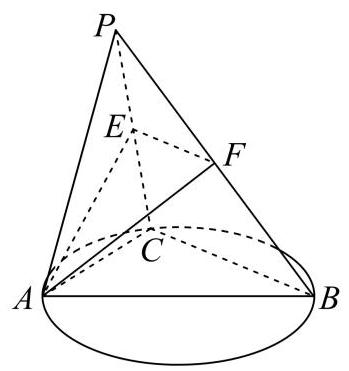
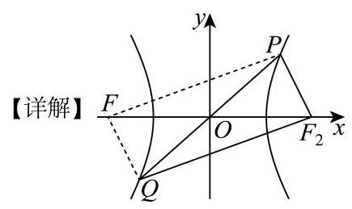
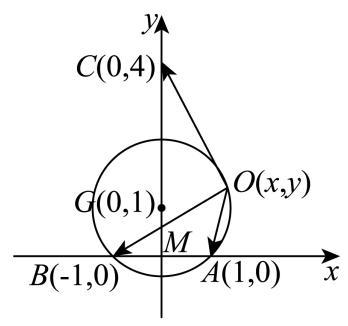
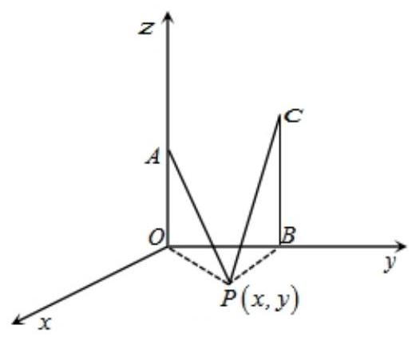
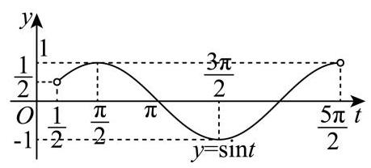
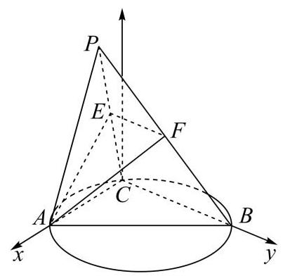
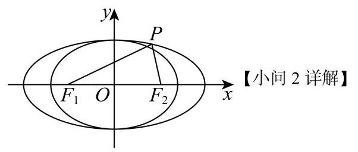
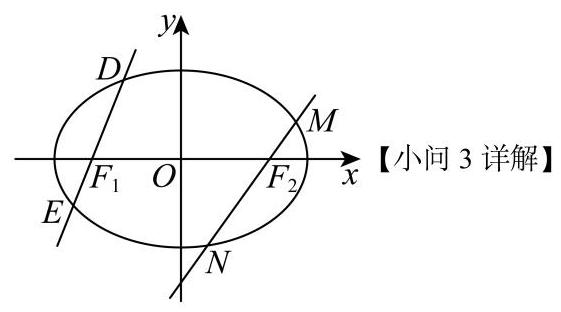
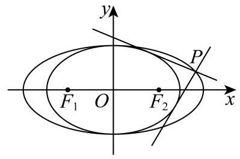

# 上海市青浦区 2025-2026 学年第二学期高三期中质量调研 (二模) 数学试卷

(时间 120 分钟, 满分 150 分)

学生注意:

1.本试卷包括试题纸和答题纸两部分.

2.在试题纸上答题无效，必须在答题纸上的规定位置按照要求答题.

3.可使用符合规定的计算器答题

## 一. 填空题 (本大题共有 12 题, 满分 54 分, 第 1-6 每题 4 分, 第 7-12 每 题 5 分) 考生应在答题纸的相应位置直接填写结果.

1. 已知集合 $A = \{ 0,1,2,3\}$ ，集合 $B = \left( {-1,1}\right)$ ，则 $A \cap  B =$ ___.

2. 设抛物线 ${y}^{2} = {8x}$ 的准线方程为___.

3. 在平面直角坐标系 ${xOy}$ 中，角 $a$ 的顶点与坐标原点 $O$ 重合、始边与 $x$ 轴的正半轴重合, 其终边经过点 $P\left( {1, - 3}\right)$ ，则 $\tan a =$ ___.

4. 已知复数 $z = \frac{1 + 3\mathrm{i}}{1 - 2\mathrm{i}}$ ，则 $\left| z\right|  =$ ___.

5. 已知函数 $f\left( x\right)  = \frac{1}{3}{x}^{3} - x + 3$ ，则曲线 $y = f\left( x\right)$ 在点 $\left( {0, f\left( 0\right) }\right)$ 处的切线方程为 ___.

6. 某电子元件厂有甲、乙两条互不影响的生产线生产同型号元件，甲生产线的产量占全厂总产量的 $\frac{3}{5}$ ，其产品次品率为 5%；乙生产线的产量占全厂总产量的 $\frac{2}{5}$ ，其产品次品率为 10% . 若从全厂产品中随机抽取 1 件，抽到次品的概率为___.

7. 已知 ${\left( x - m\right) }^{6} = {a}_{0} + {a}_{1}x + {a}_{2}{x}^{2} + \ldots  + {a}_{6}{x}^{6}$ ，若 ${a}_{3} = {20}$ ，则 $m =$ ___.

8. 若函数 $y = \sin \left( {{\omega x} - \frac{\pi }{3}}\right)$ (常数 $\omega  > 0$ ) 在区间 $\left( {0,\pi }\right)$ 没有最值，则 $\omega$ 的取值范围是 ___.

9. 已知 ${ABC}$ 为等腰三角形，且 $\sin A = 2\sin B$ ，则 $\cos B =$ ___.

10. 已知点 $F$ 是双曲线 $E : \frac{{x}^{2}}{{a}^{2}} - \frac{{y}^{2}}{{b}^{2}} = 1\left( {a > 0, b > 0}\right)$ 的左焦点，经过原点 $O$ 的直线 $l$ 与双曲线 $E$ 交于 $P$ 、 $Q$ 两点，若 $\left| {PF}\right|  = 5\left| {QF}\right|$ 且 $\angle {PFQ} = {60}^{ \circ  }$ ，则双曲线 $E$ 的离心率为___.

11. 若数列 $\left\{  {a}_{n}\right\}$ 共 10 项,其中 ${a}_{1} = 1,{a}_{10} = {16}$ ,且 ${a}_{k + 1} - {a}_{k} \in  \{ 1,2\}$ ,

$\left( {1 \leq  k \leq  9, k \in  \mathbf{Z}}\right)$ ，则这样的不同数列共有 ___ 个. (用数字作答)

12. 已知平面内的三个非零向量 $\overrightarrow{a},\overrightarrow{b},\overrightarrow{c}$ ，满足: $\left\langle  {\overrightarrow{a},\overrightarrow{b}}\right\rangle   = \frac{\pi }{4}$ ， $\left| {\overrightarrow{a} - \overrightarrow{b}}\right|  = 2$ ， $\left| {\overrightarrow{b} - \overrightarrow{c}}\right|  = \left| {\overrightarrow{c} - \overrightarrow{a}}\right|  = \sqrt{17}$ ，则当 $\frac{\overrightarrow{a} \cdot  \overrightarrow{c} - \overrightarrow{b} \cdot  \overrightarrow{c}}{\left| \overrightarrow{c}\right| }$ 取得最大值时， $\left| \overrightarrow{c}\right|  =$ ___.

## 二、选择题 (本大题共有 4 题, 满分 18 分, 第 13-14 每题 4 分, 第 15-16 每题 5 分) 每题有且只有一个正确选项, 考生应在答题纸的相应位置, 将代表正确选项 的小方格涂黑.

13. 下列说法中错误的是 ( )

A. 平均数、众数和中位数都是描述一组数据的集中趋势的统计量

B. 极差、方差、标准差都是描述一组数据的离散程度的统计量

C. 一组数据中比中位数大的数和比中位数小的数一样多

D. 总体的数据都分布在样本的极差范围内

14. 设 $f\left( x\right)$ 是定义在 $\mathbf{R}$ 上且周期为 2 的奇函数,当 $2 < x \leq  3$ 时, $f\left( x\right)  = {\log }_{2}\left( {x - 2}\right)$ , 则 $f\left( {-\frac{1}{2}}\right)  =$ (   )

A. -1 B. 1 C. 2 D. 3

15. 已知垂直竖在水平地面上相距 20 米的两根旗杆的高分别为 10 米和 15 米, 地面上的动点 $P$ 到两旗杆顶点的仰角相等,则点 $P$ 的轨迹是

A. 椭圆 B. 圆 C. 双曲线 D. 抛物线

16. 对于数列 $\left\{  {a}_{n}\right\}$ ,若存在 $M > 0$ ,使得对任意 $n \in  {\mathbf{N}}^{ * }$ ,有

$\left| {{a}_{2} - {a}_{1}}\right|  + \left| {{a}_{3} - {a}_{2}}\right|  + \ldots  + \left| {{a}_{n + 1} - {a}_{n}}\right|  < M$ ,则称 $\left\{  {a}_{n}\right\}$ 为 “有界变差数列” 有以下两个结论:

①若各项均为正数的等比数列 $\left\{  {a}_{n}\right\}$ 为“有界变差数列”，则其公比 $q$ 的取值范围是 $\left( {0,1}\right)$ ；

②若数列 $\left\{  {x}_{n}\right\}  ,\left\{  {y}_{n}\right\}$ 均为 “有界变差数列”，且 ${y}_{n} \geq  {y}_{1} > 0$ ，则数列 $\left\{  \frac{{x}_{n}}{{y}_{n}}\right\}$ 是 “有界变差数列”. 则以下选项正确的是 ( )

A. ①是假命题，②是真命题

B. ①是假命题，②是假命题

C. ①是真命题，②是假命题

D. ①是真命题，②是真命题

## 三. 解答题 (本大题共有 5 题, 满分 78 分), 解答下列各题必须在答题纸相应位 置写出必要的步骤.

17. 在传染病学中，通常把从致病刺激物侵入机体或者对机体发生作用起，到机体出现反应或开始呈现该疾病对应的相关症状时止的这一阶段称为潜伏期. 一研究团队统计了某地区 1000 名患者的相关信息，得到如下表格:

<table><tr><td>潜伏期(单位:天)</td><td>$\left\lbrack  {0,2}\right\rbrack$</td><td>(2,4]</td><td>(4,6]</td><td>(6,8]</td><td>(8,10]</td><td>(10,12]</td><td>(12,14]</td></tr><tr><td>人数</td><td>50</td><td>150</td><td>200</td><td>300</td><td>200</td><td>60</td><td>40</td></tr></table>

(1)求这 1000 名患者的潜伏期的样本平均数值 $\overset{ - }{x}$ (同一组中的数据用该组区间的中点值作代表，结果四舍五入为整数)；

(2)该传染病的潜伏期受诸多因素的影响，为研究潜伏期与患者年龄的关系，以潜伏期是否超过 8 天为标准进行分层抽样，从上述 1000 名患者中抽取 200 人，得到如下列联表，请将列联表补充完整，并根据列联表判断，能否在犯错误的概率不超过 5%的前提下，认为潜伏期与患者年龄有关.

<table><tr><td></td><td>潜伏期≤8天</td><td>潜伏期>8天</td><td>总计</td></tr><tr><td>50 岁以上(含 50)</td><td></td><td></td><td>100</td></tr><tr><td>50 岁以下</td><td>65</td><td></td><td></td></tr><tr><td>总计</td><td></td><td></td><td>200</td></tr></table>

附: ${K}^{2} = \frac{n{\left( ad - bc\right) }^{2}}{\left( {a + b}\right) \left( {c + d}\right) \left( {a + c}\right) \left( {b + d}\right) }$ ，其中 $n = a + b + c + d$ .

<table><tr><td>$P\left( {{K}^{2} \geq  {k}_{0}}\right)$</td><td>0.05</td><td>0.025</td><td>0.010</td></tr><tr><td>${k}_{0}$</td><td>3.841</td><td>5.024</td><td>6.635</td></tr></table>

18. 已知函数 $y = f\left( x\right)$ ,其中 $f\left( x\right)  = \frac{\sqrt{3}}{2}\sin {2x} + \frac{1}{2}\cos {2x}$ .

(1) 若 $f\left( {x}_{0}\right)  = \frac{1}{3},\;{x}_{0} \in  \left\lbrack  {0,\frac{\pi }{2}}\right\rbrack$ 求 $\cos 2{x}_{0}$ 的值;

( 2 )若方程 $f\left( x\right)  = a$ 在区间 $\left( {0,\frac{7\pi }{6}}\right)$ 上恰有两个不同的零点 ${x}_{1}$ ， ${x}_{2}$ ，求实数 $a$ 的取值范围及 ${x}_{1} + {x}_{2}$ 的值.

19. 如图,在三棱锥 $P - {ABC}$ 中, ${AB}$ 是 ${ABC}$ 外接圆的直径, $\bigtriangleup {PAC}$ 是边长为 2 的等边三角形， $E$ ， $F$ 分别是 ${PC}$ ， ${PB}$ 的中点， ${PB} = {AB}$ ， ${BC} = 4$ .

(1)求证:平面 ${PAC} \bot$ 平面 ${ABC}$ ；

(2)求直线 ${AB}$ 与平面 ${AEF}$ 所成角的正弦值.

20. 已知椭圆 ${C}_{1} : \frac{{x}^{2}}{4} + {y}^{2} = 1$ 与椭圆 ${C}_{2} : \frac{{x}^{2}}{2} + {y}^{2} = 1$ ，椭圆 ${C}_{2}$ 的左、右焦点分别为 ${F}_{1}$ 、 ${F}_{2}$ ， 点 $P$ 为椭圆 ${C}_{1}$ 上异于其左、右顶点的任一点,直线 ${l}_{1}\text{ 、 }{l}_{2}$ 均过点 $P$ .

(1)求 $\bigtriangleup  {P{F}_{1}{F}_{2}}$ 面积的最大值.

(2)若 ${l}_{1}$ 过点 ${F}_{1}$ 且与 ${C}_{2}$ 交于 $D$ 、 $E$ 两点， ${l}_{2}$ 过点 ${F}_{2}$ 且与 ${C}_{2}$ 交于 $M$ 、 $N$ 两点，当直线 ${l}_{1}$ 、 ${l}_{2}$ 的斜率 ${k}_{1}\text{ 、 }{k}_{2}$ 满足 ${k}_{1}{k}_{2} = \frac{1}{2}$ 时,证明: $\left| {DE}\right|  + \left| {MN}\right|$ 为定值;

(3)是否存在点 $P$ ，满足 ${l}_{1}\text{ 、 }{l}_{2}$ 均与 ${C}_{2}$ 相切，且 ${l}_{1} \bot  {l}_{2}$ ?若存在，求出点 $P$ 的坐标；若不存在, 请说明理由.

21. 函数 $y = f\left( x\right)$ 和 $y = g\left( x\right)$ 有相同的定义域,导函数分别为 $y = {f}^{\prime }\left( x\right)$ , $y = {g}^{\prime }\left( x\right)$ ,若在定义域内均有 ${f}^{\prime }\left( x\right)  \leq  {g}^{\prime }\left( x\right)$ ,则称 $y = f\left( x\right)$ 是 $y = g\left( x\right)$ 的“ $G$ 函数”.

(1)判断 $y =  - {x}^{3} - x$ 是否为 $y = \cos x$ 的“ $G$ 函数”，并说明理由；

(2)已知函数 $y = f\left( x\right)$ 和 $y = g\left( x\right)$ 都是定义在 $\mathbf{R}$ 上的偶函数，且 $y = f\left( x\right)$ 是 $y = g\left( x\right)$ 的“ $G$ 函数”，证明: $g\left( x\right)  - f\left( x\right)  = c$ ( $c$ 为常数)；

(3)若 $- \frac{3}{2} < a < \ln \frac{4}{3} - \frac{3}{2}, f\left( x\right)  = x\ln x - \left( {a + 4}\right) x, g\left( x\right)  = {\mathrm{e}}^{x + a}\left( {x - 3}\right) , x > 0$ ，证明函数 $y = f\left( x\right)$ 是函数 $y = g\left( x\right)$ 的“ $G$ ”函数. 参考答案及解析:

1、【答案】 $\{ 0\}$

【解析】

【详解】因为集合 $A = \{ 0,1,2,3\}$ ,集合 $B = \left( {-1,1}\right)$ ,所以 $A \cap  B = \{ 0\}$

2. 设抛物线 ${y}^{2} = {8x}$ 的准线方程为___.

【答案】 $x =  - 2$

【解析】

【分析】由题意结合抛物线的标准方程确定其准线方程即可.

【详解】由抛物线方程 ${y}^{2} = {8x}$ 可得 ${2p} = 8$ ,则 $\frac{p}{2} = 2$ ,故准线方程为 $x =  - 2$ . 故答案为 $x =  - 2$ .

【点睛】本题主要考查由抛物线方程确定其准线的方法, 属于基础题.

3. 在平面直角坐标系 ${xOy}$ 中，角 $a$ 的顶点与坐标原点 $O$ 重合、始边与 $x$ 轴的正半轴重合, 其终边经过点 $P\left( {1, - 3}\right)$ ，则 $\tan a =$ ___.

【答案】 -3

【解析】

【详解】因为角 $a$ 的顶点与坐标原点 $O$ 重合、始边与 $x$ 轴的正半轴重合,其终边经过点 $P\left( {1, - 3}\right)$ ,所以,由三角函数终边上点的定义, $\tan a = \frac{-3}{1} =  - 3$

4. 已知复数 $z = \frac{1 + 3\mathrm{i}}{1 - 2\mathrm{i}}$ ，则 $\left| z\right|  =$ ___.

【答案】 $\sqrt{2}$

【解析】

【分析】先化简复数, 再结合复数运算法则计算模.

【详解】由题意得 $z = \frac{\left( {1 + 3\mathrm{i}}\right) \left( {1 + 2\mathrm{i}}\right) }{\left( {1 - 2\mathrm{i}}\right) \left( {1 + 2\mathrm{i}}\right) } = \frac{1 + 5\mathrm{i} + 6{\mathrm{i}}^{2}}{{1}^{2} - {\left( 2\mathrm{i}\right) }^{2}} = \frac{-5 + 5\mathrm{i}}{5} =  - 1 + \mathrm{i}$ ,

所以 $\left| z\right|  = \sqrt{{\left( -1\right) }^{2} + {1}^{2}} = \sqrt{2}$

5. 已知函数 $f\left( x\right)  = \frac{1}{3}{x}^{3} - x + 3$ ，则曲线 $y = f\left( x\right)$ 在点 $\left( {0, f\left( 0\right) }\right)$ 处的切线方程为 ___.

【答案】 $x + y - 3 = 0$

【解析】

【详解】由题设 ${f}^{\prime }\left( x\right)  = {x}^{2} - 1,{f}^{\prime }\left( 0\right)  =  - 1, f\left( 0\right)  = 3$ ,

所以函数 $f\left( x\right)$ 在点 $\left( {0, f\left( 0\right) }\right)$ 处的切线方程为 $y - 3 =  - \left( {x - 0}\right)$ ,即 $x + y - 3 = 0$ .

6. 某电子元件厂有甲、乙两条互不影响的生产线生产同型号元件，甲生产线的产量占全厂总产量的 $\frac{3}{5}$ ，其产品次品率为 5%；乙生产线的产量占全厂总产量的 $\frac{2}{5}$ ，其产品次品率为 10% . 若从全厂产品中随机抽取 1 件，抽到次品的概率为___.

【答案】 7% ## 0.07

【解析】

【详解】设抽到的产品来自甲生产线为事件 $A$ ,来自乙生产线为事件 $B$ ,抽到次品为事件 $C$ ,

则 $P\left( A\right)  = \frac{3}{5}, P\left( B\right)  = \frac{2}{5}, P\left( {C \mid  A}\right)  = 5\% , P\left( {C \mid  B}\right)  = {10}\%$ ,

所以 $P\left( C\right)  = P\left( {C \mid  A}\right) P\left( A\right)  + P\left( {C \mid  B}\right) P\left( B\right)  = \frac{3}{5} \times  5\%  + \frac{2}{5} \times  {10}\%  = 7\%$

7. 已知 ${\left( x - m\right) }^{6} = {a}_{0} + {a}_{1}x + {a}_{2}{x}^{2} + \ldots  + {a}_{6}{x}^{6}$ ,若 ${a}_{3} = {20}$ ,则 $m =$ ___.

【答案】 -1

【解析】

【详解】 $\because$ 二项式 ${\left( x - m\right) }^{6}$ 展开式的通项公式为 ${T}_{r + 1} = {\mathrm{C}}_{6}^{r}{x}^{6 - r}{\left( -m\right) }^{r}$ ， ${a}_{3}$ 为 ${x}^{3}$ 的系数，

$\therefore$ 令 $6 - \mathrm{r} = 3$ ,解得 $r = 3$ ,此时 ${a}_{3} = {\mathrm{C}}_{6}^{3}{\left( -m\right) }^{3} =  - {20}{m}^{3}$ ;

$\because {a}_{3} = {20},\therefore  - {20}{m}^{3} = {20}$ ,解得 $m =  - 1$ .

8. 若函数 $y = \sin \left( {{\omega x} - \frac{\pi }{3}}\right)$ (常数 $\omega  > 0$ ) 在区间 $\left( {0,\pi }\right)$ 没有最值，则 $\omega$ 的取值范围是 ___.

【答案】 $0 < \omega  \leq  \frac{5}{6}$

【解析】

【分析】根据题意先求出 ${\omega x} - \frac{\pi }{3}$ 的取值范围,然后根据题意列出不等式,解之即可求解.

【详解】因为 $\omega  > 0, x \in  \left( {0,\pi }\right)$ ,所以 $- \frac{\pi }{3} < {\omega x} - \frac{\pi }{3} < {\omega \pi } - \frac{\pi }{3}$ ,

又因为函数 $y = \sin \left( {{\omega x} - \frac{\pi }{3}}\right)$ (常数 $\omega  > 0$ ) 在区间 $\left( {0,\pi }\right)$ 没有最值,

所以 ${\omega \pi } - \frac{\pi }{3} \leq  \frac{\pi }{2}$ ,解得 $0 < \omega  \leq  \frac{5}{6}$ ,所以 $\omega$ 的取值范围是 $0 < \omega  \leq  \frac{5}{6}$

故答案为: $0 < \omega  \leq  \frac{5}{6}$ .

9. 已知 ${ABC}$ 为等腰三角形，且 $\sin A = 2\sin B$ ，则 $\cos B =$ ___.

【答案】 $\frac{7}{8}$ ##0.875

【解析】

【分析】利用正弦定理边化角,再利用余弦定理求出 $\cos B$ .

【详解】在 ${ABC}$ 中,令内角 $A, B, C$ 所对边分别为 $a, b, c$ , 由 $\sin A = 2\sin B$ 及正弦定理,得 $a = {2b}$ ,显然 ${AC}$ 为底边,否则不能构成三角形, 由余弦定理得 $\cos B = \frac{{a}^{2} + {c}^{2} - {b}^{2}}{2ac} = \frac{{\left( 2b\right) }^{2} + {\left( 2b\right) }^{2} - {b}^{2}}{2 \cdot  {2b} \cdot  {2b}} = \frac{7}{8}$ . 故答案为: $\frac{7}{8}$

10. 已知点 $F$ 是双曲线 $E : \frac{{x}^{2}}{{a}^{2}} - \frac{{y}^{2}}{{b}^{2}} = 1\left( {a > 0, b > 0}\right)$ 的左焦点,经过原点 $O$ 的直线 $l$ 与双曲线 $E$ 交于 $P\text{ 、 }Q$ 两点，若 $\left| {PF}\right|  = 5\left| {QF}\right|$ 且 $\angle {PFQ} = {60}^{ \circ  }$ ，则双曲线 $E$ 的离心率为___.

【答案】 $\frac{\sqrt{31}}{4}\# \# \frac{1}{4}\sqrt{31}$

【解析】

【分析】设 ${F}_{2}$ 是右焦点,由双曲线的对称性得 ${PFQ}{F}_{2}$ 是平行四边形,这样结合双曲线的定义可把 $\left| {PF}\right|$ 和 $\left| {P{F}_{2}}\right|$ 用 $a$ 表示,再应用余弦定理可得 $a, c$ 关系,从而得离心率.

设 ${F}_{2}$ 是右焦点,由双曲线的对称性得 ${PFQ}{F}_{2}$ 是平行四边形, $\left| {P{F}_{2}}\right|  = \left| {QF}\right|$ ,

所以 $\left| {PF}\right|  = 5\left| {QF}\right|  = 5\left| {P{F}_{2}}\right|$ ,

又 $\left| {PF}\right|  - \left| {P{F}_{2}}\right|  = {2a}$ ,即 $4\left| {P{F}_{2}}\right|  = {2a},\left| {P{F}_{2}}\right|  = \frac{a}{2}$ ,则 $\left| {PF}\right|  = \frac{5a}{2}$ ,

因为 $\angle {PFQ} = {60}^{ \circ  }$ ,所以 $\angle {FP}{F}_{2} = {120}^{ \circ  }$ ,

由余弦定理得 ${\left| {F}_{1}{F}_{2}\right| }^{2} = {\left| PF\right| }^{2} + {\left| P{F}_{2}\right| }^{2} - 2\left| {PF}\right| \left| {P{F}_{2}}\right| \cos {120}^{ \circ  }$ ,

即 $4{c}^{2} = \frac{{25}{a}^{2}}{4} + \frac{{a}^{2}}{4} - 2 \times  \frac{5a}{2} \times  \frac{a}{2} \times  \left( {-\frac{1}{2}}\right)$ ,

得 $4{c}^{2} = \frac{{31}{a}^{2}}{4}$ ,即 $\frac{{c}^{2}}{{a}^{2}} = \frac{31}{16}$

所以离心率 $e = \frac{c}{a} = \frac{\sqrt{31}}{4}$ .

11. 若数列 $\left\{  {a}_{n}\right\}$ 共 10 项,其中 ${a}_{1} = 1,{a}_{10} = {16}$ ,且 ${a}_{k + 1} - {a}_{k} \in  \{ 1,2\}$ ,

$\left( {1 \leq  k \leq  9, k \in  \mathbf{Z}}\right)$ ，则这样的不同数列共有 ___ 个. (用数字作答)

【答案】 84

【解析】

【分析】通过令 ${d}_{k} = {a}_{k + 1} - {a}_{k},\left( {1 \leq  k \leq  9}\right)$ ,相加求和得到 ${d}_{k}$ 的总和为 15,进而确定 ${d}_{k}$ 中有几个 1 , 有几个 2 , 再结合组合数即可求解.

【详解】数列共 10 项,因此共有 9 个相邻差 ${d}_{k} = {a}_{k + 1} - {a}_{k},\left( {1 \leq  k \leq  9}\right)$ ,

每个 ${d}_{k}$ 只能取 1 或 2,

由 ${a}_{2} - {a}_{1} = {d}_{1}$ ,

${a}_{3} - {a}_{2} = {d}_{2},$

${a}_{4} - {a}_{3} = {d}_{3},$

${a}_{10} - {a}_{9} = {d}_{9},$

相加可得: ${a}_{10} - {a}_{1} = {{16} - 1} = {15} = {d}_{1} + {d}_{2} + \cdots  + {d}_{9}$ ，

即所有 ${d}_{k}$ 的总和为 15 ,

设 9 个差中有 $x$ 个 1, $y$ 个 2,由题意: $\left\{  \begin{array}{l} x + y = 9 \\  x + {2y} = {15} \end{array}\right.$ ,

解得 $x = 3, y = 6$ ,即 9 个差中恰好有 3 个 1、6 个 2,

不同的排列顺序对应不同的数列，问题等价于从 9 个位置中选 3 个位置放 1 ，剩余放 2,

因此不同数列个数为组合数: ${\mathrm{C}}_{9}^{3} = \frac{9 \times  8 \times  7}{3 \times  2 \times  1} = {84}$ .

即这样的不同数列共有 84 个.

12. 已知平面内的三个非零向量 $\overrightarrow{a},\overrightarrow{b},\overrightarrow{c}$ ,满足: $\left\langle  {\overrightarrow{a},\overrightarrow{b}}\right\rangle   = \frac{\pi }{4},\;\left| {\overrightarrow{a} - \overrightarrow{b}}\right|  = 2$ , $\left| {\overrightarrow{b} - \overrightarrow{c}}\right|  = \left| {\overrightarrow{c} - \overrightarrow{a}}\right|  = \sqrt{17}$ ，则当 $\frac{\overrightarrow{a} \cdot  \overrightarrow{c} - \overrightarrow{b} \cdot  \overrightarrow{c}}{\left| \overrightarrow{c}\right| }$ 取得最大值时， $\left| \overrightarrow{c}\right|  =$ ___.

【答案】 $\sqrt{7}$

【解析】

【分析】先通过题干向量关系和几何法确定过点 $A, B$ 的圆,再通过坐标法将 “投影最值” 转化为 “圆上动点” 的最值问题,再结合一般不等式求解即可.

【详解】设 $A, B$ 分别为 $\overrightarrow{a},\overrightarrow{b}$ 的终点, $M$ 为 ${AB}$ 中点,由 $\left| {\overrightarrow{a} - \overrightarrow{b}}\right|  = \left| {AB}\right|  = 2$ ,得 $\left| {AM}\right|  = 1$ , 又 $\left| {\overrightarrow{c} - \overrightarrow{a}}\right|  = \left| {\overrightarrow{c} - \overrightarrow{b}}\right|  = \sqrt{17}$ ,故 $\overrightarrow{c}$ 的终点 $C$ 在 ${AB}$ 的中垂线上,

且由勾股定理得 $\left| {CM}\right|  = \sqrt{{\left| \overrightarrow{AC}\right| }^{2} - {\left| AM\right| }^{2}} = \sqrt{{17} - 1} = 4$ .

如图所示，建立坐标系:

$M\left( {0,0}\right) ,\;A\left( {1,0}\right) ,\;B\left( {-1,0}\right) ,\;C\left( {0, \pm  4}\right) ,$

公共起点 $O\left( {x, y}\right)$ (即 $\overrightarrow{a} = \overrightarrow{OA},\overrightarrow{b} = \overrightarrow{OB},\overrightarrow{c} = \overrightarrow{OC}$ ).

在 $\bigtriangleup {OAB}$ 中,由正弦定理可得 $\frac{AB}{\sin \angle {AOB}} = \frac{2}{\sin \frac{\pi }{4}} = 2\sqrt{2} = {2R}$ ,

$R$ 为 $\bigtriangleup {OAB}$ 外接圆半径,故 $R = \sqrt{2}$ ,

令 $\bigtriangleup {OAB}$ 外接圆圆心为 $G$ ,易知 $G$ 在线段 ${AB}$ 垂直平分线上,可设为 $\left( {0, \pm  1}\right)$ ,

根据对称性,以 $C\left( {0,4}\right) , G\left( {0,1}\right)$ 为例,可得 $O$ 所在圆的方程为 ${x}^{2} + {\left( y - 1\right) }^{2} = 2$ ,

$\overrightarrow{a} - \overrightarrow{b} = \overrightarrow{OA} - \overrightarrow{OB} = \left( {2,0}\right) ,\overrightarrow{c} = \overrightarrow{OC} = \left( {-x,4 - y}\right)$ ,令 $k = \frac{\overrightarrow{a} \cdot  \overrightarrow{c} - \overrightarrow{b} \cdot  \overrightarrow{c}}{\left| \overrightarrow{c}\right| }$ ,

则 $k = \frac{\left( {\overrightarrow{a} - \overrightarrow{b}}\right)  \cdot  \overrightarrow{c}}{\left| \overrightarrow{c}\right| } = \frac{-{2x}}{\sqrt{{x}^{2} + {\left( y - 4\right) }^{2}}}$ ,

代入 ${x}^{2} =  - {y}^{2} + {2y} + 1$ ,得: ${k}^{2} = \frac{4\left( {-{y}^{2} + {2y} + 1}\right) }{-{6y} + {17}}$ ,

令 $t =  - {6y} + {17}\left( {t > 0}\right)$ ,由基本不等式得: ${k}^{2} = \frac{-t - \frac{49}{t} + {22}}{9} \leq  \frac{-{14} + {22}}{9} = \frac{8}{9}$ ,

当且仅当 $t = 7$ 等号成立,即 ${\left| \overrightarrow{c}\right| }^{2} = t = 7$ ,故 $\left| \overrightarrow{c}\right|  = \sqrt{7}$ ,

由对称性可知当 $C\left( {0, - 4}\right)$ ,圆的方程为 ${x}^{2} + {\left( y + 1\right) }^{2} = 2$ 时,同理可得最大值为 $\sqrt{7}$ .

## 二、选择题 (本大题共有 4 题, 满分 18 分, 第 13-14 每题 4 分, 第 15-16 每题 5 分) 每题有且只有一个正确选项, 考生应在答题纸的相应位置, 将代表正确选项 的小方格涂黑.

13. 下列说法中错误的是( )

A. 平均数、众数和中位数都是描述一组数据的集中趋势的统计量

B. 极差、方差、标准差都是描述一组数据的离散程度的统计量

C. 一组数据中比中位数大的数和比中位数小的数一样多

D. 总体的数据都分布在样本的极差范围内

【答案】CD

【解析】

【详解】对于 $\mathrm{A}$ ,平均数、众数和中位数都是描述一组数据的集中趋势的量,所以 $\mathrm{A}$ 正确, 对于 B，极差反映的是一组数据最大值与最小值的差，方差和标准差反映了数据分散程度的大小,

所以极差、方差、标准差都是描述一组数据的离散程度的统计量,故 $\mathrm{B}$ 正确,

对于 $\mathrm{C}$ ,取1,2,3,4,4,5,6,7,8,这组数据的中位数是 4,比 4 小的数有 3 个,比 4 大的有 4

个，所以 C 错误,

对于 D, 样本的极差是数据最大值与最小值的差, 是数值不是范围,

且总体数据通常不都在样本数据的最大值和最小值之间, 故 D 错误.

14. 设 $f\left( x\right)$ 是定义在 $\mathbf{R}$ 上且周期为 2 的奇函数,当 $2 < x \leq  3$ 时, $f\left( x\right)  = {\log }_{2}\left( {x - 2}\right)$ , 则 $f\left( {-\frac{1}{2}}\right)  =$ (   )

A. -1 B. 1 C. 2 D. 3

【答案】B

【解析】

【详解】因为 $f\left( x\right)$ 是定义在 $\mathbf{R}$ 上的奇函数,所以 $f\left( {-x}\right)  =  - f\left( x\right)$ ,所以 $f\left( {-\frac{1}{2}}\right)  =  - f\left( \frac{1}{2}\right) ,$

又 $f\left( x\right)$ 周期为 2,故 $f\left( {x + 2}\right)  = f\left( x\right)$ ,所以 $f\left( \frac{1}{2}\right)  = f\left( {\frac{1}{2} + 2}\right)  = f\left( \frac{5}{2}\right)$ ,

又 $2 < \frac{5}{2} \leq  3$ ，所以 $f\left( \frac{5}{2}\right)  = {\log }_{2}\left( {\frac{5}{2} - 2}\right)  = {\log }_{2}\frac{1}{2} =  - 1$ ，

所以 $f\left( \frac{1}{2}\right)  =  - 1$ ,所以 $f\left( {-\frac{1}{2}}\right)  =  - f\left( \frac{1}{2}\right)  =  - \left( {-1}\right)  = 1$ .

15. 已知垂直竖在水平地面上相距 20 米的两根旗杆的高分别为 10 米和 15 米，地面上的动点 $P$ 到两旗杆顶点的仰角相等，则点 $P$ 的轨迹是

A. 椭圆 B. 圆 C. 双曲线 D. 抛物线

【答案】B

【解析】

【详解】如图, 建立直角坐标系

依题意可得, $\left| {OA}\right|  = {10},\left| {BC}\right|  = {15},\left| {OB}\right|  = {20},\angle {APO} = \angle {BPC}$

则 $O\left( {0,0}\right) , A\left( {0,{10}}\right) , B\left( {{20},0}\right) , C\left( {{20},{15}}\right)$

设 $P\left( {x, y}\right)$ ,因为 $\angle {APO} = \angle {BPC}$ ,所以 $\tan \angle {APO} = \tan \angle {BPC}$

则 $\frac{\left| OA\right| }{\left| OP\right| } = \frac{\left| BC\right| }{\left| BP\right| }$ ，即 $\frac{10}{\sqrt{{x}^{2} + {y}^{2}}} = \frac{15}{\sqrt{{\left( x - {20}\right) }^{2} + {y}^{2}}}$

化简可得 ${x}^{2} + {32x} + {y}^{2} - {320} = 0$ ,即 ${\left( x + {16}\right) }^{2} + {y}^{2} = {576}$

所以 $P$ 点轨迹为圆,故选 B

16. 对于数列 $\left\{  {a}_{n}\right\}$ ,若存在 $M > 0$ ,使得对任意 $n \in  {\mathbf{N}}^{ * }$ ,有

$\left| {{a}_{2} - {a}_{1}}\right|  + \left| {{a}_{3} - {a}_{2}}\right|  + \ldots  + \left| {{a}_{n + 1} - {a}_{n}}\right|  < M$ ,则称 $\left\{  {a}_{n}\right\}$ 为 “有界变差数列” 有以下两个结论:

①若各项均为正数的等比数列 $\left\{  {a}_{n}\right\}$ 为“有界变差数列”，则其公比 $q$ 的取值范围是 $\left( {0,1}\right)$ ；

②若数列 $\left\{  {x}_{n}\right\}$ ， $\left\{  {y}_{n}\right\}$ 均为 “有界变差数列”，且 ${y}_{n} \geq  {y}_{1} > 0$ ，则数列 $\left\{  \frac{{x}_{n}}{{y}_{n}}\right\}$ 是 “有界变差数列”.

则以下选项正确的是 ( )

A. ①是假命题，②是真命题

B. ①是假命题，②是假命题

C. ①是真命题，②是假命题

D. ①是真命题，②是真命题

【答案】A

【解析】

【详解】对于命题①，因为 $\left\{  {a}_{n}\right\}$ 的各项均为正数，所以 ${a}_{1} > 0, q > 0$ ，

又 $\left| {{a}_{k + 1} - {a}_{k}}\right|  = \left| {{a}_{k}q - {a}_{k}}\right|  = {a}_{k}\left| {q - 1}\right|$ ,

当 $q = 1$ 时， $\left| {{a}_{k + 1} - {a}_{k}}\right|  = 0$ ， $\mathop{\sum }\limits_{{k = 1}}^{n}\left| {{a}_{k + 1} - {a}_{k}}\right|  = 0$ ，

任取 $M > 0$ 即可,所以 $\left\{  {a}_{n}\right\}$ 为有界变差数列.

当 $q \neq  1$ 时, $\mathop{\sum }\limits_{{k = 1}}^{n}\left| {{a}_{k + 1} - {a}_{k}}\right|  = \left( {{a}_{1} + {a}_{2} +  + {a}_{n}}\right) \left| {q - 1}\right|  = \frac{{a}_{1}\left( {1 - {q}^{n}}\right) }{1 - q}\left| {q - 1}\right|$ ,

若 $0 < q < 1$ ,则 $\frac{{a}_{1}\left( {1 - {q}^{n}}\right) }{1 - q}\left| {q - 1}\right|  = {a}_{1}\left( {1 - {q}^{n}}\right)  < {a}_{1}$ ,

令 $M = {a}_{1}$ 即可,所以 $\left\{  {a}_{n}\right\}$ 为有界变差数列,

若 $q > 1$ ,则 $\frac{{a}_{1}\left( {1 - {q}^{n}}\right) }{1 - q}\left| {q - 1}\right|  = {a}_{1}\left( {{q}^{n} - 1}\right)$ ,

当 $n \rightarrow   + \infty$ 时, ${a}_{1}\left( {{q}^{n} - 1}\right)  \rightarrow   + \infty$ ,

显然不存在符合条件的 $M$ ,故 $\left\{  {a}_{n}\right\}$ 不是有界变差数列.

综上, $q$ 的取值范围是 $(0,1\rbrack$ ,故命题①是假命题;

对于命题②，因为

$$
\left| {\frac{{x}_{n + 1}}{{y}_{n + 1}} - \frac{{x}_{n}}{{y}_{n}}}\right|  = \left| \frac{{x}_{n + 1}{y}_{n} - {x}_{n}{y}_{n + 1}}{{y}_{n + 1}{y}_{n}}\right|  = \left| \frac{{x}_{n + 1}{y}_{n} - {x}_{n}{y}_{n} + {x}_{n}{y}_{n} - {x}_{n}{y}_{n + 1}}{{y}_{n + 1}{y}_{n}}\right|  \leq  \left| \frac{{x}_{n + 1} - {x}_{n}}{{y}_{n + 1}}\right|  + \left| {x}_{n}\right|  \cdot  \left| \frac{{y}_{n + 1} - {y}_{n}}{{y}_{n + 1}{y}_{n}}\right|
$$

因为 ${y}_{n} \geq  {y}_{1} > 0$ ,所以 ${y}_{n + 1}{y}_{n} \geq  {y}_{1}^{2} > 0$ ,所以 $\left| {\frac{{x}_{n + 1}}{{y}_{n + 1}} - \frac{{x}_{n}}{{y}_{n}}}\right|  \leq  \frac{\left| {x}_{n + 1} - {x}_{n}\right| }{{y}_{1}} + \frac{\left| {x}_{n}\right|  \cdot  \left| {{y}_{n + 1} - {y}_{n}}\right| }{{y}_{1}^{2}}$ ,

又数列 $\left\{  {x}_{n}\right\}  ,\left\{  {y}_{n}\right\}$ 为 “有界变差数列”，则存在 ${M}_{1},{M}_{2} > 0$ ，使得对任意 $n \in  {\mathbf{N}}^{ * }$ ，有

$\mathop{\sum }\limits_{{k = 1}}^{n}\left| {{x}_{k + 1} - {x}_{k}}\right|  < {M}_{1},\mathop{\sum }\limits_{{k = 1}}^{n}\left| {{y}_{k + 1} - {y}_{k}}\right|  < {M}_{2},$

又 $\left| {x}_{n}\right|  = \left| {{x}_{n} - {x}_{n - 1} + {x}_{n - 1} - {x}_{n - 2} + \cdots  + {x}_{2} - {x}_{1} + {x}_{1}}\right|  \leq  \left| {x}_{1}\right|  + \mathop{\sum }\limits_{{k = 1}}^{{n - 1}}\left| {{x}_{k + 1} - {x}_{k}}\right|  < \left| {x}_{1}\right|  + {M}_{1} = X$ ,

所以 $\mathop{\sum }\limits_{{k = 1}}^{n}\left| {\frac{{x}_{k + 1}}{{y}_{k + 1}} - \frac{{x}_{k}}{{y}_{k}}}\right|  \leq  \mathop{\sum }\limits_{{k = 1}}^{n}\frac{\left| {x}_{k + 1} - {x}_{k}\right| }{{y}_{1}} + \mathop{\sum }\limits_{{k = 1}}^{n}\frac{\left| {x}_{k}\right|  \cdot  \left| {{y}_{k + 1} - {y}_{k}}\right| }{{y}_{1}^{2}} < \frac{{M}_{1}}{{y}_{1}} + \frac{X{M}_{2}}{{y}_{1}^{2}} = M$ ,故命题②是真命题,

综上, ①是假命题, ②是真命题.

## 三. 解答题 (本大题共有 5 题, 满分 78 分), 解答下列各题必须在答题纸相应位 置写出必要的步骤.

17. 在传染病学中，通常把从致病刺激物侵入机体或者对机体发生作用起，到机体出现反应或开始呈现该疾病对应的相关症状时止的这一阶段称为潜伏期. 一研究团队统计了某地区 1000 名患者的相关信息，得到如下表格:

<table><tr><td>潜伏期(单位:天)</td><td>$\left\lbrack  {0,2}\right\rbrack$</td><td>(2,4]</td><td>(4,6]</td><td>(6,8]</td><td>(8,10]</td><td>(10,12]</td><td>(12,14]</td></tr><tr><td>人数</td><td>50</td><td>150</td><td>200</td><td>300</td><td>200</td><td>60</td><td>40</td></tr></table>

(1)求这 1000 名患者的潜伏期的样本平均数值 $\overset{ - }{x}$ (同一组中的数据用该组区间的中点值作代表，结果四舍五入为整数)；

(2)该传染病的潜伏期受诸多因素的影响，为研究潜伏期与患者年龄的关系，以潜伏期是否超过 8 天为标准进行分层抽样，从上述 1000 名患者中抽取 200 人，得到如下列联表，请将列联表补充完整，并根据列联表判断，能否在犯错误的概率不超过 5%的前提下，认为潜伏期与患者年龄有关.

<table><tr><td></td><td>潜伏期≤8天</td><td>潜伏期>8天</td><td>总计</td></tr><tr><td>50 岁以上(含 50)</td><td></td><td></td><td>100</td></tr><tr><td>50 岁以下</td><td>65</td><td></td><td></td></tr><tr><td>总计</td><td></td><td></td><td>200</td></tr></table>

附: ${K}^{2} = \frac{n{\left( ad - bc\right) }^{2}}{\left( {a + b}\right) \left( {c + d}\right) \left( {a + c}\right) \left( {b + d}\right) }$ ，其中 $n = a + b + c + d$ .

<table><tr><td>$P\left( {{K}^{2} \geq  {k}_{0}}\right)$</td><td>0.05</td><td>0.025</td><td>0.010</td></tr><tr><td>${k}_{0}$</td><td>3.841</td><td>5.024</td><td>6.635</td></tr></table>

【答案】( 1 )7 天 ( 2 )表格见解析，不能

【解析】

【分析】(1) 直接利用平均数的计算公式即可求解;

(2)根据频率计算完成列联表，套公式计算 ${K}^{2}$ ，对照参数即可下结论.

【小问 1 详解】

$\bar{x} = 1 \times  \frac{50}{1000} + 3 \times  \frac{150}{1000} + 5 \times  \frac{200}{1000} + 7 \times  \frac{300}{1000} + 9 \times  \frac{200}{1000} + {11} \times  \frac{60}{1000} + {13} \times  \frac{40}{1000} = \frac{6580}{1000} \; = {6.58} \approx  7$ (天).

【小问 2 详解】

由题设知: 潜伏期天数在 $\left\lbrack  {0,8}\right\rbrack$ 的频率为 0.7,潜伏期天数在 $(8,{14}\rbrack$ 的频率为 0.3,故 200 人中潜伏期在 $\left\lbrack  {0,8}\right\rbrack$ 上有 140 人，在 $(8,{14}\rbrack$ 上有 60 人.

列联表如下:

<table><tr><td></td><td>潜伏期≤8天</td><td>潜伏期>8天</td><td>总计</td></tr><tr><td>50 岁以上(含 50)</td><td>75</td><td>25</td><td>100</td></tr><tr><td>50 岁以下</td><td>65</td><td>35</td><td>100</td></tr><tr><td>总计</td><td>140</td><td>60</td><td>200</td></tr></table>

$\therefore {K}^{2} = \frac{{200} \times  {\left( {75} \times  {35} - {65} \times  {25}\right) }^{2}}{{100} \times  {100} \times  {140} \times  {60}} = \frac{50}{21} \approx  {2.381} < {3.841}$ ,

故在犯错误的概率不超过 5% 的前提下，不能认为潜伏期与患者年龄有关.

18. 已知函数 $y = f\left( x\right)$ ,其中 $f\left( x\right)  = \frac{\sqrt{3}}{2}\sin {2x} + \frac{1}{2}\cos {2x}$ .

(1) 若 $f\left( {x}_{0}\right)  = \frac{1}{3},\;{x}_{0} \in  \left\lbrack  {0,\frac{\pi }{2}}\right\rbrack$ 求 $\cos 2{x}_{0}$ 的值;

( 2 )若方程 $f\left( x\right)  = a$ 在区间 $\left( {0,\frac{7\pi }{6}}\right)$ 上恰有两个不同的零点 ${x}_{1},{x}_{2}$ ，求实数 $a$ 的取值范围及 ${x}_{1} + {x}_{2}$ 的值.

【答案】(1) $\frac{1 - 2\sqrt{6}}{6}$

(2) $- 1 < a \leq  \frac{1}{2},{x}_{1} + {x}_{2} = \frac{4\pi }{3}$

【解析】

【分析】(1) 先化简函数 $f\left( x\right)$ ,代入得到 $\sin \left( {2{x}_{0} + \frac{\pi }{6}}\right)$ ,根据角的范围及函数值的大小确定 $\cos \left( {2{x}_{0} + \frac{\pi }{6}}\right)$ ,然后凑角求出 $\cos 2{x}_{0}$ 的值; (2) 换元转化为函数 $y = \sin t$ 与直线 $y = a$ 恰有两个不同的零点,根据图象得到 $a$ 的范围,根据对称轴得到 ${x}_{1} + {x}_{2}$ 的值.

【小问 1 详解】

$f\left( x\right)  = \frac{\sqrt{3}}{2}\sin {2x} + \frac{1}{2}\cos {2x} = \sin \left( {{2x} + \frac{\pi }{6}}\right) ,$

$f\left( {x}_{0}\right)  = \sin \left( {2{x}_{0} + \frac{\pi }{6}}\right)  = \frac{1}{3},\;{x}_{0} \in  \left\lbrack  {0,\frac{\pi }{2}}\right\rbrack  ,$

所以 $2{x}_{0} + \frac{\pi }{6} \in  \left\lbrack  {\frac{\pi }{6},\frac{7\pi }{6}}\right\rbrack  ,0 < \sin \left( {2{x}_{0} + \frac{\pi }{6}}\right)  < \frac{1}{2}$ ,可得 $2{x}_{0} + \frac{\pi }{6} \in  \left\lbrack  {\frac{\pi }{2},\pi }\right\rbrack$ ,

所以 $\cos \left( {2{x}_{0} + \frac{\pi }{6}}\right)  =  - \frac{2\sqrt{2}}{3}$ ,

则

$\cos 2{x}_{0} = \cos \left( {2{x}_{0} + \frac{\pi }{6} - \frac{\pi }{6}}\right)  = \cos \left( {2{x}_{0} + \frac{\pi }{6}}\right) \cos \frac{\pi }{6} + \sin \left( {2{x}_{0} + \frac{\pi }{6}}\right) \sin \frac{\pi }{6} =  - \frac{2\sqrt{2}}{3} \times  \frac{\sqrt{3}}{2} + \frac{1}{3} \times  \frac{1}{2} = \frac{1 - 2\sqrt{6}}{6}$

【小问 2 详解】

因为 $x \in  \left( {0,\frac{7\pi }{6}}\right) ,{2x} + \frac{\pi }{6} \in  \left( {\frac{\pi }{6},\frac{5\pi }{2}}\right)$ ,令 $t = {2x} + \frac{\pi }{6}$ ,

函数 $y = \sin t$ 与直线 $y = a$ 在区间 $\left( {\frac{\pi }{6},\frac{5\pi }{2}}\right)$ 上恰有两个不同的零点,

$y = \sin t$ 在区间 $\left( {\frac{\pi }{6},\frac{5\pi }{2}}\right)$ 的图象特征:

函数 $y = \sin t$ 与直线 $y = a$ 恰有两个不同的交点,所以 $- 1 < a \leq  \frac{1}{2}$ ,

即在区间 $\left( {\frac{\pi }{2},\frac{3\pi }{2}}\right)$ 和 $\left( {{2\pi },\frac{5\pi }{2}}\right)$ 各有一个交点,且关于 $t = \frac{3\pi }{2}$ 对称,

${t}_{1} + {t}_{2} = {3\pi }$ ,即 $2{x}_{1} + \frac{\pi }{6} + 2{x}_{2} + \frac{\pi }{6} = {3\pi }$ ,可得 ${x}_{1} + {x}_{2} = \frac{4\pi }{3}$ .

19. 如图，在三棱锥 $P - {ABC}$ 中， ${AB}$ 是 ${ABC}$ 外接圆的直径， $\vartriangle  {PAC}$ 是边长为 2 的等边三角形, $E, F$ 分别是 ${PC},{PB}$ 的中点, ${PB} = {AB},{BC} = 4$ .

(1)求证:平面 ${PAC} \bot$ 平面 ${ABC}$ ；

(2)求直线 ${AB}$ 与平面 ${AEF}$ 所成角的正弦值.

【答案】(1) 证明见解析

(2) $\frac{\sqrt{5}}{10}$

【解析】

【分析】(1) 先利用直径所对圆周角为直角和勾股定理得到线线垂直, 再利用线面垂直和面面垂直的判定定理进行证明;

(2)建立空间坐标系，写出相关点的坐标，求出直线的方向向量和平面的法向量，再利用线面角的向量法进行求解.

【小问 1 详解】

证明: 由题意知 ${BC} \bot  {AC}$ ,

则 ${AB} = \sqrt{A{C}^{2} + B{C}^{2}} = 2\sqrt{5}$ ，所以 ${PB} = {AB} = 2\sqrt{5}$ .

又 ${BC} = 4,{PC} = 2$ ,所以 $P{B}^{2} = P{C}^{2} + B{C}^{2}$ ,所以 ${PC} \bot  {BC}$ ,

又 ${PC} \cap  {AC} = C$ ,所以 ${BC} \bot$ 平面 ${PAC}$ ,

又 ${BC} \subset$ 平面 ${ABC}$ ,所以平面 ${PAC} \bot$ 平面 ${ABC}$ .

【小问 2 详解】

解: 以 $C$ 为坐标原点, ${CA},{CB}$ 在直线分别为 $x$ 轴, $y$ 轴, 过 $C$ 且垂直于平面 ${ABC}$ 的直线为 $z$ 轴,建立如图所示的空间直角坐标系,

则 $A\left( {2,0,0}\right) , B\left( {0,4,0}\right) , P\left( {1,0,\sqrt{3}}\right) , E\left( {\frac{1}{2},0,\frac{\sqrt{3}}{2}}\right) , F\left( {\frac{1}{2},2,\frac{\sqrt{3}}{2}}\right)$ ,

所以 $\overrightarrow{AE} = \left( {-\frac{3}{2},0,\frac{\sqrt{3}}{2}}\right) ,\overrightarrow{EF} = \left( {0,2,0}\right) ,\overrightarrow{AB} = \left( {-2,4,0}\right)$ .

设平面 ${AEF}$ 的法向量为 $\overrightarrow{m} = \left( {x, y, z}\right)$ ,则 $\left\{  \begin{matrix} \overrightarrow{AE} \cdot  \overrightarrow{m} =  - \frac{3x}{2} + \frac{\sqrt{3}z}{2} = 0, \\  \overrightarrow{EF} \cdot  \overrightarrow{m} = {2y} = 0, \end{matrix}\right.$

则 $y = 0$ ,取 $z = \sqrt{3}$ ,得 $\overrightarrow{m} = \left( {1,0,\sqrt{3}}\right)$ .

设直线 ${AB}$ 与平面 ${AEF}$ 所成的角为 $\theta$ ,则 $\sin \theta  = \left| {\cos \theta \overrightarrow{AB},\overrightarrow{m}\theta }\right|  = \left| \frac{\overrightarrow{AB} \cdot  \overrightarrow{m}}{\left| \overrightarrow{AB}\right|  \cdot  \left| \overrightarrow{m}\right| }\right|  = \frac{\sqrt{5}}{10}$ ,

所以直线 ${AB}$ 与平面 ${AEF}$ 所成角的正弦值为 $\frac{\sqrt{5}}{10}$ .

20. 已知椭圆 ${C}_{1} : \frac{{x}^{2}}{4} + {y}^{2} = 1$ 与椭圆 ${C}_{2} : \frac{{x}^{2}}{2} + {y}^{2} = 1$ ，椭圆 ${C}_{2}$ 的左、右焦点分别为 ${F}_{1}$ 、 ${F}_{2}$ ， 点 $P$ 为椭圆 ${C}_{1}$ 上异于其左、右顶点的任一点,直线 ${l}_{1}\text{ 、 }{l}_{2}$ 均过点 $P$ .

(1) 求 $\bigtriangleup  P{F}_{1}{F}_{2}$ 面积的最大值.

(2)若 ${l}_{1}$ 过点 ${F}_{1}$ 且与 ${C}_{2}$ 交于 $D$ 、 $E$ 两点， ${l}_{2}$ 过点 ${F}_{2}$ 且与 ${C}_{2}$ 交于 $M$ 、 $N$ 两点，当直线 ${l}_{1}$ 、 ${l}_{2}$ 的斜率 ${k}_{1}\text{ 、 }{k}_{2}$ 满足 ${k}_{1}{k}_{2} = \frac{1}{2}$ 时,证明: $\left| {DE}\right|  + \left| {MN}\right|$ 为定值;

(3)是否存在点 $P$ ，满足 ${l}_{1}\text{ 、 }{l}_{2}$ 均与 ${C}_{2}$ 相切，且 ${l}_{1} \bot  {l}_{2}$ ?若存在，求出点 $P$ 的坐标；若不存在, 请说明理由.

【答案】(1) 1 (2) 证明见解析

(3)存在， $\left( {\frac{2\sqrt{6}}{3},\frac{\sqrt{3}}{3}}\right) ,\left( {\frac{2\sqrt{6}}{3}, - \frac{\sqrt{3}}{3}}\right) ,\left( {-\frac{2\sqrt{6}}{3},\frac{\sqrt{3}}{3}}\right) ,\left( {-\frac{2\sqrt{6}}{3}, - \frac{\sqrt{3}}{3}}\right)$ ，

【解析】

【分析】(1) 利用椭圆 ${C}_{2}$ 的焦点坐标和椭圆 ${C}_{1}$ 上的点的纵坐标范围,结合三角形的面积公式即可求解；

(2)通过联立直线与椭圆方程，用弦长公式表示 $\left| {DE}\right|$ 和 $\left| {MN}\right|$ ，再代入 ${k}_{1}{k}_{2} = \frac{1}{2}$ 化简，即可证明其和为定值;

(3)利用直线与椭圆相切时的判别式条件，结合韦达定理和垂直关系，联立椭圆方程即可求解点 $P$ .

【小问 1 详解】

对于椭圆 ${C}_{2} : \frac{{x}^{2}}{2} + {y}^{2} = 1$ 中， ${a}^{2} = 2,{b}^{2} = 1$ ，则 ${c}^{2} = {a}^{2} - {b}^{2} = 1$ ，所以 $c = 1$ ，

焦点 ${F}_{1}\left( {-1,0}\right) ,{F}_{2}\left( {1,0}\right) ,\left| {{F}_{1}{F}_{2}}\right|  = 2$ ,设点 $P\left( {{x}_{0},{y}_{0}}\right)$ 在 ${C}_{1} : \frac{{x}^{2}}{4} + {y}^{2} = 1$ 上,所以 $\left| {y}_{0}\right|  \leq  1$ ,

因为 $\bigtriangleup P{F}_{1}{F}_{2}$ 的面积 $S = \frac{1}{2} \cdot  \left| {{F}_{1}{F}_{2}}\right|  \cdot  \left| {y}_{0}\right|  = \frac{1}{2} \times  2\left| {y}_{0}\right|  = \left| {y}_{0}\right|$ ,

所以当 $\left| {y}_{0}\right|  = 1$ 时,面积取到最大值为 1 .

设直线 ${l}_{1} : y = {k}_{1}\left( {x + 1}\right)$ ,联立方程组 $\left\{  \begin{array}{l} y = {k}_{1}\left( {x + 1}\right) \\  \frac{{x}^{2}}{2} + {y}^{2} = 1 \end{array}\right.$ ,

整理得: $\left( {1 + 2{k}_{1}^{2}}\right) {x}^{2} + 4{k}_{1}^{2}x + 2{k}_{1}^{2} - 2 = 0$ ,

其中 $\Delta  = {\left( 4{k}_{1}^{2}\right) }^{2} - 4\left( {1 + 2{k}_{1}^{2}}\right) \left( {2{k}_{1}^{2} - 2}\right)  = 8\left( {{k}_{1}^{2} + 1}\right)  > 0$ ,

设 $D\left( {{x}_{1},{y}_{1}}\right) , E\left( {{x}_{2},{y}_{2}}\right)$ ,所以 ${x}_{1} + {x}_{2} =  - \frac{4{k}_{1}^{2}}{1 + 2{k}_{1}^{2}},{x}_{1}{x}_{2} = \frac{2{k}_{1}^{2} - 2}{1 + 2{k}_{1}^{2}}$ ,

所以 $\left| {DE}\right|  = \sqrt{1 + {k}_{1}^{2}} \cdot  \sqrt{{\left( {x}_{1} + {x}_{2}\right) }^{2} - 4{x}_{1}{x}_{2}} = \sqrt{1 + {k}_{1}^{2}} \cdot  \sqrt{{\left( -\frac{4{k}_{1}^{2}}{1 + 2{k}_{1}^{2}}\right) }^{2} - 4 \times  \frac{2{k}_{1}^{2} - 2}{1 + 2{k}_{1}^{2}}} = \frac{2\sqrt{2}\left( {1 + {k}_{1}^{2}}\right) }{1 + 2{k}_{1}^{2}}$ ,

同理,设 ${l}_{2} : y = {k}_{2}\left( {x - 1}\right)$ ,代入 ${C}_{2}$ 得: $\left| {MN}\right|  = \frac{2\sqrt{2}\left( {1 + {k}_{2}^{2}}\right) }{1 + 2{k}_{2}^{2}}$ ,

已知 ${k}_{1}{k}_{2} = \frac{1}{2}$ ，所以 ${k}_{2} = \frac{1}{2{k}_{1}}$ ，代入 $\left| {MN}\right|$ 得: $\left| {MN}\right|  = \frac{2\sqrt{2}\left( {1 + \frac{1}{4{k}_{1}^{2}}}\right) }{1 + 2 \times  \frac{1}{4{k}_{1}^{2}}} = \frac{\sqrt{2}\left( {1 + 4{k}_{1}^{2}}\right) }{1 + 2{k}_{1}^{2}}$ ，

所以 $\left| {DE}\right|  + \left| {MN}\right|  = \frac{2\sqrt{2}\left( {1 + {k}_{1}^{2}}\right) }{1 + 2{k}_{1}^{2}} + \frac{\sqrt{2}\left( {1 + 4{k}_{1}^{2}}\right) }{1 + 2{k}_{1}^{2}} = \frac{3\sqrt{2}\left( {1 + 2{k}_{1}^{2}}\right) }{1 + 2{k}_{1}^{2}} = 3\sqrt{2}$ ,

即 $\left| {DE}\right|  + \left| {MN}\right|$ 为定值.

假设存在 $P\left( {{x}_{0},{y}_{0}}\right)$ ,若 ${x}_{0} =  \pm  \sqrt{2}$ ,则 $\left| {y}_{0}\right|  = \frac{\sqrt{2}}{2}$ ,此时直线 ${l}_{1},{l}_{2}$ 不垂直,

因此直线 ${l}_{1},{l}_{2}$ 的斜率存在,分别为 ${k}_{1},{k}_{2}$ ,由 ${l}_{1} \bot  {l}_{2}$ ,得 ${k}_{1}{k}_{2} =  - 1$ .

若直线 $l : y - {y}_{0} = k\left( {x - {x}_{0}}\right)$ ,即 $y = k\left( {x - {x}_{0}}\right)  + {y}_{0}$ ,

联立方程组 $\left\{  \begin{array}{l} y = k\left( {x - {x}_{0}}\right)  + {y}_{0} \\  \frac{{x}^{2}}{2} + {y}^{2} = 1 \end{array}\right.$ ，整理得: $\left( {1 + 2{k}^{2}}\right) {x}^{2} + {4k}\left( {{y}_{0} - k{x}_{0}}\right) x + 2{\left( {y}_{0} - k{x}_{0}\right) }^{2} - 2 = 0$ ，

若 $l$ 与 ${C}_{2}$ 相切,则 $\Delta  = {\left\lbrack  4k\left( {y}_{0} - k{x}_{0}\right) \right\rbrack  }^{2} - 4\left( {1 + 2{k}^{2}}\right) \left\lbrack  {2{\left( {y}_{0} - k{x}_{0}\right) }^{2} - 2}\right\rbrack   = 0$ ,

化简得: $\left( {2 - {x}_{0}^{2}}\right) {k}^{2} + 2{x}_{0}{y}_{0}k + 1 - {y}_{0}^{2} = 0$ ,

此方程的两根为 ${k}_{1},{k}_{2}$ ,且 ${\Delta }^{\prime } = {\left( 2{x}_{0}{y}_{0}\right) }^{2} - 4\left( {2 - {x}_{0}^{2}}\right) \left( {1 - {y}_{0}^{2}}\right)  = 4\left( {{x}_{0}^{2} + 2{y}_{0}^{2} - 2}\right)  > 0$ ,

所以 ${k}_{1}{k}_{2} = \frac{1 - {y}_{0}^{2}}{2 - {x}_{0}^{2}}$ ,由 ${k}_{1}{k}_{2} =  - 1$ ,得: $\frac{1 - {y}_{0}^{2}}{2 - {x}_{0}^{2}} =  - 1$ ,即 ${x}_{0}^{2} + {y}_{0}^{2} = 3$ ,

又因为 $P\left( {{x}_{0},{y}_{0}}\right)$ 在 ${C}_{1}$ 上,联立方程组 $\left\{  \begin{array}{l} {x}_{0}^{2} + {y}_{0}^{2} = 3 \\  \frac{{x}_{0}^{2}}{4} + {y}_{0}^{2} = 1 \end{array}\right.$ ,

解得 $\left\{  \begin{array}{l} {x}_{0} = \frac{2\sqrt{6}}{3} \\  {y}_{0} = \frac{\sqrt{3}}{3} \end{array}\right.$ 或 $\left\{  \begin{array}{l} {x}_{0} = \frac{2\sqrt{6}}{3} \\  {y}_{0} =  - \frac{\sqrt{3}}{3} \end{array}\right.$ 或 $\left\{  \begin{array}{l} {x}_{0} =  - \frac{2\sqrt{6}}{3} \\  {y}_{0} = \frac{\sqrt{3}}{3} \end{array}\right.$ 或 $\left\{  \begin{array}{l} {x}_{0} =  - \frac{2\sqrt{6}}{3} \\  {y}_{0} =  - \frac{\sqrt{3}}{3} \end{array}\right.$ ,

即存在点 ${P}_{1}\left( {\frac{2\sqrt{6}}{3},\frac{\sqrt{3}}{3}}\right) ,{P}_{2}\left( {\frac{2\sqrt{6}}{3}, - \frac{\sqrt{3}}{3}}\right) ,{P}_{3}\left( {-\frac{2\sqrt{6}}{3},\frac{\sqrt{3}}{3}}\right) ,{P}_{4}\left( {-\frac{2\sqrt{6}}{3}, - \frac{\sqrt{3}}{3}}\right)$ ,满足题意.

21. 函数 $y = f\left( x\right)$ 和 $y = g\left( x\right)$ 有相同的定义域,导函数分别为 $y = {f}^{\prime }\left( x\right)$ , $y = {g}^{\prime }\left( x\right)$ ,若在定义域内均有 ${f}^{\prime }\left( x\right)  \leq  {g}^{\prime }\left( x\right)$ ,则称 $y = f\left( x\right)$ 是 $y = g\left( x\right)$ 的“ $G$ 函数”.

(1)判断 $y =  - {x}^{3} - x$ 是否为 $y = \cos x$ 的“ $G$ 函数”，并说明理由;

(2)已知函数 $y = f\left( x\right)$ 和 $y = g\left( x\right)$ 都是定义在 $\mathbf{R}$ 上的偶函数，且 $y = f\left( x\right)$ 是 $y = g\left( x\right)$ 的“ $G$ 函数”，证明: $g\left( x\right)  - f\left( x\right)  = c$ ( c 为常数)；

(3) 若 $- \frac{3}{2} < a < \ln \frac{4}{3} - \frac{3}{2}, f\left( x\right)  = x\ln x - \left( {a + 4}\right) x, g\left( x\right)  = {\mathrm{e}}^{x + a}\left( {x - 3}\right) , x > 0$ ,证明函数 $y = f\left( x\right)$ 是函数 $y = g\left( x\right)$ 的“ $G$ ”函数.

【答案】(1) 是, 理由见解析.

(2) 证明见解析. (3)证明见解析

【解析】

【分析】(1) 求出两个函数的导数,根据它们的有界性可证 $y =  - {x}^{3} - x$ 是 $y = \cos x$ 的“ $G$ 函数";

(2)根据“ $G$ 函数”的定义可得 $\forall x \in  \mathrm{R},{f}^{\prime }\left( x\right)  \leq  {g}^{\prime }\left( x\right)$ ，再结合偶函数的性质又可得 ${f}^{\prime }\left( x\right)  \geq  {g}^{\prime }\left( x\right)$ ,据此可得 $g\left( x\right)  - f\left( x\right)  = c$ ;

(3)利用虚设零点判断最值符号可证明 $y = f\left( x\right)$ 是函数 $y = g\left( x\right)$ 的“ $G$ ”函数.

【小问 1 详解】

$y =  - {x}^{3} - x,{y}^{\prime } =  - 3{x}^{2} - 1.$

$y = \cos x,{y}^{\prime } =  - \sin x.$

$\because {f}^{\prime }\left( x\right)  =  - 3{x}^{2} - 1 \leq   - 1,{g}^{\prime }\left( x\right)  =  - \sin x \geq   - 1,\therefore {f}^{\prime }\left( x\right)  \leq   - 1 \leq  {g}^{\prime }\left( x\right)$ ,

即 ${f}^{\prime }\left( x\right)  \leq  {g}^{\prime }\left( x\right)$ ,

$\therefore y =  - {x}^{3} - x$ 是 $y = \cos x$ 的“ $G$ 函数”.

【小问 2 详解】

设 $h\left( x\right)  = g\left( x\right)  - f\left( x\right)$ ,则 ${h}^{\prime }\left( x\right)  = {g}^{\prime }\left( x\right)  - {f}^{\prime }\left( x\right)$ .

$\because y = f\left( x\right)$ 是 $y = g\left( x\right)$ 的“ $G$ 函数”,

$\therefore \forall x \in  \mathrm{R},{f}^{\prime }\left( x\right)  \leq  {g}^{\prime }\left( x\right)$ ,即 ${h}^{\prime }\left( x\right)  \geq  0$ .

已知 $y = f\left( x\right)$ 和 $y = g\left( x\right)$ 都是定义在 $\mathrm{R}$ 上的偶函数, $\therefore f\left( {-x}\right)  = f\left( x\right) , g\left( {-x}\right)  = g\left( x\right)$ ,

$\therefore {f}^{\prime }\left( {-x}\right)  =  - {f}^{\prime }\left( x\right) ,{g}^{\prime }\left( {-x}\right)  =  - {g}^{\prime }\left( x\right)$ .

$\because {f}^{\prime }\left( x\right)  \leq  {g}^{\prime }\left( x\right) \therefore {f}^{\prime }\left( {-x}\right)  \leq  {g}^{\prime }\left( {-x}\right) \therefore  - {f}^{\prime }\left( x\right)  \leq   - {g}^{\prime }\left( x\right)$

两边同乘 -1,得到 ${f}^{\prime }\left( x\right)  \geq  {g}^{\prime }\left( x\right)$

由 ${f}^{\prime }\left( x\right)  \leq  {g}^{\prime }\left( x\right)$ 且 ${f}^{\prime }\left( x\right)  \geq  {g}^{\prime }\left( x\right)$ ,得到 ${f}^{\prime \prime }\left( x\right)  = g\left( x\right)$ ,即 ${h}^{\prime }\left( x\right)  = {g}^{\prime }\left( x\right)  - {f}^{\prime }\left( x\right)  = 0$ .

$\therefore h\left( x\right)  = g\left( x\right)  - f\left( x\right)  = c$ ,得证.

【小问 3 详解】

$f\left( x\right)  = x\ln x - \left( {a + 4}\right) x,{f}^{\prime }\left( x\right)  = \ln x + 1 - \left( {a + 4}\right)  = \ln x - a - 3,$

$g\left( x\right)  = {\mathrm{e}}^{x + a}\left( {x - 3}\right) ,{g}^{\prime }\left( x\right)  = {\mathrm{e}}^{x + a}\left( {x - 3}\right)  + {\mathrm{e}}^{x + a} = {\mathrm{e}}^{x + a}\left( {x - 2}\right) .$

令 $F\left( x\right)  = {g}^{\prime }\left( x\right)  - {f}^{\prime }\left( x\right)  = {\mathrm{e}}^{x + a}\left( {x - 2}\right)  - \ln x + a + 3, x > 0$ ,

故 ${F}^{\prime }\left( x\right)  = {\mathrm{e}}^{x + a}\left( {x - 2}\right)  + {\mathrm{e}}^{x + a} - \frac{1}{x} = {\mathrm{e}}^{x + a}\left( {x - 1}\right)  - \frac{1}{x}$ ,

令 $G\left( x\right)  = {F}^{\prime }\left( x\right) ,{G}^{\prime }\left( x\right)  = {\mathrm{e}}^{x + a}\left( {x - 1}\right)  + {\mathrm{e}}^{x + a} + \frac{1}{{x}^{2}} = {\mathrm{e}}^{x + a}x + \frac{1}{{x}^{2}} > 0$ ,

$\therefore G\left( x\right)  = {F}^{\prime }\left( x\right)$ 在 $\left( {0, + \infty }\right)$ 上单调递增,

$\because {F}^{\prime }\left( \frac{3}{2}\right)  = {\mathrm{e}}^{\frac{3}{2} + a} \times  \frac{1}{2} - \frac{2}{3} < \frac{1}{2}{\mathrm{e}}^{\ln \frac{4}{3}} - \frac{2}{3},{F}^{\prime }\left( 2\right)  = {\mathrm{e}}^{2 + a} \times  \left( {2 - 1}\right)  - \frac{1}{2} = {\mathrm{e}}^{2 + a} - \frac{1}{2} > {\mathrm{e}}^{\frac{1}{2}} - \frac{1}{2} > 0$ , 根据零点存在定理,可知存在 ${x}_{0} \in  \left( {\frac{3}{2},2}\right)$ ,使得 ${F}^{\prime }\left( {x}_{0}\right)  = 0$ ,即 ${\mathrm{e}}^{{x}_{0} + a}\left( {{x}_{0} - 1}\right)  = \frac{1}{{x}_{0}}$ .

当 $x \in  \left( {0,{x}_{0}}\right)$ 时， ${F}^{\prime }\left( x\right)  < 0, F\left( x\right)$ 单调递减，

当 $x \in  \left( {{x}_{0}, + \infty }\right)$ 时， ${F}^{\prime }\left( x\right)  > 0,\mathrm{\;F}\left( x\right)$ 单调递增.

$\therefore F{\left( x\right) }_{\min } = F\left( {x}_{0}\right)  = {\mathrm{e}}^{{x}_{0} + a}\left( {{x}_{0} - 2}\right)  - \ln {x}_{0} + a + 3$ .

由 ${\mathrm{e}}^{{x}_{0} + a}\left( {{x}_{0} - 1}\right)  = \frac{1}{{x}_{0}}$ ,得 ${\mathrm{e}}^{{x}_{0} + a} = \frac{1}{{x}_{0}\left( {{x}_{0} - 1}\right) }$ ,且 ${x}_{0} + a =  - \ln \left\lbrack  {{x}_{0}\left( {{x}_{0} - 1}\right) }\right\rbrack$ ,

代入上式得 $F\left( {x}_{0}\right)  = \frac{{x}_{0} - 2}{{x}_{0}\left( {{x}_{0} - 1}\right) } - \ln {x}_{0} - {x}_{0} - \ln \left\lbrack  {{x}_{0}\left( {{x}_{0} - 1}\right) }\right\rbrack   + 3$

$= \frac{{x}_{0} - 2}{{x}_{0}\left( {{x}_{0} - 1}\right) } + 1 - 2\ln {x}_{0} + 2 - \ln \left( {{x}_{0} - 1}\right)$

$= \frac{{x}_{0}^{2} - 2}{{x}_{0}\left( {{x}_{0} - 1}\right) } - 2\left( {1 - \ln {x}_{0}}\right)  - \ln \left( {{x}_{0} - 1}\right)$

因为 ${x}_{0} \in  \left( {\frac{3}{2},2}\right)$ ,故 $\frac{{x}_{0}^{2} - 2}{{x}_{0}\left( {{x}_{0} - 1}\right) } > \frac{\frac{9}{4} - 2}{{x}_{0}\left( {{x}_{0} - 1}\right) } > 0$ ,而 $\frac{3}{2} < {x}_{0} < \mathrm{e}$ ,故 $1 - \ln {x}_{0} > 0$ , 而 $\frac{1}{2} < {x}_{0} - 1 < 1$ ,故 $- \ln \left( {{x}_{0} - 1}\right)  > 0$ ,所以 $F\left( {x}_{0}\right)  > 0$ 即 ${f}^{\prime }\left( x\right)  \leq  {g}^{\prime }\left( x\right)$ 恒成立. 故 $y = f\left( x\right)$ 是函数 $y = g\left( x\right)$ 的 “ $G$ 函数”.
