# 静安区 2025 学年度第二学期教学质量调研 高三数学试卷

2026.04

考生注意:

1. 本试卷共 21 道试题, 满分 150 分, 考试时间 120 分钟. 作答前, 考生在答题纸正面填写姓名、学校、准考证号等信息, 粘贴考生本人条形码.

2. 本考试分设试卷和答题纸. 作答必须涂 (选择题) 或写 (非选择题) 在答题纸上的相应位置，在草稿纸、试卷上作答一律不得分.

3. 可使用符合规定的计算器. 用 2B 铅笔作答选择题, 用黑色笔迹钢笔、水笔或圆珠笔作答非选择题.

## 一、填空题(本大题共有 12 题，满分 54 分，第 1 ~ 6 题每题 4 分，第 7 ~ 12 题 每题 5 分) 考生应在答题纸相应编号的空格内直接填写结果.

1. 直径为 ${22}\mathrm{\;{cm}}$ 的球的表面积为___ ${\mathrm{{cm}}}^{2}$ . (计算结果保留 $\pi$ )

2. 设 $\mathrm{i}$ 是虚数单位,计算: ${\left( \frac{1 + \mathrm{i}}{1 - \mathrm{i}}\right) }^{3} =$ ___.

3. 在 ${\left( {x}^{3} - \frac{1}{x}\right) }^{6}$ 的二项展开式中， ${x}^{2}$ 的系数为___. (用数字作答)

4. 双曲线 $\frac{{x}^{2}}{4} - {y}^{2} = 1$ 的两条渐近线夹角大小为___. (结果用反三角函数值表示)

5. 若 $\frac{\sin \left( {{2\pi } - a}\right) }{\tan \left( {\pi  - a}\right) } \cdot  \cot \left( {\frac{\pi }{2} + a}\right)  = \frac{1}{3}$ ，则 $\cos {2a} =$ ___.

6. 某汽车制造厂生产一种用于发动机的活塞销，其设计标准直径 $\mu$ 为 ${10.00}\mathrm{\;{mm}}$ . 根据长期生产数据，该活塞销的实际直径服从正态分布，方差 ${\sigma }^{2}$ 为 ${0.0004}{\mathrm{\;{mm}}}^{2}$ . 规定:活塞销的直径在 ${9.96}\mathrm{\;{mm}}$ 到 ${10.04}\mathrm{\;{mm}}$ 之间为合格品. 随机抽取一个活塞销,其为合格品的概率是 ___. (结果保留三位小数)

参考数据: 若随机变量 $X \sim  N\left( {\mu ,{\sigma }^{2}}\right)$ ,则 $P\left( {\mu  - \sigma  < X \leq  \mu  + \sigma }\right)  \approx  {0.683}$ , $P\left( {\mu  - {2\sigma } < X \leq  \mu  + {2\sigma }}\right)  \approx  {0.954},\;P\left( {\mu  - {3\sigma } < X \leq  \mu  + {3\sigma }}\right)  \approx  {0.997}.$

7. 现有两个罐子，都放有 3 个球，这些球除颜色外，大小与质地都相同， $A$ 罐中放有 2 个

红球, 1 个白球, $B$ 罐中放有 3 个红球, 从两个罐子中各摸出 1 个球并交换, 这样交换 2 次后,白球还在 $A$ 罐子中的概率是___.

8. 已知定义在 $\mathbf{R}$ 上的偶函数 $y = f\left( x\right)$ 的最小正周期为 2,当 $0 \leq  x \leq  1$ 时, $f\left( x\right)  = x$ ,则当 $7 \leq  x \leq  8$ 时， $f\left( x\right)  =$ ___.

9. 在代表我国古代数学成就的经典著作《九章算术》中, 称如下图中的多面体 ABCDEF 为 “刍(chu)甍(meng)”. 若底面 ${ABCD}$ 是边长为 4 的正方形， ${EF} = 2$ ，且 ${EF}//{AB}$ ， $\bigtriangleup {AED}$ 和 $\bigtriangleup {BFC}$ 是等腰直角三角形, $\angle {AED} = \angle {BFC} = {90}^{ \circ  }$ ,则 ${FC}$ 与底面 ${ABCD}$ 所成角的正弦值为___.

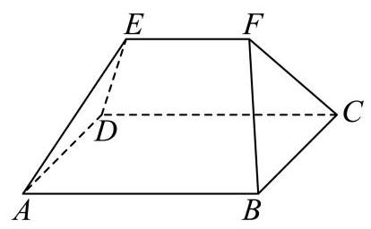

10. 如图所示，在 ${ABC}$ 中， $\angle {BAC} = \frac{\pi }{3}$ ， $\left| {AC}\right|  = 2\left| {AB}\right|$ ， $\left| {AB}\right|  = 1$ ， $P$ 为边 ${AC}$ 的中点， $D$ 在边 ${AB}$ 上，且 $\left| {AD}\right|  = 2\left| {DB}\right|$ ， ${CD}$ 交 ${BP}$ 于点 $R$ ，则 $\left| {CR}\right|  =$ ___.

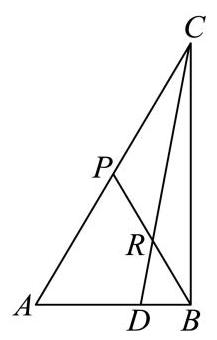

11. 若满足 $\left| z\right|  = 5$ ，且 $\left| {z + 5}\right|  - \left| {z - 5}\right|  = 6$ 的复数 $z$ 有两个，分别设为 ${z}_{1}\text{ 、 }{z}_{2}$ ，则 $\left| {{z}_{1} - {z}_{2}}\right|  =$ ___.

12. 设 $a > 0$ ,函数 $f\left( x\right)  = \left\{  \begin{array}{l} x + 2, x <  - a \\  \sqrt{{a}^{2} - {x}^{2}}, - a \leq  x \leq  a \\   - \sqrt{x} - 1, x > a \end{array}\right.$ ,给出下列三个结论:

① $y = f\left( x\right)$ 在区间 $\left( {a - 1, + \infty }\right)$ 上单调递减；

② 当 $a \geq  1$ 时， $y = f\left( x\right)$ 存在最大值；

③ 设 $M\left( {{x}_{1}, f\left( {x}_{1}\right) }\right) \left( {{x}_{1} \leq  a}\right) , N\left( {{x}_{2}, f\left( {x}_{2}\right) }\right) \left( {{x}_{2} > a}\right)$ ，则 $\left| {MN}\right|  > 1$ .

其中所有正确结论的序号是___.

## 二、选择题 (本大题共有 4 题,满分 18 分,第 ${13} \sim  {14}$ 题每题 4 分,第 ${15} \sim  {16}$ 题每题 5 分) 每题有且只有一个正确选项, 考生应在答题纸的相应位置上, 将代 表正确选项的小方格涂黑.

13. 函数 $y = {x}^{\frac{4}{3}}$ 的大致图象是( )

A.

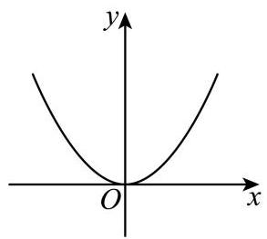

B.

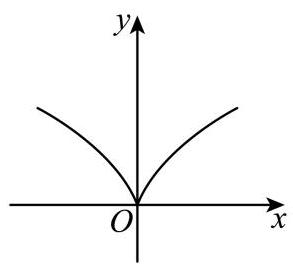

C.

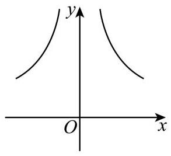

D.

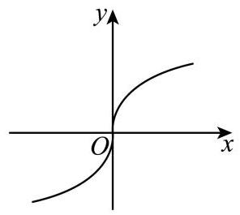

14. 已知集合 $A = \left\{  {x\left| {\;{x}^{2} - x - 6 = 0}\right. }\right\}  , B = \left\{  {x\left| {\;\frac{x + 3}{1 - x} > 0}\right. }\right\}$ ，则 $A \cap  B =$ ( ).

A. $\{  - 2,3\}$ B. $\left( {-3,1}\right)$ C. $\{ 3\}$ D. $\{  - 2\}$

15. 袋子里装有四枚围棋子, 其中两枚黑色棋子、两枚白色棋子, 从中随机取出两枚棋子, 那么互斥而不对立的事件是 ( ).

A. “至多有一枚白色棋子” 与 “至多有一枚黑色棋子”

B. “至多有一枚白色棋子” 与 “都是黑色棋子”

C. “恰好有一枚白色棋子” 与 “都是黑色棋子”

D. “至多有一枚白色棋子” 与 “都是白色棋子”

16. 设 $M\text{ 、 }N$ 分别是棱长为 1 的正方体的两个不同顶点,点 $P$ 在该正方体的表面上 (含棱和顶点) 运动,且不与 $M\text{ 、 }N$ 两点重合. 关于 $\overrightarrow{PM} \cdot  \overrightarrow{PN}$ ,给出下列两个结论:

① $\overrightarrow{PM} \cdot  \overrightarrow{PN}$ 存在最小值，且最小值小于零；

② $\overrightarrow{PM} \cdot  \overrightarrow{PN}$ 存在最大值，且最大值大于零.

则下列判断正确的选项是 ( ).

A. ①正确，②错误 B. ①错误，②正确

C. ①和②都错误 D. ①和②都正确

## 三、解答题 (本大题共有 5 题,满分 78 分,第 17 ~19 题每题 14 分,第 20 ~ 21 题每题 18 分) 解答下列各题必须在答题纸相应编号的规定区域内写出必要的步 骤.

17. 下表是某品牌净化器的年销售量与年份的统计表.

<table><tr><td>年份</td><td>2021</td><td>2022</td><td>2023</td><td>2024</td><td>2025</td></tr><tr><td>年份代码 $x$</td><td>1</td><td>2</td><td>3</td><td>4</td><td>5</td></tr><tr><td>年销售量 $y$ (万台)</td><td>2</td><td>3.5</td><td>2.5</td><td>8</td><td>9</td></tr></table>

(1)用计算器计算净化器的年销售量 $y$ 关于年份代码 $x$ 的线性回归方程;(回归系数计算结果保留两位小数)

(2)为了调查 $A$ 、 $B$ 两地区人群对该品牌净化器的了解情况，调查机构在 $A$ 、 $B$ 两地区的人群中分别进行品牌知晓情况的问卷调查. 统计知晓与不知晓的人数，得到如下 $2 \times  2$ 列联表.

<table><tr><td></td><td>知晓</td><td>不知晓</td><td>合计</td></tr><tr><td>$A$ 地区</td><td>80</td><td>20</td><td>100</td></tr><tr><td>$B$ 地区</td><td>40</td><td>60</td><td>100</td></tr><tr><td>合计</td><td>120</td><td>80</td><td>200</td></tr></table>

试根据表中数据判断 $A\text{ 、 }B$ 两地区的人群对该品牌净化器的知晓情况是否有显著差异. (规定显著水平 $a = {0.05}$ )

附:关于回归方程 $y = \widehat{a}x + \widehat{b}$ ，回归系数的计算公式 $\left\{  \begin{array}{l} \widehat{a} = \frac{\mathop{\sum }\limits_{{i = 1}}^{n}\left( {{x}_{i} - \bar{x}}\right) \left( {{y}_{i} - \bar{y}}\right) }{\mathop{\sum }\limits_{{i = 1}}^{n}{\left( {x}_{i} - \bar{x}\right) }^{2}} \\  \widehat{b} = \frac{\mathop{\sum }\limits_{{i = 1}}^{n}{y}_{i} - \widehat{a}\mathop{\sum }\limits_{{i = 1}}^{n}{x}_{i}}{n} \end{array}\right.$ ,其中 $\left( {\bar{x},\bar{y}}\right)$ 为样本点的中心; ${\chi }^{2}$ 的计算公式 ${\chi }^{2} = \frac{n{\left( ad - bc\right) }^{2}}{\left( {a + b}\right) \left( {b + d}\right) \left( {a + c}\right) \left( {c + d}\right) }$ ;

<table><tr><td>$P\left( {{\chi }^{2} \geq  k}\right)  = a$</td><td>0.05</td><td>0.01</td><td>0.001</td></tr><tr><td>$k$</td><td>3.841</td><td>6.635</td><td>10.828</td></tr></table>

18. 已知等差数列 $\left\{  {a}_{n}\right\}$ 的首项 ${a}_{1} = 1$ ，公差为 2，等比数列 $\left\{  {b}_{n}\right\}$ 的首项 ${b}_{1} = 1$ ，公比为 2， 数列 $\left\{  {c}_{n}\right\}$ 满足 ${c}_{n} = \left\{  \begin{array}{l} {a}_{n},\text{ 当 }n\text{ 为奇数时 } \\  {b}_{n},\text{ 当 }n\text{ 为偶数时 } \end{array}\right.$ ( $n$ 为正整数).

(1)依次写出数列 $\left\{  {c}_{n}\right\}$ 的前 6 项；

(2)设数列 $\left\{  {c}_{n}\right\}$ 的前 $n$ 项和为 ${S}_{n}$ ，求 ${S}_{2n}$ .

19. 如图,在长方体 ${ABCD} - {A}_{1}{B}_{1}{C}_{1}{D}_{1}$ 中, ${AB} = 4,{BC} = 3, C{C}_{1} = 2, M$ 是 ${AB}$ 的中点.

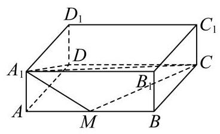

(1)求四棱锥 ${A}_{1} - {AMCD}$ 的体积；

(2)求平面 ${A}_{1}{AD}{D}_{1}$ 与平面 ${A}_{1}{MC}$ 所成的锐二面角的大小. (结果用反三角函数值表示)

20. 在 ${xOy}$ 平面直角坐标系中, $O$ 为坐标原点. 设椭圆 $\Gamma  : \frac{{x}^{2}}{{a}^{2}} + \frac{{y}^{2}}{{b}^{2}} = 1\left( {a > b > 0}\right) ,\Gamma$ 的左、 右焦点分别为 ${F}_{1}\text{ 、 }{F}_{2},\left| {{F}_{1}{F}_{2}}\right|  = 2,\Gamma$ 的离心率为 $\frac{1}{2}$ .

(1)求椭圆 $\Gamma$ 的方程；

(2)过原点 $O$ 作两条相互垂直的射线，与椭圆 $\Gamma$ 分别交于 $A\text{ 、 }B$ 两点，证明:原点 $O$ 到直线 ${AB}$ 的距离为定值；

(3)过椭圆 $\Gamma$ 的右焦点 ${F}_{2}$ 且不与坐标轴垂直的直线 $l$ 与椭圆 $\Gamma$ 交于 $P\text{ 、 }Q$ 两点，点 $M$ 是点 $P$ 关于 $x$ 轴的对称点. 在 $x$ 轴上是否存在一个定点 $N$ ,使得 $M\text{ 、 }Q\text{ 、 }N$ 三点始终共线? 若存在,求出点 $N$ 的坐标; 若不存在,说明理由.

21. 已知函数 $f\left( x\right)  = \frac{a\ln x}{x}\;\left( {a \in  \mathbf{R}\text{ 且 }a \neq  0}\right)$ .

(1)当 $a = 1$ 时，求函数 $y = f\left( x\right)$ 的极值；

(2)若直线 $y = x - 1$ 是曲线 $y = f\left( x\right)$ 的一条切线，求 $a$ 的值和切点的坐标；

(3) 若函数 $g\left( x\right)  = \frac{{a}^{2}}{4x} + x + 2 - a$ 的图像与 $y = f\left( x\right)$ 的图像相交于相异两点 $A$ 和 $B$ ,求 $a$ 的取值范围. 参考答案及解析:

1、【答案】 484π

【解析】

【详解】由题意知球的半径 $r = 1\mathrm{{lcm}}$ ,

所以球的表面积 $S = {4\pi }{r}^{2} = {4\pi } \times  {11}^{2} = {484\pi c}{m}^{2}$ .

2. 设 $\mathrm{i}$ 是虚数单位,计算: ${\left( \frac{1 + \mathrm{i}}{1 - \mathrm{i}}\right) }^{3} =$

【答案】 $- \mathrm{i}$

【解析】

【分析】根据复数的除法及复数的乘方求解即可.

【详解】 $\frac{1 + i}{1 - i} = \frac{\left( {1 + i}\right) \left( {1 + i}\right) }{\left( {1 - i}\right) \left( {1 + i}\right) } = \frac{1 + {2i} + {i}^{2}}{1 - {i}^{2}} = \frac{2i}{2} = i$ ,

所以 ${\left( \frac{1 + \mathrm{i}}{1 - \mathrm{i}}\right) }^{3} = {\mathrm{i}}^{3} =  - \mathrm{i}$ .

3. 在 ${\left( {x}^{3} - \frac{1}{x}\right) }^{6}$ 的二项展开式中， ${x}^{2}$ 的系数为___. (用数字作答)

【答案】 15

【解析】

【分析】根据二项展开式的通项公式求解即可.

【详解】二项展开式的通项公式为 ${T}_{r + 1} = {\mathrm{C}}_{6}^{r}{\left( {x}^{3}\right) }^{6 - r}{\left( -\frac{1}{x}\right) }^{r} = {\left( -1\right) }^{r}{\mathrm{C}}_{6}^{r}{x}^{{18} - {4r}}$ .

令 ${18} - {4r} = 2$ ,解得 $r = 4$ ,则 ${\left( -1\right) }^{4}{\mathrm{C}}_{6}^{4} = {15}$ .

故 ${x}^{2}$ 的系数为 15 .

4. 双曲线 $\frac{{x}^{2}}{4} - {y}^{2} = 1$ 的两条渐近线夹角大小为___. (结果用反三角函数值表示)

【答案】 $\arctan \frac{4}{3}$

【解析】

【分析】首先得到双曲线的两条渐近线, 再利用正切两角和差公式求解即可.

【详解】由题可得 $a = 2, b = 1$ ,因此渐近线方程为 $y =  \pm  \frac{b}{a}x =  \pm  \frac{1}{2}x$ ,

两条渐近线斜率为 ${k}_{1} = \tan {\theta }_{1} = \frac{1}{2},\;{k}_{2} = \tan {\theta }_{2} =  - \frac{1}{2}$ .

两直线夹角 $\theta  \in  \left( {0,\frac{\pi }{2}}\right\rbrack$ ,夹角公式为 $\tan \theta  = \left| \frac{{k}_{2} - {k}_{1}}{1 + {k}_{1}{k}_{2}}\right|$

代入得 $\tan \theta  = \left| \frac{-\frac{1}{2} - \frac{1}{2}}{1 + \left( \frac{1}{2}\right) \left( {-\frac{1}{2}}\right) }\right|  = \left| \frac{-1}{\frac{3}{4}}\right|  = \frac{4}{3}$ ,

由于 $\tan \theta  = \frac{4}{3}$ 且 $\theta  \in  \left( {0,\frac{\pi }{2}}\right\rbrack$ ，因此夹角大小为 $\arctan \frac{4}{3}$ .

5. 若 $\frac{\sin \left( {{2\pi } - a}\right) }{\tan \left( {\pi  - a}\right) } \cdot  \cot \left( {\frac{\pi }{2} + a}\right)  = \frac{1}{3}$ ，则 $\cos {2a} =$ ___.

【答案】 $\frac{7}{9}$

【解析】

【分析】根据诱导公式以及二倍角公式即可求解.

【详解】 $\frac{\sin \left( {{2\pi } - a}\right) }{\tan \left( {\pi  - a}\right) } \cdot  \cot \left( {\frac{\pi }{2} + a}\right)  = \frac{-\sin a}{-\tan a} \cdot  \left( {-\tan a}\right)  =  - \sin a = \frac{1}{3} \Rightarrow  \sin a =  - \frac{1}{3}$ , 故 $\cos {2a} = 1 - 2{\sin }^{2}a = 1 - 2 \times  {\left( -\frac{1}{3}\right) }^{2} = \frac{7}{9}$ .

6. 某汽车制造厂生产一种用于发动机的活塞销，其设计标准直径 $\mu$ 为 ${10.00}\mathrm{\;{mm}}$ . 根据长期生产数据，该活塞销的实际直径服从正态分布，方差 ${\sigma }^{2}$ 为 ${0.0004}{\mathrm{\;{mm}}}^{2}$ . 规定:活塞销的直径在 ${9.96}\mathrm{\;{mm}}$ 到 ${10.04}\mathrm{\;{mm}}$ 之间为合格品. 随机抽取一个活塞销,其为合格品的概率是 ___. (结果保留三位小数)

参考数据: 若随机变量 $X \sim  N\left( {\mu ,{\sigma }^{2}}\right)$ ,则 $P\left( {\mu  - \sigma  < X \leq  \mu  + \sigma }\right)  \approx  {0.683}$ , $P\left( {\mu  - {2\sigma } < X \leq  \mu  + {2\sigma }}\right)  \approx  {0.954},\;P\left( {\mu  - {3\sigma } < X \leq  \mu  + {3\sigma }}\right)  \approx  {0.997}.$

【答案】0.954

【解析】

【详解】依题意,活塞销的直径 $d \sim  N\left( {{10.00},{0.02}^{2}}\right) ,\;\mu  = {10.00},\sigma  = {0.02}$ ,

因此 $P\left( {{9.96} \leq  d \leq  {10.04}}\right)  = P\left( {\mu  - {2\sigma } \leq  d \leq  \mu  + {2\sigma }}\right)  = {0.954}$ ,

所以随机抽取一个活塞销，其为合格品的概率是 0.954

7. 现有两个罐子,都放有 3 个球,这些球除颜色外,大小与质地都相同, $A$ 罐中放有 2 个红球,1 个白球, $B$ 罐中放有 3 个红球,从两个罐子中各摸出 1 个球并交换,这样交换 2 次后，白球还在 $A$ 罐子中的概率是___.

【答案】 $\frac{5}{9}$

【解析】

【详解】用 ${A}_{1},{A}_{2}$ 分别表示交换 1 次,2 次后白球还在 $A$ 罐中的事件,

依题意, $P\left( {A}_{1}\right)  = \frac{2}{3}, P\left( \overline{{A}_{1}}\right)  = \frac{1}{3}, P\left( {{A}_{2} \mid  {A}_{1}}\right)  = \frac{2}{3}, P\left( {{A}_{2} \mid  \overline{{A}_{1}}}\right)  = \frac{1}{3}$ ,

由全概率公式得 $P\left( {A}_{2}\right)  = P\left( {{A}_{2} \mid  {A}_{1}}\right) P\left( {A}_{1}\right)  + P\left( {{A}_{2} \mid  \overline{{A}_{1}}}\right) P\left( \overline{{A}_{1}}\right)  = \frac{2}{3} \times  \frac{2}{3} + \frac{1}{3} \times  \frac{1}{3} = \frac{5}{9}$ ,

所以交换 2 次后,白球还在 $A$ 罐子中的概率是 $\frac{5}{9}$ .

8. 已知定义在 $\mathbf{R}$ 上的偶函数 $y = f\left( x\right)$ 的最小正周期为 2,当 $0 \leq  x \leq  1$ 时, $f\left( x\right)  = x$ ,则当 $7 \leq  x \leq  8$ 时， $f\left( x\right)  =$

【答案】 $8 - x$

【解析】

【详解】当 $7 \leq  x \leq  8$ 时, $0 \leq  8 - x \leq  1$ ,

$\therefore f\left( {8 - x}\right)  = 8 - x$ ,

又 $y = f\left( x\right)$ 定义在 $\mathbf{R}$ 上的偶函数,且最小正周期为 2,

$\therefore f\left( {8 - x}\right)  = f\left( {-x}\right)  = f\left( x\right)$ ,

$\therefore f\left( x\right)  = 8 - x$ .

9. 在代表我国古代数学成就的经典著作《九章算术》中，称如下图中的多面体 ${ABCDEF}$ 为 “刍(chu)甍(meng)”. 若底面 ${ABCD}$ 是边长为 4 的正方形， ${EF} = 2$ ，且 ${EF}//{AB}$ ， $\bigtriangleup {AED}$ 和 $\bigtriangleup {BFC}$ 是等腰直角三角形， $\angle {AED} = \angle {BFC} = {90}^{ \circ  }$ ，则 ${FC}$ 与底面 ${ABCD}$ 所成角的正弦值为___.

【答案】 $\frac{\sqrt{6}}{4}\# \# \frac{1}{4}\sqrt{6}$

【解析】

【分析】设 ${AD}\text{ 、 }{BC}$ 的中点为 $M\text{ 、 }N, E\text{ 、 }F$ 在底面的投影为 ${E}^{\prime }\text{ 、 }{F}^{\prime }$ ,则 $\angle {FC}{F}^{\prime }$ 就是 ${FC}$ 与底面 ${ABCD}$ 所成角,再解三角形求正弦值即可.

【详解】设 ${AD}\text{ 、 }{BC}$ 的中点为 $M\text{ 、 }N, E\text{ 、 }F$ 在底面的投影为 ${E}^{\prime }\text{ 、 }{F}^{\prime }$ ,如图, 由对称性可知 ${E}^{\prime }\text{ 、 }{F}^{\prime }$ 在 ${MN}$ 上,

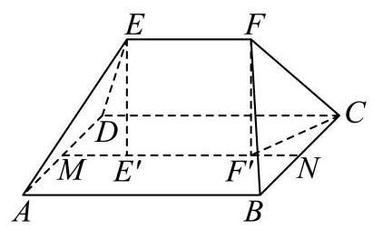

$\therefore \angle {FC}{F}^{\prime }$ 就是 ${FC}$ 与底面 ${ABCD}$ 所成角,

又 ${MN} = {AB} = {BC} = 4,{E}^{\prime }{F}^{\prime } = {EF} = 2$

$\therefore N{F}^{\prime } = 1,\;C{F}^{\prime 2} = \sqrt{C{N}^{2} + B{F}^{\prime 2}} = \sqrt{5}$ ,

又 $\bigtriangleup {BFC}$ 是等腰直角三角形, $\angle {BFC} = {90}^{ \circ  }$ ,

$\therefore {CF} = 2\sqrt{2}$ ， $F{F}^{\prime } = \sqrt{C{F}^{2} - C{F}^{\prime 2}} = \sqrt{3}$ ，

$\therefore \sin \angle {FC}{F}^{\prime } = \frac{F{F}^{\prime }}{CF} = \frac{\sqrt{3}}{2\sqrt{2}} = \frac{\sqrt{6}}{4}$ .

10. 如图所示，在 ${ABC}$ 中， $\angle {BAC} = \frac{\pi }{3}$ ， $\left| {AC}\right|  = 2\left| {AB}\right|$ ， $\left| {AB}\right|  = 1$ ， $P$ 为边 ${AC}$ 的中点， $D$ 在边 ${AB}$ 上，且 $\left| {AD}\right|  = 2\left| {DB}\right|$ ， ${CD}$ 交 ${BP}$ 于点 $R$ ，则 $\left| {CR}\right|  =$ ___.

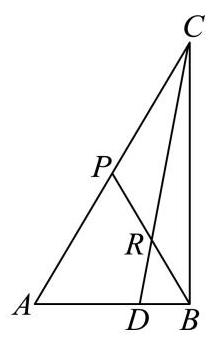

【答案】 $\frac{\sqrt{7}}{2}$

【解析】

【分析】建立平面直角坐标系,求出直线 ${PB}\text{ 、 }{CD}$ 的方程,联立求解得到点 $R$ 坐标,根据两点间的距离公式即可求出 $\left| {CR}\right|$ .

【详解】因为 $\left| {AC}\right|  = 2\left| {AB}\right| ,\left| {AB}\right|  = 1$ ,所以 $\left| {AC}\right|  = 2$ .

以点 $A$ 为原点,以 ${AB}$ 为 $x$ 轴建立平面直角坐标系,如图,

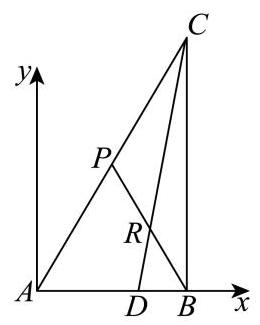

则 $A\left( {0,0}\right) , B\left( {1,0}\right) , C\left( {2\cos \frac{\pi }{3},2\sin \frac{\pi }{3}}\right)$ ,即 $C\left( {1,\sqrt{3}}\right)$ .

因为 $P$ 为边 ${AC}$ 的中点,所以 $P\left( {\frac{1}{2},\frac{\sqrt{3}}{2}}\right)$ .

因为 $\left| {AD}\right|  = 2\left| {DB}\right|$ ,所以 $D\left( {\frac{2}{3},0}\right)$ .

直线 ${PB} : y = \frac{\frac{\sqrt{3}}{2} - 0}{\frac{1}{2} - 1}\left( {x - 1}\right)$ ,即 $y =  - \sqrt{3}\left( {x - 1}\right)$ .

直线 ${CD} : \;y = \frac{\sqrt{3} - 0}{1 - \frac{2}{3}}\left( {x - \frac{2}{3}}\right)$ ，即 $y = 3\sqrt{3}\left( {x - \frac{2}{3}}\right)$ .

联立 $\left\{  \begin{array}{l} y =  - \sqrt{3}\left( {x - 1}\right) \\  y = 3\sqrt{3}\left( {x - \frac{2}{3}}\right)  \end{array}\right.$ ,解得 $\left\{  \begin{array}{l} x = \frac{3}{4} \\  y = \frac{\sqrt{3}}{4} \end{array}\right.$ ,即 $R\left( {\frac{3}{4},\frac{\sqrt{3}}{4}}\right)$ .

故 $\left| {CR}\right|  = \sqrt{{\left( \frac{3}{4} - 1\right) }^{2} + {\left( \frac{\sqrt{3}}{4} - \sqrt{3}\right) }^{2}} = \frac{\sqrt{7}}{2}$ .

11. 若满足 $\left| z\right|  = 5$ ,且 $\left| {z + 5}\right|  - \left| {z - 5}\right|  = 6$ 的复数 $z$ 有两个,分别设为 ${z}_{1}\text{ 、 }{z}_{2}$ ,则 $\left| {{z}_{1} - {z}_{2}}\right|  =$ ___.

【答案】 $\frac{32}{5}$

【解析】

【分析】设 $Z\left( {x, y}\right)$ ,根据复数的几何意义分析可得 ${x}^{2} + {y}^{2} = {25},\frac{{x}^{2}}{9} - \frac{{y}^{2}}{16} = 1\left( {x > 0}\right)$ , 联立方程运算求解即可.

【详解】设 $Z\left( {x, y}\right) , O\left( {0,0}\right) ,{F}_{1}\left( {-5,0}\right) ,{F}_{2}\left( {5,0}\right)$ ,

因为 $\left| z\right|  = 5$ ,则 $\left| {OZ}\right|  = 5$ ,可知点 $Z$ 的轨迹是以 $O\left( {0,0}\right)$ 为圆心,半径为 5 的圆,

可得 ${x}^{2} + {y}^{2} = {25}$ ；

且 $\left| {z + 5}\right|  - \left| {z - 5}\right|  = 6$ ,则 $\left| {Z{F}_{1}}\right|  - \left| {Z{F}_{2}}\right|  = 6 < {10}$ ,可知点 $Z$ 的轨迹是以 ${F}_{1},{F}_{2}$ 为焦点的双曲线的右支,

则 $a = 3, c = 5, b = \sqrt{{c}^{2} - {a}^{2}} = 4$ ,可得 $\frac{{x}^{2}}{9} - \frac{{y}^{2}}{16} = 1\left( {x > 0}\right)$ ,

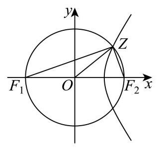

联立方程 $\left\{  \begin{array}{l} {x}^{2} + {y}^{2} = {25} \\  \frac{{x}^{2}}{9} - \frac{{y}^{2}}{16} = 1 \end{array}\right.$ ,解得 $\left\{  \begin{array}{l} {x}^{2} = \frac{369}{25} \\  {y}^{2} = \frac{256}{25} \end{array}\right.$ ,

且 $x > 0$ ,则 $\left\{  \begin{array}{l} x = \frac{3\sqrt{41}}{5} \\  {y}^{2} =  \pm  \frac{16}{5} \end{array}\right.$ ,可得 ${Z}_{1}\left( {\frac{3\sqrt{41}}{5},\frac{16}{5}}\right) ,{Z}_{2}\left( {\frac{3\sqrt{41}}{5}, - \frac{16}{5}}\right)$ ,

所以 $\left| {{z}_{1} - {z}_{2}}\right|  = \left| {{Z}_{1} - {Z}_{2}}\right|  = \frac{32}{5}$ .

12. 设 $a > 0$ ,函数 $f\left( x\right)  = \left\{  \begin{array}{l} x + 2, x <  - a \\  \sqrt{{a}^{2} - {x}^{2}}, - a \leq  x \leq  a \\   - \sqrt{x} - 1, x > a \end{array}\right.$ ,给出下列三个结论:

① $y = f\left( x\right)$ 在区间 $\left( {a - 1, + \infty }\right)$ 上单调递减;

② 当 $a \geq  1$ 时， $y = f\left( x\right)$ 存在最大值；

③ 设 $M\left( {{x}_{1}, f\left( {x}_{1}\right) }\right) \left( {{x}_{1} \leq  a}\right) , N\left( {{x}_{2}, f\left( {x}_{2}\right) }\right) \left( {{x}_{2} > a}\right)$ ,则 $\left| {MN}\right|  > 1$ .

其中所有正确结论的序号是___.

【答案】②③

【解析】

【分析】对①: 结合 $f\left( x\right)  = x + 2, x <  - a$ 的单调性,令 $a - 1 <  - a$ 即可得反例; 对②: 利用函数性质判断 $y = f\left( x\right)$ 的单调性,则可求出各段的上界,再令 $\left\{  \begin{array}{l} a \geq   - a + 2 \\  a \geq   - \sqrt{a} - 1 \end{array}\right.$ 计算即可得; 对③:分 ${x}_{1} <  - a$ 及 $- a \leq  {x}_{1} \leq  a$ 进行讨论，当 ${x}_{1} <  - a$ 时，利用点到直线的距离公式计算即可得解; 当 $- a \leq  {x}_{1} \leq  a$ 时,计算出 ${y}_{M} - {y}_{N}$ 即可得解.

【详解】对①:若 $a - 1 <  - a$ ，即 $0 < a < \frac{1}{2}$ 时，有 $f\left( x\right)  = x + 2, x <  - a$ ，

则 $y = f\left( x\right)$ 在区间 $\left( {a - 1, - a}\right)$ 上单调递增，故①错误；

对②:由 $f\left( x\right)  = \left\{  \begin{matrix} x + 2, x <  - a \\  \sqrt{{a}^{2} - {x}^{2}}, - a \leq  x \leq  a \\   - \sqrt{x} - 1, x > a \end{matrix}\right.$ ，

则当 $x <  - a$ 时， $f\left( x\right)$ 单调递增，当 $- a \leq  x \leq  0$ 时， $f\left( x\right)$ 单调递增，

当 $0 < x \leq  a$ 时， $f\left( x\right)$ 单调递减，当 $x > a$ 时， $f\left( x\right)$ 单调递减，

则 $x <  - a$ 时, $f\left( x\right)  = x + 2 <  - a + 2$ ,当 $- a \leq  x \leq  a$ 时, $f\left( x\right)  = \sqrt{{a}^{2} - {x}^{2}} \leq  a$ ,

当 $x > a$ 时, $f\left( x\right)  =  - \sqrt{x} - 1 <  - \sqrt{a} - 1$ ,

要使得 $y = f\left( x\right)$ 存在最大值,则 $\left\{  \begin{array}{l} a \geq   - a + 2 \\  a \geq   - \sqrt{a} - 1 \end{array}\right.$ ,解得 $a \geq  1$ ,故②正确；

对③:由题意可得 $N\left( {{x}_{2}, - \sqrt{{x}_{2}} - 1}\right)$ ，若 ${x}_{1} <  - a$ ，则 $M$ 在 $y = x + 2\left( {x <  - a}\right)$ 上，

则 $\left| {MN}\right|  \geq  \frac{\left| {x}_{2} + \sqrt{{x}_{2}} + 1 + 2\right| }{\sqrt{2}} = \frac{\left| {x}_{2} + \sqrt{{x}_{2}} + 3\right| }{\sqrt{2}}$ ,

由 ${x}_{2} > a > 0$ ,则 $\left| {MN}\right|  \geq  \frac{\left| {x}_{2} + \sqrt{{x}_{2}} + 3\right| }{\sqrt{2}} > \frac{3}{\sqrt{2}} > 1$ ;

若 $- a \leq  {x}_{1} \leq  a$ ,则 $M\left( {{x}_{1},\sqrt{{a}^{2} - {x}_{1}^{2}}}\right)$ ,

有 ${y}_{M} - {y}_{N} = \sqrt{{a}^{2} - {x}_{1}^{2}} - \left( {-\sqrt{{x}_{2}} - 1}\right)  > 0 + \sqrt{a} + 1 > 1$ ,故 $\left| {MN}\right|  > 1$ ;

综上可得: $\left| {MN}\right|  > 1$ 恒成立，故③正确.

## 二、选择题 (本大题共有 4 题,满分 18 分,第 13 ~ 14 题每题 4 分,第 15 ~ 16 题每题 5 分) 每题有且只有一个正确选项, 考生应在答题纸的相应位置上, 将代 表正确选项的小方格涂黑.

13. 函数 $y = {x}^{\frac{4}{3}}$ 的大致图象是( )

A.

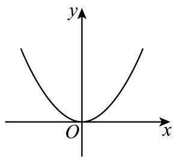

B.

C.

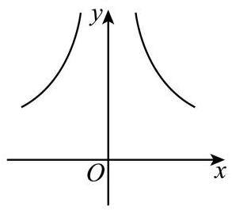

D.

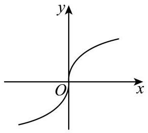

【答案】A

【解析】

【分析】根据函数的奇偶性和函数值得变化趋势即可判断.

【详解】解: $\because y = {x}^{\frac{4}{3}}$

$\therefore$ 定义域为 $R$

故排除 $C$ ,

又 $y = f\left( {-x}\right)  = {\left( -x\right) }^{\frac{4}{3}} = {x}^{\frac{4}{3}} = f\left( x\right)$ ,

$\therefore$ 函数 $y = {x}^{\frac{4}{3}}$ 为偶函数,

$\therefore$ 图象关于 $y$ 轴对称,故排除 $D$ ,

$\because \frac{4}{3} > 1$ ,

$\therefore$ 当 $x > 0$ 时, $y = {x}^{\frac{4}{3}}$ 的变化是越来越快,故排除 $B$

故选: $A$ .

【点睛】本题考查了函数图象的识别, 属于基础题.

14. 已知集合 $A = \left\{  {x\left| {\;{x}^{2} - x - 6 = 0}\right. }\right\}  , B = \left\{  {x\left| {\;\frac{x + 3}{1 - x} > 0}\right. }\right\}$ ，则 $A \cap  B =$ ().

A. $\{  - 2,3\}$ B. $\left( {-3,1}\right)$ C. $\{ 3\}$ D. $\{  - 2\}$

【答案】D

【解析】

【详解】由 ${x}^{2} - x - 6 = 0$ 解得 $x =  - 2$ 或 $x = 3$ ,即集合 $A = \{  - 2,3\}$ , 由 $\frac{x + 3}{1 - x} > 0$ 可得 $\left( {x + 3}\right) \left( {1 - x}\right)  > 0$ ,解得 $- 3 < x < 1$ ,即集合 $B = \{ x \mid   - 3 < x < 1\}$ ; 所以 $A \cap  B = \{  - 2\}$ .

15. 袋子里装有四枚围棋子, 其中两枚黑色棋子、两枚白色棋子, 从中随机取出两枚棋子, 那么互斥而不对立的事件是( ).

A. “至多有一枚白色棋子” 与 “至多有一枚黑色棋子”

B. “至多有一枚白色棋子” 与 “都是黑色棋子”

C. “恰好有一枚白色棋子” 与 “都是黑色棋子”

D. “至多有一枚白色棋子” 与 “都是白色棋子”

【答案】C

【解析】

【分析】利用对立事件、互斥事件的定义判断即可.

【详解】记随机取出两枚棋子,均为黑色棋子为事件 $A$ ,一枚黑色棋子、一枚白色棋子为事件 $B$ ,均为白色棋子为事件 $C$ .

对于 A: “至多有一枚白色棋子”包含事件 $A$ 、事件 $B$ ，“至多有一枚黑色棋子” 包含事件 $B$ 、

事件 $C$ .

两个事件都包含事件 $B$ ,能同时发生,不是互斥事件. $\mathrm{A}$ 不满足.

对于 $\mathrm{B}$ : “至多有一枚白色棋子”包含事件 $A$ 、事件 $B$ ,“都是黑色棋子”为事件 $A$ .

两个事件都包含事件 $A$ ，能同时发生，不是互斥事件.B 不满足.

对于 $\mathrm{C}$ : “恰好有一枚白色棋子”为事件 $B$ ，“都是黑色棋子”为事件 $A$ .

两个事件不能同时发生,且并集不是全集 (缺少事件 $C$ ),是互斥而不对立事件. $\mathrm{C}$ 满足.

对于 D: “至多有一枚白色棋子”包含事件 $A$ 、事件 $B$ ，“都是白色棋子”为事件 $C$ .

两个事件不能同时发生, 且并集是全集, 是对立事件.D 不满足.

16. 设 $M\text{ 、 }N$ 分别是棱长为 1 的正方体的两个不同顶点,点 $P$ 在该正方体的表面上(含棱和顶点) 运动,且不与 $M\text{ 、 }N$ 两点重合. 关于 $\overrightarrow{PM} \cdot  \overrightarrow{PN}$ ,给出下列两个结论:

① $\overrightarrow{PM} \cdot  \overrightarrow{PN}$ 存在最小值，且最小值小于零；

② $\overrightarrow{PM} \cdot  \overrightarrow{PN}$ 存在最大值，且最大值大于零.

则下列判断正确的选项是 ( ).

A. ①正确，②错误 B. ①错误，②正确

C. ①和②都错误 D. ①和②都正确

【答案】A

【解析】

【分析】分 $M\text{ 、 }N$ 为同一平面的相邻顶点、 $M\text{ 、 }N$ 为同一平面的不相邻顶点及 $M\text{ 、 }N$ 为体对角线上两顶点进行讨论,可求出对应的 $\left| {MN}\right|$ 长度,取 ${MN}$ 中点为 $O$ ,利用空间向量线性运算与数量积公式可得 $\overrightarrow{PM} \cdot  \overrightarrow{PN} = {\left| \overrightarrow{PO}\right| }^{2} - \frac{1}{4}{\left| \overrightarrow{MN}\right| }^{2}$ ,再求出对应 $\left| {OP}\right|$ 范围即可得解.

【详解】设 ${MN}$ 中点为 $O$ ,

若 $M\text{ 、 }N$ 为同一平面的相邻顶点,则 $\left| {MN}\right|  = 1$ ,

则 $0 \leq  \left| {OP}\right|  \leq  \sqrt{{\left( \frac{1}{2}\right) }^{2} + {1}^{2} + {1}^{2}}$ ,即 $\left| {OP}\right|  \in  \left\lbrack  {0,\frac{3}{2}}\right\rbrack$ ,

$\overrightarrow{PM} \cdot  \overrightarrow{PN} = \left( {\overrightarrow{PO} + \overrightarrow{OM}}\right)  \cdot  \left( {\overrightarrow{PO} + \overrightarrow{ON}}\right)  = {\left| \overrightarrow{PO}\right| }^{2} - \frac{1}{4}{\left| \overrightarrow{MN}\right| }^{2} \in  \left\lbrack  {-\frac{1}{4},2}\right\rbrack$ ,

此时 $\overrightarrow{PM} \cdot  \overrightarrow{PN}$ 存在最小值,且最小值小于零,存在最大值,且最大值大于零;

若 $M\text{ 、 }N$ 为同一平面的不相邻顶点,则 $\left| {MN}\right|  = \sqrt{2}$ ,

则 $0 \leq  \left| {OP}\right|  \leq  \sqrt{{\left( \frac{\sqrt{2}}{2}\right) }^{2} + {1}^{2}}$ ,即 $\left| {OP}\right|  \in  \left\lbrack  {0,\frac{\sqrt{6}}{2}}\right\rbrack$ ,

$\overrightarrow{PM} \cdot  \overrightarrow{PN} = {\left| \overrightarrow{PO}\right| }^{2} - \frac{1}{4}{\left| \overrightarrow{MN}\right| }^{2} \in  \left\lbrack  {-\frac{1}{2},1}\right\rbrack$

此时 $\overrightarrow{PM} \cdot  \overrightarrow{PN}$ 存在最小值,且最小值小于零,存在最大值,且最大值大于零;

若 $M\text{ 、 }N$ 为体对角线上两顶点,则 $\left| {MN}\right|  = \sqrt{3}$ ,

则 $\frac{1}{2} \leq  \left| {OP}\right|  \leq  \frac{\sqrt{3}}{2}$ ，即 $\left| {OP}\right|  \in  \left\lbrack  {\frac{1}{2},\frac{\sqrt{3}}{2}}\right\rbrack$ ，

则 $\overrightarrow{PM} \cdot  \overrightarrow{PN} = {\left| \overrightarrow{PO}\right| }^{2} - \frac{1}{4}{\left| \overrightarrow{MN}\right| }^{2} \leq  \frac{3}{4} - \frac{3}{4} = 0$ ,

此时 $\overrightarrow{PM} \cdot  \overrightarrow{PN}$ 存在最小值,且最小值小于零,存在最大值,最大值等于零;

综上可得:①正确；②错误.

## 三、解答题 (本大题共有 5 题,满分 78 分,第 17 ~19 题每题 14 分,第 20 ~ 21 题每题 18 分) 解答下列各题必须在答题纸相应编号的规定区域内写出必要的步 骤.

17. 下表是某品牌净化器的年销售量与年份的统计表.

<table><tr><td>年份</td><td>2021</td><td>2022</td><td>2023</td><td>2024</td><td>2025</td></tr><tr><td>年份代码 $x$</td><td>1</td><td>2</td><td>3</td><td>4</td><td>5</td></tr><tr><td>年销售量 $y$ (万台)</td><td>2</td><td>3.5</td><td>2.5</td><td>8</td><td>9</td></tr></table>

(1)用计算器计算净化器的年销售量 $y$ 关于年份代码 $x$ 的线性回归方程; (回归系数计算结果保留两位小数)

(2)为了调查 $A\text{ 、 }B$ 两地区人群对该品牌净化器的了解情况，调查机构在 $A\text{ 、 }B$ 两地区的人群中分别进行品牌知晓情况的问卷调查. 统计知晓与不知晓的人数，得到如下 $2 \times  2$ 列联表.

<table id="cross-table-1"><tr><td></td><td>知晓</td><td>不知晓</td><td>合计</td></tr><tr><td>$A$ 地区</td><td>80</td><td>20</td><td>100</td></tr><tr><td>$B$ 地区</td><td>40</td><td>60</td><td>100</td></tr><tr><td>合计</td><td>120</td><td>80</td><td>200</td></tr></table>

试根据表中数据判断 $A$ 、 $B$ 两地区的人群对该品牌净化器的知晓情况是否有显著差异. (规定显著水平 $a = {0.05}$ )

附:关于回归方程 $y = \widehat{a}x + \widehat{b}$ ，回归系数的计算公式 $\left\{  \begin{array}{l} \widehat{a} = \frac{\mathop{\sum }\limits_{{i = 1}}^{n}\left( {{x}_{i} - \bar{x}}\right) \left( {{y}_{i} - \bar{y}}\right) }{\mathop{\sum }\limits_{{i = 1}}^{n}{\left( {x}_{i} - \bar{x}\right) }^{2}} \\  \widehat{b} = \frac{\mathop{\sum }\limits_{{i = 1}}^{n}{y}_{i} - \widehat{a}\mathop{\sum }\limits_{{i = 1}}^{n}{x}_{i}}{n} \end{array}\right.$ ，其中 $\left( {\bar{x},\bar{y}}\right)$

为样本点的中心; ${\chi }^{2}$ 的计算公式 ${\chi }^{2} = \frac{n{\left( ad - bc\right) }^{2}}{\left( {a + b}\right) \left( {b + d}\right) \left( {a + c}\right) \left( {c + d}\right) }$ ;

<table><tr><td>$P\left( {{\chi }^{2} \geq  k}\right)  = a$</td><td>0.05</td><td>0.01</td><td>0.001</td></tr><tr><td>$k$</td><td>3.841</td><td>6.635</td><td>10.828</td></tr></table>

【答案】(1) $\widehat{y} = {1.85x} - {0.55}$

(2)在犯错误的概率不超过 0.05 的前提下，认为 $A$ 、 $B$ 两地区的人群对该品牌净化的知晓情况有显著差异

【解析】

【分析】(1) 计算出样本中心 $\left( {\bar{x},\bar{y}}\right)$ 以及回归系数 $\widehat{a}$ 和 $\widehat{b}$ ,即可求解;

(2)利用 $2 \times  2$ 列联表中的数据，代入 ${\chi }^{2}$ 公式计算观测值，并与临界值 3.841 进行比较， 从而判断两个分类变量是否有关.

【小问 1 详解】

由表可知,样本中心 $\left( {\bar{x},\bar{y}}\right)$ 为:

$$
\bar{x} = \frac{1 + 2 + 3 + 4 + 5}{5} = 3,\bar{y} = \frac{2 + {3.5} + {2.5} + 8 + 9}{5} = 5
$$

$\mathop{\sum }\limits_{{i = 1}}^{5}\left( {{x}_{i} - \overset{\text{ ― }}{x}}\right) \left( {{y}_{i} - \overset{\text{ ― }}{y}}\right)  = (1 - 3)(2 - 5) + (2 - 3)({3.5} - 5) + (3 - 3)({2.5} - 5) + (4 - 3)(8 - 5) + (5 - 3)(9 - 5)$

$$
= \left( {-2}\right)  \times  \left( {-3}\right)  + \left( {-1}\right)  \times  \left( {-{1.5}}\right)  + 0 + 1 \times  3 + 2 \times  4 = 6 + {1.5} + 0 + 3 + 8 = {18.5}\text{ . }
$$

$\mathop{\sum }\limits_{{i = 1}}^{5}{\left( {x}_{i} - \bar{x}\right) }^{2} = {\left( -2\right) }^{2} + {\left( -1\right) }^{2} + {0}^{2} + {1}^{2} + {2}^{2} = {10}$ . 则 $\widehat{a} = \frac{18.5}{10} = {1.85}$ .

$$
\widehat{b} = \bar{y} - \widehat{a}\bar{x} = 5 - {1.85} \times  3 = 5 - {5.55} =  - {0.55}
$$

所以，净化器的年销售量 $y$ 关于年份代码 $x$ 的线性回归方程为: $\widehat{y} = {1.85x} - {0.55}$ .

【小问 2 详解】

根据 $2 \times  2$ 列联表中的数据,计算 ${\chi }^{2}$ 的观测值:

$$
{\chi }^{2} = \frac{n{\left( ad - bc\right) }^{2}}{\left( {a + b}\right) \left( {c + d}\right) \left( {a + c}\right) \left( {b + d}\right) } = \frac{{200} \times  {\left( {80} \times  {60} - {20} \times  {40}\right) }^{2}}{{100} \times  {100} \times  {120} \times  {80}} = \frac{{200} \times  {\left( {4800} - {800}\right) }^{2}}{96000000}
$$

$$
= \frac{{200} \times  {4000}^{2}}{96000000} = \frac{32000000000}{96000000} = \frac{100}{3} \approx  {33.333}.
$$

因为 ${33.333} > {3.841}$ ,

所以，在犯错误的概率不超过 0.05 的前提下，认为 $A$ 、 $B$ 两地区的人群对该品牌净化器的知晓情况有显著差异.

18. 已知等差数列 $\left\{  {a}_{n}\right\}$ 的首项 ${a}_{1} = 1$ ，公差为 2，等比数列 $\left\{  {b}_{n}\right\}$ 的首项 ${b}_{1} = 1$ ，公比为 2， 数列 $\left\{  {c}_{n}\right\}$ 满足 ${c}_{n} = \left\{  \begin{array}{l} {a}_{n},\text{ 当 }n\text{ 为奇数时 } \\  {b}_{n},\text{ 当 }n\text{ 为偶数时 } \end{array}\right.$ ( $n$ 为正整数).

(1)依次写出数列 $\left\{  {c}_{n}\right\}$ 的前 6 项；

(2)设数列 $\left\{  {c}_{n}\right\}$ 的前 $n$ 项和为 ${S}_{n}$ ，求 ${S}_{2n}$ .

【答案】(1) 数列 $\left\{  {c}_{n}\right\}$ 的前 6 项依次为1,2,5,8,9,32

(2) ${S}_{2n} = n\left( {{2n} - 1}\right)  + \frac{2\left( {{4}^{n} - 1}\right) }{3}$

【解析】

【分析】(1) 先根据等差数列、等比数列的通项公式,分别求出 $\left\{  {a}_{n}\right\}$ 和 $\left\{  {b}_{n}\right\}$ 的通项,再按 $\left\{  {c}_{n}\right\}$ 的分段定义，依次代入 $n = 1$ 到 6，区分奇偶项计算得到前 6 项；

(2)将 ${S}_{2n}$ 拆分为前 ${2n}$ 项中的奇数项和与偶数项和两部分:奇数项是 $\left\{  {a}_{n}\right\}$ 的前 $n$ 个奇数项，构成新等差数列，用等差数列求和公式计算；偶数项是 $\left\{  {b}_{n}\right\}$ 的前 $n$ 个偶数项，构成新等比数列，用等比数列求和公式计算，最后将两部分和相加得到 ${S}_{2n}$

【小问 1 详解】

根据题意可得 ${a}_{n} = 1 + \left( {n - 1}\right)  \times  2 = {2n} - 1,{b}_{n} = 1 \times  {2}^{n - 1} = {2}^{n - 1}$ ,

所以 ${c}_{1} = {a}_{1} = 1,{c}_{2} = {b}_{2} = {2}^{2 - 1} = 2,{c}_{3} = {a}_{3} = 2 \times  3 - 1 = 5$ ,

${c}_{4} = {b}_{4} = {2}^{4 - 1} = 8,\;{c}_{5} = {a}_{5} = 2 \times  5 - 1 = 9,\;{c}_{6} = {b}_{6} = {2}^{6 - 1} = {32},$

所以数列 $\left\{  {c}_{n}\right\}$ 的前 6 项依次为1,2,5,8,9,32.

【小问 2 详解】

$$
{S}_{2n} = {c}_{1} + {c}_{2} + {c}_{3} + {c}_{4} + {c}_{5} + {c}_{6} + \cdots  + {c}_{{2n} - 1} + {c}_{2n}
$$

$$
= {a}_{1} + {b}_{2} + {a}_{3} + {b}_{4} + {a}_{5} + {b}_{6} + \cdots  + {a}_{{2n} - 1} + {b}_{2n}
$$

$$
= \left( {{a}_{1} + {a}_{3} + {a}_{5} + \cdots  + {a}_{{2n} - 1}}\right)  + \left( {{b}_{2} + {b}_{4} + {b}_{6} + \cdots  + {b}_{2n}}\right)
$$

$$
= \left\{  {1 + 5 + 9 + \cdots  + \left\lbrack  {2\left( {{2n} - 1}\right)  - 1}\right\rbrack  }\right\}   + \left( {2 + 8 + {32} + \cdots  + {2}^{{2n} - 1}}\right)
$$

$$
= \frac{n\left\lbrack  {1 + 2\left( {{2n} - 1}\right)  - 1}\right\rbrack  }{2} + \frac{2\left( {1 - {4}^{n}}\right) }{1 - 4}
$$

$$
= n\left( {{2n} - 1}\right)  + \frac{2\left( {{4}^{n} - 1}\right) }{3}\text{ . }
$$

所以 ${S}_{2n} = n\left( {{2n} - 1}\right)  + \frac{2\left( {{4}^{n} - 1}\right) }{3}$ .

19. 如图,在长方体 ${ABCD} - {A}_{1}{B}_{1}{C}_{1}{D}_{1}$ 中, ${AB} = 4,{BC} = 3, C{C}_{1} = 2, M$ 是 ${AB}$ 的中点.

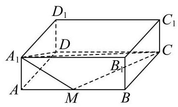

(1)求四棱锥 ${A}_{1} - {AMCD}$ 的体积；

(2)求平面 ${A}_{1}{AD}{D}_{1}$ 与平面 ${A}_{1}{MC}$ 所成的锐二面角的大小. (结果用反三角函数值表示)

【答案】(1) 6

(2) $\arccos \left( \frac{3\sqrt{22}}{22}\right)$

【解析】

【分析】(1) 直接利用棱锥的体积公式求解;

(2)通过建立空间直角坐标系，得到两个平面的法向量进而求解二面角即可.

【小问 1 详解】

因为底面 ${AMCD}$ 是直角梯形,上底 ${AM} = 2$ ,下底 ${DC} = 4$ ,高 ${AD} = 3$ ,

因此梯形面积 ${S}_{AMCD} = \frac{\left( AM + DC\right) }{2} \cdot  {AD} = \frac{\left( 2 + 4\right) }{2} \times  3 = 9$ ,

四棱锥的高为 ${A}_{1}$ 到底面 ${ABCD}$ 的距离,即 $h = A{A}_{1} = 2$ ,

因此体积 $V = \frac{1}{3}{S}_{AMCD} \cdot  h = \frac{1}{3} \times  9 \times  2 = 6$ .

【小问 2 详解】

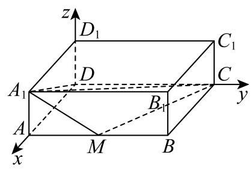

以 $D$ 为原点,分别以 ${DA},{DC}, D{D}_{1}$ 为 $x, y, z$ 轴建立空间直角坐标系,

根据题意得各点坐标 $A\left( {3,0,0}\right) , M\left( {3,2,0}\right) , C\left( {0,4,0}\right) ,{A}_{1}\left( {3,0,2}\right)$ ,

平面 ${A}_{1}{AD}{D}_{1}$ 的一个法向量为 $\overrightarrow{m} = \left( {0,1,0}\right)$ ,

在平面 ${A}_{1}{MC}$ 中,向量 $\overrightarrow{{A}_{1}M} = \left( {0,2, - 2}\right) ,\overrightarrow{MC} = \left( {-3,2,0}\right)$ ,设平面 ${A}_{1}{MC}$ 的法向量为 $\overrightarrow{n} = \left( {x, y, z}\right) ,$

则 $\left\{  \begin{array}{l} \overrightarrow{n} \cdot  \overrightarrow{{A}_{1}M} = {2y} - {2z} = 0 \\  \overrightarrow{n} \cdot  \overrightarrow{MC} =  - {3x} + {2y} = 0 \end{array}\right.$ 令 $y = 3$ ,得 $x = 2, z = 3$ ,即 $\overrightarrow{n} = \left( {2,3,3}\right)$ .

设锐二面角为 $\theta$ ,则 $\cos \theta  = \frac{\left| \overrightarrow{m} \cdot  \overrightarrow{n}\right| }{\left| \overrightarrow{m}\right|  \cdot  \left| \overrightarrow{n}\right| } = \frac{3}{1 \times  \sqrt{{2}^{2} + {3}^{2} + {3}^{2}}} = \frac{3\sqrt{22}}{22}$ ,

因此锐二面角大小为 $\arccos \left( \frac{3\sqrt{22}}{22}\right)$ .

20. 在 ${xOy}$ 平面直角坐标系中, $O$ 为坐标原点. 设椭圆 $\Gamma  : \frac{{x}^{2}}{{a}^{2}} + \frac{{y}^{2}}{{b}^{2}} = 1\left( {a > b > 0}\right) ,\Gamma$ 的左、 右焦点分别为 ${F}_{1}\text{ 、 }{F}_{2},\left| {{F}_{1}{F}_{2}}\right|  = 2,\Gamma$ 的离心率为 $\frac{1}{2}$ .

(1)求椭圆 $\Gamma$ 的方程；

(2)过原点 $O$ 作两条相互垂直的射线，与椭圆 $\Gamma$ 分别交于 $A\text{ 、 }B$ 两点，证明:原点 $O$ 到直线 ${AB}$ 的距离为定值;

(3)过椭圆 $\Gamma$ 的右焦点 ${F}_{2}$ 且不与坐标轴垂直的直线 $l$ 与椭圆 $\Gamma$ 交于 $P\text{ 、 }Q$ 两点，点 $M$ 是点 $P$ 关于 $x$ 轴的对称点. 在 $x$ 轴上是否存在一个定点 $N$ ,使得 $M\text{ 、 }Q\text{ 、 }N$ 三点始终共线? 若存在,求出点 $N$ 的坐标; 若不存在,说明理由.

【答案】(1) $\frac{{x}^{2}}{4} + \frac{{y}^{2}}{3} = 1$

(2)证明见解析(3)存在定点 $N\left( {4,0}\right)$ ，理由见解析

【解析】

【分析】(1) 利用待定系数法可求得椭圆的标准方程；

(2)设直线 ${AB}$ 的方程，并与椭圆联立方程组，利用韦达定理及 ${OA}\bot {OB}$ 的条件，建立直线参数间的关系, 再使用点到直线的距离公式即可证明.

(3) 设直线 $l$ 的方程为 $x = {my} + 1\left( {m \neq  0}\right)$ ,并与椭圆联立方程组,求出 ${y}_{1} + {y}_{2},{y}_{1}{y}_{2}$ 的值,结合三点共线则 ${k}_{MN} = {k}_{QN}$ 即可求解.

【小问 1 详解】

由题意知 ${2c} = 2$ ,即 $c = 1$ .

又因为离心率 $e = \frac{c}{a} = \frac{1}{2}$ ,所以 $a = 2$ ,所以 ${b}^{2} = {a}^{2} - {c}^{2} = 4 - 1 = 3$ .

故椭圆 $\Gamma$ 的方程为 $\frac{{x}^{2}}{4} + \frac{{y}^{2}}{3} = 1$ .

【小问 2 详解】

证明: 设 $A\left( {{x}_{1},{y}_{1}}\right) , B\left( {{x}_{2},{y}_{2}}\right)$ 。

因为 ${OA} \bot  {OB}$ ,所以 ${x}_{1}{x}_{2} + {y}_{1}{y}_{2} = 0$ .

设直线 ${AB}$ 的方程为 $x = {my} + n$ ,

联立方程组 $\left\{  \begin{array}{l} x = {my} + n \\  \frac{{x}^{2}}{4} + \frac{{y}^{2}}{3} = 1 \end{array}\right.$ ,消去 $x$ 得 $\left( {3{m}^{2} + 4}\right) {y}^{2} + {6mny} + 3{n}^{2} - {12} = 0$ ,

由韦达定理得 ${y}_{1} + {y}_{2} = \frac{-{6mn}}{3{m}^{2} + 4},{y}_{1}{y}_{2} = \frac{3{n}^{2} - {12}}{3{m}^{2} + 4}$ .

代入 ${x}_{1}{x}_{2} + {y}_{1}{y}_{2} = 0$ ，即 $\left( {m{y}_{1} + n}\right) \left( {m{y}_{2} + n}\right)  + {y}_{1}{y}_{2} = 0$ ，

整理得 $\left( {{m}^{2} + 1}\right) {y}_{1}{y}_{2} + {mn}\left( {{y}_{1} + {y}_{2}}\right)  + {n}^{2} = 0$ 。

代入韦达定理结果并化简得 $7{n}^{2} = {12}\left( {{m}^{2} + 1}\right)$ 。

原点 $O$ 到直线 ${AB}$ 的距离 $d = \frac{\left| n\right| }{\sqrt{1 + {m}^{2}}} = \sqrt{\frac{{n}^{2}}{{m}^{2} + 1}} = \sqrt{\frac{12}{7}} = \frac{2\sqrt{21}}{7}$ .

所以原点 $O$ 到直线 ${AB}$ 的距离为定值 $\frac{2\sqrt{21}}{7}$ .

【小问 3 详解】

存在定点 $N\left( {4,0}\right)$ ,理由如下:

由 (1) 知 ${F}_{2}\left( {1,0}\right)$ ,设直线 $l$ 的方程为 $x = {my} + 1\left( {m \neq  0}\right)$ ,

设 $P\left( {{x}_{1},{y}_{1}}\right) , Q\left( {{x}_{2},{y}_{2}}\right)$ ,则 $M\left( {{x}_{1}, - {y}_{1}}\right)$ ,

联立方程组 $\left\{  \begin{array}{l} x = {my} + 1 \\  \frac{{x}^{2}}{4} + \frac{{y}^{2}}{3} = 1 \end{array}\right.$ ,消去 $x$ 得 $\left( {3{m}^{2} + 4}\right) {y}^{2} + {6my} - 9 = 0$ , 由韦达定理得 ${y}_{1} + {y}_{2} = \frac{-{6m}}{3{m}^{2} + 4},{y}_{1}{y}_{2} = \frac{-9}{3{m}^{2} + 4}$ .

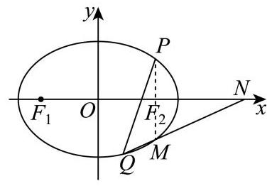

设 $N\left( {t,0}\right)$ ,若 $M, Q, N$ 三点共线,则 ${k}_{MN} = {k}_{QN}$ ,

即 $\frac{-{y}_{1}}{{x}_{1} - t} = \frac{{y}_{2}}{{x}_{2} - t}$ ,整理得 $- {y}_{1}\left( {{x}_{2} - t}\right)  = {y}_{2}\left( {{x}_{1} - t}\right)$ .

将 ${x}_{1} = m{y}_{1} + 1,{x}_{2} = m{y}_{2} + 1$ 代入上式,化简得 $\left( {t - 1}\right) \left( {{y}_{1} + {y}_{2}}\right)  - {2m}{y}_{1}{y}_{2} = 0$ .

代入韦达定理结果，得 $\left( {t - 1}\right) \frac{-{6m}}{3{m}^{2} + 4} - {2m}\frac{-9}{3{m}^{2} + 4} = 0$ .

化简得 $3\left( {t - 1}\right)  - 9 = 0$ ,解得 $t = 4$ .

所以存在定点 $N\left( {4,0}\right)$ ,使得 $M, Q, N$ 三点始终共线.

21. 已知函数 $f\left( x\right)  = \frac{a\ln x}{x}\left( {a \in  \mathbf{R}\text{ 且 }a \neq  0}\right)$ .

(1)当 $a = 1$ 时，求函数 $y = f\left( x\right)$ 的极值；

(2)若直线 $y = x - 1$ 是曲线 $y = f\left( x\right)$ 的一条切线，求 $a$ 的值和切点的坐标；

(3)若函数 $g\left( x\right)  = \frac{{a}^{2}}{4x} + x + {2 - a}$ 的图像与 $y = f\left( x\right)$ 的图像相交于相异两点 $A$ 和 $B$ ，求 $a$ 的取值范围.

【答案】(1) 极大值 $f\left( \mathrm{e}\right)  = \frac{\ln \mathrm{e}}{\mathrm{e}} = \frac{1}{\mathrm{e}}$ ,无极小值

(2) $a = 1$ ，切点坐标为 $\left( {1,0}\right)$

(3)a的取值范围(2e,+∞)

【解析】

【分析】(1) 求导找单调性变化点, 进而确定极值;

(2)先求导得到切线斜率公式，再根据 “切点在曲线、切线上，且切线斜率等于导数” 列三个方程，联立消元求解，试根得到切点横坐标，最终算出 $a$ 和切点坐标；

(3)将两函数交点问题转化为方程根的问题，用导数分析函数单调性，再根据零点存在性求参数范围.

【小问 1 详解】

当 $a = 1$ 时, $f\left( x\right)  = \frac{\ln x}{x}, f\left( x\right)$ 的定义域为 $\left( {0, + \infty }\right)$ ,

${f}^{\prime }\left( x\right)  = \frac{\frac{1}{x} \cdot  x - \left( {\ln x}\right)  \cdot  1}{{x}^{2}} = \frac{1 - \ln x}{{x}^{2}},$

令 ${f}^{\prime }\left( x\right)  = 0$ ,得 $x = \mathrm{e}$ ,

当 $0 < x < \mathrm{e}$ 时, ${f}^{\prime }\left( x\right)  > 0, f\left( x\right)$ 单调递增;

当 $x > \mathrm{e}$ 时, ${f}^{\prime }\left( x\right)  < 0, f\left( x\right)$ 单调递减.

所以 $f\left( x\right)$ 在 $x = \mathrm{e}$ 处取极大值 $f\left( \mathrm{e}\right)  = \frac{\ln \mathrm{e}}{\mathrm{e}} = \frac{1}{\mathrm{e}}$ ,无极小值.

【小问 2 详解】

${f}^{\prime }\left( x\right)  = \frac{a\left( {1 - \ln x}\right) }{{x}^{2}},$

设切点为 $\left( {{x}_{0},{y}_{0}}\right)$ ,切线 $y = x - 1$ 的斜率为 1,所以 ${f}^{\prime }\left( {x}_{0}\right)  = \frac{a\left( {1 - \ln {x}_{0}}\right) }{{x}_{0}^{2}} = 1$ ①,

因为切点同时在曲线和切线上,所以 ${y}_{0} = \frac{a\ln {x}_{0}}{{x}_{0}} = {x}_{0} - 1$ ②,

由①得 $a\left( {1 - \ln {x}_{0}}\right)  = {x}_{0}^{2}$ ③，由②得 $a\ln {x}_{0} = {x}_{0}\left( {{x}_{0} - 1}\right)$ ④，

③ + ④得 $a = {x}_{0}^{2} + {x}_{0}\left( {{x}_{0} - 1}\right)  = 2{x}_{0}^{2} - {x}_{0}$ ⑤，

将⑤代入②中得 $\frac{\left( {2{x}_{0}^{2} - {x}_{0}}\right) \ln {x}_{0}}{{x}_{0}} = {x}_{0} - 1$ ，即 $\left( {2{x}_{0} - 1}\right) \ln {x}_{0} = {x}_{0} - 1$ ⑥，

设 $m\left( x\right)  = \left( {{2x} - 1}\right) \ln x - \left( {x - 1}\right) ,{m}^{\prime }\left( x\right)  = 2\ln x + 1 - \frac{1}{x}$ ,

令 $n\left( x\right)  = {m}^{\prime }\left( x\right)  = 2\ln x + 1 - \frac{1}{x}$ ,

由 $x > 0$ ,得 ${n}^{\prime }\left( x\right)  = \frac{2}{x} + \frac{1}{{x}^{2}} = \frac{{2x} + 1}{{x}^{2}} > 0, n\left( x\right)  = {m}^{\prime }\left( x\right)  = 2\ln x + 1 - \frac{1}{x}$ 单调递增,

又 $n\left( 1\right)  = {m}^{\prime }\left( 1\right)  = 2\ln 1 + 1 - \frac{1}{1} = 0$ ,

所以 $0 < x < 1$ 时, $n\left( x\right)  = {m}^{\prime }\left( x\right)  < 0, m\left( x\right)$ 单调递减,

$x > 1$ 时, $n\left( x\right)  = {m}^{\prime }\left( x\right)  > 0, m\left( x\right)$ 单调递增,

又 $m\left( 1\right)  = \left( {2 \times  1 - 1}\right) \ln 1 - \left( {1 - 1}\right)  = 0$ ,

所以 $x = 1$ 是 $m\left( x\right)  = \left( {{2x} - 1}\right) \ln x - \left( {x - 1}\right)$ 的唯一零点,

即 ${x}_{0} = 1$ 方程⑥的根，代入⑤得 $a = 1$ ，切点坐标为 $\left( {1,0}\right)$ .

【小问 3 详解】

令 $f\left( x\right)  = g\left( x\right)$ ,即 $\frac{a\ln x}{x} = \frac{{a}^{2}}{4x} + x + 2 - a$ ,整理得 ${x}^{2} + \left( {2 - a}\right) x + \frac{{a}^{2}}{4} - a\ln x = 0$ ,

问题转化为 ${x}^{2} + \left( {2 - a}\right) x + \frac{{a}^{2}}{4} - a\ln x = 0$ 在 $x > 0$ 有 2 个不同正根,

令 $h\left( x\right)  = {x}^{2} + \left( {2 - a}\right) x + \frac{{a}^{2}}{4} - a\ln x\left( {x > 0}\right)$ ,

${h}^{\prime }\left( x\right)  = {2x} + \left( {2 - a}\right)  - \frac{a}{x} = \frac{\left( {{2x} - a}\right) \left( {x + 1}\right) }{x},$

若 $a < 0$ ,则 ${h}^{\prime }\left( x\right)  > 0, h\left( x\right)$ 在 $\left( {0, + \infty }\right)$ 单调递增,最多 1 个零点,不符合题意,

若 $a > 0$ ,令 ${h}^{\prime }\left( x\right)  = 0$ ,得 $x = \frac{a}{2}$ ,

当 $0 < x < \frac{a}{2}$ 时, ${h}^{\prime }\left( x\right)  < 0, h\left( x\right)$ 单调递减,

当 $x > \frac{a}{2}$ 时, ${h}^{\prime }\left( x\right)  > 0, h\left( x\right)$ 单调递增,

要使 $h\left( x\right)$ 有 2 个不同零点,需满足极小值小于 0 (当 $x \rightarrow  {0}^{ + }$ 和 $x \rightarrow   + \infty$ 时, $h\left( x\right)  \rightarrow   + \infty$ 满足题意),

所以 $h\left( \frac{a}{2}\right)  = {\left( \frac{a}{2}\right) }^{2} + \left( {2 - a}\right)  \times  \frac{a}{2} + \frac{{a}^{2}}{4} - a\ln \frac{a}{2} < 0$ ,解得 $a > 2\mathrm{e}$ ,

所以 $a$ 的取值范围 $\left( {2\mathrm{e}, + \infty }\right)$ .
