# 高三数学试卷

(完成试卷时间:120 分钟 总分:150 分)

一、填空题(本大题共有 12 题，满分 54 分. 其中第 1 ~ 6 题每题满分 4 分，第

7~12 题每题满分 5 分) 考生应在答题纸相应编号的空格内直接填写结果.

1. 若 $A = \left\lbrack  {-1,1}\right\rbrack$ ， $B = \left\{  {x\left| {\;{x}^{2} - {2x} \leq  0}\right. }\right\}$ ，则 $A \cap  B =$ ___.

2. 若直线 ${3x} + y - 2 = 0$ 与 $x - {ay} + 1 = 0$ 垂直，则 $a$ 的值为___.

3. 底面半径为 1 、母线长为 3 的圆锥的侧面展开图中扇形的中心角为___.

4. 在公比 $q$ 为正数的等比数列 $\left\{  {a}_{n}\right\}$ 中， ${a}_{2} + {a}_{4} = {60}$ ， ${a}_{4} + {a}_{6} = {15}$ ，则 $q$ 的值为___.

5. 在 ${\left( x - 2\right) }^{6}$ 的展开式中，含 ${x}^{4}$ 项的系数为___.

6. 如图是某班级 30 名学生某次数学测验的得分茎叶图 (茎为十位, 叶为个位), 则这些测验分数的第 80 百分位数是___.

---

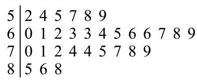

---

7. 已知 $\tan a < 0$ ，且 $\cos \left( {\frac{\pi }{2} + a}\right)  = \frac{2\sqrt{2}}{3}$ ，则 $\cos a$ 的值为___.

8. 在复平面内,点 $P, Q, O$ 分别表示复数 $z, w,0$ ,已知 $\left| z\right|  = 3,\left| w\right|  = 5, u = z + w$ ,且 $\left| u\right|  = 7$ ，则向量 $\overrightarrow{OP}$ 与 $\overrightarrow{OQ}$ 的夹角为___.

9. 某射击社团共有 10 名成员，其中社长与副社长各一人，现随机抽取 4 人组成代表队参加校际联谊活动，则社长与副社长两人至少有一人参加联谊活动的概率为___.

10. 已知曲线 ${\Gamma }_{1} : {y}^{2} = {2px}\left( {p > 0}\right)$ 与曲线 ${\Gamma }_{2} : \frac{{y}^{2}}{{a}^{2}} - \frac{{x}^{2}}{{b}^{2}} = 1\left( {y > 0}\right)$ 交于两点 $P, Q$ 点 $F$ 是 ${\Gamma }_{1}$ 的焦点，点 $O$ 是坐标原点. 若 $\left| {PF}\right|  + \left| {QF}\right|  = {10}\left| {OF}\right|$ ，则 ${\Gamma }_{2}$ 的离心率为___.

11. 在空间直角坐标系 $O - {xyz}$ 中,将点集 $\left\{  {\left( {x, y, z}\right) \left.\parallel  x\right|  \leq  1,\left| y\right|  \leq  1,\left| z\right|  \leq  1}\right\}$ 所表示的立方体的表面满足 $z < 1$ 的部分记为 $S$ ,同时满足 “ $\left| \overrightarrow{OP}\right|  \leq  \sqrt{3}$ ” 与 “ $\{ Q \mid  \overrightarrow{OQ} = \lambda \overrightarrow{OP},\lambda  \in  \left\lbrack  {0,1}\right\rbrack  \}  \cap  S = \varnothing$ 或 $\{ P\}$ ”的点 $P$ 的集合所表示几何体的体积为___.

12. 如图所示，某圆形游乐园的半径为 140 米，其圆心在点 $A$ 处，游乐园内有一圆形广场， 其半径为 20 米,圆心在与点 $A$ 相距 60 米的点 $B$ 处,游客中心位于圆形广场的边界线与 $A$ , $B$ 连线的交点 $O$ 处. 现打算在游乐园的边界线与圆形广场的边界线上各选一点 $C, D$ ,在这两处各建一座游乐设施(其占地大小忽略不计)，将 $\bigtriangleup  {OCD}$ 的内部区域作为游客的休闲区并使其面积最大，则此最大面积为___.

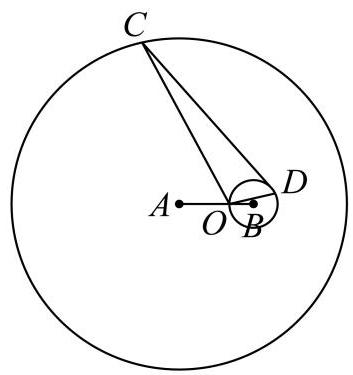

## 二、选择题 (本大题共有 4 题, 满分 18 分. 其中第 13、14 题每题满分 4 分, 第 15、16 题每题满分 5 分) 每题有且只有一个正确答案, 考生应在答题纸的相应 编号上, 将代表答案的小方格涂黑, 选对得满分, 否则一律得零分.

13. 若 $a, b$ 是空间中的两条直线，则 “ $a//b$ ” 是 “存在平面 $a$ ，使 $a \subset  a, b \subset  a$ ” 的( ).

A. 充分非必要条件 B. 必要非充分条件

C. 充要条件 D. 既非充分也非必要条件

14. 变量 $x, y$ 之间的一组相关数据如表所示: 若 $x, y$ 之间的线性回归方程为 $\widehat{y} = \widehat{bx} + {12.28}$ ,则 $\widehat{b}$ 的值为 ( )

<table><tr><td>$x$</td><td>4</td><td>5</td><td>6</td><td>7</td></tr><tr><td>$y$</td><td>8.2</td><td>7.8</td><td>6.6</td><td>5.4</td></tr></table>

A. -0.92 B. -0.94 C. -0.96 D. -0.98

15. 设函数 $y = f\left( x\right)$ 的定义域为 $\mathbf{R}$ ,则下列结论: ①若 $y = f\left( x\right)$ 是奇函数或偶函数，且在区间 $\lbrack 0, + \infty )$ 上严格增,则对任意的 ${x}_{1},{x}_{2} \in  \mathbf{R}, f\left( {x}_{1}\right)  > f\left( {x}_{2}\right)  \Rightarrow  {x}_{1}^{2} > {x}_{2}^{2}$ 或 ${x}_{1}^{3} > {x}_{2}^{3}$ ; ② 若对任意的 ${x}_{1},{x}_{2} \in  \mathbf{R},{x}_{1}^{2} = {x}_{2}^{2} \Rightarrow  {\left\lbrack  f\left( {x}_{1}\right) \right\rbrack  }^{2} = {\left\lbrack  f\left( {x}_{2}\right) \right\rbrack  }^{2}$ ,则 $y = f\left( x\right)$ 是奇函数或偶函数. 其中正确的说法是( ).

A. ①和②均正确 B. ①正确，②错误 C. ①错误，②正确 D. ①和②

均错误

16. 若无穷数列 $\left\{  {a}_{n}\right\}$ 的首项为 1,且对任意的 $n \in  {\mathbf{N}}^{ * },\left\{  {a}_{n}\right\}$ 的前 $n$ 项和都可以表示成 $\left\{  {a}_{n}\right\}$ 的两项之差,则称 $\left\{  {a}_{n}\right\}$ 为 $T$ 数列,所有 $T$ 数列组成的集合为 $T$ 集. 下列结论正确的是 ( ) .

A. 任意一个 $T$ 数列均不是等差数列 B. 任意一个 $T$ 数列均不是等比数列

C. $T$ 集中含有且仅含有有限个等差数列 D. $T$ 集中含有无穷多个等比数列

## 三、解答题 (本大题共有 5 题, 满分 78 分) 解答下列各题必须在答题纸相应编 号的规定区域内写出必要的步骤.

17. 小明每天上学出发时会选择是否骑共享单车. 根据平台统计和他的使用习惯:若出发时不下雨，他选择骑共享单车的概率为 0.8 ；若出发时下雨，他选择骑共享单车的概率为 0.4 . 假设本周小明每天上学出发时下雨的概率均为 0.25 ，且出发地共享单车供应充足.

(1)求本周某天小明上学出发时选择骑共享单车去学校的概率；

(2)已知本周某天小明选择了骑共享单车去学校，求该天小明出发时不下雨的概率；

(3)设小明在本周的前三天中选择骑共享单车去学校的天数为 $X$ ，且这三天中每天的骑行选择相互独立,求随机变量 $X$ 的分布,并计算其数学期望 $E\left\lbrack  X\right\rbrack$ 和方差 $D\left\lbrack  X\right\rbrack$ .

18. 如图，在直三棱柱 ${ABC} - {A}_{1}{B}_{1}{C}_{1}$ 中，点 $D$ 、 $E$ 分别是棱 ${BC}\text{ 、 }C{C}_{1}$ 上的点(点 $D$ 异于点 $C)$ ,且 ${AD} \bot  {DE}$ .

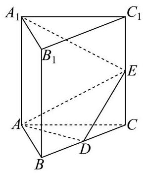

(1)求证:平面 ${ADE} \bot$ 平面 ${BC}{C}_{1}{B}_{1}$ ；

(2)若 ${ABC}$ 是正三角形, ${BC} = C{C}_{1}$ ,且三棱柱 ${ABC} - {A}_{1}{B}_{1}{C}_{1}$ 的体积是三棱锥 $E - {ADC}$ 的体积的 12 倍,求 ${A}_{1}E$ 与平面 ${ADE}$ 所成的角的大小.

19. 已知 $f\left( x\right)  = 2\sin x\cos x - 2{\sin }^{2}x$ .

(1)求函数 $y = f\left( x\right)$ 的最小正周期与单调增区间；

(2)将函数 $y = f\left( x\right)$ 的图象上的所有点沿向量 $\overrightarrow{n} = \left( {\theta ,1}\right) \left( {0 \leq  \theta  \leq  \frac{\pi }{2}}\right)$ 平移，得到 $y = g\left( x\right)$ 的图象. 若 $y = g\left( x\right)$ 同时满足: ①图象关于点 $A\left( {-\frac{3\pi }{8},0}\right)$ 对称; ②有且仅有 2 个极大值点在区间 $\left\lbrack  {0, a}\right\rbrack$ 上. 求 $a$ 的取值范围.

20. 已知点 ${F}_{1}\text{ 、 }{F}_{2}$ 分别是曲线 $\Gamma  : \frac{{x}^{2}}{6} + \frac{{y}^{2}}{2} = 1$ 的左、右焦点,动直线 $l$ 过点 ${F}_{1}$ 且不过点 ${F}_{2}$ , 它与 $\Gamma$ 交于点 $P\text{ 、 }Q$ .

(1)求点 ${F}_{1}\text{ 、 }{F}_{2}$ 的坐标；

(2)若 $\overrightarrow{{F}_{2}P} \cdot  \overrightarrow{{F}_{2}Q} = {11}$ ，求直线 $l$ 的方程；

(3)设直线 ${l}_{1}$ 过点 ${F}_{1}$ 且与 $l$ 垂直，直线 ${l}_{2} : x = m$ 与 ${l}_{1}$ 的交点为 $T$ ，求证:存在唯一的常数 $m$ ,使得点 $T$ 与 $\Gamma$ 的中心的连线平分线段 ${PQ}$ ,并求此时 $\frac{\left| PQ\right| }{\left| T{F}_{1}\right| }$ 的最大值.

21. 对于公共定义域为 $D$ 的函数 $y = f\left( x\right)$ 与 $y = g\left( x\right)$ ,定义集合 ${E}_{f - g} = \left\{  {t\left| {\;t = f\left( x\right)  - g\left( x\right) }\right. , x \in  D}\right\}  .$

(1)若 $f\left( x\right)  = {x}^{2} - {x}^{3}, g\left( x\right)  = {2x} - {x}^{3}$ ，求 ${E}_{f - g}$ ；

( 2 )若 $f\left( x\right)  = {\mathrm{e}}^{x}, g\left( x\right)  = \ln \left( {x - p}\right)  + q\left( {p, q \in  \mathbf{R}}\right)$ ，且 ${E}_{f - g} = \lbrack 0, + \infty )$ ，求 $q - p$ 的最小值;

(3)已知 $y = f\left( x\right)$ 是定义在 $\left( {0, + \infty }\right)$ 上的增函数，其图像是连续曲线，且存在正数 ${x}_{0}$ ，使得 $f\left( {x}_{0}\right)  > 0$ . 若 $g\left( x\right)  =  - f\left( x\right) , h\left( x\right)  = \frac{1}{2}f\left( {2x}\right)$ ,且 ${E}_{f - h} = \{ 0\}$ ,求证: ${E}_{f - g} = \left( {0, + \infty }\right)$ . 参考答案及解析:

1、【答案】 $\left\lbrack  {0,1}\right\rbrack$

【解析】

【分析】解不等式化简集合 $B$ ，进而可求交集.

【详解】由题意可知: 集合 $B = \left\{  {x\left| {\;{x}^{2} - {2x} \leq  0}\right. }\right\}   = \left\lbrack  {0,2}\right\rbrack$ ,

且集合 $A = \left\lbrack  {-1,1}\right\rbrack$ ，所以 $A \cap  B = \left\lbrack  {0,1}\right\rbrack$ .

2. 若直线 ${3x} + y - 2 = 0$ 与 $x - {ay} + 1 = 0$ 垂直，则 $a$ 的值为___.

【答案】 3

【解析】

【详解】若直线 ${3x} + y - 2 = 0$ 与 $x - {ay} + 1 = 0$ 垂直,

则 $3 \times  1 + 1 \times  \left( {-a}\right)  = 0$ ,解得 $a = 3$ .

3. 底面半径为 1 、母线长为 3 的圆锥的侧面展开图中扇形的中心角为___.

【答案】 $\frac{2\pi }{3}$

【解析】

【分析】根据圆锥的侧面展开图结合扇形的弧长公式运算求解.

【详解】设侧面展开图中扇形的中心角为 $a$ ,

由题意可得: ${3a} = {2\pi } \times  1$ ,解得 $a = \frac{2\pi }{3}$ ,

所以侧面展开图中扇形的中心角为 $\frac{2\pi }{3}$ .

4. 在公比 $q$ 为正数的等比数列 $\left\{  {a}_{n}\right\}$ 中， ${a}_{2} + {a}_{4} = {60}$ ， ${a}_{4} + {a}_{6} = {15}$ ，则 $q$ 的值为___.

【答案】 $\frac{1}{2}\# \# {0.5}$

【解析】

【分析】根据题意结合等比数列性质运算求解即可.

【详解】因为 ${a}_{2} + {a}_{4} = {60},{a}_{4} + {a}_{6} = {15}$ ,则 ${q}^{2} = \frac{{a}_{4} + {a}_{6}}{{a}_{2} + {a}_{4}} = \frac{1}{4}$ ,

且 $q > 0$ ,所以 $q = \frac{1}{2}$ .

5. 在 ${\left( x - 2\right) }^{6}$ 的展开式中，含 ${x}^{4}$ 项的系数为___.

【答案】 60

【解析】

【分析】

利用二项式定理的展开式的通项公式: ${T}_{r + 1} = {\mathrm{C}}_{n}^{r}{a}^{n - r}{b}^{r}$ 即可求解.

【详解】 ${\left( x - 2\right) }^{6}$ 的展开式的通项公式: ${T}_{r + 1} = {C}_{6}^{r}{x}^{6 - r}{\left( -2\right) }^{r}$ ,

令 $6 - r = 4$ ,解得 $r = 2$ ,

所以含 ${x}^{4}$ 项的系数为 ${C}_{6}^{2}{\left( -2\right) }^{2} = {60}$ .

故答案为: 60

【点睛】本题考查了二项式定理, 需熟记通项公式, 考查了基本运算能力, 属于基础题.

6. 如图是某班级 30 名学生某次数学测验的得分茎叶图 (茎为十位, 叶为个位), 则这些测验分数的第 80 百分位数是___.

---

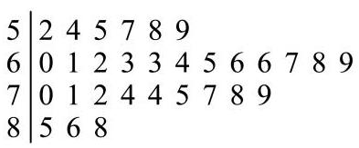

---

【答案】76

【解析】

【分析】根据茎叶图结合百分位数的定义运算求解即可.

【详解】因为 ${30} \times  {0.8} = {24}$ ,可知第 80 百分位数是第 24 位数与 25 位数的平均数由茎叶图可知数据的第 24 位数与 25 位数分别为 75, 77,

所以第 80 百分位数是 $\frac{{75} + {77}}{2} = {76}$ .

7. 已知 $\tan a < 0$ ，且 $\cos \left( {\frac{\pi }{2} + a}\right)  = \frac{2\sqrt{2}}{3}$ ，则 $\cos a$ 的值为___.

【答案】 $\frac{1}{3}$

【解析】

【分析】利用诱导公式可得 $\sin a =  - \frac{2\sqrt{2}}{3}$ ,结合同角三角函数关系运算求解,注意根据符号判断角 $a$ 所在象限.

【详解】因为 $\cos \left( {\frac{\pi }{2} + a}\right)  =  - \sin a = \frac{2\sqrt{2}}{3}$ ,即 $\sin a =  - \frac{2\sqrt{2}}{3} < 0$ ,

且 $\tan a < 0$ ,可知角 $a$ 为第四象限角,

所以 $\cos a = \sqrt{1 - {\sin }^{2}a} = \sqrt{1 - {\left( -\frac{2\sqrt{2}}{3}\right) }^{2}} = \frac{1}{3}$ .

8. 在复平面内,点 $P, Q, O$ 分别表示复数 $z, w,0$ ,已知 $\left| z\right|  = 3,\left| w\right|  = 5, u = z + w$ ,且 $\left| u\right|  = 7$ ，则向量 $\overrightarrow{OP}$ 与 $\overrightarrow{OQ}$ 的夹角为___.

【答案】 $\frac{\pi }{3}$

【解析】

【分析】设复数 $u$ 在复平面内对应的点为 $A$ ,可得 ${OA} = {OP} + {OQ}$ ,结合模长关系可得 ${OP} \cdot  {OQ} = \frac{15}{2}$ ,进而可得向量夹角.

【详解】设复数 $u$ 在复平面内对应的点为 $A$ ,

由题意可知: $\left| \overrightarrow{OP}\right|  = 3,\left| {OQ}\right|  = 5,\left| {OA}\right|  = 7,{OA} = {OP} + {OQ}$ ,

则 $O{A}^{2} = {\left( OP + OQ\right) }^{2} = O{P}^{2} + O{Q}^{2} + {2OP} \cdot  {OQ}$ ,

即 ${49} = 9 + {25} + {2OP} \cdot  {OQ}$ ,解得 ${OP} \cdot  {OQ} = \frac{15}{2}$ ,可得 $\cos \langle {OP},{OQ}\rangle  = \frac{{OP} \cdot  {OQ}}{\left| {OP}\right|  \cdot  \left| {OQ}\right| } = \frac{1}{2}$ ,

且 $\langle {OP},{OQ}\rangle  \in  \left\lbrack  {0,\pi }\right\rbrack$ ,可得 $\langle {OP},{OQ}\rangle  = \frac{\pi }{3}$ ,

所以向量 $\overrightarrow{OP}$ 与 $\overrightarrow{OQ}$ 的夹角为 $\frac{\pi }{3}$ .

9. 某射击社团共有 10 名成员，其中社长与副社长各一人，现随机抽取 4 人组成代表队参加校际联谊活动，则社长与副社长两人至少有一人参加联谊活动的概率为___.

【答案】 $\frac{2}{3}$

【解析】

【分析】设相应事件,根据古典概型结合组合数可得 $P\left( \bar{A}\right)  = \frac{1}{3}$ ,结合对立事件概率公式求解.

【详解】设 “社长与副社长两人至少有一人参加联谊活动”为事件 $A$ ,

则 $P\left( \bar{A}\right)  = \frac{{\mathrm{C}}_{8}^{4}}{{\mathrm{C}}_{10}^{4}} = \frac{70}{210} = \frac{1}{3}$ ,可得 $P\left( A\right)  = 1 - P\left( \bar{A}\right)  = \frac{2}{3}$ ,

所以社长与副社长两人至少有一人参加联谊活动的概率为 $\frac{2}{3}$ .

10. 已知曲线 ${\Gamma }_{1} : {y}^{2} = {2px}\left( {p > 0}\right)$ 与曲线 ${\Gamma }_{2} : \frac{{y}^{2}}{{a}^{2}} - \frac{{x}^{2}}{{b}^{2}} = 1\left( {y > 0}\right)$ 交于两点 $P, Q$ ,点 $F$ 是 ${\Gamma }_{1}$ 的焦点，点 $O$ 是坐标原点. 若 $\left| {PF}\right|  + \left| {QF}\right|  = {10}\left| {OF}\right|$ ，则 ${\Gamma }_{2}$ 的离心率为___.

【答案】 $\sqrt{3}$

【解析】

【分析】联立抛物线和双曲线方程,根据韦达定理可得 ${x}_{1} + {x}_{2} = \frac{{2p}{b}^{2}}{{a}^{2}}$ ,结合抛物线的定义可得 $\frac{{b}^{2}}{{a}^{2}} = 2$ ,即可得双曲线离心率.

【详解】由题意可知: 抛物线 ${\Gamma }_{1} : {y}^{2} = {2px}\left( {p > 0}\right)$ 的焦点为 $F\left( {\frac{p}{2},0}\right)$ ,

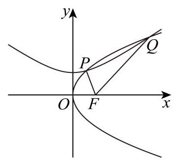

设 $P\left( {{x}_{1},{y}_{1}}\right) , Q\left( {{x}_{2},{y}_{2}}\right)$ ,

联立方程 $\left\{  \begin{array}{l} {y}^{2} = {2px} \\  \frac{{y}^{2}}{{a}^{2}} - \frac{{x}^{2}}{{b}^{2}} = 1 \end{array}\right.$ ,消去 $y$ 可得 $\frac{1}{{b}^{2}}{x}^{2} - \frac{2p}{{a}^{2}}x + 1 = 0$ ,

则 $\Delta  = \frac{4{p}^{2}}{{a}^{4}} - \frac{4}{{b}^{2}} > 0$ ,解得 ${pb} > {a}^{2}$ ,可得 ${x}_{1} + {x}_{2} = \frac{{2p}{b}^{2}}{{a}^{2}}$ ,

又因为 $\left| {PF}\right|  + \left| {QF}\right|  = {10}\left| {OF}\right|$ ,则 ${x}_{1} + \frac{p}{2} + {x}_{2} + \frac{p}{2} = {10} \times  \frac{p}{2}$ ,

即 ${x}_{1} + {x}_{2} = {4p}$ ,可得 $\frac{{2p}{b}^{2}}{{a}^{2}} = {4p}$ ,可得 $\frac{{b}^{2}}{{a}^{2}} = 2$ ,

所以双曲线 ${\Gamma }_{2}$ 的离心率为 $e = \frac{c}{a} = \sqrt{1 + \frac{{b}^{2}}{{a}^{2}}} = \sqrt{3}$ .

11. 在空间直角坐标系 $O - {xyz}$ 中,将点集 $\left\{  {\left( {x, y, z}\right) \left| \right| x\left| { \leq  1,}\right| y\left| { \leq  1,}\right| z \mid   \leq  1}\right\}$ 所表示的立方体的表面满足 $z < 1$ 的部分记为 $S$ ,同时满足 “ $\left| \overrightarrow{OP}\right|  \leq  \sqrt{3}$ ” 与 “ $\{ Q\left| {\overrightarrow{OQ} = \lambda \overrightarrow{OP},\lambda  \in  \left\lbrack  {0,1}\right\rbrack  \}  \cap  S = \varnothing }\right|$ 或 $\{ P\}$ ”的点 $P$ 的集合所表示几何体的体积为___.

【答案】 $\frac{{20} + 2\sqrt{3}\pi }{3}$

【解析】

【分析】首先判断出 $\mathrm{S}$ 为正方体的四个侧面和下底面,然后得到 “ $\left| \overrightarrow{OP}\right|  \leq  \sqrt{3}$ ” 表示的几何体为正方体的外接球,满足条件的点 $P$ 即为从点 $O$ 出发的不超过 $\mathrm{S}$ 和球面的线段上的点,将它们分为射向上底面和其它五个面两个部分，相加即可得到所求几何体体积.

【详解】点集 $\{ \left( {x, y, z}\right) \parallel x \mid   \leq  1,\left| y\right|  \leq  1,\left| z\right|  \leq  1\}$ 表示的是以原点为中心的边长为 2 的正方体, $\mathrm{S}$ 为满足 $z < 1$ 的部分即除去了 $z = 1$ 后剩余的部分,也就是除了上底面以外的五个面, 条件 “ $\left| \overrightarrow{OP}\right|  \leq  \sqrt{3}$ ” 表示点 $P$ 在以原点为球心的半径为 $\sqrt{3}$ 的球体内,因为 $\sqrt{{1}^{2} + {1}^{2} + {1}^{2}} = \sqrt{3}$

所以这个球刚好也是正方体的外接球， $\left\{  {Q\left| {\;\overrightarrow{OQ} = \lambda \overrightarrow{OP}}\right. ,\lambda  \in  \left\lbrack  {0,1}\right\rbrack  }\right\}$ 即为线段 ${OP}$ ,

条件 “ $\left\{  {Q \mid  \overrightarrow{OQ} = \lambda \overrightarrow{OP},\lambda  \in  \left\lbrack  {0,1}\right\rbrack  }\right\}   \cap  S = \varnothing$ 或 $\{ P\}$ ” 表示线段 ${OP}$ 与 $\mathrm{S}$ 要么没有交点,要么交点就是 $P$ ,

考虑从 $O$ 点出发的线段 ${OP}$ ,射向上底面的线可以到达球面,这一部分构成 $\frac{1}{6}$ 个球体,

射向 $\mathrm{S}$ 包含的五个面可以到达正方体的表面,这一部分构成五个四棱锥,每个四棱锥都是正方体的 $\frac{1}{6}$ ,

所以所求几何体的体积为 $V = 5 \times  \frac{1}{6} \times  {2}^{3} + \frac{1}{6} \times  \frac{4}{3}\pi {\left( \sqrt{3}\right) }^{3} = \frac{20}{3} + \frac{2\sqrt{3}}{3}\pi  = \frac{{20} + 2\sqrt{3}\pi }{3}$ .

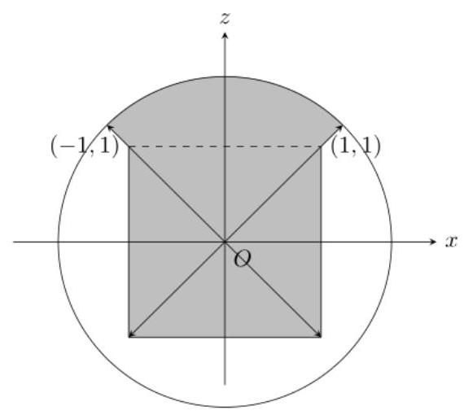

截面 $y = 0$

12. 如图所示，某圆形游乐园的半径为 140 米，其圆心在点 $A$ 处，游乐园内有一圆形广场， 其半径为 20 米,圆心在与点 $A$ 相距 60 米的点 $B$ 处,游客中心位于圆形广场的边界线与 $A$ , $B$ 连线的交点 $O$ 处. 现打算在游乐园的边界线与圆形广场的边界线上各选一点 $C, D$ ,在这两处各建一座游乐设施(其占地大小忽略不计)，将 $\bigtriangleup  {OCD}$ 的内部区域作为游客的休闲区并使其面积最大，则此最大面积为___.

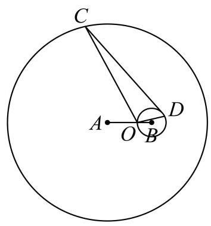

【答案】 ${750}\sqrt{15}$ 平方米

【解析】

【分析】过点 $B$ 作 ${BE} \bot  {OD}$ ,垂足为 $E$ ,则 $\left| {OD}\right|  = 2\sqrt{B{D}^{2} - B{E}^{2}}$ . 记点 $A$ 到直线 ${OD}$ 的距离为 $d$ ,则点 $C$ 到直线 ${OD}$ 的距离的最大值为 $\left| {CA}\right|  + d = {140} + d$ . 以 $O$ 为坐标原点直线 ${OB}$ 为 $x$ 轴,过 $O$ 垂直于 ${OB}$ 的直线为 $y$ 轴,建立平面直角坐标系,设直线 ${OD}$ 的方程为 $y = {kx}$ ,根据点到直线的距离公式,将 $\bigtriangleup  {OCD}$ 的面积表示为 $k$ 的函数，利用导数分析其单调性, 并求得最大值.

【详解】由题意知, $\left| {AB}\right|  = {60},\left| {OB}\right|  = {20},\left| {AC}\right|  = {140},\left| {BD}\right|  = {20}$ ,

所以 $\left| {AO}\right|  = {40}$ .

过点 $B$ 作 ${BE} \bot  {OD}$ ,垂足为 $E$ ,则 $\left| {OD}\right|  = 2\sqrt{B{D}^{2} - B{E}^{2}}$ .

记点 $A$ 到直线 ${OD}$ 的距离为 $d$ ,则点 $C$ 到直线 ${OD}$ 的距离的最大值为 $\left| {CA}\right|  + d = {140} + d$ . 如图所示,以 $O$ 为坐标原点,直线 ${OB}$ 为 $x$ 轴,过 $O$ 垂直于 ${OB}$ 的直线为 $y$ 轴,建立平面直角坐标系,

则 $O\left( {0,0}\right) , A\left( {-{40},0}\right) , B\left( {{20},0}\right)$ .

易知,直线 ${OD}$ 的斜率存在,设直线 ${OD}$ 的方程为 $y = {kx}$ ,即 ${kx} - y = 0$ ,

则 $\left| {BE}\right|  = \frac{\left| {20}k\right| }{\sqrt{{k}^{2} + 1}},\;d = \frac{\left| {40}k\right| }{\sqrt{{k}^{2} + 1}}$ ,

所以 $\left| {OD}\right|  = 2\sqrt{{400} - \frac{{400}{k}^{2}}{{k}^{2} + 1}} = \frac{40}{\sqrt{{k}^{2} + 1}}$ .

$\bigtriangleup  {OCD}$ 的最大面积为

$$
\frac{1}{2}\left| {OD}\right| \left( {{140} + d}\right)  = \frac{1}{2} \cdot  \frac{40}{\sqrt{{k}^{2} + 1}} \cdot  \left( {{140} + \frac{\left| {40}k\right| }{\sqrt{{k}^{2} + 1}}}\right)  = \frac{2800}{\sqrt{{k}^{2} + 1}} + \frac{{800}\left| k\right| }{{k}^{2} + 1} = {400}\left( {\frac{7}{\sqrt{{k}^{2} + 1}} + \frac{2\left| k\right| }{{k}^{2} + 1}}\right)
$$

由圆的对称性,不妨令 $k \geq  0$ .

设 $f\left( k\right)  = {400}\left( {\frac{7}{\sqrt{{k}^{2} + 1}} + \frac{2k}{{k}^{2} + 1}}\right) , k \geq  0$ ,则

${f}^{\prime }\left( k\right)  = {400}\left\lbrack  {\frac{7 \times  \left( {-\frac{1}{2}}\right)  \times  {2k}}{\left( {{k}^{2} + 1}\right) \sqrt{{k}^{2} + 1}} + \frac{2\left( {{k}^{2} + 1}\right)  - {2k} \cdot  {2k}}{{\left( {k}^{2} + 1\right) }^{2}}}\right\rbrack   = {400} \times  \frac{-{7k}\sqrt{{k}^{2} + 1} - 2{k}^{2} + 2}{{\left( {k}^{2} + 1\right) }^{2}},$

令 $g\left( k\right)  =  - {7k}\sqrt{{k}^{2} + 1} - 2{k}^{2} + 2$ ,则 ${g}^{\prime }\left( k\right)  =  - 7\left( {\sqrt{{k}^{2} + 1} + \frac{{k}^{2}}{\sqrt{{k}^{2} + 1}}}\right)  - {4k} < 0$ 恒成立,

所以 $g\left( k\right)$ 在 $\lbrack 0, + \infty )$ 上单调递减.

令 $g\left( k\right)  = 0$ ,得 $- {7k}\sqrt{{k}^{2} + 1} - 2{k}^{2} + 2 = 0$ ,

即 ${7k}\sqrt{{k}^{2} + 1} =  - 2{k}^{2} + 2$ ,化简得 $\left( {{15}{k}^{2} - 1}\right) \left( {3{k}^{2} + 4}\right)  = 0$ .

因为 $3{k}^{2} + 4 > 0$ ,所以 ${k}^{2} = \frac{1}{15}$ ,所以 $k = \frac{\sqrt{15}}{15}$ .

所以当 $0 \leq  k < \frac{\sqrt{15}}{15}$ 时, $g\left( k\right)  > 0,{f}^{\prime }\left( k\right)  > 0$ ; 当 $k \geq  \frac{\sqrt{15}}{15}$ 时, $g\left( k\right)  < 0,{f}^{\prime }\left( k\right)  < 0$ .

所以 $f\left( k\right)$ 在 $\left\lbrack  {0,\frac{\sqrt{15}}{15}}\right)$ 上单调递增,在 $\left( {\frac{\sqrt{15}}{15}, + \infty }\right)$ 上单调递减.

所以 $f\left( k\right)$ 在 $k = \frac{\sqrt{15}}{15}$ 处取得极大值,即最大值,最大值为

$f\left( \frac{\sqrt{15}}{15}\right)  = {400} \times  \frac{{15}\sqrt{15}}{8} = {750}\sqrt{15}.$

所以 $\bigtriangleup  {OCD}$ 的最大面积为 ${750}\sqrt{15}$ 平方米.

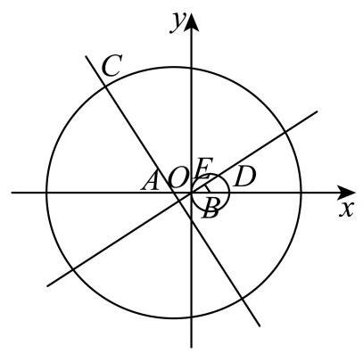

## 二、选择题 (本大题共有 4 题, 满分 18 分. 其中第 13、14 题每题满分 4 分, 第

## 15、16 题每题满分 5 分) 每题有且只有一个正确答案, 考生应在答题纸的相应 编号上, 将代表答案的小方格涂黑, 选对得满分, 否则一律得零分.

13. 若 $a, b$ 是空间中的两条直线，则 “ $a//b$ ” 是 “存在平面 $a$ ，使 $a \subset  a, b \subset  a$ ” 的( ).

A. 充分非必要条件 B. 必要非充分条件

C. 充要条件 D. 既非充分也非必要条件

【答案】A

【解析】

【分析】根据空间中线、面关系结合充分、必要条件分析判断.

【详解】若 $a//b$ ,可知直线 $a, b$ 是共面直线,则存在平面 $a$ ,使 $a \subset  a, b \subset  a$ ,即充分性成立;

若存在平面 $a$ ,使 $a \subset  a, b \subset  a$ ,则直线 $a, b$ 可能相交,即必要性不成立; 综上所述: “ $a//b$ ”是“存在平面 $a$ ,使 $a \subset  a, b \subset  a$ ”的充分非必要条件.

14. 变量 $x, y$ 之间的一组相关数据如表所示: 若 $x, y$ 之间的线性回归方程为 $\widehat{y} = \widehat{bx} + {12.28}$ ,则 $\widehat{b}$ 的值为 ( )

<table><tr><td>$x$</td><td>4</td><td>5</td><td>6</td><td>7</td></tr><tr><td>$y$</td><td>8.2</td><td>7.8</td><td>6.6</td><td>5.4</td></tr></table>

A. -0.92 B. -0.94 C. -0.96 D. -0.98

【答案】C

【解析】

【分析】本题先求样本点中心, 再利用线性回归方程过样本点中心直接求解即可.

【详解】解: $\bar{x} = \frac{4 + 5 + 6 + 7}{4} = {5.5},\bar{y} = \frac{{8.2} + {7.8} + {6.6} + {5.4}}{4} = 7$ ,

所以样本点中心: $\left( {{5.5},7}\right)$ ,

线性回归方程 $\widehat{y} = \widehat{b}x + {12.28}$ 过样本点中心 $\left( {{5.5},7}\right)$ ,则 $7 = {5.5}\widehat{b} + {12.28}$

解得: $\widehat{b} =  - {0.96}$ ，

故选: $\mathrm{C}$

【点睛】本题考查线性回归方程过样本点中心,是简单题.

15. 设函数 $y = f\left( x\right)$ 的定义域为 $\mathbf{R}$ ,则下列结论: ①若 $y = f\left( x\right)$ 是奇函数或偶函数,且在区间 $\lbrack 0, + \infty )$ 上严格增,则对任意的 ${x}_{1},{x}_{2} \in  \mathbf{R}, f\left( {x}_{1}\right)  > f\left( {x}_{2}\right)  \Rightarrow  {x}_{1}^{2} > {x}_{2}^{2}$ 或 ${x}_{1}^{3} > {x}_{2}^{3}$ ; ② 若对任意的 ${x}_{1},{x}_{2} \in  \mathbf{R},{x}_{1}^{2} = {x}_{2}^{2} \Rightarrow  {\left\lbrack  f\left( {x}_{1}\right) \right\rbrack  }^{2} = {\left\lbrack  f\left( {x}_{2}\right) \right\rbrack  }^{2}$ ,则 $y = f\left( x\right)$ 是奇函数或偶函数. 其中正确的说法是( ).

A. ①和②均正确 B. ①正确，②错误 C. ①错误，②正确 D. ①和② 均错误

【答案】B

【解析】

【分析】对于①:根据函数奇偶性和单调性的性质分析判断；对于②:举反例说明即可.

【详解】对于①:若 $y = f\left( x\right)$ 是奇函数且在区间 $\lbrack 0, + \infty )$ 上严格增，

则 $y = f\left( x\right)$ 在区间 $( - \infty ,0\rbrack$ 上严格增,可知 $y = f\left( x\right)$ 在定义域 $\mathbf{R}$ 上严格增,

因为 $f\left( {x}_{1}\right)  > f\left( {x}_{2}\right)$ ,则 ${x}_{1} > {x}_{2}$ ,可得 ${x}_{1}^{3} > {x}_{2}^{3}$ ;

若 $y = f\left( x\right)$ 是偶函数且在区间 $\lbrack 0, + \infty )$ 上严格增,且 $f\left( {x}_{1}\right)  > f\left( {x}_{2}\right)$ ,

则 $f\left( \left| {x}_{1}\right| \right)  > f\left( \left| {x}_{2}\right| \right)$ ,且 $\left| {x}_{1}\right|  \geq  0,\left| {x}_{2}\right|  \geq  0$ ,

可得 $\left| {x}_{1}\right|  > \left| {x}_{2}\right|$ ,所以 ${x}_{1}^{2} > {x}_{2}^{2}$ ;

综上所述: ①正确;

对于②: 例如 $f\left( x\right)  = \left\{  \begin{array}{l} x, x \neq   - 1 \\  1, x =  - 1 \end{array}\right.$ ,

可知对任意的 ${x}_{1},{x}_{2} \in  \mathbf{R},{x}_{1}^{2} = {x}_{2}^{2} \Rightarrow  {\left\lbrack  f\left( {x}_{1}\right) \right\rbrack  }^{2} = {\left\lbrack  f\left( {x}_{2}\right) \right\rbrack  }^{2}$ ,

但 $f\left( 1\right)  = f\left( {-1}\right)  = 1, f\left( 2\right)  =  - f\left( {-2}\right)  = 2$ ,所以 $y = f\left( x\right)$ 既不是奇函数也不是偶函数, 故②错误.

16. 若无穷数列 $\left\{  {a}_{n}\right\}$ 的首项为 1,且对任意的 $n \in  {\mathbf{N}}^{ * },\left\{  {a}_{n}\right\}$ 的前 $n$ 项和都可以表示成 $\left\{  {a}_{n}\right\}$ 的两项之差,则称 $\left\{  {a}_{n}\right\}$ 为 $T$ 数列,所有 $T$ 数列组成的集合为 $T$ 集. 下列结论正确的是 ( ) .

A. 任意一个 $T$ 数列均不是等差数列 B. 任意一个 $T$ 数列均不是等比数列

C. $T$ 集中含有且仅含有有限个等差数列 D. $T$ 集中含有无穷多个等比数列

【答案】D

【解析】

【分析】对于 $\mathrm{{AC}}$ : 举例说明即可,例如等差数列 $\left\{  {a}_{n}\right\}$ 的公差为 $\frac{1}{m}, m \in  {\mathbf{N}}^{ * }$ ,结合题意分析判断；对于 BD:设等比数列 $\left\{  {a}_{n}\right\}$ 的公比为 $q \in  \left( {1,2}\right)$ ，结合零点存在性定理可知存在 $q$ 使得 ${q}^{k}\left( {q - 1}\right)  = 1$ ,结合题意分析判断即可.

【详解】对于选项 AC: 例如等差数列 $\left\{  {a}_{n}\right\}$ 的公差为 $\frac{1}{m}, m \in  {\mathbf{N}}^{ * }$ ,

则 ${a}_{n} = 1 + \frac{n - 1}{m} = \frac{1}{m}\left( {n + m - 1}\right) ,{S}_{n} = n + \frac{1}{m}\frac{\left( {n - 1}\right) n}{2} = \frac{1}{m}\left\lbrack  {\frac{\left( {n - 1}\right) n}{2} + {mn}}\right\rbrack$ ,

注意到 $n + m - 1$ 能表示大于 $m - 1$ 的所有正整数, 且 $\frac{\left( {n - 1}\right) n}{2} + {mn}$ 为整数,必能用两个大于 $m - 1$ 的整数之差表示,

所以等差数列 $\left\{  {a}_{n}\right\}$ 为 $T$ 数列,且有无数个,故 $\mathrm{{AC}}$ 错误;

对于选项 BD: 设等比数列 $\left\{  {a}_{n}\right\}$ 的公比为 $q \in  \left( {1,2}\right)$ ,则 ${a}_{n} = {q}^{n - 1}$ ,

对于确定的 $k \in  {\mathbf{N}}^{ * }$ ,令 ${S}_{n} = \frac{1 - {q}^{n}}{1 - q} = \frac{1}{{q}^{k}\left( {q - 1}\right) }\left( {{q}^{n + k} - {q}^{k}}\right) , k \in  {\mathbf{N}}^{ * }$ ,

令 $f\left( q\right)  = {q}^{k}\left( {q - 1}\right)  - 1$ ,

因为 $q \in  \left( {1,2}\right)$ ,则 $q - 1 \in  \left( {0,1}\right)$ ,可知函数 $f\left( q\right)$ 在 $\left( {1,2}\right)$ 内单调递增,

且 $f\left( 1\right)  =  - 1 < 0, f\left( 2\right)  = {2}^{k} - 1 \geq  1$ ,可知函数 $f\left( q\right)$ 在 $\left( {1,2}\right)$ 内有且仅有一个零点.

即存在 $q$ 使得 $f\left( q\right)  = {q}^{k}\left( {q - 1}\right)  - 1 = 0$ ,即 ${q}^{k}\left( {q - 1}\right)  = 1$ ,

此时 ${S}_{n} = {q}^{n + k} - {q}^{k} = {a}_{n + k + 1} - {a}_{k + 1}$ ,

对于不同的 $k \in  {\mathbf{N}}^{ * },\;f\left( q\right)  = {q}^{k}\left( {q - 1}\right)  - 1$ 的零点可以看出方程 ${q}^{k} = \frac{1}{q - 1}$ 的解,

即 $y = {q}^{k}$ 与 $y = \frac{1}{q - 1}$ 在 $\left( {1,2}\right)$ 交点的横坐标,

当 $k$ 变化时,由幂函数的图像可得交点的横坐标相异,故等比数列 $\left\{  {a}_{n}\right\}$ 有无数个,

所以 $T$ 集中含有无穷多个等比数列,故 $\mathrm{B}$ 错误, $\mathrm{D}$ 正确;

故选: D.

## 三、解答题 (本大题共有 5 题, 满分 78 分) 解答下列各题必须在答题纸相应编 号的规定区域内写出必要的步骤.

17. 小明每天上学出发时会选择是否骑共享单车. 根据平台统计和他的使用习惯:若出发时不下雨，他选择骑共享单车的概率为 0.8 ；若出发时下雨，他选择骑共享单车的概率为 0.4 . 假设本周小明每天上学出发时下雨的概率均为 0.25 ，且出发地共享单车供应充足.

(1)求本周某天小明上学出发时选择骑共享单车去学校的概率；

(2)已知本周某天小明选择了骑共享单车去学校，求该天小明出发时不下雨的概率；

(3)设小明在本周的前三天中选择骑共享单车去学校的天数为 $X$ ，且这三天中每天的骑行选择相互独立,求随机变量 $X$ 的分布,并计算其数学期望 $E\left\lbrack  X\right\rbrack$ 和方差 $D\left\lbrack  X\right\rbrack$ .

【答案】(1) ${0.7}\;\left( 2\right) \frac{6}{7}$

(3) $\left( \begin{matrix} 0 & 1 & 2 & 3 \\  {0.027} & {0.189} & {0.441} & {0.343} \end{matrix}\right) ;E\left\lbrack  X\right\rbrack   = {2.1};D\left\lbrack  X\right\rbrack   = {0.63}$

【解析】

【分析】(1) 设相应事件，根据题意结合全概率公式运算求解；

(2)根据题意结合贝叶斯公式运算求解；

(3)分析可知 $X \sim  B\left( {3,{0.7}}\right)$ ，结合二项分布求分布列、期望和方差.

【小问 1 详解】

设“小明上学出发时下雨”为事件 $A$ ，“小明选择骑共享单车去学校”为事件 $B$ .

由题意可知: $P\left( {B \mid  \bar{A}}\right)  = {0.8}, P\left( {B \mid  A}\right)  = {0.4}, P\left( A\right)  = {0.25}, P\left( \bar{A}\right)  = {0.75}$ ,

由全概率公式可得 $P\left( B\right)  = P\left( A\right) P\left( {B \mid  A}\right)  + P\left( \bar{A}\right) P\left( {B \mid  \bar{A}}\right)  = {0.7}$ ,

所以小明在本周某天选择骑共享单车去学校的概率为 0.7 .

【小问 2 详解】

由题意可知: $P\left( {\bar{A} \mid  B}\right)  = \frac{P\left( \bar{A}\right) P\left( {B \mid  \bar{A}}\right) }{P\left( B\right) } = \frac{{0.75} \times  {0.8}}{0.7} = \frac{6}{7}$ ,

所以小明出发时不下雨的概率为 $\frac{6}{7}$ .

【小问 3 详解】

由题意可知: $X \sim  B\left( {3,{0.7}}\right)$ ,

则 $P\left( {X = 0}\right)  = {\left( 1 - {0.7}\right) }^{3} = {0.027}, P\left( {X = 1}\right)  = {\mathrm{C}}_{3}^{1} \times  {0.7} \times  {\left( 1 - {0.7}\right) }^{2} = {0.189}$ ;

$P\left( {X = 2}\right)  = {\mathrm{C}}_{3}^{2} \times  {0.7}^{2} \times  \left( {1 - {0.7}}\right)  = {0.441};\;P\left( {X = 3}\right)  = {0.7}^{3} = {0.343};$

可知 $X$ 的分布列为 $\left( \begin{matrix} 0 & 1 & 2 & 3 \\  {0.027} & {0.189} & {0.441} & {0.343} \end{matrix}\right)$ ,

所以 $X$ 的数学期望 $E\left\lbrack  X\right\rbrack   = 3 \times  {0.7} = {2.1}$ ,方差 $D\left\lbrack  X\right\rbrack   = 3 \times  {0.7} \times  \left( {1 - {0.7}}\right)  = {0.63}$ .

18. 如图,在直三棱柱 ${ABC} - {A}_{1}{B}_{1}{C}_{1}$ 中,点 $D\text{ 、 }E$ 分别是棱 ${BC}\text{ 、 }C{C}_{1}$ 上的点 (点 $D$ 异于点 $C)$ ,且 ${AD} \bot  {DE}$ .

(1)求证: 平面 ${ADE} \bot$ 平面 ${BC}{C}_{1}{B}_{1}$ ;

(2)若 ${ABC}$ 是正三角形， ${BC} = {C{C}_{1}}$ ，且三棱柱 ${ABC} - {A}_{1}{B}_{1}{C}_{1}$ 的体积是三棱锥 $E - {ADC}$ 的体积的 12 倍,求 ${A}_{1}E$ 与平面 ${ADE}$ 所成的角的大小.

【答案】(1) 证明见解析

(2) $\arcsin \frac{\sqrt{10}}{5}$

【解析】

【分析】(1) 证明出 ${AD} \bot$ 平面 ${BC}{C}_{1}{B}_{1}$ ,再利用面面垂直的判定定理可证得结论成立;

(2)解法一:设 ${BC} = {C{C}_{1}} = 2$ ，由 ${V}_{{ABC} - {A}_{1}{B}_{1}{C}_{1}} = {{12}{V}_{{\text{ 三 }\text{ 棱 }\text{ 锥 }}{E - {AEC}}}}$ 可求出 ${CE}$ 的长，以点 $A$ 为坐标原点, $\overrightarrow{CB}\text{ 、 }\overrightarrow{AD}\text{ 、 }\overrightarrow{A{A}_{1}}$ 的方向分别为 $x\text{ 、 }y\text{ 、 }z$ 轴的正方向建立空间直角坐标系,利用空间向量法可求得 ${A}_{1}E$ 与平面 ${ADE}$ 所成的角的大小;

解法二: 连接 ${A}_{1}D$ ,过 ${A}_{1}$ 作 ${A}_{1}G \bot$ 平面 ${ADE}$ ,垂足为 $G$ ,连接 ${GE}$ ,则 $\angle {A}_{1}{EG}$ 就是直线 ${A}_{1}E$ 与平面 ${ADE}$ 所成的角,取 ${AC}$ 的中点 $M$ ,连接 ${BM}$ ,取 ${CM}$ 的中点 $N$ ,连接 ${DN}$ , 证明出 ${DN}\bot$ 平面 ${AC}{C}_{1}{A}_{1}$ ,利用等体积法求出 ${A}_{1}G$ 的长,结合线面角的定义求解即可; 解法三: 设 $F$ 是 ${B}_{1}{C}_{1}$ 的中点,连接 ${A}_{1}F\text{ 、 }{DF}\text{ 、 }{EF}$ ,证明出 ${A}_{1}F//$ 平面 ${ADE}$ ,可知点 ${A}_{1}$ 与 $F$ 到平面 ${ADE}$ 的距离相等，证明出 ${EF} \bot$ 平面 ${ADE}$ ，可得出点 ${A}_{1}$ 到平面 ${ADE}$ 的距离等于 ${EF}$ 的长,并求出 ${A}_{1}E$ 的长,结合线面角的定义求解即可.

【小问 1 详解】

因为三棱柱 ${ABC} - {A}_{1}{B}_{1}{C}_{1}$ 是直三棱柱，所以 $C{C}_{1} \bot$ 平面 ${ABC}$ ，

又 ${AD} \subset$ 平面 ${ABC}$ ,所以 $C{C}_{1} \bot  {AD}$ ,

又 ${AD} \bot  {DE}, C{C}_{1} \cap  {DE} = E, C{C}_{1}\text{ 、 }{DE} \subset$ 平面 ${BC}{C}_{1}{B}_{1}$ ,所以 ${AD} \bot$ 平面 ${BC}{C}_{1}{B}_{1}$ , 又 ${AD} \subset$ 平面 ${ADE}$ ,所以平面 ${ADE} \bot$ 平面 ${BC}{C}_{1}{B}_{1}$ .

【小问 2 详解】

解法一: 由 ${AD} \bot$ 平面 ${BC}{C}_{1}{B}_{1},{BC} \subset$ 平面 ${BC}{C}_{1}{B}_{1}$ ,可知 ${AD} \bot  {BC}$ ,

又因为 ${ABC}$ 是正三角形,所以 ${BD} = {CD}$ .

设 ${BC} = C{C}_{1} = 2$ ，由 ${V}_{{ABC} - {A}_{1}{B}_{1}{C}_{1}} = {12}{V}_{\text{ 三棱锥 }E - {ADC}}$ ， ${S}_{\bigtriangleup {ABC}} = 2{S}_{\bigtriangleup {ADC}}$ ，

可得 $2{S}_{\bigtriangleup {ADC}} \cdot  2 = {12} \cdot  \frac{1}{3} \cdot  {S}_{\bigtriangleup {ADC}} \cdot  {CE}$ ，故 ${CE} = 1$ ，

以点 $A$ 为坐标原点， $\overrightarrow{CB}$ 、 $\overrightarrow{AD}$ 、 $\overrightarrow{A{A}_{1}}$ 的方向分别为 $x$ 、 $y$ 、 $z$ 轴的正方向建立如下图所示的空间直角坐标系,

则 ${A}_{1}\left( {0,0,2}\right) \text{ 、 }D\left( {0,0,\sqrt{3}}\right) \text{ 、 }A\left( {0,0,0}\right) \text{ 、 }E\left( {-1,\sqrt{3},1}\right)$ ,

所以 $\overrightarrow{AD} = \left( {0,\sqrt{3},0}\right) ,\overrightarrow{AE} = \left( {-1,\sqrt{3},1}\right) ,\overrightarrow{{A}_{1}E} = \left( {-1,\sqrt{3}, - 1}\right)$ ,

设平面 ${ADE}$ 的一个法向量为 $\overrightarrow{n} = \left( {x, y, z}\right)$ ,

则 $\left\{  \begin{array}{l} \overrightarrow{n} \cdot  \overrightarrow{AD} = \sqrt{3}y = 0 \\  \overrightarrow{n} \cdot  \overrightarrow{AE} =  - x + \sqrt{3}y + z = 0 \end{array}\right.$ ,取 $x = 1$ ,可得 $\overrightarrow{n} = \left( {1,0,1}\right)$ ,

设 ${A}_{1}E$ 与平面 ${ADE}$ 所成的角为 $a$ ,则 $\sin a = \frac{\left| \overrightarrow{n} \cdot  \overrightarrow{{A}_{1}E}\right| }{\left| \overrightarrow{n}\right|  \cdot  \left| \overrightarrow{{A}_{1}E}\right| } = \frac{2}{\sqrt{2} \cdot  \sqrt{5}} = \frac{\sqrt{10}}{5}$ ,

所以 ${A}_{1}E$ 与平面 ${ADE}$ 所成的角的大小为 $\arcsin \frac{\sqrt{10}}{5}$ .

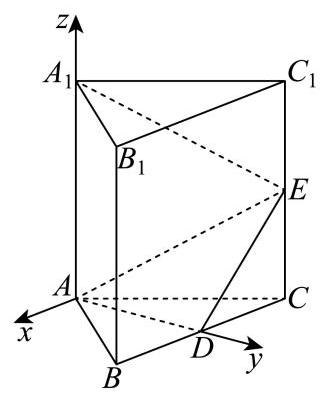

解法二: 连接 ${A}_{1}D$ ,过 ${A}_{1}$ 作 ${A}_{1}G \bot$ 平面 ${ADE}$ ,垂足为 $G$ ,连接 ${GE}$ , 则 $\angle {A}_{1}{EG}$ 就是直线 ${A}_{1}E$ 与平面 ${ADE}$ 所成的角,

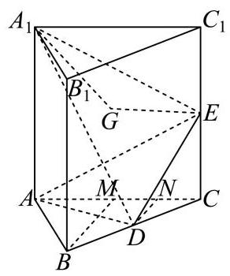

取 ${AC}$ 的中点 $M$ ，连接 ${BM}$ ，取 ${CM}$ 的中点 $N$ ，连接 ${DN}$ ，

因为 ${ABC}$ 为等边三角形， $M$ 为 ${AC}$ 的中点，所以 ${BM} \bot  {AC}$ ，

因为 $D$ 、 $N$ 分别为 ${BC}$ 、 ${CM}$ 的中点，所以 ${DN}//{BM}$ ，则 ${DN} \bot  {AC}$ ，

因为三棱柱 ${ABC} - {A}_{1}{B}_{1}{C}_{1}$ 为直三棱柱，所以 $A{A}_{1} \bot$ 平面 ${ABC}$ ，

因为 ${DN} \subset$ 平面 ${ABC}$ ,所以 ${DN} \bot$ 平面 $A{A}_{1}{C}_{1}C$ ,且 ${DN} = {CD}\sin {60}^{ \circ  } = \frac{\sqrt{3}}{2}$ ,

因为 ${S}_{\bigtriangleup {A{A}_{1}}E} = \frac{1}{2}A{A}_{1} \cdot  {AC} = \frac{1}{2} \times  {2}^{2} = 2$ ，故 ${V}_{\text{ 三棱锥 }D - A{A}_{1}E} = \frac{1}{3}{S}_{\bigtriangleup {A{A}_{1}E}} \cdot  {DN} = \frac{1}{3} \times  2 \times  \frac{\sqrt{3}}{2} = \frac{\sqrt{3}}{3}$ ，

因为 ${AD} \bot$ 平面 ${BC}{C}_{1}{B}_{1},{DE} \subset$ 平面 ${BC}{C}_{1}{B}_{1}$ ，所以 ${AD} \bot  {DE}$ ，

又因为 ${AD} = {AB}\sin {60}^{ \circ  } = 2 \times  \frac{\sqrt{3}}{2} = \sqrt{3},{DE} = \sqrt{C{D}^{2} + C{E}^{2}} = \sqrt{1 + 1} = \sqrt{2}$ ,

所以 ${S}_{\bigtriangleup {ADE}} = \frac{1}{2}{AD} \cdot  {DE} = \frac{1}{2} \times  \sqrt{3} \times  \sqrt{2} = \frac{\sqrt{6}}{2}$ ,

所以 ${V}_{\text{ 三棱锥 }{A}_{1} - {ADE}} = \frac{1}{3}{S}_{\bigtriangleup {ADE}} \cdot  {A}_{1}G = \frac{1}{3} \times  \frac{\sqrt{6}}{2} \times  {A}_{1}G = \frac{\sqrt{3}}{3}$ ,解得 ${A}_{1}G = \sqrt{2}$ ,

又 ${A}_{1}E = \sqrt{{A}_{1}{C}_{1}^{2} + {C}_{1}{E}^{2}} = \sqrt{{2}^{2} + {1}^{2}} = \sqrt{5}$ ,

故 $\sin \angle {A}_{1}{EG} = \frac{{A}_{1}G}{{A}_{1}E} = \frac{\sqrt{10}}{5}$ ,则 $\angle {A}_{1}{EG} = \arcsin \frac{\sqrt{10}}{5}$ ,

所以 ${A}_{1}E$ 与平面 ${ADE}$ 所成的角的大小为 $\arcsin \frac{\sqrt{10}}{5}$ .

解法三: 设 $F$ 是 ${B}_{1}{C}_{1}$ 的中点,连接 ${A}_{1}F\text{ 、 }{DF}\text{ 、 }{EF}$ ,

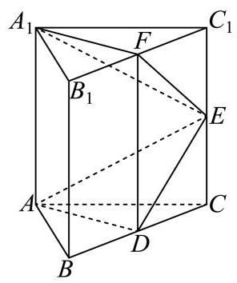

因为 $B{B}_{1}//C{C}_{1}, B{B}_{1} = C{C}_{1}$ ,故四边形 $B{B}_{1}{C}_{1}C$ 为平行四边形,

所以 ${BC}//{B}_{1}{C}_{1},{BC} = {B}_{1}{C}_{1}$ ,

因为 $D$ 、 $F$ 分别为 ${BC}$ 、 ${B}_{1}{C}_{1}$ 的中点，所以 ${BD}//{B}_{1}F$ ， ${BD} = {B}_{1}F$ ，

故四边形 $B{B}_{1}{FD}$ 为平行四边形,所以 $B{B}_{1}//{DF}, B{B}_{1} = {DF}$ ,

又因为 $A{A}_{1}//B{B}_{1}, A{A}_{1} = B{B}_{1}$ ,所以 $A{A}_{1}//{DF}, A{A}_{1} = {DF}$ ,

所以四边形 $A{A}_{1}{FD}$ 为平行四边形,所以 ${A}_{1}F//{AD}$ ,

因为 ${A}_{1}F \text{ ⊄ }$ 平面 ${ADE},{AD} \subset$ 平面 ${ADE}$ ,所以 ${A}_{1}F//$ 平面 ${ADE}$ ,

点 ${A}_{1}$ 与 $F$ 到平面 ${ADE}$ 的距离相等.

由四边形 ${BC}{C}_{1}{B}_{1}$ 是正方形， $E$ 、 $F$ 、 $D$ 分别为 $C{C}_{1}$ 、 ${B}_{1}{C}_{1}$ 、 ${BC}$ 的中点，

故 ${CD} = {CE} = {C}_{1}E = {C}_{1}F$ ，所以 $\angle {FE}{C}_{1} = \angle {CED} = \frac{\pi }{4}$ ，故 $\angle {FED} = \frac{\pi }{2}$ ，即 ${EF}\bot {ED}$ ， 又平面 ${ADE} \bot$ 平面 ${BC}{C}_{1}{B}_{1},{EF} \subset$ 平面 ${BC}{C}_{1}{B}_{1}$ ,平面 ${BC}{C}_{1}{B}_{1} \cap$ 平面 ${ADE} = {DE}$ ,

故 ${EF} \bot$ 平面 ${ADE}$ ,易知 ${EF} = \sqrt{{C}_{1}{E}^{2} + {C}_{1}{F}^{2}} = \sqrt{1 + 1} = \sqrt{2}$ ,故 ${A}_{1}$ 到平面 ${ADE}$ 的距离也为 $\sqrt{2}$ ,

又 ${A}_{1}E = \sqrt{{A}_{1}{C}_{1}^{2} + {C}_{1}{E}^{2}} = \sqrt{{2}^{2} + {1}^{2}} = \sqrt{5}$ ,

设 ${A}_{1}E$ 与平面 ${ADE}$ 所成的角为 $\theta$ ,则 $\sin \theta  = \frac{\sqrt{2}}{{A}_{1}E} = \frac{\sqrt{2}}{\sqrt{5}} = \frac{\sqrt{10}}{5}$ ,故 $\theta  = \arcsin \frac{\sqrt{10}}{5}$ ,

所以 ${A}_{1}E$ 与平面 ${ADE}$ 所成的角的大小为 $\arcsin \frac{\sqrt{10}}{5}$ .

19. 已知 $f\left( x\right)  = 2\sin x\cos x - 2{\sin }^{2}x$ .

(1)求函数 $y = f\left( x\right)$ 的最小正周期与单调增区间；

(2) 将函数 $y = f\left( x\right)$ 的图象上的所有点沿向量 $\overrightarrow{n} = \left( {\theta ,1}\right) \left( {0 \leq  \theta  \leq  \frac{\pi }{2}}\right)$ 平移，得到 $y = g\left( x\right)$ 的图象. 若 $y = g\left( x\right)$ 同时满足: ①图象关于点 $A\left( {-\frac{3\pi }{8},0}\right)$ 对称; ②有且仅有 2 个极大值点在区间 $\left\lbrack  {0, a}\right\rbrack$ 上. 求 $a$ 的取值范围.

【答案】(1) 最小正周期为 $\pi$ ,单调增区间为 $\left\lbrack  {{k\pi } - \frac{3\pi }{8},{k\pi } + \frac{\pi }{8}}\right\rbrack  \left( {k \in  \mathbf{Z}}\right)$

(2) $\left( {\frac{11\pi }{8},\frac{19\pi }{8}}\right\rbrack$

【解析】

【分析】(1) 利用三角恒等变换化简函数 $f\left( x\right)$ 的解析式,利用正弦型函数的周期公式和正弦型函数的单调性可求得答案;

(2)利用三角函数图象变换可得出函数 $g\left( x\right)$ 的解析式，根据函数 $g\left( x\right)$ 满足条件①以及 $\theta$ 的范围可得出 $\theta$ 的值,再根据函数 $g\left( x\right)$ 满足条件②可得出关于 $a$ 的不等式,解之即可.

【小问 1 详解】

因为 $f\left( x\right)  = \sin {2x} - \left( {1 - \cos {2x}}\right)  = \sin {2x} + \cos {2x} - 1 = \sqrt{2}\sin \left( {{2x} + \frac{\pi }{4}}\right)  - 1$ ,

所以函数 $y = f\left( x\right)$ 的最小正周期为 $\frac{2\pi }{2} = \pi$ ,

由 ${2k\pi } - \frac{\pi }{2} \leq  {2x} + \frac{\pi }{4} \leq  {2k\pi } + \frac{\pi }{2}\left( {k \in  \mathbf{Z}}\right)$ ,可得 ${k\pi } - \frac{3\pi }{8} \leq  x \leq  {k\pi } + \frac{\pi }{8}\left( {k \in  \mathbf{Z}}\right)$ ,

所以函数 $y = f\left( x\right)$ 的单调增区间为 $\left\lbrack  {{k\pi } - \frac{3\pi }{8},{k\pi } + \frac{\pi }{8}}\right\rbrack  \left( {k \in  \mathbf{Z}}\right)$ .

【小问 2 详解】

由 (1) 知 $f\left( x\right)  = \sqrt{2}\sin \left( {{2x} + \frac{\pi }{4}}\right)  - 1$ ,

将函数 $y = f\left( x\right)$ 的图象上的所有点沿向量 $\overrightarrow{n} = \left( {\theta ,1}\right) \left( {0 \leq  \theta  \leq  \frac{\pi }{2}}\right)$ 平移，得到 $y = g\left( x\right)$ 的图象,

所以 $g\left( x\right)  = \sqrt{2}\sin \left( {{2x} - {2\theta } + \frac{\pi }{4}}\right)$ ,

由 $y = g\left( x\right)$ 的图象关于点 $A\left( {-\frac{3\pi }{8},0}\right)$ 对称,可得 $\sqrt{2}\sin \left( {-\frac{3\pi }{4} - {2\theta } + \frac{\pi }{4}}\right)  = 0$ ,

所以 $- \frac{\pi }{2} - {2\theta } = {k\pi }\left( {k \in  \mathbf{Z}}\right)$ ,解得 $\theta  =  - \frac{k\pi }{2} - \frac{\pi }{4}\left( {k \in  \mathbf{Z}}\right)$ ,

又 $0 \leq  \theta  \leq  \frac{\pi }{2}$ ，可知 $\theta  = \frac{\pi }{4}$ ，故 $g\left( x\right)  = \sqrt{2}\sin \left( {{2x} - \frac{\pi }{4}}\right)$ ，

当 $x \in  \left\lbrack  {0, a}\right\rbrack$ 时, ${2x} - \frac{\pi }{4} \in  \left\lbrack  {-\frac{\pi }{4},{2a} - \frac{\pi }{4}}\right\rbrack$ ,

由②知 $\frac{5\pi }{2} < {2a} - \frac{\pi }{4} \leq  \frac{9\pi }{2}$ ，解得 $\frac{11\pi }{8} < a \leq  \frac{19\pi }{8}$ ，

故 $a$ 的取值范围是 $\left( {\frac{11\pi }{8},\frac{19\pi }{8}}\right\rbrack$ .

20. 已知点 ${F}_{1}\text{ 、 }{F}_{2}$ 分别是曲线 $\Gamma  : \frac{{x}^{2}}{6} + \frac{{y}^{2}}{2} = 1$ 的左、右焦点,动直线 $l$ 过点 ${F}_{1}$ 且不过点 ${F}_{2}$ , 它与 $\Gamma$ 交于点 $P\text{ 、 }Q$ .

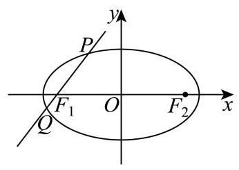

(1)求点 ${F}_{1}\text{ 、 }{F}_{2}$ 的坐标；

(2)若 $\overrightarrow{{F}_{2}P} \cdot  \overrightarrow{{F}_{2}Q} = {11}$ ，求直线 $l$ 的方程；

(3)设直线 ${l}_{1}$ 过点 ${F}_{1}$ 且与 $l$ 垂直，直线 ${l}_{2} : x = m$ 与 ${l}_{1}$ 的交点为 $T$ ，求证:存在唯一的常数 $m$ ,使得点 $T$ 与 $\Gamma$ 的中心的连线平分线段 ${PQ}$ ,并求此时 $\frac{\left| PQ\right| }{\left| T{F}_{1}\right| }$ 的最大值.

【答案】(1) ${F}_{1}\left( {-2,0}\right) \text{ 、 }{F}_{2}\left( {2,0}\right)$

(2) $x + y + 2 = 0$ 或 $x - y + 2 = 0$ .

(3) $\sqrt{3}$

【解析】

【分析】(1) 求出椭圆 $\Gamma$ 的半焦距,可得出点 ${F}_{1}\text{ 、 }{F}_{2}$ 的坐标;

(2)设直线 $l$ 的方程为 $x = {ty} - 2$ ，设 $P\left( {{x}_{1},{y}_{1}}\right)$ 、 $Q\left( {{x}_{2},{y}_{2}}\right)$ ，将该直线方程与椭圆的方程联立,列出韦达定理,利用平面向量数量积的坐标运算以及韦达定理可求得 $t$ 的值,即可得出直线 $l$ 的方程；

(3)求出线段 ${PQ}$ 的中点 $N$ 的坐标，可得出直线 ${ON}$ 的斜率，将 $x = m$ 代入直线 $T{F}_{1}$ 的方程， 可得出点 $T$ 的坐标,即可求出直线 ${OT}$ 的斜率,结合题意可知直线 ${ON}\text{ 、 }{OT}$ 的斜率相等, 可求出 $m$ 的值,再求出 $\left| {PQ}\right| \text{ 、 }\left| {T{F}_{1}}\right|$ ,即可求得 $\frac{\left| PQ\right| }{\left| T{F}_{1}\right| }$ 的最大值.

【小问 1 详解】

椭圆 $\Gamma$ 的半焦距 $c = \sqrt{6 - 2} = 2$ ,故 ${F}_{1}\left( {-2,0}\right) \text{ 、 }{F}_{2}\left( {2,0}\right)$ .

【小问 2 详解】

由题意可知直线 $l$ 不与 $x$ 轴重合,设直线 $l$ 的方程为 $x = {ty} - 2$ ,设 $P\left( {{x}_{1},{y}_{1}}\right) \text{ 、 }Q\left( {{x}_{2},{y}_{2}}\right)$ ,

将 $x = {ty} - 2$ 代 入 $\frac{{x}^{2}}{6} + \frac{{y}^{2}}{2} = 1$ ，得 $\left( {{t}^{2} + 3}\right) {y}^{2} - {4ty} - 2 = 0$ ，则 $\Delta  = {16}{t}^{2} + 8\left( {{t}^{2} + 3}\right)  = {24}\left( {{t}^{2} + 1}\right)  > 0,$

故 ${y}_{1} + {y}_{2} = \frac{4t}{{t}^{2} + 3},{y}_{1} \cdot  {y}_{2} = \frac{-2}{{t}^{2} + 3}$ ,

又 $\overrightarrow{{F}_{2}P} = \left( {{x}_{1} - 2,{y}_{1}}\right) ,\overrightarrow{{F}_{2}Q} = \left( {{x}_{2} - 2,{y}_{2}}\right)$ ,

$\overrightarrow{{F}_{2}P} \cdot  \overrightarrow{{F}_{2}Q} = \left( {{x}_{1} - 2}\right) \left( {{x}_{2} - 2}\right)  + {y}_{1}{y}_{2} = \left( {t{y}_{1} - 4}\right) \left( {t{y}_{2} - 4}\right)  + {y}_{1}{y}_{2} = \left( {{t}^{2} + 1}\right) {y}_{1}{y}_{2} - {4t}\left( {{y}_{1} + {y}_{2}}\right)  + {16} \; = \frac{{t}^{2} + 1}{{t}^{2} + 3}\left( {-2}\right)  - {4t} \cdot  \frac{4t}{{t}^{2} + 3} + {16} = \frac{-{18}{t}^{2} - 2}{{t}^{2} + 3} + {16} = {11}$ ,解得 $t =  \pm  1$ ,

所以直线 $l$ 的方程为 $x + y + 2 = 0$ 或 $x - y + 2 = 0$ .

【小问 3 详解】

设线段 ${PQ}$ 的中点为 $N\left( {{x}_{0},{y}_{0}}\right)$ ,由 (2) 知 ${y}_{0} = \frac{2t}{{t}^{2} + 3},{x}_{0} = t{y}_{0} - 2 = \frac{-6}{{t}^{2} + 3}$ , 直线 ${ON}$ 的斜率 ${k}_{1} =  - \frac{t}{3}$ ,

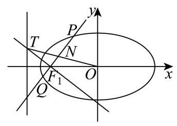

易知直线 $T{F}_{1}$ 的方程为 $t\left( {x + 2}\right)  + y = 0$ ,

将 $x = m$ 代入直线 $T{F}_{1}$ 的方程 $t\left( {x + 2}\right)  + y = 0$ ,可得 $T\left( {m, - \left( {m + 2}\right) t}\right)$ ,

直线 ${OT}$ 的斜率 ${k}_{2} =  - \frac{\left( {m + 2}\right) t}{m}$ ,

因为直线 ${OT}$ 平分线段 ${PQ}$ ,则 ${k}_{1} = {k}_{2}$ ,所以 $- \frac{\left( {m + 2}\right) t}{m} =  - \frac{t}{3}$ 对任意的实数 $t$ 恒成立,

则 $\frac{m + 2}{m} = \frac{1}{3}$ ,解得 $m =  - 3$ ,

故存在唯一的常数 $m$ ,使得 ${OT}$ 平分线段 ${PQ}$ .

此时 $\left| {PQ}\right|  = \sqrt{1 + {t}^{2}}\left| {{y}_{1} - {y}_{2}}\right|  = \sqrt{1 + {t}^{2}} \cdot  \sqrt{{\left( \frac{4t}{{t}^{2} + 3}\right) }^{2} + \frac{8}{{t}^{2} + 3}} = \frac{2\sqrt{6}\left( {1 + {t}^{2}}\right) }{{t}^{2} + 3}$ ,

$\left| {T{F}_{1}}\right|  = \sqrt{1 + {t}^{2}}$ ,所以 $\frac{\left| PQ\right| }{\left| T{F}_{1}\right| } = 2\sqrt{6} \cdot  \frac{\sqrt{1 + {t}^{2}}}{{t}^{2} + 3}$ ,

令 $\sqrt{1 + {t}^{2}} = z$ ,则 $z \in  \lbrack 1, + \infty )$ ,故 $\frac{\left| PQ\right| }{\left| T{F}_{1}\right| } = \frac{2\sqrt{6}z}{{z}^{2} + 2} \leq  \frac{2\sqrt{6}z}{2\sqrt{2z}} = \sqrt{3}$ (当且仅当 $z = \sqrt{2} \in  \lbrack 1, + \infty )$

时， $\frac{\left| PQ\right| }{\left| T{F}_{1}\right| } = \sqrt{3}$ )，

所以 $\frac{\left| PQ\right| }{\left| T{F}_{1}\right| }$ 的最大值为 $\sqrt{3}$ .

21. 对于公共定义域为 $D$ 的函数 $y = f\left( x\right)$ 与 $y = g\left( x\right)$ ,定义集合 ${E}_{f - g} = \left\{  {t\left| {\;t = f\left( x\right)  - g\left( x\right) }\right. , x \in  D}\right\}  .$

(1) 若 $f\left( x\right)  = {x}^{2} - {x}^{3}, g\left( x\right)  = {2x} - {x}^{3}$ ,求 ${E}_{f - g}$ ;

(2)若 $f\left( x\right)  = {\mathrm{e}}^{x}$ ， $g\left( x\right)  = \ln \left( {x - p}\right)  + q\left( {p, q \in  \mathbf{R}}\right)$ ，且 ${E}_{f - g} = \lbrack 0, + \infty )$ ，求 $q - p$ 的最小值;

(3)已知 $y = f\left( x\right)$ 是定义在 $\left( {0, + \infty }\right)$ 上的增函数，其图像是连续曲线，且存在正数 ${x}_{0}$ ，使得 $f\left( {x}_{0}\right)  > 0$ . 若 $g\left( x\right)  =  - f\left( x\right) , h\left( x\right)  = \frac{1}{2}f\left( {2x}\right)$ ,且 ${E}_{f - h} = \{ 0\}$ ,求证: ${E}_{f - g} = \left( {0, + \infty }\right)$ . 【答案】(1) $\lbrack  - 1, + \infty )$ .

(2) 2 .

(3)证明见详解.

【解析】

【分析】(1) 先求出 $f\left( x\right)  - g\left( x\right)$ 的解析式,再转化为二次函数值域问题求解.

(2)由题设可知函数 ${\mathrm{e}}^{x} - \ln \left( {x - p}\right)  - q$ 的值域为非负实数集，从而其最小值为 0，再据此构造极值点并结合基本不等式求最小值.

(3) 法一: 由 ${E}_{f - h} = \{ 0\}$ 得 $f\left( {2x}\right)  = {2f}\left( x\right)$ . 取 $f\left( {x}_{0}\right)  > 0$ ,构造 $l\left( k\right)  = \frac{1}{{2}^{k}}f\left( {{2}^{k}{x}_{0}}\right)$ , 证明其为常量,从而得到 $f\left( {{2}^{k}{x}_{0}}\right)  = {2}^{k}f\left( {x}_{0}\right)$ . 再结合单调性与连续性,求出 $f\left( \left( {0, + \infty }\right) \right)  = \left( {0, + \infty }\right)$ ,进而求得 ${E}_{f - g}$ .

法二: 由 ${E}_{f - h} = \{ 0\}$ 得 $f\left( {2x}\right)  = {2f}\left( x\right)$ . 再分正整数、零、负整数三种情况迭代,证明 $f\left( {{2}^{n}{x}_{0}}\right)  = {2}^{n}f\left( {x}_{0}\right)$ . 结合单调递增与图像连续,得到 $f\left( \left( {0, + \infty }\right) \right)  = \left( {0, + \infty }\right)$ ,从而求得 ${E}_{f - g}$ .

法三: 先由 ${E}_{f - h} = \{ 0\}$ 推出 $f\left( {2x}\right)  - {2f}\left( x\right)  = 0$ . 再对正整数、负整数分别迭代,得到对任意 $n \in  \mathbf{Z}$ ,都有 $f\left( {{2}^{n}{x}_{0}}\right)  = {2}^{n}f\left( {x}_{0}\right)$ . 最后结合连续性与单调性确定 $f$ 的值域,进而求得 ${E}_{f - g}$ .

【小问 1 详解】

由题意， $f\left( x\right)  - g\left( x\right)  = {x}^{2} - {x}^{3} - \left( {{2x} - {x}^{3}}\right)  = {x}^{2} - {2x} = {\left( x - 1\right) }^{2} - 1$ .

因为 ${\left( x - 1\right) }^{2} \geq  0$ ,所以 $f\left( x\right)  - g\left( x\right)  \geq   - 1$ .

当 $x = 1$ 时,等号成立. 故 ${E}_{f - g} = \lbrack  - 1, + \infty )$ .

【小问 2 详解】

令 $\varphi \left( x\right)  = {\mathrm{e}}^{x} - \ln \left( {x - p}\right)  - q\text{ � }\left( {x > p}\right)$ .

由题设可知, $\varphi \left( x\right)$ 的值域为非负实数集,从而其最小值为 0 .

设 $x = t$ 时取到最小值,则 $t > p$ ,且 $\varphi \left( t\right)  = 0,{\varphi }^{\prime }\left( t\right)  = 0$

因为 ${\varphi }^{\prime }\left( x\right)  = {\mathrm{e}}^{x} - \frac{1}{x - p}$ ,所以 ${\mathrm{e}}^{t} = \frac{1}{t - p}$ .

又由 $\varphi \left( t\right)  = 0$ ,得 ${\mathrm{e}}^{t} - \ln \left( {t - p}\right)  - q = 0$ ,即 $q = {\mathrm{e}}^{t} - \ln \left( {t - p}\right)$ .

从而 $q - p = {\mathrm{e}}^{t} - \ln \left( {t - p}\right)  - p$ .

由 ${\mathrm{e}}^{t} = \frac{1}{t - p}$ 可得 $t =  - \ln \left( {t - p}\right)$ ,故 $q - p = {\mathrm{e}}^{t} + t - p = \frac{1}{t - p} + t - p$

令 $u = t - p > 0$ ,则 $q - p = u + \frac{1}{u} \geq  2$ . 当且仅当 $u = 1$ 时,等号成立.

此时 $t - p = 1$ ,由 ${\mathrm{e}}^{t} = \frac{1}{t - p}$ 得 $t = 0$ ,于是 $p =  - 1$ ,又 $q = {\mathrm{e}}^{0} - \ln 1 = 1$ ,故 $q - p = 2$ . 所以 $q - p$ 的最小值为 2 .

【小问 3 详解】

法一: 由 ${E}_{f - h} = \{ 0\}$ 可知,对任意 $x \in  \left( {0, + \infty }\right)$ ,都有 $f\left( x\right)  - h\left( x\right)  = 0$ .

而 $h\left( x\right)  = \frac{1}{2}f\left( {2x}\right)$ ,所以 $f\left( {2x}\right)  = {2f}\left( x\right) \left( {x > 0}\right)$ .(1)

已知存在正数 ${x}_{0}$ ,使得 $f\left( {x}_{0}\right)  > 0$ .

对任意整数 $k$ ,令 $l\left( k\right)  = \frac{1}{{2}^{k}}f\left( {{2}^{k}{x}_{0}}\right)$ .

由式 (1) 可得 $\frac{1}{{2}^{k + 1}}f\left( {{2}^{k + 1}{x}_{0}}\right)  = \frac{1}{{2}^{k}}f\left( {{2}^{k}{x}_{0}}\right)$ ,即 $l\left( {k + 1}\right)  = l\left( k\right)$ .

所以 $l\left( k\right)$ 为常量,即对任意 $k \in  \mathbf{Z}$ ,都有 $l\left( k\right)  = l\left( 0\right)  = f\left( {x}_{0}\right)$ .

于是 $f\left( {{2}^{k}{x}_{0}}\right)  = {2}^{k}f\left( {x}_{0}\right) \left( {k \in  \mathbf{Z}}\right)$ .(2)

下面证明 $f\left( \left( {0, + \infty }\right) \right)  = \left( {0, + \infty }\right)$ .

先证 $f\left( x\right)  > 0$ 对任意 $x > 0$ 都成立.

任取 $x > 0$ ,必存在 $k \in  \mathbf{Z}$ ,使 ${2}^{k}{x}_{0} \leq  x < {2}^{k + 1}{x}_{0}$ .

因为 $f$ 在 $\left( {0, + \infty }\right)$ 上为增函数,所以 $f\left( x\right)  \geq  f\left( {{2}^{k}{x}_{0}}\right)  = {2}^{k}f\left( {x}_{0}\right)  > 0$ .

故对任意 $x > 0$ ，都有 $f\left( x\right)  > 0$ .(3)

再由式 (2) 知 $f\left( \frac{{x}_{0}}{{2}^{n}}\right)  = \frac{f\left( {x}_{0}\right) }{{2}^{n}} \rightarrow  {0}^{ + }\left( {n \rightarrow   + \infty }\right)$ ,且

$f\left( {{2}^{n}{x}_{0}}\right)  = {2}^{n}f\left( {x}_{0}\right)  \rightarrow   + \infty \;\left( {n \rightarrow   + \infty }\right) .$

由于 $f$ 的图像是连续曲线,且 $f$ 在 $\left( {0, + \infty }\right)$ 上单调递增,因此 $f$ 的值域为 $\left( {0, + \infty }\right)$ .

又因为 $g\left( x\right)  =  - f\left( x\right)$ ,所以 $f\left( x\right)  - g\left( x\right)  = {2f}\left( x\right)$ .

当 $f\left( x\right)$ 取遍 $\left( {0, + \infty }\right)$ 时, ${2f}\left( x\right)$ 也取遍 $\left( {0, + \infty }\right)$ .

故 ${E}_{f - g} = \left( {0, + \infty }\right)$ .

法二:

由 ${E}_{f - h} = \{ 0\}$ 可知,对任意 $x > 0$ ,都有 $f\left( x\right)  - h\left( x\right)  = 0$ .

而 $h\left( x\right)  = \frac{1}{2}f\left( {2x}\right)$ ,所以 $f\left( {2x}\right)  = {2f}\left( x\right)$ .(1)

已知存在正数 ${x}_{0}$ ,使得 $f\left( {x}_{0}\right)  > 0$ .

先证明: 对任意整数 $n$ ,都有 $f\left( {{2}^{n}{x}_{0}}\right)  = {2}^{n}f\left( {x}_{0}\right)$ .

当 $n \in  {\mathbf{N}}^{ * }$ 时,由式 (1) 反复应用可得

$f\left( {{2}^{n}{x}_{0}}\right)  = {2f}\left( {{2}^{n - 1}{x}_{0}}\right)  = {2}^{2}f\left( {{2}^{n - 2}{x}_{0}}\right)  = \cdots  = {2}^{n}f\left( {x}_{0}\right) .$

当 $n = 0$ 时,显然 $f\left( {{2}^{0}{x}_{0}}\right)  = f\left( {x}_{0}\right)  = {2}^{0}f\left( {x}_{0}\right)$ .

当 $n < 0$ 时,设 $n =  - m\left( {m \in  {\mathbf{N}}^{ * }}\right)$ ,则由式 (1) 得 $f\left( {{2}^{-m + 1}{x}_{0}}\right)  = {2f}\left( {{2}^{-m}{x}_{0}}\right)$ ,

故 $f\left( {{2}^{-m}{x}_{0}}\right)  = \frac{1}{2}f\left( {{2}^{-m + 1}{x}_{0}}\right)$ .

反复使用上式可得 $f\left( {{2}^{-m}{x}_{0}}\right)  = {2}^{-m}f\left( {x}_{0}\right)$ .

所以式 (2) 对任意整数 $n$ 都成立.

由式 (2) 知 $f\left( \frac{{x}_{0}}{{2}^{n}}\right)  = \frac{f\left( {x}_{0}\right) }{{2}^{n}} \rightarrow  {0}^{ + }\;\left( {n \rightarrow   + \infty }\right)$ ,且

$f\left( {{2}^{n}{x}_{0}}\right)  = {2}^{n}f\left( {x}_{0}\right)  \rightarrow   + \infty \;\left( {n \rightarrow   + \infty }\right) .$

又因为 $f$ 在 $\left( {0, + \infty }\right)$ 上单调递增,且图像连续,所以 $f\left( \left( {0, + \infty }\right) \right)  = \left( {0, + \infty }\right)$ .

由 $g\left( x\right)  =  - f\left( x\right)$ ,可得 $f\left( x\right)  - g\left( x\right)  = {2f}\left( x\right)$ .

于是 ${E}_{f - g} = \{ {2f}\left( x\right)  \mid  x \in  \left( {0, + \infty }\right) \}  = \left( {0, + \infty }\right)$ .

法三:

由 ${E}_{f - h} = \{ 0\}$ 可知,对任意 $x > 0$ ,都有 $f\left( x\right)  - h\left( x\right)  = 0$ .

而 $h\left( x\right)  = \frac{1}{2}f\left( {2x}\right)$ ,所以 $f\left( {2x}\right)  - {2f}\left( x\right)  = 0$ .

已知存在正数 ${x}_{0}$ ，使得 $f\left( {x}_{0}\right)  > 0$ .

由式 (1) 对正整数 $n$ 反复迭代，可得

$f\left( {{2}^{n}{x}_{0}}\right)  - {2f}\left( {{2}^{n - 1}{x}_{0}}\right)  = 0, f\left( {{2}^{n - 1}{x}_{0}}\right)  - {2f}\left( {{2}^{n - 2}{x}_{0}}\right)  = 0,\cdots \cdots , f\left( {2{x}_{0}}\right)  - {2f}\left( {x}_{0}\right)  = 0.$

从而 $f\left( {{2}^{n}{x}_{0}}\right)  = {2}^{n}f\left( {x}_{0}\right) \;\left( {n \in  {\mathbf{N}}^{ * }}\right)$ .

同理,对负整数部分可得 $f\left( {{2}^{-1}{x}_{0}}\right)  = {2}^{-1}f\left( {x}_{0}\right) , f\left( {{2}^{-2}{x}_{0}}\right)  = {2}^{-2}f\left( {x}_{0}\right) ,\cdots \cdots$ ,

于是对任意 $n \in  \mathbf{Z}$ ,都有 $f\left( {{2}^{n}{x}_{0}}\right)  = {2}^{n}f\left( {x}_{0}\right)$ .(2)

由式 (2) 知 $f\left( \frac{{x}_{0}}{{2}^{n}}\right)  = \frac{f\left( {x}_{0}\right) }{{2}^{n}} \rightarrow  {0}^{ + }\left( {n \rightarrow   + \infty }\right)$ ,且 $f\left( {{2}^{n}{x}_{0}}\right)  = {2}^{n}f\left( {x}_{0}\right)  \rightarrow   + \infty \;\left( {n \rightarrow   + \infty }\right)$ .

又因为 $f$ 在 $\left( {0, + \infty }\right)$ 上连续且单调递增,所以 $f\left( \left( {0, + \infty }\right) \right)  = \left( {0, + \infty }\right)$ .

再由 $g\left( x\right)  =  - f\left( x\right)$ 可得 $f\left( x\right)  - g\left( x\right)  = {2f}\left( x\right)$ .

故 ${E}_{f - g} = \{ {2f}\left( x\right)  \mid  x \in  \left( {0, + \infty }\right) \}  = \left( {0, + \infty }\right)$ .
