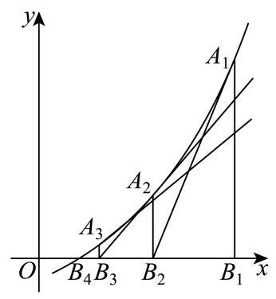

# 2025-2026学年高三二模数学 第21题分类汇编

> 汇编日期: 2026年4月29日
> 覆盖范围: 上海16个区高三二模数学试卷

---

高等数学背景.

使用通俗语言去解释.比喻

从高维度去降维

周期,凹凸,类周期,画图,赋值.连续,反证法.

## 本汇编考点结构总览

> 本汇编均为第 21 题，标签应优先服务于“AI 识别题目入口”：先抓住新定义背后的数学机制，再补充常规知识点。下面按核心机制归类，括号中标明对应区县题目。

1. 新定义函数的结构翻译
   - 振幅/最值型定义：把“最大值 - 最小值”转化为端点夹逼、区间振幅或最小值比较。（浦东、长宁、普陀）
   - 集合/值域闭包型定义：先确定定义域、值域或差值集合，再判断集合包含关系或闭包性质。（金山、黄浦）
   - 对称型定义：识别“中心对称”“乘积恒定”“不同点同最小值”等隐藏结构。（闵行、普陀）

2. 函数方程与构造反证
   - 加法型函数关系：由“线性对”转化为函数方程，核心约束来自值域有界。（杨浦）
   - 单射/可判定性质：把抽象性质还原为单调性、值域交叠或反例构造。（虹口、徐汇）
   - 反证法与极值矛盾：用局部极值或导数控制推出全局结论。（浦东、崇明、徐汇）

3. 导数比较与不等式控制
   - 导数序关系：由 f' 与 g' 的大小比较推出函数差的单调性或积分不等式。（青浦、松江、徐汇）
   - 对数函数导数：围绕 ln x / x 的极值、切线与参数范围展开。（静安）
   - 绝对值导数控制：先拆绝对值，再积分或构造边界函数。（松江、徐汇）

4. 迭代、周期与高阶结构
   - 导数迭代：区分“函数迭代”和“求导迭代”，跟踪周期或递推结构。（宝山）
   - 牛顿切线迭代：由切线零点公式建立递推，再研究零点两侧、单调性与阈值。（奉贤）
   - 压缩映射/不动点：利用导数上界控制迭代收敛与唯一性。（嘉定）

---

## 目录

1. [浦东区](#1-浦东区) — Lipschitz 约束、区间振幅、单调性判定
2. [杨浦区](#2-杨浦区) — 线性对、指数方程、有界函数方程
3. [虹口区](#3-虹口区) — 性质 P、单射性、分段函数跨区间值域
4. [金山区](#4-金山区) — 封闭函数、值域回到定义域、区间闭包
5. [黄浦区](#5-黄浦区) — 函数差值集合、公共定义域、参数值域
6. [崇明区](#6-崇明区) — 减函数、复合/变换单调性、反证矛盾
7. [长宁区](#7-长宁区) — 最值算子、区间极值、参数离散化
8. [静安区](#8-静安区) — ln x / x、导数极值、切线与参数范围
9. [闵行区](#9-闵行区) — M 型函数、对称乘积恒定、中心变量替换
10. [嘉定区](#10-嘉定区) — Sigmoid 对称性、交叉熵单调性、不动点迭代
11. [青浦区](#11-青浦区) — 导数序关系、函数差单调性、不等式比较
12. [徐汇区](#12-徐汇区) — k 调整函数、导数绝对值控制、反例构造
13. [松江区](#13-松江区) — 绝对值上界函数、导数控制、积分比较
14. [普陀区](#14-普陀区) — T 函数、最小值相等、取值点不同
15. [宝山区](#15-宝山区) — 导数迭代序列、周期结构、三角函数构造
16. [奉贤区](#16-奉贤区) — 牛顿切线迭代、零点逼近、递推阈值

---

## 1. 浦东区

**核心考点：** Lipschitz 约束下的区间振幅与单调性判定

**易卡点：** 第 (2) 问的关键不是普通最值，而是振幅达到区间长度上界后，端点必须取满且函数被两侧夹成 $f(x)=x$ 或 $f(x)=-x$；第 (3) 问要用振幅可加性反证单调。

**关联考点：** `新定义函数` `Lipschitz 条件` `区间最值` `反证法`

**题目**

21. 对于定义在区间 $D$ 上的函数 $y = f\left( x\right)$ ,定义集合

$\Omega  = \left\{  {f\left( x\right) \begin{Vmatrix}{f\left( {x}_{1}\right)  - f\left( {x}_{2}\right) }\end{Vmatrix} \leq  \left| {{x}_{1} - {x}_{2}}\right| ,\forall {x}_{1},{x}_{2} \in  D}\right\}$ . 对任意闭区间 $I \subseteq  D$ ,设函数 $y = f\left( x\right)$ 在区间 $I$ 上的最大值为 ${M}_{1}$ ,最小值为 ${M}_{2}$ ,记 $M\left( {f, I}\right)  = {M}_{1} - {M}_{2}$ .

(1)若 $f\left( x\right)  = {x}^{2} - x, D = \left\lbrack  {0,1}\right\rbrack$ ，判断函数 $y = f\left( x\right)$ 是否属于集合 $\Omega$ ，并求 $M\left( {f,\left\lbrack  {0,1}\right\rbrack  }\right)$ 的值;

(2)若 $D = \left\lbrack  {0,1}\right\rbrack  , f\left( x\right)  \in  \Omega$ ,且 $f\left( 0\right)  = 0, M\left( {f,\left\lbrack  {0,1}\right\rbrack  }\right)  = 1$ . 求 $f\left( 1\right)$ 的值及函数 $y = f\left( x\right)$ 的解析式;

**参考答案及解析**

【答案】(1) 是, $M\left( {f,\left\lbrack  {0,1}\right\rbrack  }\right)  = \frac{1}{4}$

( 2 )当 $f\left( 1\right)  = 1$ 时， $f\left( x\right)  = x$ ，当 $f\left( 1\right)  =  - 1$ 时； $f\left( x\right)  =  - x$

(3)证明见解析

【解析】

【分析】(1) 先计算二次函数在闭区间上的最值, 再根据题中所给的定义判断计算可得;

(2)先由函数最值之差为 1 可得 $\left| {f\left( 1\right)  - f\left( 0\right) }\right|  = 1$ ,再通过不等式两边夹逼求得函数解析式;

(3)必要性:分单调递增和单调递减结合函数的最值分别证明可得；充分性:采用反证法， 如果函数不单调，则函数在局部的上最值差大于整体上函数最值差，出现矛盾，得证充分性.

【小问 1 详解】

对任意 ${x}_{1},{x}_{2} \in  \left\lbrack  {0,1}\right\rbrack$ ,所以 $0 \leq  {x}_{1} + {x}_{2} \leq  2, - 1 \leq  {x}_{1} + {x}_{2} - 1 \leq  1$ ,

又因为

$\left| {f\left( {x}_{1}\right)  - f\left( {x}_{2}\right) }\right|  = \left| {\left( {{x}_{1}^{2} - {x}_{1}}\right)  - \left( {{x}_{2}^{2} - {x}_{2}}\right) }\right|  = \left| {\left( {{x}_{1}^{2} - {x}_{2}^{2}}\right)  - \left( {{x}_{1} - {x}_{2}}\right) }\right|  = \left| {{x}_{1} - {x}_{2}}\right|  \cdot  \left| {{x}_{1} + {x}_{2} - 1}\right|$ ,且 ${x}_{1} + {x}_{2} - 1 \in  \left\lbrack  {-1,1}\right\rbrack$

所以 $\left| {f\left( {x}_{1}\right)  - f\left( {x}_{2}\right) }\right|  \leq  \left| {{x}_{1} - {x}_{2}}\right|$ ,故函数 $y = f\left( x\right)$ 属于集合 $\Omega$ .

由 $f\left( x\right)  = {x}^{2} - x = {\left( x - \frac{1}{2}\right) }^{2} - \frac{1}{4}, x \in  \left\lbrack  {0,1}\right\rbrack$ ,由二次函数的性质可知

${M}_{1} = f\left( 0\right)  = f\left( 1\right)  = 0,\;{M}_{2} = f\left( \frac{1}{2}\right)  =  - \frac{1}{4}.$

故 $M\left( {f,\left\lbrack  {0,1}\right\rbrack  }\right)  = \frac{1}{4}$ .

【小问 2 详解】

由 $M\left( {f,\left\lbrack  {0,1}\right\rbrack  }\right)  = 1$ 可知,存在 $u, v \in  \left\lbrack  {0,1}\right\rbrack$ 满足 $\left| {f\left( u\right)  - f\left( v\right) }\right|  = 1$ .

又 $f\left( x\right)  \in  \Omega$ ,故必有 $\left| {f\left( u\right)  - f\left( v\right) }\right|  \leq  \left| {u - v}\right|  \leq  1$ .

因此必有 $\left| {u - v}\right|  = 1$ ,且 $u, v \in  \left\lbrack  {0,1}\right\rbrack$ ,所以 $\{ u, v\}  = \{ 0,1\}$ ,

又 $f\left( 0\right)  = 0,\left| {f\left( 1\right)  - f\left( 0\right) }\right|  = 1$ ,所以 $f\left( 1\right)  = 1$ 或 $f\left( 1\right)  =  - 1$

当 $f\left( 1\right)  = 1$ 时,由题意,对任意 $x \in  \left\lbrack  {0,1}\right\rbrack  ,\left| {f\left( x\right)  - f\left( 0\right) }\right|  \leq  x,\left| {f\left( x\right) }\right|  \leq  x$ ,即 $f\left( x\right)  \leq  x$ .

又因为 $\left| {f\left( 1\right)  - f\left( x\right) }\right|  \leq  1 - x$ ,即 $1 - f\left( x\right)  \leq  1 - x$ ,故 $f\left( \mathrm{x}\right)  \geq  \mathrm{x}$ .

故 $f\left( x\right)  = x$ .

当 $f\left( 1\right)  =  - 1$ 时,由题意,对任意 $x \in  \left\lbrack  {0,1}\right\rbrack  ,\left| {f\left( x\right)  - f\left( 0\right) }\right|  \leq  x,\left| {f\left( x\right) }\right|  \leq  x$ ,即 $f\left( x\right)  \geq   - x$ , 又因为 $\left| {f\left( x\right)  - f\left( 1\right) }\right|  \leq  1 - x,\left| {f\left( x\right)  + 1}\right|  \leq  1 - x$ ,即 $f\left( x\right)  + 1 \leq  1 - x$ ,故 $f\left( x\right)  \leq   - x \; f\left( x\right)  =  - x.$

综上,当 $f\left( 1\right)  = 1$ 时, $f\left( x\right)  = x$ ; 当 $f\left( 1\right)  =  - 1$ 时; $f\left( x\right)  =  - x$ .

【小问 3 详解】

先证必要性: 若 $y = f\left( x\right)$ 是定义在 $\lbrack 0, + \infty )$ 上的增函数,

设任意正实数 ${X}_{1}\text{ 、 }{X}_{2}$ 满足 $0 < {x}_{1} < {x}_{2}$ ,

则 $g\left( {x}_{2}\right)  = M\left( {f,\left\lbrack  {0,{x}_{2}}\right\rbrack  }\right)  = f\left( {x}_{2}\right)  - f\left( 0\right) , g\left( {x}_{1}\right)  = f\left( {x}_{1}\right)  - f\left( 0\right)$ ,

$M\left( {f,\left\lbrack  {{x}_{1},{x}_{2}}\right\rbrack  }\right)  = f\left( {x}_{2}\right)  - f\left( {x}_{1}\right) .$

因此 $g\left( {x}_{2}\right)  - g\left( {x}_{1}\right)  = f\left( {x}_{2}\right)  - f\left( {x}_{1}\right)  = M\left( {f,\left\lbrack  {{x}_{1},{x}_{2}}\right\rbrack  }\right)$ ,得证.

若 $y = f\left( x\right)$ 是定义在 $\lbrack 0, + \infty )$ 上的减函数,

设任意正实数 ${X}_{1}\text{ 、 }{X}_{2}$ 满足 $0 < {x}_{1} < {x}_{2}$ ,

则 $g\left( {x}_{2}\right)  = M\left( {f,\left\lbrack  {0,{x}_{2}}\right\rbrack  }\right)  = f\left( 0\right)  - f\left( {x}_{2}\right) , g\left( {x}_{1}\right)  = f\left( 0\right)  - f\left( {x}_{1}\right)$ ,

$M\left( {f,\left\lbrack  {{x}_{1},{x}_{2}}\right\rbrack  }\right)  = f\left( {x}_{1}\right)  - f\left( {x}_{2}\right) .$

因此

$g\left( {x}_{2}\right)  - g\left( {x}_{1}\right)  = \left\lbrack  {f\left( 0\right)  - f\left( {x}_{2}\right) }\right\rbrack   - \left\lbrack  {f\left( 0\right)  - f\left( {x}_{1}\right) }\right\rbrack   = f\left( {x}_{1}\right)  - f\left( {x}_{2}\right)  = M\left( {f,\left\lbrack  {{x}_{1},{x}_{2}}\right\rbrack  }\right)$ ,得证.

综上, 必要性得证.

再证充分性: (反证法) 假设函数 $y = f\left( x\right)$ 在 $\lbrack 0, + \infty )$ 上不单调,

则必存在 ${x}_{1} < {x}_{0} < {x}_{2}$ ,使得 $f\left( {x}_{1}\right) \left\langle  {f\left( {x}_{0}\right) }\right\rangle  f\left( {x}_{2}\right)$ 或 $f\left( {x}_{1}\right)  > f\left( {x}_{0}\right)  < f\left( {x}_{2}\right)$ .

不妨设 $f\left( {x}_{1}\right) \left\langle  {f\left( {x}_{0}\right) }\right\rangle  f\left( {x}_{2}\right)$ ,且 $f\left( {x}_{0}\right)$ 是函数 $y = f\left( x\right)$ 在区间 $\left\lbrack  {{x}_{1},{x}_{2}}\right\rbrack$ 上的最大值.

设函数 $y = f\left( x\right)$ 在区间 $\left\lbrack  {{x}_{1},{x}_{0}}\right\rbrack$ 上的最小值为 ${L}_{1}$ ,在区间 $\left\lbrack  {{x}_{0},{x}_{2}}\right\rbrack$ 上的最小值为 ${L}_{2}$

由题, $M\left( {f,\left\lbrack  {{x}_{1},{x}_{0}}\right\rbrack  }\right)  = g\left( {x}_{0}\right)  - g\left( {x}_{1}\right) , M\left( {f,\left\lbrack  {{x}_{0},{x}_{2}}\right\rbrack  }\right)  = g\left( {x}_{2}\right)  - g\left( {x}_{0}\right)$ ,

故 $M\left( {f,\left\lbrack  {{x}_{1},{x}_{0}}\right\rbrack  }\right)  + M\left( {f,\left\lbrack  {{x}_{0},{x}_{2}}\right\rbrack  }\right)  = g\left( {x}_{2}\right)  - g\left( {x}_{1}\right)$ ,又 $g\left( {x}_{2}\right)  - g\left( {x}_{1}\right)  = M\left( {f,\left\lbrack  {{x}_{1},{x}_{2}}\right\rbrack  }\right)$ ,

故 $M\left( {f,\left\lbrack  {{x}_{1},{x}_{0}}\right\rbrack  }\right)  + M\left( {f,\left\lbrack  {{x}_{0},{x}_{2}}\right\rbrack  }\right)  = M\left( {f,\left\lbrack  {{x}_{1},{x}_{2}}\right\rbrack  }\right)$

即 $f\left( {x}_{0}\right)  - {L}_{1} + f\left( {x}_{0}\right)  - {L}_{2} = f\left( {x}_{0}\right)  - \min \left\{  {{L}_{1},{L}_{2}}\right\}$ ,

即 $f\left( {x}_{0}\right)  = {L}_{1} + {L}_{2} - \min \left\{  {{L}_{1},{L}_{2}}\right\}$ ,即 $f\left( {x}_{0}\right)  = \max \left\{  {{L}_{1},{L}_{2}}\right\}$ ,

$\max \left\{  {{L}_{1},{L}_{2}}\right\}   \leq  \max \left\{  {f\left( {x}_{1}\right) , f\left( {x}_{2}\right) }\right\}   < f\left( {x}_{0}\right)$ ,矛盾.

因此假设不成立. $f\left( x\right)$ 是 $\lbrack 0, + \infty )$ 上的单调函数.

因此, $y = f\left( x\right)$ 是单调函数的充要条件是: 对任意正实数 $0 < {x}_{1} < {x}_{2}$ , $g\left( {x}_{2}\right)  - g\left( {x}_{1}\right)  = M\left( {f,\left\lbrack  {{x}_{1},{x}_{2}}\right\rbrack  }\right)$ 恒成立

---

## 2. 杨浦区

**核心考点：** “线性对”转化为函数方程与值域有界约束

**易卡点：** 第 (2) 问要把存在 $x_2$ 转成 $0<2^{x_2}<1$ 的范围问题；第 (3) 问核心是由线性对推出 $f(2x)=2f(x)$，再用值域有界压出 $f(x)=0$。

**关联考点：** `新定义函数` `函数方程` `指数函数` `有界性`

**题目**

21. 设函数 $y = f\left( x\right)$ 的定义域为 $D$ ,值域 $A \subseteq  \left\lbrack  {-1,1}\right\rbrack$ . 若 ${x}_{1},{x}_{2} \in  D$ 且满足 $f\left( {x}_{1}\right)  + f\left( {x}_{2}\right)  = f\left( {{x}_{1} + {x}_{2}}\right)$ ,则称 ${X}_{1}$ 与 ${x}_{2}$ 构成 “函数 $y = f\left( x\right)$ 的线性对”.

(1)若 $f\left( x\right)  = \cos x$ ，判断 $\frac{\pi }{3}$ 与 $\pi$ 是否构成函数 $y = f\left( x\right)$ 的线性对，并说明理由；

( 2 )若 $f\left( x\right)  = {2}^{x} - \frac{1}{2}, D = \left( {-\infty ,0}\right)$ . 若对于任意 ${x}_{1} \in  \left( {-\infty , a}\right)$ (常数 $a \leq  0$ )，都存在 ${x}_{2} \in  D$ ,使得 ${x}_{1}$ 与 ${x}_{2}$ 构成函数 $y = f\left( x\right)$ 的线性对,求 $a$ 的取值范围;

**参考答案及解析**

【答案】(1) 是, 理由见解析;

(2) $( - \infty , - 1\rbrack$ ；

(3)证明见解析

【解析】

【分析】利用赋值即可求证;

利用分离变量求值域, 即可求得参数范围;

利用恒等式变形, 结合值域分析, 即可得证.

【小问 1 详解】

因为 $f\left( \frac{\pi }{3}\right)  + f\left( \pi \right)  = \cos \frac{\pi }{3} + \cos \pi  = \frac{1}{2} - 1 =  - \frac{1}{2}, f\left( {\frac{\pi }{3} + \pi }\right)  = \cos \frac{4\pi }{3} =  - \frac{1}{2}$ ,

所以 $f\left( \frac{\pi }{3}\right)  + f\left( \pi \right)  = f\left( {\frac{\pi }{3} + \pi }\right)$ ,满足值域 $A \subseteq  \left\lbrack  {-1,1}\right\rbrack$ 且 $f\left( {x}_{1}\right)  + f\left( {x}_{2}\right)  = f\left( {{x}_{1} + {x}_{2}}\right)$ , 即 $\frac{\pi }{3}$ 与 $\pi$ 是构成函数 $y = f\left( x\right)$ 的线性对;

【小问 2 详解】

由题意, ${x}_{1} \in  \left( {-\infty , a}\right) ,{x}_{2} \in  \left( {-\infty ,0}\right)$ ,需满足 $f\left( {x}_{1}\right)  + f\left( {x}_{2}\right)  = f\left( {{x}_{1} + {x}_{2}}\right)$ ,

代入 $f\left( x\right)  = {2}^{x} - \frac{1}{2}$ 整理

得: $\left( {{2}^{{x}_{1}} - \frac{1}{2}}\right)  + \left( {{2}^{{x}_{2}} - \frac{1}{2}}\right)  = {2}^{{x}_{1} + {x}_{2}} - \frac{1}{2} \Rightarrow  {2}^{{x}_{2}}\left( {1 - {2}^{{x}_{1}}}\right)  = \frac{1}{2} - {2}^{{x}_{1}} \Rightarrow  {2}^{{x}_{2}} = \frac{\frac{1}{2} - {2}^{{x}_{1}}}{1 - {2}^{{x}_{1}}}$ ,

因为 ${x}_{2} < 0$ ,所以要求 $0 < {2}^{{x}_{2}} < 1$ ,

又 ${x}_{1} < a \leq  0$ ，故 ${2}^{{x}_{1}} \in  \left( {0,1}\right)$ ，由等式可得:

$0 < \frac{\frac{1}{2} - {2}^{{x}_{1}}}{1 - {2}^{{x}_{1}}} < 1 \Rightarrow  \frac{1}{2} - {2}^{{x}_{1}} > 0 \Rightarrow  {2}^{{x}_{1}} < \frac{1}{2} \Rightarrow  {x}_{1} <  - 1$ ,

对任意 ${x}_{1} \in  \left( {-\infty , a}\right)$ 都存在满足条件的 ${x}_{2}$ ,故 $a \leq   - 1$ ,

所以 $a$ 的取值范围 $( - \infty , - 1\rbrack$ ;

【小问 3 详解】

由 $f\left( x\right)$ 是 $\mathbf{R}$ 上的奇函数,可得 $f\left( 0\right)  = 0, f\left( {-x}\right)  =  - f\left( x\right)$ ;

则 $f\left( x\right)  + f\left( {-x}\right)  = f\left( {x + \left( {-x}\right) }\right)$ ,即 $x, - x$ 是线性对,

由 ${x}_{1},{x}_{2}$ 是线性对,则 ${x}_{1}, - {x}_{2}$ 也是线性对,可得 $x, x$ 也是线性对,

所以有 $f\left( x\right)  + f\left( x\right)  = f\left( {x + x}\right)  \Rightarrow  {2f}\left( x\right)  = f\left( {2x}\right)$ ,

因为 $f\left( x\right)$ 定义在 $\mathbf{R}$ 上,所以通过迭代可得:

${2}^{n}f\left( x\right)  = {2}^{n - 1}f\left( {2x}\right)  = {2}^{n - 2}f\left( {{2}^{2}x}\right)  = \cdots  = f\left( {{2}^{n}x}\right) ,$

又由题设大前提, $f\left( x\right)$ 的值域 $A \subseteq  \left\lbrack  {-1,1}\right\rbrack$ ,

若值域内存在正数 $a$ ,必存在 $n \in  \mathbf{N}$ ,使得 ${2}^{n}a > 1$ ,

此时 ${2}^{n}f\left( x\right)  > 1$ ,而 $f\left( {{2}^{n}x}\right)  \in  \left\lbrack  {-1,1}\right\rbrack$ ,显然 ${2}^{n}f\left( x\right)  \neq  f\left( {{2}^{n}x}\right)$ ,

即值域内不存在正数 $a$ ；

若值域内存在负数 $a$ ,必存在 $n \in  \mathbf{N}$ ,使得 ${2}^{n}a <  - 1$ ,

此时 ${2}^{n}f\left( x\right)  <  - 1$ ,而 $f\left( {{2}^{n}x}\right)  \in  \left\lbrack  {-1,1}\right\rbrack$ ,显然 ${2}^{n}f\left( x\right)  \neq  f\left( {{2}^{n}x}\right)$ ,

即值域不存在负数 $a$ ,

因此对任意 $x \in  \mathbf{R}, f\left( x\right)  = 0$ ,问题得证.

---

## 3. 虹口区

**核心考点：** 性质 P 本质是指定集合上的单射性判定

**易卡点：** 分段函数不能只看每一段是否单调，还要检查两个分离区间的值域是否发生交叠；跨区间交叠是最容易漏掉的点。

**关联考点：** `单射` `分段函数` `值域交叠` `参数范围`

**题目**

21. 若对于定义在 $\mathbf{R}$ 上的函数 $y = f\left( x\right)$ ,设 $I$ 是 $\mathbf{R}$ 的一个子集， ${X}_{1}$ 和 ${x}_{2}$ 是 $I$ 上任意给定的两个实数,当 ${x}_{1} \neq  {x}_{2}$ 时,恒有 $f\left( {x}_{1}\right)  \neq  f\left( {x}_{2}\right)$ ,则称函数 $y = f\left( x\right)$ 在 $I$ 上具有 “性质 $P$ ”

(1)分别判断函数 $y = {\mathrm{e}}^{x}$ 和 $y = {x}^{\frac{2}{3}}$ 是否在 $\mathbf{R}$ 上具有 “性质 $P$ ” ; (无需说明理由)

(2) 设 $I = \left\lbrack  {-2, - 1}\right\rbrack   \cup  \left\lbrack  {2,3}\right\rbrack$ ,记 $f\left( x\right)  = \left\{  \begin{array}{l}  - x + k, x \leq  k, \\  {\left( x - k\right) }^{2}, x > k \end{array}\right.$ ,若函数 $y = f\left( x\right)$ 在 $I$ 上具有 “性质 $P$ ”,求实数 $k$ 的取值范围;

**参考答案及解析**

【答案】(1) $y = {\mathrm{e}}^{x}$ 在 $\mathrm{R}$ 上具有 “性质 $P$ ”; $y = {x}^{\frac{2}{3}}$ 在 $\mathrm{R}$ 上不具有 “性质 $P$ ”.

(2) $\left( {-\infty , - 2\rbrack \cup \lbrack  - 1,\frac{5 - \sqrt{17}}{2}}\right)  \cup  \left( {\frac{7 - \sqrt{17}}{2},2\rbrack \cup \lbrack 3, + \infty }\right)$

(3)见解析

【解析】

【分析】(1) 根据 “性质 $P$ ” 的定义,判断函数 $y = {\mathrm{e}}^{x}$ 和 $y = {x}^{\frac{2}{3}}$ 在 $\mathrm{R}$ 上是否满足 “性质 $P$ ”.

(2)分情况讨论函数 $f\left( x\right)$ 在不同区间上的单调性，结合 “性质 $P$ ” 的定义确定 $k$ 的取值范围.

(3)先证明集合 $M$ 非空，再通过反证法证明集合 $M$ 是无限集或单元素集.

【小问 1 详解】

因为 $y = {\mathrm{e}}^{x}$ 是严格增函数,则根据 “性质 $P$ ” 的定义可知,函数 $y = {\mathrm{e}}^{x}$ 在 $\mathrm{R}$ 上具有 “性质 $P$ ”;

因为 ${\left( -1\right) }^{\frac{2}{3}} = {1}^{\frac{2}{3}}$ ,则函数 $y = {x}^{\frac{2}{3}}$ 在 $\mathbf{R}$ 上不具有 “性质 $P$ ”.

【小问 2 详解】

当 $k \leq   - 2$ 时,此时 $f\left( x\right)  = {\left( x - k\right) }^{2}$ 在 $\left\lbrack  {-2, - 1}\right\rbrack$ 和 $\left\lbrack  {2,3}\right\rbrack$ 上单调递增,函数 $y = f\left( x\right)$ 在 $I$ 上具有“性质 $P$ ”.

当 $k \geq  3$ 时,此时 $f\left( x\right)  =  - x + k$ 在 $\left\lbrack  {-2, - 1}\right\rbrack$ 和 $\left\lbrack  {2,3}\right\rbrack$ 上单调递减,函数 $y = f\left( x\right)$ 在 $I$ 上具有 “性质 $P$ ”.

当 $- 2 < k <  - 1$ 时,函数 $f\left( x\right)$ 在区间 $\left\lbrack  {-2, - 1}\right\rbrack$ 不单调, $\therefore y = f\left( x\right)$ 在 $I$ 不具有 “性质 $P$ ”. 当 $- 1 \leq  k \leq  2$ 时,此时 $f\left( x\right)$ 在 $\left\lbrack  {-2, - 1}\right\rbrack$ 上单调递减,在 $\left\lbrack  {2,3}\right\rbrack$ 上单调递增,

要使函数 $y = f\left( x\right)$ 在 $I$ 上具有 “性质 $P$ ”,

则需满足 $f\left( {-1}\right)  > f\left( 3\right)$ 或 $f\left( {-2}\right)  < f\left( 2\right)$ ,即 $1 + k > {\left( 3 - k\right) }^{2}$ 或 $2 + k < {\left( 2 - k\right) }^{2}$ ,

整理得 ${k}^{2} - {7k} + 8 < 0$ 或 ${k}^{2} - {5k} + 2 > 0$ ,解得 $\frac{7 - \sqrt{17}}{2} < k < \frac{7 + \sqrt{17}}{2}$ 或 $k < \frac{5 - \sqrt{17}}{2}$ 或 $k > \frac{5 + \sqrt{17}}{2}$

又 $- 1 \leq  k \leq  2$ ,得 $- 1 \leq  k < \frac{5 - \sqrt{17}}{2}$ 或 $\frac{7 - \sqrt{17}}{2} < k \leq  2$ .

当 $2 < k < 3$ 时，函数 $f\left( x\right)$ 在区间 $\left\lbrack  {2,3}\right\rbrack$ 不单调， $\therefore f\left( x\right)$ 在 $I$ 上不具有“性质 $P$ ”.

综上,实数 $k$ 的取值范围是 $\left( {-\infty , - 2\rbrack \cup \lbrack  - 1,\frac{5 - \sqrt{17}}{2}}\right)  \cup  \left( {\frac{7 - \sqrt{17}}{2},2\rbrack \cup \lbrack 3, + \infty }\right)$ .

【小问 3 详解】

证明: 因为函数 $y = f\left( x\right)$ 在 $\mathbf{R}$ 上具有 “性质 $P$ ”,其图像是连续曲线, $\therefore f\left( x\right)$ 在 $\mathrm{R}$ 上单调.

若 $f\left( x\right)$ 单调递减,假设 $M$ 中至少有 2 个元素 $a < b$ ,则 $f\left( a\right)  = a, f\left( b\right)  = b,\because f\left( x\right)$ 单调递减,

$\therefore a\langle b \Rightarrow  f\left( a\right) \rangle f\left( b\right)  \Rightarrow  a > b$ ,矛盾,因此 $M$ 最多一个元素.

若 $f\left( x\right)$ 单调递增,假设 $M$ 中至少有 2 个元素 $a < b$ ,则 $f\left( a\right)  = a, f\left( b\right)  = b$ .

对 $\forall x \in  \left( {a, b}\right)$ ,若 $f\left( x\right)  > x$ ,由于 $f\left( x\right)$ 单调递增, $f\left( {f\left( x\right) }\right)  > f\left( x\right)  \Rightarrow  x > f\left( x\right)$ ,矛盾若 $f\left( x\right)  < x$ ,由于 $f\left( x\right)$ 单调递增, $f\left( {f\left( x\right) }\right)  < f\left( x\right)  \Rightarrow  x < f\left( x\right)$ ,矛盾.

因此对 $\forall x \in  \left( {a, b}\right)$ ,必有 $f\left( x\right)  = x$ ,即 $\left( {a, b}\right)  \subseteq  M, M$ 是无限集.

令 $g\left( x\right)  = f\left( x\right)  - x, g\left( x\right)$ 是连续函数,若 $f\left( x\right)$ 单调递增:

若 $f\left( x\right)  > x$ 对所有 $x$ 都成立,则 $f\left( {f\left( x\right) }\right)  > f\left( x\right)  > x$ ,与 $f\left( {f\left( x\right) }\right)  = x$ 矛盾.

若 $f\left( x\right)  < x$ 对所有 $x$ 都成立,则 $f\left( {f\left( x\right) }\right)  < f\left( x\right)  < x$ ,与 $f\left( {f\left( x\right) }\right)  = x$ 矛盾.

故存在 ${x}_{1} < {x}_{2}$ ,使 $\mathrm{g}\left( {x}_{1}\right)  > 0,\mathrm{\;g}\left( {x}_{2}\right)  < 0$ ,由零点存在定理, $\exists c \in  \left( {{x}_{1},{x}_{2}}\right)$ ,使 $g\left( c\right)  = 0$ ,即 $f\left( c\right)  = c, M$ 非空.

若 $f\left( x\right)$ 单调递减:

当 $x \rightarrow   + \infty , f\left( x\right)  \rightarrow   - \infty , x \rightarrow   - \infty , f\left( x\right)  \rightarrow   + \infty$ ,

$\therefore x \rightarrow   + \infty , g\left( x\right)  \rightarrow   - \infty , x \rightarrow   - \infty , g\left( x\right)  \rightarrow   + \infty$ ,

由零点存在定理, $\exists c$ 使 $g\left( c\right)  = 0, M$ 非空.

综上, $M$ 要么是单元素集,要么是无限集,命题得证.

---

## 4. 金山区

**核心考点：** 封闭函数的值域回到定义域与区间不变性

**易卡点：** 判断“封闭”不是简单求值域，而是要确认值域整体落回原定义域；后续证明通常依赖这种闭包性质做迭代或区间限制。

**关联考点：** `新定义函数` `定义域和值域` `区间闭包` `函数迭代思想`

**题目**

21. 若函数 $y = f\left( x\right) , x \in  D$ ,其值域为 $A$ . 若 $A \subseteq  D$ ,则称函数 $y = f\left( x\right)$ 在区间 $D$ 上为封闭函数.

(1)已知 $f\left( x\right)  = \frac{{2x} + 3}{x + 1}$ ，判断函数 $y = f\left( x\right)$ 是否在区间 $\left\lbrack  {2,8}\right\rbrack$ 上为封闭函数，并说明理由;

(2) 已知 $g\left( x\right)  = {x}^{2} + {2x}$ ,若函数 $y = g\left( x\right)$ 在区间 $\left\lbrack  {a, b}\right\rbrack$ 上不为单调函数,但在区间 $\left\lbrack  {a, b}\right\rbrack$ 上为封闭函数,求 $b - a$ 的最大值;

**参考答案及解析**

【答案】(1) 是, 理由见解析; (2) 2; (3) 证明见解析.

【解析】

【分析】(1) 利用不等式性质求出函数 $f\left( x\right)$ 的值域,利用定义判断即可;

(2)二次函数在闭区间的最值在顶点或端点取得，只需保证 $g\left( {-1}\right) , g\left( a\right) , g\left( b\right)  \in  \left\lbrack  {a, b}\right\rbrack$ 即可;

(3)可先利用零点存在性定理证明存在性，再用反证法证明唯一性，最后根据 $\mathop{\lim }\limits_{{n \rightarrow   + \infty }}{L}^{n} = 0$ 证明 $\mathop{\lim }\limits_{{n \rightarrow   + \infty }}{x}_{n} = c$ .

【小问 1 详解】

由 $f\left( x\right)  = \frac{{2x} + 3}{x + 1} = 2 + \frac{1}{x + 1}, x \in  \left\lbrack  {2.8}\right\rbrack$

由 $2 \leq  x \leq  8$ ,得 $3 \leq  x + 1 \leq  9$ ,从而有 $\frac{1}{9} \leq  \frac{1}{x + 1} \leq  \frac{1}{3}$ ,即得 $\frac{19}{9} \leq  2 + \frac{1}{x + 1} \leq  \frac{7}{3}$ ,

即 $f\left( x\right)  = \frac{{2x} + 3}{x + 1} = 2 + \frac{1}{x + 1} \in  \left\lbrack  {\frac{19}{9},\frac{7}{3}}\right\rbrack   \subseteq  \left\lbrack  {2,8}\right\rbrack$ ,

从而函数 $y = f\left( x\right)$ 在区间 $\left\lbrack  {2,8}\right\rbrack$ 上为封闭函数;

【小问 2 详解】

由 $g\left( x\right)  = {x}^{2} + {2x} = {\left( x + 1\right) }^{2} - 1, x \in  \left\lbrack  {a, b}\right\rbrack$ ,

函数 $y = g\left( x\right)$ 的图象为开口向上的抛物线,其对称轴为直线 $x =  - 1$ ,

根据题意 $y = g\left( x\right)$ 在区间 $\left\lbrack  {a, b}\right\rbrack$ 上不为单调函数,得 $a <  - 1 < b$ ,

从而函数 $y = g\left( x\right)$ 在区间 $\left\lbrack  {a, - 1}\right\rbrack$ 单调递减,在区间 $\left\lbrack  {-1, b}\right\rbrack$ 单调递增,

从而 $g{\left( x\right) }_{\min } = g\left( {-1}\right)  =  - 1, g{\left( x\right) }_{\max } = \max \{ g\left( a\right) , g\left( b\right) \}  = \max \left\{  {{a}^{2} + {2a},{b}^{2} + {2b}}\right\}$ ,

由函数 $y = g\left( x\right)$ 在区间 $\left\lbrack  {a, b}\right\rbrack$ 上为封闭函数,即有 $\left\{  \begin{matrix} a <  - 1 \\  b \geq  {a}^{2} + {2a}, \\  b \geq  {b}^{2} + {2b} \end{matrix}\right.$

从而 $a <  - 1, - 1 < b \leq  0,{a}^{2} + {2a} \leq  b \leq  0$ ,即 $- 2 \leq  a <  - 1, - 1 < b \leq  0$ ,

那么 $1 <  - a \leq  2, - 1 < b \leq  0$ ,即得 $0 < b - a \leq  2$ ,

即 $b - a$ 的最大值为 2 ;

【小问 3 详解】

由函数 $y = h\left( x\right)$ 在区间 $\left\lbrack  {a, b}\right\rbrack$ 上连续且为封闭函数,令 $F\left( x\right)  = h\left( x\right)  - x$ ,

从而函数 $F\left( x\right)$ 在区间 $\left\lbrack  {a, b}\right\rbrack$ 上连续,

函数 $y = h\left( x\right)$ 在区间 $\left\lbrack  {a, b}\right\rbrack$ 上为封闭函数,

从而 $h\left( a\right)  \geq  a, h\left( b\right)  \leq  b$ ,即有 $F\left( a\right)  = h\left( a\right)  - a \geq  0, F\left( b\right)  = h\left( b\right)  - b \leq  0$ ,

由函数 $F\left( x\right)$ 在区间 $\left\lbrack  {a, b}\right\rbrack$ 上连续,且 $F\left( a\right)  \cdot  F\left( b\right)  \leq  0$ ,

故存在 $c \in  \left\lbrack  {a, b}\right\rbrack$ ,使得 $F\left( c\right)  = h\left( c\right)  - c = 0$ ,即 $h\left( c\right)  = c$ ,

假设存在 ${c}_{1},{c}_{2} \in  \left\lbrack  {a, b}\right\rbrack$ ,且 ${c}_{1} \neq  {c}_{2}$ ,使得 $h\left( {c}_{1}\right)  = {c}_{1}, h\left( {c}_{2}\right)  = {c}_{2}$ ,

则 $\left| {h\left( {c}_{1}\right)  - h\left( {c}_{2}\right) }\right|  = \left| {{c}_{1} - {c}_{2}}\right|$ ,

又因为任意的 $x\text{ 、 }y \in  \left\lbrack  {a, b}\right\rbrack$ ,都有 $\left| {h\left( x\right)  - h\left( y\right) }\right|  = L\left| {x - y}\right| \left( {0 \leq  L < 1}\right)$ 成立,

所以 $\left| {h\left( {c}_{1}\right)  - h\left( {c}_{2}\right) }\right|  = L\left| {{c}_{1} - {c}_{2}}\right|  < \left| {{c}_{1} - {c}_{2}}\right|$ 矛盾,

所以存在唯一的常数 $c \in  \left\lbrack  {a, b}\right\rbrack$ ,使得 $h\left( c\right)  = c$ ,

数列 $\left\{  {x}_{n}\right\}$ 满足 ${x}_{n + 1} = h\left( {x}_{n}\right) , n \geq  1$ 且 $n \in  \mathbf{N}$ ,

当 ${x}_{1} \in  \left\lbrack  {a, b}\right\rbrack$ ,那么 ${x}_{2} = h\left( {x}_{1}\right)  \in  \left\lbrack  {a, b}\right\rbrack$ ,那么 ${x}_{3} = h\left( {x}_{2}\right)  \in  \left\lbrack  {a, b}\right\rbrack$ ,

可知数列 $\left\{  {x}_{n}\right\}$ 中的 ${x}_{n} \in  \left\lbrack  {a, b}\right\rbrack  , n \geq  1$ 且 $n \in  \mathbf{N}$ ,

那么由 ${x}_{n}, c \in  \left\lbrack  {a, b}\right\rbrack$ ,则 $\left| {{x}_{n + 1} - c}\right|  = \left| {h\left( {x}_{n}\right)  - h\left( c\right) }\right|  = L\left| {{x}_{n} - c}\right| ,\left( {0 \leq  L < 1}\right)$ ,

$\left| {{x}_{n + 1} - c}\right|  = L\left| {{x}_{n} - c}\right|  = {L}^{2}\left| {{x}_{n - 1} - c}\right|  = \cdots  = {L}^{n}\left| {{x}_{1} - c}\right| ,\left( {0 \leq  L < 1}\right) ,$

由 $0 \leq  L < 1$ ,所以 $\mathop{\lim }\limits_{{n \rightarrow   + \infty }}{L}^{n} = 0$ ,

则 $\mathop{\lim }\limits_{{n \rightarrow   + \infty }}\left| {{x}_{n} - c}\right|  = \mathop{\lim }\limits_{{n \rightarrow   + \infty }}{L}^{n - 1}\left| {{x}_{1} - c}\right|  = 0$ ,即有 $\mathop{\lim }\limits_{{n \rightarrow   + \infty }}{x}_{n} = c$ .

故存在唯一常数 $c \in  \left\lbrack  {a, b}\right\rbrack$ ,使得 $h\left( c\right)  = c$ ,且对于任意的 ${x}_{1} \in  \left\lbrack  {a, b}\right\rbrack$ ,都有 $\mathop{\lim }\limits_{{n \rightarrow   + \infty }}{x}_{n} = c$ .

---

## 5. 黄浦区

**核心考点：** 函数差值集合的完整值域分析

**易卡点：** 必须先取公共定义域，再研究 $f-g$ 的全部取值；参数题容易在端点能否取到、最值是否存在上出错。

**关联考点：** `差值集合` `公共定义域` `值域` `参数讨论`

**题目**

21. 对于公共定义域为 $D$ 的函数 $y = f\left( x\right)$ 与 $y = g\left( x\right)$ ,定义集合 ${E}_{f - g} = \left\{  {t\left| {\;t = f\left( x\right)  - g\left( x\right) }\right. , x \in  D}\right\}  .$

(1)若 $f\left( x\right)  = {x}^{2} - {x}^{3}, g\left( x\right)  = {2x} - {x}^{3}$ ，求 ${E}_{f - g}$ ；

( 2 )若 $f\left( x\right)  = {\mathrm{e}}^{x}, g\left( x\right)  = \ln \left( {x - p}\right)  + q\left( {p, q \in  \mathbf{R}}\right)$ ，且 ${E}_{f - g} = \lbrack 0, + \infty )$ ，求 $q - p$ 的最小值;

**参考答案及解析**

(3)已知 $y = f\left( x\right)$ 是定义在 $\left( {0, + \infty }\right)$ 上的增函数，其图像是连续曲线，且存在正数 ${x}_{0}$ ，使得 $f\left( {x}_{0}\right)  > 0$ . 若 $g\left( x\right)  =  - f\left( x\right) , h\left( x\right)  = \frac{1}{2}f\left( {2x}\right)$ ,且 ${E}_{f - h} = \{ 0\}$ ,求证: ${E}_{f - g} = \left( {0, + \infty }\right)$ . 【答案】(1) $\lbrack  - 1, + \infty )$ .

(2) 2 .

(3)证明见详解.

【解析】

【分析】(1) 先求出 $f\left( x\right)  - g\left( x\right)$ 的解析式,再转化为二次函数值域问题求解.

(2)由题设可知函数 ${\mathrm{e}}^{x} - \ln \left( {x - p}\right)  - q$ 的值域为非负实数集，从而其最小值为 0，再据此构造极值点并结合基本不等式求最小值.

(3) 法一: 由 ${E}_{f - h} = \{ 0\}$ 得 $f\left( {2x}\right)  = {2f}\left( x\right)$ . 取 $f\left( {x}_{0}\right)  > 0$ ,构造 $l\left( k\right)  = \frac{1}{{2}^{k}}f\left( {{2}^{k}{x}_{0}}\right)$ , 证明其为常量,从而得到 $f\left( {{2}^{k}{x}_{0}}\right)  = {2}^{k}f\left( {x}_{0}\right)$ . 再结合单调性与连续性,求出 $f\left( \left( {0, + \infty }\right) \right)  = \left( {0, + \infty }\right)$ ,进而求得 ${E}_{f - g}$ .

法二: 由 ${E}_{f - h} = \{ 0\}$ 得 $f\left( {2x}\right)  = {2f}\left( x\right)$ . 再分正整数、零、负整数三种情况迭代,证明 $f\left( {{2}^{n}{x}_{0}}\right)  = {2}^{n}f\left( {x}_{0}\right)$ . 结合单调递增与图像连续,得到 $f\left( \left( {0, + \infty }\right) \right)  = \left( {0, + \infty }\right)$ ,从而求得 ${E}_{f - g}$ .

法三: 先由 ${E}_{f - h} = \{ 0\}$ 推出 $f\left( {2x}\right)  - {2f}\left( x\right)  = 0$ . 再对正整数、负整数分别迭代,得到对任意 $n \in  \mathbf{Z}$ ,都有 $f\left( {{2}^{n}{x}_{0}}\right)  = {2}^{n}f\left( {x}_{0}\right)$ . 最后结合连续性与单调性确定 $f$ 的值域,进而求得 ${E}_{f - g}$ .

【小问 1 详解】

由题意， $f\left( x\right)  - g\left( x\right)  = {x}^{2} - {x}^{3} - \left( {{2x} - {x}^{3}}\right)  = {x}^{2} - {2x} = {\left( x - 1\right) }^{2} - 1$ .

因为 ${\left( x - 1\right) }^{2} \geq  0$ ,所以 $f\left( x\right)  - g\left( x\right)  \geq   - 1$ .

当 $x = 1$ 时,等号成立. 故 ${E}_{f - g} = \lbrack  - 1, + \infty )$ .

【小问 2 详解】

令 $\varphi \left( x\right)  = {\mathrm{e}}^{x} - \ln \left( {x - p}\right)  - q\text{ � }\left( {x > p}\right)$ .

由题设可知, $\varphi \left( x\right)$ 的值域为非负实数集,从而其最小值为 0 .

设 $x = t$ 时取到最小值,则 $t > p$ ,且 $\varphi \left( t\right)  = 0,{\varphi }^{\prime }\left( t\right)  = 0$

因为 ${\varphi }^{\prime }\left( x\right)  = {\mathrm{e}}^{x} - \frac{1}{x - p}$ ,所以 ${\mathrm{e}}^{t} = \frac{1}{t - p}$ .

又由 $\varphi \left( t\right)  = 0$ ,得 ${\mathrm{e}}^{t} - \ln \left( {t - p}\right)  - q = 0$ ,即 $q = {\mathrm{e}}^{t} - \ln \left( {t - p}\right)$ .

从而 $q - p = {\mathrm{e}}^{t} - \ln \left( {t - p}\right)  - p$ .

由 ${\mathrm{e}}^{t} = \frac{1}{t - p}$ 可得 $t =  - \ln \left( {t - p}\right)$ ,故 $q - p = {\mathrm{e}}^{t} + t - p = \frac{1}{t - p} + t - p$

令 $u = t - p > 0$ ,则 $q - p = u + \frac{1}{u} \geq  2$ . 当且仅当 $u = 1$ 时,等号成立.

此时 $t - p = 1$ ,由 ${\mathrm{e}}^{t} = \frac{1}{t - p}$ 得 $t = 0$ ,于是 $p =  - 1$ ,又 $q = {\mathrm{e}}^{0} - \ln 1 = 1$ ,故 $q - p = 2$ . 所以 $q - p$ 的最小值为 2 .

【小问 3 详解】

法一: 由 ${E}_{f - h} = \{ 0\}$ 可知,对任意 $x \in  \left( {0, + \infty }\right)$ ,都有 $f\left( x\right)  - h\left( x\right)  = 0$ .

而 $h\left( x\right)  = \frac{1}{2}f\left( {2x}\right)$ ,所以 $f\left( {2x}\right)  = {2f}\left( x\right) \left( {x > 0}\right)$ .(1)

已知存在正数 ${x}_{0}$ ,使得 $f\left( {x}_{0}\right)  > 0$ .

对任意整数 $k$ ,令 $l\left( k\right)  = \frac{1}{{2}^{k}}f\left( {{2}^{k}{x}_{0}}\right)$ .

由式 (1) 可得 $\frac{1}{{2}^{k + 1}}f\left( {{2}^{k + 1}{x}_{0}}\right)  = \frac{1}{{2}^{k}}f\left( {{2}^{k}{x}_{0}}\right)$ ,即 $l\left( {k + 1}\right)  = l\left( k\right)$ .

所以 $l\left( k\right)$ 为常量,即对任意 $k \in  \mathbf{Z}$ ,都有 $l\left( k\right)  = l\left( 0\right)  = f\left( {x}_{0}\right)$ .

于是 $f\left( {{2}^{k}{x}_{0}}\right)  = {2}^{k}f\left( {x}_{0}\right) \left( {k \in  \mathbf{Z}}\right)$ .(2)

下面证明 $f\left( \left( {0, + \infty }\right) \right)  = \left( {0, + \infty }\right)$ .

先证 $f\left( x\right)  > 0$ 对任意 $x > 0$ 都成立.

任取 $x > 0$ ,必存在 $k \in  \mathbf{Z}$ ,使 ${2}^{k}{x}_{0} \leq  x < {2}^{k + 1}{x}_{0}$ .

因为 $f$ 在 $\left( {0, + \infty }\right)$ 上为增函数,所以 $f\left( x\right)  \geq  f\left( {{2}^{k}{x}_{0}}\right)  = {2}^{k}f\left( {x}_{0}\right)  > 0$ .

故对任意 $x > 0$ ，都有 $f\left( x\right)  > 0$ .(3)

再由式 (2) 知 $f\left( \frac{{x}_{0}}{{2}^{n}}\right)  = \frac{f\left( {x}_{0}\right) }{{2}^{n}} \rightarrow  {0}^{ + }\left( {n \rightarrow   + \infty }\right)$ ,且

$f\left( {{2}^{n}{x}_{0}}\right)  = {2}^{n}f\left( {x}_{0}\right)  \rightarrow   + \infty \;\left( {n \rightarrow   + \infty }\right) .$

由于 $f$ 的图像是连续曲线,且 $f$ 在 $\left( {0, + \infty }\right)$ 上单调递增,因此 $f$ 的值域为 $\left( {0, + \infty }\right)$ .

又因为 $g\left( x\right)  =  - f\left( x\right)$ ,所以 $f\left( x\right)  - g\left( x\right)  = {2f}\left( x\right)$ .

当 $f\left( x\right)$ 取遍 $\left( {0, + \infty }\right)$ 时, ${2f}\left( x\right)$ 也取遍 $\left( {0, + \infty }\right)$ .

故 ${E}_{f - g} = \left( {0, + \infty }\right)$ .

法二:

由 ${E}_{f - h} = \{ 0\}$ 可知,对任意 $x > 0$ ,都有 $f\left( x\right)  - h\left( x\right)  = 0$ .

而 $h\left( x\right)  = \frac{1}{2}f\left( {2x}\right)$ ,所以 $f\left( {2x}\right)  = {2f}\left( x\right)$ .(1)

已知存在正数 ${x}_{0}$ ,使得 $f\left( {x}_{0}\right)  > 0$ .

先证明: 对任意整数 $n$ ,都有 $f\left( {{2}^{n}{x}_{0}}\right)  = {2}^{n}f\left( {x}_{0}\right)$ .

当 $n \in  {\mathbf{N}}^{ * }$ 时,由式 (1) 反复应用可得

$f\left( {{2}^{n}{x}_{0}}\right)  = {2f}\left( {{2}^{n - 1}{x}_{0}}\right)  = {2}^{2}f\left( {{2}^{n - 2}{x}_{0}}\right)  = \cdots  = {2}^{n}f\left( {x}_{0}\right) .$

当 $n = 0$ 时,显然 $f\left( {{2}^{0}{x}_{0}}\right)  = f\left( {x}_{0}\right)  = {2}^{0}f\left( {x}_{0}\right)$ .

当 $n < 0$ 时,设 $n =  - m\left( {m \in  {\mathbf{N}}^{ * }}\right)$ ,则由式 (1) 得 $f\left( {{2}^{-m + 1}{x}_{0}}\right)  = {2f}\left( {{2}^{-m}{x}_{0}}\right)$ ,

故 $f\left( {{2}^{-m}{x}_{0}}\right)  = \frac{1}{2}f\left( {{2}^{-m + 1}{x}_{0}}\right)$ .

反复使用上式可得 $f\left( {{2}^{-m}{x}_{0}}\right)  = {2}^{-m}f\left( {x}_{0}\right)$ .

所以式 (2) 对任意整数 $n$ 都成立.

由式 (2) 知 $f\left( \frac{{x}_{0}}{{2}^{n}}\right)  = \frac{f\left( {x}_{0}\right) }{{2}^{n}} \rightarrow  {0}^{ + }\;\left( {n \rightarrow   + \infty }\right)$ ,且

$f\left( {{2}^{n}{x}_{0}}\right)  = {2}^{n}f\left( {x}_{0}\right)  \rightarrow   + \infty \;\left( {n \rightarrow   + \infty }\right) .$

又因为 $f$ 在 $\left( {0, + \infty }\right)$ 上单调递增,且图像连续,所以 $f\left( \left( {0, + \infty }\right) \right)  = \left( {0, + \infty }\right)$ .

由 $g\left( x\right)  =  - f\left( x\right)$ ,可得 $f\left( x\right)  - g\left( x\right)  = {2f}\left( x\right)$ .

于是 ${E}_{f - g} = \{ {2f}\left( x\right)  \mid  x \in  \left( {0, + \infty }\right) \}  = \left( {0, + \infty }\right)$ .

法三:

由 ${E}_{f - h} = \{ 0\}$ 可知,对任意 $x > 0$ ,都有 $f\left( x\right)  - h\left( x\right)  = 0$ .

而 $h\left( x\right)  = \frac{1}{2}f\left( {2x}\right)$ ,所以 $f\left( {2x}\right)  - {2f}\left( x\right)  = 0$ .

已知存在正数 ${x}_{0}$ ，使得 $f\left( {x}_{0}\right)  > 0$ .

由式 (1) 对正整数 $n$ 反复迭代，可得

$f\left( {{2}^{n}{x}_{0}}\right)  - {2f}\left( {{2}^{n - 1}{x}_{0}}\right)  = 0, f\left( {{2}^{n - 1}{x}_{0}}\right)  - {2f}\left( {{2}^{n - 2}{x}_{0}}\right)  = 0,\cdots \cdots , f\left( {2{x}_{0}}\right)  - {2f}\left( {x}_{0}\right)  = 0.$

从而 $f\left( {{2}^{n}{x}_{0}}\right)  = {2}^{n}f\left( {x}_{0}\right) \;\left( {n \in  {\mathbf{N}}^{ * }}\right)$ .

同理,对负整数部分可得 $f\left( {{2}^{-1}{x}_{0}}\right)  = {2}^{-1}f\left( {x}_{0}\right) , f\left( {{2}^{-2}{x}_{0}}\right)  = {2}^{-2}f\left( {x}_{0}\right) ,\cdots \cdots$ ,

于是对任意 $n \in  \mathbf{Z}$ ,都有 $f\left( {{2}^{n}{x}_{0}}\right)  = {2}^{n}f\left( {x}_{0}\right)$ .(2)

由式 (2) 知 $f\left( \frac{{x}_{0}}{{2}^{n}}\right)  = \frac{f\left( {x}_{0}\right) }{{2}^{n}} \rightarrow  {0}^{ + }\left( {n \rightarrow   + \infty }\right)$ ,且 $f\left( {{2}^{n}{x}_{0}}\right)  = {2}^{n}f\left( {x}_{0}\right)  \rightarrow   + \infty \;\left( {n \rightarrow   + \infty }\right)$ .

又因为 $f$ 在 $\left( {0, + \infty }\right)$ 上连续且单调递增,所以 $f\left( \left( {0, + \infty }\right) \right)  = \left( {0, + \infty }\right)$ .

再由 $g\left( x\right)  =  - f\left( x\right)$ 可得 $f\left( x\right)  - g\left( x\right)  = {2f}\left( x\right)$ .

故 ${E}_{f - g} = \{ {2f}\left( x\right)  \mid  x \in  \left( {0, + \infty }\right) \}  = \left( {0, + \infty }\right)$ .

---

## 6. 崇明区

**核心考点：** 减函数条件下的复合/变换单调性矛盾

**易卡点：** 题目中的“减函数”通常是非增关系，不能自动当作严格递减；不存在性证明要找出单调方向被定义条件破坏的矛盾。

**关联考点：** `函数单调性` `复合函数` `反证法`

**题目**

21. 函数 $y = f\left( x\right) , x \in  \mathbf{R}$ 是减函数,即对于任意的 ${x}_{1},{x}_{2} \in  \mathbf{R}$ ,当 ${x}_{1} < {x}_{2}$ 时,均有 $f\left( {x}_{1}\right)  \geq  f\left( {x}_{2}\right) .$

(1)若 $f\left( x\right)  =  - {x}^{3} + {ax}$ ，求实数 $a$ 的取值范围；

( 2 )是否存在函数 $y = f\left( x\right)$ 是偶函数，且满足 $f\left( {f\left( x\right) }\right)  = x$ 对所有 $x \in  \mathbf{R}$ 成立？若存在， 请举出一个满足条件的函数, 若不存在, 请说明理由;

**参考答案及解析**

【答案】(1) $( - \infty ,0\rbrack$

(2)不存在，理由见解析___(3)证明见解析

【解析】

【分析】(1) 利用导数恒小于或等于 0 即可得到 $a$ 取值范围;

(2)结合单调性和奇偶性判断出 $f\left( x\right)$ 为常值函数，进一步判断 $f\left( {f\left( x\right) }\right)  = x$ 不恒成立；

(3)根据周期函数性质构建出等式，根据 $f\left( x\right)$ 的单调性得到 $g\left( x\right)$ 应满足的性质，再结合正弦函数本身的性质进行推导，最后得到 $f\left( x\right)$ 为常数

【小问 1 详解】

$f\left( x\right)$ 为减函数，则 ${f}^{\prime }\left( x\right)  =  - 3{x}^{2} + a \leq  0$ 即 $a \leq  3{x}^{2}$ 恒成立，所以 $a \leq  0$ .

【小问 2 详解】

因为 $f\left( x\right)$ 为减函数,取任意实数 ${x}_{1},{x}_{2}$ ,设 ${x}_{1} < {x}_{2}$ ,则有 $f\left( {x}_{1}\right)  \geq  f\left( {x}_{2}\right)$ ,

又 $f\left( x\right)$ 为偶函数即有 $f\left( x\right)  = f\left( {-x}\right)$ ,可得 $f\left( {-{x}_{1}}\right)  \geq  f\left( {-{x}_{2}}\right)$ ,

同时根据单调性由 $- {x}_{1} >  - {x}_{2}$ 可得 $f\left( {-{x}_{1}}\right)  \leq  f\left( {-{x}_{2}}\right)$ ,所以 $f\left( {-{x}_{1}}\right)  = f\left( {-{x}_{2}}\right)$

即 $f\left( {x}_{1}\right)  = f\left( {x}_{2}\right)$ 对任意实数 ${x}_{1},{x}_{2}$ 成立,所以 $f\left( x\right)$ 为常值函数,设 $f\left( x\right)  = C$ ,

则 $f\left( {f\left( x\right) }\right)  = f\left( C\right)  = C$ ,

当 $x \neq  C$ 时, $f\left( {f\left( x\right) }\right)  = x$ 不成立,所以不存在满足条件的函数.

【小问 3 详解】

设函数 $h\left( x\right)$ 的正周期为 $T$ 即对任意 $x \in  \mathbf{R}$ 都有 $f\left( x\right)  + g\left( x\right)  = f\left( {x + T}\right)  + g\left( {x + T}\right)$ , 因为 $x < x + T$ ,根据 $f\left( x\right)$ 为减函数可知 $f\left( x\right)  \geq  f\left( {x + T}\right)$ ,所以 $g\left( x\right)  \leq  g\left( {x + T}\right)$ , 那么有 $g\left( {x + \pi }\right)  \leq  g\left( {x + \pi  + T}\right)$ ,因为 $g\left( {x + \pi }\right)  = \sin \left( {x + \pi }\right)  =  - \sin x =  - g\left( x\right)$ , 所以 $- g\left( x\right)  \leq   - g\left( {x + T}\right)$ 即 $g\left( x\right)  \geq  g\left( {x + T}\right)$ ,于是可得 $g\left( x\right)  = g\left( {x + T}\right)$ ,从而 $f\left( x\right)  = f\left( {x + T}\right) ,$

而 $f\left( x\right)$ 为减函数,所以 $f\left( x\right)$ 在 $\left\lbrack  {a, a + T}\right\rbrack$ 上为常值函数,其中 $a$ 为任意实数, 所以 $f\left( x\right)$ 在 $\mathbf{R}$ 上为常值函数.

---

## 7. 长宁区

**核心考点：** 区间最值算子与参数离散化

**易卡点：** $M_f(D),m_f(D)$ 是区间上的最大/最小值，不是把端点直接代入；参数 $t$ 的筛选要同时满足内部极值和端点极值条件。

**关联考点：** `最值算子` `区间极值` `参数取值` `新定义函数`

**题目**

21. 设函数 $y = f\left( x\right)$ 定义域为 $I$ ,区间 $D \subseteq  I$ ,记函数 $y = f\left( x\right)$ 在区间 $D$ 上的最大值为 ${M}_{f}\left( D\right)$ ,最小值为 ${m}_{f}\left( D\right)$ .

(1)设 $f\left( x\right)  = {\mathrm{e}}^{x} - {ax}$ ， $D = \left( {-1,1}\right)$ ，若 ${m}_{f}\left( D\right)  = f\left( 0\right)$ ，求实数 $a$ 的值；

(2)设 $f\left( x\right)  = {x}^{3} - 3{x}^{2}, D = \left\lbrack  {t, t + 2}\right\rbrack$ ，若 ${M}_{f}\left( D\right)  - {m}_{f}\left( D\right)  = 4$ ，且 $- 1 \leq  t \leq  1$ ，求 $t$ 的值;

**参考答案及解析**

【答案】(1) 1

(2) $t =  - 1$ 或 $t = 0$ 或 $t = 1$

(3) 证明见解析

【解析】

【分析】(1) 讨论 $y = f\left( x\right)$ 在区间 $\left( {-1,1}\right)$ 上的单调性,则可找到其最小值,即可求出答案;

(2)讨论 $- 1 \leq  t < 0, t = 0,0 < t \leq  1$ ，分别求出 ${M}_{f}\left( D\right)$ 、 ${m}_{f}\left( D\right)$ ，即可求出答案；

(3)必要性直接证明即可，利用反证法再证明充分性.

【小问 1 详解】

由题意知函数 $f\left( x\right)  = {\mathrm{e}}^{x} - {ax}$ ,在区间 $\left( {-1,1}\right)$ 上的最小值为 $f\left( 0\right)$ ,

由题意得 ${f}^{\prime }\left( x\right)  = {\mathrm{e}}^{x} - a,\;x \in  \left( {-1,1}\right)$

① 当 $a \leq  \frac{1}{\mathrm{e}}$ 时， ${f}^{\prime }\left( x\right)  = {\mathrm{e}}^{x} - a > 0$ 恒成立，

$y = f\left( x\right)$ 在区间 $\left( {-1,1}\right)$ 上单调递增,无最小值,不满足题意;

② 当 $\frac{1}{\mathrm{e}} < a < \mathrm{e}$ 时,当 $x \in  \left( {-1,\ln a}\right)$ 时， ${f}^{\prime }\left( x\right)  = {\mathrm{e}}^{x} - a < 0$ ，

$y = f\left( x\right)$ 在区间 $\left( {-1,\ln a}\right)$ 上单调递减，

当 $x \in  \left( {\ln a,1}\right)$ 时， ${f}^{\prime }\left( x\right)  = {\mathrm{e}}^{x} - a > 0$ ，

此时 $y = f\left( x\right)$ 在区间 $\left( {\ln a,1}\right)$ 上单调递增,

此时 $\ln a = 0 \Rightarrow  a = 1$ ,满足题意;

③ 当 $a \geq  \mathrm{e}$ 时， ${f}^{\prime }\left( x\right)  = {\mathrm{e}}^{x} - a < 0$ 恒成立，

$y = f\left( x\right)$ 在区间 $\left( {-1,1}\right)$ 上单调递减,无最小值,不满足题意;

综上所述， $a = 1$ .

【小问 2 详解】

由题意得 ${f}^{\prime }\left( x\right)  = 3{x}^{2} - {6x} = {3x}\left( {x - 2}\right)$ ,

当 $x < 0$ 或 $x > 2$ 时, ${f}^{\prime }\left( x\right)  > 0$ ,函数 $y = f\left( x\right)$ 单调递增,

当 $0 < x < 2$ 时, ${f}^{\prime }\left( x\right)  < 0$ ,函数 $y = f\left( x\right)$ 单调递减,

又 $f\left( {-1}\right)  =  - 4, f\left( 0\right)  = 0, f\left( 2\right)  =  - 4, f\left( 3\right)  = 0$ ,

① 当 $- 1 \leq  t < 0$ 时， $y = f\left( x\right)$ 在区间 $\lbrack t,0)$ 上单调递增，在区间 $\left\lbrack  {0, t + 2}\right\rbrack$ 上单调递减，

此时 ${M}_{f}\left( D\right)  = f\left( 0\right)  = 0,{m}_{f}\left( D\right)  = \min \{ f\left( t\right) , f\left( {t + 2}\right) \}  =  - 4$ ,

因为 $- 1 \leq  t < 0$ ,所以 $1 \leq  t + 2 < 2$ ,

又 $y = f\left( x\right)$ 在区间 $\left\lbrack  {1,2}\right\rbrack$ 上单调递减,即 $f\left( {t + 2}\right)  > f\left( 2\right)  =  - 4$ ,

所以 $f\left( t\right)  =  - 4$ ,故 $t =  - 1$ ;

② 当 $t = 0$ 时， $y = f\left( x\right)$ 在区间 $\left\lbrack  {0,2}\right\rbrack$ 上单调递减，

此时 ${M}_{f}\left( D\right)  = f\left( 0\right)  = 0,{m}_{f}\left( D\right)  = f\left( 2\right)  =  - 4$ ,满足 ${M}_{f}\left( D\right)  - {m}_{f}\left( D\right)  = 4$ ;

③ 当 $0 < t \leq  1$ 时， $y = f\left( x\right)$ 在区间 $\lbrack t,2)$ 上单调递减，在区间 $\left\lbrack  {2, t + 2}\right\rbrack$ 上单调递增，

此时 ${m}_{f}\left( D\right)  = f\left( 2\right)  =  - 4,{M}_{f}\left( D\right)  = \max \{ f\left( t\right) , f\left( {t + 2}\right) \}  = 0$ ,

因为 $0 < t \leq  1, y = f\left( x\right)$ 在区间 $\left\lbrack  {0,1}\right\rbrack$ 上单调递减,

所以 $f\left( t\right)  < f\left( 0\right)  = 0$ ,则 $f\left( {t + 2}\right)  = 0$ ,得到 $t + 2 = 3$ ,解得 $t = 1$ ,

综上所述: $t =  - 1$ 或 $t = 0$ 或 $t = 1$ .

【小问 3 详解】

必要性: 若 $y = f\left( x\right)$ 在区间 $\left\lbrack  {0,1}\right\rbrack$ 上严格增,

设 ${D}_{1} = \left\lbrack  {a, b}\right\rbrack   \subseteq  \left\lbrack  {0,1}\right\rbrack  , a < b,{D}_{2} = \left\lbrack  {c, d}\right\rbrack   \subseteq  \left\lbrack  {0,1}\right\rbrack  , c < d$ ,

因为 $y = f\left( x\right)$ 在区间 $\left\lbrack  {0,1}\right\rbrack$ 上严格增,

所以 ${M}_{f}\left( {D}_{1}\right)  = f\left( b\right) ,{m}_{f}\left( {D}_{1}\right)  = f\left( a\right) ,{M}_{f}\left( {D}_{2}\right)  = f\left( d\right) ,{m}_{f}\left( {D}_{2}\right)  = f\left( c\right)$ ,

又 ${M}_{f}\left( {D}_{1}\right)  = {M}_{f}\left( {D}_{2}\right) ,{m}_{f}\left( {D}_{1}\right)  = {m}_{f}\left( {D}_{2}\right)$ ,

所以 $b = d, a = c$ ,又 $y = f\left( x\right)$ 在区间 $\left\lbrack  {0,1}\right\rbrack$ 上严格增,

所以 ${D}_{1} = {D}_{2}$ ,必要性成立;

充分性: 假设 $y = f\left( x\right)$ 在 $\left\lbrack  {0,1}\right\rbrack$ 上不严格增,

则存在 $0 \leq  {x}_{1} < {x}_{2} \leq  1$ ,使得 $f{\left( {x}_{1}\right) }^{3}f\left( {x}_{2}\right)$ ,

令 ${D}_{1} = \left\lbrack  {{x}_{1},{x}_{2}}\right\rbrack$ ,设 $M = {M}_{f}\left( {D}_{1}\right) , m = {m}_{f}\left( {D}_{1}\right)$ ,

由函数 $y = f\left( x\right)$ 在区间 $\left\lbrack  {0,1}\right\rbrack$ 连续,

所以必存在 $c, d \in  \left\lbrack  {{x}_{1},{x}_{2}}\right\rbrack$ ,使得 $f\left( c\right)  = M, f\left( d\right)  = m$ ,

令 ${D}_{2} = \left\lbrack  {\min \left( {c, d}\right) ,\max \left( {c, d}\right) }\right\rbrack$ ,则 ${M}_{f}\left( {D}_{2}\right)  = M,{m}_{f}\left( {D}_{2}\right)  = m$ ,

由于 $f{\left( {x}_{1}\right) }^{3}f\left( {x}_{2}\right)$ ,函数 $y = f\left( x\right)$ 在区间 $\left\lbrack  {{x}_{1},{x}_{2}}\right\rbrack$ 上不可能是严格增函数,

若函数 $y = f\left( x\right)$ 在区间 $\left\lbrack  {{x}_{1},{x}_{2}}\right\rbrack$ 上为常数,可取 ${D}_{2} = \left\lbrack  {{x}_{1},{x}_{1} + \frac{{x}_{2} - {x}_{1}}{2}}\right\rbrack$ ,

则 ${D}_{1} \neq  {D}_{2}$ ,与题设矛盾; 若函数 $y = f\left( x\right)$ 在区间 $\left\lbrack  {{x}_{1},{x}_{2}}\right\rbrack$ 上不为常数,

则其最大值与最小值不可能同时在两个端点 ${x}_{1},{x}_{2}$ 取到,

故 ${D}_{2}$ 是 ${D}_{1}$ 的真子集,即 ${D}_{1} \neq  {D}_{2}$ 与题设矛盾.

因此假设不成立, $y = f\left( x\right)$ 在 $\left\lbrack  {0,1}\right\rbrack$ 上严格增,充分性成立.

综上所述: “ $y = f\left( x\right)$ 在区间 $\left\lbrack  {0,1}\right\rbrack$ 上严格增”的充要条件是“对于任意闭区间 ${D}_{1}$ 、

${D}_{2} \subseteq  \left\lbrack  {0,1}\right\rbrack$

当 ${M}_{f}\left( {D}_{1}\right)  = {M}_{f}\left( {D}_{2}\right)$ ,且 ${m}_{f}\left( {D}_{1}\right)  = {m}_{f}\left( {D}_{2}\right)$ 时,均有 ${D}_{1} = {D}_{2}$ ."

---

## 8. 静安区

**核心考点：** $\ln x/x$ 的导数结构、切线条件与参数范围

**易卡点：** $a$ 会整体缩放函数值与导数，切线问题必须同时满足“过点”和“斜率相等”；参数范围来自极值位置和函数单调性的合用。

**关联考点：** `导数应用` `对数函数` `切线` `参数范围`

**题目**

21. 已知函数 $f\left( x\right)  = \frac{a\ln x}{x}\;\left( {a \in  \mathbf{R}\text{ 且 }a \neq  0}\right)$ .

(1)当 $a = 1$ 时，求函数 $y = f\left( x\right)$ 的极值；

(2)若直线 $y = x - 1$ 是曲线 $y = f\left( x\right)$ 的一条切线，求 $a$ 的值和切点的坐标；

**参考答案及解析**

【答案】(1) 极大值 $f\left( \mathrm{e}\right)  = \frac{\ln \mathrm{e}}{\mathrm{e}} = \frac{1}{\mathrm{e}}$ ,无极小值

(2) $a = 1$ ，切点坐标为 $\left( {1,0}\right)$

(3)a的取值范围(2e,+∞)

【解析】

【分析】(1) 求导找单调性变化点, 进而确定极值;

(2)先求导得到切线斜率公式，再根据 “切点在曲线、切线上，且切线斜率等于导数” 列三个方程，联立消元求解，试根得到切点横坐标，最终算出 $a$ 和切点坐标；

(3)将两函数交点问题转化为方程根的问题，用导数分析函数单调性，再根据零点存在性求参数范围.

【小问 1 详解】

当 $a = 1$ 时, $f\left( x\right)  = \frac{\ln x}{x}, f\left( x\right)$ 的定义域为 $\left( {0, + \infty }\right)$ ,

${f}^{\prime }\left( x\right)  = \frac{\frac{1}{x} \cdot  x - \left( {\ln x}\right)  \cdot  1}{{x}^{2}} = \frac{1 - \ln x}{{x}^{2}},$

令 ${f}^{\prime }\left( x\right)  = 0$ ,得 $x = \mathrm{e}$ ,

当 $0 < x < \mathrm{e}$ 时, ${f}^{\prime }\left( x\right)  > 0, f\left( x\right)$ 单调递增;

当 $x > \mathrm{e}$ 时, ${f}^{\prime }\left( x\right)  < 0, f\left( x\right)$ 单调递减.

所以 $f\left( x\right)$ 在 $x = \mathrm{e}$ 处取极大值 $f\left( \mathrm{e}\right)  = \frac{\ln \mathrm{e}}{\mathrm{e}} = \frac{1}{\mathrm{e}}$ ,无极小值.

【小问 2 详解】

${f}^{\prime }\left( x\right)  = \frac{a\left( {1 - \ln x}\right) }{{x}^{2}},$

设切点为 $\left( {{x}_{0},{y}_{0}}\right)$ ,切线 $y = x - 1$ 的斜率为 1,所以 ${f}^{\prime }\left( {x}_{0}\right)  = \frac{a\left( {1 - \ln {x}_{0}}\right) }{{x}_{0}^{2}} = 1$ ①,

因为切点同时在曲线和切线上,所以 ${y}_{0} = \frac{a\ln {x}_{0}}{{x}_{0}} = {x}_{0} - 1$ ②,

由①得 $a\left( {1 - \ln {x}_{0}}\right)  = {x}_{0}^{2}$ ③，由②得 $a\ln {x}_{0} = {x}_{0}\left( {{x}_{0} - 1}\right)$ ④，

③ + ④得 $a = {x}_{0}^{2} + {x}_{0}\left( {{x}_{0} - 1}\right)  = 2{x}_{0}^{2} - {x}_{0}$ ⑤，

将⑤代入②中得 $\frac{\left( {2{x}_{0}^{2} - {x}_{0}}\right) \ln {x}_{0}}{{x}_{0}} = {x}_{0} - 1$ ，即 $\left( {2{x}_{0} - 1}\right) \ln {x}_{0} = {x}_{0} - 1$ ⑥，

设 $m\left( x\right)  = \left( {{2x} - 1}\right) \ln x - \left( {x - 1}\right) ,{m}^{\prime }\left( x\right)  = 2\ln x + 1 - \frac{1}{x}$ ,

令 $n\left( x\right)  = {m}^{\prime }\left( x\right)  = 2\ln x + 1 - \frac{1}{x}$ ,

由 $x > 0$ ,得 ${n}^{\prime }\left( x\right)  = \frac{2}{x} + \frac{1}{{x}^{2}} = \frac{{2x} + 1}{{x}^{2}} > 0, n\left( x\right)  = {m}^{\prime }\left( x\right)  = 2\ln x + 1 - \frac{1}{x}$ 单调递增,

又 $n\left( 1\right)  = {m}^{\prime }\left( 1\right)  = 2\ln 1 + 1 - \frac{1}{1} = 0$ ,

所以 $0 < x < 1$ 时, $n\left( x\right)  = {m}^{\prime }\left( x\right)  < 0, m\left( x\right)$ 单调递减,

$x > 1$ 时, $n\left( x\right)  = {m}^{\prime }\left( x\right)  > 0, m\left( x\right)$ 单调递增,

又 $m\left( 1\right)  = \left( {2 \times  1 - 1}\right) \ln 1 - \left( {1 - 1}\right)  = 0$ ,

所以 $x = 1$ 是 $m\left( x\right)  = \left( {{2x} - 1}\right) \ln x - \left( {x - 1}\right)$ 的唯一零点,

即 ${x}_{0} = 1$ 方程⑥的根，代入⑤得 $a = 1$ ，切点坐标为 $\left( {1,0}\right)$ .

【小问 3 详解】

令 $f\left( x\right)  = g\left( x\right)$ ,即 $\frac{a\ln x}{x} = \frac{{a}^{2}}{4x} + x + 2 - a$ ,整理得 ${x}^{2} + \left( {2 - a}\right) x + \frac{{a}^{2}}{4} - a\ln x = 0$ ,

问题转化为 ${x}^{2} + \left( {2 - a}\right) x + \frac{{a}^{2}}{4} - a\ln x = 0$ 在 $x > 0$ 有 2 个不同正根,

令 $h\left( x\right)  = {x}^{2} + \left( {2 - a}\right) x + \frac{{a}^{2}}{4} - a\ln x\left( {x > 0}\right)$ ,

${h}^{\prime }\left( x\right)  = {2x} + \left( {2 - a}\right)  - \frac{a}{x} = \frac{\left( {{2x} - a}\right) \left( {x + 1}\right) }{x},$

若 $a < 0$ ,则 ${h}^{\prime }\left( x\right)  > 0, h\left( x\right)$ 在 $\left( {0, + \infty }\right)$ 单调递增,最多 1 个零点,不符合题意,

若 $a > 0$ ,令 ${h}^{\prime }\left( x\right)  = 0$ ,得 $x = \frac{a}{2}$ ,

当 $0 < x < \frac{a}{2}$ 时, ${h}^{\prime }\left( x\right)  < 0, h\left( x\right)$ 单调递减,

当 $x > \frac{a}{2}$ 时, ${h}^{\prime }\left( x\right)  > 0, h\left( x\right)$ 单调递增,

要使 $h\left( x\right)$ 有 2 个不同零点,需满足极小值小于 0 (当 $x \rightarrow  {0}^{ + }$ 和 $x \rightarrow   + \infty$ 时, $h\left( x\right)  \rightarrow   + \infty$ 满足题意),

所以 $h\left( \frac{a}{2}\right)  = {\left( \frac{a}{2}\right) }^{2} + \left( {2 - a}\right)  \times  \frac{a}{2} + \frac{{a}^{2}}{4} - a\ln \frac{a}{2} < 0$ ,解得 $a > 2\mathrm{e}$ ,

所以 $a$ 的取值范围 $\left( {2\mathrm{e}, + \infty }\right)$ .

---

## 9. 闵行区

**核心考点：** M 型函数的中心对称乘积恒定

**易卡点：** 要主动寻找中心 $a$，把 $a-x$ 与 $a+x$ 配对；$e^x$ 成立是因为指数相加为常数，线性函数失败是因为乘积随 $x$ 变化。

**关联考点：** `新定义函数` `对称性` `指数函数` `恒等式`

**题目**

21. 对于定义在 $\mathbf{R}$ 上的函数 $y = f\left( x\right)$ ,若存在实数对 $\left( {a, b}\right)$ ,对于任意的实数 $x$ ,都有 $f\left( {a - x}\right)  \cdot  f\left( {a + x}\right)  = b$ 成立,则称函数 $y = f\left( x\right)$ 为“ $M$ 型函数”,点 $\left( {a, b}\right)$ 称为 $y = f\left( x\right)$ 的“ $M$ ”点.

(1)判断函数 $f\left( x\right)  = x$ 与 $g\left( x\right)  = {\mathrm{e}}^{x}$ 是否为 “ $M$ 型函数” (无须说明理由);

(2)是否存在 “ $M$ 型函数” $y = f\left( x\right)$ ，其图象上的所有点都是 $y = f\left( x\right)$ 的 “ $M$ 点”，如果存在,求出所有满足题意的 $y = f\left( x\right)$ ,如果不存在,说明理由;

**参考答案及解析**

【答案】(1) $f\left( x\right)  = x$ 不是 “ $M$ 型函数”, $g\left( x\right)  = {\mathrm{e}}^{x}$ 是 “ $M$ 型函数”

(2) $f\left( x\right)  = 1, f\left( x\right)  = 0$ (3)证明见解析

【解析】

【分析】(1) 根据“ $M$ 型函数”定义直接验证等式能否恒成立即可;

(2)通过条件隐含的恒等式，得到 $f\left( x\right)$ 只有两种取值，然后分情况讨论即可；

(3)必要性的证明只需要利用单调性证明不等式成立即可，充分性的证明则需要先证明 $f\left( x\right)$ 在 $\left( {p, q}\right)$ 上的单调性,再通过对数变换转化为中心对称函数,进而利用连续性不断扩展得到整个实数集上的单调性.

【小问 1 详解】

对于 $f\left( x\right)  = x$ ,考查 $f\left( {a - x}\right)  \cdot  f\left( {a + x}\right)  = \left( {a - x}\right) \left( {a + x}\right)  = {a}^{2} - {x}^{2}$ ,为随 $x$ 变化的变量, 不可能恒等于某个常数 $b$ ,所以 $f\left( x\right)  = x$ 不是 “ $M$ 型函数”;

对于 $g\left( x\right)  = {\mathrm{e}}^{x}$ ,考查 $g\left( {a - x}\right)  \cdot  g\left( {a + x}\right)  = {\mathrm{e}}^{a - x} \cdot  {\mathrm{e}}^{a + x} = {\mathrm{e}}^{2a}$ ,取 $b = {\mathrm{e}}^{2a}$

即可满足 $g\left( {a - x}\right)  \cdot  g\left( {a + x}\right)  = b$ 恒成立,所以 $g\left( x\right)  = {\mathrm{e}}^{x}$ 是 “ $M$ 型函数”

【小问 2 详解】

依题意这样的函数意味着对于任意实数 $a$ 和 $x$ ,都有 $f\left( {a - x}\right)  \cdot  f\left( {a + x}\right)  = f\left( a\right)$ ,

令 $x = 0$ ,可得 $f\left( a\right)  \cdot  f\left( a\right)  = f\left( a\right)$ ,所以对任意实数 $a, f\left( a\right)$ 只能取 0 或 1,

若存在 ${a}_{0}$ 使得 $f\left( {a}_{0}\right)  = 1$ ,由 $\left( {{a}_{0},1}\right)$ 是 “ $M$ 点”可知 $f\left( {{a}_{0} - x}\right)  \cdot  f\left( {{a}_{0} + x}\right)  = f\left( {a}_{0}\right)  = 1$ 对任意实数 $x$ 成立,

又因为 $f\left( x\right)$ 只能取 0 或 1，所以 $f\left( {{a}_{0} - x}\right)  = 1$ 且 $f\left( {{a}_{0} + x}\right)  = 1$ 对任意实数 $x$ 成立，

也即 $f\left( x\right)  = 1$ 对任意实数 $x$ 成立,反过来函数 $f\left( x\right)  = 1$ 确实满足

$f\left( {a - x}\right)  \cdot  f\left( {a + x}\right)  = f\left( a\right)$ 恒成立;

若对任意实数 $a$ 都有 $f\left( a\right)  = 0$ ,此时函数 $f\left( x\right)  = 0$ 也满足 $f\left( {a - x}\right)  \cdot  f\left( {a + x}\right)  = f\left( a\right)$ 恒成立,

综上所述,满足题意的 $y = f\left( x\right)$ 有 $f\left( x\right)  = 1$ 和 $f\left( x\right)  = 0$ .

【小问 3 详解】

由点 $\left( {p, q}\right)$ 是 $y = f\left( x\right)$ 的“ $M$ 点”可知 $f\left( {p - x}\right) f\left( {p + x}\right)  = q$ 恒成立,取 $x = 0$ 得 $f{\left( p\right) }^{2} = q$ ,同理可得 $f{\left( q\right) }^{2} = p$ ,

因为 $f\left( x\right)  > 0$ ,所以 $p, q > 0$ ,所以有 $f\left( p\right)  = \sqrt{q}, f\left( q\right)  = \sqrt{p}$ ,已知 $p < q$ ,所以 $\sqrt{p} < \sqrt{q}$ 即 $f\left( q\right)  < f\left( p\right)$ ,

必要性,若函数 $y = f\left( x\right)$ 在 $\mathbf{R}$ 上为严格减函数,当 $p < {x}_{1} < {x}_{2} < q$ 时,有 $f\left( p\right)  > f\left( {x}_{1}\right)  > f\left( {x}_{2}\right)  > f\left( q\right) ,$

所以 $f\left( p\right)  - f\left( {x}_{1}\right)  > 0, f\left( {x}_{1}\right)  - f\left( {x}_{2}\right)  > 0, f\left( {x}_{2}\right)  - f\left( q\right)  > 0$ ,所以

$\left\lbrack  {f\left( p\right)  - f\left( {x}_{1}\right) }\right\rbrack   \cdot  \left\lbrack  {f\left( {x}_{1}\right)  - f\left( {x}_{2}\right) }\right\rbrack   \cdot  \left\lbrack  {f\left( {x}_{2}\right)  - f\left( q\right) }\right\rbrack   > 0,$

充分性,对任意 ${x}_{1},{x}_{2}, p < {x}_{1} < {x}_{2} < q$ 时,均有

$\left\lbrack  {f\left( p\right)  - f\left( {x}_{1}\right) }\right\rbrack   \cdot  \left\lbrack  {f\left( {x}_{1}\right)  - f\left( {x}_{2}\right) }\right\rbrack   \cdot  \left\lbrack  {f\left( {x}_{2}\right)  - f\left( q\right) }\right\rbrack   > 0,$

可知在 $\left( {p, q}\right)$ 上 $f\left( {x}_{1}\right)  \neq  f\left( {x}_{2}\right)$ ,所以 $f\left( x\right)$ 在 $\left( {p, q}\right)$ 上严格单调,又因为 $f\left( q\right)  < f\left( p\right)$ , 所以 $f\left( x\right)$ 在 $\left( {p, q}\right)$ 上严格递减,

设 $h\left( x\right)  = \ln f\left( x\right)$ ,则有 $h\left( {p - x}\right)  + h\left( {p + x}\right)  = \ln \left\lbrack  {f\left( {p - x}\right) f\left( {p + x}\right) }\right\rbrack   = \ln q$ 即 $h\left( x\right)$ 关于 $\left( {p,\frac{1}{2}\ln q}\right)$ 中心对称,

同理有 $h\left( {q - x}\right)  + h\left( {q + x}\right)  = \ln p$ 即 $h\left( x\right)$ 关于 $\left( {q,\frac{1}{2}\ln p}\right)$ 中心对称,因为 $\ln x$ 严格递增, 所以根据复合函数单调性可知 $h\left( x\right)$ 在 $\left( {p, q}\right)$ 上严格递减,同时因为 $f\left( x\right)$ 连续且 $f\left( x\right)  > 0$ ,所以 $h\left( x\right)$ 也连续,

于是可以通过中心对称得到 $h\left( x\right)$ 在 $\left( {{2p} - q, p}\right)$ 和 $\left( {q,{2q} - p}\right)$ 上严格递减,不断往两边扩

展,

即可得到 $h\left( x\right)$ 在 $\mathbf{R}$ 上严格递减，所以 $f\left( x\right)$ 在 $\mathbf{R}$ 上严格递减，

所以“对任意 ${x}_{1}\text{ 、 }{x}_{2}$ ,当 $p < {x}_{1} < {x}_{2} < q$ 时,均有

$$
\left\lbrack  {f\left( p\right)  - f\left( {x}_{1}\right) }\right\rbrack   \cdot  \left\lbrack  {f\left( {x}_{1}\right)  - f\left( {x}_{2}\right) }\right\rbrack   \cdot  \left\lbrack  {f\left( {x}_{2}\right)  - f\left( q\right) }\right\rbrack   > 0\text{ " }
$$

是 “函数 $y = f\left( x\right)$ 在 $\mathbf{R}$ 上为严格减函数” 的充要条件.

---

## 10. 嘉定区

**核心考点：** Sigmoid 对称性、交叉熵单调性与不动点迭代

**易卡点：** 核心不是单纯算导数，而是利用 $f(x)+f(-x)=1$、交叉熵函数的单调性，以及导数上界控制迭代收缩。

**关联考点：** `Sigmoid 函数` `指数函数` `不等式证明` `迭代不动点`

**题目**

21. 已知在神经网络中, $\sigma \left( x\right)  = \frac{1}{1 + {\mathrm{e}}^{-x}}$ 常作为神经元激活函数.

(1)证明:对任意实数 $x$ ，有 $\sigma \left( {-x}\right)  + \sigma \left( x\right)  = 1$ ，并由此写出 $y = \sigma \left( x\right)$ 图像的对称中心；

(2)设交叉熵损失函数 ${L}_{t}\left( \widehat{y}\right)  =  - \left\lbrack  {t\ln \widehat{y} + \left( {1 - t}\right) \ln \left( {1 - \widehat{y}}\right) }\right\rbrack$ ，用于衡量预测值 $\widehat{y}$ 与真实标签 $t$ 之间的差异,其中 $t \in  \{ 0,1\}$ . 试确定 $t$ 的值,使得 $z = {L}_{t}\left( {\sigma \left( x\right) }\right)$ 在 $\left( {-\infty , + \infty }\right)$ 上是减函数;

**参考答案及解析**

【答案】(1) 证明见解析, $\left( {0,\frac{1}{2}}\right)$

(2) $t = 1$

(3) 证明见解析.

【解析】

【分析】(1) 利用中心对称性恒等式进行证明即可;

(2)利用求导, 结合不等式恒成立可确定参数取值;

(3)利用拉格朗日中值定理，构造递推数列关系，结合迭代法可证明不等式.

【小问 1 详解】

由 $\sigma \left( x\right)  = \frac{1}{1 + {\mathrm{e}}^{-x}}$ ,得 $\sigma \left( {-x}\right)  = \frac{1}{1 + {\mathrm{e}}^{x}}$ ,求和可得:

$\sigma \left( x\right)  + \sigma \left( {-x}\right)  = \frac{1}{1 + {\mathrm{e}}^{-x}} + \frac{1}{1 + {\mathrm{e}}^{x}} = \frac{{\mathrm{e}}^{x}}{{\mathrm{e}}^{x} + 1} + \frac{1}{1 + {\mathrm{e}}^{x}} = \frac{{\mathrm{e}}^{x} + 1}{{\mathrm{e}}^{x} + 1} = 1,$

则对任意实数 $x$ ,有 $\sigma \left( {-x}\right)  + \sigma \left( x\right)  = 1$ ,

即 $y = \sigma \left( x\right)$ 图像的对称中心为: $\left( {0,\frac{1}{2}}\right)$ ;

【小问 2 详解】

由题意可得:

$$
z = {L}_{t}\left( {\sigma \left( x\right) }\right)  =  - \left\lbrack  {t\ln \frac{1}{1 + {\mathrm{e}}^{-x}} + \left( {1 - t}\right) \ln \left( {1 - \frac{1}{1 + {\mathrm{e}}^{-x}}}\right) }\right\rbrack   =  - \left\lbrack  {t\ln \frac{{\mathrm{e}}^{x}}{{\mathrm{e}}^{x} + 1} + \left( {1 - t}\right) \ln \frac{1}{{\mathrm{e}}^{x} + 1}}\right\rbrack
$$

$$
=  - \left\lbrack  {{tx} - t\ln \left( {{\mathrm{e}}^{x} + 1}\right)  - \left( {1 - t}\right) \ln \left( {{\mathrm{e}}^{x} + 1}\right) }\right\rbrack   =  - \left\lbrack  {{tx} - \ln \left( {{\mathrm{e}}^{x} + 1}\right) }\right\rbrack  \text{ , }
$$

求导得: ${z}^{\prime } =  - \left( {t - \frac{{\mathrm{e}}^{x}}{{\mathrm{e}}^{x} + 1}}\right)  =  - t + \frac{{\mathrm{e}}^{x}}{{\mathrm{e}}^{x} + 1} = 1 - t - \frac{1}{{\mathrm{e}}^{x} + 1}$ ,

要使得 $z = {L}_{t}\left( {\sigma \left( x\right) }\right)$ 在 $\left( {-\infty , + \infty }\right)$ 上是减函数,则 ${z}^{\prime } = 1 - t - \frac{1}{{\mathrm{e}}^{x} + 1} \leq  0 \Rightarrow  1 - t \leq  \frac{1}{{\mathrm{e}}^{x} + 1}$ ,

因为 ${\mathrm{e}}^{x} \in  \left( {0, + \infty }\right)$ ,所以 $\frac{1}{{\mathrm{e}}^{x} + 1} \in  \left( {0,1}\right)$ ,即 $1 - t \leq  0 \Rightarrow  t \geq  1$ ,

又因为 $t \in  \{ 0,1\}$ ,所以 $t = 1$ ;

【小问 3 详解】

构造 $f\left( x\right)  = \sigma \left( x\right)  - x = \frac{1}{1 + {\mathrm{e}}^{-x}} - x,\;x \in  \left\lbrack  {0,1}\right\rbrack$ ,

则 ${f}^{\prime }\left( x\right)  = \frac{{\mathrm{e}}^{x}\left( {{\mathrm{e}}^{x} + 1}\right)  - {\mathrm{e}}^{2x}}{{\left( {\mathrm{e}}^{x} + 1\right) }^{2}} - 1 = \frac{{\mathrm{e}}^{x}}{{\left( {\mathrm{e}}^{x} + 1\right) }^{2}} - 1 = \frac{-{\mathrm{e}}^{2x} - {\mathrm{e}}^{x} - 1}{{\left( {\mathrm{e}}^{x} + 1\right) }^{2}} < 0$ ,

所以 $f\left( x\right)  = \frac{1}{1 + {\mathrm{e}}^{-x}} - x$ 在 $x \in  \left\lbrack  {0,1}\right\rbrack$ 上单调递减,

又因为 $f\left( 0\right)  = \frac{1}{2} > 0, f\left( 1\right)  = \frac{1}{1 + {\mathrm{e}}^{-1}} - 1 = \frac{\mathrm{e}}{\mathrm{e} + 1} - 1 = \frac{-1}{\mathrm{e} + 1} < 0$ ,

且 $f\left( x\right)$ 在 $x \in  \left\lbrack  {0,1}\right\rbrack$ 上连续递减，结合零点存在定理,

可知存在唯一实数 $A \in  \left( {0,1}\right)$ ,使得 $\sigma \left( A\right)  = A$ ,

再由 ${\sigma }^{\prime }\left( x\right)  = \frac{{\mathrm{e}}^{x}\left( {{\mathrm{e}}^{x} + 1}\right)  - {\mathrm{e}}^{2x}}{{\left( {\mathrm{e}}^{x} + 1\right) }^{2}} = \frac{{\mathrm{e}}^{x}}{{\left( {\mathrm{e}}^{x} + 1\right) }^{2}} = \frac{1}{{\mathrm{e}}^{x} + \frac{1}{{\mathrm{e}}^{x}} + 2} \leq  \frac{1}{2 + 2} = \frac{1}{4}$ ,当且仅当 $x = 0$ 时取等号,

根据拉格朗日中值定理,对任意 $x$ 有: $\left| {\sigma \left( x\right)  - \sigma \left( A\right) }\right|  = \left| {{\sigma }^{\prime }\left( \xi \right) }\right| \left| {x - A}\right|  \leq  \frac{1}{4}\left| {x - A}\right|$ ,

又因为 ${x}_{n + 1} = \sigma \left( {x}_{n}\right) ,\sigma \left( A\right)  = A$ ,所以对任意 $n$ ,恒有不等式 $\left| {{x}_{n + 1} - A}\right|  \leq  \frac{1}{4}\left| {{x}_{n} - A}\right|$ 成立, 则由迭代法, 结合不等式性质可得:

$\left| {{x}_{n + 2} - A}\right|  \leq  \frac{1}{4}\left| {{x}_{n + 1} - A}\right|  \leq  {\left( \frac{1}{4}\right) }^{2}\left| {{x}_{n} - A}\right|  \leq  {\left( \frac{1}{4}\right) }^{3}\left| {{x}_{n - 1} - A}\right|  \leq  \cdots  \leq  {\left( \frac{1}{4}\right) }^{n}\left| {{x}_{2} - A}\right|$ ,

因为 $\sigma \left( x\right)  = \frac{1}{1 + {\mathrm{e}}^{-x}} = \frac{{\mathrm{e}}^{x}}{{\mathrm{e}}^{x} + 1} \in  \left( {0,1}\right)$ ,即 ${x}_{2} = \sigma \left( {x}_{1}\right)  \in  \left( {0,1}\right) , A \in  \left( {0,1}\right)$ ,

所以 ${x}_{2} - A \in  \left( {-1,1}\right)  \Rightarrow  \left| {{x}_{2} - A}\right|  < 1$ ,

因此 $\left| {{x}_{n + 2} - A}\right|  \leq  {\left( \frac{1}{4}\right) }^{n}\left| {{x}_{2} - A}\right|  \leq  {\left( \frac{1}{4}\right) }^{n}$ ,即问题得证.

---

## 11. 青浦区

**核心考点：** 导数序关系转化为函数差的单调性

**易卡点：** 由 $f'\le g'$ 只能推出 $g-f$ 的单调趋势，还需要初值或端点信息才能比较函数值；不能直接从导数大小跳到函数大小。

**关联考点：** `导数比较` `函数差` `单调性` `不等式证明`

**题目**

21. 函数 $y = f\left( x\right)$ 和 $y = g\left( x\right)$ 有相同的定义域,导函数分别为 $y = {f}^{\prime }\left( x\right)$ , $y = {g}^{\prime }\left( x\right)$ ,若在定义域内均有 ${f}^{\prime }\left( x\right)  \leq  {g}^{\prime }\left( x\right)$ ,则称 $y = f\left( x\right)$ 是 $y = g\left( x\right)$ 的“ $G$ 函数”.

(1)判断 $y =  - {x}^{3} - x$ 是否为 $y = \cos x$ 的“ $G$ 函数”，并说明理由；

(2)已知函数 $y = f\left( x\right)$ 和 $y = g\left( x\right)$ 都是定义在 $\mathbf{R}$ 上的偶函数，且 $y = f\left( x\right)$ 是 $y = g\left( x\right)$ 的“ $G$ 函数”，证明: $g\left( x\right)  - f\left( x\right)  = c$ ( $c$ 为常数)；

**参考答案及解析**

【答案】(1) 是, 理由见解析.

(2) 证明见解析. (3)证明见解析

【解析】

【分析】(1) 求出两个函数的导数,根据它们的有界性可证 $y =  - {x}^{3} - x$ 是 $y = \cos x$ 的“ $G$ 函数";

(2)根据“ $G$ 函数”的定义可得 $\forall x \in  \mathrm{R},{f}^{\prime }\left( x\right)  \leq  {g}^{\prime }\left( x\right)$ ，再结合偶函数的性质又可得 ${f}^{\prime }\left( x\right)  \geq  {g}^{\prime }\left( x\right)$ ,据此可得 $g\left( x\right)  - f\left( x\right)  = c$ ;

(3)利用虚设零点判断最值符号可证明 $y = f\left( x\right)$ 是函数 $y = g\left( x\right)$ 的“ $G$ ”函数.

【小问 1 详解】

$y =  - {x}^{3} - x,{y}^{\prime } =  - 3{x}^{2} - 1.$

$y = \cos x,{y}^{\prime } =  - \sin x.$

$\because {f}^{\prime }\left( x\right)  =  - 3{x}^{2} - 1 \leq   - 1,{g}^{\prime }\left( x\right)  =  - \sin x \geq   - 1,\therefore {f}^{\prime }\left( x\right)  \leq   - 1 \leq  {g}^{\prime }\left( x\right)$ ,

即 ${f}^{\prime }\left( x\right)  \leq  {g}^{\prime }\left( x\right)$ ,

$\therefore y =  - {x}^{3} - x$ 是 $y = \cos x$ 的“ $G$ 函数”.

【小问 2 详解】

设 $h\left( x\right)  = g\left( x\right)  - f\left( x\right)$ ,则 ${h}^{\prime }\left( x\right)  = {g}^{\prime }\left( x\right)  - {f}^{\prime }\left( x\right)$ .

$\because y = f\left( x\right)$ 是 $y = g\left( x\right)$ 的“ $G$ 函数”,

$\therefore \forall x \in  \mathrm{R},{f}^{\prime }\left( x\right)  \leq  {g}^{\prime }\left( x\right)$ ,即 ${h}^{\prime }\left( x\right)  \geq  0$ .

已知 $y = f\left( x\right)$ 和 $y = g\left( x\right)$ 都是定义在 $\mathrm{R}$ 上的偶函数, $\therefore f\left( {-x}\right)  = f\left( x\right) , g\left( {-x}\right)  = g\left( x\right)$ ,

$\therefore {f}^{\prime }\left( {-x}\right)  =  - {f}^{\prime }\left( x\right) ,{g}^{\prime }\left( {-x}\right)  =  - {g}^{\prime }\left( x\right)$ .

$\because {f}^{\prime }\left( x\right)  \leq  {g}^{\prime }\left( x\right) \therefore {f}^{\prime }\left( {-x}\right)  \leq  {g}^{\prime }\left( {-x}\right) \therefore  - {f}^{\prime }\left( x\right)  \leq   - {g}^{\prime }\left( x\right)$

两边同乘 -1,得到 ${f}^{\prime }\left( x\right)  \geq  {g}^{\prime }\left( x\right)$

由 ${f}^{\prime }\left( x\right)  \leq  {g}^{\prime }\left( x\right)$ 且 ${f}^{\prime }\left( x\right)  \geq  {g}^{\prime }\left( x\right)$ ,得到 ${f}^{\prime \prime }\left( x\right)  = g\left( x\right)$ ,即 ${h}^{\prime }\left( x\right)  = {g}^{\prime }\left( x\right)  - {f}^{\prime }\left( x\right)  = 0$ .

$\therefore h\left( x\right)  = g\left( x\right)  - f\left( x\right)  = c$ ,得证.

【小问 3 详解】

$f\left( x\right)  = x\ln x - \left( {a + 4}\right) x,{f}^{\prime }\left( x\right)  = \ln x + 1 - \left( {a + 4}\right)  = \ln x - a - 3,$

$g\left( x\right)  = {\mathrm{e}}^{x + a}\left( {x - 3}\right) ,{g}^{\prime }\left( x\right)  = {\mathrm{e}}^{x + a}\left( {x - 3}\right)  + {\mathrm{e}}^{x + a} = {\mathrm{e}}^{x + a}\left( {x - 2}\right) .$

令 $F\left( x\right)  = {g}^{\prime }\left( x\right)  - {f}^{\prime }\left( x\right)  = {\mathrm{e}}^{x + a}\left( {x - 2}\right)  - \ln x + a + 3, x > 0$ ,

故 ${F}^{\prime }\left( x\right)  = {\mathrm{e}}^{x + a}\left( {x - 2}\right)  + {\mathrm{e}}^{x + a} - \frac{1}{x} = {\mathrm{e}}^{x + a}\left( {x - 1}\right)  - \frac{1}{x}$ ,

令 $G\left( x\right)  = {F}^{\prime }\left( x\right) ,{G}^{\prime }\left( x\right)  = {\mathrm{e}}^{x + a}\left( {x - 1}\right)  + {\mathrm{e}}^{x + a} + \frac{1}{{x}^{2}} = {\mathrm{e}}^{x + a}x + \frac{1}{{x}^{2}} > 0$ ,

$\therefore G\left( x\right)  = {F}^{\prime }\left( x\right)$ 在 $\left( {0, + \infty }\right)$ 上单调递增,

$\because {F}^{\prime }\left( \frac{3}{2}\right)  = {\mathrm{e}}^{\frac{3}{2} + a} \times  \frac{1}{2} - \frac{2}{3} < \frac{1}{2}{\mathrm{e}}^{\ln \frac{4}{3}} - \frac{2}{3},{F}^{\prime }\left( 2\right)  = {\mathrm{e}}^{2 + a} \times  \left( {2 - 1}\right)  - \frac{1}{2} = {\mathrm{e}}^{2 + a} - \frac{1}{2} > {\mathrm{e}}^{\frac{1}{2}} - \frac{1}{2} > 0$ , 根据零点存在定理,可知存在 ${x}_{0} \in  \left( {\frac{3}{2},2}\right)$ ,使得 ${F}^{\prime }\left( {x}_{0}\right)  = 0$ ,即 ${\mathrm{e}}^{{x}_{0} + a}\left( {{x}_{0} - 1}\right)  = \frac{1}{{x}_{0}}$ .

当 $x \in  \left( {0,{x}_{0}}\right)$ 时， ${F}^{\prime }\left( x\right)  < 0, F\left( x\right)$ 单调递减，

当 $x \in  \left( {{x}_{0}, + \infty }\right)$ 时， ${F}^{\prime }\left( x\right)  > 0,\mathrm{\;F}\left( x\right)$ 单调递增.

$\therefore F{\left( x\right) }_{\min } = F\left( {x}_{0}\right)  = {\mathrm{e}}^{{x}_{0} + a}\left( {{x}_{0} - 2}\right)  - \ln {x}_{0} + a + 3$ .

由 ${\mathrm{e}}^{{x}_{0} + a}\left( {{x}_{0} - 1}\right)  = \frac{1}{{x}_{0}}$ ,得 ${\mathrm{e}}^{{x}_{0} + a} = \frac{1}{{x}_{0}\left( {{x}_{0} - 1}\right) }$ ,且 ${x}_{0} + a =  - \ln \left\lbrack  {{x}_{0}\left( {{x}_{0} - 1}\right) }\right\rbrack$ ,

代入上式得 $F\left( {x}_{0}\right)  = \frac{{x}_{0} - 2}{{x}_{0}\left( {{x}_{0} - 1}\right) } - \ln {x}_{0} - {x}_{0} - \ln \left\lbrack  {{x}_{0}\left( {{x}_{0} - 1}\right) }\right\rbrack   + 3$

$= \frac{{x}_{0} - 2}{{x}_{0}\left( {{x}_{0} - 1}\right) } + 1 - 2\ln {x}_{0} + 2 - \ln \left( {{x}_{0} - 1}\right)$

$= \frac{{x}_{0}^{2} - 2}{{x}_{0}\left( {{x}_{0} - 1}\right) } - 2\left( {1 - \ln {x}_{0}}\right)  - \ln \left( {{x}_{0} - 1}\right)$

因为 ${x}_{0} \in  \left( {\frac{3}{2},2}\right)$ ,故 $\frac{{x}_{0}^{2} - 2}{{x}_{0}\left( {{x}_{0} - 1}\right) } > \frac{\frac{9}{4} - 2}{{x}_{0}\left( {{x}_{0} - 1}\right) } > 0$ ,而 $\frac{3}{2} < {x}_{0} < \mathrm{e}$ ,故 $1 - \ln {x}_{0} > 0$ , 而 $\frac{1}{2} < {x}_{0} - 1 < 1$ ,故 $- \ln \left( {{x}_{0} - 1}\right)  > 0$ ,所以 $F\left( {x}_{0}\right)  > 0$ 即 ${f}^{\prime }\left( x\right)  \leq  {g}^{\prime }\left( x\right)$ 恒成立. 故 $y = f\left( x\right)$ 是函数 $y = g\left( x\right)$ 的 “ $G$ 函数”.

---

## 12. 徐汇区

**核心考点：** 导数绝对值控制下的 k 调整与反例构造

**易卡点：** $g'\ge k|f'|$ 的难点在绝对值拆分和参数方向；最后一问若命题不恒真，要用反例而不是继续尝试证明。

**关联考点：** `导数绝对值` `参数范围` `不等式证明` `反例`

**题目**

21. 已知函数 $y = f\left( x\right)$ 与函数 $y = g\left( x\right)$ 的定义域均为 $\mathbf{R}$ ,且在 $\mathbf{R}$ 上的导函数分别为 ${f}^{\prime }\left( x\right)$ 和 ${g}^{\prime }\left( x\right)$ . 若存在常数 $k$ ,使得对任意实数 $x,{g}^{\prime }\left( x\right)  \geq  k \cdot  \left| {{f}^{\prime }\left( x\right) }\right|$ 恒成立,则称 $y = g\left( x\right)$ 是 $y = f\left( x\right)$ 的“ $k$ -调整函数”，并称 $k$ 为调整系数.

(1)设 $f\left( x\right)  = \cos x, g\left( x\right)  = {2x}$ . 求证: $y = g\left( x\right)$ 是 $y = f\left( x\right)$ 的“2-调整函数”；

(2) 设 $f\left( x\right)  = {x}^{2}, g\left( x\right)  = {\mathrm{e}}^{x} + {bx}$ . 若存在实数 $b \in  \left\lbrack  {-2, - 1}\right\rbrack$ ，使得 $y = g\left( x\right)$ 是 $y = f\left( x\right)$ 的 “ $k$ -调整函数”，求调整系数 $k$ 的取值范围；

**参考答案及解析**

【答案】(1) 证明见解析

(2) $\left( {-\infty , - \frac{1}{2}}\right\rbrack$

(3)不一定，举出反例即可

【解析】

【分析】(1) 对 $f\left( x\right) , g\left( x\right)$ 分别求导,并根据 $y = g\left( x\right)$ 是 $y = f\left( x\right)$ 的“ $k$ -调整函数”的定义判断即可;

(2)对 $f\left( x\right) , g\left( x\right)$ 分别求导，根据 $y = g\left( x\right)$ 是 $y = f\left( x\right)$ 的“ $k$ -调整函数”的定义，得 ${\mathrm{e}}^{x} - 1 \geq  {2k}\left| x\right|$ 恒成立, $x = 0$ 时显然成立; 当 $x < 0$ 时,设 $h\left( x\right)  = {\mathrm{e}}^{x} + {2kx} - 1, x < 0$ ,利用导数,分 $k >  - \frac{1}{2}$ 和 $k \leq   - \frac{1}{2}$ 两种情况分析,可得 $k \leq   - \frac{1}{2}$ . 并分析此时 $x > 0$ 时,满足题意, 即可确定 $k$ 的取值范围;

(3)对题意所述函数举出实例说明 $y = f\left( x\right)  - g\left( x\right)$ 不一定是常值函数即可.

【小问 1 详解】

因为 $f\left( x\right)  = \cos x, g\left( x\right)  = {2x}$ ,

所以 ${f}^{\prime }\left( x\right)  =  - \sin x,{g}^{\prime }\left( x\right)  = 2$ .

所以 $2 \cdot  \left| {{f}^{\prime }\left( x\right) }\right|  = 2\left| {-\sin x}\right|  \leq  2 = {g}^{\prime }\left( x\right)$

所以 $y = g\left( x\right)$ 是 $y = f\left( x\right)$ 的 “2-调整函数”;

【小问 2 详解】

由 $f\left( x\right)  = {x}^{2}, g\left( x\right)  = {\mathrm{e}}^{x} + {bx}$ ,得 ${f}^{\prime }\left( x\right)  = {2x},{g}^{\prime }\left( x\right)  = {\mathrm{e}}^{x} + b$ .

由于 $y = g\left( x\right)$ 是 $y = f\left( x\right)$ 的 “ $k$ -调整函数”,那么存在常数 $k$ ,使得 ${g}^{\prime }\left( x\right)  \geq  k \cdot  \left| {{f}^{\prime }\left( x\right) }\right|$ 恒成立,

即 ${\mathrm{e}}^{x} + b \geq  k\left| {2x}\right|  = {2k}\left| x\right|$ ,即 $b \geq  {2k}\left| x\right|  - {\mathrm{e}}^{x}$ .

因为存在实数 $b \in  \left\lbrack  {-2, - 1}\right\rbrack$ ,满足上式,所以 $- 1 \geq  {2k}\left| x\right|  - {\mathrm{e}}^{x}$ ,即 ${\mathrm{e}}^{x} - 1 \geq  {2k}\left| x\right|$ .

1)若 $x = 0$ ,则 ${\mathrm{e}}^{x} - 1 \geq  {2k}\left| x\right|$ 成立;

2)若 $x < 0$ ,则 ${2k}\left| x\right|  \leq  {\mathrm{e}}^{x} - 1 < 0$ ,所以 $k < 0$ ,且 ${\mathrm{e}}^{x} + {2kx} - 1 \geq  0$ .

设 $h\left( x\right)  = {\mathrm{e}}^{x} + {2kx} - 1, x < 0$ ,则 ${h}^{\prime }\left( x\right)  = {\mathrm{e}}^{x} + {2k}$ 在 $\left( {-\infty ,0}\right)$ 单调递增.

当 $- \frac{1}{2} < k < 0$ 时,因为 ${h}^{\prime }\left( 0\right)  = 1 + {2k} > 0$ ,

所以存在 $\exists \delta  < 0$ ,当 $x \in  \left( {\delta ,0}\right)$ 时, ${h}^{\prime }\left( x\right)  > 0, h\left( x\right)$ 单调递增,

所以当 $x \in  \left( {\delta ,0}\right)$ 时, $h\left( x\right)  < h\left( 0\right)  = 0$ ,不满足题意;

当 $k <  - \frac{1}{2}$ 时, ${2k} <  - 1,0 < {\mathrm{e}}^{x} < 1$ ,所以 ${h}^{\prime }\left( x\right)  < 0, h\left( x\right)$ 在 $\left( {-\infty ,0}\right)$ 上单调递减,

所以 $h\left( x\right)  > h\left( 0\right)  = 0$ 恒成立.

3)当 $k \leq   - \frac{1}{2}$ 时，对 $\forall x > 0,{\mathrm{e}}^{x} - 1 > 0 > {2k}\left| x\right|$ 恒成立.

综上,调整系数 $k$ 的取值范围是 $\left( {-\infty , - \frac{1}{2}}\right\rbrack$ .

【小问 3 详解】

$y = f\left( x\right)  - g\left( x\right)$ 不一定是常值函数.

例: 令 $f\left( x\right)  = \left\{  \begin{matrix} 1, x \leq   - \frac{\pi }{2} \\   - \sin x, - \frac{\pi }{2} < x < \frac{\pi }{2} \\   - 1, x \geq  \frac{\pi }{2} \end{matrix}\right. , g\left( x\right)  = \left\{  \begin{matrix}  - 1, x \leq   - \frac{\pi }{2} \\  \sin x, - \frac{\pi }{2} < x < \frac{\pi }{2} \\  1, x \geq  \frac{\pi }{2} \end{matrix}\right.$ ,

${f}^{\prime }\left( x\right)  = \left\{  {\begin{aligned} 0, & x \leq   - \frac{\pi }{2} \\   - \cos x, &  - \frac{\pi }{2} < x < \frac{\pi }{2} \\  0, & x \geq  \frac{\pi }{2} \end{aligned},{g}^{\prime }\left( x\right)  = \begin{cases} 0, & x \leq   - \frac{\pi }{2} \\  \cos x, &  - \frac{\pi }{2} < x < \frac{\pi }{2}. \\  0, & x \geq  \frac{\pi }{2} \end{cases}}\right.$

此时函数 $y = g\left( x\right)$ 的值域是一个闭区间,为集合 $P = \left\lbrack  {-1,1}\right\rbrack$ ,函数 $y = f\left( x\right)$ 的值域为集合 $Q = \left\lbrack  {-1,1}\right\rbrack$ ,满足 $P \subseteq  Q$ .

又 ${g}^{\prime }\left( x\right)  = \left| {{f}^{\prime }\left( x\right) }\right|$ ,满足对任意实数 $x,{g}^{\prime }\left( x\right)  \geq  \left| {{f}^{\prime }\left( x\right) }\right|$ 恒成立,即满足 $y = g\left( x\right)$ 是 $y = f\left( x\right)$ 的 “1 – 调整函数”,

此时 $y = f\left( x\right)  - g\left( x\right)$ 不是常值函数.

---

## 13. 松江区

**核心考点：** 绝对值上界函数与导数控制的积分比较

**易卡点：** 从 $|M(x)|\le N(x)$ 或导数上界出发时，要把局部导数约束积累成函数值差的整体约束；结论对任意 $x_0$ 成立是证明重点。

**关联考点：** `绝对值不等式` `导数应用` `积分比较思想` `函数估计`

**题目**

21. 若函数 $y = M\left( x\right) \text{ 、 }y = N\left( x\right)$ 在区间 $I$ 上满足 $\left| {M\left( x\right) }\right|  \leq  N\left( x\right)$ ,则称函数 $y = N\left( x\right)$ 为 $y = M\left( x\right)$ 在区间 $I$ 上的绝对值上界函数. 设定义在 $\mathbf{R}$ 上的函数 $y = f\left( x\right) \text{ 、 }y = g\left( x\right)$ 的导数为 $y = {f}^{\prime }\left( x\right) \text{ 、 }y = {g}^{\prime }\left( x\right)$ .

(1)判断函数 $y = x$ 是不是函数 $y = \sin x$ 在区间 $\left\lbrack  {0,\pi }\right\rbrack$ 上的绝对值上界函数，并说明理由;

(2)若函数 $y = {g}^{\prime }\left( x\right)$ 为 $y = {f}^{\prime }\left( x\right)$ 在 $\mathbf{R}$ 上的绝对值上界函数，求证:对任意 $h > 0$ ，都有 $\left| {f\left( {x + \text{ � }}\right)  - f\left( x\right) }\right|  \leq  g\left( {x + \text{ � }}\right)  - g\left( x\right) ;$

**参考答案及解析**

【答案】(1) 是,证明见解析

(2)证明见解析(3) $\forall {x}_{0} \in  \mathbf{R}, f\left( {x}_{0}\right)  = g\left( {x}_{0}\right)$

【解析】

【分析】(1) 通过构造函数证明在 $\left\lbrack  {0,\pi }\right\rbrack$ 上 $x \geq  \sin x$ 即可得到结论;

(2)将原不等式转化为两个不等式，构造两个辅助函数并求导，结合绝对值上界函数的定义判断它们的单调性, 最后利用单调性导出结论;

(3)先判断出 $g\left( x\right)$ 在 $\mathbf{R}$ 上单调不减，然后根据最值信息得到 $g\left( x\right)$ 在 $x < a$ 和 $x > b$ 时均为常数,再利用 $f\left( x\right)$ 和 $g\left( x\right)$ 的约束关系得到此时 $f\left( x\right)$ 也为常数,对于 $a \leq  x \leq  b$ 时的情况,则通过构造 $f\left( x\right)$ 和 $g\left( x\right)$ 的差,并利用其单调性以及端点值相等得到其为常数,综合所有情况即可得结论.

【小问 1 详解】

在 $\left\lbrack  {0,\pi }\right\rbrack$ 上, $\left| {\sin x}\right|  = \sin x$ ,设 $h\left( x\right)  = x - \sin x$ ,求导得 ${h}^{\prime }\left( x\right)  = 1 - \cos x$ ,

当 $x \in  \left\lbrack  {0,\pi }\right\rbrack$ 时, $\cos x \leq  1$ ,故 ${h}^{\prime }\left( x\right)  \geq  0$ ,故 $h\left( x\right)$ 在 $\left\lbrack  {0,\pi }\right\rbrack$ 上单调递增,因此 $h\left( x\right)  \geq  h\left( 0\right)  = 0$ , 即 $x \geq  \sin x = \left| {\sin x}\right|$ ,满足定义,所以 $y = x$ 是 $y = \sin x$ 在该区间上的绝对值上界函数.

【小问 2 详解】

$\left| {f\left( {x + h}\right)  - f\left( x\right) }\right|  \leq  g\left( {x + h}\right)  - g\left( x\right)$ 成立,

等价于 $f\left( {x + h}\right)  - f\left( x\right)  \leq  g\left( {x + h}\right)  - g\left( x\right)$ 和 $- \left( {f\left( {x + h}\right)  - f\left( x\right) }\right)  \leq  g\left( {x + h}\right)  - g\left( x\right)$ 同时成立,

设 $H\left( x\right)  = g\left( x\right)  - f\left( x\right) , P\left( x\right)  = g\left( x\right)  + f\left( x\right)$ ,由题设可知 $\left| {{f}^{\prime }\left( x\right) }\right|  \leq  {g}^{\prime }\left( x\right)$ 即 $- {g}^{\prime }\left( x\right)  \leq  {f}^{\prime }\left( x\right)  \leq  {g}^{\prime }\left( x\right)$

由此可得 ${H}^{\prime }\left( x\right)  = {g}^{\prime }\left( x\right)  - {f}^{\prime }\left( x\right)  \geq  0,{P}^{\prime }\left( x\right)  = {g}^{\prime }\left( x\right)  + {f}^{\prime }\left( x\right)  \geq  0$ ,所以 $H\left( x\right)$ 和 $P\left( x\right)$ 在 $\mathbf{R}$ 上都单调不减,

所以 $\forall h > 0$ ,有 $x + h > x$ ,则 $H\left( {x + h}\right)  \geq  H\left( x\right)$ ,

也即 $g\left( {x + h}\right)  - f\left( {x + h}\right)  \geq  g\left( x\right)  - f\left( x\right)$ 成立,

整理得 $f\left( {x + h}\right)  - f\left( x\right)  \leq  g\left( {x + h}\right)  - g\left( x\right)$ .

同理 $P\left( {x + h}\right)  \geq  P\left( x\right)$ 也即 $g\left( {x + h}\right)  + f\left( {x + h}\right)  \geq  g\left( x\right)  + f\left( x\right)$ 成立,

整理得 $- \left( {f\left( {x + h}\right)  - f\left( x\right) }\right)  \leq  g\left( {x + h}\right)  - g\left( x\right)$ ,于是原不等式得证.

【小问 3 详解】

结论: $\forall {x}_{0} \in  \mathbf{R}, f\left( {x}_{0}\right)  = g\left( {x}_{0}\right)$ ,证明如下:

由题设可知 $\forall x \in  \mathbf{R},\left| {{f}^{\prime }\left( x\right) }\right|  \leq  {g}^{\prime }\left( x\right)$ ,因此 ${g}^{\prime }\left( x\right)  \geq  0, g\left( x\right)$ 在 $\mathbf{R}$ 上单调不减,

那么当 $x < a$ 时 $g\left( x\right)  \leq  g\left( a\right)$ ,但是 $g{\left( x\right) }_{\min } = g\left( a\right)$ ,所以 $g\left( x\right)  = g\left( a\right)$ 即为常数,

所以 ${g}^{\prime }\left( x\right)  = 0$ ,又根据 $\left| {{f}^{\prime }\left( x\right) }\right|  \leq  {g}^{\prime }\left( x\right)$ ,必有 ${f}^{\prime }\left( x\right)  = 0$ ,所以

$f\left( x\right)  = f\left( a\right)  = g\left( a\right)  = g\left( x\right) ;$

当 $x > b$ 时 $g\left( x\right)  \geq  g\left( b\right)$ ,但是 $g{\left( x\right) }_{\max } = g\left( b\right)$ ,所以 $g\left( x\right)  = g\left( b\right)$ 即为常数,同理可得 $f\left( x\right)  = f\left( b\right)  = g\left( b\right)  = g\left( x\right) ;$

当 $a \leq  x \leq  b$ 时,利用 (2) 中构造的 $H\left( x\right)$ ,因为 $H\left( x\right)$ 单调不减,

又 $H\left( a\right)  = g\left( a\right)  - f\left( a\right)  = 0, H\left( b\right)  = g\left( b\right)  - f\left( b\right)  = 0$ ,

所以 $H\left( x\right)  = 0$ 也即 $f\left( x\right)  = g\left( x\right)$ 在 $\left\lbrack  {a, b}\right\rbrack$ 上恒成立,

综上所述, $\forall {x}_{0} \in  \mathbf{R}, f\left( {x}_{0}\right)  = g\left( {x}_{0}\right)$ .

---

## 14. 普陀区

**核心考点：** T 函数的“同最小值、不同取点”结构

**易卡点：** 不能只算最小值相等，还要确认两个函数取到最小值的位置 $p,q$ 不同；$p\ne q$ 是判定 T 函数的核心限制。

**关联考点：** `函数最值` `三角函数` `参数范围` `新定义函数`

**题目**

21. 已知 $p\text{ 、 }q$ 为实数,设函数 $y = f\left( x\right)$ 的最小值为 $f\left( p\right)$ ,函数 $y = g\left( x\right)$ 的最小值为 $g\left( q\right)$ ,若 $f\left( p\right)  = g\left( q\right)$ 且 $p \neq  q$ ,则称函数 $y = f\left( x\right)$ 和函数 $y = g\left( x\right)$ 是 $T$ 函数.

(1)设函数 $y = f\left( x\right)$ 的表达式为 $f\left( x\right)  = \sin x$ ，函数 $y = g\left( x\right)$ 的表达式为 $g\left( x\right)  = \cos x$ ， 请判断函数 $y = f\left( x\right)$ 和函数 $y = g\left( x\right)$ 是否为 $T$ 函数，并说明理由；

(2)设 $a\text{ 、 }b$ 为正实数，函数 $y = f\left( x\right)$ 的表达式为 $f\left( x\right)  = {x}^{2} + 2\left( {a - 1}\right) x + {a}^{2} - {2a} + 7$ ， 函数 $y = g\left( x\right)$ 的表达式为 $g\left( x\right)  = {bx} + \frac{9}{bx}\left( {x > 0}\right)$ ,若函数 $y = f\left( x\right)$ 和函数 $y = g\left( x\right)$ 不是 $T$ 函数,求 $\frac{1}{a} + b$ 的最小值;

**参考答案及解析**

【答案】(1) 函数 $y = f\left( x\right)$ 和函数 $y = g\left( x\right)$ 为 $T$ 函数,理由见解析;

(2) $4 + 2\sqrt{3}$ ；

(3) $\left( {0,\frac{1}{\mathrm{e}}}\right\rbrack$

【解析】

【分析】(1) 根据 $T$ 函数的定义判断;

(2)由 $T$ 函数的定义求得 $a + \frac{3}{b} = 1$ ，然后由基本不等式求得最小值；

(3) 先求得 $f\left( x\right)$ 和 $g\left( x\right)$ 的最小值和最小值点,根据题意得出 $g\left( t\right)  = f\left( 0\right) ,{g}^{\prime }\left( t\right)  = 0$ , 然后消去 $a$ 得关于 $k, t$ 的等式,构造函数使用同构法得出 $k = \frac{\ln t}{t}, t \in  \left( {1,{\mathrm{e}}^{2}}\right)$ ,再利用导数求得 $k$ 的范围.

【小问 1 详解】

$f\left( x\right)  = \sin x,\;f{\left( x\right) }_{\min } = f\left( {{2k\pi } - \frac{\pi }{2}}\right)  =  - 1, k \in  \mathrm{Z},$

$g\left( x\right)  = \cos x,\;g{\left( x\right) }_{\min } = g\left( {{2k\pi } + \pi }\right)  =  - 1, k \in  \mathrm{Z},$

$f{\left( x\right) }_{\min } = g{\left( x\right) }_{\min }$ ,且 $\left\{  {x\left| {\;x = {2k\pi } - \frac{\pi }{2}}\right. , k \in  \mathrm{Z}}\right\}   \cap  \{ x\left| {\;x = {2k\pi } + \pi }\right.$ , $k \in  \mathrm{Z}\}  = \varnothing$ ,

所以函数 $y = f\left( x\right)$ 和函数 $y = g\left( x\right)$ 的最小值相等,且最小值点均不相同,因此它们为 $T$ 函数;

【小问 2 详解】

$$
f\left( x\right)  = {x}^{2} + 2\left( {a - 1}\right) x + {a}^{2} - {2a} + 7 = {\left( x + a - 1\right) }^{2} + 6,\;f{\left( x\right) }_{\min } = f\left( {-a + 1}\right)  = 6,
$$

因为 $b > 0, x > 0$ ,

所以 $g\left( x\right)  = {bx} + \frac{9}{bx} \geq  2\sqrt{{bx} \cdot  \frac{9}{bx}} = 6$ ,当且仅当 ${bx} = \frac{9}{bx}$ ,即 $x = \frac{3}{b}$ 时等号成立,

函数 $y = f\left( x\right)$ 和函数 $y = g\left( x\right)$ 不是 $T$ 函数,

所以 $- a + 1 = \frac{3}{b}$ ,即 $a + \frac{3}{b} = 1$ ,

又 $a > 0, b > 0$ ,

所以 $\frac{1}{a} + b = \left( {\frac{1}{a} + b}\right) \left( {a + \frac{3}{b}}\right)  = 4 + {ab} + \frac{3}{ab} \geq  4 + 2\sqrt{{ab} \cdot  \frac{3}{ab}} = 4 + 2\sqrt{3}$ ,当且仅当 ${ab} = \frac{3}{ab}$ ,即 $a = \frac{\sqrt{3} - 1}{2}, b = 3 + \sqrt{3}$ 时等号成立,

所以 $\frac{1}{a} + b$ 的最小值是 $4 + 2\sqrt{3}$ ;

【小问 3 详解】

$f\left( x\right)  =  - {\mathrm{e}}^{{kt} + x} - {2kt}$ 是减函数,又 $x \leq  0$ ,所以 $f{\left( x\right) }_{\min } = f\left( 0\right)  =  - {\mathrm{e}}^{kt} - {2kt}$ ,

$g\left( x\right)  = \left( {x - 2}\right) \ln x - {ax} - 2,\;{g}^{\prime }\left( x\right)  = \ln x + \frac{x - 2}{x} - a = \ln x - \frac{2}{x} + 1 - a,$

${g}^{\prime }\left( x\right)$ 是 $\left( {0, + \infty }\right)$ 上的增函数,

依题意,存在 $t \in  \left( {1,{\mathrm{e}}^{2}}\right)$ ,使得 ${g}^{\prime }\left( t\right)  = \ln t - \frac{2}{t} + 1 - a = 0$ ①且

$g\left( t\right)  = \left( {t - 2}\right) \ln t - {at} - 2 =  - {\mathrm{e}}^{kt} - {2kt}$ ②,

由①得 ${at} = t\ln t - 2 + t$ ，代入②得 $\left( {t - 2}\right) \ln t - \left( {t\ln t - 2 + t}\right)  - 2 =  - {\mathrm{e}}^{kt} - {2kt}$ ，

整理得 $2\ln t + t = {\mathrm{e}}^{kt} + {2kt}$ ,即 ${\mathrm{e}}^{\ln t} + 2\ln t = {\mathrm{e}}^{kt} + {2kt}$ ③，

设 $h\left( x\right)  = {\mathrm{e}}^{x} + {2x}$ ,则③式为 $h\left( {\ln t}\right)  = h\left( {kt}\right)$ ,

易知 $h\left( x\right)$ 是增函数,所以 $\ln t = {kt}, k = \frac{\ln t}{t}, t \in  \left( {1,{\mathrm{e}}^{2}}\right)$ ,

设 $\varphi \left( x\right)  = \frac{\ln x}{x}, x \in  \left( {1,{\mathrm{e}}^{2}}\right)$ ,

则 ${\varphi }^{\prime }\left( x\right)  = \frac{1 - \ln x}{{x}^{2}}, x \in  \left( {1,\mathrm{e}}\right)$ 时, ${\varphi }^{\prime }\left( x\right)  > 0,\varphi \left( x\right)$ 递增, $x \in  \left( {\mathrm{e},{\mathrm{e}}^{2}}\right)$ 时, ${\varphi }^{\prime }\left( x\right)  < 0,\varphi \left( x\right)$ 递减，

所以 $\varphi {\left( x\right) }_{\max } = \varphi \left( \mathrm{e}\right)  = \frac{1}{\mathrm{e}}$ ,又 $\varphi \left( 1\right)  = 0,\varphi \left( {\mathrm{e}}^{2}\right)  = \frac{2}{{\mathrm{e}}^{2}}$ ,

所以 $\varphi \left( x\right)$ 的取值范围是 $\left( {0,\frac{1}{\mathrm{e}}}\right\rbrack$ ,

所以 $k$ 的取值范围是 $\left( {0,\frac{1}{\mathrm{e}}}\right\rbrack$ .

---

## 15. 宝山区

**核心考点：** 导数迭代序列与周期结构识别

**易卡点：** 要区分 $f_n$ 是连续求导得到的函数列，而不是函数复合迭代；解题关键是跟踪导数后的周期循环和参数条件。

**关联考点：** `导数迭代` `函数列` `周期性` `三角函数`

**题目**

21. 已知 $y = f\left( x\right)$ 和 $y = g\left( x\right)$ 均为定义在 $\mathbf{R}$ 上的可导函数,且函数 $y = f\left( x\right)$ 满足: ${f}_{1}\left( x\right)  = f\left( x\right) ,{f}_{n + 1}\left( x\right)  = {f}_{n}^{\prime }\left( x\right) \;\left( {n\text{ 是正整数 }}\right) .$

(1)若 $f\left( x\right)  = {\mathrm{e}}^{ax} + b\cos x$ 满足 ${f}_{3}\left( x\right)  = {f}_{1}\left( x\right)$ ，求实数 $a$ 、 $b$ 的值；

(2)设数列 $\left\{  {a}_{n}\right\}$ 是无穷数列，若 $f\left( x\right)  = x - \cos x$ ，且 ${a}_{1} = a,{a}_{n + 1} = {f}_{2}\left( {a}_{n}\right)$ ，是否存在实数 $a$ ,使得 $\left\{  {a}_{n}\right\}$ 是常数列,请说明理由:

**参考答案及解析**

【答案】(1) $\left\{  \begin{array}{l} a = 1 \\  b = 0 \end{array}\right.$ 或 $\left\{  \begin{array}{l} a =  - 1 \\  b = 0 \end{array}\right.$

(2)存在，证明见解析

(3)证明见解析

【解析】

【分析】(1) 先根据已知条件求出 ${f}_{1}\left( x\right) ,{f}_{2}\left( x\right) ,{f}_{3}\left( x\right)$ ,再结合 ${f}_{1}\left( x\right)  = {f}_{3}\left( x\right)$ 列方程组即可求出;

(2)先求出 ${f}_{2}\left( x\right)$ ，再根据 ${a}_{n + 1} = {f}_{2}\left( {a}_{n}\right)$ 得到 ${a}_{n + 1}$ 与 ${a}_{n}$ 的关系，然后假设 $\left\{  {a}_{n}\right\}$ 是常数列， 即可求出实数 $a$ ；

(3)先根据已知条件得到 ${f}_{n}\left( x\right)$ 的性质，再分别证明充分性和必要性.

【小问 1 详解】

对 $f\left( x\right)  = {f}_{1}\left( x\right)  = {e}^{ax} + b\cos x$ 求导 ${f}_{2}\left( x\right)  = {f}_{1}^{\prime }\left( x\right)  = a{e}^{ax} - b\sin x$ ,

${f}_{3}\left( x\right)  = {f}_{2}^{\prime }\left( x\right)  = {a}^{2}{e}^{ax} - b\cos x,$

$\because {f}_{3}\left( x\right)  = {f}_{1}\left( x\right) ,\;\therefore {a}^{2}{\mathrm{e}}^{ax} - b\cos x = {\mathrm{e}}^{ax} + b\cos x$ ,

则 $\left\{  \begin{array}{l} {a}^{2} = 1 \\  b =  - b \end{array}\right.$ ,解得 $\left\{  \begin{array}{l} a = 1 \\  b = 0 \end{array}\right.$ 或 $\left\{  \begin{array}{l} a =  - 1 \\  b = 0 \end{array}\right.$ .

【小问 2 详解】

已知 ${f}_{1}\left( x\right)  = f\left( x\right)  = x - \cos x$ ,则 ${f}_{2}\left( x\right)  = {f}_{1}^{\prime }\left( x\right)  = 1 + \sin x$ ,

故 ${a}_{n + 1} = 1 + \sin {a}_{n}$ ,

若 $\left\{  {a}_{n}\right\}$ 是常数列,则 ${a}_{n} = {a}_{1} = a$ ,

则 $a = 1 + \sin a$ ,即 $a - 1 - \sin a = 0$ ,

令 $F\left( a\right)  = a - 1 - \sin a$ ,则 ${F}^{\prime }\left( a\right)  = 1 - \cos a \geq  0$ ,即 $F\left( a\right)$ 在 $\mathbf{R}$ 上单调递增,

又 $F\left( 0\right)  = 0 - 1 - \sin 0 =  - 1 < 0, F\left( \pi \right)  = \pi  - 1 - \sin \pi  = \pi  - 1 > 0$ ,

且 $F\left( a\right)$ 是连续函数，由零点存在性定理可得，

存在唯一的 ${a}_{0} \in  \left( {0,\pi }\right)$ ,使得 $F\left( {a}_{0}\right)  = 0$ ,即 ${a}_{0} = 1 + \sin {a}_{0}$ ,

故当 $a = {a}_{0}$ 时， $\left\{  {a}_{n}\right\}$ 是常数列，

综上,存在实数 $a$ 使得 $\left\{  {a}_{n}\right\}$ 是常数列.

【小问 3 详解】

证明充分性:

若 ${f}_{n}\left( x\right)  = 0\left( {n \geq  3}\right)$ 恒成立,

则 ${f}_{3}\left( x\right)  = {f}_{2}^{\prime }\left( x\right)  = 0$ ,故 ${f}_{2}\left( x\right)  = k$ ( $k$ 为常数),

则 ${f}_{2}\left( x\right)  = {f}_{1}^{\prime }\left( x\right)  = k$ ,则 ${f}_{1}\left( x\right)  = {kx} + c$ ( $c$ 为常数),

$\because y = {f}_{n}\left( x\right) \left( {n \leq  2}\right)$ 是定义域上的增函数,

$\therefore {f}_{2}\left( x\right)$ 是增函数, $\therefore k \geq  0$ ,

又函数 $y = g\left( x\right)$ 是周期函数,设其周期为 $T$ ,即 $g\left( {x + T}\right)  = g\left( x\right)$ ,

而 ${f}_{2}\left( {x + T}\right)  = {f}_{2}\left( x\right)  = k \geq  0$ ,故 ${f}_{2}\left( {x + T}\right)  \cdot  g\left( {x + T}\right)  = {f}_{2}\left( x\right)  \cdot  g\left( x\right)$ ,

即 $y = {f}_{2}\left( x\right)  \cdot  g\left( x\right)$ 是周期函数,周期也为 $T$ .

证明必要性:

设 $h\left( x\right)  = {f}_{2}\left( x\right)  \cdot  g\left( x\right)$ ,设 $h\left( x\right)$ 的一个正周期为 ${T}_{h}, g\left( x\right)$ 的一个正周期为 ${T}_{g}$ .

由题意,存在 ${x}_{0} \in  \mathbf{R}$ 对任意实数 $x$ ,都有 $g\left( {x}_{0}\right)  \geq  g\left( x\right)  > 0$ ,

则 $g\left( x\right)$ 有最大值 $g\left( {x}_{0}\right)$ ,记 $M = g\left( {x}_{0}\right) , M \geq  g\left( x\right)  > 0$ .

记集合 $A = \left\{  {x \mid  x = {x}_{0} + k{T}_{g}, k \in  \mathbf{Z}}\right\}$ ，由 ${T}_{g}$ 为 $g\left( x\right)$ 的一个正周期，

则对任意的 $x \in  A$ ，均有 $g\left( x\right)  = g\left( {{x}_{0} + k{T}_{g}}\right)  = g\left( {x}_{0}\right)  = M$ .

下面用反证法证明 ${f}_{2}\left( x\right)$ 是常值函数.

假设 ${f}_{2}\left( x\right)$ 不是常值函数,则存在实数 ${x}_{1} \neq  {x}_{2},{f}_{2}\left( {x}_{1}\right)  \neq  {f}_{2}\left( {x}_{2}\right)$ ,

不妨假设 ${x}_{1} < {x}_{2}$ ,又由已知 ${f}_{2}\left( x\right)$ 是增函数,可得 ${f}_{2}\left( {x}_{1}\right)  \leq  {f}_{2}\left( {x}_{2}\right)$ ,

又因为 ${f}_{1}\left( x\right)$ 是 $\mathbf{R}$ 上的增函数,所以 ${f}_{2}\left( x\right)  = {f}_{1}^{\prime }\left( x\right)  \geq  0$ ,则 ${f}_{2}\left( {x}_{2}\right)  \geq  {f}_{2}\left( {x}_{1}\right)  \geq  0$ ;

可在集合 $A$ 中取一个元素 $a$ ,满足 $a > {x}_{2}$ ,且 $g\left( a\right)  = M$ ,

再取足够大的正整数 $n$ ,使得 $a - n{T}_{h} < {x}_{1} < {x}_{2} < a$ ,

则 $0 \leq  {f}_{2}\left( {a - n{T}_{h}}\right)  \leq  {f}_{2}\left( {x}_{1}\right)  \leq  {f}_{2}\left( {x}_{2}\right)  \leq  {f}_{2}\left( a\right)$ ,则 ${f}_{2}\left( a\right)  \geq  {f}_{2}\left( {a - n{T}_{h}}\right)  \geq  0$ ,

由 ${T}_{h}$ 的 $h\left( x\right)$ 的一个正周期,则 $h\left( {a - n{T}_{h}}\right)  = h\left( a\right)$ ,

即 ${f}_{2}\left( {a - n{T}_{h}}\right) g\left( {a - n{T}_{h}}\right)  = {f}_{2}\left( a\right) g\left( a\right)$ ,即 ${f}_{2}\left( {a - n{T}_{h}}\right) g\left( {a - n{T}_{h}}\right)  = M{f}_{2}\left( a\right)$ ①,

由 ${f}_{2}\left( x\right)$ 是 $\mathbf{R}$ 上的增函数,则 ${f}_{2}\left( a\right)  \geq  {f}_{2}\left( {a - n{T}_{h}}\right)  \geq  0$ ,

若 ${f}_{2}\left( a\right)  > {f}_{2}\left( {a - n{T}_{h}}\right)$ ,又由 $M \geq  g\left( {a - n{T}_{h}}\right)  > 0$ ,

可得 $M{f}_{2}\left( a\right)  > {f}_{2}\left( {a - n{T}_{h}}\right) g\left( {a - n{T}_{h}}\right)  \geq  0$ ,这与①式矛盾,

故 ${f}_{2}\left( a\right)  = {f}_{2}\left( {a - n{T}_{h}}\right)  \geq  0$ ,又由 ${f}_{2}\left( x\right)$ 是 $\mathbf{R}$ 上可导 (必连续) 的增函数,

所以对任意 $x \in  \left\lbrack  {a - n{T}_{h}, a}\right\rbrack  ,{f}_{2}\left( x\right)  = {f}_{2}\left( a\right)$ .

由 $a - n{T}_{h} < {x}_{1} < {x}_{2} < a$ ,则任意 $x \in  \left\lbrack  {{x}_{1},{x}_{2}}\right\rbrack  ,{f}_{2}\left( x\right)  = {f}_{2}\left( a\right)$ ;

则 ${x}_{1} \neq  {x}_{2},{f}_{2}\left( {x}_{1}\right)  = {f}_{2}\left( {x}_{2}\right)  = {f}_{2}\left( a\right)$ ,这与 ${f}_{2}\left( {x}_{1}\right)  \neq  {f}_{2}\left( {x}_{2}\right)$ 矛盾,

故假设不成立, $f\left( x\right)$ 是常值函数,且 ${f}_{2}\left( x\right)  = {f}_{2}\left( a\right)$ .

故 ${f}_{3}\left( x\right)  = {f}_{2}^{\prime }\left( x\right)  = 0,{f}_{4}\left( x\right)  = {f}_{3}^{\prime }\left( x\right)  = 0,\cdots ,{f}_{n}\left( x\right)  = 0\left( {n \geq  3}\right)$

$\therefore {f}_{n}\left( x\right)  = 0\left( {n \geq  3}\right)$ 恒成立,必要性证毕.

综上,“ ${f}_{n}\left( x\right)  = 0\left( {n \geq  3}\right)$ 恒成立”的充要条件是 “ $y = {f}_{2}\left( x\right)  \cdot  g\left( x\right)$ 是周期函数”.

---

## 16. 奉贤区

**核心考点：** 牛顿切线迭代与零点逼近阈值

**易卡点：** 先写出切线零点递推 $x_{n+1}=x_n-1+ae^{-x_n}$，再比较它与真实零点 $r$ 的位置；停止条件和阈值来自递推单调性。

**关联考点：** `牛顿法` `切线` `函数零点` `数列递推` `单调性`

**题目**

21. 设定义域为 $\left( {0, + \infty }\right)$ 的函数 $y = f\left( x\right)$ 的表达式为 $f\left( x\right)  = {\mathrm{e}}^{x} - a\left( {a > 0}\right)$ ,我们可以证明函数 $y = f\left( x\right)$ 存在唯一的零点,设该零点为 $r$ . 如图,过点 ${A}_{1}\left( {{x}_{1}, f\left( {x}_{1}\right) }\right)$ 作函数 $y = f\left( x\right)$ 的切线 ${l}_{1}$ 与 $x$ 轴的交点为 ${B}_{2}$ ,设横坐标为 ${x}_{2}$ ,若 ${x}_{2} > r$ ,则过点 ${A}_{2}\left( {{x}_{2}, f\left( {x}_{2}\right) }\right)$ 作函数 $y = f\left( x\right)$ 的切线 ${l}_{2}$ 与 $x$ 轴的交点为 ${B}_{3}$ ,设横坐标为 ${x}_{3}$ ; 若 ${x}_{2} \leq  r$ ,则停止作切线. $\cdots$ 依次类推,得到数列 $\left\{  {x}_{n}\right\}  \left( {n \geq  1, n \in  \mathbf{N}}\right)$ ,记 ${x}_{1} = t, t > r$ .

(1) 若 $a = \mathrm{e}, t = 2$ ，求 ${x}_{2}$ ；

(2)求证:数列 $\left\{  {x}_{n}\right\}$ 是严格递减数列；

**参考答案及解析**

【答案】(1) $1 + \frac{1}{\mathrm{e}}$

(3)对于 ${x}_{0} \in  \left( {\frac{1}{2},1}\right)$ ，当 ${x}_{n} > {x}_{0}$ ， ${x}_{n + 1} + 1 > {x}_{n} - \ln {x}_{n}$ ；当 ${x}_{n} = {x}_{0}$ ， ${x}_{n + 1} + 1 = {x}_{n} - \ln {x}_{n};$ 当 $0 < {x}_{n} < {x}_{0},{x}_{n + 1} + 1 < {x}_{n} - \ln {x}_{n}$

【解析】

【分析】(1) 根据导数的几何意义建立切线方程,直接代入 $a, t$ 即可.

(2)根据切线方程构造递推公式作差, 再通过零点与交点横坐标的关系化简即可证明.

(3)先将条件作差，再将递推公式代入化简，构造函数，通过求导分析函数单调性，最后确定零点, 可判断大小.

【小问 1 详解】

已知 $f\left( x\right)  = {\mathrm{e}}^{x} - \mathrm{e},{f}^{\prime }\left( x\right)  = {\mathrm{e}}^{x}$ ,

当 ${x}_{1} = 2,{A}_{1}\left( {2,{\mathrm{e}}^{2} - \mathrm{e}}\right)$ ,设切线斜率为 ${k}_{1} = {f}^{\prime }\left( {x}_{1}\right)$ ,

则 ${k}_{1} = {\mathrm{e}}^{2}$ ,直线 ${l}_{1}$ 为 $y = {\mathrm{e}}^{2}\left( {x - 2}\right)  + {\mathrm{e}}^{2} - \mathrm{e} \Rightarrow  y = {\mathrm{e}}^{2}x - {\mathrm{e}}^{2} - \mathrm{e}$ ,

令 ${y}_{2} = 0,{x}_{2} = 1 + \frac{1}{\mathrm{e}}$ .

【小问 2 详解】

设 ${x}_{n - 1} = m, m \in  \left( {0, + \infty }\right) , n \geq  2, f\left( {x}_{n - 1}\right)  = f\left( m\right)  = {\mathrm{e}}^{m} - a$ ,所以 ${A}_{n - 1}\left( {m,{\mathrm{e}}^{m} - a}\right)$ , ${f}^{\prime }\left( {x}_{n - 1}\right)  = {f}^{\prime }\left( m\right)  = {\mathrm{e}}^{m},$

则直线 ${l}_{n - 1}$ 为 $y = {\mathrm{e}}^{m}\left( {x - m}\right)  + {\mathrm{e}}^{m} - a \Rightarrow  y = {\mathrm{e}}^{m}x + \left( {1 - m}\right) {\mathrm{e}}^{m} - a$ .

令 ${y}_{n} = 0$ ,则 ${x}_{n} = \frac{a}{{\mathrm{e}}^{m}} + m - 1$ .

${x}_{n} - {x}_{n - 1} = \frac{a}{{\mathrm{e}}^{m}} + m - 1 - m = \frac{a}{{\mathrm{e}}^{m}} - 1,$

因为 $m > r \Rightarrow  {\mathrm{e}}^{m} > {\mathrm{e}}^{r}$ ,且 ${\mathrm{e}}^{r} - a = 0 \Rightarrow  {\mathrm{e}}^{r} = a$ ,

所以 ${x}_{n} - {x}_{n - 1} = \frac{{\mathrm{e}}^{r}}{{\mathrm{e}}^{m}} - 1 < 0 \Rightarrow  {x}_{n} < {x}_{n - 1}$ ,

所以数列 $\left\{  {x}_{n}\right\}$ 是严格递减数列.

【小问 3 详解】

当 $a = 1$ 时， $f\left( x\right)  = {\mathrm{e}}^{x} - 1$ ， ${f}^{\prime }\left( x\right)  = {\mathrm{e}}^{x}$ ，令 $x = {x}_{n}$ ， ${A}_{n}\left( {{x}_{n},{\mathrm{e}}^{{x}_{n}} - 1}\right)$

则 $y = {\mathrm{e}}^{{x}_{n}}\left( {x - {x}_{n}}\right)  + {\mathrm{e}}^{{x}_{n}} - 1 \Rightarrow  y = {\mathrm{e}}^{{x}_{n}}x + \left( {1 - {x}_{n}}\right) {\mathrm{e}}^{{x}_{n}} - 1$ ,

令 ${y}_{n + 1} = 0 \Rightarrow  0 = {\mathrm{e}}^{{x}_{n}}{x}_{n + 1} + {\mathrm{e}}^{{x}_{n}} - {\mathrm{e}}^{{x}_{n}}{x}_{n} - 1 \Rightarrow  {x}_{n + 1} - {x}_{n} = \frac{1}{{\mathrm{e}}^{{x}_{n}}} - 1$ .

所以 ${x}_{n + 1} + 1 - {x}_{n} + \ln {x}_{n} = \frac{1}{{\mathrm{e}}^{{x}_{n}}} - 1 + 1 + \ln {x}_{n} = \frac{1}{{\mathrm{e}}^{{x}_{n}}} + \ln {x}_{n}$ .

构造函数,令 $g\left( x\right)  = \frac{1}{{\mathrm{e}}^{x}} + \ln x, x > 0$ ,

求导 ${g}^{\prime }\left( x\right)  =  - \frac{1}{{\mathrm{e}}^{x}} + \frac{1}{x} = \frac{{\mathrm{e}}^{x} - x}{x{\mathrm{e}}^{x}}$ ,

构造函数 $m\left( x\right)  = {\mathrm{e}}^{x} - x,\left( {x > 0}\right) ,{m}^{\prime }\left( x\right)  = {\mathrm{e}}^{x} - 1 > 0$ ,所以 $m\left( x\right)$ 单调递增,且 $m\left( x\right)  > 0$ ,

所以 ${g}^{\prime }\left( x\right)  > 0$ ,所以函数 $g\left( x\right)$ 在 $\left( {0, + \infty }\right)$ 上单调递增,

当 $g\left( \frac{1}{2}\right)  = {\mathrm{e}}^{-\frac{1}{2}} - \ln 2 = \frac{1}{\sqrt{\mathrm{e}}} - \ln 2 < 0, g\left( 1\right)  = {\mathrm{e}}^{-1} + 0 > 0$ ,

根据零点存在定理,存在唯一的 ${x}_{0} \in  \left( {\frac{1}{2},1}\right)$ 使得 $g\left( {x}_{0}\right)  = 0$ ,

所以结合数列 $\left\{  {x}_{n}\right\}$ 的单调递减性,

当 ${x}_{n} > {x}_{0}, g\left( {x}_{n}\right)  > 0$ ,此时 ${x}_{n + 1} + 1 > {x}_{n} - \ln {x}_{n}$ ;

当 ${x}_{n} = {x}_{0}, g\left( {x}_{n}\right)  = 0$ ,此时 ${x}_{n + 1} + 1 = {x}_{n} - \ln {x}_{n}$ ;

当 $0 < {x}_{n} < {x}_{0}, g\left( {x}_{n}\right)  < 0$ ,此时 ${x}_{n + 1} + 1 < {x}_{n} - \ln {x}_{n}$ .

---
