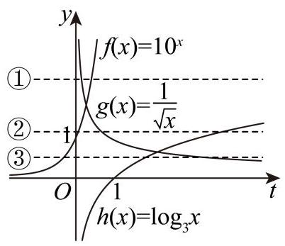
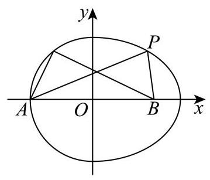
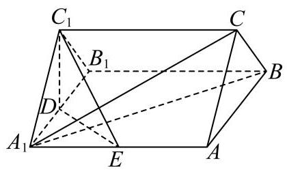
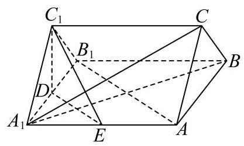
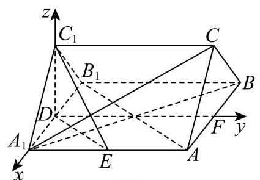
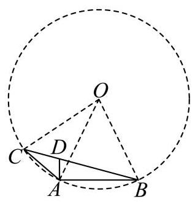
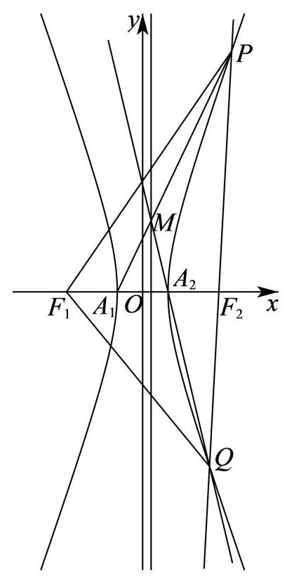

# 2025-2026学年普陀区高三二模数学试卷

## 题目汇编（共21题）

**来源**：普陀区高三二模

**题型**：填空题 12 道 + 选择题 4 道 + 解答题 5 道

---

## 第 1 题

143.2,156.7,158.3,162.4,168.9,173.5,182.1

## 参考答案与解析

1、【答案】162.4

【解析】

【分析】先将数据从小到大排列, 再根据中位数的定义可得.

【详解】将 2025 年 7 月至 2026 年 1 月，我国新能源汽车月度销量按从小到大排列:

143.2,156.7,158.3,162.4,168.9,173.5,182.1

数据个数为 7,所以中位数是第 $\frac{7 + 1}{2} = 4$ 个数,即162.4 万辆.

---

## 第 2 题

2. 已知复数 $z$ 满足 $\left( {\mathrm{i} - 1}\right) \left( {z - {3\mathrm{i}}}\right)  = 3 + \mathrm{i}$ ，其中 $\mathrm{i}$ 为虚数单位，则 $\bar{z} =$ ___.

## 参考答案与解析

2. 已知复数 $z$ 满足 $\left( {\mathrm{i} - 1}\right) \left( {z - {3\mathrm{i}}}\right)  = 3 + \mathrm{i}$ ，其中 $\mathrm{i}$ 为虚数单位，则 $\bar{z} =$ ___.

【答案】 $- 1 - \mathrm{i}$

【解析】

【分析】先根据复数的除法运算化简, 再应用共轭复数定义求解.

【详解】复数 $z$ 满足 $\left( {\mathrm{i} - 1}\right) \left( {z - 3\mathrm{i}}\right)  = 3 + \mathrm{i}$ ,

则 $z = \frac{3 + \mathrm{i}}{\mathrm{i} - 1} + 3\mathrm{i} = \frac{\left( {3 + \mathrm{i}}\right) \left( {\mathrm{i} + 1}\right) }{\left( {\mathrm{i} - 1}\right) \left( {\mathrm{i} + 1}\right) } + 3\mathrm{i} = \frac{3\mathrm{i} + 3 - 1 + \mathrm{i}}{-1 - 1} + 3\mathrm{i}$ ,

则 $z =  - 1 - 2\mathrm{i} + 3\mathrm{i} =  - 1 + \mathrm{i}$ ,

则 $\bar{z} =  - 1 - \mathrm{i}$ .

---

## 第 3 题

3. 已知点 $P\left( {2, y}\right)$ 在抛物线 ${y}^{2} = {4x}$ 上,则 $P$ 点到抛物线焦点 $F$ 的距离为___.

## 参考答案与解析

3. 已知点 $P\left( {2, y}\right)$ 在抛物线 ${y}^{2} = {4x}$ 上,则 $P$ 点到抛物线焦点 $F$ 的距离为___.

【答案】3

【解析】

【分析】利用焦点弦长的性质即可得出.

【详解】 $\because$ 点 $P\left( {2, y}\right)$ 在抛物线 ${y}^{2} = {4x}$ 上,

$\therefore P$ 点到焦点 $F$ 的距离 $= 2 + 1 = 3$ .

故答案为: 3 .

【点睛】本题考查过焦点弦长的性质, 属于基础题.

---

## 第 4 题

4. 设 $a \in  \mathbf{R}$ ,若关于 $x$ 的不等式 $\frac{a}{x - 1} \leq  1$ 的解集是 $\left( {-\infty ,1}\right)  \cup  \lbrack 2, + \infty )$ ,则 $a$ 的值为___.

## 参考答案与解析

4. 设 $a \in  \mathbf{R}$ ,若关于 $x$ 的不等式 $\frac{a}{x - 1} \leq  1$ 的解集是 $\left( {-\infty ,1}\right)  \cup  \lbrack 2, + \infty )$ ,则 $a$ 的值为___.

【答案】 1

【解析】

【分析】将分式不等式化为等价的二次不等式, 根据“三个二次”的关系求解.

【详解】由不等式 $\frac{a}{x - 1} \leq  1$ 可得 $\frac{a + 1 - x}{x - 1} \leq  0$ ,等价于 $\left\{  \begin{array}{l} \left( {a + 1 - x}\right) \left( {x - 1}\right)  \leq  0 \\  x - 1 \neq  0 \end{array}\right.$ , 因为原不等式的解集是 $\left( {-\infty ,1}\right)  \cup  \lbrack 2, + \infty )$ ,所以1,2是方程 $\left( {a + 1 - x}\right) \left( {x - 1}\right)  = 0$ 的两根, 所以 $a + 1 = 2$ ,解得 $a = 1$ .

---

## 第 5 题

5. 设 $t \in  \mathbf{R}$ ,若 ${\left( tx - \frac{1}{x}\right) }^{6}$ 的展开式中的常数项是 -540,则该展开式中所有项的系数和为 ___. (结果用数值表达)

## 参考答案与解析

5. 设 $t \in  \mathbf{R}$ ,若 ${\left( tx - \frac{1}{x}\right) }^{6}$ 的展开式中的常数项是 -540,则该展开式中所有项的系数和为 ___. (结果用数值表达)

【答案】64

【解析】

【分析】由展开式中的常数项是 -540,求得 $t = 3$ ,代入原式,令 $x = 1$ ,即可得答案.

【详解】因为 ${\left( tx - \frac{1}{x}\right) }^{6}$ 的展开式的通项为: ${T}_{r + 1} = {\mathrm{C}}_{6}^{r}{\left( tx\right) }^{6 - r} \cdot  {\left( -\frac{1}{x}\right) }^{r} = {\mathrm{C}}_{6}^{r} \cdot  {\left( -1\right) }^{r} \cdot  {t}^{6 - r} \cdot  {x}^{6 - {2r}}$ ,

又因为展开式中常数项是 -540 ,

令 $6 - {2r} = 0$ ,得 $r = 3$ ,

所以 ${\mathrm{C}}_{6}^{3} \cdot  {\left( -1\right) }^{3} \cdot  {t}^{3} =  - {540}$ ,解得 $t = 3$ ,

所以 ${\left( tx - \frac{1}{x}\right) }^{6}$ ,即为 ${\left( 3x - \frac{1}{x}\right) }^{6}$ ,

在 ${\left( 3x - \frac{1}{x}\right) }^{6}$ 中令 $x = 1$ ,

得所以项系数和为 ${\left( 3 - 1\right) }^{6} = {64}$ .

---

## 第 6 题

6. 某大型管线网的局部呈网格结构, 如图建立平面直角坐标系, 一小型机器人沿管线移动执行巡检任务，在某次巡检的路径中经过了点: $\left( {-3, - 2}\right)$ 、 $\left( {-2, m}\right)$ 、 $\left( {-1, - 2}\right)$ 、 $\left( {0, - 1}\right)$ 、 $\left( {1,0}\right) \text{ 、 }\left( {2,1}\right) \text{ 、 }\left( {3,2}\right)$ ,若该机器人经过的点的纵坐标 $y$ 关于横坐标 $x$ 的一元线性回归方程是 $y = \frac{11}{14}x - \frac{5}{7}$ ，则 $m$ 的值为___.

## 参考答案与解析

6. 某大型管线网的局部呈网格结构, 如图建立平面直角坐标系, 一小型机器人沿管线移动执行巡检任务，在某次巡检的路径中经过了点: $\left( {-3, - 2}\right)$ 、 $\left( {-2, m}\right)$ 、 $\left( {-1, - 2}\right)$ 、 $\left( {0, - 1}\right)$ 、 $\left( {1,0}\right) \text{ 、 }\left( {2,1}\right) \text{ 、 }\left( {3,2}\right)$ ,若该机器人经过的点的纵坐标 $y$ 关于横坐标 $x$ 的一元线性回归方程是 $y = \frac{11}{14}x - \frac{5}{7}$ ，则 $m$ 的值为___.

【答案】-3

【解析】

【分析】求出样本的中心点 $\left( {\bar{x},\bar{y}}\right)$ ,根据一元线性回归方程必经过中心点即可求解.

【详解】根据题意, 机器人经过的 7 个点的横坐标分别为 $- 3, - 2, - 1,0,1,2,3$ ,

其平均值为 $\bar{x} = \frac{-3 - 2 - 1 + 0 + 1 + 2 + 3}{7} = 0$ ,

7 个点的纵坐标分别为 $- 2, m, - 2, - 1,0,1,2$ ,其平均值为

$\bar{y} = \frac{-2 + m - 2 - 1 + 1 + 2}{7} = \frac{m - 2}{7},$

又因为这些点的一元线性回归方程是 $y = \frac{11}{14}x - \frac{5}{7}$ ,必过点 $\left( {\bar{x},\bar{y}}\right)$ ,

代入得 $\frac{m - 2}{7} = \frac{11}{14} \times  0 - \frac{5}{7} \Rightarrow  m =  - 3$ ，即 $m$ 的值为 -3 .

---

## 第 7 题

7. 设 $n \geq  1, n \in  \mathbf{N}$ ， ${S}_{n}$ 是等差数列 $\left\{  {a}_{n}\right\}$ 的前 $n$ 项和，且公差 $d \neq  0$ ，若 ${a}_{1}{a}_{3} = {S}_{4}$ ，且 ${a}_{3}$ ， ${a}_{4}$ ， ${a}_{6}$ 成等比数列，则 ${S}_{n} =$ ___.

## 参考答案与解析

7. 设 $n \geq  1, n \in  \mathbf{N}$ ， ${S}_{n}$ 是等差数列 $\left\{  {a}_{n}\right\}$ 的前 $n$ 项和，且公差 $d \neq  0$ ，若 ${a}_{1}{a}_{3} = {S}_{4}$ ，且 ${a}_{3}$ ， ${a}_{4}$ ， ${a}_{6}$ 成等比数列，则 ${S}_{n} =$ ___.

【答案】 ${S}_{n} =  - {n}^{2} + {3n}$

【解析】

【分析】本题利用等差数列的通项公式和前 $\mathrm{n}$ 项和公式代入可得 $a, d$ ,然后代入前 $\mathrm{n}$ 项和公式计算即可。

【详解】 $\because {a}_{1}{a}_{3} = {S}_{4},\therefore {a}_{1}\left( {{a}_{1} + {2d}}\right)  = 4{a}_{1} + \frac{4 \times  {3d}}{2}$ ,计算可得 ${a}_{1}^{2} + 2{a}_{1}d = 4{a}_{1} + {6d}$ ; 又 $\because {a}_{3},{a}_{4},{a}_{6}$ 成等比数列,

$\therefore {a}_{4}{}^{2} = {a}_{3} \times  {a}_{6}$ ,变换可得 $- {a}_{1} = d$ ,代入 ${a}_{1}{}^{2} + 2{a}_{1}d = 4{a}_{1} + {6d}$ ,计算可得

${a}_{1} = 2, d =  - 2,\therefore {S}_{n} = {2n} + \frac{n\left( {n - 1}\right) \left( {-2}\right) }{2} =  - {n}^{2} + {3n}$ 。

---

## 第 8 题

8. 在 ${ABC}$ 中, $\angle {ACB} = \frac{\pi }{2},{AC} = 1$ ,过点 $A$ 作直线 $l//{BC}$ ,将 ${ABC}$ 绕直线 $l$ 旋转一周所得到的几何体记为 $\Omega$ ,若 $\Omega$ 的体积是 $\frac{4}{3}\pi$ ,则 $\Omega$ 的表面积为___.

## 参考答案与解析

8. 在 ${ABC}$ 中, $\angle {ACB} = \frac{\pi }{2},{AC} = 1$ ,过点 $A$ 作直线 $l//{BC}$ ,将 ${ABC}$ 绕直线 $l$ 旋转一周所得到的几何体记为 $\Omega$ ,若 $\Omega$ 的体积是 $\frac{4}{3}\pi$ ,则 $\Omega$ 的表面积为___.

【答案】 $\left( {5 + \sqrt{5}}\right) \pi$

【解析】

【分析】将 $\bigtriangleup {ABC}$ 绕直线 $l$ 旋转一周,生成的几何体 $\Omega$ 是一个大圆柱挖去一个小圆锥的组合体, 利用圆柱与圆锥的体积以及表面积公式求解即可.

【详解】 $\bigtriangleup  {ABC}$ 为直角三角形， $\angle {ACB} = \frac{\pi }{2}$ ， ${AC} = 1$ ，直线 $l//{BC}$ 且过点 $A$ ，

设 ${BC} = h$ ,所以斜边 ${AB} = \sqrt{A{C}^{2} + B{C}^{2}} = \sqrt{{1}^{2} + {h}^{2}} = \sqrt{1 + {h}^{2}}$ ,

将 $\bigtriangleup  {ABC}$ 绕直线 $l$ 旋转一周，生成的几何体 $\Omega$ 是一个大圆柱挖去一个小圆锥的组合体，

所以圆柱上底面半径 $R = {AC} = 1$ ,高 $h$ ,

被挖去的圆锥的底面半径 $r = 1$ ,高与圆柱相同,即 $h$ ,

则圆柱体积: ${V}_{\text{ 圆柱 }} = \pi {R}^{2}h = \pi  \cdot  {1}^{2} \cdot  h = {\pi h}$ ,

圆锥体积: ${V}_{\text{ 圆锥 }} = \frac{1}{3}\pi {r}^{2}h = \frac{1}{3}\pi  \cdot  {1}^{2} \cdot  h = \frac{1}{3}{\pi h}$ ,

所以组合体体积: $V = {V}_{\text{ 圆柱 }} - {V}_{\text{ 圆锥 }} = {\pi h} - \frac{1}{3}{\pi h} = \frac{2}{3}{\pi h}$ ,

则 $\frac{2}{3}{\pi h} = \frac{4}{3}\pi \text{ � }h = 2$ ,即 ${BC} = 2$ ,所以 ${AB} = \sqrt{{1}^{2} + {2}^{2}} = \sqrt{5}$ ,

几何体 $\Omega$ 的表面积由三部分构成:

圆柱的侧面积: ${S}_{\text{ 柱侧 }} = {2\pi Rh} = {2\pi } \cdot  1 \cdot  2 = {4\pi }$ ,

圆柱的上底面面积: ${S}_{\text{ 上底 }} = \pi {R}^{2} = \pi  \cdot  {1}^{2} = \pi$ ,

圆锥的侧面积: 圆锥母线长为 ${AB} = \sqrt{5}\;,\;{S}_{\text{ 锥侧 }} = {\pi rl} = \pi  \cdot  1 \cdot  \sqrt{5} = \sqrt{5}\pi$ ,

所以总表面积: ${S}_{\text{ 总 }} = {S}_{\text{ 柱侧 }} + {S}_{\text{ 上底 }} + {S}_{\text{ 锥侧 }} = {4\pi } + \pi  + \sqrt{5}\pi  = \left( {5 + \sqrt{5}}\right) \pi$ .

---

## 第 9 题

9. 已知向量 $\overrightarrow{a} = \left( {1,2}\right) ,\overrightarrow{b} = \left( {-1,1}\right) ,\overrightarrow{c} = \left( {3,4}\right)$ ，函数 $y = f\left( x\right)$ 的表达式为 $f\left( x\right)  = \left\{  \begin{array}{l} x + 1, x < 2 \\  {2x} - 1, x \geq  2 \end{array}\right.$ ，设 $\overrightarrow{d}\left( x\right)  = f\left( x\right)  \cdot  \overrightarrow{a} + f\left( {x + 2}\right)  \cdot  \overrightarrow{b}$ ，若 $\overrightarrow{d}\left( x\right) //\overrightarrow{c}$ ，则 $x =$ ___.

## 参考答案与解析

9. 已知向量 $\overrightarrow{a} = \left( {1,2}\right) ,\overrightarrow{b} = \left( {-1,1}\right) ,\overrightarrow{c} = \left( {3,4}\right)$ ，函数 $y = f\left( x\right)$ 的表达式为 $f\left( x\right)  = \left\{  \begin{array}{l} x + 1, x < 2 \\  {2x} - 1, x \geq  2 \end{array}\right.$ ，设 $\overrightarrow{d}\left( x\right)  = f\left( x\right)  \cdot  \overrightarrow{a} + f\left( {x + 2}\right)  \cdot  \overrightarrow{b}$ ，若 $\overrightarrow{d}\left( x\right) //\overrightarrow{c}$ ，则 $x =$ ___.

【答案】 $- \frac{23}{9}$

【解析】

【分析】由题意可得 $f\left( {x + 2}\right)  =  - \frac{2}{7}f\left( x\right)$ ,分 $x < 0\text{ 、 }0 \leq  x < 2$ 和 $x \geq  2$ 三种情况分别求解即可.

【详解】因为 $\overrightarrow{d}\left( x\right)  = f\left( x\right)  \cdot  \overrightarrow{a} + f\left( {x + 2}\right)  \cdot  \overrightarrow{b} = \left( {f\left( x\right)  - f\left( {x + 2}\right) ,{2f}\left( x\right)  + f\left( {x + 2}\right) }\right)$ ,

又因为 $\overrightarrow{c} = \left( {3,4}\right)$ ,且 $\overrightarrow{d}\left( x\right) //\overrightarrow{c}$ ,

所以 $4\left\lbrack  {f\left( x\right)  - f\left( {x + 2}\right) }\right\rbrack   = 3\left\lbrack  {{2f}\left( x\right)  + f\left( {x + 2}\right) }\right\rbrack$ ,

整理得 $f\left( {x + 2}\right)  =  - \frac{2}{7}f\left( x\right)$ ,

当 $x < 0$ 时， $x + 2 < 2$ ，

则有 $x + 2 + 1 =  - \frac{2}{7}\left( {x + 1}\right)$ ,解得 $x =  - \frac{23}{9} < 0$ ,满足题意;

当 $0 \leq  x < 2$ 时, $2 \leq  x + 2 < 4$ ,

则有 $2\left( {x + 2}\right)  - 1 =  - \frac{2}{7}\left( {x + 1}\right)$ ,解得 $x =  - \frac{23}{16} < 0$ ,不满足题意;

当 $x \geq  2$ 时， $x + 2 \geq  4$ ，

则有 $2\left( {x + 2}\right)  - 1 =  - \frac{2}{7}\left( {{2x} - 1}\right)$ ,解得 $x =  - \frac{19}{18} < 0$ ,不满足题意;

综上， $x =  - \frac{23}{9}$ .

---

## 第 10 题

10. 设 $a \in  \mathbf{R}$ ,集合 $M = \{  - 1, - 2, - a\} , N = \left\{  {x \mid  {x}^{2} - {ax} \leq  0}\right\}$ ,若集合 $A \subseteq  \left( {M \cap  N}\right)$ ,且满足条件的 $A$ 恰有 2 个，则 $a$ 的取值范围为___.

## 参考答案与解析

10. 设 $a \in  \mathbf{R}$ ,集合 $M = \{  - 1, - 2, - a\} , N = \left\{  {x \mid  {x}^{2} - {ax} \leq  0}\right\}$ ,若集合 $A \subseteq  \left( {M \cap  N}\right)$ ,且满足条件的 $A$ 恰有 2 个，则 $a$ 的取值范围为___.

【答案】 $\{ a \mid   - 2 < a \leq   - 1$ 或 $a = 0\}$

【解析】

【分析】由题意得出 $M \cap  N$ 是一元集,然后按 $a$ 的正负或 0 分类讨论求解.

【详解】由题意 $M \cap  N$ 的子集恰有 2 个,所以 $M \cap  N$ 是一元集,

若 $a = 0$ ,则 $N = \{ 0\}$ ,而 $M = \{  - 1, - 2,0\} , M\text{ 、 }{QN} = \{ 0\}$ 满足题意,

若 $a > 0$ ,则 $- a < 0, N = \{ x \mid  0 \leq  x \leq  a\}$ ,此时 $M \cap  N = \varnothing$ ,不合题意;

若 $a < 0$ ,则 $- a > 0, N = \{ x \mid  a \leq  x \leq  0\} , M \cap  N$ 只含一个元素,则 $- 2 < a \leq   - 1$ ,

综上, $a$ 的取值范围是 $\{ a \mid   - 2 < a \leq   - 1$ 或 $a = 0\}$ .

---

## 第 11 题

11. 设定义域为 $\mathbf{R}$ 的函数 $y = f\left( x\right)$ 的导函数为 $y = {f}^{\prime }\left( x\right)$ ,令 $g\left( x\right)  = {f}^{\prime }\left( x\right)  + {\left( x + \sqrt{{x}^{2} + 1}\right) }^{2}$ ,若函数 $y = f\left( x\right)$ 和函数 $y = g\left( x\right)$ 皆为偶函数,则不等式 $f\left( {x + 2}\right)  > f\left( {{2x} - 3}\right)$ 的解集为___.

## 参考答案与解析

11. 设定义域为 $\mathbf{R}$ 的函数 $y = f\left( x\right)$ 的导函数为 $y = {f}^{\prime }\left( x\right)$ ,令 $g\left( x\right)  = {f}^{\prime }\left( x\right)  + {\left( x + \sqrt{{x}^{2} + 1}\right) }^{2}$ ,若函数 $y = f\left( x\right)$ 和函数 $y = g\left( x\right)$ 皆为偶函数,则不等式 $f\left( {x + 2}\right)  > f\left( {{2x} - 3}\right)$ 的解集为___.

【答案】 $\left( {-\infty ,\frac{1}{3}}\right)  \cup  \left( {5, + \infty }\right)$

【解析】

【详解】若函数 $y = f\left( x\right)$ 为偶函数,则 $y = {f}^{\prime }\left( x\right)$ 为奇函数,

而 $g\left( x\right)  = {f}^{\prime }\left( x\right)  + {\left( x + \sqrt{{x}^{2} + 1}\right) }^{2}$ 为偶函数,则 $g\left( {-x}\right)  = g\left( x\right)$ ,即

${f}^{\prime }\left( {-x}\right)  + {\left( -x + \sqrt{{x}^{2} + 1}\right) }^{2} = {f}^{\prime }\left( x\right)  + {\left( x + \sqrt{{x}^{2} + 1}\right) }^{2},$

$\therefore  - {f}^{\prime }\left( x\right)  + {x}^{2} - {2x}\sqrt{{x}^{2} + 1} + {x}^{2} + 1 = {f}^{\prime }\left( x\right)  + {x}^{2} + {2x}\sqrt{{x}^{2} + 1} + {x}^{2} + 1$ ,故

${f}^{\prime }\left( x\right)  =  - {2x}\sqrt{{x}^{2} + 1}$

当 $x \geq  0$ 时， ${f}^{\prime }\left( x\right)  \leq  0$ ，即函数 $y = f\left( x\right)$ 在 $\lbrack 0, + \infty )$ 单调递减，

由 $y = f\left( x\right)$ 为偶函数,则 $f\left( {x + 2}\right)  > f\left( {{2x} - 3}\right)  \Rightarrow  f\left( \left| {x + 2}\right| \right)  > f\left( \left| {{2x} - 3}\right| \right)$ ,

结合单调性可知 $\left| {x + 2}\right|  < \left| {{2x} - 3}\right|$ ,即 $3{x}^{2} - {16x} + 5 > 0$ ,解得 $x < \frac{1}{3}$ 或 $x > 5$ ,

故不等式 $f\left( {x + 2}\right)  > f\left( {{2x} - 3}\right)$ 的解集为 $\left( {-\infty ,\frac{1}{3}}\right)  \cup  \left( {5, + \infty }\right)$ .

---

## 第 12 题

12. 设 $k \geq  2, n \geq  1, k, n \in  \mathbf{N},{S}_{n}$ 是等比数列 $\left\{  {a}_{n}\right\}$ 的前 $n$ 项和,且 ${a}_{1} > 0$ ,公比为 3,令 ${b}_{n} = {S}_{n} + \frac{1}{{S}_{n}}$ ,若恰存在2个 $k$ 的值,对任意的 $n < k$ ,皆有 ${b}_{n} > {b}_{k}$ 成立,则 ${a}_{1}$ 的取值范围为___.

## 参考答案与解析

12. 设 $k \geq  2, n \geq  1, k, n \in  \mathbf{N},{S}_{n}$ 是等比数列 $\left\{  {a}_{n}\right\}$ 的前 $n$ 项和,且 ${a}_{1} > 0$ ,公比为 3,令 ${b}_{n} = {S}_{n} + \frac{1}{{S}_{n}}$ ,若恰存在2个 $k$ 的值,对任意的 $n < k$ ,皆有 ${b}_{n} > {b}_{k}$ 成立,则 ${a}_{1}$ 的取值范围为___.

【答案】 $\left\lbrack  {\frac{1}{2\sqrt{130}},\frac{1}{2\sqrt{13}}}\right)$ .

【解析】

【分析】由 ${b}_{n} = {S}_{n} + \frac{1}{{S}_{n}}$ 的结构,可先研究函数 $f\left( x\right)  = x + \frac{1}{x}$ 在正数范围内的大小变化规律, 再结合等比数列前 $n$ 项和公式把题意转化为关于 ${a}_{1}$ 的不等式组求解.

【详解】由题意知,等比数列 $\left\{  {a}_{n}\right\}$ 的首项为 ${a}_{1}$ ,公比为 3,所以 ${S}_{n} = \frac{{a}_{1}\left( {{3}^{n} - 1}\right) }{2}$ ,

从而 ${S}_{1} = {a}_{1},{S}_{2} = 4{a}_{1},{S}_{3} = {13}{a}_{1},{S}_{4} = {40}{a}_{1}$ ,

设 $f\left( x\right)  = x + \frac{1}{x},\left( {x > 0}\right)$ ,因为 ${S}_{n} > 0$ ,且 ${S}_{n}$ 随 $n$ 的增大而增大,

所以数列 $\left\{  {b}_{n}\right\}$ 的变化只与函数 $f\left( x\right)$ 在正数范围内的比较性质有关.

对任意 $0 < x < y, f\left( y\right)  < f\left( x\right)  \Leftrightarrow  y + \frac{1}{y} < x + \frac{1}{x} \Leftrightarrow  y - x < \frac{1}{x} - \frac{1}{y} \Leftrightarrow  y - x < \frac{y - x}{xy} \Leftrightarrow  {xy} < 1$ , 因此对任意正整数 $n$ ,有 ${b}_{n + 1} < {b}_{n} \Leftrightarrow  {S}_{n}{S}_{n + 1} < 1$ .

又因为 ${S}_{n}$ 单调递增,所以 ${S}_{n}{S}_{n + 1}$ 也随 $n$ 的增大而增大.

题 意 “ 恰 存 在 2 个 $k$ 的值,使 得 对 任 意 的 $f\left( k\right)  + f\left( {k - 2}\right)  = {a}_{k} - \left( {{x}_{k}^{2} + {y}_{k}^{2}}\right)  + {a}_{k - 2} - \left( {{x}_{k - 2}^{2} + {y}_{k - 2}^{2}}\right) ,$

皆有 ${b}_{n} > {b}_{k}$ 成立”表示数列 $\left\{  {b}_{n}\right\}$ 恰好连续下降两次,

即 ${b}_{2} < {b}_{1},{b}_{3} < {b}_{2},{b}_{4} \geq  {b}_{3}$ ,等价于 ${S}_{1}{S}_{2} < 1,{S}_{2}{S}_{3} < 1,{S}_{3}{S}_{4} \geq  1$ ,

代入上式，得 ${a}_{1} \cdot  4{a}_{1} < 1,4{a}_{1} \cdot  {13}{a}_{1} < 1,{13}{a}_{1} \cdot  {40}{a}_{1} \geq  1$ ，

即 $4{a}_{1}^{2} < {1.52}{a}_{1}^{2} < {1.520}{a}_{1}^{2} \geq  1$ . 解得 ${a}_{1} < \frac{1}{2},{a}_{1} < \frac{1}{2\sqrt{13}},{a}_{1} \geq  \frac{1}{2\sqrt{130}}$ ,

综合可得 ${a}_{1} \in  \left\lbrack  {\frac{1}{2\sqrt{130}},\frac{1}{2\sqrt{13}}}\right)$ .

## 二、选择题 (本大题共有 4 题, 满分 18 分, 第 13-14 题每题 4 分, 第 15-16 题 每题 5 分) 每题有且只有一个正确答案, 考生应在答题纸的相应编号上, 将代表 答案的小方格涂黑, 否则一律得零分.

---

## 第 13 题

13. 已知直线 $l\text{ 、 }m$ 和平面 $a$ ，若 $m \subset  a$ ，则 1 与 $m$ 不相交”是 “ $l//a$ ” 的( )

## 参考答案与解析

13. 已知直线 $l\text{ 、 }m$ 和平面 $a$ ，若 $m \subset  a$ ，则 1 与 $m$ 不相交”是 “ $l//a$ ” 的( )

A. 充分非必要条件 B. 必要非充分条件 C. 充分必要条件 D. 既非充分又非必要条件

【答案】B

【解析】

【分析】根据线面判断及线线位置关系结合必要非充分条件定义判断.

【详解】当直线 $l$ 与平面 $a$ 相交,且交点不在直线 $m$ 上时,满足 “ $l$ 与 $m$ 不相交”, 但 “ $l//a$ ” 不成立,故充分性不成立;

若 $l//a$ ，则 $l$ 与 $a$ 无交点，所以“ $l$ 与 $m$ 不相交”，故必要性成立；

所以“ $l$ 与 $m$ 不相交”是“ $l//a$ ”的必要非充分条件.

---

## 第 14 题

14. 设 $x\text{ 、 }y\text{ 、 }z \in  \mathbf{R}$ ,若 ${10}^{x} = {y}^{\frac{-1}{2}} = {\log }_{3}z$ ,则下列结论中不可能成立的是( )

## 参考答案与解析

14. 设 $x\text{ 、 }y\text{ 、 }z \in  \mathbf{R}$ ,若 ${10}^{x} = {y}^{\frac{-1}{2}} = {\log }_{3}z$ ,则下列结论中不可能成立的是( )

A. $y < x < z$ B. $x < y < z$ C. $x < z < y$ D.

$z < y < x$

【答案】D

【解析】

【分析】在同一坐标系中作出 $f\left( x\right)  = {10}^{x}, g\left( x\right)  = \frac{1}{\sqrt{x}}, h\left( x\right)  = {\log }_{3}x$ 的图象,利用函数零点思想, 结合图象逐一判断即得.

【详解】如图在同一坐标系中分别作出函数 $f\left( x\right)  = {10}^{x}, g\left( x\right)  = \frac{1}{\sqrt{x}}, h\left( x\right)  = {\log }_{3}x$ 的图象,

依题意直线 $y = k$ 与三个函数都有交点,设交点的横坐标依次为 $x, y, z$ ,

则需判断这些交点的横坐标之间有怎样的大小关系.

由图知,有三种不同的情况: 当直线 $y = k$ 在①位置时,显然有: $y < x < z$ ;

当直线 $y = k$ 在②位置时，显然有: $x < y < z$ ；

当直线 $y = k$ 在③位置时，显然有: $x < z < y$ ，故 D 错误.

---

## 第 15 题

15. 某科技公司每位员工皆佩戴红色或蓝色中仅一种颜色的工牌，该公司为促进跨部门协作, 采用智能轮岗系统进行员工交换部门, 初始时, 甲部门有 2 名红色工牌员工、 1 名蓝色工牌员工，乙部门有 2 名红色工牌员工、 2 名蓝色工牌员工，系统执行一次随机交换指令: 从甲、乙 2 个部门中随机各选取 1 名员工进行交换，设交换后甲部门中红色工牌员工的人数为 $X$ ,则 $X$ 的期望为( )

## 参考答案与解析

15. 某科技公司每位员工皆佩戴红色或蓝色中仅一种颜色的工牌，该公司为促进跨部门协作, 采用智能轮岗系统进行员工交换部门, 初始时, 甲部门有 2 名红色工牌员工、 1 名蓝色工牌员工，乙部门有 2 名红色工牌员工、 2 名蓝色工牌员工，系统执行一次随机交换指令: 从甲、乙 2 个部门中随机各选取 1 名员工进行交换，设交换后甲部门中红色工牌员工的人数为 $X$ ,则 $X$ 的期望为( )

A. $\frac{7}{4}$ B. $\frac{5}{3}$ C. $\frac{11}{6}$ D. $\frac{13}{6}$

【答案】C

【解析】

【分析】交换后甲部门红人数的变化取决于从甲选出的员工和从乙选出的员工颜色，分四种情况:甲出红、乙出红；甲出红、乙出蓝；甲出蓝、乙出红；甲出蓝、乙出蓝，由此得分布列, 随即可计算期望.

【详解】初始时, 甲部门有 2 名红色工牌员工、1 名蓝色工牌员工, 乙部门有 2 名红色工牌员工、 2 名蓝色工牌员工,

由已知 $X$ 的可能取值为1,2,3.

$P\left( {X = 1}\right)  = \frac{2}{3} \times  \frac{2}{4} = \frac{1}{3},\;P\left( {X = 2}\right)  = \frac{2}{3} \times  \frac{2}{4} + \frac{1}{3} \times  \frac{2}{4} = \frac{1}{2},\;P\left( {X = 3}\right)  = \frac{1}{3} \times  \frac{2}{4} = \frac{1}{6},$

所以 $E\left( X\right)  = 1 \times  \frac{1}{3} + 2 \times  \frac{1}{2} + 3 \times  \frac{1}{6} = \frac{11}{6}$ .

---

## 第 16 题

16. 在直角坐标平面中,方程 $\left( {x + \sqrt{9 - {y}^{2}}}\right) \left( {x - \sqrt{{18} - 2{y}^{2}}}\right)  = 0$ 表示的曲线称为 “ $G$ 圆". 点 $P, Q$ 是 “ $G$ 圆”上的任意两点, $O$ 为坐标原点. 对如下两个命题:

## 参考答案与解析

16. 在直角坐标平面中,方程 $\left( {x + \sqrt{9 - {y}^{2}}}\right) \left( {x - \sqrt{{18} - 2{y}^{2}}}\right)  = 0$ 表示的曲线称为 “ $G$ 圆". 点 $P, Q$ 是 “ $G$ 圆”上的任意两点, $O$ 为坐标原点. 对如下两个命题:

①若点 $A\left( {-3,0}\right)$ 、 $B\left( {3,0}\right)$ ，则 $\left| {PA}\right|  + \left| {PB}\right|$ 的值不可能等于 8 ；

②若 ${OP} \bot  {OQ}$ ，则 $\frac{1}{{\left| OP\right| }^{2}} + \frac{1}{{\left| OQ\right| }^{2}}$ 的取值范围为 $\left\lbrack  {\frac{1}{6},\frac{2}{9}}\right\rbrack$ .

则下列结论中正确的是 ( )

A. ①为真②为真 B. ①为真②为假 C. ①为假②为真 D. ①为假

②为假

【答案】C

【解析】

【分析】先根据方程可得曲线是由半个圆和半个椭圆组成的一条曲线, 再对条件①判断, 根据椭圆的定义及计算圆的一点到两个定点的距离和范围可得命题的真假; 对条件②根据 $P, Q$ 两点的位置关系分四种情况分别讨论可得所求式子的范围,进而可得结果.

【详解】因为方程 $\left( {x + \sqrt{9 - {y}^{2}}}\right) \left( {x - \sqrt{{18} - 2{y}^{2}}}\right)  = 0$ 等价于: $x + \sqrt{9 - {y}^{2}} = 0\left( {x \leq  0}\right)$ 或 $x - \sqrt{{18} - 2{y}^{2}} = 0\left( {x \geq  0}\right) .$

若 $x + \sqrt{9 - {y}^{2}} = 0\left( {x \leq  0}\right)$ ,则 ${x}^{2} + {y}^{2} = 9\left( {x \leq  0}\right)$ ,表示圆心在原点 $O$ ,半径为 $r = 3$ 的左半个圆;

若 $x - \sqrt{{18} - 2{y}^{2}} = 0\left( {x \geq  0}\right)$ ,则 $\frac{{x}^{2}}{18} + \frac{{y}^{2}}{9} = 1\left( {x \geq  0}\right)$ ,表示长半轴为 $a = 3\sqrt{2}$ ,短半轴为 $b = 3$ 的右半个椭圆; 如图:

对于①，若点 $P$ 在右半个椭圆上，点 $A\left( {-3,0}\right)$ 、 $B\left( {3,0}\right)$ 是椭圆 $\frac{{x}^{2}}{18} + \frac{{y}^{2}}{9} = 1$ 的焦点， 根据椭圆的定义: $\left| {PA}\right|  + \left| {PB}\right|  = {2a} = 6\sqrt{2} > 8$ ,所以在右半个椭圆上不存在点 $P$ 满足 $\left| {PA}\right|  + \left| {PB}\right|  = 8$

若点 $P$ 在左半个圆上,点 $A\left( {-3,0}\right) \text{ 、 }B\left( {3,0}\right)$ 是圆 ${x}^{2} + {y}^{2} = 9$ 的一条直径的两个端点, 设 $P\left( {x, y}\right)$ ,则 $\left| {PA}\right|  + \left| {PB}\right|  = \sqrt{{\left( x + 3\right) }^{2} + {y}^{2}} + \sqrt{{\left( x - 3\right) }^{2} + {y}^{2}} = \sqrt{{18} + {6x}} + \sqrt{{18} - {6x}}$ 所以 ${\left( \left| PA\right|  + \left| PB\right| \right) }^{2} = {36} + 2\sqrt{\left( {{18} + {6x}}\right) \left( {{18} - {6x}}\right) } = {36} + {12}\sqrt{9 - {x}^{2}}$ ,

因为 $- 3 \leq  x \leq  0$ ,所以 $0 \leq  9 - {x}^{2} \leq  9,0 \leq  \sqrt{9 - {x}^{2}} \leq  3,{36} \leq  {\left( \left| PA\right|  + \left| PB\right| \right) }^{2} \leq  {36} + {36}$ , 即 $6 \leq  \left| {PA}\right|  + \left| {PB}\right|  \leq  6\sqrt{2}$ ,而 $8 \in  \left\lbrack  {6,6\sqrt{2}}\right\rbrack$ ,所以存在点 $P$ 满足 $\left| {PA}\right|  + \left| {PB}\right|  = 8$ ; 所以命题①为假命题.

对于②，若 $P$ 点在左半个圆上， $\left| {OP}\right|  = 3$ ， $\frac{1}{{\left| OP\right| }^{2}} = \frac{1}{9}$ ；

若 $P$ 点在右半个椭圆上,则 ${\left| OP\right| }^{2} = {x}^{2} + {y}^{2} = {18} - 2{y}^{2} + {y}^{2} = {18} - {y}^{2}$ ,因为 $- 3 \leq  y \leq  3$ , 所以 $9 \leq  {18} - {y}^{2} \leq  {18}$ ,即 $9 \leq  {\left| OP\right| }^{2} \leq  {18},\frac{1}{{\left| OP\right| }^{2}} \in  \left\lbrack  {\frac{1}{18},\frac{1}{9}}\right\rbrack$ . 下面对 $P, Q$ 的位置分四种情况讨论:

(i) 若 $P, Q$ 都在左半个圆上时, $\left| {OP}\right|  = 3,\left| {OQ}\right|  = 3,\frac{1}{{\left| OP\right| }^{2}} = \frac{1}{9},\frac{1}{{\left| OQ\right| }^{2}} = \frac{1}{9}$ , 所以 $\frac{1}{{\left| OP\right| }^{2}} + \frac{1}{{\left| OQ\right| }^{2}} = \frac{1}{9} + \frac{1}{9} = \frac{2}{9}$ ;

(ii) 若 $P$ 在左半个圆上, $Q$ 在右半个椭圆上时, $\frac{1}{{\left| OP\right| }^{2}} = \frac{1}{9},\frac{1}{{\left| OQ\right| }^{2}} \in  \left\lbrack  {\frac{1}{18},\frac{1}{9}}\right\rbrack$ , 所以 $\frac{1}{9} + \frac{1}{18} \leq  \frac{1}{{\left| OP\right| }^{2}} + \frac{1}{{\left| OQ\right| }^{2}} \leq  \frac{1}{9} + \frac{1}{9}$ ,即 $\frac{1}{{\left| OP\right| }^{2}} + \frac{1}{{\left| OQ\right| }^{2}} \in  \left\lbrack  {\frac{1}{6},\frac{2}{9}}\right\rbrack$ ;

(iii) 若 $Q$ 在左半个圆上, $P$ 在右半个椭圆上时, $\frac{1}{{\left| OQ\right| }^{2}} = \frac{1}{9},\frac{1}{{\left| OP\right| }^{2}} \in  \left\lbrack  {\frac{1}{18},\frac{1}{9}}\right\rbrack$ , 所以 $\frac{1}{9} + \frac{1}{18} \leq  \frac{1}{{\left| OQ\right| }^{2}} + \frac{1}{{\left| OP\right| }^{2}} \leq  \frac{1}{9} + \frac{1}{9}$ ,即 $\frac{1}{{\left| OP\right| }^{2}} + \frac{1}{{\left| OQ\right| }^{2}} \in  \left\lbrack  {\frac{1}{6},\frac{2}{9}}\right\rbrack$ ;

(iv) 若 $P, Q$ 都在右半个椭圆上时,设 $P\left( {3\sqrt{2}\cos a,3\sin a}\right) , Q\left( {3\sqrt{2}\cos \beta ,3\sin \beta }\right)$ , 且 $a,\beta  \in  \left\lbrack  {-\frac{\pi }{2},\frac{\pi }{2}}\right\rbrack$ ,因为 ${OP} \bot  {OQ}$ ,所以 $\overrightarrow{OP} \cdot  \overrightarrow{OQ} = 0$ ,

即 ${18}\cos a\cos \beta  + 9\sin a\sin \beta  = 0,2\cos a\cos \beta  =  - \sin a\sin \beta$ .

所以 $\frac{1}{{\left| OP\right| }^{2}} = \frac{1}{{18}{\cos }^{2}a + 9{\sin }^{2}a} = \frac{1}{9\left( {{\cos }^{2}a + 1}\right) }$ ,

$\frac{1}{{\left| OQ\right| }^{2}} = \frac{1}{{18}{\cos }^{2}\beta  + 9{\sin }^{2}\beta } = \frac{1}{9\left( {{\cos }^{2}\beta  + 1}\right) },$

所以 $\frac{1}{{\left| OP\right| }^{2}} + \frac{1}{{\left| OQ\right| }^{2}} = \frac{1}{9\left( {{\cos }^{2}a + 1}\right) } + \frac{1}{9\left( {{\cos }^{2}\beta  + 1}\right) } = \frac{1}{9}\left( {\frac{1}{{\cos }^{2}a + 1} + \frac{1}{{\cos }^{2}\beta  + 1}}\right) \; = \frac{{\cos }^{2}a + {\cos }^{2}\beta  + 2}{9\left( {{\cos }^{2}a \cdot  {\cos }^{2}\beta  + {\cos }^{2}a + {\cos }^{2}\beta  + 1}\right) },$

又因为 $2\cos a\cos \beta  =  - \sin a\sin \beta$ ,两边平方得 $4{\cos }^{2}a{\cos }^{2}\beta  = {\sin }^{2}a{\sin }^{2}\beta$ , $4{\cos }^{2}a{\cos }^{2}\beta  = \left( {1 - {\cos }^{2}a}\right) \left( {1 - {\cos }^{2}\beta }\right)$ ,化简整理得

$3{\cos }^{2}a{\cos }^{2}\beta  = 1 - {\cos }^{2}a - {\cos }^{2}\beta ,$

所以

$$
\frac{1}{{\left| OP\right| }^{2}} + \frac{1}{{\left| OQ\right| }^{2}} = \frac{{\cos }^{2}a + {\cos }^{2}\beta  + 2}{3\left( {1 - {\cos }^{2}a - {\cos }^{2}\beta }\right)  + 9{\cos }^{2}a + 9{\cos }^{2}\beta  + 9}
$$

$$
\frac{{\cos }^{2}a + {\cos }^{2}\beta  + 2}{6\left( {{\cos }^{2}a + {\cos }^{2}\beta  + 2}\right) } = \frac{1}{6}.
$$

综上所述， $\frac{1}{{\left| OP\right| }^{2}} + \frac{1}{{\left| OQ\right| }^{2}}$ 的取值范围为 $\left\lbrack  {\frac{1}{6},\frac{2}{9}}\right\rbrack$ ，故②正确；

## 三、解答题 (本大题共有 5 题, 满分 78 分) 解答下列各题必须在答题纸相应编 号的规定区域内写出必要的步骤.

---

## 第 17 题

17. 如图，在正三棱柱 ${ABC} - {A}_{1}{B}_{1}{C}_{1}$ 中， $D$ 、 $E$ 分别是棱 ${A}_{1}{B}_{1}$ 、 ${A}_{1}A$ 的中点，且

## 参考答案与解析

17. 如图，在正三棱柱 ${ABC} - {A}_{1}{B}_{1}{C}_{1}$ 中， $D$ 、 $E$ 分别是棱 ${A}_{1}{B}_{1}$ 、 ${A}_{1}A$ 的中点，且

$$
{A}_{1}A = {A}_{1}{B}_{1} = 2
$$

(1)求证:直线 ${A}_{1}B \bot$ 平面 ${C}_{1}{DE}$ ；

(2)求点 $A$ 到平面 ${A}_{1}{CB}$ 的距离.

【答案】(1)证明见解析

(2) $\frac{2\sqrt{21}}{7}$

【解析】

【分析】(1) 根据正三棱柱的结构可判断四边形 ${AB}{B}_{1}{A}_{1}$ 的形状,进行面面垂直、线面垂直、 线线垂直之间的转化; (2) 根据三棱锥 $C - {AB}{A}_{1}$ 的体积相等可求距离，也可利用空间向量求解距离问题.

【小问 1 详解】

如图 1,连接 $A{B}_{1}$ ,

图1

由正三棱柱的结构特征可知,

在正三棱柱 ${ABC} - {{A}_{1}{B}_{1}{C}_{1}}$ 中 $\bigtriangleup  {A}_{1}{B}_{1}{C}_{1}$ 是正三角形，侧面均为矩形， $B{B}_{1} \bot$ 平面 ${A}_{1}{B}_{1}{C}_{1}$ . 因为 $D$ 是棱 ${A}_{1}{B}_{1}$ 的中点,所以 ${C}_{1}D \bot  {A}_{1}{B}_{1}$ ,

因为 $B{B}_{1} \subset$ 平面 ${AB}{B}_{1}{A}_{1}$ ,所以平面 ${A}_{1}{B}_{1}{C}_{1} \bot$ 平面 ${AB}{B}_{1}{A}_{1}$ .

又平面 ${A}_{1}{B}_{1}{C}_{1}\mathrm{Q}$ 平面 ${AB}{B}_{1}{A}_{1} = {A}_{1}{B}_{1}$ ，所以 ${C}_{1}D \bot$ 平面 ${AB}{B}_{1}{A}_{1}$ .

又 ${A}_{1}B \subset$ 平面 ${AB}{B}_{1}{A}_{1}$ ，所以 ${C}_{1}D \bot  {A}_{1}B$ .

因为 ${A}_{1}A = {A}_{1}{B}_{1} = 2$ ,所以矩形 ${AB}{B}_{1}{A}_{1}$ 为正方形,所以 $A{B}_{1} \bot  {A}_{1}B$ ,

又 ${DE}//A{B}_{1}$ ,所以 ${DE} \bot  {A}_{1}B$ ,

因为 ${C}_{1}D,{DE} \subset$ 平面 ${C}_{1}{DE},{C}_{1}D \cap  {DE} = D$ ,所以直线 ${A}_{1}B \bot$ 平面 ${C}_{1}{DE}$ .

【小问 2 详解】

方法一: 设点 $A$ 到平面 ${A}_{1}{CB}$ 的距离为 $h$ ,

因为 $C{C}_{1}//$ 平面 ${AB}{B}_{1}{A}_{1}$ ，所以 $C,{C}_{1}$ 到平面 ${AB}{B}_{1}{A}_{1}$ 的距离相等，都为 ${C}_{1}D = \sqrt{3}$ .

由 (1) 知,侧面均为正方形,所以 ${S}_{\bigtriangleup {A}_{1}{AB}} = \frac{1}{2} \times  2 \times  2 = 2,{A}_{1}C = {A}_{1}B = 2\sqrt{2}$ ,

又 ${BC} = 2$ ，所以 $\bigtriangleup  {A}_{1}{BC}$ 为等腰三角形，所以

${S}_{\bigtriangleup {A}_{1}{BC}} = \frac{1}{2}{BC} \cdot  \sqrt{{A}_{1}{C}^{2} - {\left( \frac{BC}{2}\right) }^{2}} = \frac{1}{2} \times  2 \times  \sqrt{7} = \sqrt{7}$ .

又 ${V}_{C - {A}_{1}{AB}} = {V}_{A - {A}_{1}{CB}}$ ,即 $\frac{1}{3}{S}_{\bigtriangleup {A}_{1}{AB}} \times  \sqrt{3} = \frac{1}{3}{S}_{\bigtriangleup {A}_{1}{BC}}h$ ,

所以 $\frac{1}{3} \times  2 \times  \sqrt{3} = \frac{1}{3} \times  \sqrt{7}h$ ,解得 $h = \frac{2\sqrt{21}}{7}$ ,即点 $A$ 到平面 ${A}_{1}{CB}$ 的距离为 $\frac{2\sqrt{21}}{7}$ .

方法二: 取 ${AB}$ 的中点 $F$ ,连接 ${DF}$ ,由 (1) 可知 $D{A}_{1},{DF}, D{C}_{1}$ 两两互相垂直, 所以以 D 为原点, 建立如图 2 所示的空间直角坐标系,

图2

则 ${A}_{1}\left( {1,0,0}\right) , A\left( {1,2,0}\right) , B\left( {-1,2,0}\right) , C\left( {0,2,\sqrt{3}}\right)$ ,

所以 $\overrightarrow{{A}_{1}A} = \left( {0,2,0}\right) ,\overrightarrow{{A}_{1}B} = \left( {-2,2,0}\right) ,\overrightarrow{{A}_{1}C} = \left( {-1,2,\sqrt{3}}\right)$ ,

设平面 ${A}_{1}{CB}$ 的法向量为 $\overrightarrow{n} = \left( {x, y, z}\right)$ ,

则 $\left\{  \begin{array}{l} \overrightarrow{n} \cdot  \overrightarrow{{A}_{1}B} = 0 \\  \overrightarrow{n} \cdot  \overrightarrow{{A}_{1}C} = 0 \end{array}\right.$ ,即 $\left\{  \begin{array}{l}  - {2x} + {2y} = 0 \\   - x + {2y} + \sqrt{3}z = 0 \end{array}\right.$ ,令 $x = 1$ ,则 $y = 1, z =  - \frac{\sqrt{3}}{3}$ ,

即 $\overrightarrow{n} = \left( {1,1, - \frac{\sqrt{3}}{3}}\right)$ ,所以点 $A$ 到平面 ${A}_{1}{CB}$ 的距离为 $\left| \frac{\overrightarrow{n} \cdot  \overrightarrow{{A}_{1}A}}{\left| \overrightarrow{n}\right| }\right|  = \frac{2}{\sqrt{\frac{7}{3}}} = \frac{2\sqrt{21}}{7}$ .

---

## 第 18 题

18. 设 ${ABC}$ 的内角 $A, B, C$ 的对边分别为 $a, b, c$ ,且 $b\sin \left( {A + \frac{5\pi }{6}}\right)  = a\cos A\cos C + c{\cos }^{2}A.$

## 参考答案与解析

18. 设 ${ABC}$ 的内角 $A, B, C$ 的对边分别为 $a, b, c$ ,且 $b\sin \left( {A + \frac{5\pi }{6}}\right)  = a\cos A\cos C + c{\cos }^{2}A.$

(1)求角 $A$ 的大小；

(2)点 $O$ 、 $D$ 分别满足 $\left( {\overrightarrow{OA} + \overrightarrow{OB}}\right)  \cdot  \overrightarrow{AB} = 0$ ， $\left( {\overrightarrow{OA} + \overrightarrow{OC}}\right)  \cdot  \overrightarrow{AC} = 0$ ， $\overrightarrow{BD} = 2\overrightarrow{DC}$ ， ${AB} \cdot  {AD} = 0$ ,求 $\frac{\overrightarrow{CO} \cdot  \overrightarrow{AB}}{\overrightarrow{CO} \cdot  \overrightarrow{CB} + \overrightarrow{CO} \cdot  \overrightarrow{CA}}$ 的值.

【答案】(1) $\frac{5\pi }{6}$ ;

(2) $\frac{3}{4}$ .

【解析】

【分析】(1) 利用正弦定理将边化为角,化简得 $\sin \left( {A + \frac{5\pi }{6}}\right)  = \cos A$ ,即可解得 $A$ ;

(2)由向量条件推出 $O$ 为外心，将目标式用外心向量转化为

$\frac{\cos 2\angle {ABC} - \cos 2\angle {BAC}}{2 - \cos 2\angle {BAC} - \cos 2\angle {ABC}}$ ,再利用 $\overrightarrow{BD} = 2\overrightarrow{DC}$ 和 ${AB} \cdot  {AD} = 0$ 推导出边的关系,结合正弦定理求得 $\cos 2\angle {ABC}$ 后代入即得结果.

【小问 1 详解】

因为 $b\sin \left( {A + \frac{5\pi }{6}}\right)  = a\cos A\cos C + c{\cos }^{2}A$ ,

设 ${ABC}$ 外接圆半径为 $R$ ,由正弦定理 $a = {2R}\sin A, b = {2R}\sin B, c = {2R}\sin C$ ,

代入可得 $\sin B\sin \left( {A + \frac{5\pi }{6}}\right)  = \sin A\cos A\cos C + \sin C{\cos }^{2}A$ ,

所以 $\sin B\sin \left( {A + \frac{5\pi }{6}}\right)  = \left( {\sin A\cos C + \cos A\sin C}\right) \cos A$ ,

即 $\sin B\sin \left( {A + \frac{5\pi }{6}}\right)  = \sin \left( {A + C}\right) \cos A$ ,

因为在 ${ABC}$ 中, $A + C = \pi  - B$ ,所以 $\sin \left( {A + C}\right)  = \sin B$ ,

即 $\sin B\sin \left( {A + \frac{5\pi }{6}}\right)  = \sin B\cos A$ ,

因为 $B \in  \left( {0,\pi }\right)$ ,所以 $\sin B \neq  0$ ,所以 $\sin \left( {A + \frac{5\pi }{6}}\right)  = \cos A$ ,

化简得: $\sin A\cos \frac{5\pi }{6} + \cos A\sin \frac{5\pi }{6} = \cos A$ ,

解得 $\sin A =  - \frac{\sqrt{3}}{3}\cos A$ ,即 $\tan A =  - \frac{\sqrt{3}}{3}$ ,

因为 $A \in  \left( {0,\pi }\right)$ ,所以 $A = \frac{5\pi }{6}$ .

【小问 2 详解】

由 $\left( {\overrightarrow{OA} + \overrightarrow{OB}}\right)  \cdot  \overrightarrow{AB} = 0$ ,所以 $\left( {\overrightarrow{OA} + \overrightarrow{OB}}\right)  \cdot  \left( {\overrightarrow{OB} - \overrightarrow{OA}}\right)  = 0$ ,

所以 ${\overrightarrow{OA}}^{2} = {\overrightarrow{OB}}^{2}$ ,即 $\left| \overrightarrow{OA}\right|  = \left| \overrightarrow{OB}\right|$ ,同理由 $\left( {\overrightarrow{OA} + \overrightarrow{OC}}\right)  \cdot  \overrightarrow{AC} = 0$ 得 $\left| \overrightarrow{OC}\right|  = \left| \overrightarrow{OB}\right|$ ,

所以 $O$ 是 ${ABC}$ 的外心,所以 $\left| \overrightarrow{OC}\right|  = \left| \overrightarrow{OB}\right|  = \left| \overrightarrow{OA}\right|  = R$ ,

因为同弧所对的圆周角是圆心角的一半,

所以 $\angle {AOB} = 2\angle {ACB}$ ， $\angle {AOC} = 2\angle {ABC}$ ，所以 $\angle {BOC} = {2\pi } - 2\angle {BAC}$ ，

所以 $\overrightarrow{CO} \cdot  \overrightarrow{AB} =  - \overrightarrow{OC} \cdot  \left( {\overrightarrow{OB} - \overrightarrow{OA}}\right)  =  - \left| \overrightarrow{OC}\right|  \cdot  \left| \overrightarrow{OB}\right| \cos \angle {BOC} + \left| \overrightarrow{OC}\right|  \cdot  \left| \overrightarrow{OA}\right| \cos \angle {AOC} \; =  - {R}^{2}\cos 2\angle {BAC} + {R}^{2}\cos 2\angle {ABC}$ ，

$\overrightarrow{CO} \cdot  \overrightarrow{CB} =  - \overrightarrow{OC} \cdot  \left( {\overrightarrow{OB} - \overrightarrow{OC}}\right)  =  - \left| \overrightarrow{OC}\right|  \cdot  \left| \overrightarrow{OB}\right| \cos \angle {BOC} + {\left| \overrightarrow{OC}\right| }^{2} =  - {R}^{2}\cos 2\angle {BAC} + {R}^{2}$ ,

$\overrightarrow{CO} \cdot  \overrightarrow{CA} =  - \overrightarrow{OC} \cdot  \left( {\overrightarrow{OA} - \overrightarrow{OC}}\right)  =  - \left| \overrightarrow{OC}\right|  \cdot  \left| \overrightarrow{OA}\right| \cos \angle {AOC} + {\left| \overrightarrow{OC}\right| }^{2} =  - {R}^{2}\cos 2\angle {ABC} + {R}^{2}$ ,

得到

$\frac{\overrightarrow{CO} \cdot  \overrightarrow{AB}}{\overrightarrow{CO} \cdot  \overrightarrow{CB} + \overrightarrow{CO} \cdot  \overrightarrow{CA}} = \frac{-{R}^{2}\cos 2\angle {BAC} + {R}^{2}\cos 2\angle {ABC}}{-{R}^{2}\cos 2\angle {BAC} + {R}^{2} - {R}^{2}\cos 2\angle {ABC} + {R}^{2}}$

$= \frac{\cos 2\angle {ABC} - \cos 2\angle {BAC}}{2 - \cos 2\angle {BAC} - \cos 2\angle {ABC}},$

而 $\overrightarrow{BD} = 2\overrightarrow{DC}$ ,所以 $\overrightarrow{AD} = \frac{1}{3}\overrightarrow{AB} + \frac{2}{3}\overrightarrow{AC}$ ,

因为 ${AB} \cdot  {AD} = 0$ ,所以 ${AB} \cdot  \left( {\frac{1}{3}{AB} + \frac{2}{3}{AC}}\right)  = 0$ ,得 $A{B}^{2} + {2AB} \cdot  {AC} = 0$ ,

而 $\overrightarrow{AB} \cdot  \overrightarrow{AC} = \left| \overrightarrow{AB}\right|  \cdot  \left| \overrightarrow{AC}\right| \cos \angle {BAC} =  - \frac{\sqrt{3}}{2} \cdot  \left| \overrightarrow{AB}\right|  \cdot  \left| \overrightarrow{AC}\right|$ ，所以 $\left| \overrightarrow{AB}\right|  = \sqrt{3}\left| {AC}\right|$ ，

由正弦定理 $\frac{\left| \overrightarrow{AB}\right| }{\sin \angle {ACB}} = \frac{\left| \overrightarrow{AC}\right| }{\sin \angle {ABC}}$ ，所以 $\sin \angle {ACB} = \sqrt{3}\sin \angle {ABC}$ ，

又因为 $\angle {ACB} + \angle {ABC} = \frac{\pi }{6}$ ,所以 $\sin \left( {\frac{\pi }{6} - \angle {ABC}}\right)  = \sqrt{3}\sin \angle {ABC}$ ,

化简得 $\cos \angle {ABC} = 3\sqrt{3}\sin \angle {ABC}$ ,所以 $\tan \angle {ABC} = \frac{\sqrt{3}}{9}$ ,

所以 $\cos 2\angle {ABC} = \frac{1 - {\tan }^{2}\angle {ABC}}{1 + {\tan }^{2}\angle {ABC}} = \frac{13}{14}$ ,

因为 $\angle {BAC} = \frac{5\pi }{6}$ ，所以 $\cos {2\angle {BAC}} = \cos \frac{5\pi }{3} = \frac{1}{2}$ ，

代入计算 $\frac{\cos 2\angle {ABC} - \cos 2\angle {BAC}}{2 - \cos 2\angle {BAC} - \cos 2\angle {ABC}} = \frac{\frac{13}{14} - \frac{1}{2}}{2 - \frac{1}{2} - \frac{13}{14}} = \frac{3}{4}$ ，所以 $\frac{\overrightarrow{CO} \cdot  \overrightarrow{AB}}{\overrightarrow{CO} \cdot  \overrightarrow{CB} + \overrightarrow{CO} \cdot  \overrightarrow{CA}} = \frac{3}{4}$ .

---

## 第 19 题

19. 2016-2025 年全国普通高中生均经费 (单位:元) 如下表所示:

## 参考答案与解析

19. 2016-2025 年全国普通高中生均经费 (单位:元) 如下表所示:

<table><tr><td>年份</td><td>2016</td><td>2017</td><td>2018</td><td>2019</td><td>2020</td></tr><tr><td>生均经费</td><td>11500</td><td>12100</td><td>12800</td><td>13500</td><td>14300</td></tr><tr><td>年份</td><td>2021</td><td>2022</td><td>2023</td><td>2024</td><td>2025</td></tr><tr><td>生均经费</td><td>15100</td><td>15800</td><td>16500</td><td>17300</td><td>18100</td></tr></table>

2026 年全国两会明确，“十五五”(2026-2030年)期间将深入实施县域普通高中振兴计划，持续增加普通高中生均经费的投入与学位供给.

(1)设上表中10年生均经费的平均数为 $\bar{x}$ ，现从这10个数据中不放回地随机抽取两个不同的数据，已知抽取的两个数据中至少有一个低于 $\bar{x}$ ，求两个数据都低于 $\bar{x}$ 的概率；

(2)在评估不同发展阶段的投入稳定性时，不仅看波动幅度，还需考虑增长基数，统计学中常用变异系数 ${CV}$ ( ${CV} = \frac{\text{ 标准差 }}{\text{ 平均数 }}$ ) 来衡量相对自身水平的波动程度. 将 2016-2020 作为阶段 $A,{2021} - {2025}$ 作为阶段 $B$ ,分别计算 $A\text{ 、 }B$ 两阶段生均经费的标准差和变异系数 (结果均精确到 0.001 )，根据计算结果，你认为哪个阶段的投入更稳定；

(3)教育经济学研究显示，生均经费每增长1%，可带动学位供给增长 0.3%；而学位供给每增长 1%，可带动毛入学率约增长 0.5%. 已知 2025 年全国高中阶段毛入学率为 92.0%，“十五五”规划目标是在此基础上再提升 2 个百分点，根据预算报告，预计“十五五”期间生均经费年增长率可保持 5%. 请据此预测 2030 年全国高中阶段毛入学率, 并判断 5% 的增速能否支撑规划目标的实现.

【答案】(1) $\frac{2}{7}$

(2)B 阶段的投入更稳定

(3)2030 年全国高中阶段毛入学率约为 95.5%，能支撑

【解析】

【分析】(1) 记事件 $E$ : 抽取的两个数据中至少有一个低于 $\overset{ - }{x}$ ,事件 $F$ : 抽取的两个数据都低于 $\bar{x}$ ,分析可知 $F \subseteq  E$ ,利用组合计数原理、古典概型的概率公式以及条件概率公式可求得 $P\left( {F \mid  E}\right)$ 的值;

(2)计算 $A$ 、 $B$ 两个阶段的变异系数，比较大小后可得出结论；

(3)根据题中信息可计算出 2025 年的毛入学增长率, 由此可求出 2030 年的毛入学增长率, 结合题意可得出结论.

【小问 1 详解】

由表格中的数据可得

$$
\bar{x} = \frac{{11500} + {12100} + {12800} + {13500} + {14300} + {15100} + {15800} + {16500} + {17300} + {18100}}{10} = {14700}
$$

记事件 $E$ : 抽取的两个数据中至少有一个低于 $\overset{ - }{x}$ ,事件 $F$ : 抽取的两个数据都低于 $\overset{ - }{x}$ ,

表格中的 10 个数据,其中小于 $\overset{ - }{x}$ 的数据有 5 个,大于 $\overset{ - }{x}$ 的数据有 5 个,

则 $P\left( E\right)  = 1 - P\left( \bar{E}\right)  = 1 - \frac{{\mathrm{C}}_{5}^{2}}{{\mathrm{C}}_{10}^{2}} = 1 - \frac{10}{45} = \frac{7}{9}, P\left( F\right)  = \frac{{\mathrm{C}}_{5}^{2}}{{\mathrm{C}}_{10}^{2}} = \frac{10}{45} = \frac{2}{9}$ ,

由题意可知 $F \subseteq  E$ ,由条件概率公式可得 $P\left( {F \mid  E}\right)  = \frac{P\left( {EF}\right) }{P\left( E\right) } = \frac{P\left( F\right) }{P\left( E\right) } = \frac{\frac{2}{9}}{\frac{7}{9}} = \frac{2}{7}$ ,

所以，已知抽取的两个数据中至少有一个低于 $\bar{x}$ ，则这两个数据都低于 $\bar{x}$ 的概率为 $\frac{2}{7}$ .

【小问 2 详解】

对于 $A$ 阶段,生均经费的平均数为 $x = \frac{{11500} + {12100} + {12800} + {13500} + {14300}}{5} = {12840}$ , 标准差为

${s}_{A} = \sqrt{\frac{{\left( {11500} - {12840}\right) }^{2} + {\left( {12100} - {12840}\right) }^{2} + {\left( {12800} - {12840}\right) }^{2} + {\left( {13500} - {12840}\right) }^{2} + {\left( {14300} - {12840}\right) }^{2}}{5}}$

$\approx  {991.161}$ ,

变异系数为 $C{V}_{A} = \frac{991.161}{12840} \approx  {0.077}$ ,

对于 $B$ 阶段,生均经费的平均数为 $x = \frac{{15100} + {15800} + {16500} + {17300} + {18100}}{5} = {16560}$ ,

标准差为

${s}_{B} = \sqrt{\frac{{\left( {15100} - {16560}\right) }^{2} + {\left( {15800} - {16560}\right) }^{2} + {\left( {16500} - {16560}\right) }^{2} + {\left( {17300} - {16560}\right) }^{2} + {\left( {18100} - {16560}\right) }^{2}}{5}}$

$\approx  {1061.320}$ ,

变异系数为 $C{V}_{B} = \frac{1061.320}{16560} \approx  {0.064}$ ,

所以 $C{V}_{A} > C{V}_{B}$ ,故 $B$ 阶段的投入更稳定.

【小问 3 详解】

2025 年毛入学率年增长率为 $5 \times  {0.3} \times  {0.5}\%  = {0.0075}$ ,

故 2030 年的毛入学率为 ${0.92} \times  {1.0075}^{5} \approx  {0.955} = {95.5}\%  > {92}\%  + 2\%$

故 5% 的增速能支撑.

---

## 第 20 题

20. 设 $a > 0, b > 0, m\text{ 、 }t \in  \mathbf{R}$ ,双曲线 $\Gamma  : \frac{{x}^{2}}{{a}^{2}} - \frac{{y}^{2}}{{b}^{2}} = 1$ 的一条渐近线方程是 $y = 2\sqrt{2}x$ , 点 $P$ 为 $\Gamma$ 右支上的一点,直线 $l$ 的方程是 $x - {my} - t = 0, O$ 是坐标原点.

## 参考答案与解析

20. 设 $a > 0, b > 0, m\text{ 、 }t \in  \mathbf{R}$ ,双曲线 $\Gamma  : \frac{{x}^{2}}{{a}^{2}} - \frac{{y}^{2}}{{b}^{2}} = 1$ 的一条渐近线方程是 $y = 2\sqrt{2}x$ , 点 $P$ 为 $\Gamma$ 右支上的一点,直线 $l$ 的方程是 $x - {my} - t = 0, O$ 是坐标原点.

(1)若点 $P$ 的坐标为 $\left( {3,8}\right)$ ，求双曲线 $\Gamma$ 的方程；

(2)若直线 $l$ 经过点 $O$ ，且与 $\Gamma$ 交于 $A$ 、 $B$ 两点，直线 ${PA}$ 、 ${PB}$ 的斜率分别为 ${k}_{1}$ 、 ${k}_{2}$ ， 求 ${k}_{1} \cdot  {k}_{2}$ 的值;

(3)设点 ${F}_{1}$ 是 $\Gamma$ 的左焦点，点 ${A}_{1}$ 、 ${A}_{2}$ 是 $\Gamma$ 的左、右两个顶点，直线 ${A}_{1}P$ 与直线 $x = 1$ 交于点 $M$ ,直线 $l$ 经过点 $P$ 与 $\Gamma$ 的右支交于另外一点 $Q$ ,若 $a = 3$ ,且直线 ${MQ}$ 恒过点 ${A}_{2}$ ,求 $\vartriangle  {F}_{1}{PQ}$ 周长的取值范围.

【答案】 $\left( 1\right) {x}^{2} - \frac{{y}^{2}}{8} = 1$

(2) 8

(3) $\lbrack {108}, + \infty )$

【解析】

【分析】(1) 由题意得 $b = 2\sqrt{2}a$ ,再将点 $P$ 的坐标代入双曲线的方程,可求出 $a$ 的值,进而可得出 $b$ 的值,由此可得出双曲线的方程;

(2)设点 $P\left( {{x}_{3},{y}_{3}}\right)$ 、 $A\left( {{x}_{4},{y}_{4}}\right)$ ，易知点 $A$ 、 $B$ 关于原点对称，则 $B\left( {-{x}_{4}, - {y}_{4}}\right)$ ，利用点差法可求得 ${k}_{1} \cdot  {k}_{2}$ 的值；

(3)设点 $P\left( {{x}_{1},{y}_{1}}\right)$ 、 $Q\left( {{x}_{2},{y}_{2}}\right)$ ，则 ${X}_{1}$ 、 ${x}_{2} \in  \left( {0, + \infty }\right)$ ，将直线 $l$ 的方程与双曲线的方程联立,列出韦达定理,可得出 $\frac{{y}_{1} + {y}_{2}}{{y}_{1}{y}_{2}} =  - \frac{2mt}{{t}^{2} - 9}$ ,求出 ${A}_{1}P$ 的方程,由此可得出点 $M$ 的坐标,并求出直线 ${MQ}$ 的方程,将点 ${A}_{2}$ 的坐标代入直线 ${MQ}$ 的方程,结合韦达定理可得出 $t$ 的值,结合 ${y}_{1}{y}_{2} < 0$ 可得出 ${m}^{2}$ 的取值范围,在利用弦长公式以及双曲线的定义可求得 $\bigtriangleup P{F}_{1}Q$ 周长的取值范围.

【小问 1 详解】

由题意可知 $\frac{b}{a} = 2\sqrt{2}$ ,则 $b = 2\sqrt{2}a$ ,则双曲线的方程可化为 $\frac{{x}^{2}}{{a}^{2}} - \frac{{y}^{2}}{8{a}^{2}} = 1$ ,

将点 $P$ 的坐标代入双曲线的方程可得 $\frac{{3}^{2}}{{a}^{2}} - \frac{{8}^{2}}{8{a}^{2}} = 1$ ,解得 $a = 1$ ,故 $b = 2\sqrt{2}$ ,

所以双曲线 $\Gamma$ 的方程为 ${x}^{2} - \frac{{y}^{2}}{8} = 1$ .

【小问 2 详解】

由 (1) 可知,双曲线的方程为 $\frac{{x}^{2}}{{a}^{2}} - \frac{{y}^{2}}{8{a}^{2}} = 1$ ,即 $8{x}^{2} - {y}^{2} = 8{a}^{2}$ ,

设点 $P\left( {{x}_{3},{y}_{3}}\right) \text{ 、 }A\left( {{x}_{4},{y}_{4}}\right)$ ,易知点 $A\text{ 、 }B$ 关于原点对称,则 $B\left( {-{x}_{4}, - {y}_{4}}\right)$ ,

因为 $\left\{  \begin{array}{l} 8{x}_{3}^{2} - {y}_{3}^{2} = 8{a}^{2} \\  8{x}_{4}^{2} - {y}_{4}^{2} = 8{a}^{2} \end{array}\right.$ ,所以 $8\left( {{x}_{3}^{2} - {x}_{4}^{2}}\right)  - \left( {{y}_{3}^{2} - {y}_{4}^{2}}\right)  = 0$ ,故 $\frac{{y}_{3}^{2} - {y}_{4}^{2}}{{x}_{3}^{2} - {x}_{4}^{2}} = 8$ ,

所以 ${k}_{1} \cdot  {k}_{2} = \frac{{y}_{3} - {y}_{4}}{{x}_{3} - {x}_{4}} \cdot  \frac{{y}_{3} + {y}_{4}}{{x}_{3} + {x}_{4}} = \frac{{y}_{3}^{2} - {y}_{4}^{2}}{{x}_{3}^{2} - {x}_{4}^{2}} = 8$ .

【小问 3 详解】

因为 $a = 3$ ,所以双曲线的方程为 $\frac{{x}^{2}}{9} - \frac{{y}^{2}}{72} = 1$ ,即 $8{x}^{2} - {y}^{2} = {72}$ ,

易知点 ${A}_{1}\left( {-3,0}\right) \text{ 、 }{A}_{2}\left( {3,0}\right) \text{ 、 }{F}_{1}\left( {-9,0}\right)$ ,

设点 $P\left( {{x}_{1},{y}_{1}}\right) \text{ 、 }Q\left( {{x}_{2},{y}_{2}}\right)$ ,则 ${x}_{1}\text{ 、 }{x}_{2} \in  \left( {0, + \infty }\right)$ ,

联立 $\left\{  {\begin{array}{l} x = {my} + t \\  8{x}^{2} - {y}^{2} = {72} \end{array}\text{ 得 }\left( {8{m}^{2} - 1}\right) {y}^{2} + {16mty} + 8{t}^{2} - {72} = 0}\right.$ ，

则 $\left\{  \begin{array}{l} 8{m}^{2} - 1 \neq  0 \\  \Delta  = {\left( {16}mt\right) }^{2} - 4\left( {8{m}^{2} - 1}\right) \left( {8{t}^{2} - {72}}\right)  = {32}\left( {{72}{m}^{2} + {t}^{2} - 9}\right)  > 0 \end{array}\right.$ ,可得 $\left\{  \begin{array}{l} {m}^{2} \neq  \frac{1}{8} \\  {72}{m}^{2} + {t}^{2} > 9 \end{array}\right.$ ,

由韦达定理可得 ${y}_{1} + {y}_{2} =  - \frac{16mt}{8{m}^{2} - 1},{y}_{1}{y}_{2} = \frac{8{t}^{2} - {72}}{8{m}^{2} - 1}$ ,故 $\frac{{y}_{1} + {y}_{2}}{{y}_{1}{y}_{2}} =  - \frac{2mt}{{t}^{2} - 9}$ ①,

直线 ${A}_{1}P$ 的方程为 $y = \frac{{y}_{1}}{{x}_{1} + 3}\left( {x + 3}\right)$ ,在该直线方程中令 $x = 1$ 可得点 $M\left( {1,\frac{4{y}_{1}}{m{y}_{1} + t + 3}}\right)$ ,

直线 ${MQ}$ 的方程为 $y = \frac{{y}_{2} - \frac{4{y}_{1}}{m{y}_{1} + t + 3}}{{x}_{2} - 1}\left( {x - 1}\right)  + \frac{4{y}_{1}}{m{y}_{1} + t + 3}$ ,

将点 ${A}_{2}$ 的坐标代入直线 ${MQ}$ 的方程得 $\frac{{6m}{y}_{1}{y}_{2} + \left( {{4t} - {12}}\right) {y}_{1} + \left( {{2t} + 6}\right) {y}_{2}}{\left( {m{y}_{1} + t + 3}\right) \left( {m{y}_{2} + t - 1}\right) } = 0$ ,

即 ${6m}{y}_{1}{y}_{2} + \left( {{4t} - {12}}\right) {y}_{1} + \left( {{2t} + 6}\right) {y}_{2} = 0$ ②,

由①得 $m{y}_{1}{y}_{2} =  - \frac{{t}^{2} - 9}{2t}\left( {{y}_{1} + {y}_{2}}\right)$ ,代入②式得 $\left( {t + \frac{27}{t} - {12}}\right) {y}_{1} + \left( {-t + \frac{27}{t} + 6}\right) {y}_{2} = 0$ ,

故 $\left\{  \begin{array}{l} t + \frac{27}{t} - {12} = 0 \\   - t + \frac{27}{t} + 6 = 0 \end{array}\right.$ ,解得 $t = 9$ ,

所以 ${y}_{1}{y}_{2} = \frac{576}{8{m}^{2} - 1} < 0$ ,可得 $0 \leq  {m}^{2} < \frac{1}{8}$ ,

所以 $\left| {PQ}\right|  = \sqrt{1 + {m}^{2}} \cdot  \sqrt{{\left( {y}_{1} + {y}_{2}\right) }^{2} - 4{y}_{1}{y}_{2}} = \sqrt{1 + {m}^{2}} \cdot  \frac{{48}\sqrt{1 + {m}^{2}}}{\left| 8{m}^{2} - 1\right| } = \frac{{48}\left( {1 + {m}^{2}}\right) }{1 - 8{m}^{2}}$

$= \frac{-6\left( {1 - 8{m}^{2}}\right)  + {54}}{1 - 8{m}^{2}} = \frac{54}{1 - 8{m}^{2}} - 6 \in  \lbrack {48}, + \infty ),$

因为 $t = 9$ ,故直线 $l : x = {my} + 9$ 恒过右焦点 ${F}_{2}\left( {9,0}\right)$ ,

由双曲线的定义可得 $\left| {P{F}_{1}}\right|  - \left| {P{F}_{2}}\right|  = {2a} = 6$ ， $\left| {Q{F}_{1}}\right|  - \left| {Q{F}_{2}}\right|  = {2a} = 6$ ，

故 $\bigtriangleup P{F}_{1}Q$ 的周长为

$$
\left| {P{F}_{1}}\right|  + \left| {Q{F}_{1}}\right|  + \left| {PQ}\right|  = \left| {P{F}_{2}}\right|  + \left| {Q{F}_{2}}\right|  + 6 + \left| {PQ}\right|  = 2\left| {PQ}\right|  + {12} \in  \lbrack {108}, + \infty ),
$$

即 $\bigtriangleup P{F}_{1}Q$ 周长的取值范围是 $\lbrack {108}, + \infty )$ .

---

## 第 21 题

21. 已知 $p\text{ 、 }q$ 为实数，设函数 $y = f\left( x\right)$ 的最小值为 $f\left( p\right)$ ，函数 $y = g\left( x\right)$ 的最小值为 $g\left( q\right)$ ,若 $f\left( p\right)  = g\left( q\right)$ 且 $p \neq  q$ ,则称函数 $y = f\left( x\right)$ 和函数 $y = g\left( x\right)$ 是 $T$ 函数.

## 参考答案与解析

21. 已知 $p\text{ 、 }q$ 为实数，设函数 $y = f\left( x\right)$ 的最小值为 $f\left( p\right)$ ，函数 $y = g\left( x\right)$ 的最小值为 $g\left( q\right)$ ,若 $f\left( p\right)  = g\left( q\right)$ 且 $p \neq  q$ ,则称函数 $y = f\left( x\right)$ 和函数 $y = g\left( x\right)$ 是 $T$ 函数.

(1)设函数 $y = f\left( x\right)$ 的表达式为 $f\left( x\right)  = \sin x$ ，函数 $y = g\left( x\right)$ 的表达式为 $g\left( x\right)  = \cos x$ ， 请判断函数 $y = f\left( x\right)$ 和函数 $y = g\left( x\right)$ 是否为 $T$ 函数，并说明理由；

(2)设 $a\text{ 、 }b$ 为正实数，函数 $y = f\left( x\right)$ 的表达式为 $f\left( x\right)  = {x}^{2} + 2\left( {a - 1}\right) x + {a}^{2} - {2a} + 7$ ， 函数 $y = g\left( x\right)$ 的表达式为 $g\left( x\right)  = {bx} + \frac{9}{bx}\left( {x > 0}\right)$ ,若函数 $y = f\left( x\right)$ 和函数 $y = g\left( x\right)$ 不是 $T$ 函数,求 $\frac{1}{a} + b$ 的最小值;

(3) 设 $k\text{ 、 }t\text{ 、 }a$ 为实数，函数 $y = f\left( x\right)$ 的表达式为 $f\left( x\right)  =  - {\mathrm{e}}^{{kt} + x} - {2kt}\left( {x \leq  0}\right)$ ，函数 $y = g\left( x\right)$ 的表达式为 $g\left( x\right)  = \left( {x - 2}\right) \ln x - {ax} - 2$ ,若存在 $t \in  \left( {1,{\mathrm{e}}^{2}}\right)$ ,对任意的 $x \in  \left( {0, + \infty }\right)$ ,皆有 $g\left( x\right)  \geq  g\left( t\right)$ 成立,且函数 $y = f\left( x\right)$ 和函数 $y = g\left( x\right)$ 是 $T$ 函数,求 $k$ 的取值范围.

【答案】(1) 函数 $y = f\left( x\right)$ 和函数 $y = g\left( x\right)$ 为 $T$ 函数,理由见解析;

(2) $4 + 2\sqrt{3}$ ；

(3) $\left( {0,\frac{1}{\mathrm{e}}}\right\rbrack$

【解析】

【分析】(1) 根据 $T$ 函数的定义判断;

(2)由 $T$ 函数的定义求得 $a + \frac{3}{b} = 1$ ，然后由基本不等式求得最小值；

(3) 先求得 $f\left( x\right)$ 和 $g\left( x\right)$ 的最小值和最小值点,根据题意得出 $g\left( t\right)  = f\left( 0\right) ,{g}^{\prime }\left( t\right)  = 0$ , 然后消去 $a$ 得关于 $k, t$ 的等式,构造函数使用同构法得出 $k = \frac{\ln t}{t}, t \in  \left( {1,{\mathrm{e}}^{2}}\right)$ ,再利用导数求得 $k$ 的范围.

【小问 1 详解】

$f\left( x\right)  = \sin x,\;f{\left( x\right) }_{\min } = f\left( {{2k\pi } - \frac{\pi }{2}}\right)  =  - 1, k \in  \mathrm{Z},$

$g\left( x\right)  = \cos x,\;g{\left( x\right) }_{\min } = g\left( {{2k\pi } + \pi }\right)  =  - 1, k \in  \mathrm{Z},$

$f{\left( x\right) }_{\min } = g{\left( x\right) }_{\min }$ ,且 $\left\{  {x\left| {\;x = {2k\pi } - \frac{\pi }{2}}\right. , k \in  \mathrm{Z}}\right\}   \cap  \{ x\left| {\;x = {2k\pi } + \pi }\right.$ , $k \in  \mathrm{Z}\}  = \varnothing$ ,

所以函数 $y = f\left( x\right)$ 和函数 $y = g\left( x\right)$ 的最小值相等,且最小值点均不相同,因此它们为 $T$ 函数;

【小问 2 详解】

$$
f\left( x\right)  = {x}^{2} + 2\left( {a - 1}\right) x + {a}^{2} - {2a} + 7 = {\left( x + a - 1\right) }^{2} + 6,\;f{\left( x\right) }_{\min } = f\left( {-a + 1}\right)  = 6,
$$

因为 $b > 0, x > 0$ ,

所以 $g\left( x\right)  = {bx} + \frac{9}{bx} \geq  2\sqrt{{bx} \cdot  \frac{9}{bx}} = 6$ ,当且仅当 ${bx} = \frac{9}{bx}$ ,即 $x = \frac{3}{b}$ 时等号成立,

函数 $y = f\left( x\right)$ 和函数 $y = g\left( x\right)$ 不是 $T$ 函数,

所以 $- a + 1 = \frac{3}{b}$ ,即 $a + \frac{3}{b} = 1$ ,

又 $a > 0, b > 0$ ,

所以 $\frac{1}{a} + b = \left( {\frac{1}{a} + b}\right) \left( {a + \frac{3}{b}}\right)  = 4 + {ab} + \frac{3}{ab} \geq  4 + 2\sqrt{{ab} \cdot  \frac{3}{ab}} = 4 + 2\sqrt{3}$ ,当且仅当 ${ab} = \frac{3}{ab}$ ,即 $a = \frac{\sqrt{3} - 1}{2}, b = 3 + \sqrt{3}$ 时等号成立,

所以 $\frac{1}{a} + b$ 的最小值是 $4 + 2\sqrt{3}$ ;

【小问 3 详解】

$f\left( x\right)  =  - {\mathrm{e}}^{{kt} + x} - {2kt}$ 是减函数,又 $x \leq  0$ ,所以 $f{\left( x\right) }_{\min } = f\left( 0\right)  =  - {\mathrm{e}}^{kt} - {2kt}$ ,

$g\left( x\right)  = \left( {x - 2}\right) \ln x - {ax} - 2,\;{g}^{\prime }\left( x\right)  = \ln x + \frac{x - 2}{x} - a = \ln x - \frac{2}{x} + 1 - a,$

${g}^{\prime }\left( x\right)$ 是 $\left( {0, + \infty }\right)$ 上的增函数,

依题意,存在 $t \in  \left( {1,{\mathrm{e}}^{2}}\right)$ ,使得 ${g}^{\prime }\left( t\right)  = \ln t - \frac{2}{t} + 1 - a = 0$ ①且

$g\left( t\right)  = \left( {t - 2}\right) \ln t - {at} - 2 =  - {\mathrm{e}}^{kt} - {2kt}$ ②,

由①得 ${at} = t\ln t - 2 + t$ ，代入②得 $\left( {t - 2}\right) \ln t - \left( {t\ln t - 2 + t}\right)  - 2 =  - {\mathrm{e}}^{kt} - {2kt}$ ，

整理得 $2\ln t + t = {\mathrm{e}}^{kt} + {2kt}$ ,即 ${\mathrm{e}}^{\ln t} + 2\ln t = {\mathrm{e}}^{kt} + {2kt}$ ③，

设 $h\left( x\right)  = {\mathrm{e}}^{x} + {2x}$ ,则③式为 $h\left( {\ln t}\right)  = h\left( {kt}\right)$ ,

易知 $h\left( x\right)$ 是增函数,所以 $\ln t = {kt}, k = \frac{\ln t}{t}, t \in  \left( {1,{\mathrm{e}}^{2}}\right)$ ,

设 $\varphi \left( x\right)  = \frac{\ln x}{x}, x \in  \left( {1,{\mathrm{e}}^{2}}\right)$ ,

则 ${\varphi }^{\prime }\left( x\right)  = \frac{1 - \ln x}{{x}^{2}}, x \in  \left( {1,\mathrm{e}}\right)$ 时, ${\varphi }^{\prime }\left( x\right)  > 0,\varphi \left( x\right)$ 递增, $x \in  \left( {\mathrm{e},{\mathrm{e}}^{2}}\right)$ 时, ${\varphi }^{\prime }\left( x\right)  < 0,\varphi \left( x\right)$ 递减，

所以 $\varphi {\left( x\right) }_{\max } = \varphi \left( \mathrm{e}\right)  = \frac{1}{\mathrm{e}}$ ,又 $\varphi \left( 1\right)  = 0,\varphi \left( {\mathrm{e}}^{2}\right)  = \frac{2}{{\mathrm{e}}^{2}}$ ,

所以 $\varphi \left( x\right)$ 的取值范围是 $\left( {0,\frac{1}{\mathrm{e}}}\right\rbrack$ ,

所以 $k$ 的取值范围是 $\left( {0,\frac{1}{\mathrm{e}}}\right\rbrack$ .

---
