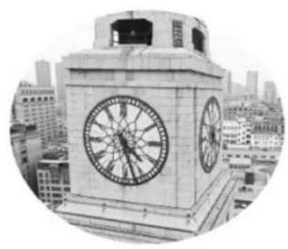
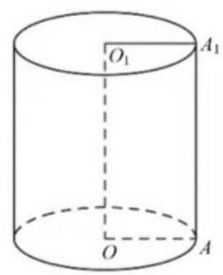
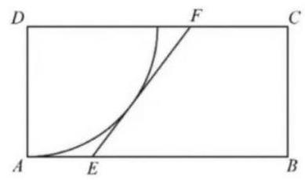

# 2022 年上海市普通高等学校春季招生统一文化考试 数学试卷

1. 已知 $z = 2 + i$ (其中 $i$ 为虚数单位)，则 $\bar{z} =$ ___；

2. 已知集合 $A = \left( {-1,2}\right)$ ，集合 $B = \left( {1,3}\right)$ ，则 $A \cap  B =$ ___；

3. 不等式 $\frac{x - 1}{x} < 0$ 的解集为___；

4. 若 $\tan \alpha  = 3$ ，则 $\tan \left( {\alpha  + \frac{\pi }{4}}\right)  =$ ___；

5. 设函数 $f\left( x\right)  = {x}^{3}$ 的反函数为 ${f}^{-1}\left( x\right)$ ，则 ${f}_{-1}\left( {27}\right)  =$ ___；

6. 在 ${\left( {x}^{3} + \frac{1}{x}\right) }^{12}$ 的展开式中，则含 $\frac{1}{{x}_{4}}$ 项的系数为___；

7. 若关于 $x, y$ 的方程组 $\left\{  \begin{array}{l} x + {my} = 2 \\  {mx} + {16y} = 8 \end{array}\right.$ 有无穷多解，则实数 $m$ 的值为___；

8. 已知在 $\bigtriangleup  {ABC}$ 中， ${\angle A} = \frac{\pi }{3}$ ， ${AB} = 2$ ， ${AC} = 3$ ，则 $\bigtriangleup  {ABC}$ 的外接圆半径为___.；

9. 用数字1、2、3、4 组成没有重复数字的四位数，则这些四位数中比 2134 大的数字个数为___；(用数字作答)

10. 在 $\bigtriangleup {ABC}$ 中， $\angle C = {90}^{ \circ  }$ ， ${AB} = {AC} = 2$ ，点 $M$ 为边 ${AB}$ 的中点，点 $P$ 在边 ${BC}$ 上， 则 $\overrightarrow{MP} \cdot  \overrightarrow{CP}$ 的最小值为___；

11. 已知 ${P}_{1}\left( {{x}_{1},{y}_{1}}\right) ,{P}_{1}\left( {{x}_{2},{y}_{2}}\right)$ 两点均在双曲线 $\Gamma  : \frac{{x}^{2}}{{a}^{2}} - \frac{1}{y} = a > 0$ 的右支上,若 ${x}_{1}{x}_{1} > {y}_{1}{y}_{2}$ 恒成立，则实数 $a$ 的取值范围为___；

12. 已知函数 $y = f\left( x\right)$ 为定义域为 $\mathbf{R}$ 的奇函数,其图像关于 $x = 1$ 对称,且当 $x \in  (0,1\rbrack$ 时, $f\left( x\right)  = \ln x$ ,若将方程 $f\left( x\right)  = x + 1$ 的正实数根从小到大依次记为 ${x}_{1},{x}_{2},{x}_{3},\ldots ,{x}_{n}$ ,则 $\mathop{\lim }\limits_{{n \rightarrow  \infty }}\left( {{x}_{n + 1} - {x}_{n}}\right)  =$ ___.

二、选择题 (本大题共有 4 题, 满分 20 分, 每题 5 分) 每题有且只有一个正确选项, 考生应在答题纸的相应位置，将代表正确选项的小方格涂黑.

13. 下列函数定义域为 $\mathbf{R}$ 的是( )

(A) $y = {x}^{-\frac{1}{2}}$ (B) (C) $y = {x}^{\frac{1}{3}}$ (D) $y = {x}^{\frac{1}{2}}$

$v = {x}^{ - }{}_{1}$

14. 若 $a > b > c > d$ ，则下列不等式恒成立的是( )

(A) $a + d > b + c$ (B) $a + c > b + d$

(C) ${ac} > {bd}$ (D) ${ad} > {bc}$

15. 上海海关大楼的顶部为逐级收拢的四面钟楼，如图，四个大钟分布在四棱柱的四个侧面， 则每天0点至12点(包含0点，不含12点)相邻两钟面上的时针相互垂直的次数为( )

(A) 0 (B) 2 (C) 4 (D) 12

16. 已知等比数列 $\left\{  {a}_{n}\right\}$ 的前 $n$ 项和为 ${S}_{n}$ ,前 $n$ 项积为 ${T}_{n}$ ,则下列选项判断正确的是 ( )

(A) 若 ${S}_{2022} > {S}_{2021}$ ,则数列 $\left\{  {a}_{n}\right\}$ 是递增数列

(B) 若 ${T}_{2022} > {T}_{2021}$ ,则数列 $\left\{  {a}_{n}\right\}$ 是递增数列

(C) 若数列 $\left\{  {S}_{n}\right\}$ 是递增数列,则 ${a}_{2022} \geq  {a}_{2021}$

(D) 若数列 $\left\{  {T}_{n}\right\}$ 是递增数列,则 ${a}_{2022} \geq  {a}_{2021}$

三、简答题 (本大题共有 5 题, 满分 76 分) 解答下列各题必须在答题纸的相应位置写出必要的步骤.

17. (本题满分 14 分, 第 1 小题满分 6 分, 第 2 小题满分 8 分)

如图，圆柱下底面与上底面的圆心分别为 $O$ 、 ${O}_{1}$ ， $A{A}_{1}$ 为圆柱的母线，底面半径长为 1 .

(1)若 $A{A}_{1} = 4, M$ 为 $A{A}_{1}$ 的中点，求直线 $M{O}_{1}$ 与上底面所成角的大小；(结果用反三角函数值表示)

(2)若圆柱过 $O{O}_{1}$ 的截面为正方形，求圆柱的体积与侧面积.

18. (本题满分 14 分, 第 1 小题满分 6 分, 第 2 小题满分 8 分) 已知在数列 $\left\{  {a}_{n}\right\}$ 中， ${a}_{2} = 1$ ，其前 $n$ 项和为 ${S}_{n}$ .

(1)若 $\left\{  {a}_{n}\right\}$ 是等比数列， ${S}_{2} = 3$ ，求 $\mathop{\lim }\limits_{{n \rightarrow  \infty }}{S}_{n}$ ；

(2)若 $\left\{  {a}_{n}\right\}$ 是等差数列， ${S}_{2n} \geq  n$ ，求其公差 $d$ 的取值范围.

19. (本题满分 14 分, 第 1 小题满分 6 分, 第 2 小题满分 8 分)

为有效塑造城市景观、提升城市环境品质，上海市正在努力推进新一轮架空线入地工程的建设.如图是一处要架空线入地的矩形地块 ${ABCD},{AB} = {30}\mathrm{\;m},{AD} = {15}\mathrm{\;m}$ . 为保护 $D$ 处的一棵古树,有关部门划定了以 $D$ 为圆心、 ${DA}$ 为半径的四分之一圆的地块为历史古迹封闭区.若空线入线口为 ${AB}$ 边上的点 $E$ ，出线口为 ${CD}$ 边上的点 $F$ ，施工要求 ${EF}$ 与封闭区边界相切， ${EF}$ 右侧的四边形地块 ${BCFE}$ 将作为绿地保护生态区. (计算长度精确到 ${0.1}\mathrm{m}$ ,计算面积精确到 ${0.01}{\mathrm{\;m}}^{2}$ )

(1)若 $\angle {ADE} = {20}^{ \circ  }$ ，求 ${EF}$ 的长；

(2)当入线口 $E$ 在 ${AB}$ 上的什么位置时，生态区的面积最大? 最大面积是多少?

20. (本题满分 16 分, 第 1 小题满分 4 分, 第 2 小题满分 6 分, 第 3 小题满分 6 分) 已知椭圆 $\Gamma  : \frac{{x}^{2}}{{a}^{2}} + {y}^{2} = 1\left( {a > 1}\right) , A\text{ 、 }B$ 两点分别为 $\Gamma$ 的左顶点、下顶点, $C\text{ 、 }D$ 两点均在直线 $l : x = a$ 上,且 $C$ 在第一象限.

(1)设 $F$ 是椭圆 $\Gamma$ 的右焦点，且 $\angle {AFB} = \frac{\pi }{6}$ ，求 $\Gamma$ 的标准方程；

(2)若 $C$ 、 $D$ 两点纵坐标分别为2、1，请判断直线 ${AD}$ 与直线 ${BC}$ 的交点是否在椭圆 $\Gamma$ 上, 并说明理由;

(3)设直线 ${AD}\text{ 、 }{BC}$ 分别交椭圆 $\Gamma$ 于点 $P\text{ 、 }{AQ}$ ，若 $P\text{ 、 }Q$ 关于原点对称，求 ${CD}$ 的最小值.

21. (本题满分 18 分, 第 1 小题满分 4 分, 第 2 小题满分 6 分, 第 3 小题满分 8 分) 已知函数 $f\left( x\right)$ 的定义域为 $\mathbf{R}$ ,现有两种对 $f\left( x\right)$ 变换的操作:

$\varphi$ 变换: $f\left( x\right)  - f\left( {x - t}\right)$ ； $\omega$ 变换: $\left| {f\left( {x + t}\right)  - f\left( x\right) }\right|$ ，其中 $t$ 为大于 0 的常数.

(1) 设 $f\left( x\right)  = {2}^{x}, t = 1, g\left( x\right)$ 为 $f\left( x\right)$ 做 $\varphi$ 变换后的结果,解方程: $g\left( x\right)  = 2$ ;

(2)设 $f\left( x\right)  = {x}^{2}$ ， $h\left( x\right)$ 为 $f\left( x\right)$ 做 $\omega$ 变换后的结果，解不等式: $f\left( x\right)  \geq  h\left( x\right)$ ；

(3) 设 $f\left( x\right)$ 在 $\left( {-\infty ,0}\right)$ 上单调递增， $f\left( x\right)$ 先做 $\varphi$ 变换后得到 $u\left( x\right)$ ， $u\left( x\right)$ 再做 $\omega$ 变换后得到 ${h}_{1}\left( x\right) ;f\left( x\right)$ 先做 $\omega$ 变换后得到 $v\left( x\right) , v\left( x\right)$ 再做 $\varphi$ 变换后得到 $h\left( x\right)$ . 若 $h\left( x\right)  = h\left( x\right)$ 恒成立,证明: 函数 $f\left( x\right)$ 在 $\mathbf{R}$ 上单调递增.
