# 2025年12月03日教研功底考 姓名:___

1

已知P是一个圆锥的顶点， ${PA}$ 是母线， ${PA} = 2$ ，该圆锥的底面半径是1. B、C分别在圆锥的底面上，则异面直线 ${PA}$ 与 ${BC}$ 所成角的最小值为___.

答案

$\frac{\pi }{3}$

解析

过 $A$ 作 ${AD}//{BC}$ 交底面圆锥于 $D$ 点，则 $\angle {PAD}$ 为异面直线 ${PA}$ 与 ${BC}$ 所成角，结合余弦定理与余弦函数的性质即可得 $\angle {PAD}$ 的取值范围，从而得所求最值.

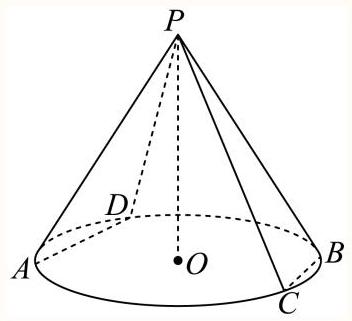

如图,过 $A$ 作 ${AD}//{BC}$ 交底面圆锥于 $D$ 点,连接 ${PD}$ ,

因为 ${PA} = {PD},{AD}//{BC}$ ，则 $\angle {PAD}$ 为异面直线 ${PA}$ 与 ${BC}$ 所成角，

所以 $\cos \angle {PAD} = \frac{{\left| PA\right| }^{2} + {\left| AD\right| }^{2} - {\left| PD\right| }^{2}}{2\left| {PA}\right|  \cdot  \left| {AD}\right| } = \frac{{2}^{2} + {\left| AD\right| }^{2} - {2}^{2}}{4\left| {AD}\right| } = \frac{\left| AD\right| }{4}$ ,

又 $0 < \left| {AD}\right|  \leq  2$ ,所以 $0 < \frac{\left| AD\right| }{4} \leq  \frac{1}{2}$ ,即 $0 < \cos \angle {PAD} \leq  \frac{1}{2}$ ,

因为 $\angle {PAD} \in  \left( {0,\frac{\pi }{2}}\right)$ ，函数 $y = \cos \alpha$ 在 $\alpha  \in  \left( {0,\frac{\pi }{2}}\right)$ 上单调递减，所以 $\frac{\pi }{3} \leq  \angle {PAD} < \frac{\pi }{2}$ ，

故异面直线 ${PA}$ 与 ${BC}$ 所成角的最小值为 $\frac{\pi }{3}$ .

故答案为: $\frac{\pi }{3}$ .

2

如图所示，正方形 ${ABCD}$ 是一块边长为4的工程用料，阴影部分所示是被腐蚀的区域，其余部分完好,曲线 ${MN}$ 为以 ${AD}$ 为对称轴的抛物线的一部分, ${DM} = {DN} = 3$ . 工人师傅现要从完好的部分中截取一块矩形原料 ${BQPR}$ ，当其面积有最大值时， ${AQ}$ 的长为___.

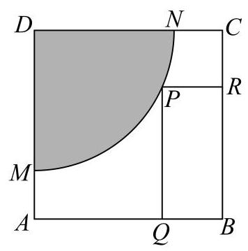

答案

$\frac{4 + \sqrt{7}}{3}$

解析

建立平面直角坐标系如图所示,由已知求出抛物线方程,当 ${AQ} \geq  3$ 时,矩形面积最大时为 4 ,当 $0 < {AQ} < 3$ ,设 ${AQ} = x\left( {0 < x < 3}\right)$ ,即可得到 $S$ 关于 $x$ 的函数式,利用求导判断单调性, 即可得到最值.

由题知,以 $A$ 为原点,建立平面直角坐标系,如图,

则 $M\left( {0,1}\right) , N\left( {3,4}\right)$ ,设 ${MN}$ 方程为: $y = a{x}^{2} + b$ ,

所以 $\left\{  \begin{array}{l} 0 + b = 1 \\  {9a} + b = 4 \end{array}\right.$ , $\left\{  \begin{array}{l} a = \frac{1}{3} \\  b = 1 \end{array}\right.$ , ${MN}$ 方程为: $y = \frac{1}{3}{x}^{2} + 1$ ,

令矩形 ${BQPR}$ 面积为 $S$ ，

当 ${AQ} \geq  3$ 时， $S \leq  {S}_{BQNC} = 1 \times  4 = 4$ ，

当 $0 < {AQ} < 3$ ,设 ${AQ} = x\left( {0 < x < 3}\right)$ ,则 $P\left( {x,\frac{1}{3}{x}^{2} + 1}\right)$ ,

所以 $S = \left( {4 - x}\right) \left( {\frac{1}{3}{x}^{2} + 1}\right)  =  - \frac{1}{3}{x}^{3} + \frac{4}{3}{x}^{2} - x + 4$ ,

则 ${S}^{\prime } =  - {x}^{2} + \frac{8}{3}x - 1 =  - {\left( x - \frac{4}{3}\right) }^{2} + \frac{7}{9}$ ,

令 ${S}^{\prime } > 0$ ,则 $\frac{4 - \sqrt{7}}{3} < x < \frac{4 + \sqrt{7}}{3}, S$ 在 $\left( {\frac{4 - \sqrt{7}}{3},\frac{4 + \sqrt{7}}{3}}\right)$ 上递增,

令 ${S}^{\prime } < 0$ ,则 $x > \frac{4 + \sqrt{7}}{3}$ 或 $x < \frac{4 - \sqrt{7}}{3}, S$ 在 $\left( {\frac{4 + \sqrt{7}}{3}, + \infty }\right) ,\left( {-\infty ,\frac{4 - \sqrt{7}}{3}}\right)$ 上递减,

又 $0 < x < 3, S\left( 0\right)  = 4, S\left( \frac{4 + \sqrt{7}}{3}\right)  = \frac{{344} + {14}\sqrt{7}}{81} > 4$ ,

所以当 ${AQ}$ 的长为 $\frac{4 + \sqrt{7}}{3}$ 时,该矩形面积最大.

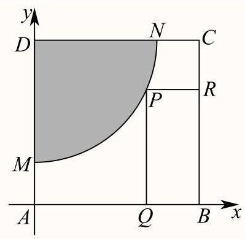

故答案为: $\frac{4 + \sqrt{7}}{3}$

3

某建筑物内一个水平直角型过道如图所示, 两过道的宽度均为3米, 有一个水平截面为矩形的设备需要水平通过直角型过道. 若该设备水平截面矩形的宽 ${BC}$ 为1米,则该设备能水平通过直角型过道的长 ${AB}$ 不超过___米.

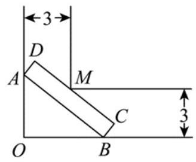

答案

$6\sqrt{2} - 2$

解析

建立平面直角坐标系,利用直线 ${AB}$ 的方程求得设备的长 ${AB}$ 的表达式,再利用均值定理求得 ${AB}$ 的最小值，进而得到该设备能水平通过直角型过道时 ${AB}$ 不超过的值.

分别以 ${OB},{OA}$ 所在直线为 $x, y$ 轴建立平面直角坐标系如图,

则 $M\left( {3,3}\right)$ ,令 $A\left( {0, b}\right) , B\left( {a,0}\right) ,\left( {a > 0, b > 0}\right)$ ,

则直线 ${AB}$ 的方程为 $\frac{x}{a} + \frac{y}{b} = 1$ ,

则 $M$ 在直线 ${AB}$ 的上方，且 $M$ 到直线 ${AB}$ 的距离为 1，

即 $\left\{  \begin{array}{l} \frac{3}{a} + \frac{3}{b} > 1 \\  \frac{\left| \frac{3}{a} + \frac{3}{b} - 1\right| }{\sqrt{\frac{1}{{\left( \frac{1}{a}\right) }^{2}} + {\left( \frac{1}{b}\right) }^{2}}} = 1 \end{array}\right.$ ,则 $\frac{3}{a} + \frac{3}{b} - 1 = \sqrt{{\left( \frac{1}{a}\right) }^{2} + {\left( \frac{1}{b}\right) }^{2}}$ ,

整理得 $\sqrt{{a}^{2} + {b}^{2}} = 3\left( {a + b}\right)  - {ab}$ ,

设 $\left| {AB}\right|  = r,\angle {OAB} = \theta ,\left( {r > 0,\theta  \in  \left\lbrack  {0,\frac{\pi }{2}}\right\rbrack  }\right)$ ,则 $a = r\sin \theta , b = r\cos \theta$ ,

则 $\sqrt{{a}^{2} + {b}^{2}} = 3\left( {a + b}\right)  - {ab}$ 可化为 $r = {3r}\left( {\sin \theta  + \cos \theta }\right)  - {r}^{2}\sin \theta \cos \theta$ ,

令 $t = \sin \theta  + \cos \theta \left( {\theta  \in  \left\lbrack  {0,\frac{\pi }{2}}\right\rbrack  }\right)$ ,则 $t = \sqrt{2}\sin \left( {\theta  + \frac{\pi }{4}}\right)  \in  \left\lbrack  {1,\sqrt{2}}\right\rbrack$ ,则

$r = \frac{3\left( {\sin \theta  + \cos \theta }\right)  - 1}{\sin \theta \cos \theta } = \frac{{3t} - 1}{\frac{{t}^{2} - 1}{2}} = 2 \times  \frac{1}{\frac{\frac{1}{9}{\left( 3t - 1\right) }^{2} + \frac{2}{9}\left( {{3t} - 1}\right)  - \frac{8}{9}}{{3t} - 1}}$

$= \frac{18}{\left( {{3t} - 1}\right)  - \frac{8}{{3t} - 1} + 2},$

由 $t \in  \left\lbrack  {1,\sqrt{2}}\right\rbrack$ ,得 ${3t} - 1 \in  \left\lbrack  {2,3\sqrt{2} - 1}\right\rbrack$ ,

又 $y = x - \frac{8}{x} + 2$ 在 $\left\lbrack  {2,3\sqrt{2} - 1}\right\rbrack$ 上单调递增,

则 $\left( {{3t} - 1}\right)  - \frac{8}{{3t} - 1} + 2 \leq  3\sqrt{2} - 1 - \frac{8}{3\sqrt{2} - 1} + 2 = \frac{9}{3\sqrt{2} - 1}$ ,

则 $\frac{18}{\left( {{3t} - 1}\right)  - \frac{8}{{3t} - 1} + 2} \geq  2\left( {3\sqrt{2} - 1}\right)$ (当且仅当 $t = \sqrt{2}$ 时等号成立)

则该设备能水平通过直角型过道的长 ${AB}$ 不超过 $2\left( {3\sqrt{2} - 1}\right)$ 米

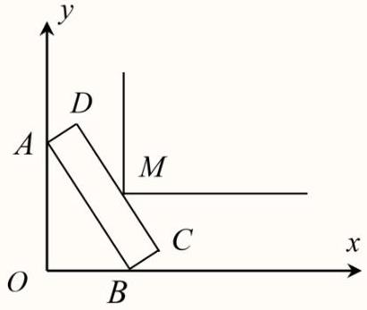

故答案为: $2\left( {3\sqrt{2} - 1}\right)$

4

网络购物行业日益发达，各销售平台通常会配备送货上门服务. 小金正在配送客户购买的电冰箱, 并获得了客户所在小区门户以及建筑转角处的平面设计示意图. 为避免冰箱内部制冷液逆流, 要求运送过程中发生倾斜时，外包装的底面与地面的倾斜角 $\alpha$ 不能超过 ${45}^{ \circ  }$ ，且底面至少有两个顶点与地面接触. 外包装看作长方体，如图所示，记长方体的纵截面为矩形 ${ABCD},{AD} = {{0.8}\mathrm{\;m}},{AB} = {{2.4}\mathrm{\;m}}$ ，而客户家门高度为 2.3 米，其他过道高度足够. 则小金将冰箱运送入客户家中时，倾斜角 $\alpha$ 的度数至少为___. (精确到0.01)

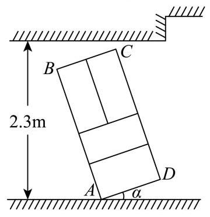

答案

${43.05}^{ \circ  }$

## 解析

由题意可得 $h = {0.8}\sin \alpha  + {2.4}\cos \alpha  \leq  {2.3}$ ,再利用辅助角公式与反三角函数化简,最后借助计算器计算即可得.

过点 $D$ 作 ${DE} \bot$ 地面于点 $E$ ，作平行于地面直线 ${DF}$ 使得 ${CF} \bot  {DF}$ ，

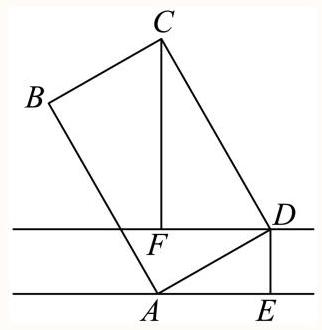

则 ${DE} = {AD}\sin \alpha ,{CF} = {CD}\cos \alpha  = {AB}\cos \alpha$ ,

则冰箱倾斜后实际高度 $h = {DE} + {CF} = {AD}\sin \alpha  + {AB}\cos \alpha  = {0.8}\sin \alpha  + {2.4}\cos \alpha$ ,

则 $h = {0.8}\sin \alpha  + {2.4}\cos \alpha  = \sqrt{{0.8}^{2} + {2.4}^{2}}\sin \left( {\alpha  + \varphi }\right)  = \frac{4\sqrt{10}}{5}\sin \left( {\alpha  + \varphi }\right)$ ,

其中 $\tan \varphi  = 3,\varphi  \in  \left( {0,\frac{\pi }{2}}\right)$ ,则 $\varphi  = \arctan 3 \approx  {71.565}^{ \circ  }$ ,

由题意可得 $h = \frac{4\sqrt{10}}{5}\sin \left( {\alpha  + \varphi }\right)  \leq  {2.3}$ 时才能按要求运送入客户家中,

即 $\sin \left( {\alpha  + \varphi }\right)  \leq  \frac{{23}\sqrt{10}}{80}$ ，由 $\arcsin \frac{{23}\sqrt{10}}{80} \approx  {65.388}^{ \circ  }$ ， ${0}^{ \circ  } \leq  \alpha  \leq  {45}^{ \circ  }$ ，

故 $\alpha  + \varphi  \geq  {180}^{ \circ  } - {65.388}^{ \circ  } = {114.612}^{ \circ  }$ ,

则 $\alpha  \geq  {114.61}^{ \circ  } - \varphi  \approx  {114.612}^{ \circ  } - {71.565}^{ \circ  } = {43.047}^{ \circ  } \approx  {43.05}^{ \circ  }$

故倾斜角 $\alpha$ 的度数至少为 ${43.05}^{ \circ  }$ .

故答案为: ${43.05}^{ \circ  }$ .

5

已知空间单位向量 $\overrightarrow{{e}_{1}},\overrightarrow{{e}_{2}},\overrightarrow{{e}_{3}},\overrightarrow{{e}_{4}},\left| {\overrightarrow{{e}_{1}} + \overrightarrow{{e}_{2}}}\right|  = \left| {\overrightarrow{{e}_{3}} + \overrightarrow{{e}_{4}}}\right|  = 2\left| {\overrightarrow{{e}_{1}} + \overrightarrow{{e}_{2}} + \overrightarrow{{e}_{3}} + \overrightarrow{{e}_{4}}}\right|  = 1$ ,则 $\overrightarrow{{e}_{1}} \cdot  \overrightarrow{{e}_{3}}$ 的最大值是___.

答案

$\frac{7 + 3\sqrt{5}}{16}$

解析

因 $\overrightarrow{{e}_{1}},\overrightarrow{{e}_{2}},\overrightarrow{{e}_{3}},\overrightarrow{{e}_{4}}$ 是空间单位向量,则把向量 $\overrightarrow{{e}_{1}},\overrightarrow{{e}_{2}},\overrightarrow{{e}_{3}},\overrightarrow{{e}_{4}}$ 平移到以O为起点,终点在半径为1的球面上，如图，

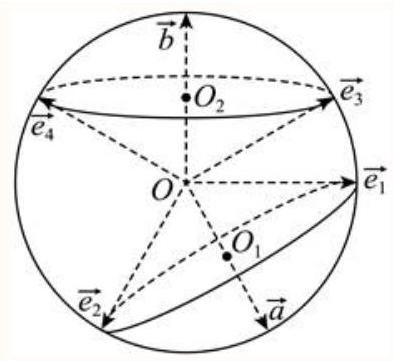

由 $\left| {\overrightarrow{{e}_{1}} + \overrightarrow{{e}_{2}}}\right|  = 1$ 得 ${\overrightarrow{{e}_{1}}}^{2} + {\overrightarrow{{e}_{2}}}^{2} + 2\overrightarrow{{e}_{1}} \cdot  \overrightarrow{{e}_{2}} = 1$ ,解得 $\overrightarrow{{e}_{1}} \cdot  \overrightarrow{{e}_{2}} =  - \frac{1}{2},\left\langle  {\overrightarrow{{e}_{1}},\overrightarrow{{e}_{2}}}\right\rangle   = {120}^{ \circ  }$ ,同理 $\left\langle  {\overrightarrow{{e}_{3}},\overrightarrow{{e}_{4}}}\right\rangle   = {120}^{ \circ  }$ ,令 $\overrightarrow{{e}_{1}} + \overrightarrow{{e}_{2}} = \overrightarrow{a},\overrightarrow{{e}_{3}} + \overrightarrow{{e}_{4}} = \overrightarrow{b}$ ,

则有 $\left\langle  {\overrightarrow{{e}_{1}},\overrightarrow{a}}\right\rangle   = {60}^{ \circ  },\left\langle  {\overrightarrow{{e}_{3}},\overrightarrow{b}}\right\rangle   = {60}^{ \circ  }$ ,且 $\left| {\overrightarrow{a} + \overrightarrow{b}}\right|  = \frac{1}{2}$ ,平方解得 $\overrightarrow{a} \cdot  \overrightarrow{b} =  - \frac{7}{8},\cos \langle \overrightarrow{a},\overrightarrow{b}\rangle  =  - \frac{7}{8}$

于是得 $\overrightarrow{{e}_{1}}$ 绕向量 $\overrightarrow{a}$ 所在直线旋转一周得圆锥 $O{O}_{1}$ 的侧面， $\overrightarrow{{e}_{3}}$ 绕向量 $\overrightarrow{b}$ 所在直线旋转一周得圆锥 $O{O}_{2}$ 的侧面,

显然 $\cos \langle \overrightarrow{a},\overrightarrow{b}\rangle  =  - \frac{7}{8} <  - \frac{\sqrt{3}}{2}$ ，由此得 ${150}^{ \circ  } < \langle \overrightarrow{a},\overrightarrow{b}\rangle  < {180}^{ \circ  }$ ， $\sin \langle \overrightarrow{a},\overrightarrow{b}\rangle  = \frac{\sqrt{15}}{8}$ ，

观察图形知,当 $\overrightarrow{{e}_{1}},\overrightarrow{{e}_{3}}$ 旋转到在平面 ${O}_{1}O{O}_{2}$ 内,且都在 $\angle {O}_{1}O{O}_{2}$ 内时,向量 $\overrightarrow{{e}_{1}}$ 与 $\overrightarrow{{e}_{3}}$ 的夹角最小,令此最小角为 $\theta$ ,

因此, $\theta  = \langle \overrightarrow{a},\overrightarrow{b}\rangle  - {60}^{ \circ  } - {60}^{ \circ  } = \langle \overrightarrow{a},\overrightarrow{b}\rangle  - {120}^{ \circ  }$ ,

$\cos \theta  = \cos \left( {\langle \overrightarrow{a},\overrightarrow{b}\rangle  - {120}^{ \circ  }}\right)  = \cos \langle \overrightarrow{a},\overrightarrow{b}\rangle \cos {120}^{ \circ  } + \sin \langle \overrightarrow{a},\overrightarrow{b}\rangle \sin {120}^{ \circ  } =  - \frac{7}{8} \times  \left( {-\frac{1}{2}}\right)  + \frac{\sqrt{15}}{8} \times$

$\frac{\sqrt{3}}{2}$

$= \frac{7 + 3\sqrt{5}}{16},$

${\overrightarrow{e}}_{1} \cdot  {\overrightarrow{e}}_{3} = \left| {\overrightarrow{e}}_{1}\right| \left| {\overrightarrow{e}}_{3}\right| \cos \left\langle  {{\overrightarrow{e}}_{1},{\overrightarrow{e}}_{3}}\right\rangle   \leq  \cos \theta  = \frac{7 + 3\sqrt{5}}{16},$

所以 $\overrightarrow{{e}_{1}} \cdot  \overrightarrow{{e}_{3}}$ 的最大值是 $\frac{7 + 3\sqrt{5}}{16}$ .

故答案为: $\frac{7 + 3\sqrt{5}}{16}$

6

设数列 $\left\{  {a}_{n}\right\}$ 的前 $n$ 项和为 ${S}_{n}$ ,若对任意的正整数 $n$ ,总存在正整数 $m$ ,使得 ${S}_{n} = {a}_{m}$ ,下列正确的命题是 ( )

① $\left\{  {a}_{n}\right\}$ 可能为等差数列；

② $\left\{  {a}_{n}\right\}$ 可能为等比数列；

③ ${a}_{i}\left( {i \geq  2}\right)$ 均能写成 $\left\{  {a}_{n}\right\}$ 的两项之差；

④ 对任意 $n \in  \mathrm{N}, n \geq  1$ ，总存在 $m \in  \mathrm{N}, m \geq  1$ ，使得 ${a}_{n} = {S}_{m}$ .

A. ①③

B. ①④

C. ②③

D. ②④

A

解析

对于①，取 ${a}_{n} = n$ ，可知①正确；对于②，当 $\left\{  {a}_{n}\right\}$ 的公比 $q = 1$ ， $n \geq  2$ 时，

${S}_{n} = n{a}_{1} = n{a}_{m} \neq  {a}_{m}$ ; 当 $q \neq  1$ 时， ${S}_{n} = {a}_{m}$ ，而 $1 + q + \cdots  + {q}^{n - 1} = {q}^{m - 1}$ 无有理数根，可知②错误；对于③，根据 ${a}_{n} = {S}_{n} - {S}_{n - 1}\left( {n \geq  2}\right)$ ，可知③正确；对于④取数列 ${a}_{n} = n$ ，显然不存在 $m$ ,使得 ${S}_{m} = {a}_{2} = 2$ ,故④不正确.

对于①，取 ${a}_{n} = n$ ，则 ${S}_{n} = \frac{n\left( {n + 1}\right) }{2}$ ，显然存在 $m = \frac{n\left( {n + 1}\right) }{2}$ ，使 ${S}_{n} = {a}_{m}$ ，所以①正确， 对于②,若数列 $\left\{  {a}_{n}\right\}$ 为等比数列,设公比为 $q$ ,显然 $q = 1$ 不满足要求,

考虑 $q \neq  1$ 的情况,依题意有, ${S}_{n + 1} = {a}_{{m}_{1}},{S}_{{2n} + 2} = {a}_{{m}_{2}}$ ,

即 $1 + q + {q}^{2} + \cdots  + {q}^{n} = {q}^{{m}_{1}}$ ①,

$1 + q + {q}^{2} + \cdots  + {q}^{{2n} + 1} = \left( {1 + q + {q}^{2} + \cdots  + {q}^{n}}\right) \left( {1 + {q}^{n + 1}}\right)  = {q}^{{m}_{2}}\text{ ② },$

两式相除,得到 $1 + {q}^{n + 1} = {q}^{{m}_{2} - {m}_{1}}$ ,

若 $\left| q\right|  > 1$ ,则取 $n$ 为奇数,那么 ${q}^{n + 1} > 0$ ,所以 ${q}^{{m}_{2} - {m}_{1}} \geq  {\left| q\right| }^{n + 2}$ ,

所以 $1 = {q}^{{m}_{2} - {m}_{1}} - {q}^{n + 1} \geq  {\left| q\right| }^{n + 2} - {q}^{n + 1} = {\left| q\right| }^{n + 1}\left( {\left| q\right|  - 1}\right)$ ,

当 $n$ 足够大时,显然不成立;

若 $\left| q\right|  < 1$ ,则 $\left| {q}^{{m}_{2} - {m}_{1}}\right|  \in  (0,\left| q\right| \rbrack  \cup  \left\lbrack  {\frac{1}{\left| q\right| }, + \infty }\right)$ ,因为 $\left| q\right|  < 1 < \frac{1}{\left| q\right| }$ ,

所以当 $n$ 足够大时,可以使 $1 + {q}^{n + 1} \in  \left( {\left| q\right| ,\frac{1}{\left| q\right| }}\right)$ ,故也不成立.从而知②错误,

对于选项③，取 $n = 2$ ，则 ${a}_{1} + {a}_{2} = {a}_{m}$ ，所以 ${a}_{1} = {a}_{m} - {a}_{2}$ ，

当 $n \geq  2$ 时， ${a}_{n} = {S}_{n} - {S}_{n - 1} = {a}_{{m}_{1}} - {a}_{{m}_{2}}$ ，故③正确，

对于选项④，取数列 ${a}_{n} = n$ ，显然不存在 $m$ ，使得 ${S}_{m} = {a}_{2} = 2$ ，故④错误，

故选: A.

关键点点晴: 本题的关键在于第②选项，根据条件得到 ${S}_{n + 1} = {a}_{{m}_{1}},{S}_{{2n} + 2} = {a}_{{m}_{2}}$ ,从而得到 $1 + {q}^{n + 1} = {q}^{{m}_{2} - {m}_{1}}$ ,再对 $q$ 进行讨论,从而解决问题.

7

已知无穷数列 $\left\{  {a}_{n}\right\}$ 各项均为正实数，其前 $n$ 项的和为 ${S}_{n}$ ，若对任意的正整数 $m$ ，均存在正整数 $k$ ， 使得 $\left| {{a}_{k} - {S}_{m}}\right|  < {a}_{1}$ 成立，则称 $\left\{  {a}_{n}\right\}$ 为 “正向控制数列”；若对任意的正整数 $k$ ，均存在正整数 $m$ ，使得 $\left| {{S}_{m} - {a}_{k}}\right|  < {S}_{1}$ 成立，则称 $\left\{  {a}_{n}\right\}$ 为“反向控制数列”.

现有下列两个命题:

(1)存在等差数列 $\left\{  {a}_{n}\right\}$ 既为“正向控制数列”，又为“反向控制数列”；

(2)存在等比数列 $\left\{  {a}_{n}\right\}$ 既为“正向控制数列”，又为“反向控制数列”.

则下列说法正确的是( )

A. (1)是真命题，(2)是假命题

B. (1)是假命题，(2)是真命题

C. (1)(2)都是真命题

## 答案

B

解析

根据等差数列的函数性质, 即可求解 (1) 的真假, 举例子即可求解 (2) 的真假.

若等差数列 $\left\{  {a}_{n}\right\}$ 不是常数列,由题意可得公差 $d > 0$ ,则 ${a}_{n}$ 可看成关于 $n$ 的一次函数, ${S}_{m}$ 可看成关于 $m$ 的二次函数,即 ${a}_{n} = {nd} + {a}_{1} - d,{S}_{m} = \frac{d}{2}{m}^{2} + \left( {{a}_{1} - \frac{d}{2}}\right) m$ ,

由 $\left| {{a}_{k} - {S}_{m}}\right|  < {a}_{1}$ 得 ${S}_{m} - {a}_{1} < {a}_{k} < {S}_{m} + {a}_{1}$ ,

当 $m$ 足够大时， ${S}_{m} - {a}_{1} < {a}_{k}$ 不成立，故命题(1)不成立；

若等差数列 $\left\{  {a}_{n}\right\}$ 是常数列,设 ${a}_{n} = a > 0$ ,则 ${S}_{m} = {ma}$ ,显然当 $m > 3$ 时,此时 $\left| {{a}_{k} - {S}_{m}}\right|  = \left( {m - 1}\right) a > {a}_{1}$ ,故命题 (1) 不成立;

综上可知, 对任意的等差数列, 命题 (1) 是假命题;

取等比数列 ${a}_{n} = {\left( \frac{1}{2}\right) }^{n}$ ,则 ${S}_{m} = \frac{\frac{1}{2}\left( {1 - {\left( \frac{1}{2}\right) }^{m}}\right) }{1 - \frac{1}{2}} = 1 - {\left( \frac{1}{2}\right) }^{m}$ ,

若对任意的正整数 $m$ ,均存在正整数 $k$ ,不妨取 $k = 1$ ,使得

$$
\left| {\frac{1}{2} - \left( {1 - \frac{1}{{2}^{m}}}\right) }\right|  = \left| {\frac{1}{{2}^{m}} - \frac{1}{2}}\right|  < {a}_{1},
$$

则对任意的正整数 $k$ ,不妨取 $m = 1,\left| {{S}_{m} - {a}_{k}}\right|  = \left| {\frac{1}{2} - \frac{1}{{2}^{k}}}\right|  < \frac{1}{2} = {S}_{1}$ ,

因此 $\left\{  {a}_{n}\right\}$ 既为 “正向控制数列”，又为 “反向控制数列”. 故命题(2)正确.

故选: B.

汽车转弯时遵循阿克曼转向几何原理，即转向时所有车轮中垂线交于一点，该点称为转向中心:如图1，某汽车四轮中心分别为 $A\text{ 、 }B\text{ 、 }C\text{ 、 }D$ ，向左转向，左前轮转向角为 $\alpha$ ，右前轮转向角为 $\beta$ ，转向中心为 $O$ .设该汽车左右轮距 ${AB}$ 为 $w$ 米,前后轴距 ${AD}$ 为 $l$ 米.

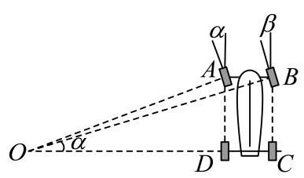

图1

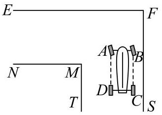

图2

(1) 试用 $w\text{ 、 }l$ 和 $\alpha$ 表示 $\tan \beta$ ;

(2)如图2，有一直角弯道， $M$ 为内直角顶点， ${EF}$ 为上路边，路宽均为3.5米，汽车行驶其中，左轮 $A\text{ 、 }D$ 与路边 ${FS}$ 相距2米. 试依据如下假设，对问题*做出判断，并说明理由.

假设: ①转向过程中，左前轮转向角 $\alpha$ 的值始终为 ${30}^{ \circ  }$ ; ②设转向中心 $O$ 到路边 ${EF}$ 的距离为 $d$ ，若 ${OB} < d$ 且 ${OM} < {OD}$ ，则汽车可以通过，否则不能通过；③ $w = {1.570}, l = {2.680}$ .问题*:可否选择恰当转向位置，使得汽车通过这一弯道？

## 答案

(1)答案见解析

(2)答案见解析

## 解析

(1)由已知 $\angle {AOD} = \alpha ,\angle {BOC} = \beta$ ,

所以 ${OD} = \frac{AD}{\tan \alpha } = \frac{l}{\tan \alpha },{OC} = {OD} + {DC} = \frac{l}{\tan \alpha } + w$ ,

所以 $\tan \beta  = \frac{BC}{OC} = \frac{l}{\frac{l}{\tan \alpha } + w}$ .

(2)以EF和FS分别为 $x$ 轴和 $y$ 轴建立坐标系，

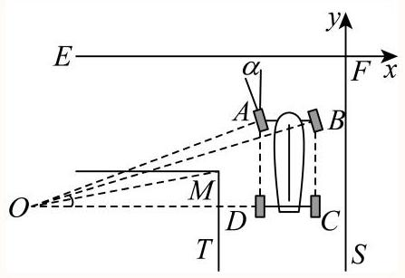

则 $M\left( {-{3.5}, - {3.5}}\right) ,\;{OD} = \frac{l}{\tan \alpha } = \sqrt{3}l = {4.642},\;{OB} = \sqrt{{l}^{2} + {\left( \sqrt{3}l + w\right) }^{2}} = {6.766}$ ,

设 $O\left( {a, b}\right) \left( {a < 0, b < 0}\right)$ ,

可得 $a =  - \sqrt{3}l - 2 =  - {6.642}, d =  - b$ ,

${OM} = \sqrt{{\left( {3.5} + a\right) }^{2} + {\left( {3.5} + b\right) }^{2}} = \sqrt{{9.872} + {\left( {3.5} + b\right) }^{2}},$

由 ${OM} < {OD}$ ，可得 ${9.872} + {\left( {3.5} + b\right) }^{2} < {21.548}$ ，解得 -6.917 < b < -0.83

由 ${OB} < d$ ,得 $b <  - {6.766}$ ,

所以当-6.917<-6.766时, ${OB} < d$ 且 ${OM} < {OD}$ ,此时汽车可以通过弯道.

可知选择恰当转向位置, 汽车可以通过弯道.

已知曲线 $C$ 的方程为 $\frac{{x}^{2}}{4} + \frac{{y}^{2}}{3} = 1$ ，曲线 $C$ 的左顶点为 $E$ ，右焦点为 $F$ ，动直线 $l$ 与曲线 $C$ 交于 $P$ ， $Q$ 两点.

(1)求曲线C的离心率；

(2)设直线 $\mathrm{{EP}},\mathrm{{EQ}}$ 的斜率分别为 ${k}_{1},{k}_{2}$ ，且满足 ${k}_{1}{k}_{2} =  - \frac{9}{4}$ ，证明直线 $\mathrm{I}$ 恒过定点；

(3)若1过点F，且P，N关于原点对称，是否存在直线l，使得四边形OFQN的面积为 $\frac{9}{4}$ ？若存在， 求出直线 $l$ 的条数:若不存在，请说明理由.

答案

(1) $\frac{1}{2}$ ;

(2) $\left( {-1,0}\right)$ ；

(3)存在，2条

解析

(1)由曲线 $\mathrm{C}$ 的方程 $\frac{{x}^{2}}{4} + \frac{{y}^{2}}{3} = 1$ 可得，

${a}^{2} = 4,{b}^{2} = 3$ ,故 $a = 2, c = \sqrt{{a}^{2} - {b}^{2}} = 1$ ,

故离心率 $e = \frac{c}{a} = \frac{1}{2}$ .

(2)由 $E\left( {-2,0}\right)$ ，设直线 $l : x = {my} + n, P\left( {{x}_{1},{y}_{1}}\right) , Q\left( {{x}_{2},{y}_{2}}\right)$ ，

直线 $\mathrm{{EP}},\mathrm{{EQ}}$ 的斜率分别为 ${k}_{1},{k}_{2}$ ,且满足 ${k}_{1}{k}_{2} =  - \frac{9}{4}$ ,

联立 $\left\{  \begin{array}{l} x = {my} + n \\  \frac{{x}^{2}}{4} + \frac{{y}^{2}}{3} = 1 \end{array}\right.$ ,得 $\left( {3{m}^{2} + 4}\right) {y}^{2} + {6mny} + 3{n}^{2} - {12} = 0$ .

${y}_{1} + {y}_{2} =  - \frac{6mn}{3{m}^{2} + 4},\;{y}_{1}{y}_{2} = \frac{3{n}^{2} - {12}}{3{m}^{2} + 4},$

${k}_{1} = \frac{{y}_{1}}{{x}_{1} + 2} = \frac{{y}_{1}}{m{y}_{1} + n + 2},{k}_{2} = \frac{{y}_{2}}{m{y}_{2} + n + 2},$

${k}_{1}{k}_{2} = \frac{{y}_{1}{y}_{2}}{\left( {m{y}_{1} + n + 2}\right) \left( {m{y}_{2} + n + 2}\right) } =  - \frac{9}{4},$

即 ${k}_{1}{k}_{2} = \frac{\frac{3{n}^{2} - {12}}{3{m}^{2} + 4}}{{m}^{2} \cdot  \frac{3{n}^{2} - {12}}{3{m}^{2} + 4} + m\left( {n + 2}\right)  \cdot  \left( {-\frac{6mn}{3{m}^{2} + 4}}\right)  + {\left( n + 2\right) }^{2}} =  - \frac{9}{4}$ ,

化简可得: $\frac{3{n}^{2} - {12}}{4{\left( n + 2\right) }^{2}} =  - \frac{9}{4}$ ,解得: $n =  - 1$ ,则直线 $l$ 过 $\left( {-1,0}\right)$ .

(3)满足题意的直线条数有两条，证明如下:

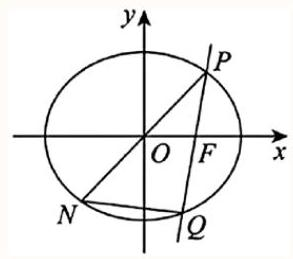

由题意可知直线 $\mathrm{{PQ}}$ 的斜率不为 0,设 $\mathrm{{PQ}} : x = {my} + 1, P\left( {{x}_{1},{y}_{1}}\right) , Q\left( {{x}_{2},{y}_{2}}\right)$ ,不妨令

${y}_{1} > 0,{y}_{2} < 0$

联立 $\left\{  \begin{array}{l} x = {my} + 1 \\  \frac{{x}^{2}}{4} + \frac{{y}^{2}}{3} = 1 \end{array}\right.$ ,可得 $\left( {3{m}^{2} + 4}\right) {y}^{2} + {6my} - 9 = 0 \Rightarrow  \left\{  \begin{array}{l} {y}_{1} + {y}_{2} =  - \frac{6m}{3{m}^{2} + 4} \\  {y}_{1}{y}_{2} =  - \frac{9}{3{m}^{2} + 4} \end{array}\right.$ ①

因为四边形OFQN的面积为 $S = {S}_{\Delta PQN} - {S}_{\Delta POF} = 2{S}_{\Delta POQ} - {S}_{\Delta POF}$ ,

所以 $S = {OF}\left| {{y}_{1} - {y}_{2}}\right|  - \frac{1}{2}{OF}\left| {y}_{1}\right|  = \frac{1}{2}{y}_{1} - {y}_{2} = \frac{9}{4}$ ,

因为 ${y}_{1} = 2{y}_{2} + \frac{9}{2}$ ,代入①可得 ${y}_{1} =  - \frac{4m}{3{m}^{2} + 4} + \frac{3}{2},{y}_{2} =  - \frac{2m}{3{m}^{2} + 4} - \frac{3}{2}$ ,

代入②可得 $\left( {-\frac{4m}{3{m}^{2} + 4} + \frac{3}{2}}\right) \left( {-\frac{2m}{3{m}^{2} + 4} - \frac{3}{2}}\right)  =  - \frac{9}{3{m}^{2} + 4}$ ，

所以 $\left( {{81}{m}^{3} - {36}{m}^{2} + {76m} - {48}}\right) m = 0$ ,即 $m = 0$ 或 ${81}{m}^{3} - {36}{m}^{2} + {76m} - {48} = 0$ ,

令 $\varphi \left( m\right)  = {81}{m}^{3} - {36}{m}^{2} + {76m} - {48}$ ,则 ${\varphi }^{\prime }\left( m\right)  = {243}{m}^{2} - {72m} + {76}$ ,

令 ${\varphi }^{\prime }\left( m\right)  = 0$ ,因为 $\Delta  < 0$ 恒成立,所以 ${\varphi }^{\prime }\left( m\right)  > 0$ ,即 $\varphi \left( m\right)$ 在 $\mathbf{R}$ 上单调递增,

因为 $\varphi \left( 0\right)  =  - {48} < 0,\varphi \left( 1\right)  = {73} > 0$ ,由零点存在性定理可知:

所以 $\varphi \left( m\right)$ 在 $\left( {0,1}\right)$ 上有唯一零点,

综上所述，满足题意的直线 $l$ 有两条.

对于函数 $y = h\left( x\right)$ ,记 ${h}^{\left( 0\right) }\left( x\right)  = h\left( x\right) ,{h}^{\left( 1\right) }\left( x\right)  = {\left( h\left( x\right) \right) }^{\prime },\ldots ,{h}^{\left( n + 1\right) }\left( x\right)  = {\left( {h}^{\left( n\right) }\left( x\right) \right) }^{\prime }\left( {n \in  N}\right)$ . 如果 $n$ 是满足 ${h}^{\left( n\right) }\left( x\right)  = h\left( x\right)$ 的最小正整数，则称 $n$ 是函数 $y = h\left( x\right)$ 的“最小导周期”.

(1) 已知函数 $y = f\left( x\right)$ ，其中 $f\left( x\right)  = a\sin \left( {x + t}\right)  + b\cos \left( {x + t}\right)$ ，求证:对任意实数 $a, b, t$ ，都有 ${f}^{\left( 4\right) }\left( x\right)  = f\left( x\right)$

(2)设 $m, n \in  \mathbf{R}$ ， $g\left( x\right)  = {\mathrm{e}}^{mx} + n\cos x$ ，若函数 $y = g\left( x\right)$ 的最小导周期为2，记

$M\left( {a, b}\right)  = \sqrt{{\left( a - b\right) }^{2} + {\left( a + 1 + g\left( b\right) \right) }^{2}}$ ,当实数 $a, b$ 变化时,求 $M\left( {a, b}\right)$ 的最小值;

(3) 设 $\omega  > 1, h\left( x\right)  = \cos {\omega x}$ ,若函数 $y = h\left( x\right)$ 满足 ${h}^{\left( 2\right) }\left( x\right)  \leq  x$ 对 $x \in  \left( {0, + \infty }\right)$ 恒成立,且存在 ${x}_{0} \in  \left( {0, + \infty }\right)$ 使得 ${h}^{\left( 2\right) }\left( {x}_{0}\right)  = {x}_{0}$ ,试用 $\omega$ 表示 ${x}_{0}$ ,并证明 $\frac{\pi }{2\omega } < {x}_{0} < \frac{\pi }{\omega }$ .

## 答案

(1)证明见解析

(2) $\sqrt{2}$

(3) ${x}_{0} = \frac{\sqrt{{\omega }^{6} - 1}}{\omega }$ ，证明见解析

## 解析

(1) 证明: 因为 ${f}^{\left( 1\right) }\left( x\right)  = a\cos \left( {x + t}\right)  - b\sin \left( {x + t}\right)$ ,

${f}^{\left( 2\right) }\left( x\right)  =  - a\sin \left( {x + t}\right)  - b\cos \left( {x + t}\right) ,$

$$
{f}^{\left( 3\right) }\left( x\right)  =  - a\cos \left( {x + t}\right)  + b\sin \left( {x + t}\right) ,
$$

${f}^{\left( 4\right) }\left( x\right)  = a\sin \left( {x + t}\right)  + b\cos \left( {x + t}\right)  = f\left( x\right) ,$

所以,对任意实数 $a, b, t$ ,都有 ${f}^{\left( 4\right) }\left( x\right)  = f\left( x\right)$ .

(2) $g\left( x\right)  = {\mathrm{e}}^{mx} + n\cos x,{g}^{\left( 1\right) }\left( x\right)  = m{\mathrm{e}}^{mx} - n\sin x,{g}^{\left( 2\right) }\left( x\right)  = {m}^{2}{\mathrm{e}}^{mx} - n\cos x$ ,

由题意知, ${\mathrm{e}}^{mx} + n\cos x = {m}^{2}{\mathrm{e}}^{mx} - n\cos x$ 对任意实数 $x$ 恒成立,

令 $x = 0$ ,则 $1 + n = {m}^{2} - n$ ,即 ${m}^{2} = 1 + {2n}$ ,

令 $x = \frac{\pi }{2}$ ，则 ${\mathrm{e}}^{\frac{m\pi }{2}} = {m}^{2}{\mathrm{e}}^{\frac{m\pi }{2}}$ ，则 ${m}^{2} = 1$ ，

所以 $m = 1, n = 0$ 或 $m =  - 1, n = 0$ .

若 $m = 1, n = 0$ ,则 $g\left( x\right)  = {\mathrm{e}}^{x},{g}^{\left( 1\right) }\left( x\right)  = {\mathrm{e}}^{x} = g\left( x\right)$ ,最小导周期不是 2,矛盾;

若 $m =  - 1, n = 0$ ,则 $g\left( x\right)  = {\mathrm{e}}^{-x},{g}^{\left( 1\right) }\left( x\right)  =  - {\mathrm{e}}^{-x},{g}^{\left( 2\right) }\left( x\right)  = {\mathrm{e}}^{-x} = g\left( x\right)$ ,最小导周期为 2, 符合要求,所以 $g\left( x\right)  = {\mathrm{e}}^{-x}$ .

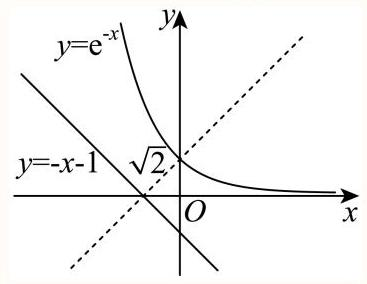

$M\left( {a, b}\right)  = \sqrt{{\left( a - b\right) }^{2} + {\left( a + 1 + g\left( b\right) \right) }^{2}} = \sqrt{{\left( a - b\right) }^{2} + {\left( -a - 1 - {\mathrm{e}}^{-b}\right) }^{2}}$ 可视为点

$P\left( {a, - a - 1}\right)$ 与点 $Q\left( {b,{\mathrm{e}}^{-b}}\right)$

之间的距离，当实数 $a, b$ 变化时，点 $P\left( {a, - a - 1}\right)$ 在直线 $y =  - x - 1$ 上运动，点 $Q\left( {b,{\mathrm{e}}^{-b}}\right)$ 在曲线 $y = {\mathrm{e}}^{-x}$ 上运动,

因此所求最小值可转化为曲线 $y = {\mathrm{e}}^{-x}$ 上的点到直线 $y =  - x - 1$ 距离的最小值,

而曲线 $y = {\mathrm{e}}^{-x}$ 在直线 $y =  - x - 1$ 上方,平移直线 $y =  - x - 1$ 使其与曲线 $y = {\mathrm{e}}^{-x}$ 相切, 则切点到直线 $y =  - x - 1$ 的距离即为所求.

设切点 $M\left( {{x}_{0},{\mathrm{e}}^{-{x}_{0}}}\right) ,{y}^{\prime } =  - {\mathrm{e}}^{-x}$ ,切线斜率 $- {\mathrm{e}}^{-{x}_{0}} =  - 1$ ,得 ${x}_{0} = 0$ ,切点为 $\left( {0,1}\right)$ ,

点 $\left( {0,1}\right)$ 到直线 $y =  - x - 1$ 距离 $d = \frac{\left| 1 + 0 + 1\right| }{\sqrt{{1}^{2} + {1}^{2}}} = \sqrt{2}$ . 即 $M\left( {a, b}\right)$ 的最小值为 $\sqrt{2}$ .

(3) ${h}^{\left( 1\right) }\left( x\right)  =  - \omega \sin \left( {\omega x}\right) ,{h}^{\left( 2\right) }\left( x\right)  =  - {\omega }^{2}\cos \left( {\omega x}\right)$ ,

记 $\varphi \left( x\right)  = {h}^{\left( 2\right) }\left( x\right)  - x$ ,即 $\varphi \left( x\right)  =  - {\omega }^{2}\cos {\omega x} - x$ .

由 $\varphi \left( x\right)  = {h}^{\left( 2\right) }\left( x\right)  - x \leq  0$ 在 $\left( {0, + \infty }\right)$ 上恒成立及存在 ${x}_{0} > 0$ 使 $\varphi \left( {x}_{0}\right)  = {h}^{\left( 2\right) }\left( {x}_{0}\right)  - {x}_{0} = 0$ ,

可知 $x = {x}_{0}$ 是函数 $y = \varphi \left( x\right)$ 的极大值点,于是 ${\varphi }^{\prime }\left( {x}_{0}\right)  = {\omega }^{3}\sin \omega {x}_{0} - 1 = 0$ ,

则 $\sin \omega {x}_{0} = \frac{1}{{\omega }^{3}}$ ①,

又 $\varphi \left( {x}_{0}\right)  =  - {\omega }^{2}\cos \omega {x}_{0} - {x}_{0} = 0$ ,则 $\cos \omega {x}_{0} = \frac{-{x}_{0}}{{\omega }^{2}}$ ②,

由①②得 $\frac{1}{{\omega }^{6}} + \frac{{x}_{0}^{2}}{{\omega }^{4}} = 1$ ，则 ${x}_{0} = \frac{\sqrt{{\omega }^{6} - 1}}{\omega }$ .

又因为 $\sin \omega {x}_{0} = \frac{1}{{\omega }^{3}} > 0,\cos \omega {x}_{0} = \frac{-{x}_{0}}{{\omega }^{2}} < 0$ ,

所以 ${2k\pi } + \frac{\pi }{2} < \omega {x}_{0} < {2k\pi } + \pi \left( {k \in  \mathbf{Z}}\right)$ ,由 $\omega {x}_{0} > 0$ 得 $k \geq  0$ ,

又因为 $\frac{\pi }{2\omega } < {x}_{0} - \frac{2k\pi }{\omega } < \frac{\pi }{\omega }\left( {k \in  \mathbf{Z}}\right)$ ,

所以 $\varphi \left( {{x}_{0} - \frac{2k\pi }{\omega }}\right)  =  - {\omega }^{2}\cos \left\lbrack  {\omega \left( {{x}_{0} - \frac{2k\pi }{\omega }}\right) }\right\rbrack   - \left( {{x}_{0} - \frac{2k\pi }{\omega }}\right)$

$=  - {\omega }^{2}\cos \omega {x}_{0} - {x}_{0} + \frac{2k\pi }{\omega } = \frac{2k\pi }{\omega } \leq  0,$

有 $k \leq  0$ ,于是 $k = 0$ ,

所以 $\frac{\pi }{2\omega } < {x}_{0} < \frac{\pi }{\omega }$ .
