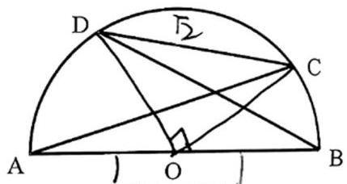
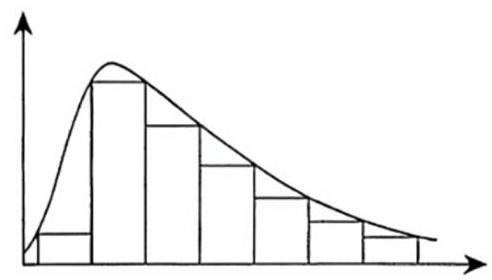
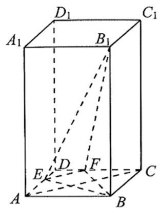
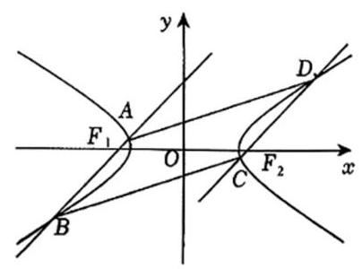

# 静安区 2025 学年度第一学期教学质量调研 高三数学试卷

2025.12

(考试时间120分钟 试卷满分 150 分)

## 考生注意:

1. 本试卷包括试题纸和答题纸两部分.

2. 在试题纸上答题无效, 必须在答题纸上的规定位置按照要求答题.

3. 可使用符合规定的计算器答题.

## 一、填空题(本大题共 12 题，第 1-6 题每题 4 分，第 7-12 题每题 5 分，共 54 分. 考 生应在答题纸的相应位置直接填写结果.)

1. 已知全集是实数集 $R$ ,集合 $M = \{ x \mid  \left( {x - 3}\right) \left( {x + 2}\right)  \geq  0\}$ ,则集合 $M$ 的补集 $\bar{M} =$ ___.

2. 已知椭圆的标准方程为 $\frac{{x}^{2}}{9} + \frac{{y}^{2}}{25} = 1$ ，则该椭圆的长轴的长等于___.

3. 已知直线 ${l}_{1} : {3x} - {3y} + {10} = 0$ 与 ${l}_{2} : x - \sqrt{3}y = 0$ ，则直线 ${l}_{1}$ 与 ${l}_{2}$ 的夹角大小是___.

4. 已知复数 $z$ 满足 $\left( {3 - \mathrm{i}}\right)  \cdot  z = 3 + \mathrm{i}$ (其中 $\mathrm{i}$ 为虚数单位),则复数 $z =$ ___.

5. 设 $\theta$ 是第四象限角 $\cos \theta  = \frac{3}{5}$ ，则 $\tan {2\theta } =$ ___.

6. 设等差数列 $\left. {\dot{a}}_{n}\right\}$ 的前 $n$ 项和为 ${S}_{n}$ ( $n$ 为正整数),首项 ${a}_{1} = \frac{3}{2},{a}_{6} = 9$ ,则 ${S}_{7} =$ ___

7. 已知圆柱的底面圆的半径与球的半径相等. 若圆柱的表面积与球的表面积也相等，则圆柱的体积 ${V}_{1}$ 与球的体积 ${V}_{2}$ 之比 ${V}_{1} : {V}_{2} =$ ___

8. 已知函数 $f\left( x\right)  = \left\{  \begin{array}{ll} f\left( {x + 1}\right) , & x < 4 \\  {\left( \frac{1}{3}\right) }^{x}, & x \geq  4 \end{array}\right.$ ，则 $f\left( {{\log }_{3}5}\right)  =$ ___.

9. 抛物线具有如下的光学性质: 所有平行于抛物线对称轴的入射光线经抛物线反射后都过这条抛物线的焦点. 设抛物线的方程为 ${y}^{2} = {12x}$ ,一束光线从平行于其对称轴方向射向抛物线,光线所在直线交抛物线 ${y}^{2} = {12x}$ 于一点,这点的纵坐标为 12 . 则这束光线经过抛物线反射后所在直线的一个法向量为___.

10. 在 $\bigtriangleup {ABC}$ 中,将角 $A\text{ 、 }B\text{ 、 }C$ 所对边的边长分别记作 $a\text{ 、 }b\text{ 、 }c$ . 设 $b = \sqrt{2}c - a$ . 若 $c = 1,\cos C = \frac{1}{5}$ ，则 $\bigtriangleup  {ABC}$ 的面积为___.

11. 如图，已知 ${AB}$ 是半圆 $O$ 的直径，直径长为 2，点 $C\text{ 、 }D$ 均在半圆 $O$ 上，且都不与点 $A\text{ 、 }B$ 重合， $A$ 、 B、C、D 四点依次按照逆时针方向排列. 若 CD 的长为 $\sqrt{2}$ ，则 $\overrightarrow{AC} \cdot  \overrightarrow{BD}$ 的取值范围为___.

(第 11 题图)

12. 设 $y = f\left( x\right)$ 是定义在 $\mathrm{R}$ 上的偶函数,对任意的 $x \in  \mathrm{R}$ ,都有 $f\left( {-x}\right)  = f\left( {x + 4}\right)$ ,且当 $x \in  \left\lbrack  {-2,0}\right\rbrack$ 时, $f\left( x\right)  = {\left( \frac{1}{2}\right) }^{x} - 1$ . 设 $g\left( x\right)  = f\left( x\right)  - {\log }_{a}\left( {x + 2}\right)$ . (其中 $a > 1$ ),若函数 $y = g\left( x\right)$ 在左开右闭区间 $( - 2,6\rbrack$ 上恰有 3 个不同的零点,则实数 $a$ 的取值范围是___.

## 二、选择题(本大题共 4 题，第 13-14 题每题 4 分，第 15-16 题每题 5 分，共 18 分. 每题 有且只有一个正确选项，考生应在答题纸的相应位置，将代表正确选项的小方格涂黑。)

13. 在三维空间中,下列命题是真命题的一个是( )

A. 垂直于同一条直线的两条直线平行

B. 垂直于同一个平面的两个平面平行.

C. 若一条直线垂直于一个平面, 另一条直线与这个平面平行, 则这两条直线互相垂直.

D. 若两个平面分别平行于两条互相垂直的直线, 则这两个平面互相垂直.

14. 如图，已知某频率分布直方图形成 “左偏峰右拖尾” 形态，则下列结论正确的是( )

A. 众数 $=$ 平均数 $=$ 中位数

B. 众数 $<$ 中位数 $<$ 平均数

C. 众数 $<$ 平均数 $<$ 中位数

D. 中位数 <平均数<众数

15. 若数列 $\left\{  {a}_{n}\right\}$ 满足 ${a}_{n + 1} = {\log }_{m}{a}_{n}\left( {m > 1\text{ 且 }m \in  Z}\right) \left( {n\text{ 为正整数 }}\right)$ ,则称数列 $\left\{  {a}_{n}\right\}$ 为 “对数 $m$ 底数列”. 已知正项数列 $\left\{  {a}_{n}\right\}$ 是 “对数 2 底数列” 且 ${a}_{5} = 1$ ，则当 $n \geq  2$ 时， $\frac{{4}^{{a}_{2} + {a}_{3} + \ldots  + {a}_{n}}}{{a}_{2}^{2}\ldots {a}_{n - 1}^{2}} =$ (   )

A. ${2}^{16}$ B. ${2}^{12}$ C. ${2}^{64}$ D. ${2}^{32}$

16. 已知函数 $f\left( x\right)  = \ln \left( {x + 1}\right)  + \frac{ax}{x + 1}\left( {a \in  \mathrm{R}}\right)$ . 现有下述两个结论: ①若 $y = f\left( x\right)$ 在区间 $\left( {-1,0}\right)$ 内恰有一个零点，则 $a$ 的取值范围是 $\left( {-1,0}\right)$ ； ②若 $a > 0$ ，则方程 ${f}^{\prime }\left( x\right)  - f\left( x\right)  = \frac{\sqrt{5} - 1}{2} - \ln \frac{\sqrt{5} + 1}{2}$ 的解为 $x = \frac{-1 \pm  \sqrt{5}}{2}$ . 则下列说法正确的是( )

A. 结论①和②均正确

B. 结论①正确，结论②错误

C. 结论①错误，结论②正确

D. 结论①和②均错误

三、解答题(本大题共 5 题，第 17-19 题每题 14 分，第 20-21 题每题 18 分，共 78 分. 解答下列各题必须在答题纸的相应位置写出必要的步骤.)

## 17. (本题共 3 小题, 第 1 小题满分 5 分, 第 2 小题满分 4 分, 第 3 小题满分 5 分)

为开展社区与学校教育共建活动,某地区教育系统从 $A\text{ 、 }B$ 两所学校的 5 名教师志愿者中随机抽调 2 人到某社区为居民开展 “义务教育咨询” 活动. 已知 $A\text{ 、 }B$ 两所学校中的志愿者学科分布如下:

<table><tr><td rowspan="2"></td><td colspan="2">学科</td></tr><tr><td>语文</td><td>数学</td></tr><tr><td>$A$ 学校</td><td>1</td><td>2</td></tr><tr><td>$B$ 学校</td><td>1</td><td>1</td></tr></table>

(1)假设 $A$ 学校语文 $a$ 老师、数学 $b$ 、 $c$ 老师， $B$ 学校语文 $d$ 老师、数学 $e$ 老师，列出 “从 $A, B$ 两所学校的 5 名教师志愿者中随机抽调 2 人” 的样本空间;

(2)求事件 “抽到的 2 人恰好都是语文老师” 的概率；

(3)求事件 “抽到的 2 人中，恰好有 1 名语文老师 1 名数学老师，且这 2 人恰好来自同一所学校” 的概率.

## 18. (本题共 2 小题, 第 1 小题满分 8 分, 第 2 小题满分 6 分)

已知函数 $f\left( x\right)  = 4\sin \left( {{\omega x} + \frac{\pi }{4}}\right)  \cdot  \cos {\omega x} - \sqrt{2}\left( {\omega  > 0}\right)$ .

(1)将函数 $y = f\left( x\right)$ 化为 $y = A\sin \left( {{kx} + \varphi }\right) \left( {A > 0, k > 0,\left| \varphi \right|  \leq  \frac{\pi }{2}}\right)$ 的形式，并指出这个函数的振幅和初始相位;

(2)若函数 $y = f\left( x\right)$ 的最小正周期为 $\pi$ ，求 $\omega$ 的值并求函数 $y = f\left( x\right)$ 的值域.

## 19. (本题共 2 小题, 第 1 小题满分 6 分, 第 2 小题满分 8 分)

已知正四棱柱 ${ABCD} - {A}_{1}{B}_{1}{C}_{1}{D}_{1}$ 的底面边长为 1,点 $E$ 、 $F$ 分别在边 ${AD}$ 、 ${CD}$ 上,且 ${AE} = \frac{2}{3},{CF} = \frac{2}{3}.$

(1)证明: ${AC}//$ 平面 ${B}_{1}{EF}$ ；

(2)若 $A{A}_{1} = 2$ ，求直线 $B{B}_{1}$ 与平面 ${B}_{1}{EF}$ 所成角的正弦值.

## 20. (本题共 3 小题，第 1 小题满分 4 分，第 2 小题满分 6 分，第 3 小题满分 8 分)

在平面直角坐标系 ${xOy}$ 中,已知双曲线 $\Gamma  : \frac{{x}^{2}}{{a}^{2}} - \frac{{y}^{2}}{{b}^{2}} = 1\left( {a > 0, b > 0}\right)$ 的焦距为 4,点 $\left( {\sqrt{6},1}\right)$ 在 $\Gamma$ 上.

(1)求双曲线 $\Gamma$ 的方程；

(2)设直线 $l$ 的斜率为 $\frac{1}{2}, l$ 交双曲线 $\Gamma$ 于 $P$ 、 $Q$ 两点，且与圆 ${x}^{2} + {y}^{2} = 4$ 相切，切点位于 $x$ 轴上方部分,求 $\overrightarrow{OP} \cdot  \overrightarrow{OQ}$ 的值;

(3)如图，设过双曲线 $\Gamma$ 的左焦点 ${F}_{1}$ 的直线 ${AB}$ 交 $\Gamma$ 的左支于点 $A$ 、 $B$ ，过 $\Gamma$ 的右焦点 ${F}_{2}$ 的直线 ${CD}$ 交 $\Gamma$ 的右支于点 $C$ 、 $D$ ,若直线 ${CD}//{AB}$ ,且四边形 ${ABCD}$ 的面积为 4-6,求直线 ${AB}$ 的方程.

## 21. (本题共 3 小题, 第 1 小题满分 4 分, 第 2 小题满分 7 分, 第 3 小题满分 7 分)

已知函数 $y = f\left( x\right) \left( {x \in  \mathrm{R}}\right)$ 的图像关于点 $\left( {m, n}\right)$ 成中心对称的充要条件是 $g\left( x\right)  = f\left( {x + m}\right)  - n\left( {x \in  \mathrm{R}}\right)$ 是奇函数. 如果一个函数 $y = f\left( x\right)$ 的图像关于点 $\left( {m, n}\right)$ 成中心对称,则称这个函数是点 $\left( {m, n}\right)$ 奇函数,其中点 $\left( {m, n}\right)$ 为对称中心. 设函数 $f\left( x\right)  = x\left( {x - 1}\right) \left( {x - a}\right) ,\;x \in  \mathrm{R}.$

(1)若函数 $y = f\left( x\right)$ 是点 $\left( {1,0}\right)$ 奇函数，求实数 $a$ 的值；

(2)证明:对于任意给定的实数 $a$ ，函数 $y = f\left( x\right)$ 存在两个极值点；若 $x = a$ 是 $y = f\left( x\right)$ 的极小值点,求出 $y = f\left( x\right)$ 的所有极值点;

(3)若 $x = a$ 是 $y = f\left( x\right)$ 的极大值点，函数 $y = f\left( x\right)$ 是否是点 $\left( {m, n}\right)$ 奇函数？若是， 求出对称中心 $\left( {m, n}\right)$ ; 若不是,请说明理由.
