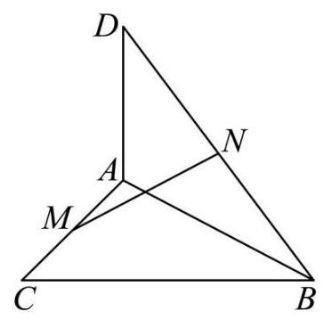
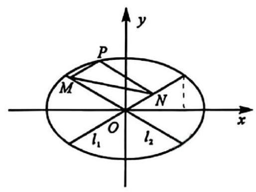

## 2026 届嘉定区高三下二模数学试卷

## 本卷考点结构总览

> 使用说明：基础题只保留最小必要考点；中难题突出“核心考点”和“学生易卡点”。题后标签与本总览保持对应，便于做错题归因和一对一讲评。

### 1. 集合、逻辑与不等式

#### 1.1 集合元素互异性
- 涉及题目：第 1 题
- 核心卡点：代入元素关系后，还要检查集合列举元素不能重复。

#### 1.2 分式不等式与条件关系
- 涉及题目：第 2、13 题
- 核心卡点：分式不等式要按临界点分区间；充分条件要转化为集合包含方向。

### 2. 函数、导数与新函数模型

#### 2.1 零点个数与参数范围
- 涉及题目：第 8 题
- 核心卡点：分解后要保证三个不同零点，不能只看判别式。

#### 2.2 函数图像、单调性与迭代
- 涉及题目：第 11、21 题
- 核心卡点：第 11 题把“仍为函数图像”转化为横坐标单调；第 21 题用导数控制 sigmoid 的单调性和压缩性。

### 3. 三角、向量与复数

#### 3.1 三角函数定义、恒等变换与值域
- 涉及题目：第 3、7、9 题
- 核心卡点：第 9 题要先把向量投影化成辅助角形式，再看角范围。

#### 3.2 向量新定义与复数几何
- 涉及题目：第 16、17 题
- 核心卡点：第 16 题不能把新运算默认成标准内积；第 17 题要把复数条件转为平面几何距离。

### 4. 数列、计数与概率统计

#### 4.1 数列通项与递推趋势
- 涉及题目：第 4、15 题
- 核心卡点：第 15 题要区分“存在”和“任意”，并观察递推比值的后期趋势。

#### 4.2 计数、概率递推与分布建模
- 涉及题目：第 6、10、14、19 题
- 核心卡点：第 10 题识别回到原局面的递推；第 19 题区分正态尾概率和二项分布事件。

### 5. 立体几何与解析几何

#### 5.1 空间几何体与空间向量
- 涉及题目：第 12、18 题
- 核心卡点：第 12 题把几何描述转成 $h$ 与 $2R$ 的最值模型；第 18 题用法向量求线面角。

#### 5.2 双曲线、椭圆与坐标化
- 涉及题目：第 5、20 题
- 核心卡点：第 20 题先参数化 $M,N$，再处理定值和面积最值。

## 一、填空题

1. 已知集合 $A = \left\{  {a,{a}^{2}}\right\}$ ，且 $1 \in  A$ ，则 $a =$ ___.

**答案：** $-1$
**考点：** 集合元素互异性
**解析：** 由 $1\in A=\{a,a^2\}$，得 $a=1$ 或 $a^2=1$。若 $a=1$，则 $a=a^2$，不符合集合列举元素的互异性；故 $a=-1$。

---

2. 解不等式 $\frac{1}{x} > 1$ ，则不等式的解集是___.

**答案：** $(0,1)$
**考点：** 分式不等式解法
**解析：** $\frac1x>1$ 等价于 $\frac{1-x}{x}>0$。临界点为 $0,1$，数轴分析得 $0<x<1$。

---

3. 已知角 $\alpha$ 的终边经过点 $P\left( {1, - 2}\right)$ ，则 $\sin \alpha  =$ ___.

**答案：** $-\frac{2\sqrt5}{5}$
**考点：** 任意角三角函数定义
**解析：** 点 $P(1,-2)$ 到原点距离为 $r=\sqrt{1^2+(-2)^2}=\sqrt5$，所以 $\sin\alpha=\frac{y}{r}=-\frac2{\sqrt5}=-\frac{2\sqrt5}{5}$。

---

4. 已知 $\left\{  {a}_{n}\right\}$ 是等差数列， ${a}_{6} = 1$ ， ${a}_{26} = {11}$ ，则 ${a}_{2026} =$ ___.

**答案：** $1011$
**考点：** 等差数列通项公式
**解析：** 公差 $d=\frac{a_{26}-a_6}{26-6}=\frac{11-1}{20}=\frac12$，所以 $a_{2026}=a_6+(2026-6)d=1+2020\cdot\frac12=1011$。

---

5. 双曲线 $\frac{{x}^{2}}{9} - \frac{{y}^{2}}{16} = 1$ 的渐近线方程是___.

**答案：** $y=\pm\frac43x$
**考点：** 双曲线渐近线
**解析：** 双曲线 $\frac{x^2}{9}-\frac{y^2}{16}=1$ 中 $a=3,b=4$，焦点在 $x$ 轴，渐近线方程为 $y=\pm\frac ba x=\pm\frac43x$。

---

6. 由0,1,2,3,4组成没有重复数字的三位数的个数是___.

**答案：** $48$
**考点：** 无重复数字排列计数
**解析：** 百位不能为 $0$，有 $4$ 种选法；十位有 $4$ 种选法；个位有 $3$ 种选法。共有 $4\cdot4\cdot3=48$ 个。

---

7. 函数 $y = {\sin }^{4}x + {\cos }^{4}x$ 的最小正周期是___.

**答案：** $\frac{\pi}{2}$
**考点：** 三角恒等变换与周期
**解析：** $\sin^4x+\cos^4x=(\sin^2x+\cos^2x)^2-2\sin^2x\cos^2x=1-\frac12\sin^2 2x=\frac34+\frac14\cos4x$，最小正周期为 $\frac{2\pi}{4}=\frac{\pi}{2}$。

---

8. 已知函数 $y = {x}^{3} + {x}^{2} + {ax}$ 有三个不同的零点,则实数 $a$ 的取值范围是___.

**答案：** $(-\infty,0)\cup\left(0,\frac14\right)$
**核心考点：** 三次函数零点个数转化为一次因式与二次因式的零点个数
**易卡点：** 只看判别式会漏掉二次因式不能把 $x=0$ 重复算作新零点，即还要排除 $a=0$。
**关联考点：** 函数零点；二次方程判别式；参数范围
**解析：** $y=x^3+x^2+ax=x(x^2+x+a)$。要有三个不同零点，二次方程 $x^2+x+a=0$ 需有两个不同实根，且 $0$ 不能也是该二次方程的根。故 $\Delta=1-4a>0$ 且 $a\ne0$，所以 $a<\frac14$ 且 $a\ne0$。

---

9. 已知向量 $\overrightarrow{a} = \left( {\cos x,\sin x}\right) ,\overrightarrow{b} = \left( {3,\sqrt{3}}\right)$ ，且 $x \in  \left\lbrack  {0,\frac{\pi }{2}}\right\rbrack$ ，则 $\overrightarrow{a}$ 在 $\overrightarrow{b}$ 方向上的数量投影的取值范围为 ___

**答案：** $\left[\frac12,1\right]$
**核心考点：** 把向量数量投影转化为辅助角形式的三角函数值域
**易卡点：** 容易把投影误算成数量积，或忽略 $x\in[0,\frac{\pi}{2}]$ 导致角范围变化。
**关联考点：** 向量投影；辅助角公式；三角函数值域
**解析：** $\left|\overrightarrow b\right|=\sqrt{3^2+(\sqrt3)^2}=2\sqrt3$。投影为 $\frac{\overrightarrow a\cdot\overrightarrow b}{|\overrightarrow b|}=\frac{3\cos x+\sqrt3\sin x}{2\sqrt3}=\frac{\sqrt3}{2}\cos x+\frac12\sin x=\sin\left(x+\frac{\pi}{3}\right)$。因 $x\in[0,\frac{\pi}{2}]$，故 $x+\frac{\pi}{3}\in[\frac{\pi}{3},\frac{5\pi}{6}]$，值域为 $\left[\frac12,1\right]$。

---

10. 已知正四面体上的四个面上分别写有 1、2、3、4, 游戏中甲、乙轮流抛掷该四面体, 谁抛出底面数字等于 4 则获胜且游戏结束. 甲先开始，则甲获胜的概率为___.

**答案：** $\frac47$
**核心考点：** 用“双方都失败后回到原局面”建立概率递推
**易卡点：** 若直接列有限轮次，容易漏掉游戏可能持续多轮；关键是识别循环结构。
**关联考点：** 概率递推；独立重复试验；几何级数
**解析：** 甲第一次获胜概率为 $\frac14$。若甲乙都未掷出 $4$，概率为 $\left(\frac34\right)^2$，局面回到甲先手。因此甲胜概率 $p=\frac14+\left(\frac34\right)^2p$，解得 $p=\frac47$。

---

11. 将函数 $y = {x}^{2}, x \in  \left\lbrack  {0,1}\right\rbrack$ 的图象绕坐标原点逆时针方向旋转角 $\theta \left( {0 \leq  \theta  \leq  \alpha }\right)$ 得到曲线 $C$ . 若对于每一个角 $\theta$ ，曲线 $C$ 都是一个函数的图象，则 $\alpha$ 的最大值为___.

**答案：** $\arctan\frac12$
**核心考点：** 旋转后仍为函数图像等价于旋转后横坐标关于参数单调
**易卡点：** 难点不是旋转公式本身，而是把“一条曲线是函数图像”转化为横坐标不回头。
**关联考点：** 函数图像旋转；参数化曲线；导数与单调性
**解析：** 设原曲线参数为 $(x,x^2)$，$x\in[0,1]$。逆时针旋转 $\theta$ 后横坐标为 $X=x\cos\theta-x^2\sin\theta$。要旋转后的曲线仍为函数图像，需要 $X$ 在 $[0,1]$ 上单调不减。$X'=\cos\theta-2x\sin\theta$，最小值在 $x=1$ 处，因此需 $\cos\theta-2\sin\theta\ge0$，即 $\tan\theta\le\frac12$。故 $\alpha_{\max}=\arctan\frac12$。

---

12. 在包装设计中,常用长度和宽度描述物体体型. 长度 $l\left( V\right)$ 定义为物体上最远两点间的距离,宽度 $t\left( V\right)$ 定义为能夹住物体的两平行平面间的最小距离，即存在一对平行平面，使得物体上的所有点均位于两平面之间 (包括平面上). 现有一圆柱,其底面半径 $R$ 与高 $h$ 可任意调节,则 $\frac{l\left( V\right) }{t\left( V\right) }$ 的最小值为___

**答案：** $\sqrt2$
**核心考点：** 把立体几何中的长度与宽度转化为 $h$ 和 $2R$ 的最值模型
**易卡点：** 宽度不是圆柱高或直径中的固定一个，而是随形体比例取 $\min(h,2R)$。
**关联考点：** 空间几何体；几何建模；最值问题
**解析：** 设圆柱底面直径 $d=2R$，高为 $h$。圆柱上最远两点距离为 $l(V)=\sqrt{h^2+d^2}$。宽度为各方向投影宽度的最小值，对圆柱而言 $t(V)=\min(h,d)$。于是 $\frac{l(V)}{t(V)}=\frac{\sqrt{h^2+d^2}}{\min(h,d)}$，当 $h=d$ 时取得最小值 $\sqrt2$。

## 二、单选题

---

13. 已知陈述句 $\alpha$ 是 $\beta$ 的充分非必要条件. 若集合 $M = \left\{  {x \mid  x\text{ 满足 }\alpha }\right\}  , N = \left\{  {x \mid  x\text{ 满足 }\beta }\right\}$ ,则 $M$ 与 $N$ 的关系为 ( )

A. $M \subset  N$ B. $M \supset  N$ C. $M = N$ D. $M \cap  N = \varnothing$

**答案：** A
**考点：** 充分条件与集合包含关系
**解析：** $\alpha$ 是 $\beta$ 的充分非必要条件，表示 $\alpha\Rightarrow\beta$，但 $\beta\nRightarrow\alpha$。因此满足 $\alpha$ 的对象一定满足 $\beta$，即 $M\subset N$。

---

14. 生物学家在研究动物体重 $W$ (单位: $\mathrm{g}$ ) 与脉搏率 $f$ (单位:次·min ${}^{-1}$ ) 的关系时，获得了右表的数据， 令 $x = \ln W, y = \ln f$ ,并拟合线性回归方程 $\widehat{y} = \widehat{a}x + \widehat{b}$ . 根据已知数据,下列说法正确的是( )

<table><tr><td>动物名</td><td>体重 $W/\mathrm{g}$</td><td>脉搏率 $f/\left( {\text{ 次 } \cdot  {\mathrm{{min}}}^{-1}}\right)$</td></tr><tr><td>鼠</td><td>25</td><td>670</td></tr><tr><td>豚鼠</td><td>300</td><td>300</td></tr><tr><td>兔</td><td>2000</td><td>205</td></tr><tr><td>小狗</td><td>5000</td><td>120</td></tr><tr><td>大狗</td><td>30000</td><td>85</td></tr><tr><td>羊</td><td>50000</td><td>70</td></tr><tr><td>马</td><td>450000</td><td>38</td></tr></table>

A. 变量 $x$ 与 $y$ 成正相关,且 $\widehat{b} > 0$ B. 变量 $x$ 与 $y$ 成负相关,且 $\widehat{b} < 0$

C. 变量 $x$ 与 $y$ 成正相关,且 $\widehat{b} < 0$ D. 变量 $x$ 与 $y$ 成负相关,且 $\widehat{b} > 0$

**答案：** D
**核心考点：** 从实际数据趋势判断对数线性回归的相关方向与截距符号
**易卡点：** 不要被对数变换干扰，原变量随体重增大而下降，对数后仍是负相关。
**关联考点：** 线性回归；相关关系；对数变换
**解析：** 从表中看，体重 $W$ 越大，脉搏率 $f$ 越小。作变换 $x=\ln W,y=\ln f$ 后仍呈负相关，故 $\widehat a<0$。由于 $y=\ln f$ 为正值，且回归直线向 $x=0$ 外推时截距为正，故 $\widehat b>0$。

---

15. 设数列 $\left\{  {a}_{n}\right\}$ 满足 ${a}_{1} = 1$ ,且 ${a}_{n + 1} = \frac{\left( {{\lambda n} - 2}\right)  \cdot  {a}_{n}}{{n}^{2} + 1}$ ,其中 $\lambda  \in  \mathbf{R}$ . 下列选项中错误的是( )

A. 存在 $\lambda$ ,使得存在正整数 $\mathbf{N}$ ,当 $n \geq  \mathbf{N}$ 时,总有 ${a}_{n + 1} < {a}_{n}$

B. 存在 $\lambda$ ,使得不存在正整数 $\mathbf{N}$ ,当 $n \geq  \mathbf{N}$ 时,总有 ${a}_{n + 1} > {a}_{n}$

C. 对任意 $\lambda$ ，都不存在正整数 $\mathbf{N}$ ，使得当 $n \geq  \mathbf{N}$ 时，总有 ${a}_{n + 1} > {a}_{n}$

D. 存在 $\lambda$ ,使得不存在正整数 $\mathbf{N}$ ,当 $n \geq  \mathbf{N}$ 时,总有 ${a}_{n + 1} < {a}_{n}$

**答案：** C
**核心考点：** 递推数列后期单调性的判断要看相邻项比值的极限与符号
**易卡点：** 含参数命题要逐项判断“存在”和“任意”，不能只代一个特殊 $\lambda$。
**关联考点：** 数列递推；最终单调性；存在与全称命题
**解析：** 由 $\frac{a_{n+1}}{a_n}=\frac{\lambda n-2}{n^2+1}$，当 $n$ 充分大时，该比值趋近于 $0$。若取适当 $\lambda$，可使数列后期为负且绝对值递减，此时 $a_{n+1}>a_n$ 可最终恒成立。因此“对任意 $\lambda$，都不存在最终递增”的说法错误，选 C。

---

16. 对任意平面向量 $\overrightarrow{a}\text{ 、 }\overrightarrow{b}\text{ 、 }\overrightarrow{c}$ 及任意实数 $\lambda$ ,已知运算 $\odot$ 满足以下三条性质: (I) $\overrightarrow{a} \odot  \overrightarrow{b} = \overrightarrow{b} \odot  \overrightarrow{a}$ ; (II) $\left( {\overrightarrow{a} + \overrightarrow{b}}\right)  \odot  \overrightarrow{c} = \overrightarrow{a} \odot  \overrightarrow{c} + \overrightarrow{b} \odot  \overrightarrow{c}$ ; (III) $\left( {\lambda \overrightarrow{a}}\right)  \odot  \overrightarrow{b} = \lambda \left( {\overrightarrow{a} \odot  \overrightarrow{b}}\right)$ . 则下列选项中一定成立的是( )

A. 若 $\overrightarrow{a} \odot  \overrightarrow{b} = 0$ ,则 $\overrightarrow{a} = \overrightarrow{0}$ 或 $\overrightarrow{b} = \overrightarrow{0}$ B. $\left| {\overrightarrow{a} \odot  \overrightarrow{b}}\right|  = \left| \overrightarrow{a}\right|  \cdot  \left| \overrightarrow{b}\right|$

C. $\left( {\overrightarrow{a} - \overrightarrow{b}}\right)  \odot  \left( {\overrightarrow{a} - \overrightarrow{b}}\right)  = \overrightarrow{a} \odot  \overrightarrow{a} - 2\overrightarrow{a} \odot  \overrightarrow{b} + \overrightarrow{b} \odot  \overrightarrow{b}$ D. $\overrightarrow{a} \odot  \overrightarrow{a} \geq  0$

**答案：** C
**核心考点：** 从运算律识别对称双线性结构，只能推出展开式，不能默认是标准内积
**易卡点：** 最容易把新定义运算直接当数量积使用，从而误用正定性和模长公式。
**关联考点：** 新定义运算；向量运算律；类比与反例意识
**解析：** 由交换性、加法分配律和数乘相容性可知 $\odot$ 是对称双线性运算。于是
  $$({\overrightarrow a-\overrightarrow b})\odot({\overrightarrow a-\overrightarrow b})
  =\overrightarrow a\odot\overrightarrow a-2\overrightarrow a\odot\overrightarrow b+\overrightarrow b\odot\overrightarrow b.$$
  其余选项都需要正定性或标准数量积性质，题设并未给出。

## 三、解答题

---

17. 在复平面内,已知点 $A\text{ 、 }B\text{ 、 }C$ 对应的复数分别为 ${z}_{A} = 0\text{ 、 }{z}_{B} = 6\text{ 、 }{z}_{C} = 4 + 3\mathrm{i}$ ,其中 $i$ 是虚数单位.

(1)求 $\cos \angle {ACB}$ 的值；

(2)若复数 $z$ 满足 $\left| {z - {z}_{A}}\right|  = \left| {z - {z}_{B}}\right|  = \left| {{z}_{B} - {z}_{C}}\right|$ ，求 $z$ .

**答案：** (1) $\frac{1}{5\sqrt{13}}$；(2) $z=3+2i$ 或 $z=3-2i$
**核心考点：** 复数几何问题转化为平面点坐标与距离条件
**易卡点：** 第二问的等距条件先给出垂直平分线，再与定半径圆联立。
**关联考点：** 复数几何意义；距离公式；向量夹角
**解析：** 点 $A(0,0),B(6,0),C(4,3)$。$\overrightarrow{CA}=(-4,-3),\overrightarrow{CB}=(2,-3)$，点积为 $1$，长度分别为 $5,\sqrt{13}$，故 $\cos\angle ACB=\frac1{5\sqrt{13}}$。又 $|z-z_A|=|z-z_B|$ 表示点在 $AB$ 的垂直平分线上，即 $x=3$；且 $|z-z_A|=|z_B-z_C|=\sqrt{13}$，所以 $3^2+y^2=13$，得 $y=\pm2$。

---

18. 如图,在 $\bigtriangleup {ABC}$ 中, $\angle {ACB} = {90}^{ \circ  },{DA} \bot$ 平面 ${ABC}, M, N$ 分别是线段 ${AC}\text{ 、 }{DB}$ 的中点.

(1)求证: ${MN}\bot {AC}$ ；

(2)若 ${AC} = {BC} = {AD} = 2$ ，求直线 ${MN}$ 与平面 ${ABD}$ 所成角的大小.

**答案：** (1) 见解析；(2) $30^\circ$
**核心考点：** 用空间坐标把线线垂直和线面角统一转化为向量计算
**易卡点：** 线面角要用直线方向向量与平面法向量的夹角余角，不能直接用方向向量夹角。
**关联考点：** 空间向量；垂直证明；线面角
**解析：** 建立坐标系：令 $C(0,0,0),A(2,0,0),B(0,2,0),D(2,0,2)$。则 $M(1,0,0),N(1,1,1)$，$\overrightarrow{MN}=(0,1,1)$，而 $\overrightarrow{AC}=(-2,0,0)$，故 $\overrightarrow{MN}\cdot\overrightarrow{AC}=0$，所以 $MN\perp AC$。平面 $ABD$ 的法向量可取 $(1,1,0)$，于是线 $MN$ 与平面 $ABD$ 所成角 $\varphi$ 满足 $\sin\varphi=\frac{|(0,1,1)\cdot(1,1,0)|}{\sqrt2\cdot\sqrt2}=\frac12$，所以 $\varphi=30^\circ$。

---

19. 某款足球机器人射点球时，射门点与球门中心的水平偏差(单位:cm)服从正态分布. 在正常状态下,偏差 $X \sim  N\left( {0,{20}^{2}}\right)$ ,规定 $\left| X\right|  > {60}$ 为“严重失误”.

(1)求一次射门出现严重失误的概率 $p$ (精确到 0.0001 )；

(2)假设每次射门相互独立，每次测试让机器人射门 16 次，若至少出现一次严重失误，则判定需要校准. 在正常状态下，求一次测试被判定需要校准的概率 $\alpha$ (精确到 0.01 )，并说明该判定规则是否合理；

(3)因机械磨损，机器人射门精度下降，一次射门出现严重失误的概率增加到 5%. 此时每次测试仍射门 16 次, 但判定规则改为: 若至少出现 2 次严重失误, 才需要校准. 在磨损状态下, 求被判定需要校准的概率 $\beta$ (精确到 0.01 ). 此时,若一次校准的成本为 1 万元,且每天测试 3 次,求日均校准成本的期望值(精确到百元).

参考公式与数据:

①若 $X \sim  N\left( {\mu ,{\sigma }^{2}}\right)$ ,则 $Z = \frac{X - \mu }{\sigma } \sim  N\left( {0,1}\right)$ .

②若 $Z \sim  N\left( {0,1}\right)$ ，则 $P\left( {Z > 3}\right)  \approx  {0.00135}$ ， $P\left( {Z > 2}\right)  \approx  {0.0228}$ .

参考数据: $\ln \left( {0.9973}\right)  \approx   - {0.002704},{0.95}^{16} \approx  {0.440},{0.95}^{15} \approx  {0.463}$ .

**答案：** (1) $0.0027$；(2) $\alpha\approx0.04$，规则较合理；(3) $\beta\approx0.19$，日均校准成本期望约 $5700$ 元
**核心考点：** 正态分布尾概率与二项分布“至少一次/至少两次”的组合建模
**易卡点：** 第二、三问都不是直接乘以次数，而要用补事件或二项分布累加。
**关联考点：** 正态分布；二项分布；补事件；期望
**解析：** (1) $P(|X|>60)=P(|Z|>3)=2P(Z>3)\approx2\times0.00135=0.0027$。(2) $\alpha=1-(1-0.0027)^{16}=1-0.9973^{16}\approx1-e^{16\ln0.9973}\approx0.04$，正常状态下误判概率约 $4\%$，较低，规则较合理。(3) 当严重失误概率为 $0.05$ 时，$\beta=1-0.95^{16}-16\cdot0.05\cdot0.95^{15}\approx1-0.440-0.8\times0.463=0.1896\approx0.19$。每天测试 $3$ 次，每次校准成本 $1$ 万元，日均成本期望为 $3\beta\cdot1\approx0.57$ 万元，即约 $5700$ 元。

---

20. 已知椭圆 $\Gamma  : \frac{{x}^{2}}{{a}^{2}} + \frac{{y}^{2}}{4} = 1\left( {a > 2}\right)$ 与直线 ${l}_{1} : y = \frac{x}{2}\text{ 、 }{l}_{2} : y =  - \frac{x}{2}$ . 过椭圆上一点 $P$ 作 ${l}_{1}$ 的平行线交 ${l}_{2}$ 于点 $M$ , 作 ${l}_{2}$ 的平行线交 ${l}_{1}$ 于点 $N$ .

(1)当 $P$ 为椭圆的上顶点时,求 $\left| {MN}\right|$ 的大小;

(2)若椭圆的离心率 $e = \frac{\sqrt{3}}{2}$ ，求椭圆 $\Gamma$ 的方程，并求 $\left| {\overrightarrow{OM} + \overrightarrow{ON}}\right|$ 的最大值与最小值；

(3)若 $\left| {MN}\right|$ 为定值(与点 $P$ 的位置无关)，求 $a$ 的值，并求此时四边形(DNPM面积的最大值.

**答案：** (1) $4$；(2) $\frac{x^2}{16}+\frac{y^2}{4}=1$，最大值 $4$，最小值 $2$；(3) $a=8$，若题意为四边形 $ONPM$，面积最大值为 $16$
**核心考点：** 用点 $P(x,y)$ 参数化 $M,N$，把几何定值与面积最值转化为代数表达式
**易卡点：** 关键不是椭圆标准方程本身，而是先写出 $M,N$ 坐标；原题“四边形(DNPM”疑似 OCR，应按 $ONPM$ 理解。
**关联考点：** 椭圆离心率；坐标化；定值问题；解析几何面积最值
**解析：** 设 $P(x,y)$。过 $P$ 作 $l_1$ 的平行线交 $l_2$ 于 $M$，作 $l_2$ 的平行线交 $l_1$ 于 $N$，可得
  $$M\left(\frac{x-2y}{2},\frac{-x+2y}{4}\right),\quad N\left(\frac{x+2y}{2},\frac{x+2y}{4}\right).$$
  因而 $\overrightarrow{MN}=(2y,\frac x2)$，所以 $|MN|^2=4y^2+\frac{x^2}{4}$。当 $P$ 为上顶点 $(0,2)$ 时，$|MN|=4$。若 $e=\frac{\sqrt3}{2}$，则 $\frac{\sqrt{a^2-4}}a=\frac{\sqrt3}{2}$，得 $a=4$，椭圆为 $\frac{x^2}{16}+\frac{y^2}{4}=1$。又 $\overrightarrow{OM}+\overrightarrow{ON}=\overrightarrow{OP}$，所以其模为 $|OP|$，在该椭圆上最大值为 $4$，最小值为 $2$。若 $|MN|$ 与 $P$ 无关，则 $4y^2+\frac{x^2}{4}$ 应与 $\frac{x^2}{a^2}+\frac{y^2}{4}=1$ 成比例，得 $a=8$。此时 $M+N=P$，四边形 $ONPM$ 为平行四边形，面积 $S=|\det(M,N)|=\frac14|x^2-4y^2|$。代入 $x=8\cos t,y=2\sin t$，得 $S=|20\cos^2t-4|$，最大值为 $16$。

---

21. 已知在神经网络中, $\sigma \left( x\right)  = \frac{1}{1 + {\mathrm{e}}^{-x}}$ 常作为神经元激活函数.

(1)证明:对任意实数 $x$ ，有 $\sigma \left( {-x}\right)  + \sigma \left( x\right)  = 1$ ，并由此写出 $y = \sigma \left( x\right)$ 图像的对称中心；

(2)设交叉熵损失函数 ${L}_{t}\left( \widehat{y}\right)  =  - \left\lbrack  {t\ln \widehat{y} + \left( {1 - t}\right) \ln \left( {1 - y}\right) }\right\rbrack$ ，用于衡量预测值 $\widehat{y}$ 与真实标签 $t$ 之间的差异，其中 $t \in  \{ 0,1\}$ . 试确定 $t$ 的值,使得 $z = {L}_{t}\left( {\sigma \left( x\right) }\right)$ 在 $\left( {-\infty , + \infty }\right)$ 上是减函数;

(3)在深度神经网络中，信号经过多层传播可抽象为一个迭代过程. 设数列 $\left\{  {x}_{n}\right\}$ 满足 ${x}_{n + 1} = \sigma \left( {x}_{n}\right)$ ，其中 $n$ 为正整数. 证明: 存在唯一实数 $A \in  \left( {0,1}\right)$ ,使得 $\sigma \left( A\right)  = A$ ,且对任意实数 ${X}_{1}$ 和任意正整数 $n$ ,都有 $\left| {{x}_{n + 2} - A}\right|  \leq  {\left( \frac{1}{4}\right) }^{n}.$

**答案：** (1) 对称中心为 $\left(0,\frac12\right)$；(2) $t=1$；(3) 见解析
**核心考点：** 用导数证明 sigmoid 的对称性、单调性与压缩迭代收敛
**易卡点：** 第三问要先证明唯一不动点，再用 $\sigma'(x)\le\frac14$ 做逐步放缩。
**关联考点：** 函数对称性；复合函数单调性；不动点；数列迭代
**解析：** (1) $\sigma(-x)=\frac1{1+e^x}$，$\sigma(x)=\frac{e^x}{1+e^x}$，所以 $\sigma(-x)+\sigma(x)=1$，图像关于点 $\left(0,\frac12\right)$ 对称。(2) 若 $t=1$，则 $z=-\ln\sigma(x)=\ln(1+e^{-x})$，在 $\mathbb R$ 上递减；若 $t=0$，则 $z=-\ln(1-\sigma(x))=\ln(1+e^x)$，在 $\mathbb R$ 上递增。因此 $t=1$。(3) 令 $g(x)=\sigma(x)-x$。有 $g(0)>0,g(1)<0$，且 $g'(x)=\sigma(x)(1-\sigma(x))-1\le\frac14-1<0$，故存在唯一 $A\in(0,1)$ 使 $\sigma(A)=A$。又 $\sigma'(x)=\sigma(x)(1-\sigma(x))\le\frac14$，由中值定理，
  $$|x_{k+1}-A|=|\sigma(x_k)-\sigma(A)|\le\frac14|x_k-A|.$$
  因 $x_2=\sigma(x_1)\in(0,1)$ 且 $A\in(0,1)$，有 $|x_2-A|<1$，于是 $|x_{n+2}-A|\le\left(\frac14\right)^n|x_2-A|\le\left(\frac14\right)^n$。
