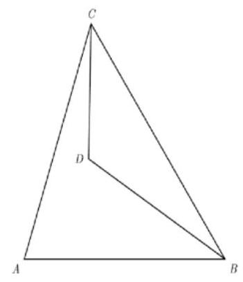
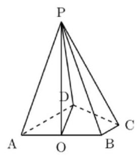

# 2026 届复附中高三毕业考

一、填空题(本大题满分 54 分)

1. 已知集合 $A = \{  - 1,0,1,2\}$ ，集合 $B = ( - 1,1\rbrack$ ，则 $A \cap  B =$ ___.

2. 抛物线 ${x}^{2} = {2y}$ 的准线方程是___.

3. 不等式 $\frac{1}{x} \geq  \frac{1}{2}$ 的解集为___.

4.若角 $\alpha$ 的终边过点 $\left( {3, - 4}\right)$ ，则 $\cos \left( {\frac{\pi }{2} + \alpha }\right)  =$ ___.

5. 已知曲线 $y = \ln x - \frac{1}{{x}^{2}}$ 在 $x = 1$ 处的切线与直线 ${kx} - y + 3 = 0$ 平行，则实数 $k$ 的值为___.

6. 若正整数 $n$ 满足 ${\mathrm{C}}_{n}^{5} = {\mathrm{C}}_{n}^{6}$ ，则 ${\left( 2x - 1\right) }^{n}$ 的展开式中 ${x}^{2}$ 项的系数为___. (用数值表示)

7. 已知 $a$ 为常数，若函数 $y = \lg \left( {\frac{2x}{1 + x} + a}\right)$ 是奇函数，则 $a$ 的值为___.

8. 已知复数 ${z}_{1}\text{ 、 }{z}_{2}$ 是实系数一元二次方程的两个根，若 ${z}_{1} = i \cdot  {z}_{2}$ (其中 $i$ 是虚数单位),则 $\left| {{z}_{1} - i}\right|$ 的最小值为___.

9. 平面上五点 $A\text{ 、 }B\text{ 、 }C\text{ 、 }D\text{ 、 }E$ 满足 $\overrightarrow{AB} = \overrightarrow{BC} = \overrightarrow{CD},\overrightarrow{EA} \cdot  \overrightarrow{EB} = 4,\overrightarrow{EB} \cdot  \overrightarrow{EC} = 5,\overrightarrow{EC} \cdot  \overrightarrow{ED} = 8$ , 则 $\overrightarrow{EA} \cdot  \overrightarrow{ED}$ 的值为___.

10. 在平面直角坐标系中,已知点 $A\left( {-3,2}\right)$ ,点 $P$ 为圆 ${x}^{2} + {y}^{2} = {16}$ 上的动点,现将坐标平面沿 $y$ 轴折成大小为 $\frac{2}{3}\pi$ 的二面角,此时 $A\text{ 、 }P$ 两点间距离的最大值为___.

11. 如图,现要在 $A\text{ 、 }D$ 两地之间修建一条笔直的隧道,从 $B$ 地和 $C$ 地测量得: $\angle {DBC} = {24.2}^{ \circ  },\angle {DCB} = {35.4}^{ \circ  },\angle {CBA} = {55.8}^{ \circ  },\angle {BCA} = {52.9}^{ \circ  }$ . 若 $B\text{ 、 }C$ 的直线距离为 5.8 公里，则隧道 ${AD}$ 长为___公里. (结果精确到 0.1 公里)

12. 已知函数 $y = f\left( x\right)$ 的定义域为 $\{ 1,2,3,\cdots ,9\}$ ,值域 $A \subseteq  \{ 1,2,3,4,5\}$ ,且对任意正整数 $k \in  \left\lbrack  {1,8}\right\rbrack$ ,都有 $\left| {f\left( {k + 1}\right)  - f\left( k\right) }\right|  \geq  3$ 恒成立,则符合条件的函数 $y = f\left( x\right)$ 的个数为___.

二、选择题(本大题满分 18 分)

13. 已知 $a\text{ 、 }b\text{ 、 }c \in  \mathbf{R}$ ,则下列结论中不正确的是( ).

(A) 若 $a > b, c < 0$ ,则 $a + c < b + c$ (B) 若 ${a}^{3} > {b}^{3}$ ,则 $a > b$

(C) 若 $a{c}^{2} > b{c}^{2}$ ,则 $a > b$ (D) 若 $\sqrt{a} < \sqrt{b}$ ,则 $a < b$

14. 定义一个集合 $\Omega$ ,集合中的元素是空间内的点,任取 ${P}_{1}\text{ 、 }{P}_{2}\text{ 、 }{P}_{3} \in  \Omega$ ,存在不全为 0 的实数 ${\lambda }_{1}\text{ 、 }{\lambda }_{2}\text{ 、 }{\lambda }_{3}$ ,使得 ${\lambda }_{1}\overrightarrow{O{P}_{1}} + {\lambda }_{2}\overrightarrow{O{P}_{2}} + {\lambda }_{3}\overrightarrow{O{P}_{3}} = \overrightarrow{0}$ . 已知 $\left( {1,0,0}\right)  \in  \Omega$ ,则 $\left( {0,0,1}\right)  \notin  \Omega$ 的一个充分条件是 ( ) .

(A) $\left( {0,0,0}\right)  \in  \Omega$ (B) $\left( {-1,0, - 1}\right)  \in  \Omega$ (C) $\left( {1,1,0}\right)  \in  \Omega$ (D) $\left( {0,0, - 1}\right)  \in  \Omega$

15. 已知 $m > 0$ ,函数 $y = \sin x$ 在区间 $\left\lbrack  {m,{2m}}\right\rbrack$ 上最小值为 $s$ ,在区间 $\left\lbrack  {{2m},{3m}}\right\rbrack$ 上的最小值为 $t$ ,若 $m$ 变化时,下列不可能的是().

(A) $s > 0$ 且 $t > 0$ (B) $s < 0$ 且 $t < 0$ (C) $s < 0$ 且 $t > 0$ (D) $s > 0$ 且 $t < 0$

16. 已知函数 $y = f\left( x\right)$ 定义域为 $\mathbf{R}$ ,且对任意 $x \in  \mathbf{R}$ ,不等式 $\left| {f\left( x\right) }\right|  \leq  {2026}$ 恒成立. 设 $a\text{ 、 }b \in  \mathbf{R}$ , 定义 ${g}_{a, b}\left( x\right)  = f\left( x\right)  - f\left( {{ax} + b}\right)$ . 现给出如下两个命题:

① 若 $y = f\left( x\right)$ 是周期函数，则对于任意实数 $a \in  \mathbf{R}$ ，函数 $y = {g}_{a,0}\left( x\right)$ 是周期函数；

②函数 $y = f\left( x\right)$ 存在正整数周期,当且仅当函数 $y = {g}_{1,1}\left( x\right)$ 存在正整数周期;

则下列选项中正确的是( )

(A) ①②都是真命题 (B) ①②都是假命题

(C) ①是真命题，②是假命题 (D) ①是假命题，②是真命题

三、解答题(本大题满分 78 分)

17. 如图，在四棱锥 $P - {ABCD}$ 中，平面 ${PAB} \bot$ 平面 ${ABCD}$ ， ${AD}\parallel {BC}$ ， $\angle {ABC} = \frac{\pi }{2}$ ， ${PA} = {PB} = 3,{BC} = 1,{AB} = 2,{AD} = 3$ ,点 $O$ 是 ${AB}$ 的中点.

(1)求证: ${PO} \bot  {CD}$ ；

(2)求直线 ${CP}$ 与平面 ${POD}$ 所成角的正弦值.

18. (本题满分 14 分, 第 1 小题满分 6 分, 第 2 小题满分 8 分)

已知 $f\left( x\right)  = {\log }_{2}\left( {{ax} + 1}\right)$ ,其中 $a \in  \mathbf{R}$ .

(1)当 $a = 1$ 时,求不等式 $f\left( {{4x} - 2}\right)  < 0$ 的解集;

(2)设 $g\left( x\right)  = f\left( {2x}\right)  + {\log }_{2}x$ ，若函数 $y = g\left( x\right)$ 有且只有一个零点，求 $a$ 的取值范围.

19. 混养不仅能够提高水产养殖的收益，还可以降低单一放养的病害风险，提高养殖效益. 某鱼塘中有 $A\text{ 、 }B$ 两种鱼苗. 为了调查这两种鱼苗的所占比例,设计了如下方案:

① 在该鱼塘中捕捉 50 条鱼苗，统计其中鱼苗 $A$ 的数目，以此作为一次试验的结果；

②在每一次试验结束后将鱼苗放回鱼塘，重复进行这个试验 $n$ 次，记第 $i$ 次试验中鱼苗 $A$ 的数目为随机变量 ${X}_{i}\left( {i = 1,2,\cdots , n}\right)$ ;

③ 记随机变量 $\bar{X} = \frac{1}{n}\mathop{\sum }\limits_{{i = 1}}^{n}{X}_{i}$ ,利用 $\bar{X}$ 的期望 $E\left\lbrack  \bar{X}\right\rbrack$ 和方差 $D\left\lbrack  \bar{X}\right\rbrack$ 进行估算.

设该鱼塘中鱼苗 $A$ 的数目为 $M$ ,鱼苗 $B$ 的数目为 $N$ ,其中 $M < N$ ,并且认为每一次试验都相互独立.

(1)在一次试验中，已知捕捉的 50 条鱼苗中鱼苗 $A$ 共有 20 条，记录员逐个不放回地记录鱼苗的种类,求第一次记录的是鱼苗 $A$ 的条件下,第二次记录的仍是鱼苗 $A$ 的概率;

(2)请提出一个合理假设，使得 ${X}_{i}$ 服从二项分布:

___.

基于以上假设,请完成下面的问题.

记 ${X}_{i}\left( {i = 1,2,\cdots , n}\right)$ 的实际取值分别为 ${x}_{i}$ ,平均值和方差分别记为 $\bar{x}\text{ 、 }{s}^{2}$ ,已知方差 ${s}^{2} = \frac{75}{8n}$ . 该鱼塘的技术顾问认为可以用 $\bar{x}$ 和 ${s}^{2}$ 分别代替 $E\left\lbrack  \bar{X}\right\rbrack$ 和 $D\left\lbrack  \bar{X}\right\rbrack$ . 请由此估算 $\frac{M}{N}$ 和 $\bar{x}$ .

参考公式: $E\left\lbrack  \bar{X}\right\rbrack   = E\left\lbrack  {X}_{1}\right\rbrack  ,\;D{\left\lbrack  \bar{X}\right\rbrack  }^{\prime } = \frac{1}{n}D{\left\lbrack  {X}_{1}\right\rbrack  }^{\prime }$ .

20. 已知椭圆 $C : \frac{{x}^{2}}{9} + \frac{{y}^{2}}{8} = 1$ ，点 $O$ 为坐标原点，椭圆的右顶点为 $A$ ，左右焦点分别为 ${F}_{1}$ 、 ${F}_{2}$ ， 点 $E$ 为椭圆在 $x$ 轴上方的一个动点.

(1)求椭圆 $C$ 的焦距与 $\bigtriangleup E{F}_{1}{F}_{2}$ 的周长;

(2)若 $\overrightarrow{EA} \cdot  \overrightarrow{E{F}_{1}} = \frac{9}{4}$ ，求点 $E$ 到 $x$ 轴的距离；

(3)过点 ${F}_{1}$ 作斜率为 $k$ 的直线 $l$ 交 $y$ 轴正半轴于点 $P$ ，点 $P$ 位于椭圆内，直线 $l$ 与椭圆 $C$ 交于 $G\text{ 、 }H$ 两点,记 $\bigtriangleup  {OGH}\text{ 、 } \bigtriangleup  {O{F}_{1}P}$ 的面积分别为 ${S}_{1}\text{ 、 }{S}_{2}$ ,求 $\frac{{S}_{1}}{{S}_{2}}$ 的取值范围.

21. 设 $s, t \in  \mathbf{R}$ ,对于定义域为 $D$ 的函数 $y = f\left( x\right)$ 与 $y = g\left( x\right)$ ,设 $h\left( x\right)  = {sf}\left( x\right)  + {tg}\left( x\right)$ ,若函数 $y = h\left( x\right)$ 是区间 $D$ 上的单调函数,则称 $y = f\left( x\right)$ 与 $y = g\left( x\right)$ 在区间 $D$ 上满足 “性质 $M\left( {s, t}\right)$ ”.

(1)设 $D = \lbrack 2, + \infty ), f\left( x\right)  = {x}^{2}, g\left( x\right)  = x$ ，函数 $y = f\left( x\right)$ 与 $y = g\left( x\right)$ 在区间 $D$ 上满足“性质 $M\left( {1, t}\right)$ ”,求 $t$ 的取值范围;

(2)已知 $s > 0, D = (0,1\rbrack , f\left( x\right)  = x, g\left( x\right)  =  - \frac{3}{2x}$ ,若 $y = f\left( x\right)$ 与 $y = g\left( x\right)$ 在区间 $D$ 上满足 “性质 $M\left( {s, t}\right)$ ”,求 $\frac{t}{s}$ 的取值范围;

(3)设 $D = \mathbf{R}$ ，若对任意的实数 $s$ 、 $t$ ，函数 $y = f\left( x\right)$ 与 $y = g\left( x\right)$ 在 $\mathbf{R}$ 上都满足“性质 $M\left( {s, t}\right)$ ”， 求证: 存在不全为 0 的实数 $A\text{ 、 }B$ ,使得函数 $y = {Af}\left( x\right)  + {Bg}\left( x\right)$ 为常值函数.

2026 届上海市复附高三三模

## 一、填空题

1. $\{ 0,1\}$ 2. $y =  - \frac{1}{2}$ 3. $(0,2\rbrack$ 4. $\frac{4}{5}$ 5.3

6.-220 7.-1.

8. $\frac{\sqrt{2}}{2}$ . 10.7

11.2.6. 12.178

二、选择题

13.A 14.C 15.C. 16.D

## 三、解析题

17.(1)证明略；(2) $\frac{2}{5}$

18.(1) $\left( {\frac{1}{4},\frac{1}{2}}\right) ;\;\left( 2\right) a \in  \left\{  {-\frac{1}{8}}\right\}   \cup  \lbrack 0, + \infty )$ .

19.(1) $\frac{19}{49}$ ；(2)假设每次捕捉到鱼苗 $A$ 的概率均为 $p = \frac{M}{M + N}$ ，且一次试验中 50 次捕捉结果相互独立.估算得 $\frac{M}{N} = \frac{1}{3},\bar{x} = \frac{25}{2}$ .

20. ( 1 )焦距为2，周长为8；( 2 ) $\sqrt{6}$ ；( 3 ) $\left( {\frac{9}{5},6}\right)$ .

21. (1) $t \in  \lbrack  - 4, + \infty )$ ; (2) $\frac{t}{s} \in  \left( {-\infty , - \frac{2}{3}}\right\rbrack   \cup  \lbrack 0, + \infty )$ ; (3) 证明略.
