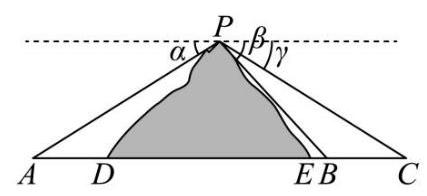
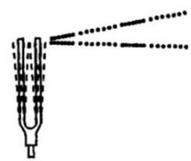
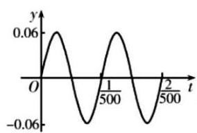
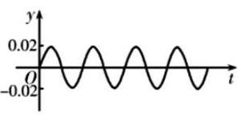
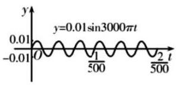
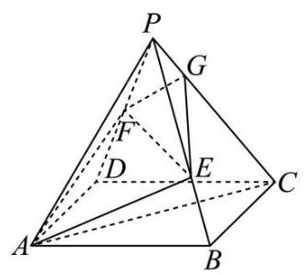
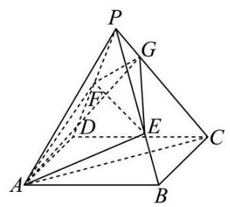
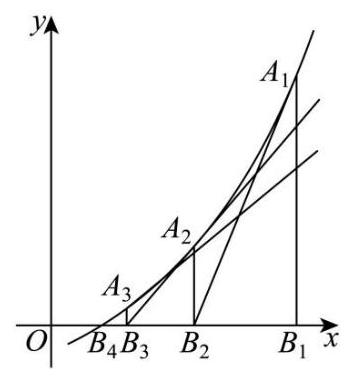

2026 届奉贤区高三下二模数学试卷

## 一、填空题

1. 已知集合 $A = \{ {3a}\} , B = \left\{  {9,{a}^{2}}\right\}$ ，若 $A \subseteq  B$ ，则实数 $a =$ ___.

2. 不等式 $\left| {x - 2}\right|  > 1$ 的解集为___.

3. 在 ${\left( x + \frac{1}{x}\right) }^{5}$ 的展开式中， $x$ 的系数为___.

4. 若直线 $\left( {a - 1}\right) x + y - 1 = 0$ 与直线 ${3x} - y = 0$ 平行，则实数 $a$ 的值为___.

5. 已知圆锥的高为 8，底面半径为 6，则该圆锥的侧面积为___.

6. 已知函数 $y = \left\{  \begin{array}{l} x\left( {x - b}\right) , x \geq  0 \\  x\left( {{bx} + 1}\right) , x < 0 \end{array}\right.$ 是奇函数,则 $b =$ ___.

7. 某食品厂生产一种零食，该种零食每袋的质量 $X$ (单位:g)服从正态分布 $N\left( {{65},{2.2}^{2}}\right)$ ，记作 $X \sim  N\left( {{65},{2.2}^{2}}\right)$ . 规定:这种零食的质量在 ${62.8} \sim  {69.4}\mathrm{\;g}$ 之间的为合格品；则这种零食的合格率为 ___. (结果精确到 0.001);

参考数据: 若 $X \sim  N\left( {\mu ,{\sigma }^{2}}\right)$ ,则 $P\left( {\mu  - \sigma  \leq  X \leq  \mu  + \sigma }\right)  \approx  {0.6827}, P\left( {\mu  - {2\sigma } \leq  X \leq  \mu  + {2\sigma }}\right)  \approx  {0.9545}$ , $P\left( {\mu  - {3\sigma } \leq  X \leq  \mu  + {3\sigma }}\right)  \approx  {0.9973}.$

8. 点 $F$ 为抛物线 $C : {y}^{2} = {8x}$ 的焦点， $P$ 为 $C$ 上一点，若 $\bigtriangleup  {POF}$ 的面积为 $4\sqrt{2}$ ( $O$ 为坐标原点)，则 $\left| {PF}\right|  =$ ___.

9. 从 6 名男生和 4 名女生中选出 3 人参加人工智能技能培训. 设事件 $A$ :至少抽到一名女生，事件 $B$ :恰好抽到一名男生,则 $P\left( {B \mid  A}\right)  =$ ___.

10. 已知复数 $z = \cos \theta  + \mathrm{i}\sin \theta ,\theta  \in  \lbrack 0,{2\pi })$ ， $\mathrm{i}$ 是虚数单位，则 ${\left| z + 6\right| }^{2} + {\left| z - 8\mathrm{i}\right| }^{2}$ 的取值范围是___.

11. 如图所示， $A, B, C$ 为山脚两侧共线的三点，在山顶 $P$ 处测得三点的俯角分别为 $\alpha  = {29.3}^{ \circ  },\beta  = {38.2}^{ \circ  }$ ， $\gamma  = {25.1}^{ \circ  }$ . 计划沿直线 ${AC}$ 开通穿山隧道,为了求出隧道 ${DE}$ 的长度,还测得 ${AD} = {277}$ 米, ${BE} = {49}$ 米, ${BC} = {320}$ 米,则根据以上数据，隧道 ${DE}$ 的长度约为___米.(结果精确到 1 米)

12. 在平面直角坐标系 ${xOy}$ 中,点 $A\left( {\cos \theta ,\sin \theta }\right) , B\left( {-\sin \theta ,\cos \theta }\right) ,\theta  \in  \lbrack 0,{2\pi })$ . 若点 $P\left( {x, y}\right)$ 满足: $\overrightarrow{OP} \cdot  \overrightarrow{OA} = 1$ , $\overrightarrow{OP} \cdot  \overrightarrow{OB} = 2$ ，则 $y$ 的最大值是___.

## 二、单选题

13. 已知 $a > b > 0 > c$ ,则下列不等式成立的是( )

A. $\frac{c}{a} < \frac{c}{b}$ B. $\frac{b}{a} > \frac{a}{b}$

C. $\frac{b - c}{a - c} < \frac{b}{a}$ D. $\frac{2}{a} + b < \frac{2}{b} + a$

14. 已知双曲线的方程为 ${x}^{2} - \frac{{y}^{2}}{4} = \lambda$ ,则( )

A. 渐近线与 $\lambda$ 无关 B. 实轴长与 $\lambda$ 无关 C. 焦距与 $\lambda$ 无关 D. 焦点与 $\lambda$ 无关

15. 音乐，是人类精神通过无意识计算而获得的愉悦享受，1807 年法国数学家傅里叶发现代表任何周期性声音的公式是形如 $y = A\sin {wx}$ 的简单正弦型函数之和,而且这些正弦型函数的频率都是其中一个最小频率的整数倍,比如用小提琴演奏的某音叉的声音图象是由下图1,2,3三个函数图象组成的,则小提琴演奏的该音叉的声音函数可以为( )

音叉

图1

图2

图3

A. $f\left( t\right)  = {0.06}\sin {1000\pi t} + {0.02}\sin {1500\pi t} + {0.01}\sin {3000\pi t}$

B. $f\left( t\right)  = {0.06}\sin {500\pi t} + {0.02}\sin {2000\pi t} + {0.01}\sin {300\pi t}$

C. $f\left( t\right)  = {0.06}\sin {1000\pi t} + {0.02}\sin {2000\pi t} + {0.01}\sin {3000\pi t}$

D. $f\left( t\right)  = {0.06}\sin {1000\pi t} + {0.02}\sin {2500\pi t} + {0.01}\sin {3000\pi t}$

16. 已知函数 $y = f\left( x\right)$ 的表达式为 $f\left( x\right)  = \left( {x - 1}\right) \left( {x - a}\right) \left( {x - b}\right) , x \in  \mathbf{R}$ ,则下列命题正确的是 ( )

A. 函数 $y = f\left( x\right)$ 的零点的个数一定是 3 个

B. 若集合 $A = \{ x \mid  f\left( x\right)  \geq  0\}$ 的解集是 $\lbrack 0, + \infty )$ ,则实数对 $\left( {a, b}\right)$ 有 2 对

C. 函数 $y = f\left( x\right)$ 必存在极值

D. 函数 $y = f\left( x\right)$ 在 $\left( {b,0}\right)$ 处的切线方程为 $y = 0$ ,则 $b = 1$

## 三、解答题

17. 已知函数 $y = f\left( x\right)$ 的表达式为 $f\left( x\right)  = \sin \left( {{\pi x} + \varphi }\right) ,\left( {-\frac{\pi }{2} < \varphi  < \frac{\pi }{2}}\right)$ .

(1) $f\left( 0\right)  = \frac{3}{5}$ ，求 $f\left( \frac{1}{4}\right)$ 的值；

(2)若 $f\left( \frac{1}{2}\right) , f\left( 1\right) , f\left( 2\right)$ 依次成等比数列，求 $\varphi$ 的值.

18. 某工厂生产的某种产品的月产量(单位:千件)与单位成本(单位:元/件)的数据如下:

<table><tr><td>月份</td><td>产量 $x$ (千件)</td><td>单位成本 $y$ (元/件)</td></tr><tr><td>1</td><td>2</td><td>73</td></tr><tr><td>2</td><td>3</td><td>72</td></tr><tr><td>3</td><td>4</td><td>71</td></tr><tr><td>4</td><td>3</td><td>73</td></tr><tr><td>5</td><td>4</td><td>69</td></tr><tr><td>6</td><td>5</td><td>68</td></tr></table>

(1)计算产量与单位成本的相关系数(无需过程);

(2)建立产量与单位成本的回归方程(写出必要的过程):

(3)若该工厂计划 7 月份生产 7 千件该产品，则单位成本预计是多少？

附:相关系数 $r$ 的计算公式: $r = \frac{\mathop{\sum }\limits_{{i = 1}}^{n}\left( {{x}_{i} - \bar{x}}\right) \left( {{y}_{i} - \bar{y}}\right) }{\sqrt{\mathop{\sum }\limits_{{i = 1}}^{n}{\left( {x}_{i} - \bar{x}\right) }^{2}\mathop{\sum }\limits_{{i = 1}}^{n}{\left( {y}_{i} - \bar{y}\right) }^{2}}}$ ;

回归系数计算公式: $\widehat{b} = \frac{\mathop{\sum }\limits_{{i = 1}}^{n}\left( {{x}_{i} - \bar{x}}\right) \left( {{y}_{i} - \bar{y}}\right) }{\mathop{\sum }\limits_{{i = 1}}^{n}{\left( {x}_{i} - \bar{x}\right) }^{2}} = \frac{\mathop{\sum }\limits_{{i = 1}}^{n}{x}_{i}{y}_{i} - n\overline{xy}}{\mathop{\sum }\limits_{{i = 1}}^{n}{x}_{i}^{2} - n{\bar{x}}^{2}}$ , $\widehat{a} = \bar{y} - \widehat{b}\bar{x} = \frac{\mathop{\sum }\limits_{{i = 1}}^{n}{y}_{i} - \widehat{b}\mathop{\sum }\limits_{{i = 1}}^{n}{x}_{i}}{n}$

19. 在四棱锥 $P - {ABCD}$ 中，四边形 ${ABCD}$ 是菱形， ${PA} = {PC} = 5$ ， ${PB} = {PD} = 2\sqrt{5}$ ， ${AC} = 6$ ，点 $F$ 为 ${PD}$ 的中点,点 $E$ 为 ${PB}$ 上的点, $\overrightarrow{PE} = \lambda \overrightarrow{PB},\lambda  \in  \left( {0,1}\right)$ ,平面 ${AFE}$ 与棱 ${PC}$ 交于点 $G$ .

图1

图2

(1)求证:异面直线 ${EF}$ 与 ${AC}$ 垂直；

(2)当 $\lambda  = \frac{2}{3}$ 时，求 ${AG}{\text{ 与 }\text{ 底 }\text{ 面 }ABCD}$ 所成的线面角大小.

20. 已知椭圆 $\Gamma  : \frac{{x}^{2}}{{a}^{2}} + \frac{{y}^{2}}{{b}^{2}} = 1\left( {a > b > 0}\right)$ 经过点 $\left( {0,1}\right)$ ,离心率为 $\frac{\sqrt{2}}{2}$ . 过点 $M\left( {0, - m}\right) , m > 0$ 的动直线 $l$ 交椭圆 $\Gamma$ 于 $C, D$ 两点.

(1)求椭圆 $\Gamma$ 的方程；

(2)若直线 $l$ 与 ${x}^{2} + {y}^{2} = \frac{2}{3}$ 相切，求当 $m = 2$ 时， ${CD}$ 的长；

(3)若以 ${CD}$ 为直径的圆经过 $x$ 轴上方的定点 $P$ ,求点 $P$ 的坐标.

21. 设定义域为 $\left( {0, + \infty }\right)$ 的函数 $y = f\left( x\right)$ 的表达式为 $f\left( x\right)  = {\mathrm{e}}^{x} - a\left( {a > 0}\right)$ ,我们可以证明函数 $y = f\left( x\right)$ 存在唯一的零点,设该零点为 $r$ . 如图,过点 ${A}_{1}\left( {{x}_{1}, f\left( {x}_{1}\right) }\right)$ 作函数 $y = f\left( x\right)$ 的切线 ${l}_{1}$ 与 $x$ 轴的交点为 ${B}_{2}$ ,设横坐标为 ${x}_{2}$ ,若 ${x}_{2} > r$ ,则过点 ${A}_{2}\left( {{x}_{2}, f\left( {x}_{2}\right) }\right)$ 作函数 $y = f\left( x\right)$ 的切线 ${l}_{2}$ 与 $x$ 轴的交点为 ${B}_{3}$ ,设横坐标为 ${x}_{3}$ ; 若 ${x}_{2} \leq  r$ ,则停止作切线. ...依次类推,得到数列 $\left\{  {x}_{n}\right\}  \left( {n \geq  1, n \in  \mathbf{N}}\right)$ ,记 ${x}_{1} = t, t > r$ .

(1)若 $a = \mathrm{e}, t = 2$ ,求 ${x}_{2}$ ;

(2)求证:数列 $\left\{  {x}_{n}\right\}$ 是严格递减数列；

(3)若 $a = 1$ ,比较 ${x}_{n + 1} + 1$ 与 ${x}_{n} - \ln {x}_{n}$ 的大小,并说明理由.
