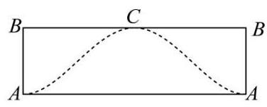
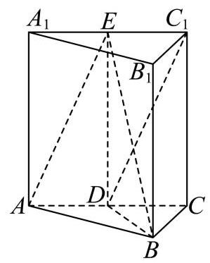

## 2026 届崇明区高三下二模数学试卷

## 一、填空题

1. 集合 $A = \{ 2,4,6,8,{10}\} , B = \left( {-1,6}\right)$ ，则 $A \cap  B =$ ___.

2. 不等式 $\left| {x - 1}\right|  < 2$ 的解为___.

3. 若复数 $z$ 满足 $\frac{z}{1 + \mathrm{i}} = \mathrm{i}$ ( $\mathrm{i}$ 为虚数单位),则 $z =$ ___.

4. 已知向量 $\overrightarrow{a} = \left( {k,2}\right) ,\overrightarrow{b} = \left( {2,1}\right)$ ，若 $\overrightarrow{a}\bot \overrightarrow{b}$ ，则实数 $k =$ ___.

5. 若 $x > 0, y > 0$ ，且 ${xy} = 1$ ，则 $x + {2y}$ 的最小值为___.

6. 已知 $\cos \theta  =  - \frac{3}{5}$ ，则 $\cos {2\theta }$ 的值为___.

7. 从一副去掉大小王的 52 张扑克牌中随机抽取一张牌，事件 $A$ 表示“取得的牌面是 $A$ ”，事件 $B$ 表示“取得的牌的花色是黑桃”，则 $P\left( {B \mid  A}\right)$ 为___.

8. 在 $\bigtriangleup  {ABC}$ 中，角 $A$ 、 $B$ 、 $C$ 所对的边长分别为 $a$ 、 $b$ 、 $c$ . 若 $A = {45}^{ \circ  }$ ， $C = {30}^{ \circ  }$ ， $c = \sqrt{2}$ ，则 $a =$ ___.

9. 已知 ${\left( x - 1\right) }^{3} + {\left( x + 1\right) }^{4} = {x}^{4} + {a}_{1}{x}^{3} + {a}_{2}{x}^{2} + {a}_{3}x + {a}_{4}$ ，则 ${a}_{1} =$ ___.

10. 如图,已知圆柱的一个截面边界是椭圆 $\Gamma$ ,其中 $\Gamma$ 的长轴 ${AC}$ 为该圆柱轴截面的对角线,短轴长等于圆柱底面直径的长. 将圆柱侧面沿母线 ${AB}$ 展开,则椭圆 $\Gamma$ 在展开图中恰好为一个周期的三角函数图像. 若该段曲线是函数 $y = 1 - \sqrt{3}\sin \frac{x}{2}$ 的图像的一部分,则椭圆 $\Gamma$ 的离心率为___.

11. 设 ${f}_{1}\left( x\right)  = \sin x,{f}_{2}\left( x\right)  = \cos \left( {x + \frac{\pi }{6}}\right)$ . 若对任意 $t \in  \mathbf{R}$ , 存在 $i \in  \{ 1,2\}$ 使得函数 $y = {f}_{i}\left( x\right)$ 在区间 $\left\lbrack  {t, t + a}\right\rbrack  \left( {a > 0}\right)$ 上是单调函数，则实数 $a$ 的取值范围是___.

12. 已知首项为 1 的等比数列 $\left\{  {a}_{n}\right\}$ 满足对任意的正整数 $m, n$ 都有 $\left| {{a}_{m} - {a}_{n}}\right|  \leq  \frac{1}{3}\left| {m - n}\right|$ ,则等比数列 $\left\{  {a}_{n}\right\}$ 的公比 $q$ 的取值范围是___.

## 二、单选题

13. 在空间内, 异面直线所成角的取值范围是( )

A. $\left( {0,\frac{\pi }{2}}\right)$ B. $\left( {0,\frac{\pi }{2}}\right\rbrack$ C. $\left\lbrack  {0,\frac{\pi }{2}}\right)$ D. $\left\lbrack  {0,\frac{\pi }{2}}\right\rbrack$

14. 下列函数中,在 $\mathbf{R}$ 上为严格增函数的是( )

A. $y = {x}^{2}$ B. $y = \left| x\right|$ C. $y = \sin x$ D. $y = {x}^{3}$

15. 已知 $A\left( {-a,0}\right) , B\left( {a,0}\right) ,{l}_{1} : {ax} - y = 0,{l}_{2} : {ax} + y = 0$ ,其中 $a > 1$ ,点 $P$ 为平面内一点,记点 $P$ 到 ${l}_{1}$ , ${l}_{2}$ 的距离分别为 ${d}_{1},{d}_{2}$ ,则下列条件中能使点 $P$ 的轨迹为椭圆的是 ( )

A. $\left| {PA}\right|  + \left| {PB}\right|  = {2a}$ B. ${\left| PA\right| }^{2} + {\left| PB\right| }^{2} = 4{a}^{2}$

C. ${d}_{1}^{2} + {d}_{2}^{2} = 4{a}^{2}$ D. ${d}_{1} + {d}_{2} = {4a}$

16. 已知函数 $y = f\left( x\right) , x \in  \mathbf{R}$ . 定义集合 $M = \left\{  {{x}_{0} \mid  \text{ 对任意的 }x > {x}_{0}\text{ ,都有 }f\left( x\right)  \leq  f\left( {x}_{0}\right) }\right\}$ . 对于所有使得 $M = \left\lbrack  {-1,2}\right\rbrack$ 的函数 $y = f\left( x\right)$ ,有以下两个命题: ①存在函数 $y = f\left( x\right)$ 在 $x =  - 2$ 处取极小值; ②存在函数 $y = f\left( x\right)$ 图像是连续曲线. 下列判断正确的是 ( )

A. ①②都真 B. ①真②假 C. ①假②真 D. ①②都假

## 三、解答题

17. 如图,在直三棱柱 ${ABC} - {A}_{1}{B}_{1}{C}_{1}$ 中, ${AB} = {BC} = \sqrt{2},{AC} = {A{A}_{1}} = 2$ ,且 $D, E$ 分别是 ${AC},{A}_{1}{C}_{1}$ 的中点.

(1)证明: $D{C}_{1}//$ 平面 ${ABE}$ ；

(2)求三棱锥 ${C}_{1} - {ABE}$ 的体积.

18. 2025 年 11 月，教育部等五部门联合印发《关于实施学生体质强健计划的意见》，明确要求“中小学生每天综合体育活动时间不少于 2 小时”. 某学校为了解政策落实情况及其对学生视力的影响，随机抽取了 100 名学生进行每周累计体育活动时长的调查，得到如下频率分布表:

<table><tr><td>每周活动总时长 (单位:时)</td><td>$\lbrack 0,7)$</td><td>$\lbrack 7,{14})$</td><td>$\lbrack {14},{21})$</td><td>$\lbrack {21},{28})$</td><td>[28,35]</td></tr><tr><td>频率</td><td>0.15</td><td>0.25</td><td>0.35</td><td>0.15</td><td>0.1</td></tr></table>

同时，对这 100 名学生的视力进行了检查，将视力达到 5.0 及以上定为“视力良好”，低于 5.0 定为“视力一般”，得到如下 $2 \times  2$ 列联表 (部分数据缺失):

<table><tr><td></td><td>视力良好</td><td>视力一般</td><td>合计</td></tr><tr><td>活动时间达标 (不少于 14 小时)</td><td>40</td><td></td><td></td></tr><tr><td>活动时间未达标 (低于 14 小时)</td><td></td><td>30</td><td></td></tr><tr><td>合计</td><td></td><td></td><td>100</td></tr></table>

(1)从活动时长在 $\left\lbrack  {0,7}\right)$ 和 $\left\lbrack  {{28},{35}}\right\rbrack$ 的学生中，按比例分层随机抽样抽取 5 人进行座谈. 若从这 5 人中随机抽取 2 人，设 $X$ 为抽取的 2 人中活动时长在 $\left\lbrack  {{28},{35}}\right\rbrack$ 的人数，求 $X$ 的分布列和数学期望 $E\left\lbrack  X\right\rbrack$ ；

(2)依据 $\alpha  = {0.05}$ 的独立性检验，判断是否有 95%的把握认为“视力情况”与“体育活动时长是否达标”有关. 参考公式及数据:

① ${\chi }^{2} = \frac{n{\left( ad - bc\right) }^{2}}{\left( {a + b}\right) \left( {c + d}\right) \left( {a + c}\right) \left( {b + d}\right) }$ ，其中 $n = a + b + c + d$ .

② $P\left( {{\chi }^{2} \geq  {6.635}}\right)  \approx  {0.01}$ ， $P\left( {{\chi }^{2} \geq  {5.024}}\right)  \approx  {0.025}$ ， $P\left( {{\chi }^{2} \geq  {3.841}}\right)  \approx  {0.05}$ ， $P\left( {{\chi }^{2} \geq  {2.706}}\right)  \approx  {0.1}$ .

19. 设函数 $f\left( x\right)  = {x}^{2} - x + a\ln x, a \in  \mathbf{R}$ .

(1)若 $a = 1$ ，求 $f\left( x\right)$ 的图象在 $x = 1$ 处的切线方程；

(2)若 $f\left( x\right)  \geq  0$ 在 $\lbrack 1, + \infty )$ 上恒成立，求 $a$ 的取值范围；

20. 已知椭圆 $C : \frac{{x}^{2}}{4} + \frac{{y}^{2}}{3} = 1$ .

(1)求椭圆 $C$ 的离心率 $e$ ；

(2)已知椭圆右顶点为 $A$ ，设点 $M$ 为 $y$ 轴正半轴上一点，点 $P$ 为椭圆 $C$ 上的一点. 若 $\overrightarrow{AP} = 2\overrightarrow{PM}$ ，求点 $M$ 的坐标;

(3)已知 $G\left( {\frac{5}{2},0}\right)$ ,过点 $R\left( {4,0}\right)$ 的直线交椭圆 $C$ 于 $D, E$ 两点,直线 ${DG}$ 交直线 $x = 1$ 于点 $H$ ,证明: ${EH} \bot  y$ 轴.

21. 函数 $y = f\left( x\right) , x \in  \mathbf{R}$ 是减函数,即对于任意的 ${x}_{1},{x}_{2} \in  \mathbf{R}$ ,当 ${x}_{1} < {x}_{2}$ 时,均有 $f\left( {x}_{1}\right)  \geq  f\left( {x}_{2}\right)$ .

(1)若 $f\left( x\right)  =  - {x}^{3} + {ax}$ ，求实数 $a$ 的取值范围；

(2)是否存在函数 $y = f\left( x\right)$ 是偶函数,且满足 $f\left( {f\left( x\right) }\right)  = x$ 对所有 $x \in  \mathbf{R}$ 成立? 若存在,请举出一个满足条件的函数, 若不存在, 请说明理由;

(3) 设 $g\left( x\right)  = \sin x$ ,已知函数 $h\left( x\right)  = f\left( x\right)  + g\left( x\right)$ 是周期函数,求证: $f\left( x\right)$ 为常值函数.
