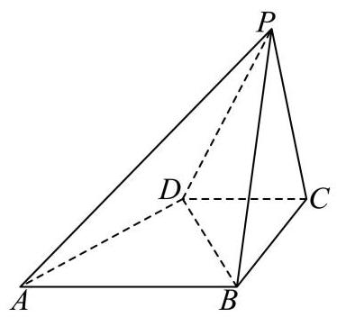

# 松江区 2025 学年度第一学期期末质量监控试卷 高三数学

(满分 150 分, 完卷时间 120 分钟) 2025.12

考生注意:

1. 本考试设试卷和答题纸两部分，试卷包括试题与答题要求，所有答题必须涂 (选择题) 或写 (非选择题) 在答题纸上，做在试卷上一律不得分.
2. 答题前，务必在答题纸上填写座位号和姓名.
3. 答题纸与试卷在试题编号上是一一对应的，答题时应特别注意，不能错位.

## 一、填空题(本大题共有 12 题，满分 54 分，第 1~~6 题每题 4 分，第 7~~12 题每 题 5 分) 考生应在答题纸的相应位置直接填写结果.

1. 已知集合 $A = \left( {-1,5}\right) , B =  x \mid   - 2 < x < 2$ ，则 $A \cap  B =$ ___.
2. 抛物线 ${y}^{2} = {8x}$ 的焦点到其准线的距离为___.
3. 不等式 $\frac{1}{x} <  - 2$ 的解集为___.
4. 复数 $z = \frac{1 + 3\mathrm{i}}{1 + \mathrm{i}}$ (其中 $\mathrm{i}$ 是虚数单位) 在复平面内对应点的坐标为___.
5. 某运动员在某次男子 10 米气手枪射击比赛中的得分数据(单位:环)如茎叶图所示，则这组数据的平均数为___.

|   |   |   |   |   |   |   |
| ------ | ------ | ------ | ------ | ------ | ------ | ------ |
|   | 8      | 6      |   |   |   |   |
|   | 9      | 1      | 6      | 7      | 7      | 8      |
|   | 10     | 0      | 0      | 2      | 7      |   |

6. 已知二项式 ${\left( {x}^{2} + \frac{1}{x}\right) }^{n}$ 的展开式的二项式系数之和为 32 ,则展开式中含 $x$ 项的系数是 ___.
7. 比较两数的大小: ${2025}^{2026}$ ___ ${2026}^{2025}$ .
8. 设 $a \in  \left( {0,\frac{\pi }{2}}\right)$ ，若 ${\sin }^{2}a - \sin a\sin \left( {\frac{\pi }{2} - a}\right)  = \frac{2}{5}$ ，则 $\tan a$ 的值为___.
9. 已知平面内两个非零向量 $\overrightarrow{a}$ 、 $\overrightarrow{b}$ 相互垂直， $\left| \overrightarrow{a}\right|  = 2\left| \overrightarrow{b}\right|$ ，若 $\cos \langle \overrightarrow{a} - k\overrightarrow{b},\overrightarrow{b}\rangle  = \frac{\sqrt{2}}{2}$ ，则实数 $k$ 的值为___.
10. 将 3 名男生和 3 名女生排成一排，若从左边第一个学生开始依次往右数，无论数到几人， 男生人数都大于或等于女生人数，则有___种不同的排法. (结果用数值表示)
11. 某社区为扩大居民的活动区域,计划将社区内原有的半径为 ${10}\mathrm{m}$ 的圆形花坛扩建成一个矩形花园. 若要求扩建前的圆与扩建后矩形的两邻边和一条对角线都相切, 则矩形花园占地面积的最小值为___. (结果精确到 $1{\mathrm{m}}^{2}$ )
12. 在三棱锥 $P - {ABC}$ 中, ${PA} = 6,{PB} = 8,{PC} = {BC} = 8\sqrt{2},\angle {APB} = {60}^{ \circ  }$ , $\angle {APC} = {45}^{ \circ  }$ ，则此三棱锥的体积为___.

## 二、选择题 (本大题共有 4 题, 满分 18 分, 第 13-14 题每题 4 分, 第 15-16 题 每题 5 分) 每题有且只有一个正确答案, 考生应在答题纸的相应位置上, 将所选 答案的代号涂黑.

13. 若空间中三条不同的直线 $a, b, c$ 满足 $a \bot  c, b \bot  c$ ,则 $a//b$ 是 $a, b, c$ 共面的 ( )

A. 充分不必要条件 B. 必要不充分条件

C. 充要条件 D. 既不充分也不必要条件

14. 下列函数 $y = f\left( x\right)$ 中，对任意的 ${x}*{1}\text{ 、 }{x}*{2} \in  \left( {0, + \infty }\right)$ 时,均有 $\left( {{x}*{1} - {x}*{2}}\right) \left\lbrack  {f\left( {x}*{1}\right)  - f\left( {x}*{2}\right) }\right\rbrack   > 0$ 的是( )

A. $f\left( x\right)  = {x}^{-2}$ B. $f\left( x\right)  = {x}^{2} - {4x} + 4$

C. $f\left( x\right)  = {2}^{x}$ D. $f\left( x\right)  = {\log }_{\frac{1}{2}}x$

15. 已知函数 $y = f\left( x\right)$ 其表达式为 $f\left( x\right)  = 6{\left( x - 2k\right) }^{2}, x \in  \left\lbrack  {{2k} - 1,{2k} + 1}\right\rbrack  \left( {k \in  Z}\right)$ ,函数 $y = g\left( x\right)$ 其 表 达式为 $g\left( x\right)  = a{x}^{2} + x + c$ ,若对任意 ${x}*{1},{x}*{2} \in  \mathbf{R}$ ,都有 $g\left( {{x}*{1} + {x}*{2}}\right)  = g\left( {x}*{1}\right)  + g\left( {x}*{2}\right)  + 4$ ，则方程 $f\left( x\right)  = g\left( x\right)$ 的解的个数为( )

A 6 B. 7 C. 8 D. 9

16. 定义:一个平面封闭区域内任意两点之间的距离的最大值称为该区域的“直径”. 在 ${VABC}$ 中， ${BC} = 1$ ， ${BC}$ 边上的高等于 $\tan A$ ，以 ${VABC}$ 的各边为直径向 $\vee  {ABC}$ 外分别作三个半圆，记三个半圆围成的平面区域的“直径”为 $d$ ，则以下两个结论:

①当 $\angle {ABC} = \frac{\pi }{2}$ 时， $d = \frac{\sqrt{2} + 2}{2}$ ；② $d$ 的最大值为 $\frac{\sqrt{6} + 1}{2}$ ( )

A. ①正确，②错误 B. ①②都正确 C. ①错误，②正确 D. ①②都

错误

## 三、解答题 (本大题满分 78 分) 本大题共有 5 题, 解答下列各题必须在答题纸 相应编号的规定区域内写出必要的步骤.

17. 已知函数 $y = A\sin \left( {{\omega x} + \varphi }\right) \left( {A\text{ 、 }\omega  > 0,0 < \varphi  < \pi }\right)$ 的周期为 $\pi$ ,在 $x = \frac{\pi }{6}$ 时取到最大值 4 ，记 $y = f\left( x\right)$ .

(1)求函数 $y = f\left( x\right)$ 的表达式；

(2)若数列 $\left  {a}*{n}\right$ 为等差数列， ${a}*{2} = f\left( 0\right)$ ， ${a}*{4} = f\left( \frac{\pi }{6}\right)$ ，记 ${b}*{n} = {2}^{{a}*{n}}$ ，求数列 $\left  {b}*{n}\right$ 的前 $n$ 项和 ${T}_{n}$ .

18. 已知四棱锥 $P - {ABCD}$ 的底面 ${ABCD}$ 是直角梯形， ${AB}//{CD}$ ， ${AB} = {2CD} = 2$ ， $\angle {ABC} = {90}^{ \circ  }$ ， $\bigtriangleup  {PBC}$ 是边长为 2 的正三角形，侧面 ${PBC} \bot$ 底面 ${ABCD}$ .

(1)证明: ${PA} \bot  {BD}$ ；

(2)求点 $D$ 到平面 ${PAB}$ 的距离.

19. 在乒乓球比赛中, 一个发球回合时长是指从运动员发球开始, 到其中一方得分为止的时间. 现记录一场比赛中运动员连续 10 个发球回合时长 (单位:秒)，数据如下:3.2, 4.7,

5.3, 4.1, 5.8, 9.6, 12.4, 6.5, 7.2, 8.9.

(1)求这组数据的极差和中位数；

(2)如果定义一个发球回合时长超过 5.0 秒为 “长发球回合”，那么从这 10 个发球回合时长中随机抽取 3 个，求至少有 2 个是 “长发球回合” 的概率；

(3)假设甲乙运动员相约进行一次比赛，比赛有两种赛制可选:①一局定胜负:只打一局， 胜者赢得比赛；②三局两胜:先赢得两局者为胜，最多打三局. 若甲在一局中获胜的概率为 $p\left( {0 < p < {0.5}}\right)$ . 从甲的角度考虑,哪种赛制对他更有利? 请说明理由.

20. 已知椭圆 $\frac{{x}^{2}}{{a}^{2}} + \frac{{y}^{2}}{{b}^{2}} = 1\left( {a > b > 0}\right)$ 的左焦点为 $F$ ,过点 $F$ 的直线交椭圆于 $A, B$ 两点. $\left| {AF}\right|$ 的最大值是 $M,\left| {BF}\right|$ 的最小值是 $m$ ,满足 $M \cdot  m = \frac{3{a}^{2}}{4}$ .

(1)求该椭圆的离心率；

(2)若 $a = 2$ ，点 $P$ 在椭圆上，且在 $x$ 轴上方，线段 $\left| {PF}\right|$ 的中点 $Q$ 在以原点 $O$ 为圆心， $\left| {OF}\right|$ 为半径的圆上,求直线 ${PF}$ 的斜率;

(3)设线段 ${AB}$ 的中点为 $G,{AB}$ 的垂直平分线与 $x$ 轴和 $y$ 轴分别交于 $D, E$ 两点， $O$ 是坐标原点. 记 $\bigtriangleup  {GFD}$ 的面积为 ${S}*{1}$ ， $\bigtriangleup  {OED}$ 的面积为 ${S}*{2}$ ，求 $\frac{2{S}*{1}{S}*{2}}{{S}*{1}^{2} + {S}*{2}^{2}}$ 的取值范围.

21. 已知函数 $y = x - 1 - a\ln x$ ，正常数 $a \in  \mathbf{R}$ ，记 $y = f\left( x\right)$ .

(1)当 $a = 1$ 时,试判断函数 $y = f\left( x\right)$ 在区间 $\lbrack 1, + \infty )$ 上的单调性，并说明理由;

(2)若函数 $g\left( x\right)  = {x}^{2} - f\left( x\right)$ 既存在极小值也存在极大值，求实数 $a$ 的取值范围；

(3)求证:对于任意正整数 $n$ ，都有 $1 + \frac{1}{3} + \frac{1}{5} + \cdots  + \frac{1}{{2n} + 1} > \frac{1}{2}\ln \left\lbrack  {2\left( {n + 1}\right) }\right\rbrack$ .
