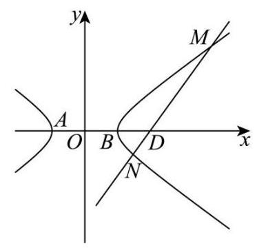

2026 届浦东新区高三下二模数学试卷（精析补充版）

## 一、填空题

1. 已知全集 $U=(0,+\infty)$，集合 $A=[2,+\infty)$，则 ${\complement_U A}=$ ___。

【答案】$(0,2)$

【解析】补集是在全集 $U$ 里去掉 $A$。因为 $U=(0,+\infty)$，$A=[2,+\infty)$，所以剩下的是大于 $0$ 且小于 $2$ 的部分，即 ${\complement_U A}=(0,2)$。

2. 若复数 $z$ 满足 $(1+\mathrm{i})z=2\mathrm{i}$，则复数 $z=$ ___。

【答案】$1+\mathrm{i}$

【解析】两边除以 $1+\mathrm{i}$，得 $z=\frac{2\mathrm{i}}{1+\mathrm{i}}=\frac{2\mathrm{i}(1-\mathrm{i})}{(1+\mathrm{i})(1-\mathrm{i})}=\frac{2+2\mathrm{i}}{2}=1+\mathrm{i}$。

3. 已知 $f(x)=\begin{cases}x^{\frac{1}{3}},x<0,\\x+1,x\geq0,\end{cases}$ 若 $f(a)=-2$，则实数 $a$ 的值为___。

【答案】$-8$

【解析】按原 PDF，第一段函数是 $x^{\frac13}$，原 OCR 容易误成 $\frac1{x^3}$。若 $a<0$，则 $a^{\frac13}=-2$，所以 $a=(-2)^3=-8$，满足 $a<0$。若 $a\geq0$，则 $a+1=-2$，解得 $a=-3$，不满足 $a\geq0$。所以 $a=-8$。

4. 在 $\triangle ABC$ 中，若 $a=7$，$b=8$，$\cos C=\frac{13}{14}$，则 $c=$ ___。

【答案】$3$

【解析】用余弦定理：$c^2=a^2+b^2-2ab\cos C=7^2+8^2-2\cdot7\cdot8\cdot\frac{13}{14}=49+64-104=9$，所以 $c=3$。

5. 某校高中三年级 $600$ 名学生参加了区质量检测，已知数学检测成绩 $X$ 服从正态分布 $N(100,\sigma^2)$（试卷满分为 $150$ 分）。统计结果显示，数学检测成绩介于 $80$ 分到 $120$ 分之间的人数为 $450$ 名，则此次检测中成绩不低于 $120$ 分的学生人数约为总人数的___（精确到 $0.1\%$）。

【答案】$12.5\%$

【解析】正态分布 $N(100,\sigma^2)$ 关于 $X=100$ 对称。已知 $P(80<X<120)=\frac{450}{600}=\frac34$，所以 $P(100<X<120)=\frac38$。右半边总概率是 $\frac12$，因此 $P(X\geq120)=\frac12-\frac38=\frac18=12.5\%$。

6. 已知直线 $l$ 是曲线 $y=\frac{3}{x+1}+\ln x$ 在 $x=2$ 处的切线，则 $l$ 的斜率为___。

【答案】$\frac16$

【解析】切线斜率就是导数值。$y'=-\frac{3}{(x+1)^2}+\frac1x$，所以 $k=y'(2)=-\frac39+\frac12=-\frac13+\frac12=\frac16$。

7. 从 $4$ 名男生 $3$ 名女生中选取 $3$ 人，依次进行面试，其中恰好有 $1$ 名女生，则有___种不同的面试方法。

【答案】$108$

【解析】先选人，再排序。选 $1$ 名女生有 $\mathrm{C}_3^1=3$ 种，选 $2$ 名男生有 $\mathrm{C}_4^2=6$ 种，选出的 $3$ 人依次面试有 $\mathrm{A}_3^3=6$ 种顺序，所以共有 $\mathrm{C}_3^1\mathrm{C}_4^2\mathrm{A}_3^3=3\cdot6\cdot6=108$ 种。

8. 一个家庭有两个孩子，生肖均为十二生肖之一（等可能）。已知其中一个孩子属马，则另一个孩子也属马的概率为___。

【答案】$\frac1{23}$

【解析】把两个孩子按“老大、老二”区分，共有 $12\cdot12=144$ 种生肖情况。至少一个属马的情况有 $144-11\cdot11=23$ 种，其中两个都属马只有 $1$ 种。所以所求概率为 $\frac1{23}$。

9. 已知数列 $\{a_n\}$ 的通项公式是 $a_n=2^{n-1}+1$，$S_n$ 为数列 $\{a_n\}$ 的前 $n$ 项和，则使得不等式 $S_n>2026$ 成立的最小正整数 $n$ 的值为___。

【答案】$11$

【解析】$S_n=(2^0+2^1+\cdots+2^{n-1})+n=2^n-1+n$。这个式子随 $n$ 增大而增大。验算临界值：$S_{10}=2^{10}-1+10=1033<2026$，$S_{11}=2^{11}-1+11=2058>2026$。所以最小正整数 $n=11$。

10. 已知，圆 $O$ 是圆心在原点的单位圆，弦 $AB$ 平行于 $x$ 轴，并将圆分为两段弧。将其中一段劣弧 $\overset{\frown}{AB}$ 沿弦 $AB$ 翻折后恰好经过圆心。若直线 $y=x+m$ 与翻折后得到的两段弧有四个不同的交点，则实数 $m$ 的取值范围为___。

【答案】$\left(\frac{\sqrt3-1}{2},\sqrt2-1\right)$

【破题眼】翻折不是乱画新曲线，本质是把圆心关于弦 $AB$ 做轴对称。

【解析】设弦 $AB$ 在直线 $y=t$ 上。单位圆圆心 $O(0,0)$ 关于 $y=t$ 的对称点为 $O'(0,2t)$。翻折后的劣弧经过原点 $O$，所以 $OO'=1$，即 $|2t|=1$。由图可取 $t=-\frac12$，因此 $A\left(-\frac{\sqrt3}{2},-\frac12\right)$，$B\left(\frac{\sqrt3}{2},-\frac12\right)$。

翻折后两段弧分别在两个圆上：原来的优弧在 $x^2+y^2=1$ 上，翻折后的劣弧在 $x^2+(y+1)^2=1$ 上。要有四个不同交点，直线既要与两个圆都相交，又要让交点落在对应弧段上。

下界看直线经过 $A$ 时：$-\frac12=-\frac{\sqrt3}{2}+m$，得 $m=\frac{\sqrt3-1}{2}$。端点处两段弧相接，不算四个不同交点，所以必须 $m>\frac{\sqrt3-1}{2}$。

上界看翻折后的圆 $x^2+(y+1)^2=1$。圆心 $(0,-1)$ 到直线 $y=x+m$ 的距离为 $\frac{|m+1|}{\sqrt2}$。要与该圆有两个交点，需 $\frac{|m+1|}{\sqrt2}<1$。结合前面的 $m>0$，得 $m<\sqrt2-1$。

所以 $m$ 的取值范围为 $\left(\frac{\sqrt3-1}{2},\sqrt2-1\right)$。

【方法总结】弧线题先找“所在圆”，再处理“是不是落在弧段上”。这里两个临界状态很干净：过端点给下界，相切给上界。

【易错点】只用圆心到直线距离会漏掉“交点必须在弧上”这个限制；端点 $A$ 处两段弧交在一起，不算四个不同交点，所以区间左端不能取等号。

11. 某光影科技实验室为长方体空间，底面是边长为 $4$ 米的正方形，高为 $3$ 米。为营造动态光影效果，在底面一个顶点处安装射灯 $A$，在与该顶点相对的侧棱上、距底面 $1$ 米处安装射灯 $I$，两盏射灯的光束方向由智能系统自动控制，始终使两束光线相互垂直，且它们的交汇点 $G$ 始终落在实验室天花板上，则交汇点 $G$ 形成的轨迹长度为___米。

【答案】$2\sqrt2\pi$

【破题眼】交汇点在天花板上，直接设 $G(x,y,3)$；“两束光线垂直”就是两个向量点积为 $0$。

【解析】按图建立空间直角坐标系，可取 $A(4,0,0)$，$I(0,4,1)$。设天花板上的交汇点为 $G(x,y,3)$，则 $\overrightarrow{AG}=(x-4,y,3)$，$\overrightarrow{IG}=(x,y-4,2)$。

因为 $AG\perp IG$，所以 $\overrightarrow{AG}\cdot\overrightarrow{IG}=0$，即 $(x-4)x+y(y-4)+3\cdot2=0$。整理得 $x^2-4x+y^2-4y+6=0$，配方得 $(x-2)^2+(y-2)^2=2$。

所以 $G$ 在天花板上的轨迹是以 $(2,2,3)$ 为圆心、半径为 $\sqrt2$ 的圆。这个圆完全落在边长为 $4$ 的天花板内，因此轨迹长度为 $2\pi\cdot\sqrt2=2\sqrt2\pi$。

【方法总结】空间轨迹题别硬想立体图，先坐标化。垂直转点积，最后把方程配方，看它是什么平面曲线。

【易错点】题目问的是“轨迹长度”，不是轨迹面积；得到圆后要算周长 $2\pi r$。

12. 已知集合 $M$ 的元素均为正整数，定义集合 $M$ 的“变项和”为：将 $M$ 中每个元素 $m$ 都乘以 $(-1)^m$ 后再求和。若集合 $A=\{n\mid 1\leq n\leq2026,n\in\mathbf{N}\}$，则集合 $A$ 的所有非空子集的“变项和”的总和为___。

【答案】$1013\cdot2^{2025}$

【破题眼】不要枚举子集，改成算“每个数在所有子集中一共贡献了多少次”。

【解析】$A=\{1,2,\cdots,2026\}$。固定一个元素 $k$，所有包含 $k$ 的子集，只需要在其余 $2025$ 个元素中任意选择，所以共有 $2^{2025}$ 个。只要包含 $k$，这个子集的“变项和”里就会出现一次 $k(-1)^k$。

因此所有非空子集的“变项和”总和为 $2^{2025}\left[1(-1)^1+2(-1)^2+\cdots+2026(-1)^{2026}\right]$。括号内两两配对：$(-1+2)+(-3+4)+\cdots+(-2025+2026)$，每一组都是 $1$，一共有 $1013$ 组，所以括号内等于 $1013$。

故总和为 $1013\cdot2^{2025}$。

【方法总结】“所有子集的总和”常用贡献法：别看子集，看每个元素出现几次、每次带什么符号。

【易错点】“非空子集”不影响这里的计数，因为只要子集包含固定元素 $k$，它一定非空；另一个坑是符号，奇数项为负，偶数项为正。

## 二、单选题

13. 某校学生会体育部长依据本校高三男生的身高（单位：cm）与体重（单位：kg）的抽样数据，运用电子办公软件求出了“体重”$y$ 关于“身高”$x$ 的回归方程，则该回归方程（ ）

| 身高 | 174 | 176 | 176 | 181 | 182 | 179 | 169 | 168 | 171 | 180 |
| --- | --- | --- | --- | --- | --- | --- | --- | --- | --- | --- |
| 体重 | 55 | 58 | 62 | 74 | 88 | 68 | 54 | 52 | 56 | 86 |

A. 表示 $x$ 与 $y$ 之间的函数关系
B. 表示 $x$ 与 $y$ 之间的不确定关系
C. 反映 $x$ 与 $y$ 之间的真实关系
D. 反映 $x$ 与 $y$ 之间的真实关系的一种最佳拟合

【答案】D

【解析】回归方程不是精确函数关系，也不是“真实关系”本身，而是用样本数据拟合出来的趋势线。它反映的是 $x$ 与 $y$ 之间真实关系的一种最佳拟合，选 D。

14. 已知实数 $a,b,c$ 满足 $a>b>1>c$，则下列结论一定正确的是（ ）

A. $ac>bc$
B. $b^c<1$
C. $\log_a b+\log_b a>2$
D. $a+c>b$

【答案】C

【解析】A 的关键在 $c$ 的正负没给，若 $c<0$，不等号会反向，所以 A 不一定。B 也不一定，例如 $0<c<1$ 时 $b^c>1$。D 也不一定，取 $c$ 很小甚至为负，$a+c>b$ 可能失败。

C 中，令 $t=\log_a b$。因为 $a>b>1$，所以 $0<t<1$，且 $\log_b a=\frac1t>1$。于是 $\log_a b+\log_b a=t+\frac1t>2$，等号只会在 $t=1$ 时取到，但 $t=1$ 等价于 $a=b$，与 $a>b$ 矛盾。故选 C。

15. 已知 $\overrightarrow e_1,\overrightarrow e_2,\overrightarrow e_3$ 是不共面的向量，则以下向量组中，一定不共面的是（ ）

A. $\overrightarrow e_1+\overrightarrow e_2$、$\overrightarrow e_3$、$\overrightarrow e_1+\overrightarrow e_2+\overrightarrow e_3$
B. $\overrightarrow e_1$、$\overrightarrow e_2+\overrightarrow e_3$、$3\overrightarrow e_1+4\overrightarrow e_2+3\overrightarrow e_3$
C. $\overrightarrow e_1$、$2\overrightarrow e_2-\overrightarrow e_3$、$\overrightarrow e_1-2\overrightarrow e_2+\overrightarrow e_3$
D. $\overrightarrow e_1+\overrightarrow e_2$、$\overrightarrow e_2+\overrightarrow e_3$、$\overrightarrow e_1+k\overrightarrow e_3$（其中 $k$ 为实数）

【答案】B

【破题眼】把 $\overrightarrow e_1,\overrightarrow e_2,\overrightarrow e_3$ 当成三维坐标轴，判断三向量是否线性相关。

【解析】以 $\overrightarrow e_1,\overrightarrow e_2,\overrightarrow e_3$ 为基底写坐标。

A 中三个向量坐标为 $(1,1,0)$、$(0,0,1)$、$(1,1,1)$，第三个等于前两个相加，所以共面。

B 中三个向量坐标为 $(1,0,0)$、$(0,1,1)$、$(3,4,3)$。若它们共面，则第三个应能写成 $s(1,0,0)+t(0,1,1)=(s,t,t)$，但 $(3,4,3)$ 的第二、第三坐标不相等，做不到，所以一定不共面。

C 中三个向量坐标为 $(1,0,0)$、$(0,2,-1)$、$(1,-2,1)$，且 $(1,-2,1)=(1,0,0)-(0,2,-1)$，所以共面。

D 中当 $k=-1$ 时，$\overrightarrow e_1-\overrightarrow e_3=(\overrightarrow e_1+\overrightarrow e_2)-(\overrightarrow e_2+\overrightarrow e_3)$，三向量共面，所以不可能“一定不共面”。

故选 B。

【方法总结】三维向量组判断共面，最快是把原来的三个不共面向量当基底，转成坐标看线性相关。

【易错点】D 不是问“是否存在 $k$ 使不共面”，而是问“一定不共面”。只要找出 $k=-1$ 这个反例，就能排除。

16. 定义在 $\mathbf R$ 上的非常值函数 $y=f(x)$，若存在一个非零常数 $T$，使得对任意 $x\in\mathbf R$，都有 $f(x+T)=T f(x)$ 成立，那么称函数 $y=f(x)$ 为 $T$ 函数。则下列说法正确的是（ ）

A. 存在函数 $y=kx+b(k\neq0)$ 为 $T$ 函数
B. 若函数 $y=f(x)$ 为 $T$ 函数，且当 $T>1$ 时函数在 $[0,T)$ 上是严格增函数，则函数 $y=f(x)$ 在 $[0,+\infty)$ 上是严格增函数
C. 若函数 $y=f(x)$ 为 $T$ 函数，且在 $x=0$ 处取得最小值，则 $0<T<1$
D. 若函数 $y=f(x)$ 为 $T$ 函数，且 $|f(x)|\leq1$ 恒成立，则 $y=f(x)$ 为周期函数

【答案】D

【破题眼】$f(x+T)=T f(x)$ 是“平移一次，函数值乘 $T$”。若函数值还被有界夹住，$|T|$ 只能等于 $1$。

【解析】A：若 $f(x)=kx+b$ 且 $k\neq0$，代入 $f(x+T)=T f(x)$ 得 $kx+kT+b=Tkx+Tb$。比较 $x$ 的系数，$k=Tk$，所以 $T=1$；再比较常数，$k+b=b$，得 $k=0$，矛盾。A 错。

B：局部单调不能推出整体单调。比如取 $T=2$，在 $[0,2)$ 上令 $f(x)=x-1$，再用 $f(x+2)=2f(x)$ 向全体实数延拓，则 $[0,2)$ 上严格增，但 $f(0)=-1$，$f(2)=2f(0)=-2$，整体不增。B 错。

C：也有反例。取 $T=2$，在 $[0,2)$ 上令 $f(x)=x$，再用 $f(x+2)=2f(x)$ 延拓。此时 $f(2k)=0$，其他点为正，$x=0$ 可以取到最小值，但 $T=2$，不满足 $0<T<1$。C 错。

D：对任意正整数 $n$，由递推得 $f(x+nT)=T^n f(x)$，也有 $f(x-nT)=\frac{1}{T^n}f(x)$。因为 $f$ 是非常值函数，存在 $x_0$ 使 $f(x_0)\neq0$。又 $|f(x)|\leq1$ 恒成立，所以 $|T^n f(x_0)|\leq1$ 且 $\left|\frac{f(x_0)}{T^n}\right|\leq1$ 对所有 $n$ 成立。这逼出 $|T|=1$。

若 $T=1$，则 $f(x+1)=f(x)$，函数周期为 $1$；若 $T=-1$，则 $f(x-1)=-f(x)$，再平移一次得 $f(x-2)=f(x)$，函数周期为 $2$。所以 D 正确。

【方法总结】这类新定义题先抓递推：平移 $n$ 次得到 $T^n$。一旦题目给有界条件，就想到“指数增长/衰减不能长期有界”。

【易错点】非常值函数很关键，它保证能找到 $f(x_0)\neq0$，否则零函数会让很多判断失去约束。

## 三、解答题

17. 如图，在多面体 $PQABCD$ 中，平面 $PAD\perp$ 平面 $ABCD$，$AB//CD//PQ$，$PD\perp CD$，$\triangle PAD$ 是边长为 $\sqrt2$ 的等边三角形，$AB=PQ=\frac12CD$。

(1) 求证：$AB\perp$ 平面 $PAD$；

(2) 若 $PC$ 与平面 $ABCD$ 所成的角为 $\frac\pi6$，求多面体 $PQABCD$ 的体积。

【答案】(1) 见解析；(2) $\frac{2\sqrt3}{3}$

【破题眼】先找平面 $PAD$ 的高 $PO$，用面面垂直把 $PO$ 拉成底面法线。

【解析】(1) 取 $AD$ 的中点 $O$，连接 $PO$。因为 $\triangle PAD$ 是等边三角形，$O$ 是 $AD$ 中点，所以 $PO\perp AD$。

又平面 $PAD\perp$ 平面 $ABCD$，交线是 $AD$，且 $PO\subset$ 平面 $PAD$、$PO\perp AD$，所以 $PO\perp$ 平面 $ABCD$。因此 $PO\perp AB$。

再由 $AB//CD$，$PD\perp CD$，得 $PD\perp AB$。现在 $PO$、$PD$ 是平面 $PAD$ 内两条相交直线，且 $AB$ 同时垂直 $PO$、$PD$，所以 $AB\perp$ 平面 $PAD$。

(2) 因为 $PO\perp$ 平面 $ABCD$，所以 $PC$ 在平面 $ABCD$ 内的投影是 $OC$，故 $\angle PCO$ 是 $PC$ 与平面 $ABCD$ 所成的角，即 $\angle PCO=\frac\pi6$。

等边三角形 $PAD$ 边长为 $\sqrt2$，所以 $PO=\frac{\sqrt6}{2}$，$OD=\frac{\sqrt2}{2}$。由 $\tan\angle PCO=\frac{PO}{CO}=\frac{\sqrt3}{3}$，得 $CO=\frac{3\sqrt2}{2}$。

由 (1) 知 $AB\perp$ 平面 $PAD$，又 $AB//CD$，所以 $CD\perp$ 平面 $PAD$，特别地 $CD\perp AD$。于是 $\triangle COD$ 中，$CD=\sqrt{CO^2-OD^2}=\sqrt{\frac{18}{4}-\frac{2}{4}}=2$，所以 $AB=PQ=1$。

取 $CD$ 的中点 $M$，连接 $BM$、$QM$。此时 $DM=CM=1$，且 $AB//DM//PQ$，$AB=DM=PQ=1$，所以 $PAD-QBM$ 是三棱柱；剩余部分是三棱锥 $Q-MBC$。

三角形 $PAD$ 面积为 $\frac{\sqrt3}{2}$，三棱柱体积为 $AB\cdot S_{\triangle PAD}=1\cdot\frac{\sqrt3}{2}=\frac{\sqrt3}{2}$。又 $S_{\triangle QBM}=S_{\triangle PAD}=\frac{\sqrt3}{2}$，且 $CM=1$ 可作三棱锥 $Q-MBC$ 对平面 $QBM$ 的高，所以三棱锥体积为 $\frac13\cdot CM\cdot S_{\triangle QBM}=\frac13\cdot1\cdot\frac{\sqrt3}{2}=\frac{\sqrt3}{6}$。所以总量 $V=\frac{\sqrt3}{2}+\frac{\sqrt3}{6}=\frac{2\sqrt3}{3}$。

【方法总结】立体几何体积题不要一上来硬算整体。先证垂直关系，找到高，再把几何体拆成标准柱体和锥体。

【易错点】线面角是直线与它在平面内投影的夹角，这里是 $\angle PCO$，不是 $\angle OPC$。

18. 已知 $f(x)=\sqrt3\sin x+2\cos(x+\varphi)$，$\varphi\in[0,\pi]$。

(1) 若函数 $y=f(x)$ 是定义在 $\mathbf R$ 上的奇函数，求常数 $\varphi$ 的值；

(2) 若 $\varphi=\frac\pi3$，关于 $x$ 的不等式 $f(x)+\frac{x}{2}-a>0$ 对任意 $x\in[0,\pi]$ 恒成立，求实数 $a$ 的取值范围。

【答案】(1) $\frac\pi2$；(2) $\left(-\infty,\frac{5\pi}{12}-\frac{\sqrt3}{2}\right)$

【破题眼】奇函数先消掉偶函数项；恒成立问题转成求最小值。

【解析】(1) 展开 $f(x)$：$f(x)=\sqrt3\sin x+2(\cos x\cos\varphi-\sin x\sin\varphi)=(\sqrt3-2\sin\varphi)\sin x+2\cos\varphi\cos x$。

要让 $f(x)$ 是奇函数，$\cos x$ 这一项必须消失，所以 $2\cos\varphi=0$。又 $\varphi\in[0,\pi]$，因此 $\varphi=\frac\pi2$。

(2) 当 $\varphi=\frac\pi3$ 时，$2\cos(x+\frac\pi3)=\cos x-\sqrt3\sin x$，所以 $f(x)=\cos x$。

题目变成 $a<\cos x+\frac{x}{2}$ 对任意 $x\in[0,\pi]$ 恒成立。令 $g(x)=\cos x+\frac{x}{2}$，只需求 $g(x)$ 在 $[0,\pi]$ 上的最小值。

$g'(x)=-\sin x+\frac12$。驻点为 $x=\frac\pi6,\frac{5\pi}{6}$。比较四个点：$g(0)=1$，$g(\frac\pi6)=\frac{\sqrt3}{2}+\frac{\pi}{12}$，$g(\frac{5\pi}{6})=-\frac{\sqrt3}{2}+\frac{5\pi}{12}$，$g(\pi)=-1+\frac\pi2$。最小值为 $g(\frac{5\pi}{6})=\frac{5\pi}{12}-\frac{\sqrt3}{2}$。

因为原不等式是严格大于 $0$，所以 $a$ 不能取到最小值，故 $a\in\left(-\infty,\frac{5\pi}{12}-\frac{\sqrt3}{2}\right)$。

【方法总结】三角恒成立常见两步：先化简三角式，再把“对任意成立”翻译成参数小于函数最小值。

【易错点】严格不等式决定答案是开区间；如果写成 $\leq$，端点就错了。

19. 某奶茶品牌为了解消费者对奶茶甜度的偏好情况，随机抽取了 $100$ 名顾客进行甜度测试（分数越高表示越偏好甜味）。统计结果显示，所有顾客的甜度偏好分数均分布在区间 $[4,10]$ 内，具体数据见下表：

| 甜度偏好分数 | $[4,5)$ | $[5,6)$ | $[6,7)$ | $[7,8)$ | $[8,9)$ | $[9,10]$ |
| --- | --- | --- | --- | --- | --- | --- |
| 人数 | 10 | 25 | 20 | 30 | 10 | 5 |

(1) 估计该品牌奶茶消费者的平均甜度偏好分数（同一组数据用该区间的中点值作代表）；

(2) 在这 $100$ 名顾客中，用分层抽样的方法从甜度偏好分数在 $[6,7)$、$[7,8)$ 这两组中共抽取 $5$ 人。再从这 $5$ 人中随机抽取 $3$ 人，记 $X$ 为 $3$ 人中甜度偏好分数在 $[7,8)$ 的人数，求 $X$ 的分布、期望和方差；

(3) 该奶茶品牌把甜度偏好分数在 $[7,9)$ 的消费者称“七分糖爱好者”。以样本估计总体、用频率代替概率，该品牌从某日消费人群中随机抽取 $12$ 名消费者作为样本，记抽到 $k$ 个“七分糖爱好者”的概率为 $P_k$，问当 $k$ 为何值时 $P_k$ 最大？

【答案】(1) $6.7$；(2) 分布列见解析，$E(X)=\frac95$，$D(X)=\frac9{25}$；(3) $k=5$

【破题眼】第 (2) 问是超几何分布，第 (3) 问是二项分布的最可能次数。

【解析】(1) 用组中值估计平均数：$\bar x=\frac{10\cdot4.5+25\cdot5.5+20\cdot6.5+30\cdot7.5+10\cdot8.5+5\cdot9.5}{100}=6.7$。

(2) 从 $[6,7)$ 与 $[7,8)$ 两组共 $20+30=50$ 人中分层抽样 $5$ 人，比例为 $20:30=2:3$，所以抽到 $[6,7)$ 组 $2$ 人，$[7,8)$ 组 $3$ 人。

从这 $5$ 人中抽 $3$ 人，$X$ 表示抽到 $[7,8)$ 组的人数，则 $X=1,2,3$。概率为 $P(X=1)=\frac{\mathrm C_3^1\mathrm C_2^2}{\mathrm C_5^3}=\frac3{10}$，$P(X=2)=\frac{\mathrm C_3^2\mathrm C_2^1}{\mathrm C_5^3}=\frac35$，$P(X=3)=\frac{\mathrm C_3^3\mathrm C_2^0}{\mathrm C_5^3}=\frac1{10}$。

| $X$ | 1 | 2 | 3 |
| --- | --- | --- | --- |
| $P$ | $\frac3{10}$ | $\frac35$ | $\frac1{10}$ |

所以 $E(X)=1\cdot\frac3{10}+2\cdot\frac35+3\cdot\frac1{10}=\frac95$。又 $E(X^2)=1^2\cdot\frac3{10}+2^2\cdot\frac35+3^2\cdot\frac1{10}=\frac{18}{5}$，故 $D(X)=E(X^2)-[E(X)]^2=\frac{18}{5}-\frac{81}{25}=\frac9{25}$。

(3) “七分糖爱好者”对应 $[7,9)$，样本频率为 $\frac{30+10}{100}=0.4$。随机抽取 $12$ 人，可看作 $X\sim B(12,0.4)$，即 $P_k=\mathrm C_{12}^k0.4^k0.6^{12-k}$。

比较相邻两项：$\frac{P_{k+1}}{P_k}=\frac{\mathrm C_{12}^{k+1}0.4^{k+1}0.6^{11-k}}{\mathrm C_{12}^k0.4^k0.6^{12-k}}=\frac{2(12-k)}{3(k+1)}$。当 $\frac{2(12-k)}{3(k+1)}>1$ 时，$k<4.2$，概率递增；当 $k>4.2$，概率递减。所以最大项出现在 $k=5$。

【方法总结】分层抽样先定样本构成，再在小样本里做无放回抽取；二项分布求最大概率，不必逐项算，用相邻项比值最快。

【易错点】第 (2) 问不是二项分布，因为是在固定的 $5$ 人中无放回抽 $3$ 人；第 (3) 问才用二项分布。

20. 已知双曲线 $C:x^2-\frac{y^2}{b^2}=1(b>0)$ 的左顶点为 $A$，过点 $D(2,0)$ 的直线 $l$ 交双曲线 $C$ 于 $M,N$ 两点，点 $M$ 在第一象限。

(1) 若双曲线 $C$ 的焦距为 $2\sqrt5$，求该双曲线 $C$ 的离心率 $e$；

(2) 若 $b=\sqrt3$，$\triangle MAD$ 为直角三角形，求点 $M$ 的坐标；

(3) 若双曲线 $C$ 的一条渐近线方程为 $x+\sqrt2y=0$，点 $M,N$ 均在双曲线 $C$ 的右支，且存在实数 $\lambda(\lambda<\frac43)$，使得 $\overrightarrow{MN}=\lambda\overrightarrow{MD}$ 成立，求直线 $l$ 的倾斜角的取值范围。

【答案】(1) $\sqrt5$；(2) $(2,3)$ 或 $\left(\frac54,\frac{3\sqrt3}{4}\right)$；(3) $\left(\arctan\frac{\sqrt2}{2},\arctan\frac{\sqrt{10}}{2}\right)$

【破题眼】第 (3) 问别用普通斜率 $y=kx+b$ 硬联立，过 $D(2,0)$ 且上下交点方便设成 $x=my+2$。

【解析】(1) 这里 $a=1$，焦距 $2c=2\sqrt5$，所以 $c=\sqrt5$，离心率 $e=\frac ca=\sqrt5$。

(2) 当 $b=\sqrt3$ 时，双曲线为 $x^2-\frac{y^2}{3}=1$，左顶点 $A(-1,0)$，$D(2,0)$。因为 $A,D$ 都在 $x$ 轴上，点 $M$ 在第一象限，$\angle MAD$ 不可能是直角。

若 $\angle ADM=90^\circ$，则 $MD\perp AD$，所以 $x_M=2$。代入 $x^2-\frac{y^2}{3}=1$，得 $4-\frac{y^2}{3}=1$，所以 $y=3$，得 $M=(2,3)$。

若 $\angle AMD=90^\circ$，设 $M(x,y)$。由 $\overrightarrow{MA}=(-1-x,-y)$，$\overrightarrow{MD}=(2-x,-y)$，垂直条件给出 $\overrightarrow{MA}\cdot\overrightarrow{MD}=0$，即 $x^2-x-2+y^2=0$。又 $M$ 在双曲线上，$x^2-\frac{y^2}{3}=1$。由 $y^2=3x^2-3$ 代入，得 $4x^2-x-5=0$，解得 $x=\frac54$ 或 $x=-1$。第一象限取 $x=\frac54$，于是 $y^2=3\cdot\frac{25}{16}-3=\frac{27}{16}$，$y=\frac{3\sqrt3}{4}$。

综上，$M=(2,3)$ 或 $M=\left(\frac54,\frac{3\sqrt3}{4}\right)$。

(3) 双曲线 $x^2-\frac{y^2}{b^2}=1$ 的渐近线为 $y=\pm bx$。已知一条渐近线 $x+\sqrt2y=0$，即 $y=-\frac{x}{\sqrt2}$，所以 $b=\frac{\sqrt2}{2}$，故双曲线为 $x^2-2y^2=1$。

直线过 $D(2,0)$。若直线竖直，两个交点关于 $x$ 轴对称，会得到 $\lambda=2$，不满足 $\lambda<\frac43$，所以直线不竖直。设直线为 $x=my+2$，交点 $M(x_1,y_1)$、$N(x_2,y_2)$，其中 $y_1>0$，$y_2<0$。

联立 $x=my+2$ 与 $x^2-2y^2=1$，得 $(m^2-2)y^2+4my+3=0$。因为两个交点都在右支且一上一下，需 $y_1y_2=\frac3{m^2-2}<0$，所以 $m^2<2$。又 $y_1+y_2=\frac{-4m}{m^2-2}>0$，因此 $m>0$，即 $0<m<\sqrt2$。

由 $\overrightarrow{MN}=\lambda\overrightarrow{MD}$，看 $y$ 坐标：$y_2-y_1=\lambda(0-y_1)$，所以 $\frac{y_2}{y_1}=1-\lambda$。因为 $N$ 在下方，$y_2<0<y_1$，且 $\lambda<\frac43$，所以 $1<\lambda<\frac43$，从而 $\frac{y_2}{y_1}\in\left(-\frac13,0\right)$。

令 $r=\frac{y_2}{y_1}$。则 $r+\frac1r+2=\frac{(y_1+y_2)^2}{y_1y_2}$。当 $r\in\left(-\frac13,0\right)$ 时，$r+\frac1r+2<-\frac43$。另一方面，由根与系数关系，$\frac{(y_1+y_2)^2}{y_1y_2}=\frac{\left(\frac{-4m}{m^2-2}\right)^2}{\frac3{m^2-2}}=\frac{16m^2}{3(m^2-2)}$。

于是 $\frac{16m^2}{3(m^2-2)}<-\frac43$。注意 $m^2-2<0$，去分母要变号，得 $16m^2>-4(m^2-2)$，即 $20m^2>8$，所以 $m>\frac2{\sqrt{10}}$。结合 $m<\sqrt2$，有 $\frac2{\sqrt{10}}<m<\sqrt2$。

直线 $x=my+2$ 的普通斜率是 $k=\frac1m$，所以 $k\in\left(\frac{\sqrt2}{2},\frac{\sqrt{10}}{2}\right)$。倾斜角 $\alpha\in(0,\frac\pi2)$，故 $\alpha\in\left(\arctan\frac{\sqrt2}{2},\arctan\frac{\sqrt{10}}{2}\right)$。

【方法总结】解析几何压轴的关键不是展开多，而是选参数。这里用 $x=my+2$，条件 $\overrightarrow{MN}=\lambda\overrightarrow{MD}$ 直接变成 $\frac{y_2}{y_1}$ 的范围，计算量会小很多。

【易错点】$m$ 不是直线的普通斜率，普通斜率是 $\frac1m$。最后求倾斜角时必须取倒数。

21. 对于定义在区间 $D$ 上的函数 $y=f(x)$，定义集合 $\Omega$ 为满足 $|f(x_1)-f(x_2)|\leq |x_1-x_2|,\forall x_1,x_2\in D$ 的函数全体。对任意闭区间 $I\subseteq D$，设函数 $y=f(x)$ 在区间 $I$ 上的最大值为 $M_1$，最小值为 $M_2$，记 $M(f,I)=M_1-M_2$。

(1) 若 $f(x)=x^2-x$，$D=[0,1]$，判断函数 $y=f(x)$ 是否属于集合 $\Omega$，并求 $M(f,[0,1])$ 的值；

(2) 若 $D=[0,1]$，$f(x)\in\Omega$，且 $f(0)=0$，$M(f,[0,1])=1$。求 $f(1)$ 的值及函数 $y=f(x)$ 的解析式；

(3) 若 $D=[0,+\infty)$，$f(x)\in\Omega$，令 $g(x)=M(f,[0,x])$。证明：$y=f(x)$ 是单调函数的充要条件是：对任意 $0<x_1<x_2$，$g(x_2)-g(x_1)=M(f,[x_1,x_2])$ 恒成立。

【答案】(1) 是，$M(f,[0,1])=\frac14$；(2) 若 $f(1)=1$，则 $f(x)=x$；若 $f(1)=-1$，则 $f(x)=-x$；(3) 见解析

【破题眼】$\Omega$ 的条件就是“函数值变化不超过自变量变化”，第 (3) 问本质是在说区间振幅能不能像路程一样累加。

【解析】(1) 对任意 $x_1,x_2\in[0,1]$，有 $|f(x_1)-f(x_2)|=|(x_1^2-x_1)-(x_2^2-x_2)|=|x_1-x_2|\cdot|x_1+x_2-1|$。因为 $x_1,x_2\in[0,1]$，所以 $-1\leq x_1+x_2-1\leq1$，即 $|x_1+x_2-1|\leq1$。故 $|f(x_1)-f(x_2)|\leq|x_1-x_2|$，所以 $f\in\Omega$。

又 $f(x)=x^2-x=(x-\frac12)^2-\frac14$。在 $[0,1]$ 上最大值为 $0$，最小值为 $-\frac14$，所以 $M(f,[0,1])=\frac14$。

(2) 因为 $M(f,[0,1])=1$，存在 $u,v\in[0,1]$ 使 $|f(u)-f(v)|=1$。但 $f\in\Omega$，所以 $1=|f(u)-f(v)|\leq|u-v|\leq1$，因此必须 $|u-v|=1$，只能是 $\{u,v\}=\{0,1\}$。

又 $f(0)=0$，所以 $|f(1)-f(0)|=1$，即 $f(1)=1$ 或 $f(1)=-1$。

若 $f(1)=1$，对任意 $x\in[0,1]$，由 $|f(x)-f(0)|\leq x$ 得 $f(x)\leq x$；由 $|f(1)-f(x)|\leq1-x$ 得 $1-f(x)\leq1-x$，即 $f(x)\geq x$。所以 $f(x)=x$。

若 $f(1)=-1$，由 $|f(x)-f(0)|\leq x$ 得 $f(x)\geq -x$；由 $|f(x)-f(1)|\leq1-x$ 得 $|f(x)+1|\leq1-x$，特别有 $f(x)+1\leq1-x$，即 $f(x)\leq -x$。所以 $f(x)=-x$。

(3) 先证必要性。若 $f$ 在 $[0,+\infty)$ 上单调递增，则 $g(x)=M(f,[0,x])=f(x)-f(0)$。对任意 $0<x_1<x_2$，有 $g(x_2)-g(x_1)=f(x_2)-f(x_1)=M(f,[x_1,x_2])$。

若 $f$ 单调递减，则 $g(x)=f(0)-f(x)$。于是 $g(x_2)-g(x_1)=f(x_1)-f(x_2)=M(f,[x_1,x_2])$。必要性成立。

再证充分性。由题设，对任意 $0<x_1<x_2<x_3$，有 $g(x_3)-g(x_1)=M(f,[x_1,x_3])$，同时 $g(x_3)-g(x_1)=[g(x_2)-g(x_1)]+[g(x_3)-g(x_2)]=M(f,[x_1,x_2])+M(f,[x_2,x_3])$。所以任意三点分割都满足 $M(f,[x_1,x_3])=M(f,[x_1,x_2])+M(f,[x_2,x_3])$。

反设 $f$ 不单调。由于 $f\in\Omega$，$f$ 连续。连续函数不单调，则可找到 $x_1<x_2<x_3$，使 $f(x_2)$ 在区间 $[x_1,x_3]$ 内形成一次“回头”：例如 $f(x_2)>\max\{f(x_1),f(x_3)\}$，或 $f(x_2)<\min\{f(x_1),f(x_3)\}$。只讨论前一种，后一种同理。

取这样的区间，使 $f(x_2)$ 是 $[x_1,x_3]$ 上的最大值。记 $L_1$ 为 $f$ 在 $[x_1,x_2]$ 上的最小值，$L_2$ 为 $f$ 在 $[x_2,x_3]$ 上的最小值。则 $M(f,[x_1,x_2])=f(x_2)-L_1$，$M(f,[x_2,x_3])=f(x_2)-L_2$，而 $M(f,[x_1,x_3])=f(x_2)-\min\{L_1,L_2\}$。

于是 $M(f,[x_1,x_2])+M(f,[x_2,x_3])=2f(x_2)-L_1-L_2$，这严格大于 $f(x_2)-\min\{L_1,L_2\}=M(f,[x_1,x_3])$，矛盾。

因此 $f$ 不可能回头，只能单调。充分性成立。

【方法总结】第 (3) 问不要被抽象定义吓住。$M(f,I)$ 是区间内“最高点减最低点”。单调函数的振幅可以分段相加；只要函数回头，分段振幅之和就会比整体振幅大。

【易错点】充分性不能只画图，要用连续性兜底。这里 $f\in\Omega$ 自动推出 $f$ 连续，所以可以讨论区间上的最大值、最小值和“回头”。
