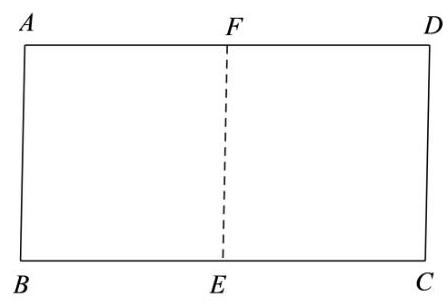
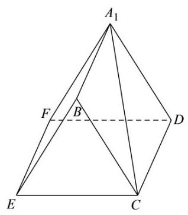

## 2026 届金山区高三下二模数学试卷

## 一、填空题

1. 不等式 $\left| {x - 1}\right|  < 1$ 的解集为___.

2. 已知复数 $z = \left( {m + 2}\right)  + \left( {m - 1}\right) \mathrm{i}$ ( $\mathrm{i}$ 为虚数单位)为纯虚数，则实数 $m =$ ___.

3. 将 $\sqrt{a\sqrt{a}}\left( {a > 0}\right)$ 化成有理数指数幂的形式为___.

4. 设 $\alpha  : 1 \leq  x \leq  4,\beta  : x \leq  m$ ，若 $\alpha$ 是 $\beta$ 的充分条件，则实数 $m$ 的取值范围是___.

5. 已知角 $\alpha$ 为第四象限角，且 $\sin \alpha  =  - \frac{4}{5}$ ，则 $\cos \alpha  =$ ___.

6. 已知等差数列 $- 3, - 1,1,\ldots$ ，则该数列的第 20 项为___.

7. 已知随机变量 $X$ 的分布为 $\left( \begin{matrix} 1 & 2 & 3 \\  {0.4} & {0.2} & a \end{matrix}\right)$ ,则期望 $E\left\lbrack  X\right\rbrack   =$ ___.

8. 若甲乙丙丁四人组成接力队参加 $4 \times  {100}$ 米接力赛，则甲不跑中间两棒的排法共有___种。

9. 已知关于 $x$ 的一元二次方程 ${x}^{2} - x + a = 0$ 有两个不相等的正根 $m\text{ 、 }n$ ，则 $\frac{1}{m} + \frac{9}{n}$ 的最小值为___.

10. 已知在 $\bigtriangleup  {ABC}$ 中， ${AB} = 2,{AC} = 3,\angle {BAC} = {60}^{ \circ  }$ . 若点 $O$ 为 $\bigtriangleup  {ABC}$ 外接圆的圆心，则 $\overrightarrow{BC} \cdot  \overrightarrow{BO} =$ ___.

11. 已知 ${S}_{n}$ 是数列 $\left\{  {a}_{n}\right\}$ 的前 $n$ 项和,且 ${S}_{n} = {2}^{n - 1} - 1, n \geq  1$ 且 $n \in  \mathrm{N}$ .

若 $f\left( x\right)  = \left( {\sin x + {a}_{1}}\right) \left( {\sin x + {a}_{2}}\right) \cdots \left( {\sin x + {a}_{5}}\right)$ ,则 ${f}^{\prime }\left( \pi \right)  =$ ___.

12. 申辉中学某个数学建模小组发现: 人走路时, 启动或者停下的瞬间, 手中水平拿着的杯子里的水可能会被晃动得溢出杯口. 查询资料后发现: 液面和水平面的夹角 $\theta \left( {0 \leq  \theta  < \frac{\pi }{2}}\right)$ 与人走路的加速度 $a$ 以及重力加速度 $g$ 有关,满足关系: $\tan \theta  = \frac{a}{g}$ ,其中 $g = {10}\left( {\mathrm{\;m}/{\mathrm{s}}^{2}}\right)$ . 若甲同学走路启动瞬间的加速度为 $3\left( {\mathrm{\;m}/{\mathrm{s}}^{2}}\right)$ ,手中水平拿着一个底面边长为 $4\mathrm{\;{cm}}$ 和 $6\mathrm{\;{cm}}$ ，高为 ${14}\mathrm{\;{cm}}$ 的长方体形状的杯子，则杯中最多装___ ${\mathrm{{cm}}}^{3}$ 的水，存在甲同学走路启动的瞬间杯中水不溢出的可能.

## 二、单选题

13. 为了了解申辉中学所有学生的每天平均体育运动时间，随机调查了该校 100 名学生，发现他们每天平均体育运动时间为 ${1.5}\mathrm{\;h}$ . 这里的总体是( )

A. 该校所有学生 B. 该校所有学生的每天平均体育运动时间

C. 所调查的 100 名学生 D. 所调查的 100 名学生的每天平均体育运动时间

14. 函数 $y = \cos \left( {\frac{\pi }{2} - {2x}}\right)$ 是( )

A. 最小正周期为 $\pi$ 的奇函数 B. 最小正周期为 $\pi$ 的偶函数

C. 最小正周期为 $\frac{\pi }{2}$ 的奇函数 D. 最小正周期为 $\frac{\pi }{2}$ 的偶函数

15. 已知椭圆 ${\Gamma }_{1} : \frac{{x}^{2}}{{a}^{2}} + \frac{{y}^{2}}{{b}^{2}} = 1$ ,双曲线 ${\Gamma }_{2} : \frac{{y}^{2}}{{b}^{2}} - \frac{{x}^{2}}{{a}^{2}} = 1$ ,其中 $\left( {a > b > 0}\right)$ ,点 ${F}_{1}\text{ 、 }{F}_{2}$ 为椭圆 ${\Gamma }_{1}$ 的两个焦点, 点 $P$ 是双曲线 ${\Gamma }_{2}$ 上一动点. 若双曲线 ${\Gamma }_{2}$ 的两条渐近线夹角的余弦值等于 $\frac{1}{3}$ ,则使得 $\bigtriangleup P{F}_{1}{F}_{2}$ 为直角三角形的点 $P$ 有( )个

A. 3 B. 4 C. 6 D. 8

16. 已知全集 $U$ 是一个六元集合,任取 $U$ 的两个子集 $A\text{ 、 }B$ ( $A\text{ 、 }B$ 可以相等),记事件 $M : B \subseteq  A$ ; 记事件 $N : B \subseteq  \bar{A}$ . 则 $P\left( {M \cup  N}\right)  =$ (   )

A. $\frac{95}{{2}^{11}}$ B. $\frac{665}{{2}^{11}}$ C. $\frac{697}{{2}^{11}}$ D. $\frac{729}{{2}^{11}}$

17. 绝对零度 (℃) 是一个只能逼近而不能达到的最低温度, 那么这个数据是如何测得的? 吕同学通过查询资料，知道:①气体温度和气体压强存在线性关系；②当气体压强为 $0\left( {kPa}\right)$ 时，气体温度达到绝对零度. 以下是吕同学在一次模拟实验时，测得某种气体温度和气体压强的相关数据:

<table><tr><td>数据</td><td>1</td><td>2</td><td>3</td><td>4</td><td>5</td><td>6</td></tr><tr><td>温度 $\left( {{}^{ \circ  }\mathrm{C}}\right)$</td><td>4.07</td><td>16.69</td><td>29.42</td><td>45.67</td><td>57.06</td><td>73.05</td></tr><tr><td>压强 (kPa)</td><td>103.095</td><td>107.734</td><td>112.461</td><td>118.469</td><td>122.706</td><td>128.758</td></tr></table>

(1)求该模拟实验中，该气体温度的平均值和方差；何精确到 0.01

(2)若该次实验下气体压强 $y$ 关于气体温度 $x$ 的回归方程为 $y = {0.372x} + \widehat{b}$ ，预估该次实验下绝对零度的数值； (精确到 ${0.01}^{ \circ  }\mathrm{C}$ )

(3)为了验证实验的普适性，吕同学利用不同气体预估绝对零度，得到如下的一组数据. 若任取其中的 2 个

数据,求该两个数据与绝对零度 $\left( {-{273.15}^{ \circ  }\mathrm{C}}\right)$ 的误差均小于 ${1}^{ \circ  }\mathrm{C}$ 的概率.

<table><tr><td>绝对零度 (℃)</td><td>-275.13</td><td>-274.56</td><td>-274.28</td><td>-273.57</td><td>-272.45</td><td>-271.67</td></tr></table>

18. 已知长方形 ${ABCD}$ 中, ${AB} = 2,{BC} = 4$ ，点 $E$ 、 $F$ 分别为边 ${BC}$ 、 ${AD}$ 的中点 (如图 1). 若将长方形 ${ABEF}$ 沿着边 ${EF}$ 翻折,得到二面角 ${A}_{1} - {EF} - D$ (如图 2). 已知二面角 ${A}_{1} - {EF} - D$ 的大小为 ${60}^{ \circ  }$ .

图1

图2

(1)求证:平面 ${A}_{1}{FD}//$ 平面 ${BEC}$ ；

(2)求直线 $C{A}_{1}$ 与平面 ${A}_{1}{BEF}$ 所成角的大小.(结果用反三角表示)

19. 已知函数 $y = f\left( x\right)$ ,其中 $f\left( x\right)  = \ln x$ .

(1)若 $f\left( {1 - m}\right)  - f\left( {3 - m}\right)  < 0$ ,求实数 $m$ 的取值范围;

(2)若 $g\left( x\right)  = {ax} - \frac{1}{x} - a + 1 - \left( {a + 1}\right) f\left( x\right)$ ,其中 $a > 0$ ,若存在 $b < 0$ ,使得直线 $y = b$ 与函数 $y = g\left( x\right)$ 的图像有 3 个不同的交点,求实数 $a$ 的取值范围.

20. 已知抛物线 $\Gamma  : {y}^{2} = {4x}$ 的焦点为 $F$ ，准线为 $l$ ，点 $P\left( {{x}_{0},{y}_{0}}\right)$ 为抛物线上一动点，点 $O$ 为坐标原点. (1)若 $\left| {OP}\right|  = \left| {PF}\right|$ ，求点 $P$ 的坐标；

(2)若直线 ${l}_{0} : y = {kx} + 4$ 与抛物线 $\Gamma$ 只有一个交点，求直线 ${l}_{0}$ 的方程；

(3)若 ${x}_{0} > 3$ ,过点 $P$ 作圆 $C : {\left( x - 1\right) }^{2} + {y}^{2} = 4$ 的两条切线,交准线 $l$ 于 $A\text{ 、 }B$ 两点,求 $\left| {AB}\right|$ 的取值范围.

21. 若函数 $y = f\left( x\right) , x \in  D$ ,其值域为 $A$ . 若 $A \subseteq  D$ ,则称函数 $y = f\left( x\right)$ 在区间 $D$ 上为封闭函数.

(1)已知 $f\left( x\right)  = \frac{{2x} + 3}{x + 1}$ ，判断函数 $y = f\left( x\right)$ 是否在区间 $\left\lbrack  {2,8}\right\rbrack$ 上为封闭函数，并说明理由；

(2)已知 $g\left( x\right)  = {x}^{2} + {2x}$ ,若函数 $y = g\left( x\right)$ 在区间 $\left\lbrack  {a, b}\right\rbrack$ 上不为单调函数,但在区间 $\left\lbrack  {a, b}\right\rbrack$ 上为封闭函数,求 $b - a$ 的最大值;

(3)已知函数 $y = h\left( x\right)$ 在区间 $\left\lbrack  {a, b}\right\rbrack$ 上连续且为封闭函数，且对于任意的 $x$ 、 $y \in  \left\lbrack  {a, b}\right\rbrack$ ，都有 $\left| {h\left( x\right)  - h\left( y\right) }\right|  = L\left| {x - y}\right| \left( {0 \leq  L < 1}\right)$ 成立. 若数列 $\left\{  {x}_{n}\right\}$ 满足 ${x}_{n + 1} = h\left( {x}_{n}\right) , n \geq  1$ 且 $n \in  N$ ，证明:存在唯一常数 $c \in  \left\lbrack  {a, b}\right\rbrack$ ,使得 $h\left( c\right)  = c$ ,且对于任意的 ${x}_{1} \in  \left\lbrack  {a, b}\right\rbrack$ ,都有 $\mathop{\lim }\limits_{{n \rightarrow   + \infty }}{x}_{n} = c$ .
