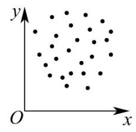
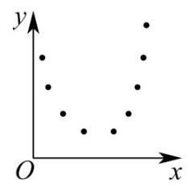
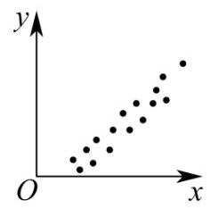
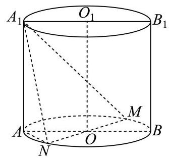

## 2026 届闵行区高三下二模数学试卷

## 一、填空题

1. 已知集合 $A = \{ 1,2,3,4\} , B = \{ 3,4,5,6\}$ ，则 $A \cap  B =$ ___.

2. 设 $x \in  \mathbf{R}$ ，不等式 ${x}^{2} - {4x} < 0$ 的解集是___.

3. 已知球的表面积为 ${4\pi }$ ，则该球的体积为___.

4. 已知 $f\left( x\right)  = \left( {m - 1}\right) {x}^{\alpha }$ ，若 $y = f\left( x\right)$ 是幂函数，且 $f\left( 3\right)  = {27}$ ，则 $f\left( m\right)  =$ ___.

5. 已知事件 $A$ 发生的概率 $P\left( A\right)  = {0.2}$ ，事件 $B$ 发生的概率 $P\left( B\right)  = {0.5}$ ，若事件 $A$ 与 $B$ 独立，则 $P\left( {A \cap  \bar{B}}\right)  =$ ___.

6. 若 ${\left( 2x - 1\right) }^{10} = {a}_{0} + {a}_{1}x + {a}_{2}{x}^{2} + \cdots  + {a}_{10}{x}^{10}$ ，则 ${a}_{1} + {a}_{2} + \cdots  + {a}_{10} =$ ___.

7. 已知 $z \in  \mathrm{C}$ ,若 $\frac{{\left| z\right| }^{2}}{z} = 1 + \mathrm{i}$ (其中 $\mathrm{i}$ 为虚数单位),则 $z =$ ___.

8. 在 $\bigtriangleup  {ABC}$ 中， ${AB} = 3,{AC} = 5,{BC} = 4$ ，点 $A$ 在以 $B$ 、 $C$ 为焦点的双曲线上，则该双曲线的两条渐近线的夹角大小为___.

9. 已知等比数列 $\left\{  {a}_{n}\right\}$ 的公比为 $q$ ,若 $\mathop{\sum }\limits_{{i = 1}}^{{+\infty }}{a}_{1}{q}^{i - 1} = 1$ ,则 $\mathop{\sum }\limits_{{i = 1}}^{3}{a}_{1}{q}^{i - 1}$ 的取值范围是___.

10. 小闵同学打算将“20260407”中的 8 个数字“2、0、2、6、0、4、0、7”进行排列得到密码. 如果排列时要求两个“2” 相邻且三个“0”不相邻，那么小闵可以设置的不同密码的个数为___.

11. 已知 $a \in  \mathbf{R}$ ,若不等式 $\left( {\ln x - 1}\right) \left( {\ln x - {ax}}\right)  > 0$ 的解集中有且仅有两个整数，则 $a$ 的最小值为___.

12. 定义: 平面内图形 $\Gamma$ 上的所有点在直线 $l$ 上的射影所组成的图形称为 $\Gamma$ 在 $l$ 上的射影.若存在边长为 $m$ 的正三角形在正方形的四条边所在直线上的射影长度之和为 4 ，则 $m$ 的取值范围为___.

## 二、单选题

13. 以下是由变量 $x$ 与 $y$ 所绘制的散点图,则它们的线性相关程度较高且正相关的是( )

A.

B.

C.

D.

14. 已知定义在 $\mathbf{R}$ 上的偶函数 $y = f\left( x\right)$ 在 $\lbrack 0, + \infty )$ 上是严格减函数,若 $f\left( {x - 1}\right)  > f\left( 1\right)$ ,则 $x$ 的取值范围为 ( )

A. $\left( {0,2}\right)$ B. $\left( {-2,2}\right)$ C. $\left( {-2,0}\right)$ D. $\left( {-1,1}\right)$

15. 若平面直角坐标系 ${xOy}$ 中的点 $P$ 到 $x$ 轴与 $y$ 轴的距离之和为 1,现有以下两个命题:

①存在点 $P$ 到 $x$ 轴与 $y$ 轴的距离之差为 1 ;

②存在点 $P$ 到 $x$ 轴与 $y$ 轴的距离之积为 1 .

则以下选项正确的是( )

A. ①不正确，②不正确 B. ①正确，②正确

C. ①正确，②不正确 D. ①不正确，②正确

16. 已知平面上 13 个向量 $\overrightarrow{{a}_{1}}\text{ 、 }\overrightarrow{{a}_{2}}\text{ 、 }\cdots .\overrightarrow{{a}_{13}}$ ，其中 $\left| \overrightarrow{{a}_{1}}\right|  = 1$ ，若对任意 $n \in  \mathbf{N},1 \leq  n \leq  {12}$ ，总有 $\left| \overrightarrow{{a}_{n + 1}}\right|  = \sqrt{2}\left| \overrightarrow{{a}_{n}}\right|$ 且 $\overrightarrow{{a}_{n}} \cdot  \overrightarrow{{a}_{n + 1}} = 0$ ，则 $\left| {\overrightarrow{{a}_{1}} + \overrightarrow{{a}_{2}} + \cdots  + \overrightarrow{{a}_{13}}}\right|$ 的最小值为( )

A. 0 B. $\sqrt{3}$ C. ${16}\sqrt{6}$ D. ${63}\sqrt{2}$

## 三、解答题

17. 某学校举办“乐动体育”比赛活动, 高三年级共有 50 名学生报名参加“小球类项目”, 其中参加乒乓球项目的有 28 人，参加羽毛球项目的有 22 人，赛前进行了一道比赛通用规则判断题测试，答对得 5 分，答错得 0 分, 统计结果加下表:

<table><tr><td></td><td>乒乓球项目</td><td>羽毛球项目</td></tr><tr><td>答对人数</td><td>19</td><td>16</td></tr><tr><td>答错人数</td><td>9</td><td>6</td></tr></table>

根据上述数据, 回答下列问题:

(1)求这 50 名学生的平均得分；

(2)从这 50 名学生中随机选取 2 人做裁判.设随机变量 $X$ 表示两名裁判的最高得分，求 $E\left\lbrack  X\right\rbrack$ ；

(3)是否有 95% 的把握认为该题的测试成绩与比赛项目有关？(附:

${\chi }^{2} = \frac{n{\left( ad - bc\right) }^{2}}{\left( {a + b}\right) \left( {c + d}\right) \left( {a + c}\right) \left( {b + d}\right) }, n = a + b + c + d, P\left( {{\chi }^{2} \geq  {3.841}}\right)  \approx  {0.05})$

18. 如图,圆柱 $O{O}_{1}$ 的轴截面 ${AB}{B}_{1}{A}_{1}$ 是边长为 4 的正方形, ${MN}$ 为底面圆 $O$ 的一条直径,且 $\angle {BOM} = \frac{\pi }{3}$ .

(1)求异面直线 ${A}_{1}N$ 与 $B{B}_{1}$ 所成角的大小(用反三角表示);

(2)求点 $A$ 到平面 ${A}_{1}{MN}$ 的距离.

19. 已知 $m \in  \mathbf{R}, f\left( x\right)  = m\sin x + \left( {1 - m}\right) \cos x$ .

(1)当 $m = \frac{1}{2}$ 时，解方程 $f\left( x\right)  = 0$ ；

( 2 )若函数 $y = f\left( x\right)$ 在 $\left( {0,\frac{\pi }{2}}\right)$ 上有唯一的极值点，求 $m$ 的取值范围，并判断这个极值点是极大值点还是极小值点.

20. 已知椭圆 $\Gamma  : \frac{{x}^{2}}{{a}^{2}} + \frac{{y}^{2}}{{b}^{2}} = 1\left( {a > b > 0}\right)$ 的焦距为 $4\sqrt{3}$ ，离心率为 $\frac{\sqrt{3}}{2}$ ，过点 $P\left( {2,1}\right)$ 的直线交椭圆于点 $A$ 、 $B$ .

(1)求 $\Gamma$ 的方程；

(2)记 $\bigtriangleup  {OAP}$ 的面积为S，求证: $S \leq  2\sqrt{2}$ ；

(3)求 $\left| {PA}\right|  \cdot  \left| {PB}\right|$ 的最大值与最小值，并写出取最大值与最小值时直线 ${AB}$ 的方程.

21. 对于定义在 $\mathbf{R}$ 上的函数 $y = f\left( x\right)$ ,若存在实数对 $\left( {a, b}\right)$ ,对于任意的实数 $x$ ,都有 $f\left( {a - x}\right)  \cdot  f\left( {a + x}\right)  = b$ 成立,则称函数 $y = f\left( x\right)$ 为“ $M$ 型函数”,点 $\left( {a, b}\right)$ 称为 $y = f\left( x\right)$ 的“ $M$ ”点.

(1)判断函数 $f\left( x\right)  = x$ 与 $g\left( x\right)  = {\mathrm{e}}^{x}$ 是否为 “ $M$ 型函数” (无须说明理由);

(2)是否存在 “ $M$ 型函数” $y = f\left( x\right)$ ,其图象上的所有点都是 $y = f\left( x\right)$ 的 “ $M$ 点”,如果存在,求出所有满足题意的 $y = f\left( x\right)$ ,如果不存在,说明理由;

(3)设 $f\left( x\right)  > 0, x \in  \mathbf{R}$ ,函数 $y = f\left( x\right)$ 是 “ $M$ 型函数”，且 $y = f\left( x\right)$ 的图象是一条连续曲线. 已知 $p < q$ ,点 $\left( {p, q}\right) ,\left( {q, p}\right)$ 都是 $y = f\left( x\right)$ 的“ $M$ 点”. 证明: “对任意 ${x}_{1}\text{ 、 }{x}_{2}$ ,当 $p < {x}_{1} < {x}_{2} < q$ 时,均有

$\left\lbrack  {f\left( p\right)  - f\left( {x}_{1}\right) }\right\rbrack   \cdot  \left\lbrack  {f\left( {x}_{1}\right)  - f\left( {x}_{2}\right) }\right\rbrack   \cdot  \left\lbrack  {f\left( {x}_{2}\right)  - f\left( q\right) }\right\rbrack   > 0$ ” 是“函数 $y = f\left( x\right)$ 在 $\mathbf{R}$ 上为严格减函数”的充要条件.
