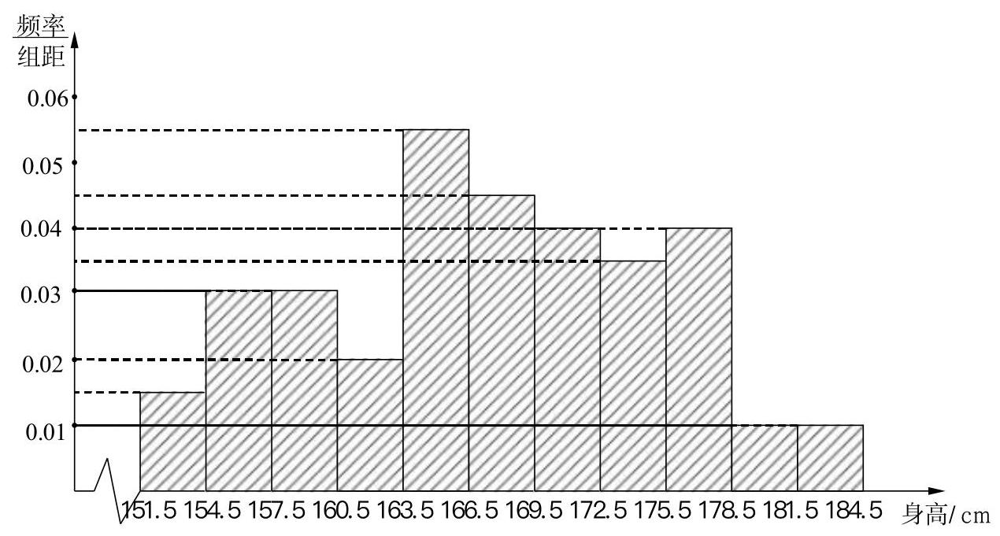
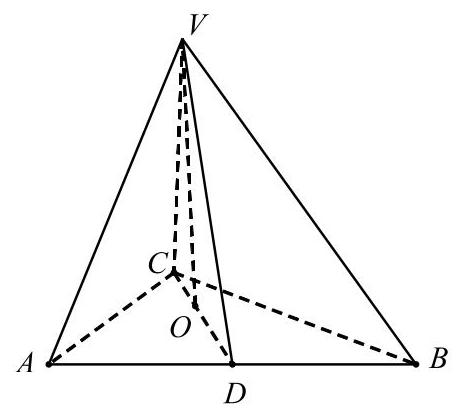
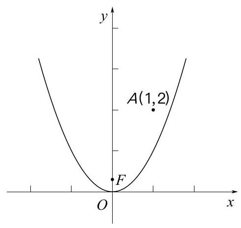
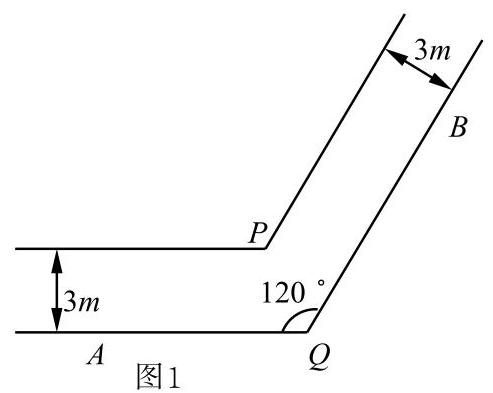
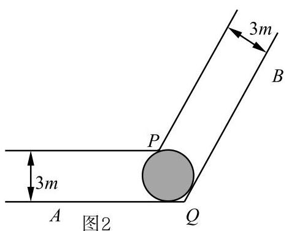
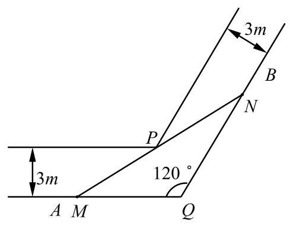
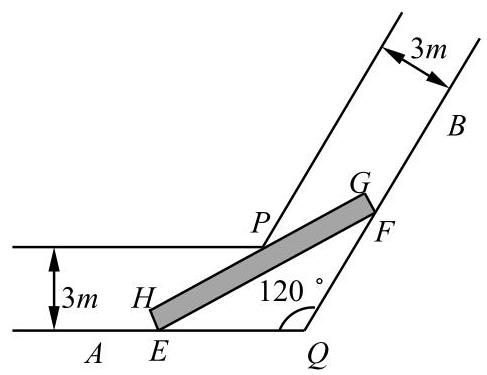

## 2026 届嘉定区高三一模

## 一、填空题(本大题共有 12 题，满分 54 分，第 1<6 题每题 4 分，第 7~12 题每题 5 分)考生应在答题纸的相应位置直接填写结果.

1. 已知集合 $A = \left( {-2,2}\right) , B = \left( {-3, - 1}\right)  \cup  \left( {1, + \infty }\right)$ ，则 $A \cup  B =$ ___.

【答案】 $\left( {-3, + \infty }\right)$

2. 已知直线 $l$ 经过点 $\left( {-1, - 1}\right)$ 、 $\left( {2,2}\right)$ ，则 $l$ 的倾斜角为___.

【答案】

3. 已知复数 $z = \frac{3 - 4\mathrm{i}}{4 + 3\mathrm{i}}$ ( $\mathrm{i}$ 为虚数单位),则 $\left| z\right|  =$ ___.

4. 双曲线 $\frac{{x}^{2}}{9} - \frac{{y}^{2}}{16} = 1$ 的离心率为___.

5. 已知空间向量 $\overrightarrow{a} \bot  \overrightarrow{b},\overrightarrow{a} \bot  \overrightarrow{c},\overrightarrow{b} \bot  \overrightarrow{c}$ ，且 $\left| \overrightarrow{a}\right|  = \left| \overrightarrow{b}\right|  = \left| \overrightarrow{c}\right|  = 1$ ，则 $\left| {\overrightarrow{a} + \overrightarrow{b} + \overrightarrow{c}}\right|  =$ ___.

6. 在 ${\left( 1 - 2x\right) }^{7}$ 的二项展开式中，各项系数的和是___.

7. 已知圆锥侧面展开图中扇形的中心角为 $\frac{2\pi }{3}$ ，底面周长为 ${2\pi }$ ，则这个圆锥的侧面积为___.

8. 两个篮球运动员甲和乙罚球时命中的概率分别是 0.7 和 0.6 ，两人各罚球一次，假设事件“甲命中”与“乙命中”是独立的，则至少一人命中的概率是___.

9. 已知数列 $\left\{  {a}_{n}\right\}$ 满足 ${a}_{1} = \frac{1}{3}$ ，且 ${a}_{n} = \frac{{a}_{n - 1}}{2{a}_{n - 1} + 1}\left( {n \geq  2}\right)$ ，则 ${a}_{100} =$ ___.

10. 已知向量 $\overrightarrow{OA} = \left( {1,7}\right) ,\overrightarrow{OB} = \left( {5,1}\right) ,\overrightarrow{OP} = \left( {2,1}\right) , K$ 为直线 ${OP}$ 上的一个动点,当 $\overrightarrow{KA} \cdot  \overrightarrow{KB}$ 取最小值时，向量 $\overrightarrow{OK}$ 的坐标为___.

11. 已知 $f\left( x\right)  = \ln \frac{1 - {x}^{3}}{1 + {x}^{3}}$ ,且 $f\left( {1 - a}\right)  + f\left( {1 - {a}^{2}}\right)  > 0$ ,则实数 $a$ 的取值范围是___

12. $a\text{ 、 }{a}_{2}\text{ 、 }{a}_{3}\text{ 、 }{a}_{4}\text{ 、 }{a}_{5}$ 是 $1\text{ 、 }2\text{ 、 }3\text{ 、 }4\text{ 、 }5$ 的全排列,如果对任意的 $i \in  \{ 2,3,4\} ,{a}_{i - 1}$ 和 ${a}_{i + 1}$ 中至, 有一个大于 $a$ ，则满足要求的排列的总数为___.

## 二、选择题(本大题共有 4 题, 满分 18 分, 第 13、14 题每题 4 分, 第 15、16 题每题 5 分)每题有且只有一个正确选项.考生应在答题纸的 相应位置, 将代表正确选项的小方格涂黑.

13. 如果 $a < b < 0$ ，那么下列不等式中成立的是( ).

A. $\frac{a}{b} < 1$ B. ${a}^{2} > {ab}$

C. $\frac{1}{{b}^{2}} < \frac{1}{{a}^{2}}$ B. $\frac{1}{a} < \frac{1}{b}$

14. 函数 $y = 1 - 2{\cos }^{2}\left( {x + \frac{\pi }{4}}\right)$ 是( ).

A.,最小正周期为 ${2\pi }$ 的奇函数 B. 最小正周期为 ${2\pi }$ 的偶函数

C.最小正周期为 $\pi$ 的奇函数 D. 最小正周期为 $\pi$ 的偶函数

15. 若实数 $x\text{ 、 }y\text{ 、 }z$ 满足 $1 + {2}^{x} = {3}^{y} = {5}^{z}$ ,则 $x\text{ 、 }y\text{ 、 }z$ 的大小关系不可能是( ).

A. $x > y > z$ B. $y > z > x$ C. $y > x > z$ D. $x > z > y$

16. 数列 $\left\{  {a}_{n}\right\}$ 的前 $n$ 项和为 ${S}_{n}$ ,且对任意正整数 $n$ ,总存在正整数 ${m}_{n}$ ,使得 ${S}_{n} = {a}_{m}$ . 则下列命题中正确的是 ( ) .

A. 对任意正整数 $n$ ，总存在正整数 $m$ ，使得 ${a}_{n} = {S}_{m}$

B. 数列 $\left\{  {a}_{n}\right\}$ 一定是等差数列

G 存在公比为正整数的等比数列 $\left\{  {a}_{n}\right\}$ 满足条件

D. 对任意正整数 $k$ ,总存在正整数 $m\text{ 、 }n$ ,使得 ${a}_{k} = {a}_{m} - {a}_{n}$

## 三、解答题(本大题共有 5 题, 满分 78 分)解答下列各题必须在答题纸 的相应位置写出必要的步骤.

## 17.(本题满分 14 分, 第 1 小题 4 分, 第 2 小题 4 分, 第 3 小题 6 分)

A 校抽取 66 名高一年级学生测量身高, 因某种原因原始数据遗失. 已知该样本是按照分层随机抽样的方法抽取的，其中男生 34 名，身高平均数为 173cm；女生 32 名，身高平均数为 161cm. 该 66 名学生身高的方差为 60. 其频率分布直方图如下:

(1)求该 66 名学生中身高在 $\left\lbrack  {{169.5},{172.5}}\right\rbrack$ (单位:cm)内的人数；

(2)试用已知数据估计 A 校高一年级全体学生身高的平均数；何先果精确到 0.1cm

(3)若一组数据落在 $\left\lbrack  {x - {2s}, x + {2s}}\right\rbrack$ ( $x$ 是平均数， $s$ 是标准差)内的频率不小于 92%，则称这组数据满足“常态”. 试判断这 66 个身高数据是否满足“常态”，并说明理由.

## 18.(本题满分 14 分，第 1 小题 7 分，第 2 小题 7 分)

如图，在四面体 ${VABC}$ 中， ${AC} = {BC}$ ，从顶点 $V$ 作平面 ${ABC}$ 的垂线，垂足 $O$ 恰好落在 $\bigtriangleup  {ABC}$ 的中线 ${CD}$ 上.

(1)如果 ${DV} = {DA} = 2$ ，直线 ${VD}$ 与平面 ${ABC}$ 所成的角为 $\frac{\pi }{4}$ ，

求直线 ${VA}$ 与平面 ${ABC}$ 所成角的大小；

(2)证明:平面 ${VCD} \bot$ 平面 ${VAB}$ .

19.(本题满分 14 分, 第 1 小题 7 分, 第 2 小题 7 分)

已知 $f\left( x\right)  = {x}^{3} + {ax} + 1$ .

(1)若 $a =  - 3$ ，求函数 $y = f\left( x\right)$ 的单调区间.

( 2 )若 $y = f\left( x\right)$ 在 $\left( {0, + \infty }\right)$ 上存在零点，求实数 $a$ 的最大值

20.(本题满分 18 分, 第 1 小题 4 分, 第 2 小题 6 分, 第 3 小题 8 分)

如图,在平面直角坐标系中, $O$ 为原点,已知抛物线 $\Gamma  : y = {x}^{2}$ 的焦点为 $F$ ,点 $A$ 的坐标为 $\left( {1,2}\right)$ .

(1)若点 $E$ 在 $\Gamma$ 上，且 $\left| {OE}\right|  = \sqrt{2}$ ，求点 $E$ 的坐标；

(2)若 $P$ 是 $\Gamma$ 上的任意一点，求 $\left| {AP}\right|  + \left| {PF}\right|$ 的最小值；

(3)过点 $A$ 的动直线与抛物线 $\Gamma$ 交于 $B$ 、 $C$ 两点，过点 $B$ 、 $C$ 分别作 $\Gamma$ 的切线,两条切线相交于点 $D$ ,求证:点 $D$ 的轨迹是一条直线.

## 21. (本题满分 18 分，第 1 小题 4 分，第 2 小题 7 分，第 3 小题 7 分)

图 1 为转角过道的地面平面示意图. 该过道由两条直道连接形成转角，由水平平坦的地面与垂直于地面的墙面共同围成，两端延伸至足够远处，且高度充足. 其中， ${QA}\text{ 、 }{QB}$ 构成地面上过道的一侧边界, $\angle {AQB} = {120}^{ \circ  }$ ; 地面上过道的另一侧边界,则分别与 ${QA}\text{ 、 }{QB}$ 平行,且交于点 $P$ . 过道两侧平行墙面之间的距离均为 3 米.

(1)如图 2，在地面有一圆，该圆与 ${QA}\text{ 、 }{QB}$ 均相切，且过点 $P$ . 求此圆的半径:

(2)如图 3，有一根长度为 $y$ 米的无粗细木棒 ${MN}$ 紧贴地面，端点 $N$ 沿 ${QB}$ 移动，另一端点 $M$ 沿 ${AQ}$ 移动. 当木棒 ${MN}$ 触碰到点 $P$ 时， $\angle {QMN} = x$ (弧度)，求 $y$ 关于 $x$ 的函数关系及 $y$ 的最小值;

(3)如图 4，某长方体家具的底面为长方形 ${EFGH}$ ，其宽为 1 米，长为 10 米(因过道高度足够， 无需考虑家具高度).现将底面 EFGH 紧贴地面移动，判断该家具能否顺利通过此转角过道，并说明理由.

图3

图 4
