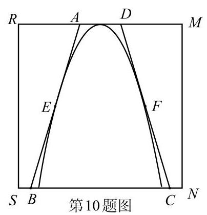
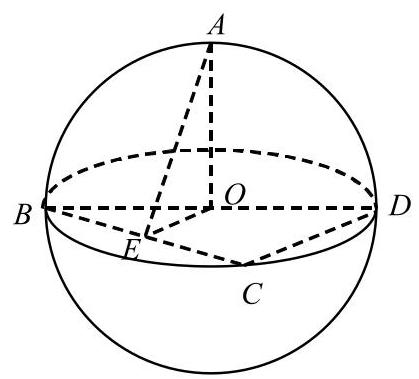
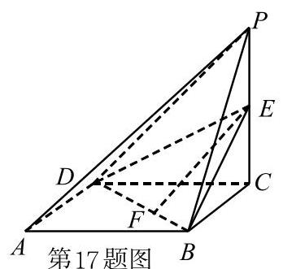
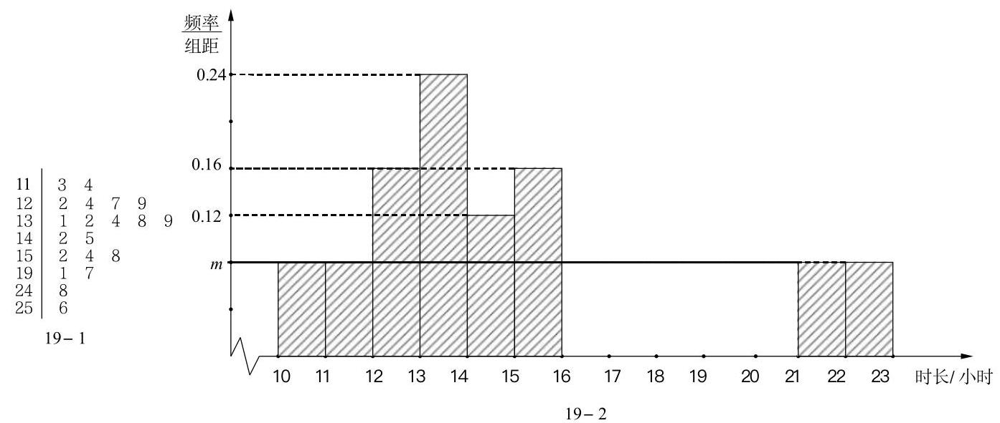

## 2026 届虹口区高三数学一模

## 一、填空题(本大题共有 12 题，满分 54 分，第 1-6 题每题 4 分，第 7-12 题每题 5 分)考生应在答题纸的相应位置直接填写结果.

1. 已知集合 $A = \{ x\parallel x - 1 \mid   < 2\} , B = \{ x \mid  x > 0\}$ ，则 $A \cap  B =$ ___.

2. 函数 $y = \sqrt{\frac{x + 1}{x - 2}}$ 的定义域为___

3. ${\left( x - \frac{3}{x}\right) }^{9}$ 的二项展开式中 ${x}^{7}$ 的系数是___.

4. 已知 $a \in  \left\{  {-\frac{1}{3},\frac{2}{3},\frac{3}{2}}\right\}$ ，若幂函数 $y = {x}^{a}$ 为偶函数，则实数 $a =$ ___.

5. 若事件 $A$ 、 $B$ 互斥，且 $P\left( A\right)  = {0.4}$ ， $P\left( {A \cup  B}\right)  = {0.6}$ ，则 $P\left( B\right)  =$ ___.

6. 已知复数 $z$ 是实系数一元二次方程 ${x}^{2} + {bx} + 2 = 0$ 的一个虚数根，则 $\left| z\right|  =$ ___.

7. 已知某圆锥的底面半径为 2，侧面积为 ${6\pi }$ ，则该圆锥的体积为___(结果保留 $\pi$

8. 若甲、乙、丙 3 人要站在一个有 7 级台阶的楼梯上拍照，每级台阶至多站 2 人，同一级楼梯上的人不区分站的位置，则不同的站法有___种___、(结果用数值表示)

9. 已知双曲线 $C$ 的焦点分别为 ${F}_{1}\left( {-1,0}\right)$ 和 ${F}_{2}\left( {1,0}\right)$ ,若点 $P$ 为 $C$ 上的点,且满足 $P{F}_{2} \bot  {F}_{1}{F}_{2},\sin \angle P{F}_{1}{F}_{2} = \frac{3}{5}$ ，则点 ${F}_{1}$ 到 $C$ 的一条渐近线的距离为___.

10. 小虹同学要在边长为 10 的正方形纸片 ${RSNM}$ 上剪出一个等腰梯形 ${ABCD}$ 的图案,如图所示,腰 ${AB}\text{ 、 }{CD}$ 与正方形内的抛物线 $\Gamma$ 分别相切于 $E\text{ 、 }F$ 两个点,其中 $\Gamma$ 的顶点 $O$ 为 ${RM}$ 的中点.若当点 $E$ 到 ${RM}$ 的距离为 4.5 时， ${EF} = 6$ ，则当等腰梯形 ${ABCD}$ 的面积取到最小值时， ${EF} =$ ___.(结果保留 2 位小数)

11. 若 $\left\{  {x\left| {\;\lg \left( {{x}^{2} + {2x}}\right)  - \lg \left( {a \cdot  {\mathrm{e}}^{x} - 1}\right)  = 0}\right. }\right\}   \neq  \varnothing$ ,则实数 $a$ 的取值范围是___.

12. 已知空间中四个单位向量 $\overrightarrow{a},\overrightarrow{b},\overrightarrow{c},\overrightarrow{d}$ 满足 $\left| {\overrightarrow{a} - \overrightarrow{b}}\right|  = \left| {\overrightarrow{c} - \overrightarrow{d}}\right|  = \left| {\overrightarrow{a} + \overrightarrow{b} + \overrightarrow{c} + \overrightarrow{d}}\right|  = 1$ ,则 $\overrightarrow{a}$ 在 $\overrightarrow{c}$ 方向上的数量投影的最大值为___.

## 二、选择题(本大题共有 4 题，满分 18 分，第 13-14 题每题 4 分，第 15-16 题每题 5 分)每题 有且只有一个正确答案,考生应在答题纸的相应位置上,将所选答案的代号涂黑.

13. 已知 $x$ 、 $y$ 为实数，则“ ${x}^{3} > {y}^{3}$ ”是“ ${2}^{x} > {2}^{y + 1}$ ”的( )条件.

A. 充分非必要 B. 必要非充分 C. 充要 D. 非充分又非必要

14. 已知 $f\left( x\right)  = \left\{  \begin{array}{l} \tan x, x > 0, \\   - f\left( {x + \pi }\right) , x < 0. \end{array}\right.$ 若 $f\left( a\right)  = \sqrt{3}$ ，则实数 $a$ 的取值可以是( ).

A. $- \frac{2\pi }{3}$ B. $- \frac{\pi }{3}$ C. $\frac{\pi }{6}$ D. $\frac{2\pi }{3}$

15. 如图,已知点 $A\text{ 、 }B\text{ 、 }C\text{ 、 }D$ 在表面积为 ${12\pi }$ 的球 $O$ 的球面上,且 $O \in  {BD}$ ,

${OA} \bot$ 平面 ${BCD}$ ,点 $E$ 为 ${BC}$ 中点,当二面角 $A - {BC} - D$ 的大小为 $\frac{\pi }{3}$ 时,则有(   ).

第15题图

A. 异面直线 ${AE}$ 和 ${CD}$ 所成角的大小为 $\frac{\pi }{6}$

B. 直线 ${EA}$ 与平面 ${ABD}$ 所成角的大小为 $\frac{\pi }{6}$

C. $\sin \left( {2\angle {ABE}}\right)  = \frac{\sqrt{2}}{3}$

D. $\bigtriangleup  {BED}$ 的面积为 $\sqrt{2}$

16. 若每一项均为正数的数列 $\left\{  {a}_{n}\right\}$ 的前 $n$ 项和为 ${S}_{n}$ ,若对于任意的正整数 $n$ ,均存在正整数 $m$ ,使得 $\frac{{a}_{n} - {S}_{m}}{{a}_{n} - {S}_{m + 1}} \leq  0$ ，则称 $\left\{  {a}_{n}\right\}$ 具有 "P 性质".对于以下两个命题，说法正确的是( ).

①存在等比数列 $\left\{  {a}_{n}\right\}$ ，使得 $\left\{  {a}_{n}\right\}$ 具有 "P 性质"；

②若 $\left\{  {a}_{n}\right\}$ 具有 "P 性质"，记 ${\Delta }_{n} = {S}_{m + 1} - {a}_{n}$ 且 $\left\{  {\Delta }_{n}\right\}$ 为等差数列，则 ${S}_{n} \leq  {2}^{n} \cdot  {a}_{1}$ .

A. ①和②都为真命题 B. ①和②都为假命题

C. ①为真命题，②为假命题 D. ①为假命题，②为真命题

## 三、解答题(本大题共 5 题, 满分 78 分)解答下列各题必须在答题纸相 应位置写出必要步骤.

## 17.(本题满分 14 分,第 1 小题 6 分,第 2 小题 8 分)

如图，已知四棱锥 $P - {ABCD}$ 的底面是边长为 2 的菱形，点 $E$ 为 ${PC}$ 中点.

(1)若点 $F$ 是线段 ${BD}$ 上的动点，求证:直线 ${EF}$ 与直线 ${PA}$ 不相交；

(2)若 ${PC} \bot$ 平面 ${ABCD}$ ， ${AC} = {BD}$ ， ${EC} = 1$ ，求点 $A$ 到平面 ${EBD}$ 的距离.

## 18.(本题满分 14 分,第 1 小题 6 分,第 2 小题 8 分)

已知 $\omega  > 0,\left| \varphi \right|  \leq  \pi$ ,设 $f\left( x\right)  = \cos \left( {{\omega x} + \varphi }\right)$ .

(1)当 $\omega  = 2,\varphi  = \frac{\pi }{4}$ 时，试判断函数 $y = f\left( x\right)$ 的奇偶性，并说明理由;

( 2 )当 $\varphi  =  - \frac{\pi }{2}$ 且函数 $y = f\left( x\right)$ 的最小正周期为 ${2\pi }$ 时，若在 $\bigtriangleup  {ABC}$ 中，

${\sin }^{2}A + {\sin }^{2}C - {\sin }^{2}B = \sin A\sin C$ ,求 $f\left( A\right)  + f\left( C\right)$ 的取值范围.

## 19.(本题满分 14 分, 第 1 小题 2 分, 第 2 小题 6 分, 第 3 小题 6 分)

班主任小明为了解本班每位学生每周平均手机使用时长(单位:小时)，在某一学期每周对全班，45_名学生进行问卷调查，收集了全部数据并计算出每位学生每周平均手机使用时长，绘制了相应的统计图表，全班用时最长的为 25.6 小时.其中，男生每周平均手机使用时长的茎叶图如图 19-1 所示,女生每周平均手机使用时长的频率分布直方图如图 19-2 所示.

(1)求该班男生每周平均手机使用时长的第 25 百分位数；

(2)小明老师想从本班每周平均手机使用时长小于 12 小时的学生中任选 2 人在班会课上做经验分享. 设事件 $A$ 表示“2 人中至多 1 名男生”，事件 $B$ 表示“2 人中恰有 1 名学生的每周平均手机使用时长位于区间 $\lbrack 1,1,2)$ ”. 试判断事件 $A$ 和事件 $B$ 是否独立，并说明理由:

(3)小明老师发现本班有 $t$ 位学生的每周平均手机使用时长超过 20 小时，这 $t$ 位学生的数据平均数为 23 小时.当去掉这 $t$ 位学生中用时最长和用时最短的数据后，平均数变为 22.7 小时，且这 $t$ 位学生中女生的数据从小到大依次排序成等差数列. 那么这 $t$ 位学生每周平均手机使用时长的方差是否超过 3?请说明理由.

## 20. (本题满分 18 分, 第 1 小题 4 分, 第 2 小题 6 分, 第 3 小题 8 分)

已知椭圆 $\Gamma  : \frac{{x}^{2}}{2} + {y}^{2} = 1$ 的左、右焦点分别为 ${F}_{1}$ 和 ${F}_{2}$ ,点 $P$ 是 $\Gamma$ 的长轴上的动点,点 $Q$ 为 $\Gamma$ 上的动点,且异于点 $P$ .

(1)当点 $P$ 位于椭圆 $\Gamma$ 的左焦点，且 $Q$ 、 $P$ 、 ${F}_{2}$ 能构成三角形时，求 ${\Delta QP}{F}_{2}$ 的周长；

(2)当点 $P$ 位于椭圆 $\Gamma$ 的左顶点时,直线 ${PQ}$ 与 $y$ 轴交于点 $B\left( {0,\frac{1}{2}}\right) ,\overline{PB} = \lambda \overrightarrow{BQ}$ ，求实数 $\lambda$ 的值:

(3)当点 $P$ 与椭圆 $\Gamma$ 的左、右顶点均不重合时，记直线 ${PQ}$ 与椭圆 $\Gamma$ 的另一个交点为 $S$ ，过点 $P$ 作直线 $l$ 与椭圆 $\Gamma$ 交于 $C$ 、 $D$ 两点，设 $M$ 和 $N$ 分别为弦 ${QS}$ 和弦 ${CD}$ 的中点，若 $P$ 、 $Q$ 、 $M$ 、 $N$ 为四个相异的点， $\left| {\overrightarrow{PM} + \overrightarrow{PN}}\right|  = \left| \overrightarrow{MN}\right|$ ，且直线 ${MN}$ 恒过定点 $\left( {-\frac{1}{3},0}\right)$ ，求点 $P$ 的坐标.

## 21. (本题满分 18 分, 第 1 小题 4 分, 第 2 小题 6 分, 第 3 小题 8 分)

已知函数 $y = f\left( x\right)$ 的定义域为 $D\left( {D \subseteq  \mathbf{R}}\right)$ ，记 $g\left( x\right)  = f\left( {x + a}\right)  - f\left( x\right)$ ，其中 $a \in  D$ ，且 $x + a \in  D$ .

(1)当 $D = \mathbf{R}, f\left( x\right)  = {x}^{2}, a = 1$ ，求函数 $y = g\left( x\right)$ 的零点:

(2)当 $D = \lbrack  - 1, + \infty ), f\left( x\right)  = {x}^{3} - {3x}$ ,若恒有 $g\left( x\right)  > 0$ ,求实数 $a$ 的取值范围;

(3)当 $D = \mathbf{Q}$ ,求证: "对于任意的正有理数 $a$ ,函数 $y = g\left( x\right)$ 在 $D$ 上均是严格增函数"的充要条件是 “任取 $D$ 中两个不相同的元素 ${x}_{1}$ 和 ${x}_{2}$ ,均有 $f\left( \frac{{x}_{1} + {x}_{2}}{2}\right)  < \frac{1}{2}\left( {f\left( {x}_{1}\right)  + f\left( {x}_{2}\right) }\right)$ ”.
