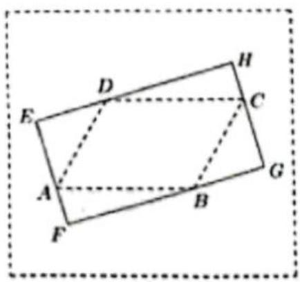
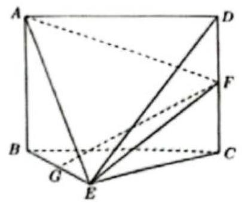
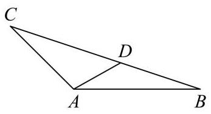
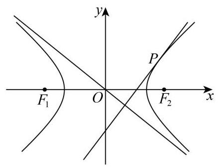

# 黄浦区 2025 学年度第一学期高三年级期终调研测试 数学试卷

(完卷时间: 120 分钟 满分: 150 分)

## 一、填空题 (本大题共有 12 题,满分 54 分.其中第 $1 \sim  6$ 题每题满分 4 分,第 $7 \sim  {12}$ 题每题满分 5 分) 考生应在答题纸相应编号的空格内直接填写结果.

1. 函数 $y = \sqrt{x - 2}$ 的定义域是___.

2. 若直线 ${l}_{1} : x + {2y} - 1 = 0$ 与 ${l}_{2} : {ax} - {4y} + 5 = 0$ 平行，则 $a =$ ___.

3. 已知集合 $A = \left\{  {x\left| {\;x\left\langle  {-1\text{ 或 }x}\right\rangle  4}\right. }\right\}  ,\;B = \left\{  {x\left| {\left| {x + 1}\right|  < 1, x \in  \mathbf{R}}\right| }\right\}$ ，则 $A \cap  B =$ ___.

4. 已知 $\mathrm{i}$ 是虚数单位，则 $\frac{5\mathrm{i}}{2 - \mathrm{i}} =$ ___.

5. 在 ${\left( x + a\right) }^{6}$ 的展开式中的 ${x}^{3}$ 系数为 160,则 $a =$ ___.

6. 甲、乙两人独立破译某个密码，甲译出密码的概率为 0.3 ，乙译出密码的概率为 0.4 ，则该密码被破译的概率为___.

7. 已知边长为 3 的正三角形 ${ABC}$ 的三个顶点都在球 $O$ 的球面上,球心 $O$ 到平面 ${ABC}$ 的距离为 1 ，则球 $O$ 的体积为___.

8. 若正数 $m, n$ 满足 $\frac{4}{m} + \frac{9}{n} = 1$ ，则 ${mn}$ 的最小值为___.

9. 已知角 $a$ 的顶点与坐标原点重合,始边与 $x$ 轴的正半轴重合,终边与以坐标原点为圆心、 1 为半径的圆交于点 $P$ ,若点 $P$ 的横坐标与纵坐标之和为 $\frac{1}{2}$ ,则 $\tan a + \cot a$ 的值为 ___.

10. 已知数列 $\left\{  {a}_{n}\right\}$ 是公差为 2 的等差数列,数列 $\lg {a}_{1},\lg {a}_{k},\lg {a}_{7}$ 也为等差数列,且 $k \in  \{ 3,4,5\}$ ，则 ${a}_{1} =$ ___.

11. 如图，在一块空地上有四棵树，若把它们所在的位置看成点，则这四个点 $A$ ， $B$ ， $C$ ， $D$ 恰好是一个平行四边形的四个顶点,且 ${AB} = {40}$ 米, ${BC} = {30}$ 米, $\angle {BAD} = {60}^{ \circ  }$ ,现要用挡板围出一个形状为矩形的展览区 ${EFGH}$ ,使得其边 ${EF},{FG},{GH},{HE}$ 分别经过点 $A, B$ , $C, D$ ，则该展览区的最大面积约为___平方米(精确到 1 平方米).

12. 若图形 $\Gamma$ 上的每个点都在圆 $C$ 上或在圆 $C$ 内部,则称圆 $C$ 为 $\Gamma$ 的一个覆盖圆. 设 $\Gamma$ 由函数 $y = 2\left| x\right|  - 4\left( {-2 < x < 2}\right)$ 与 $y = \sqrt{2\left| x\right|  - {x}^{2}}$ 的图像所组成,则 $\Gamma$ 的最小覆盖圆的半径为 ___.

二、选择题 (本大题共有 4 题, 满分 18 分. 其中第 13、14 题每题满分 4 分, 第

## 15、16 题每题满分 5 分) 每题有且只有一个正确答案, 考生应在答题纸的相应 编号上, 将代表答案的小方格涂黑, 选对得满分, 否则一律得零分.

13. 下列函数中，既是偶函数、又在 $\left\lbrack  {0,1}\right\rbrack$ 上严格减的函数是( )

A. $y =  - x$ B. $y =  - \left| x\right|$ C. $y = {x}^{2}$ D. $y = {2}^{-x}$

14. 设 $\alpha \text{ 、 }\beta$ 是两个不同的平面,1 是一条直线,以下命题正确的是

A. 若 $1 \bot  \alpha ,\alpha  \bot  \beta$ ,则 $1//\beta$

B 若 $1//\alpha ,\alpha //\beta$ ，则 $1//\beta$

C. 若 $1\bot \alpha ,\alpha //\beta$ ，则 $1\bot \beta$

D. 若 $1//\alpha ,\alpha  \bot  \beta$ ，则 $1\bot \beta$

15. 若数列 $\left\{  {a}_{n}\right\}$ 同时满足如下条件:( i ) $\left\{  {a}_{n}\right\}$ 是无穷数列; (ii) $\left\{  {a}_{n}\right\}$ 是递增数列; (iii) 存在正数 $M$ ,使得对任意的 $n \in  {\mathbf{N}}^{ * }$ ,都有 $\left\{  {a}_{n}\right\}$ 的前 $n$ 项的和 ${S}_{n} \in  \left\lbrack  {-M, M}\right\rbrack$ ,则称 $\left\{  {a}_{n}\right\}$ 具有性质 $P$ . 关于如下结论: ①存在等差数列具有性质 $P$ ; ②存在等比数列具有性质 $P$ . 其中正确的说法是 ( )

A. ①和②均错误 B. ①和②均错误 C. ①正确，②错误 D. ①错误,

②正确

16. 已知点 $P\left( {-5,0}\right)$ ， ${Q}_{1}$ ， ${Q}_{2} \in  \{ \left( {x, y}\right) \left| \right| x\left| { \leq  1\text{ ， }}\right| y \mid   \leq  1\}$ ，则 $\overrightarrow{P{Q}_{1}} \cdot  \overrightarrow{P{Q}_{2}}$ 的取值范围是( )

A. $\left\lbrack  {{15},{36}}\right\rbrack$ B. $\left\lbrack  {{15},{37}}\right\rbrack$ C. $\left\lbrack  {{16},{36}}\right\rbrack$ D.

[16,37]

## 三、解答题 (本大题共有 5 题, 满分 78 分) 解答下列各题必须在答题纸相应编 号的规定区域内写出必要的步骤.

17. 一家水果店的店长为了解本店苹果的日销售情况, 记录了过去 20 天苹果的日销售量 (单位:kg)，按从小到大的排序结果如下:62, 74, 75, 84, 84, 85, 85, 85, 86, 87, 89, 92, 93, 94, 97, 99, 101, 104, 107, 117.

(1)求该水果店过去 20 天苹果日销售量的平均数；

(2)若以过去 20 天苹果的日销售量的第 80 百分位数作为下个月每日苹果的平均进货量， 试确定下个月每日苹果的平均进货量;

(3)若从过去 20 天中随机抽取 3 天，分别求“3 天中每天的苹果销售量均超过 90kg”与“3 天中恰有 2 天的苹果销售量超过 90kg”的概率.

18. 如图,在几何体 ${ABCDE}$ 中,四边形 ${ABCD}$ 是矩形, ${AB} \bot$ 平面 ${BEC},{BE} \bot  {EC}$ , ${AB} = {BE} = {EC} = 2, G, F$ 分别是线段 ${BE},{DC}$ 的中点.

(1) 求证: ${GF}//$ 平面 ${ADE}$ ;

(2)设平面 ${AEF}$ 与平面 ${BEC}$ 的交线为 $l$ ，求二面角 $A - l - B$ 的余弦值.

19. 在 $\nabla {ABC}$ 中, $\angle {BAC} = \frac{3\pi }{4},{AB} = 6,{AC} = 3\sqrt{2}$ .

(1)求 ${BC}$ 的长和 $\angle B$ 的正弦值；

(2)若点 $D$ 在 ${BC}$ 边上，且 $\angle {BAD} = \theta$ ，设 ${AD} = f\left( \theta \right)$ ，求 $f\left( \theta \right)$ 的表达式，并判断是否存在 ${\theta }_{0}$ ,使得 $f\left( \theta \right)$ 在 $\theta  = {\theta }_{0}$ 处的瞬时变化率等于 $- f\left( {\theta }_{0}\right)$ .

20. 已知双曲线 $\Gamma$ 的中心位于坐标原点 $O$ ,焦点 ${F}_{2},{F}_{1}$ 分别在 $x$ 轴的正、负半轴上, $\left| {{F}_{1}{F}_{2}}\right|  = 2\sqrt{2}$ ,直线 $y =  - x$ 是 $\Gamma$ 的一条渐近线,直线 ${l}_{1} : y = \sqrt{2}x + t\left( {t < 0}\right)$ 与 $\Gamma$ 有且只有一个公共点 $P$ .

(1)求 $\Gamma$ 的方程；

(2)若点 $Q$ 在 $y$ 轴上，且 $\angle {F}_{1}{QP}$ 为直角，求点 $Q$ 的坐标；

(3)设动直线 ${l}_{2}$ 平行于 ${OP}$ ,与 $\Gamma$ 交于点 $A, B$ ,与 ${l}_{1}$ 交于点 $K$ ,是否存在常数 $\lambda$ ,使得 $\left| {KA}\right|  \cdot  \left| {KB}\right|  = \lambda {\left| KP\right| }^{2}$ 总成立? 若存在,请求出 $\lambda$ 的值; 若不存在,请说明理由.

21. 已知函数 $y = f\left( x\right)$ 的定义域为 $D$ ,对于给定实数 $t$ ,定义集合 ${V}_{f\left( t\right) } = \left\{  {x\left| {\;f\left( {x + t}\right)  \geq  f\left( x\right) }\right. }\right\}  .$

(1)若 $f\left( x\right)  = {x}^{3} - {13x}$ ，求 ${V}_{f\left( 2\right) }$ ；

(2)若 $D = \mathbf{R}$ ，求证: “ $y = f\left( x\right)$ 为周期函数”的充要条件是 “存在非零常数 $t$ ，使得 ${V}_{f\left( t\right) } = {V}_{f\left( {-t}\right) } = D,$

(3)若 $f\left( x\right)  = \frac{1}{2}a{\left( x - \frac{\mathrm{e}}{\mathrm{e} - 1}\right) }^{2} - x\left( {\ln x - \frac{\mathrm{e}}{\mathrm{e} - 1}}\right)$ ， $D = \left( {0, + \infty }\right)$ ，且对于任意的 $t \in  D$ ， 都有 ${V}_{f\left( t\right) } = D$ ,求实数 $a$ 的取值范围.
