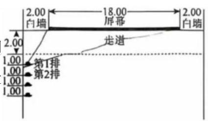
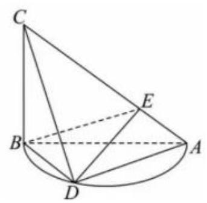

# 七宝中学 2025-2026 学年第二学期高三年级数学月考

2026.5

## 一、填空题(本大题共有 12 题，满分 54 分，第 1-6 题每题 4 分，第 7-12 题每题 5 分) 考生应在答题纸相应位置直接填写结果.

1. 已知集合 $A = \left\{  {x\left| {\;{x}^{2} =  - 1}\right. , x \in  C}\right\}$ ，则用列举法表示集合 $A =$ ___.

2. 抛物线 ${x}^{2} = {2y}$ 的准线方程是___.

3. 已知扇形的弧长为 ${2\pi }$ ，面积为 ${3\pi }$ ，则扇形所在圆的半径为___.

4.样本数据7,8,10,11,23,24,30,35的第 40 百分位数为___.

5. 在 ${\left( \sqrt{x} + \frac{2}{{x}^{2}}\right) }^{10}$ 的展开式中，常数项是___.

6. 已知 $\sin \alpha \text{ 、 }\cos \alpha$ 是关于 $x$ 的方程 $3{x}^{2} - {2x} + a = 0$ 的两根,则 $a =$ ___.

7. 已知正数 $a, b$ 满足 $a + {2b} = 1$ ，则 $\frac{1}{a} + \frac{a}{b}$ 的最小值为___.

8. 高三拍毕业照时， $A$ 、 $B$ 、 $C$ 、 $D$ 、 $E$ 五位同学站成一排照相，在 $A$ 、 $B$ 两位同学不相邻的条件下， $\mathbf{C}$ 、 $\mathbf{D}$ 相邻的概率为___.

9. $\bigtriangleup {ABC}$ 的内角 $A, B, C$ 的对边分别为 $a, b, c$ ,已知 $b = 2, c = 3, C = {2B}$ ,则 $\bigtriangleup {ABC}$ 的面积为___.

10. 已知函数 $y = f\left( {x + 2}\right)$ 为奇函数,当 $x < 2$ 时, $f\left( x\right)  = a{x}^{2} - x\left( {a \neq  0}\right)$ ,若 $y = f\left( x\right)$ 在 $x \in  (2,3\rbrack$ 上单调递增,则 $a$ 的取值范围是___.

11. 公比为 $q$ 的无穷等比数列 $\left\{  {a}_{n}\right\}$ 满足 $\left| {{a}_{n} - {a}_{n}}\right|  \leq  \left| {{a}_{1} - {a}_{n + 1}}\right|$ 恒成立,则 $q$ 的取值范围是___.

12. 已知平面上两点 $A, B$ 距离为 $2, P$ 为平面上任一点,动点 ${C}_{i}\left( {i = 1,2}\right)$ 均满足 ${\overrightarrow{PC}}_{i}^{2} + \overrightarrow{PA} \cdot  \overrightarrow{PB} = \overrightarrow{PA} \cdot  \overrightarrow{P{C}_{i}} + \overrightarrow{PB} \cdot  \overrightarrow{P{C}_{i}}$ ,则 $\overrightarrow{A{C}_{1}} \cdot  \overrightarrow{B{C}_{2}}$ 的最大值是___.

## 二、选择题 (本大题共 4 题, 满分 18 分, 第 13-14 题每题 4 分, 第 15-16 题每题 5 分) 每题有且只有一个正确选项. 考生应在答题纸的相应位置, 将代表正确选项的小方格涂黑.

13. “ $a =  - 1$ ” 是 “直线 $x + {ay} + 1 = 0$ 与 ${ax} - y - 1 = 0$ 垂直” 的( )

A. 充分不必要条件 B. 必要不充分条件

C. 充要条件 D. 不充分也不必要条件

14. 已知 ${f}^{\prime }\left( 2\right)  = 3$ ,则 $\mathop{\lim }\limits_{{h \rightarrow  0}}\frac{f\left( {2 + h}\right)  - f\left( {2 - h}\right) }{h} =$ (   )

A. $\frac{3}{2}$ B. 3 C. 6 D. 9

15.周末，小赵同学临时起意想去电影院看电影，当他打开订票软件时，只剩下第 1 至 12 排最左边的 12 个座位. 电影院的俯视图如图所示 (单位:米), 观众坐第一排时, 眼睛与屏幕墙面的垂直距离为 3.00 米, 影院前后两排观众间距 1.00 米, 如果小赵想得到最好的水平方向视角 (即眼睛看屏幕两侧的视线夹角最大, 不考虑前后排高度差与竖直方向视角), 你建议他选择第 ( ) 排的座位?

电影院座位的视图

A. 4 B. 5 C. 6 D. 8

16. 如果函数 $y = f\left( x\right)$ 的定义域为 $R$ ,且满足对任意的 $a, b \in  R$ ,均有 $f\left( {a + b}\right)  = f\left( a\right)  + f\left( b\right)$ ,则称这样的函数 $y = f\left( x\right)$ 具有 “性质 $P$ ”. 有如下两个命题:

命题 $\alpha$ ; 若函数 $y = f\left( x\right)$ 具有 “性质 $P$ ”,且 $f\left( 6\right)  = {2026}$ ,则 $f\left( \frac{1}{6}\right)  = \frac{1}{2026}$ ;

命题 $\beta  :$ “函数 $y = f\left( x\right)$ 对任意的 $a, b \in  R$ ,均有 $\left| {f\left( {a - b}\right) }\right|  = \left| {f\left( a\right)  - f\left( b\right) }\right|$ ” 是 “ $y = f\left( x\right)$ 具有性质 $P$ ” 的充要条件.

关于两个命题的真假判断正确的是 ( )

A. $\alpha$ 真 $\beta$ 真 B. $\alpha$ 真 $\beta$ 假 C. $\alpha$ 假 $\beta$ 真 D. $\alpha$ 假 $\beta$ 假

## 三、解答题 (本大题共有 5 题, 满分 78 分) 解答下列各题必须在答题纸的相应位宣写出必 要的步骤.

## 17. (本题满分 14 分, 第 1 小题满分 6 分, 第 2 小题满分 8 分)

直播带货是一种直播和电商相结合的销售手段，目前已被广大消费者所接受. 针对这种现状， 某公司决定逐月加大直播带货的投入，直播带货金额稳步提升，以下是该公司 2026 年前 5 个月的带货金额:

<table><tr><td>月份 $x$</td><td>1</td><td>2</td><td>3</td><td>4</td><td>5</td></tr><tr><td>带货金额 $y/$ 万元</td><td>350</td><td>440</td><td>580</td><td>700</td><td>880</td></tr></table>

(1)求 $y$ 关于 $x$ 的线性回归方程，并据此预测 2026 年 8 月份该公司的直播带货金额；

(2)该公司随机抽取 55 人进行问卷调查，得到如下不完整的列联表:

<table><tr><td></td><td>参加过直播带货</td><td>未参加过直播带货</td><td>总计</td></tr><tr><td>女性</td><td>30</td><td></td><td>35</td></tr><tr><td>男性</td><td></td><td>10</td><td></td></tr><tr><td>总计</td><td></td><td></td><td></td></tr></table>

请填写上表，并判断是否有99.5%的把握认为参加直播带货与性别有关？

参考公式: $\widehat{b} = \frac{\mathop{\sum }\limits_{{i = 1}}^{n}\left( {{x}_{i} - \bar{x}}\right) \left( {{y}_{i} - \bar{y}}\right) }{\mathop{\sum }\limits_{{i = 1}}^{n}{\left( {x}_{i} - \bar{x}\right) }^{2}},\widehat{a} = \bar{y} - \widehat{b}\bar{x}$ ;

${\chi }^{2} = \frac{n{\left( ad - bc\right) }^{2}}{\left( {a + b}\right) \left( {c + d}\right) \left( {a + c}\right) \left( {b + d}\right) }$ ,其中 $n = a + b + c + d$ .

<table><tr><td>$P\left( {{\chi }^{2} \geq  {x}_{0}}\right)$</td><td>0.025</td><td>0.010</td><td>0.005</td><td>0.001</td></tr><tr><td>${x}_{0}$</td><td>5.024</td><td>6.635</td><td>7.879</td><td>10.828</td></tr></table>

整理:ShmathYu(公众号:上海数学研讨)

## 18. (本题满分 14 分，第 1 小题满分 6 分，第 2 小题满分 8 分)

如图,点 $D$ 是以 ${AB}$ 为直径的半圆上的动点,已知 ${AB} = {BC} = 3,{BC} \bot$ 平面 ${ABD}$ .

(1)证明:平面 ${BCD} \bot$ 平面 ${ACD}$ ；

(2)若线段 ${AC}$ 上存在一点 $E$ 满足 $\overrightarrow{CE} = 2\overrightarrow{EA}$ ，当三棱锥 $C - {ABD}$ 的体积取得最大值时， 求二面角 $A - {BE} - D$ 的大小.

## 19. (本题满分 14 分, 第 1 小题满分 6 分, 第 2 小题满分 8 分)

已知 $a \in  R, f\left( x\right)  = {\log }_{2}\left( {\frac{1}{x} + a}\right)$ .

(1)当 $a =  - 2$ 时，解关于 $x$ 的不等式 $f\left( x\right)  < 0$ ；

(2)若关于 $x$ 的方程 $f\left( x\right)  = {\log }_{2}\left\lbrack  {\left( {6 - a}\right) x + 5}\right\rbrack$ 的解集中恰有一个元素，求 $a$ 的取值范围.

20. (本题满分 18 分, 第 1 小题满分 4 分, 第 2 小题满分 6 分, 第 3 小题满分 8 分)

已知双曲线 $C : \frac{{x}^{2}}{{a}^{2}} - \frac{{y}^{2}}{{b}^{2}} = 1\left( {a > 0, b > 0}\right)$ 过点 $A\left( {2,0}\right)$ ，点 $B\left( {2,1}\right)$ 为其渐近线上一点. 过点 $B$

的直线 $l$ 与双曲线 $C$ 交于 $M, N$ 两点.

(1)求双曲线 $C$ 的方程；

(2)若 $\bigtriangleup {ABM}$ 与 $\bigtriangleup {AMN}$ 的面积相等，求出 $M$ 的坐标；

(3)直线 ${AM},{AN}$ 分别与 $y$ 轴交于 $P, Q$ 两点，记 ${PQ}$ 的中点为 $E$ ，判断 $\bigtriangleup {ABE}$ 的外接圆面积是否为定值？若是，求出定值；若不是，请说明理由.

## 21. (本题满分 18 分, 第 1 小题满分 4 分, 第 2 小题满分 6 分, 第 3 小题满分 8 分)

已知函数 $y = f\left( x\right)$ ,其图像的两条互相垂直的切线的交点记为点 $\mathbf{P}$ ,并称点 $\mathbf{P}$ 是函数 $y = f\left( x\right)$ 的 “优点”.

(1)已知 $f\left( x\right)  = \sin x, x \in  \left\lbrack  {0,\pi }\right\rbrack$ ，求 $y = f\left( x\right)$ 的 “优点” 坐标；

(2)已知 $f\left( x\right)  = {x}^{2}$ ，求证:函数 $y = f\left( x\right)$ 的所有 “优点” 在一条定直线上，并求出这条直线的方程;

(3)已知 $f\left( x\right)  = {x}^{3} - a{x}^{2}$ ，若函数 $y = f\left( x\right)$ 函数图像上存在 “优点”，求实数 $a$ 的取值范围.

## 参考答案

## 一、填空题

1. $\{ i, - i\}$ ; 2. $y =  - \frac{1}{2}$ ; 3.3 ; 4.11; 5.180 ; 6. $- \frac{5}{6}$ ; ${7.1} + 2\sqrt{2}$ ;

8. $\frac{1}{3}$ ; 9. $\frac{{15}\sqrt{7}}{16}$ ; 10. $\left\lbrack  {\frac{1}{2}, + \infty }\right)$ ; 11. $( - \infty , - 2\rbrack  \cup  \left( {0, + \infty }\right)$ 12. $\frac{1}{2}$

## 二、选择题

13.A 14.C 15.A 16.C

## 三、解答题

17. (1) $\widehat{y} = {{132x} + {194}}$ ;1250 万元 (2)是，表格如下

<table><tr><td></td><td>参加过直播带货</td><td>未参加过直播带货</td><td>总计</td></tr><tr><td>女性</td><td>30</td><td>5</td><td>35</td></tr><tr><td>男性</td><td>10</td><td>10</td><td>20</td></tr><tr><td>总计</td><td>40</td><td>15</td><td>55</td></tr></table>

18.(1)证明略

(2) $\arccos \frac{\sqrt{6}}{6}$

19. (1) $\left( {\frac{1}{3},\frac{1}{2}}\right)$ (2) $\{ 6,7\}$

20.【答案】(1) $\frac{{x}^{2}}{4} - {y}^{2} = 1$ (2) $M\left( {\frac{25}{12},\frac{7}{24}}\right)$ (3)定值为 $\frac{5\pi }{2}$

## 21. (本题满分 18 分, 第 1 小题满分 4 分, 第 2 小题满分 6 分, 第 3 小题满分 8 分)

已知函数 $y = f\left( x\right)$ ,其图像的两条互相垂直的切线的交点记为点 $P$ ,并称点 $P$ 是函数 $y = f\left( x\right)$ 的 “优点”.

(1)已知 $f\left( x\right)  = \sin x, x \in  \left\lbrack  {0,\pi }\right\rbrack$ ，求 $y = f\left( x\right)$ 的 “优点” 坐标；

(2)已知 $f\left( x\right)  = {x}^{2}$ ，求证:函数 $y = f\left( x\right)$ 的所有 “优点” 在一条定直线上，并求出这条直线的方程;

(3)已知 $f\left( x\right)  = {x}^{3} - a{x}^{2}$ ，若函数 $y = f\left( x\right)$ 函数图像上存在 “优点”，求实数 $a$ 的取值范围.

【答案】(1) $P\left( {\frac{\pi }{2},\frac{\pi }{2}}\right) \;\left( 2\right)$ 证明见解析, $x = \frac{{x}_{1}}{2} - \frac{1}{8{x}_{1}}, y = 2{x}_{1}\left( {\frac{{x}_{1}}{2} - \frac{1}{8{x}_{1}}}\right)  - {x}_{1}^{2} =  - \frac{1}{4}$

(3) $\left( {-\infty , - 2\rbrack \cup \lbrack 2, + \infty }\right)$

【解析】(1) 对 $f\left( x\right)  = \sin x$ 求导,可得 ${f}^{\prime }\left( x\right)  = \cos x$ .

设切点分别为 $A\left( {{x}_{1},\sin {x}_{1}}\right) , B\left( {{x}_{2},\sin {x}_{2}}\right) ,{x}_{1},{x}_{2} \in  \left\lbrack  {0,\pi }\right\rbrack$ ,

则两条切线的斜率分别为 ${k}_{1} = \cos {x}_{1},{k}_{2} = \cos {x}_{2}$

因为两条切线互相垂直,所以 ${k}_{1}{k}_{2} =  - 1$ ,即 $\cos {x}_{1}\cos {x}_{2} =  - 1$ .

由于 ${x}_{1},{x}_{2} \in  \left\lbrack  {0,\pi }\right\rbrack$ ,所以 $\cos {x}_{1},\cos {x}_{2} \in  \left\lbrack  {-1,1}\right\rbrack$ ,要使 $\cos {x}_{1}\cos {x}_{2} =  - 1$ ,

则 $\left\{  \begin{matrix} \cos {x}_{1} = 1 \\  \cos {x}_{2} =  - 1 \end{matrix}\right.$ 或 $\left\{  \begin{matrix} \cos {x}_{1} =  - 1 \\  \cos {x}_{2} = 1 \end{matrix}\right.$

当 $\left\{  \begin{array}{l} \cos {x}_{1} = 1 \\  \cos {x}_{2} =  - 1 \end{array}\right.$ 时, ${x}_{1} = 0,{x}_{2} = \pi$ ; 当 $\left\{  \begin{array}{l} \cos {x}_{1} =  - 1 \\  \cos {x}_{2} = 1 \end{array}\right.$ 时, ${x}_{1} = \pi ,{x}_{2} = 0$

两条切线方程分别为 $y - \sin {x}_{1} = {k}_{1}\left( {x - {x}_{1}}\right) , y - \sin {x}_{2} = {k}_{2}\left( {x - {x}_{2}}\right)$ ,即 $y = x$ 和 $y =  - x + \pi$ 联立 $\left\{  \begin{matrix} y = x \\  y =  - x + \pi  \end{matrix}\right.$ ,解得 $\left\{  \begin{matrix} x = \frac{\pi }{2} \\  y = \frac{\pi }{2} \end{matrix}\right.$ ,所以 $P\left( {\frac{\pi }{2},\frac{\pi }{2}}\right)$

( 2 )对 $f\left( x\right)  = {x}^{2}$ 求导，可得 ${f}^{\prime }\left( x\right)  = {2x}$ ，

设切点分别为 $A\left( {{x}_{1},{x}_{1}^{2}}\right) , B\left( {{x}_{2},{x}_{2}^{2}}\right)$ ,则两条切线的斜率分别为 ${k}_{1} = 2{x}_{1},{k}_{2} = 2{x}_{2}$ .

因为两条切线互相垂直,所以 ${k}_{1}{k}_{2} =  - 1$ ,即 $4{x}_{1}{x}_{2} =  - 1$ ,可得 ${x}_{2} =  - \frac{1}{4{x}_{1}}$

两条切线方程分别为 $y - {x}_{1}^{2} = 2{x}_{1}\left( {x - {x}_{1}}\right) , y - {x}_{2}^{2} = 2{x}_{2}\left( {x - {x}_{2}}\right)$ ,

即 $y = 2{x}_{1}x - {x}_{1}^{2}$ 和 $y = 2{x}_{2}x - {x}_{2}^{2}$ .

联立 $\left\{  \begin{array}{l} y = 2{x}_{1}x - {x}_{1}^{2} \\  y = 2{x}_{2}x - {x}_{2}^{2} \end{array}\right.$ ,消去 $y$ 可得: $2{x}_{1}x - {x}_{1}^{2} = 2{x}_{2}x - {x}_{2}^{2}$ ,

移项可得 $2\left( {{x}_{1} - {x}_{2}}\right) x = {x}_{1}^{2} - {x}_{2}^{2}$ ,因为 ${x}_{1} \neq  {x}_{2}$ ,所以 $x = \frac{{x}_{1} + {x}_{2}}{2}$ ,

将 ${x}_{2} =  - \frac{1}{4{x}_{1}}$ 代入可得 $x = \frac{{x}_{1}}{2} - \frac{1}{8{x}_{1}}, y = 2{x}_{1}\left( {\frac{{x}_{1}}{2} - \frac{1}{8{x}_{1}}}\right)  - {x}_{1}^{2} =  - \frac{1}{4}$ .
