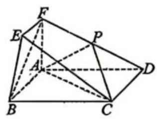
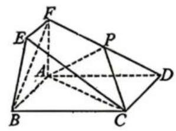

# 行知中学 2025-2026 学年第二学期高三年级数学三模

2026.5

## 一、填空题(本大题共有 12 题,满分 54 分,第 1-6 题每题 4 分,第 7-12 题每题 5 分)

1. 设集合 $A = \{ 1,2,3,4\}$ ，集合 $B = \{ 1,4\}$ ，则 $A \cap  B =$ ___.

2. 不等式 $\left| {x - 2}\right|  \geq  1$ 的解集为___.

3. 若事件 $A, B$ 互则, $P\left( A\right)  = {0.2}, P\left( {A \cup  B}\right)  = {0.6}$ ,则 $P\left( B\right)  =$ ___.

4. 函数 $f\left( x\right)  = 1 - 2{\cos }^{2}x$ 的最小正周期是___.

5. ${\left( {x}^{2} - \frac{2}{x}\right) }^{6}$ 的展开式的第 4 项的系数是___.

6. 已知函数 $f\left( x\right)  = {e}^{x} + \sin x$ ，则 $\mathop{\lim }\limits_{{h \rightarrow  0}}\frac{f\left( {2 + h}\right)  - f\left( 2\right) }{h} =$ ___.

7. 设 $a$ 是实数，若 “ $x > a$ ” 是 “ $x = 1$ ” 的必要条件，则 $a$ 的取值范围是___.

8. 开学后, 朱老师打算用 1000 元压岁钱购买某个基金 10 个月, 若以月收益率 10% 的复利计算收益，则 10 个月后能获得的收益(注意收益不合本金)的为___元. (精确到整数)

9. 平行四边形 ${ABCD}$ 中, ${AB} = 4,{AD} = 2$ 且 $\overline{AB} \cdot  \overline{AD} =  - 4$ ,点 $P$ 是边 ${CD}$ 的一个四等分点 (靠近 $C$ 点),则 $\overline{PA} \cdot  \overline{PB} =$ ___.

10. 若复数 $z$ 满足 $\left| {z - 1}\right|  = 1$ ，则 $\left| z\right|  + \left| {z - 2}\right|$ 的取值范围是___.

11. 在 $\bigtriangleup {ABC}$ 中,角 $A, B, C$ 的对边分别为 $a, b, c$ ,若满足 $\left( {1 - \tan A}\right) \left( {1 - \tan B}\right)  = 2$ 和 $c = 4\sqrt{2}$ 的三角形有且仅有两个，则边 $b$ 的取值范围是___.

12. 若数列 $\left\{  {b}_{n}\right\}$ 满足 ${b}_{n + 2} + {b}_{n} \geq  2{b}_{n + 1}\;\left( {n \in  {N}^{ * }}\right.$ ,当且仅当 $n$ 为奇数时取 " $=$ " $){b}_{1} = 2$ , ${b}_{2} = 5,{b}_{n} \in  {N}^{ * }$ ，若 ${b}_{k} = {2026}$ ，则正整数 $k$ 的最大值为___.

## 二、选择题 (本大题共 4 题, 第 13-14 题每题 4 分, 第 15-16 题每题 5 分, 满分 18 分)

13. 总体由编号为 00,01,...,59 的 60 个个体组成, 利用下面的随机数表选取 6 个个体, 选取方法是从随机数表第 1 行的第 6 个数字开始由左到右依次选取两个数字, 则选出来的第 3 个个体的编号为( ).

<table><tr><td>5044664421</td><td>6606580562</td><td>6165543502</td><td>4235489632</td></tr><tr><td>1452415248</td><td>2266221586</td><td>2663754199</td><td>5842367224</td></tr></table>

A. 42 B. 16 C. 56 D. 06

14. 在正方体 ${ABCD} - {A}_{1}{B}_{1}{C}_{1}{D}_{1}$ 中，与直线 $A{C}_{1}$ 异面的直线可以是( ).

A. 直线 ${BD}$ B. 直线 ${AC}$ C. 直线 $C{A}_{1}$ D. 直线 $C{D}_{1}$

15. 已知 $\overrightarrow{a},\overrightarrow{b}$ 是两个不共线的单位向量,向量 $\overrightarrow{c} = \lambda \overrightarrow{a} + \mu \overrightarrow{b}\left( {\lambda ,\mu  \in  R}\right)$ . 则 " $\overrightarrow{c} \cdot  \left( {\overrightarrow{a} + \overrightarrow{b}}\right)  < 0$ " 是 “ $\lambda  < 0$ 且 $\mu  < 0$ ” 的( ).

A. 充分不必要条件 B. 必要不充分条件

C. 充要条件 D. 既不充分也不必要条件

16. 已知 $\left\{  {a}_{n}\right\}$ 是各项均为正数的等差数列,且公差 $d > 0,\left\{  {b}_{n}\right\}$ 是各项均为正数的等比数列, 且公比 $q > 1$ ,若项数均为 $m\left( {m \geq  3}\right)$ 项,且满是 ${a}_{1} = {b}_{1},{a}_{m} = {b}_{m}$ ,现有如下的两个判断:

①对任意的正整数 $m\left( {m \geq  3}\right)$ 及 $k \in  \{ 1,2,\ldots ,{99}\}$ ，数据 ${a}_{1},{a}_{2},{a}_{3},\ldots ,{a}_{n}$ 的第 $k$ 百分位数一定不小于数据 ${b}_{1},{b}_{2},{b}_{3},\ldots ,{b}_{m}$ 的第 $k$ 百分位数;

②对任意的正整数 $m\left( {m \geq  3}\right)$ ，数据 ${a}_{1},{a}_{2},{a}_{3},\ldots ,{a}_{m}$ 的方差一定不大于数据 ${b}_{1},{b}_{3},{b}_{3},\ldots ,{b}_{m}$ 的方差, 其中正确的结论是 ( ) .

A. ①②都正确 B. ①②都错误

C. ①正确，②错误 D. ①错误，②正确

## 三、解答题 (本大题共有 5 题, 解答下列各题必须写出必要的步骤)

## 17. (本题满分 14 分) 本题共有 2 个小题, 第 1 小题 6 分, 第 2 小题 8 分

在如图所示的几何体中，四边形 ${ABCD}$ 为矩形， ${AF} \bot$ 平面 ${ABCD},{EF}//{AB},{AD} = 3,{AB} = {AF} = {2EF} = 2$ ,点 $P$ 为 ${DF}$ 的中点.

(1)求异面直线 ${BF}$ 与直线 ${AD}$ 所成角.

(2)点 $Q$ 是线段 ${BF}$ 上一个动点，求三棱锥 $Q - {APC}$ 的体积；

18. (本题满分 14 分) 本题共有 2 个小题, 第 1 小题 6 分, 第 2 小题 8 分

现有 5 个大小、质地相同的球,分别标上数字1,2,3,4,5.

(1)从中任取三个球，求 1 号球被取到的概率 $P\left( A\right)$ .

(2)从中有放回地随机取 3 次，每次取 1 个球. 记 $X$ 为这 5 个球中至少被取出 1 次的球的个数,求 $X$ 的数学期望 $E\left\lbrack  X\right\rbrack$ .

19. (本题满分 14 分) 本题共 3 个小题, 第 1 小题 4 分, 第 2 小题 4 分, 第 3 小题 6 分已知 $f\left( x\right)  = \sin \left( {{\omega x} - \frac{\pi }{6}}\right)$ (其中 $\omega  > 0$ ),且 $f\left( x\right)$ 的最小正周期为 $\pi$ .

(1)求函数 $f\left( x\right)$ 的表达式及其所有的极大值点；

(2)若 $g\left( x\right)  = f\left( {x + \frac{\pi }{4}}\right)$ ，且 $g\left( {{2x} + \frac{\pi }{4}}\right)  \geq  g\left( {x - \frac{\pi }{12}}\right)$ 对任意 $x \in  \left\lbrack  {m, n}\right\rbrack$ 恒成立，求 $n - m$ 的最大值;

(3)若关于 $x$ 的方程 ${\left\lbrack  f\left( x\right) \right\rbrack  }^{2} - {9m} \cdot  f\left( x\right)  + \frac{3}{4} = 0$ 在 $\left\lbrack  {\frac{\pi }{12},\frac{\pi }{2}}\right\rbrack$ 上有四个不相等的实数根,求实数 $m$ 的取值范围.

20. (本题满分 18 分) 本题共 3 个小题, 第 1 小题 4 分, 第 2 小题 6 分, 第 3 小题 8 分已知点 $A, B$ 均在椭圆 $\Gamma  : \frac{{x}^{2}}{2} + {y}^{2} = 1$ 上,点 $C$ 在抛物线 $\Omega  : {y}^{2} = \frac{1}{2}x$ 上,坐标原点为 $O$ .

(1)求椭圆 $\Gamma$ 与抛物线 $\Omega$ 的交点坐标；

(2)若 $\bigtriangleup {ABC}$ 的重心为坐标原点 $O$ ，且 $\bigtriangleup {ABC}$ 的面积为 $\frac{3\sqrt{6}}{4}$ ，求点 $C$ 的坐标；

(3)是否存在点 $\mathbf{C}$ ，使得四边形 $\mathbf{O}{ACB}$ 为平行四边形，若存在，求出点 $\mathbf{C}$ 横坐标的取值范围, 若不存在, 请说明理由.

21. (本题满分 18 分) 本题共 3 个小题, 第 1 小题 4 分, 第 2 小题 6 分, 第 3 小题 8 分若函数 $y = f\left( x\right)$ 满足: 对任意 ${x}_{1},{x}_{2} \in  R,{x}_{1} + {x}_{2} \neq  0$ ,都有 $\frac{f\left( {x}_{1}\right)  + f\left( {x}_{2}\right) }{{x}_{1} + {x}_{2}} > 0$ ,则称函数 $y = f\left( x\right)$ 具有性质 $P$ .

(1)设 $f\left( x\right)  = {e}^{x}, g\left( x\right)  = {x}^{3}$ 分别判断 $y = f\left( x\right)$ 与 $y = g\left( x\right)$ 是否具有性质 $P$ ? 并说明理由;

(2)已知定义在 $\mathbf{R}$ 上的奇函数 $y = f\left( x\right)$ 具有性质 $\mathbf{P}$ ,求关于 $\mathbf{a}$ 的不等式 $f\left( {{2a} + 1}\right)  + f\left( a\right)  > 0$ 的解;

(3)已知函数 $y = f\left( x\right)$ 具有性质 $P$ ，且图像是一条连续曲线，若 $y = f\left( x\right)$ 在 $R$ 上是严格增函数,求证: $y = f\left( x\right)$ 是奇函数.

# 行知中学 2025-2026 学年第二学期高三年级数学三模

2026.5

## 一、填空题 (本大题共有 12 题,满分 54 分,第 1-6 题每题 4 分,第 7-12 题每题 5 分)

1. 设集合 $A = \{ 1,2,3,4\}$ ，集合 $B = \{ 1,4\}$ ，则 $A \cap  B =$ ___.

【答案】 $\{ 1,4\}$

2. 不等式 $\left| {x - 2}\right|  \geq  1$ 的解集为___.

【答案】 $\{ x \mid  x \geq  3$ 或 $x \leq   - 1\}$

3. 若事件 $A, B$ 互则, $P\left( A\right)  = {0.2}, P\left( {A \cup  B}\right)  = {0.6}$ ,则 $P\left( B\right)  =$ ___.

【答案】0.4

4. 函数 $f\left( x\right)  = 1 - 2{\cos }^{2}x$ 的最小正周期是___

【答案】 $\pi$

5. ${\left( {x}^{2} - \frac{2}{x}\right) }^{6}$ 的展开式的第 4 项的系数是___.

【答案】-160

6. 已知函数 $f\left( x\right)  = {e}^{x} + \sin x$ ,则 $\mathop{\lim }\limits_{{h \rightarrow  0}}\frac{f\left( {2 + h}\right)  - f\left( 2\right) }{h} =$ ___.

【答案】 ${e}^{2} + \cos 2$

7. 设 $a$ 是实数，若 “ $x > a$ ” 是 “ $x = 1$ ” 的必要条件，则 $a$ 的取值范围是___.

【答案】 $\left( {-\infty ,1}\right)$

8. 开学后，朱老师打算用 1000 元压岁钱购买某个基金 10 个月，若以月收益率 10% 的复利计算收益，则 10 个月后能获得的收益(注意收益不合本金)的为___元. (精确到整数)

【答案】 1590

9. 平行四边形 ${ABCD}$ 中, ${AB} = 4,{AD} = 2$ 且 $\overline{AB} \cdot  \overline{AD} =  - 4$ ,点 $P$ 是边 ${CD}$ 的一个四等分点 (靠近 $C$ 点),则 $\overline{PA} \cdot  \overline{PB} =$ ___.

【答案】-1

10. 若复数 $z$ 满足 $\left| {z - 1}\right|  = 1$ ，则 $\left| z\right|  + \left| {z - 2}\right|$ 的取值范围是___.

【答案】 $\left\lbrack  {2,2\sqrt{2}}\right\rbrack$

11. 在 $\bigtriangleup {ABC}$ 中,角 $A, B, C$ 的对边分别为 $a, b, c$ ,若满足 $\left( {1 - \tan A}\right) \left( {1 - \tan B}\right)  = 2$ 和 $c = 4\sqrt{2}$ 的三角形有且仅有两个，则边 $b$ 的取值范围是___.

【答案】 $\left\lbrack  {4\sqrt{2},8}\right\rbrack$

12. 若数列 $\left\{  {b}_{n}\right\}$ 满足 ${b}_{n + 2} + {b}_{n} \geq  2{b}_{n + 1}\;\left( {n \in  {N}^{ * }}\right.$ ,当且仅当 $n$ 为奇数时取 “ $=$ ” $){b}_{1} = 2$ , ${b}_{2} = 5,{b}_{n} \in  {N}^{ * }$ ，若 ${b}_{k} = {2026}$ ，则正整数 $k$ 的最大值为___.

【答案】 85

## 二、选择题 (本大题共 4 题, 第 13-14 题每题 4 分, 第 15-16 题每题 5 分, 满分 18 分)

13. 总体由编号为 ${00},{01},\ldots ,{59}$ 的 60 个个体组成,利用下面的随机数表选取 6 个个体,选取方法是从随机数表第 1 行的第 6 个数字开始由左到右依次选取两个数字, 则选出来的第 3 个个体的编号为( ).

<table><tr><td>5044664421</td><td>6606580562</td><td>6165543502</td><td>4235489632</td></tr><tr><td>1452415248</td><td>2266221586</td><td>2663754199</td><td>5842367224</td></tr></table>

A. 42 B. 16 C. 56 D. 06

【答案】C

14. 在正方体 ${ABCD} - {A}_{1}{B}_{1}{C}_{1}{D}_{1}$ 中，与直线 $A{C}_{1}$ 异面的直线可以是( ).

A. 直线 ${BD}$ B. 直线 ${AC}$ C. 直线 $C{A}_{1}$ D. 直线 $C{D}_{1}$

【答案】A

15. 已知 $\overrightarrow{a},\overrightarrow{b}$ 是两个不共线的单位向量,向量 $\overrightarrow{c} = \lambda \overrightarrow{a} + \mu \overrightarrow{b}\left( {\lambda ,\mu  \in  R}\right)$ . 则 “ $\overrightarrow{c} \cdot  \left( {\overrightarrow{a} + \overrightarrow{b}}\right)  < 0$ " 是 “ $\lambda  < 0$ 且 $\mu  < 0$ ” 的( ).

A. 充分不必要条件 B. 必要不充分条件

C. 充要条件 D. 既不充分也不必要条件

【答案】B

16. 已知 $\left\{  {a}_{n}\right\}$ 是各项均为正数的等差数列,且公差 $d > 0,\left\{  {b}_{n}\right\}$ 是各项均为正数的等比数列, 且公比 $q > 1$ ,若项数均为 $m\left( {m \geq  3}\right)$ 项,且满是 ${a}_{1} = {b}_{1},{a}_{m} = {b}_{m}$ ,现有如下的两个判断:

①对任意的正整数 $m\left( {m \geq  3}\right)$ 及 $k \in  \{ 1,2,\ldots ,{99}\}$ ，数据 ${a}_{1},{a}_{2},{a}_{3},\ldots ,{a}_{n}$ 的第 $k$ 百分位数一定不小于数据 ${b}_{1},{b}_{2},{b}_{3},\ldots ,{b}_{m}$ 的第 $k$ 百分位数;

②对任意的正整数 $m\left( {m \geq  3}\right)$ ，数据 ${a}_{1},{a}_{2},{a}_{3},\ldots ,{a}_{m}$ 的方差一定不大于数据 ${b}_{1},{b}_{3},{b}_{3},\ldots ,{b}_{m}$ 的方差, 其中正确的结论是 ( ) .

A. ①②都正确 B. ①②都错误

C. ①正确，②错误 D. ①错误，②正确

【答案】C、

## 三、解答题 (本大题共有 5 题, 解答下列各题必须写出必要的步骤)

## 17. (本题满分 14 分) 本题共有 2 个小题, 第 1 小题 6 分, 第 2 小题 8 分

在如图所示的几何体中，四边形 ${ABCD}$ 为矩形， ${AF}\bot$ 平面 ${ABCD},{EF}//{AB},{AD} = 3,{AB} = {AF} = {2EF} = 2$ ,点 $P$ 为 ${DF}$ 的中点

(1)求异面直线 ${BF}$ 与直线 ${AD}$ 所成角.

(2)点 $Q$ 是线段 ${BF}$ 上一个动点，求三棱锥 $Q - {APC}$ 的体积；

【答案】(1)90° (2)三棱锥 $Q - {APC}$ 的体积为 1 .

【解析】(1) 因为 ${AF} \bot$ 平面 ${ABCD}$ ,且 ${AD} \subset$ 平面 ${ABCD}$ ,所以 ${AF} \bot  {AD}$ . 又因为四边形 ${ABCD}$ 为矩形,所以 ${AB} \bot  {AD}$ . 因为 ${AF} \cap  {AB} = A$ ,且 ${AF},{AB} \subset$ 平面 ${ABF}$ ,

所以 ${AD} \bot$ 平面 ${ABF}$ . 因为 ${BF} \subset$ 平面 ${ABF}$ ,所以 ${AD} \bot  {BF}$ .

故异面直线 ${BF}$ 与 ${AD}$ 所成的角为 ${90}^{ \circ  }$

(2)连接 ${BD}$ 交 ${AC}$ 于点 $O$ ，在 $\bigtriangleup  {BDF}$ 中， $O$ 为 ${BD}$ 中点， $P$ 为 ${DF}$ 中点，所以 ${OP}//{BF}$ . 因为 ${OP} \subset$ 平面 ${APC},{BF} \text{ ⊄ }$ 平面 ${APC}$ ,所以 ${BF}//$ 平面 ${APC}$ . 因为点 $Q$ 在线段 ${BF}$ 上, 所以点 $Q$ 到平面 ${APC}$ 的距离等于点 $B$ 到平面 ${APC}$ 的距离即 ${V}_{Q - {APC}} = {V}_{B - {APC}} = {V}_{P - {ABC}}$ .

在 $\bigtriangleup {ABC}$ 中, ${S}_{\bigtriangleup {ABC}} = \frac{1}{2}{AB} \cdot  {BC} = \frac{1}{2} \times  2 \times  3 = 3$ .

点 $P$ 到平面 ${ABC}$ (即底面 ${ABCD}$ ) 的距离 $h$ ,所以 $h = \frac{1}{2}{AF} = 1$ .

所以 ${V}_{P - {ABC}} = \frac{1}{3}{S}_{\bigtriangleup {ABC}} \cdot  h = \frac{1}{3} \times  3 \times  1 = 1$ ,故三棱锥 $Q - {APC}$ 的体积为 1 .

## 18. (本题满分 14 分) 本题共有 2 个小题, 第 1 小题 6 分, 第 2 小题 8 分

现有 5 个大小、质地相同的球,分别标上数字1,2,3,4,5.

(1)从中任取三个球，求 1 号球被取到的概率 $P\left( A\right)$ .

(2)从中有放回地随机取 3 次，每次取 1 个球. 记 $X$ 为这 5 个球中至少被取出 1 次的球的个数,求 $X$ 的数学期望 $E\left\lbrack  X\right\rbrack$ .

【答案】(1) $P\left( A\right)  = \frac{{C}_{4}^{2}}{{C}_{5}^{3}} = \frac{6}{10} = \frac{3}{5}$ (2) $E\left( X\right)  = 1 \times  \frac{1}{25} + 2 \times  \frac{12}{25} + 3 \times  \frac{12}{25} = \frac{61}{25}$

【解析】(1) 从 5 个球中任取 3 个球的所有取法有 ${C}_{5}^{3}$ 种, ${C}_{5}^{3} = {10}$ (种)

若 1 号球被取到,那么只需从剩下的 4 个球中再取 2 个球即可,取法有 ${C}_{4}^{2}$ 种

设 “ 1 号球被取到 “ 为事件 $A$ ,则 $P\left( A\right)  = \frac{{C}_{4}^{2}}{{C}_{5}^{3}} = \frac{6}{10} = \frac{3}{5}$ .

(2) $X$ 的所有可能取值为1,2,3，则 $P\left( {X = 1}\right)  = {C}_{3}^{l}{\left( \frac{1}{5}\right) }^{3} = \frac{1}{25}$ ， $P\left( {X = 2}\right)  = {C}_{3}^{2}{\left( \frac{1}{5}\right) }^{3} \times  6 = \frac{12}{25}, P\left( {X = 3}\right)  = {C}_{3}^{3} \times  {\left( \frac{1}{5}\right) }^{3} \times  6 = \frac{12}{25},$ 所以 $X$ 的分布列为 $\left( \begin{matrix} 1 & 2 & 3 \\  \frac{1}{25} & \frac{12}{25} & \frac{12}{25} \end{matrix}\right)$ ,所以 $E\left( X\right)  = 1 \times  \frac{1}{25} + 2 \times  \frac{12}{25} + 3 \times  \frac{12}{25} = \frac{61}{25}$ .

19. (本题满分 14 分) 本题共 3 个小题, 第 1 小题 4 分, 第 2 小题 4 分, 第 3 小题 6 分已知 $f\left( x\right)  = \sin \left( {{\omega x} - \frac{\pi }{6}}\right)$ (其中 $\omega  > 0$ ),且 $f\left( x\right)$ 的最小正周期为 $\pi$ .

(1)求函数 $f\left( x\right)$ 的表达式及其所有的极大值点；

( 2 )若 $g\left( x\right)  = f\left( {x + \frac{\pi }{4}}\right)$ ，且 $g\left( {{2x} + \frac{\pi }{4}}\right)  \geq  g\left( {x - \frac{\pi }{12}}\right)$ 对任意 $x \in  \left\lbrack  {m, n}\right\rbrack$ 恒成立，求 $n - m$ 的最大值;

(3)若关于 $x$ 的方程 ${\left\lbrack  f\left( x\right) \right\rbrack  }^{2} - {9m} \cdot  f\left( x\right)  + \frac{3}{4} = 0$ 在 $\left\lbrack  {\frac{\pi }{12},\frac{\pi }{2}}\right\rbrack$ 上有四个不相等的实数根，求实数 $m$ 的取值范围.

【答案】(1) $f\left( x\right)  = \sin \left( {{2x} - \frac{\pi }{6}}\right)$ ,极大值点为 $x = {k\pi } + \frac{\pi }{3}\left( {k \in  Z}\right)$ .

(2) $\frac{\pi }{3}$ (3) $\left( {\frac{\sqrt{3}}{9},\frac{7}{36}}\right\rbrack$

【解析】(1) 因为 $f\left( x\right)$ 的最小正周期 $T = \pi$ ,

由 $T = \frac{2\pi }{\omega }$ 得 $\frac{2\pi }{\omega } = \pi$ ,解得 $\omega  = 2$ ,所以 $f\left( x\right)  = \sin \left( {{2x} - \frac{\pi }{6}}\right)$ .

令 ${2x} - \frac{\pi }{6} = {2k\pi } + \frac{\pi }{2}\left( {k \in  Z}\right)$ ,解得 $x = {k\pi } + \frac{\pi }{3}\left( {k \in  Z}\right)$ ,故极大值点为 $x = {k\pi } + \frac{\pi }{3}\left( {k \in  Z}\right)$ .

(2) $g\left( x\right)  = f\left( {x + \frac{\pi }{4}}\right)  = \sin \left( {{2x} + \frac{\pi }{3}}\right) , g\left( {{2x} + \frac{\pi }{4}}\right)  = \sin \left( {{4x} + \frac{5\pi }{6}}\right) , g\left( {x - \frac{\pi }{12}}\right)  = \sin \left( {{2x} + \frac{\pi }{6}}\right)$ . 由 $\sin \left( {{4x} + \frac{5\pi }{6}}\right)  \geq  \sin \left( {{2x} + \frac{\pi }{6}}\right)$ 得 $\left( {2\cos {2x} + 1}\right) \left\lbrack  {2\cos \left( {{2x} + \frac{\pi }{3}}\right)  - 1}\right\rbrack   \geq  0$

解得 ${k\pi } - \frac{\pi }{3} \leq  x \leq  {k\pi }$ 或 ${k\pi } + \frac{\pi }{3} \leq  x \leq  {k\pi } + \frac{2\pi }{3}\left( {k \in  Z}\right)$ .

当 $k = 0$ 时,区间 $\left\lbrack  {\frac{\pi }{3},\frac{2\pi }{3}}\right\rbrack$ 的长度最大为 $\frac{\pi }{3}$ ,故 $n - m$ 的最大值为 $\frac{\pi }{3}$

(3)当 $x \in  \left\lbrack  {\frac{\pi }{12},\frac{\pi }{2}}\right\rbrack$ 时， $t = f\left( x\right)  \in  \left\lbrack  {0,1}\right\rbrack$ ，方程 ${t}^{2} - {9mt} + \frac{3}{4} = 0$ 在 $\left\lbrack  {0,1}\right\rbrack$ 上有两个不等实根 ${t}_{1},{t}_{2}$ ， 由二次函数性质得: $\Delta  = {\left( -9m\right) }^{2} - 4 \times  \frac{3}{4} > 0,0 < \frac{9m}{2} < 1$ 且 $\frac{3}{4} > 0$ 且 $1 - {9m} + \frac{3}{4} \geq  0$ , 解得 $\frac{\sqrt{3}}{9} < m \leq  \frac{7}{36}$ ,解得 $\frac{\sqrt{3}}{9} < m \leq  \frac{7}{36}$ ,故 $m$ 的取值范围是 $\left( {\frac{\sqrt{3}}{9},\frac{7}{36}}\right\rbrack$ .

20. (本题满分 18 分) 本题共 3 个小题, 第 1 小题 4 分, 第 2 小题 6 分, 第 3 小题 8 分已知点 $A, B$ 均在椭圆 $\Gamma  : \frac{{x}^{2}}{2} + {y}^{2} = 1$ 上,点 $C$ 在抛物线 $\Omega  : {y}^{2} = \frac{1}{2}x$ 上,坐标原点为 $O$ .

(1)求椭圆 $\Gamma$ 与抛物线 $\Omega$ 的交点坐标；

(2)若 $\bigtriangleup {ABC}$ 的重心为坐标原点 $O$ ，且 $\bigtriangleup {ABC}$ 的面积为 $\frac{3\sqrt{6}}{4}$ ，求点 $C$ 的坐标；

(3)是否存在点 $C$ ，使得四边形 ${OACB}$ 为平行四边形，若存在，求出点 $C$ 横坐标的取值范围, 若不存在, 请说明理由.

【答案】(1) $\left( {1,\frac{\sqrt{2}}{2}}\right) ,\left( {1, - \frac{\sqrt{2}}{2}}\right) \;\left( 2\right)$ 点 $C$ 的坐标为 $\left( {1, \pm  \frac{\sqrt{2}}{2}}\right) ,\left( {2, \pm  1}\right) \;\left( 3\right)$ 不存在

【解析】(1) 联立方程 $\left\{  \begin{array}{l} \frac{{x}^{2}}{2} + {y}^{2} = 1 \\  {y}^{2} = \frac{1}{2}x \end{array}\right.$ ,整理 ${y}^{2}$ 得 $\frac{{x}^{2}}{2} + \frac{1}{2}x = 1$ ,整理得 ${x}^{2} + x - 2 = 0$ , 解得 $x = 1$ 或 $x =  - 2$ (含去). 当 $x = 1$ 时, ${y}^{2} = \frac{1}{2}, y =  \pm  \frac{\sqrt{2}}{2}$ . 交点坐标为 $\left( {1,\frac{\sqrt{2}}{2}}\right) ,\left( {1, - \frac{\sqrt{2}}{2}}\right)$ .

(2)设 ${AB} : x = {my} + t$ ，联立椭圆方程得 $\left( {2 + {m}^{2}}\right) {y}^{2} + {2mty} + {t}^{2} - 2 = 0$ ，

由韦达定理得 ${y}_{1} + {y}_{2} =  - \frac{2mt}{2 + {m}^{2}},{y}_{1}{y}_{2} = \frac{{t}^{2} - 2}{2 + {m}^{2}}$ .

重心坐标得 $C\left( {-\frac{4t}{2 + {m}^{2}},\frac{2mt}{2 + {m}^{2}}}\right)$ ,代入抱物线方程得 ${m}^{2} =  - \frac{2}{{2t} + 1}$ .

面积公式得 $\left| \frac{t\sqrt{{m}^{2} - {t}^{2} + 2}}{2 + {m}^{2}}\right|  = \frac{\sqrt{3}}{4}$ ，解得 $t =  - 1$ 或 $t =  - \frac{3}{2}$ ，对应 ${m}^{2} = 2$ 或 ${m}^{2} = 1$ .

点 $C$ 的坐标为 $\left( {1, \pm  \frac{\sqrt{2}}{2}}\right) ,\left( {2, \pm  1}\right)$ . (利用向量求面积法)

(3) 设 $C\left( {{x}_{0},{y}_{0}}\right)$ ,则 ${AB}$ 中点 $M\left( {\frac{{x}_{0}}{2},\frac{{y}_{0}}{2}}\right)$ ,直线 ${AB} : x =  - \frac{2{y}_{0}}{{x}_{0}}y + \frac{{x}_{0}}{2}$ .

联立椭圆方程得 $\left( {\frac{8{y}_{0}^{2}}{{x}_{0}^{2}} + 2}\right) {y}^{2} - \frac{8{y}_{0}^{2}}{{x}_{0}}y + \frac{{x}_{0}^{2}}{2} - 4 = 0$ ,

由韦达定理得: ${y}_{1} + {y}_{2} = \frac{4{y}_{0}}{{x}_{0}},{y}_{1}{y}_{2} = \frac{{x}_{0}^{4} - 8{x}_{0}^{2}}{{16}{y}_{0}^{2}}$ .

由 ${y}_{0} = {y}_{1} + {y}_{2}$ 得 ${x}_{0} = 4$ ,此时 $\Delta  = 0, A, B$ 重合. 不存在点 $C$ 使得四边形 ${OACB}$ 为平行四边形.

21. (本题满分 18 分) 本题共 3 个小题, 第 1 小题 4 分, 第 2 小题 6 分, 第 3 小题 8 分若函数 $y = f\left( x\right)$ 满足: 对任意 ${x}_{1},{x}_{2} \in  R,{x}_{1} + {x}_{2} \neq  0$ ,都有 $\frac{f\left( {x}_{1}\right)  + f\left( {x}_{2}\right) }{{x}_{1} + {x}_{2}} > 0$ ,则称函数 $y = f\left( x\right)$ 具有性质 $P$ .

(1)设 $f\left( x\right)  = {e}^{x}, g\left( x\right)  = {x}^{3}$ 分别判断 $y = f\left( x\right)$ 与 $y = g\left( x\right)$ 是否具有性质 $P$ ? 并说明理由;

(2)已知定义在 $\mathbf{R}$ 上的奇函数 $y = f\left( x\right)$ 具有性质 $\mathbf{P}$ ,求关于 $\mathbf{a}$ 的不等式 $f\left( {{2a} + 1}\right)  + f\left( a\right)  > 0$ 的解;

(3)已知函数 $y = f\left( x\right)$ 具有性质 $P$ ，且图像是一条连续曲线，若 $y = f\left( x\right)$ 在 $R$ 上是严格增函数,求证: $y = f\left( x\right)$ 是奇函数.

【答案】(1)不具有

(2) $\left( {-\frac{1}{3}, + \infty }\right)$ (3)证明见解析

【解析】(1) $f\left( x\right)  = {e}^{x}$ 不具有性质 $P$ ,理由: 取 ${x}_{1} = 1,{x}_{2} =  - 2,\frac{{e}^{1} + {e}^{-2}}{1 + \left( {-2}\right) } =  - \left( {e + \frac{1}{{e}^{2}}}\right)  < 0$ ; $g\left( x\right)  = {x}^{3}$ 具有性质 $P$ ,理由: $g\left( x\right)$ 为奇函数, ${x}_{1} + {x}_{2}$ 与 $g\left( {x}_{1}\right)  + g\left( {x}_{2}\right)$ 同号,比值为正.

(2)因为 $f\left( x\right)$ 是奇函数，所以 $f\left( {{2a} + 1}\right)  + f\left( a\right)  > 0$ 可化为 $f\left( {{2a} + 1}\right)  > f\left( {-a}\right)$ . 又 $f\left( x\right)$ 具有性质 $P$ 且为增函数,故 ${2a} + 1 >  - a$ ,解得 $a >  - \frac{1}{3}$ . 所以不等式的解集为 $\left( {-\frac{1}{3}, + \infty }\right)$ .

(3) 由 $y = f\left( x\right)$ 具有性质 $P$ ,知: 当 $x > 0$ 时 $f\left( x\right)  + f\left( 0\right)  > 0$ ,当 $x < 0$ 时 $f\left( x\right)  + f\left( 0\right)  < 0$ , 由零点存在定理知 $f\left( 0\right)  + f\left( 0\right)  = 0$ ,即 $f\left( 0\right)  = 0$ .

下面用反证法证明 $y = f\left( x\right)$ 是奇函数.

假设存在 ${x}_{0}$ 使得 $f\left( {x}_{0}\right)  + f\left( {x}_{0}\right)  \neq  0$ ,

不妨设 ${x}_{0} > 0$ ,则由 $y = f\left( x\right)$ 在 $R$ 上严格增,知 $f\left( {x}_{0}\right)  > f\left( 0\right)  > f\left( {x}_{0}\right)$ .

若 $f\left( {x}_{0}\right)  + f\left( {x}_{0}\right)  > 0$ ,则构造函数 $F\left( x\right)  = f\left( x\right)  - \frac{f\left( {x}_{0}\right)  - f\left( {x}_{0}\right) }{2}$ ,

$F\left( 0\right)  = f\left( 0\right)  - \frac{f\left( {x}_{0}\right)  - f\left( {x}_{0}\right) }{2} = \frac{f\left( 0\right)  - f\left( {x}_{0}\right) }{2} + \frac{f\left( 0\right)  + f\left( {x}_{0}\right) }{2} < 0,$

$F\left( {x}_{0}\right)  = f\left( {x}_{0}\right)  - \frac{f\left( {x}_{0}\right)  - f\left( {x}_{0}\right) }{2} = \frac{f\left( {x}_{0}\right)  + f\left( {x}_{0}\right) }{2} > 0,$

由零点存在定理知,存在 $t \in  \left( {0,{x}_{0}}\right)$ ,使得 $F\left( t\right)  = 0$ ,即 $f\left( t\right)  = \frac{f\left( {x}_{0}\right)  - f\left( {x}_{0}\right) }{2} \neq  f\left( {x}_{0}\right)$ ;

而 $y = f\left( x\right)$ 在 $R$ 上严格增,同样由单调性知 $\frac{f\left( t\right)  - f\left( {x}_{0}\right) }{t - {x}_{0}} =  - \frac{1}{2} \cdot  \frac{f\left( {x}_{0}\right)  + f\left( {x}_{0}\right) }{t - {x}_{0}} > 0$ ,

从而有 $\frac{f\left( t\right)  + f\left( {x}_{0}\right) }{t + \left( {x}_{0}\right) } = \frac{1}{2} \cdot  \frac{f\left( {x}_{0}\right)  + f\left( {x}_{0}\right) }{t - {x}_{0}} < 0$ ,与 $y = f\left( x\right)$ 具有性质 $P$ 矛盾.

若 $f\left( {x}_{0}\right)  + f\left( {x}_{0}\right)  < 0$ ,构造函数 $G\left( x\right)  = f\left( x\right)  - \frac{f\left( {x}_{0}\right)  - f\left( {x}_{0}\right) }{2}$ ,

同理也可推出与 $y = f\left( x\right)$ 具有性质 $P$ 矛盾.

综合上述,存在 ${x}_{0}$ 使得 $f\left( {x}_{0}\right)  + f\left( {x}_{0}\right)  \neq  0$ 的假设不能成立,即对任意 $x \in  R$ 都有 $f\left( x\right)  + f\left( {-x}\right)  = 0$ ,故 $y = f\left( x\right)$ 是奇函数.
