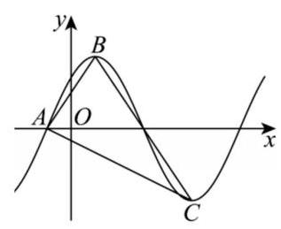
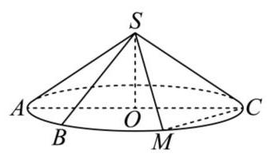
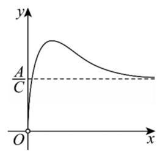
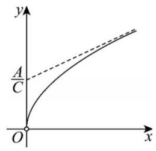
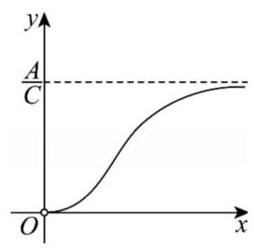
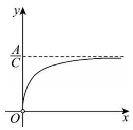
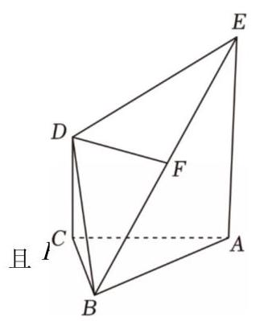
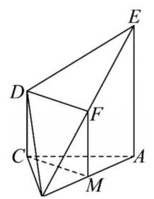
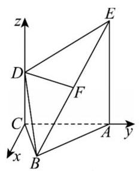

# 交大附中高三三模数学试卷

2026.05

## 一. 填空题

1. 已知 $n$ 为正整数且 ${C}_{n}^{2} = {C}_{n}^{8}$ ，则 $n$ 的值为

答案:10

2. 已知 ${z}_{1} = 2,{z}_{2} = {2i}$ ,若 $w = \lambda {z}_{1} + \left( {1 - \lambda }\right) {z}_{2}\;\left( {\lambda  \in  \mathbf{R}}\right)$ ,则 $\left| w\right|$ 的最小值为答案: $\sqrt{2}$

3. 已知函数 $y = \left( {{a}^{2} - 3}\right) {a}^{x}$ 是指数函数，则函数 $y = {b}^{x} - a\;\left( {b > 1}\right)$ 的图像过定点答案: $\left( {0, - 1}\right)$

4. 已知 $x, y$ 均为正数,且 $x + {2y} = 4$ ,则 $\frac{2}{x} + \frac{1}{y}$ 的最小值为答案:2

5. 函数 $y = \sin {\omega x} + \sqrt{2}\cos {\omega x}\;\left( {\omega  > 0}\right)$ 对应的图像如图, 点 $A$ 为图像与 $x$ 轴的交点，点 $B$ 为图像的最高点，点 $C$ 为图像的最低点,若 $\overrightarrow{AB} \cdot  \overrightarrow{AC} = 0$ ,则 $\omega$ 的值为

答案: $\frac{\pi }{2}$

6. 在 $\bigtriangleup {ABC}$ 中， $a = 2$ ， $c = \frac{2\sqrt{3}}{3}$ ， $A = {120}^{ \circ  }$ ， $\bigtriangleup {ABC}$

的面积为

答案: $\frac{\sqrt{3}}{3}$

7. 某校将学生分为 5 个队伍进行研学活动,这 5 个队伍的人数分别为: ${50}\text{ 、 }a\text{ 、 }{55}$ 、 45、b，已知本次研学活动的总人数为 250 人，且各队人数的第 40 百分位数不小于 48， 则各队

人数的第 70 百分位数的最大值是

答案:54

8. 已知 $O$ 为坐标原点，双曲线 $C : \frac{{x}^{2}}{{a}^{2}} - \frac{{y}^{2}}{{b}^{2}} = 1\;\left( {a > 0, b > 0}\right)$ 左焦点为 $F$ ，离心率为 $\frac{\sqrt{10}}{2}$

过 $F$ 且斜率为 $k\;\left( {k > 0}\right)$ 的直线交 $C$ 的左支于 $M, N$ 两点， $P$ 为线段 ${MF}$ 的中点，

${PO} \bot  {MN}$ ,则 $k =$

答案: 3

9. 已知 $f\left( x\right)  = \left\{  \begin{array}{l} x + 2, x < a \\  {x}^{2} - x - 1, x \geq  a \end{array}\right.$ ,若存在实数 $b$ ,使得方程

$f\left( x\right)  = b$ 无解,则实数 $a$ 的取值范围是

答案: $\left( {-\infty , - \frac{13}{4}}\right)  \cup  \left( {3, + \infty }\right)$

10. 如图， ${AC}$ 为圆锥底面圆 $O$ 的直径， ${AC} = 4$ ， ${SO} = \sqrt{2}$ ， $M$ 为 $\overset{\text{ ⏜ }}{AC}$ 的中点,点 $B$ 是圆 $O$ 上的动点 (点 $M, B$ 在直径 ${AC}$ 同侧),当 $\bigtriangleup {SBC}$ 的面积最大时,点 $B$ 到平面 ${SMC}$ 距离为

答案: $\frac{3 - \sqrt{3}}{2}$

11. 已知样本数据 ${x}_{1},{x}_{2},\cdots ,{x}_{2026}$ 的平均数为 $a$ ,设 $k = {\lambda a}$ ,当函数 $f\left( k\right)  = \mathop{\sum }\limits_{{i = 1}}^{{2026}}{\left( {x}_{i} - k\right) }^{2}$ 取最小值时, $\lambda  =$

答案: 1

$$
\text{ 【11题】因为 }f\left( k\right)  = \mathop{\sum }\limits_{{i = 1}}^{{2026}}{\left( {x}_{i} - k\right) }^{2} = {2026}{k}^{2} - 2\mathop{\sum }\limits_{{i = 1}}^{{2026}}{x}_{i}k + \mathop{\sum }\limits_{{i = 1}}^{{2026}}{x}_{i}^{2}
$$

所以 $f\left( k\right)$ 是一个开口向上的关于 $k$ 的二次函数,

所以函数在其图象的对称轴处取得最小值,

即 $k = \frac{2\mathop{\sum }\limits_{{i = 1}}^{{2026}}{x}_{i}}{2 \times  {2026}} = \frac{\mathop{\sum }\limits_{{i = 1}}^{{2026}}{x}_{i}}{2026} = \bar{x} = a$ ，又因为 $k = {\lambda a}$ ，所以 ${\lambda a} = a$ ，解得 $\lambda  = 1$ .

12. 将数列 $\left\{  {a}_{n}\right\}$ 中随机剔除两项 ${a}_{i},{a}_{j}$ (其中 $1 \leq  i < j \leq  n, i, j \in  \mathbf{N}$ ) 然后在原数列中添加

一项 ${a}_{i} + {a}_{j} + {a}_{i}{a}_{j}$ 叫做数列 $\left\{  {a}_{n}\right\}$ 的一次变换,那么数列 $1,\frac{1}{2},\frac{1}{3},\cdots ,\frac{1}{2025},\frac{1}{2026}$ 经过 2025 次

变换后数列中还剩下的一项为

答案:2026

【12题】题目中一次变换是: 删除两项 ${a}_{i},{a}_{j}$ ,添加 ${a}_{i} + {a}_{j} + {a}_{i}{a}_{j}$ ,观察这个变换的特点, 构造一个新的乘积式: $\left( {1 + {a}_{i}}\right) \left( {1 + {a}_{j}}\right)  = 1 + {a}_{i} + {a}_{j} + {a}_{i}{a}_{j}$ ,这正好是 1+新添加的项, 也就是说,整个数列所有项的 $\left( {1 + {a}_{k}}\right)$ 的乘积在变换前后是不变的,原数列是 $1,\frac{1}{2},\frac{1}{3},\cdots ,\frac{1}{2025},\frac{1}{2026}$ 共 2026 项,初始乘积为: $\mathop{\prod }\limits_{{k = 1}}^{{2026}}\left( {1 + \frac{1}{k}}\right)  = \mathop{\prod }\limits_{{k = 1}}^{{2026}}\frac{k + 1}{k} = \frac{2}{1} \cdot  \frac{3}{2}\cdots  \cdot  \frac{2027}{2026} = {2027}$ ,每一次变换会让数列的项数减少 1,初始有 2026 项，经过 2025 次变换后，数列只剩 1 项，设为 $x$ ，根据不变量，有 $1 + x = {2027}$ ,解得 $x = {2026}$ .

## 二. 选择题

13. ( $x > 2$ ” 是 “ $\frac{1}{x} < \frac{1}{2}$ ” 的 ( ) 条件

A. 充分非必要 B. 必要非充分 C. 充要 D. 既非充分也非必要

答案: A

14. 已知圆台的上、下底面圆半径分别为2， $\sqrt{7}$ ，高为 3，若该圆台的上、下底面圆周都在

球 $O$ 的球面上,则球 $O$ 的表面积为( )

A. ${16\pi }$ B. ${32\pi }$ C. ${64}\sqrt{2}\pi$

D. $\frac{{64}\sqrt{2}\pi }{3}$

答案:B

15. 已知 $k > 1$ ，则等比数列 $a + {\log }_{2}k$ ， $a + {\log }_{4}k$ ， $a + {\log }_{8}k$ 的公比为( )

A. $\frac{1}{2}$ B. $\frac{1}{3}$ C. $\frac{1}{4}$ D. $\frac{1}{8}$

答案: B

16. 定义在 $\left( {0, + \infty }\right)$ 的函数 $y = f\left( x\right)$ 满足 $\frac{A}{f\left( x\right) } - B{f}^{\prime }\left( x\right)  = C$ ,其中常数 $A, B, C$ 均为正数, $y = {f}^{\prime }\left( x\right)$ 是 $y = f\left( x\right)$ 的导函数，则 $y = f\left( x\right)$ 的图像可能是( )

A. B. C. D.

答案:D

## 三. 解答题

17. 已知平面直角坐标系中,向量 $\overrightarrow{a} = \left( {1, - 2}\right) ,\;\overrightarrow{b} = \left( {-2,6}\right)$ .

(1)求 $\overrightarrow{b}$ 在 $\overrightarrow{a}$ 上的投影向量的坐标；

(2)若 $\overrightarrow{c}//\left( {2\overrightarrow{a} + \overrightarrow{b}}\right)$ ，且 $\left| \overrightarrow{c}\right|  = 3$ ，求向量 $\overrightarrow{c}$ 的坐标；

(3)若 $\overrightarrow{a}$ 与 $\overrightarrow{a} + \lambda \overrightarrow{b}$ 的夹角为锐角，求实数 $\lambda$ 的取值范围.

答案:(1) $\overrightarrow{b}$ 在 $a$ 上的投影向量为 $\frac{\overrightarrow{a} \cdot  \overrightarrow{b}}{{\left| \overrightarrow{a}\right| }^{2}}\overrightarrow{a} = \frac{-2 - {12}}{5}\left( {1, - 2}\right)  = {\left( -\frac{14}{5},\frac{28}{5}\right) }_{;}$

(2)设 $\overrightarrow{c} = \left( {x, y}\right)$ ，由题意得 $2\overrightarrow{a} + \overrightarrow{b} = \left( {0,2}\right)$ ，

因为 $\overrightarrow{c}//\left( {2\overrightarrow{a} + \overrightarrow{b}}\right)$ ，所以 ${2x} = {0 \times  y}$ ，即 $x = 0$ ，

又因为 $\left| \overrightarrow{c}\right|  = 3 = \sqrt{{x}^{2} + {y}^{2}}$ ，所以 $y =  \pm  3$ ，所以 $\overrightarrow{c} = \left( {0,3}\right)$ 或 $\overrightarrow{c} = \left( {0, - 3}\right)$ ，

(3)由题意得 $\overrightarrow{a} = \left( {1, - 2}\right) ,\overrightarrow{b} = \left( {-2,6}\right) ,\overrightarrow{a} + \lambda \overrightarrow{b} = \left( {1 - {2\lambda }, - 2 + {6\lambda }}\right)$

$\overrightarrow{a} \cdot  \left( {\overrightarrow{a} + \lambda \overrightarrow{b}}\right)  = 1 \times  \left( {1 - {2\lambda }}\right)  + \left( {-2}\right)  \times  \left( {-2 + {6\lambda }}\right)  = 5 - {14}$ ,

因为夹角为锐角，所以 $5 - {14\lambda } > 0$ ，得 $\lambda  < \frac{5}{14}$

若共线，则 $1 \times  \left( {-2 + {6\lambda }}\right)  = \left( {-2}\right)  \times  \left( {1 - {2\lambda }}\right)$ ，解得 $\lambda  = 0$ ，

所以 $\lambda$ 的取值范围是 $\left( {-\infty ,0}\right)  \cup  \left( {0,\frac{5}{14}}\right)$ .

18. 人工智能中的文生视频模型 Sora (以下简称 Sora), 能够根据用户的文本提示创建最长

60 秒的逼真视频. 某公司视频部现有员工 100 人，公司拟开展 Sora 培训，分三轮进行，每位员工第一轮至第三轮培训达到 “优秀” 的概率分别为 $\frac{3}{4}\text{ 、 }\frac{2}{3}\text{ 、 }\frac{1}{2}$ ，每轮相互独立，有两轮及以上获得 “优秀” 的员工才能应用 Sora.

(1)求员工经过培训能应用 Sora 的概率；

(2)已知开展 Sora 培训前员工每人每年平均为公司创造利润 6 万元，开展 Sora 培训后， 能应用 Sora 的员工每人每年平均为公司创造利润 10 万元，不能应用 Sora 的员工保持不变, Sora 培训平均每人每年成本为 1 万元. 根据公司发展需要, 计划先将视频部的部分员工随机调至其他部门, 然后对剩余员工开展 Sora 培训, 现要求培训后视频部的年利润不低于员工调整前的年利润, 则视频部最多可以调多少人到其他部门?

答案:(1)员工经过培训能应用 Sora，即有两轮及以上获得 “优秀 ”，其概率为

$P = \left( {1 - \frac{3}{4}}\right)  \times  \frac{2}{3} \times  \frac{1}{2} + \frac{3}{4} \times  \left( {1 - \frac{2}{3}}\right)  \times  \frac{1}{2} + \frac{3}{4} \times  \frac{2}{3} \times  \left( {1 - \frac{1}{2}}\right)  + \frac{3}{4} \times  \frac{2}{3} \times  \frac{1}{2} = \frac{17}{24}$ ，因此员工经过培训能应用 Sora 的概率为 $\frac{17}{24}$ ；

(2)设视频部调 $x$ 人至其他部门， $x \in  {\mathbf{N}}^{ * }$ ，

$X$ 为培训后视频部门能应用 Sora 的人数，则 $X \sim  B\left( {{100} - x,\frac{17}{24}}\right)$

则 $E\left\lbrack  X\right\rbrack   = \frac{17}{24}\left( {{100} - x}\right)$ ,调人后视频部门的年利润为 $\frac{17}{24}\left( {{100} - x}\right)  \times  {10} + \left( {1 - \frac{17}{24}}\right) \left( {{100} - x}\right)  \times  6 - \left( {{100} - x}\right)  = \frac{47}{6}\left( {{100} - x}\right)$ 令 $\frac{47}{6}\left( {{100} - x}\right)  \geq  {100} \times  6$ ,解得 $x \leq  {23.4}$ ,因为 $x \in  {\mathbf{N}}^{ * }$ ,所以 ${x}_{\max } = {23}$ , 因此视频部最多可以调 23 人到其他部门.

19. 如图， ${EA}$ 和 ${DC}$ 都垂直于平面 ${ABC}$ ，且 ${EA} = {2DC} = 2$ ， ${AC} = 2$ ， $F$ 是 ${EB}$ 的中点.

(1)证明: ${DF}//$ 平面 ${ABC}$ ；

(2)若四棱锥 $B - {ACDE}$ 的体积为 3，求平面 ${DEF}$ 与

平面 ${ABC}$ 所成的锐二面角的余弦值的最大值.

答案:(1)取 ${AB}$ 的中点 $M$ ，连接 ${CM},{FM}$ ，

因为 $F, M$ 分别是 ${EB}$ 和 ${AB}$ 的中点，所以 ${FM} = \frac{1}{2}{AE}$

因为 ${EA}$ 和 ${DC}$ 都垂直于平面 ${ABC}$ ,且 ${EA} = {2DC}$ ,

所以 ${DC} = \frac{1}{2}{AE}$ ，且 ${DC}//{AE}$ ，所以 ${FM} = {DC}$ 且 ${FM}//{DC}$ ，

所以四边形 ${FMCD}$ 为平行四边形,所以 ${DF}//{CM}$ ,

又 ${DF} \text{ ⊄ }$ 平面 ${ABC},{CM} \subset$ 平面 ${ABC}$ ,所以 ${DF}//$ 平面 ${ABC}$ .

(2)设 $B$ 到平面 ${ACDE}$ 的距离为 $d$ ，

则 ${V}_{B - {ACDE}} = \frac{1}{3}{S}_{ACDE} \cdot  d = \frac{1}{3} \times  \frac{\left( {1 + 2}\right)  \times  2}{2}d = 3$ ，为 $d = 3$ .

由于 ${DC} \bot$ 平面 ${ABC}$ ,建立如图空间直角坐标系 $C - {xyz}$ ,

因为 ${EA} = {2DC} = 2,{AC} = 2$

所以 $C\left( {0,0,0}\right) , D\left( {0,0,1}\right) , A\left( {0,2,0}\right) , E\left( {0,2,2}\right)$

设 $B\left( {3, t,0}\right)$ ，则 $F\left( {\frac{3}{2},\frac{t + 2}{2},1}\right) ,\overrightarrow{DF} = \left( {\frac{3}{2},\frac{t + 2}{2},0}\right) ,\overrightarrow{DE} = \left( {0,2,1}\right)$

设平面 ${DEF}$ 的法向量为 $\overrightarrow{m} = \left( {x, y, z}\right)$ ，由 $\left\{  \begin{array}{l} \overrightarrow{DF} \cdot  \overrightarrow{m} = 0 \\  \overrightarrow{DE} \cdot  \overrightarrow{m} = 0 \end{array}\right.$ ，得 $\left\{  \begin{matrix} \frac{3}{2}x + \frac{t + 2}{2}y = 0 \\  {2y} + z = 0 \end{matrix}\right.$ ，

得 $y =  - 3, z = 6$ ,因此平面 ${DEF}$ 的一个法向量 $\overrightarrow{m} = \left( {t + 2, - 3,6}\right)$ .

由于 ${DC} \bot$ 平面 ${ABC}$ ,因此 $\overrightarrow{n} = \left( {0,0,1}\right)$ 是平面 ${ABC}$ 的一个法向量.

设平面 ${DEF}$ 与平面 ${ABC}$ 所成的锐二面角大小为 $\theta$ ，

则 $\cos \theta  = \left| {\cos \langle \overrightarrow{m},\overrightarrow{n}\rangle }\right|  = \frac{\left| \overrightarrow{m} \cdot  \overrightarrow{n}\right| }{\left| \overrightarrow{m}\right|  \cdot  \left| \overrightarrow{n}\right| } = \frac{6}{\sqrt{{\left( t + 2\right) }^{2} + {45}}} \leq  \frac{2\sqrt{5}}{5}$

所以平面 ${DEF}$ 与平面 ${ABC}$ 所成的锐二面角的余弦值的最大值为 $\frac{2\sqrt{5}}{5}$ .

20. 直线过点 $P\left( {1,\frac{2\sqrt{3}}{3}}\right)$ 的椭圆 $C : \frac{{x}^{2}}{{a}^{2}} + \frac{{y}^{2}}{{b}^{2}} = 1$ 的离心率为 $\frac{\sqrt{3}}{3}$ ，直线 $l$ 过椭圆 $C$ 的右焦点 $F$ ，且与椭圆 $C$ 交于 $A, B$ 两点.

(1)求椭圆 $C$ 的标准方程；

(2)若直线 $l$ 的斜率存在，点 $A$ 关于 $x$ 轴的对称点是 ${A}^{\prime }$ ，求证:直线 ${A}^{\prime }B$ 过 $x$ 轴上的定点 $M$ ，并求其坐标；

(3)在(2)的条件下，过点 $M$ 作 $x$ 轴的垂线 ${l}^{\prime }$ 与 $l$ 交于点 $Q$ ，记线段 ${AB}$ 的中点为 $G$ ， $\bigtriangleup {QMG}$ 的面积为 ${S}_{1}$ ， $\bigtriangleup {MAB}$ 的面积为 ${S}_{2}$ ，求 $\frac{{S}_{1}}{{S}_{2}}$ 的取值范围.

答案:(1)椭圆方程是 $\frac{{x}^{2}}{3} + \frac{{y}^{2}}{2} = 1$ .

(2)设 $A\left( {{x}_{1},{y}_{1}}\right) , B\left( {{x}_{2},{y}_{2}}\right) , F\left( {1,0}\right)$ ，

当 $l$ 与 $x$ 轴不重合时,设方程为 $x = {my} + 1\left( {m \neq  0}\right)$ ,由 $\left\{  \begin{array}{l} \frac{{x}^{2}}{3} + \frac{{y}^{2}}{2} = 1 \\  x = {my} + 1 \end{array}\right.$

得 $\left( {2{m}^{2} + 3}\right) {y}^{2} + {4my} - 4 = 0$ ，且 ${y}_{1} + {y}_{2} =  - \frac{4m}{2{m}^{2} + 3},{y}_{1}{y}_{2} = \frac{-4}{2{m}^{2} + 3}$ ①，

片 ${A}^{\prime }\left( {{x}_{1}, - {y}_{1}}\right) ,{A}^{\prime }B$ 的方程为 $y + {y}_{1} = \frac{{y}_{2} + {y}_{1}}{{x}_{2} - {x}_{1}}\left( {x - {x}_{1}}\right)$

令 $y = 0$ ,解得 $x = \frac{{y}_{1}\left( {{x}_{2} - {x}_{1}}\right) }{{y}_{2} + {y}_{1}} + {x}_{1} = 1 + \frac{{2m}{y}_{1}{y}_{2}}{{y}_{2} + {y}_{1}}$ ,

当 $l$ 与 $x$ 轴重合时,即 ${A}^{\prime }B$ 为 $x$ 轴,过点 $M\left( {3,0}\right)$ ,

直线 ${A}^{\prime }B$ 过 $x$ 轴上的定点 $M\left( {3,0}\right)$ .

(3)当直线 $l$ 的斜率为 0 时， ${S}_{1} = {S}_{2} = 0,\frac{{S}_{1}}{{S}_{2}}$ 无意义，故直线 $l$ 斜率不为 0 .

两直线交于 $Q\left( {3,\frac{2}{m}}\right)$ ，因为 $\frac{{x}_{1} + {x}_{2}}{2} = \frac{m{y}_{1} + 1 + m{y}_{2} + 1}{2} = \frac{-\frac{4{m}^{2}}{2{m}^{2} + 3} + 2}{2} = \frac{3}{2{m}^{2} + 3}$ ，

$\frac{{y}_{1} + {y}_{2}}{2} =  - \frac{2m}{2{m}^{2} + 3}$ ，所以 $G\left( {\frac{3}{2{m}^{2} + 3},\frac{-{2m}}{2{m}^{2} + 3}}\right)$

$$
{S}_{1} = \frac{1}{2} \cdot  \left| {MQ}\right|  \cdot  \left| {3 - {x}_{G}}\right|  = \frac{1}{2} \cdot  \frac{2}{\left| m\right| } \cdot  \frac{6\left( {{m}^{2} + 1}\right) }{2{m}^{2} + 3} = \frac{6\left( {{m}^{2} + 1}\right) }{\left| m\right| \left( {2{m}^{2} + 3}\right) }
$$

$$
{S}_{2} = \frac{1}{2} \cdot  \left| {MF}\right|  \cdot  \left| {{y}_{1} - {y}_{2}}\right|  = \left| {{y}_{1} - {y}_{2}}\right|  = \sqrt{{\left( {y}_{1} + {y}_{2}\right) }^{2} - 4{y}_{1}{y}_{2}} = \frac{4\sqrt{3}\sqrt{{m}^{2} + 1}}{2{m}^{2} + 3}\text{ , }
$$

所以

$$
{S}_{2} = \frac{\frac{6\left( {{m}^{2} + 1}\right) }{\left| m\right| \left( {2{m}^{2} + 3}\right) }}{\frac{4\sqrt{3}\sqrt{{m}^{2} + 1}}{2{m}^{2} + 3}} = \frac{\sqrt{3}\sqrt{{m}^{2} + 1}}{2\left| m\right| } = \frac{\sqrt{3}}{2}\sqrt{1 + \frac{1}{{m}^{2}}} > \frac{\sqrt{3}}{2}\sqrt{1 + \frac{1}{{m}^{2}}} > \frac{\sqrt{3}}{2}\text{ ,所以 }\frac{{S}_{1}}{{S}_{2}} \in  \left( {\frac{\sqrt{3}}{2}, + \infty }\right) \text{ . }
$$

21. 设 $y = f\left( x\right)$ 是定义在 $D$ 上的函数,若对任何实数 $a \in  \left( {0,1}\right)$ 以及 $D$ 中的任意两个实数 ${x}_{1}\text{ 、 }{x}_{2}$ ,恒有 $f\left( {a{x}_{1} + \left( {1 - a}\right) {x}_{2}}\right)  \leq  {af}\left( {x}_{1}\right)  + \left( {1 - a}\right) f\left( {x}_{2}\right)$ ,则称 $y = f\left( x\right)$ 为 $C$ 函数.

(1)判断函数 $y =  - \frac{1}{x}, x \in  \left( {0, + \infty }\right)$ 是否为 $C$ 函数，说明理由;

(2)已知 $m$ 是实数，函数 $y = \left| {{x}^{2} - {mx}}\right| , x \in  \lbrack 1, + \infty )$ 是 $C$ 函数，求 $m$ 的最大值；

(3)若 $y = f\left( x\right)$ 是定义域为 $\mathbf{R}$ 的 $C$ 函数，求证:"存在实数 $k$ ，使得 $f\left( x\right)  = {kx}$ 恒成立" 是 “存在非零实数 $T$ ,使得 $f\left( {x + T}\right)  = f\left( x\right)  + f\left( T\right)$ 恒成立” 的充要条件.

答案: $\left( 1\right) y =  - \frac{1}{x}, x \in  \left( {0, + \infty }\right)$ 不是 $C$ 函数,

说明如下 (举反例): 记 $f\left( x\right)  =  - \frac{1}{x}$ ,取 ${x}_{1} = 3,{x}_{2} = 1, a = \frac{1}{2}$ ,则

$f\left( {a{x}_{1} + \left( {1 - a}\right) {x}_{2}}\right)  - {af}\left( {x}_{1}\right)  - \left( {1 - a}\right) f\left( {x}_{2}\right)  = f\left( 2\right)  - \frac{1}{2}f\left( 3\right)  - \frac{1}{2}f\left( 1\right)  =  - \frac{1}{2} + \frac{1}{6} + \frac{1}{2} > 0,$

即 $f\left( {a{x}_{1} + \left( {1 - a}\right) {x}_{2}}\right)  > {af}\left( {x}_{1}\right)  + \left( {1 - a}\right) f\left( {x}_{2}\right)$ ,

所以 $y =  - \frac{1}{x}, x \in  \left( {0, + \infty }\right)$ 不是 $C$ 函数;

(2)记 $f\left( x\right)  = \left| {{x}^{2} - {mx}}\right|$ ，

当 $m = 1$ 时，当 $x \in  \lbrack 1, + \infty )$ 时， $f\left( x\right)  = {x}^{2} - x$ ，

对任何实数 $a \in  \left( {0,1}\right)$ 以及 $\lbrack 1, + \infty )$ 中的任意两个实数 ${x}_{1},{x}_{2}$ ,

${af}\left( {x}_{1}\right)  + \left( {1 - a}\right) f\left( {x}_{2}\right)  - f\left( {a{x}_{1} + \left( {1 - a}\right) {x}_{2}}\right)  = a\left( {1 - a}\right) {\left( {x}_{1} - {x}_{2}\right) }^{2} \geq  0,$

即 $f\left( {a{x}_{1} + \left( {1 - a}\right) {x}_{2}}\right)  \leq  {af}\left( {x}_{1}\right)  + \left( {1 - a}\right) f\left( {x}_{2}\right)$ ,

所以 $y = \left| {{x}^{2} - {mx}}\right| , x \in  \lbrack 1, + \infty )$ 是 $C$ 函数.

当 $m > 1$ 时，取 $a = \frac{1}{2},{x}_{1} = 1,{x}_{2} = m$

数 ${af}\left( {x}_{1}\right)  + \left( {1 - a}\right) f\left( {x}_{2}\right)  - f\left( {a{x}_{1} + \left( {1 - a}\right) {x}_{2}}\right)$

$= \frac{f\left( 1\right) }{2} + \frac{f\left( m\right) }{2} - f\left( \frac{1 + m}{2}\right)  = \frac{m - 1}{2} - m\left( \frac{1 + m}{2}\right)  + {\left( \frac{1 + m}{2}\right) }^{2} = \frac{-{\left( m - 1\right) }^{2}}{4} < 0$ ,

即 $f\left( {a{x}_{1} + \left( {1 - a}\right) {x}_{2}}\right)  > {af}\left( {x}_{1}\right)  + \left( {1 - a}\right) f\left( {x}_{2}\right)$ ,

所以 $y = \left| {{x}^{2} - {mx}}\right| , x \in  \lbrack 1, + \infty )$ 不是 $C$ 函数.

综上, $m$ 的最大值为 1 .

(3)先证充分性，若 “存在实数 $k$ ，使得 $f\left( x\right)  = {kx}$ 恒成立”，

则有 $f\left( 1\right)  = k$ ,则 $f\left( {x + 1}\right)  = k\left( {x + 1}\right)  = {kx} + k = f\left( x\right)  + f\left( 1\right)$ 恒成立.

充分性得证.

再证必要性,若 “存在非零实数 $T$ ,使得 $f\left( {x + T}\right)  = f\left( x\right)  + f\left( T\right)$ 恒成立”,

不妨设 $T > 0$ ,记 $k = \frac{f\left( T\right) }{T}$ ,则有 $f\left( 0\right)  = 0, f\left( T\right)  = {kT}$ ,故对于任意整数 $n$ ,

有 $f\left( {nT}\right)  = {nkT}$ ,假设存在实数 ${x}_{0}$ ,使得 $f\left( {x}_{0}\right)  \neq  k{x}_{0}$ ,

显然 ${x}_{0} \neq  {nT},{x}_{0} \neq  T$ ,则存在整数 $m$ ,使得 ${mT} < {x}_{0} < \left( {m + 1}\right) T$ ,

一方面，取 $a = \frac{\left( {m + 1}\right) T - {x}_{0}}{T} \in  \left( {0,1}\right)$ ，则 ${x}_{0} = {am}T + \left( {1 - a}\right) \left( {m + 1}\right) T$

$f\left( {x}_{0}\right)  = f\left( {{amT} + \left( {1 - a}\right) \left( {m + 1}\right) T}\right)  \leq  {af}\left( {mT}\right)  + \left( {1 - a}\right) f\left( {{mT} + T}\right)  = k{x}_{0}$ ,即 $f\left( {x}_{0}\right)  \leq  k{x}_{0},$

另一方面,取 $a = \frac{{x}_{0} - {mT}}{{x}_{0} - \left( {m - 1}\right) T} \in  \left( {0,1}\right)$ ,则 ${mT} = a\left( {{mT} - m}\right)  + \left( {1 - a}\right) {x}_{0}$ ,

${kmT} = f\left( {mT}\right)  \leq  {af}\left( {{mT} - m}\right)  + \left( {1 - a}\right) f\left( {x}_{0}\right)  = {ak}\left( {{mT} - m}\right)  + \left( {1 - a}\right) f\left( {x}_{0}\right) ,$

所以 $f\left( {x}_{0}\right)  \geq  \frac{{kmT} - {ak}\left( {{mT} - m}\right) }{1 - a} = k{x}_{0}$ ,即 $f\left( {x}_{0}\right)  \geq  k{x}_{0}$ ,所以 $f\left( {x}_{0}\right)  = k{x}_{0}$ ,

与 $f\left( {x}_{0}\right)  \neq  k{x}_{0}$ 矛盾,假设不成立,

所以 $f\left( x\right)  = {kx}$ 恒成立,必要性得证.
