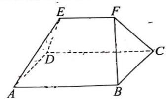
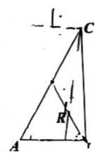
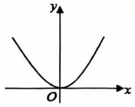
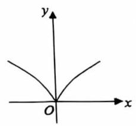
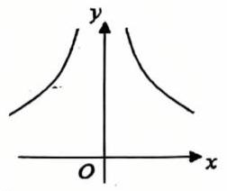
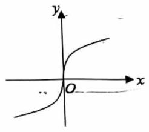
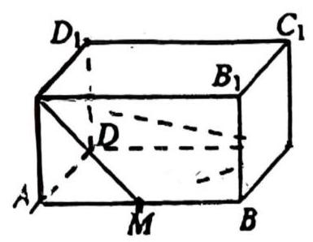

# 静安区 2025 学年度第二学期教学质量调研 高三数学试卷

2026.04

## 考生注意:

1. 本试卷共 21 道试题, 满分 150 分, 考试时间 120 分钟. 作答前, 考生在答题纸正面填写姓名、学校、准考证号等信息, 粘贴考生本人条形码.

2. 本考试分设试卷和答题纸. 作答必须涂 (选择题) 或写(非选择题)在答题纸上的相应位置, 在草稿纸、试卷上作答一律不得分.

3. 可使用符合规定的计算器. 用 2B 铅笔作答选择题, 用黑色笔迹钢笔、水笔或圆珠笔作答非选择题.

## 一、填空题(本大题共有 12 题，满分 54 分，第 1-6 题每题 4 分，第 7-12 题每题 5 分) 考生应在答题纸相应编号的空格内直接填写结果.

1. 直径为 ${22}\mathrm{\;{cm}}$ 的球的表面积为___ ${\mathrm{{cm}}}^{2}$ . (计算结果保留 $\pi$

2. 设 $\mathrm{i}$ 是虚数单位,计算: ${\left( \frac{1 + \mathrm{i}}{1 - \mathrm{i}}\right) }^{3} =$ ___.

3. 在 ${\left( {x}^{3} - \frac{1}{x}\right) }^{6}$ 的二项展开式中, ${x}^{2}$ 的系数为___. (用数字作答)

4. 双曲线 $\frac{{x}^{2}}{4} - {y}^{2} = 1$ 的两条渐近线夹角大小 ... ___. (结果用反三角函数值表示)

5. 若 $\frac{\sin \left( {{2\pi } - \alpha }\right) }{\tan \left( {\pi  - \alpha }\right) } \cdot  \cot \left( {\frac{\pi }{2} + \alpha }\right)  = \frac{1}{3}$ ，则 $\cos {2\alpha } =$ ___.

6. 某汽车制造厂生产一种用于发动机的活塞销，其设计标准直径 $\mu$ 为 ${10.00}\mathrm{\;{mm}}$ . 根据长期生产数据，该活塞销的实际直径服从正态分布，方差 ${\sigma }^{2}$ 为 ${0.02}{\mathrm{\;{mm}}}^{2}$ . 规定:活塞销的直径在 ${9.96}\mathrm{\;{mm}}$ 到 ${10.04}\mathrm{\;{mm}}$ 之间为合格品. 随机抽取一个活塞销，其为合格品的概率是___. (结果保留三位小数)

参考数据: 若随机变量 $X \sim  N\left( {\mu ,{\sigma }^{2}}\right)$ ,则 $P\left( {\mu  - \sigma  < X \leq  \mu  + \sigma }\right)  \approx  {0.683}$ , $P\left( {\mu  - {2\sigma } < X \leq  \mu  + {2\sigma }}\right)  \approx  {0.954},\;P\left( {\mu  - {3\sigma } < X \leq  \mu  + {3\sigma }}\right)  \approx  {0.997},$

7. 现有两个罐子，都放有 3 个球，这些球除颜色外，大小与质地都相同. A 罐中放有 2 个红球，1 个白球，B 罐中放有 3 个红球. 从两个罐子中各摸出 1 个球并交换，这样交换 2 次后, 白球还在 A 罐子中的概率是___.

8. 已知定义在 $\mathbf{R}$ 上的偶函数 $y = f\left( x\right)$ 的最小正周期为 2,当 $0 \leq  x \leq  1$ 时, $f\left( x\right)  = x$ ,则当 $7 \leq  x \leq  8$ 时， $f\left( x\right)  =$ ___.

9. 在代表我国古代数学成就的经典著作《九章算术》中, 称如下图中的多面体 ABCDEF 为 “刍(chu) 甍(meng)”: 若底面 ${ABCD}$ 是边长为 4 的正方形, ${EF} = 2$ ,且 ${EF}//{AB}$ , $\bigtriangleup {AED}$ 和 $\bigtriangleup {BFC}$ 是等腰直角三角形, $\angle {AED} = \angle {BFC} = {90}^{ \circ  }$ . 则 ${FC}$ 与底面 ${ABCD}$ 所成角的正弦值为___.

(第 9 题图)

(第 10 题图)

10. 如图所示，在 $\bigtriangleup {ABC}$ 中， $\angle {BAC} = \frac{\pi }{3}$ ， $\left| {AC}\right|  = 2\left| {AB}\right|$ ， $\left| {AB}\right|  = 1$ ， $P$ 为边 ${AC}$ 的中点， $D$ 在边 ${AB}$ 上，且 $\left| {AD}\right|  = 2\left| {DB}\right|$ ， ${CD}$ 交 ${BP}$ 于点 $R$ ，则 $\left| {CR}\right|  =$ ___.

11. 若满足 $\left| z\right|  = 5$ ，且 $\left| {z + 5}\right|  - \left| {z - 5}\right|  = 6$ 的复数 $z$ 有两个，分别设为 ${z}_{1}\text{ 、 }{z}_{2}$ ，则 $\left| {{z}_{1} - {z}_{2}}\right|  =$ ___

12. 设 $a > 0$ ,函数 $f\left( x\right)  = \left\{  \begin{array}{l} x + 2, x <  - a, \\  \sqrt{{a}^{2} - {x}^{2}}, - a \leq  x \leq  a, \\   - \sqrt{x} - 1, x > a. \end{array}\right.$ 给出下列三个结论:

① $y = f\left( x\right)$ 在区间 $\left( {a - 1, + \infty }\right)$ 上单调递减;

② 当 $a \geq  1$ . 时、 $y = f\left( x\right)$ 存在最大值；

③ 设 $M\left( {{x}_{1}, f\left( {x}_{1}\right) }\right) \left( {{x}_{1} \leq  a}\right) , N\left( {{x}_{2}, f\left( {x}_{2}\right) }\right) \left( {{x}_{2} > a}\right)$ ，则 $\left| {{\lambda }_{ - }N}\right|  > 1$ .

其中所有正确结论的序号是___

## 二、选择题(本大题共有 4 题，满分 18 分，第 13-14 题每题 4 分，第 15-16 题每题 5 分) 每题有且只有一个正确选项, 考生应在答题纸的相应位置上, 将代表正确选项的小方格涂黑.

13. 函数 $y = {x}^{\frac{4}{3}}$ 的大致图像是( )

A.

B.

C.

D.

14. 已知集合 $A = \left\{  {x\left| {\;{x}^{2} - x - 6 = 0}\right. }\right\}  , B = \left\{  {x\left| {\;\frac{x + 3}{1 - x} > 0}\right. }\right\}$ ，则 $A \cap  B =$ ()

A. $\{  - 2,3\}$ ; B. $\left( {-3,1}\right)$ ; C. $\{ 3\}$ ; D. $\{  - 2\}$ .

15. 袋子里装有四枚围棋子, 其中两枚黑色棋子、两枚白色棋子, 从中随机取出两枚棋子，那么互斥而不对立的事件是( )

A. “至多有一枚白色棋子”与“至多有一枚黑色棋子”；

B. “至多有一枚白色棋子”与 “都是黑色棋子”；

C. “恰好有一枚白色棋子” 与 “都是黑色棋子”；

D. “至多有一枚白色棋子” 与 “都是白色棋子”

16. 设 $M\text{ 、 }N$ 分别是棱长为 1 的正方体的两个不同顶点，点 $P$ 在该正方体的表面上(含棱和顶点) 运动,且不与 $M\text{ 、 }N$ 两点重合. 关于 $\overrightarrow{PM} \cdot  \overrightarrow{PN}$ ,给出下列两个结论:

① $\overrightarrow{PM} \cdot  \overrightarrow{PN}$ 存在最小值，且最小值小于零；

② $\overrightarrow{PM} \cdot  \overrightarrow{PN}$ 存在最大值，且最大值大于零.

则下列判断正确的选项是( )

A. ①正确 ②错误； B. ①错误 ②正确；

C. ①和②都错误； D. ①和②都正确.

## 三、解答题(本大题共有 5 题，满分 78 分，第 17-19 题每题 14 分，第 20-21 题每题 18 分)解答下列各题必须在答题纸相应编号的规定区域内写出必要的步骤.

17. (本题满分 14 分) 本题共有 2 个小题, 第 1 小题满分 6 分, 第 2 小题满分 8 分.

下表是某品牌净化器的年销售量与年份的统计表.

<table><tr><td>年份</td><td>2021</td><td>2022</td><td>2023</td><td>2024</td><td>2025</td></tr><tr><td>年份代码 $x$</td><td>1</td><td>2</td><td>3</td><td>4</td><td>5</td></tr><tr><td>年销售量 $y$ (万台)</td><td>2</td><td>3.5</td><td>2.5</td><td>8</td><td>9</td></tr></table>

(1)用计算器计算净化器的年销售量 $y$ 关于年份代码 $x$ 的线性回归方程;(回归系数计算结果保留两位小数)

(2)为了调查 A、B 两地区人群对该品牌净化器的了解情况，调查机构在 A、B 两地区的人群中分别进行品牌知晓情况的问卷调查. 统计知晓与不知晓的人数，得到如下 $2 \times  2$ 列联表.

<table><tr><td></td><td>知晓</td><td>不知晓</td><td>合计</td></tr><tr><td>A 地区</td><td>80</td><td>20</td><td>100</td></tr><tr><td>B 地区</td><td>40</td><td>60</td><td>100</td></tr><tr><td>合计</td><td>120</td><td>80</td><td>200</td></tr></table>

试根据表中数据判断 $\mathrm{A}\text{ 、 }\mathrm{\;B}$ 两地区的人群对该品牌净化器的知晓情况是否有显著差异. (规定显著水平 $\alpha  = {0.05}$ )

附:关于回归方程 $y = \widehat{a}x + \widehat{b}$ ,回归系数的计算公式

$\left\{  \begin{array}{l} \widehat{a} = \frac{\mathop{\sum }\limits_{{i = 1}}^{n}\left( {{x}_{i} - \bar{x}}\right) \left( {{y}_{i} - \bar{y}}\right) }{\mathop{\sum }\limits_{{i = 1}}^{n}{\left( {x}_{i} - \bar{x}\right) }^{2}}, \\  \widehat{b} = \frac{\mathop{\sum }\limits_{{i = 1}}^{n}{y}_{i} - \widehat{a}\mathop{\sum }\limits_{{i = 1}}^{n}{x}_{i}}{n}, \end{array}\right.$

其中 $\left( {\bar{x},\bar{y}}\right)$ 为样本点的中心;

${\chi }^{2}$ 的计算公式 ${\chi }^{2} = \frac{n{\left( ad - bc\right) }^{2}}{\left( {a + b}\right) \left( {b + d}\right) \left( {a + c}\right) \left( {c + d}\right) }$ ;

<table><tr><td>$P\left( {{\chi }^{2} \geq  k}\right)  = \alpha$</td><td>0.05</td><td>0.01</td><td>0.001</td></tr><tr><td>$k$</td><td>3.841</td><td>6.635</td><td>10.828</td></tr></table>

## 18. (本题满分 14 分) 本题共有 2 个小题，第 1 小题满分 6 分，第 2 小题满分 8 分.

已知等差数列 $\left\{  {a}_{n}\right\}$ 的首项 ${a}_{1} = 1$ ，公差为 2，等比数列 $\left\{  {b}_{n}\right\}$ 的首项 ${b}_{1} = 1$ ，公比为 2， 数列 $\left\{  {c}_{n}\right\}$ 满足 ${c}_{n} = \left\{  {\begin{array}{ll} {a}_{n}, & \text{ 当 }n\text{ 为奇数时, } \\  {b}_{n}, & \text{ 当 }n\text{ 为偶数时. } \end{array}\text{ ( }n}\right.$ 为正整数)

(1)依次写出数列 $\left\{  {c}_{n}\right\}$ 的前 6 项；

(2)设数列 $\left\{  {c}_{n}\right\}$ 的前 $n$ 项和为 ${S}_{n}$ ，求 ${S}_{2n}$ .

19. (本题满分 14 分) 本题共有 2 个小题, 第 1 小题满分 6 分, 第 2 小题满分 8 分.

如图，在长方体 ${ABCD} - {A}_{1}{B}_{1}{C}_{1}{D}_{1}$ 中， ${AB} = 4,{BC} = 3,{C{C}_{1}} = 2, M$ 是 ${AB}$ 的中点.

(1)求四棱锥 ${A}_{1} - {AMCD}$ 的体积；

(2)求平面 ${A}_{1}{AD}{D}_{1}$ 与平面 ${A}_{1}{MC}$ 所成的锐二面角的大小. (结果用反三角函数值表示)

## 20. (本题满分 18 分)本题共有 3 个小题, 第 1 小题满分 4 分, 第 2 小题满分 6 分, 第 3 小题满分 8 分.

在 ${xOy}$ 平面直角坐标系中, $O$ 为坐标原点. 设椭圆 $\Gamma  : \frac{{x}^{2}}{{a}^{2}} + \frac{{y}^{2}}{{b}^{2}} = 1\left( {a > b > 0}\right) ,\Gamma$ 的左、右焦点分别为 ${F}_{1}\text{ 、 }{F}_{2},\left| {{F}_{1}{F}_{2}}\right|  = 2,\Gamma$ 的离心率为 $\frac{1}{2}$ .

(1)求椭圆 $\Gamma$ 的方程；

(2)过原点 $O$ 作两条相互垂直的射线，与椭圆 $\Gamma$ 分别交于 $A$ 、 $B$ 两点，证明:原点 $O$ 到直线 ${AB}$ 的距离为定值；

(3)过椭圆 $\Gamma$ 的右焦点 ${F}_{2}$ 且不与坐标轴垂直的直线 $l$ 与椭圆 $\Gamma$ 交于 $P\text{ 、 }Q$ 两点，点 $M$ 是点 $P$ 关于 $x$ 轴的对称点. 在 $x$ 轴上是否存在一个定点 $N$ ,使得 $M\text{ 、 }Q\text{ 、 }N$ 三点始终共线? 若存在,求出点 $N$ 的坐标; 若不存在,说明理由.

## 21. (本题满分 18 分)本题共有 3 个小题, 第 1 小题满分 4 分, 第 2 小题满分 6 分, 第 3 小 题满分 8 分.

已知函数 $f\left( x\right)  = \frac{a\ln x}{x}\left( {a \in  \mathbf{R}\text{ 且 }a \neq  0}\right)$ .

(1)当 $a = 1$ 时，求函数 $y = f\left( x\right)$ 的极值；

(2)若直线 $y = x - 1$ 是曲线 $y = f\left( x\right)$ 的一条切线，求 $a$ 的值和切点的坐标；

(3)若函数 $g\left( x\right)  = \frac{{a}^{2}}{4x} + x + 2 - a$ 的图像与 $y = f\left( x\right)$ 的图像相交于相异两点 $A$ 和 $B$ ， 求 $a$ 的取值范围.
