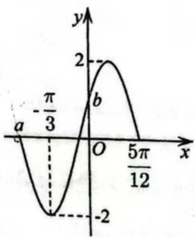
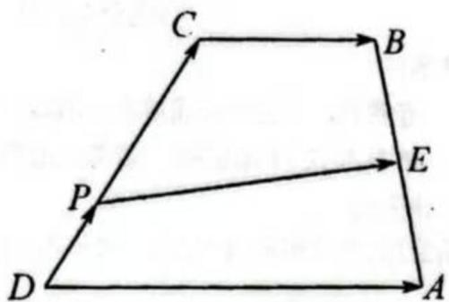

# 敬业中学 2025 学年高一年级第二学期期终考试

## 数学试卷

2026 年 6 月

（满分 100 分，考试时间 90 分钟）

**考生注意：**

1. 答卷前，考生务必将姓名、班级、准考证号等相关信息在答题卷上填写清楚；
2. 本试卷共 21 道试题，请考生用黑色水笔在答题卷的相应位置作答，写在试卷上的解答一律无效。

## 一、填空题（本大题共有 12 题，满分 42 分，其中 1--6 题每题 3 分，7--12 题每题 4 分）

1. 函数 $y=\tan x$ 的最小正周期是 \underline{\hspace{4cm}}。

2. 已知 $\sin\alpha=\frac45$，则 $\cos\left(\alpha-\frac{\pi}{2}\right)=$ \underline{\hspace{4cm}}。

3. 设 $i$ 是虚数单位，若复数 $z$ 满足 $2+iz=3+5i$，则 $\operatorname{Re}z=$ \underline{\hspace{4cm}}。

4. 设向量 $\vec a=(-3,2)$，$\vec b=(1,0)$，则 $\vec a$ 在 $\vec b$ 方向上的数量投影为 \underline{\hspace{4cm}}。

5. 已知 $\sin\frac{x}{2}=\frac45$，$\cos\frac{x}{2}=-\frac35$，则角 $x$ 是第 \underline{\hspace{2cm}} 象限的角。

6. 函数 $y=\cos\left(x-\frac{\pi}{6}\right)$ 在 $(0,\pi)$ 上的单调减区间为 \underline{\hspace{4cm}}。

7. 已知 $\triangle ABC$ 中，$a=4$，$b=2c$，$\cos A=-\frac34$，则 $S_{\triangle ABC}=$ \underline{\hspace{4cm}}。

8. 已知三角形 $ABC$ 为单位圆 $O$ 的内接正三角形，则 $\overrightarrow{OB}\cdot\overrightarrow{BC}=$ \underline{\hspace{4cm}}。

9. 已知两点 $P_1(2,-1)$，$P_2(-1,3)$，点 $P$ 在直线 $P_1P_2$ 上，且满足 $|\overrightarrow{P_1P}|=\frac23|\overrightarrow{PP_2}|$，则点 $P$ 的坐标为 \underline{\hspace{4cm}}。

10. 下列命题，其中正确的是 \underline{\hspace{3cm}}（填序号）

    (1) 已知 $x,y$ 为实数，若 $|x+y|=|x-y|$，则 $x\cdot y=0$；

    (2) 已知 $x,y$ 为复数，若 $|x+y|=|x-y|$，则 $x\cdot y=0$；

    (3) 已知 $\vec x,\vec y$ 为向量，若 $|\vec x+\vec y|=|\vec x-\vec y|$，则 $\vec x\cdot\vec y=0$。

11. 已知函数 $f(x)=\sin\left(\omega x+\frac{\pi}{6}\right)$，若存在 $x_1,x_2\in[0,\pi]$，使得 $f(x_1)f(x_2)=-1$，则正数 $\omega$ 的最小值为 \underline{\hspace{4cm}}。

12. 已知单位向量 $\vec a,\vec b$ 夹角为锐角，对 $t\in\mathbb R$，$|\vec a-t\vec b|$ 的取值范围是 $\left[\frac{\sqrt3}{2},+\infty\right)$，若向量 $\vec c$ 满足 $(\vec c-2\vec a)\cdot(\vec c-\vec b)=0$，则 $|\vec c|$ 的最小值为 \underline{\hspace{4cm}}。

\newpage

## 二、选择题（本题共 14 分，第 13、14 题每小题 3 分，第 15、16 题每小题 4 分）

13. 与向量 $\vec a=(-3,4)$ 平行的单位向量是（\quad）

    甲. $\left(\frac45,-\frac35\right)$
    \quad 乙. $\left(-\frac35,\frac45\right)$
    \quad 丙. $\left(\frac35,-\frac35\right)$
    \quad 丁. $\left(-\frac45,\frac35\right)$

14. 已知 $z$ 为复数，则下列命题中不正确的是（\quad）

    甲. 若 $z^2<0$，则 $z$ 为纯虚数

    乙. 若 $z^3=1$，则 $\bar z=z^2$

    丙. 若 $z=\bar z$，则 $z$ 为实数

    丁. 若 $|z+1|=|z-1|$，则 $z$ 为纯虚数

15. $\triangle ABC$ 中，已知 $\frac{a+b}{a}=\frac{\sin B}{\sin B-\sin A}$，且 $\cos(A-B)-\cos(A+B)=1-\cos2C$，则 $\triangle ABC$ 是（\quad）

    甲. 等腰三角形
    \quad 乙. 直角三角形
    \quad 丙. 等腰直角三角形
    \quad 丁. 等腰或直角三角形

16. 已知复数 $z_1$ 在复平面内对应的点的坐标为 $(0,1)$，复数 $z_2$ 在复平面内对应的点的坐标为 $(u,0)$。若复数 $z_3$ 满足 $|z_3-\bar z_1|-|z_3-z_1|=2v$，且 $u^2+1=\frac{9}{v^2}$，则 $|z_3+z_1|+|z_3-z_2|$ 的最小值为（\quad）

    甲. $3$
    \quad 乙. $5$
    \quad 丙. $\sqrt3$
    \quad 丁. $2\sqrt6$

\newpage

## 三、解答题（本大题共 44 分）

\Needspace{10\baselineskip}

17. （本题共 2 小题，第一小题 3 分，第二小题 3 分，共 6 分）

已知平面向量 $\vec a,\vec b$ 满足 $|\vec a|=3$，$|\vec b|=1$，且 $|\vec a+2\vec b|=\sqrt7$。

（1）求向量 $\vec a,\vec b$ 的夹角 $\theta$；

（2）若 $(\vec a+\lambda\vec b)\perp(2\vec a-\vec b)$，求实数 $\lambda$ 的值。

\vspace{6.5cm}

\Needspace{10\baselineskip}

18. （本题共 2 小题，第一小题 2 分，第二小题 6 分，共 8 分）

设常数 $p\in\mathbb R$，已知关于 $x$ 的方程 $x^2+px+2=0$。

（1）若 $p=2$，求该方程的复数根；

（2）若方程的两个复数根为 $\alpha,\beta$，且 $|\alpha-\beta|=1$，求 $p$ 的值。

\vspace{6cm}

\newpage

\Needspace{13\baselineskip}

19. （本题共 2 小题，第一小题 3 分，第二小题 5 分，共 8 分）

函数 $f(x)=A\sin(2\omega x+\varphi)$（$A>0$，$\omega>0$，$|\varphi|<\frac{\pi}{2}$）的部分图像如图所示。

{width=38%}

（1）求 $A,\omega,\varphi$ 的值；

（2）将函数 $f(x)$ 的图像向右平移 $\frac{\pi}{6}$ 个单位长度，得到函数 $g(x)$ 的图像，若 $\alpha\in[0,\pi]$，且 $g(\alpha)=\sqrt2$，求 $\alpha$ 的值。

\vspace{5.5cm}

\newpage

\Needspace{14\baselineskip}

20. （本大题有 2 小题，第 1 小题 4 分，第 2 小题 6 分，满分 10 分）

如图，梯形 $ABCD$，$|\overrightarrow{DA}|=2$，$\angle CDA=\frac{\pi}{3}$，$\overrightarrow{DA}=2\overrightarrow{CB}$，$E$ 为 $AB$ 中点，$\overrightarrow{DP}=\lambda\overrightarrow{DC}$（$\lambda\ne0$）。

{width=48%}

（1）当 $\lambda=\frac13$ 时，用向量 $\overrightarrow{DC},\overrightarrow{DA}$ 表示向量 $\overrightarrow{PE}$；

（2）若 $|\overrightarrow{DC}|=t$（$t$ 为大于零的常数），求 $|\overrightarrow{PE}|$ 的最小值，并指出相应的实数 $\lambda$ 的值。

\vspace{6cm}

\Needspace{16\baselineskip}

21. （本大题有 3 小题，第 1 题 3 分，第 2 题 4 分，第 3 题 5 分，满分 12 分）

已知函数
$$
f(x)=4\sin\left(\omega x+\frac{\pi}{12}\right)\cos\left(\omega x+\frac{\pi}{12}\right)+1,
$$
其中 $\omega>0$。

（1）若 $f(x_1)\le f(x)\le f(x_2)$，$|x_1-x_2|_{\min}=\frac{\pi}{2}$，求 $f(x)$ 的对称中心；

（2）若 $2<\omega<4$，函数 $f(x)$ 图像向右平移 $\frac{\pi}{6}$ 个单位，得到函数 $g(x)$ 的图像，$x=\frac{\pi}{3}$ 是 $g(x)$ 的一个零点，若函数 $g(x)$ 在 $[m,n]$（$m,n\in\mathbb R$ 且 $m<n$）上恰好有 8 个零点，求 $n-m$ 的最小值；

（3）已知函数 $h(x)=a\cos\left(2x-\frac{\pi}{6}\right)-2a$（$a<0$），在第（2）问条件下，若对任意 $x_1\in\left[0,\frac{\pi}{4}\right]$，存在 $x_2\in\left[0,\frac{\pi}{4}\right]$，使得 $h(x_1)=g(x_2)$ 成立，求实数 $a$ 的取值范围。

\vspace{7cm}
