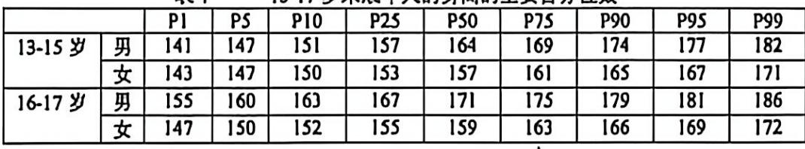
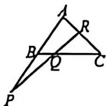
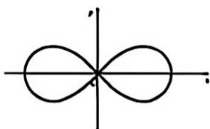
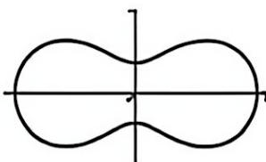
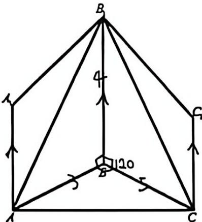

# 2025学年第二学期高二数学期末考试试卷

（2026.06）

## 一、填空题

（本题共 12 小题，1-6 每小题 4 分，7-12 每小题 5 分，共 54 分）

1. 已知全集为 $\mathbb R$，集合 $A=\{x\mid -2<x\le 1\}$，则 $\overline A=$ ________。

2. 函数 $y=\log_3(x^2-2x+5)$ 的定义域是 ________。

3. $\left(x-\dfrac{2}{x}\right)^9$ 的二项展开式中 $x$ 的系数是 ________。

4. 设 $a,b$ 为正数，且 $a+2b=1$，则 $ab$ 的最大值为 ________。

5. 表 1 是 13-17 岁未成年人的身高的主要百分位数（单位：cm）。小明今年 16 岁，他的身高为 176 cm，他所在城市男性同龄人约有 6.4 万人，可以估计小明的身高至少高于他所在城市 ________ 万男性同龄人。

{ width=100% }

6. 在 $\triangle ABC$ 中，已知 $a=2$，$b=2\sqrt3$，$\angle A=30^\circ$，则 $\angle B=$ ________。

7. 两个篮球运动员甲和乙罚球时命中的概率分别是 0.7 和 0.6，两人各投一次，假设事件“甲命中”与“乙命中”是独立的，则至少一人命中的概率为 ________。

8. 已知数列 $(a_n)$ 的前 $n$ 项和为 $S_n=3^n+a$。当常数 $a=$ ________ 时，数列 $(a_n)$ 是等比数列。

9. 已知 $\alpha$ 为实数，若关于 $x$ 的二次方程 $x^2-\alpha x+1=0$ 有一个虚根为 $z$，则 $|\alpha z|$ 的取值范围是 ________。

10. 要建造一个给定容积为 $V$ 的圆柱体蓄水池（无盖），已知池底单位造价为池侧面单位造价的 2 倍，则当蓄水池的底面半径为 ________ 时，才能使总造价最低。

11. 曲线 $mx^2+ny^2=mn$（$m\ne n$，$mn\ne0$）的离心率为 $\sqrt3$，则 $\dfrac{m}{n}=$ ________。

12. 在平面直角坐标系中，$O$ 为坐标原点。已知点 $A(0,2)$，$B(4,0)$，$C(-4,0)$，若 $\overrightarrow{PC}\cdot\overrightarrow{PB}=0$，$|QA|=1$，则向量 $\overrightarrow{OQ}$ 在向量 $\overrightarrow{OP}$ 方向上的数量投影的取值范围是 ________。

\newpage

## 二、选择题

（本题共 4 小题，13-14 每小题 4 分，15-16 每小题 5 分，共 18 分。在每小题给出的四个选项中，只有一项是符合题目要求的）

13. 以下不等式正确的是（　　）。

A. 如果 $a>b,\ c>d$，那么 $a+d>b+c$

B. 如果 $\dfrac{b}{a}>\dfrac{c}{d}$，那么 $bc>ad$

C. 如果 $a>b\ge0$，那么 $\sqrt a>\sqrt b$

D. 如果 $\sqrt a>b$，那么 $a>b^2$

14. 若 $(a_n)$ 是以 1 为首项、以 $d$ 为公差的等差数列，数列 $(b_n)$ 满足 $b_n=2^{-2a_n+1}$（$n$ 为正整数），则数列 $(b_n)$（　　）。【待校/ai 已润色】

A. 是以 $-1$ 为首项、以 $-2d$ 为公比的等比数列

B. 是以 $\dfrac12$ 为首项、以 $\left(\dfrac14\right)^d$ 为公比的等比数列

C. 是以 $\dfrac12$ 为首项、以 $2^{-2d}$ 为公比的等比数列

D. 是以 $-1$ 为首项、以 $\left(\dfrac14\right)^d$ 为公比的等比数列

15. 在 $\triangle ABC$ 中，点 $P,Q,R$ 分别在直线 $AB,BC,CA$ 上，设
$$
\overrightarrow{AP}=\lambda\overrightarrow{PB},\qquad
\overrightarrow{BQ}=\mu\overrightarrow{QC},\qquad
\overrightarrow{CR}=\gamma\overrightarrow{RA},
$$
其中 $\lambda,\mu,\gamma$ 为实数，则 $P,Q,R$ 三点共线的充要条件是（　　）。

{ width=28% }

A. $\lambda\mu\gamma=-1$　　B. $\lambda^2+\mu^2+\gamma^2=1$

C. $\lambda+\mu+\gamma=2$　　D. $\lambda\mu\gamma=-2$

\newpage

16. 在平面直角坐标系中，已知定点 $F_1(-c,0)$，$F_2(c,0)$，设动点 $P(x,y)$ 满足
$$
|PF_1|\cdot |PF_2|=a^2,
$$
其中 $a>0,\ c>0$。命题（1）：当 $a=c$ 时，点 $P$ 对应的曲线大致图像如图 1；命题（2）：当 $a<c$ 时，点 $P$ 对应的曲线大致图像如图 2。下列判断正确的是（　　）。

{ width=35% }

{ width=35% }

A. 命题（1）是真命题，命题（2）是假命题

B. 命题（1）、命题（2）都是假命题

C. 命题（1）是假命题，命题（2）是真命题

D. 命题（1）、命题（2）都是真命题

\newpage

## 三、解答题

（本题共 5 小题，17-19 题每题 14 分，20-21 题每题 18 分，共 78 分。解答应写出文字说明，证明过程或演算步骤）

17. 若 $y=f(x)$ 的表达式为
$$
y=\sin(2x-\varphi)-2\sqrt2\sin^2 x,\qquad \varphi\in[0,\pi].
$$

（1）若函数经过点 $\left(\dfrac{\pi}{4},-\sqrt2\right)$，判断函数 $y=f(x)$ 的奇偶性；

（2）在（1）的条件下，设 $x\in[0,\pi]$，求函数 $y=f(x)$ 的最大值。

\vspace{7cm}

\newpage

18. 某服装公司生产的衬衫每件定价 80 元，在某城市年销售 8 万件。现该公司计划在该市招收代理商来销售衬衫，以降低管理和营销成本。已知代理商要收取的代理费为总销售金额的 $r\%$（即每 100 元销售额收取 $r$ 元）。为保证单件衬衫的利润保持不变，服装公司将每件衬衫的价格提高到 $\dfrac{80}{1-r\%}$ 元，但提价后每年的销量会减少 $0.62r$ 万件。设代理商收取的年代理费为 $y$ 万元。

（1）试将 $y$ 表示为 $r$ 的函数；

（2）求 $r$ 的取值范围，以确保代理商每年收取的代理费不少于 16 万元。

\vspace{7cm}

\newpage

19. 如图，已知面 $A_1B_1BA\perp$ 面 $ABC$ 且相交于 $AB$，面 $B_1C_1CB\perp$ 面 $ABC$ 且相交于 $BC$，面 $B_1C_1CB$ 与面 $A_1B_1BA$ 相交于 $B_1B$。

（1）若 $AA_1\parallel CC_1$，证明 $AA_1\parallel B_1B$；

（2）若 $AB=3$，$BC=5$，$\angle ABC=\dfrac{2\pi}{3}$，$BB_1=4$，求三棱锥 $A-BCB_1$ 的体积。

{ width=42% }

\vspace{5cm}

\newpage

20. 已知曲线 $\Gamma$ 的标准方程为 $x^2-y^2=2$，直线 $\ell$ 过点 $M(m,0)$（$m>\sqrt2$，$m\in\mathbb R$），直线 $\ell$ 的倾斜角为 $\theta$，$\theta\in\left(\dfrac{\pi}{4},\dfrac{\pi}{2}\right]$。设直线 $\ell$ 与 $\Gamma$ 交于 $P,Q$ 两点，与 $\Gamma$ 的两条渐近线分别交于 $A,B$ 两点，其中 $A,P$ 在第一象限，$B,Q$ 在第四象限，$F_1$ 是双曲线 $\Gamma$ 的右焦点。

（1）求点 $F_1$ 的坐标和渐近线方程；

（2）以 $F_1$ 为圆心的圆，与双曲线的两条渐近线相切，同时又与直线 $\ell$ 相切于点 $M$，求直线 $\ell$ 的方程；

（3）对任意一条直线 $\ell$，双曲线上是否存在点 $T$，使得 $\triangle TPQ$ 与 $\triangle TAB$ 均为以 $T$ 为顶点的等腰三角形？请说明理由。

\vspace{8cm}

\newpage

21. 已知函数 $y=f(x)$ 的表达式为 $y=e^x-ax$，函数 $y=g(x)$ 的表达式为 $y=ax-\ln x$，其中函数 $y=f(x)$ 经过点 $(1,e-1)$。

（1）求实数 $a$ 的值，并求函数 $y=g(x)$ 上一点 $(e,g(e))$ 处的切线方程；

（2）求函数 $y=f(x)$ 和 $y=g(x)$ 的单调区间和极值；

（3）是否存在直线 $y=b$，使得其与两条曲线 $y=f(x)$ 和 $y=g(x)$ 一共有三个不同的交点，并且从左到右的三个交点的横坐标成等差数列？请说明理由。

\vspace{8cm}
