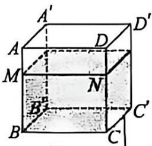
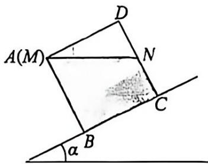
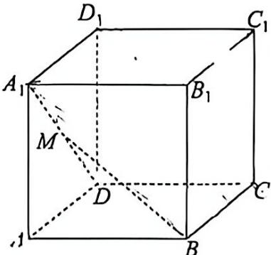
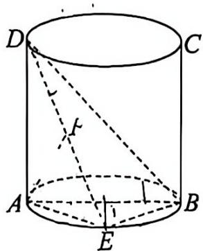
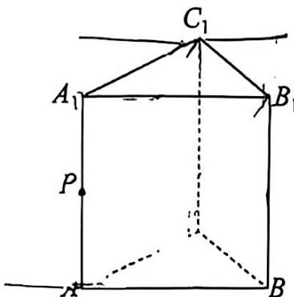

# 松江一中 2025 学年度第二学期期末考试卷

## 高一数学

命题教师：俞黎滨、郇玲　审核人：何佳

2026.6

考生注意：

本卷满分 150 分，考试时间 120 分钟，答案全部做在答题纸上。

## 一、填空题

本大题共有 12 题，满分 54 分。第 1--6 题每个空格填对得 4 分，第 7--12 题每个空格填对得 5 分，否则一律得零分。

1. 若点 $A\in$ 平面 $\alpha$，点 $B\in$ 平面 $\alpha$，则直线 $AB$ ______ 平面 $\alpha$（填合适的符号）。

2. 函数 $f(x)=\cos 2x+2$ 的最小正周期为 ______。

3. 已知向量 $\vec a=(\lambda,-1)$，$\vec b=(2,3)$，且 $\vec a\perp\vec b$，则 $\lambda=$ ______。

4. 若复数 $z$ 满足 $(3-4i)z=25$（$i$ 为虚数单位），则 $z$ 的虚部为 ______。

5. 若向量 $\vec a,\vec b$ 满足 $|\vec a|=1$，$|\vec b|=2$，且 $\vec a$ 与 $\vec b$ 的夹角为 $\dfrac{\pi}{3}$，则 $(\vec a-\vec b)\cdot(\vec a+2\vec b)=$ ______。

6. 已知圆柱的底面半径为 3，侧面积为 $24\pi$，则此圆柱的体积为 ______。

7. 在各棱长均为 1 的正三棱柱 $ABC-A_1B_1C_1$ 中，则点 $C$ 到平面 $ABB_1A_1$ 的距离为 ______。

8. 已知 $x_1,x_2$ 是关于 $x$ 的实系数方程 $x^2-4x+5=0$ 的两个虚根，$\dfrac{|x_1|+|x_2|}{x_1+x_2}=$ ______。

9. 在 $\triangle ABC$ 中，已知 $\overrightarrow{AB}\cdot\overrightarrow{AC}=\tan A$，当 $A=\dfrac{\pi}{3}$ 时，$\triangle ABC$ 的面积为 ______。

10. 已知圆柱的底面半径为 1，高为 3，$A,B$ 分别为该圆柱上、下底面圆周上的动点。若直线 $AB$ 和该圆柱的轴始终是异面直线，则线段 $AB$ 长度的取值范围是 ______。

11. 已知复数 $z_1=2$，$z_2=\cos 2t+\sin 2t\cdot i$，它们在复平面对应的点分别为 $Z_1,Z_2$，则当 $t$ 由 $-\dfrac{\pi}{8}$ 连续变到 $\dfrac{\pi}{8}$ 时，向量 $\overrightarrow{Z_1Z_2}$ 扫过的面积是 ______。

12. 如图 1，棱长为 9 cm 的密封透明正方体容器水平放置在桌面上，水面高度 $BM=h\text{ cm}$。将此正方体放在坡角为 $\arctan\dfrac{4}{9}$ 的斜坡上，此时水面 $MN$ 恰好与点 $A$ 齐平，其主视图（将物体由前向后投射，在正面上所得的视图）如图 2 所示，则 $h=$ ______。

{ width=30% } { width=38% }

图 1（左）　图 2（右）

\newpage

## 二、选择题

本大题共有 4 题，满分 18 分，第 13--14 题每题 4 分，15--16 题每题 5 分。

13. 设 $\vec e_1,\vec e_2$ 是平面内所有向量的一组基底，则下列四组向量中，不能作为基底的是（　　）。

    A. $\vec e_1+\vec e_2$ 和 $\vec e_1-\vec e_2$

    B. $\vec e_1+2\vec e_2$ 和 $\vec e_1+\vec e_2$

    C. $\vec e_1+2\vec e_2$ 和 $2\vec e_1-\vec e_2$

    D. $\vec e_1-2\vec e_2$ 和 $-2\vec e_1+4\vec e_2$

14. 在复平面内，向量 $\overrightarrow{AB}$ 对应的复数为 $-1+4i$，向量 $\overrightarrow{AC}$ 对应的复数为 $-3+i$，则向量 $\overrightarrow{BC}$ 对应的复数的模为（　　）。

    A. $-2-3i$　　B. $\sqrt{41}$　　C. $\sqrt{13}$　　D. $2+3i$

15. 如图，在正方体 $ABCD-A_1B_1C_1D_1$ 中，点 $M$ 是线段 $A_1D$ 上的动点（含端点），则下列说法中正确的是（　　）。

    A. 直线 $MB$ 与直线 $AC$ 始终异面

    B. 直线 $MB$ 与直线 $A_1D$ 始终垂直

    C. 存在点 $M$ 使得直线 $MB$ 与平面 $A_1C_1D$ 垂直

    D. 直线 $MB$ 与平面 $B_1D_1C$ 始终平行

{ width=42% }

16. 已知 $\vec e$ 为单位向量，$\vec a\cdot\vec e=1$，$2027\vec b=\vec a+2026\vec e$，当 $(\vec a,\vec b)$ 取到最大值时，$|\vec a-\vec e|$ 等于（　　）。

    A. $\sqrt{2027}$　　B. $\dfrac{\sqrt{2027}}{2027}$　　C. $\sqrt{2026}$　　D. $\dfrac{\sqrt{2026}}{2026}$

\newpage

## 三、解答题

本大题共有 5 题，满分 78 分。

17.（本题满分 14 分：第 1 小题满分 7 分，第 2 小题满分 7 分）

设复数 $z_1=(m+1)-(2m-2)i$，$z_2=(n-1)+ni$，$z_3=m+ni$。

（1）若 $z_1$ 是实数，$z_2$ 是纯虚数，求 $|z_3|$；

（2）若 $z_1,z_2$ 互为共轭复数，求 $z_3$。

\vspace{7cm}

18.（本题满分 14 分：第 1 小题满分 7 分，第 2 小题满分 7 分）

已知平面上有三点 $A,B,C$，向量 $\overrightarrow{AB}=(2-k,3)$，$\overrightarrow{CB}=(2,4)$。

（1）若三点 $A,B,C$ 不能构成三角形，求实数 $k$ 的值；

（2）若 $\triangle ABC$ 为直角三角形，其中 $A$ 是直角，求实数 $k$ 的值。

\vspace{6cm}

\newpage

19.（本题满分 14 分：第 1 小题满分 7 分，第 2 小题满分 7 分）

如图，在圆柱中，底面直径 $AB$ 等于母线 $AD$，点 $E$ 在底面的圆周上，点 $F$ 在线段 $DE$ 上。

（1）求证：$AF\perp BE$；

（2）若点 $E$ 是弧 $AB$ 的中点，求直线 $DE$ 与平面 $ABD$ 所成角的大小。

{ width=36% }

\vspace{8cm}

\newpage

20.（本题满分 18 分：第 1 小题满分 4 分，第 2 小题满分 6 分，第 3 小题满分 8 分）

如图，在正三棱柱 $ABC-A_1B_1C_1$ 中，底面 $\triangle ABC$ 的边长为 1，$P$ 为棱 $AA_1$ 上一点。

（1）若 $AA_1=1$，求棱柱 $ABC-A_1B_1C_1$ 的表面积 $S$ 的值；

（2）若 $AA_1=1$，$P$ 为 $AA_1$ 的中点，求异面直线 $PC_1$ 与 $AB_1$ 所成角的大小；

（3）若 $AA_1=a$（$0<a<\sqrt3$），设二面角 $A_1-B_1C_1-P$、$A-BC-P$ 的平面角分别为 $\alpha,\beta$，求 $\tan(\alpha+\beta)$ 的最大值及取到最大值时点 $P$ 的位置。

{ width=40% }

\vspace{7cm}

\newpage

21.（本题满分 18 分：第 1 小题满分 4 分，第 2 小题满分 6 分，第 3 小题满分 8 分）

对于函数 $y=f(x)$，若在其定义域内存在实数 $x_0,t$，使得 $f(x_0+t)=f(x_0)+f(t)$ 成立，称 $y=f(x)$ 是“$t$ 跃点”函数，并称 $x_0$ 是函数 $f(x)$ 的“$t$ 跃点”。

（1）若函数 $f(x)=\sin x-m$，$x\in\mathbf R$ 是“$\dfrac{3\pi}{2}$ 跃点”函数，求实数 $m$ 的取值范围；

（2）若函数 $f(x)=\sin(x+m)$，$x\in\mathbf R$，求证：“$\cos m=1$”是“对任意 $t\in\mathbf R$，$f(x)$ 为 $t$ 跃点函数”的充分非必要条件；

（3）是否同时存在实数 $m$ 和正整数 $n$，使得函数 $h(x)=\cos 2x-m$ 在 $\left[0,n\pi+\dfrac{3\pi}{4}\right]$ 上有 2025 个“$\dfrac{3\pi}{4}$ 跃点”？若存在，请求出所有符合条件的 $m$ 和 $n$ 的值；若不存在，请说明理由。

\vspace{10cm}
