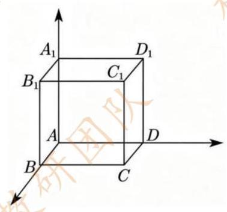
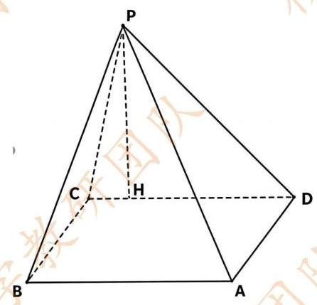

# 2026 年普通高等学校招生全国统一考试 上海 数学试卷 2026.06.07

## 考生注意:

1. 本试卷共 5 页, 21 道试题, 满分 150 分. 考试时间 120 分钟.

2. 本考试分设试卷和答题纸. 试卷包括试题与答题要求. 作答必须涂 (选择题) 或写 (非选择题) 在答题纸上, 在试卷上作答一律不得分.

## 3. 答卷前，务必用钢笔或圆珠笔在答题纸正面清楚地填写姓名、准考证号，并将核对后的条形码贴 在指定位置上, 在答题纸反面清楚地填写姓名.

## 一、填空题(本大题共有 12 题,满分 54 分,第 1~6 题每题 4 分,第 7~12 题每题 5 分)考生 应在答题纸的相应位置填写结果. 【公众号:上海数学研讨】

1. 已知集合 $A = \{ 2,1 + a\} , - 1 \in  A$ ，则 $a =$ ___.

2. 已知 $\left\{  {a}_{n}\right\}$ 为等比数列， ${a}_{1} = 2$ ， ${a}_{2} = 6$ ，则 ${a}_{4} =$ ___.

3. 已知 $\sin \alpha  = \frac{1}{5}$ ,则 $\cos {2\alpha } =$ ___.

4. 已知事件 $A, B$ 互斥， $P\left( A\right)  = {0.2}, P\left( B\right)  = {0.5}$ ，则 $P\left( {A \cup  B}\right)  =$ ___.

5. 已知函数 $f\left( x\right)$ 是偶函数，当 $x \geq  0$ 时， $f\left( x\right)  = \sqrt{x} - a$ ，若 $f\left( {-4}\right)  = 3$ ，则 $a =$ ___.

6. 已知 ${\left( {x}^{2} + x\right) }^{5}$ ，则展开式中 ${x}^{7}$ 的系数为___.

7. 已知 ${a}^{2} + 4{b}^{2} = 1$ ，则 ${ab}$ 的最大值为___.

8. 已知随机变量 $X$ 的分布为 $\left( \begin{matrix}  - 1 & 0 & 1 \\  a & {0.3} & b \end{matrix}\right)$ 且 $E\left( X\right)  = {0.5}$ ，则 $b =$ ___.

9. 已知等差数列 $\left\{  {a}_{n}\right\}$ 中， ${a}_{1} = 0$ ，公差为 $d$ ，其前 $n$ 项和 ${S}_{n}$ 在区间 $\left( {0,1}\right)$ 内至少有两项，则公差 $d$ 的取值范围是___.【公众号:上海数学研讨】

10. 已知向量 $\overrightarrow{a},\overrightarrow{b},\overrightarrow{c}$ 是两两不平行的向量，且 $\overrightarrow{a} + 3\overrightarrow{b}//\overrightarrow{b} + \overrightarrow{c},2\overrightarrow{a} + k\overrightarrow{c}//\overrightarrow{b} + \overrightarrow{c}$ ，则 $k$ 的值为___. 11. 已知三角函数 $f\left( t\right)  = A\sin \left( {{\omega t} + \varphi }\right)  + B\left( {A > 0, B \in  R,\omega  > 0,0 \leq  \varphi  < {2\pi }}\right)$ ，若 $v = f\left( t\right)$ ，当 $v = 0$ 或 $v = 4$ 时其导数为 0，初始速度为 0，且速度第一次达到 4 时用时为 0.1 秒，则 $f\left( t\right)  =$ ___.

杨浦数学教研团队

12. 在 $\bigtriangleup {ABC}$ 中, ${AB} = 3,{AC} = 5,{BC} = \sqrt{14}$ . 已知点 $A, B, C$ 分别为椭圆的上、下、右顶点,以及两个焦点中的三点，求椭圆的离心率.___.

## 二、选择题(本题共有 4 题，满分 18 分，13、14 每题 4 分，15、16 题每题 5 分)每题有且只有 一个正确选项，考生应在答题纸的相应位置，将代表正确选项的小方格涂黑.

13. $\mathbf{a}$ 为不为 1 的任意实数,则 $\mathbf{a} \cdot  \sqrt[3]{\mathbf{a}} =$ ( ).

A. ${a}^{\frac{3}{2}}$ B. ${a}^{\frac{4}{3}}$ C. $\frac{5}{{a}^{2}}$ D. ${a}^{\frac{5}{3}}$

14. 事件 $A$ 和事件 $B$ 相互独立，" $A$ 和 $B$ 至少一个发生"的对立事件是( ).

A. $A \cap  B$ B. $A \cup  B$ C. $\bar{A} \cap  \bar{B}$ D. $\bar{A} \cup  \bar{B}$

15. 已知 $w, z$ 为复数,当 $w - z$ 为实数或 $w - z$ 的共轭复数为实数时,称 $w$ 和 $z$ 互相伴随. 则当 $w$ 和 $z$ 互相伴随时， $w + i$ 和 $z + i$ 互相伴随的充要条件是( ).

A. Rew + Rez = 0 B. Rew - Rez = 0 C. Imw + Imz = 0 D. Imw - Imz = 0

16. 已知空间直角坐标系中有一正方体,其三组棱分别与 $x$ 轴、 $y$ 轴、 $z$ 轴重合,顶点 $A$ 与坐标原点重合,点 $C$ 是正方体底面中与 $A$ 相对的对角顶点,点 ${C}_{1}$ 在点 $C$ 的正上方. 将正方体绕直线 $A{C}_{1}$ 旋转一周,试问点 $C$ 的运动轨迹会经过几个空间卦限 ( ) .

A. 1 B. 3 C. 4 D. 7

## 三、解答题 (本大题共有 5 题, 满分 78 分) 解答下列各题必须在答题纸的相应位置写出必要的步 骤. 【公众号:上海数学研讨】

## 17. (本题满分 14 分) 本题共有 2 个小题, 第 1 小题满分 6 分, 第 2 小题满分 8 分.

某一年某一样物质, 记录了颗粒物密度和二氧化硫密度.图示是 2023 年前九年数据:

<table><tr><td>颗粒物密度</td><td>101.02</td><td>87.02</td><td>57.46</td><td>21.85</td><td>11.76</td><td>8.86</td><td>5.03</td><td>4.63</td><td>3.86</td></tr><tr><td>二氧化硫密度</td><td>119.47</td><td>81.94</td><td>53.20</td><td>9.16</td><td>6.60</td><td>4.40</td><td>3.31</td><td>3.35</td><td>3.86</td></tr></table>

(1)从九年中任意抽取一年，颗粒物密度比二氧化硫密度高的概率是多少？

(2)想要研究颗粒物密度和二氧化硫密度的线性关系，是选择扇形图，还是茎叶图，还是散点图？ 研究颗粒物密度和二氧化硫密度的相关系数，你认为在区间 $\left( {-1,0}\right)$ 内，还是在区间 $\left( {0,1}\right)$ 内，还是在

## 杨浦数学教研团队

区间 $\left( {1,2}\right)$ ? 直接写出答案即可.

(3)年份的平均数是 2018，拟合成函数，有两个选择: ${y}_{1} = {106.55}{e}^{-{0.461x}}$ ,

${y}_{2} = a\left( {x - {2014}}\right)  + {{83.57}\left( {a \in  R}\right) }$ ，预测值与实际值之差的绝对值哪个更小(精确到 0.01)，请写出你的理由.

## 18. (本题满分 14 分) 本题共有 2 个小题, 第 1 小题满分 6 分, 第 2 小题满分 8 分.

已知四棱锥 $P - {ABCD}$ ,底面 ${ABCD}$ 为矩形, ${PH} \bot$ 底面 ${ABCD}$ ,垂足 $H$ 在 ${CD}$ 边上,且 ${CH} = 1,{HD} = 4,{BC} = 2$ .

(1)求证: ${AH}\bot {PB}$ ；

(2)若四棱锥 $P - {ABCD}$ 的体积为 $\frac{{10}\sqrt{5}}{3}$ ，求二面角 $C - {HB} - P$ 的大小.

19. (本题满分 14 分) 本题共有 2 个小题, 第 1 小题满分 6 分, 第 2 小题满分 10 分.

已知函数 $f\left( x\right)  = {x}^{2} + {ax} + 3, g\left( x\right)  = {4x} + \frac{1}{{x}^{2}}$

(1)解不等式: $f\left( x\right)  + \frac{1}{{x}^{2}} > g\left( x\right)$ ；

(2)设直线 ${l}_{1}$ 为 $f\left( x\right)$ 过点 $\left( {0,3}\right)$ 的切线，直线 ${l}_{2} \bot  {l}_{1}$ ，且也过点 $\left( {0,3}\right)$ . 若 ${l}_{1},{l}_{2}$ 与 $g\left( x\right)$ 在第一象限内无交点,求实数 $a$ 的取值范围. 【公众号:上海数学研讨】

## 杨浦数学教研团队

## 20. (本题满分 18 分) 本题共有 3 个小题, 第 1 小题满分 4 分, 第 2 小题满分 6 分, 第 3 小题满 分 8 分.

已知双曲线 $\Gamma  : {x}^{2} - {y}^{2} = 1$ ,点 $P$ 在 $\Gamma$ 上, ${F}_{1},{F}_{2}$ 分别为双曲线的左、右焦点.

(1)求点 $\left( {2,0}\right)$ 到双曲线渐近线的距离；

(2)若 $\overrightarrow{P{F}_{1}} \cdot  \overrightarrow{P{F}_{2}} = 1$ ，求 ${S}_{{\Delta P}{F}_{1}{F}_{2}}$ ；

(3)记 $\Omega$ 为双曲线 $\Gamma$ 满足 $\left\{  \begin{matrix} x > 0 \\  y \geq   - 1 \end{matrix}\right.$ 和 $\left\{  \begin{matrix} x < 0 \\  y \leq   - 1 \end{matrix}\right.$ 的部分；直线 $l, m$ 均过右焦点 ${F}_{2}, l$ 与 $\Omega$ 交于 $P, Q$ 两点 (分别在第一、第四象限), $m$ 与 $\Omega$ 交于 $M, N$ 两点 (分别在第三、四象限). 问: 是否存在常数 $\lambda$ , 使得对任意直线 $l$ ，都存在唯一对应的直线 $m$ 满足 $\lambda \left| {PQ}\right|  = \left| {MN}\right|$ ？若存在，求出 $\lambda$ 的值；若不存在， 请说明理由.【公众号:上海数学研讨】

## 杨浦数学教研团队

## 21. (本题满分 18 分) 本题共有 3 个小题, 第 1 小题满分 4 分, 第 2 小题满分 6 分, 第 3 小题满 分 8 分.

已知 $\left( {i, j, k}\right)$ 是 1,2,3 的一个排列,若函数 ${f}_{1}\left( x\right) ,{f}_{2}\left( x\right) ,{f}_{3}\left( x\right)$ ,对任意 $x \in  I$ ,都有 ${f}_{i}\left( x\right)  \leq  {f}_{j}\left( x\right)$ 且 ${f}_{i}\left( x\right)  + {f}_{j}\left( x\right)  \leq  {f}_{k}\left( x\right)  + {f}_{j}\left( x\right)$ ,则称 $\left( {i, j, k}\right)$ 是关于 ${f}_{1}\left( x\right) ,{f}_{2}\left( x\right) ,{f}_{3}\left( x\right)$ 的一个 $I$ 排列,则关于 ${f}_{1}\left( x\right) ,{f}_{2}\left( x\right) ,{f}_{3}\left( x\right)$ 的 $I$ 排列总数记为 ${n}_{I}$ .

(1)已知 $I = \lbrack 3, + \infty ),{f}_{1}\left( x\right)  = x,{f}_{2}\left( x\right)  = 0,{f}_{3}\left( x\right)  = {x}^{2} + 1$ ，判断 $\left( {3,1,2}\right)$ 是否为 $I$ 排列；

(2)对 $I = \left( {0, + \infty }\right) ,{f}_{1}\left( x\right)  = x - 1,{f}_{2}\left( x\right)  = x + m,{f}_{3}\left( x\right)  = {x}^{2}$ 满足条件的 ${n}_{I} = 6$ ，求 $m$ 的取值范围；

( 3 ) 对 $x \in  \lbrack 0, + \infty )$ ,且对任意 $x \in  \lbrack 0, + \infty ),0 < F\left( x\right)  < 1$ ,令 $I = \lbrack a, + \infty ),{f}_{1}\left( x\right)  = F\left( x\right)$ , ${f}_{2}\left( x\right)  = \frac{1}{2}\left( {F\left( {x + a}\right)  + F\left( {x - a}\right) }\right) ,{f}_{3}\left( x\right)  = 1 - {e}^{-x}$ ,证明: 若 $F\left( x\right)$ 严格减,则存在 $a > 0$ ,使 ${n}_{I} \geq  4$ ; 若 $F\left( x\right)$ 严格增,则存在 $a \in  \left( {0,1}\right) ,{n}_{I} \neq  2$ . 【公众号: 上海数学研讨】