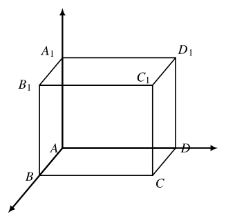

# 2026 年上海秋考数学卷：题目、考点、答案与解答

> 说明：本文件按“题目 → 考点 → 答案 → 解答”逐题排布，便于教师讲评。第 17(3)、20(3)、21 题存在题面或命题措辞风险，已在对应题后标注。

## 一、填空题

### 第 1 题

**题目**：已知集合 $A=\{2,1+a\}$，$-1\in A$，则 $a=$ ___。

**考点**：集合元素与参数。

**答案**：$-2$。

**解答**：因为 $-1\in\{2,1+a\}$，且 $-1\ne2$，所以 $1+a=-1$，故 $a=-2$。

### 第 2 题

**题目**：已知 $\{a_n\}$ 为等比数列，$a_1=2$，$a_2=6$，则 $a_4=$ ___。

**考点**：等比数列通项。

**答案**：$54$。

**解答**：公比 $q=\frac{a_2}{a_1}=3$，所以
$$
a_4=a_1q^3=2\cdot3^3=54.
$$

### 第 3 题

**题目**：已知 $\sin\alpha=\frac15$，则 $\cos2\alpha=$ ___。

**考点**：二倍角公式。

**答案**：$\frac{23}{25}$。

**解答**：
$$
\cos2\alpha=1-2\sin^2\alpha=1-\frac2{25}=\frac{23}{25}.
$$

### 第 4 题

**题目**：已知事件 $A,B$ 互斥，$P(A)=0.2$，$P(B)=0.5$，则 $P(A\cup B)=$ ___。

**考点**：互斥事件概率加法公式。

**答案**：$0.7$。

**解答**：互斥事件满足
$$
P(A\cup B)=P(A)+P(B)=0.2+0.5=0.7.
$$

### 第 5 题

**题目**：已知函数 $f(x)$ 是偶函数，当 $x\ge0$ 时，$f(x)=\sqrt{x}-a$，若 $f(-4)=3$，则 $a=$ ___。

**考点**：偶函数性质。

**答案**：$-1$。

**解答**：偶函数满足 $f(-4)=f(4)$，所以
$$
f(-4)=f(4)=\sqrt4-a=2-a.
$$
由 $2-a=3$ 得 $a=-1$。

### 第 6 题

**题目**：已知 $(x^2+x)^5$，则展开式中 $x^7$ 的系数为 ___。

**考点**：二项式展开、指定项系数。

**答案**：$10$。

**解答**：
$$
(x^2+x)^5=x^5(x+1)^5.
$$
要得到 $x^7$，需在 $(x+1)^5$ 中取 $x^2$ 项，系数为
$$
\binom52=10.
$$

### 第 7 题

**题目**：已知 $a^2+4b^2=1$，则 $ab$ 的最大值为 ___。

**考点**：约束最值、基本不等式。

**答案**：$\frac14$。

**解答**：令 $u=a,\ v=2b$，则 $u^2+v^2=1$，且 $ab=\frac{uv}{2}$。由
$$
2uv\le u^2+v^2=1
$$
得 $uv\le\frac12$，所以
$$
ab=\frac{uv}{2}\le\frac14.
$$
当 $u=v=\frac1{\sqrt2}$ 时取等号。

### 第 8 题

**题目**：已知随机变量 $X$ 的分布为
$$
\begin{pmatrix}
-1&0&1\\
a&0.3&b
\end{pmatrix}
$$
且 $E(X)=0.5$，则 $b=$ ___。

**考点**：离散型随机变量分布列与期望。

**答案**：$0.6$。

**解答**：由概率和为 $1$，得 $a+b=0.7$；由期望得
$$
-a+b=0.5.
$$
联立解得 $b=0.6$。

### 第 9 题

**题目**：已知等差数列 $\{a_n\}$ 中，$a_1=0$，公差为 $d$，其前 $n$ 项和 $S_n$ 在区间 $(0,1)$ 内至少有两项，则公差 $d$ 的取值范围是 ___。

**考点**：等差数列前 $n$ 项和、区间条件。

**答案**：$\left(0,\frac13\right)$。

**解答**：因为 $a_1=0$，所以
$$
S_n=\frac{dn(n-1)}2.
$$
若 $d\le0$，则无正项落入 $(0,1)$。若 $d>0$，则非零项从
$$
S_2=d,\qquad S_3=3d
$$
开始递增。至少两项在 $(0,1)$ 内，等价于
$$
0<d,\qquad 3d<1.
$$
故 $d\in\left(0,\frac13\right)$。

### 第 10 题

**题目**：已知向量 $\vec a,\vec b,\vec c$ 是两两不平行的向量，且
$$
\vec a+3\vec b\parallel \vec b+\vec c,\qquad
2\vec a+k\vec c\parallel \vec b+\vec c,
$$
则 $k$ 的值为 ___。

**考点**：向量共线、基底表示。

**答案**：$-6$。

**解答**：因为 $\vec b,\vec c$ 不平行，可作基底。设
$$
\vec a+3\vec b=\lambda(\vec b+\vec c),
$$
则
$$
\vec a=(\lambda-3)\vec b+\lambda\vec c.
$$
于是
$$
2\vec a+k\vec c=(2\lambda-6)\vec b+(2\lambda+k)\vec c.
$$
它与 $\vec b+\vec c$ 平行，所以两个系数相等：
$$
2\lambda-6=2\lambda+k.
$$
故 $k=-6$。

### 第 11 题

**题目**：已知三角函数
$$
f(t)=A\sin(\omega t+\varphi)+B
$$
其中 $A>0,\ B\in R,\ \omega>0,\ 0\le\varphi<2\pi$。若 $v=f(t)$，当 $v=0$ 或 $v=4$ 时其导数为 $0$，初始速度为 $0$，且速度第一次达到 $4$ 时用时为 $0.1$ 秒，则 $f(t)=$ ___。

**考点**：三角函数模型、周期与相位。

**答案**：
$$
f(t)=2\sin\left(10\pi t+\frac{3\pi}{2}\right)+2.
$$
等价写法为 $f(t)=2-2\cos(10\pi t)$。

**解答**：导数为 $0$ 的点是三角函数图像的波峰或波谷。题目说当 $v=0$ 或 $v=4$ 时导数为 $0$，说明速度的最小值为 $0$，最大值为 $4$。

因此中线和振幅分别为
$$
B=\frac{4+0}{2}=2,\qquad A=\frac{4-0}{2}=2.
$$
所以
$$
f(t)=2\sin(\omega t+\varphi)+2.
$$

初始速度为 $0$，即
$$
f(0)=0.
$$
这说明初始时刻处在最低点。从最低点第一次到最高点用时 $0.1$ 秒，正好是半个周期：
$$
\frac T2=0.1,\qquad T=0.2.
$$
所以
$$
\omega=\frac{2\pi}{T}=10\pi.
$$

再由 $f(0)=0$ 得
$$
2\sin\varphi+2=0,\qquad \sin\varphi=-1.
$$
结合 $0\le \varphi<2\pi$，可取
$$
\varphi=\frac{3\pi}{2}.
$$
因此
$$
f(t)=2\sin\left(10\pi t+\frac{3\pi}{2}\right)+2
=-2\cos(10\pi t)+2.
$$

### 第 12 题

**题目**：在 $\triangle ABC$ 中，$AB=3,\ AC=5,\ BC=\sqrt{14}$。已知点 $A,B,C$ 分别为椭圆的上、下、右顶点，以及两个焦点中的三点，求椭圆的离心率 ___。

**考点**：椭圆顶点、焦点与距离关系。

**答案**：$\frac23$。

**解答**：设椭圆长半轴为 $a$，焦距为 $c$，短半轴为 $b$。可匹配为：一个焦点、右顶点、一个上或下顶点。

由边长可取
$$
a=3,\qquad a+c=5,
$$
所以 $c=2$。又
$$
b^2=a^2-c^2=9-4=5.
$$
右顶点到上顶点距离为
$$
\sqrt{a^2+b^2}=\sqrt{9+5}=\sqrt{14},
$$
与题目吻合。因此
$$
e=\frac ca=\frac23.
$$

## 二、选择题

### 第 13 题

**题目**：$a$ 为不为 $1$ 的任意实数，则 $a\cdot\sqrt[3]{a}=$（ ）。

A. $a^{\frac32}$  
B. $a^{\frac43}$  
C. $a^{\frac52}$  
D. $a^{\frac53}$

**考点**：根式与有理指数幂。

**答案**：B。

**解答**：
$$
a\cdot\sqrt[3]{a}=a\cdot a^{1/3}=a^{4/3}.
$$
故选 B。

### 第 14 题

**题目**：事件 $A$ 和事件 $B$ 相互独立，“$A$ 和 $B$ 至少一个发生”的对立事件是（ ）。

A. $A\cap B$  
B. $A\cup B$  
C. $\bar A\cap\bar B$  
D. $\bar A\cup\bar B$

**考点**：事件的对立事件、德摩根律。

**答案**：C。

**解答**：“$A$ 和 $B$ 至少一个发生”为 $A\cup B$，其对立事件为
$$
\overline{A\cup B}=\bar A\cap\bar B.
$$
故选 C。

### 第 15 题

**题目**：已知 $z,w$ 为复数，当 $z-w$ 为实数或 $z-\overline w$ 为实数时，称 $z$ 和 $w$ 互相伴随。则当 $z$ 和 $w$ 互相伴随时，$w-i$ 和 $z+i$ 互相伴随的充要条件是（ ）。

A. $\operatorname{Re}z+\operatorname{Re}w=0$  
B. $\operatorname{Re}z-\operatorname{Re}w=0$  
C. $\operatorname{Im}z+\operatorname{Im}w=0$  
D. $\operatorname{Im}z-\operatorname{Im}w=0$

**考点**：复数的实部、虚部与共轭复数。

**答案**：C。

**解答**：设
$$
z=a+bi,\qquad w=c+di.
$$

由定义：

- $z-w$ 为实数，等价于 $b-d=0$，即 $b=d$；
- $z-\overline w$ 为实数，等价于 $b+d=0$，即 $b=-d$。

所以 $z$ 与 $w$ 互相伴随，等价于
$$
b=d\quad\text{或}\quad b=-d.
$$

现在看 $w-i$ 与 $z+i$。它们的虚部分别为
$$
\operatorname{Im}(w-i)=d-1,\qquad
\operatorname{Im}(z+i)=b+1.
$$
要使 $w-i$ 与 $z+i$ 互相伴随，需要
$$
d-1=b+1
\quad\text{或}\quad
d-1=-(b+1).
$$
即
$$
d-b=2
\quad\text{或}\quad
b+d=0.
$$

又因为原本 $z$ 与 $w$ 互相伴随，已知 $b=d$ 或 $b=-d$。若 $b=-d$，则 $b+d=0$，新复数必然互相伴随；若 $b=d$，要满足上式只能有 $b=d=0$，这同样包含在 $b+d=0$ 中。

因此充要条件为
$$
\operatorname{Im}z+\operatorname{Im}w=0.
$$
故选 C。

**题面提示**：OCR 版把第二个条件误读成“$w-z$ 的共轭复数为实数”，那样会导致答案变成 D；参考链接中的题面应为 $z-\overline w$ 为实数，答案为 C。

### 第 16 题

**题目**：已知空间直角坐标系中有一正方体，其三组棱分别与 $x$ 轴、$y$ 轴、$z$ 轴重合，顶点 $A$ 与坐标原点重合，点 $C$ 是正方体底面中与 $A$ 相对的对角顶点，点 $C_1$ 在点 $C$ 的正上方。将正方体绕直线 $AC_1$ 旋转一周，试问点 $C$ 的运动轨迹会经过几个空间卦限（ ）。

A. 1  
B. 3  
C. 4  
D. 7

**考点**：空间坐标、绕轴旋转轨迹、空间卦限。

**答案**：A。

**解答**：设棱长为 $1$，则
$$
A=(0,0,0),\quad C=(1,1,0),\quad C_1=(1,1,1).
$$
点 $C$ 绕直线 $AC_1$ 旋转时，到原点距离不变，且在垂直于 $AC_1$ 的圆上运动，因此轨迹满足
$$
x+y+z=2,\qquad x^2+y^2+z^2=2.
$$
若某一坐标为负，例如 $x<0$，则 $y+z=2-x>2$，从而
$$
y^2+z^2\ge\frac{(y+z)^2}{2}>2,
$$
与 $x^2+y^2+z^2=2$ 矛盾。因此轨迹上三坐标均非负，只经过第一卦限。故选 A。

## 三、解答题

### 第 17 题

**题目**：某一年某一样物质，记录了颗粒物密度和二氧化硫密度。图示是 2023 年前九年数据：

| 指标 | 1 | 2 | 3 | 4 | 5 | 6 | 7 | 8 | 9 |
|---|---:|---:|---:|---:|---:|---:|---:|---:|---:|
| 颗粒物密度 | 101.02 | 87.02 | 57.46 | 21.85 | 11.76 | 8.86 | 5.03 | 4.63 | 3.86 |
| 二氧化硫密度 | 119.47 | 81.94 | 53.20 | 9.16 | 6.60 | 4.40 | 3.31 | 3.35 | 3.86 |

(1) 从九年中任意抽取一年，颗粒物密度比二氧化硫密度高的概率是多少？

(2) 想要研究颗粒物密度和二氧化硫密度的线性关系，是选择扇形图，还是茎叶图，还是散点图？研究颗粒物密度和二氧化硫密度的相关系数，你认为在区间 $(-1,0)$ 内，还是在区间 $(0,1)$ 内，还是在区间 $(1,2)$？直接写出答案即可。

(3) 年份的平均数是 2018，拟合成函数，有两个选择：
$$
y_1=106.55e^{-0.461x},\qquad
y_2=a(x-2014)+83.57\quad(a\in R),
$$
预测值与实际值之差的绝对值哪个更小（精确到 0.01），请写出你的理由。

**考点**：古典概型、统计图选择、相关系数、函数拟合残差。

**答案**：

(1) $\frac79$。

(2) 散点图；相关系数在 $(0,1)$ 内。

(3) 若按最后一年数据作模型检验，则指数模型 $y_1$ 的误差更小。

**解答**：

(1) 9 组数据中，颗粒物密度大于二氧化硫密度的有 7 组，所以概率为
$$
\frac79.
$$

(2) 研究两个连续变量的线性关系，应选散点图。两组数据整体同升同降，相关系数为正，且相关系数必在 $[-1,1]$ 内，所以取 $(0,1)$。

(3) 题面未明确比较哪一年。若按最后一年数据、实际值 $3.86$ 来检验，并令该年对应 $x=8$，则
$$
y_1(8)=106.55e^{-0.461\cdot8}\approx2.67,
$$
误差约为
$$
|2.67-3.86|=1.19.
$$
颗粒物密度平均值约为
$$
\bar y=\frac{101.02+87.02+\cdots+3.86}{9}\approx33.50.
$$
由年份平均数为 $2018$，即 $x-2014=4$，得
$$
33.50=4a+83.57,\qquad a\approx -12.52.
$$
于是
$$
y_2(2022)=8a+83.57\approx -16.57,
$$
误差约为 $20.43$。故指数模型 $y_1$ 的误差更小。

**题面风险**：第 17 题题干写“共有 2 个小题”，但实际有 3 个小问；第 (3) 问没有明确说明比较哪一年，以上解答按“用最后一年实际值检验模型”处理。

### 第 18 题

**题目**：如图，四棱锥 $P-ABCD$，底面 $ABCD$ 为矩形，$PH\perp$ 底面 $ABCD$，垂足 $H$ 在 $AD$ 边上，且 $AH=1,\ HD=4,\ AB=2$。

(1) 求证：$HC\perp PB$；

(2) 若四棱锥 $P-ABCD$ 的体积为 $\frac{10\sqrt5}{3}$，求二面角 $C-PB-H$ 的大小。

\begin{center}
\begin{tikzpicture}[scale=0.9, line join=round, line cap=round]
  \coordinate (H) at (0,0);
  \coordinate (A) at (-0.9,-0.25);
  \coordinate (D) at (3.6,0);
  \coordinate (B) at (-1.7,-2.0);
  \coordinate (C) at (2.8,-1.75);
  \coordinate (P) at (0,3.0);

  \draw (B)--(C)--(D)--(P)--(B);
  \draw (P)--(C);
  \draw[dashed] (A)--(H)--(D);
  \draw[dashed] (P)--(H);
  \draw[dashed] (H)--(B);
  \draw[dashed] (H)--(C);
  \draw (A)--(B);

  \fill (H) circle (1.2pt);
  \node[above left] at (P) {$P$};
  \node[left] at (B) {$B$};
  \node[below right] at (C) {$C$};
  \node[right] at (D) {$D$};
  \node[below left] at (A) {$A$};
  \node[below right] at (H) {$H$};
\end{tikzpicture}
\end{center}

**考点**：线面垂直、空间向量、二面角。

**答案**：

(1) $HC\perp PB$。

(2) $\arctan(2\sqrt2)$。

**解答**：以 $H$ 为原点，令 $AD$ 所在方向为 $x$ 轴，$AB$ 所在方向为 $y$ 轴，$PH$ 所在方向为 $z$ 轴。根据 $AH=1,\ HD=4,\ AB=2$，可设
$$
A=(-1,0,0),\quad D=(4,0,0),\quad B=(-1,2,0),\quad C=(4,2,0).
$$
底面矩形面积为
$$
S_{ABCD}=AD\cdot AB=5\cdot2=10.
$$
由体积
$$
V_{P-ABCD}=\frac13S_{ABCD}\cdot PH=\frac{10\sqrt5}{3}
$$
得
$$
PH=\sqrt5,
$$
所以
$$
P=(0,0,\sqrt5).
$$

(1)
$$
\vec{HC}=(4,2,0),\qquad \vec{PB}=B-P=(-1,2,-\sqrt5).
$$
所以
$$
\vec{HC}\cdot\vec{PB}=4(-1)+2\cdot2+0=0.
$$
故 $HC\perp PB$。

(2) 二面角 $C-PB-H$ 是平面 $CPB$ 与平面 $HPB$ 沿公共棱 $PB$ 所成的角。

设
$$
\vec v=\vec{PB}=(-1,2,-\sqrt5).
$$
平面 $HPB$ 的法向量可取
$$
\vec n_1=\vec{PB}\times\vec{PH}
=(-1,2,-\sqrt5)\times(0,0,-\sqrt5)
=(-2\sqrt5,-\sqrt5,0).
$$
平面 $CPB$ 的法向量可取
$$
\vec n_2=\vec{PB}\times\vec{PC}
=(-1,2,-\sqrt5)\times(4,2,-\sqrt5)
=(0,-5\sqrt5,-10).
$$
于是
$$
\vec n_1\cdot\vec n_2=25,
$$
且
$$
|\vec n_1|=5,\qquad |\vec n_2|=15.
$$
设二面角为 $\theta$，则
$$
\cos\theta=\frac{|\vec n_1\cdot\vec n_2|}{|\vec n_1||\vec n_2|}
=\frac{25}{75}
=\frac13.
$$
因此
$$
\tan\theta=\frac{\sqrt{1-\cos^2\theta}}{\cos\theta}
=2\sqrt2,
$$
故
$$
\theta=\arctan(2\sqrt2).
$$

### 第 19 题

**题目**：已知函数
$$
f(x)=x^2+ax+3,\qquad g(x)=4x+\frac1{x^2}.
$$

(1) 解不等式：
$$
f(x)+\frac1{x^2}>g(x);
$$

(2) 设直线 $l_1$ 为 $f(x)$ 过点 $(0,3)$ 的切线，直线 $l_2\perp l_1$，且也过点 $(0,3)$。若 $l_1,l_2$ 与 $g(x)$ 在第一象限内无交点，求实数 $a$ 的取值范围。

**考点**：含参二次不等式、切线、函数交点与最值。

**答案**：

(1) 设 $\Delta=(a-4)^2-12$。若 $\Delta<0$，解集为 $\mathbb R\setminus\{0\}$；若 $\Delta=0$，解集为
$$
\mathbb R\setminus\left\{0,\frac{4-a}{2}\right\};
$$
若 $\Delta>0$，设
$$
\alpha=\frac{4-a-\sqrt\Delta}{2},\qquad
\beta=\frac{4-a+\sqrt\Delta}{2},
$$
解集为 $(-\infty,\alpha)\cup(\beta,+\infty)$，并需排除 $x=0$。

(2)
$$
a\in\left(-\infty,-\frac12\right)\cup[0,2).
$$

**解答**：

(1) 因为 $x\ne0$，原不等式等价于
$$
x^2+ax+3+\frac1{x^2}>4x+\frac1{x^2},
$$
即
$$
x^2+(a-4)x+3>0.
$$
再按判别式 $\Delta=(a-4)^2-12$ 分类即可。

(2) 因为 $f(0)=3$，所以 $f(x)$ 过点 $(0,3)$ 的切线为
$$
l_1:y=ax+3.
$$
设过 $(0,3)$ 的直线为 $y=kx+3$。它与 $g(x)$ 在第一象限无交点，等价于
$$
kx+3=4x+\frac1{x^2}\quad(x>0)
$$
无解，即
$$
(4-k)x+\frac1{x^2}=3
$$
无正根。

当 $k<4$ 时，函数
$$
\varphi(x)=(4-k)x+\frac1{x^2}
$$
的最小值为
$$
3\left(\frac{4-k}{2}\right)^{2/3}.
$$
要使无交点，需最小值大于 $3$，即 $k<2$。

所以 $l_1$ 要求 $a<2$。当 $a\ne0$ 时，$l_2$ 的斜率为 $-\frac1a$，也需
$$
-\frac1a<2,
$$
解得 $a<-\frac12$ 或 $a>0$。再合并 $a<2$，得
$$
a\in\left(-\infty,-\frac12\right)\cup(0,2).
$$
当 $a=0$ 时，$l_2$ 为 $x=0$，不在第一象限内与 $g(x)$ 相交，也符合条件。故
$$
a\in\left(-\infty,-\frac12\right)\cup[0,2).
$$

### 第 20 题

**题目**：已知双曲线 $\Gamma:x^2-y^2=1$，点 $P$ 在 $\Gamma$ 上，$F_1,F_2$ 分别为双曲线的左、右焦点。

(1) 求点 $(2,0)$ 到双曲线渐近线的距离；

(2) 若 $\overrightarrow{PF_1}\cdot\overrightarrow{PF_2}=1$，求 $S_{\triangle PF_1F_2}$；

(3) 记 $\Omega$ 为双曲线 $\Gamma$ 满足
$$
\begin{cases}
x>0,\\
y\ge -1
\end{cases}
\quad\text{和}\quad
\begin{cases}
x<0,\\
y\le -1
\end{cases}
$$
的部分；直线 $l,m$ 均过右焦点 $F_2$，$l$ 与 $\Omega$ 交于 $P,Q$ 两点（分别在第一、第四象限），$m$ 与 $\Omega$ 交于 $M,N$ 两点（分别在第三、四象限）。问：是否存在常数 $\lambda$，使得对任意直线 $l$，都存在唯一对应的直线 $m$ 满足 $\lambda|PQ|=|MN|$？若存在，求出 $\lambda$ 的值；若不存在，请说明理由。

**考点**：双曲线渐近线、焦点三角形面积、焦点弦长度参数化。

**答案**：

(1) $\sqrt2$。

(2) $\sqrt2$。

(3) 按当前题面推导，满足条件的是 $\lambda\ge\frac97$。若题目要求唯一的 $\lambda$，则题面措辞存在风险；临界值为 $\frac97$。

**解答**：

双曲线 $x^2-y^2=1$ 中，$a^2=b^2=1$，所以 $c^2=2$，
$$
F_1=(-\sqrt2,0),\qquad F_2=(\sqrt2,0).
$$

(1) 渐近线为 $y=\pm x$，点 $(2,0)$ 到 $y=x$ 的距离为
$$
\frac{|2-0|}{\sqrt2}=\sqrt2.
$$

(2) 设 $P=(x,y)$，则
$$
\overrightarrow{PF_1}=(-\sqrt2-x,-y),\qquad
\overrightarrow{PF_2}=(\sqrt2-x,-y).
$$
所以
$$
\overrightarrow{PF_1}\cdot\overrightarrow{PF_2}=x^2+y^2-2.
$$
由题意得 $x^2+y^2=3$。又 $P$ 在双曲线上，$x^2-y^2=1$，两式相减得 $y^2=1$。故
$$
S_{\triangle PF_1F_2}
=\frac12\cdot2\sqrt2\cdot1
=\sqrt2.
$$

(3) 设过 $F_2$ 的直线为
$$
y=r(x-\sqrt2).
$$
若直线 $l$ 与 $\Omega$ 交于第一、第四象限的 $P,Q$ 两点，则 $r>1$。联立双曲线可得
$$
|PQ|=\frac{2(1+r^2)}{r^2-1},\qquad r>1.
$$
因此 $|PQ|\in(2,+\infty)$。

若直线 $m$ 与 $\Omega$ 交于第三、第四象限的 $M,N$ 两点，则斜率 $s$ 满足
$$
\frac1{2\sqrt2}\le s<1.
$$
同理
$$
|MN|=\frac{2(1+s^2)}{1-s^2}.
$$
当 $s=\frac1{2\sqrt2}$ 时，$|MN|=\frac{18}{7}$；当 $s\to1^-$ 时，$|MN|\to+\infty$。且该长度随 $s$ 单调递增，所以
$$
|MN|\in\left[\frac{18}{7},+\infty\right).
$$
要使任意 $l$ 都存在唯一对应的 $m$ 满足
$$
\lambda|PQ|=|MN|,
$$
需对任意 $|PQ|>2$ 都有
$$
\lambda|PQ|\ge\frac{18}{7}.
$$
故
$$
\lambda\ge\frac97.
$$

**题面风险**：题目最后写“求出 $\lambda$ 的值”，但按当前题面推导得到的是一段范围 $\lambda\ge\frac97$，不是唯一值。若官方题意要求唯一值，可能缺少“最小值”“临界值”或其他限定条件。

### 第 21 题

**题目**：已知 $(i,j,k)$ 是 $1,2,3$ 的一个排列，若函数 $f_1(x),f_2(x),f_3(x)$ 对任意 $x\in I$ 都有
$$
f_i(x)\le f_j(x)
$$
且
$$
f_i(x)+f_j(x)\le f_k(x)+f_j(x),
$$
则称 $(i,j,k)$ 是关于 $f_1(x),f_2(x),f_3(x)$ 的一个 $I$ 排列，则关于 $f_1(x),f_2(x),f_3(x)$ 的 $I$ 排列总数记为 $n_I$。

(1) 已知 $I=[3,+\infty)$，$f_1(x)=x,\ f_2(x)=0,\ f_3(x)=x^2+1$，判断 $(3,1,2)$ 是否为 $I$ 排列；

(2) 对 $I=(0,+\infty)$，$f_1(x)=x-1,\ f_2(x)=x+m,\ f_3(x)=x^2$，满足条件的 $n_I=6$，求 $m$ 的取值范围；

(3) 对 $x\in[0,+\infty)$，且对任意 $x\in[0,+\infty)$，$0<F(x)<1$，令
$$
I=[a,+\infty),\qquad f_1(x)=F(x),
$$
$$
f_2(x)=\frac12\bigl(F(x+a)+F(x-a)\bigr),\qquad f_3(x)=1-e^{-x}.
$$
证明：若 $F(x)$ 严格减，则存在 $a>0$，使 $n_I\ge4$；若 $F(x)$ 严格增，则存在 $a\in(0,1)$，$n_I\ne2$。

**考点**：新定义、全称不等式、函数大小关系。

**答案**：

按当前 PDF 题面定义：

(1) $(3,1,2)$ 不是 $I$ 排列。

(2) 不存在实数 $m$ 使 $n_I=6$。

(3) 当前题面下命题不成立，疑似原题定义存在笔误或发布版本有误，不能给出通常意义上的证明。

**解答**：由定义，
$$
f_i(x)+f_j(x)\le f_k(x)+f_j(x)
$$
两边同时减去 $f_j(x)$，得到
$$
f_i(x)\le f_k(x).
$$
所以该定义等价于
$$
f_i(x)\le f_j(x)\quad\text{且}\quad f_i(x)\le f_k(x)
$$
对任意 $x\in I$ 恒成立。也就是说，$(i,j,k)$ 是否为 $I$ 排列，只取决于 $f_i$ 是否在整个区间上都不大于另外两个函数。

(1) $(3,1,2)$ 是 $I$ 排列需满足
$$
f_3(x)\le f_1(x),\qquad f_3(x)\le f_2(x)
$$
对任意 $x\ge3$ 成立。但
$$
x^2+1>x>0,
$$
所以不成立。因此 $(3,1,2)$ 不是 $I$ 排列。

(2) 若 $n_I=6$，则 6 个排列全部成立。这意味着 $f_1,f_2,f_3$ 三个函数都要在整个区间上不大于另外两个函数，只能三者恒等：
$$
f_1(x)=f_2(x)=f_3(x).
$$
但 $x-1,\ x+m,\ x^2$ 不可能在整个 $(0,+\infty)$ 上恒等，因此不存在实数 $m$ 使 $n_I=6$。

(3) 按当前定义，题目所给结论并不成立。举反例：
$$
F(x)=\frac1{x+2}.
$$
则 $F(x)$ 在 $[0,+\infty)$ 上严格递减，且 $0<F(x)<1$。令 $u=x+2$，则
$$
f_2(x)-f_1(x)
=\frac12\left(\frac1{u+a}+\frac1{u-a}\right)-\frac1u
=\frac{a^2}{u(u^2-a^2)}>0.
$$
所以 $f_2(x)>f_1(x)$。因此 $f_2$ 不可能成为整个区间上的最小函数。又 $f_1$ 与 $f_3=1-e^{-x}$ 不可能在整个区间上恒等，所以不能保证 $n_I\ge4$。

**题面风险**：第 21 题定义已按原图核对，并非 OCR 清理导致的误读。但该定义会使第 (2) 问无解、第 (3) 问命题不成立。建议后续寻找官方更正版或原始发布说明后再重做本题。

