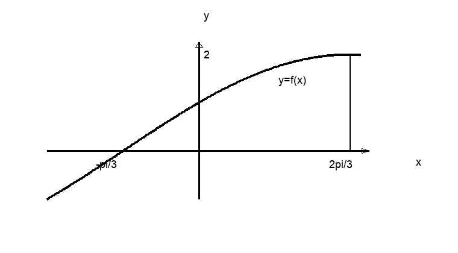
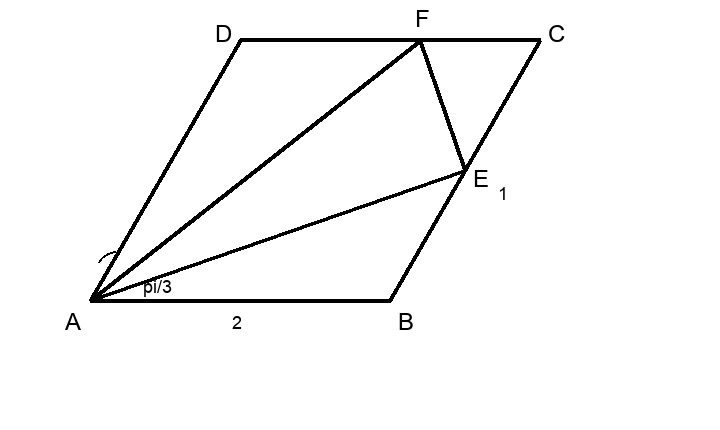
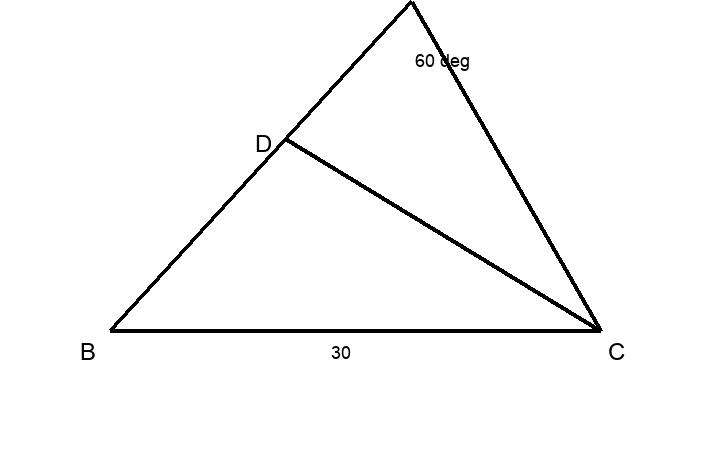

# 2025学年第二学期期末质量监控

# 高一数学

命题：高三数学组　审题：高三数学组

（考试时间：120 分钟，满分：150 分，可使用计算器）

## 一、填空题

（本大题共有 12 小题，满分 54 分。1-6 题每题 4 分，7-12 题每题 5 分）

1. 若 $\cos\alpha=\dfrac{1}{3}$，$\alpha\in(0,\pi)$，则 $\alpha=$ ________。（用反三角符号表示）

2. 已知 $\vec a=(x,2)$，$\vec b=(1,-1)$，且 $\vec a\parallel\vec b$，则实数 $x=$ ________。

3. 已知扇形的半径为 1，圆心角为 $\dfrac{\pi}{3}$，则扇形的面积为 ________。（结果保留 $\pi$）

4. $\displaystyle\sum_{n=1}^{\infty}\left(\dfrac{1}{3}\right)^n=$ ________。

5. 已知 $\vec a=(2,\sqrt3)$，$\vec b=(0,1)$，则 $\vec a$ 在 $\vec b$ 上的数量投影为 ________。

6. 在平面直角坐标系中，已知 $A(4,1)$，$B(2,2)$，$C(2,-2)$，则 $\triangle ABC$ 的面积为 ________。

7. 已知复数 $1+i$（$i$ 为虚数单位）是关于 $x$ 的实系数一元二次方程 $ax^2+x+b=0$ 的一个根，则 $a+b=$ ________。

8. 记等差数列 $(a_n)$ 的前 $n$ 项和为 $S_n$。已知 $a_1+a_2+a_3=-6$，$a_{18}+a_{19}+a_{20}=9$，则 $S_{30}=$ ________。

9. 已知函数 $f(x)=A\sin(\omega x+\varphi)$（$A>0$，$\omega>0$，$|\varphi|<\dfrac{\pi}{2}$）的部分图像如图所示，则该函数的表达式为 $f(x)=$ ________。

{ width=52% }

10. 在平面直角坐标系 $xOy$ 中，将 $OP$ 绕原点 $O$ 顺时针旋转 $\dfrac{\pi}{2}$ 至 $OQ$，已知点 $Q(3,-4)$，则点 $P$ 的横坐标是 ________。

11. 已知 $f(n)=i^{n+1}+i^{n+2}+i^{n+3}+i^{n+4}+i^{n+5}$（$i$ 为虚数单位，$n$ 为正整数）。当 $n_1,n_2$ 取遍所有正整数时，$f(n_1)+f(n_2)$ 的值中不同虚数的个数为 ________。

12. 已知平面上的向量 $\vec a_1,\vec a_2,\cdots,\vec a_n,\cdots$，其中 $|\vec a_1|=|\vec a_2|=1$，且对任意正整数 $n$，都有
$$
|\vec a_{n+2}|=2|\vec a_n|,\qquad \vec a_n\cdot \vec a_{n+1}=0,
$$
则 $|\vec a_1+\vec a_2+\cdots+\vec a_{10}|$ 的最小值为 ________。

\newpage

## 二、选择题

（本大题共有 4 小题，满分 18 分。13-14 题每题 4 分，15-16 题每题 5 分）

13. $2026^\circ$ 是第（　　）象限角。

A. 一　　B. 二　　C. 三　　D. 四

14. 已知 $z_1$ 和 $z_2$ 为复数，则下列命题为真命题的是（　　）。

A. 若 $z_1^2-z_2^2>0$，则 $z_1^2>z_2^2$

B. 若 $|z_1|=|z_2|$，则 $z_1=z_2$

C. 若 $z_1z_2=|z_1z_2|$，则 $z_1=\overline{z_2}$【待校/ai 已润色】

D. 若 $z_1z_2=0$，则 $z_1=0$ 或 $z_2=0$

15. 在 $\triangle ABC$ 中，角 $A,B,C$ 分别对应边 $a,b,c$。若
$$
\frac{\tan A}{\tan B}=\frac{a^2}{b^2},
$$
则 $\triangle ABC$ 是（　　）。

A. 等腰三角形　　B. 直角三角形　　C. 等腰直角三角形　　D. 等腰三角形或直角三角形

16. 已知等差数列 $(a_n)$ 的公差为 $\dfrac{2\pi}{3}$，集合
$$
S=\{x\mid x=\cos a_n,\ n\in\mathbb N,\ n\ge 1\}.
$$
若 $S=\{a,b\}$，则 $ab$ 的值为（　　）。

A. $-1$　　B. $-\dfrac{1}{2}$　　C. $0$　　D. $\dfrac{1}{2}$

\newpage

## 三、解答题

（本大题共有 5 小题，满分 78 分）

17. （本题满分 14 分，第 1 小题 7 分，第 2 小题 7 分）

已知公比为 $q$（$q>0$）的等比数列 $(a_n)$ 和公差为 1 的等差数列 $(b_n)$，$a_1=b_1=1$，且数列 $(a_nb_n)$ 的前二项和为 2。

（1）分别求数列 $(a_n)$ 和数列 $(b_n)$ 的通项公式；

（2）若 $c_n=10+\log_3 a_n$，求数列 $(c_n)$ 的前 $n$ 项和 $S_n$ 的最大值。

\vspace{7cm}

\newpage

18. （本题满分 14 分，第 1 小题 6 分，第 2 小题 8 分）

如图，菱形 $ABCD$ 的边长为 2，$\angle DAB=\dfrac{\pi}{3}$，点 $E$ 为线段 $BC$ 的中点，点 $F$ 在线段 $DC$ 上。

（1）若 $\overrightarrow{DF}=2\overrightarrow{FC}$，用 $\overrightarrow{AB}$ 和 $\overrightarrow{AD}$ 的线性组合分别表示 $\overrightarrow{AE}$、$\overrightarrow{AF}$；

（2）若 $\overrightarrow{AF}\cdot\overrightarrow{AB}=4$，点 $G$ 是线段 $EF$ 上的动点（含端点），求 $\overrightarrow{AG}\cdot\overrightarrow{EF}$ 的取值范围。

{ width=52% }

\vspace{5cm}

\newpage

19. （本题满分 14 分，第 1 小题 6 分，第 2 小题 8 分）

申辉公司准备规划一片沿海水域进行海产养殖。为方便实时监测又不影响水质，申辉公司工程师规划置放三处塔台，分别记为 $A,B,C$。已知塔台 $B$ 与塔台 $C$ 相距 30 海里，$\angle BAC=60^\circ$。

（1）若塔台 $A$ 与塔台 $C$ 相距 24 海里，且在塔台 $A$ 与塔台 $B$ 的连接线段上发现生物信号 $D$。已知生物信号 $D$ 与塔台 $B$ 的距离为 $4\sqrt{13}$ 海里，求该生物信号 $D$ 距离塔台 $C$ 的距离（单位：海里）；

（2）如何放置塔台 $A$，使得三处塔台围成的 $\triangle ABC$ 面积最大？并说明理由。

{ width=50% }

\vspace{5cm}

\newpage

20. （本题满分 18 分，第 1 小题 4 分，第 2 小题 6 分，第 3 小题 8 分）

已知 $\vec a=(\cos x,\sqrt3\cos x)$，$\vec b=(2\sin x,2\cos x)$，记 $f(x)=\vec a\cdot\vec b$（$x\in\mathbb R$）。

（1）求函数 $y=f(x)$ 的表达式，指出角频率的大小；

（2）若函数 $y=f(x)$ 的图像向右平移 $\varphi$（$\varphi\in(0,\dfrac{\pi}{2})$）后得到偶函数 $y=g(x)$ 的图像，求 $y=g(x)$ 的单调增区间；

（3）函数 $y=f(x)$ 图像上的每个点保持纵坐标不变，横坐标变为原来的 $\dfrac{2}{\omega}$（$\omega>0$）倍，得到函数 $y=h(x)$ 的图像。若 $y=h(x)$ 在 $x\in[0,2026\pi)$ 恰有 2026 个不同的零点，求 $\omega$ 的取值范围。

\vspace{8cm}

\newpage

21. （本题满分 18 分，第 1 小题 4 分，第 2 小题 6 分，第 3 小题 8 分）

若存在正整数 $T$，对任意正整数 $n$，都有 $A_{n+T}=A_n$，则数列 $(A_n)$ 为周期数列，同时称 $T$ 为数列 $(A_n)$ 的一个周期。

已知无穷数列 $(a_n)$ 满足 $a_n\in\{-1,0,1\}$，数列 $(b_n)$ 满足 $b_n=a_n+a_{n+1}$，记数列 $(b_n)$ 的前 $n$ 项和为 $S_n$。

（1）若 2 是数列 $(a_n)$ 的一个周期，证明：数列 $(b_n)$ 是周期数列；

（2）若 2 是数列 $(S_n)$ 的一个周期且 $b_1=0$，求数列 $(S_n)$ 的通项公式；

（3）“存在正整数 $T$，使得 $T$ 是数列 $(S_n)$ 的一个周期且 $b_1=b_{T+1}$”是“数列 $(a_n)$ 是周期数列”的 ________ 条件。

（先从“充要”、“充分非必要”、“必要非充分”、“既非充分又非必要”中选择最合适的填空，再证明。）

\vspace{8cm}
