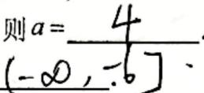
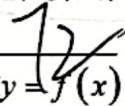
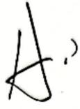
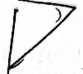
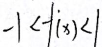
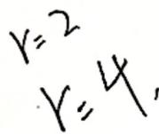
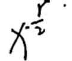
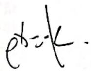
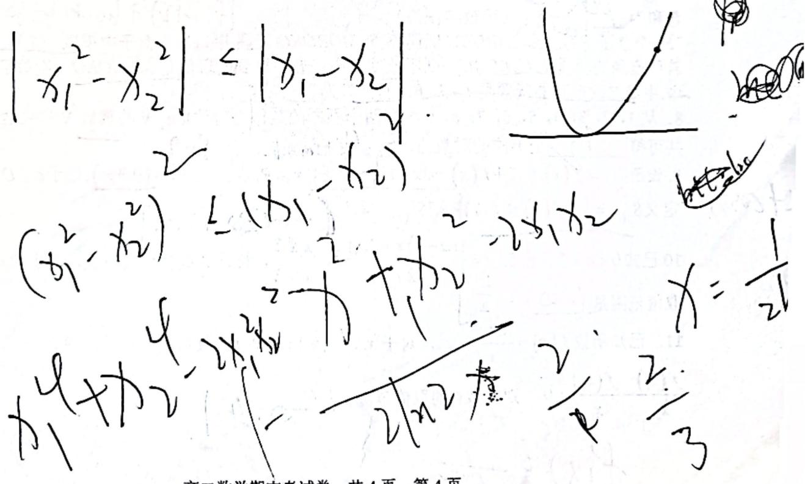

# 松江一中高二期末 OCR 清理稿

## 识别说明

- 来源：`松江一中高二期末.pdf`，4 页 A4 扫描 PDF。
- OCR：MinerU API，中文、公式、表格识别开启。
- 状态：本稿为 OCR 语义化清理稿，已整理标题、分节、题图路径和基础公式渲染；未逐题对照原卷完成精校。
- 标记：`【待校】` 表示 OCR 低置信或疑似混入手写痕迹/答案的位置。

# 松江一中 2025 学年度第二学期期末考试卷

## 高二数学

命题教师：曹素玲、杨斯佳；审核人：王瑾

考试时间：2026 年 6 月

考生注意：

本卷满分150分，考试时间120分钟，答案全部做在答题纸上.

## 一、填空题（本大题共有12题，满分54分。考生必须在答题纸相应编号的空格内直接填写结果，第1--6题每个空格填对得4分，第 7--12 题每个空格填对得5分，否则一律得零分）.

1.设集合 $A = \left[ 1 , 3 \right] , B = \left( 2 , 4 \right)$ 则 $A \cup B = [ 1 ,$ 4)

2. 若函数 $y = ( a ^ { 2 } - 5 a + 5 ) a ^ { x }$ 是指数函数，则a=____【待校：OCR 将填空答案混入题干】

3.函数 $y = \sqrt { x ^ { 2 } + 5 x - 6 }$ 的严格减区间是 $( - \infty , - 6 ]$

4.总体由编号为00，01，...，59的60个个体组成，利用下面的随机数表选取6个个体，选取方法是从随机数表第1行的第6个数字开始由左到右依次选取两个数字，则选出来的第3个个体的编号为  
50446544216606580562 6165543502 4235489632  
1452415248226622158626637541995842367224 k

H(=4)

5.已知随机变量X的分布列为： $\left( { \begin{array} { l l } { m } & { n } \\ { 1 } & { \lambda } \\ { 3 } & { { \frac { a } { 3 } } } \end{array} } \right)$ ，其中 $m > 0 , n > 0$ ，若 $E [ X ] = 1$ ，则 $\frac { 1 } { m } { + } \frac { 1 } { n }$ 的最小值为【待校：遵】$+ \frac { 2 \sqrt { 2 } } { 3 }$ $\frac { m } { 3 } + \frac { 2 n } { 3 } = 1$【待校：h.】(2) 17

6. 已知随机变量 $X _ { \curvearrowright } \sim N \left( 3 , \sigma ^ { 2 } \right)$ ，且 $P \left( X \leq 1 - a \right) = P \left( X \geq 2 a - 1 \right)$ ，则 $\left( x - { \frac { 2 } { x } } \right)$ 展开式的系数和为 $6 4 ( c m$ (用数字作答) 1+(-12)+b0+ (160)+ 2407个盒子中 $\_ A B U B U ,$ 放盒中；到的是 $\text{[check]}$ 【待校：则个放盒】 +1-中.甲第二次摸到的玩偶是LABUBU的概率为0

8. 从1,2,3，4,5,6,7,8,9中取两个不同的数相为对数 $\mathsf { l o g } _ { a } N$ 的真数N和底数a，

共可得个不同的对数值. 9. 设函数y=(x)，其中f $\begin{array} { r } { \left( x \right) = k x + \sin x , \dot { k } \geq 1 , k \in R , } \end{array}$ $2 0 2 6 k + \sin 2 0 3 6$ 8x 定义域为 $g = ( 0 , + \infty )$ 对于 $t \in D ,$

【待校：cost.】

$$
S _ { f ( t ) } = \left\{ x \bigl | f \bigl ( x \bigr ) \le f \bigl ( t \bigr ) \right\}
$$

$$
s _ { f ( 2 0 2 6 ) } = f _ { 0 } \oplus \cos 2 0 2 6 7
$$

10.已知 $\ 0 < a < 2$ ，函数 $\begin{array} { r } { \overline { { y = \{ \begin{array} { l } { ( a - 2 ) x + 4 a + 1 , \cdots \leq 2 } \\ { ~ 2 a ^ { x - 1 } , } \end{array} } } } \end{array}$ ，若该函数存在最小值，则实数a的 取值范围是 $( - \infty , - \frac { 1 } { 2 } )$

11. 已知函数 $f ( x ) = { \frac { a \ln x ^ { 2 } } { x } } - x ^ { 2 }$ ，对于 $x _ { 1 } , \ x _ { 2 } \in \left\{ 2 , 2 0 2 6 \right\}$ ，且当 $x _ { 2 } > x _ { 1 }$ 时，恒有${ \frac { f ( x _ { 1 } ) } { x _ { 2 } } } - { \frac { f ( x _ { 2 } ) } { x _ { 1 } } } > 0$ ，则实数a的取值范围为 $( - \infty , 2 4 ]$

\text{[check]}

12. 已知 $\boldsymbol { x } = \boldsymbol { x } _ { 1 }$ 和 $\boldsymbol { x } = \boldsymbol { x } _ { 2 }$ 分别是函数 $f ( x ) = 2 a ^ { x } - \ e x ^ { 2 } ( a > 0 )$ 且 $a \neq 1 )$ 的极小值点和极大值点.若 $x _ { 1 } < x _ { 2 }$ ，则a的取值范围是

## 二、选择题(本大题共有4题，满分18分，第13\~14题每题4分，第 $1 5 { \sim } 1 6$ 题每题5分)，每题有且只有一个正确答案，考生必须在答题纸相应位置上，将代表答案的小方格涂黑. 1

13. $" x > 1 "$ 是 $\alpha \underbrace { 1 } _ { x } < 1 ^ { \mathfrak { p } }$ 的（ AA. 充分非必要条件 B. 必要非充分条件C. 充分且必要条件 D. 既非充分也非必要条件

14. 设 A. 若 $A , B ;$ 为两立件， 是对立事件， $P ( A \cap B ) = 1$ 正确的为(B. 若A,B是互斥事件， $P \left( A \right) = \frac { 1 } { 3 } , P ( B ) = \frac { 1 } { 2 } ,$ 则 $P ( \stackrel {  } { A } \cup B ) = \frac { 1 } { 6 }$

若A, B是独立事件， $P \left( A \right) = \frac { 1 } { 3 } , \Re ^ { } ( B ) = \frac { 2 } { 3 } , \underline { { { \prime } } }$ 则 $P ( { \overline { { A } } } \cap { \overline { { B } } } ) = { \frac { 1 } { 9 } }$

D. 若 $P ( \overline { { A } } ) = \frac { 1 } { 3 } , P ( \overline { { B } } ) = \frac { 1 } { 2 }$ ,且 $P ( A \cap ^ { \frac { 3 } { B } } ) = { \frac { 1 } { 3 } }$ ,则 3 $A , B$ 是独立事件1

某医院住院的8位新冠患者的潜伏天数分别为3，4，4，610，8，7，18则该样本数据的第60百分位数为8. $0 . 3 - 0 . 2 1 3$ \text{[check]} $\underset {  } { \underbrace { \tilde { \big \{ \varepsilon } } }  ( 3 , - 4 )$ $8 . 1 0 . 1 8$ $8 \times 0 . 6 = 4 . 8$ -\text{[check]}的经验向归方积为 的差？？

$$
\hat { y } \ 4 0 . 3 \ - - 0 . 2 \ = 0 .
$$

$$
X\text{[check]} { \sim } B \left( 1 0 , 0 . 8 \right)
$$

D. $\mathcal { \tilde { K } } \sim \mathcal { N } \left( 1 , 2 ^ { 2 } \right)$ ，记函数 $f ( x ) = P { \bigl ( } X \leq x { \bigr ) }$ $\boldsymbol { x } \in \mathbf { R }$ ，则f(x)的图象关于点 $\left( 1 , { \frac { 1 } { 2 } } \right)$ 对称

16.已知函数 $y = f ( x )$ 在R上的导函数为 $y ^ { \prime } { = } f ^ { \prime } ( x )$ $\because ( x ) \vert < 1$ 对任意 $\pmb { x } \in \pmb { \mathbb { R } }$ 恒成立，

$$
f ( x ) + x = 0
$$

命题(2)：若 $y _ { 1 } = f ( x )$ 是以2为周期的周期函数，则对任意 $x _ { 1 } , x _ { 2 } \in R$ ,都有 $| f ( x _ { 1 } ) - f ( x _ { 2 } ) | < 1$ A. (1)真命题；(2)假命题 B. (1)假命题；(2)真命题C. (1)真命题；(2)真命题 D. (1)假命题；(2)假命题

## 三、解答题（本大题共有5题，满分78分）解答下列各题必须在答题纸相应编号的规定区域内写出必要的步骤.

17.(本题满分14分：第1小题满分7分，第2小题满分7分)

已知集合 $A = \{ x \vert 2 < 2 ^ { x } \leq 8 \}$ $B = \left\{ x | 2 - m < x < m + 1 \right\}$

(1)当m=1时，求 $A \cap B$

(2) 若 $\pmb { A } \cup \pmb { B } = \pmb { A }$ ，求实数m的取值范围.

18.(本题满分14分：第1小题满分6分，第2小题满分8分)

已知 $( x - \frac { 1 } { \sqrt { x } } ) ^ { n }$ 的展开式中的所有二项式系数之和为64.

(1) 求常数项；

（2）将展开式中的各项等可能重新随机排列，求恰有两项有理项相邻的概率.

19.（本题满分14分：第1小题满分4分；第2小题满分4分；第3小题满分6分)某校准备在体育锻炼时间提供三项体育活动供学生选择.为了解该校学生对”三项体育活动中要有篮球”这种观点的态度（态度分为同意和不同意），随机调查了200名学生，得到的反馈数据如下：（单位：人）

<table><tr><td rowspan=1 colspan=1></td><td rowspan=1 colspan=1>男生</td><td rowspan=1 colspan=1>女生</td><td rowspan=1 colspan=1>合计</td></tr><tr><td rowspan=1 colspan=1>同意</td><td rowspan=1 colspan=1>70</td><td rowspan=1 colspan=1>50</td><td rowspan=1 colspan=1>120</td></tr><tr><td rowspan=1 colspan=1>不同意</td><td rowspan=1 colspan=1>30</td><td rowspan=1 colspan=1>50</td><td rowspan=1 colspan=1>80</td></tr><tr><td rowspan=1 colspan=1>合计</td><td rowspan=1 colspan=1>100</td><td rowspan=1 colspan=1>100</td><td rowspan=1 colspan=1>200</td></tr></table>

(1)能否有95%的把握认为学生对"三项体育活动中要有篮球"这种观点的态度与性别有关？

(2)假设现有足球、篮球、跳绳这三项体育活动供学生选择.

(1)若甲乙两名学生从这三项运动中随机选一种，假设他们选择各项运动的概率相同并且相互独立互不影响.记事件A为”学生甲选择足球"，事件B为"甲、乙两名学生都没有选择篮球"，求 $P ( B \bot A )$ 并判断事件A，B是否独立，请说明理由.

(2)若该校所有学生每分钟跳绳个数X\~N(185,169).根据往年经验，该校学生经过训练后，跳绳个数都有明显进步.假设经过训练后每人每分钟跳绳个数比开始时个数均增加10个，若该校有1000名学生，请预估经过训练后该校每分钟跳169个以上的学生人数（结果四舍五入到整数

参考公式及数据： $\chi ^ { 2 } = \frac { n \left( a d - b c \right) ^ { 2 } } { \left( a + b \right) \left( c + d \right) \left( a + c \right) \left( b + d \right) }$ ，其中 $n = a + b + c + d$

<table><tr><td rowspan=1 colspan=1> $\pmb { \alpha }$ </td><td rowspan=1 colspan=1>0.1</td><td rowspan=1 colspan=1>0.05</td><td rowspan=1 colspan=1>0.01</td><td rowspan=1 colspan=1>0.005</td><td rowspan=1 colspan=1>0.001</td></tr><tr><td rowspan=1 colspan=1> $x _ { a }$ </td><td rowspan=1 colspan=1>2.706</td><td rowspan=1 colspan=1>3.841</td><td rowspan=1 colspan=1>6.635</td><td rowspan=1 colspan=1>7.879</td><td rowspan=1 colspan=1>10.828</td></tr></table>

若 $X \sim N \left( \mu , \sigma ^ { 2 } \right)$

则 $P ( \left| X - \mu \right| < \sigma ) \approx 0 . 6 8 2 7 , P ( \left| X - \mu \right| < 2 \sigma ) \approx 0 . 9 5 4 5 , P ( \left| X - \mu \right| < 3 \sigma ) \approx 0 . 9 9 7 3$

20.（本题满分18分：第1小题满分4分；第2小题满分6分；第3小题满分8分）已知函数 $f ( x ) = \log _ { 2 } x$

(1)解关于x的不等式 $f ( 3 x - 2 ) < f ( 2 x + 1 )$

(2)若存在唯一的实数 $\scriptstyle x _ { 0 }$ ，使得 $2 f ( x _ { 0 } - a ) = f ( 2 x _ { 0 } )$ ，求实数a的取值范围

(3) 对于任意 $a , \ b \ , \ c \in \left[ M , + \infty \right)$ ，且 $a \geq b \geq c$ ，当a、b、c能作为一个三角形的三边长时，f(a)、f(b)、f(c)也总能作为某个三角形的三边长，试探究M的最小值.

21.（本题满分18分：第1小题满分4分，第2小题满分6分，第3小题满分8分)已知区间 $I \subseteq R$ ，函数 $y = f ( x )$ 的定义域为I，若函数 $y = f ( x )$ 满足：对任意$x _ { 1 } , x _ { 2 } \in \overline { { I } }$ ，均有 $| f ( x _ { 1 } ) { - }  \overset { \cdot } { f } ( x _ { 2 } ) | { \leq } | x _ { 1 } - x _ { 2 } |$ ，则称函数 $y = f ( x )$ 为压缩函数.

(1) 判断函数 $f ( x ) = x ^ { 2 }$ $\pmb { x } \in [ - \frac 1 2 , \frac 1 2 ]$ 是否为压缩函数？并说明理由；

(2) 若函数 $f ( x ) = e ^ { x } + k x$ ， $x \in [ 0 , 1 ]$ 为压缩函数，求实数k的取值范围；

(3) 已知函数 $y = f ( x ) , \ x \in I$ 为压缩函数，求证： $y = f ( x ) , x \in I$ 为单调函数的充要条件是：对任意 $\boldsymbol { x } _ { 1 } , \boldsymbol { x } _ { 2 } \in I$ ，均有 $\cdot \left( f ( x _ { 1 } ) - f ( \frac { x _ { 1 } + x _ { 2 } } { 2 } ) \right) \cdot \left( f ( x _ { 2 } ) - f ( \frac { x _ { 1 } + x _ { 2 } } { 2 } ) \right) \leq 0 .$

