## 三垂线定理的运用

## 知识讲解

## 导学说明

## 1. 教学目标

(1)识别斜线、射影与平面内直线的关系。

(2)会用三垂线定理证明线线垂直。

(3)会构造二面角的平面角并求角或距离。

## 2. 课程重难点

(1)重点:三垂线定理的条件识别，二面角平面角的构造。

(2)难点:从空间图形中找准射影，说明所作角确为二面角的平面角。

## 3. 考查形式与分值占比

(1)题型:证明题、填空题、选择题、立体几何综合题。

(2)占比:通常融入立体几何综合题，重点考查“垂直关系证明”和“空间角、距离计算”。

## 知识导图

三垂线定理的运用

→ 找垂线与射影

→ 证明空间线线垂直

→ 构造二面角平面角

→ 转化到平面三角形中求角、距离

## 3 教法备注

## 1. 三类知识点

(1)事实性知识:

斜线、垂线、射影、二面角、点到平面的距离等基本对象。

(2)概念性知识:

三垂线定理，二面角的平面角，线面垂直与线线垂直的转化关系。

(3)程序性知识:

找射影、证垂直、作平面角、解三角形或用向量计算。

## 2. 本切片知识点标签

知识点一:利用三垂线定理证明线线垂直，属于程序性知识。

知识点二:利用三垂线定理构造二面角平面角并求角或距离，属于程序性知识。

## 可知识点一:利用三垂线定理证明线线垂直

## 曰知识笔记

## 1. 三垂线定理

设点 $P$ 在平面 $\alpha$ 外， $PA\bot \alpha$ ， $B$ 是平面 $\alpha$ 内一点，则 $AB$ 是斜线 $PB$ 在平面 $\alpha$ 内的射影。若 $l\subset \alpha$ ，则

$$l\bot PB \Longleftrightarrow l\bot AB.$$

使用时要抓住四个对象:平面、斜线、斜线在平面内的射影、平面内直线。

## 2. 常用证明路径

(1)先证明某条直线是斜线在某平面内的射影；

(2)再证明平面内直线与射影垂直；

(3)最后由三垂线定理推出该直线与斜线垂直。

## 教法备注

知识标签:程序性知识。

教学步骤:先让学生在图中圈出“垂线、斜线、射影、平面内直线”，再写出三垂线定理的完整推理链。教学中不要直接背结论，应强调“射影是谁”。

对应知识层级:操作。

## 母题1

## 3 教法备注

母题说明:考查线面垂直判定证明空间线线垂直，是三垂线定理前置能力。

如图，在正方体 ${ABCD} - {A}_{1}{B}_{1}{C}_{1}{D}_{1}$ 中，求证 $B{D}_{1}\bot {AC}$ .

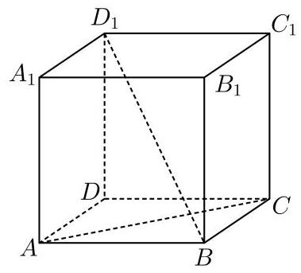

---

答案

证明见解析。

---

解析

连接 ${BD}$ 。因为四边形 ${ABCD}$ 是正方形，所以 ${BD}\bot {AC}$ 。

又因为 $D{D}_{1}\bot$ 平面 ${ABCD}$ ，且 ${AC}\subset$ 平面 ${ABCD}$ ，所以 $D{D}_{1}\bot {AC}$ 。

由于 ${BD}\cap D{D}_{1}=D$ ，且 ${BD},D{D}_{1}\subset$ 平面 ${BD}{D}_{1}$ ，所以 ${AC}\bot$ 平面 ${BD}{D}_{1}$ 。

因为 $B{D}_{1}\subset$ 平面 ${BD}{D}_{1}$ ，所以 $B{D}_{1}\bot {AC}$ 。

## 教法备注

1.【选题原因】

本题不直接使用三垂线定理，而是通过“线线垂直 + 线线垂直 $\Rightarrow$ 线面垂直 $\Rightarrow$ 线线垂直”训练学生的垂直证明链条。三垂线定理题目的证明也常要先补充这类线面垂直关系。

2.【错因预设】

(1)只由正方形对角线垂直推出结论，忽略 $B{D}_{1}$ 不在底面内；

(2)把 $D{D}_{1}\bot {AC}$ 与 ${BD}\bot {AC}$ 写出后，漏写 ${BD}\cap D{D}_{1}=D$ ；

(3)误把“直线垂直平面内一条直线”当作“直线垂直平面”。

3.【讲法建议】

先让学生说出 $B{D}_{1}$ 所在的平面是平面 ${BD}{D}_{1}$ ，再倒推:若要证 $B{D}_{1}\bot {AC}$ ，足够证 ${AC}\bot$ 平面 ${BD}{D}_{1}$ 。这样能帮助学生形成“找包含目标直线的辅助平面”的意识。

## 变式题1-1

## 3 教法备注

变式说明:考查通过线面垂直证明线线垂直，并为二面角平面角构造作准备。

如图，在正方体 ${ABCD} - {A}_{1}{B}_{1}{C}_{1}{D}_{1}$ 中， $E,F$ 分别为 ${AB},{BC}$ 的中点。

(1)求证: ${EF}\bot B{D}_{1}$ ；

(2)求二面角 ${B}_{1} - {EF} - B$ 的大小。

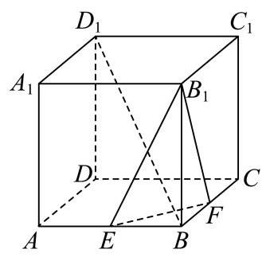

答案

(1)证明见解析；

(2) $\arccos \frac{1}{3}$ 。

解析

(1)连接 ${AC},{BD},{B}_{1}{D}_{1}$ 。因为 $E,F$ 分别为 ${AB},{BC}$ 的中点，所以 ${EF}//{AC}$ 。

正方形 ${ABCD}$ 中 ${AC}\bot {BD}$ ，所以 ${EF}\bot {BD}$ 。

又 $D{D}_{1}\bot$ 平面 ${ABCD}$ ，且 ${EF}\subset$ 平面 ${ABCD}$ ，所以 $D{D}_{1}\bot {EF}$ 。

因为 ${BD}\cap D{D}_{1}=D$ ，且 ${BD},D{D}_{1}\subset$ 平面 ${BD}{D}_{1}{B}_{1}$ ，所以 ${EF}\bot$ 平面 ${BD}{D}_{1}{B}_{1}$ 。

又 $B{D}_{1}\subset$ 平面 ${BD}{D}_{1}{B}_{1}$ ，所以 ${EF}\bot B{D}_{1}$ 。

(2)设正方体棱长为 $4$ 。设 ${EF}\cap {BD}=M$ ，连接 ${B}_{1}M$ 。

由(1)知 ${EF}\bot$ 平面 ${BD}{D}_{1}{B}_{1}$ ，且 ${BM},{B}_{1}M\subset$ 平面 ${BD}{D}_{1}{B}_{1}$ ，所以 ${BM}\bot {EF}$ ， ${B}_{1}M\bot {EF}$ 。

因此 $\angle {B}_{1}{MB}$ 是二面角 ${B}_{1} - {EF} - B$ 的平面角。

在直角三角形 $B{B}_{1}M$ 中， ${BM}=\frac14{BD}=\sqrt{2}$ ， $B{B}_{1}=4$ ，所以 ${B}_{1}M=3\sqrt{2}$ 。

故

$$\cos \angle {B}_{1}{MB}=\frac{BM}{{B}_{1}M}=\frac13.$$

所以二面角 ${B}_{1} - {EF} - B$ 的大小为 $\arccos \frac{1}{3}$ 。

## 教法备注

1.【选题原因】

本题第(1)问是母题的推广:仍是先证某直线垂直一个平面，再推出与该平面内斜线垂直。第(2)问自然过渡到二面角平面角的构造。

2.【错因预设】

(1)只说明 ${EF}//{AC}$ ，未继续说明 ${EF}\bot {BD}$ ；

(2)证明 ${EF}\bot$ 平面 ${BD}{D}_{1}{B}_{1}$ 时漏掉 $D{D}_{1}\bot {EF}$ ；

(3)把 $\angle {B}_{1}{BM}$ 误认为二面角的平面角。

3.【讲法建议】

强调二面角的棱是 ${EF}$ ，平面角的两边必须都垂直于 ${EF}$ 。本题借助第(1)问得到整个平面 ${BD}{D}_{1}{B}_{1}$ 垂直 ${EF}$ ，因此在该平面内连出的 ${BM}$ 、 ${B}_{1}M$ 都可用于构造平面角。

## 变式题1-2

## 3 教法备注

变式说明:本题由母题的“利用投影关系证明线线垂直”推进到“先构造线面垂直，再推出线线垂直”的证明链条。第(1)问通过等边三角形中点构造 ${BE}\bot {AD}$、${PE}\bot {AD}$，进而证明 ${AD}\bot$ 平面 ${PBE}$；第(2)问借助面面垂直得到 ${PE}\bot$ 底面，为后续建系或构造二面角平面角作准备。

如图，已知四棱锥 $P - {ABCD}$ ，底面 ${ABCD}$ 为菱形， $\angle {BAD}=\frac{\pi}{3}$ ，侧面 ${PAD}$ 为等边三角形且垂直于底面。

(1)求证: ${AD}\bot {PB}$ ；

(2)求二面角 $A - {PB} - C$ 的余弦值。

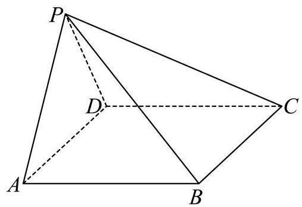

答案

(1)证明见解析；

(2) $-\frac{\sqrt{10}}{5}$ 。

解析

(1)取 ${AD}$ 的中点 $E$ ，连接 ${PE},{BE}$ 。因为四边形 ${ABCD}$ 为菱形， ${AB}={AD}$ 且 $\angle {BAD}=\frac{\pi}{3}$ ，所以 $\triangle BAD$ 为等边三角形，故 ${BE}\bot {AD}$ 。

又侧面 ${PAD}$ 为等边三角形， $E$ 为 ${AD}$ 的中点，所以 ${PE}\bot {AD}$ 。

因为 ${BE}\cap {PE}=E$ ，且 ${BE},{PE}\subset$ 平面 ${PBE}$ ，所以 ${AD}\bot$ 平面 ${PBE}$ 。

又 ${PB}\subset$ 平面 ${PBE}$ ，所以 ${AD}\bot {PB}$ 。

(2)因为平面 ${PAD}\bot$ 平面 ${ABCD}$ ，交线为 ${AD}$ ，且 ${PE}\bot {AD}$ ， ${PE}\subset$ 平面 ${PAD}$ ，所以 ${PE}\bot$ 平面 ${ABCD}$ 。

设 ${AD}=2$ ，以 $E$ 为原点， ${EA},{EB},{EP}$ 所在直线分别为 $x,y,z$ 轴建立空间直角坐标系。

则

$$A(1,0,0),\quad B(0,\sqrt3,0),\quad C(-2,\sqrt3,0),\quad P(0,0,\sqrt3).$$

可取平面 ${PAB}$ 的法向量 $\overrightarrow m=(\sqrt3,1,1)$ ，平面 ${PBC}$ 的法向量 $\overrightarrow n=(0,1,1)$ 。

于是

$$\cos \langle \overrightarrow m,\overrightarrow n\rangle=\frac{\overrightarrow m\cdot \overrightarrow n}{|\overrightarrow m||\overrightarrow n|}=\frac{2}{\sqrt5\cdot\sqrt2}=\frac{\sqrt{10}}{5}.$$

由图可知二面角 $A - {PB} - C$ 为钝角，故其余弦值为

$$-\frac{\sqrt{10}}{5}.$$

## 教法备注

1.【选题原因】

第(1)问训练“先证线面垂直，再得线线垂直”；第(2)问引入空间向量求二面角，适合比较几何法与向量法的分工。

2.【错因预设】

(1)没有利用两个等边三角形共同的中点 $E$ ；

(2)由面面垂直推出 ${PE}\bot$ 底面时，漏写 ${PE}\bot {AD}$ ；

(3)向量法求得法向量夹角后，未判断二面角是钝角。

3.【讲法建议】

本题第(2)问不宜强行要求学生用三垂线定理完成全部计算。可以指出:几何法负责建立垂直关系和坐标系，向量法负责角的计算。

## 可知识点二:利用三垂线定理构造二面角平面角并求角或距离

## 曰知识笔记

## 1. 二面角的平面角

在二面角 $\alpha-l-\beta$ 的棱 $l$ 上取一点 $O$ ，分别在两个面内作 $OA\bot l$ 、 $OB\bot l$ ，则 $\angle AOB$ 是该二面角的平面角。

构造二面角平面角的核心不是“连哪两条线”，而是证明这两条线都垂直于棱。

## 2. 三垂线定理在二面角中的作用

当二面角某一面的垂线不好直接作出时，可以先找到斜线在另一平面内的射影，再用三垂线定理证明斜线垂直于棱，从而得到平面角的一边。

## 3. 角与距离的常用计算方法

(1)定义法:作出垂线或平面角，在直角三角形中计算；

(2)等体积法:点到平面的距离常用 $V=\frac13Sh$ 转化；

(3)向量法:建系后用法向量求二面角，或用点到平面距离公式求距离。

## 教法备注

知识标签:程序性知识。

教学步骤:先确认二面角的“棱”，再在两个面内寻找或构造垂直于棱的直线。每次得到角后，都要求学生补一句“所以该角是所求二面角的平面角”。

对应知识层级:操作。

## 母题2

## 3 教法备注

母题说明:考查借助三垂线定理作二面角平面角，并在平面三角形中计算。

如图，在直三棱柱 ${ABC} - {A}_{1}{B}_{1}{C}_{1}$ 中， $A{A}_{1}={BC}={AB}=2,{AB}\bot {BC}$ ，求二面角 ${B}_{1} - {A}_{1}C - {C}_{1}$ 的大小。

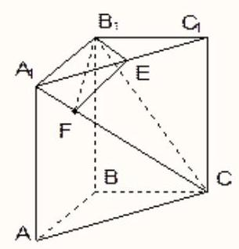

答案

$\frac{\pi}{3}$ 。

解析

取 ${A}_{1}{C}_{1}$ 的中点 $E$ ，作 ${EF}\bot {A}_{1}C$ ，垂足为 $F$ 。

因为 ${A}_{1}{B}_{1}={B}_{1}{C}_{1}$ ，所以 ${B}_{1}E\bot {A}_{1}{C}_{1}$ 。

在直三棱柱中， $C{C}_{1}\bot$ 平面 ${A}_{1}{B}_{1}{C}_{1}$ ，而 ${B}_{1}E\subset$ 平面 ${A}_{1}{B}_{1}{C}_{1}$ ，所以 $C{C}_{1}\bot {B}_{1}E$ 。

又 ${A}_{1}{C}_{1}\cap C{C}_{1}=C_{1}$ ，且 ${A}_{1}{C}_{1},C{C}_{1}\subset$ 平面 ${A}_{1}{C}{C}_{1}$ ，所以 ${B}_{1}E\bot$ 平面 ${A}_{1}{C}{C}_{1}$ 。

因此 ${EF}$ 是 ${B}_{1}F$ 在平面 ${A}_{1}{C}{C}_{1}$ 内的射影。因为 ${EF}\bot {A}_{1}C$ ，由三垂线定理得 ${B}_{1}F\bot {A}_{1}C$ 。

又 ${EF}\bot {A}_{1}C$ ，所以 $\angle E F {B}_{1}$ 是二面角 ${B}_{1} - {A}_{1}C - {C}_{1}$ 的平面角。

由 $A{A}_{1}={BC}={AB}=2$ ，得

$$A_{1}C=2\sqrt3,\quad A_{1}C_{1}=2\sqrt2,\quad B_{1}E=\sqrt2.$$

由 $\triangle A_{1}FE\sim \triangle A_{1}CC_{1}$ ，得

$$\frac{EF}{CC_{1}}=\frac{A_{1}E}{A_{1}C},$$

所以

$$EF=\frac{\sqrt2}{\sqrt3}.$$

于是

$$\tan \angle B_{1}FE=\frac{B_{1}E}{EF}=\sqrt3,$$

故 $\angle B_{1}FE=\frac{\pi}{3}$ 。

所以二面角 ${B}_{1} - {A}_{1}C - {C}_{1}$ 的大小为 $\frac{\pi}{3}$ 。

## 教法备注

1.【选题原因】

本题是“三垂线定理构造二面角平面角”的标准题。重点不是计算，而是证明 ${B}_{1}F\bot {A}_{1}C$ ，从而确认 $\angle B_{1}FE$ 是平面角。

2.【错因预设】

(1)只作 ${EF}\bot {A}_{1}C$ ，没有证明另一边 ${B}_{1}F\bot {A}_{1}C$ ；

(2)把 ${B}_{1}E\bot {A}_{1}{C}_{1}$ 误认为 ${B}_{1}E\bot$ 平面 ${A}_{1}CC_{1}$ ；

(3)相似三角形对应边写错，导致 $EF$ 算错。

3.【讲法建议】

建议板书分三栏:作图、证明平面角、计算。先让学生独立指出棱是 ${A}_{1}C$ ，再追问“哪两条线分别在两个面内且垂直于这条棱”。

## 变式题2-1

## 3 教法备注

变式说明:考查用法向量求同一二面角，可作为母题的向量法补充。

如图所示，在直三棱柱 ${ABC} - {A}_{1}{B}_{1}{C}_{1}$ 中， $A{A}_{1}={BC}={AB}=2,{AB}\bot {BC}$ ，则二面角 ${B}_{1} - {A}_{1}C - {C}_{1}$ 的大小为___。

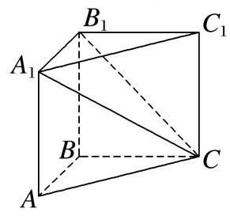

答案

$\frac{\pi}{3}$ 。

解析

建立空间直角坐标系，令

$$B(0,0,0),\quad C(0,2,0),\quad A_{1}(2,0,2),\quad B_{1}(0,0,2).$$

设 ${AC}$ 的中点为 $M$ ，则 $M(1,1,0)$ ，且 ${BM}\bot {AC}$ 、 ${BM}\bot C{C}_{1}$ ，故 $\overrightarrow{BM}=(1,1,0)$ 是平面 ${A}_{1}{C}_{1}C$ 的一个法向量。

设平面 ${A}_{1}{B}_{1}C$ 的法向量为 $\overrightarrow n=(x,y,z)$ 。由

$$\overrightarrow{A_{1}C}=(-2,2,-2),\quad \overrightarrow{A_{1}B_{1}}=(-2,0,0),$$

得

$$\overrightarrow n\cdot \overrightarrow{A_{1}B_{1}}=0,\quad \overrightarrow n\cdot \overrightarrow{A_{1}C}=0.$$

可取 $\overrightarrow n=(0,1,1)$ 。

设二面角为 $\theta$ ，该二面角为锐角，则

$$\cos\theta=\frac{|\overrightarrow n\cdot \overrightarrow{BM}|}{|\overrightarrow n||\overrightarrow{BM}|}=\frac12.$$

所以 $\theta=\frac{\pi}{3}$ 。

## 教法备注

1.【选题原因】

本题与母题结论相同，但方法不同。用于说明传统几何法与向量法都可以求二面角，关键是要正确判断法向量夹角与二面角的关系。

2.【错因预设】

(1)误把 $\overrightarrow{BM}$ 当作平面 ${A}_{1}{B}_{1}C$ 的法向量；

(2)求出法向量夹角后未取绝对值；

(3)没有说明二面角为锐角。

3.【讲法建议】

对基础班，可把本题作为母题的“检验算法”；对提高班，可要求学生比较两种方法的适用条件。

## 变式题2-2

## 3 教法备注

变式说明:考查在直四棱柱中构造二面角平面角。

已知直四棱柱 ${ABCD} - {A}_{1}{B}_{1}{C}_{1}{D}_{1}$ ， ${AB}\bot {AD},{AB}//{CD},{AB}=2,{AD}=3,{CD}=4$ 。

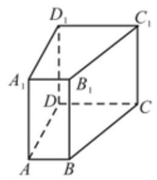

(1)证明:直线 ${A}_{1}B//$ 平面 ${DC}{C}_{1}{D}_{1}$ ；

(2)若该四棱柱的体积为 $36$ ，求二面角 ${A}_{1} - {BD} - A$ 的大小。

答案

(1)证明见解析；

(2) $\arctan \frac{2\sqrt{13}}{3}$ 。

解析

(1)因为 ${AB}//{DC}$ ， $A{A}_{1}//D{D}_{1}$ ，且 ${AB},A{A}_{1}$ 是平面 ${A}_{1}ABB_{1}$ 内的相交直线， ${DC},D{D}_{1}$ 是平面 ${DC}{C}_{1}{D}_{1}$ 内的相交直线，所以平面 ${A}_{1}ABB_{1}//$ 平面 ${DC}{C}_{1}{D}_{1}$ 。

又 ${A}_{1}B\subset$ 平面 ${A}_{1}ABB_{1}$ ，所以 ${A}_{1}B//$ 平面 ${DC}{C}_{1}{D}_{1}$ 。

(2)设 $A{A}_{1}=h$ 。由体积得

$$\frac12(AB+CD)\cdot AD\cdot h=\frac12(2+4)\cdot 3\cdot h=36,$$

所以 $h=4$ 。

在底面 ${ABCD}$ 内过 $A$ 作 ${AE}\bot {BD}$ ，垂足为 $E$ 。因为 ${A}_{1}A\bot$ 底面 ${ABCD}$ ，所以 ${A}_{1}A\bot {BD}$ 。

又 ${AE}\cap A{A}_{1}=A$ ，且 ${AE},A{A}_{1}\subset$ 平面 ${AEA}_{1}$ ，所以 ${BD}\bot$ 平面 ${AEA}_{1}$ 。

因此 ${BD}\bot {A}_{1}E$ ，故 $\angle {A}_{1}EA$ 是二面角 ${A}_{1} - {BD} - A$ 的平面角。

在直角三角形 ${ABD}$ 中，

$$BD=\sqrt{2^{2}+3^{2}}=\sqrt{13},\quad AE=\frac{AB\cdot AD}{BD}=\frac6{\sqrt{13}}.$$

所以

$$\tan \angle {A}_{1}EA=\frac{A_{1}A}{AE}=\frac{4}{6/\sqrt{13}}=\frac{2\sqrt{13}}{3}.$$

故二面角 ${A}_{1} - {BD} - A$ 的大小为 $\arctan \frac{2\sqrt{13}}{3}$ 。

## 教法备注

1.【选题原因】

本题体现“棱在底面内、侧棱垂直底面”时作二面角平面角的常规方法:在底面内过点作棱的垂线，再连空间点。

2.【错因预设】

(1)第(1)问把结论误写成 ${A}_{1}{B}_{1}//$ 平面；

(2)第(2)问只作 ${AE}\bot {BD}$ ，漏证 ${A}_{1}E\bot {BD}$ ；

(3)把 $\tan\theta$ 误写成 $\frac{AE}{A_1A}$ 。

3.【讲法建议】

本题可以让学生先画出二面角 ${A}_{1} - {BD} - A$ 的两个面:平面 ${A}_{1}BD$ 与平面 ${ABD}$ 。只有先明确面，才能正确确定平面角的两边。

## 变式题2-3

## 3 教法备注

变式说明:考查由二面角求棱柱高，再用等体积法求点面距离。

如图，在正三棱柱 ${ABC} - {A}_{1}{B}_{1}{C}_{1}$ 中， ${AB}=1$ 。若二面角 $C - {AB} - {C}_{1}$ 的大小为 $60^\circ$ ，则点 $C$ 到平面 ${AB}{C}_{1}$ 的距离为___。

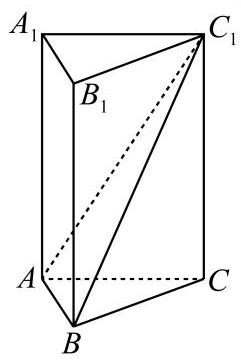

答案

$\frac34$ 。

解析

取 ${AB}$ 的中点 $O$ ，连接 ${OC},O{C}_{1}$ 。因为 $\triangle ABC$ 为正三角形，且 $A{C}_{1}=B{C}_{1}$ ，所以 ${OC}\bot {AB}$ ， $O{C}_{1}\bot {AB}$ 。

故 $\angle CO{C}_{1}$ 是二面角 $C - {AB} - {C}_{1}$ 的平面角， $\angle CO{C}_{1}=60^\circ$ 。

在直角三角形 $COC_{1}$ 中，

$$OC=\frac{\sqrt3}{2},\quad \tan\angle COC_{1}=\frac{CC_{1}}{OC}=\sqrt3,$$

所以

$$CC_{1}=\frac32,\quad C_{1}O=\sqrt3.$$

设点 $C$ 到平面 ${AB}{C}_{1}$ 的距离为 $d$ 。由

$$V_{C-ABC_{1}}=V_{C_{1}-ABC},$$

得

$$\frac13S_{\triangle ABC_{1}}d=\frac13S_{\triangle ABC}\cdot CC_{1}.$$

又

$$S_{\triangle ABC_{1}}=\frac12\cdot AB\cdot C_{1}O=\frac{\sqrt3}{2},\quad S_{\triangle ABC}=\frac{\sqrt3}{4},$$

所以 $d=\frac34$ 。

## 教法备注

1.【选题原因】

本题把二面角、棱柱高、点面距离串联起来，能训练学生把空间角转化为平面三角形，再把距离转化为体积。

2.【错因预设】

(1)没有说明 $O{C}_{1}\bot {AB}$ ，直接认定 $\angle COC_{1}$ 是平面角；

(2)把 $CC_{1}$ 与 $C_{1}O$ 混淆；

(3)等体积法中底面选取错误。

3.【讲法建议】

先固定棱 ${AB}$ ，要求学生分别在两个面内找垂直于 ${AB}$ 的线。求距离时提示“点到面距离不易直接作，可先换体积的底面”。

## 变式题2-4

## 3 教法备注

变式说明:本题是三垂线定理的实际测距应用。通过在道路上构造地面投影 ${BC}\bot l$，并测量可达线段 ${CD}=a$，把无法直接测量的空间距离 ${AC}$ 转化为地面距离 ${BC}$ 与塔高 $h$ 的勾股计算；教学重点是让学生辨认斜线 ${AC}$、投影 ${BC}$、面内直线 ${CD}$ 三者之间的三垂线关系。

如图，小河的一侧有一条笔直的道路 $l$ ，对岸有电塔 ${AB}$ ，已知其高为 $h$ 。现只有小平板仪和皮尺作为测量工具，请说明还需测量的数据，然后运用三垂线定理给出求电塔顶 $A$ 与道路 $l$ 的距离 $d$ 的公式。

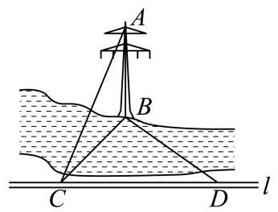

答案

$d=\sqrt{h^{2}+a^{2}}$ 。

解析

在道路 $l$ 上取一点 $C$ ，使 ${BC}\bot l$ 。再在 $l$ 上取一点 $D$ ，使 $\angle CDB=45^\circ$ ，用皮尺测得 ${CD}=a$ 。

因为 ${BC}$ 是 ${AC}$ 在地面上的投影，且 ${BC}\bot {CD}$ ，由三垂线定理得 ${AC}\bot {CD}$ 。

因此斜线 ${AC}$ 的长度就是电塔顶 $A$ 到道路 $l$ 的距离 $d$ 。

在直角三角形 $BCD$ 中， $\angle BCD=90^\circ,\angle CDB=45^\circ,{CD}=a$ ，所以 ${BC}=a$ 。

在直角三角形 $ABC$ 中，

$$AC^{2}=AB^{2}+BC^{2}=h^{2}+a^{2},$$

故

$$d=AC=\sqrt{h^{2}+a^{2}}.$$

## 教法备注

1.【选题原因】

本题来自教材典型应用，能体现三垂线定理的工具性:把“空间中点到直线的距离”转化为可测量的地面距离与电塔高度。

2.【错因预设】

(1)没有说明 ${BC}$ 是 ${AC}$ 在地面内的射影；

(2)只求出 ${BC}=a$ ，未说明为什么 $AC$ 是点到道路的距离；

(3)把道路记号 $l$ 误看成数字 $1$ 。

3.【讲法建议】

教学时可让学生先用语言解释“为什么顶点到道路的最短距离不是水平距离 $BC$”，再引出三垂线定理。

## 变式题2-5

## 3 教法备注

变式说明:考查在折叠模型中识别二面角平面角。

我国古代数学著作《九章算术》中将四个面都是直角三角形的空间四面体叫做“鳖臑”。如图，水平放置的 $\triangle ABC$ 中， ${CD}\bot {AB},\angle A=30^\circ,\angle B=45^\circ$ 。现将 Rt $\triangle ACD$ 沿 ${CD}$ 折起，使点 $A$ 移动到点 ${A}^{\prime}$ ，使得空间四面体 ${A}^{\prime}{BCD}$ 恰好是一个“鳖臑”，则二面角 ${A}^{\prime} - {CD} - B$ 的大小为( )

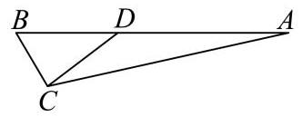

A. $60^\circ$

B. $90^\circ$

C. $\arctan 2$

D. $\arccos \frac{\sqrt3}{3}$

答案

D

解析

设 ${CD}=1$ 。在 $\triangle ABC$ 中，由 ${CD}\bot {AB},\angle A=30^\circ,\angle B=45^\circ$ ，可得

$$BD=1,\quad BC=\sqrt2,\quad AD=\sqrt3,\quad AC=2.$$

折起后， ${A}^{\prime}D\bot {CD}$ ，且 ${BD}\bot {CD}$ ，所以 $\angle {A}^{\prime}DB$ 是二面角 ${A}^{\prime} - {CD} - B$ 的平面角。

空间四面体 ${A}^{\prime}BCD$ 是“鳖臑”，由条件判断应有 ${A}^{\prime}B\bot {BD}$ ，从而在 Rt $\triangle {A}^{\prime}BD$ 中， ${A}^{\prime}B=\sqrt2$ 。

于是

$$\cos \angle {A}^{\prime}DB=\frac{BD}{A'D}=\frac1{\sqrt3}=\frac{\sqrt3}{3}.$$

所以二面角 ${A}^{\prime} - {CD} - B$ 的大小为 $\arccos \frac{\sqrt3}{3}$ 。

## 教法备注

1.【选题原因】

本题强调二面角平面角的定义:两边分别在两个面内且都垂直于棱。折叠题中，折痕就是二面角的棱。

2.【错因预设】

(1)把折叠前的 $\angle ADB$ 当作折叠后的二面角；

(2)没有分类判断“鳖臑”中哪个角为直角；

(3)误选 $\arctan\sqrt2$ 对应的选项。

3.【讲法建议】

先让学生标出折痕 ${CD}$ ，再标出折后两个面内分别垂直 ${CD}$ 的线段 ${A}'D$ 与 ${BD}$ 。这样能减少把平面图角度直接套用到空间图形中的错误。

## 变式题2-6

## 3 教法备注

变式说明:考查点到平面距离的定义法、等体积法和向量法。

如图，在三棱锥 $P - {ABC}$ 中， ${AB}={BC}=2\sqrt2,{PA}={PB}={PC}={AC}=4$ ， $O$ 为 ${AC}$ 的中点。

(1)证明: ${PO}\bot$ 平面 ${ABC}$ ；

(2)若点 $M$ 在棱 ${BC}$ 上，且 ${MC}=2{MB}$ ，求点 $C$ 到平面 ${POM}$ 的距离。

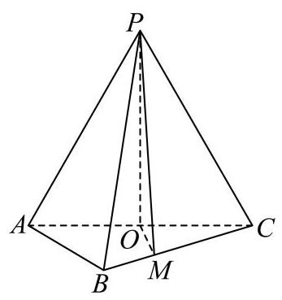

答案

(1)证明见解析；

(2) $\frac{4\sqrt5}{5}$ 。

解析

(1)因为 ${AP}={CP}={AC}=4$ ， $O$ 为 ${AC}$ 的中点，所以 ${OP}\bot {AC}$ ，且 ${OP}=2\sqrt3$ 。

连接 ${OB}$ 。因为

$$AB^{2}+BC^{2}=AC^{2},\quad AB=BC,$$

所以 $\triangle ABC$ 为等腰直角三角形，且 ${OB}\bot {AC}$ ， ${OB}=2$ 。

又

$$OP^{2}+OB^{2}=(2\sqrt3)^{2}+2^{2}=16=PB^{2},$$

所以 ${OP}\bot {OB}$ 。

由 ${OP}\bot {AC}$ 、 ${OP}\bot {OB}$ ，且 ${AC}\cap {OB}=O$ ，得 ${PO}\bot$ 平面 ${ABC}$ 。

(2)作 ${CH}\bot {OM}$ ，垂足为 $H$ 。由(1)知 ${OP}\bot$ 平面 ${ABC}$ ，而 ${CH}\subset$ 平面 ${ABC}$ ，所以 ${OP}\bot {CH}$ 。

又 ${OP}\cap {OM}=O$ ，且 ${OP},{OM}\subset$ 平面 ${POM}$ ，所以 ${CH}\bot$ 平面 ${POM}$ 。故 ${CH}$ 的长即为点 $C$ 到平面 ${POM}$ 的距离。

在 $\triangle OCM$ 中， ${OC}=2$ ， ${CM}=\frac23BC=\frac{4\sqrt2}{3}$ ， $\angle OCM=45^\circ$ ，所以

$$OM=\frac{2\sqrt5}{3}.$$

于是

$$CH=\frac{OC\cdot CM\cdot \sin45^\circ}{OM}=\frac{4\sqrt5}{5}.$$

所以点 $C$ 到平面 ${POM}$ 的距离为 $\frac{4\sqrt5}{5}$ 。

## 教法备注

1.【选题原因】

本题第(2)问是“定义法求点面距离”的好题。关键是把 ${CH}\bot {OM}$ 与 ${CH}\bot {OP}$ 合起来，推出 ${CH}\bot$ 平面 ${POM}$ 。

2.【错因预设】

(1)第(1)问只证明 ${OP}\bot {AC}$ ，漏证 ${OP}\bot {OB}$ ；

(2)把 ${CH}$ 的垂足误写成 $M$ ；

(3)求 $\triangle OCM$ 面积时角度或边长代错。

3.【讲法建议】

本题适合补充等体积法和向量法作为第二、第三方法，但课堂主线建议用定义法，能突出点到平面距离的本质。

## 变式题2-7

## 3 教法备注

变式说明:考查面面夹角的向量法和条件选择。

如图，在四棱锥 $P - {ABCD}$ 中，底面 ${ABCD}$ 为矩形， ${PA}\bot {AB},{PA}={AB}=1,{AD}=2,F$ 是 ${PA}$ 的中点， $E$ 在棱 ${BC}$ 上，且 ${EF}//$ 平面 ${PCD}$ 。

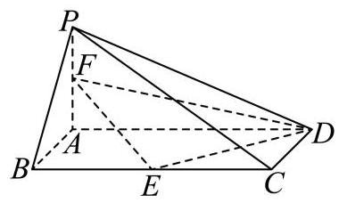

(1)求证: $E$ 是 ${BC}$ 的中点；

(2)再从条件①，条件②中选择一个作为已知，求平面 ${EFD}$ 与平面 ${PAB}$ 夹角的余弦值。

条件①:平面 ${PAB}\bot$ 平面 ${ABCD}$ ；

条件②:${PC}=\sqrt6$ 。

答案

(1)证明见解析；

(2) $\frac{\sqrt2}{6}$ 。

解析

(1)取 ${AD}$ 的中点 $G$ ，连接 ${FG},{EG}$ 。因为 $F$ 是 ${PA}$ 的中点，所以 ${GF}//{PD}$ ，故 ${GF}//$ 平面 ${PCD}$ 。

又 ${EF}//$ 平面 ${PCD}$ ，且 ${GF}\cap {EF}=F$ ，所以平面 ${EFG}//$ 平面 ${PCD}$ 。

因为平面 ${ABCD}\cap$ 平面 ${EFG}={EG}$ ，平面 ${ABCD}\cap$ 平面 ${PCD}={CD}$ ，所以 ${EG}//{CD}$ 。

由于 $G$ 是 ${AD}$ 的中点，所以 $E$ 是 ${BC}$ 的中点。

(2)选择条件①。因为 ${PA}\bot {AB}$ ，平面 ${PAB}\bot$ 平面 ${ABCD}$ ，交线为 ${AB}$ ，且 ${PA}\subset$ 平面 ${PAB}$ ，所以 ${PA}\bot$ 平面 ${ABCD}$ 。

以 $A$ 为原点建立空间直角坐标系，则

$$E(1,1,0),\quad F\left(0,0,\frac12\right),\quad D(0,2,0).$$

于是

$$\overrightarrow{ED}=(-1,1,0),\quad \overrightarrow{FD}=\left(0,2,-\frac12\right).$$

设平面 ${EFD}$ 的法向量为 $\overrightarrow m=(x,y,z)$ ，由

$$\overrightarrow m\cdot \overrightarrow{ED}=0,\quad \overrightarrow m\cdot \overrightarrow{FD}=0,$$

可取 $\overrightarrow m=(1,1,4)$ 。

平面 ${PAB}$ 的一个法向量为 $\overrightarrow n=(0,1,0)$ ，故所求夹角 $\theta$ 满足

$$\cos\theta=\frac{|\overrightarrow m\cdot \overrightarrow n|}{|\overrightarrow m||\overrightarrow n|}=\frac{1}{3\sqrt2}=\frac{\sqrt2}{6}.$$

若选择条件②，则在矩形 ${ABCD}$ 中 ${AC}=\sqrt5$ ，又 ${PA}=1,{PC}=\sqrt6$ ，所以 ${PA}^{2}+{AC}^{2}={PC}^{2}$ ，即 ${PA}\bot {AC}$ 。结合 ${PA}\bot {AB}$ ，可得 ${PA}\bot$ 平面 ${ABCD}$ ，后续同条件①。

## 教法备注

1.【选题原因】

本题综合平行关系、面面垂直性质和向量法求面面夹角。条件①、②本质都是为了推出 ${PA}\bot$ 平面 ${ABCD}$ 。

2.【错因预设】

(1)第(1)问未说明两平面平行，只凭直观判断 $E$ 为中点；

(2)选择条件②时只得到 ${PA}\bot {AC}$ ，未结合 ${PA}\bot {AB}$ 推线面垂直；

(3)把两个平面的夹角与法向量夹角符号混淆。

3.【讲法建议】

本题可以作为提高题。讲解时应把“条件转化为建系依据”作为主线，不必在第(2)问中引入过多几何作角。

## 变式题2-8

## 3 教法备注

变式说明:考查面积射影定理求面面夹角。

如图，在几何体 ${ABCDE}$ 中，四边形 ${ABCD}$ 是矩形， ${AB}\bot$ 平面 ${BEC}$ ， ${BE}\bot {EC}$ ， ${AB}={BE}={EC}=2$ ， $G,F$ 分别是线段 ${BE},{DC}$ 的中点。

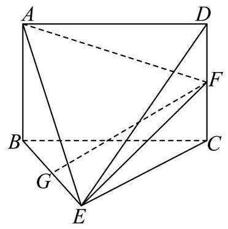

(1)求证: ${GF}//$ 平面 ${ADE}$ ；

(2)设平面 ${AEF}$ 与平面 ${BEC}$ 的交线为 $l$ ，求二面角 $A - l - B$ 的余弦值。

答案

(1)证明见解析；

(2) $\frac23$ 。

解析

(1)取 ${AE}$ 的中点 $H$ ，连接 ${HG},{FG},{HD}$ 。因为 ${HG}//{AB}//{CD}$ ，所以 ${HG}//{FD}$ 。

又 ${HG}=FD=1$ ，所以四边形 ${HGFD}$ 为平行四边形，故 ${GF}//{DH}$ 。

因为 ${DH}\subset$ 平面 ${ADE}$ ，且 ${GF}\not\subset$ 平面 ${ADE}$ ，所以 ${GF}//$ 平面 ${ADE}$ 。

(2)设平面 ${AEF}$ 与平面 ${BEC}$ 所成的锐二面角为 $\theta$ 。因为 ${AB}\bot$ 平面 ${BEC}$ ，且 ${FC}//{AB}$ ，所以 ${FC}\bot$ 平面 ${BEC}$ 。

因此 $\triangle AEF$ 在平面 ${BEC}$ 上的射影为 $\triangle BEC$ 。

由 ${AB}={BE}={EC}=2,\angle ABE=90^\circ$ ，得 ${AE}=2\sqrt2$ 。又 ${FC}=1,\angle FCE=90^\circ$ ，得 ${EF}=\sqrt5$ ；由矩形关系可得 ${AF}=3$ 。

在 $\triangle AEF$ 中，

$$\cos \angle AEF=\frac{AE^{2}+EF^{2}-AF^{2}}{2AE\cdot EF}=\frac1{\sqrt{10}},$$

所以

$$S_{\triangle AEF}=3.$$

又

$$S_{\triangle BEC}=2.$$

由面积射影关系得

$$\cos\theta=\frac{S_{\triangle BEC}}{S_{\triangle AEF}}=\frac23.$$

故二面角 $A-l-B$ 的余弦值为 $\frac23$ 。

## 教法备注

1.【选题原因】

本题展示求二面角的另一条路径:当直接作平面角不方便时，可用面积射影定理求面面夹角。

2.【错因预设】

(1)第(1)问漏取 ${AE}$ 中点 $H$ ，无法构造平行四边形；

(2)把 $\triangle AEF$ 的射影误认为 $\triangle GEC$ ；

(3)面积射影公式中分子分母颠倒。

3.【讲法建议】

讲解时应明确“射影面积 = 原面积 $\times \cos\theta$”。由于本题要求锐二面角余弦值，所以直接取正值。

