## 5.12二面角专题 姓名:___

1 一般刑(解答题) 人教A版高中数学必修二模块质量评估 (A卷)

如图，正方体 $\mathrm{{ABCD}} - {\mathrm{A}}_{1}{\mathrm{\;B}}_{1}{\mathrm{C}}_{1}{\mathrm{D}}_{1}$ 中， $\mathrm{P},\mathrm{M},\mathrm{N}$ 分别为棱 ${\mathrm{{DD}}}_{1},\mathrm{{AB}},\mathrm{{BC}}$ 的中点.

(1)求二面角 ${\mathrm{B}}_{1}$ -MN-B的正切值.

(2)求证: ${PB}\bot {\text{ 平 }\text{ 面 }}{MN}{B}_{1}$ .

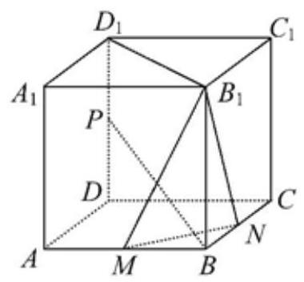

答案

(1)2√5 ; (2)见解析

解析

试题分析: (1) 由平面 ${\mathrm{{DD}}}_{1}{\mathrm{\;B}}_{1}\mathrm{\;B} \bot$ 平面 $\mathrm{{ABCD}}$ ,得 $\mathrm{{AC}} \bot$ 平面 ${\mathrm{{DD}}}_{1}{\mathrm{\;B}}_{1}\mathrm{\;B}$ ,故可得 $\mathrm{{MN}} \bot$ 平面 ${\mathrm{{DD}}}_{1}{\mathrm{\;B}}_{1}\mathrm{\;B}$ , 所以 ${\mathrm{B}}_{1}\mathrm{\;F} \bot  \mathrm{{MN}},\mathrm{{BF}} \bot  \mathrm{{MN}}$ ,可得 $\angle {\mathrm{B}}_{1}\mathrm{{FB}}$ 即为二面角 ${\mathrm{B}}_{1}$ - $\mathrm{{MN}}$ - $\mathrm{B}$ 的平面角,在 $\mathrm{{Rt}}\bigtriangleup {\mathrm{B}}_{1}\mathrm{{FB}}$ 中,可得 $\tan \angle {\mathrm{B}}_{1}\mathrm{{FB}} = 2\sqrt{2}$ . (2) 过点 $\mathrm{P}$ 作 $\mathrm{{PE}} \bot  \mathrm{A}{\mathrm{A}}_{1}$ ,则 $\mathrm{{PE}}\parallel \mathrm{D}\mathrm{A}$ ,由 $\mathrm{D}\mathrm{A} \bot$ 平面 $\mathrm{{AB}}{\mathrm{B}}_{1}{\mathrm{\;A}}_{1}$ ,得 $\mathrm{{PE}} \bot$ 平面 $\mathrm{{AB}}{\mathrm{B}}_{1}{\mathrm{\;A}}_{1}$ ,所以 $\mathrm{{PE}} \bot  {\mathrm{B}}_{1}\mathrm{M}$ ,又 $\mathrm{{BE}} \bot  {\mathrm{B}}_{1}\mathrm{M}$ ,所以 ${\mathrm{B}}_{1}\mathrm{M} \bot$ 平面 $\mathrm{{PEB}}$ ,从而 $\mathrm{{PB}} \bot  {\mathrm{{MB}}}_{1}$ ,又 $\mathrm{{PB}} \bot  \mathrm{{MN}}$ ,所以 $\mathrm{{PB}} \bot$ 平面 ${\mathrm{{MNB}}}_{1}$ .

试题解析:

(1)连接BD交MN于F，连接 ${\mathrm{B}}_{1}\mathrm{\;F}$ ，连接 $\mathrm{{AC}}$ .

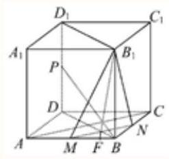

因为平面 ${\mathrm{{DD}}}_{1}{\mathrm{\;B}}_{1}\mathrm{\;B} \bot$ 平面 $\mathrm{{ABCD}}$ ,交线为 $\mathrm{{BD}},\mathrm{{AC}} \bot  \mathrm{{BD}}$ ,

所以 $\mathrm{{AC}} \bot$ 平面 ${\mathrm{{DD}}}_{1}{\mathrm{\;B}}_{1}\mathrm{\;B}$ ,

又因为 $\mathrm{{AC}}\parallel \mathrm{{MN}}$ ,

所以MN⊥平面 ${\mathrm{{DD}}}_{1}{\mathrm{\;B}}_{1}\mathrm{\;B}$ .

因为 ${\mathrm{B}}_{1}\mathrm{\;F},\mathrm{{BF}} \subset$ 平面 ${\mathrm{{DD}}}_{1}{\mathrm{\;B}}_{1}\mathrm{\;B}$ ,

所以 ${\mathrm{B}}_{1}\mathrm{\;F} \bot  \mathrm{{MN}},\mathrm{{BF}} \bot  \mathrm{{MN}}$ ,

因为 ${\mathrm{B}}_{1}\mathrm{F} \subset$ 平面 ${\mathrm{B}}_{1}\mathrm{{MN}},\mathrm{{BF}} \subset$ 平面 $\mathrm{{BMN}}$ ,

所以 $\angle {\mathrm{B}}_{1}\mathrm{{FB}}$ 即为二面角 ${\mathrm{B}}_{1} - \mathrm{{MN}} - \mathrm{B}$ 的平面角，

在Rt $\bigtriangleup {\mathrm{B}}_{1}\mathrm{{FB}}$ 中,设 ${\mathrm{B}}_{1}\mathrm{B} = 1$ ,则 $\mathrm{{FB}} = \frac{\sqrt{2}}{4}$ ,

所以 $\tan \angle {\mathrm{B}}_{1}\mathrm{{FB}} = 2\sqrt{2}$ .

故二面角 ${\mathrm{B}}_{1}$ -MN-B的正切值为 $2\sqrt{2}$ .

(2)过点P作PE $\bot  A{A}_{1}$ ，则PE $\parallel  {DA}$ ，连接BE.

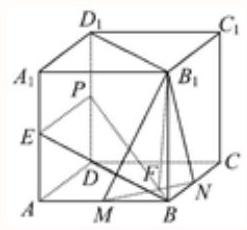

又DA⊥平面ABB ${\mathrm{B}}_{1}{\mathrm{\;A}}_{1}$ ,

所以PE $\bot$ 平面 ${AB}{B}_{1}{A}_{1}$ ,

因为 ${\mathrm{B}}_{1}\mathrm{M} \subset$ 平面 ${\mathrm{{ABB}}}_{1}{\mathrm{A}}_{1}$ ,

所以PE $\bot  {\mathrm{B}}_{1}\mathrm{M}$ ,

又BE $\bot  {\mathrm{B}}_{1}\mathrm{M},$ PE $\cap$ BE $= \mathrm{E}$ ,

所以 ${\mathrm{B}}_{1}\mathrm{M} \bot$ 平面PEB.

所以 $\mathrm{{PB}} \bot  {\mathrm{{MB}}}_{1}$ .

由(1)中MN $\bot$ 平面 ${\mathrm{{DD}}}_{1}{\mathrm{\;B}}_{1}\mathrm{\;B}$ ，得 $\mathrm{{PB}} \bot  \mathrm{{MN}}$ ，

又 ${\mathrm{{MB}}}_{1} \cap  \mathrm{{MN}} = \mathrm{M}$ ,

所以 $\mathrm{{PB}} \bot  \mathrm{{\text{ 平 }\text{ 面 }}}{\mathrm{{MNB}}}_{1}$ .

点睛:(1)求二面角大小的过程可总结为:“一找、二证、三计算.”

(2)作二面角的平面角可以通过垂线法进行，在一个半平面内找一点作另一个半平面的垂线, 再过垂足作二面角的棱的垂线, 两条垂线确定的平面和二面角的棱垂直, 由此可得二面角的平面角.

2 较难 填空题 16 次作答 正确率 81.3% 上海市嘉定区第二中学2025-2026学年高二...

在三棱锥 $P - {ABC}$ 中, ${PA} \bot$ 平面 ${ABC},{AB} \bot  {AC},{PA} = 2$ ,三棱锥 $P - {ABC}$ 外接球的表面积为 ${16\pi }$ ，则二面角 $P - {BC} - A$ 正切值的最小值为___.

答案

$\frac{2\sqrt{3}}{3}$

解析

先由球的表面积求得其半径,再利用球的截面性质求得 $\bigtriangleup {ABC}$ 的外接圆的半径,从而求得 ${AD}$ 的取值范围,进而求得二面角 $P - {BC} - A$ 正切值的取值范围,由此得解.

依题意,设 $\bigtriangleup {ABC}$ 的外接圆的半径为 $r$ ,三棱锥 $P - {ABC}$ 外接球的半径为 $R$ ,

则 ${4\pi }{R}^{2} = {16\pi }$ ，则 $R = 2$ (负值舍去)，

因为 ${PA} \bot$ 平面 ${ABC},{PA} = 2$ ,所以 ${R}^{2} = {\left( \frac{1}{2}PA\right) }^{2} + {r}^{2}$ ,即 $4 = 1 + {r}^{2}$ ,则 $r = \sqrt{3}$ (负值舍去),

因为 ${AB}\bot {AC}$ ，所以 ${BC}$ 为 ${\bigtriangleup {ABC}}$ 的外接圆的直径，即 ${BC} = {2\sqrt{3}}$ ，

过 $A$ 作 ${AD}\bot {BC}$ 交 ${BC}$ 于 $D$ ，连接 ${PD}$ ，如图，

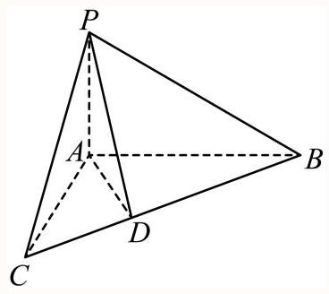

设 ${AB} = a,{AC} = b$ ,则由 $A{B}^{2} + A{C}^{2} = B{C}^{2}$ ,得 ${a}^{2} + {b}^{2} = {12}$ ,

故 ${12} = {a}^{2} + {b}^{2} \geq  {2ab}$ ,得 ${ab} \leq  6$ ,当且仅当 $a = b = \sqrt{6}$ 时,等号成立,

故由三角形面积相等得 ${AD} = \frac{{AB} \cdot  {AC}}{BC} = \frac{ab}{2\sqrt{3}} \leq  \frac{6}{2\sqrt{3}} = \sqrt{3}$ ,

因为 ${PA} \bot$ 平面 ${ABC},{BC} \subset$ 平面 ${ABC}$ ,所以 ${PA} \bot  {BC}$ ,

又 ${AD} \bot  {BC},{PA} \cap  {AD} = A,{PA},{AD} \subset$ 平面 ${PAD}$ ,所以 ${BC} \bot$ 平面 ${PAD}$ ,

因为 ${PD} \subset$ 平面 ${PAD}$ ,所以 ${BC} \bot  {PD}$ ,

所以 $\angle {PDA}$ 为二面角 $P - {BC} - A$ 的平面角,

则 $\tan \angle {PDA} = \frac{PA}{AD} \geq  \frac{2}{\sqrt{3}} = \frac{2\sqrt{3}}{3}$ ，即二面角 $P - {BC} - A$ 正切值的最小值为 $\frac{2\sqrt{3}}{3}$ .

故答案为: $\frac{2\sqrt{3}}{3}$ .

关键点睛:本题解决的关键是利用基本不等式求得 ${AD}$ 的取值范围，再推得 $\angle {PDA}$ 为二面角 $P - {BC} - A$ 的平面角,从而得解.

3 较易 填空题 16次作答 正确率 85% 上海市华东师范大学第二附属中学2025-2026…

设四边形 ${ABCD}$ 是一个正方形， ${PA} \bot$ 平面 ${ABCD}$ ， ${PA} = {AB}$ ，则二面角 $P - {BC} - A$ 的大小为 ___.

答案

${45}^{ \circ  }$

解析

由已知条件可证 $\angle {PBA}$ 是二面角 $P - {BC} - A$ 的平面角,在Rt $\bigtriangleup {PAB}$ 中, ${PA} = {AB}$ ,即可求出 $\angle {PBA}$ 的大小.

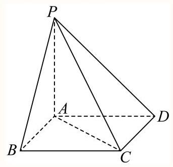

$\because {PA} \bot$ 平面 ${ABCD},{BC} \subset$ 平面 ${ABCD},\therefore {PA} \bot  {BC}$ ,

又 $\because {ABCD}$ 是正方形, $\therefore {BC} \bot  {AB}$ ,

$\because {AB} \cap  {PA} = A,{AB},{PA} \subset$ 平面 ${PAB}$ ,

$\therefore {BC} \bot$ 平面 ${PAB},{PB} \subset$ 平面 ${PAB},\therefore {BC} \bot  {PB}$ ,

$\therefore \angle {PBA}$ 是二面角 $P - {BC} - A$ 的平面角,

在Rt $\bigtriangleup {PAB}$ 中, ${PA} = {AB},\therefore \angle {PBA} = {45}^{ \circ  }$ ,

$\therefore$ 二面角 $P - {BC} - A$ 的大小为 ${45}^{ \circ  }$ .

故答案为: ${45}^{ \circ  }$

4 一般 镇空题 4次作答 正确率 100% 云南省迪庆州藏文中学2024-2025学年高二下...

设四边形 ${ABCD}$ 是一个正方形， ${PA}\bot$ 平面 ${ABCD}$ ， ${PA} = {AB}$ ，则二面角 $P - {BC} - A$ 的大小为 ___.

答案

${45}^{ \circ  }$

解析

由已知条件可证 $\angle {PBA}$ 是二面角 $P - {BC} - A$ 的平面角,在 $\mathrm{{Rt}}\bigtriangleup {PAB}$ 中, ${PA} = {AB}$ ,即可求出 $\angle {PBA}$ 的大小.

$\because {PA} \bot$ 平面 ${ABCD},\therefore {PA} \bot  {BC}$ ,

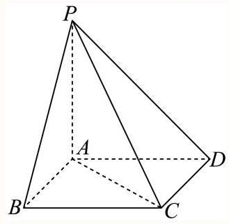

又 $\because {ABCD}$ 是正方形， $\therefore {BC} \bot  {AB}$ ,

$\because {AB} \cap  {PA} = A,{AB},{PA} \subset$ 平面 ${PAB}$ ,

$\therefore {BC} \bot$ 平面 ${PAB}$ ,

$\therefore {BC} \bot  {PB}$ ,

$\therefore \angle {PBA}$ 是二面角 $P - {BC} - A$ 的平面角.

在Rt $\bigtriangleup {PAB}$ 中, ${PA} = {AB},\therefore \angle {PBA} = {45}^{ \circ  }$ ,

$\therefore$ 二面角 $P - {BC} - A$ 的大小为 ${45}^{ \circ  }$ ,

故答案为: ${45}^{ \circ  }$ .

5 较易 填空题 上海市华东政法大学附属中学2024-2025学年高二上学期9月数学阶段性教...

下列情景可能发生或说法正确的是___. (填上所有符合题意的序号)

(1)赵老师在数学课上证明了“不在同一直线上的三点确定一个平面”；

(2)许老师在数学课上证明了“两条平行直线确定一个平面”；

(3)命题一定有逆命题，定理不一定有逆定理，所以定理不一定是命题；

(4)两平面向量夹角的范围记做集合A，线面角的范围记做集合B，二面角的平面角的范围记做集合C,则 $C \subset  B \subseteq  A$ .

答案

(2)

解析

根据平面性质, 命题的概念, 向量夹角, 线面角, 二面角的范围等相关知识点对选项逐一判断即可.

对于(1)，由平面的性质基本事实1，可知不在同一直线上的三点确定一个平面，但基本事实是不需要证明的，故错误；

对于(2)，由平面的性质推论可知，两条平行直线确定一个平面，许老师可证明这个结论， 故正确；

对于(3)，命题可真可假，而定理必须为真命题时才可能称为定理，故定理一定是命题，错误;

对于 (4), $A = \left\lbrack  {0,\pi }\right\rbrack  , B = \left\lbrack  {0,\frac{\pi }{2}}\right\rbrack  , C = \left\lbrack  {0,\pi }\right\rbrack$ ,则 $B \subset  C \subseteq  A$ ,故错误;

故答案为:(2).

6 一般 填空题 1 次作答 正确率 100% 上海市闸北第八中学2024-2025学年高二上学...

如图,在三棱锥 $P - {ABC}$ 中, ${PA} \bot  {PB},{PA} = {PB},{AB} = {2BC} = 4$ ,平面 ${PAB} \bot$ 平面 ${ABC}$ ,则二面角 $P - {AC} - B$ 的正切值的最小值为___.

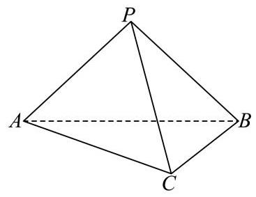

答案

$\frac{2\sqrt{5}}{5}$

解析

过点 $\mathrm{{P\text{ 作 }}}{PO} \bot  {AB}$ ,则 $\mathrm{O}$ 点为 $\mathrm{{AB}}$ 的中点,再过 $O$ 作 ${DO} \bot  {AC}$ 于 $D$ ,利用线面

垂直的性质与判定确定 $\angle {PDO}$ 为二面角 $P - {AC} - B$ 的平面角,结合中位线的性质及三角形三边关系确定 ${OD}$ 最小值即可.

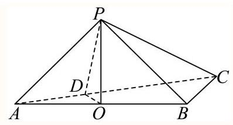

过点 $\mathrm{P}$ 作 ${PO} \bot  {AB}$ ,则 $\mathrm{O}$ 点为 $\mathrm{{AB}}$ 的中点,且平面 ${PAB} \bot$ 平面 ${ABC}$ ,

平面 ${PAB} \cap$ 平面 ${ABC} = {AB},{PO} \subset$ 平面 ${ABP}$ ,所以 ${PO} \bot$ 平面 ${ABC}$ ,

又 ${AC} \subset$ 平面 ${ABC}$ ,所以 ${PO} \bot  {AC}$ ,

过 $O$ 作 ${DO} \bot  {AC}$ 于 $D$ ,连接 ${PD}$ ,

因为 ${PO},{OD} \subset$ 平面 ${POD},{PO} \cap  {OD} = O$ ,

所以 ${AC} \bot$ 平面 ${POD}$ ,

又 ${PD} \subset$ 平面 ${POD}$ ,所以 ${PD} \bot  {AC}$ ,

所以 $\angle {PDO}$ 为二面角 $P - {AC} - B$ 的平面角,

在Rt $\bigtriangleup {PDO}$ 中, ${PO} = \frac{1}{2}{AB} = 2$ , tan $\angle {PDO} = \frac{PO}{OD} = \frac{2}{OD}$ ,

因为 $0 < {OD} \leq  \frac{1}{2}{BC} = 1$ ，当且仅当 ${BC}\bot {AC}$ 时等号成立，

所以 $\tan \angle {PDO}$ 的最小值为2.

此时 $\sin \angle {PDO}$ 取得最小值,

故二面角 $P - {AC} - B$ 的正弦值的最小值为 $\frac{2\sqrt{5}}{5}$ .

故答案为: $\frac{2\sqrt{5}}{5}$ .

7 较易 填空题 14次作答 正确率 71.4% 上海市徐汇中学2024-2025学年高二上学期... 如图正方体 ${ABCD} - {A}_{1}{B}_{1}{C}_{1}{D}_{1}$ 的棱长为2，则二面角 $A - {BD} - {A}_{1}$ 的大小为___.

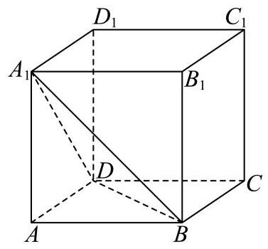

答案

$\arccos \frac{\sqrt{3}}{3}$

解析

建立空间直角坐标系, 利用法向量的夹角即可求解.

以 $A$ 为原点， ${AB}$ 为 $x$ 轴， ${AD}$ 为 $y$ 轴， $A{A}_{1}$ 为 $z$ 轴，建立空间直角坐标系，

${A}_{1}\left( {0,0, a}\right) , A\left( {0,0,0}\right) , C\left( {a, a,0}\right) , B\left( {a,0,0}\right) , D\left( {0, a,0}\right)$ ,

$\overrightarrow{BD} = \left( {-a, a,0}\right) ,{\overrightarrow{BA}}_{1} = \left( {-a,0, a}\right) ,$

设平面 ${A}_{1}{BD}$ 的法向量 $\overrightarrow{p} = \left( {{x}_{1},{y}_{1},{z}_{1}}\right)$ ,

则 $\left\{  \begin{array}{l} \overrightarrow{p} \cdot  \overrightarrow{BD} =  - a{x}_{1} + a{y}_{1} = 0 \\  \overrightarrow{p} \cdot  \overrightarrow{B{A}_{1}} =  - a{x}_{1} + a{z}_{1} = 0 \end{array}\right.$ ,取 ${x}_{1} = 1$ ,得 $\overrightarrow{p} = \left( {1,1,1}\right)$ ,,

又平面 ${ABD}$ 的法向量 $\overrightarrow{m} = \left( {0,0,1}\right)$ .,

设二面角 ${A}_{1} - {BD} - A$ 的大小为 $\beta$ ，

$\cos \beta  = \frac{\left| \overrightarrow{p} \cdot  \overrightarrow{m}\right| }{\left| \overrightarrow{p}\right|  \cdot  \left| \overrightarrow{m}\right| } = \frac{1}{\sqrt{3}} = \frac{\sqrt{3}}{3},$

$\therefore$ 二面角 ${A}_{1} - {BD} - A$ 的大小为 $\arccos \frac{\sqrt{3}}{3}$ .

故答案为: $\arccos \frac{\sqrt{3}}{3}$

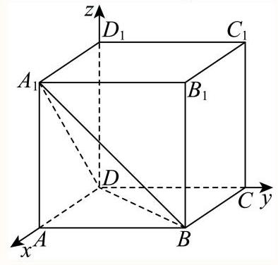

8 一般 摘空题 13次作答 正确率 83.1% 上海市上海师范大学附属外国语中学2025-2...

边长都是为 1 的正方形 ${ABCD}$ 和正方形 ${ABEF}$ 所在的两个半平面所成的二面角为 $\frac{2\pi }{3}, M, N$ 分别是对出线 ${AC}$ 、 ${BF}$ 上的动点，且 ${AM} = {FN}$ ，则 ${MN}$ 的取值范围是___.

答案

$\left\lbrack  {\frac{\sqrt{3}}{2},1}\right\rbrack$

解析

设 ${AM} = {FN} = x$ ，过点 $M$ 作 ${MG}\bot {AB}$ ，垂足为 $G$ ，结合平面几何知识求 ${MG}$ ，证明 ${GN}//{AF}$ ,求 ${NG}$ ,结合二面角的平面角的定义求 $\angle {MGN}$ ,利用余弦定理求 $\left| {MN}\right|$ ,再求其范围.

设 ${AM} = {FN} = x$ ,

过点 $M$ 作 ${MG} \bot  {AB}$ ,垂足为 $G$ ,可知 ${MG}//{BC}$ ,可得 $\frac{AG}{AB} = \frac{AM}{AC} = \frac{x}{\sqrt{2}}$ ,

且 ${MG} = {AG} = \frac{\sqrt{2}}{2}{AM} = \frac{\sqrt{2}}{2}x$ ,连接 $\mathrm{{GN}}$ ,

则 $\frac{AG}{AB} = \frac{NF}{BF} = \frac{x}{\sqrt{2}}$ ,即 ${GN}//{AF}$ ,

可得 ${NG}\bot {AB}$ ，且 ${NG} = 1 - \frac{\sqrt{2}}{2}x$ ，

由题意可知，两个半平面所成的角为 $\angle {MGN} = \frac{2\pi }{3}$ ，

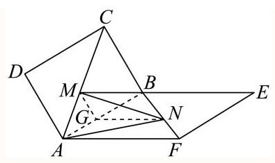

在 $\bigtriangleup {MGN}$ 中,由余弦定理可得

${MN} = \sqrt{M{G}^{2} + N{G}^{2} - {2MG} \cdot  {NG} \cdot  \cos \angle {MGN}}$

$= \sqrt{{\left( \frac{\sqrt{2}}{2}x\right) }^{2} + {\left( 1 - \frac{\sqrt{2}}{2}x\right) }^{2} - 2 \times  \left( {\frac{\sqrt{2}}{2}x}\right)  \times  \left( {1 - \frac{\sqrt{2}}{2}x}\right) \left( {-\frac{1}{2}}\right) } = \sqrt{\frac{1}{2}{x}^{2} - \frac{\sqrt{2}}{2}x + 1} \; = \sqrt{\frac{1}{2}{\left( x - \frac{\sqrt{2}}{2}\right) }^{2} + \frac{3}{4}}$

即 ${MN} = \sqrt{\frac{1}{2}{\left( x - \frac{\sqrt{2}}{2}\right) }^{2} + \frac{3}{4}}$ ,对于二次函数 $y = \frac{1}{2}{\left( x - \frac{\sqrt{2}}{2}\right) }^{2} + \frac{3}{4}$ ,

因为 $x \in  \left\lbrack  {0,\sqrt{2}}\right\rbrack$ ,则 $y = \frac{1}{2}{\left( x - \frac{\sqrt{2}}{2}\right) }^{2} + \frac{3}{4} \in  \left\lbrack  {\frac{3}{4},1}\right\rbrack$ ,所以 ${MN} \in  \left\lbrack  {\frac{\sqrt{3}}{2},1}\right\rbrack$ .

9 一般 填空题 上海交通大学附属中学2024-2025学年高二上学期12月月考数学试卷

已知三个平面 $\alpha \text{ 、 }\beta \text{ 、 }\gamma$ ，任意两个平面所成的锐二面角的大小都是 $\theta$ ，则锐角 $\theta$ 的取值范围是___

港元

$\left( {0,\frac{\pi }{2}}\right)$

解析

利用特殊情况来说明两平面所成角的最大角和最小角, 从而可得任意角时的范围.

作出一个正方体, 如图:

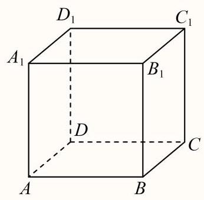

有平面 ${AD}{D}_{1}{A}_{1} \bot$ 平面 ${ABCD}$ ,平面 ${AD}{D}_{1}{A}_{1} \bot$ 平面 ${D}_{1}{C}_{1}{CD}$ ,平面 ${D}_{1}{C}_{1}{CD} \bot$ 平面 ${ABCD}$ , 这样满足三个平面 $\alpha \text{ 、 }\beta \text{ 、 }\gamma$ ,任意两个平面所成的二面角的大小都是 $\frac{\pi }{2}$ ,

当三个平面重合时,也满足三个平面 $\alpha \text{ 、 }\beta \text{ 、 }\gamma$ ,任意两个平面所成的二面角的大小都是 0,

由于两个平面所成的二面角的大小没有钝角,通过以上两种情况,

能说明任意两个平面所成角相等时的最小角是 0,最大角是 $\frac{\pi }{2}$ ,

但是如果三个平面 $\alpha$ 、 $\beta$ 、 $\gamma$ ，任意两个平面所成的锐二面角的大小都是 $\theta$ ，那么锐角 $\theta$ 的取值范围是 $\left( {0,\frac{\pi }{2}}\right)$ .

故答案为: $\left( {0,\frac{\pi }{2}}\right)$ .

10 一般 单选题] 上海市华东政法大学附属中学2024-2025学年高二上学期9月数学阶段性教...

二面角 $P - {MN} - Q$ 的平面角为 $\alpha$ ，A 在棱 ${MN}$ 上，在平面P内有一条射线 ${AC}$ 和棱 ${MN}$ 所成的角为 $\beta$ ，和平面Q所成的角为 $\gamma$ ，则下列结论成立的是( ).

A. $\sin \alpha  = \frac{\sin \gamma }{\sin \beta }$

B. $\cos \alpha  = \frac{\cos \gamma }{\cos \beta }$

C. $\sin \alpha  = \frac{\sin \beta }{\sin \gamma }$

D. $\cos \alpha  = \frac{\cos \beta }{\cos \gamma }$

答案

A

解析

过 $C$ 作 ${CH} \bot$ 平面 ${QMN}$ ,垂足为 $H$ ,过 $H$ 作 ${HD} \bot  {MN}$ ,垂足为 $D$ ,连接 ${CD}$ ,易得 $\alpha  = \angle {CDH},\beta  = \angle {CAN},\gamma  = \angle {CAH}$ ,写出 $\sin \alpha ,\cos \alpha ,\sin \beta ,\cos \beta ,\sin \gamma ,\cos \gamma$ 代入 $\mathrm{A},\mathrm{B},\mathrm{C},\mathrm{D}$ 选项逐一验证即可.

如图,过 $C$ 作 ${CH} \bot$ 平面 ${QMN}$ ,垂足为 $H$ ,过 $H$ 作 ${HD} \bot  {MN}$ ,垂足为 $D$ ,连接 ${CD},{AH}$ , 因 ${DH},{AH},{MN} \subset$ 平面 ${QNM}$ ,则 ${CH} \bot  {DH},{CH} \bot  {AH},{CH} \bot  {MN}$ ,

又 ${DH} \cap  {CH} = H,{DH}\text{ ， }{CH} \subset$ 平面 ${CDH}$ ,故 ${MN} \bot$ 平面 ${CDH}$ ,

而 ${CD} \subset$ 平面 ${CDH}$ ,所以 ${MN} \bot  {CD}$ ,故 $\angle {CDH}$ 为二面角 $P - {MN} - Q$ 的平面角, 则 $\alpha  = \angle {CDH},\beta  = \angle {CAN},\gamma  = \angle {CAH}$ ,则在 $\operatorname{Rt}\bigtriangleup {CDH}$ 中,有 $\sin \alpha  = \frac{CH}{CD},\cos \alpha  = \frac{DH}{CD}$ , 在 $\mathrm{{Rt}}\bigtriangleup {CAD}$ 中, $\sin \beta  = \frac{CD}{CA},\cos \beta  = \frac{AD}{CA}$ ,在 $\operatorname{Rt}\bigtriangleup {CAH}$ 中, $\sin \gamma  = \frac{\bar{C}\bar{H}}{CA},\cos \gamma  = \frac{\overline{AH}}{CA}$ , 将上述结论依次代入 $\mathrm{A},\mathrm{B},\mathrm{C},\mathrm{D}$ 四个选项逐一验证,可知只有 $\mathrm{A}$ 正确.

故选: A.

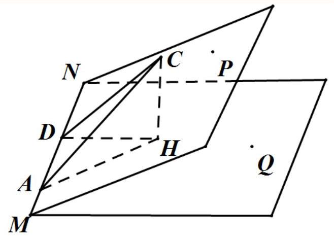

11 一般 单选题 1 次作答 正确率 0% 上海市华东政法大学附属中学2024-2025学年高... 下列关于二面角的平面角的说法，正确的是( ).

A. 两条边分别在二面角的两个面内的角

B. 过二面角棱上一点且两边分别垂直于棱的角

C. 二面角的两个面被一个垂直于棱的平面所截得的角

D. 任一个平面去截二面角的两个面所得的角

答案

C

解析

根据二面角的平面角的定义判断即可.

二面角的平面角是指过棱上一点在两个半平面内作棱的垂线, 两条射线所成的角叫二面角的平面角,

对于A，两条边不一定垂直两个半平面内作棱，故A错误；

对于B，此时两边不一定在平面内，故B错误；

对于C，二面角的两个面被一个垂直于棱的平面所截得的角，此时棱垂直于面与二面角的

两个平面的两条交线，并且均在平面内，符合二面角的平面角定义，故C正确；

对于D, 由C知, 棱不一定垂直于面与二面角的两个平面的两条交线, 故D错误,

故选:C.

要选项分布(全国)

<table><tr><td>作答次数</td><td>正确率</td><td>A占比</td><td>B占比</td><td>C占比</td><td>D占比</td></tr><tr><td>1</td><td>0%</td><td>0%</td><td>100% 易错</td><td>0% 正确</td><td>0%</td></tr></table>

12 一般 单选题 2次作答 正确率 100% 上海市敬业中学2024-2025学年高二上学期12...

如果四棱锥的四条侧棱都相等，就称它为“等腰四棱锥”，四条侧棱称为它的腰. 以下4个命题中， 假命题的是 ( )

A. 等腰四棱锥的腰与底面所成的角都相等

B. 等腰四棱锥的侧面与底面所成的二面角都相等或互补

C. 等腰四棱锥的底面四边形必存在外接圆

D. 等腰四棱锥的各顶点必在同一球面上

答案

B

解析

根据条件画出图形, 结合线面角, 二面角, 四边形外接圆, 球的性质等知识, 逐一判断即可.

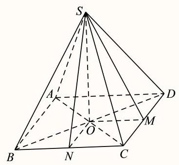

如图,等腰四棱雉 $S - {ABCD}$ 中,作 ${SO} \bot$ 底面 ${ABCD}$ ,因为 ${SA} = {SB} = {SC} = {SD}$ ,所以 $\angle {SAO} = \angle {SBO} = \angle {SCO} = \angle {SDO}$ ,即等腰四棱锥的腰与底面所成的角相等,故 $\mathrm{A}$ 正确;

等腰四棱雉的侧面与底面所成的二面角相等或互补不一定成立, 如图,

${OM} \bot  {CD},{ON} \bot  {BC},\angle {SMO}$ 与 $\angle {SNO}$ 均为侧面与底面所成的二面角，但 ${OM}$ 与 ${ON}$ 不一定相等，故B错误；

等腰四棱雉中， ${SA} = {SB} = {SC} = {SD}$ ，得 ${OA} = {OB} = {OC} = {OD}$ ，即等腰四棱雉的底面四边形存在外接圆, 故C正确;

因为 ${SO} \bot$ 底面 ${ABCD},{OA} = {OB} = {OC} = {OD}$ ,等腰四棱雉的外接球球心在棱雉的高所在直线上，故等腰四棱雉各顶点在同一个球面上，故D正确。

故选: B.

知选项分布(全国)

<table><tr><td>作答次数</td><td>正确率</td><td>A占比</td><td>B占比</td><td>C占比</td><td>D占比</td></tr><tr><td>2</td><td>100%</td><td>0%</td><td>100% 正确</td><td>0%</td><td>0%</td></tr></table>

13 一般 单选题 180 次作答 正确率 65% 上海市实验学校2024-2025学年高二上学期期...

正四面体 ${ABCD}$ 棱长为 1, ${AO} \bot$ 平面 ${BCD}$ ,设 $M$ 为线段 ${AO}$ 上一点,且 $\angle {BMC} = {90}^{ \circ  }$ , 则二面角 $M - {BC} - O$ 的余弦值为( )

A. $\frac{\sqrt{6}}{3}$

B. $\frac{\sqrt{3}}{3}$

C. $\frac{\sqrt{3}}{2}$

D. $\frac{1}{2}$

B

## 解析

连接 ${DO}$ 延长交 ${BC}$ 于 $E$ ，则 $E$ 是 ${BC}$ 中点，得 $\angle {MEO}$ 是二面角 $M - {BC} - O$ 的平面角. 求出 ${ME},{OE}$ 可得结论.

依题意, $O$ 是 $\bigtriangleup {BCD}$ 中心,

连接 ${DO}$ 延长交 ${BC}$ 于 $E$ ，则 $E$ 是 ${BC}$ 中点，连接 ${AE}$ ，则 ${BC}\bot {AE}$ ， ${BC}\bot {DE}$ ，

而 ${AE} \cap  {DE} = E,{AE},{DE} \subset$ 平面 ${AED}$ ,则 ${BC} \bot$ 平面 ${AED}$ ,

cc以 ${ME} \subset$ 平面 ${AED}$ ,则 ${BC} \bot  {ME}$ ,因此 $\angle {MEO}$ 是二面角 $M - {BC} - O$ 的平面角.

由 ${BC} = 1,\angle {BMC} = {90}^{ \circ  }$ ,得 ${BM} = {CM} = \frac{\sqrt{2}}{2},{ME} = \frac{1}{2}{BC} = \frac{1}{2}$ ,

又 ${EO} = \frac{1}{3}{DE} = \frac{1}{3} \times  \frac{\sqrt{3}}{2} = \frac{\sqrt{3}}{6}$ ，由 ${AO} \bot$ 平面 ${BCD}$ ， ${EO} \subset$ 平面 ${BCD}$ ，得 ${AO} \bot  {EO}$ ，

所以二面角 $M - {BC} - O$ 的余弦值 $\cos \angle {MEO} = \frac{EO}{ME} = \frac{\sqrt{3}}{3}$ .

故选: B

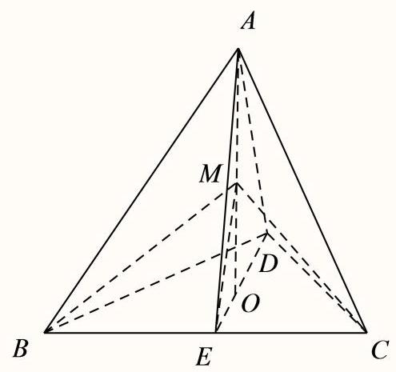

快速负分布(全国)

<table><tr><td>作答次数</td><td>正确率</td><td>A占比</td><td>B占比</td><td>C占比</td><td>D占比</td></tr><tr><td>180</td><td>65%</td><td>10%</td><td>65% 定确</td><td>17.2% 易错</td><td>7.8%</td></tr></table>

14 一般 单选题 上海市松江区立达中学2024-2025学年高二上学期期中考试数学试题如图, 水平桌面上放置一个棱长为 4 的正方体水槽, 水面高度恰为正方体棱长的一半, 侧面 ${CD}{D}_{1}{C}_{1}$ 上有一个小孔 $E$ ， $E$ 点到 ${CD}$ 的距离为3，若该正方体水槽绕 ${CD}$ 倾斜( ${CD}$ 始终在桌面上)，则当水恰好流出时，侧面 ${CD}{D}_{1}{C}_{1}$ 与桌面所成的锐二面角的正切值为( )

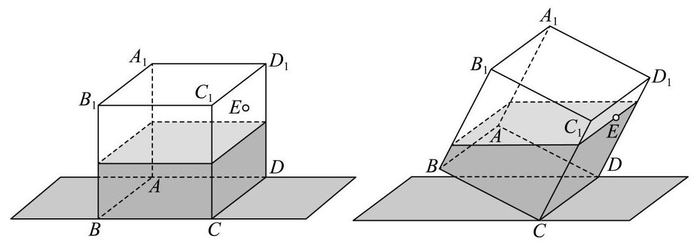

A. $\frac{\sqrt{5}}{5}$

B. $\frac{1}{2}$

C. $\frac{2\sqrt{5}}{5}$

D. 2

答案

D

解析

根据题意,当水恰好流出时,即由水的等体积可求出正方体倾斜后,水面 $N$ 到底面 $B$ 的距离, 再由边长关系可得四边形 ${NP}{C}_{1}H$ 是平行四边形,从而侧面 ${CD}{D}_{1}{C}_{1}$ 与桌面所转化成侧面 ${CD}{D}_{1}{C}_{1}$ 与平面 $H{D}_{1}{C}_{1}$ 所成的角,进而在直角三角形中求出其正切值.

由题意知,水的体积为 $4 \times  4 \times  2 = {32}$ ,如图所示,

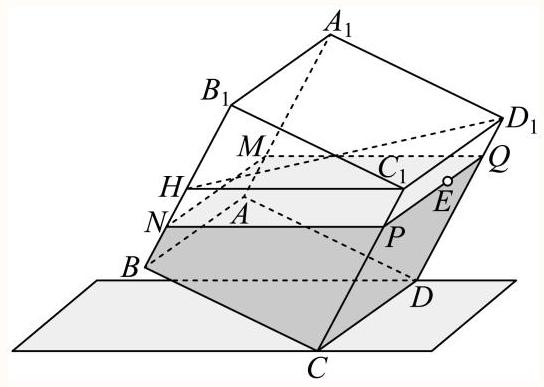

设正方体水槽绕 ${CD}$ 倾斜后,水面分别与棱 $A{A}_{1}, B{B}_{1}, C{C}_{1}, D{D}_{1}$ 交于 $M, N, P, Q$ ,

由题意知 ${PC} = 3$ ，水的体积为 ${S}_{BCPN} \cdot  {CD} = {32}$ ，

所以 $\frac{{NB} + {PC}}{2} \times  {BC} \times  {CD} = {32}$ ,即 $\frac{{NB} + 3}{2} \times  4 \times  4 = {32}$ ,解得 ${BN} = 1$ ,

在平面 ${BC}{C}_{1}{B}_{1}$ 内,过点 ${C}_{1}$ 作 ${C}_{1}H//{NP}$ 交于 $H$ ,

则四边形 ${NP}{C}_{1}H$ 是平行四边形,且 ${NH} = P{C}_{1} = 1$ ,

又侧面 ${CD}{D}_{1}{C}_{1}$ 与桌面所成的角即侧面 ${CD}{D}_{1}{C}_{1}$ 与水面 ${MNPQ}$ 所成的角,

即侧面 ${CD}{D}_{1}{C}_{1}$ 与平面 $H{D}_{1}{C}_{1}$ 所成的角,其平面角为 $\angle H{C}_{1}C = \angle {B}_{1}H{C}_{1}$ ,

在直角三角形 ${B}_{1}H{C}_{1}$ 中, $\tan \angle {B}_{1}H{C}_{1} = \frac{{B}_{1}{C}_{1}}{{B}_{1}H} = \frac{4}{2} = 2$ .

故选: D.

思路点睛:利用定义法求二面角，在棱上任取一点，过这点在两个平面内分别引棱的垂线， 这两条垂线所成的角即为二面角的平面角.

15 一般 单选题 92次作答 正确率 68.5% 上海市同济大学第二附属中学2024-2025学... $m\text{ 、 }n$ 为空间中两条直线， $\alpha \text{ 、 }\beta$ 为空间中两个不同平面，下列命题中正确的个数为( )

①二面角的范围是 $\lbrack 0,\pi )$ ；

②经过3个点有且只有一个平面；

③若 $m\text{ 、 }n$ 为两条异面直线， $m \subset  \alpha , n \subset  \beta , m//\beta$ ，则 $n//\alpha$ .

④若 $m\text{ 、 }n$ 为两条异面直线，且 $m//\alpha , n//\alpha , m//\beta , n//\beta$ ，则 $\alpha //\beta$ .

A. 0

B. 1

C. 2

D. 3

答案

B

解析

利用二面角的取值范围可判断①，当三点共线时可判断②，利用线面平行的判定方法可判断 ③，利用线面平行的性质以及面面平行的判定定理可判断④

对于①，二面角的范围是 $\left\lbrack  {0,\pi }\right\rbrack$ ，①错；

对于②，若三点共线，则经过这个点有无数个平面，②错

对于③，若 $m\text{ 、 }n$ 为两条异面直线， $m \subset  \alpha , n \subset  \beta , m//\beta$ ，则 $n$ 与 $\alpha$ 可能平行也可能相交，故③ 错误;

对于④,因为 $m//\alpha , m//\beta$ ,过直线 $\mathrm{m}$ 作平面 $\gamma$ ,使得 $\gamma  \cap  \alpha  = b,\beta  \cap  \gamma  = a$ ,

由线面平行的性质定理可得 $m//a, m//b$ ,则 $a//b$ ,

因为 $a \text{ ⊄ } \alpha , b \subset  \alpha$ ,则 $a//\alpha$ ,

因为 $n//\alpha , n//\beta$ ,过直线 $\mathrm{n}$ 作平面 $\varphi$ ,使得 $\varphi  \cap  \alpha  = d,\beta  \cap  \varphi  = c$ ,

由线面平行的性质定理可得 $n//c, n//d$ ,则 $c//d$ ,

因为 $c \text{ ⊄ } \alpha , d \subset  \alpha$ ,则 $c//\alpha$ ,

若 $a//c$ ,则 $m//n$ ,这与 $m\text{ 、 }n$ 为两条异面直线矛盾,故 $a, c$ 相交,

又因为 $a, c \subset  \beta$ ，所以 $\alpha //\beta$ ，故④对，

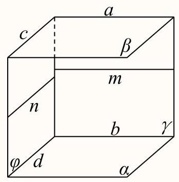

故选: B

要选项分布(全国)

<table><tr><td>作答次数</td><td>正确率</td><td>A占比</td><td>B占比</td><td>C占比</td><td>D占比</td></tr><tr><td>92</td><td>68.5%</td><td>5.4%</td><td>68.5% 正确</td><td>25% 易错</td><td>1.1%</td></tr></table>

16 一般 单选题 1 次作答 正确率 100% 上海市上海第二工业大学附属龚路中学2024-2...

在直二面角 $\alpha  - l - \beta$ 的棱柱取一点A，过点A分别在 $\alpha$ 、 $\beta$ 内A的同侧都作与 $\mathrm{I}$ 成 ${45}^{ \circ  }$ 角的射线，则这两条射线间的夹角为( )

A. ${45}^{ \circ  }$

B. ${60}^{ \circ  }$

C. ${90}^{ \circ  }$

D. ${120}^{ \circ  }$

答案

B

解析

在棱 $l$ 上取一点 $P$ ,分别在 $\alpha \text{ 、 }\beta$ 内过 $P$ 点作 ${PQ},{PR}$ ,与过 $A$ 点的两条射线分别相交于 $Q, R$ ,由二面角的平面角证明等腰Rt $\bigtriangleup {APQ}$ ,等腰Rt $\bigtriangleup {PQR}$ ,等腰Rt $\bigtriangleup {APR}$ 全等进而可求;

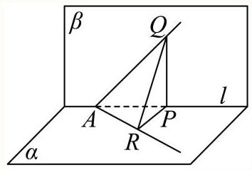

在棱1上取一点 $P$ ,分别在 $\alpha \text{ 、 }\beta$ 内过 $P$ 点作 ${PQ},{PR}$ ,与过 $A$ 点的两条射线分别相交于 $Q, R$ , 则 $\angle {QPR}$ 是二面角的平面角,

由 $\angle {QAP} = \angle {RAP} = {45}^{ \circ  }$ 得等腰Rt $\bigtriangleup {APQ}$ ,等腰Rt $\bigtriangleup {PQR}$ ,等腰Rt $\bigtriangleup {APR}$ 全等, 所以 ${AQ} = {AR} = {QR}$ ,

所以两射线间的夹角为 ${60}^{ \circ  }$ ,

故选: B.

出选项分布(全国)

<table><tr><td>作答次数</td><td>正确率</td><td>A占比</td><td>B占比</td><td>C占比</td><td>D占比</td></tr><tr><td>1</td><td>100%</td><td>0%</td><td>100% 正确</td><td>0%</td><td>0%</td></tr></table>

在正四棱台 ${ABCD} - {A}_{1}{B}_{1}{C}_{1}{D}_{1}$ 中, ${AB} = 2,{A}_{1}{B}_{1} = 4$ ,异面直线 ${C}_{1}{D}_{1}$ 与 $A{A}_{1}$ 所成角为 $\frac{\pi }{3}$ ,设二面角 $A - {A}_{1}{B}_{1} - {D}_{1}$ 的大小为 $\theta$ ，则 $\tan \theta  =$ ___.

## 2 答案

$\sqrt{2}$

解析

法一在正四棱台中，由异面直线所成角可得 $\angle A{A}_{1}{B}_{1} = {60}^{ \circ  }$ ，再根据面面角定义计算求解即可, 法二建立空间直角坐标系, 求出关键点的坐标和关键平面的法向量, 进而利用二面角的向量求法并结合同角三角函数的基本关系求解即可.

法一:在正四棱台 ${ABCD} - {A}_{1}{B}_{1}{C}_{1}{D}_{1}$ 中， ${C}_{1}{D}_{1}//{A}_{1}{B}_{1}$ ，

因为 ${AB} = 2,{A}_{1}{B}_{1} = 4$ ，所以 $\angle A{A}_{1}{B}_{1}$ 为异面直线 ${C}_{1}{D}_{1}$ 与 $A{A}_{1}$ 所成的角，

即 $\angle A{A}_{1}{B}_{1} = {60}^{ \circ  }$ ,过点 $A$ 作平面 ${A}_{1}{B}_{1}{C}_{1}{D}_{1}$ 的垂线,垂足为 $G$ ,

作直线 ${A}_{1}{B}_{1}$ 的垂线,垂足为 $H$ ,连接 ${GH}$ ,如图所示:

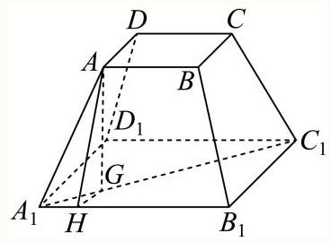

由正四棱台性质可知,点 $G$ 在线段 ${A}_{1}{C}_{1}$ 上, ${A}_{1}H = 1$ ,

所以 ${AH} = \sqrt{3},\;{A}_{1}G = \frac{1}{2}\left( {{A}_{1}{C}_{1} - {AC}}\right)  = \sqrt{2},{GH} = \sqrt{{A}_{1}{G}^{2} - {A}_{1}{H}^{2}} = 1$ ，

由二面角定义可知 $\angle {AHG}$ 即为二面角 $A - {A}_{1}{B}_{1} - {D}_{1}$ 的平面角,

而 $\tan \angle {AHG} = \frac{AG}{GH} = \sqrt{2}$ ,故 $\tan \theta  = \sqrt{2}$ .

法二: 如图,作出符合题意的图形,作下底面中心 ${O}_{1}$ ,上底面中心 $O$ ,

以 ${O}_{1}$ 为原点,建立空间直角坐标系,设正四棱台的高为 $h$ ,

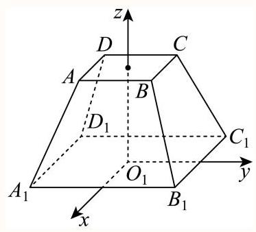

由题意得 ${AB} = 2,{A}_{1}{B}_{1} = 4$ ,则 ${C}_{1}\left( {-2,2,0}\right) ,{D}_{1}\left( {-2, - 2,0}\right) ,{B}_{1}\left( {2,2,0}\right)$

${A}_{1}\left( {2, - 2,0}\right) ,\;A\left( {1, - 1, h}\right)$ ,则 $\overrightarrow{{C}_{1}{D}_{1}} = \left( {0, - 4,0}\right) ,\;\overrightarrow{A{A}_{1}} = \left( {1, - 1, - h}\right)$ ,

因为异面直线 ${C}_{1}{D}_{1}$ 与 $A{A}_{1}$ 所成角为 $\frac{\pi }{3}$ ,

所以 $\frac{4}{4 \times  \sqrt{{1}^{2} + {\left( -1\right) }^{2} + {\left( -h\right) }^{2}}} = \frac{1}{2}$ ,解得 $h = \sqrt{2}$ ,

由题意得面 ${A}_{1}{B}_{1}{D}_{1}$ 的法向量为 $\overrightarrow{n} = \left( {0,0,1}\right)$ ,

则 $A\left( {1, - 1,\sqrt{2}}\right) ,\overrightarrow{A{A}_{1}} = \left( {1, - 1, - \sqrt{2}}\right) ,\overrightarrow{{A}_{1}{B}_{1}} = \left( {0,4,0}\right)$ ,

设面 $A{A}_{1}{B}_{1}$ 的法向量为 $\overrightarrow{m} = \left( {x, y, z}\right)$ ,

则 $\left\{  \begin{array}{l} \overrightarrow{A{A}_{1}} \cdot  \overrightarrow{m} = x - y - \sqrt{2}z = 0 \\  \overrightarrow{{A}_{1}{B}_{1}} \cdot  \overrightarrow{m} = {4y} = 0 \end{array}\right.$ ,令 $x = \sqrt{2}$ ,解得 $y = 0, z = 1$ ,

得到 $\overrightarrow{m} = \left( {\sqrt{2},0,1}\right)$ ,由图可知, $\theta$ 是锐角,则 $\cos \theta  = \frac{\left| \overrightarrow{m} \cdot  \overrightarrow{n}\right| }{\left| \overrightarrow{m}\right|  \cdot  \left| \overrightarrow{n}\right| } = \frac{1}{1 \times  \sqrt{3}} = \frac{\sqrt{3}}{3}$ ,

由已知得 $\sin \theta  > 0$ ，由同角三角函数的基本关系得 $\sin \theta  = \frac{\sqrt{6}}{3}$ ，

故 $\tan \theta  = \frac{\sin \theta }{\cos \theta } = \frac{\frac{\sqrt{6}}{3}}{\frac{\sqrt{3}}{3}} = \sqrt{2}$ .

18 条目知 Theory 1 次作答 正确率 90% 上海市复旦大学附属中学2025-2026学年第二学... 如图,在直三棱柱 ${ABC} - {A}_{1}{B}_{1}{C}_{1}$ 中, ${AB} = {AC} = 2,{BC} = A{A}_{1} = 2\sqrt{2}$ .

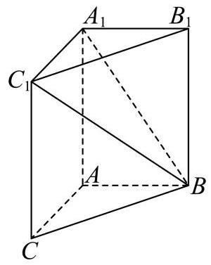

(1) 证明: ${AB} \bot$ 平面 ${AC}{C}_{1}{A}_{1}$ ;

(2) 求二面角 ${A}_{1} - B{C}_{1} - C$ 的大小.

答案

(1)证明见解析

(2) $\pi  - \arctan \sqrt{2}$

解析

(1)因为 $A{A}_{1} \bot$ 平面 ${ABC},{AB} \subset$ 平面 ${ABC}$ ，所以 $A{A}_{1} \bot  {AB}$ ，

因为 ${AB} = {AC} = 2,{BC} = 2\sqrt{2}$ ，所以 ${A{B}^{2}} + {A{C}^{2}} = {B{C}^{2}}$ ，所以 ${AC}\bot {AB}$ ，

因为 $A{A}_{1} \cap  {AC} = A, A{A}_{1},{AC} \subset$ 平面 ${AC}{C}_{1}{A}_{1}$ ，所以 ${AB}\bot$ 平面 ${AC}{C}_{1}{A}_{1}$ .

(2)过 ${A}_{1}$ 作 ${A}_{1}D\bot {B}_{1}{C}_{1}$ ，垂足为 $D$ ，

因为 $B{B}_{1} \bot$ 平面 ${A}_{1}{B}_{1}{C}_{1},{A}_{1}D \subset$ 平面 ${A}_{1}{B}_{1}{C}_{1}$ ,所以 $B{B}_{1} \bot  {A}_{1}D$ ,

因为 ${B}_{1}{C}_{1} \cap  B{B}_{1} = {B}_{1},{B}_{1}{C}_{1}, B{B}_{1} \subset$ 平面 $B{B}_{1}{C}_{1}C$ ,所以 ${A}_{1}D \bot$ 平面 $B{B}_{1}{C}_{1}C$ ,

则点 ${A}_{1}$ 到平面 $B{B}_{1}{C}_{1}C$ 的距离为 $\sqrt{2}$ ，

因为 ${A}_{1}{C}_{1} = 2, B{C}_{1} = \sqrt{{\left( 2\sqrt{2}\right) }^{2} + {\left( 2\sqrt{2}\right) }^{2}} = 4,{A}_{1}B = \sqrt{{\left( 2\sqrt{2}\right) }^{2} + {2}^{2}} = 2\sqrt{3}$ ，

所以 $B{A}_{1}^{2} + {A}_{1}{C}_{1}^{2} = B{C}_{1}^{2}$ ,则 $B{A}_{1} \bot  {A}_{1}{C}_{1}$ ,

所以点 ${A}_{1}$ 到直线 $B{C}_{1}$ 的距离为 $\frac{2\sqrt{3} \times  2}{4} = \sqrt{3}$ ,

所以二面角 ${A}_{1} - B{C}_{1} - C$ 的平面角的正弦值为 $\frac{\sqrt{2}}{\sqrt{3}}$ ，

由于二面角 ${A}_{1} - B{C}_{1} - C$ 的平面角为钝角，则其正切值为 $- \sqrt{2}$ ，

故二面角 ${A}_{1} - B{C}_{1} - C$ 的大小为 $\pi  - \arctan \sqrt{2}$ .

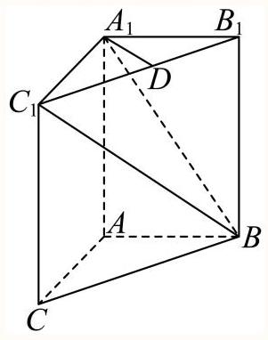

19 一般 解答题 15次作答 正确率 94.6% 上海市长宁区2025-2026学年第二学期高三...

如图, $P$ 是圆锥顶点, $O$ 是底面圆心,点 $A\text{ 、 }B$ 在底面圆周上, ${OA} \bot  {OB},{OA} = {OB} = 1$ .

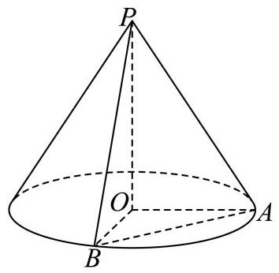

(1)若圆锥的侧面积为 ${2\pi }$ ，求圆锥的体积；

(2) 若直线 ${PA}$ 与平面 ${POB}$ 所成角为 ${30}^{ \circ  }$ ，求二面角 $P - {AB} - O$ 的平面角的正切值

答案

(1) $\frac{\sqrt{3}}{3}\pi$

(2) $\sqrt{6}$

解析

(1)设圆锥的底面半径为 $r$ ,母线为 $l, r = 1$ ,

圆锥的侧面积 $s = {\pi rl} = {\pi l} = {2\pi }$ ,所以 $l = 2$ ,

则圆锥的高 $h = \sqrt{{l}^{2} - {r}^{2}} = \sqrt{3}$ ,

则圆锥的体积 $V = \frac{1}{3}\pi {r}^{2}h = \frac{1}{3}\pi  \cdot  \sqrt{3} = \frac{\sqrt{3}}{3}\pi$ ;

(2)因为 ${PO} \bot$ 平面 ${OAB},{OA} \subset$ 平面 ${OAB}$ ，

所以 ${PO} \bot  {OA}$ ,又因为 ${OA} \bot  {OB},{PO} \cap  {OB} = O,{PO},{OB} \subset$ 平面 ${POB}$ ,

所以 ${OA} \bot$ 平面 ${POB}$ ,则 ${PA}$ 与平面 ${POB}$ 所成角为 $\angle {APO}$ ,所以 $\angle {APO} = {30}^{ \circ  }$ ,

又因为 ${OA} = 1$ ,所以 ${PO} = \sqrt{3}$ ,取 ${AB}$ 的中点 $M$ ,连结 ${OM},{PM}$ ,

因为 ${OA} = {OB},{PA} = {PB}$ ,

所以 ${OM}\bot {AB},{PM}\bot {AB},\angle {PMO}$ 为二面角 $P - {AB} - O$ 的平面角,

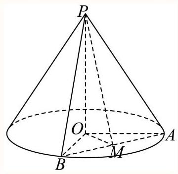

因为 ${OA} = {OB} = 1,{OA} \bot  {OB}$ ,

所以 ${OM} = \frac{1}{2}{AB} = \frac{\sqrt{2}}{2},\tan \angle {PMO} = \frac{PO}{OM} = \sqrt{6}$ ,

所以二面角 $P - {AB} - O$ 的平面角的正切值为 $\sqrt{6}$ .

20 一般 填空题 上海市建平中学2025-2026学年高二上学期期末考试数学试题

在正四面体 $P - \overset{\text{ ⏜ }}{ABC}$ 中, $M$ 和 $N$ 为侧面 ${ABP}$ 上互异的两点,则直线 ${MN}$ 与平面 ${ABC}$ 所成角的最大值为___.

答案

$\arccos \frac{1}{3}$

解析

由题意得可将问题转化为求侧面 ${ABP}$ 与底面 ${ABC}$ 的二面角,根据正四面体的性质与二面角的定义即可求解.

在正四面体 $P - {ABC}$ 中，侧面 ${ABP}$ 与底面 ${ABC}$ 的二面角，即为直线 ${MN}$ 与平面 ${ABC}$ 所成角的最大值,

设正四面体棱长为2,取 ${AB}$ 中点 $N$ ，此时 $M$ 应与 $P$ 重合，

设侧面 ${ABP}$ 与底面 ${ABC}$ 的二面角为 $\theta$ ，

因为 ${AB}\bot {MN},{AB}\bot {CN}$ ，所以 $\theta  = \angle {MNC}$ ，

过 $P$ 向底面作垂线，易得垂足 $O$ 落在 ${CN}$ 上，

因为棱长为2，则 ${CN} = {MN} = \sqrt{3}$ ，进而 ${ON} = \frac{\sqrt{3}}{3}$ ，

故 $\cos \theta  = \frac{1}{3}$ ,则 $\theta  = \arccos \frac{1}{3}$ .

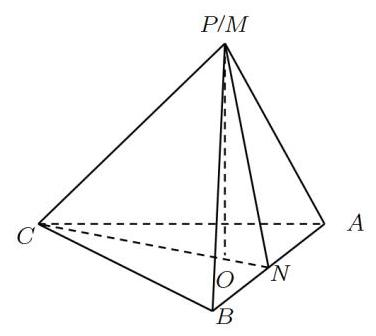

21 一般 拍壊题 2次作答 正确率 100% 上海市长征中学2024-2025学年高二上学期第...

在正四棱锥 $P - \overset{\text{ ⏜ }}{ABC}$  $D$ 中,若侧面与底面所成二面角的大小为 ${60}^{ \circ  }$ ,则异面直线 ${PA}$ 与 ${BC}$ 所成角的大小等于___. (结果用反三角函数值表示)

答案

$\arctan 2$

解析

根据已知条件及二面角平面角的定义, 再利用异面直线所成角的定义及锐角三角函数的正切函数, 结合反三角函数即可求解.

取 ${AD}$ 的中点 $E$ ，作 ${PO} \bot$ 平面 ${ABCD}$ ，连接 ${PE},{OE}$ ，如图所示

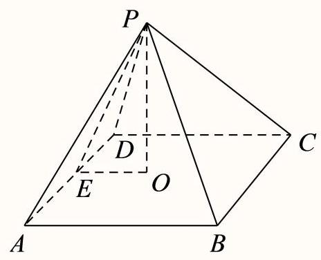

由于 ${PE}\bot {AD},{OE}\bot {AD}$ ，即有 $\angle {PEO}$ 为侧面与底面所成二面角的平面角. 则 $\angle {PEO} = {60}^{ \circ  }$ ， 设 ${AB} = 2$ ,则 ${EO} = 1,{PE} = 2,{AE} = 1$ ,

将 ${BC}$ 平移到 ${AD},\angle {PAD}$ 为异面直线 ${PA}$ 与 ${BC}$ 所成角.

则 $\tan \angle {PAD} = \frac{PE}{AE} = 2$ ,所以 $\angle {PAD} = \arctan 2$ .

故答案为: arctan 2 .

22 一般 [填空题] 2003 年普通高等学校春季招生考试数学试题 (上海卷)

若正三棱锥底面边长为4，体积为1，则侧面和底面所成二面角的大小等于___. (结果用反三角函数值表示)

## 答案

$\arctan \frac{3}{8}$

解析

在如图正三棱锥 $S - {ABC}$ 中,取 ${BC}$ 的中点 $D$ ,连接 ${SD}\text{ 、 }{AD}$ ,则 ${SD} \bot  {BC},{AD} \bot  {BC}$ ,所以 $\angle {SDA}$ 为侧面与底面所成二面角的平面角. 在平面 ${SAD}$ 中,作 ${SO} \bot  {AD}$ 与 ${AD}$ 交于 $O$ ,则 ${SO}$ 为棱锥的高, 大小可由体积求得, 再由锐角三角函数计算可得.

解: 如图正三棱锥 $S - {ABC}$ 中,取 ${BC}$ 的中点 $D$ ,连接 ${SD}\text{ 、 }{AD}$ ,则 ${SD} \bot  {BC},{AD} \bot  {BC}$ , $\therefore \angle {SDA}$ 为侧面与底面所成二面角的平面角,设为 $\alpha$ ,

在平面 ${SAD}$ 中,作 ${SO} \bot  {AD}$ 与 ${AD}$ 交于 $O$ ,则 ${SO}$ 为棱锥的高,

又 ${AO} = {2DO},\therefore {OD} = \frac{1}{3}{AD} = \frac{1}{3} \times  \sqrt{{4}^{2} - {2}^{2}} = \frac{2}{3}\sqrt{3}$ .

又 ${V}_{S - {ABC}} = \frac{1}{3} \cdot  \frac{1}{2}{AB} \cdot  {BC} \cdot  \sin {60}^{ \circ  } \cdot  h = 1,\therefore h = \frac{\sqrt{3}}{4}$ ,

$\therefore \tan \alpha  = \frac{SO}{DO} = \frac{\frac{\sqrt{3}}{4}}{\frac{2}{3}\sqrt{3}} = \frac{3}{8}$ .

$\therefore \alpha  = \arctan \frac{3}{8}$ .

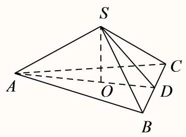

故答案为: $\arctan \frac{3}{8}$

23 一般 解答题 1次作答 正确率 100% 2009年普通高等学校招生全国统一考试理科数...

如图，在直三棱柱 ${ABC} - {A}_{1}{B}_{1}{C}_{1}$ 中， ${A{A}_{1}} = {BC} = {AB} = 2,{AB}\bot {BC}$ ，求二面角 ${B}_{1} - {A}_{1}C - {C}_{1}$ 的大小.

答案

见解析

解析

从B出发的三条棱互相垂直，可以建立直角坐标系，利用向量法解决，计算量较大. 因为垂直关系比较明显, 所以也可以采用传统的方法, 先做出二面角的平面角, 再证明, 最后求出来. 方法1(坐标法)如图，建立空间直角坐标系，

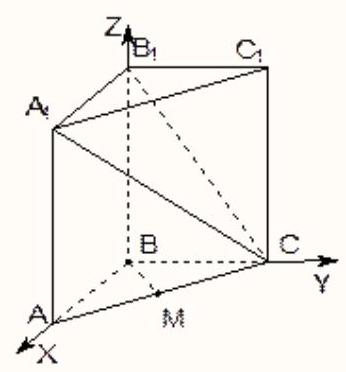

则 $A\left( {2,0,0}\right) , C\left( {0,2,0}\right) ,{A}_{1}\left( {2,0,2}\right) ,{B}_{1}\left( {0,0,2}\right) ,{C}_{1}\left( {0,2,2}\right)$ ,

设AC的中点为M,因为BM $\bot  \mathrm{{AC}},\mathrm{{BM}} \bot  {\mathrm{{CC}}}_{1}$ ,所以BM $\bot$ 平面 ${\mathrm{{ACC}}}_{1}$ ,即 $\overrightarrow{BM}$ 是平面 ${A}_{1}{B}_{1}C$ 的一个法向量.

设平面 ${A}_{1}{B}_{1}C$ 的一个法向量是 $\overrightarrow{n} = \left( {x, y, z}\right) ,\overrightarrow{{A}_{1}C} = \left( {-2,2, - 2}\right) ,\overrightarrow{{A}_{1}{B}_{1}} = \left( {-2,0,0}\right)$ .

$\overrightarrow{n} \cdot  \overrightarrow{{A}_{1}{B}_{1}} =  - {2x} = 0,\overrightarrow{n} \cdot  \overrightarrow{{A}_{1}C} =  - {2x} + {2y} - {2z} = 0,$

令 $z = 1$ ,解得 $x = 0, y = 1$ 所以 $\overrightarrow{n} = \left( {0,1,1}\right)$

设法向量 $\overrightarrow{n}$ 与 $\overrightarrow{BM}$ 的夹角为 $\varphi$ ，二面角 ${B}_{1} - {A}_{1}C - {C}_{1}$ 的大小为 $\theta$ ，显然 $\theta$ 为锐角.

因为 $\cos \theta  = \left| {\cos \varphi }\right|  = \frac{\left| \overrightarrow{n} \cdot  \overrightarrow{BM}\right| }{\left| \overrightarrow{n}\right|  \cdot  \left| \overrightarrow{BM}\right| } = \frac{1}{2}$ ,解得 $\theta  = \frac{\pi }{3}$ . 所以二面角 ${B}_{1} - {A}_{1}C - {C}_{1}$ 的大小为 $\frac{\pi }{3}$ . 方法2(传统法)

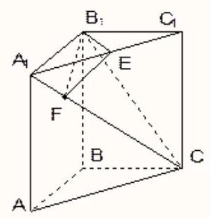

取 ${A}_{1}{C}_{1}$ 中点 $E$ ，做 ${EF} \bot  {A}_{1}C$ 交于 $F$ 点，因为 ${A}_{1}{B}_{1} = {B}_{1}{C}_{1}$ ，所以 ${B}_{1}E \bot  {A}_{1}{C}_{1}$ ，

在直棱柱中， $C{C}_{1}\bot {B}_{1}E$ ，所以 ${B}_{1}E\bot$ 面 ${A}_{1}C$ . 因为 ${EF}\bot {A}_{1}C$ ，由三垂线定理，所以 ${B}_{1}F\bot {A}_{1}C$ 则 $\angle {EF}{B}_{1}$ 就是所求.

由 $A{A}_{1} = {BC} = {AB} = 2$ 可求: ${A}_{1}{C}_{1} = 2\sqrt{2},{B}_{1}E = \sqrt{2},{A}_{1}C = 2\sqrt{3}$ ,由 $\Delta {A}_{1}{FE}$ 和 $\Delta {A}_{1}{C}_{1}C$ 相似可得 $\frac{EF}{C{C}_{1}} = \frac{{A}_{1}E}{{A}_{1}C}$ ,可求 ${EF} = \frac{\sqrt{2}}{\sqrt{3}}$ , $\tan \angle {B}_{1}{FE} = \frac{{B}_{1}E}{EF} = \sqrt{3}$ ,所以 $\angle {B}_{1}{FE} = \frac{\pi }{3}$ 即二面角 ${B}_{1} - {A}_{1}C - {C}_{1}$ 的大小为 $\frac{\pi }{3}$ .

24 一般 填空题 42次作答 正确率 71.4% 上海市嘉定区第一中学2025-2026学年高二...

如图,在一个 ${60}^{ \circ  }$ 的二面角的棱上,有两个点 $A, B,{AC},{BD}$ 分别是在这个二面角的两个半平面内垂直于AB的线段，且 ${AB} = {4\mathrm{{cm}}},{AC} = {6\mathrm{{cm}}},{BD} = {8\mathrm{{cm}}}$ ，则CD的长为___.

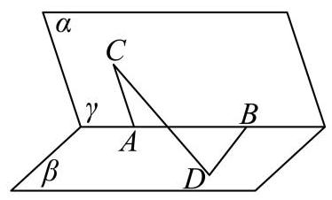

答案

$2\sqrt{17}\mathrm{\;{cm}}$

解析

由题设 ${\overrightarrow{CD}}^{2} = {\left( \overrightarrow{CA} + \overrightarrow{AB} + \overrightarrow{BD}\right) }^{2}$ ,应用向量数量积定义、运算律求线段长.

由题设 ${AB} = 4\mathrm{\;{cm}},{AC} = 6\mathrm{\;{cm}},{BD} = 8\mathrm{\;{cm}},{CA} \bot  {AB},{DB} \bot  {AB},\left\langle  {\overrightarrow{CA},\overrightarrow{BD}}\right\rangle   = {120}^{ \circ  }$ ,

所以 ${\overrightarrow{CD}}^{2} = {\left( \overrightarrow{CA} + \overrightarrow{AB} + \overrightarrow{BD}\right) }^{2} = {\overrightarrow{CA}}^{2} + {\overrightarrow{AB}}^{2} + {\overrightarrow{BD}}^{2} + 2\overrightarrow{CA} \cdot  \overrightarrow{AB} + 2\overrightarrow{CA} \cdot  \overrightarrow{BD} + 2\overrightarrow{AB} \cdot  \overrightarrow{BD}$

$= {36} + {16} + {64} + 2 \times  6 \times  8 \times  \cos {120}^{ \circ  } = {68}$ ,

所以 $\left| \overrightarrow{CD}\right|  = 2\sqrt{17}\left( \mathrm{\;{cm}}\right)$ .

故答案为: $2\sqrt{17}\mathrm{\;{cm}}$

25 一般 169 (为令题) 169次作答 正确率 61.5% 上海市闵行区部分学校2026届高三上学期1...

如图,已知正三角形 $\mathrm{{ABC}}$ 和正方形 $\mathrm{{BCDE}}$ 的边长均为2,且二面角 $A - {BC} - D$ 的大小为 $\frac{\pi }{6}$ ,则 $\overrightarrow{AC} \cdot  \overrightarrow{BD} =$

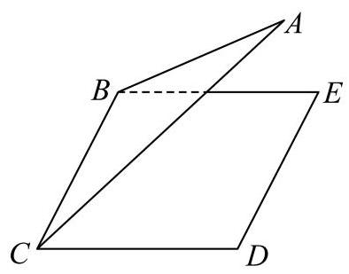

答案

-1

解析

设 $F, G$ 分别为 ${BC},{DE}$ 的中点,连接 ${AF},{FG}$ ,分析可得 $\angle {AFG}$ 为二面角 $A - {BC} - D$ 的平面角, 进而结合空间向量的线性运算及数量积求解即可.

设 $F, G$ 分别为 ${BC},{DE}$ 的中点,连接 ${AF},{FG}$ ,

在正三角形 $\mathrm{{ABC}}$ 中， ${AF}\bot {BC}$ ， ${AF} = \sqrt{3}$ ，

在正方形BCDE中， ${FG}//{CD}$ ， ${FG} \bot  {BC}$ ， ${FG} = {CD} = 2$ ，

所以 $\angle {AFG}$ 为二面角 $A - {BC} - D$ 的平面角,即 $\angle {AFG} = \frac{\pi }{6}$ ,

$\overrightarrow{AC} \cdot  \overrightarrow{BD} = \left( {\overrightarrow{AF} + \overrightarrow{FC}}\right)  \cdot  \left( {\overrightarrow{BC} + \overrightarrow{CD}}\right)  = \left( {\overrightarrow{AF} + \frac{1}{2}\overrightarrow{BC}}\right)  \cdot  \left( {\overrightarrow{BC} + \overrightarrow{FG}}\right)$

$= \overrightarrow{AF} \cdot  \overrightarrow{BC} + \overrightarrow{AF} \cdot  \overrightarrow{FG} + \frac{1}{2}{\overrightarrow{BC}}^{2} + \frac{1}{2}\overrightarrow{BC} \cdot  \overrightarrow{FG} = \sqrt{3} \times  2 \times  \left( {-\cos \frac{\pi }{6}}\right)  + \frac{1}{2} \times  {2}^{2} =  - 1$ .

故答案为: -1 .

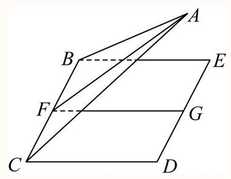

26 一般 类型题 2次作答 正确率 50% 上海市东昌中学2024-2025学年高二上学期期末...

如图,在四棱锥 $P - {ABCD}$ 中,平面 ${PDC} \bot$ 平面 ${ABCD},{AD} \bot  {DC},{AB}//{DC},{AB} = \frac{1}{2}{DC}$ , ${PD} = {AD} = 1,{PC} = \sqrt{5},{AB} = 1, M$ 为棱 ${PC}$ 的中点.

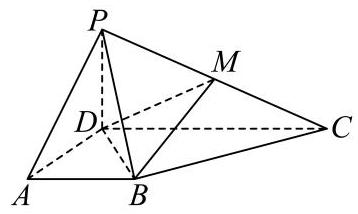

(1)求直线 ${PB}$ 与平面 ${ABCD}$ 所成线面角的大小(结果用反三角函数表示);

(2)求二面角 $P - {DM} - B$ 的余弦值；

(3)探究在线段 ${PA}$ 上是否存在点 $Q$ ，使得点 $Q$ 到平面 ${BDM}$ 的距离是 $\frac{2\sqrt{6}}{9}$ ？若存在，求出 ${PQ}$ 的值; 若不存在, 说明理由.

答案

(1) $\arcsin \frac{\sqrt{3}}{3}$

(2) $\frac{\sqrt{6}}{6}$

(3)存在点 $Q$ ，使得点 $Q$ 到平面 ${BDM}$ 的距离是 $\frac{2\sqrt{6}}{9}$ ， ${PQ} = \frac{2\sqrt{2}}{3}$

解析

(1)由于 ${AB} = \frac{1}{2}{DC} = 1$ ，则 ${DC} = 2$ ， ${PD} = {AD} = 1$ ， ${PC} = \sqrt{5}$ ，所以 ${P{C}^{2}} = {P{D}^{2}} + {C{D}^{2}}$ ， 故 ${PD} \bot  {CD}$ ,

由于平面 ${PDC} \bot$ 平面 ${ABCD}$ ,且其交线为 ${CD},{PD} \bot  {CD},{PD} \subset$ 平面 ${PCD}$ ,

所以 ${PD} \bot$ 平面 ${ABCD}$ ,故 $\angle {PBD}$ 为直线 ${PB}$ 与平面 ${ABCD}$ 所成线面角,

由于 ${DB} = \sqrt{A{D}^{2} + A{B}^{2}} = \sqrt{2},{PB} = \sqrt{P{D}^{2} + D{B}^{2}} = \sqrt{3}$ ,故 $\sin \angle {PBD} = \frac{PD}{PB} = \frac{\sqrt{3}}{3}$ , 故直线 ${PB}$ 与平面 ${ABCD}$ 所成线面角为 $\arcsin \frac{\sqrt{3}}{3}$ ，

(2) $\because {PC} = \sqrt{5},{PD} = 1,{CD} = 2$ ,

$\therefore P{C}^{2} = P{D}^{2} + C{D}^{2},\therefore {PD} \bot  {DC}$ ,

$\because$ 平面 ${PDC} \bot$ 平面 ${ABCD}$ ,平面 ${PDC} \cap$ 平面 ${ABCD} = {DC}$ ,

${PD} \subset$ 平面 ${PDC}$ ,

$\therefore {PD} \bot$ 平面 ${ABCD}$ ,

又 ${AD},{CD} \subset$ 平面 ${ABCD},\therefore {PD} \bot  {AD},{PD} \bot  {CD}$ ,由 ${AD} \bot  {DC}$ ,

$\therefore$ 以点 $D$ 为坐标原点， ${DA}$ ， ${DC}$ ， ${DP}$ 所在直线分别为 $x$ ， $y$ ， $z$ 轴建立空间直角坐标系，如图:

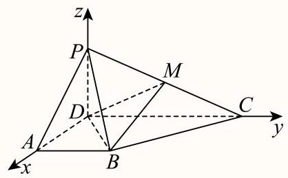

则 $P\left( {0,0,1}\right) , D\left( {0,0,0}\right) , A\left( {1,0,0}\right) , C\left( {0,2,0}\right) ,\because M$ 为棱 ${PC}$ 的中点,

$\therefore M\left( {0,1,\frac{1}{2}}\right) , B\left( {1,1,0}\right)$ ,

$\overrightarrow{DM} = \left( {0,1,\frac{1}{2}}\right) ,\overrightarrow{DB} = \left( {1,1,0}\right) ,$

设平面 ${BDM}$ 的一个法向量为 $\overrightarrow{n} = \left( {x, y, z}\right)$ ,

则 $\left\{  \begin{array}{l} \overrightarrow{n} \cdot  \overrightarrow{DM} = y + \frac{1}{2}z = 0 \\  \overrightarrow{n} \cdot  \overrightarrow{DB} = x + y = 0 \end{array}\right.$ ,令 $z = 2$ ,则 $y =  - 1, x = 1$ ,

$\therefore \overrightarrow{n} = \left( {1, - 1,2}\right)$ ,

平面 ${PDM}$ 的一个法向量为 $\overrightarrow{DA} = \left( {1,0,0}\right)$ ,

$\therefore \cos  < \overrightarrow{n},\overrightarrow{DA} >  = \frac{\overrightarrow{n} \cdot  \overrightarrow{DA}}{\left| \overrightarrow{n}\right| \left| \overrightarrow{DA}\right| } = \frac{1}{\sqrt{6} \times  1} = \frac{\sqrt{6}}{6}$ ,

$\therefore$ 二面角 $P - {DM} - B$ 的余弦值为 $\frac{\sqrt{6}}{6}$ ;

)假设在线段 ${PA}$ 上是存在点 $Q$ ，使得点 $Q$ 到平面 ${BDM}$ 的距离是 $\frac{2\sqrt{6}}{9}$ ，

设 $\overrightarrow{PQ} = \lambda \overrightarrow{PA},0 \leq  \lambda  \leq  1$ ,则 $Q\left( {\lambda ,0,1 - \lambda }\right) ,\overrightarrow{BQ} = \left( {\lambda  - 1, - 1,1 - \lambda }\right)$ ,

由(2)知平面 ${BDM}$ 的一个法向量为 $\overrightarrow{n} = \left( {1, - 1,2}\right)$ ，

$\overrightarrow{BQ} \cdot  \overrightarrow{n} = \lambda  - 1 + 1 + 2\left( {1 - \lambda }\right)  = 2 - \lambda ,$

$\therefore$ 点 $Q$ 到平面 ${BDM}$ 的距离是 $\frac{\overrightarrow{BQ} \cdot  \overrightarrow{\overrightarrow{n}}}{\left| \overrightarrow{n}\right| } = \frac{2 - \lambda }{\sqrt{6}} = \frac{2\sqrt{6}}{9}$ ,

$\therefore \lambda  = \frac{2}{3}$ 或 $\lambda  = \frac{10}{3}$ ,由于 $0 \leq  \lambda  \leq  1$ ,所以 $\lambda  = \frac{2}{3},\therefore {PQ} = \frac{2\sqrt{2}}{3}$ .

27 一般 单选题 2次作答 正确率 50% 上海市大同中学2024-2025学年高二上学期12月...

如图1,小同同学在一张矩形卡片上绘制了函数 $f\left( x\right)  = \sin \left( {{\pi x} + \frac{5}{6}\pi }\right)$ 的部分图象, $\mathrm{A},\mathrm{B}$ 分别是 $f\left( x\right)$ 图象的一个最高点和最低点，M是 $f\left( x\right)$ 图象与y轴的交点， ${BD}\bot {OD}$ ，现将该卡片沿x轴折成如图2所示的直二面角 $A - {OD} - B$ ，在图2中，则下列结果不正确的是( )

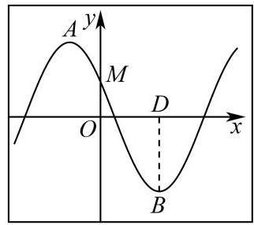

图1

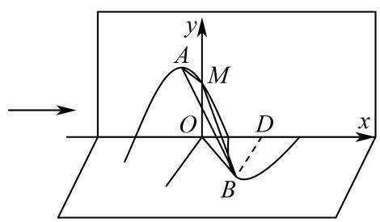

图2

A. ${AB} = \sqrt{3}$

B. 点 $D$ 到平面 ${ABM}$ 的距离为 $\frac{\sqrt{14}}{14}$

C. 点 $D$ 到平面 ${AB}$ 的距离为 $\frac{\sqrt{3}}{3}$

D. 平面 ${OBD}$ 与平面 ${ABM}$ 所成锐二面角为 $\arccos \frac{\sqrt{14}}{7}$

答案

C

解析

根据给定条件，求出图1中点 A, B, D, M的坐标，建立空间直角坐标系，求出图2中点 A, B, D, M 的坐标, 再逐项判断作答.

在图 1 中,由 $f\left( x\right)  = \sin \left( {{\pi x} + \frac{5\pi }{6}}\right)$ ,得 $A\left( {-\frac{1}{3},1}\right) , B\left( {\frac{2}{3}, - 1}\right) , D\left( {\frac{2}{3},0}\right) , M\left( {0,\frac{1}{2}}\right)$ , 在图2中,建立如图所示的空间直角坐标系 $O - {xyz}$ ,

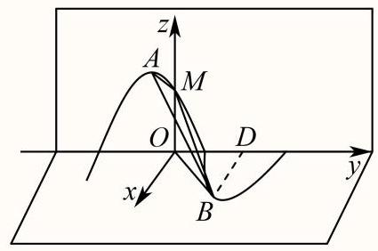

则 $A\left( {0, - \frac{1}{3},1}\right) , B\left( {1,\frac{2}{3},0}\right) , M\left( {0,0,\frac{1}{2}}\right) , D\left( {0,\frac{2}{3},0}\right)$ ,

则 $\overrightarrow{AB} = \left( {1,1, - 1}\right)$ ,得 $\left| \overrightarrow{AB}\right|  = \sqrt{3}$ , A正确.

设平面 ${ABM}$ 的一个法向量为 $\overrightarrow{n} = \left( {x, y, z}\right) ,\overrightarrow{AM} = \left( {0,\frac{1}{3}, - \frac{1}{2}}\right)$ ,

则 $\left\{  \begin{array}{l} \overrightarrow{n} \cdot  \overrightarrow{AB} = 0 \\  \overrightarrow{n} \cdot  \overrightarrow{AM} = 0 \end{array}\right.$ ,即 $\left\{  \begin{array}{l} x + y - z = 0 \\  \frac{1}{3}y - \frac{1}{2}z = 0 \end{array}\right.$ ,取 $y = 3$ ,则 $z = 2, x =  - 1$ ,

所以平面 ${ABM}$ 的一个法向量 $\overrightarrow{n} = \left( {-1,3,2}\right)$ ，而 $\overrightarrow{DB} = \left( {1,0,0}\right)$ ，

所以点 $\mathrm{D}$ 到平面 ${ABM}$ 的距离为 $\frac{\left| \overrightarrow{DB} \cdot  \overrightarrow{n}\right| }{\left| \overrightarrow{n}\right| } = \frac{1}{\sqrt{14}} = \frac{\sqrt{14}}{14}$ , B正确.

取 $\overrightarrow{a} = \overrightarrow{DB} = \left( {1,0,0}\right) ,\overrightarrow{u} = \frac{\overrightarrow{AB}}{\left| \overrightarrow{AB}\right| } = \frac{\sqrt{3}}{3}\left( {1,1, - 1}\right)  = \left( {\frac{\sqrt{3}}{3},\frac{\sqrt{3}}{3}, - \frac{\sqrt{3}}{3}}\right)$ ,

则 ${\overrightarrow{a}}^{2} = 1,\overrightarrow{a} \cdot  \overrightarrow{u} = \frac{\sqrt{3}}{3}$ ，所以点 $\mathrm{D}$ 到直线 ${AB}$ 的距离为 $\sqrt{{\overrightarrow{a}}^{2} - {\left( \overrightarrow{a} \cdot  \overrightarrow{u}\right) }^{2}} = \frac{\sqrt{6}}{3}$ ， $\mathrm{C}$ 错误.

平面 ${OBD}$ 的一个法向量为 $\overrightarrow{m} = \left( {0,0,1}\right)$ ,

则平面 ${OBD}$ 与平面 ${ABM}$ 夹角的余弦值为 $\frac{\left| \overrightarrow{m} \cdot  \overrightarrow{n}\right| }{\left| \overrightarrow{m}\right| \left| \overrightarrow{n}\right| } = \frac{2}{1 \times  \sqrt{14}} = \frac{\sqrt{14}}{7}$ ,

即平面 ${OBD}$ 与平面 ${ABM}$ 所成锐二面角为 $\arccos \frac{\sqrt{14}}{7}$ ，D正确.

故选: C.

选项分布(全国)

<table><tr><td>作答次数</td><td>正确率</td><td>A占比</td><td>B占比</td><td>C占比</td><td>D占比</td></tr><tr><td>2</td><td>50%</td><td>0%</td><td>50% 易错</td><td>50% 正确</td><td>0%</td></tr></table>

28 一般(填空题)上海市宜川中学2024-2025学年高二上学期期末考试数学试卷

一个圆柱被与其底面所成角是 ${60}^{ \circ  }$ 的平面所截，截面是一个椭圆，则该椭圆的离心率等于___.

答案

$\frac{\sqrt{3}}{2} \mid  \frac{1}{2}\sqrt{3}$

解析

根据几何关系用圆柱的底面半径表示椭圆的长轴和短轴, 再计算椭圆的离心率即可. 如图,设圆柱底面半径为 $\mathrm{R}$ ,由题意知截面与底面所成角 $\theta$ 为 ${60}^{ \circ  }$ ,

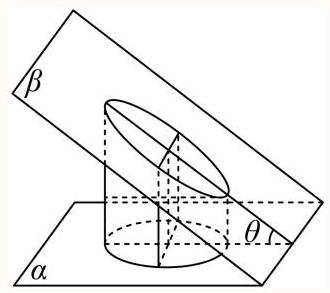

设截面椭圆的长半轴为 $a$ ,短半轴为 $b$ ,半焦距为 $c$ ,

根据题意可知, ${2b} = {2R},{2a} = \frac{2R}{\cos {60}^{ \circ  }} = {4R}$ ,

则 $\frac{b}{a} = \frac{1}{2}$ ,故离心率 $e = \frac{c}{a} = \sqrt{1 - {\left( \frac{b}{a}\right) }^{2}} = \sqrt{1 - {\left( \frac{1}{2}\right) }^{2}} = \frac{\sqrt{3}}{2}$ .

故答案为: $\frac{\sqrt{3}}{2}$ .

29 般 [填空题] 2次作答 正确率 50% 上海市七宝中学2024-2025学年高二上学期期末...

已知 $A, B$ 分别是双曲线 $C : \frac{{x}^{2}}{{a}^{2}} - \frac{{y}^{2}}{{b}^{2}} = 1\left( {a > 0, b > 0}\right)$ 渐近线上的两点,且 ${AB} \bot  x$ 轴,点 $O$ 是坐标原点. 现将 $C$ 所在平面沿 $x$ 轴折成平面角为锐角 $\alpha$ 的二面角,翻折后如图,此时 $\angle {AOB} = \beta$ . 若 $\frac{1 - \cos \alpha }{1 - \cos \beta } = \frac{25}{16}$ ，则 $C$ 的离心率为___.

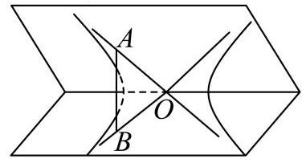

答案

$\frac{5}{3}$

解析

首先找到角 $\alpha$ 和角 $\beta$ ,分别利用余弦定理,表示 $1 - \cos \alpha$ 和 $1 - \cos \beta$ ,然后设出点 $A$ 的坐标,用坐标表示 $\left| {MA}\right|$ 和 $\left| {OA}\right|$ ，代入计算即可.

分别在两个

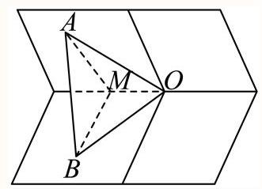

根据题意, $\angle {AOB} = \beta ,\angle {AMB} = \alpha$ ,

所以 $1 - \cos \alpha  = 1 - \frac{{\left| MA\right| }^{2} + {\left| MB\right| }^{2} - {\left| AB\right| }^{2}}{2\left| {MA}\right| \left| {MB}\right| }$ ,

因为 $\left| {MA}\right|  = \left| {MB}\right| ,\therefore 1 - \cos \alpha  = 1 - \frac{{\left| MA\right| }^{2} + {\left| MB\right| }^{2} - {\left| AB\right| }^{2}}{2\left| {MA}\right| \left| {MB}\right| } = \frac{{\left| AB\right| }^{2}}{2{\left| MA\right| }^{2}}$ ,

又因为 $\left| {OA}\right|  = \left| {OB}\right| ,\therefore 1 - \cos \beta  = 1 - \frac{{\left| OA\right| }^{2} + {\left| OB\right| }^{2} - {\left| AB\right| }^{2}}{2\left| {OA}\right| \left| {OB}\right| } = \frac{{\left| AB\right| }^{2}}{2{\left| OA\right| }^{2}}$ ,

所以 $\frac{1 - \cos \alpha }{1 - \cos \beta } = \frac{\frac{{\left| AB\right| }^{2}}{2{\left| MA\right| }^{2}}}{\frac{{\left| AB\right| }^{2}}{2{\left| OA\right| }^{2}}} = \frac{{\left| OA\right| }^{2}}{{\left| MA\right| }^{2}} = \frac{25}{16}$ ,

设 $A\left( {{x}_{0}, - \frac{b}{a}{x}_{0}}\right)$ ,则 $\left| {MA}\right|  = \left| {MB}\right|  =  - \frac{b}{a}{x}_{0},\left| {OA}\right|  = \left| {OB}\right|  = \sqrt{{x}_{0}^{2} + {\left( -\frac{b}{a}{x}_{0}\right) }^{2}} = \frac{c}{a}{x}_{0}$ ,

$\therefore \frac{{\left| OA\right| }^{2}}{{\left| MA\right| }^{2}} = \frac{{\left( \frac{c}{a}{x}_{0}\right) }^{2}}{{\left( \frac{b}{a}{x}_{0}\right) }^{2}} = \frac{{c}^{2}}{{b}^{2}} = \frac{25}{16},\therefore {16}{c}^{2} = {25}{b}^{2},\therefore {16}{c}^{2} = {25}\left( {{c}^{2} - {a}^{2}}\right)  = {25}{c}^{2} - {25}{a}^{2}$ , $\therefore e = \frac{5}{3}$ 故答案为: $\frac{5}{3}$ .

30 一般 单选题 3 次作答 正确率 66.7% 陕西省西北工业大学附属中学2025届高三第...

如图，画在纸面上的抛物线 ${y}^{2} = {8x}$ 过焦点 $\mathrm{F}$ 的弦 ${AB}$ 长为9，则沿x轴将纸面折成平面角为60度的二面角后，空间中线段 ${AB}$ 的长为( )

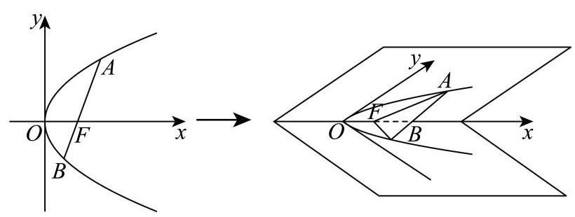

A. $4\sqrt{6}$

B. $\sqrt{33}$

C. $\sqrt{59}$

D. $\sqrt{65}$

答案

B

解析

联立直线与抛物线方程得到韦达定理,结合焦半径公式可得 $A\left( {4,4\sqrt{2}}\right) , B\left( {1, - 2\sqrt{2}}\right)$ ,进而根据线面垂直,以及二面角的定义得 $\angle {AHN} = {60}^{ \circ  }$ ,根据锐角三角函数计算长度,可得 $A\left( {4, - 2\sqrt{2},2\sqrt{6}}\right) , B\left( {1, - 2\sqrt{2},0}\right)$ ,利用两点距离公式即可求解.

$F\left( {2,0}\right)$ ,设直线 ${AB}$ 为 $x = {my} + 2\left( {m > 0}\right) , A\left( {{x}_{1},{y}_{1}}\right) , B\left( {{x}_{2},{y}_{2}}\right)$ ,

联立 $x = {my} + 2\left( {m > 0}\right)$ 与 ${y}^{2} = {8x}$ 可得 ${y}^{2} - {8my} - {16} = 0$ ,

则 ${y}_{1} + {y}_{2} = {8m}$ ,则 ${x}_{1} + {x}_{2} = m\left( {{y}_{1} + {y}_{2}}\right)  + 4 = 8{m}^{2} + 4$ ,

故 $\left| {AB}\right|  = {x}_{1} + {x}_{2} + p = m\left( {{y}_{1} + {y}_{2}}\right)  + 4 + 4 = 8{m}^{2} + 8 = 9$ ,解得 $m = \frac{\sqrt{2}}{4}$ ,

故 ${y}^{2} - 2\sqrt{2}y - {16} = 0$ ,解得 ${y}_{1} = 4\sqrt{2},{y}_{2} =  - 2\sqrt{2}$ ,

故 $A\left( {4,4\sqrt{2}}\right) , B\left( {1, - 2\sqrt{2}}\right)$ ,

如图,建立空间直角坐标系,过 $A$ 作 ${AN} \bot$ 平面 ${xoy}$ 于 $N$ ,过 $N$ 作 ${NH} \bot  x$ 于 $H$ ,连接 ${AH}$ ,

由于 ${AN} \bot  x$ 轴,且 ${NH} \bot  x$ 轴, ${AN} \cap  {AH} = A$ ,故 $x$ 轴 $\bot$ 平面 ${ANH}$ ,

${AH} \subset$ 平面 ${ANH}$ ,故 ${AH} \bot  x$ 轴,则 $\angle {AHN} = {60}^{ \circ  }$

由于在直角坐标系中 $A\left( {4,4\sqrt{2}}\right) , B\left( {1, - 2\sqrt{2}}\right)$ ,

故 ${OH} = 4,{AH} = 4\sqrt{2}$ ，

因此在直角三角形 ${ANH}$ 中, ${HN} = \frac{1}{2}{AH} = 2\sqrt{2},{AN} = \frac{\sqrt{3}}{2}{AH} = 2\sqrt{6}$ ,

因此在空间直角坐标系中, $A\left( {4, - 2\sqrt{2},2\sqrt{6}}\right) , B\left( {1, - 2\sqrt{2},0}\right)$ ,

故 $\left| {AB}\right|  = \sqrt{{\left( 4 - 1\right) }^{2} + {0}^{2} + {\left( 2\sqrt{6}\right) }^{2}} = \sqrt{33}$ ,

故选: B

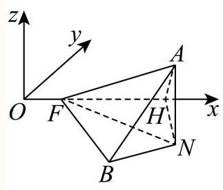

三选项分布(全国)

<table><tr><td>作答次数</td><td>正确率</td><td>A占比</td><td>B占比</td><td>C占比</td><td>D占比</td></tr><tr><td>3</td><td>66.7%</td><td>33.3% 易错</td><td>66.7% 正确</td><td>0%</td><td>0%</td></tr></table>

31 一般 单选题 14次作答 正确率64.3% 上海市罗店中学2025-2026学年高二上学期... 给出下列命题，其中真命题的个数是( )

(a)若四棱锥底面是正方形，四个侧面都是等腰三角形，则该四棱锥是正四棱锥.

(b) 若三棱锥 $P - {ABC}$ 的顶点 $P$ 到 $A, B, C$ 的距离相等，则点 $P$ 在平面 ${ABC}$ 上的投影是三角形 ${ABC}$ 的外心.

(c) 若 $\overrightarrow{PO} = x\overrightarrow{PA} + y\overrightarrow{PB} + z\overrightarrow{PC}$ ,且 $x + y + z = 1$ ,则 $O, A, B, C$ 四点共面.

(d) 直线 $l$ 与平面 $\alpha$ 所成角为 $\frac{\pi }{3}$ ，平面 $\beta$ 经过直线 $l$ ，设 $\alpha$ 与 $\beta$ 所成的锐二面角大小为 $\theta$ ，则 $\theta  \geq  \frac{\pi }{3}$ .

A. 1

B. 2

C. 3

D. 4

答案

C

解析

(a)根据等腰三角形是否全等作出判断; (b)设出投影点,根据三角形全等分析 ${OA},{OB},{OC}$ 的长度关系，由此可判断；(c)化简向量关系式，根据 $A, B, C$ 是否共线分类讨论并判断；(d)根据 ${AB}$ 与 $\alpha ,\beta$ 的交线的位置关系分类讨论并判断.

(a): 当四棱锥底面是正方形，侧面都是等腰三角形时，若等腰三角形不全等，则四棱锥不是正四棱锥, 故错误;

(b): 如下图所示,设 $P$ 在底面的投影为 $O$ 点,

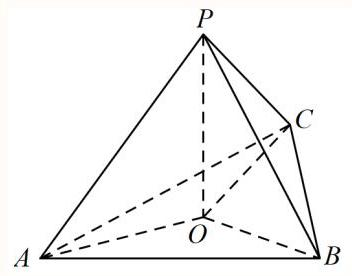

由题意可知, ${PA} = {PB} = {PC}$ ,又因为 ${PO} \bot$ 平面 ${ABC}$ ,

所以 $\angle {POA} = \angle {POB} = \angle {POC} = {90}^{ \circ  }$ ,且 ${PO}$ 为 $\bigtriangleup {POA},\bigtriangleup {POB},\bigtriangleup {POC}$ 的公共边,

易证 $\bigtriangleup {POA},\bigtriangleup {POB},\bigtriangleup {POC}$ 两两全等，所以 ${OA} = {OB} = {OC}$ ，所以 $O$ 为 $\bigtriangleup {ABC}$ 的外心，故正确;

(c): 因为 $\overrightarrow{PO} = x\overrightarrow{PA} + y\overrightarrow{PB} + z\overrightarrow{PC}$ ,所以

$\overrightarrow{PO} = x\left( {\overrightarrow{PO} + \overrightarrow{OA}}\right)  + y\left( {\overrightarrow{PO} + \overrightarrow{OB}}\right)  + z\left( {\overrightarrow{PO} + \overrightarrow{OC}}\right) ,$

所以 $\overrightarrow{PO} = \left( {x + y + z}\right) \overrightarrow{PO} + x\overrightarrow{OA} + y\overrightarrow{OB} + z\overrightarrow{OC}$ ,

因为 $x + y + z = 1$ ,所以 $x\overrightarrow{OA} + y\overrightarrow{OB} + z\overrightarrow{OC} = \overrightarrow{0}$ ,

显然 $x, y, z$ 不全为 0，不妨设 $x \neq  0$ ，所以 $\overrightarrow{OA} =  - \frac{y}{x}\overrightarrow{OB} - \frac{z}{x}\overrightarrow{OC}$ ，

若 $A, B, C$ 三点共线，则 $O, A, B, C$ 四点一定共面，

若 $A, B, C$ 三点不共线,则 $\overrightarrow{OA},\overrightarrow{OB},\overrightarrow{OC}$ 共面,且有公共点 $O$ ,所以 $O, A, B, C$ 四点共面, 综上可知, $O, A, B, C$ 四点共面,故正确;

(d): 设 $l$ 与平面 $\alpha$ 交于 $A$ 点， $P \in  l$ ， ${PB} \bot  \alpha$ ， $\alpha  \cap  \beta  = {AD}$ ，由题意知 $\angle {PAB} = \frac{\pi }{3}$ ，

当 ${AB}\bot {AD}$ 时，因为 ${PB}\bot \alpha$ ， ${AD} \subset  \alpha$ ，所以 ${PB}\bot {AD}$ ，

又因为 ${PB} \cap  {AB} = A,{PB},{AB} \subset$ 平面 ${PAB}$ ，所以 ${AD}\bot$ 平面 ${PAB}$ ，

又 ${PA} \subset$ 平面 ${PAB}$ ,所以 ${AD}\bot {PA}$ ,所以 $\alpha$ 与 $\beta$ 所成的锐二面角即为 $\angle {PAB} = \frac{\pi }{3}$ ;

当 ${AB},{AD}$ 不垂直时,过 $B$ 作 ${BC} \bot  {AD}$ 交 ${DA}$ 延长线于 $C$ 点,

由上可知，此时 $\alpha$ 与 $\beta$ 所成的锐二面角即为 $\angle {PCB}$ ,

所以 $\tan \angle {PCB} = \frac{PB}{CB} > \frac{PB}{AB} = \tan \frac{\pi }{3}$ ,所以 $\frac{\pi }{3} < \angle {PCB} \leq  \frac{\pi }{2}$ ,

综上可知， $\theta  \geq  \frac{\pi }{3}$ 成立，故正确；

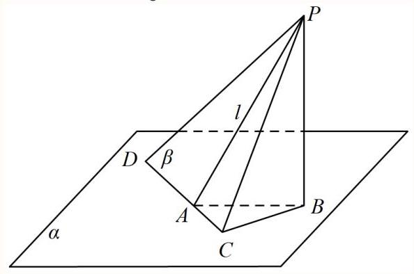

故上述命题中真命题有3个,

散选: C.

选项分布(全国)

<table><tr><td>作答次数</td><td>正确率</td><td>A占比</td><td>B占比</td><td>C占比</td><td>D占比</td></tr><tr><td>14</td><td>64.3%</td><td>0%</td><td>35.7% 易错</td><td>64.3%(正确)</td><td>0%</td></tr></table>

32 一般 填空题 2次作答 正确率 100% 上海市敬业中学2024-2025学年高二上学期12...

若正四棱锥的底面边长为 $2\sqrt{3}\mathrm{{cm}}$ ，体积为 $4{\mathrm{\;{cm}}}^{3}$ ，则它的侧面与底面所成的二面角的大小是___

答案

$\frac{\pi }{6}$

解析

先根据正四棱锥的结构特征、垂直关系的转化得到 $\angle {PMO}$ 是侧面 ${PBC}$ 与底面 ${ABCD}$ 所成的二面角的平面角,再利用Rt $\bigtriangleup {POM}$ 进行求解.

如图,过点 $P$ 作 ${PO} \bot$ 平面 ${ABCD}$ ,则 $O$ 为底面正方形 ${ABCD}$ 的中心,

取 ${BC}$ 的中点 $M$ ，连接 ${OM}$ 、 ${PM}$ ，则 ${OM} \bot  {BC}$ ，

因为 ${PO} \bot$ 平面 ${ABCD},{BC} \subset$ 平面 ${ABCD}$ ,所以 ${PO} \bot  {BC}$ ,

因为 ${PO} \subset$ 平面 ${POM},{OM} \subset$ 平面 ${POM}$ ,且 ${OM} \cap  {PO} = O$ ,

所以 ${BC} \bot$ 平面 ${POM}$ ,又 ${PM} \subset$ 平面 ${POM}$ ,所以 ${PM} \bot  {BC}$ ,

又 ${OM} \subset$ 平面 ${ABCD},{PM} \subset$ 平面 ${PBC}$ ,

所以 $\angle {PMO}$ 是侧面 ${PBC}$ 与底面 ${ABCD}$ 所成的二面角的平面角,

由题意,得 $\frac{1}{3} \times  {\left( 2\sqrt{3}\right) }^{2} \times  {PO} = 4$ ,解得 ${PO} = 1$ ,

在Rt $\bigtriangleup {POM}$ 中,又因为 ${OM} = \frac{1}{2}{AB} = \sqrt{3}$ ,

所以 $\tan \angle {PMO} = \frac{PO}{OM} = \frac{\sqrt{3}}{3}$ ,所以 $\angle {PMO} = \frac{\pi }{6}$ ,

即该正四棱锥的侧面与底面所成的二面角的大小是 $\frac{\pi }{6}$ .

故答案为: $\frac{\pi }{6}$ .

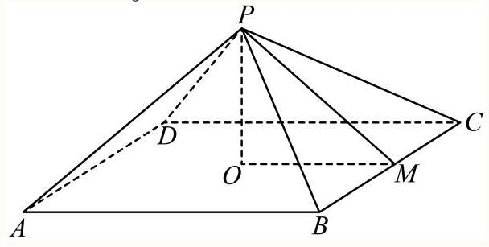

33 较难 解答题 3次作答 正确率 71.4% 上海市三林中学2024-2025学年高二上学期期...

长方体 ${ABCD} - {A}_{1}{B}_{1}{C}_{1}{D}_{1}$ 中，底面 ${ABCD}$ 为边长为2的正方形， $A{A}_{1} = \sqrt{6}$ ，点 $M$ 在棱 $D{D}_{1}$ 上， 且 $D{D}_{1} = {3DM}$ .

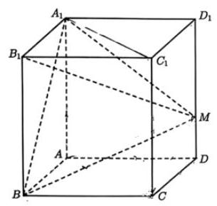

(1) 求三棱锥 $M - {A}_{1}{BA}$ 的体积;

(2)求直线 ${BM}$ 与平面 $C{C}_{1}{D}_{1}D$ 所成角的正切值；

(3) 过线段 ${AC}$ 作一个与底面 ${ABCD}$ 成 $\theta \left( {0 \leq  \theta  < \frac{\pi }{2}}\right)$ 角大小的截面，求截面的面积.

答案

(1) $\frac{2\sqrt{6}}{3}$

(2) $\frac{\sqrt{42}}{7}$

(3)答案见解析

解析

(1)由题意知长方体 ${ABCD} - {A}_{1}{B}_{1}{C}_{1}{D}_{1}$ 中，底面 ${ABCD}$ 为边长为2的正方形， 点 $M$ 在棱 $D{D}_{1}$ 上,故 $\mathrm{M}$ 到平面 ${A}_{1}{BA}$ 的距离为 2,

则 ${V}_{M - {A}_{1}{BA}} = \frac{1}{3} \times  \frac{1}{2} \times  2 \times  \sqrt{6} \times  2 = \frac{2\sqrt{6}}{3}$ ;

(2)连接 ${CM}$ ，长方体 ${ABCD} - {A}_{1}{B}_{1}{C}_{1}{D}_{1}$ 中， ${BC} \bot$ 平面 $C{C}_{1}{D}_{1}D$ ，

故 $\angle {BMC}$ 即为直线 ${BM}$ 与平面 $C{C}_{1}{D}_{1}D$ 所成角;

由于 $A{A}_{1} = \sqrt{6},\;D{D}_{1} = {3DM}$ ,故 ${DM} = \frac{1}{3}D{D}_{1} = \frac{\sqrt{6}}{3}$ ,

在 Rt $\bigtriangleup {BCM}$ 中, ${BC} = 2,{CM} = \sqrt{{2}^{2} + {\left( \frac{\sqrt{6}}{3}\right) }^{2}} = \frac{\sqrt{42}}{3}$ ,

故 $\tan \angle {BMC} = \frac{BC}{CM} = \frac{2}{\frac{\sqrt{42}}{3}} = \frac{\sqrt{42}}{7}$ .

(3)过线段 ${AC}$ 作一个与底面 ${ABCD}$ 成 $\theta \left( {0 \leq  \theta  < \frac{\pi }{2}}\right)$ 角的截面，

当 $\theta  = 0$ 时，截面即为底面四边形 ${ABCD}$ ，面积为4；

设 ${AC},{BD}$ 交于 $\mathrm{O}$ ,因为 $A{A}_{1} = \sqrt{6}$ ,故在 $\mathrm{{Rt}}\bigtriangleup {D}_{1}{DO}$ 中,

$\tan \angle {D}_{1}{OD} = \frac{D{D}_{1}}{OD} = \frac{\sqrt{6}}{\sqrt{2}} = \sqrt{3},$

故 $\angle {D}_{1}{OD} = \frac{\pi }{3}$ ;

当 $0 < \theta  \leq  \frac{\pi }{3}$ 时,不妨设截面与 ${D}_{1}D$ 交于点 $\mathrm{N}$ ,连接 ${AN},{CN},{ON}$ ,

则 ${AN} = {CN},\therefore {ON} \bot  {AC}$ ,而 ${OD} \bot  {AC}$ ,故 $\angle {NOD}$ 为截面与底面 ${ABCD}$ 所成二面角的平面角,

即 $\angle {NOD} = \theta$ ,故 ${ON} = \frac{OD}{\cos \theta } = \frac{\sqrt{2}}{\cos \theta }$ ,则截面面积为

${S}_{\bigtriangleup {NAC}} = \frac{1}{2}{AC} \cdot  {ON} = \frac{1}{2} \times  2\sqrt{2} \times  \frac{\sqrt{2}}{\cos \theta } = \frac{2}{\cos \theta };$

当 $\frac{\pi }{3} < \theta  < \frac{\pi }{2}$ 时,则截面为如图所示四边形 ${ACEF}$ ,为等腰梯形,

设EF中点为P,连接 ${PO}$ ,则 ${PO} \bot  {AC}$ ,则 $\angle {POD} = \theta$ ,

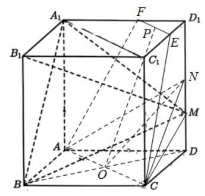

$\mathrm{{PO}}$ 为梯形 ${ACEF}$ 的高, ${PO} = \frac{\sqrt{6}}{\sin \theta }$ ,

由题意可知 $\bigtriangleup {D}_{1}{EF}$ 为等腰直角三角形,故 ${EF} = 2{D}_{1}P = 2\left( {\sqrt{2} - \frac{\sqrt{6}}{\tan \theta }}\right)$ ,

故截面面积为

${S}_{ACEF} = \frac{1}{2}\left( {{AC} + {EF}}\right)  \cdot  {PO} = \frac{1}{2}\left( {4\sqrt{2} - \frac{2\sqrt{6}}{\tan \theta }}\right)  \cdot  \frac{\sqrt{6}}{\sin \theta } = 2\left( {2 - \frac{\sqrt{3}}{\tan \theta }}\right)  \cdot  \frac{\sqrt{3}}{\sin \theta }.$
