## 目录

第四章 三角函数 .28

第十三讲 三角函数定义与诱导公式 .28

第十四讲 三角恒等变换 .30

第十五讲 三角函数图像(一) .32

第十六讲 三角函数图像(二) 35

第五章解三角形 .39

第十七讲 正余弦定理基本应用 .39

第十八讲 解三角形常见题型与思想(一) .42

第十九讲解三角形常见题型与思想(二) .44

第六章 平面向量 .48

第二十讲 平面向量线性运算 .48

第二十一讲平面向量数量积 .50

第七章 复数 .52

第二十二讲 深入理解复数 .52

第八章 数列 .54

第二十三讲 等差数列与等比数列基础 .54

第二十四讲 数列通项与 ${S}_{n}$ .56

第二十五讲 奇偶数列、数列单调性 .59

第九章 立体几何 .61

第二十六讲 空间几何体的表面积与体积 .61

第二十七讲 位置关系与平行垂直证明 .63

第二十八讲 空间向量与角度问题 .66

第二十九讲 空间中的距离、截面、轨迹、翻折问题 .68

第三十讲 球 .71

第三十一讲 立体几何解答题书写规范 .73

第十章 解析几何小题 .77

第三十二讲 直线与圆 .77

第三十三讲 曲线与方程 .80

第三十四讲 椭圆与双曲线基础 .82

第三十五讲 椭圆与双曲线离心率 .84

第三十六讲 抛物线基础 .86

第三十七讲 实用二级结论 .89

第十一章 解析几何解答题 .90

第三十八讲解析几何基本解题框架 .90

第三十九讲 齐次化联立与非对称韦达 .93

第四十讲 常见几何条件翻译 .96

第四十一讲 定值定点与定比点差 .99

第四十二讲 抛物线常用方法 102

第十二章 计数原理与二项式定理 105

第四十三讲 计数原理与排列组合 105

第四十四讲 二项式定理 108

第十三章 概率与统计 110

第四十五讲 概率基本概念与公式 110

第四十六讲 统计基本概念与公式 112

第四十七讲 随机变量与分布列 116

第四十八讲 概率统计解答题 118

参考答案 .122

# 第四章 三角函数

第十三讲 三角函数定义与诱导公式

1. 如图所示的圆形中心阴影部分为镂空的图案是我国古代建筑中的一种图案, 形若铜钱, 寓意富贵吉祥. 已知图中外圆的半径为 1,阴影部分由四条四分之一圆弧围成,则图案的面积为

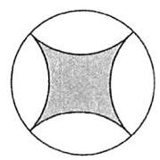

A. $\frac{\pi }{2}$ B. $\frac{\pi }{3}$ C. ${2\pi } - 4$ D. $4 - \pi$

2. 某企业计划做一个企业发展史的铭牌,铭牌的截面是如图所示的扇形环面 (由扇形 ${OAD}$ 挖去扇形 ${OBC}$ 后构成). 已知 ${OA} = {2OB} = 4$ ,该扇形环面的周长为 22,则该扇形环面的面积是

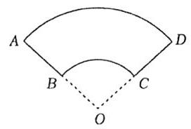

A. 12 B. 14 C. 16 D. 18

3. (2007 江苏 16)某时钟的秒针端点 $A$ 到中心点 $O$ 的距离为 $5\mathrm{\;{cm}}$ ， 秒针均匀地绕点 $O$ 旋转，当时间 $t = 0$ 时， 点 $A$ 与钟面上标 12 的点 $B$ 重合,将 $A, B$ 两点的距离 $d\left( \mathrm{\;{cm}}\right)$ 表示成 $t\left( s\right)$ 的函数，则 $d =$ ___， $\left( {t \in  \left\lbrack  {0,{60}}\right\rbrack  }\right)$ .

4. (2020 山东) 已知直线 $l : y = x\sin \theta  + \cos \theta$ 的图像如图所示,则角 $\theta$ 是

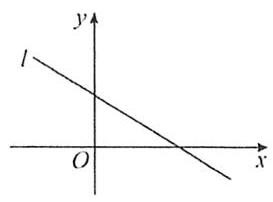

A. 第一象限角 B. 第二象限角 C. 第三象限角 D. 第四象限角

5. 已知点 $P\left( {\tan \alpha ,\cos \alpha }\right)$ 在第二象限,则 $\pi  - \alpha$ 是第___象限的角.

A. 一 B. 二 C. 三 D. 四

6. (2020 全国 II 理 2)若 $\alpha$ 为第四象限角,则

A. $\cos {2\alpha } > 0$ B. $\cos {2\alpha } < 0$ C. $\sin {2\alpha } > 0$ D. $\sin {2\alpha } < 0$

7. (2018 北京) 在平面直角坐标系中, $\overset{\text{ ⏜ }}{AB},\overset{\text{ ⏜ }}{CD},\overset{\text{ ⏜ }}{EF},\overset{\text{ ⏜ }}{GH}$ 是圆 ${x}^{2} + {y}^{2} = 1$ 上的四段弧 (如图),点 $P$ 其中一段上,角 $\alpha$ 以 ${Ox}$ 为始边, ${OP}$ 为终边. 若 $\tan \alpha  < \cos \alpha  < \sin \alpha$ ,则 $P$ 所在的圆弧是

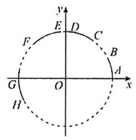

A. $\overset{\text{ ⏜ }}{AB}$ B. $\overset{\text{ ⏜ }}{CD}$ C. $\overset{\text{ ⏜ }}{EF}$ D. $\overset{\text{ ⏜ }}{GH}$

8. (2023乙卷)已知等差数列 $\left\{  {a}_{n}\right\}$ 的公差为 $\frac{2\pi }{3}$ ，集合 $S = \left\{  {\cos {a}_{n} \mid  n \in  {\mathbf{N}}^{ * }}\right\}$ ，若 $S = \{ a, b\}$ ，则 ${ab} =$

A. -1 B. $- \frac{1}{2}$ C. 0 D. $\frac{1}{2}$

9. (2024 全国甲卷)已知 $\frac{\cos \alpha }{\cos \alpha  - \sin \alpha } = \sqrt{3}$ ，则 $\tan \left( {\alpha  + \frac{\pi }{4}}\right)  =$

A. $2\sqrt{3} + 1$ B. $2\sqrt{3} - 1$ C. $\frac{\sqrt{3}}{2}$ D. $1 - \sqrt{3}$

10. 若 $a = \sin \frac{3\pi }{7}, b = \cos \left( {-\frac{3\pi }{7}}\right) , c = \tan \frac{3\pi }{7}$ ,则

A. $b < a < c$ B. $a < b < c$ C. $b < c < a$ D. $c < b < a$

11. 已知 $a = \sin \left( {-\frac{15\pi }{4}}\right) , b = \sin \left( {-\frac{7\pi }{5}}\right) , c = \sin \left( \frac{10\pi }{3}\right)$ ,则

A. $c > a > b$ B. $b > a > c$ C. $a > b > c$ D. $c > b > a$

12. 已知角 $\theta$ 的终边上有一点 $\left( {1,3}\right)$ ,则 $\frac{\sin \left( {\pi  - \theta }\right)  + \cos \left( {\frac{\pi }{2} - \theta }\right) }{\cos \left( {-\theta }\right)  - \cos \left( {\pi  + \theta }\right) } =$

A. -2 B. 2 C. -3 D. 3

13. 已知 $\alpha  \in  \left( {\frac{2\pi }{3},\pi }\right) ,\cos \left( {\alpha  - \frac{\pi }{6}}\right)  =  - \frac{4}{5}$ ,则 $\tan \left( {\alpha  + \frac{5\pi }{6}}\right)  =$

A. $- \frac{4}{3}$ B. $- \frac{3}{4}$ C. $\frac{4}{3}$ D. $\frac{3}{4}$

14. 设函数 $f\left( x\right) \left( {x \in  \mathbf{R}}\right)$ 满足 $f\left( {x + \frac{\pi }{2}}\right)  = f\left( x\right)  + \sin x$ ,当 $0 \leq  x < \frac{\pi }{2}$ 时, $f\left( x\right)  = \cos x$ ,则 $f\left( \frac{11\pi }{6}\right)$ 的值是

A. $\frac{1}{2}$ B. $\frac{\sqrt{3}}{2}$ C. 1 D. 0

# 第十四讲 三角恒等变换

1. (2024 甲卷理9) 已知 $\frac{\cos \alpha }{\cos \alpha  - \sin \alpha } = \sqrt{3}$ ,则 $\tan \left( {\alpha  + \frac{\pi }{4}}\right)  =$

A. $2\sqrt{3} + 1$ B. $2\sqrt{3} - 1$ C. $\frac{\sqrt{3}}{2}$ D. $1 - \sqrt{3}$

2. 已知 $\frac{\cos {2\alpha }}{\sqrt{2}\sin \left( {\alpha  + \frac{\pi }{4}}\right) } = \frac{\sqrt{5}}{2}$ ，则 $\tan \alpha  + \frac{1}{\tan \alpha } =$ ___.

3. (2017北京理12)在平面直角坐标系 ${xOy}$ 中，角 $\alpha$ 与角 $\beta$ 均以 ${Ox}$ 为始边，它们的终边关于 $y$ 轴对称，若 $\sin \alpha  = \frac{1}{3}$ ，则 $\cos \left( {\alpha  - \beta }\right)  =$ ___.

4. (2015 上海) 已知点 $A$ 的坐标为 $\left( {4\sqrt{3},1}\right)$ ，将 ${OA}$ 绕坐标原点 $O$ 逆时针旋转 $\frac{\pi }{3}$ 至 ${OB}$ ，则点 $B$ 的纵坐标为

A. $\frac{3\sqrt{3}}{2}$ B. $\frac{5\sqrt{3}}{2}$ C. $\frac{11}{2}$ D. $\frac{13}{2}$

5. (2020 全国I理9) 已知 $\alpha  \in  \left( {0,\pi }\right)$ ,且 $3\cos {2\alpha } - 8\cos \alpha  = 5$ ,则 $\sin \alpha  =$

A. $\frac{\sqrt{5}}{3}$ B. $\frac{2}{3}$ C. $\frac{1}{3}$ D. $\frac{\sqrt{5}}{9}$

6. 已知 $a > 0$ ,若 $\cos \theta  = \frac{{a}^{2} + 1}{2a}$ ,则 $\cos \left( {\theta  + \frac{\pi }{6}}\right)$ 的值为___.

7. (2020 全国III文5) 已知 $\sin \theta  + \sin \left( {\theta  + \frac{\pi }{3}}\right)  = 1$ ，则 $\sin \left( {\theta  + \frac{\pi }{6}}\right)  =$ ___.

8. (2020 新课标III)已知 $2\tan \theta  - \tan \left( {\theta  + \frac{\pi }{4}}\right)  = 7$ ，则 $\tan \theta  =$ ___.

9. (2017 全国) 函数 $f\left( x\right)  = \frac{1}{5}\sin \left( {x + \frac{\pi }{3}}\right)  + \cos \left( {x - \frac{\pi }{6}}\right)$ 的最大值为

A. $\frac{6}{5}$ B. 1 C. $\frac{3}{5}$ D. $\frac{1}{5}$

10. (2018 全国 II 理 15)已知 $\sin \alpha  + \cos \beta  = 1,\cos \alpha  + \sin \beta  = 0$ ，则 $\sin \left( {\alpha  + \beta }\right)  =$ ___.

11. (2023 新一卷 8)已知 $\sin \left( {\alpha  - \beta }\right)  = \frac{1}{3},\cos \alpha \sin \beta  = \frac{1}{6}$ ，则 $\cos \left( {{2\alpha } + {2\beta }}\right)  =$

A. $\frac{7}{9}$ B. $\frac{1}{9}$ C. $- \frac{1}{9}$ D. $- \frac{7}{9}$

12. 已知 $\cos \left( {x + y}\right)  = 3\cos \left( {x - y}\right)$ ,则 $\tan x\tan y =$

A. $\frac{1}{2}$ B. $- \frac{1}{2}$ C. $\frac{3}{2}$ D. $- \frac{3}{2}$

13. (2024新二卷 13)已知 $\alpha$ 为第一象限角， $\beta$ 为第三象限角， $\tan \alpha  + \tan \beta  = 4,\tan \alpha \tan \beta  = \sqrt{2} + 1$ ，则 $\sin \left( {\alpha  + \beta }\right)  =$ ___.

14. 已知钝角 $\alpha$ 满足 $\frac{1}{\cos \frac{\alpha }{2}} - \frac{1}{\sin \frac{\alpha }{2}} = 2\sqrt{6}$ ,则 $\sin \left( {\frac{\pi }{2} - {2\alpha }}\right)  =$

A. $\frac{7}{9}$ B. $\frac{5}{9}$ C. $\frac{1}{3}$ D. $\frac{2}{9}$

15. 设 $a = \frac{1}{\sqrt{2}}\left( {\sin {56}^{ \circ  } - \cos {56}^{ \circ  }}\right) , b = \cos {50}^{ \circ  } \cdot  \cos {128}^{ \circ  } + \cos {40}^{ \circ  } \cdot  \cos {38}^{ \circ  }, c = \frac{1}{2}\left( {\cos {80}^{ \circ  } - 2\cos {250}^{ \circ  } + 1}\right)$ ,则 $a, b$ , $c$ 的大小关系是

A. $a > b > c$ B. $b > a > c$ C. $c > a > b$ D. $a > c > b$

16. (人教 B 版课后习题) 已知 ${x}_{0}$ 是函数 $f\left( x\right)  = 3\sin x + 4\cos x$ 的最大值点,求 $\sin {x}_{0}$ 的值.

17. $\tan {20}^{ \circ  } + 4\sin {20}^{ \circ  } =$ ___.

18. 若 $\sin \left( {\frac{\pi }{6} - \alpha }\right)  = \frac{1}{3},\cos \left( {\frac{2\pi }{3} + {2\alpha }}\right)  =$ ___.

19. 若 $\sin x - \cos x = \frac{\sqrt{3}}{2}$ ,则 ${\sin }^{4}x + {\cos }^{4}x =$

A. $\frac{25}{32}$ B. $\frac{31}{32}$ C. $\frac{33}{32}$ D. $\frac{41}{32}$

## 第十五讲 三角函数图像(一)

1. (2024 天津)下列函数是偶函数的是

A. $y = \frac{{\mathrm{e}}^{x} - {x}^{2}}{{x}^{2} + 1}$ B. $y = \frac{\cos x + {x}^{2}}{{x}^{2} + 1}$ C. $y = \frac{{\mathrm{e}}^{x} - x}{x + 1}$ D. $y = \frac{\sin x + {4x}}{{\mathrm{e}}^{\left| x\right| }}$

2. (2024 新II卷) (多选) 对于函数 $f\left( x\right)  = \sin {2x}$ 和 $g\left( x\right)  = \sin \left( {{2x} - \frac{\pi }{4}}\right)$ ,下列说法中正确的有

A. $f\left( x\right)$ 与 $g\left( x\right)$ 有相同的零点 B. $f\left( x\right)$ 与 $g\left( x\right)$ 有相同的最大值

C. $f\left( x\right)$ 与 $g\left( x\right)$ 有相同的最小正周期 D. $f\left( x\right)$ 与 $g\left( x\right)$ 的图象有相同的对称轴

3. (2022 北京) 已知函数 $f\left( x\right)  = {\cos }^{2}x - {\sin }^{2}x$ ,则

A. $f\left( x\right)$ 在 $\left( {-\frac{\pi }{2}, - \frac{\pi }{6}}\right)$ 上单调递减 B. $f\left( x\right)$ 在 $\left( {-\frac{\pi }{4},\frac{\pi }{12}}\right)$ 上单调递增

C. $f\left( x\right)$ 在 $\left( {0,\frac{\pi }{3}}\right)$ 上单调递减 D. $f\left( x\right)$ 在 $\left( {\frac{\pi }{4},\frac{7\pi }{12}}\right)$ 上单调递增

4. (2018 全国) 函数 $f\left( x\right)  = \cos \left( {{3x} + \frac{\pi }{6}}\right)$ 在 $\left\lbrack  {0,\pi }\right\rbrack$ 的零点个数为___.

5. (2024 甲卷) 函数 $f\left( x\right)  = \sin x - \sqrt{3}\cos x$ 在 $\left\lbrack  {0,\pi }\right\rbrack$ 上的最大值是___.

6. 设常数 $a$ 使 $\sin x + \sqrt{3}\cos x = a$ 在闭区间 $\left\lbrack  {0,{2\pi }}\right\rbrack$ 上恰有三个解 ${x}_{1},{x}_{2},{x}_{3}$ ,则 ${x}_{1} + {x}_{2} + {x}_{3} =$ ___.

7. 已知函数 $f\left( x\right)  = \sin {2x}$ ，若存在非零实数 $a$ ， $b$ ，使得 $f\left( {x + a}\right)  = {bf}\left( x\right)$ 对 $\forall x \in  \mathbf{R}$ 都成立，则满足条件的有序实数对 $\left( {a, b}\right)$ 可以是___.

8. (2016上海文 17) 设 $a \in  \mathbf{R}, b \in  (0,{2\pi }\rbrack$ ,若对任意实数 $x$ 都有 $\sin \left( {{3x} - \frac{\pi }{3}}\right)  = \sin \left( {{ax} + b}\right)$ ,则满足条件的有序实数对 $\left( {a, b}\right)$ 的对数为

A. 1 B. 2 C. 3 D. 4

9. 将函数 $y = \sin {2x}$ 的图像向左平移 $\varphi \left( {0 \leq  \varphi  \leq  \frac{\pi }{2}}\right)$ 后，得到函数 $y = \cos \left( {{2x} + \frac{\pi }{6}}\right)$ 的图像，则 $\varphi  =$ ___.

10. (2019 天津)已知函数 $f\left( x\right)  = A\sin \left( {{\omega x} + \varphi }\right) \left( {A > 0,\omega  > 0,\left| \varphi \right|  < \pi }\right)$ 是奇函数，将 $y = f\left( x\right)$ 的图像上所有点的横坐标伸长到原来的 2 倍 (纵坐标不变),所得图像对应的函数为 $g\left( x\right)$ . 若 $g\left( x\right)$ 的最小正周期为 ${2\pi }$ ,且 $g\left( \frac{\pi }{4}\right)  = \sqrt{2}$ ,则 $f\left( \frac{3\pi }{8}\right)  =$

A. -2 B. $- \sqrt{2}$ C. $\sqrt{2}$ D. 2

11. (2016北京理7)将函数 $y = \sin \left( {{2x} - \frac{\pi }{3}}\right)$ 图象上的点 $P\left( {\frac{\pi }{4}, t}\right)$ 向左平移 $s\left( {s > 0}\right)$ 个单位长度得到点 ${P}^{\prime }$ ，若 ${P}^{\prime }$ 位于函数 $y = \sin {2x}$ 的图象上,则

A. $t = \frac{1}{2}, s$ 的最小值为 $\frac{\pi }{6}$ B. $t = \frac{\sqrt{3}}{2}, s$ 的最小值为 $\frac{\pi }{6}$

C. $t = \frac{1}{2}, s$ 的最小值为 $\frac{\pi }{3}$ D. $t = \frac{\sqrt{3}}{2}, s$ 的最小值为 $\frac{\pi }{3}$

12. 已知函数 $f\left( x\right)  = \frac{1}{2}\sin {2x}$ . 若曲线 $y = f\left( x\right)$ 在点 $A\left( {{x}_{1}, f\left( {x}_{1}\right) }\right)$ 处的切线与其在点 $B\left( {{x}_{2}, f\left( {x}_{2}\right) }\right)$ 处的切线相互垂直，则 ${x}_{1} - {x}_{2}$ 的一个取值为___.

13. (2018 北京)设函数 $f\left( x\right)  = \cos \left( {{\omega x} - \frac{\pi }{6}}\right) \left( {\omega  > 0}\right)$ ，若 $f\left( x\right)  \leq  f\left( \frac{\pi }{4}\right)$ 对任意的实数 $x$ 都成立，则 $\omega$ 的最小值为___.

14. (2009 浙江文 10)已知 $a$ 是实数，则函数 $f\left( x\right)  = 1 + a\sin {ax}$ 的图象不可能是

A.

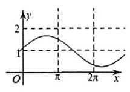

B.

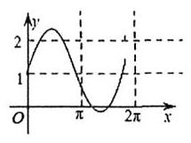

C.

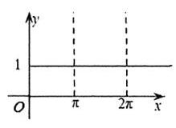

D.

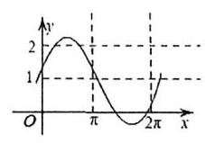

15. 已知函数 $f\left( x\right)  = A\sin \left( {{\omega x} + \varphi }\right) \left( {A > 0,\omega  > 0,\left| \varphi \right|  < \frac{\pi }{2}}\right)$ 的部分图象如图所示,若方程 $f\left( x\right)  = {2m}$ 在 $\left\lbrack  {-\frac{7\pi }{12},0}\right\rbrack$ 上有两个不相等的实数根,则实数 $m$ 的取值范围是

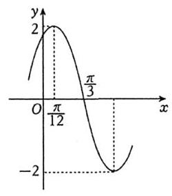

A. $( - 2, - 1\rbrack$ B. $\left( {-1, - \frac{1}{2}}\right\rbrack$ C. $\left( {-1,\frac{\sqrt{3}}{2}}\right)$ D. $\left\lbrack  {-\frac{1}{2},\frac{\sqrt{3}}{2}}\right)$

16. (多选) 已知函数 $f\left( x\right)  = A\sin \left( {{\omega x} + \varphi }\right) \left( {A > 0,\omega  > 0,0 < \varphi  < \pi }\right)$ 的部分图像如图所示,则

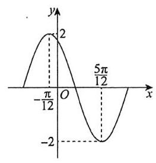

A. $\omega  = 2$

B. $\varphi  = \frac{\pi }{3}$

C. 直线 $x = \frac{17\pi }{12}$ 是函数 $f\left( x\right)$ 图象的一条对称轴

D. $f\left( x\right)$ 在 $\left\lbrack  {-\frac{\pi }{6},\frac{\pi }{4}}\right\rbrack$ 的值域为 $\left\lbrack  {-1,2}\right\rbrack$

17. 已知函数 $y = \sqrt{3}\sin \left( {{\omega x} + \varphi }\right) \left( {\omega  > 0}\right)$ 的部分图象如图所示. 若 $A, B, C, D$ 四点在同一个圆上,则 $\omega  =$

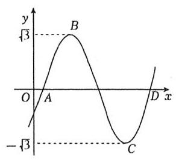

A. 1

B. $\frac{1}{2}$ C. $\pi$ D. $\frac{\pi }{2}$

18. (2023 乙卷理6) 已知函数 $f\left( x\right)  = \sin \left( {{\omega x} + \varphi }\right)$ 在区间 $\left( {\frac{\pi }{6},\frac{2\pi }{3}}\right)$ 单调递增,直线 $x = \frac{\pi }{6}$ 和 $x = \frac{2\pi }{3}$ 为函数 $y \; = f\left( x\right)$ 的图象的两条对称轴,则 $f\left( {-\frac{5\pi }{12}}\right)  =$

A. $- \frac{\sqrt{3}}{2}$ B. $- \frac{1}{2}$ C. $\frac{1}{2}$ D. $\frac{\sqrt{3}}{2}$

19. (2022 新一卷 6)记函数 $f\left( x\right)  = \sin \left( {{\omega x} + \frac{\pi }{4}}\right)  + b\left( {\omega  > 0}\right)$ 的最小正周期为 $T$ . 若 $\frac{2\pi }{3} < T < \pi$ ，且 $y = f\left( x\right)$ 的图象关于点 $\left( {\frac{3\pi }{2},2}\right)$ 中心对称,则 $f\left( \frac{\pi }{2}\right)  =$

A. 1 B. $\frac{3}{2}$ C. $\frac{5}{2}$ D. 3

20. (2015 上海) 已知函数 $f\left( x\right)  = \sin x$ ,若存在 ${x}_{1},{x}_{2},\cdots ,{x}_{m}$ 满足 $0 \leq  {x}_{1} < {x}_{2} < \cdots  < {x}_{m} \leq  {6\pi }$ ,且 $\left| {f\left( {x}_{1}\right)  - f\left( {x}_{2}\right) }\right| \; + \left| {f\left( {x}_{2}\right)  - f\left( {x}_{3}\right) }\right|  + \cdots  + \left| {f\left( {x}_{m - 1}\right)  - f\left( {x}_{m}\right) }\right|  = {12}\left( {m \geq  2, m \in  {\mathbf{N}}^{ * }}\right)$ ,则 $m$ 的最小值为___.

21. (2022 新二卷) (多选) 已知函数 $f\left( x\right)  = \sin \left( {{2x} + \varphi }\right) \left( {0 < \varphi  < \pi }\right)$ 的图像关于点 $\left( {\frac{2\pi }{3},0}\right)$ 中心对称,则

A. $f\left( x\right)$ 在区间 $\left( {0,\frac{5\pi }{12}}\right)$ 单调递减 B. $f\left( x\right)$ 在区间 $\left( {-\frac{\pi }{12},\frac{11\pi }{12}}\right)$ 有两个极值点

C. 直线 $x = \frac{7\pi }{6}$ 是曲线 $y = f\left( x\right)$ 的对称轴 D. 直线 $y = \frac{\sqrt{3}}{2} - x$ 是曲线 $y = f\left( x\right)$ 的切线

22. (2025 全国二卷 15) 已知函数 $f\left( x\right)  = \cos \left( {{2x} + \varphi }\right) \left( {0 \leq  \varphi  < \pi }\right) , f\left( 0\right)  = \frac{1}{2}$ .

(1) 求 $\varphi$ ；

(2)设函数 $g\left( x\right)  = f\left( x\right)  + f\left( {x - \frac{\pi }{6}}\right)$ ，求 $g\left( x\right)$ 的值域和单调区间.

## 第十六讲 三角函数图像(二)

1. 已知函数 $f\left( x\right)  = 2\sin {\omega x}\left( {\omega  > 0}\right)$ 在区间 $\left\lbrack  {-\frac{\pi }{4},\frac{\pi }{3}}\right\rbrack$ 上是增函数,若函数 $f\left( x\right)$ 在 $\left\lbrack  {0,\frac{\pi }{2}}\right\rbrack$ 上的图象与直线 $y = 2$ 有且仅有一个交点,则 $\omega$ 的范围为

A. $\lbrack 2,5)$ B. $\left\lbrack  {1,5}\right)$ C. $\left\lbrack  {1,2}\right\rbrack$ D. $\left\lbrack  {1,\frac{3}{2}}\right\rbrack$

2. 已知函数 $f\left( x\right)  = \cos {\omega x}\left( {\omega  > 0}\right)$ ,若 $f\left( {x + \frac{\pi }{2}}\right)$ 为偶函数,且 $f\left( x\right)$ 在区间 $\left( {0,\pi }\right)$ 内仅有两个零点,则 $\omega$ 的值是

A. 2 B. 3 C. 5 D. 8

3. 已知函数 $f\left( x\right)  = \tan \left( {{\omega x} - \frac{\pi }{4}}\right) \left( {\omega  > 0}\right)$ ,若 $f\left( x\right)$ 在区间 $\left( {0,\pi }\right)$ 上单调递增,则 $\omega$ 的取值范围为

A. $\left( {0,\frac{3}{4}}\right\rbrack$ B. $\left( {0,\frac{3}{4}}\right)$ C. $\left( {0,\frac{5}{4}}\right)$ D. $\left( {0,\frac{5}{4}}\right\rbrack$

4. 若函数 $f\left( x\right)  = 3\sin \left( {{\omega x} - \frac{\pi }{6}}\right) \left( {\omega  > 0}\right)$ 在 $\left\lbrack  {0,\frac{\pi }{3}}\right\rbrack$ 上单调递增,则 $\omega$ 的最大值是

A. $\frac{1}{2}$ B. .1 C. .2 D. .3

5. 已知函数 $f\left( x\right)  = \sin \left( {x + \varphi }\right)  - \sin \left( {x + {7\varphi }}\right)$ 为奇函数，则参数 $\varphi$ 的一个可能值为

A. $\frac{\pi }{7}$ B. $\frac{\pi }{4}$ C. $\frac{3\pi }{8}$ D. $\frac{\pi }{2}$

6. 已知关于 $x$ 的不等式 $\left| {\sin {2x}}\right|  > \cos x$ 在区间 $\left\lbrack  {0,{2\pi }}\right\rbrack$ 内有 $k$ 个整数解，则 $k$ 的值为

A. 3 B. 4 C. 5 D. 6

7. 若函数 $y = \sin {\omega x}\left( {\omega  > 0}\right)$ 在区间 $\left\lbrack  {0,1}\right\rbrack$ 上至少出现 50 次最大值，则 $\omega$ 的最小值为___.

8. (2019全国III理12)设函数 $f\left( x\right)  = \sin \left( {{\omega x} + \frac{\pi }{5}}\right) \left( {\omega  > 0}\right)$ ，已知 $f\left( x\right)$ 在 $\left\lbrack  {0,{2\pi }}\right\rbrack$ 有且仅有 5 个零点，下述四个结论:

① $f\left( x\right)$ 在 $\left( {0,{2\pi }}\right)$ 有且仅有 3 个极大值点;

② $f\left( x\right)$ 在 $\left( {0,{2\pi }}\right)$ 有且仅有 2 个极小值点;

③ $f\left( x\right)$ 在 $\left( {0,\frac{\pi }{10}}\right)$ 单调递增;

④ $\omega$ 的取值范围是 $\left\lbrack  {\frac{12}{5},\frac{29}{10}}\right)$ .

其中所有正确结论的编号是

A. ①④ B. ②③ C. ①②③ D. ①③④

9. (2015 湖南) 已知 $\omega  > 0$ ,在函数 $y = 2\sin {\omega x}$ 与 $y = 2\cos {\omega x}$ 的图像的交点中,距离最短的两个交点的距离为 $2\sqrt{3}$ ,则 $\omega  =$ ___.

10. (2018全国)若 $f\left( x\right)  = \cos x - \sin x$ 在 $\left\lbrack  {-a, a}\right\rbrack$ 是减函数，则 $a$ 的最大值是

A. $\frac{\pi }{4}$ B. $\frac{\pi }{2}$ C. $\frac{3\pi }{4}$ D. $\pi$

11. (多选) 已知函数 $f\left( x\right)  = {\sin }^{2}x\sin {2x}$ ,则下面说法正确的是

A. $\pi$ 是 $f\left( x\right)$ 的一个周期 B. $\left( {\frac{\pi }{2},0}\right)$ 是 $f\left( x\right)$ 的对称中心

C. $x = \frac{\pi }{4}$ 是 $f\left( x\right)$ 的对称轴 D. $f\left( x\right)$ 的最大值为 $\frac{3\sqrt{3}}{8}$

12. 数学与音乐有着紧密的关联, 我们平时听到的乐音一般来说并不是纯音, 而是由多种波叠加而成的复合音. 如图为某段乐音的图象, 则该段乐音对应的函数解析式可以为

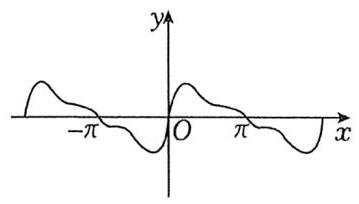

A. $y = \sin x + \frac{1}{2}\sin {2x} + \frac{1}{3}\sin {3x}$ B. $y = \sin x - \frac{1}{2}\sin {2x} - \frac{1}{3}\sin {3x}$

C. $y = \sin x + \frac{1}{2}\cos {2x} + \frac{1}{3}\cos {3x}$ D. $y = \cos x + \frac{1}{2}\cos {2x} + \frac{1}{3}\cos {3x}$

13. (2019全国I理11)关于函数 $f\left( x\right)  = \sin \left| x\right|  + \left| {\sin x}\right|$ 有下述四个结论,其中所有正确结论的编号是 ① $f\left( x\right)$ 是偶函数；

② $f\left( x\right)$ 在区间 $\left( {\frac{\pi }{2},\pi }\right)$ 单调递增；

③ $f\left( x\right)$ 在 $\left\lbrack  {-\pi ,\pi }\right\rbrack$ 有 4 个零点;

④ $f\left( x\right)$ 的最大值为 2 .

A. ①②④ B. ②④ C. ①④ D. ①③

14. (2016全国I文12) 若函数 $f\left( x\right)  = x - \frac{1}{3}\sin {2x} + a\sin x$ 在 $\left( {-\infty , + \infty }\right)$ 单调递增,则 $a$ 的取值范围是

A. $\left\lbrack  {-1,1}\right\rbrack$ B. $\left\lbrack  {-1,\frac{1}{3}}\right\rbrack$ C. $\left\lbrack  {-\frac{1}{3},\frac{1}{3}}\right\rbrack$ D. $\left\lbrack  {-1, - \frac{1}{3}}\right\rbrack$

15. (2022全国乙文11)函数 $f\left( x\right)  = \cos x + \left( {x + 1}\right) \sin x + 1$ 在区间 $\left\lbrack  {0,{2\pi }}\right\rbrack$ 的最小，最大值分别为

A. $- \frac{\pi }{2},\frac{\pi }{2}$ B. $- \frac{3\pi }{2},\frac{\pi }{2}$ C. $- \frac{\pi }{2},\frac{\pi }{2} + 2$ D. $- \frac{3\pi }{2},\frac{\pi }{2} + 2$

16. (2003上海春考 16)关于函数 $f\left( x\right)  = {\left( \sin x\right) }^{2} - {\left( \frac{2}{3}\right) }^{\left| x\right| } + \frac{1}{2}$ ，有下面四个结论:

① $f\left( x\right)$ 是奇函数；② 当 $x > {2003}$ 时， $f\left( x\right)  > \frac{1}{2}$ 恒成立；③ $f\left( x\right)$ 的最大值是 $\frac{3}{2}$ ；④ $f\left( x\right)$ 的最小值是 $- \frac{1}{2}$ . 其中正确结论的个数为

A. 1 B. 2 C. 3 D. 4

17. 已知函数 $f\left( x\right)  = \frac{1}{\sin x} + \frac{1}{\cos x}$ ,则

A. $f\left( x\right)$ 的图象关于点 $\left( {\frac{3\pi }{4},0}\right)$ 对称 B. $f\left( x\right)$ 的图象关于直线 $x = \frac{3\pi }{2}$ 对称

C. $f\left( x\right)$ 在区间 $\left( {\frac{\pi }{2},\pi }\right)$ 上单调递减 D. 当 $x \in  \left( {0,\frac{\pi }{2}}\right)$ 时, $f\left( x\right)$ 的最大值为 $2\sqrt{2}$

18. (多选) 为了研究钟表秒针针尖的运动变化规律,建立如图所示平面直角坐标系,设秒针针尖位置为点 $P \; \left( {x, y}\right)$ . 若初始位置为点 ${P}_{0}\left( {\frac{1}{2},\frac{\sqrt{3}}{2}}\right)$ ,秒针从 ${P}_{0}$ (规定此时 $t = 0$ ) 开始沿顺时针方向转动,点 $P$ 的纵坐标 $y$ 与时间 $t$ 的函数关系式可能为

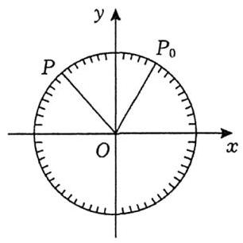

A. $y = 2\sin \left( {-\frac{\pi }{30}t + \frac{\pi }{3}}\right)$ B. $y =  - \sin \left( {\frac{\pi }{60}t - \frac{\pi }{3}}\right)$

C. $y = \sin \left( {-\frac{\pi }{30}t + \frac{\pi }{6}}\right)$ D. $y = \cos \left( {\frac{\pi }{30}t + \frac{\pi }{6}}\right)$

19. 某游乐园的摩天轮采用了国内首创的横梁结构, 风格更加简约, 摩天轮直径 88 米, 最高点 $A$ 距离地面 100 米, 匀速运行一圈的时间是 18 分钟. 由于受到周边建筑物的影响, 乘客与地面的距离超过 34 米时, 可视为最佳观赏位置, 在运行的一圈里最佳观赏时长为

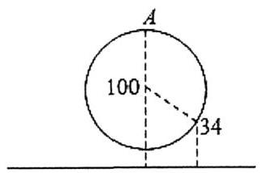

A. 10 分钟 B. 12 分钟 C. 14 分钟 D. 16 分钟

20. (2012 山东理 16)如图，在平面直角坐标系 ${xOy}$ 中，一单位圆的圆心的初始位置在(0,1)，此时圆上一点 $P$ 的位置在 $\left( {0,0}\right)$ ，圆在 $x$ 轴上沿正向滚动. 当圆滚动到圆心位于 $\left( {2,1}\right)$ 时， $\overrightarrow{OP}$ 的坐标为___.

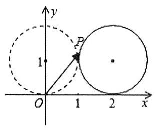

21. 圆 $O$ 的半径为 $1, P$ 为圆周上一点,现将如图的放置的边长为 1 的正方形 (正方形的顶点 $A$ 和点 $P$ 重合) 沿着圆周逆时针滚动. 经过若干次滚动,点 $A$ 第一次回到点 $P$ 的位置,则点 $A$ 走过的路程为

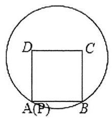

A. ${2\pi }$

B. $\frac{1 + \sqrt{2}}{2}\pi$ C. $\left( {\frac{3}{2} + \frac{\sqrt{2}}{4}}\right) \pi$ D. $\frac{2 + \sqrt{2}}{2}\pi$

第五章 解三角形第十七讲 正余弦定理基本应用

1. 在 $\bigtriangleup  {ABC}$ 中， $a - b = 4$ ， $a + c = {2b}$ ，且最大角为 ${120}^{ \circ  }$ ，则 $a =$ ___， $b =$ ___， $c =$ ___， $c =$ ___.

2. 在 $\bigtriangleup  {ABC}$ 中， ${\left( a + b\right) }^{2} - {c}^{2} = 4$ ， $C = {60}^{ \circ  }$ ，则 ${ab} =$ ___.

3. 在 $\bigtriangleup  {ABC}$ 中，已知 $1 + \frac{\tan A}{\tan B} =  - \frac{2c}{b}$ ，则 $A =$ ___.

4. (2023 乙卷) 在 $\bigtriangleup  {ABC}$ 中，内角 $A, B, C$ 的对边分别是 $a, b, c$ ，若 $a\cos B - b\cos A = c$ ，且 $C = \frac{\pi }{5}$ ，则 $\angle B =$

A. $\frac{\pi }{10}$ B. $\frac{\pi }{5}$ C. $\frac{3\pi }{10}$ D. $\frac{2\pi }{5}$

5. (2020 全国) 在 $\bigtriangleup {ABC}$ 中, $\cos C = \frac{2}{3},{AC} = 4,{BC} = 3$ ,则 $\cos B =$

A. $\frac{1}{9}$ B. $\frac{1}{3}$ C. $\frac{1}{2}$ D. $\frac{2}{3}$

6. (2018全国) $\bigtriangleup  {ABC}$ 的内角 $A, B, C$ 的对边分别为 $a, b, c$ ，若 $\bigtriangleup  {ABC}$ 的面积为 $\frac{{a}^{2} + {b}^{2} - {c}^{2}}{4}$ ，则 $C =$

A. $\frac{\pi }{2}$ B. $\frac{\pi }{3}$ C. $\frac{\pi }{4}$ D. $\frac{\pi }{6}$

7. (2021乙卷)记 $\bigtriangleup  {ABC}$ 的内角 $A, B, C$ 的对边分别为 $a, b, c$ ，面积为 $\sqrt{3}, B = {60}^{ \circ  },{a}^{2} + {c}^{2} = {3ac}$ ，则 $b =$ ___.

8. (2016 山东) $\bigtriangleup  {ABC}$ 中，角 $A, B, C$ 的对边分别是 $a, b, c$ ，已知 $b = c,{a}^{2} = 2{b}^{2}\left( {1 - \sin A}\right)$ ，则 $A =$

A. $\frac{3\pi }{4}$ B. $\frac{\pi }{3}$ C. $\frac{\pi }{4}$ D. $\frac{\pi }{6}$

9. (2024 新II卷) 记 $\bigtriangleup {ABC}$ 的内角 $A, B, C$ 的对边分别为 $a, b, c$ ,已知 $\sin A + \sqrt{3}\cos A = 2$ .

(1) 求 $A$ .

(2) 若 $a = 2,\sqrt{2}b\sin C = c\sin {2B}$ ，求 $\bigtriangleup  {ABC}$ 的周长.

10. 在 $\bigtriangleup {ABC}$ 中,已知 $\sqrt{3}c\cos A + c\sin A = \sqrt{3}b$ .

(1)求角 $C$ ；

(2)若 $\angle {ACB}$ 的平分线交 ${AB}$ 于点 $D$ ，且 $\left| {CD}\right|  = 2,{AD} = {2DB}$ ，求 $\bigtriangleup  {ABC}$ 的面积

11. (2023甲卷理16) 在 $\bigtriangleup {ABC}$ 中, $\angle {BAC} = {60}^{ \circ  },{AB} = 2,{BC} = \sqrt{6}, D$ 为 ${BC}$ 上一点, ${AD}$ 为 $\angle {BAC}$ 的平分线,则 ${AD} =$ ___.

12. 在 $\bigtriangleup {ABC}$ 中, $\angle {BAC} = \frac{2\pi }{3},\angle {BAC}$ 的角平分线 ${AD}$ 交 ${BC}$ 于点 $D,\bigtriangleup {ABD}$ 的面积是 $\bigtriangleup {ADC}$ 面积的 3 倍, 则 $\tan B =$ ___.

13. (2024 新一卷)在 $\bigtriangleup  {ABC}$ 中， $\sin C = \sqrt{2}\cos B$ ， ${a}^{2} + {b}^{2} - {c}^{2} = \sqrt{2}{ab}$ .

(1) 求 $B$ ；

(2)若 $\bigtriangleup {ABC}$ 的面积为 $3 + \sqrt{3}$ ，求 $c$ .

14. (2017港澳台高考) 在 $\bigtriangleup {ABC}$ 中， $D$ 为 ${BC}$ 的中点， ${AB} = 8$ ， ${AC} = 6$ ， ${AD} = 5$ ，则 ${BC} =$ ___.

15. (2023 甲卷) 记 $\bigtriangleup  {ABC}$ 的内角 $A, B, C$ 的对边分别为 $a, b, c$ ，已知 $\frac{{b}^{2} + {c}^{2} - {a}^{2}}{\cos A} = 2$ .

(1) 求 ${bc}$ ;

(2)若 $\frac{a\cos B - b\cos A}{a\cos B + b\cos A} - \frac{b}{c} = 1$ ，求 $\bigtriangleup  {ABC}$ 面积.

16. (2022 浙江)在 $\bigtriangleup  {ABC}$ 中，角 $A, B, C$ 所对的边分别为 $a, b, c$ . 已知 ${4a} = \sqrt{5}c,\cos C = \frac{3}{5}$ .

(1)求 $\sin A$ 的值；

(2)若 $b = {11}$ ，求 $\bigtriangleup  {ABC}$ 的面积.

17. (2017 全国) $\bigtriangleup {ABC}$ 的内角 $A, B, C$ 的对边分别为 $a, b, c$ ,已知 $\sin \left( {A + C}\right)  = 8{\sin }^{2}\frac{B}{2}$ .

(1)求 $\cos B$ ；

(2) 若 $a + c = 6,{\bigtriangleup {ABC}}$ 的面积为 2，求 $b$ .

18. (2019全国) $\bigtriangleup {ABC}$ 的内角 $A, B, C$ 的对边分别为 $a, b, c$ ，设 ${\left( \sin B - \sin C\right) }^{2} = {\sin }^{2}A - \sin B\sin C$ .

(1) 求 $A$ ;

(2) 若 $\sqrt{2}a + b = {2c}$ ,求 $\sin C$ .

第十八讲 解三角形常见题型与思想(一)

1. 在 $\bigtriangleup  {ABC}$ 中，已知 ${2c}\cos B = {2a} + b$ ，若 $\bigtriangleup  {ABC}$ 的面积为 $S = \frac{\sqrt{3}}{2}c$ ，则 ${ab}$ 的最小值为___.

2. 在钝角 $\bigtriangleup  {ABC}$ 中，已知 $a\cos B = c\sin A$ ，则 $\sin A + \sqrt{2}\sin B$ 的最大值为___.

3. 平面四边形 ${ABCD}$ 中, ${BC} = {CD} = 2,\frac{AB}{BD} = \frac{3}{4},\angle {ABD} = {90}^{ \circ  }$ ，则 ${AC}$ 的最大值为___.

4. (多选) 在锐角 $\bigtriangleup  {ABC}$ 中， $c = b + {2b}\cos A$ ，则下列结论正确的有

A. $A = {2B}$

B. $B$ 的取值范围为 $\left( {\frac{\pi }{6},\frac{\pi }{3}}\right)$

C. $\frac{a}{b}$ 的取值范围为 $\left( {\sqrt{2},\sqrt{3}}\right)$

D. $\frac{1}{\tan B} - \frac{1}{\tan A} + 2\sin A$ 的取值范围为 $\left( {\frac{5\sqrt{3}}{3},3}\right)$

5. 在 $\bigtriangleup {ABC}$ 中, $a, b, c$ 分别是角 $A, B, C$ 所对的边,且满足 $\sqrt{3}a\cos B = b\sin A + \sqrt{3}c$ .

(1) 求 $A$ ;

(2) 若 $a = \sqrt{3}$ ,求 $b + {2c}$ 的取值范围.

6. (2017 全国) $\bigtriangleup {ABC}$ 的内角 $A, B, C$ 的对边分别为 $a, b, c$ ,已知 $\sin A + \sqrt{3}\cos A = 0, a = 2\sqrt{7}, b = 2$ .

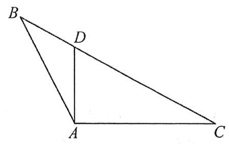

(1)求角 $A$ 和边长 $c$ ；

(2) 设 $D$ 为 ${BC}$ 边上一点,且 ${AD} \bot  {AC}$ ,求 $\bigtriangleup {ABD}$ 的面积.

7. (2010浙江文 18)在 $\bigtriangleup  {ABC}$ 中，设 $S$ 为 $\bigtriangleup  {ABC}$ 的面积，满足 $S = \frac{\sqrt{3}}{4}\left( {{a}^{2} + {b}^{2} - {c}^{2}}\right)$ .

(1)求角 $C$ 的大小；

(2) 求 $\sin A + \sin B$ 的最大值.

8. (2016山东理16) 在 $\bigtriangleup  {ABC}$ 中，角 $A, B, C$ 的对边分别为 $a, b, c$ . 已知 $2\left( {\tan A + \tan B}\right)  = \frac{\tan A}{\cos B} + \frac{\tan B}{\cos A}$ .

(1) 证明: $a + b = {2c}$ ;

(2)求 $\cos C$ 的最小值.

9. (2020新课标 II 理 17) $\bigtriangleup {ABC}$ 中, ${\sin }^{2}A - {\sin }^{2}B - {\sin }^{2}C = \sin B\sin C$ .

(1)求A；

(2)若 ${BC} = 3$ ，求 $\bigtriangleup  {ABC}$ 周长的最大值.

10. 在 $\bigtriangleup {ABC}$ 中, $\bigtriangleup {ABC}$ 的面积为 $S$ . 已知 $S =  - \frac{\sqrt{3}}{4}\left( {{a}^{2} + {c}^{2} - {b}^{2}}\right)$ .

(1) 求 $B$ ;

(2)若点 $D$ 在边 ${AC}$ 上,且 $\angle {ABD} = \frac{\pi }{2},{AD} = {2DC} = 2$ ,求 $\bigtriangleup  {ABC}$ 的周长.

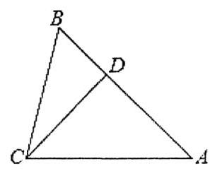

11. 在 $\bigtriangleup {ABC}$ 中, $B = \frac{\pi }{3}$ ,点 $D$ 在边 ${AB}$ 上, ${BD} = 1$ ,且 ${DA} = {DC}$ .

(1)若 $\bigtriangleup  {BCD}$ 的面积为 $\sqrt{3}$ ，求 ${CD}$ ；

(2)若 ${AC} = \sqrt{3}$ ，求 $\angle {DCA}$ .

# 第十九讲解三角形常见题型与思想(二)

1. 在 $\bigtriangleup {ABC}$ 中,角 $A, B, C$ 所对边分别为 $a, b, c$ ,若 $a - b = \frac{b}{\tan B} - \frac{a}{\tan A}$ ,则 $\bigtriangleup {ABC}$ 的形状为

A. 等腰三角形 B. 直角三角形 C. 等腰直角三角形 D. 等腰或直角三角形

2. (2006 四川理 11) 设 $a\text{ 、 }b\text{ 、 }c$ 分别为 $\bigtriangleup {ABC}$ 的三内角 $A\text{ 、 }B\text{ 、 }C$ 所对的边,则 ${a}^{2} = b\left( {b + c}\right)$ 是 $A = {2B}$ 的

A. 充要条件 B. 充分而不必要条件 C. 必要而不充分条件 D. 既不充分也不必要条件

3. 在 ${ABC}$ 中,角 $A, B, C$ 的对边分别为 $a, b, c$ ,若 $\bigtriangleup {ABC}$ 为锐角三角形,且满足 $\sin B\left( {1 + 2\cos C}\right)  = \; 2\sin A\cos C + \cos A\sin C$ ,则下列等式成立的是

A. $a = {2b}$ B. $b = {2a}$ C. $A = {2B}$ D. $B = {2A}$

4. (2023 乙卷) 在 $\bigtriangleup {ABC}$ 中,已知 $\angle {BAC} = {120}^{ \circ  },{AB} = 2,{AC} = 1$ .

(1) 求 $\sin \angle {ABC}$ ;

(2)若 $D$ 为 ${BC}$ 上一点,且 $\angle {BAD} = {90}^{ \circ  }$ ,求 $\bigtriangleup {ADC}$ 的面积.

5. (2020 新二卷) 在 $\bigtriangleup {ABC}$ 中,已知 ${\cos }^{2}\left( {\frac{\pi }{2} + A}\right)  + \cos A = \frac{5}{4}$ .

(1) 求 $A$ ；

(2)若 $b - c = \frac{\sqrt{3}}{3}a$ ，证明: $\bigtriangleup  {ABC}$ 是直角三角形.

6. 如图,在平面四边形 ${ABCD}$ 中, $\angle D = 2\angle B,{CD} = {3AD} = 3,{BC} = \sqrt{6},\cos B = \frac{\sqrt{3}}{3}$ .

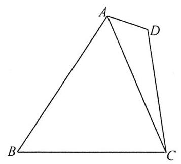

(1)求四边形 ${ABCD}$ 的周长;

(2)求四边形 ${ABCD}$ 的面积.

7. 在 $\bigtriangleup {ABC}$ 中, $\cos {2A} + \cos A = 0$ .

(1)求 $A$ 的大小.

(2)若 $a = 7$ ，从条件①、条件②、条件③这三个条件中选择一个作为已知，使得 $\bigtriangleup  {ABC}$ 存在且唯一确定，求 $\bigtriangleup {ABC}$ 最长边上的高线的长.

条件①: $\sin C = \frac{5\sqrt{3}}{14}$ ;

条件②: $\bigtriangleup  {ABC}$ 的面积为 ${10}\sqrt{3}$ ；

条件③: $b = {10}$ .

8. 如图， $\bigtriangleup  {ABC}$ 中，角 $A$ ， $B$ ， $C$ 所对的边分别为 $a$ ， $b$ ， $c$ ， $D$ 为 ${BC}$ 边上一点， ${AB} \bot  {AD}$ ， ${AD} = {CD}$ ，记 $\angle {ADC} = \theta$ .

(1) 若 $\theta  = \frac{3\pi }{4}$ ,求证: ${b}^{2} - {c}^{2} = {ac}$ ;

(2)若 $b = {4c}$ ，求 $\cos \theta$ 的值.

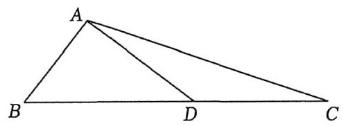

9. 如图为了立一块广告牌,要制造一个三角形的支架,三角形支架形状如图,要求 $\angle {ACB} = {60}^{ \circ  },{BC}$ 的长度大于 1 米,且 ${AC}$ 比 ${AB}$ 长 0.5 米,为了广告牌稳固,要求 ${AC}$ 的长度越短越好,则 ${AC}$ 最短为___米.

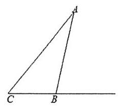

10. 如图,为了测量湖两侧的 $A, B$ 两点之间的距离,某观测小组的三位同学分别在 $B$ 点,距离 $A$ 点 ${30}\mathrm{\;{km}}$ 处的 $C$ 点,以及距离 $C$ 点 ${10}\mathrm{\;{km}}$ 处的 $D$ 点进行观测. 甲同学在 $B$ 点测得 $\angle {DBC} = {30}^{ \circ  }$ ,乙同学在 $C$ 点测得 $\angle {ACB} = {45}^{ \circ  }$ ，丙同学在 $D$ 点测得 $\angle {BDC} = {45}^{ \circ  }$ ，则 $A$ ， $B$ 两点间的距离为___ $\mathrm{{km}}$ .

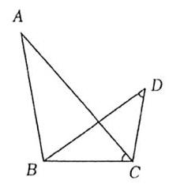

11. 为测量 $A, B$ 两地之间的距离,甲同学选定了与 $A, B$ 不共线的 $C$ 处,构成 $\bigtriangleup {ABC}$ ,以下是测量数据的不同方案:①测量 $\angle A,\left| {AC}\right| ,\left| {BC}\right|$ ; ②测量 $\angle A,\angle B,\left| {BC}\right|$ ; ③测量 $\angle C,\left| {AC}\right| ,\left| {BC}\right|$ ; ④测量 $\angle A,\angle B,\angle C$ . 要求甲同学选择的方案能唯一确定 $A, B$ 两地之间的距离,这样方案的个数有

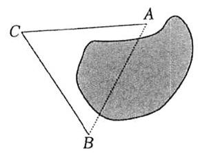

A. 1 个 B. 2 个 C. 3 个 D. 4 个

12. 某班课外学习小组利用“镜面反射法”来测量学校内建筑物的高度. 步骤如下:①将镜子(平面镜)置于平地上，人后退至从镜中能看到房顶的位置，测量出人与镜子的距离；②将镜子后移，重复①中的操作；③求建筑物高度. 如图所示,前后两次人与镜子的距离分别 ${a}_{1}m,{a}_{2}m\left( {{a}_{2} > {a}_{1}}\right)$ ,两次观测时镜子间的距离为 ${am}$ ,人的“眼高”为 ${hm}$ ,则建筑物的高度为

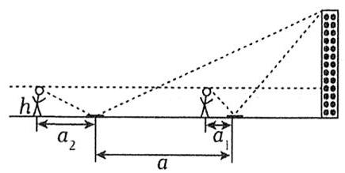

A. $\frac{ah}{{a}_{2} - {a}_{1}}m$ B. $\frac{\left( {{a}_{2} - {a}_{1}}\right) h}{a}m$ C. $\frac{a\left( {{a}_{2} - {a}_{1}}\right) }{h}m$ D. $\frac{a{h}^{2}}{{a}_{2} - {a}_{1}}m$

13. 已知圆心角为 ${60}^{ \circ  }$ 的扇形 ${AOB}$ 的半径为 $1, C$ 是 ${AB}$ 弧上一动点 (不包括 $A\text{ 、 }B$ ),作矩形 ${CDEF},{OC}$ 与 ${DE}$ 相交于点 $G$ ,给出下列四个结论:

①存在点 $C$ ，使得 $\bigtriangleup  {ODG}$ 与 $\bigtriangleup  {CDG}$ 的面积相等；

②存在点 $C$ ，使得 $\bigtriangleup  {ODC}$ 与 $\bigtriangleup  {OCF}$ 的面积相等；

③ $\bigtriangleup  {OCF}$ 面积的最大值为 $\frac{1}{4}$ ，此时 $\angle {AOC} = {45}^{ \circ  }$ ；

④矩形 ${CDEF}$ 面积的最大值为 $\frac{\sqrt{3}}{6}$ ，此时 $\angle {AOC} = {30}^{ \circ  }$ .

其中，所有正确结论的序号为___.

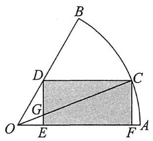

14. 如图，某景区有景点 $A, B, C, D$ ，经测量得 ${BC} = {6\mathrm{{km}}}$ ， ${\angle {ABC}} = {120}^{ \circ  },\sin \angle {BAC} = \frac{\sqrt{21}}{14}$ ， ${\angle {ACD}} = {60}^{ \circ  }$ ， ${CD} = {AC}$ .

(1)求景点 $A, D$ 之间的距离；

(2)现计划从景点 $B$ 处起始建造一条栈道 ${BM}$ ，并在 $M$ 处修建观景台. 为获得最佳观景效果，要求观景台对景点 $A, D$ 的视角 $\angle {AMD} = {120}^{ \circ  }$ . 为了节约修建成本,求栈道 ${BM}$ 长度的最小值.

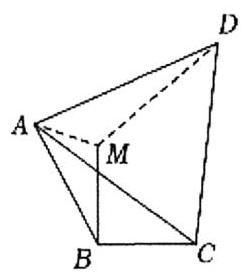

15. (多选) 已知 $a, b, c$ 分别为 $\bigtriangleup {ABC}$ 的内角 $A, B, C$ 所对的边, ${\cos }^{2}\frac{A}{2} = \frac{1}{2}\cos B\cos C + \frac{1}{2}$ ,则下列说法正确的是

A. $\tan B\tan C = 2$ B. $\tan A = \tan B + \tan C$

C. $A < \frac{\pi }{3}$ D. $a > b, a > c$

16. (多选) 记 $\bigtriangleup  {ABC}$ 的内角 $A, B, C$ 的对边分别为 $a, b, c$ ，若 ${c}^{2} = b\left( {a + b}\right)$ ，则

A. $c < b$ B. $C = {2B}$ C. $B \in  \left( {0,\frac{\pi }{3}}\right)$ D. $\frac{a}{b} \in  \left( {0,3}\right)$

# 第六章 平面向量

第二十讲 平面向量线性运算

1. (2015全国II理13)设向量 $\overrightarrow{a},\overrightarrow{b}$ 不平行,向量 $\lambda \overrightarrow{a} + \overrightarrow{b}$ 与 $\overrightarrow{a} + 2\overrightarrow{b}$ 平行,则实数 $\lambda  =$ ___.

2. (2021乙卷文 13)已知向量 $\overrightarrow{a} = \left( {2,5}\right)$ ， $\overrightarrow{b} = \left( {\lambda ,4}\right)$ ，若 $\overrightarrow{a}//\overrightarrow{b}$ ，则 $\lambda  =$ ___.

3. 如图，已知向量 $\overrightarrow{a},\overrightarrow{b},\overrightarrow{c},\overrightarrow{d},\overrightarrow{e}$ 的起点相同，则 $\overrightarrow{c} + \overrightarrow{d} - \overrightarrow{e} =$

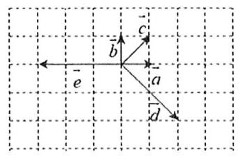

A. $- \overrightarrow{b}$ B. $\overrightarrow{b}$ C. $- 6\overrightarrow{a} + \overrightarrow{b}$ D. $6\overrightarrow{a} - \overrightarrow{b}$

4. 已知 ${AD},{BE}$ 分别为 $\bigtriangleup  {ABC}$ 的边 ${BC},{AC}$ 上的中线，且 $\overrightarrow{AD} = \overrightarrow{a},\overrightarrow{BE} = \overrightarrow{b}$ ，则 $\overrightarrow{BC} =$

A. $\frac{2}{3}\overrightarrow{a} + \frac{4}{3}\overrightarrow{b}$ B. $\frac{2}{3}\overrightarrow{a} - \frac{2}{3}\overrightarrow{b}$ C. $\frac{2}{3}\overrightarrow{a} - \frac{4}{3}\overrightarrow{b}$ D. $- \frac{2}{3}\overrightarrow{a} + \frac{4}{3}\overrightarrow{b}$

5. 如图，在 $\bigtriangleup  {ABC}$ 中， $D$ 为 ${AB}$ 的中点， $\overrightarrow{AE} = \frac{1}{3}\overrightarrow{AC}$ ，若 $\overrightarrow{DE} = \lambda \overrightarrow{AB} + \mu \overrightarrow{BC}$ ，则 $\lambda  + \mu  =$

A. $- \frac{5}{6}$ B. $- \frac{1}{6}$ C. $\frac{1}{6}$ D. $\frac{5}{6}$

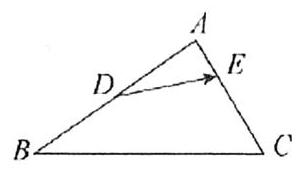

6. 已知点 $A, B, C$ 在以坐标原点为圆心的单位圆上运动,且 ${AB} \bot  {BC}$ ,若点 $P$ 的坐标为 $\left( {2,0}\right)$ ,则 $\mid  \overrightarrow{PA} + \; \overrightarrow{PB} + \overrightarrow{PC} \mid$ 的最大值为

A. 6 B. 7 C. 8 D. 9

7. (2013 湖南理 6) 已知 $\overrightarrow{a},\overrightarrow{b}$ 是单位向量, $\overrightarrow{a} \cdot  \overrightarrow{b} = 0$ ,若向量 $\overrightarrow{c}$ 满足 $\left| {\overrightarrow{c} - \overrightarrow{b} - \overrightarrow{a}}\right|  = 1$ ,则 $\left| \overrightarrow{c}\right|$ 的取值范围为

A. $\left\lbrack  {\sqrt{2} - 1,\sqrt{2} + 1}\right\rbrack$ B. $\left\lbrack  {\sqrt{2} - 1,\sqrt{2} + 2}\right\rbrack$ C. $\left\lbrack  {1,\sqrt{2} + 1}\right\rbrack$ D. $\left\lbrack  {1,\sqrt{2} + 2}\right\rbrack$

8. 在平行四边形 ${ABCD}$ 中, $E, F$ 分别是 ${BC},{CD}$ 的中点, ${DE}$ 交 ${AF}$ 于 $H$ ,记 $\overrightarrow{AB},\overrightarrow{BC}$ 分别为 $\overrightarrow{a},\overrightarrow{b}$ ,若 $\overrightarrow{AH} \; = m\overrightarrow{a} + n\overrightarrow{b}$ ,则 $m + n$ 的值为

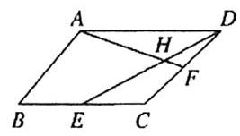

A. $- \frac{2}{5}$ B. $\frac{2}{5}$ C. $\frac{4}{5}$ D. $\frac{6}{5}$

9. 如图,在 $\bigtriangleup {ABC}$ 中,点 $O$ 是 ${BC}$ 的中点,过点 $O$ 的直线分别交直线 ${AB},{AC}$ 于不同的两点 $M, N$ ,若 $\overrightarrow{AB} = m\overrightarrow{AM},\overrightarrow{AC} = n\overrightarrow{AN}, m > 0, n > 0$ ,则 $\frac{2}{m} + \frac{8}{n}$ 的最小值

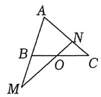

A. 2 B. 8 C. 9 D. 18

10. 设 $\overrightarrow{a},\overrightarrow{b}$ 为非零向量，则 “ $\overrightarrow{a} = \lambda \overrightarrow{b},\lambda  \leq   - 1$ ” 是 “ $\left| {\overrightarrow{a} + \overrightarrow{b}}\right|  = \left| \overrightarrow{a}\right|  - \left| \overrightarrow{b}\right|$ ” 的___.

A. 充分不必要条件 B. 必要不充分条件 C. 充要条件 D. 既不充分也不必要条件

11. 已知 $\bigtriangleup {ABC}$ 是正三角形,若 $\overrightarrow{a} = \overrightarrow{AC} - \lambda \overrightarrow{AB}$ 与向量 $\overrightarrow{AC}$ 的夹角大于 ${90}^{ \circ  }$ ,则实数 $\lambda$ 的取值范围是

A. $\left( {2, + \infty }\right)$ B. $\left( {-\infty , - 2}\right)$ C. $\left( {-\infty , - 1}\right)$ D. $\left( {1, + \infty }\right)$

12. 已知向量 $\overrightarrow{a},\overrightarrow{b}$ 在正方形网格中的位置如图所示. 若网格纸上小正方形的边长为 1,则 $\left| {\overrightarrow{a} - \lambda \overrightarrow{b}}\right| \left( {\lambda  \in  \mathbf{R}}\right)$ 的最小值是___.

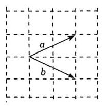

13. 如图所示，在边长为 2 的正六边形 ${ABCDEF}$ 中， $Q$ 为 ${CD}$ 中点，圆 $Q$ 的半径为 1， $P$ 是圆 $Q$ 上及内部的动点，设向量 $\overrightarrow{AP} = m\overrightarrow{AB} + n\overrightarrow{AF}$ ( $m$ ， $n$ 为实数)，则 $m + n$ 的最大值为___；若圆心 $Q$ 在线段 ${CD}$ (含端点) 上运动,则 $m + n$ 的取值范围是 ___.

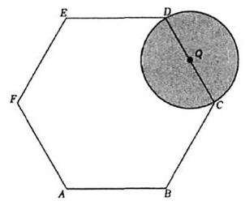

# 第二十一讲 平面向量数量积

1. (2022 甲卷)设向量 $\overrightarrow{a},\overrightarrow{b}$ 的夹角的余弦值为 $\frac{1}{3}$ ，且 $\left| \overrightarrow{a}\right|  = 1$ ， $\left| \overrightarrow{b}\right|  = 3$ ，则 $\left( {2\overrightarrow{a} + \overrightarrow{b}}\right)  \cdot  \overrightarrow{b} =$ ___.

2. (2022乙卷理3) 已知向量 $\overrightarrow{a},\overrightarrow{b}$ 满足 $\left| \overrightarrow{a}\right|  = 1,\left| \overrightarrow{b}\right|  = \sqrt{3},\left| {\overrightarrow{a} - 2\overrightarrow{b}}\right|  = 3$ ，则 $\overrightarrow{a} \cdot  \overrightarrow{b} =$

A. -2 B. -1 C. 1 D. 2

3. (2021 浙江)已知非零向量 $\overrightarrow{a},\overrightarrow{b},\overrightarrow{c}$ ,则 “ $\overrightarrow{a} \cdot  \overrightarrow{c} = \overrightarrow{b} \cdot  \overrightarrow{c}$ ” 是 “ $\overrightarrow{a} = \overrightarrow{b}$ ” 的

A. 充分不必要条件 B. 必要不充分条件 C. 充分必要条件 D. 既不充分也不必要条件

4. 已知正方形 ${ABCD}$ 的边长为 $2, P$ 为正方形 ${ABCD}$ 内部 (不含边界) 的动点,且满足 $\overrightarrow{PA} \cdot  \overrightarrow{PB} = 0$ ,则 $\overrightarrow{CP} \cdot  \overrightarrow{DP}$ 的取值范围是

A. $(0,8\rbrack$ B. $\left\lbrack  {0,8}\right\rbrack$ C. $(0,4\rbrack$ D. $\lbrack 0,4)$

5. 已知两个单位向量 ${\overrightarrow{e}}_{1},{\overrightarrow{e}}_{2}$ 的夹角为 $\frac{\pi }{3}$ ,若向量 ${\overrightarrow{b}}_{1} = {\overrightarrow{e}}_{1} - 2{\overrightarrow{e}}_{2},{\overrightarrow{b}}_{2} = {\overrightarrow{e}}_{1} + 4{\overrightarrow{e}}_{2}$ ,则 $\left| {{\overrightarrow{b}}_{1} + {\overrightarrow{b}}_{2}}\right|  =$ ___.

6. 已知向量 $\overrightarrow{a},\overrightarrow{b}$ 满足 $\left| \overrightarrow{a}\right|  = 4,\left| \overrightarrow{b}\right|  = 2,\left( {\overrightarrow{a} + \overrightarrow{b}}\right)  \bot  \overrightarrow{b}$ ,那么 $< \overrightarrow{a},\overrightarrow{b} >  =$

A. $\frac{\pi }{6}$ B. $\frac{\pi }{3}$ C. $\frac{2\pi }{3}$ D. $\frac{5\pi }{6}$

7. (2019 全国) 已知 $\overrightarrow{a},\overrightarrow{b}$ 为单位向量，且 $\overrightarrow{a} \cdot  \overrightarrow{b} = 0$ ，若 $\overrightarrow{c} = 2\overrightarrow{a} - \sqrt{5}\overrightarrow{b}$ ，则 $\cos  < \overrightarrow{a},\overrightarrow{c} >  =$ ___.

8. (2023 甲卷文 3)已知向量 $\overrightarrow{a} = \left( {3,1}\right) ,\overrightarrow{b} = \left( {2,2}\right)$ ，则 $\cos  < \overrightarrow{a} + \overrightarrow{b},\overrightarrow{a} - \overrightarrow{b} >  =$

A. $\frac{1}{17}$ B. $\frac{\sqrt{17}}{17}$ C. $\frac{\sqrt{5}}{5}$ D. $\frac{2\sqrt{5}}{5}$

9. (2014 四川文 14)平面向量 $\overrightarrow{a} = \left( {1,2}\right)$ ， $\overrightarrow{b} = \left( {4,2}\right)$ ， $\overrightarrow{c} = m\overrightarrow{a} + \overrightarrow{b}\left( {m \in  \mathrm{R}}\right)$ ，且 $\overrightarrow{c}$ 与 $\overrightarrow{a}$ 的夹角等于 $\overrightarrow{c}$ 与 $\overrightarrow{b}$ 的夹角， 则 $m =$ ___.

10. 与向量 $\overrightarrow{a} = \left( {\frac{7}{2},\frac{1}{2}}\right) ,\overrightarrow{b} = \left( {\frac{1}{2}, - \frac{7}{2}}\right)$ 的夹角相等,且模长为 1 的向量是

A. $\left( {\frac{4}{5}, - \frac{3}{5}}\right)$ B. $\left( {\frac{4}{5}, - \frac{3}{5}}\right) ,\left( {-\frac{4}{5},\frac{3}{5}}\right)$

C. $\left( {\frac{2\sqrt{2}}{3}, - \frac{1}{3}}\right)$ D. $\left( {\frac{2\sqrt{2}}{3}, - \frac{1}{3}}\right) ,\left( {-\frac{2\sqrt{2}}{3},\frac{1}{3}}\right)$

11. 已知 $\overrightarrow{a},\overrightarrow{b}$ 是夹角为 ${120}^{ \circ  }$ 的两个单位向量,若向量 $\overrightarrow{a} + \lambda \overrightarrow{b}$ 在向量 $\overrightarrow{a}$ 上的投影向量为 $- 2\overrightarrow{a}$ ,则 $\lambda  =$

A. $- \frac{2\sqrt{3}}{3}$ B. -2

C. $\frac{2\sqrt{3}}{3}$ D. 6

12. 已知 $O$ 是 $\bigtriangleup {ABC}$ 的外心,外接圆半径为 2,且满足 $2\overrightarrow{AO} = \overrightarrow{AB} + \overrightarrow{AC}$ ,若 $\overrightarrow{BA}$ 在 $\overrightarrow{BC}$ 上的投影向量为 $\frac{3}{4}\overrightarrow{BC}$ ，则 $\overrightarrow{AO} \cdot  \overrightarrow{BC} =$ ___.

13. (多选) 已知向量 $\overrightarrow{a} = \left( {\cos \theta ,\sin \theta }\right) ,\overrightarrow{b} = \left( {-3,4}\right)$ ,则

A. 若 $\overrightarrow{a}//\overrightarrow{b}$ ,则 $\tan \theta  =  - \frac{4}{3}$ B. 若 $\overrightarrow{a}\bot \overrightarrow{b}$ ,则 $\sin \theta  = \frac{3}{5}$

C. $\left| {\overrightarrow{a} - \overrightarrow{b}}\right|$ 的最大值为 6 D. 若 $\overrightarrow{a} \cdot  \left( {\overrightarrow{a} - \overrightarrow{b}}\right)  = 0$ ,则 $\left| {\overrightarrow{a} - \overrightarrow{b}}\right|  = 2\sqrt{6}$

14. 已知点 $A, B$ 在圆 $O : {x}^{2} + {y}^{2} = {16}$ 上,且 $\left| {AB}\right|  = 4, P$ 为圆 $O$ 上任意一点,则 $\overrightarrow{AB} \cdot  \overrightarrow{BP}$ 的最小值为

A. 0 B. -12 C. -18 D. -24

15. (2020 北京) 正方形 ${ABCD}$ 边长为2，点 $P$ 满足 $\overrightarrow{AP} = \frac{1}{2}\left( {\overrightarrow{AB} + \overrightarrow{AC}}\right)$ ，则 $\left| \overrightarrow{PD}\right|  =$ ___； $\overrightarrow{PB} \cdot  \overrightarrow{PD} =$ ___.

16. ( 2020 天津 )如图，在四边形 ${ABCD}$ 中， $\angle B = {60}^{ \circ  },{AB} = 3,{BC} = 6$ ，且 $\overrightarrow{AD} = \lambda \overrightarrow{BC}$ ， $\overrightarrow{AD} \cdot  \overrightarrow{AB} =  - \frac{3}{2}$ ，则实数 $\lambda$ 的值为___；若 $M, N$ 是线段 ${BC}$ 上的动点，且 $\left| \overrightarrow{MN}\right|  = 1$ ，则 $\overrightarrow{DM} \cdot  \overrightarrow{DN}$ 的最小值为___.

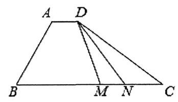

17. 如图,在同一平面内沿平行四边形 ${ABCD}$ 两边 ${AB},{AD}$ 向外分别作正方形 ${ABEF},{ADMN}$ ,其中 ${AB} = \; 2,{AD} = 1,\angle {BAD} = \frac{\pi }{4}$ ，则 $\overrightarrow{AC} \cdot  \overrightarrow{FN} =$ ___.

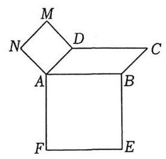

18. ( 2022 天津)在 $\bigtriangleup  {ABC}$ 中，点 $D$ 为 ${AC}$ 的中点，点 $E$ 满足 $\overrightarrow{CB} = 2\overrightarrow{BE}$ . 记 $\overrightarrow{CA} = \overrightarrow{a}$ ， $\overrightarrow{CB} = \overrightarrow{b}$ ，用 $\overrightarrow{a}$ 和 $\overrightarrow{b}$ 表示 $\overrightarrow{DE} =$ ___，若 ${AB}\bot {DE}$ ，则 $\angle {ACB}$ 的最大值为___.

# 第七章 复数

第二十二讲 深入理解复数

## 这一节基本没放纯计算的题,毕竟太过于基础了,所以放了一些复数几何含义和三角表示的,难度会较大,高 考目前来看也不太可能出, 所以如果觉得难就直接跳过哈!

1. 已知复数 $z$ 满足 $\mathrm{i} \cdot  z + 2 = 2\mathrm{i}$ ,则 $\left| z\right|  =$

A. $\sqrt{2}$ B. $2\sqrt{2}$ C. 4 D. 8

2. 已知 $z = 1 + \mathrm{i}$ ,则 $\frac{1}{z - 1} =$

A. $- \mathrm{i}$ B. i C. -1 D. 1

3. $\left| {2 + {\mathrm{i}}^{2} + 2{\mathrm{i}}^{3}}\right|  =$

A. 1 B. 2 C. $\sqrt{5}$ D. 5

4. 已知 $z = 1 - 2\mathrm{i}$ ,且 $z + a\bar{z} + b = 0$ ,其中 $a, b$ 为实数,则

A. $a = 1, b =  - 2$ B. $a =  - 1, b = 2$ C. $a = 1, b = 2$ D. $a =  - 1, b =  - 2$

5. ${\left( \frac{\sqrt{2}}{2} + \frac{\sqrt{2}}{2}\mathrm{i}\right) }^{2025} =$

A. $\frac{\sqrt{2}}{2} + \frac{\sqrt{2}}{2}\mathrm{i}$ B. $\frac{\sqrt{2}}{2} - \frac{\sqrt{2}}{2}\mathrm{i}$ C. $- \frac{\sqrt{2}}{2} + \frac{\sqrt{2}}{2}\mathrm{i}$ D. $- \frac{\sqrt{2}}{2} - \frac{\sqrt{2}}{2}\mathrm{i}$

6. 若复数 ${z}_{1} = a + b\mathrm{i}\text{ 、 }{z}_{2} = c + d\mathrm{i}\left( {a\text{ 、 }b\text{ 、 }c\text{ 、 }d \in  \mathbf{R}}\right)$ 在复平面上所对应的向量分别是 $\overrightarrow{O{Z}_{1}}\text{ 、 }\overrightarrow{O{Z}_{2}}$ ,则 $\left| {{z}_{1} \cdot  {z}_{2}}\right|$ 与 $\left| {\overrightarrow{O{Z}_{1}} \cdot  \overrightarrow{O{Z}_{2}}}\right|$ 的大小关系是

A. $\left| {{z}_{1} \cdot  {z}_{2}}\right|  \leq  \left| {\overrightarrow{O{Z}_{1}} \cdot  \overrightarrow{O{Z}_{2}}}\right|$ B. $\left| {{z}_{1} \cdot  {z}_{2}}\right|  = \left| {\overrightarrow{O{Z}_{1}} \cdot  \overrightarrow{O{Z}_{2}}}\right|$

C. $\left| {{z}_{1} \cdot  {z}_{2}}\right|  \geq  \left| {\overrightarrow{O{Z}_{1}} \cdot  \overrightarrow{O{Z}_{2}}}\right|$ D. 无法判定

7. 已知复数 $z = a + b\mathrm{i}$ 满足 $\left| {z - 1}\right|  = \left| {z - 2}\right| \left( {a, b \in  \mathbf{R}}\right)$ ,则 $a =$

A. $\frac{1}{2}$ B. $\frac{3}{2}$ C. 2 D. 4

8. (多选) 已知 ${z}_{1},{z}_{2} \in  C$ ,则

A. ${z}_{1}\overline{{z}_{2}} = \overline{{z}_{1}}{z}_{2}$ B. ${z}_{1} - {z}_{2} > 0 \Leftrightarrow  {z}_{1} > {z}_{2}$

C. $\left| \frac{{z}_{1}}{{z}_{2}}\right|  = \frac{\left| {z}_{1}\right| }{\left| {z}_{2}\right| }$ D. $\left| {z}_{1}\right|  + \left| {z}_{2}\right|  \geq  \left| {{z}_{1} + {z}_{2}}\right|$

9. (多选) 已知复数 ${z}_{1},{z}_{2}$ ,则下列命题正确的有

A. 若 ${z}_{1}^{2} + {z}_{2}^{2} = 0$ ,则 ${z}_{1} = {z}_{2} = 0$ B. 若 ${z}_{1} = \mathrm{i}{z}_{2}$ ,则 $\left| {z}_{1}\right|  = \left| {z}_{2}\right|$

C. 若 ${z}_{1} = \overline{{z}_{2}}$ ,则 ${z}_{1}{z}_{2} = {\left| {z}_{1}\right| }^{2}$ D. 若 $\left| {z}_{1}\right|  = \left| {z}_{2}\right|$ ,则 ${z}_{1}^{2} = {z}_{2}^{2}$

10. (多选)下列有关复数的结论正确的是

A. 若 $\left| z\right|  = 1$ ,则 $z =  \pm  1$

B. 若 ${z}^{2} > 0$ ,则 $z \in  \mathbf{R}$

C. $1 + 2\mathrm{i}$ 是关于 $x$ 的方程 ${x}^{2} - {2x} + 5 = 0$ 的一个根

D. 若复数 $z$ 满足 $1 \leq  \left| z\right|  \leq  \sqrt{3}$ ，则复数 $z$ 对应的点所构成的图形面积为 ${2\pi }$

11. (多选)下列关于复数 $z$ 的说法中,正确的是

A. 若复数 $z$ 满足满足 $\left| {z - 1}\right|  = \left| {z - \mathrm{i}}\right|$ ，则 $z$ 在复平面内对应的点的轨迹为直线

B. 若复数 $z$ 的平方是纯虚数,则复数 $z$ 的实部和虚部相等

C. 若 $\left| z\right|  = 1$ ,则 $z + \frac{1}{z}$ 为实数

D. 若 ${z}^{3} = 1$ ,则 $\bar{z} = {z}^{2}$

12. 已知复数 $z$ 满足 ${z}^{2} = {\left( \bar{z}\right) }^{2},\left| z\right|  \leq  1$ ，则 $\left| {z - 2 - {3\mathrm{i}}}\right|$ 的最小值是___.

13. 已知 ${ABCD}$ 是复平面内的平行四边形,且 $A, B, C$ 三点对应的复数分别是 $1 + 3\mathrm{i}, - \mathrm{i},2 + \mathrm{i}$ ,求点 $D$ 对应的复数.

# 第八章 数列

第二十三讲 等差数列与等比数列基础

1. (2023 甲卷) 记 ${S}_{n}$ 为等差数列 $\left\{  {a}_{n}\right\}$ 的前 $n$ 项和. 若 ${a}_{2} + {a}_{6} = {10},{a}_{4}{a}_{8} = {45}$ ,则 ${S}_{5} =$

A. 25 B. 22 C. 20 D. 15

2. (2024 甲卷理) 记 ${S}_{n}$ 为等差数列 $\left\{  {a}_{n}\right\}$ 的前 $n$ 项和. 若 ${S}_{5} = {S}_{10},{a}_{5} = 1$ ,则 ${a}_{1} =$

A. $\frac{7}{2}$ B. $\frac{7}{3}$ C. $- \frac{1}{3}$ D. $- \frac{7}{11}$

3. 等差数列 $\left\{  {a}_{n}\right\}$ 满足 ${a}_{1} = {2024},\frac{{S}_{12}}{12} - \frac{{S}_{10}}{10} = 2$ ,则 ${S}_{2024} =$ ___.

4. (2025北京5) 已知 $\left\{  {a}_{n}\right\}$ 是公差不为 0 的等差数列, ${a}_{1} =  - 2$ ,若 ${a}_{3},{a}_{4},{a}_{6}$ 成等比数列,则 ${a}_{10} =$

A. -20 B. -18 C. 16 D. 18

5. 已知等比数列 $\left\{  {a}_{n}\right\}$ 中, ${a}_{4} + {a}_{6} = {10}$ ,则 ${a}_{7}\left( {{a}_{1} + 2{a}_{3}}\right)  + {a}_{3}{a}_{9} =$ ___.

6. (2020 全国Ⅱ理6)数列 $\left\{  {a}_{n}\right\}$ 中, ${a}_{1} = 2,{a}_{m + n} = {a}_{m}{a}_{n}$ . 若 ${a}_{k + 1} + {a}_{k + 2} + \cdots  + {a}_{k + {10}} = {2}^{15} - {2}^{5}$ ,则 $k =$

A. 2 B. 3 C. 4 D. 5

7. (2018 全国) 设 ${S}_{n}$ 为等差数列 $\left\{  {a}_{n}\right\}$ 的前 $n$ 项和,若 $3{S}_{3} = {S}_{2} + {S}_{4},{a}_{1} = 2$ ,则 ${a}_{5} =$

A. -12 B. -10 C. 10 D. 12

8. (2015 全国)已知 $\left\{  {a}_{n}\right\}$ 是公差为 1 的等差数列， ${S}_{n}$ 为 $\left\{  {a}_{n}\right\}$ 的前 $n$ 项和，若 ${S}_{8} = 4{S}_{4}$ ，则 ${a}_{10} =$

A. $\frac{17}{2}$ B. $\frac{19}{2}$ C. 10 D. 12

9. (2020 全国) 设 $\left\{  {a}_{n}\right\}$ 是等比数列,且 ${a}_{1} + {a}_{2} + {a}_{3} = 1,{a}_{2} + {a}_{3} + {a}_{4} = 2$ ,则 ${a}_{6} + {a}_{7} + {a}_{8} =$

A. 12 B. 24 C. 30 D. 32

10. (2025全国二9)(多选)记 ${S}_{n}$ 为等比数列 $\left\{  {a}_{n}\right\}$ 的前 $n$ 项和， $q$ 为 $\left\{  {a}_{n}\right\}$ 的公比， $q > 0$ . 若 ${S}_{3} = 7$ ， ${a}_{3} = 1$ ，则.

A. $q = \frac{1}{2}$ B. ${a}_{5} = \frac{1}{9}$ C. ${S}_{5} = 8$ D. ${a}_{n} + {S}_{n} = 8$

11. (2017 江苏)等比数列 $\left\{  {a}_{n}\right\}$ 的各项均为实数,其前 $n$ 项为 ${S}_{n}$ ,已知 ${S}_{3} = \frac{7}{4},{S}_{6} = \frac{63}{4}$ ,则 ${a}_{8} =$ ___.

12. 记等比数列 $\left\{  {a}_{n}\right\}$ 的前 $n$ 项和为 ${S}_{n}$ ,若 ${S}_{8} = 8,{S}_{12} = {26}$ ,则 ${S}_{4} =$

A. 1 B. 2 C. 3 D. 4

13. 已知 $\left\{  {a}_{n}\right\}$ 是公比为 $q$ 的等比数列,其前 $n$ 项和为 ${S}_{n}$ . 若 ${S}_{4} = 5{S}_{2}$ ,则 $q =$ ___.

14. 等比数列 $\left\{  {a}_{n}\right\}$ 的各项均为正数,前 $n$ 项乘积为 ${T}_{n},{T}_{2} = {T}_{7},{a}_{6} + {a}_{7} = 6$ ,则 $\left\{  {a}_{n}\right\}$ 的通项公式 ${a}_{n} =$ ___.

15. (2021 新II卷) 记 ${S}_{n}$ 是公差不为 0 的等差数列 $\left\{  {a}_{n}\right\}$ 的前 $n$ 项和,若 ${a}_{3} = {S}_{5},{a}_{2}{a}_{4} = {S}_{4}$ .

(1)求数列 $\left\{  {a}_{n}\right\}$ 的通项公式 ${a}_{n}$ ；

(2)求使 ${S}_{n} > {a}_{n}$ 成立的 $n$ 的最小值.

16. (2019 全国) 已知 $\left\{  {a}_{n}\right\}$ 是各项均为正数的等比数列, ${a}_{1} = 2,{a}_{3} = 2{a}_{2} + {16}$ .

(1)求 $\left\{  {a}_{n}\right\}$ 的通项公式；

(2) 设 ${b}_{n} = {\log }_{2}{a}_{n}$ ，求数列 $\left\{  {b}_{n}\right\}$ 的前 $n$ 项和.

17. (2017 全国) 记 ${S}_{n}$ 为等比数列 $\left\{  {a}_{n}\right\}$ 的前 $n$ 项和,已知 ${S}_{2} = 2,{S}_{3} =  - 6$ .

(1)求 $\left\{  {a}_{n}\right\}$ 的通项公式；

(2)求 ${S}_{n}$ ，并判断 ${S}_{n + 1}$ ， ${S}_{n}$ ， ${S}_{n + 2}$ 是否成等差数列.

# 第二十四讲 数列通项与 ${S}_{n}$

1. (2023 天津) 已知数列 $\left\{  {a}_{n}\right\}$ 的前 $n$ 项和为 ${S}_{n}$ . 若 ${a}_{1} = 2,{a}_{n + 1} = 2{S}_{n} + 2$ ,则 ${a}_{4} =$

A. 16 B. 32 C. 54 D. 162

2. 数列 $\left\{  {a}_{n}\right\}$ 中 ${a}_{1} = 1$ ,若 ${a}_{n + 1} = {a}_{n} + \frac{1}{{n}^{2} + n}$ ,则通项公式 ${a}_{n} =$ ___.

3. 数列 $\left\{  {a}_{n}\right\}$ 中 ${a}_{1} = 1$ ，若 ${a}_{n + 1} = {a}_{n} + {2}^{n} - 1$ ，则通项公式 ${a}_{n} =$ ___.

4. 数列 $\left\{  {a}_{n}\right\}$ 中 ${a}_{1} = 1$ ,若 $n{a}_{n + 1} - \left( {n + 1}\right) {a}_{n} = {n}^{2} + n$ ,求 $\left\{  {a}_{n}\right\}$ 通项公式.

5. 设数列 $\left\{  {a}_{n}\right\}$ 的前 $n$ 项和为 ${S}_{n},{S}_{n} = {n}^{2} - n + 1$ ,求数列 $\left\{  {a}_{n}\right\}$ 的通项公式.

6. 数列 $\left\{  {a}_{n}\right\}$ 中 ${a}_{1} = 1$ ,若 ${a}_{n + 1} = \sqrt{{S}_{n}} + \sqrt{{S}_{n + 1}}$ ,求通项公式 ${a}_{n}$ .

7. 数列 $\left\{  {a}_{n}\right\}$ 中 ${a}_{1} + 2{a}_{2} + 3{a}_{3} + \cdots  + n{a}_{n} = \frac{n\left( {n + 1}\right) \left( {n + 2}\right) }{3}$ ，则通项公式 ${a}_{n} =$ ___.

8. 数列 $\left\{  {a}_{n}\right\}$ 中 ${a}_{1}{a}_{2}{a}_{3}\cdots {a}_{n} = {n}^{2}$ ，则通项公式 ${a}_{n} =$ ___.

9. (2024 甲卷) 已知等比数列 $\left\{  {a}_{n}\right\}$ 的前 $n$ 项和为 ${S}_{n}$ ,且 $2{S}_{n} = 3{a}_{n + 1} - 3$ .

(1)求 $\left\{  {a}_{n}\right\}$ 的通项公式；

(2)求数列 $\left\{  {S}_{n}\right\}$ 的前 $n$ 项和.

10. (2016 全国) 已知数列 $\left\{  {a}_{n}\right\}$ 的前 $n$ 项和 ${S}_{n} = 1 + \lambda {a}_{n}$ ,其中 $\lambda  \neq  0$ .

(I) 证明 $\left\{  {a}_{n}\right\}$ 是等比数列,并求其通项公式;

(II) 若 ${S}_{5} = \frac{31}{32}$ ,求 $\lambda$ .

11. (2021 全国乙卷)设 $\left\{  {a}_{n}\right\}$ 是首项为 1 的等比数列,数列 $\left\{  {b}_{n}\right\}$ 满足 ${b}_{n} = \frac{n{a}_{n}}{3}$ . 已知 ${a}_{1},3{a}_{2},9{a}_{3}$ 成等差数列.

(1)求 $\left\{  {a}_{n}\right\}$ 和 $\left\{  {b}_{n}\right\}$ 的通项公式；

(2) 记 ${S}_{n}$ 和 ${T}_{n}$ 分别为 $\left\{  {a}_{n}\right\}$ 和 $\left\{  {b}_{n}\right\}$ 的前 $n$ 项和. 证明: ${T}_{n} < \frac{{S}_{n}}{2}$ .

12. (2016 北京) 已知 $\left\{  {a}_{n}\right\}$ 是等差数列, $\left\{  {b}_{n}\right\}$ 是等比数列,且 ${b}_{2} = 3,{b}_{3} = 9,{a}_{1} = {b}_{1},{a}_{14} = {b}_{4}$ .

(1)求 $\left\{  {a}_{n}\right\}$ 的通项公式；

(2) 设 ${c}_{n} = {a}_{n} + {b}_{n}$ ,求数列 $\left\{  {c}_{n}\right\}$ 的通项公式.

13. ( 2022 新一卷 )记 ${S}_{n}$ 为数列 $\left\{  {a}_{n}\right\}$ 的前 $n$ 项和，已知 ${a}_{1} = 1$ ， $\left\{  \frac{{S}_{n}}{{a}_{n}}\right\}$ 是公差为 $\frac{1}{3}$ 的等差数列.

(1)求 $\left\{  {a}_{n}\right\}$ 的通项公式；

(2) 证明: $\frac{1}{{a}_{1}} + \frac{1}{{a}_{2}} + \cdots  + \frac{1}{{a}_{n}} < 2$ .

14. (2020 全国)设 $\left\{  {a}_{n}\right\}$ 是公比不为 1 的等比数列, ${a}_{1}$ 为 ${a}_{2},{a}_{3}$ 的等差中项.

(1)求 $\left\{  {a}_{n}\right\}$ 的公比;

( 2 )若 ${a}_{1} = 1$ ，求数列 $\left\{  {n{a}_{n}}\right\}$ 的前 $n$ 项和.

15. (2016 全国) 已知各项都为正数的数列 $\left\{  {a}_{n}\right\}$ 满足 ${a}_{1} = 1,{a}_{n}^{2} - \left( {2{a}_{n + 1} - 1}\right) {a}_{n} - 2{a}_{n + 1} = 0$ .

(1) 求 ${a}_{2},{a}_{3}$ ;

(2)求 $\left\{  {a}_{n}\right\}$ 的通项公式.

16. 数列 $\left\{  {a}_{n}\right\}$ 的前 $n$ 项和为 ${S}_{n}$ ，且 ${a}_{n} + {a}_{n + 1} = {2}^{n}$ ，则 ${S}_{10} =$ ___.

17. (2025 天津 6) ${S}_{n} =  - {n}^{2} + {8n}$ ，则数列 $\left\{  \left| {a}_{n}\right| \right\}$ 的前 12 项和为

A. 112 B. 48 C. 80 D. 64

# 第二十五讲 奇偶数列、数列单调性

1. 数列 $\left\{  {a}_{n}\right\}$ 满足 ${a}_{1} = {2}^{1011},{a}_{n + 1} = \left\{  \begin{array}{l} 3{a}_{n} + 1,{a}_{n}\text{ 为奇数 } \\  \frac{1}{2}{a}_{n},{a}_{n}\text{ 为偶数 } \end{array}\right.$ ,则 ${a}_{2024} =$

A. 5 B. 4 C. 2 D. 1

2. 数列 $\left\{  {a}_{n}\right\}$ 满足 ${a}_{1} = {a}_{2} = 1,{a}_{n + 2} = \left\{  \begin{array}{l} {a}_{n} + 2, n\text{ 为奇数 } \\   - {a}_{n}, n\text{ 为偶数 } \end{array}\right.$ ,若 ${S}_{n}$ 为数列 $\left\{  {a}_{n}\right\}$ 的前 $n$ 项和,则 ${S}_{50} =$

A. 624 B. 625 C. 626 D. 650

3. 已知数列 $\left\{  {a}_{n}\right\}$ 满足 ${a}_{1} = 2,{a}_{n + 1} = \left\{  \begin{array}{l} 2{a}_{n}, n\text{ 为奇数, } \\  {a}_{n} - 1, n\text{ 为偶数,则 }{a}_{8}\text{ 等于 } \end{array}\right.$

A. 9 B. 10 C. 17 D. 18

4. 已知数列 $\left\{  {a}_{n}\right\}$ 的前 $n$ 项和为 ${S}_{n}$ ,且 ${a}_{1} = 3,{a}_{n + 1} = \left\{  \begin{array}{l} {a}_{n} + 1, n\text{ 为奇数 } \\  {a}_{n} + 2, n\text{ 为偶数 } \end{array}\right.$ ,则 ${S}_{40}$ 的值为

A. 360 B. 480 C. 960 D. 1280

5. 等差数列 $\left\{  {a}_{n}\right\}$ 的前 16 项和为 640,前 16 项中偶数项和与奇数项和之比为 11:9,则公差 $d$ 的值是

A. -8 B. 4 C. 8 D. 9

6. 已知等比数列 $\left\{  {a}_{n}\right\}$ 共有 ${2n}$ 项,其和为 -240,且奇数项的和比偶数项的和大 80,则公比 $q =$

A. -2 B. 2

C. $- \frac{1}{2}$ D. $\frac{1}{2}$

7. (多选)6. 已知数列 $\left\{  {a}_{n}\right\}$ 的首项 ${a}_{1} = 1$ ,且满足 ${a}_{n + 1} + {a}_{n} = 3 \cdot  {2}^{n}$ ,则

A. 数列 $\left\{  {\frac{{a}_{n}}{{2}^{n}} - 1}\right\}$ 为等比数列 B. 数列 $\left\{  {{a}_{2n} + 1}\right\}$ 为等比数列

C. $n$ 为奇数时, ${S}_{n} = {2}^{n + 1} - 3$ D. $n$ 为偶数时, ${S}_{n} = {2}^{n + 1} - 2$

8. 已知数列 $\left\{  {a}_{n}\right\}$ 满足 ${a}_{1} = 1,{a}_{n + 1} = \left\{  \begin{array}{l} 2{a}_{n}, n\text{ 为奇数, } \\  \frac{1}{2}{a}_{n} + 1, n\text{ 为偶数 } \end{array}\right.$ ,记 ${b}_{n} = {a}_{2n}$ .

(1)证明:数列 $\left\{  {b}_{n}\right\}$ 是等差数列.

(2)求 $\left\{  {b}_{n}\right\}$ 的通项公式.

(3) 求 $\left\{  {a}_{n}\right\}$ 的前 20 项和.

9. 数列 $\left\{  {a}_{n}\right\}$ 的前 $n$ 项和为 ${S}_{n},{a}_{1} = 1,{a}_{n} = n + {\left( -1\right) }^{n - 1}\left( {n \geq  2}\right)$ ,则 $\frac{{S}_{24}}{{S}_{23}} =$

A. $\frac{13}{12}$ B. $\frac{23}{24}$ C. $\frac{25}{23}$ D. $\frac{13}{11}$

10. (2019 天津) 设 $\left\{  {a}_{n}\right\}$ 是等差数列, $\left\{  {b}_{n}\right\}$ 是等比数列,公比大于 0,已知 ${a}_{1} = {b}_{1} = 3,{b}_{2} = {a}_{3},{b}_{3} = 4{a}_{2} + 3$ (1) 求 $\left\{  {a}_{n}\right\}$ 和 $\left\{  {b}_{n}\right\}$ 的通项公式

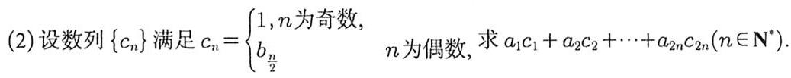

11. 已知各项均为正数的数列 $\left\{  {a}_{n}\right\}$ 满足 ${a}_{n + 1}^{2} - {a}_{n}^{2} = {8n}$ ,且 ${a}_{1} = 1$

(1) 写出 ${a}_{2},{a}_{3}$ ,并求 $\left\{  {a}_{n}\right\}$ 的通项公式

(2) 记 ${b}_{n} = \left\{  \begin{matrix} {a}_{n}, & n\text{ 为奇数 } \\  {2}^{\frac{{a}_{n} + 1}{4}}, & n\text{ 为偶数 } \end{matrix}\right.$ ,求 ${b}_{1}{b}_{2} + {b}_{3}{b}_{4} + {b}_{5}{b}_{6} + \cdots  + {b}_{15}{b}_{16}$

12. 设等差数列 $\left\{  {a}_{n}\right\}$ 的公差为 $d$ ,若 ${b}_{n} = {2}^{{a}_{n}}$ ,则 “ $d < 0$ ” 是 “ $\left\{  {b}_{n}\right\}$ 为递减数列”的

A. 充分不必要条件 B. 必要不充分条件 C. 充要条件 D. 既不充分也不必要条件

13. 已知等比数列 $\left\{  {a}_{n}\right\}$ 的公比为 $q$ ,前 $n$ 项和为 ${S}_{n}$ ,若 ${S}_{1} =  - 1$ ,且 $\forall n \in  {\mathbf{N}}^{ * },{a}_{n + 2} > {a}_{n}$ ,则下列结论错误的是

A. ${a}_{2} < 0$ B. $0 < q < 1$ C. ${S}_{n} < \frac{1}{q - 1}$ D. ${a}_{n + 1} > {a}_{n}$

14. $\left\{  {a}_{n}\right\}$ 是各项均为正数的等差数列,其公差 $d \neq  0,\left\{  {b}_{n}\right\}$ 是等比数列,若 ${a}_{1} = {b}_{1},{a}_{1012} = {b}_{1012},{S}_{n}$ 和 ${T}_{n}$ 分别是 $\left\{  {a}_{n}\right\}$ 和 $\left\{  {b}_{n}\right\}$ 的前 $n$ 项和,则 ${S}_{2023}$ 与 ${T}_{2023}$ 的大小关系为

A. ${S}_{2023} > {T}_{2023}$ B. ${S}_{2023} < {T}_{2023}$ C. ${S}_{2023} = {T}_{2023}$ D. 无法确定

15. 数列 $\left\{  {a}_{n}\right\}$ 满足 ${a}_{n} = {n}^{2} + {\lambda n}$ ,若 $\left\{  {a}_{n}\right\}$ 是递增数列,则实数 $\lambda$ 的取值范围是 ___.

# 第九章 立体几何

第二十六讲 空间几何体的表面积与体积

1. (2021 新II卷) 正四棱台的上、下底面的边长分别为 2,4 , 侧棱长为 2 , 则其体积为

A. ${20} + {12}\sqrt{3}$ B. ${28}\sqrt{2}$ C. $\frac{56}{3}$ D. $\frac{{28}\sqrt{2}}{3}$

2. (2020 海南) 已知正方体 ${ABCD} - {A}_{1}{B}_{1}{C}_{1}{D}_{1}$ 的棱长为 $2, M\text{ 、 }N$ 分别为 $B{B}_{1}\text{ 、 }{AB}$ 的中点,则三棱锥 $A - \; {NM}{D}_{1}$ 的体积为___

3. (2019 江苏) 长方体 ${ABCD} - {A}_{1}{B}_{1}{C}_{1}{D}_{1}$ 的体积是 ${120}, E$ 为 $C{C}_{1}$ 的中点,则三棱锥 $E - {BCD}$ 的体积是___.

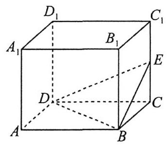

4. (2019 全国)学生到工厂劳动实践,利用 ${3D}$ 打印技术制作模型. 如图,该模型为长方体 ${ABCD} - {A}_{1}{B}_{1}{C}_{1}{D}_{1}$ 挖去四棱锥 $O - {EFGH}$ 后所得的几何体,其中 $O$ 为长方体的中心, $E, F, G, H$ 分别为所在棱的中点, ${AB} = {BC} = {6\mathrm{\;{cm}}},{AA}_{1} = {4\mathrm{\;{cm}}},{3D}$ 打印所用原料密度为 ${0.9}\mathrm{g}/{\mathrm{{cm}}}^{3}$ ，不考虑打印损耗，制作该模型所需原料的质量为___ $g$ .

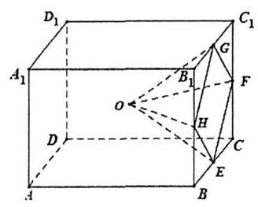

5. (2019 天津) 已知四棱锥的底面是边长为 $\sqrt{2}$ 的正方形，侧棱长均为 $\sqrt{5}$ . 若圆柱的一个底面的圆周经过四棱锥四条侧棱的中点, 另一个底面的圆心为四棱锥底面的中心, 则该圆柱的体积为___.

6. (2015全国Ⅰ理科)《九章算术》是我国古代内容极为丰富的数学名著, 书中有如下问题:“今有委米依垣内角，下周八尺，高五尺. 问:积及为米几何？”其意思为:“在屋内墙角处堆放米(如图，米堆为一个圆锥的四分之一), 米堆底部的弧长为 8 尺, 米堆的高为 5 尺, 问米堆的体积和堆放的米各为多少?”已知 1 斛米的体积约为 1.62 立方尺，圆周率约为 3 ，估算出堆放的米约有

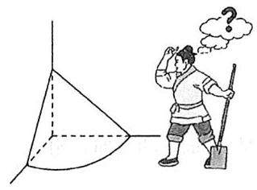

A. 14 斛 B. 22 斛 C. 36 斛 D. 66 斛

7. (2021 全国甲卷)已知一个圆锥的底面半径为 6，其体积为 ${30\pi }$ 则该圆锥的侧面积为___.

8. 已知正三棱柱 ${ABC} - {{A}_{1}{B}_{1}{C}_{1}}$ 的体积与以 $\bigtriangleup  {ABC}$ 的外接圆为底面的圆柱的体积相等，则正三棱柱与圆柱的侧面积的比值为___.

9. 一个圆柱和一个圆锥的轴截面分别是边长为 $a$ 的正方形和正三角形,则它们的表面积之比为___.

10. (2015 山东文 9)已知等腰直角三角形的直角边的长为 2，将该三角形绕其斜边所在的直线旋转一周而形成的曲面所围成的几何体的体积为

A. $\frac{2\sqrt{2}\pi }{3}$ B. $\frac{4\sqrt{2}\pi }{3}$ C. $2\sqrt{2}\pi$ D. $4\sqrt{2}\pi$

11. 在正三棱台 ${ABC} - {A}_{1}{B}_{1}{C}_{1}$ 中，下列结论正确的是

A. ${V}_{{ABC} - {A}_{1}{B}_{1}{C}_{1}} = 3{V}_{{A}_{1} - B{B}_{1}{C}_{1}}$ B. $A{A}_{1} \bot$ 平面 $A{B}_{1}{C}_{1}$

C. ${A}_{1}B \bot  {B}_{1}C$ D. $A{A}_{1} \bot  {BC}$

12. 如图,在三棱台 ${ABC} - {A}_{1}{B}_{1}{C}_{1}$ 中, $A{A}_{1} \bot$ 底面 ${ABC},{AB} \bot  {AC}, C{C}_{1}$ 与底面 ${ABC}$ 所成的角为 ${45}^{ \circ  },{AB} \; = \sqrt{2},{A}_{1}{C}_{1} = A{A}_{1} = 1$ ,则三棱锥 ${A}_{1} - {B}_{1}B{C}_{1}$ 的体积为

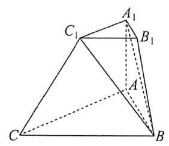

A. $\frac{\sqrt{2}}{2}$ B. $\frac{\sqrt{2}}{4}$ C. $\frac{\sqrt{2}}{6}$ D. $\frac{\sqrt{2}}{12}$

# 第二十七讲 位置关系与平行垂直证明

1. (2019 全国) 设 $\alpha ,\beta$ 为两个平面,则 $\alpha //\beta$ 的充要条件是

A. $\alpha$ 内有无数条直线与 $\beta$ 平行 B. $\alpha$ 内有两条相交直线与 $\beta$ 平行

C. $\alpha ,\beta$ 平行于同一条直线 D. $\alpha ,\beta$ 垂直于同一平面

2. (2016 山东)已知直线 $a, b$ 分别在两个不同的平面 $\alpha ,\beta$ 内. 则“直线 $a$ 和直线 $b$ 相交”是“平面 $\alpha$ 和平面 $\beta$ 相交”的

A. 充分不必要条件 B. 必要不充分条件 C. 充要条件 D. 既不充分也不必要条件

3. (2015 湖北) ${l}_{1}$ ， ${l}_{2}$ 表示空间中的两条直线，若 $p : {l}_{1}$ ， ${l}_{2}$ 是异面直线； $q : {l}_{1}$ ， ${l}_{2}$ 不相交，则

A. $p$ 是 $q$ 的充分条件,但不是 $q$ 的必要条件 B. $p$ 是 $q$ 的必要条件,但不是 $q$ 的充分条件

C. $p$ 是 $q$ 的充分必要条件 D. $p$ 既不是 $q$ 的充分条件,也不是 $q$ 的必要条件

4. (2017 全国) (多选) 如图,在下列四个正方体中, $A, B$ 为正方体的两个顶点, $M, N, Q$ 为所在棱的中点,则在这四个正方体中,直线 ${AB}$ 与平面 ${MNQ}$ 平行的是

A.

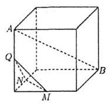

B.

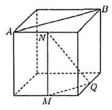

C.

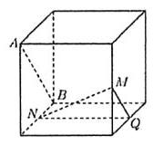

D.

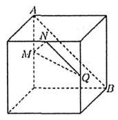

5. (多选)如图, ${AC} = {2R}$ 为圆 $O$ 的直径, $\angle {PCA} = {45}^{ \circ  },{PA}$ 垂直于圆 $O$ 所在的平面, $B$ 为圆周上不与点 $A$ , $C$ 重合的点, ${AS} \bot  {PC}$ 于点 $S,{AN} \bot  {PB}$ 于点 $N$ ,则下列选项正确的是

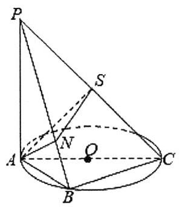

A. 平面 ${ANS} \bot$ 平面 ${PBC}$ B. 平面 ${ANS} \bot$ 平面 ${PAB}$

C. 平面 ${PAB} \bot$ 平面 ${PBC}$ D. 平面 ${ABC} \bot$ 平面 ${PAC}$

6. (2024 甲卷) 如图,在以 $A, B, C, D, E, F$ 为顶点的五面体中,四边形 ${ABCD}$ 与四边形 ${CDEF}$ 均为等腰梯形, ${AB}//{CD}//{EF},{AB} = {DE} = {EF} = {CF} = 2,{CD} = 4,{AD} = {BC} = \sqrt{10},{AE} = 2\sqrt{3}, M$ 为 ${CD}$ 的中点.

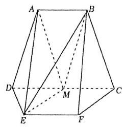

(1)证明: ${EM}//$ 平面 ${BCF}$ ;

7. (2022 甲卷)小明同学参加综合实践活动,设计了一个封闭的包装盒,包装盒如图所示: 底面 ${ABCD}$ 是边长为 8(单位: $\mathrm{{cm}}$ ) 的正方形, $\bigtriangleup {EAB},\bigtriangleup {FBC},\bigtriangleup {GCD},\bigtriangleup {HDA}$ 均为正三角形,且它们所在的平面都与平面 ${ABCD}$ 垂直.

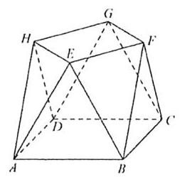

(1)证明: ${EF}//$ 平面 ${ABCD}$ ；

8. (2021 天津)如图，在棱长为 2 的正方体 ${ABCD} - {A}_{1}{B}_{1}{C}_{1}{D}_{1}$ 中， $E$ 为棱 ${BC}$ 的中点， $F$ 为棱 ${CD}$ 的中点.

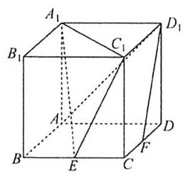

(1)求证: ${D}_{1}F//$ 平面 ${A}_{1}E{C}_{1}$ ；

9. (2019 天津) 如图, ${AE} \bot$ 平面 ${ABCD},{CF}//{AE},{AD}//{BC},{AD} \bot  {AB},{AB} = {AD} = 1,{AE} = {BC} = 2$ .

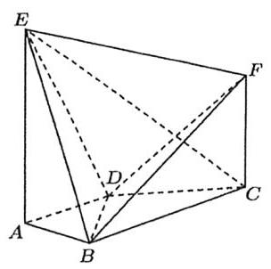

(I) 求证: ${BF}//$ 平面 ${ADE}$ ;

10. (2016 山东)在如图所示的圆台中, ${AC}$ 是下底面圆 $O$ 的直径， ${EF}$ 是上底面圆 ${O}^{\prime }$ 的直径， ${FB}$ 是圆台的一条母线.

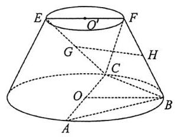

(1)已知 $G, H$ 分别为 ${EC},{FB}$ 的中点,求证: ${GH}//$ 平面 ${ABC}$ ；

11. 四面体 ${ABCD}$ 中, $E, F$ 分别是线段 ${AD},{BD}$ 的中点, $\angle {ABD} = \angle {BCD} = {90}^{ \circ  },{EC} = \sqrt{2},{AB} = {BD} = 2$ ， 求证: ${EF} \bot$ 平面 ${BCD}$ .

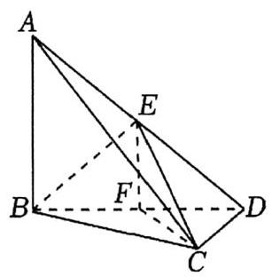

12. (2021 浙江) 如图,在四棱锥 $P - {ABCD}$ 中,底面 ${ABCD}$ 是平行四边形, $\angle {ABC} = {120}^{ \circ  },{AB} = 1,{BC} = 4$ , ${PA} = \sqrt{15}, M, N$ 分别为 ${BC},{PC}$ 的中点, ${PD} \bot  {DC},{PM} \bot  {MD}$ .

(1) 证明: ${AB} \bot  {PM}$ ;

13. (2018 江苏) 在平行六面体 ${ABCD} - {A}_{1}{B}_{1}{C}_{1}{D}_{1}$ 中, $A{A}_{1} = {AB}, A{B}_{1} \bot  {B}_{1}{C}_{1}$ . 求证:

(1) ${AB}//$ 平面 ${A}_{1}{B}_{1}C$ ；

(2)平面 ${AB}{B}_{1}{A}_{1} \bot$ 平面 ${A}_{1}{BC}$ .

# 第二十八讲 空间向量与角度问题

1. 在空间直角坐标系 ${Oxyz}$ 中,平面过点 ${P}_{0}\left( {2,0, - 1}\right)$ ,它的一个法向量为 $\overrightarrow{n} = \left( {3,1, - 1}\right)$ . 设点 $P\left( {x, y, z}\right)$ 为平面内不同于 ${P}_{0}$ 的任意一点,则点 $P\left( {x, y, z}\right)$ 的坐标满足的方程为

A. ${3x} + y + z - 5 = 0$ B. ${3x} + y + z - 7 = 0$ C. ${3x} + y - z - 7 = 0$ D. ${3x} + y - z - 5 = 0$

2. (2021乙卷文 10) 在正方体 ${ABCD} - {A}_{1}{B}_{1}{C}_{1}{D}_{1}$ 中, $P$ 为 ${B}_{1}{D}_{1}$ 的中点,则直线 ${PB}$ 与 $A{D}_{1}$ 所成的角为

A. $\frac{\pi }{2}$ B. $\frac{\pi }{3}$ C. $\frac{\pi }{4}$ D. $\frac{\pi }{6}$

3. (2022 新I卷9) (多选) 已知正方体 ${ABCD} - {A}_{1}{B}_{1}{C}_{1}{D}_{1}$ ，则

A. 直线 $B{C}_{1}$ 与 $D{A}_{1}$ 所成的角为 ${90}^{ \circ  }$ B. 直线 $B{C}_{1}$ 与 $C{A}_{1}$ 所成的角为 ${90}^{ \circ  }$

C. 直线 $B{C}_{1}$ 与平面 $B{B}_{1}{D}_{1}D$ 所成的角为 ${45}^{ \circ  }$ D. 直线 $B{C}_{1}$ 与平面 ${ABCD}$ 所成的角为 ${45}^{ \circ  }$

4. 正方体 ${ABCD} - {A}_{1}{B}_{1}{C}_{1}{D}_{1}$ 的棱长为 2, ${MN}$ 是它的内切球的一条直径, $P$ 为正方体表面上的动点,则 $\overrightarrow{PM} \cdot  \overrightarrow{PN}$ 的取值范围是 ___.

5. 棱长为 2 的正四面体 ${ABCD}$ 中, $E, F$ 分别是 ${BC},{AD}$ 的中点,则 $\overrightarrow{AE} \cdot  \overrightarrow{CF} =$

A. 0 B. -2 C. 2 D. -3

6. 在正四棱台 ${ABCD} - {A}_{1}{B}_{1}{C}_{1}{D}_{1}$ 中, ${AB} = 2{A}_{1}{B}_{1} = 4\sqrt{3}$ ,棱 ${B}_{1}B$ 与平面 ${ABCD}$ 所成角的正弦值为 $\frac{\sqrt{10}}{5}$ , 则该棱台的体积为

A. 40 B. ${28}\sqrt{2}$ C. 56 D. 112

7. 正三棱柱 ${ABC} - {A}_{1}{B}_{1}{C}_{1}$ 中, ${AB} = A{A}_{1}, P$ 为 ${B}_{1}{C}_{1}$ 的中点,则直线 ${BP}$ 与平面 ${AC}{C}_{1}{A}_{1}$ 所成角的正弦值为

A. $\frac{\sqrt{15}}{10}$ B. $\frac{3\sqrt{5}}{16}$ C. $\frac{\sqrt{10}}{4}$ D. $\frac{3\sqrt{15}}{17}$

8. 如图,正方体 ${ABCD} - {A}_{1}{B}_{1}{C}_{1}{D}_{1}$ 中, $P$ 为 ${BC}$ 的中点,点 $Q$ 为四边形 $C{C}_{1}{D}_{1}D$ 及其内部的动点, ${PQ}//$ 平面 $B{B}_{1}{D}_{1}D$ . 则 ${PQ}$ 与平面 ${ABCD}$ 所成角正切值的范围

A. $\left\lbrack  {0,\frac{\sqrt{3}}{3}}\right\rbrack$ B. $\left\lbrack  {0,\frac{\sqrt{2}}{2}}\right\rbrack$ C. $\left\lbrack  {0,\frac{\sqrt{6}}{3}}\right\rbrack$ D. $\left\lbrack  {0,\sqrt{2}}\right\rbrack$

9. 在三棱锥 $A - {BCD}$ 中,底面 ${BCD}$ 是等边三角形,侧面 ${ABD}$ 是等腰直角三角形, ${AB} \bot  {BC},{BC} = 2,{AB} \; = {AD}$ ，分别取 ${BC},{AD},{AB}$ 的中点 $E, F, G$ ，连接 ${EF},{CG}$ ，则异面直线 ${EF}$ 与 ${CG}$ 所成的角的余弦值为

A. $\frac{\sqrt{5}}{3}$ B. $\frac{4\sqrt{5}}{15}$ C. $\frac{\sqrt{145}}{15}$ D. $\frac{2}{3}$

10. 已知正三棱锥 $P - {ABC}$ 的侧棱与底面边长的比值为 $\sqrt{3}$ ,则三棱锥 $P - {ABC}$ 的侧棱与底面所成角的正弦值为___.

11. (2018 北京节选) 如图,在三棱柱 ${ABC} - {A}_{1}{B}_{1}{C}_{1}$ 中, $C{C}_{1} \bot$ 平面 ${ABC}, D, E, F, G$ 分别为 $A{A}_{1},{AC}$ , ${A}_{1}{C}_{1}, B{B}_{1}$ 的中点, ${AB} = {BC} = \sqrt{5},{AC} = A{A}_{1} = 2$ . 证明: 直线 ${FG}$ 与平面 ${BCD}$ 相交.

12. (2022 浙江)如图，已知正三棱柱 ${ABC} - {A}_{1}{B}_{1}{C}_{1},{AC} = {A{A}_{1}}, E, F$ 分别是棱 ${BC},{A}_{1}{C}_{1}$ 上的点. 记 ${EF}$ 与 $A{A}_{1}$ 所成的角为 $\alpha ,{EF}$ 与平面 ${ABC}$ 所成的角为 $\beta$ ,二面角 $F - {BC} - A$ 的平面角为 $\gamma$ ,则

A. $\alpha  \leq  \beta  \leq  \gamma$ B. $\beta  \leq  \alpha  \leq  \gamma$ C. $\beta  \leq  \gamma  \leq  \alpha$ D. $\alpha  \leq  \gamma  \leq  \beta$

# 第二十九讲 空间中的距离、截面、轨迹、翻折问题

1. 如图,在三棱柱 ${ABC} - {A}_{1}{B}_{1}{C}_{1}$ 中, $B{C}_{1}$ 与 ${B}_{1}C$ 相交于点 $O,\angle {A}_{1}{AB} = \angle {A}_{1}{AC} = {60}^{ \circ  },\angle {BAC} = {90}^{ \circ  },{A}_{1}A \; = 3,{AB} = {AC} = 2$ ，则线段 ${AO}$ 的长度为

A. $\frac{\sqrt{29}}{2}$ B. $\sqrt{29}$

C. $\frac{\sqrt{23}}{2}$ D. $\sqrt{23}$

2. 已知空间三点 $A\left( {1,0,1}\right) , B\left( {0,1,0}\right) , C\left( {1,1,1}\right)$ ,则点 $C$ 到直线 ${AB}$ 的距离是

A. $\frac{\sqrt{2}}{3}$ B. $\frac{\sqrt{3}}{3}$ C. $\frac{\sqrt{6}}{3}$ D. $\frac{\sqrt{2}}{2}$

3. 棱长为 1 的正方体 ${ABCD} - {A}_{1}{B}_{1}{C}_{1}{D}_{1}, M, N$ 分别是 ${AB}$ 和 ${BC}$ 的中点，则 ${MN}$ 到平面 ${A}_{1}{C}_{1}D$ 的距离为

A. $\frac{\sqrt{3}}{3}$ B. $\frac{\sqrt{6}}{3}$ C. $\frac{\sqrt{3}}{2}$ D. $\frac{\sqrt{6}}{2}$

4. 已知四棱锥 $P - {ABCD}$ 中，底面 ${ABCD}$ 为边长为 2 的正方形， ${PA} = {PB} = 2,{PC} = {PD} = \sqrt{3}$ ，则直线 ${CD}$ 到平面 ${PAB}$ 的距离为

A. $\frac{\sqrt{69}}{6}$ B. $\frac{\sqrt{69}}{3}$ C. $\frac{\sqrt{23}}{6}$ D. $\frac{\sqrt{23}}{3}$

5. 已知正方体 ${ABCD} - {A}_{1}{B}_{1}{C}_{1}{D}_{1}$ ,棱长为 $2, E$ 为棱 $B{B}_{1}$ 的中点,则经过 ${A}_{1}, D, E$ 三点的正方体的截面面积为

A. $\frac{9}{2}$ B. $3\sqrt{2}$

C. $\frac{3\sqrt{3}}{2}$ D. $\frac{21}{2}$

6. 如图，正方体 ${ABCD} - {A}_{1}{B}_{1}{C}_{1}{D}_{1}$ 中， $O$ 为底面 ${ABCD}$ 的中心， $E$ ， $F$ 分别为棱 ${A}_{1}{B}_{1},{B}_{1}{C}_{1}$ 的中点，经过 $E$ ， $F, O$ 三点的平面与正方体相交所成的截面为

A. 梯形 B. 平行四边形 C. 矩形 D. 正方形

7. 如图,在棱长为 $a$ 的正方体 ${ABCD} - {A}_{1}{B}_{1}{C}_{1}{D}_{1}$ 中, $E$ 是棱 $A{A}_{1}$ 上的一个动点,给出下列三个结论:

①存在点 $E$ 使得平面 ${BE}{D}_{1} \bot$ 平面 ${B}_{1}{D}_{1}{DB}$ ;

② $\bigtriangleup  {BE}{D}_{1}$ 的面积为定值；

③ ${D}_{1}E + {BE}$ 的最小值为 $\sqrt{5}a$ .

其中所有正确结论的序号是

A. ① B. ②③

C. ①③ D. ①②③

8. 在正三棱柱 ${ABC} - {A}_{1}{B}_{1}{C}_{1}$ 中, ${AB} = A{A}_{1} = 1$ ,动点 $P$ 满足 $\overrightarrow{BP} = \lambda \overrightarrow{BC} + \overrightarrow{B{B}_{1}},\lambda  \in  \left( {0,1}\right)$ ,则下列几何体体积为定值的是

A. 四棱锥 $P - {A}_{1}{AB}{B}_{1}$ B. 四棱锥 $P - {A}_{1}{AC}{C}_{1}$

C. 三棱锥 $P - {A}_{1}B{C}_{1}$ D. 三棱锥 $P - {A}_{1}{BC}$

9. 如图,边长为 1 的正方形 ${ABCD}$ 中, $E, F$ 分别是 ${BC},{CD}$ 的中点,现在沿 ${AE},{AF}$ 及 ${EF}$ 把这个正方形折起,使 $B, C, D$ 三点重合于点 $P$ ,则三棱锥 $P - {AEF}$ 的最短的高长为

A. $\frac{1}{3}$ B. $\frac{2}{3}$ C. $\frac{3}{4}$ D. 1

10. 在四边形 ${ABCD}$ 中, ${AD}//{BC},{AD} = {AB},\angle {BCD} = {45}^{ \circ  },\angle {BAD} = {90}^{ \circ  }$ ,将 $\bigtriangleup {ABD}$ 折起,使平面 ${ABD} \bot$ 平面 ${BCD}$ ,构成三棱锥 $A - {BCD}$ ,如图,则在三棱锥 $A - {BCD}$ 中,下列结论不正确的是

A. ${CD} \bot  {AB}$

B. ${CD} \bot  {BD}$

C. 平面 ${ADC} \bot$ 平面 ${ABD}$

D. 平面 ${ABC} \bot$ 平面 ${BDC}$

11. (多选) 在边长为 $a$ 的菱形 ${ABCD}$ 中, $\angle {BAD} = {60}^{ \circ  }, E$ 是 ${AD}$ 的中点,将 $\bigtriangleup {ABE}$ 沿直线 ${BE}$ 翻折至 $\bigtriangleup {A}_{1}{BE}$ , 已知 $F$ 为线段 ${A}_{1}C$ 的中点，则在 $\bigtriangleup  {ABE}$ 的翻折过程中，下列说法正确的是

A. 存在点 ${A}_{1}$ ，使得 ${A}_{1}E \bot  {BD}$ B. 存在点 ${A}_{1}$ ,使得 ${A}_{1}C \bot  {BE}$

C. 存在点 ${A}_{1}$ ,使得 ${DF}//$ 平面 ${A}_{1}{BE}$ D. 线段 ${DF}$ 的长为定值

12. 如图,在等边 $\bigtriangleup  {ABC}$ 中， $D$ ， $E$ 分别是线段 ${AB}$ ， ${AC}$ 上异于端点的动点，且 ${BD} = {CE}$ ，现将 $\bigtriangleup  {ADE}$ 沿直线 ${DE}$ 折起,使平面 ${ADE} \bot$ 平面 ${BCED}$ ,当 $D$ 从 $B$ 滑动到 $A$ 的过程中，则下列选项中正确的是

A. $\angle {ADB}$ 先变大后变小 B. 二面角 $A - {BD} - C$ 的平面角变小

C. ${BD}$ 与平面 ${ABC}$ 所成的角变大 D. ${AB}$ 与 ${DE}$ 所成的角先变小后变大

13. (2024 新二卷)如图，平面四边形 ${ABCD}$ 中， ${AB} = 8$ ， ${CD} = 3$ ， ${AD} = 5\sqrt{3}$ ， $\angle {ADC} = {90}^{ \circ  }$ ， $\angle {BAD} = {30}^{ \circ  }$ ，点 $E, F$ 满足 $\overrightarrow{AE} = \frac{2}{5}\overrightarrow{AD},\overrightarrow{AF} = \frac{1}{2}\overrightarrow{AB}$ ，将 $\bigtriangleup  {AEF}$ 沿 ${EF}$ 对折至 $\bigtriangleup  {PEF}$ ，使得 ${PC} = 4\sqrt{3}$ .

(1)证明: ${EF} \bot  {PD}$ ；

(2)求面 ${PCD}$ 与面 ${PBF}$ 所成的二面角的正弦值.

## 第三十讲 球

1. 已知半径为 $\sqrt{6}$ 的球 $O$ 的球心到正四面体 ${ABCD}$ 的四个面的距离都相等,若正四面体 ${ABCD}$ 的棱与球 $O$ 的球面有公共点,则正四面体 ${ABCD}$ 的棱长的取值范围为

A. $\left\lbrack  {2,4\sqrt{3}}\right\rbrack$ B. $\left\lbrack  {2\sqrt{3},6\sqrt{3}}\right\rbrack$ C. $\left\lbrack  {4,4\sqrt{3}}\right\rbrack$ D. $\left\lbrack  {4,{12}}\right\rbrack$

2. 已知正三棱锥 $P - {ABC}$ 的所有顶点都在球 $O$ 的球面上, ${PA} = 4\sqrt{3},{AB} = 6$ ,过棱 ${AB}$ 作球 $O$ 的截面,则所得截面面积的取值范围是

A. $\left\lbrack  {{9\pi },{12\pi }}\right\rbrack$ B. $\left\lbrack  {{9\pi },{16\pi }}\right\rbrack$ C. $\left\lbrack  {{12\pi },{16\pi }}\right\rbrack$ D. $\left\lbrack  {{12\pi },{36\pi }}\right\rbrack$

3. 在正三棱锥 $P - {ABC}$ 中, ${AB} = \sqrt{6},{PA} = 2$ ,且 $P\text{ 、 }A\text{ 、 }B\text{ 、 }C$ 四个顶点均在球 $O$ 的球面上,则球 $O$ 被平面 ${PAB}$ 所截圆的面积为 ___.

4. 已知三棱柱 ${ABC} - {A}_{1}{B}_{1}{C}_{1}$ 的所有顶点都在半径为 $3\sqrt{2}$ 的球 $O$ 的球面上,且 ${A{A}_{1}} = {2AB} = {2AC},{AB}\bot \; {AC}$ ,则 ${AB} =$

A. $\sqrt{3}$ B. $\sqrt{6}$ C. $2\sqrt{3}$ D. $2\sqrt{6}$

5. 现将一个棱长为 2 的正方体魔方放入一个正四面体的盒子中, 若该魔方可以在正四面体内自由转动, 则这个正四面体棱长的最小值为

A. $\sqrt{2}$ B. $\sqrt{3}$ C. $2\sqrt{3}$ D. $6\sqrt{2}$

6. 如图,在三棱锥 $P - {ABC}$ 中, ${PA} \bot$ 平面 ${ABC},{PA} = {BC} = 2,\angle {BAC} = {30}^{ \circ  }$ ,则该三棱锥外接球的体积为

A. $\frac{8\sqrt{2}\pi }{3}$ B. $\frac{{10}\sqrt{5}\pi }{3}$ C. $\frac{{20}\sqrt{5}\pi }{3}$ D. $\frac{{68}\sqrt{17}\pi }{3}$

7. (2020 新二卷) 已知 $\bigtriangleup  {ABC}$ 是面积为 $\frac{9\sqrt{3}}{4}$ 的等边三角形，且其顶点都在球 $O$ 的球面上. 若球 $O$ 的表面积为 ${16\pi }$ ,则 $O$ 到平面 ${ABC}$ 的距离为___.

8. (人教 B 版课后习题) $A, B, C$ 是球 $O$ 上的三点, ${AB} = {10},{AC} = 6,{BC} = 8$ ,球 $O$ 的半径等于 13,求球心 $O$ 到平面 ${ABC}$ 的距离___. 9. 已知某正六棱柱的所有棱长均为 2，则该正六棱柱的外接球的表面积为 ___.

10. 矩形 ${ABCD}$ 中, ${AB} = 4,{BC} = 3$ ,沿 ${AC}$ 将矩形 ${ABCD}$ 折成一个直二面角 $B - {AC} - D$ ,则四面体 ${ABCD}$ 的外接球的体积为___.

11. 几何体 ${ABCDEF}$ 有五个面,底面 ${ABCD}$ 为矩形, ${AB} = 4,{AD} = {EF} = 2,{EF}//$ 底面 ${ABCD}$ ,且 ${EA} = {ED} \; = {FB} = {FC} = {BC}$ . 则几何体 ${ABC} - {DEF}$ 外接球的表面积为 ___.

12. (2016 全国)体积为 8 的正方体的顶点都在同一球面上，则该球面的表面积为

A. ${12\pi }$ B. $\frac{32}{3}\pi$ C. ${8\pi }$ D. ${4\pi }$

13. (2016全国)长方体的长，宽，高分别为3,2,1，其顶点都在球 $O$ 的球面上，则球 $O$ 的表面积为___.

14. (2021 天津) 两个圆锥的底面是一个球的同一截面,顶点均在球面上,若球的体积为 $\frac{32\pi }{3}$ ,两个圆锥的高之比为1:3,则这两个圆锥的体积之和为

A. ${3\pi }$ B. ${4\pi }$ C. ${9\pi }$ D. ${12\pi }$

15. (2020 全国)已知圆锥的底面半径为 1，母线长为 3，则该圆锥内半径最大的球的体积为___.

16. (2017 江苏)如图，在圆柱 ${O1O2}$ 内有一个球 $O$ ，该球与圆柱的上、下底面及母线均相切. 记圆柱 ${O1O2}$ 的体积为 ${V1}$ ,球 $O$ 的体积为 ${V2}$ ,则 $\frac{{V}_{1}}{{V}_{2}}$ 的值是___

17. (2018 全国)设 $A, B, C, D$ 是同一个半径为 4 的球的球面上四点, $\bigtriangleup {ABC}$ 为等边三角形且其面积为 $9\sqrt{3}$ , 则三棱锥 $D - {ABC}$ 体积的最大值为

A. ${12}\sqrt{3}$ B. ${18}\sqrt{3}$ C. ${24}\sqrt{3}$ D. ${54}\sqrt{3}$

## 第三十一讲 立体几何解答题书写规范

1. 如图,在正方体 ${ABCD} - {A}_{1}{B}_{1}{C}_{1}{D}_{1}, E$ 为 ${A}_{1}{D}_{1}$ 的中点, ${B}_{1}{C}_{1}$ 交平面 ${CDE}$ 交于点 $F$ .

(1)求证: $F$ 为 ${B}_{1}{C}_{1}$ 的中点；

(2)若点 $M$ 是棱 ${A}_{1}{B}_{1}$ 上一点，且二面角 $M - {FC} - E$ 的余弦值为 $\frac{\sqrt{5}}{3}$ ，求 $\frac{{A}_{1}M}{{A}_{1}{B}_{1}}$ 的值.

2. 如图,在三棱锥 $P - {ABC}$ 中, ${AB} = {BC} = 2\sqrt{2},{PA} = {PB} = {PC} = {AC} = 4, O$ 为 ${AC}$ 的中点.

(1)证明: ${PO} \bot$ 平面 ${ABC}$ ；

( 2 )若点 $M$ 在棱 ${BC}$ 上，且二面角 $M - {PA} - C$ 为 ${30}^{ \circ  }$ ，求 ${PC}$ 与平面 ${PAM}$ 所成角的正弦值.

3. 如图,在四棱台 ${ABCD} - {A}_{1}{B}_{1}{C}_{1}{D}_{1}$ 中, $A{A}_{1} \bot$ 平面 ${ABCD}$ ,底面 ${ABCD}$ 为菱形.

(1)证明: ${BD} \bot  {C{C}_{1}}$ ；

(2)若 $\angle {ABC} = {60}^{ \circ  },{AB} = {2A}{A}_{1} = {2{A}_{1}}{B}_{1} = 2$ ，

① 求平面 ${CD}{D}_{1}{C}_{1}$ 与平面 $A{A}_{1}{B}_{1}B$ 夹角的余弦值；

② 求点 $A$ 到平面 ${CD}{D}_{1}{C}_{1}$ 的距离.

4. 如图,已知三棱柱 ${ABC} - {A}_{1}{B}_{1}{C}_{1}$ ,平面 ${A}_{1}{AC}{C}_{1} \bot$ 平面 ${ABC},\angle {ABC} = {90}^{ \circ  },\angle {BAC} = {30}^{ \circ  },{A}_{1}A = {A}_{1}C = \; {AC}, E, F$ 分别是 ${AC},{A}_{1}{B}_{1}$ 的中点.

(1)证明: ${EF}\bot {BC}$ ；

(2)求直线 ${EF}$ 与平面 ${A}_{1}{BC}$ 所成角的余弦值.

5. 如图,四棱锥 $P - {ABCD}$ 中, ${ABCD}$ 为矩形,平面 ${PAD} \bot$ 平面 ${ABCD}$ .

(1)求证: ${AB}\bot {PD}$ ；

(2)若 ${BPC} = {90}^{ \circ  },{PB} = \sqrt{2},{PC} = 2$ ，问 ${AB}$ 为何值时，四棱锥 $P - {ABCD}$ 的体积最大？并求此时平面 ${BPC}$ 与平面 ${DPC}$ 夹角的余弦值.

6. 如图,在四棱锥 $P - {ABCD}$ 中,平面 ${PDC} \bot$ 平面 ${ABCD},{AD} \bot  {DC},{AB}//{DC},{AB} = \frac{1}{2}{CD} = {AD} = 1$ , $M$ 为棱 ${PC}$ 的中点.

(1) 证明: ${BM}//$ 平面 ${PAD}$ ;

(2) 若 ${PC} = \sqrt{5},{PD} = 1$ ，

(i) 求二面角 $P - {DM} - B$ 的余弦值；

(ii)在线段 ${PA}$ 上是否存在点 $Q$ ,使得点 $Q$ 到平面 ${BDM}$ 的距离是 $\frac{2\sqrt{6}}{9}$ ? 若存在,求出 ${PQ}$ 的值; 若不存在, 说明理由.

7. 如图,已知三棱柱 ${ABC} - {A}_{1}{B}_{1}{C}_{1}$ 的侧棱与底面垂直, $A{A}_{1} = {AB} = {AC} = 1,{AB} \bot  {AC}, M\text{ 、 }N$ 分别是 $C{C}_{1}\text{ 、 }{BC}$ 的中点,点 $P$ 在 ${A}_{1}{B}_{1}$ 上,且满足 $\overline{{A}_{1}P} = \lambda \overline{{A}_{1}{B}_{1}}\left( {\lambda  \in  R}\right)$ .

(1)证明: ${PN} \bot  {AM}$ ;

(2)当 $\lambda$ 取何值时，直线 ${PN}$ 与平面 ${ABC}$ 所成的角 $\theta$ 最大？并求该最大角的正切值；

(3)若平面 ${PMN}$ 与平面 ${ABC}$ 所成的二面角为 ${45}^{ \circ  }$ ，试确定点 $P$ 的位置.

8. 如图,在四棱锥 $P - {ABCD}$ 中, ${PD} \bot$ 平面 ${ABCD},{AB}//{DC},{BC} = {CD} = {AD} = 2,{AB} = 4$ .

(1)证明: ${PA} \bot  {BD}$ ；

(2)若四棱锥 $P - {ABCD}$ 的外接球的表面积为 ${25\pi }$ ，求二面角 $C - {AB} - P$ 的余弦值.

# 第十章 解析几何小题 第三十二讲 直线与圆

1. 经过点 $\left( {-2,4}\right)$ 且在两坐标轴上的截距互为相反数的直线方程是 ___.

2. 点 $A\left( {2, - 3}\right) , B\left( {-3, - 2}\right)$ ,若直线 $l : {mx} + y - m - 1 = 0$ 与线段 ${AB}$ 无公共点,则 $m$ 的取值范围是 ___.

3. (人教 A 版习题) 过点 $P\left( {3,0}\right)$ 有一条直线 $l$ ,它夹在两条直线 ${l}_{1} : {2x} - y - 2 = 0$ 与 ${l}_{2} : x + y + 3 = 0$ 之间的线段恰被点 $P$ 平分,求直线 $l$ 的方程.

4. (2008大纲II理11)等腰三角形两腰所在直线的方程分别为 $x + y - 2 = 0$ 与 $x - {7y} - 4 = 0$ ,原点在等腰三角形的底边上, 则底边所在直线的斜率为

A. 3 B. 2

C. $- \frac{1}{3}$ D. $- \frac{1}{2}$

5. (2022新二卷15) 已知点 $A\left( {-2,3}\right) , B\left( {0, a}\right)$ ,若直线 ${AB}$ 关于 $y = a$ 的对称直线与圆 ${\left( x + 3\right) }^{2} + {\left( y + 2\right) }^{2} = 1$ 存在公共点,则实数 $a$ 的取值范围是 ___.

6. 设圆 ${x}^{2} + {y}^{2} + {4x} - {6y} + 5 = 0$ 的圆心为 $M$ ,直线 $y =  - x + t$ 与该圆相交于两点 $A, B$ ,若 $\overrightarrow{MA} \cdot  \overrightarrow{MB} =  - 4$ ,则实数 $t =$

A. 1 B. 3 或 1 C. 3 D. 3 或 -1

7. (2016新课标III理16)已知直线 $l : x - \sqrt{3}y + 6 = 0$ 与圆 ${x}^{2} + {y}^{2} = {12}$ 交于 $A$ ， $B$ 两点，过 $A$ ， $B$ 分别作 $l$ 的垂线与 $x$ 轴交于 $C, D$ 两点. 则 $\left| {CD}\right|  =$ ___.

8. (2020 新二卷) 若过点 $\left( {2,1}\right)$ 的圆与两坐标轴都相切,则圆心到直线 ${2x} - y - 3 = 0$ 的距离为

A. $\frac{\sqrt{5}}{5}$ B. $\frac{2\sqrt{5}}{5}$ C. $\frac{3\sqrt{5}}{5}$ D. $\frac{4\sqrt{5}}{5}$

9. (2022 天津) 若直线 $x - y + m = 0\left( {m > 0}\right)$ 被圆 ${\left( x - 1\right) }^{2} + {\left( y - 1\right) }^{2} = 3$ 截得的弦长为 $m$ ,则 $m$ 的值为 ___. ___.

10. (2021 北京)已知直线 $y = {kx} + m\left( {m\text{ 为常数 }}\right)$ 与圆 ${x}^{2} + {y}^{2} = 4$ 交于 $M$ ， $N$ ，当 $k$ 变化时，若 $\left| {MN}\right|$ 的最小值为 2,则 $m =$

A. $\pm  1$ B. $\pm  \sqrt{2}$ C. $\pm  \sqrt{3}$ D. $\pm  2$

11. (2023新二卷 15)已知直线 $x - {my} + 1 = 0$ 与 $\odot  C : {\left( x - 1\right) }^{2} + {y}^{2} = 4$ 交于 $A$ ， $B$ 两点，写出满足 “ $\bigtriangleup  {ABC}$ 面积为 $\frac{8}{5}$ ”的 $m$ 的一个值___.

12. 若点 $P$ 是圆 $C : {x}^{2} + {y}^{2} - {2x} = 0$ 上的动点,直线 $l : x + y + 1 = 0$ 与 $x, y$ 轴分别相交于 $M, N$ 两点,则 $\angle {PMN}$ 的最小值为

A. $\frac{\pi }{12}$ B. $\frac{\pi }{6}$ C. $\frac{\pi }{4}$ D. $\frac{\pi }{3}$

13. ( 2021 新一卷 )(多选) 已知点 $P$ 在圆 ${\left( x - 5\right) }^{2} + {\left( y - 5\right) }^{2} = {16}$ 上,点 $A\left( {4,0}\right) , B\left( {0,2}\right)$ ,则

A. 点 $P$ 到直线 ${AB}$ 的距离小于 10 B. 点 $P$ 到直线 ${AB}$ 的距离大于 2

C. 当 $\angle {PBA}$ 最小时, $\left| {PB}\right|  = 3\sqrt{2}$ D. 当 $\angle {PBA}$ 最大时, $\left| {PB}\right|  = 3\sqrt{2}$

14. (多选) 已知实数 $x, y$ 满足方程 ${x}^{2} + {y}^{2} - {6x} + 7 = 0$ ,则下列说法正确的是

A. $\frac{y}{x}$ 的最大值为 $\frac{\sqrt{2}}{3}$ B. ${x}^{2} + {y}^{2}$ 的最大值为 ${11} + 6\sqrt{2}$

C. $x - {2y}$ 的最大值为 $3 + \sqrt{10}$ D. $\left| {x + y - 6}\right|$ 的最大值为 5

15. (2013 江西理9) 过点 $\left( {\sqrt{2},0}\right)$ 引直线 $l$ 与曲线 $y = \sqrt{1 - {x}^{2}}$ 相交于 $A, B$ 两点, $O$ 为坐标原点,当 $\bigtriangleup {AOB}$ 的面积取最大时,直线 $l$ 的斜率等于

A. $\frac{\sqrt{3}}{3}$ B. $- \frac{\sqrt{3}}{3}$ C. $\pm  \frac{\sqrt{3}}{3}$ D. $- \sqrt{3}$

16. (2012江苏 12) 在平面直角坐标系 ${xOy}$ 中,圆 $C$ 的方程为 ${x}^{2} + {y}^{2} - {8x} + {15} = 0$ ,若直线 $y = {kx} - 2$ 上至少存在一点，使得以该点为圆心，1 为半径的圆与圆 $C$ 有公共点，则 $k$ 的最大值是 ___.

17. (2022 新一卷) 写出与圆 ${x}^{2} + {y}^{2} = 1$ 和 ${\left( x - 3\right) }^{2} + {\left( y - 4\right) }^{2} = {16}$ 都相切的一条直线的方程 ___.

18. 平面内与两定点的距离的比为常数 $k\left( {k > 0\text{ 且 }k \neq  1}\right)$ 的点的轨迹为圆. 已知 $O\left( {0,0}\right)$ ， $A\left( {3,0}\right)$ ，圆 $C : (x \; - 2{)}^{2} + {y}^{2} = {r}^{2}\left( {r > 0}\right)$ 上有且只有一个点 $P$ 满足 $\left| {PA}\right|  = 2\left| {PO}\right|$ . 则 $r$ 的取值可以是

A. 1 B. 2 C. 3 D. 4

19. (2003·北京文12)已知直线 ${{ax} + {by} + c = 0\left( {{abc} \neq  0}\right) }$ 与圆 ${x}^{2} + {y}^{2} = 1$ 相切，则三条边的长分别为 $\left| a\right|$ ， $\left| b\right|$ ， $\left| c\right|$ 的三角形

A. 是锐角三角形 B. 是直角三角形 C. 是钝角三角形 D. 不存在

20. (2025全国一卷)若圆 ${x}^{2} + {\left( y + 2\right) }^{2} = {r}^{2}\left( {r > 0}\right)$ 上到直线 $y = \sqrt{3}x + 2$ 的距离为 1 的点有且仅有 2 个，则 $r$ 的取值范围是

A. $\left( {0,1}\right)$ B. $\left( {1,3}\right)$ C. $\left( {3, + \infty }\right)$ D. $\left( {0, + \infty }\right)$

21. ( 2011 重庆理 8 )在圆 ${x}^{2} + {y}^{2} - {2x} - {6y} = 0$ 内,过点 $E\left( {0,1}\right)$ 的最长弦和最短弦分别为 ${AC}$ 和 ${BD}$ ,则四边形 ${ABCD}$ 的面积为

A. $5\sqrt{2}$ B. ${10}\sqrt{2}$ C. ${15}\sqrt{2}$ D. ${20}\sqrt{2}$

## 第三十三讲 曲线与方程

1. (人教 A 版习题) 已知 $A, B$ 两点的坐标分别是 $\left( {-1,0}\right) ,\left( {1,0}\right)$ ,直线 ${AM},{BM}$ 相交于点 $M$ ,且直线 ${AM}$ 的斜率与直线 ${BM}$ 的斜率的差是 2,则点 $M$ 的轨迹方程为

A. $y =  - {x}^{2} + 1\left( {x \neq   \pm  1}\right)$ B. $y = {x}^{2} + 1\left( {x \neq   \pm  1}\right)$

C. $x =  - {y}^{2} + 1\left( {y \neq   \pm  1}\right)$ D. $x = {y}^{2} + 1\left( {y \neq   \pm  1}\right)$

2. (人教B版例题) 已知线段 ${AB}$ 的端点 $B$ 的坐标是 $\left( {4,3}\right)$ ,端点 $A$ 在圆 ${\left( x + 1\right) }^{2} + {y}^{2} = 4$ 上运动,求线段 ${AB}$ 的中点 $M$ 的轨迹方程.

3. 已知平面内一动点 $P\left( {x, y}\right)$ 到点 $F\left( {1,0}\right)$ 的距离与它到直线 $x = 4$ 的距离之比为 $\frac{1}{2}$ ,过点 $F$ 的直线 $l$ 与动点 $P$ 的轨迹 $C$ 相交于 $A, B$ 两点. 求动点 $P$ 的轨迹 $C$ 的方程.

4. 已知圆 $C : {x}^{2} + {y}^{2} = {16}$ 分别与 $x\text{ 、 }y$ 轴正半轴交于 $A\text{ 、 }B$ 两点, $P$ 为圆 $C$ 上的动点. 若线段 ${AP}$ 上有一点 $Q$ ,满足 $\overrightarrow{AQ} = 2\overrightarrow{QP}$ ,求点 $Q$ 的轨迹方程;

5. 圆心在 $x$ 轴上移动的圆经过点 $A\left( {-4,0}\right)$ ，且与 $x$ 轴， $y$ 轴分别交于 $B\left( {x,0}\right)$ ， $C\left( {0, y}\right)$ ，西个动点. 求点 $T\left( {x, y}\right)$ 的轨迹 $E$ 的方程;

6. 已知线段 ${AB}$ 的端点 $B$ 的坐标是 $\left( {6,4}\right)$ ,端点 $A$ 的运动轨迹是曲线 $C$ ,线段 ${AB}$ 的中点 $M$ 的轨迹方程是 ${\left( x - 4\right) }^{2} + {\left( y - 2\right) }^{2} = 1$ . 求曲线 $C$ 的方程;

7. 已知 ${F}_{1}\left( {-2,0}\right) ,{F}_{2}\left( {2,0}\right) , O$ 为坐标原点,动点 $P$ 满足 $\left| \overrightarrow{P{F}_{1}}\right|  \cdot  \left| \overrightarrow{P{F}_{2}}\right|  + {\left| \overrightarrow{OP}\right| }^{2} = {12}$ . 求点 $P$ 的轨迹方程;

8. 关于方程 ${x}^{2} + {xy} + 2{y}^{2} = 4$ 所表示的曲线,下列说法正确的是

A. 关于 $x$ 轴对称 B. 关于 $y$ 轴对称 C. 关于 $y = x$ 对称 D. 关于原点中心对称

9. 曲线 $C : {x}^{m} + {y}^{n} = 1$ ，其中 $m$ 、 $n$ 均为正数，则下列命题正确的个数是

① 当 $m = \frac{1}{2}, n = \frac{1}{2}$ 时，曲线 $C$ 是轴对称图形

②当 $m = 3, n = 1$ 时，曲线 $C$ 关于 $\left( {0,1}\right)$ 中心对称

③ 当 $m = 4, n = 2$ 时，曲线 $C$ 所围成的面积大于 $\pi$

④当 $m = 3, n = 2$ 时,曲线 $C$ 上的点与 $\left( {0,0}\right)$ 距离的最小值等于 1

A. 1 个 B. 2 个 C. 3 个 D. 4 个

10. 如图，曲线 $C : {\left( {x}^{2} + {y}^{2}\right) }^{3} = {32}{x}^{2}{y}^{2}$ 是四叶玫瑰花瓣曲线，若点 $\left( {x, y}\right)$ 是曲线 $C$ 上一点，则 ${x}^{2} + {y}^{2}$ 的最大值为 ___ ，玫瑰花瓣及其边界内包含整点(横、纵坐标均为整数)的个数为 ___.

11. 已知曲线 $C : {xy} - {x}^{2} + x - y + 1 = 0$ . 给出下列四个结论:

①曲线 $C$ 为中心对称图形;

②曲线 $C$ 与直线 $y = x + 1$ 有两个交点;

③曲线 $C$ 恰好经过两个整点 (即横、纵坐标均为整数的点)；

④曲线 $C$ 上任意两点 $A\left( {{x}_{1},{y}_{1}}\right) , B\left( {{x}_{2},{y}_{2}}\right)$ ,当 ${x}_{1} < 1 < {x}_{2}$ 时, $\left| {AB}\right|  \geq  2$ .

其中正确结论的序号是 ___.

12. 已知曲线 $E$ 过原点,且除原点外的所有点均满足其到原点的距离的立方与该点的横纵坐标之积的比值为定值 $\lambda \left( {\lambda  > 0}\right)$ ，给出下列四个结论:

①曲线 $E$ 关于 $y = x$ 对称;

② 若点 $\left( {1,1}\right)$ 在曲线 $E$ 上，则其方程为 ${\left( {x}^{2} + {y}^{2}\right) }^{3} = 2\sqrt{2}{xy}$ ;

③对于任意 $\lambda$ ，曲线 $E$ 围成的图形的面积一定小于 $\frac{{\lambda }^{2}\pi }{8}$ ；

④存在 $\lambda  \in  \left( {2,6}\right)$ ，使得曲线 $E$ 上有 5 个整点 (即横、纵坐标均为整数的点).

其中所有正确结论的序号是 ___.

# 第三十四讲 椭圆与双曲线基础

1. 椭圆 $\frac{{x}^{2}}{4} + \frac{{y}^{2}}{3} = 1$ 内有点 $P\left( {1, - 1}\right) , F$ 为椭圆右焦点, $M$ 为椭圆上的动点,则 $\left| {MP}\right|  + \left| {MF}\right|$ 最大值为___.

2. (2020 上海春考 15) 已知椭圆 $\frac{{x}^{2}}{2} + {y}^{2} = 1$ ，作垂直于 $x$ 轴的垂线交椭圆于 $A$ ， $B$ 两点，作垂直于 $y$ 轴的垂线交椭圆于 $C$ ， $D$ 两点，且 ${AB} = {CD}$ ，两垂线相交于点 $P$ ，则点 $P$ 的轨迹是

A. 椭圆 B. 双曲线 C. 圆 D. 抛物线

3. (2015全国)一个圆经过椭圆 $\frac{{x}^{2}}{16} + \frac{{y}^{2}}{4} = 1$ 的三个顶点，且圆心在 $x$ 轴的正半轴上，则该圆标准方程为 ___.

4. (2021 北京) 若双曲线 $C : \frac{{x}^{2}}{{a}^{2}} - \frac{{y}^{2}}{{b}^{2}} = 1$ 离心率为 2,过点 $\left( {\sqrt{2},\sqrt{3}}\right)$ ,则该双曲线的方程为

A. $2{x}^{2} - {y}^{2} = 1$ B. ${x}^{2} - \frac{{y}^{2}}{3} = 1$ C. $5{x}^{2} - 3{y}^{2} = 1$ D. $\frac{{x}^{2}}{2} - \frac{{y}^{2}}{6} = 1$

5. (2016 全国) 方程 $\frac{{x}^{2}}{{m}^{2} + n} - \frac{{y}^{2}}{3{m}^{2} - n} = 1$ 表示双曲线,且该双曲线两焦点间的距离为 4,则 $n$ 的取值范围是

A. $\left( {-1,3}\right)$ B. $\left( {-1,\sqrt{3}}\right)$ C. $\left( {0,3}\right)$ D. $\left( {0,\sqrt{3}}\right)$

6. 已知双曲线 $\frac{{x}^{2}}{m} + \frac{{y}^{2}}{m + 1} = 1$ 的离心率为 3，则 $m =$ ___.

7. (2020 浙江 8) 已知点 $O\left( {0,0}\right)$ ， $A\left( {-2,0}\right)$ ， $B\left( {2,0}\right)$ ，设点 $P$ 满足 $\left| {PA}\right|  - \left| {PB}\right|  = 2$ ，且 $P$ 为函数 $y = 3\sqrt{4 - {x}^{2}}$ 图象上的点,则 $\left| {OP}\right|  =$

A. $\frac{\sqrt{22}}{2}$ B. $\frac{4\sqrt{10}}{5}$ C. $\sqrt{7}$ D. $\sqrt{10}$

8. (2015 湖北) 将离心率为 ${e}_{1}$ 的双曲线 ${C}_{1}$ 的实半轴长 $a$ 和虚半轴长 $b\left( {a \neq  b}\right)$ 同时增加 $m\left( {m > 0}\right)$ 个单位长度,得到离心率为 ${e}_{2}$ 的双曲线 ${C}_{2}$ ,则

A. 对任意的 $a, b,{e}_{1} > {e}_{2}$ B. 当 $a > b$ 时, ${e}_{1} > {e}_{2}$ ; 当 $a < b$ 时, ${e}_{1} < {e}_{2}$

C. 对任意的 $a, b,{e}_{1} < {e}_{2}$ D. 当 $a > b$ 时, ${e}_{1} < {e}_{2}$ ; 当 $a < b$ 时, ${e}_{1} > {e}_{2}$

9. (2023 甲卷) 已知双曲线 $\frac{{x}^{2}}{{a}^{2}} - \frac{{y}^{2}}{{b}^{2}} = 1\left( {a > 0, b > 0}\right)$ 离心率为 $\sqrt{5}$ ,其中一条渐近线与圆 ${\left( x - 2\right) }^{2} + {\left( y - 3\right) }^{2} \; = 1$ 交于 $A, B$ 两点,则 $\left| {AB}\right|  =$ ___.

10. 已知椭圆 $C : \frac{{x}^{2}}{{a}^{2}} + \frac{{y}^{2}}{{b}^{2}} = 1\left( {a > b > 0}\right)$ ,椭圆的左右焦点分别为 ${F}_{1},{F}_{2}, P$ 是椭圆 $C$ 上的任意一点,且满足 $\overrightarrow{P{F}_{1}} \cdot  \overrightarrow{P{F}_{2}} > 0$ ,则椭圆离心率的取值范围是

A. $\left( {0,\frac{1}{2}}\right\rbrack$ B. $\left( {0,\frac{\sqrt{2}}{2}}\right)$ C. $\left( {\frac{1}{2},\frac{\sqrt{2}}{2}}\right\rbrack$ D. $\left( {\frac{\sqrt{2}}{2},1}\right\rbrack$

11. 已知点 $M$ 在椭圆 $\frac{{x}^{2}}{18} + \frac{{y}^{2}}{9} = 1$ 上运动,点 $N$ 在圆 ${x}^{2} + {\left( y - 1\right) }^{2} = 1$ 上运动,则 $\left| {MN}\right|$ 的最大值为___.

12. $P$ 为椭圆 $\frac{{x}^{2}}{4} + \frac{{y}^{2}}{3} = 1$ 上动点， ${EF}$ 为圆 $N : {\left( x - 1\right) }^{2} + {y}^{2} = 1$ 的一条直径，则 $\overrightarrow{PE} \cdot  \overrightarrow{PF}$ 的最大值是 ___.

13. (2018全国)已知双曲线 $C : \frac{{x}^{2}}{3} - {y}^{2} = 1$ ， $O$ 为坐标原点， $F$ 为 $C$ 的右焦点，过 $F$ 的直线与 $C$ 的两条渐近线的交点分别为 $M\text{ 、 }N$ . 若 $\bigtriangleup {OMN}$ 为直角三角形,则 $\left| {MN}\right|  =$

A. $\frac{3}{2}$ B. 3 C. $2\sqrt{3}$ D. 4

14. (2022 甲卷文 15) 记双曲线 $C : \frac{{x}^{2}}{{a}^{2}} - \frac{{y}^{2}}{{b}^{2}} = 1\left( {a > 0, b > 0}\right)$ 的离心率为 $e$ ,写出满足条件 “直线 $y = {2x}$ 与 $C$ 无公共点”的 $e$ 的一个值___.

## 第三十五讲 椭圆与双曲线离心率

1. (2022 甲卷理 10) 椭圆 $C : \frac{{x}^{2}}{{a}^{2}} + \frac{{y}^{2}}{{b}^{2}} = 1\left( {a > b > 0}\right)$ 的左顶点为 $A$ ,点 $P, Q$ 均在 $C$ 上,且关于 $y$ 轴对称. 若直线 ${AP},{AQ}$ 的斜率之积为 $\frac{1}{4}$ ,则 $C$ 的离心率为

A. $\frac{\sqrt{3}}{2}$ B. $\frac{\sqrt{2}}{2}$ C. $\frac{1}{2}$ D. $\frac{1}{3}$

2. (2005 浙江理 13)过双曲线 $\frac{{x}^{2}}{{a}^{2}} - \frac{{y}^{2}}{{b}^{2}} = 1\left( {a > 0, b > 0}\right)$ 的左焦点且垂直于 $x$ 轴的直线与双曲线相交于 $M$ 、 $N$ 两点,以 ${MN}$ 为直径的圆恰好过双曲线的右顶点,则双曲线的离心率等于___.

3. (2015全国)已知 $A$ ， $B$ 为双曲线 $E$ 的左，右顶点，点 $M$ 在 $E$ 上， $\bigtriangleup  {ABM}$ 为等腰三角形，且顶角为 ${120}^{ \circ  }$ ，则 $E$ 的离心率为

A. $\sqrt{5}$ B. 2 C. $\sqrt{3}$ D. $\sqrt{2}$

4. (2020 新一卷) 已知 $F$ 为双曲线 $C : \frac{{x}^{2}}{{a}^{2}} - \frac{{y}^{2}}{{b}^{2}} = 1\left( {a > 0, b > 0}\right)$ 的右焦点, $A$ 为 $C$ 的右顶点, $B$ 为 $C$ 上的点, 且 ${BF}$ 垂直于 $x$ 轴. 若 ${AB}$ 的斜率为 3，则 $C$ 的离心率为___.

5. (2018 北京) 已知椭圆 $M : \frac{{x}^{2}}{{a}^{2}} + \frac{{y}^{2}}{{b}^{2}} = 1\left( {a > b > 0}\right)$ ，双曲线 $N : \frac{{x}^{2}}{{m}^{2}} - \frac{{y}^{2}}{{n}^{2}} = 1$ . 若双曲线 $N$ 的两条渐近线与椭圆 $M$ 的四个交点及椭圆 $M$ 的两个焦点恰为一个正六边形的顶点,则椭圆 $M$ 的离心率为 ___；双曲线 $N$ 的离心率为___.

6. (2018 全国) 已知 ${F}_{1}$ ， ${F}_{2}$ 是椭圆 $C$ 的两个焦点， $P$ 是 $C$ 上的一点,若 $P{F}_{1} \bot  P{F}_{2}$ ，且 $\angle P{F}_{2}{F}_{1} = {60}^{ \circ  }$ ，则 $C$ 的离心率为

A. $1 - \frac{\sqrt{3}}{2}$ B. $2 - \sqrt{3}$ C. $\frac{\sqrt{3} - 1}{2}$ D. $\sqrt{3} - 1$

7. (2016全国)已知 $O$ 为坐标原点， $F$ 是椭圆 $C : \frac{{x}^{2}}{{a}^{2}} + \frac{{y}^{2}}{{b}^{2}} = 1\left( {a > b > 0}\right)$ 的左焦点， $A$ ， $B$ 分别为 $C$ 的左，右顶点. $P$ 为 $C$ 上一点,且 ${PF} \bot  x$ 轴. 过点 $A$ 的直线 $l$ 与线段 ${PF}$ 交于点 $M$ ,与 $y$ 轴交于点 $E$ . 若直线 ${BM}$ 经过 ${OE}$ 的中点,则 $C$ 的离心率为

A. $\frac{1}{3}$ B. $\frac{1}{2}$ C. $\frac{2}{3}$ D. $\frac{3}{4}$

8. (2019全国)设 $F$ 为双曲线 $C : \frac{{x}^{2}}{{a}^{2}} - \frac{{y}^{2}}{{b}^{2}} = 1\left( {a > 0, b > 0}\right)$ 的右焦点， $O$ 为坐标原点，以 ${OF}$ 为直径的圆与圆 ${x}^{2} + {y}^{2} = {a}^{2}$ 交于 $P\text{ 、 }Q$ 两点. 若 $\left| {PQ}\right|  = \left| {OF}\right|$ ,则 $C$ 的离心率为

A. $\sqrt{2}$ B. $\sqrt{3}$ C. 2 D. $\sqrt{5}$

9. (2018 全国) 设 ${F}_{1},{F}_{2}$ 是双曲线 $C : \frac{{x}^{2}}{{a}^{2}} - \frac{{y}^{2}}{{b}^{2}} = 1\left( {a > 0, b > 0}\right)$ 的左、右焦点, $O$ 是坐标原点. 过 ${F}_{2}$ 作 $C$ 的一条渐近线的垂线,垂足为 $P$ . 若 $\left| {P{F}_{1}}\right|  = \sqrt{6}\left| {OP}\right|$ ,则 $C$ 的离心率为

A. $\sqrt{5}$ B. $\sqrt{3}$ C. 2 D. $\sqrt{2}$

10. (2019 全国) 已知双曲线 $C : \frac{{x}^{2}}{{a}^{2}} - \frac{{y}^{2}}{{b}^{2}} = 1\left( {a > 0, b > 0}\right)$ 的左、右焦点分别为 ${F}_{1},{F}_{2}$ ,过 ${F}_{1}$ 的直线与 $C$ 的两条渐近线分别交于 $A, B$ 两点. 若 $\overrightarrow{{F}_{1}A} = \overrightarrow{AB},\overrightarrow{{F}_{1}B} \cdot  \overrightarrow{{F}_{2}B} = 0$ ,则 $C$ 的离心率为___.

11. (2016 山东) 已知双曲线 $E : \frac{{x}^{2}}{{a}^{2}} - \frac{{y}^{2}}{{b}^{2}} = 1\left( {a > 0, b > 0}\right)$ . 矩形 ${ABCD}$ 的四个顶点在 $E$ 上, ${AB},{CD}$ 的中点为 $E$ 的两个焦点，且 $2\left| {AB}\right|  = 3\left| {BC}\right|$ ，则 $E$ 的离心率是___.

12. 已知 ${F}_{1},{F}_{2}$ 为椭圆 $C : \frac{{x}^{2}}{{a}^{2}} + \frac{{y}^{2}}{{b}^{2}} = 1\left( {a > b > 0}\right)$ 的左、右焦点， $A$ 为椭圆 $C$ 的上顶点， $M$ 为椭圆 $C$ 的右顶点,连接 $A{F}_{2}$ 交椭圆 $C$ 于另一点 $B$ ,若 $A{F}_{1}//{BM}$ ,则椭圆 $C$ 的离心率为

A. $\frac{\sqrt{2}}{2}$ B. $\sqrt{2} - 1$ C. $\frac{\sqrt{3}}{2}$ D. $\sqrt{3} - 1$

13. 已知椭圆和双曲线有共同的焦点 ${F}_{1},{F}_{2}, P$ 是它们的一个交点, $\angle {F}_{1}P{F}_{2} = {60}^{ \circ  }$ ,记椭圆和双曲线的离心率分别为 ${e}_{1},{e}_{2}$ ，则 ${e}_{1}^{2} + {e}_{2}^{2}$ 的最小值是___.

14. (2016 浙江) 已知椭圆 ${C}_{1} : \frac{{x}^{2}}{{m}^{2}} + {y}^{2} = 1\left( {m > 1}\right)$ 与双曲线 ${C}_{2} : \frac{{x}^{2}}{{n}^{2}} - {y}^{2} = 1\left( {n > 0}\right)$ 的焦点重合, ${e}_{1},{e}_{2}$ 分别为 ${C}_{1},{C}_{2}$ 的离心率,则

A. $m > n$ 且 ${e}_{1}{e}_{2} > 1$ B. $m > n$ 且 ${e}_{1}{e}_{2} < 1$ C. $m < n$ 且 ${e}_{1}{e}_{2} > 1$ D. $m < n$ 且 ${e}_{1}{e}_{2} < 1$

# 第三十六讲 抛物线基础

1. (2021 全国新II卷) 抛物线 ${y}^{2} = {2px}\left( {p > 0}\right)$ 的焦点到直线 $y = x + 1$ 的距离为 $\sqrt{2}$ ，则 $p =$

A. 1 B. 2 C. $2\sqrt{2}$ D. 4

2. (2020 北京)设抛物线的顶点为 $O$ ,焦点为 $F$ ,准线为 $l.P$ 是抛物线上异于 $O$ 的一点,过 $P$ 作 ${PQ} \bot  l$ 于 $Q$ ,则线段 ${FQ}$ 的垂直平分线

A. 经过点 $O$ B. 经过点 $P$ C. 平行于直线 ${OP}$ D. 垂直于直线 ${OP}$

3. (2020 全国) 已知 $A$ 为抛物线 $C : {y}^{2} = {2px}\left( {p > 0}\right)$ 上一点,点 $A$ 到 $C$ 的焦点的距离为 12,到 $y$ 轴的距离为 9, 则 $p =$

A. 2 B. 3 C. 6 D. 9

4. (2019 全国) 若抛物线 ${y}^{2} = {2px}\left( {p > 0}\right)$ 的焦点是椭圆 $\frac{{x}^{2}}{3p} + \frac{{y}^{2}}{p} = 1$ 的一个焦点,则 $p =$

A. 2 B. 3 C. 4 D. 8

5. 抛物线 $y = {x}^{2} + {2x} + 2$ 的焦点坐标为

A. $\left( {-1,\frac{3}{2}}\right)$ B. $\left( {-1,\frac{5}{4}}\right)$ C. $\left( {1,\frac{3}{2}}\right)$ D. $\left( {1,\frac{5}{4}}\right)$

6. (2021 港澳台高考)抛物线 $C : {y}^{2} = {2px}$ ( $p > 0$ ) 的焦点为 $F$ ，过 $F$ 倾斜角为 ${45}^{ \circ  }$ 的直线与 $C$ 交于 $A$ ， $B$ 两点， 且 $\left| {AB}\right|  = 8$ ，则 $p =$ ___.

7. 已知抛物线 $C : {y}^{2} = {4x}$ 的焦点为 $F$ ， $P$ 为 $C$ 上一点， $M$ 为 ${PF}$ 的中点，则 $\tan \angle {MOF}$ 的最大值为

A. $\frac{\sqrt{2}}{2}$ B. 1 C. $\sqrt{2}$ D. 2

8. 设抛物线 $C : {y}^{2} = {2px}\left( {p > 0}\right)$ 的焦点为 $F$ ，点 $A$ 在 $C$ 上，过 $A$ 作 $C$ 准线的垂线，垂足为 $B$ . 若直线 ${BF}$ 的方程为 $y =  - {2x} + 2$ ,则 $\left| {AF}\right|  =$

A. 3 B. 4 C. 5 D. 6

9. 在圆锥 ${PO}$ 中,已知高 ${PO} = 3$ ,底面圆的半径为 $4, M$ 为母线 ${PB}$ 的中点,图中的截面边界曲线 (抛物线) 的焦点到准线的距离为

A. $\frac{16}{5}$ B. 5 C. 6

D. $\frac{25}{4}$

10. (2008 四川理12) 已知抛物线 $C : {y}^{2} = {8x}$ 的焦点为 $F$ ,准线与 $x$ 轴的交点为 $K$ ,点 $A$ 在 $C$ 上且 $\left| {AK}\right|  = \; \sqrt{2}\left| {AF}\right|$ ,则 $\bigtriangleup {AFK}$ 的面积为

A. 4 B. 8 C. 16 D. 32

11. (2015浙江)如图，设抛物线 ${y}^{2} = {4x}$ 的焦点为 $F$ ,不经过焦点的直线上有三个不同的点 $A, B, C$ ,其中点 $A, B$ 在抛物线上,点 $C$ 在 $y$ 轴上,则 $\bigtriangleup {BCF}$ 与 $\bigtriangleup {ACF}$ 的面积之比是

A. $\frac{\left| {BF}\right|  - 1}{\left| {AF}\right|  - 1}$ B. $\frac{{\left| BF\right| }^{2} - 1}{{\left| AF\right| }^{2} - 1}$ C. $\frac{\left| {BF}\right|  + 1}{\left| {AF}\right|  + 1}$ D. $\frac{{\left| BF\right| }^{2} + 1}{{\left| AF\right| }^{2} + 1}$

12. 设抛物线 ${y}^{2} = {4x}$ 的焦点为 $F$ ,过点 $T\left( {2,0}\right)$ 的直线 $l$ 与抛物线交于 $A, B$ 两点,与 $y$ 轴的负半轴交于 $C$ 点, 已知 ${S}_{\bigtriangleup {BCF}} : {S}_{\bigtriangleup {ACF}} = 1 : 2$ ,则 $\left| {BF}\right|  =$ ___.

13. (2013 江西文)已知点 $A\left( {2,0}\right)$ ，抛物线 $C : {x}^{2} = {4y}$ 的焦点为 $F$ ,射线 ${FA}$ 与抛物线 $C$ 相交于点 $M$ ，与其准线相交于点 $N$ ,则 $\left| {FM}\right|  : \left| {MN}\right|  =$

A. $2 : \sqrt{5}$ B. $1 : 2$ C. $1 : \sqrt{5}$ D. $1 : 3$

14. (2012 重庆理 14) 过抛物线 ${y}^{2} = {2x}$ 的焦点 $F$ 作直线 $l$ 交抛物线于 $A, B$ 两点,若 $\left| {AB}\right|  = \frac{25}{12},\left| {AF}\right|  < \left| {BF}\right|$ , 则 $\left| {AF}\right|  =$ ___.

15. 已知抛物线 ${y}^{2} = {4x}$ 的焦点为 $F$ ,过点 $F$ 的直线交抛物线于 $A, B$ 两点,延长 ${FB}$ 交准线于点 $C$ ,分别过点 $A, B$ 作准线的垂线,垂足分别记为 $M, N$ ,若 $\left| {BC}\right|  = 2\left| {BN}\right|$ ,则 $\bigtriangleup {AFM}$ 的面积为

A. $4\sqrt{3}$ B. 4 C. $2\sqrt{3}$ D. 2

16. 已知抛物线 $C : {x}^{2} = {2py}\left( {p > 0}\right)$ 的焦点为 $F$ ,第一象限的点 $P\left( {{x}_{1},{y}_{1}}\right) , Q\left( {{x}_{2},{y}_{2}}\right)$ 在抛物线上,且 $\left| {PF}\right|  = \; \left| {QF}\right|  + 3,\left| {PQ}\right|  = 3\sqrt{2}$ . 若 ${x}_{1} + {x}_{2} = 6$ ,则抛物线 $C$ 的准线方程为

A. $y =  - \frac{3}{2}$ B. $y =  - 3$ C. $y =  - 1$ D. $y =  - 2$ \$

17. 已知抛物线 $C : {y}^{2} = {2px}\left( {p > 0}\right)$ ,过 $C$ 的焦点 $F$ 的直线交 $C$ 于 $A, B$ 两点,交 $C$ 的准线于 $P$ ,且 $\overrightarrow{PB} = 3\overrightarrow{BF}$ , $\left| {AF}\right|  = 3$ ,则 $C$ 的方程为

A. ${y}^{2} = x$ B. ${y}^{2} = {2x}$ C. ${y}^{2} = {4x}$ D. ${y}^{2} = {6x}$

18. (2021 全国) 已知 $O$ 为坐标原点,抛物线 $C : {y}^{2} = {2px}\left( {p > 0}\right)$ 的焦点为 $F, P$ 为 $C$ 上一点, ${PF}$ 与 $x$ 轴垂直, $Q$ 为 $x$ 轴上一点,且 ${PQ} \bot  {OP}$ ,若 $\left| {FQ}\right|  = 6$ ,则 $C$ 的准线方程为___.

19. (2024 天津)圆 ${\left( x - 1\right) }^{2} + {y}^{2} = {25}$ 的圆心与抛物线 ${y}^{2} = {2px}\left( {p > 0}\right)$ 的焦点 $F$ 重合， $A$ 为两曲线的交点，则原点到直线 ${AF}$ 的距离为___.

20. (2023 新II卷)(多选)设 $O$ 为坐标原点，直线 $y =  - \sqrt{3}\left( {x - 1}\right)$ 过抛物线 $C : {y}^{2} = {2px}\left( {p > 0}\right)$ 的焦点，且与 $C$ 交于 $M$ , $N$ 两点, $l$ 为 $C$ 的准线,则

A. $p = 2$ B. $\left| {MN}\right|  = \frac{8}{3}$

C. 以 ${MN}$ 为直径的圆与 $l$ 相切 D. $\bigtriangleup  {OMN}$ 为等腰三角形

21. (多选) 已知抛物线 ${y}^{2} = {4x}$ 的焦点为 $F$ ,过原点 $O$ 的动直线 $l$ 交抛物线于另一点 $P$ ,交抛物线的准线于点 $Q$ ,下列说法正确的是

A. 若 $O$ 为线段 ${PQ}$ 中点,则 $\left| {PF}\right|  = 2$ B. 若 $\left| {PF}\right|  = 4$ ,则 $\left| {OP}\right|  = 2\sqrt{5}$

C. 存在直线 $l$ ,使得 ${PF} \bot  {QF}$ D. ${\Delta PFQ}$ 面积的最小值为 2

# 第三十七讲 实用二级结论

本讲内容略微有所拔高，属于了解了更好，不了解也无大碍的内容，即便不用结论也能做

1. 已知椭圆 $E : \frac{{x}^{2}}{{a}^{2}} + \frac{{y}^{2}}{{b}^{2}} = 1\left( {a > b > 0}\right)$ 的右焦点为 $F\left( {3,0}\right)$ ，过点 $F$ 的直线交椭圆 $E$ 于 $A$ 、 $B$ 两点. 若 ${AB}$ 的中点坐标为 $\left( {1, - 1}\right)$ ,则 $E$ 的方程为

A. $\frac{{x}^{2}}{45} + \frac{{y}^{2}}{36} = 1$ B. $\frac{{x}^{2}}{36} + \frac{{y}^{2}}{27} = 1$ C. $\frac{{x}^{2}}{27} + \frac{{y}^{2}}{18} = 1$ D. $\frac{{x}^{2}}{18} + \frac{{y}^{2}}{9} = 1$

2. $P$ 为双曲线 $\frac{{x}^{2}}{4} - \frac{{y}^{2}}{45} = 1$ 右支上一点, $P$ 到左焦点 ${F}_{1}$ 与到右焦点 ${F}_{2}$ 的距离之比为 $4 : 3$ ,则 $P$ 点横坐标为

A. 2 B. 4 C. $4\text{ 、 }5$ D. 5

3. 已知 $F$ 为椭圆 $C : \frac{{x}^{2}}{4} + \frac{{y}^{2}}{3} = 1$ 的右焦点， $P$ 为 $C$ 上的一点，若 $\left| {PF}\right|  = \frac{3}{2}$ ，则点 $P$ 的坐标为___.

4. 已知 ${F}_{1}\text{ 、 }{F}_{2}$ 为椭圆 $\frac{{x}^{2}}{{a}^{2}} + \frac{{y}^{2}}{{b}^{2}} = 1\left( {a > b > 0}\right)$ 的左、右焦点,若该椭圆上存在两点 $A\text{ 、 }B$ ,使得 $\overrightarrow{{F}_{1}A} = 2\overrightarrow{{F}_{2}B}$ ,则该椭圆的离心率的取值范围是

A. $\left( {0,\frac{1}{2}}\right)$ B. $\left( {0,\frac{1}{3}}\right)$ C. $\left( {\frac{1}{2},1}\right)$ D. $\left( {\frac{1}{3},1}\right)$

5. 已知椭圆 $C : \frac{{x}^{2}}{6} + \frac{{y}^{2}}{m} = 1\left( {m > 0\text{ 且 }m \neq  6}\right)$ ，直线 $x + {3y} - 4 = 0$ 与椭圆 $C$ 相交于 $A, B$ 两点,若 $\left( {1,1}\right)$ 是线段 ${AB}$ 的中点,则椭圆的焦距为

A. 2 B. 4 C. $2\sqrt{2}$ D. $\sqrt{2}$

6. 已知 $F$ 是椭圆 $5{x}^{2} + 9{y}^{2} = {45}$ 的左焦点, $P$ 是此椭圆上的动点, $A\left( {1,1}\right)$ 是一定点,则 $\left| {PA}\right|  + \frac{3}{2}\left| {PF}\right|$ 的最小值为

A. $\frac{7}{2}$ B. $\frac{9}{2}$ C. $\frac{11}{2}$ D. $\frac{13}{2}$

7. 已知椭圆 $C : \frac{{x}^{2}}{{a}^{2}} + \frac{{y}^{2}}{{b}^{2}} = 1\left( {a > b > 0}\right)$ 的焦点为 ${F}_{1},{F}_{2}$ ,若点 $P$ 在椭圆上,且满足 ${\left| PO\right| }^{2} = \left| {P{F}_{1}}\right|  \cdot  \left| {P{F}_{2}}\right|$ (其中 $O$ 为坐标原点) 的 $P$ 的个数

A. 0 B. 2 C. 4 D. 8

8. 已知 $P\left( {2\sqrt{2},\sqrt{5}}\right)$ 在双曲线 $\frac{{x}^{2}}{4} - \frac{{y}^{2}}{{b}^{2}} = 1$ 上,其左、右焦点分别为 ${F}_{1}\text{ 、 }{F}_{2}$ ,三角形 $P{F}_{1}{F}_{2}$ 的内切圆切 $x$ 轴于点 $M$ ,则 $\overrightarrow{MP} \cdot  \overrightarrow{M{F}_{2}}$ 的值为

A. $2\sqrt{2} - 1$ B. $2\sqrt{2} + 1$ C. $2\sqrt{2} - 2$ D. $2\sqrt{2} - \sqrt{5}$

## 第十一章 解析几何解答题

## 第三十八讲 解析几何基本解题框架

1. (2017天津理19) 设椭圆 $\frac{{x}^{2}}{{a}^{2}} + \frac{{y}^{2}}{{b}^{2}} = 1\left( {a > b > 0}\right)$ 的左焦点为 $F$ ，右顶点为 $A$ ，离心率为 $\frac{1}{2}$ . 已知 $A$ 是抛物线 ${y}^{2} = {2px}\left( {p > 0}\right)$ 的焦点， $F$ 到抛物线的准线 $l$ 的距离为 $\frac{1}{2}$ .

(1)求椭圆的方程和抛物线的方程；

(2) 设 $l$ 上两点 $P, Q$ 关于 $x$ 轴对称,直线 ${AP}$ 与椭圆相交于点 $B\left( {B\text{ 异于 }A}\right)$ ,直线 ${BQ}$ 与 $x$ 轴相交于点 $D$ , 若 $\bigtriangleup {APD}$ 的面积为 $\frac{\sqrt{6}}{2}$ ,求直线 ${AP}$ 的方程.

2. (2008天津理21) 已知中心在原点的双曲线 $C$ 的一个焦点是 ${F}_{1}\left( {-3,0}\right)$ ,一条渐近线方程是 $\sqrt{5}x - {2y} = 0$ . (1)求双曲线 $C$ 的方程；

(2)若以 $k\left( {k \neq  0}\right)$ 为斜率的直线 $l$ 与双曲线 $C$ 相交于两个不同的点 $M, N$ ，线段 ${MN}$ 的垂直平分线与两坐标轴围成的三角形的面积为 $\frac{81}{2}$ ，求 $k$ 的取值范围.

3. 已知点 $A, B$ 是椭圆 $E : \frac{{x}^{2}}{{a}^{2}} + \frac{{y}^{2}}{{b}^{2}} = 1\left( {a > b > 0}\right)$ 的左，右顶点，椭圆 $E$ 的短轴长为 2，离心率为 $\frac{\sqrt{3}}{2}$ .

(1)求椭圆 $E$ 的方程；

(2)点 $O$ 是坐标原点,直线 $l$ 经过点 $P\left( {-2,2}\right)$ ，并且与椭圆 $E$ 交于点 $M$ ， $N$ ，直线 ${BM}$ 与直线 ${OP}$ 交于点 $T$ ,设直线 ${AT},{AN}$ 的斜率分别为 ${k}_{1},{k}_{2}$ ,求证: ${k}_{1}{k}_{2}$ 为定值.

4. 已知椭圆 $E : \frac{{x}^{2}}{{a}^{2}} + \frac{{y}^{2}}{{b}^{2}} = 1\left( {a > b > 0}\right)$ 的长轴长为 $2\sqrt{6}$ ,以椭圆 $E$ 的焦点和短轴端点为顶点的四边形的面积为 6 .

(1)求椭圆 $E$ 的方程及离心率；

(2)过点 $\left( {2,0}\right)$ 且斜率为 $k\left( {k \neq  0}\right)$ 的直线与椭圆 $E$ 交于 $A, B$ 两点，点 $C$ 与点 $B$ 关于 $x$ 轴对称. 在 $x$ 轴上是否存在定点 $D\left( {m,0}\right)$ ,使 $A, C, D$ 三点共线? 若存在,求实数 $m$ 的值,若不存在,说明理由.

5. 已知椭圆 $G : \frac{{x}^{2}}{{a}^{2}} + \frac{{y}^{2}}{{b}^{2}} = 1\left( {a > b > 0}\right)$ 的一个顶点为 $A\left( {-2,0}\right)$ ,离心率为 $\frac{1}{2}$ .

(1)求椭圆 $G$ 的方程；

(2)设 $O$ 为原点. 直线 $l$ 与椭圆 $G$ 交于 $C, D$ 两点 $(C, D$ 不是椭圆的顶点), $l$ 与直线 $x = 2$ 交于点 $E$ ，直线 ${AC},{AD}$ 分别与直线 ${OE}$ 交于点 $M, N$ ,求证: $\left| {OM}\right|  = \left| {ON}\right|$ .

6. 已知椭圆 $C : \frac{{x}^{2}}{{a}^{2}} + \frac{{y}^{2}}{{b}^{2}} = 1\left( {a > b > 0}\right)$ 的短轴长等于 $2\sqrt{3}$ ，离心率 $\mathrm{e} = \frac{1}{2}$ .

(1)求椭圆 $C$ 的标准方程；

(2)过右焦点 $F$ 作斜率为 $k$ 的直线 $l$ ，与椭圆 $C$ 交于 $A, B$ 两点，线段 ${AB}$ 的垂直平分线交 $x$ 轴于点 $P$ ，判断 $\frac{\left| PF\right| }{\left| AB\right| }$ 是否为定值，请说明理由.

## 第三十九讲 齐次化联立与非对称韦达

1. 已知 $A, B$ 是椭圆 $\frac{{x}^{2}}{4} + \frac{{y}^{2}}{3} = 1$ 上任意的两点,当 ${OA} \bot  {OB}$ 时,求证:坐标原点 $O$ 到直线 ${AB}$ 的距离 $d$ 为定值.

2. (2017全国I理20) 已知椭圆 $C : \frac{{x}^{2}}{{a}^{2}} + \frac{{y}^{2}}{{b}^{2}} = 1\left( {a > b > 0}\right)$ ,四点 ${P}_{1}\left( {1,1}\right) ,{P}_{2}\left( {0,1}\right) ,{P}_{3}\left( {-1,\frac{\sqrt{3}}{2}}\right)$ , ${P}_{4}\left( {1,\frac{\sqrt{3}}{2}}\right)$ 恰有三点在椭圆 $C$ 上.

(1)求 $C$ 的方程；

(2)设直线 $l$ 不经过 ${P}_{2}$ 点且与 $C$ 相交于 $A, B$ 两点. 若直线 ${P}_{2}A$ 与直线 ${P}_{2}B$ 斜率和为 -1,证明: $l$ 过定点.

3. 已知双曲线 ${x}^{2} - \frac{{y}^{2}}{3} = 1, A\left( {1,0}\right)$ ,过点 $Q\left( {1,2}\right)$ 作动直线与双曲线右侧交于不同的两点 $B, C$ ,在线段 ${BC}$ 上取异于点 $B, C$ 的点 $H$ ,直线 ${AB},{AH},{AC}$ 分别与 $y$ 轴交于点 $D, E, F$ ,若 $E$ 为 ${DF}$ 中点,证明: 点 $H$ 恒在一条直线上.

4. (2011 四川) 椭圆有两顶点 $A\left( {-1,0}\right)$ 、 $B\left( {1,0}\right)$ ，过其焦点 $F\left( {0,1}\right)$ 的直线 $l$ 与椭圆交于 $C$ 、 $D$ 两点,并与 $x$ 轴交于点 $P$ . 直线 ${AC}$ 与直线 ${BD}$ 交于点 $Q$ .

(1)当 $\left| {CD}\right|  = \frac{3}{2}\sqrt{2}$ 时,求直线 $l$ 的方程；

(2)当点 $P$ 异于 $A$ 、 $B$ 两点时,求证: $\overrightarrow{OP} \cdot  \overrightarrow{OQ}$ 为定值.

5. 已知椭圆 $E : \frac{{x}^{2}}{4} + \frac{{y}^{2}}{n} = 1\left( {0 < n < 4}\right)$ 经过点 $\left( {\sqrt{2},1}\right)$ .

(1)求椭圆 $E$ 的方程及离心率；

(2)设椭圆 $E$ 的左顶点为 $A$ ,直线 $l : x = {my} + 1$ 与 $E$ 相交于 $M, N$ 两点,直线 ${AM}$ 与直线 $x = 4$ 相交于点

$Q$ . 问:直线 ${NQ}$ 是否经过 $x$ 轴上的定点? 若过定点,求出该点坐标; 若不过定点,说明理由.

6. 已知椭圆 $C : \frac{{x}^{2}}{{a}^{2}} + \frac{{y}^{2}}{{b}^{2}} = 1\left( {a > b > 0}\right)$ 的左、右焦点分别为 ${F}_{1}\left( {-c,0}\right) ,{F}_{2}\left( {c,0}\right) , M, N$ 分别为左、右顶点,直线 $l : x = {ty} + 1$ 与椭圆 $C$ 交于 $A, B$ 两点,当 $t =  - \frac{\sqrt{3}}{3}$ 时, $A$ 是椭圆 $C$ 的上顶点,且 $\bigtriangleup A{F}_{1}{F}_{2}$ 的周长为 6 .

(1)求椭圆 $C$ 的方程；

(2)设直线 ${AM},{BN}$ 交于点 $T$ ,求证: 点 $T$ 的横坐标 ${x}_{T}$ 为定值.

## 第四十讲 常见几何条件翻译

1. (2014全国I理20) 已知点 $A\left( {0, - 2}\right)$ ,椭圆 $E : \frac{{x}^{2}}{{a}^{2}} + \frac{{y}^{2}}{{b}^{2}} = 1\left( {a > b > 0}\right)$ 的离心率为 $\frac{\sqrt{3}}{2}, F$ 是椭圆的右焦点,直线 ${AF}$ 斜率为 $\frac{2\sqrt{3}}{3}, O$ 为坐标原点.

(1)求 $E$ 的方程；

(2)设过点 $A$ 的动直线 $l$ 与 $E$ 相交于 $P, Q$ 两点，当 $\bigtriangleup {OPQ}$ 的面积最大时，求 $l$ 的方程.

2. (2022 浙江) 已知椭圆 $\frac{{x}^{2}}{12} + {y}^{2} = 1$ . 设 $B$ 是椭圆上异于 $P\left( {0,1}\right)$ 的两点,且点 $Q\left( {0,\frac{1}{2}}\right)$ 在线段 ${AB}$ 上,直线 ${PB}$ 分别交直线 $y =  - \frac{1}{2}x + 3$ 于 $C, D$ 两点. 求 $\left| {CD}\right|$ 的最小值.

3. (2020江苏18) 在平面直角坐标系 ${xOy}$ 中,已知椭圆 $E : \frac{{x}^{2}}{4} + \frac{{y}^{2}}{3} = 1$ 的左,右焦点分别为 ${F}_{1},{F}_{2}$ ,点 $A$ 在椭圆 $E$ 上且在第一象限内, $A{F}_{2} \bot  {F}_{1}{F}_{2}$ ,直线 $A{F}_{1}$ 与椭圆 $E$ 相交于另一点 $B$ .

(1)求 $\bigtriangleup  {A{F}_{1}{F}_{2}}$ 的周长；

(2)在 $x$ 轴上任取一点 $P$ ，直线 ${AP}$ 与椭圆的右准线相交于点 $Q$ ，求 $\overrightarrow{OP} \cdot  \overrightarrow{QP}$ 的最小值；

(3)设点 $M$ 在椭圆 $E$ 上，记 $\bigtriangleup {OAB}$ 与 $\bigtriangleup {MAB}$ 的面积分别为 ${S}_{1}$ ， ${S}_{2}$ ，若 ${S}_{2} = 3{S}_{1}$ ，求点 $M$ 的坐标.

4. (2022天津19) 椭圆 $\frac{{x}^{2}}{{a}^{2}} + \frac{{y}^{2}}{{b}^{2}} = 1\left( {a > b > 0}\right)$ 的右焦点 $F$ 、右顶点 $A$ 和上顶点 $B$ 满足 $\frac{\left| BF\right| }{\left| AB\right| } = \frac{\sqrt{3}}{2}$ . 直线 $l$ 与椭圆有唯一公共点 $M$ ,与 $y$ 轴相交于 $N\left( N\right.$ 异于 $M)$ . 记 $O$ 为坐标原点,若 $\left| {OM}\right|  = \left| {ON}\right|$ ,且 $\bigtriangleup {MON}$ 的面积为 $\sqrt{3}$ ,求椭圆的方程.

5. 已知椭圆 $C : \frac{{x}^{2}}{{a}^{2}} + \frac{{y}^{2}}{{b}^{2}} = 1\left( {a > b > 0}\right)$ 的左、右顶点分别为 $A, B$ . 椭圆上任意一点 $T$ (不与 $A, B$ 重合),满足直线 ${TA},{TB}$ 的斜率之积等于 $- \frac{3}{4}$ . 当点 $T$ 在椭圆的上顶点时, $\bigtriangleup {ATB}$ 的面积为 $2\sqrt{3}$ .

(1)求 $C$ 的方程；

(2)已知不在 $x$ 轴上的动点 $M$ 在定直线 $x = 4$ 上运动时,直线 ${AM}$ 、 ${BM}$ 分别交椭圆于两点 $P$ ， $Q$ .

(i) 求证: $\angle {PBQ}$ 为钝角;

(ii) 求四边形 ${APBQ}$ 面积的最大值.

6. 在平面直角坐标系 ${xOy}$ 中,已知椭圆 $W : \frac{{x}^{2}}{{a}^{2}} + \frac{{y}^{2}}{{b}^{2}} = 1\left( {a > b > 0}\right)$ 的离心率为 $\frac{\sqrt{2}}{2}$ ,椭圆 $W$ 上的点与点 $P \; \left( {0,2}\right)$ 的距离的最大值为 4 .

(1)求椭圆 $W$ 的标准方程；

(2) 点 $B$ 在直线 $x = 4$ 上,点 $B$ 关于 $x$ 轴的对称点为 ${B}_{1}$ ,直线 ${PB}, P{B}_{1}$ 分别交椭圆 $W$ 于 $C, D$ 两点 (不同于 $P$ 点). 求证: 直线 ${CD}$ 过定点.

## 第四十一讲 定值定点与定比点差

1. 已知双曲线 ${x}^{2} - \frac{{y}^{2}}{3} = 1,{A}_{2}\left( {1,0}\right)$ ,点 $E, F$ (不在曲线 $C$ 上) 是直线 $x = 2$ 上关于 $x$ 轴对称的两点,直线 ${A}_{2}F$ 与曲线 $C$ 分别交于点 $B$ (不与 ${A}_{2}$ 重合),证明: 直线 ${AB}$ 过定点.

2. (2020 北京) 已知椭圆 $C : \frac{{x}^{2}}{8} + \frac{{y}^{2}}{2} = 1$ 过点 $A\left( {-2, - 1}\right)$ . 过点 $B\left( {-4,0}\right)$ 的直线 $l$ 交椭圆 $C$ 于点 $N$ ,直线 ${MA},{NA}$ 分别交直线 $x =  - 4$ 于点 $P, Q$ . 求 $\frac{\left| PB\right| }{\left| BQ\right| }$ 的值.

3. 椭圆 $C : \frac{{x}^{2}}{4} + \frac{{y}^{2}}{1} = 1$ 的下顶点 $A$ 和右顶点 $B$ 都在直线 ${l}_{1} : y = \frac{1}{2}\left( {x - 2}\right)$ 上. 不经过点 $B$ 的直线 ${l}_{2} : y = \; {kx} + m$ 交椭圆 $C$ 于两点 $P, Q$ ,过点 $P$ 作 $x$ 轴的垂线交 ${l}_{1}$ 于点 $D$ ,点 $P$ 关于点 $D$ 的对称点为 $E$ . 若 $E, B$ , $Q$ 三点共线,求证: 直线 ${l}_{2}$ 经过定点.

4. (2014 福建理 19) 如图, $O$ 为坐标原点,已知双曲线 $E : \frac{{x}^{2}}{{a}^{2}} - \frac{{y}^{2}}{{b}^{2}} = 1\left( {a > 0, b > 0}\right)$ 的两条渐近线分别为 ${l}_{1} : y \; = {2x},{l}_{2} : y =  - {2x}$ . 动直线 $l$ 分别交 ${l}_{1},{l}_{2}$ 于 $A, B$ 两点 $\left( {A, B}\right.$ 分别在第一,第四象限 $)$ ,且 $\bigtriangleup {OAB}$ 的面积恒为 8,试探究: 是否存在总与直线 $l$ 有且只有一个公共点的双曲线 $E$ ? 若存在,求出双曲线方程,若不存在,说明理由.

5. (2018浙江17) 如图,已知 $P\left( {0,1}\right)$ ,椭圆 $\frac{{x}^{2}}{4} + {y}^{2} = m\left( {m > 1}\right)$ 上两点 $A, B$ 满足 $\overrightarrow{AP} = 2\overrightarrow{PB}$ ,则当 $m =$ ___ ___时,点 $B$ 横坐标的绝对值最大.

6. (2018北京) 已知椭圆 $M : \frac{{x}^{2}}{3} + {y}^{2} = 1$ ,斜率为 $k$ 的直线 $l$ 与椭圆有两个不同的交点 $A, B$ . 设 $P\left( {-2,0}\right)$ ,直线 ${PA}$ 与椭圆 $M$ 的另一个交点为 $C$ ,直线 ${PB}$ 与椭圆 $M$ 的另一个交点为 $D$ . 若 $C, D$ 与点 $Q\left( {-\frac{7}{4},\frac{1}{4}}\right)$ 共线,求 $k$ .

## 第四十二讲 抛物线常用方法

1. 已知抛物线 $C$ 的顶点在坐标原点,焦点 $F$ 在 $y$ 轴的正半轴上,圆 ${x}^{2} + {\left( y + \frac{1}{2}\right) }^{2} = \frac{1}{4}$ 与 $C$ 的准线相切.

(1)求 $C$ 的标准方程；

(2)已知 $A$ 是 $C$ 上的一点， $T$ 是 $y$ 轴上的一点，若 $\left| {AT}\right|$ 的最小值为 4，求点 $T$ 的坐标；

(3)过点 $F$ 作直线 $l$ 与 $C$ 交于 $P, Q$ 两点，且 $C$ 在 $P, Q$ 两点处的切线交于点 $M$ ，证明: $\left| {FP}\right|  \cdot  \left| {FQ}\right|  = \; {\left| FM\right| }^{2}$ .

2. 已知圆 $C$ 过点 $P\left( {4,1}\right) , M\left( {2,3}\right)$ 和 $N\left( {2, - 1}\right)$ ,且圆 $C$ 与 $y$ 轴交于点 $F$ ,点 $F$ 是抛物线 $E : {x}^{2} = {2py}\left( {p > 0}\right)$ 的焦点.

(1)求圆 $C$ 和抛物线 $E$ 的方程；

(2)过点 $P$ 作直线 $l$ 与抛物线交于不同的两点 $A, B$ ，过点 $A, B$ 分别作抛物线 $E$ 的切线，两条切线交于点

$Q$ ,试判断直线 ${QM}$ 与圆 $C$ 的另一个交点 $D$ 是否为定点,如果是,求出 $D$ 点的坐标; 如果不是,说明理由.

3. 已知抛物线 $C : {y}^{2} = {2px}\left( {0 < p < 3}\right)$ 的焦点为 $F$ ，点 $P\left( {1,1}\right)$ ， $\left| {PF}\right|  = \frac{\sqrt{5}}{2}$ .

(1)求抛物线 $C$ 的方程；

(2)过点 $\left( {-\frac{1}{2},0}\right)$ 的动直线 $l$ 与 $C$ 交于 $A, B$ 两点， $C$ 上是否存在定点 $M$ 使得 ${k}_{MA} + {k}_{MB} = 2$ (其中 ${k}_{MA}$ ， ${k}_{MB}$ 分别为直线 ${MA},{MB}$ 的斜率)？若存在，求出 $M$ 的坐标；若不存在，说明理由.

4. (2001 全国I理19) 设抛物线 ${y}^{2} = {2px}\left( {p > 0}\right)$ 的焦点为 $F$ ,经过点 $F$ 的直线交抛物线于 $A, B$ 两点. 点 $C$ 在抛物线的准线上,且 ${BC}//x$ 轴. 证明直线 ${AC}$ 经过原点.

5. (2005 全国 III 理 21) 设 $A\left( {{x}_{1},{y}_{1}}\right) , B\left( {{x}_{2},{y}_{2}}\right)$ 两点在抛物线 $y = 2{x}^{2}$ 上, $l$ 是 ${AB}$ 的垂直平分线.

(1)当且仅当 ${x}_{1} + {x}_{2}$ 为何值时,直线 $l$ 经过抛物线的焦点 $F$ ? 证明你的结论;

(2)当直线 $l$ 的斜率为 2 时,求 $l$ 在 $y$ 轴上截距的取值范围.

6. (2005 山东理 22) 已知动圆过定点 $\left( {\frac{p}{2},0}\right)$ ,且与直线 $x =  - \frac{p}{2}$ 相切,其中 $p > 0$ .

(1)求动圆圆心 $C$ 的轨迹的方程；

(2) 设 $A, B$ 是轨迹 $C$ 上异于原点 $O$ 的两个不同点,直线 ${OA},{OB}$ 的倾斜角分别为 $\alpha ,\beta$ ,当 $\alpha ,\beta$ 变化且 $\alpha \; + \beta$ 为定值 $\theta \left( {0 < \theta  < \pi }\right)$ 时,证明直线 ${AB}$ 恒过定点,并求出该定点的坐标.

# 第十二章 计数原理与二项式定理 第四十三讲 计数原理与排列组合

1. 电影院一排 10 个位置，甲乙丙三人去看电影，要求他们坐在同一排，且每人左右两边都有空位的坐法共有多少种?

2. (2021 甲卷) 将 4 个1 和 2 个0 随机排成一行，则2 个0不相邻的概率为___.

3. 学校要邀请 9 位学生家长中的 6 人参加一个座谈会，其中甲、乙两位家长不能同时参加，则邀请的不同方法数为___.

4. (2022乙卷)从甲、乙等 5 名同学中随机选 3 名参加社区服务工作，则甲、乙都入选的概率为___.

5. (2022 上海)为了检测学生的身体素质指标, 从游泳类 1 项, 球类 3 项, 田径类 4 项共 8 项项目中随机抽取 4 项进行检测，则每一类都被抽到的概率为___.

6. (2021 上海) 已知花博会有四个不同的场馆 $A$ ， $B$ ， $C$ ， $D$ ，甲、乙两人每人选 2 个去参观，则他们的选择中， 恰有一个馆相同的概率为___.

7. (2021 浙江) 袋中有 4 个红球, $m$ 个黄球, $n$ 个绿球. 现从中任取两个球,记取出的红球数为 $\xi$ ,若取出的两个球都是红球的概率为 $\frac{1}{6}$ ，一红一黄的概率为 $\frac{1}{3}$ ，则 $m - n =$ ___.

8. (2024 甲卷文科)甲、乙、丙、丁四人排成一列，丙不在排头，且甲或乙在排尾的概率是___.

9. (2022 上海) 用数字1,2,3,4组成没有重复数字的四位数，则这些四位数中比 2134 大的数字个数为_________ ___.

10. (2005辽宁15) 用1,2,3,4,5,6,7,8组成没有重复数字的八位数,要求 1 和 2 相邻,3 和 4 相邻,5 和 6 相邻, 而 7 和 8 不相邻,这样的八位数共有___个.

11. 有四对双胞胎共 8 人，从中随机选出 4 人，则其中恰有一对双胞胎的选法种数为

A. 40 B. 48 C. 52 D. 60

12. 甲、乙等 5 名志愿者参加 2025 年文化和旅游发展大会的 $A\text{ 、 }B\text{ 、 }C\text{ 、 }D$ 四项服务工作,要求每名志愿者只能参加 1 项工作,每项工作至少安排 1 人，且甲不参加 $B$ 项工作，乙必须参加 $D$ 项工作，则不同安排方法数有

A. 36 种 B. 42 种 C. 54 种 D. 72 种

13. 将 5 名学生分配到 3 个社区当志愿者, 每个社区至少分配 1 名学生, 则不同的分配方法种数是

A. 24 B. 50 C. 72 D. 150

14. 某次团员公益志愿活动中,需安排 6 名志愿者去甲、乙、丙 3 个活动场地配合工作,每个活动场地去 2 名志愿者,其中志愿者 $A$ 去甲活动场地,志愿者 $B$ 不去乙活动场地,则不同的安排方法共有

A. 18 种 B. 12 种 C. 9 种 D. 6 种

15. 某学校拟派 2 名语文老师、3 名数学老师和 3 名体育老师共 8 人组成两个支教分队，平均分到甲、乙两个村进行义务支教，其中每个分队都必须有语文老师、数学老师和体育老师，则不同的分配方案有

A. 72 种 B. 36 种 C. 24 种 D. 18 种

16. (2025 上海) 4 个家长和 2 个儿童去爬山, 6 个人需要排成一条队列, 要求队列的头和尾均是家长, 则不同的排列个数有___ 种.

17. (2017 全国) 4 个数字 1 和 4 个数字 2 可以组成不同的 8 位数共有

A. 16 个 B. 70 个 C. 140 个 D. 256 个

18. (2015 上海)在报名的 3 名男老师和 6 名女教师中，选取 5 人参加义务献血，要求男、女教师都有，则不同的选取方式的种数为___(结果用数值表示).

19. (2014 重庆)某次联欢会要安排 3 个歌舞类节目，2 个小品类节目和 1 个相声类节目的演出顺序，则同类节目不相邻的排法种数是

A. 72 B. 120 C. 144 D. 168

20. (2014浙江)在 8 张奖券中有一、二、三等奖各1米，其余5米无奖. 将这 8 张奖券分配给 4 个人，每人2 张， 不同的获奖情况有___种(用数字作答).

21. (2013 浙江) 将 $A, B, C, D, E, F$ 六个字母排成一排,且 $A, B$ 均在 $C$ 的同侧,则不同的排法共有___ 种. (用数字作答)

22. (2012 山东)现有 16 张不同的卡片，其中红色、黄色、蓝色、绿色卡片各 4 张，从中任取 3 张，要求取出的这些卡片不能是同一种颜色，且红色卡片至多1张，不同取法的种数为

A. 232 B. 252 C. 472 D. 484

23. (2012大纲版)将字母 $a, a, b, b, c, c$ 排成三行两列，要求每行的字母互不相同，每列的字母也互不相同， 则不同的排列方法共有

A. 12 种 B. 18 种 C. 24 种 D. 36 种

24. (2012 湖北) 回文数是指从左到右与从右到左读都一样的正整数. 如 22,11,3443,94249 等. 显然 2 位回文数有 9 个: 11, 22, 33..., 99.3 位回文数有 90 个: 101, 111, 121, ..., 191, 202, ..., 999. 则:

(1)4 位回文数有___个；

( 2 ) ${2n} + 1\left( {n \in  {\mathbf{N}}^{ * }}\right)$ 位回文数有___个.

# 第四十四讲 二项式定理

1. (2012大纲理15)若 ${\left( x + \frac{1}{x}\right) }^{n}$ 展开式中第 3 项和第 7 项的二项式系数相等，则展开式中 $\frac{1}{{x}^{2}}$ 的系数为___.

2. (2022 北京) 若 ${\left( 2x - 1\right) }^{4} = {a}_{4}{x}^{4} + {a}_{3}{x}^{3} + {a}_{2}{x}^{2} + {a}_{1}x + {a}_{0}$ ,则 ${a}_{0} + {a}_{2} + {a}_{4} =$

A. 40 B. 41 C. -40 D. -41

3. (2020 全国 I 理 8) $\left( {x + \frac{{y}^{2}}{x}}\right) {\left( x + y\right) }^{5}$ 的展开式中 ${x}^{3}{y}^{3}$ 的系数为___.

4. 若 ${\left( 3 + x\right) }^{5} = {a}_{0} + {a}_{1}\left( {1 + x}\right)  + {a}_{2}{\left( 1 + x\right) }^{2} + {a}_{3}{\left( 1 + x\right) }^{3} + {a}_{4}{\left( 1 + x\right) }^{4} + {a}_{5}{\left( 1 + x\right) }^{5}$ ,则 ${a}_{1} - {a}_{2} + {a}_{3} - {a}_{4} + {a}_{5} =$

5. 已知 ${\left( 1 + x\right) }^{n} = {a}_{0} + {a}_{1}x + {a}_{2}{x}^{2} + \cdots  + {a}_{n}{x}^{n}$ ,若 ${a}_{1} + {a}_{2} + {a}_{3} +  + {a}_{n} = {31}$ ,则自然数 $n =$

A. 6 B. 5 C. 4 D. 3

6. 已知 ${\left( x + \frac{2}{\sqrt{x}}\right) }^{n}$ 的展开式的所有项中,只有 ${x}^{2}$ 项的二项式系数最大,则 $n =$

A. 8 B. 9 C. 8 或 9 D. 9 或 10

7. 二项式 ${\left( x - 2\right) }^{7}$ 展开式中,系数最大值为

A. 280 B. 448 C. 560 D. 672

8. 在 ${\left( \sqrt{x} - \frac{1}{2 \cdot  \sqrt[4]{x}}\right) }^{n}\left( {n \in  {N}^{ * }}\right)$ 的展开式中,第 $2\text{ 、 }3\text{ 、 }4$ 项的二项式系数依次成等差数列,则 $n =$

A. 2 B. 5 C. 6 D. 7

9. 二项式 ${\left( x - 2y\right) }^{10}$ 的展开式中,则下列说法错误的是

A. 二项式系数和为 ${2}^{10}$ B. 第 5 项的二项式系数最大

C. 各项的系数和为 1 D. 奇数项系数和为 $\frac{{3}^{10} + 1}{2}$

10. 设 $n \in  {\mathbf{N}}^{ * },{\left( a + b\right) }^{2n}$ 展开式中二项式系数的最大值为 $x,{\left( a + b\right) }^{{2n} + 1}$ 展开式中二项式系数的最大值为 $y$ ,若 ${11x} = {6y}$ ,则 $n =$

A. 2 B. 3 C. 4 D. 5

11. ${6}^{11}$ 被 7 整除后的余数是

A. 1 B. 2 C. 5 D. 6

12. 若二项式 ${\left( a + b\right) }^{n}$ 的展开式中,第 3 项的二项式系数最大,则 $n$ 的取值不可能是

A. 3 B. 4 C. 5 D. 6

# 第十三章 概率与统计

第四十五讲 概率基本概念与公式

1. 设 $A, B$ 是一个随机试验中的两个事件,若 $P\left( A\right)  = \frac{1}{2}, P\left( B\right)  = \frac{1}{3}, P\left( {AB}\right)  = \frac{1}{4}$ ,则下列错误的是

A. $P\left( \bar{B}\right)  = \frac{2}{3}$ B. $P\left( {B \mid  A}\right)  = \frac{1}{2}$ C. $P\left( {\bar{A}B}\right)  = \frac{1}{12}$ D. $P\left( {A + B}\right)  = \frac{5}{6}$

2. 学校有 $A, B$ 两家餐厅,王同学第 1 天午餐时随机地选择一家餐厅用餐. 如果第 1 天去 $A$ 餐厅,那么第 2 天去 $A$ 餐厅的概率为 $p$ ; 如果第 1 天去 $B$ 餐厅,那么第 2 天去 $A$ 餐厅的概率为 0.4 . 已知王同学第 2 天去 $A$ 餐厅用餐的概率为 0.5,则 $p$ 的值为

A. 0.6 B. 0.5 C. 0.4 D. 0.3

3. 抛掷 2 颗骰子,观察掷得的点数,记事件 $M$ 为“ 2 个骰子的点数不相同”,事件 $N$ 为“点数之和大于 8 ”,则在事件 $M$ 发生的条件下,事件 $N$ 发生的概率是

A. $\frac{5}{6}$ B. $\frac{5}{9}$ C. $\frac{1}{3}$ D. $\frac{4}{15}$

4. 某校高三 (1) 班和 (2) 班各有 40 名同学, 其中参加数学兴趣社团的学生分别有 10 人和 8 人. 现从这两个班中随机抽取一名同学, 若抽到的是参加数学兴趣社团的学生, 则他来自高三 (1) 班的概率是

A. $\frac{9}{40}$ B. $\frac{5}{9}$ C. $\frac{1}{8}$ D. $\frac{1}{4}$

5. 袋子中有 5 个大小质地完全相同的球, 其中 3 个红球, 2 个白球, 从中不放回地依次随机摸出 2 个球, 则第二次摸到红球的概率为

A. $\frac{1}{4}$ B. $\frac{1}{2}$ C. $\frac{3}{5}$ D. $\frac{5}{6}$

6. 某项智力测试共有 $A, B, C, D, E$ 五道试题,测试者需依次答完五道试题且至少答对其中三道试题才算通过测试. 小明答对 $A, B, C$ 三道试题的概率均为 $\frac{2}{3}$ ,答对 $D, E$ 两道试题的概率均为 $\frac{1}{2}$ ,且每道试题答对与否相互独立,则小明在答错试题 $A$ 的条件下通过测试的概率为

A. $\frac{1}{6}$ B. $\frac{2}{9}$ C. $\frac{7}{18}$ D. $\frac{4}{9}$

7. 已知 $A, B, C$ 是三种电子信息传递元件,第一次由 $A$ 元件将信息传出,每次传递时,传递元件都等可能地将信息传递给另外两个元件中的任何一个,则第三次传递后,信息在 $A$ 元件中的概率是

A. $\frac{1}{2}$ B. $\frac{1}{4}$ C. $\frac{3}{8}$ D. $\frac{5}{16}$

8. 公共汽车上有 3 名乘客，在沿途的 4 个车站随机下车，3 名乘客下车互不影响，则恰有 2 名乘客在第 4 个车站下车的概率是

A. $\frac{1}{3}$ B. $\frac{1}{9}$ C. $\frac{3}{64}$ D. $\frac{9}{64}$

9. (2020 新二卷) 在新冠肺炎疫情防控期间, 某超市开通网上销售业务, 每天能完成 1200 份订单的配货, 由于订单量大幅增加，导致订单积压. 为解决困难，许多志愿者踊跃报名参加配货工作. 已知该超市某日积压 500 份订单未配货，预计第二天的新订单超过 1600 份的概率为 0.05 . 志愿者每人每天能完成 50 份订单的配货，为使第二天完成积压订单及当日订单的配货的概率不小于 0.95 ，则至少需要志愿者

A. 10 名 B. 18 名 C. 24 名 D. 32 名

10. 已知甲箱中有 2 个红球和 3 个黑球, 乙箱中有 1 个红球和 3 个黑球 (所有球除颜色外完全相同), 某学生先从甲箱中随机取出 2 个球放入乙箱, 再从乙箱中随机取出 1 个球, 记 “从乙箱中取出的球是黑球”为事件 $B$ ,则 $P\left( B\right)  =$

A. $\frac{1}{14}$ B. $\frac{1}{7}$ C. $\frac{5}{18}$ D. $\frac{7}{10}$

11. 骰子是质地均匀的正方体,各面分别标有数字1,2,3,4,5,6. 现在掷一枚骰子两次，记事件 $A =$ “两次点数的最小值为 3 ”,事件 $B =$ “两次点数的最大值为 6 ”,则 $P\left( {B \mid  A}\right)  =$

A. $\frac{1}{4}$ B. $\frac{1}{3}$ C. $\frac{2}{7}$ D. $\frac{3}{8}$

12. 甲、乙两人进行乒乓球比赛, 比赛采用 3 局 2 胜制, 如果每局比赛甲获胜的概率为 0.7, 乙获胜的概率为 0.3 , 且各局比赛结果相互独立, 那么在甲获胜的条件下, 比赛进行了 3 局的概率为

A. $\frac{3}{16}$ B. $\frac{3}{13}$ C. $\frac{3}{8}$ D. $\frac{3}{4}$

# 第四十六讲 统计基本概念与公式

1. 一组数据按从小到大排列为 $2,4,6, a,{13},{14}$ ,如果该组数据的中位数与这组数据的第 60 百分位数相等, 则该组数据的平均数为

A. 7.5 B. 6 C. 4.5 D. 3

2. 某人工智能公司为优化新开发的语言模型, 在其模型试用人群中开展满意度问卷调查, 满意度采用计分制,统计满意度并绘制成如下频率分布直方图,图中 $m = {2n}$ ,则下列结论不正确的是

A. $n = {0.015}$ B. 满意度计分的众数约为 75 分

C. 满意度计分的平均分约为 79 分 D. 满意度计分的第一四分位数约为 70 分

3. 平均数、中位数和众数都是刻画一组数据的集中趋势的信息, 它们的大小关系和数据分布的形态有关在如图分布形态中, $a, b, c$ 分别对应这组数据的平均数、中位数和众数,则下列关系正确的是

A. $a < b < c$ B. $b < a < c$ C. $c < b < a$ D. $c < a < b$

4. 一组样本数据中,1,2,3,4出现的频率分别为 ${p}_{1},{p}_{2},{p}_{3},{p}_{4}$ ,且 ${p}_{1} + {p}_{2} + {p}_{3} + {p}_{4} = 1$ ,设这组数据的平均数为 $\bar{x}$ ,中位数为 $m$ . 下列条件一定能使得 $\bar{x} > m$ 的是

A. ${p}_{1} : {p}_{2} : {p}_{3} : {p}_{4} = 1 : 1 : 1 : 1$ B. ${p}_{1} : {p}_{2} : {p}_{3} : {p}_{4} = 1 : 4 : 4 : 1$

C. ${p}_{1} : {p}_{2} : {p}_{3} : {p}_{4} = 1 : 4 : 3 : 2$ D. ${p}_{1} : {p}_{2} : {p}_{3} : {p}_{4} = 2 : 3 : 4 : 1$

5. (2019 全国) 演讲比赛共有 9 位评委分别给出某选手的原始评分，评定该选手的成绩时，从 9 个原始评分中去掉 1 个最高分、1 个最低分，得到 7 个有效评分. 7 个有效评分与 9 个原始评分相比，不变的数字特征是

A. 中位数 B. 平均数 C. 方差 D. 极差

6.2022 年 6 月 6 日是第 27 个“全国爱眼日”, 为普及科学用眼知识, 提高群众健康水平, 预防眼疾, 某区残联在残疾人综合服务中心开展“全国爱眼日”有奖答题竞赛活动. 已知 5 位评委老师按百分制(只打整数分) 分别给出某参赛小队评分, 可以判断出一定有评委打满分的是

A. 平均数为 98 , 中位数为 98 B. 中位数为 96 , 众数为 99

C. 中位数为 97 , 极差为 9 D. 平均数为 98 , 极差为 6

7. (2024新二卷4)某农业研究部门在面积相等的 100 块稻田上种植一种新型水稻, 得到各块稻田的亩产量 (单位: kg) 并部分整理下表:

<table><tr><td>亩产   量</td><td>[900, 950)</td><td>[950, 1000)</td><td>[1000, 1050)</td><td>[1050, 1100)</td><td>[1100, 1150)</td><td>[1150, 1200)</td></tr><tr><td>频数</td><td>6</td><td>12</td><td>18</td><td>30</td><td>24</td><td>10</td></tr></table>

据表中数据,结论中正确的是

A. 100 块稻田亩产量中位数小于 1050kg

B. 100 块稻田中的亩产量低于 1100kg 的稻田所占比例超过 80%

C. 100 块稻田亩产量的极差介于 ${200}\mathrm{{kg}}$ 至 ${300}\mathrm{{kg}}$ 之间

D. 100 块稻田亩产量的平均值介于 ${900}\mathrm{{kg}}$ 至 ${1000}\mathrm{{kg}}$ 之间

8. (2020 全国) 某校一个课外学习小组为研究某作物种子的发芽率 $y$ 和温度 $x$ (单位: ${}^{ \circ  }C$ ) 的关系,在 20 个不同的温度条件下进行种子发芽实验,由实验数据 $\left( {{x}_{i},{y}_{i}}\right) \left( {i = 1,2,\ldots ,{20}}\right)$ 得到下面的散点图:

由此散点图,在 ${10}^{ \circ  }C$ 至 ${35}^{ \circ  }C$ 之间,下面四个回归方程类型中最适宜作为发芽率 $y$ 和温度 $x$ 的回归方程类型的是

A. $y = a + {bx}$ B. $y = a + b{x}^{2}$ C. $y = a + b{e}^{x}$ D. $y = a + b\ln x$

9. (多选)互不相等的一组样本数据 ${x}_{1},{x}_{2},{x}_{3},{x}_{4},{x}_{5}$ 成等差数列,公差为 $d$ ,则下列选项中正确的是

A. ${x}_{1},{x}_{2},{x}_{3},{x}_{4},{x}_{5}$ 的平均数等于 ${x}_{1},{x}_{3},{x}_{5}$ 的平均数

B. ${x}_{1},{x}_{2},{x}_{3},{x}_{4},{x}_{5}$ 的上四分位数和下四分位数之差为 ${2d}$

C. 从 ${x}_{1},{x}_{2},{x}_{3},{x}_{4},{x}_{5}$ 这 5 个数中任选 3 个数,这 3 个数成等差数列的概率为 $\frac{2}{5}$

D. 若 ${x}_{1},{x}_{2},{x}_{3},{x}_{4},{x}_{5}$ 的标准差为 2,可得 $d = \sqrt{2}$

10. (多选) 已知互不相等的数据 ${x}_{1},{x}_{2},{x}_{3},{x}_{4},{x}_{5},{x}_{6}$ 的平均数为 $\bar{x}$ ,方差为 ${s}^{2}$ ,则下列选项中正确的是

A. 数据 $2{x}_{1} + 1,2{x}_{2} + 1,\ldots ,2{x}_{6} + 1$ 的平均数为 $2\bar{x} + 1$

B. 数据 $2{x}_{1} + 1,2{x}_{2} + 1,\ldots ,2{x}_{6} + 1$ 的标准差为 ${4s}$

C. 给原数据增加一个数据 ${x}_{7}$ ，且 ${x}_{7} = \bar{x}$ ，若这七个数据的方差为 ${s}_{1}^{2}$ ，则 ${s}_{1}^{2} < {s}^{2}$

D. 给原数据增加一个数据 ${x}_{7}$ ，且 ${x}_{7} = \bar{x}$ ，若这七个数据的方差为 ${s}_{1}^{2}$ ，则 ${s}_{1}^{2} > {s}^{2}$

11. (多选) 有一散点图如图所示,在 5 个 $\left( {x, y}\right)$ 数据中去掉 $D\left( {3,{10}}\right)$ 后,下列说法中正确的是

A. 残差平方和变小 B. 相关系数 $r$ 变小

C. 决定系数 ${R}^{2}$ 变小 D. 解释变量 $x$ 与响应变量 $y$ 的相关性变强

12. ( 2021 新一卷 9 )(多选) 有一组样本数据 ${x}_{1}$ ， ${x}_{2}$ ， $\ldots$ ， ${x}_{n}$ ，由这组数据得到新样本数据 ${y}_{1}$ ， ${y}_{2}$ ， $\ldots$ ， ${y}_{n}$ ，其中 ${y}_{i} \; = {x}_{i} + c\left( {i = 1,2,\ldots , n}\right) , c$ 为非零常数,则

A. 两组样本数据的样本平均数相同 B. 两组样本数据的样本中位数相同

C. 两组样本数据的样本标准差相同 D. 两组样本数据的样本极差相同

13. (2024 甲卷理科)某工厂进行生产线智能化升级改造. 升级改造后, 从该工厂甲、乙两个车间的产品中随机抽取 150 件进行检验, 数据如下:

<table><tr><td></td><td>优级品</td><td>合格品</td><td>不合格品</td><td>总计</td></tr><tr><td>甲车间</td><td>26</td><td>24</td><td>0</td><td>50</td></tr><tr><td>乙车间</td><td>70</td><td>28</td><td>2</td><td>100</td></tr><tr><td>总计</td><td>96</td><td>52</td><td>2</td><td>150</td></tr></table>

(1)填写如下列联表:

<table><tr><td></td><td>优级品</td><td>非优级品</td></tr><tr><td>甲车间</td><td></td><td></td></tr><tr><td>乙车间</td><td></td><td></td></tr></table>

能否有 95% 的把握认为甲、乙两车间产品的优级品率存在差异？能否有 99% 的把握认为甲、乙两车间产品的估级品率存在差异?

( 2 )已知升级改造前该工厂产品的优级品率 $p = {0.5}$ . 设 $\overrightarrow{p}$ 为升级改造后抽取的 $n$ 件产品的优级品率. 如果 $\bar{p} > p + {1.65}\sqrt{\frac{p\left( {1 - p}\right) }{n}}$ ,则认为该工厂产品的优级品率提高了. 根据抽取的 150 件产品的数据,能否认为生产线智能化升级改造后,该工厂产品的优级品率提高了? $\left( {\sqrt{150} \approx  {12.247}}\right)$

附: ${K}^{2} = \frac{n{\left( ad - bc\right) }^{2}}{\left( {a + b}\right) \left( {c + d}\right) \left( {a + c}\right) \left( {b + d}\right) }$ ,

<table><tr><td>$P\left( {{K}^{2} \geq  k}\right)$</td><td>0.050</td><td>0.010</td><td>0.001</td></tr><tr><td>$k$</td><td>3.841</td><td>6.635</td><td>10.828</td></tr></table>

# 第四十七讲 随机变量与分布列

1. 离散型随机变量 $X$ 的分布列如下:

<table><tr><td>$X$</td><td>1</td><td>2</td><td>3</td><td>4</td></tr><tr><td>$P$</td><td>$m$</td><td>0.3</td><td>$n$</td><td>0.2</td></tr></table>

若 $E\left( X\right)  = {2.7}$ ,则下列结论错误的是

A. $m + n = {0.5}$ B. $E\left( {{3X} - 1}\right)  = {7.1}$ C. $D\left( X\right)  = {0.81}$ D. $P\left( {X > 2}\right)  = {0.5}$

2. 一个盒子中有 5 个白色乒乓球和 4 个橘黄色乒乓球. 现从盒子中任取 3 个乒乓球,记取出的 3 个乒乓球中的颜色为橘黄色的个数为 $X$ ,则 $E\left( X\right)  =$

A. 1 B. 2

C. $\frac{4}{3}$ D. $\frac{5}{3}$

3. 盲盒中有大小相同的 3 个红球,2 个黑球,随机有放回的摸两次球,记 $X$ 为摸到黑球的个数,随机无放回的摸两次球,记 $Y$ 为摸到黑球的个数,则

A. $E\left( X\right)  < E\left( Y\right) ,{DX} > {DY}$ B. $E\left( X\right)  = E\left( Y\right) , D\left( X\right)  > D\left( Y\right)$

C. $E\left( X\right)  < E\left( Y\right) ,{DX} < {DY}$ D. $E\left( X\right)  = E\left( Y\right) , D\left( X\right)  < D\left( Y\right)$

4. 袋中有 4 个红球和 1 个白球, 每次从袋中不放回地随机摸出一球, 一旦摸出白球即停止摸球, 并记此时摸球次数为 $X$ ,则 $E\left( X\right)  =$ ___.

5. 甲同学有 3 本故事书和 1 本科普书，乙同学有 1 本故事书和 3 本科普书，若甲、乙两位同学各取出 $i(i = 1$ ， 2,3) 本书进行交换,记交换后甲同学有故事书的本数为 $X, X$ 的均值为 ${E}_{i}\left( X\right)$ ,则 ${E}_{1}\left( X\right)  + {E}_{3}\left( X\right)  =$ ___.

6. 从 $1,2,\cdots ,9$ 这 9 个正整数中任取 3 个，记 $\xi$ 为这三个数中两数相邻的组数，则 $\xi$ 的数学期望 ${E\xi } =$ ___.

7. 一个盒子中有 2 个红球, 3 个白球. 从中随机取一个球, 观察其颜色后放回, 并同时放入与其颜色相同的 1 个球,再从中不放回地取 2 个球,若取到的两个球中红球的个数为 $\xi$ ,则 $E\left( \xi \right)  =$ ___.

8. 已知编号为甲、乙、丙的三个袋子中装有除标号外完全相同的小球,其中甲袋内装有两个 1 号球,一个 2 号球和一个 3 号球; 乙袋内装有两个 1 号球,一个 3 号球; 丙袋内装有三个 1 号球,两个 2 号球和一个 3 号球.

(1)从甲袋中一次性摸出 2 个小球,记随机变量 $X$ 为 1 号球的个数,求随机变量 $X$ 的分布列和数学期望;

(2)现按照如下规则摸球:连续摸球两次，第一次先从甲袋中随机摸出 1 个球，若摸出的是 1 号球放入甲袋, 摸出的是 2 号球放入乙袋, 摸出的是 3 号球放入丙袋; 第二次从放入球的袋子中再随机摸出 1 个球. 求第二次摸到的是 3 号球的概率.

9. 某高校为了丰富大学生的业余生活, 每年定期举行乒乓球比赛. 通过资格赛和淘汰赛, 该高校的李猛和张明进入决赛, 决赛采用五局三胜制, 即选手率先获得三局胜利时, 比赛结束并获得冠军. 根据以往李猛和张明的比赛胜负数据分析,李猛每局获胜的概率为 $\frac{2}{3}$ ,张明每局获胜的概率为 $\frac{1}{3}$ ,每局比赛相互独立.

(1)求四局结束比赛的概率;

(2)此次决赛设总奖金 10 万元，若决赛结果为 3:0，则冠军奖金为 8 万元，亚军奖金为 2 万元；若决赛结果为 3:1,则冠军奖金为 7 万元,亚军奖金为 3 万元; 若决赛结果为 3:2,则冠军奖金为 6 万元,亚军奖金为 4 万元. 求李猛此次决赛获得奖金数 $X$ 的分布列和数学期望.

10. 数学考试中的多选题,每题有 4 个选项,其中有 2 个或 3 个正确答案,全部选出正确答案得 6 分. 若正确答案是 2 个,只选对 1 个得 3 分,有选错的得 0 分; 若正确答案是 3 个,只选对 1 个得 2 分,只选对 2 个得 4 分,有选错的得 0 分. 若多选题正确答案是 2 个的概率为 $p\left( {0 < p < 1}\right)$ ,正确答案是 3 个的概率为 $1 - p$ . 某学生对其中一道题完全不会, 他随机的进行填涂.

(1)若他只随机选择 1 个选项，求他的得分 $X$ 的分布列与数学期望；

(2)若他随机选择 2 个选项，求他的得分 $Y$ 的分布列与数学期望；

(3)若 $p = \frac{2}{3}$ ，该同学随机选择 1 个选项还是随机选择 2 个选项，能使得分更好？

## 第四十八讲 概率统计解答题

1. 某行业主管部门为了解本行业中小企业的生产情况，随机调查了 100 个企业，得到这些企业第一季度相对于前一年第一季度产值增长率 $y$ 的频数分布表.

<table><tr><td>$y$ 的分组</td><td>$\lbrack  - {0.20},0)$</td><td>$\lbrack 0,{0.20})$</td><td>$\lbrack {0.20},{0.40})$</td><td>$\lbrack {0.40},{0.60})$</td><td>$\lbrack {0.60},{0.80})$</td></tr><tr><td>企业数</td><td>2</td><td>24</td><td>53</td><td>14</td><td>7</td></tr></table>

(1)分别估计这类企业中产值增长率不低于 40% 的企业比例、产值负增长的企业比例;

(2)求这类企业产值增长率的平均数与标准差的估计值(同一组中的数据用该组区间的中点值为代表).

(精确到 0.01)

附: $\sqrt{74} \approx  {8.602}$ .

2. 某小组共 10 人，利用假期参加义工活动，已知参加义工活动次数为 1，2，3 的人数分别为 3，3，4 . 现从这 10 人中随机选出 2 人作为该组代表参加座谈会.

(1)设 $A$ 为事件“选出的 2 人参加义工活动次数之和为 4 ”，求事件 $A$ 发生的概率；

(2)设 $X$ 为选出的 2 人参加义工活动次数之差的绝对值，求随机变量 $X$ 的分布列和数学期望.

3. 疫苗是指用各种病原微生物制作的用于预防接种的生物制品，接种疫苗是预防和控制传染病最经济、最有效的公共卫生干预措施. 今年人春以来,代号为 $A - \alpha$ 的病毒在某地流行. 某制药厂针对预防 $A - \alpha$ 病毒研发出了一种特效药物 $\gamma$ . 为了调查该药物的防疫效果,某机构采取了随机抽样的调查方式. 其中是否接种特效药与是否感染病毒的调查结果整理如下:

<table><tr><td>病毒感染情况</td><td>使用药物 $\gamma$</td><td>未使用药物 $\gamma$</td><td>合计</td></tr><tr><td>感染病毒</td><td></td><td>80</td><td>300</td></tr><tr><td>未感染病毒</td><td>580</td><td></td><td>700</td></tr><tr><td>合计</td><td>800</td><td>200</td><td>1000</td></tr></table>

(1)完成上面的列联表，并将频率视为概率，用样本估计总体，试求该地区居民 $A - \alpha$ 病毒的感染率；

(2)在犯错误的概率不超过 0.001 的前提下，能否认为使用特效药物 $\gamma$ 与预防 $A - \alpha$ 病毒有关？

(3)科学实验表明，任何形式的医学检测,均有结果检错的可能. 已知感染 $A - \alpha$ 病毒的人其检测结果有 5%的漏诊率(将已感染病毒的人判定为未感染)，而没有感染 $A - \alpha$ 病毒的人其检测结果有 1% 的误诊率 (将未感染病毒的人判定为已感染).

已知某人的 $A - \alpha$ 病毒检查结果为已感染，求此人真的感染 $A - \alpha$ 病毒的概率.

附: ${K}^{2} = \frac{n{\left( ad - bc\right) }^{2}}{\left( {a + b}\right) \left( {c + d}\right) \left( {a + c}\right) \left( {b + d}\right) }$ .

<table><tr><td>$P\left( {{K}^{2} \geq  k}\right)$</td><td>0.050</td><td>0.010</td><td>0.001</td></tr><tr><td>$k$</td><td>3.841</td><td>6.635</td><td>10.828</td></tr></table>

4. 已知盒中有大小、质地相同的红球、黄球、蓝球共 4 个,从中任取一球,得到红球或黄球的概率是 $\frac{3}{4}$ ,得到黄球或蓝球的概率是 $\frac{1}{2}$ .

(1)求盒中红球、黄球、蓝球的个数；

(2)随机试验:从盒中有放回的取球两次，每次任取一球记下颜色.

(i) 写出该试验的样本空间 $\Omega$ ;

(i) 设置游戏规则如下:若取到两个球颜色相同则甲胜，否则乙胜. 从概率的角度，判断这个游戏是否公平, 请说明理由.

5. 已知甲盒中有 2 个红球, 2 个蓝球, 乙盒中有 5 个红球, 1 个蓝球, 这些球除了颜色外完全相同, 现从甲、乙两盒中无放回各任取 2 个球.

(1)求取出的 4 个球颜色相同的概率；

(2)记取出的 4 个球中红球的个数为 $X$ ，求 $X$ 的分布列和数学期望.

6. 某地为弘扬我国传统文化，举办知识竞赛活动，每位参赛者从以下两种方式中选择一种参赛:

①活动共设有 3 个问题，能正确回答问题者才能进入下一个问题，否则即被淘汰，3 个问题都回答正确即获得“智慧星”称号；

②活动需参赛者回答 5 个问题，至少正确回答 4 个即能获得“智慧星”称号；

甲乙两人参加此次竞赛活动,甲选择第一种方式,他能正确回答第一、二、三个问题的概率分别为 $\frac{3}{4},\frac{2}{3}$ , $\frac{1}{2}$ ,乙选择第二种方式,他能正确回答每一个问题的概率均为 $\frac{1}{3}$ . 两种方式下各个问题能否正确回答均互不影响, 两人彼此之间也互不影响.

(1)求甲没有获得“智慧星”称号的概率；

(2)求乙获得“智慧星”称号的概率.

(3)记事件 $M =$ “乙正确回答问题的个数比甲正确回答问题的个数多3个”,求事件 $M$ 发生的概率.

7.【教材原题】甲、乙、丙三人相互做传球训练，第1次由甲将球传出，每次传球时，传球者都等可能地将球传给另外两个人中的任何一人，求 $n$ 次传球后球在甲手中的概率.

8. ACE球是指在网球对局中,一方发球,球落在有效区内,但接球方却没有触及到球而使发球方直接得分的发球. 甲、乙两人进行发球训练，规则如下:每次由其中一人发球，若发出 ${ACE}$ 球，则换人发球；若未发出 ${ACE}$ 球,则两人等可能地获得下一次发球权. 设甲、乙发出 ${ACE}$ 球的概率均为 ${p}_{0}$ ,记 ${A}_{n} =$ “第 $n$ 次发球的人是甲”.

(1)证明: $P\left( {{A}_{n + 1} \mid  {A}_{n}}\right)  + P\left( {{A}_{n + 1} \mid  \overline{{A}_{n}}}\right)  = 1$ ;

(2)若 $P\left( {A}_{1}\right)  = 1$ ， $P\left( {A}_{2}\right)  = \frac{9}{20}$ ，求 ${p}_{0}$ 和 $P\left( {A}_{n}\right)$ .

## 第十三讲 三角函数定义与诱导公式

1.【解答】解: 设 $O$ 是外圆的圆心,由图可知 $A, B$ 是相邻的两个四等分点,

则 $\angle {AOB} = \frac{\pi }{2}$ ,又 ${OA} = {OB} = 1$ ,所以弓形 ${AMB}$ 的面积为 $\frac{1}{4}\pi  \times  {1}^{2} - \frac{1}{2} \times  {1}^{2} = \frac{\pi }{4} - \frac{1}{2}$ ,

所以由对称性可得图案的面积为 $8\left( {\frac{\pi }{4} - \frac{1}{2}}\right)  = {2\pi } - 4$ .

故选: $C$ .

2.【解答】解: 设扇形环面的圆心角为 $\theta$ ,已知 ${OA} = 4,{OB} = 2$ ,

扇形环面的周长由两段弧长与两段线段长组成: 外弧 ${AD}$ 长: ${OA} \cdot  \theta  = {4\theta }$ ,内弧 ${BC}$ 长: ${OB} \cdot  \theta  = {2\theta }$ ,

线段 ${AB}$ 与 ${CD}$ 长: ${OA} - {OB} = 4 - 2 = 2$ ,两段共 $2 \times  2 = 4$ ,

周长满足: ${4\theta } + {2\theta } + 4 = {22}$ ,化简得 ${6\theta } = {18}$ ,解得 $\theta  = 3$ ,

大扇形面积: $\frac{1}{2} \cdot  O{A}^{2} \cdot  \theta  = \frac{1}{2} \times  {4}^{2} \times  3 = {24}$ ,小扇形面积: $\frac{1}{2} \cdot  O{B}^{2} \cdot  \theta  = \frac{1}{2} \times  {2}^{2} \times  3 = 6$ ,

故扇形环面面积: ${24} - 6 = {18}$ .

故选: $D$ .

3.【解答】解: $\because \angle {AOB} = \frac{t}{60} \times  {2\pi } = \frac{\pi t}{30}$

$\therefore$ 根据直角三角形的边长求法得到 $d = 2 \times  5 \times  \sin \frac{1}{2}\angle {AOB} = {10}\sin \frac{\pi t}{60}$ ,

故答案为: ${10}\sin \frac{\pi t}{60}$ .

4.【解答】解: 结合图像易知, $\sin \theta  < 0,\cos \theta  > 0$ ,则角 $\theta$ 是第四象限角.

故选: $D$ .

5.【解答】解:因为点 $P\left( {\tan \alpha ,\cos \alpha }\right)$ 在第二象限,所以 $\tan \alpha  < 0,\cos \alpha  > 0$ ,

$\cos \left( {\pi  - \alpha }\right)  =  - \cos \alpha  < 0,\tan \left( {\pi  - \alpha }\right)  =  - \tan \alpha  > 0$ ,则 $\pi  - \alpha$ 是第三象限的角.

故选: $C$ .

6.【解答】解: $\alpha$ 为第四象限角,则 $- \frac{\pi }{2} + {2k\pi } < \alpha  < {2k\pi }, k \in  Z$ ,则 $- \pi  + {4k\pi } < {2\alpha } < {4k\pi }$ ,

$\therefore {2\alpha }$ 是第三或第四象限角或为 $y$ 轴负半轴上的角, $\therefore \sin {2\alpha } < 0$ ,

故选: $D$ .

7.【解答】解: $A$ . 在 ${AB}$ 段，正弦线小于余弦线，即 $\cos \alpha  < \sin \alpha$ 不成立，故 $A$ 不满足条件.

B. 在 ${CD}$ 段正切线最大,则 $\cos \alpha  < \sin \alpha  < \tan \alpha$ ,故 $B$ 不满足条件.

$C$ . 在 ${EF}$ 段,正切线,余弦线为负值,正弦线为正,满足 $\tan \alpha  < \cos \alpha  < \sin \alpha$ ,

D. 在 ${GH}$ 段,正切线为正值,正弦线和余弦线为负值,

满足 $\cos \alpha  < \sin \alpha  < \tan \alpha$ 不满足 $\tan \alpha  < \cos \alpha  < \sin \alpha$ .

故选: $C$ .

8.【解答】解: 设等差数列 $\left\{  {a}_{n}\right\}$ 的首项为 ${a}_{1}$ ,又公差为 $\frac{2\pi }{3}$ ,

$\therefore {a}_{n} = {a}_{1} + \frac{2\pi }{3}\left( {n - 1}\right) ,\therefore \cos {a}_{n} = \cos \left( {\frac{2n\pi }{3} + {a}_{1} - \frac{2\pi }{3}}\right)$ ,其周期为 $\frac{2\pi }{\frac{2\pi }{3}} = 3$ ,

又根据题意可知 $S$ 集合中仅有两个元素, $\therefore$ 可利用对称性,对 ${a}_{n}$ 取特值,

如 ${a}_{1} = 0,{a}_{2} = \frac{2\pi }{3},{a}_{3} = \frac{4\pi }{3},\ldots$ ,或 ${a}_{1} =  - \frac{\pi }{3},{a}_{2} = \frac{\pi }{3},{a}_{3} = \pi ,\ldots$ ,代入集合 $S$ 中计算易得: ${ab} =  - \frac{1}{2}$ .

故选: $B$ .

9.【解答】解: $\frac{\cos \alpha }{\cos \alpha  - \sin \alpha } = \sqrt{3}$ ,则 $\frac{1}{1 - \tan \alpha } = \sqrt{3}$ ,所以 $\tan \alpha  = 1 - \frac{\sqrt{3}}{3}$ ,

故 $\tan \left( {\alpha  + \frac{\pi }{4}}\right)  = \frac{\tan \alpha  + 1}{1 - \tan \alpha } = 2\sqrt{3} - 1$ .

故选: $B$ .

10.【解答】解:因为 $\frac{\pi }{4} < \frac{3\pi }{7} < \frac{\pi }{2}$ ,则 $\tan \frac{3\pi }{7} > 1$ ,

$\frac{\sqrt{2}}{2} < \sin \frac{3\pi }{7} < 1,0 < \cos \left( {-\frac{3\pi }{7}}\right)  = \cos \frac{3\pi }{7} < \frac{\sqrt{2}}{2}$ ,则 $b < a < c$ .

故选: $A$ .

11.【解答】解:由题意得 $a = \sin \left( {-\frac{15\pi }{4}}\right)  = \sin \left( {-{4\pi } + \frac{\pi }{4}}\right)  = \sin \frac{\pi }{4}$ , $b = \sin \left( {-\frac{7\pi }{5}}\right)  =  - \sin \left( {\pi  + \frac{2\pi }{5}}\right)  = \sin \frac{2\pi }{5}, c = \sin \left( \frac{10\pi }{3}\right)  = \sin \frac{4\pi }{3} =  - \sin \frac{\pi }{3} = \sin \left( {-\frac{\pi }{3}}\right)$ , 结合正弦函数在 $\left( {-\frac{\pi }{2},\frac{\pi }{2}}\right)$ 上是增函数,可得 $\sin \frac{2\pi }{5} > \sin \frac{\pi }{4} > \sin \left( {-\frac{\pi }{3}}\right)$ ,所以 $b > a > c$ . 故选: $B$ .

12.【解答】解:由题可得 $\tan \theta  = \frac{3}{1} = 3$ ,

故 $\frac{\sin \left( {\pi  - \theta }\right)  + \cos \left( {\frac{\pi }{2} - \theta }\right) }{\cos \left( {-\theta }\right)  - \cos \left( {\pi  + \theta }\right) } = \frac{\sin \theta  + \sin \theta }{\cos \theta  + \cos \theta } = \frac{\sin \theta }{\cos \theta } = \tan \theta  = 3$ .

故选: $D$ .

13.【解答】解:由 $\cos \left( {\alpha  - \frac{\pi }{6}}\right)  =  - \frac{4}{5}$ ,得 $\cos \left( {\alpha  + \frac{5\pi }{6} - \pi }\right)  = \cos \left( {\alpha  - \frac{\pi }{6}}\right)  =  - \frac{4}{5}$ , $\therefore  - \cos \left( {\alpha  + \frac{5\pi }{6}}\right)  =  - \frac{4}{5},\cos \left( {\alpha  + \frac{5\pi }{6}}\right)  = \frac{4}{5}$ , 又 $\alpha  \in  \left( {\frac{2\pi }{3},\pi }\right) ,\therefore \alpha  + \frac{5\pi }{6} \in  \left( {\frac{3\pi }{2},\frac{11\pi }{6}}\right) ,\therefore \sin \left( {\alpha  + \frac{5\pi }{6}}\right)  =  - \sqrt{1 - {\left( \frac{4}{5}\right) }^{2}} =  - \frac{3}{5}$ , 则 $\tan \left( {\alpha  + \frac{5\pi }{6}}\right)  = \frac{-\frac{3}{5}}{\frac{4}{5}} =  - \frac{3}{4}$ .

故选: $B$ .

14.【解答】解:由题可得: $f\left( \frac{11\pi }{6}\right)  = f\left( \frac{8\pi }{6}\right)  + \sin \frac{8\pi }{6} \; = f\left( \frac{5\pi }{6}\right)  + \sin \frac{5\pi }{6} + \sin \frac{8\pi }{6} = f\left( \frac{2\pi }{6}\right)  + \sin \frac{2\pi }{6} + \sin \frac{5\pi }{6} + \sin \frac{8\pi }{6} \; = \cos \frac{\pi }{3} + \sin \frac{\pi }{3} + \sin \frac{5\pi }{6} + \sin \frac{4\pi }{3} = \frac{1}{2} + \frac{\sqrt{3}}{2} + \frac{1}{2} + \left( {-\frac{\sqrt{3}}{2}}\right)  = 1.$ 故选: $C$ .

## 第十四讲 三角恒等变换

1.【解答】解: $\frac{\cos \alpha }{\cos \alpha  - \sin \alpha } = \sqrt{3}$ ,则 $\frac{1}{1 - \tan \alpha } = \sqrt{3}$ ,所以 $\tan \alpha  = 1 - \frac{\sqrt{3}}{3}$ ,

故 $\tan \left( {\alpha  + \frac{\pi }{4}}\right)  = \frac{\tan \alpha  + 1}{1 - \tan \alpha } = 2\sqrt{3} - 1$ .

故选: $B$ .

2.【解答】解: $\because$ 已知 $\frac{\cos {2\alpha }}{\sqrt{2}\sin \left( {a + \frac{\pi }{4}}\right) } = \frac{{\cos }^{2}\alpha  - {\sin }^{2}\alpha }{\sqrt{2}\left( {\frac{\sqrt{2}}{2}\sin \alpha  + \frac{\sqrt{2}}{2}\cos \alpha }\right) } = \cos \alpha  - \sin \alpha  = \frac{\sqrt{5}}{2}$ , $\therefore 1 - 2\sin \alpha \cos \alpha  = \frac{5}{4},\sin \alpha \cos \alpha  =  - \frac{1}{8}$ , 则 $\tan a + \frac{1}{\tan a} = \frac{\sin \alpha }{\cos \alpha } + \frac{\cos \alpha }{\sin \alpha } = \frac{{\sin }^{2}\alpha  + {\cos }^{2}\alpha }{\cos \alpha \sin \alpha } = \frac{1}{\sin \alpha \cos \alpha } =  - 8$ , 故答案为: -8 .

3.【解答】解: $\because \alpha ,\beta$ 角的终边关于 $y$ 轴对称, $\therefore \alpha  + \beta  = \pi  + {2k\pi }, k \in  Z$ , $\therefore \cos \left( {\alpha  - \beta }\right)  = \cos \left( {\alpha  - \left( {\pi  + {2k\pi } - \alpha }\right) }\right)  = \cos \left( {{2\alpha } - \pi }\right)  =  - \cos {2\alpha } = 2\sin {2\alpha } - 1 = 2 \times  \left( \frac{1}{3}\right) 2 - 1 =  - \frac{7}{9}$ . 故答案为: $- \frac{7}{9}$ .

4.【解答】解: $\because$ 点 $A$ 的坐标为 $\left( {4\sqrt{3},1}\right)$ ,

$\therefore$ 设 $\angle {xOA} = \theta$ ,则 $\sin \theta  = \frac{1}{\sqrt{1 + {\left( 4\sqrt{3}\right) }^{2}}} = \frac{1}{\sqrt{49}} = \frac{1}{7},\cos \theta  = \frac{4\sqrt{3}}{\sqrt{1 + {\left( 4\sqrt{3}\right) }^{2}}} = \frac{4\sqrt{3}}{7}$ ,

将 ${OA}$ 绕坐标原点 $O$ 逆时针旋转 $\frac{\pi }{3}$ 至 ${OB}$ ,

则 ${OB}$ 的倾斜角为 $\theta  + \frac{\pi }{3}$ ,则 $\left| {OB}\right|  = \left| {OA}\right|  = \sqrt{1 + {\left( 4\sqrt{3}\right) }^{2}} = \sqrt{49} = 7$ ,

则点 $B$ 的纵坐标为 $y = \left| {OB}\right| \sin \left( {\theta  + \frac{\pi }{3}}\right)  = 7\left( {\sin \theta \cos \frac{\pi }{3} + \cos \theta \sin \frac{\pi }{3}}\right)  = 7\left( {\frac{1}{7} \times  \frac{1}{2} + \frac{\sqrt{3}}{2} \times  \frac{4\sqrt{3}}{7}}\right)  = \frac{1}{2} \; + 6 = \frac{13}{2},$

故选: $D$ .

5.【解答】解:由 $3\cos {2\alpha } - 8\cos \alpha  = 5$ ,得 $3\left( {2{\cos }^{2}\alpha  - 1}\right)  - 8\cos \alpha  - 5 = 0$ ,

即 $3{\cos }^{2}\alpha  - 4\cos \alpha  - 4 = 0$ ,解得 $\cos \alpha  = 2$ (舍去),或 $\cos \alpha  =  - \frac{2}{3}$ .

$\because \alpha  \in  \left( {0,\pi }\right) ,\therefore \alpha  \in  \left( {\frac{\pi }{2},\pi }\right)$ ,则 $\sin \alpha  = \sqrt{1 - {\cos }^{2}\alpha } = \sqrt{1 - {\left( -\frac{2}{3}\right) }^{2}} = \frac{\sqrt{5}}{3}$ .

故选: $A$ .

6.【解答】解: $\because a > 0,\therefore \cos \theta  = \frac{{a}^{2} + 1}{2a} \geq  \frac{2a}{2a} = 1$ ,当且仅当 $a = 1$ 时取等号, 又 $\cos \theta  \leq  1,\therefore \cos \theta  = 1$ ,即 $\theta  = {2k\pi }, k \in  Z,\therefore \cos \left( {\theta  + \frac{\pi }{6}}\right)  = \cos \left( {{2k\pi } + \frac{\pi }{6}}\right)  = \cos \frac{\pi }{6} = \frac{\sqrt{3}}{2}$ . 故选: $A$ .

7.【解答】解: $\because \sin \theta  + \sin \left( {\theta  + \frac{\pi }{3}}\right)  = 1,\therefore \sin \theta  + \frac{1}{2}\sin \theta  + \frac{\sqrt{3}}{2}\cos \theta  = 1$ ,即 $\frac{3}{2}\sin \theta  + \frac{\sqrt{3}}{2}\cos \theta  = 1$ , 得 $\sqrt{3}\left( {\frac{1}{2}\cos \theta  + \frac{\sqrt{3}}{2}\sin \theta }\right)  = 1$ ,即 $\sqrt{3}\sin \left( {\theta  + \frac{\pi }{6}}\right)  = 1$ ,得 $\sin \left( {\theta  + \frac{\pi }{6}}\right)  = \frac{\sqrt{3}}{3}$ 故选: $B$ .

8.【解答】解:由 $2\tan \theta  - \tan \left( {\theta  + \frac{\pi }{4}}\right)  = 7$ ,得 $2\tan \theta  - \frac{\tan \theta  + 1}{1 - \tan \theta } = 7$ ,

即 $2\tan \theta  - 2{\tan }^{2}\theta  - \tan \theta  - 1 = 7 - 7\tan \theta$ ,

得 $2{\tan }^{2}\theta  - 8\tan \theta  + 8 = 0$ ,即 ${\tan }^{2}\theta  - 4\tan \theta  + 4 = 0$ ,即 ${\left( \tan \theta  - 2\right) }^{2} = 0$ ,则 $\tan \theta  = 2$ ,

故选: $D$ .

9.【解答】解: 函数 $f\left( x\right)  = \frac{1}{5}\sin \left( {x + \frac{\pi }{3}}\right)  + \cos \left( {x - \frac{\pi }{6}}\right) \; = \frac{1}{5}\sin \left( {x + \frac{\pi }{3}}\right)  + \cos \left( {-x + \frac{\pi }{6}}\right)  = \frac{1}{5}\sin \left( {x + \frac{\pi }{3}}\right)  + \sin \left( {x + \frac{\pi }{3}}\right)  = \frac{6}{5}\sin \left( {x + \frac{\pi }{3}}\right)  \leq  \frac{6}{5}$ . 故选: $A$ .

10.【解答】解: $\sin \alpha  + \cos \beta  = 1$ ,两边平方可得: ${\sin }^{2}\alpha  + 2\sin \alpha \cos \beta  + {\cos }^{2}\beta  = 1$ ,①,

$\cos \alpha  + \sin \beta  = 0$ ,两边平方可得: ${\cos }^{2}\alpha  + 2\cos \alpha \sin \beta  + {\sin }^{2}\beta  = 0$ ,②,

由①+②得: $2 + 2\left( {\sin \alpha \cos \beta  + \cos \alpha \sin \beta }\right)  = 1$ ，即 $2 + 2\sin \left( {\alpha  + \beta }\right)  = 1$ ，

$\therefore 2\sin \left( {\alpha  + \beta }\right)  =  - 1.\therefore \sin \left( {\alpha  + \beta }\right)  =  - \frac{1}{2}$ .

故答案为: $- \frac{1}{2}$ .

11.【解答】解:因为 $\sin \left( {\alpha  - \beta }\right)  = \sin \alpha \cos \beta  - \cos \alpha \sin \beta  = \frac{1}{3}$ ,而 $\cos \alpha \sin \beta  = \frac{1}{6}$ ,所以 $\sin \alpha \cos \beta  = \frac{1}{2}$ , 则 $\sin \left( {\alpha  + \beta }\right)  = \sin \alpha \cos \beta  - \cos \alpha \sin \beta  = \frac{1}{2} + \frac{1}{6} = \frac{2}{3}$ , 所以 $\cos \left( {{2\alpha } + {2\beta }}\right)  = 1 - 2{\sin }^{2}\left( {\alpha  + \beta }\right)  = 1 - 2 \times  {\left( \frac{2}{3}\right) }^{2} = \frac{1}{9}$ . 故选: $B$ .

12.【解答】解:由 $\cos \left( {x + y}\right)  = 3\cos \left( {x - y}\right)$ ,可得 $\cos x\cos y - \sin x\sin y = 3\left( {\cos x\cos y + \sin x\sin y}\right)$ , 化简得 $- 4\sin x\sin y = 2\cos x\cos y$ ,所以 $\tan x\tan y = \frac{\sin x\sin y}{\cos x\cos y} =  - \frac{1}{2}$ . 故选: $B$ .

13.【解答】解:因为 $\alpha$ 为第一象限角, $\beta$ 为第三象限角,所以 $\pi  + {2k\pi } < \alpha  + \beta  < {2\pi } + {2k\pi }, k \in  Z$ ,

因为 $\tan \alpha  + \tan \beta  = 4,\tan \alpha \tan \beta  = \sqrt{2} + 1$ ,

所以 $\tan \left( {\alpha  + \beta }\right)  = \frac{\tan \alpha  + \tan \beta }{1 - \tan \alpha \tan \beta } = \frac{4}{1 - 1 - \sqrt{2}} =  - 2\sqrt{2} < 0$ ,

所以 $\frac{3}{2}\pi  + {2k\pi } < \alpha  + \beta  < {2\pi } + {2k\pi }, k \in  Z$ ,

所以 $\cos \left( {\alpha  + \beta }\right)  = \sqrt{\frac{1}{1 + {\tan }^{2}\left( {\alpha  + \beta }\right) }} = \frac{1}{3}$ ,则 $\sin \left( {\alpha  + \beta }\right)  =  - \sqrt{1 - {\cos }^{2}\left( {\alpha  + \beta }\right) } =  - \frac{2\sqrt{2}}{3}$ .

故答案为: $- \frac{2\sqrt{2}}{3}$ .

14.【解答】解: 根据 $\alpha$ 为钝角,可得 $\frac{\alpha }{2} \in  \left( {0,\frac{\pi }{2}}\right)$ ,所以 $\sin \frac{\alpha }{2} > 0,\cos \frac{\alpha }{2} > 0$ ,

由 $\frac{1}{\cos \frac{\alpha }{2}} - \frac{1}{\sin \frac{\alpha }{2}} = 2\sqrt{6}$ ,可得 $\frac{\sin \frac{\alpha }{2} - \cos \frac{\alpha }{2}}{\cos \frac{\alpha }{2}\sin \frac{\alpha }{2}} = 2\sqrt{6}$ ,即 $\sin \frac{\alpha }{2} - \cos \frac{\alpha }{2} = 2\sqrt{6}\sin \frac{\alpha }{2}\cos \frac{\alpha }{2}$ ,

两边平方,可得 $1 - 2\sin \frac{\alpha }{2}\cos \frac{\alpha }{2} = 6{\left( 2\sin \frac{\alpha }{2}\cos \frac{\alpha }{2}\right) }^{2}$ ,

即 $1 - \sin \alpha  = 6{\sin }^{2}\alpha ,6{\sin }^{2}\alpha  + \sin \alpha  - 1 = 0$ ,解得 $\sin \alpha  = \frac{1}{3}$ (舍负),

所以 $\sin \left( {\frac{\pi }{2} - {2\alpha }}\right)  = \cos {2\alpha } = 1 - 2{\sin }^{2}\alpha  = 1 - 2 \times  {\left( \frac{1}{3}\right) }^{2} = \frac{7}{9}$ .

故选: $A$ .

15.【解答】解: $a = \frac{1}{\sqrt{2}}\left( {\sin {56}^{ \circ  } - \cos {56}^{ \circ  }}\right)  = \frac{1}{\sqrt{2}} \times  \sqrt{2}\sin \left( {{56}^{ \circ  } - {45}^{ \circ  }}\right)  = \sin {11}^{ \circ  } = \cos {79}^{ \circ  }$ ,

$b = \cos {50}^{ \circ  }\cos {128}^{ \circ  } + \cos {40}^{ \circ  }\cos {38}^{ \circ  } =  - \cos {50}^{ \circ  }\cos {52}^{ \circ  } + \sin {50}^{ \circ  }\sin {52}^{ \circ  } =  - \cos {102}^{ \circ  } = \cos {78}^{ \circ  }$ ,

$c = \frac{1}{2}\left( {\cos {80}^{ \circ  } - 2{\cos }^{2}{50}^{ \circ  } + 1}\right)  = \frac{1}{2}\left( {\cos {80}^{ \circ  } - \cos {100}^{ \circ  }}\right)  = \cos {80}^{ \circ  },$

由 $\cos {78}^{ \circ  } > \cos {79}^{ \circ  } > \cos {80}^{ \circ  }$ ,即 $b > a > c$ .

故选: $B$ .

16.【解答】解: $f\left( x\right)  = 5\left( {\sin x \times  \frac{3}{5} + \cos x \times  \frac{4}{5}}\right)  = 5\sin \left( {x + \varphi }\right)$ ,其中 $\cos \varphi  = \frac{3}{5},\sin \varphi  = \frac{4}{5}$ ,

$\therefore f\left( x\right)$ 的最大值为 5 .

由 $f\left( {x}_{0}\right)  = 5$ ,得 ${x}_{0} + \varphi  = \frac{\pi }{2} + {2k\pi }\left( {k \in  Z}\right) ,\therefore {x}_{0} = \frac{\pi }{2} - \varphi  + {2k\pi }\left( {k \in  Z}\right)$ ,

$\therefore \sin {x}_{0} = \sin \left( {\frac{\pi }{2} - \varphi  + {2k\pi }}\right)  = \cos \varphi  = \frac{3}{5}$ .

17.【解答】解: $\tan {20}^{ \circ  } + 4\sin {20}^{ \circ  } = \frac{\sin {20}^{ \circ  } + 4\sin {20}^{ \circ  }\cos {20}^{ \circ  }}{\cos {20}^{ \circ  }} = \frac{\sin {20}^{ \circ  } + 2\sin {40}^{ \circ  }}{\cos {20}^{ \circ  }} = \frac{\sin {20}^{ \circ  } + 2\sin \left( {{60}^{ \circ  } - {20}^{ \circ  }}\right) }{\cos {20}^{ \circ  }} = \; \frac{\sin {20}^{ \circ  } + 2\sin {60}^{ \circ  }\cos {20}^{ \circ  } - 2\cos {60}^{ \circ  }\sin {20}^{ \circ  }}{\cos {20}^{ \circ  }} = \sqrt{3}.$

18.【解答】解: $\because \sin \left( {\frac{\pi }{6} - \alpha }\right)  = \frac{1}{3}$ ,

$\therefore \cos \left( {\alpha  + \frac{\pi }{3}}\right)  = \sin \left\lbrack  {\frac{\pi }{2} - \left( {\alpha  + \frac{\pi }{3}}\right) }\right\rbrack   = \sin \left( {\frac{\pi }{6} - \alpha }\right)  = \frac{1}{3}$ .

$\therefore \cos \left( {\frac{2\pi }{3} + {2\alpha }}\right)  = \cos 2\left( {\alpha  + \frac{\pi }{3}}\right)  = 2{\cos }^{2}\left( {\alpha  + \frac{\pi }{3}}\right)  - 1 =  - \frac{7}{9}$ ,

故选: $A$ .

19.【解答】解:由 $\sin x - \cos x = \frac{\sqrt{3}}{2}$ ,

得 ${\left( \sin x - \cos x\right) }^{2} = {\sin }^{2}x - 2\sin x\cos x + {\cos }^{2}x = \frac{3}{4}$

即 $1 - 2\sin x\cos x = \frac{3}{4}$ ,则 $\sin x\cos x = \frac{1}{8}$ ,

可得 ${\sin }^{4}x + {\cos }^{4}x = {\left( {\sin }^{2}x + {\cos }^{2}x\right) }^{2} - 2{\sin }^{2}x{\cos }^{2}x = 1 - 2 \times  {\left( \frac{1}{8}\right) }^{2} = \frac{31}{32}$ .

故选: $B$ .

## 第十五讲 三角函数图像(一)

1.【解答】解: 对 $A$ ,设 $f\left( x\right)  = \frac{{\mathrm{e}}^{x} - {x}^{2}}{{x}^{2} + 1}$ ,函数定义域为 $R$ ,但 $f\left( {-1}\right)  = \frac{{\mathrm{e}}^{-1} - 1}{2}, f\left( 1\right)  = \frac{\mathrm{e} - 1}{2}$ ,则 $f\left( {-1}\right)  \neq  f\left( 1\right)$ , $f\left( x\right)$ 不是奇函数，故 $A$ 错误；

对 $B$ ,设 $g\left( x\right)  = \frac{\cos x + {x}^{2}}{{x}^{2} + 1}$ ,函数定义域为 $R$ ,

且 $g\left( {-x}\right)  = \frac{\cos \left( {-x}\right)  + {\left( -x\right) }^{2}}{{\left( -x\right) }^{2} + 1} = \frac{\cos x + {x}^{2}}{{x}^{2} + 1} = g\left( x\right)$ ,则 $g\left( x\right)$ 为偶函数,故 $B$ 正确;

对 $C$ ,设 $h\left( x\right)  = \frac{{\mathrm{e}}^{x} - x}{x + 1}$ ,函数定义域为 $\{ x \mid  x \neq   - 1\}$ ,不关于原点对称,则 $h\left( x\right)$ 为非奇非偶函数,故 $C$ 错误;

对 $D$ ,设 $\varphi \left( x\right)  = \frac{\sin x + {4x}}{{\mathrm{e}}^{\left| x\right| }}$ ,函数定义域为 $R$ ,因为 $\varphi \left( 1\right)  = \frac{\sin 1 + 4}{\mathrm{e}},\varphi \left( {-1}\right)  = \frac{-\sin 1 - 4}{\mathrm{e}}$ ,

则 $\varphi \left( 1\right)  \neq  \varphi \left( {-1}\right)$ ,则 $\varphi \left( x\right)$ 不是偶函数,故 $D$ 错误.

故选: $B$ .

2.【解答】解: 对于 $A$ ,令 $f\left( x\right)  = \sin {2x} = 0$ ,解得 $x = \frac{k\pi }{2}, k \in  Z$ ,即为 $f\left( x\right)$ 零点,

令 $g\left( x\right)  = \sin \left( {{2x} - \frac{\pi }{4}}\right)  = 0$ ,解得 $x = \frac{k\pi }{2} + \frac{\pi }{8}, k \in  Z$ ,即为 $g\left( x\right)$ 零点,

故 $f\left( x\right) , g\left( x\right)$ 零点不同, $f\left( 0\right)  = 0, g\left( 0\right)  =  - \frac{\sqrt{2}}{2}$ ,故 $A$ 错误;

对于 $B, f\left( x\right)  \in  \left\lbrack  {-1,1}\right\rbrack  , g\left( x\right)  \in  \left\lbrack  {-1,1}\right\rbrack$ ,两函数值域相同,故 $B$ 正确;

对于 $C$ ,显然两函数最小正周期都为 $\pi$ ,故 $C$ 正确;

对于 $D$ ,由 ${2x} = {k\pi } + \frac{\pi }{2}, k \in  Z$ 得,函数 $f\left( x\right)$ 的对称轴是 $x = \frac{k\pi }{2} + \frac{\pi }{4}, k \in  Z$ ,

由 ${2x} - \frac{\pi }{4} = {k\pi } + \frac{\pi }{2}, k \in  Z$ 得,函数 $g\left( x\right)$ 的对称轴是 $x = \frac{3\pi }{8} + \frac{k\pi }{2}, k \in  Z$ ,故 $D$ 错误.

故选: ${BC}$ .

3.【解答】解: $f\left( x\right)  = {\cos }^{2}x - {\sin }^{2}x = \cos {2x}$ ,周期 $T = \pi$ ,

$\therefore f\left( x\right)$ 的单调递减区间为 $\left\lbrack  {{k\pi },\frac{\pi }{2} + {k\pi }}\right\rbrack  \left( {k \in  Z}\right)$ ,单调递增区间为 $\left\lbrack  {\frac{\pi }{2} + {k\pi },\pi  + {k\pi }}\right\rbrack  \left( {k \in  Z}\right)$ ,

对于 $A, f\left( x\right)$ 在 $\left( {-\frac{\pi }{2}, - \frac{\pi }{6}}\right)$ 上单调递增,故 $A$ 错误,

对于 $B, f\left( x\right)$ 在 $\left( {-\frac{\pi }{4},0}\right)$ 上单调递增,在 $\left( {0,\frac{\pi }{12}}\right)$ 上单调递减,故 $B$ 错误,

对于 $C, f\left( x\right)$ 在 $\left( {0,\frac{\pi }{3}}\right)$ 上单调递减,故 $C$ 正确,

对于 $D, f\left( x\right)$ 在 $\left( {\frac{\pi }{4},\frac{\pi }{2}}\right)$ 上单调递减,在 $\left( {\frac{\pi }{2},\frac{7\pi }{12}}\right)$ 上单调递增,故 $D$ 错误.

故选: $C$ .

4.【解答】解: $\because f\left( x\right)  = \cos \left( {{3x} + \frac{\pi }{6}}\right)  = 0,\therefore {3x} + \frac{\pi }{6} = \frac{\pi }{2} + {k\pi }, k \in  Z,\therefore x = \frac{\pi }{9} + \frac{1}{3}{k\pi }, k \in  Z$ ,

当 $k = 0$ 时, $x = \frac{\pi }{9}$ ,当 $k = 1$ 时, $x = \frac{4}{9}\pi$ ,当 $k = 2$ 时, $x = \frac{7}{9}\pi$ ,当 $k = 3$ 时, $x = \frac{10}{9}\pi$ ,

$\because x \in  \left\lbrack  {0,\pi }\right\rbrack  ,\therefore x = \frac{\pi }{9}$ ,或 $x = \frac{4}{9}\pi$ ,或 $x = \frac{7}{9}\pi$ ,故零点的个数为 3,

故答案为: 3

5.【解答】解: $f\left( x\right)  = \sin x - \sqrt{3}\cos x = 2\sin \left( {x - \frac{\pi }{3}}\right) , x \in  \left\lbrack  {0,\pi }\right\rbrack  , x - \frac{\pi }{3} \in  \left\lbrack  {-\frac{\pi }{3},\frac{2\pi }{3}}\right\rbrack$ ,

所以当 $x - \frac{\pi }{3} = \frac{\pi }{2}, x = \frac{5\pi }{6}$ 时, $f\left( x\right)$ 取得最大值, $f{\left( x\right) }_{\max } = f\left( \frac{5\pi }{6}\right)  = 2$ . 故答案为: 2 .

6.【解答】解:由题意得 $\sin x + \sqrt{3}\cos x = 2\left( {\sin x\cos \frac{\pi }{3} + \cos x\sin \frac{\pi }{3}}\right)  = 2\sin \left( {x + \frac{\pi }{3}}\right)$ ,

所以方程 $\sin x + \sqrt{3}\cos x = a$ ,可化为 $2\sin \left( {x + \frac{\pi }{3}}\right)  = a$ ,

该方程的根为函数 $y = 2\sin \left( {x + \frac{\pi }{3}}\right)$ 图象与直线 $y = a$ 在区间 $\left\lbrack  {0,{2\pi }}\right\rbrack$ 上的交点横坐标,

根据函数的图象,可知要满足两图象在区间 $\left\lbrack  {0,{2\pi }}\right\rbrack$ 上有三个交点,

则需 $a = f\left( 0\right)  = \frac{\sqrt{3}}{2}$ ,此时 ${x}_{1} = 0,{x}_{2} = \frac{\pi }{3},{x}_{3} = {2\pi }$ ,可得 ${x}_{1} + {x}_{2} + {x}_{3} = \frac{7\pi }{3}$ .

故答案为: $\frac{7\pi }{3}$ .

7.【解答】解: 由题意,函数 $f\left( x\right)  = \sin {2x}$ ,

因为非零实数 $a, b$ 使得 $f\left( {x + a}\right)  = {bf}\left( x\right)$ 对于 $\forall x \in  R$ 都成立,

即 $\sin 2\left( {x + a}\right)  = b\sin {2x}$ ,当 $a = {2\pi }$ 时,可得 $\sin {2x} = b\sin {2x}$ ,解得 $b = 1$ ,即 $\left( {{2\pi },1}\right)$ .

故答案为: $\left( {{2\pi },1}\right)$ .

8.【解答】解: $\because$ 对于任意实数 $x$ 都有 $\sin \left( {{3x} - \frac{\pi }{3}}\right)  = \sin \left( {{ax} + b}\right)$ ,则函数的周期相同,

若 $a = 3$ ,此时 $\sin \left( {{3x} - \frac{\pi }{3}}\right)  = \sin \left( {{3x} + b}\right)$ ,此时 $b =  - \frac{\pi }{3} + {2\pi } = \frac{5\pi }{3}$ ,

若 $a =  - 3$ ,则方程等价为 $\sin \left( {{3x} - \frac{\pi }{3}}\right)  = \sin \left( {-{3x} + b}\right)  =  - \sin \left( {{3x} - b}\right)  = \sin \left( {{3x} - b + \pi }\right)$ ,

则 $- \frac{\pi }{3} =  - b + \pi$ ,则 $b = \frac{4\pi }{3}$ ,

综上满足条件的有序实数组 $\left( {a, b}\right)$ 为 $\left( {3,\frac{5\pi }{3}}\right) ,\left( {-3,\frac{4\pi }{3}}\right)$ ,共有 2 组,

故选: $B$ .

9.【解答】先向左平移 $\frac{\pi }{4}$ 得到 $y = \sin \left\lbrack  {2\left( {x + \frac{\pi }{4}}\right) }\right\rbrack   = \sin \left( {{2x} + \frac{\pi }{2}}\right)  = \cos {2x}$ , 再平移 $\frac{\pi }{12}$ 得到 $y = \cos \left\lbrack  {2\left( {x + \frac{\pi }{12}}\right) }\right\rbrack   = \cos \left( {{2x} + \frac{\pi }{6}}\right)$ ,所以 $\varphi  = \frac{\pi }{4} + \frac{\pi }{12} = \frac{\pi }{3}$ .

10.【解答】解:函数 $f\left( x\right)  = A\sin \left( {{\omega x} + \varphi }\right) \left( {A > 0,\omega  > 0,\left| \varphi \right|  < \pi }\right)$ 是奇函数,所以 $\varphi  = {k\pi }\left( {k \in  Z}\right)$ , 由于 $\left| \varphi \right|  < \pi$ ,所以 $\varphi  = 0$ .

将 $y = f\left( x\right)$ 的图象上所有点的横坐标伸长到原来的 2 倍 (纵坐标不变),

所得图象对应的函数为 $g\left( x\right)  = A\sin \left( {\frac{1}{2}{\omega x}}\right)$ .

由于 $g\left( x\right)$ 的最小正周期为 ${2\pi }$ ,所以 $\omega  = 2$ .

故 $g\left( x\right)  = A\sin x$ ,由于 $g\left( \frac{\pi }{4}\right)  = \sqrt{2}$ ,所以 $A = 2$ . 则 $f\left( x\right)  = 2\sin {2x}$ ,则 $f\left( \frac{3\pi }{8}\right)  = 2\sin \frac{3\pi }{4} = \sqrt{2}$ .

故答案为: $\sqrt{2}$

11.【解答】解: 将 $x = \frac{\pi }{4}$ 代入得: $t = \sin \frac{\pi }{6} = \frac{1}{2}$ ,

将函数 $y = \sin \left( {{2x} - \frac{\pi }{3}}\right)$ 图象上的点 $P$ 向左平移 $s$ 个单位,得到 ${P}^{\prime }\left( {\frac{\pi }{4} - s,\frac{1}{2}}\right)$ 点,

若 ${P}^{\prime }$ 位于函数 $y = \sin {2x}$ 的图象上,则 $\sin \left( {\frac{\pi }{2} - {2s}}\right)  = \cos {2s} = \frac{1}{2}$ ,

则 ${2s} =  \pm  \frac{\pi }{3} + {2k\pi }, k \in  Z$ ,则 $s =  \pm  \frac{\pi }{6} + {k\pi }, k \in  Z$ ,

由 $s > 0$ 得: 当 $k = 0$ 时, $s$ 的最小值为 $\frac{\pi }{6}$ ,

故选: $A$ .

12.【解答】解: $f\left( x\right)  = \frac{1}{2}\sin {2x}$ . 则 ${f}^{\prime }\left( x\right)  = \cos {2x}$ ,

曲线 $y = f\left( x\right)$ 在点 $A\left( {{x}_{1}, f\left( {x}_{1}\right) }\right)$ 处的切线的斜率 ${k}_{1} = \cos 2{x}_{1}$ ,

曲线 $y = f\left( x\right)$ 在点 $B\left( {{x}_{2}, f\left( {x}_{2}\right) }\right)$ 处的切线 ${k}_{2} = \cos 2{x}_{2}$ ,

由题意可知, ${k}_{1} \cdot  {k}_{2} =  - 1$ ,则 $\cos 2{x}_{1} \cdot  \cos 2{x}_{2} =  - 1$ ,

不妨取 ${x}_{1} = 0,{x}_{2} = \frac{\pi }{2}$ ,满足上式,故 ${x}_{1} - {x}_{2}$ 的一个取值为 $- \frac{\pi }{2}$ (答案不唯一).

故答案为: $- \frac{\pi }{2}$ (答案不唯一).

13.【解答】解:函数 $f\left( x\right)  = \cos \left( {{\omega x} - \frac{\pi }{6}}\right) \left( {\omega  > 0}\right)$ ,若 $f\left( x\right)  \leq  f\left( \frac{\pi }{4}\right)$ 对任意的实数 $x$ 都成立, 可得: $\omega  \cdot  \frac{\pi }{4} - \frac{\pi }{6} = {2k\pi }, k \in  Z$ ,解得 $\omega  = {8k} + \frac{2}{3}, k \in  Z,\omega  > 0$ 则 $\omega$ 的最小值为: $\frac{2}{3}$ . 故答案为: $\frac{2}{3}$ .

14.【解答】解: 对函数 $f\left( x\right)  = A\sin \left( {{\omega x} + \varphi }\right)  + B,\left| A\right|  = \frac{f{\left( x\right) }_{\max } - f{\left( x\right) }_{\min }}{2}, B = \frac{f{\left( x\right) }_{\max } + f{\left( x\right) }_{\min }}{2}$ ,

观察选项可知,选项 $C$ 的最小正周期大于 ${2\pi }$ ,即 $\frac{2\pi }{\left| a\right| } > {2\pi }$ ,则 $\left| a\right|  < 1$ ,

而又由选项 $C$ 图象可知, $\left| a\right|  = \frac{f{\left( x\right) }_{\max } - f{\left( x\right) }_{\min }}{2} > \frac{2}{2} = 1$ ,与 $\left| a\right|  < 1$ 矛盾,故选项 $C$ 错误,而对比可知选项 $A$ 正确.

当 $a = 0$ 时,选项 $B$ 正确;

对选项 $D$ 而言,易知周期小于 ${2\pi }$ ,则 $\left| a\right|  > 1$ ,由前面分析可知,符合函数图象.

故选: $C$ .

15.【解答】解:由题意,根据函数 $f\left( x\right)$ 的部分图象,可得 $A = 2,\frac{1}{4}T = \frac{\pi }{3} - \frac{\pi }{12} = \frac{\pi }{4}$ ,

可得 $T = \pi$ ,可得 $\omega  = \frac{2\pi }{T} = 2$ ,

因为 $f\left( x\right)  = 2\sin \left( {{2x} + \varphi }\right)$ 经过点 $\left( {\frac{\pi }{12},2}\right)$ ,

根据五点法作图可得 $2 \times  \frac{\pi }{12} + \varphi  = \frac{\pi }{2} + {2k\pi }, k \in  Z$ ,可得 $\varphi  = \frac{\pi }{3} + {2k\pi }, k \in  Z$ ,

又 $\left| \varphi \right|  < \frac{\pi }{2}$ ,可得 $\varphi  = \frac{\pi }{3}$ ,所以 $f\left( x\right)  = 2\sin \left( {{2x} + \frac{\pi }{3}}\right)$ ,

令 $t = {2x} + \frac{\pi }{3}$ ,则当 $x \in  \left\lbrack  {-\frac{7\pi }{12},0}\right\rbrack$ 时, $t = {2x} + \frac{\pi }{3} \in  \left\lbrack  {-\frac{5\pi }{6},\frac{\pi }{3}}\right\rbrack$ ,

所以方程 $f\left( x\right)  = {2m}$ 在 $\left\lbrack  {-\frac{7\pi }{12},0}\right\rbrack$ 上有两个不相等的实数根,等价于函数 $y = \sin t$ 的图象与直线 $y = m$ 在 $\left\lbrack  {-\frac{5\pi }{6},\frac{\pi }{3}}\right\rbrack$ 上有两个交点,

在同一平面直角坐标系下画出函数 $y = \sin t, t \in  \left\lbrack  {-\frac{5\pi }{6},\frac{\pi }{3}}\right\rbrack$ 的图象与直线 $y = m$ 如下图所示:

可得实数 $m$ 的取值范围为 $m \in  \left( {-1, - \frac{1}{2}}\right\rbrack$ .

故选: $B$ .

16.【解答】解:由图象知 $A = 2,\frac{2\pi }{\omega } = 2\left( {\frac{5\pi }{12} + \frac{\pi }{12}}\right)$ ,解得 $\omega  = 2$ ,故 $A$ 正确;

由题意, $f\left( {-\frac{\pi }{12}}\right)  = 2\sin \left( {2 \times   - \frac{\pi }{12} + \varphi }\right)  = 2$ ,则 $- 2 \times  \frac{\pi }{12} + \varphi  = {2k\pi } + \frac{\pi }{2}\left( {k \in  Z}\right)$ ,

又 $0 < \varphi  < \pi$ ,可得 $\varphi  = \frac{2\pi }{3}$ ,可得 $f\left( x\right)  = 2\sin \left( {{2x} + \frac{2\pi }{3}}\right)$ ,故 $B$ 错误;

又由于 $f\left( \frac{17\pi }{12}\right)  = 2\sin \left( {2 \times  \frac{17\pi }{12} + \frac{2\pi }{3}}\right)  = 2\sin \frac{9\pi }{6} =  - 2$ ,可得 $x = \frac{17\pi }{12}$ 是 $f\left( x\right)$ 图象的一条对称轴,故 $C$ 正确;

由于 $x \in  \left\lbrack  {-\frac{\pi }{6},\frac{\pi }{4}}\right\rbrack  ,{2x} + \frac{2\pi }{3} \in  \left\lbrack  {\frac{\pi }{3},\frac{7\pi }{6}}\right\rbrack$ ,可得 $\sin \left( {{2x} + \frac{2\pi }{3}}\right)  \in  \left\lbrack  {-\frac{1}{2},1}\right\rbrack$ ,

可得 $f\left( x\right)  = 2\sin \left( {{2x} + \frac{2\pi }{3}}\right)  \in  \left\lbrack  {-1,2}\right\rbrack$ ,故 $D$ 正确.

故选: ${ACD}$ .

17.【解答】解: 设函数 $y = \sqrt{3}\sin \left( {{\omega x} + \varphi }\right) \left( {\omega  > 0}\right)$ 的周期为 $T$ ,

$\because A, B, C, D$ 四点在同一个圆上,设该圆的半径为 $r, F$ 为 ${AD}$ 的中点,

$\therefore$ 该圆的圆心为 $F$ ,半径 ${AF} = {FD} = {FB} = {FC} = r = \frac{1}{2}T$ ,

由图可知, $B{E}^{2} + E{C}^{2} = B{C}^{2}$ ,即 ${\left( 2\sqrt{3}\right) }^{2} + {\left( \frac{T}{2}\right) }^{2} = {T}^{2}$ ,

解得 $T = \frac{2\pi }{\omega } = 4$ ,即 $\omega  = \frac{\pi }{2}$ .

故选: $D$ .

18.【解答】解:函数 $f\left( x\right)  = \sin \left( {{\omega x} + \frac{\pi }{4}}\right)  + b\left( {\omega  > 0}\right)$ 的最小正周期为 $T$ ,

则 $T = \frac{2\pi }{\omega }$ ,由 $\frac{2\pi }{3} < T < \pi$ ,得 $\frac{2\pi }{3} < \frac{2\pi }{\omega } < \pi ,\therefore 2 < \omega  < 3$ ,

$\because y = f\left( x\right)$ 的图像关于点 $\left( {\frac{3\pi }{2},2}\right)$ 中心对称, $\therefore b = 2$ ,

且 $\sin \left( {\frac{3\pi }{2}\omega  + \frac{\pi }{4}}\right)  = 0$ ,则 $\frac{3\pi }{2}\omega  + \frac{\pi }{4} = {k\pi }, k \in  Z$ .

$\therefore \omega  = \frac{2}{3}\left( {k - \frac{1}{4}}\right) , k \in  Z$ ,取 $k = 4$ ,可得 $\omega  = \frac{5}{2}$ .

$\therefore f\left( x\right)  = \sin \left( {\frac{5}{2}x + \frac{\pi }{4}}\right)  + 2$ ,则 $f\left( \frac{\pi }{2}\right)  = \sin \left( {\frac{5}{2} \times  \frac{\pi }{2} + \frac{\pi }{4}}\right)  + 2 =  - 1 + 2 = 1$ .

故选: $A$ .

19.【解答】解: 根据题意可知 $\frac{T}{2} = \frac{2\pi }{3} - \frac{\pi }{6} = \frac{\pi }{2},\therefore T = \pi$ ,取 $\omega  > 0,\therefore \omega  = \frac{2\pi }{T} = 2$ ,

又根据 “五点法” 可得 $2 \times  \frac{\pi }{6} + \varphi  =  - \frac{\pi }{2} + {2k\pi }, k \in  Z,\therefore \varphi  =  - \frac{5\pi }{6} + {2k\pi }, k \in  Z$ ,

$\therefore f\left( x\right)  = \sin \left( {{2x} - \frac{5\pi }{6} + {2k\pi }}\right)  = \sin \left( {{2x} - \frac{5\pi }{6}}\right)$ ,

$\therefore f\left( {-\frac{5\pi }{12}}\right)  = \sin \left( {-\frac{5\pi }{6} - \frac{5\pi }{6}}\right)  = \sin \left( {-\frac{5\pi }{3}}\right)  = \sin \frac{\pi }{3} = \frac{\sqrt{3}}{2}$ .

故选: $D$ .

20.【解答】解: $\because y = \sin x$ 对任意 ${x}_{i},{x}_{j}\left( {\mathrm{i}, j = 1,2,3,\ldots , m}\right)$ ,都有 $\left| {f\left( {x}_{i}\right)  - f\left( {x}_{j}\right) }\right|  \leq  f{\left( x\right) }_{\max } - f{\left( x\right) }_{\min } = 2$ , 要使 $m$ 取得最小值,尽可能多让 ${x}_{i}\left( {\mathrm{i} = 1,2,3,\ldots , m}\right)$ 取得最高点,

考虑 $0 \leq  {x}_{1} < {x}_{2} < \ldots  < {x}_{m} \leq  {6\pi },\left| {f\left( {x}_{1}\right)  - f\left( {x}_{2}\right) }\right|  + \left| {f\left( {x}_{2}\right)  - f\left( {x}_{3}\right) }\right|  + \ldots  + \left| {f\left( {x}_{m - 1}\right)  - f\left( {x}_{m}\right) }\right|  = {12}$ ,

按下图取值即可满足条件, $\therefore m$ 的最小值为 8 .

故答案为: 8 .

21.【解答】解:因为 $f\left( x\right)  = \sin \left( {{2x} + \varphi }\right) \left( {0 < \varphi  < \pi }\right)$ 的图象关于点 $\left( {\frac{2\pi }{3},0}\right)$ 对称,

所以 $2 \times  \frac{2\pi }{3} + \varphi  = {k\pi }, k \in  Z$ ,所以 $\varphi  = {k\pi } - \frac{4\pi }{3}$ ,

因为 $0 < \varphi  < \pi$ ,所以 $\varphi  = \frac{2\pi }{3}$ ,故 $f\left( x\right)  = \sin \left( {{2x} + \frac{2\pi }{3}}\right)$ ,

令 $\frac{\pi }{2} < {2x} + \frac{2\pi }{3} < \frac{3\pi }{2}$ ,解得 $- \frac{\pi }{12} < x < \frac{5\pi }{12}$ ,故 $f\left( x\right)$ 在 $\left( {0,\frac{5\pi }{12}}\right)$ 单调递减, $A$ 正确;

$x \in  \left( {-\frac{\pi }{12},\frac{11\pi }{12}}\right) ,{2x} + \frac{2\pi }{3} \in  \left( {\frac{\pi }{2},\frac{5\pi }{2}}\right) ,$

根据函数的单调性,故函数 $f\left( x\right)$ 在区间 $\left( {-\frac{\pi }{12},\frac{11\pi }{12}}\right)$ 只有一个极值点,故 $B$ 错误;

令 ${2x} + \frac{2\pi }{3} = {k\pi } + \frac{\pi }{2}, k \in  Z$ ,得 $x = \frac{k\pi }{2} - \frac{\pi }{12}, k \in  Z, C$ 显然错误;

$f\left( x\right)  = \sin \left( {{2x} + \frac{2\pi }{3}}\right)$ ,求导可得, ${f}^{\prime }\left( x\right)  = 2\cos \left( {{2x} + \frac{2\pi }{3}}\right)$ ,

令 ${f}^{\prime }\left( x\right)  =  - 1$ ,即 $\cos \left( {{2x} + \frac{2\pi }{3}}\right)  =  - \frac{1}{2}$ ,解得 $x = {k\pi }$ 或 $x = \frac{\pi }{3} + {k\pi }\left( {k \in  Z}\right)$ ,

故函数 $y = f\left( x\right)$ 在点 $\left( {0,\frac{\sqrt{3}}{2}}\right)$ 处的切线斜率为 $k = {\left. {y}^{\prime }\right| }_{x = 0} = 2\cos \frac{2\pi }{3} =  - 1$ ,

故切线方程为 $y - \frac{\sqrt{3}}{2} =  - \left( {x - 0}\right)$ ,即 $y =  - x + \frac{\sqrt{3}}{2}$ ,故 $D$ 正确.

故选: ${AD}$ .

22.【解答】解: $f\left( x\right)  = \cos \left( {{2x} + \varphi }\right) \left( {0 \leq  \varphi  < \pi }\right)$ ,且 $f\left( 0\right)  = \frac{1}{2}$ ,

(1)由已知得 $f\left( 0\right)  = \cos \varphi  = \frac{1}{2}$ ,结合 $0 \leq  \varphi  < \pi$ ,所以 $\varphi  = \frac{\pi }{3}$ ;

( 2 )由( 1 )知: $f\left( x\right)  = \cos \left( {{2x} + \frac{\pi }{3}}\right)$ ，所以 $f\left( {x - \frac{\pi }{6}}\right)  = \cos {2x}$ ，

所以 $g\left( x\right)  = f\left( x\right)  + f\left( {x - \frac{\pi }{6}}\right)  = \cos {2x}\cos \frac{\pi }{3} - \sin {2x}\sin \frac{\pi }{3} + \cos {2x}$

$= \frac{3}{2}\cos {2x} - \frac{\sqrt{3}}{2}\sin {2x} = \sqrt{3}\left\lbrack  {\cos {2x}\cos \frac{\pi }{6} - \sin {2x}\sin \frac{\pi }{6}}\right\rbrack   = \sqrt{3}\cos \left( {{2x} + \frac{\pi }{6}}\right)$ ,

显然 $g\left( x\right)$ 的值域为 $\left\lbrack  {-\sqrt{3},\sqrt{3}}\right\rbrack$ ,

因为 $y = \cos x$ 在 $\left\lbrack  {-\pi  + {2k\pi },{2k\pi }}\right\rbrack$ 上递增,在 $\left\lbrack  {{2k\pi },{2k\pi } + \pi }\right\rbrack$ 上递减, $k \in  Z$ ,

所以令 $- \pi  + {2k\pi } \leq  {2x} + \frac{\pi }{6} < {2k\pi }$ ,解得 $g\left( x\right)$ 的递增区间为 $\left\lbrack  {-\frac{7\pi }{12} + {k\pi }, - \frac{\pi }{12} + {k\pi }}\right) , k \in  Z$ ,

再令 ${2k\pi } \leq  {2x} + \frac{\pi }{6} \leq  {2k\pi } + \pi$ ,解得 $g\left( x\right)$ 的递减区间为 $\left\lbrack  {-\frac{\pi }{12} + {k\pi },\frac{5\pi }{12} + {k\pi }}\right) , k \in  Z$ .

## 第十六讲 三角函数图像(二)

1.【解答】解: $\because$ 函数 $f\left( x\right)  = 2\sin {\omega x}\left( {\omega  > 0}\right)$ 的图象关于原点对称,并且在区间 $\left\lbrack  {-\frac{\pi }{4},\frac{\pi }{3}}\right\rbrack$ 上是增函数,

$\therefore \frac{2\pi }{3} \leq  \frac{T}{2}$ ,所以 $T \geq  \frac{4\pi }{3}$ ,又 $\left\{  \begin{array}{l} \omega  = \frac{2\pi }{T} \\  \omega  > 0 \end{array}\right.$ ,得 $0 < \omega  \leq  \frac{3}{2}$ ,

令 $f\left( x\right)  = 2\sin {\omega x} = 2$ ,得 $x = \frac{\pi }{2\omega } + \frac{2k\pi }{\omega }\left( {k \in  Z}\right)$ ,

$\therefore f\left( x\right)$ 在 $\left( {0, + \infty }\right)$ 上的图象与直线 $y = 2$ 的第一个交点的横坐标为 $\frac{\pi }{2\omega }$ ,第二个交点的横坐标为 $\frac{\pi }{2\omega } + \; \frac{2\pi }{\omega }$

$\therefore \frac{\pi }{2\omega } \leq  \frac{\pi }{2} < \frac{\pi }{2\omega } + \frac{2\pi }{\omega }$ ,解得 $1 \leq  \omega  < 5$ ,综上, $\omega$ 的取值范围为 $\left\lbrack  {1,\frac{3}{2}}\right\rbrack$ .

故选: $D$ .

2.【解答】解:函数 $f\left( x\right)  = \cos {\omega x}\left( {\omega  > 0}\right)$ ,

若 $f\left( {x + \frac{\pi }{2}}\right)$ 为偶函数, $f\left( {x + \frac{\pi }{2}}\right)  = \cos \left( {{\omega x} + \omega  \cdot  \frac{\pi }{2}}\right)$ ,为偶函数,

所以 $\omega  \cdot  \frac{\pi }{2} = {k\pi }, k \in  Z,\omega  = {2k}, k \in  Z$ ,

当 $x \in  \left( {0,\pi }\right) ,{\omega x} \in  \left( {0,{\omega \pi }}\right)$ ,因为 $f\left( x\right)$ 在区间 $\left( {0,\pi }\right)$ 内仅有两个零点,

所以 $\frac{3\pi }{2} < {\omega \pi } \leq  \frac{5\pi }{2}$ ，得 $\frac{3}{2} < \omega  \leq  \frac{5}{2}$ ，则 $\omega  = 2$ .

故选: $A$ .

3.【解答】解: 令 $- \frac{\pi }{2} + {k\pi } < {\omega x} - \frac{\pi }{4} < \frac{\pi }{2} + {k\pi }, k \in  Z$ ,

移项可得 $- \frac{\pi }{2} + {k\pi } + \frac{\pi }{4} < {\omega x} < \frac{\pi }{2} + {k\pi } + \frac{\pi }{4}, k \in  Z$ ，

即 $\frac{\pi }{4} + {k\pi } < {\omega x} < \frac{3\pi }{4} + {k\pi }, k \in  Z$ ，因为 $\omega  > 0$ ，两边同时除以 $\omega$ ，

得到 $\frac{-\frac{\pi }{4} + {k\pi }}{\omega } < x < \frac{\frac{3\pi }{4} + {k\pi }}{\omega }, k \in  Z$ ,

已知 $f\left( x\right)$ 在区间 $\left( {0,\pi }\right)$ 上单调递增,

那么 $\left( {0,\pi }\right)$ 这个区间要包含在 $f\left( x\right)$ 的某个单调递增区间 $\left( {\frac{-\frac{\pi }{4} + {k\pi }}{\omega },\frac{\frac{3\pi }{4} + {k\pi }}{\omega }}\right)$ 内,

当 $k = 0$ 时,单调递增区间为 $\left( {-\frac{\pi }{4\omega }\frac{3\pi }{4\omega }}\right)$ ,要使 $\left( {0,\pi }\right) \left( {-\frac{\pi }{4\omega },\frac{3\pi }{4\omega }}\right)$ ,

则 $\left\{  \begin{array}{l} \frac{3\pi }{4\omega } \geq  \pi \\   - \frac{\pi }{4\omega } \leq  0 \end{array}\right.$ ,解 $\frac{3\pi }{4\omega } \geq  \pi$ ,两边同时乘以 ${4\omega }$ ,则 ${3\pi } \geq  {4\omega \pi }$ ,两边再同时除以 ${4\pi }$ ,解得 $\omega  \leq  \frac{3}{4}$ ,

又因为 $\omega  > 0$ ,所以 $0 < \omega  \leq  \frac{3}{4}$ .

故选: $A$ .

4. 【解答】解: 由 $x \in  \left\lbrack  {0,\frac{\pi }{3}}\right\rbrack$ ,得 ${\omega x} - \frac{\pi }{6} \in  \left\lbrack  {-\frac{\pi }{6},\frac{\omega \pi }{3} - \frac{\pi }{6}}\right\rbrack$ ,

因为函数 $y = \sin x$ 在 $\left\lbrack  {-\frac{\pi }{2},\frac{\pi }{2}}\right\rbrack$ 上单调递增,

所以 $\frac{\omega \pi }{3} - \frac{\pi }{6} \leq  \frac{\pi }{2}$ ,解得 $\omega  \leq  2$ ,则 $\omega$ 的最大值是 2 . 故选: $C$ .

5.【解答】解:因为 $f\left( x\right)$ 是奇函数,并在 $x = 0$ 时有意义,因此 $f\left( 0\right)  = 0$ ,

$A$ 选项, $f\left( 0\right)  = \sin \frac{\pi }{7} - \sin {7\pi } = \sin \frac{\pi }{7} - \sin \pi  = \sin \frac{\pi }{7} \neq  0$ ,故 $A$ 选项错误;

$B$ 选项, $f\left( 0\right)  = \sin \frac{\pi }{4} - \sin \frac{7\pi }{4} = \sin \frac{\pi }{4} - \sin \left( {{2\pi } - \frac{\pi }{4}}\right)  = 2\sin \frac{\pi }{4} \neq  0$ ,故 $B$ 选项错误;

$C$ 选项, $f\left( 0\right)  = \sin \frac{3\pi }{8} - \sin \frac{21\pi }{8} = \sin \frac{3\pi }{8} - \sin \left( {{2\pi } + \frac{5\pi }{8}}\right)  = \sin \frac{3\pi }{8} - \sin \left( {\pi  - \frac{3\pi }{8}}\right)  = 0$ ,

又 $f\left( x\right)  = \sin \left( {x + \frac{3\pi }{8}}\right)  - \sin \left( {x + \frac{21\pi }{8}}\right)  = \sin \left( {x + \frac{3\pi }{8}}\right)  - \sin \left( {x + {2\pi } + \frac{5\pi }{8}}\right)$

$= \sin x\cos \frac{3\pi }{8} + \cos x\sin \frac{3\pi }{8} + \sin x\cos \frac{3\pi }{8} - \cos x\sin \frac{3\pi }{8} = 2\cos \frac{3\pi }{8}\sin x$ ,

即 $f\left( x\right)  = 2\cos \frac{3\pi }{8}\sin x$ ,

所以 $f\left( {-x}\right)  = 2\cos \frac{3\pi }{8}\sin \left( {-x}\right)  =  - 2\cos \frac{3\pi }{8}\sin x =  - f\left( x\right)$ ,即 $f\left( {-x}\right)  =  - f\left( x\right)$ ,

所以 $f\left( x\right)$ 是奇函数,故 $C$ 选项正确;

$D$ 选项, $f\left( 0\right)  = \sin \frac{\pi }{2} - \sin \frac{7\pi }{2} = \sin \frac{\pi }{2} - \sin \left( {{4\pi } - \frac{\pi }{2}}\right)  = 2\sin \frac{\pi }{2} = 2 \neq  0$ ,故 $D$ 选项错误.

故选: $C$ .

6. 【解答】解:由不等式 $\left| {\sin {2x}}\right|  > \cos x$ ，得 $\left\{  \begin{array}{l} \left| {\sin {2x}}\right|  > \cos x \\  \cos x \geq  0 \end{array}\right.$ ，或 $\left\{  \begin{array}{l} \left| {\sin {2x}}\right|  > \cos x \\  \cos x < 0 \end{array}\right.$ ；

即 $\left\{  \begin{array}{l} \left| {\sin {2x}}\right|  > \cos x \\  0 \leq  x < \frac{\pi }{2}\text{ 或 }\frac{3\pi }{2} < x \leq  {2\pi } \end{array}\right.$ ,或 $\left\{  \begin{array}{l} \left| {\sin {2x}}\right|  > \cos x \\  \frac{\pi }{2} < x < \frac{3\pi }{2} \end{array}\right.$ ;

作出函数 $y = \left| {\sin {2x}}\right|$ 与 $y = \cos x$ 的图象,如图所示:

由图象知,当 $0 \leq  x < \frac{\pi }{2}$ 或 $\frac{3\pi }{2} < x \leq  {2\pi }$ 时,不等式 $\left| {\sin {2x}}\right|  > \cos x$ 的整数解为 1,5 ;

当 $\frac{\pi }{2} < x < \frac{3\pi }{2}$ 时,不等式 $\left| {\sin {2x}}\right|  > \cos x$ 的整数解为2,3,4;

综上,不等式 $\left| {\sin {2x}}\right|  > \cos x$ 在区间 $\left\lbrack  {0,{2\pi }}\right\rbrack$ 内有 5 个整数解.

故选: $C$ .

7.【解答】解: $\because$ 使 $y = \sin {\omega x}\left( {\omega  > 0}\right)$ 在区间 $\left\lbrack  {0,1}\right\rbrack$ 上至少出现 50 次最大值 $\therefore {49}\frac{1}{4} \times  T \leq  1$ ,即 $\frac{197}{4} \times  \frac{2\pi }{\omega } \leq  1,\therefore \omega  \geq  \frac{197\pi }{2}$ .

故选: $B$ .

8.【解答】解: 依题意作出 $f\left( x\right)  = \sin \left( {{\omega x} + \frac{\pi }{5}}\right)$ 的图象如图,其中 $m \leq  {2\pi } < n$ , 显然①正确，②错误；

当 $x \in  \left\lbrack  {0,{2\pi }}\right\rbrack$ 时, ${\omega x} + \frac{\pi }{5} \in  \left( {\frac{\pi }{5},{2\pi \omega } + \frac{\pi }{5}}\right)$ ,

$\because f\left( x\right)$ 在 $\left\lbrack  {0,{2\pi }}\right\rbrack$ 有且仅有 5 个零点, $\therefore {5\pi } \leq  {2\pi \omega } + \frac{\pi }{5} < {6\pi },\therefore \frac{12}{5} \leq  \omega  < \frac{29}{10}$ ,故④正确,

因此由选项可知只需判断③是否正确即可得到答案,

下面判断③是否正确，

当 $x \in  \left( {0,\frac{\pi }{10}}\right)$ 时， ${\omega x} + \frac{\pi }{5} \in  \left( {\frac{\pi }{5},\frac{\left( {\omega  + 2}\right) \pi }{10}}\right)$ ，

若 $f\left( x\right)$ 在 $\left( {0,\frac{\pi }{10}}\right)$ 单调递增,则 $\frac{\left( {\omega  + 2}\right) \pi }{10} \leq  \frac{\pi }{2}$ ,即 $\omega  \leq  3,\because \frac{12}{5} \leq  \omega  < \frac{29}{10}$ ,故③正确.

故选: $D$ .

9.【解答】解: 在同一直角坐标系中,作出函数 $y = 2\sin {\omega x}$ 与 $y = 2\cos {\omega x}$ 的图象, $A, B$ 为符合条件的两交点,

则 $A\left( {\frac{\pi }{4\omega },\sqrt{2}}\right) , B\left( {-\frac{3\pi }{4\omega }, - \sqrt{2}}\right) ,\because \left| {AB}\right|  = 2\sqrt{3},\therefore \sqrt{{\left( \frac{\pi }{\omega }\right) }^{2} + {\left( 2\sqrt{2}\right) }^{2}} = 2\sqrt{3}$ ,解得 $\frac{\pi }{\omega } = 2$ ,即 $\omega  = \frac{\pi }{2}$ . 故答案为: $\frac{\pi }{2}$

10.【解答】解: $f\left( x\right)  = \cos x - \sin x =  - \left( {\sin x - \cos x}\right)  =  - \sqrt{2}\sin \left( {x - \frac{\pi }{4}}\right)$ , 由 $- \frac{\pi }{2} + {2k\pi } \leq  x - \frac{\pi }{4} \leq  \frac{\pi }{2} + {2k\pi }, k \in  Z$ ,得 $- \frac{\pi }{4} + {2k\pi } \leq  x \leq  \frac{3}{4}\pi  + {2k\pi }, k \in  Z$ , 取 $k = 0$ ,得 $f\left( x\right)$ 的一个减区间为 $\left\lbrack  {-\frac{\pi }{4},\frac{3}{4}\pi }\right\rbrack$ , 由 $f\left( x\right)$ 在 $\left\lbrack  {-a, a}\right\rbrack$ 是减函数,得 $\left\{  {\begin{array}{l}  - a \geq   - \frac{\pi }{4} \\  a \leq  \frac{3\pi }{4} \end{array},\therefore a \leq  \frac{\pi }{4}}\right.$ . 则 $a$ 的最大值是 $\frac{\pi }{4}$ . 故选: $A$ .

11.【解答】解: $f\left( x\right)  = {\sin }^{2}x \cdot  \sin {2x} = \sin {2x}\left( {\frac{1}{2} - \frac{1}{2}\cos {2x}}\right)$

$= \frac{1}{2}\sin {2x} - \frac{1}{2}\sin {2x}\cos {2x} = \frac{1}{2}\sin {2x} - \frac{1}{4}\sin {4x}$ ,

因为 $\frac{1}{2}\sin {2x}$ 的最小正周期为 $\frac{2\pi }{2} = \pi ,\frac{1}{4}\sin {4x}$ 的最小正周期为 $\frac{2\pi }{4} = \frac{\pi }{2}$ ,

所以 $f\left( x\right)$ 的最小正周期为 $\pi$ ,故 $A$ 正确;

$f\left( {\frac{\pi }{2} + x}\right)  + f\left( {\frac{\pi }{2} - x}\right)  = {\sin }^{2}\left( {\frac{\pi }{2} + x}\right) \sin \left( {\pi  + {2x}}\right)  + {\sin }^{2}\left( {\frac{\pi }{2} - x}\right) \sin \left( {\pi  - {2x}}\right)  = 0$ ,

所以点 $\left( {\frac{\pi }{2},0}\right)$ 是 $f\left( x\right)$ 图象的对称点,故 $B$ 正确;

${f}^{\prime }\left( x\right)  = \cos {2x} - \cos {4x} = \cos {2x} - \left( {2{\cos }^{2}{2x} - 1}\right)  =  - 2{\cos }^{2}{2x} + \cos {2x} + 1 = \left( {1 - \cos {2x}}\right) \left( {2\cos {2x} + 1}\right) ,$ 又 $1 - \cos {2x} \geq  0$ ,

令 ${f}^{\prime }\left( x\right)  \geq  0 \Rightarrow   - \frac{1}{2} \leq  \cos {2x} \leq  1, f\left( x\right)  \leq  0 \Rightarrow   - 1 \leq  \cos {2x} \leq   - \frac{1}{2}$ ,

因为 $f\left( x\right)$ 的周期为 $\pi$ ,所以只需讨论 $x \in  \left\lbrack  {0,\pi }\right\rbrack$ 内的 $f\left( x\right)$ 的最大值,

此时当 ${2x} \in  \left\lbrack  {0,\frac{2\pi }{3}}\right\rbrack   \cup  \left\lbrack  {\frac{4\pi }{3},{2\pi }}\right\rbrack$ 时， ${f}^{\prime }\left( x\right)  \geq  0$ ，当 ${2x} \in  \left( {\frac{2\pi }{3},\frac{4\pi }{3}}\right)$ 时， ${f}^{\prime }\left( x\right)  \leq  0$ ，

故当 ${2x} = \frac{2\pi }{3}$ 即 $x = \frac{\pi }{3}$ 时， $f\left( x\right)$ 有极大值，

此时当 ${2x} \in  \left\lbrack  {0,\frac{2\pi }{3}}\right\rbrack   \cup  \left\lbrack  {\frac{4\pi }{3},{2\pi }}\right\rbrack$ 时， ${f}^{\prime }\left( x\right)  \geq  0$ ，当 ${2x} \in  \left( {\frac{2\pi }{3},\frac{4\pi }{3}}\right)$ 时， ${f}^{\prime }\left( x\right)  \leq  0$ ，

故当 ${2x} = \frac{2\pi }{3}$ ，即 $x = \frac{\pi }{3}$ 时， $f\left( x\right)$ 有极大值，

又 $f\left( \frac{\pi }{3}\right)  = \frac{1}{2}\sin \frac{2\pi }{3} - \frac{1}{4}\sin \frac{4\pi }{3} = \frac{3\sqrt{3}}{8} > 0 = f\left( \pi \right)$ ,

因为 $f\left( \frac{\pi }{4}\right)  = {\sin }^{2}\frac{\pi }{4} \cdot  \sin \left( {2 \cdot  \frac{\pi }{4}}\right)  = \frac{1}{2} \neq   \pm  \frac{3\sqrt{3}}{8}$ ,

所以直线 $x = \frac{\pi }{4}$ 不是 $f\left( x\right)$ 图象的对称轴,故 $D$ 正确, $C$ 错误.

故选: ${ABD}$ .

12.【解答】解:对于 $A$ ,函数 $y = f\left( x\right)  = \sin x + \frac{1}{2}\sin {2x} + \frac{1}{3}\sin {3x}$ ,定义域为 $R$ ,

因为 $f\left( {-x}\right)  =  - \sin x - \frac{1}{2}\sin {2x} - \frac{1}{3}\sin {3x} =  - f\left( x\right)$ ,所以函数为奇函数,

又 $f\left( \frac{\pi }{4}\right)  = \frac{\sqrt{2}}{2} + \frac{1}{2} + \frac{\sqrt{2}}{6} = \frac{1}{2} + \frac{2\sqrt{2}}{3} > 0$ ,故 $A$ 符合图象;

对于 $B$ ,函数 $y = f\left( x\right)  = \sin x - \frac{1}{2}\sin {2x} - \frac{1}{3}\sin {3x}$ ,定义域为 $R$ ,

因为 $f\left( {-x}\right)  =  - \sin x + \frac{1}{2}\sin {2x} + \frac{1}{3}\sin {3x} =  - f\left( x\right)$ ,所以函数为奇函数,

又 $f\left( \frac{\pi }{4}\right)  = \frac{\sqrt{2}}{2} - \frac{1}{2} - \frac{\sqrt{2}}{6} = \frac{\sqrt{2}}{3} - \frac{1}{2} < \frac{1.5}{3} - \frac{1}{2} = 0$ ,故 $B$ 不符题意;

对于 $C$ ,函数 $y = f\left( x\right)  = \sin x + \frac{1}{2}\cos {2x} + \frac{1}{3}\cos {3x}$ ,定义域为 $R$ ,

因为 $f\left( 0\right)  = \frac{5}{6} \neq  0$ ，故 $C$ 不符题意；

对于 $D$ ,当 $x = 0$ 时, $y = \cos x + \frac{1}{2}\cos {2x} + \frac{1}{3}\cos {3x} = \frac{11}{6} \neq  0$ ,故 $D$ 不符题意.

故选: $A$ .

13.【解答】解: $f\left( {-x}\right)  = \sin \left| {-x}\right|  + \left| {\sin \left( {-x}\right) }\right|  = \sin \left| x\right|  + \left| {\sin x}\right|  = f\left( x\right)$ 则函数 $f\left( x\right)$ 是偶函数,故①正确, 当 $x \in  \left( {\frac{\pi }{2},\pi }\right)$ 时, $\sin \left| x\right|  = \sin x,\left| {\sin x}\right|  = \sin x$ ,

则 $f\left( x\right)  = \sin x + \sin x = 2\sin x$ 为减函数，故② 错误，

当 $0 \leq  x \leq  \pi$ 时， $f\left( x\right)  = \sin \left| x\right|  + \left| {\sin x}\right|  = \sin x + \sin x = 2\sin x$ ，

由 $f\left( x\right)  = 0$ 得 $2\sin x = 0$ 得 $x = 0$ 或 $x = \pi$ ,

由 $f\left( x\right)$ 是偶函数，得在 $\lbrack  - \pi ,0)$ 上还有一个零点 $x =  - \pi$ ，即函数 $f\left( x\right)$ 在 $\left\lbrack  {-\pi ,\pi }\right\rbrack$ 有 3 个零点，故③错误， 当 $\sin \left| x\right|  = 1,\left| {\sin x}\right|  = 1$ 时, $f\left( x\right)$ 取得最大值 2,故④正确,

故正确的是①④，

故选: $C$ .

14.【解答】解: 因为函数 $f\left( x\right)  = x - \frac{1}{3}\sin {2x} + a\sin x$ 在 $R$ 上单调递增,

所以 ${f}^{\prime }\left( x\right)  = 1 - \frac{2}{3}\cos {2x} + a\cos x \geq  0$ 恒成立,

故 $1 - \frac{2}{3}\left( {2{\cos }^{2}x - 1}\right)  + a\cos x \geq  0$ ,即 $a\cos x - \frac{4}{3}{\cos }^{2}x + \frac{5}{3} \geq  0$ 恒成立,

令 $t = \cos x \in  \left\lbrack  {-1,1}\right\rbrack$ ,则 $- \frac{4}{3}{t}^{2} + {at} + \frac{5}{3} \geq  0$ 对 $t \in  \left\lbrack  {-1,1}\right\rbrack$ 恒成立,

设 $g\left( t\right)  =  - \frac{4}{3}{t}^{2} + {at} + \frac{5}{3}, t \in  \left\lbrack  {-1,1}\right\rbrack$ ,图象开口向下,

则 $\left\{  \begin{array}{l} g\left( {-1}\right)  = \frac{1}{3} - a \geq  0 \\  g\left( 1\right)  = \frac{1}{3} + a \geq  0 \end{array}\right.$ ,解得 $- \frac{1}{3} \leq  a \leq  \frac{1}{3}$ ,即 $a$ 的取值范围是 $\left\lbrack  {-\frac{1}{3},\frac{1}{3}}\right\rbrack$ .

故选: $A$ .

15.【解答】解: $f\left( x\right)  = \cos x + \left( {x + 1}\right) \sin x + 1, x \in  \left\lbrack  {0,{2\pi }}\right\rbrack$ ,

则 ${f}^{\prime }\left( x\right)  =  - \sin x + \sin x + \left( {x + 1}\right) \cos x = \left( {x + 1}\right) \cos x$ ,令 $\cos x = 0$ 得, $x = \frac{\pi }{2}$ 或 $\frac{3\pi }{2}$ ,

$\therefore$ 当 $x \in  \left\lbrack  {0,\frac{\pi }{2}}\right)$ 时, ${f}^{\prime }\left( x\right)  > 0, f\left( x\right)$ 单调递增;

当 $x \in  \left( {\frac{\pi }{2},\frac{3\pi }{2}}\right)$ 时, ${f}^{\prime }\left( x\right)  < 0, f\left( x\right)$ 单调递减; 当 $x \in  \left( {\frac{3\pi }{2},{2\pi }}\right\rbrack$ 时, ${f}^{\prime }\left( x\right)  > 0, f\left( x\right)$ 单调递增,

$\therefore f\left( x\right)$ 在区间 $\left\lbrack  {0,{2\pi }}\right\rbrack$ 上的极大值为 $f\left( \frac{\pi }{2}\right)  = \frac{\pi }{2} + 2$ ,极小值为 $f\left( \frac{3\pi }{2}\right)  =  - \frac{3\pi }{2}$ ,

又 $\because f\left( 0\right)  = 2, f\left( {2\pi }\right)  = 2$ ,

$\therefore$ 函数 $f\left( x\right)$ 在区间 $\left\lbrack  {0,{2\pi }}\right\rbrack$ 的最小值为 $- \frac{3\pi }{2}$ ,最大值为 $\frac{\pi }{2} + 2$ ,

故选: $D$ .

16.【解答】解: $y = f\left( x\right)$ 的定义域为 $x \in  R$ ,且 $f\left( {-x}\right)  = f\left( x\right)$ ,则函数 $f\left( x\right)$ 为偶函数,因此结论①错.

对于结论②，取特殊值当 $x = {1000\pi }$ 时， $x > {2003}$ ， ${\sin }^{2}{1000\pi } = 0$ ，且 ${\left( \frac{2}{3}\right) }^{1000\pi } > 0$

$\therefore f\left( {1000\pi }\right)  = \frac{1}{2} - {\left( \frac{2}{3}\right) }^{1000\pi } < \frac{1}{2}$ ,因此结论②错.

又 $f\left( x\right)  = \frac{1 - \cos {2x}}{2} - {\left( \frac{2}{3}\right) }^{\left| x\right| } + \frac{1}{2} = 1 - \frac{1}{2}\cos {2x} - {\left( \frac{2}{3}\right) }^{\left| x\right| }, - 1 \leq  \cos {2x} \leq  1$ ,

$\therefore  - \frac{1}{2} \leq  1 - \frac{1}{2}\cos {2x} \leq  \frac{3}{2},{\left( \frac{2}{3}\right) }^{\left| x\right| } > 0$

故 $1 - \frac{1}{2}\cos {2x} - {\left( \frac{2}{3}\right) }^{\left| x\right| } < \frac{3}{2}$ ,即结论③错.

而 $\cos {2x},{\left( \frac{2}{3}\right) }^{\left| x\right| }$ 在 $x = 0$ 时同时取得最大值,

所以 $f\left( x\right)  = 1 - \frac{1}{2}\cos {2x} - {\left( \frac{2}{3}\right) }^{\left| x\right| }$ 在 $x = 0$ 时可取得最小值 $- \frac{1}{2}$ ,即结论④是正确的.

故选: $A$ .

17.【解答】解: 根据 $f\left( x\right)  + f\left( {\frac{3\pi }{2} - x}\right)  = \frac{1}{\sin x} + \frac{1}{\cos x} + \frac{1}{\sin \left( {\frac{3\pi }{2} - x}\right) } + \frac{1}{\cos \left( {\frac{3\pi }{2} - x}\right) } \; = \frac{1}{\sin x} + \frac{1}{\cos x} + \frac{1}{-\cos x} + \frac{1}{-\sin x} = 0,$

可得 $f\left( x\right)$ 的图象关于点 $\left( {\frac{3\pi }{4},0}\right)$ 对称,所以 $A$ 项正确;

根据 $f\left( {{3\pi } - x}\right)  = \frac{1}{\sin \left( {{3\pi } - x}\right) } + \frac{1}{\cos \left( {{3\pi } - x}\right) } = \frac{1}{\sin x} - \frac{1}{\cos x} \neq  f\left( x\right)$ ,

可知 $f\left( x\right)$ 的图象不关于直线 $x = \frac{3\pi }{2}$ 对称,故 $B$ 项错误;

因为函数 $y = \frac{1}{x}$ 在区间 $\left( {0, + \infty }\right)$ 上为减函数,且 $y = \cos x$ 与 $y = \sin x$ 在区间 $\left( {\frac{\pi }{2},\pi }\right)$ 上均为减函数,

所以 $y = \frac{1}{\cos x}$ 与 $y = \frac{1}{\sin x}$ 在区间 $\left( {\frac{\pi }{2},\pi }\right)$ 上均单调递增,

可得 $f\left( x\right)  = \frac{1}{\sin x} + \frac{1}{\cos x}$ 在区间 $\left( {\frac{\pi }{2},\pi }\right)$ 上单调递增,故 $C$ 项错误;

当 $x \in  \left( {0,\frac{\pi }{2}}\right)$ 时, $\sin x\text{ 、 }\cos x$ 均为正数,

所以 $\sin x\cos x \leq  \frac{1}{2}\left( {{\sin }^{2}x + {\cos }^{2}x}\right)  = \frac{1}{2}$ ,可得 $\sqrt{\sin x\cos x} \leq  \frac{\sqrt{2}}{2}$ ,即 $\frac{1}{\sqrt{\sin x\cos x}} \geq  \sqrt{2}$ ,

以上不等式中的等号都在 $\sin x = \cos x = \frac{\sqrt{2}}{2}$ 时成立,

所以 $f\left( x\right)  = \frac{\sin x + \cos x}{\sin x\cos x} \geq  \frac{2\sqrt{\sin x\cos x}}{\sin x\cos x} = \frac{2}{\sqrt{\sin x\cos x}} \geq  2\sqrt{2}$ ,

可得 $f\left( x\right)$ 的最小值为 $2\sqrt{2}$ ，故 $D$ 项错误.

故选: $A$ .

18.【解答】解: $\because$ 函数的周期为 $T = {60},\therefore \omega  = \frac{2\pi }{T} = \frac{\pi }{30}$ ,

设函数解析式为 $y = \sin \left( {-\frac{\pi }{30}t + \varphi }\right)$ (顺时针走动为负方向)

$\because$ 初始位置为 ${P}_{0}\left( {\frac{1}{2},\frac{\sqrt{3}}{2}}\right) ,\therefore t = 0$ 时, $y = \frac{\sqrt{3}}{2},\therefore \sin \varphi  = \frac{\sqrt{3}}{2},\therefore \varphi$ 可取 $\frac{\pi }{3}$ ,

$\therefore$ 函数解析式为 $y = \sin \left( {-\frac{\pi }{30}t + \frac{\pi }{3}}\right)$ . 由诱导公式可得函数解析式为 $y = \cos \left( {\frac{\pi }{30}t + \frac{\pi }{6}}\right)$ . 故选: ${CD}$ .

19.【解答】解:如图所示，

转动的角速度为 $\frac{2\pi }{18} = \frac{\pi }{9}$ ,计算 ${OC} = {44} - \left( {{34} - {12}}\right)  = {22}$ ,所以 $\angle {BOC} = \frac{\pi }{3}$ , 所以最佳观赏期的圆心角为 ${2\pi } - \frac{2\pi }{3} = \frac{4\pi }{3}$ ,在运行的一圈里最佳观赏时长为 $\frac{\frac{4\pi }{3}}{\frac{\pi }{9}} = {12}$ (分钟). 故选: $B$ .

20.【解答】解: 设滚动后的圆的圆心为 ${O}^{\prime }$ ,切点为 $A\left( {2,0}\right)$ ,连接 ${O}^{\prime }P$ ,

过 ${O}^{\prime }$ 作与 $x$ 轴正方向平行的射线,交圆 ${O}^{\prime }$ 于 $B\left( {3,1}\right)$ ,设 $\angle B{O}^{\prime }P = \theta$

$\because  \odot  {O}^{\prime }$ 的方程为 ${\left( x - 2\right) }^{2} + {\left( y - 1\right) }^{2} = 1$ ,

$\therefore$ 根据圆的参数方程,得 $P$ 的坐标为 $\left( {2 + \cos \theta ,1 + \sin \theta }\right)$ ,

$\because$ 单位圆的圆心的初始位置在 $\left( {0,1}\right)$ ,圆滚动到圆心位于 $\left( {2,1}\right)$

$\therefore \angle A{O}^{\prime }P = 2$ ,可得 $\theta  = \frac{3\pi }{2} - 2$

可得 $\cos \theta  = \cos \left( {\frac{3\pi }{2} - 2}\right)  =  - \sin 2,\sin \theta  = \sin \left( {\frac{3\pi }{2} - 2}\right)  =  - \cos 2$ ,

代入上面所得的式子,得到 $P$ 的坐标为 $\left( {2 - \sin 2,1 - \cos 2}\right)$

$\therefore \overrightarrow{OP}$ 的坐标为 $\left( {2 - \sin 2,1 - \cos 2}\right)$ .

故答案为: $\left( {2 - \sin 2,1 - \cos 2}\right)$

21.【解答】解: 由图可知: $\because$ 圆 $O$ 的半径 $r = 1$ ,正方形 ${ABCD}$ 的边长 $a = 1$ ,

$\therefore$ 以正方形的边为弦时所对的圆心角为 $\frac{\pi }{3}$ ,

正方形在圆上滚动时点的顺序依次为如图所示,

$\therefore$ 当点 $A$ 首次回到点 $P$ 的位置时,正方形滚动了 3 圈共 12 次,

设第 $\mathrm{i}$ 次滚动,点 $A$ 的路程为 ${A}_{i}$ ,

则 ${A}_{1} = \frac{\pi }{6} \times  \left| {AB}\right|  = \frac{\pi }{6},{A}_{2} = \frac{\pi }{6} \times  \left| {AC}\right|  = \frac{\sqrt{2}\pi }{6},{A}_{3} = \frac{\pi }{6} \times  \left| {DA}\right|  = \frac{\pi }{6},{A}_{4} = 0$ ,

$\therefore$ 点 $A$ 所走过的路径的长度为 $3\left( {{A}_{1} + {A}_{2} + {A}_{3} + {A}_{4}}\right)  = \frac{2 + \sqrt{2}}{2}\pi$ .

故选: $D$ .

## 第十七讲 正余弦定理基本应用

1.【解答】解: 在 $\bigtriangleup {ABC}$ 中,由题意得到 $A$ 为最大角,即 $A = {120}^{ \circ  }, b = a - 4, c = a - 8$ ,

由余弦定理得: $\cos A = \frac{{b}^{2} + {c}^{2} - {a}^{2}}{2bc} = \frac{{\left( a - 4\right) }^{2} + {\left( a - 8\right) }^{2} - {a}^{2}}{2\left( {a - 4}\right) \left( {a - 8}\right) } =  - \frac{1}{2}$ ,

解得: $a = 4$ (不合题意,舍去) 或 $a = {14}$ ,则可得: $a = {14}, b = {10}, c = 6$ .

所以: $\bigtriangleup {ABC}$ 的周长 $l = a + b + c = {14} + {10} + 6 = {30}$ .

故答案为: 30 .

2.【解答】解: $\because \bigtriangleup {ABC}$ 的边 $a\text{ 、 }b\text{ 、 }c$ 满足 ${\left( a + b\right) }^{2} - {c}^{2} = 4$ ,

$\therefore {c}^{2} = {\left( a + b\right) }^{2} - 4 = {a}^{2} + {b}^{2} + {2ab} - 4$ ,

又 $C = {60}^{ \circ  }$ ,由余弦定理得 ${c}^{2} = {a}^{2} + {b}^{2} - {2ab}\cos C = {a}^{2} + {b}^{2} - {ab},\therefore {2ab} - 4 =  - {ab},\therefore {ab} = \frac{4}{3}$ .

故答案为: $\frac{4}{3}$ .

3.【解答】解:由正弦定理得 $1 + \frac{\sin A\cos B}{\sin B\cos A} =  - \frac{2\sin C}{\sin B}$ ,

左边通分整理得 $\frac{\sin B\cos A + \sin A\cos B}{\sin B\cos A} =  - \frac{2\sin C}{\sin B}$

即 $\sin \left( {A + B}\right)  =  - 2\sin C\cos A$ ,又 $\sin \left( {A + B}\right)  = \sin \left( {\pi  - C}\right)  = \sin C$ ,且 $\sin C \neq  0$ ,所以 $\cos A =  - \frac{1}{2}$ .

又 $A \in  \left( {0,\pi }\right)$ ,所以 $A = \frac{2}{3}\pi$ .

故答案为: $\frac{2\pi }{3}$ .

4.【解答】解:因为 $a\cos B - b\cos A = c$ ,所以由正弦定理得 $\sin A\cos B - \sin B\cos A = \sin C$ ,

即 $\sin \left( {A - B}\right)  = \sin \left( {A + B}\right)$ ,

因为 $A, B \in  \left( {0,\pi }\right)$ ,故 $A - B = A + B$ (舍) 或 $A - B + A + B = \pi$ ,

所以 $A = \frac{\pi }{2}$ ,又 $C = \frac{2\pi }{5}$ ,由 $A + B + C = \pi$ 得 $\angle B = \frac{\pi }{10}$ .

故选: $B$ .

5.【解答】解: 在 $\bigtriangleup {ABC}$ 中, $\cos C = \frac{2}{3},{AC} = 4,{BC} = 3$ ,

由余弦定理可得 $A{B}^{2} = A{C}^{2} + B{C}^{2} - {2AC} \cdot  {BC} \cdot  \cos C = {4}^{2} + {3}^{2} - 2 \times  4 \times  3 \times  \frac{2}{3} = 9$ ; 故 ${AB} = 3$ ;

$\therefore \cos B = \frac{A{B}^{2} + B{C}^{2} - A{C}^{2}}{{2AB} \cdot  {BC}} = \frac{{3}^{2} + {3}^{2} - {4}^{2}}{2 \times  3 \times  3} = \frac{1}{9}$ ,

故选: $A$ .

6.【解答】解:因为 $\bigtriangleup {ABC}$ 的面积为 $\frac{{a}^{2} + {b}^{2} - {c}^{2}}{4}$ ,所以 $\frac{1}{2}{ab}\sin C = \frac{{a}^{2} + {b}^{2} - {c}^{2}}{4} = \frac{1}{4} \times  {2ab}\cos C$ ,

所以 $\sin C = \cos C$ 即 $\tan C = 1$ ,由 $C$ 为三角形内角,得 $C = \frac{\pi }{4}$ .

故选: $C$ .

7.【解答】解:由题意, ${S}_{\bigtriangleup {ABC}} = \frac{1}{2}{ac}\sin B = \frac{\sqrt{3}}{4}{ac} = \sqrt{3}$ ,所以 ${ac} = 4,{a}^{2} + {c}^{2} = {3ac} = {12}$ ,

所以 ${b}^{2} = {a}^{2} + {c}^{2} - {2ac}\cos B = {12} - 2 \times  4 \times  \frac{1}{2} = 8$ ,解得 $b = 2\sqrt{2}$ (舍负).

故选: $B$ .

8.【解答】解: $\because b = c,\therefore {a}^{2} = {b}^{2} + {c}^{2} - {2bc}\cos A = 2{b}^{2} - 2{b}^{2}\cos A = 2{b}^{2}\left( {1 - \cos A}\right)$ , $\because {a}^{2} = 2{b}^{2}\left( {1 - \sin A}\right) ,\therefore 1 - \cos A = 1 - \sin A$ ,则 $\sin A = \cos A$ ,即 $\tan A = 1$ ,即 $A = \frac{\pi }{4}$ , 故选: $C$ .

9.【解答】解: (1) 因为 $\sin A + \sqrt{3}\cos A = 2$ ,所以 $2\sin \left( {A + \frac{\pi }{3}}\right)  = 2$ ,即 $\sin \left( {A + \frac{\pi }{3}}\right)  = 1$ ,

由 $A$ 为三角形内角,得 $A + \frac{\pi }{3} = \frac{\pi }{2}$ ,即 $A = \frac{\pi }{6}$ ;

(2) 因为 $\sqrt{2}b\sin c = c\sin {2B},\sqrt{2}b\sin C = {2c}\sin B\cos B$ ,

由正弦定理可得: $\sqrt{2}{bc} = {2bc}\cos B$ ，可得 $\cos B = \frac{\sqrt{2}}{2}$ ，

又因为 $B \in  \left( {0,\pi }\right)$ ,所以 $B = \frac{\pi }{4}, C = \pi  - A - B = \frac{7}{12}\pi$ ,

在 $\bigtriangleup {ABC}$ 中,由正弦定理得 $\frac{a}{\sin A} = \frac{b}{\sin B} = \frac{c}{\sin C} = \frac{2}{\frac{1}{2}} = 4$ ,

所以 $b = 4\sin B = 2\sqrt{2}, c = 4\sin C = 4\sin \frac{7\pi }{12} = 4\sin \left( {\frac{\pi }{4} + \frac{\pi }{3}}\right)  = \sqrt{6} + \sqrt{2}$ ,

所以 $\bigtriangleup  {ABC}$ 的周长为 $a + b + c = 2 + 3\sqrt{2} + \sqrt{6}$ .

综上, $\bigtriangleup {ABC}$ 的周长为 $2 + 3\sqrt{2} + \sqrt{6}$ .

10.【解答】解:(1)由 $\sqrt{3}c\cos A + c\sin A = \sqrt{3}b$ 及正弦定理得， $\sqrt{3}\sin C\cos A + \sin C\sin A = \sqrt{3}\sin B$ ,

因为 $A + B + C = \pi$ ,所以 $\sin B = \sin \left( {A + C}\right)  = \sin A\cos C + \cos A\sin C$ ,

所以 $\sqrt{3}\sin C\cos A + \sin C\sin A = \sqrt{3}\sin A\cos C + \sqrt{3}\cos A\sin C$ ,即 $\sin C\sin A - \sqrt{3}\sin A\cos C = 0$ ,

又 $A \in  \left( {0,\pi }\right)$ ,所以 $\sin A > 0$ ,

所以 $\sin C - \sqrt{3}\cos C = 0$ ,所以 $\tan C = \sqrt{3}$ ,因为 $C \in  \left( {0,\pi }\right)$ ,所以 $C = \frac{\pi }{3}$ .

( 2 )由( 1 )知 $\angle {ACB} = \frac{\pi }{3}$ ，因为 ${CD}$ 平分 $\angle {ACB}$ ，所以 $\angle {ACD} = \angle {BCD} = \frac{\pi }{6}$ ，

又 ${AD} = {2DB}$ ,所以由角平分线的性质定理知, $\frac{b}{a} = \frac{\left| AC\right| }{\left| BC\right| } = \frac{\left| AD\right| }{\left| BD\right| } = 2$ ,即 $b = {2a}$ ①,

因为 ${S}_{\bigtriangleup {ABC}} = {S}_{\bigtriangleup {ACD}} + {S}_{\bigtriangleup {BCD}}$ ,且 $\left| {CD}\right|  = 2$ ,

所以 $\frac{1}{2}{ab} \cdot  \sin \frac{\pi }{3} = \frac{1}{2}b \cdot  2 \cdot  \sin \frac{\pi }{6} + \frac{1}{2}a \cdot  2 \cdot  \sin \frac{\pi }{6}$ ,即 $\sqrt{3}{ab} = {2b} + {2a}$ ②,

由①②解得 $a = \sqrt{3}, b = 2\sqrt{3}$ ，

所以 ${S}_{\bigtriangleup {ABC}} = \frac{1}{2}{ab}\sin \angle {ACB} = \frac{1}{2} \times  \sqrt{3} \times  2\sqrt{3} \times  \frac{\sqrt{3}}{2} = \frac{3\sqrt{3}}{2}$ .

11.【解答】解: 如图, $\because$ 在 $\bigtriangleup {ABC}$ 中, ${AB} = 2,\angle {BAC} = {60}^{ \circ  },{BC} = \sqrt{6}$ ,

$\therefore$ 由正弦定理可得 $\frac{BC}{\sin \angle {BAC}} = \frac{AB}{\sin \angle {ACB}}$ ,

$\therefore \sin \angle {ACB} = \frac{{AB} \times  \sin \angle {BAC}}{BC} = \frac{2 \times  \frac{\sqrt{3}}{2}}{\sqrt{6}} = \frac{\sqrt{2}}{2}$ ，又 $\angle {BAC} = {60}^{ \circ  }$ ，

$\therefore \angle {ACB} = {45}^{ \circ  },\therefore \angle {ABC} = {180}^{ \circ  } - {45}^{ \circ  } - {60}^{ \circ  } = {75}^{ \circ  }$ ,

又 ${AD}$ 为 $\angle {BAC}$ 的平分线,且 $\angle {BAC} = {60}^{ \circ  }$ ,

$\therefore \angle {BAD} = {30}^{ \circ  }$ ，又 $\angle {ABC} = {75}^{ \circ  }$ ， $\therefore \angle {ADB} = {75}^{ \circ  }$ ，

$\therefore {AD} = {AB} = 2$ .

故答案为:2.

12.【解答】解:因为 $\frac{{S}_{\bigtriangleup {ABD}}}{{S}_{\Delta ADC}} = \frac{\frac{1}{2} \cdot  {AB} \cdot  {AD}\sin \angle {BAD}}{\frac{1}{2} \cdot  {AC} \cdot  {AD}\sin {CAD}} = \frac{AB}{AC} = 3$ ,

即 $c = {3b}$ ,在 $\bigtriangleup {ABC}$ 中,作 ${AB}$ 边上高,垂足为 $H$ ,

则 $\tan B = \frac{CH}{BH} = \frac{b\sin \angle {CAH}}{{AB} + {AH}} = \frac{b\sin \angle {CAH}}{{AB} + b\cos \angle {CAH}} = \frac{\frac{\sqrt{3}}{2}b}{\frac{7}{2}b} = \frac{\sqrt{3}}{7}$ .

故选: $A$ .

13.【解答】解: (1) 根据题意可知, ${a}^{2} + {b}^{2} - {c}^{2} = \sqrt{2}{ab}$ ,

由余弦定理有 ${a}^{2} + {b}^{2} - {c}^{2} = {2ab}\cos C$ ,可得 $\cos C = \frac{{a}^{2} + {b}^{2} - {c}^{2}}{2ab} = \frac{\sqrt{2}{ab}}{2ab} = \frac{\sqrt{2}}{2}$ ,

因为 $C \in  \left( {0,\pi }\right)$ ,所以 $\sin C > 0$ ,从而 $\sin C = \sqrt{1 - {\cos }^{2}C} = \sqrt{1 - {\left( \frac{\sqrt{2}}{2}\right) }^{2}} = \frac{\sqrt{2}}{2}$ ,

又因为 $\sin C = \sqrt{2}\cos B$ ,即 $\cos B = \frac{1}{2}$ ,注意到 $B \in  \left( {0,\pi }\right)$ ,所以 $B = \frac{\pi }{3}$ ;

(2) 由 (1) 可得 $B = \frac{\pi }{3},\cos C = \frac{\sqrt{2}}{2}, C \in  \left( {0,\pi }\right)$ ,从而 $C = \frac{\pi }{4}, A = \pi  - \frac{\pi }{3} - \frac{\pi }{4} = \frac{5\pi }{12}$ ,

而 $\sin A = \sin \left( \frac{5\pi }{12}\right)  = \sin \left( {\frac{\pi }{4} + \frac{\pi }{6}}\right)  = \frac{\sqrt{2}}{2} \times  \frac{\sqrt{3}}{2} + \frac{\sqrt{2}}{2} \times  \frac{1}{2} = \frac{\sqrt{6} + \sqrt{2}}{4}$ ,

由正弦定理有 $\frac{a}{\sin \frac{5\pi }{12}} = \frac{b}{\sin \frac{\pi }{3}} = \frac{c}{\sin \frac{\pi }{4}}$ ,

从而 $a = \frac{\sqrt{6} + \sqrt{2}}{4} \cdot  \sqrt{2}c = \frac{\sqrt{3} + 1}{2}c, b = \frac{\sqrt{3}}{2} \cdot  \sqrt{2}c = \frac{\sqrt{6}}{2}c$ ,

由三角形面积公式可知, $\bigtriangleup {ABC}$ 的面积可表示为

${S}_{\bigtriangleup {ABC}} = \frac{1}{2}{ab}\sin C = \frac{1}{2} \cdot  \frac{\sqrt{3} + 1}{2}c \cdot  \frac{\sqrt{6}}{2}c \cdot  \frac{\sqrt{2}}{2} = \frac{3 + \sqrt{3}}{8}{c}^{2},$

由已知 $\bigtriangleup {ABC}$ 的面积为 $3 + \sqrt{3}$ ,可得 $\frac{3 + \sqrt{3}}{8}{c}^{2} = 3 + \sqrt{3}$ ,

所以 $c = 2\sqrt{2}$ .

14.【解答】解: 在 ${\Delta ABC}$ 中, $D$ 为 ${BC}$ 的中点, ${AB} = 8,{AC} = 6,{AD} = 5$ ,

可得 $\overrightarrow{AD} = \frac{1}{2}\left( {\overrightarrow{AB} + \overrightarrow{AC}}\right)$ ,平方可得 ${\overrightarrow{AD}}^{2} = \frac{1}{4}\left( {{\overrightarrow{AB}}^{2} + {\overrightarrow{AC}}^{2} + 2\overrightarrow{AB} \cdot  \overrightarrow{AC}}\right)$ ,

即为 ${25} \times  4 = {64} + {36} + 2 \times  8 \times  6\cos \angle {BAC}$ ,可得 $\cos \angle {BAC} = 0$ ,

可得 $\bigtriangleup {ABC}$ 为直角三角形,且 $\angle {BAC} = {90}^{ \circ  }$ ,则 ${BC} = \sqrt{A{B}^{2} + A{C}^{2}} = \sqrt{{64} + {36}} = {10}$ ,

故答案为: 10 .

15.【解答】解:(1) 记 $\bigtriangleup {ABC}$ 的内角 $A, B, C$ 的对边分别为 $a, b, c$ ,已知 $\frac{{b}^{2} + {c}^{2} - {a}^{2}}{\cos A} = 2$ ,

根据余弦定理可得 ${a}^{2} = {b}^{2} + {c}^{2} - {2bc}\cos A$ ,所以 $\frac{{b}^{2} + {c}^{2} - {a}^{2}}{\cos A} = \frac{{2bc}\cos A}{\cos A} = {2bc} = 2$ ,解得: ${bc} = 1$ ;

( 2 )由正弦定理 $\frac{a}{\sin A} = \frac{b}{\sin B} = \frac{c}{\sin C} = {2R}$ ，

可得 $\frac{a\cos B - b\cos A}{a\cos B + b\cos A} - \frac{b}{c} = \frac{\sin A\cos B - \sin B\cos A}{\sin A\cos B + \sin B\cos A} - \frac{\sin B}{\sin C}$

$= \frac{\sin \left( {A - B}\right) }{\sin \left( {A + B}\right) } - \frac{\sin B}{\sin \left( {A + B}\right) } = \frac{\sin \left( {A - B}\right)  - \sin B}{\sin \left( {A + B}\right) } = 1,$

变形可得: $\sin \left( {A - B}\right)  - \sin \left( {A + B}\right)  = \sin B$ ,即 $- 2\cos A\sin B = \sin B$ ,

而 $0 < \sin B \leq  1$ ,所以 $\cos A =  - \frac{1}{2}$ ,又 $0 < A < \pi$ ,所以 $\sin A = \frac{\sqrt{3}}{2}$ ,

故 $\bigtriangleup {ABC}$ 的面积为 ${S}_{\bigtriangleup {ABC}} = \frac{1}{2}{bc}\sin A = \frac{1}{2} \times  1 \times  \frac{\sqrt{3}}{2} = \frac{\sqrt{3}}{4}$ .

16.【解答】解: (I) 因为 $\cos C = \frac{3}{5} > 0$ ,所以 $C \in  \left( {0,\frac{\pi }{2}}\right)$ ,且 $\sin C = \sqrt{1 - {\cos }^{2}C} = \frac{4}{5}$ ,

由正弦定理可得: $\frac{a}{\sin A} = \frac{c}{\sin C}$ ,即有 $\sin A = \frac{a\sin C}{c} = \frac{a}{c}\sin C = \frac{\sqrt{5}}{4} \times  \frac{4}{5} = \frac{\sqrt{5}}{5}$ ;

(II) 因为 ${4a} = \sqrt{5}c \Rightarrow  a = \frac{\sqrt{5}}{4}c < c$ ,所以 $A < C$ ,故 $A \in  \left( {0,\frac{\pi }{2}}\right)$ ,

又因为 $\sin A = \frac{\sqrt{5}}{5}$ ,所以 $\cos A = \frac{2\sqrt{5}}{5}$ ,

所以 $\sin B = \sin \left\lbrack  {\pi  - \left( {A + C}\right) }\right\rbrack   = \sin \left( {A + C}\right)  = \sin A\cos C + \cos A\sin C = \frac{{11}\sqrt{5}}{25}$ ;

由正弦定理可得: $\frac{a}{\sin A} = \frac{c}{\sin C} = \frac{b}{\sin B} = 5\sqrt{5}$ ,所以 $a = 5\sqrt{5}\sin A = 5$ ,

所以 ${S}_{\bigtriangleup {ABC}} = \frac{1}{2}{ab}\sin C = \frac{1}{2} \times  5 \times  {11} \times  \frac{4}{5} = {22}$ .

17.【解答】解: (1) $\sin \left( {A + C}\right)  = 8{\sin }^{2}\frac{B}{2},\therefore \sin B = 4\left( {1 - \cos B}\right)$ ,

$\because {\sin }^{2}B + {\cos }^{2}B = 1,\therefore {16}{\left( 1 - \cos B\right) }^{2} + {\cos }^{2}B = 1,\therefore \left( {{17}\cos B - {15}}\right) \left( {\cos B - 1}\right)  = 0$ ,

$\therefore \cos B = \frac{15}{17}$ ;

( 2 )由( 1 )可知 $\sin B = \frac{8}{17}$ ，

$\because {S}_{\bigtriangleup {ABC}} = \frac{1}{2}{ac} \cdot  \sin B = 2,\therefore {ac} = \frac{17}{2}$ ,

$\therefore {b}^{2} = {a}^{2} + {c}^{2} - {2ac}\cos B = {a}^{2} + {c}^{2} - 2 \times  \frac{17}{2} \times  \frac{15}{17} = {a}^{2} + {c}^{2} - {15} = {\left( a + c\right) }^{2} - {2ac} - {15} = {36} - {17} - {15} = 4$ , $\therefore b = 2$ .

18.【解答】解:(1) $\bigtriangleup {ABC}$ 的内角 $A, B, C$ 的对边分别为 $a, b, c$ .

$\because {\left( \sin B - \sin C\right) }^{2} = {\sin }^{2}A - \sin B\sin C$ .

$\therefore {\sin }^{2}B + {\sin }^{2}C - 2\sin B\sin C = {\sin }^{2}A - \sin B\sin C$ ,

$\therefore$ 由正弦定理得: ${b}^{2} + {c}^{2} - {a}^{2} = {bc},\therefore \cos A = \frac{{b}^{2} + {c}^{2} - {a}^{2}}{2bc} = \frac{bc}{2bc} = \frac{1}{2}$ ,

$\because 0 < A < \pi ,\therefore A = \frac{\pi }{3}$ .

(2) $\because \sqrt{2}a + b = {2c}, A = \frac{\pi }{3},\therefore$ 由正弦定理得 $\sqrt{2}\sin A + \sin B = 2\sin C$ ,

$\therefore \frac{\sqrt{6}}{2} + \sin \left( {\frac{2\pi }{3} - C}\right)  = 2\sin C$ ,解得 $\sin \left( {C - \frac{\pi }{6}}\right)  = \frac{\sqrt{2}}{2}$ ,

$\therefore C - \frac{\pi }{6} = \frac{\pi }{4}$ 或 $C - \frac{\pi }{6} = \frac{3\pi }{4},\because 0 < C < \frac{2\pi }{3},\therefore C = \frac{\pi }{4} + \frac{\pi }{6}$ ,

$\therefore \sin C = \sin \left( {\frac{\pi }{4} + \frac{\pi }{6}}\right)  = \sin \frac{\pi }{4}\cos \frac{\pi }{6} + \cos \frac{\pi }{4}\sin \frac{\pi }{6} = \frac{\sqrt{2}}{2} \times  \frac{\sqrt{3}}{2} + \frac{\sqrt{2}}{2} \times  \frac{1}{2} = \frac{\sqrt{6} + \sqrt{2}}{4}$ .

## 第十八讲 解三角形常见题型与思想(一)

1.【解答】解: $\bigtriangleup {ABC}$ 中, ${2c}\cos B = {2a} + b$ ,

由正弦定理得 $2\sin C\cos B = 2\sin A + \sin B = 2\sin \left( {B + C}\right)  + \sin B$ ,

即 $2\sin C\cos B = 2\sin B\cos C + 2\sin C\cos B + \sin B,\therefore 2\sin B\cos C + \sin B = 0$ ,

$\therefore \cos C =  - \frac{1}{2}, C = \frac{2\pi }{3}$ ;

又 $\bigtriangleup {ABC}$ 的面积为 $S = \frac{1}{2}a{b}^{ \circ  }\sin C = \frac{\sqrt{3}}{4}{ab} = \frac{\sqrt{3}}{2}c,\therefore c = \frac{1}{2}{ab}$ ;

再由余弦定理可得 ${c}^{2} = {a}^{2} + {b}^{2} - {2ab} \circ  \cos C$ ,整理可得 $\frac{1}{4}{a}^{2}{b}^{2} = {a}^{2} + {b}^{2} + {ab} \geq  {3ab}$ ,

当且仅当 $a = b$ 时,取等号, $\therefore {ab} \geq  {12}$ ,即 ${ab}$ 的最小值为 12 .

故答案为: 12 .

2.【解答】解:因为 $a\cos B = c\sin A$ ,由正弦定理可得: $\sin A\cos B = \sin C\sin A$ ,

因为 $\sin A \neq  0$ ,所以 $\sin C = \cos B$ ,则 $C = \frac{\pi }{2} - B$ 或 $C = \frac{\pi }{2} + B$ ,

当 $C = \frac{\pi }{2} - B$ 时, $A = \frac{\pi }{2}$ ,与 ${\Delta ABC}$ 是钝角三角形矛盾,所以 $C = \frac{\pi }{2} + B$ ,

由 $\left\{  \begin{array}{l} A = \pi  - C - B = \frac{\pi }{2} - {2B} \\  0 < A < \frac{\pi }{2} \end{array}\right.$ ,得 $0 < B < \frac{\pi }{4}$ ,

所以 $\sin A + \sqrt{2}\sin B = \sin \left( {B + C}\right)  + \sqrt{2}\sin B = \cos {2B} + \sqrt{2}\sin B$

$=  - 2{\sin }^{2}B + \sqrt{2}\sin B + 1 =  - 2{\left( \sin B - \frac{\sqrt{2}}{4}\right) }^{2} + \frac{5}{4}$ ,

当 $\sin B = \frac{\sqrt{2}}{4}$ 时， $\sin A + \sqrt{2}\sin B$ 的最大值为 $\frac{5}{4}$ .

故答案为: $\frac{5}{4}$ .

3.【解答】解:因为 $\frac{AB}{BD} = \frac{3}{4},\angle {ABD} = {90}^{ \circ  }$ ,设 ${AB} = {3x},{BD} = {4x}$ ,则 ${AD} = {5x}$ ,

${BC} = {CD} = 2$ ，取 ${BD}$ 的中点 $E$ ，连接 ${CE}$ ，则 ${CE}\bot {BD}$ ，

可得 ${BE} = {DE} = {2x},{CE} = \sqrt{B{C}^{2} - B{E}^{2}} = \sqrt{4 - 4{x}^{2}} = 2\sqrt{1 - {x}^{2}}$ ，

因为 $1 - {x}^{2} \geq  0$ ,可得 $0 < x < 1$ ,

$\cos \alpha  = \frac{4x}{5x} = \frac{4}{5},\sin \alpha  = \frac{3x}{5x} = \frac{3}{5}$ ,且 $\cos \beta  = \frac{2x}{2} = x,\sin \beta  = \sqrt{1 - {x}^{2}}$ ,

在 $\bigtriangleup  {ADC}$ 中，由余弦定理可得: $A{C}^{2} = A{D}^{2} + C{D}^{2} - {2AD} \cdot  {CD}\cos \left( {\alpha  + \beta }\right)$

$= {25}{x}^{2} + 4 - 2 \cdot  {5x} \cdot  2\cos \left( {\alpha  + \beta }\right)  = 9{x}^{2} + {12x}\sqrt{1 - {x}^{2}} + 4$ ,

令 $x = \sin \theta$ ,则 $\sin \theta  \in  \left( {0,1}\right)$ ,则 $\sqrt{1 - {x}^{2}} = \cos \theta$ ,

则 $A{C}^{2} = 9{\sin }^{2}\theta  + {12}\sin \theta \cos \theta  + 4$

$= 6\sin {2\theta } + 9 \cdot  \frac{1 - \cos {2\theta }}{2} + 4$

$= 6\sin {2\theta } - \frac{9}{2}\cos {2\theta } + \frac{17}{2}$

$= \frac{15}{2}\sin \left( {{2\theta } - \varphi }\right)  + \frac{17}{2},\tan \varphi  = \frac{\frac{9}{2}}{6} = \frac{3}{4} < 1$ ,

当 ${2\theta } - \varphi  = \frac{\pi }{2}$ 时, $A{C}^{2}$ 最大,此时 $A{C}^{2} = \frac{15}{2} + \frac{17}{2} = {16}$ ,即 ${AC}$ 的最大值为 4 .

故答案为: 4 .

4.【解答】解: $c = b + {2b}\cos A,\sin C = \sin B + 2\sin B\cos A,\sin \left( {A + B}\right)  = \sin B + 2\sin B\cos A$ ,

$\sin A\cos B + \sin B\cos A = \sin B + 2\sin B\cos A,\sin A\cos B - \sin B\cos A = \sin B,\sin \left( {A - B}\right)  = \sin B$ ,

$A\text{ 、 }B\text{ 、 }C$ 均为锐角,所以 $A - B = B, A = {2B}$ . 故 $A$ 正确.

${0}^{ \circ  } < A = {2B} < {90}^{ \circ  };{0}^{ \circ  } < B < {90}^{ \circ  };{0}^{ \circ  } < C = {180}^{ \circ  } - A - B = {180}^{ \circ  } - {3B} < {90}^{ \circ  };$

所以 $B$ 的取值范围为 $\left( {\frac{\pi }{6},\frac{\pi }{4}}\right)$ ,故 $B$ 错误.

$\frac{a}{b} = \frac{\sin A}{\sin B} = \frac{\sin {2B}}{\sin B} = 2\cos B, B \in  \left( {\frac{\pi }{6},\frac{\pi }{4}}\right)$ . 所以 $\frac{a}{b} = 2\cos B \in  \left( {\sqrt{2},\sqrt{3}}\right)$ . 故 $C$ 正确.

$\frac{1}{\tan B} - \frac{1}{\tan A} + 2\sin A = \frac{\tan A - \tan B}{\tan B\tan A} + 2\sin A = \frac{\sin A\cos B - \sin B\cos A}{\sin B\sin A} + 2\sin A$

$= \frac{\sin \left( {A - B}\right) }{\sin B\sin A} + 2\sin A = \frac{\sin B}{\sin B\sin A} + 2\sin A = \frac{1}{\sin A} + 2\sin A$ ,

$A \in  \left( {\frac{\pi }{3},\frac{\pi }{2}}\right) ,\sin A \in  \left( {\frac{\sqrt{3}}{2},1}\right) ,\frac{1}{\tan B} - \frac{1}{\tan A} + 2\sin A = \frac{1}{\sin A} + 2\sin A$ 在 $A \in  \left( {\frac{\pi }{3},\frac{\pi }{2}}\right)$ 单调递增, 故 $\frac{1}{\tan B} - \frac{1}{\tan A} + 2\sin A = \frac{1}{\sin A} + 2\sin A \in  \left( {\frac{5\sqrt{3}}{3},3}\right)$ ,故 $D$ 正确.

故选: ${ACD}$ .

5.【解答】解: (I) $\sin C = \sin \left( {A + B}\right)  = \sin A\cos B + \cos A\sin B$ ,

又 $\sqrt{3}a\cos B = b\sin A + \sqrt{3}c$ ,

$\therefore \sqrt{3}\sin A\cos B = \sin B\sin A + \sqrt{3}\sin C = \sin B\sin A + \sqrt{3}\sin A\cos B + \sqrt{3}\cos A\sin B$ ,

$\therefore \sin B\sin A + \sqrt{3}\cos A\sin B = 0$ ,

$\because \sin B \neq  0,\therefore \tan A =  - \sqrt{3},\because A \in  \left( {0,\pi }\right) ,\therefore A = \frac{2\pi }{3}$ ;

(II) 由正弦定理可得 $\frac{b}{\sin B} = \frac{c}{\sin C} = \frac{\sqrt{3}}{\frac{\sqrt{3}}{2}} = 2,\therefore b = 2\sin B, c = 2\sin C$ ,

$\because B + C = \pi  - \frac{2\pi }{3} = \frac{\pi }{3},\therefore b + {2c} = 2\left( {\sin B + 2\sin C}\right)  = 2\left\lbrack  {\sin B + 2\sin \left( {\frac{\pi }{3} - B}\right) }\right\rbrack   = 2\sqrt{3}\cos B$ ,

在 $\bigtriangleup {ABC}$ 中, $B \in  \left( {0,\frac{\pi }{3}}\right) ,\therefore \cos B \in  \left( {\frac{1}{2},1}\right) ,\therefore b + {2c}$ 的取值范围是 $\left( {\sqrt{3},2\sqrt{3}}\right)$ .

6.【解答】解:(1) $\because \sin A + \sqrt{3}\cos A = 0,\therefore \tan A =  - \sqrt{3},\because 0 < A < \pi ,\therefore A = \frac{2\pi }{3}$ ,

由余弦定理可得 ${a}^{2} = {b}^{2} + {c}^{2} - {2bc}\cos A$ ,即 ${28} = 4 + {c}^{2} - 2 \times  {2c} \times  \left( {-\frac{1}{2}}\right)$ ,即 ${c}^{2} + {2c} - {24} = 0$ ,

解得 $c =  - 6$ (舍去) 或 $c = 4$ ,故 $c = 4$ .

(2) $\because {c}^{2} = {b}^{2} + {a}^{2} - {2ab}\cos C,\therefore {16} = {28} + 4 - 2 \times  2\sqrt{7} \times  2 \times  \cos C,\therefore \cos C = \frac{2}{\sqrt{7}}$ ,

$\therefore {CD} = \frac{AC}{\cos C} = \frac{2}{\frac{2}{\sqrt{7}}} = \sqrt{7},\therefore {CD} = \frac{1}{2}{BC}$ ,

$\because {S}_{\bigtriangleup {ABC}} = \frac{1}{2}{AB} \cdot  {AC} \cdot  \sin \angle {BAC} = \frac{1}{2} \times  4 \times  2 \times  \frac{\sqrt{3}}{2} = 2\sqrt{3},\therefore {S}_{\bigtriangleup {ABD}} = \frac{1}{2}{S}_{\Delta ABC} = \sqrt{3}$ .

7.【解答】解:(I) $\because S = \frac{1}{2}{ab}\sin C,\cos C = \frac{{a}^{2} + {b}^{2} - {c}^{2}}{2ab}$ ,即 ${a}^{2} + {b}^{2} - {c}^{2} = {2ab}\cos C$ ,

$\therefore S = \frac{\sqrt{3}}{4}\left( {{a}^{2} + {b}^{2} - {c}^{2}}\right)$ 变形得: $\frac{1}{2}{ab}\sin C = \frac{\sqrt{3}}{4} \times  {2ab}\cos C$ ,

整理得: $\tan C = \sqrt{3}$ ,又 $0 < C < \pi$ ,则 $C = \frac{\pi }{3}$ ;

(II) $\because C = \frac{\pi }{3},\therefore A + B = \frac{2\pi }{3}$ ,即 $B = \frac{2\pi }{3} - A$ ,

$\therefore \sin A + \sin B = \sin A + \sin \left( {\frac{2\pi }{3} - A}\right)$

$= \sin A + \frac{\sqrt{3}}{2}\cos A + \frac{1}{2}\sin A = \frac{\sqrt{3}}{2}\cos A + \frac{3}{2}\sin A = \sqrt{3}\sin \left( {A + \frac{\pi }{6}}\right)$ ,

又 $0 < A < \frac{2\pi }{3},\therefore \frac{\pi }{6} < A + \frac{\pi }{6} < \frac{5\pi }{6},\therefore \frac{1}{2} < \sin \left( {A + \frac{\pi }{6}}\right)  \leq  1$ ,

则 $\sin A + \sin B$ 的取值范围为 $\left( {\frac{\sqrt{3}}{2},\sqrt{3}}\right\rbrack$ .

8.【解答】解: (I) 证明: 由 $2\left( {\tan A + \tan B}\right)  = \frac{\tan A}{\cos B} + \frac{\tan B}{\cos A}$ 得:

$2\left( {\frac{\sin A}{\cos A} + \frac{\sin B}{\cos B}}\right)  = \frac{\sin A}{\cos A\cos B} + \frac{\sin B}{\cos A\cos B};$

$\therefore$ 两边同乘以 $\cos A\cos B$ 得, $2\left( {\sin A\cos B + \cos A\sin B}\right)  = \sin A + \sin B$ ;

$\therefore 2\sin \left( {A + B}\right)  = \sin A + \sin B$ ; 即 $\sin A + \sin B = 2\sin C$ ①;

根据正弦定理, $\frac{a}{\sin A} = \frac{b}{\sin B} = \frac{c}{\sin C} = {2R}$ ;

$\therefore \sin A = \frac{a}{2R},\sin B = \frac{b}{2R},\sin C = \frac{c}{2R}$ ,代入①得: $\frac{a}{2R} + \frac{b}{2R} = \frac{2c}{2R};\therefore a + b = {2c}$ ;

(II) $a + b = {2c};\therefore {\left( a + b\right) }^{2} = {a}^{2} + {b}^{2} + {2ab} = 4{c}^{2}$ ;

$\therefore {a}^{2} + {b}^{2} = 4{c}^{2} - {2ab}$ ,且 $4{c}^{2} \geq  {4ab}$ ,当且仅当 $a = b$ 时取等号;

又 $a, b > 0;\therefore \frac{{c}^{2}}{ab} \geq  1$ ;

$\therefore$ 由余弦定理, $\cos C = \frac{{a}^{2} + {b}^{2} - {c}^{2}}{2ab} = \frac{3{c}^{2} - {2ab}}{2ab} = \frac{3}{2} \cdot  \frac{{c}^{2}}{ab} - 1 \geq  \frac{1}{2}$ ;

$\therefore \cos C$ 的最小值为 $\frac{1}{2}$ .

9.【解答】解:(1) 设 $\bigtriangleup  {ABC}$ 的内角 $A, B, C$ 所对的边分别为 $a, b, c$ ，

因为 ${\sin }^{2}A - {\sin }^{2}B - {\sin }^{2}C = \sin B\sin C$ ,由正弦定理可得 ${a}^{2} - {b}^{2} - {c}^{2} = {bc}$ ,即为 ${b}^{2} + {c}^{2} - {a}^{2} =  - {bc}$ ,

由余弦定理可得 $\cos A = \frac{{b}^{2} + {c}^{2} - {a}^{2}}{2bc} =  - \frac{bc}{2bc} =  - \frac{1}{2}$ ,

由 $0 < A < \pi$ ,可得 $A = \frac{2\pi }{3}$ ;

( 2 )由题意可得 $a = 3$ ，又 $B + C = \frac{\pi }{3}$ ，可设 $B = \frac{\pi }{6} - d$ ， $C = \frac{\pi }{6} + d$ ， $- \frac{\pi }{6} < d < \frac{\pi }{6}$ ，

由正弦定理可得 $\frac{3}{\sin \frac{2\pi }{3}} = \frac{b}{\sin B} = \frac{c}{\sin C} = 2\sqrt{3}$ ，

可得 $b = 2\sqrt{3}\sin \left( {\frac{\pi }{6} - d}\right) , c = 2\sqrt{3}\sin \left( {\frac{\pi }{6} + d}\right)$ ,

则 $\bigtriangleup  {ABC}$ 周长为 $a + b + c$

$= 3 + 2\sqrt{3}\left\lbrack  {\sin \left( {\frac{\pi }{6} - d}\right)  + \sin \left( {\frac{\pi }{6} + d}\right) }\right\rbrack$

$= 3 + 2\sqrt{3}\left( {\frac{1}{2}\cos d - \frac{\sqrt{3}}{2}\sin d + \frac{1}{2}\cos d + \frac{\sqrt{3}}{2}\sin d}\right)$ ,

$= 3 + 2\sqrt{3}\cos d$ ,

当 $d = 0$ ,即 $B = C = \frac{\pi }{6}$ 时, $\bigtriangleup {ABC}$ 的周长取得最大值 $3 + 2\sqrt{3}$ .

另解: $a = 3, A = \frac{2\pi }{3}$ ,又 ${a}^{2} = {b}^{2} + {c}^{2} - {2bc}\cos A$ ,

$\therefore 9 = {b}^{2} + {c}^{2} + {bc} = {\left( b + c\right) }^{2} - {bc} \geq  {\left( b + c\right) }^{2} - \frac{1}{4}{\left( b + c\right) }^{2}$ ,

由 $b + c > 3$ ,则 $b + c \leq  2\sqrt{3}$ (当且仅当 $b = c$ 时,“=”成立),则 $\bigtriangleup {ABC}$ 周长的最大值为 $3 + 2\sqrt{3}$ .

10.【解答】解: (1) 因为 $S =  - \frac{\sqrt{3}}{4}\left( {{a}^{2} + {c}^{2} - {b}^{2}}\right)  = \frac{1}{2}{ac}\sin B$ ,

由余弦定理可得 ${a}^{2} + {c}^{2} - {b}^{2} = {2ac}\cos B$ ,可得 $\tan B =  - \sqrt{3}$ ,而 $B \in  \left( {0,\pi }\right)$ ,可得 $B = \frac{2\pi }{3}$ ;

(2)依题意 $\angle {CBD} = \frac{2\pi }{3} - \frac{\pi }{2} = \frac{\pi }{6}$ ，

在 $\bigtriangleup {ABD}$ 中,由正弦定理得 $\frac{AB}{\sin \angle {ADB}} = \frac{AD}{\sin \frac{\pi }{2}} = {AD} = 2$ ,

同理,在 $\bigtriangleup {CBD}$ 中有 $\frac{CB}{\sin \angle {CDB}} = \frac{CD}{\sin \frac{\pi }{6}} = {2CD} = 2$ ,

又 $\angle {ADB} + \angle {CDB} = \pi$ ,所以 $\sin \angle {ADB} = \sin \angle {CDB}$ ,所以 ${AB} = {CB}$ ,即 $a = c$ ,

在 $\bigtriangleup {ABC}$ 中, ${b}^{2} = {c}^{2} + {a}^{2} - {2ca} \cdot  \cos \angle {ABC}$ ,即 ${3}^{2} = {c}^{2} + {a}^{2} + {ac} = 3{a}^{2}$ ,解得 $a = \sqrt{3}$ ,

所以 $c = a = \sqrt{3}$ ,所以 $\bigtriangleup {ABC}$ 的周长为 $3 + 2\sqrt{3}$ .

11.【解答】解: (I) 因为 ${S}_{\Delta BCD} = \sqrt{3}$ ,所以: $\frac{1}{2} \cdot  {BC} \cdot  {BD} \cdot  \sin \angle {CBD} = \sqrt{3}$ ,解得: ${CD} = 4$ ,

在 ${\Delta BCD}$ 中,利用余弦定理: $C{D}^{2} = B{C}^{2} + B{D}^{2} - {2BC} \cdot  {BD}\cos \angle {CBD}$ ,解得 ${CD} = \sqrt{13}$ .

(II) 在 $\bigtriangleup {ACD}$ 中, $\left( {-\infty ,\frac{7}{2}}\right\rbrack$ ,可设 $\angle A = \angle {DCA} = \theta$ ,则 $\angle {ADC} = \pi  - {2\theta }$ ,

又 ${AC} = \sqrt{3}$ ,由正弦定理,有 $\frac{AC}{\sin {2\theta }} = \frac{CD}{\sin \theta }$ ,所以 ${CD} = \frac{\sqrt{3}}{2\cos \theta }$ .

在 $\bigtriangleup {BDC}$ 中, $\angle {BDC} = {2\theta },\angle {BCD} = \frac{2\pi }{3} - {2\theta }$ ,

由正弦定理得, $\frac{CD}{\sin B} = \frac{BD}{\sin \angle {BCD}}$ ,即 $\frac{\frac{\sqrt{3}}{2\cos \theta }}{\sin \frac{\pi }{3}} = \frac{1}{\sin \left( {\frac{2\pi }{3} - {2\theta }}\right) }$ ,化简得 $\cos \theta  = \sin \left( {\frac{2\pi }{3} - {2\theta }}\right)$ ,

于是 $\sin \left( {\frac{\pi }{2} - \theta }\right)  = \sin \left( {\frac{2\pi }{3} - {2\theta }}\right)$ .

因为 $0 < \theta  < \frac{\pi }{2}$ ,所以 $0 < \frac{\pi }{2} - \theta  < \frac{\pi }{2}, - \frac{\pi }{3} < \frac{2\pi }{3} - {2\theta } < \frac{2\pi }{3}$ ,

所以 $\frac{\pi }{2} - \theta  = \frac{2\pi }{3} - {2\theta }$ 或 $\frac{\pi }{2} - \theta  + \frac{2\pi }{3} - {2\theta } = \pi$ ,

解得 $\theta  = \frac{\pi }{6}$ 或 $\theta  = \frac{\pi }{18}$ ,

故 $\angle {DCA} = \frac{\pi }{6}$ 或 $\angle {DCA} = \frac{\pi }{18}$ .

## 第十九讲 解三角形常见题型与思想(二)

1.【解答】解: 因为 $a - b = \frac{b}{\tan B} - \frac{a}{\tan A}$ ,可得 $a - b = \frac{b\cos B}{\sin B} - \frac{a\cos A}{\sin A}$ ,

所以由正弦定理可得 $\sin A - \sin B = \frac{\sin B\cos B}{\sin B} - \frac{\sin A\cos A}{\sin A} = \cos B - \cos A$ ,

所以 $\sin A + \cos A = \sin B + \cos B$ ,两边平方,得 $1 + 2\sin A\cos A = 1 + 2\sin B\cos B$ ,即 $\sin {2A} = \sin {2B}$ ,

所以 ${2A} = {2B}$ 或 ${2A} + {2B} = \pi$ ,即 $A = B$ 或 $A + B = \frac{\pi }{2}$ ,

所以 ${\Delta ABC}$ 的形状为等腰或直角三角形.

故选: $D$ .

2.【解答】解: 设 $a, b, c$ 分别是 $\bigtriangleup  {ABC}$ 的三个内角 $A, B, C$ 所对的边,若 ${a}^{2} = b\left( {b + c}\right)$ ，

则 ${\sin }^{2}A = \sin B\left( {\sin B + \sin C}\right)$ ,则 $\frac{1 - \cos {2A}}{2} = \frac{1 - \cos {2B}}{2} + \sin B\sin C$ ,

$\therefore \frac{1}{2}\left( {\cos {2B} - \cos {2A}}\right)  = \sin B\sin C,\sin \left( {B + A}\right) \sin \left( {A - B}\right)  = \sin B\sin C$ ,

又 $\sin \left( {A + B}\right)  = \sin C,\therefore \sin \left( {A - B}\right)  = \sin B,\therefore A - B = B, A = {2B}$ ,

若 $\bigtriangleup {ABC}$ 中, $A = {2B}$ ,由上可知,每一步都可以逆推回去,得到 ${a}^{2} = b\left( {b + c}\right)$ ,

所以 ${a}^{2} = b\left( {b + c}\right)$ 是 $A = {2B}$ 的充要条件,

故选: $A$ .

3.【解答】解: 在 ${ABC}$ 中,角 $A, B, C$ 的对边分别为 $a, b, c$ ,满足 $\sin B\left( {1 + 2\cos C}\right)  = 2\sin A\cos C + \; \cos A\sin C = \sin A\cos C + \sin \left( {A + C}\right)  = \sin A\cos C + \sin B = \sin B\left( {1 + 2\cos C}\right)$ ,

可得: $2\sin B\cos C = \sin A\cos C$ ,因为 $\bigtriangleup {ABC}$ 为锐角三角形,所以 $2\sin B = \sin A$ ,

由正弦定理可得: ${2b} = a$ .

故选: $A$ .

4.【解答】解:(1) 在 $\bigtriangleup  {ABC}$ 中，角 $A, B, C$ 的对边分别为 $a, b, c$ ，

已知 $\angle {BAC} = {120}^{ \circ  }, c = 2, b = 1$ ，由余弦定理可得 ${a}^{2} = {b}^{2} + {c}^{2} - {2bc}\cos {120}^{ \circ  } = 7$ ，解得 $a = \sqrt{7}$ ，

由正弦定理 $\frac{a}{\sin A} = \frac{b}{\sin B}$ ，即 $\frac{\sqrt{7}}{\sin {120}^{ \circ  }} = \frac{1}{\sin \angle {ABC}}$ ，解得 $\sin \angle {ABC} = \frac{\sqrt{21}}{14}$ ；

(2) 在 $\bigtriangleup {BAD}$ 中, $\sin \angle {ABC} = \frac{\sqrt{21}}{14}$ ,

所以 $\cos \angle {ABC} = \sqrt{1 - {\sin }^{2}\angle {ABC}} = \frac{5\sqrt{7}}{14}$ ,

因为 $\angle {BAD} = {90}^{ \circ  }$ ,

所以 $\tan \angle {ABC} = \frac{AD}{AB} = \frac{\sqrt{3}}{5}$ ,即 ${AD} = \frac{2\sqrt{3}}{5}$ ,

所以 ${S}_{\bigtriangleup {ADC}} = \frac{1}{2} \times  {AD} \times  {AC} \times  \sin {30}^{ \circ  } = \frac{1}{2} \times  \frac{2\sqrt{3}}{5} \times  1 \times  \frac{1}{2} = \frac{\sqrt{3}}{10}$ .

5.【解答】解: (1) $\because {\cos }^{2}\left( {\frac{\pi }{2} + A}\right)  + \cos A = {\sin }^{2}A + \cos A = 1 - {\cos }^{2}A + \cos A = \frac{5}{4}$ ,

$\therefore {\cos }^{2}A - \cos A + \frac{1}{4} = 0$ ,解得 $\cos A = \frac{1}{2},\because A \in  \left( {0,\pi }\right) ,\therefore A = \frac{\pi }{3}$ ;

(2)证明: $\because b - c = \frac{\sqrt{3}}{3}a, A = \frac{\pi }{3}$ ,

$\therefore$ 由正弦定理可得 $\sin B - \sin C = \frac{\sqrt{3}}{3}\sin A = \frac{1}{2}$ ,

$\therefore \sin B - \sin \left( {\frac{2\pi }{3} - B}\right)  = \sin B - \frac{\sqrt{3}}{2}\cos B - \frac{1}{2}\sin B = \frac{1}{2}\sin B - \frac{\sqrt{3}}{2}\cos B = \sin \left( {B - \frac{\pi }{3}}\right)  = \frac{1}{2}$ ,

$\because B \in  \left( {0,\frac{2\pi }{3}}\right) , B - \frac{\pi }{3} \in  \left( {-\frac{\pi }{3},\frac{\pi }{3}}\right)$ ,

$\therefore B - \frac{\pi }{3} = \frac{\pi }{6}$ ,可得 $B = \frac{\pi }{2}$ ,可得 $\bigtriangleup {ABC}$ 是直角三角形,得证.

6.【解答】解:(1) 由 $\cos B = \frac{\sqrt{3}}{3},\angle D = 2\angle B$ ,可得 $\cos D = \cos {2B} = 2{\cos }^{2}B - 1 =  - \frac{1}{3}$ ,

在 $\bigtriangleup {ACD}$ 中, $A{C}^{2} = A{D}^{2} + C{D}^{2} - {2AD} \cdot  {CD} \cdot  \cos D = {12}$ ,

所以在 $\bigtriangleup {ABC}$ 中, $A{C}^{2} = A{B}^{2} + B{C}^{2} - {2AB} \cdot  {BC}\cos B = {12}$ ,

即 $A{B}^{2} + 6 - 2\sqrt{6}{AB} \cdot  \frac{\sqrt{3}}{3} = {12}$ ,整理得 $A{B}^{2} - 2\sqrt{2}{AB} - 6 = 0$ ,解得 ${AB} = 3\sqrt{2}$ (舍负).

所以四边形 ${ABCD}$ 的周长 ${AB} + {BC} + {CD} + {DA} = 3\sqrt{2} + \sqrt{6} + 4$ .

( 2 )根据 $\cos B = \frac{\sqrt{3}}{3}$ ， $B \in  \left( {0,\frac{\pi }{2}}\right)$ ，可得 $\sin B = \sqrt{1 - {\cos }^{2}B} = \frac{\sqrt{6}}{3}$ ，

所以 ${S}_{\bigtriangleup {ABC}} = \frac{1}{2}{AB} \times  {BC} \times  \sin B = \frac{1}{2} \times  3\sqrt{2} \times  \sqrt{6} \times  \frac{\sqrt{6}}{3} = 3\sqrt{2}$ .

由 $\cos D =  - \frac{1}{3}, D \in  \left( {0,\pi }\right)$ ,可得 $\sin D = \sqrt{1 - {\left( -\frac{1}{3}\right) }^{2}} = \frac{2\sqrt{2}}{3}$ ,

所以 ${S}_{\bigtriangleup {ADC}} = \frac{1}{2}{AD} \times  {DC} \times  \sin D = \frac{1}{2} \times  1 \times  3 \times  \frac{2\sqrt{2}}{3} = \sqrt{2}$ ,

可得四边形 ${ABCD}$ 的面积 $S = {S}_{\bigtriangleup {ABC}} + {S}_{\bigtriangleup {ADC}} = 3\sqrt{2} + \sqrt{2} = 4\sqrt{2}$ .

7.【解答】解:(1)因为 $\cos {2A} + \cos A = 0$ ，所以 $2{\cos }^{2}A + \cos A - 1 = 0$ ，

所以 $\left( {2\cos A - 1}\right) \left( {\cos A + 1}\right)  = 0$ ，所以 $\cos A = \frac{1}{2}$ 或 $\cos A =  - 1$ ，

因为 $A \in  \left( {0,\pi }\right)$ ,所以 $\cos A = \frac{1}{2}$ ，所以 $A = \frac{\pi }{3}$ ；

(2)选择条件①，因为 $A = \frac{\pi }{3}$ ，由正弦定理 $\frac{c}{\sin C} = \frac{a}{\sin A}$ 得 $\frac{c}{\frac{5\sqrt{3}}{14}} = \frac{7}{\frac{\sqrt{3}}{2}}$ ，得 $c = 5$ .

由余弦定理 ${a}^{2} = {b}^{2} + {c}^{2} - {2bc}\cos A$ ,得 ${49} = {b}^{2} + {25} - 2 \cdot  {5b} \cdot  \frac{1}{2}$ ,

所以 $\left( {b - 8}\right) \left( {b + 3}\right)  = 0$ ,所以 $b = 8$ 或 $b =  - 3$ (舍),

所以 ${AC}$ 边最长,则 ${AC}$ 边上的高线 $h = c \cdot  \sin A = \frac{5\sqrt{3}}{2}$ ,

选择条件②， ${S}_{\bigtriangleup {ABC}} = \frac{1}{2}{bc}\sin A = {10}\sqrt{3}$ ，所以 ${bc} = {40}$ ，

由余弦定理 ${a}^{2} = {b}^{2} + {c}^{2} - {2bc}\cos A$ ,得 ${49} = {b}^{2} + {c}^{2} - {bc} = {b}^{2} + {c}^{2} - {40}$ ,即 ${b}^{2} + {c}^{2} = {89}$ ,

所以 $\left\{  \begin{array}{l} b = 8 \\  c = 5 \end{array}\right.$ 或 $\left\{  \begin{array}{l} b = 5 \\  c = 8 \end{array}\right.$ ,所以最长边上的高线 $h = 5 \cdot  \sin A = \frac{5\sqrt{3}}{2}$ ,

选择条件③， $a = 7$ ， $b = {10}$ ， $A = \frac{\pi }{3}$ ，由余弦定理 ${a}^{2} = {b}^{2} + {c}^{2} - {2bc}\cos A$ ，

得 ${49} = {100} + {c}^{2} - {20c} \cdot  \frac{1}{2},{c}^{2} - {10c} + {51} = 0$ ,此时 $\bigtriangleup  < 0$ ,所以 $\bigtriangleup {ABC}$ 不存在.

8.【解答】(1) 证明: 因为 $\angle {ADC} = \frac{3\pi }{4}$ ，可得 $\angle {ADB} = \frac{\pi }{4}$ ，

又 ${AB} \bot  {AD}$ ,所以 $\bigtriangleup {ABD}$ 为等腰直角三角形,

而 ${AD} = {CD}$ ,可得 ${AB} = {AD} = {CD} = c,{BD} = \sqrt{2}c$ ,

所以 $a = {BD} + {CD} = \left( {\sqrt{2} + 1}\right) c$ ,可得 ${ac} = \left( {\sqrt{2} + 1}\right) {c}^{2}$ ,

在 $\bigtriangleup {ADC}$ 中,由余弦定理得 ${b}^{2} = {c}^{2} + {c}^{2} - {2c} \times  c \times  \cos \frac{3\pi }{4} = \left( {\sqrt{2} + 2}\right) {c}^{2}$ ,

所以 ${b}^{2} - {c}^{2} = \left( {\sqrt{2} + 1}\right) {c}^{2} = {ac}$ ,即证得 ${b}^{2} - {c}^{2} = {ac}$ ;

( 2 )解:因为 $\angle {ADC} = \theta ,{AB}\bot {AD}$ ，所以 $\angle {ABC} = \theta  - \frac{\pi }{2}$ ，

又 ${AD} = {CD}$ ,所以 $\angle {ACB} = \frac{\pi }{2} - \frac{\theta }{2}$ ,

在 $\bigtriangleup {ABC}$ 中,由正弦定理,得 $\frac{b}{\sin \angle {ABC}} = \frac{c}{\sin \angle {ACB}}$ ,

即 $\frac{b}{\sin \left( {\theta  - \frac{\pi }{2}}\right) } = \frac{c}{\sin \left( {\frac{\pi }{2} - \frac{\theta }{2}}\right) }$ ,

即 $\frac{b}{-\cos \theta } = \frac{c}{\cos \frac{\theta }{2}}$ ,

因为 $b = {4c}$ ,所以 $4\cos \frac{\theta }{2} + \cos \theta  = 0$ ,

即 $2{\cos }^{2}\frac{\theta }{2} + 4\cos \frac{\theta }{2} - 1 = 0$ ,

解得 $\cos \frac{\theta }{2} = \frac{\sqrt{6}}{2} - 1$ ,

所以 $\cos \theta  =  - 4\cos \frac{\theta }{2} = 4 - 2\sqrt{6}$ .

9.【解答】解: 设 ${BC}$ 的长度为 $x$ 米, ${AC}$ 的长度为 $y$ 米,则 ${AB}$ 的长度为 $\left( {y - {0.5}}\right)$ 米,

在 $\bigtriangleup {ABC}$ 中,依余弦定理得: $A{B}^{2} = A{C}^{2} + B{C}^{2} - {2AC} \cdot  {BC}\cos \angle {ACB}$

即 ${\left( y - {0.5}\right) }^{2} = {y}^{2} + {x}^{2} - {2yx} \times  \frac{1}{2}$ ,化简,得 $y\left( {x - 1}\right)  = {x}^{2} - \frac{1}{4}$ ,

$\because x > 1,\therefore 2 - 1 > 0$

因此 $y = \frac{{x}^{2} - \frac{1}{4}}{x - 1} = \left( {x - 1}\right)  + \frac{3}{4\left( {x - 1}\right) } + 2 \geq  \sqrt{3} + 2$

当且仅当 $x - 1 = \frac{3}{4\left( {x - 1}\right) }$ 时,取 “ $=$ ”号,

即 $x = 1 + \frac{\sqrt{3}}{2}$ 时, $y$ 有最小值 $2 + \sqrt{3}$ .

故答案为: $2 + \sqrt{3}$ .

10.【解答】解:由题可得,在 $\bigtriangleup {BCD}$ 中, $\angle {DBC} = {30}^{ \circ  },\angle {BDC} = {45}^{ \circ  },{CD} = {10}$ ,

由正弦定理可得: $\frac{BC}{\sin {\angle {BDC}}} = \frac{CD}{\sin {\angle {DBC}}}$ ，所以 ${BC} = \frac{{CD} \cdot  \sin {\angle {BDC}}}{\sin {\angle {DBC}}} = \frac{{10} \times  \frac{\sqrt{2}}{2}}{\frac{1}{2}} = {{10}\sqrt{2}}$ ，

在 $\bigtriangleup {ABC}$ 中, ${AC} = {30},\angle {ACB} = {45}^{ \circ  },{BC} = {10}\sqrt{2}$ ,

由余弦定理可得: $A{B}^{2} = A{C}^{2} + B{C}^{2} - {2AC} \cdot  {BC} \cdot  \cos \angle {ACB} = {900} + {200} - 2 \times  {30} \times  {10}\sqrt{2} \times  \frac{\sqrt{2}}{2} = {500}$ ,

所以 ${AB} = {10}\sqrt{5}$ .

故答案为: ${10}\sqrt{5}$ .

11.【解答】解: ①测量 $\angle A,\left| {{AC}\} ,}\right| {BC} \mid$ ,已知两边及其一边的对角,由正弦定理可知,三角形可能有 2 个解,不能唯一确定点 $A, B$ 两地之间的距离;

② 测量 $\angle A,\angle B,\left| {BC}\right|$ ，已知两角及一边，由正弦定理可知，三角形有唯一的解，能唯一确定点 $A, B$ 两地之间的距离;

③ 测量 $\angle C,\left| {AC}\right| ,\left| {BC}\right|$ ，已知两边及夹角，由余弦定理可知，三角形有唯一的解，能唯一确定点 $A, B$ 两地之间的距离.

④测量 $\angle A,\angle C,\angle B$ ，知道三个角度值，三角形有无数多组解，不能唯一确定点 $A, B$ 两地之间的距离； 综上可得,一定能唯一确定 $A, B$ 两地之间的距离的所有方案的序号是②③.

故选: $B$ .

12.【解答】解: 如图,平面镜前后两次分别放置在点 $E, F$ 处,建筑物为线段 ${MN}$ ,

${AB} = {CD} = {hm},{BE} = {a}_{2}m,{DF} = {a}_{1}m,{EF} = {am},$

在 $\bigtriangleup {ABE}$ 和 $\bigtriangleup {MNE}$ 中, $\angle {ABE} = \angle {MNE} = {90}^{ \circ  },\angle {AEB} = \angle {MEN}$ ,

$\therefore \bigtriangleup {ABE} \backsim  \bigtriangleup {MNE},\therefore \frac{AB}{MN} = \frac{BE}{NE}$ ,

$\therefore {NE} = \frac{BE}{AB}{MN} = \frac{{a}_{2}}{h}{MN},$

在 ${\Delta CDF}$ 和 ${\Delta MNF}$ 中, $\angle {CDF} = \angle {MNF} = {90}^{ \circ  },\angle {CFD} = \angle {MFN}$ ,

$\therefore {\Delta CDF} - {\Delta MNF},\therefore \frac{CD}{MN} = \frac{DF}{NF}$ ,

$\therefore {NF} = \frac{DF}{CD}{MN} = \frac{{a}_{1}}{h}{MN},$

$\because {NE} - {NF} = {EF},\therefore \frac{{a}_{2}}{h}{MN} - \frac{{a}_{1}}{h}{MN} = a$ ,

$\therefore {MN} = \frac{ah}{{a}_{2} - {a}_{1}}m$ .

即建筑物的高度为 $\frac{ah}{{a}_{2} - {a}_{1}}m$ .

故选: $A$ .

13.【解答】解: 设 $\angle {AOC} = \alpha$ ， ${0}^{ \circ  } < \alpha  < {60}^{ \circ  }$ ，

则 ${CF} = {OC}\sin \alpha  = \sin \alpha ,{OF} = {OC}\cos \alpha  = \cos \alpha ,{ED} = {CF},\frac{ED}{OE} = \tan {60}^{ \circ  }$ ，所以 ${EF} = {OF} - {OE}$ ，

对于①，若 $\bigtriangleup  {ODG}$ 与 $\bigtriangleup  {CDG}$ 的面积相等，则 $\frac{1}{2}{DG} \cdot  {OE} = \frac{1}{2}{DG} \cdot  {CD}$ ，

故 ${OE} = {CD}$ ,即 $\frac{\sin \alpha }{\sqrt{3}} = \cos \alpha  - \frac{\sin \alpha }{\sqrt{3}}$ ,化简 $\tan \alpha  = \frac{\sqrt{3}}{2}$ ,符合 ${0}^{ \circ  } < \alpha  < {60}^{ \circ  }$ ,

故存在点 $C$ ,使得 $\bigtriangleup {ODG}$ 与 $\bigtriangleup {CDG}$ 的面积相等,①正确；

对于②，若存在点 $C$ ，使得 $\bigtriangleup {ODC}$ 与 $\bigtriangleup {OCF}$ 的面积相等，

则 $\frac{1}{2}{CD} \cdot  {CF} = \frac{1}{2}{OF} \cdot  {CF}$ ，化简得 ${CD} = {OF}$ ，与题设矛盾，故②错误；

对于③， $\bigtriangleup  {OCF}$ 的面积为 $\frac{1}{2}{OF} \cdot  {CF} = \frac{1}{2}\sin \alpha \cos \alpha  = \frac{1}{4}\sin {2\alpha }$ ，

当 $\sin {2\alpha } = 1$ 时, $\bigtriangleup {OCF}$ 的面积取得最大值 $\frac{1}{4}$ ,此时 $\angle {AOC} = {45}^{ \circ  }$ ,可知③正确;

对于④，矩形 ${CDEF}$ 面积 $S = \sin \alpha \left( {\cos \alpha  - \frac{\sin \alpha }{\sqrt{3}}}\right)  = \sin \alpha \cos \alpha  - \frac{\sqrt{3}}{3}{\sin }^{2}\alpha$

$= \frac{1}{2}\sin {2\alpha } - \frac{\sqrt{3}}{6}\left( {1 - \cos {2\alpha }}\right)  = \frac{\sqrt{3}}{3}\left( {\frac{\sqrt{3}}{2}\sin {2\alpha } + \frac{1}{2}\cos {2\alpha }}\right)  - \frac{\sqrt{3}}{6} = \frac{\sqrt{3}}{3}\sin \left( {{2\alpha } + \frac{\pi }{6}}\right)  - \frac{\sqrt{3}}{6}$ ,

由 $\frac{\pi }{6} < {2\alpha } + \frac{\pi }{6} < \frac{5\pi }{6}$ ，可知 ${2\alpha } + \frac{\pi }{6} = \frac{\pi }{2}$ ，即 $\alpha  = \frac{\pi }{6}$ 时， $S$ 取最大值 $\frac{\sqrt{3}}{3} - \frac{\sqrt{3}}{6} = \frac{\sqrt{3}}{6}$ ，此时 $\angle {AOC} = \; \frac{\pi }{6}$ ,故④正确.

故答案为:①③④.

14.【解答】解: (1) 因为 $\frac{AC}{\sin {120}^{ \circ  }} = \frac{BC}{\sin \angle {BAC}} \Rightarrow  \frac{AC}{\frac{\sqrt{3}}{2}} = \frac{6}{\frac{\sqrt{21}}{14}} \Rightarrow  {AC} = 6\sqrt{7}$ ，

因为 $\angle {ACD} = {60}^{ \circ  },{CD} = {AC}$ ,

所以 ${\Delta ACD}$ 为正三角形,

所以 ${AD} = 6\sqrt{7}$ .

(2) 设 $\bigtriangleup {AMD}$ 的外心为 $O$ ,连接 ${OC}$ 交 ${AD}$ 于点 ${O}_{1}$ ,

则 $\frac{AD}{\sin {120}^{ \circ  }} = {2R} \Rightarrow  R = 2\sqrt{21}$ ,

所以 ${O}_{1}O = \sqrt{{R}^{2} - {\left( 3\sqrt{7}\right) }^{2}} = \sqrt{21},{O}_{1}C = {O}_{1}O + {OC} = \sqrt{21} + 6\sqrt{7} \times  \frac{\sqrt{3}}{2} = 4\sqrt{21}$ ,

所以 ${BM}$ 的最小值为 ${BO} - R = {BO} - 2\sqrt{21}$ ,

所以 $\sin \angle {BAC} = \frac{\sqrt{21}}{14}$ .

所以 $\cos \angle {BAC} = \frac{5\sqrt{7}}{14}$ ,

所以 $\sin \angle {ACB} = \sin \left( {\angle {BAC} + {120}^{ \circ  }}\right)  = \frac{\sqrt{21}}{14} \cdot  \left( {-\frac{1}{2}}\right)  + \frac{5\sqrt{7}}{14} \cdot  \frac{\sqrt{3}}{2} = \frac{\sqrt{21}}{7}$ ,

所以 $\cos \angle {ACB} = \frac{2\sqrt{7}}{7}$ ,

所以 $\cos \angle {BCO} = \cos \left( {\angle {ACB} + \frac{\pi }{6}}\right)  = \frac{2\sqrt{7}}{7} \cdot  \frac{\sqrt{3}}{2} - \frac{\sqrt{21}}{7} \cdot  \frac{1}{2} = \frac{\sqrt{21}}{14}$ ,

因为 $B{O}^{2} = {\left( 4\sqrt{21}\right) }^{2} + {6}^{2} - 2 \times  4\sqrt{21} \times  6 \times  \frac{\sqrt{21}}{14} = {300}$ ,

所以 ${BM}$ 的最小值为 ${10}\sqrt{3} - 2\sqrt{21}$ ,

15.【解答】解: 对于 $A$ ,因为 ${\cos }^{2}\frac{A}{2} = \frac{1}{2}\cos B\cos C + \frac{1}{2}$ ,

即 $\frac{1 + \cos A}{2} = \frac{1}{2}\cos B\cos C + \frac{1}{2}$ ,

因为 $\cos A =  - \cos \left( {B + C}\right)  =  - \cos B\cos C + \sin B\sin C$ ,

整理可得: $2\cos B\cos C = \sin B\sin C$ ,所以 $\tan B\tan C = 2$ ,故 $A$ 正确;

对于 $B$ ,因为 $\tan A = \tan \left\lbrack  {\pi  - \left( {B + C}\right) }\right\rbrack   =  - \tan \left( {B + C}\right)  =  - \frac{\tan B + \tan C}{1 - \tan B\tan C} = \tan B + \tan C$ ,故 $B$ 正确;

对于 $C$ ,由 $A, B$ 选项可知, $A, B, C$ 均为锐角,所以 $\tan B > 0,\tan C > 0$ ,

所以 $\tan A = \tan B + \tan C \geq  2\sqrt{\tan B\tan C} = 2\sqrt{2} > \sqrt{3} = \tan \frac{\pi }{3}$ ,

因为 $y = \tan x$ 在 $\left( {0,\frac{\pi }{2}}\right)$ 单调递增,所以 $\frac{\pi }{3} < A < \frac{\pi }{2}$ ,故 $C$ 错误;

对于 $D$ ,因为 $A, B, C$ 均为锐角, $y = \tan x$ 在 $\left( {0,\frac{\pi }{2}}\right)$ 单调递增,且 $\tan A = \tan B + \tan C$ ,

所以 $\tan A > \tan B,\tan A > \tan C$ ,即 $A > B, A > C$ ,由大角对大边可得 $a > b, a > c$ ,故 $D$ 正确.

故选: ${ABD}$ .

16.【解答】解: 对于 $A$ ,因为 ${c}^{2} = b\left( {a + b}\right)  = {ab} + {b}^{2} > {b}^{2}$ ,所以 $c > b$ ,可知 $A$ 项错误.

对于 $B$ ,根据 ${c}^{2} = b\left( {a + b}\right)  = {ab} + {b}^{2}$ ,结合余弦定理 ${b}^{2} = {a}^{2} + {c}^{2} - {2ac}\cos B$ ,

可得 ${c}^{2} = {ab} + {a}^{2} + {c}^{2} - {2ac}\cos B$ ,整理得 $\cos B = \frac{a + b}{2c} = \frac{b\left( {a + b}\right) }{2bc} = \frac{{c}^{2}}{2bc} = \frac{c}{2b}$ ,

由正弦定理得 $\cos B = \frac{\sin C}{2\sin B}$ ,所以 $\sin C = 2\sin B\cos B = \sin {2B}$ ,

结合 $B\text{ 、 }C$ 为三角形的内角,可得 $C = {2B}$ 或 $C + {2B} = \pi$ .

当 $C + {2B} = \pi$ 时,可得 $A = B$ ,即 $a = b$ ,此时 ${c}^{2} = b\left( {a + b}\right)  = 2{a}^{2}$ ,可得 $c = \sqrt{2}a$ .

所以 $a : b : c = 1 : 1 : \sqrt{2}$ ,可知 $\bigtriangleup {ABC}$ 是以 $c$ 为斜边的等腰直角三角形,

可得 $C = \frac{\pi }{2}, B = \frac{\pi }{4}$ ,满足 $C = {2B}$ ,故 $B$ 项正确.

对于 $C$ ,由 $C = {2B}$ ,得 $B + C = {3B} \in  \left( {0,\pi }\right)$ ,所以 $B \in  \left( {0,\frac{\pi }{3}}\right)$ ,故 $C$ 项正确.

对于 $D$ ,由正弦定理 $\frac{a}{\sin A} = \frac{b}{\sin B}$ ,得 $\frac{a}{b} = \frac{\sin A}{\sin B} = \frac{\sin \left( {B + C}\right) }{\sin B} = \frac{\sin B\cos C + \cos B\sin C}{\sin B}$ ,

结合 $C = {2B}$ ,可得 $\frac{a}{b} = \frac{\sin B\cos {2B} + \cos B\sin {2B}}{\sin B} = \frac{\sin B\left( {1 - 2{\sin }^{2}B}\right)  + 2\sin B\left( {1 - {\sin }^{2}B}\right) }{\sin B}$

$= 1 - 2{\sin }^{2}B + 2\left( {1 - {\sin }^{2}B}\right)  = 3 - 4{\sin }^{2}B$ ,

因为 $B \in  \left( {0,\frac{\pi }{3}}\right)$ ,可得 $\sin B \in  \left( {0,\frac{\sqrt{3}}{2}}\right)$ ,

所以 ${\sin }^{2}B \in  \left( {0,\frac{3}{4}}\right)$ ,可得 $3 - 4{\sin }^{2}B \in  \left( {0,3}\right)$ ,即 $\frac{a}{b} \in  \left( {0,3}\right)$ ,故 $D$ 项正确.

故选: ${BCD}$ .

## 第二十讲 平面向量线性运算

1.【解答】解: $\because$ 向量 $\overrightarrow{a},\overrightarrow{b}$ 不平行,向量 $\lambda \overrightarrow{a} + \overrightarrow{b}$ 与 $\overrightarrow{a} + 2\overrightarrow{b}$ 平行,

$\therefore \lambda \overrightarrow{a} + \overrightarrow{b} = t\left( {\overrightarrow{a} + 2\overrightarrow{b}}\right)  = t\overrightarrow{a} + {2t}\overrightarrow{b},\therefore \left\{  \begin{array}{l} \lambda  = t \\  1 = {2t} \end{array}\right.$ ,解得实数 $\lambda  = \frac{1}{2}$ .

故答案为: $\frac{1}{2}$ .

2.【解答】解:因为 $\overrightarrow{a} = \left( {2,5}\right) ,\overrightarrow{b} = \left( {\lambda ,4}\right) ,\overrightarrow{a}//\overrightarrow{b}$ ,所以 $8 - {5\lambda } = 0$ ,解得 $\lambda  = \frac{8}{5}$ .

故答案为: $\frac{8}{5}$ .

3.【解答】解: $\because \overrightarrow{c} = \overrightarrow{a} + \overrightarrow{b},\overrightarrow{d} = 2\overrightarrow{a} - 2\overrightarrow{b},\overrightarrow{e} =  - 3\overrightarrow{a},\therefore \overrightarrow{c} + \overrightarrow{d} - \overrightarrow{e} = 3\overrightarrow{a} - \overrightarrow{b} + 3\overrightarrow{a} = 6\overrightarrow{a} - \overrightarrow{b}$ , 故选: $D$ .

4.【解答】解: 如图,

设 $\overrightarrow{AB} = \overrightarrow{m},\overrightarrow{AC} = \overrightarrow{n}$ ,则 $\overrightarrow{BC} = \overrightarrow{n} - \overrightarrow{m}$

$\left\{  {\begin{array}{l} \overrightarrow{a} = \frac{1}{2}\left( {\overrightarrow{m} + \overrightarrow{n}}\right) \\  \overrightarrow{b} = \frac{1}{2}\overrightarrow{n} - \overrightarrow{m} \end{array}\therefore \overrightarrow{n} = \frac{4}{3}\overrightarrow{a} + \frac{2}{3}\overrightarrow{b},\overrightarrow{m} = \frac{2}{3}\overrightarrow{a} - \frac{2}{3}\overrightarrow{b},\therefore \overrightarrow{BC} = \frac{2}{3}\overrightarrow{a} + \frac{4}{3}\overrightarrow{b}}\right.$

故选: $B$ .

5.【解答】解: $\because \overrightarrow{DE} = \overrightarrow{DA} + \overrightarrow{AE} = \frac{1}{2}\overrightarrow{BA} + \frac{1}{3}\overrightarrow{AC} = \frac{1}{2}\overrightarrow{BA} + \frac{1}{3}\left( {\overrightarrow{BC} - \overrightarrow{BA}}\right)$

$= \frac{1}{6}\overrightarrow{BA} + \frac{1}{3}\overrightarrow{BC} =  - \frac{1}{6}\overrightarrow{AB} + \frac{1}{3}\overrightarrow{BC},$

$\therefore \lambda  =  - \frac{1}{6},\mu  = \frac{1}{3},\therefore \lambda  + \mu  = \frac{1}{6}$ ,

故选: $C$ .

6.【解答】解:由于点 $A, B, C$ 在单位圆上运动,且 ${AB} \bot  {BC}$ ,则 ${AC}$ 为直径,

于是 $\overrightarrow{PA} + \overrightarrow{PC} = 2\overrightarrow{PO} = \left( {-4,0}\right)$ ,

设 $B\left( {\cos x,\sin x}\right)$ ,则 $\overrightarrow{PB} = \left( {\cos x - 2,\sin x}\right)$ ,

于是 $\left| {\overrightarrow{PA} + \overrightarrow{PB} + \overrightarrow{PC}}\right|  = \left| \left( {\cos x - 6,\sin x}\right) \right|  = \sqrt{{\left( \cos x - 6\right) }^{2} + {\sin }^{2}x}$

$= \sqrt{{37} - {12}\cos x} \leq  \sqrt{{37} + {12}} = \sqrt{49} = 7,$

当且仅当 $\cos x =  - 1$ 取等号,故 $\left| {\overrightarrow{PA} + \overrightarrow{PB} + \overrightarrow{PC}}\right|$ 的最大值为 :7 .

故选: $B$ .

7.【解答】解: 令 $\overrightarrow{OA} = \overrightarrow{a},\overrightarrow{OB} = \overrightarrow{b},\overrightarrow{OD} = \overrightarrow{a} + \overrightarrow{b},\overrightarrow{OC} = \overrightarrow{c}$ ,如图所示: 则 $\left| \overrightarrow{OD}\right|  = \sqrt{2}$ , 又 $\left| {\overrightarrow{c} - \overrightarrow{b} - \overrightarrow{a}}\right|  = 1$ ，所以点 $C$ 在以点 $D$ 为圆心、半径为 1 的圆上，

易知点 $C$ 与 $O\text{ 、 }D$ 共线时 $\left| \overrightarrow{OC}\right|$ 达到最值，最大值为 $\sqrt{2} + 1$ ，最小值为 $\sqrt{2} - 1$ ，

所以 $\left| \overrightarrow{c}\right|$ 的取值范围为 $\left\lbrack  {\sqrt{2} - 1,\sqrt{2} + 1}\right\rbrack$ . 故选: $A$ .

8.【解答】解: 设 $\overrightarrow{AH} = \lambda \overrightarrow{AF},\overrightarrow{DH} = \mu \overrightarrow{DE}$ ,在三角形 ${DHF}$ 中,由三角形法则得: $\lambda \overrightarrow{AF} - \mu \overrightarrow{DE} = \overrightarrow{AD}$ ,

即 $\left( {\frac{\lambda }{2} - \mu }\right) \overrightarrow{a} + \left( {\lambda  + \frac{\mu }{2} - 1}\right) \overrightarrow{b} = \overrightarrow{0}$ ,

因为 $\overrightarrow{a},\overrightarrow{b}$ 不共线,则 $\left\{  \begin{array}{l} \frac{\lambda }{2} - \mu  = 0 \\  \lambda  + \frac{\mu }{2} - 1 = 0 \end{array}\right.$ ,解得: $\left\{  \begin{array}{l} \lambda  = \frac{4}{5} \\  \mu  = \frac{2}{5} \end{array}\right.$ ,

所以 $\overrightarrow{AH} = \frac{4}{5}\overrightarrow{AF} = \frac{4}{5}\left( {\frac{1}{2}\overrightarrow{a} + \overrightarrow{b}}\right)  = \frac{2}{5}\overrightarrow{a} + \frac{4}{5}\overrightarrow{b}$ ,所以 $m = \frac{2}{5}, n = \frac{4}{5}$ ,则 $m + n = \frac{2}{5} + \frac{4}{5} = \frac{6}{5}$ ,

故选: $D$ .

9.【解答】解: 点 $O$ 是 ${BC}$ 的中点, $\overrightarrow{AB} = m\overrightarrow{AM},\overrightarrow{AC} = n\overrightarrow{AN}, m > 0, n > 0$ ,

由题意, $\overrightarrow{AO} = \frac{1}{2}\left( {\overrightarrow{AB} + \overrightarrow{AC}}\right)  = \frac{m}{2}\overrightarrow{AM} + \frac{n}{2}\overrightarrow{AN}$ ,又 $M, O, N$ 共线,则 $m + n = 2$ ,

且 $m > 0, n > 0$ ,所以 $\frac{2}{m} + \frac{8}{n} = \left( {m + n}\right) \left( {\frac{1}{m} + \frac{4}{n}}\right)  = 5 + \frac{n}{m} + \frac{4m}{n} \geq  5 + 2\sqrt{\frac{n}{m} \cdot  \frac{4m}{n}} = 9$ ,

当且仅当 $m = \frac{2}{3}, n = \frac{4}{3}$ 时取等号,即 $\frac{2}{m} + \frac{8}{n}$ 的最小值为 9 .

故选: $C$ .

10.【解答】解: “ $\overrightarrow{a} = \lambda \overrightarrow{b},\lambda  \leq   - 1$ ”表示 $\overrightarrow{a}$ 与 $\overrightarrow{b}$ 反向且 $\left| \overrightarrow{a}\right|  \geq  \left| \overrightarrow{b}\right|$ ， “ $\left| {\overrightarrow{a} + \overrightarrow{b}}\right|  = \left| \overrightarrow{a}\right|  - \left| \overrightarrow{b}\right|$ ”表示 $\overrightarrow{a}$ 与 $\overrightarrow{b}$ 反向且 $\left| \overrightarrow{a}\right|  \geq  \left| \overrightarrow{b}\right|$ ，故为充要条件,故选C.

11.【解答】解: $\because \bigtriangleup {ABC}$ 是正三角形, $\therefore \overrightarrow{AB} \circ  \overrightarrow{AC} = \left| \overrightarrow{AB}\right| \left| \overrightarrow{AC}\right| \cos {60}^{ \circ  } = \frac{1}{2}{\left| \overrightarrow{AC}\right| }^{2}$ .

$\because \overrightarrow{a} = \overrightarrow{AC} - \lambda \overrightarrow{AB}$ 与向量 $\overrightarrow{AC}$ 的夹角大于 ${90}^{ \circ  }$ ,

$\therefore \left( {\overrightarrow{AC} - \lambda \overrightarrow{AB}}\right)  \cdot  \overrightarrow{AC} = {\left| \overrightarrow{AC}\right| }^{2} - \lambda \overrightarrow{AB} \cdot  \overrightarrow{AC} = {\left| \overrightarrow{AC}\right| }^{2}\left( {1 - \frac{1}{2}\lambda }\right)  < 0$ ,解得 $\lambda  > 2$ .

$\therefore$ 实数 $\lambda$ 的取值范围是 $\lambda  > 2$ .

故答案为 $\left( {2, + \infty }\right)$ .

12.【解答】解:建立如图坐标系，

则: $\overrightarrow{a} = \left( {2,1}\right) ,\overrightarrow{b} = \left( {2, - 1}\right)$ ,

$\therefore \overrightarrow{a} - \lambda \overrightarrow{b} = \left( {2 - {2\lambda },1 + \lambda }\right)$ ,

$\therefore \left| {\overrightarrow{a} - \lambda \overrightarrow{b}}\right|  = \sqrt{{\left( 2 - 2\lambda \right) }^{2} + {\left( 1 + \lambda \right) }^{2}} = \sqrt{5{\lambda }^{2} - {6\lambda } + 5} = \sqrt{5{\left( \lambda  - \frac{3}{5}\right) }^{2} + \frac{16}{5}}$ ,

$\therefore \lambda  = \frac{3}{5}$ ,时, $\left| {\overrightarrow{a} - \lambda \overrightarrow{b}}\right|$ 取最小值 $\frac{4\sqrt{5}}{5}$ .

故选: $C$ .

13.【解答】解: 如图所示,

①设点 $O$ 为正六边形的中心，则 $\overrightarrow{AO} = \overrightarrow{AB} + \overrightarrow{AF}$ .

当动圆 $Q$ 的圆心经过点 $C$ 时,与边 ${BC}$ 交于点 $P$ ,点 $P$ 为边 ${BC}$ 的中点. 连接 ${OP}$ ,

则 $\overrightarrow{AP} = \overrightarrow{AO} + \overrightarrow{OP}$ ,

$\because \overrightarrow{OP}$ 与 $\overrightarrow{FB}$ 共线, $\therefore$ 存在实数 $t$ ,使得 $\overrightarrow{OP} = t\overrightarrow{FB}$ .

$\therefore \overrightarrow{AP} = \overrightarrow{AO} + t\overrightarrow{FB} = \overrightarrow{AB} + \overrightarrow{AF} + t\left( {\overrightarrow{AB} - \overrightarrow{AF}}\right)  = \left( {1 + t}\right) \overrightarrow{AB} + \left( {1 - t}\right) \overrightarrow{AF}$ ,

此时 $m + n = 1 + t + 1 - t = 2$ ,取得最小值.

②当动圆 $Q$ 的圆心经过点 $D$ 时，取 ${AD}$ 的延长线与 $\odot  Q$ 的交点 $P$ 时.

$\overrightarrow{AP} = \frac{5}{2}\overrightarrow{AO} = \frac{5}{2}\left( {\overrightarrow{AB} + \overrightarrow{AF}}\right)  = \frac{5}{2}\overrightarrow{AB} + \frac{5}{2}\overrightarrow{AF},$

此时 $m + n = \frac{5}{2} + \frac{5}{2} = 5$ 取得最大值.

因此 $m + n$ 的取值范围是 $\left\lbrack  {2,5}\right\rbrack$ .

故选: $C$ .

## 第二十一讲 平面向量数量积

1.【解答】解:由题意可得 $\overrightarrow{a} \cdot  \overrightarrow{b} = 1 \times  3 \times  \frac{1}{3} = 1,{\overrightarrow{b}}^{2} = 9$ ,则 $\left( {2\overrightarrow{a} + \overrightarrow{b}}\right)  \cdot  \overrightarrow{b} = 2\overrightarrow{a} \cdot  \overrightarrow{b} + {\overrightarrow{b}}^{2} = 2 + 9 = {11}$ . 故答案为: 11 .

2.【解答】解:因为向量 $\overrightarrow{a},\overrightarrow{b}$ 满足 $\left| \overrightarrow{a}\right|  = 1,\left| \overrightarrow{b}\right|  = \sqrt{3},\left| {\overrightarrow{a} - 2\overrightarrow{b}}\right|  = 3$ ,

所以 $\left| {\overrightarrow{a} - 2\overrightarrow{b}}\right|  = \sqrt{{\left( \overrightarrow{a} - 2\overrightarrow{b}\right) }^{2}} = \sqrt{{\overrightarrow{a}}^{2} - 4\overrightarrow{a} \cdot  \overrightarrow{b} + 4{\overrightarrow{b}}^{2}} = \sqrt{1 - 4\overrightarrow{a} \cdot  \overrightarrow{b} + 4 \times  3} = 3$ ,

两边平方得, ${13} - 4\overrightarrow{a} \cdot  \overrightarrow{b} = 9$ ,解得 $\overrightarrow{a} \cdot  \overrightarrow{b} = 1$ ,

故选: $C$ .

3.【解答】解: 当 $\overrightarrow{a} \bot  \overrightarrow{c}$ 且 $\overrightarrow{b} \bot  \overrightarrow{c}$ ,则 $\overrightarrow{a} \cdot  \overrightarrow{c} = \overrightarrow{b} \cdot  \overrightarrow{c} = 0$ ,但 $\overrightarrow{a}$ 与 $\overrightarrow{b}$ 不一定相等,

故 $\overrightarrow{a} \cdot  \overrightarrow{b} = \overrightarrow{b} \cdot  \overrightarrow{c}$ 不能推出 $\overrightarrow{a} = \overrightarrow{b}$ ,

则 “ $\overrightarrow{a} \cdot  \overrightarrow{c} = \overrightarrow{b} \cdot  \overrightarrow{c}$ ” 是 “ $\overrightarrow{a} = \overrightarrow{b}$ ” 的不充分条件;

由 $\overrightarrow{a} = \overrightarrow{b}$ ,可得 $\overrightarrow{a} - \overrightarrow{b} = \overrightarrow{0}$ ,

则 $\left( {\overrightarrow{a} - \overrightarrow{b}}\right)  \cdot  \overrightarrow{c} = 0$ ,即 $\overrightarrow{a} \cdot  \overrightarrow{b} = \overrightarrow{b} \cdot  \overrightarrow{c}$ ,

所以 $\overrightarrow{a} = \overrightarrow{b}$ 可以推出 $\overrightarrow{a} \cdot  \overrightarrow{b} = \overrightarrow{b} \cdot  \overrightarrow{c}$ ,

故 “ $\overrightarrow{a} \cdot  \overrightarrow{c} = \overrightarrow{b} \cdot  \overrightarrow{c}$ ” 是 “ $\overrightarrow{a} = \overrightarrow{b}$ ” 的必要条件.

综上所述， “ $\overrightarrow{a} \cdot  \overrightarrow{c} = \overrightarrow{b} \cdot  \overrightarrow{c}$ ” 是 “ $\overrightarrow{a} = \overrightarrow{b}$ ” 的必要不充分条件.

故选: $B$ .

4.【解答】解:已知正方形 ${ABCD}$ 的边长为 4,建立如图所示的平面直角坐标系,

则 $A\left( {-2,0}\right) , B\left( {2,0}\right) , C\left( {2,4}\right) , D\left( {-2,4}\right)$ ,

又 $\because P$ 为正方形 ${ABCD}$ 内部 (不含边界) 的动点,且满足 $\overrightarrow{PA} \cdot  \overrightarrow{PB} = 0$ ,

$\therefore P\left( {2\cos \theta ,2\sin \theta }\right) ,\theta  \in  \left( {0,\pi }\right) ,\therefore \overrightarrow{CP} = \left( {2\cos \theta  - 2,2\sin \theta  - 4}\right) ,\overrightarrow{DP} = \left( {2\cos \theta  + 2,2\sin \theta  - 4}\right)$ ,

则 $\overrightarrow{CP} \cdot  \overrightarrow{DP} = \left( {2\cos \theta  - 2}\right) \left( {2\cos \theta  + 2}\right)  + \left( {2\sin \theta  - 4}\right) \left( {2\sin \theta  - 4}\right)  = {16} - {16}\sin \theta$ ,

又 $\sin \theta  \in  (0,1\rbrack$ ,则 $\overrightarrow{CP} \cdot  \overrightarrow{DP} \in  \lbrack 0,{16})$ .

故选: $B$ .

5.【解答】解: $\because$ 单位向量 ${\overrightarrow{e}}_{1},{\overrightarrow{e}}_{2}$ 的夹角为 $\frac{\pi }{3}$ ,

$\therefore {\overrightarrow{e}}_{1} \cdot  {\overrightarrow{e}}_{2} = \frac{1}{2},{\overrightarrow{b}}_{1} + {\overrightarrow{b}}_{2} = 2{\overrightarrow{e}}_{1} + 2{\overrightarrow{e}}_{2},\left| {{\overrightarrow{b}}_{1} + {\overrightarrow{b}}_{2}}\right|  = \sqrt{{\left( 2{\overrightarrow{e}}_{1} + 2{\overrightarrow{e}}_{2}\right) }^{2}} = \sqrt{4{\left( {\overrightarrow{e}}_{1}^{2} + {\overrightarrow{e}}_{2}^{2} + 2{\overrightarrow{e}}_{1} \cdot  {\overrightarrow{e}}_{2}\right) }^{2}} = \sqrt{4\left( {1 + 1 + 1}\right) } = 2\sqrt{3}$ . 故答案为: $2\sqrt{3}$ .

6.【解答】解: 由 $\left( {\overrightarrow{a} + \overrightarrow{b}}\right)  \bot  \overrightarrow{b}$ 可得 $\left( {\overrightarrow{a} + \overrightarrow{b}}\right)  \cdot  \overrightarrow{b} = \overrightarrow{a} \cdot  \overrightarrow{b} + {\overrightarrow{b}}^{2} = 4 \times  2 \times  \cos  < \overrightarrow{a},\overrightarrow{b} >  + {2}^{2} = 0$ , 解得 $\cos  < \overrightarrow{a},\overrightarrow{b} >  =  - \frac{1}{2}$ ,则 $< \overrightarrow{a},\overrightarrow{b} >  = \frac{2\pi }{3}$ ,故选 C.

7.【解答】解:因为 $\overrightarrow{a},\overrightarrow{b}$ 为单位向量,且 $\overrightarrow{a} \bot  \overrightarrow{b}$ ,所以 $\overrightarrow{a} \cdot  \overrightarrow{b} = 0$ ,

若 $\overrightarrow{c} = 2\overrightarrow{a} - \sqrt{5}\overrightarrow{b}$ ,则 $\overrightarrow{a} \cdot  \overrightarrow{c} = 2{\overrightarrow{a}}^{2} = 2,{\left| \overrightarrow{c}\right| }^{2} = {\left( 2\overrightarrow{a} - \sqrt{5}\overrightarrow{b}\right) }^{2} = 9,\left| \overrightarrow{c}\right|  = 3$ ,

故 $\cos  < \overrightarrow{a},\overrightarrow{c} >  = \frac{\overrightarrow{a} \cdot  \overrightarrow{c}}{\left| \overrightarrow{a}\right| \left| \overrightarrow{c}\right| } = \frac{2}{3}$ .

故答案为: $\frac{2}{3}$ .

8.【解答】解: $\overrightarrow{a} + \overrightarrow{b} = \left( {5,3}\right) ,\overrightarrow{a} - \overrightarrow{b} = \left( {1, - 1}\right)$ ,

则 $\cos  < \overrightarrow{a} + \overrightarrow{b},\overrightarrow{a} - \overrightarrow{b} >  = \frac{\left( {\overrightarrow{a} + \overrightarrow{b}}\right)  \cdot  \left( {\overrightarrow{a} - \overrightarrow{b}}\right) }{\left| {\overrightarrow{a} + \overrightarrow{b}}\right|  \cdot  \left| {\overrightarrow{a} - \overrightarrow{b}}\right| } = \frac{5 - 3}{\sqrt{34} \times  \sqrt{2}} = \frac{\sqrt{17}}{17}$ ,

故选 B.

9.【解答】解: $\overrightarrow{c} = \overrightarrow{a} + m\overrightarrow{b} = \left( {1 + {4m},2 + {2m}}\right)$ ,

$\because \overrightarrow{c}$ 与 $\overrightarrow{a}$ 的夹角等于 $\overrightarrow{c}$ 与 $\overrightarrow{b}$ 的夹角,

$\therefore \frac{1 + {4m} + 2\left( {2 + {2m}}\right) }{\sqrt{{1}^{2} + {2}^{2}}\sqrt{{\left( 1 + 4m\right) }^{2} + {\left( 2 + 2m\right) }^{2}}} = \frac{4\left( {1 + {4m}}\right)  + 2\left( {2 + {2m}}\right) }{\sqrt{{4}^{2} + {2}^{2}}\sqrt{{\left( 1 + 4m\right) }^{2} + {\left( 2 + 2m\right) }^{2}}}$ ,解得 $m = \frac{1}{2}$ .

故答案为: $\frac{1}{2}$ .

10.【解答】解: 设 $\overrightarrow{c} = \lambda \left( {\overrightarrow{a} + \overrightarrow{b}}\right)  = \lambda \left( {4, - 3}\right)$ ,令 $\left| \overrightarrow{c}\right|  = \left| \lambda \right|  \times  5 = 1$ ,可得 $\lambda  =  \pm  \frac{1}{5}$ ,所以 $\overrightarrow{c} =  \pm  \frac{1}{5}\left( {4, - 3}\right)$ ,故选 B .

11.【解答】解:因为 $\overrightarrow{a},\overrightarrow{b}$ 是夹角为 ${60}^{ \circ  }$ 的两个单位向量,所以 $\left| \overrightarrow{a}\right|  = \left| \overrightarrow{b}\right|  = 1,\overrightarrow{a} \cdot  \overrightarrow{b} = \left| \overrightarrow{a}\right| \left| \overrightarrow{b}\right| \cos {60}^{ \circ  } = \frac{1}{2}$ ,

因为向量 $\overrightarrow{a} + \lambda \overrightarrow{b}$ 在向量 $\overrightarrow{a}$ 上的投影向量为 $2\overrightarrow{a}$ ，所以 $\frac{\left( {\overrightarrow{a} + \lambda \overrightarrow{b}}\right)  \cdot  \overrightarrow{a}}{\left| \overrightarrow{a}\right| } \times  \frac{\overrightarrow{a}}{\left| \overrightarrow{a}\right| } = 2\overrightarrow{a}$ ，

即 ${\overrightarrow{a}}^{2} + \lambda \overrightarrow{a} \cdot  \overrightarrow{b} = 2$ ,即 $1 + \frac{1}{2}\lambda  = 2$ ,解得 $\lambda  = 2$ .

故选: $B$ .

12.【解答】解: 如图所示:

$\because O$ 是 $\bigtriangleup {ABC}$ 的外心,且满足 $2\overrightarrow{AO} = \overrightarrow{AB} + \overrightarrow{AC}$ ,

$\therefore O$ 为 ${BC}$ 的中点, ${AB} \bot  {AC}$ ,

$\because \overrightarrow{BA}$ 在 $\overrightarrow{BC}$ 上的投影向量为 $\frac{3}{4}\overrightarrow{BC}$ ,外接圆半径为 2,

$\therefore \left| \overrightarrow{BA}\right| \cos B \cdot  \frac{\overrightarrow{BC}}{\left| \overrightarrow{BC}\right| } = \frac{3}{4}\overrightarrow{BC},\therefore \left| \overrightarrow{BA}\right| \cos B = 3$ ,

$\therefore \overrightarrow{AO} \cdot  \overrightarrow{BC} = \left( {\overrightarrow{AB} + \overrightarrow{BO}}\right)  \cdot  \overrightarrow{BC} = \overrightarrow{AB} \cdot  \overrightarrow{BC} + 2\overrightarrow{BO}$

$= \left| \overrightarrow{AB}\right|  \cdot  \left| \overrightarrow{BC}\right| \cos \left( {\pi  - B}\right)  + 8$

$=  - \left| \overrightarrow{AB}\right|  \cdot  \left| \overrightarrow{BC}\right| \cos B + 8$

$=  - {12} + 8 =  - 4$ ,

故选: $A$ .

13.【解答】解:对于 $A$ ，若 $\overrightarrow{a} = \left( {\cos \theta ,\sin \theta }\right) ,\overrightarrow{b} = \left( {-3,4}\right)$ ，且 $\overrightarrow{a}//\overrightarrow{b}$ ，

则 $4\cos \theta  =  - 3\sin \theta$ ,可得 $\tan \theta  = \frac{\sin \theta }{\cos \theta } =  - \frac{4}{3}$ ,故 $A$ 项正确；

对于 $B,\overrightarrow{a} - \overrightarrow{b} = \left( {\cos \theta  + 3,\sin \theta  - 4}\right)$ ,

可得 ${\left( \overrightarrow{a} - \overrightarrow{b}\right) }^{2} = {\left( \cos \theta  + 3\right) }^{2} + {\left( \sin \theta  - 4\right) }^{2} = {26} + 6\cos \theta  - 8\sin \theta  = {26} - {10}\sin \left( {\theta  - \varphi }\right)$ ,

其中 $\tan \varphi  = \frac{3}{4},\varphi  \in  \left( {0,\frac{\pi }{2}}\right)$ .

当 $\theta  - \varphi  =  - \frac{\pi }{2} + {2k\pi }\left( {k \in  Z}\right)$ 时, ${\left( \overrightarrow{a} - \overrightarrow{b}\right) }^{2}$ 的最大值为 36,

所以 $\left| {\overrightarrow{a} - \overrightarrow{b}}\right|$ 的最大值为 $\sqrt{36} = 6$ ,故 $B$ 项正确;

对于 $C$ ,若 $\overrightarrow{a} \bot  \overrightarrow{b}$ ,则 $\overrightarrow{a} \cdot  \overrightarrow{b} =  - 3\cos \theta  + 4\sin \theta  = 0$ ,结合 ${\sin }^{2}\theta  + {\cos }^{2}\theta  = 1$ ,解得 $\sin \theta  =  \pm  \frac{3}{5}$ ,故 $C$ 项错误; 对于 $D$ ,若 $\overrightarrow{a} \cdot  \left( {\overrightarrow{a} - \overrightarrow{b}}\right)  = 0$ ,则 ${\overrightarrow{a}}^{2} = \overrightarrow{a} \cdot  \overrightarrow{b}$ ,

所以 $\overrightarrow{a} \cdot  \overrightarrow{b} = {\overrightarrow{a}}^{2} = 1,{\left| \overrightarrow{a} - \overrightarrow{b}\right| }^{2} = {\overrightarrow{a}}^{2} - 2\overrightarrow{a} \cdot  \overrightarrow{b} + {\overrightarrow{b}}^{2} = 1 - 2 + {25} = {24}$ ,可得 $\left| {\overrightarrow{a} - \overrightarrow{b}}\right|  = \sqrt{24} = 2\sqrt{6}$ ,故 $D$ 项正确. 故选: ${ABD}$ .

14.【解答】解:已知点 $A, B$ 在圆 $O : {x}^{2} + {y}^{2} = {16}$ 上,且 $\left| {AB}\right|  = 4, P$ 为圆 $O$ 上任意一点,

则 $\bigtriangleup {OAB}$ 为正三角形,不妨设 $A\left( {4,0}\right) , B\left( {2,2\sqrt{3}}\right)$ ,

设 $P\left( {4\cos \theta ,4\sin \theta }\right)$ ,

则 $\overrightarrow{AB} \cdot  \overrightarrow{BP} = \left( {-2,2\sqrt{3}}\right)  \cdot  \left( {4\cos \theta  - 2,4\sin \theta  - 2\sqrt{3}}\right)  = 8\sqrt{3}\sin \theta  - 8\cos \theta  - 8 = {16}\sin \left( {\theta  - \frac{\pi }{6}}\right)  - 8$ ,

又 $\sin \left( {\theta  - \frac{\pi }{6}}\right)  \in  \left\lbrack  {-1,1}\right\rbrack$ ,则 $\overrightarrow{AB} \cdot  \overrightarrow{BP}$ 的最小值为 -24,

故选: $D$ .

15.【解答】解:由 $\overrightarrow{AP} = \frac{1}{2}\left( {\overrightarrow{AB} + \overrightarrow{AC}}\right)$ ,可得 $P$ 为 ${BC}$ 的中点,则 $\left| {CP}\right|  = 1$ ,

$\therefore \left| {PD}\right|  = \sqrt{{2}^{2} + {1}^{2}} = \sqrt{5},\therefore \overrightarrow{PB} \cdot  \overrightarrow{PD} = \overrightarrow{PB} \cdot  \left( {\overrightarrow{PC} + \overrightarrow{CD}}\right)  =  - \overrightarrow{PC} \cdot  \left( {\overrightarrow{PC} + \overrightarrow{CD}}\right)  =  - {\overrightarrow{PC}}^{2} - \overrightarrow{PC} \cdot  \overrightarrow{CD} =  - 1$ , 故答案为: $\sqrt{5}, - 1$ .

16.【解答】解: 以 $B$ 为原点,以 ${BC}$ 为 $x$ 轴建立如图所示的直角坐标系,

$\because \angle B = {60}^{ \circ  },{AB} = 3,\therefore A\left( {\frac{3}{2},\frac{3\sqrt{3}}{2}}\right)$ ,

$\because {BC} = 6,\therefore C\left( {6,0}\right)$ ,

$\because \overrightarrow{AD} = \lambda \overrightarrow{BC},\therefore {AD}//{BC}$ ,

设 $D\left( {{x}_{0},\frac{3\sqrt{3}}{2}}\right) ,\therefore \overrightarrow{AD} = \left( {{x}_{0} - \frac{3}{2},0}\right) ,\overrightarrow{AB} = \left( {-\frac{3}{2}, - \frac{3\sqrt{3}}{2}}\right)$ ,

$\therefore \overrightarrow{AD} \cdot  \overrightarrow{AB} =  - \frac{3}{2}\left( {{x}_{0} - \frac{3}{2}}\right)  + 0 =  - \frac{3}{2}$ ,解得 ${x}_{0} = \frac{5}{2}$ ,

$\therefore D\left( {\frac{5}{2},\frac{3\sqrt{3}}{2}}\right) ,\therefore \overrightarrow{AD} = \left( {1,0}\right) ,\overrightarrow{BC} = \left( {6,0}\right) ,\therefore \overrightarrow{AD} = \frac{1}{6}\overrightarrow{BC},\therefore \lambda  = \frac{1}{6}$ ,

$\because \left| \overrightarrow{MN}\right|  = 1$ ,设 $M\left( {x,0}\right)$ ,则 $N\left( {x + 1,0}\right)$ ,其中 $0 \leq  x \leq  5$ ,

$\therefore \overrightarrow{DM} = \left( {x - \frac{5}{2}, - \frac{3\sqrt{3}}{2}}\right) ,\overrightarrow{DN} = \left( {x - \frac{3}{2}, - \frac{3\sqrt{3}}{2}}\right)$ ,

$\therefore \overrightarrow{DM} \cdot  \overrightarrow{DN} = \left( {x - \frac{5}{2}}\right) \left( {x - \frac{3}{2}}\right)  + \frac{27}{4} = {x}^{2} - {4x} + \frac{21}{2} = {\left( x - 2\right) }^{2} + \frac{13}{2}$ ,

当 $x = 2$ 时取得最小值,最小值为 $\frac{13}{2}$ ,故答案为: $\frac{1}{6},\frac{13}{2}$ .

17.【解答】解:由题意知, $\overrightarrow{AC} = \overrightarrow{AB} + \overrightarrow{AD},\overrightarrow{FN} = \overrightarrow{FA} + \overrightarrow{AN}$ ,

所以 $\overrightarrow{AC} \cdot  \overrightarrow{FN} = \left( {\overrightarrow{AB} + \overrightarrow{AD}}\right)  \cdot  \left( {\overrightarrow{FA} + \overrightarrow{AN}}\right)$

$= \overrightarrow{AB} \cdot  \overrightarrow{FA} + \overrightarrow{AB} \cdot  \overrightarrow{AN} + \overrightarrow{AD} \cdot  \overrightarrow{FA} + \overrightarrow{AD} \cdot  \overrightarrow{AN}$

$= 2 \times  2 \times  \cos \frac{\pi }{2} + 2 \times  1 \times  \cos \frac{3\pi }{4} + 1 \times  2 \times  \cos \frac{\pi }{4} + 1 \times  1 \times  \cos \frac{\pi }{2} = 0.$

故选: $A$ .

18.【解答】解: $\because {\Delta ABC}$ 中, $\overrightarrow{CA} = \overrightarrow{a},\overrightarrow{CB} = \overrightarrow{b}, D$ 是 ${AC}$ 中点, $\overrightarrow{CB} = 2\overrightarrow{BE}$ ,如图:

$\therefore \overrightarrow{DE} = \overrightarrow{CE} - \overrightarrow{CD} = \overrightarrow{CB} + \overrightarrow{BE} - \frac{1}{2}\overrightarrow{CA} = \overrightarrow{b} + \frac{\overrightarrow{b}}{2} - \frac{\overrightarrow{a}}{2} = \frac{3\overrightarrow{b} - \overrightarrow{a}}{2}$ .

$\because \overrightarrow{AB} = \overrightarrow{CB} - \overrightarrow{CA} = \overrightarrow{b} - \overrightarrow{a},\overrightarrow{AB} \bot  \overrightarrow{DE}$ ,

$\therefore \overrightarrow{AB} \cdot  \overrightarrow{DE} = \left( {\overrightarrow{b} - \overrightarrow{a}}\right)  \cdot  \frac{3\overrightarrow{b} - \overrightarrow{a}}{2} = \frac{1}{2}\left( {3{\overrightarrow{b}}^{2} - 4\overrightarrow{a} \cdot  \overrightarrow{b} + {\overrightarrow{a}}^{2}}\right)  = 0$ ,即 $4\overrightarrow{a} \cdot  \overrightarrow{b} = {\overrightarrow{a}}^{2} + 3{\overrightarrow{b}}^{2}$ ,

即 $4 \cdot  a \cdot  b \cdot  \cos C = {a}^{2} + 3{b}^{2}$ ,即 $\cos C = \frac{{a}^{2} + 3{b}^{2}}{4ab} \geq  \frac{2\sqrt{3}{ab}}{4ab} = \frac{\sqrt{3}}{2}$ ,

当且仅当 $a = \sqrt{3}b$ 时，等号成立，故 $\cos C$ 的最小值为 $\frac{\sqrt{3}}{2}$ ，故 $C$ 的最大值为 $\frac{\pi }{6}$ ，

即 $\angle {ACB}$ 的最大值为 $\frac{\pi }{6}$ ,

故答案为: $\frac{3\overrightarrow{b} - \overrightarrow{a}}{2};\frac{\pi }{6}$ .

## 第二十二讲 深入理解复数

1.【解答】解:由 $\mathrm{i} \cdot  z + 2 = 2\mathrm{i}$ ,得 $\mathrm{i} \cdot  z =  - 2 + 2\mathrm{i}$ ,则 $z = \frac{-2 + {2i}}{i} = \frac{\left( {-2 + {2i}}\right) \left( {-i}\right) }{-{i}^{2}} = 2 + 2\mathrm{i}$ ,

得 $\left| z\right|  = \sqrt{{2}^{2} + {2}^{2}} = 2\sqrt{2}$ .

故选: $B$ .

2.【解答】解: 由题意得: $\frac{1}{z - 1} = \frac{1}{i} = \frac{i}{{i}^{2}} =  - \mathrm{i}$ .

故选: $A$ .

3.【解答】解:由于 $\left| {2 + {\mathrm{i}}^{2} + 2{\mathrm{i}}^{3}}\right|  = \left| {1 - 2\mathrm{i}}\right|  = \sqrt{{1}^{2} + {\left( -2\right) }^{2}} = \sqrt{5}$ .

故选: $C$ .

4.【解答】解:因为 $z = 1 - 2\mathrm{i}$ ,且 $z + a\bar{z} + b = 0$ ,

所以 $\left( {1 - 2\mathrm{i}}\right)  + a\left( {1 + 2\mathrm{i}}\right)  + b = \left( {1 + a + b}\right)  + \left( {-2 + {2a}}\right) \mathrm{i} = 0$ ,所以 $\left\{  \begin{array}{l} 1 + a + b = 0 \\   - 2 + {2a} = 0 \end{array}\right.$ ,解得 $a = 1, b =  - 2$ .

故选: $A$ .

5.【解答】解:因为 ${\left( \frac{\sqrt{2}}{2} + \frac{\sqrt{2}}{2}\mathrm{i}\right) }^{2} = \mathrm{i}$ ,

所以 ${\left( \frac{\sqrt{2}}{2} + \frac{\sqrt{2}}{2}\mathrm{i}\right) }^{2025} = {\left( \frac{\sqrt{2}}{2} + \frac{\sqrt{2}}{2}\mathrm{i}\right) }^{2024} \times  \left( {\frac{\sqrt{2}}{2} + \frac{\sqrt{2}}{2}\mathrm{i}}\right)  = {\mathrm{i}}^{1012} \times  \left( {\frac{\sqrt{2}}{2} + \frac{\sqrt{2}}{2}\mathrm{i}}\right)  = \frac{\sqrt{2}}{2} + \frac{\sqrt{2}}{2}\mathrm{i}$ .

故选: $A$ .

6.【解答】解:由题意复数 ${z}_{1} = a + {bi}\text{ 、 }{z}_{2} = c + {di}\left( {a\text{ 、 }b\text{ 、 }c\text{ 、 }d \in  R}\right)$ 在复平面上所对应的向量分别是 $\overrightarrow{O{Z}_{1}}\text{ 、 }\overrightarrow{O{Z}_{2}}$ , 可得 ${z}_{1} \cdot  {z}_{2} = \left( {a + {bi}}\right) \left( {c + {di}}\right)  = {ac} - {bd} + \left( {{bc} + {ad}}\right) \mathrm{i}$ ,

则 $\left| {{z}_{1} \cdot  {z}_{2}}\right|  = \sqrt{{\left( ac - bd\right) }^{2} + {\left( bc + ad\right) }^{2}} = \sqrt{{a}^{2}{c}^{2} + {b}^{2}{d}^{2} + {b}^{2}{c}^{2} + {a}^{2}{d}^{2}}$ ,

$\overrightarrow{O{Z}_{1}} = \left( {a, b}\right) ,\overrightarrow{O{Z}_{2}} = \left( {c, d}\right) ,$

则 $\overrightarrow{O{Z}_{1}} \cdot  \overrightarrow{O{Z}_{2}} = {ac} + {bd} \Rightarrow  \left| {\overrightarrow{O{Z}_{1}} \cdot  \overrightarrow{O{Z}_{2}}}\right|  = \left| {{ac} + {bd}}\right|  = \sqrt{{a}^{2}{c}^{2} + {b}^{2}{d}^{2} + {2abcd}}$ ,

由基本不等式, ${b}^{2}{c}^{2} + {a}^{2}{d}^{2} \geq  2\sqrt{{b}^{2}{c}^{2} \cdot  {a}^{2}{d}^{2}} = 2\left| {bcad}\right|  \geq  {2abcd}$ ,

当 ${b}^{2}{c}^{2} = {a}^{2}{d}^{2}$ ,且 ${abcd} \geq  0$ 时,等号成立,则 $\left| {{z}_{1} \cdot  {z}_{2}}\right|  \geq  \left| {\overrightarrow{O{Z}_{1}} \cdot  \overrightarrow{O{Z}_{2}}}\right|$ .

故选: $C$ .

7.【解答】解:复数 $z = a + {bi}$ 满足 $\left| {z - 1}\right|  = \left| {z - 2}\right|$ ,则 $\left| {a - 1 + {bi}}\right|  = \left| {a - 2 + {bi}}\right|$ ,

所以 ${\left( a - 1\right) }^{2} + {b}^{2} = {\left( a - 2\right) }^{2} + {b}^{2}$ ,解得 $a = \frac{3}{2}$ .

故选: $B$ .

8.【解答】解: 设 ${z}_{1} = a + {bi},{z}_{2} = c + {di},\left( {a\text{ 、 }b\text{ 、 }c\text{ 、 }d \in  R}\right)$ ,

对于 $A : {z}_{1}\overline{{z}_{2}} = \left( {a + {bi}}\right) \left( {c - {di}}\right)  = \left( {{ac} + {bd}}\right)  + \left( {{bc} - {ad}}\right) \mathrm{i}$ ,

$\overline{{z}_{1}} \cdot  {z}_{2} = \left( {a - {bi}}\right) \left( {c + {di}}\right)  = \left( {{ac} + {bd}}\right)  + \left( {{ad} - {bc}}\right) \mathrm{i}$ ,故 $A$ 错误;

对于 $B$ : 复数是不能比较大小的,故 $B$ 错误;

对于 $C : \left| \frac{{z}_{1}}{{z}_{2}}\right|  = \left| \frac{a + {bi}}{c + {di}}\right|  = \left| \frac{\left( {a + {bi}}\right) \left( {c - {di}}\right) }{\left( {c + {di}}\right) \left( {c - {di}}\right) }\right|  = \sqrt{{\left( \frac{{ac} + {bd}}{{c}^{2} + {d}^{2}}\right) }^{2} + {\left( \frac{{bc} - {ad}}{{c}^{2} + {d}^{2}}\right) }^{2}} = \frac{\left| {z}_{1}\right| }{\left| {z}_{2}\right| } = \frac{\sqrt{{a}^{2} + {b}^{2}}}{\sqrt{{c}^{2} + {d}^{2}}}$ ,故 $C$ 正确;

对于 $D$ : 根据三角不等式, $\left| {z}_{1}\right|  + \left| {z}_{2}\right|  \geq  \left| {{z}_{1} + {z}_{2}}\right|$ ,当 ${z}_{1}$ 和 ${z}_{2}$ 方向相同时,等号成立,故 $D$ 正确.

故选: ${CD}$ .

9.【解答】解: 取 ${z}_{1} = 1,{z}_{2} = \mathrm{i}$ ,显然满足 ${z}_{1}^{2} + {z}_{2}^{2} = 0$ ,但 ${z}_{1} \neq  0,{z}_{2} \neq  0$ ,故 $A$ 错误;

因为 ${z}_{1} = i{z}_{2}$ ,所以 $\left| {z}_{1}\right|  = \left| {i{z}_{2}}\right|  = \left| \mathrm{i}\right| \left| {z}_{2}\right|  = \left| {z}_{2}\right|$ ,故 $B$ 正确;

因为 ${z}_{1} = \overline{{z}_{2}}$ ,所以 ${z}_{1}{z}_{2} = {z}_{1}\overline{{z}_{1}} = {\left| {z}_{1}\right| }^{2}$ ,故 $C$ 正确;

取 ${z}_{1} = 1,{z}_{2} = \mathrm{i}$ ,满足 $\left| {z}_{1}\right|  = \left| {z}_{2}\right|$ ,但 ${z}_{1}^{2} \neq  {z}_{2}^{2}$ ,故 $D$ 错误.

故选: ${BC}$ .

10.【解答】解: 若 $\left| z\right|  = 1$ ,则 $z$ 对应的点在复平面内的单位圆上,不能确定 $z =  \pm  1$ ,

比如 $z = \mathrm{i}$ ,满足 $\left| z\right|  = \left| \mathrm{i}\right|  = 1$ ,但 $z \neq   \pm  1$ ,故 $A$ 选项错;

若 ${z}^{2} > 0$ ,则 ${z}^{2} \in  R, z$ 是纯虚数或实数,

若 $z$ 是纯虚数,设 $z = {ki}\left( {k \in  R\text{ 且 }k \neq  0}\right)$ ,可得 ${z}^{2} =  - {k}^{2} < 0$ ,不符合题意,

若 $z$ 是实数，则 ${z}^{2} > 0$ ，符合题意，因此，若 ${z}^{2} > 0$ ，则 $z \in  R$ ，可知 $B$ 选项正确；

把 $z = 1 + 2\mathrm{i}$ 代入方程 ${x}^{2} - {2x} + 5 = 0$ ，

可得左边 $= {\left( 1 + 2\mathrm{i}\right) }^{2} - 2\left( {1 + 2\mathrm{i}}\right)  + 5 = 1 + 4\mathrm{i} + 4{\mathrm{i}}^{2} - 2 - 4\mathrm{i} + 5 = 1 + 4\mathrm{i} - 4 - 2 - 4\mathrm{i} + 5 = 0$ ,等式成立, 所以 $z = 1 + 2\mathrm{i}$ 是方程 ${x}^{2} - {2x} + 5 = 0$ 的一个根,故 $C$ 选项正确;

若复数 $z$ 满足 $1 \leq  \left| z\right|  \leq  \sqrt{3}$ ,

则 $z$ 在复平面内对应点的轨迹是以原点为圆心,内半径为 1,外半径为 $\sqrt{3}$ 的圆环内的点 (包含边界),

根据圆环面积 $S = \pi {\left( \sqrt{3}\right) }^{2} - \pi  \cdot  {1}^{2} = {2\pi }$ ,可得 $D$ 选项正确.

故选: ${BCD}$ .

11.【解答】解:由复数乘法的几何意义知,复数 $z$ 满足满足 $\left| {z - 1}\right|  = \left| {z - \mathrm{i}}\right|$ ,可以理解为复数 $z$ 表示的点到点 $A \; \left( {1,0}\right)$ 和点 $B\left( {0,1}\right)$ 距离相等的点的轨迹,为线段 ${AB}$ 的垂直平分线,故 $A$ 正确;

当 $z = 1 - \mathrm{i}$ 时 ${z}^{2} =  - 2\mathrm{i}$ 为纯虚数,其实部和虚部不相等,故 $B$ 错误;

对于 $C$ ,设 $z = a + {bi}, a, b \in  R$ ,则 ${a}^{2} + {b}^{2} = 1$ ,则 $z + \frac{1}{2} = a + {bi} + \frac{a - {bi}}{\left( {a + {bi}}\right) \left( {a - {bi}}\right) } = a + \frac{a}{{a}^{2} + {b}^{2}} + \; \left( {b - \frac{b}{{a}^{2} + {b}^{2}}}\right) \mathrm{i} = a + a = {2a}$ ,故 $C$ 正确.

对于 $D$ ,因为 ${z}^{3} = 1$ ,所以 ${z}^{3} - 1 = 0$ ,即 $\left( {z - 1}\right) \left( {{z}^{2} + z + 1}\right)  = 0$ ,解得 $z = 1$ 或 $z =  - \frac{1}{2} \pm  \frac{\sqrt{3}}{2}\mathrm{i}$ ,所以 $\bar{z} = {z}^{2}$ , 故 $D$ 正确.

故选: ${ACD}$ .

12.【解答】解: 设 $z = a + {bi}\left( {a, b \in  R}\right)$ ,则 ${z}^{2} = {a}^{2} - {b}^{2} + {2abi},{\left( \bar{z}\right) }^{2} = {a}^{2} - {b}^{2} - {2abi}$ ,

因为 ${z}^{2} = {\left( \bar{z}\right) }^{2}$ ,所以 ${abi} = 0$ ,即 ${ab} = 0$ ,

又 $\left| z\right|  \leq  1$ ,所以 $z$ 在复平面内对应的点的轨迹为 $\left\{  \begin{array}{l}  - 1 \leq  a \leq  1 \\  b = 0 \end{array}\right.$ 或 $\left\{  \begin{array}{l}  - 1 \leq  b \leq  1 \\  a = 0 \end{array}\right.$ ,

$\left| {z - 2 - 3\mathrm{i}}\right|$ 表示点 $\left( {a, b}\right)$ 到点 $\left( {2,3}\right)$ 的距离,

由点 $\left( {a, b}\right)$ 的轨迹可知,当 $a = 0, b = 1$ 时, $\left| {z - 2 - 3\mathrm{i}}\right|$ 有最小值,最小值为 $\sqrt{{\left( 0 - 2\right) }^{2} + {\left( 1 - 3\right) }^{2}} = 2\sqrt{2}$ .

故答案为: $2\sqrt{2}$ .

13. 【解答】解: 复平面内 $A\text{ 、 }B\text{ 、 }C$ 对应的点坐标分别为 $\left( {1,3}\right) ,\left( {0, - 1}\right) ,\left( {2,1}\right)$ ,设 $D$ 的坐标 $\left( {x, y}\right)$ , 由于 $\overrightarrow{AD} = \overrightarrow{BC},\therefore \left( {x - 1, y - 3}\right)  = \left( {2,2}\right) ,\therefore x - 1 = 2, y - 3 = 2$ ,解得 $x = 3, y = 5$ . 故 $D\left( {3,5}\right)$ , 则点 $D$ 对应的复数为 $: 3 + 5\mathrm{i}$ .

## 第二十三讲 等差数列与等比数列基础

1.【解答】解: 等差数列 $\left\{  {a}_{n}\right\}$ 中, ${a}_{2} + {a}_{6} = 2{a}_{4} = {10}$ ,所以 ${a}_{4} = 5$ ,

${a}_{4}{a}_{8} = 5{a}_{8} = {45}$ ,故 ${a}_{8} = 9$ ,

则 $d = \frac{{a}_{8} - {a}_{4}}{8 - 4} = 1,{a}_{1} = {a}_{4} - {3d} = 5 - 3 = 2$ ,则 ${S}_{5} = 5{a}_{1} + \frac{5 \times  4}{2}d = {10} + {10} = {20}$ .

故选: $C$ .

2.【解答】解: ${S}_{5} = {S}_{10}$ ,则 ${S}_{10} - {S}_{5} = {a}_{6} + {a}_{7} + {a}_{8} + {a}_{9} + {a}_{10} = 5{a}_{8} = 0$ ,解得 ${a}_{8} = 0$ ,

又因为 ${a}_{5} = 1$ ,所以公差 $d =  - \frac{1}{3}$ ,故 ${a}_{1} = {a}_{8} - {7d} = \frac{7}{3}$ .

故选: $B$ .

3.【解答】解: 根据题意,等差数列 $\left\{  {a}_{n}\right\}$ 中,设其公差为 $d$ ,

若 $\frac{{S}_{12}}{12} - \frac{{S}_{10}}{10} =  - 2$ ,即 $\frac{\left( {{a}_{1} + {a}_{12}}\right)  \times  {12}}{{12} \times  2} - \frac{\left( {{a}_{1} + {a}_{10}}\right)  \times  {10}}{{10} \times  2} = \frac{1}{2}\left( {{a}_{12} - {a}_{10}}\right)  = d =  - 2$ ,

又由 ${a}_{1} = {2020}$ ,则 ${a}_{2023} = {a}_{1} + {2022d} = {2020} + {2022} \times  \left( {-2}\right)  =  - {2024}$ .

故选: $B$ .

4.【解答】解: $\left\{  {a}_{n}\right\}$ 是公差不为 0 的等差数列, ${a}_{1} =  - 2,{a}_{3},{a}_{4},{a}_{6}$ 成等比数列,

设公差为 $d$ ,则 ${a}_{4}^{2} = {a}_{3}{a}_{6}$ ,即 ${\left( -2 + 3d\right) }^{2} = \left( {-2 + {2d}}\right) \left( {-2 + {5d}}\right)$ ,整理得 ${d}^{2} - {2d} = 0$ ,

解得 $d = 2$ 或 $d = 0$ (舍), $\therefore {a}_{10} = {a}_{1} + {9d} =  - 2 + 9 \times  2 = {16}$ .

故选: $C$ .

5.【解答】解: 根据题意,数列 $\left\{  {a}_{n}\right\}$ 为等比数列,

则 ${a}_{7}\left( {{a}_{1} + 2{a}_{3}}\right)  + {a}_{3}{a}_{9} = {a}_{1}{a}_{7} + 2{a}_{3}{a}_{7} + {a}_{3}{a}_{9} = {a}_{4}^{2} + 2{a}_{4}{a}_{6} + {a}_{6}^{2} = {\left( {a}_{4} + {a}_{6}\right) }^{2} = {100}$ ,

即 ${a}_{7}\left( {{a}_{1} + 2{a}_{3}}\right)  + {a}_{3}{a}_{9} = {100}$ ;

故答案为: 100 .

6.【解答】解:由 ${a}_{m + n} = {a}_{m}{a}_{n}$ ,令 $m = 1$ ,则 ${a}_{n + 1} = {a}_{n}{a}_{1} = 2{a}_{n}$ ,即 $\frac{{a}_{n + 1}}{{a}_{n}} = 2$ ,

$\therefore$ 数列 $\left\{  {a}_{n}\right\}$ 是首项为 2,公比为 2 的等比数列,则 ${a}_{n} = 2 \times  {2}^{n - 1} = {2}^{n}$ ,

$\therefore {a}_{k + 1} + {a}_{k + 2} + \cdots  + {a}_{k + {10}} = \frac{{a}_{k + 1} \cdot  \left( {1 - {2}^{10}}\right) }{1 - 2} = \frac{{2}^{k + 1} \cdot  \left( {1 - {2}^{10}}\right) }{1 - 2} = {2}^{k + 1}\left( {{2}^{10} - 1}\right)  = {2}^{5}\left( {{2}^{10} - 1}\right)$ ,

$\therefore {2}^{k + 1} = {2}^{5}$ ,则 $k + 1 = 5$ ,解得 $k = 4$ ,

故选: $C$ .

7.【解答】解: 设等差数列 $\left\{  {a}_{n}\right\}$ 的公差为 $d,\because 3{S}_{3} = {S}_{2} + {S}_{4},{a}_{2} =  - 1$ ,

$\therefore 3\left\lbrack  {3 \times  \left( {-1}\right) }\right\rbrack   = 2 \times  \left( {-1}\right)  - d + 4 \times  \left( {-1}\right)  + {2d}$ ,解得 $d =  - 3$ . 则 ${a}_{5} =  - 1 + 3 \times  \left( {-3}\right)  =  - {10}$ .

故选: $B$ .

8.【解答】解: $\because \left\{  {a}_{n}\right\}$ 是公差为 1 的等差数列, ${S}_{8} = 4{S}_{4}$ ,

$\therefore 8{a}_{1} + \frac{8 \times  7}{2} \times  1 = 4 \times  \left( {4{a}_{1} + \frac{4 \times  3}{2}}\right)$ ,解得 ${a}_{1} = \frac{1}{2}$ .

则 ${a}_{10} = \frac{1}{2} + 9 \times  1 = \frac{19}{2}$ .

故选: $B$ .

9.【解答】解: $\left\{  {a}_{n}\right\}$ 是等比数列,且 ${a}_{1} + {a}_{2} + {a}_{3} = 1$ ,

则 ${a}_{2} + {a}_{3} + {a}_{4} = q\left( {{a}_{1} + {a}_{2} + {a}_{3}}\right)$ ,即 $q = 2,\therefore {a}_{6} + {a}_{7} + {a}_{8} = {q}^{5}\left( {{a}_{1} + {a}_{2} + {a}_{3}}\right)  = {2}^{5} \times  1 = {32}$ ,

故选: $D$ .

10.【解答】解: 由已知, ${S}_{3} = {a}_{1} + {a}_{2} + {a}_{3} = \frac{1}{{q}^{2}} + \frac{1}{q} + 1 = 7$ ,

即 $6{q}^{2} - q - 1 = 0$ ,解得 $q = \frac{1}{2}$ (负根舍去),故 $A$ 正确,

${a}_{5} = {q}^{2} = \frac{1}{4}$ ,故 $B$ 错误,

${S}_{5} = {S}_{3} + q + {q}^{2} = 7 + \frac{1}{2} + \frac{1}{4} = \frac{31}{4}$ ,故 $C$ 错误,

${a}_{n} = {a}_{3}{q}^{n - 3} = \frac{1}{{2}^{n - 3}},{S}_{n} = \frac{4\left( {1 - \frac{1}{{2}^{n}}}\right) }{1 - \frac{1}{2}} = 8 - \frac{1}{{2}^{n - 3}},$

所以 ${a}_{n} + {S}_{n} = \frac{1}{{2}^{n - 3}} + 8 - \frac{1}{{2}^{n - 3}} = 8$ ,故 $D$ 正确.

故选: ${AD}$ .

11.【解答】解: 设等比数列 $\left\{  {a}_{n}\right\}$ 的公比为 $q \neq  1$ ,

$\because {S}_{3} = \frac{7}{4},{S}_{6} = \frac{63}{4},\therefore \frac{{a}_{1}\left( {1 - {q}^{3}}\right) }{1 - q} = \frac{7}{4},\frac{{a}_{1}\left( {1 - {q}^{6}}\right) }{1 - q} = \frac{63}{4}$ ,解得 ${a}_{1} = \frac{1}{4}, q = 2$ . 则 ${a}_{8} = \frac{1}{4} \times  {2}^{7} = {32}$ .

故答案为: 32 .

12.【解答】解:由等比数列的性质可知, ${S}_{4},{S}_{8} - {S}_{4},{S}_{12} - {S}_{8}$ 成等比数列,

所以 ${\left( {S}_{8} - {S}_{4}\right) }^{2} = {S}_{4}\left( {{S}_{12} - {S}_{8}}\right)$ ,即 ${\left( 8 - {S}_{4}\right) }^{2} = {18}{S}_{4}$ ,解得 ${S}_{4} = 2$ 或32,

又因为 $\frac{{S}_{8}}{{S}_{4}} = \frac{1 - {q}^{8}}{1 - {q}^{4}} = 1 + {q}^{4} > 1$ ,所以 ${S}_{8} > {S}_{4} > 0$ ,所以 ${S}_{4} = 2$ .

故选: $B$ .

13.【解答】解: 根据题意,等比数列 $\left\{  {a}_{n}\right\}$ 中,若 ${S}_{4} = 5{S}_{2}$ ,其公比 $q \neq  1$ ,

则有 $\frac{{a}_{1}\left( {1 - {q}^{4}}\right) }{1 - q} = 5 \times  \frac{{a}_{1}\left( {1 - {q}^{2}}\right) }{1 - q}$ ,解可得 $q =  \pm  2$ 或 $q =  - 1$ ,

故答案为: $\pm  2$ 或 -1 .

14.【解答】解: 设等比数列 $\left\{  {a}_{n}\right\}$ 的公比为 $q$ ,

则 ${a}_{1}{a}_{2} = {a}_{1}{a}_{2}{a}_{3}{a}_{4}{a}_{5}{a}_{6}{a}_{7}$ ,即 ${a}_{3}{a}_{4}{a}_{5}{a}_{6}{a}_{7} = {a}_{5}^{5} = 1$ ,

$\because$ 等比数列 $\left\{  {a}_{n}\right\}$ 的各项均为正数, $\therefore q > 0,{a}_{5} = 1$ ,

$\because {a}_{6} + {a}_{7} = 6,\therefore {a}_{5}q + {a}_{5}{q}^{2} = {q}^{2} + q = 6$ ,解得 $q = 2$ 或 $q =  - 3$ (舍去),

故数列 $\left\{  {a}_{n}\right\}$ 的通项公式 ${a}_{n} = {a}_{5}{q}^{n - 5} = {2}^{n - 5}$ .

故答案为: ${2}^{n - 5}$ .

15.【解答】解: (I) 数列 ${S}_{n}$ 是公差 $d$ 不为 0 的等差数列 $\left\{  {a}_{n}\right\}$ 的前 $n$ 项和,若 ${a}_{3} = {S}_{5},{a}_{2}{a}_{4} = {S}_{4}$ .

根据等差数列的性质, ${a}_{3} = {S}_{5} = 5{a}_{3}$ ,故 ${a}_{3} = 0$ ,

根据 ${a}_{2}{a}_{4} = {S}_{4}$ 可得 $\left( {{a}_{3} - d}\right) \left( {{a}_{3} + d}\right)  = \left( {{a}_{3} - {2d}}\right)  + \left( {{a}_{3} - d}\right)  + {a}_{3} + \left( {{a}_{3} + d}\right)$ ,

整理得 $- {d}^{2} =  - {2d}$ ,可得 $d = 2\left( {d = 0\text{ 不合题意 }}\right)$ ,故 ${a}_{n} = {a}_{3} + \left( {n - 3}\right) d = {2n} - 6$ .

(II) ${a}_{n} = {2n} - 6,{a}_{1} =  - 4,{S}_{n} =  - {4n} + \frac{n\left( {n - 1}\right) }{2} \times  2 = {n}^{2} - {5n}$ ,

${S}_{n} > {a}_{n}$ ,即 ${n}^{2} - {5n} > {2n} - 6$ ,整理可得 ${n}^{2} - {7n} + 6 > 0$ ,

当 $n > 6$ 或 $n < 1$ 时, ${S}_{n} > {a}_{n}$ 成立,由于 $n$ 为正整数,故 $n$ 的最小正值为 7 .

16.【解答】解:(1)设等比数列的公比为 $q$ ,

由 ${a}_{1} = 2,{a}_{3} = 2{a}_{2} + {16}$ ,得 $2{q}^{2} = {4q} + {16}$ ,

即 ${q}^{2} - {2q} - 8 = 0$ ,解得 $q =  - 2$ (舍) 或 $q = 4$ .

$\therefore {a}_{n} = {a}_{1}{q}^{n - 1} = 2 \times  {4}^{n - 1} = {2}^{{2n} - 1}$ ,

(2) ${b}_{n} = {\log }_{2}{a}_{n} = {\log }_{2}{2}^{{2n} - 1} = {2n} - 1$ ,

$\because {b}_{1} = 1,{b}_{n + 1} - {b}_{n} = 2\left( {n + 1}\right)  - 1 - {2n} + 1 = 2$ ,

$\therefore$ 数列 $\left\{  {b}_{n}\right\}$ 是以 1 为首项,以 2 为公差的等差数列,

则数列 $\left\{  {b}_{n}\right\}$ 的前 $n$ 项和 ${S}_{n} = n \times  1 + \frac{n\left( {n - 1}\right)  \times  2}{2} = {n}^{2}$ .

17.【解答】解:(1)设等比数列 $\left\{  {a}_{n}\right\}$ 首项为 ${a}_{1}$ ，公比为 $q$ ，

则 ${a}_{3} = {S}_{3} - {S}_{2} =  - 6 - 2 =  - 8$ ,则 ${a}_{1} = \frac{{a}_{3}}{{q}^{2}} = \frac{-8}{{q}^{2}},{a}_{2} = \frac{{a}_{3}}{q} = \frac{-8}{q}$ ,

由 ${a}_{1} + {a}_{2} = 2,\frac{-8}{{q}^{2}} + \frac{-8}{q} = 2$ ,整理得: ${q}^{2} + {4q} + 4 = 0$ ,解得: $q =  - 2$ ,

则 ${a}_{1} =  - 2,{a}_{n} = \left( {-2}\right) {\left( -2\right) }^{n - 1} = {\left( -2\right) }^{n}$ ,

$\therefore \left\{  {a}_{n}\right\}$ 的通项公式 ${a}_{n} = {\left( -2\right) }^{n}$ ;

(2)由(1)可知: ${S}_{n} = \frac{{a}_{1}\left( {1 - {q}^{n}}\right) }{1 - q} = \frac{-2\left\lbrack  {1 - {\left( -2\right) }^{n}}\right\rbrack  }{1 - \left( {-2}\right) } =  - \frac{1}{3}\left\lbrack  {2 + {\left( -2\right) }^{n + 1}}\right\rbrack$ ,

则 ${S}_{n + 1} =  - \frac{1}{3}\left\lbrack  {2 + {\left( -2\right) }^{n + 2}}\right\rbrack  ,{S}_{n + 2} =  - \frac{1}{3}\left\lbrack  {2 + {\left( -2\right) }^{n + 3}}\right\rbrack$ ,

由 ${S}_{n + 1} + {S}_{n + 2} =  - \frac{1}{3}\left\lbrack  {2 + {\left( -2\right) }^{n + 2}}\right\rbrack   - \frac{1}{3}\left\lbrack  {2 + {\left( -2\right) }^{n + 3}}\right\rbrack$ ,

$=  - \frac{1}{3}\left\lbrack  {4 + \left( {-2}\right)  \times  {\left( -2\right) }^{n + 1} + {\left( -2\right) }^{2} \times  {\left( -2\right) }^{n + 1}}\right\rbrack  ,$

$=  - \frac{1}{3}\left\lbrack  {4 + 2{\left( -2\right) }^{n + 1}}\right\rbrack   = 2 \times  \left\lbrack  {-\frac{1}{3}\left( {2 + {\left( -2\right) }^{n + 1}}\right) }\right\rbrack  ,$

$= 2{S}_{n}$ ,

即 ${S}_{n + 1} + {S}_{n + 2} = 2{S}_{n}$ ,

$\therefore {S}_{n + 1},{S}_{n},{S}_{n + 2}$ 成等差数列.

## 第二十四讲 数列通项与 ${S}_{n}$

1.【解答】解: 数列 $\left\{  {a}_{n}\right\}$ 的前 $n$ 项和为 ${S}_{n}$ ,若 ${a}_{1} = 2,{a}_{n + 1} = 2{S}_{n} + 2\left( {n \in  {N}^{ * }}\right)$ ,

可得 ${a}_{2} = 2{S}_{1} + 2 = 4 + 2 = 6$ ,即 ${a}_{2} = 6$ ,

当 $n \geq  2$ 时,由 ${a}_{n + 1} = 2{S}_{n} + 2$ ,可得 ${a}_{n} = 2{S}_{n - 1} + 2$ ,两式相减可得 ${a}_{n + 1} - {a}_{n} = 2{a}_{n}$ ,

即 ${a}_{n + 1} = 3{a}_{n}$ ,对 $n = 1$ 不成立,则 ${a}_{4} = 6 \times  {3}^{2} = {54}$ .

故选: $C$ .

2.【解答】解: ${a}_{n + 1} - {a}_{n} = \frac{1}{{n}^{2} + n} = \frac{1}{n} - \frac{1}{n + 1},\cdots ,{a}_{2} - {a}_{1} = 1 - \frac{1}{2}$ ,

累加可得 ${a}_{n + 1} - {a}_{1} = 1 - \frac{1}{2} + \frac{1}{2} - \frac{1}{3} + \cdots  + \frac{1}{n} - \frac{1}{n + 1} = 1 - \frac{1}{n + 1} = \frac{n}{n + 1}$ ,

所以 ${a}_{n + 1} = 1 + \frac{n}{n + 1}$ ,则 ${a}_{n} = 1 + \frac{n - 1}{n}$ .

3.【解答】解: $\because {a}_{2} = {a}_{1} + 2 - 1,{a}_{3} = {a}_{2} + {2}^{2} - 1,{a}_{4} = {a}_{3} + {2}^{3} - 1,{a}_{n} = {a}_{n - 1} + {2}^{n - 1} - 1\left( {n \geq  2}\right)$

相加,得 ${a}_{n} = {a}_{1} + 2 + {2}^{2} + \ldots  + {2}^{n - 1} - \left( {n - 1}\right)  = {2}^{n} - n$ ,

又 ${a}_{1} = 1$ 符合上式 $\therefore {a}_{n} = {2}^{n} - n$ .

4.【解答】解: 同除 $n\left( {n + 1}\right)$ 得 $\frac{{a}_{n + 1}}{n + 1} - \frac{{a}_{n}}{n} = 1$ ,

则 $\left\{  \frac{{a}_{n}}{n}\right\}$ 为等差数列,首项 $\frac{{a}_{1}}{1} = 1$ ,公差为 1,所以 $\frac{{a}_{n}}{n} = n$ ,所以 ${a}_{n} = {n}^{2}$ .

5.【解答】解: ${a}_{1} = {S}_{1} = 1 - 1 + 1 = 1$ ,

$n \geq  2$ 时, ${a}_{n} = {S}_{n} - {S}_{n - 1} = {n}^{2} - n + 1 - \left\lbrack  {{\left( n - 1\right) }^{2} - \left( {n - 1}\right)  + 1}\right\rbrack   = {2n} - 2$ ,

${a}_{1}$ 不符合上式,所以 ${a}_{n} = \left\{  \begin{array}{l} 1, n = 1 \\  {2n} - 2, n \geq  2 \end{array}\right.$ .

6.【解答】解: $\sqrt{{S}_{n}} + \sqrt{{S}_{n + 1}} = {a}_{n + 1} = {S}_{n + 1} - {S}_{n} = \left( {\sqrt{{S}_{n + 1}} + \sqrt{{S}_{n}}}\right) \left( {\sqrt{{S}_{n + 1}} - \sqrt{{S}_{n}}}\right)$ ,

显然 ${a}_{n}$ 始终大于 0,所以 ${S}_{n}$ 也一定为正,所以 $\sqrt{{S}_{n}} + \sqrt{{S}_{n + 1}} \neq  0$ ,

所以可得 $\sqrt{{S}_{n + 1}} - \sqrt{{S}_{n}} = 1$ ,即 $\left\{  \sqrt{{S}_{n}}\right\}$ 为等差数列,首项为 1,公差为 1,

所以 $\sqrt{{S}_{n}} = n$ ,所以 ${a}_{n} = \sqrt{{S}_{n - 1}} + \sqrt{{S}_{n}} = {2n} - 1$ .

7.【解答】(1)解: 依题意,当 $n = 1$ 时, ${a}_{1} = \frac{1 \times  2 \times  3}{3} = 2$ ,

当 $n \geq  2$ 时,由 ${a}_{1} + 2{a}_{2} + 3{a}_{3} + \ldots  + n{a}_{n} = \frac{n\left( {n + 1}\right) \left( {n + 2}\right) }{3}$ ①,

可得 ${a}_{1} + 2{a}_{2} + 3{a}_{3} + \ldots  + \left( {n - 1}\right) {a}_{n - 1} = \frac{\left( {n - 1}\right) n\left( {n + 1}\right) }{3}$ ②,

①-②,可得 $n{a}_{n} = \frac{n\left( {n + 1}\right) \left( {n + 2}\right) }{3} - \frac{n\left( {n - 1}\right) \left( {n + 1}\right) }{3} = n\left( {n + 1}\right)$ ,即 ${a}_{n} = n + 1$ ,

$\because$ 当 $n = 1$ 时, ${a}_{1} = 2$ 也满足上式, $\therefore {a}_{n} = n + 1, n \in  {N}^{ * }$ .

8.【解答】解: 当 $n \geq  2$ 时,由 ${a}_{1}{a}_{2}{a}_{3}\ldots {a}_{n} = {n}^{2}$ ①,得 ${a}_{1}{a}_{2}{a}_{3}\ldots {a}_{n - 1} = {\left( n - 1\right) }^{2}$ ②, $\frac{\text{ ① }}{\text{ ② }}$ 得 ${a}_{n} = \frac{{n}^{2}}{{\left( n - 1\right) }^{2}}$ ,

又 ${a}_{1} = 1,\therefore {a}_{n} = \left\{  \begin{array}{ll} 1 & \left( {n = 1}\right) \\  \frac{{n}^{2}}{{\left( n - 1\right) }^{2}} & \left( {n \geq  2}\right)  \end{array}\right.$ ,故答案为: $\left\{  \begin{array}{ll} 1 & \left( {n = 1}\right) \\  \frac{{n}^{2}}{{\left( n - 1\right) }^{2}} & \left( {n \geq  2}\right)  \end{array}\right.$ .

9.【解答】解:(1) 因为 $2{S}_{n} = 3{a}_{n + 1} - 3$ ,所以 $2{S}_{n + 1} = 3{a}_{n + 2} - 3$ ,

两式相减可得: $2{a}_{n + 1} = 3{a}_{n + 2} - 3{a}_{n + 1}$ ,即 $3{a}_{n + 2} = 5{a}_{n + 1}$ ,所以等比数列 $\left\{  {a}_{n}\right\}$ 的公比 $q = \frac{5}{3}$ ,

又因为 $2{S}_{1} = 3{a}_{2} - 3 = 5{a}_{1} - 3$ ,所以 ${a}_{1} = 1,{a}_{n} = {\left( \frac{5}{3}\right) }^{n - 1}$ ;

( 2 )因为 $2{S}_{n} = 3{a}_{n + 1} - 3$ ，所以 ${S}_{n} = \frac{3}{2}\left( {{a}_{n + 1} - 1}\right)  = \frac{3}{2}\left\lbrack  {{\left( \frac{5}{3}\right) }^{n} - 1}\right\rbrack$ .

所以 $\left\{  {S}_{n}\right\}$ 的前 $n$ 项和 ${T}_{n} = {S}_{1} + {S}_{2} + {S}_{3} + \ldots  + {S}_{n}$

$= \frac{3}{2}\left\lbrack  {\left( \frac{5}{3}\right)  + {\left( \frac{5}{3}\right) }^{2} + {\left( \frac{5}{3}\right) }^{3} + \ldots  + {\left( \frac{5}{3}\right) }^{n}}\right\rbrack   - \frac{3}{2}n$

$= \frac{3}{2} \cdot  \frac{\frac{5}{3}\left\lbrack  {1 - {\left( \frac{5}{3}\right) }^{n}}\right\rbrack  }{1 - \frac{5}{3}} - \frac{3}{2}n$

$= \frac{15}{4}{\left( \frac{5}{3}\right) }^{n} - \frac{3}{2}n - \frac{15}{4}.$

10.【解答】解: (1) $\because {S}_{n} = 1 + \lambda {a}_{n},\lambda  \neq  0.\;\therefore {a}_{1} = {S}_{1} = 1 + \lambda {a}_{1}$ . 故 $\lambda  \neq  1,{a}_{1} = \frac{1}{1 - \lambda },{a}_{1} \neq  0$ ,

由 ${S}_{n} = 1 + \lambda {a}_{n},{S}_{n + 1} = 1 + \lambda {a}_{n + 1}$ ,得 ${a}_{n + 1} = {S}_{n + 1} - {S}_{n} = 1 + \lambda {a}_{n + 1} - 1 - \lambda {a}_{n} = \lambda {a}_{n + 1} - \lambda {a}_{n}$ ,

即 $\left( {\lambda  - 1}\right) {a}_{n + 1} = \lambda {a}_{n}$ ,

由 ${a}_{1} \neq  0,\lambda  \neq  1$ 得 ${a}_{n} \neq  0,\therefore \frac{{a}_{n + 1}}{{a}_{n}} = \frac{\lambda }{\lambda  - 1}$

$\therefore \left\{  {a}_{n}\right\}$ 是首项为 $\frac{1}{1 - \lambda }$ ,公比 $q = \frac{\lambda }{\lambda  - 1}$ 的等比数列, $\therefore {a}_{n} = \frac{1}{1 - \lambda } \cdot  {\left( \frac{\lambda }{\lambda  - 1}\right) }^{n - 1}$ .

(2)若 ${S}_{5} = \frac{31}{32} = 1 + \lambda \left\lbrack  {\frac{1}{1 - \lambda } \cdot  {\left( \frac{\lambda }{\lambda  - 1}\right) }^{1}}\right\rbrack   = \frac{31}{32}$ ,即 ${\left( \frac{\lambda }{1 - \lambda }\right) }^{5} = \frac{31}{32} - 1 =  - \frac{1}{32}$ ,

则 $\frac{\lambda }{1 - \lambda } =  - \frac{1}{2}$ ,得 $\lambda  =  - 1$ .

11.【解答】解:(1) $\because {a}_{1},3{a}_{2},9{a}_{3}$ 成等差数列， $\therefore 6{a}_{2} = {a}_{1} + 9{a}_{3}$ ，

$\because \left\{  {a}_{n}\right\}$ 是首项为 1 的等比数列,设其公比为 $q$ ,则 ${6q} = 1 + 9{q}^{2},\therefore q = \frac{1}{3}$ ,

$\therefore {a}_{n} = {a}_{1}{q}^{n - 1} = {\left( \frac{1}{3}\right) }^{n - 1},\therefore {b}_{n} = \frac{n{a}_{n}}{3} = n \cdot  {\left( \frac{1}{3}\right) }^{n}$ .

(2)证明:由(1)知 ${a}_{n} = {\left( \frac{1}{3}\right) }^{n - 1},{b}_{n} = n \cdot  {\left( \frac{1}{3}\right) }^{n}$ ，

$\therefore {S}_{n} = \frac{1 \times  \left\lbrack  {1 - {\left( \frac{1}{3}\right) }^{n}}\right\rbrack  }{1 - \frac{1}{3}} = \frac{3}{2} - \frac{1}{2} \times  {\left( \frac{1}{3}\right) }^{n - 1}$ ,

${T}_{n} = 1 \times  {\left( \frac{1}{3}\right) }^{1} + 2 \times  {\left( \frac{1}{3}\right) }^{2} + \ldots  + n \cdot  {\left( \frac{1}{3}\right) }^{n},\left( 1\right)$

$\therefore \frac{1}{3}{T}_{n} = 1 \times  {\left( \frac{1}{3}\right) }^{2} + 2 \times  {\left( \frac{1}{3}\right) }^{3} + \ldots  + n \cdot  {\left( \frac{1}{3}\right) }^{n + 1}$ ,②

①-②得， $\frac{2}{3}{T}_{n} = \frac{1}{2}\left\lbrack  {1 - {\left( \frac{1}{3}\right) }^{n}}\right\rbrack   - n{\left( \frac{1}{3}\right) }^{n + 1}$ ，

$\therefore {T}_{n} = \frac{3}{4} - \frac{1}{4} \times  {\left( \frac{1}{3}\right) }^{n - 1} - \frac{n}{2}{\left( \frac{1}{3}\right) }^{n}$ ,

$\therefore {T}_{n} - \frac{{S}_{n}}{2} = \frac{3}{4} - \frac{1}{4} \times  {\left( \frac{1}{3}\right) }^{n - 1} - \frac{n}{2} \cdot  {\left( \frac{1}{3}\right) }^{n} - \left\lbrack  {\frac{3}{4} - \frac{1}{4} \times  {\left( \frac{1}{3}\right) }^{n - 1}}\right\rbrack   < 0$ ,

$\therefore {T}_{n} < \frac{{S}_{n}}{2}$ .

12.【解答】解: (1) 等比数列 $\left\{  {b}_{n}\right\}$ 的公比 $q = \frac{{b}_{3}}{{b}_{2}} = \frac{9}{3} = 3$ ,所以 ${b}_{1} = \frac{{b}_{2}}{q} = 1,{b}_{4} = {b}_{3}q = {27}$ .

设等差数列 $\left\{  {a}_{n}\right\}$ 的公差为 $d$ .

因为 ${a}_{1} = {b}_{1} = 1,{a}_{14} = {b}_{4} = {27}$ ,所以 $1 + {13d} = {27}$ ,即 $d = 2$ . 所以 ${a}_{n} = {2n} - 1\left( {n = 1,2,3,\ldots }\right)$ .

(2) 由 (1) 知, ${a}_{n} = {2n} - 1,{b}_{n} = {3}^{n - 1}$ ,因此 ${c}_{n} = {a}_{n} + {b}_{n} = {2n} - 1 + {3}^{n - 1}$ .

从而数列 $\left\{  {c}_{n}\right\}$ 的前 $n$ 项和 ${S}_{n} = 1 + 3 + \ldots  + \left( {{2n} - 1}\right)  + 1 + 3 + \ldots  + {3}^{n - 1}$

$= \frac{n\left( {1 + {2n} - 1}\right) }{2} + \frac{1 - {3}^{n}}{1 - 3} = {n}^{2} + \frac{{3}^{n} - 1}{2}$ .

13.【解答】解:(1)已知 ${a}_{1} = 1,\left\{  \frac{{S}_{n}}{{a}_{n}}\right\}$ 是公差为 $\frac{1}{3}$ 的等差数列，

所以 $\frac{{S}_{n}}{{a}_{n}} = 1 + \frac{1}{3}\left( {n - 1}\right)  = \frac{1}{3}n + \frac{2}{3}$ ,整理得 ${S}_{n} = \frac{1}{3}n{a}_{n} + \frac{2}{3}{a}_{n}$ ,①,

故当 $n \geq  2$ 时, ${S}_{n - 1} = \frac{1}{3}\left( {n - 1}\right) {a}_{n - 1} + \frac{2}{3}{a}_{n - 1}$ ,②,

①-②得: $\frac{1}{3}{a}_{n} = \frac{1}{3}n{a}_{n} - \frac{1}{3}n{a}_{n - 1} - \frac{1}{3}{a}_{n - 1}$ ，

故 $\left( {n - 1}\right) {a}_{n} = \left( {n + 1}\right) {a}_{n - 1}$ ,

化简得: $\frac{{a}_{n}}{{a}_{n - 1}} = \frac{n + 1}{n - 1},\frac{{a}_{n - 1}}{{a}_{n - 2}} = \frac{n}{n - 2},\ldots \ldots .,\frac{{a}_{3}}{{a}_{2}} = \frac{4}{2},\frac{{a}_{2}}{{a}_{1}} = \frac{3}{1}$ ; 所以 $\frac{{a}_{n}}{{a}_{1}} = \frac{n\left( {n + 1}\right) }{2}$ ,

故 ${a}_{n} = \frac{n\left( {n + 1}\right) }{2}$ (首项符合通项). 所以 ${a}_{n} = \frac{n\left( {n + 1}\right) }{2}$ .

证明: (2) 由于 ${a}_{n} = \frac{n\left( {n + 1}\right) }{2}$ ,所以 $\frac{1}{{a}_{n}} = \frac{2}{n\left( {n + 1}\right) } = 2\left( {\frac{1}{n} - \frac{1}{n + 1}}\right)$ ,

所以 $\frac{1}{{a}_{1}} + \frac{1}{{a}_{2}} + \ldots  + \frac{1}{{a}_{n}} = 2\left( {1 - \frac{1}{2} + \frac{1}{2} - \frac{1}{3} + \ldots  + \frac{1}{n} - \frac{1}{n + 1}}\right)  = 2 \times  \left( {1 - \frac{1}{n + 1}}\right)  < 2$ .

14.【解答】解:(1) 设 $\left\{  {a}_{n}\right\}$ 的公比为 $q$ ，由 ${a}_{1}$ 为 ${a}_{2},{a}_{3}$ 的等差中项，

可得 ${a}_{2} + {a}_{3} = 2{a}_{1}$ ,即有 ${a}_{1}q + {a}_{1}{q}^{2} = 2{a}_{1}$ ,

化为 ${q}^{2} + q - 2 = 0$ ,解得 $q =  - 2\left( {1\text{ 舍去 }}\right)$ ;

(2)设 $\left\{  {n{a}_{n}}\right\}$ 的前 $n$ 项和为 ${S}_{n}$ ， ${a}_{1} = 1,{a}_{n} = {\left( -2\right) }^{n - 1}$ ，

${S}_{n} = 1 \times  1 + 2 \times  \left( {-2}\right)  + 3 \times  {\left( -2\right) }^{2} + \cdots  + n{\left( -2\right) }^{n - 1}$ ,①

$- 2{S}_{n} = 1 \times  \left( {-2}\right)  + 2 \times  {\left( -2\right) }^{2} + 3 \times  {\left( -2\right) }^{3} + \cdots \left( {n - 1}\right) {\left( -2\right) }^{n - 1} + n{\left( -2\right) }^{n}$ ,②

①-②得， $3{S}_{n} = 1 + \left( {-2}\right)  + {\left( -2\right) }^{2} + \cdots  + {\left( -2\right) }^{n - 1} - n{\left( -2\right) }^{n}$

$= \frac{1 - {\left( -2\right) }^{n}}{1 - \left( {-2}\right) } - n{\left( -2\right) }^{n} = \frac{1 - \left( {1 + {3n}}\right) {\left( -2\right) }^{n}}{3},$

$\therefore {S}_{n} = \frac{1 - \left( {1 + {3n}}\right) {\left( -2\right) }^{n}}{9}$ .

15.【解答】解:(1)根据题意， ${a}_{n}^{2} - \left( {2{a}_{n + 1} - 1}\right) {a}_{n} - 2{a}_{n + 1} = 0$ ，

当 $n = 1$ 时,有 ${a}_{1}^{2} - \left( {2{a}_{2} - 1}\right) {a}_{1} - 2{a}_{2} = 0$ ,

而 ${a}_{1} = 1$ ,则有 $1 - \left( {2{a}_{2} - 1}\right)  - 2{a}_{2} = 0$ ,解可得 ${a}_{2} = \frac{1}{2}$ ,

当 $n = 2$ 时,有 ${a}_{2}^{2} - \left( {2{a}_{3} - 1}\right) {a}_{2} - 2{a}_{3} = 0$ ,

又由 ${a}_{2} = \frac{1}{2}$ ,解可得 ${a}_{3} = \frac{1}{4}$ ,

故 ${a}_{2} = \frac{1}{2},{a}_{3} = \frac{1}{4}$ ;

(2)根据题意， ${a}_{n}^{2} - \left( {2{a}_{n + 1} - 1}\right) {a}_{n} - 2{a}_{n + 1} = 0$ ，

变形可得 $\left( {{a}_{n} - 2{a}_{n + 1}}\right) \left( {{a}_{n} + 1}\right)  = 0$ ,

即有 ${a}_{n} = 2{a}_{n + 1}$ 或 ${a}_{n} =  - 1$ ,

又由数列 $\left\{  {a}_{n}\right\}$ 各项都为正数,

则有 ${a}_{n} = 2{a}_{n + 1}$ ,

故数列 $\left\{  {a}_{n}\right\}$ 是首项为 ${a}_{1} = 1$ ,公比为 $\frac{1}{2}$ 的等比数列,

则 ${a}_{n} = 1 \times  {\left( \frac{1}{2}\right) }^{n - 1} = {\left( \frac{1}{2}\right) }^{n - 1}$ ,

故 ${a}_{n} = {\left( \frac{1}{2}\right) }^{n - 1}$ .

16.【解答】解: ${S}_{10} = \left( {{a}_{1} + {a}_{2}}\right)  + \left( {{a}_{3} + {a}_{4}}\right)  + \cdots  + \left( {{a}_{9} + {a}_{10}}\right)  = {2}^{1} + {2}^{3} + \cdots  + {2}^{9} = 2 + 8 + {32} + {128} + {512} = {682}$ .

17.【解答】解:因为 ${S}_{n} =  - {n}^{2} + {8n}$ ,

所以当 $n = 1$ 时, ${a}_{1} = {S}_{1} =  - 1 + 8 = 7$ ,

当 $n \geq  2$ 时, ${a}_{n} = {S}_{n} - {S}_{n - 1} = \left( {-{n}^{2} + {8n}}\right)  - \left\lbrack  {-{\left( n - 1\right) }^{2} + 8\left( {n - 1}\right) }\right\rbrack   =  - {2n} + 9$ ,

当 $n = 1$ 时,也满足上式,所以 ${a}_{n} =  - {2n} + 9$ ,

所以当 $n \leq  4$ 时， ${a}_{n} > 0$ ，当 $n \geq  5$ 时， ${a}_{n} < 0$ ，

所以 $\left\{  \left| {a}_{n}\right| \right\}$ 的前 12 项和为 $\left| {a}_{1}\right|  + \left| {a}_{2}\right|  + \ldots  + \left| {a}_{4}\right|  + \left| {a}_{5}\right|  + \ldots  + \left| {a}_{12}\right|  = {a}_{1} + {a}_{2} + {a}_{3} + {a}_{4} - \left( {{a}_{5} + {a}_{6} + \ldots  + {a}_{12}}\right)  = 2 \; \left( {{a}_{1} + {a}_{2} + {a}_{3} + {a}_{4}}\right)  - \left( {{a}_{1} + {a}_{2} + \ldots  + {a}_{12}}\right)  = 2{S}_{4} - {S}_{12} = 2\left( {-{16} + {32}}\right)  - \left( {-{144} + {96}}\right)  = {80}.$

故选: $C$ .

## 第二十五讲 奇偶数列、数列单调性

1.【解答】解: 由 ${a}_{1} = {2}^{1011},{a}_{n + 1} = \left\{  \begin{array}{l} 3{a}_{n} + 1,{a}_{n}\text{ 为奇数 } \\  \frac{1}{2}{a}_{n},{a}_{n}\text{ 为偶数 } \end{array}\right.$ ,

可得 ${a}_{2} = {2}^{1010},{a}_{3} = {2}^{1009},\ldots ,{a}_{1010} = 4,{a}_{1011} = 2,{a}_{1012} = 1,{a}_{1013} = 4,\ldots$ ,

可得数列 $\left\{  {a}_{n}\right\}$ 从第 1010 项起,每隔三项以4,2,1反复出现,

而 ${2024} - {1009} = {1015},{1015} = {338} \times  3 + 1$ ,

则 ${a}_{2024} = {a}_{1010} = 4$ .

故选: $B$ .

2.【解答】解:奇数项为 ${a}_{1} = 1,{a}_{3} = 3,{a}_{5} = 5,\cdots ,{a}_{49} = {49}$ ,

偶数项为 $1 = {a}_{2} =  - {a}_{4} = {a}_{6} =  - {a}_{8} = \cdots  =  - {a}_{48} = {a}_{50}$ ,

所以 ${S}_{50} = 1 + 3 + 5 + \cdots  + {49} + 1 + \left( {-1}\right)  + \cdots  + 1 = \frac{\left( {1 + {49}}\right)  \times  {25}}{2} + 1 = {626}$ ,故选 C.

3.【解答】解: 由数列 $\left\{  {a}_{n}\right\}$ 满足 ${a}_{1} = 2,{a}_{n + 1} = \left\{  \begin{array}{l} 2{a}_{n}, n\text{ 为奇数, } \\  {a}_{n} - 1, n\text{ 为偶数, } \end{array}\right.$

可得 ${a}_{2} = 2{a}_{1} = 2 \times  2 = 4,{a}_{3} = {a}_{2} - 1 = 4 - 1 = 3,{a}_{4} = 2{a}_{3} = 2 \times  3 = 6$ ,

${a}_{5} = {a}_{4} - 1 = 6 - 1 = 5,{a}_{6} = 2{a}_{5} = 2 \times  5 = {10},{a}_{7} = {a}_{6} - 1 = {10} - 1 = 9,{a}_{8} = 2{a}_{7} = 2 \times  9 = {18}$ .

故选: $D$ .

4.【解答】解:数列 $\left\{  {a}_{n}\right\}$ 的前 $n$ 项和为 ${S}_{n}$ ,且 ${a}_{1} = 3,{a}_{n + 1} = \left\{  \begin{array}{l} {a}_{n} + 1, n\text{ 为奇数 } \\  {a}_{n} + 2, n\text{ 为偶数 } \end{array}\right.$ ,

当 $n$ 为奇数, ${a}_{n + 1} = {a}_{n} + 1,{a}_{n + 2} = {a}_{n + 1} + 2 = {a}_{n} + 3$ ,

当 $n$ 为偶数, ${a}_{n + 1} = {a}_{n} + 2,{a}_{n + 2} = {a}_{n + 1} + 1 = {a}_{n} + 3$ ,

因此 ${a}_{n + 2} = {a}_{n} + 3,\left\{  {a}_{n}\right\}$ 的奇数项是以 3 为首项,3 为公差的等差数列;

$\left\{  {a}_{n}\right\}$ 的偶数项是以 ${a}_{2} = 4$ 为首项,3 为公差的等差数列,

所以 ${S}_{40} = \left( {{a}_{1} + {a}_{3} + \cdots  + {a}_{30}}\right)  + \left( {{a}_{2} + {a}_{4} + \cdots  + {a}_{40}}\right)  = {20}{a}_{1} + \frac{{20} \times  {19}}{2} \times  3 + {20}{a}_{2} + \frac{{20} \times  {19}}{2} \times  3$

$= {20}\left( {3 + 4}\right)  + {20} \times  {19} \times  3 = {1280}.$

故选: $D$ .

5.【解答】解: 由等差数列 $\left\{  {a}_{n}\right\}$ 的前 16 项和为 640,前 16 项中偶数项和与奇数项和之比为 ${11} : 9$ , 可得 $\left\{  \begin{array}{l} {S}_{\text{ 奇 }} + {S}_{\text{ 偶 }} = {640} \\  {S}_{\text{ 偶 }} : {S}_{\text{ 奇 }} = {11} : 9 \end{array}\right.$ ,解得 ${S}_{\text{ 奇 }} = {a}_{1} + {a}_{3} + \cdots  + {a}_{15} =  - {288},{S}_{\text{ 偶 }} = {a}_{2} + {a}_{4} + \cdots  + {a}_{16} = {352}$ , 又 ${S}_{\text{ 偶 }} - {S}_{\text{ 奇 }} = \left( {{a}_{2} - {a}_{1}}\right)  + \left( {{a}_{4} - {a}_{3}}\right)  + \cdots  + \left( {{a}_{16} - {a}_{15}}\right)  = {8d} = {352} - {288}$ ,所以 $d = \frac{64}{8} = 8$ . 故选: $C$ .

6.【解答】解: 设等比数列 $\left\{  {a}_{n}\right\}$ 的奇数项和为 ${S}_{1}$ ,偶数项和为 ${S}_{2}$ ,

则 $\left\{  \begin{array}{l} {S}_{1} - {S}_{2} = {80} \\  {S}_{1} + {S}_{2} =  - {240} \end{array}\right.$ ,解得 $\left\{  \begin{array}{l} {S}_{1} =  - {80} \\  {S}_{2} =  - {160} \end{array}\right.$ ,

所以公比 $q = \frac{{S}_{2}}{{S}_{1}} = \frac{-{160}}{-{80}} = 2$ .

故选: $B$ .

7.【解答】解: 由 ${a}_{1} = 1,{a}_{n + 1} + {a}_{n} = 3 \cdot  {2}^{n}$ ,可得 $\frac{{a}_{n + 1}}{{2}^{n + 1}} = \frac{3}{2} - \frac{1}{2} \cdot  \frac{{a}_{n}}{{2}^{n}}$ ,

即有 $\frac{{a}_{n + 1}}{{2}^{n + 1}} - 1 = \frac{1}{2} - \frac{1}{2} \cdot  \frac{{a}_{n}}{{2}^{n}} =  - \frac{1}{2}\left( {\frac{{a}_{n}}{{2}^{n}} - 1}\right)$ ,

即有数列 $\left\{  {\frac{{a}_{n}}{{2}^{n}} - 1}\right\}$ 是首项和公比均为 $- \frac{1}{2}$ 的等比数列,故 $A$ 正确;

由 $\frac{{a}_{n}}{{2}^{n}} - 1 = {\left( -\frac{1}{2}\right) }^{n}$ ,可得 ${a}_{n} = {2}^{n} + {\left( -1\right) }^{n}$ ,

即有 ${a}_{2n} + 1 = {2}^{2n} + 2$ ,不为等比数列,故 $B$ 错误;

当 $n$ 为奇数时, ${S}_{n} = \left( {2 + 4 + \ldots  + {2}^{n}}\right)  + \left( {-1 + 1 - 1 + \ldots  - 1}\right)  = \frac{2\left( {1 - {2}^{n}}\right) }{1 - 2} - 1 = {2}^{n + 1} - 3$ ,故 $C$ 正确; 当 $n$ 为偶数时, ${S}_{n} = \left( {2 + 4 + \ldots  + {2}^{n}}\right)  + \left( {-1 + 1 - 1 + \ldots  + 1}\right)  = \frac{2\left( {1 - {2}^{n}}\right) }{1 - 2} = {2}^{n + 1} - 2$ ,故 $D$ 正确. 故选: ${ACD}$ .

8.【解答】解:(1) 证明:数列 $\left\{  {a}_{n}\right\}$ 满足 ${a}_{1} = 1,{a}_{n + 1} = \left\{  \begin{array}{l} 2{a}_{n}, n\text{ 为奇数, } \\  \frac{1}{2}{a}_{n} + 1, n\text{ 为偶数 } \end{array}\right.$ ，记 ${b}_{n} = {a}_{2n}$ ,

故 ${b}_{n + 1} = {a}_{{2n} + 2} = 2{a}_{{2n} + 1} = 2\left( {\frac{1}{2}{a}_{2n} + 1}\right)  = {a}_{2n} + 2 = {b}_{n} + 2$ ,

故 ${b}_{n + 1} - {b}_{n} = 2$ ,所以数列 $\left\{  {b}_{n}\right\}$ 是公差为 2 的等差数列.

(2) ${b}_{1} = {a}_{2} = 2{a}_{1} = 2$ ,且数列 $\left\{  {b}_{n}\right\}$ 是公差为 2 的等差数列,

由等差数列的通项公式可得 ${b}_{n} = {2n}$ ;

(3) ${b}_{n} = {a}_{2n} = {2n}$ ,故 ${a}_{{2n} + 1} = \frac{1}{2}{a}_{2n} + 1 = n + 1$ ,

所以 $\left\{  {a}_{n}\right\}$ 的前 20 项和:

${S}_{20} = 1 + 2 + 2 + 4 + 3 + 6 + \ldots  + {10} + {20}$

$= \left( {1 + 2 + 3 + \ldots  + {10}}\right)  + \left( {2 + 4 + 6 + \ldots  + {20}}\right)$

$= \frac{{10} \times  \left( {1 + {10}}\right) }{2} + \frac{{10} \times  \left( {2 + {20}}\right) }{2} = {165}.$

9.【解答】解: $\because {a}_{1} = 1,{a}_{n} = n + {\left( -1\right) }^{n - 1}\left( {n \geq  2}\right)$ ,

$\therefore {a}_{2} = 1,{a}_{3} = 4,{a}_{4} = 4 - 1 = 3,{a}_{5} = 5 + 1 = 6,\ldots$ ,

$\therefore {a}_{n} = \left\{  \begin{array}{l} n - 1, n = {2k}, k \in  {N}^{ * } \\  n + 1, n = {2k} + 1, k \in  {N}^{ * } \end{array}\right.$ ,

$\therefore$ 数列 $\left\{  {a}_{n}\right\}$ 的偶数项是以 1 为首项,2 为公差的等差数列; 奇数项从 ${a}_{3}$ 开始,是以 4 为首项,以 2 为公差的等差数列,

$$
\therefore {S}_{24} = {a}_{1} + \left( {{a}_{2} + {a}_{4} + {a}_{6} +  + {a}_{24}}\right)  + \left( {{a}_{3} + {a}_{5} + {a}_{7} +  + {a}_{23}}\right)
$$

$$
= 1 + \frac{\left( {1 + {23}}\right)  \times  {12}}{2} + \frac{\left( {4 + {24}}\right)  \times  {11}}{2} = {299}\text{ , }
$$

$$
{S}_{23} = {a}_{1} + \left( {{a}_{2} + {a}_{4} + {a}_{6} +  + {a}_{22}}\right)  + \left( {{a}_{3} + {a}_{5} + {a}_{7} +  + {a}_{23}}\right)
$$

$$
= 1 + \frac{\left( {1 + {21}}\right)  \times  {11}}{2} + \frac{\left( {4 + {24}}\right)  \times  {11}}{2} = {276},
$$

$\therefore \frac{{S}_{24}}{{S}_{23}} = \frac{299}{276} = \frac{13}{12}$ .

故选: $A$ .

10.【解答】解: (I) $\left\{  {a}_{n}\right\}$ 是等差数列, $\left\{  {b}_{n}\right\}$ 是等比数列,公比大于 0 .

设等差数列 $\left\{  {a}_{n}\right\}$ 的公差为 $d$ ,等比数列 $\left\{  {b}_{n}\right\}$ 的公比为 $q, q > 0$ .

由题意可得: ${3q} = 3 + {2d}$ ①; $3{q}^{2} = {15} + {4d}$ ②解得: $d = 3, q = 3$ ,

故 ${a}_{n} = 3 + 3\left( {n - 1}\right)  = {3n},{b}_{n} = 3 \times  {3}^{n - 1} = {3}^{n}$

(II) 数列 $\left\{  {c}_{n}\right\}$ 满足 ${c}_{n} = \left\{  \begin{array}{l} 1, n\text{ 为奇数, } \\  {b}_{\frac{n}{2}}, n\text{ 为偶数, } \end{array}\right.$

${a}_{1}{c}_{1} + {a}_{2}{c}_{2} + \ldots  + {a}_{2n}{c}_{2n}\left( {n \in  {N}^{ * }}\right)$

$= \left( {{a}_{1} + {a}_{3} + {a}_{5} + \ldots  + {a}_{{2n} - 1}}\right)  + \left( {{a}_{2}{b}_{1} + {a}_{4}{b}_{2} + {a}_{6}{b}_{3} + \ldots  + {a}_{2n}{b}_{n}}\right)$

$= \left\lbrack  {{3n} + \frac{n\left( {n - 1}\right) }{2} \times  6}\right\rbrack   + \left( {6 \times  3 + {12} \times  {3}^{2} + {18} \times  {3}^{3} + \ldots  + {6n} \times  {3}^{n}}\right)$

$= 3{n}^{2} + 6\left( {1 \times  3 + 2 \times  {3}^{2} + \ldots  + n \times  {3}^{n}}\right)$

令 ${T}_{n} = \left( {1 \times  3 + 2 \times  {3}^{2} + \ldots  + n \times  {3}^{n}}\right)$ ①,

则 $3{T}_{n} = 1 \times  {3}^{2} + 2 \times  {3}^{3} + \ldots  + n{3}^{n + 1}$ ②,

② 一①得: $2{T}_{n} =  - 3 - {3}^{2} - {3}^{3}\ldots  - {3}^{n} + n{3}^{n + 1}$

$=  - 3 \times  \frac{1 - {3}^{n}}{1 - 3} + n{3}^{n + 1}$

$= \frac{\left( {{2n} - 1}\right) {3}^{n + 1} + 3}{2}$ ;

故 ${a}_{1}{c}_{1} + {a}_{2}{c}_{2} + \ldots  + {a}_{2n}{c}_{2n} = 3{n}^{2} + 6{T}_{n} = 3{n}^{2} + 3 \times  2{T}_{n} = \frac{\left( {{2n} - 1}\right) {3}^{n + 2} + 6{n}^{2} + 9}{2}\left( {n \in  {N}^{ * }}\right)$

11.【解答】解: (1) 因为 ${a}_{n + 1}^{2} - {a}_{n}^{2} = {8n},{a}_{1} = 1,{a}_{n} > 0$ ,

所以,当 $n = 1$ 时, ${a}_{2}^{2} - {a}_{1}^{2} = 8$ ,即 ${a}_{2}^{2} = {a}_{1}^{2} + 8 = 9$ ,

所以 ${a}_{2} = 3$ ,

当 $n = 2$ 时, ${a}_{3}^{2} - {a}_{2}^{2} = 8 \times  2,{a}_{3}^{2} = {a}_{2}^{2} + {16} = {25}$ ,

所以 ${a}_{3} = 5$ ,

当 $n \geq  2$ 时, ${a}_{n}^{2} = {a}_{n}^{2} - {a}_{n - 1}^{2} + {a}_{n - 1}^{2} - {a}_{n - 2}^{2} + \ldots  + {a}_{2}^{2} - {a}_{1}^{2} + {a}_{1}^{2}$

$= 8\left( {n - 1}\right)  + 8\left( {n - 2}\right)  + \ldots  + 8 \times  1 + 1$

$= 8\left\lbrack  {1 + 2 + \ldots  + \left( {n - 1}\right) }\right\rbrack   + 1 = 8 \times  \frac{n\left( {n - 1}\right) }{2} + 1$

$= {\left( 2n - 1\right) }^{2}$ ,

所以 ${a}_{n} = {2n} - 1$ ,

当 $n = 1$ 时, ${a}_{1} = 1$ 也符合上式.

综上, ${a}_{n} = {2n} - 1\left( {n \in  {N}^{ * }}\right)$ ;

(2) 由 (1) 得, ${b}_{n} = \left\{  \begin{array}{l} {2n} - 1, n\text{ 为奇数 } \\  {2}^{\frac{n}{2}}, n\text{ 为偶数 } \end{array}\right.$ ,

设 $S = {b}_{1}{b}_{2} + {b}_{3}{b}_{4} + {b}_{5}{b}_{6} +  + {b}_{15}{b}_{16}$ ,

则 $S = 1 \times  2 + 5 \times  {2}^{2} + 9 \times  {2}^{3} + \ldots  + {25} \times  {2}^{7} + {29} \times  {28}$ ①,

${2S} = 1 \times  {2}^{2} + 5 \times  {2}^{3} +  + {21} \times  {2}^{7} + {25} \times  {2}^{8} + {29} \times  {2}^{9}$ ②,

①-②得 $- S = 1 \times  {2}^{2} + 4 \times  {2}^{2} + 4 \times  {2}^{3} + \ldots  + 4 \times  {2}^{8} - {29} \times  {29}$

$= 2 + 4 \times  \frac{4\left( {1 - {2}^{7}}\right) }{1 - 2} - {29} \times  {2}^{9} =  - {12814},$

所以 $S = {12814}$ ,故 ${b}_{1}{b}_{2} + {b}_{3}{b}_{4} + {b}_{5}{b}_{6} +  + {b}_{15}{b}_{16} = {12814}$ .

12.【解答】解:“ $d < 0$ ” $\Leftrightarrow$ 等差数列 $\left\{  {a}_{n}\right\}$ 单调递减，又 ${b}_{n} = {2}^{{a}_{n}}$ ， $\therefore$ 数列 $\left\{  {b}_{n}\right\}$ 为递减数列，反之也成立.

$\therefore$ “ $d < 0$ ”是“ $\left\{  {b}_{n}\right\}$ 为递减数列”的充要条件.

故选: $C$ .

13.【解答】解:对于 $B$ ,因为 ${S}_{1} = {a}_{1} =  - 1$ ,且 ${a}_{n + 2} > {a}_{n}$ 对 $\forall n \in  {N}^{ * }$ 恒成立,

所以 ${a}_{1} \cdot  {q}^{n + 1} > {a}_{1} \cdot  {q}^{n - 1}$ ,整理可得 ${q}^{n - 1}\left( {{q}^{2} - 1}\right)  < 0$ 恒成立,

所以 $\left\{  \begin{array}{l} q > 0 \\  {q}^{2} - 1 < 0 \end{array}\right.$ ,解得 $0 < q < 1$ ,故 $B$ 正确;

对于 $A$ ,因为 ${a}_{2} = {a}_{1} \cdot  q =  - q < 0$ ,故 $A$ 正确;

对于 $C$ ,因为 ${S}_{n} = \frac{{a}_{1}\left( {1 - {q}^{n}}\right) }{1 - q} = \frac{1 - {q}^{n}}{q - 1}$ ,

因为 $0 < q < 1$ ,所以 $0 < {q}^{n} < 1,0 < 1 - {q}^{n} < 1, q - 1 < 0$ ,

所以 ${S}_{n} = \frac{1 - {q}^{n}}{q - 1} > \frac{1}{q - 1}$ ,故 $C$ 错误;

对于 $D$ ,因为 ${a}_{n + 1} - {a}_{n} =  - {q}^{n} + {q}^{n - 1} = {q}^{n - 1}\left( {1 - q}\right)  > 0$ ,所以 ${a}_{n + 1} > {a}_{n}$ ,故 $D$ 正确.

故选: $C$ .

14.【解答】解:因为 $\left\{  {a}_{n}\right\}$ 是各项均为正数的等差数列,其公差 $d \neq  0$ ,

则 ${S}_{2023} = \frac{{2023}\left( {{a}_{1} + {a}_{2023}}\right) }{2} = {2023}{a}_{1012}$ ,且 ${a}_{1012} = {a}_{1} + {1011d} \neq  {a}_{1}$ ,则 ${b}_{1012} \neq  {b}_{1}$ ,

设等比数列 $\left\{  {b}_{n}\right\}$ 的公比为 $q$ ,则 ${q}^{1011} = \frac{{b}_{1012}}{{b}_{1}} > 0$ 且 ${q}^{1011} \neq  1$ ,即 $q > 0$ 且 $q \neq  1$ ,

又因为 ${b}_{1} > 0$ ，所以，等比数列 $\left\{  {b}_{n}\right\}$ 为正项单调数列，

由基本不等式可得 ${b}_{1} + {b}_{2023} > 2\sqrt{{b}_{1}{b}_{2023}} = 2{b}_{1012},{b}_{2} + {b}_{2022} > 2\sqrt{{b}_{2}{b}_{2022}} = 2{b}_{1012}$ ,

$\cdots ,{b}_{1011} + {b}_{1013} > 2\sqrt{{b}_{1011}{b}_{1013}} = 2{b}_{1012},$

所以， ${T}_{2023} = {b}_{1} + {b}_{2} +  + {b}_{2023} > {2023}{b}_{1012} = {2023}{a}_{1012} = {S}_{2023}$ ，

故选: $B$ .

15.【解答】解: $\because$ 数列 $\left\{  {a}_{n}\right\}$ 满足: ${a}_{n} = {n}^{2} + {\lambda n}, n \in  {N}^{ * }.\;\left\{  {a}_{n}\right\}$ 是递增数列,

$\therefore {a}_{n + 1} - {a}_{n} = {\left( n + 1\right) }^{2} + \lambda \left( {n + 1}\right)  - \left( {{n}^{2} + {\lambda n}}\right)  = {2n} + 1 + \lambda  > 0$ 恒成立,

$\because {2n} + 1 + \lambda$ 的最小值是 $2 \times  1 + 1 + \lambda  = 3 + \lambda  > 0$ ,

$\therefore \lambda  >  - 3$ ,

$\therefore$ 实数 $\lambda$ 的取值范围是 $\left( {-3, + \infty }\right)$ .

故答案为: $\left( {-3, + \infty }\right)$ .

## 第二十六讲 空间几何体的表面积与体积

1.【解答】解法一: 如图 ${ABCD} - {A}_{1}{B}_{1}{C}_{1}{D}_{1}$ 为正四棱台, ${AB} = 2,{A}_{1}{B}_{1} = 4, A{A}_{1} = 2$ .

在等腰梯形 ${A}_{1}{B}_{1}{BA}$ 中,过 $A$ 作 ${AE} \bot  {A}_{1}{B}_{1}$ ,可得 ${A}_{1}E = \frac{4 - 2}{2} = 1$ ,

${AE} = \sqrt{A{A}_{1}^{2} - {A}_{1}{E}^{2}} = \sqrt{4 - 1} = \sqrt{3}.$

连接 ${AC},{A}_{1}{C}_{1}$ ,

${AC} = \sqrt{4 + 4} = 2\sqrt{2},{A}_{1}{C}_{1} = \sqrt{{16} + {16}} = 4\sqrt{2},$

过 $A$ 作 ${AG} \bot  {A}_{1}{C}_{1},{A}_{1}G = \frac{4\sqrt{2} - 2\sqrt{2}}{2} = \sqrt{2}$ ,

${AG} = \sqrt{A{A}_{1}^{2} - {A}_{1}{G}^{2}} = \sqrt{4 - 2} = \sqrt{2},$

$\therefore$ 正四棱台的体积为 :

$V = \frac{{S}_{+ + {S}_{\mathrm{F}}} + \sqrt{{S}_{ \bot  } \cdot  {S}_{\mathrm{T}}}}{3} \times  h$

$= \frac{{2}^{2} + {4}^{2} + \sqrt{{2}^{2} \times  {4}^{2}}}{3} \times  \sqrt{2}$

$= \frac{{28}\sqrt{2}}{3}$ .

解法二: 作出图形, 连接该正四棱台上下底面的中心, 如图,

$\because$ 该四棱台上下底面边长分别为 2,4,侧棱长为 2,

$\therefore$ 该棱台的高 $h = \sqrt{{2}^{2} - {\left( 2\sqrt{2} - \sqrt{2}\right) }^{2}} = \sqrt{2}$ ,

下底面面积 ${S}_{1} = {16}$ ，上底面面积 ${S}_{2} = 4$ ，

则该棱台的体积为:

$V = \frac{1}{3}h\left( {{S}_{1} + {S}_{2} + \sqrt{{S}_{1}{S}_{2}}}\right)  = \frac{1}{3} \times  \sqrt{2} \times  \left( {{16} + 4 + \sqrt{64}}\right)  = \frac{{28}\sqrt{2}}{3}.$

故选: $D$ .

2.【解答】解:如图，

$\because$ 正方体 ${ABCD} - {A}_{1}{B}_{1}{C}_{1}{D}_{1}$ 的棱长为 $2, M\text{ 、 }N$ 分别为 $B{B}_{1}\text{ 、 }{AB}$ 的中点，

$\therefore {S}_{\bigtriangleup {AMN}} = \frac{1}{2} \times  1 \times  1 = \frac{1}{2}$ ,

$\therefore {V}_{{A}_{N}M{D}_{1}} = {V}_{{D}_{1} - {AMN}} = \frac{1}{3} \times  \frac{1}{2} \times  2 = \frac{1}{3}..$

故答案为: $\frac{1}{3}$ .

3.【解答】解: $\because$ 长方体 ${ABCD} - {A}_{1}{B}_{1}{C}_{1}{D}_{1}$ 的体积是 ${120}, E$ 为 $C{C}_{1}$ 的中点,

$\therefore {V}_{{ABCD} - {A}_{1}{B}_{1}{C}_{1}{D}_{1}} = {AB} \times  {BC} \times  D{D}_{1} = {120}$ ,

$\therefore$ 三棱锥 $E - {BCD}$ 的体积:

$$
{V}_{E - {BCD}} = \frac{1}{3} \times  {S}_{\Delta BCD} \times  {CE}
$$

$$
= \frac{1}{3} \times  \frac{1}{2} \times  {BC} \times  {DC} \times  {CE}
$$

$$
= \frac{1}{12} \times  {AB} \times  {BC} \times  D{D}_{1}
$$

$$
= {10}\text{ . }
$$

故答案为:10.

4.【解答】解: 该模型为长方体 ${ABCD} - {A}_{1}{B}_{1}{C}_{1}{D}_{1}$ ,挖去四棱锥 $O - {EFGH}$ 后所得的几何体,其中 $O$ 为长方体的中心,

$E, F, G, H$ ,分别为所在棱的中点, ${AB} = {BC} = 6\mathrm{\;{cm}}, A{A}_{1} = 4\mathrm{\;{cm}}$ ,

$\therefore$ 体积为: ${V}_{{ABCD} - {A}_{1}{B}_{1}{C}_{1}{D}_{1}} - {V}_{O - {EFGH}} = 6 \times  6 \times  4 - \frac{1}{3} \times  \left( {4 \times  6 - 4 \times  \frac{1}{2} \times  3 \times  2}\right)  \times  3 = {144} - {12} = {132}\left( {\mathrm{\;{cm}}}^{3}\right)$ ,

$\because {3D}$ 打印所用原料密度为 ${0.9}\mathrm{\;g}/{\mathrm{{cm}}}^{3}$ ,不考虑打印损耗,

$\therefore$ 制作该模型所需原料的质量为: ${132} \times  {0.9} = {118.8}\left( g\right)$ .

故答案为: 118.8 .

5.【解答】解:由题作图可知，四棱锥底面正方形的对角线长为 2，且垂直相交平分，

由勾股定理得: 正四棱锥的高为 2 ，

由于圆柱的一个底面的圆周经过四棱锥四条侧棱的中点，

有圆柱的上底面直径为底面正方形对角线的一半等于 1,即半径等于 $\frac{1}{2}$ ;

由相似比可得圆柱的高为正四棱锥高的一半 1,则该圆柱的体积为: $v = {sh} = \pi {\left( \frac{1}{2}\right) }^{2} \times  1 = \frac{\pi }{4}$ ;

故答案为: $\frac{\pi }{4}$

6.【解答】解: 设圆锥底面半径为 $r$ ,则 $\frac{1}{4} \times  2 \times  {3r} = 8$ ,所以 $r = \frac{16}{3}$ ,

所以米堆的体积为 $\frac{1}{4} \times  \frac{1}{3} \times  3 \times  {\left( \frac{16}{3}\right) }^{2} \times  5 = \frac{320}{9}$ ,故堆放的米约为 $\frac{320}{9} \div  {1.62} \approx  {22}$ .

故选: $B$ .

7.【解答】解: $\because V = \frac{1}{3}\pi {6}^{2} \cdot  h = {30\pi },\therefore h = \frac{5}{2}$ ,

$\therefore l = \sqrt{{h}^{2} + {r}^{2}} = \sqrt{{\left( \frac{5}{2}\right) }^{2} + {6}^{2}} = \frac{13}{2},\therefore {S}_{\text{ 侧 }} = {\pi rl} = \pi  \times  6 \times  \frac{13}{2} = {39\pi }$ .

故选: $D$ .

8.【解答】解: 设 $\bigtriangleup {ABC}$ 的边长为 $a$ ,外接圆半径为 $r, A{A}_{1} = b$ ,

在 $\bigtriangleup {ABC}$ 中,由正弦定理得 $\frac{a}{\frac{\sqrt{3}}{2}} = {2r}$ ,则 $r = \frac{\sqrt{3}}{3}a$ ,

则三棱柱 ${ABC} - {A}_{1}{B}_{1}{C}_{1}$ 的体积 ${V}_{{ABC} - {A}_{1}{B}_{1}{C}_{1}} = \frac{1}{2} \cdot  a \cdot  a \cdot  \frac{\sqrt{3}}{2}b = \frac{\sqrt{3}}{4}{a}^{2}b$ ,

设圆柱的高为 $h$ ,则以 $\bigtriangleup {ABC}$ 的外接圆为底面的圆柱的体积 ${V}_{\text{ 圆柱 }} = \pi {r}^{2}h = \frac{\sqrt{3}}{4}{a}^{2}b = \frac{1}{3}{a}^{2}{\pi h}$ ,

$\therefore b = \frac{4\pi }{3\sqrt{3}}h$ ,

正三棱柱的侧面积 ${S}_{\text{ 棱柱 }} = {3ab} = {3a} \cdot  \frac{4\pi }{3\sqrt{3}}h$ ，圆柱的侧面积 ${S}_{\text{ 圆柱 }} = {2\pi rh} = {2\pi } \cdot  \frac{\sqrt{3}}{3}{ah}$ ，___

正三棱柱与圆柱的侧面积的比值为 $\frac{{3a} \cdot  \frac{4\pi }{3\sqrt{3}}h}{{2\pi } \cdot  \frac{\sqrt{3}}{3}a \cdot  h} = 2$ .

故答案为: 2 .

9.【解答】解: $\because$ 圆柱的轴截面是边长为 $a$ 的正方形,故圆柱的底面半径 $r = \frac{1}{2}a$ ,母线长 $l = a$ , 故圆柱的表面积 $S = {2\pi r}\left( {r + l}\right)  = \frac{3}{2}{a}^{2}\pi$ ,

$\because$ 圆锥的轴截面是边长为 $a$ 的正三角形,故圆锥的底面半径 $r = \frac{1}{2}a$ ,母线长 $l = a$ ,

故圆锥的表面积 $S = {\pi r}\left( {r + l}\right)  = \frac{3}{4}{a}^{2}\pi$ ,故它们的表面积之比为 $: 2 : 1$ ,

故答案为: $2 : 1$ .

10.【解答】解: 如图为等腰直角三角形旋转而成的旋转体.

$$
V = 2 \times  \frac{1}{3}S \cdot  h = 2 \times  \frac{1}{3}\pi {R}^{2} \cdot  h
$$

$$
= 2 \times  \frac{1}{3}\pi  \times  {\left( \sqrt{2}\right) }^{2} \times  \sqrt{2} = \frac{4\sqrt{2}\pi }{3}.
$$

故选: $B$ .

11.【解答】解:对于 $A$ ,设正三棱台上底面边长为 $a$ ,下底面边长为 $b$ ,高为 $h$ ,

则 ${V}_{\text{ 三棱台 }{ABC} - {A}_{1}{B}_{1}{C}_{1}} = \frac{1}{3}h\left( {\frac{\sqrt{3}}{4}{a}^{2} + \frac{\sqrt{3}}{4}{b}^{2} + \frac{\sqrt{3}}{4}{ab}}\right)$ ,

${V}_{\text{ 三棱锥 }{A}_{1} - B{B}_{1}{C}_{1}} = {V}_{\text{ 三棱锥 }B - {A}_{1}{B}_{1}{C}_{1}} = \frac{1}{3}h \cdot  \frac{\sqrt{3}}{4}{a}^{2}$ ,

因为 $a < b$ ，所以选项 $A$ 错误；

对于 $B$ ，由正三棱台的结构特征知， $\angle {A{A}_{1}{B}_{1}}$ 为钝角，所以 $A{A}_{1}$ 与 $A{B}_{1}$ 不垂直，

所以棱 $A{A}_{1}$ 与平面 $A{B}_{1}{C}_{1}$ 不垂直,选项 $B$ 错误;

对于 $C,\overrightarrow{{A}_{1}B} \cdot  \overrightarrow{{B}_{1}C} = \left( {\overrightarrow{{A}_{1}{B}_{1}} + \overrightarrow{{B}_{1}B}}\right)  \cdot  \left( {\overrightarrow{{B}_{1}B} + \overrightarrow{BC}}\right)  = \overrightarrow{{A}_{1}{B}_{1}} \cdot  \overrightarrow{{B}_{1}B} + \overrightarrow{{A}_{1}{B}_{1}} \cdot  \overrightarrow{BC} + {\overrightarrow{{B}_{1}B}}^{2} + \overrightarrow{{B}_{1}B} \cdot  \overrightarrow{BC} \neq  0$ ,选项 $C$ 错误;

对于 $D$ ,取 ${BC}$ 中点 $D,{B}_{1}{C}_{1}$ 的中点 $P$ ,则 ${BC} \bot  {AD},{BC} \bot  {PD}$ ,且 ${AD}\bigcap {PD} = D$ ,所以 ${BC} \bot$ 平面 ${ADP}{A}_{1}$ ,所以 $A{A}_{1} \bot  {BC}$ ,选项 $D$ 正确.

故选: $D$ .

12.【解答】解: 根据题目: 在三棱台 ${ABC} - {A}_{1}{B}_{1}{C}_{1}$ 中, $A{A}_{1} \bot$ 底面 ${ABC},{AB} \bot  {AC}$ ，

$C{C}_{1}$ 与底面 ${ABC}$ 所成的角为 ${45}^{ \circ  },{AB} = \sqrt{2},{A}_{1}{C}_{1} = A{A}_{1} = 1$ ，

因为 $A{A}_{1} \bot$ 底面 ${ABC}, A{A}_{1}$ 平面 ${AC}{C}_{1}{A}_{1}$ ,所以平面 ${AC}{C}_{1}{A}_{1} \bot$ 底面 ${ABC}$ .

所以 $\angle {C}_{1}{CA}$ 即为 $C{C}_{1}$ 与底面 ${ABC}$ 所成的角,为 ${45}^{ \circ  }$ .

因为 ${A}_{1}{C}_{1} = A{A}_{1} = 1$ ,所以 ${AC} = 1 + 1 = 2$ .

根据棱台的概念,可知: $\frac{{A}_{1}{C}_{1}}{AC} = \frac{{A}_{1}{B}_{1}}{AB}$ ,且 ${AB} = \sqrt{2}$ ,所以 ${A}_{1}{B}_{1} = \frac{\sqrt{2}}{2}$ .

因为 ${AB} \bot  {AC}$ ,所以 $\bigtriangleup {A}_{1}{B}_{1}{C}_{1}$ 为直角三角形,所以 ${S}_{\bigtriangleup {A}_{1}{B}_{1}{C}_{1}} = \frac{1}{2} \times  1 \times  \frac{\sqrt{2}}{2} = \frac{\sqrt{2}}{4}$ .

所以 ${V}_{{A}_{1} - {B}_{1}B{C}_{1}} = {V}_{B - {A}_{1}{B}_{1}{C}_{1}} = \frac{1}{3}{S}_{\bigtriangleup {A}_{1}{B}_{1}{C}_{1}} \times  A{A}_{1} = \frac{1}{3} \times  \frac{\sqrt{2}}{4} \times  1 = \frac{\sqrt{2}}{12}$ .

故选: $D$ .

## 第二十七讲 位置关系与平行垂直证明

1.【解答】解: $\alpha$ 内有无数条直线与 $\beta$ 平行，不一定有 $\alpha //\beta$ ，也可能相交，故 $A$ 错误；

$\alpha$ 内有两条相交直线与 $\beta$ 平行,则 $\alpha //\beta$ ,反之成立,故 $B$ 正确;

$\alpha ,\beta$ 平行于同一条直线,不一定有 $\alpha //\beta$ ,也可能相交,故 $C$ 错误;

$\alpha ,\beta$ 垂直于同一平面,不一定有 $\alpha //\beta$ ,也可能相交,故 $D$ 错误.

故选: $B$ .

2.【解答】解:直线 $a, b$ 分别在两个不同的平面 $\alpha ,\beta$ 内,则“直线 $a$ 和直线 $b$ 相交” $\Rightarrow$ “平面 $\alpha$ 和平面 $\beta$ 相交”, 反之不成立. $\therefore$ “直线 $a$ 和直线 $b$ 相交”是“平面 $\alpha$ 和平面 $\beta$ 相交”的充分不必要条件.

故选: $A$ .

3.【解答】解:若 ${l}_{1},{l}_{2}$ 是异面直线,则 ${l}_{1},{l}_{2}$ 不相交,即充分性成立,

若 ${l}_{1},{l}_{2}$ 不相交,则 ${l}_{1},{l}_{2}$ 可能是平行或异面直线,即必要性不成立,

故 $p$ 是 $q$ 的充分条件,但不是 $q$ 的必要条件,

故选: $A$ .

4.【解答】解: 选项 $A$ 中,如图 (1),连接 ${A}_{1}B$ ,取 ${A}_{1}B$ 的中点 $O$ ,连接 ${OQ}$ ,

因为 $O, Q$ 分别为 ${A}_{1}B$ 和 $A{A}_{1}$ 的中点,所以 ${OQ}//{AB}$ ,所以 ${AB}$ 与平面 ${MNQ}$ 不平行.

(1)

(2)

(3)

(4)

选项 $B$ 中,如图 (2),连接 ${A}_{1}{B}_{1}$ ,在正方体中, ${AB}//{A}_{1}{B}_{1},{MQ}//{A}_{1}{B}_{1}$ ,

所以 ${AB}//{MQ}$ ,因此 ${AB}//$ 平面 ${MNQ}$ .

选项 $C$ 中,如图 (3),连接 ${A}_{1}{B}_{1}$ ,在正方体中,知 ${AB}//{A}_{1}{B}_{1}$ ,

又因为 $M, Q$ 分别为所在棱的中点,所以 ${MQ}//{A}_{1}{B}_{1}$ ,

所以 ${AB}//{MQ}$ ,所以 ${AB}//$ 平面 ${MNQ}$ .

选项 $D$ 中,如图 (4),连接 ${A}_{1}{B}_{1}$ ,在正方体中,知 ${AB}//{A}_{1}{B}_{1}$ ,

又因为 $N, Q$ 分别为所在棱的中点,所以 ${NQ}//{A}_{1}{B}_{1}$ ,所以 ${AB}//{NQ}$ ,

所以 ${AB}//$ 平面 ${MNQ}$ .

故选: ${BCD}$ .

5.【解答】解: ${AC}$ 为圆 $O$ 的直径, $\angle {PCA} = {45}^{ \circ  },{PA}$ 垂直于圆 $O$ 所在的平面,

$B$ 为圆周上不与点 $A\text{ 、 }C$ 重合的点, ${AS} \bot  {PC}$ 于 $S,{AN} \bot  {PB}$ 于 $N$ ,

在 $A$ 中, ${PA} \bot  {BC},{AB} \bot  {BC},{PA} \cap  {AB} = A$ ,

$\therefore {BC} \bot$ 平面 ${PAB},\because {AN}$ 平面 ${PAB},\therefore {BC} \bot  {AN}$ ,

$\because {AN} \bot  {PB}$ 于 $N,{PB} \cap  {BC} = B,\therefore {AN} \bot$ 平面 ${PBC}$ ,

$\because {AN}$ 平面 ${ANS},\therefore$ 平面 ${ANS} \bot$ 平面 ${PBC}$ ,故 $A$ 正确;

在 $B$ 中, $\because {AS} \bot  {PC},{AN} \bot  {PC},{AS} \cap  {AN} = A,\therefore {PC} \bot$ 平面 ${ANS}$ ,

$\because {PB} \cap  {PC} = P,\therefore {PB}$ 与平面 ${ASN}$ 相交但不垂直，

$\because {PA} \cap  {PC} = P,\therefore {PA}$ 与平面 ${ASN}$ 相交但不垂直，

$\therefore$ 平面 ${ANS} \bot$ 平面 ${PAB}$ 不成立,故 $B$ 错误.

在 $C$ 中, $\because {PA} \bot  {BC},{AB} \bot  {BC},{PA} \cap  {AB} = A$ ,

$\therefore {BC} \bot$ 平面 ${PAB},\because {BC}$ 平面 ${PBC}$ ,

$\therefore$ 平面 ${PAB} \bot$ 平面 ${PBC}$ ,故 $C$ 正确;

在 $D$ 中, $\because {PA}$ 垂直于圆 $O$ 所在的平面, ${PA}$ 平面 ${PAC}$ ,

$\therefore$ 平面 ${ABC} \bot$ 平面 ${PAC}$ ,故 $D$ 正确;

故选: ${ACD}$ .

6.【解答】( 1 )证明:由题意得: ${EF}//{CM},{EF} = {CM}$ ，所以四边形_ ${EF}{CM}$ 为平行四边形，所以 ${EM}//{CF}$ ， 而 ${EM} \subset$ 平面 ${BCF}$ , ${CF}$ 平面 ${BCF}$ ,所以 ${EM}//$ 平面 ${BCF}$ .

7.【详解】(1)如图所示:

分别取 ${AB},{BC}$ 的中点 $M, N$ ,连接 ${MN}$ ,

因为 $\bigtriangleup {EAB},\bigtriangleup {FBC}$ 为全等的正三角形,所以 ${EM} \bot  {AB},{FN} \bot  {BC},{EM} = {FN}$ ,

又平面 ${EAB} \bot$ 平面 ${ABCD}$ ,平面 ${EAB} \cap$ 平面 ${ABCD} = {AB},{EM} \subset$ 平面 ${EAB}$ ,

所以 ${EM} \bot$ 平面 ${ABCD}$ ,同理可得 ${FN} \bot$ 平面 ${ABCD}$ ,

根据线面垂直的性质定理可知 ${EM}//{FN}$ ,而 ${EM} = {FN}$ ,

所以四边形 ${EMNF}$ 为平行四边形,所以 ${EF}//{MN}$ ,

又 ${EF} \text{ ⊄ }$ 平面 ${ABCD},{MN} \subset$ 平面 ${ABCD}$ ,所以 ${EF}//$ 平面 ${ABCD}$ .

8. 以 $A$ 为原点, ${AB},{AD}, A{A}_{1}$ 分别为 $x, y, z$ 轴,建立如图空间直角坐标系,

则 $A\left( {0,0,0}\right) ,{A}_{1}\left( {0,0,2}\right) , B\left( {2,0,0}\right) , C\left( {2,2,0}\right) , D\left( {0,2,0}\right) ,{C}_{1}\left( {2,2,2}\right) ,{D}_{1}\left( {0,2,2}\right)$ ,

因为 $E$ 为棱 ${BC}$ 的中点, $F$ 为棱 ${CD}$ 的中点,所以 $E\left( {2,1,0}\right) , F\left( {1,2,0}\right)$ ,

所以 $\overrightarrow{{D}_{1}F} = \left( {1,0, - 2}\right) ,\overrightarrow{{A}_{1}{C}_{1}} = \left( {2,2,0}\right) ,\overrightarrow{{A}_{1}E} = \left( {2,1, - 2}\right)$ ,

设平面 ${A}_{1}E{C}_{1}$ 的一个法向量为 $\overrightarrow{m} = \left( {{x}_{1},{y}_{1},{z}_{1}}\right)$ ,

则 $\left\{  \begin{array}{l} \overrightarrow{m} \cdot  \overrightarrow{{A}_{1}{C}_{1}} = 2{x}_{1} + 2{y}_{1} = 0 \\  \overrightarrow{m} \cdot  \overrightarrow{{A}_{1}E} = 2{x}_{1} + {y}_{1} - 2{z}_{1} = 0 \end{array}\right.$ ,令 ${x}_{1} = 2$ ,则 $\overrightarrow{m} = \left( {2, - 2,1}\right)$ ,

因为 $\overrightarrow{{D}_{1}F} \cdot  \overrightarrow{m} = 2 - 2 = 0$ ,所以 $\overrightarrow{{D}_{1}F} \bot  \overrightarrow{m}$ ,

因为 ${D}_{1}F \text{ ⊄ }$ 平面 ${A}_{1}E{C}_{1}$ ,所以 ${D}_{1}F//$ 平面 ${A}_{1}E{C}_{1}$ ;

9.【详解】建立以 $A$ 为原点,分别以 $\overrightarrow{AB},\overrightarrow{AD},\overrightarrow{AE}$ 的方向为 $x$ 轴, $y$ 轴, $z$ 轴正方向的空间直角坐标系,可得 $A\left( {0,0,0}\right) , B\left( {1,0,0}\right) , C\left( {1,2,0}\right) , D\left( {0,1,0}\right) , E\left( {0,0,2}\right)$ .

设 ${CF} = h\left( {h > 0}\right)$ ,则 $F\left( {1,2, h}\right)$ .

(I) 依题意, $\overrightarrow{AB} = \left( {1,0,0}\right)$ 是平面 ${ADE}$ 的法向量,

又 $\overrightarrow{BF} = \left( {0,2, h}\right)$ ,可得 $\overrightarrow{BF} \cdot  \overrightarrow{AB} = 0$ ,又因为直线 ${BF} \text{ ⊄ }$ 平面 ${ADE}$ ,所以 ${BF}//$ 平面 ${ADE}$ .

10.【详解】(I) 连结 ${FC}$ ,取 ${FC}$ 的中点 $M$ ,连结 ${GM},{HM}$ ,

$\because {GM}//{EF}\text{ 、 }{EF}$ 在上底面内, ${GM}$ 不在上底面内, $\therefore {GM}//$ 上底面,

$\therefore {GM}//$ 平面 ${ABC},$ 又 $\because {MH}//{BC},{BC} \subset$ 平面 ${ABC},{MH} \text{ ⊄ }$ 平面 ${ABC}$ ,

$\therefore {MH}//$ 平面 ${ABC}$ ,

所以平面 ${GHM}//$ 平面 ${ABC}$ ,由 ${GH} \subset$ 平面 ${GHM},\therefore {GH}//$ 平面 ${ABC}$ .

11.【解答】解: (1) 证明: 因为 $E, F$ 分别是线段 ${AD},{BD}$ 的中点,

所以 ${EF}//{AB},{EF} = \frac{1}{2}{AB} = 1$ ,

又 ${AB} \bot  {BD}$ ,所以 ${EF} \bot  {BD}$ ,

因为 $\angle {BCD} = {90}^{ \circ  }, F$ 为 ${BD}$ 的中点,所以 ${FC} = \frac{1}{2}{BD} = 1$ ，

所以 $E{F}^{2} + F{C}^{2} = 2 = E{C}^{2}$ ,所以 ${EF} \bot  {FC}$ ,

又 ${BD} \cap  {FC} = F,{BD},{FC}$ 平面 ${BCD}$ ,

所以 ${EF} \bot$ 平面 ${BCD}$ ;

12.【详解】(1) 在 $\bigtriangleup {DCM}$ 中, ${DC} = 1,{CM} = 2,\angle {DCM} = {60}^{ \circ  }$ ,由余弦定理可得 ${DM} = \sqrt{3}$ ,

所以 $D{M}^{2} + D{C}^{2} = C{M}^{2},\therefore {DM} \bot  {DC}$ .

题意 ${DC} \bot  {PD}$ 且 ${PD} \cap  {DM} = D,\therefore {DC} \bot$ 平面 ${PDM}$ ,而 ${PM} \subset$ 平面 ${PDM}$ ,

以 ${DC} \bot  {PM}$ ,又 ${AB}//{DC}$ ,所以 ${AB} \bot  {PM}$ .

13. 证明: (1) 在平行六面体 ${ABCD} - {A}_{1}{B}_{1}{C}_{1}{D}_{1}$ 中, ${AB}//{A}_{1}{B}_{1}$ .

因为 ${AB} \text{ ⊄ }$ 平面 ${A}_{1}{B}_{1}C,{A}_{1}{B}_{1} \subset$ 平面 ${A}_{1}{B}_{1}C$ ,所以 ${AB}//$ 平面 ${A}_{1}{B}_{1}C$ .

(2)在平行六面体 ${ABCD} - {A}_{1}{B}_{1}{C}_{1}{D}_{1}$ 中，四边形 ${AB}{B}_{1}{A}_{1}$ 为平行四边形.

又因为 $A{A}_{1} = {AB}$ ,所以四边形 ${AB}{B}_{1}{A}_{1}$ 为菱形,因此 $A{B}_{1} \bot  {A}_{1}B$ .

又因为 $A{B}_{1} \bot  {B}_{1}{C}_{1},{BC}//{B}_{1}{C}_{1}$ ,所以 $A{B}_{1} \bot  {BC}$ .

又因为 ${A}_{1}B \cap  {BC} = B,{A}_{1}B \subset$ 平面 ${A}_{1}{BC},{BC} \subset$ 平面 ${A}_{1}{BC}$ ,所以 $A{B}_{1} \bot$ 平面 ${A}_{1}{BC}$ .

因为 $A{B}_{1} \subset$ 平面 ${AB}{B}_{1}{A}_{1}$ ,

所以平面 ${AB}{B}_{1}{A}_{1} \bot$ 平面 ${A}_{1}{BC}$ .

## 第二十八讲 空间向量与角度问题

1.【解答】解:因为 ${P}_{0}\left( {2,0, - 1}\right) , P\left( {x, y, z}\right)$ ,所以 $\overrightarrow{{P}_{0}P} = \left( {x - 2, y, z + 1}\right)$ ,

由已知 $\overrightarrow{{P}_{0}P} \bot  \overrightarrow{n},\overrightarrow{n} = \left( {3,1, - 1}\right)$ ,

所以 $\overrightarrow{{P}_{0}P} \cdot  \overrightarrow{n} = 3\left( {x - 2}\right)  + y - z - 1 = 0$ ,所以 ${3x} + y - z - 7 = 0$ ,

故选: $C$ .

2.【解答】解: 根据题意,如图,

设底面正方形 ${ABCD}$ 的中心为 $Q$ ,连接 ${D}_{1}Q$ ,

由正方体的结构特征可知, ${D}_{1}Q//{PB}$ ,则 $\angle A{D}_{1}Q$ 为直线 ${PB}$ 与 $A{D}_{1}$ 所成的角, 又由 ${AC} \bot$ 平面 $B{B}_{1}{D}_{1}D,{D}_{1}Q$ 平面 $B{B}_{1}{D}_{1}D$ ,则有 ${D}_{1}Q \bot  {AQ}$ ,

在 $\bigtriangleup {AQ}{D}_{1}$ 中, $A{D}_{1} = {2AQ}$ ,则 $\angle A{D}_{1}Q = \frac{\pi }{6}$ ,即直线 ${PB}$ 与 $A{D}_{1}$ 所成的角为 $\frac{\pi }{6}$ , 故选: $D$ .

3.【解答】解: 如图,

连接 ${B}_{1}C$ ,由 ${A}_{1}{B}_{1}//{DC},{A}_{1}{B}_{1} = {DC}$ ,得四边形 $D{A}_{1}{B}_{1}C$ 为平行四边形, 可得 $D{A}_{1}//{B}_{1}C,\because B{C}_{1} \bot  {B}_{1}C,\therefore$ 直线 $B{C}_{1}$ 与 $D{A}_{1}$ 所成的角为 ${90}^{ \circ  }$ ,故 $A$ 正确;

$\because {A}_{1}{B}_{1} \bot  B{C}_{1}, B{C}_{1} \bot  {B}_{1}C,{A}_{1}{B}_{1}\bigcap {B}_{1}C = {B}_{1},\therefore B{C}_{1} \bot$ 平面 $D{A}_{1}{B}_{1}C$ ,而 $C{A}_{1}$ 平面 $D{A}_{1}{B}_{1}C$ ,

$\therefore B{C}_{1} \bot  C{A}_{1}$ ,即直线 $B{C}_{1}$ 与 $C{A}_{1}$ 所成的角为 ${90}^{ \circ  }$ ,故 $B$ 正确;

设 ${A}_{1}{C}_{1} \cap  {B}_{1}{D}_{1} = O$ ,连接 ${BO}$ ,可得 ${C}_{1}O \bot$ 平面 $B{B}_{1}{D}_{1}D$ ,

即 $\angle {C}_{1}{BO}$ 为直线 $B{C}_{1}$ 与平面 $B{B}_{1}{D}_{1}D$ 所成的角,

$\because \sin \angle {C}_{1}{BO} = \frac{O{C}_{1}}{B{C}_{1}} = \frac{1}{2},\therefore$ 直线 $B{C}_{1}$ 与平面 $B{B}_{1}{D}_{1}D$ 所成的角为 ${30}^{ \circ  }$ ,故 $C$ 错误;

$\because C{C}_{1} \bot$ 底面 ${ABCD},\therefore \angle {C}_{1}{BC}$ 为直线 $B{C}_{1}$ 与平面 ${ABCD}$ 所成的角为 ${45}^{ \circ  }$ ,故 $D$ 正确.

故选: ${ABD}$ .

4.【解答】解: 如图, $M, N$ 为正方体相对两个面的中心, $O$ 为正方体内切球的球心,连接 ${PO}$ ,

可得 $\overrightarrow{PM} \cdot  \overrightarrow{PN} = \left( {\overrightarrow{PO} + \overrightarrow{OM}}\right)  \cdot  \left( {\overrightarrow{PO} + \overrightarrow{ON}}\right)  = \left( {\overrightarrow{PO} + \overrightarrow{OM}}\right)  \cdot  \left( {\overrightarrow{PO} - \overrightarrow{OM}}\right)  = {\overrightarrow{PO}}^{2} - {\overrightarrow{OM}}^{2} = {\overrightarrow{PO}}^{2} - 1$ ,

当 $\left| \overrightarrow{PO}\right|$ 取得最大值 $\frac{\sqrt{{2}^{2} + {2}^{2} + {2}^{2}}}{2} = \sqrt{3}$ 时, $\overrightarrow{PM} \cdot  \overrightarrow{PN}$ 取得最大值为 ${\left( \sqrt{3}\right) }^{2} - 1 = 2$ ;

当 $\left| \overrightarrow{PO}\right|$ 取得最小值 1 时, $\overrightarrow{PM} \cdot  \overrightarrow{PN}$ 取得最小值为 ${1}^{2} - 1 = 0$ ,

所以 $\overrightarrow{PM} \cdot  \overrightarrow{PN}$ 的取值范围为: $\left\lbrack  {0,2}\right\rbrack$ .

故选: ${CD}$ .

5.【解答】解: $\overrightarrow{AE} \cdot  \overrightarrow{CF} = \frac{1}{2}\left( {\overrightarrow{AB} + \overrightarrow{AC}}\right)  \cdot  \frac{1}{2}\left( {\overrightarrow{CA} + \overrightarrow{CD}}\right)  = \frac{1}{4}\left( {\overrightarrow{AB} \cdot  \overrightarrow{CA} + \overrightarrow{AB} \cdot  \overrightarrow{CD} + \overrightarrow{AC} \cdot  \overrightarrow{CA} + \overrightarrow{AC} \cdot  \overrightarrow{CD}}\right) \; = \frac{1}{4}\left( {2 \times  2 \times  \cos {120}^{ \circ  } + 2 \times  2 \times  \cos {90}^{ \circ  } + 2 \times  2 \times  \cos {180}^{ \circ  } + 2 \times  2 \times  \cos {120}^{ \circ  }}\right)  =  - 2$ . 故选: B.

6.【解答】解: 设该正四棱台的侧棱长为 $a\left( {a > 0}\right)$ ,

由题意，正四棱台的上、下底面边长分别为 $2\sqrt{3}$ ， $4\sqrt{3}$ ，

所以正四棱台上、下底面的对角线长分别为 $2\sqrt{6},4\sqrt{6}$ ,

所以该正四棱台的高 $h = \sqrt{{a}^{2} - {\left( \sqrt{6}\right) }^{2}} = \sqrt{{a}^{2} - 6}$ ,

因为棱 ${B}_{1}B$ 与平面 ${ABCD}$ 所成角的正弦值为 $\frac{\sqrt{10}}{5}$ ,

所以 $\frac{\sqrt{{a}^{2} - 6}}{a} = \frac{\sqrt{10}}{5}$ ,可得 ${a}^{2} = {10}$ ,

所以 $h = \sqrt{{10} - 6} = 2$ ,

所以该棱台的体积为 $\frac{1}{3} \times  2 \times  \left\lbrack  {{\left( 2\sqrt{3}\right) }^{2} + {\left( 4\sqrt{3}\right) }^{2} + \sqrt{{\left( 2\sqrt{3}\right) }^{2} \times  {\left( 4\sqrt{3}\right) }^{2}}}\right\rbrack   = {56}$ .

故选: $C$ .

7.【解答】解:过点 $A$ 作平面 ${AC}{C}_{1}{A}_{1}$ 的垂线为 $x$ 轴,以 ${AC}, A{A}_{1}$ 所在直线分别为 $y$ 轴和 $z$ 轴,作空间直角坐标系, 如下图所示:

则平面 ${AC}{C}_{1}{A}_{1}$ 的一个法向量为 $\overrightarrow{n} = \left( {1,0,0}\right)$ ,

在正三棱柱 ${ABC} - {A}_{1}{B}_{1}{C}_{1}$ 中,设 ${AB} = A{A}_{1} = 2$ ,则 $B\left( {\sqrt{3},1,0}\right) , P\left( {\frac{\sqrt{3}}{2},\frac{3}{2},2}\right)$ ,

所以 $\overrightarrow{BP} = \left( {-\frac{\sqrt{3}}{2},\frac{1}{2},2}\right)$ ,

直线 ${BP}$ 与平面 ${AC}{C}_{1}{A}_{1}$ 所成的角为 $\theta$ .

则 $\sin \theta  = \left| {\cos  < \overrightarrow{n},\overrightarrow{BP} > }\right|  = \left| \frac{\overrightarrow{n} \cdot  \overrightarrow{BP}}{\left| \overrightarrow{n}\right|  \cdot  \left| \overrightarrow{BP}\right| }\right|  = \frac{\left| -\frac{\sqrt{3}}{2}\right| }{1 \times  \sqrt{5}} = \frac{\sqrt{15}}{10}$ ,

所以直线 ${BP}$ 与平面 ${AC}{C}_{1}{A}_{1}$ 所成角的正弦值为 $\frac{\sqrt{15}}{10}$ .

故选: $A$ .

8.【解答】解:在正方体 ${ABCD} - {A}_{1}{B}_{1}{C}_{1}{D}_{1}$ 中，取线段 ${CD},{C}_{1}{D}_{1},{B}_{1}{C}_{1}$ 的中点分别为 $E, F, G$ ，

连接 ${EF},{EP},{FG},{GP}$ ,

因为 ${EF}//{PG}$ ,

所以四点 $E, F, G, P$ 四点共面,

又因为 $B{B}_{1}//{PG}, B{B}_{1}$ 平面 $B{B}_{1}{D}_{1}D,{PG} \subset$ 平面 $B{B}_{1}{D}_{1}D$ ,

所以 ${PG}//$ 平面 $B{B}_{1}{D}_{1}D$ ,

又因为 ${D}_{1}{B}_{1}//{FG},{D}_{1}{B}_{1}$ 平面 $B{B}_{1}{D}_{1}D,{FG} \subset$ 平面 $B{B}_{1}{D}_{1}D$ ,

所以 ${FG}//$ 平面 $B{B}_{1}{D}_{1}D$ ,

又因为 ${FG} \cap  {PG} = G,{FG},{PG}$ 平面 ${EFGP}$ ,

所以平面 ${EFGP}//$ 平面 $B{B}_{1}{D}_{1}D$ ,

因为点 $Q$ 为四边形 $C{C}_{1}{D}_{1}D$ 及其内部的动点,所以当 $Q \in  {EF}$ ,即 ${PQ}$ 平面 ${EFGP}$ ,

所以此时有 ${PQ}//$ 平面 $B{B}_{1}{D}_{1}D$ ,

因为 ${QE} \bot$ 平面 ${ABCD}$ ,

所以 ${PQ}$ 与平面 ${ABCD}$ 所成角就是 $\angle {QPE}$ ,

又因为 $\tan \angle {QPE} = \frac{QE}{PE}$ ,

设正方体的棱长为 2,则 $\tan \angle {QPE} = \frac{QE}{\sqrt{2}}$ ,

此时 ${QE} \in  \left\lbrack  {0,2}\right\rbrack$ ,所以 $\tan \angle {QPE} = \frac{QE}{\sqrt{2}} \in  \left\lbrack  {0,\sqrt{2}}\right\rbrack$ .

故选: $D$ .

9.【解答】解: 作 ${BG}$ 的中点 $N$ ,连接 ${NE},{NF}$ ,

因为 ${NE}//{GC}$ ，所以 $\angle {NEF}$ 为异面直线 ${EF}$ 与 ${CG}$ 所成的角，

由已知得 ${AB} = \sqrt{2}$ ，则 ${BG} = \frac{\sqrt{2}}{2}$ ，

所以 ${GC} = \sqrt{{BG}^{2} + {BC}^{2}} = \sqrt{{\left( \frac{\sqrt{2}}{2}\right) }^{2} + {2}^{2}} = \frac{3\sqrt{2}}{2}$ ，

所以 ${NE} = \frac{1}{2}{GC} = \frac{3\sqrt{2}}{4}$ ，

又因为 ${AE} = \sqrt{A{B}^{2} + B{E}^{2}} = \sqrt{{\left( \sqrt{2}\right) }^{2} + {1}^{2}} = \sqrt{3},{DE} = \sqrt{B{D}^{2} - B{E}^{2}} = \sqrt{{2}^{2} - {1}^{2}} = \sqrt{3}$ ,

所以 ${\Delta AED}$ 为等腰三角形,

所以 ${EF} = \sqrt{D{E}^{2} - F{D}^{2}} = \sqrt{{\left( \sqrt{3}\right) }^{2} - {\left( \frac{\sqrt{2}}{2}\right) }^{2}} = \frac{\sqrt{10}}{2}$ ,

因为 ${AN} = \frac{3}{4}{AB} = \frac{3\sqrt{2}}{4},{AF} = \frac{\sqrt{2}}{2}$ ,

所以 ${NF} = \sqrt{A{N}^{2} + A{F}^{2}} = \frac{\sqrt{26}}{4}$ ,

在 $\bigtriangleup {NEF}$ 中由余弦定理可知: $\cos \angle {NEF} = \frac{N{E}^{2} + E{F}^{2} - N{F}^{2}}{{2NE} \cdot  {EF}} = \frac{4\sqrt{5}}{15}$ .

故选: $B$ .

10.【解答】解: 如图, $\bigtriangleup {ABC}$ 为等边三角形, $D$ 为 ${BC}$ 中点, ${PH} \bot$ 面 ${ABC}$ ,

设 ${AB} = a\left( {a > 0}\right)$ ,则 ${PA} = \sqrt{3}a,{AD} = \frac{\sqrt{3}}{2}a,{AH} = \frac{2}{3}{AD}$ ,

所以 ${AH} = \frac{\sqrt{3}}{3}a,{PH} = \frac{2\sqrt{6}}{3}a$ ,

则三棱锥 $P - {ABC}$ 的侧棱与底面所成角为 $\angle {PAH}$ ,

则 $\sin \angle {PAH} = \frac{PH}{PA} = \frac{\frac{2\sqrt{6}}{3}a}{\sqrt{3}a} = \frac{2\sqrt{2}}{3}$ .

11.【解答】因为 ${AB} = {BC}$ ，则 ${AC}\bot {BE}$ ，

平面 ${BCD}$ 的一个法向量为 $\overrightarrow{n} = \left( {2, - 1, - 4}\right)$ ，又 $\overrightarrow{FG} = \left( {0,2, - 1}\right)$ ，

因为 $\overrightarrow{n} \cdot  \overrightarrow{FG} = 2 \times  0 + \left( {-1}\right)  \times  2 + \left( {-4}\right)  \times  \left( {-1}\right)  \neq  0$ ,

所以直线 ${FG}$ 与平面 ${BCD}$ 相交.

12.【解答】解: $\because$ 正三棱柱 ${ABC} - {A}_{1}{B}_{1}{C}_{1}$ 中, ${AC} = {A{A}_{1}}$ ,

$\therefore$ 正三棱柱的所有棱长相等,设棱长为 1,

如图，过 $F$ 作 ${FG} \bot  {AC}$ ，垂足点为 $G$ ，连接 ${GE}$ ，则 ${A}_{1}A//{FG}$ ，

$\therefore {EF}$ 与 $A{A}_{1}$ 所成的角为 $\angle {EFG} = \alpha$ ,且 $\tan \alpha  = \frac{GE}{FG} = {GE}$ ,

又 ${GE} \in  \left\lbrack  {0,1}\right\rbrack  ,\therefore \tan \alpha  \in  \left\lbrack  {0,1}\right\rbrack$ ,

$\therefore {EF}$ 与平面 ${ABC}$ 所成的角为 $\angle {FEG} = \beta$ ,且 $\tan \beta  = \frac{GF}{GE} = \frac{1}{GE} \in  \lbrack 1, + \infty )$ ,

$\therefore \tan \beta  \geq  \tan \alpha ,\ldots$ ①,

再过 $G$ 点作 ${GH} \bot  {BC}$ ,垂足点为 $H$ ,连接 ${HF}$ ,

又易知 ${FG} \bot$ 底面 ${ABC},{BC}$ 底面 ${ABC}$ ,

$\therefore {BC} \bot  {FG}$ ,又 ${FG}\bigcap {GH} = G,\therefore {BC} \bot$ 平面 ${GHF}$ ,

$\therefore$ 二面角 $F - {BC} - A$ 的平面角为 $\angle {GHF} = \gamma$ ,且 $\tan \gamma  = \frac{GF}{GH} = \frac{1}{GH}$ ,又 ${GH} \in  \left\lbrack  {0,\frac{\sqrt{3}}{2}}\right\rbrack$ ,

$\therefore \tan \gamma  \in  \left\lbrack  {\frac{2\sqrt{3}}{3}, + \infty }\right) ,\therefore \tan \gamma  \geq  \tan \alpha ,\ldots \text{ ② },$

又 ${GE} \geq  {GH},\therefore \tan \beta  \leq  \tan \gamma ,\ldots$ ③,

由①②③得 $\tan \alpha  \leq  \tan \beta  \leq  \tan \gamma$ ,又 $\alpha ,\beta ,\gamma  \in  \left\lbrack  {0,\frac{\pi }{2}}\right) , y = \tan x$ 在 $\left\lbrack  {0,\frac{\pi }{2}}\right)$ 单调递增,

$\therefore \alpha  \leq  \beta  \leq  \gamma$ ,

故选: $A$ .

## 第二十九讲 空间中的距离、截面、轨迹、翻折问题

1.【解答】解: $\because$ 四边形 ${BC}{C}_{1}{B}_{1}$ 是平行四边形, $\therefore \overrightarrow{BO} = \frac{1}{2}\overrightarrow{B{C}_{1}} = \frac{1}{2}\left( {\overrightarrow{BC} + \overrightarrow{B{B}_{1}}}\right)$

$\therefore \overrightarrow{AO} = \overrightarrow{AB} + \overrightarrow{BO} = \overrightarrow{AB} + \frac{1}{2}\overrightarrow{BC} + \frac{1}{2}\overrightarrow{A{A}_{1}} = \frac{1}{2}\overrightarrow{AC} + \frac{1}{2}\overrightarrow{AB} + \frac{1}{2}\overrightarrow{A{A}_{1}},$

$\because \angle {A}_{1}{AB} = \angle {A}_{1}{AC} = {60}^{ \circ  },\angle {BAC} = {90}^{ \circ  },{A}_{1}A = 3,{AB} = {AC} = 2$ ,

$\therefore {\overrightarrow{AB}}^{2} = {\overrightarrow{AC}}^{2} = 4,{\overrightarrow{A{A}_{1}}}^{2} = 9,\overrightarrow{AB} \cdot  \overrightarrow{AC} = 0,\overrightarrow{AB} \cdot  \overrightarrow{A{A}_{1}} = \overrightarrow{AC} \cdot  \overrightarrow{A{A}_{1}} = 3 \times  2 \times  \cos {60}^{ \circ  } = 3$ ,

$\therefore {\overrightarrow{AO}}^{2} = \frac{1}{4}{\left( \overrightarrow{AB} + \overrightarrow{AC} + \overrightarrow{A{A}_{1}}\right) }^{2} = \frac{1}{4}{\left( {\overrightarrow{AB}}^{2} + {\overrightarrow{AC}}^{2} + {\overrightarrow{AA}}_{1}^{2} + 2\overrightarrow{AB} \cdot  \overrightarrow{AC} + 2\overrightarrow{AB} \cdot  \overrightarrow{A{A}_{1}} + 2\overrightarrow{AC} \cdot  \overrightarrow{A{A}_{1}}\right) }^{2} = \frac{29}{4}$ ,

$\therefore \left| \overrightarrow{AO}\right|  = \frac{\sqrt{29}}{2}$ ,即 ${AO} = \frac{\sqrt{29}}{2}$ .

故选: $A$ .

2.【解答】解: 已知 $A\left( {1,0,1}\right) , B\left( {0,1,0}\right) , C\left( {1,1,1}\right)$ ,

则 $\overrightarrow{AB} = \left( {-1,1, - 1}\right) ,\overrightarrow{AC} = \left( {0,1,0}\right)$ ,

设点 $C$ 到直线 ${AB}$ 的距离为 $d,\left| \overrightarrow{AB}\right|  = \sqrt{{\left( -1\right) }^{2} + {1}^{2} + {\left( -1\right) }^{2}} = \sqrt{3}$ ,

$\overrightarrow{AB} \cdot  \overrightarrow{AC} = \left( {-1}\right)  \times  0 + 1 \times  1 + \left( {-1}\right)  \times  0 = 1,$

则 $\cos \angle {BAC} = \frac{\overrightarrow{AB} \cdot  \overrightarrow{AC}}{\left| \overrightarrow{AB}\right|  \times  \left| \overrightarrow{AC}\right| } = \frac{1}{\sqrt{3} \times  1} = \frac{1}{\sqrt{3}}$ ，

$\sin \angle {BAC} = \sqrt{1 - {\left( \frac{1}{\sqrt{3}}\right) }^{2}} = \sqrt{1 - \frac{1}{3}} = \sqrt{\frac{2}{3}}$ ，

又 $\left| \overrightarrow{AC}\right|  = 1$ ，所以点 $C$ 到直线 ${AB}$ 的距离 $d = \left| \overrightarrow{AC}\right| \sin \angle {BAC} = 1 \times  \sqrt{\frac{2}{3}} = \frac{\sqrt{6}}{3}$ .

故选: $C$ .

3.【解答】解:延长 ${MN}$ 交 ${DC}$ 延长线于点 $Q$ ,连接 ${A}_{1}Q,{C}_{1}Q$ ,易知 ${MN}//$ 平面 ${A}_{1}{C}_{1}D$ ,

所以 ${MN}$ 到平面 ${A}_{1}{C}_{1}D$ 的距离即点 $Q$ 到平面的距离,

设点点 $Q$ 到平面的距离为 $h$ ,

则 ${V}_{Q - {A}_{1}D{C}_{1}} = {V}_{{A}_{1} - {C}_{1}{DQ}}$ ,

因为正方体 ${ABCD} - {A}_{1}{B}_{1}{C}_{1}{D}_{1}$ 棱长为 1,

所以 ${MQ} = \frac{3}{2},{A}_{1}D = D{C}_{1} = {A}_{1}{C}_{1} = \sqrt{2}$ ,

所以 $\frac{1}{3} \times  {S}_{\bigtriangleup {A}_{1}D{C}_{1}} \cdot  h = \frac{1}{3} \times  {S}_{\bigtriangleup {DQ}{C}_{1}} \cdot  {A}_{1}{D}_{1}$ ,

即 $\frac{\sqrt{3}}{4} \times  {\left( \sqrt{2}\right) }^{2}h = \frac{1}{2} \times  \frac{3}{2} \times  1 \times  1$ ,解得 $h = \frac{\sqrt{3}}{2}$ ,

所以 ${MN}$ 到平面 ${A}_{1}{C}_{1}D$ 的距离为 $\frac{\sqrt{3}}{2}$ .

故选: $C$ .

4.【解答】解:根据题意,如图,

因为 ${PA} = {PB} = 2,{PC} = {PD} = \sqrt{3}$ ,则 ${PM} \bot  {AB},{PN} \bot  {CD}$ ,

又 ${CD}//{AB}$ ,所以 ${PN} \bot  {AB}$ ,

又 ${PM}\bigcap {PN} = P,{PM}\text{ 、 }{PN}$ 平面 ${PMN}$ ,

所以 ${AB} \bot$ 平面 ${PMN}$ ,又 ${AB}$ 平面 ${PAB}$ ,

所以平面 ${PMN} \bot$ 平面 ${PAB}$ ,

因为底面 ${ABCD}$ 为边长为 2 的正方形,

则 ${AB}//{CD},{AB}$ 平面 ${PAB},{CD} \subset$ 平面 ${PAB}$ ,

所以 ${CD}//$ 平面 ${PAB}$ ,

则直线 ${CD}$ 到平面 ${PAB}$ 的距离为点 $N$ 到平面 ${PAB}$ 的距离,

即点 $N$ 到直线 ${PM}$ 的距离,

又 ${PM} = \sqrt{P{A}^{2} - A{M}^{2}} = \sqrt{4 - 1} = \sqrt{3}$ ,

${PN} = \sqrt{P{D}^{2} - D{N}^{2}} = \sqrt{3 - 1} = \sqrt{2},{MN} = {AD} = 2,$

在 $\bigtriangleup {PMN}$ 中, $\cos \angle {MPN} = \frac{P{M}^{2} + P{N}^{2} - M{N}^{2}}{{2PM} \times  {PN}} = \frac{{\left( \sqrt{3}\right) }^{2} + {\left( \sqrt{2}\right) }^{2} - {2}^{2}}{2 \times  \sqrt{3} \times  \sqrt{2}} = \frac{\sqrt{6}}{12}$ ,

则 $\sin \angle {MPN} = \frac{\sqrt{138}}{12}$ ,

所以点 $N$ 到直线 ${PM}$ 的距离为 ${PN} \cdot  \sin \angle {MPN} = \sqrt{2} \times  \frac{\sqrt{138}}{12} = \frac{\sqrt{69}}{6}$ .

故选: $A$ .

5.【解答】解: 如图,取 ${BC}$ 的中点 $F$ ,根据面面平行的性质,

过 ${A}_{1}, D, E$ 三点的正方体的截面为梯形 ${A}_{1}{EFD}$ ,

$\because {A}_{1}D = 2\sqrt{2},{EF} = \sqrt{2},{DF} = {A}_{1}E = \sqrt{5}$ ,高 $h = \frac{3\sqrt{2}}{2}$ ,

$\therefore {S}_{\text{ 四边形 }{A}_{1}{EFD}} = \frac{1}{2} \times  \left( {\sqrt{2} + 2\sqrt{2}}\right)  \times  \frac{3\sqrt{2}}{2} = \frac{9}{2}$ ,

故选: $A$ .

6.【解答】解: 如图,因为正方体 ${ABCD} - {A}_{1}{B}_{1}{C}_{1}{D}_{1}$ 中, $O$ 为底面 ${ABCD}$ 的中心, $E, F$ 分别为棱 ${A}_{1}{B}_{1},{B}_{1}{C}_{1}$ 的中点,

所以在 $\bigtriangleup {A}_{1}{B}_{1}{C}_{1}$ 中, ${EF}//{A}_{1}{C}_{1},{EF} = \frac{1}{2}{A}_{1}{C}_{1}$

因为正方体 ${ABCD} - {A}_{1}{B}_{1}{C}_{1}{D}_{1}$ ,所以 ${A}_{1}{C}_{1}//{AC}$ ,

所以 ${EF}//{AC}$ ,而点 $O$ 在直线 ${AC}$ 上,

所以点 $A, C, F, E$ 确定一个平面,

所以经过 $E, F, O$ 三点的平面与正方体相交所成的截面为平面 ${ACFE}$ ,

即确定的平面是梯形.

故选: $A$ .

7.【解答】解:对于①:当 $E$ 为 $A{A}_{1}$ 的中点时，连接 ${EB}$ ， $E{D}_{1}$ ， $E{B}_{1}$ ， ${ED}$ ， ${BD}$ ， ${B}_{1}{D}_{1}$ ， ${B}_{1}D$ ，设 $B{D}_{1}$ 交 ${B}_{1}D$ 于 $F$ ， 连接 ${EF}$ ,则 $F$ 为 $B{D}_{1}$ 和 ${B}_{1}D$ 的中点,

由 ${AE} = {A}_{1}E,{AB} = {A}_{1}{D}_{1}$ ,

所以 ${EB} = E{D}_{1}$ ，由 $F$ 为 $B{D}_{1}$ 的中点，所以 ${EF}\bot B{D}_{1}$ ，

同理 ${EF} \bot  {B}_{1}D$ ,又 $B{D}_{1}\bigcap {B}_{1}D = F, B{D}_{1},{B}_{1}D$ 平面 ${B}_{1}{D}_{1}{DB}$ ,

所以 ${EF} \bot$ 平面 ${B}_{1}{D}_{1}{DB}$ ,又 ${EF}$ 平面 ${BE}{D}_{1}$ ,所以平面 ${BE}{D}_{1} \bot$ 平面 ${B}_{1}{D}_{1}{DB}$ ,故①正确,

对于②:当 $E$ 为 $A{A}_{1}$ 的中点时，由①有 ${EF} \bot  {BD}$ ，则 $B{D}_{1} = \sqrt{3}a$ ，

${EF} = \frac{1}{2}{AC} = \frac{\sqrt{2}}{2}a,$

所以 ${S}_{\bigtriangleup {BE}{D}_{1}} = \frac{1}{2}B{D}_{1} \cdot  {EF} = \frac{1}{2} \times  \sqrt{3}a \times  \frac{\sqrt{2}}{2}a = \frac{\sqrt{6}}{4}{a}^{2}$ ,

当点 $E$ 与 $A$ 点重合时, $A{D}_{1} = E{D}_{1} = \sqrt{2}a$ ,

${S}_{\bigtriangleup {BE}{D}_{1}} = \frac{1}{2}{AB} \cdot  A{D}_{1} = \frac{1}{2} \times  a \times  \sqrt{2}a = \frac{\sqrt{2}}{2}{a}^{2},$

故 $\bigtriangleup  {{BE}{D}_{1}}$ 的面积不是定值，故②错误；

对于③:如图，将侧面 ${AD}{D}_{1}{A}_{1}$ 与侧面 ${AB}{B}_{1}{A}_{1}$ 展开铺平，

所以 ${DB} = {2a}, D{D}_{1} = a$ ,所以 ${D}_{1}B = \sqrt{D{D}_{1}^{2} + D{B}^{2}} = \sqrt{5}a$ ,

则 ${D}_{1}E + {EB}$ 的最小值为 $\sqrt{5}a$ ,故③正确.

故选: $C$ .

8.【解答】解:对于正三棱柱 ${ABC} - {A}_{1}{B}_{1}{C}_{1}$ 且 $\overrightarrow{BP} = \lambda \overrightarrow{BC} + \overrightarrow{B{B}_{1}},\lambda  \in  \left( {0,1}\right)$ ，则 $P$ 在 ${B}_{1}{C}_{1}$ 上运动，

所以 $P$ 到平面 ${A}_{1}{AC}{C}_{1}$ ,平面 ${A}_{1}{AB}{B}_{1}$ ,平面 ${A}_{1}B{C}_{1}$ 的距离均是变化的,故 $A\text{ 、 }B\text{ 、 }C$ 不符合题意;

由 ${B}_{1}{C}_{1}//{BC},{BC}$ 平面 ${A}_{1}{BC},{B}_{1}{C}_{1} \subset$ 平面 ${A}_{1}{BC}$ ,则 ${B}_{1}{C}_{1}//$ 平面 ${A}_{1}{BC}$ ,

所以 $P$ 到平面 ${A}_{1}{BC}$ 的距离为定值,故 $D$ 符合题意.

故选: $D$ .

9.【解答】解:由题意知, ${PA},{PE},{PF}$ 两两垂直,

根据题意作出三棱锥 $P - {AEF}$ ,如图所示,其中 ${PE} = {PF} = \frac{1}{2},{PA} = 1$ ,

所以 ${EF} = \frac{\sqrt{2}}{2},{AE} = {AF} = \frac{\sqrt{5}}{2}$ ,

所以 $\bigtriangleup {AEF}$ 的面积为 $\frac{1}{2} \times  \frac{\sqrt{2}}{2} \times  \sqrt{{\left( \frac{\sqrt{5}}{2}\right) }^{2} - {\left( \frac{\sqrt{2}}{4}\right) }^{2}} = \frac{3}{8}$ ,

设 $P$ 到平面 ${AEF}$ 的距离为 $d$ ,

因为 ${V}_{P - {AEF}} = {V}_{A - {PEF}}$ ,

所以 $\frac{1}{3} \cdot  d \cdot  \frac{3}{8} = \frac{1}{3} \cdot  1 \cdot  \frac{1}{2} \cdot  \frac{1}{2} \cdot  \frac{1}{2}$ ,解得 $d = \frac{1}{3}$ ,

即三棱锥 $P - {AEF}$ 的底面 ${AEF}$ 对应的高为 $\frac{1}{3}$ ,

而三棱锥 $P - {AEF}$ 的底面 ${PAE}$ ,底面 ${PAF}$ 和底面 ${PEF}$ 的高分别为 $\frac{1}{2},\frac{1}{2},1$ ,

所以三棱锥 $P - {AEF}$ 的最短的高长为 $\frac{1}{3}$ .

故选: $A$ .

10.【解答】解: 对于 $B$ ,如图,

因为 ${AD}//{BC},{AD} = {AB},\angle {BAD} = {90}^{ \circ  }$ ,

所以 $\angle {ABD} = \angle {ADB} = {45}^{ \circ  }$ ,

又因为 $\angle {BCD} = {45}^{ \circ  },{AD}//{BC}$ ,

所以 $\angle {ADC} = {135}^{ \circ  }$ ,

所以 $\angle {BDC} = \angle {ADC} - \angle {ADB} = {135}^{ \circ  } - {45}^{ \circ  } = {90}^{ \circ  }$ ,

所以 ${CD} \bot  {BD}$ ,所以 $B$ 正确;

对于 $A$ ,由 $B$ 选项知 ${CD} \bot  {BD}$ ,

又因为平面 ${ABD} \bot$ 平面 ${BCD},{CD}$ 平面 ${BCD}$ ,平面 ${ABD} \cap$ 平面 ${BCD} = {BD}$ ,

所以 ${CD} \bot$ 平面 ${ABD}$ ,

因为 ${AB}$ 平面 ${ABD}$ ,

所以 ${CD} \bot  {AB}$ ,所以 $A$ 正确;

对于 $C$ ,由选项 $A$ 知, ${CD} \bot$ 平面 ${ABD}$ ,

因为 ${CD}$ 平面 ${ADC}$ ,

所以平面 ${ADC} \bot$ 平面 ${ABD}$ ,所以 $C$ 正确;

对于 $D$ ,如图,过点 $A$ 作 ${AE} \bot  {BD}$ ,垂足为 $E$ ,

因为平面 ${ABD} \bot$ 平面 ${BCD},{AE}$ 平面 ${ABD}$ ,平面 ${ABD}\bigcap$ 平面 ${BCD} = {BD}$ ,

所以 ${AE} \bot$ 平面 ${BCD}$ ,

显然 ${AE} \subset$ 平面 ${ABC}$ ,所以平面 ${ABC}$ 与平面 ${BDC}$ 不垂直,所以 $D$ 错误.

故选: $D$ .

11.【解答】解: 作出示意图如下:

对 $A$ 选项,当 ${A}_{1}E\bot {AE}$ 时,又得 ${A}_{1}E\bot {BE}$ ,且 ${AE} \bigcap  {BE} = E$ ,

所以 ${A}_{1}E \bot$ 平面 ${ABD}$ ,又 ${BD}$ 平面 ${ABD}$ ,

所以 ${A}_{1}E \bot  {BD}$ ,所以 $A$ 选项正确;

对 $B$ 选项,因为 ${BC} \bot  {BE}$ ,假设存在点 ${A}_{1}$ ,使得 ${A}_{1}C \bot  {BE}$ ,

又 ${BC} \cap  {A}_{1}C = C$ ,

所以 ${BE} \bot$ 平面 ${A}_{1}{BC}$ ,又 ${A}_{1}B$ 平面 ${A}_{1}{BC}$ ,

所以 ${BE}\bot {A}_{1}B$ ,这与 ${BE}\bot {A}_{1}E$ 矛盾,

所以假设不成立,所以 $B$ 选项错误;

对 $C$ 选项,取 ${BC}$ 的中点 $G$ ,连接 ${GF},{DG}$ ,又 $F$ 为 ${A}_{1}C$ 的中点,

所以易得 ${FG}//{A}_{1}B,{DG}//{FB}$ ,且 ${FG}\bigcap {DG} = G$ ,

所以平面 ${DFG}//$ 平面 ${A}_{1}{BE}$ ,又 ${DF}$ 平面 ${DFG}$ ,

所以 ${DF}//$ 平面 ${A}_{1}{BE}$ ,所以 $C$ 选项正确;

对 $D$ 选项,由 $C$ 选项可知 ${FG} = \frac{1}{2}{A}_{1}B = \frac{a}{2},{DG} = \frac{\sqrt{3}}{2}a$ ,

但 $\angle {FGD}$ 不为定值,所以根据余弦定理可知线段 ${DF}$ 的长不为定值,所以 $D$ 选项错误.

故选: ${AC}$ .

12.【解答】解: 设等边 $\bigtriangleup  {ABC}$ 的边长为 $1,{AD} = x\left( {0 < x < 1}\right)$ ，则 ${BD} = 1 - x$ ，

在 $\bigtriangleup {ABC}$ 中，由 ${BD} = {CE}$ ，得 ${DE}//{BC}$ ，

如图，过点 $A$ 作 ${AG} \bot  {BC}$ ，交 ${DE}$ 于点 $H$ ，交 ${BC}$ 于点 $G$ ，连接 ${BH}$ ，则 ${AH} \bot  {DE}$ ，

${AG} = \frac{\sqrt{3}}{2},\angle {ADH} = \angle {ABG} = {60}^{ \circ  },$

所以 ${AH} = \frac{\sqrt{3}}{2}x,{HG} = \frac{\sqrt{3}}{2} - \frac{\sqrt{3}}{2}x = \frac{\sqrt{3}}{2}\left( {1 - x}\right)$ ,

在 $\bigtriangleup  {ADE}$ 沿直线 ${DE}$ 折起的过程中， ${AH}\bot {DE}$ ， ${HG}\bot {BC}$ 始终满足.

由平面 ${ADE} \bot$ 平面 ${BCED}$ ,平面 ${ADE}\bigcap$ 平面 ${BCED} = {DE},{AH}$ 平面 ${ADE}$ ,

所以 ${AH} \bot$ 平面 ${BCED}$ ,

又 ${BH}$ 平面 ${BCED}$ ,则 ${AH} \bot  {BH}$ ,

在 $\bigtriangleup {BHG}$ 中, ${BH} = \sqrt{\frac{1}{4} + \frac{3}{4}{\left( 1 - x\right) }^{2}}$ ,

所以 ${AB} = \sqrt{A{H}^{2} + B{H}^{2}} = \sqrt{\frac{3}{2}{x}^{2} - \frac{3}{2}x + 1}$

所以 $\cos \angle {ADB} = \frac{A{D}^{2} + B{D}^{2} - A{B}^{2}}{2 \times  {AD} \times  {BD}} = \frac{{x}^{2} + {\left( 1 - x\right) }^{2} - \left( {\frac{3}{2}{x}^{2} - \frac{3}{2}x + 1}\right) }{{2x} \cdot  \left( {1 - x}\right) } =  - \frac{1}{4}$ 为定值，

所以 $\angle {ADB}$ 大小不变,故 $A$ 错误;

如图,过 $H$ 作 ${HO} \bot  {BD}$ 交 ${BD}$ 于点 $O$ ,

由 ${DH} = \frac{x}{2}$ ,得 ${OH} = \frac{\sqrt{3}}{4}x$ ,

由 ${AH} \bot$ 平面 ${BCED},{BD}$ 平面 ${BCED}$ ,得 ${AH} \bot  {BD}$ ,

又 ${AH} \cap  {OH} = H,{AH},{OH}$ 平面 ${AOH}$ ,所以 ${BD} \bot$ 平面 ${AOH}$ ,

所以 $\angle {AOH}$ 为二面角 $A - {BD} - C$ 的平面角,

在 ${Rt}\bigtriangleup {AOH}$ 中, $\tan \angle {AOH} = \frac{AH}{OH} = \frac{\frac{\sqrt{3}}{2}x}{\frac{\sqrt{3}}{4}x} = 2$ ,所以 $\angle {AOH}$ 大小不变,故 $B$ 错误; ${S}_{\bigtriangleup {BCD}} = \frac{1}{2} \times  {BC} \times  {HG} = \frac{1}{2} \times  1 \times  \frac{\sqrt{3}}{2}\left( {1 - x}\right)  = \frac{\sqrt{3}}{4}\left( {1 - x}\right) ,$

由 ${AH} \bot  {DE}$ ,得 ${AH} \bot  {BC}$ ,

又 ${HG} \bot  {DE}$ ,且 ${HG}\bigcap {AH} = H,{HG},{AH}$ 平面 ${AGH}$ ,

所以 ${BC} \bot$ 平面 ${AGH}$ ,

又 ${AG}$ 平面 ${AGH}$ ,所以 ${BC} \bot  {AG}$ ,

又 ${AH} \bot$ 平面 ${BCED},{HG}$ 平面 ${BCED}$ ,则 ${AH} \bot  {HG}$ ,

所以 ${AG} = \sqrt{A{H}^{2} + G{H}^{2}} = \sqrt{\frac{3}{4}{x}^{2} + \frac{3}{4}{\left( 1 - x\right) }^{2}}$ ,

${S}_{\bigtriangleup {ABC}} = \frac{1}{2} \cdot  {BC} \cdot  {AG},$

设点 $D$ 到平面 ${ABC}$ 的距离为 $d$ ,

由等体积法可得 ${V}_{A - {BCD}} = {V}_{D - {ABC}}$ ,

即 $\frac{1}{3} \cdot  {S}_{\bigtriangleup {BCD}} \cdot  {AH} = \frac{1}{3} \cdot  {S}_{\bigtriangleup {ABC}} \cdot  d$ ,

则 $d = \frac{{S}_{\bigtriangleup {BCD}} \cdot  {AH}}{{S}_{\bigtriangleup {ABC}}} = \frac{\frac{1}{2}{BC} \cdot  {HG} \cdot  {AH}}{\frac{1}{2}{BC} \cdot  {AG}} = \frac{\frac{\sqrt{3}}{2}x\left( {1 - x}\right) }{\sqrt{{x}^{2} + {\left( 1 - x\right) }^{2}}}$ ,

设 ${BD}$ 与平面 ${ABC}$ 所成的角为 $\theta$ ,

则 $\sin \theta  = \frac{d}{BD} = \frac{\frac{\frac{\sqrt{3}}{2}x\left( {1 - x}\right) }{\sqrt{{x}^{2} + {\left( 1 - x\right) }^{2}}}}{1 - x} = \frac{\frac{\sqrt{3}}{2}x}{\sqrt{{x}^{2} + {\left( 1 - x\right) }^{2}}} = \frac{\frac{\sqrt{3}}{2}}{\sqrt{1 + {\left( \frac{1}{x} - 1\right) }^{2}}}$ ,

在 $D$ 从 $B$ 滑动到 $A$ 的过程中, $x$ 的值从 1 变小到 0,这一过程中 $\sqrt{1 + {\left( \frac{1}{x} - 1\right) }^{2}}$ 逐渐变大.

所以在这一过程中, $\sin \theta$ 变小,则角 $\theta$ 变小,故 $C$ 不正确;

由 ${DE}//{BC}$ ，则 $\angle {ABC}$ (或其补角) 为 ${AB}$ 与 ${DE}$ 所成的角,

由上可知, ${BC} \bot  {AG}$ ,

则 $\tan \angle {ABC} = \frac{AG}{BG} = {2AG} = \sqrt{3} \cdot  \sqrt{2{x}^{2} - {2x} + 1}$ ,

函数 $y = 2{x}^{2} - {2x} + 1\left( {0 < x < 1}\right)$ 的对称轴为 $x = \frac{1}{2}$ ,

当 $0 < x < \frac{1}{2}$ 时,函数 $y = 2{x}^{2} - {2x} + 1\left( {0 < x < 1}\right)$ 单调递减,

当 $\frac{1}{2} < x < 1$ 时,函数 $y = 2{x}^{2} - {2x} + 1\left( {0 < x < 1}\right)$ 单调递增,

所以在 $x$ 从 1 变到 $\frac{1}{2}$ 的过程中, $\tan \angle {ABC}$ 变小, $\angle {ABC}$ 变小,

在 $x$ 从 $\frac{1}{2}$ 变到 0 的过程中, $\tan \angle {ABC}$ 变大, $\angle {ABC}$ 变大,故 $D$ 正确.

故选: $D$ .

13.【解答】解: (1) 证明: 在 $\bigtriangleup {AEF}$ 中, ${AE} = \frac{2}{5}{AD} = 2\sqrt{3},{AF} = \frac{1}{2}{AB} = 4,\angle {EAF} = {30}^{ \circ  }$ ,

所以 $\cos \angle {EAF} = \frac{A{E}^{2} + A{F}^{2} - E{F}^{2}}{{2AE} \cdot  {AF}} = \frac{{12} + {16} - E{F}^{2}}{2 \cdot  {2\sqrt{3}} \cdot  4} = \frac{\sqrt{3}}{2}$ ，

所以 ${EF} = 2$ ，

所以 $E{F}^{2} + A{E}^{2} = A{F}^{2}$ ,

所以 ${AE} \bot  {EF}$ ,

所以 ${DE} \bot  {EF}$ ,

由折叠的性质可知 ${PE} \bot  {EF}$ ,

又 ${PE} \cap  {DE} = E,{PE},{DE}$ 面 ${PDE}$ ,

所以 ${EF} \bot$ 面 ${PDE}$ ,

又 ${PD}$ 面 ${PDE}$ ,

所以 ${EF} \bot  {PD}$ .

(2) ${DE} = 5\sqrt{3} - 2\sqrt{3} = 3\sqrt{3},{CD} = 3,\angle {CDE} = {90}^{ \circ  }$ ,

所以 $C{E}^{2} = {36},{CE} = 6$ ,

${PE} = {AE} = 2\sqrt{3},$

所以 $P{E}^{2} + C{E}^{2} = P{C}^{2}$ ,

所以 ${PE} \bot  {CE}$ ,

又因为 ${PE}\bot {EF},{EF} \cap  {CE} = E,{EF},{CE}$ 面 ${DEF}$ ，

所以 ${PE} \bot$ 面 ${DEF}$ ,

又 ${DE}$ 面 ${DEF}$ ,

所以 ${PE} \bot  {ED}$ ,

所以 ${EF},{ED},{EP}$ 所在直线两两垂直,

以 ${EF},{ED},{EP}$ 所在直线分别为 $x, y, z$ 轴建立空间直角坐标系 $E - {xyz}$ :

$P\left( {0,0,2\sqrt{3}}\right) , D\left( {0,3\sqrt{3},0}\right) , F\left( {2,0,0}\right) , A\left( {0, - 2\sqrt{3},0}\right)$ ,则 $B\left( {4,2\sqrt{3},0}\right) , C\left( {3,3\sqrt{3},0}\right)$ ,

所以 $\overrightarrow{PD} = \left( {0,3\sqrt{3}, - 2\sqrt{3}}\right) ,\overrightarrow{CD} = \left( {-3,0,0}\right) ,\overrightarrow{PB} = \left( {4,2\sqrt{3}, - 2\sqrt{3}}\right) ,\overrightarrow{BF} = \left( {-2, - 2\sqrt{3},0}\right)$ ,

设平面 ${PCD}$ 的法向量 ${\overrightarrow{n}}_{1} = \left( {{x}_{1},{y}_{1},{z}_{1}}\right)$ ,

所以 $\left\{  \begin{array}{l} {\overrightarrow{n}}_{1} \cdot  \overrightarrow{PD} = 3\sqrt{3}{y}_{1} - 2\sqrt{3}{z}_{1} = 0 \\  {\overrightarrow{n}}_{1} \cdot  \overrightarrow{CD} =  - 3{x}_{1} = 0 \end{array}\right.$ ,

设 ${y}_{1} = 2$ ,则 ${z}_{1} = 3,{x}_{1} = 0$ ,

所以 ${\overrightarrow{n}}_{1} = \left( {0,2,3}\right)$ ,

设平面 ${PBF}$ 的法向量 ${\overrightarrow{n}}_{2} = \left( {{x}_{2},{y}_{2},{z}_{2}}\right)$ ,

所以 $\left\{  \begin{array}{l} {\overrightarrow{n}}_{2} \cdot  \overrightarrow{PB} = 4{x}_{2} + 2\sqrt{3}{y}_{2} - 2\sqrt{3}{z}_{2} = 0 \\  {\overrightarrow{n}}_{2} \cdot  \overrightarrow{BF} =  - 2{x}_{2} - 2\sqrt{3}{y}_{2} = 0 \end{array}\right.$ ,

设 ${x}_{2} = \sqrt{3}$ ,则 ${y}_{2} =  - 1,{z}_{2} = 1$ ,

所以 ${\overrightarrow{n}}_{2} = \left( {\sqrt{3}, - 1,1}\right)$ ,

设平面 ${PCD}$ 与平面 ${PBF}$ 所成的二面角为 $\alpha$ ,

$\cos  < {\overrightarrow{n}}_{1},{\overrightarrow{n}}_{2} >  = \frac{{\overrightarrow{n}}_{1} \cdot  {\overrightarrow{n}}_{2}}{\left| {\overrightarrow{n}}_{1}\right| \left| {\overrightarrow{n}}_{2}\right| } = \frac{\left( {0,2,3}\right)  \cdot  \left( {\sqrt{3}, - 1,1}\right) }{\sqrt{{2}^{2} + {3}^{2}} \cdot  \sqrt{{\left( \sqrt{3}\right) }^{2} + {\left( -1\right) }^{2} + {1}^{2}}} = \frac{1}{\sqrt{13} \cdot  \sqrt{5}} = \frac{\sqrt{65}}{65},$

所以 $\sin \alpha  = \sqrt{1 - {\left( \frac{\sqrt{65}}{65}\right) }^{2}} = \frac{8\sqrt{65}}{65}$ .

## 第三十讲 球

1.【解答】解: 设正四面体 ${ABCD}$ 的棱长为 $a$ ,则其高为 $\frac{\sqrt{6}}{3}a$ .

当正四面体 ${ABCD}$ 内接于球 $O$ 时, $a$ 最小,

此时 ${\left( \frac{\sqrt{3}}{3}a\right) }^{2} + {\left( \frac{\sqrt{6}}{3}a - \sqrt{6}\right) }^{2} = 6$ ,得 $a = 4$ .

当球 $O$ 与正四面体 ${ABCD}$ 的每条棱都相切时, $a$ 最大,

因为球 $O$ 的球心到正四面体 ${ABCD}$ 的四个面的距离都相等,

所以当球 $O$ 与正四面体 ${ABCD}$ 的每条棱都相切时,

借助正四面体和球的结构特征可知切点均为棱的中点,

且球心 $O$ 到正四面体的顶点的距离为 $\frac{\sqrt{6}}{3}a - \frac{\sqrt{6}}{12}a = \frac{\sqrt{6}}{4}a$ ,

利用勾股定理可得 ${\left( \frac{1}{2}a\right) }^{2} + {\left( \sqrt{6}\right) }^{2} = {\left( \frac{\sqrt{6}}{4}a\right) }^{2}$ ,得 $a = 4\sqrt{3}$ .

故正四面体 ${ABCD}$ 的棱长的取值范围为 $\left\lbrack  {4,4\sqrt{3}}\right\rbrack$ .

故选: $C$ .

2.【解答】解: 如图,作 ${PH} \bot$ 平面 ${ABC}$ ,垂足为 $H$ ,取 ${AB}$ 的中点 $D$ ,外接球的球心为 $O$ ,

连接 ${AO},{AH}$ ,易得 $H$ 为 $\bigtriangleup {ABC}$ 的中心,则 ${AH} = 2\sqrt{3}$ ,

所以 ${PH} = \sqrt{P{A}^{2} - A{H}^{2}} = \sqrt{{48} - {12}} = 6$ ,

设外接球半径为 $R$ ,则 $A{O}^{2} = A{H}^{2} + O{H}^{2}$ ,即 ${R}^{2} = {12} + {\left( 6 - R\right) }^{2}$ 解得 $R = 4$ ,

当 ${OD}$ 垂直过 ${AB}$ 的截面时,截面的面积最小,此时截面圆的直径为 ${AB}$ 长,最小面积为 $\pi  \times  {3}^{2} = {9\pi }$ ,

当截面过球心 $O$ 时,截面圆的面积最大,最大面积为 $\pi  \times  {4}^{2} = {16\pi }$ ,

故截面面积的取值范围是 $\left\lbrack  {{9\pi },{16\pi }}\right\rbrack$ .

故选: $B$ .

3.【解答】解: $P\text{ 、 }A\text{ 、 }B\text{ 、 }C$ 四个顶点均在球 $O$ 的球面上,

球 $O$ 被平面 ${PAB}$ 所截圆的面积即为 $\bigtriangleup {PAB}$ 外接圆的面积,根据题意可知, ${AB} = \sqrt{6},{PA} = 2$ ,

$\therefore$ 根据余弦定理, $\cos \angle {APB} = \frac{A{P}^{2} + P{B}^{2} - A{B}^{2}}{{2AP} \cdot  {PB}} = \frac{{2}^{2} + {2}^{2} - {\left( \sqrt{6}\right) }^{2}}{2 \times  2 \times  2} = \frac{1}{4}$ ,

$\therefore \sin \angle {APB} = \sqrt{1 - {\cos }^{2}\angle {APB}} = \frac{\sqrt{15}}{4}$ ,

$\therefore \bigtriangleup {PAB}$ 外接圆的半径为 $r = \frac{AB}{2\sin \angle {APB}} = \frac{\sqrt{6}}{2 \times  \frac{\sqrt{15}}{4}} = \frac{2\sqrt{10}}{5}$ ,

$\therefore$ 外接圆的面积为: $\pi {\left( \frac{2\sqrt{10}}{5}\right) }^{2} = \frac{8\pi }{5}$ . 故答案为: $\frac{8\pi }{5}$ .

4.【解答】解: 设 ${AB} = {2a}$ ,则 $A{A}_{1} = {4a},{BC} = 2\sqrt{2}a,\therefore \bigtriangleup {ABC}$ 外接圆的半径 $r = \sqrt{2}a$ , $\because$ 三棱柱 ${ABC} - {A}_{1}{B}_{1}{C}_{1}$ 的所有顶点都在半径为 $3\sqrt{2}$ 的球 $O$ 的球面上, $\therefore {\left( \sqrt{2}a\right) }^{2} + {\left( 2a\right) }^{2} = {\left( 3\sqrt{2}\right) }^{2}$ ,即 $6{a}^{2} = {18}$ ,解得 $a = \sqrt{3},\therefore {AB} = {2a} = 2\sqrt{3}$ . 故选: $C$ .

5.【解答】解: 由于该正方体棱长为 2,故其外接球的半径为 $\sqrt{3}$ ,

这个正四面体棱长最小时,正四面体内切球的半径为 $\sqrt{3}$ .

设正四面体棱长为 $a$ ,其高为 $\sqrt{{a}^{2} - {\left( \frac{2}{3} \times  \frac{\sqrt{3}}{2}a\right) }^{2}} = \frac{\sqrt{6}}{3}a$ ,

根据等体积法知: $\frac{1}{3} \times  \frac{\sqrt{3}}{4}{a}^{2} \times  \frac{\sqrt{6}}{3}a = 4 \times  \frac{1}{3} \times  \frac{\sqrt{3}}{4}{a}^{2} \times  \sqrt{3}$ ,

解得 $a = 6\sqrt{2}$ .

故选: $D$ .

6.【解答】解: 在三棱锥 $P - {ABC}$ 中,设其外接球的球心为点 $O,\bigtriangleup {ABC}$ 的外接圆的圆心为点 $E$ ,如图, 连接 ${AO},{OE},{AE}$ ,则 ${OE} \bot  {AE}$ ,设 $\bigtriangleup {ABC}$ 的外接圆的半径为 ${R}_{1}$ , 因为 ${BC} = 2,\angle {BAC} = {30}^{ \circ  }$ ,

由正弦定理,得 $\frac{BC}{\sin \angle {BAC}} = \frac{2}{\sin {30}^{ \circ  }} = 4 = 2{R}_{1} \Rightarrow  {R}_{1} = 2$ ,即 ${AE} = 2$ ,

因为 ${PA} \bot$ 平面 ${ABC},{PA} = 2$ ,所以 ${OE} = 1$ ,

所以三棱锥外接球的半径 ${AO} = \sqrt{1 + 4} = \sqrt{5}$ ,

所以三棱锥外接球的体积为 $V = \frac{4}{3}\pi  \cdot  {\left( \sqrt{5}\right) }^{3} = \frac{{20}\sqrt{5}}{3}\pi$ .

故选: $C$ .

7.【解答】解:由题意可知图形如图: ${\Delta ABC}$ 是面积为 $\frac{9\sqrt{3}}{4}$ 的等边三角形,可得 $\frac{\sqrt{3}}{4}A{B}^{2} = \frac{9\sqrt{3}}{4}$ ,

$\therefore {AB} = {BC} = {AC} = 3$ ，

可得: $A{O}_{1} = \frac{2}{3} \times  \frac{\sqrt{3}}{2} \times  3 = \sqrt{3}$ ,

球 $O$ 的表面积为 ${16\pi }$ ,

外接球的半径为 $R$ ,

所以 ${4\pi }{R}^{2} = {16\pi }$ ,解得 $R = 2$ ,

所以 $O$ 到平面 ${ABC}$ 的距离为: $\sqrt{{2}^{2} - {\left( \sqrt{3}\right) }^{2}} = 1$ .

故答案为: 1 .

8.【解答】解: $\because {6}^{2} + {8}^{2} = {10}^{2},\therefore \bigtriangleup {ABC}$ 为 ${Rt}\bigtriangleup$ .

$\because$ 球心 $O$ 在平面 ${ABC}$ 内的射影 $M$ 是截面圆的圆心,

$\therefore M$ 是 ${AC}$ 的中点且 ${OM} \bot  {AC}$ .

在 $\bigtriangleup {OAM}$ 中, ${OM} = \sqrt{{13}^{2} - {5}^{2}} = {12}$ .

$\therefore$ 球心到平面 ${ABC}$ 的距离为 12.

9.【解答】解:正六棱柱的所有棱长均为 2，故正六棱柱的外接球球心为上下底面中心连线的中点， 故 ${r}^{2} = {1}^{2} + {2}^{2} = 5$ ,表面积为 $S = {4\pi }{r}^{2} = {20\pi }$ . 故选: $D$ .

10.【解答】解:由题意知，球心到四个顶点的距离相等，

所以球心在对角线 ${AC}$ 上，且其半径为 ${AC}$ 长度的一半，则 ${V}_{\text{ 球 }} = \frac{4}{3}\pi  \times  {\left( \frac{5}{2}\right) }^{3} = \frac{125}{6}\pi$ .

故答案为: $\frac{125}{6}\pi$ .

11.【解答】解: 几何体 ${ABCDEF}$ ,底面 ${ABCD}$ 为矩形, ${AB} = 4,{BC} = 2,{\Delta ADE}$ 与 $\bigtriangleup {BCF}$ 是等边三角形, ${EF}//{AB},{AB} = {2EF}$ ,

连接 ${AC},{BD}$ 交于点 $O$ ,过 $O$ 点作 $O{O}^{\prime } \bot$ 平面 ${ABCD}$ ,交 ${EF}$ 与 $M$ ,

因为四边形 ${ABCD}$ 为长方形,所以外接球的球心在 ${OM}$ 直线上,设 ${O}^{\prime }$ 为外接球的球心,

取 ${AD},{BC}$ 的中点分别为 $G, H$ ,连接 ${EG},{FH}$ ,因为 ${EF}//{AB},{AB}//{GH}$ ,可得 ${EF}//{GH}$ ,

因为 ${\Delta BFC},{\Delta EAD}$ 为等边三角形,所以 ${FH} \bot  {BC}$ ,

因为 ${BC} \bot  {GH},{EH}\bigcap {GH} = H$ ,所以 ${BC} \bot$ 平面 ${EFHG}$ ,

因为 ${AB} = 4 = {2EF}$ ,所以 ${AO} = \sqrt{5},{EF} = 2$ ,

所以 ${EM} = 1,{E{O}^{\prime }} = {A{O}^{\prime }} = R$ ，因为 ${FH} = \sqrt{3}$ ，所以 ${EF}$ 到平面 ${ABCD}$ 的距离为 $h = \sqrt{2}$ ，

设 $O{O}^{\prime } = x$ ,则 $M{O}^{\prime } = \sqrt{2} \pm  x$ ,

所以 $A{O}^{\prime 2} = A{O}^{2} + O{O}^{\prime 2}, E{O}^{\prime 2} = E{M}^{2} + M{O}^{\prime 2}$ ,所以 ${x}^{2} + 5 = 1 + {\left( \sqrt{2} \pm  x\right) }^{2}$ ,

即 $5 + {x}^{2} = 1 + 2 - 2\sqrt{2}x + {x}^{2}$ ,解得 $x = \frac{\sqrt{2}}{2}$ ,

所以 ${R}^{2} = A{O}^{\prime 2} = A{O}^{2} + O{O}^{\prime 2} = 5 + \frac{1}{2} = \frac{11}{2}$ ,

所以 ${4\pi }{R}^{2} = {22\pi }$ ,

该几何体的外接球的表面积为 ${22\pi }$ .

故选: $C$ .

12.【解答】解: 正方体体积为 8,可知其边长为 2,

正方体的体对角线为 $\sqrt{4 + 4 + 4} = 2\sqrt{3}$ ,即为球的直径,所以半径为 $\sqrt{3}$ ,

所以球的表面积为 ${4\pi } \cdot  {\left( \sqrt{3}\right) }^{2} = {12\pi }$ .

故选: $A$ .

13.【解答】解: 长方体的长,宽,高分别为3,2,1,设外接球的半径为 $R$ ,

则 ${\left( 2R\right) }^{2} = {1}^{2} + {2}^{2} + {3}^{2} = {14}$ ,解得 $R = \frac{\sqrt{14}}{2}$ ,所以 ${S}_{\text{ 球 }} = {4\pi }{\left( \frac{\sqrt{{14}^{ \circ  }}}{2}\right) }^{2} = {14\pi }$ .

故选: $B$ .

14.【解答】解: 如图,设球的半径为 $R$ ,两圆锥的顶点分别为 $Q, P$ ,底面圆的圆心为 ${O}_{1}$ ,半径为 $r$ ,

$\because$ 球的体积为 $\frac{4}{3}\pi {R}^{3} = \frac{32\pi }{3},\therefore R = 2$ ,

$\therefore$ 两个锥体的高之和 ${PQ} = {2R} = 4$ ,又两个圆锥的高之比为 $1 : 3$ ,

$\therefore Q{O}_{1} = 1, P{O}_{1} = 3,\therefore {O}_{1}O = 2 - 1 = 1$ ,

$\therefore r = \sqrt{{R}^{2} - {O}_{1}{O}^{2}} = \sqrt{4 - 1} = \sqrt{3}$ ,

$\therefore$ 这两个圆锥的体积之和为 $\frac{1}{3}\pi {r}^{2} \cdot  {2R} = \frac{1}{3} \times  \pi  \times  3 \times  4 = {4\pi }$ ,

故选: $B$ .

15.【解答】解:如图为圆锥及圆锥内半径最大球的轴截面图，

球心为 $O$ ,设球半径为 $r$ ,则 ${AC} = {AB} = 3,{O}_{1}C = 1$ ,

则 $A{O}_{1} = \sqrt{{3}^{2} - 1} = 2\sqrt{2}$ ,

$\therefore {S}_{\bigtriangleup {ABC}} = \frac{1}{2} \times  {BC} \times  A{O}_{1} = \frac{1}{2} \times  2 \times  2\sqrt{2} = 2\sqrt{2}$ ,

三角形 ${ABC}$ 的周长 $= {AB} + {BC} + {CA} = 8$ ,由等面积法得 $\frac{1}{2} \times  {8r} = 2\sqrt{2}$ , 得可得 $r = \frac{\sqrt{2}}{2}$ ,

$\therefore$ 该圆锥内半径最大的球的体积为 $\frac{4}{3}\pi  \times  {\left( \frac{\sqrt{2}}{2}\right) }^{3} = \frac{\sqrt{2}\pi }{3}$ .

故选: $B$ .

16.【解答】解: 设球的半径为 $R$ ,则球的体积为: $\frac{4}{3}\pi {R}^{3}$ ,

圆柱的体积为: $\pi {R}^{2} \cdot  {2R} = {2\pi }{R}^{3}$ .

则 $\frac{{V}_{1}}{{V}_{2}} = \frac{{2\pi }{R}^{3}}{\frac{{4\pi }{R}^{3}}{3}} = \frac{3}{2}$ .

故答案为: $\frac{3}{2}$ .

17.【解答】解: 设 $A, B, C, D$ 是同一个半径为 4 的球的球面上四点, ${\Delta ABC}$ 为等边三角形且其面积为 $9\sqrt{3}$ , $\therefore \frac{1}{2} \times  A{B}^{2} \times  \sin {60}^{ \circ  } = 9\sqrt{3}$ ,解得 ${AB} = 6$ ,

球心为 $O$ ,三角形 ${ABC}$ 的外心为 ${O}^{\prime }$ ,显然 $D$ 在 ${O}^{\prime }O$ 的延长线与球的交点如图:

${O}^{\prime }C = \frac{2}{3} \times  \frac{\sqrt{3}}{2} \times  6 = 2\sqrt{3}, O{O}^{\prime } = \sqrt{{4}^{2} - {\left( 2\sqrt{3}\right) }^{2}} = 2,$

则三棱锥 $D - {ABC}$ 高的最大值为: 6,

则三棱锥 $D - {ABC}$ 体积的最大值为: $\frac{1}{3} \times  \frac{\sqrt{3}}{4} \times  {6}^{3} = {18}\sqrt{3}$ .

故答案为: ${18}\sqrt{3}$ .

## 第三十一讲 立体几何解答题书写规范

1.【解答】(I) 证明: 连结 ${DE}$ ,

在正方体 ${ABCD} - {A}_{1}{B}_{1}{C}_{1}{D}_{1}$ 中, ${CD}//{C}_{1}{D}_{1},{C}_{1}{D}_{1}$ 平面 ${A}_{1}{B}_{1}{C}_{1}{D}_{1},{CD} \subset$ 平面 ${A}_{1}{B}_{1}{C}_{1}{D}_{1}$ ,

则 ${CD}//$ 平面 ${A}_{1}{B}_{1}{C}_{1}{D}_{1}$ ,因为平面 ${A}_{1}{B}_{1}{C}_{1}{D}_{1}\bigcap$ 平面 ${CDEF} = {EF}$ ,

所以 ${CD}//{EF}$ ,则 ${EF}//{C}_{1}{D}_{1}$ ,

故 ${A}_{1}{B}_{1}//{EF}//{C}_{1}{D}_{1}$ ,又因为 ${A}_{1}{D}_{1}//{B}_{1}{C}_{1}$ ,

所以四边形 ${A}_{1}{B}_{1}{FE}$ 为平行四边形,四边形 ${EF}{C}_{1}{D}_{1}$ 为平行四边形,

所以 ${A}_{1}E = {B}_{1}F, E{D}_{1} = F{C}_{1}$ ,

而点 $E$ 为 ${A}_{1}{D}_{1}$ 的中点,所以 ${A}_{1}E = E{D}_{1}$ ,

故 ${B}_{1}F = F{C}_{1}$ ,则点 $F$ 为 ${B}_{1}{C}_{1}$ 的中点.

另解: 取 ${B}_{1}{C}_{1}$ 的中点 ${F}^{\prime }$ ,则 $E{F}^{\prime }$ 与 ${C}_{1}{D}_{1}$ 平行且相等,

进而与 ${CD}$ 平行且相等,

$\therefore E,{F}^{\prime }, C, D$ 四点共面,

$\therefore {B}_{1}{C}_{1}\bigcap$ 平面 ${CDE} = {F}^{\prime }$ ,

从而 $F$ 与 ${F}^{\prime }$ 重合, $\therefore$ 点 $F$ 为 ${B}_{1}{C}_{1}$ 的中点.

(II) 解: 以点 ${B}_{1}$ 为原点,建立空间直角坐标系,如图所示,

设正方体棱长为 2,设点 $M\left( {m,0,0}\right)$ ,

因为二面角 $M - {FC} - E$ 的余弦值为 $\frac{\sqrt{5}}{3}$ ,则 $m < 0$ ,所以 $m \neq  0$ ,

则 $C\left( {0,2, - 2}\right) , E\left( {-2,1,0}\right) , F\left( {0,1,0}\right)$ ,

故 $\overrightarrow{FE} = \left( {-2,0,0}\right) ,\overrightarrow{FC} = \left( {0,1, - 2}\right) ,\overrightarrow{FM} = \left( {m, - 1,0}\right)$ ,

设平面 ${CMF}$ 的法向量为 $\overrightarrow{m} = \left( {a, b,1}\right)$ ,

则 $\left\{  \begin{array}{l} \overrightarrow{m} \cdot  \overrightarrow{FM} = 0 \\  \overrightarrow{m} \cdot  \overrightarrow{FC} = 0 \end{array}\right.$ ,即 $\left\{  \begin{array}{l} {ma} - b = 0 \\  b - 2 = 0 \end{array}\right.$ ,

所以 $a = \frac{2}{m}, b = 2$ ,故 $\overrightarrow{m} = \left( {\frac{2}{m},2,1}\right)$ ,

设平面 ${CDEF}$ 的法向量为 $\overrightarrow{n} = \left( {x, y,1}\right)$ ,

则 $\left\{  \begin{array}{l} \overrightarrow{n} \cdot  \overrightarrow{FE} = 0 \\  \overrightarrow{n} \cdot  \overrightarrow{FC} = 0 \end{array}\right.$ ,即 $\left\{  \begin{array}{l}  - {2x} = 0 \\  y - 2 = 0 \end{array}\right.$ ,

所以 $x = 0, y = 2$ ,故 $\overrightarrow{n} = \left( {0,2,1}\right)$ ,

因为二面角 $M - {FC} - E$ 的余弦值为 $\frac{\sqrt{5}}{3}$ ,

则 $\left| {\cos  < \overrightarrow{m},\overrightarrow{n} > }\right|  = \frac{\left| \overrightarrow{m} \cdot  \overrightarrow{n}\right| }{\left| \overrightarrow{m}\right| \left| \overrightarrow{n}\right| } = \frac{5}{\sqrt{\frac{4}{{m}^{2}} + 4 + 1} \times  \sqrt{{2}^{2} + 1}} = \frac{\sqrt{5}}{3}$ ,

解得 $m =  \pm  1$ ,又 $m < 0$ ,

所以 $m =  - 1$ ,

故 $\frac{{A}_{1}M}{{A}_{1}{B}_{1}} = \frac{1}{2}$ .

2.【解答】(1)证明:连接 ${BO}$ ,

$\because {AB} = {BC} = 2\sqrt{2}, O$ 是 ${AC}$ 的中点,

$\therefore {BO} \bot  {AC}$ ,且 ${BO} = 2$ ,

又 ${PA} = {PC} = {PB} = {AC} = 4$ ,

$\therefore {PO} \bot  {AC},{PO} = 2\sqrt{3}$ ,

则 $P{B}^{2} = P{O}^{2} + B{O}^{2}$ ,

则 ${PO} \bot  {OB}$ ,

$\because {OB}\angle {AC} = O$ ,

$\therefore {PO} \bot$ 平面 ${ABC}$ ;

(2) 建立以 $O$ 坐标原点, ${OB},{OC},{OP}$ 分别为 $x, y, z$ 轴的空间直角坐标系如图:

$A\left( {0, - 2,0}\right) , P\left( {0,0,2\sqrt{3}}\right) , C\left( {0,2,0}\right) , B\left( {2,0,0}\right)$ ,

$\overrightarrow{BC} = \left( {-2,2,0}\right) ,$

设 $\overrightarrow{BM} = \lambda \overrightarrow{BC} = \left( {-{2\lambda },{2\lambda },0}\right) ,0 < \lambda  < 1$

则 $\overrightarrow{AM} = \overrightarrow{BM} - \overrightarrow{BA} = \left( {-{2\lambda },{2\lambda },0}\right)  - \left( {-2, - 2,0}\right)  = \left( {2 - {2\lambda },{2\lambda } + 2,0}\right)$ ,

则平面 ${PAC}$ 的法向量为 $\overrightarrow{m} = \left( {1,0,0}\right)$ ,

设平面 ${MPA}$ 的法向量为 $\overrightarrow{n} = \left( {x, y, z}\right)$ ,

则 $\overrightarrow{PA} = \left( {0, - 2, - 2\sqrt{3}}\right)$ ,

则 $\overrightarrow{n} \cdot  \overrightarrow{PA} =  - {2y} - 2\sqrt{3}z = 0,\overrightarrow{n} \cdot  \overrightarrow{AM} = \left( {2 - {2\lambda }}\right) x + \left( {{2\lambda } + 2}\right) y = 0$

令 $z = 1$ ,则 $y =  - \sqrt{3}, x = \frac{\left( {\lambda  + 1}\right) \sqrt{3}}{1 - \lambda }$ ,

即 $\overrightarrow{n} = \left( {\frac{\left( {\lambda  + 1}\right) \sqrt{3}}{1 - \lambda }, - \sqrt{3},1}\right)$ ,

$\because$ 二面角 $M - {PA} - C$ 为 ${30}^{ \circ  }$ ,

$\therefore \cos {30}^{ \circ  } = \left| \frac{\overrightarrow{m} \cdot  \overrightarrow{n}}{\left| \overrightarrow{m}\right| \left| \overrightarrow{n}\right| }\right|  = \frac{\sqrt{3}}{2}$ ,

即 $\frac{\frac{\left( {\lambda  + 1}\right) \sqrt{3}}{1 - \lambda }}{\sqrt{{\left( \frac{\lambda  + 1}{1 - \lambda } \cdot  \sqrt{3}\right) }^{2} + 1} + 3 \cdot  1} = \frac{\sqrt{3}}{2}$ ,

解得 $\lambda  = \frac{1}{3}$ 或 $\lambda  = 3$ (舍),

则平面 ${MPA}$ 的法向量 $\overrightarrow{n} = \left( {2\sqrt{3}, - \sqrt{3},1}\right)$ ,

$\overrightarrow{PC} = \left( {0,2, - 2\sqrt{3}}\right) ,$

${PC}$ 与平面 ${PAM}$ 所成角的正弦值 $\sin \theta  = \left| {\cos  < \overrightarrow{PC},\overrightarrow{n} > }\right|  = \left| \frac{-2\sqrt{3} - 2\sqrt{3}}{\sqrt{16} \cdot  \sqrt{16}}\right|  = \frac{4\sqrt{3}}{16} = \frac{\sqrt{3}}{4}$ .

3.【解答】(1) 证明: 连接 ${AC},{A}_{1}{C}_{1}$ ,

因为四边形 ${ABCD}$ 为菱形,所以 ${BD} \bot  {AC}$ ,

因为 $A{A}_{1} \bot$ 平面 ${ABCD},{BD}$ 平面 ${ABCD}$ ,所以 $A{A}_{1} \bot  {BD}$ ,

又 $A{A}_{1} \cap  {AC} = A, A{A}_{1},{AC}$ 平面 $A{A}_{1}{C}_{1}C$ ,所以 ${BD} \bot$ 平面 $A{A}_{1}{C}_{1}C$ ,

又 $C{C}_{1}$ 平面 $A{A}_{1}{C}_{1}C$ ,所以 ${BD} \bot  C{C}_{1}$ .

(2)解:①在菱形 ${ABCD}$ 中， $\angle {ABC} = {60}^{ \circ  }$ ，所以 $\bigtriangleup  {ACD}$ 为等边三角形，

取 ${CD}$ 的中点 $M$ ，连接 ${AM}$ ，则 ${AM} \bot  {CD},{AM} \bot  {AB}$ ，

又 $A{A}_{1} \bot$ 平面 ${ABCD},{AB},{AM}$ 平面 ${ABCD}$ ,

所以 ${AB},{AM}, A{A}_{1}$ 两两垂直，

故以 $A$ 为原点,建立如图所示的空间直角坐标系,

则 $A\left( {0,0,0}\right) , C\left( {1,\sqrt{3},0}\right) , D\left( {-1,\sqrt{3},0}\right) ,{A}_{1}\left( {0,0,1}\right)$ ,

所以 $\overrightarrow{CD} = \left( {-2,0,0}\right) ,\overrightarrow{{A}_{1}{D}_{1}} = \frac{1}{2}\overrightarrow{AD} = \frac{1}{2}\left( {-1,\sqrt{3},0}\right) ,\overrightarrow{D{D}_{1}} = \overrightarrow{D{A}_{1}} + \overrightarrow{{A}_{1}{D}_{1}} = \left( {1, - \sqrt{3},1}\right)  + \frac{1}{2}\left( {-1,\sqrt{3}}\right)$ , $0) = \left( {\frac{1}{2}, - \frac{\sqrt{3}}{2},1}\right)$ ,

设平面 ${CD}{D}_{1}{C}_{1}$ 的法向量为 $\overrightarrow{n} = \left( {x, y, z}\right)$ ,则 $\left\{  \begin{array}{l} \overrightarrow{n} \cdot  \overrightarrow{CD} =  - {2x} = 0 \\  \overrightarrow{n} \cdot  \overrightarrow{D{D}_{1}} = \frac{1}{2}x - \frac{\sqrt{3}}{2}y + z = 0 \end{array}\right.$ ,

取 $y = 2$ ,则 $x = 0, z = \sqrt{3}$ ,所以 $\overrightarrow{n} = \left( {0,2,\sqrt{3}}\right)$ ,

易知平面 $A{A}_{1}{B}_{1}B$ 的一个法向量为 $\overrightarrow{m} = \left( {0,1,0}\right)$ ,

设平面 ${CD}{D}_{1}{C}_{1}$ 与平面 $A{A}_{1}{B}_{1}B$ 夹角为 $\theta$ ，

则 $\cos \theta  = \left| {\cos  < \overrightarrow{m},\overrightarrow{n} > }\right|  = \frac{\left| \overrightarrow{m} \cdot  \overrightarrow{n}\right| }{\left| \overrightarrow{m}\right|  \cdot  \left| \overrightarrow{n}\right| } = \frac{2}{1 \times  \sqrt{7}} = \frac{2\sqrt{7}}{7}$ ,

故平面 ${CD}{D}_{1}{C}_{1}$ 与平面 $A{A}_{1}{B}_{1}B$ 夹角的余弦值为 $\frac{2\sqrt{7}}{7}$ .

②点 $A$ 到平面 ${CD}{D}_{1}{C}_{1}$ 的距离为 $\frac{\left| \overrightarrow{AD} \cdot  \overrightarrow{n}\right| }{\left| \overrightarrow{n}\right| } = \frac{2\sqrt{3}}{\sqrt{7}} = \frac{2\sqrt{21}}{7}$ .

4.【解答】方法一:

证明: (I) 连接 ${A}_{1}E,\because {A}_{1}A = {A}_{1}C, E$ 是 ${AC}$ 的中点,

$\therefore {A}_{1}E \bot  {AC}$ ,

又平面 ${A}_{1}{AC}{C}_{1} \bot$ 平面 ${ABC},{A}_{1}E \subset$ 平面 ${A}_{1}{AC}{C}_{1}$ ,

平面 ${A}_{1}{AC}{C}_{1}\bigcap$ 平面 ${ABC} = {AC}$ ,

$\therefore {A}_{1}E \bot$ 平面 ${ABC},\therefore {A}_{1}E \bot  {BC}$ ,

$\because {A}_{1}F//{AB},\angle {ABC} = {90}^{ \circ  },\therefore {BC} \bot  {A}_{1}F$ ,

$\because {A}_{1}F\bigcap {A}_{1}E = {A}_{1},\therefore {BC} \bot$ 平面 ${A}_{1}{EF}$ ,

$\therefore {EF} \bot  {BC}$ .

解: (II) 取 ${BC}$ 中点 $G$ ,连接 ${EG}\text{ 、 }{GF}$ ,则 ${EGF}{A}_{1}$ 是平行四边形,

由于 ${A}_{1}E \bot$ 平面 ${ABC}$ ,故 ${A}_{1}E \bot  {EG}$ ,

$\therefore$ 平行四边形 ${EGF}{A}_{1}$ 是矩形,

由 (I) 得 ${BC} \bot$ 平面 ${EGF}{A}_{1}$ ,

则平面 ${A}_{1}{BC} \bot$ 平面 ${EGF}{A}_{1}$ ,

$\therefore {EF}$ 在平面 ${A}_{1}{BC}$ 上的射影在直线 ${A}_{1}G$ 上,

连接 ${A}_{1}G$ ,交 ${EF}$ 于 $O$ ,则 $\angle {EOG}$ 是直线 ${EF}$ 与平面 ${A}_{1}{BC}$ 所成角 (或其补角),

不妨设 ${AC} = 4$ ，则在 ${Rt\Delta }{A}_{1}{EG}$ 中， ${A}_{1}E = 2\sqrt{3}$ ， ${EG} = \sqrt{3}$ ，

$\because O$ 是 ${A}_{1}G$ 的中点,故 ${EO} = {OG} = \frac{{A}_{1}G}{2} = \frac{\sqrt{15}}{2}$ ,

$\therefore \cos \angle {EOG} = \frac{E{O}^{2} + O{G}^{2} - E{G}^{2}}{2 \times  {EO} \times  {OG}} = \frac{3}{5}$ ，

$\therefore$ 直线 ${EF}$ 与平面 ${A}_{1}{BC}$ 所成角的余弦值为 $\frac{3}{5}$ .

方法二:

证明: (I) 连接 ${A}_{1}E,\because {A}_{1}A = {A}_{1}C, E$ 是 ${AC}$ 的中点,

$\therefore {A}_{1}E \bot  {AC}$ ,

又平面 ${A}_{1}{AC}{C}_{1} \bot$ 平面 ${ABC},{A}_{1}E \subset$ 平面 ${A}_{1}{AC}{C}_{1}$ ,

平面 ${A}_{1}{AC}{C}_{1} \cap$ 平面 ${ABC} = {AC}$ ,

$\therefore {A}_{1}E$ 上平面 ${ABC}$ ,

如图，以 $E$ 为原点，在平面 ${ABC}$ 中，过 $E$ 作 ${AC}$ 的垂线为 $x$ 轴，

${EC}, E{A}_{1}$ 所在直线分别为 $y, z$ 轴,建立空间直角坐标系,

设 ${AC} = 4$ ,则 ${A}_{1}\left( {0,0,2\sqrt{3}}\right) , B\left( {\sqrt{3},1,0}\right) ,{B}_{1}\left( {\sqrt{3},3,2\sqrt{3}}\right) , F\left( {\frac{\sqrt{3}}{2},\frac{3}{2},2\sqrt{3}}\right) , C\left( {0,2,0}\right)$ ,

$\overrightarrow{EF} = \left( {\frac{\sqrt{3}}{2},\frac{3}{2},2\sqrt{3}}\right) ,\overrightarrow{BC} = \left( {-\sqrt{3},1,0}\right) ,$

由 $\overrightarrow{EF} \cdot  \overrightarrow{BC} = 0$ ,得 ${EF} \bot  {BC}$ .

解:(II) 设直线 ${EF}$ 与平面 ${A}_{1}{BC}$ 所成角为 $\theta$ ，

由 (I) 得 $\overrightarrow{BC} = \left( {-\sqrt{3},1,0}\right) ,\overrightarrow{{A}_{1}C} = \left( {0,2, - 2\sqrt{3}}\right)$ ,

设平面 ${A}_{1}{BC}$ 的法向量 $\overrightarrow{n} = \left( {x, y, z}\right)$ ,

则 $\left\{  \begin{array}{l} \overrightarrow{BC} \cdot  \overrightarrow{n} =  - \sqrt{3}x + y = 0 \\  \overrightarrow{{A}_{1}C} \cdot  \overrightarrow{n} = y - \sqrt{3}z = 0 \end{array}\right.$ ,取 $x = 1$ ,得 $\overrightarrow{n} = \left( {1,\sqrt{3},1}\right)$ ,

$\therefore \sin \theta  = \frac{\left| \overrightarrow{EF} \cdot  \overrightarrow{n}\right| }{\left| \overrightarrow{EF}\right|  \cdot  \left| \overrightarrow{n}\right| } = \frac{4}{5}$ ,

$\therefore$ 直线 ${EF}$ 与平面 ${A}_{1}{BC}$ 所成角的余弦值为 $\sqrt{1 - {\left( \frac{4}{5}\right) }^{2}} = \frac{3}{5}$ .

5.【解答】解:(1) $\because$ 在四棱锥 $P - {ABCD}$ 中， ${ABCD}$ 为矩形， $\therefore {AB} \bot  {AD}$ ，

又 $\because$ 平面 ${PAD} \bot$ 平面 ${ABCD}$ ,平面 ${PAD}\bigcap$ 平面 ${ABCD} = {AD}$ ,

$\therefore {AB} \bot$ 面 ${PAD},\therefore {AB} \bot  {PD}$ .

(2) 过 $P$ 做 ${PO} \bot  {AD},\therefore {PO} \bot$ 平面 ${ABCD}$ ,

作 ${OM}\bot {BC}$ ,连接 ${PM},\therefore {PM}\bot {BC}$ ,

$\because {BPC} = {90}^{ \circ  },{PB} = \sqrt{2},{PC} = 2,$

$\therefore {BC} = \sqrt{6},{PM} = \frac{2\sqrt{2}}{\sqrt{6}} = \frac{2}{\sqrt{3}} = \frac{2\sqrt{3}}{3},{BM} = \sqrt{2 - \frac{4}{3}} = \frac{\sqrt{6}}{3}$ ,

设 ${AB} = x,\therefore {OM} = x\therefore {PO} = \sqrt{\frac{4}{3} - {x}^{2}}$ ,

$\therefore {V}_{P - {ABCD}} = \frac{1}{3} \times  x \times  \sqrt{6} \times  \sqrt{\frac{4}{3} - {x}^{2}} = \frac{1}{3}\sqrt{8{x}^{2} - 6{x}^{4}} = \frac{1}{3}\sqrt{-6{\left( {x}^{2} - \frac{2}{3}\right) }^{2} + \frac{8}{3}}$ ,

当 ${x}^{2} = \frac{2}{3}$ ,即 $x = \frac{\sqrt{6}}{3},{V}_{P - {ABCD}} = \frac{2\sqrt{6}}{9}$ ,

建立空间直角坐标系 $O - {AMP}$ ,如图所示,

则 $P\left( {0,0,\frac{\sqrt{6}}{3}}\right) , D\left( {-\frac{2\sqrt{6}}{3},0,0}\right) , C\left( {-\frac{2\sqrt{6}}{3},\frac{\sqrt{6}}{3},0}\right) , M\left( {0,\frac{\sqrt{6}}{3},0}\right) , B\left( {\frac{\sqrt{6}}{3},\frac{\sqrt{6}}{3},0}\right)$

故 $\overrightarrow{PC} = \left( {\frac{\sqrt{6}}{3},\frac{2\sqrt{6}}{3}, - \frac{\sqrt{6}}{3}}\right) ,\overrightarrow{BC} = \left( {0,\sqrt{6},0}\right) ,\overrightarrow{CD} = \left( {-\frac{\sqrt{6}}{3},0,0}\right)$ ,

设平面 ${BPC}$ 的法向量 $\overrightarrow{n} = \left( {x, y,1}\right)$ ,则由 $\overrightarrow{n} \bot  \overrightarrow{PC},\overrightarrow{n} \bot  \overrightarrow{BC}$ 得 $\left\{  \begin{array}{l} \frac{\sqrt{6}}{3}x + \frac{2\sqrt{6}}{3}y - \frac{\sqrt{6}}{3} = 0 \\  \sqrt{6}y = 0 \end{array}\right.$ ,

解得 $x = 1, y = 0,\therefore$ 面 ${PBC}$ 的法向量为 $\overrightarrow{n} = \left( {0,1,1}\right)$ ,

同理面 ${DPC}$ 的法向量为 $\overrightarrow{m} = \left( {1,0, - 2}\right)$ ,

$\therefore \cos \theta  = \frac{\overrightarrow{n} \cdot  \overrightarrow{m}}{\left| \overrightarrow{n}\right| \left| \overrightarrow{m}\right| } =  - \frac{-2}{\sqrt{2} \cdot  \sqrt{5}} =  - \frac{\sqrt{10}}{5}$ .

由图可知二面角为锐角,即 $\cos \theta  = \frac{\sqrt{10}}{5}$

6.【解答】(I) 证明: 取 ${PD}$ 的中点 $N$ ,连接 ${AN},{MN}$ ,如图所示:

$\because M$ 为棱 ${PC}$ 的中点,

$\therefore {MN}//{CD},{MN} = \frac{1}{2}{CD},\because {AB}//{CD},{AB} = \frac{1}{2}{CD},\therefore {AB}//{MN},{AB} = {MN}$ ,

$\therefore$ 四边形 ${ABMN}$ 是平行四边形, $\therefore {BM}//{AN}$ ,

又 ${BM} \subset$ 平面 ${PAD},{MN}$ 平面 ${PAD}$ ,

$\therefore {BM}//$ 平面 ${PAD}$ ;

(II) 解: $\because {PC} = \sqrt{5},{PD} = 1,{CD} = 2$ ,

$\therefore P{C}^{2} = P{D}^{2} + C{D}^{2},\therefore {PD} \bot  {DC}$ ,

$\because$ 平面 ${PDC} \bot$ 平面 ${ABCD}$ ,平面 ${PDC} \cap$ 平面 ${ABCD} = {DC}$ ,

${PD}$ 平面 ${PDC}$ ,

$\therefore {PD} \bot$ 平面 ${ABCD}$ ,

又 ${AD},{CD}$ 平面 ${ABCD},\therefore {PD} \bot  {AD},{PD} \bot  {CD}$ ,由 ${AD} \bot  {DC}$ ,

$\therefore$ 以点 $D$ 为坐标原点, ${DA},{DC},{DP}$ 所在直线分别为 $x, y, z$ 轴建立空间直角坐标系,如图:

则 $P\left( {0,0,1}\right) , D\left( {0,0,0}\right) , A\left( {1,0,0}\right) , C\left( {0,2,0}\right) ,\because M$ 为棱 ${PC}$ 的中点,

$\therefore M\left( {0,1,\frac{1}{2}}\right) , B\left( {1,1,0}\right)$ ,

(i) $\overrightarrow{DM} = \left( {0,1,\frac{1}{2}}\right) ,\overrightarrow{DB} = \left( {1,1,0}\right)$

设平面 ${BDM}$ 的一个法向量为 $\overrightarrow{n} = \left( {x, y, z}\right)$ ,

则 $\left\{  \begin{array}{l} \overrightarrow{n} \cdot  \overrightarrow{DM} = y + \frac{1}{2}z = 0 \\  \overrightarrow{n} \cdot  \overrightarrow{DB} = x + y = 0 \end{array}\right.$ ,令 $z = 2$ ,则 $y =  - 1, x = 1$ ,

$\therefore \overrightarrow{n} = \left( {1, - 1,2}\right)$ ,

平面 ${PDM}$ 的一个法向量为 $\overrightarrow{DA} = \left( {1,0,0}\right)$ ,

$\therefore \cos  < \overrightarrow{n},\overrightarrow{DA} >  = \frac{\overrightarrow{n} \cdot  \overrightarrow{DA}}{\left| \overrightarrow{n}\right| \left| \overrightarrow{DA}\right| } = \frac{1}{1 \times  \sqrt{6}} = \frac{\sqrt{6}}{6}$ ,

$\therefore$ 二面角 $P - {DM} - B$ 的余弦值为 $\frac{\sqrt{6}}{6}$ ;

(ii) 假设在线段 ${PA}$ 上是存在点 $Q$ ,使得点 $Q$ 到平面 ${BDM}$ 的距离是 $\frac{2\sqrt{6}}{9}$ ,

设 $\overrightarrow{PQ} = \lambda \overrightarrow{PA},0 < \lambda  < 1$ ,则 $Q\left( {\lambda ,0,1 - \lambda }\right) ,\overrightarrow{BQ} = \left( {\lambda  - 1, - 1,1 - \lambda }\right)$ ,

由 (2) 知平面 ${BDM}$ 的一个法向量为 $\overrightarrow{n} = \left( {1, - 1,2}\right)$ ,

$\overrightarrow{BQ} \cdot  \overrightarrow{n} = \lambda  - 1 + 1 + 2\left( {1 - \lambda }\right)  = 2 - \lambda ,$

$\therefore$ 点 $Q$ 到平面 ${BDM}$ 的距离是 $\frac{\overrightarrow{BQ} \cdot  \overrightarrow{n}}{\left| \overrightarrow{n}\right| } = \frac{2 - \lambda }{\sqrt{6}} = \frac{2\sqrt{6}}{9}$ ,

$\therefore \lambda  = \frac{2}{3},\therefore {PQ} = \frac{2\sqrt{2}}{3}$ .

7.【解答】解:(1)证明:如图，以 ${AB},{AC}, A{A}_{1}$ 分别为 $x, y, z$ 轴，建立空间直角坐标系 $A - {xyz}$ .

则 $P\left( {\lambda ,0,1}\right) , N\left( {\frac{1}{2},\frac{1}{2},0}\right) , M\left( {0,1,\frac{1}{2}}\right)$ ,

从而 $\overline{PN} = \left( {\frac{1}{2} - \lambda ,\frac{1}{2}, - 1}\right) ,\overline{AM} = \left( {0,1,\frac{1}{2}}\right)$ ,

$\overline{PN} \cdot  \overline{AM} = \left( {\frac{1}{2} - \lambda }\right)  \times  0 + \frac{1}{2} \times  1 - 1 \times  \frac{1}{2} = 0,$

所以 ${PN} \bot  {AM}$ .

( 2 )平面 ${ABC}$ 的一个法向量为 $\overrightarrow{n} = \left( {0,0,1}\right)$ ，

则 $\sin \theta  = \left| {\sin \left( {\frac{\pi }{2} -  < \overline{PN},\overrightarrow{n} > }\right) }\right|  = \left| {\cos  < \overline{PN},\overrightarrow{n} > }\right|$

$= \left| \frac{\overrightarrow{PN} \cdot  \overrightarrow{n}}{\left| \overrightarrow{PN}\right|  \cdot  \left| \overrightarrow{n}\right| }\right|  = \frac{1}{\sqrt{{\left( \lambda  - \frac{1}{2}\right) }^{2} + \frac{5}{4}}}\left( \text{ ※ }\right) .$

而 $\theta  \in  \left\lbrack  {0,\frac{\pi }{2}}\right\rbrack$ ,当 $\theta$ 最大时, $\sin \theta$ 最大, $\tan \theta$ 最大, $\theta  = \frac{\pi }{2}$ 除外,

由 (※) 式，当 $\lambda  = \frac{1}{2}$ 时， ${\left( \sin \theta \right) }_{\max } = \frac{2\sqrt{5}}{5}$ ， ${\left( \tan \theta \right) }_{\max } = 2$ .

(3)平面 ${ABC}$ 的一个法向量为 $\overrightarrow{n} = \overrightarrow{A{A}_{1}} = \left( {0,0,1}\right)$ .

设平面 ${PMN}$ 的一个法向量为 $\overrightarrow{m} = \left( {x, y, z}\right)$ ,

由 (1) 得 $\overrightarrow{MP} = \left( {\lambda , - 1,\frac{1}{2}}\right)$ .

由 $\left\{  \begin{array}{l} \overrightarrow{m} \cdot  \overrightarrow{NP} = 0 \\  \overrightarrow{m} \cdot  \overrightarrow{MP} = 0 \end{array}\right.$ 得 $\left\{  \begin{array}{l} \left( {\lambda  - \frac{1}{2}}\right) x - \frac{1}{2}y + z = 0 \\  {\lambda x} - y + \frac{1}{2}z = 0. \end{array}\right.$

解得 $\left\{  \begin{array}{l} y = \frac{{2\lambda } + 1}{3}x \\  z = \frac{2\left( {1 - \lambda }\right) }{3}x. \end{array}\right.$ 令 $x = 3$ ,得 $\overrightarrow{m} = \left( {3,{2\lambda } + 1,2\left( {1 - \lambda }\right) }\right)$

$\because$ 平面 ${PMN}$ 与平面 ${ABC}$ 所成的二面角为 ${45}^{ \circ  }$ ,

$\therefore \left| {\cos  < \overrightarrow{m},\overrightarrow{n} > }\right|  = \left| \frac{\overrightarrow{m} \cdot  \overrightarrow{n}}{\left| \overrightarrow{m}\right|  \cdot  \left| \overrightarrow{n}\right| }\right|  = \frac{\left| 2\left( 1 - \lambda \right) \right| }{\sqrt{9 + {\left( 2\lambda  + 1\right) }^{2} + 4{\left( 1 - \lambda \right) }^{2}}} = \frac{\sqrt{2}}{2}$ ,

解得 $\lambda  =  - \frac{1}{2}$ .

故点 $P$ 在 ${B}_{1}{A}_{1}$ 的延长线上,且 $\left| {{A}_{1}P}\right|  = \frac{1}{2}$ .

8.【解答】解:(1)证明:过 $D$ 作 ${DE}\bot {AB}$ 于 $E$ ，过 $C$ 作 ${CF}\bot {AB}$ 于 $F$ ，

则 ${EF} = {DC} = 2$ ,

$\therefore {AE} = {FB} = 1$ ,

$\because {AD} = 2,\therefore \angle {DAB} = {60}^{ \circ  }$ ,

在 $\bigtriangleup  {ABD}$ 中，由余弦定理得:

${BD} = \sqrt{A{B}^{2} + A{D}^{2} - {2AB} \cdot  {AD}\cos \angle {DAB}} = \sqrt{{16} + 4 - 2 \times  4 \times  2 \times  \frac{1}{2}} = {2\sqrt{3}},$

$\therefore D{B}^{2} + A{D}^{2} = A{B}^{2}$ ,即 ${AD} \bot  {BD}$ ,

$\because {PD} \bot$ 面 ${ABCD},\therefore {PD} \bot  {BD}$ ,

$\because {PD} \cap  {AD} = D,{PD},{AD}$ 面 ${PAD},\therefore {BD} \bot$ 面 ${PAD}$ ,

$\because {PA}$ 面 ${PAD}.\;\therefore {BD} \bot  {PA}$ .

(2) 取 ${AB}$ 的中点 ${O}_{1}$ ,则 ${AD} = A{O}_{1} = 2$ ,

又 $\because \angle {DAB} = {60}^{ \circ  }$

$\therefore \bigtriangleup A{O}_{1}D$ 为等边三角形,

$\therefore {O}_{1}D = {O}_{1}A = {O}_{1}B = {O}_{1}C = 2$

即 ${O}_{1}$ 为四边形 ${ABCD}$ 外接圆的圆心,且半径 $r = {O}_{1}A = 2$ ,

过 ${O}_{1}$ 作平面 ${ABCD}$ 的垂线 $l$ ,则 ${PD}//l$ ,

在平面 ${PD}{O}_{1}$ 内作 ${PD}$ 的垂直平分线交 $l$ 于 $O$ 点,

则 ${OP} = {OD} = {OA} = {OB} = {OC}$ ,

即 $O$ 为四棱锥 $P = {ABCD}$ 的外接球的球心,

且半径 $R = {OD} = \sqrt{{\left( \frac{PD}{2}\right) }^{2} + {r}^{2}}$ ,

$S = {4\pi }{R}^{2} = {25\pi },\therefore R = \frac{5}{2}$ ,

$\therefore {\left( \frac{PD}{2}\right) }^{2} + {r}^{2} = {R}^{2} = \frac{25}{4},\therefore {PD} = 3$ ,

连接 ${PE},\because {AB} \bot  {DE},{AB} \bot  {PD},{DE},{PD} \in$ 平面 ${PDE},{DE}\bigcap {PD} = D$ ,

$\therefore {AB} \bot$ 平面 ${PDE}$ ,

又 $\because {PE}$ 平面 ${PDE}.\therefore {AB} \bot  {PE}$ ,

$\therefore \angle {PED}$ 为二面角 $C - {AB} - P$ 的平面角,

$\tan \angle {PED} = \frac{PD}{DE} = \frac{3}{\sqrt{3}} = \sqrt{3},$

$\therefore$ 二面角 $C - {AB} - P$ 的余弦值为 $\frac{1}{2}$ .

## 第三十二讲 直线与圆

1.【解答】解: ① 当在坐标轴上截距为 0 时,

所求直线方程为: $y =  - {2x}$ ,即 ${2x} + y = 0$ .

②当在坐标轴上截距不为 0 时,

$\because$ 在坐标轴上截距互为相反数,

$\therefore x - y = a$ ,将 $A\left( {-2,4}\right)$ 代入，得 $a =  - 6$ ,

$\therefore$ 此时所求直线方程为 $x - y + 6 = 0$ ,

综上,要求的直线的方程为: ${2x} + y = 0$ ,或 $x - y + 6 = 0$ .

2.【解答】解:由 ${mx} + y - m - 1 = 0$ ,得 $y - 1 =  - m\left( {x - 1}\right)$ ,

所以直线 $l$ 的方程恒过定点 $P\left( {1,1}\right)$ ,斜率为 $- m$ .

根据 $A\left( {2, - 3}\right) , B\left( {-3, - 2}\right)$ ,可得 ${k}_{PA} = \frac{-3 - 1}{2 - 1} =  - 4,{k}_{PB} = \frac{-2 - 1}{-3 - 1} = \frac{3}{4}$ .

由图象可知直线的斜率满足 $- 4 <  - m < \frac{3}{4}$ ,即 $- \frac{3}{4} < m < 4$ .

综上所述,直线 $l : {mx} + y - m - 1 = 0$ 与线段 ${AB}$ 无公共点时, $m$ 的取值范围为 $\left( {-\frac{3}{4},4}\right)$ .

故选: $A$ .

3.【解答】解: 如图,设直线 $l$ 夹在直线 ${l}_{1},{l}_{2}$ 之间的部分是 ${AB}$ ,且 ${AB}$ 被 $P\left( {3,0}\right)$ 平分.

设点 $A, B$ 的坐标分别是 $\left( {{x}_{1},{y}_{1}}\right) ,\left( {{x}_{2},{y}_{2}}\right)$ ,则有 $\left\{  \begin{array}{l} {x}_{1} + {x}_{2} = 6 \\  {y}_{1} + {y}_{2} = 0 \end{array}\right.$ ,

又 $A, B$ 两点分别在直线 ${l}_{1},{l}_{2}$ 上,所以 $\left\{  \begin{array}{l} 2{x}_{1} - {y}_{1} - 2 = 0 \\  {x}_{2} + {y}_{2} + 3 = 0 \end{array}\right.$ .

由上述四个式子得 ${x}_{1} = \frac{11}{3},{y}_{1} = \frac{16}{3}$ ,即 $A$ 点坐标是 $\left( {\frac{11}{3},\frac{16}{3}}\right) , B\left( {\frac{7}{3}, - \frac{16}{3}}\right)$ ,

所以由两点式得 ${AB}$ 即 $l$ 的方程为 ${8x} - y - {24} = 0$ .

4.【解答】解: ${l}_{1} : x + y - 2 = 0,{k}_{1} =  - 1,{l}_{2} : x - {7y} - 4 = 0,{k}_{2} = \frac{1}{7}$ ,设底边为 ${l}_{3} : y = {kx}$

由题意, ${l}_{3}$ 到 ${l}_{1}$ 所成的角等于 ${l}_{2}$ 到 ${l}_{3}$ 所成的角于是有 $\frac{{k}_{1} - k}{1 + {k}_{1}k} = \frac{k - {k}_{2}}{1 + {k}_{2}k} \Rightarrow  \frac{k + 1}{k - 1} = \frac{{7k} - 1}{7 + k}$ ,

解得 $k = 3$ 或 $k =  - \frac{1}{3}$ ,

因为原点在等腰三角形的底边上,所以 $k = 3$ .

$k =  - \frac{1}{3}$ ,原点不在等腰三角形的底边上 (舍去),

故选: $A$ .

5.【解答】解: 点 $A\left( {-2,3}\right) , B\left( {0, a}\right) ,{k}_{AB} = \frac{a - 3}{2}$ ,所以直线 ${AB}$ 关于 $y = a$ 对称的直线的斜率为: $\frac{3 - a}{2}$ ,所以对称直线方程为: $y - a = \frac{3 - a}{2} \cdot  x$ ,即: $\left( {3 - a}\right) x - {2y} + {2a} = 0$ ,

${\left( x + 3\right) }^{2} + {\left( y + 2\right) }^{2} = 1$ 的圆心 $\left( {-3, - 2}\right)$ ,半径为 1,

所以 $\frac{\left| 3\left( a - 3\right)  + 4 + 2a\right| }{\sqrt{4 + {\left( 3 - a\right) }^{2}}} \leq  1$ ,得 ${12}{a}^{2} - {22a} + 6 \leq  0$ ,解得 $a \in  \left\lbrack  {\frac{1}{3},\frac{3}{2}}\right\rbrack$ .

故答案为: $\left\lbrack  {\frac{1}{3},\frac{3}{2}}\right\rbrack$ .

6.【解答】解: 设 $A\left( {{x}_{1}, - {x}_{1} + t}\right) , B\left( {{x}_{2}, - {x}_{2} + t}\right)$ ,

联立方程组 $\left\{  \begin{array}{l} y =  - x + t \\  {x}^{2} + {y}^{2} + {4x} - {6y} + 5 = 0 \end{array}\right.$ ,化简得: $2{x}^{2} + \left( {{10} - {2t}}\right) x + {t}^{2} - {6t} + 5 = 0$ ,

则 $\Delta  = {\left( {10} - 2t\right) }^{2} - 8\left( {{t}^{2} - {6t} + 5}\right)  > 0$ ,即 $- 3 < t < 5$ ,所以 ${x}_{1} + {x}_{2} = t - 5,{x}_{1}{x}_{2} = \frac{{t}^{2} - {6t} + 5}{2}$ ,

又 $M\left( {-2,3}\right)$ ,则 $\overrightarrow{MA} = \left( {{x}_{1} + 2, - {x}_{1} + t - 3}\right) ,\overrightarrow{MB} = \left( {{x}_{2} + 2, - {x}_{2} + t - 3}\right)$

所以 $\overrightarrow{MA} \cdot  \overrightarrow{MB} = \left( {{x}_{1} + 2, - {x}_{1} + t - 3}\right)  \cdot  \left( {{x}_{2} + 2, - {x}_{2} + t - 3}\right)$

$= \left( {{x}_{1} + 2}\right) \left( {{x}_{2} + 2}\right)  + \left( {-{x}_{1} + t - 3}\right) \left( {-{x}_{2} + t - 3}\right)$

$= \left( {5 - t}\right) \left( {{x}_{1} + {x}_{2}}\right)  + 2{x}_{1}{x}_{2} + {\left( t - 3\right) }^{2} + 4$

$=  - {\left( 5 - t\right) }^{2} + {t}^{2} - {6t} + 5 + {\left( t - 3\right) }^{2} + 4 =  - 4$ ,

化简得: ${t}^{2} - {2t} - 3 = 0$ ,解得: $t = 3$ 或 $t =  - 1$ .

故选: $D$ .

7.【解答】解: 圆心 $\left( {0,0}\right)$ 到直线 $l$ 的距离 $d = \frac{6}{2} = 3$ ,圆的半径 $r = 2\sqrt{3},\therefore \left| {AB}\right|  = 2\sqrt{{r}^{2} - {d}^{2}} = 2\sqrt{3}$ ,

设直线 $l$ 的倾斜角为 $\alpha$ ,则 $\tan \alpha  = \frac{\sqrt{3}}{3},\therefore \alpha  = {30}^{ \circ  }$ ,

过 $C$ 作 $l$ 的平行线交 ${BD}$ 于 $E$ ,则 $\angle {ECD} = {30}^{ \circ  },{CE} = {AB} = 2\sqrt{3}$ ,

$\therefore {CD} = \frac{CE}{\cos \angle {ECD}} = \frac{2\sqrt{3}}{\cos {30}^{ \circ  }} = 4$ .

故选: $B$ .

8.【解答】解:由题意可得所求的圆在第一象限,设圆心为 $\left( {a, a}\right)$ ,则半径为 $a, a > 0$ .

故圆的方程为 ${\left( x - a\right) }^{2} + {\left( y - a\right) }^{2} = {a}^{2}$ ,再把点 $\left( {2,1}\right)$ 代入,求得 $a = 5$ 或 1,

故要求的圆的方程为 ${\left( x - 5\right) }^{2} + {\left( y - 5\right) }^{2} = {25}$ 或 ${\left( x - 1\right) }^{2} + {\left( y - 1\right) }^{2} = 1$ .

故所求圆的圆心为 $\left( {5,5}\right)$ 或 $\left( {1,1}\right)$ ;

故圆心到直线 ${2x} - y - 3 = 0$ 的距离 $d = \frac{\left| 2 \times  5 - 5 - 3\right| }{\sqrt{{2}^{2} + {1}^{2}}} = \frac{2\sqrt{5}}{5}$ 或 $d = \frac{\left| 2 \times  1 - 1 - 3\right| }{\sqrt{{2}^{2} + {1}^{2}}} = \frac{2\sqrt{5}}{5}$ ;

故选: $B$ .

9.【解答】解: $\because$ 圆心 $C\left( {1,1}\right)$ 到直线 $x - y + m = 0\left( {m > 0}\right)$ 的距离 $d = \frac{m}{\sqrt{2}}$ ,

又直线与圆相交所得的弦长为 $m,\therefore m = 2\sqrt{{r}^{2} - {d}^{2}},\therefore {m}^{2} = 4\left( {3 - \frac{{m}^{2}}{2}}\right)$ ,解得 $m = 2$ .

故答案为: 2 .

10.【解答】解: 圆 $C : {x}^{2} + {y}^{2} = 4$ ,直线 $l : y = {kx} + m$ ,

直线被圆 $C$ 所截的弦长的最小值为 2,设弦长为 $a$ ,则圆心 $C$ 到直线 $l$ 的距离 $d = \sqrt{4 - {\left( \frac{a}{2}\right) }^{2}} = \sqrt{4 - \frac{{a}^{2}}{4}}$ ,

当弦长取得最小值 2 时,则 $d$ 有最大值 $\sqrt{4 - 1} = \sqrt{3}$ ,

又 $d = \frac{\left| m\right| }{\sqrt{1 + {k}^{2}}}$ ,因为 ${k}^{2} \geq  0$ ,则 $\sqrt{1 + {k}^{2}} \geq  1$ ,故 $d$ 的最大值为 $\left| m\right|  = \sqrt{3}$ ,解得 $m =  \pm  \sqrt{3}$ .

故选: $C$ .

11.【解答】解: 由题意可知 $\odot  C$ 的半径为 2,圆心坐标为 $C\left( {1,0}\right)$ ,

设圆心 $C$ 到直线 $x - {my} + 1 = 0$ 的距离为 $d$ ，则弦长为 $\left| {AB}\right|  = 2\sqrt{4 - {d}^{2}}$ ，

$\therefore {S}_{\bigtriangleup {ABC}} = \frac{1}{2} \times  2\sqrt{4 - {d}^{2}} \times  d = \frac{8}{5}$ ,解得 ${d}^{2} = \frac{4}{5}$ 或 ${d}^{2} = \frac{16}{5}$ ,

$\therefore d = \frac{2\sqrt{5}}{5}$ 或 $d = \frac{4\sqrt{5}}{5}$ ,

当 $d = \frac{2\sqrt{5}}{5}$ 时,由点到直线的距离公式可得 $\frac{2}{\sqrt{{m}^{2} + 1}} = \frac{2\sqrt{5}}{5}$ ,解得 $m =  \pm  2$ ,

当 $d = \frac{4\sqrt{5}}{5}$ 时，由点到直线的距离公式可得 $\frac{2}{\sqrt{{m}^{2} + 1}} = \frac{4\sqrt{5}}{5}$ ，解得 $m =  \pm  \frac{1}{2}$ ，

综上所述: $m =  \pm  2$ 或 $m =  \pm  \frac{1}{2}$ .

故答案为:2(或-2或 $\frac{1}{2}$ 或 $- \frac{1}{2}$ ).

12.【解答】解: 如下图所示:

直线 $l$ 的斜率为 -1,倾斜角为 $\frac{3\pi }{4}$ ,故 $\angle {OMN} = \frac{\pi }{4}$ ,

圆 $C$ 的标准方程为 ${\left( x - 1\right) }^{2} + {y}^{2} = 1$ ,圆心为 $C\left( {1,0}\right)$ ,半径为 $r = 1$ ,

易知直线 $l$ 交 $x$ 轴于点 $A\left( {-1,0}\right)$ ，所以 $\left| {MC}\right|  = 2$ ，

由图可知，当直线 ${PM}$ 与圆 $C$ 相切，且切点位于 $x$ 轴下方时， $\angle {PMN}$ 取最小值，

由圆的几何性质可知 ${CP} \bot  {MP}$ ,且 $\left| {CP}\right|  = 1 = \frac{1}{2}\left| {CM}\right|$ ,则 $\angle {CMP} = \frac{\pi }{6}$ ,

故 $\angle {PMN} \geq  \angle {OMN} - \frac{\pi }{6} = \frac{\pi }{4} - \frac{\pi }{6} = \frac{\pi }{12}$ .

故选: $A$ .

13.【解答】解: $\because A\left( {4,0}\right) , B\left( {0,2}\right) ,\therefore$ 过 $A\text{ 、 }B$ 的直线方程为 $\frac{x}{4} + \frac{y}{2} = 1$ ,即 $x + {2y} - 4 = 0$ ,

圆 ${\left( x - 5\right) }^{2} + {\left( y - 5\right) }^{2} = {16}$ 的圆心坐标为 $\left( {5,5}\right)$ ,

圆心到直线 $x + {2y} - 4 = 0$ 的距离 $d = \frac{\left| 1 \times  5 + 2 \times  5 - 4\right| }{\sqrt{{1}^{2} + {2}^{2}}} = \frac{11}{\sqrt{5}} = \frac{{11}\sqrt{5}}{5} > 4$ ,

$\therefore$ 点 $P$ 到直线 ${AB}$ 的距离的范围为 $\left\lbrack  {\frac{{11}\sqrt{5}}{5} - 4,\frac{{11}\sqrt{5}}{5} + 4}\right\rbrack$ ,

$\because \frac{{11}\sqrt{5}}{5} < 5,\therefore \frac{{11}\sqrt{5}}{5} - 4 < 1,\frac{{11}\sqrt{5}}{5} + 4 < {10}$ ,

$\therefore$ 点 $P$ 到直线 ${AB}$ 的距离小于 10,但不一定大于 2,故 $A$ 正确, $B$ 错误; 如图,当过 $B$ 的直线与圆相切时,满足 $\angle {PBA}$ 最小或最大 $(P$ 点位于 ${P}_{1}$ 时 $\angle {PBA}$ 最小,位于 ${P}_{2}$ 时 $\angle {PBA}$ 最大),

此时 $\left| {BC}\right|  = \sqrt{{\left( 5 - 0\right) }^{2} + {\left( 5 - 2\right) }^{2}} = \sqrt{{25} + 9} = \sqrt{34},\therefore \left| {PB}\right|  = \sqrt{{\left| BC\right| }^{2} - {4}^{2}} = \sqrt{18} = 3\sqrt{2}$ ,故 ${CD}$ 正确. 故选: ${ACD}$ .

14.【解答】因为 ${x}^{2} + {y}^{2} - {6x} + 7 = 0$ ,所以 ${\left( x - 3\right) }^{2} + {y}^{2} = 2$ ,表示圆心为 $\left( {3,0}\right)$ 半径为 $r = \sqrt{2}$ 的圆,

设 $P\left( {x, y}\right)$ ,对于 $A,\frac{y}{x}$ 表示圆上的点与坐标原点连线的斜率,令 $k = \frac{y}{x}$ ,则 $y = {kx}$ ,

所以当直线与圆相切于第一象限时, $k$ 最大,此时 $k = \frac{\sqrt{2}}{\sqrt{{3}^{2} - {\left( \sqrt{2}\right) }^{2}}} = \frac{\sqrt{2}}{\sqrt{7}} = \frac{\sqrt{14}}{7}$ ,

所以 $\frac{y}{x} = {k}_{OP} \leq  \frac{\sqrt{14}}{7}$ ,所以 $\frac{y}{x}$ 的最大值为 $\frac{\sqrt{14}}{7}, A$ 错误;

对于 $B,{x}^{2} + {y}^{2}$ 表示圆上点到坐标原点距离的平方,

所以有 ${x}^{2} + {y}^{2} \leq  {\left( 3 + \sqrt{2}\right) }^{2} + {0}^{2} = {11} + 6\sqrt{2}, B$ 正确;

对于 $C,{\left( x - 3\right) }^{2} + {y}^{2} = 2$ ,则 $\left\{  {\begin{array}{l} x = 3 + \sqrt{2}\cos \theta \\  y = \sqrt{2}\sin \theta  \end{array}(\theta }\right.$ 为参数 $)$ ,

故 $x - {2y} = 3 + \sqrt{2}\cos \theta  - 2\sqrt{2}\sin \theta  = 3 + \sqrt{10}\sin \left( {\theta  + \varphi }\right) ,\tan \varphi  =  - \frac{1}{2}$ ,

当 $\sin \left( {\theta  + \varphi }\right)  = 1$ 时, $x - {2y}$ 的最大值为 $3 + \sqrt{10}$ ,故 $C$ 正确;

对于 $D,\left| {x + y - 6}\right|$ 表示圆上点到直线 $x + y - 6 = 0$ 距离的 $\sqrt{2}$ 倍,

圆心到直线距离为 $d = \frac{\left| 3 + 0 - 6\right| }{\sqrt{2}} = \frac{3\sqrt{2}}{2}$ ,所以圆上点到直线的最大距离为 $d + \sqrt{2} = \frac{5\sqrt{2}}{2}$ ,

所以 $\left| {x + y - 6}\right|  \leq  \sqrt{2} \times  \frac{5\sqrt{2}}{2} = 5, D$ 正确.

故选: ${BCD}$ .

15.【解答】解:由 $y = \sqrt{1 - {x}^{2}}$ ,得 ${x}^{2} + {y}^{2} = 1\left( {y \geq  0}\right)$

$\therefore$ 曲线 $y = \sqrt{1 - {x}^{2}}$ 表示单位圆在 $x$ 轴上方的部分 (含于 $x$ 轴的交点)

由题知,直线斜率存在,设直线 $l$ 的斜率为 $k$ ,

若直线与曲线有两个交点,且直线不与 $x$ 轴重合,则 $- 1 < k < 0$

$\therefore$ 直线 $l$ 的方程为: $y - 0 = k\left( {x - \sqrt{2}}\right)$ 即 ${kx} - y - \sqrt{2}k = 0$

则圆心 $O$ 到直线 $l$ 的距离 $d = \frac{\left| -\sqrt{2}k\right| }{\sqrt{1 + {k}^{2}}} = \frac{-\sqrt{2}k}{\sqrt{1 + {k}^{2}}}$

直线 $l$ 被半圆所截得的弦长为 $\left| {AB}\right|  = 2\sqrt{{r}^{2} - {d}^{2}} = 2\sqrt{1 - {\left( \frac{-\sqrt{2}k}{\sqrt{1 + {k}^{2}}}\right) }^{2}} = 2\sqrt{\frac{1 - {k}^{2}}{1 + {k}^{2}}}$

$\therefore {S}_{\bigtriangleup {AOB}} = \frac{1}{2}d\left| {AB}\right|  = \frac{1}{2}\frac{-\sqrt{2}k}{\sqrt{1 + {k}^{2}}} \times  2\sqrt{\frac{1 - {k}^{2}}{1 + {k}^{2}}} = \sqrt{\frac{2{k}^{2}\left( {1 - {k}^{2}}\right) }{{\left( 1 + {k}^{2}\right) }^{2}}} = \sqrt{\frac{-4}{{\left( 1 + {k}^{2}\right) }^{2}} + \frac{6}{1 + {k}^{2}} - 2}$ ,

令 $\frac{1}{1 + {k}^{2}} = t$ 则 ${S}_{\bigtriangleup {AOB}} = \sqrt{-4{t}^{2} + {6t} - 2}$

当 $t = \frac{3}{4}$ ,即 $\frac{1}{1 + {k}^{2}} = \frac{3}{4}$ 时 ${S}_{\bigtriangleup {AOB}}$ 有最大值为 $\frac{1}{2}$ 此时, $\frac{1}{1 + {k}^{2}} = \frac{3}{4}\therefore k =  \pm  \frac{\sqrt{3}}{3}$

又 $\because  - 1 < k < 0\therefore k =  - \frac{\sqrt{3}}{3}$ .

故选: $B$ .

16.【解答】解: $\because$ 圆 $C$ 的方程为 ${x}^{2} + {y}^{2} - {8x} + {15} = 0$ ,整理得: ${\left( x - 4\right) }^{2} + {y}^{2} = 1$ ,即圆 $C$ 是以 $\left( {4,0}\right)$ 为圆心,1 为半径的圆;

又直线 $y = {kx} - 2$ 上至少存在一点，使得以该点为圆心，1 为半径的圆与圆 $C$ 有公共点，

$\therefore$ 只需圆 ${C}^{\prime } : {\left( x - 4\right) }^{2} + {y}^{2} = 4$ 与直线 $y = {kx} - 2$ 有公共点即可.

设圆心 $C\left( {4,0}\right)$ 到直线 $y = {kx} - 2$ 的距离为 $d$ ，

则 $d = \frac{\left| 4k - 2\right| }{\sqrt{1 + {k}^{2}}} \leq  2$ ,即 $3{k}^{2} - {4k} \leq  0,\therefore 0 \leq  k \leq  \frac{4}{3}\therefore k$ 的最大值是 $\frac{4}{3}$ .

故选: $B$ .

17.【解答】解: 圆 ${x}^{2} + {y}^{2} = 1$ 的圆心坐标为 $O\left( {0,0}\right)$ ,半径 ${r}_{1} = 1$ ,

圆 ${\left( x - 3\right) }^{2} + {\left( y - 4\right) }^{2} = {16}$ 的圆心坐标为 $C\left( {3,4}\right)$ ,半径 ${r}_{2} = 4$ ,

如图:

$\because \left| {OC}\right|  = {r}_{1} + {r}_{2},\therefore$ 两圆外切,由图可知,与两圆都相切的直线有三条.

$\because {k}_{OC} = \frac{4}{3},\therefore {l}_{1}$ 的斜率为 $- \frac{3}{4}$ ,设直线 ${l}_{1} : y =  - \frac{3}{4}x + b$ ,即 ${3x} + {4y} - {4b} = 0$ ,

由 $\frac{\left| -4b\right| }{5} = 1$ ,解得 $b = \frac{5}{4}$ (负值舍去),则 ${l}_{1} : {3x} + {4y} - 5 = 0$ ;

由图可知, ${l}_{2} : x =  - 1;{l}_{2}$ 与 ${l}_{3}$ 关于直线 $y = \frac{4}{3}x$ 对称,

联立 $\left\{  \begin{array}{l} x =  - 1 \\  y = \frac{4}{3}x \end{array}\right.$ ,解得 ${l}_{2}$ 与 ${l}_{3}$ 的一个交点为 $\left( {-1, - \frac{4}{3}}\right)$ ,在 ${l}_{2}$ 上取一点 $\left( {-1,0}\right)$ ,

该点关于 $y = \frac{4}{3}x$ 的对称点为 $\left( {{x}_{0},{y}_{0}}\right)$ ,则 $\left\{  \begin{array}{l} \frac{{y}_{0}}{2} = \frac{4}{3} \cdot  \frac{{x}_{0} - 1}{2} \\  \frac{{y}_{0}}{{x}_{0} + 1} =  - \frac{3}{4} \end{array}\right.$ ,解得对称点为 $\left( {\frac{7}{25}, - \frac{24}{25}}\right)$ .

$\therefore {k}_{{l}_{3}} = \frac{-\frac{24}{25} + \frac{4}{3}}{\frac{7}{25} + 1} = \frac{7}{24}$ ,则 ${l}_{3} : y = \frac{7}{24}\left( {x + 1}\right)  - \frac{4}{3}$ ,即 ${7x} - {24y} - {25} = 0$ .

$\therefore$ 与圆 ${x}^{2} + {y}^{2} = 1$ 和 ${\left( x - 3\right) }^{2} + {\left( y - 4\right) }^{2} = {16}$ 都相切的一条直线的方程为:

$x =  - 1$ (填 ${3x} + {4y} - 5 = 0,{7x} - {24y} - {25} = 0$ 都正确).

故答案为: $x =  - 1$ (填 ${3x} + {4y} - 5 = 0,{7x} - {24y} - {25} = 0$ 都正确).

18.【解答】解: 设 $P\left( {x, y}\right)$ ,由 $\left| {PA}\right|  = 2\left| {PO}\right|$ ,得 ${\left( x - 3\right) }^{2} + {y}^{2} = 4{x}^{2} + 4{y}^{2}$ ,

整理得 ${\left( x + 1\right) }^{2} + {y}^{2} = 4$ ,又点 $P$ 是圆 $C : {\left( x - 2\right) }^{2} + {y}^{2} = {r}^{2}\left( {r > 0}\right)$ 上有且仅有的一点,所以两圆相切,

圆 ${\left( x + 1\right) }^{2} + {y}^{2} = 4$ 的圆心坐标为 $\left( {-1,0}\right)$ ,半径为 2,

圆 $C : {\left( x - 2\right) }^{2} + {y}^{2} = {r}^{2}\left( {r > 0}\right)$ 的圆心坐标为 $\left( {2,0}\right)$ ,半径为 $r$ ,

两圆的圆心距为 3,当两圆外切时, $r + 2 = 3$ ,得 $r = 1$ ,当两圆内切时, $\left| {r - 2}\right|  = 3$ ,得 $r = 5$ .

故选: $A$ .

19.【解答】解:由题意得 $\frac{\left| a \cdot  0 + b \cdot  0 + c\right| }{\sqrt{{a}^{2} + {b}^{2}}} = 1$ ,即 ${c}^{2} = {a}^{2} + {b}^{2},\therefore$ 由 $\left| a\right| \text{ 、 }\left| b\right| \text{ 、 }\left| c\right|$ 构成的三角形为直角三角形. 故选: $B$ .

20.【解答】解: 圆 ${x}^{2} + {\left( y + 2\right) }^{2} = {r}^{2}\left( {r > 0}\right)$ 的圆心 $\left( {0, - 2}\right)$ ,半径为 $r$ ,

圆心到直线 $y = \sqrt{3}x + 2$ 的距离 $d = \frac{\left| 2 + 2\right| }{\sqrt{1 + 3}} = 2$ ,

圆 ${x}^{2} + {\left( y + 2\right) }^{2} = {r}^{2}\left( {r > 0}\right)$ 上到直线 $y = \sqrt{3}x + 2$ 的距离为 1 的点有且仅有 2 个,

可得 $d - 1 < r < d + 1$ ,即 $r \in  \left( {1,3}\right)$ . 故选: $B$ .

21.【解答】解: 把圆的方程化为标准方程得: ${\left( x - 1\right) }^{2} + {\left( y - 3\right) }^{2} = {10}$ ,

则圆心坐标为 $\left( {1,3}\right)$ ,半径为 $\sqrt{10}$ ,

根据题意画出图象,如图所示:

由图象可知: 过点 $E$ 最长的弦为直径 ${AC}$ ,最短的弦为过 $E$ 与直径 ${AC}$ 垂直的弦,则 ${AC} = 2\sqrt{10},{MB} = \; \sqrt{10},{ME} = \sqrt{{\left( 1 - 0\right) }^{2} + {\left( 3 - 1\right) }^{2}} = \sqrt{5},$

所以 ${BD} = {2BE} = 2\sqrt{{\left( \sqrt{10}\right) }^{2} - {\left( \sqrt{5}\right) }^{2}} = 2\sqrt{5}$ ,又 ${AC} \bot  {BD}$ ,

所以四边形 ${ABCD}$ 的面积 $S = \frac{1}{2}{AC} \cdot  {BD} = \frac{1}{2} \times  2\sqrt{10} \times  2\sqrt{5} = {10}\sqrt{2}$ .

故选: $B$ .

## 第三十三讲 曲线与方程

1.【解答】解: 设 $M\left( {x, y}\right) \left( {x \neq   \pm  1}\right)$ ,因为直线 ${AM}$ 的斜率与直线 ${BM}$ 的斜率的差是 2,

所以 ${k}_{AM} - {k}_{BM} = \frac{y}{x + 1} - \frac{y}{x - 1} = 2$ ,化简整理得 $y =  - {x}^{2} + 1\left( {x \neq   \pm  1}\right)$ ,

所以点 $M$ 的轨迹方程是 $y =  - {x}^{2} + 1\left( {x \neq   \pm  1}\right)$ .

故选: $A$ .

2.【解答】解: 圆 ${\left( x + 1\right) }^{2} + {y}^{2} = 4$ 的圆心为 $P\left( {-1,0}\right)$ ,半径长为 2,

线段 ${AB}$ 中点为 $M\left( {x, y}\right)$ 取 ${PB}$ 中点 $N$ ，其坐标为 $\left( {\frac{-1 + 4}{2},\frac{0 + 3}{2}}\right)$ ，即 $N\left( {\frac{3}{2},\frac{3}{2}}\right)$

$\because M\text{ 、 }N$ 为 ${AB}\text{ 、 }{PB}$ 的中点, $\therefore {MN}//{PA}$ 且 ${MN} = \frac{1}{2}{PA} = 1$ .

$\therefore$ 动点 $M$ 的轨迹为以 $N$ 为圆心,半径长为 1 的圆.

所求轨迹方程为: ${\left( x - \frac{3}{2}\right) }^{2} + {\left( y - \frac{3}{2}\right) }^{2} = 1$ .

3.【解答】解:由于点 $P\left( {x, y}\right)$ 到点 $F\left( {1,0}\right)$ 的距离为 $\sqrt{{\left( x - 1\right) }^{2} + {y}^{2}}$ , 点 $P\left( {x, y}\right)$ 到 $x = 4$ 的距离为 $\left| {x - 4}\right|$ ,因此 $\frac{\sqrt{{\left( x - 1\right) }^{2} + {y}^{2}}}{\left| x - 4\right| } = \frac{1}{2}$ , 化简得 $4{\left( x - 1\right) }^{2} + 4{y}^{2} = {x}^{2} - {8x} + {16}$ ,即 $3{x}^{2} + 4{y}^{2} = {12}$ , 因此动点 $P$ 的轨迹 $C$ 的方程为 $\frac{{x}^{2}}{4} + \frac{{y}^{2}}{3} = 1$ .

4.【解答】解:因为圆 $C : {x}^{2} + {y}^{2} = {16}$ 分别与 $x\text{ 、 }y$ 轴正半轴交于 $A\text{ 、 }B$ 两点,所以 $A\left( {4,0}\right) , B\left( {0,4}\right)$ ,

设 $Q\left( {x, y}\right) , P\left( {{x}_{1},{y}_{1}}\right)$ ,此时 $\overrightarrow{AQ} = \left( {x - 4, y}\right) ,\overrightarrow{QP} = \left( {{x}_{1} - x,{y}_{1} - y}\right)$ ,

因为 $\overrightarrow{AQ} = 2\overrightarrow{QP}$ ,所以 $\left( {x - 4, y}\right)  = 2\left( {{x}_{1} - x,{y}_{1} - y}\right)$ ,

联立 $\left\{  \begin{array}{l} x - 4 = 2\left( {{x}_{1} - x}\right) \\  y = 2\left( {{y}_{1} - y}\right)  \end{array}\right.$ ,解得 $\left\{  \begin{array}{l} {x}_{1} = \frac{3}{2}x - 2 \\  {y}_{1} = \frac{3}{2}y \end{array}\right.$ ,即 $P\left( {\frac{3}{2}x - 2,\frac{3}{2}y}\right)$ ,

因为点 $P$ 为圆 $C$ 上,所以 ${\left( \frac{3}{2}x - 2\right) }^{2} + {\left( \frac{3}{2}y\right) }^{2} = {16}$ ,整理得 ${x}^{2} + {y}^{2} - \frac{8}{3}x - \frac{16}{3} = 0$ ,

则点 $Q$ 的轨迹方程为 ${x}^{2} + {y}^{2} - \frac{8}{3}x - \frac{16}{3} = 0$ ;

5.【解答】解: 设圆心为 $\left( {a,0}\right)$ ,则半径为 $r = \left| {a + 4}\right|$ ,因此圆的方程为: ${\left( x - a\right) }^{2} + {y}^{2} = {\left( a + 4\right) }^{2}$ , 令 $x = 0$ 得 ${y}^{2} = {\left( a + 4\right) }^{2} - {a}^{2} = 8\left( {a + 2}\right)$ ,令 $y = 0$ 得 ${\left( x - a\right) }^{2} = {\left( a + 4\right) }^{2} \Rightarrow  x = 2\left( {a + 2}\right)$ 或 $x =  - 4$ (舍去), 因此 ${y}^{2} = {4x}$ ;

6.【解答】解:不妨设 $A\left( {x, y}\right) , M\left( {{x}_{0},{y}_{0}}\right)$ ，因为 $M$ 为线段 ${AB}$ 的中点，所以 ${x}_{0} = \frac{x + 6}{2},{y}_{0} = \frac{y + 4}{2}$ ，

因为点 $M$ 的轨迹方程为 ${\left( x - 4\right) }^{2} + {\left( y - 2\right) }^{2} = 1$ ,

所以 ${\left( \frac{x + 6}{2} - 4\right) }^{2} + {\left( \frac{y + 4}{2} - 2\right) }^{2} = 1$ ,整理得曲线 $C$ 的方程为 ${\left( x - 2\right) }^{2} + {y}^{2} = 4$ ;

7.【解答】解: 设 $P\left( {x, y}\right)$ ,因为 $\left| \overrightarrow{P{F}_{1}}\right|  \cdot  \left| \overrightarrow{P{F}_{2}}\right|  + {\left| \overrightarrow{OP}\right| }^{2} = {12}$ ,

所以 $\sqrt{{\left( x + 2\right) }^{2} + {y}^{2}} \cdot  \sqrt{{\left( x - 2\right) }^{2} + {y}^{2}} + {x}^{2} + {y}^{2} = {12}$ ,

即 $\sqrt{\left( {{x}^{2} + {y}^{2} + 4}\right)  + {4x}} \cdot  \sqrt{\left( {{x}^{2} + {y}^{2} + 4}\right)  - {4x}} = {12} - \left( {{x}^{2} + {y}^{2}}\right)$ ,

所以 ${16}{x}^{2} + {32}{y}^{2} = {128}$ ,整理得 $\frac{{x}^{2}}{8} + \frac{{y}^{2}}{4} = 1$ ,则点 $P$ 的轨迹方程为 $\frac{{x}^{2}}{8} + \frac{{y}^{2}}{4} = 1$ ;

8.【解答】解:对于 $A$ ,将方程中 $y$ 换为 $- y$ ,则有 ${x}^{2} + x\left( {-y}\right)  + 2{\left( -y\right) }^{2} = 4$ ,

则 ${x}^{2} - {xy} + 2{y}^{2} = 4$ ，与原方程不同，所以方程 ${x}^{2} + {xy} + 2{y}^{2} = 4$ 不关于 $x$ 轴对称；所以 $A$ 不正确；

对于 $B$ ,将方程中 $x$ 换为 $- x$ ,则有 ${\left( -x\right) }^{2} + \left( {-x}\right) y + 2{y}^{2} = 4$ ,

则 ${x}^{2} - {xy} + 2{y}^{2} = 4$ ，与原方程不同，所以方程 ${x}^{2} + {xy} + 2{y}^{2} = 4$ 不关于 $y$ 轴对称；所以 $B$ 不正确；

对于 $C$ ,将方程中 $x$ 换为 $y, y$ 换为 $x$ ,则有 ${y}^{2} + {yx} + 2{x}^{2} = 4$ ,

与原方程不相同，所以方程 ${x}^{2} + {xy} + 2{y}^{2} = 4$ 不关于 $y = x$ 轴对称；所以 $C$ 不正确；

对于 $D$ ,将方程中 $x$ 换为 $- x, y$ 换为 $- y$ ,则有 ${\left( -x\right) }^{2} + \left( {-x}\right) \left( {-y}\right)  + 2{y}^{2} = 4$ ,

则 ${x}^{2} + {xy} + 2{y}^{2} = 4$ ，与原方程相同，所以方程 ${x}^{2} + {xy} + 2{y}^{2} = 4$ 关于原点中心对称. 所以 $D$ 正确. 故选: $D$ .

9.【解答】解:对于①,点 $\left( {a, b}\right)$ 关于直线 $y = x$ 的对称点为 $\left( {b, a}\right)$ ,由 $\sqrt{a} + \sqrt{b} = 1$ ,

则 $\sqrt{b} + \sqrt{a} = 1$ ，故①正确；

对于②，由点 $\left( {a, b}\right)$ 关于点 $\left( {0,1}\right)$ 的对称点为 $\left( {-a,2 - b}\right)$ ，且 ${a}^{3} + b = 1$ ，

则 ${\left( -a\right) }^{3} + 2 - b =  - {a}^{3} - b + 2 = 1$ ,故②正确；

对于③，圆 ${x}^{2} + {y}^{2} = 1$ 的面积为 $\pi$ ，曲线 $C : {x}^{4} + {y}^{2} = 1$ ，易知 $- 1 \leq  x, y \leq  1$ ，

当 $0 < x < 1$ 时， ${x}^{2} > {x}^{4}$ ，由 ${x}^{4} + {y}_{1}^{2} = 1$ ， ${x}^{2} + {y}_{2}^{2} = 1$ ，则 ${y}_{1} > {y}_{2}$ ，

易知圆 ${x}^{2} + {y}^{2} = 1$ 与曲线 $C : {x}^{4} + {y}^{2} = 1$ 都是关于原点成中心对称,

当 $x \in  \left( {-1,0}\right)  \cup  \left( {0,1}\right)$ 时,曲线 $C : {x}^{4} + {y}^{2} = 1$ 上的点都在圆 ${x}^{2} + {y}^{2} = 1$ 外,

当 $x =  - 1,0,1$ 时,曲线 $C : {x}^{4} + {y}^{2} = 1$ 与圆 ${x}^{2} + {y}^{2} = 1$ 存在公共点 $\left( {-1,0}\right) ,\left( {0,1}\right) \left( {0, - 1}\right) ,\left( {1,0}\right)$ ,

所以曲线 $C : {x}^{4} + {y}^{2} = 1$ ,围成的图形的面积必定大于 $\pi$ ,故③正确；

对于④,当 $m = 3, n = 2$ 时,曲线 $C : {x}^{m} + {y}^{n} = 1$ ,即 $C : {x}^{3} + {y}^{2} = 1$ ,

设 $P\left( {{x}_{0},{y}_{0}}\right)$ 为该曲线上任一点,则 ${x}_{0}^{3} + {y}_{0}^{2} = 1$ ,

当 ${y}_{0} = 0$ 时, ${x}_{0} = 1$ ;

设 $\left( {{x}_{2},{y}_{2}}\right)$ 为单位圆 ${x}^{2} + {y}^{2} = 1$ 上任一点,

当 ${y}_{0}^{2} = {y}_{2}^{2} \in  \left\lbrack  {0,1}\right\rbrack$ 时, ${x}_{0}^{3} = {x}_{2}^{2} = 1 - {y}_{0}^{2} \in  \left\lbrack  {0,1}\right\rbrack$ ,

则 ${x}_{0} \geq  \left| {x}_{2}\right|$ ,当 ${x}_{0} = 1,{y}_{0} = 0$ 或 ${x}_{0} = {0y} =  \pm  l$ 时取等号,

则 $\left| {OP}\right|  = \sqrt{{x}_{0}^{2} + {y}_{0}^{2}} \geq  \sqrt{{x}_{2}^{2} + {y}_{2}^{2}} = 1$ ,当 ${x}_{0} = 1,{y}_{0} = 0$ 或 ${x}_{0} = 0, y =  \pm  l$ 时即可取等号,

当 ${y}_{0}^{2} > 1$ 时, $\left| {OP}\right|  = \sqrt{{x}_{0}^{2} + {y}_{0}^{2}} > 1$ ,

故曲线 $C$ 上的点与 $\left( {0,0}\right)$ 距离的最小值等于 1,④ 正确.

故选: $D$ .

10.【解答】解:因为 ${\left( {x}^{2} + {y}^{2}\right) }^{3} = {32}{x}^{2}{y}^{2} \leq  {32} \cdot  {\left( \frac{{x}^{2} + {y}^{2}}{2}\right) }^{2} = 8{\left( {x}^{2} + {y}^{2}\right) }^{2}$ ,解得 ${x}^{2} + {y}^{2} \leq  8$ ,

当且仅当 ${x}^{2} = {y}^{2}$ 时,等号成立,则 ${x}^{2} + {y}^{2}$ 的最大值为 8 ;

在圆 ${x}^{2} + {y}^{2} = 8$ 及其内部的整点横向最上面一排有 $\left( {-2,2}\right) ,\left( {-1,2}\right) ,\left( {0,2}\right) ,\left( {1,2}\right) ,\left( {2,2}\right)$ ,共 5 排; 纵向每一列也有 5 个点,有 5 列,共 25 个,

验证知只有坐标轴上除原点外的 8 个点不在花瓣内,所以共有 17 个,

则玫瑰花瓣及其边界内包含整点 (横、纵坐标均为整数) 的个数为 17 个. 故答案为: $8;{17}$ .

11.【解答】解: 将曲线变形为 $y = \frac{{x}^{2} - x - 1}{x - 1} = x - \frac{1}{x - 1} = \left( {x - 1}\right)  - \frac{1}{x - 1} + 1$ ,

即为飘带函数 $y = x - \frac{1}{x}$ 图象向右平移 1 单位长度,再向上平移 1 单位长度后所形成的图象,

所以对称中心显然为 $\left( {1,1}\right)$ ,故①正确；

对于②，联立 $y = x + 1$ 与 ${xy} - {x}^{2} + x - y + 1 = 0$ ，

消去 $y$ 并整理可得 $x = 0$ ，此时 $y = 1$ ，故曲线 $C$ 与直线 $y = x + 1$ 有一个交点 $\left( {0,1}\right)$ ，故②错误；

对于③，当 $x = 1$ 时，原方程不成立，

若横、纵坐标均为整数，则 $\frac{1}{x - 1}$ 必须为整数，故 $x = 0$ 或 $x = 2$ ；当 $x = 0$ 时， $y = 1$ ；当 $x = 2$ 时， $y = 1$ ，

故曲线 $C$ 恰好经过两个整点 $\left( {0,1}\right)$ 和 $\left( {2,1}\right)$ ，故③正确；

对于④，由③可知 $C : y = \frac{{x}^{2} - x - 1}{x - 1}$ ，

因为 ${\left| BM\right| }^{2} = {\left( {x}_{2} - 1\right) }^{2} + {\left( {y}_{2} - 1\right) }^{2} = {\left( {x}_{2} - 1\right) }^{2} + {\left( \frac{{x}_{2}^{2} - {x}_{2} - 1}{{x}_{2} - 1} - 1\right) }^{2}$ .

令 $t = {x}_{2} - 1,\because {x}_{2} > 1,\therefore t > 0,\therefore {x}_{2} = t + 1$ ,

$\therefore {\left| BM\right| }^{2} = {t}^{2} + {\left\lbrack  \frac{{\left( t + 1\right) }^{2} - \left( {t + 1}\right)  - 1}{t} - 1\right\rbrack  }^{2} = 2{t}^{2} + \frac{1}{{t}^{2}} - 2 \geq  2\sqrt{2} - 2$ ,

当且仅当 $2{t}^{2} = \frac{1}{{t}^{2}}$ ,即 ${t}^{2} = \frac{\sqrt{2}}{2}$ 时等号成立,

同理 ${\left| AM\right| }^{2} \geq  2\sqrt{2} - 2$ ,由①知曲线 $C$ 关于点 $M\left( {1,1}\right)$ 成中心对称,

所以当 ${\left| BM\right| }^{2}$ 和 ${\left| AM\right| }^{2}$ 都最小时, $A, B, M$ 三点共线,此时 $\left| {AB}\right|$ 最小,

所以 ${\left| AB\right| }_{\min }^{2} = 4{\left| BM\right| }^{2} = 8\sqrt{2} - 8 < 4$ ,故④错误.

故选:①③.

12.【解答】解: 对于①,先求曲线方程,设曲线 $C$ 上一点 $\left( {x, y}\right) \left( {{xy} > 0}\right)$ ,

由已知 $\frac{{\sqrt{{x}^{2} + {y}^{2}}}^{3}}{xy} = \lambda$ ,即 ${\left( {x}^{2} + {y}^{2}\right) }^{3} = {\lambda }^{2}{x}^{2}{y}^{2}$ ,

若点 $\left( {x, y}\right)$ 在曲线 $C$ 上,则 $\left( {y, x}\right)$ 也满足曲线方程 ${\left( {y}^{2} + {x}^{2}\right) }^{3} = {\lambda }^{2}{y}^{2}{x}^{2}$ ,

所以曲线 $C$ 关于直线 $y = x$ 对称,故①正确.

对于②,将 $\left( {-1, - 1}\right)$ 代入曲线方程 ${\left( {x}^{2} + {y}^{2}\right) }^{3} = {\lambda }^{2}{x}^{2}{y}^{2}$ 得, ${\left( 1 + 1\right) }^{3} = {\lambda }^{2}$ ,即 $8 = {\lambda }^{2}, a = 2\sqrt{2}$ ,

此时方程为 ${\left( {x}^{2} + {y}^{2}\right) }^{3} = 8{x}^{2}{y}^{2}$ ,故②错误.

对于③， ${\left( {x}^{2} + {y}^{2}\right) }^{3} = {\lambda }^{2}{x}^{2}{y}^{2} \leq  {\lambda }^{2} \times  {\left( \frac{{x}^{2} + {y}^{2}}{2}\right) }^{2}$ ，则 ${x}^{2} + {y}^{2} \leq  \frac{{\lambda }^{2}}{4}$ ，

所以 $C$ 在以圆心为 $O$ ,半径为 $\frac{\lambda }{2}$ 的圆内,所以 $S < \frac{\pi }{2} \times  \frac{{\lambda }^{2}}{4} = \frac{\pi {\lambda }^{2}}{8}$ ,故③正确.

对于 $D$ ,由于 ${x}^{2} + {y}^{2} \leq  \frac{{\lambda }^{2}}{4} < 9$ ,所以 $x \in  \lbrack 0,3), y \in  \lbrack 0,3)$ ,

由曲线 $C$ 的对称性可知,要使曲线 $C$ 上有 5 个整点,

则曲线 $C$ 在第一象限内有两个整点,当整点为 $\left( {1,1}\right)$ 时, $\lambda  = 2\sqrt{2}$ ,

此时整点 $\left( {-1, - 1}\right) ,\left( {0,0}\right)$ 都在曲线 $C$ 上,其有 3 个整点,不满足题意;

当整点为 $\left( {1,2}\right)$ 时, $\lambda  = \frac{5\sqrt{5}}{2} \in  \left( {2,6}\right)$ ,此时整点 $\left( {2,1}\right) ,\left( {-1, - 2}\right) ,\left( {-2, - 1}\right) ,\left( {0,0}\right)$ 均在曲线 $C$ 上,

且 $\left( {2,2}\right) ,\left( {1,1}\right)$ 均不在曲线 $C$ 上,其有 5 个整点,满足题意,故④正确.

故答案为:①③④.

## 第三十四讲 椭圆与双曲线基础

1.【解答】解: 如图,由椭圆 $\frac{{x}^{2}}{4} + \frac{{y}^{2}}{3} = 1$ ,得 ${a}^{2} = 4, a = 2$ .

设椭圆左焦点为 ${F}^{\prime }$ ,则 $\left| {MF}\right|  = {2a} - \left| {M{F}^{\prime }}\right|  = 4 - \left| {M{F}^{\prime }}\right|$ ,

$\therefore \left| {MP}\right|  + \left| {MF}\right|  = 4 - \left| {M{F}^{\prime }}\right|  + \left| {MP}\right|  = 4 + \left( {\left| {MP}\right|  - \left| {M{F}^{\prime }}\right| }\right)$ .

由图可知,当 $M$ 为 $P{F}^{\prime }$ 的延长线与椭圆的交点时,

$\left| {MP}\right|  - \left| {M{F}^{\prime }}\right|$ 有最大值为 $\sqrt{5}$ .

$\therefore \left| {MP}\right|  + \left| {MF}\right|$ 的值最大值为 $4 + \sqrt{5}$ .

故答案为: $4 + \sqrt{5}$ .

2.【解答】解: $\because {AB} \leq  2,\therefore {CD} \leq  2$ ,判断轨迹为上下两支,即选双曲线, 设 $A\left( {m, t}\right) , D\left( {t, n}\right)$ ,

所以 $P\left( {m, n}\right)$ ,

因为 $\frac{{m}^{2}}{2} + {t}^{2} = 1,\frac{{t}^{2}}{2} + {n}^{2} = 1$ ,消去 $t$ 可得: $2{n}^{2} - \frac{{m}^{2}}{2} = 1$ ,

故选: $B$ .

3.【解答】解:一个圆经过椭圆 $\frac{{x}^{2}}{16} + \frac{{y}^{2}}{4} = 1$ 的三个顶点. 且圆心在 $x$ 轴的正半轴上.

可知椭圆的右顶点坐标 $\left( {4,0}\right)$ ，上下顶点坐标 $\left( {0, \pm  2}\right)$ ，

设圆的圆心 $\left( {a,0}\right)$ ,则 $\sqrt{{\left( a - 0\right) }^{2} + {\left( 0 - 2\right) }^{2}} = 4 - a$ ,解得 $a = \frac{3}{2}$ ,

圆的半径为 $\frac{5}{2}$ ,

所求圆的方程为: ${\left( x - \frac{3}{2}\right) }^{2} + {y}^{2} = \frac{25}{4}$ .

故答案为: ${\left( x - \frac{3}{2}\right) }^{2} + {y}^{2} = \frac{25}{4}$ .

4.【解答】解:因为双曲线 $\frac{{x}^{2}}{{a}^{2}} - \frac{{y}^{2}}{{b}^{2}} = 1$ 过点 $\left( {\sqrt{2},\sqrt{3}}\right)$ ,

则有 $\frac{2}{{a}^{2}} - \frac{3}{{b}^{2}} = 1$ ①，

又离心率为 2，则 $\mathrm{e} = \frac{c}{a} = \sqrt{1 + \frac{{b}^{2}}{{a}^{2}}} = 2$ ②，

由①②可得， ${a}^{2} = 1,{b}^{2} = 3$ ，所以双曲线的标准方程为 ${x}^{2} - \frac{{y}^{2}}{3} = 1$ .

故选: $B$ .

5.【解答】解: $\because$ 双曲线两焦点间的距离为 $4,\therefore c = 2$ ,

当焦点在 $x$ 轴上时,可得: $4 = \left( {{m}^{2} + n}\right)  + \left( {3{m}^{2} - n}\right)$ ,解得: ${m}^{2} = 1$ ,

$\because$ 方程 $\frac{{x}^{2}}{{m}^{2} + n} - \frac{{y}^{2}}{3{m}^{2} - n} = 1$ 表示双曲线 $,\therefore \left( {{m}^{2} + n}\right) \left( {3{m}^{2} - n}\right)  > 0$ ,可得: $\left( {n + 1}\right) \left( {3 - n}\right)  > 0$ ,

解得: $- 1 < n < 3$ ,即 $n$ 的取值范围是: $\left( {-1,3}\right)$ .

当焦点在 $y$ 轴上时,可得: $- 4 = \left( {{m}^{2} + n}\right)  + \left( {3{m}^{2} - n}\right)$ ,解得: ${m}^{2} =  - 1$ ,无解.

故选: $A$ .

6.【解答】解: 若双曲线 $\frac{{x}^{2}}{m} + \frac{{y}^{2}}{m + 1} = 1$ 的焦点在 $x$ 轴上,则 $\left\{  \begin{array}{l} m > 0 \\  m + 1 < 0 \end{array}\right.$ ,无解, 若双曲线 $\frac{{x}^{2}}{m} + \frac{{y}^{2}}{m + 1} = 1$ 的焦点在 $y$ 轴上,则 $\left\{  \begin{array}{l} m < 0 \\  m + 1 > 0 \end{array}\right.$ ,则 $- 1 < m < 0$ , 又离心率为 3,则 $1 + \frac{-m}{m + 1} = 9$ ,则 $m =  - \frac{8}{9}$ .

故答案为: $- \frac{8}{9}$ .

7.【解答】解: 点 $O\left( {0,0}\right) , A\left( {-2,0}\right) , B\left( {2,0}\right)$ . 设点 $P$ 满足 $\left| {PA}\right|  - \left| {PB}\right|  = 2$ ,

可知 $P$ 的轨迹是双曲线 $\frac{{x}^{2}}{1} - \frac{{y}^{2}}{3} = 1$ 的右支上的点,

$P$ 为函数 $y = 3\sqrt{4 - {x}^{2}}$ 图象上的点,即 $\frac{{y}^{2}}{36} + \frac{{x}^{2}}{4} = 1$ 在第一象限的点,

联立两个方程,解得 $P\left( {\frac{\sqrt{13}}{2},\frac{3\sqrt{3}}{2}}\right)$ ,所以 $\left| {OP}\right|  = \sqrt{\frac{13}{4} + \frac{27}{4}} = \sqrt{10}$ .

故选: $D$ .

8.【解答】解:由题意,双曲线 ${C}_{1} : {c}^{2} = {a}^{2} + {b}^{2},{\mathrm{e}}_{1} = \frac{c}{a}$ ;

双曲线 ${C}_{2} : {c}^{\prime 2} = {\left( a + m\right) }^{2} + {\left( b + m\right) }^{2},{\mathrm{e}}_{2} = \frac{\sqrt{{\left( a + m\right) }^{2} + {\left( b + m\right) }^{2}}}{a + m}$ ,

$\therefore {\mathrm{e}}_{1}^{2} - {\mathrm{e}}_{2}^{2} = \frac{{b}^{2}}{{a}^{2}} - \frac{{\left( b + m\right) }^{2}}{{\left( a + m\right) }^{2}} = \frac{\left( {b - a}\right) \left( {{2abm} + b{m}^{2} + a{m}^{2}}\right) }{{a}^{2}{\left( a + m\right) }^{2}}$ ,

$\therefore$ 当 $a > b$ 时, ${\mathrm{e}}_{1} < {\mathrm{e}}_{2}$ ; 当 $a < b$ 时, ${\mathrm{e}}_{1} > {\mathrm{e}}_{2}$ ,

故选: $D$ .

9.【解答】解: 根据题意,双曲线 $\frac{{x}^{2}}{{a}^{2}} - \frac{{y}^{2}}{{b}^{2}} = 1\left( {a > 0, b > 0}\right)$ 的离心率为 $\sqrt{5}$ ,

则 $\mathrm{e} = \frac{c}{a} = \sqrt{5}$ ,变形可得 $\frac{{a}^{2} + {b}^{2}}{{a}^{2}} = 5$ ,即 $\frac{b}{a} = 2$ ,故该双曲线的渐近线方程为 $y =  \pm  {2x}$ ,

假设 $y = {2x}$ 与圆 ${\left( x - 2\right) }^{2} + {\left( y - 2\right) }^{2} = 1$ 交于 $A, B$ 两点,

圆 ${\left( x - 2\right) }^{2} + {\left( y - 2\right) }^{2} = 1$ 的圆心为 $\left( {2,2}\right)$ ,半径 $r = 1$ ,

其圆心到直线 $y = {2x}$ 的距离 $d = \frac{\left| 4 - 2\right| }{\sqrt{1 + 4}} = \frac{2\sqrt{5}}{5}$ ,

故 $\left| {AB}\right|  = 2 \times  \sqrt{{r}^{2} - {d}^{2}} = 2 \times  \sqrt{1 - \frac{4}{5}} = \frac{2\sqrt{5}}{5}$ .

故答案为: $\frac{2\sqrt{5}}{5}$ .

10.【解答】解: ${F}_{1}\left( {-c,0}\right) ,{F}_{2}\left( {c,0}\right)$ ,设 $P\left( {{x}_{0},{y}_{0}}\right)$ ,则 $\overrightarrow{P{F}_{1}} = \left( {-c - {x}_{0}, - {y}_{0}}\right) ,\overrightarrow{P{F}_{2}} = \left( {c - {x}_{0}, - {y}_{0}}\right)$ ,

因为 $\overrightarrow{P{F}_{1}} \cdot  \overrightarrow{P{F}_{2}} > 0$ ,所以 $\left( {-c - {x}_{0}, - {y}_{0}}\right)  \cdot  \left( {c - {x}_{0}, - {y}_{0}}\right)  > 0$ ,

所以 $- {c}^{2} + {x}_{0}^{2} + {y}_{0}^{2} > 0$ ,所以 ${x}_{0}^{2} + {y}_{0}^{2} > {c}^{2}$ ,

因为点 $P$ 为椭圆上的任意一点，所以 ${x}_{0}^{2} + {y}_{0}^{2}$ 表示椭圆上的点到原点的距离的平方，

所以 ${\left( {x}_{0}^{2} + {y}_{0}^{2}\right) }_{\min } = {b}^{2} > {c}^{2}$ ,所以 ${a}^{2} - {c}^{2} > {c}^{2}$ ,所以 $\frac{{c}^{2}}{{a}^{2}} < \frac{1}{2}$ ,

所以 $\mathrm{e} = \frac{c}{a} \in  \left( {0,\frac{\sqrt{2}}{2}}\right)$ .

故选: $B$ .

11.【解答】解:由椭圆的参数方程可设点 $M$ 的坐标为 $\left( {3\sqrt{2}\cos \theta ,3\sin \theta }\right) ,\theta  \in  \lbrack 0,{2\pi })$ ,

由已知圆的方程可得圆的圆心为 $A\left( {0,1}\right)$ ,半径为 $r = 1$ ,

则 $\left| {AM}\right|  = \sqrt{{18}{\cos }^{2}\theta  + {\left( 3\sin \theta  - 1\right) }^{2}} = \sqrt{-{\left( 3\sin \theta  - 1\right) }^{2} + {20}}$ ,

当 $3\sin \theta  - 1 = 0$ ,即 $\sin \theta  = \frac{1}{3}$ 时, ${\left| AM\right| }_{\max } = \sqrt{20} = 2\sqrt{5}$ ,

此时 ${\left| MN\right| }_{\max } = {\left| AM\right| }_{\max } + r = 1 + 2\sqrt{5}$ .

故答案为: $1 + 2\sqrt{5}$ .

12.【解答】解: 因为: $\overrightarrow{PE} \cdot  \overrightarrow{PF} = \left( {\overrightarrow{NE} - \overrightarrow{NP}}\right)  \cdot  \left( {\overrightarrow{NF} - \overrightarrow{NP}}\right)$

$= \overrightarrow{NE} \cdot  \overrightarrow{NF} - \overrightarrow{NP} \cdot  \left( {\overrightarrow{NE} + \overrightarrow{NF}}\right)  + {\overrightarrow{NP}}^{2} =  - \left| {NE}\right|  \cdot  \left| {NF}\right|  \cdot  \cos \pi  - 0 + {\left| NP\right| }^{2} =  - 1 + {\left| NP\right| }^{2}$ .

又因为 $N$ 为椭圆的右焦点, $\therefore \left| {NP}\right|  \in  \left\lbrack  {a - c, a + c}\right\rbrack   = \left\lbrack  {1,3}\right\rbrack  ,\therefore \overrightarrow{PE} \cdot  \overrightarrow{PF} \in  \left\lbrack  {0,8}\right\rbrack$ .

故答案为: $\left\lbrack  {0,8}\right\rbrack$ .

13.【解答】解: 双曲线 $C : \frac{{x}^{2}}{3} - {y}^{2} = 1$ 的渐近线方程为: $y =  \pm  \frac{\sqrt{3}}{3}x$ ,渐近线的夹角为 $: {60}^{ \circ  }$ ,不妨设过 $F\left( {2,0}\right)$ 的直线为: $y = \sqrt{3}\left( {x - 2}\right)$ ,

则: $\left\{  \begin{array}{l} y =  - \frac{\sqrt{3}}{3}x \\  y = \sqrt{3}\left( {x - 2}\right)  \end{array}\right.$ 解得 $M\left( {\frac{3}{2}, - \frac{\sqrt{3}}{2}}\right)$ ,

$\left\{  \begin{array}{l} y = \frac{\sqrt{3}}{3}x \\  y = \sqrt{3}\left( {x - 2}\right)  \end{array}\right.$ 解得: $N\left( {3,\sqrt{3}}\right)$ ,

则 $\left| {MN}\right|  = \sqrt{{\left( 3 - \frac{3}{2}\right) }^{2} + {\left( \sqrt{3} + \frac{\sqrt{3}}{2}\right) }^{2}} = 3$ .

故选: $B$ .

14.【解答】解: 双曲线 $C : \frac{{x}^{2}}{{a}^{2}} - \frac{{y}^{2}}{{b}^{2}} = 1\left( {a > 0, b > 0}\right)$ 的离心率为 $\mathrm{e},\mathrm{e} = \frac{c}{a}$ ,

双曲线的渐近线方程为 $y =  \pm  \frac{b}{a}x$ ,

直线 $y = {2x}$ 与 $C$ 无公共点,可得 $\frac{b}{a} \leq  2$ ,即 $\frac{{b}^{2}}{{a}^{2}} \leq  4$ ,即 $\frac{{c}^{2} - {a}^{2}}{{a}^{2}} \leq  4$ ,

可得 $1 < \mathrm{e} \leq  \sqrt{5}$ ，

满足条件“直线 $y = {2x}$ 与 $C$ 无公共点”的 $\mathrm{e}$ 的一个值可以为:2.

故答案为: $2\left( {\mathrm{e} \in  (1,\sqrt{5}}\right.$ ] 内的任意一个值都满足题意).

## 第三十五讲 椭圆与双曲线离心率

1.【解答】解: 已知 $A\left( {-a,0}\right)$ ,设 $P\left( {{x}_{0},{y}_{0}}\right)$ ,则 $Q\left( {-{x}_{0},{y}_{0}}\right) ,{k}_{AP} = \frac{{y}_{0}}{{x}_{0} + a},{k}_{AQ} = \frac{{y}_{0}}{a - {x}_{0}}$ ,

故 ${k}_{AP} \cdot  {k}_{AQ} = \frac{{y}_{0}}{{x}_{0} + a} \cdot  \frac{{y}_{0}}{a - {x}_{0}} = \frac{{y}_{0}^{2}}{{a}^{2} - {x}_{0}^{2}} = \frac{1}{4}$ ①, $\because \frac{{x}_{0}^{2}}{{a}^{2}} + \frac{{y}_{0}^{2}}{{b}^{2}} = 1$ ,即 ${y}_{0}^{2} = \frac{{b}^{2}\left( {{a}^{2} - {x}_{0}^{2}}\right) }{{a}^{2}}$ ②,

②代入①整理得: $\frac{{b}^{2}}{{a}^{2}} = \frac{1}{4}$ ， $\mathrm{e} = \frac{c}{a} = \sqrt{1 - \frac{{b}^{2}}{{a}^{2}}} = \frac{\sqrt{3}}{2}$ .

故选: $A$ .

2.【解答】解:设双曲线 $\frac{{x}^{2}}{{a}^{2}} - \frac{{y}^{2}}{{b}^{2}} = 1\left( {a > 0, b > 0}\right)$ 的左焦点 ${F}_{1}$ ,右顶点为 $A$ ,

因为以 ${MN}$ 为直径的圆恰好过双曲线的右顶点,故 $\left| {{F}_{1}M}\right|  = \left| {{F}_{1}A}\right|$ ,

$\therefore \frac{{b}^{2}}{a} = a + c$ ,即 ${b}^{2} = {a}^{2} + {ac} =  - {a}^{2} + {c}^{2}$ ,由 $\mathrm{e} = \frac{c}{a},\therefore {\mathrm{e}}^{2} - 1 = 1 + \mathrm{e}\therefore \mathrm{e} = 2$

故答案为 2

3.【解答】解: 设 $M$ 在双曲线 $\frac{{x}^{2}}{{a}^{2}} - \frac{{y}^{2}}{{b}^{2}} = 1$ 的左支上,且 ${MA} = {AB} = {2a},\angle {MAB} = {120}^{ \circ  }$ ,

则 $M$ 的坐标为 $\left( {-{2a},\sqrt{3}a}\right)$ ,代入双曲线方程可得, $\frac{4{a}^{2}}{{a}^{2}} - \frac{3{a}^{2}}{{b}^{2}} = 1$ ,

可得 $a = b, c = \sqrt{{a}^{2} + {b}^{2}} = \sqrt{2}a$ ,即有 $\mathrm{e} = \frac{c}{a} = \sqrt{2}$ .

若 $M$ 在双曲线 $\frac{{x}^{2}}{{a}^{2}} - \frac{{y}^{2}}{{b}^{2}} = 1$ 的右支上,同理可得 $\mathrm{e} = \sqrt{2}$ .

故选: $D$ .

4.【解答】解: 联立 $\left\{  \begin{array}{l} x = c \\  \frac{{x}^{2}}{{a}^{2}} - \frac{{y}^{2}}{{b}^{2}} = 1,\text{ 解得 }\left\{  \begin{array}{l} x = c \\  y =  \pm  \frac{{b}^{2}}{a} \end{array}\right. \text{ ,所以 }\left| {BF}\right|  = \frac{{b}^{2}}{a}\text{ . } \\  {a}^{2} = {b}^{2} + {c}^{2} \end{array}\right.$

依题可得, $\frac{\left| BF\right| }{\left| AF\right| } = 3,\left| {AF}\right|  = c - a$ ,即 $\frac{\frac{{b}^{2}}{a}}{c - a} = \frac{{c}^{2} - {a}^{2}}{a\left( {c - a}\right) } = 3$ ,

变形得 $c + a = {3a}, c = {2a}$ ,因此,双曲线 $C$ 的离心率为 2 .

故答案为: 2 .

5.【解答】解: 椭圆的焦点坐标 $\left( {c,0}\right)$ ,正六边形的一个顶点 $\left( {\frac{c}{2},\frac{\sqrt{3}c}{2}}\right)$ , 可得: $\frac{{c}^{2}}{4{a}^{2}} + \frac{3{c}^{2}}{4{b}^{2}} = 1$ ,可得 $\frac{1}{4}{\mathrm{e}}^{2} + \frac{3}{4\left( {\frac{1}{{\mathrm{e}}^{2}} - 1}\right) } = 1$ ,可得 ${\mathrm{e}}^{4} - 8{\mathrm{e}}^{2} + 4 = 0,\mathrm{e} \in  \left( {0,1}\right)$ ,解得 $\mathrm{e} = \sqrt{3} - 1$ . 同时,双曲线的渐近线的斜率为 $\sqrt{3}$ ,即 $\frac{n}{m} = \sqrt{3}$ ,可得: $\frac{{n}^{2}}{{m}^{2}} = 3$ ,即 $\frac{{m}^{2} + {n}^{2}}{{m}^{2}} = 4$ , 可得双曲线的离心率为 $\mathrm{e} = \sqrt{\frac{{m}^{2} + {n}^{2}}{{m}^{2}}} = 2$ . 故答案为: $\sqrt{3} - 1;2$ .

6.【解答】解: $\because P$ 是椭圆 $C$ 上的一点, $P{F}_{1} \bot  P{F}_{2}$ ,且 $\angle P{F}_{2}{F}_{1} = {60}^{ \circ  },\therefore \left| {P{F}_{2}}\right|  : \left| {P{F}_{1}}\right|  : \left| {{F}_{1}{F}_{2}}\right|  = 1 : \sqrt{3} : 2$ , $\therefore$ 椭圆 $C$ 的离心率为 $\frac{2c}{2a} = \frac{\left| {F}_{1}{F}_{2}\right| }{\left| {P{F}_{2}}\right|  + \left| {P{F}_{1}}\right| } = \frac{2}{1 + \sqrt{3}} = \sqrt{3} - 1$ . 故选: $D$ .

7.【解答】解:由题意可设 $F\left( {-c,0}\right) , A\left( {-a,0}\right) , B\left( {a,0}\right)$ ,

设直线 ${AE}$ 的方程为 $y = k\left( {x + a}\right)$ ,令 $x =  - c$ ,可得 $M\left( {-c, k\left( {a - c}\right) }\right)$ ,令 $x = 0$ ,可得 $E\left( {0,{ka}}\right)$ ,

设 ${OE}$ 的中点为 $H$ ,可得 $H\left( {0,\frac{ka}{2}}\right)$ ,由 $B, H, M$ 三点共线,可得 ${k}_{BH} = {k}_{BM}$ ,即为 $\frac{\frac{ka}{2}}{-a} = \frac{k\left( {a - c}\right) }{-c - a}$ ,

化简可得 $\frac{a - c}{a + c} = \frac{1}{2}$ ,即为 $a = {3c}$ ,可得 $\mathrm{e} = \frac{c}{a} = \frac{1}{3}$ .

另解:由 $\bigtriangleup {AMF} \backsim  \bigtriangleup {AEO}$ ,可得 $\frac{a - c}{a} = \frac{MF}{OE}$ ,

由 $\bigtriangleup {BOH} \backsim  \bigtriangleup {BFM}$ ,可得 $\frac{a}{a + c} = \frac{OH}{FM} = \frac{OE}{2FM}$ ,

即有 $\frac{2\left( {a - c}\right) }{a} = \frac{a + c}{a}$ 即 $a = {3c}$ ,可得 $\mathrm{e} = \frac{c}{a} = \frac{1}{3}$ .

故选: $A$ .

8.【解答】解: 设双曲线 $C$ 的焦距为 ${2c}$ ,则 $F\left( {c,0}\right)$ 则线段 ${OF}$ 的中点为 $\left( {\frac{c}{2},0}\right) ,\left| {OF}\right|  = c$ ,

则以 ${OF}$ 为直径的圆的圆心为 $\left( {\frac{c}{2},0}\right)$ ,半径为 $\frac{c}{2}$ ,

所以以 ${OF}$ 为直径的圆的方程为 ${\left( x - \frac{c}{2}\right) }^{2} + {y}^{2} = \frac{{c}^{2}}{4}$ ,即 ${x}^{2} + {y}^{2} - {cx} = 0$ ,

联立 $\left\{  \begin{array}{l} {x}^{2} + {y}^{2} - {cx} = 0 \\  {x}^{2} + {y}^{2} = {a}^{2} \end{array}\right.$ ,消去二次项得直线 ${PQ}$ 的方程为 $x = \frac{{a}^{2}}{c}$ ,圆 ${x}^{2} + {y}^{2} = {a}^{2}$ 圆心为 $O$ ,半径为 $a$ ,

因为 $O$ 到直线 ${PQ}$ 的距离 $d = \frac{{a}^{2}}{c}$ ，所以 $\left| {PQ}\right|  = 2\sqrt{{a}^{2} - {d}^{2}} = 2\sqrt{{a}^{2} - \frac{{a}^{4}}{{c}^{2}}}$ ，所以 $\left| {PQ}\right|  = \left| {OF}\right|$ ，

所以 $2\sqrt{{a}^{2} - \frac{{a}^{4}}{{c}^{2}}} = c$ ，所以 ${c}^{2} - 2{a}^{2} = 0$ ，所以 ${c}^{2} = 2{a}^{2}$ ，则 $c = \sqrt{2}a$ ，

所以双曲线的离心率为 $\mathrm{e} = \frac{c}{a} = \sqrt{2}$ .

故选: $A$ .

9. 详解: 由题可知 $\left| {P{F}_{2}}\right|  = b,\left| {O{F}_{2}}\right|  = c,\therefore \left| {PO}\right|  = a$

在 ${Rt}\bigtriangleup {PO}{F}_{2}$ 中, $\cos \angle P{F}_{2}O = \frac{\left| P{F}_{2}\right| }{\left| O{F}_{2}\right| } = \frac{b}{c}$

$\because$ 在 $\bigtriangleup P{F}_{1}{F}_{2}$ 中, $\cos \angle P{F}_{2}O = \frac{{\left| P{F}_{2}\right| }^{2} + {\left| {F}_{1}{F}_{2}\right| }^{2} - {\left| P{F}_{1}\right| }^{2}}{2\left| {P{F}_{2}}\right| \left| {{F}_{1}{F}_{2}}\right| } = \frac{b}{c}$

$\therefore \frac{{b}^{2} + 4{c}^{2} - {\left( \sqrt{6}a\right) }^{2}}{{2b} \cdot  {2c}} = \frac{b}{c} \Rightarrow  {c}^{2} = 3{a}^{2},\therefore \mathrm{e} = \sqrt{3}$

故选 $B$ .

10.【解答】解: 如图, $\because \overrightarrow{{F}_{1}A} = \overrightarrow{AB},\therefore A$ 为 ${F}_{1}B$ 的中点,且 $O$ 为 ${F}_{1}{F}_{2}$ 的中点, $\therefore {AO}$ 为 $\bigtriangleup {F}_{1}{F}_{2}B$ 的中位线, 又 $\because \overrightarrow{{F}_{1}B} \cdot  \overrightarrow{{F}_{2}B} = 0,\therefore {F}_{1}B \bot  {F}_{2}B$ ,则 ${OB} = {F}_{1}O = c$ . 设 $B\left( {{x}_{1},{y}_{1}}\right) , A\left( {{x}_{2},{y}_{2}}\right)$ ,

$\because$ 点 $B$ 在渐近线 $y = \frac{b}{a}x$ 上, $\therefore \left\{  \begin{array}{l} {x}_{1}^{2} + {y}_{1}^{2} = {c}^{2} \\  {y}_{1} = \frac{b}{a}{x}_{1} \end{array}\right.$ ,得 $\left\{  \begin{array}{l} {x}_{1} = a \\  {y}_{1} = b \end{array}\right.$ .

又 $\because A$ 为 ${F}_{1}B$ 的中点, $\therefore \left\{  \begin{array}{l} {x}_{2} = \frac{-c + a}{2} \\  {y}_{2} = \frac{b}{2} \end{array}\right.$ ,

$\because A$ 在渐近线 $y =  - \frac{b}{a}x$ 上, $\therefore \frac{b}{2} =  - \frac{b}{a} \cdot  \frac{a - c}{2}$ ,得 $c = {2a}$ ,

则双曲线的离心率 $\mathrm{e} = \frac{c}{a} = 2$ . 故答案为: 2 .

11.【解答】解: 令 $x = c$ ,代入双曲线的方程可得 $y =  \pm  b\sqrt{\frac{{c}^{2}}{{a}^{2}} - 1} =  \pm  \frac{{b}^{2}}{a}$ , 由题意可设 $A\left( {-c,\frac{{b}^{2}}{a}}\right) , B\left( {-c, - \frac{{b}^{2}}{a}}\right) , C\left( {c, - \frac{{b}^{2}}{a}}\right) , D\left( {c,\frac{{b}^{2}}{a}}\right)$ , 由 $2\left| {AB}\right|  = 3\left| {BC}\right|$ ,可得 $2 \times  \frac{2{b}^{2}}{a} = 3 \times  {2c}$ ,即为 $2{b}^{2} = {3ac}$ , 由 ${b}^{2} = {c}^{2} - {a}^{2},\mathrm{e} = \frac{c}{a}$ ,可得 $2{\mathrm{e}}^{2} - 3\mathrm{e} - 2 = 0$ ,解得 $\mathrm{e} = 2$ (负的舍去). 故答案为: 2 .

12.【解答】解:由题意 $A{F}_{2}$ 的方程为 $\frac{x}{c} + \frac{y}{b} = 1,{MB}$ 的方程为: $y = \frac{b}{c}\left( {x - a}\right)$ ,可得 $B\left( {\frac{a + c}{2},\frac{b\left( {c - a}\right) }{2c}}\right)$ ,

$B$ 的坐标代入椭圆方程可得: $\frac{{a}^{2} + {2ac} + {c}^{2}}{4{a}^{2}} + \frac{{c}^{2} + {a}^{2} - {2ac}}{4{c}^{2}} = 1$ ,

化为 ${\mathrm{e}}^{2} + 2\mathrm{e} + \frac{1}{{\mathrm{e}}^{2}} - \frac{2}{\mathrm{e}} - 2 = 0,\mathrm{e} \in  \left( {0,1}\right)$ ,解得 $\mathrm{e} = \sqrt{2} - 1$ .

故选: $B$ .

13.【解答】解:不妨设椭圆与双曲线的标准方程分别为 $\frac{{x}^{2}}{{a}^{2}} + \frac{{y}^{2}}{{b}^{2}} = 1\left( {a > b > 0}\right)$ ,

$\frac{{x}^{2}}{{a}_{1}^{2}} - \frac{{y}^{2}}{{b}_{1}^{2}} = 1\left( {{a}_{1} > 0,{b}_{1} > 0}\right) ,$

设 $\left| {P{F}_{1}}\right|  = m,\left| {P{F}_{2}}\right|  = n.m > n$ .

则 $m + n = {2a}, m - n = 2{a}_{1}$ ,

$\therefore m = a + {a}_{1}, n = a - {a}_{1}$ .

$\cos {60}^{ \circ  } = \frac{{m}^{2} + {n}^{2} - 4{c}^{2}}{2mn} = \frac{1}{2},$

化为 ${\left( a + {a}_{1}\right) }^{2} + {\left( a - {a}_{1}\right) }^{2} - 4{c}^{2} = \left( {a + {a}_{1}}\right) \left( {a - {a}_{1}}\right)$ .

$\therefore {a}^{2} + 3{a}_{1}^{2} - 4{c}^{2} = 0$ ,

$\therefore \frac{1}{{\mathrm{e}}_{1}^{2}} + \frac{3}{{\mathrm{e}}_{2}^{2}} = 4$ ,

${\mathrm{e}}_{1}^{2} + {\mathrm{e}}_{2}^{2} = \frac{1}{4}\left( {{\mathrm{e}}_{1}^{2} + {\mathrm{e}}_{2}^{2}}\right) \left( {\frac{1}{{\mathrm{e}}_{1}^{2}} + \frac{3}{{\mathrm{e}}_{2}^{2}}}\right)  = \frac{1}{4}\left( {4 + \frac{{\mathrm{e}}_{2}^{2}}{{\mathrm{e}}_{1}^{2}} + \frac{3{\mathrm{e}}_{1}^{2}}{{\mathrm{e}}_{2}^{2}}}\right)  \geq  \frac{1}{4}\left( {4 + 2\sqrt{3}}\right)$

$= 1 + \frac{\sqrt{3}}{2}$ ,当且仅当 ${\mathrm{e}}_{2} = \sqrt{3}{\mathrm{e}}_{1}$ 时,取等号.

则 ${\mathrm{e}}_{1}^{2} + {\mathrm{e}}_{2}^{2}$ 的最小值是 $1 + \frac{\sqrt{3}}{2}$ .

故答案为: $1 + \frac{\sqrt{3}}{2}$ .

14.【解答】解: 由题意可得 ${m}^{2} - 1 = {n}^{2} + 1$ ,即 ${m}^{2} = {n}^{2} + 2$ ,

又 $m > 1, n > 0$ ,则 $m > n$ ,

由 ${\mathrm{e}}_{1}^{2} \cdot  {\mathrm{e}}_{2}^{2} = \frac{{m}^{2} - 1}{{m}^{2}} \cdot  \frac{{n}^{2} + 1}{{n}^{2}} = \frac{{n}^{2} + 1}{{n}^{2} + 2} \cdot  \frac{{n}^{2} + 1}{{n}^{2}} = \frac{{n}^{4} + 2{n}^{2} + 1}{{n}^{4} + 2{n}^{2}} = 1 + \frac{1}{{n}^{4} + 2{n}^{2}} > 1$ ,

则 ${\mathrm{e}}_{1} \cdot  {\mathrm{e}}_{2} > 1$ .

故选: $A$ .

## 第三十六讲 抛物线基础

1.【解答】解: 抛物线 ${y}^{2} = {2px}\left( {p > 0}\right)$ 的焦点 $\left( {\frac{p}{2},0}\right)$ 到直线 $y = x + 1$ 的距离为 $\sqrt{2}$ ，

可得 $\frac{\left| \frac{p}{2} - 0 + 1\right| }{\sqrt{2}} = \sqrt{2}$ ,解得 $p = 2$ .

故选: $B$ .

2.【解答】解: (本题属于选择题) 不妨设抛物线的方程为 ${y}^{2} = {4x}$ ,则 $F\left( {1,0}\right)$ ,准线为 $l$ 为 $x =  - 1$ ,

不妨设 $P\left( {1,2}\right) ,\therefore Q\left( {-1,2}\right)$ ,设准线为 $l$ 与 $x$ 轴交点为 $A$ ,则 $A\left( {-1,0}\right)$ ,

可得四边形 ${QAFP}$ 为正方形,根据正方形的对角线互相垂直,故可得线段 ${FQ}$ 的垂直平分线,经过点 $P$ , 故选: $B$ .

另解:由抛物线的定义知, $\left| {PF}\right|  = \left| {PQ}\right|$ ,所以 ${\Delta PQF}$ 为等腰三角形,且 ${FQ}$ 为等腰三角形 ${PQF}$ 的底边, 所以线段 ${FQ}$ 的垂直平分线经过点 $P$ .

故选: $B$ .

3.【解答】解: $A$ 为抛物线 $C : {y}^{2} = {2px}\left( {p > 0}\right)$ 上一点，点 $A$ 到 $C$ 的焦点的距离为 12，到 $y$ 轴的距离为 9 ， 因为抛物线上的点到焦点的距离和到准线的距离相等,故有: $9 + \frac{p}{2} = {12} \Rightarrow  p = 6$ ; 故选: $C$ .

4.【解答】解: 由题意可得: ${3p} - p = {\left( \frac{p}{2}\right) }^{2}$ ,解得 $p = 8$ .

故选: $D$ .

5.【解答】解:因为抛物线的方程为 $y = {x}^{2} + {2x} + 2$ ,所以 ${\left( x + 1\right) }^{2} = y - 1$ ,

令 $x + 1 = X, y - 1 = Y$ ,所以 ${X}^{2} = Y$ ,

该抛物线的焦点为 $\left( {0,\frac{1}{4}}\right)$ ，所以 $\left\{  \begin{array}{l} x + 1 = 0 \\  y - 1 = \frac{1}{4} \end{array}\right.$ ，解得 $\left\{  \begin{array}{l} x =  - 1 \\  y = \frac{5}{4} \end{array}\right.$ ，

则抛物线 $y = {x}^{2} + {2x} + 2$ 的焦点坐标为 $\left( {-1,\frac{5}{4}}\right)$ .

故选: $B$ .

6.【解答】解:由抛物线的方程可得焦点 $F\left( {\frac{p}{2},0}\right)$ ,

由题意可得直线 ${AB}$ 的方程为: $y = x - \frac{p}{2}$ ,设 $A\left( {{x}_{1},{y}_{1}}\right) , B\left( {{x}_{2},{y}_{2}}\right)$ ,

联立 $\left\{  \begin{array}{l} {y}^{2} = {2px} \\  y = x - \frac{p}{2} \end{array}\right.$ ,整理可得: ${x}^{2} - {3px} + \frac{{p}^{2}}{4} = 0$ ,可得: ${x}_{1} + {x}_{2} = {3p}$ ,

由抛物线的性质可得 $\left| {AB}\right|  = {x}_{1} + {x}_{2} + p = {3p} + p = {4p} = 8$ ,解得: $p = 2$ ,

故答案为: 2 .

7.【解答】解: 设 $P\left( {x, y}\right) , M\left( {{x}_{0},{y}_{0}}\right) , F\left( {1,0}\right)$ ,因为 $M$ 是 ${PF}$ 的中点,所以 ${x}_{0} = \frac{x + 1}{2},{y}_{0} = \frac{y}{2}$ ,

因为 $P$ 在抛物线上,所以 ${y}^{2} = {4x}$ ,所以 ${y}_{0}^{2} = 2{x}_{0} - 1$ ,即 ${y}^{2} = {2x} - 1$ ,

当直线 ${OM}$ 的斜率不存在时, $\angle {MOF}$ 不存在,

当直线 ${OM}$ 的斜率存在时,设直线方程为 $y = {kx}$ ,

联立方程 $\left\{  \begin{array}{l} y = {kx} \\  {y}^{2} = {2x} - 1 \end{array}\right.$ ,得 ${k}^{2}{x}^{2} - {2x} + 1 = 0$ ,

所以 $\Delta  = 4 - 4{k}^{2} \geq  0$ ,解得 $- 1 \leq  k \leq  1$ ,所以 $\tan \angle {MOF}$ 的最大值为 1 .

故选: $B$ .

8.【解答】解: 由题知, $F\left( {\frac{p}{2},0}\right)$ ,准线方程为: $x =  - \frac{p}{2}$ ,设 $A\left( {{x}_{0},{y}_{0}}\right)$ ,则 $B\left( {-\frac{p}{2},{y}_{0}}\right)$ , 因为 ${l}_{BF} : y =  - {2x} + 2$ ,所以 $\left\{  \begin{array}{l} {y}_{0} =  - 2 \times  \left( {-\frac{p}{2}}\right)  + 2 \\  0 =  - 2 \times  \frac{p}{2} + 2 \end{array}\right.$ ,解得 $\left\{  \begin{array}{l} p = 2 \\  {y}_{0} = 4 \end{array}\right.$ , 因为点 $A$ 在 $C$ 上,所以 ${y}_{0}^{2} = {2p}{x}_{0}$ ,即 ${16} = 4{x}_{0}$ ,所以 ${x}_{0} = 4$ ,所以 $\left| {AF}\right|  = {x}_{0} + \frac{p}{2} = 4 + 1 = 5$ . 故选: $C$ .

9.【解答】解:由已知得, ${PO} = 3,{OB} = 4,{PB} = 5$ ,

因为点 $M$ 是 ${PB}$ 中点,所以 ${OM} = \frac{1}{2}{PB} = \frac{5}{2}$ ,

以点 $M$ 为原点在截面建立平面直角坐标系,

设曲线 (抛物线) 与圆锥底面一个交点为 $N$ ,抛物线的标准方程为 ${y}^{2} = {2px}\left( {p > 0}\right)$ , 则点 $N\left( {\frac{5}{2},4}\right)$ ,所以 ${16} = {5p}$ ,解得 $p = \frac{16}{5}$ ,故焦点到准线的距离 $p = \frac{16}{5}$ .

故选: $A$ .

10.【解答】解: $\because$ 抛物线 $C : {y}^{2} = {8x}$ 的焦点为 $F\left( {2,0}\right)$ ,准线为 $x =  - 2,\therefore K\left( {-2,0}\right)$ 设 $A\left( {{x}_{0},{y}_{0}}\right)$ ,过 $A$ 点向准线作垂线 ${AB}$ ,则 $B\left( {-2,{y}_{0}}\right)$

$\because \left| {AK}\right|  = \sqrt{2}\left| {AF}\right|$ ,又 ${AF} = {AB} = {x}_{0} - \left( {-2}\right)  = {x}_{0} + 2$

$\therefore$ 由 $B{K}^{2} = A{K}^{2} - A{B}^{2}$ 得 ${y}_{0}^{2} = {\left( {x}_{0} + 2\right) }^{2}$ ,即 $8{x}_{0} = {\left( {x}_{0} + 2\right) }^{2}$ ,解得 $A\left( {2, \pm  4}\right)$

$\therefore \bigtriangleup {AFK}$ 的面积为 $\frac{1}{2}\left| {KF}\right|  \cdot  \left| {y}_{0}\right|  = \frac{1}{2} \times  4 \times  4 = 8$

故选: $B$ .

11.【解答】解: 如图所示,抛物线的准线 ${DE}$ 的方程为 $x =  - 1$ ,

过 $A, B$ 分别作 ${AE} \bot  {DE}$ 于 $E$ ,交 $y$ 轴于 $N,{BD} \bot  {DE}$ 于 $D$ ,交 $y$ 轴于 $M$ ,

由抛物线的定义知 ${BF} = {BD},{AF} = {AE}$ ,

则 $\left| {BM}\right|  = \left| {BD}\right|  - 1 = \left| {BF}\right|  - 1$ ,

$\left| {AN}\right|  = \left| {AE}\right|  - 1 = \left| {AF}\right|  - 1,$

则 $\frac{{S}_{\Delta BCF}}{{S}_{\Delta ACF}} = \frac{\left| BC\right| }{\left| AC\right| } = \frac{\left| BM\right| }{\left| AN\right| } = \frac{\left| {BF}\right|  - 1}{\left| {AF}\right|  - 1}$ ,

故选: $A$ .

12.【解答】解: 由 ${S}_{\bigtriangleup {BCF}} : {S}_{\bigtriangleup {ACF}} = 1 : 2$ ,可得 ${BC} : {AC} = 1 : 2$ ,所以 ${x}_{B} : {x}_{A} = 1 : 2$ ①,且 ${x}_{A},{x}_{B} > 0$ ,

设直线 ${AB}$ 的方程为: $x = {ty} + 2$ ,与抛物线 ${y}^{2} = {4x}$ 联立得: ${y}^{2} - {4ty} - 8 = 0$ ,

$\Delta  = {16}{t}^{2} + {32} > 0,{y}_{A}{y}_{B} =  - 8$ ,又 ${y}_{A}^{2} = 4{x}_{A},{y}_{B}^{2} = 4{x}_{B}$ ,所以 ${x}_{A}{x}_{B} = \frac{{\left( {y}_{A}{y}_{B}\right) }^{2}}{16} = \frac{64}{16} = 4$ ②,

结合①②可得 ${x}_{A} = 2\sqrt{2},{x}_{B} = \sqrt{2}$ ，从而 $\left| {BF}\right|  = \sqrt{2} + 1$ . 故答案为 $\sqrt{2} + 1$ .

13.【解答】解: $\because$ 抛物线 $C : {x}^{2} = {4y}$ 的焦点为 $F\left( {0,1}\right)$ ,点 $A$ 坐标为 $\left( {2,0}\right)$

$\therefore$ 抛物线的准线方程为 $l : y =  - 1$ ,直线 ${AF}$ 的斜率为 $k = \frac{0 - 1}{2 - 0} =  - \frac{1}{2}$ ,

过 $M$ 作 ${MP} \bot  l$ 于 $P$ ,根据抛物线物定义得 $\left| {FM}\right|  = \left| {PM}\right|$

$\because \bigtriangleup {MPN}$ 中, $\tan {MNP} =  - k = \frac{1}{2}$ ,

$\therefore \frac{\left| PM\right| }{\left| PN\right| } = \frac{1}{2}$ ,可得 $\left| {PN}\right|  = 2\left| {PM}\right|$ ,得 $\left| {MN}\right|  = \sqrt{{\left| PN\right| }^{2} + {\left| PM\right| }^{2}} = \sqrt{5}\left| {PM}\right|$

因此, $\frac{\left| PM\right| }{\left| MN\right| } = \frac{1}{\sqrt{5}}$ ,可得 $\left| {FM}\right|  : \left| {MN}\right|  = \left| {PM}\right|  : \left| {MN}\right|  = 1 : \sqrt{5}$

故选: $C$ .

14.【解答】解: 依题意可知 $F\left( {\frac{1}{2},0}\right)$ ,直线方程为: $x = {my} + \frac{1}{2}$ ,

联立直线与抛物线方程,消去 $x$ 整理得: ${y}^{2} - {2my} - 1 = 0$ ,设 $A\left( {{x}_{1},{y}_{1}}\right) , B\left( {{x}_{2},{y}_{2}}\right)$ ,

则 ${y}_{1} + {y}_{2} = {2m},{y}_{1}{y}_{2} =  - 1$ ,

$\therefore \left| {AB}\right|  = \frac{25}{12} = \sqrt{{\left( {x}_{1} - {x}_{2}\right) }^{2} + {\left( {y}_{1} - {y}_{2}\right) }^{2}} = \sqrt{1 + {m}^{2}} \cdot  \sqrt{{\left( {y}_{1} + {y}_{2}\right) }^{2} - 4{y}_{1}{y}_{2}} = \sqrt{1 + {m}^{2}} \cdot  \sqrt{4{m}^{2} + 4} = 2\left( {1 + {m}^{2}}\right)$ , 解得: $m =  \pm  \frac{\sqrt{6}}{12}$ ,

不妨设直线方程为: $x = \frac{\sqrt{6}}{12}y + \frac{1}{2}$ ,则 ${y}_{1} + {y}_{2} = \frac{\sqrt{6}}{6},{y}_{1}{y}_{2} =  - 1$ ,解得: ${y}_{1} = \frac{\sqrt{6}}{2}$ ,或 ${y}_{1} =  - \frac{\sqrt{6}}{3}$ ,

又 $\because \left| {AF}\right|  < \left| {BF}\right| ,\therefore {y}_{1} =  - \frac{\sqrt{6}}{3},{x}_{1} = \frac{{y}_{1}^{2}}{2} = \frac{1}{3},\therefore \left| {AF}\right|  = \sqrt{{\left( \frac{1}{2} - \frac{1}{3}\right) }^{2} + {\left( 0 + \frac{\sqrt{6}}{3}\right) }^{2}} = \frac{5}{6}$ ,

故选: $B$ .

15.【解答】解: 由题意可知, $p = 2$ ,则 $F\left( {1,0}\right)$ ,抛物线的准线方程为 $x =  - 1$ ,

$\because A, B$ 是焦点弦的两个端点, $\therefore \left| {AM}\right|  = \left| {AF}\right| ,\left| {BN}\right|  = \left| {BF}\right|$ ,

又 $\left| {BC}\right|  = 2\left| {BN}\right| ,\therefore \left| {BC}\right|  = 2\left| {BF}\right|$ ,可得 $\frac{\left| BC\right| }{\left| CF\right| } = \frac{\left| BN\right| }{p} = \frac{2}{3}$ ,

则 $\left| {BN}\right|  = \left| {BF}\right|  = \frac{4}{3},\left| {BC}\right|  = \frac{8}{3}$ ,可得 $\left| {CF}\right|  = 4$ ,

$\because \frac{p}{\left| AM\right| } = \frac{\left| CF\right| }{\left| CA\right| },\therefore \frac{2}{\left| AM\right| } = \frac{\left| CF\right| }{\left| {CF}\right|  + \left| {AF}\right| } = \frac{4}{4 + \left| {AF}\right| } = \frac{4}{4 + \left| {AM}\right| }$ ,

得 $\left| {AM}\right|  = 4$ ,则 $\left| {AF}\right|  = 4$ ,可得 $F$ 到 ${AM}$ 的距离为 $\sqrt{{4}^{2} - {2}^{2}} = 2\sqrt{3}$ ,

$\therefore {S}_{\bigtriangleup {AFM}} = \frac{1}{2} \times  4 \times  2\sqrt{3} = 4\sqrt{3}$ .

故选: $A$ .

16.【解答】解: 依题意. ${y}_{1} + \frac{p}{2} = {y}_{2} + \frac{p}{2} + 3$ ,即 ${y}_{1} = {y}_{2} + 3$ ,则 ${x}_{1}^{2} = {x}_{2}^{2} + {6p}$ ①.

$\left| {PQ}\right|  = \sqrt{{\left( {x}_{1} - {x}_{2}\right) }^{2} + {\left( {y}_{1} - {y}_{2}\right) }^{2}} = 3\sqrt{2}$ ,则 ${\left( {x}_{1} - {x}_{2}\right) }^{2} = 9$ ②.

${x}_{1} + {x}_{2} = 6$ ③. 联立②③，解得 ${x}_{1} = \frac{9}{2},{x}_{2} = \frac{3}{2}$ ，代入①中，解得 $p = 3$ ，故所求准线方程为 $y =  - \frac{3}{2}$ .

故选: $A$ .

17.【解答】解: 如图,过 $B$ 作 ${BQ}$ 垂直准线于点 $Q$ ,设直线 ${AB}$ 的倾斜角为 $\theta$ ,

则由 $\overrightarrow{PB} = 3\overrightarrow{BF},\left| {PB}\right|  = 3\left| {BF}\right|  = 3\left| {BQ}\right| ,\therefore \cos \theta  = \cos \angle {PBQ} = \frac{\left| BQ\right| }{\left| PB\right| } = \frac{1}{3}$ , 又 $\left| {AF}\right|  = p + \left| {AF}\right| \cos \theta ,\therefore \left| {AF}\right|  = \frac{p}{1 - \cos \theta } = \frac{p}{1 - \frac{1}{3}} = 3$ ,解得 $p = 2$ ,

$\therefore$ 抛物线 $C$ 的方程为 ${y}^{2} = {4x}$ . 故选: $C$ .

18.【解答】解: 法一: 由题意,不妨设 $P$ 在第一象限,则 $P\left( {\frac{p}{2}, p}\right) ,{k}_{OP} = 2,{PQ} \bot  {OP}$ .

所以 ${k}_{PQ} =  - \frac{1}{2}$ ,所以 ${PQ}$ 的方程为: $y - p =  - \frac{1}{2}\left( {x - \frac{p}{2}}\right)$ ,

$y = 0$ 时, $x = \frac{5p}{2},\left| {FQ}\right|  = 6$ ,所以 $\frac{5p}{2} - \frac{p}{2} = 6$ ,解得 $p = 3$ ,所以抛物线的准线方程为: $x =  - \frac{3}{2}$ .

19.【解答】解: 圆 ${\left( x - 1\right) }^{2} + {y}^{2} = {25}$ 的圆心为 $F\left( {1,0}\right)$ ,故 $\frac{p}{2} = 1$ 即 $p = 2$ ,

由 $\left\{  \begin{array}{l} {\left( x - 1\right) }^{2} + {y}^{2} = {25} \\  {y}^{2} = {4x} \end{array}\right.$ 可得 ${x}^{2} + {2x} - {24} = 0$ ,故 $x = 4$ 或 $x =  - 6$ (舍),

故 $A\left( {4, \pm  4}\right)$ ,故直线 ${AF} : y =  \pm  \frac{4}{3}\left( {x - 1}\right)$ 即 ${4x} - {3y} - 4 = 0$ 或 ${4x} + {3y} - 4 = 0$ ,

故原点到直线 ${AF}$ 的距离为 $d = \frac{\left| 4\right| }{5} = \frac{4}{5}$ ，

故答案为: $\frac{4}{5}$ .

20.【解答】解: 直线 $y =  - \sqrt{3}\left( {x - 1}\right)$ 过抛物线 $C : {y}^{2} = {2px}\left( {p > 0}\right)$ 的焦点,可得 $\frac{p}{2} = 1$ ,所以 $p = 2, A$ 正确; 抛物线方程为: ${y}^{2} = {4x}$ ,与 $C$ 交于 $M, N$ 两点,

直线方程代入抛物线方程可得: $3{x}^{2} - {10x} + 3 = 0,{x}_{M} + {x}_{N} = \frac{10}{3}$ ,

所以 $\left| {MN}\right|  = {x}_{M} + {x}_{N} + p = \frac{16}{3}$ ,所以 $B$ 不正确;

$M, N$ 的中点的横坐标: $\frac{5}{3}$ ,中点到抛物线的准线的距离为: $1 + \frac{5}{3} = \frac{8}{3}$ ,

所以以 ${MN}$ 为直径的圆与 $l$ 相切,所以 $C$ 正确;

$3{x}^{2} - {10x} + 3 = 0$ ,不妨可得 ${x}_{M} = 3,{x}_{N} = \frac{1}{3},{y}_{M} =  - 2\sqrt{3},{y}_{N} = \frac{2\sqrt{3}}{3}$ ,

$\left| {OM}\right|  = \sqrt{9 + {12}} = \sqrt{21},\left| {ON}\right|  = \sqrt{\frac{1}{9} + \frac{12}{9}} = \frac{\sqrt{13}}{3},\left| {MN}\right|  = \frac{16}{3},$

所以 $\bigtriangleup {OMN}$ 不是等腰三角形,所以 $D$ 不正确. 故选: ${AC}$ .

21.【解答】解: 抛物线 ${y}^{2} = {4x}$ 的准线为 $x =  - 1$ ，焦点 $F\left( {1,0}\right)$ ，

若 $O$ 为 ${PQ}$ 中点,所以 ${x}_{P} = 1$ ,所以 $\left| {PF}\right|  = {x}_{p} + 1 = 2$ ,故 $A$ 正确;

若 $\left| {PF}\right|  = 4$ ,则 ${x}_{P} = 4 - 1 = 3$ ,所以 $\left| {OP}\right|  = \sqrt{{x}_{P}^{2} + {y}_{P}^{2}} = \sqrt{{x}_{P}^{2} + 4{x}_{P}} = \sqrt{21}$ ,故 $B$ 错误;

设 $P\left( {{a}^{2},{2a}}\right)$ ,则 $Q\left( {-1, - \frac{2}{a}}\right)$ ,所以 $\overrightarrow{FP} = \left( {{a}^{2} - 1,{2a}}\right) ,\overrightarrow{QF} = \left( {2,\frac{2}{a}}\right)$ ,

所以 $\overrightarrow{FP} \cdot  \overrightarrow{QF} = 2{a}^{2} - 2 + 4 = 2{a}^{2} + 2 > 0$ ,所以 ${FP}$ 与 ${FQ}$ 不垂直,故 $C$ 错误;

${S}_{\bigtriangleup {PFQ}} = \frac{1}{2} \cdot  \left| {OF}\right|  \cdot  \left| {{y}_{P} - {y}_{Q}}\right|  = \frac{1}{2} \times  1 \times  \left| {{2a} + \frac{2}{a}}\right|  = \left| a\right|  + \frac{1}{\left| a\right| } \geq  2,$

当且仅当 $\left| a\right|  = \frac{1}{\left| a\right| }$ ,即 $a =  \pm  1$ 时,取等号,所以 $\bigtriangleup {PFQ}$ 面积的最小值为 2,故 $D$ 正确. 故选: ${AD}$ .

## 第三十七讲 实用二级结论

1.【解答】解: 设 $A\left( {{x}_{1},{y}_{1}}\right) , B\left( {{x}_{2},{y}_{2}}\right)$ ,

代入椭圆方程得 $\left\{  \begin{array}{l} \frac{{x}_{1}^{2}}{{a}^{2}} + \frac{{y}_{1}^{2}}{{b}^{2}} = 1 \\  \frac{{x}_{2}^{2}}{{a}^{2}} + \frac{{y}_{2}^{2}}{{b}^{2}} = 1 \end{array}\right.$ ,相减得 $\frac{{x}_{1}^{2} - {x}_{2}^{2}}{{a}^{2}} + \frac{{y}_{1}^{2} - {y}_{2}^{2}}{{b}^{2}} = 0,\therefore \frac{{x}_{1} + {x}_{2}}{{a}^{2}} + \frac{{y}_{1} - {y}_{2}}{{x}_{1} - {x}_{2}} \cdot  \frac{{y}_{1} + {y}_{2}}{{b}^{2}} = 0$ .

$\because {x}_{1} + {x}_{2} = 2,{y}_{1} + {y}_{2} =  - 2,{k}_{AB} = \frac{{y}_{1} - {y}_{2}}{{x}_{1} - {x}_{2}} = \frac{-1 - 0}{1 - 3} = \frac{1}{2}.\;\therefore \frac{2}{{a}^{2}} + \frac{1}{2} \times  \frac{-2}{{b}^{2}} = 0$ ,

化为 ${a}^{2} = 2{b}^{2}$ ,又 $c = 3 = \sqrt{{a}^{2} - {b}^{2}}$ ,解得 ${a}^{2} = {18},{b}^{2} = 9$ .

$\therefore$ 椭圆 $E$ 的方程为 $\frac{{x}^{2}}{18} + \frac{{y}^{2}}{9} = 1$ .

故选: $D$ .

2.【解答】解: 设 $P\left( {{x}_{0},{y}_{0}}\right)$ 在右支上,则 $\left| {P{F}_{1}}\right|  = {ex} + a,\left| {P{F}_{2}}\right|  = {ex} - a$ ,

即 $\frac{{ex} + a}{{ex} - a} = \frac{4}{3} \Rightarrow  {ex} = {7a}, \Rightarrow  x = \frac{7a}{\mathrm{e}} = \frac{7{a}^{2}}{c} = \frac{7{a}^{2}}{\sqrt{{a}^{2} + {b}^{2}}} = \frac{7 \times  4}{\sqrt{4 + {45}}} = 4$ .

故选: $B$ .

3.【解答】解:由椭圆的方程可得 ${a}^{2} = 4,{b}^{2} = 3$ ,可得 ${c}^{2} = {a}^{2} - {b}^{2} = 4 - 3 = 1$ ,

所以椭圆的右准线的方程为 $x = \frac{{a}^{2}}{c} = 4$ ,离心率 $\mathrm{e} = \frac{c}{a} = \frac{1}{2}$ ,

设 $P\left( {x, y}\right)$ ,由椭圆的第二定义可得 $P$ 到右准线的距离为 $d$ ,则 $\frac{\left| PF\right| }{d} = \mathrm{e}$ ,

所以 $d = \frac{\left| PF\right| }{\mathrm{e}} = \frac{\frac{3}{2}}{\frac{1}{2}} = 3$ ,所以 $x = \frac{{a}^{2}}{c} - d = 4 - 3 = 1$ ,

再将 $P$ 的横坐标代入椭圆的方程可得 $\frac{1}{4} + \frac{{y}^{2}}{3} = 1$ ,解得 $y =  \pm  \frac{3}{2}$ ,

故答案为: $\left( {1, \pm  \frac{3}{2}}\right)$ .

4.【解答】解:延长 $A{F}_{1}$ 交椭圆于 ${A}_{1}$ ,根据对称性可得 $\left| {{A}_{1}{F}_{1}}\right|  = \left| {B{F}_{2}}\right|$ ,

因为 $\overrightarrow{{F}_{1}A} = 2\overrightarrow{{F}_{2}B}$ ，所以 $2\left| {{A}_{1}{F}_{1}}\right|  = \left| {A{F}_{1}}\right|$ ，

如图，过 $A, B$ 分别作椭圆的左准线的垂线，垂足分别为 $M, N$ ，过 ${A}_{1}$ 作 ${A}_{1}D \bot  {AM}$ ，于 $D$ ，设 $\left| {{A}_{1}{F}_{1}}\right|  = m$ ， 根据椭圆的第二定义可得 $\left| {AD}\right|  = \left| {AM}\right|  - \left| {{A}_{1}N}\right|  = \frac{2m}{\mathrm{e}} - \frac{m}{\mathrm{e}} = \frac{m}{\mathrm{e}}$ ，

令直线 $A{A}_{1}$ 的倾斜角为 $\theta$ ,且 $0 < \theta  < \frac{\pi }{2}$ ,则 $\frac{AD}{A{A}_{1}} = \frac{\frac{m}{\mathrm{e}}}{3m} = \cos \theta  \in  \left( {0,1}\right)$ ,

$\therefore \frac{1}{3} < \mathrm{e} < 1$ .

故选: $D$ .

5.【解答】解: 设 $A\left( {{x}_{1},{y}_{1}}\right) , B\left( {{x}_{2},{y}_{2}}\right)$ ,

由已知可得 ${x}_{1} + {x}_{2} = 2,{y}_{1} + {y}_{2} = 2$ ,

且 $\left\{  \begin{array}{l} \frac{{x}_{1}^{2}}{6} + \frac{{y}_{1}^{2}}{m} = 1 \\  \frac{{x}_{2}^{2}}{6} + \frac{{y}_{2}^{2}}{m} = 1 \end{array}\right.$ ,两式相减得: $\frac{{y}_{1} - {y}_{2}}{{x}_{1} - {x}_{2}} =  - \frac{m\left( {{x}_{1} + {x}_{2}}\right) }{6\left( {{y}_{1} + {y}_{2}}\right) }$ ,

又 $\because$ 直线 ${AB}$ 的斜率为 $\frac{{y}_{1} - {y}_{2}}{{x}_{1} - {x}_{2}} =  - \frac{1}{3},\therefore  - \frac{1}{3} =  - \frac{m \times  2}{6 \times  2}$ ,解得 $m = 2$ ,

因此椭圆的焦距为 $2\sqrt{6 - m} = 4$ .

故选: $B$ .

6.【解答】解: 椭圆方程化为标准方程为 $\frac{{x}^{2}}{9} + \frac{{y}^{2}}{5} = 1$ ,所以 ${c}^{2} = 9 - 5 = 4$ ,所以 $\mathrm{e} = \frac{c}{a} = \frac{2}{3}$ ,

所以 $\left| {PA}\right|  + \frac{3}{2}\left| {PF}\right|  = \left| {PA}\right|  + \frac{1}{\mathrm{e}}\left| {PF}\right|$ ,

根据椭圆的第二定义，过 $A$ 作左准线的垂线，交与 $B$ 点，如图所示，

所以则 $\left| {PA}\right|  + \frac{3}{2}\left| {PF}\right|  = \left| {PA}\right|  + \left| {PQ}\right|$ ,即 $\left| {PA}\right|  + \frac{3}{2}\left| {PF}\right|$ 的最小值为 $\left| {AB}\right|$ ,

因为 $\left| {AB}\right|  = 1 + \frac{9}{2} = \frac{11}{2}$ ,

所以 $\left| {PA}\right|  + \frac{3}{2}\left| {PF}\right|$ 的最小值为 $\frac{11}{2}$ .

故选: $C$ .

7.【解答】解: 设 $P\left( {{x}_{0},{y}_{0}}\right)$ ,则 $\frac{{x}_{0}^{2}}{{a}^{2}} + \frac{{y}_{0}^{2}}{{b}^{2}} = 1$ ,

由椭圆的第二定义可知 $\left| {P{F}_{1}}\right|  = a - e{x}_{0},\left| {P{F}_{2}}\right|  = a + e{x}_{0}$ ,

所以 $\left| {P{F}_{1}}\right|  \cdot  \left| {P{F}_{2}}\right|  = {a}^{2} - {\mathrm{e}}^{2}{x}_{0}^{2}$ ,

而 ${\left| PO\right| }^{2} = \left| {P{F}_{1}}\right|  \cdot  \left| {P{F}_{2}}\right|$ ,所以 ${x}_{0}^{2} + {y}_{0}^{2} = {a}^{2} - {\mathrm{e}}^{2}{x}_{0}^{2}$ ,

即 ${x}_{0}^{2} + {b}^{2}\left( {1 - \frac{{x}_{0}^{2}}{{a}^{2}}}\right)  = {a}^{2} - {\mathrm{e}}^{2}{x}_{0}^{2}$ ,而 ${\mathrm{e}}^{2} = 1 - \frac{{b}^{2}}{{a}^{2}}$ ,

解得 ${x}_{0} =  \pm  \frac{\sqrt{2}a}{2}$ ,

所以满足条件的 $P$ 点有 4 个,

故选: $C$ .

8.【解答】解: $P\left( {2\sqrt{2},\sqrt{5}}\right)$ 在双曲线 $\frac{{x}^{2}}{4} - \frac{{y}^{2}}{{b}^{2}} = 1$ 上,可得 $b = \sqrt{5}$ ,

$\therefore {F}_{1}\left( {-3,0}\right) \text{ 、 }{F}_{2}\left( {3,0}\right)$ ,

如图，设 $M\left( {x,0}\right)$ ，内切圆与 $x$ 轴的切点是点 $M$ ， $P{F}_{1}$ 、 $P{F}_{2}$ 与内切圆的切点分别为 $N$ 、 $H$ ，

$\because$ 由双曲线的定义可得 $\left| {P{F}_{1}}\right|  - \left| {P{F}_{2}}\right|  = {2a} = 4$ ,

由圆的切线长定理知, $\left| {PN}\right|  = \left| {PH}\right|$ ,故 $\left| {N{F}_{1}}\right|  - \left| {H{F}_{2}}\right|  = 4$ ,

即 $\left| {M{F}_{1}}\right|  - \left| {H{F}_{2}}\right|  = 4$ ,

设内切圆的圆心横坐标为 $x$ ,则点 $M$ 的横坐标为 $x$ ,

故 $\left( {x + 3}\right)  - \left( {3 - x}\right)  = 4,\therefore x = 2$ .

$\therefore \overrightarrow{MP} \cdot  \overrightarrow{M{F}_{2}} = \left( {2\sqrt{2} - 2,\sqrt{5}}\right)  \cdot  \left( {3 - 2,0}\right)  = 2\sqrt{2} - 2$ ,

故选: $C$ .

## 第三十八讲 解析几何基本解题框架

1.【解答】解: (1) 设 $F\left( {-c,0}\right)$ ,依题意, $A\left( {a,0}\right) , l : x =  - a$

$\frac{c}{a} = \frac{1}{2}, a - c = \frac{1}{2} \Rightarrow  a = 1, c = \frac{1}{2},{b}^{2} = {a}^{2} - {c}^{2} = \frac{3}{4},\frac{p}{2} = 1$

因此椭圆方程为 ${x}^{2} + \frac{4}{3}{y}^{2} = 1$ ,抛物线方程为 ${y}^{2} = {4x}$ .

(2)问既可以设点做，也可以设线做，区别就是用 $B$ 点坐标表示 $D$ ， $P$ ， $Q$ 的坐标还是用 ${AP}$ 斜率来表示 $D$ , $P, Q$ 的坐标,复杂度没有本质区别,这里只介绍设点的做法,设线的做法作为练习:

设 $B\left( {{x}_{0},{y}_{0}}\right)$ ,则 ${AP} : y = \frac{{y}_{0}}{{x}_{0} - 1}\left( {x - 1}\right) \left( {{y}_{0} \neq  0}\right)$ ,进而 $P\left( {-1,\frac{2{y}_{0}}{1 - {x}_{0}}}\right) , Q\left( {-1,\frac{2{y}_{0}}{{x}_{0} - 1}}\right)$

设 $D\left( {t,0}\right)$ ,由 $B, D, Q$ 三点共线得 $\frac{{y}_{0}}{{x}_{0} - t} = \frac{\frac{2{y}_{0}}{{x}_{0} - 1}}{-1 - t}$ ,解得 $t = \frac{3{x}_{0} - 1}{3 - {x}_{0}}$

${S}_{\bigtriangleup {APD}} = \frac{1}{2} \cdot  \left| {AD}\right|  \cdot  \left| \frac{2{y}_{0}}{1 - {x}_{0}}\right|  = \frac{1}{2} \cdot  \left| {1 - \frac{3{x}_{0} - 1}{3 - {x}_{0}}}\right|  \cdot  \left| \frac{2{y}_{0}}{1 - {x}_{0}}\right|  = \frac{4\left| {y}_{0}\right| }{3 - {x}_{0}}$

$\left\{  \begin{array}{l} \frac{4\left| {y}_{0}\right| }{3 - {x}_{0}} = \frac{\sqrt{6}}{2} \\  {x}_{0}^{2} + \frac{4}{3}{y}_{0}^{2} = 1 \end{array}\right.$ ,解得 $\left\{  \begin{array}{l} {x}_{0} = \frac{1}{3} \\  {y}_{0} = \frac{\sqrt{6}}{3} \end{array}\right.$ 或 $\left\{  \begin{array}{l} {x}_{0} = \frac{1}{3} \\  {y}_{0} =  - \frac{\sqrt{6}}{3} \end{array}\right.$

进而 ${AP} : y = \frac{\sqrt{6}}{2}x - \frac{\sqrt{6}}{2}$ 或 ${AP} : y =  - \frac{\sqrt{6}}{2}x + \frac{\sqrt{6}}{2}$ .

2.【解答】解: (1) 设双曲线 $C$ 方程为 $\frac{{x}^{2}}{{a}^{2}} - \frac{{y}^{2}}{{b}^{2}} = 1$ ,依题意 $\left\{  \begin{array}{l} {a}^{2} + {b}^{2} = {3}^{2} \\  \frac{b}{a} = \frac{\sqrt{5}}{2} \end{array}\right.$ ,解得 $\left\{  \begin{array}{l} a = 2 \\  b = \sqrt{5} \end{array}\right.$

因此双曲线 $C$ 方程为 $\frac{{x}^{2}}{4} - \frac{{y}^{2}}{5} = 1$ .

( 2 )设 $M\left( {{x}_{1},{y}_{1}}\right)$ ， $N\left( {{x}_{2},{y}_{2}}\right)$ ， $l : y = {kx} + m$ ，将 $l$ 与双曲线 $C$ 方程联立，

$\left\{  {\begin{array}{l} y = {kx} + m \\  \frac{{x}^{2}}{4} - \frac{{y}^{2}}{5} = 1 \end{array} \Rightarrow  \left( {5 - 4{k}^{2}}\right) {x}^{2} - {8kmx} - 4{m}^{2} - {20} = 0,}\right.$

$5 - 4{k}^{2} \neq  0,\Delta  = {64}{k}^{2}{m}^{2} - 4\left( {4{k}^{2} - 5}\right) \left( {4{m}^{2} + {20}}\right)  > 0$

整理得 $k \neq   \pm  \frac{\sqrt{5}}{2},{m}^{2} > 4{k}^{2} - 5$ .

${x}_{1} + {x}_{2} = \frac{8\mathrm{\;{km}}}{5 - 4{k}^{2}},{x}_{1}{x}_{2} = \frac{4{m}^{2} + {20}}{4{k}^{2} - 5},{y}_{1} + {y}_{2} = k\left( {{x}_{1} + {x}_{2}}\right)  + {2m} = \frac{10m}{5 - 4{k}^{2}}$

线段 ${MN}$ 中点坐标为 $\left( {\frac{4\mathrm{\;{km}}}{5 - 4{k}^{2}},\frac{5m}{5 - 4{k}^{2}}}\right)$ ,线段 ${MN}$ 的垂直平分线方程为

$y - \frac{5m}{5 - 4{k}^{2}} =  - \frac{1}{k}\left( {x - \frac{4\mathrm{\;{km}}}{5 - 4{k}^{2}}}\right)$ 即 $y =  - \frac{1}{k}x + \frac{9m}{5 - 4{k}^{2}}$ ,其横纵截距绝对值分别

为 $\left| \frac{9\mathrm{\;{km}}}{5 - 4{k}^{2}}\right| ,\left| \frac{9m}{5 - 4{k}^{2}}\right|$ ,依题意 $\frac{1}{2} \cdot  \left| \frac{9\mathrm{\;{km}}}{5 - 4{k}^{2}}\right|  \cdot  \left| \frac{9m}{5 - 4{k}^{2}}\right|  = \frac{81}{2}$ ,即 $\left| k\right| {m}^{2} = {\left( 5 - 4{k}^{2}\right) }^{2}$

又 ${m}^{2} > 4{k}^{2} - 5$ ,因此 $\left| k\right|  \cdot  \left( {4{k}^{2} - 5}\right)  < {\left( 5 - 4{k}^{2}\right) }^{2}$

若 ${k}^{2} > \frac{5}{4}$ ,则 $\left| k\right|  < 4{k}^{2} - 5$ ,解得 $\left| k\right|  > \frac{5}{4}$ ,即 $k <  - \frac{5}{4}$ 或 $k > \frac{5}{4}$ ;

若 ${k}^{2} < \frac{5}{4}$ ,则 $\left| k\right|  \cdot  \left( {4{k}^{2} - 5}\right)  < {\left( 5 - 4{k}^{2}\right) }^{2}$ 恒成立,即 $- \frac{\sqrt{5}}{2} < k < \frac{\sqrt{5}}{2}$ ;

综上 $k \in  \left( {-\infty , - \frac{5}{4}}\right)  \cup  \left( {-\frac{\sqrt{5}}{2},0}\right)  \cup  \left( {0,\frac{\sqrt{5}}{2}}\right)  \cup  \left( {\frac{5}{4}, + \infty }\right)$ .

3.【解答】解: (1) 由题意可得 ${2b} = 2,\mathrm{e} = \frac{c}{a} = \sqrt{1 - \frac{{b}^{2}}{{a}^{2}}} = \frac{\sqrt{3}}{2}$ ,

可得 $a = 2, b = 1$ ,

所以椭圆的方程为: $\frac{{x}^{2}}{4} + {y}^{2} = 1$ ;

(2)证明:由(1)可得 $A\left( {-2,0}\right)$ ， $B\left( {2,0}\right)$ ，

显然直线 ${MN}$ 的斜率存在且不为 0，设直线 ${MN}$ 的方程为 $y = {kx} + m$ ，由题意 $2 =  - {2k} + m$ ，即 $m = 2 + \; {2k}$ ,设 $M\left( {{x}_{1},{y}_{1}}\right) , N\left( {{x}_{2},{y}_{2}}\right)$ ,

联立 $\left\{  \begin{array}{l} y = {kx} + m \\  {x}^{2} + 4{y}^{2} = 4 \end{array}\right.$ ,整理可得: $\left( {1 + 4{k}^{2}}\right) {x}^{2} + {8kmx} + 4{m}^{2} - 4 = 0$ ,

$\Delta  > 0,{x}_{1} + {x}_{2} =  - \frac{8\mathrm{\;{km}}}{1 + 4{k}^{2}},{x}_{1}{x}_{2} = \frac{4{m}^{2} - 4}{1 + 4{k}^{2}}$ ,

直线 ${BM}$ 的方程为 $y = \frac{{y}_{1}}{{x}_{1} - 2}\left( {x - 2}\right)$ ,直线 ${OP}$ 的方程为 $y =  - x$ ,

两式联立,可得 ${x}_{T} = \frac{2{y}_{1}}{{x}_{1} + {y}_{1} - 2},{y}_{T} =  - \frac{2{y}_{1}}{{x}_{1} + {y}_{1} - 2}$ ,即 $T\left( {\frac{2{y}_{1}}{{x}_{1} + {y}_{1} - 2}, - \frac{2{y}_{1}}{{x}_{1} + {y}_{1} - 2}}\right)$ ,

所以 ${k}_{1} = \frac{\frac{-2{y}_{1}}{{x}_{1} + {y}_{1} - 2}}{\frac{2{y}_{1}}{{x}_{1} + {y}_{1} - 2} + 2} = \frac{-{y}_{1}}{{x}_{1} + 2{y}_{1} - 2},{k}_{2} = \frac{{y}_{2}}{{x}_{2} + 2}$ ,

所以 ${k}_{1}{k}_{2} = \frac{-{y}_{1}}{{x}_{1} + 2{y}_{1} - 2} \cdot  \frac{{y}_{2}}{{x}_{2} + 2} =  - \frac{\left( {k{x}_{1} + m}\right) \left( {k{x}_{2} + m}\right) }{\left( {{x}_{2} + 2}\right) \left( {{x}_{1} + {2k}{x}_{1} + {2m} - 2}\right) } =  - \frac{{k}^{2}{x}_{1}{x}_{2} + \operatorname{km}\left( {{x}_{1} + {x}_{2}}\right)  + {m}^{2}}{\left( {{x}_{2} + 2}\right) \left\lbrack  {{x}_{1} + \left( {m - 2}\right) {x}_{1} + {2m} - 2}\right\rbrack  } = \; - \frac{{k}^{2}{x}_{1}{x}_{2} + \mathrm{{km}}\left( {{x}_{1} + {x}_{2}}\right)  + {m}^{2}}{\left( {m - 1}\right) \left\lbrack  {{x}_{1}{x}_{2} + 2\left( {{x}_{1} + {x}_{2}}\right)  + 4}\right\rbrack  } =  - \frac{{k}^{2} \cdot  \frac{4{m}^{2} - 4}{1 + 4{k}^{2}} + \mathrm{{km}} \cdot  \frac{-8\mathrm{{km}}}{1 + 4{k}^{2}} + {m}^{2}}{\left( {m - 1}\right) \left\lbrack  {\frac{4{m}^{2} - 4}{1 + 4{k}^{2}} + 2 \cdot  \frac{-8\mathrm{{km}}}{1 + 4{k}^{2}} + 4}\right\rbrack  } =  - \frac{\left( {m + {2k}}\right) \left( {m - {2k}}\right) }{4\left( {m - 1}\right) {\left( m - 2k\right) }^{2}} = \; - \frac{m + {2k}}{4\left( {m - 1}\right) \left( {m - {2k}}\right) } =  - \frac{m + m - 2}{4\left( {m - 1}\right)  \cdot  2} =  - \frac{1}{4},$

即证得 ${k}_{1}{k}_{2}$ 为定值 $- \frac{1}{4}$ .

4.【解答】解:(1) 由题意得 $\left\{  \begin{array}{l} {2a} = 2\sqrt{6}, \\  {2bc} = 6, \\  {a}^{2} = {b}^{2} + {c}^{2}. \end{array}\right.$ 解得 $a = \sqrt{6}, b = \sqrt{3}, c = \sqrt{3}$ . 所以椭圆 $E$ 的方程为 $\frac{{x}^{2}}{6} + \frac{{y}^{2}}{3} = 1$ ,离心率 $\mathrm{e} = \frac{c}{a} = \frac{\sqrt{2}}{2}$ .

( 2 )如图，直线 ${AB}$ 的方程为 $y = k\left( {x - 2}\right)$ ，设点 $A\left( {{x}_{1},{y}_{1}}\right)$ ，点 $B\left( {{x}_{2},{y}_{2}}\right)$ ，

由 $\left\{  \begin{array}{l} y = k\left( {x - 2}\right) \\  {x}^{2} + 2{y}^{2} = 6 \end{array}\right.$ ,得 $\left( {1 + 2{k}^{2}}\right) {x}^{2} - 8{k}^{2}x + 8{k}^{2} - 6 = 0$ ,

依据题意, $\Delta  > 0,{x}_{1} + {x}_{2} = \frac{8{k}^{2}}{1 + 2{k}^{2}},{x}_{1}{x}_{2} = \frac{8{k}^{2} - 6}{1 + 2{k}^{2}}$ .

因为点 $C$ 与点 $B$ 关于 $x$ 轴对称,所以点 $C\left( {{x}_{2}, - {y}_{2}}\right)$ ,若在 $x$ 轴上存在定点 $D\left( {m,0}\right)$ ,

使 $A, D, C$ 三点共线,则 ${k}_{AD} - {k}_{CD} = 0$ .

${k}_{AD} - {k}_{CD} = \frac{{y}_{1}}{{x}_{1} - m} - \frac{-{y}_{2}}{{x}_{2} - m} = \frac{{y}_{1}\left( {{x}_{2} - m}\right)  + {y}_{2}\left( {{x}_{1} - m}\right) }{{x}_{1}{x}_{2} - m\left( {{x}_{1} + {x}_{2}}\right)  + {m}^{2}} = \frac{k\left( {{x}_{1} - 2}\right) \left( {{x}_{2} - m}\right)  + k\left( {{x}_{2} - 2}\right) \left( {{x}_{1} - m}\right) }{{x}_{1}{x}_{2} - m\left( {{x}_{1} + {x}_{2}}\right)  + {m}^{2}}$

$= \frac{k\left\lbrack  {2{x}_{1}{x}_{2} - \left( {m + 2}\right) \left( {{x}_{1} + {x}_{2}}\right)  + {4m}}\right\rbrack  }{{x}_{1}{x}_{2} - m\left( {{x}_{1} + {x}_{2}}\right)  + {m}^{2}},$

由 ${k}_{AD} - {k}_{CD} = 0$ ,得 $k\left\lbrack  {2{x}_{1}{x}_{2} - \left( {m + 2}\right) \left( {{x}_{1} + {x}_{2}}\right)  + {4m}}\right\rbrack   = 0$ .

由 $k \neq  0$ ,得 $2{x}_{1}{x}_{2} - \left( {m + 2}\right) \left( {{x}_{1} + {x}_{2}}\right)  + {4m} = 0$ ,

因为 $2{x}_{1}{x}_{2} - \left( {m + 2}\right) \left( {{x}_{1} + {x}_{2}}\right)  + {4m}$

$= 2 \times  \frac{8{k}^{2} - 6}{1 + 2{k}^{2}} - \left( {m + 2}\right) \frac{8{k}^{2}}{1 + 2{k}^{2}} + {4m}$

$= \frac{{16}{k}^{2} - {12} - {8m}{k}^{2} - {16}{k}^{2} + {4m} + {8m}{k}^{2}}{1 + 2{k}^{2}}$

$= \frac{-{12} + {4m}}{1 + 2{k}^{2}}$ ,

则 $k\frac{-{12} + {4m}}{1 + 2{k}^{2}} = 0$ ,由于对任意 $k$ 恒成立,所以 $- {12} + {4m} = 0$ ,解得 $m = 3$ .

则在 $x$ 轴上存在定点 $D\left( {3,0}\right)$ ,使 $A, C, D$ 三点共线.

5.【解答】解: (1) 由题设可知 $\left\{  \begin{array}{l} a = 2 \\  \frac{c}{a} = \frac{1}{2} \\  {a}^{2} - {b}^{2} = {c}^{2} \end{array}\right.$ ,解得 ${a}^{2} = 4,{b}^{2} = 3$ ,所以椭圆 $G$ 的方程为 $\frac{{x}^{2}}{4} + \frac{{y}^{2}}{3} = 1$ ;

证明: (2) 由题设,直线 $l$ 的斜率存在,设其方程为 $y = {kx} + m$ ,

则 $E\left( {2,{2k} + m}\right)$ ,直线 ${OE}$ 的方程为 $y = \left( {k + \frac{m}{2}}\right) x$ ,

由 $\left\{  \begin{array}{l} y = {kx} + m \\  3{x}^{2} + 4{y}^{2} = {12} \end{array}\right.$ ,得 $\left( {4{k}^{2} + 3}\right) {x}^{2} + {8kmx} + 4{m}^{2} - {12} = 0$ ,

由 $\Delta  = {48}\left( {4{k}^{2} - {m}^{2} + 3}\right)  > 0$ ,得 ${m}^{2} < 4{k}^{2} + 3$ ,

设 $C\left( {{x}_{1},{y}_{1}}\right) , D\left( {{x}_{2},{y}_{2}}\right)$ ,

则 ${x}_{1} + {x}_{2} =  - \frac{8\mathrm{\;{km}}}{4{k}^{2} + 3},{x}_{1}{x}_{2} = \frac{4{m}^{2} - {12}}{4{k}^{2} + 3}$ ,

则直线 ${AC}$ 的方程为 $y = \frac{{y}_{1}}{{x}_{1} + 2}\left( {x + 2}\right)$ ,

联立直线 ${AC}$ 和 ${OE}$ 得 $\frac{{y}_{1}}{{x}_{1} + 2}\left( {x + 2}\right)  = \left( {k + \frac{m}{2}}\right) x$ ,

解得 ${x}_{M} = \frac{2{y}_{1}}{\left( {k + \frac{m}{2}}\right) \left( {{x}_{1} + 2}\right)  - {y}_{1}} = \frac{4{y}_{1}}{m{x}_{1} + {4k}} = \frac{4\left( {k{x}_{1} + m}\right) }{m{x}_{1} + {4k}}$ ,

同理可得 ${x}_{N} = \frac{4\left( {k{x}_{2} + m}\right) }{m{x}_{2} + {4k}}$ ,

所以 ${x}_{M} + {x}_{N} = 4 \times  \frac{\left( {k{x}_{1} + m}\right) \left( {m{x}_{2} + {4k}}\right)  + \left( {k{x}_{2} + m}\right) \left( {m{x}_{1} + {4k}}\right) }{\left( {m{x}_{1} + {4k}}\right) \left( {m{x}_{2} + {4k}}\right) }$ ,

因为 $\left( {k{x}_{1} + m}\right) \left( {m{x}_{2} + {4k}}\right)  + \left( {k{x}_{2} + m}\right) \left( {m{x}_{1} + {4k}}\right)$

$= {2km}{x}_{1}{x}_{2} + \left( {4{k}^{2} + {m}^{2}}\right) \left( {{x}_{1} + {x}_{2}}\right)  + 8\mathrm{\;{km}}$

$= \frac{2\mathrm{\;{km}}\left( {4{m}^{2} - {12}}\right) }{4{k}^{2} + 3} - \frac{8\mathrm{\;{km}}\left( {4{k}^{2} + {m}^{2}}\right) }{4{k}^{2} + 3} + \frac{8\mathrm{\;{km}}\left( {4{k}^{2} + 3}\right) }{4{k}^{2} + 3} = 0,$

所以 ${x}_{M} + {x}_{N} = 0$ ,即点 $M$ 和点 $N$ 关于原点 $O$ 对称,

所以 $\left| {OM}\right|  = \left| {ON}\right|$ .

6.【解答】解: (1) 由椭圆 $C : C : \frac{{x}^{2}}{{a}^{2}} + \frac{{y}^{2}}{{b}^{2}} = 1\left( {a > b > 0}\right)$ 的短轴长等于 $2\sqrt{3}$ ,离心率 $\mathrm{e} = \frac{1}{2}$ ,

可得 $\left\{  \begin{array}{l} {2b} = 2\sqrt{3} \\  a = {2c} \\  {b}^{2} = {a}^{2} - {c}^{2} \end{array}\right.$ ,解得 $a = 2, b = \sqrt{3}, c = 1$ ,所以椭圆的方程为 $\frac{{x}^{2}}{4} + \frac{{y}^{2}}{3} = 1$ ;

( 2 )由椭圆的方程 $\frac{{x}^{2}}{4} + \frac{{y}^{2}}{3} = 1$ ，可得右焦点 $F\left( {1,0}\right)$ ，设直线 $l$ 的方程为 $y = k\left( {x - 1}\right)$ ，

联立方程组 $\left\{  \begin{array}{l} y = k\left( {x - 1}\right) \\  \frac{{x}^{2}}{4} + \frac{{y}^{2}}{3} = 1 \end{array}\right.$ ,整理得 $\left( {4{k}^{2} + 3}\right) {x}^{2} - 8{k}^{2}x + 4{k}^{2} - {12} = 0$ ,

设 $A\left( {{x}_{1},{y}_{1}}\right) , B\left( {{x}_{2},{y}_{2}}\right)$

可得 ${x}_{1} + {x}_{2} = \frac{8{k}^{2}}{4{k}^{2} + 3},{x}_{1}{x}_{2} = \frac{4{k}^{2} - {12}}{4{k}^{2} + 3}$ ,

设 ${AB}$ 的中点为 $Q$ ,

所以 ${x}_{Q} = \frac{{x}_{1} + {x}_{2}}{2} = \frac{4{k}^{2}}{4{k}^{2} + 3}$ ,

则 ${y}_{Q} = k\left( {{x}_{Q} - 1}\right)  = \frac{-{3k}}{4{k}^{2} + 1}$ ,

即 $Q\left( {\frac{4{k}^{2}}{4{k}^{2} + 3},\frac{-{3k}}{4{k}^{2} + 1}}\right)$ ,

则中垂线的方程为 $y - \frac{-{3k}}{4{k}^{2} + 1} =  - \frac{1}{k}\left( {x - \frac{4{k}^{2}}{4{k}^{2} + 3}}\right)$ ,

令 $y = 0$ ,可得 $x = \frac{{k}^{2}}{4{k}^{2} + 3}$ ,

即 $P\left( {\frac{{k}^{2}}{4{k}^{2} + 3},0}\right)$ ,

所以 $\left| {PF}\right|  = \left| {\frac{{k}^{2}}{4{k}^{2} + 3} - 1}\right|  = \frac{3\left( {{k}^{2} + 1}\right) }{4{k}^{2} + 3}$ ,

又由 $\left| {AB}\right|  = \sqrt{1 + {k}^{2}} \cdot  \left| {{x}_{1} - {x}_{2}}\right|  = \sqrt{1 + {k}^{2}} \cdot  \sqrt{{\left( {x}_{1} + {x}_{2}\right) }^{2} - 4{x}_{1}{x}_{2}} = \sqrt{1 + {k}^{2}} \cdot  \sqrt{{\left( \frac{8{k}^{2}}{4{k}^{2} + 3}\right) }^{2} - 4 \cdot  \frac{4{k}^{2} - {12}}{4{k}^{2} + 3}} = \; \frac{{12}\left( {{k}^{2} + 1}\right) }{4{k}^{2} + 3}$

所以 $\frac{\left| PF\right| }{\left| AB\right| } = \frac{\frac{3\left( {{k}^{2} + 1}\right) }{4{k}^{2} + 3}}{\frac{{12}\left( {{k}^{2} + 1}\right) }{4{k}^{2} + 3}} = \frac{1}{4}$ (定值).

## 第三十九讲 齐次化联立与非对称韦达

1.【解答】解: 设 $A\left( {{x}_{1},{y}_{1}}\right) , B\left( {{x}_{2},{y}_{2}}\right)$ ,易知当 $A, B$ 与椭圆顶点重合时, $d = \frac{2\sqrt{21}}{7}$ ,

当 $A, B$ 不与椭圆顶点重合时,有 $\frac{{y}_{1}}{{x}_{1}} \cdot  \frac{{y}_{2}}{{x}_{2}} =  - 1$ ,

显然 $A, B$ 不过原点,设直线 ${AB}$ 方程为 ${mx} + {ny} = 1$ ,联立 $\left\{  \begin{array}{l} {mx} + {ny} = 1 \\  \frac{{x}^{2}}{4} + \frac{{y}^{2}}{3} = 1 \end{array}\right.$ 得 $\frac{{x}^{2}}{4} + \frac{{y}^{2}}{3} = {\left( mx + ny\right) }^{2}$ ,

整理得 $\left( {{12}{n}^{2} - 4}\right) {\left( \frac{y}{x}\right) }^{2} + {24mn}\left( \frac{y}{x}\right)  + \left( {{12}{m}^{2} - 3}\right)  = 0$ ,

$\frac{{y}_{1}}{{x}_{1}} \cdot  \frac{{y}_{2}}{{x}_{2}} = \frac{{12}{m}^{2} - 3}{{12}{n}^{2} - 4} =  - 1$ ,所以 ${m}^{2} + {n}^{2} = \frac{7}{12}$ ,

$d = \frac{1}{\sqrt{{m}^{2} + {n}^{2}}} = \frac{2\sqrt{21}}{7}$ ,所以坐标原点 $O$ 到直线 ${AB}$ 的距离 $d$ 为定值 $\frac{2\sqrt{21}}{7}$ .

2.【解答】解: (1) $\frac{{x}^{2}}{4} + {y}^{2} = 1$ .

(2) 设 $A\left( {{x}_{1},{y}_{1}}\right) , B\left( {{x}_{2},{y}_{2}}\right)$ ,则 ${k}_{{P}_{2}A} + {k}_{{P}_{2}B} = \frac{{y}_{1} - 1}{{x}_{1}} + \frac{{y}_{2} - 1}{{x}_{2}} =  - 1$ ,

由 $l$ 不过 ${P}_{2}\left( {0,1}\right)$ 因此设直线 $l : {mx} + n\left( {y - 1}\right)  = 1$

椭圆方程可写为 $\frac{{x}^{2}}{4} + {\left( y - 1 + 1\right) }^{2} = 1$ 即 $\frac{{x}^{2}}{4} + {\left( y - 1\right) }^{2} + 2\left( {y - 1}\right)  = 0$

将直线 $l$ 与椭圆方程齐次化联立, $\frac{{x}^{2}}{4} + {\left( y - 1\right) }^{2} + 2\left( {y - 1}\right) \left\lbrack  {{mx} + n\left( {y - 1}\right) }\right\rbrack   = 0$

即 $\left( {{2n} + 1}\right) {\left( y - 1\right) }^{2} + {2mx}\left( {y - 1}\right)  + \frac{{x}^{2}}{4} = 0$

${P}_{2}A,{P}_{2}B$ 斜率存在因此 $x \neq  0$ ,两边同除 ${x}^{2}$ 得

$\left( {{2n} + 1}\right) {\left( \frac{y - 1}{x}\right) }^{2} + {2m}\left( \frac{y - 1}{x}\right)  + \frac{1}{4} = 0$

${k}_{{P}_{2}A} = \frac{{y}_{1} - 1}{{x}_{1}},{k}_{{P}_{2}B} = \frac{{y}_{2} - 1}{{x}_{2}}$ 即为该方程的两根, ${k}_{{P}_{2}A} + {k}_{{P}_{2}B} =  - \frac{2m}{{2n} + 1} =  - 1$

即 ${2m} - {2n} = 1$ 也即 ${2m} + n\left( {-1 - 1}\right)  = 1$ ,对比 $l$ 方程可得 $l$ 过定点 $\left( {2, - 1}\right)$ .

3.【解答】解: ${k}_{AC} + {k}_{AB} = {k}_{AF} + {k}_{AD} = \frac{{y}_{F}}{-1} + \frac{{y}_{D}}{-1} = 2 \times  \frac{\frac{{y}_{F} + {y}_{D}}{2}}{-1} = 2{k}_{AE} = 2{k}_{AH}$ ,

${BC}$ 直线不过点 $A$ ,设 $B\left( {{x}_{1},{y}_{1}}\right) , C\left( {{x}_{2},{y}_{2}}\right) ,{BC}$ 直线为 $m\left( {x - 1}\right)  + {ny} = 1$ ,

直线过点 $Q\left( {1,2}\right)$ ,代入可得 $n = \frac{1}{2}$ ,则 ${BC} : m\left( {x - 1}\right)  + \frac{1}{2}y = 1$ ,

联立 $\left\{  \begin{array}{l} m\left( {x - 1}\right)  + \frac{1}{2}y = 1 \\  {x}^{2} - \frac{{y}^{2}}{3} = 1 \end{array}\right.$ 得 ${\left( x - 1 + 1\right) }^{2} - \frac{{y}^{2}}{3} = {\left\lbrack  m\left( x - 1\right)  + \frac{1}{2}y\right\rbrack  }^{2}$ ,

整理得 $- \frac{1}{3}{\left( \frac{y}{x - 1}\right) }^{2} + \frac{y}{x - 1} + 1 + 2{m}^{2} = 0$ ,

易知 ${k}_{AB} = \frac{{y}_{1}}{{x}_{1} - 1},{k}_{AC} = \frac{{y}_{2}}{{x}_{2} - 1}$ 是方程 $\frac{1}{3}{k}^{2} - k - \left( {1 + 2{m}^{2}}\right)  = 0$ 的两根,则 ${k}_{AC} + {k}_{AB} = 3$ ,

即 $2{k}_{AH} = 2{k}_{AE} = 2 \times  \frac{{y}_{c}}{-1} = 3$ ,则 ${y}_{E} =  - \frac{3}{2}$ ,则 $H$ 在定直线 ${AE} : {3x} - {2y} - 3 = 0$ 上.

4.【解答】解:(1)∵椭圆的焦点在 $y$ 轴上，设椭圆的标准方程为 $\frac{{y}^{2}}{{a}^{2}} + \frac{{x}^{2}}{{b}^{2}} = 1\left( {a > b > 0}\right)$ ,

由已知得 $b = 1, c = 1$ ,所以 $a = \sqrt{2}$ ,

椭圆的方程为 $\frac{{y}^{2}}{2} + {x}^{2} = 1$ ,

当直线 $l$ 与 $x$ 轴垂直时与题意不符,

设直线 $l$ 的方程为 $y = {kx} + 1, C\left( {{x}_{1},{y}_{1}}\right) , D\left( {{x}_{2},{y}_{2}}\right)$ ,

将直线 $l$ 的方程代入椭圆的方程化简得 $\left( {{k}^{2} + 2}\right) {x}^{2} + {2kx} - 1 = 0$ ,

则 ${x}_{1} + {x}_{2} =  - \frac{2k}{{k}^{2} + 2},{x}_{1} \cdot  {x}_{2} =  - \frac{1}{{k}^{2} + 2}$ ,

$\therefore \left| {CD}\right|  = \sqrt{1 + {k}^{2}}\sqrt{{\left( {x}_{1} + {x}_{2}\right) }^{2} - 4{x}_{1}{x}_{2}} = \sqrt{1 + {k}^{2}}\sqrt{{\left( -\frac{2k}{{k}^{2} + 2}\right) }^{2} + 4\frac{1}{{k}^{2} + 2}}$

$= \frac{2\sqrt{2}\left( {{k}^{2} + 1}\right) }{{k}^{2} + 2} = \frac{3}{2}\sqrt{2},$

解得 $k =  \pm  \sqrt{2}$ .

$\therefore$ 直线 $l$ 的方程为 $y =  \pm  \sqrt{2}x + 1$ ;

(2)证明:当直线 $l$ 与 $x$ 轴垂直时与题意不符,

设直线 $l$ 的方程为 $y = {kx} + 1,\left( {k \neq  0, k \neq   \pm  1}\right) , C\left( {{x}_{1},{y}_{1}}\right) , D\left( {{x}_{2},{y}_{2}}\right)$ ,

$\therefore P$ 点的坐标为 $\left( {-\frac{1}{k},0}\right)$ ,

由 (I) 知 ${x}_{1} + {x}_{2} =  - \frac{2k}{{k}^{2} + 2},{x}_{1} \cdot  {x}_{2} =  - \frac{1}{{k}^{2} + 2}$ ,

且直线 ${AC}$ 的方程为 $y = \frac{{y}_{1}}{{x}_{1} + 1}\left( {x + 1}\right)$ ,且直线 ${BD}$ 的方程为 $y = \frac{{y}_{2}}{{x}_{2} - 1}\left( {x - 1}\right)$ ,

将两直线联立,消去 $y$ 得 $\frac{x + 1}{x - 1} = \frac{{y}_{2}\left( {{x}_{1} + 1}\right) }{{y}_{1}\left( {{x}_{2} - 1}\right) }$ ,

$\because  - 1 < {x}_{1},{x}_{2} < 1,\therefore \frac{x + 1}{x - 1}$ 与 $\frac{{y}_{2}}{{y}_{1}}$ 异号,

${\left( \frac{x + 1}{x - 1}\right) }^{2} = \frac{{y}_{2}^{2}{\left( {x}_{1} + 1\right) }^{2}}{{y}_{1}^{2}{\left( {x}_{2} - 1\right) }^{2}} = \frac{2 - 2{x}_{2}^{2}}{2 - 2{x}_{1}^{2}} \cdot  \frac{{\left( {x}_{1} + 1\right) }^{2}}{{\left( {x}_{2} - 1\right) }^{2}} = \frac{\left( {1 + {x}_{1}}\right) \left( {1 + {x}_{2}}\right) }{\left( {1 - {x}_{1}}\right) \left( {1 - {x}_{2}}\right) } = \frac{1 - \frac{2k}{{k}^{2} + 2} - \frac{1}{{k}^{2} + 2}}{1 + \frac{2k}{{k}^{2} + 2} - \frac{1}{{k}^{2} + 2}} = {\left( \frac{k - 1}{k + 1}\right) }^{2}$ ,

${y}_{1}{y}_{2} = {k}^{2}{x}_{1}{x}_{2} + k\left( {{x}_{1} + {x}_{2}}\right)  + 1 = {k}^{2}\left( {-\frac{1}{{k}^{2} + 2}}\right)  + k\left( {-\frac{2k}{{k}^{2} + 2}}\right)  + 1 =  - \frac{2{\left( 1 + k\right) }^{2}}{{k}^{2} + 2}\frac{k - 1}{k + 1},$

$\therefore \frac{k - 1}{k + 1}$ 与 ${y}_{1}{y}_{2}$ 异号, $\frac{x + 1}{x - 1}$ 与 $\frac{k - 1}{k + 1}$ 同号, $\therefore \frac{x + 1}{x - 1} = \frac{k - 1}{k + 1}$ ,解得 $x =  - k$ ,

故 $Q$ 点坐标为 $\left( {-k,{y}_{0}}\right) ,\overrightarrow{OP} \cdot  \overrightarrow{OQ} = \left( {-\frac{1}{k},0}\right)  \cdot  \left( {-k,{y}_{0}}\right)  = 1$ ,故 $\overrightarrow{OP} \cdot  \overrightarrow{OQ}$ 为定值.

法二: 将 ${x}_{2} =  - \frac{2k}{{k}^{2} + 2} - {x}_{1},{x}_{1}{x}_{2} =  - \frac{1}{{k}^{2} + 2}$ 代入 $\frac{{x}_{Q} + 1}{{x}_{Q} - 1} = \frac{{y}_{2}\left( {{x}_{1} + 1}\right) }{{y}_{1}\left( {{x}_{2} - 1}\right) } = \frac{k{x}_{1}{x}_{2} + k{x}_{2} + {x}_{1} + 1}{k{x}_{1}{x}_{2} - k{x}_{1} + {x}_{2} - 1}$

$$
\frac{{x}_{Q} + 1}{{x}_{Q} - 1} = \frac{-\frac{k}{{k}^{2} + 2} + k\left( {-\frac{2k}{{k}^{2} + 2} - {x}_{1}}\right)  + {x}_{1} + 1}{-\frac{k}{{k}^{2} + 2} - k{x}_{1} + \left( {-\frac{2k}{{k}^{2} + 2} - {x}_{1}}\right)  - 1} = \frac{-\frac{\left( {k + 2}\right) \left( {k - 1}\right) }{{k}^{2} + 2} - \left( {k - 1}\right) {x}_{1}}{-\frac{\left( {k + 2}\right) \left( {k + 1}\right) }{{k}^{2} + 2} - \left( {k + 1}\right) {x}_{1}} = \frac{k - 1}{k + 1}
$$

解得 ${x}_{Q} =  - k,\overrightarrow{OP} \cdot  \overrightarrow{OQ} = \left( {-\frac{1}{k},0}\right)  \cdot  \left( {-k,{y}_{Q}}\right)  = 1$ ,问题得证.

法三: $\frac{{x}_{Q} + 1}{{x}_{Q} - 1} = \frac{k{x}_{1}{x}_{2} + k{x}_{2} + {x}_{1} + 1}{k{x}_{1}{x}_{2} - k{x}_{1} + {x}_{2} - 1} = \frac{k{x}_{1}{x}_{2} + \left( {{x}_{1} + {x}_{2}}\right)  + 1 + k{x}_{2} - {x}_{2}}{k{x}_{1}{x}_{2} - \left( {k{x}_{1} + k{x}_{2}}\right)  - 1 + {x}_{2} + k{x}_{2}}$

$= \frac{\frac{-k}{{k}^{2} + 2} + \frac{-{2k}}{{k}^{2} + 2} + 1 + \left( {k - 1}\right) {x}_{2}}{\frac{-k}{{k}^{2} + 2} - \frac{-2{k}^{2}}{{k}^{2} + 2} - 1 + \left( {k + 1}\right) {x}_{2}} = \frac{\frac{\left( {k - 1}\right) \left( {k - 2}\right) }{{k}^{2} + 2} + \left( {k - 1}\right) {x}_{2}}{\frac{\left( {k - 2}\right) \left( {k + 1}\right) }{{k}^{2} + 2} + \left( {k + 1}\right) {x}_{2}} = \frac{\frac{k - 1}{k + 1} \cdot  \frac{k - 2}{{k}^{2} + 2} + {x}_{2}}{\frac{k - 1}{{k}^{2} + 2} + {x}_{2}} = \frac{k - 1}{k + 1}$ ,

解得 ${x}_{Q} =  - k,\overrightarrow{OP} \cdot  \overrightarrow{OQ} = \left( {-\frac{1}{k},0}\right)  \cdot  \left( {-k,{y}_{Q}}\right)  = 1$ ,问题得证.

5.【解答】解: (1) 由题意, $\frac{2}{4} + \frac{1}{n} = 1$ ,即 $n = 2$ ,

$\therefore$ 椭圆方程为 $\frac{{x}^{2}}{4} + \frac{{y}^{2}}{2} = 1$ ,则 $a = 2, b = \sqrt{2}, c = \sqrt{2}$ ,

椭圆的离心率 $\mathrm{e} = \frac{c}{a} = \frac{\sqrt{2}}{2}$ ;

(2) 直线 ${NQ}$ 经过 $x$ 轴上的定点 $\left( {2,0}\right)$ ,理由如下:

联立 $\left\{  \begin{array}{l} x = {my} + 1 \\  \frac{{x}^{2}}{4} + \frac{{y}^{2}}{2} = 1 \end{array}\right.$ ,得 $\left( {{m}^{2} + 2}\right) {y}^{2} + {2my} - 3 = 0$ .

$\Delta  = 4{m}^{2} + {12}\left( {{m}^{2} + 2}\right)  = {16}{m}^{2} + {24} > 0,$

设 $M\left( {{x}_{1},{y}_{1}}\right) , N\left( {{x}_{2},{y}_{2}}\right)$ ,则 ${y}_{1} + {y}_{2} =  - \frac{2m}{{m}^{2} + 2},{y}_{1}{y}_{2} =  - \frac{3}{{m}^{2} + 2}$ ,

${AM} : y = \frac{{y}_{1}}{{x}_{1} + 2}\left( {x + 2}\right)$ ,令 $x = 4$ ,可得 $Q\left( {4,\frac{6{y}_{1}}{{x}_{1} + 2}}\right)$ ,

$\therefore {k}_{NQ} = \frac{\frac{6{y}_{1}}{{x}_{1} + 2} - {y}_{2}}{4 - {x}_{2}} = \frac{6{y}_{1} - {y}_{2}\left( {{x}_{1} + 2}\right) }{\left( {4 - {x}_{2}}\right) \left( {{x}_{1} + 2}\right) }$ ,且 ${k}_{NQ} \neq  0$ ,

$\therefore {NQ} : y - {y}_{2} = \frac{6{y}_{1} - {y}_{2}\left( {{x}_{1} + 2}\right) }{\left( {4 - {x}_{2}}\right) \left( {{x}_{1} + 2}\right) }\left( {x - {x}_{2}}\right)$ ,

令 $y = 0$ ,可得 $x = {x}_{2} - \frac{{y}_{2}\left( {4 - {x}_{2}}\right) \left( {{x}_{1} + 2}\right) }{6{y}_{1} - {y}_{2}\left( {{x}_{1} + 2}\right) } = \frac{6{x}_{2}{y}_{1} - 4{y}_{2}\left( {{x}_{1} + 2}\right) }{6{y}_{1} - {y}_{2}\left( {{x}_{1} + 2}\right) }$

$= \frac{6\left( {m{y}_{2} + 1}\right) {y}_{1} - 4{y}_{2}\left( {m{y}_{1} + 3}\right) }{6{y}_{1} - {y}_{2}\left( {m{y}_{1} + 3}\right) } = \frac{{2m}{y}_{1}{y}_{2} + 6{y}_{1} - {12}{y}_{2}}{-m{y}_{1}{y}_{2} + 6{y}_{1} - 3{y}_{2}}$

$= \frac{{2m}\left( {-\frac{3}{{m}^{2} + 2}}\right)  + 6\left( {-\frac{2m}{{m}^{2} + 2}}\right)  - {18}{y}_{2}}{-m\left( {-\frac{3}{{m}^{2} + 2}}\right)  + 6\left( {-\frac{2m}{{m}^{2} + 2}}\right)  - 9{y}_{2}} = \frac{-{18m} - {18}\left( {{m}^{2} + 2}\right) {y}_{2}}{-{9m} - 9\left( {{m}^{2} + 2}\right) {y}_{2}} = 2.$

$\therefore$ 直线 ${NQ}$ 经过 $x$ 轴上的定点 $\left( {2,0}\right)$ .

6.【解答】解: (1) 当 $t =  - \frac{\sqrt{3}}{3}$ 时,直线 $l$ 的方程为 $x =  - \frac{\sqrt{3}}{3}y + 1$ ,

令 $x = 0$ ,则 $y = \sqrt{3}$ ,即椭圆的上顶点 $A\left( {0,\sqrt{3}}\right)$ ,则 $b = \sqrt{3}$ ,

又 $\bigtriangleup  A{F}_{1}{F}_{2}$ 的周长为 6,即 ${2a} + {2c} = 6$ ①,

又 ${a}^{2} = {b}^{2} + {c}^{2}$ ,即 ${a}^{2} = 3 + {c}^{2}$ ②,解得 $a = 2, c = 1$ ,

故椭圆 $C$ 的方程为 $\frac{{x}^{2}}{4} + \frac{{y}^{2}}{3} = 1$ ;

(2) 证明: 由题意得 $\left\{  \begin{array}{l} x = {ty} + 1 \\  \frac{{x}^{2}}{4} + \frac{{y}^{2}}{3} = 1 \end{array}\right.$ ,化简整理得 $\left( {3{t}^{2} + 4}\right) {y}^{2} + {6ty} - 9 = 0$ ,由韦达定理得 $\left\{  \begin{array}{l} {y}_{1} + {y}_{2} =  - \frac{6t}{3{t}^{2} + 4} \\  {y}_{1}{y}_{2} = \frac{-9}{3{t}^{2} + 4} \end{array}\right.$ ③，

由 (1) 得 $M\left( {-2,0}\right) , N\left( {2,0}\right)$ ,设 $A\left( {{x}_{1},{y}_{1}}\right) , B\left( {{x}_{2},{y}_{2}}\right)$ ,

则 ${k}_{AM} = \frac{{y}_{1}}{{x}_{1} + 2}$ ,则直线 ${AM}$ 的方程为 $y = \frac{{y}_{1}}{{x}_{1} + 2}\left( {x + 2}\right)$ ,

则 ${k}_{BN} = \frac{{y}_{2}}{{x}_{2} - 2}$ ,则直线 ${BN}$ 的方程为 $y = \frac{{y}_{2}}{{x}_{2} - 2}\left( {x - 2}\right)$ ,

联立直线 ${AM}\text{ 、 }{BN}$ 的方程得 $\left\{  \begin{array}{l} y = \frac{{y}_{1}}{{x}_{1} + 2}\left( {x + 2}\right) \\  y = \frac{{y}_{2}}{{x}_{2} - 2}\left( {x - 2}\right)  \end{array}\right.$ ,整理得 $\frac{x + 2}{x - 2} = \frac{{y}_{2}\left( {{x}_{1} + 2}\right) }{{y}_{1}\left( {{x}_{2} - 2}\right) }$ ,即 $\frac{{x}_{T} + 2}{{x}_{T} - 2} = \frac{{y}_{2}\left( {{x}_{1} + 2}\right) }{{y}_{1}\left( {{x}_{2} - 2}\right) }$ ,

又 $\frac{{y}_{2}\left( {{x}_{1} + 2}\right) }{{y}_{1}\left( {{x}_{2} - 2}\right) } = \frac{{y}_{2}\left( {t{y}_{1} + 3}\right) }{{y}_{1}\left( {t{y}_{2} - 1}\right) } = \frac{t{y}_{1}{y}_{2} + 3{y}_{2}}{t{y}_{1}{y}_{2} - {y}_{1}}$ ④,

由 ③ 得 ${y}_{1} =  - \frac{6t}{3{t}^{2} + 4} - {y}_{2}$ ,代入 ④ 得 $\frac{{y}_{2}\left( {{x}_{1} + 2}\right) }{{y}_{1}\left( {{x}_{2} - 2}\right) } = \frac{t{y}_{1}{y}_{2} + 3{y}_{2}}{t{y}_{1}{y}_{2} - {y}_{1}} = \frac{t \cdot  \left( {-\frac{9}{3{t}^{2} + 4}}\right)  + 3{y}_{2}}{t \cdot  \left( {-\frac{9}{3{t}^{2} + 4}}\right)  - \left( {-\frac{6t}{3{t}^{2} + 4} - {y}_{2}}\right) } =$

$\frac{-3\left( {\frac{3t}{3{t}^{2} + 4} - {y}_{2}}\right) }{-\left( {\frac{3t}{3{t}^{2} + 4} - {y}_{2}}\right) } = 3,$

即 $\frac{{x}_{T} + 2}{{x}_{T} - 2} = 3$ ,解得 ${x}_{T} = 4$ ,

故点 $T$ 的横坐标 ${x}_{T}$ 为定值 4 .

## 第四十讲 常见几何条件翻译

1.【解答】解: (1) 设椭圆上任意一点 $M\left( {x, y}\right)$ ,

则 ${\left| PM\right| }^{2} = {x}^{2} + {\left( y - 1\right) }^{2} = {12} - {12}{y}^{2} + {y}^{2} - {2y} + 1 =  - {11}{y}^{2} - {2y} + {13}, y \in  \left\lbrack  {-1,1}\right\rbrack$ ,

而函数 $z =  - {11}{y}^{2} - {2y} + {13}$ 的对称轴为 $y =  - \frac{1}{11} \in  \left\lbrack  {-1,1}\right\rbrack$ ,

则其最大值为 $- {11} \times  {\left( -\frac{1}{11}\right) }^{2} + 2 \times  \frac{1}{11} + {13} = \frac{144}{11}$ ,

$\therefore {\left| PM\right| }_{\max } = \sqrt{\frac{144}{11}} = \frac{{12}\sqrt{11}}{11}$ ,即点 $P$ 到椭圆上点的距离的最大值为 $\frac{{12}\sqrt{11}}{11}$ ;

(2)设直线 ${AB} : y = {kx} + \frac{1}{2}, A\left( {{x}_{1},{y}_{1}}\right) , B\left( {{x}_{2},{y}_{2}}\right)$ ，

联立直线 ${AB}$ 与椭圆方程有 $\left\{  \begin{array}{l} y = {kx} + \frac{1}{2} \\  \frac{{x}^{2}}{12} + {y}^{2} = 1 \end{array}\right.$ ，消去 $y$ 并整理可得， $\left( {{12}{k}^{2} + 1}\right) {x}^{2} + {12kx} - 9 = 0$ ，

由韦达定理可得, ${x}_{1} + {x}_{2} =  - \frac{12k}{{12}{k}^{2} + 1},{x}_{1}{x}_{2} =  - \frac{9}{{12}{k}^{2} + 1}$ ,

$\therefore \left| {{x}_{1} - {x}_{2}}\right|  = \sqrt{{\left( {x}_{1} + {x}_{2}\right) }^{2} - 4{x}_{1}{x}_{2}} = \sqrt{{\left( -\frac{12k}{{12}{k}^{2} + 1}\right) }^{2} + \frac{36}{{12}{k}^{2} + 1}} = \frac{6\sqrt{{16}{k}^{2} + 1}}{{12}{k}^{2} + 1}$ ,

设 $C\left( {{x}_{3},{y}_{3}}\right) , D\left( {{x}_{4},{y}_{4}}\right)$ ,直线 ${AP} : y = \frac{{y}_{1} - 1}{{x}_{1}}x + 1$ ,直线 ${BP} : y = \frac{{y}_{2} - 1}{{x}_{2}}x + 1$ ,

联立 $\left\{  \begin{array}{l} y = \frac{{y}_{1} - 1}{{x}_{1}}x + 1 \\  y =  - \frac{1}{2}x + 3 \end{array}\right.$ 以及 $\left\{  \begin{array}{l} y = \frac{{y}_{2} - 1}{{x}_{2}}x + 1 \\  y =  - \frac{1}{2}x + 3 \end{array}\right.$ ,可得 ${x}_{3} = \frac{4{x}_{1}}{\left( {{2k} + 1}\right) {x}_{1} - 1},{x}_{4} = \frac{4{x}_{2}}{\left( {{2k} + 1}\right) {x}_{2} - 1}$ ,

$\therefore$ 由弦长公式可得 $\left| {CD}\right|  = \sqrt{1 + {\left( -\frac{1}{2}\right) }^{2}}\left| {{x}_{3} - {x}_{4}}\right|  = \frac{\sqrt{5}}{2}\left| {\frac{4{x}_{1}}{\left( {{2k} + 1}\right) {x}_{1} - 1} - \frac{4{x}_{2}}{\left( {{2k} + 1}\right) {x}_{2} - 1}}\right|$

$= 2\sqrt{5}\left| \frac{{x}_{1} - {x}_{2}}{\left\lbrack  {\left( {{2k} + 1}\right) {x}_{1} - 1}\right\rbrack  \left\lbrack  {\left( {{2k} + 1}\right) {x}_{2} - 1}\right\rbrack  }\right|  = 2\sqrt{5}\left| \frac{{x}_{1} - {x}_{2}}{{\left( 2k + 1\right) }^{2}{x}_{1}{x}_{2} - \left( {{2k} + 1}\right) \left( {{x}_{1} + {x}_{2}}\right)  + 1}\right|$

$= \frac{3\sqrt{5}}{2}\left| \frac{\sqrt{{16}{k}^{2} + 1}}{{3k} + 1}\right|  = \frac{6\sqrt{5}}{5} \cdot  \frac{\sqrt{{16}{k}^{2} + 1} \cdot  \sqrt{\frac{9}{16} + 1}}{\left| 3k + 1\right| } \geq  \frac{6\sqrt{5}}{5} \times  \frac{\sqrt{{\left( 4k \times  \frac{3}{4} + 1 \times  1\right) }^{2}}}{\left| 3k + 1\right| } = \frac{6\sqrt{5}}{5},$

当且仅当 $k = \frac{3}{16}$ 时等号成立, $\therefore \left| {CD}\right|$ 的最小值为 $\frac{6\sqrt{5}}{5}$ .

2.【解答】解:(1) 由椭圆的标准方程可知， ${a}^{2} = 4$ ， ${b}^{2} = 3$ ， ${c}^{2} = {a}^{2} - {b}^{2} = 1$ ，所以 $\bigtriangleup  {A{F}_{1}{F}_{2}}$ 的周长为 ${2a} + {2c} = 6$ .

(2) 由椭圆方程得 $A\left( {1,\frac{3}{2}}\right)$ ,设 $P\left( {t,0}\right)$ ,则直线 ${AP}$ 方程为 $y = \frac{\frac{3}{2}}{1 - t}\left( {x - t}\right)$ ,

又直线 ${AP}$ 与直线 $x = 4$ 相交于点 $Q$ ,所以直线 ${AP}$ 与 $x = 4$ 的交点为 $Q\left( {4,\frac{3}{2} \cdot  \frac{4 - t}{1 - t}}\right)$ ,

$\overrightarrow{OP} \cdot  \overrightarrow{QP} = \left( {t,0}\right)  \cdot  \left( {t - 4,0 - \frac{3}{2} \cdot  \frac{4 - t}{1 - t}}\right)  = {t}^{2} - {4t} = {\left( t - 2\right) }^{2} - 4 \geq   - 4$ ,

当 $t = 2$ 时, ${\left( \overrightarrow{OP} \cdot  \overrightarrow{QP}\right) }_{\min } =  - 4$ .

(3)若 ${S}_{2} = 3{S}_{1}$ ，设 $O$ 到直线 ${AB}$ 距离 ${d}_{1}$ ， $M$ 到直线 ${AB}$ 距离 ${d}_{2}$ ，

则 $\frac{1}{2} \times  \left| {AB}\right|  \times  {d}_{2} = \frac{1}{2} \times  \left| {AB}\right|  \times  {d}_{1}$ ,即 ${d}_{2} = 3{d}_{1}$ ,

$A\left( {1,\frac{3}{2}}\right) ,{F}_{1}\left( {-1,0}\right)$ ,可得直线 ${AB}$ 方程为 $y = \frac{3}{4}\left( {x + 1}\right)$ ,即 ${3x} - {4y} + 3 = 0$ ,

所以 ${d}_{1} = \frac{3}{5},{d}_{2} = \frac{9}{5}$ ,

由题意得, $M$ 点应为与直线 ${AB}$ 平行且距离为 $\frac{9}{5}$ 的直线与椭圆的交点,

设平行于 ${AB}$ 的直线 $l$ 为 ${3x} - {4y} + m = 0$ ,与直线 ${AB}$ 的距离为 $\frac{9}{5}$ ,

所以 $\frac{\left| m - 3\right| }{\sqrt{9 + {16}}} = \frac{9}{5}$ ,即 $m =  - 6$ 或 12,

当 $m =  - 6$ 时,直线 $l$ 为 ${3x} - {4y} - 6 = 0$ ,即 $y = \frac{3}{4}\left( {x - 2}\right)$ ,

联立 $\left\{  \begin{array}{l} y = \frac{3}{4}\left( {x - 2}\right) \\  \frac{{x}^{2}}{4} + \frac{{y}^{2}}{3} = 1 \end{array}\right.$ ,可得 $\left( {x - 2}\right) \left( {{7x} + 2}\right)  = 0$ ,即 $\left\{  \begin{array}{l} {x}_{M} = 2 \\  {y}_{N} = 0 \end{array}\right.$ 或 $\left\{  \begin{array}{l} {x}_{M} =  - \frac{2}{7} \\  {y}_{M} =  - \frac{12}{7} \end{array}\right.$ ,

所以 $M\left( {2,0}\right)$ 或 $\left( {-\frac{2}{7}, - \frac{12}{7}}\right)$ .

当 $m = {12}$ 时,直线 $l$ 为 ${3x} - {4y} + {12} = 0$ ,即 $y = \frac{3}{4}\left( {x + 4}\right)$ ,

联立 $\left\{  \begin{array}{l} y = \frac{3}{4}\left( {x + 4}\right) \\  \frac{{x}^{2}}{4} + \frac{{y}^{2}}{3} = 1 \end{array}\right.$ ,可得 $\frac{21}{4}{x}^{2} + {18x} + {24} = 0,\Delta  = 9 \times  \left( {{36} - {56}}\right)  < 0$ ,所以无解,

综上所述， $M$ 点坐标为 $\left( {2,0}\right)$ 或 $\left( {-\frac{2}{7}, - \frac{12}{7}}\right)$ .

3. 【解答】解:(1) 设 $F\left( {c,0}\right)$ ，由条件知 $\frac{2}{c} = \frac{2\sqrt{3}}{3}$ ，得 $c = \sqrt{3}$ 又 $\frac{c}{a} = \frac{\sqrt{3}}{2}$ ，

所以 $a = 2,{b}^{2} = {a}^{2} - {c}^{2} = 1$ ,故 $E$ 的方程 $\frac{{x}^{2}}{4} + {y}^{2} = 1$ .

(2)依题意当 $1 \bot  x$ 轴不合题意,故设直线 $1 : y = {kx} - 2$ ,设 $P\left( {{x}_{1},{y}_{1}}\right) , Q\left( {{x}_{2},{y}_{2}}\right)$

将 $y = {kx} - 2$ 代入 $\frac{{x}^{2}}{4} + {y}^{2} = 1$ ,得 $\left( {1 + 4{k}^{2}}\right) {x}^{2} - {16kx} + {12} = 0$ ,

当 $\Delta  = {16}\left( {4{k}^{2} - 3}\right)  > 0$ ,即 ${k}^{2} > \frac{3}{4}$ 时, $x = \frac{{8k} \pm  2\sqrt{4{k}^{2} - 3}}{1 + 4{k}^{2}}$ ,

从而 $\left| {PQ}\right|  = \sqrt{{k}^{2} + 1}\left| {{x}_{1} - {x}_{2}}\right|  = \frac{4\sqrt{{k}^{2} + 1} \cdot  \sqrt{4{k}^{2} - 3}}{1 + 4{k}^{2}}$ .

又点 $O$ 到直线 ${PQ}$ 的距离 $d = \frac{2}{\sqrt{{k}^{2} + 1}}$ ，所以 ${\Delta OPQ}$ 的面积 ${S}_{{\Delta OP}Q} = \frac{1}{2}{d\left| {PQ}\right| } = \frac{4\sqrt{4{k}^{2} - 3}}{1 + 4{k}^{2}}$ ，

设 $\sqrt{4{k}^{2} - 3} = t$ ,则 $t > 0,{S}_{\Delta OPQ} = \frac{4t}{{t}^{2} + 4} = \frac{4}{t + \frac{4}{t}} \leq  1$ ,

当且仅当 $t = 2, k =  \pm  \frac{\sqrt{7}}{2}$ 等号成立,且满足 $\Delta  > 0$ ,

所以当 $\bigtriangleup {OPQ}$ 的面积最大时,1 的方程为: $y = \frac{\sqrt{7}}{2}x - 2$ 或 $y =  - \frac{\sqrt{7}}{2}x - 2$ .

4.【解答】解: (1) 因为 $\frac{\left| BF\right| }{\left| AB\right| } = \frac{a}{\sqrt{{a}^{2} + {b}^{2}}} = \frac{\sqrt{3}}{2}$ ,所以 $\frac{{a}^{2}}{{a}^{2} + {b}^{2}} = \frac{3}{4}$ ,

所以 ${a}^{2} = 3{b}^{2}$ ,所以 ${a}^{2} = 3\left( {{a}^{2} - {c}^{2}}\right)$ ,所以 $2{a}^{2} = 3{c}^{2}$ ,

所以 $\mathrm{e} = \sqrt{\frac{{c}^{2}}{{a}^{2}}} = \sqrt{\frac{2}{3}} = \frac{\sqrt{6}}{3}$ ,

椭圆的离心率 $\mathrm{e} = \frac{\sqrt{6}}{3}$ ;

(2) (i) 由(1)可知椭圆为 $\frac{{x}^{2}}{{a}^{2}} + \frac{{y}^{2}}{\frac{{a}^{2}}{3}} = 1$ ，即 ${x}^{2} + 3{y}^{2} = {a}^{2}$ ，

设直线 $l : y = {kx} + m$ ,联立 ${x}^{2} + 3{y}^{2} = {a}^{2}$ ,消去 $y$ 可得: $\left( {3{k}^{2} + 1}\right) {x}^{2} + {6kmx} + \left( {3{m}^{2} - {a}^{2}}\right)  = 0$ ,

又直线 $l$ 与椭圆只有一个公共点,

所以 $\Delta  = {36}{k}^{2}{m}^{2} - 4\left( {3{k}^{2} + 1}\right) \left( {3{m}^{2} - a}\right)  = 0$ ,所以 $3{m}^{2} = {a}^{2}\left( {3{k}^{2} + 1}\right)$ ,

又 ${x}_{M} = \frac{-3\mathrm{\;{km}}}{3{k}^{2} + 1}$ ,所以 ${y}_{M} = k{x}_{M} + m = \frac{-3{k}^{2}m}{3{k}^{2} + 1} + m = \frac{m}{3{k}^{2} + 1}$ ,

又 $\left| {OM}\right|  = \left| {ON}\right|$ ,所以 ${\left( \frac{-3\mathrm{\;{km}}}{3{k}^{2} + 1}\right) }^{2} + {\left( \frac{m}{3{k}^{2} + 1}\right) }^{2} = {m}^{2}$ ,

解得 ${k}^{2} = \frac{1}{3}$ ,所以 $k =  \pm  \frac{\sqrt{3}}{3}$ ,

所以 $k$ 的值为 $\pm  \frac{\sqrt{3}}{3}$ ;

(ii) $\bigtriangleup {OMN}$ 的面积为 $\frac{1}{2} \cdot  \left| {ON}\right|  \cdot  \left| {x}_{M}\right|  = \frac{1}{2} \cdot  \left| m\right|  \cdot  \left| \frac{-3\mathrm{\;{km}}}{3{k}^{2} + 1}\right|  = \sqrt{3}$ ,

所以 $\frac{1}{2} \cdot  \frac{\sqrt{3}{m}^{2}}{2} = \sqrt{3}$ ,所以 ${m}^{2} = 4$ ,

又 ${k}^{2} = \frac{1}{3},3{m}^{2} = {a}^{2}\left( {3{k}^{2} + 1}\right)$ ,所以 ${a}^{2} = 6,{b}^{2} = 2$ ,

所以椭圆的标准方程为 $\frac{{x}^{2}}{6} + \frac{{y}^{2}}{2} = 1$ .

5.【解答】解:(1) 设 $T\left( {{x}_{0},{y}_{0}}\right)$ ，则 $\frac{{x}_{0}^{3}}{{a}^{2}} + \frac{{y}_{0}^{2}}{{b}^{2}} = 1$ ，即 ${y}_{0}^{2} = {b}^{2}\left( {1 - \frac{{x}_{0}^{2}}{{a}^{2}}}\right)$ ，又 $A\left( {-a,0}\right) , B\left( {a,0}\right)$ ，

于是 $\frac{{y}_{0} - 0}{{x}_{0} + a} \cdot  \frac{{y}_{0} - 0}{{x}_{0} - a} = \frac{{y}_{0}^{2}}{{x}_{0}^{2} - {a}^{2}} = \frac{{b}^{2} \cdot  \frac{{a}^{2} - {x}_{0}^{2}}{{a}^{2}}}{{x}_{0}^{2} - {a}^{2}} =  - \frac{{b}^{2}}{{a}^{2}} =  - \frac{3}{4}$ ,

当点 $T$ 为椭圆的上顶点时, ${S}_{\bigtriangleup {ATB}} = \frac{1}{2}\left| {AB}\right| \left| {OT}\right|  = {ab} = 2\sqrt{3}$ ,解得 $a = 2, b = \sqrt{3}$ ,

所以椭圆 $C$ 的方程为 $\frac{{x}^{2}}{4} + \frac{{y}^{2}}{3} = 1$ .

(2) (i) 证明: 由 (1) 知 $A\left( {-2,0}\right) , B\left( {2,0}\right)$ ,由椭圆对称性,不妨设 $M\left( {4, t}\right) , t > 0, P\left( {{x}_{P},{y}_{P}}\right) , Q\left( {{x}_{Q},{y}_{Q}}\right)$ , 直线 ${AM}$ 斜率 ${k}_{AM} = \frac{t}{6}$ ，直线 ${BM}$ 的斜率 ${k}_{BM} = \frac{t}{2}$ ，

直线 ${AM}$ 的方程为 $y = \frac{t}{6}\left( {x + 2}\right)$ ,直线 ${BM}$ 的方程为 $y = \frac{t}{2}\left( {x - 2}\right)$ ,

联立方程组 $\left\{  \begin{array}{l} y = \frac{t}{6}\left( {x + 2}\right) \\  \frac{{x}^{2}}{4} + \frac{{y}^{2}}{3} = 1 \end{array}\right.$ ,可得 $\left( {{27} + {t}^{2}}\right) {x}^{2} + 4{t}^{2}x + 4{t}^{2} - {108} = 0$ ,

则 $- 2{x}_{P} = \frac{4{t}^{2} - {108}}{{27} + {t}^{2}}$ ,即 ${x}_{P} = \frac{{54} - 2{t}^{2}}{{27} + {t}^{2}},{y}_{P} = \frac{t}{6}\left( {{x}_{P} + 2}\right)  = \frac{18t}{{27} + {t}^{2}}$ ,

联立方程组 $\left\{  \begin{array}{l} y = \frac{t}{2}\left( {x - 2}\right) \\  \frac{{x}^{2}}{4} + \frac{{y}^{2}}{3} = 1 \end{array}\right.$ ,可得 $\left( {3 + {t}^{2}}\right) {x}^{2} - 4{t}^{2}x + 4{t}^{2} - {12} = 0$ ,

则 $2{x}_{Q} = \frac{4{t}^{2} - {12}}{3 + {t}^{2}}$ ,即 ${x}_{Q} = \frac{2{t}^{2} - 6}{3 + {t}^{2}},{y}_{Q} = \frac{t}{2}\left( {{x}_{Q} - 2}\right)  =  - \frac{6t}{3 + {t}^{2}}$ ,

则 $\overrightarrow{BP} = \left( {\frac{-4{t}^{2}}{{27} + {t}^{2}},\frac{18t}{{27} + {t}^{2}}}\right) ,\overrightarrow{BQ} = \left( {\frac{-{12}}{3 + {t}^{2}}, - \frac{6t}{3 + {t}^{2}}}\right)$ ,

因此 $\overrightarrow{BP} \cdot  \overrightarrow{BQ} = \frac{-4{t}^{2}}{{27} + {t}^{2}} \cdot  \left( {-\frac{12}{3 + {t}^{2}}}\right)  + \frac{18t}{{27} + {t}^{2}} \cdot  \left( {-\frac{6t}{3 + {t}^{2}}}\right)  = \frac{-{60}{t}^{2}}{\left( {{27} + {t}^{2}}\right) \left( {3 + {t}^{2}}\right) } < 0$ ,

所以 $\angle {PBQ}$ 为钝角.

(ii) 由 (i) 四边形 ${APBQ}$ 面积为:

$S = \frac{1}{2}\left| {AB}\right|  \cdot  \left| {{y}_{P} - {y}_{Q}}\right|  = 2\left( {\frac{18t}{{27} + {t}^{2}} + \frac{6t}{3 + {t}^{2}}}\right)  = \frac{{48t}\left( {9 + {t}^{2}}\right) }{{\left( 9 + {t}^{2}\right) }^{2} + {12}{t}^{2}} = \frac{48}{\frac{9 + {t}^{2}}{t} + \frac{12t}{9 + {t}^{2}}},$

设 $\lambda  = \frac{9 + {t}^{2}}{t}, t > 0$ ,则 $\lambda  = \frac{9 + {t}^{2}}{t} = \frac{9}{t} + t \geq  2\sqrt{\frac{9}{t} \cdot  t} = 6$ ,当且仅当 $t = 3$ 时取等号,

由对勾函数性质知 $y = \lambda  + \frac{12}{\lambda }$ 在 $\lbrack 6, + \infty )$ 上单调递增,则 $y = \lambda  + \frac{12}{\lambda } \geq  8, S = \frac{48}{\lambda  + \frac{12}{\lambda }} \leq  6$ ,

因此当 $t = 3$ 时. 四边形 ${APBQ}$ 的面积最大为 6,此时点 $M$ 的坐标为 $\left( {4,3}\right)$ ,

由对称性知,当点 $M$ 的坐标为 $\left( {4,3}\right)$ 或 $\left( {4, - 3}\right)$ 时,四边形 ${APBQ}$ 的面积最大,最大值为 6 .

6.【解答】解:(1) 设椭圆的半焦距为 $c$ ，由椭圆 $W$ 的离心率为 $\frac{\sqrt{2}}{2}$ ，得 $a = \sqrt{2}b = \sqrt{2}c$ ，

设点 $T\left( {m, n}\right)$ 为椭圆上一点,则 $\frac{{m}^{2}}{2{b}^{2}} + \frac{{n}^{2}}{{b}^{2}} = 1, - b \leq  n \leq  b$ ,则 ${m}^{2} = 2{b}^{2} - 2{n}^{2}$ ,

因为 $P\left( {0,2}\right)$ ,所以 $\left| {TP}\right|  = \sqrt{{m}^{2} + {\left( n - 2\right) }^{2}} = \sqrt{2{b}^{2} - 2{n}^{2} + {n}^{2} - {4n} + 4} = \sqrt{-{\left( n + 2\right) }^{2} + 8 + 2{b}^{2}}$ ,

① 当 $0 < b < 2$ 时， ${\left| TP\right| }_{\max } = \sqrt{-{\left( -b + 2\right) }^{2} + 8 + 2{b}^{2}} = 4$ ，解得 $b = 2$ (舍去)；

② 当 $b \geq  2$ 时， ${\left| TP\right| }_{\max } = \sqrt{8 + 2{b}^{2}} = 4$ ，解得 $b = 2$ ；

综上所述: $b = 2$ ,则 $a = 2\sqrt{2}, c = 2$ ,

故椭圆 $W$ 的标准方程为 $\frac{{x}^{2}}{8} + \frac{{y}^{2}}{4} = 1$ ;

证明: (2) ① 当 ${CD}$ 斜率不存在时,设 $C\left( {{x}_{0},{y}_{0}}\right) , - 2\sqrt{2} < {x}_{0} < 2\sqrt{2}$ 且 ${x}_{0} \neq  0$ ,则 $D\left( {{x}_{0}, - {y}_{0}}\right)$ ,

则直线 ${CP}$ 为 $y = \frac{{y}_{0} - 2}{{x}_{0}}x + 2$ ,令 $x = 4$ ,得 $y = \frac{4{y}_{0} - 8}{{x}_{0}} + 2$ ,

即 $B\left( {4,\frac{4{y}_{0} - 8}{{x}_{0}} + 2}\right)$ ,

同理可得 ${B}_{1}\left( {4,\frac{-4{y}_{0} - 8}{{x}_{0}} + 2}\right)$ .

$\because B$ 与 ${B}_{1}$ 关于 $x$ 轴对称,则 $\frac{4{y}_{0} - 8}{{x}_{0}} + 2 + \frac{-4{y}_{0} - 8}{{x}_{0}} + 2 = 0$ ,

解得 ${x}_{0} = 4 > 2\sqrt{2}$ ,矛盾;

②当直线 ${CD}$ 的斜率存在时,设直线 ${CD}$ 的方程为 $y = {kx} + m, m \neq  2$ ,

设 $C\left( {{x}_{1},{y}_{1}}\right) , D\left( {{x}_{2},{y}_{2}}\right)$ ,其中 ${x}_{1} \neq  0$ 且 ${x}_{2} \neq  0$ ,

联立方程组 $\left\{  \begin{array}{l} y = {kx} + m \\  \frac{{x}^{2}}{8} + \frac{{y}^{2}}{4} = 1 \end{array}\right.$ ,消去 $y$ 化简可得 $\left( {2{k}^{2} + 1}\right) {x}^{2} + {4kmx} + 2{m}^{2} - 8 = 0$ ,

$\Delta  = {16}{k}^{2}{m}^{2} - 4\left( {2{k}^{2} + 1}\right) \left( {2{m}^{2} - 8}\right)  = 8\left( {8{k}^{2} + 4 - {m}^{2}}\right)  > 0$ ,则 ${m}^{2} < 8{k}^{2} + 4$ ,

所以 ${x}_{1} + {x}_{2} = \frac{-4\mathrm{\;{km}}}{1 + 2{k}^{2}},{x}_{1}{x}_{2} = \frac{2{m}^{2} - 8}{1 + 2{k}^{2}}$ ,

由 $P\left( {0,2}\right)$ ,可得 ${k}_{PC} = \frac{{y}_{1} - 2}{{x}_{1}},{k}_{PD} = \frac{{y}_{2} - 2}{{x}_{2}}$ ,

所以直线 ${PC}$ 的方程为 $y = \frac{{y}_{1} - 2}{{x}_{1}}x + 2$ ,令 $x = 4$ ,得 $y = \frac{4{y}_{1} - 8}{{x}_{1}} + 2$ ,即 $\left( {4,\frac{4{y}_{1} - 8}{{x}_{1}} + 2}\right)$ ,

直线 ${PD}$ 的方程为 $y = \frac{{y}_{2} - 2}{{x}_{2}}x + 2$ ,令 $x = 4$ ,得 $y = \frac{4{y}_{2} - 8}{{x}_{2}} + 2$ ,即 $\left( {4,\frac{4{y}_{2} - 8}{{x}_{2}} + 2}\right)$ ,

因为 ${B}_{1}$ 和 $B$ 关于 $x$ 轴对称,则 $\frac{4{y}_{1} - 8}{{x}_{1}} + 2 + \frac{4{y}_{2} - 8}{{x}_{2}} + 2 = 0$ ,

把 ${y}_{1} = k{x}_{1} + m,{y}_{2} = k{x}_{2} + m$ 代入上式,则 $\frac{4\left( {k{x}_{1} + m}\right)  - 8}{{x}_{1}} + 2 + \frac{4\left( {k{x}_{2} + m}\right)  - 8}{{x}_{2}} + 2 = 0$ .

整理可得 $\left( {1 + {2k}}\right) {x}_{1}{x}_{2} + \left( {m - 2}\right) \left( {{x}_{1} + {x}_{2}}\right)  = 0$ ,则 $\left( {1 + {2k}}\right)  \times  \frac{2{m}^{2} - 8}{1 + 2{k}^{2}} + \left( {m - 2}\right)  \times  \frac{-4\mathrm{\;{km}}}{1 + 2{k}^{2}} = 0$ ,

$\because m \neq  2$ ,则 $m - 2 \neq  0$ ,可得 $\left( {1 + {2k}}\right)  \times  \left( {m + 2}\right)  - 2\mathrm{\;{km}} = 0$ ,

化简可得 $m =  - {4k} - 2$ ,

则直线 ${CD}$ 的方程为 $y = {kx} - {4k} - 2$ ,即 $y + 2 = k\left( {x - 4}\right)$ ,

所以直线 ${CD}$ 过定点 $\left( {4, - 2}\right)$ ;

综上所述: 直线 ${CD}$ 过定点 $\left( {4, - 2}\right)$ .

## 第四十一讲 定值定点与定比点差

1. 【解答】解:(1) 依题意可知 $\left| \right| {QM}\left| -\right| {QN}\left| \right|  = \left| \right| {QM}\left| -\right| {QP}\left| \right|  = \left| {PM}\right|  = 2 < 4 = \left| {MN}\right|$ ,

所以曲线 $C$ 是以 $M\text{ 、 }N$ 为焦点的双曲线,

设 $C$ 的方程为 $\frac{{x}^{2}}{{a}^{2}} - \frac{{y}^{2}}{{b}^{2}} = 1\left( {a, b > 0}\right)$ ,则 $\left\{  \begin{array}{l} {2a} = 2 \\  \sqrt{{a}^{2} + {b}^{2}} = 2 \end{array}\right.$ ,解得 $\left\{  \begin{array}{l} a = 1 \\  b = \sqrt{3} \end{array}\right.$ ,所以曲线 $C$ 的方程为 ${x}^{2} - \frac{{y}^{2}}{3} = 1$ .

(2)证明:设 ${AB} : x = {my} + t$ ， $A\left( {{x}_{1},{y}_{1}}\right)$ ， $B\left( {{x}_{2},{y}_{2}}\right)$ ，

直线 ${A}_{1}A : y = \frac{{y}_{1}}{{x}_{1} + 1}\left( {x + 1}\right)$ ,令 $x = 2$ 得 ${y}_{E} = \frac{3{y}_{1}}{{x}_{1} + 1}$ ,

直线 ${A}_{2}B : y = \frac{{y}_{2}}{{x}_{2} - 1}\left( {x - 1}\right)$ ,令 $x = 2$ 得 ${y}_{F} = \frac{{y}_{2}}{{x}_{2} - 1}$ ,

因为 $E\text{ 、 }F$ 关于 $x$ 轴对称,所以 ${y}_{E} + {y}_{F} = 0$ ,所以 $\frac{3{y}_{1}}{{x}_{1} + 1} =  - \frac{{y}_{2}}{{x}_{2} - 1}$ ①,

因为 ${x}_{1}^{2} - \frac{{y}_{1}^{2}}{3} = 1$ ，所以 $\left( {{x}_{1} + 1}\right) \left( {{x}_{1} - 1}\right)  = \frac{{y}_{1}^{2}}{3}$ ，所以 $\frac{{y}_{1}}{{x}_{1} + 1} = \frac{3\left( {{x}_{1} - 1}\right) }{{y}_{1}}$ ②，

将②代入①得 $\frac{9\left( {{x}_{1} - 1}\right) }{{y}_{1}} =  - \frac{{y}_{2}}{{x}_{2} - 1}$ ，所以 $- {y}_{1}{y}_{2} = 9\left( {m{y}_{1} + t - 1}\right) \left( {m{y}_{2} + t - 1}\right)$ ，(6 分)

所以 $\left( {9{m}^{2} + 1}\right) {y}_{1}{y}_{2} + {9m}\left( {t - 1}\right) \left( {{y}_{1} + {y}_{2}}\right)  + 9{\left( t - 1\right) }^{2} = 0$ ,

由 $\left\{  \begin{array}{l} x = {my} + t \\  {x}^{2} - \frac{{y}^{2}}{3} = 1 \end{array}\right.$ ,得 $\left( {3{m}^{2} - 1}\right) {y}^{2} + {6mty} + 3{t}^{2} - 3 = 0$

由 $\left\{  \begin{array}{l} 3{m}^{2} - 1 \neq  0 \\  \bigtriangleup  = {36}{m}^{2}{t}^{2} - 4\left( {3{m}^{2} - 1}\right) \left( {3{t}^{2} - 3}\right)  > 0 \end{array}\right.$ ,解得 ${m}^{2} \neq  \frac{1}{3}$ 且 $3{m}^{2} + {t}^{2} - 1 > 0$ ,

${y}_{1} + {y}_{2} =  - \frac{6mt}{3{m}^{2} - 1},{y}_{1}{y}_{2} = \frac{3{t}^{2} - 3}{3{m}^{2} - 1}$ ,(8 分)

所以 $\left( {9{m}^{2} + 1}\right)  \cdot  \frac{3{t}^{2} - 3}{3{m}^{2} - 1} + {9m}\left( {t - 1}\right) \left( {-\frac{6mt}{3{m}^{2} - 1}}\right)  + 9{\left( t - 1\right) }^{2} = 0$ ,

所以 $\left\lbrack  {9\left( {3{t}^{2} - 3}\right)  - {54t}\left( {t - 1}\right)  + {27}{\left( t - 1\right) }^{2}}\right\rbrack  {m}^{2} + 3{t}^{2} - 3 - 9{\left( t - 1\right) }^{2} = 0$ ,

所以 $3{t}^{2} - 3 - 9{\left( t - 1\right) }^{2} = 0$ ,即 $\left( {t - 1}\right) \left( {t - 2}\right)  = 0$ (10 分)

因为直线 ${AB}$ 不过点 ${A}_{1},{A}_{2}$ ,所以 $t \neq  1$ ,

所以 $t = 2$ ,直线 ${AB} : x = {my} + 2$ 过定点 $\left( {2,0}\right) .\;\left( {{12}\text{ 分 }}\right)$

2. 【解答】解:(I) 由椭圆过点 $A\left( {-2, - 1}\right)$ ,得 $\frac{4}{{a}^{2}} + \frac{1}{{b}^{2}} = 1$ ,又 $a = {2b}$ , $\therefore \frac{4}{4{b}^{2}} + \frac{1}{{b}^{2}} = 1$ ,

解得 ${b}^{2} = 2,\therefore {a}^{2} = 4{b}^{2} = 8,\therefore$ 椭圆 $C$ 的方程为 $\frac{{x}^{2}}{8} + \frac{{y}^{2}}{2} = 1$ ;

证明: (II) 当直线 $l$ 的斜率不存在时,显然不合题意;

设直线 $l : y = k\left( {x + 4}\right)$ ,

由 $\left\{  \begin{array}{l} y = k\left( {x + 4}\right) , \\  {x}^{2} + 4{y}^{2} = 8 \end{array}\right.$ 得 $\left( {4{k}^{2} + 1}\right) {x}^{2} + {32}{k}^{2}x + {64}{k}^{2} - 8 = 0$ ,由 $\Delta  > 0$ ,得 $- \frac{1}{2} < k < \frac{1}{2}$ ,

设 $M\left( {{x}_{1},{y}_{1}}\right) , N\left( {{x}_{2},{y}_{2}}\right)$ ,则 ${x}_{1} + {x}_{2} = \frac{-{32}{k}^{2}}{4{k}^{2} + 1},{x}_{1}{x}_{2} = \frac{{64}{k}^{2} - 8}{4{k}^{2} + 1}$ ,

又 $\because$ 直线 ${AM} : y + 1 = \frac{{y}_{1} + 1}{{x}_{1} + 2}\left( {x + 2}\right)$ ,

令 $x =  - 4$ ,得 ${y}_{P} = \frac{-2\left( {{y}_{1} + 1}\right) }{{x}_{1} + 2} - 1$ ,将 ${y}_{1} = k\left( {{x}_{1} + 4}\right)$ 代入,得 ${y}_{P} = \frac{-\left( {{2k} + 1}\right) \left( {{x}_{1} + 4}\right) }{{x}_{1} + 2}$ ,

同理 ${y}_{Q} = \frac{-\left( {{2k} + 1}\right) \left( {{x}_{2} + 4}\right) }{{x}_{2} + 2}$ ,

$\therefore {y}_{P} + {y}_{Q} =  - \left( {{2k} + 1}\right) \left( {\frac{{x}_{1} + 4}{{x}_{1} + 2} + \frac{{x}_{2} + 4}{{x}_{2} + 2}}\right)$

$=  - \left( {{2k} + 1}\right)  \cdot  \frac{2{x}_{1}{x}_{2} + 6\left( {{x}_{1} + {x}_{2}}\right)  + {16}}{\left( {{x}_{1} + 2}\right) \left( {{x}_{2} + 2}\right) }$

$=  - \left( {{2k} + 1}\right)  \cdot  \frac{\frac{2\left( {{64}{k}^{2} - 8}\right) }{4{k}^{2} + 1} + \frac{6 \times  \left( {-{32}{k}^{2}}\right) }{4{k}^{2} + 1} + {16}}{\left( {{x}_{1} + 2}\right) \left( {{x}_{2} + 2}\right) }$

$=  - \left( {{2k} + 1}\right)  \cdot  \frac{{128}{k}^{2} - {16} - {192}{k}^{2} + {64}{k}^{2} + {16}}{\left( {4{k}^{2} + 1}\right) \left( {{x}_{1} + 2}\right) \left( {{x}_{2} + 2}\right) } = 0,$

$\therefore \left| {PB}\right|  = \left| {BQ}\right|$ .

3.【解答】(1) 解: 因为下顶点 $A$ 和右顶点 $B$ 都在直线 ${l}_{1} : y = \frac{1}{2}\left( {x - 2}\right)$ 上,

故 $A\left( {0, - 1}\right) , B\left( {2,0}\right)$ ,故椭圆方程为: $\frac{{x}^{2}}{4} + {y}^{2} = 1$ .

其离心率为 $\mathrm{e} = \frac{\sqrt{4 - 1}}{2} = \frac{\sqrt{3}}{2}$ .

(2) 证明: 设 $P\left( {{x}_{1},{y}_{1}}\right) , Q\left( {{x}_{2},{y}_{2}}\right)$ ,则 ${x}_{1} \neq  2,{x}_{2} \neq  2$ .

则 $D\left( {{x}_{1},\frac{1}{2}\left( {{x}_{1} - 2}\right) }\right)$ ,故 $E\left( {{x}_{1},{x}_{1} - {y}_{1} - 2}\right)$ ,

因为 $E, B, Q$ 三点共线，故 $\frac{{y}_{2}}{{x}_{2} - 2} = \frac{{x}_{1} - {y}_{1} - 2}{{x}_{1} - 2}$ ，

整理得到: ${x}_{1}{y}_{2} + {x}_{2}{y}_{1} = 2\left( {{y}_{1} + {y}_{2}}\right)  + {x}_{1}{x}_{2} - 2\left( {{x}_{1} + {x}_{2}}\right)  + 4$ ,

即 $\left( {{2k} - 1}\right) {x}_{1}{x}_{2} + \left( {m - {2k} + 2}\right) \left( {{x}_{1} + {x}_{2}}\right)  - {4m} - 4 = 0$ .

由 $\left\{  \begin{array}{l} \frac{{x}^{2}}{4} + {y}^{2} = 1 \\  y = {kx} + m \end{array}\right.$ 可得 $\left( {1 + 4{k}^{2}}\right) {x}^{2} + {8kmx} + 4{m}^{2} - 4 = 0$ ,

故 $\Delta  = {16}\left( {4{k}^{2} + 1 - {m}^{2}}\right)  > 0$ 且 ${x}_{1} + {x}_{2} =  - \frac{8\mathrm{\;{km}}}{1 + 4{k}^{2}},{x}_{1}{x}_{2} = \frac{4{m}^{2} - 4}{1 + 4{k}^{2}}$ ,

故 $\left( {{2k} - 1}\right) \frac{4{m}^{2} - 4}{1 + 4{k}^{2}} - \left( {m - {2k} + 2}\right) \frac{8\mathrm{\;{km}}}{1 + 4{k}^{2}} - {4m} - 4 = 0$ ,

整理得到: $\left( {m + {2k}}\right) \left( {m + {2k} + 1}\right)  = 0$ ,

若 $m =  - {2k}$ ,则 ${l}_{2} : y = {kx} - {2k}$ ,故 ${l}_{2}$ 过 $B$ ,与题设矛盾;

若 $m =  - {2k} - 1$ ,则 ${l}_{2} : y = {kx} - {2k} - 1$ ,故 ${l}_{2}$ 过定点 $\left( {2, - 1}\right)$ .

4. 当 $l$ 斜率不存在时,设 $l : x = t\left( {t > 0}\right) , A\left( {t,{2t}}\right) , B\left( {t, - {2t}}\right) ,{S}_{\bigtriangleup {OAB}} = \frac{1}{2}\left| {AB}\right|  \cdot  t = 2{t}^{2} = 8$

进而 $t = 2$ ,若要 $E$ 与 $l$ 有且仅有一个公共点,则 $a = 2$ ,由 $\frac{b}{a} = 2$ 可得 $b = 4$ ,下面

验证 $E : \frac{{x}^{2}}{4} - \frac{{y}^{2}}{16} = 1$ 对于 $l$ 斜率存在情形是否成立:

设 $l : y = {kx} + m$ ,与 ${l}_{1},{l}_{2}$ 方程联立解得 $A\left( {\frac{m}{2 - k},\frac{2m}{2 - k}}\right) , B\left( {-\frac{m}{k + 2},\frac{2m}{k + 2}}\right)$

由 $A, B$ 分别在第一第四象限可得 $\left\{  {\begin{matrix} \frac{m}{2 - k} > 0 \\   - \frac{m}{k + 2} > 0 \end{matrix} \Rightarrow  \frac{{m}^{2}}{{k}^{2} - 4} > 0 \Rightarrow  {k}^{2} > 4, m \neq  0}\right.$

$\left| {AB}\right|  = \sqrt{1 + {k}^{2}}\left| {\frac{m}{2 - k} + \frac{m}{k + 2}}\right|  = \frac{4\left| m\right| \sqrt{1 + {k}^{2}}}{{k}^{2} - 4}, O$ 到 $l$ 距离为 $\frac{\left| m\right| }{\sqrt{1 + {k}^{2}}}$

${S}_{\bigtriangleup {OAB}} = \frac{1}{2}\left| {AB}\right|  \cdot  \frac{\left| m\right| }{\sqrt{1 + {k}^{2}}} = \frac{2{m}^{2}}{{k}^{2} - 4} = 8 \Rightarrow  4{k}^{2} - {m}^{2} - {16} = 0$

将直线 $l$ 与双曲线 $E$ 方程联立,

$\left\{  {\begin{array}{l} y = {kx} + m \\  \frac{{x}^{2}}{4} - \frac{{y}^{2}}{16} = 1 \end{array} \Rightarrow  \left( {4 - {k}^{2}}\right) {x}^{2} - {2mkx} - {m}^{2} - {16} = 0,\Delta  =  - {16}\left( {4{k}^{2} - {m}^{2} - {16}}\right)  = 0}\right.$

即 $E : \frac{{x}^{2}}{4} - \frac{{y}^{2}}{16} = 1$ 与 $l$ 仅有一个公共点.

综上,存在 $E : \frac{{x}^{2}}{4} - \frac{{y}^{2}}{16} = 1$ 满足题意.

5. 这个题目中,由于 $\overrightarrow{AP} = 2\overrightarrow{PB}$ ,因此点 $P$ 是线段 ${AB}$ 的一个定比分点,又 $A, B$ 两点均在椭圆上,并且 $P$ 在坐标轴上, 因此可以使用定比点差法来解决这个问题, 详细过程如下:

设 $A\left( {{x}_{1},{y}_{1}}\right) , B\left( {{x}_{2},{y}_{2}}\right)$

$\overrightarrow{AP} = 2\overrightarrow{PB} \Rightarrow  \left( {-{x}_{1},1 - {y}_{1}}\right)  = 2\left( {{x}_{2},{y}_{2} - 1}\right)  \Rightarrow  {x}_{1} + 2{x}_{2} = 0,{y}_{1} + 2{y}_{2} = 3$

$\left\{  \begin{array}{l} {x}_{1}^{2} + 4{y}_{1}^{2} = {4m} \\  4{x}_{2}^{2} + {16}{y}_{2}^{2} = {16m} \end{array}\right.$ ,两式相减并整理,

$\left( {{x}_{1} + 2{x}_{2}}\right) \left( {{x}_{1} - 2{x}_{2}}\right)  + 4\left( {{y}_{1} + 2{y}_{2}}\right) \left( {{y}_{1} - 2{y}_{2}}\right)  =  - {12m}$

将 ${x}_{1} + 2{x}_{2} = 0,{y}_{1} + 2{y}_{2} = 3$ 代入上式可得 ${y}_{1} - 2{y}_{2} =  - m$

又 ${y}_{1} + 2{y}_{2} = 3$ ,因此 ${y}_{2} = \frac{3 + m}{4}$

$\left| {x}_{2}\right|  = \sqrt{{4m} - 4{y}_{2}^{2}} = \sqrt{\frac{-{m}^{2} + {10m} - 9}{4}} = \sqrt{\frac{-{\left( m - 5\right) }^{2} + {16}}{4}} \leq  2$ ,当且仅当 $m = 5$ 时 $\left| {x}_{2}\right|$ 有最大值

6. 设 $A : \left( {{x}_{1},{y}_{1}}\right) , B\left( {{x}_{2},{y}_{2}}\right) , C\left( {{x}_{3},{y}_{3}}\right) , D\left( {{x}_{4},{y}_{4}}\right) ,\overrightarrow{PA} = \lambda \overrightarrow{PC},\overrightarrow{PB} = \mu \overrightarrow{PD}$

$\left( {{x}_{1} + 2,{y}_{1}}\right)  = \lambda \left( {{x}_{3} + 2,{y}_{3}}\right) ,\left( {{x}_{2} + 2,{y}_{2}}\right)  = \mu \left( {{x}_{4} + 2,{y}_{4}}\right)$

即 $\lambda {x}_{3} - {x}_{1} = 2 - {2\lambda },\lambda {y}_{3} - {y}_{1} = 0,\mu {x}_{4} - {x}_{2} = 2 - {2\mu },\mu {y}_{4} - {y}_{2} = 0$

$\left\{  {\begin{array}{l} {x}_{1}^{2} + 3{y}_{1}^{2} = 3 \\  {\lambda }^{2}{x}_{3}^{2} + 3{\lambda }^{2}{y}_{3}^{2} = 3{\lambda }^{2} \end{array} \Rightarrow  \left( {\lambda {x}_{3} + {x}_{1}}\right) \left( {\lambda {x}_{3} - {x}_{1}}\right)  + \left( {\lambda {y}_{3} + {y}_{1}}\right) \left( {\lambda {y}_{3} - {y}_{1}}\right)  = 3\left( {\lambda  + 1}\right) \left( {\lambda  - 1}\right) }\right.$

即 $\lambda {x}_{3} + {x}_{1} =  - \frac{3}{2}\lambda  - \frac{3}{2}$ ,解得 ${x}_{1} = \frac{1}{4}\lambda  - \frac{7}{4},{x}_{3} = \frac{1}{4\lambda } - \frac{7}{4}$

同理 ${x}_{2} = \frac{1}{4}\mu  - \frac{7}{4},{x}_{4} = \frac{1}{4\mu } - \frac{7}{4}$

$C, D, Q$ 共线 $\Rightarrow  \frac{{y}_{3} - \frac{1}{4}}{{x}_{3} + \frac{7}{4}} = \frac{{y}_{4} - \frac{1}{4}}{{x}_{4} + \frac{7}{4}} \Rightarrow  \frac{{y}_{3} - \frac{1}{4}}{\frac{1}{4\lambda }} = \frac{{y}_{4} - \frac{1}{4}}{\frac{1}{4\mu }} \Rightarrow  \lambda {y}_{3} - \mu {y}_{4} = \frac{1}{4}\left( {\lambda  - \mu }\right)$

又 ${y}_{1} = \lambda {y}_{3},{y}_{2} = \mu {y}_{4},{x}_{1} - {x}_{2} = \frac{1}{4}\left( {\lambda  - \mu }\right)$

因此 $k = \frac{{y}_{1} - {y}_{2}}{{x}_{1} - {x}_{2}} = \frac{\frac{1}{4}\left( {\lambda  - \mu }\right) }{\frac{1}{4}\left( {\lambda  - \mu }\right) } = 1$ .

## 第四十二讲 抛物线常用方法

1.【解答】解: (1) 设抛物线 $C$ 的方程为 ${x}^{2} = {2py}\left( {p > 0}\right)$ ,准线为 $x =  - \frac{p}{2}$ ,

因为圆 ${x}^{2} + {\left( y + \frac{1}{2}\right) }^{2} = \frac{1}{4}$ 与 $C$ 的准线相切,且圆心为 $\left( {0, - \frac{1}{2}}\right)$ ,半径为 $\frac{1}{2}$ ,

所以 $- \frac{1}{2} - \frac{1}{2} =  - \frac{p}{2}$ ,解得 $p = 2$ ,则抛物线 $C$ 的标准方程为 ${x}^{2} = {4y}$ ,

(2) 设 $A\left( {{x}_{0},{y}_{0}}\right) , T\left( {0, t}\right) ,\left| {AT}\right|  = \sqrt{{x}_{0}^{2} + {\left( {y}_{0} - t\right) }^{2}} = \sqrt{{y}_{0}^{2} + \left( {4 - {2t}}\right) {y}_{0} + {t}^{2}},{y}_{0} \geq  0$ ,

当 $t - 2 \leq  0$ ,即 $t \leq  2$ 时, ${\left| AT\right| }_{\min } = \sqrt{{t}^{2}} = 4$ ,解得 $t =  \pm  4$ ,

因为 $t \leq  2$ ,所以 $t =  - 4$ ; 当 $t - 2 > 0$ ,即 $t > 2$ 时, ${\left| AT\right| }_{\min } = \sqrt{{t}^{2} - {\left( t - 2\right) }^{2}} = 4$ ,解得 $t = 5$ ,

则点 $T$ 的坐标为 $\left( {0, - 4}\right)$ 或 $\left( {0,5}\right)$ ;

(3)证明:易知直线 $l$ 的斜率存在，设直线 $l$ 的方程为 $y = {kx} + 1$ ， $P\left( {{x}_{1},{y}_{1}}\right)$ ， $Q\left( {{x}_{2},{y}_{2}}\right)$ ，

联立 $\left\{  \begin{array}{l} {x}^{2} = {4y} \\  y = {kx} + 1 \end{array}\right.$ ,消去 $y$ 并整理得 ${x}^{2} - {4kx} - 4 = 0$ ,此时 $\Delta  = {\left( -4k\right) }^{2} + {16} > 0$ ,

由韦达定理得 ${x}_{1} + {x}_{2} = {4k},{x}_{1}{x}_{2} =  - 4$ ,

因为抛物线的方程为 ${x}^{2} = {4y}$ ,即 $y = \frac{1}{4}{x}^{2}$ ,可得 ${y}^{\prime } = \frac{1}{2}x$ ,

因为抛物线 $C$ 在 $P, Q$ 两点处的切线交于点 $M$ ,

此时 $\left\{  \begin{array}{l} y - {y}_{1} = \frac{1}{2}{x}_{1}\left( {x - {x}_{1}}\right) \\  y - {y}_{2} = \frac{1}{2}{x}_{2}\left( {x - {x}_{2}}\right)  \end{array}\right.$ ,解得 $x = {2k}, y =  - 1$ ,即 $M\left( {{2k}, - 1}\right)$ ,

因为 ${\left| FP\right| }^{2} = {x}_{1}^{2} + {\left( {y}_{1} - 1\right) }^{2} = 4{y}_{1} + {\left( {y}_{1} - 1\right) }^{2} = {\left( {y}_{1} + 1\right) }^{2}$ ,

${\left| FQ\right| }^{2} = {x}_{2}^{2} + {\left( {y}_{2} - 1\right) }^{2} = 4{y}_{2} + {\left( {y}_{2} - 1\right) }^{2} = {\left( {y}_{2} + 1\right) }^{2},$

所以 ${\left| FP\right| }^{2} \cdot  {\left| FQ\right| }^{2} = {\left( {y}_{1} + 1\right) }^{2}{\left( {y}_{2} + 1\right) }^{2} = {\left( {y}_{1}{y}_{2} + {y}_{1} + {y}_{2} + 1\right) }^{2}$

$= {\left\lbrack  \frac{{\left( {x}_{1}{x}_{2}\right) }^{2}}{16} + \frac{{x}_{1}^{2} + {x}_{2}^{2}}{4} + 1\right\rbrack  }^{2} = {\left( 4{k}^{2} + 4\right) }^{2}$ ,

又 ${\left| FM\right| }^{2} = 4{k}^{2} + 4$ .

则 $\left| {FP}\right|  \cdot  \left| {FQ}\right|  = {\left| FM\right| }^{2}$ .

2.【解答】解 (1) 点 $P\left( {4,1}\right) , M\left( {2,3}\right)$ 和 $N\left( {2, - 1}\right)$ ,可得 ${PM}$ 的中点 $\left( {3,2}\right) , k = \frac{3 - 1}{2 - 4} =  - 1$ ,

所以线段 ${PM}$ 的中垂线的方程为 $y - 2 = x - 3$ ,即 $y = x - 1$ ,线段 ${MN}$ 的中垂线的方程为 $y = \frac{3 - 1}{2} = 1$ , 联立 $\left\{  \begin{array}{l} y = x - 1 \\  y = 1 \end{array}\right.$ ,可得 $x = 2, y = 1$ ,

所以圆心 $C\left( {2,1}\right)$ ,圆的半径 $r = \left| {PC}\right|  = 2$ ,所以圆 $C$ 的方程为: ${\left( x - 2\right) }^{2} + {\left( y - 1\right) }^{2} = 4$ ,

令 $x = 0$ ,可得 $y = 1$ ,

由题意可知抛物线的焦点坐标为 $\left( {0,1}\right)$ ,所以抛物线的方程为 ${x}^{2} = {4y}$ ;

所以圆的方程为: ${\left( x - 2\right) }^{2} + {\left( y - 1\right) }^{2} = 4$ ,抛物线的方程为 ${x}^{2} = {4y}$ ;

(2) 显然直线 ${AB}$ 的方程的向量存在,设直线 ${AB}$ 的方程为 $y = k\left( {x - 4}\right)  + 1$ ,

设 $A\left( {{x}_{1},{y}_{1}}\right) , B\left( {{x}_{2},{y}_{2}}\right)$ ,联立 $\left\{  \begin{array}{l} y = {kx} - {4k} + 1 \\  {x}^{2} = {4y} \end{array}\right.$ ,整理可得 ${x}^{2} - {4kx} + {16k} - 4 = 0$ ,

$\Delta  = {16}{k}^{2} - 4 \times  1 \times  \left( {{16k} - 4}\right)  > 0$ ,可得 ${k}^{2} - {4k} + 1 > 0$ ,且 ${x}_{1} + {x}_{2} = {4k},{x}_{1}{x}_{2} = {16k} - 4$ ,

因为抛物线的方程 $y = \frac{{x}^{2}}{4}$ ,则 ${y}^{\prime } = \frac{x}{2}$ ,则在点 $A$ 处的斜率 ${k}_{1} = \frac{{x}_{1}}{2}$ ,

所以在点 $A$ 处的切线方程为 $y - \frac{{x}_{1}^{2}}{4} = \frac{{x}_{1}}{2}\left( {x - {x}_{1}}\right)$ ,即 $y = \frac{{x}_{1}}{2}x - \frac{{x}_{1}^{2}}{4}$ ,

同理在点 $B$ 处的切线方程为 $y = \frac{{x}_{2}}{2}x - \frac{{x}_{2}^{2}}{4}$ ,

联立 $\left\{  \begin{array}{l} y = \frac{{x}_{1}}{2}x - \frac{{x}_{1}^{2}}{4} \\  y = \frac{{x}_{2}}{2}x - \frac{{x}_{2}^{2}}{4} \end{array}\right.$ ,解得 $x = \frac{{x}_{1} + {x}_{2}}{2} = {2k}, y = \frac{{x}_{1}}{2} \cdot  \frac{{x}_{1} + {x}_{2}}{2} - \frac{{x}_{1}^{2}}{4} = \frac{{x}_{1}{x}_{2}}{4} = {4k} - 1$ ,

即 $Q\left( {{2k},{4k} - 1}\right)$ ,所以 ${QM}$ 的方程为 $y = \frac{{4k} - 1 - 3}{{2k} - 2}\left( {x - 2}\right)  + 3$ ,即 $y = {2x} - 1$ ,

联立 $\left\{  \begin{array}{l} y = {2x} - 1 \\  {\left( x - 2\right) }^{2} + {\left( y - 1\right) }^{2} = 4 \end{array}\right.$ ,整理可得: $5{x}^{2} - {12x} + 4 = 0$ ,解得 $x = \frac{2}{5}$ 或 $x = 2$ ,

可得 $\left\{  \begin{array}{l} x = \frac{2}{5} \\  y =  - \frac{1}{5} \end{array}\right.$ 或 $\left\{  \begin{array}{l} x = 2 \\  y = 3 \end{array}\right.$ ,所以直线 ${QM}$ 与圆 $C$ 的交点 $D\left( {\frac{2}{5}, - \frac{1}{5}}\right)$ .

3.【解答】解:(1) 易知抛物线 $C$ 的焦点 $F\left( {\frac{p}{2},0}\right)$ ，所以 $\left| {PF}\right|  = \sqrt{{\left( 1 - \frac{p}{2}\right) }^{2} + 1} = \frac{\sqrt{5}}{2}$ ，

解得 $p = 1$ 或 $p = 3$ (舍去),则抛物线 $C$ 的方程为 ${y}^{2} = {2x}$ ;

(2)假设在 $C$ 上存在定点 $M\left( {{x}_{0},{y}_{0}}\right)$ ，使得 ${k}_{MA} + {k}_{MB} = 2$ ，

当直线 $l$ 的斜率不存在或斜率为 0 时，不符合题意；

当直线 $l$ 的斜率存在时,设直线 $l$ 的方程为 $y = k\left( {x + \frac{1}{2}}\right) , A\left( {{x}_{1},{y}_{1}}\right) , B\left( {{x}_{2},{y}_{2}}\right)$ ,

联立 $\left\{  \begin{array}{l} y = k\left( {x + \frac{1}{2}}\right) \\  {y}^{2} = {2x} \end{array}\right.$ ,消去 $x$ 并整理得 ${y}^{2} - \frac{2}{k}y + 1 = 0$ ,此时 $\Delta  = \frac{4}{{k}^{2}} - 4 > 0$ ,解得 $\left| k\right|  < 1$ 且 $k \neq  0$ ,

由韦达定理得 ${y}_{1} + {y}_{2} = \frac{2}{k},{y}_{1}{y}_{2} = 1$ ,

此时 ${k}_{MA} + {k}_{MB} = \frac{{y}_{1} - {y}_{0}}{{x}_{1} - {x}_{0}} + \frac{{y}_{2} - {y}_{0}}{{x}_{2} - {x}_{0}} = \frac{{y}_{1} - {y}_{0}}{\frac{{y}_{1}^{2}}{2} - \frac{{y}_{0}^{2}}{2}} + \frac{{y}_{2} - {y}_{0}}{\frac{{y}_{2}^{2}}{2} - \frac{{y}_{0}^{2}}{2}} = \frac{2}{{y}_{1} + {y}_{0}} + \frac{2}{{y}_{2} + {y}_{0}}$

$= \frac{2\left( {{y}_{1} + {y}_{2} + 2{y}_{0}}\right) }{\left( {{y}_{1} + {y}_{0}}\right) \left( {{y}_{2} + {y}_{0}}\right) } = \frac{2\left( {{y}_{1} + {y}_{2} + 2{y}_{0}}\right) }{{y}_{1}{y}_{2} + {y}_{0}\left( {{y}_{1} + {y}_{2}}\right)  + {y}_{0}^{2}} = \frac{2\left( {\frac{2}{k} + 2{y}_{0}}\right) }{\frac{2}{k}{y}_{0} + 1 + {y}_{0}^{2}} = 2,$

即 $\frac{2}{k} + 2{y}_{0} = \frac{2}{k}{y}_{0} + 1 + {y}_{0}^{2}$ ,

整理得 $\left( {{y}_{0} - 1}\right) \left( {{y}_{0} + \frac{2}{k} - 1}\right)  = 0$ ,此式恒成立,

所以 ${y}_{0} = 1,{x}_{0} = \frac{{y}_{0}^{2}}{2} = \frac{1}{2}$ .

故在 $C$ 上存在定点 $M\left( {\frac{1}{2},1}\right)$ ,使得 ${k}_{MA} + {k}_{MB} = 2$ .

4. 显然 $F\left( {\frac{p}{2},0}\right)$ ,设 $A\left( {{2p}{a}^{2},{2pa}}\right) , B\left( {{2p}{b}^{2},{2pb}}\right) , C\left( {-\frac{p}{2},{2pb}}\right)$

直线 ${AC}$ 经过原点 $\Leftrightarrow  {k}_{OA} = {k}_{OC} \Leftrightarrow  \frac{1}{a} =  - {4b} \Leftrightarrow  {ab} =  - \frac{1}{4}$

${AB} : \left( {y - {2pa}}\right) \left( {{2p}{b}^{2} - {2p}{a}^{2}}\right)  = \left( {x - {2p}{a}^{2}}\right) \left( {{2pb} - {2pa}}\right)$ 即 $x = \left( {a + b}\right) y - {2pab}$

由 ${AB}$ 过点 $F$ 可得 $\frac{p}{2} =  - {2pab}$ ,即 ${ab} =  - \frac{1}{4}$ ,问题得证.

5. (1) 令 ${x}_{1} = \frac{1}{2}a,{y}_{1} = \frac{1}{2}{a}^{2},{x}_{2} = \frac{1}{2}b,{y}_{2} = \frac{1}{2}{b}^{2}$ ,线段 ${AB}$ 中点 $G\left( {\frac{a + b}{4},\frac{{a}^{2} + {b}^{2}}{4}}\right)$ .

显然 $F\left( {0,\frac{1}{8}}\right)$ ,依题意, $\overrightarrow{FG} \cdot  \overrightarrow{AB} = 0$ ,即 $\left( {\frac{a + b}{4},\frac{{a}^{2} + {b}^{2}}{4} - \frac{1}{8}}\right)  \cdot  \left( {\frac{b - a}{2},\frac{{b}^{2} - {a}^{2}}{2}}\right)  = 0$ ,

整理得 $\frac{1}{8}\left( {b + a}\right) \left( {b - a}\right) \left( {{a}^{2} + {b}^{2} + \frac{1}{2}}\right)  = 0$ ,

由 $a \neq  b,{a}^{2} + {b}^{2} + \frac{1}{2} \neq  0$ 可知 $a + b = 0,{x}_{1} + {x}_{2} = \frac{1}{2}\left( {a + b}\right)  = 0$ .

即当且仅当 ${x}_{1} + {x}_{2} = 0$ 时,直线 $l$ 过焦点 $F$ .

(2) 直线 ${AB} : \left( {y - \frac{1}{2}{a}^{2}}\right) \left( {\frac{1}{2}b - \frac{1}{2}a}\right)  = \left( {x - \frac{1}{2}a}\right) \left( {\frac{1}{2}{b}^{2} - \frac{1}{2}{a}^{2}}\right)$ ,

整理得 $y = \left( {a + b}\right) x - \frac{1}{2}{ab},{AB}$ 斜率为 $- \frac{1}{2}$ ,即 $a + b =  - \frac{1}{2}, a \neq  b \Rightarrow  a \neq   - \frac{1}{4}$ .

$l : y - \frac{{a}^{2} + {b}^{2}}{4} = 2\left( {x - \frac{a + b}{4}}\right)$ ,即 $y = {2x} + \frac{{a}^{2} + {b}^{2} + 1}{4}$

$\frac{{a}^{2} + {b}^{2} + 1}{4} = \frac{{a}^{2} + {\left( -\frac{1}{2} - a\right) }^{2} + 1}{4} = \frac{2{\left( a + \frac{1}{4}\right) }^{2} + \frac{9}{8}}{4} > \frac{9}{32}$

即 $l$ 在 $y$ 轴截距范围为 $\left( {\frac{9}{32}, + \infty }\right)$ .

6. (1) 即 $C$ 到定点 $\left( {\frac{p}{2},0}\right)$ 和直线 $x =  - \frac{p}{2}$ 距离相等,依抛物线定义可知 $C : {y}^{2} = {2px}$ .

(2) 设 $A\left( {{2p}{a}^{2},{2pa}}\right) , B\left( {{2p}{b}^{2},{2pb}}\right) ,\tan \alpha  = \frac{1}{a},\tan \beta  = \frac{1}{b}$

${AB} : \left( {y - {2pa}}\right) \left( {{2p}{b}^{2} - {2p}{a}^{2}}\right)  = \left( {x - {2p}{a}^{2}}\right) \left( {{2pb} - {2pa}}\right)$ ,整理得 $x = \left( {a + b}\right) y - {2pab}$

若 $\alpha  + \beta  = \frac{\pi }{2},\frac{1}{a} \cdot  \frac{1}{b} = 1,{ab} = 1$ ,此时 ${AB}$ 恒过 $\left( {-{2p},0}\right)$ ;

若 $\alpha  + \beta  \neq  \frac{\pi }{2},\tan \left( {\alpha  + \beta }\right)  = \frac{\frac{1}{a} + \frac{1}{b}}{1 - \frac{1}{ab}} = \frac{a + b}{{ab} - 1} = \tan \theta , a + b = \tan \theta  \cdot  \left( {{ab} - 1}\right)$

${AB} : x = \tan \theta  \cdot  \left( {{ab} - 1}\right) y - {2pab}$ ,即 ${ab}\left( {\tan \theta  \cdot  y - {2p}}\right)  = x + \tan \theta  \cdot  y$

令 $\left\{  \begin{array}{l} \tan \theta  \cdot  y - {2p} = 0 \\  x + \tan \theta  \cdot  y = 0 \end{array}\right.$ ,解得 $\left\{  \begin{array}{l} x =  - {2p} \\  y = \frac{2p}{\tan \theta } \end{array}\right.$ ,即 ${AB}$ 恒过定点 $\left( {-{2p},\frac{2p}{\tan \theta }}\right)$ .

综上, ${AB}$ 恒过定点 $\left( {-{2p},\frac{2p}{\tan \theta }}\right)$ .

## 第四十三讲 计数原理与排列组合

1.【解答】解: 10 个座位中, 除了甲、乙、丙 3 人的座位, 还有 7 个座位, 形成 6 个空位,

所以只需将甲、乙、丙 3 人安排到这 6 个空位上即可,故有 ${A}_{6}^{3} = {120}$ (种).

所以每人左右两边都有空位的坐法种数为 120 .

故答案为: 120 .

2.【解答】解:将 4 个 1 和 2 个 0 随机排成一行，4 个 1 产生 5 个空，

若将 2 个 0 相邻，则有 ${C}_{5}^{1} = 5$ 种排法，若 2 个 0 不相邻，则有 ${C}_{5}^{2} = {10}$ 种排法；

所以 2 个 1 不相邻的概率为 $\frac{10}{{10} + 5} = \frac{2}{3}$ .

故答案为: $\frac{2}{3}$ .

3.【解答】解: 邀请 9 位学生家长中的 6 人参加一个座谈会,一共有 ${C}_{9}^{6} = \frac{9 \times  8 \times  7}{3 \times  2} = {84}$ 种方式,

邀请 9 位学生家长中的 6 人参加一个座谈会，其中甲，乙两位家长同时参加邀请的不同方法为: ${C}_{7}^{4} = \; \frac{7 \times  6 \times  5}{3 \times  2} = {35}$

所以要邀请 9 位学生家长中的 6 人参加一个座谈会，其中甲，乙两位家长不能同时参加，邀请的不同方法为 ${84} - {35} = {49}$ ,

故答案为: 49 .

4.【解答】解:方法一:设5人为甲、乙、丙、丁、戊，

从 5 人中选 3 人有以下 10 个基本事件:

甲乙丙, 甲乙丁, 甲乙戊, 甲丙丁, 甲丙戊, 甲丁戊, 乙丙丁、乙丙戊, 乙丁戊, 丙丁戊;

甲、乙被选中的基本事件有 3 个:甲乙丙，甲乙丁，甲乙戊；

故甲、乙被选中的概率为 $\frac{3}{10}$ .

方法二:

由题意,从甲、乙等 5 名学生中随机选出 3 人,基本事件总数 ${C}_{5}^{3} = {10}$ ,

甲、乙被选中,则从剩下的 3 人中选一人,包含的基本事件的个数 ${C}_{3}^{1} = 3$ ,

根据古典概型及其概率的计算公式,甲、乙都入选的概率 $P = \frac{{C}_{3}^{1}}{{C}_{5}^{3}} = \frac{3}{10}$ .

5.【解答】解:从游泳类 1 项，球类 3 项，田径类 4 项共 8 项项目中随机抽取 4 项进行检测,

则每一类都被抽到的方法共有 ${C}_{1}^{1} \cdot  {C}_{3}^{1} \cdot  {C}_{4}^{2} + {C}_{1}^{1} \cdot  {C}_{3}^{2} \cdot  {C}_{4}^{1}$ 种,

而所有的抽取方法共有 ${C}_{8}^{4}$ 种,故每一类都被抽到的概率为 $\frac{{C}_{1}^{1} \cdot  {C}_{3}^{1} \cdot  {C}_{4}^{2} + {C}_{1}^{1} \cdot  {C}_{3}^{2} \cdot  {C}_{4}^{1}}{{C}_{8}^{4}} = \frac{30}{70} = \frac{3}{7}$ ,

故答案为: $\frac{3}{7}$ .

6.【解答】解: 甲选 2 个去参观,有 ${C}_{4}^{2} = 6$ 种,乙选 2 个去参观,有 ${C}_{4}^{2} = 6$ 种,共有 $6 \times  6 = {36}$ 种,

若甲乙恰有一个馆相同,则选确定相同的馆有 ${C}_{4}^{1} = 4$ 种,

然后从剩余 3 个馆中选 2 个进行排列,有 ${A}_{3}^{2} = 6$ 种,共有 $4 \times  6 = {24}$ 种,

则对应概率 $P = \frac{24}{36} = \frac{2}{3}$ ,故答案为: $\frac{2}{3}$ .

7.【解答】解:由取出的两个球都是红球的概率为 $\frac{1}{6}$ ,所以 $\frac{{C}_{4}^{2}}{{C}_{m + n + 4}^{2}} = \frac{1}{6}$ ,

即 $\frac{\left( {m + n + 4}\right) \left( {m + n + 3}\right) }{2} = {36}$ ,即 ${\left( m + n\right) }^{2} + 7\left( {m + n}\right)  - {60} = 0$ ,

解得: $m + n = 5$ 或 $m + n =  - {12}$ (舍去),

再由一红一黄的概率为 $\frac{1}{3}$ ,可得 $\frac{{C}_{4}^{1} \times  {C}_{m}^{1}}{{C}_{9}^{2}} = \frac{1}{3}$ ,即 ${12m} = {36}$ ,解得 $m = 3$ ,所以 $n = 2$ ,故 $m - n = 1$ .

故答案为: 1 .

8.【解答】解:当甲排在排尾,乙排第一位,丙有 2 种排法,丁就 1 种,共 2 种;

当甲排在排尾, 乙排第二位或第三位, 丙有 1 种排法, 丁就 1 种, 共 2 种;

所以甲排在排尾共有 $2 + 2 = 4$ 种排法,同理乙排在排尾也有 4 种方法,于是共有 8 种排法符合题意;

基本事件总数是 ${A}_{4}^{4} = {24}$ ,根据古典概型的计算公式,丙不在排头,甲或乙在排尾的概率为 $\frac{8}{24} = \frac{1}{3}$ .

故答案为: $\frac{1}{3}$ .

9.【解答】解: 根据题意,用数字 $1\text{ 、 }2\text{ 、 }3\text{ 、 }4$ 组成没有重复数字的四位数,

当其千位数字为 3 或 4 时,有 $2{A}_{3}^{3} = {12}$ 种情况,即有 12 个符合题意的四位数,

当其千位数字为 2 时,有 6 种情况,其中最小的为 2134,则有 $6 - 1 = 5$ 个比 2134 大的四位数,

故有 ${12} + 5 = {17}$ 个比 2134 大的四位数,

故答案为: 17 .

10.【解答】解: 首先把 1 和 2 相邻, 3 与 4 相邻, 5 与 6 相邻当做三个元素进行排列有 ${A}_{3}^{3}$ 种结果,

这三个元素形成四个空,把 7 和 8 在这四个位置排列有 ${A}_{4}^{2}$ 种结果,

三对相邻的元素内部各还有一个排列 ${A}_{2}^{2}$ ,

根据分步计数原理得到这种数字的总数有 ${A}_{3}^{3}{A}_{4}^{2}{A}_{2}^{2}{A}_{2}^{2}{A}_{2}^{2} = {576}$ ,

故答案为: 576 .

11.【解答】解: 有四对双胞胎共 8 人, 先从中选出一对, 有 4 种选择, 然后从剩下的六个人中选出两人, 且不能是同一对双胞胎,这相当于从三对双胞胎中选出两对,再从每对中选出一人,共 $3 \times  2 \times  2 = {12}$ 种选法, 则其中恰有一对双胞胎的选法种数 $4 \times  {12} = {48}$ .

故选: $B$ .

12.【解答】解: 安排 $B$ 项工作的人数分为两类,

第一类, $B$ 项工作仅安排 1 人，因为甲不参加 $B$ 项工作，乙必须参加 $D$ 项工作，

从甲、乙以外的 3 人中选一人参加 $B$ 项工作有 ${C}_{3}^{1}$ 种方法,

再安排 $A, C, D$ 项工作,若 $D$ 项工作安排两人,则有 ${A}_{3}^{3}$ 种方法,

若 $D$ 项工作安排一人，则有 ${C}_{3}^{2}{A}_{2}^{2}$ 种方法，

所以 $B$ 项工作仅安排 1 人共 ${C}_{3}^{1}\left( {{A}_{3}^{3} + {C}_{3}^{2}{A}_{2}^{2}}\right)  = {36}$ 种方法,

第二类, $B$ 项工作安排 2 人,有 ${C}_{3}^{2}{A}_{2}^{2} = 6$ 种方法,

由分类加法计数原理,得共有 ${36} + 6 = {42}$ 种方法.

故选: $B$ .

13.【解答】解:可以分组为1、1、3，或1、2、2两种情况，

若分组为1、1、3,则有 $2{C}_{5}^{3}{C}_{3}^{1} = {60}$ ; 若分组为1、2、2,则有 ${C}_{5}^{2}{C}_{3}^{2}{C}_{3}^{1} = {90}$ ; 则不同分法为 ${60} + {90} = {150}$ 种. 故选: $D$ .

14.【解答】解: 根据题意,分 2 类讨论.

第一类, $B$ 去甲活动场地,则 $A, B$ 在一起,都去甲活动场地,将剩下 4 人分为 2 组,

安排在乙、丙两个活动场地即可,有 ${C}_{4}^{2}{C}_{2}^{2} = 6$ (种) 安排方法;

第二类, $B$ 不去甲活动场地,则 $B$ 必去丙活动场地,在剩下 4 人中选出 2 人安排在乙活动场地,

再将剩下 2 人分别安排到甲、丙活动场地,有 ${C}_{4}^{2}{A}_{2}^{2} = {12}$ (种) 安排方法.

根据分类加法计数原理,共有 $6 + {12} = {18}$ (种) 安排方法.

故选: $A$ .

15.【解答】解:学校拟派 2 名语文老师、3 名数学老师和3 名体育老师共 8 人组成两个支教分队，

平均分到甲、乙两个村进行义务支教，其中每个分队都必须有语文老师、数学老师和体育老师，

两名语文老师由 ${A}_{2}^{2}$ 种分配方案;

数学老师按 1 ，则体育老师按 2 ，或数学老师按 2 ，则体育老师按 1 ，共有 C，1 公式形式nffix

所以不同的分配方案有 $2 \times  {18} = {36}$ .

故选: $B$ .

16.【解答】解: 先选 2 个家长排在队列的头和尾的排法数为: ${A}_{4}^{2} = 4 \times  3 = {12}$ ,

剩下的家长和儿童全排的排法种数为: ${A}_{4}^{4} = 4 \times  3 \times  2 \times  1 = {24}$ ,

由分步乘法计算原理可得,不同的排列个数有 ${12} \times  {24} = {288}$ 种.

故答案为: 288 .

17.【解答】解: 4 个数字 1 和 4 个数字 2 可以组成不同的 8 位数共有: $\frac{{A}_{8}^{8}}{{A}_{4}^{4} \circ  {A}_{4}^{4}} = {70}$ .

故选: $B$ .

18.【解答】解: 根据题意,报名的有 3 名男老师和 6 名女教师,共 9 名老师,

在 9 名老师中选取 5 人，参加义务献血，有 ${C}_{9}^{5} = {126}$ 种；其中只有女教师的有 ${C}_{6}^{5} = 6$ 种情况；

则男、女教师都有的选取方式的种数为 ${126} - 6 = {120}$ 种;

故答案为: 120 .

19.【解答】解: 分 2 步进行分析:

1、先将 3 个歌舞类节目全排列，有 ${A}_{3}^{3} = 6$ 种情况,排好后，有 4 个空位，

2、因为 3 个歌舞类节目不能相邻，则中间 2 个空位必须都安排节目，

分 3 种情况讨论:

①将中间 2 个空位安排 1 个小品类节目和 1 个相声类节目，有 ${C}_{2}^{1}{A}_{2}^{2} = 4$ 种情况，

排好后,最后 1 个小品类节目放在 2 端,有 2 种情况,

此时同类节目不相邻的排法种数是 $4 \times  2 = 8$ 种;

②将中间 2 个空位安排 2 个小品类节目，有 ${A}_{2}^{2} = 2$ 种情况，

相声类节目放在 2 端, 有 2 种情况,

此时有 4 种安排方法;

③将中间 2 个空位安排 3 个节目，

将一个小品类节目和相声类节目作为一个整体放在其中一个空位，剩下一个空位安排另一个小品类节目,

此时有 ${C}_{2}^{1} \times  2 \times  2 = 8$ 种安排方法,

则中间空位的安排方法有 $8 + 4 + 8 = {20}$ 种,

则同类节目不相邻的排法种数是 $6 \times  {20} = {120}$ 种,

故选: $B$ .

20.【解答】解:分类讨论,一、二、三等奖,三个人获得,共有 ${A}_{4}^{3} = {24}$ 种;

一、二、三等奖,有 1 人获得 2 张,1 人获得 1 张,共有 ${C}_{3}^{2}{A}_{4}^{2} = {36}$ 种,共有 ${24} + {36} = {60}$ 种.

故答案为: 60 .

21.【解答】解: 按 $C$ 的位置分类,在左1,左 2,左 3,或者在右 1,右 2,右 3,

因为左右是对称的,所以只看左的情况最后乘以 2 即可.

当 $C$ 在左边第 1 个位置时,有 ${A}_{5}^{5}$ ,

当 $C$ 在左边第 2 个位置时, $A$ 和 $B$ 有 $C$ 右边的 4 个位置可以选,有 ${A}_{4}^{2}{A}_{3}^{3}$ ,

当 $C$ 在左边第 3 个位置时,有 ${A}_{3}^{2}{A}_{3}^{3} + {A}_{2}^{2}{A}_{3}^{3}$ ,

共为 240 种, 乘以 2 ,得 480 . 则不同的排法共有 480 种.

故答案为: 480 .

22.【解答】解: 由题意,不考虑特殊情况,共有 ${C}_{16}^{3}$ 种取法,其中每一种卡片各取三张,有 $4{C}_{4}^{3}$ 种取法,两种红色卡片,共有 ${C}_{4}^{2}{C}_{12}^{1}$ 种取法,故所求的取法共有 ${C}_{16}^{3} - 4{C}_{4}^{3} - {C}_{4}^{2}{C}_{12}^{1} = {560} - {16} - {72} = {472}$

故选: $C$ .

23.【解答】解:由题意，可按分步原理计数，

首先,对第一列进行排列,第一列为 $a, b, c$ 的全排列,共有 ${A}_{3}^{3}$ 种,

再分析第二列的情况, 当第一列确定时,第二列第一行只能有 2 种情况,

当第二列一行确定时,第二列第 2,3 行只能有 1 种情况;

所以排列方法共有: ${A}_{3}^{3} \times  2 \times  1 \times  1 = {12}$ 种,

故选: $A$ .

24.【解答】解:(1)4 位回文数的特点为中间两位相同，千位和个位数字相同但不能为零，第一步，选千位和个位数字, 共有 9 种选法; 第二步, 选中间两位数字, 有 10 种选法;

故 4 位回文数有 $9 \times  {10} = {90}$ 个,故答案为 90

(2)第一步，选左边第一个数字，有 9 种选法；

第二步,分别选左边第 $2\text{ 、 }3\text{ 、 }4\text{ 、 }\ldots \text{ 、 }n\text{ 、 }n + 1$ 个数字,共有 ${10} \times  {10} \times  {10} \times  \ldots  \times  {10} = {10}^{n}$ 种选法,

故 ${2n} + 1\left( {n \in  {\mathbf{N}}^{ * }}\right)$ 位回文数有 $9 \times  {10}^{n}$ 个

故答案为 $9 \times  {10}^{n}$

## 第四十四讲 二项式定理

1.【解答】解:由题意可得, ${C}_{n}^{2} = {C}_{n}^{6},\therefore n = 8$ ,展开式的通项 ${T}_{r + 1} = {C}_{8}^{r}{x}^{8 - r}{\left( \frac{1}{x}\right) }^{r} = {C}_{8}^{r}{x}^{8 - {2r}}$

令 $8 - {2r} =  - 2$ 可得 $r = 5$ 此时系数为 ${C}_{8}^{5} = {56}$

故答案为: 56

2.【解答】解: 法一: $\because {\left( 2x - 1\right) }^{4} = {a}_{4}{x}^{4} + {a}_{3}{x}^{3} + {a}_{2}{x}^{2} + {a}_{1}x + {a}_{0}$ ,

可得 ${a}_{0} = {C}_{4}^{4} = 1,{a}_{2} = {C}_{4}^{2} \times  {2}^{2} = {24},{a}_{4} = {C}_{4}^{0} \times  {2}^{4} = {16}$ ,

$\therefore {a}_{0} + {a}_{2} + {a}_{4} = {41}$ ,故答案为: 41 .

法二: $\because {\left( 2x - 1\right) }^{4} = {a}_{4}{x}^{4} + {a}_{3}{x}^{3} + {a}_{2}{x}^{2} + {a}_{1}x + {a}_{0}$ ,

令 $x = 1$ ,可得 ${a}_{0} + {a}_{1} + {a}_{2} + {a}_{3} + {a}_{4} = 1$ ,

再令 $x =  - 1$ ,可得 ${a}_{0} - {a}_{1} + {a}_{2} - {a}_{3} + {a}_{4} = {\left( -3\right) }^{4} = {81}$ ,

$\therefore$ 两式相加除以 2 可得, ${a}_{0} + {a}_{2} + {a}_{4} = \frac{1 + {81}}{2} = {41}$ ,

故选: $B$ .

3.【解答】解:因为 ${\left( x + y\right) }^{5}$ 的展开式中 ${x}^{2}{y}^{3},{x}^{4}y$ 的系数分别为 ${C}_{5}^{3},{C}_{5}^{4}$ ,

所以 $\left( {x + \frac{{y}^{2}}{x}}\right) {\left( x + y\right) }^{5}$ 的展开式中 ${x}^{3}{y}^{3}$ 的系数为 ${C}_{5}^{3} + {C}_{5}^{5} = {15}$ ,

故答案为: 15 .

4.【解答】解: 取 $x =  - 1$ ,可得 ${2}^{5} = {a}_{0}$ ,取 $x =  - 2$ ,得 $1 = {a}_{0} - {a}_{1} + {a}_{2} - {a}_{3} + {a}_{4} - {a}_{5}$ ,

则 ${a}_{1} - {a}_{2} + {a}_{3} - {a}_{4} + {a}_{5} = {a}_{0} - 1 = {31}$ .

5.【解答】解: ${\left( 1 + x\right) }^{n} = {a}_{0} + {a}_{1}x + {a}_{2}{x}^{2} + \cdots  + {a}_{n}{x}^{n}$ ,

令 $x = 0$ ,得 ${a}_{0} = 1$ ,

令 $x = 1$ ,得 ${a}_{0} + {a}_{1} + {a}_{2} + \cdots  + {a}_{n} = {2}^{n}$ ,

又 ${a}_{1} + {a}_{2} + {a}_{3} +  + {a}_{n} = {31}$ ,

所以 $1 + {31} = {2}^{n} \Rightarrow  n = 5$ .

故选: $B$ .

6.【解答】解:因为 ${T}_{r + 1} = {C}_{n}^{r}{x}^{n - r}{\left( \frac{2}{\sqrt{x}}\right) }^{r} = {2}^{r} \cdot  {C}_{n}^{r}{x}^{n - \frac{3r}{2}}$ ,令 $n - \frac{3r}{2} = 2$ ,

结合选项可知,若 $n = 8$ ,此时 $r = 4$ ,即 ${C}_{8}^{4}$ 最大,符合题意;

当 $n = 9$ 时, $r$ 不存在,当 $n = {10}$ 时, $r$ 不存在.

故选: $A$ .

7.【解答】解: ${\left( x - 2\right) }^{7}$ 展开式通项公式为 ${T}_{r + 1} = {C}_{7}^{r}{\left( -2\right) }^{r}{x}^{7 - r},0 \leq  r \leq  7$ 且 $r$ 为整数,

要想系数最大,则 $r$ 为偶数,是展开式中的奇数项,

则第 1 项的系数为 1,第 3 项的系数为 84,第 5 项的系数为 560,第 7 项的系数为 448,

故二项式 ${\left( x - 2\right) }^{7}$ 展开式中,系数最大值为 560 .

故选: $C$ .

8.【解答】解: 在 ${\left( \sqrt{x} - \frac{1}{2 \cdot  \sqrt[4]{x}}\right) }^{n}\left( {n \in  {\mathbf{N}}^{ * }}\right)$ 的展开式中,

因为展开式中第 $2\text{ 、 }3\text{ 、 }4$ 项的二项式系数依次成等差数列,即 ${C}_{n}^{1} + {C}_{n}^{3} = 2{C}_{n}^{2}$ ,

即 $n + \frac{n\left( {n - 1}\right) \left( {n - 2}\right) }{6} = n\left( {n - 1}\right)$ ,整理得 ${n}^{2} - {9n} + {14} = 0$ ,即 $\left( {n - 2}\right) \left( {n - 7}\right)  = 0$ ,

又因为 $n \geq  3, n \in  {\mathbf{N}}^{ * }$ ,故 $n$ 的值为 7 .

故选: $D$ .

9.【解答】解: $A$ : 由已知可得二项式系数和为 ${2}^{10}$ ，故 $A$ 正确；

$B$ : 因为二项式的展开式共有 11 项,所以第 6 项的二项式系数最大,故 $B$ 错误;

$C :$ 令 $x = y = 1$ ,则展开式的各项系数和为 ${\left( 1 - 2\right) }^{10} = 1$ ,故 $C$ 正确;

$D$ : 设 ${\left( x - 2y\right) }^{10} = {a}_{0}{x}^{10} + {a}_{1}{x}^{9}y + \ldots  + {a}_{10}{y}^{10}$ ,则选项 $C$ 可知 ${a}_{0} + {a}_{1} + \ldots  + {a}_{10} = 1$ ,

令 $x = 1, y =  - 1$ ,则 ${a}_{0} - {a}_{1} + \ldots  + {a}_{10} = {\left( 1 + 2\right) }^{10} = {3}^{10}$ ,

所以展开式的奇数项和为 ${a}_{0} + {a}_{2} + \ldots  + {a}_{10} = \frac{{3}^{10} + 1}{2}$ ,故 $D$ 正确.

故选: $B$ .

10.【解答】解:由题意可得 $x = {C}_{2n}^{n}, y = {C}_{{2n} + 1}^{n}$ 或 ${C}_{{2n} + 1}^{n + 1}$ ,

故 ${11}{C}_{2n}^{n} = 6{C}_{{2n} + 1}^{n} \Rightarrow  {11} \times  \frac{\left( {2n}\right) !}{n! \cdot  n!} = 6 \times  \frac{\left( {{2n} + 1}\right) !}{n! \cdot  \left( {n + 1}\right) !} \Rightarrow  {11} = 6 \times  \frac{{2n} + 1}{n + 1}$ ,解得 $n = 5$ .

故选: $D$ .

11.【解答】解:由题意得 ${6}^{11} = {\left( 7 - 1\right) }^{11} = {C}_{11}^{0} \cdot  {7}^{11} - {C}_{11}^{1} \cdot  {7}^{10} + {C}_{11}^{2} \cdot  {7}^{9} - \ldots  + {C}_{11}^{10} \times  7 - {C}_{11}^{11} \times  {7}^{0}$

$= {7}^{11} - {C}_{11}^{1} \cdot  {7}^{10} + {C}_{11}^{2} \cdot  {7}^{9} - \ldots  + {C}_{11}^{10} \times  7 - 1 = 7\left( {{7}^{10} - {C}_{11}^{1} \cdot  {7}^{9} + {C}_{11}^{2} \cdot  {7}^{8} - \ldots  + {C}_{11}^{10}}\right)  - 1$ ,

所以 ${6}^{11}$ 被 7 整除后的余数是 $7 - 1 = 6$ .

故选: $D$ .

12.【解答】解:因为二项式 ${\left( a + b\right) }^{n}$ 的展开式中,第 3 项的二项式系数最大,

即 ${C}_{n}^{2}$ 最大,

结合选项可知, $n = 3,4,5$ 都符合题意,

而当 $n = 6$ 时,二项式系数最大的为 ${C}_{6}^{3}$ .

故选: $D$ .

## 第四十五讲 概率基本概念与公式

1.【解答】解:对于 $A$ ,根据对立事件概率公式,

$P\left( B\right)  = \frac{1}{3}$ ,则 $P\left( \bar{B}\right)  = 1 - \frac{1}{3} = \frac{2}{3}$ ,故 $A$ 正确.

对于 $B,\because P\left( A\right)  = \frac{1}{2}, P\left( {AB}\right)  = \frac{1}{4},\therefore P\left( {B \mid  A}\right)  = \frac{\frac{1}{4}}{\frac{1}{2}} = \frac{1}{2}$ ,故 $B$ 正确.

对于 $C,\because \bar{A}B = {\complement }_{B}\left( {AB}\right)$ ,且 ${ABB}$ ,

$\therefore P\left( {\bar{A}B}\right)  = P\left( B\right)  - P\left( {AB}\right)$ .

$\because P\left( B\right)  = \frac{1}{3}, P\left( {AB}\right)  = \frac{1}{4},\therefore P\left( {\bar{A}B}\right)  = \frac{1}{3} - \frac{1}{4} = \frac{4}{12} - \frac{3}{12} = \frac{1}{12}$ ,故 $C$ 正确.

对于 $D$ ,根据概率的加法公式:

$P\left( {A + B}\right)  = P\left( A\right)  + P\left( B\right)  - P\left( {AB}\right) .$

$\because P\left( A\right)  = \frac{1}{2}, P\left( B\right)  = \frac{1}{3}, P\left( {AB}\right)  = \frac{1}{4},$

$\therefore P\left( {A + B}\right)  = \frac{1}{2} + \frac{1}{3} - \frac{1}{4} = \frac{6}{12} + \frac{4}{12} - \frac{3}{12} = \frac{7}{12} \neq  \frac{5}{6}$ ,故 $D$ 错误.

故选: $D$ .

2.【解答】解: 设事件 ${A}_{i}$ 表示王同学第 $\mathrm{i}$ 天去 $A$ 餐厅, $\mathrm{i} = 1,2$ ,事件 $B$ 表示第一天去 $B$ 餐厅, 则王同学第一天去 $A$ 餐厅的概率为 $P\left( {A}_{1}\right)  = \frac{1}{2}$ ,

又已知如果第一天去 $A$ 餐厅,那么第二天去 $A$ 餐厅的概率为 $P\left( {{A}_{2} \mid  {A}_{1}}\right)  = p$ ,

所以第一天去 $A$ 餐厅且第二天去 $A$ 餐厅的概率为:

$P\left( {{A}_{1}{A}_{2}}\right)  = P\left( {A}_{1}\right) P\left( {{A}_{2} \mid  {A}_{1}}\right)  = \frac{1}{2} \times  p = \frac{p}{2},$

同理,第一天去 $B$ 餐厅的概率为 $P\left( {B}_{1}\right)  = \frac{1}{2}$ .

已知如果第一天去 $B$ 餐厅,那么第二天去 $A$ 餐厅的概率为 $P\left( {{A}_{2} \mid  {B}_{1}}\right)  = {0.4}$ ,

所以可得第一天去 $B$ 餐厅且第二天去 $A$ 餐厅的概率为:

$P\left( {{B}_{1}{A}_{2}}\right)  = P\left( {B}_{1}\right) P\left( {{A}_{2} \mid  {B}_{1}}\right)  = \frac{1}{2} \times  {0.4} = {0.2},$

因为“第一天去 $A$ 餐厅且第二天去 $A$ 餐厅”与“第一天去 $B$ 餐厅且第二天去 $A$ 餐厅” 这两个事件是互斥的,

所以王同学第二天去 $A$ 餐厅用餐的概率为:

$P\left( {A}_{2}\right)  = P\left( {{A}_{1}{A}_{2}}\right)  + P\left( {{B}_{1}{A}_{2}}\right)  = \frac{p}{2} + {0.2} = {0.5}$ ,解得: $p = {0.6}$ .

故选: $A$ .

3.【解答】解:记事件 $M$ 为“ 2 个骰子的点数不相同”,事件 $N$ 为“点数之和大于 8 ”,

事件 $M$ 包含的基本事件有 30 个,则 $P\left( M\right)  = \frac{6 \times  5}{{6}^{2}} = \frac{5}{6}$ ,

事件 ${MN}$ 包含的基本事件有 8 个,则 $P\left( {MN}\right)  = \frac{8}{{6}^{2}} = \frac{2}{9}$ ,

所以 $P\left( {N \mid  M}\right)  = \frac{P\left( {MN}\right) }{P\left( M\right) } = \frac{4}{15}$ .

故选: $D$ .

4.【解答】解: 设事件 $A$ 为“抽到的学生来自高三 (1) 班”,

事件 $B$ 为“抽到的学生来自高三 (2) 班”,

事件 $C$ 为“抽到的学生参加数学兴趣社团”,

则 $P\left( A\right)  = \frac{1}{2}, P\left( B\right)  = \frac{1}{2}, P\left( {C \mid  A}\right)  = \frac{10}{40} = \frac{1}{4}, P\left( {C \mid  B}\right)  = \frac{8}{40} = \frac{1}{5}$ ,

由全概率公式得 $P\left( C\right)  = P\left( A\right) P\left( {C \mid  A}\right)  + P\left( B\right) P\left( {C \mid  B}\right)  = \frac{1}{2} \times  \frac{1}{4} + \frac{1}{2} \times  \frac{1}{5} = \frac{9}{40}$ ,

由乘法公式得 $P\left( {AC}\right)  = P\left( A\right) P\left( {C \mid  A}\right)  = \frac{1}{2} \times  \frac{1}{4} = \frac{1}{8}$ ,

由条件概率公式得 $P\left( {A \mid  C}\right)  = \frac{P\left( {AC}\right) }{P\left( C\right) } = \frac{\frac{1}{8}}{\frac{9}{40}} = \frac{5}{9}$ ,

故选: $B$ .

5.【解答】解: 袋子中有 5 个大小质地完全相同的球, 其中 3 个红球, 2 个白球, 从中不放回地依次随机摸出 2 个球,

第二次摸到红球的情况有两种:

①第一次摸到红球，第二次摸到红球，概率为: ${P}_{1} = \frac{3}{5} \times  \frac{2}{4} = \frac{3}{10}$ ，

②第一次摸到白球，第二次摸到红球，概率为: ${P}_{2} = \frac{2}{5} \times  \frac{3}{4} = \frac{3}{10}$ ，

则第二次摸到红球的概率为 $P = {P}_{1} + {P}_{2} = \frac{3}{10} + \frac{3}{10} = \frac{3}{5}$ .

故选: $C$ .

6.【解答】解:根据题意,小明在答错试题 $A$ 的条件下通过测试,需要在 $B, C, D, E$ 四道试题中,至少答对 3 道,

则其概率 $P = \frac{2}{3} \times  \frac{2}{3} \times  \frac{1}{2} \times  \frac{1}{2} + \left( {1 - \frac{2}{3}}\right)  \times  \frac{2}{3} \times  \frac{1}{2} \times  \frac{1}{2} + \frac{2}{3} \times  \left( {1 - \frac{2}{3}}\right)  \times  \frac{1}{2} \times  \frac{1}{2} + \frac{2}{3} \times  \frac{2}{3} \times \; \left( {1 - \frac{1}{2}}\right)  \times  \frac{1}{2} + \frac{2}{3} \times  \frac{2}{3} \times  \frac{1}{2} \times  \left( {1 - \frac{1}{2}}\right)  = \frac{4}{9}.$

故选: $D$ .

7.【解答】解: 已知 $A, B, C$ 是三种电子信息传递元件,第一次由 $A$ 元件将信息传出,每次传递时,

传递元件都等可能地将信息传递给另外两个元件中的任何一个,

依题意三次传递所有的传递方法有:

$$
A \rightarrow  B \rightarrow  A \rightarrow  B;A \rightarrow  B \rightarrow  A \rightarrow  C;
$$

$A \rightarrow  B \rightarrow  C \rightarrow  A;A \rightarrow  B \rightarrow  C \rightarrow  B;$

$A \rightarrow  C \rightarrow  A \rightarrow  B;A \rightarrow  C \rightarrow  A \rightarrow  C;$

$A \rightarrow  C \rightarrow  B \rightarrow  A;A \rightarrow  C \rightarrow  B \rightarrow  C$ ,则共有 8 种传递方法.

第三次传递后,信息在 $A$ 元件中的有两种情况,

所以第三次传递后,信息在 $A$ 元件中的概率 $P = \frac{2}{8} = \frac{1}{4}$ .

故选: $B$ .

8.【解答】解:根据题意, 3 名乘客在沿途的 4 个车站随机下车,

即每个人在某个站下车的概率为 $\frac{1}{4}$ ,

则恰有两人在第 4 站下车的概率 $P = {C}_{3}^{2} \times  {\left( \frac{1}{4}\right) }^{2} \times  \left( {1 - \frac{1}{4}}\right)  = 3 \times  \frac{3}{4} \times  \frac{1}{4} \times  \frac{1}{4} = \frac{9}{64}$ . 故选: $D$ .

9.【解答】解: 第二天的新订单超过 1600 份的概率为 0.05 , 就按 1600 份计算,

第二天完成积压订单及当日订单的配货的概率不小于 0.95 就按 2100 份计算，

因为公司可以完成配货 1200 份订单,则至少需要志愿者为 $\frac{{1600} + {500} - {1200}}{50} = {18}$ 名,

故选: $B$ .

10.【解答】解: 根据题意,设 ${A}_{1} =$ “甲箱中取出 2 个红球”, ${A}_{2} =$ “甲箱中取出 1 个红球和 1 个黑球”, ${A}_{3} =$ “甲箱中取出 2 黑球”,

则 $P\left( {A}_{1}\right)  = \frac{{C}_{2}^{2}}{{C}_{5}^{2}} = \frac{1}{10}, P\left( {A}_{2}\right)  = \frac{{C}_{2}^{1}{C}_{3}^{1}}{{C}_{5}^{2}} = \frac{6}{10} = \frac{3}{5}, P\left( {A}_{3}\right)  = \frac{{C}_{3}^{2}}{{C}_{5}^{2}} = \frac{3}{10}$ ,

$P\left( {B \mid  {A}_{1}}\right)  = \frac{3}{6} = \frac{1}{2}, P\left( {B \mid  {A}_{2}}\right)  = \frac{4}{6} = \frac{2}{3}, P\left( {B \mid  {A}_{1}}\right)  = \frac{5}{6},$

故 $P\left( B\right)  = P\left( {A}_{1}\right) P\left( {B \mid  {A}_{1}}\right)  + P\left( {A}_{2}\right) P\left( {B \mid  {A}_{2}}\right)  + P\left( {A}_{3}\right) P\left( {B \mid  {A}_{3}}\right)  = \frac{1}{10} \times  \frac{1}{2} + \frac{3}{5} \times  \frac{2}{3} + \frac{3}{10} \times  \frac{5}{6} = \frac{7}{10}$ .

故选: $D$ .

11.【解答】解:事件 $A$ 包含 $\left( {3,3}\right) ,\left( {3,4}\right) ,\left( {3,5}\right) ,\left( {3,6}\right) ,\left( {4,3}\right) ,\left( {5,3}\right) ,\left( {6,3}\right)$ ,共 7 种情况,

事件 ${AB}$ 表示两次点数的最小值为 3,最大值为 6,有 $\left( {3,6}\right) ,\left( {6,3}\right)$ ,共 2 种情况,

所以 $P\left( {B \mid  A}\right)  = \frac{n\left( {AB}\right) }{n\left( A\right) } = \frac{2}{7}$ .

故选: $C$ .

12.【解答】解: 每局比赛甲获胜的概率为 0.7,乙获胜的概率为 0.3,且各局比赛结果相互独立, 设甲获胜为事件 $A$ ,比赛进行了 3 局为事件 $B$ ,

则 $P\left( A\right)  = {0.7} \times  {0.7} + 2 \times  {0.7} \times  {0.3} \times  {0.7} = {0.784}, P\left( {AB}\right)  = 2 \times  {0.7} \times  {0.3} \times  {0.7} = {0.294}$ ,

所以 $P\left( {B \mid  A}\right)  = \frac{P\left( {AB}\right) }{P\left( A\right) } = \frac{0.294}{0.784} = \frac{3}{8}$ .

故选: $C$ .

## 第四十六讲 统计基本概念与公式

1.【解答】解:因为这组数据按从小到大排列为 $2,4,6, a,{13},{14}$ ,所以中位数为 $\frac{6 + a}{2}$ ,

由 $6 \times  {60}\%  = {3.6}$ ,得这组数据的第 60 百分位数为 $a$ ,所以 $\frac{6 + a}{2} = a$ ,解得 $a = 6$ .

所以这组数据的平均数为 $\frac{2 + 4 + 6 + 6 + {13} + {14}}{6} = {7.5}$ .

故选: $A$ .

2.【解答】解: 对于 $A$ ,由频率分布直方图可知, $\left( {{0.01} + n + {0.035} + m + {0.01}}\right)  \times  {10} = 1$ ,

整理得 ${0.55} + {10n} + {10m} = 1$ ,又因为 $m = {2n}$ ,所以 ${0.55} + {10n} + {20n} = 1$ ,解得 $n = {0.015}$ ,故 $A$ 正确;

对于 $B$ ,满意度计分的众数约为 $\frac{{70} + {80}}{2} = {75}$ ,故 $B$ 正确;

对于 $C$ ,因为 $m = {0.03}, n = {0.015}$ ,

所以满意度计分的平均分约为 ${55} \times  {0.1} + {65} \times  {0.15} + {75} \times  {0.35} + {85} \times  {0.3} + {95} \times  {0.1} = {76.5}$ ,故 $C$ 错误; 对于 $D$ ,因为 ${0.1} + {0.15} = {0.25}$ ,

所以满意度计分的第一四分位数约为 7(0 分),故 $D$ 正确.

故选: $C$ .

3.【解答】解: 根据题意,由数据分布图知,

数据的众数为 $c$ ,众数是最高矩形下底边的中点横坐标,因此众数 $c$ 为右起第二个矩形下底边的中点值, 数据的中位数为 $b$ ,直线 $x = b$ 左右两边矩形面积相等,而直线 $x = c$ 左边矩形面积大于右边矩形面积,则 $b < c,$

数据的平均数为 $a$ ,由于数据分布图左拖尾,则平均数 $a$ 小于中位数 $b$ ,即 $a < b$ ,

所以 $a < b < c$ .

故选: $A$ .

4.【解答】解: 令样本数据总个数为 ${20n}, n \in  {\mathbf{N}}^{ * }$ ,

对于 $A$ ,若 ${p}_{1} : {p}_{2} : {p}_{3} : {p}_{4} = 1 : 1 : 1 : 1$ ,则1,2,3,4出现的频率都相等,

所以1,2,3,4都出现 ${5n}$ 次,

则 $\bar{x} = \frac{1 \times  {5n} + 2 \times  {5n} + 3 \times  {5n} + 4 \times  {5n}}{20n} = \frac{5}{2}$ ,中位数 $m = \frac{2 + 3}{2} = \frac{5}{2}$ ,故 $A$ 错误;

对于 $B$ ,若 ${p}_{1} : {p}_{2} : {p}_{3} : {p}_{4} = 1 : 4 : 4 : 1$ ,则 1 出现 ${2n}$ 次,2 出现 ${8n}$ 次,3 出现 ${8n}$ 次,4 出现 ${2n}$ 次,

所以 $\bar{x} = \frac{1 \times  {2n} + 2 \times  {8n} + 3 \times  {8n} + 4 \times  {2n}}{20n} = \frac{5}{2}$ ,中位数 $m = \frac{2 + 3}{2} = \frac{5}{2}$ ,故 $B$ 错误;

对于 $C$ ,若 ${p}_{1} : {p}_{2} : {p}_{3} : {p}_{4} = 1 : 4 : 3 : 2$ ,则 1 出现 ${2n}$ 次,2 出现 ${8n}$ 次,3 出现 ${6n}$ 次,4 出现 ${4n}$ 次,

所以 $\bar{x} = \frac{1 \times  {2n} + 2 \times  {8n} + 3 \times  {6n} + 4 \times  {4n}}{20n} = \frac{13}{5}$ ,中位数 $m = \frac{2 + 3}{2} = \frac{5}{2}$ ,故 $C$ 正确;

对于 $D$ ,若 ${p}_{1} : {p}_{2} : {p}_{3} : {p}_{4} = 2 : 3 : 4 : 1$ ,则 1 出现 ${4n}$ 次,2 出现 ${6n}$ 次,3 出现 ${8n}$ 次,4 出现 ${2n}$ 次,

所以 $\bar{x} = \frac{1 \times  {4n} + 2 \times  {6n} + 3 \times  {8n} + 4 \times  {2n}}{20n} = \frac{12}{5}$ ,中位数 $m = \frac{2 + 3}{2} = \frac{5}{2}$ ,故 $D$ 错误.

故选: $C$ .

5.【解答】解: 根据题意,从 9 个原始评分中去掉 1 个最高分、1 个最低分,得到 7 个有效评分, 7 个有效评分与 9 个原始评分相比,最中间的一个数不变,即中位数不变,故选: $A$ .

6.【解答】解:对于 $A$ ,当打分结果为98,98,98,98,98时,满足平均数为 98,中位数为 98,故 $A$ 错误,

对于 $B$ ,当打分结果为99,99,96,95,94时,满足中位数为 96,众数为 99,故 $B$ 错误,

对于 $C$ ,当打分结果为89,97,97,97,98时,满足中位数为 97,极差为 9,故 $C$ 错误,

对于 $D$ ,假设没有评委满分,由极差为 6 可得,总成绩 $S \leq  \left( {{99} - 6}\right)  + {99} \times  4 = {489}$ ,

则平均数 $\bar{x} \leq  \frac{489}{5} = {97.8} < {98}$ ,与选项矛盾,故假设不成立,

故平均数为 98,极差为 6 时,一定有评委打满分,故 $D$ 正确.

故选: $D$ .

7.【解答】解: 对于 $A$ ,根据频率分布表知, $6 + {12} + {18} = {36} < {50}$ ,所以 100 块稻田亩产量中位数不小于 ${1050}\mathrm{{kg}}$ ,选项 $A$ 错误;

对于 $B$ ,亩产量不低于 ${1100}\mathrm{{kg}}$ 的稻田频数为 ${24} + {10} = {34}$ ,所以亩产量低于 ${1100}\mathrm{{kg}}$ 的稻田所占比例为 $\frac{{100} - {34}}{100} = {66}\%$ ,选项 $B$ 错误;

对于 $C$ ,亩产量的极差最大值为 ${1200} - {900} = {300}$ ,最小值为 ${1150} - {950} = {200}$ ,所以极差介于 ${200}\mathrm{{kg}}$ 至 ${300}\mathrm{\;{kg}}$ 之间,选项 $C$ 正确;

对于 $D$ ,估计平均数为 $\bar{x} = \frac{1}{100}\left( {6 \times  {925} + {12} \times  {975} + {18} \times  {1025} + {30} \times  {1075} + {24} \times  {1125} + {10} \times  {1175}}\right)  =$ 1067,选项 $D$ 错误.

故选: $C$ .

8.【解答】解: 由图可知,随着温度的增加,发芽率的增长速度越来越慢,符合对数型函数的特征. 故选: $D$ .

9.【解答】解:互不相等的一组样本数据 ${x}_{1},{x}_{2},{x}_{3},{x}_{4},{x}_{5}$ 成等差数列,公差为 $d$ ,

对于 $A$ ,首先看 $\frac{1}{5}\left( {{x}_{1} + {x}_{2} + {x}_{3} + {x}_{4} + {x}_{5}}\right)$ ,

根据等差数列下标性质知道 $\frac{1}{5}\left( {{x}_{1} + {x}_{2} + {x}_{3} + {x}_{4} + {x}_{5}}\right)  = \frac{1}{5} \times  5{x}_{3} = {x}_{3}$ ,故 $A$ 正确.

对于 $B$ ,当 $d \geq  0$ 时,这 5 个数按从小到大排列,上四分位数是 ${x}_{4}$ ,下四分位数是 ${x}_{2}$ ,

此时上四分位数和下四分位数之差为 ${x}_{4} - {x}_{2} = {2d}$ .

当 $d < 0$ 时,这 5 个数按从大到小排列,上四分位数是 ${x}_{2}$ ,下四分位数是 ${x}_{4}$ ,

此时上四分位数和下四分位数之差为 ${x}_{2} - {x}_{4} =  - {2d}$ ,故 $B$ 错误.

对于 $C$ ,从 5 个数中选 3 个数的组合数 ${C}_{5}^{3} = \frac{5!}{3!\left( {5 - 3}\right) !} = \frac{5 \times  4 \times  3!}{3! \times  2 \times  1} = {10}$ 种.

而 ${x}_{1},{x}_{2},{x}_{3};{x}_{2},{x}_{3},{x}_{4};{x}_{3},{x}_{4},{x}_{5};{x}_{1},{x}_{3},{x}_{5}$ 这 4 组能构成等差数列,

$\therefore$ 这 3 个数成等差数列的概率为 $\frac{4}{{C}_{5}^{3}} = \frac{4}{10} = \frac{2}{5}$ ,故 $C$ 正确.

对于 $D,\because {s}^{2} = \frac{1}{5}\left\lbrack  {{\left( {x}_{1} - {x}_{3}\right) }^{2} + {\left( {x}_{2} - {x}_{3}\right) }^{2} + {\left( {x}_{1} - {x}_{3}\right) }^{2} + {\left( {x}_{4} - {x}_{3}\right) }^{2} + {\left( {x}_{5} - {x}_{3}\right) }^{2}}\right\rbrack$ ,

${x}_{1} = {x}_{3} - {2d},{x}_{2} = {x}_{3} - d,{x}_{4} = {x}_{3} + d,{x}_{5} = {x}_{3} + {2d},$

代入可得 ${s}^{2} = \frac{1}{5}\left( {4{d}^{2} + {d}^{2} + 0 + {d}^{2} + 4{d}^{2}}\right)  = 2{d}^{2}$ .

又 ${s}^{2} = 4$ ,即 $2{d}^{2} = 4,\therefore d =  \pm  \sqrt{2}$ ,故 $D$ 错误.

故选: ${AC}$ .

10.【解答】解:互不相等的数据 ${x}_{1},{x}_{2},{x}_{3},{x}_{4},{x}_{5},{x}_{6}$ 的平均数为 $\bar{x}$ ，方差为 ${s}^{2}$ ，

则数据 $2{x}_{1} + 1,2{x}_{2} + 1,\ldots ,2{x}_{6} + 1$ 的平均数为 $2\bar{x} + 1$ ,故 $A$ 正确；

数据 $2{x}_{1} + 1,2{x}_{2} + 1,\ldots ,2{x}_{6} + 1$ 的标准差为 ${2s}$ ,故 $B$ 错误;

给原数据增加一个数据 ${x}_{7}$ ,且 ${x}_{7} = \bar{x}$ ,若这七个数据的方差为 ${s}_{1}^{2} = \frac{1}{7}\left\lbrack  {6{s}^{2} + {\left( \bar{x} - {x}_{7}\right) }^{2}}\right\rbrack   = \frac{6}{7}{s}^{2}$ ,

则 ${s}_{1}^{2} < {s}^{2}$ ,故 $C$ 正确, $D$ 错误.

故选: ${AC}$ .

11.【解答】解: $\because$ 从散点图知，只有点 $D\left( {3,{10}}\right)$ 偏离直线最远,

若去掉点 $D\left( {3,{10}}\right)$ ,则变量 $x$ 与变量 $y$ 的线性相关性变强,

$\therefore$ 相关系数变大,相关指数变大,残差的平方和变小,

故选: ${AD}$ .

12.【解答】解: 对于 $A$ ,两组数据的平均数的差为 $c$ ,故 $A$ 错误;

对于 $B$ ,两组样本数据的样本中位数的差是 $c$ ,故 $B$ 错误;

对于 $C,\because$ 标准差 $D\left( {y}_{i}\right)  = D\left( {{x}_{i} + c}\right)  = D\left( {x}_{i}\right)$ ,

$\therefore$ 两组样本数据的样本标准差相同,故 $C$ 正确;

对于 $D,\because {y}_{i} = {x}_{i} + c\left( {\mathrm{i} = 1,2,\ldots , n}\right) , c$ 为非零常数,

$x$ 的极差为 ${x}_{\max } - {x}_{\min }, y$ 的极差为 $\left( {{x}_{\max } + c}\right)  - \left( {{x}_{\min } + c}\right)  = {x}_{\max } - {x}_{\min }$ ,

$\therefore$ 两组样本数据的样本极差相同,故 $D$ 正确.

故选: ${CD}$ .

13.【解答】解:(1)根据题目所给数据得到如下 $2 \times  2$ 的列联表:

<table><tr><td></td><td>优级品</td><td>非优级品</td></tr><tr><td>甲车间</td><td>26</td><td>24</td></tr><tr><td>乙车间</td><td>70</td><td>30</td></tr></table>

零假设 ${H}_{0}$ : 根据 $\alpha  = {0.05}$ 的独立性检验,认为甲、乙两车间产品的优级品率不存在差异,

${X}^{2} = \frac{{150} \times  {\left( {70} \times  {24} - {26} \times  {30}\right) }^{2}}{{96} \times  {54} \times  {50} \times  {100}} = {4.6875} > {3.841},$

有 95% 的把握认为甲、乙两车间产品的优级品率存在差异；

零假设 ${H}_{0}$ : 根据 $\alpha  = {0.01}$ 的独立性检验,认为甲、乙两车间产品的优级品率不存在差异,

4.6875 < 6.635, 没有 99% 的把握认为甲、乙两车间产品的优级品率存在差异.

(2) 由题意得 $\bar{p} = \frac{96}{150} = {0.64}, p + {1.65}\sqrt{\frac{p\left( {1 - p}\right) }{n}} = {0.5} + {1.65} \times  \sqrt{\frac{{0.5} \times  {0.5}}{150}} \approx  {0.57}$ , 所以 $\bar{p} > p + {1.65}\sqrt{\frac{p\left( {1 - p}\right) }{n}}$ ,故有优化提升.

## 第四十七讲 随机变量与分布列

1.【解答】解: 由分布列的性质可得 $m + n + {0.3} + {0.2} = 1$ ,则 $m + n = {0.5}$ ,故 $A$ 正确;

$E\left( X\right)  = {2.7}$ ,则 $E\left( {{3X} - 1}\right)  = {3E}\left( X\right)  - 1 = {8.1} - 1 = {7.1}$ ,故 $B$ 正确;

$D\left( X\right)  = {\left( 1 - {2.7}\right) }^{2} \times  {0.1} + {\left( 2 - {2.7}\right) }^{2} \times  {0.3} + {\left( 3 - {2.7}\right) }^{2} \times  {0.4} + {\left( 4 - {2.7}\right) }^{2} \times  {0.2} = {0.81}, C$ 正确;

由 $E\left( X\right)  = m + {0.6} + {3n} + {0.8} = {2.7}$ ,则 $m + {3n} = {1.3}$ ,联立 $m + n = {0.5}$ ,

所以 $m = {0.1}, n = {0.4}$ ,则 $P\left( {X > 2}\right)  = P\left( {X = 3}\right)  + P\left( {X = 4}\right)  = {0.4} + {0.2} = {0.6}$ ,故 $D$ 错误.

故选: $D$ .

2.【解答】解: 盒中有两种颜色的球,任取 3 个,橘黄色的可能有 0 个,1 个,2 个,3 个,属于超几何分布, 取出的 3 个乒乓球中的颜色为橘黄色的个数为 $X$ ,则 $E\left( X\right)  = n\frac{k}{N} = 3 \times  \frac{4}{9} = \frac{4}{3}$ . 故选: $C$ .

3.【解答】解: 盲盒中有大小相同的 3 个红球, 2 个黑球, 随机有放回的摸两次球, 记 $X$ 为摸到黑球的个数, 则 $X \sim  B\left( {2,\frac{2}{5}}\right)$ ,

所以 $E\left( X\right)  = 2 \times  \frac{2}{5} = \frac{4}{5}, D\left( X\right)  = 2 \times  \frac{2}{5} \times  \frac{3}{5} = \frac{12}{25}$ ,

随机无放回的摸两次球,记 $Y$ 为摸到黑球的个数,则 $Y$ 的所有可能取值为0,1,2,

则 $P\left( {Y = 0}\right)  = \frac{{C}_{3}^{2}{C}_{2}^{0}}{{C}_{5}^{2}} = \frac{3}{10}, P\left( {Y = 1}\right)  = \frac{{C}_{3}^{1}{C}_{2}^{1}}{{C}_{5}^{2}} = \frac{3}{5}, P\left( {Y = 2}\right)  = \frac{{C}_{3}^{0}{C}_{2}^{2}}{{C}_{5}^{2}} = \frac{1}{10}$ ,

所以 $E\left( Y\right)  = 0 \times  \frac{3}{10} + 1 \times  \frac{3}{5} + 2 \times  \frac{1}{10} = \frac{4}{5}$ ,

$D\left( Y\right)  = {\left( 0 - \frac{4}{5}\right) }^{2} \times  \frac{3}{10} + {\left( 1 - \frac{4}{5}\right) }^{2} \times  \frac{3}{5} + {\left( 2 - \frac{4}{5}\right) }^{2} \times  \frac{1}{10} = \frac{9}{25}$ ,

所以 $E\left( X\right)  = E\left( Y\right) , D\left( X\right)  > D\left( Y\right)$ .

故选: $B$ .

4.【解答】解:由题意可得, $X$ 的所有可能取值为1,2,3,4,5,

$P\left( {X = 1}\right)  = \frac{1}{5}, P\left( {X = 2}\right)  = \frac{4}{5} \times  \frac{1}{4} = \frac{1}{5}, P\left( {X = 3}\right)  = \frac{4}{5} \times  \frac{3}{4} \times  \frac{1}{3} = \frac{1}{5},$

$P\left( {X = 4}\right)  = \frac{4}{5} \times  \frac{3}{4} \times  \frac{2}{3} \times  \frac{1}{2} = \frac{1}{5}, P\left( {X = 5}\right)  = \frac{4}{5} \times  \frac{3}{4} \times  \frac{2}{3} \times  \frac{1}{2} \times  1 = \frac{1}{5},$

$E\left( X\right)  = 1 \times  \frac{1}{5} + 2 \times  \frac{1}{5} + 3 \times  \frac{1}{5} + 4 \times  \frac{1}{5} + 5 \times  \frac{1}{5} = 3.$

故答案为: 3 .

5.【解答】解:当 $\mathrm{i} = 1$ 时, $X$ 的取值可能是2,3,4,

且 $P\left( {X = 2}\right)  = \frac{{C}_{3}^{1}{C}_{3}^{1}}{{C}_{4}^{1}{C}_{4}^{1}} = \frac{9}{16}, P\left( {X = 3}\right)  = \frac{2{C}_{3}^{1}{C}_{1}^{1}}{{C}_{4}^{1}{C}_{4}^{1}} = \frac{3}{8}, P\left( {X = 4}\right)  = \frac{{C}_{1}^{1}{C}_{1}^{1}}{{C}_{4}^{1}{C}_{4}^{1}} = \frac{1}{16}$ ,

则 ${E}_{1}\left( X\right)  = 2 \times  \frac{9}{16} + 3 \times  \frac{3}{8} + 4 \times  \frac{1}{16} = \frac{5}{2}$ ,

当 $\mathrm{i} = 3$ 时, $X$ 的取值可能是0,1,2,

且 $P\left( {X = 0}\right)  = \frac{{C}_{3}^{3}{C}_{3}^{3}}{{C}_{4}^{3}{C}_{4}^{3}} = \frac{1}{16}, P\left( {X = 1}\right)  = \frac{{C}_{3}^{2}{C}_{1}^{1}{C}_{3}^{3} + {C}_{3}^{3}{C}_{3}^{2}{C}_{1}^{1}}{{C}_{4}^{3}{C}_{4}^{3}} = \frac{2{C}_{3}^{2}{C}_{3}^{3}}{{C}_{4}^{3}{C}_{4}^{3}} = \frac{3}{8}$ ,

$P\left( {X = 2}\right)  = \frac{{C}_{3}^{2}{C}_{1}^{1}{C}_{3}^{2}{C}_{1}^{1}}{{C}_{4}^{3}{C}_{4}^{3}} = \frac{9}{16}$ ,则 ${E}_{3}\left( X\right)  = 0 \times  \frac{1}{16} + 1 \times  \frac{3}{8} + 2 \times  \frac{9}{16} = \frac{3}{2}$ .

故 ${E}_{1}\left( X\right)  + {E}_{3}\left( X\right)  = 4$ . 故答案为: 4 .

6.【解答】解: $X$ 的可能取值为 0、1、2，

$P\left( {X = 1}\right)  = \frac{{C}_{2}^{1}{C}_{6}^{1} + {C}_{6}^{1}{C}_{5}^{1}}{{C}_{9}^{3}} = \frac{1}{2}, P\left( {X = 2}\right)  = \frac{{C}_{7}^{1}}{{C}_{9}^{3}} = \frac{1}{12}, P\left( {X = 0}\right)  = 1 - P\left( {X = 1}\right)  - P\left( {X = 2}\right)  = {12}$ , 故其分布列为:

<table><tr><td>$X$</td><td>0</td><td>1</td><td>2</td></tr><tr><td>$P$</td><td>$\frac{5}{12}$</td><td>$\frac{1}{2}$</td><td>$\frac{1}{12}$</td></tr></table>

则 $E\left( X\right)  = 1 \times  \frac{1}{2} + 2 \times  \frac{1}{12} = \frac{2}{3}$ .

故答案为: $\frac{2}{3}$ .

7.【解答】解:设“第 1 次取出的球为红球”为事件 $A$ ，

则 $P\left( A\right)  = \frac{2}{5}, P\left( \bar{A}\right)  = \frac{3}{5},\xi$ 的可能取值为 0,1,2 .

$P\left( {\xi  = 0}\right)  = P\left( A\right) P\left( {\xi  = 0 \mid  A}\right)  + P\left( \bar{A}\right) P\left( {\xi  = 0 \mid  \bar{A}}\right)  = \frac{2}{5} \times  \frac{{C}_{3}^{2}}{{C}_{6}^{2}} + \frac{3}{5} \times  \frac{{C}_{4}^{2}}{{C}_{6}^{2}} = \frac{8}{25},$

$P\left( {\xi  = 1}\right)  = P\left( A\right) P\left( {\xi  = 1 \mid  A}\right)  + P\left( \bar{A}\right) P\left( {\xi  = 1 \mid  \bar{A}}\right)  = \frac{2}{5} \times  \frac{{C}_{3}^{1}{C}_{3}^{1}}{{C}_{6}^{2}} + \frac{3}{5} \times  \frac{{C}_{4}^{1}{C}_{2}^{1}}{{C}_{6}^{2}} = \frac{14}{25},$

$P\left( {\xi  = 2}\right)  = P\left( A\right) P\left( {\xi  = 2 \mid  A}\right)  + P\left( \bar{A}\right) P\left( {\xi  = 2 \mid  \bar{A}}\right)  = \frac{2}{5} \times  \frac{{C}_{3}^{2}}{{C}_{6}^{2}} + \frac{3}{5} \times  \frac{{C}_{2}^{2}}{{C}_{6}^{2}} = \frac{3}{25}.$

根据期望公式 $E\left( \xi \right)  = 0 \times  P\left( {\xi  = 0}\right)  + 1 \times  P\left( {\xi  = 1}\right)  + 2 \times  P\left( {\xi  = 2}\right)$ ,将上述概率值代入:

所以 $E\left( \xi \right)  = 0 \times  \frac{8}{25} + 1 \times  \frac{14}{25} + 2 \times  \frac{3}{25} = \frac{4}{5}$ .

故答案为: $\frac{4}{5}$ .

8.【解答】(1) 从甲袋中一次性摸出 2 个小球,记随机变量 $X$ 为 1 号球的个数,

由题意可知: 随机变量 $X$ 的可能取值为0,1,2,则有:

$P\left( {X = 0}\right)  = \frac{{C}_{2}^{0}{C}_{2}^{2}}{{C}_{4}^{2}} = \frac{1}{6}, P\left( {X = 1}\right)  = \frac{{C}_{2}^{1}{C}_{2}^{1}}{{C}_{4}^{2}} = \frac{4}{6} = \frac{2}{3}, P\left( {X = 2}\right)  = \frac{{C}_{2}^{2}{C}_{2}^{0}}{{C}_{4}^{2}} = \frac{1}{6},$

可得随机变量 $X$ 的分布列为:

<table><tr><td>$X$</td><td>0</td><td>1</td><td>2</td></tr><tr><td>$P$</td><td>$\frac{1}{6}$</td><td>$\frac{2}{3}$</td><td>$\frac{1}{6}$</td></tr></table>

所以随机变量 $X$ 的期望 $E\left( X\right)  = 0 \times  \frac{1}{6} + 1 \times  \frac{2}{3} + 2 \times  \frac{1}{6} = 1$ ;

(2)现按照如下规则摸球:连续摸球两次，第一次先从甲袋中随机摸出 1 个球，

若摸出的是 1 号球放入甲袋，摸出的是 2 号球放入乙袋，摸出的是 3 号球放入丙袋；

第二次从放入球的袋子中再随机摸出 1 个球,

记第一次从甲袋中随机摸出 1 个球,摸出的是 $1\text{ 、 }2\text{ 、 }3$ 号球分别为事件 ${A}_{1},{A}_{2},{A}_{3}$ ,

第二次摸到的是 3 号球为事件 $B$ ,

则 $P\left( {A}_{1}\right)  = \frac{2}{4}, P\left( {A}_{2}\right)  = P\left( {A}_{3}\right)  = \frac{1}{4}, P\left( {B \mid  {A}_{1}}\right)  = \frac{1}{4}, P\left( {B \mid  {A}_{2}}\right)  = \frac{1}{4}, P\left( {B \mid  {A}_{3}}\right)  = \frac{2}{7}$ ,

所以 $P\left( B\right)  = P\left( {A}_{1}\right) P\left( {B \mid  {A}_{1}}\right)  + P\left( {A}_{2}\right) P\left( {B \mid  {A}_{2}}\right)  + P\left( {A}_{3}\right) P\left( {B \mid  {A}_{3}}\right)  = \frac{2}{4} \times  \frac{1}{4} + \frac{1}{4} \times  \frac{1}{4} + \frac{1}{4} \times  \frac{2}{7} = \frac{29}{112}$ .

9.【解答】解:(1) 设 $A$ : “四局结束比赛”,

则 $P\left( A\right)  = {C}_{3}^{2} \times  {\left( \frac{2}{3}\right) }^{3} \times  \frac{1}{3} + {C}_{3}^{2} \times  {\left( \frac{1}{3}\right) }^{3} \times  \frac{2}{3} = \frac{10}{27}$ ;

(2)根据题意可知 $X = 2,3,4,6,7,8$ ，

又 $P\left( {X = 2}\right)  = {\left( 1 - \frac{2}{3}\right) }^{3} = \frac{1}{27}, P\left( {X = 3}\right)  = {C}_{3}^{1} \times  \frac{2}{3} \times  {\left( 1 - \frac{2}{3}\right) }^{2} \times  \left( {1 - \frac{2}{3}}\right)  = \frac{2}{27}$ ,

$P\left( {X = 4}\right)  = {C}_{4}^{2} \times  {\left( \frac{2}{3}\right) }^{2} \times  {\left( 1 - \frac{2}{3}\right) }^{2} \times  \left( {1 - \frac{2}{3}}\right)  = \frac{8}{81},?P\left( {X = 6}\right)  = {C}_{4}^{2} \times  {\left( \frac{2}{3}\right) }^{2} \times  {\left( 1 - \frac{2}{3}\right) }^{2} \times  \frac{2}{3} = \frac{16}{81},$

$P\left( {X = 7}\right)  = {C}_{3}^{2} \times  {\left( \frac{2}{3}\right) }^{2} \times  \left( {1 - \frac{2}{3}}\right)  \times  \frac{2}{3} = \frac{8}{27}, P\left( {X = 8}\right)  = {\left( \frac{2}{3}\right) }^{3} = \frac{8}{27}.?$

所以 $X$ 的分布列为:

<table><tr><td>$X$</td><td>2</td><td>3</td><td>4</td><td>6</td><td>7</td><td>8</td></tr><tr><td>$P$</td><td>$\frac{1}{27}$</td><td>$\frac{2}{27}$</td><td>$\frac{8}{81}$</td><td>$\frac{16}{81}$</td><td>$\frac{8}{27}$</td><td>$\frac{8}{27}$</td></tr></table>

所以 $E\left( X\right)  = 2 \times  \frac{1}{27} + 3 \times  \frac{2}{27} + 4 \times  \frac{8}{81} + 6 \times  \frac{16}{81} + 7 \times  \frac{8}{27} + 8 \times  \frac{8}{27} = \frac{512}{81}$ (万元).

10.【解答】解: (1) 根据题目 $X$ 可以的取值是 $\{ 0,2,3\}$ ,

$P\left( {X = 0}\right)  = p\frac{{C}_{2}^{1}}{{C}_{4}^{1}} + \left( {1 - p}\right) \frac{1}{{C}_{4}^{1}} = \frac{1}{4} + \frac{1}{4}p,$

$P\left( {X = 2}\right)  = \left( {1 - p}\right) \frac{{C}_{3}^{1}}{{C}_{4}^{1}} = \frac{3}{4} - \frac{3}{4}p,$

$$
P\left( {X = 3}\right)  = p\frac{{C}_{2}^{1}}{{C}_{4}^{1}} = \frac{1}{2}p,
$$

所以 $X$ 的分布列为:

<table><tr><td>$X$</td><td>0</td><td>2</td><td>3</td></tr><tr><td>$P$</td><td>$\frac{1}{4} + \frac{1}{4}p$</td><td>$\frac{3}{4} - \frac{3}{4}p$</td><td>$\frac{1}{2}p$</td></tr></table>

从而 $E\left( X\right)  = 0 \times  \left( {\frac{1}{4} + \frac{1}{4}p}\right)  + 2 \times  \left( {\frac{3}{4} - \frac{3}{4}p}\right)  + 3 \times  \frac{1}{2}p = \frac{3}{2}$ .

(2)根据题目 $Y$ 的可以的取值是 $\{ 0,4,6\}$ ，

$P\left( {Y = 0}\right)  = p\left( {1 - \frac{{C}_{2}^{2}}{{C}_{4}^{2}}}\right)  + \left( {1 - p}\right) \frac{{C}_{1}^{1}{C}_{3}^{1}}{{C}_{4}^{2}} = \frac{1}{2} + \frac{1}{3}p,$

$P\left( {Y = 4}\right)  = \left( {1 - p}\right) \frac{{C}_{3}^{2}}{{C}_{4}^{2}} = \frac{1}{2} - \frac{1}{2}p,$

$$
P\left( {Y = 6}\right)  = p\frac{{C}_{2}^{2}}{{C}_{4}^{2}} = \frac{1}{6}p,
$$

故 $Y$ 的分布列为:

<table><tr><td>$Y$</td><td>0</td><td>4</td><td>6</td></tr><tr><td>$P$</td><td>$\frac{1}{2} + \frac{1}{3}p$</td><td>$\frac{1}{2} - \frac{1}{2}p$</td><td>$\frac{1}{6}p$</td></tr></table>

$E\left( Y\right)  = 0 \times  \left( {\frac{1}{2} + \frac{1}{3}p}\right)  + 4 \times  \left( {\frac{1}{2} - \frac{1}{2}p}\right)  + 6 \times  \frac{1}{6}p = 2 - p$ ;

(3) 当 $p = \frac{2}{3}, E\left( X\right)  = \frac{3}{2}, E\left( Y\right)  = \frac{4}{3}$ ,

$E\left( Y\right)  < E\left( X\right) ,$

所以若 $p = \frac{2}{3}$ ,该同学随机选择 1 个选项能使得分更好.

## 第四十八讲 概率统计解答题

1.【解答】解:(1)根据产值增长率频数表得，所调查的 100 个企业中产值增长率不低于 40% 的企业为: $\frac{{14} + 7}{100} = {0.21} = {21}\% ,$

产值负增长的企业频率为: $\frac{2}{100} = {0.02} = 2\%$ ,

用样本频率分布估计总体分布得这类企业中产值增长率不低于 40% 的企业比例为 21%，产值负增长的企业比例为 2%;

(2)企业产值增长率的平均数 $\bar{y} = \frac{1}{100}\left( {-{0.1} \times  2 + {0.1} \times  {24} + {0.3} \times  {53} + {0.5} \times  {14} + {0.7} \times  7}\right)  = {0.3} = {30}\%$ ,

产值增长率的方差 ${s}^{2} = \frac{1}{100}\mathop{\sum }\limits_{{i = 1}}^{5}{n}_{i}{\left( {y}_{i} - \bar{y}\right) }^{2}$

$= \frac{1}{100}\left\lbrack  {{\left( -{0.4}\right) }^{2} \times  2 + {\left( -{0.2}\right) }^{2} \times  {24} + {0}^{2} \times  {53} + {0.2}^{2} \times  {14} + {0.4}^{2} \times  7}\right\rbrack$

$= {0.0296}$ ,

$\therefore$ 产值增长率的标准差 $s = \sqrt{0.0296} = {0.02} \times  \sqrt{74} \approx  {0.17}$ ,

$\therefore$ 这类企业产值增长率的平均数与标准差的估计值分别为 0.30,0.17 .

2.【解答】解:(1)由已知得: $P = \frac{{C}_{3}^{1} \cdot  {C}_{4}^{1} + {C}_{3}^{2}}{{C}_{10}^{2}} = \frac{1}{3}$ ，所以，事件 $A$ 发生的概率为 $\frac{1}{3}$ ；

(2)随机变量 $X$ 的所有可能取值为 0,1,2;

计算 $P\left( {X = 0}\right)  = \frac{{C}_{3}^{2} + {C}_{3}^{2} + {C}_{4}^{2}}{{C}_{10}^{2}} = \frac{4}{15}$ ,

$P\left( {X = 1}\right)  = \frac{{C}_{3}^{1}{C}_{3}^{1} + {C}_{3}^{1}{C}_{4}^{1}}{{C}_{10}^{2}} = \frac{7}{15},$

$P\left( {X = 2}\right)  = \frac{{C}_{3}^{1}{C}_{4}^{1}}{{C}_{10}^{2}} = \frac{4}{15};$

所以,随机变量 $X$ 的分布列为

<table><tr><td>$X$</td><td>0</td><td>1</td><td>2</td></tr><tr><td>$P$</td><td>$\frac{4}{15}$</td><td>$\frac{7}{15}$</td><td>$\frac{4}{15}$</td></tr></table>

随机变量 $X$ 的数学期望为

$E\left( X\right)  = 0 \times  \frac{4}{15} + 1 \times  \frac{7}{15} + 2 \times  \frac{4}{15} = 1.$

3.【解答】解:(1) 补全 $2 \times  2$ 列联表如下:

<table><tr><td>有毒感染情况</td><td>使用药物 $\gamma$</td><td>未使用药物 $\gamma$</td><td>合计</td></tr><tr><td>感染病毒</td><td>220</td><td>80</td><td>300</td></tr><tr><td>未感染病毒</td><td>580</td><td>120</td><td>700</td></tr><tr><td>合计</td><td>800</td><td>200</td><td>1000</td></tr></table>

估计 $A - \alpha$ 病毒的感染率 $P = \frac{{220} + {80}}{1000} = {0.3}$ ;

(2)零假设 ${H}_{0}$ :使用特效药物 $\gamma$ 与预防 $A - \alpha$ 病毒无关，

由列联表知: ${K}^{2} = \frac{n{\left( ad - bc\right) }^{2}}{\left( {a + b}\right) \left( {c + d}\right) \left( {a + c}\right) \left( {b + d}\right) } = \frac{{1000}{\left( {220} \times  {120} - {580} \times  {80}\right) }^{2}}{{800} \times  {200} \times  {300} \times  {700}} \approx  {11.905} > {10.828}$ ,

依据小概率值 $\alpha  = {0.001}$ 的独立性检验,我们推断 ${H}_{0}$ 不成立,

即在犯错误的概率不超过 0.001 前提下,认为使用特效药与预防 $A - \alpha$ 病毒有关;

(3)设事件 $A$ 为“被检测者的检测结果为已感染”，事件 $B$ 为“被检测者感染 $A - \alpha$ 病毒”，

由题意得 $P\left( B\right)  = {0.3}, P\left( \bar{B}\right)  = {0.7}, P\left( {A \mid  B}\right)  = {0.95}, P\left( {A \mid  \bar{B}}\right)  = {0.01}$ ,

所以 $P\left( {AB}\right)  = P\left( B\right)  \cdot  P\left( {A \mid  B}\right)  = {0.3} \times  {0.95} = {0.285}$ ,

由全概率公式得 $P\left( A\right)  = P\left( B\right)  \cdot  P\left( {A \mid  B}\right)  + P\left( \bar{B}\right)  \cdot  P\left( {A \mid  \bar{B}}\right)  = {0.3} \times  {0.95} + {0.7} \times  {0.01} = {0.292}$ ,

所以 $P\left( {B \mid  A}\right)  = \frac{0.285}{0.292} \approx  {0.976}$ ,

于是已知某人的 $A - \alpha$ 病毒检查结果为已感染，此人真的感染 $A - \alpha$ 病毒的概率是 0.976 .

4. 【解答】解:(1)从中任取一球，分别记得到红球、黄球、蓝球为事件 $A, B, C$ ,

因为 $A, B, C$ 为两两互斥事件,

由已知得 $\left\{  \begin{array}{l} P\left( A\right)  + P\left( B\right)  + P\left( C\right)  = 1 \\  P\left( A\right)  + P\left( B\right)  = \frac{3}{4} \\  P\left( B\right)  + P\left( C\right)  = \frac{1}{2} \end{array}\right.$ ,解得 $\left\{  \begin{array}{l} P\left( A\right)  = \frac{1}{2} \\  P\left( B\right)  = \frac{1}{4} \\  P\left( C\right)  = \frac{1}{4} \end{array}\right.$ ,

$\therefore$ 盒中红球、黄球、蓝球的个数分别是2,1,1;

(2)(i)由(1)知红球、黄球、蓝球个数分别为2,1,1,用1,2表示红球，用 $a$ 表示黄球，用 $b$ 表示蓝球， $m$ 表示第一次取出的球, $n$ 表示第二次取出的球, $\left( {m, n}\right)$ 表示试验的样本点,

则样本空间 $\Omega  = \{ \left( {1,1}\right) ,\left( {1,2}\right) ,\left( {1, a}\right) ,\left( {1, b}\right) ,\left( {2,1}\right) ,\left( {2,2}\right) ,\left( {2, a}\right) ,\left( {2, b}\right) ,\left( {a,1}\right) ,\left( {a,2}\right) ,\left( {a, a}\right) ,(a$ , $b),\left( {b,1}\right) ,\left( {b,2}\right) ,\left( {b, a}\right) ,\left( {b, b}\right) \}$ ;

(ii) 由 (i) 得 $n\left( \Omega \right)  = {16}$ ,记“取到两个球颜色相同”为事件 $M$ ,“取到两个球颜色不相同”为事件 $N$ ,

则 $n\left( M\right)  = 6$ ,

所以 $P\left( M\right)  = \frac{6}{16} = \frac{3}{8}$ ,

所以 $P\left( N\right)  = 1 - P\left( M\right)  = 1 - \frac{3}{8} = \frac{5}{8}$ ,

因为 $\frac{5}{8} > \frac{3}{8}$ ,所以此游戏不公平.

5.【解答】解: (1) 记 $A =$ “取出的 4 个球颜色相同”,

则 $P\left( A\right)  = \frac{{C}_{2}^{2}{C}_{5}^{2}}{{C}_{4}^{2}{C}_{6}^{2}} = \frac{10}{90} = \frac{1}{9}$ ,所以取出 4 个球颜色相同的概率为 $\frac{1}{9}$ ;

(2) $X$ 的所有可能取值为1,2,3,4，

则 $P\left( {X = 1}\right)  = \frac{{C}_{2}^{2}{C}_{5}^{1}{C}_{1}^{1}}{{C}_{4}^{2}{C}_{6}^{2}} = \frac{5}{90} = \frac{1}{18}, P\left( {X = 2}\right)  = \frac{{C}_{5}^{2}{C}_{2}^{2} + {C}_{2}^{1}{C}_{2}^{1}{C}_{5}^{1}{C}_{1}^{1}}{{C}_{4}^{2}{C}_{6}^{2}} = \frac{30}{90} = \frac{1}{3}$ ,

$P\left( {X = 3}\right)  = \frac{{C}_{2}^{2}{C}_{5}^{1}{C}_{1}^{1} + {C}_{2}^{1}{C}_{2}^{1}{C}_{5}^{2}}{{C}_{4}^{2}{C}_{6}^{2}} = \frac{45}{90} = \frac{1}{2}, P\left( {X = 4}\right)  = \frac{{C}_{2}^{2}{C}_{5}^{2}}{{C}_{4}^{2}{C}_{6}^{2}} = \frac{10}{90} = \frac{1}{9},$

$X$ 的分布列为:

<table><tr><td>$X$</td><td>1</td><td>2</td><td>3</td><td>4</td></tr><tr><td>$P$</td><td>$\frac{1}{18}$</td><td>$\frac{1}{3}$</td><td>$\frac{1}{2}$</td><td>$\frac{1}{9}$</td></tr></table>

$E\left( X\right)  = 1 \times  \frac{1}{18} + 2 \times  \frac{1}{3} + 3 \times  \frac{1}{2} + 4 \times  \frac{1}{9} = \frac{8}{3}.$

6.【解答】解:(1)设甲获得“智慧星”称号的事件为 $A$ ，

根据独立事件的乘法公式得 $P\left( A\right)  = \frac{3}{4} \times  \frac{2}{3} \times  \frac{1}{2} = \frac{1}{4},\therefore P\left( \bar{A}\right)  = 1 - P\left( A\right)  = 1 - \frac{1}{4} = \frac{3}{4}$ .

( 2 )设乙答对的问题数为 $X$ ，则 $X \sim  B\left( {5,\frac{1}{3}}\right)$ ，

由题意，乙获得智慧星的概率为 $P\left( {X = 4}\right)  + P\left( {X = 5}\right)  = {C}_{5}^{4}{\left( \frac{1}{3}\right) }^{4} \cdot  \frac{2}{3} + {\left( \frac{1}{3}\right) }^{5} = \frac{11}{243}$ .

(3)由于乙最多5题，甲最多3题，当乙比甲多3题时，甲可能答对 0,1,2 题，

当甲答对 0 题，乙答对 3 题时， ${P}_{1} = \frac{1}{4} \times  {C}_{5}^{3}{\left( \frac{1}{3}\right) }^{3} \times  {\left( \frac{2}{3}\right) }^{2} = \frac{10}{243}$ ；

当甲答对 1 题,乙答对 4 题时, ${P}_{1} = \frac{3}{4} \times  \frac{1}{3} \times  {C}_{5}^{4} \times  {\left( \frac{1}{3}\right) }^{4} \times  {\left( \frac{1}{3}\right) }^{1} = \frac{5}{486}$ ,

当甲答对 2 题,乙答对 5 题时, ${P}_{1} = \frac{3}{4} \times  \frac{2}{3} \times  \frac{1}{2} \times  {\left( \frac{1}{3}\right) }^{5} = \frac{1}{972}$ ,

$\therefore$ 事件 $M$ 发生的概率为 $P\left( M\right)  = {P}_{1} + {P}_{2} + {P}_{3} = \frac{17}{324}$ .

7.【解答】解: 根据题意,记 ${A}_{n}$ 表示事件“经过 $n$ 次传球后,球再次回到甲手中”,

设 $n$ 次传球后球再次回到甲手中的概率为 ${P}_{n}$ ,

若 ${A}_{n + 1}$ 发生,即经过 $n + 1$ 次传球后,球再次回到甲手中,

那么第 $n$ 次传球后,球一定不在甲手中,即事件 ${A}_{n + 1}$ 一定不发生,

故有 ${P}_{1} = 0,{A}_{n + 1} = \overline{{A}_{n}}{A}_{n + 1}$ ,必有 ${P}_{n + 1} = \frac{1}{2}\left( {1 - {P}_{n}}\right)$ ,

变形可得: ${P}_{n + 1} =  - \frac{1}{2}{P}_{n} + \frac{1}{2}$ ,

进而可得: ${P}_{n + 1} - \frac{1}{3} =  - \frac{1}{2}\left( {{P}_{n} - \frac{1}{3}}\right)$ ,

故数列 $\left\{  {{P}_{n} - \frac{1}{3}}\right\}$ 是以 ${P}_{1} - \frac{1}{3} =  - \frac{1}{3}$ 为首项,公比为 $- \frac{1}{2}$ 的等比数列,

$\therefore {P}_{n} - \frac{1}{3} =  - \frac{1}{3} \times  {\left( -\frac{1}{2}\right) }^{n - 1},{P}_{n} = \frac{1}{3} - \frac{1}{3} \times  {\left( -\frac{1}{2}\right) }^{n - 1}$ .

故答案为: ${P}_{n} = \frac{1}{3} - \frac{1}{3} \times  {\left( -\frac{1}{2}\right) }^{n - 1}$ .

8.【解答】解:(1)证明:若第 $n$ 次为甲发球的条件下第 $n + 1$ 次还是甲发球，

则第 $n$ 次甲没有发出 ${ACE}$ 球,故此时 $P\left( {{A}_{n + 1} \mid  {A}_{n}}\right)  = \left( {1 - {p}_{0}}\right)  \times  \frac{1}{2}$ ,

若第 $n$ 次不是甲发球的条件下第 $n + 1$ 次是甲发球,

①乙发 ACE 球，则第 $n + 1$ 次是甲发球；

②乙没有发出 ${ACE}$ 球，则有 $\frac{1}{2}$ 的概率第 $n + 1$ 次是甲发球；

故 $P\left( {{A}_{n + 1} \mid  \overline{{A}_{n}}}\right)  = {p}_{0} + \left( {1 - {p}_{0}}\right)  \times  \frac{1}{2}$ ,故 $P\left( {{A}_{n + 1} \mid  {A}_{n}}\right)  + P\left( {{A}_{n + 1} \mid  \overline{{A}_{n}}}\right)  = {p}_{0} + 1 - {p}_{0} = 1$ .

( 2 ) $P\left( {A}_{n}\right)  = P\left( {{A}_{n}{A}_{n - 1}}\right)  + P\left( {{A}_{n}\overline{{A}_{n - 1}}}\right)  = P\left( {{A}_{n} \mid  {A}_{n - 1}}\right) P\left( {A}_{n - 1}\right)  +$

$P\left( {{A}_{n} \mid  \overline{{A}_{n - 1}}}\right) P\left( \overline{{A}_{n - 1}}\right)  = \frac{1 - {p}_{0}}{2}P\left( {A}_{n - 1}\right)  + \frac{1 + {p}_{0}}{2}P\left( \overline{{A}_{n - 1}}\right) , n \geq  2,$

故 $P\left( {A}_{2}\right)  = \frac{1 - {p}_{0}}{2}P\left( {A}_{1}\right)  + \frac{1 + {p}_{0}}{2}P\left( \overline{{A}_{1}}\right)$ ,所以 $\frac{9}{20} = \frac{1 - {p}_{0}}{2}$ 即 ${p}_{0} = \frac{1}{10}$ ,

所以 $P\left( {A}_{n}\right)  = \frac{9}{20}P\left( {A}_{n - 1}\right)  + \frac{11}{20}\left( {1 - P\left( {A}_{n - 1}\right) }\right)  = \frac{11}{20} - \frac{1}{10}P\left( {A}_{n - 1}\right)$ ,

故 $P\left( {A}_{n}\right)  - \frac{1}{2} =  - \frac{1}{10}\left( {P\left( {A}_{n - 1}\right)  - \frac{1}{2}}\right)$ ,而 $P\left( {A}_{1}\right)  - \frac{1}{2} = \frac{1}{2} \neq  0$ ,故 $\left\{  {P\left( {A}_{n}\right)  - \frac{1}{2}}\right\}$ 为等比数列,

故 $P\left( {A}_{n}\right)  - \frac{1}{2} = \frac{1}{2} \times  {\left( -\frac{1}{10}\right) }^{n - 1}$ ,即 $P\left( {A}_{n}\right)  = \frac{1}{2} + \frac{1}{2} \times  {\left( -\frac{1}{10}\right) }^{n - 1}$ .
