# 目录

第四章 三角函数 .88

第十三讲 三角函数定义与诱导公式 .88

第十四讲 三角恒等变换 .96

第十五讲 三角函数图象(一) 104

第十六讲 三角函数图象(二) 112

第五章 解三角形 117

第十七讲 正余弦定理基本应用 .117

第十八讲 解三角形常见题型与思想(一) 124

第十九讲 解三角形常见题型与思想(二) .129

第六章 平面向量 136

第二十讲 平面向量线性运算 136

第二十一讲 平面向量数量积 145

第七章 复数 155

第二十二讲 深入理解复数 155

第八章 数列 160

第二十三讲 等差数列与等比数列基础 161

第二十四讲 数列通项与 ${S}_{n}$ .167

第二十五讲 奇偶数列、数列单调性 .176

第九章 立体几何 .185

第二十六讲 空间几何体的表面积与体积 .185

第二十七讲 位置关系与平行垂直证明 .193

第二十八讲 空间向量与角度问题 .203

第二十九讲 空间中的距离、截面、轨迹、翻折问题 .210

第三十讲 球 .221

第三十一讲 立体几何解答题书写规范 .231

第十章 解析几何小题 .238

第三十二讲 直线与圆 .238

第三十三讲 曲线与方程 .249

第三十四讲 椭圆与双曲线基础 .255

第三十五讲 椭圆与双曲线离心率 .262

第三十六讲 抛物线基础 .267

第三十七讲 实用二级结论 .273

第十一章 解析几何解答题 .280

第三十八讲 解析几何基本解题框架 .282

第三十九讲 齐次化联立与非对称韦达 .289

第四十讲 常见几何条件翻译 295

第四十一讲 定值定点与定比点差 .301

第四十二讲 抛物线常用方法 .305

第十二章 计数原理与二项式定理 .310

第四十三讲 计数原理与排列组合 .310

第四十四讲 二项式定理 .318

第十三章 概率统计篇 .323

第四十五讲 概率基本概念与公式 324

第四十六讲 统计基本概念与公式 .330

第四十七讲 随机变量与分布列 .339

第四十八讲 概率统计解答题 .346

# 第四章 三角函数

三角函数这一章很多同学学不好, 或许很大程度上是因为底层概念没学透. 对概念的理解很影响解题方法的选择，对于图象的利用更是我们应该学习的重点，单位圆、坐标系及三角函数图象都该熟稔于心，2024 年新一卷 7 题就是课本原题，专门考了五点法作图. 纵观近些年的高考，在常规的三角函数及恒等变换部分并没有过多为难人，所以对于复杂度非常高或者需要超强注意力的题目请量力而行，暂时没有太大必要，把握好基本概念与方法, 基本够用. 在学习各种技巧与方法时, 切记要搞清楚原理, 切勿机械地套模型套结论.

## 第十三讲 三角函数定义与诱导公式

### 第一节 角的概念

1. 角的正负:逆时针旋转形成的是正角，顺时针旋转形成的是负角，没转叫零角.

2. 角的加减:加上正角 $\Leftrightarrow$ 将角的终边逆时针旋转，减去正角 $\Leftrightarrow$ 将角的终边顺时针旋转.

3. 锐角的范围:___，钝角的范围:___.

4. 象限角:角的终边在第几象限，就说这个角是第几象限角. 终边在坐标轴上的角不属于任何象限.

5. 与 $\alpha$ 终边相同的角的集合: $S = \{ \beta  \mid  \beta  = \alpha  + {2k\pi }, k \in  \mathbf{Z}\}$ .

6. 弧度的定义: $\alpha  = \frac{l}{r}$ (弧度 $= \frac{\text{ 弧长 }}{\text{ 半径 }}$ )，牢记: $\pi  = {180}^{ \circ  }$ ， $1\mathrm{{rad}} \approx  {57.3}^{ \circ  }$ . 表示方法不要混用！

7. 熟悉坐标系中三种角的刻度

${0}^{ \circ  } - {90}^{ \circ  } - {180}^{ \circ  } - {360}^{ \circ  } \; 0 - \frac{\pi }{2} - \pi  - {2\pi } \; 0 - 1 - 2 - 3 - 4 - 5 - 6$

<table><tr><td align="center" valign="top">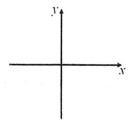</td><td align="center" valign="top">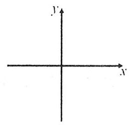</td><td align="center" valign="top">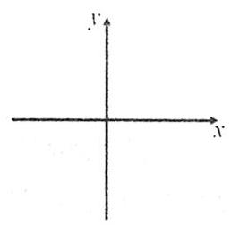</td></tr></table>

8. 角度与弧度互化 ${10}^{ \circ  } =$ ___ $\pi \; \frac{\pi }{10} =$ ___。 ${75}^{ \circ  } =$

9. 扇形弧长公式: $l = {\alpha r}$ 扇形面积公式: $S = \frac{1}{2}{lr} = \frac{1}{2}\alpha {r}^{2}$

#### 题型一 角的表示与范围

1. 用弧度表示下列各角所在的集合.

(1)第三象限角; (2)终边在 $y$ 轴上的角；

(3)终边在坐标轴上的角; (4) 终边在 $y = x$ 直线上的角;

(5) $\alpha$ 与 $\beta$ 的终边关于 $y$ 轴对称; (6) $\alpha$ 与 $\beta$ 的终边关于直线 $y = x$ 对称；

(7) $\alpha$ 与 $\beta$ 的终边在同一条直线上； (8) $\alpha$ 与 $\beta$ 的终边互相垂直.

2. 已知 $\alpha$ 是第二象限角,则 $\frac{\alpha }{2},\frac{\alpha }{3},{2\alpha }$ 分别是第几象限角?

#### 题型二 扇形相关计算

3. 一个半径为 $r$ 的扇形,它的周长是 ${4r}$ ,则这个扇形所含弓形的面积为

A. $\frac{1}{2}{r}^{2}$ B. $\frac{1}{2}{r}^{2}\sin 1\cos 1$ C. $\frac{1}{2}\left( {1 - \sin 1\cos 1}\right) {r}^{2}$ D. $\left( {1 - \sin 1\cos 1}\right) {r}^{2}$

4. 某机器上有相互啮合的大小两个齿轮 (如图所示),大轮有 25 个齿,小轮有 15 个齿,大轮每分钟转 3 圈,若小轮的半径为 2 , 则小轮每秒转过的弧长是

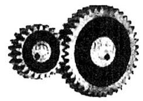

A. ${10\pi }$ B. ${5\pi }$ C. $\frac{\pi }{3}$ D. $\frac{\pi }{6}$

5. (2019北京文8)如图， $A$ ， $B$ 是半径为 2 的圆周上的定点， $P$ 为圆周上的动点， $\angle {APB}$ 是锐角，大小为 $\beta$ ，图中阴影区域的面积的最大值为

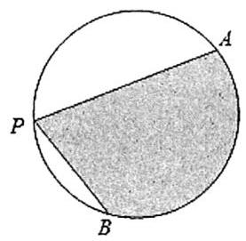

A. ${4\beta } + 4\cos \beta$ B. ${4\beta } + 4\sin \beta$ C. ${2\beta } + 2\cos \beta$ D. ${2\beta } + 2\sin \beta$

6. (2022甲卷理8) 沈括的《梦溪笔谈》是中国古代科技史上的杰作，其中收录了计算圆弧长度的“会圆术”. 如图， $\overset{\text{ ⏜ }}{AB}$ 是以 $O$ 为圆心, ${OA}$ 为半径的圆弧, $C$ 是 ${AB}$ 的中点, $D$ 在 $\overset{\text{ ⏜ }}{AB}$ 上, ${CD} \bot  {AB}$ . “会圆术”给出 $\overset{\text{ ⏜ }}{AB}$ 的弧长的近似值 $s$ 的计算公式: $s = {AB} + \frac{C{D}^{2}}{OA}$ . 当 ${OA} = 2,\angle {AOB} = {60}^{ \circ  }$ 时, $s =$

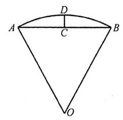

A. $\frac{{11} - 3\sqrt{3}}{2}$ B. $\frac{{11} - 4\sqrt{3}}{2}$ C. $\frac{9 - 3\sqrt{3}}{2}$ D. $\frac{9 - 4\sqrt{3}}{2}$

7. 如图,已知 ${OPQ}$ 是半径为 $r$ ,圆心角为 $\frac{\pi }{4}$ 的扇形,点 $A, B, C$ 分别是半径 ${OP},{OQ}$ 及扇形弧上的三个动点 (不同于 $O, P, Q$ 三点),则 $\bigtriangleup  {ABC}$ 的周长___最大值，___最小值 (填“有”或“无”).

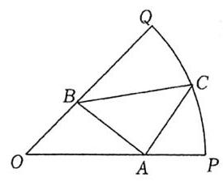

### 第二节 三角函数定义

1. 三角函数定义

A 版定义: $\alpha$ 终边与单位圆交点的坐标为 $P\left( {x, y}\right)$ ，则 $\sin \alpha  =$ ___， $\cos \alpha  =$ _____， $\tan \alpha  =$ _____，

B 版定义: $a$ 终边上任取一点 $P\left( {x, y}\right)$ ，记 $r = \left| {OP}\right|  = \sqrt{{x}^{2} + {y}^{2}}$ ，则 $\sin \alpha  =$ _____， $\cos \alpha  =$ _____， $\tan \alpha  =$ _____。

2. 单位圆与三角函数线

(1)角 $\alpha$ 终边与单位圆交点为 $\left( {\cos \alpha ,\sin \alpha }\right)  \Leftrightarrow$ 看到坐标为 $\left( {\cos \alpha ,\sin \alpha }\right)$ 的点就要想到它在单位圆上.

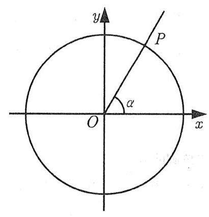

(2)什么是三角函数线?

(3)什么时候有 $\cos \alpha  > \sin \alpha$ ?

(4) 如何说明 $\forall \alpha  \in  \mathbf{R},\left| {\sin \alpha }\right|  + \left| {\cos \alpha }\right|  \geq  1$ ?

(5) 如何说明 $x \in  \left( {0,\frac{\pi }{2}}\right) ,\sin x < x < \tan x$ ?

3. 三角函数在各象限符号

#### 题型一 三角函数定义与单位圆

1. 已知角 $\alpha$ 和 $\beta$ ,则 “ $\alpha  = \beta$ ” 是 “ $\tan \alpha  = \tan \beta$ ” 的

A. 充分不必要条件 B. 必要不充分条件 C. 充分且必要条件 D. 既不充分也不必要条件

2. 若角 $\alpha$ 的终边经过点 $P\left( {-\sqrt{3}, m}\right)$ ，且 $\sin \alpha  = \frac{\sqrt{2}}{4}m$ ，则 $\cos \alpha  =$ ___， $\tan \alpha  =$ ___.

3. 已知角 $\alpha$ 的终边绕原点 $O$ 逆时针旋转 $\frac{2}{3}\pi$ 后与角 $\beta$ 的终边重合，且 $\cos \left( {\alpha  + \beta }\right)  = 1$ ，则 $\alpha$ 的取值可以为

A. $\frac{\pi }{6}$ B. $\frac{\pi }{3}$ C. $\frac{2\pi }{3}$ D. $\frac{5\pi }{6}$

4. $\sin 2 \cdot  \cos 3 \cdot  \tan 4$ 的值是

A. 正数 B. 负数 C. 零 D. 无法确定

5. 已知 $\alpha$ 是第三象限角,则 $\sin \left( {\cos \alpha }\right)  \cdot  \cos \left( {\sin \alpha }\right)$ 的值是

A. 正数 B. 负数 C. 零 D. 无法确定

6. 已知 $\alpha  \in  \mathbf{R}$ ,则 “ $\sin \alpha  + \cos \alpha  > 1$ ” 是 “ $\alpha$ 为第一象限角” 的

A. 充分不必要条件 B. 必要不充分条件 C. 充分且必要条件 D. 既不充分也不必要条件

#### 题型二 单位圆的应用

7. 已知 ${10}^{ \circ  }$ 角的终边交单位圆于点 $A$ ,将 $A$ 绕原点 $O$ 顺时针旋转 ${110}^{ \circ  }$ 至 $B$ ,则 $B$ 的坐标为

A. $\left( {\sin {10}^{ \circ  },\cos {10}^{ \circ  }}\right)$ B. $\left( {\cos {10}^{ \circ  },\sin {10}^{ \circ  }}\right)$ C. $\left( {-\sin {10}^{ \circ  }, - \cos {10}^{ \circ  }}\right)$ D. $\left( {-\cos {10}^{ \circ  }, - \sin {10}^{ \circ  }}\right)$

8. 已知锐角 $\alpha$ 终边上一点 $A$ 的坐标为 $\left( {\sin 3, - \cos 3}\right)$ ，则角 $\alpha$ 的弧度数为___.

9. 已知 $\alpha ,\beta  \in  \mathbf{R}$ ,则 “ ${\cos }^{2}\alpha  = {\cos }^{2}\beta$ ” 是 “ $\beta  = {\left( -1\right) }^{k}\alpha  + {k\pi }\left( {k \in  \mathbf{Z}}\right)$ ” 的

A. 充分不必要条件 B. 必要不充分条件 C. 充要条件 D. 既不充分也不必要条件

10. (2021 北京 14)若 $A\left( {\cos \theta ,\sin \theta }\right)$ 关于 $y$ 轴对称点为 $B\left( {\cos \left( {\theta  + \frac{\pi }{6}}\right) ,\sin \left( {\theta  + \frac{\pi }{6}}\right) }\right)$ ,则 $\theta$ 的一个取值为___.

11. 在平面直角坐标系 ${xOy}$ 中,角 $\alpha$ 以 ${Ox}$ 为始边,终边在第三象限. 则

A. $\sin \alpha  - \cos \alpha  \leq  \tan \alpha$ B. $\sin \alpha  - \cos \alpha  \geq  \tan \alpha$

C. $\sin \alpha  \cdot  \cos \alpha  < \tan \alpha$ D. $\sin \alpha  \cdot  \cos \alpha  > \tan \alpha$

12. (2005 湖北理7) 若 $\sin \alpha  + \cos \alpha  = \tan \alpha \left( {0 < \alpha  < \frac{\pi }{2}}\right)$ ,则 $\alpha  \in$

A. $\left( {0,\frac{\pi }{6}}\right)$ B. $\left( {\frac{\pi }{6},\frac{\pi }{4}}\right)$ C. $\left( {\frac{\pi }{4},\frac{\pi }{3}}\right)$ D. $\left( {\frac{\pi }{3},\frac{\pi }{2}}\right)$

13. (2021上海春考 12)已知 $\theta  > 0$ ，存在实数 $\varphi$ ，使得对任意 $n \in  {\mathbf{N}}^{ * }$ ， $\cos \left( {{n\theta } + \varphi }\right)  < \frac{\sqrt{3}}{2}$ ，则 $\theta$ 的最小值是___.

### 第三节 各种公式与计算

1. 同角关系式

(1) ${\left( \sin \alpha  \pm  \cos \alpha \right) }^{2} = \; \tan \alpha  = \frac{\sin \alpha }{\cos \alpha }$

(2)非常常用的转化链: $\sin \left( {x \pm  \frac{\pi }{4}}\right) ,\cos \left( {x \pm  \frac{\pi }{4}}\right)  \Leftrightarrow  \sin x \pm  \cos x \Leftrightarrow  \sin x\cos x \Leftrightarrow  \sin {2x}$

(3)弦切互化: $1 + {\tan }^{2}\alpha  = \; 1 + \frac{1}{{\tan }^{2}\alpha } =$

2. 该背的诱导公式

(1)互余两角, 正余弦交叉相等, 正切互为倒数

$\sin \left( {\frac{\pi }{2} - \alpha }\right)  =$ ___， $\cos \left( {\frac{\pi }{2} - \alpha }\right)  =$ ___， $\tan \left( {\frac{\pi }{2} - \alpha }\right)  =$ ___.

(2)互补两角，正弦等，余弦反，正切反

$\sin \left( {\pi  - \alpha }\right)  =$ ___， $\cos \left( {\pi  - \alpha }\right)  =$ ___， $\tan \left( {\pi  - \alpha }\right)  =$ ___.

(3)加减 $\pi$ 去对面,正余弦肯定反

$\sin \left( {\alpha  \pm  \pi }\right)  =$ ___， $\cos \left( {\alpha  \pm  \pi }\right)  =$ ___， $\tan \left( {\alpha  \pm  \pi }\right)  =$ ___.

3. 不该背的诱导公式

奇变偶不变，符号看象限，其实我都叫:分变整不变，符号看象限.

①较大的角先 $\pm  {2k\pi }$ ，调整到 $0 \sim  {2\pi }$ 范围内；

②确定函数名(有分数就换名字，没有就不换)；

③ 将 $\alpha$ 视作锐角，找到 $\alpha  + \frac{k\pi }{2}$ 终边所在象限，判断符号.

方法不唯一, 过程中也可以利用奇偶性进行更便捷的处理.

(1) $\sin \left( {\frac{\pi }{2} + \alpha }\right)$ (2) $\cos \left( {\frac{\pi }{2} + \alpha }\right)$ (3) $\cos \left( {\frac{3\pi }{2} + \alpha }\right)$ (4) $\sin \left( {\frac{3\pi }{2} - \alpha }\right)$

4. 特殊三角函数值的记忆

先通过加减 ${2k\pi }$ 调整到 $\left\lbrack  {0,{2\pi }}\right\rbrack$ 内,然后直接画圆.

(1) $\sin \alpha$ (2) $\cos \alpha$ (3) $\tan \alpha$

#### 题型一 同角关系与齐次式

1. (2023 甲卷理 7) "sin ${}^{2}\alpha  + \sin {}^{2}\beta  = 1$ "是 "sin $\alpha  + \cos \beta  = 0$ "的

A. 充分不必要条件 B. 必要不充分条件 C. 充要条件 D. 既不充分也不必要条件

2. 已知 $\sin \theta  + \cos \theta  = \frac{1}{5},\theta  \in  \left( {0,\pi }\right)$ ,则 $\sin \theta \cos \theta  =$ ___, $\sin \theta  - \cos \theta  =$ ___.

3. (1990 全国理19) 求函数 $f\left( x\right)  = \sin x + \cos x + \sin x\cos x$ 的值域.

4. 若 $\tan \alpha  = 2$ ,则

(1) $\frac{2\sin \alpha  - 3\cos \alpha }{4\sin \alpha  - 9\cos \alpha } =$ (2) $\frac{2{\sin }^{2}\alpha  - 3{\cos }^{2}\alpha }{4{\sin }^{2}\alpha  - 9{\cos }^{2}\alpha } =$

(3) $4{\sin }^{2}\alpha  - 3\sin \alpha \cos \alpha  - 5{\cos }^{2}\alpha  =$ (4) $\frac{\sin \alpha }{{\sin }^{3}\alpha  + 2{\cos }^{3}\alpha } =$

题型二 $\sin \theta  \Leftrightarrow  \cos \theta  \Leftrightarrow  \tan \theta$

法一:消元硬算

法二:画直角三角形

①无视符号画直角三角形，让边长满足条件；②求值之后再看象限加符号.

5. $\theta$ 为第四象限角， $\tan \theta  =  - 2$ ，则 $\sin \theta  =$ ___， $\cos \theta  =$ ___.

6. $\theta$ 为第二象限角， $\sin \theta  = \frac{1}{3}$ ，则 $\tan \theta  =$ ___. $\cos \theta  =$ ___.

#### 法三:根据常见勾股数直接猜

$\left( {3,4,5}\right) ,\left( {5,{12},{13}}\right) ,\left( {1,1,\sqrt{2}}\right) ,\left( {1,\sqrt{3},2}\right) ,\left( {1,2,\sqrt{5}}\right) ,\left( {1,2\sqrt{2},3}\right) ,\left( {1,3,\sqrt{10}}\right) ,\left( {\sqrt{3},\sqrt{6},3}\right)$ 7. $\sin \theta  - \cos \theta  = \sqrt{2}$ ,则 $\sin \theta  =$ ___, $\cos \theta  =$ ___, $\tan \theta  =$ ___.

8. $\sin \theta  + 2\cos \theta  = \sqrt{5}$ ,则 $\sin \theta  =$ _____ $,\cos \theta  =$ _____ $,\tan \theta  =$ _____

9. (2022 浙江 13)若 $3\sin \alpha  - \sin \beta  = \sqrt{10},\alpha  + \beta  = \frac{\pi }{2}$ ,则 $\sin \alpha  =$ ___， $\cos {2\beta } =$ ___.

#### 题型三 诱导公式

10. $\sin \frac{4\pi }{3} \cdot  \cos \frac{5\pi }{6} \cdot  \tan \left( {-\frac{4\pi }{3}}\right)  =$ ___.

11. 已知角 $\alpha  \in  \left( {0,\frac{\pi }{4}}\right)$ ，则数据 $\sin \alpha ,\sin \left( {\pi  - \alpha }\right) ,\cos \alpha ,\cos \left( {\pi  - \alpha }\right) ,\tan \alpha$ 的中位数为

A. $\sin \alpha$ B. $\cos \left( {\pi  - \alpha }\right)$ C. $\cos \alpha$ D. $\tan \alpha$

12. 已知 $\sin \left( {\alpha  + \frac{\pi }{3}}\right)  = \frac{1}{3}$ ,则 $\sin \left( {\alpha  - \frac{2\pi }{3}}\right)  =$ ___.

13. 已知 $\sin \left( {\frac{\pi }{3} - x}\right)  = \frac{3}{5}$ ,则 $\cos \left( {x + \frac{7\pi }{6}}\right)  =$ ___.

## 第十四讲 三角恒等变换

这一节其实在高考里没那么难, 现在的高考不太喜欢在一些非常需要注意力的地方来折磨你, 所以很多变态的恒等变换题其实看看就好, 把最常用的公式记清楚, 理解一些通用的变形思路, 就够用了.

### 第一节 常用公式

#### 1. 两角和差公式

(1) $\cos \left( {\alpha  + \beta }\right)  = \; \cos \left( {\alpha  - \beta }\right)  =$

(2) $\sin \left( {\alpha  + \beta }\right)  = \; \sin \left( {\alpha  - \beta }\right)  =$

(3) $\tan \left( {\alpha  + \beta }\right)  = \; \tan \left( {\alpha  - \beta }\right)  =$

#### 2. 几个常用值, 建议背下来

$\sin {15}^{ \circ  } = \cos {75}^{ \circ  } = \; \sin {75}^{ \circ  } = \cos {15}^{ \circ  } = \; \tan {15}^{ \circ  } = \; \tan {75}^{ \circ  } =$

#### 3. 二倍角公式(降角升幂)

$\sin {2\alpha } = \; \cos {2\alpha } =$

$\tan {2\alpha } =$

4. 半角公式(降幂升角)

${\sin }^{2}\frac{\alpha }{2} = \; {\cos }^{2}\frac{\alpha }{2} =$

#### 5. 辅助角公式

其实根本就没有什么辅助角公式, 这只是两角和差公式倒过来用而已

$a\sin x + b\cos x =$

“前 6 后 3 相等 4”?

#### 6. 正弦平方差公式

${\sin }^{2}\alpha  - {\sin }^{2}\beta  = \sin \left( {\alpha  + \beta }\right) \sin \left( {\alpha  - \beta }\right)$

#### 题型一 公式直接应用

1. (2025 全国二 8) 已知 $\alpha  \in  \left( {0,\pi }\right) ,\cos \frac{\alpha }{2} = \frac{\sqrt{5}}{5}$ ,则 $\sin \left( {\alpha  - \frac{\pi }{4}}\right)  =$

A. $\frac{\sqrt{2}}{10}$ B. $\frac{\sqrt{2}}{5}$ C. $\frac{3\sqrt{2}}{10}$ D. $\frac{7\sqrt{2}}{10}$

2. (2023新二卷7) 已知 $\alpha$ 为锐角, $\cos \alpha  = \frac{1 + \sqrt{5}}{4}$ ,则 $\sin \frac{\alpha }{2} =$

A. $\frac{3 - \sqrt{5}}{8}$ B. $\frac{-1 + \sqrt{5}}{8}$ C. $\frac{3 - \sqrt{5}}{4}$ D. $\frac{-1 + \sqrt{5}}{4}$

3. (2018全国I文11) 已知角 $\alpha$ 顶点为坐标原点,始边与 $x$ 轴非负半轴重合,终边上有两点 $A\left( {1, a}\right) , B\left( {2, b}\right)$ , 且 $\cos {2\alpha } = \frac{2}{3}$ ,则 $\left| {a - b}\right|  =$

A. $\frac{1}{5}$ B. $\frac{\sqrt{5}}{5}$ C. $\frac{2\sqrt{5}}{5}$ D. 1

4. (多选) 已知角 $\alpha$ 的顶点为坐标原点,始边与 $x$ 轴非负半轴重合, $P\left( {-3,4}\right)$ 为其终边上一点,若角 $\beta$ 的终边与角 ${2\alpha }$ 的终边关于直线 $y =  - x$ 对称,则

A. $\cos \left( {\pi  + \alpha }\right)  = \frac{3}{5}$ B. $\beta  = {2k\pi } + \frac{\pi }{2} + {2\alpha }\left( {k \in  \mathbf{Z}}\right)$

C. $\tan \beta  = \frac{7}{24}$ D. 角 $\beta$ 是第一象限角

5. (2021 甲卷理9) 若 $\alpha  \in  \left( {0,\frac{\pi }{2}}\right) ,\tan {2\alpha } = \frac{\cos \alpha }{2 - \sin \alpha }$ ,则 $\tan \alpha  =$

A. $\frac{\sqrt{15}}{15}$ B. $\frac{\sqrt{5}}{5}$ C. $\frac{\sqrt{5}}{3}$ D. $\frac{\sqrt{15}}{3}$

6. (2015 重庆理9) 若 $\tan \alpha  = 2\tan \frac{\pi }{5}$ ,则 $\frac{\cos \left( {\alpha  - \frac{3\pi }{10}}\right) }{\sin \left( {\alpha  - \frac{\pi }{5}}\right) } =$

A. 1 B. 2 C. 3 D. 4

7. 在建筑工程中, 工程师需要根据斜坡倾斜角度来计算一些结构的受力情况. 设斜坡的倾斜角度为 $\theta \left( {0 < \theta  < \frac{\pi }{2}}\right)$ ,经测算分析,发现 $\tan \theta \tan {2\theta } = \frac{2}{3}$ ,若该斜坡的摩擦系数为 $\frac{1 + {\sin }^{2}\theta }{\sin {2\theta } + \cos {2\theta }}$ ,则此系数值为

A. $\frac{5}{6}$ B. $\frac{6}{7}$ C. $\frac{4}{5}$ D. $\frac{3}{4}$

8. 已知 $\frac{\tan \theta \tan {2\theta }}{\tan \theta  - \tan {2\theta }} = \frac{4}{5}$ ,则 ${\sin }^{4}\theta  + {\cos }^{4}\theta  =$

A. $\frac{9}{25}$ B. $\frac{3}{5}$ C. $\frac{17}{25}$ D. $\frac{24}{25}$

9. (2009大纲I理16)若 $\frac{\pi }{4} < x < \frac{\pi }{2}$ ，则函数 $y = \tan {2x}{\tan }^{3}x$ 的最大值为___.

#### 题型二 辅助角公式

10. 将下列各式化简为 $A\sin \left( {{\omega x} + \varphi }\right)$ ,其中 $A > 0,\omega  > 0,0 < \left| \varphi \right|  < \pi$ .

$\left( 1\right) f\left( x\right)  = \cos x\left( {2\sqrt{3}\sin x + \cos x}\right)  - {\sin }^{2}x$ (2) $f\left( x\right)  = \left( {2{\cos }^{2}x - 1}\right) \sin {2x} + \frac{1}{2}\cos {4x}$

(3) $f\left( x\right)  = 2{\cos }^{2}x + \sin \left( {{2x} - \frac{\pi }{6}}\right)  - 1 \; \left( 4\right) f\left( x\right)  = 2\cos x\sin \left( {x + \frac{\pi }{3}}\right)  - \frac{\sqrt{3}}{2}$

(5) $f\left( x\right)  = \cos {2x} - \sin {2x}$ (6) $f\left( x\right)  =  - 2\sqrt{3}\sin x\cos x + 2{\cos }^{2}x + 1$

11. (2013全国I理15) 设当 $x = \theta$ 时，函数 $f\left( x\right)  = \sin x - 2\cos x$ 取得最大值，则 $\cos \theta  =$ ___.

12. 若函数 $f\left( x\right)  = 2\cos \left( {x - \varphi }\right)  + \cos x$ 的最大值是 $\sqrt{7}$ ,则常数 $\varphi$ 的值可能是

A. $\frac{\pi }{6}$ B. $\frac{\pi }{3}$ C. $\frac{2\pi }{3}$ D. $\frac{5\pi }{6}$

### 第二节 恒等变换常用思路

思路一 ${sc},{cs},{cc},{ss}$

分析题目中已知哪些形式, 要求哪些形式, 两头一起往中间凑

1. (1997 全国理18) $\frac{\sin {7}^{ \circ  } + \cos {15}^{ \circ  }\sin {8}^{ \circ  }}{\cos {7}^{ \circ  } - \sin {15}^{ \circ  }\sin {8}^{ \circ  }} =$ ___.

2. (2024新一卷4)已知 $\cos \left( {\alpha  + \beta }\right)  = m,\tan \alpha \tan \beta  = 2$ ，则 $\cos \left( {\alpha  - \beta }\right)  =$

A. $- {3m}$ B. $- \frac{m}{3}$ C. $\frac{m}{3}$ D. ${3m}$

3. $\sin \alpha  - \sin \beta  = \frac{1}{3},\cos \alpha  - \cos \beta  =  - \frac{1}{2}$ ,则 $\cos \left( {\alpha  - \beta }\right)  =$ ___.

4. (2022新二卷6) 若 $\sin \left( {\alpha  + \beta }\right)  + \cos \left( {\alpha  + \beta }\right)  = 2\sqrt{2}\cos \left( {\alpha  + \frac{\pi }{4}}\right) \sin \beta$ ,则

A. $\tan \left( {\alpha  - \beta }\right)  = 1$ B. $\tan \left( {\alpha  + \beta }\right)  = 1$ C. $\tan \left( {\alpha  - \beta }\right)  =  - 1$ D. $\tan \left( {\alpha  + \beta }\right)  =  - 1$

5. (2025北京13) 已知 $\alpha ,\beta  \in  \left\lbrack  {0,{2\pi }}\right\rbrack$ ,且 $\sin \left( {\alpha  + \beta }\right)  = \sin \left( {\alpha  - \beta }\right) ,\cos \left( {\alpha  + \beta }\right)  \neq  \cos \left( {\alpha  - \beta }\right)$ ,写出满足条件的一组 $\left( {\alpha ,\beta }\right)  =$ ___.

6. 已知 $\sin \alpha \sin \beta  = \frac{1}{3},\cos \left( {\alpha  + \beta }\right)  = \frac{1}{6}$ ,则 ${\sin }^{2}\alpha  - {\cos }^{2}\beta  =$

A. $- \frac{5}{36}$ B. $- \frac{5}{18}$ C. $\frac{5}{36}$ D. $\frac{5}{18}$

7. 已知 $- \frac{\pi }{2} < \beta  - \alpha  < \frac{\pi }{2},\sin \beta  - 2\cos \alpha  = 1,2\sin \alpha  + \cos \beta  = \sqrt{2}$ ,则 $\sin \beta  =$

A. $\pm  \frac{\sqrt{6}}{3}$ B. $\pm  \frac{\sqrt{3}}{3}$ C. $\frac{\sqrt{3}}{3}$ D. $\frac{\sqrt{6}}{3}$

#### 思路二 已知角凑未知角

这里需要注意角的范围

8. 已知 $\alpha ,\beta$ 均为锐角，且满足 $\cos \alpha  = \frac{4}{5},\cos \left( {\alpha  + \beta }\right)  = \frac{3}{5}$ ，则 $\sin \beta  =$ ___.

9. 已知 $\alpha ,\beta$ 均为锐角，且满足 $\cos \left( {\alpha  + \beta }\right)  = \frac{3}{5}$ ， $\sin \left( {\alpha  - \beta }\right)  =  - \frac{5}{13}$ ，则 $\cos {2\alpha } =$ ___.

10. 若 $\tan \alpha  = 2,\tan \left( {\alpha  - \beta }\right)  = 2$ ,则 $\tan \left( {\beta  - {2\alpha }}\right)  =$ ___.

11. 已知 $\alpha  \in  \left( {\frac{\pi }{2},\pi }\right) ,\beta  \in  \left( {-\frac{\pi }{2},0}\right)$ ,且 $\sin \alpha  = \frac{\sqrt{5}}{5},\cos \beta  = \frac{\sqrt{10}}{10}$ ,则 $\alpha  - \beta  =$ ___.

#### 思路三 tan 的常用处理

① $\tan  + \tan$ 与 $\tan  \cdot  \tan ;$ ② $1 = \tan {45}^{ \circ  };$ ③齐次式，弦化切，切化弦.

12. 求值.

$\left( 1\right) \tan {70}^{ \circ  } + \tan {50}^{ \circ  } - \sqrt{3}\tan {70}^{ \circ  }\tan {50}^{ \circ  } \; \left( 2\right) {\operatorname{tan75}}^{ \circ  } - \tan {15}^{ \circ  } - \sqrt{3}\tan {75}^{ \circ  }\tan {15}^{ \circ  }$

$\left( 3\right) \frac{1 + \tan {15}^{ \circ  }}{1 - \tan {15}^{ \circ  }} \; \left( 4\right) \left( {1 + \tan {1}^{ \circ  }}\right) \left( {1 + \tan {44}^{ \circ  }}\right)$

13. (2019江苏 13) 已知 $\frac{\tan \alpha }{\tan \left( {\alpha  + \frac{\pi }{4}}\right) } =  - \frac{2}{3}$ ，则 $\sin \left( {{2\alpha } + \frac{\pi }{4}}\right)$ 的值是___.

14. 已知 $\tan \alpha ,\tan \beta$ 是方程 ${x}^{2} - \sqrt{3}x - 2 = 0$ 的两个实数根,且 $\alpha ,\beta  \in  \left( {-\frac{\pi }{2},\frac{\pi }{2}}\right)$ ,则 $\alpha  + \beta$ 的值为

A. $\frac{\pi }{3}$ B. $\frac{\pi }{6}$ C. $- \frac{5\pi }{6}$ D. $\frac{\pi }{6}$ 或 $- \frac{5\pi }{6}$

#### 思路四 二倍角公式的选择

15. (2019全国II文11) 已知 $\alpha  \in  \left( {0,\frac{\pi }{2}}\right) ,2\sin {2\alpha } = \cos {2\alpha } + 1$ ，则 $\sin \alpha  =$ ___.

16. 已知 $\cos \left( {\alpha  + \frac{\pi }{6}}\right)  = \frac{\sqrt{6}}{3}$ ,则 $\sin \left( {{2\alpha } - \frac{\pi }{6}}\right)  =$ ___.

思路五 $\sin \left( {x \pm  \frac{\pi }{4}}\right) ,\cos \left( {x \pm  \frac{\pi }{4}}\right)  \Leftrightarrow  \sin x \pm  \cos x \Leftrightarrow  \sin x\cos x \Leftrightarrow  \sin {2x}$

17. 若 $\cos \left( {\frac{\pi }{4} - \alpha }\right)  = \frac{3}{5}$ ,则 $\sin {2\alpha } =$ ___.

18. 已知 $\cos \alpha  =  - \frac{2\sqrt{2}}{3},\frac{\pi }{2} < \alpha  < \pi$ ,则 $\cos \frac{\alpha }{2} - \sin \frac{\alpha }{2} =$ ___.

19. (2021 新一卷 6)若 $\tan \theta  =  - 2$ ，则 $\frac{\sin \theta \left( {1 + \sin {2\theta }}\right) }{\sin \theta  + \cos \theta } =$ ___.

20. 设 $0 \leq  x \leq  {2\pi }$ ,且 $\sqrt{1 - \sin {2x}} = \sin x - \cos x$ ,则

A. $0 \leq  x \leq  \pi$ B. $\frac{\pi }{4} \leq  x \leq  \frac{7\pi }{4}$ C. $\frac{\pi }{4} \leq  x \leq  \frac{5\pi }{4}$ D. $\frac{\pi }{2} \leq  x \leq  \frac{3\pi }{2}$

### 第三节 和差化积与积化和差

高考题能用和差化积 $\neq$ 高考题想考和差化积,我个人的看法依然是:这依然属于可以学但是不必须的内容. 不需要死记硬背，你想背那肯定也没问题，对于大多数同学而言，如果你真的想学，那记得推导思路即可，真用的时候现推也完全来得及，高考绝对不可能出一道非得用和差化积才能做出来的题，先把前面那些掌握利索就已经足够你做 99% 的题了, 不要给自己凭空制造焦虑.

如何推导呢? 核心就一句话:哪个公式中藏着你需要的形式?

$\left\{  {\begin{array}{l} \sin \left( {\alpha  + \beta }\right)  = \sin \alpha \cos \beta  + \cos \alpha \sin \beta \\  \sin \left( {\alpha  - \beta }\right)  = \sin \alpha \cos \beta  - \cos \alpha \sin \beta  \end{array} \Rightarrow  }\right.$

$\alpha  \rightarrow  \frac{\alpha  + \beta }{2} + \frac{\alpha  - \beta }{2},\beta  \rightarrow  \frac{\alpha  + \beta }{2} - \frac{\alpha  - \beta }{2} \Rightarrow$

$\left\lbrack  {\begin{array}{l} \cos \left( {\alpha  + \beta }\right)  = \cos \alpha \cos \beta  - \sin \alpha \sin \beta \\  \cos \left( {\alpha  - \beta }\right)  = \cos \alpha \cos \beta  + \sin \alpha \sin \beta  \end{array} \Rightarrow  }\right.$

$\alpha  \rightarrow  \frac{\alpha  + \beta }{2} + \frac{\alpha  - \beta }{2},\beta  \rightarrow  \frac{\alpha  + \beta }{2} - \frac{\alpha  - \beta }{2} \Rightarrow$

1. $\left( {{2021}\text{ 乙卷文 6) }{\cos }^{2}\frac{\pi }{12} - {\cos }^{2}\frac{5\pi }{12} = }\right)$

A. $\frac{1}{2}$ B. $\frac{\sqrt{3}}{3}$ C. $\frac{\sqrt{2}}{2}$ D. $\frac{\sqrt{3}}{2}$

2. (2022新二卷8) 已知定义域为 $\mathbf{R}$ 的函数 $f\left( x\right)$ 满足 $f\left( {x + y}\right)  + f\left( {x - y}\right)  = f\left( x\right) f\left( y\right) , f\left( 1\right)  = 1$ ,则 $\mathop{\sum }\limits_{{k = 1}}^{{22}}f\left( k\right)  =$

A. -3 B. -2 C. 0 D. 1

### 第四节 解三角方程

1. 若 $\sin \theta  = \tan \theta$ ,则 $\theta$ 满足什么条件?

2. 若 $\sin {2\theta } = \sin \theta$ ,则 $\theta$ 满足什么条件?

3. 若 $\sin \alpha  = \sin \beta$ ，则 $\alpha$ 与 $\beta$ 满足什么条件?

4. 若 $\sin \alpha  = \cos \beta$ ，则 $\alpha$ 与 $\beta$ 满足什么条件?

5. 若 $\cos \alpha  = \cos \beta$ ，则 $\alpha$ 与 $\beta$ 满足什么条件?

6. (2025全国一卷19.1) 设函数 $f\left( x\right)  = 5\cos x - \cos {5x}$ ,求 $f\left( x\right)$ 在 $\left\lbrack  {0,\frac{\pi }{4}}\right\rbrack$ 上的最大值.

7. (2020北京理9) 已知 $\alpha ,\beta  \in  \mathbf{R}$ ,则“存在 $k \in  \mathbf{Z}$ 使得 $\alpha  = {k\pi } + {\left( -1\right) }^{k}\beta$ ”是“sin $\alpha  = \sin \beta$ ”的

A. 充分不必要条件 B. 必要不充分条件 C. 充要条件 D. 既不充分也不必要条件

## 第十五讲 三角函数图象(一)

### 第一节 三角函数图象与基本性质

1. 记清 $y = \sin x$ 与 $y = \cos x$ 的图象,正弦型函数基本全靠换元处理,转化为研究 $y = \sin x$ 的性质.

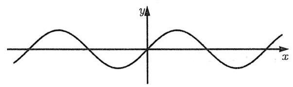

$y = \sin x$

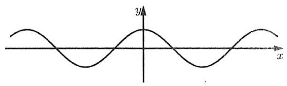

$y = \cos x$

<table><tr><td></td><td>值域</td><td>周期</td><td>对称中心</td><td>对称轴</td><td>单调增区间</td><td>单调减区间</td></tr><tr><td>$y = \sin x$</td><td></td><td></td><td></td><td></td><td></td><td></td></tr><tr><td>$y = 2\sin \left( {{2x} + \frac{\pi }{3}}\right)$</td><td></td><td></td><td></td><td></td><td></td><td></td></tr></table>

#### 2. 如何画出 $y = \sin \left( {{2x} - \frac{\pi }{3}}\right)$ 的图象?

3. 正切函数

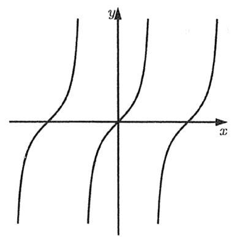

4. 图象平移

如何由 $y = \sin x$ 得到 $y = 2\sin \left( {{2x} + \frac{\pi }{3}}\right)$ 的图象?

(1)先平移后伸缩 (2)先伸缩后平移

#### 题型一 对称性

1. (2025 全国一卷4)若点 $\left( {a,0}\right) \left( {a > 0}\right)$ 是函数 $y = 2\tan \left( {x - \frac{\pi }{3}}\right)$ 的图象的一个对称中心,则 $a$ 的最小值为

A. $\frac{\pi }{4}$ B. $\frac{\pi }{2}$ C. $\frac{\pi }{3}$ D. $\frac{4\pi }{3}$

2. (1994 全国文 14) 如果函数 $y = \sin {2x} + a\cos {2x}$ 的图象关于直线 $x =  - \frac{\pi }{8}$ 对称,则 $a =$

A. $\sqrt{2}$ B. $- \sqrt{2}$ C. 1 D. -1

3. 函数 $f\left( x\right)  = \sin {2x} \cdot  \tan x$ 是

A. 奇函数，且最小值为 0 B. 奇函数，且最大值为 2

C. 偶函数，且最小值为 0 D. 偶函数，且最大值为 2

4. 已知 $f\left( x\right)  = \sin \left( {x + \frac{\pi }{4}}\right) \sin {2x}$ ，则函数 $f\left( x\right)$ 的图象的一个对称中心的坐标为___.

5. (2012上海 18) 设 ${a}_{n} = \frac{1}{n}\sin \frac{n\pi }{25},{S}_{n} = {a}_{1} + {a}_{2} + \cdots  + {a}_{n}$ ,在 ${S}_{1},{S}_{2},\cdots ,{S}_{100}$ 中,正数的个数为

A. 25 B. 50 C. 75 D. 100

#### 题型二 周期性

6. 求下列函数的最小正周期.

(1) $f\left( x\right)  = {\cos }^{4}x + {\sin }^{4}x$ (2) $f\left( x\right)  = {\cos }^{4}x - {\sin }^{4}x$

(3) $f\left( x\right)  = {\sin }^{4}x + {\cos }^{2}x$ (4) $f\left( x\right)  = \frac{\sin x + \cos x}{\sin x - \cos x}$

(5) $f\left( x\right)  = \left| {\sin x}\right| \cos x$ (6) $f\left( x\right)  = \left| {\sin x\cos x}\right|$

7. (2018全国III文6) 函数 $f\left( x\right)  = \frac{\tan x}{1 + {\tan }^{2}x}$ 的最小正周期为

A. $\frac{\pi }{4}$ B. $\frac{\pi }{2}$ C. $\pi$ D. ${2\pi }$

8. (2016浙江理5)设函数 $f\left( x\right)  = {\sin }^{2}x + b\sin x + c$ ，则 $f\left( x\right)$ 的最小正周期

A. 与 $b$ 有关，且与 $c$ 有关 B. 与 $b$ 有关，但与 $c$ 无关

C. 与 $b$ 无关，且与 $c$ 无关 D. 与 $b$ 无关，但与 $c$ 有关

#### 题型三 单调性与值域

9. (2011全国理11)设函数 $f\left( x\right)  = \sin \left( {{\omega x} + \varphi }\right)  + \cos \left( {{\omega x} + \varphi }\right) \left( {\omega  > 0,\left| \varphi \right|  < \frac{\pi }{2}}\right)$ 的最小正周期为 $\pi$ ，且 $f\left( x\right)  = \; f\left( {-x}\right)$ ,则

A. $f\left( x\right)$ 在 $\left( {0,\frac{\pi }{2}}\right)$ 单调递减 B. $f\left( x\right)$ 在 $\left( {\frac{\pi }{4},\frac{3\pi }{4}}\right)$ 单调递减

C. $f\left( x\right)$ 在 $\left( {0,\frac{\pi }{2}}\right)$ 单调递增 D. $f\left( x\right)$ 在 $\left( {\frac{\pi }{4},\frac{3\pi }{4}}\right)$ 单调递增

10. (2021 北京)的函数 $f\left( x\right)  = \cos x - \cos {2x}$ 是

A. 奇函数，且最大值为 2 B. 偶函数，且最大值为 2

C. 奇函数，且最大值为 $\frac{9}{8}$ D. 偶函数，且最大值为 $\frac{9}{8}$

11. $f\left( x\right)  = \sin \left( {{2x} - \frac{\pi }{3}}\right)$ ,当 $x \in  \left\lbrack  {0,\pi }\right\rbrack$ 时,求函数的单调增区间.

12. (2024 天津 7)已知函数 $f\left( x\right)  = \sin 3\left( {{\omega x} + \frac{\pi }{3}}\right) \left( {\omega  > 0}\right)$ 的最小正周期为 $\pi$ . 则函数在 $\left\lbrack  {-\frac{\pi }{12},\frac{\pi }{6}}\right\rbrack$ 的最小值是

A. $- \frac{\sqrt{3}}{2}$ B. $- \frac{3}{2}$ C. 0 D. $\frac{3}{2}$

13. 已知函数 $f\left( x\right)  = {\cos }^{2}x + a\sin x$ . 若函数 $f\left( x\right)$ 在区间 $\left( {0,\pi }\right)$ 上的最小值为 -2,则实数 $a =$ ___.

14. (2017 上海 11) 设 ${a}_{1},{a}_{2} \in  \mathbf{R}$ ，且 $\frac{1}{2 + \sin {a}_{1}} + \frac{1}{2 + \sin \left( {2{a}_{2}}\right) } = 2$ ，则 $\left| {{10\pi } - {a}_{1} - {a}_{2}}\right|$ 的最小值等于___.

#### 题型四 图象变换

15. ( 2020 江苏 10 )将 $y = 3\sin \left( {{2x} + \frac{\pi }{4}}\right)$ 的图象向右平移 $\frac{\pi }{6}$ 后，图象中与 $y$ 轴最近的对称轴方程为___.

16. (2022 甲卷文)将函数 $f\left( x\right)  = \sin \left( {{\omega x} + \frac{\pi }{3}}\right) \left( {\omega  > 0}\right)$ 的图象向左平移 $\frac{\pi }{2}$ 后得到曲线 $C$ ，若 $C$ 关于 $y$ 轴对称， 则 $\omega$ 的最小值是

A. $\frac{1}{6}$ B. $\frac{1}{4}$ C. $\frac{1}{3}$ D. $\frac{1}{2}$

17. (2021乙卷理7)把函数 $y = f\left( x\right)$ 图象上所有点的横坐标缩短到原来的 $\frac{1}{2}$ ，纵坐标不变，再把所得曲线向右平移 $\frac{\pi }{3}$ ，得到函数 $y = \sin \left( {x - \frac{\pi }{4}}\right)$ 的图象，则 $f\left( x\right)  =$

A. $\sin \left( {\frac{x}{2} - \frac{7\pi }{12}}\right)$ B. $\sin \left( {\frac{x}{2} + \frac{\pi }{12}}\right)$ C. $\sin \left( {{2x} - \frac{7\pi }{12}}\right)$ D. $\sin \left( {{2x} + \frac{\pi }{12}}\right)$

18. 为了得到函数 $y =  - \sin \left( {x - \frac{\pi }{3}}\right)$ 的图象,只需把函数 $y = \sin x$ 的图象上的所有点

A. 向左平移 $\frac{2\pi }{3}$ B. 向左平移 $\frac{\pi }{3}$ C. 向右平移 $\frac{\pi }{3}$ D. 向右平移 $\frac{5\pi }{3}$

19. (2015湖南理8)将函数 $f\left( x\right)  = \sin {2x}$ 向右平移 $\varphi \left( {0 < \varphi  < \frac{\pi }{2}}\right)$ 个单位后得到函数 $g\left( x\right)$ 的图象，若对于满足 $\left| {f\left( {x}_{1}\right)  - g\left( {x}_{2}\right) }\right|  = 2$ 的 ${x}_{1},{x}_{2}$ ,有 ${\left| {x}_{1} - {x}_{2}\right| }_{\min } = \frac{\pi }{3}$ ,则 $\varphi  =$

A. $\frac{5\pi }{12}$ B. $\frac{\pi }{3}$ C. $\frac{\pi }{4}$ D. $\frac{\pi }{6}$

#### 题型五 纯画图

20. ( 2024 新一卷 7)当 $x \in  \left\lbrack  {0,{2\pi }}\right\rbrack$ 时，曲线 $y = \sin x$ 与 $y = 2\sin \left( {{3x} - \frac{\pi }{6}}\right)$ 的交点个数为

A. 3 B. 4 C. 6 D. 8

21. (2023 甲卷理 10)已知 $f\left( x\right)$ 为 $y = \cos \left( {{2x} + \frac{\pi }{6}}\right)$ 向左平移 $\frac{\pi }{6}$ 个单位所得函数，则 $y = f\left( x\right)$ 与 $y = \frac{1}{2}x - \frac{1}{2}$ 的交点个数为

A. 1 B. 2 C. 3 D. 4

22. (2010 江西文 12)如图, 四位同学在同一个坐标系中分别选定了一个适当的区间, 各自作出三个函数 $y = \sin {2x}, y = \sin \left( {x + \frac{\pi }{6}}\right) , y = \sin \left( {x - \frac{\pi }{3}}\right)$ 的图象如下. 结果发现其中有一位同学作出的图象有错误, 那么有错误的图象是

A.

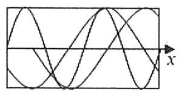

B.

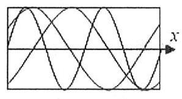

C.

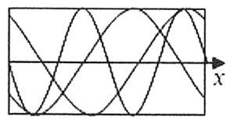

D.

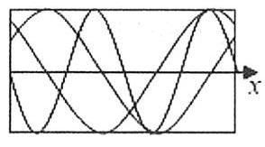

### 第二节 根据图象与性质求参数

#### 题型一 给定图象求参

①找最值确定 $A$ ; ②找周期确定 $\omega$ ; ③带入特殊值确定 $\varphi$ ,务必要注意的是对称中心所对应的角到底是啥. 1. (2021 甲卷文 15) 已知函数 $f\left( x\right)  = 2\cos \left( {{\omega x} + \varphi }\right)$ 的部分图象如图所示,则 $f\left( \frac{\pi }{2}\right)  =$ ___.

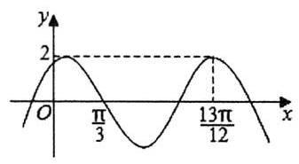

2. (2020 全国一理7) 设函数 $f\left( x\right)  = \cos \left( {{\omega x} + \frac{\pi }{6}}\right)$ 在 $\left\lbrack  {-\pi ,\pi }\right\rbrack$ 的图象大致如图，则 $f\left( x\right)$ 的最小正周期为

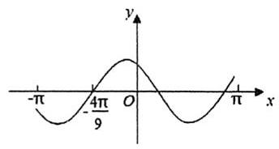

A. $\frac{10\pi }{9}$ B. $\frac{7\pi }{6}$ C. $\frac{4\pi }{3}$ D. $\frac{3\pi }{2}$

3. (2021全国甲理16) $f\left( x\right)  = 2\cos \left( {{\omega x} + \varphi }\right)$ 部分图象如图所示，则满足 $\left( {f\left( x\right)  - f\left( {-\frac{7\pi }{4}}\right) }\right) \left( {f\left( x\right)  - f\left( \frac{4\pi }{3}\right) }\right)  > 0$ 的最小正整数 $x$ 为 ___.

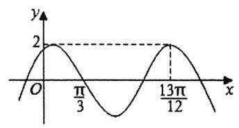

4. (2020新高考II11) (多选) 如图是函数 $y = \sin \left( {{\omega x} + \varphi }\right)$ 的部分图象,则 $\sin \left( {{\omega x} + \varphi }\right)  =$

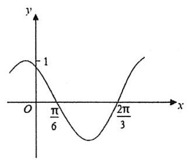

A. $\sin \left( {x + \frac{\pi }{3}}\right)$ B. $\sin \left( {\frac{\pi }{3} - {2x}}\right)$ C. $\cos \left( {{2x} + \frac{\pi }{6}}\right)$ D. $\cos \left( {\frac{5\pi }{6} - {2x}}\right)$

5. 已知函数 $f\left( x\right)  = A\sin \left( {{\omega x} + \varphi }\right)$ 的部分图象如图所示,其中 $A > 0,\omega  > 0, - \frac{\pi }{2} < \varphi  < 0$ . 在已知 $\frac{{x}_{2}}{{x}_{1}}$ 的条件下, 则下列选项中可以确定其值的量为

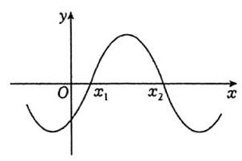

A. $\omega$ B. $\varphi$ C. $\frac{\varphi }{\omega }$ D. $A\sin \varphi$

#### 题型二 没图自己画

6. (2017天津理7) 设函数 $f\left( x\right)  = 2\sin \left( {{\omega x} + \varphi }\right)$ ,其中 $\omega  > 0,\left| \varphi \right|  < \pi$ . 若 $f\left( \frac{5\pi }{8}\right)  = 2, f\left( \frac{11\pi }{8}\right)  = 0$ ,且 $f\left( x\right)$ 的最小正周期大于 ${2\pi }$ ,则

A. $\omega  = \frac{2}{3},\varphi  = \frac{\pi }{12}$ B. $\omega  = \frac{2}{3},\varphi  =  - \frac{11\pi }{12}$ C. $\omega  = \frac{1}{3},\varphi  =  - \frac{11\pi }{24}$ D. $\omega  = \frac{1}{3},\varphi  = \frac{7\pi }{24}$

7. (2022乙卷理15) 记函数 $f\left( x\right)  = \cos \left( {{\omega x} + \varphi }\right) \left( {\omega  > 0,0 < \varphi  < \pi }\right)$ 的最小正周期为 $T$ . 若 $f\left( T\right)  = \frac{\sqrt{3}}{2}, x = \; \frac{\pi }{9}$ 为 $f\left( x\right)$ 的零点，则 $\omega$ 的最小值为___.

8. ( 2014 北京理 14 )设函数 $f\left( x\right)  = A\sin \left( {{\omega x} + \varphi }\right) \left( {A > 0,\omega  > 0}\right)$ ，若 $f\left( x\right)$ 在区间 $\left\lbrack  {\frac{\pi }{6},\frac{\pi }{2}}\right\rbrack$ 上具有单调性，且 $f\left( \frac{\pi }{2}\right)  = f\left( \frac{2\pi }{3}\right)  =  - f\left( \frac{\pi }{6}\right)$ ，则函数的最小正周期为___.

9. 已知 $f\left( x\right)  = \sin \left( {{2x} + \varphi }\right)$ ,若 $f\left( {x + m}\right)$ 的图象关于坐标原点对称, $f\left( {x + n}\right)$ 的图象关于 $y$ 轴对称,则 $\left| m\right| \; + \left| n\right|$ 的最小值为

A. $\frac{\pi }{4}$ B. $\frac{\pi }{2}$ C. $\frac{3\pi }{4}$ D. $\pi$

10. 在平面直角坐标系内,将点 $P\left( {{x}_{0},{y}_{0}}\right)$ ,向左平移 $\frac{\pi }{12}$ 个单位长度,或向右平移 $\frac{\pi }{4}$ 个单位长度,所得的点均位于函数 $y = \sin {2x}$ 的图象 $C$ 上. 则下列结论正确的有___.

① ${x}_{0}$ 可能为 $\frac{\pi }{6}$ ; ② ${x}_{0}$ 可能为 $- \frac{\pi }{6}$ ; ③ ${y}_{0} \in  \left\{  {-\frac{1}{2},\frac{1}{2}}\right\}$ ; ④ ${y}_{0} \in  \left\{  {-\frac{\sqrt{3}}{2},\frac{\sqrt{3}}{2}}\right\}$ .

11. (2023上海 15) 已知 $a \in  \mathbf{R}$ ,记 $y = \sin x$ 在 $\left\lbrack  {a,{2a}}\right\rbrack$ 的最小值为 ${s}_{a}$ ,在 $\left\lbrack  {{2a},{3a}}\right\rbrack$ 的最小值为 ${t}_{a}$ ,则下列情况不可能的是

A. ${s}_{a} > 0,{t}_{a} > 0$ B. ${s}_{a} < 0,{t}_{a} < 0$ C. ${s}_{a} > 0,{t}_{a} < 0$ D. ${s}_{a} < 0,{t}_{a} > 0$

12. (2016上海理13)设 $a, b \in  \mathbf{R}, c \in  (0,{2\pi }\rbrack$ ，若对任意实数 $x$ 都有 $2\sin \left( {{3x} - \frac{\pi }{3}}\right)  = a\sin \left( {{bx} + c}\right)$ ，则满足条件的有序实数对 $\left( {a, b, c}\right)$ 的对数为___.

#### 题型三 利用图象伸缩

13. (2023新二卷 16)已知函数 $f\left( x\right)  = \sin \left( {{\omega x} + \varphi }\right)$ ，如图， $A$ ， $B$ 是直线 $y = \frac{1}{2}$ 与曲线 $y = f\left( x\right)$ 的两个交点，若 $\left| {AB}\right|  = \frac{\pi }{6}$ ,则 $f\left( \pi \right)  =$ ___.

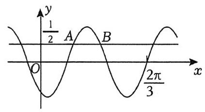

14. 已知 $f\left( x\right)  = \sin {\omega x}$ 与 $g\left( x\right)  = \cos {\omega x}$ 图象相邻的三个交点所形成的三角形是正三角形,则 $\omega  =$ ___.

15. 如图，在函数 $f\left( x\right)  = \sin \left( {{\omega x} + \varphi }\right)$ 的部分图象中，若 $\overrightarrow{TA} = \overrightarrow{AB}$ ，则点 $A$ 的纵坐标为

A. $\frac{2 - \sqrt{2}}{2}$ B. $\frac{\sqrt{3} - 1}{2}$ C. $\sqrt{3} - \sqrt{2}$ D. $2 - \sqrt{3}$

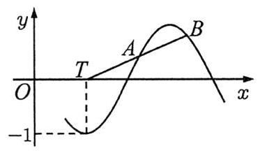

16. 记函数 $f\left( x\right)  = \sin {2x}, x \in  \left\lbrack  {0,\frac{\pi }{2}}\right\rbrack$ 的图象为曲线 $C$ ，直线 $y = m$ 与 $C$ 交于 $A, B$ 两点，直线 $y = {6m}$ 与 $C$ 交于 $D, E$ 两点. 若 $\left| {AB}\right|  = 2\left| {DE}\right|$ ,则 $m =$

A. $\frac{1}{2}$ B. $\frac{1}{4}$ C. $\frac{1}{8}$ D. $\frac{1}{16}$

## 第十六讲 三角函数图象(二)

### 第一节 区间内求参

#### 题型一 简单换元求参

1. 已知函数 $f\left( x\right)  = \sin \left( {{2x} - \frac{\pi }{3}}\right)$ .

(1)若函数在 $\left\lbrack  {0, m}\right\rbrack$ 上单调递增，求 $m$ 的取值范围；

(2)若函数在 $\left\lbrack  {0, m}\right\rbrack$ 上只有两个零点，求 $m$ 的取值范围；

(3)若函数在 $\left\lbrack  {0, m}\right\rbrack$ 上的最小值为 $f\left( 0\right)$ ，求 $m$ 的取值范围.

2. (2022甲卷理11) 设函数 $f\left( x\right)  = \sin \left( {{\omega x} + \frac{\pi }{3}}\right)$ 在区间 $\left( {0,\pi }\right)$ 恰有三个极值点、两个零点，则 $\omega$ 的取值范围是

A. $\left\lbrack  {\frac{5}{3},\frac{13}{6}}\right)$ B. $\left\lbrack  {\frac{5}{3},\frac{19}{6}}\right)$ C. $\left( {\frac{13}{6},\frac{8}{3}}\right\rbrack$ D. $\left( {\frac{13}{6},\frac{19}{6}}\right\rbrack$

3. 已知函数 $f\left( x\right)  = \sin \left( {{\omega x} + \frac{\pi }{4}}\right) \left( {\omega  > 0}\right)$ 在区间 $\left\lbrack  {0,\pi }\right\rbrack$ 上有且仅有 4 条对称轴,给出下列四个结论:

① $f\left( x\right)$ 在区间 $\left( {0,\pi }\right)$ 上有且仅有 3 个不同的零点;

② $f\left( x\right)$ 的最小正周期可能是 $\frac{\pi }{2}$ ；

③ $\omega$ 的取值范围是 $\left\lbrack  {\frac{13}{4},\frac{17}{4}}\right)$ ；

④ $f\left( x\right)$ 在区间 $\left( {0,\frac{\pi }{15}}\right)$ 上单调递增.

其中所有正确结论的序号是

A. ①④ B. ②③ C. ②④ D. ②③④

4. 函数 $f\left( x\right)  = \sin {ax} + 1\left( {a \neq  0}\right)$ 在区间 $\left\lbrack  {0,{2\pi }}\right\rbrack$ 上有且仅有三个零点,则 $a$ 的取值范围为

A. $\left( {-\frac{13}{4}, - \frac{9}{4}}\right\rbrack   \cup  \left\lbrack  {\frac{9}{4},\frac{13}{4}}\right)$ B. $\left( {-\frac{15}{4}, - \frac{11}{4}}\right\rbrack   \cup  \left\lbrack  {\frac{11}{4},\frac{15}{4}}\right)$

C. $\left( {-\frac{13}{4}, - \frac{9}{4}}\right\rbrack   \cup  \left\lbrack  {\frac{11}{4},\frac{15}{4}}\right)$ D. $\left( {-\frac{13}{4}, - \frac{11}{4}}\right\rbrack   \cup  \left\lbrack  {\frac{11}{4},\frac{13}{4}}\right)$

5. 设 $f\left( x\right)  = 2\sin \left( {{2x} + \frac{2\pi }{3}}\right)$ ，则使函数 $f\left( {x + \varphi }\right) \left( {\left| \varphi \right|  < \frac{\pi }{2}}\right)$ 在区间 $\left( {0,\frac{\pi }{2}}\right)$ 上存在最大值的一个 $\varphi$ 值为___.

6. 已知 $a, b > 0$ ,若 $x \in  \left\lbrack  {0,\pi }\right\rbrack  ,\left( {x - b}\right) \sin {ax} \leq  0$ ,则 $\frac{a - 1}{b}$ 的最大值为___.

#### 题型二 区间两头都不确定

其实这类题难度会比较大, 近些年高考几乎没太见过, 除了结合图像分析还可根据区间长度判断周期.

7. 函数 $f\left( x\right)  =  - 2\cos {\omega x}$ ，若 $f\left( x\right)$ 在 $\left\lbrack  {-\frac{\pi }{4},\frac{\pi }{6}}\right\rbrack$ 上存在零点，则 $\omega$ 的取值范围是___.

8. 已知 $\omega  > 0$ ,函数 $f\left( x\right)  = \sin \left( {{\omega x} + \frac{\pi }{4}}\right)$ 在 $\left( {\frac{\pi }{3},\pi }\right)$ 上单调递减,则 $\omega$ 的取值范围是

A. $\left\lbrack  {\frac{2}{3},1}\right\rbrack$ B. $\left\lbrack  {\frac{3}{4},\frac{5}{4}}\right\rbrack$ C. $\left\lbrack  {1,\frac{9}{8}}\right\rbrack$ D. $\left\lbrack  {\frac{1}{2},2}\right\rbrack$

9. (2008 辽宁理 16) 已知 $f\left( x\right)  = \sin \left( {{\omega x} + \frac{\pi }{3}}\right) \left( {\omega  > 0}\right) , f\left( \frac{\pi }{6}\right)  = f\left( \frac{\pi }{3}\right)$ ,且 $f\left( x\right)$ 在区间 $\left( {\frac{\pi }{6},\frac{\pi }{3}}\right)$ 有最小值,无最大值，则 $\omega  =$ ___.

10. (2015天津文14) 已知函数 $f\left( x\right)  = \sin {\omega x} + \cos {\omega x}\left( {\omega  > 0}\right) , x \in  \mathbf{R}$ ，若函数 $f\left( x\right)$ 在区间 $\left( {-\omega ,\omega }\right)$ 内单调递增， 且函数 $f\left( x\right)$ 的图象关于直线 $x = \omega$ 对称，则 $\omega  =$ ___.

### 第二节 函数叠加组合

1. 声音是由于物体的振动产生的能引起听觉的波，我们听到的声音多为复合音. 若一个复合音的数学模型是函数 $f\left( x\right)  = \sin x + \frac{1}{2}\sin {2x}\left( {x \in  \mathbf{R}}\right)$ ,则下列结论正确的是

A. $f\left( x\right)$ 的一个周期为 $\pi$ B. $f\left( x\right)$ 的最大值为 $\frac{3}{2}$

C. $f\left( x\right)$ 的图象关于 $x = \pi$ 对称 D. $f\left( x\right)$ 在区间 $\left\lbrack  {0,{2\pi }}\right\rbrack$ 上有 3 个零点

2. (多选) 已知函数 $f\left( x\right)  = \frac{2\sin x}{5 - \cos {2x}}$ ,则

A. $f\left( x\right)$ 为奇函数 B. $f\left( x\right)$ 的最小正周期为 $\pi$

C. $f\left( x\right)$ 的图象关于直线 $x = \pi$ 对称 D. $f\left( x\right)$ 的最大值为 $\frac{1}{3}$

3. (2013全国大纲理12) 已知函数 $f\left( x\right)  = \cos x\sin {2x}$ ,下列结论中错误的是

A. $y = f\left( x\right)$ 的图象关于点 $\left( {\pi ,0}\right)$ 中心对称 B. $y = f\left( x\right)$ 的图象关于 $x = \frac{\pi }{2}$ 对称

C. $f\left( x\right)$ 的最大值为 $\frac{\sqrt{3}}{2}$ D. $f\left( x\right)$ 既是奇函数，又是周期函数

4. (2005湖北文15) 函数 $y = \left| {\sin x}\right| \cos x - 1$ 的最小正周期与最大值的和为___

5. (2014全国大纲理16)若函数 $f\left( x\right)  = \cos {2x} + a\sin x$ 在区间 $\left( {\frac{\pi }{6},\frac{\pi }{2}}\right)$ 上是减函数，则 $a$ 的取值范围是 ___.

6. (2007全国大纲I理) 函数 $f\left( x\right)  = {\cos }^{2}x + 2{\cos }^{2}\frac{x}{2}$ 的一个单调增区间是

A. $\left( {\frac{\pi }{3},\frac{2\pi }{3}}\right)$ B. $\left( {\frac{\pi }{6},\frac{\pi }{2}}\right)$ C. $\left( {0,\frac{\pi }{3}}\right)$ D. $\left( {-\frac{\pi }{6},\frac{\pi }{6}}\right)$

7. (2020 全国 III 文 12) 已知函数 $f\left( x\right)  = \sin x + \frac{1}{\sin x}$ ,则

A. $f\left( x\right)$ 的最小值为 2 B. $f\left( x\right)$ 的图象关于 $y$ 轴对称

C. $f\left( x\right)$ 的图象关于直线 $x = \pi$ 对称 D. $f\left( x\right)$ 的图象关于直线 $x = \frac{\pi }{2}$ 对称

8. (多选) 下列关于函数 $f\left( x\right)  = \sin \frac{1}{x}$ 的判断中正确的有

A. 值域为 $\left\lbrack  {-1,1}\right\rbrack$ B. 是奇函数

C. 是区间 $\left\lbrack  {\frac{2}{\pi },\frac{4}{\pi }}\right\rbrack$ 上的增函数 D. $\forall t > 0$ ,在区间 $\left( {0, t}\right)$ 上有无穷多个零点

### 第三节 实际应用

#### 题型一 转动

9. 在平面直角坐标系中,动点 $A$ 在以原点为圆心,1为半径的圆上,以 $2\mathrm{{rad}}/\mathrm{s}$ 的角速度按逆时针方向做匀速圆周运动；动点 $B$ 在以原点为圆心，2为半径的圆上，以 $1\mathrm{{rad}}/\mathrm{s}$ 的角速度按逆时针方向做匀速圆周运动. $A, B$ 分别以 ${A}_{0}\left( {0,1}\right) ,{B}_{0}\left( {2,0}\right)$ 为起点同时开始运动，经过 $t$ 秒后，动点 $A, B$ 的坐标分别为 $\left( {{x}_{1},{y}_{1}}\right)$ ， $\left( {{x}_{2},{y}_{2}}\right)$ ,则 ${y}_{1} + {x}_{2}$ 的最小值为

A. -3 B. -2

C. $- \frac{3}{2}$ D. -1

10. 如图,某摩天轮最高点距离地面高度为 ${120m}$ ,转盘直径为 ${110m}$ ,开启后按逆时针方向匀速旋转,旋转一周需要 ${30}\mathrm{\;{min}}$ . 游客在座舱转到距离地面最近的位置进舱,开始转动 $t\mathrm{\;{min}}$ 后距离地面的高度为 ${Hm}$ ,则在转动一周的过程中,高度 $H$ 关于时间 $t$ 的函数解析式是

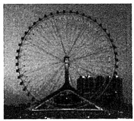

A. $H = {55}\cos \left( {\frac{\pi }{15}t - \frac{\pi }{2}}\right)  + {65}\left( {0 \leq  t \leq  {30}}\right)$ B. $H = {55}\sin \left( {\frac{\pi }{15}t - \frac{\pi }{2}}\right)  + {65}\left( {0 \leq  t \leq  {30}}\right)$

C. $H =  - {55}\cos \left( {\frac{\pi }{10}t + \frac{\pi }{2}}\right)  + {65}\left( {0 \leq  t \leq  {30}}\right)$ D. $H =  - {55}\sin \left( {\frac{\pi }{10}t + \frac{\pi }{2}}\right)  + {65}\left( {0 \leq  t \leq  {30}}\right)$

#### 题型二 滚动

11. 如图,单位圆 $Q$ 的圆心初始位置在点 $\left( {0,1}\right)$ ,圆上一点 $P$ 的初始位置在原点,圆沿 $x$ 轴正方向滚动. 当点 $P$ 第一次滚动到最高点时，点 $P$ 的坐标为___；当圆心 $Q$ 位于点 $\left( {3,1}\right)$ 时，点 $P$ 的坐标为___.

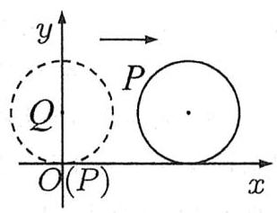

12. 如图, $A$ 是轮子外边沿上的一点,轮子半径为 ${0.3}\mathrm{\;m}$ . 若轮子从图中位置向右无滑动滚动,则当滚动的水平距离为 ${2.2}\mathrm{\;m}$ 时,下列描述正确的是 (参考数据: ${7\pi } \approx  {21.991}$ )

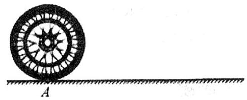

A. 点 $A$ 在轮子左下位置，距地面约 ${0.15}\mathrm{\;m}$ B. 点 $A$ 在轮子右下位置，距地面约 0.15m

C. 点 $A$ 在轮子左下位置，距地面约 0.26m D. 点 $A$ 在轮子右下位置，距地面约 0.04m

13. 在平面直角坐标系 ${xOy}$ 中，如图所示，将一个半径为 1 的圆盘固定在平面上，圆盘的圆心与原点重合，圆盘上缠绕着一条没有弹性的细线，细线的端头 $M$ (开始时与圆盘上点 $A\left( {1,0}\right)$ 重合) 系着一支铅笔，让细线始终保持与圆相切的状态展开，切点为 $B$ ，细绳的粗细忽略不计，当 $\varphi  = {2\mathrm{{rad}}}$ 时，点 $M$ 与点 $O$ 之间的距离为

<table><tr><td align="center" valign="top">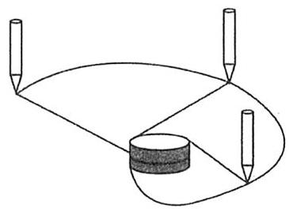</td><td align="center" valign="top">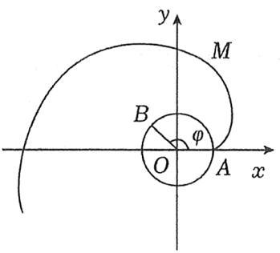</td></tr></table>

A. $\frac{1}{\cos 1}$ B. $\frac{2}{\sin 1}$ C. 2 D. $\sqrt{5}$

# 第五章 解三角形

首先我们要从战略层面达成共识, 2025 一卷出了一道十分逆天的解三角形多选题, 可以预料到的是 26 届模拟题必然会有大把类似题目出现,毕竟模拟题最爱干的事就是拙劣地模仿上一年的高考题,可以看看去年练了多少远超高考难度的“曲线与方程”题目，但这并不意味着备考方向就要往“二级结论”“竞赛知识”偏移. 一方面是这类结论实在太太太多, 随手一抓就是几十条, 有一些结论的证明方法也远超常规高考生所能想到的范畴，所以你根本学不过来，也不可能全都记住；二是每年命题组也会注意舆情，在今年题目反响普遍不好的情况下, 有理由相信命题组会避免这类争议题目的出现, 所以明年再次出现这种题目的概率不高, 大规模练习的性价比极低；三是就算你想练，也请先把常规基础题型都做透彻，保证压轴题外基本不丢分，你要是已经 120 了，你想练啥就练啥，就怕是基础题还错一堆，偏偏盯着压轴题猛干，图个啥呢?

三角形中的结论非常多, 一轮复习阶段请多关注基础, 保证自己常规题不失分. 你可能会在各种奇怪地方遇到一些题干无比短小精悍的求范围 or 最值题, 事实上这类题很有可能杀伤力巨大, 建议不要乱做来路不明的题,遇到了也请适当跳过,这类不是高考考察的重点,费了半天劲很可能没什么收益.

本章不做特殊说明的话均默认: 在 $\bigtriangleup {ABC}$ 中 $a\text{ 、 }b\text{ 、 }c$ 表示角 $A\text{ 、 }B\text{ 、 }C$ 的对边.

## 第十七讲 正余弦定理基本应用

### 第一节 正余弦定理

1. 正弦定理

一般在条件 + 问题 $= 2$ 边 2 角时使用. $\frac{a}{\sin A} = \frac{b}{\sin B} = \frac{c}{\sin C} = {2R}$ ( $R$ 为 $\bigtriangleup {ABC}$ 外接圆半径).

2. 边角齐次才可边角互化. $a = {2R}\sin A, b = {2R}\sin B, c = {2R}\sin C, a : b : c = \sin A : \sin B : \sin C$ .

#### 3. 三角形面积公式

${S}_{\bigtriangleup {ABC}} = \frac{1}{2}{ab}\sin C = \frac{1}{2}{ac}\sin B = \frac{1}{2}{bc}\sin A = \frac{abc}{4R}.$

#### 4. 余弦定理

一般在条件 + 问题 $= 3$ 边 1 角时使用. 看到一堆平方时通常是余弦定理.

${a}^{2} = \; {b}^{2} = \; {c}^{2} =$

$\cos A = \; \cos B = \; \cos C =$

5. $\bigtriangleup {ABC}$ 中常用结论

(1)若 $a > b$ ，则 $A$ ___ $B$ ， $\sin A$ ___ $\sin B$ ， $\cos A$ ___；

(2) $A + B + C = \pi$ ；

$\sin \left( {A + B}\right)  =$ ___， $\cos \left( {A + B}\right)  =$ ___， $\tan \left( {A + B}\right)  =$ ___；

$\sin \frac{A + B}{2} =$ ___， $\cos \frac{A + B}{2} =$ ___， $\tan \frac{A + B}{2} =$ ___；

(3)了解一下正切恒等式: $\tan A\tan B\tan C = \tan A + \tan B + \tan C$ ;

#### 题型一 定理直接使用

1. 在 $\bigtriangleup  {ABC}$ 中， $A : B : C = 1 : 2 : 3$ ，则 $a$ : $b : c =$ ___.

2. 在 $\bigtriangleup  {ABC}$ 中， $a$ : $b : c = 4 : 5 : 6$ ，则 $\tan A =$ ___.

3. 在 $\bigtriangleup  {ABC}$ 中， $a = \sqrt{3}$ ， $b = 2\sqrt{2}$ ， $B = {2A}$ ，则 $\cos A =$ ___.

4. (2023北京7)在 $\bigtriangleup  {ABC}$ 中， $\left( {a + c}\right) \left( {\sin A - \sin C}\right)  = b\left( {\sin A - \sin B}\right)$ ，则 $C =$ ___.

5. 在 $\bigtriangleup  {ABC}$ 中， ${\cos }^{2}B + {\cos }^{2}C - {\cos }^{2}A = 1 - \sin B\sin C$ ，则 $A =$ ___.

6. 在 $\bigtriangleup  {ABC}$ 中， $a = 1$ ，且 $\sin A - b\sin B = \left( {c + b}\right) \sin C$ ，则 $A =$ ___.

7. 在 $\bigtriangleup  {ABC}$ 中， $A = \frac{\pi }{3}$ ， $b + c = 7$ ，且 $\bigtriangleup  {ABC}$ 的面积为 $3\sqrt{3}$ ，则 $\bigtriangleup  {ABC}$ 外接圆的面积为 ___.

8. (2024 甲卷理 11)在 $\bigtriangleup  {ABC}$ 中，若 $B = \frac{\pi }{3}$ ， ${b}^{2} = \frac{9}{4}{ac}$ ，则 $\sin A + \sin C =$ ___.

9. 在 $\bigtriangleup {ABC}$ 中, $\frac{\cos C}{\cos A} + \frac{{2c} + {3b}}{2a} = 0$ ,则 $\cos A =$ ___.

10. 在 $\bigtriangleup {ABC}$ 中, ${2c} - a = {2b}\cos A$ ,则 $B =$ ___.

11. 在 $\bigtriangleup {ABC}$ 中, $\frac{b}{a} = 2\cos \left( {C - \frac{\pi }{3}}\right)$ ,则 $A =$ ___.

12. 在 $\bigtriangleup  {ABC}$ 中， $\sin \left( {A - B}\right)  = \sin C - \sin B$ ，则 $A =$ ___.

13. 在 $\bigtriangleup  {ABC}$ 中，已知 $a$ ， $b$ ， $c$ 成等比数列， $\cos \left( {A - C}\right)  - \cos B = \frac{1}{2}$ ，则 $A =$ ___.

14. 在 $\bigtriangleup {ABC}$ 中, $\sin \left( {B - A}\right)  = \frac{\sqrt{3}}{4},2{b}^{2} - 2{a}^{2} = {c}^{2}$ ,则 $\sin C =$ ___.

15. (2022乙卷理17) 在 $\bigtriangleup  {ABC}$ 中，已知 $\sin C\sin \left( {A - B}\right)  = \sin B\sin \left( {C - A}\right)$ .

(1) 证明: $2{a}^{2} = {b}^{2} + {c}^{2}$ ;

(2)若 $a = 5,\cos A = \frac{25}{31}$ ，求 $\bigtriangleup  {ABC}$ 的周长.

16. (2022新二卷 18)在 $\bigtriangleup  {ABC}$ 中，分别以 $a, b, c$ 为边长的三个正三角形的面积依次为 ${S}_{1},{S}_{2},{S}_{3}$ . 已知 ${S}_{1} - \; {S}_{2} + {S}_{3} = \frac{\sqrt{3}}{2},\sin B = \frac{1}{3}.$

(1)求 $\bigtriangleup  {ABC}$ 的面积；

(2)若 $\sin A\sin C = \frac{\sqrt{2}}{3}$ ，求 $b$ .

17. 在 $\bigtriangleup  {ABC}$ 中，若 $\left( {{2a} + b}\right) \cos C + c\cos B = 0$ .

(1)求 $C$ ；

(2)若 $c = \frac{2\sqrt{6}}{3}$ 且 $\sin A\cos B = \frac{\sqrt{3} - 1}{4}$ ，求 $\bigtriangleup  {ABC}$ 的面积.

### 第二节 高线、中线、角平分线

#### 题型一 高线

1. 在 $\bigtriangleup {ABC}$ 中,已知 $A = \frac{2\pi }{3}, b = 3, c = 4$ ,求 ${BC}$ 边上高线的长.

2. (2023 新一卷17) 在 $\bigtriangleup {ABC}$ 中, $A + B = {3C},2\sin \left( {A - C}\right)  = \sin B$ .

(1)求 $\sin A$ ；

(2) 设 ${AB} = 5$ ，求 ${AB}$ 边上的高.

3. (2004吉林文18)已知锐角 $\bigtriangleup  {ABC}$ 中， $\sin \left( {A + B}\right)  = \frac{3}{5}$ ， $\sin \left( {A - B}\right)  = \frac{1}{5}$ .

(1)求证: $\tan A = 2\tan B$ ；

(2) 设 ${AB} = 3$ ，求 ${AB}$ 边上的高.

4. (2010上海 18)某人要制作一个三角形，要求它的三条高的长度分别是 $\frac{1}{13},\frac{1}{11},\frac{1}{5}$ ，则此人将

A. 不能作出满足要求的三角形 B. 作出一个锐角三角形

C. 作出一个直角三角形 D. 作出一个钝角三角形

#### 题型二 中线

5. 在 $\bigtriangleup {ABC}$ 中,已知 $A = \frac{2\pi }{3}, b = 3, c = 4$ ,求 ${BC}$ 边上中线的长.

6. (2021 浙江 14)在 $\bigtriangleup  {ABC}$ 中， $B = \frac{\pi }{3}$ ， ${AB} = 2$ ， ${M\text{ 是 }{BC}}$ 的中点， ${AM} = {2\sqrt{3}}$ ，则， ${AC} =$ ___.

7. (2023新二卷17) 在 $\bigtriangleup  {ABC}$ 中，已知 $\bigtriangleup  {ABC}$ 面积为 $\sqrt{3}$ ， $D$ 为 ${BC}$ 的中点，且 ${AD} = 1$ .

(1)若 $\angle {ADC} = \frac{\pi }{3}$ ，求 $\tan B$ ；

(2) 若 ${b}^{2} + {c}^{2} = 8$ ，求 $b$ ， $c$ .

8. (2021 北京 16)在 $\bigtriangleup  {ABC}$ 中， $c = {2b}\cos B$ ， $\angle C = \frac{2\pi }{3}$ .

(1)求 $\angle B$ ；

(2)在条件①、条件②、条件③这三个条件中选择一个作为已知，使 $\bigtriangleup  {ABC}$ 存在且唯一确定，并求 ${BC}$ 边上的中线的长.

条件① $c = \sqrt{2}b$ ；

条件② $\bigtriangleup  {ABC}$ 的周长为 $4 + 2\sqrt{3}$ ；

条件③ $\bigtriangleup  {ABC}$ 的面积为 $\frac{3\sqrt{3}}{4}$ .

注:如果选择的条件不符合要求，第(2)问得 0 分；如果选择多个符合要求的条件分别解答，按第一个解答计分.

#### 题型三 角平分线

9. 证明角平分线定理: 在 $\bigtriangleup {ABC}$ 中, ${AD}$ 为 $\angle {BAC}$ 的平分线,则 $\frac{BD}{CD} = \frac{BA}{CA}$ .

10. 在 $\bigtriangleup {ABC}$ 中,已知 $A = \frac{2\pi }{3}, b = 3, c = 4$ ,求 ${BC}$ 边上角平分线的长.

11. (2018江苏13)在 $\bigtriangleup  {ABC}$ 中， $\angle {ABC} = {120}^{ \circ  }$ ， $\angle {ABC}$ 的平分线交 ${AC}$ 于点 $D$ ，且 ${BD} = 2$ ，则 ${4a} + c$ 的最小值为___.

12. (2015新课标II17) $\bigtriangleup {ABC}$ 中, $D$ 是 ${BC}$ 上的点, ${AD}$ 平分 $\angle {BAC},\bigtriangleup {ABD}$ 面积是 $\bigtriangleup {ADC}$ 面积的 2 倍.

(1)求 $\frac{\sin B}{\sin C}$ ；

(2)若 ${AD} = 1,{DC} = \frac{\sqrt{2}}{2}$ ，求 ${BD}$ 和 ${AC}$ 的长.

## 第十八讲 解三角形常见题型与思想 (一)

### 第一节 一刀两断型

三角形中间来一刀会形成三个三角形，分析问题时一定要明确:在哪个三角形中分析？有哪些已知条件？能求出哪些量? 此外, 这类问题还有以下几个突破点:

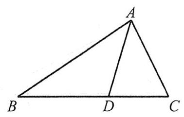

① $\angle {ADB} + \angle {ADC} = \pi$ ；

②公共边 ${AD}$ 同时出现在左、右两个三角形中，可作为联系的桥梁；

③ ${S}_{\bigtriangleup {ABD}} + {S}_{\bigtriangleup {ACD}} = {S}_{\bigtriangleup {ABC}}$ ;

④外角等于不相邻的两个内角和.

1. 在 $\bigtriangleup {ABC}$ 中, $\angle B = \frac{\pi }{3},{AB} = 8$ ,点 $D$ 在边 ${BC}$ 上,且 ${CD} = 2,\cos \angle {ADC} = \frac{1}{7}$ .

(1) 求 $\sin \angle {BAD}$ ;

(2) 求 ${BD},{AC}$ 的长.

2. (2021新一卷 19) 在 $\bigtriangleup {ABC}$ 中,已知 ${b}^{2} = {ac}$ ,点 $D$ 在边 ${AC}$ 上, ${BD}\sin \angle {ABC} = a\sin C$ .

(1)证明: ${BD} = b$ ；

(2)若 ${AD} = {2DC}$ ，求 $\cos \angle {ABC}$ .

3. 在 $\bigtriangleup  {ABC}$ 中， $D$ 为 ${BC}$ 的中点，且 $\angle {DAC} + \angle {BAC} = \pi$ .

(1)求 $\frac{AB}{AD}$ ；

(2)若 ${BC} = {2\sqrt{2}}{AC}$ ，求 $\cos C$ .

4. (2020 江苏 16) 在 $\bigtriangleup {ABC}$ 中,角 $A, B, C$ 的对边分别为 $a, b, c$ ,已知 $a = 3, c = \sqrt{2}, B = {45}^{ \circ  }$ .

(1)求 $\sin C$ 的值；

(2) 在边 ${BC}$ 上取一点 $D$ ，使得 $\cos \angle {ADC} =  - \frac{4}{5}$ ，求 $\tan \angle {DAC}$ 的值.

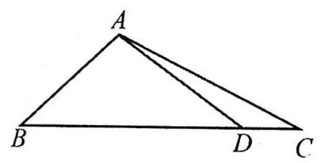

5. (2006湖南理16) 如图， $D$ 是直角 $\bigtriangleup  {ABC}$ 斜边 ${BC}$ 上一点， ${AB} = {AD}$ ，记 $\angle {CAD} = \alpha$ ， $\angle {ABC} = \beta$ .

(1) 证明 $\sin \alpha  + \cos {2\beta } = 0$ ;

(2) 若 ${AC} = \sqrt{3}{DC}$ ,求 $\beta$ 的值.

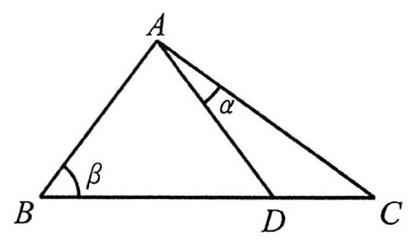

6. (2022甲卷理16) $\bigtriangleup {ABC}$ 中,点 $D$ 在边 ${BC}$ 上, $\angle {ADB} = {120}^{ \circ  },{AD} = 2,{CD} = {2BD}$ . 当 $\frac{AC}{AB}$ 取得最小值时， ${BD} =$ ___.

### 第二节 范围问题

#### 题型一 统一变量思想

要么统一成角, 转化为求三角函数范围; 要么全化成边, 借助余弦定理、均值不等式或函数求解.

1. 在 $\bigtriangleup {ABC}$ 中,已知 $C = \frac{\pi }{3}, c = \sqrt{3}$ .

(1)求 $a + b$ 的取值范围；

(2)求 $\bigtriangleup  {ABC}$ 面积的取值范围.

2. 在 $\bigtriangleup  {ABC}$ 中， $b = 2\sqrt{3}$ ， $\left( {{2c} - a}\right) \sin C = \left( {{b}^{2} + {c}^{2} - {a}^{2}}\right) \frac{\sin B}{b}$ .

(1) 求 $B$ ;

(2) 求 ${2a} - c$ 的范围.

3. 在 $\bigtriangleup  {ABC}$ 中， ${2c}\sin B = {3a}\tan A$ .

(1) 求 $\frac{{b}^{2} + {c}^{2}}{{a}^{2}}$ 的值；

(2)若 $a = 2$ ，求 $\bigtriangleup  {ABC}$ 面积的最大值.

4. 在 $\bigtriangleup  {ABC}$ 中， $a\cos B - b\cos A = \frac{3}{5}c$ ，则 $\tan \left( {A - B}\right)$ 的最大值为___.

5. (2022新一卷18) 在 $\bigtriangleup  {ABC}$ 中，已知 $\frac{\cos A}{1 + \sin A} = \frac{\sin {2B}}{1 + \cos {2B}}$ .

(1)若 $C = \frac{2\pi }{3}$ ，求 $B$ ；

(2)求 $\frac{{a}^{2} + {b}^{2}}{{c}^{2}}$ 的最小值.

6. 在 $\bigtriangleup  {ABC}$ 中， $b = 3$ 且 $\sin C = \frac{c}{3}\cos \frac{B}{2}$ .

(1) 求 $B$ ；

(2) 求 $\bigtriangleup {ABC}$ 的 ${AC}$ 边中线 ${BD}$ 的最大值.

题型二 三角形形状所带来的范围

7. (2020浙江18)在锐角 $\bigtriangleup  {ABC}$ 中，已知 ${2b}\sin A - \sqrt{3}a = 0$ .

(1) 求 $B$ 的大小;

(2) 求 $\cos A + \cos B + \cos C$ 的取值范围.

8. 在锐角 $\bigtriangleup {ABC}$ 中, $\cos A = \cos {2B}$ ,则 $\frac{a}{b}$ 的一个可能取值为

A. $\frac{2}{3}$ B. $\frac{3}{2}$ C. 2 D. 3

9. 已知 $\bigtriangleup {ABC}$ 为锐角三角形,且 $\cos A + \sin B = \sqrt{3}\left( {\sin A + \cos B}\right)$ .

(1)若 $C = \frac{\pi }{3}$ ，求 $A$ ；

(2) 已知点 $D$ 在边 ${AC}$ 上，且 ${AD} = {BD} = 2$ ，求 $\mathop{ccD\text{ 的 }\text{ 取 }\text{ 值 }\text{ 范 }\text{ 围 }.}$

10. (2019全国III文18) $\bigtriangleup  {ABC}$ 的内角 $A$ 、 $B$ 、 $C$ 的对边分别为 $a, b, c$ . 已知 $a\sin \frac{A + C}{2} = b\sin A$ .

(1)求 $B$ ；

(2)若 $\bigtriangleup  {ABC}$ 为锐角三角形，且 $c = 1$ ，求 $\bigtriangleup  {ABC}$ 面积的取值范围.

11. (2015湖南理17)设 $\bigtriangleup {ABC}$ 的内角 $A, B, C$ 的对边分别为 $a, b, c, a = b\tan A$ ，且 $B$ 为钝角.

(1)证明: $B - A = \frac{\pi }{2}$ ；

(2)求 $\sin A + \sin C$ 的取值范围.

12. (2021新二卷 18) 在 $\bigtriangleup  {ABC}$ 中， $b = a + 1$ ， $c = a + 2$ .

(1)若 $2\sin C = 3\sin A$ ，求 $\bigtriangleup  {ABC}$ 的面积；

( 2 )是否存在正整数 $a$ ，使得 $\bigtriangleup  {ABC}$ 为钝角三角形？若存在，求出 $a$ 的值；若不存在，说明理由.

## 第十九讲 解三角形常见题型与思想(二)

### 第一节 三角形形状相关问题

1. 在 $\bigtriangleup  {ABC}$ 中，若 $a = c\cos B$ ，且 $b = c\sin A$ . 则 $\bigtriangleup  {ABC}$ 的形状是___.

2. 在 $\bigtriangleup  {ABC}$ 中，已知 $\frac{c - a}{2c} = {\sin }^{2}\frac{B}{2}$ ，则 $\bigtriangleup  {ABC}$ 的形状是___.

3. 在 $\bigtriangleup  {ABC}$ 中，若 $\sin C < \sin \left( {A - B}\right)$ ，则 $\bigtriangleup  {ABC}$ 的形状是___.

4. 在 $\bigtriangleup  {ABC}$ 中，“ $\sin {2B} = \sin {2A}$ ”是“ $\bigtriangleup  {ABC}$ 为直角三角形”的___条件.

5. 在 $\bigtriangleup  {ABC}$ 中， “ $\cos {2A} = \cos {2B}$ ” 是 “ $\bigtriangleup  {ABC}$ 为等腰三角形” 的___条件.

6. 在 $\bigtriangleup  {ABC}$ 中， “ $\tan {2A} = \tan {2B}$ ” 是 “ $\bigtriangleup  {ABC}$ 为等腰三角形” 的___条件.

7. 在 $\bigtriangleup  {ABC}$ 中， “sin $A = \cos B$ ” 是 “ $\bigtriangleup  {ABC}$ 为直角三角形” 的 ___ 条件.

8. 在 $\bigtriangleup  {ABC}$ 中， “sin $A > \cos B$ ” 是 “ $\bigtriangleup  {ABC}$ 为锐角三角形” 的___条件.

9. 在 $\bigtriangleup  {ABC}$ 中，" $\sin A < \cos B$ "是" $\bigtriangleup  {ABC}$ 为钝角三角形"的___条件.

10. 在 $\bigtriangleup  {ABC}$ 中，"tan $A\tan B <$ 1”是 “ $\bigtriangleup  {ABC}$ 为钝角三角形”的___条件.

11. 在 $\bigtriangleup  {ABC}$ 中，“ $\bigtriangleup  {ABC}$ 是锐角三角形”是 “ $\sin A + \sin B + \sin C > \cos A + \cos B + \cos C$ ”的___条件.

12. (多选) 已知锐角三角形 ${ABC}$ 的内角分别为 $A, B, C$ ,则

A. $\sin \left\lbrack  {\cos \left( {A - B}\right) }\right\rbrack   > \sin \left( {\cos C}\right)$ B. $\tan \left( {\sin A}\right)  < \tan \left( {\cos B}\right)$

C. $\sin \left( {\sin A}\right)  > \sin \left( {\tan A}\right)$ D. $\cos \left( {\cos A}\right)  > \cos \left( {\sin B}\right)$

13. ( 2025 全国 -11)(多选)已知 $\bigtriangleup  {ABC}$ 面积为 $\frac{1}{4}$ ，若 $\cos {2A} + \cos {2B} + 2\sin C = 2,\cos {A\cos }{B\sin }C = \frac{1}{4}$ ，则

A. $\sin C = {\sin }^{2}A + {\sin }^{2}B$ B. ${AB} = \sqrt{2}$

C. $\sin A + \sin B = \frac{\sqrt{6}}{2}$ D. $A{C}^{2} + B{C}^{2} = 3$

### 第二节 角作变量列方程

没有头绪时，可以尝试引入一个角作为未知数，将所有相关量全部用其表示，最终得到三角方程再求解. 1. 在正 $\bigtriangleup  {ABC}$ 三边上各取一点 $D$ ， $E$ ， $F$ ， ${DE} = 3$ ， ${DF} = {2\sqrt{3}}$ ， ${DE}\bot {EF}$ ，则 $\bigtriangleup  {ABC}$ 面积最大值___.

2. (2024上海11改) 已知点 $B$ 在点 $C$ 正北方向,点 $D$ 在点 $C$ 的正东方向, ${BC} = {CD}$ ,存在点 $A$ 满足 $\angle {BAC} = \; {15}^{ \circ  },\angle {DAC} = {30}^{ \circ  }$ ，则 $\tan B =$ ___.

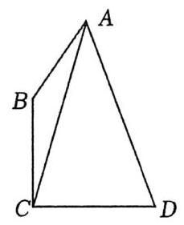

3. 如图，在平面四边形 ${ABCD}$ 中， ${AC}\bot {AD},{AC} = {AD} = 7,{AB} = 3$ .

(1)若 ${DB} = 8$ ，求 $\bigtriangleup  {ABC}$ 的面积；

(2)若 $\angle {BAC} = \angle {ADB}$ ，求 ${BD}$ .

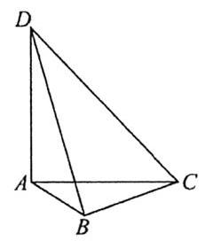

4. 在 $\bigtriangleup {ABC}$ 中, $\sqrt{3}\sin B + \cos B = \frac{\sin B + \sin C}{\sin A}$ .

(1) 求 $A$ ；

(2)若点 $D$ 满足 $\overrightarrow{BD} = 3\overrightarrow{DC}$ ，且 ${AD} = {BD}$ ，求 $\tan B$ 的值.

5. 在 $\bigtriangleup {ABC}$ 中, $B = \frac{\pi }{3}, D$ 为 ${AC}$ 的中点, ${BD} = 2\sqrt{3}$ 时,求 ${2c} + a$ 的取值范围.

6. (2013新课标I理17)在 $\bigtriangleup  {ABC}$ 中， $\angle {ABC} = {90}^{ \circ  }$ ， ${AB} = \sqrt{3}$ ， ${BC} = 1$ ， $P$ 为 $\bigtriangleup {ABC}$ 内一点， $\angle {BPC} = {90}^{ \circ  }$ .

(1)若 ${PB} = \frac{1}{2}$ ，求 ${PA}$ ；

(2)若 $\angle {APB} = {150}^{ \circ  }$ ，求 $\tan \angle {PBA}$ .

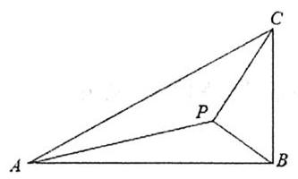

### 第三节 三角形多解问题

劣构(选择一个条件补全题干再求解)是北京卷解三角形大题的主要考点，我觉得很适合作为当今全国卷的 16题, 毕竟在教研员的文章中也提到过开发新题型, 而这类题目就是开放性很强的题目, 也很考察分析能力. 三角形多解的主要的判断标准在于①内角和是否超 ${180}^{ \circ  }$ ; ② $\sin$ 值是否有多解; ③大边是否对大角.

我们可以按照题目所给条件来进行大概分类, 千万别死记硬背, 因为这么多你也背不下来.

SSS:

①两边之和大于第三边，唯一解: $a = 2, b = 3, c = 4$ ；

②两边之和不大于第三边，无解: $a = 1, b = 2, c = 3$ .

${SAS} :$

①给角度或余弦值，唯一解: $a = 3$ ， $B = {60}^{ \circ  }$ ， $c = 5$ ；

② 给正弦值，则有两解: $a = 3$ ， $\sin B = {0.5}$ ， $c = 5$ .

${AAS}$ 或 ${ASA}$ :

① 给两个角度或余弦值，不超 ${180}^{ \circ  }$ 唯一解； $a = 3$ ， $B = {60}^{ \circ  }$ ， $C = {70}^{ \circ  }$ ；

② 给两个角度或余弦值，超 ${180}^{ \circ  }$ 无解； $a = 3$ ， $B = {60}^{ \circ  }$ ， $\cos C =  - {0.7}$ ；

③给一个正弦值，正弦对应钝角时内角和不超 ${180}^{ \circ  }$ 有两解: $a = 3$ ， $B = {30}^{ \circ  }$ ， $\sin C = {0.7}$ ；

④ 给一个正弦值，正弦对应钝角时内角和超 ${180}^{ \circ  }$ 唯一解: $a = 3$ ， $B = {30}^{ \circ  }$ ， $\sin C = {0.4}$ ；

⑤ 给两个正弦值，有两解: $a = 3$ ， $\sin B = {0.5}$ ， $\sin C = {0.8}$ .

SSA:

“小猫钓鱼”:画出已知角，邻边画在上，作垂求长度；

若有钝角，只需判断钝角所对边是否为大边，即可确定唯一解或无解.

1. 在 $\bigtriangleup {ABC}$ 中, $\angle B = {60}^{ \circ  }, b = \sqrt{3}$ ,试分析 $a$ 的取值对于满足题意的三角形个数的影响.

2. 在 $\bigtriangleup {ABC}$ 中, $b\sin {2A} = \sqrt{3}a\sin B$ .

(1)求 $\angle A$ ；

(2)若 $\bigtriangleup  {ABC}$ 的面积为 $3\sqrt{3}$ ，再从条件①、条件②、条件③这三个条件中选择一个作为已知，使 $\bigtriangleup  {ABC}$ 存在且唯一确定,求 $a$ 的值.

条件①: $\sin C = \frac{2\sqrt{7}}{7}$ ; 条件②: $\frac{b}{c} = \frac{3\sqrt{3}}{4}$ ; 条件③: $\cos C = \frac{\sqrt{21}}{7}$

注:如果选择的条件不符合要求，第 (2) 问得 0 分；如果选择多个符合要求的条件分别解答，按第一个解答计分.

3. 在 $\bigtriangleup  {ABC}$ 中，已知 ${2a}{\sin A} = {3\sqrt{3}}\left( {1 - {\cos {2A}}}\right)$ ， $b = 2\sqrt{6}$ .

(1)求 $\sin B$ 的值；

(2)若 $\angle B$ 为锐角,再从条件①、条件②和条件③这三个条件中选择一个作为已知，使 $\bigtriangleup  {ABC}$ 存在且唯一， 求 $\bigtriangleup {ABC}$ 的面积.

条件①: $c = 5$ ;

条件②: $\cos A = \frac{\sqrt{6}}{3}$

条件③: $a\sin A = \sqrt{3}$ .

注:如果选择的条件不符合要求，第 (2) 问得 0 分；如果选择多个符合要求的条件分别解答，按第一个解答计分.

### 第四节 实际应用

1. 为了测量河对岸两点 $C, D$ 间的距离,现在沿岸相距 $2\mathrm{\;{km}}$ 的两点 $A, B$ 处分别测得 $\angle {BAC} = {105}^{ \circ  },\angle {BAD} \; = {60}^{ \circ  },\angle {ABC} = {45}^{ \circ  },\angle {ABD} = {60}^{ \circ  }$ ，则 $C, D$ 间的距离为

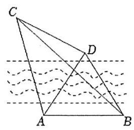

A. $\sqrt{2}$ B. 2 C. $4\sqrt{2}$ D. 4

2. 甲船在岛 $B$ 的正南 $A$ 处, ${AB} = {10}$ 千米,甲船以每小时 4 千米的速度向正北航行,同时,乙船自 $B$ 出发以每小时 6 千米的速度向北偏东 ${60}^{ \circ  }$ 的方向驶去,当甲、乙两船相距最近时,它们的航行时间为___ 小时.

3. 如图，一幅壁画的最高点 $A$ 处离地面 ${12m}$ ，最低点 $B$ 处离地面 ${7m}$ ，现在从离地高 ${4m}$ 的 $C$ 处观赏它.

①若 $C$ 处离墙的距离为 ${6m}$ ，则 $\tan \theta  =$ ___；

②若要视角 $\theta$ 最大，则离墙的距离为___.

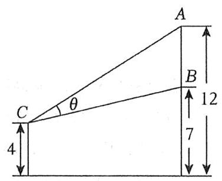

4. (人教 A 版习题) 如图,在山脚 $A$ 测得山顶 $P$ 的仰角为 $\alpha$ ,沿倾斜角为 $\beta$ 的斜坡向上走 ${am}$ 到达 $B$ 处,在 $B$ 处测得山顶 $P$ 的仰角为 $\gamma$ . 想在山高的 $\frac{1}{2}$ 处的山腰建立一个亭子,则此山腰高为

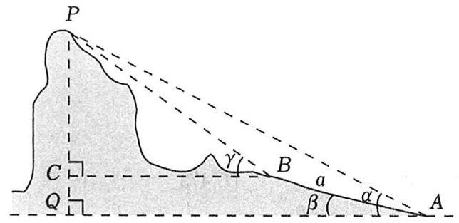

A. $\frac{a\sin \alpha \sin \left( {\gamma  - \alpha }\right) }{2\sin \left( {\gamma  - \beta }\right) }$ B. $\frac{a\sin \alpha \cos \left( {\gamma  - \beta }\right) }{2\sin \left( {\gamma  - \alpha }\right) }$ C. $\frac{a\sin \alpha \sin \left( {\gamma  - \beta }\right) }{2\sin \left( {\gamma  - \alpha }\right) }$ D. $\frac{a\sin \alpha \cos \left( {\alpha  - \gamma }\right) }{2\sin \left( {\gamma  - \beta }\right) }$

5. (2020北京10) 2020 年 3 月 14 日是全球首个国际圆周率日 $\left( {\pi Day}\right)$ . 历史上,求圆周率 $\pi$ 的方法有多种,与中国传统数学中的“割圆术”相似，数学家阿尔卡西的方法是:当正整数 $n$ 充分大时，计算单位圆的内接正 ${6n}$ 边形的周长和外切正 ${6n}$ 边形 (各边均与圆相切的正 ${6n}$ 边形) 的周长,将它们的算术平均数作为 ${2\pi }$ 的近似值. 按照阿尔卡西的方法, $\pi$ 的近似值的表达式是

A. ${3n}\left( {\sin \frac{{30}^{ \circ  }}{n} + \tan \frac{{30}^{ \circ  }}{n}}\right)$ B. ${6n}\left( {\sin \frac{{30}^{ \circ  }}{n} + \tan \frac{{30}^{ \circ  }}{n}}\right)$

C. ${3n}\left( {\sin \frac{{60}^{ \circ  }}{n} + \tan \frac{{60}^{ \circ  }}{n}}\right)$ D. ${6n}\left( {\sin \frac{{60}^{ \circ  }}{n} + \tan \frac{{60}^{ \circ  }}{n}}\right)$

6. (2015湖北理13)如图，一辆汽车在一条水平的公路上向正西行驶，到 $A$ 处时测得公路北侧一山顶 $D$ 在西偏北 ${30}^{ \circ  }$ 的方向上，行驶 ${600}\mathrm{\;m}$ 后到达 $B$ 处，测得此山顶在西偏北 ${75}^{ \circ  }$ 的方向上，仰角为 ${30}^{ \circ  }$ ，则此山的高度 ${CD} =$ ___ $\mathrm{m}$ .

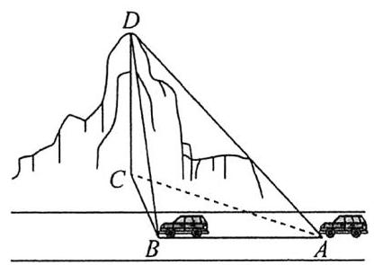

7. (2021 甲卷理 8) 2020 年 12 月 8 日,中国和尼泊尔联合公布珠穆朗玛峰最新高程为 ${8848.86m}$ ,三角高程测量法是珠峰高程测量方法之一. 如图是三角高程测量法的示意图,现有 $A, B, C$ 三点,且 $A, B, C$ 在同一水平面上的投影 ${A}^{\prime },{B}^{\prime },{C}^{\prime }$ 满足 $\angle {A}^{\prime }{C}^{\prime }{B}^{\prime } = {45}^{ \circ  },\angle {A}^{\prime }{B}^{\prime }{C}^{\prime } = {60}^{ \circ  }$ . 由 $C$ 点测得 $B$ 点的仰角为 ${15}^{ \circ  }, B{B}^{\prime }$ 与 $C{C}^{\prime }$ 的差为 100 ; 由 $B$ 点测得 $A$ 点的仰角为 ${45}^{ \circ  }$ ,则 $A, C$ 两点到水平面 ${A}^{\prime }{B}^{\prime }{C}^{\prime }$ 的高度差 $A{A}^{\prime } - C{C}^{\prime }$ 约为

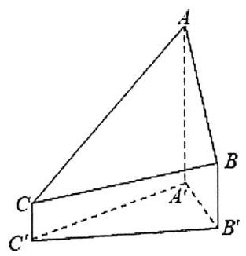

A. 346 B. 373 C. 446 D. 473

# 第六章 平面向量

纵观全国卷，单独考察平面向量的题目，大多着眼于基础计算与常规方法上，很少有技巧性非常强的题目. 在过去的地方卷中, 倒是会看到一些难题或极难题, 很注重方法和技巧. 其实, 向量在数学中更多是作为工具使用的，对于向量本身倒是没有太大必要进行过于深刻的考察. 所以平时模拟题中如果遇见太过于奇怪的、完全无从下手的向量题目，极大概率是高考补集，建议绝大多数同学跳过，没啥必要.

话说回来，虽然向量本身不会出太难的题，但如何灵活运用向量这个工具，则是我们必须重视的问题. 向量在三角、解析几何中的应用十分广泛，比如 25 年一卷解析几何就是借助向量来翻译长度. 所以平时要格外留心向量在其他版块的应用，哪些条件和问题可以转化为向量处理，是需要我们思考和积累的.

当然，我们备考还是不能只备太基础的题，适当深入一些自然有备无患，很多同学觉得向量学起来抽象， 我觉得主要是俩原因，一个是概念其实没学透，比如平面向量基本定理或许会用，但到底咋理解，可能很多同学都不明白; 二是常规方法掌握太少, 就比如数量积问题常用思路有哪些, 你能说上来嘛.

正文开始前，我要强调一个非常重要的思想:特值思想. 平面向量题目经常以三角形、四边形、梯形为载体，很多题目我们都可以来上一句:不妨设. 比如给了三角形，那我就当成等边三角形、等腰三角形、直角三角形去处理；给了四边形，那我就当成矩形、正方形去处理；给了梯形，我就当成等腰梯形、直角梯形去处理， 可能有些同学会有疑问:啥时候能特值呢？其实，只要你画出来的图能满足题意，那就能用. 请各位务必牢记这一方法. 当然其他模块的题目也可以这样做, 特值正是选填小题中一个非常重要的技巧.

## 第二十讲 平面向量线性运算

### 第一节 基本概念、加减与数乘

1. 基本概念回顾

(1) 向量的长度叫做向量的___，记作___。向量不能比大小，模长可以比大小.

(2)零向量:长度为___的向量，记作___；零向量的方向是___。

(3)单位向量:长度为___的向量，通常记作___.

(4)相等向量:长度___且方向___两个向量，记作___.

(5)相反向量:长度___且方向 ___雨个向量，记作___， $\overrightarrow{AB}$ 的相反向量是___.

(6)平行向量 (共线向量):方向___的量，记作___；规定零向量与任意向量___.

(7) 当 $\left| \overrightarrow{a}\right|  \neq  0$ 时，与向量 $\overrightarrow{a}$ 平行的单位向量为___.

(8) 若 $\overrightarrow{a}//\overrightarrow{b},\overrightarrow{b}//\overrightarrow{c}$ ，则 $\overrightarrow{a}//\overrightarrow{c}$ ，这对吗？

(9) 向量 $\overrightarrow{AB}$ 与 $\overrightarrow{CD}$ 共线，则 $A, B, C, D$ 四点共线，这对吗?

2. 向量加减法运算

(1)三角形法则与平行四边形法则

(2)向量加减法的几何意义

向量 $\overrightarrow{a},\overrightarrow{b}$ 不共线， $\left| {\overrightarrow{a} + \overrightarrow{b}}\right|  = \left| {\overrightarrow{a} - \overrightarrow{b}}\right|  \Leftrightarrow \; \left( {\overrightarrow{a} + \overrightarrow{b}}\right)  \bot  \left( {\overrightarrow{a} - \overrightarrow{b}}\right)  \Leftrightarrow$

(3)多向量相加可“约分”

$\overrightarrow{AB} + \overrightarrow{BC} + \overrightarrow{CD} + \overrightarrow{DE} + \overrightarrow{EF} = \; \overrightarrow{AB} + \overrightarrow{BC} + \overrightarrow{CA} =$

3. 向量三角不等式

$\parallel \overrightarrow{a}\parallel  - \left| \overrightarrow{b}\right|  \leq  \left| {\overrightarrow{a} + \overrightarrow{b}}\right|  \leq  \left| \overrightarrow{a}\right|  + \left| \overrightarrow{b}\right| \; \parallel \overrightarrow{a}\left| -\right| \overrightarrow{b}\parallel  \leq  \left| {\overrightarrow{a} - \overrightarrow{b}}\right|  \leq  \left| \overrightarrow{a}\right|  + \left| \overrightarrow{b}\right|$

4. 向量数乘

(1)实数 $\lambda$ 和向量 $\overrightarrow{a}$ 的积是一个向量，记作 $\lambda \overrightarrow{a},\left| {\lambda \overrightarrow{a}}\right|  = \left| \lambda \right|  \cdot  \left| \overrightarrow{a}\right| .$

(2)当 $\lambda  > 0$ 时， $\lambda \overrightarrow{a}$ 与 $\overrightarrow{a}$ 方向___；当 $\lambda  < 0$ 时， $\lambda \overrightarrow{a}$ 与 $\overrightarrow{a}$ 方向___，当 $\lambda  = 0$ 时， $\lambda \overrightarrow{a} =$ ___.

(3)数乘运算法则: $\left( {\lambda  + \mu }\right) \overrightarrow{a} =$ ___； $\lambda \left( {\mu \overrightarrow{a}}\right)  =$ ___； $\lambda \left( {\overrightarrow{a} + \overrightarrow{b}}\right)  =$ ___.

5. 平面向量基本定理

(1) 同一平面内___的两个向量 $\overrightarrow{{e}_{1}},\overrightarrow{{e}_{2}}$ 叫做基底，同一平面内的基底不唯一. 基底确定后，平面内任一向量的表示是___.

(2) 向量坐标表示:在平面直角坐标系中，分别取与 $x$ 轴, $y$ 轴正方向相同的单位向量 $\overrightarrow{i},\overrightarrow{j}$ 作为基底，对于平面内的任意向量 $\overrightarrow{a}$ ，有且只有一对实数 $x$ ， $y$ ，使得 $\overrightarrow{a} = x\overrightarrow{i} + y\overrightarrow{j}$ ，则 $\left( {x, y}\right)$ 叫做向量的坐标，记作___.

6. 向量坐标运算

(1)已知点 $A\left( {{x}_{1},{y}_{1}}\right)$ ， $B\left( {{x}_{2},{y}_{2}}\right)$ ，则 $\overrightarrow{AB} =$ ___， $\left| \overrightarrow{AB}\right|  =$ ___.

( 2 )已知 $\overrightarrow{a} = \left( {{x}_{1},{y}_{1}}\right)$ ， $\overrightarrow{b} = \left( {{x}_{2},{y}_{2}}\right)$ ，则

① $\overrightarrow{a} \pm  \overrightarrow{b} =$ ___；② $\lambda \overrightarrow{a} =$ ___；③ $\overrightarrow{a}//\overrightarrow{b} \Leftrightarrow$ ___；④ $\overrightarrow{a}\bot \overrightarrow{b} \Leftrightarrow$ ___；④ $\overrightarrow{a}\bot \overrightarrow{b} \Leftrightarrow$ ___

7. 向量共线的几种表述

(1)存在实数 $\lambda$ ，使得 $\overrightarrow{b} = \lambda \overrightarrow{a} \Leftrightarrow  \overrightarrow{b}//\overrightarrow{a}$ (成倍数就平行);

(2) $\left( {m\overrightarrow{a} + n\overrightarrow{b}}\right) //\left( {\lambda \overrightarrow{a} + \mu \overrightarrow{b}}\right)  \Leftrightarrow  m, n,\lambda ,\mu$ 满足___；

(3) $\overrightarrow{a} = \left( {{x}_{1},{y}_{1}}\right)$ ， $\overrightarrow{b} = \left( {{x}_{2},{y}_{2}}\right)$ 且 $\overrightarrow{a}//\overrightarrow{b} \Leftrightarrow$ ___；

(4) 存在实数 $\lambda$ ，使得___，则 $A, B, C$ 三点共线.

8. 重心相关性质补充

#### 题型一 基本计算

1. 正方形 ${ABCD}$ 边长为 1,若 $\overrightarrow{AB} = \overrightarrow{a},\overrightarrow{BC} = \overrightarrow{b},\overrightarrow{AC} = \overrightarrow{c}$ ,则向量 $\overrightarrow{a} - \overrightarrow{b} + 2\overrightarrow{c}$ 的模长为___.

2. 如图， ${AB}$ 为半圆的直径，点 $C$ 为 $\overset{\text{ ⏜ }}{AB}$ 的中点，点 $M$ 为线段 ${AB}$ 上的一点(含端点 $A, B$ )，若 ${AB} = 2$ ，则 $\left| {\overrightarrow{AC} + \overrightarrow{MB}}\right|$ 的取值范围是

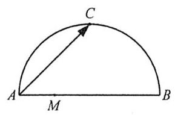

A. $\left\lbrack  {1,3}\right\rbrack$ B. $\left\lbrack  {\sqrt{2},3}\right\rbrack$ C. $\left\lbrack  {3,\sqrt{10}}\right\rbrack$ D. $\left\lbrack  {\sqrt{2},\sqrt{10}}\right\rbrack$

3. 若 ${\overrightarrow{e}}_{1},{\overrightarrow{e}}_{2}$ 是平面内的一组基底,则下列四组向量能作为平面向量的基底的是

A. ${\overrightarrow{e}}_{1} - {\overrightarrow{e}}_{2},{\overrightarrow{e}}_{2} - {\overrightarrow{e}}_{1}$ B. $2{\overrightarrow{e}}_{1} + {\overrightarrow{e}}_{2},{\overrightarrow{e}}_{1} + \frac{1}{2}{\overrightarrow{e}}_{2}$ C. $2{\overrightarrow{e}}_{2} - 3{\overrightarrow{e}}_{1},6{\overrightarrow{e}}_{1} - 4{\overrightarrow{e}}_{2}$ D. ${\overrightarrow{e}}_{1} + {\overrightarrow{e}}_{2},{\overrightarrow{e}}_{1} - {\overrightarrow{e}}_{2}$

4. 已知 $A\left( {-2,4}\right) , B\left( {3, - 1}\right) , C\left( {-3, - 4}\right)$ ,且 $\overrightarrow{CM} = 3\overrightarrow{CA},\overrightarrow{CN} = 2\overrightarrow{CB}$ ,求 $M, N,\overrightarrow{MN}$ 的坐标.

5. 已知向量 $\overrightarrow{a},\overrightarrow{b},\overrightarrow{c}$ 在正方形网格中的位置如图所示,用基底 $\overrightarrow{a},\overrightarrow{b}$ 表示 $\overrightarrow{c}$ ,则

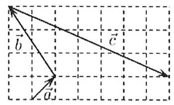

A. $\overrightarrow{c} = 3\overrightarrow{a} - 2\overrightarrow{b}$ B. $\overrightarrow{c} =  - 3\overrightarrow{a} + 2\overrightarrow{b}$ C. $\overrightarrow{c} =  - 2\overrightarrow{a} + 3\overrightarrow{b}$ D. $\overrightarrow{c} = 2\overrightarrow{a} - 3\overrightarrow{b}$

6. 向量 $\overrightarrow{a} = \left( {2, x - 1}\right) ,\overrightarrow{b} = \left( {x + 1,4}\right)$ ,则 “ $x = 3$ ” 是 “ $\overrightarrow{a}//\overrightarrow{b}$ ” 的

A. 充分而不必要条件 B. 必要而不充分条件 C. 充分必要条件 D. 既不充分也不必要条件

7. (2011 上海文 18) 设 ${A}_{1},{A}_{2},{A}_{3},{A}_{4}$ 是平面上给定的 4 个不同点,则使 $\overrightarrow{M{A}_{1}} + \overrightarrow{M{A}_{2}} + \overrightarrow{M{A}_{3}} + \overrightarrow{M{A}_{4}} = \overrightarrow{0}$ 成立的点 $M$ 的个数为

A. 0 B. 1 C. 2 D. 3

8. (2024上海15)定义一个集合 $\Omega$ ，集合元素是空间内的点集，任取 ${P}_{1}$ ， ${P}_{2}$ ， ${P}_{3} \in  \Omega$ ，存在不全为 0 的实数 ${\lambda }_{1}$ ， ${\lambda }_{2},{\lambda }_{3}$ ,使得 ${\lambda }_{1}\overrightarrow{O{P}_{1}} + {\lambda }_{2}\overrightarrow{O{P}_{2}} + {\lambda }_{3}\overrightarrow{O{P}_{3}} = \overrightarrow{0}$ . 已知 $\left( {1,0,0}\right)  \in  \Omega$ ,则 $\left( {0,0,1}\right)  \notin  \Omega$ 的充分条件是

A. $\left( {0,0,0}\right)  \in  \Omega$ B. $\left( {-1,0,0}\right)  \in  \Omega$ C. $\left( {0,1,0}\right)  \in  \Omega$ D. $\left( {0,0, - 1}\right)  \in  \Omega$

#### 题型二 向量三角不等式

9. 设 $\overrightarrow{a},\overrightarrow{b}$ 为非零向量,则“ $\left| {\overrightarrow{a} + \overrightarrow{b}}\right|  = \left| \overrightarrow{a}\right|  + \left| \overrightarrow{b}\right|$ ”是“存在非零实数 $m, n$ ,使得 $m\overrightarrow{a} + n\overrightarrow{b} = \overrightarrow{0}$ ”的

A. 充分不必要条件 B. 必要不充分条件 C. 充要条件 D. 既不充分也不必要条件

10. ” $\overrightarrow{a},\overrightarrow{b}$ 不共线” 是 “ $\left| {\overrightarrow{a} + \overrightarrow{b}}\right|  < \left| \overrightarrow{a}\right|  + \left| \overrightarrow{b}\right|$ ” 的

A. 充分不必要条件 B. 必要不充分条件 C. 充要条件 D. 既不充分也不必要条件

11. 设 $\overrightarrow{a},\overrightarrow{b}$ 为非零向量,则“存在实数 $\lambda$ ,使得 $\overrightarrow{b} = \lambda \overrightarrow{a}$ ” 是 “ $\left| {\overrightarrow{a} + \overrightarrow{b}}\right|  = \left| \overrightarrow{a}\right|  - \left| \overrightarrow{b}\right|$ ” 的

A. 充分不必要条件 B. 必要不充分条件 C. 充要条件 D. 既不充分也不必要条件

12. 设 $\overrightarrow{a},\overrightarrow{b}$ 为非零向量,那么 “ $\overrightarrow{a}//\overrightarrow{b}$ ” 是 “存在 $\lambda  \neq  0$ ,使得 $\left| {\overrightarrow{a} + \lambda \overrightarrow{b}}\right|  = \left| \overrightarrow{a}\right|  + \left| {\lambda \overrightarrow{b}}\right|$ ” 的

A. 充分不必要条件 B. 必要不充分条件 C. 充要条件 D. 既不充分也不必要条件

### 第二节 共线相关问题

题型一 三点共线定理

设 $\overrightarrow{OA} = \lambda \overrightarrow{OB} + \mu \overrightarrow{OC}$ ,则 $A, B, C$ 三点共线 $\Leftrightarrow  \lambda  + \mu  = 1$ .

1. 如图,在 $\bigtriangleup {ABC}$ 中, $\overrightarrow{AN} = \frac{1}{3}\overrightarrow{NC}, P$ 是 ${BN}$ 上的一点,若 $\overrightarrow{AP} = m\overrightarrow{AB} + \frac{2}{11}\overrightarrow{AC}$ ,则实数 $m$ 的值为

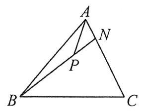

A. $\frac{9}{11}$ B. $\frac{5}{11}$ C. $\frac{2}{11}$ D. $\frac{3}{11}$

2. $\bigtriangleup  {ABC}$ 中， $\overrightarrow{AE} = \overrightarrow{EB}$ ， $\overrightarrow{BD} = 2\overrightarrow{DC}$ ， ${AD}$ 与 ${CE}$ 交于点 $F$ ，设 $\overrightarrow{BF} = \lambda \overrightarrow{BA} + \mu \overrightarrow{BC}$ ，则 ${\lambda \mu } =$ ___.

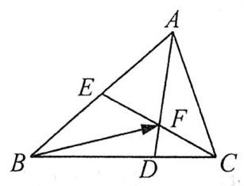

3. 如图, $G$ 是 $\bigtriangleup {OAB}$ 的重心, $P\text{ 、 }Q$ 分别是边 ${OA}\text{ 、 }{OB}$ 上的动点,且 $P\text{ 、 }G\text{ 、 }Q$ 三点共线. 设 $\overrightarrow{OP} = x\overrightarrow{OA}$ , $\overrightarrow{OQ} = y\overrightarrow{OB}$ ,证明: $\frac{1}{x} + \frac{1}{y}$ 是定值.

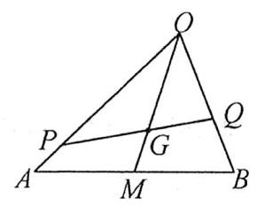

4. 已知 $\overrightarrow{OA} = \overrightarrow{a},\overrightarrow{OB} = t\overrightarrow{b}\left( {t \in  \mathbf{R}}\right) ,\overrightarrow{OC} = \frac{1}{3}\left( {\overrightarrow{a} + \overrightarrow{b}}\right)$ ,若 $A, B, C$ 三点共线,则实数 $t =$

A. $\frac{2}{3}$ B. $\frac{1}{2}$ C. 1 D. 2

5. 如图, $A, B, C$ 是圆 $O$ 上的三点, ${CO}$ 的延长线与线段 ${BA}$ 的延长线交于圆 $O$ 外一点 $D$ ,若 $\overrightarrow{OC} = \lambda \overrightarrow{OA} + \; \mu \overrightarrow{OB}$ ,则 $\lambda  + \mu$ 的取值范围是

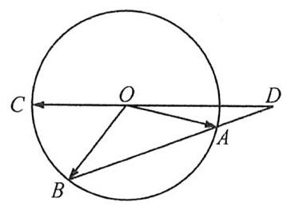

A. $\left( {-\infty , - 1}\right)$ B. $\left( {-1,0}\right)$ C. $\left( {0,1}\right)$ D. $\left( {1, + \infty }\right)$

#### 题型二 等和线定理

设 $\overrightarrow{OA} = \lambda \overrightarrow{OB} + \mu \overrightarrow{OC}$ ,当 $\lambda  + \mu  = k$ (定值) 时,满足要求的 $A$ 点轨迹为平行于 ${BC}$ 的直线.

6. 若 $P$ 是 $\bigtriangleup {ABC}$ 内部或边上的一个动点,且 $\overrightarrow{AP} = x\overrightarrow{AB} + y\overrightarrow{AC}$ ,则 ${xy}$ 的最大值是

A. $\frac{1}{4}$ B. $\frac{1}{2}$ C. 1 D. 2

7. 已知 $\bigtriangleup {OAB}$ 是边长为 1 的正三角形,若点 $P$ 满足 $\overrightarrow{OP} = \left( {2 - t}\right) \overrightarrow{OA} + t\overrightarrow{OB}\left( {t \in  \mathbf{R}}\right)$ ,则 $\left| \overrightarrow{AP}\right|$ 的最小值为

A. $\sqrt{3}$ B. 1

C. $\frac{\sqrt{3}}{2}$ D. $\frac{\sqrt{3}}{4}$

8. (2009安徽理14) 给定两个长度为 1 的平面向量 $\overrightarrow{OA}$ 和 $\overrightarrow{OB}$ ，它们的夹角为 ${120}^{ \circ  }$ ，如图所示，点 $C$ 在以 $O$ 为圆心的圆弧 $\overset{\text{ ⏜ }}{AB}$ 上变动. 若 $\overrightarrow{OC} = x\overrightarrow{OA} + y\overrightarrow{OB}\left( {x, y \in  \mathbf{R}}\right)$ ,则 $x + y$ 的最大值是 ___.

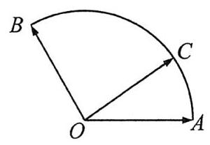

9. (2017全国III理12)在矩形 ${ABCD}$ 中, ${AB} = 1,{AD} = 2$ ,动点 $P$ 在以点 $C$ 为圆心且与 ${BD}$ 相切的圆上. 若 $\overrightarrow{AP} = \lambda \overrightarrow{AB} + \mu \overrightarrow{AD}$ ,则 $\lambda  + \mu$ 的最大值为

A. 3 B. $2\sqrt{2}$ C. $\sqrt{5}$ D. 2

### 第三节 向量合成与分解

1. 向量拆分思路:① 常见模型直接拆；②坐标好写可建系；③平行四边形分解；④特值思想.

2. 三个重要模型:

(1)三角形模型 (2)中线模型 (3)定比分点模型

3. 拆分向量时牢记一个中心思想:想办法跟公共点凑近乎，这样才能最快得到结果.

#### 题型一 向量拆分

1. 在四边形 ${ABCD}$ 中， ${AB}//{CD},{AB} = {3DC}, E$ 为 ${BC}$ 的中点，则 $\overrightarrow{AE} =$ ___ $\overrightarrow{AB} +$ ___ $\overrightarrow{AD}$ .

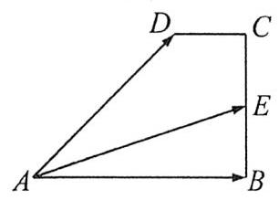

2. (2022新I卷3) 在 $\bigtriangleup {ABC}$ 中,点 $D$ 在边 ${AB}$ 上, ${BD} = {2DA}$ . 记 $\overrightarrow{CA} = \overrightarrow{m},\overrightarrow{CD} = \overrightarrow{n}$ ,则 $\overrightarrow{CB} =$

A. $3\overrightarrow{m} - 2\overrightarrow{n}$ B. $- 2\overrightarrow{m} + 3\overrightarrow{n}$ C. $3\overrightarrow{m} + 2\overrightarrow{n}$ D. $2\overrightarrow{m} + 3\overrightarrow{n}$

3. (2018全国I文7) 在 $\bigtriangleup {ABC}$ 中, ${AD}$ 为 ${BC}$ 边上的中线, $E$ 为 ${AD}$ 的中点,则 $\overrightarrow{EB} =$

A. $\frac{3}{4}\overrightarrow{AB} - \frac{1}{4}\overrightarrow{AC}$ B. $\frac{1}{4}\overrightarrow{AB} - \frac{3}{4}\overrightarrow{AC}$ C. $\frac{3}{4}\overrightarrow{AB} + \frac{1}{4}\overrightarrow{AC}$ D. $\frac{1}{4}\overrightarrow{AB} + \frac{3}{4}\overrightarrow{AC}$

4. (2015北京理13) 在 $\bigtriangleup  {ABC}$ 中，点 $M, N$ 满足 $\overrightarrow{AM} = 2\overrightarrow{MC}$ ， $\overrightarrow{BN} = \overrightarrow{NC}$ ，若 $\overrightarrow{MN} = x\overrightarrow{AB} + y\overrightarrow{AC}$ ，则 $x =$ ___， $y =$ ___.

5. 在 $\bigtriangleup {ABC}$ 中, $\angle C = {90}^{ \circ  },{AC} = {BC} = \sqrt{2}, P$ 为 $\bigtriangleup {ABC}$ 所在平面内的动点,且 ${PC} = 1$ ,则 $\left| {\overrightarrow{PA} + \overrightarrow{PB}}\right|$ 的最大值为

A. 16 B. 10 C. 8 D. 4

6. 等腰梯形 ${ABCD}$ 中， ${AB} = 8,{BC} = {CD} = 4$ ，点 $P$ 在线段 ${AD}$ 上运动，则 $\left| {\overrightarrow{PA} + \overrightarrow{PB}}\right|$ 取值范围是 ___.

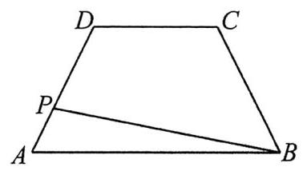

7. 如图，在矩形 ${OABC}$ 中，点 $E$ ， $F$ 分别在线段 ${AB}$ ， ${BC}$ 上，且满足 ${AB} = {3AE}$ ， ${BC} = {3CF}$ ，若 $\overrightarrow{OB} = \lambda \overrightarrow{OE} + \lambda \; \mu \overrightarrow{OF}$ ,则 $\lambda  + \mu  =$ ___.

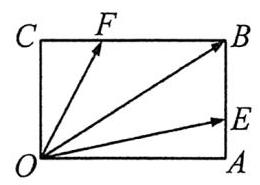

8. 在 $\bigtriangleup  {ABC}$ 中，点 $D$ 为线段 ${BC}$ 的中点，点 $E$ ， $F$ 分别是线段 ${AD}$ 上靠近 $D$ ， $A$ 的三等分点，则 $\overrightarrow{AD} =$

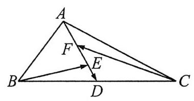

A. $- \overrightarrow{BE} - \frac{1}{3}\overrightarrow{CF}$ B. $- \frac{1}{3}\overrightarrow{BE} - \overrightarrow{CF}$ C. $- \overrightarrow{BE} - \overrightarrow{CF}$ D. $- \frac{4}{9}\overrightarrow{BE} - \overrightarrow{CF}$

9. 在 $\bigtriangleup  {ABC}$ 中，点 $D$ 满足 $\overrightarrow{AD} = 2\overrightarrow{DB}$ ， $E$ 为 $\bigtriangleup  {BCD}$ 重心，设 $\overrightarrow{BC} = \overrightarrow{m}$ ， $\overrightarrow{AC} = \overrightarrow{n}$ ，则 $\overrightarrow{AE}$ 可表示为

A. $\frac{1}{3}\overrightarrow{m} + \frac{2}{3}\overrightarrow{n}$ B. $- \frac{1}{3}\overrightarrow{m} + \frac{2}{3}\overrightarrow{n}$ C. $- \frac{5}{9}\overrightarrow{m} + \frac{8}{9}\overrightarrow{n}$ D. $\frac{5}{9}\overrightarrow{m} + \frac{8}{9}\overrightarrow{n}$

题型二 $\overrightarrow{c} = \overrightarrow{a} + \lambda \overrightarrow{b}$

10. 已知非零向量 $\overrightarrow{a},\overrightarrow{b}$ ,则 $\overrightarrow{c} = \overrightarrow{a} + \lambda \overrightarrow{b}\left( {\lambda  \in  \mathbf{R}}\right)$ 怎么画? $\overrightarrow{a} - \lambda \overrightarrow{b}$ 呢?

11. 已知向量 $\overrightarrow{a},\overrightarrow{b}$ 满足 $\left| \overrightarrow{b}\right|  = 2,\overrightarrow{a}$ 与 $\overrightarrow{b}$ 的夹角为 ${60}^{ \circ  }$ ,则当实数 $\lambda$ 变化时, $\left| {\overrightarrow{b} - \lambda \overrightarrow{a}}\right|$ 的最小值为

A. $\sqrt{3}$ B. 2 C. $\sqrt{10}$ D. $2\sqrt{3}$

12. (2005 浙江理 10) 已知向量 $\overrightarrow{a},\overrightarrow{e}$ 满足 $\overrightarrow{a} \neq  \overrightarrow{e},\left| \overrightarrow{e}\right|  = 1$ ，对任意 $t \in  \mathbf{R}$ ，恒有 $\left| {\overrightarrow{a} - t\overrightarrow{e}}\right|  \geq  \left| {\overrightarrow{a} - \overrightarrow{e}}\right|$ ，则

A. $\overrightarrow{a} \bot  \overrightarrow{e}$ B. $\overrightarrow{a} \bot  \left( {\overrightarrow{a} - \overrightarrow{e}}\right)$ C. $\overrightarrow{e} \bot  \left( {\overrightarrow{a} - \overrightarrow{e}}\right)$ D. $\left( {\overrightarrow{a} + \overrightarrow{e}}\right)  \bot  \left( {\overrightarrow{a} - \overrightarrow{e}}\right)$

## 第二十一讲 平面向量数量积

### 第一节 基本概念与计算

1. 向量夹角:两个向量同起点或同终点后形成的夹角，记作 $< \overrightarrow{a},\overrightarrow{b} >$ ，向量夹角的范围:___.

2. 数量积公式 (点乘,内积): $\overrightarrow{a} \cdot  \overrightarrow{b} =$ ___，数量积的结果是___.

3. 夹角公式 $\cos  < \overrightarrow{a},\overrightarrow{b} >  =$ ___.

4. $< \overrightarrow{a},\overrightarrow{b} >  = 0 \Leftrightarrow  \overrightarrow{a} \cdot  \overrightarrow{b} =$ ___； $< \overrightarrow{a},\overrightarrow{b} >  = \pi  \Leftrightarrow  \overrightarrow{a} \cdot  \overrightarrow{b} =$ ___； $< \overrightarrow{a},\overrightarrow{b} >  = \frac{\pi }{2} \Leftrightarrow  \overrightarrow{a} \cdot  \overrightarrow{b} =$ ___.

5. ” $\overrightarrow{a} \cdot  \overrightarrow{b} < 0$ ” 是 “ $\overrightarrow{a},\overrightarrow{b}$ 夹角为钝角” 的___条件；:(“ $\overrightarrow{a} \cdot  \overrightarrow{b} > 0$ ” 是 “ $\overrightarrow{a},\overrightarrow{b}$ 夹角为锐角” 的___ 条件.

6. 求模就方: $\left| \overrightarrow{a}\right|  =$ ___； $\left| {\overrightarrow{a} + \overrightarrow{b}}\right|  =$ ___.

7. 数量积的坐标运算:已知 $\overrightarrow{a} = \left( {{x}_{1},{y}_{1}}\right)$ ， $\overrightarrow{b} = \left( {{x}_{2},{y}_{2}}\right)$ .

$\overrightarrow{a} \cdot  \overrightarrow{b} =$ ___； $\left| \overrightarrow{a}\right|  =$ ___； $\cos  < \overrightarrow{a},\overrightarrow{b} >  =$ ___.

#### 题型一 常规计算

1. 已知 $\overrightarrow{a},\overrightarrow{b},\overrightarrow{c}$ 是平面上的三个向量,且 $\overrightarrow{a},\overrightarrow{b}$ 不共线,若 $\overrightarrow{c}$ 满足 $\left( {\overrightarrow{b} \cdot  \overrightarrow{c}}\right) \overrightarrow{a} = \left( {\overrightarrow{c} \cdot  \overrightarrow{a}}\right) \overrightarrow{b}$ ,则

A. $\overrightarrow{c} = \overrightarrow{0}$ B. $\left| \overrightarrow{c}\right|  = 1$ C. $\overrightarrow{c} = \overrightarrow{a} + \overrightarrow{b}$ D. $\overrightarrow{c} = \overrightarrow{a} - \overrightarrow{b}$

2. 菱形 ${ABCD}$ 的边长为 $2,\angle {ABC} = {60}^{ \circ  }$ ,则 $\overrightarrow{AB} \cdot  \overrightarrow{BC} =$ ___， $\overrightarrow{AB} \cdot  \overrightarrow{CB} =$ ___， $\overrightarrow{BA} \cdot  \overrightarrow{CD} =$ ___.

3. 已知向量 $\overrightarrow{a}$ 和 $\overrightarrow{b}$ 夹角为 ${120}^{ \circ  }$ ，且 $\left| \overrightarrow{a}\right|  = 3$ ， $\left| \overrightarrow{b}\right|  = 2$ ，则 $\left( {\overrightarrow{a} - 2\overrightarrow{b}}\right)  \cdot  \overrightarrow{a} =$ ___.

4. (2023新一卷3) 已知向量 $\overrightarrow{a} = \left( {1,1}\right) ,\overrightarrow{b} = \left( {1, - 1}\right)$ ，若 $\left( {\overrightarrow{a} + {\lambda \overrightarrow{b}}}\right)  \bot  \left( {\overrightarrow{a} + {\mu \overrightarrow{b}}}\right)$ ，则

A. $\lambda  + \mu  = 1$ B. $\lambda  + \mu  =  - 1$ C. ${\lambda \mu } = 1$ D. ${\lambda \mu } =  - 1$

5. (2024 甲卷理9) 设向量 $\overrightarrow{a} = \left( {x + 1, x}\right) ,\overrightarrow{b} = \left( {x,2}\right)$ ,则

A. “ $x =  - 3$ ”是“ $\overrightarrow{a} \bot  \overrightarrow{b}$ ”的必要条件 B. “ $x =  - 3$ ”是“ $\overrightarrow{a}//\overrightarrow{b}$ ”的必要条件

C. “ $x = 0$ ” 是 “ $\overrightarrow{a} \bot  \overrightarrow{b}$ ” 的充分条件 D. “ $x =  - 1 + \sqrt{3}$ ” 是 “ $\overrightarrow{a}//\overrightarrow{b}$ ” 的充分条件

#### 题型二 模长相关问题

6. (2017全国I理 13) 已知向量 $\overrightarrow{a}$ 与 $\overrightarrow{b}$ 的夹角为 ${60}^{ \circ  },\left| \overrightarrow{a}\right|  = 2,\left| \overrightarrow{b}\right|  = 1$ ,则 $\left| {\overrightarrow{a} + 2\overrightarrow{b}}\right|  =$ ___.

7. (2024新二卷3) 已知向量 $\overrightarrow{a},\overrightarrow{b}$ 满足 $\left| \overrightarrow{a}\right|  = 1,\left| {\overrightarrow{a} + 2\overrightarrow{b}}\right|  = 2$ ,且 $\left( {\overrightarrow{b} - 2\overrightarrow{a}}\right)  \bot  \overrightarrow{b}$ ,则 $\left| \overrightarrow{b}\right|  =$

A. $\frac{1}{2}$ B. $\frac{\sqrt{2}}{2}$ C. $\frac{\sqrt{3}}{2}$ D. 1

8. (2023新二卷 13)已知向量 $\overrightarrow{a},\overrightarrow{b}$ 满足 $\left| {\overrightarrow{a} - \overrightarrow{b}}\right|  = \sqrt{3},\left| {\overrightarrow{a} + \overrightarrow{b}}\right|  = \left| {2\overrightarrow{a} - \overrightarrow{b}}\right|$ ，则 $\left| \overrightarrow{b}\right|  =$ ___.

9. 已知不共线的平面向量 $\overrightarrow{a},\overrightarrow{b},\overrightarrow{c}$ 两两的夹角相等,且 $\left| \overrightarrow{a}\right|  = 1,\left| \overrightarrow{b}\right|  = 2,\left| \overrightarrow{c}\right|  = 3$ ,实数 ${\lambda }_{1},{\lambda }_{2},{\lambda }_{3} \in  \left\lbrack  {-1,1}\right\rbrack$ ,则 $\left| {{\lambda }_{1}\overrightarrow{a} + {\lambda }_{2}\overrightarrow{b} + {\lambda }_{3}\overrightarrow{c}}\right|$ 的最大值为

A. $\sqrt{3}$ B. $2\sqrt{3}$ C. $\sqrt{21}$ D. 5

#### 题型三 夹角相关问题

10. 设 $\overrightarrow{a} = \left( {1,2}\right) ,\overrightarrow{b} = \left( {-2, x}\right)$ ，若 $< \overrightarrow{a},\overrightarrow{b} >$ 为钝角，则 $x$ 的取值范围是___.

11. (2019全国Ⅰ文 8)已知非零向量 $\overrightarrow{a},\overrightarrow{b}$ 满足 $\left| \overrightarrow{a}\right|  = 2\left| \overrightarrow{b}\right|$ ，且 $\left( {\overrightarrow{a} - \overrightarrow{b}}\right)  \bot  \overrightarrow{b}$ ，则 $\overrightarrow{a}$ 与 $\overrightarrow{b}$ 的夹角为

A. $\frac{\pi }{6}$ B. $\frac{\pi }{3}$ C. $\frac{2\pi }{3}$ D. $\frac{5\pi }{6}$

12. (2020 全国 III 理 6) 已知向量 $\overrightarrow{a},\overrightarrow{b}$ 满足 $\left| \overrightarrow{a}\right|  = 5,\left| \overrightarrow{b}\right|  = 6,\overrightarrow{a} \cdot  \overrightarrow{b} =  - 6$ ,则 $\cos  < \overrightarrow{a},\overrightarrow{a} + \overrightarrow{b} >  =$

A. $- \frac{31}{35}$ B. $- \frac{19}{35}$ C. $\frac{17}{35}$ D. $\frac{19}{35}$

13. (2023 甲卷理 4)向量 $\left| \overrightarrow{a}\right|  = \left| \overrightarrow{b}\right|  = 1,\left| \overrightarrow{c}\right|  = \sqrt{2}$ ，且 $\overrightarrow{a} + \overrightarrow{b} + \overrightarrow{c} = \overrightarrow{0}$ ，则 $\cos  < \overrightarrow{a} - \overrightarrow{c},\overrightarrow{b} - \overrightarrow{c} >  =$

A. $- \frac{1}{5}$ B. $- \frac{2}{5}$ C. $\frac{2}{5}$ D. $\frac{4}{5}$

14. (2022新二卷4)已知向量 $\overrightarrow{a} = \left( {3,4}\right) ,\overrightarrow{b} = \left( {1,0}\right) ,\overrightarrow{c} = \overrightarrow{a} + t\overrightarrow{b}$ ,若 $< \overrightarrow{a},\overrightarrow{c} >  =  < \overrightarrow{b},\overrightarrow{c} >$ ,则 $t =$

A. -6 B. -5 C. 5 D. 6

### 第二节 画图与几何意义

很多向量题的几何意义都非常明显,学会画图,轻松惬意

1. (2020 全国一理 14) 设 $\overrightarrow{a},\overrightarrow{b}$ 为单位向量，且 $\left| {\overrightarrow{a} + \overrightarrow{b}}\right|  = 1$ ，则 $\left| {\overrightarrow{a} - \overrightarrow{b}}\right|  =$ ___.

2. (2020全国II文5) 已知单位向量 $\overrightarrow{a},\overrightarrow{b}$ 的夹角为 ${60}^{ \circ  }$ ,则在下列向量中,与 $\overrightarrow{b}$ 垂直的是

A. $\overrightarrow{a} + 2\overrightarrow{b}$ B. $2\overrightarrow{a} + \overrightarrow{b}$ C. $\overrightarrow{a} - 2\overrightarrow{b}$ D. $2\overrightarrow{a} - \overrightarrow{b}$

3. 若非零向量 $\overrightarrow{a},\overrightarrow{b}$ 满足 $\left| {\overrightarrow{a} - \overrightarrow{b}}\right|  = \left| \overrightarrow{b}\right|$ ,则

A. $\left| {2\overrightarrow{b}}\right|  > \left| {\overrightarrow{a} - 2\overrightarrow{b}}\right|$ B. $\left| {2\overrightarrow{b}}\right|  < \left| {\overrightarrow{a} - 2\overrightarrow{b}}\right|$ C. $\left| {2\overrightarrow{a}}\right|  > \left| {\overrightarrow{a} - 2\overrightarrow{b}}\right|$ D. $\left| {2\overrightarrow{a}}\right|  < \left| {\overrightarrow{a} - 2\overrightarrow{b}}\right|$

4. 向量 $\overrightarrow{a} = \left( {\cos {50}^{ \circ  },\sin {50}^{ \circ  }}\right)$ 与 $\overrightarrow{b} = \left( {\sin {10}^{ \circ  },\cos {10}^{ \circ  }}\right)$ 的夹角为

A. ${30}^{ \circ  }$ B. ${40}^{ \circ  }$ C. ${60}^{ \circ  }$ D. ${90}^{ \circ  }$

5. (2021 新一卷 10) (多选) $O$ 为坐标原点,点 ${P}_{1}\left( {\cos \alpha ,\sin \alpha }\right) ,{P}_{2}\left( {\cos \beta , - \sin \beta }\right) ,{P}_{3}\left( {\cos \left( {\alpha  + \beta }\right) ,\sin \left( {\alpha  + \beta }\right) }\right)$ , $A\left( {1,0}\right)$ ,则

A. $\left| \overrightarrow{O{P}_{1}}\right|  = \left| \overrightarrow{O{P}_{2}}\right|$ B. $\left| \overrightarrow{A{P}_{1}}\right|  = \left| \overrightarrow{A{P}_{2}}\right|$

C. $\overrightarrow{OA} \cdot  \overrightarrow{O{P}_{3}} = \overrightarrow{O{P}_{1}} \cdot  \overrightarrow{O{P}_{2}}$ D. $\overrightarrow{OA} \cdot  \overrightarrow{O{P}_{1}} = \overrightarrow{O{P}_{2}} \cdot  \overrightarrow{O{P}_{3}}$

6. (多选)若平面向量 $\overrightarrow{a},\overrightarrow{b},\overrightarrow{c}$ 满足 $\left| \overrightarrow{a}\right|  = 1,\left| \overrightarrow{b}\right|  = 1,\left| \overrightarrow{c}\right|  = 3$ ,且 $\overrightarrow{a} \cdot  \overrightarrow{c} = \overrightarrow{b} \cdot  \overrightarrow{c}$ ,则

A. $\left| {\overrightarrow{a} + \overrightarrow{b} + \overrightarrow{c}}\right|$ 的最小值为 2 B. $\left| {\overrightarrow{a} + \overrightarrow{b} + \overrightarrow{c}}\right|$ 的最大值为 5

C. $\left| {\overrightarrow{a} - \overrightarrow{b} + \overrightarrow{c}}\right|$ 的最小值为 2 D. $\left| {\overrightarrow{a} - \overrightarrow{b} + \overrightarrow{c}}\right|$ 的最大值为 $\sqrt{13}$

### 第三节 数量积四大方法

其实处理数量积就四条路:公式、坐标、投影、基底，最重要的是先选定方法，有些方法一眼没戏，排除掉不可能的，剩下的就是唯一的路径了.

#### 方法一 公式

前面很多基础题已经讲过，不再赘述.

#### 方法二 建系与坐标

与其叫建系法我觉得叫坐标法更合适，因为关键不在于建系，在于能否顺利、简单地写出坐标.

1. 在边长为 1 的正方形 ${ABCD}$ 中， $\overrightarrow{DE} = \frac{1}{2}\overrightarrow{DC}$ ， $\overrightarrow{BF} = \frac{1}{3}\overrightarrow{BC}$ ，则 $< \overrightarrow{AE}$ ， $\overrightarrow{AF} >  =$ ___.

2. (2024天津14)正方形 ${ABCD}$ 边长为 $1, E$ 为线段 ${CD}$ 的三等分点， $\overrightarrow{EC} = \frac{1}{2}\overrightarrow{DE}$ ， $\overrightarrow{BE} = \lambda \overrightarrow{BA} + \mu \overrightarrow{BC}$ ，则 $\lambda  + \mu  =$ ___；若 $F$ 为线段 ${BE}$ 上的动点， $G$ 为 ${AF}$ 中点，则 $\overrightarrow{AF} \cdot  \overrightarrow{DG}$ 的最小值为 ___.

3. 如图,边长为 1 的正方形 ${ABCD}$ 的顶点 $A, D$ 分别在 $x$ 轴, $y$ 轴正半轴上移动,则 $\overrightarrow{OB} \cdot  \overrightarrow{OC}$ 的最大值是

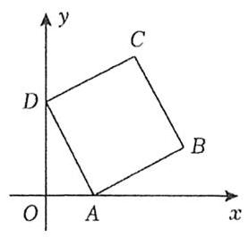

A. 2 B. $1 + \sqrt{2}$ C. 3 D. 4

4. (2022北京10) 在 $\bigtriangleup {ABC}$ 中, ${AC} = 3,{BC} = 4,\angle C = {90}^{ \circ  }.P$ 为 $\bigtriangleup {ABC}$ 所在平面内的动点,且 ${PC} = 1$ ,则 $\overrightarrow{PA} \cdot  \overrightarrow{PB}$ 的取值范围是

A. $\left\lbrack  {-5,3}\right\rbrack$ B. $\left\lbrack  {-3,5}\right\rbrack$ C. $\left\lbrack  {-6,4}\right\rbrack$ D. $\left\lbrack  {-4,6}\right\rbrack$

5. (2020 上海春考 11) 已知 ${A}_{1},{A}_{2},{A}_{3},{A}_{4},{A}_{5}$ 五个点,满足 $\overrightarrow{{A}_{n}{A}_{n + 1}} \cdot  \overrightarrow{{A}_{n + 1}{A}_{n + 2}} = 0,\left| \overrightarrow{{A}_{n}{A}_{n + 1}}\right|  \cdot  \left| \overrightarrow{{A}_{n + 1}{A}_{n + 2}}\right|  = n \; + 1\left( {n = 1,2,3}\right)$ ，则 $\left| \overrightarrow{{A}_{1}{A}_{5}}\right|$ 的最小值为___.

#### 方法三 投影

我们先明确一些名词，虽然平时大家习惯混为一谈吧.

投影向量，简称投影，是个向量，具有方向: $\overrightarrow{{A}_{1}{B}_{1}}$ 为 $\overrightarrow{AB}$ 在 $\overrightarrow{CD}$ 上的投影向量或投影. 投影的数量是实数，可正可负: $\left| \overrightarrow{AB}\right| \cos  < \overrightarrow{AB},\overrightarrow{CD} >$ 是 $\overrightarrow{AB}$ 在 $\overrightarrow{CD}$ 上的投影的数量. 计算投影的数量:乘了再除. 用投影计算数量积:影子 $\times$ 地面

6. 已知 $\overrightarrow{a} = \left( {3,2}\right) ,\overrightarrow{b} = \left( {-2,1}\right)$ ，则 $\overrightarrow{a}$ 在 $\overrightarrow{b}$ 上的投影向量是___， $\overrightarrow{a}$ 在 $\overrightarrow{b}$ 上的投影的数量是___.

7. 已知 $O$ 是 $\bigtriangleup  {ABC}$ 的外心，外接圆半径为 2，且满足 $2\overrightarrow{AO} = \overrightarrow{AB} + \overrightarrow{AC}$ ，若 $\overrightarrow{BA}$ 在 $\overrightarrow{BC}$ 上的投影向量为 $\frac{3}{4}\overrightarrow{BC}$ ，则 $\overrightarrow{AO} \cdot  \overrightarrow{BC} =$ ___.

8. 若 $\overrightarrow{AB} \cdot  \overrightarrow{AC} = {\overrightarrow{AB}}^{2} = 4$ ，且 $\left| \overrightarrow{AP}\right|  = 1$ ，则 $\left| \overrightarrow{AB}\right|  =$ ___， $\overrightarrow{CP} \cdot  \overrightarrow{AB}$ 的最大值为___.

9. (2020新一卷)已知 $P$ 是边长为2的正六边形 ${ABCDEF}$ 内的一点，则 $\overrightarrow{AP} \cdot  \overrightarrow{AB}$ 的取值范围是

A. $\left( {-2,6}\right)$ B. $\left( {-6,2}\right)$ C. $\left( {-2,4}\right)$ D. $\left( {-4,6}\right)$

10. (2012湖南文 15) 如图，在平行四边形 ${ABCD}$ 中， ${AP}\bot {BD}$ ，垂足为 $P$ ，且 ${AP} = 3$ ，则 $\overrightarrow{AP} \cdot  \overrightarrow{AC} =$ ___.

#### 方法四 基底

基底的核心思想就是用已知量去表示未知量. 什么叫已知量?

11. 如图， $\bigtriangleup  {ABC}$ 中， $D$ 为 ${BC}$ 中点， ${AD}\bot {AB}$ ， ${AD} = 1$ ，则 $\overrightarrow{AC} \cdot  \overrightarrow{AD} =$ ___.

12. (2020上海春考9) $\bigtriangleup {ABC}$ 中, $D$ 是 ${BC}$ 中点, ${AB} = 2,{BC} = 3,{AC} = 4$ ,则 $\overrightarrow{AD} \cdot  \overrightarrow{AB} =$ ___.

13. $\bigtriangleup  {ABC}$ 中， $A = \frac{\pi }{4}$ ， $M$ ， $N$ 为 ${BC}$ 上的三等分点， $\bigtriangleup  {ABC}$ 的面积为 $2\sqrt{2}$ ，则 $\overrightarrow{AM} \cdot  \overrightarrow{AN}$ 的最小值为___.

14. (2023 天津 14) 在 $\bigtriangleup {ABC}$ 中, ${BC} = 1,\angle A = {60}^{ \circ  },\overrightarrow{AD} = \frac{1}{2}\overrightarrow{AB},\overrightarrow{CE} = \frac{1}{2}\overrightarrow{CD}$ . 记 $\overrightarrow{AB} = \overrightarrow{a},\overrightarrow{AC} = \overrightarrow{b}$ ,用 $\overrightarrow{a}$ 和 $\overrightarrow{b}$ 表示 $\overrightarrow{AE} =$ ___；若 $\overrightarrow{BF} = \frac{1}{3}\overrightarrow{BC}$ ，则 $\overrightarrow{AE} \cdot  \overrightarrow{AF}$ 的最大值为___.

15. (2019 江苏 12) 如图,在 $\bigtriangleup {ABC}$ 中, $D$ 是 ${BC}$ 的中点, $E$ 在边 ${AB}$ 上, ${BE} = {2EA},{AD}$ 与 ${CE}$ 交于点 $O$ . 若 $\overrightarrow{AB} \cdot  \overrightarrow{AC} = 6\overrightarrow{AO} \cdot  \overrightarrow{EC}$ ,则 $\frac{AC}{AB}$ 的值为 ___.

#### 特殊的基底——极化恒等式

其实就是基底法的特殊情况.

16. 已知 $\left| \overrightarrow{OA}\right|  = \left| \overrightarrow{OB}\right|  = 2$ ,且向量 $\overrightarrow{OA}$ 与 $\overrightarrow{OB}$ 的夹角为 ${120}^{ \circ  }$ ,又 $\left| \overrightarrow{PO}\right|  = 1$ ,则 $\overrightarrow{AP} \cdot  \overrightarrow{BP}$ 的取值范围为___.

17. 在 $\bigtriangleup {ABC}$ 中, $D$ 是 ${BC}$ 的中点, $E, F$ 是 ${AD}$ 上的两个三等分点, $\overrightarrow{BA} \cdot  \overrightarrow{CA} = 4,\overrightarrow{BF} \cdot  \overrightarrow{CF} =  - 1$ ,则 $\overrightarrow{BE} \cdot  \overrightarrow{CE}$ 的值是___.

18. 已知单位向量 $\overrightarrow{PA},\overrightarrow{PB},\overrightarrow{PC}$ 满足 $2\overrightarrow{PA} + 3\overrightarrow{PB} + 3\overrightarrow{PC} = \overrightarrow{0}$ ,则 $\overrightarrow{AB} \cdot  \overrightarrow{AC}$ 的值为

A. $\frac{8}{9}$ B. $\frac{2}{3}$ C. $\frac{5}{9}$ D. 1

19. 在 $\bigtriangleup {ABC}$ 中, ${CA} = {CB} = \sqrt{5},{AB} = 4$ ,点 $M$ 为 $\bigtriangleup {ABC}$ 所在平面内一点且 $\overrightarrow{AM} \cdot  \overrightarrow{BC} = 0$ ,则 $\overrightarrow{AM} \cdot  \overrightarrow{CM}$ 的最小值为

A. 0 B. $- \frac{16}{25}$ C. $- \frac{4}{5}$ D. $- \frac{16}{5}$

★自选方法完成

20. (2021 新二卷)已知向量 $\overrightarrow{a} + \overrightarrow{b} + \overrightarrow{c} = \overrightarrow{0},\left| \overrightarrow{a}\right|  = 1$ ， $\left| \overrightarrow{b}\right|  = \left| \overrightarrow{c}\right|  = 2$ ，则 $\overrightarrow{a} \cdot  \overrightarrow{b} + \overrightarrow{b} \cdot  \overrightarrow{c} + \overrightarrow{c} \cdot  \overrightarrow{a} =$ ___.

21. 如图， $M$ 为 $\bigtriangleup  {ABC}$ 的外接圆的圆心， ${AB} = 4,{AC} = 6, N$ 为边 ${BC}$ 的中点，则 $\overrightarrow{AN} \cdot  \overrightarrow{AM} =$ ___.

22. (2023乙卷理12)已知 $\odot  O$ 的半径为 1，直线 ${PA}$ 与 $\odot  O$ 相切于点 $A$ ，直线 ${PB}$ 与 $\odot  O$ 交于 $B$ ， $C$ 两点， $D$ 为 ${BC}$ 的中点,若 $\left| {PO}\right|  = \sqrt{2}$ ,则 $\overrightarrow{PA} \cdot  \overrightarrow{PD}$ 的最大值为

A. $\frac{1 + \sqrt{2}}{2}$ B. $\frac{1 + 2\sqrt{2}}{2}$ C. $1 + \sqrt{2}$ D. $2 + \sqrt{2}$

23. ( 2010 大纲I理11 )已知圆 $O$ 半径为 $1,{PA},{PB}$ 为圆的两条切线， $A, B$ 为两切点，则 $\overrightarrow{PA} \cdot  \overrightarrow{PB}$ 的最小值为

A. $- 4 + \sqrt{2}$ B. $- 3 + \sqrt{2}$ C. $- 4 + 2\sqrt{2}$ D. $- 3 + 2\sqrt{2}$

### 第四节 其他零散题型

#### 题型一 向量的工具属性

1. (2022浙江17)设点 $P$ 在单位圆的内接正八边形 ${A}_{1}{A}_{2}\cdots {A}_{8}$ 的边 ${A}_{1}{A}_{2}$ 上,则 ${\overrightarrow{P{A}_{1}}}^{2} + {\overrightarrow{P{A}_{2}}}^{2} + \cdots  + {\overrightarrow{P{A}_{8}}}^{2}$ 的取值. 范围是___.

2. (人教A版习题) 如图,在 $\bigtriangleup {ABC}$ 中,已知 ${AB} = 2,{AC} = 5,\angle {BAC} = {60}^{ \circ  },{BC},{AC}$ 边上的两条中线 ${AM}$ , ${BN}$ 相交于点 $P$ ，则 $\angle {MPN}$ 的余弦值为___.

3. (多选) 在梯形 ${ABCD}$ 中, ${AB}//{CD},{AB} = 1,{CD} = 3,\cos \angle {DAC} = \frac{\sqrt{2}}{4},\cos \angle {ACD} = \frac{3}{4}$ ,则

A. ${AD} = \frac{3\sqrt{2}}{2}$ B. $\cos \angle {BAD} =  - \frac{\sqrt{2}}{4}$ C. $\overrightarrow{BA} \cdot  \overrightarrow{AD} =  - \frac{3}{4}$ D. ${AC} \bot  {BD}$

#### 题型二 圆上点的处理

4. 已知 $A, B, C$ 是单位圆上不同的三点, ${AB} = {AC}$ ,则 $\overrightarrow{AB} \cdot  \overrightarrow{AC}$ 的最小值为

A. 0 B. $- \frac{1}{4}$ C. $- \frac{1}{2}$ D. -1

5. 已知 $A, B, C$ 是单位圆上的三个动点,则 $\overrightarrow{AB} \cdot  \overrightarrow{AC}$ 的最小值是

A. 0 B. $- \frac{1}{2}$ C. -1 D. -2

#### 题型三 向量减法与隐圆

6. 已知 $\overrightarrow{a},\overrightarrow{b},\overrightarrow{c}$ 都是平面向量， $\left| \overrightarrow{a}\right|  = 2\left| \overrightarrow{b}\right|  = 2$ ， $\overrightarrow{a} \cdot  \overrightarrow{b} = 0$ ，若 $\left| {\overrightarrow{c} - \overrightarrow{a} - \overrightarrow{b}}\right|  = 1$ ，则 $\left| \overrightarrow{c}\right|$ 的取值范围是___.

7. 已知 $\overrightarrow{a},\overrightarrow{b},\overrightarrow{c}$ 都是平面向量，且 $\left| \overrightarrow{a}\right|  = \left| {4\overrightarrow{a} - \overrightarrow{b}}\right|  = 1$ ，若 $< \overrightarrow{a},\overrightarrow{c} >  = \frac{\pi }{6}$ ，则 $\left| {\overrightarrow{b} - \overrightarrow{c}}\right|$ 的最小值为

A. 1 B. $\sqrt{3}$ C. 2 D. 3

8. 已知向量 $\overrightarrow{a},\overrightarrow{b},\overrightarrow{c}$ 满足 $\left| \overrightarrow{a}\right|  = \sqrt{2},\left| \overrightarrow{b}\right|  = 1, < \overrightarrow{a},\overrightarrow{b} >  = \frac{\pi }{4},\left( {\overrightarrow{c} - \overrightarrow{a}}\right)  \cdot  \left( {\overrightarrow{c} - \overrightarrow{b}}\right)  = 0$ ,则 $\left| \overrightarrow{c}\right|$ 的最大值是

A. $\sqrt{2} - 1$ B. $\frac{\sqrt{5} - 1}{2}$ C. $\frac{\sqrt{5} + 1}{2}$ D. $\sqrt{2} + 1$

#### 题型四 三角形四心

先下结论, 这就根本不是高考考察的重点, 甚至高考就根本不爱考这些, 所以非常非常不建议你在这个地方花费时间，研究什么复杂结论，你见到的多只能说明模考喜欢乱出题，高考真题中涉及四心非常少.

①三条中线的交点为重心: $\overrightarrow{PA} + \overrightarrow{PB} + \overrightarrow{PC} = \overrightarrow{0},\overrightarrow{OP} = \frac{1}{3}\left( {\overrightarrow{OA} + \overrightarrow{OB} + \overrightarrow{OC}}\right)$ .

②三条高线的交点为垂心: $\overrightarrow{PA} \cdot  \overrightarrow{BC} = \overrightarrow{PB} \cdot  \overrightarrow{AC} = \overrightarrow{PC} \cdot  \overrightarrow{AB} = 0,\overrightarrow{PA} \cdot  \overrightarrow{PB} = \overrightarrow{PB} \cdot  \overrightarrow{PC} = \overrightarrow{PC} \cdot  \overrightarrow{PA}$ .

③三条角分线的交点为内心: $\overrightarrow{AP} = \lambda \left( {\frac{\overrightarrow{AB}}{\left| \overrightarrow{AB}\right| } + \frac{\overrightarrow{AC}}{\left| \overrightarrow{AC}\right| }}\right)$ .

④三条中垂线的交点为外心: $\left| \overrightarrow{PA}\right|  = \left| \overrightarrow{PB}\right|  = \left| \overrightarrow{PC}\right|$ ， $\left( {\overrightarrow{PA} + \overrightarrow{PB}}\right)  \cdot  \overrightarrow{AB} = 0$ .

9. 在 $\bigtriangleup  {ABC}$ 中满足 $\left( {\frac{\overrightarrow{AB}}{\left| \overrightarrow{AB}\right| } + \frac{\overrightarrow{AC}}{\left| \overrightarrow{AC}\right| }}\right)  \cdot  \overrightarrow{BC} = 0$ ，且 $\frac{\overrightarrow{BA}}{\left| \overrightarrow{BA}\right| } \cdot  \frac{\overrightarrow{BC}}{\left| \overrightarrow{BC}\right| } = \frac{\sqrt{2}}{2}$ ，则 $\bigtriangleup  {ABC}$ 的形状为___.

10. $O$ 为 $\bigtriangleup {ABC}$ 的外接圆圆心且 ${AB} = 3,{AC} = 2$ ,若 $\overrightarrow{AO} = x\overrightarrow{AB} + y\overrightarrow{AC}$ ,且 $x + {2y} = 1$ ,则 $\cos \angle {BAC} =$

A. $\frac{\sqrt{5}}{5}$ B. $\frac{1}{3}$ C. $\frac{\sqrt{3}}{3}$ D. $\frac{1}{5}$

# 第七章 复数

过去的复数和集合一样, 你大概很难在第二个选择题之后遇见它, 甚至集合都更比复数有可能出一些难题. 但是新的 19 题模式下这事就不一定了, 你会经常在模考多选题中遇见复数, 2024 年九省联考中, 多选题也考了复数，说明复数是有可能不再白给的，那咱就不能只会算加减乘除了，得稍微地多了解一点，具体多多少呢？从考试的角度来说，其实不用太多，因为这东西不至于考得特别难，大部分情况下还是以基础计算题为主，提高自己的计算准确度，简单题务必不要丢分是关键. 在此基础上要深入学习的话，只需要回归教材，挖掘一下教材里生疏的点就足够. 但是从长远来看，我会希望你多了解一点复数，这对你大学的学习会很有帮助, 当然前提是你大学用得到数学.

## 第二十二讲 深入理解复数

### 第一节 复数概念与运算

1. 虚数单位 $\mathrm{i}$ 的定义: ${\mathrm{i}}^{2} =  - 1,\sqrt{-1} = \mathrm{i}$ .

2. $z = a + b\mathrm{i}\left( {a, b \in  \mathbf{R}}\right) , a$ 称为 $z$ 的实部, $b$ 称为 $z$ 的虚部,所有复数组成复数集 $C$ .

若 $z$ 为实数则 $a$ ___ $b$ ___，若 $z$ 为虚数则 $a$ ___ $b$ ___，若 $z$ 为纯虚数则 $a$ ___ $b$ ___.

3. 两个复数相等,当且仅当两个复数 ${z}_{1}$ 和 ${z}_{2}$ 的实部和虚部分别对应相等,记作 ${z}_{1} = {z}_{2}$ . 复数能比大小吗?

4. 复数 $z = a + b\mathrm{i}$ 的模或绝对值: $\left| z\right|  = \sqrt{{a}^{2} + {b}^{2}}$ .

5. 共轭复数:实部相等，虚部互为相反数， $z = a + b\mathrm{i} \Leftrightarrow  \bar{z} = a - b\mathrm{i}$ . 共轭复数的模相等: $\left| z\right|  = \left| \bar{z}\right|$ .

6. 设 ${z}_{1} = a + b\mathrm{i},{z}_{2} = c + \operatorname{di}\left( {a, b, c, d \in  \mathbf{R}}\right)$ .

(1) ${z}_{1} \pm  {z}_{2} = \left( {a \pm  c}\right)  + \left( {b \pm  d}\right) \mathrm{i}.\overline{{z}_{1} + {z}_{2}} = \overline{{z}_{1}} + \overline{{z}_{2}},\overline{{z}_{1} - {z}_{2}} = \overline{{z}_{1}} - \overline{{z}_{2}}$ .

(2) ${z}_{1}{z}_{2} = \left( {a + {bi}}\right) \left( {c + d\mathrm{i}}\right)  = \left( {{ac} - {bd}}\right)  + \left( {{ad} + {bc}}\right) \mathrm{i}$ . $\frac{{z}_{1}}{{z}_{2}} = \frac{{z}_{1}\overline{{z}_{2}}}{{z}_{2}\overline{{z}_{2}}} = \frac{\left( {a + {bi}}\right) \left( {c - {di}}\right) }{\left( {c + {di}}\right) \left( {c - {di}}\right) } = \frac{\left( {a + {bi}}\right) \left( {c - {di}}\right) }{{c}^{2} + {d}^{2}}$ .

(3) ${\mathrm{i}}^{1} = \mathrm{i},{\mathrm{i}}^{2} =  - 1,{\mathrm{i}}^{3} =  - \mathrm{i},{\mathrm{i}}^{4} = 1, z\bar{z} = {\left| z\right| }^{2} = {\left| \bar{z}\right| }^{2}$ .

(4) $\left| {{z}_{1}{z}_{2}}\right|  = \left| {z}_{1}\right| \left| {z}_{2}\right| ,\left| \frac{{z}_{1}}{{z}_{2}}\right|  = \frac{\left| {z}_{1}\right| }{\left| {z}_{2}\right| }$ . 但是你别乱编公式，比如 ${z}^{2} = {\left| z\right| }^{2}$ 吗???

### 第二节 复数的几何意义

复数 $z = a + b\mathrm{i} \Leftrightarrow$ 复平面上的点 $Z\left( {a, b}\right)  \Leftrightarrow$ 向量 $\overrightarrow{OZ} = \left( {a, b}\right)$ ，三者一一对应.

1. 教材习题: 设复数 $z$ 在复平面对应的点为 $Z$ ,当 $z$ 满足下列条件时,点 $Z$ 组成的集合是什么图形?

(1) $\left| z\right|  = 2$ ; (2) $1 < \left| z\right|  < 3$

2. 教材习题:设复数 $z$ 在复平面对应的点为 $Z$ ，当 $z$ 满足下列条件时，点 $Z$ 组成的集合是什么图形？

(1) $\left| {z - \left( {1 + \mathrm{i}}\right) }\right|  = 2$ ; (2) $\left| {z + 1}\right|  + \left| {z - 1}\right|  = 2$ .

3. 教材习题: 已知复数 $z$ 满足 $\left| {z - \left( {2 + \mathrm{i}}\right) }\right|  = 3$ ,求 $\left| z\right|$ 的最大值与最小值.

4. 复数 $z$ 满足 $\left| {z - 1}\right|  + \left| {z + 1}\right|  = 4$ ，则 $\left| z\right|$ 的取值范围是___.

5. (教材习题) 已知 ${z}_{1} = 2,{z}_{2} = 2\mathrm{i},\left| z\right|  = 2\sqrt{2}$ 且 $\left| {z - {z}_{1}}\right|  = \left| {z - {z}_{2}}\right|$ ,则 $z =$ ___.

6. (多选) 已知复数 $z, w$ 均不为 0,则

A. ${z}^{2} = {\left| z\right| }^{2}$ B. $\frac{z}{\bar{z}} = \frac{{z}^{2}}{{\left| z\right| }^{2}}$ C. $\overline{z - w} = \bar{z} - \bar{w}$ D. $\left| \frac{z}{w}\right|  = \frac{\left| z\right| }{\left| w\right| }$

7. (多选) 已知复数 $z$ ,下列说法正确的是

A. 若 $z - \bar{z} = 0$ ,则 $z$ 为实数 B. 若 ${z}^{2} + {\bar{z}}^{2} = 0$ ,则 $z = \bar{z} = 0$

C. 若 $\left| {z - \mathrm{i}}\right|  = 1$ ,则 $\left| z\right|$ 的最大值为 2 D. 若 $\left| {z - 1}\right|  = \left| z\right|  + 1$ ,则 $z$ 为实数

8. (多选) 已知复数 $z,{z}_{1},{z}_{2}$ ,下列结论正确的有

A. 若复数 $z$ 满足 $\frac{1}{z} \in  \mathbf{R}$ ,则 $z \in  \mathbf{R}$

B. 若 ${z}_{1} \neq  {z}_{2}, z$ 满足 $z{z}_{1} = z{z}_{2}$ ,则 $z = 0$

C. 若 $\left| {{z}_{1} + {z}_{2}}\right|  = \left| {{z}_{1} - {z}_{2}}\right|$ ,则 ${z}_{1}{z}_{2} = 0$

D. 若复数 $z$ 满足 $\left| {z + 2}\right|  + \left| {z - 2}\right|  = 8$ ，则 $z$ 在复平面内所对应点的轨迹是椭圆

### 第三节 实系数一元二次方程在复数范围内的解

1. ${x}^{2} =  - 1 \Rightarrow  {x}_{1} = \mathrm{i},{x}_{2} =  - \mathrm{i};{x}^{2} =  - a\left( {a > 0}\right)  \Rightarrow  {x}_{1} = \sqrt{a}\mathrm{i},{x}_{2} =  - \sqrt{a}\mathrm{i}$

2. 当 $a, b, c$ 都是实数且 $a \neq  0$ 时,关于 $x$ 的方程 $a{x}^{2} + {bx} + c = 0$ 称为实系数一元二次方程.

这个方程在复数范围内总是有解的:

(1) 当 $\Delta  = {b}^{2} - {4ac} > 0$ 时,方程有两个不相等的实数根;

(2) 当 $\Delta  = {b}^{2} - {4ac} = 0$ 时,方程有两个相等的实数根;

(3) 当 $\Delta  = {b}^{2} - {4ac} < 0$ 时,方程有两个互为共轭的虚数根;

韦达定理依然满足: ${x}_{1} + {x}_{2} =  - \frac{b}{a},{x}_{1}{x}_{2} = \frac{c}{a}$ .

1. 解方程 ${x}^{2} + x + 1 = 0$ .

2. (教材习题) 已知 $2\mathrm{i} - 3$ 是关于 $x$ 的方程 $2{x}^{2} + {px} + q = 0$ 的一个根,求实数 $p, q$ 的值.

3. (教材习题) 下列关于方程 $4{x}^{2} + {mx} + 1 = 0\left( {m \in  \mathbf{R}}\right)$ 的结论中,正确的有

A. 方程的两根互为共轭复数 B. 如果方程的两根互为共轭复数,则 $m = 0$

C. 若 $x$ 为方程的一个虚根,则 $\bar{x}$ 也为方程的根 D. 若 $m < 0$ ,则方程的两根一定都为正数

4. 已知关于 $x$ 的方程 ${x}^{2} + {tx} + 1 = 0\left( {-2 < t < 2}\right)$ 的两根为 ${z}_{1}$ 和 ${z}_{2}$ ,则

A. ${z}_{1} = \overline{{z}_{2}}$ B. ${z}_{1}{z}_{2} = 1$ C. $\left| {z}_{1}\right|  = \left| {z}_{2}\right|$ D. $\frac{{z}_{1}}{{z}_{2}} = \overline{\left( \frac{{z}_{1}}{{z}_{2}}\right) }$

### 第四节 复数的三角形式(选学部分)

非常建议听一下，其实并不难，这一部分才是复数真正的奥妙所在.

这部分内容在课标中标了星号, 属于选学内容, 高考不太可能会考, 但事实上了解复数的三角形式, 才能真正感受到复数的应用价值. 它沟通了复数与平面向量、三角函数等数学分支之间的联系，为今后在大学期间进一步学习复数的指数形式、复变函数、解析数论等内容奠定基础，起着承前启后的作用.

1. $z = a + b\mathrm{i} = \left( {r\cos \theta }\right)  + \left( {r\sin \theta }\right) \mathrm{i} = r\left( {\cos \theta  + \mathrm{i}\sin \theta }\right)$ .

其中 $r = \left| z\right|  = \sqrt{{a}^{2} + {b}^{2}},\theta$ 称为辐角, $\cos \theta  = \frac{a}{r},\sin \theta  = \frac{b}{r}$ .

显然一个非零复数 $z$ 的辐角有无穷多个,规定 $\lbrack 0,{2\pi })$ 内的辐角称为 $z$ 的辐角主值.

例:把下列复数的代数形式改写为三角形式.

(1) $z = 1 + \sqrt{3}\mathrm{i}$ (2) $z =  - 1 + \mathrm{i}$ ; (3) $z = 2\mathrm{i}$ ; (4) $z =  - \frac{1}{2} - \frac{\sqrt{3}}{2}\mathrm{i}$

2. 复数三角形式的乘法.

设 ${z}_{1} = {r}_{1}\left( {\cos {\theta }_{1} + \mathrm{i}\sin {\theta }_{1}}\right) ,{z}_{2} = {r}_{2}\left( {\cos {\theta }_{2} + \mathrm{i}\sin {\theta }_{2}}\right)$ .

${z}_{1}{z}_{2} = {r}_{1}\left( {\cos {\theta }_{1} + \mathrm{i}\sin {\theta }_{1}}\right)  \times  {r}_{2}\left( {\cos {\theta }_{2} + \mathrm{i}\sin {\theta }_{2}}\right)  = {r}_{1}{r}_{2}\left\lbrack  {\left( {\cos {\theta }_{1}\cos {\theta }_{2} - \sin {\theta }_{1}\sin {\theta }_{2}}\right)  + \mathrm{i}\left( {\sin {\theta }_{1}\cos {\theta }_{2} + \cos {\theta }_{1}\sin {\theta }_{2}}\right) }\right\rbrack$

$= {r}_{1}{r}_{2}\left\lbrack  {\cos \left( {{\theta }_{1} + {\theta }_{2}}\right)  + \mathrm{i}\sin \left( {{\theta }_{1} + {\theta }_{2}}\right) }\right\rbrack  .$

结论: ${r}_{1}\left( {\cos {\theta }_{1} + \mathrm{i}\sin {\theta }_{1}}\right)  \times  {r}_{2}\left( {\cos {\theta }_{2} + \mathrm{i}\sin {\theta }_{2}}\right)  = {r}_{1}{r}_{2}\left\lbrack  {\cos \left( {{\theta }_{1} + {\theta }_{2}}\right)  + \mathrm{i}\sin \left( {{\theta }_{1} + {\theta }_{2}}\right) }\right\rbrack$ ,即模长相乘,辐角相加.

3. 复数三角形式的除法.

设 $z = a + b\mathrm{i} = r\left( {\cos \theta  + \mathrm{i}\sin \theta }\right)$ ,则 $\bar{z} = a - b\mathrm{i} = r\left\lbrack  {\cos \left( {-\theta }\right)  + \mathrm{i}\sin \left( {-\theta }\right) }\right\rbrack$ .

因为 $z\bar{z} = r\left( {\cos \theta  + \mathrm{i}\sin \theta }\right)  \times  r\left\lbrack  {\cos \left( {-\theta }\right)  + \mathrm{i}\sin \left( {-\theta }\right) }\right\rbrack   = {r}^{2}\left\lbrack  {\cos \left( {\theta  - \theta }\right)  + \mathrm{i}\sin \left( {\theta  - \theta }\right) }\right\rbrack   = {r}^{2}$ .

所以 $\frac{1}{z} = \frac{\bar{z}}{{r}^{2}}$ ,即 $\frac{1}{z} = \frac{1}{r\left( {\cos \theta  + \mathrm{i}\sin \theta }\right) } = \frac{\bar{z}}{{r}^{2}} = \frac{r\left\lbrack  {\cos \left( {-\theta }\right)  + \mathrm{i}\sin \left( {-\theta }\right) }\right\rbrack  }{{r}^{2}} = \frac{1}{r}\left\lbrack  {\cos \left( {-\theta }\right)  + \mathrm{i}\sin \left( {-\theta }\right) }\right\rbrack$ .

设 ${z}_{1} = {r}_{1}\left( {\cos {\theta }_{1} + \mathrm{i}\sin {\theta }_{1}}\right) ,{z}_{2} = {r}_{2}\left( {\cos {\theta }_{2} + \mathrm{i}\sin {\theta }_{2}}\right)$ .

$\frac{{z}_{1}}{{z}_{2}} = {z}_{1} \times  \frac{1}{{z}_{2}} = {r}_{1}\left( {\cos {\theta }_{1} + \mathrm{i}\sin {\theta }_{1}}\right)  \times  \frac{1}{{r}_{2}}\left\lbrack  {\cos \left( {-{\theta }_{2}}\right)  + \mathrm{i}\sin \left( {-{\theta }_{2}}\right) }\right\rbrack   = \frac{{r}_{1}}{{r}_{2}}\left\lbrack  {\cos \left( {{\theta }_{1} - {\theta }_{2}}\right)  + \mathrm{i}\sin \left( {{\theta }_{1} - {\theta }_{2}}\right) }\right\rbrack  .$

结论: $\frac{{r}_{1}\left( {\cos {\theta }_{1} + \mathrm{i}\sin {\theta }_{1}}\right) }{{r}_{2}\left( {\cos {\theta }_{2} + \mathrm{i}\sin {\theta }_{2}}\right) } = \frac{{r}_{1}}{{r}_{2}}\left\lbrack  {\cos \left( {{\theta }_{1} - {\theta }_{2}}\right)  + \mathrm{i}\sin \left( {{\theta }_{1} - {\theta }_{2}}\right) }\right\rbrack$ ,即模长相除,辐角相减.

#### 4. 复数乘除法的本质理解

因为 $\mathrm{i} = \cos \frac{\pi }{2} + \mathrm{i}\sin \frac{\pi }{2}$ ,所以一个复数与 $\mathrm{i}$ 相乘,从向量角度来说,相当于模长不变,方向逆时针旋转 $\frac{\pi }{2}$ ; 一个复数与 $\mathrm{i}$ 相除,从向量角度来说,相当于模长不变,方向顺时针旋转 $\frac{\pi }{2}$ .

所以复数的乘除法其实就是平面向量的伸缩与旋转. 你能从几何角度解释一下 ${\mathrm{i}}^{2} =  - 1$ 和 ${\left( -1\right) }^{2} = 1$ 吗?

1. 已知 ${z}_{1} = \cos {15}^{ \circ  } - \operatorname{isin}{15}^{ \circ  },{z}_{2} = \sin {15}^{ \circ  } + \operatorname{icos}{15}^{ \circ  }$ ,求 ${z}_{1}{z}_{2}$ .

2. (教材习题) 求 $\frac{{\left( 1 + \mathrm{i}\right) }^{3}\left( {\sqrt{3} - \mathrm{i}}\right) }{1 + \sqrt{3}\mathrm{i}}$ 的值.

3. (教材习题) 已知复数 $z$ 满足 $z + \frac{4}{z}$ 为实数，且 $\left| {z - 2}\right|  = 2$ ，求 $z$ 的值.

4. (教材习题) 设 $- 1 + \mathrm{i}$ 对应的向量为 $\overrightarrow{OZ}$ ，把 $\overrightarrow{OZ}$ 绕原点逆时针方向旋转 ${75}^{ \circ  }$ ，得到向量 $\overrightarrow{O{Z}^{\prime }}$ ，求 $\overrightarrow{O{Z}^{\prime }}$ 对应的复数.

5. (教材习题) 已知复数 ${z}_{1},{z}_{2},{z}_{1} + {z}_{2}$ 在复平面上对应的点分别为 $A, B, C$ ,且 $O$ 为复平面的坐标原点,若 ${z}_{1} \; - {z}_{2} = 2\mathrm{i}\left( {{z}_{1} + {z}_{2}}\right)$ ,试判断四边形 ${OACB}$ 的形状.

6. (教材习题) 根据复数三角形式的乘法规则,不难得到 ${\left\lbrack  r\left( \cos \theta  + \mathrm{i}\sin \theta \right) \right\rbrack  }^{n} = {r}^{n}\left\lbrack  {\cos \left( {n\theta }\right)  + \mathrm{i}\sin \left( {n\theta }\right) }\right\rbrack$ ,由此你能求出 ${x}^{3} = 1$ 在复数范围内的所有解吗? 能从几何上解释吗? ${x}^{5} = 1$ 呢? ${x}^{n} = 1$ 呢?

7. 已知非零复数 ${z}_{1},{z}_{2}$ 满足 $\left| {{z}_{1} + {z}_{2}}\right|  = \left| {{z}_{1} - {z}_{2}}\right|$ ,则 ${z}_{1} \cdot  {z}_{2}$ 的值不可能等于

A. i B. 1 C. 0 D. $- 4 + {3i}$

# 第八章 数列

多年讲课最大的感受:数列对于高中生而言还是太难了，对小学生就刚刚好.

数列算是不等式之外的第二个重灾区，在过去，部分自主命题省份的题目确实是需要一些特殊技巧的 (比如浙江)，但是你翻翻全国卷呢？全国卷在数列这方面，真就没太难为过学生，都是着眼于基础计算与一些典型方法，根本就没什么超纲逆天的东西. 如今打开各种教辅资料，经常看到各种花式技巧，模拟题中猎奇通项恶心人的事也比比皆是，许多同学因此被 PUA 得很彻底，张口闭口不动点、特征根、超级裂项+放缩，有没有可能你学这些玩意其实高考都用不上呢? 能不能先把错位相减算准确呢?

再说回开头这句话，为什么很多高中生觉得数列难? 实际上，数列，就是列数，就是小学的找规律填数， 很多同学正是被上面所提到的那些复杂技巧所禁锢，总想着用一些特殊方法去解决问题，殊不知很多复杂题目其实你只要列出几个数来, 就能看出规律了. 说实话很多同学现在已经丧失了最基本的找规律能力, 就连数项数这件事，很多人都数不明白，这就是把自己学“死”了.

在数列这一章, 你一定要充分感受归纳总结这个数学思想, 也就是根据已有信息去总结规律, 然后推广到更一般的情况. 19 题模式下的新定义题目, 其实就是考察归纳总结的能力, 这个能力不是靠死刷题刷出来的，而是要靠灵活思考才能感悟到. 为什么说 2024 新一卷 19 题数列新定义出的非常好，就是因为三问层层递进, 前面通过具体实例, 暗示你总结规律, 第三问让你尝试去证明, 没有前两问的引导, 几乎没办法做第三问的. 如果你没有寻找规律再归纳总结的意识, 那基本与数列新定义拜拜了.

具体一点, 先来讲一个很基本的技巧: 特值, 很多简单的小题都可以快速解决, 这个思想是很重要的, 很多同学不知道啥时候能用特值, 事实上平面向量那里就已经讲过很多了, 简单来说, 只要你举出来的特例能完全符合题目标准, 那结果就肯定是对的. 比如数列里面很多时候都可以考虑: 常数列能行吗?

1. 设等差数列 $\left\{  {a}_{n}\right\}$ 的前 $n$ 项和为 ${S}_{n}$ ,若 ${a}_{1} + {a}_{3} + {a}_{5} = 3$ ,则 ${S}_{5}$ 的值为

A. 5 B. 7 C. 9 D. 11

2. 在各项均为正数的等比数列 $\left\{  {a}_{n}\right\}$ 中,若 ${a}_{5}{a}_{6} = 3$ ,则 ${\log }_{3}{a}_{1} + {\log }_{3}{a}_{2} + \cdots  + {\log }_{3}{a}_{10} =$

A. $1 + {\log }_{3}5$ B. 6 C. 4 D. 5

3. 已知数列 $\left\{  {a}_{n}\right\}$ 满足 $\frac{1}{{a}_{n + 1}} = \frac{1}{3{a}_{n}} + \frac{2}{3}$ ,且 ${a}_{2} = \frac{3}{4}$ ,则 ${a}_{1011} =$

A. ${\left( \frac{1}{3}\right) }^{1011}$ B. $\frac{{3}^{1011}}{1 + {3}^{1011}}$ C. $\frac{{3}^{1010}}{1 + {3}^{1010}}$ D. ${\left( \frac{1}{3}\right) }^{1010}$

4. 在等比数列 $\left\{  {a}_{n}\right\}$ 中,已知对 $n \in  {\mathbf{N}}^{ * }$ 有 ${a}_{1} + {a}_{2} + \cdots  + {a}_{n} = {2}^{n} - 1$ ,那么 ${a}_{1}^{2} + {a}_{2}^{2} + \cdots  + {a}_{n}^{2}$ 等于

A. ${4}^{n} - 1$ B. $\frac{1}{3}\left( {{4}^{n} - 1}\right)$ C. $\frac{1}{3}{\left( {2}^{n} - 1\right) }^{2}$ D. ${\left( {2}^{n} - 1\right) }^{2}$

## 第二十三讲 等差数列与等比数列基础

### 第一节 等差数列

1. 等差数列定义: ${a}_{n + 1} - {a}_{n} = d$ ,证明等差数列就是证相邻两项之差为常数.

#### 2. 等差数列通项公式

${a}_{n} =$ ___ = ___ , 是关于 $n$ 的___ 函数.

3. 等差数列求项数: $n =$ ___. 求公差: $d =$ ___.

4. 等差数列前 $n$ 项和

${S}_{n} =$ ___ =___，是关于 $n$ 的___ 函数.

5. 等差数列常用性质

(1)下标之和:若 $m + n = p + q$ ，则___，必须等号两侧项数相同！

( 2 )等差中项:若 $m + n = {2p}$ ，则，___称为___，和___的等差中项；

(3)若等差数列的前 $n$ 项和为 ${S}_{n}$ ，则 ${S}_{n}$ ， ${S}_{2n} - {S}_{n}$ ， ${S}_{3n} - {S}_{2n}\cdots$ 也是等差数列，公差为___；

(4) 等差数列 ${S}_{{2n} - 1} =$ ___.

6. 等差数列实在不会做就全换成 ${a}_{1}$ 和 $d$ ，你也可以把这叫做“基底法”. 连续三项的设法:

#### 题型一 基本量计算

1. (2024新二卷 12) 记 ${S}_{n}$ 为等差数列 $\left\{  {a}_{n}\right\}$ 的前 $n$ 项和，若 ${a}_{3} + {a}_{4} = 7,3{a}_{2} + {a}_{5} = 5$ ，则 ${S}_{10} =$ ___.

2. (2025全国二7)记 ${S}_{n}$ 为等差数列 $\left\{  {a}_{n}\right\}$ 的前 $n$ 项和，若 ${S}_{3} = 6,{S}_{5} =  - 5$ ，则 ${S}_{6} =$

A. -20 B. -15 C. -10 D. -5

3. 在等差数列 $\left\{  {a}_{n}\right\}$ 中,若 ${a}_{4} + {a}_{6} + {a}_{8} + {a}_{10} + {a}_{12} = {240}$ ,则 ${a}_{9} - \frac{1}{3}{a}_{11} =$ ___.

4. 设等差数列 $\left\{  {a}_{n}\right\}$ 的前 $n$ 项和为 ${S}_{n}$ ,若 ${S}_{2},{S}_{3},{S}_{5}$ 成等差数列,且 ${a}_{1} = {10}$ ,则 $\left\{  {a}_{n}\right\}$ 的公差 $d =$ ___.

5. (2015北京理6)设 $\left\{  {a}_{n}\right\}$ 是等差数列,则下列结论中正确的是

A. 若 ${a}_{1} + {a}_{2} > 0$ ,则 ${a}_{2} + {a}_{3} > 0$ B. 若 ${a}_{1} + {a}_{3} < 0$ ,则 ${a}_{1} + {a}_{2} < 0$

C. 若 $0 < {a}_{1} < {a}_{2}$ ,则 ${a}_{2} > \sqrt{{a}_{1}{a}_{3}}$ D. 若 ${a}_{1} < 0$ ,则 $\left( {{a}_{2} - {a}_{1}}\right) \left( {{a}_{2} - {a}_{3}}\right)  > 0$

#### 题型二 ${S}_{n}$ 相关处理思路

6. (2023新一卷)7记 ${S}_{n}$ 为数列 $\left\{  {a}_{n}\right\}$ 的前 $n$ 项和，设甲: $\left\{  {a}_{n}\right\}$ 为等差数列；乙: $\left\{  \frac{{S}_{n}}{n}\right\}$ 为等差数列，则

A. 甲是乙的充分条件但不是必要条件 B. 甲是乙的必要条件但不是充分条件

C. 甲是乙的充要条件 D. 甲既不是乙的充分条件也不是乙的必要条件

7. 等差数列 $\left\{  {a}_{n}\right\}$ 满足 ${a}_{1} = 1,{a}_{n} > 0$ ，其前 $n$ 项和为 ${S}_{n}$ ，若数列 $\left\{  \sqrt{{S}_{n}}\right\}$ 也为等差数列，则 ${a}_{n} =$ ___.

8. 等差数列 $\left\{  {a}_{n}\right\}$ 和 $\left\{  {b}_{n}\right\}$ 的前 $n$ 项和分别是 ${S}_{n}$ ， ${T}_{n}$ ，已知 $\frac{{S}_{n}}{{T}_{n}} = \frac{7n}{n + 3}$ ，则 $\frac{{a}_{5}}{{b}_{5}} =$ ___. 如果是 $\frac{{a}_{5}}{{b}_{6}}$ 呢？

9. 已知等差数列 $\left\{  {a}_{n}\right\}$ 的前 $n$ 项和为 ${S}_{n}$ ，若 ${S}_{9} = {S}_{4} + {20}$ ，则 ${S}_{13}$ 的值为___.

10. 设 ${S}_{n}$ 是等差数列 $\left\{  {a}_{n}\right\}$ 的前 $n$ 项和,且 ${S}_{6} > {S}_{7} > {S}_{5}$ ,则下列结论正确的是

A. ${S}_{11} > 0$ B. ${S}_{12} < 0$ C. ${S}_{13} > 0$ D. ${S}_{8} > {S}_{6}$

11. 设等差数列 $\left\{  {a}_{n}\right\}$ 的前 $n$ 项和为 ${S}_{n}$ ,若 $\frac{{S}_{3}}{{S}_{6}} = \frac{1}{3}$ ,则 $\frac{{S}_{6}}{{S}_{12}}$ 的值为___.

12. 北京天坛的圆丘坛为古代祭天的场所, 分上、中、下三层. 上层地面的中心有一块圆形石板 (称为天心石), 环绕天心石砌 9 块扇面形石板构成第一环，向外每环依次增加 9 块. 下一层的第一环比上一层的最后环多 9 块, 向外每环依次也增加 9 块. 已知每层环数相同, 且上、中、下三层共有扇面形石板 (不含天心石) 3402块,则中层共有扇面形石板

A. 1125 块 B. 1134块 C. 1143 块 D. 112 块

### 第二节 等比数列基本性质

1. 等比数列定义: $\frac{{a}_{n + 1}}{{a}_{n}} = q\left( {q \neq  0}\right)$ ,证明等比数列就是证相邻两项之商是常数.

2. 等比数列通项公式: ${a}_{n} =$ ___ $=$ ___. 通项公式形如 ${a}_{n} =$ ___.

3. 等比数列前 $n$ 项和: ${S}_{n} = \{$

前 $n$ 项和形如 ${S}_{n} =$ ___的数列一定是等比数列，必须满足___.

例:等比数列 $\left\{  {a}_{n}\right\}$ 的前 $n$ 项和为 ${S}_{n} = {3}^{{2n} - 1} + r$ ，则 $r$ 的值为___.

4. 等比数列性质

(1) 下标之和:若 $m + n = p + q$ ，则___；

(2)等比中项:若 $m + n = {2p}$ ，则___，___，___称为___和___的等比中项；

(3) 等比数列中, ${S}_{n},{S}_{2n} - {S}_{n},{S}_{3n} - {S}_{2n},\cdots$ 也成等比数列，公比为___；

(4)等比数列中，隔项符号一定相同.

5. 等比数列 Tips

(1)等比数列不会有 0 ! 等比数列不会有 0 ! 等比数列不会有 0 !

(2)项数少的时候 ${S}_{n}$ 没必要用公式，直接加就好了；

(3) $q < 0$ 是事故多发地区！

(4) 连续三项的常见设法:

(5)等比数列题目非常重要的一个小技巧:公比连蒙带猜.

(6) 等比数列不要无脑带基本量, 因为乘方的复杂度远超加减, 很可能会得到一个无法计算的高次方程.

#### 题型一 基本量计算

1. 等比数列 $\left\{  {a}_{n}\right\}$ 中各项均为正数, ${S}_{n}$ 是其前 $n$ 项和,且满足 $2{S}_{3} = 8{a}_{1} + 3{a}_{2},{a}_{4} = {16}$ ,则 ${S}_{4} =$ ___.

2. (2015浙江理3)已知 $\left\{  {a}_{n}\right\}$ 是公差 $d$ 不为零的等差数列，其前 $n$ 项和为 ${S}_{n}$ ，若 ${a}_{3},{a}_{4},{a}_{8}$ 成等比数列，则

A. ${a}_{1}d > 0, d{S}_{4} > 0$ B. ${a}_{1}d < 0, d{S}_{4} < 0$ C. ${a}_{1}d > 0, d{S}_{4} < 0$ D. ${a}_{1}d < 0, d{S}_{4} > 0$

3. (2023北京14)我国度量衡的发展有着悠久的历史, 战国时期就出现了类似于砝码的用来测量物体质量的 “环权”. 已知 9 枚环权的质量 (单位:铢) 从小到大构成项数为 9 的数列 $\left\{  {a}_{n}\right\}$ ,该数列的前 3 项成等差数列,后 7 项成等比数列,且 ${a}_{1} = 1,{a}_{5} = {12},{a}_{9} = {192}$ ,则 ${a}_{7} =$ ___,数列 $\left\{  {a}_{n}\right\}$ 的所有项的和为___.

4. (2023 乙卷理 15) 已知 $\left\{  {a}_{n}\right\}$ 为等比数列, ${a}_{2}{a}_{4}{a}_{5} = {a}_{3}{a}_{6},{a}_{9}{a}_{10} =  - 8$ ,则 ${a}_{7} =$ ___.

5. 等比数列 $\left\{  {a}_{n}\right\}$ 中, ${a}_{1} + {a}_{2} = 2,{a}_{4} + {a}_{5} = 4$ ,则 ${a}_{10} + {a}_{11} =$ ___.

6. (2020 全国Ⅱ文6)记 ${S}_{n}$ 为等比数列 $\left\{  {a}_{n}\right\}$ 的前 $n$ 项和. 若 ${a}_{5} - {a}_{3} = {12},{a}_{6} - {a}_{4} = {24}$ ,则 $\frac{{S}_{n}}{{a}_{n}} =$

A. ${2}^{n} - 1$ B. $2 - {2}^{1 - n}$ C. $2 - {2}^{n - 1}$ D. ${2}^{1 - n} - 1$

7. 已知等差数列 $\left\{  {a}_{n}\right\}$ 的公差 $d = 1$ ,且 ${a}_{3},{a}_{5} + 1,2{a}_{6}$ 成等比数列,则数列 $\left\{  {{\left( -1\right) }^{n + 1}{a}_{n}}\right\}$ 的前 2025 项和为

A. -1013 B. -505 C. 505 D. 1013

8. 设等比数列 $\left\{  {a}_{n}\right\}$ 的各项都为正数,且 ${a}_{1} + {a}_{2} + \cdots  + {a}_{6} = 1,\frac{1}{{a}_{1}} + \frac{1}{{a}_{2}} + \cdots  + \frac{1}{{a}_{6}} = {10}$ ,则 ${a}_{1} \cdot  {a}_{2} \cdot  \cdots  \cdot  {a}_{6} =$ ___.

9. 四个实数 $- 1,2, x, y$ 按照一定顺序可以构成等比数列,则 ${xy}$ 的可能取值有___种.

10. 已知 ${a}_{1},{a}_{2},{a}_{3},{a}_{4},{a}_{5}$ 成等比数列,且 1 和 4 为其中的两项,则 ${a}_{5}$ 的最小值为___.

#### 题型二 ${S}_{n}$ 相关处理思路

11. (2025全国一 13)若一个正项等比数列的前 4 项和为 4 , 前 8 项和为 68 , 则该等比数列的公比为 ___.

12. (2023 甲卷理 5)设等比数列 $\left\{  {a}_{n}\right\}$ 的各项均为正数，前 $n$ 项和 ${S}_{n}$ ，若 ${a}_{1} = 1,{S}_{5} = 5{S}_{3} - 4$ ，则 ${S}_{4} =$

A. $\frac{15}{8}$ B. $\frac{65}{8}$ C. 15 D. 40

13. 已知等比数列 $\left\{  {a}_{n}\right\}$ 的前 $n$ 项和为 ${S}_{n}$ ,下表给出了 ${S}_{n}$ 的部分数据:

<table><tr><td>$n$</td><td>1</td><td>2</td><td>3</td><td>4</td><td>5</td><td>6</td></tr><tr><td>${S}_{n}$</td><td>-1</td><td></td><td></td><td>20</td><td>-61</td><td></td></tr></table>

那么数列 $\left\{  {a}_{n}\right\}$ 的第四项 ${a}_{4}$ 等于

A. 81 B. 27 C. -81 或 81 D. -27 或 27

14. (2022乙卷理8) 已知等比数列 $\left\{  {a}_{n}\right\}$ 的前 3 项和为 ${168},{a}_{2} - {a}_{5} = {42}$ ,则 ${a}_{6} =$

A. 14 B. 12 C. 6 D. 3

15. 在等比数列 $\left\{  {a}_{n}\right\}$ 中,若 ${a}_{1} = 1,{a}_{n} = {81},{S}_{n} = {121}$ ,则 $n =$ ___.

16. (2023 甲卷文 13)记 ${S}_{n}$ 为等比数列 $\left\{  {a}_{n}\right\}$ 的前 $n$ 项和. 若 $8{S}_{6} = 7{S}_{3}$ ，则 $\left\{  {a}_{n}\right\}$ 的公比为___.

17. 已知等比数列 $\left\{  {a}_{n}\right\}$ 的前 $n$ 项和为 ${S}_{n}$ ， ${S}_{4} = {20}$ ， ${S}_{6} = {30}$ ，则 ${S}_{2} =$ ___.

18. (2023新二卷 8)记 ${S}_{n}$ 为等比数列 $\left\{  {a}_{n}\right\}$ 的前 $n$ 项和，若 ${S}_{4} =  - 5,{S}_{6} = {21}{S}_{2}$ ，则 ${S}_{8} =$

A. 120 B. 85 C. -85 D. -120

19. 今有苹果 $m$ 个 $\left( {m \in  {\mathbf{N}}^{ * }}\right)$ ,分给 10 个同学,每个同学都分到苹果,恰好全部分完. 第一个人分得全部苹果的一半还多一个, 第二个人分得第一个人余下苹果的一半还多一个, 以此类推, 后一个人分得前一个人余下的苹果的一半还多一个,则苹果个数 $m$ 为___.

20. (2022新二卷17)已知 $\left\{  {a}_{n}\right\}$ 是等差数列， $\left\{  {b}_{n}\right\}$ 是公比为 2 的等比数列，且 ${a}_{2} - {b}_{2} = {a}_{3} - {b}_{3} = {b}_{4} - {a}_{4}$ .

(1) 证明: ${a}_{1} = {b}_{1}$ ;

(2)求集合 $\left\{  {k \mid  {b}_{k} = {a}_{m} + {a}_{1},1 \leq  m \leq  {500}}\right\}$ 中元素的个数.

21. 已知等差数列 $\left\{  {a}_{n}\right\}$ 的前 $n$ 项和为 ${S}_{n},{a}_{4} = {a}_{1} + 2{a}_{2},{S}_{5} = 3{S}_{3} - 2$ .

(1) 求 ${a}_{n}$ 及 ${S}_{n}$ ；

(2)判断是否存在正整数 $m$ ， $k$ 使得 ${a}_{m}$ ， $4{S}_{k}$ ， ${S}_{k + 1}$ 成等比数列，若存在，求出所有 $m$ ， $k$ 的值；若不存在，请说明理由.

## 第二十四讲 数列通项与 ${S}_{n}$

再强调一遍, 过于花里胡哨的题目和方法, 对于你高考来说没什么意义, 即使你想学, 也请先把基础掌握好.

### 第一节 求数列通项

#### 题型一 ${a}_{n}$ 与 ${S}_{n}$ 互相转化

核心就是统一变量,利用公式 ${a}_{n} = \left\{  \begin{array}{ll} {S}_{1}, & n = 1 \\  {S}_{n} - {S}_{n - 1}, & n \geq  2 \end{array}\right.$ ,消去 ${S}_{n}$ 或 ${a}_{n}$ ,务必要注意角标取值!

1. 数列 $\left\{  {a}_{n}\right\}$ 中， ${a}_{1} = 1$ ，根据下列条件求数列 $\left\{  {a}_{n}\right\}$ 的通项公式，并思考到底啥时候要检验 $n = 1$ ？

(1) ${S}_{n} = 2{a}_{n} - 1$ ; (2) ${S}_{n} = 2{a}_{n + 1} - 1$ .

2. (2022甲卷理17)记 ${S}_{n}$ 为数列 $\left\{  {a}_{n}\right\}$ 的前 $n$ 项和. 已知 $\frac{2{S}_{n}}{n} + n = 2{a}_{n} + 1$ .

(1)证明: $\left\{  {a}_{n}\right\}$ 是等差数列；

(2)若 ${a}_{4},{a}_{7},{a}_{9}$ 成等比数列,求 ${S}_{n}$ 的最小值.

3. 正项数列 $\left\{  {a}_{n}\right\}$ 中 ${a}_{1} = 1$ ,若 ${a}_{n}^{2} + 2{a}_{n} = 4{S}_{n} - 1$ ,求通项公式 ${a}_{n}$ .

4. (2015全国II理16)设 ${S}_{n}$ 是数列 $\left\{  {a}_{n}\right\}$ 的前 $n$ 项和,且 ${a}_{1} =  - 1,{a}_{n + 1} = {S}_{n}{S}_{n + 1}$ ,则 ${S}_{n} =$ ___.

5. 已知正项数列 $\left\{  {a}_{n}\right\}$ 的前 $n$ 项和为 ${S}_{n}$ ,且 $2{S}_{n} = {a}_{n} + \frac{1}{{a}_{n}}$ ,证明: 数列 $\left\{  {S}_{n}^{2}\right\}$ 是等差数列.

6. 数列 $\left\{  {a}_{n}\right\}$ 的前 $n$ 项和为 ${S}_{n},{a}_{1} = 1,{a}_{n} = \frac{2{S}_{n}^{2}}{2{S}_{n} - 1}\left( {n \geq  2}\right)$ ,求 $\left\{  {a}_{n}\right\}$ 的通项公式.

7. (2021乙卷理19)记 ${S}_{n}$ 为数列 $\left\{  {a}_{n}\right\}$ 的前 $n$ 项和, ${b}_{n}$ 为数列 $\left\{  {S}_{n}\right\}$ 的前 $n$ 项积,已知 $\frac{2}{{S}_{n}} + \frac{1}{{b}_{n}} = 2$ .

(1)证明:数列 $\left\{  {b}_{n}\right\}$ 是等差数列；

(2)求 $\left\{  {a}_{n}\right\}$ 的通项公式.

8. 设正项数列 $\left\{  {a}_{n}\right\}$ 的前 $n$ 项之和 ${b}_{n} = {a}_{1} + {a}_{2} + \cdots  + {a}_{n}$ ,数列 $\left\{  {b}_{n}\right\}$ 的前 $n$ 项之积 ${c}_{n} = {b}_{1}{b}_{2}\cdots {b}_{n}$ ，且 ${b}_{n} + {c}_{n} = 1$ . (1)求证: $\left\{  \frac{1}{{c}_{n}}\right\}$ 为等差数列，并分别求 $\left\{  {a}_{n}\right\}$ 、 $\left\{  {b}_{n}\right\}$ 的通项公式；

(2)设数列 $\left\{  {{a}_{n} \cdot  {b}_{n + 1}}\right\}$ 的前 $n$ 项和为 ${S}_{n}$ ，不等式 ${S}_{n} > \frac{1}{\lambda } + \lambda  - \frac{13}{6}$ 对任意正整数 $n$ 恒成立,求正实数 $\lambda$ 的取值范围.

9. 数列 $\left\{  {a}_{n}\right\}$ 中 ${a}_{1} = 1,{a}_{n} = {a}_{1} + 2{a}_{2} + 3{a}_{3} + \cdots  + \left( {n - 1}\right) {a}_{n - 1}\left( {n \geq  2}\right)$ ，则通项公式 ${a}_{n} =$ ___.

10. 各项均不为 0 的数列 $\left\{  {a}_{n}\right\}$ 对任意正整数 $n$ 满足: $\frac{1}{{a}_{1}{a}_{2}} + \frac{1}{{a}_{2}{a}_{3}} + \cdots  + \frac{1}{{a}_{n}{a}_{n + 1}} = 1 - \frac{1}{2{a}_{n + 1}}$ .

(1)若 $\left\{  {a}_{n}\right\}$ 为等差数列，求 ${a}_{1}$ ；

( 2 )若 ${a}_{1} =  - \frac{2}{7}$ ，求 $\left\{  {a}_{n}\right\}$ 的前 $n$ 项和 ${S}_{n}$ .

#### 题型二 累加法与累乘法

① 累加法

适用于 ${a}_{n} - {a}_{n - 1} = f\left( n\right)$ 且 $f\left( n\right)$ 可求和.

${a}_{n} = \left( {{a}_{n} - {a}_{n - 1}}\right)  + \left( {{a}_{n - 1} - {a}_{n - 2}}\right)  + \cdots  + \left( {{a}_{2} - {a}_{1}}\right)  + {a}_{1} = f\left( n\right)  + f\left( {n - 1}\right)  + \cdots  + f\left( 2\right)  + {a}_{1}.$

② 累乘法

适用于 $\frac{{a}_{n}}{{a}_{n - 1}} = f\left( n\right)$ 且 $f\left( n\right)$ 可以求积.

${a}_{n} = \frac{{a}_{n}}{{a}_{n - 1}} \cdot  \frac{{a}_{n - 1}}{{a}_{n - 2}}\cdots \cdots \frac{{a}_{2}}{{a}_{1}} \cdot  {a}_{1} = f\left( n\right)  \cdot  f\left( {n - 1}\right) \cdots \cdots f\left( 2\right)  \cdot  {a}_{1}.$

务必仔细关注约掉了哪些项以及剩下了哪些项！

11. 数列 $\left\{  {a}_{n}\right\}$ 中 ${a}_{1} = 1$ ,若 ${a}_{n + 1} = {a}_{n} + 2\left( {n + 1}\right)$ ,求 $\left\{  {a}_{n}\right\}$ 通项公式.

12. 数列 $\left\{  {a}_{n}\right\}$ 中 ${a}_{1} = 2$ ,若 $n{a}_{n + 1} = \left( {n + 1}\right) {a}_{n}$ ,求 $\left\{  {a}_{n}\right\}$ 通项公式.

13. 数列 $\left\{  {a}_{n}\right\}$ 中 ${a}_{1} = 2$ ,若 $n{a}_{n + 1} = \left( {n + 2}\right) {a}_{n}$ ,求 $\left\{  {a}_{n}\right\}$ 通项公式.

14. 法布里贝罗研究多光束干涉的应用时,用光波依次透过 $n$ 层薄膜,记光波的初始功率为 ${P}_{0}$ ,记 ${P}_{k}$ 为光波经过第 $k$ 层薄膜后的功率,假设在经过第 $k$ 层薄膜时光波的透过率 ${T}_{k} = \frac{{P}_{k}}{{P}_{k - 1}} = \frac{1}{{2}^{k}}\left( {k = 1,2,\cdots , n}\right)$ ,为使得 $\frac{{P}_{n}}{{P}_{0}} \geq  {2}^{-{2024}}$ ,则 $n$ 的最大值为

A. 31 B. 32 C. 63 D. 64

#### 题型三 构造法

将左右配凑为形式相同的格式, 即可设为新数列去求解. 不必记太复杂的构造方式, 因为高考中冷门构造的题目一定会有所引导, 不会像模拟题一样机械降神.

必须会: ${a}_{n + 1} = p{a}_{n} + q \Leftrightarrow  {a}_{n + 1} + \lambda  = p\left( {{a}_{n} + \lambda }\right)$ ,从而 $\frac{{a}_{n + 1} + \lambda }{{a}_{n} + \lambda } = p$ ,构造等比数列 $\left\{  {{a}_{n} + \lambda }\right\}$ ;

浅了解: ${a}_{n + 1} = p{a}_{n} + c{q}^{n} \Leftrightarrow  \frac{{a}_{n + 1}}{{q}^{n + 1}} = \frac{p}{q} \cdot  \frac{{a}_{n}}{{q}^{n}} + \frac{c}{q}$ ,设 ${b}_{n} = \frac{{a}_{n}}{{q}^{n}}$ ,则 ${b}_{n + 1} = r{b}_{n} + s$ ,后同①;

有印象: ${a}_{n + 1} = \frac{k{a}_{n}}{p{a}_{n} + q} \Leftrightarrow  \frac{1}{{a}_{n + 1}} = \frac{p{a}_{n} + q}{k{a}_{n}} = \frac{q}{k} \cdot  \frac{1}{{a}_{n}} + \frac{p}{k}$ ,设 ${b}_{n} = \frac{1}{{a}_{n}}$ ,则 ${b}_{n + 1} = r{b}_{n} + s$ ,后同①;

有印象: ${a}_{n + 1} = p{a}_{n}^{k} \Leftrightarrow  \log {a}_{n + 1} = k\log {a}_{n} + \log p$ ,设 ${b}_{n} = \log {a}_{n}$ ,则 ${b}_{n + 1} = r{b}_{n} + s$ ,后同①.

15. 数列 $\left\{  {a}_{n}\right\}$ 中 ${a}_{1} = 1$ ,若 ${a}_{n + 1} = 2{a}_{n} + 3$ ,求 $\left\{  {a}_{n}\right\}$ 通项公式.

16. 数列 $\left\{  {a}_{n}\right\}$ 中 ${a}_{1} = 1$ ,若 ${a}_{n + 1} = 2{a}_{n} + {2}^{n}$ ,求 $\left\{  {a}_{n}\right\}$ 通项公式.

17. 数列 $\left\{  {a}_{n}\right\}$ 中 ${a}_{1} = 1$ ,若 ${a}_{n + 1} = \frac{{a}_{n}}{2{a}_{n} + 1}$ ,求 $\left\{  {a}_{n}\right\}$ 通项公式.

18. (2025全国一16改)设数列 $\left\{  {a}_{n}\right\}$ 满足 ${a}_{1} = 3,\frac{{a}_{n + 1}}{n} = \frac{{a}_{n}}{n + 1} + \frac{1}{n\left( {n + 1}\right) }$ ，求 $\left\{  {a}_{n}\right\}$ 通项公式.

19. 数列 $\left\{  {a}_{n}\right\}$ 中 ${a}_{1} = 1$ ,若 ${a}_{n + 1} = 2{a}_{n}^{2}$ ,求 $\left\{  {a}_{n}\right\}$ 通项公式.

20. (2019全国Ⅱ理19)已知数列 $\left\{  {a}_{n}\right\}$ 和 $\left\{  {b}_{n}\right\}$ 满足 ${a}_{1} = 1,{b}_{1} = 0,4{a}_{n + 1} = 3{a}_{n} - {b}_{n} + 4,4{b}_{n + 1} = 3{b}_{n} - {a}_{n} - 4$ .

(1)证明: $\left\{  {{a}_{n} + {b}_{n}}\right\}$ 是等比数列， $\left\{  {{a}_{n} - {b}_{n}}\right\}$ 是等差数列；

(2)求 $\left\{  {a}_{n}\right\}$ 和 $\left\{  {b}_{n}\right\}$ 的通项公式.

### 第二节 数列求和

#### 题型一 公式求和

必会:等差数列 ${S}_{n} = \frac{n\left( {{a}_{1} + {a}_{n}}\right) }{2} = n{a}_{1} + \frac{n\left( {n - 1}\right) }{2}d$ ; 等比数列 ${S}_{n} = \left\{  \begin{array}{l} n{a}_{1}\left( {q = 1}\right) \\  \frac{{a}_{1}{\left( 1 - q\right) }^{n}}{1 - q} = \frac{{a}_{1} - {a}_{n}q}{1 - q}\left( {q \neq  1}\right)  \end{array}\right.$ ; 眼熟: 正整数求和: $1 + 2 + 3 + \cdots  + n = \frac{n\left( {n + 1}\right) }{2}$ ; 2 的幂求和: $1 + 2 + {2}^{2} + {2}^{3} + \cdots  + {2}^{n} = {2}^{n + 1} - 1$ ; 考不到: 平方求和: ${1}^{2} + {2}^{2} + {3}^{2} + \cdots  + {n}^{2} = \frac{n\left( {n + 1}\right) \left( {{2n} + 1}\right) }{6}$ ; 立方求和: ${1}^{3} + {2}^{3} + {3}^{3} + \cdots  + {n}^{3} = {\left\lbrack  \frac{n\left( {n + 1}\right) }{2}\right\rbrack  }^{2}$ .

1. (2023新一卷20) 设等差数列 $\left\{  {a}_{n}\right\}$ 公差为 $d, d > 1.{b}_{n} = \frac{{n}^{2} + n}{{a}_{n}},{S}_{n},{T}_{n}$ 分别为数列 $\left\{  {a}_{n}\right\}  ,\left\{  {b}_{n}\right\}$ 的前 $n$ 项和.

(1)若 $3{a}_{2} = 3{a}_{1} + {a}_{3},{S}_{3} + {T}_{3} = {21}$ ,求 $\left\{  {a}_{n}\right\}$ 的通项公式;

(2)若 $\left\{  {b}_{n}\right\}$ 为等差数列,且 ${S}_{99} - {T}_{99} = {99}$ ,求 $d$ .

2. (2021甲卷理18)已知数列 $\left\{  {a}_{n}\right\}$ 的各项均为正数,记 ${S}_{n}$ 为 $\left\{  {a}_{n}\right\}$ 的前 $n$ 项和,从下面①②③中选取两个作为条件,证明另外一个成立.

①数列 $\left\{  {a}_{n}\right\}$ 是等差数列; ②数列 $\left\{  \sqrt{{S}_{n}}\right\}$ 是等差数列; ③ ${a}_{2} = 3{a}_{1}$ .

#### 题型二 分组求和

3. 已知数列 $\left\{  {a}_{n}\right\}$ 是以 1 为首项，2 为公差的等差数列， $\left\{  {b}_{n}\right\}$ 是以 1 为首项，2 为公比的等比数列，设 ${c}_{n} = {a}_{{b}_{n}}$ ， ${T}_{n} = {c}_{1} + {c}_{2} + \cdots  + {c}_{n}\left( {n \in  {\mathbf{N}}^{ * }}\right)$ ,则当 ${T}_{n} < {2025}$ 时, $n$ 的最大值是 ___.

4. 设数列 $\left\{  {a}_{n}\right\}  ,\left\{  {b}_{n}\right\}$ 满足 ${a}_{1} = {b}_{1} = 1,{a}_{n} + {b}_{n + 1} = {2n},{a}_{n + 1} + {b}_{n} = {2}^{n}$ . 设 ${S}_{n}$ 为数列 $\left\{  {{a}_{n} + {b}_{n}}\right\}$ 的前 $n$ 项的和, 则 ${S}_{7} =$

A. 110 B. 120 C. 288 D. 306

5. 设公比为正数的等比数列 $\left\{  {a}_{n}\right\}$ 的前 $n$ 项和为 ${S}_{n}$ ,满足 $\frac{{S}_{9}}{{S}_{6}} = \frac{73}{9},{a}_{1} = 2$ .

(1)求数列 $\left\{  {a}_{n}\right\}$ 的通项公式；

(2)设 ${b}_{m}$ 为数列 $\left\{  {a}_{n}\right\}$ 在区间 $(0, m\rbrack \left( {m \in  {\mathbf{N}}^{ * }}\right)$ 中的项的个数，求数列 $\left\{  {b}_{m}\right\}$ 前 100 项的和.

#### 题型三 裂项相消

考察最频繁的就是: $\frac{1}{n\left( {n + k}\right) } = \frac{1}{k}\left( {\frac{1}{n} - \frac{1}{n + k}}\right)$ ,注意务必多写几项,看清到底消了谁,前后会剩下谁.

除此之外还有一些裂项, 见到的机会非常少, 了解一下有印象即可. 有些同学会问为什么这么裂? 其实没有为什么，这题要想能求和，就得靠裂项，而要想能裂项相消，它就只能裂成这样才能消，否则就没法算了.

① $\frac{1}{\sqrt{n + k} + \sqrt{n}} = \frac{1}{k}\left( {\sqrt{n + k} - \sqrt{n}}\right)$ ② ${\log }_{a}\left( {1 + \frac{1}{n}}\right)  = {\log }_{a}\frac{n + 1}{n} = {\log }_{a}\left( {n + 1}\right)  - {\log }_{a}n$

③ ${\left( -1\right) }^{n} \cdot  \frac{{2n} + 1}{n\left( {n + 1}\right) } = {\left( -1\right) }^{n}\left( {\frac{1}{n} + \frac{1}{n + 1}}\right)$ ④ $\frac{\left( {a - 1}\right) {a}^{n}}{\left( {{a}^{n + 1} + k}\right) \left( {{a}^{n} + k}\right) } = \frac{1}{{a}^{n} + k} - \frac{1}{{a}^{n + 1} + k}$

以上这四种, 有些模拟题为了强行上难度会出, 尤其机构命题, 我的看法是吃饱了撑的, 高考出这种东西的可能性微乎其微，我的建议是没必要记，顶多学一下思路就够了，毫无引导鬼知道怎么裂.

6. 数列 $\left\{  {a}_{n}\right\}$ 满足 ${a}_{n} = \frac{1}{\left( {{2n} + 1}\right) \left( {{2n} - 1}\right) }$ ,求前 $n$ 项和 ${S}_{n}$ .

7. 数列 $\left\{  {a}_{n}\right\}$ 满足 ${a}_{n} = \frac{1}{n\left( {n + 2}\right) }$ ,求前 $n$ 项和 ${S}_{n}$ .

8. (2015安徽文18)已知数列 $\left\{  {a}_{n}\right\}$ 是递增的等比数列,且 ${a}_{1} + {a}_{4} = 9$ ， ${a}_{2}{a}_{3} = 8$ .

(1)求数列 $\left\{  {a}_{n}\right\}$ 的通项公式；

(2)设 ${S}_{n}$ 为数列 $\left\{  {a}_{n}\right\}$ 的前 $n$ 项和， ${b}_{n} = \frac{{a}_{n + 1}}{{S}_{n}{S}_{n + 1}}$ ，求数列 $\left\{  {b}_{n}\right\}$ 的前 $n$ 项和 ${T}_{n}$ .

#### 题型四 错位相减

首先明确错位相减的应用场景:差比数列求和，即等差数列 $\times$ 等比数列求和， ${c}_{n} = \left( {{an} + b}\right) {p}^{n}$ .

错位相减是兵家必争之地，高考解答题考的非常非常频繁，而方法也是多种多样.

有人喜欢记什么苹果公式: ${S}_{n} = \left( {{An} + B}\right) {p}^{n} - B, A = \frac{ap}{p - 1}, B = \frac{{a}_{1} - {Ap}}{p - 1}$ .

有人喜欢待定系数裂项: ${c}_{n} = {S}_{n} - {S}_{n - 1} = \left( {{An} + B}\right) {p}^{n} - \left\lbrack  {A\left( {n - 1}\right)  + B}\right\rbrack  {p}^{n - 1}$ .

当然也有人啥技巧都没有，就是强大的计算能力征服一切. 我的看法是，只要你能 100% 算对，怎么着都行. 很多人都怕硬算，因为总算错，那你有没有想过，错位相减到底什么地方容易出错？总结过吗？

9. 已知 ${a}_{n} = \left( {{2n} + 1}\right)  \cdot  {\left( -3\right) }^{n}$ ,求前 $n$ 项和 ${S}_{n}$ .

10. (2025 全国一 16) 设数列 $\left\{  {a}_{n}\right\}$ 满足 ${a}_{1} = 3,\frac{{a}_{n + 1}}{n} = \frac{{a}_{n}}{n + 1} + \frac{1}{n\left( {n + 1}\right) }$ .

(1)证明:数列 $\left\{  {n{a}_{n}}\right\}$ 为等差数列；

(2)给定正整数 $m$ ，设 $f\left( x\right)  = {a}_{1}x + {a}_{2}{x}^{2} + \cdots  + {a}_{m}{x}^{m}$ ，求 ${f}^{\prime }\left( {-2}\right)$ .

11. (2021乙卷文19节选) ${a}_{n} = {\left( \frac{1}{3}\right) }^{n - 1}$ ， ${b}_{n} = \frac{n}{{3}^{n}}$ ， ${S}_{n}$ ， ${T}_{n}$ 分别为数列 $\left\{  {a}_{n}\right\}$ ， $\left\{  {b}_{n}\right\}$ 的前 $n$ 项和，证明: ${T}_{n} < \frac{{S}_{n}}{2}$ .

#### 题型五 绝对值数列求和

12. 数列 $\left\{  {a}_{n}\right\}$ 满足 ${a}_{n} = \left| {8 - n}\right|$ ,求 $\left\{  {a}_{n}\right\}$ 的前 $n$ 项和 ${S}_{n}$ .

13. (2023乙卷文18)记 ${S}_{n}$ 为等差数列 $\left\{  {a}_{n}\right\}$ 的前 $n$ 项和，已知 ${a}_{2} = {11},{S}_{10} = {40}$ .

(1)求 $\left\{  {a}_{n}\right\}$ 的通项公式；

( 2 )求数列 $\left\{  \left| {a}_{n}\right| \right\}$ 的前 $n$ 项和 ${T}_{n}$ .

#### 题型六 取整求和

14. (2016全国II文17)等差数列 $\left\{  {a}_{n}\right\}$ 中, ${a}_{3} + {a}_{4} = 4,{a}_{5} + {a}_{7} = 6$ .

(1)求 $\left\{  {a}_{n}\right\}$ 的通项公式；

(2)设 ${b}_{n} = \left\lbrack  {a}_{n}\right\rbrack$ ，求数列 $\left\{  {b}_{n}\right\}$ 的前 10 项和，其中 $\left\lbrack  x\right\rbrack$ 表示不超过 $x$ 的最大整数，如 $\left\lbrack  {0.9}\right\rbrack   = 0$ ， $\left\lbrack  {2.6}\right\rbrack   = 2$ .

## 第二十五讲 奇偶数列、数列单调性

### 第一节 奇偶数列

关于奇偶数列,处理的方法也算比较多,比如求通项可以直接硬求、找规律、换角标,求前 $n$ 项和可以分奇偶相加、两两相加、先求偶再求奇等等，挑一种自己好理解的去用就行了，高考考过几次但都没有难为人.

#### 题型一 隔项递推 分组处理

1. 数列 $\left\{  {a}_{n}\right\}$ 满足 ${a}_{n + 2} = {a}_{n} + 2,{a}_{1} = 1,{a}_{2} = 4$ .

(1)求 $\left\{  {a}_{n}\right\}$ 的通项公式；

(2)求 $\left\{  {a}_{n}\right\}$ 的前 $n$ 项和 ${S}_{n}$ .

2. (2023 新二卷 18) 已知 $\left\{  {a}_{n}\right\}$ 为等差数列, ${b}_{n} = \left\{  \begin{matrix} {a}_{n} - 6, n\text{ 为奇数 } \\  2{a}_{n}, n\text{ 为偶数 } \end{matrix}\right.$ ,记 ${S}_{n},{T}_{n}$ 分别为 $\left\{  {a}_{n}\right\}  ,\left\{  {b}_{n}\right\}$ 的前 $n$ 项和, ${S}_{4} = {32},{T}_{3} = {16}.$

(1)求 $\left\{  {a}_{n}\right\}$ 的通项公式；

(2)证明:当 $n > 5$ 时， ${T}_{n} > {S}_{n}$ .

3. 数列 $\left\{  {a}_{n}\right\}$ 的前 $n$ 项和为 ${S}_{n}$ ,且 ${a}_{1} = 4,{a}_{n} + {a}_{n + 1} = {4n} + 2\left( {n \in  {\mathbf{N}}^{ * }}\right)$ ,则使得 ${S}_{n} > {2023}$ 成立的 $n$ 的最小值为

A. 32 B. 33 C. 44 D. 45

4. 已知数列 $\left\{  {a}_{n}\right\}$ 中, ${a}_{1} = 1,{a}_{n} \cdot  {a}_{n + 1} = {2}^{n}, n \in  {\mathbf{N}}^{ * }$ ,则下列结论错误的是

A. ${a}_{2} = 2$ B. ${a}_{4} - {a}_{3} = 2$ C. $\left\{  {a}_{2n}\right\}$ 是等比数列 D. ${a}_{{2n} - 1} + {a}_{2n} = {2}^{n + 1}$

#### 题型二 邻项递推 连推两步

5. (2021新一卷17) 已知数列 $\left\{  {a}_{n}\right\}$ 满足 ${a}_{1} = 1,{a}_{n + 1} = \left\{  \begin{array}{l} {a}_{n} + 1, n\text{ 为奇数 } \\  {a}_{n} + 2, n\text{ 为偶数 } \end{array}\right.$

(1)记 ${b}_{n} = {a}_{2n}$ ，写出 ${b}_{1},{b}_{2}$ 并求数列 $\left\{  {b}_{n}\right\}$ 的通项公式；

(2) 求 $\left\{  {a}_{n}\right\}$ 的前 20 项和.

6. 已知数列 $\left\{  {a}_{n}\right\}$ 满足 ${a}_{1} = 1$ ，且 ${a}_{n} = \left\{  \begin{array}{l} 2{a}_{n - 1} - 1, n\text{ 为偶数，则 }{a}_{5} =  \end{array}\right.$ ___，当 $n$ 为奇数时 ${a}_{n} =$ ___.

7. 已知数列 $\left\{  {a}_{n}\right\}$ 的前 $n$ 项和为 ${S}_{n},{a}_{1} = 1,{a}_{n + 1} = \left\{  \begin{matrix} {a}_{n} + {\left( -2\right) }^{n}, n\text{ 为奇数 } \\  {a}_{n} + {2}^{n + 1}, n\text{ 为偶数 } \end{matrix}\right.$ ,则下列选项正确的是

A. 数列 $\left\{  {a}_{n}\right\}$ 的奇数项构成的数列是等差数列 B. 数列 $\left\{  {a}_{n}\right\}$ 的偶数项构成的数列是等比数列

C. ${a}_{13} = {8191}$ D. ${S}_{10} = {671}$

#### 题型三 ${\left( -1\right) }^{n}$ 如何处理

8. 数列 $\left\{  {a}_{n}\right\}$ 满足 ${a}_{n} = {\left( -1\right) }^{n - 1} \cdot  \left( {{4n} - 3}\right)$ ，则它的前 100 项和为___.

9. (2020全国I文16) 数列 $\left\{  {a}_{n}\right\}$ 满足 ${a}_{n + 2} + {\left( -1\right) }^{n}{a}_{n} = {3n} - 1$ ，前 16 项和为 540，则 ${a}_{1} =$ ___.

10. 数列 $\left\{  {a}_{n}\right\}$ 满足 ${a}_{n + 1} + {a}_{n} = {\left( -1\right) }^{n}\left( {{2n} - 1}\right)$ ，则 $\left\{  {a}_{n}\right\}$ 的前 60 项和为___.

11. 数列 $\left\{  {a}_{n}\right\}$ 满足 ${a}_{n + 1} + {a}_{n} = {n}^{2} + {\left( -1\right) }^{n}$ ，则 ${a}_{101} - {a}_{1} =$ ___.

12. 数列 $\left\{  {a}_{n}\right\}$ 满足 ${a}_{n} = {2n} - 1$ ,令 ${b}_{n} = {\left( -1\right) }^{n - 1}\frac{4n}{{a}_{n}{a}_{n + 1}}$ ,求数列 $\left\{  {b}_{n}\right\}$ 的前 $n$ 项和 ${T}_{n}$ .

### 第二节 数列的单调性与最值

数列要单调其实很简单，最直接的表述就是“后一项总比前一项大”，即“ ${a}_{n + 1} - {a}_{n} > 0$ ”，说着容易做着难，因为要考虑的细节其实很多. 在过往全国卷中这类题目考察不多, 大部分都是基本量计算, 未免有些无趣, 所以我一直觉得这类不需要什么额外技巧，更多考察分析能力的题目在未来有机会出现.

#### 题型一 等差数列

等差数列中 ${a}_{n}$ 的单调性由谁决定? ${a}_{n}$ 什么时候有最值? ${S}_{n}$ 的单调性由谁决定? ${S}_{n}$ 什么时候有最值? 千万不要死记硬背，重在理解，理解！

<table><tr><td>等差</td><td colspan="2">${a}_{1} > 0$</td><td colspan="2">${a}_{1} = 0$</td><td colspan="2">${a}_{1} < 0$</td></tr><tr><td>$d = 0$</td><td></td><td></td><td></td><td></td><td></td><td></td></tr><tr><td>$d > 0$</td><td></td><td></td><td></td><td></td><td></td><td></td></tr><tr><td>$d < 0$</td><td></td><td></td><td></td><td></td><td></td><td></td></tr></table>

总结: ${a}_{n}$ 的单调性由___来决定， ${S}_{n}$ 的单调性由___. 决定，当___时， ${S}_{n}$ 会出现最值.

1. 已知 $\left\{  {a}_{n}\right\}$ 为等差数列， ${S}_{n}$ 为其前 $n$ 项和.

(1) 若 ${S}_{7} < 0,{S}_{8} > 0$ ，则前___项的和最小.

(2) 若 ${S}_{12} > 0,{S}_{13} < 0$ ，则前___项的和最大.

(3)若 ${a}_{1} > 0$ ，且 ${S}_{14} = {S}_{8}$ ，则前___项的和最大.

2. 已知等差数列 $\left\{  {a}_{n}\right\}$ 是无穷数列,若 ${a}_{1} < {a}_{2} < 0$ ,则数列 $\left\{  {a}_{n}\right\}$ 的前 $n$ 项和 ${S}_{n}$

A. 有最大值, 有最小值 B. 有最大值, 无最小值

C. 无最大值, 有最小值 D. 无最大值, 无最小值

3. (2022北京6) 设 $\left\{  {a}_{n}\right\}$ 是公差不为 0 的无穷等差数列,则“ $\left\{  {a}_{n}\right\}$ 为递增数列”是“存在正整数 ${N}_{0}$ ,当 $n > {N}_{0}$ 时, ${a}_{n} > 0$ ”的

A. 充分不必要条件 B. 必要不充分条件 C. 充分必要条件 D. 既不充分也不必要条件

4. 已知等差数列 $\left\{  {a}_{n}\right\}$ 的公差为 $d,{S}_{n}$ 是前 $n$ 项和,首项 ${a}_{1} =  - {24}$ ,若当且仅当 $n = 4$ 时, ${S}_{n}$ 取得最小值,则 $d$ 的取值可能是

A. 5 B. 6 C. 7 D. 8

5. 已知等差数列 $\left\{  {a}_{n}\right\}  ,{S}_{n}$ 是数列 $\left\{  {a}_{n}\right\}$ 的前 $n$ 项和, $\forall n \in  {\mathbf{N}}^{ * },{S}_{4} \geq  {S}_{n}$ 成立,则 $\frac{{a}_{10}}{{a}_{6}}$ 的值不可能是

A. 2 B. 3 C. 4 D. 5

6. 已知等差数列 $\left\{  {a}_{n}\right\}$ 的前 $n$ 项和为 ${S}_{n}$ ,公差为 $d$ ,且 $\left\{  {S}_{n}\right\}$ 单调递增. 若 ${a}_{5} = 5$ ,则 $d$ 的取值范围是

A. $\left\lbrack  {0,\frac{5}{3}}\right)$ B. $\left\lbrack  {0,\frac{10}{7}}\right)$ C. $\left( {0,\frac{5}{3}}\right)$ D. $\left( {0,\frac{10}{7}}\right)$

7. (2020北京8)等差数列 $\left\{  {a}_{n}\right\}$ 中 ${a}_{1} =  - 9,{a}_{5} =  - 1$ . 记 ${T}_{n} = {a}_{1}{a}_{2}\cdots {a}_{n}\left( {n = 1,2,\cdots }\right)$ ,则数列 $\left\{  {T}_{n}\right\}$

A. 有最大项，有最小项 B. 有最大项, 无最小项

C. 无最大项, 有最小项 D. 无最大项, 无最小项

8. 在无穷等差数列 $\left\{  {a}_{n}\right\}$ 中,记 ${T}_{n} = {a}_{1} - {a}_{2} + {a}_{3} - {a}_{4} + {a}_{5} - \cdots  + {\left( -1\right) }^{n + 1}{a}_{n}\left( {n = 1,2,\cdots }\right)$ ,则 “ $\exists m \in  {\mathbf{N}}^{ * }$ ,使得 ${T}_{m} < {T}_{m + 2}$ ”是“ $\left\{  {a}_{n}\right\}$ 为递增数列”的

A. 充分不必要条件 B. 必要不充分条件 C. 充要条件 D. 既不充分也不必要条件

9. 等差数列 $\left\{  {a}_{n}\right\}$ 公差为 $d\left( {d \neq  0}\right)$ ,记 ${T}_{n} = {a}_{1}{a}_{2}\cdots {a}_{n}$ ,则 “ ${a}_{1} > 0$ 且 $d > 0$ ” 是 “ $\left\{  {T}_{n}\right\}$ 为递增数列” 的

A. 充分不必要条件 B. 必要不充分条件 C. 充要条件 D. 既不充分也不必要条件

#### 题型二 等比数列单调性

等比数列中 ${a}_{n}$ 的单调性由谁决定? ${a}_{n}$ 什么时候有最值? ${S}_{n}$ 的单调性由谁决定? ${S}_{n}$ 什么时候有最值?

<table><tr><td>等比</td><td colspan="2">${a}_{1} > 0$</td><td colspan="2">${a}_{1} < 0$</td></tr><tr><td>$q > 1$</td><td></td><td></td><td></td><td></td></tr><tr><td>$q = 1$</td><td></td><td></td><td></td><td></td></tr><tr><td>$0 < q < 1$</td><td></td><td></td><td></td><td></td></tr><tr><td>$- 1 < q < 0$</td><td></td><td></td><td></td><td></td></tr><tr><td>$q =  - 1$</td><td></td><td></td><td></td><td></td></tr><tr><td>$q <  - 1$</td><td></td><td></td><td></td><td></td></tr></table>

总结:无论 ${a}_{n}$ 还是 ${S}_{n}$ ，要想单调，必要条件是___. 多关注 ${a}_{1}$ 和 $q$ 的___. 以及 $\left| q\right|$ 与___的关系.

10. ( 2021 甲卷理 7 )等比数列 $\left\{  {a}_{n}\right\}$ 的公比为 $q$ ，前 $n$ 项和为 ${S}_{n}.$ 设甲: $q > 0$ ，乙: $\left\{  {S}_{n}\right\}$ 是递增数列，则

A. 甲是乙的充分条件但不是必要条件 B. 甲是乙的必要条件但不是充分条件

C. 甲是乙的充要条件 D. 甲既不是乙的充分条件也不是乙的必要条件

11. 设无穷等比数列 $\left\{  {a}_{n}\right\}$ 的前 $n$ 项和为 ${S}_{n}$ ,若 $- {a}_{1} < {a}_{2} < {a}_{1}$ ,则

A. $\left\{  {S}_{n}\right\}$ 为递减数列 B. $\left\{  {S}_{n}\right\}$ 为递增数列

C. 数列 $\left\{  {S}_{n}\right\}$ 有最大项 D. 数列 $\left\{  {S}_{n}\right\}$ 有最小项

12. 等比数列 $\left\{  {a}_{n}\right\}$ 的前 $n$ 项和为 ${S}_{n}$ ,其中 $n \in  {\mathbf{N}}^{ * }$ ,则下列说法正确的是

A. 若 ${a}_{3} > {a}_{1} > 0$ ,则 ${a}_{n} > 0$ B. 若 ${a}_{3} > {a}_{1} > 0$ ,则 ${S}_{n} > 0$

C. 若 ${a}_{3} + {a}_{2} + {a}_{1} > {a}_{2} + {a}_{1} > 0$ ,则 ${a}_{n} > 0$ D. 若 ${a}_{3} + {a}_{2} + {a}_{1} > {a}_{2} + {a}_{1} > 0$ ,则 ${S}_{n} > 0$

13. 已知等比数列 $\left\{  {a}_{n}\right\}$ 的公比为 $q$ ,前 $n$ 项和为 ${S}_{n}$ ,若 ${S}_{1} =  - 1$ ,且 $\forall n \in  {\mathbf{N}}^{ * },{a}_{n + 2} > {a}_{n}$ ,则下列结论错误的是

A. ${a}_{2} < 0$ B. $0 < q < 1$ C. ${S}_{n} < \frac{1}{q - 1}$ D. ${a}_{n + 1} > {a}_{n}$

14. 设 $\left\{  {a}_{n}\right\}$ 为等比数列,则“存在 $i > j > k$ ,使得 ${a}_{i} < {a}_{j} < {a}_{k}$ ” 是 “ $\left\{  {a}_{n}\right\}$ 为递减数列” 的

A. 充分而不必要条件 B. 必要而不充分条件 C. 充分必要条件 D. 既不充分也不必要条件

15. 已知数列 $\left\{  {a}_{n}\right\}$ 为等比数列,公比为 $q\left( {q \neq  1}\right)$ ,前 $n$ 项和为 ${S}_{n}$ ,则 “ ${S}_{2} > 0$ ” 是 “数列 $\left\{  {S}_{2n}\right\}$ 是单调递增数列” 的 A. 充分不必要条件 B. 必要不充分条件 C. 充要条件 D. 既不充分也不必要条件

16. 等比数列 $\left\{  {a}_{n}\right\}$ 公比为 $q\left( {q \neq  1}\right)$ ,记 ${T}_{n} = {a}_{1}{a}_{2}\cdots {a}_{n}\left( {n = 1,2,3\cdots }\right)$ ,则 “ ${a}_{1} > 0$ 且 $q > 1$ ” 是 “ $\left\{  {T}_{n}\right\}$ 为递增数列” 的

A. 充分不必要条件 B. 必要不充分条件 C. 充要条件 D. 既不充分也不必要条件

#### 题型三 其他数列单调性

17. “ $\left\{  {S}_{n}\right\}$ 单调递增” 的充要条件是 “ $\forall n \in  {\mathbf{N}}^{ * },{a}_{n} > 0$ ”吗?

18. 已知等差数列 $\left\{  {a}_{n}\right\}$ 与等比数列 $\left\{  {b}_{n}\right\}$ 的首项均为 -3,且 ${a}_{3} = 1,{a}_{4} = 8{b}_{4}$ ,则数列 $\left\{  {{a}_{n}{b}_{n}}\right\}$

A. 有最大项, 有最小项 B. 有最大项, 无最小项

C. 无最大项, 有最小项 D. 无最大项, 无最小项

19. 数列 $\left\{  {a}_{n}\right\}$ 的通项公式为 ${a}_{n} = \left( {n - \lambda }\right)  \cdot  {2}^{n}\left( {n = 1,2,\cdots }\right)$ ,若 $\left\{  {a}_{n}\right\}$ 是递增数列,则 $\lambda$ 的取值范围是

A. $\lbrack 1, + \infty )$ B. $\left( {1 + {\log }_{2}e,3}\right)$ C. $\left( {-\infty ,1 + {\log }_{2}e}\right\rbrack$ D. $\left( {-\infty ,3}\right)$

20. 数列 $\left\{  {a}_{n}\right\}$ 满足 ${a}_{n} = \lambda {n}^{2} - n$ ,对 $\forall n \in  \{ 1,2,3\}$ 都有 ${a}_{n} > {a}_{n + 1}$ ,且对 $\forall n \in  \{ x \mid  x \geq  7, x \in  {\mathbf{N}}^{ * }\}$ 都有 ${a}_{n} < \; {a}_{n + 1}$ ,则实数 $\lambda$ 的取值范围是

A. $\left\lbrack  {\frac{1}{14},\frac{1}{8}}\right\rbrack$ B. $\left( {\frac{1}{14},\frac{1}{7}}\right)$ C. $\left( {\frac{1}{15},\frac{1}{7}}\right)$ D. $\left( {\frac{1}{15},\frac{1}{8}}\right\rbrack$

21. 数列 $\left\{  {a}_{n}\right\}$ 满足 ${a}_{n} - {a}_{n - 1} = {n}^{2} + {\lambda n}$ ,则 “ $\lambda  \geq  0$ ” 是 “数列 $\left\{  {a}_{n}\right\}$ 为递增数列” 的

A. 充分不必要条件 B. 必要不充分条件 C. 充要条件 D. 既不充分也不必要条件

22. (2022北京15)已知数列 $\left\{  {a}_{n}\right\}$ 各项均为正数，其前 $n$ 项和 ${S}_{n}$ 满足 ${a}_{n} \cdot  {S}_{n} = 9$ . 给出下列四个结论，其中正确的有___.

① $\left\{  {a}_{n}\right\}$ 的第 2 项小于 3; ② $\left\{  {a}_{n}\right\}$ 为等比数列; ③ $\left\{  {a}_{n}\right\}$ 为递减数列; ④ $\left\{  {a}_{n}\right\}$ 中存在小于 $\frac{1}{100}$ 的项.

### 第三节 蛛网图

蛛网图是专门用来分析复杂递推数列单调性的方法, 不是必学内容, 但比较好理解和掌握, 也有点实际价值.

1. 已知 ${a}_{1} \in  \mathbf{R}$ ,根据以下递推公式,讨论数列的单调性.

(1) ${a}_{n + 1} = \frac{1}{2}{a}_{n} + 2$ (2) ${a}_{n + 1} = 2{a}_{n} - 4$

2. 已知数列 $\left\{  {a}_{n}\right\}$ 满足 ${a}_{1} =  - 1,{a}_{n + 1} = {\left( \frac{1}{e}\right) }^{{a}_{n}}$ ,则下列结论正确的是

A. 数列 $\left\{  {a}_{n}\right\}$ 为单调递增数列 B. 数列 $\left\{  {a}_{n}\right\}$ 为单调递减数列

C. ${a}_{2022} < {a}_{2023}$ D. ${a}_{2023} < {a}_{2024}$

3. 设无穷数列 $\left\{  {a}_{n}\right\}$ 满足 ${a}_{n + 1} = {a}_{n} + \sin {a}_{n}$ ,则

A. 存在 ${a}_{1} \in  \left( {0,\pi }\right) ,\left\{  {a}_{n}\right\}$ 为等差数列 B. 存在 ${a}_{1} \in  \left( {0,\pi }\right) ,\left\{  {a}_{n}\right\}$ 为等比数列

C. 存在 ${a}_{1} \in  \left( {0,\pi }\right) ,\left\{  {a}_{n}\right\}$ 为递减数列 D. 存在 ${a}_{1} \in  \left( {0,\pi }\right) ,\left\{  {a}_{n}\right\}$ 为递增数列

4. (2023北京10)数列 $\left\{  {a}_{n}\right\}$ 满足 ${a}_{n + 1} = \frac{1}{4}{\left( {a}_{n} - 6\right) }^{3} + 6$ ,下列说法正确的是

A. 若 ${a}_{1} = 3$ ,则 $\left\{  {a}_{n}\right\}$ 是递减数列, $\exists M \in  \mathbf{R}$ ,使得 ${a}_{n} > M$

B. 若 ${a}_{1} = 5$ ,则 $\left\{  {a}_{n}\right\}$ 是递增数列, $\exists M \leq  6$ ,使得 ${a}_{n} < M$

C. 若 ${a}_{1} = 7$ ,则 $\left\{  {a}_{n}\right\}$ 是递减数列, $\exists M > 6$ ,使得 ${a}_{n} > M$

D. 若 ${a}_{1} = 9$ ,则 $\left\{  {a}_{n}\right\}$ 是递增数列, $\exists M \in  \mathbf{R}$ ,使得 ${a}_{n} < M$

# 第九章 立体几何

立体几何，差不多是最难讲的一节，一方面是方法和技巧零碎且多，了解很多小结论做题就能很顺畅；另一方面是对于题目和方法的理解一定程度上取决于自身空间想象能力，某些人眼中很“显然”的结果，对于其他人来说可能就是很吃力很难理解. 所以推荐大家多用身边的例子去辅助理解, 比如圆柱, 可以用卷纸比划一下，圆锥，可以去买个甜筒吃完剩下包装展开看看，球，建议买个西瓜切一切，线面角二面角什么的，顺手拿起一张纸折一折就出来了，别懒，多动手就会好很多.

还有一点必须强调，模考题里的立体几何小题难度经常远超高考，你把近五年高考题做了会发现，其实立体几何小题真没有特别逆天的，但是平时模拟题里遇到的超难小题实在太多了，比如武汉调考超绝压轴立体小题, 很多都不是人做的. 我发过一个专门刷立体几何小题的视频，可以去看一下，一个比一个猛，所以大家不用过分焦虑，高考不会整太复杂的小题，还是那句话，你备的是高考不是模拟考，太难的小题不必死磕.

## 第二十六讲 空间几何体的表面积与体积

### 第一节 空间几何体概念与画图

#### 1. 空间几何体概念

<table><tr><td>多面体名称</td><td>棱柱</td><td>棱锥</td><td>棱台</td></tr><tr><td>图形</td><td></td><td></td><td></td></tr><tr><td>底面</td><td>互相平行且全等</td><td>多边形</td><td>互相平行且相似</td></tr><tr><td>侧棱</td><td>平行且相等</td><td>相交于一点但不一定相等</td><td>延长线交于一点</td></tr><tr><td>侧面形状</td><td>平行四边形</td><td>三角形</td><td>梯形</td></tr></table>

<table><tr><td>旋转体名称</td><td>圆柱</td><td>圆锥</td><td>圆台</td><td>球</td></tr><tr><td>图形</td><td></td><td></td><td></td><td></td></tr><tr><td>母线</td><td>平行且相等垂直于底面</td><td>相交于一点</td><td>延长线交于一点</td><td></td></tr><tr><td>轴截面</td><td>矩形</td><td>等腰三角形</td><td>等腰梯形</td><td>圆面</td></tr></table>

#### 2. 实战中如何徒手画图

一个很常用的概念: 中垂面

三棱柱与正三棱柱四棱柱与正四棱柱长方体

三棱锥与正三棱锥正四面体对棱相等的三棱锥

四棱锥与正四棱锥带墙角的四棱锥一个侧面垂直底面的四棱锥

三棱台四棱台圆柱圆锥圆台

#### 2. 侧面积、表面积、体积公式

<table id="cross-table-1"><tr><td></td><td>圆柱</td><td colspan="2">圆锥</td><td>圆台</td></tr><tr><td>侧面展开图</td><td></td><td colspan="2"></td><td></td></tr><tr><td>侧面积公式</td><td>${S}_{\text{ 侧 }} = {2\pi rl}$</td><td colspan="2">${S}_{\text{ 侧 }} = {\pi rl}$</td><td>${S}_{\text{ 侧 }} = \pi \left( {{r}_{1} + {r}_{2}}\right) l$</td></tr><tr></tr><tr><td>柱体(棱柱和圆柱)</td><td colspan="2">${S}_{\text{ 表 }} = {S}_{\text{ 侧 }} + 2{S}_{\text{ 底 }}$</td><td colspan="2">$V = {Sh}$</td></tr><tr><td>锥体(棱锥和圆锥)</td><td colspan="2">${S}_{\text{ 表 }} = {S}_{\text{ 侧 }} + {S}_{\text{ 底 }}$</td><td colspan="2">$V = \frac{1}{3}{Sh}$</td></tr><tr><td>台体(棱台和圆台)</td><td colspan="2">${S}_{\text{ 表 }} = {S}_{\text{ 侧 }} + {S}_{\text{ 上 }} + {S}_{\text{ 下 }}$</td><td colspan="2">$V = \frac{1}{3}\left( {{S}_{ \bot  } + {S}_{\top } + \sqrt{{S}_{ \bot  }{S}_{\top }}}\right) h$</td></tr><tr><td>球</td><td colspan="2">$S = {4\pi }{R}^{2}$</td><td colspan="2">$V = \frac{4}{3}\pi {R}^{3}$</td></tr></table>

#### 3. 简单复习一下斜二测画法

(1)建立平面直角坐标系；

(2)画出斜坐标系 $\left( {45}^{ \circ  }\right)$ ；

(3)画对应图形:平行依旧垂改斜，横等纵半竖不变，眼见为实遮为虚；

(4)斜二测画法画出的图形面积是原图形面积的___.

4. 立体几何中常用方法、技巧、结论 (后面遇到有用的都可以记在这里)

(1)直棱柱的侧棱垂直于底面，大题可以直接用.

(2)棱锥常用辅助线:作高线，连底面顶点或底边中点.

(3) 正 $n$ 棱锥: 底面为正 $n$ 边形,且顶点在底面投影是底面正中心,即顶点与底面中心连接就是高线.

(4) 正三棱锥对棱垂直.

(5) 对棱相等的四面体可以放进长方体, 正四棱锥可以放进长方体, 正四面体可以放进正方体.

(6) 边长为 $a$ 的正四面体的一些结论,高: $\frac{\sqrt{6}}{3}a$ ,表面积: $\sqrt{3}{a}^{2}$ ,体积: $\frac{\sqrt{2}}{12}{a}^{3}$ . (我反正记不住)

(7)中垂面:空间中到两个点距离相等的点所在的平面, 想象竖着一刀平均切开.

(8)台体可以把上面的锥补全，再利用相似处理.

(9)圆锥侧面展开图是半圆 $\Leftrightarrow$ 轴截面是等边三角形.

(10) 小题充分利用对称性, 有些结论不必过于纠结如何证明, 极致对称的图形自然会带来对称的结论.

(11)求解各种长度的基本思路是放在三角形中.

(12)不规则图形求体积用割补法, 天津卷考察多, 全国卷考察很少.

(13) 遇到复杂的几何图形, 务必把底面图形的平面图画出来.

(14)

(15)

(16)

(17)

(18)

(19)

(20)

### 第二节 棱柱与棱锥

1. 正三棱锥底面边长为 3,侧棱长为 $2\sqrt{3}$ ,求三棱锥的高、斜高、侧面积、表面积、体积.

2. (2023甲卷文10) 在三棱锥 $P - {ABC}$ 中, $\bigtriangleup {ABC}$ 是边长为 2 的等边三角形, ${PA} = {PB} = 2,{PC} = \sqrt{6}$ ,则该棱锥的体积为___.

3. 端午节又名端阳节、粽子节等, 它是中国首个人选世界非遗的节日. 从形状来分, 端午节吃的粽子有三角粽、四角粽、枕形粽、牛角粽等. 其中,四角粽的形状可以近似看成一个四面体 ${ABCD}$ ,如图所示. 设棱 ${AD}$ 的长为 6，其余的棱长均为 $2\sqrt{6}$ ，则该四角粽的表面积为 ___，内含食物的体积为 ___.

4. (2023 天津8) 在三棱锥 $P - {ABC}$ 中,点 $M, N$ 分别在棱 ${PC}$ 和 ${PB}$ 上,且 ${PM} = \frac{1}{3}{PC},{PN} = \frac{2}{3}{PB}$ ,则三棱锥 $P - {AMN}$ 和三棱锥 $P - {ABC}$ 的体积之比为___.

5. 在正方体 ${ABCD} - {A}_{1}{B}_{1}{C}_{1}{D}_{1}$ 中,动点 $P$ 在棱 ${A}_{1}{B}_{1}$ 上,动点 $Q$ 在线段 $B{C}_{1}$ 上,若 ${A}_{1}P = \lambda ,{BQ} = \mu$ ,则三棱锥 ${D}_{1} - {APQ}$ 的体积与 $\lambda$ ___，与 $\mu$ ___(填“有关”、“无关”).

6. (2024北京8) 在四棱锥 $P - {ABCD}$ 中，底面 ${ABCD}$ 是边长为 4 的正方形， ${PA} = {PB} = 4$ ， ${PC} = {PD} = 2\sqrt{2}$ ， 该棱锥的高为___.

7. (2023甲卷理11) 在四棱锥 $P - {ABCD}$ 中，底面 ${ABCD}$ 为正方形， ${AB} = 4,{PC} = {PD} = 3,\angle {PCA} = {45}^{ \circ  }$ ， 则 $\bigtriangleup  {PBC}$ 的面积为

A. $2\sqrt{2}$ B. $3\sqrt{2}$ C. $4\sqrt{2}$ D. $5\sqrt{2}$

8. 如图，在四棱锥 $P - {ABCD}$ 中， ${AB} = {AD} = 1$ ，其余的六条棱长均为2，则该四棱锥的体积为___.

9. (2020全国I理3)埃及胡夫金字塔是古代世界建筑奇迹之一, 它的形状可视为一个正四棱锥, 以该四棱锥的高为边长的正方形面积等于该四棱锥一个侧面三角形的面积, 则其侧面三角形底边上的高与底面正方形的边长的比值为

A. $\frac{\sqrt{5} - 1}{4}$ B. $\frac{\sqrt{5} + 1}{4}$ C. $\frac{\sqrt{5} + 1}{2}$ D. $\frac{\sqrt{5} - 1}{2}$

### 第三节 圆柱与圆锥

1. (2024北京14)汉代刘歆设计的“铜嘉量”是龠、合、升、斗、斛五量合一的标准量器，其中升量器、斗量器、斛量器的形状均可视为圆柱. 若升、斗、斛量器的容积成公比为 10 的等比数列,底面直径依次为 ${65}\mathrm{\;{mm}}$ , 325mm, 325mm,且斛量器的高为230mm,则斗量器的高为___mm,升量器的高为___ $\mathrm{{mm}}$ .

2. 圆锥的表面积为 ${12\pi }$ ，母线长为 4，则该圆锥的底面半径为___.

3. (2018全国II理16) 已知圆锥的顶点为 $S$ ，母线 ${SA}$ ， ${SB}$ 所成角的余弦值为 $\frac{7}{8}$ ， ${SA}$ 与圆锥底面所成角为 ${45}^{ \circ  }$ . 若 $\bigtriangleup  {SAB}$ 的面积为 $5\sqrt{15}$ ，则该圆锥的侧面积为 ___.

4. (2023乙卷理8) 已知圆锥 ${PO}$ 的底面半径为 $\sqrt{3}, O$ 为底面圆心, ${PB}$ 为圆锥的母线, $\angle {AOB} = {120}^{ \circ  }$ ,若 ${\Delta PAB}$ 的面积等于 $\frac{9\sqrt{3}}{4}$ ，则该圆锥的体积为___.

5. (2021北京8)某一时间段内，从天空降落到地面上的雨水，未经蒸发、渗漏、流失而在水平面上积聚的深度,称为这个时段的降雨量(单位: $\mathrm{{mm}}$ ). 24h 降雨量的等级划分如下:小雨(0.1~9.9)，中雨(10.0~24.9)，大雨(25.0~49.9)，暴雨(50.0~99.9). 在综合实践活动中，某小组自制了一个底面直径为200 mm，高为300 $\mathrm{{mm}}$ 的圆锥形雨量器. 若一次降雨过程中，该雨量器收集的 24h 的雨水高度是 ${150}\mathrm{\;{mm}}$ (如图所示)，则这 24h 降雨量的等级是

A. 小雨 B. 中雨 C. 大雨 D. 暴雨

6. (2022甲卷理9)甲、乙两个圆锥的母线长相等,侧面展开图的圆心角之和为 ${2\pi }$ ,侧面积分别为 ${S}_{\text{ 甲 }}$ 和 ${S}_{\text{ 乙 }}$ ,体积分别为 ${V}_{\text{ 甲 }}$ 和 ${V}_{\text{ 乙 }}$ . 若 $\frac{{S}_{\text{ 甲 }}}{{S}_{\text{ 乙 }}} = 2$ ,则 $\frac{{V}_{\text{ 甲 }}}{{V}_{\text{ 乙 }}} =$

A. $\sqrt{5}$ B. $2\sqrt{2}$ C. $\sqrt{10}$

D. $\frac{5\sqrt{10}}{4}$

7. (2024新一卷5) 已知圆柱和圆锥的底面半径相等,侧面积相等,且它们的高均为 $\sqrt{3}$ ,则圆锥的体积为

A. $2\sqrt{3}\pi$ B. $3\sqrt{3}\pi$ C. $6\sqrt{3}\pi$ D. $9\sqrt{3}\pi$

8. 将底面直径为 8,高为 $2\sqrt{3}$ 的圆锥体石块打磨成一个圆柱,则该圆柱侧面积的最大值为 ___.

9. (2015 山东理7) 在梯形 ${ABCD}$ 中, $\angle {ABC} = {90}^{ \circ  },{AD}//{BC},{BC} = {2AD} = {2AB} = 2$ . 将梯形 ${ABCD}$ 绕 ${AD}$ 所在直线旋转一周而形成的曲面所围成的几何体的体积为

A. $\frac{2\pi }{3}$ B. $\frac{4\pi }{3}$ C. $\frac{5\pi }{3}$ D. ${2\pi }$

10. 分别以锐角三角形 ${ABC}$ 的边 ${AB},{BC},{AC}$ 为旋转轴旋转一周后得到的几何体体积之比为 $\sqrt{3} : \sqrt{6} : 2$ ,则 $\cos B =$ ___.

11. (2022北京9) 已知正三棱锥 $P - {ABC}$ 的六条棱长均为 $6, S$ 是 $\bigtriangleup {ABC}$ 及其内部的点构成的集合. 设集合 $T = \{ Q \in  S \mid  {PQ} \leq  5\}$ ,则 $T$ 表示的区域的面积为

A. $\frac{3\pi }{4}$ B. $\pi$ C. ${2\pi }$ D. ${3\pi }$

### 第四节 棱台与圆台

1. (2023新一卷14) 正四棱台 ${ABCD} - {A}_{1}{B}_{1}{C}_{1}{D}_{1}$ 中， ${AB} = 2,{A}_{1}{B}_{1} = 1, A{A}_{1} = \sqrt{2}$ ，则该棱台的体积为___.

2. (2023新二卷14) 底面边长为 4 的正四棱锥被平行于其底面的平面所截，截去一个底面边长为 2，高为 3 的正四棱锥,所得棱台的体积为___.

3. (2024 甲卷理 14)已知甲、乙两个圆台上下底面的半径均为 ${r}_{2}$ 和 ${r}_{1}$ ，母线长分别为 $2\left( {{r}_{1} - {r}_{2}}\right)$ 和 $3\left( {{r}_{1} - {r}_{2}}\right)$ ， 则两个圆台的体积之比 $\frac{{V}_{\text{ 中 }}}{{V}_{\text{ 乙 }}} =$ ___.

4. (2022新一卷4) 南水北调工程缓解了北方一些地区水资源短缺问题，其中一部分水蓄入某水库. 已知水库水位为海拔 ${148.5}\mathrm{\;m}$ 时，相应水面的面积为 ${140}{\mathrm{\;{km}}}^{2}$ ；水位为海拔 ${157.5}\mathrm{\;m}$ 时，相应水面的面积为 ${180}{\mathrm{\;{km}}}^{2}$ . 将该水库在这两个水位间的形状看作一个棱台，则该水库水位从海拔148.5m上升到 157.5m时，增加的水量约为 $\left( {\sqrt{7} \approx  {2.65}}\right)$

A. ${1.0} \times  {10}^{9}{m}^{3}$ B. ${1.2} \times  {10}^{9}{m}^{3}$ C. ${1.4} \times  {10}^{9}{m}^{3}$ D. ${1.6} \times  {10}^{9}{m}^{3}$

## 第二十七讲 位置关系与平行垂直证明

### 第一节 点、线、面位置关系

1. 符号语言规范写法

(1)点与直线、点与平面 (2)直线与直线

(3)直线与平面 (4)平面与平面

2. 立体几何基本事实 (没啥太大用，能明白那个feel 就行)

(1)不共线三点确定一个平面.

(2)直线上两点在面内，则直线在面内.

(3) 两个不重合平面若有一个公共点，则它们有且只有一条过公共点的交线.

3. 立体几何基本事实的推论 (这个是确实有些用, 但注重意会, 切勿死背)

推论 1: 直线与直线外一点确定一个平面.

推论 2: 两条相交直线确定一个平面.

推论 3: 两条平行直线确定一个平面.

换句话说，两条直线如果不相交也不平行，那就是异面呗

#### 题型一 共线、共面、异面的判断

1. ${ABCD} - {A}_{1}{B}_{1}{C}_{1}{D}_{1}$ 是长方体， $O$ 是 ${B}_{1}{D}_{1}$ 中点， ${A}_{1}C$ 交平面 $A{B}_{1}{D}_{1}$ 于点 $M$ ，下列结论正确的有___. ① $A, M, O$ 三点共线；② $A, M, O,{A}_{1}$ 四点共面；③ $A, O, C, M$ 四点共面；④ $B,{B}_{1}, O, M$ 四点共面.

2. (2019全国III文) 如图,点 $N$ 为正方形 ${ABCD}$ 的中心, ${\Delta ECD}$ 为正三角形,平面 ${ECD} \bot$ 平面 ${ABCD}, M$ 是线段 ${ED}$ 的中点,则

A. ${BM} = {EN}$ ,且直线 ${BM},{EN}$ 是相交直线 B. ${BM} \neq  {EN}$ ,且直线 ${BM},{EN}$ 是相交直线

C. ${BM} = {EN}$ ,且直线 ${BM},{EN}$ 是异面直线 D. ${BM} \neq  {EN}$ ,且直线 ${BM},{EN}$ 是异面直线

### 第二节 平行相关证明及性质

1. 补充一点初中知识以免有些同学可能真的忘了

(1)平行四边形的判定:两组对边分别平行；两组对边分别相等；一组对边平行且相等；对角线互相平分.

(2)菱形:对角线垂直的平行四边形；邻边相等的平行四边形:四边都相等的四边形.

(3)矩形:对角线相等的平行四边形；邻边垂直的平行四边形.

<table><tr><td>★平行★</td><td>文字语言</td><td>图形语言</td><td>符号语言</td></tr><tr><td colspan="4">线面平行</td></tr><tr><td>判定定理</td><td></td><td></td><td></td></tr><tr><td>性质定理</td><td></td><td></td><td></td></tr><tr><td colspan="4">面面平行</td></tr><tr><td>判定定理</td><td></td><td></td><td></td></tr><tr><td>性质定理 1</td><td></td><td></td><td></td></tr><tr><td>性质定理 2</td><td></td><td></td><td></td></tr></table>

平面几何 $\xrightarrow[]{\text{ 证明 }}$ 线 // 线 $\xrightarrow[\text{ 性质 }]{\text{ 证明 }}$ 线 // 面 $\xrightarrow[\text{ 性质 }]{\text{ 证明 }}$ 面 // 面

#### 题型一 利用三角形中位线、平行四边形证明. 线 // 线 --- 证明，线 // 面

1. 四棱锥 $P - {ABCD}$ 中，底面 ${ABCD}$ 为正方形， $E$ ， $F$ 分别是 ${PB}$ ， ${PD}$ 的中点. 求证: ${PB}//$ 平面 ${FAC}$ .

2. $C, D$ 分别是以 ${AB}$ 为直径的半圆 $O$ 上的点, $\overset{\text{ ⏜ }}{BC} = \overset{\text{ ⏜ }}{CD} = \overset{\text{ ⏜ }}{DA}, E$ 为 ${PA}$ 的中点. 求证: ${DE}//$ 平面 ${PBC}$ ;

#### 题型二 利用平行线分线段成比例. 线 // 线 证明 ，线 // 面

3. 四棱锥 $P - {ABCD}$ 中，底面 ${ABCD}$ 为梯形， ${AB}//{DC},{CD} = {2AB} = {2\sqrt{3}}$ . ${AC}$ 交 ${BD}$ 于点 $F$ ， $G$ 为 $\bigtriangleup {PAD}$ 的重心. 求证: ${GF}//$ 平面 ${PAB}$ ;

#### 题型三 利用线面平行性质，证明涉及交线的平行. 线 // 线 ← 性质 _ 线 // 面

4. 四棱锥 $P - {ABCD}$ 中,底面 ${ABCD}$ 为梯形, ${BC}//{AD},,{BC} = \frac{1}{2}{AD} = 1, E, F$ 分别为 ${AD},{PC}$ 的中点, 平面 ${BEF}$ 与棱 ${PD}$ 相交于点 $G$ . 求证: ${BE}//{FG}$ .

5. 如图，在五面体 ${ABCDEF}$ 中，底面 ${ABCD}$ 为正方形， ${AB} = 4,{EF} = 1$ . 求证: ${AB}//{EF}$ .

6. 如图， ${AB}$ 是圆 $O$ 的直径,点 $C$ 是圆 $O$ 上异于 $A$ ， $B$ 的点， $P$ 为平面 ${ABC}$ 外一点， $E$ ， $F$ 分别是 ${PA}$ ， ${PC}$ 的中点,记平面 ${BEF}$ 与平面 ${ABC}$ 的交线为 $l$ ,试判断直线 $l$ 与平面 ${PAC}$ 的位置关系,并加以证明.

#### 题型四 利用面面平行性质,两个面平行,则一个面内的直线必平行于另一个面. 线 // 面 $x$ 性质

7. (2022 天津 17) 直三棱柱 ${ABC} - {A}_{1}{B}_{1}{C}_{1}$ 中， ${AC}\bot {AB}, D, E, F$ 分别为 ${A}_{1}{B}_{1}, A{A}_{1},{CD}$ 中点， ${AB} = {AC} = A{A}_{1} = 2$ . 求证: ${EF}//$ 平面 ${ABC}$ ;

第三节 垂直相关证明及性质

<table><tr><td>★垂直★</td><td>文字语言</td><td>图形语言</td><td>符号语言</td></tr><tr><td colspan="4">线面垂直</td></tr><tr><td>判定定理</td><td></td><td></td><td></td></tr><tr><td>性质定理</td><td></td><td></td><td></td></tr><tr><td>常用结论 1</td><td></td><td></td><td></td></tr><tr><td>常用结论 2</td><td></td><td></td><td></td></tr><tr><td colspan="4">面面垂直</td></tr><tr><td>判定定理</td><td></td><td></td><td></td></tr><tr><td>性质定理</td><td></td><td></td><td></td></tr></table>

平面几何 $\xrightarrow[]{\text{ 证明 }}$ 线 $\bot$ 线 $\xrightarrow[\text{ 性质 }]{\text{ 证明 }}$ 线上面 $\xrightarrow[\text{ 性质 }]{\text{ 证明 }}$ 面 $\bot$ 面

★常用垂直关系

(1)等腰三角形，直角三角形 (2) $1 : 2$ 矩形、 $1 : \sqrt{2}$ 矩形、正方形

(3)60° 菱形 (4)1112 梯形

(5)圆内直径 (6)电线杆、墙上钉

#### 题型一 三垂线定理 非常重要!

内容:面内直线垂直投影则垂直斜线，面内直线垂直斜线则垂直投影.

作用:判断异面直线垂直.

用法:两条异面直线，一条在平面里躺着等人来垂，另一条是平面外的斜线，把斜线往面内投影。

1. 如图所示,正三棱柱 ${ABC} - {A}_{1}{B}_{1}{C}_{1}$ 的所有棱长均为 2,点 $P, M, N$ 分别为棱 $A{A}_{1},{AB},{A}_{1}{B}_{1}$ 的中点,点 $Q$ 为线段 ${MN}$ 上的动点,则下列选项中不正确的是

A. 直线 ${C}_{1}Q$ 与直线 ${CP}$ 始终异面

B. 直线 ${C}_{1}Q$ 与直线 ${CP}$ 可能垂直

C. 直线 ${C}_{1}Q$ 与直线 ${BP}$ 可能垂直

D. 直线 ${C}_{1}Q$ 与直线 ${PQ}$ 可能垂直

2. (2021新二卷10) (多选) 如图，在正方体中， $O$ 为底面的中心， $P$ 为所在棱的中点， $M$ ， $N$ 为正方体的顶点. 则满足 ${MN} \bot  {OP}$ 的是

A.

B.

C.

D.

#### 题型二 平行垂直判定与性质

3. (2024 甲卷10)已知 $\alpha$ ， $\beta$ 是两个平面， $m$ ， $n$ 是两条直线， $\alpha  \cap  \beta  = m$ . 下列四个命题中真命题的编号是

① 若 $m//n$ ，则 $n//\alpha$ 或 $n//\beta$ ；

②若 $m\bot n$ ，则 $n\bot \alpha$ 或 $n\bot \beta$

③若 $n//\alpha$ 且 $n//\beta$ ，则 $m//n$

④若 $n$ 与 $\alpha ,\beta$ 所成的角相等，则 $m \bot  n$

A. ①③ B. ②③ C. ①②③ D. ①③④

4. (2024上海春考14)空间中有两个不同的平面 $\alpha ,\beta$ 和两条不同的直线 $m, n$ ，则下列说法中正确的是

A. 若 $\alpha  \bot  \beta , m \bot  \alpha , n \bot  \beta$ ,则 $m \bot  n$ B. 若 $\alpha  \bot  \beta , m \bot  \alpha , m \bot  n$ ,则 $n \bot  \beta$

C. 若 $\alpha //\beta , m//\alpha , n//\beta$ ,则 $m//n$ D. 若 $\alpha //\beta , m//\alpha , m//n$ ,则 $n//\beta$

5. 已知 $\alpha ,\beta$ 是两个不同的平面，“ $\alpha //\beta$ ”的一个充分条件是

A. $\alpha$ 内有无数直线平行于 $\beta$ B. 存在平面 $\gamma ,\beta  \bot  \gamma$

C. 存在平面 $\gamma ,\alpha  \cap  \gamma  = m,\beta  \cap  \gamma  = n, m//n$ D. 存在直线 $l, l \bot  \beta$

6. (2015*广东文的)若直线 ${l}_{1}$ 和 ${l}_{2}$ 是异面直线， ${l}_{1}$ 在平面 $\alpha$ 内， ${l}_{2}$ 在平面 $\beta$ 内， $l$ 是平面 $\alpha$ 与平面 $\beta$ 的交线，则下列命题正确的是

A. $l$ 与 ${l}_{1},{l}_{2}$ 都相交 B. $l$ 与 ${l}_{1},{l}_{2}$ 都不相交

C. $l$ 至少与 ${l}_{1},{l}_{2}$ 中的一条相交 D. $l$ 至多与 ${l}_{1},{l}_{2}$ 中的一条相交

#### 题型三 逆向分析, 结论当条件

7.【上古老经典,弄会这个就弄会了大部分垂直证明】在四棱锥 $P - {ABCD}$ 中，底面 ${ABCD}$ 是正方形，侧棱 ${PD} \bot$ 底面 ${ABCD},{PD} = {DC}, E$ 是 ${PC}$ 的中点,作 ${EF} \bot  {PB}$ 交 ${PB}$ 于点 $F$ . 求证: ${PB} \bot$ 平面 ${EFD}$ .

8. (2024新一卷 17)四棱锥 $P - {ABCD}$ 中， ${PA} \bot$ 底面 ${ABCD},{PA} = {AC} = 2,{BC} = 1,{AB} = \sqrt{3}$ . ${AD} \bot \; {PB}$ ,证明: ${AD}//$ 平面 ${PBC}$ .

9. 如图，在以 $P$ 为顶点，母线长为 $\sqrt{2}$ 的圆锥中，底面圆 $O$ 的直径 ${AB}$ 长为 $2, C$ 是圆 $O$ 所在平面内一点，且 ${AC}$ 是圆 $O$ 的切线,连接 ${BC}$ 交圆 $O$ 于点 $D$ ,连接 ${PC}$ . 求证: 平面 ${PAC} \bot$ 平面 ${PBC}$ .

10. 五面体 ${ABCDEF}$ 中 ${ABCD}$ 为正方形, ${AB} = 4,{EF} = 1.H, M$ 分别为 ${CD},{BH}$ 的中点, ${EM} \bot  {BH},{EM} \; = 2\sqrt{3}$ ,再从条件①: ${ED} = {EA}$ 、条件②: ${AE} = 5$ 中选择一个作为已知,证明: ${EM} \bot$ 面 ${ABCD}$ .

11. 四棱锥 $P - {ABCD}$ 中, ${ABCD}$ 是边长为 2 的菱形, $\bigtriangleup {DCP}$ 是等边三角形, $\angle {DCB} = \angle {PCB} = {45}^{ \circ  }$ ,点 $M, N$ 分别为 ${AB}$ 的中点. 求证: 平面 ${PBC} \bot$ 平面 ${ABCD}$ .

#### 题型四 长度和位置比较奇怪的线段, 通常是勾股定理证垂直用的

12. 图①是直角梯形 ${ABCD},{AB}//{CD},\angle D = {90}^{ \circ  }$ ,四边形 ${ABCE}$ 是边长为 2 的菱形,并且 $\angle {BCE} = {60}^{ \circ  }$ ,以 ${BE}$ 为折痕将 $\bigtriangleup {BCE}$ 折起,使点 $C$ 到达 ${C}_{1}$ 的位置,且 $A{C}_{1} = \sqrt{6}$ . 求证: 平面 $B{C}_{1}E \bot$ 平面 ${ABED}$ .

①

②

#### 题型五要证异面直线垂直，一定是利用线面垂直性质来证. 线 ⊥ 线 个性质 线 ⊥ 面

13. (2022 甲卷理 18) 在四棱锥 $P - {ABCD}$ 中, ${PD} \bot$ 底面 ${ABCD},{CD}//{AB},{AD} = {DC} = {CB} = 1,{AB} = 2$ , ${DP} = \sqrt{3}$ . 证明: ${BD} \bot  {PA}$ .

14. (2023 新二卷20) 如图,三棱锥 $A - {BCD}$ 中, ${DA} = {DB} = {DC},{BD} \bot  {CD},\angle {ADB} = \angle {ADC} = {60}^{ \circ  }, E$ 为 ${BC}$ 中点. 证明: ${BC} \bot  {DA}$ .

15. (2021 甲卷 19)已知直三棱柱 ${ABC} - {A}_{1}{B}_{1}{C}_{1}$ 中，侧面 $A{A}_{1}{B}_{1}$ 为正方形， ${AB} = {BC} = 2$ ， $F$ 分别为 ${AC}$ 和 $C{C}_{1}$ 的中点， ${BF} \bot  {A}_{1}{B}_{1}$ . $D$ 为棱 ${A}_{1}{B}_{1}$ 上的点,证明: ${BF} \bot  {DE}$ .

16. 如图，在四棱锥 $P - {ABCD}$ 中，底面 ${ABCD}$ 是平行四边形， ${PA} = {PB},{DA} = {DB} = \sqrt{2},{AB} = 2,{PD} = 1$ ， 点 $F$ 分别为 ${PB}$ 的中点. 证明: ${CF} \bot  {PE}$ ；

17. 如图，在多面体 ${ABCDPQ}$ 中，底面 ${ABCD}$ 是平行四边形， $\angle {DAB} = {60}^{ \circ  }$ ， ${BC} = {2PQ} = {4AB} = 4$ ， $M$ 为 ${BC}$ 的中点， ${PQ}//{BC}$ ， ${PD}\bot {DC}$ ， ${QB}\bot {MD}$ . 证明: ${\angle {ABQ}} = {90}^{ \circ  }$ ；

#### 题型六 条件是面面垂直，那一定会用到性质:面内垂直交线则垂直对面，线 $\bot$ 面 $\leftarrow$ 性质 面 $\bot$ 面

18. 如图,在四棱锥 $P - {ABCD}$ 中,底面 ${ABCD}$ 为矩形,平面 ${PAD} \bot$ 平面 ${ABCD},{PA} \bot  {PD},{PA} = {PD}, F$ 分别为 ${PB}$ 的中点.

(1)求证: ${PE}\bot {BC}$ ；

(2)求证:平面 ${PAB} \bot$ 平面 ${PCD}$ ；

19. (2022乙卷理18) 如图,四面体 ${ABCD}$ 中, ${AD} \bot  {CD},{AD} = {CD},\angle {ADB} = \angle {BDC}, E$ 为 ${AC}$ 的中点.

(1)证明:平面 ${BED} \bot$ 平面 ${ACD}$ ；

(2) 设 ${AB} = {BD} = 2,\angle {ACB} = {60}^{ \circ  }$ ，点 $F$ 在 ${BD}$ 上，当 $\bigtriangleup  {AFC}$ 的面积最小时，求 ${CF}$ 与平面 ${ABD}$ 所成的角的正弦值.

20. (2022北京17)如图，在三棱柱 ${ABC} - {A}_{1}{B}_{1}{C}_{1}$ 中，侧面 ${BC}{C}_{1}{B}_{1}$ 为正方形，平面 ${BC}{C}_{1}{B}_{1}\bot$ 平面 ${AB}{B}_{1}{A}_{1}$ ， ${AB} = {BC} = 2, M, N$ 分别为 ${A}_{1}{B}_{1},{AC}$ 的中点. 从条件①: ${AB}\bot {MN}$ 或条件②: ${BM} = {MN}$ 中选择一个作为已知, 建立空间直角坐标系.

21. (2020 浙江)在三棱台 ${ABC} - {DEF}$ 中，平面 ${ACFD} \bot$ 平面 ${ABC},\angle {ACB} = \angle {ACD} = {45}^{ \circ  },{DC} = {2BC}$ . 证明: ${EF} \bot  {DB}$ ;

22. 如图,在三棱锥 $P - {ABC}$ 中, ${AC} = \sqrt{3},{AP} \bot  {CP},{AP} = {CP}$ ,平面 ${ABC} \bot$ 平面 ${APC},{BP} \bot  {CP}$ ,证明: ${AB} \bot  {AP}$ .

#### 题型七 看到交线，在你脑海中检索所有交线相关的性质

23. ( 2020 新课标I20 )如图，四棱锥 $P - {ABCD}$ 的底面为正方形， ${PD} \bot$ 底面 ${ABCD}$ . 设平面 ${PAD}$ 与平面 ${PBC}$ 的交线为 $l$ . 证明: $l \bot$ 平面 ${PDC}$ ;

24. 如图,四棱锥 $P - {ABCD}$ 中, ${AB} = {PA} = 4,{CD} = {CB} = 2,{PD} = 2\sqrt{3},\angle {ABC} = {60}^{ \circ  }$ ,平面 ${PAB} \cap$ 平面 ${PCD} = l$ ,且 $l//$ 平面 ${ABCD}$ ,平面 ${PAD} \bot$ 平面 ${ABCD}$ . 求四棱锥 $P - {ABCD}$ 的体积;

#### 题型八 别忘了空间向量也能用来证平行垂直啊

25. (2023新一卷 18)如图，在正四棱柱 ${ABCD} - {A}_{1}{B}_{1}{C}_{1}{D}_{1}$ 中， ${AB} = 2,{A{A}_{1}} = 4$ . 点 ${A}_{2},{B}_{2},{C}_{2},{D}_{2}$ 分别在棱 $D{D}_{1}$ 上, $A{A}_{2} = 1, B{B}_{2} = D{D}_{2} = 2, C{C}_{2} = 3$ . 证明: ${B}_{2}{C}_{2}//{A}_{2}{D}_{2}$ ;

26. 如图,在四棱锥 $P - {ABCD}$ 中,底面 ${ABCD}$ 为矩形, ${PD} \bot$ 平面 ${ABCD},{PD} = {AD} = 2,{AB} = 4$ ,点 $E$ 在线段 ${AB}$ 上,且 ${AE} = \frac{3}{4}{AB}$ . 求证: ${CE} \bot$ 平面 ${PBD}$ ;

27. (2023乙卷理19)如图，在三棱锥 $P - {ABC}$ 中， ${AB} \bot  {BC},{AB} = 2,{BC} = {2\sqrt{2}},{PB} = {PC} = \sqrt{6},{AD} = \; \sqrt{5}{DO},{BP},{AP},{BC}$ 的中点分别为 $D, E, O$ ,点 $F$ 在 ${AC}$ 上, ${BF} \bot  {AO}$ .

(1)证明: ${EF}//$ 平面 ${ADO}$ ；

(2)证明:平面 ${ADO} \bot$ 平面 ${BEF}$ ；

## 第二十八讲 空间向量与角度问题

-- 所有角度问题!!!! 看清楚正弦!!! 余弦!!! 还是正切!!! --

### 第一节 坐标运算与建系

1. 设空间向量 $\overrightarrow{a} = \left( {{x}_{1},{y}_{1},{z}_{1}}\right) ,\overrightarrow{b} = \left( {{x}_{2},{y}_{2},{z}_{2}}\right)$

(1)模长 (2)加减法 (3)数乘

(4)数量积 (5)夹角 (6)平行(共线)

2. 建系注意事项

(1)请建右手直角坐标系，即满足 $x$ 轴逆时针转 ${90}^{ \circ  }$ 到 $y$ 轴,建系不合规，有一定概率直接零分！

(2)建系方便不是目的，坐标好写才是终极追求，一般来说，尽可能多的让点落在坐标轴上比较好.

(3)复杂图形一定要把底面画出来，你的眼睛可能会欺骗你.

#### 题型一 选择适当方法建立空间直角坐标系并写出所有点坐标

1. (2021浙江19) 如图，在四棱锥 $P - {ABCD}$ 中，底面 ${ABCD}$ 是平行四边形， $\angle {ABC} = {120}^{ \circ  },{AB} = 1,{BC} = \; 4,{PA} = \sqrt{15}, N$ 分别为 ${PC}$ 的中点, ${PD} \bot  {DC},{PM} \bot  {MD}$ .

2. (2016全国III理19) 四棱锥 $P - {ABCD}$ 中， ${PA} \bot$ 平面 ${ABCD},{AD}//{BC},{AB} = {AD} = {AC} = 3,{PA} = {BC} \; = 4, M$ 为 ${AD}$ 上一点, ${AM} = {2MD}, N$ 为 ${PC}$ 的中点.

3. 如图，在三棱锥 $P - {ABC}$ 中， ${AC} = \sqrt{3},{AP}\bot {CP},{AP} = {CP}$ ，平面 ${ABC}\bot$ 平面 ${APC},\angle {ABC} = \frac{2\pi }{3}$ .

4. (2024新一卷 17) 四棱锥 $P - {ABCD}$ 中, ${PA} \bot$ 面 ${ABCD},{PA} = {AC} = 2,{BC} = 1,{AB} = \sqrt{3},{AD} \bot  {DC}$ .

5. (2020全国I理18) 如图， $D$ 为圆锥的顶点， $O$ 是圆锥底面的圆心， ${AE}$ 为底面直径， ${AE} = {AD}$ . △ ${ABC}$ 是底面的内接正三角形， $P$ 为 ${DO}$ 上一点， ${PO} = \frac{\sqrt{6}}{6}{DO}$ .

6. (2020 浙江 19) 三棱台 ${ABC} - {DEF}$ 中,平面 ${ACFD} \bot$ 平面 ${ABC},\angle {ACB} = \angle {ACD} = {45}^{ \circ  },{DC} = {2BC}$ .

7. (2019浙江19)如图，已知三棱柱 ${ABC} - {A}_{1}{B}_{1}{C}_{1}$ ，平面 $A{A}_{1}{C}_{1}C \bot$ 平面 ${ABC},{\angle {ABC}} = {90}^{ \circ  },{\angle {BAC}} = {30}^{ \circ  }$ ， ${A}_{1}A = {A}_{1}C = {AC}, E, F$ 分别是 ${AC},{A}_{1}{B}_{1}$ 的中点.

8. 带 ${60}^{ \circ  }$ 的菱形

<table><tr><td align="center" valign="top"></td><td align="center" valign="top"></td><td align="center" valign="top"></td></tr></table>

### 第二节 异面直线夹角

1. 定义:将两条异面直线平移到同一个面之后，相交时不大于直角的角， $\theta  \in$ ___.

2. 通常情况推荐几何法:利用平行转化到同一个三角形内，再利用余弦定理等方法求角.

3. 也可采取基底法，把所求线段用已知长度和角度的向量去表示.

4. 上面都不好使时就建系吧.

1.《九章算术》是古代中国乃至东方的第一部自成体系的数学专著，书中记载了一种名为“刍甍”的五面体， 其中四边形 ${ABCD}$ 为矩形, ${EF}//{AB},{AB} = {3EF},\bigtriangleup {ADE}$ 和 $\bigtriangleup {BCF}$ 都是正三角形,且 ${AD} = {2EF}$ ,则异面直线 ${AE}$ 与 ${CF}$ 所成角的大小为___.

2. (2015浙江理13) 如图,三棱锥 $A - {BCD}$ 中, ${AB} = {AC} = {BD} = {CD} = 3,{AD} = {BC} = 2$ ,点 $M, N$ 分别是 ${AD},{BC}$ 的中点，则异面直线 ${AN},{CM}$ 所成的角的余弦值是 ___.

3. 如图,已知两个正四棱锥 $P - {ABCD}$ 与 $Q - {ABCD}$ 的高分别为 1 和 $2,{AB} = 4$ ,则异面直线 ${AQ}$ 与 ${PB}$ 所成角的余弦值为 ___.

4. (2017全国II理10) 已知直三棱柱 ${ABC} - {A}_{1}{B}_{1}{C}_{1}$ 中， ${\angle {ABC}} = {120}^{ \circ  }$ ， ${AB} = 2$ ， ${BC} = C{C}_{1} = 1$ ，则异面直线 $A{B}_{1}$ 与 $B{C}_{1}$ 所成角的余弦值为

A. $\frac{\sqrt{3}}{2}$ B. $\frac{\sqrt{15}}{5}$ C. $\frac{\sqrt{10}}{5}$ D. $\frac{\sqrt{3}}{3}$

### 第三节 线面角

1. 定义:斜线与其投影形成的夹角 $\theta$ ， $\theta  \in$ ___.

2. 几何法求解:找垂足，找距离.

3. 向量法求解: $\sin \theta  = \left| {\cos \varphi }\right|  = \left| {\cos  < \overrightarrow{a},\overrightarrow{n} > }\right|$ .

4. 法向量求解方法.

(1)现成的线面垂直；

<table><tr><td align="center" valign="top"></td><td align="center" valign="top"></td></tr></table>

(2)赋值法解方程组:这方法真的很慢？不，是你完全没掌握技巧和精髓.

例:四棱锥 $P - {ABCD}$ 中 ${AP},{AD},{AB}$ 两两垂直且相等，求平面 ${AEF}$ 的法向量.

(3)特殊结论:平面与三条坐标轴交点分别为 $\left( {x,0,0}\right) ,\left( {0, y,0}\right) ,\left( {0,0, z}\right)$ ,则法向量 $\overrightarrow{n} = \left( {\frac{1}{x},\frac{1}{y},\frac{1}{z}}\right)$ ;

(4)最想吐槽的一集:“叉积”“大招”，

5. 补充定理一:三余弦定理

$\alpha$ : 线面角, $\beta$ : 斜线角, $\gamma$ : 射影角,则 $\cos \beta  = \cos \alpha  \cdot  \cos \gamma$ ,同时易得 $\beta  > \alpha ,\beta  > \gamma$ .

6. 补充定理二:最小角定理

线面角是平面的一条斜线与该平面内的直线所成角的最小值.

1. 已知平面 $\alpha$ 内有一个点 $A\left( {2, - 1,2}\right) ,\alpha$ 的一个法向量为 $\overrightarrow{n} = \left( {3,1,2}\right)$ ,则下列点 $P$ 中,在平面 $\alpha$ 内的是

A. $\left( {1, - 1,1}\right)$ B. $\left( {1,3,\frac{3}{2}}\right)$ C. $\left( {1, - 3,\frac{3}{2}}\right)$ D. $\left( {-1,3, - \frac{3}{2}}\right)$

2. (2024新二卷7) 正三棱台 ${ABC} - {{A}^{\prime }{B}^{\prime }{C}^{\prime }}$ 体积为 $\frac{52}{3},{AB} = 6,{A}^{\prime }{B}^{\prime } = 2, A{A}^{\prime }$ 与面 ${ABC}$ 所成角正切值为

A. $\frac{1}{2}$ B. 1 C. 2 D. 3

3. (2022甲卷理7) 在长方体 ${ABCD} - {A}_{1}{B}_{1}{C}_{1}{D}_{1}$ 中, ${B}_{1}D$ 与平面 ${ABCD}$ 和平面 $A{A}_{1}{B}_{1}B$ 所成的角均为 ${30}^{ \circ  }$ ,则

A. ${AB} = {2AD}$ B. ${AB}$ 与平面 $A{B}_{1}{C}_{1}D$ 所成的角为 ${30}^{ \circ  }$

C. ${AC} = C{B}_{1}$ D. ${B}_{1}D$ 与平面 $B{B}_{1}{C}_{1}C$ 所成的角为 ${45}^{ \circ  }$

4. 在矩形 ${ABCD}$ 中, ${AB} = {2AD} = 4$ ,点 $E$ 为 ${CD}$ 的中点 (如图 1),沿 ${AE}$ 将 $\bigtriangleup {ADE}$ 折起到 $\bigtriangleup {PAE}$ 处,使得平面 ${PAE}\bot$ 平面 ${ABCE}$ (如图 2)，则直线 ${PC}$ 与平面 ${ABCE}$ 所成角的正切值为___.

图1

图2

5. 从 $P$ 出发的三条射线 ${PA}$ ， ${PB}$ ， ${PC}$ 彼此间的夹角都为 ${60}^{ \circ  }$ ，则直线 ${PC}$ 与平面 ${PAB}$ 所成夹角为___.

6. *正方体 ${ABCD} - {A}_{1}{B}_{1}{C}_{1}{D}_{1}$ 的棱长为 2, $N$ 分别为 ${BC}$ 的中点,点 $P$ 为线段 ${B}_{1}N$ 上的动点 (不包括端点), 设异面直线 ${C}_{1}P$ 与 ${MN}$ 所成角为 $\theta$ ,则 $\cos \theta$ 的取值范围是___.

### 第四节 二面角

1. 二面角与两个平面所成夹角的区别?

2. 二面角与两个平面法向量之间夹角的关系?

<table><tr><td align="center" valign="top"></td><td align="center" valign="top"></td></tr></table>

3. 二面角的平面角的画法.

(1)定义法 (2)三垂线法

在两个平面内分别向交线 $l$ 作垂线 ${AO},{BO}$ , 则 ${AO},{BO}$ 夹角 $\angle {AOB}$ 即为二面角的平面角.

过 $\beta$ 内 $A$ 点作 ${AB} \bot  \alpha$ 于 $B$ ,过 $A$ 点作 ${AO} \bot  l$ 于 $O$ , 则 $\angle {AOB}$ 为二面角 $\alpha  - l - \beta$ 的平面角.

<table><tr><td align="center" valign="top"></td><td align="center" valign="top"></td></tr></table>

1. 若一个正四棱锥的高和底面边长都为 2 ，则它的侧面与底面所成角的余弦值为___.

2. (2023乙卷理9)已知 $\bigtriangleup  {ABC}$ 为等腰直角三角形， ${AB}$ 为斜边， $\bigtriangleup  {ABD}$ 为等边三角形，若二面角 $C - {AB} - \; D$ 为 ${150}^{ \circ  }$ ,则直线 ${CD}$ 与平面 ${ABC}$ 所成角的正切值为

A. $\frac{1}{5}$ B. $\frac{\sqrt{2}}{5}$ C. $\frac{\sqrt{3}}{5}$ D. $\frac{2}{5}$

3. (2010 四川理 15)如图，二面角 $\alpha  - l - \beta$ 的大小是 ${60}^{ \circ  }$ ，线段 ${AB}\alpha$ 、 $B \in  l,{AB}$ 与 $l$ 所成的角为 ${30}^{ \circ  }$ . 则 ${AB}$ 与平面 $\beta$ 所成的角的正弦值是___.

4. 在四面体 ${ABCP}$ 中,平面 ${ABC} \bot$ 平面 ${PAC},\bigtriangleup {PAC}$ 是直角三角形, ${PA} = {PC} = 4,{AB} = {BC} = 3$ ,则二面角 $A - {PC} - B$ 的正切值为

A. $\frac{1}{2}$ B. $\frac{\sqrt{5}}{3}$ C. 2

D. $\frac{2}{3}$

5. 边长都是为 1 的正方形 ${ABCD}$ 和正方形 ${ABEF}$ 所在的两个半平面所成的二面角为 $\frac{2\pi }{3}, Q$ 分别是对角线 ${BF}$ 上的动点,且 ${AP} = {FQ}$ ,则 ${PQ}$ 的取值范围是

A. $\left( {\frac{\sqrt{2}}{2},1}\right\rbrack$ B. $\left( {\frac{\sqrt{3}}{2},\sqrt{2}}\right)$ C. $\left\lbrack  {\frac{\sqrt{2}}{2},\sqrt{2}}\right)$ D. $\left\lbrack  {\frac{\sqrt{3}}{2},1}\right\rbrack$

6. (2023新二卷9) (多选) 已知圆锥的顶点为 $P$ ,底面圆心为 $O,{AB}$ 为底面直径, $\angle {APB} = {120}^{ \circ  },{PA} = 2$ ,点 $C$ 在底面圆周上,且二面角 $P - {AC} - O$ 为 ${45}^{ \circ  }$ ,则

A. 该圆锥的体积为 $\pi$ B. 该圆锥的侧面积为 $4\sqrt{3}\pi$

C. ${AC} = 2\sqrt{2}$ D. $\bigtriangleup  {PAC}$ 的面积为 $\sqrt{3}$

7. (2023北京9)刍曹是我国传统建筑造型之一, 蕴含着丰富的数学元素. 安装灯带可以勾勒出建筑轮廓, 展现造型之美. 如图,某屋顶可视为五面体 ${ABCDEF}$ ,四边形 ${ABFE}$ 和 ${CDEF}$ 是全等的等腰梯形, $\bigtriangleup {ADE}$ 和 $\bigtriangleup {BCF}$ 是全等的等腰三角形. 若 ${AB} = {25}\mathrm{\;m},{BC} = {AD} = {10}\mathrm{\;m}$ ,且等腰梯形所在的面、等腰三角形所在的面与底面夹角的正切值均为 $\frac{\sqrt{14}}{5}$ . 为这个模型的轮廓安装灯带 (不计损耗),则所需灯带的长度

A. ${102}\mathrm{\;m}$ B. ${112}\mathrm{\;m}$ C. ${117}\mathrm{\;m}$ D. ${125}\mathrm{\;m}$

## 第二十九讲 空间中的距离、截面、轨迹、翻折问题

### 第一节 两点间距离

简单的可以直接坐标算, 复杂一些的需要掌握向量基底的思路.

1. (人教 A 版教材例题) 在平行六面体 ${ABCD} - {A}^{\prime }{B}^{\prime }{C}^{\prime }D$ 中, ${AB} = 5,{AD} = 3, A{A}^{\prime } = 7,\angle {BAD} = {60}^{ \circ  }$ , $\angle {BA}{A}^{\prime } = \angle {DA}{A}^{\prime } = {45}^{ \circ  }$ . 求 $A{C}^{\prime \prime }$ 的长.

2. (人教B版教材例题) 二面角 $\alpha  - l - \beta$ 的棱 $l$ 上有 $A, B$ 两个点, ${AC} \subset  \alpha$ 且 ${AC} \bot  l,{BD} \subset  \beta$ 且 ${BD} \bot  l$ ,若 ${AB} = 6,{AC} = 3,{BD} = 4,{CD} = 7$ ,求二面角 $\alpha  - l - \beta$ 的大小.

3. 过原点的直线 $l$ 与曲线 $y = \frac{1}{x}$ 交于 $A, B$ 两点,现以 $x$ 轴为折痕将上下两个半平面折成 ${60}^{ \circ  }$ 的二面角,则 $\left| {AB}\right|$ 的最小值为___.

4. 在棱长为 1 的正方体 ${ABCD} - {A}_{1}{B}_{1}{C}_{1}{D}_{1}$ 中,点 $P$ 是底面 ${A}_{1}{B}_{1}{C}_{1}{D}_{1}$ 内的动点,给出下列四个结论:

① $\left| {\overrightarrow{PA} + \overrightarrow{PC}}\right|$ 的最小值为 2;

② $\left| \overrightarrow{PA}\right|  + \left| \overrightarrow{PC}\right|$ 的最小值为 √6;

③ $\left| \overrightarrow{PA}\right|  + \left| \overrightarrow{PC}\right|$ 的最大值为 $1 + \sqrt{3}$ ；

④ ${\left| \overrightarrow{PA}\right| }^{2} + {\left| \overrightarrow{PC}\right| }^{2}$ 的最小值为 3 .

5. 已知正方体的 ${ABCD} - {A}_{1}{B}_{1}{C}_{1}{D}_{1}$ 棱长为 2,点 $M, N$ 分别是棱 ${C}_{1}{D}_{1}$ 的中点,点 $P$ 在平面 ${A}_{1}{B}_{1}{C}_{1}{D}_{1}$ 内,点 $Q$ 在线段 ${A}_{1}N$ 上，若 ${PM} = \sqrt{5}$ ，则 ${PQ}$ 长度的最小值为___.

### 第二节 点线距

简单的直接在三角形中处理, 复杂的可以采取向量坐标法处理.

1. 如图,在长方体 ${ABCD} - {A}_{1}{B}_{1}{C}_{1}{D}_{1}$ 中, $A{A}_{1} = {AB} = 2,{BC} = 1$ ,点 $P$ 在侧面 ${A}_{1}{AB}{B}_{1}$ 上. 满足到直线 $A{A}_{1}$ 和 ${CD}$ 的距离相等的点 $P$

A. 不存在 B. 恰有 1 个 C. 恰有 2 个 D. 有无数个

2. 生活中的建筑模型多与立体几何中的图形有关联，既呈现对称美，也具有稳定性. 已知某凉亭的顶部可视为如图所示的正四棱锥 $S - {ABCD}$ ，其所有棱长都为 6，且 ${BD}$ 交于点 $O$ ，点 $E$ 在线段 ${SC}$ 上，且 ${CE} = \; \frac{1}{3}{SC}$ ,则 $\bigtriangleup {SAD}$ 的重心 $G$ 到直线 ${OE}$ 的距离为

A. $\frac{\sqrt{35}}{5}$ B. $\frac{2\sqrt{35}}{5}$ C. $\frac{3\sqrt{35}}{5}$ D. $\frac{4\sqrt{35}}{5}$

### 第三节 点面距、线面距、面面距

可采取等体积法或向量法处理

1. 正方体 ${ABCD} - {A}_{1}{B}_{1}{C}_{1}{D}_{1}$ 棱长为 $2, G$ 为 ${B}_{1}{D}_{1}$ 上的动点,则点 $B$ 到平面 ${GAD}$ 距离的最小值为___.

2. 设正方体 ${ABCD} - {A}_{1}{B}_{1}{C}_{1}{D}_{1}$ 的棱长为 $2, P$ 为正方体表面上一点,且点 $P$ 到直线 $A{A}_{1}$ 的距离与它到平面 ${ABCD}$ 的距离相等. 记动点 $P$ 的轨迹为曲线 $W$ ,则曲线 $W$ 的周长为

A. $3\sqrt{2}$ B. $2\sqrt{2} + \pi$ C. $6\sqrt{2}$ D. $4\sqrt{2} + \pi$

3. 如图， $\bigtriangleup  {ABC}$ 内接于圆 $O,{AB}$ 为圆 $O$ 的直径， ${AB} = 5,{BC} = 3,{CD}\bot$ 平面 ${ABC}, E$ 为 ${AD}$ 的中点，且异面直线 ${BE}$ 与 ${AC}$ 所成角为 ${60}^{ \circ  }$ ，则点 $A$ 到平面 ${BCE}$ 的距离为___.

### 第四节 异面直线间距

定义:公垂线段长度.

考频很低,一般可以尝试转化为平行平面的间距,但是还挺需要几何想象能力的,所以不行就建系吧.

1. 棱长为 1 的正方体 ${ABCD} - {A}_{1}{B}_{1}{C}_{1}{D}_{1}$ 中,求直线 $D{A}_{1}$ 与 ${AC}$ 之间的距离.

2. 棱长为 2 的正方体 ${ABCD} - {A}_{1}{B}_{1}{C}_{1}{D}_{1}$ 中， $E$ 为 ${BC}$ 的中点，点 $P$ 在线段 ${D}_{1}E$ 上，点 $P$ 到直线 $C{C}_{1}$ 的距离的最小值为___.

3. 已知四面体 ${SABC}$ 的所有棱长均为10,点 $P$ 在直线 ${AS}$ 上,则 $P$ 到 ${BC}$ 的距离的最小值为

A. $\frac{5\sqrt{2}}{2}$ B. $\frac{{10}\sqrt{3}}{3}$ C. $5\sqrt{2}$

D. $\frac{{20}\sqrt{3}}{3}$

4. 四棱锥 $P - {ABCD}$ 中, ${AB}//{CD},{AB} = 4,{BC} = {CD} = 2,{PC} = {PD} = 3$ ,平面 ${PCD} \bot$ 平面 ${ABCD},{PD} \; \bot  {BC}$ . 点 $Q$ 是线段 ${PC}$ 的中点, $M$ 是直线 ${AQ}$ 上的一点, $N$ 是直线 ${PD}$ 上的一点,是否存在点 $M, N$ 使得 ${MN} = \frac{2\sqrt{5}}{9}$ ? 请说明理由.

5. (2023甲卷理18) 在三棱柱 ${ABC} - {A}_{1}{B}_{1}{C}_{1}$ 中, $A{A}_{1} = 2,{A}_{1}C \bot$ 底面 ${ABC},\angle {ACB} = {90}^{ \circ  },{A}_{1}$ 到平面 ${BC}{C}_{1}{B}_{1}$ 的距离为 1 .

(1)求证: ${AC} = {A}_{1}C$ ；

(2)若直线 $A{A}_{1}$ 与 $B{B}_{1}$ 距离为 2，求 $A{B}_{1}$ 与平面 ${BC}{C}_{1}{B}_{1}$ 所成角的正弦值.

### 第五节 截面相关问题

根据立体几何基本事实的两条推论:① 两条相交直线确定一个平面；② 两条平行直线确定一个平面. 找截面的基本方法就是作平行线及作相交线.

例:补全平面 ${ABC}$

<table><tr><td align="center" valign="top"></td><td align="center" valign="top"></td></tr><tr><td align="center" valign="top"></td><td align="center" valign="top"></td></tr></table>

1. 在正方体 $A{C}_{1}$ 中, $E$ 是棱 $C{C}_{1}$ 的中点, $F$ 是侧面 ${BC}{C}_{1}{B}_{1}$ 内的动点,且 ${A}_{1}F$ 与平面 ${D}_{1}{AE}$ 的垂线垂直,如图所示，下列说法不正确的是

A. 点 $F$ 的轨迹是一条线段 B. 三棱锥 $F - {AB}{D}_{1}$ 的体积为定值

C. ${A}_{1}F$ 与 ${BE}$ 是异面直线 D. ${A}_{1}F$ 与 ${D}_{1}E$ 不可能平行

2. 已知正方体 ${ABCD} - {A}_{1}{B}_{1}{C}_{1}{D}_{1}$ 的棱长为 $6, E, F$ 分别是 $A{A}_{1}$ 的中点,平面 ${CEF}$ 截正方体所得的截面为多边形，则此多边形的边数为 ___，截面多边形的周长为 ___.

3. 在三棱柱 ${ABC} - {A}_{1}{B}_{1}{C}_{1}$ 中,点 $D$ 在棱 $B{B}_{1}$ 上,且 $B{B}_{1} = {4BD}$ ,点 $M$ 为 ${A}_{1}{C}_{1}$ 的中点,点 $N$ 在棱 $B{B}_{1}$ 上,若 ${MN}//$ 平面 ${AD}{C}_{1}$ ,则 $\frac{NB}{N{B}_{1}} =$

A. 2 B. 3 C. 4 D. 5

4. 在四棱锥 $P - {ABCD}$ 中，底面 ${ABCD}$ 为梯形， ${AD}//{BC},{AD} = {2BC}, E$ 是棱 ${PD}$ 的中点,设 ${PC} \cap$ 平面 ${ABE} = F$ ,则 $\frac{PF}{PC}$ 的值为

A. $\frac{5}{12}$ B. $\frac{1}{2}$ C. $\frac{2}{3}$ D. $\frac{3}{4}$

5. 有一个三棱锥木块如图所示, ${VA},{VB},{VC}$ 两两垂直, ${VA} = {VB} = {VC} = 1$ ,小明同学计划通过侧面 ${VAC}$ 内任意一点 $P$ 将木块锯开,使截面平行于直线 ${VB}$ 和 ${AC}$ ,则该截面面积的最大值是 ___

<table><tr><td align="center" valign="top"></td><td align="center" valign="top"></td></tr></table>

6. 正方体中重要截面相关结论

(1) $\bigtriangleup {AC}{B}_{1}$ 和 $\bigtriangleup D{A}_{1}{C}_{1}$ 都是正三角形;

(2)平面 ${AC}{B}_{1}//$ 平面 $D{A}_{1}{C}_{1}$ ；

(3)体对角线 $B{D}_{1} \bot$ 平面 ${AC}{B}_{1}, B{D}_{1} \bot$ 平面 $D{A}_{1}{C}_{1}$ ；

(4) $B{D}_{1}$ 与两平面的交点 $P, Q$ 是 $B{D}_{1}$ 的三等分点；

(5) $P, Q$ 是 $\bigtriangleup {AC}{B}_{1}$ 和 $\bigtriangleup D{A}_{1}{C}_{1}$ 的重心;

7. 正方体 ${ABCD} - {A}_{1}{B}_{1}{C}_{1}{D}_{1}, O$ 为对角线 $A{C}_{1}$ 上一点 (不与点 ${C}_{1}$ 重合),过点 $O$ 作垂直于直线 $A{C}_{1}$ 的平面 $\alpha$ ,平面 $\alpha$ 与正方体表面相交形成的多边形记为 $M$ ,

<table><tr><td align="center" valign="top"></td><td align="center" valign="top"></td><td align="center" valign="top"></td></tr><tr><td align="center" valign="top"></td><td align="center" valign="top"></td></tr></table>

关于 $M$ 的结论有:

8. 在棱长为 2 的正方体 ${ABCD} - {A}_{1}{B}_{1}{C}_{1}{D}_{1}$ 中, $E, F, G$ 分别是棱 ${AB},{BC}, C{C}_{1}$ 的中点, $P$ 是底面 ${ABCD}$ 内一动点,若直线 ${D}_{1}P$ 与平面 ${EFG}$ 不存在公共点, $P{B}_{1}$ 的最小值为___.

9. (2023新一卷 12) 下列物体中, 能够被整体放入棱长为 1 的正方体容器 (容器壁厚度忽略不计) 内的有

A. 直径为 0.99 的球体 B. 所有棱长均为 1.4 的四面体

C. 底面直径为 0.01 , 高为 1.8 的圆柱体 D. 底面直径为 1.2 ,高为 0.01 的圆柱体

10. 已知正方体 ${ABCD} - {A}_{1}{B}_{1}{C}_{1}{D}_{1}$ 的棱长为 2,棱 ${BC}$ 的中点分别为 $F$ ,点 $G$ 在底面 ${A}_{1}{B}_{1}{C}_{1}{D}_{1}$ 上,且平面 ${EFG}//$ 平面 ${AC}{D}_{1}$ ,则下列说法正确的是

A. 若存在 $\lambda$ 使得 $\overrightarrow{{A}_{1}G} = \lambda \overrightarrow{G{D}_{1}}$ ,则 $\lambda  = \frac{1}{2}$

B. 若 $G \in  {C}_{1}{D}_{1}$ ,则 ${EG}//$ 平面 ${AD}{D}_{1}{A}_{1}$

C. 三棱锥 $G - B{C}_{1}D$ 体积的最大值为 2

D. 二面角 $D - {EF} - G$ 的余弦值为 $\frac{\sqrt{3}}{3}$

### 第六节 动点、轨迹问题

1. (2021 新一卷 12) 正三棱柱 ${ABC} - {A}_{1}{B}_{1}{C}_{1}$ 中， ${AB} = A{A}_{1} = 1$ ， $P$ 满足 $\overrightarrow{BP} = \lambda \overrightarrow{BC} + \mu \overrightarrow{B{B}_{1}}\left( {\lambda ,\mu  \in  \left\lbrack  {0,1}\right\rbrack  }\right)$ ，则

A. 当 $\lambda  = 1$ 时， $\bigtriangleup  A{B}_{1}P$ 的周长为定值

B. 当 $\mu  = 1$ 时,三棱锥 $P - {A}_{1}{BC}$ 的体积为定值

C. 当 $\lambda  = \frac{1}{2}$ 时,有且仅有一个点 $P$ ,使得 ${A}_{1}P \bot  {BP}$

D. 当 $\mu  = \frac{1}{2}$ 时,有且仅有一个点 $P$ ,使得 ${A}_{1}B \bot$ 平面 $A{B}_{1}P$

2. 已知正方体 ${ABCD} - {A}_{1}{B}_{1}{C}_{1}{D}_{1}$ 棱长为 2， $P$ 为空间中一点. 下列论述正确的是

A. 若 $\overrightarrow{AP} = \frac{1}{2}\overrightarrow{A{D}_{1}}$ ,则异面直线 ${BP}$ 与 ${C}_{1}D$ 所成角的余弦值为 $\frac{\sqrt{3}}{3}$

B. 若 $\overrightarrow{BP} = \lambda \overrightarrow{BC} + \overrightarrow{B{B}_{1}}\left( {\lambda  \in  \left\lbrack  {0,1}\right\rbrack  }\right)$ ,三棱锥 $P - {A}_{1}{BC}$ 的体积不是定值

C. 若 $\overrightarrow{BP} = \lambda \overrightarrow{BC} + \frac{1}{2}\overrightarrow{B{B}_{1}}\left( {\lambda  \in  \left\lbrack  {0,1}\right\rbrack  }\right)$ ,有且仅有一个点 $P$ 使得 ${A}_{1}C \bot$ 平面 $A{B}_{1}P$

D. 若 $\overrightarrow{AP} = \lambda \overrightarrow{A{D}_{1}}\left( {\lambda  \in  \left\lbrack  {0,1}\right\rbrack  }\right)$ ,则异面直线 ${BP}$ 和 ${C}_{1}D$ 所成角取值范围是 $\left\lbrack  {\frac{\pi }{4},\frac{\pi }{2}}\right\rbrack$

3. 如图，在正方体 ${ABCD} - {A}_{1}{B}_{1}{C}_{1}{D}_{1}$ 中， $E$ 为棱 ${B}_{1}{C}_{1}$ 的中点. 动点 $P$ 沿着棱 ${DC}$ 从点 $D$ 向点 $C$ 移动，则下列说法中正确的有

A. 存在点 $P$ ，使得 $P{A}_{1} = {PE}$ ；

B. 存在点 $P$ ，使得 $B{D}_{1} \bot$ 平面 $P{A}_{1}E$ ；

C. $\bigtriangleup P{A}_{1}E$ 的面积越来越小;

D. 四面体 ${A}_{1}P{B}_{1}E$ 的体积不变.

4. 如图,在棱长为 2 的正方体 ${ABCD} - {A}_{1}{B}_{1}{C}_{1}{D}_{1}$ 中, $E$ 为 ${BC}$ 的中点,点 $P$ 在底面 ${ABCD}$ 上移动,且满足 ${B}_{1}P \bot  {D}_{1}E$ ,则线段 ${B}_{1}P$ 的长度的最大值为___.

5. 正方体 ${ABCD} - {A}_{1}{B}_{1}{C}_{1}{D}_{1}$ 的棱长为 2,点 $O$ 为底面 ${ABCD}$ 的中心,点 $M$ 在侧面 $A{A}_{1}{D}_{1}D$ 的边界及其内部运动. 若 ${B}_{1}O \bot  {OM}$ ,则 $\bigtriangleup {A}_{1}{B}_{1}M$ 面积的范围为

A. $\left\lbrack  {\sqrt{2},2}\right\rbrack$ B. $\left\lbrack  {\frac{4}{5}\sqrt{5},\sqrt{5}}\right\rbrack$ C. $\left\lbrack  {2,\sqrt{5}}\right\rbrack$ D. $\left\lbrack  {\frac{4}{5}\sqrt{5},2}\right\rbrack$

6. 如图,正方形 ${ABCD}$ 和矩形 ${ABEF}$ 所在的平面互相垂直. 点 $P$ 在正方形 ${ABCD}$ 及其内部运动,点 $Q$ 在矩形 ${ABEF}$ 及其内部运动. 设 ${AB} = 2,{AF} = 1$ ，则下列结论中正确的有

A. 存在点 $Q$ 使 ${PQ} = 3$

B. 存在点 $Q$ 使 ${CQ}//{EP}$

C. 到直线 ${AD}$ 和 ${EF}$ 的距离相等的点 $P$ 有无数个

D. 若 ${PA} \bot  {PE}$ ,则四面体 ${PAQE}$ 体积最大值为 $\frac{1}{3}$

7. 如图,在单位正方体 ${ABCD} - {A}_{1}{B}_{1}{C}_{1}{D}_{1}$ 中,点 $P$ 是线段 $A{D}_{1}$ 上的动点, $Q$ 是对角线 $A{C}_{1}$ 上一点,则 ${PQ} + \; {QC}$ 长度的最小值为___.

### 第七节 翻折问题

核心方法就一句话:翻折前后，同一个面内的几何关系是不会变的.

1. (2020 全国I理16) 如图,在三棱锥 $P - {ABC}$ 的平面展开图中, ${AC} = 1,{AB} = {AD} = \sqrt{3},{AB} \bot  {AC},{AB} \; \bot {AD},\angle {CAE} = {30}^{ \circ  }$ ,则 $\cos \angle {FCB} =$ ___.

2. 如图 1，正三角形 ${ABD}$ 与以 ${BD}$ 为直径的半圆拼在一起， $C$ 是 ${BD}$ 的中点， $O$ 为 $\bigtriangleup  {ABD}$ 的中心. 现将 $\bigtriangleup {ABD}$ 沿 ${BD}$ 翻折为 $\bigtriangleup {A}_{1}{BD}$ ,记 $\bigtriangleup {A}_{1}{BD}$ 的中心为 ${O}_{1}$ ,如图 2. 设直线 $C{O}_{1}$ 与平面 ${BCD}$ 所成的角为 $\theta$ ， 则 $\sin \theta$ 的最大值为___.

图1

图2

3. 在正方形 ${ABCD}$ 中, ${AB} = 2, E$ 为 ${AB}$ 中点,将 $\bigtriangleup {ADE}$ 沿直线 ${DE}$ 翻折至 $\bigtriangleup {A}_{1}{DE}$ 位置,使得二面角 ${A}_{1} - \; {DE} - C$ 为直二面角,若 $M$ 为线段 ${A}_{1}C$ 的中点,则下列结论中正确的有

A. 若点 $P$ 在线段 ${DE}$ 上，则 $\left| {{A}_{1}P}\right|  + \left| {PC}\right|$ 的最小值为 $2\sqrt{2}$

B. 三棱锥 $B - {MCE}$ 的体积为 $\frac{\sqrt{5}}{10}$

C. 异面直线 ${BM},{A}_{1}E$ 所成的角为 $\frac{\pi }{4}$

D. 不论如何翻折,点 $M$ 始终在某个球面上运动

4. $\bigtriangleup {ABC}$ 中 $\angle {ACB} = {90}^{ \circ  },{AC} = {BC} = 2, D$ 是 ${AC}$ 的中点, $E$ 是 ${AB}$ 上的动点 (不与 $A, B$ 重合),过点 $E$ 作 ${AC}$ 的平行线交 ${BC}$ 于点 $F$ ，将 $\bigtriangleup  {BEF}$ 沿 ${EF}$ 折起，点 $B$ 折起后的位置记为点 $P$ ，得到四棱锥 $P - {ACFE}$ ， 如图所示，则下列结论中正确的是

A. ${AC}//$ 平面 ${PEF}$ ;

B. $\bigtriangleup  {PEC}$ 不可能为等腰三角形；

C. 存在点 $E, P$ ，使得 ${PD} \bot  {AE}$ ；

D. 当四棱锥 $P - {ACFE}$ 的体积最大时， ${AE} = \sqrt{2}$ .

5. 如图，在矩形 ${ABCD}$ 中， ${AB} = 1$ ， ${AD} = \sqrt{3}$ ，将 $\bigtriangleup  {ABD}$ 沿 ${BD}$ 所在的直线进行翻折，得到空间四边形 ${A}_{1}{BCD}$ . 给出下面三个结论，其中所有正确结论的序号是___.

①在翻折过程中，存在某个位置，使得 ${A}_{1}C \bot  {BD}$ ；

②在翻折过程中，三棱锥 ${A}_{1} - {BCD}$ 的体积不大于 $\frac{1}{4}$ ；

③在翻折过程中，存在某个位置，使得异面直线 ${A}_{1}D$ 与 ${BC}$ 所成角为 ${45}^{ \circ  }$ .

## 第三十讲 球

如果说柱、锥、台还算是能比较容易地画出直观图，那相比之下球就不太友好了，对于很多同学来说光是画球这件事就已经筋疲力尽了，在球里接出来各种各样的柱、锥、台，就更是顶级折磨。

好在！翻遍高考题，真的没出过那种需要极强空间想象能力才能做出来的球的题目，就算是外接球与内切球的题目，也都是最常见的正棱锥或者正棱柱，考的就是你的基本功，你所畏惧的那种花里胡哨的外接球， 基本是模拟题自嗨，所以真的不必焦虑，学明白核心方法就足够. 有些资料里，一个外接球给你整出七八个公式、十几种模型, 真的完全没必要, 看看 25 年一卷的立体几何, 一个最基本的外接球, 多少同学不会做?

### 第一节 球内如何画点、线、面

怎么画球？什么是大圆和小圆？球中截面是什么形状？如何求截面面积？如何画球内两截面相交？怎么画球内的直线和平面? 球面上两点间的直线距离怎么求? 球面上的距离又怎么求?

1. 已知正方体 ${ABCD} - {A}_{1}{B}_{1}{C}_{1}{D}_{1}$ 的边长为 $2, A{A}_{1}$ 中点为 $P, B{B}_{1}$ 中点为 $Q$ ,则直线 ${PQ}$ 被正方体外接球所截得的线段长度为___.

2. (2020 全国I文12) 已知 $A, B, C$ 为球 $O$ 的球面上的三个点, $\odot  {O}_{1}$ 为 $\bigtriangleup {ABC}$ 的外接圆. 若 $\odot  {O}_{1}$ 的面积为 ${4\pi },{AB} = {BC} = {AC} = {OO}_{1}$ ，则球 $O$ 的表面积为 ___.

3. (2021甲卷理11) 已知 $A, B, C$ 是半径为 1 的球 $O$ 的球面上的三个点,且 ${AC} \bot  {BC},{AC} = {BC} = 1$ ，则三棱锥 $O - {ABC}$ 的体积为___.

4. 球 $O$ 的半径为 4,圆 $M$ 与圆 $N$ 为该球的两个小圆, ${AB}$ 为圆 $M$ 与圆 $N$ 的公共弦, ${AB} = 4$ ,若 ${OM} = {ON} =$ 3,则两圆圆心的距离 ${MN} =$ ___.

5. (2022乙卷理9) 已知球 $O$ 的半径为 1,四棱锥的顶点为 $O$ ,底面的四个顶点均在球 $O$ 的球面上,则当该四棱锥的体积最大时，其高为___.

6. (2015全国Ⅱ理9)已知点 $A, B$ 是球 $O$ 的球面上两点, $\angle {AOB} = {90}^{ \circ  }$ ，点 $C$ 为该球面上的动点. 若三棱锥 $O - {ABC}$ 体积的最大值为36,球 $O$ 的表面积为___.

### 第二节 球内如何画几何体

球内的正三棱锥、正四面体、正四棱锥、圆柱、圆锥、正棱台、圆台怎么画? 球的半径怎么求?

1. (2013 辽宁理10) 已知直三棱柱 ${ABC} - {A}_{1}{B}_{1}{C}_{1}$ 的 6 个顶点都在球 $O$ 的球面上,若 ${AB} = 3,{AC} = 4,{AB}\bot \; {AC}, A{A}_{1} = {12}$ ，则球 $O$ 的半径为___.

2. 已知三棱锥 $D - {ABC}$ 的所有顶点都在球 $O$ 的球面上， ${AB} = {BC} = 2,{AC} = {2\sqrt{2}}$ ，若三棱锥 $D - {ABC}$ 体积的最大值为 2 ，则球 $O$ 的表面积为 ___.

3. (2010 辽宁文 11) $S, A, B, C$ 是球 $O$ 表面上的点， ${SA}\bot$ 面 ${ABC},{AB}\bot {BC},{SA} = {AB} = 1,{BC} = \sqrt{2}$ ，则球 $O$ 的表面积为___.

4. 三棱锥 $P - {ABC}$ 中, ${PA} \bot$ 平面 ${ABC},{PA} = 2\sqrt{3}$ ,在 $\bigtriangleup {ABC}$ 中, $a = \sqrt{3}, A = {60}^{ \circ  }$ ,则该三棱锥外接球的半径 $R =$ ___.

5. ( 2023 乙卷文 16 ) $S, A, B, C$ 均在半径为 2 的球面上， $\bigtriangleup  {ABC}$ 是边长为 3 的正三角形， ${SA} \bot$ 平面 ${ABC}$ ， 则 ${SA} =$ ___.

6. (2012辽宁理16) 已知正三棱锥 $P - {ABC}$ ,点 $P, A, B, C$ 都在半径为 $\sqrt{3}$ 的球面上,若 ${PA},{PB},{PC}$ 两两相互垂直，求球心到截面 ${ABC}$ 的距离___.

7. 三棱锥 $P - {ABC}$ 中, ${PA} = {PB} = {PC}, P$ 到平面 ${ABC}$ 的距离为 3,在 $\bigtriangleup {ABC}$ 中, $a = \sqrt{3}, A = {30}^{ \circ  }$ ,则该三棱锥外接球的半径为___.

8. (2019全国I理12)已知三棱锥 $P - {ABC}$ 的四个顶点在球 $O$ 的球面上， ${PA} = {PB} = {PC}$ ， $\bigtriangleup  {ABC}$ 是边长为 2 的正三角形， $E$ ， $F$ 分别是 ${PA},{AB}$ 的中点， $\angle {CEF} = {90}^{ \circ  }$ ，则球 $O$ 的体积为___.

9. 已知三棱锥 $S - {ABC}$ 的所有顶点都在球 $O$ 的球面上， $\bigtriangleup  {ABC}$ 是边长为 1 的正三角形， ${SC}$ 为球 $O$ 的直径， 且 ${SC} = 2$ ，则此棱锥的体积为___.

10. (2017全国I文16) 已知三棱锥 $S - {ABC}$ 的所有顶点都在球 $O$ 的球面上， ${SC}$ 是球 $O$ 的直径. 若平面 ${SCA} \; \bot$ 平面 ${SCB},{SA} = {AC},{SB} = {BC}$ ,三棱锥 $S - {ABC}$ 的体积为 9,则球 $O$ 的表面积为___.

11. (2011辽宁理 12) 已知球的直径 ${SC} = 4, A, B$ 是球面上的两点, ${AB} = \sqrt{3},\angle {ASC} = \angle {BSC} = \frac{\pi }{6}$ ,求棱锥 $S - {ABC}$ 的体积___.

12. (2012辽宁文16)已知点 $P, A, B, C, D$ 是球 $O$ 表面上的点， ${PA} \bot$ 平面 ${ABCD}$ ，四边形 ${ABCD}$ 是边长为 $\sqrt{3}$ 的正方形. 若 ${PA} = 2\sqrt{6}$ ，求 $\bigtriangleup  {OAB}$ 的面积___.

13. (2022 新二卷) 已知正三棱台的高为 1,上、下底面边长分别为 $3\sqrt{3}$ 和 $4\sqrt{3}$ ,其顶点都在同一球面上,则该球的表面积为___.

14. 已知圆台 ${O}_{1}{O}_{2}$ 的高为 $6,{AB},{CD}$ 分别为上、下底面的一条直径，且 ${AB} = 4,{CD} = 8$ ,则圆台 ${O}_{1}{O}_{2}$ 的体积为___；若 $A, B, C, D$ 四点不共面，且它们都在同一个球面上，则该球的表面积为___.

### 第三节 外接球

要学外接球, 先学外接圆. 为什么这么说? 找外接球的核心目标是啥? 找球心.

球心是什么? 是一个到几何体所有顶点的距离都相等的点.

对于非常对称的图形, 外接球球心也一定在很对称的地方, 小题根本不需要证, 直观感受即可.

到四五个顶点距离都相等的点肯定不好找, 但是, 到其中两个点、三个点距离相等的点还不好找吗?

空间中到两个点距离相等的点在哪里?

空间中到三个点距离相等的点在哪里?

所以，找几何体外接球球心基本分两步:

1. 表面积为 $2\sqrt{3}$ 的正八面体的各个顶点都在同一个球面上，则此球的半径为___.

2. 三棱锥 $A - {BCD}$ 的所有顶点都在球 $O$ 的表面上，平面 ${ABD} \bot$ 平面 ${BCD}$ ， ${BC} = {CD} = {AD} = 1$ ， ${BD} = \; \sqrt{2}$ ， ${AB} = \sqrt{3}$ ，则球 $O$ 的表面积为___.

3. 四面体 $A - {BCD}$ 中， ${AB} = {CD} = {AC} = {BD} = 2,{AD} = {BC} = 3$ ，则其外接球的半径为___.

4. 在三棱锥 $S - {ABC}$ 中, ${AB} = {BC} = \sqrt{2},{SA} = {SC} = {AC} = 2$ ,二面角 $S - {AC} - B$ 的余弦值是 $\frac{\sqrt{3}}{3}$ ,则三棱锥 $S - {ABC}$ 外接球的表面积是___.

5. 在三棱锥 $P - {ABC}$ 中, ${AB} = {AC} = 4,\angle {BAC} = {120}^{ \circ  },{PA} = 6,{PB} = {PC} = 2\sqrt{13}$ ,则三棱锥 $P - {ABC}$ 的外接球的表面积为___.

6. 已知三棱锥 $P - {ABC}$ 中, ${AB} \bot  {BC},{AB} = 2\sqrt{2},{BC} = \sqrt{3},{PA} = {PB} = 3\sqrt{2}$ ,且二面角 $P - {AB} - C$ 的大小为 ${150}^{ \circ  }$ ,则三棱锥 $P - {ABC}$ 外接球的表面积为 ___.

7. 已知空间四边形 ${ABCD},\angle {BAC} = \frac{2\pi }{3},{AB} = {AC} = {2\sqrt{3}},{BD} = {CD} = 6$ ，平面 ${ABC} \bot$ 平面 ${BCD}$ ,则空间四边形 ${ABCD}$ 的外接球的表面积为___.

8. 四棱锥 $P - {ABCD}$ 中, ${ABCD}$ 为正方形, ${PA} = {PD}, O$ 是 ${AD}$ 中点, ${PO} \bot$ 面 ${ABCD},{PO} = {AB} = 2$ . 四棱锥 $P - {ABCD}$ 的外接球记为球 $M$ ， $E$ 为线段 ${AB}$ 中点，平面 ${PEC}$ 截球 $M$ 所得的截面面积___.

9. 在正方形 ${ABCD}$ 中, ${AB} = 2, E$ 为 ${AB}$ 中点,将 $\bigtriangleup {ADE}$ 沿直线 ${DE}$ 翻折至 $\bigtriangleup {A}_{1}{DE}$ 位置,使得二面角 ${A}_{1} - \; {DE} - C$ 为直二面角，若 $M$ 为线段 ${A}_{1}C$ 的中点，则下列结论中正确的是

A. 若点 $P$ 在线段 ${DE}$ 上，则 $\left| {{A}_{1}P}\right|  + \left| {PC}\right|$ 的最小值为 $2\sqrt{2}$

B. 三棱锥 $B - {MCE}$ 的体积为 $\frac{\sqrt{5}}{10}$

C. 异面直线 ${BM},{A}_{1}E$ 所成的角为 $\frac{\pi }{4}$

D. 三棱锥 ${A}_{1} - {CDE}$ 外接球的表面积为 ${5\pi }$

### 第四节 内切球

内切球半径公式: $R = \frac{3V}{{S}_{\text{ 表 }}}$

圆柱的内切球

1. 如图,圆台的上、下底面半径分别为 ${r}_{1},{r}_{2}$ ,半径为 $r$ 的球与圆台的上、下底面及母线均相切,圆台的侧面积为 ${25\pi }$ ,则 ${r}_{1} + {r}_{2} =$ ___.

2. 在正四棱台 ${ABCD} - {A}_{1}{B}_{1}{C}_{1}{D}_{1}$ 中, ${AB} = 4,{A}_{1}{B}_{1} = 2, A{A}_{1} = \sqrt{3}$ ,若球 $O$ 与上底面 ${A}_{1}{B}_{1}{C}_{1}{D}_{1}$ 以及棱 ${AB}$ , ${BC},{CD},{DA}$ 均相切,则球 $O$ 的表面积为___.

3. (2023 甲卷理 15)在正方体 ${ABCD} - {A}_{1}{B}_{1}{C}_{1}{D}_{1}$ 中， $E$ ， $F$ 分别为 ${CD},{A}_{1}{B}_{1}$ 的中点，则以 ${EF}$ 为直径的球面与正方体每条棱的交点总数为___.

4. (2020新高考I16) 已知直四棱柱 ${ABCD} - {A}_{1}{B}_{1}{C}_{1}{D}_{1}$ 的棱长均为 $2,\angle {BAD} = {60}^{ \circ  }$ . 以 ${D}_{1}$ 为球心, $\sqrt{5}$ 为半径的球面与侧面 ${BC}{C}_{1}{B}_{1}$ 的交线长为___.

5. (2021新二卷4) 北斗三号全球卫星导航系统是我国航天事业的重要成果. 在卫星导航系统中, 地球静止同步卫星的轨道位于地球赤道所在平面, 轨道高度为 36000km (轨道高度是指卫星到地球表面的距离). 将地球看作是一个球心为 $O$ ,半径 $r$ 为 ${6400}\mathrm{\;{km}}$ 的球,其上点 $A$ 的纬度是指 ${OA}$ 与赤道平面所成角的度数. 地球表面上能直接观测到一颗地球静止同步轨道卫星点的纬度最大值为 $\alpha$ ,记卫星信号覆盖地球表面的表面积为 $S = {2\pi }{r}^{2}\left( {1 - \cos \alpha }\right)$ (单位: ${\mathrm{{km}}}^{2}$ ),则 $S$ 占地球表面积的百分比约为

A. 26% B. 34% C. 42% D. 50%

6. 以正三棱锥顶点为球心的球,与三棱锥表面的交线可能有哪些种情况?

7. (2025全国二卷14) 一个底面半径为 $4\mathrm{\;{cm}}$ ,高为 $9\mathrm{\;{cm}}$ 的封闭圆柱形容器 (容器壁厚度忽略不计) 内有两个半径相等的铁球,则铁球半径的最大值为___cm.

## 第三十一讲 立体几何解答题书写规范

1. (2021 新一卷20) 如图,在三棱锥 $A - {BCD}$ 中,平面 ${ABD} \bot$ 平面 ${BCD},{AB} = {AD}, O$ 为 ${BD}$ 的中点.

(1)证明: ${OA} \bot  {CD}$ ；

(2)若 $\bigtriangleup  {OCD}$ 是边长为 1 的等边三角形，点 $E$ 在棱 ${AD}$ 上， ${DE} = {2EA}$ ，且二面角 $E - {BC} - D$ 的大小为 ${45}^{ \circ  }$ ,求三棱锥 $A - {BCD}$ 的体积.

2. (2025全国一卷 17) 如图所示四棱锥 $P - {ABCD}$ 中， ${PA}\bot$ 底面 ${ABCD},{BC}//{AD},{AB}\bot {AD}$ .

(1)证明:平面 ${PAB} \bot$ 平面 ${PAD}$ ；

(2)若 ${PA} = {AB} = \sqrt{2},{AD} = \sqrt{3} + 1,{BC} = 2, P, B, C, D$ 在同一个球面上，设该球面的球心为 $O$ .

(i) 证明: $O$ 在平面 ${ABCD}$ 上;

(ii) 求直线 ${AC}$ 与直线 ${PO}$ 所成角的余弦值.

3. (2024新一卷17) 如图,四棱锥 $P - {ABCD}$ 中, ${PA} \bot$ 底面 ${ABCD},{PA} = {AC} = 2,{BC} = 1,{AB} = \sqrt{3}$ .

(1)若 ${AD}\bot {PB}$ ，证明: ${AD}//$ 平面 ${PBC}$ ；

(2)若 ${AD} \bot  {DC}$ ，且二面角 $A - {CP} - D$ 的正弦值为 $\frac{\sqrt{42}}{7}$ ，求 ${AD}$ .

4. (2022新二卷20) 如图, ${PO}$ 是三棱锥 $P - {ABC}$ 的高, ${PA} = {PB},{AB} \bot  {AC}, E$ 为 ${PB}$ 的中点.

(1)证明: ${OE}//$ 平面 ${PAC}$ ；

(2)若 $\angle {ABO} = \angle {CBO} = {30}^{ \circ  },{PO} = 3,{PA} = 5$ ，求二面角 $C - {AE} - B$ 的正弦值.

5. (2021甲卷理19) 直三棱柱 ${ABC} - {A}_{1}{B}_{1}{C}_{1}$ 中，侧面 $A{A}_{1}{B}_{1}B$ 为正方形， ${AB} = {BC} = 2$ ， $F$ 分别为 $C{C}_{1}$ 的中点， $D$ 为棱 ${A}_{1}{B}_{1}$ 上的点， ${BF}\bot {A}_{1}{B}_{1}$ .

(1)证明: ${BF} \bot  {DE}$ ；

(2)当 ${B}_{1}D$ 为何值时，面 $B{B}_{1}{C}_{1}C$ 与面 ${DFE}$ 所成的二面角的正弦值最小?

6. (2023乙卷理19)如图,在三棱锥 $P - {ABC}$ 中, ${AB} \bot  {BC},{AB} = 2,{BC} = 2\sqrt{2},{PB} = {PC} = \sqrt{6},{AD} = \; \sqrt{5}{DO},{BP},{AP},{BC}$ 的中点分别为 $D, E, O$ ,点 $F$ 在 ${AC}$ 上, ${BF} \bot  {AO}$ .

(1)证明: ${EF}//$ 平面 ${ADO}$ ；

(2)证明:平面 ${ADO} \bot$ 平面 ${BEF}$ ；

(3) 求二面角 $D - {AO} - C$ 的正弦值.

7. (究极缝合怪) 四棱锥 $P - {ABCD}$ 中， ${PA}\bot$ 平面 ${ABCD},{AD}\bot {CD},{AD}//{BC},{PA} = {AD} = {CD} = 2,{BC} \; = 3$ ,点 $E$ 为 ${PD}$ 的中点,点 $F$ 在 ${PC}$ 上,且 $\frac{PF}{PC} = \frac{1}{3}$ .

(1)求二面角 $F - {AE} - P$ 的余弦值；

(2)在线段 ${PC}$ 上是否存在一点 $M$ ，使得 ${MD}$ 与平面 ${PAD}$ 所成角的余弦值为 $\frac{2\sqrt{2}}{3}$ ？如果有，求 $\frac{PM}{PC}$ 的值;

(3) 设点 $G$ 在 ${PB}$ 上,且 $\frac{PG}{PB} = \frac{2}{3}$ ,判断直线 ${AG}$ 是否在平面 ${AEF}$ 内,说明理由;

# 第十章 解析几何小题

千万不要觉得解析几何小题不重要, 首先这是每年必考内容, 更重要的是, 练小题就是在练各种几何条件的分析、转化、翻译，是在为大题打基础，像是 2025 一卷解析几何大题 (3)，其实就是小题的考法，在当下强调“多想少算”的环境下，这更显得尤为重要，思维量上去，计算量才能降下来，所以不要一味盯着大题去做， 先把小题学明白, 小题的性价比很高.

同时，这一章最重要的作用是给大家拨乱反正，选填误区千千万，圆锥曲线占一半. 相当一部分学生，沉迷于各种“二级结论”，甚至有人拿着写满了二级结论的几百页PDF在背，是人吗……在这个劣币驱逐良币的网络环境里，大量套公式直接出答案的“秒杀”视频风靡一时，真的纯属误人子弟. 事实上绝大多数的二级结论只能做特定条件下的题, 很多视频就是为了这盘醋才包的饺子, 目的就是让你觉得秒杀很牛, 然后赚流量卖课，至于你高考能用上多少，没人在意，只能说这也是高考筛选的一关吧. 我可以负责任地说，本章讲到的二级结论, 就是高考真正有用的二级结论, 是你必须熟练掌握的, 而没讲到的, 就说明即使你不了解也没什么影响. 高考不会在解析几何小题难为你，平时遇到变态题目我都会建议你跳过，真没用，尤其是那种小题需要大做的，在近几年的高考中几乎不可能出现了.

## 第三十二讲 直线与圆

### 第一节 直线定义、方程、位置关系

1. 倾斜角与斜率

直线 $l$ 与 $x$ 轴相交时， $x$ 轴___方向与直线 $l$ ___形成的角；

当直线与 $x$ 轴平行时，规定倾斜角为___，所以倾斜角范围是___.

斜率 $k =$ ___，若直线倾斜角 $\alpha  = {90}^{ \circ  }$ ，则 $\tan \alpha$ ___，即斜率 $k$ ___.

2. 斜率坐标公式

直线经过 $A\left( {{x}_{1},{y}_{1}}\right)$ ， $B\left( {{x}_{2},{y}_{2}}\right) \left( {{x}_{1} \neq  {x}_{2}}\right)$ ，则直线斜率 $k =$ ___.

3. 直线方向向量

若直线倾斜角为 $\alpha$ ，斜率为 $k$ ，则直线的方向向量可以写为___或___.

4. 到角公式是什么？

5. 直线过定点, 基本上小题里看见含参的直线, 先把定点求出来肯定不会错.

①将参数作为公因式提取出来; ②参数 $x + 0 = 0$ ; ③解方程组，即为定点坐标.

例:求下列直线方程所过定点坐标.

(1) ${mx} - y + 1 - {3m} = 0$ (2) $\left( {{2m} + 1}\right) x + \left( {m - 1}\right) y + 1 = 0$

#### 6. 直线方程的选择

<table><tr><td></td><td>方程形式</td><td>啥时候用</td><td>有啥限制</td></tr><tr><td>点斜式</td><td></td><td></td><td></td></tr><tr><td>斜截式</td><td></td><td></td><td></td></tr><tr><td>两点式</td><td></td><td></td><td></td></tr><tr><td>截距式</td><td></td><td></td><td></td></tr><tr><td>一般式</td><td></td><td></td><td></td></tr></table>

#### 7. 直线间位置关系

<table><tr><td></td><td>平行</td><td>垂直</td></tr><tr><td>${l}_{1} : y = {k}_{1}x + {b}_{1} \; {l}_{2} : y = {k}_{2}x + {b}_{2}$</td><td></td><td></td></tr><tr><td>${l}_{1} : {A}_{1}x + {B}_{1}y + {C}_{1} = 0 \; {l}_{2} : {A}_{2}x + {B}_{2}y + {C}_{2} = 0$</td><td></td><td></td></tr></table>

#### 题型一 斜率与倾斜角

1. 已知直线 $l$ 的倾斜角为 $\alpha$ ,斜率为 $k$ ,那么 “ $\alpha  > \frac{\pi }{3}$ ” 是 “ $k > \sqrt{3}$ ” 的

A. 充分而不必要条件 B. 必要而不充分条件 C. 充分必要条件 D. 既不充分也不必要条件

2. 已知直线的斜率 $k \in  \left( {-\infty , - \frac{\sqrt{3}}{3}}\right)  \cup  \lbrack 1, + \infty )$ ,则直线的倾斜角的取值范围是 ___.

3. 直线 ${l}_{1} : x + {2y} - 4 = 0$ 与直线 ${l}_{2} : {kx} - y + {2k} + 1 = 0$ 的交点位于第一象限,则 $k$ 的取值范围是 ___.

#### 题型二 直线间位置关系

4. ” $m = \frac{1}{2}$ ”是“直线 $\left( {m + 2}\right) x + {3my} + 1 = 0$ 与直线 $\left( {m - 2}\right) x + \left( {m + 2}\right) y - 3 = 0$ 相互垂直”的

A. 充分不必要条件 B. 必要不充分条件 C. 充要条件 D. 既不充分也不必要条件

5. " ${ab} = 4$ "是直线 ${2x} + {ay} - 1 = 0$ 与直线 ${bx} + {2y} - 2 = 0$ 平行的

A. 充分不必要条件 B. 必要不充分条件 C. 充要条件 D. 既不充分也不必要条件

6. (2022上海春考5)若关于 $x, y$ 的方程组 $\left\{  \begin{array}{l} x + {my} = 2 \\  {mx} + {16y} = 8 \end{array}\right.$ 有无穷多解,则实数 $m$ 的值为___.

7. 设 $m \in  \mathbf{R}$ ,过定点 $A$ 的动直线 $x + {my} = 0$ 和过定点的 $B$ 的动直线 ${mx} - y - m + 3 = 0$ 交于点 $P\left( {x, y}\right)$ ,则 $\left| {PA}\right|  \cdot  \left| {PB}\right|$ 的最大值是 ___.

### 第二节 距离公式与对称问题

★ $A\left( {{x}_{0},{y}_{0}}\right) , l : {Ax} + {By} + C = 0$ ，则点到直线距离公式___.

使用时尽量将直线中的系数调整为整数.

★ ${l}_{1} : {Ax} + {By} + {C}_{1} = 0,{l}_{2} : {Ax} + {By} + {C}_{2} = 0$ ，则直线间距离为___.

使用时要注意两直线的系数要相同.

#### 题型一 距离相关问题

1. 与直线 ${5x} + {12y} + 1 = 0$ 平行且距离为 2 的直线方程是 ___.

2. 若直线 $l$ 过点 $P\left( {-1,2}\right)$ 且点 $A\left( {2,3}\right) , B\left( {-4,5}\right)$ 到直线 $l$ 的距离相等，则直线 $l$ 方程为___.

3. 已知直线 $l : y = k\left( {x - 2}\right)  + 2$ ,当 $k$ 变化时,点 $P\left( {-1,2}\right)$ 到直线 $l$ 的距离的取值范围是___.

4. (2013 四川文 15) 在平面直角坐标系内,到点 $A\left( {1,2}\right) , B\left( {1,5}\right) , C\left( {3,6}\right) , D\left( {7, - 1}\right)$ 的距离之和最小的点的坐标是___.

5. (2011北京文8)已知点 $A\left( {2,0}\right)$ ， $B\left( {0,2}\right)$ ，若点 $C$ 在函数 $y = {x}^{2}$ 的图象上，则使得 $\bigtriangleup  {ABC}$ 的面积为 2 的点 $C$ 的个数为

A. 4 B. 3 C. 2 D. 1

6. (2009大纲I文17)若直线 $m$ 被两平行线 ${l}_{1} : x - y + 1 = 0$ 与 ${l}_{2} : x - y + 3 = 0$ 所截得的线段的长为 $2\sqrt{2}$ ，则 $m$ 的倾斜角可以是:① ${15}^{ \circ  }$ ② ${30}^{ \circ  }$ ③ ${45}^{ \circ  }$ ④ ${60}^{ \circ  }$ ⑤ ${75}^{ \circ  }$ . 其中正确答案的序号是___.

7. 求直线 $y = x$ 与 $y = {2x}$ 所成夹角的角平分线所在的直线方程.

#### 题型二 对称相关问题

8. 点 $\left( {a, b}\right)$ 关于直线 $y = x + m$ 的对称点为___，关于直线 $y =  - x + m$ 的对称点为___.

9. 点 $\left( {2,2}\right)$ 关于直线 ${2x} - y + 1 = 0$ 的对称点坐标为___.

10. 已知点 $A\left( {2,2}\right)$ ， $B\left( {4,1}\right)$ ， $P\left( {x,0}\right)$ ，则 $\left| {PA}\right|  + \left| {PB}\right|$ 的最小值为___.lyl A - - PB

### 第三节 圆的方程与位置关系

1. 圆的标准方程:___，其中圆心坐标为___.

2. 圆的一般方程:___，其中圆心坐标为___.

3. 圆的一般方程能表示圆的条件:___.

4. 圆的参数方程: ${\left( x - a\right) }^{2} + {\left( y - b\right) }^{2} = {r}^{2}$ 上的点可以用 $\left( {a + r\cos \theta , a + r\sin \theta }\right)$ 来表示.

5. 养成判断位置关系的意识！如何判断点与圆的位置关系? 如何判断直线与圆的位置关系?

#### 题型一 圆的方程

1. (2022乙卷理14)过四点 $\left( {0,0}\right) ,\left( {4,0}\right) ,\left( {-1,1}\right) ,\left( {4,2}\right)$ 中的三点的一个圆的方程为___.

2. (2022甲卷文 14)设点 $M$ 在直线 ${2x} + y - 1 = 0$ 上,点 $\left( {3,0}\right)$ 和 $\left( {0,1}\right)$ 均在 $\odot  M$ 上,则 $\odot  M$ 的方程为___.

3. 已知圆的圆心在直线 $y =  - {2x}$ 上，经过点 $P\left( {2, - 1}\right)$ ，且与直线 $x - y - 1 = 0$ 相切，则圆的方程为___.

4. 若点 $P\left( {1,1}\right)$ 在圆 $C : {x}^{2} + {y}^{2} - x - {2y} - k = 0$ 的外部,则实数 $k$ 的取值范围是

A. $\left( {-\infty , - 1}\right)$ B. $\left( {-\frac{5}{4}, - 1}\right)$ C. $\left( {-1,\frac{5}{4}}\right)$ D. $\left( {-1, - \frac{4}{5}}\right)$

5. (2023乙卷文 11) 已知实数 $x, y$ 满足 ${x}^{2} + {y}^{2} - {4x} - {2y} - 4 = 0$ ,则 $x - y$ 的最大值是

A. $1 + \frac{3\sqrt{2}}{2}$ B. 4 C. $1 + 3\sqrt{2}$ D. 7

#### 题型二 点、线与圆的位置关系

6. (2021新二卷11) (多选) 已知直线 $l : {ax} + {by} - {r}^{2} = 0$ 与圆 $C : {x}^{2} + {y}^{2} = {r}^{2}$ ，点 $A\left( {a, b}\right)$ ，则下列说法正确的是

A. 若点 $A$ 在圆 $C$ 上，则直线 $l$ 与圆 $C$ 相切 B. 若点 $A$ 在圆 $C$ 外,则直线 $l$ 与圆 $C$ 相离

C. 若点 $A$ 在直线 $l$ 上,则直线 $l$ 与圆 $C$ 相切 D. 若点 $A$ 在圆 $C$ 内,则直线 $l$ 与圆 $C$ 相离

7. 直线 ${mx} - {2y} - m + 1 = 0$ 与圆 ${x}^{2} + {y}^{2} - {4x} - {2y} + 1 = 0$ 的位置关系是

A. 相交 B. 相切 C. 相离 D. 不确定

8. 若直线 $l : {ax} + {by} + 1 = 0$ 始终平分圆 $M : {x}^{2} + {y}^{2} + {4x} + {2y} + 1 = 0$ 的周长,则 ${\left( a - 2\right) }^{2} + {\left( b - 7\right) }^{2}$ 最小值为

A. $\sqrt{5}$ B. 5 C. $2\sqrt{5}$ D. 20

9. 已知圆 $C : {x}^{2} + {\left( y - 1\right) }^{2} = 2$ ,若点 $P$ 在圆 $C$ 上,并且点 $P$ 到直线 $y = x$ 的距离为 $\frac{\sqrt{2}}{2}$ ,则满足条件的点 $P$ 的个数为___.

10. (2006湖南理10)若圆 ${x}^{2} + {y}^{2} - {4x} - {4y} - {10} = 0$ 上至少有三个不同的点到直线 $l : {ax} + {by} = 0$ 的距离为 $2\sqrt{2}$ ,则直线 $l$ 的倾斜角的取值范围是

A. $\left\lbrack  {\frac{\pi }{12},\frac{\pi }{4}}\right\rbrack$ B. $\left\lbrack  {\frac{\pi }{12},\frac{5\pi }{12}}\right\rbrack$ C. $\left\lbrack  {\frac{\pi }{6},\frac{\pi }{3}}\right\rbrack$ D. $\left\lbrack  {0,\frac{\pi }{2}}\right\rbrack$

#### 题型三 几何意义

11. 已知实数 $x, y$ 满足 ${\left( x - 2\right) }^{2} + {y}^{2} = 3$ ，则 $\frac{y}{x}$ 的最大值为___.

12. 求 $y = \frac{\sin x + 1}{\cos x - 2}$ 的值域

13. 已知直线 $l : {kx} - y + 4 + {2k} = 0$ 和曲线 $y = \sqrt{4 - {x}^{2}}$ 有两个不同交点，则实数 $k$ 的取值范围是 ___.

14. 设曲线 $y = \sqrt{-{x}^{2} + {2x}}$ 上点到直线 ${3x} - {4y} + 5 = 0$ 的距离为 $m$ ,则实数 $m$ 的取值范围为

A. $\left\lbrack  {\frac{3}{5},\frac{8}{5}}\right\rbrack$ B. $\left\lbrack  {\frac{3}{5},\frac{11}{5}}\right\rbrack$ C. $\left\lbrack  {1,\frac{11}{5}}\right\rbrack$ D. $\left\lbrack  {1,\frac{13}{5}}\right\rbrack$

### 第四节 切线相关问题

1. (2023 新一卷 6)过点 $\left( {0, - 2}\right)$ 与圆 ${x}^{2} + {y}^{2} - {4x} - 1 = 0$ 相切的两条直线的夹角为 $\alpha$ ,则 $\sin \alpha  =$

A. 1

B. $\frac{\sqrt{15}}{4}$ C. $\frac{\sqrt{10}}{4}$ D. $\frac{\sqrt{6}}{4}$

2. 过直线 $y = {kx} - 2$ 上任意一点,总存在直线与圆 ${x}^{2} + {y}^{2} = 1$ 相切,则 $k$ 的最大值为___；若直线上总存在点 $P$ ，使得过点 $P$ 的圆 $O$ 的两条切线互相垂直，则实数 $k$ 的取值范围是 ___.

3. 在平面直角坐标系 ${xOy}$ 中,以点 $\left( {0,1}\right)$ 为圆心,且与直线 ${mx} + y - {2m} = 0\left( {m \in  \mathbf{R}}\right)$ 相切的所有圆中,半径最大的圆的标准方程是

A. ${x}^{2} + {\left( y - 1\right) }^{2} = 5$ B. ${x}^{2} + {\left( y + 1\right) }^{2} = 5$ C. ${x}^{2} + {\left( y - 1\right) }^{2} = 4$ D. ${x}^{2} + {\left( y - 1\right) }^{2} = 1$

4. (2020新三卷理10)若直线 $l$ 与曲线 $y = \sqrt{x}$ 和圆 ${x}^{2} + {y}^{2} = \frac{1}{5}$ 都相切,则 $l$ 的方程为

A. $y = {2x} + 1$ B. $y = {2x} + \frac{1}{2}$ C. $y = \frac{1}{2}x + 1$ D. $y = \frac{1}{2}x + \frac{1}{2}$

5. (2020 全国I理11改) 已知 $\odot  M : {x}^{2} + {y}^{2} - {2x} - {2y} - 2 = 0$ ,直线 $l : {2x} + y + 2 = 0, P$ 为 $l$ 上的动点. 过点 $P$ 作 $\odot  M$ 的切线 ${PA},{PB}$ ，切点为 $A, B$ ，则 $\left| {PM}\right|  \cdot  \left| {AB}\right|$ 的最小值为___，此时 $\left| {AB}\right|  =$ ___，直线 ${AB}$ 的方程为___，

### 第五节 弦长间题

★所有弦长问题的核心:圆心到直线的距离.

★过圆内定点的最长弦与最短弦.

1. 直线 $l : y = x + a$ 将圆 $C : {x}^{2} + {y}^{2} = 1$ 的圆周分成长度之比为 1:2 的两段弧,则 $a$ 的所有取值为 ___. (要是 1 : 3 呢? 要是 1 : 5 呢?)

2. 已知点 $M, N$ 为圆 ${x}^{2} + {y}^{2} - {2y} - 3 = 0$ 上两点,且 $\left| {MN}\right|  = 2\sqrt{3}$ ,点 $P$ 在直线 $\sqrt{3}x - y - 5 = 0$ 上,点 $Q$ 为线段 ${MN}$ 中点,则 $\left| {PQ}\right|$ 的最小值为

A. 1 B. 2 C. 3 D. 4

3. (2024 甲卷 文 10)直线 ${ax} + y + 2 - a = 0$ 与圆 $C : {x}^{2} + {y}^{2} + {4y} - 1 = 0$ 交于 $A$ ， $B$ 两点，则 $\left| {AB}\right|$ 的最小值为

A. 2 B. 3 C. 4 D. 6

4. 已知直线 $l : y = m\left( {x - 2}\right)  + 2$ 与圆 ${x}^{2} + {y}^{2} = 9$ 交于 $A, B$ 两点,则使弦长 $\left| {AB}\right|$ 为整数的 $l$ 共有___条.

5. (2024甲卷理12) 已知 $a, b, c$ 成等差数列,直线 ${ax} + {by} + c = 0$ 与圆 $C : {x}^{2} + {\left( y + 2\right) }^{2} = 5$ 交于 $A, B$ 两点, 则 $\left| {AB}\right|$ 的最小值为

A. 1 B. 3 C. 4 D. $2\sqrt{5}$

6. 直线 $l : y = {kx} + 3$ 与圆 $O : {x}^{2} + {y}^{2} = 4$ 相交于 $A$ ， $B$ 两点，当 $\bigtriangleup  {AOB}$ 的面积最大时， $k =$ ___.

若直线为 $y = {kx} + 1$ ? 若直线为 $y = {kx} + \sqrt{3}$ ? 最大面积是多少?

7. (2009大纲II理16) 已知 ${AC}\text{ 、 }{BD}$ 为圆 $O : {x}^{2} + {y}^{2} = 4$ 的两条相互垂直的弦,垂足为 $M\left( {1,\sqrt{2}}\right)$ ,则四边形 ${ABCD}$ 的面积的最大值为___.

### 第六节 两圆间的位置关系

<table><tr><td></td><td></td><td></td><td></td><td></td><td></td></tr><tr><td>关系名称</td><td></td><td></td><td></td><td></td><td></td></tr><tr><td>判定方法</td><td></td><td></td><td></td><td></td><td></td></tr><tr><td>公切线条数</td><td></td><td></td><td></td><td></td><td></td></tr></table>

1. 已知两圆分别为圆 ${C}_{1} : {x}^{2} + {y}^{2} = {49}$ 和圆 ${C}_{2} : {x}^{2} + {y}^{2} - {6x} - {8y} + 9 = 0$ ,则这两圆的位置关系是___.

2. 如果圆 ${\left( x - a\right) }^{2} + {\left( y - a\right) }^{2} = 8$ 上总存在两个点到原点的距离为 $\sqrt{2}$ ,则实数 $a$ 的取值范围是

A. $\left( {-3,3}\right)$ B. $\left( {-1,1}\right)$ C. $\left( {-3,1}\right)$ D. $\left( {-3, - 1}\right)  \cup  \left( {1,3}\right)$

3. (2007 四川理 15) 已知 $\odot  O$ 的方程是 ${x}^{2} + {y}^{2} - 2 = 0, \odot  {O}^{\prime }$ 的方程是 ${x}^{2} + {y}^{2} - {8x} + {10} = 0$ ,由动点 $P$ 向 $\odot \; O$ 和 $\odot  {O}^{\prime }$ 所引的切线长相等,则动点 $P$ 的轨迹方程是___.

4. (2020浙江15) 直线 $y = {kx} + b\left( {k > 0}\right)$ 与 ${x}^{2} + {y}^{2} = 1$ 和 ${\left( x - 4\right) }^{2} + {y}^{2} = 1$ 均相切,则 $k =$ ________.

5. 圆 ${C}_{1} : {x}^{2} + {y}^{2} = 4$ 和圆 ${C}_{2} : {x}^{2} + {y}^{2} - {4x} + {4y} - {12} = 0$ 的公共弦所在直线的方程为___.

### 第七节 哪些条件中隐藏着圆

#### 题型一 直径对直角

1. 已知圆 $C : {\left( x - 3\right) }^{2} + {\left( y - 4\right) }^{2} = 1$ 和两点 $A\left( {-m,0}\right) , B\left( {m,0}\right) \left( {m > 0}\right)$ ,若圆 $C$ 上存在点 $P$ ,使得 $\angle {APB} = \; {90}^{ \circ  }$ ,则 $m$ 的最大值为___.

#### 题型二 定弦对定角

2. 直角 $\bigtriangleup {ABC}$ 中 $\angle {BAC} = \frac{\pi }{2},{AB} = {AC} = 2$ ,动点 $M$ 在 $\bigtriangleup {ABC}$ 内部且满足 $\cos \angle {AMC} =  - \frac{3}{5}$ . 则 ${\left| MB\right| }^{2} - {\left| MA\right| }^{2}$ 的最小值为___.

#### 题型三 $\overrightarrow{PA} \cdot  \overrightarrow{PB} =$ 定值， $P{A}^{2} + P{B}^{2} =$ 定值

3. (2025 一卷 18 节选)点 $A\left( {0, - 1}\right)$ ， $P\left( {m, n}\right)$ ， $P$ 不在 $y$ 轴上， $R$ 是射线 ${AP}$ 上一点， $\left| {AP}\right|  \cdot  \left| {AR}\right|  = 3$ . 求 $R$ 的坐标 (用 $m, n$ 表示).

#### 题型四 阿氏圆: $\frac{PA}{PB} =$ 定值

4. 已知 $O$ 为原点， $A\left( {2,0}\right)$ ， $B\left( {-1,0}\right)$ ，若 ${MA} = \sqrt{2}{MO}$ ，则 ${MB}$ 的最大值为___.

## 第三十三讲 曲线与方程

### 第一节 求轨迹方程

#### 题型一 直接法

1. (人教A版习题) 已知 $A, B$ 两点的坐标分别是 $\left( {-1,0}\right) ,\left( {1,0}\right)$ ,直线 ${AM},{BM}$ 相交于点 $M$ ,且直线 ${AM}$ 的斜率与直线 ${BM}$ 的斜率的商是 2,点 $M$ 的轨迹是什么? 为什么?

2. (人教B版习题) 设 $A, B$ 分别是直线 $y = \frac{2\sqrt{5}}{5}x$ 和 $y =  - \frac{2\sqrt{5}}{5}x$ 上的动点,且 $\left| {AB}\right|  = 2\sqrt{5}$ ,设 $O$ 为坐标原点,动点 $P$ 满足 $\overrightarrow{OP} = \overrightarrow{OA} + \overrightarrow{OB}$ . 求动点 $P$ 的轨迹方程.

3. 已知点 $A\left( {0, - 1}\right)$ ， $B$ 点在直线 $y =  - 3$ 上， $O$ 为坐标原点， $M$ 点满足 $\overrightarrow{MB}//\overrightarrow{OA}$ ， $\overrightarrow{MA} \cdot  \overrightarrow{AB} = \overrightarrow{MB} \cdot  \overrightarrow{BA}$ ，求 $M$ 点的轨迹方程.

#### 题型二 几何法

4. (人教A版习题) 已知圆心在 $y$ 轴上移动的圆经过点 $A\left( {0,5}\right)$ ，且与 $x$ 轴、 $y$ 轴分别交于 $B\left( {x,0}\right)$ ， $C\left( {0, y}\right)$ ，两个动点,求点 $M\left( {x, y}\right)$ 的轨迹方程.

5. 以 $A\left( {{x}_{1},{y}_{1}}\right) , B\left( {{x}_{2},{y}_{2}}\right)$ 为直径的圆的方程:___.

6. 已知 $M\left( {{x}_{0},{y}_{0}}\right)$ 是圆 ${x}^{2} + {y}^{2} = {r}^{2}$ 上一点,则过点 $M$ 的圆的切线方程为___.

#### 题型三 相关点法, 求谁设谁

1. 已知 $\bigtriangleup  {ABC}$ 的两个顶点为 $A\left( {0,0}\right)$ ， $B\left( {6,0}\right)$ ，顶点 $C$ 在曲线 $\frac{{x}^{2}}{16} - \frac{{y}^{2}}{9} = 1$ 上运动，则 $\bigtriangleup  {ABC}$ 的重心的轨迹方程是___.

2. 曲线 ${y}^{2} = {4x}$ 关于直线 $x = 2$ 对称的曲线方程为___.

3. (2009 上海文 17) 点 $P\left( {4, - 2}\right)$ 与圆 ${x}^{2} + {y}^{2} = 4$ 上任一点连线的中点的轨迹方程是

A. ${\left( x - 2\right) }^{2} + {\left( y + 1\right) }^{2} = 1$ B. ${\left( x - 2\right) }^{2} + {\left( y + 1\right) }^{2} = 4$

C. ${\left( x + 4\right) }^{2} + {\left( y - 2\right) }^{2} = 4$ D. ${\left( x + 2\right) }^{2} + {\left( y - 1\right) }^{2} = 1$

4. (2024新二卷5) 已知曲线 $C : {x}^{2} + {y}^{2} = {16}\left( {y > 0}\right)$ ,从 $C$ 上任意一点 $P$ 向 $x$ 轴作垂线段 $P{P}^{\prime },{P}^{\prime }$ 为垂足,则线段 $P{P}^{\prime }$ 的中点 $M$ 的轨迹方程为

A. $\frac{{x}^{2}}{16} + \frac{{y}^{2}}{4} = 1\left( {y > 0}\right)$ B. $\frac{{x}^{2}}{16} + \frac{{y}^{2}}{8} = 1\left( {y > 0}\right)$

C. $\frac{{y}^{2}}{16} + \frac{{x}^{2}}{4} = 1\left( {y > 0}\right)$ D. $\frac{{y}^{2}}{16} + \frac{{x}^{2}}{8} = 1\left( {y > 0}\right)$

#### 题型四 消参法

本质上是找到 $x$ 和 $y$ 之间的内在关系.

5. 点 $P\left( {x, y}\right)$ 的坐标满足下列关系,分别求出点 $P$ 的轨迹方程.

(1) $\left\{  \begin{array}{l} x = \frac{t + 2}{4} \\  y = \sqrt{t} \end{array}\right.$ (2) $\left\{  \begin{array}{l} x = \cos t \\  y = \sin t \end{array}\right.$ (3) $\left\{  \begin{array}{l} x = \sqrt{2}\cos {2t} \\  y = 2\sin t \end{array}\right.$

(4) $\left\{  \begin{array}{l} x = 3 - t \\  y = 1 + t \end{array}\right.$ (5) $\left\{  \begin{array}{l} x = t + \frac{1}{t} \\  y = t - \frac{1}{t} \end{array}\right.$ (6) $\left\{  \begin{array}{l} x = \frac{1 - {t}^{2}}{1 + {t}^{2}} \\  y = \frac{4t}{1 + {t}^{2}} \end{array}\right.$

#### 题型五 你真的懂联立嘛

当你在解方程组 $\left\{  \begin{array}{l} x + y = 3 \\  x - y = 1 \end{array}\right.$ 时,你是如何操作的?

6. 已知双曲线 $\frac{{x}^{2}}{2} - {y}^{2} = 1$ 的左右顶点分别为 ${A}_{1},{A}_{2}$ ,点 $P\left( {{x}_{1},{y}_{1}}\right) , Q\left( {{x}_{1}, - {y}_{1}}\right)$ ,是双曲线上不同的两个动点. 求直线 ${A}_{1}P$ 与 ${A}_{2}Q$ 交点的轨迹 $E$ 的方程.

7. 如图,动圆 ${C}_{1} : {x}^{2} + {y}^{2} = {t}^{2},1 < t < 3$ 与椭圆 ${C}_{2} : \frac{{x}^{2}}{9} + {y}^{2} = 1$ 相交于 $A, B, C, D$ 四点,点 ${A}_{1},{A}_{2}$ 分别为 ${C}_{2}$ 的左右顶点. 求直线 $A{A}_{1}$ 与直线 ${A}_{2}B$ 交点 $M$ 的轨迹方程.

### 第二节 陌生曲线性质

★常见分析角度

(1) $x, y$ 的取值范围，根号、分式、平方等都可能隐藏着范围；

(2)对称性:若 $\left( {m, n}\right)$ 满足方程，判断 $\left( {-m, n}\right) ,\left( {m, - n}\right) ,\left( {-m, - n}\right)$ 是否满足方程；

(3) 坐标轴交点: 带入 $x = 0, y = 0$ 解方程;

( 4 )到原点距离:构造包含 ${x}^{2} + {y}^{2}$ 的式子或联立 ${x}^{2} + {y}^{2} = {r}^{2}$ 求解；

(5)绝对值:分象限去掉绝对值符号；

(6)经过整点个数:先大致框定曲线范围，逐个尝试；

(7)单调性、最值:可以尝试分离变量看做函数处理.

1. 已知曲线 $C$ 的方程是 ${x}^{2} + {y}^{2} = \left| x\right|  + \left| y\right|$ ,以下结论正确的有

A. 曲线 $C$ 恰好经过 4 个整点 (即横、纵坐标均为整数的点)

B. 曲线 $C$ 有 4 条对称轴

C. 曲线 $C$ 上任意一点到原点的距离都不小于 1

D. 曲线 $C$ 所围成图形的面积大于 4

2. 方程 $\frac{{x}^{2}}{4} + y\left| y\right|  = 1$ 所对应的曲线与函数 $y = f\left( x\right)$ 的图象完全重合,对于函数 $y = f\left( x\right)$ 以下结论正确的有

A. 函数 $f\left( x\right)$ 在 $\mathbf{R}$ 上单调递减

B. $y = f\left( x\right)$ 的图象上的点到坐标原点距离的最小值为 1

C. 函数 $f\left( x\right)$ 的值域为 $( - \infty ,2\rbrack$

D. 函数 $F\left( x\right)  = f\left( x\right)  + x$ 有且只有一个零点

3. 在平面直角坐标系内,动点 $M$ 与定点 $F\left( {0,1}\right)$ 的距离和 $M$ 到定直线 $l : y = 3$ 的距离的和为 4 . 记动点 $M$ 的轨迹为曲线 $W$ ,以下结论正确的有

A. 曲线 $W$ 过原点 B. 曲线 $W$ 是轴对称图形,也是中心对称图形

C. 曲线 $W$ 恰好经过 4 个整点 D. 曲线 $W$ 围成区域的面积大于 $8\sqrt{3}$

4. 对于曲线 $C : {x}^{-2} + {y}^{-2} = 1$ ，下列三个命题中正确的有___.

①关于坐标原点对称；

②曲线 $C$ 上任意一点到坐标原点的距离不小于 2;

③曲线 $C$ 与曲线 $\left| x\right|  + \left| y\right|  = 3$ 有四个交点.

5. 数学中有许多形状优美、应用广泛的曲线. 双纽线 $C : {\left( {x}^{2} + {y}^{2}\right) }^{2} = 2{a}^{2}\left( {{x}^{2} - {y}^{2}}\right)$ 就是其中之一 (如图),其定义为: 在平面内,到两个定点 $A\left( {-a,0}\right)$ 和 $B\left( {a,0}\right) \left( {a > 0}\right)$ 的距离之积为常数 ${a}^{2}$ 的点的轨迹. 设 $P\left( {{x}_{0},{y}_{0}}\right) \; \left( {{y}_{0} \neq  0}\right)$ 为 $C$ 上一点,给出下列四个结论:

① $\left| {x}_{0}\right|  \leq  \sqrt{2}a$ ；

② $\left| {y}_{0}\right|  \leq  \frac{a}{2}$ ；

③若点 $P$ 在第一象限，则 $\left| {OP}\right|  < \sqrt{2}{x}_{0}$ ；

④ $\bigtriangleup  {PAB}$ 的周长可以等于 ${5a}$ .

其中，所有正确结论的序号是 ___.

6. 已知曲线 $C : {\left( {x}^{2} + {y}^{2}\right) }^{2} = 9\left( {{x}^{2} - {y}^{2}}\right)$ 是双纽线，则下列结论正确的是

A. 曲线 $C$ 的图象不关于原点对称

B. 曲线 $C$ 经过 4 个整点 (横、纵坐标均为整数的点)

C. 若直线 $y = {kx}$ 与曲线 $C$ 只有一个交点，则实数 $k$ 取值范围为 $( - \infty , - 1\rbrack$

D. 曲线 $C$ 上任意一点到坐标原点 $O$ 的距离都不超过 3

7. 在平面直角坐标系 ${xOy}$ 中,动点 $P\left( {x, y}\right)$ 到两个定点 ${F}_{1}\left( {0, - 2}\right) ,{F}_{2}\left( {0,2}\right)$ 的距离之积等于 12,化简得曲线 $C : {x}^{2} + {y}^{2} + 4 = 4\sqrt{{y}^{2} + 9}$ ,则下列说法正确的是

A. 曲线 $C$ 关于 $x$ 轴对称 B. $x$ 的最大值为 3

C. $\left| {P{F}_{1}}\right|  + \left| {P{F}_{2}}\right|$ 的最小值为 $4\sqrt{3}$ D. $\left| {OP}\right|$ 的最大值为 4

8. 对于一个平面图形, 如果存在一个圆能完全覆盖住这个平面图形, 则称这个图形被这个圆能够完全覆盖, 其中我们把能覆盖平面图形的最小圆称为最小覆盖圆. 则曲线 ${x}^{4} + {y}^{4} - {x}^{2}{y}^{2} - {x}^{2} - {y}^{2} = 0$ 的最小覆盖圆的半径为___.

9. (2024新一卷 11)造型 ${}^{ \circ  }$ 可以做成美丽的丝带,将其看作图中曲线 $C$ 的一部分. 已知 $C$ 过坐标原点 $O$ ,且 $C$ 上的点满足横坐标大于 -2,到点 $F\left( {2,0}\right)$ 的距离与到定直线 $x = a\left( {a < 0}\right)$ 的距离之积为 4,则

A. $a =  - 2$

B. 点 $\left( {2\sqrt{2},0}\right)$ 在 $C$ 上

C. $C$ 在第一象限的点的纵坐标的最大值为 1

D. 当点 $\left( {{x}_{0},{y}_{0}}\right)$ 在 $C$ 上时, ${y}_{0} \leq  \frac{4}{{x}_{0} + 2}$

## 第三十四讲 椭圆与双曲线基础

用到谁就画谁，不需要就不用画

### 第一节 椭圆定义与几何性质

定义:平面内到两个定点 ${F}_{1}$ ， ${F}_{2}$ 距离之和为定值， ${2a}\left( {{2a} > \left| {{F}_{1}{F}_{2}}\right| }\right)$ 的动点 $P$ 的轨迹叫做椭圆. 谁大谁是 $a$ ,焦点跟 $a$ 走, ${a}^{2} = {b}^{2} + {c}^{2}$ ,离心率 $e = \frac{c}{a} < 1$ ,通径: $\frac{2{b}^{2}}{a}$ . 焦点在 $x$ 轴: $\frac{{x}^{2}}{{a}^{2}} + \frac{{y}^{2}}{{b}^{2}} = 1\left( {a > b > 0}\right)$ ,焦点 $\left( {\pm c,0}\right)$ ,长轴顶点 $\left( {\pm a,0}\right)$ ,短轴顶点 $\left( {0, \pm  b}\right)$ . 焦点在 $y$ 轴: $\frac{{y}^{2}}{{a}^{2}} + \frac{{x}^{2}}{{b}^{2}} = 1\left( {a > b > 0}\right)$ ,焦点 $\left( {0, \pm  c}\right)$ ,长轴顶点 $\left( {0, \pm  a}\right)$ ,短轴顶点 $\left( {\pm b,0}\right)$ .

#### 题型一 椭圆定义与方程

1. (2005 重庆文 16) 已知 $A\left( {-\frac{1}{2},0}\right)$ ， $B$ 是圆 $F : {\left( x - \frac{1}{2}\right) }^{2} + {y}^{2} = 4$ (F为圆心)上一动点，线段 ${AB}$ 的垂直平分线交 ${BF}$ 于 $P$ ，则动点 $P$ 的轨迹方程为___.

2. 椭圆 $5{x}^{2} - k{y}^{2} = 5$ 的焦距为 4,则 $k$ 的值为

A. $- \frac{5}{3}$ 或 -1 B. $\frac{5}{3}$ 或 -1 C. $- \frac{5}{3}$ D. -1

3. (2023新一卷 5)设椭圆 ${C}_{1} : \frac{{x}^{2}}{{a}^{2}} + {y}^{2} = 1\left( {a > 1}\right)$ ， ${C}_{2} : \frac{{x}^{2}}{4} + {y}^{2} = 1$ 的离心率分别为 ${e}_{1},{e}_{2}$ ，若 ${e}_{2} = \sqrt{3}{e}_{1}$ ，则 $a =$

A. $\frac{2\sqrt{3}}{3}$ B. $\sqrt{2}$ C. $\sqrt{3}$ D. $\sqrt{6}$

4. (2022甲卷文11) 已知椭圆 $C : \frac{{x}^{2}}{{a}^{2}} + \frac{{y}^{2}}{{b}^{2}} = 1\left( {a > b > 0}\right)$ 的离心率为 $\frac{1}{3},{A}_{1},{A}_{2}$ 分别为 $C$ 的左右顶点, $B$ 为 $C$ 的上顶点. 若 $\overrightarrow{B{A}_{1}} \cdot  \overrightarrow{B{A}_{2}} =  - 1$ ,则 $C$ 的方程为

A. $\frac{{x}^{2}}{18} + \frac{{y}^{2}}{16} = 1$ B. $\frac{{x}^{2}}{9} + \frac{{y}^{2}}{8} = 1$ C. $\frac{{x}^{2}}{3} + \frac{{y}^{2}}{2} = 1$ D. $\frac{{x}^{2}}{2} + {y}^{2} = 1$

#### 题型二 椭圆几何性质

①连了左焦点也要连右焦点；②有中点联想中位线；③充分利用对称性.

5. $M$ 是椭圆 $\frac{{x}^{2}}{25} + \frac{{y}^{2}}{16} = 1$ 上一点，它到焦点 ${F}_{1}$ 的距离为2， $N$ 为 $M{F}_{1}$ 的中点， $O$ 为原点，则 $\left| {ON}\right|  =$ ___.

6. (2014辽宁理15)已知 $C : \frac{{x}^{2}}{9} + \frac{{y}^{2}}{4} = 1$ ，点 $M$ 与 $C$ 的焦点不重合，若 $M$ 关于 $C$ 的焦点的对称点分别为 $A$ ， $B$ ，线段 ${MN}$ 的中点在 $C$ 上，则 $\left| {AN}\right|  + \left| {BN}\right|  =$ ___.

7. 过椭圆 $C : \frac{{x}^{2}}{16} + \frac{{y}^{2}}{9} = 1$ 中心作直线 $l$ 交椭圆于 $P, Q$ 两点, $F$ 是 $C$ 的一个焦点,则 $\bigtriangleup {PFQ}$ 周长的最小值为

A. 16 B. 14 C. 12 D. 10

8. ( 2012 四川文 15 )椭圆 $\frac{{x}^{2}}{{a}^{2}} + \frac{{y}^{2}}{5} = 1\left( {a > \sqrt{5}}\right)$ 的左焦点为 $F$ ，直线 $x = m$ 与椭圆相交于 $A$ ， $B$ ， $\bigtriangleup  {FAB}$ 的周长的最大值为 12 ，则该椭圆的离心率是 ___.

9. 已知点 $P$ 是椭圆 $\frac{{x}^{2}}{25} + \frac{{y}^{2}}{16} = 1$ 上一动点， $Q$ 是圆 ${\left( x + 3\right) }^{2} + {y}^{2} = 1$ 上一动点，点 $M\left( {6,4}\right)$ ，则 $\left| {PQ}\right|  - \left| {PM}\right|$ 的最大值为___.

### 第二节 椭圆焦点三角形

★周长: ${2a} + {2c}$ ,面积: ${S}_{\bigtriangleup } = \frac{1}{2}\left( {{2a} + {2c}}\right) r = \frac{1}{2} \times  {2c} \times  \left| {y}_{p}\right|  = {b}^{2}\tan \frac{\theta }{2}$ ,如何推导 ${S}_{\bigtriangleup } = {b}^{2}\tan \frac{\theta }{2}$ ?

1. (2019全国I理10)椭圆 $C$ 焦点为 ${F}_{1}\left( {-1,0}\right)$ ， ${F}_{2}\left( {1,0}\right)$ ，过点 ${F}_{2}$ 的直线与椭圆 $C$ 交于 $A$ ， $B$ 两点. 若 $\left| {A{F}_{2}}\right|  = \; 2\left| {{F}_{2}B}\right| ,\left| {AB}\right|  = \left| {B{F}_{1}}\right|$ ,则 $C$ 的方程为

A. $\frac{{x}^{2}}{2} + {y}^{2} = 1$ B. $\frac{{x}^{2}}{3} + \frac{{y}^{2}}{2} = 1$ C. $\frac{{x}^{2}}{4} + \frac{{y}^{2}}{3} = 1$ D. $\frac{{x}^{2}}{5} + \frac{{y}^{2}}{4} = 1$

2. (2023甲卷文 7) 设 ${F}_{1},{F}_{2}$ 为椭圆 $C : \frac{{x}^{2}}{5} + {y}^{2} = 1$ 的两个焦点,点 $P$ 在 $C$ 上,若 $\overrightarrow{P{F}_{1}} \cdot  \overrightarrow{P{F}_{2}} = 0$ ,则 $\left| {P{F}_{1}}\right|  \cdot  \left| {P{F}_{2}}\right|  =$

A. 1 B. 2 C. 4 D. 5

3. (2021 甲卷文 16)已知 ${F}_{1}$ ， ${F}_{2}$ 为椭圆 $C : \frac{{x}^{2}}{16} + \frac{{y}^{2}}{4} = 1$ 的两个焦点， $P$ ， $Q$ 为 $C$ 上关于坐标原点对称的两点， 且 $\left| {PQ}\right|  = \left| {{F}_{1}{F}_{2}}\right|$ ，则四边形 $P{F}_{1}Q{F}_{2}$ 的面积为___.

4. (2023 甲卷理 12) 椭圆 $\frac{{x}^{2}}{9} + \frac{{y}^{2}}{6} = 1$ 中 ${F}_{1},{F}_{2}$ 为焦点， $O$ 为原点， $P$ 为椭圆上一点， $\cos \angle {F}_{1}P{F}_{2} = \frac{3}{5}$ ，则 $\left| {PO}\right|  =$

A. $\frac{2}{5}$ B. $\frac{\sqrt{30}}{2}$ C. $\frac{3}{5}$ D. $\frac{\sqrt{35}}{2}$

### 第三节 椭圆三角换元

椭圆上某点坐标可以设为 $\left( {a\cos \theta , b\sin \theta }\right)$ .

1. $O, F$ 分别为椭圆 $\frac{{x}^{2}}{4} + \frac{{y}^{2}}{3} = 1$ 的中心和左焦点, $P$ 为椭圆上的任意一点,则 $\overrightarrow{OP} \cdot  \overrightarrow{FP}$ 的最大值为___.

2. (2021乙卷文 11)设 $B$ 是椭圆 $C : \frac{{x}^{2}}{5} + {y}^{2} = 1$ 的上顶点，点 $P$ 在 $C$ 上，则 $\left| {PB}\right|$ 的最大值为___.

3. (2025一卷18节选)点 $P$ 在以(0,-4)为圆心， $3\sqrt{2}$ 为半径的圆上， $Q$ 为椭圆 ${x}^{2} + 9{y}^{2} = 9$ 上一点，求 $\left| {PQ}\right|$ 的最大值.

4. (2021乙卷理11) 设 $B$ 是椭圆 $C : \frac{{x}^{2}}{{a}^{2}} + \frac{{y}^{2}}{{b}^{2}} = 1\left( {a > b > 0}\right)$ 的上顶点,若 $C$ 上的任意一点 $P$ 都满足 $\left| {PB}\right|  \leq \; {2b}$ ,则 $C$ 的离心率的取值范围是

A. $\left\lbrack  {\frac{\sqrt{2}}{2},1}\right)$ B. $\left\lbrack  {\frac{1}{2},1}\right)$ C. $\left( {0,\frac{\sqrt{2}}{2}}\right\rbrack$ D. $\left( {0,\frac{1}{2}}\right\rbrack$

### 第四节 双曲线定义与几何性质

★定义:平面内到两个定点 ${F}_{1}$ ， ${F}_{2}$ 距离之差的绝对值为定值。 ${2a}\left( {{2a} < \left| {{F}_{1}{F}_{2}}\right| }\right)$ 的动点 $P$ 的轨迹叫做双曲线.

谁正谁是 $a$ ,焦点跟 $a$ 走, ${c}^{2} = {a}^{2} + {b}^{2}$ ,离心率 $e = \frac{c}{a} > 1$ ,通径: $\frac{2{b}^{2}}{a}$ .

焦点在 $x$ 轴: $\frac{{x}^{2}}{{a}^{2}} - \frac{{y}^{2}}{{b}^{2}} = 1\left( {a, b > 0}\right)$ ,焦点 $\left( {\pm c,0}\right)$ ,实轴顶点 $\left( {\pm a,0}\right)$ ,短轴顶点 $\left( {0, \pm  b}\right)$ .

焦点在 $y$ 轴: $\frac{{y}^{2}}{{a}^{2}} - \frac{{x}^{2}}{{b}^{2}} = 1\left( {a, b > 0}\right)$ ,焦点 $\left( {0, \pm  c}\right)$ ,长轴顶点 $\left( {0, \pm  a}\right)$ ,短轴顶点 $\left( {\pm b,0}\right)$ .

渐近线最直接算法: 常数改成零 (强烈建议不要记什么 $a$ 比 $b, b$ 比 $a)$

离心率与渐近线斜率快速转化: 焦点在 $x$ 轴上 ${e}^{2} = 1 + {k}^{2}$ ,焦点在 $y$ 轴上 ${e}^{2} = 1 + \frac{1}{{k}^{2}}$ .

#### 题型一 双曲线定义与方程

1. ” $0 < k < 1$ ” 是 “方程 $\frac{{x}^{2}}{k - 1} + \frac{{y}^{2}}{k + 2} = 1$ 表示双曲线” 的

A. 充分而不必要条件 B. 必要而不充分条件 C. 充分必要条件 D. 既不充分也不必要条件

2. (2021港澳台高考 18) 双曲线 $\frac{{x}^{2}}{9} - \frac{{y}^{2}}{16} = 1$ 的左右焦点分别为 ${F}_{1},{F}_{2}$ ,点 $P$ 在直线 $x - y - {10} = 0$ 上,则 $\left| {P{F}_{1}}\right|  + \left| {P{F}_{2}}\right|$ 的最小值为 ___.

3. 双曲线 $C : \frac{{x}^{2}}{16} - \frac{{y}^{2}}{9} = 1,{F}_{1},{F}_{2}$ 为双曲线 $C$ 的左右焦点, $P$ 为 $C$ 上一点且 $\left| {P{F}_{1}}\right|  = 4$ ,则 $\left| {P{F}_{2}}\right|  =$ ___.

4. (2021乙卷理13) 已知双曲线 $C : \frac{{x}^{2}}{m} - {y}^{2} = 1\left( {m > 0}\right)$ 的一条渐近线为 $\sqrt{3}x + {my} = 0$ ,则 $C$ 的焦距为___.

5. (2022北京12) 已知双曲线 ${y}^{2} + \frac{{x}^{2}}{m} = 1$ 的渐近线方程为 $y =  \pm  \frac{\sqrt{3}}{3}x$ ，则 $m =$ ___.

6. 中心在原点，焦点在坐标轴上的双曲线的一条渐近线经过点 $\left( {4, - 2}\right)$ ，则它的离心率为___.

#### 题型二 双曲线几何性质

7. (2024新一卷 12)设双曲线 $C : \frac{{x}^{2}}{{a}^{2}} - \frac{{y}^{2}}{{b}^{2}} = 1\left( {a > 0, b > 0}\right)$ 的左右焦点分别为 ${F}_{1},{F}_{2}$ ，过 ${F}_{2}$ 作平行于 $y$ 轴的直线交 $C$ 于 $A, B$ 两点，若 $\left| {{F}_{1}A}\right|  = {13},\left| {AB}\right|  = {10}$ ，则 $C$ 的离心率为___.

8. (2020全国Ⅱ文9)设 $O$ 为坐标原点，直线 $x = a$ 与双曲线 $C : \frac{{x}^{2}}{{a}^{2}} - \frac{{y}^{2}}{{b}^{2}} = 1\left( {a > 0, b > 0}\right)$ 的两条渐近线分别交于 $D, E$ 两点. 若 $\bigtriangleup {ODE}$ 的面积为 8,则 $C$ 的焦距的最小值为

A. 4 B. 8 C. 6 D. 32

9. (2022天津7)已知双曲线 $\frac{{x}^{2}}{{a}^{2}} - \frac{{y}^{2}}{{b}^{2}} = 1\left( {a > 0, b > 0}\right)$ 的左右焦点分别为 ${F}_{1},{F}_{2}$ ,抛物线 ${y}^{2} = 4\sqrt{5}x$ 的准线 $l$ 经过 ${F}_{1}$ ,且 $l$ 与双曲线的一条渐近线交于点 $A$ . 若 $\angle {F}_{1}{F}_{2}A = \frac{\pi }{4}$ ,则双曲线的方程为

A. $\frac{{x}^{2}}{16} - \frac{{y}^{2}}{4} = 1$ B. $\frac{{x}^{2}}{4} - \frac{{y}^{2}}{16} = 1$ C. $\frac{{x}^{2}}{4} - {y}^{2} = 1$ D. ${x}^{2} - \frac{{y}^{2}}{4} = 1$

10. (2023 天津9) 双曲线 $\frac{{x}^{2}}{{a}^{2}} - \frac{{y}^{2}}{{b}^{2}} = 1\left( {a > 0, b > 0}\right)$ 的左、右焦点分别为 ${F}_{1},{F}_{2}$ . 过 ${F}_{2}$ 作其中一条渐近线的垂线,垂足为 $P$ . 已知 $\left| {P{F}_{2}}\right|  = 2$ ,直线 $P{F}_{1}$ 的斜率为 $\frac{\sqrt{2}}{4}$ ,则双曲线的方程为

A. $\frac{{x}^{2}}{8} - \frac{{y}^{2}}{4} = 1$ B. $\frac{{x}^{2}}{4} - \frac{{y}^{2}}{8} = 1$ C. $\frac{{x}^{2}}{4} - \frac{{y}^{2}}{2} = 1$ D. $\frac{{x}^{2}}{2} - \frac{{y}^{2}}{4} = 1$

11. 从双曲线 $\frac{{x}^{2}}{4} - \frac{{y}^{2}}{5} = 1$ 的左焦点 $F$ 引圆 ${x}^{2} + {y}^{2} = 4$ 的切线 $l$ ，切点为 $T$ ，且 $l$ 交双曲线的右支于点 $P$ ，若点 $M$ 是线段 ${FP}$ 的中点， $O$ 为坐标原点，则 $\left| {OM}\right|  - \left| {TM}\right|$ 的值为___.

12. (2022上海春考 11) 已知 ${P}_{1}\left( {{x}_{1},{y}_{1}}\right) ,{P}_{2}\left( {{x}_{2},{y}_{2}}\right)$ ,两点均在双曲线 $\Gamma  : \frac{{x}^{2}}{{a}^{2}} - {y}^{2} = 1\left( {a > 0}\right)$ 的右支上,若 ${x}_{1}{x}_{2} > {y}_{1}{y}_{2}$ 恒成立，则实数 $a$ 的取值范围为___.

### 第五节 双曲线焦点三角形

基本只会用到这一个结论: 面积公式 $S = \frac{{b}^{2}}{\tan \frac{\theta }{2}}$

1. (2020 港澳台高考)双曲线 ${x}^{2} - {y}^{2} = 4$ 焦点为 ${F}_{1}$ ， ${F}_{2}$ ， $P$ 在双曲线右支且 $\angle {F}_{1}P{F}_{2} = {90}^{ \circ  }$ ，则 $P$ 横坐标为?

2. (2020全国I文11) 设 ${F}_{1}$ ， ${F}_{2}$ 是双曲线 $C : {x}^{2} - \frac{{y}^{2}}{3} = 1$ 的两个焦点， $O$ 为坐标原点，点 $P$ 在 $C$ 上且 $\left| {OP}\right|  = 2$ ， 则 $\bigtriangleup P{F}_{1}{F}_{2}$ 的面积为

A. $\frac{7}{2}$ B. 3 C. $\frac{5}{2}$ D. 2

3. (2020 全国 III 理 11)设双曲线 $C : \frac{{x}^{2}}{{a}^{2}} - \frac{{y}^{2}}{{b}^{2}} = 1\left( {a > 0, b > 0}\right)$ 的左右焦点分别为 ${F}_{1}$ ， ${F}_{2}$ ，离心率为 $\sqrt{5}$ . $P$ 是 $C$ 上一点,且 ${F}_{1}P \bot  {F}_{2}P$ . 若 $\bigtriangleup P{F}_{1}{F}_{2}$ 的面积为 4,则 $a =$

A. 1 B. 2 C. 4 D. 8

### 第六节 双曲线与直线交点问题

4. (2024北京13)若直线 $y = k\left( {x - 3}\right)$ 与双曲线 $\frac{{x}^{2}}{4} - {y}^{2} = 1$ 只有一个公共点,则 $k$ 的一个取值为___. 若直线 $y = {kx} - 3$ 与双曲线 ${x}^{2} - {y}^{2} = 4$ 的右支有两个公共点，则 $k$ 的取值范围是 ___. 若直线 $y = {kx} - 3$ 与双曲线 ${x}^{2} - {y}^{2} = 4$ 的左支有两个公共点，则 $k$ 的取值范围是___. 若直线 $y = {kx} - 3$ 与双曲线 ${x}^{2} - {y}^{2} = 4$ 的左右两支分别相交，则 $k$ 的取值范围是___.

5. 过点 $P\left( {2,2}\right)$ 与双曲线 ${x}^{2} - {y}^{2} = 4$ 有且只有一个公共点的直线有几条,分别求出它们的方程. $P\left( {1,2}\right)$ 呢? $P\left( {2,1}\right)$ 呢?

## 第三十五讲 椭圆与双曲线离心率

求离心率的终极目标:不顾一切找到关于 $a, b, c$ 的齐次式，其中赋值和赋 1 的思路经常能简化计算. 例:已知椭圆 $\frac{{x}^{2}}{{a}^{2}} + \frac{{y}^{2}}{{b}^{2}} = 1$ 分别满足如下关系,求椭圆离心率.

(1) $a = {2b}$ (2) $c = {2b}$ (3) ${2b} = a + c$ (4) ${b}^{2} = {ac}$

### 第一节 定义 + 几何关系

基本就是中位线, 三线合一, 勾股定理, 余弦定理.

1. (2021甲卷理5) 已知 ${F}_{1},{F}_{2}$ 是双曲线 $C$ 的两个焦点, $P$ 为 $C$ 上一点,且 $\angle {F}_{1}P{F}_{2} = {60}^{ \circ  },\left| {P{F}_{1}}\right|  = 3\left| {P{F}_{2}}\right|$ ,则 $C$ 的离心率为

A. $\sqrt{7}$ B. $\sqrt{13}$

C. $\frac{\sqrt{7}}{2}$ D. $\frac{\sqrt{13}}{2}$

2. (2018全国II理12) 已知 ${F}_{1},{F}_{2}$ 是椭圆 $C : \frac{{x}^{2}}{{a}^{2}} + \frac{{y}^{2}}{{b}^{2}} = 1\left( {a > b > 0}\right)$ 的左、右焦点, $A$ 是 $C$ 的左顶点,点 $P$ 在过 $A$ 且斜率为 $\frac{\sqrt{3}}{6}$ 的直线上, $\bigtriangleup P{F}_{1}{F}_{2}$ 为等腰三角形, $\angle {F}_{1}{F}_{2}P = {120}^{ \circ  }$ ,则 $C$ 的离心率为

A. $\frac{2}{3}$ B. $\frac{1}{2}$ C. $\frac{1}{3}$ D. $\frac{1}{4}$

3. 如图,椭圆 $\frac{{x}^{2}}{{a}^{2}} + \frac{{y}^{2}}{{b}^{2}} = 1\left( {a > b > 0}\right)$ 的左右焦点分别为 ${F}_{1},{F}_{2}$ ,过椭圆上的点 $P$ 作 $y$ 轴的垂线,垂足为 $Q$ ,若四边形 ${F}_{1}{F}_{2}{PQ}$ 为菱形,则该椭圆的离心率为___.

4. 如图,设椭圆 $E : \frac{{x}^{2}}{{a}^{2}} + \frac{{y}^{2}}{{b}^{2}} = 1\left( {a > b > 0}\right)$ 的右顶点为 $A$ ,右焦点为 $F, B$ 为椭圆 $E$ 在第二象限上的点,直线 ${BO}$ 交椭圆 $E$ 于点 $C$ ,若直线 ${BF}$ 平分线段 ${AC}$ 于 $M$ ,则椭圆 $E$ 的离心率是 ___.

5. 椭圆 $E$ 的左右焦点为 ${F}_{1},{F}_{2}$ ，以 ${F}_{2}$ 为圆心的圆过原点，且与椭圆 $E$ 在第一象限交于点 $P$ ，若过 $P$ ， ${F}_{1}$ 的直线 $l$ 与圆 ${F}_{2}$ 相切，则直线 $l$ 的斜率 $k =$ ___；椭圆 $E$ 的离心率 $e =$ ___.

6. 已知椭圆的一个焦点为 $F$ ，若椭圆上存在点 $P$ ，满足以椭圆短轴为直径的圆与线段 ${PF}$ 相切于线段 ${PF}$ 的中点,则该椭圆的离心率为___.

7. (2021 浙江 16)椭圆 $\frac{{x}^{2}}{{a}^{2}} + \frac{{y}^{2}}{{b}^{2}} = 1\left( {a > b > 0}\right)$ 焦点 ${F}_{1}\left( {-c,0}\right)$ ， ${F}_{2}\left( {c,0}\right) \left( {c > 0}\right)$ . 若过 ${F}_{1}$ 的直线和圆 ${\left( x - \frac{1}{2}c\right) }^{2} + {y}^{2} = {c}^{2}$ 相切,与椭圆的第一象限交于点 $P$ ,且 $P{F}_{2} \bot  x$ 轴,则该直线的斜率是___,椭圆的离心率是 ___.

8. 椭圆 $\frac{{x}^{2}}{{a}^{2}} + \frac{{y}^{2}}{{b}^{2}} = 1\left( {a > b > 0}\right)$ 的两顶点为 $A\left( {a,0}\right) , B\left( {0, b}\right)$ ,左焦点为 $F$ ,在 $\bigtriangleup {FAB}$ 中, $\angle B = {90}^{ \circ  }$ ,则椭圆的离心率为___.

9. 已知双曲线 $C : \frac{{x}^{2}}{{a}^{2}} - \frac{{y}^{2}}{{b}^{2}} = 1\left( {a > 0, b > 0}\right)$ 的左右焦点分别为 ${F}_{1},{F}_{2}, O$ 为坐标原点,过 ${F}_{1}$ 作 $C$ 的一条渐近线的垂线，垂足为 $D$ ，且 $\left| {D{F}_{2}}\right|  = 2\sqrt{2}\left| {OD}\right|$ ，则 $C$ 的离心率为___.

10. (2022乙卷理11) 双曲线 $C$ 的两个焦点为 ${F}_{1},{F}_{2}$ ,以 $C$ 的实轴为直径的圆记为 $D$ ,过 ${F}_{1}$ 作 $D$ 的切线与 $C$ 交于 $M, N$ 两点,且 $\cos \angle {F}_{1}N{F}_{2} = \frac{3}{5}$ ,则 $C$ 的离心率为___.

### 第二节 设一段求全部

1. (2023新一卷 16) 已知双曲线 $C : \frac{{x}^{2}}{{a}^{2}} - \frac{{y}^{2}}{{b}^{2}} = 1\left( {a > 0, b > 0}\right)$ 的左右焦点分别为 ${F}_{1},{F}_{2}$ . 点 $A$ 在 $C$ 上,点 $B$ 在 $y$ 轴上， $\overrightarrow{{F}_{1}A}\bot \overrightarrow{{F}_{1}B},\overrightarrow{{F}_{2}A} =  - \frac{2}{3}\overrightarrow{{F}_{2}B}$ ，则 $C$ 的离心率为___.

2. 已知双曲线 $\frac{{x}^{2}}{{a}^{2}} - \frac{{y}^{2}}{{b}^{2}} = 1\left( {a > 0, b > 0}\right)$ 的左右焦点分别为 ${F}_{1},{F}_{2}$ ,过 ${F}_{1}$ 的直线与双曲线的左、右两支分别交于 $A, B$ 两点,若 $\bigtriangleup  {{AB}{F}_{2}}$ 为等边三角形，则双曲线的离心率为___.

3. ${F}_{1},{F}_{2}$ 是椭圆 $C : \frac{{x}^{2}}{{a}^{2}} + \frac{{y}^{2}}{{b}^{2}} = 1\left( {a > b > 0}\right)$ 的左右焦点, $C$ 上两点 $A, B$ 满足 $\overrightarrow{A{F}_{2}} = 2\overrightarrow{{F}_{2}B},\cos \angle A{F}_{1}B = \frac{4}{5}$ , 则椭圆 $C$ 的离心率是 ___.

4. 已知点 $M$ 是椭圆 $C : \frac{{x}^{2}}{{a}^{2}} + \frac{{y}^{2}}{{b}^{2}} = 1\left( {a > b > 0}\right)$ 上的一点， ${F}_{1}$ ， ${F}_{2}$ 分别是 $C$ 的左、右焦点，且 $\angle {F}_{1}M{F}_{2} = {60}^{ \circ  }$ ，点 $N$ 在 $\angle {F}_{1}M{F}_{2}$ 的平分线上， $O$ 为原点， ${ON}//M{F}_{1},\left| {ON}\right|  = b$ ，则 $C$ 的离心率为

A. $\frac{\sqrt{6}}{3}$ B. $\frac{2\sqrt{7}}{7}$ C. $\frac{2}{3}$ D. $\frac{4}{7}$

5. 已知双曲线 $C : \frac{{x}^{2}}{{a}^{2}} - \frac{{y}^{2}}{{b}^{2}} = 1$ 的左焦点为 $F$ ，过点 $F$ 的直线与双曲线 $C$ 左支交于 $P$ ， $Q$ 两点， $Q$ ， $R$ 两点关于 $y$ 轴对称,且 $\left| {FP}\right|  : \left| {FR}\right|  : \left| {FQ}\right|  = {10} : 5 : 2$ ,则双曲线 $C$ 的离心率为

A. $\frac{\sqrt{29}}{2}$ B. $\frac{\sqrt{29}}{3}$ C. $\frac{\sqrt{19}}{2}$ D. $\frac{\sqrt{19}}{3}$

### 第三节 坐标带入方程

6. 如图,在平面直角坐标系 ${xOy}$ 中, $F$ 是椭圆 $\frac{{x}^{2}}{{a}^{2}} + \frac{{y}^{2}}{{b}^{2}} = 1\left( {a > b > 0}\right)$ 的右焦点,直线 $y = \frac{b}{2}$ 与椭圆交于 $B, C$ 两点,且 $\angle {BFC} = {90}^{ \circ  }$ ,则该椭圆的离心率为___.

7. 已知椭圆 $\frac{{x}^{2}}{{a}^{2}} + \frac{{y}^{2}}{{b}^{2}} = 1\left( {a > b > 0}\right)$ 的左右焦点分别为 ${F}_{1},{F}_{2}$ ,过 ${F}_{1}$ 且与 $x$ 轴垂直的直线交椭圆于 $A, B$ 两点,直线 $A{F}_{2}$ 与椭圆的另一个交点为 $C$ ,若 ${S}_{\bigtriangleup {ABC}} = 3{S}_{\bigtriangleup {BC}{F}_{2}}$ ,则椭圆的离心率为___.

8. (2021 天津 8)双曲线 $\frac{{x}^{2}}{{a}^{2}} - \frac{{y}^{2}}{{b}^{2}} = 1\left( {a > 0, b > 0}\right)$ 的右焦点与抛物线 ${y}^{2} = {2px}\left( {p > 0}\right)$ 的焦点重合，抛物线准线交双曲线于 $A, B$ 两点,交双曲线渐近线于 $C, D$ 两点,若 $\left| {CD}\right|  = \sqrt{2}\left| {AB}\right|$ ,则双曲线的离心率为

A. $\sqrt{2}$ B. $\sqrt{3}$ C. 2 D. 3

9. 椭圆 $\frac{{x}^{2}}{{a}^{2}} + \frac{{y}^{2}}{{b}^{2}} = 1$ 左右焦点为 ${F}_{1},{F}_{2}$ ，右顶点为 $A$ ，点 $P$ 在椭圆上且 $P{F}_{1} \bot  P{F}_{2}$ ， $\angle {PA}{F}_{2} = {45}^{ \circ  }$ ，则椭圆 $E$ 的离心率为___.

10. 设双曲线 $C : \frac{{x}^{2}}{{a}^{2}} - \frac{{y}^{2}}{{b}^{2}} = 1\left( {a > 0, b > 0}\right)$ 的右焦点为 $F, O$ 为坐标原点,若双曲线及其渐近线上各存在一点使得四边形 ${OPFQ}$ 为矩形,则其离心率为___.

11. (2022浙江16) 双曲线 $\frac{{x}^{2}}{{a}^{2}} - \frac{{y}^{2}}{{b}^{2}} = 1$ 左焦点为 $F$ ，过 $F$ 且斜率为 $\frac{b}{4a}$ 的直线交双曲线于 $A\left( {{x}_{1},{y}_{1}}\right)$ ，交双曲线的渐近线于点 $B\left( {{x}_{2},{y}_{2}}\right)$ 且 ${x}_{1} < 0 < {x}_{2}$ . 若 $\left| {FB}\right|  = 3\left| {FA}\right|$ ，则双曲线的离心率是___.

### 第四节 椭圆双曲线共焦点

12. 已知 ${F}_{1},{F}_{2}$ 为椭圆 $M : \frac{{x}^{2}}{{m}^{2}} + \frac{{y}^{2}}{2} = 1$ 和双曲线 $N : \frac{{x}^{2}}{{n}^{2}} - {y}^{2} = 1$ 的公共焦点， $P$ 为它们的一个公共点，且 $P{F}_{1}$ 上 ${F}_{1}{F}_{2}$ ，那么椭圆 $M$ 和双曲线 $N$ 的离心率之积为___.

13. 椭圆与双曲线有公共焦点 ${F}_{1},{F}_{2}$ ,它们在第一象限的交点为 $A$ ,且 $A{F}_{1} \bot  A{F}_{2},\angle A{F}_{1}{F}_{2} = {30}^{ \circ  }$ ,则椭圆与双曲线的离心率的之积为___.

14. 中心在原点的椭圆与双曲线有公共焦点,左右焦点分别为 ${F}_{1},{F}_{2}$ ,且两条曲线在第一象限的交点为 $P$ , ${\Delta P}{F}_{1}{F}_{2}$ 是以 $P{F}_{1}$ 为底边的等腰三角形. 若 $\left| {P{F}_{1}}\right|  = {10}$ ，椭圆与双曲线的离心率分别为 ${e}_{1},{e}_{2}$ ，则 ${e}_{1} \cdot  {e}_{2} + 1$ 的取值范围为___.

## 第三十六讲 抛物线基础

### 第一节 抛物线定义与几何性质

1. 平面内到定点和定直线距离相等的点的轨迹叫做抛物线. 四种标准方程, 看清正负与开口方向.

2. 以 ${y}^{2} = {2px}\left( {p > 0}\right)$ 为例,焦点 $\left( {\frac{p}{2},0}\right)$ ,准线 $x =  - \frac{p}{2}$ ,焦准距 $p$ .

3. 焦半径公式:若 $P\left( {{x}_{0},{y}_{0}}\right)$ 是抛物线 $C : {y}^{2} = {2px}\left( {p > 0}\right)$ 上任意一点，则 $\left| {PF}\right|  = {x}_{0} + \frac{p}{2}$ .

4. 常规小题中, 时刻默念到焦点等于到准线, 充分利用定义.

5. 如何画一个比较标准的抛物线?

6. 如何计算抛物线上某点处的切线?

7. 如何设抛物线上点的坐标?

#### 题型一 抛物线定义

1. (2020全国I理4)已知 $A$ 为抛物线 $C : {y}^{2} = {2px}\left( {p > 0}\right)$ 上一点，点 $A$ 到 $C$ 的焦点的距离为 12，到 $y$ 轴的距离为 9，则 $p =$ ___.

2. 已知抛物线 ${y}^{2} = x$ 的焦点为 $F$ ， $A\left( {{x}_{0},{y}_{0}}\right)$ 是抛物线上一点， $\left| {AF}\right|  = \frac{5}{4}{x}_{0}$ ，则 ${x}_{0} =$ ___.

3. (2007大纲II理12)设 $F$ 为抛物线 ${y}^{2} = {4x}$ 的焦点， $A$ ， $B$ ， $C$ 为抛物线上三点，若 $\overrightarrow{FA} + \overrightarrow{FB} + \overrightarrow{FC} = \overrightarrow{0}$ ，则 $\left| {FA}\right|  + \left| {FB}\right|  + \left| {FC}\right|  =$

A. 9 B. 6 C. 4 D. 3

4. 已知抛物线 $C : {y}^{2} = {2px}\left( {p > 0}\right)$ 过点 $A\left( {2,2}\right)$ ，点 $B$ 为平面直角坐标系平面内一点，若线段 ${AB}$ 的垂直平分线过抛物线 $C$ 的焦点 $F$ ，则点 $B$ 与原点 $O$ 间的距离的最小值为___. 5. 若点 $P$ 在抛物线 $y = {x}^{2}$ 上,点 $Q$ 在圆 ${x}^{2} + {\left( y - 4\right) }^{2} = 1$ 上,则 $\left| {PQ}\right|$ 的最小值是 ___.

6. 已知直线 ${l}_{1} : {4x} - {3y} + 6 = 0$ 和直线 ${l}_{2} : x =  - 1$ ，抛物线 ${y}^{2} = {4x}$ 上一动点 $P$ 到直线 ${l}_{1}$ 和直线 ${l}_{2}$ 的距离之和的最小值是 ___.

7. 若 $B$ 点的坐标为 $\left( {3,2}\right)$ ，点 $P$ 为抛物线 $C : {y}^{2} = {6x}$ 上的动点， $F$ 是抛物线 $C$ 的焦点，当 $\bigtriangleup  {PBF}$ 周长取得最小值时 $\bigtriangleup  {PBF}$ 的面积为 ___.

#### 题型二 几何问题

8. 过抛物线 $C : {y}^{2} = {4x}$ 的焦点 $F$ ，且斜率为 $\sqrt{3}$ 的直线交 $C$ 于点 $M\left( M\right.$ 在 $x$ 轴上方 $), l$ 为 $C$ 的准线，点 $N$ 在 $l$ 上，且 ${MN}\bot l$ ，则 $M$ 到直线 ${NF}$ 的距离为___.

9. (2023天津12)已知过原点 $O$ 的直线 $l$ 与圆 ${\left( x + 2\right) }^{2} + {y}^{2} = 3$ 相切，且 $l$ 与抛物线 ${y}^{2} = {2px}\left( {p > 0}\right)$ 交于 $O$ ， $A$ 两点. 若 $\left| {OA}\right|  = 8$ ,则 $p =$ ___.

10. (2021 上海 11) 已知抛物线 ${y}^{2} = {2px}\left( {p > 0}\right)$ ,若第一象限的 $A, B$ 在抛物线上,焦点为 $F,\left| {AF}\right|  = 2,\left| {BF}\right|  =$ 4, $\left| {AB}\right|  = 3$ ,求直线 ${AB}$ 的斜率为___.

11. (2021上海春考 11) 已知椭圆 ${x}^{2} + \frac{{y}^{2}}{{b}^{2}} = 1\left( {0 < b < 1}\right)$ 的左右焦点为 ${F}_{1},{F}_{2}$ ,以 $O$ 为顶点, ${F}_{2}$ 为焦点作抛物线交椭圆于 $P$ ，且 $\angle P{F}_{1}{F}_{2} = {45}^{ \circ  }$ ，则抛物线的准线方程是___.

12. 抛物线 $C : {y}^{2} = {2px}$ 的焦点为 $F$ ,其准线与 $x$ 轴的交点为 $K, P$ 为准线上一点,线段 ${PF}$ 与抛物线交于 $M$ 点,若 $\bigtriangleup  {PKF}$ 是斜边长为 $2\sqrt{2}$ 的等腰直角三角形,则 $\left| {MF}\right|  =$ ___.

13. (2021 新一卷 14)已知 $O$ 为坐标原点，抛物线 $C : {y}^{2} = {2px}\left( {p > 0}\right)$ 的焦点为 $F$ ， $P$ 为 $C$ 上一点， ${PF}$ 与 $x$ 轴垂直， $Q$ 为 $x$ 轴上一点，且 ${PQ}\bot {OP}$ . 若 $\left| {FQ}\right|  = 6$ ，则 $C$ 的准线方程为___.

14. 已知抛物线 $C$ 的焦点 $F$ 到准线 $l$ 的距离为 4，点 $P$ 是直线 $l$ 上的动点. 若点 $A$ 在抛物线 $C$ 上，且 $\left| {AF}\right|  = 6$ ， 过点 $A$ 作直线 ${PF}$ 的垂线，垂足为 $H$ ，则 $\left| {PH}\right|  \cdot  \left| {PF}\right|$ 的最小值为___.

15. (2025 天津9) 双曲线 $\frac{{x}^{2}}{{a}^{2}} - \frac{{y}^{2}}{{b}^{2}} = 1\left( {a > 0, b > 0}\right)$ 的左、右焦点分别为 ${F}_{1},{F}_{2}$ ,以右焦点 ${F}_{2}$ 为焦点的抛物线 ${y}^{2} = {2px}\left( {p > 0}\right)$ 与双曲线在第一象限的交点为 $P$ ，若 $\left| {P{F}_{1}}\right|  + \left| {P{F}_{2}}\right|  = 3\left| {{F}_{1}{F}_{2}}\right|$ ，则双曲线的离心率 $e =$

A. 2 B. 5

C. $\frac{\sqrt{2} + 1}{2}$ D. $\frac{\sqrt{5} + 1}{2}$

16. (多选) 在棱长为 1 的正方体 ${ABCD} - {A}_{1}{B}_{1}{C}_{1}{D}_{1}$ 中,点 $P$ 在侧面 ${BC}{C}_{1}{B}_{1}$ 所在的平面上运动,下列说法正确的有

A. 若点 $P$ 总满足 ${PA}\bot {BD}$ ,则动点 $P$ 的轨迹是一条直线;

B. 若点 $P$ 到点 $A$ 的距离为 $\sqrt{2}$ ，则动点 $P$ 的轨迹是一个周长为 ${2\pi }$ 的圆；

C. 若点 $P$ 到直线 ${AB}$ 的距离与到点 $C$ 的距离之和为 1,则动点 $P$ 的轨迹是椭圆；

D. 若点 $P$ 到平面 ${BA}{A}_{1}{B}_{1}$ 的距离与到直线 ${CD}$ 的距离相等,则动点 $P$ 的轨迹是抛物线.

### 第二节 抛物线焦点弦性质

这个地方有一万个结论, 正常人不需要记太多, 如果某题必须知道某个结论才能做, 那基本属于烂题.

1. 常见联立方式

设过焦点的直线 $l$ 方程为 $x = {my} + \frac{p}{2}$ ,

联立 $\left\{  \begin{array}{l} x = {my} + \frac{p}{2} \\  {y}^{2} = {2px} \end{array}\right.$ ,得 ${y}^{2} - {2mpy} - {p}^{2} = 0$ ,

则 ${y}_{1} + {y}_{2} = {2mp},{y}_{1}{y}_{2} =  - {p}^{2},{x}_{1}{x}_{2} = \frac{{y}_{1}^{2}}{2p} \cdot  \frac{{y}_{2}^{2}}{2p} = \frac{{\left( {y}_{1}{y}_{2}\right) }^{2}}{4{p}^{2}} = \frac{{p}^{2}}{4}$ .

2. 焦点弦长公式坐标版

${AB} = {AF} + {BF} = A{A}_{1} + B{B}_{1} = {x}_{1} + \frac{p}{2} + {x}_{2} + \frac{p}{2} = {x}_{1} + {x}_{2} + p$ .

3. 焦点弦长公式倾斜角版

${AF} = \frac{p}{1 - \cos \theta },{BF} = \frac{p}{1 + \cos \theta },$

${AB} = \frac{2p}{{\sin }^{2}\theta },\frac{1}{AF} + \frac{1}{BF} = \frac{2}{p}.$

4. ${S}_{\bigtriangleup {AOB}} = \frac{1}{2} \times  {OF} \times  \left( {{AF}\sin \theta  + {BF}\sin \theta }\right)  = \frac{p}{4} \times  {AB}\sin \theta  = \frac{p}{4} \times  \frac{2p}{{\sin }^{2}\theta } \times  \sin \theta  = \frac{{p}^{2}}{2\sin \theta }$ .

5. ${AP} = \frac{A{A}_{1}}{\cos \theta } = \frac{AF}{\cos \theta },{BP} = \frac{B{B}_{1}}{\cos \theta } = \frac{BF}{\cos \theta }$ .

6. 以 ${AB}$ 为直径的圆与准线相切,圆心为 $M$ ,切点为 $N$ .

7. 以 ${AF}$ 和 ${BF}$ 为直径的圆与 $y$ 轴相切.

8. $x$ 轴平分 $\angle {ACB}$ ，证明如下:

${k}_{AC} + {k}_{BC} = \frac{{y}_{1}}{{x}_{1} + \frac{p}{2}} + \frac{{y}_{2}}{{x}_{2} + \frac{p}{2}} = \frac{{y}_{1}}{\frac{{y}_{1}^{2}}{2p} + \frac{p}{2}} + \frac{{y}_{2}}{\frac{{y}_{2}^{2}}{2p} + \frac{p}{2}} = \frac{{2p}{y}_{1}}{{y}_{1}^{2} + {p}^{2}} + \frac{{2p}{y}_{2}}{{y}_{2}^{2} + {p}^{2}} = \frac{{2p}{y}_{1}}{{y}_{1}^{2} - {y}_{1}{y}_{2}} + \frac{{2p}{y}_{2}}{{y}_{2}^{2} - {y}_{1}{y}_{2}} = 0$ .

9. $A, O,{B}_{1}$ 三点共线, $B, O,{A}_{1}$ 三点共线.

1. 已知过抛物线 ${y}^{2} = {4x}$ 的焦点 $F$ 的直线 $l$ 交抛物线于 $A, B$ 两点,若 ${AB}$ 的中点 $M$ 到 $y$ 轴的距离为 5,则线段 ${AB}$ 的长为___.

2. (2018全国III理16)已知点 $M\left( {-1,1}\right)$ 和抛物线 $C : {y}^{2} = {4x}$ ，过 $C$ 的焦点且斜率为 $k$ 的直线与 $C$ 交于 $A$ ， $B$ 两点,若 $\angle {AMB} = {90}^{ \circ  }$ ，则 $k =$ ___.

3. (2020新高考14)斜率为 $\sqrt{3}$ 的直线过抛物线 $C : {y}^{2} = {4x}$ 的焦点，且与 $C$ 交于 $A$ ， $B$ 两点，则 $\left| {AB}\right|  =$ ___.

4. 设抛物线 $C : {y}^{2} = {2px}\left( {p > 0}\right)$ 焦点为 $F$ ,准线为 $l$ . 斜率为 $\sqrt{3}$ 的直线经过焦点 $F$ ,交抛物线 $C$ 于点 $A$ ,交准线 $l$ 于点 $B\left( {A, B\text{ 在 }x}\right.$ 轴的两侧). 若 $\left| {AB}\right|  = 6$ ,则抛物线的方程为

A. ${y}^{2} = {2x}$ B. ${y}^{2} = {3x}$ C. ${y}^{2} = {4x}$ D. ${y}^{2} = {6x}$

5. 已知过抛物线 ${y}^{2} = {2px}\left( {p > 0}\right)$ 的焦点 $F$ 的直线交抛物线于 $A, B$ 两点， $O$ 是原点，如果 $\left| {BF}\right|  = 3,\left| {BF}\right|  > \; \left| {AF}\right| ,\angle {BFO} = \frac{2\pi }{3}$ ,那么 $\left| {AF}\right|$ 的值为___.

6. 抛物线 $C : {y}^{2} = {2px}\left( {p > 0}\right)$ 的焦点为 $F$ ,过 $F$ 点的直线与 $C$ 交于 $A, B$ 两点,且 $\overrightarrow{FA} =  - 4\overrightarrow{FB}$ ,则直线 ${AB}$ 的斜率为___.

### 第三节 抛物线多选综合

7. (2024新二卷10) 抛物线 $C : {y}^{2} = {4x}$ 的准线为 $l, P$ 为 $C$ 上动点,过 $P$ 作 $\odot  A : {x}^{2} + {\left( y - 4\right) }^{2} = 1$ 的一条切线, $Q$ 为切点. 过 $P$ 作 $l$ 的垂线,垂足为 $B$ ,则

A. $l$ 与 $\odot  A$ 相切 B. 当 $P, A, B$ 三点共线时, $\left| {PQ}\right|  = \sqrt{15}$

C. 当 $\left| {PB}\right|  = 2$ 时, ${PA} \bot  {AB}$ D. 满足 $\left| {PA}\right|  = \left| {PB}\right|$ 的点 $P$ 有且仅有 2 个

8. (2022 新二卷10) 已知 $O$ 为坐标原点,过抛物线 $C : {y}^{2} = {2px}\left( {p > 0}\right)$ 焦点 $F$ 的直线与 $C$ 交于 $A, B$ 两点,其中 $A$ 在第一象限,点 $M\left( {p,0}\right)$ . 若 $\left| {AF}\right|  = \left| {AM}\right|$ ,则

A. ${k}_{AB} = 2\sqrt{6}$ B. $\left| {OB}\right|  = \left| {OF}\right|$

C. $\left| {AB}\right|  > 4\left| {OF}\right|$ D. $\angle {OAM} + \angle {OBM} < {180}^{ \circ  }$

9. (2022新一卷 11)已知 $O$ 为坐标原点，点 $A\left( {1,1}\right)$ 在抛物线 $C : {x}^{2} = {2py}\left( {p > 0}\right)$ 上，过点 $B\left( {0, - 1}\right)$ 的直线交 $C$ 于 $P, Q$ 两点,则

A. $C$ 的准线为 $y =  - 1$ B. 直线 ${AB}$ 与 $C$ 相切

C. $\left| {OP}\right|  \cdot  \left| {OQ}\right|  > {\left| OA\right| }^{2}$ D. $\left| {BP}\right|  \cdot  \left| {BQ}\right|  > {\left| BA\right| }^{2}$

## 第三十七讲 实用二级结论

事实上, 新高考不要求掌握第二定义和第三定义, 仅放在例题中拓展视野, 高考也不可能直接考察有关内容，毕竟椭圆和双曲线的“准线”在课本中完全没有相关定义. 之所以学习这部分内容，是因为由第二定义推导出的焦半径公式&由第三定义推导出的斜率关系在小题中可以快速解决问题,在大题中也可以推导后使用, 算是必备小工具.

### 第一节 椭圆与双曲线的第二定义

1. 到定点(焦点)与定直线(准线)距离之比为 $e$ 的动点的轨迹是圆锥曲线。

$0 < e < 1$ 时,轨迹为椭圆; $e = 1$ 时,轨迹为抛物线; $e > 1$ 时轨迹为双曲线.

对于椭圆和双曲线,焦点与同侧准线要对应,即 ${F}_{1}\left( {-c,0}\right)$ 对应准线 $x =  - \frac{{a}^{2}}{c},{F}_{2}\left( {c,0}\right)$ 对应准线 $x = \frac{{a}^{2}}{c}$ .

#### 2. 椭圆焦半径公式(坐标形式)

对于椭圆 $C : \frac{{x}^{2}}{{a}^{2}} + \frac{{y}^{2}}{{b}^{2}} = 1\left( {a > b > 0}\right) , P\left( {{x}_{0},{y}_{0}}\right)$ 是椭圆上任意一点,焦点 ${F}_{1}\left( {-c,0}\right) ,{F}_{2}\left( {c,0}\right)$ ,准线 $x =  \pm  \frac{{a}^{2}}{c}$ . 由第二定义: $\frac{\left| P{F}_{1}\right| }{\left| {x}_{0} - \left( -\frac{{a}^{2}}{c}\right) \right| } = \frac{\left| P{F}_{2}\right| }{\left| {x}_{0} - \frac{{a}^{2}}{c}\right| } = e$ ,得 $\left| {P{F}_{1}}\right|  = e\left( {{x}_{0} + \frac{{a}^{2}}{c}}\right)  = a + e{x}_{0},\left| {P{F}_{2}}\right|  = e\left( {{x}_{0} - \frac{{a}^{2}}{c}}\right)  = a - e{x}_{0}$ , 得到椭圆的焦半径公式:

$$
\left| {P{F}_{1}}\right|  = a + e{x}_{0},\left| {P{F}_{2}}\right|  = a - e{x}_{0}
$$

在大题中最好利用椭圆方程假装推导一下

$\left| {P{F}_{1}}\right|  = \sqrt{{\left( {x}_{0} + c\right) }^{2} + {y}_{0}^{2}} = \sqrt{{\left( {x}_{0} + c\right) }^{2} + {b}^{2}\left( {1 - \frac{{x}_{0}^{2}}{{a}^{2}}}\right) } = \sqrt{\frac{{c}^{2}{x}_{0}^{2} + 2{a}^{2}c{x}_{0} + {a}^{4}}{{a}^{2}}} = \frac{c{x}_{0} + {a}^{2}}{a} = a + e{x}_{0}.$

3. 椭圆焦半径公式(倾斜角形式)

这玩意有那么一点用但也没那么大用, 不知道也完全不影响, 记不住无所谓, 反正我记不住.

$$
{AF} = \frac{{b}^{2}}{a + c\cos \theta },{BF} = \frac{{b}^{2}}{a - c\cos \theta }
$$

由此还可得到 ${AF} + {BF} = {AB} = \frac{{2a}{b}^{2}}{{a}^{2} - {c}^{2}{\cos }^{2}\theta }$ ,若 $\left| {AF}\right|  = \lambda \left| {BF}\right|$ ,则 $\left| {e\cos \theta }\right|  = \frac{\left| AF - BF\right| }{\left| AF + BF\right| } = \frac{\left| \lambda  - 1\right| }{\left| \lambda  + 1\right| } = \frac{\left| \frac{k}{e}\right| }{\left| {f}_{0}\right| }$ .

5. 双曲线焦半径公式

很不好记所以也不用记,因为真用不到.

$P$ 在左支上, $\left| {P{F}_{1}}\right|  =  - e{x}_{0} - a,\left| {P{F}_{2}}\right|  =  - e{x}_{0} + a;P$ 在右支上, $\left| {P{F}_{1}}\right|  = e{x}_{0} + a,\left| {P{F}_{2}}\right|  = e{x}_{0} - a$ .

6. 焦半径与焦点弦范围

<table><tr><td></td><td>最长焦半径</td><td>最短焦半径</td><td>最长焦点弦</td><td>最短焦点弦</td></tr><tr><td>椭圆</td><td>$a + c$</td><td>$a - c$</td><td>${2a}$</td><td>通径 $\frac{2{b}^{2}}{a}$</td></tr><tr><td>双曲线</td><td>无</td><td>$c - a$</td><td>无</td><td>?</td></tr></table>

1. (2021 新一卷 5) ${F}_{1}$ ， ${F}_{2}$ 是椭圆 $C : \frac{{x}^{2}}{9} + \frac{{y}^{2}}{4} = 1$ 的两个焦点，点 $M$ 在 $C$ 上，则 $\left| {M{F}_{1}}\right|  \cdot  \left| {M{F}_{2}}\right|$ 最大值为

A. 13 B. 12 C. 9 D. 6

2. (2019全国III理15) 设 ${F}_{1},{F}_{2}$ 为椭圆 $C : \frac{{x}^{2}}{36} + \frac{{y}^{2}}{20} = 1$ 的两个焦点, $M$ 为 $C$ 上一点且在第一象限. 若 $\bigtriangleup  M{F}_{1}{F}_{2}$ 为等腰三角形，则 $M$ 的坐标为___.

3. 椭圆 $C : \frac{{x}^{2}}{{a}^{2}} + \frac{{y}^{2}}{{b}^{2}} = 1\left( {a > b > 0}\right)$ 的两个焦点为 ${F}_{1},{F}_{2}$ ,若 $P$ 为椭圆上一点,且 $\left| {P{F}_{1}}\right|  = 2\left| {P{F}_{2}}\right|$ ,则椭圆离心率的取值范围是___.

4. 设双曲线 $E : \frac{{x}^{2}}{{a}^{2}} - \frac{{y}^{2}}{{b}^{2}} = 1\left( {a > 0, b > 0}\right)$ 的左右焦点分别为 ${F}_{1}$ 和 ${F}_{2}$ . 若 $E$ 上存在一点 $P$ ,使得 $\left| {P{F}_{1}}\right|  = \; 3\left| {P{F}_{2}}\right|$ ,则双曲线 $E$ 的离心率的取值范围为

A. $\lbrack 3, + \infty )$ B. $\lbrack 2, + \infty )$ C. $\left( {1,3}\right)$ D. $\left( {1,2}\right)$

5. 在平面直角坐标系 ${xOy}$ 中, $A, B$ 为双曲线 $C : {x}^{2} - {y}^{2} = 1$ 右支上两点,若 ${AB} = 6$ ,则 ${AB}$ 中点横坐标的最小值为___.

6. 已知 $F$ 是椭圆 $C$ 的一个焦点, $B$ 为椭圆短轴的一个顶点, ${BF}$ 延长线交椭圆于点 $D$ ,且 $\overrightarrow{BF} = 2\overrightarrow{FD}$ ,则椭圆的离心率为___.

7. (2022新一卷 16)已知椭圆 $C : \frac{{x}^{2}}{{a}^{2}} + \frac{{y}^{2}}{{b}^{2}} = 1\left( {a > b > 0}\right)$ 的上顶点为 $A$ ，两个焦点为 ${F}_{1}$ ， ${F}_{2}$ ，离心率为 $\frac{1}{2}$ . 过 ${F}_{1}$ 且垂直于 $A{F}_{2}$ 的直线与 $C$ 交于 $D, E$ 两点， $\left| {DE}\right|  = 6$ ，则 $\bigtriangleup  {ADE}$ 的周长是 ___.

### 第二节 椭圆与双曲线的第三定义

从仿射变换的角度看, 在椭圆中可以理解为圆的 “直径对直角”.

1. 若点 $P$ 与平面内两定点 $A, B$ 连线斜率的乘积为常数 $t$ ,

当 $t > 0$ 时,点 $P$ 的轨迹为双曲线 (不包括 $A, B$ 两点);

当 $t < 0$ 且 $t \neq   - 1$ 时,点 $P$ 的轨迹为椭圆 (不包括 $A, B$ 两点);

当 $t =  - 1$ 时,点 $P$ 的轨迹为圆 (不包括 $A, B$ 两点);

2. 实战中更多使用的是如下结论:

$A, B$ 为曲线 $\frac{{x}^{2}}{m} + \frac{{y}^{2}}{n} = 1$ 上关于原点对称的两点, $P$ 是曲线上异于 $A, B$ 任意一点,则 ${k}_{PA} \cdot  {k}_{PB} =  - \frac{n}{m}$ . 更具体些,椭圆中有 ${k}_{PA} \cdot  {k}_{PB} =  - \frac{{b}^{2}}{{a}^{2}}$ 双曲线中有 ${k}_{PA} \cdot  {k}_{PB} = \frac{{b}^{2}}{{a}^{2}}$ .

证明: 设 $A\left( {{x}_{1},{y}_{1}}\right) , B\left( {-{x}_{1}, - {y}_{1}}\right) , P\left( {{x}_{0},{y}_{0}}\right)$ ,

则 ${k}_{PA} \cdot  {k}_{PB} = \frac{{y}_{0} - {y}_{1}}{{x}_{0} - {x}_{1}} \cdot  \frac{{y}_{0} + {y}_{1}}{{x}_{0} + {x}_{1}} = \frac{{y}_{0}^{2} - {y}_{1}^{2}}{{x}_{0}^{2} - {x}_{1}^{2}} = \frac{n\left( {1 - \frac{{x}_{0}^{2}}{m}}\right)  - n\left( {1 - \frac{{x}_{1}^{2}}{m}}\right) }{{x}_{0}^{2} - {x}_{1}^{2}} =  - \frac{n}{m}$ .

1. (2015 重庆文 9) 设双曲线 $\frac{{x}^{2}}{{a}^{2}} - \frac{{y}^{2}}{{b}^{2}} = 1\left( {a > 0, b > 0}\right)$ 的右焦点是 $F$ ，左、右顶点分别是 ${A}_{1},{A}_{2}$ ，过 $F$ 作 ${A}_{1}{A}_{2}$ 的垂线与双曲线交于 $B, C$ 两点,若 ${A}_{1}B \bot  {A}_{2}C$ ,则该双曲线的渐近线的斜率为

A. $\pm  \frac{1}{2}$ B. $\pm  \frac{\sqrt{2}}{2}$ C. $\pm  1$ D. $\pm  \sqrt{2}$

2. 如图, $A, B$ 是椭圆 $C : \frac{{x}^{2}}{{a}^{2}} + \frac{{y}^{2}}{{b}^{2}} = 1\left( {a > b > 0}\right)$ 的左右顶点, $P$ 是 $\odot  O : {x}^{2} + {y}^{2} = {a}^{2}$ 上不同于 $A, B$ 的动点，线段 ${PA}$ 与椭圆 $C$ 交于点 $Q$ ，若 $\tan \angle {PBA} = 3\tan \angle {QBA}$ ，则椭圆的离心率为___.

### 第三节 点差法与中点弦

从仿射变换的角度看, 可以理解为圆的垂径定理在椭圆中的体现.

1. $A, B$ 为曲线 $\frac{{x}^{2}}{m} + \frac{{y}^{2}}{n} = 1$ 的弦, $M$ 是 ${AB}$ 中点,斜率都存在的情况下有 ${k}_{AB} \cdot  {k}_{OM} =  - \frac{n}{m}$ .

更具体些,椭圆中有 ${k}_{AB} \cdot  {k}_{OM} =  - \frac{{b}^{2}}{{a}^{2}}$ 双曲线中有 ${k}_{AB} \cdot  {k}_{OM} = \frac{{b}^{2}}{{a}^{2}}$ .

证明: 设 $A\left( {{x}_{1},{y}_{1}}\right) , B\left( {{x}_{2},{y}_{2}}\right) , M\left( {\frac{{x}_{1} + {x}_{2}}{2},\frac{{y}_{1} + {y}_{2}}{2}}\right)$ ,

${k}_{AB} \cdot  {k}_{OM} = \frac{{y}_{1} - {y}_{2}}{{x}_{1} - {x}_{2}} \cdot  \frac{\frac{{y}_{1} + {y}_{2}}{2}}{\frac{{x}_{1} + {x}_{2}}{2}} = \frac{{y}_{1}^{2} - {y}_{2}^{2}}{{x}_{1}^{2} - {x}_{2}^{2}} = \frac{n\left( {1 - \frac{{x}_{1}^{2}}{m}}\right)  - n\left( {1 - \frac{{x}_{2}^{2}}{m}}\right) }{{x}_{1}^{2} - {x}_{2}^{2}} =  - \frac{n}{m}.$

也可利用第三定义,延长 ${AO}$ 至对称点 ${A}^{\prime }$ ,由中位线有 ${OM}//{A}^{\prime }B$ ,则 ${k}_{AB} \cdot  {k}_{OM} = {k}_{AB} \cdot  {k}_{{A}^{\prime }B} =  - \frac{n}{m}$ .

由此可以得到结论: 斜率为 $k$ 的直线与椭圆相交所形成的弦的中点在直线 $y =  - \frac{{b}^{2}}{{a}^{2}k}$ 上.

2. ${AB}$ 为曲线 $\frac{{x}^{2}}{m} + \frac{{y}^{2}}{n} = 1$ 的切线， $E\left( {{x}_{0},{y}_{0}}\right)$ 是切点，则有 ${k}_{AB} \cdot  {k}_{OE} =  - \frac{n}{m}$ . 可以看作是弦的极限情况。 更具体些,椭圆中有 ${k}_{AB} \cdot  {k}_{OE} =  - \frac{{b}^{2}}{{a}^{2}}$ 双曲线中有 ${k}_{AB} \cdot  {k}_{Oe} = \frac{{b}^{2}}{{a}^{2}}$ .

证明: 过 $E\left( {{x}_{0},{y}_{0}}\right)$ 的切线为 $\frac{{x}_{0} \cdot  x}{m} + \frac{{y}_{0} \cdot  y}{n} = 1$ ,所以 ${k}_{AB} =  - \frac{n{x}_{0}}{m{y}_{0}}$ ,所以 ${k}_{AB} \cdot  {k}_{OE} =  - \frac{n{x}_{0}}{m{y}_{0}} \cdot  \frac{{y}_{0}}{{x}_{0}} =  - \frac{n}{m}$ .

3. 对于双曲线来说, 不是任意点都能成为弦的中点, 要验证直线是否真的与双曲线有两个交点.

4. 抛物线关于中点的结论

设直线 $l : x = {ty} + n$ 与抛物线 $C : {y}^{2} = {2px}$ 相交于两点 $A, B$ ,其中点为 $P\left( {{x}_{0},{y}_{0}}\right)$ 则 ${k}_{AB} = \frac{p}{{y}_{0}}$ .

即直线斜率固定，则相交弦的中点在同一条直线上.

证明: 联立可得 ${y}^{2} - {2pty} - {2pn} = 0$ ,则 ${k}_{AB} = \frac{{y}_{2} - {y}_{1}}{{x}_{2} - {x}_{1}} = \frac{{y}_{2} - {y}_{1}}{\frac{{y}_{2}^{2} - {y}_{1}^{2}}{2p}} = \frac{p}{\frac{{y}_{1} + {y}_{2}}{2}} = \frac{p}{{y}_{0}}$ .

1. 过点 $M\left( {1,1}\right)$ 作斜率为 $- \frac{1}{2}$ 的直线与椭圆 $E : \frac{{x}^{2}}{{a}^{2}} + \frac{{y}^{2}}{{b}^{2}} = 1\left( {a > b > 0}\right)$ 交于 $A, B$ ,若 $M$ 是线段 ${AB}$ 的中点,则椭圆的离心率为___.

2. 已知双曲线 $C : \frac{{x}^{2}}{{a}^{2}} - \frac{{y}^{2}}{{b}^{2}} = 1\left( {a > 0, b > 0}\right)$ 上存在两点 $A, B$ 关于直线 $y = x - 6$ 对称,且线段 ${AB}$ 的中点坐标为 $M\left( {2, - 4}\right)$ ,则双曲线 $C$ 的离心率为___.

3. 过椭圆 $\frac{{x}^{2}}{4} + {y}^{2} = \lambda \left( {\lambda  > 1}\right)$ 上一点 $P$ 作圆 $C : {\left( x - 1\right) }^{2} + {y}^{2} = 1$ 的切线,且切线的斜率小于 0,切点为 $M$ ,交椭圆另一点 $Q$ ，若 $M$ 是线段 ${PQ}$ 的中点，则直线 ${CM}$ 的斜率为___.

4. (2023乙卷理11) 设 $A$ ， $B$ 为双曲线 ${x}^{2} - \frac{{y}^{2}}{9} = 1$ 上两点，下列四个点中，可为线段 ${AB}$ 中点的是

A. $\left( {1,1}\right)$ B. $\left( {-1,2}\right)$ C. $\left( {1,3}\right)$ D. $\left( {-1, - 4}\right)$

5. 倾斜角为锐角的直线 $l$ 经过双曲线 $C : \frac{{x}^{2}}{3{m}^{2}} - \frac{{y}^{2}}{{m}^{2}} = 1\left( {m > 0}\right)$ 的左焦点 ${F}_{1}$ ，分别交双曲线的两条渐近线于 $A$ ， $B$ 两点，若线段 ${AB}$ 的垂直平分线经过双曲线 $C$ 的右焦点 ${F}_{2}$ ，则直线 $l$ 的斜率为___.

6. (2022新二卷16) 已知直线 $l$ 与椭圆 $\frac{{x}^{2}}{6} + \frac{{y}^{2}}{3} = 1$ 在第一象限交于 $A$ ， $B$ 两点， $l$ 与 $x$ ， $y$ 轴分别相交于 $M$ ， $N$ 两点，且 $\left| {MA}\right|  = \left| {NB}\right| ,\left| {MN}\right|  = 2\sqrt{3}$ ，则 $l$ 的方程为___.

### 第四节 内切圆相关问题

高考不太可能考现成结论，因为这一点也不显然，太“二级”了，但可以了解推导的思路.

1. 椭圆焦点三角形内切圆

2. 双曲线焦点三角形

本节我觉得唯一值得记的: 内切圆圆心横坐标为 $\left| a\right|$ .

1. 双曲线 $C : \frac{{x}^{2}}{9} - \frac{{y}^{2}}{16} = 1$ 的右支上一点 $P$ 在第一象限， ${F}_{1}$ ， ${F}_{2}$ 分别为双曲线 $C$ 的左右焦点， $I$ 为 $\bigtriangleup  P{F}_{1}{F}_{2}$ 的内心，若内切圆 $I$ 的半径为 1，直线 $I{F}_{1}, I{F}_{2}$ 的斜率分别为 ${k}_{1},{k}_{2}$ ，则 ${k}_{1} + {k}_{2}$ 的值等于___.

2. 设椭圆 $\frac{{x}^{2}}{{a}^{2}} + \frac{{y}^{2}}{{b}^{2}} = 1\left( {a > b > 0}\right)$ 的焦点为 ${F}_{1},{F}_{2}, P$ 是椭圆上一点且 $\angle {F}_{1}P{F}_{2} = \frac{\pi }{3}$ ，若 $\bigtriangleup {F}_{1}P{F}_{2}$ 的外接圆和内切圆的半径分别为 $R$ ， $r$ ，当 $R = {4r}$ 时，椭圆的离心率为___.

### 第五节 为什么叫圆锥曲线

<table><tr><td align="center" valign="top"></td><td align="center" valign="top"></td><td align="center" valign="top"></td></tr></table>

$$
e = \frac{\cos \beta }{\cos \alpha }
$$

1. 如图，一个装有某种液体的圆柱形容器固定在墙面和地面的角落内，容器与地面所成的角为 ${30}^{ \circ  }$ ，液面呈椭圆形状，则该椭圆的离心率为 ___.

2. 机场为旅客提供的圆锥形纸杯如图所示，该纸杯母线长为 ${12}\mathrm{\;{cm}}$ ，开口直径为 $8\mathrm{\;{cm}}$ . 旅客使用纸杯喝水时，当水面与纸杯内壁所形成的椭圆经过母线中点时，椭圆的离心率等于___.

# 第十一章 解析几何解答题

学习建议:整个解析几何解答题这一章，你要是想学明白就请一口气学完，系统地从前往后看，建立起一套完整的分析思路，不要今天做两道解析几何，明天换俩导数，这种压轴版块没有体系的零散刷题效果几乎为 0，纯属浪费时间，我甚至觉得还不如不学，除非你真的天赋异禀.

很多同学对于解析几何的认知，就是“联立韦达”，这就是你学好解析几何的最大障碍. 这一章不叫圆锥曲线而叫解析几何，我们的目标是用代数工具解决几何问题. 既然是几何问题，就意味着平面几何中的方法和技巧，都可以用在这里，不要局限于硬算. 而代数工具也不仅仅就是联立出来的破方程，除此之外的不等式，导数，换元，都是常用的工具，所以这一章相比导数，其实更为综合.

学习解析几何的首要目标，是先梳理清最朴实且最普适的思路，基本功扎实，计算能力稳健后，再谈花式操作，很多同学连基本逻辑都还没搞清楚，各类高端名词倒是学了一大堆，上了考场就发现屁用没有. 如果你基本方法都还做不利索, 就老是问一些花里胡哨的东西, 你放心, 我一定会对你重拳出击的.

我要讲的第一点就是:重新认识联立. 联立不是无脑的起手式，而是有的放矢的终结技.

要进行联立，请先搞明白为什么要联立. 扪心自问，这个问题你有没有答案?

高中解析几何大部分题目无非都是由直线和曲线交来交去形成的，通常情况下，我们要计算的几何关系 (弦长、面积、斜率、坐标、范围等等) 都可以由其中点的坐标来表示,所以只要你设出相应的 $\left( {{x}_{1},{y}_{1}}\right) ,\left( {{x}_{2},{y}_{2}}\right)$ 后，所要求解的内容就可以写成包含 ${x}_{1},{x}_{2}$ 或 ${y}_{1},{y}_{2}$ 的表达式. 问题在于，这些点的坐标一般是没法直接求出来具体值的, 所以圆锥曲线里最基本的思想就是设而不求, 无需求出具体值, 只要将上述表达式变形化简整理成由 ${x}_{1} + {x}_{2},{x}_{1}{x}_{2},{y}_{1} + {y}_{2},{y}_{1}{y}_{2}$ 等式子组成的目标式即可. 由于这些点都是由各种直线曲线相交形成的, 所以这些值就是直线与曲线联立后得到的方程的解, 虽然无法求出准确解, 但可以用韦达定理来整体表示, 再将它们整体代入目标式即可求解.

所以，先得有几何关系转化后的目标式，然后才是通过联立或其他方法解决这个式子，这才是正常人的解题顺序，而不是起手就联立，再琢磨怎么往下做，除非你已经站在了大气层看这些问题.

你可能会说, 这不对啊, 我过去看的教辅书和老师都不是这么教我的, 我学的方法都是先联立再说. 这就是为什么你总也学不好解析几何的根本原因，因为这些教辅和老师根本就不想教你怎么学解析几何，他们从根本上认为你不可能学会和掌握解析几何, 所以从头到尾只教你怎么骗分: 设点设线, 联立, 求判别式, 韦达定理, 然后看下一题. 所以你到底是想学明白解析几何还是已经下决心就混个 2 分走人?

当然，并不是什么时候都联立，前面说了，解决问题的关键在于得到目标式，如果很难得到目标式或者目标式的形式过于复杂,无法顺利整理成 ${x}_{1} + {x}_{2},{x}_{1}{x}_{2}$ 的形式,那这时候就不该联立,起码要慎重联立.

另外一个很多同学疑惑的问题是设点还是设线? 消 $x$ 还是消 $y$ ? 这都是由目标式决定的,怎么好算就怎么来. 熟练掌握什么时候写成 ${x}_{1},{x}_{2}$ 的形式,什么时候写成 ${y}_{1},{y}_{2}$ 的形式,也是联立做法的重点之一.

综上所述，“联立韦达”作为一名尖兵，应该以合适的时机出现在它该出现的位置上对敌军一击致命，而不应该无脑作为先锋官上去送死.

你明白了吗? 那么如何系统学习圆锥曲线，建立起一套较为完备的思路呢，个人看法大概是这样的:

①先理解常规圆曲题目通用的分析思路，对于纯粹的联立韦达翻译题要非常熟悉，能准确计算出结果；

②掌握一些常用的计算工具和技巧，例如硬解定理、共线求坐标、主元法整理等；

③掌握常见几何翻译(长度、面积、角度、位置关系等)，计算方法(齐次化、定比点差等)；

④掌握一些常用技巧，比如先猜后证、对称性，掌握一些常用模型，比如中点转斜率，非对称韦达等；

⑤刷题开拓思路，不断积累各种非常规条件的处理，提升计算速度和准度；

⑥学有余力的情况下了解一些更深的背景知识(如仿射变换、调和点列、曲线系等).

但这一切都有个前提条件! 先把其他版块学个差不多,再来碰解析几何大题好吗? 要是上六十分都费劲你说你拿这玩意折磨自己干啥，真没必要，考试不是比谁把最难的解几导数新定义做上才算牛，比的是总分,说得再直白一点,不要为了装 $\mathrm{X}$ 而学这些压轴题.

解析几何水很深, 一轮复习阶段不会讲非常复杂或者偏门的题目和技巧, 到了二轮也不会讲超纲方法, 我讲的一定是容易学习、容易操作的、写在高考答题卡上不扣分的、普适性强的东西. 你可以先跟我入了这个门，后面的世界只要你有能力有兴趣，可以独立去闯。当然也别太过投入然后上头了，有些魔怔人一天到晓就是解几导数, 我觉得如果你真的想考个好大学, 那 duck 不必, 高考不是只有数学一科, 清华北大也不会去翻你高考数学答题卡上的解几导数有没有做上, 大学里也基本上用不到圆锥曲线的东西, 别走偏了.

前情回顾, 化简结果如何求范围? 忘了的请回顾本课程第一讲 内容...

$1 : 1$ 型: $\frac{{2k} + 1}{k - 1} \; 2 : 1$ 型: $\frac{2{k}^{2} + k + 3}{k}$ 1:2 型: $\frac{\sqrt{4{k}^{2} - 3}}{4{k}^{2} + 1}$

$2 : 2$ 型: $\frac{2{k}^{2} + k + 1}{{k}^{2}} \; 2 : 2$ 型: $\frac{2{k}^{2} + {2k} + 3}{{k}^{2} + k + 1} \; 2 : 2$ 型: $\frac{{2k} + 3}{\sqrt{{k}^{2} + k + 1}}$

$3 : 4$ 型: $\frac{k\left( {{k}^{2} + 1}\right) }{\left( {2{k}^{2} + 1}\right) \left( {{k}^{2} + 2}\right) }$ ? 型: $\left( {k + \frac{1}{k}}\right) \sqrt{1 + {k}^{2}}$

## 第三十八讲 解析几何基本解题框架

### 第一节 正常人类解题思路

以两道基础题为例, 大家可以先看一下比较合乎人类习惯的解题思路是啥样的.

后面我们会一步一步拆分里面用到的技巧, 并不断优化, 让大家感觉到计算是可以不断进化的.

1. 已知椭圆 $C : \frac{{x}^{2}}{4} + {y}^{2} = 1$ ，点 $D\left( {-2,0}\right)$ ，过点 $A\left( {-4,0}\right)$ 的直线 $l$ (不与 $x$ 轴重合) 与椭圆 $C$ 交于 $Q$ 两点，点 $T$ 与点 $Q$ 关于 $x$ 轴对称,直线 ${TP}$ 与 $x$ 轴交于点 $H$ . 是否存在常数 $\lambda$ ,使得 $\left| {AD}\right|  \cdot  \left| {DH}\right|  = \lambda \left( {\left| {AD}\right|  - \left| {DH}\right| }\right)$ 成立? 若存在,求出 $\lambda$ 的值; 若不存在,说明理由.

2. (2023乙卷理20) 已知椭圆 $C : \frac{{y}^{2}}{9} + \frac{{x}^{2}}{4} = 1$ ，点 $A\left( {-2,0}\right)$ 在 $C$ 上. 过点 $\left( {-2,3}\right)$ 的直线交 $C$ 于点 $Q$ 两点， 直线 ${AQ}$ 与 $y$ 轴的交点分别为 $N$ ,证明: 线段 ${MN}$ 的中点为定点.

第二节 设 $y = {kx} + m$ 还是 $x = {ty} + n$ ?

很多同学一直是这样选择直线的,过 $\left( {0, m}\right)$ 就设 $y = {kx} + m$ ,过 $\left( {n,0}\right)$ 就设 $x = {ty} + n$ ,理由是后面似乎会好算一些,要是没啥特殊要求就统一设 $y = {kx} + m$ ,直线方程设法真的是这样决定的吗?

不，选择直线的基本原则就是让目标式好算，所以直线设法取决于目标式里到底消 $x$ 还是消 $y$ 好算，永远记得先有目标式，有了方向再去联立，这个逻辑不要搞反了.

1. (2018全国I理19)椭圆 $C : \frac{{x}^{2}}{2} + {y}^{2} = 1$ 右焦点为 $F$ ,过 $F$ 的直线与 $C$ 交于 $A, B$ 两点,点 $M$ 坐标为 $\left( {2,0}\right)$ . 设 $O$ 为坐标原点,证明: $\angle {OMA} = \angle {OMB}$ .

2. (2006山东理21) 已知双曲线 $C : {x}^{2} - \frac{{y}^{2}}{3} = 1$ ，过点 $P\left( {0,4}\right)$ 的直线 $l$ 交双曲线 $C$ 于 $A$ ， $B$ 两点，交 $x$ 轴于 $Q$ 点 $\left( {Q\text{ 点与 }C\text{ 的顶点不重合 }}\right)$ ,当 $\overrightarrow{PQ} = {\lambda }_{1}\overrightarrow{QA} = {\lambda }_{2}\overrightarrow{QB}$ ,且 ${\lambda }_{1} + {\lambda }_{2} =  - \frac{8}{3}$ 时,求 $Q$ 点的坐标.

### 第三节 设点还是设线?

设点也好设线也好, 取决于目标式的形式, 如果图形中所有点都和某一个点产生关联, 或者所有未知数都可由某一个点的坐标串联起来, 那只需要设这一个点即可

1. 椭圆 $E : \frac{{x}^{2}}{3} + {y}^{2} = 1$ 的左顶点为 $A$ ,上、下顶点分别为 ${B}_{1},{B}_{2}, P$ 是椭圆上一点,且在第一象限内, $M$ 是点 $P$ 关于 $x$ 轴的对称点. 过 $P$ 作垂直于 $y$ 轴的直线交直线 $A{B}_{1}$ 于点 $Q$ ,再过 $Q$ 作垂直于 $x$ 轴的直线交直线 $P{B}_{2}$ 于点 $N$ . 求 $\angle {MNQ}$ 的大小.

2. 已知直线 $l : x = t$ 与椭圆 $C : \frac{{x}^{2}}{4} + \frac{{y}^{2}}{2} = 1$ 相交于 $A, B$ 两点, $M$ 是椭圆 $C$ 上一点. 设直线 ${MA}$ 和 ${MB}$ 与 $x$ 轴分别相交于点 $E, F, O$ 为原点. 证明: $\left| {OE}\right|  \cdot  \left| {OF}\right|$ 为定值.

### 第四节 坐标的求法

直线与直线交点, 可借助三点共线求坐标. 直线与曲线交点, 在已知其中一点的情况下, 可借助韦达求坐标. 1. 椭圆左顶点 $A\left( {-2,0}\right)$ ，椭圆上一点 $B\left( {{x}_{1},{y}_{1}}\right)$ ， ${AB}$ 直线与 $x = 4$ 交于点 $M$ ，求 $M$ 坐标.

2. 已知椭圆上点 $P\left( {{x}_{0},{y}_{0}}\right)$ 与点 $D\left( {3,0}\right)$ ,求直线 ${PD}$ 与直线 $y =  - \frac{2}{3}x - 2$ 的交点 $M$ 的坐标.

3. 已知椭圆 $C : \frac{{x}^{2}}{4} + {y}^{2} = 1$ 的左右焦点分别为 ${F}_{2}$ . 已知 $N\left( {1,0}\right)$ ,点 $P$ 为椭圆 $C$ 上一点,设直线 ${PM}$ 与椭圆 $C$ 的另一个交点为点 $B$ ，直线 ${PN}$ 与椭圆 $C$ 的另一个交点为点 $D$ . 设 $\overrightarrow{PM} = {\lambda }_{1}\overrightarrow{MB},\overrightarrow{PN} = {\lambda }_{2}\overrightarrow{ND}$ ，求证:当点 $P$ 在椭圆 $C$ 上运动时, ${\lambda }_{1} + {\lambda }_{2}$ 为定值.

### 第五节 硬解定理有用吗?

有用，但没那么有用，只能锦上添花，无法雪中送炭.

为什么说有用？因为只要你能记熟公式，确实在一些情况下能省时间，比如非轴点弦的联立韦达计算.

$\left\{  \begin{array}{l} y = k\left( {x - 1}\right)  + 2 \\  \frac{{x}^{2}}{4} + \frac{{y}^{2}}{3} = 1 \end{array}\right.$ 联立消掉 $y$ ,会得到比较复杂的形式,要是此时目标式中还包含了 ${y}_{1}{y}_{2}$ ,那就有得爽了.

而如果有硬解定理的话, 这些计算只需要花费非常少的时间, 正确率也可以很高.

为什么又说没用? 因为不是所有题都要联立, 2025 一卷 18 题，你上哪硬解去? 或者有没有可能题目里的条件你根本不会用，翻译不出来包含韦达的式子? 或者除开韦达外还有复杂计算，而你一算就错?

所以硬解定理只能帮你加速一点点计算,不论直线曲线长成啥德行,都能一步直接出联立韦达 $\Delta$ 弦长,但这些计算在一道解析几何大题中只是一个小环节而已, 即使不知道硬解定理, 也可以慢慢笔算, 除此之外的翻译条件，几何转化等等，你的硬解定理完全无能为力，这些才是一道题真正会难住你的地方.

综上所述,, 这玩意并不是必学技巧, 如果你计算水平和速度都足够, 那完全没有必要记, 但是对广大的中档生来说，这套算法我依然会推荐给大家，起码它能让你心里有底，只要能算出来韦达形式，那后面的计算就不再是问题，可以在三分钟内解决，做题时这种自信心还是很重要的. 事实上我平时也在用，主打一个省脑子也省手.

需要注意的一点就是，展示在卷面上的过程 $\neq$ 你在草纸上实际计算的过程，所以要学会一个字，骗.

请大家记住，如果你要学，请不要背字母，而是记相对位置，很多同学记不住主要是记忆方法的问题.

$$
\left\{  \begin{array}{l} \frac{{x}^{2}}{{a}^{2}} + \frac{{y}^{2}}{{b}^{2}} = 1 \\  {kx} - y + m = 0 \end{array}\right.
$$

$\left\{  \begin{array}{l} \frac{{x}^{2}}{4} + \frac{{y}^{2}}{3} = 1 \\  y = {kx} + m \end{array}\right. \; \left\{  \begin{array}{l} \frac{{x}^{2}}{5} + \frac{{y}^{2}}{4} = 1 \\  x = {ty} + m \end{array}\right. \; \left\{  \begin{array}{l} \frac{{x}^{2}}{5} - \frac{{y}^{2}}{4} = 1 \\  y = k\left( {x - 2}\right)  + 1 \end{array}\right.$

### 第六节 常规翻译题练习

不需任何复杂的几何转化翻译就能直接做的题,在我眼里其实都属于“常规题”,这类题目的做法就是主打一个听话，让你求啥你就求啥，老老实实设点表示然后联立是一定能做出来的，基础不好的同学第一步就是学会做这种纯韦达题, 先别想着什么技巧, 大力出奇迹就完事了.

1. (2024 甲卷理21) 已知椭圆 $C : \frac{{x}^{2}}{4} + \frac{{y}^{2}}{3} = 1$ 的右焦点为 $F$ ，点 $M\left( {1,\frac{3}{2}}\right)$ 在椭圆 $C$ 上，且 ${MF}\bot x$ 轴. 过 $P \; \left( {4,0}\right)$ 的直线与椭圆 $C$ 交于 $B$ 两点, $N$ 为 ${FP}$ 的中点,直线 ${NB}$ 与 ${MF}$ 交于 $Q$ ,证明: ${AQ} \bot  y$ 轴.

2. (2021北京20) 已知椭圆 $E : \frac{{x}^{2}}{5} + \frac{{y}^{2}}{4} = 1$ 的一个顶点 $A\left( {0, - 2}\right)$ ,过点 $P\left( {0, - 3}\right)$ 作斜率为 $k$ 的直线与椭圆 $E$ 交于不同的两点 $C$ ,直线 ${AC}$ 分别与直线 $y =  - 3$ 交于点 $N$ ,当 $\left| {PM}\right|  + \left| {PN}\right|  \leq  {15}$ 时,求 $k$ 的取值范围.

3. (2022北京19) 已知椭圆 $E : \frac{{x}^{2}}{4} + {y}^{2} = 1$ 的一个顶点为 $A\left( {0,1}\right)$ ,焦距为 $2\sqrt{3}$ . 过点 $P\left( {-2,1}\right)$ 作斜率为 $k$ 的直线与椭圆 $E$ 交于不同的两点 $C$ ，直线 ${AC}$ 分别与 $x$ 轴交于点 $N$ . 当 $\left| {MN}\right|  = 2$ 时，求 $k$ 的值.

4. (2011 江西理20) $P\left( {{x}_{0},{y}_{0}}\right) \left( {{x}_{0} \neq   \pm  a}\right)$ 是双曲线 $E : \frac{{x}^{2}}{{a}^{2}} - \frac{{y}^{2}}{{b}^{2}} = 1\left( {a > 0, b > 0}\right)$ 上一点, $M, N$ 分别是双曲线 $E$ 的左右顶点,直线 ${PM},{PN}$ 斜率之积为 $\frac{1}{5}$ .

(1)求双曲线的离心率；

(2)过双曲线 $E$ 的右焦点且斜率为 1 的直线交双曲线于 $A$ ， $B$ 两点， $O$ 为坐标原点， $C$ 为双曲线上的一点， 满足 $\overrightarrow{OC} = \lambda \overrightarrow{OA} + \overrightarrow{OB}$ ,求 $\lambda$ 的值.

## 第三十九讲 齐次化联立与非对称韦达

### 第一节 齐次化联立

齐次化这个词你一定不陌生，均值不等式、三角函数、离心率问题里都有过它的痕迹，在解析几何大题中，是处理斜率和积问题的一种便捷方法.

①已知 $a, c$ 满足 ${a}^{2} - {4ac} + 2{c}^{2} = 0$ ，如何求 $e = \frac{c}{a}$ ?

②已知点 $M\left( {x, y}\right)$ 满足 $A{x}^{2} + {Bxy} + C{y}^{2} = 0$ ，如何求 ${k}_{OM} = \frac{y}{x}$ ?

③已知点 $A\left( {{x}_{1},{y}_{1}}\right)$ ， $B\left( {{x}_{2},{y}_{2}}\right)$ ，若 $A$ ， $B$ 坐标均满足 $A{x}^{2} + {Bxy} + C{y}^{2} = 0$ ，如何求 ${k}_{OA} = \frac{{y}_{1}}{{x}_{1}}$ ， ${k}_{OB} = \frac{{y}_{2}}{{x}_{2}}$ ？

1. 直线 ${mx} + {ny} = 1$ 与抛物线 ${y}^{2} = {4x}$ 交于 $A\left( {{x}_{1},{y}_{1}}\right) , B\left( {{x}_{2},{y}_{2}}\right)$ ,求 ${k}_{OA} + {k}_{OB},{k}_{OA} \cdot  {k}_{OB}$ .

2. 不过原点的动直线 $l$ 与椭圆 $\frac{{x}^{2}}{4} + \frac{{y}^{2}}{3} = 1$ 交于 $A\left( {{x}_{1},{y}_{1}}\right) , B\left( {{x}_{2},{y}_{2}}\right)$ ,已知直线 ${OA},{AB},{OB}$ 的斜率成等比数列,求证:直线 $l$ 的斜率为定值.

3. (2022新一卷21) 已知点 $A\left( {2,1}\right)$ 在双曲线 $C : \frac{{x}^{2}}{2} - {y}^{2} = 1$ 上,直线 $l$ 交 $C$ 于 $P, Q$ 两点,直线 ${AP},{AQ}$ 的斜率之和为 0 . 求 $l$ 的斜率.

4. (2020新高考I22) 已知椭圆 $C : \frac{{x}^{2}}{6} + \frac{{y}^{2}}{3} = 1$ 过点 $A\left( {2,1}\right)$ . 点 $N$ 在 $C$ 上,且 ${AM} \bot  {AN},{AD} \bot  {MN}, D$ 为垂足. 证明: 存在定点 $Q$ ,使得 $\left| {DQ}\right|$ 为定值.

### 第二节 中点与隐藏的斜率和

1. (2023乙卷理20) 椭圆 $C : \frac{{y}^{2}}{9} + \frac{{x}^{2}}{4} = 1$ ，点 $A\left( {-2,0}\right)$ 在 $C$ 上. 过点 $\left( {-2,3}\right)$ 的直线交 $C$ 于点 $Q$ 两点，直线 ${AQ}$ 与 $y$ 轴的交点分别为 $N$ ，证明:线段 ${MN}$ 的中点为定点.

2. 椭圆 $C : \frac{{x}^{2}}{4} + \frac{{y}^{2}}{1} = 1$ 的下顶点 $A$ 和右顶点 $B$ 都在直线 ${l}_{1} : y = \frac{1}{2}\left( {x - 2}\right)$ 上. 不经过点 $B$ 的直线 ${l}_{2} : y = \; {kx} + m$ 交椭圆 $C$ 于两点 $P, Q$ ,过点 $P$ 作 $x$ 轴的垂线交 ${l}_{1}$ 于点 $D$ ,点 $P$ 关于点 $D$ 的对称点为 $E$ . 若 $E, B$ , $Q$ 三点共线，求证:直线 ${l}_{2}$ 经过定点.

3. 已知双曲线 $E : \frac{{x}^{2}}{2} - {y}^{2} = 1$ ,点 $P\left( {2,1}\right) , A, B$ 为双曲线 $E$ 上两点,点 $Q$ 在直线 $y = \frac{1}{2}x$ 上且 ${AQ} \bot  x$ 轴, $Q$ 为 ${AM}$ 的中点,若 $P, B, M$ 共线,证明: 直线 ${AB}$ 过定点.

4. 已知椭圆 $E : \frac{{x}^{2}}{4} + {y}^{2} = 1$ . 设点 $A\left( {0,1}\right) , M\left( {t,0}\right) ,0)\left( {t \neq  2}\right)$ ，直线 ${AN}$ 分别与曲线 $E$ 交于点 $S, T(S, T$ 异于 $A),{AH} \bot  {ST}$ ,垂足为 $H$ ,求 $\left| {OH}\right|$ 的最小值.

5. (2022乙卷理20)已知椭圆 $E : \frac{{x}^{2}}{3} + \frac{{y}^{2}}{4} = 1$ ，且过 -1 )两点. 设过点 $P\left( {1, - 2}\right)$ 的直线交 $E$ 于 $N$ 两点，过 $M$ 且平行于 $x$ 轴的直线与线段 ${AB}$ 交于点 $T$ ，点 $H$ 满足 $\overrightarrow{MT} = \overrightarrow{TH}$ . 证明:直线 ${HN}$ 过定点.

### 第三节 非对称韦达

当我们在整理目标式时,有时可能会遇见这样的情况,比如 $\frac{m{y}_{1}{y}_{2} + 3{y}_{1}}{m{y}_{1}{y}_{2} - {y}_{2}}$ 或者 $\frac{2{x}_{1}{x}_{2} - {x}_{1} + 3{x}_{2} + 1}{{x}_{1}{x}_{2} + 2{x}_{1} - {x}_{2} - 1}$ ,其中 ${x}_{1}$ 与 ${x}_{2}$ 的系数不匹配,无法将两根之和的韦达定理直接带入,这便是所谓的非对称韦达. 其实解决方法很简单, 以下四种足够处理:强行消元、和积关系、配凑半代换、第三定义(曲线方程)转化.

口算结论:将和与积都凑成对称形式，并且保留相同的余项，则 $\frac{{a}_{1}{x}_{1}{x}_{2} + {b}_{1}\left( {{x}_{1} + {x}_{2}}\right)  + {c}_{1} + M{x}_{i}}{{a}_{2}{x}_{1}{x}_{2} + {b}_{2}\left( {{x}_{1} + {x}_{2}}\right)  + {c}_{2} + N{x}_{i}} = \frac{M}{N}$ .

1. 已知椭圆 $C : \frac{{x}^{2}}{4} + \frac{{y}^{2}}{3} = 1, A, B$ 为椭圆的左右顶点,过其右焦点 $F\left( {1,0}\right)$ 的直线 $l$ 交椭圆 $C$ 于不同的两点 $M, N$ (异于 $A, B$ 两点),设直线 ${BN}$ 的斜率分别为 ${k}_{1}$ 和 ${k}_{2}$ ,求 $\frac{{k}_{1}}{{k}_{2}}$ 的值.

2. (2023新二卷21) 已知双曲线 $C : \frac{{x}^{2}}{4} - \frac{{y}^{2}}{16} = 1$ . 记 $C$ 的左右顶点分别为 ${A}_{1},{A}_{2}$ ,过点 $\left( {-4,0}\right)$ 的直线与 $C$ 的左支交于 $N$ 两点, $M$ 在第二象限,直线 $M{A}_{1}$ 与 $N{A}_{2}$ 交于 $P$ ,证明 $P$ 在定直线上.

3. (2020全国I理20) 已知 $B$ 分别为椭圆 $E : \frac{{x}^{2}}{9} + {y}^{2} = 1$ 的左右顶点. $P$ 为直线 $x = 6$ 上的动点, ${PA}$ 与 $E$ 的另一交点为 $C,{PB}$ 与 $E$ 的另一交点为 $D$ . 证明: 直线 ${CD}$ 过定点.

## 第四十讲 常见几何条件翻译

条件翻译是解析几何的核心,内容比较庞杂,单独写本书都能写出几百页,需要长期积累才能厚积薄发,所以本讲内容不可能把所有翻译思路全展示在这里, 和前面几讲一样, 主要起到抛砖引玉的作用, 能让你感受到条件翻译是有迹可循的, 这就足够了, 领进门之后更多的修行还要靠自己. 很多神奇的翻译方式你第一次见到时可能惊叹，可能迷惑，也可能沮丧，这都很正常，记下来就好，只要你能确保自己见过的思路下次能独立用出来, 你就是无敌的, 任何内容的学习都在于此, 不重复犯错, 就能越走越顺.

### 第一节 “弦长公式”只能算弦长？

$\left| {AB}\right|  = \sqrt{1 + {k}^{2}}\left| {{x}_{1} - {x}_{2}}\right|  = \sqrt{1 + {t}^{2}}\left| {{y}_{1} - {y}_{2}}\right|$ 适用于任意两点间距离 $\left( k\right.$ 为两点连线斜率, $t = \frac{1}{k}$ 为斜率倒数 $)$ .

1. 椭圆 $C : \frac{{x}^{2}}{4} + \frac{{y}^{2}}{3} = 1$ . 过点 $P\left( {-1,1}\right)$ 且互相垂直的直线 ${l}_{1},{l}_{2}$ 分别与椭圆 $C$ 交于 $M, N$ 两点及 $S, T$ 两点,求 $\frac{\left| {PM}\right|  \cdot  \left| {PN}\right| }{\left| {PS}\right|  \cdot  \left| {PT}\right| }$ 的取值范围.

2. (2021新一卷21) 双曲线 $C : {x}^{2} - \frac{{y}^{2}}{16} = 1\left( {x \geq  1}\right)$ . 设点 $T$ 在直线 $x = \frac{1}{2}$ 上,过 $T$ 的两条直线分别交 $C$ 于 $A$ , $B$ 两点和 $P, Q$ 两点,且 $\left| {TA}\right|  \cdot  \left| {TB}\right|  = \left| {TP}\right|  \cdot  \left| {TQ}\right|$ ,求直线 ${AB}$ 的斜率与直线 ${PQ}$ 的斜率之和.

### 第二节 有哪些方法求面积?

① 最常见的三角形面积求法: ${S}_{\bigtriangleup } = \frac{1}{2} \times$ 底 $\times$ 高 $= \frac{1}{2}\left| {AB}\right| \left| {{y}_{1} - {y}_{2}}\right|  = {S}_{\bigtriangleup } = \frac{1}{2}\left| {CD}\right| \left| {{x}_{1} - {x}_{2}}\right|$ .

②经常用于共角的三角形面积比值: ${S}_{ \bigtriangleup  } = \frac{1}{2}{ab}\sin C$ .

③原点为顶点的三角形面积: ${S}_{ \bigtriangleup  } = \frac{1}{2}\left| {{x}_{1}{y}_{2} - {x}_{2}{y}_{1}}\right|$ .

④不规则的四边形面积通常拆分成三角形求解,对角线面积公式: $S = \frac{1}{2}\left| {AC}\right| \left| {BD}\right| \sin \theta$ .

⑤除此之外利用等底等高进行割补转化也是常有的操作，难度较大，需要对几何关系比较敏感.

1. (2024新一卷16) 已知 $A\left( {0,3}\right)$ 和 $P\left( {3,\frac{3}{2}}\right)$ 为椭圆 $C : \frac{{x}^{2}}{12} + \frac{{y}^{2}}{9} = 1$ 上两点. 若过 $P$ 的直线 $l$ 交 $C$ 于另一点 $B$ ,且 $\bigtriangleup {ABP}$ 的面积为 9,求 $l$ 的方程.

2. (2010北京理19) 椭圆 $C : {x}^{2} + 3{y}^{2} = 4$ ,点 $B$ 与点 $A\left( {-1,1}\right)$ 关于原点 $O$ 对称, $P$ 是椭圆上动点,设直线 ${AP}$ 和 ${BP}$ 分别与直线 $x = 3$ 交于点 $M, N$ ,是否存在点 $P$ 使得 $\bigtriangleup {PAB}$ 与 $\bigtriangleup {PMN}$ 的面积相等? 若存在,求出点 $P$ 坐标; 若不存在,说明理由.

3. (2023天津18) 椭圆 $\frac{{x}^{2}}{4} + \frac{{y}^{2}}{3} = 1$ 左右顶点分别为 ${A}_{1},{A}_{2}$ ，右焦点为 $F$ . 点 $P$ 在椭圆上(异于椭圆的顶点)， 直线 ${A}_{2}P$ 交 $y$ 轴于点 $Q$ ，若 $\bigtriangleup {A}_{1}{PQ}$ 的面积为 $\bigtriangleup {A}_{2}{FP}$ 面积的 2 倍，求直线 ${A}_{2}P$ 的方程.

### 第三节 切线的处理方式

最常规的处理方式就是联立 $\Delta  = 0$ .

①过圆 ${x}^{2} + {y}^{2} = {r}^{2}$ 上一点 $P\left( {{x}_{0},{y}_{0}}\right)$ 的切线方程: $x{x}_{0} + y{y}_{0} = {r}^{2}$ ；

②过椭圆 $\frac{{x}^{2}}{{a}^{2}} + \frac{{y}^{2}}{{b}^{2}} = 1$ 上一点 $P\left( {{x}_{0},{y}_{0}}\right)$ 的切线方程: $\frac{x{x}_{0}}{{a}^{2}} + \frac{y{y}_{0}}{{b}^{2}} = 1$ ；

③过双曲线 $\frac{{x}^{2}}{{a}^{2}} - \frac{{y}^{2}}{{b}^{2}} = 1$ 上一点 $P\left( {{x}_{0},{y}_{0}}\right)$ 的切线方程: $\frac{x{x}_{0}}{{a}^{2}} - \frac{y{y}_{0}}{{b}^{2}} = 1$ ；

④过抛物线 ${y}^{2} = {2px}$ 上一点 $P\left( {{x}_{0},{y}_{0}}\right)$ 的切线方程: ${y}_{0}y = p\left( {x + {x}_{0}}\right)$ ；

以上结论考试没时间就直接用, 有时间就简单证明.

1. (2021 天津 18) 椭圆 $\frac{{x}^{2}}{5} + {y}^{2} = 1$ 的右焦点为 $F$ ，上顶点为 $B$ . 直线 $l$ 与椭圆有唯一的公共点 $M$ ，与 $y$ 轴的正半轴交于点 $N$ ,过 $N$ 与 ${BF}$ 垂直的直线交 $x$ 轴于点 $P$ . 若 ${MP}//{BF}$ ,求直线 $l$ 的方程.

2. 已知椭圆 $C : \frac{{x}^{2}}{4} + \frac{{y}^{2}}{3} = 1, F$ 为右焦点,设 $M$ 是坐标平面上的动点,且线段 ${FM}$ 的垂直平分线与 $C$ 恰有一个公共点,求动点 $M$ 的轨迹方程.

### 第四节 与角相关的问题

比较简单的问题是判断某个角是锐角、直角 or 钝角, 直接借助数量积的正负来判断即可. 通常情况下我们很难直接表示一个角的准确大小，所以如果题目让求角，那肯定是特殊角，否则基本就是和斜率关联起来，此外还可以多尝试平面几何转化，把角度问题转化成线段长度等更容易表示的量再做处理.

1. 已知椭圆 $E : \frac{{x}^{2}}{4} + \frac{{y}^{2}}{3} = 1$ ,设直线 $y = {kx} + 2\left( {k < 0}\right)$ 与椭圆 $E$ 交于不同的两点 $A, B$ ,直线 $y = x$ 与直线 ${AB}$ 交于点 $N$ ，若 $\angle {AON} = \angle {BON}$ ( $O$ 是坐标原点),求 $k$ 的值.

2. (2015 四川理20) 如图,椭圆 $E : \frac{{x}^{2}}{4} + \frac{{y}^{2}}{2} = 1$ ,过点 $P\left( {0,1}\right)$ 的动直线 $l$ 与椭圆相交于 $A\text{ 、 }B$ 两点,在平面直角坐标系 ${xOy}$ 中,是否存在与点 $P$ 不同的定点 $Q$ ,使得 $\frac{\left| QA\right| }{\left| QB\right| } = \frac{\left| PA\right| }{\left| PB\right| }$ 恒成立? 若存在,求出点 $Q$ 的坐标; 若不存在, 请说明理由.

3. (2016天津理19)设椭圆 $\frac{{x}^{2}}{4} + \frac{{y}^{2}}{3} = 1$ 的右焦点为 $F$ ，右顶点为 $A$ ，设过点 $A$ 的直线 $l$ 与椭圆交于点 $B$ ( $B$ 不在 $x$ 轴上),垂直于 $l$ 的直线与 $l$ 交于点 $M$ ,与 $y$ 轴交于点 $H$ . 若 ${BF} \bot  {HF}$ ,且 $\angle {MOA} \leq  \angle {MAO}$ ,求直线 $l$ 的斜率的取值范围.

### 第五节 如何更优雅地选择翻译方式？

当你做题量上去之后，你会发现有些时候最直白的翻译方式可能会导致超乎想象的复杂计算，所以大家需要逐步培养一种能力:预判，在真正动笔前对接下来的操作的复杂程度进行大致的估计，这样做下去大概需要算哪些东西? 若远超你所熟知的计算量,那或许是方法选取上有问题,可能存在其他更为简单的处理方式, 不妨停下来稍作思考，若是没想到什么好办法，那考场上时间不等人，你就硬算吧，能得几分是几分了.

1. (2024北京19) 已知椭圆方程 $E : \frac{{x}^{2}}{4} + \frac{{y}^{2}}{2} = 1$ . 过点 $t$ ) $\left( {t > \sqrt{2}}\right)$ 且斜率存在的直线与椭圆 $E$ 交于不同的两点 $B$ ,过点 $A$ 和 $C\left( {0,1}\right)$ 的直线 ${AC}$ 与椭圆 $E$ 的另一个交点为 $D$ . 若直线 ${BD}$ 的斜率为 0,求 $t$ 的值.

2. 已知椭圆 $E : \frac{{x}^{2}}{4} + {y}^{2} = 1$ . 设点 $A\left( {0,1}\right) , M\left( {t,0}\right) ,0)\left( {t \neq  2}\right)$ ，直线 ${AN}$ 分别与曲线 $E$ 交于点 $S, T(S, T$ 异于 $A),{AH} \bot  {ST}$ ,垂足为 $H$ ,求 $\left| {OH}\right|$ 的最小值.

3. 椭圆 $\Gamma  : \frac{{x}^{2}}{4} + \frac{{y}^{2}}{3} = 1$ ,设 $A, B$ 为 $\Gamma$ 的左、右顶点,在过点 $A$ 且垂直于 $x$ 轴的直线上任取一点 $P$ ,过 $P$ 作 $\Gamma$ 的切线,切点为 $C$ (异于 $A$ ),作 ${CD} \bot  {AB}$ ,垂足为 $D$ . 记 $\bigtriangleup {PBC}$ 和 $\bigtriangleup {PBD}$ 的面积分别为 ${S}_{1},{S}_{2}$ ,求 $\frac{{S}_{1}}{{S}_{2}}$ .

4. 椭圆 $W : \frac{{x}^{2}}{4} + {y}^{2} = 1, A, B$ 分别是 $W$ 的左、右顶点, $C$ 是 $W$ 的上顶点. 已知点 $M\left( {2,1}\right)$ ,点 $P$ 在直线 ${AC}$ 上,设直线 ${PM}$ 与 $x$ 轴交于点 $E$ ,直线 ${BP}$ 与直线 ${EC}$ 交于点 $Q$ ,判断点 $Q$ 是否在椭圆 $W$ 上,说明理由.

5. (2023 北京 19) 椭圆 $E : \frac{{x}^{2}}{9} + \frac{{y}^{2}}{4} = 1, C$ 分别为 $E$ 的上下顶点, $D$ 分别为 $E$ 的左右顶点. 点 $P$ 为第一象限内 $E$ 上的一个动点,直线 ${PD}$ 与直线 ${BC}$ 交于点 $M$ ,直线 ${PA}$ 与直线 $y =  - 2$ 交于点 $N$ . 求证: ${MN}//{CD}$ .

## 第四十一讲 定值定点与定比点差

### 第一节 定值定点常见解法

#### 方法一 对应系数成比例

1. 已知椭圆 $C : \frac{{x}^{2}}{3} + {y}^{2} = 1$ ,过点 $\left( {-1,0}\right)$ 的直线 $l$ 交椭圆 $C$ 于点 $A, B$ . 在 $x$ 轴上是否存在定点 $P$ ,使 $\overrightarrow{PA}$ . $\overrightarrow{PB}$ 为定值？若存在，求点 $P$ 的坐标及 $\overrightarrow{PA} \cdot  \overrightarrow{PB}$ 的值；若不存在，说明理由.

#### 方法二 由对称性先猜后证

2. 已知椭圆 $C : \frac{{x}^{2}}{4} + \frac{{y}^{2}}{3} = 1$ . 设 $A, B$ 分别为椭圆 $C$ 的左右顶点,点 $P$ 为椭圆 $C$ 上一点 (不与 $A, B$ 重合), 直线 ${BP}$ 分别与直线 $x = 4$ 相交于点 $M, N$ . 当点 $P$ 运动时,求证: 以 ${MN}$ 为直径的圆恒过两个定点.

#### 方法三 轮换对称

3. 已知椭圆 $E : \frac{{x}^{2}}{3} + \frac{{y}^{2}}{1} = 1$ 的一个顶点为 $A\left( {0,1}\right)$ . 过点 $P\left( {-\sqrt{3},1}\right)$ 作斜率为 $k$ 的直线与椭圆 $E$ 交于不同的两点 $B, C$ ,直线 ${AC}$ 分别与 $x$ 轴交于点 $N$ . 设椭圆的左顶点为 $D$ ,求 $\frac{\left| MD\right| }{\left| MN\right| }$ 的值.

#### 方法四 多项因式分解

4. (2020新一卷22) 已知椭圆 $C : \frac{{x}^{2}}{6} + \frac{{y}^{2}}{3} = 1$ 过点 $A\left( {2,1}\right)$ . 点 $N$ 在 $C$ 上,且 ${AM} \bot  {AN},{AD} \bot  {MN}, D$ 为垂足. 证明: 存在定点 $Q$ ,使得 $\left| {DQ}\right|$ 为定值.

### 第二节 定比点差法

我们在平面向量部分讲过定比分点公式,即 $A, B, C$ 三点共线,则一定有 $\overrightarrow{OA} = \lambda \overrightarrow{OB} + \mu \overrightarrow{OC}$ 且 $\lambda  + \mu  = 1$ . 我们在小题部分也讲过有关弦的中点的处理方式，即点差法.

既然中点能点差，那么三等分点呢?

1. 椭圆 $C : \frac{{x}^{2}}{4} + \frac{{y}^{2}}{3} = 1$ ,过右焦点 $F\left( {1,0}\right)$ 作直线 $l$ 交椭圆于两点 $A, B$ ,且 $\left| {AF}\right|  = 2\left| {BF}\right|$ ,求直线方程.

2. 椭圆 $C : \frac{{x}^{2}}{4} + {y}^{2} = 1$ ,过点 $P\left( {0,2}\right)$ 作直线 $l$ 交椭圆于两点 $A, B$ ,若 $\overrightarrow{PA} = \lambda \overrightarrow{PB}$ ,求实数 $\lambda$ 的取值范围.

3. 已知椭圆 $C : \frac{{x}^{2}}{4} + \frac{{y}^{2}}{3} = 1$ 的左右焦点分别为 ${F}_{2}$ ，点 $P$ 为椭圆 $C$ 上一点， $P{F}_{1}$ ， $P{F}_{2}$ 与椭圆 $C$ 的另一个交点分别为 $M, N$ ,设 $\overrightarrow{P{F}_{1}} = \lambda \overrightarrow{{F}_{1}A},\overrightarrow{P{F}_{2}} = \mu \overrightarrow{{F}_{2}B}$ ,求证:当点 $P$ 在椭圆 $C$ 上运动时, $\lambda  + \mu$ 为定值. (若是再求 $\bigtriangleup  {PAB}$ 面积的最大值呢)

4. 已知椭圆 $C : \frac{{x}^{2}}{4} + \frac{{y}^{2}}{3} = 1, A, B$ 为椭圆的左右顶点,过其右焦点 $F\left( {1,0}\right)$ 的直线 $l$ 交椭圆 $C$ 于不同的两点 $M, N$ (异于 $A, B$ 两点),设直线 ${BN}$ 的斜率分别为 ${k}_{1}$ 和 ${k}_{2}$ ,求 $\frac{{k}_{1}}{{k}_{2}}$ 的值.

## 第四十二讲 抛物线常用方法

### 第一节 抛物线常规联立

1. 由于抛物线形式较为特殊, 所以通常情况下抛物线与直线联立都是消掉一次项, 可以减少计算, 即: $\left\{  {\begin{matrix} {y}^{2} = {2px} \\  x = {ty} + m \end{matrix} \Rightarrow  {y}^{2} - {2pty} - {2pm} = 0}\right.$ ,由韦达定理得 ${y}_{1} + {y}_{2} = {2pt},{y}_{1}{y}_{2} =  - {2pm},{x}_{1}{x}_{2} = \frac{{y}_{1}^{2}}{2p} \cdot  \frac{{y}_{2}^{2}}{2p} = \frac{{\left( {y}_{1}{y}_{2}\right) }^{2}}{4{p}^{2}}$ 由此还可以得到一个小结论: 若直线斜率确定, 则所有弦的中点在一条水平线上.

2. 求过抛物线 ${y}^{2} = {2px}$ 上一点 $P\left( {{x}_{0},{y}_{0}}\right)$ 的切线方程.

3. 设抛物线 ${y}^{2} = {2px}$ 上两点坐标分别为 $A\left( {{x}_{1},{y}_{1}}\right) , B\left( {{x}_{2},{y}_{2}}\right)$ ,过 $A, B$ 两点分别作抛物线的切线,求切线交点坐标.

4. 设抛物线 ${y}^{2} = {2px}$ 外一点 $P\left( {{x}_{0},{y}_{0}}\right)$ ,过 $P$ 分别作抛物线的两条切线 ${PB}$ ,切点分别为 $A, B$ ,求直线 ${AB}$ 方程.

5. 抛物线 ${y}^{2} = {2px}$ ,点 $P$ 在 $x = {x}_{0}\left( {{x}_{0} < 0}\right)$ 上运动,过 $P$ 分别作抛物线的两条切线 ${PB}$ ,切点分别为 $A, B$ ,证明:直线 ${AB}$ 过点 $\left( {-{x}_{0},0}\right)$ .

6. 已知抛物线 ${y}^{2} = {2px}\left( {p > 0}\right)$ 的焦点为 $F$ ，点 $O$ 为坐标原点，一条直线过定点 $M\left( {4,0}\right)$ 与抛物线相交于 $B$ 两点,且 ${OA} \bot  {OB}$ .

(1)求抛物线方程；

(2)连接 ${AF},{BF}$ 并延长交抛物线于 $C, D$ 两点,设 $\bigtriangleup {FAB}$ 和 $\bigtriangleup {FCD}$ 的面积分别为 ${S}_{1}$ 和 ${S}_{2}$ ,则 $\frac{{S}_{1}}{{S}_{2}}$ 是否为定值? 若是, 求出其值; 若不是, 请说明理由.

7. (2023甲卷理20) 已知直线 $x - {2y} + 1 = 0$ 与抛物线 $C : {y}^{2} = {2px}\left( {p > 0}\right)$ 交于 $B$ 两点, $\left| {AB}\right|  = 4\sqrt{15}$ .

(1) 求 $p$ ;

(2)设 $F$ 为 $C$ 的焦点， $N$ 为 $C$ 上两点，且 $\overrightarrow{FM} \cdot  \overrightarrow{FN} = 0$ ，求 $\bigtriangleup  {MFN}$ 面积的最小值.

8. (2021乙卷理21)已知抛物线 $C : {x}^{2} = {2py}\left( {p > 0}\right)$ 的焦点为 $F$ ,且 $F$ 与圆 $M : {x}^{2} + {\left( y + 4\right) }^{2} = 1$ 上点的距离的最小值为 4 .

(1)求 $p$ ；

(2)若点 $P$ 在 $M$ 上， ${PA}$ ， ${PB}$ 为 $C$ 的两条切线， $A$ ， $B$ 是切点，求 $\bigtriangleup  {PAB}$ 面积的最大值.

9. (2023上海20)已知抛物线 $\Gamma  : {y}^{2} = {4x}$ ，在 $\Gamma$ 上有一点 $A$ 位于第一象限，设 $A$ 的纵坐标为 $a\left( {a > 0}\right)$ . 直线 $l$ : $x =  - 3, P$ 是第一象限内 $\Gamma$ 上异于 $A$ 的动点, $P$ 在直线 $l$ 上的投影为点 $H$ ,直线 ${AP}$ 与直线 $l$ 的交点为 $Q$ . 若在 $P$ 的位置变化过程中, $\left| {HQ}\right|  > 4$ 恒成立,求 $a$ 的取值范围.

### 第二节 抛物线的参数方程

抛物线与椭圆、双曲线的不同之处在于可以只用一个参数便捷地表示曲线上坐标.

以 ${y}^{2} = {2px}$ 为例，抛物线上一点可以设为 $\left( {\frac{{t}^{2}}{2p}, t}\right)$ ，为了更便于计算，我们可以调整系数让其变为整式，则可以将坐标设为 $\left( {{2p}{t}^{2},{2pt}}\right)$ ,这是我们抛物线上设点的重要方法.

那么对于过抛物线上两点 $A\left( {{2p}{a}^{2},{2pa}}\right) , B\left( {{2p}{b}^{2},{2pb}}\right)$ 的直线,我们便可写出很简洁的直线方程.

1. 已知抛物线 $\Gamma  : {y}^{2} = {4x}$ 的焦点为 $F$ ,经过点 $A\left( {3, - 2}\right)$ 的直线交抛物线 $\Gamma$ 于 $N$ 两点,经过定点 $B\left( {3, - 6}\right)$ 和 $M$ 的直线与抛物线 $\Gamma$ 交于另一点 $L$ ,问直线 ${NL}$ 是否恒过定点,如果过定点,求出该定点,否则说明理由.

2. 已知抛物线 $E : {x}^{2} = {4y}$ ,点 $B$ 是抛物线 $E$ 上异于点 $A\left( {2,1}\right)$ 的任意一点,直线 ${AB}$ 与直线 $y = x - 3$ 交于点 $P$ ,过 $P$ 作 $x$ 轴的垂线交抛物线 $E$ 于点 $M$ ,证明: ${BM}$ 过定点

3. 已知抛物线 $C : {y}^{2} = {4x}$ 经过点 $P\left( {1,2}\right)$ ，直线 $l$ 经过点 $Q\left( {0,1}\right)$ 且与抛物线交于 $B$ 两点,直线 ${PB}$ 分别与 $y$ 轴交于 $M, N$ 两点, $O$ 为原点,若 $\overrightarrow{QM} = \lambda \overrightarrow{QO},\overrightarrow{QN} = \mu \overrightarrow{QO}$ ,证明: $\frac{1}{\lambda } + \frac{1}{\mu }$ 为定值

4. (2022甲卷理20) 设抛物线 $C : {y}^{2} = {4x}$ 焦点为 $F$ ,点 $D\left( {2,0}\right)$ ,过 $F$ 的直线交 $C$ 于 $M, N$ 两点. 设直线 ${ND}$ 与 $C$ 的另一个交点分别为 $B$ ,记直线 ${AB}$ 的倾斜角分别为 $\alpha ,\beta$ . 当 $\alpha  - \beta$ 取得最大值时,求直线 ${AB}$ 方程.

# 第十二章 计数原理与二项式定理

计数原理, 总感觉属于个体性差异非常大的一章, 会者不难, 难者不会.

有这样一类同学，拿到题目一上来就是套模型，什么捆绑插空之类的，然后列 $A$ 几几 $C$ 几几，不会了就看答案，答案一堆 ${AC}$ 跟自己不一样,再找个答疑的地方问“答案这个 ${A}_{5}^{3}$ 是啥意思啊”，这就是典型的没学明白. 请记住:先有计数原理，再有排列组合，排列组合只是计算的公式，分类与分步才是底层的逻辑，别搁那老想着你那破 ${AC}$ ,想一想如何用中文把你要做的事情一步一步解释清楚,这才是每道题该思考的东西. 而且很多题不必纠结于答案, 本身排列组合题的思路就不唯一, 没必要总是试图去理解答案的思路, 有些答案本身写的就很垃圾,再加上没有任何文字解释,一堆 ${AC}$ 鬼才看得懂.

再有一点必须要强调的是，很多同学似乎非常不喜欢列举法，或者说不会列举，总觉得要写成 $A$ 几几 $C$ 几几才好, 用公式算出来才对, 列举算什么本事嘛, 这也是典型的没学明白. 和数列章节中我所强调的一样, 很多复杂的问题，就是要通过列举找到一定的规律，再去求解，甚至有一些问题就只能列举，根本没法写出很像样的式子. 而且,列举也能帮助你透彻理解一些公式和原理,比如一个经典问题: 6 个人平均分两组,为什么要除以 ${A}_{2}^{2}$ ? 分三组为什么要除以 ${A}_{3}^{3}$ ? 不平均分为什么就不除了? 你能解释清楚其中的原理吗?

新高考中，单纯的排列组合题难度不会很大，可以参考往年真题，基本就是很常规的选填小题，答案一般不超过 1000 , 所以模拟题里你见到的超级复杂的或者答案是大几千几万的, 基本属于高考补集. 如今模拟题还有一个风气是模仿高考题，把一些超难排列组合概率题扔到 14 题，但是有的题难度过于离谱，放到 18 题我觉得都过分，这类小题大做的也不必死磕. 再有就是那种很复杂的组合数化简变形，高考都是不可能出现的，正经高中生谁学过那些啊. 所以真的不必过分担心计数原理这部分的难度，掌握常规题型即可.

## 第四十三讲 计数原理与排列组合

1. 分类加法计数原理

完成一件事一共有 $n$ 类办法,第一类中有 ${m}_{1}$ 种不同的方法,第二类办法中有 ${m}_{2}$ 种不同的方法...第 $n$ 类中有 ${m}_{n}$ 种不同的办法,那么完成这件事总共有 $N = {m}_{1} + {m}_{2} + \cdots  + {m}_{n}$ 种不同办法.

关键在于:每一种方法都可以独立完成这件事.

#### 2. 分步乘法计数原理

完成一件事一共要分 $n$ 个步骤,做第一步有 ${m}_{1}$ 种不同的方法,做第二步有 ${m}_{2}$ 种不同的方法... 做第 $n$ 步有 ${m}_{n}$ 种不同的办法,那么完成这件事总共有 $N = {m}_{1} \times  {m}_{2} \times  \cdots  \times  {m}_{n}$ 种不同办法.

关键在于:必须完成所有步骤才能完成这件事.

3. 排列: 从 $n$ 个不同元素中取出 $m$ 个元素,按照一定顺序排成一列,排列的个数称为排列数,记作 ${A}_{n}^{m}$ .

排列数公式: ${A}_{n}^{m} = n\left( {n - 1}\right) \cdots \left\lbrack  {n - \left( {m - 1}\right) }\right\rbrack$ ,全排列数公式: ${A}_{n}^{n} = n\left( {n - 1}\right) \cdots  \times  2 \times  1 = n$ !

4. 组合: 从 $n$ 个不同元素中取出 $m$ 个元素,不分顺序合成一组,组合的个数称为组合数,记作 ${C}_{n}^{m}$ .

组合数公式: ${C}_{n}^{m} = \frac{{A}_{n}^{m}}{{A}_{m}^{m}} = \frac{n\left( {n - 1}\right) \cdots \left\lbrack  {n - \left( {m - 1}\right) }\right\rbrack  }{m!}$ ,组合数基本性质: ${C}_{n}^{0} = {C}_{n}^{n} = 1,{C}_{n}^{m} = {C}_{n}^{n - m}$ .

例 1. 从 10 名同学中随机选出 2 人分别给一瓶可乐和雪碧，不同的选择方法共有___种。

例 2. 从 10 名同学中随机选出 2 人分别给一瓶可乐，不同的选择方法共有___种。

5. 那我问你， ${C}_{n}^{m} = \frac{{A}_{n}^{m}}{{A}_{m}^{m}}$ 中为什么要除以 ${A}_{m}^{m}$ 这个分母? 能回答这个问题才说明你真的理解了排列组合.

### 第一节 分类、分步、列举

1. 某电脑用户计划使用不超过 500 元的资金购买单价分别为 60 元、70 元的鼠标和键盘. 根据需要, 鼠标至少买 3 个，键盘至少买 2 个，则不同的选购方式有___种.

2. 某赛季足球比赛的计分规则是:胜一场，得 3 分；平一场，得 1 分；负一场，得 0 分. 一球队打完 15 场比赛后，积 33 分，若不考虑顺序，该队胜、负、平的情况共有___种.

3. (2008江西理11)电子钟一天显示的时间是从 00:00 到 23:59，每一时刻都由 4 个数字组成，则一天中任一时刻显示的四个数字之和为 23 的概率为

A. $\frac{1}{180}$ B. $\frac{1}{288}$ C. $\frac{1}{360}$ D. $\frac{1}{480}$

4.6 名同学到甲、乙、丙三个场馆做志愿者, 每名同学只去一个场馆, 甲场馆安排 1 名, 乙场馆安排 2 名, 丙场馆安排 3 名，则不同的安排方法共有___种.

5. (2001 广东理16)圆周上有 ${2n}$ 个等分点(n > 1)，以其中三个点为顶点的直角三角形的个数为___.

6. 一个袋子中有大小和质地相同的 4 个球,标号为 1,2,3,4 ,从中有放回地随机取球,每次取 1 个球,共取 4 次，把每次取出球的标号排成一列数，则这列数中恰有 3 个不同整数的概率为 ___.

7. 如图，用四种不同的颜色给图中四个区域染色，每个区域涂一种颜色，若要求相邻的区域不同色，则一共有___种不同的染色方法.

8. 以正方体的顶点为顶点的三棱锥的个数是

A. 70 B. 64 C. 60 D. 58

9. 算盘是一种计算工具. 算盘其形长方, 周为木框, 内贯直柱, 俗称 “档”. 现有一种算盘 (如图 1) 共三档, 自右向左分别表示个位、十位和百位, 档中横以梁, 梁上一珠, 下拨一珠记作数字 5 :梁下五珠, 上拨一珠记作数字1. 例如:图 2 中算盘表示整数 506. 如果拨动图 1 中算盘的 3 枚算珠，则可以表示不同的三位整数的个数为___.

图 1

图 2

10.5 名男生，2 名女生站成一排照相:

(1)2 名女生站在两端，有多少种不同的站法?

(2)2 名女生都不站在两端，有多少种不同的站法?

(3)女生甲不站在左端，女生乙不站在右端，有多少种不同的站法?

11. 某中学举办元旦晚会,现在要从 4 个相声节目和 6 个跳舞节目中各选 2 个节目进行表演，则相声节目 $A$ 和跳舞节目 $B$ 至少有一个被选中的不同选法种数是___.

12.4 本不同的书分给甲乙丙, 每本书只给一个人, 且甲一定要分到书, 则不同的分配方法有___种. 13. (2007陕西理16)安排 3 名教师去 6 所学校任教，每校至多2人，则不同的分配方案共有___种.

14. (2006陕西理16)某校从 8 名教师中选派 4 名教师同时去 4 个边远地区支教(每地1人)，其中甲和乙不同去，甲和丙只能同去或者同不去，则不同的选派方案共有___种.

15.(2025江西南昌)有三个袋子，每个袋子都装有 $n$ 个球，球上分别标有数字 $1,2,3,\cdots , n$ . 现从每个袋子里任摸一个球,用 $X, Y, Z$ 分别表示从第一,第二,第三个袋子中摸出的球上所标记的数,则事件“ $X + Y \; = Z$ ”的概率为 ___.

16. (2008天津文16) 有 4 张分别标有数字1,2,3,4的红色卡片和 4 张分别标有数字1,2,3,4的蓝色卡片, 从这 8 张卡片中取出 4 张卡片排成一行，如果取出的 4 张卡片所标的数字之和等于 10，则不同的排法共有 ___种.

17. 掷一枚质地均匀的骰子 3 次，将每次正面朝上的数字分别记作 $a, b, c$ ，则 $a \geq  b \geq  c$ 的概率为 ___.

18. (2024甲卷理16)有6个相同的球，分别标有数字1、2、3、4、5、6，从中不放回地随机抽取 3 次，每次取 1 个球. 记 $m$ 表示前两个球号码的平均数,记 $n$ 表示前三个球号码的平均数,则 $m$ 与 $n$ 差的绝对值不超过 $\frac{1}{2}$ 的概率是___.

### 第二节 捆绑法与插空法

1.6 个人站成一排，则:

(1)AB 两个人相邻的站法共有多少种？

(2)AB 两个人中间恰有 1 人的站法共有多少种？

(3)AB 两个人相邻且 ${CD}$ 两个人相邻的站法共有多少种？

(4)AB 两个人不相邻的站法共有多少种？

(5) ${ABC}$ 三个人不相邻的站法共有多少种?

(6) ${AB}$ 两个人不相邻且 ${CD}$ 两人相邻的站法共有多少种?

(7)A 必须站在中间两个位置且 ${BC}$ 相邻的站法共有多少种?

(8)A 不站两端且 ${BC}$ 相邻的站法共有多少种?

(9)AB必须站两端且 ${CD}$ 两人相邻的站法共有多少种?

2. 小明连续进行了 10 次投篮，其中有 3 次投进，且恰好有 2 次是连续投进的，则他投篮的过程有多少种不同的情况?

3. 一条马路上有编号为1,2,3,4,5,6,7,8,9的九盏路灯,为了节约用电,可以把其中的三盏灯关掉,但不能同时关掉相邻的两盏或三盏，则所有不同的关灯方法共有多少种？

### 第三节 定序问题

1. 将 123456 排成一列,

(1)要求 1 必须在 2 左侧(可以不相邻)，这样的排列有多少种？

(2)要求1必须在2左侧，2必须在3左侧(可以不相邻)，这样的排列数有多少种？

(3)要求1必须在2 和3左侧(可以不相邻)，这样的排列数有多少种？

(4)恰好满足“前 3 个数字保持递减，后 3 个数字保持递增”(如 532146)，这样的排列数有多少种？

2. 在一张节目单中原有 6 个节目，若保持这些节目的相对顺序不变，再添加进去 3 个节目，则所有不同的添加方法共有多少种?

3. 某公司在元宵节组织了一次猜灯谜活动，主持人事先将 10 条不同灯谜分别装在了如图所示的 10 个灯笼中, 猜灯谜的职员每次只能任选每列最下面的一个灯笼中的谜语来猜 (无论猜中与否, 选中的灯笼就拿掉)，则这 10 条灯谜依次被选中的所有不同顺序方法数为___.

4. 有 4 个红球, 5 个黄球, 同色球不加区分, 将这 9 个球排成一排, 则有 ___ 种不同的排法.

5. 某城市街区由 6 个矩形区域组成，如图所示，实线表示马路，则沿着马路要从 $A$ 地走到 $B$ 地的最短路径有 ___种.

### 第四节 分组与分配

1.3 本不同的书分给 3 个人,每人一本, ${A}_{3}^{3} \times  {A}_{3}^{3}$ 对吗?

2.4 本不同的书分给 3 个人,每人至少一本, ${A}_{4}^{3} \times  {C}_{3}^{1}$ 对吗?

3.4 本不同的书分给 3 个人, 每人至少一本, 且甲只分到 1 本书, 有多少种不同的分配方式?

4.4 本不同的书分给 3 个人,每人至少一本,且 $A$ 书必须分给甲,有多少种不同的分配方式?

5.4 本不同的书分成两份,一份 1 本,一份 3 本,有多少种不同的分配方式?

6.4 本不同的书分成两份,一份 1 本,一份 3 本,然后发给甲、乙两人,有多少种不同的分配方式?

7.4 本不同的书分成两份，各 2 本，有多少种不同的分配方式?

8.4 本不同的书分成两份，各 2 本，然后发给甲、乙两人，有多少种不同的分配方式？

9.6 本不同的书分成三份，各2 本，然后发给甲、乙、丙三个人，有多少种不同的分配方式？

10.5 本不同的书分成三份，然后发给甲、乙、丙三个人，每人至少一本，有多少种不同的分配方式？

### 第五节 其他常见方法

#### 题型一 隔板法

1.6 个相同的小球,要放到 $A, B, C$ 三个盒子中,每个盒子至少放一个球,则有___种不同的放法.

2.6 个相同的小球,要放到 $A, B, C$ 三个盒子中,每个盒子中可以不放球,则有___种不同的放法.

3. 求方程组 $x + y + z = {10}$ 的正整数解的个数? 若是求非负整数解的个数呢?

#### 题型二 错排问题

4. 将编号为 1,2,3 的小球放入编号为 1,2,3 的盒子中,每个盒子放一个球,则球与盒子编号均不相同的放法有___种.

5. 将编号为 1, 2, 3, 4 的小球放入编号为 1, 2, 3, 4 的盒子中，每个盒子放一个球，则球与盒子编号均不相同的放法有___种.

#### 题型三 圆排列

6.3 个人围在一张圆桌就餐，有多少种不同的坐法?

7.4 个人围在一张圆桌就餐，有多少种不同的坐法?

## 第四十四讲 二项式定理

如果二项式定理的题,你都是在用那个“通项公式”做,那就说明你完全没学懂二项式定理. 这部分内容实际上高考从来没出过难题, 所以掌握常规题型即可, 不过模拟题里经常会有一些奇奇怪怪的题目, 个人看法是, 只要你理解了原理, 不管他怎么出都会做.

### 第一节 透彻理解二项式定理

1. 以完全平方公式为例:

$$
\left( {a + b}\right) \left( {a + b}\right)  = a \cdot  a + a \cdot  b + b \cdot  a + b \cdot  b = {a}^{2} + {2ab} + {b}^{2}
$$

公式展开后的每一项,都由一红一黑组成,即: 红括号里取一项,黑括号里取一项,乘在一起.

${a}^{2}$ 项如何形成的呢? 红括号和黑括号都提供一个 $a$ 组合在一起,只有一种方法,所以 ${a}^{2}$ 项的系数是 1 ;

${ab}$ 项如何形成的呢? 红括号和黑括号分别提供一个 $a$ 和 $b$ 组合在一起,那么谁提供 $a$ 谁提供 $b$ 呢?

这个问题即: 从 2 个括号里面选出 1 个括号提供 $a$ ,有多少种方法? ${C}_{2}^{1}$ ,所以最后 ${ab}$ 项的系数是 2 .

2. 以完全立方公式为例:

$\left( {a + b}\right) \left( {a + b}\right) \left( {a + b}\right)  = {aaa} + {aab} + {aba} + {abb} + {baa} + {bab} + {bba} + {bbb} = {a}^{3} + 3{a}^{2}b + {3a}{b}^{2} + {b}^{3}$ 公式展开后的每一项，都由一红一蓝一黑组成，即:红括号、蓝括号、黑括号里各取一项，乘在一起. ${a}^{3}$ 项如何形成的呢? 红蓝黑各提供一个 $a$ 组合在一起,只有一种方法,所以 ${a}^{3}$ 项的系数是 1 ; ${a}^{2}b$ 项如何形成的呢? 红蓝黑中分别提供两个 $a$ 和一个 $b$ 组合在一起,那么谁提供 $a$ 谁提供 $b$ 呢? 这个问题即: 从 3 个括号里面选出 2 个括号提供 $a$ ,有多少种方法? ${C}_{3}^{2}$ ,所以最后 ${a}^{2}b$ 项的系数是 3 .

#### 3. 基本概念和公式

(1) ${\left( a + b\right) }^{n} =$

(2)展开式中一共有___项，第 $k + 1$ 项为 ${T}_{k + 1} =$ ___，第一项为___.

(3)二项式系数与系数有何区别？如何求二项式系数之和与系数之和？

(4)二项式系数的变化是一个单峰函数，最大值是最中间的一项或者两项.

(5) 奇数项二项式系数之和 $=$ 偶数项二项式系数之和.

#### 题型一 最基本应用

1. (2024北京4)在 ${\left( x - \sqrt{x}\right) }^{4}$ 的展开式中， ${x}^{3}$ 的系数为___.

2. (2022上海)在( ${x}^{3} + \frac{1}{x}$ ) ${}^{12}$ 的展开式中，则含 $\frac{1}{{x}^{4}}$ 项的系数为___.

3. 在 ${\left( \sqrt[3]{x} - \frac{2}{x}\right) }^{8}$ 的展开式中,常数项为___.

4. 设 $n$ 为正整数， ${\left( 2{x}^{2} + \frac{1}{x}\right) }^{n}$ 的展开式中存在常数项，则 $n$ 的最小值为___.

5. 二项式 ${\left( \sqrt{3}x + \sqrt[3]{2}\right) }^{n}\left( {n \in  {\mathbf{N}}^{ * }}\right)$ 的展开式中只有一项的系数为有理数,则下列选项中满足题意的 $n$ 的取值为

A. 6 B. 7 C. 8 D. 9

6. 在 ${\left( \sqrt{x} - \frac{1}{2}x\right) }^{n}$ 的展开式中，第 4 项和第 5 项的二项式系数相等，则展开式中 ${x}^{5}$ 的系数为___.

7. 已知 ${\left( 1 - x\right) }^{2023} = {a}_{0} + {a}_{1}x + {a}_{2}{x}^{2} + \cdots  + {a}_{2023}{x}^{2023}$ ,则 $\frac{1}{{a}_{1}} + \frac{1}{{a}_{2}} + \cdots  + \frac{1}{{a}_{2023}} =$ ___.

### 第二节 多项式定理

1. 在 $\left( {1 - {x}^{3}}\right) {\left( 1 + x\right) }^{10}$ 的展开式中, ${x}^{5}$ 的系数是___.

2. (2022新一卷 13) $\left( {1 - \frac{y}{x}}\right) {\left( x + y\right) }^{8}$ 的展开式中 ${x}^{2}{y}^{6}$ 的系数为___.

3. (2022浙江12) 已知多项式 $\left( {x + 2}\right) {\left( x - 1\right) }^{4} = {a}_{0} + {a}_{1}x + {a}_{2}{x}^{2} + {a}_{3}{x}^{3} + {a}_{4}{x}^{4} + {a}_{5}{x}^{5}$ ,则 ${a}_{2} = \underline{\;},{a}_{1} + {a}_{2} + {a}_{3} \; + {a}_{4} + {a}_{5} = \underline{\;}.$ 4. ${\left( x - \frac{1}{x} + 1\right) }^{6}$ 的展开式中， ${x}^{5}$ 项的系数是___，常数项是___.

5. (2015 上海 11) 在 ${\left( 1 + x + \frac{1}{{x}^{2015}}\right) }^{10}$ 的展开式中， ${x}^{2}$ 项的系数为___.

6. (人教A版习题) 在 ${\left( 1 + x\right) }^{3} + {\left( 1 + x\right) }^{4} + \cdots  + {\left( 1 + x\right) }^{n + 2}$ 的展开式中,含 ${x}^{2}$ 项的系数是多少?

### 第三节 二项式系数与系数的最大项

1. 在 ${\left( 2 + x\right) }^{6}$ 的展开式中二项式系数最大的项是___.

2. (2021上海春考7) 已知 ${\left( 1 + x\right) }^{n}$ 的展开式中,唯有 ${x}^{3}$ 的系数最大,则 ${\left( 1 + x\right) }^{n}$ 的系数和为___.

3. 在 ${\left( a + b\right) }^{n}$ 的展开式中,只有第 4 项的二项式系数最大,则 $n =$ ___.

4. (2013新课标I理9)设 $m$ 为正整数， ${\left( x + y\right) }^{2m}$ 展开式的二项式系数最大值为 $a$ ， ${\left( x + y\right) }^{{2m} + 1}$ 展开式的二项式数的最大值为 $b$ ，若 ${13a} = {7b}$ ，则 $m =$ ___.

5. (2024甲卷理13) 二项式 ${\left( \frac{1}{3} + x\right) }^{10}$ 的展开式中，各项系数中的最大值是___.

### 第四节 赋值思想与构造思想

1. 已知 ${\left( 1 - 2x\right) }^{7} = {a}_{0} + {a}_{1}x + {a}_{2}{x}^{2} + \cdots  + {a}_{7}{x}^{7}$ ,求:

(1)系数之和与二项式系数之和 $\left( 2\right) {a}_{1} + {a}_{2} + \cdots  + {a}_{7}$

(3) ${a}_{1} + {a}_{3} + {a}_{5} + {a}_{7}$ (4) ${a}_{0} + {a}_{2} + {a}_{4} + {a}_{6}$

(5) $\left| {a}_{0}\right|  + \left| {a}_{1}\right|  + \left| {a}_{2}\right|  + \cdots  + \left| {a}_{7}\right|$ (6) ${a}_{0} - {a}_{1} + {a}_{2} - {a}_{3} + {a}_{4} - {a}_{5} + {a}_{6} - {a}_{7}$

(6) $\frac{{a}_{1}}{2} + \frac{{a}_{2}}{{2}^{2}} + \cdots  + \frac{{a}_{7}}{{2}^{7}}$ (8) ${a}_{1} + 2{a}_{2} + 3{a}_{3} + \cdots  + 7{a}_{7}$

2. 已知 ${\left( 2x + \sqrt{3}\right) }^{21} = {a}_{0} + {a}_{1}x + {a}_{2}{x}^{2} + \cdots  + {a}_{21}{x}^{21}$ ,则 ${\left( {a}_{0} + {a}_{2} + \cdots  + {a}_{20}\right) }^{2} - {\left( {a}_{1} + {a}_{3} + \cdots  + {a}_{21}\right) }^{2}$ 的值为___.

3. (2025 北京 12)已知 ${\left( 1 - 2x\right) }^{4} = {a}_{0} - 2{a}_{1}x + 4{a}_{2}{x}^{2} - {8{a}_{3}}{x}^{3} + {16}{a}_{4}{x}^{4}$ ，则___。 ${a}_{0} = 1;{a}_{1} + {a}_{2} + {a}_{3} + {a}_{4} = {\_ \_ \_ .}$

4. 若 ${\left( {x}^{2} + 1\right) }^{4} = {a}_{0} + {a}_{1}{x}^{2} + {a}_{2}{x}^{4} + {a}_{3}{x}^{6} + {a}_{4}{x}^{8}$ ，则 ${a}_{0} - {a}_{1} + {a}_{2} - {a}_{3} + {a}_{4} =$ ___.

5. ${\left( x - 3y + 2\right) }^{5}$ 的展开式中，常数项为___，所有不含字母 $x$ 的项的系数之和为___.

6. 若今天是星期六，则 ${8}^{100}$ 天后是星期 ___， ${6}^{2025}$ 天后是星期 ___.

7. 已知 ${x}^{8} = {a}_{0} + {a}_{1}\left( {x - 1}\right)  + {a}_{2}{\left( x - 1\right) }^{2} + \cdots  + {a}_{8}{\left( x - 1\right) }^{8}$ ，则 ${a}_{2}$ 的值为___.

### 第五节 利用二项式定理进行估值

1. 某放射性物质的质量每年比前一年衰减 5%，其初始质量为 ${m}_{0}$ ，10 年后的质量为 ${m}^{\prime }$ ，则下列各数中与 $\frac{{m}^{\prime }}{{m}_{0}}$ 最接近的是

A. 70% B. 65% C. 60% D. 55%

2. 二项式定理, 又称牛顿二项式定理, 由牛顿提出. 二项式定理可以推广到任意实数次幂, 即广义二项式定理: 对于任意实数 $\alpha$ ,

$$
{\left( 1 + x\right) }^{\alpha } = 1 + \frac{\alpha }{1} \cdot  x + \frac{\alpha \left( {\alpha  - 1}\right) }{2 \times  1} \cdot  {x}^{2} + \cdots  + \frac{\alpha \left( {\alpha  - 1}\right) \cdots \left( {\alpha  - k + 1}\right) }{k \times  \left( {k - 1}\right)  \times  \cdots  \times  2 \times  1} \cdot  {x}^{k} + \cdots
$$

当 $\left| x\right|$ 比较小的时候,取广义二项式定理的展开式的前两项可得: ${\left( 1 + x\right) }^{\alpha } \approx  1 + \alpha  \cdot  x$ ,并且 $\left| x\right|$ 的值越小,所得结果就越接近真实数据. 用这个方法计算 $\sqrt{5}$ 的近似值,可以这样操作:

$$
\sqrt{5} = \sqrt{4 + 1} = \sqrt{4\left( {1 + \frac{1}{4}}\right) } = 2\sqrt{1 + \frac{1}{4}} \approx  2 \times  \left( {1 + \frac{1}{2} \times  \frac{1}{4}}\right)  = {2.25}
$$

用这样的方法,估计 $\sqrt[3]{25}$ 的近似值约为

A. 2.922 B. 2.928 C. 2.926 D. 2.930

3. (2023 上海 10)已知 ${\left( 1 + {2023}x\right) }^{100} + {\left( {2023} - x\right) }^{100} = {a}_{0} + {a}_{1}x + {a}_{2}{x}^{2} + \cdots  + {a}_{99}{x}^{99} + {a}_{100}{x}^{100}$ ，若存在 $k \in  \{ 0,1$ ， $2,\cdots ,{100}\}$ 使得 ${a}_{k} < 0$ ,则 $k$ 的最大值为 ___.

4. (多选) 已知 ${\left( 1 - x\right) }^{2025} = {a}_{0} + {a}_{1}x + {a}_{2}{x}^{2} + \cdots  + {a}_{2025}{x}^{2025}$ ,则

A. 展开式的各二项式系数的和为 0 B. ${a}_{1} + {a}_{2} + \cdots  + {a}_{2025} =  - 1$

C. ${2}^{2025}{a}_{0} + {2}^{2024}{a}_{1} + {2}^{2023}{a}_{2} + \cdots  + {a}_{2025} = 1$ D. $\frac{1}{{a}_{1}} + \frac{1}{{a}_{2}} + \cdots  + \frac{1}{{a}_{2025}} =  - 1$

# 第十三章 概率统计篇

相比于单纯的“难”，最令人类恐惧的事，其实是“未知”.

近几年的概率统计题目越来越灵活，给大家的备考带来了很大压力. 仅从高考真题来说，小题出现了各种不靠常规公式、纯靠理清逻辑 + 列举的题, 大题更是五花八门, 除去常规的随机变量和独立性检验, 出现了很多文本长、数据多、理解难度大的题目，在考场上需要很冷静才能读下去，做起来也比较耗时间、更要命的是,自从 2023 年新一卷考了一次数列递推求概率后 (也就是所谓的马尔科夫链), 概率大题的考察方向似乎变得愈发扑朔迷离，啥稀奇古怪的好像都有可能考. 风声鹤唳草木皆兵，追随着新一卷的脚步，模拟题便开始群魔乱舞，各种大学概率论、随机过程的内容都开始往上搞，各种没学过的知识也强行搞成新定义的模样上来折腾人. 要是搞个“最怕的解答题”投票,恐怕很多同学会选概率统计吧. 导数圆曲虽难,但起码考查内容基本是已知的，然而如今的概率题目，似乎完全无法预测，未知的题目，未知的方法，令很多同学心生恐惧.

But! 我得说, 在这个迷茫的时代, 我们首先还是要以高考真题和教材为本. 近十年的高考题都考了哪些类型, 你的心里有数吗? 教材课后练习就出现过马尔科夫链的习题, 你见过吗? 模拟题终究是模拟, 我个人依然秉持这样的观点:很多从大学概率论与随机过程改编而来的题目不可能在高考里出现. 你可能会说那马尔科夫链不就是吗？其实不然，这里用到的仅仅是“递推 + 全概率公式”这样的思想，难道你没学过数列递推公式吗?难道你没见过全概率公式吗? 真正的马尔科夫链是要利用到矩阵来处理的, 所以高中这些题仅仅是个皮毛而已，不要把这种幼儿园版的“马尔科夫链”过度妖魔化，除此之外，在计数原理前言中我也说过，这里再重复一遍，复杂组合数的计算推导也是几乎不可能考的.

那么我们究竟该如何备考呢？我觉得首先该做的最重要的一件事，就是透彻理解概念与公式. 古典概型究竟是什么玩意？那些公式是怎么来的？条件概率、乘法公式、全概率公式为啥长成那个样子？这些都是基本功，没有这些就不要想着做什么概率难题了. 所以我推荐每一个概率学不明白的同学先去认认真真看教材， 从必修开始看，教材里面对于概念的解释、例子的选取、练习题的设置，其实都很到位，我自己每次看教材都会有新收获. 在这基础上,把常规的题目做明白,后面再去搞那些花里胡哨的概率题,同时还得增强自己的阅读理解能力，很多同学真就看不懂题，这属于语文老师的事了，不归我管...

实际上吧，大家也别过度担心，你不会别人也不会，真出很难的题，谁都白给，模拟卷里很多稀奇古怪的概率题, 其实老师做起来也很吃力的, 要想讲明白就更费劲了, 鬼知道以前讲的某些复杂概率题我录了多少遍. 最后希望大家还是得有自信, 别畏惧这玩意, 高考可能会创人, 但也一定是在正常范围内创人, 不会像模拟卷一样无限制发疯，只要你的阅读理解能力过关，基本概念掌握扎实，不管是多么复杂的题，按照题意一步一步列举, 我觉得就一定能做出来的.

## 第四十五讲 概率基本概念与公式

### 第一节 概率与事件的概念

这一讲最重要的内容就是学会把表达式翻译为中文

<table><tr><td>名词</td><td>概念解释</td><td>实例</td></tr><tr><td>随机试验</td><td>相同条件下, 对随机现象所进行的观察或实验</td><td>掷一枚骰子观察朝上的点数</td></tr><tr><td>样本点</td><td>随机试验中每一种可能出现的结果</td><td>1,2,3,4,5,6</td></tr><tr><td>样本空间</td><td>所有样本点组成的集合 $\Omega$</td><td>$\Omega  = \{ 1,2,3,4,5,6\}$</td></tr><tr><td>随机事件</td><td>样本空间 $\Omega$ 的子集</td><td>$A = \{ 1,3,5\} , B = \{ 5,6\}$</td></tr><tr><td>概率</td><td>事件发生可能性的大小</td><td>$0 \leq  P\left( A\right)  \leq  1, P\left( \Omega \right)  = 1$</td></tr><tr><td>古典概型</td><td>(1)有限性:样本空间的样本点只有有限个 (2)等可能性:每个样本点发生的可能性相等 $P\left( A\right)  = \frac{\text{ 事件 }A\text{ 包含的基本事件数 }}{\text{ 样本空间基本事件总数 }} = \frac{n\left( A\right) }{n\left( \Omega \right) }$</td><td>$P\left( A\right)  = \frac{n\left( A\right) }{n\left( \Omega \right) } = \frac{3}{6} = \frac{1}{2} \; P\left( B\right)  = \frac{n\left( B\right) }{n\left( \Omega \right) } = \frac{2}{6} = \frac{1}{3}$</td></tr></table>

<table><tr><td>事件关系</td><td>概念解释及相关公式</td><td>实例</td></tr><tr><td>和事件</td><td>$A$ 发生或 $B$ 发生,记作 $A + B$ 或 $A \cup  B \; P\left( {A + B}\right)  = P\left( A\right)  + P\left( B\right)  - P\left( {AB}\right)$ 何时有 $P\left( {A + B}\right)  = P\left( A\right)  + P\left( B\right)$ ?</td><td>$A$ : 向上点数为 1 或 2   $B$ : 向上点数为 2 或 3   $A + B$ : 向上点数为 1 或 2 或 3</td></tr><tr><td>积事件</td><td>$A$ 发生且 $B$ 发生,记作 ${AB}$ 或 $A \cap  B$ 一定有 $P\left( {AB}\right)  = P\left( A\right) P\left( B\right)$ 吗?</td><td>$A$ : 向上点数为 1 或 2   $B$ : 向上点数为 2 或 3   ${AB}$ : 向上点数为 2</td></tr><tr><td>互斥事件</td><td>$A$ 与 $B$ 不能同时发生,即 $P\left( {AB}\right)  = 0 \; P\left( {A + B}\right)  = P\left( A\right)  + P\left( B\right)$</td><td>$A$ : 向上点数为 2   $B$ : 向上点数为 3</td></tr><tr><td>对立事件</td><td>互斥的特殊情况, $A$ 与 $B$ 中有且只有一个发生 $P\left( A\right)  + P\left( B\right)  = 1$</td><td>$A$ : 向上点数为奇数   $B$ : 向上点数为偶数</td></tr><tr><td>独立事件</td><td>$A$ 与 $B$ 的发生不会相互影响概率 $P\left( {AB}\right)  = P\left( A\right) P\left( B\right)$</td><td>$A$ : 向上点数为奇数 $B$ : 我考 700 分</td></tr></table>

#### 题型一 事件的概念

1. 事件 $A, B$ 相互独立, $\bar{A}$ 与 $\bar{B}$ 分别为 $A, B$ 的对立事件,且 $P\left( A\right)  = \frac{3}{5}, P\left( \bar{B}\right)  = \frac{1}{4}$ ,则 $P\left( {\bar{A} \cup  B}\right)  =$ ___.

2.(2024上海春考15)有四种礼盒，前三种里面分别仅装有中国结、记事本、笔袋，第四个礼盒里面三种礼品都有，现从中任选一个盒子，设事件 $A$ :所选盒中有中国结，事件 $B$ :所选盒中有记事本，事件 $C$ :所选盒中有笔袋，则

A. 事件 $A$ 与事件 $B$ 互斥 B. 事件 $A$ 与事件 $B$ 相互独立

C. 事件 $A$ 与事件 $B \cup  C$ 互斥 D. 事件 $A$ 与事件 $B \cap  C$ 相互独立

3. (2021新一卷8)有6个相同的球,分别标有数字1,2,3,4,5,6,从中有放回的随机取两次,每次取 1 个球. 甲表示事件“第一次取出的球的数字是 1 ”，乙表示事件“第二次取出的球的数字是 2 ”，丙表示事件“两次取出的球的数字之和是 8 ”, 丁表示事件“两次取出的球的数字之和是 7 ”, 则

A. 甲与丙相互独立 B. 甲与丁相互独立 C. 乙与丙相互独立 D. 丙与丁相互独立

#### 题型二 古典概型

4. (2020全国I文4)设 $O$ 为正方形 ${ABCD}$ 的中心,在 $O, A, B, C, D$ 中任取 3 点,则取到的 3 点共线的概率为___.

5. (2022新一卷5)从 2 至 8 的 7 个整数中随机取 2 个不同的数，则这 2 个数互质的概率为___.

6. (2022甲卷文 6)从分别写有1,2,3,4,5,6的 6 张卡片中无放回随机抽取 2 张，则抽到的 2 张卡片上的数字之积是 4 的倍数的概率为___.

7. 从集合 $\{ 1,2,3,\cdots ,9\}$ 中任取 3 个数，取出的三个数之和是 3 的倍数的概率为___.

8. 从集合 $U = \{ 1,2,3,4\}$ 的所有非空子集中任选两个，则选中的两个子集的交集为空集的概率为___.

9. 从甲地到乙地要经过 3 个十字路口, 设各路口信号灯工作相互独立, 在各路口遇到红灯的概率分别为 0.4,0.5,0.6，一辆车从甲地到乙地，恰好遇到2个红灯的概率为___，没遇到红灯的概率为___.

### 第二节 条件概率、全概率公式、贝叶斯公式

这一讲最重要的内容依然是学会把表达式翻译为中文

1. 条件概率的理解

事件 $A$ 与 $B$ 的发生会相互影响概率,也就是不独立了.

所以 $P\left( {AB}\right)  \neq  P\left( A\right) P\left( B\right) , P\left( A\right)  \neq  P\left( {A \mid  B}\right) , P\left( B\right)  \neq  P\left( {B \mid  A}\right)$ .

条件概率计算公式: $P\left( {B \mid  A}\right)  = \frac{P\left( {AB}\right) }{P\left( A\right) } = \frac{\frac{n\left( {AB}\right) }{n\left( \Omega \right) }}{\frac{n\left( A\right) }{n\left( \Omega \right) }} = \frac{n\left( {AB}\right) }{n\left( A\right) }$ .

条件概率的本质是以已经发生的事件作为新的样本空间计算概率,即积事件 ${AB}$ 所占面积与事件 $A$ 所占面积之比. 所以求解条件概率有两个思路,一个是利用公式 $P\left( {B \mid  A}\right)  = \frac{P\left( {AB}\right) }{P\left( A\right) }$ 分别计算 $P\left( {AB}\right)$ 和 $P\left( A\right)$ ,另一个是直接在新的样本空间下数数,即 $P\left( {B \mid  A}\right)  = \frac{n\left( {AB}\right) }{n\left( A\right) }$ .

#### 2. 乘法公式

两件事不独立的时候,求积事件 ${AB}$ 发生的概率, $P\left( {AB}\right)  = P\left( A\right) P\left( {B \mid  A}\right)  = P\left( B\right) P\left( {A \mid  B}\right)$ .

3. 全概率公式 - 一化整为零

若 $B$ 事件的发生受 $A$ 事件的影响,则可以把 $B$ 事件划分为两类,即“ ${AB}$ ”和“ $\overline{A}B$ ”,那么 $B$ 事件发生的概率就等于两种情况概率之和,即 $P\left( B\right)  = P\left( {AB}\right)  + P\left( {\bar{A}B}\right)  = P\left( A\right) P\left( {B \mid  A}\right)  + P\left( \bar{A}\right) P\left( {B \mid  \bar{A}}\right)$ .

一图搞清条件概率公式与全概率公式

<table><tr><td></td><td>A</td><td>$\bar{A}$</td><td>总计</td><td>备注</td></tr><tr><td>$B$</td><td>$P\left( {AB}\right)$   $= P\left( A\right) P\left( {B \mid  A}\right)$   $= P\left( B\right) P\left( {A \mid  B}\right)$</td><td>$P\left( {\bar{A}B}\right)$   $= P\left( \bar{A}\right) P\left( {B \mid  \bar{A}}\right)$   $= P\left( B\right) P\left( {\bar{A} \mid  B}\right)$</td><td>$P\left( B\right)$</td><td>$P\left( B\right)$   $= P\left( {AB}\right)  + P\left( {\bar{A}B}\right)$   $= P\left( A\right) P\left( {B \mid  A}\right)  + P\left( \bar{A}\right) P\left( {B \mid  \bar{A}}\right)$</td></tr><tr><td>$\bar{B}$</td><td>$P\left( {A\bar{B}}\right)$   $= P\left( A\right) P\left( {\bar{B} \mid  A}\right)$   $= P\left( \bar{B}\right) P\left( {A \mid  \bar{B}}\right)$</td><td>$P\left( {\bar{A}\bar{B}}\right)$   $= P\left( \bar{A}\right) P\left( {\bar{B} \mid  \bar{A}}\right)$   $= P\left( \bar{B}\right) P\left( {\bar{A} \mid  \bar{B}}\right)$</td><td>$P\left( \bar{B}\right)$</td><td>$P\left( \bar{B}\right)$   $= P\left( {A\bar{B}}\right)  + P\left( {\bar{A}\bar{B}}\right)$   $= P\left( A\right) P\left( {\bar{B} \mid  A}\right)  + P\left( \bar{A}\right) P\left( {\bar{B} \mid  \bar{A}}\right)$</td></tr><tr><td>总计</td><td>$P\left( A\right)$</td><td>$P\left( \bar{A}\right)$</td><td>1</td><td>$P\left( A\right)  + P\left( \bar{A}\right)$</td></tr><tr><td>备注</td><td>$P\left( A\right)$   $= P\left( {AB}\right)  + P\left( {A\bar{B}}\right)$   $= P\left( B\right) P\left( {A \mid  B}\right)  + P\left( \bar{B}\right) P\left( {A \mid  \bar{B}}\right)$</td><td>$P\left( \bar{A}\right)$   $= P\left( {\bar{A}B}\right)  + P\left( {\bar{A}\bar{B}}\right)$   $= P\left( B\right) P\left( {\bar{A} \mid  B}\right)  + P\left( \bar{B}\right) P\left( {\bar{A} \mid  \bar{B}}\right)$</td><td>$P\left( B\right)  + P\left( \bar{B}\right)$</td><td></td></tr></table>

4*. 贝叶斯公式——由果索因

本质上还是条件概率，条件概率是已知若干“诱因”去推测“结果”可能性，即知晓 ${A}_{1}$ ， ${A}_{2}$ ， ${A}_{3}$ 条件下 $B$ 发生的概率,来推测 $B$ 事件发生的总概率. 而贝叶斯公式相当于已知“结果”去反推最有可能的“诱因”,即已知 $B$ 事件发生的结果,来推测 ${A}_{1},{A}_{2},{A}_{3}$ 三种“诱因”的可能性.

$P\left( {{A}_{1} \mid  B}\right)  = \frac{P\left( {{A}_{1}B}\right) }{P\left( B\right) } = \frac{P\left( {A}_{1}\right) P\left( {B \mid  {A}_{1}}\right) }{P\left( {A}_{1}\right) P\left( {B \mid  {A}_{1}}\right)  + P\left( {A}_{2}\right) P\left( {B \mid  {A}_{2}}\right)  + P\left( {A}_{3}\right) P\left( {B \mid  {A}_{3}}\right) }.$

例 1 . 袋子里有 4 个红球和 4 个白球, 红球中 3 小1 大, 白球中 1 小3 大, 现随机摸出一个球.

(1)从古典概型的角度计算摸出红球的概率；

(2)从全概率公式的角度计算摸出红球的概率;

(3)若已知摸出的球是红球, 求该球是大球的概率；

(4)若已知摸出的球是大球, 求该球是红球的概率.

例 2. 经过刻苦练习，你做压轴题的能力有了一定的提升，假设高考压轴题是导数、解析几何、新定义的概率分别为 50%, 30%, 20%, 这三类题你做对的概率分别为 60%, 80%, 30%.

(1)求你在考场上做对新定义压轴题的概率；

(2)求你在考场上做对压轴题的概率；

(3)若已知你做对了压轴题，则压轴题最有可能是哪个题型?

#### 题型一 各种公式应用

1. 已知 $P\left( A\right)  = {0.4}, P\left( B\right)  = {0.5}, P\left( {A \mid  B}\right)  = {0.6}$ ,则 $P\left( {B \mid  A}\right)  =$ ___.

2. 已知 $P\left( A\right)  = {0.4}, P\left( {A \mid  \bar{B}}\right)  = {0.3}, P\left( {A \mid  B}\right)  = {0.8}$ ,则 $P\left( B\right)  =$ ___.

3. $A, B$ 是一次随机试验中的两个事件, $P\left( A\right)  = \frac{1}{2}, P\left( B\right)  = \frac{11}{24}, P\left( {\bar{A}B + A\bar{B}}\right)  = \frac{7}{24}$ ,则

A. $P\left( {\bar{A}B}\right)  = \frac{1}{8}$ B. $P\left( {\bar{A} + B}\right)  = \frac{5}{6}$ C. $P\left( {A \mid  B}\right)  = \frac{9}{11}$ D. $P\left( {\bar{A} \mid  B}\right)  = P\left( {B \mid  \bar{A}}\right)$

4. 设事件 $A, B$ 为两个随机事件, $P\left( A\right)  \neq  0, P\left( B\right)  \neq  0$ ,且 $P\left( {\bar{A} \mid  B}\right)  = P\left( {B \mid  A}\right)$ ,则

A. $P\left( {B \mid  \bar{A}}\right)  = P\left( {\bar{B} \mid  A}\right)$ B. $P\left( {\bar{B} \mid  A}\right)  = P\left( {A \mid  B}\right)$ C. $P\left( {B \mid  \bar{A}}\right)  = P\left( {A \mid  B}\right)$ D. $P\left( {\bar{A} \mid  B}\right)  = P\left( {\bar{B} \mid  \bar{A}}\right)$

#### 题型二 条件概率与全概率

5. (2022天津 13) 52 张扑克牌,没有大小王,无放回地抽取两次,则两次都抽到 $A$ 的概率为___；已知第一次抽到的是 $A$ ，则第二次抽取 $A$ 的概率为___.

6. 从甲、乙等 5 名志愿者中选出 4 名，分别从事 $A, B, C, D$ 四项不同的工作，每人承担一项. 甲不从事 $A$ 工作的概率为___.

7. 盒中有 5 个红球, 3 个黑球, 今随机地从中取出一个, 观察其颜色后放回, 并放入同色球 2 个, 再从盒中任取一球，则第二次取出的是黑球的概率是___.

8. 袋子中有 4 个黑球和 1 个白球, 不放回地依次从袋子中随机抽取一个球, 求第1,2,3,4,5次摸到白球的概率,由此请解释为什么抓阄是公平的.

9. 甲乙两人向同一目标各射击 1 次,已知甲命中目标的概率为 0.6 ,乙命中目标的概率为 0.5 ,且二人射击结果相互独立，已知目标至少被命中一次，则甲命中目标的概率为___.

10. 甲和乙两个箱子中各有质地均匀的 9 个球, 其中甲箱中有 4 个红球, 2 个白球, 3 个黑球, 乙箱中有 4 个红球,3 个白球,2 个黑球,先从甲箱中随机取出一球放入到乙箱中,分别以 ${A}_{1},{A}_{2},{A}_{3}$ 表示从甲箱中取出的球是红球、白球、黑球的事件,再从乙箱中随机取出一球,以 $B$ 表示取出的球是红球的事件,则

A. $B$ 与 ${A}_{1}$ 互相独立 B. ${A}_{1},{A}_{2},{A}_{3}$ 两两互斥

C. $P\left( {B \mid  {A}_{2}}\right)  = \frac{2}{5}$ D. $P\left( B\right)  = \frac{1}{2}$

11. 随着我国铁路的发展，列车的正点率有了显著的提高. 据统计，途经某车站的只有和谐号和复兴号列车， 且和谐号列车的列次为复兴号列车的列次的 2 倍, 和谐号的正点率为 0.98 , 复兴号的正点率为 0.99 , 则该车站列车的正点率为 ___，今有一列车未正点到达该站，则该列车为和谐号的概率为 ___.

12. 为了解某疾病的发病情况，疾控部门对该地区居民进行普查化验，化验结果阳性率为 1.96%，但统计分析结果显示患病率为 1%，医学研究表明化验结果是有可能存在误差的，没有患该疾病的居民其化验结果呈阳性的概率为 0.01，则该地区患有该疾病的居民化验结果呈阳性的概率为___.

13. 统计学中对于敏感问题的调查是一个重要的课题, 关键在于要使被调查者愿意做出真实回答又能保守个人秘密. 某学校想调查学生参与过考试作弊的比例, 若直接发放无记名问卷进行统计, 考虑到隐私问题, 学生很难愿意做出真实回答, 调查数据参考价值不大. 心理学家和统计学家设计了一种调查方案, 答卷前学生自行抛掷一枚均匀的硬币, 并且不要告诉任何人抛硬币的结果, 若正面向上则回答问题一, 若反面向上则回答问题二,问卷如下:

<table><tr><td colspan="2">无记名问卷</td></tr><tr><td colspan="2">问题一:你是男生吗？</td></tr><tr><td colspan="2">问题二:你是否参与过考试作弊？</td></tr><tr><td>是□</td><td>否口</td></tr></table>

已知学校共 400 名学生，男女比例为3:2，在这 400 份问卷中有 140 份勾选“是”，估计该校学生参与过考试作弊的比例为___.

14. (2022乙卷理10)某棋手与甲、乙、丙三位棋手各比赛一盘，各盘比赛结果相互独立. 已知该棋手与甲、乙、 丙比赛获胜的概率分别为 ${p}_{1},{p}_{2},{p}_{3}$ ,且 ${p}_{3} > {p}_{2} > {p}_{1} > 0$ . 记该棋手连胜两盘的概率为 $p$ ,则

A. $p$ 与该棋手和甲、乙、丙的比赛次序无关 B. 该棋手在第二盘与甲比赛, $p$ 最大

C. 该棋手在第二盘与乙比赛, $p$ 最大 D. 该棋手在第二盘与丙比赛, $p$ 最大

## 第四十六讲 统计基本概念与公式

### 第一节 数据的数字特征

1. 平均数

$\bar{x} = \frac{1}{n}\left( {{x}_{1} + {x}_{2} + \cdots  + {x}_{n}}\right)  = \frac{1}{n}\mathop{\sum }\limits_{{i = 1}}^{n}{x}_{i} \cdot  a{x}_{1} + b, a{x}_{2} + b,\cdots , a{x}_{n} + b$ 的平均数为 $\frac{1}{n}\mathop{\sum }\limits_{{i = 1}}^{n}\left( {a{x}_{i} + b}\right)  = a\bar{x} + b$ .

2. 中位数:将一组数据从小到大依次排列，把最中间的或者最中间两个的平均值叫做中位数.

3. 众数: 出现最多次数的数据, 可能不止一个.

4. 百分位数:将一组数据从小到大依次排列，处于 $p\%$ 位置的数叫做 $p\%$ 分位数.

25% 分位数:第一四分位数/下四分位数，50% 分位数:中位数，75% 分位数:第三四分位数/上四分位数. 计算百分位数的规则 (忘了你就想想中位数怎么算的)

①从小到大排列原始数据;

②计算 $i = n \times  p\%$ ;

③若 $i$ 不是整数，而大于 $i$ 的相邻整数为 $j$ ，则 $p\%$ 分位数取为第 $j$ 项数据；

若 $i$ 是整数,则 $p\%$ 分位数取为第 $i$ 项数据与第 $i + 1$ 项数据的平均数.

例. 10 个数 $\left( {1,3,5,7,9,{11},{13},{15},{17},{19}}\right)$ ,求 ${70}\%$ 分位数和 ${75}\%$ 分位数.

70% 分位数: ${10} \times  {70}\%  = 7$ ,是整数,则取 7 和下一个数的平均数: $\left( {7 + 8}\right) /2 = {7.5}$ ;

75% 分位数:10×75% = 7.5，不是整数，则取下一个数:8.

5. 极差:最大值减最小值.

6. 方差与标准差: 若 ${x}_{1},{x}_{2},\cdots ,{x}_{n}$ 的平均数为 $\bar{x}$ ,则方差为 ${s}^{2} = \frac{{\left( {x}_{1} - \bar{x}\right) }^{2} + {\left( {x}_{2} - \bar{x}\right) }^{2} + \cdots  + {\left( {x}_{n} - \bar{x}\right) }^{2}}{n}$ .

如果打开括号会发生什么?

方差重要性质: $a{x}_{1} + b, a{x}_{2} + b,\cdots , a{x}_{n} + b$ 的方差为 ${a}^{2}{s}^{2}$ .

7. 分层抽样的平均数与方差

若分层抽样后两类样本的比例为 $M : N$ ,平均数分别为 ${\bar{x}}_{1},{\bar{x}}_{2}$ ,方差分别为 ${s}_{1}^{2},{s}_{2}^{2}$ .

总体平均数: $\bar{x} = \frac{M}{M + N}{\bar{x}}_{1} + \frac{N}{M + N}{\bar{x}}_{2}$ ,即每部分所占比例 $\times$ 每部分的平均数 (加权平均数).

总体方差: ${s}^{2} = \frac{M}{M + N}\left\lbrack  {{s}_{1}^{2} + {\left( {\bar{x}}_{1} - \bar{x}\right) }^{2}}\right\rbrack   + \frac{N}{M + N}\left\lbrack  {{s}_{2}^{2} + {\left( {\bar{x}}_{2} - \bar{x}\right) }^{2}}\right\rbrack$ .

可以理解为:每部分所占比例 $\times$ (每部分原来的方差 + 与新平均数所产生的方差).

#### 题型一 具体计算

1. (2017江苏3)某工厂生产甲、乙、丙、丁四种不同型号的产品,产量分别为200,400,300,100件,为检验产品的质量, 现用分层抽样的方法从以上所有的产品中抽取 60 件进行检验, 则应从丙种型号的产品中抽取 ___件.

2. (2012江西理9)样本 $\left( {{x}_{1},{x}_{2}\ldots ,{x}_{n}}\right)$ 的平均数为 $\bar{x}$ ,样本 $\left( {{y}_{1},{y}_{2},\ldots ,{y}_{m}}\right)$ 的平均数为 $\bar{y}\left( {\bar{x} \neq  \bar{y}}\right)$ . 若样本 $({x}_{1}$ , $\left. {{x}_{2}\ldots ,{x}_{n},{y}_{1},{y}_{2},\ldots ,{y}_{m}}\right)$ 的平均数 $\bar{z} = \alpha \bar{x} + \left( {1 - \alpha }\right) \bar{y}$ ,其中 $0 < \alpha  < \frac{1}{2}$ ,则 $n, m$ 的大小关系为

A. $n < m$ B. $n > m$ C. $n = m$ D. 不能确定

3. 已知样本 $6,7,8, m, n$ 的平均数是 7，标准差是 $\sqrt{2}$ ，则 ${m}^{2} + {n}^{2}$ 等于___.

4. 某班有 50 名学生，在一次考试中统计出平均分为 90 分，方差为 75，后来发现有 2 名同学的分数登错了，甲实得 100 分，却记成了 70 分，乙实得 80 分，却记了 110 分，更正后平均分和方差分别是___.

5. 在某次比赛中, 10 位评委给一个节目评分, 最高分为 10 分, 最低分为 6 分, 平均分为 8 分, 方差为 12, 则去掉一个最高分和一个最低分后的方差为___.

6. 在对全校学生身高的调查中, 根据男女生人数进行分层抽样, 现抽取男生 300 人, 其平均数和方差分别为 170 和 12，抽取了女生 200 人，其平均数和方差分别为 160 和 20，求全校学生身高的平均数和方差.

#### 题型二 根据数字特征推测样本

7. 在某次比赛中运动员五轮的成绩互不相等，记为 ${x}_{i}\left( {i = 1,2,3,4,5}\right)$ ，平均数为 $\bar{x}$ ，若随机删去其中一轮的成绩，得到一组新数据，记为 ${y}_{i}\left( {i = 1,2,3,4}\right)$ ，平均数为 $\bar{y}$ ，下面说法正确的是

A. 新数据的极差不可能等于原数据的极差

B. 新数据的中位数可能等于原数据的中位数

C. 若 $\bar{x} = \bar{y}$ ,则新数据的方差一定小于原数据方差

D. 若 $\bar{x} = \bar{y}$ ,则新数据的第 40 百分位数一定大于原数据的第 40 百分位数

8. (多选)有一组样本数据 ${x}_{1},{x}_{2},\cdots ,{x}_{6}$ ,其中 ${x}_{1}$ 是最小值, ${x}_{6}$ 是最大值,则

A. ${x}_{2},{x}_{3},{x}_{4},{x}_{5}$ 的平均数等于 ${x}_{1},{x}_{2},\cdots ,{x}_{6}$ 的平均数

B. ${x}_{2},{x}_{3},{x}_{4},{x}_{5}$ 的中位数等于 ${x}_{1},{x}_{2},\cdots ,{x}_{6}$ 的中位数

C. ${x}_{2},{x}_{3},{x}_{4},{x}_{5}$ 的标准差不小于 ${x}_{1},{x}_{2},\cdots ,{x}_{6}$ 的标准差

D. ${x}_{2},{x}_{3},{x}_{4},{x}_{5}$ 的极差大于 ${x}_{1},{x}_{2},\cdots ,{x}_{6}$ 的极差

9. (多选) 某校有男生 $m$ 人,女生 $n$ 人,且男生身高的均值为 ${\bar{x}}_{1}$ ,方差为 ${S}_{1}^{2}$ ,女生身高的均值为 ${\bar{x}}_{2}$ ,方差为 ${S}_{2}^{2}$ , 全体学生身高均值和方差分别为 $\bar{x},{S}^{2}$ ,则下列说法一定正确的是

A. 若 $\overline{{x}_{1}} = \overline{{x}_{2}}$ ,则 $\bar{x} = \frac{1}{2}\left( {\overline{{x}_{1}} + \overline{{x}_{2}}}\right)$ B. 若 $m = n$ ,则 $\bar{x} = \frac{1}{2}\left( {\overline{{x}_{1}} + \overline{{x}_{2}}}\right)$

C. 若 $\overline{{x}_{1}} = \overline{{x}_{2}}$ ,则 ${S}^{2} \geq  \frac{1}{2}\left( {{S}_{1}^{2} + {S}_{2}^{2}}\right)$ D. 若 $m = n$ ,则 ${S}^{2} \geq  \frac{1}{2}\left( {{S}_{1}^{2} + {S}_{2}^{2}}\right)$

10. (2020 全国 III 理 3) 在一组样本数据中,1,2,3,4出现的频率分别为 ${p}_{1},{p}_{2},{p}_{3},{p}_{4}$ ,且 $\mathop{\sum }\limits_{{i = 1}}^{4}{p}_{i} = 1$ ,则下面四种情形中, 对应样本的标准差最大的一组是

A. ${p}_{1} = {p}_{4} = {0.1},{p}_{2} = {p}_{3} = {0.4}$ B. ${p}_{1} = {p}_{4} = {0.4},{p}_{2} = {p}_{3} = {0.1}$

C. ${p}_{1} = {p}_{4} = {0.2},{p}_{2} = {p}_{3} = {0.3}$ D. ${p}_{1} = {p}_{4} = {0.3},{p}_{2} = {p}_{3} = {0.2}$

11. 根据气象学上的标准,连续 5 天的日平均气温低于 ${10}^{ \circ  }C$ 即为入冬. 现有甲、乙、丙、丁四地连续 5 天的日平均温度的记录数据 (记录数据都是正整数), 则肯定进入冬季的地区是

①甲地:5 个数据的中位数为 7，众数为 6； ②乙地:5 个数据的平均数为 8，极差为 3；

③丙地:5 个数据的平均数为 5，中位数为 4； ④丁地:5 个数据的平均数为 6，方差小于 3 .

A. 甲地 B. 乙地 C. 丙地 D. 丁地

12. (多选) 市场监督管理局对 9 家工厂生产的甲、乙产品进行抽查评分, 且得分的平均数分别为 77、60，其中 $A$ 工厂生产的产品得分如下表:

<table><tr><td></td><td>分数</td><td>名次(按高分到低分排名)</td></tr><tr><td>甲产品</td><td>75</td><td>4</td></tr><tr><td>乙产品</td><td>66</td><td>6</td></tr></table>

则在此次抽查评分中

A. 9 家工厂甲产品得分的中位数一定小于平均数

B. 9 家工厂乙产品得分的中位数一定大于平均数

C. 9家工厂甲产品得分中一定存在极端高分数 (高于平均数 10 分以上)

D. 9家工厂乙产品得分中一定存在极端低分数(低于平均数 10 分以上)

### 第二节 识图识表

#### 题型一 茎叶图

1. 如图所示茎叶图表示的是甲、乙两人在 5 次综合测评中的成绩，其中一个数字被污损，则甲的平均成绩不超过乙的平均成绩的概率为___.

<table><tr><td colspan="2">甲</td><td></td><td>乙</td></tr><tr><td>9</td><td>8</td><td>8</td><td>3 4 7</td></tr><tr><td>2</td><td>1 0</td><td>9</td><td>⓴ 9</td></tr></table>

2. (2022乙卷文4)分别统计了甲、乙两位同学 16 周的各周课外体育运动时长 (单位: $h$ ),得如下茎叶图,则下列结论中错误的是

<table><tr><td colspan="4">甲</td><td></td><td></td><td></td><td></td><td>乙</td></tr><tr><td></td><td></td><td>6</td><td>1</td><td>5.</td><td></td><td></td><td></td><td></td></tr><tr><td>8</td><td>5</td><td>3</td><td>0</td><td>6.</td><td>3</td><td></td><td></td><td></td></tr><tr><td>7</td><td>5</td><td>3</td><td>2</td><td>7.</td><td>4</td><td>6</td><td></td><td></td></tr><tr><td>6</td><td>4</td><td>2</td><td>1</td><td>8.</td><td>1</td><td>2</td><td>2</td><td>5 6 6 6 6</td></tr><tr><td></td><td></td><td>4</td><td>2</td><td>9.</td><td>0</td><td>2</td><td>3</td><td>8</td></tr><tr><td></td><td></td><td></td><td></td><td>10.</td><td>1</td><td></td><td></td><td></td></tr></table>

A. 甲同学周课外体育运动时长的样本中位数为 7.4

B. 乙同学周课外体育运动时长的样本平均数大于 8

C. 甲同学周课外体育运动时长大于 8 的概率的估计值大于 0.4

D. 乙同学周课外体育运动时长大于 8 的概率的估计值大于 0.6

#### 题型二 散点图

3. (2022甲卷理2)某社区通过公益讲座以普及社区居民的垃圾分类知识. 为了解讲座效果, 随机抽取 10 位社区居民，让他们在讲座前和讲座后各回答一份垃圾分类知识问卷，这 10 位社区居民在讲座前和讲座后问卷答题的正确率如图, 则

A. 讲座前问卷答题的正确率的中位数小于 70%

B. 讲座后问卷答题的正确率的平均数大于 85%

C. 讲座前问卷答题的正确率的标准差小于讲座后正确率的标准差

D. 讲座后问卷答题的正确率的极差大于讲座前正确率的极差

#### 题型三 频率分布直方图

4. 如图所示，下列频率分布直方图均为单峰的分布直方图. 图 (1) 的直方图形状是对称的，图 (2) 的直方图在右边“拖尾”，图 (3) 的直方图在左边“拖尾”，三种形态中，平均数与中位数的大小关系如下所示，和中位数相比，平均数总是在“长尾巴”那边.

<table><tr><td align="center" valign="top"></td><td align="center" valign="top"></td><td align="center" valign="top"></td></tr></table>

平均数、中位数中位数 平均数平均数 中位数

5. 由图估计数据的平均数、平均数的取值范围、中位数、80% 分位数, 众数.

6. (2007湖南文7)根据某水文观测点的历史统计数据, 得到某条河流水位的频率分布直方图 (如图), 从图中可以看出, 该水文观测点平均至少一百年才遇到一次的洪水的最低水位是

A. 48 米 B. 49 米 C. 50 米 D. 51 米

7. (2022新二卷19)在某地区进行流行病学调查, 随机调查了 100 位某种疾病患者的年龄, 得到如下的样本数据的频率分布直方图:

(1)估计该地区这种疾病患者的平均年龄(同一组中的数据用该组区间的中点值为代表)；

(2)估计该地区一位这种疾病患者的年龄位于区间 $\lbrack {20},{70})$ 的概率；

(3)已知该地区这种疾病患者的患病率为 0.1%，该地区年龄位于区间 [40,50) 的人口占该地区总人口的 16%. 从该地区中任选一人,若此人的年龄位于区间 $\lbrack {40},{50})$ ,求此人患这种疾病的概率 (以样本数据中患者的年龄位于各区间的频率作为患者的年龄位于该区间的概率,精确到 0.0001 ).

8. (2023新二卷19)某研究小组经过研究发现某种疾病的患病者与未患病者的某项医学指标有明显差异, 经过大量调查,得到如下的患病者和未患病者该指标的频率分布直方图:

利用该指标制定一个检测标准,需要确定临界值 $c$ ,将该指标大于 $c$ 的人判定为阳性,小于或等于 $c$ 的人判定为阴性，此检测标准的漏诊率是将患病者判定为阴性的概率，记为 $p\left( c\right)$ ；误诊率是将未患病者判定为阳性的概率,记为 $q\left( c\right)$ . 假设数据在组内均匀分布,以事件发生的频率作为相应事件发生的概率.

(1)当漏诊率 $p\left( c\right)  = {0.5}\%$ 时，求临界值 $c$ 和误诊率 $q\left( c\right)$ ；

(2)设函数 $f\left( c\right)  = p\left( c\right)  + q\left( c\right)$ . 当 $c \in  \left\lbrack  {{95},{105}}\right\rbrack$ ，求 $f\left( c\right)$ 的解析式，并求 $f\left( c\right)$ 在区间 $\left\lbrack  {{95},{105}}\right\rbrack$ 的最小值.

### 第三节 统计相关性、一元线性回归、独立性检验

1. 统计相关性

正相关:一个变量的值增加时，另一个变量的相应值呈现增加的趋势.

负相关:一个变量的值增加时，另一个变量的相应值呈现减小的趋势.

线性相关:两个变量的取值呈现正相关或负相关，而且散点落在一条直线附近.

2. 相关系数 $r$

$r \in  \left\lbrack  {-1,1}\right\rbrack$ ,反映数据间线性相关程度的强弱,正相关则 $r > 0$ ,负相关则 $r < 0$ .

$\left| r\right|$ 越接近 1,则线性相关程度越强, $\left| r\right|$ 越接近 0,则线性相关程度越弱.

现有两组数据: $X = \left( {{x}_{1},{x}_{2},\cdots ,{x}_{n}}\right) , Y = \left( {{y}_{1},{y}_{2},\cdots ,{y}_{n}}\right)$ ,

将其中心化处理: ${X}^{\prime } = \left( {{x}_{1} - \bar{x},{x}_{2} - \bar{x},\cdots ,{x}_{n} - \bar{x}}\right) ,{Y}^{\prime } = \left( {{y}_{1} - \bar{y},{y}_{2} - \bar{y},\cdots ,{y}_{n} - \bar{y}}\right)$ ,

相关系数 $r$ 其实就是两组向量夹角的余弦值 $r = \cos  < {X}^{\prime },{Y}^{\prime } >  = \frac{{X}^{\prime } \cdot  {Y}^{\prime }}{\left| {X}^{\prime }\right|  \cdot  \left| {Y}^{\prime }\right| } = \frac{\mathop{\sum }\limits_{{i = 1}}^{n}\left( {{x}_{i} - \bar{x}}\right) \left( {{y}_{i} - \bar{y}}\right) }{\sqrt{\mathop{\sum }\limits_{{i = 1}}^{n}{\left( {x}_{i} - \bar{x}\right) }^{2}}\sqrt{\mathop{\sum }\limits_{{i = 1}}^{n}{\left( {y}_{i} - \bar{y}\right) }^{2}}}$ 类比方差公式的推导,我们还可以得到 $r = \frac{\mathop{\sum }\limits_{{i = 1}}^{n}\left( {{x}_{i} - \bar{x}}\right) \left( {{y}_{i} - \bar{y}}\right) }{\sqrt{\mathop{\sum }\limits_{{i = 1}}^{n}{\left( {x}_{i} - \bar{x}\right) }^{2}}\sqrt{\mathop{\sum }\limits_{{i = 1}}^{n}{\left( {y}_{i} - \bar{y}\right) }^{2}}} = \frac{\mathop{\sum }\limits_{{i = 1}}^{n}{x}_{i}{y}_{i} - n\bar{x}\bar{y}}{\sqrt{\mathop{\sum }\limits_{{i = 1}}^{n}{x}_{i}^{2} - n{\bar{x}}^{2}}\sqrt{\mathop{\sum }\limits_{{i = 1}}^{n}{y}_{i}^{2} - n{\bar{y}}^{2}}}$ .

3. 一元线性回归模型

回归方程: $\widehat{y} = \widehat{bx} + \widehat{a}$ ,一定过数据的 “平均点” $\left( {\bar{x},\bar{y}}\right)$ . 相关系数 $r$ 与 $\widehat{b}$ 同号.

观测值 $y$ : 数据中真实的记录; 预测值 $\widehat{y}$ : 通过回归方程计算预测出来结果的.

残差 $e$ : 观测值一预测值 (关羽).

所有数据的残差之和为 0 .

除了线性回归模型,有时也会采用非线性回归模型进行拟合,决定系数 ${R}^{2} \in  \left\lbrack  {0,1}\right\rbrack$ 可以用来描述模型的拟合效果, ${R}^{2}$ 越大,模型的拟合效果越好.

#### 4. 列联表与独立性检验

<table><tr><td rowspan="2">$X$</td><td colspan="2">Y</td><td rowspan="2">合计</td></tr><tr><td>$Y = 0$</td><td>$Y = 1$</td></tr><tr><td>$X = 0$</td><td>$a$</td><td>$b$</td><td>$a + b$</td></tr><tr><td>$X = 1$</td><td>$c$</td><td>$d$</td><td>$c + d$</td></tr><tr><td>合计</td><td>$a + c$</td><td>$b + d$</td><td>$n = a + b + c + d$</td></tr></table>

${\chi }^{2} = \frac{n{\left( ad - bc\right) }^{2}}{\left( {a + b}\right) \left( {c + d}\right) \left( {a + c}\right) \left( {b + d}\right) }$ 越大,说明越相关,越不独立,犯错的概率越小,下结论的把握越大.

如 3.841≤\\/25 重点的物(为0.2%)<输送节钥匙输送消漏消消消消消消消漏消息输送节钥匙</li>

#### 题型一 相关性分析

1. 下面是不同成对数据的散点图，从左到右对应的样本相关系数是 ${r}_{1},{r}_{2},{r}_{3},{r}_{4}$ ，其中最小的是___.

2. 下列说法错误的是

A. 线性相关系数 $\left| r\right|$ 越接近 1,两个变量的线性相关程度越强

B. 独立性检验可以 100% 确定两个变量之间是否具有某种关系

C. 在回归分析中, 可用残差图判断模型的拟合效果, 残差点比较均匀地落在水平的带状区域中, 说明这样的模型比较合适, 带状区域的宽度越窄, 说明模型的拟合精度越高

D. 甲、乙两个模型的决定系数 ${R}^{2}$ 分别约为 0.88 和 0.80, 则模型甲的拟合效果更好

3. (人教 A 版习题) 根据变量 $Y$ 和 $x$ 的成对样本数据,由一元线性回归模型 $\left\{  \begin{array}{l} Y = {bx} + a + e, \\  E\left( e\right)  = 0, D\left( e\right)  = {\sigma }^{2} \end{array}\right.$ 得到经验回归模型 $\widehat{y} = \widehat{b}x + \widehat{a}$ ,对应的残差如图所示,模型误差

A. 满足一元线性回归模型的所有假设

B. 不满足一元线性回归模型的 $E\left( e\right)  = 0$ 的假设

C. 不满足一元线性回归模型的 $D\left( e\right)  = {\sigma }^{2}$ 的假设

D. 不满足一元线性回归模型的 $E\left( e\right)  = 0$ 和 $D\left( e\right)  = {\sigma }^{2}$ 的假设

#### 题型二 一元线性回归模型

4. 在一组样本数据 $\left( {{x}_{1},{y}_{1}}\right) ,\left( {{x}_{2},{y}_{2}}\right) ,\left( {{x}_{3},{y}_{3}}\right) ,\cdots ,\left( {{x}_{n},{y}_{n}}\right) \left( {n \geq  2}\right.$ , ${x}_{1},{x}_{2},\cdots ,{x}_{n}$ 不全相等) 的散点图中,若所有样本点 $\left( {{x}_{i},{y}_{i}}\right) \left( {i = 1,2,\cdots , n}\right)$ 都在直线 $y =  - \frac{1}{4}x + 1$ 上,则这组样本数据的样本相关系数为___.

5. 由数据 $\left( {{x}_{1},{y}_{1}}\right) ,\left( {{x}_{2},{y}_{2}}\right) ,\cdots ,\left( {{x}_{8},{y}_{8}}\right)$ 可得 $y$ 关于 $x$ 的线性回归方程为 $\widehat{y} = {1.5x} + 1$ ,若 $\bar{y} = 7$ ,则 $\mathop{\sum }\limits_{{i = 1}}^{8}{x}_{i} =  -$ .

6. 变量 $x$ 和 $y$ 的一组成对样本数据为 $\left( {{x}_{i},{y}_{i}}\right) \left( {i = 1,2,3,\cdots ,8}\right)$ ,其中 $\bar{x} = \frac{9}{8}$ ,其回归直线方程为 $\widehat{y} = {2x} - \; \frac{1}{4}$ ,当增加两个样本数据 $\left( {-1,5}\right)$ 和 $\left( {2,9}\right)$ 后,重新得到的回归直线方程斜率为 3,则在新的回归直线方程的估计下,样本数据 $\left( {4,{10}}\right)$ 所对应的残差为___.

7. 在研究性学习活动中,某位学生收集了两个变量 $x$ 与 $y$ 之间的几组数据如表:

<table><tr><td>$x$</td><td>1</td><td>2</td><td>3</td><td>4</td></tr><tr><td>$y$</td><td>0</td><td>2</td><td>3</td><td>5</td></tr></table>

根据上表数据所得经验回归方程为 $\widehat{y} = \widehat{b}x + \widehat{a}$ . 该同学又收集了两组数据 $x = 5, y = 4$ 和 $x = 6, y = 5$ ,利用这六组数据求得的经验回归方程为 $\widehat{y} = \widehat{{b}^{\prime }}x + \widehat{{a}^{\prime }}$ ,则以下结论正确的是

参考公式: 经验回归方程为 $\widehat{y} = \widehat{b}x + \widehat{a}$ ,其中 $\widehat{b} = \frac{\mathop{\sum }\limits_{{i = 1}}^{n}{x}_{i}{y}_{i} - n\overline{xy}}{\mathop{\sum }\limits_{{i = 1}}^{n}{x}_{i}^{2} - n{\bar{x}}^{2}},\widehat{a} = \bar{y} - \widehat{b}\bar{x}$

A. $\widehat{b} > {\widehat{b}}^{\prime },\widehat{a} > \widehat{{a}^{\prime }}$ B. $\widehat{b} < \widehat{{b}^{\prime }},\widehat{a} > a$ C. $\widehat{b} < {\widehat{b}}^{\prime },\widehat{a} < a$ D. $\widehat{b} > \widehat{{b}^{\prime }},\widehat{a} < \widehat{{a}^{\prime }}$

8. (2025全国一卷15) 为研究某疾病与超声波检查结果之间的关系, 从做过超声波检查的人群中随机调查了 1000 人，得到如下列联表:

<table><tr><td>超声波检查结果组别</td><td>正常</td><td>不正常</td><td>合计</td></tr><tr><td>患病</td><td>20</td><td>180</td><td>200</td></tr><tr><td>未患病</td><td>780</td><td>20</td><td>800</td></tr><tr><td>合计</td><td>800</td><td>200</td><td>1000</td></tr></table>

(1)记超声波检查结果不正常者患该病的概率为 $p$ ，求 $p$ 的估计值；

( 2 )根据小概率值 $\alpha  = {0.001}$ 的独立性检验，分析超声波检查结果是否与患该病有关.

附: ${\chi }^{2} = \frac{n{\left( ad - bc\right) }^{2}}{\left( {a + b}\right) \left( {c + d}\right) \left( {a + c}\right) \left( {b + d}\right) },\frac{P\left( {{\chi }^{2} \geq  k}\right) }{k}\left| {\;\begin{matrix} {0.050} & {0.010} & {0.001} \\  {3.841} & {6.635} & {10.828} \end{matrix}}\right.$

## 第四十七讲 随机变量与分布列

### 第一节 随机变量与分布列概念

1. 随机变量

一次扔 3 枚硬币,记正面向上的枚数为 $X$ ,那么 $X$ 可能的取值就是0,1,2,3,也就是说,对于这个随机试验, 每一种结果都对应着唯一的 $X$ 取值,那么 $X$ 就是一个随机变量,针对同样一个试验,你可以自己随便定义随机变量,比如说也可以设反面向上的枚数为 $Y$ ,这也是个随机变量,也可以设 “ $Z = 0$ 表示没有硬币正面向上”, “ $Z = 1$ 表示有硬币正面向上”,这也叫随机变量.

#### 2. 分布列

设离散型随机变量 $X$ 可能的取值为 ${x}_{1},{x}_{2},\cdots ,{x}_{n}, X$ 取每一个值 ${x}_{i}\left( {i = 1,2,\cdots }\right)$ 的概率为 $P\left( {X = {x}_{i}}\right)  = {p}_{i}$ ,则称下表为离散型随机变量 $X$ 的概率分布,简称分布列. (分布列中所有概率之和一定为 1 $)$

<table><tr><td>$X$</td><td>${x}_{1}$</td><td>${x}_{2}$</td><td>...</td><td>${x}_{i}$</td><td>...</td><td>${x}_{n}$</td></tr><tr><td>$P$</td><td>${p}_{1}$</td><td>${p}_{2}$</td><td>...</td><td>${p}_{i}$</td><td>...</td><td>${p}_{n}$</td></tr></table>

3. 两点分布

例:抛一次硬币,射击打靶一次.

只有两种结果,“成功”的概率为 $p$ ,“失败”的概率为 $1 - p$ ,则成功的次数 $X$ 的分布列为:

<table><tr><td>$X$</td><td>1</td><td>0</td></tr><tr><td>$P$</td><td>$p$</td><td>$1 - p$</td></tr></table>

4. 二项分布

例:抛 $n$ 次硬币,有放回摸球.

重点在于独立重复试验，即:每次试验之间完全独立，且自始至终概率都不发生变化.

设在 $n$ 次独立重复试验中该事件发生的次数为 $X$ ,那么事件发生 $k$ 次的概率为 $P\left( {X = k}\right)  = {C}_{n}^{k}{p}^{k}{\left( 1 - p\right) }^{n - k}$ .

<table><tr><td>$X$</td><td>0</td><td>1</td><td>...</td><td>$k$</td><td>...</td><td>$n$</td></tr><tr><td>$P$</td><td>${C}_{n}^{0}{p}^{0}{\left( 1 - p\right) }^{n}$</td><td>${C}_{n}^{1}{p}^{1}{\left( 1 - p\right) }^{n - 1}$</td><td>...</td><td>${C}_{n}^{k}{p}^{k}{\left( 1 - p\right) }^{n - k}$</td><td>...</td><td>${C}_{n}^{n}{p}^{n}{\left( 1 - p\right) }^{0}$</td></tr></table>

随机变量 $X$ 服从二项分布,记作 $X \sim  B\left( {n, p}\right)$ ,其中 $n, p$ 为参数. 两点分布相当于 $n = 1$ 的二项分布.

5. 超几何分布

例:不放回摸球，从几个人里选出部分人. 与二项分布的区别在于:每次试验概率都发生了变化.

总共 $N$ 件,其中甲有 $M$ 件,乙有 $N - M$ 件,从中不放回摸出 $n$ 件,设其中甲的数量为 $X$ ,则:

$$
P\left( {X = k}\right)  = \frac{{C}_{M}^{k}{C}_{N - M}^{n - k}}{{C}_{N}^{n}}
$$

6. 一个大体上可以用来区分二项分布与超几何分布的标志

如果是从数量很大的总体里抽取, 那就认为概率始终不变, 是二项分布; 若是从数量很小的样本里抽取, 则是超几何分布.

1. 设随机变量 $X \sim  B\left( {2, p}\right) , Y \sim  B\left( {4, p}\right)$ ,若 $P\left( {X \geq  1}\right)  = \frac{5}{9}$ ,则 $P\left( {Y \geq  2}\right)  =$ ___.

2. 某单位组织知识竞赛，按照规则每位参赛者从 5 道备选题中随机抽取 3 道题作答. 假设在 5 道备选题中， 甲答对每道题的概率都是 $\frac{2}{3}$ ,且每道题答对与否互不影响,则甲恰好答对其中两道题的概率为___； 若乙能答对其中 3 道题且另外两道题不能答对, 则乙恰好答对两道题的概率为___.

3. 如图，一个质点在随机外力的作用下，从原点 0 出发，每次等可能地向左或向右移动一个单位，共移动 4 次，则质点位于原点左侧的概率为 ___.

4. 甲有 2 个白球和 1 个黑球, 乙有 3 个白球, 甲乙两人每次交换 1 个球, 经过四次交换后, 黑球仍然在甲的概率为___.

5. 盒子里有五个大小一样, 质地均匀的球, 其中三个是红球, 两个是黑球, 现从中每次抽取一个球, 每次抽取后均放回，直到抽出两次红球为止，但至多抽取四次，则恰好第四次停止的概率为___.

6. 甲乙两人进行五局三胜制的羽毛球比赛，无论哪一方先胜三局则比赛结束，甲每局比赛获胜的概率均为 $\frac{2}{3}$ ，则甲以 3:1 的比分获胜的概率为 ___，若两局后甲以 2:0 领先，则最终甲获胜的概率为___.

7. 袋子中放有 1 个红球，2 个白球，3 个黑球，大小和外观完全相同，小明随机从袋子中有放回地摸球 3 次，则他既摸到白球也摸到黑球的概率为 ___.

### 第二节 理解期望与方差

1. 两点分布的期望: 两点分布的方差:

两点分布何时方差最大?

2. 二项分布的期望:

3. 超几何分布的期望:

#### 4. 期望与方差的深层理解

$E\left( X\right)  = {x}_{1}{p}_{1} + {x}_{2}{p}_{2} + \cdots  + {x}_{n}{p}_{n}$ ,期望重要性质: $E\left( {{aX} + b}\right)  = {aE}\left( X\right)  + b.\;E\left( {X + Y}\right)  = E\left( X\right)  + E\left( Y\right)$ .

期望就是均值, 就是随机变量取值关于取值概率的加权平均数, 就是理论值, 就是大自然期望发生的事, 就是平均下来会发生的结果.

$D\left( X\right)  = {\left( {x}_{1} - E\left( X\right) \right) }^{2}{p}_{1} + {\left( {x}_{2} - E\left( X\right) \right) }^{2}{p}_{2} + \cdots  + {\left( {x}_{n} - E\left( X\right) \right) }^{2}{p}_{n}.$

方差重要性质 $D\left( {{aX} + b}\right)  = {a}^{2}D\left( X\right)$ . 由此可得,两组数据如果对应项和固定,或者差固定,则方差相等. 方差还有个公式: $D\left( X\right)  = E\left( {X}^{2}\right)  - {\left\lbrack  E\left( X\right) \right\rbrack  }^{2}$ .

#### 5. 二项分布概率最大值

设随机变量 $X \sim  B\left( {n, p}\right)$ ,则 $X$ 的分布列为 $P\left( {X = k}\right)  = {C}_{n}^{k}{p}^{k}{\left( 1 - p\right) }^{n - k}, k = 0,1,2,\cdots , n$ ,

$\frac{P\left( {X = k}\right) }{P\left( {X = k - 1}\right) } = \frac{{C}_{n}^{k}{p}^{k}{\left( 1 - p\right) }^{n - k}}{{C}_{n}^{k - 1}{p}^{k - 1}{\left( 1 - p\right) }^{n - k + 1}} = \frac{\left( {n - k + 1}\right) p}{k\left( {1 - p}\right) } = 1 + \frac{\left( {n + 1}\right) p - k}{k\left( {1 - p}\right) },$

当 $k < \left( {n + 1}\right) p$ 时, $P\left( {X = k}\right)  > P\left( {X = k - 1}\right) , P\left( {X = k}\right)$ 随 $k$ 值的增加而增加,

当 $k > \left( {n + 1}\right) p$ 时, $P\left( {X = k}\right)  < P\left( {X = k - 1}\right) , P\left( {X = k}\right)$ 随 $k$ 值的增加而减小,

结论: 如果 $\left( {n + 1}\right) p$ 为正整数,当 $k = \left( {n + 1}\right) p$ 时, $P\left( {X = k}\right)  = P\left( {X = k - 1}\right)$ ,二者同时为最大值,

如果 $\left( {n + 1}\right) p$ 为非整数,则 $k$ 取 $\left( {n + 1}\right) p$ 的整数部分, $P\left( {X = k}\right)$ 是唯一的最大值.

#### 题型一 期望与方差常规计算

1. 已知 $X$ 分布列如下,设 $Y = {2X} + 1$ ,则 $Y$ 的期望 $E\left( Y\right)$ 的值是 ___.

<table><tr><td>$X$</td><td>-1</td><td>0</td><td>1</td></tr><tr><td>$P$</td><td>$\frac{1}{2}$</td><td>$\frac{1}{6}$</td><td>$a$</td></tr></table>

2. 甲乙丙三个班级共同分配 9 个三好学生名额,每班至少 1 个名额,用 $X$ 表示这三个班级中分配的最少名额数,则 $X$ 的数学期望 $E\left( X\right)  =$ ___.

3. (2006福建理15) 一个均匀正方体的六个面中, 三个面上标以数 0 , 两个面上标以数 1 , 一个面上标以数 2 , 将这个小正方体抛掷 2 次，则向上的数之积的数学期望是 ___.

4. (2022浙江15)现有 7 张卡片,分别写上数字1,2,2,3,4,5,6. 从这 7 张卡片中随机抽取 3 张，记所抽取卡片上数字的最小值为 $\xi$ ,则 $P\left( {\xi  = 2}\right)  =$ ___， $E\left( \xi \right)  =$ ___.

5. 抛一枚均匀的硬币若干次, 正面向上记为 1 , 反面向上记为 0 , 将全部结果记录下来得到一组数据, 则 “这组数据的中位数为 $\frac{1}{2}$ ” 是 “这组数据的方差为 $\frac{1}{4}$ ” 的

A. 充分不必要条件 B. 必要不充分条件 C. 充要条件 D. 既不充分也不必要条件

6. (2018北京理17节选) 电影公司随机收集了电影的有关数据, 经分类整理得到下表:

<table><tr><td>电影类型</td><td>第一类</td><td>第二类</td><td>第三类</td><td>第四类</td><td>第五类</td><td>第六类</td></tr><tr><td>电影部数</td><td>140</td><td>50</td><td>300</td><td>200</td><td>800</td><td>510</td></tr><tr><td>好评率</td><td>0.4</td><td>0.2</td><td>0.15</td><td>0.25</td><td>0.2</td><td>0.1</td></tr></table>

假设所有电影是否获得好评相互独立. 假设每类电影得到人们喜欢的概率与表格中该类电影的好评率相等. 用“ ${\xi }_{k} = 1$ ”表示第 $k$ 类电影得到人们喜欢. “ ${\xi }_{k} = 0$ ”表示第 $k$ 类电影没有得到人们喜欢 $(k = 1,2,3$ ，4，5，6). 写出方差 $D{\xi }_{6}$ 的大小关系.

7. 当 $x$ 取何值时,能让 $A$ 、 $B$ 两组数据的方差相等?

<table><tr><td>$A$</td><td>6057545148454239</td></tr><tr><td>$B$</td><td>${55524946434037x}$</td></tr></table>

8. 随机将 $1 \sim  6$ 这 6 个数字分成 $A, B$ 两组,每组 3 个数, $A$ 组最大数为 $a, B$ 组最大数为 $b$ ,记 $X = \left| {a - b}\right|$ ,则 $X$ 的数学期望 $E\left( X\right)  =$ ___.

#### 题型二 期望与方差深层理解

9. 一个口袋中装有 7 个球, 其中有 5 个红球, 2 个白球, 抽到红球得 2 分, 抽到白球得 3 分. 现从中任意取出 3 个球,则取出 3 个球的得分 $Y$ 的均值 $E\left( Y\right)$ 为___.

10. 甲、乙两支足球队比赛,甲获胜的概率为 0.5 ,平局的概率为 0.25 ,乙获胜的概率为 0.25 ,下一赛季这两支球队共有5场比赛,若胜一场积3分,平一场积1分,负一场积0分,则甲的积分的数学期望为___.

11. (2013湖北理9) 如图，将一个各面都涂了油漆的正方体，切割为 125 个同样大小的小正方体，经过搅拌后， 从中随机取一个小正方体，记它的涂漆面数为 $X$ ，则 $X$ 的期望 $E\left( X\right)  =$ ___.

12. 飞行棋是一种家喻户晓的竞技游戏，玩家根据骰子(骰子为均匀的正六面体)正面朝上的点数确定飞机往前走的步数，刚好走到终点处算“到达”，如果玩家投掷的骰子点数超出到达终点所需的步数，则飞机须往回走超出点数对应的步数. 在一次游戏中，飞机距终点只剩 3 步 (如图所示)，设该玩家到达终点时投掷骰子的次数为 $X$ ,则 $E\left( X\right)  =$ ___

13. 甲和乙进行乒乓球比赛,每局比赛的结果互不影响,已知甲每局比赛获胜的概率为 0.7 。现有两种比赛赛制，“三局两胜”和“五局三胜”，则对于甲来说，哪种赛制更加公平？

14. (2025全国一卷14) 有 5 个相同的球,分别标有数字1,2,3,4,5,从中有放回地随机取 3 次,每次取 1 个球,记 $X$ 为这 5 个球中至少被取出 1 次的球的个数,则 $X$ 的数学期望 $E\left( X\right)  =$ ___.

#### 题型三 二项分布概率最大值

15. 有一枚质量分布不均匀的硬币, 抛掷之后正面向上的概率为 0.7, 反面向上的概率为 0.3, 现在抛掷这枚硬币 9 次,用 $P\left( k\right)$ 表示 9 次中正面向上出现 $k$ 次的概率,当 $P\left( k\right)$ 最大时,写出 $k$ 的值.

16. 某人在 $n$ 次射击中击中目标的次数为 $X$ ，且 $X \sim  B\left( {n, p}\right)$ ，已知 $E\left( X\right)  = {6.4}$ ， $D\left( X\right)  = {1.28}$ ，则当 $P\left( {X = r}\right)$ 取最大值时， $r =$ ___.

17. 如图是一块高尔顿板的示意图. 在一块木板上钉着 10 排相互平行但错开的小木钉, 小木钉之间留有适当的空隙作为通道，前面挡有一块玻璃. 将小球从顶端放入，小球下落过程中，假定其每次碰到小木钉后， 向左下落的概率为 $\frac{1}{4}$ ，向右下落的概率为 $\frac{3}{4}$ ，最后落入底部的格子中. 格子从左到右分别编号为 1~10， 则小球落入 3 号格子的概率为 ___，小球落入 ___，导格子的概率最大.

### 第三节 正态分布

1. 正态分布 $X \sim  N\left( {\mu ,{\sigma }^{2}}\right)$ ，其中 $\mu$ 为均值， ${\sigma }^{2}$ 为方差，即 $E\left( X\right)  = \mu$ ， $D\left( X\right)  = {\sigma }^{2}$ .

类比二次函数,正态分布曲线关于 $x = \mu$ 对称,且在 $x = \mu$ 处取得最大值.

${\sigma }^{2}$ 反映图象的形状， $\sigma$ 越小，分布越集中，图象越瘦高； $\sigma$ 越大，分布越离散，图象越矮胖.

2. $P\left( {\mu  - \sigma  \leq  X \leq  \mu  + \sigma }\right)  \approx  {0.6827}, P\left( {\mu  - {2\sigma } \leq  X \leq  \mu  + {2\sigma }}\right)  \approx  {0.9545}, P\left( {\mu  - {3\sigma } \leq  X \leq  \mu  + {3\sigma }}\right)  \approx  {0.9973}$ .

1. (2024新一卷9) 为了解推动出口后的亩收入 (单位:万元) 情况，从该种植区抽取样本，得到推动出口后亩收入的样本均值 $\bar{x} = {2.1}$ ，样本方差 ${s}^{2} = {0.01}$ ，已知该种植区以往亩收入 $X$ 服从正态分布 $N\left( {{1.8},{0.1}^{2}}\right)$ ，假设推动出口后的亩收入 $Y$ 服从正态分布 $\left( {\bar{x},{s}^{2}}\right)$ ,则 (若随机变量 $Z \sim  N\left( {\mu ,{\sigma }^{2}}\right)$ ,则 $P\left( {Z < \mu  + \sigma }\right)  \approx  {0.8413}$ )

A. $P\left( {X > 2}\right)  > {0.2}$ B. $P\left( {X > 2}\right)  < {0.5}$ C. $P\left( {Y > 2}\right)  > {0.5}$ D. $P\left( {Y > 2}\right)  < {0.8}$

2. (2021新二卷6) 某物理量的测量结果服从正态分布 $N\left( {{10},{\sigma }^{2}}\right)$ ,则下列结论中不正确的是

A. $\sigma$ 越小，该物理量在一次测量中落在 $\left( {{9.9},{10.1}}\right)$ 内的概率越大

B. 该物理量在一次测量中大于 10 的概率为 0.5

C. 该物理量在一次测量中小于 9.99 与大于 10.01 的概率相等

D. 该物理量在一次测量中结果落在 $\left( {{9.9},{10.2}}\right)$ 与落在 $\left( {{10},{10.3}}\right)$ 的概率相等

3. (2012全国理15)某个部件由三个元件按下图方式连接而成, 元件 1 或元件 2 正常工作, 且元件 3 正常工作，则部件正常工作，设三个电子元件的使用寿命 (单位:小时) 均服从正态分布 $N\left( {{1000},{50}^{2}}\right)$ ，且各个元件能否正常相互独立，那么该部件的使用寿命超过 1000 小时的概率为 ___.

4. 某流水线上生产的一批零件，其规格指标 $X$ 可以看作一个随机变量，且 $X \sim  N\left( {{98},{\sigma }^{2}}\right)$ ，对于 $X \geq  {100}$ 的零件即为不合格,不合格零件出现的概率为 0.05 , 现从这批零件中随机抽取 500 个,用 $Y$ 表示这 500 个零件的规格指标 $X$ 位于区间 $\left( {{96},{100}}\right)$ 的个数,则随机变量 $Y$ 的方差是___.

## 第四十八讲 概率统计解答题

1. (2021新一卷18)某学校组织“一带一路”知识竞赛,有 $A, B$ 两类问题. 每位参加比赛的同学先在两类问题中选择一类并从中随机抽取一个问题回答, 若回答错误则该同学比赛结束; 若回答正确则从另一类问题中再随机抽取一个问题回答,无论回答正确与否,该同学比赛结束. $A$ 类问题中的每个问题回答正确得 20 分,否则得 0 分; $B$ 类问题中的每个问题回答正确得 80 分,否则得 0 分.

已知小明能正确回答 $A$ 类问题的概率为 0.8,能正确回答 $B$ 类问题的概率为 0.6,且能正确回答问题的概率与回答次序无关.

(1)若小明先回答 $A$ 类问题，记 $X$ 为小明的累计得分，求 $X$ 的分布列；

(2)为使累计得分的期望最大，小明应选择先回答哪类问题？并说明理由.

2.(2023北京18)为了研究某种农产品价格变化的规律，收集到了该农产品连续 40 天的价格变化数据，如表所示，在描述价格变化时，用“+”表示“上涨”，即当天价格比前一天价格高；用“-”表示“下跌”，即当天价格比前一天价格低; 用 “ 0 ”表示 “不变”，即当天价格与前一天价格相同. 用频率估计概率.

<table><tr><td>时段</td><td colspan="20">价格变化</td></tr><tr><td>第 1 天到第 20 天</td><td>-</td><td>+</td><td>+</td><td>0</td><td>-</td><td>-</td><td>-</td><td>+</td><td>+</td><td>0</td><td>+</td><td>0</td><td>-</td><td>-</td><td>+</td><td>-</td><td>+</td><td>0</td><td>0</td><td>+</td></tr><tr><td>第 21 天到第 40 天</td><td>0</td><td>+</td><td>+</td><td>0</td><td>-</td><td>-</td><td>-</td><td>+</td><td>+</td><td>0</td><td>+</td><td>0</td><td>+</td><td>-</td><td>-</td><td>-</td><td>+</td><td>0</td><td>-</td><td>+</td></tr></table>

(1)试估计该农产品“上涨”的概率；

(2)假设该农产品每天的价格变化是相互独立的，在未来的日子里任取 4 天，试估计该农产品价格在这 4 天中 2 天“上涨”、1 天“下跌”、1 天“不变”的概率；

(3)假设该农产品每天的价格变化只受前一天价格的影响，判断第 41 天该农产品价格“上涨”、“下跌”和 “不变”的概率估计值哪个最大. (结论不要求证明)

3. (2022甲卷理19)甲、乙两个学校进行体育比赛，比赛共设三个项目，每个项目胜方得 10 分，负方得 0 分，没有平局. 三个项目比赛结束后, 总得分高的学校获得冠军. 已知甲学校在三个项目中获胜的概率分别为 0.5, 0.4, 0.8, 各项目的比赛结果相互独立.

(1)求甲学校获得冠军的概率；

(2)用 $X$ 表示乙学校的总得分，求 $X$ 的分布列与期望.

4. (2024九省联考16)盒中有标记数字1,2,3,4的小球各2个,随机一次取出3个小球.

(1)求取出的 3 个小球上的数字两两不同的概率；

(2)记取出的 3 个小球上的最小数字为 $X$ ，求 $X$ 的分布列及数学期望 $E\left( X\right)$ .

5. 银行储蓄卡的密码由 6 位数字组成. 小明是一位数学爱好者,记得自己随机用了 $\pi$ 的前 6 个数字 $(3,1,4$ ,1,5,9)设置个人银行储蓄卡密码.

(1)求密码中两个1不相邻的概率；

(2)若密码的前三位出现 1 的次数为 $X$ ，求 $X$ 的分布列和数学期望.

6. (2018全国I理20)某工厂的某种产品成箱包装, 每箱 200 件, 每一箱产品在交付用户之前要对产品作检验, 如检验出不合格品, 则更换为合格品. 检验时, 先从这箱产品中任取 20 件作检验, 再根据检验结果决定是否对余下的所有产品作检验. 设每件产品为不合格品的概率都为 $p\left( {0 < p < 1}\right)$ ,且各件产品是否为不合格品相互独立.

(1)记20件产品中恰有 2 件不合格品的概率为 $f\left( p\right)$ ，求 $f\left( p\right)$ 的最大值点 ${p}_{0}$ .

(2)现对一箱产品检验了 20 件，结果恰有 2 件不合格品，以(1)中确定的 ${p}_{0}$ 作为 $p$ 的值. 已知每件产品的检验费用为 2 元,若有不合格品进入用户手中,则工厂要对每件不合格品支付 25 元的赔偿费用.

(i) 若不对该箱余下的产品作检验,这一箱产品的检验费用与赔偿费用的和记为 $X$ ,求 ${EX}$ ;

(ii) 以检验费用与赔偿费用和的期望值为决策依据, 是否该对这箱余下的所有产品作检验?

7. (2017全国III理18)某超市计划按月订购一种酸奶,每天进货量相同,进货成本每瓶 4 元,售价每瓶 6 元,未售出的酸奶降价处理, 以每瓶 2 元的价格当天全部处理完. 根据往年销售经验, 每天需求量与当天最高气温(单位: ${}^{ \circ  }\mathrm{C}$ )有关. 如果最高气温不低于 25，需求量为 500 瓶；如果最高气温位于区间 25 )，需求量为 300 瓶；如果最高气温低于 20，需求量为 200 瓶. 为了确定六月份的订购计划，统计了前三年六月份各天的最高气温数据，得下面的频数分布表:

<table><tr><td>最高气温</td><td>15)</td><td>20)</td><td>25)</td><td>[25, 30)</td><td>35)</td><td>[35, 40)</td></tr><tr><td>天数</td><td>2</td><td>16</td><td>36</td><td>25</td><td>7</td><td>4</td></tr></table>

以最高气温位于各区间的频率代替最高气温位于该区间的概率.

(1)求六月份这种酸奶一天的需求量 $X$ (单位:瓶) 的分布列;

(2)设六月份一天销售这种酸奶的利润为 $Y$ (单位:元),当六月份这种酸奶一天的进货量 $n$ (单位:瓶) 为多少时, $Y$ 的数学期望达到最大值?

8. (2022新一卷20)一医疗团队为研究某地的一种地方性疾病与当地居民的卫生习惯 (卫生习惯分为良好和不够良好两类)的关系，在已患该疾病的病例中随机调查了 100 例(称为病例组)，同时在未患该疾病的人群中随机调查了 100 人 (称为对照组), 得到如下数据:

<table><tr><td></td><td>不够良好</td><td>良好</td></tr><tr><td>病例组</td><td>40</td><td>60</td></tr><tr><td>对照组</td><td>10</td><td>90</td></tr></table>

(2)从该地的人群中任选一人， $A$ 表示事件“选到的人卫生习惯不够良好”， $B$ 表示事件“选到的人患有该疾病”， $\frac{P\left( {B \mid  A}\right) }{P\left( {\bar{B} \mid  A}\right) }$ 与 $\frac{P\left( {B \mid  \bar{A}}\right) }{P\left( {\bar{B} \mid  \bar{A}}\right) }$ 的比值是卫生习惯不够良好对患该疾病风险程度的一项度量指标，记该指标为 $R$ .

(i) 证明: $R = \frac{P\left( {A \mid  B}\right) }{P\left( {\bar{A} \mid  B}\right) } \cdot  \frac{P\left( {\bar{A} \mid  \bar{B}}\right) }{P\left( {A \mid  \bar{B}}\right) }$ ;

(ii) 利用该调查数据,给出 $P\left( {A \mid  B}\right) , P\left( {A \mid  \bar{B}}\right)$ 的估计值,并利用 (i) 的结果给出 $R$ 的估计值.

9. 某大型企业准备把某一型号的零件交给甲工厂或乙工厂生产. 经过调研和试生产, 质检人员抽样发现: 甲工厂试生产的一批零件的合格品率为 94%; 乙工厂试生产的另一批零件的合格品率为 98%; 若将这两批零件混合放在一起,则合格品率为 97%.

(1)从混合放在一起的零件中随机抽取 3 个，用频率估计概率，记这 3 个零件中来自甲工厂的个数为 $X$ ，求 $X$ 的分布列和数学期望；

(2)为了争取获得该零件的生产订单，甲工厂提高了生产该零件的质量指标. 已知在甲工厂提高质量指标的条件下, 该大型企业把零件交给甲工厂生产的概率, 大于在甲工厂不提高质量指标的条件下, 该大型企业把零件交给甲工厂生产的概率.

设事件 $A =$ “甲工厂提高了生产该零件的质量指标”,事件 $B =$ “该大型企业把零件交给甲工厂生产”,已知 $0 < P\left( B\right)  < 1$ ,证明: $P\left( {A \mid  B}\right)  > P\left( {A \mid  \bar{B}}\right)$ .

10. (2024新二卷18)某投篮比赛分为两个阶段，每个参赛队由两名队员组成，比赛具体规则如下:第一阶段由参赛队中一名队员投篮 3 次，若 3 次都未投中，则该队被淘汰，比赛成绩为 0 分；若至少投中 1 次，则该队进入第二阶段，由该对的另一名队员投篮 3 次，每次投中得 5 分，未投中得 0 分. 该队的比赛成绩为第二阶段的得分总和.

某参赛队由甲乙两名队员组成，设甲每次投中概率为 $p$ ，乙每次投中概率为 $q$ ，各次投中与否相互独立.

(1)若 $p = {0.4}$ ， $q = {0.5}$ ，甲参加第一阶段比赛，求甲、乙所在队的比赛成绩不少于5分的概率；

(2) 假设 $0 < p < q$ .

(i) 为使得甲、乙所在队的比赛成绩为 15 分的概率最大, 应该由谁参加第一阶段比赛?

(ii) 为使得甲、乙所在队的比赛成绩的数学期望最大, 应该由谁参加第一阶段比赛?

11. (2023新一卷18)甲、乙两人投篮，每次由其中一人投篮，规则如下:若命中则此人继续投篮，若未命中则换为对方投篮. 无论之前投篮情况如何，甲每次投篮的命中率均为 0.6 ，乙每次投篮的命中率均为 0.8 . 由抽签确定第 1 次投篮的人选，第 1 次投篮的人是甲、乙的概率各为 0.5 .

(1)求第 2 次投篮的人是乙的概率；

(2)求第 $\mathrm{i}$ 次投篮的人是甲的概率；

(3)已知:若随机变量 ${X}_{i}$ 服从两点分布，且 $P\left( {{X}_{i} = 1}\right)  = 1 - P\left( {{X}_{i} = 0}\right)  = {q}_{i}, i = 1,2,\cdots , n$ ，则 $E\left( {\mathop{\sum }\limits_{{i = 1}}^{n}{X}_{i}}\right)  = \mathop{\sum }\limits_{{i = 1}}^{n}{q}_{i}$ . 记前 $n$ 次 (即从第 1 次到第 $n$ 次投篮) 中甲投篮的次数为 $Y$ ,求 $E\left( Y\right)$ .

12. (2020江苏23)甲口袋中装有 2 个黑球和 1 个白球, 乙口袋中装有 3 个白球. 现从甲、乙两口袋中各任取一个球交换放入另一口袋,重复 $n$ 次这样的操作,记甲口袋中黑球个数为 ${X}_{n}$ ,恰有 2 个黑球的概率为 ${p}_{n}$ ,恰有 1 个黑球的概率为 ${q}_{n}$ .

(1) 求 ${p}_{1},{q}_{1}$ 和 ${p}_{2},{q}_{2}$ ;

(2)求 $2{p}_{n} + {q}_{n}$ 与 $2{p}_{n - 1} + {q}_{n - 1}$ 的递推关系式和 ${X}_{n}$ 的数学期望 $E\left( {X}_{n}\right)$ (用 $n$ 表示).

13. B 站搜索【多赢两局才算赢】

甲乙两名运动员进行乒乓球比赛,每局甲获胜的概率为 $\frac{3}{4}$ ,乙获胜的概率为 $\frac{1}{4}$ ,每局比赛相互独立.

(1)若比赛为五局三胜制,求比赛五局才结束的概率;

(2)若两人约定其中一人比另一人多赢两局时比赛结束.

(i) 求甲赢得比赛的概率;

(ii) 求需要进行的比赛局数的数学期望.

附:当 $0 < q < 1$ 时， $\mathop{\lim }\limits_{{n \rightarrow   + \infty }}{q}^{n} = 0$ ， $\mathop{\lim }\limits_{{n \rightarrow   + \infty }}n \cdot  {q}^{n} = 0$ .
