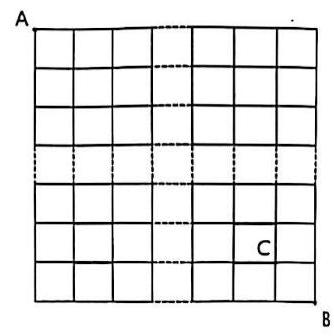
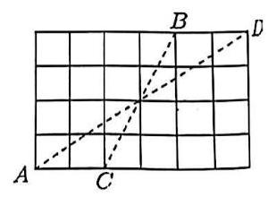

## 第四讲 基本计数模型

## 一、排位

1. 甲、乙两所学校各有 3 名志愿者参加一次公益活动，活动结束后，站成前后两排合影留念，每排 3 人， 若每排同一个学校的两名志愿者不相邻，则不同的站法种数有___

2. 某公司门前有一排 9 个车位的停车场,从左往右数第三个，第七个车位分别停着 $A$ 车和 $B$ 车，同时进来 $C, D$ 两车. 在 $C, D$ 不相邻的情况下， $C$ 和 $D$ 至少有一辆与 $A$ 和 $B$ 车相邻的概率是___

3. 校园某处并排连续有 6 个停车位，现有 3 辆汽车需要停放，为了方便司机上下车，规定:当汽车相邻停放时，则相邻车辆车头必须同向，不相邻的车辆不用必须同向，则不同的停车方法共有___种

## 二、排序

4. 定义数列 $\left\{  {a}_{n}\right\}$ 如下: 存在 $k \in  {\mathbf{N}}^{ * }$ ,满足 ${a}_{k} < {a}_{k + 1}$ ,且存在 $s \in  {N}^{ * }$ ,满足 ${a}_{s} > {a}_{s + 1}$ ,已知数列 $\left\{  {a}_{n}\right\}$ 共 4 项,若 ${a}_{l} \in  \{ t, x, y, z\} \left( {i = 1,2,3,4}\right)$ 且 $t < x < y < z$ ,则数列 $\left\{  {a}_{n}\right\}$ 共有___种

5. 设 $\left( {{x}_{1},{x}_{2},{x}_{3},{x}_{4},{x}_{5}}\right)$ 是1,2,3,4,5的一个排列,若 $\left( {{x}_{i} - {x}_{i + 1}}\right) \left( {{x}_{i + 1} - {x}_{i + 2}}\right)  < 0$ 对一切 $i \in  \{ 1,2,3\}$ 恒成立, 就称该排列是 “交替” 的, “交替” 的排列的数目是___

6. 验证码就是将一串随机产生的数字或符号，生成一幅图片，图片里加上一些干扰象素(防止 ${OCR}$ )， 由用户肉眼识别其中的验证码信息, 输入表单提交网站验证, 验证成功后才能使用某项功能. 很多网站利用验证码技术来防止恶意登录，以提升网络安全在抗疫期间，某居民小区电子出入证的登录验证码由 $0,1,2,\ldots ,9$ 中的五个数字随机组成. 将中间数字最大,然后向两边对称递减的验证码称为 “钟型验证码” (例如: 如 14532, 12543), 已知某人收到了一个“钟型验证码”, 则该验证码的中间数字是 7 的概率为___.

## 三、错配

7. 甲、乙、丙、丁、戊五位妈妈相约各带一个小孩去观看花卉展，她们选择共享电动车出行，每辆电动车只能载两人，其中孩子们表示都不坐自己妈妈的车，甲的小孩一定要坐戊妈妈的车，则她们坐车不同的搭配方式有___种

8. 分别编有 1,2,3,4,5 号码的人与椅,其中 $i$ 号人不坐 $i$ 号椅 $\left( {i = 1,2,3,4,5}\right)$ 的不同坐法有多少种？

## 四、最短路径

9. 某人射击 8 枪，命中 4 枪，小枪命中恰好有 3 枪连在一起的情形的不同种数为___.

10. 如图所示，某城市有南北街道和东西街道各 10 条，一邮递员从该城市西北角的邮局 $\mathrm{A}$ 出发，送信到东南角 B 地，要求所走路程最短，则该邮递员途径 C 地的概率为___。

11. 如图，甲从 $A$ 到 $B$ ，乙从 $C$ 到 $D$ ，两人每次都只能向上或者向右走一格，如果两个人的线路不相交，则称这两个人的路径为一对孤立路，那么不同的孤立路一共有___对

## 六、传球

12. 某篮球队的 5 名队员正在来回传球,若共传了 $n$ 次球,那么篮球能够以多少种不同的顺序在场上的 5 名选手之间传递?

13. 某球队的 $m$ 名队员正在来回传球，若共传了 $n$ 次球，如果第一个传球人是 $A$ ，请讨论 $n$ 次传球后，球回到 $A$ 手中的概率是多少。 $\left( {m \geq  2, n \geq  2}\right)$
