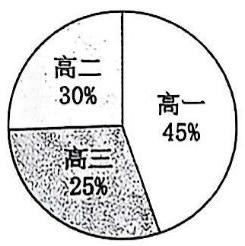
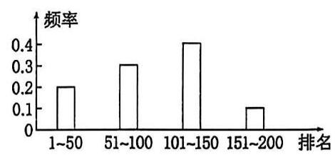
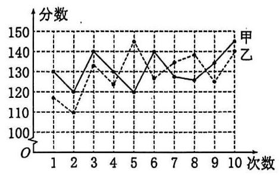
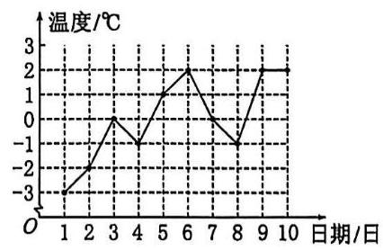
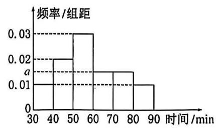
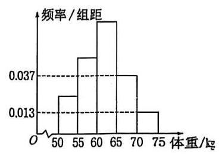
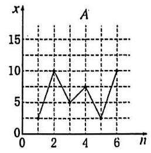
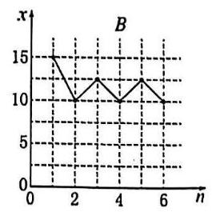

## 第八讲 统计

## 一、随机抽样

## 简单随机抽样

(1)放回简单随机抽样与不放回简单随机抽样

(2)简单随机抽样需满足:① 被抽取的样本和总体的个体数有限；②逐个抽取；③等可能抽取。

(3)简单随机抽样常用抽签法(适用于总体中个体数较少的情况)、随机数法(适用于总体中个体数较多的情况)。

(4)在使用随机数法时，编号位数要相同，如遇到三位数(或四位数)，可从选择的随机数表中的某行某列的数字计起,每三个(或四个)作为一个单位,按某种顺序依次选取,有超过总体号码或出现重复号码的数字舍去。

(5)总体与样本的均值

总体中有 $N$ 个个体,它们的变量值分别为 ${Y}_{1},{Y}_{2},\ldots ,{Y}_{N}$ ,则总体均值 $\bar{Y} = \frac{{Y}_{1} + {Y}_{2} + \cdots  + {Y}_{N}}{N} = \frac{1}{N}\mathop{\sum }\limits_{{i = 1}}^{N}{Y}_{i}$ 。

从总体中抽取一个容量为 $n$ 的样本,它们的变量值分别为 ${y}_{1},{y}_{2},\ldots ,{y}_{n}$ ,则样本均值 $\bar{y} = \frac{{y}_{1} + {y}_{2} + \cdots  + {y}_{n}}{n} = \; \frac{1}{n}\mathop{\sum }\limits_{{i = 1}}^{n}{yi}$ 。

1. 下列抽样试验中,适合用抽签法的是( )

A. 从某工厂生产的 3 000 件产品中抽取 600 件进行质量检验

B. 从某工厂生产的两箱(每箱 15 件)产品中抽取 6 件进行质量检验

C. 从甲、乙两厂生产的两箱(每箱 15 件)产品中抽取 6 件进行质量检验

D.从某厂生产的 3000 件产品中抽取 10 件进行质量检验

2. 从总体量为 $N$ 的一批零件中使用简单随机抽样的方法抽取一个容量为 40 的样本。若某个零件在第 2 次抽取时被抽到的可能性为 1%，则 $N =$ ___

3. 总体由编号为 01,02,...,29,30 的 30 个个体组成。利用下面的随机数表选取 6 个个体，选取方法是从如下随机数表的第 1 行的第 6 列和第 7 列数字开始由左到右依次选取两个数字，则选出来的第 6 个个体的编号为___

7816623208026242

6252536997280198

3204923449358200

3623486969387481

## 分层随机抽样

(1)定义:一般地，按一个或多个变量把总体划分成若干个子总体，每个个体属于且仅属于一个子总体，在每个子总体中独立地进行简单随机抽样，再把所有子总体中抽取的样本合在一起作为总样本，这样的抽样方法称为分层随机抽样，每一个子总体称为层。

$$
\text{ 抽样比 } = \frac{\text{ 该层样本量 }\mathrm{n}}{\text{ 总样本量 }\mathrm{N}} = \frac{\text{ 该层抽取的个体数 }}{\text{ 该层的个体数 }}\text{ 。 }
$$

(2)比例分配:在分层随机抽样中，如果每层样本量都与层的大小成比例，那么称这种样本量的分配方式为比例分配。

(3)分层随机抽样平均数的计算:如果层数分为 2 层,第 1 层和第 2 层包含的个体数分别为 $M$ 和 $N$ ,抽取的样本量分别为 $m$ 和 $n$ ,总体平均数分别为 $\bar{X}$ 和 $\bar{Y}$ ,样本平均数分别为 $\bar{x}$ 和 $\bar{y}$ ,总体平均数为 $\bar{W}$ ,样本平均数为 $\bar{w}$ , 则 $\bar{W} = \frac{M\bar{X} + N\bar{Y}}{M + N},\bar{w} = \frac{m\bar{x} + n\bar{y}}{m + n}$ 。

请注意:

✓ 在比例分配的分层随机抽样中,可以直接用样本平均数 $\bar{w}$ 估计总体平均数 $\bar{W}$ 。

$\times$ 不是比例分配的分层随机抽样中不能用样本平均数 $\bar{w}$ 估计总体平均数 $\bar{W}$ 。

4. 在调查某中学的学生身高时,利用比例分配的分层随机抽样的方法抽取男生 20 人,女生 15 人,得到了男生身高的平均值为 170 cm，女生身高的平均值为 165 cm。则该中学所有学生的平均身高约为___cm。 (保留两位小数)

5. 已知我国某省二、三、四线城市的数量之比为 1:3:6。2023 年 3 月份调查得知该省二、三、四线城市的总房产均价为 0.8 万元/平方米、总方差为 11，其中三、四线城市的房产均价分别为 1 万元/平方米、 0.5 万元/平方米,三、四线城市房价的方差分别为 10,8,则二线城市的房产均价为___万元/平方米。

## 二、统计图表

(1)常见的统计图表有条形图、扇形图、折线图、频率分布直方图等。

(2)作频率分布直方图的步骤:

①求极差; ②决定组距与组数; ③将数据分组;④ 列频率分布表;⑤画频率分布直方图。

(3)统计图表的主要应用

扇形图:直观描述各类数据占总数的比例;

折线图:描述数据随时间的变化趋势;

条形图:直观描述不同类别或分组数据的频数和频率。

6. 某中学组织三个年级的学生进行党史知识竞赛,经统计,得到前 200 名学生分布的扇形图(如图①)和前 200 名中高一学生排名分布的频率条形图(如图②),则下列选项正确的是___

A. 成绩前 200. 名的 200 人中，高一人数比高二人数多 30

B. 成绩第 $1 \sim  {100}$ 名的 100 人中,高一人数不超过一半

C. 成绩第 $1 \sim  {50}$ 名的 50 人中,高三最多有 32 人

D. 成绩第 ${51} \sim  {100}$ 名的 50 人中,高二人数比高一的多

①

7. 如图是甲、乙两人高考前 10 次数学模拟成绩的折线图,则下列说法错误的是( )

A. 甲的数学成绩最后 3 次逐渐升高

B. 甲的数学成绩在 130 分及以上的次数多于乙的数学成绩在 130 分及以上的次数

C. 甲有 5 次考试成绩比乙高

D. 甲数学成绩的极差小于乙数学成绩的极差

8. 某研究小组经过研究发现某种疾病的患病者与未患病者的某项医学指标有明显差异，经过大量调查，得到如下的患病者和未患病者该指标的频率分布直方图:

利用该指标制定一个检测标准,需要确定临界值 $c$ ,将该指标大于 $c$ 的人判定为阳性,小于或等于 $c$ 的人判定为阴性。此检测标准的漏诊率是将患病者判定为阴性的概率，记为 $p\left( c\right)$ ；误诊率是将未患病者判定为阳性的概率， 记为 $q\left( c\right)$ 。假设数据在组内均匀分布，以事件发生的频率作为相应事件发生的概率。

(1)当漏诊率 $p\left( c\right)  = {0.5}\%$ 时，求临界值 $c$ 和误诊率 $q\left( c\right)$ ；

(2)设函数 $f\left( c\right)  = p\left( c\right)  + q\left( c\right)$ 。当 $c \in  \left\lbrack  {{95},{105}}\right\rbrack$ 时，求 $f\left( c\right)$ 的解析式，并求 $f\left( c\right)$ 在区间 $\left\lbrack  {{95},{105}}\right\rbrack$ 的最小值。

## 三、统计量

## 百分位数

(1)一般地，一组数据的第 $p$ 百分位数是这样一个值，它使得这组数据中至少有 $p\%$ 的数据小于或等于这个值， 且至少有 $\left( {{100} - p}\right) \%$ 的数据大于或等于这个值。

(2)四分位数。常用的分位数有第 25 百分位数,第 50 百分位数(即中位数),第 75 百分位数。这三个分位数把一组由小到大排列后的数据分成四等份,因此称为四分位数。其中第 25 百分位数也称为第一四分位数或下四分位数等，第 75 百分位数也称为第三四分位数或上四分位数等。

(3)确定要求的 $p\%$ 分位数所在分组 $\lbrack A, B)$ ，由频率分布表或频率分布直方图可知，样本中小于 $A$ 的频率为 $a$ ， 小于 $B$ 的频率为 $b$ ，所以 $p\%$ 分位数 $= A +$ 组距 $\times  \frac{p\%  - a}{b - a}$ 。

9. 某车间 12 名工人一天生产某产品(单位: $\mathrm{{kg}}$ )的数量分别为13.8,13,13.5,15.7,13.6,14.8,14,14.6,15,15.2,15.8, 15.4,则所给数据的第 25,75 百分位数分别是___

10. 如图所示是某市 3 月 1 日至 3 月 10 日最低气温(单位: ${}^{ \circ  }\mathrm{C}$ )的情况绘制的折线统计图，由图可知这 10 天最低气温的第 80 百分位数是___

11. 为了解“双减”政策实施后学生每天的体育活动时间，研究人员随机调查了某地区 1 000 名学生每天进行体育运动的时间，按照时长 (单位: $\mathrm{{min}}$ ) 分成 6 组:第一组 [30,40)，第二组 [40,50)，第三组 [50,60)，第四组 [60,70),第五组[70,80),第六组[80,90],经整理得到如图所示的频率分布直方图,则可以估计该地区学生每天体育活动时间的第 25 百分位数约为___min。

众数、中位数、平均数(数据集中估计量)

<table><tr><td>数字特征</td><td>样本数据</td><td>频率分布直方图</td></tr><tr><td>众数</td><td>出现次数最多的数据</td><td>取最高的小矩形底边中点的横坐标</td></tr><tr><td>中位数</td><td>将数据按大小依次排列，处在最中间位置的一个数据(或最中间两个数据的平均数)</td><td>把频率分布直方图划分为左右两个面积相等的部分,分界线与 $x$ 轴交点的横坐标</td></tr><tr><td>平均数</td><td>样本数据的算术平均数 $\bar{x} = \frac{1}{n}\left( {{x}_{1} + {x}_{2} + \ldots  + {x}_{n}}\right)$</td><td>每个小矩形的面积乘小矩形底边中点的横坐标之和</td></tr></table>

12. 样本数据 16,24,14,10,20,30,12,14,40 的中位数为___

13. 为了解某校今年准备报考飞行员的学生的体重情况，将所得的数据整理后，画出了频率分布直方图(如图) 已知图中从左到右的前 3 个小组的频率之比为 $1 : 2 : 3$ ，第 1 个小组的频数为 6 ，则报考飞行员的学生人数是 ___

14. 10 名工人某天生产同一零件，生产的件数是:15,17,14,10,15,17,17,16,14,12，设其平均数为 $a$ ，中位数为 $b$ ，众数为 $c$ ，则将它们按从小到大排序为___

## 方差和标准差(数据离散程度估计量)

(1)假设一组数据是 ${x}_{1},{x}_{2},\ldots ,{x}_{n}$ ，用 $\bar{x}$ 表示这组数据的平均数，则我们称 $\frac{1}{n}\mathop{\sum }\limits_{{i = 1}}^{n}{\left( {x}_{i} - \bar{x}\right) }^{2}$ 为这组数据的方差。有时为了计算方差的方便,我们还把方差写成 $\frac{1}{n}\mathop{\sum }\limits_{{i = 1}}^{n}{x}_{i}^{2} - {\bar{x}}^{2}$ 的形式。为了与原始数据的单位一致,我们对方差开平方,取它的算术平方根 $\sqrt{\frac{1}{n}\mathop{\sum }\limits_{{i = 1}}^{n}{\left( {x}_{i} - \bar{x}\right) }^{2}}$ ,称为这组数据的标准差。

(2)方差和标准差刻画了数据的离散程度或波动幅度。

方差: $\frac{{s}^{2} - \frac{1}{n}\left\lbrack  {{\left( {x}_{1} - \bar{x}\right) }^{2} + {\left( {x}_{2} - \bar{x}\right) }^{2} + \ldots  + {\left( {x}_{n} - \bar{x}\right) }^{2}}\right\rbrack  }{2}$ 。标准差: $s = \sqrt{\frac{1}{n}\left\lbrack  {{\left( {x}_{1} - \bar{x}\right) }^{2} + {\left( {x}_{2} - \bar{x}\right) }^{2} + \cdots  + {\left( {x}_{n} - \bar{x}\right) }^{2}}\right\rbrack  }$ 。

(3)分层随机抽样的均值与方差。

分层随机抽样中,如果样本量是按比例分配,记总的样本平均数为 $\bar{w}$ ,样本方差为 ${s}^{2}$ 。

以分两层抽样的情况为例。假设第一层有 $m$ 个数，分别为 ${x}_{1}$ ， ${x}_{2}$ ， ${x}_{3}$ ，平均数为 $\bar{x}$ ，方差为 ${s}_{1}^{2}$ ；第二层有 $n$ 个数,分别为 ${y}_{1},{y}_{2},\ldots ,{y}_{n}$ ,平均数为 $\bar{y}$ ,方差为 ${s}_{2}^{2}$ ,则 $\bar{x} = \frac{1}{m}\mathop{\sum }\limits_{{i = 1}}^{m}{xi},{s}_{1}^{2} = \frac{1}{m}\mathop{\sum }\limits_{{i = 1}}^{m}\left( {{xi} - \bar{x}}\right) 2,\bar{y} = \frac{1}{n}\mathop{\sum }\limits_{{i = 1}}^{n}{yi},{s}_{2}^{2} = \; \frac{1}{n}\mathop{\sum }\limits_{{i = 1}}^{n}\left( {{yi} - \bar{y}}\right) 2$

则 $\left( \overline{\lambda }\right) \bar{w} = \frac{m}{m + n}\bar{x} + \frac{n}{m + n}\bar{y}$ ;

② ${s}^{2} = \frac{1}{m + n}\left\{  {m\left\lbrack  {{s}_{1}^{2} + {\left( \bar{x} - \bar{w}\right) }^{2}}\right\rbrack   + n\left\lbrack  {{s}_{2}^{2} + {\left( \bar{y} - \bar{w}\right) }^{2}}\right\rbrack  }\right\}$ 。

15. 如图所示，样本 $A$ 和 $B$ 分别取自两个不同的总体，它们的样本平均数分别为 ${\bar{x}}_{A}$ 和 ${\bar{x}}_{B}$ ，样本标准差分别为 ${s}_{A}$ 和 ${s}_{{B}_{3}}$ 则(   )

A. ${\bar{x}}_{A} > {\bar{x}}_{B},{s}_{A} > {s}_{B}$ B. ${\bar{x}}_{A} < {\bar{x}}_{B},{s}_{A} > {s}_{B}$ C. ${\bar{x}}_{A} > {\bar{x}}_{B},{s}_{A} < {s}_{B}$ D. ${\bar{x}}_{A} < {\bar{x}}_{B},{s}_{A} < {s}_{B}$

16. 有一组样本数据 ${x}_{1},{x}_{2},\ldots ,{x}_{n}$ ,由这组数据得到新样本数据 ${y}_{1},{y}_{2},\ldots ,{y}_{n}$ ,其中 ${y}_{i} = {x}_{i} + c\left( {i = 1,2,\ldots , n}\right) , c$ 为非零常数. 则( )

A. 两组样本数据的样本平均数相同 B. 两组样本数据的样本中位数相同

C. 两组样本数据的样本标准差相同 D. 两组样本数据的样本极差相同

17. 某厂为比较甲、乙两种工艺对橡胶产品伸缩率的处理效应,进行 10 次配对试验,每次配对试验选用材质相同的两个橡胶产品,随机地选其中一个用甲工艺处理,另一个用乙工艺处理,测量处理后的橡胶产品的伸缩率,甲、乙两种工艺处理后的橡胶产品的伸缩率分别记为 ${x}_{i},{y}_{i}\left( {i = 1,2,\ldots ,{10}}\right)$ ,试验结果如下:

<table><tr><td>试验序号 $i$</td><td>1</td><td>2</td><td>3</td><td>4</td><td>5</td><td>6</td><td>7</td><td>8</td><td>9</td><td>10</td></tr><tr><td>伸缩率 ${x}_{i}$</td><td>545</td><td>533</td><td>551</td><td>522</td><td>575</td><td>544</td><td>541</td><td>568</td><td>596</td><td>548</td></tr><tr><td>伸缩率 ${y}_{i}$</td><td>536</td><td>527</td><td>543</td><td>530</td><td>560</td><td>533</td><td>522</td><td>550</td><td>576</td><td>536</td></tr></table>

记 ${z}_{i} = {x}_{i} - {y}_{i}\left( {i = 1,2,\ldots ,{10}}\right) ,{z}_{1},{z}_{2},\ldots ,{z}_{10}$ 的样本平均数为 $\bar{z}$ ,样本方差为 ${s}^{2}$ 。

(1)求 $\bar{z}$ ， ${s}^{2}$ ；

(2)判断甲工艺处理后的橡胶产品的伸缩率较乙工艺处理后的橡胶产品的伸缩率是否有显著提高(如果 $\bar{z} \geq \; 2\sqrt{\frac{{s}^{2}}{10}}$ ,则认为甲工艺处理后的橡胶产品的伸缩率较乙工艺处理后的橡胶产品的伸缩率有显著提高,否则不认为有显著提高)。
