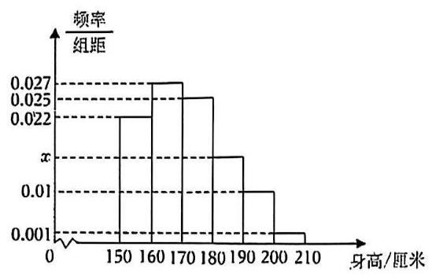
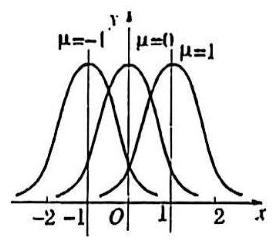
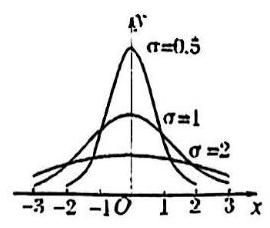
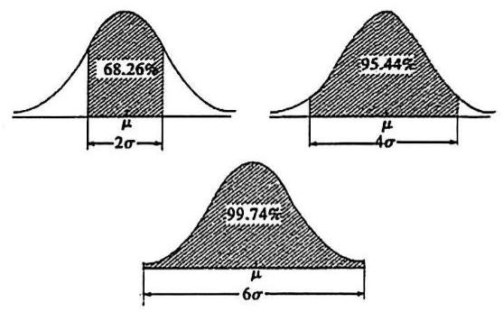
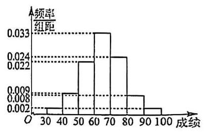

## 第九讲 随机分布

1. 某同学在课外阅读时了解到概率统计中的 Markov 不等式,该不等式描述的是对非负的随机变量 $X$ 和任意的正数 $a$ ,都有 $P\left( {X \geq  a}\right)  \leq  f\left( {E\left\lbrack  X\right\rbrack  , a}\right)$ ,其中 $f\left( {E\left\lbrack  X\right\rbrack  , a}\right)$ 是关于数学期望 $E\left\lbrack  X\right\rbrack$ 和 $a$ 的表达式。 由于记忆模糊,该同学只能确定 $f\left( {E\left\lbrack  X\right\rbrack  , a}\right)$ 是下列选项中的某一个,根据你的理解,该形式为 ( )

(A) ${aE}\left\lbrack  X\right\rbrack$ (B) $\frac{1}{{aE}\left\lbrack  X\right\rbrack  }$ (C) $\frac{a}{E\left\lbrack  X\right\rbrack  }$ (D) $\frac{E\left\lbrack  X\right\rbrack  }{a}$

## 2. 本市对全区高中生的身高(单位:厘米)进行统计，得到如下的频率分布直方图:

## (1)若数据分布均匀，记随机变量 $X$ 为各区间中点所代表的身高，写出 $X$ 的分布及期望；

( 2 )已知本市身高在区间 $\left\lbrack  {{180},{210}}\right\rbrack$ 的市民人数约占全市总人数的 10%，且全市高中生约占全市总人数的 1.2%，现在要以该区本次统计数据估算全市高中生身高情况，从本市市民中任取 1 人，若此人的身高位于区间 $\left\lbrack  {{180},{210}}\right\rbrack$ ,试估算此人是高中生的概率;

(3)现从身高在区间 $\lbrack {170},{190})$ 的高中生中分层抽样抽取一个 80 人的样本，若身高在区间 $\lbrack {170},{180})$ 中样本的均值为 ${176}\mathrm{\;{cm}}$ ,方差为 10; 身高在区间 $\lbrack {180},{190})$ 中样本的均值为 ${184}\mathrm{\;{cm}}$ ,方差为 16; 试求这 80 人的方差。

## 二、随机数的离散分布

## > 均匀分布 (Uniform distribution)

状态空间 $\Omega$ 中共有 $n$ 个事件，每个事件发生的概率完全相同，均为 $\frac{1}{n}$ 。这是最简单的一种分布，也是大部分概率讨论的基础假设。

$>$ 二项分布(Binomial distribution)

某事件发生情况 $A$ 的概率为 $p$ ,不发生的情况为 $1 - p$ 。则重复 $n$ 次这样的事件(且相互独立)，情况 $A$ 发生的次数构成的分布列,称为二项分布,记作 $X \sim  B\left( {n, p}\right)$ :

$P\left( {X = k}\right)  = {C}_{n}^{k}{p}^{k}{\left( 1 - p\right) }^{n - k}$ (表示情况 $A$ 发生 $k$ 次 $\left( {k = 0,1,2,\cdots , n}\right)$ 的概率)， $E\left( X\right)  = {np}$ ，

$D\left( x\right)  = {np}\left( {1 - p}\right)$

证明: $E\left( X\right)  = \mathop{\sum }\limits_{{k = 0}}^{n}k \cdot  P\left( {X = k}\right)  = 0 \cdot  P\left( {X = 0}\right)  + \mathop{\sum }\limits_{{k = 1}}^{n}k{C}_{n}^{k}{p}^{k}{\left( 1 - p\right) }^{n - k} = \mathop{\sum }\limits_{{k = 1}}^{n}k{C}_{n}^{k}{p}^{k}{\left( 1 - p\right) }^{n - k}$

由于 $k{C}_{n}^{k} = n{C}_{n - 1}^{k - 1}$ ,再令 $m = k - 1$ ,有

$$
E\left( X\right)  = \mathop{\sum }\limits_{{k = 1}}^{n}n{C}_{n - 1}^{k - 1}{p}^{k}{\left( 1 - p\right) }^{n - k} = n\mathop{\sum }\limits_{{m = 0}}^{{n - 1}}{C}_{n - 1}^{m}{p}^{m + 1}{\left( 1 - p\right) }^{n - 1 - m} = {np}\mathop{\sum }\limits_{{m = 0}}^{{n - 1}}{C}_{n - 1}^{m}{p}^{m}{\left( 1 - p\right) }^{n - 1 - m}
$$

$$
= {np}{\left\lbrack  1 + \left( 1 - p\right) \right\rbrack  }^{n - 1} = {np}
$$

$$
E\left( {X}^{2}\right)  = \mathop{\sum }\limits_{{k = 0}}^{n}{k}^{2} \cdot  P\left( {X = k}\right)  = 0 \cdot  P\left( {X = 0}\right)  + \mathop{\sum }\limits_{{k = 1}}^{n}{k}^{2}{C}_{n}^{k}{p}^{k}{\left( 1 - p\right) }^{n - k} = {np}\mathop{\sum }\limits_{{k = 1}}^{n}k{C}_{n - 1}^{k - 1}{p}^{k - 1}{\left( 1 - p\right) }^{n - k}
$$

$$
= {np}\mathop{\sum }\limits_{{k = 1}}^{n}\left( {k - 1}\right) {C}_{n - 1}^{k - 1}{p}^{k - 1}{\left( 1 - p\right) }^{n - k} + {np}\mathop{\sum }\limits_{{k = 1}}^{n}{C}_{n - 1}^{k - 1}{p}^{k - 1}{\left( 1 - p\right) }^{n - k}
$$

$$
= {np} \cdot  0 \cdot  {C}_{n - 1}^{0}{p}^{0}{\left( 1 - p\right) }^{n - 1} + {np}\mathop{\sum }\limits_{{k = 2}}^{n}\left( {k - 1}\right) {C}_{n - 1}^{k - 1}{p}^{k - 1}{\left( 1 - p\right) }^{n - k} + {np}{\left\lbrack  p + \left( 1 - p\right) \right\rbrack  }^{n - 1}
$$

$$
= {np}\mathop{\sum }\limits_{{k = 2}}^{n}\left( {n - 1}\right) {C}_{n - 2}^{k - 2}{p}^{k - 1}{\left( 1 - p\right) }^{n - k} + {np} = n\left( {n - 1}\right) {p}^{2}\mathop{\sum }\limits_{{k = 2}}^{n}{C}_{n - 2}^{k - 2}{p}^{k - 2}{\left( 1 - p\right) }^{n - k} + {np} = n\left( {n - 1}\right) {p}^{2} + {np}
$$

因此 $D\left( X\right)  = E\left( {X}^{2}\right)  - {E}^{2}\left( X\right)  = n\left( {n - 1}\right) {p}^{2} + {np} - {n}^{2}{p}^{2} =  - n{p}^{2} + {np} = {np}\left( {1 - p}\right)$

## 超几何分布 (Hypergeometric Distribution)

从有限的 $\mathrm{N}$ 个球 (其中包含 $\mathrm{M}$ 个红球和 $\mathrm{N} - \mathrm{M}$ 个白球) 中抽出 $\mathrm{n}$ 个且不放回,成功抽出 $k$ 个 $\left( {k = 0,1,2,\cdots , M}\right)$ 的概率分布列,称为超几何分布,记作 $X \sim  H\left( {N, n, M}\right)$ : $P\left( {X = k}\right)  = \frac{{C}_{M}^{k}{C}_{N - M}^{n - k}}{{C}_{N}^{n}};E\left( X\right)  = \frac{nM}{N};D\left( X\right)  = \frac{{nM}\left( {N - M}\right) \left( {N - n}\right) }{{N}^{2}\left( {N - 1}\right) }$ (证明略)

3. 从1,2,3,4,5,6组成的没有重复数字的六位数中任取 10 个不同的数，其中满足 1、3 都不与 5 相邻的六位偶数的个数为随机变量 $X$ ,则 $P\left( {X = 4}\right)  =$ ___

4. 某家畜研究机构发现每头成年牛感染病的概率是 $p\left( {0 < p < 1}\right)$ ,且每头成年牛是否感染病相互独立.

(1)记 10 头成年牛中恰有 3 头感染病的概率是 $f\left( p\right)$ ，求当概率 $p$ 取何值时， $f\left( p\right)$ 有最大值？

(2)若以(1)中确定的 $p$ 值作为感染病的概率，设 10 头成年牛中恰有 $k$ 头感染病的概率是 $g\left( k\right)$ ，求当 $k$ 为何值时, $g\left( k\right)$ 有最大值?

5. 一款击鼓小游戏的规则如下:每盘游戏都需击鼓三次，每次击鼓后要么出现一次音乐，要么不出现音乐；每盘游戏击鼓三次后，出现三次音乐获得 150 分，出现两次音乐获得 100 分，出现一次音乐获得 50 分,没有出现音乐则获得 -300 分. 设每次击鼓出现音乐的概率为 $p\left( {0 < p < \frac{2}{5}}\right)$ ,且各次击鼓出现音乐相互独立.

(1)若一盘游戏中仅出现一次音乐的概率为 $f\left( p\right)$ ，求 $f\left( p\right)$ 的最大值点 ${p}_{0}$ ；

(2)以(1)中确定的 ${p}_{0}$ 作为 $p$ 的值，玩 3 盘游戏，出现音乐的盘数为随机变量 $X$ ，求每盘游戏出现音乐的概率 ${p}_{1}$ ,及随机变量 $X$ 的期望 ${EX}$ ;

(3)玩过这款游戏的许多人都发现，若干盘游戏后，与最初的分数相比，分数没有增加反而减少了. 请运用概率统计的相关知识分析分数减少的原因.

6. 为了治疗某种疾病，研制了甲、乙两种新药，希望知道哪种新药更有效，为此进行动物试验. 试验方案如下:每一轮选取两只白鼠对药效进行对比试验. 对于两只白鼠，随机选一只施以甲药，另一只施以乙药. 一轮的治疗结果得出后, 再安排下一轮试验. 当其中一种药治愈的白鼠比另一种药治愈的白鼠多 4 只时，就停止试验，并认为治愈只数多的药更有效。为了方便描述问题，约定:对于每轮试验，若施以甲药的白鼠治愈且施以乙药的白鼠未治愈则甲药得 1 分，乙药得 -1 分；若施以乙药的白鼠治愈且施以甲药的白鼠未治愈则乙药得 1 分，甲药得 -1 分；若都治愈或都未治愈则两种药均得 0 分。甲、乙两种药的治愈率分别记为 $\alpha$ 和 $\beta$ ，一轮试验中甲药的得分记为 $X$ .

(1)求 $X$ 的分布列；

(2)若甲药、乙药在试验开始时都赋予 4 分， ${p}_{i}\left( {i = 0,1,\cdots ,8}\right)$ 表示“甲药的累计得分为 $i$ 时，最终认为甲药比乙药更有效”的概率,则 ${p}_{0} = 0,{p}_{8} = 1,{p}_{i} = a{p}_{i - 1} + b{p}_{i} + c{p}_{i + 1}\left( {i = 1,2,\cdots ,7}\right)$ ，其中 $a = P\left( {X =  - 1}\right)$ ， $b = P\left( {X = 0}\right) , c = P\left( {X = 1}\right)$ . 假设 $\alpha  = {0.5},\beta  = {0.8}$ .

(i)证明: $\left\{  {{p}_{i + 1} - {p}_{i}}\right\}  \left( {i = 0,1,2,\cdots ,7}\right)$ 为等比数列;

(ii) 求 ${p}_{4}$ ,并根据 ${p}_{4}$ 的值解释这种试验方案的合理性.

## 三、正态分布

一般地,如果对于任何实数 $a\text{ 、 }b\left( {a < b}\right)$ ,随机变量 $X$ 满足 $P\left( {a < X \leq  b}\right)  = {\int }_{a}^{b}{\varphi }_{\mu ,\sigma }\left( x\right) {dx}$ ,则称随机变量 $X$ 服从正态分布 (Normal Distribution),正态分布完全由参数 $\mu$ 和 $\sigma$ 确定,因此正态分布常记作 $N\left( {\mu ,{\sigma }^{2}}\right)$ . 如果随机变量 $X$ 服从正态分布,则记为 $X \sim  N\left( {\mu ,{\sigma }^{2}}\right)$

(2)正态曲线的性质:

甲

乙

①曲线位于 $x$ 轴上方，与 $x$ 轴不相交；

②曲线是单峰的，它关于直线 $x = \mu$ 对称；

③曲线在 $x = \mu$ 处达到峰值 $\frac{1}{\sqrt{2\pi }\sigma }$ ；

④曲线与 $x$ 轴之间的面积为 1;

⑤当σ一定时，曲线的位置由 $\mu$ 确定，曲线随着 $\mu$ 的变化而沿 $x$ 轴平移，如图甲所示；

⑥当μ一定时，曲线的形状由 $\sigma$ 确定， $\sigma$ 越大，曲线越 “矮胖”，总体分布越分散； $\sigma$ 越小. 曲线越 “瘦高”. 总体分布越集中, 如图乙所示:

## (三) 正态总体三个特殊区间内取值的概率值

① $P\left( {\mu  - \sigma  < X \leq  \mu  + \sigma }\right)  = {0.6826}$ ；

② $P\left( {\mu  - {2\sigma } < X \leq  \mu  + {2\sigma }}\right)  = {0.9544}$ ；

③ $P\left( {\mu  - {3\sigma } < X \leq  \mu  + {3\sigma }}\right)  = {0.9974}$ .

7. 设 $\eta$ 服从 $N\left( {{1.5},{2}^{2}}\right)$ 试求:

(1) $P\left( {\eta  < {3.5}}\right)$ ； (2) $P\left( {\eta  <  - 4}\right)$ ； (3) $P\left( {\eta  \geq  2}\right)$ ; (4) $P\left( {\left| \eta \right|  < 3}\right)$ .

8. 已知: 从某批材料中任取一件时,取得的这件材料强度 $\xi$ 服从 $N\left( {{200},{18}^{ \circ  }}\right)$ .

(1)计算取得的这件材料的强度不低于 180 的概率.

(2)如果所用的材料要求以 99% 的概率保证强度不低于 150，问这批材料是否符合这个要求.

9. 第 24 届冬季奥林匹克运动会, 将于 2022 年 2 月 4 日至 2022 年 2 月 20 日在北京举行实践“绿色奥运、科技奥运、人文奥运”理念，举办一届“有特色、高水平”的奥运会，是中国和北京的庄严承诺，也是全世界的共同期待. 为宣传北京冬奥会, 激发人们参与冬奥会的热情, 某市开展了关于冬奥知识的有奖问答.从参与的人中随机抽取 100 人，得分情况如下:

(1)得分在 80 分以上称为“优秀成绩”，从抽取的 100 人中任取 2 人，记“优秀成绩”的人数为 $X$ ，求 $X$ 的分布列及数学期望；

(2)由直方图可以认为，问卷成绩值 $Y$ 服从正态分布 $N\left( {\mu ,{\sigma }^{2}}\right)$ ，其中 $\mu$ 近似为样本平均数， ${\sigma }^{2}$ 近似为样本方差.

① 求 $P\left( {{77.2} < Y < {89.4}}\right)$ ；

②用所抽取 100 人样本的成绩去估计城市总体，从城市总人口中随机抽出 2000 人，记 $Z$ 表示这 2000 人中分数值位于区间 $\left( {{77.2},{89.4}}\right)$ 的人数,利用①的结果求 $E\left( Z\right)$ .

参考数据: $\sqrt{150} \approx  {12.2},\sqrt{146} \approx  {12.1}, P\left( {\mu  - \sigma  < Y < \mu  + \sigma }\right)  = {0.6826}, P\left( {\mu  - {2\sigma } < Y < \mu  + {2\sigma }}\right)  = {0.9544}$ , $P\left( {\mu  - {3\sigma } < Y < \mu  + {3\sigma }}\right)  = {0.9974}.$

10. 在刚刚过去的寒假，由于新冠疫情的影响，哈尔滨市的 $A$ 、 $B$ 两所同类学校的高三学年分别采用甲、乙两种方案进行线上教学，为观测其教学效果，分别在两所学校的高三学年各随机抽取 60 名学生，对每名学生进行综合测试评分, 记综合评分为 80 及以上的学生为优秀学生, 经统计得到两所学校抽取的学生中共有 72 名优秀学生.

(1)用样本估计总体，以频率作为概率，若在 $A$ 、 $B$ 两个学校的高三学年随机抽取 3 名学生，求所抽取的学生中的优秀学生数的分布列和数学期望;

(2)已知 $A$ 学校抽出的优秀学生占该校抽取总人数的 $\frac{2}{3}$ ，填写下面的列联表，并判断能否在犯错误的概率不超过 0.1 的前提下认为学生综合测试评分优秀与教学方案有关.

<table><tr><td></td><td>优秀学生</td><td>非优秀学生</td><td>合计</td></tr><tr><td>甲方案</td><td></td><td></td><td></td></tr><tr><td>乙方案</td><td></td><td></td><td></td></tr><tr><td>合计</td><td></td><td></td><td></td></tr></table>

附:

<table><tr><td>$P\left( {{K}^{2} \geq  {k}_{0}}\right)$</td><td>0.15</td><td>0.10</td><td>0.05</td><td>0.025</td><td>0.010</td><td>0.005</td><td>0.001</td></tr><tr><td>${k}_{0}$</td><td>2.072</td><td>2.706</td><td>3.841</td><td>5.024</td><td>6.635</td><td>7.879</td><td>10.828</td></tr></table>

${K}^{2} = \frac{n{\left( ad - bc\right) }^{2}}{\left( {a + b}\right) \left( {c + d}\right) \left( {a + c}\right) \left( {b + d}\right) }$ ,其中 $n = a + b + c + d$ .
