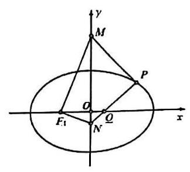
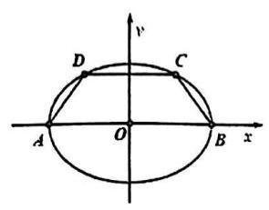
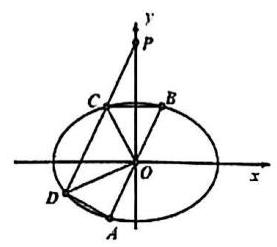
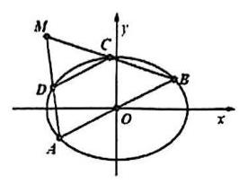

## 第十二讲 定点、定值、定直线问题提升

1. 已知椭圆 $C : \frac{{x}^{2}}{4} + \frac{{y}^{2}}{3} = 1$ 的右焦点为 $F$ ，过 $F$ 且斜率为 1 的直线交椭圆 $C$ 于 $A$ 、 $B$ 两点， $M$ 是直线 $x = 4$ 上任意一点，求证:直线 ${MA}$ 、 ${MF}$ 、 ${MB}$ 的斜率成等差数列。

2. 曲线 $C : \frac{{x}^{2}}{4} + \frac{{y}^{2}}{1} = 1$ 的上顶点为 $B$ ，左、右顶点为 ${A}_{1}\text{ 、 }{A}_{2}$ ；点 $P$ 为椭圆除 $B$ 外的任意一点，直线 ${BP}$ 交 $x$ 轴于点 $N$ ，直线 ${A}_{1}B$ 交直线 ${A}_{2}P$ 于点 $M$ ，设 ${A}_{2}P$ 的斜率为 $k$ ， ${MN}$ 的斜率为 $m$ 。证明: ${2m} - k$ 为定值。

3. 曲线 $C : \frac{{x}^{2}}{4} - \frac{{y}^{2}}{1} = 1$ 的弦 ${AB}$ 过定点 $N\left( {4,0}\right)$ ，交直线 $l : x = 1$ 于 $M$ ，已知点 $P$ 坐标为 $\left( {4,\sqrt{3}}\right)$ 。记 ${PA}\text{ 、 }{PB}\text{ 、 }{PM}$ 的斜率分别为 ${k}_{1}\text{ 、 }{k}_{2}\text{ 、 }{k}_{3}$ 。那么是否存在实数 $\lambda$ ,使得对于任意不过点 $P$ 的弦 ${AB}$ , 等式 ${k}_{1} + {k}_{2} = \lambda {k}_{3}$ 恒成立? 若存在,请求出 $\lambda$ 的值; 若不存在,请说明理由。

4. 如图，已知椭圆 $C : \frac{{x}^{2}}{4} + \frac{{y}^{2}}{3} = 1$ 的左焦点为 ${F}_{1}$ ，点 $P$ 是椭圆 $C$ 上位于第一象限的点， $M$ ， $N$ 是 $y$ 轴上的两个动点 (点 $M$ 位于 $x$ 轴上方),满足 ${PM} \bot  {PN}$ 且 ${F}_{1}M \bot  {F}_{1}N$ ,线段 ${PN}$ 交 $x$ 轴于点 $Q$ .

(1)若 $\left| {{F}_{1}P}\right|  = \frac{5}{2}$ ，求点 $P$ 的坐标；

(2)若四边形 ${F}_{1}{MPN}$ 为矩形，求点 $M$ 的坐标；

(3)证明: $\frac{\left| PQ\right| }{\left| QN\right| }$ 为定值.

5. 已知椭圆 $\Gamma  : \frac{{x}^{2}}{{a}^{2}} + \frac{{y}^{2}}{{b}^{2}} = 1\left( {a > b > 0}\right)$ 过点 $\left( {0,2}\right)$ ，其长轴长、焦距和短轴长三者的平方依次成等差数列. 直线 $l$ 与 $x$ 轴的正半轴和 $y$ 轴分别交于点 $Q, P$ ,与椭圆 $\Gamma$ 相交于两点 $M, N$ ,各点互不重合,且满足 $\overrightarrow{PM} = {\lambda }_{1}\overrightarrow{MQ},\overrightarrow{PN} = {\lambda }_{2}\overrightarrow{NQ}$ .

(1)求椭圆 $\Gamma$ 的标准方程；

(2)若直线 $l$ 的方程为 $y =  - x + 1$ ，求 $\frac{1}{{\lambda }_{1}} + \frac{1}{{\lambda }_{2}}$ 的值；

(3)若 ${\lambda }_{1} + {\lambda }_{2} =  - 3$ ，证明:直线 $l$ 恒过定点，并求此定点的坐标.

6. 在 ${xOy}$ 平面上,设椭圆 $\Gamma  : \frac{{x}^{2}}{{m}^{2}} + {y}^{2} = 1\left( {m > 1}\right)$ ,梯形 ${ABCD}$ 的四个顶点均在 $\Gamma$ 上,且 ${AB}//{CD}$ ,设直线 ${AB}$ 的方程为 $y = {kx}\left( {k \in  R}\right)$ .

(1)若 ${AB}$ 为 $\Gamma$ 的长轴，梯形 ${ABCD}$ 的高为 $\frac{1}{2}$ ，且 $C$ 在 ${AB}$ 上的射影为 $\Gamma$ 的焦点，求 $m$ 的值；

(2)设 $m = \sqrt{2}$ ，直线 ${CD}$ 经过点 $P\left( {0,2}\right)$ ，求 $\overrightarrow{OC} \cdot  \overrightarrow{OD}$ 的取值范围；

(3)设 $m = \sqrt{2}$ ， $\left| {AB}\right|  = 2\left| {CD}\right|$ ， ${AD}$ 与 ${BC}$ 的延长线相交于点 $M$ ，当 $k$ 变化时， $\bigtriangleup  {MAB}$ 的面积是否为定值？ 若是, 求出该定值; 若不是, 请说明理由.

7. 已知双曲线 $C : \frac{{x}^{2}}{{a}^{2}} - \frac{{y}^{2}}{{b}^{2}} = 1\left( {a > 0, b > 0}\right)$ 的一条渐近线的方程为 $y = \sqrt{13}x$ ，它的右顶点与抛物线 $\Gamma$ : ${y}^{2} = 4\sqrt{3}x$ 的焦点重合,经过点 $A\left( {-9,0}\right)$ 且不垂直于 $x$ 轴的直线与双曲线 $C$ 交于 $M, N$ 两点.

(1)求双曲线 $C$ 的标准方程；

(2)若点 $M$ 是线段 ${AN}$ 的中点，求点 $N$ 的坐标；

(3)设 $P, Q$ 是直线 $x =  - 9$ 上关于 $x$ 轴对称的两点，证明:直线 ${PM}$ 与 ${QN}$ 的交点必在直线 $x =  - \frac{1}{3}$ 上.
