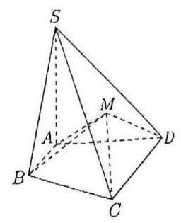

2025-2026 学年高三数学 145 寒假讲义 Q 老师

## 目录

第 1 讲 方程类问题的分析思路 I 1

第 2 讲 方程类问题的分析思路 II 9

第 3 讲 方程类问题的分析思路 III 15

第 4 讲 零点个数类问题的分析思路 23

第 5 讲 最值的求解思路 I 31

第 6 讲 最值的求解思路 III 39

第 7 讲 取值范围求解思路 I 45

第 8 讲 取值范围求解思路 II 53

第 9 讲 取值范围求解思路 III 61

第 10 讲 取值范围求解思路 IV 69

第 1 讲 方程类问题的分析思路 I

## 方程解法: 公式解、因式分解、代数变形、试根、图像分析、Casio

## 一、实系数一元二次方程

1. 已知 $a\text{ 、 }b\text{ 、 }c$ 为正整数，方程 $a{x}^{2} + {bx} + c = 0$ 的两实根为 ${x}_{1}\text{ 、 }{x}_{2}$ ，且 $\left| {x}_{1}\right|  < 1\text{ ， }\left| {x}_{2}\right|  < 1$ ，则 $a + b + c$ 的最小值为___

2. 已知函数 $f\left( x\right)  = \left\{  \begin{array}{l} \frac{-1}{x + 1}, x <  - 1 \\  \frac{-1}{x - 1} + 4, x > 1 \end{array}\right.$ ，方程 $f\left( x\right)  = {kx} + b$ 有四个不同实数解， ${x}_{1},{x}_{2},{x}_{3},{x}_{4}$ 且依次成等差数列，则 $k + \frac{4}{k} + b =$

3. 已知复数 ${z}_{1},{z}_{2}$ 是实系数方程 ${x}^{2} + {mx} + m = 0$ 的两根，且 $\left| {z}_{1}\right|  < 2,\left| {z}_{2}\right|  < 2$ 。

(1)求实数 $m$ 的取值范围；(2)求 $\left| {z}_{1}\right|  + \left| {z}_{2}\right|$ 的取值范围。

4. 设 $b\text{ 、 }c$ 均为实数,试讨论关于 $x$ 的方程 ${x}^{2} + b\left| x\right|  + c = 0$ 在复数集 $\mathbf{C}$ 上可能有的根的情况有哪些?

## 二、复系数一元二次方程

5. 解方程: ${x}^{2} + \left( {2 - i}\right) x + 1 - i = 0$

6. 若 ${z}_{1},{z}_{2}$ 是方程 ${z}^{2} - \left( {2{z}_{0} - 1}\right) z + {z}_{0}^{2} - {z}_{0} + 1 = 0$ 的两根,那么以复平面上 ${z}_{0},{z}_{1},{z}_{2}$ 的对应点 $A, B, C$ 为顶点的三角形中，最大的角为___。

## 三、高次方程

7. 设函数 $f\left( x\right)  = \left( {{x}^{2} - {10x} + {c}_{1}}\right) \left( {{x}^{2} - {10x} + {c}_{2}}\right) \left( {{x}^{2} - {10x} + {c}_{3}}\right) \left( {{x}^{2} - {10x} + {c}_{4}}\right) \left( {{x}^{2} - {10x} + {c}_{5}}\right)$ ,设集合 $M = \left\{  {x \mid  f\left( x\right)  = 0}\right\}   = \left\{  {{x}_{1},{x}_{2},\cdots ,{x}_{9}}\right\}   \subseteq  {N}^{ * }$ ，其中 ${c}_{1} \geq  {c}_{2} \geq  {c}_{3} \geq  {c}_{4} \geq  {c}_{5}$ ，则 ${c}_{1} - {c}_{5}$ 为___

8. 已知 $f\left( x\right)  = \frac{1}{x}$ 与 $g\left( x\right)  = a{x}^{2} + {bx}$ 图像有且仅有两个不同的交点 $A\left( {{x}_{1},{y}_{1}}\right)$ 和 $B\left( {{x}_{2},{y}_{2}}\right)$ ，且 ${x}_{1} < {x}_{2}$ ，求 $\frac{{y}_{1}}{{y}_{2}}$ 的值.

2025-2026 学年高三数学 145 寒假讲义 Q 老师

9. 定义区间 $\left( {c, d}\right) ,\left\lbrack  {c, d}\right\rbrack  ,\left( {c, d\rbrack ,\left\lbrack  {c, d}\right\rbrack  \text{ 的长度均为 }d - c\text{ ,其中 }d > c\text{ . 函数 }f\left( x\right)  = \frac{1}{x - 1} + \frac{2}{x - 2} + \frac{3}{x - 3} + \frac{4}{x - 4} - 1}\right)$ 则不等式 $f\left( x\right)  > 0$ 解集区间的长度总和为___

10. 对于正整数 $n$ ，设 ${x}_{n}$ 是关于 $x$ 的方程 $n{x}^{3} + {2x} - n = 0$ 的实数根，记 ${a}_{n} = \left\lbrack  {\left( {n + 1}\right) {x}_{n}}\right\rbrack$

$\left( {n \geq  2}\right)$ ，其中 $\left\lbrack  x\right\rbrack$ 表示不超过 $x$ 的最大整数，则 $\frac{1}{1013}\left( {{a}_{1} + {a}_{2} + {a}_{3} + \cdots  + {a}_{2026}}\right)  =$

11. 【2024 浦东二模 16】 ${f}_{0}\left( x\right)  = {a}_{m}{x}^{m} + {a}_{m - 1}{x}^{m - 1} + \cdots  + {a}_{1}x + {a}_{0}\left( {{a}_{m} \neq  0, m \geq  {10}, m \in  \mathbf{Z}}\right)$ ,记 ${f}_{n}\left( x\right)  = {f}_{n - 1}^{\prime }\left( x\right) \; \left( {n = 1,2,\cdots , m - 1}\right)$ ,令有穷数列 ${b}_{n}$ 为 ${f}_{n}\left( x\right)$ 零点的个数 $\left( {n = 1,2,\cdots , m - 1}\right)$ ,则有以下两个结论: ① 存在 ${f}_{0}\left( x\right)$ ,使得 ${b}_{n}$ 为常数列; ② 存在 ${f}_{0}\left( x\right)$ ,使得 ${b}_{n}$ 为公差不为零的等差数列.

那么 ( )

A. ①正确，②错误 B. ①错误，②正确

C. ①②都正确 D. ①②都错误

12. 【2023 清华强基 07】已知 $a{x}^{3} + b{x}^{2} + x + 1 = 0$ ( $a < 0$ )恰有两个零点，则 $a + b$ 的取值范围为___

第 2 讲 方程类问题的分析思路 II

## 四、指对方程

逢指取对, 逢对取指, 指对互换

13. 解方程: ${\log }_{\left( 2x - 1\right) }\left( {3{x}^{2} - 2}\right)  = 2$

14. 解方程: ${5}^{x + 1} = {3}^{{x}^{2} - 1}$

15. 【2023 清华强基 03】已知 ${X}^{\lg X}{Y}^{\lg Y}{Z}^{\lg Z} = 5,{X}^{\lg Y}{Y}^{\lg Z}{Z}^{\lg X} = \sqrt{2}$ ,则 ${XYZ}$ 的可能取值为___.

## 五、三角方程

1. $\sin x + \sin {2x} + \sin {3x} = 1 + \cos x + \cos {2x}$

2. 设 $\alpha \text{ 、 }\beta$ 均为锐角且满足 $3{\sin }^{2}\alpha  + 2{\sin }^{2}\beta  = 1,2\sin {2\beta } - 3\sin {2\alpha } = 0$ . 求 $\alpha  + {2\beta }$ 的值.

3. 已知 ${F}_{1}\text{ 、 }{F}_{2}$ 是椭圆 $\Gamma  : \frac{{x}^{2}}{{a}^{2}} + \frac{{y}^{2}}{{b}^{2}} = 1\left( {a > b > 0}\right)$ 的左、右焦点, $Q$ 是 $\Gamma$ 上一动点,记 $\angle Q{F}_{1}{F}_{2} = {\theta }_{1}$ , $\angle Q{F}_{2}{F}_{1} = {\theta }_{2}$ ,若 $3\sin {\theta }_{1}\left( {1 - \cos {\theta }_{2}}\right)  = 2\sin {\theta }_{2}\left( {1 + \cos {\theta }_{1}}\right)$ ,则 $\frac{b}{a} =$

4. 【奉贤一模 16】16. 已知 $a\text{ 、 }b\text{ 、 }\alpha \text{ 、 }\beta  \in  \mathbf{R}$ ,满足 $\sin \alpha  + \cos \beta  = a,\cos \alpha  + \sin \beta  = b,0 < {a}^{2} + {b}^{2} \leq  4$ , 判断以下两个结论的真假

① 存在常数 $a$ ,对任意的实数 $b \in  \mathbf{R}$ ,使得 $\sin \left( {\alpha  + \beta }\right)$ 的值是一个常数;

② 存在常数 $b$ ,对任意的实数 $a \in  \mathbf{R}$ ,使得 $\cos \left( {\alpha  - \beta }\right)$ 的值是一个常数.

5. 若对一个角 $\alpha  \in  \lbrack 0,{2\pi })$ ，存在角 $\beta  \in  \lbrack 0,{2\pi })$ 满足 $\cos \left( {\alpha  + \beta }\right)  = \cos \alpha  + \cos \beta$ ，则称 $\beta$ 为 $\alpha$ 的 “伴随角”，有以下两个命题:

① 若 $\alpha  \in  \left( {\frac{\pi }{3},\frac{\pi }{2}}\right)$ ，则必存在两个 “伴随角” $\beta  \in  \lbrack 0,{2\pi })$ ；② 若 $\alpha  \in  \left( {0,\frac{\pi }{3}}\right)$ ，则必不存在 “伴随角” $\beta  \in  \lbrack 0,{2\pi })$ . 则下列判断正确的是( )

A. ①正确②正确 B. ①正确②错误 C. ①错误②正确 D. ①错误②错误

6. 【2019 高考 16】已知 $\tan \alpha  \cdot  \tan \beta  = \tan \left( {\alpha  + \beta }\right)$ ，有下列两个结论:① 存在 $\alpha$ 在第一象限， $\beta$ 在第三象限； 存在 $\alpha$ 在第二象限， $\beta$ 在第四象限；则()

A. ①②均正确 B. ①②均错误 C. ①对②错 D. ①错②对

## 六、高斯函数方程

7. $\left\lbrack  x\right\rbrack$ 是不超过 $x$ 的最大整数，则方程 ${\left( {2}^{x}\right) }^{2} - \frac{7}{4} \cdot  \left\lbrack  {2}^{x}\right\rbrack   - \frac{1}{4} = 0$ 满足 $x < 1$ 的所有实数解是___

8. 解已知 $x \in  R$ ， $\left\lbrack  x\right\rbrack$ 表示小于等于 $x$ 的最大整数， $\{ x\}  = x - \left\lbrack  x\right\rbrack$ ， $\lceil x\rceil$ 表示大于等于 $x$ 的最小整数，令 $M = \left\{  {x\left| {\;0 \leq  x \leq  {100}}\right. ,\left\lbrack  x\right\rbrack  \{ x\} \left\lceil  x\right\rceil   = 1}\right\}$ ，则 $M$ 中元素个数为___，元素之和为___

9. $\left\lbrack  x\right\rbrack$ 表示不超过 $x$ 的最大整数，已知关于 $x$ 的方程为 ${kx} + \left\lbrack  x\right\rbrack   + k + 1 = 0$ ，若方程有且仅有 3 个不同解，则 $k$ 的取值范围是___

## 七、超越方程

10. 函数 $f\left( x\right)  = {4}^{\left| x\right| } + \left( {2\left| x\right|  - 9}\right) {2}^{\left| x\right| } + {x}^{2} - 9\left| x\right|  + {18}$ 的零点集合是___

11. 若 ${x}_{1}$ 满足 ${2x} + {2}^{x} = a,{x}_{2}$ 满足 ${2x} + 2{\log }_{2}\left( {x - 1}\right)  = a$ ,则 ${x}_{1} + {x}_{2} =$ ___。

2025-2026 学年高三数学 145 赛假讲义 Q 老

12. 设 ${x}_{1},{x}_{2}$ 分别是函数 $f\left( x\right)  = x - {a}^{-x}$ 和 $g\left( x\right)  = x{\log }_{a}x - 1$ 的零点 (其中 $a > 1$ ),则 ${x}_{1} + 9{x}_{2}$ 的取值范围是___

# 第 3 讲 方程类问题的分析思路 III

## 八、函数方程

1. 设函数 $f\left( x\right)$ 定义于实数集 $R$ ，且 $f\left( x\right)$ 满足条件 $f\left( x\right)  + {xf}\left( {1 - x}\right)  = 1 + x$ ，则 $f\left( x\right)  =$ ___。

2. 若定义在 $\left( {-\infty ,0}\right)  \cup  \left( {0, + \infty }\right)$ 上的函数 $f$ 满足 $f\left( x\right)  + f\left( \frac{x - 1}{x}\right)  = 1 + x$ ，则 $f\left( 3\right)$ 的值为___.

3. 定义在 $R$ 上函数 $y = f\left( x\right)$ ,对任意满足 ${p}^{2} + {q}^{2} = {r}^{2}$ 的 $p, q, r$ ,均有 $f\left( p\right)  + f\left( q\right)  + f\left( r\right)  = 0, M, m$ 分别为函数 $g\left( x\right)  = f\left( x\right)  + \sin {2x} + 3$ 在 $x \in  \left( {-\frac{\pi }{3},\frac{\pi }{3}}\right)$ 上的最大值和最小值，则 $M + m =$

2025-2026 学年高一数学 145 寒假讲义 ${Q}_{2}$

4. 单调函数 $f\left( x\right)$ 的定义域与值域均为 $R$ ，且满足 $f\left( {f\left( x\right)  + y}\right)  + f\left( x\right)  = f\left( y\right)$ 恒成立，求出所有的 $f\left( x\right)$

5. 函数 $f\left( x\right)$ 的定义域与值域均为 $R$ ，且满足: $f\left( {x + {2f}\left( y\right) }\right)  = f\left( {f\left( x\right) }\right)  + {2y}$ . 求出所有的 $f\left( x\right)$

6. 已知函数 $f\left( x\right)$ 在 $\left( {0, + \infty }\right)$ 上严格递增，且满足 $f\left( x\right) f\left\lbrack  {f\left( x\right)  + \frac{1}{x}}\right\rbrack   = 1$ ，则 $f\left( 1\right)  =$ ___

2025-2026 学年高三数学 145 寒假讲义 Q 老师

7. 【2022 清华强基 06】对于 $x \in  R, f\left( x\right)$ 满足 $f\left( x\right)  + f\left( {1 - x}\right)  = 1, f\left( x\right)  = {2f}\left( \frac{x}{5}\right)$ ，且对于 $0 \leq  {x}_{1} \leq  {x}_{2} \leq  1$ ，恒有 $f\left( {x}_{1}\right)  \leq  f\left( {x}_{2}\right)$ ,则 $f\left( \frac{1}{2022}\right)  =$

8. 【2022 北大强基 15】已知 $f\left( x\right)$ 是二次函数， $f\left( {-2}\right)  = 0$ ，且 ${2x} \leq  f\left( x\right)  \leq  \frac{{x}^{2} + 4}{2}$ ，则 $f\left( {10}\right)  =$ ___.

9. 函数 $f\left( x\right)$ 的定义域与值域均为 $R$ ,且对任意的实数 $x, y$ ,都有 $f\left( {x + y}\right)  = f\left( x\right)  + f\left( y\right)  + {2xy}$ 且 ${x}^{2} - \sqrt{\left| x\right| } \leq  f\left( x\right)  \leq  {x}^{2} + \sqrt{\left| x\right| }$ .,求出所有的 $f\left( x\right)$

10. 设 $f$ 为区间 $\left\lbrack  {0,1}\right\rbrack$ 上的函数,同时满足: ① $f\left( 0\right)  = 0, f\left( 1\right)  = 1$ .; ②存在实数 $a \in  \left( {0,1}\right)$ ,使得当 $0 \leq  x \leq  y \leq  1$ 时,: $f\left( \frac{x + y}{2}\right)  = \left( {1 - a}\right) f\left( x\right)  + {af}\left( y\right)$ . 试求 $f\left( \frac{1}{15}\right)$ 的值.

## 十、根式方程

11. 【2022 北大强基 12】已知 $\sqrt{1 - {x}^{2}} = 4{x}^{3} - {3x}$ ，则该方程所有实根个数与所有实根乘积的比值为___

12. 【2020 北大强基 16】方程 $\sqrt{x + 5 - 4\sqrt{x + 1}} + \sqrt{x + 2 - 2\sqrt{x + 1}} = 1$ 的实根个数为___

## 十一、方程思想

13. 已知 $\frac{\sqrt{5}b - c}{5a} = 1\left( {a, b, c \in  R}\right)$ ,则有( )

A. ${b}^{2} > {4ac}$ B. ${b}^{2} \geq  {4ac}$ C. ${b}^{2} > {4ac}$ D. ${b}^{2} \leq  {4ac}$

14. 【黄埔二模 12】已知实数 $a\text{ 、 }b\text{ 、 }c$ 满足 $a + b + c = 0$ 与 ${a}^{2} - {bc} = 3$ ，则 ${abc}$ 的取值范围为___

15. 设 $a, b, c$ 为实数,若 $\left( {a + c}\right) \left( {a + b + c}\right)  < 0$ ,证明: ${\left( b - c\right) }^{2} > {4a}\left( {a + b + c}\right)$

16. 三个不同的实数 $a, b, c$ 满足 ${a}^{3} - 3{a}^{2} = {b}^{3} - 3{b}^{2} = {c}^{3} - 3{c}^{2}$ ,则 $a + b + c =$

# 第 4 讲 零点个数类问题的分析思路

## 一、函数图像分析

1. 【2024 金山一模 11】若函数 $y = \left| {\left( {1 - {x}^{2}}\right) \left( {{x}^{2} + {ax} + b}\right) }\right|  - c$ (c≠0)的图像关于直线 $x =  - 2$ 对称，且该函数有且仅有 7 个零点，则 $a + b + c$ 的值为___

2. 【2024 普陀一模 16】已知函数 $f\left( x\right)  = \left\{  \begin{array}{l} x + 1, x \in  \lbrack  - 1,0) \\  \frac{{3x} - 2}{1 - x}, x \in  \lbrack 0,1) \end{array}\right.$ ,若函数 $g\left( x\right)  = f\left( x\right)  - {mx} + \frac{2}{3}m$ 在 $\lbrack  - 1,1)$ 内有且仅有两个零点,则实数 $m$ 的取值范围是 ( )

A. $\left( {-\frac{3}{2},0\rbrack \cup \lbrack 3,8}\right)  \cup  \left( {8, + \infty }\right)$ B. $\left\lbrack  {-\frac{1}{2},0}\right\rbrack   \cup  \left\lbrack  {3,9}\right\rbrack$

C. $\left\lbrack  {-\frac{1}{2},0}\right\rbrack   \cup  \left\lbrack  {3,8}\right\rbrack$ D. $\left( {-\frac{3}{2},0\rbrack \cup \lbrack 3,9}\right)  \cup  \left( {9, + \infty }\right)$

3. 【2025 黄浦二模 12】设 $a\text{ 、 }b$ 为常数， $f\left( x\right)  = \left| {a + \sin x}\right|  + \left| {a - \sin x}\right|$ ，若对任意的 $b \in  \left( {1,2}\right)$ ，函数 $y = f\left( x\right)  - b$ 在区间 $\left\lbrack  {0,{2\pi }}\right\rbrack$ 上恰有 4 个零点，则 $a$ 的取值范围是___

4. 设函数 $f\left( x\right)  = 2\sin \left( {{\omega x} + \varphi }\right)  - 1\left( {\omega  > 0}\right)$ ，若对于任意实数 $\varphi$ ， $f\left( x\right)$ 在区间 $\left\lbrack  {\frac{\pi }{4},\frac{3\pi }{4}}\right\rbrack$ 上至少有 2 个零点，至多有 3 个零点，则 $\omega$ 的取值范围是___。

2025-2026 学年高三数学 145 寒假讲义 Q 老师

5. 设 $a \in  \mathrm{R}$ ,函数 $f\left( x\right)  = \left\{  \begin{matrix} \cos \left( {{2\pi x} - {2\pi a}}\right) , x < a \\  {x}^{2} - 2\left( {a + 1}\right) x + {a}^{2} + 5, x \geq  a \end{matrix}\right.$ ,若函数 $f\left( x\right)$ 在区间 $\left( {0, + \infty }\right)$ 内恰有 6 个零点,则 $a$ 的取值范围是___.

6. 【奉贤一模 16】复数 $\left( {\cos {2\theta } + i\sin {3\theta }}\right)  \cdot  \left( {\cos \theta  + i\sin \theta }\right)$ 的模 1，其中 $i$ 为虚数单位， $\theta  \in  \left\lbrack  {0,{2\pi }}\right\rbrack$ ，则这样的 $\theta  -$ 共___个.

2025-2026 学年高三数学 145 寒假讲义 Q 老东

7. 用符号 $\left\lbrack  x\right\rbrack$ 表示不超过实数 $x$ 的最大整数，如 $\left\lbrack  {2.1}\right\rbrack   = 2,\{  - {2.1}\}  =  - 3,\left\lbrack  2\right\rbrack   = 2$ ，定义 $\{ x\}  = x - \left\lbrack  x\right\rbrack$ ，若 $x \in  \left\lbrack  {0,{100}}\right\rbrack$ ，则方程 $\sin \left\lbrack  x\right\rbrack   = \cos \{ x\}$ 的解的个数为___。

8. 【交附高三期中 16】已知点 $A\left( {a,\sin a}\right)$ 在函数 $y = \sin x$ 的图像上，若 $y = \sin x$ 过点 $A$ 的切线与函数 $y = \sin x$ 的图像有 $n$ 个公共点(含切点)，称 $a$ 是 $y = \sin x$ 的“ $n$ 关键点”，研究归纳得到了下面的命题:

① 全体 “ 1 关键点” 构成的集合是 $\{ {k\pi } \mid  k \in  \mathbf{Z}\}$ ；

② 集合 $\{ {k\pi } + 2 \mid  k \in  \mathbf{Z}\}$ 中的元素都是 “ 2 关键点”；

③ 若 ${a}_{0}$ 是 “ ${n}_{0}$ 关键点”，则 ${k\pi } \pm  {a}_{0}\left( {k \in  \mathbf{Z}}\right)$ 也是 “ ${n}_{0}$ 关键点”；

④ 若 $\tan {a}_{0} = {a}_{0}$ ，则 ${a}_{0}$ 一定是 “ $\left\lbrack  \left| \frac{2{a}_{0}}{\pi }\right| \right\rbrack   + 1$ 关键点” . (其中 $\left\lbrack  x\right\rbrack$ 表示不超过 $x$ 的最大整数)

其中，真命题的个数是( )个

A. 1 B. 2 C. 3 D. 4

9. 已知 $n \in  {\mathbf{N}}^{ * }$ ，集合 $A = \left\{  {\left. {\sin \left( \frac{k\pi }{n}\right) }\right| \;k \in  \mathbf{N},0 \leq  k \leq  n}\right\}$ ，若集合 $A$ 恰有 8 个子集，则 $n$ 的可能值有( )个

A. 1 B. 2 C. 3 D. 4

10. 用符号 $\left\lbrack  x\right\rbrack$ 表示不超过实数 $x$ 的最大整数,如 $\left\lbrack  {2.1}\right\rbrack   = 2,\{  - {2.1}\}  =  - 3,\left\lbrack  2\right\rbrack   = 2$ ,定义 $\{ x\}  = x - \left\lbrack  x\right\rbrack$ ,若 $x \in  \left\lbrack  {0,{100}}\right\rbrack$ ,则方程 $\sin \left\lbrack  x\right\rbrack   = \cos \{ x\}$ 的解的个数为___。

11. 已知 $\left\{  {a}_{n}\right\}$ 是等差数列, ${b}_{n} = \sin \left( {a}_{n}\right)$ ,存在正整数 $t\left( {t \leq  8}\right)$ ,使得 ${b}_{n + 1} = {b}_{n}, n \in  {\mathbf{N}}^{ * }$ . 若集合 $S = \left\{  {x \mid  x = {b}_{n}, n \in  {N}^{ * }}\right\}$ 中只含有 4 个元素，则 $t$ 的可能取值有( )个

A. 2 B. 3 C. 4 D. 5

12. 【2025 崇明二模 16】数列 $\left\{  {a}_{n}\right\}$ 是等差数列,周期数列 $\left\{  {b}_{n}\right\}$ 满足 ${b}_{n} = \cos \left( {a}_{n}\right)$ ,若集合 $X = \left\{  {x \mid  x = {b}_{n}}\right. , n$ 是正整数 \} 中恰有三个元素，则数列 $\left\{  {b}_{n}\right\}$ 的周期 $T$ 的取值不可能是( )

A. 4 B. 5 C. 6 D. 7

2025-2026 学年高三数学 145 寒假讲义 Q 老师

13. 【2025 普陀二模 12】设 $a \in  \mathbf{R}$ ，函数 $y = f\left( x\right)$ 的表达式为 $f\left( x\right)  = \left\{  \begin{matrix} {\mathrm{e}}^{x}, x > 0 \\  \frac{1}{x + a}, x < 0 \end{matrix}\right.$ ，若函数 $g\left( x\right)  = f\left( x\right) f\left( {x + 1}\right)  - 1$ 恰有三个零点,则 $a$ 的取值范围是___

2025-2026 学年高三数学 145 寒假讲义 Q 老师

13. 已知函数 $f\left( x\right)$ 的图象在定义域 $\left( {0, + \infty }\right)$ 上连续不断,若存在常数 $T > 0$ ,使得对于任意的 $x > 0$ , $f\left( {Tx}\right)  = f\left( x\right)  + T$ 恒成立,称函数 $f\left( x\right)$ 满足性质 $P\left( T\right)$ . 若函数 $f\left( x\right)$ 满足性质 $P\left( T\right)$ ,求证: 函数 $f\left( x\right)$ 存在零点.

## 第 5 讲 最值的求解思路 I

## 一、图形化与图形分析

1. 已知向量 $\overrightarrow{a},\overrightarrow{b}$ 夹角为 $\frac{\pi }{3},\left| \overrightarrow{b}\right|  = 2$ ，对任意 $x \in  \mathbf{R}$ ，有 $\left| {\overrightarrow{b} + x\overrightarrow{a}}\right|  \geq  \left| {\overrightarrow{a} - \overrightarrow{b}}\right|$ ，则 $\left| {t\overrightarrow{b} - \overrightarrow{a}}\right|  + \left| {t\overrightarrow{b} - \frac{\overrightarrow{a}}{2}}\right| \left( {t \in  \mathbf{R}}\right)$ 的最小值是 ___

2. 【长宁二模 11】11. 已知空间向量 $\overrightarrow{a}$ 、 $\overrightarrow{b}$ 、 $\overrightarrow{c}$ 、 $\overrightarrow{d}$ 满足: $\left| {\overrightarrow{a} - \overrightarrow{b}}\right|  = 1$ ， $\left| {\overrightarrow{b} - \overrightarrow{c}}\right|  = 2$ ， $\left( {\overrightarrow{a} - \overrightarrow{b}}\right) //\left( {\overrightarrow{b} - \overrightarrow{c}}\right)$ ， $\left( {\bar{a} - \bar{d}}\right)  \cdot  \left( {\bar{b} - \bar{d}}\right)  = 0$ ，则 $\left| {\bar{c} - \bar{d}}\right|$ 的最大值为___

...............

2025-2026 学年高三数学 145 寒假讲义 Q 老府

3. 【宝山一模 12】已知非零平面向量 $\overrightarrow{a, b}$ 不平行，且满足 $\overrightarrow{a} \cdot  \overrightarrow{b} = {\overrightarrow{a}}^{2} = 4$ ，记 $\overrightarrow{c} = \frac{3}{4}\overrightarrow{a} + \frac{1}{4}\overrightarrow{b}$ ，则当 $\overrightarrow{b}$ 与 $\overrightarrow{c}$ 的夹角最大时， $\left| {\overset{ - }{a} - \overrightarrow{b}}\right|$ 的值为___.

4. 【金山二模 12】已知 $\overrightarrow{a}\text{ 、 }\overrightarrow{b}\text{ 、 }\overrightarrow{c}\text{ 、 }\overrightarrow{d}$ 都是平面向量，且 $\left| \overrightarrow{a}\right|  = \left| {2\overrightarrow{a} - \overrightarrow{b}}\right|  = \left| {5\overrightarrow{a} - \overrightarrow{c}}\right|  = 1$ ，若 $\langle \overrightarrow{a},\overrightarrow{d}\rangle  = \frac{\pi }{4}$ ，则 $\left| {\bar{b} - \overrightarrow{d}}\right|  + \left| {\bar{c} - \overrightarrow{d}}\right|$ 的最小值为___

5. 已知点 $C$ 是平面 ${ABD}$ 上一点， $\angle {BAD} = \frac{\pi }{3},{CB} = 1,{CD} = 3$ ，若 $\overline{AP} = \overline{AB} + \overline{AD}$ ，则 $\left| {A\overrightarrow{P}}\right|$ 的最大值为 ___。

6. 圆 $C$ 分别与 $x$ 轴、 $y$ 轴相切于点 $A$ 、 $B$ ，过劣弧 ${AB}$ 上一点 $T$ 作圆 $C$ 的切线，分别交 $x$ 正半轴， $y$ 正半轴于点 $M, N$ 。若点 $Q\left( {2,1}\right)$ 是切线上的一点,则 ${\Delta MON}$ 周长的最小值为___

2025-2026 学年高三数学 145 寒假讲义 Q 老师

7. 过点 $P\left( {\frac{1}{2}, - 2}\right)$ 作圆 $C : {\left( x - \frac{4}{3}m\right) }^{2} + {\left( y - m + 1\right) }^{2} = 1\left( {m \in  R}\right)$ 的切线,切点分别为 $A, B$ ,则 $\overrightarrow{PA} \cdot  \overrightarrow{PB}$ 的最小值为___。

8. $\overrightarrow{a},\overrightarrow{b},\overrightarrow{c}$ 为三个单位向量，若 $\overrightarrow{a}\bot \overrightarrow{b}$ ，则 $\left| {\overrightarrow{a} + 2\overrightarrow{c}}\right|  + \left| {3\overrightarrow{a} + 2\overrightarrow{b} - \overrightarrow{c}}\right|$ 的最小值为___

2025-2026 学年高三数学 145 张假讲义 Q 老师

9. 已知平面向量 $\overrightarrow{a}\text{ 、 }\overrightarrow{b}\text{ 、 }\overrightarrow{c}$ 满足 $\left| \overrightarrow{a}\right|  = 1,\overrightarrow{a} \cdot  \overrightarrow{b} = \overrightarrow{b} \cdot  \overrightarrow{c} = 1,\left| {\overrightarrow{a} - \overrightarrow{b} + \overrightarrow{c}}\right|  \leq  2\sqrt{2}$ ，则 $\overrightarrow{a} \cdot  \overrightarrow{c}$ 的最大值为___

10. 已知正实数 $a, b$ 满足 ${3a} + {2b} = 6$ ，则 $b + \sqrt{{a}^{2} + {b}^{2} - {2b} + 1}$ 的最小值为___

2025-2026 学年高三数学 145 寒假讲义 Q 老盾

11. 【2024 宝山一模 12】设点 $P$ 在直线 $l : {2x} - y - 5 = 0$ 上，点 $Q$ 在曲线 $\Gamma  : y = x + \ln x$ 上，线段 ${PQ}$ 的中点为 $M, O$ 为坐标原点，则 $\left| \overrightarrow{OM}\right|$ 的最小值为___

12. 【2024 奉贤一模 11】已知直线 ${l}_{1} : y - 2 = 0$ 和直线 ${l}_{2} : x + 1 = 0$ ，则曲线 ${\left( x - 1\right) }^{2} + {y}^{2} = 1$ 上一动点 $P$ 到直线 ${l}_{1}$ 和直线 ${l}_{2}$ 的距离之和的最小值是___

13. 【2024黄浦 · 模 12】若正三棱锥 $A - {BCD}$ 的底面边长为 6,高为 $\sqrt{13}$ ，动点 $P$ 满足

$\left( {\overrightarrow{DA} + \overrightarrow{CB}}\right)  \bot  \left( {\overrightarrow{PA} + \overrightarrow{PB} + \overrightarrow{PC} + \overrightarrow{PD}}\right)$ ，则 $\left| {\overrightarrow{PA} + \overrightarrow{PB}}\right|  + 2\left| \overrightarrow{PA}\right|$ 的最小值为___

14. 【2024松江一模 12】已知正四面体 $A - {BCD}$ 的棱长为 $2\sqrt{2}$ ，空间内任意点 $P$ 满足 $\left| {\overrightarrow{PB} + \overrightarrow{PC}}\right|  = 2$ ， 则 $\overrightarrow{AP} \cdot  \overrightarrow{AD}$ 的取值范围是___

15. 【2020 北大强基 15】函数 $\sqrt{3 + {2\sqrt{3}}\cos \theta  + {{\cos }^{2}\theta }} + \sqrt{6 - {2\sqrt{3}}\cos \theta  + 3{\sin }^{2}\theta }$ 的最大值为___

## 第 6 讲 最值的求解思路 III

## 二、极限拼凑

1. 函数 $h\left( x\right)  = \frac{\sin {\pi x} + 2}{{x}^{2} - {5x} + 7}$ 的最大值为___

2. 【2024 徐汇一模 12】已知函数 $y = f\left( x\right)$ ,其中 $f\left( x\right)  = \left| {\frac{{2}^{x + 1}}{{2}^{x} + {2}^{-x}} - 1 - a}\right|$ ,存在实数 ${x}_{1}\text{ 、 }{x}_{2}\text{ 、 }\cdots \text{ 、 }{x}_{n}$ 使得 $\mathop{\sum }\limits_{{i = 1}}^{{n - 1}}f\left( {x}_{i}\right)  = f\left( {x}_{n}\right)$ 成立,若正整数 $n$ 的最大值为 8,则实数 $a$ 的取值范围是

2025-2026 学年高三数学 145 寒假讲义 Q 老府

3. 【2025 闵行二模 12】定义 $D = \left\lbrack  {a, b}\right\rbrack$ 的区间长度为 $b - a$ . 若 $m < 0$ 且关于 $x$ 的不等式 $\left| {{\left( x - 1\right) }^{3} + m\left( {x - 1}\right) }\right|  \leq  {16}$ 的解集的区间长度之和为 $T$ ，则当 $T$ 取最大值时，实数 $m$ 的值为___

4. 【上中高三期中 11】已知正实数 $a, b$ 满足 $\frac{1}{{a}^{2}} + \frac{1}{{b}^{2}} = {25}$ ，则 $\frac{\left| 3a + 4b - 1\right| }{\sqrt{{a}^{2} + {b}^{2}}}$ 的最小值为___。

5. 【松江一模 16】已知正六边形 ${ABCDEF}$ 的边长为 2,当 ${\lambda }_{i} \in  \{  - 1,1\} \left( {i = 1,2,3,4,5}\right)$ 时,

$\left| {{\lambda }_{1}\overrightarrow{AB} + {\lambda }_{2}\overrightarrow{AC} + {\lambda }_{3}\overrightarrow{AD} + {\lambda }_{4}\overrightarrow{AE} + {\lambda }_{5}\overrightarrow{AF}}\right|$ 的最大值为___

6. 【2024 奉贤一模 12】已知正方体 ${ABCD} - {A}_{1}{B}_{1}{C}_{1}{D}_{1}$ 的棱长为 $1,{\lambda }_{1} \in  \{  - 1,1\} \left( {i = 1\text{ 、 }2\text{ 、 }3\text{ 、 }4}\right)$ ，则 $\left| {{\lambda }_{1}\overrightarrow{AB} + {\lambda }_{2}\overrightarrow{BC} + {\lambda }_{3}\overrightarrow{A{C}_{1}} + {\lambda }_{4}\overrightarrow{B{D}_{1}}}\right|$ 的最大值是___

2025-2026 学年高三数学 145 寒假讲义 Q 老师

7. $\bigtriangleup {ABC}$ 是边长为 $2\sqrt{3}$ 的等边三角形， $E$ ， $F$ 分别为 ${AB}$ ， ${AC}$ 的中点，沿 ${EF}$ 把 ${OAEF}$ 折起，使点 $A$ 翻折到点 $P$ 的位置,连接 ${PB}\text{ 、 }{PC}$ ,当四棱锥 $P - {BCFE}$ 的外接球的表面积最小时,四棱锥 $P - {BCFE}$ 的体积为 ___

8. 在四棱锥 $S - {ABCD}$ 中，已知 ${SA}\bot$ 底面 ${ABCD},{AB}//{CD},{AB}\bot {AD},{AB} = {2\sqrt{2}}$ ， ${AD} = {CD} = 4$ ， $M$ 是平面 ${SAD}$ 内的动点，且满足 $\angle {CMD} = \angle {BMA}$ ，则当四棱锥 $M - {ABCD}$ 的体积最大时，三棱锥 $M - {ACD}$ 外接球的表面积为___

## 三、最值的存在性

9. 设非零复数 $z\text{ 、 }w$ 满足关系 $\overline{wz} - w = 0$ ,且 $z$ 的实部为 $\frac{1 - r{a}^{2}}{1 + {a}^{2}}\left( {a, r \in  \mathbf{R}}\right)$ . 是否存在正整数 $r$ ,使得 $u = \left| {{z}^{2} - z + 2}\right|$ 对于任意实数 $a$ ,只有最小值而无最大值,若存在,请求出使 $u$ 取得最小值的 $a$ 的值,若不存在,请说明理由.

10. 设 $x\text{ 、 }y\text{ 、 }z$ 均为正实数,则 $\frac{x}{x + y} + \frac{y}{y + z} + \frac{z}{z + x}$ (   )

A. 既有最大值也有最小值 B. 有最大值但无最小值

C. 有最小值但无最大值 D. 既无最大值也无最小值

2025-2026 学年高三数学 145 寒假讲义 Q 老将

11. 在平面直角坐标系中,双曲线 $\Gamma  : \frac{{x}^{2}}{3} - \frac{{y}^{2}}{1} = 1$ 。对平面内不在 $\Gamma$ 上的任意一点 $P$ ,设 ${\Omega }_{P}$ 为过点 $P$ 且与 $\Gamma$ 有两个交点的直线的全体。对任意直线 $l \in  {\Omega }_{P}$ ，记 $M$ 、 $N$ 为 $l$ 与 $\Gamma$ 的两个交点，定义 ${f}_{P}\left( l\right)  = \left| {PM}\right|  \cdot  \left| {PN}\right|$ 。若存在一条直线 ${l}_{0} \in  {\Omega }_{P}$ 满足: ${l}_{0}$ 与 $\Gamma$ 的两个交点位于 $y$ 轴异侧,且对任意直线 $l \in  {\Omega }_{P}, l \neq  {l}_{0}$ ,均有 ${f}_{P}\left( l\right)  > {f}_{P}\left( {l}_{0}\right)$ , 则称 $P$ 为 “好点”。求所有好点所构成的区域的面积。

# 第 7 讲 取值范围求解思路 I

## 一、恒成立

1. 【宝山二模 11】已知函数 $f\left( x\right)  = \frac{1}{{a}^{x} + 1} - \frac{1}{2}\left( {a > 0\text{ 且 }a \neq  1}\right)$ ，若关于 $x$ 的不等式 $f\left( {a{x}^{2} + {bx} + c}\right)  > 0$ 的解集为 $\left( {1,2}\right)$ ,其中 $b \in  \left( {-6,1}\right)$ ,则实数 $a$ 的取值范围是___

2. 【徐汇一模 12】已知函数 $f\left( x\right)  = \left\{  \begin{array}{l} {\log }_{2}x, x > 0, \\  \left| {{2x} + 1}\right| , x \leq  0. \end{array}\right.$ 设集合 $A = \{ \left( {a, b}\right)  \mid  a \leq   - 1$ ,且 $\left. {n \leq  b \leq  m, m\text{ 、 }n \in  \mathrm{R}}\right\}$ ,若对任意的 $\left( {a, b}\right)  \in  A$ ，总有 $a \cdot  f\left( b\right)  - b - {3a} \geq  0$ 成立，则 $m - n$ 的最大值为___.

3. 已知函数 $f\left( x\right)  = \sin \frac{\pi }{2}x$ ，任取 $t \in  \mathrm{R}$ ，记函数 $f\left( x\right)$ 在 $\left\lbrack  {t, t + 1}\right\rbrack$ 上的最大值为 ${M}_{t}$ ，最小值为 ${m}_{t}$ ，设 $h\left( t\right)  = {M}_{t} - {m}_{t}$ ，则函数 $h\left( t\right)$ 的值域为( )

A. $\left\lbrack  {1 - \frac{\sqrt{2}}{2},1}\right\rbrack$ B. $\left\lbrack  {1 - \frac{\sqrt{2}}{2},1 + \frac{\sqrt{2}}{2}}\right\rbrack$ C. $\left\lbrack  {1 - \frac{\sqrt{2}}{2},\sqrt{2}}\right\rbrack$ D. $\left\lbrack  {\frac{\sqrt{2}}{2},1 + \frac{\sqrt{2}}{2}}\right\rbrack$

4. 对于函数 $f\left( x\right)  = {x}^{3} - 3\left| x\right|  + 1$ ，若对于函数 $f\left( x\right)$ 满足 $f\left( {x + a}\right)  > f\left( x\right)$ 恒成立，则实数 $a$ 取值范围为___

2025-2026 学年高三数学 145 寒假讲义 Q 老师

5. 已知数列 $\left\{  {a}_{n}\right\}$ 满足 ${a}_{n + 1} = 2{a}_{n} + \frac{2}{{a}_{n}} - 3$ ，其首项 ${a}_{1} = a$ ，若数列 $\left\{  {a}_{n}\right\}$ 是单调递增数列，则实数 $a$ 的取值范围是 ___。

6. 已知定义在 $\mathrm{R}$ 上的函数 $f\left( x\right)$ 满足 $f\left( {x + 1}\right)  = {2f}\left( x\right)  + 1$ ,当 $x \in  \lbrack 0,1)$ 时, $f\left( x\right)  = {x}^{3}$ . 设 $f\left( x\right)$ 在区间 $\lbrack n, n + 1)\left( {n \in  {\mathrm{N}}^{ * }}\right)$ 上的最小值为 ${a}_{n}$ . 若存在 $n \in  {\mathbf{N}}^{ * }$ ，使得 $\lambda \left( {{a}_{n} + 1}\right)  < {2n} - 7$ 有解，则实数 $\lambda$ 的取值范围是___.

7. 已知数列 $\left\{  {a}_{n}\right\}$ 的通项公式为 ${a}_{n} =  - n + p$ ，数列 $\left\{  {b}_{n}\right\}$ 的通项公式为 ${b}_{n} = {3}^{n - 4}$ ，设 ${C}_{n} = \left\{  \begin{array}{l} {a}_{n},{a}_{n} \geq  {b}_{n} \\  {b}_{n},{a}_{n} < {b}_{n} \end{array}\right.$ ，在数列 $\left\{  {c}_{n}\right\}$ 中， ${c}_{n} > {c}_{4}$ ，则实数 $P$ 的取值范围是___.

8. 【2025 闵行一模 12】已知 $f\left( x\right)  = \left| {\sin {\omega x}}\right|$ ,若存在 ${x}_{1}\text{ 、 }{x}_{2} \in  \left\lbrack  {{\omega \pi },{2\omega \pi }}\right\rbrack$ ,且 ${x}_{1} \neq  {x}_{2}$ ,使得 $\frac{1}{f\left( {x}_{1}\right)  + 1} + \frac{1}{f\left( {x}_{2}\right)  + 1} = 1$ 成立，则 $\omega$ 的取值范围是___

2025-2026 学年高三数学 145 寒假讲义 Q 老师

9. 【2025 长宁二模 12】已知函数 $y = f\left( x\right)$ 和 $y = g\left( x\right)$ ，其中 $f\left( x\right)  = {\log }_{2}x$ ，且 $y = g\left( x\right)$ 是定义在 $\mathbf{R}$ 上的函数， 其图像关于原点对称,当 $x \in  (0,1\rbrack$ 时, $g\left( x\right)  = {x}^{2} - {mx} - m + 5$ . 若对任意的 ${x}_{1} \in  \left\lbrack  {\frac{1}{2},2}\right\rbrack$ ,存在 ${x}_{2} \in  \left\lbrack  {-1,1}\right\rbrack$ ,使得 $f\left( {x}_{1}\right)  = g\left( {x}_{2}\right)$ ，则 $m$ 的取值范围是___

10. 【2025 徐汇二模 12】设实数 $\omega  > 0$ ，若 $f\left( x\right)  = \sin {\omega x}$ 满足对任意 ${x}_{1} \in  \left\lbrack  {0,\pi }\right\rbrack$ ，都存在 ${x}_{2} \in  \left\lbrack  {\pi ,{2\pi }}\right\rbrack$ ，使得 $f\left( {x}_{1}\right)  + f\left( {x}_{2}\right)  = 0$ 成立，则 $\omega$ 的最小值是___.

2025-2026 学年高三数学 145 寒假讲义 Q 老府

12. 【2022 上中高一上期末 12】若定义域为 $I = \left( {0, m}\right\rbrack$ 的函数 $f\left( x\right)  = {\mathrm{e}}^{x}$ 满足:对任意能构成三角形三边长的实数 $a, b, c \in  I$ ，均有 $f\left( a\right)$ ， $f\left( b\right)$ ， $f\left( c\right)$ 也能构成三角形三边长，则 $m$ 的最大值为___.

11. 对任意正实数 $x, y$ ,设 $a = x + y, b = \sqrt{{x}^{2} + {xy} + {y}^{2}}, c = m\sqrt{xy}$ ，则 $a, b, c$ 构成三角形的三条边长？ 若存在，则正实数 $m$ 的取值范围为___

12. 已知函数 $f\left( x\right)  = \left\{  \begin{array}{ll} \frac{x}{2{x}^{2} + 8} & x \geq  2 \\  {\left( \frac{1}{2}\right) }^{\left| x - a\right| } & x < 2 \end{array}\right.$ ,若对任意的 ${x}_{1} \in  \lbrack 2, + \infty )$ ,都存在唯一的 ${x}_{2} \in  \left( {-\infty ,2}\right)$ ,满足 $f\left( {x}_{1}\right)  = f\left( {x}_{2}\right)$ ，则实数 $a$ 的取值范围是___

13. 【2024 虹口二模 12】已知关于 $x$ 的不等式 $\left( {\ln x - {kx}}\right) \left\lbrack  {{x}^{2} - \left( {k + 3}\right) x + 4}\right\rbrack   \leq  0$ 对任意 $x \in  \left( {0, + \infty }\right)$ 均成立，则实数 $k$ 的取值范围为___

2025-2026 学年高三数学 145 寒假讲义 $\mathrm{Q}$ 老师

14. 设关于 $x$ 的方程 $\frac{{2x} - a}{{x}^{2} + 2} = \frac{1}{x}\left( {a \in  \left\lbrack  {-1,1}\right\rbrack  }\right)$ 的两个实数根为 ${x}_{1}\text{ 、 }{x}_{2}$ ,问是否存在 $m$ ,使得不等式 ${m}^{2} + {tm} + 1 \geq  \left| {{x}_{1} - {x}_{2}}\right|$ 对任意的 $a \in  \left\lbrack  {-1,1}\right\rbrack$ 以及 $t \in  \left\lbrack  {-1,1}\right\rbrack$ 恒成立? 若存在,请求出 $m$ 的取值范围; 若不存在,请说明理由.

## 第 8 讲 取值范围求解思路 II

## 二、图形分析

1. 设 $f\left( x\right)  = {x}^{2}\left( {x \geq  1}\right) , g\left( x\right)  = {\left( x - 2\right) }^{2} + b\left( {x \geq  3}\right) , A\text{ 、 }D$ 为曲线 $y = f\left( x\right)$ 上两点, $B, C$ 为曲线上两点,且四边形 ${ABCD}$ 为矩形，则实数 $b$ 的取值范围为___.

2. 已知抛物线 $y = a{x}^{2}$ ,过点 $P\left( {1,2}\right)$ 任作两条互相垂直的直线 $m, n$ ,若抛物线与两条直线中至少有一条有公共点，则 $a$ 的取值范围是___

3. 设 $\overrightarrow{a},\overrightarrow{b}$ 满足 $1 \leq  \left| \overrightarrow{a}\right|  \leq  2,2 \leq  \left| \overrightarrow{b}\right|  \leq  3$ ，则 $\left| {\overrightarrow{a} + 2\overrightarrow{b}}\right|  + \left| {a - 2\overrightarrow{b}}\right|$ 的取值范围为___

4. 曲线 $T : a{x}^{2} + {y}^{4} = a + {16}\left( {a > 0}\right)$ 图象是类似椭圆的封闭曲线， $T$ 上动点 $P\left( P\right.$ 在第一象限 $)$ 到直线 $y =  - x$ 距离的最大值为 $M\left( a\right)$ . 当实数 $a$ 变化时,求 $M\left( a\right)$ 的最小值为 ( )

A. $\frac{3\sqrt{2}}{2}$ B. $2\sqrt{2}$ C. $\sqrt{3}$ D. $\sqrt{5}$

5. 【长宁一模 12】已知平面向量 $\overrightarrow{a},\overrightarrow{b},\overrightarrow{c}$ 和实数 $\lambda$ 满足 $\left| \overrightarrow{a}\right|  = \left| \overrightarrow{b}\right|  = \left| {\overrightarrow{a} + \overrightarrow{b}}\right|  = 2,\overrightarrow{a} \cdot  \overrightarrow{c} + \overrightarrow{b} \cdot  \overrightarrow{c} = 0$ ，则 $\left| {\overrightarrow{a} - \lambda \overrightarrow{c}}\right|  + \left| {\overrightarrow{b} + \lambda \overrightarrow{c}}\right|$ 的取值范围是___。

6. 【2025 金山一模 12】已知 $O$ 为坐标原点，向量 $\overrightarrow{OA}$ 、 $\overrightarrow{OB}$ 满足 $\left| \overrightarrow{OA}\right|  + \left| \overrightarrow{OB}\right|  = 8$ ，将 $\overrightarrow{OA}$ 绕点 $O$ 按逆时针方向旋转 ${90}^{ \circ  }$ ，得到向量 $\overrightarrow{OC}$ . 若 $\overrightarrow{OB} + \overrightarrow{OC} = \left( {-3,3}\right)$ ， $\overrightarrow{i} = \left( {1,0}\right)$ ，则 $\left( {\overrightarrow{OA} + \overrightarrow{OB}}\right)  \cdot  \overrightarrow{i}$ 的最大值为___

2025-2026 学年高三数学 145 寒假讲义 Q 老师

7. 【闵行二模 12】平面上有一组互不相邻的单位向量 $\overrightarrow{O{A}_{1}}$ 、 $\overrightarrow{O{A}_{2}}\text{ 、 }\cdots \text{ 、 }\overrightarrow{O{A}_{n}}$ ，若存在单位向量 $\overrightarrow{OP}$ 满足 $\overrightarrow{OP} \cdot  \overrightarrow{O{A}_{1}} + \overrightarrow{OP} \cdot  \overrightarrow{O{A}_{2}} + \cdots  + \overrightarrow{OP} \cdot  \overrightarrow{O{A}_{n}} = 0$ ，则称 ${OP}$ 是向量组 $\overrightarrow{O{A}_{1}}$ 、 $\overrightarrow{O{A}_{2}}$ 、 $\cdots$ 、 $\overrightarrow{O{A}_{n}}$ 的平衡向量，已知 $\left\langle  {\overrightarrow{O{A}_{1}},\overrightarrow{O{A}_{2}}}\right\rangle   = \frac{\pi }{3}$ ，向量 $\overrightarrow{OP}$ 是向量组 $\overrightarrow{O{A}_{1}}$ 、 $\overrightarrow{O{A}_{2}}$ 、 $\overrightarrow{O{A}_{3}}$ 的平衡向量，当 $\overrightarrow{OP} \cdot  \overrightarrow{O{A}_{3}}$ 取得最大值时， $\overrightarrow{O{A}_{1}} \cdot  \overrightarrow{O{A}_{3}}$ 的值为___

8. 【虹口二模 12】已知平面向量 $\overrightarrow{a}$ 、 $\overrightarrow{b}$ 、 $\overrightarrow{c}$ 、 $\overrightarrow{e}$ 满足 $\left| \overrightarrow{a}\right|  = 3$ ， $\left| \overrightarrow{e}\right|  = 1$ ， $\left| {\overrightarrow{b} - \overrightarrow{a}}\right|  = 1$ ， $\langle \bar{a},\bar{e}\rangle  = \frac{2\pi }{3}$ ，且对任意的实数 $t$ ,均有 $\left| {\bar{c} - t\bar{e}}\right|  \geq  \left| {\bar{c} - 2\bar{e}}\right|$ ,则 $\left| {\bar{c} - \bar{b}}\right|$ 的最小值为___

9. 【普陀二模 12】设 $x\text{ 、 }y \in  \mathbf{R}$ ,若向量 $\overrightarrow{a}\text{ 、 }\overrightarrow{b}\text{ 、 }\overrightarrow{c}$ 满足 $\overrightarrow{a} = \left( {x,1}\right) ,\overrightarrow{b} = \left( {2, y}\right) ,\overrightarrow{c} = \left( {1,1}\right)$ ，且向量 $\overrightarrow{a} - \overrightarrow{b}$ 与 $\overrightarrow{c}$ 互相平行,则 $\left| \overrightarrow{a}\right|  + 2\left| \overrightarrow{b}\right|$ 的最小值为___

10. 【2024 崇明一模 12】已知正实数 $a\text{ 、 }b\text{ 、 }c\text{ 、 }d$ 满足 ${a}^{2} - {ab} + 1 = 0,{c}^{2} + {d}^{2} = 1$ ,则当 ${\left( a - c\right) }^{2} + {\left( b - d\right) }^{2}$ 取得最小值时, ${ab} =$ ___

2025-2026 学年高三数学 145 寒假讲义 Q 老师

11. 【2024 金山一模 12】已知平面向量 $\overrightarrow{a}$ 、 $\overrightarrow{b}$ 、 $\overrightarrow{c}$ 满足 $\left| \overrightarrow{a}\right|  = 4\left| {\overrightarrow{b} - \overrightarrow{c}}\right|  = 2,\left| {\overrightarrow{a} + \overrightarrow{b}}\right|  = \left| {\overrightarrow{a} - \overrightarrow{b}}\right|  + \left| \overrightarrow{a}\right|$ ，且 $< \overrightarrow{a},\overrightarrow{c} >  = \frac{\pi }{3}$ ， 则 $\overrightarrow{a} \cdot  \overrightarrow{c}$ 的取值范围是___

12. 【2024 松江一模 12】已知正四面体 $A - {BCD}$ 的棱长为 $2\sqrt{2}$ ,空间内任意点 $P$ 满足 $\left| {\overline{PB} + \overline{PC}}\right|  = 2$ , 则 $\overrightarrow{AP} \cdot  \overrightarrow{AD}$ 的取值范围是___

13. 【2024 普陀二模 15】直线 $l$ 经过定点 $P\left( {2,1}\right)$ ，且与 $x$ 轴正半轴、 $y$ 轴正半轴分别相交于 $A$ ， $B$ 两点， $O$ 为坐标原点、动圆 $M$ 在 $\bigtriangleup {OAB}$ 的外部,且与直线 $l$ 及两坐标轴的正半轴均相切,则 $\bigtriangleup {OAB}$ 周长的最小值是( )

A. 3 B. 5 C. 10 D. 12

14. 已知 ${z}_{1},{z}_{2}, w \in  C$ ,满足 $\left| {z}_{1}\right|  = \left| {z}_{2}\right|  = 1$ ,且 ${z}_{2} - w = i\left( {{z}_{1} - w}\right)$ . 若 $\left| {{z}_{1} + {z}_{2} - w}\right|  < \frac{1}{2}$ ,则 $\left| w\right|$ 的取值范围为___

## 第 9 讲 取值范围求解思路 III

## 三、二元最值

1. 【22 交附月考 12】已知 $x, y$ 均为非负实数，且 $x + y \leq  1$ ，则 $4{x}^{2} + 4{y}^{2} + {\left( 1 - x - y\right) }^{2}$ 的取值范围是___.

2. 已知 $x, y \in  R$ 且 $x + y > 0$ ，则 $\frac{3 + 2{x}^{2} + {xy} + {y}^{2}}{x + y}$ 的最小值为___

2025-2026 学年高三数学 145 寒假讲义 Q 老师

3. 若不等式 ${x}^{2} - 2{y}^{2} \leq  {cx}\left( {y - x}\right)$ 对满足 $x > y > 0$ 的任意实数 $x$ 、 $y$ 恒成立，则实数 $c$ 的最大值为___

4. 【复附 12】设二次函数 $f\left( x\right)  = a{x}^{2} + {bx} + c$ ，若不等式 $f\left( x\right)  \geq  {2ax} + b$ 的解集为 $\mathbf{R}$ ，则 $\frac{{b}^{2}}{{a}^{2} + {c}^{2}}$ 的最大值为___

5. 【华二月考 13】已知 $b > 0$ ，且 $- {4b} \leq  a - c \leq   - b \leq  {4a} - c \leq  {5b}$ ，则 $\frac{{9a} - c}{b}$ 的取值范围是___.

6. 设 $a\text{ 、 }b\text{ 、 }c$ 均为正数，若一元二次方程 $a{x}^{2} + {bx} + c = 0$ 有实根，则()

A. $\max \{ a, b, c\}  \geq  \frac{1}{2}\left( {a + b + c}\right)$ B. $\max \{ a, b, c\}  \geq  \frac{4}{9}\left( {a + b + c}\right)$

C. $\max \{ a, b, c\}  \leq  \frac{1}{4}\left( {a + b + c}\right)$ D. $\max \{ a, b, c\}  \leq  \frac{1}{3}\left( {a + b + c}\right)$

7. 已知 $a\text{ 、 }b\text{ 、 }c\text{ 、 }d > 0$ ，且满足 ${2a} + {3b} = 1$ ， $c + d = 1$ ，则 $\frac{{3abc} + d}{abcd}$ 的最小值是___.

8. 【2024 青浦一模 12】已知三个互不相同的实数 $a\text{ 、 }b\text{ 、 }c$ 满足 $a + b + c = 1,{a}^{2} + {b}^{2} + {c}^{2} = 3$ ，则 ${abc}$ 的取值范围为___

9. 已知正实数 $x > y$ ，则 $\operatorname{Max}\left\{  {{x}^{2},\frac{25}{y\left( {x - y}\right) }}\right\}$ 的最小值为___.

10. 已知 $f\left( x\right)  = {2mx} + {m}^{2} + 2, m \neq  0, x \in  R$ ，若 $\left| {x}_{1}\right|  + \left| {x}_{2}\right|  = 1$ ，则 $\frac{f\left( {x}_{1}\right) }{f\left( {x}_{2}\right) }$ 的取值范围是___。

2025-2026 学年高三数学 145 寒假讲义 Q 老府

11. 已知正数 ${x}_{1},{x}_{2},{x}_{3}$ 中任意不相同的两项 ${x}_{i},{x}_{j}$ 均满足 $2{x}_{i}^{2} + 2{x}_{j}^{2} - 5{x}_{i}{x}_{j} \leq  0$ ，且 ${x}_{1} + {x}_{2} + {x}_{3} = 1$ ，那么 ${x}_{1}{x}_{2}{x}_{3}$ 的取值范围为___。

12. 设集合 ${A}_{\left( p, q\right) } = \left\{  {x \in  \mathrm{R} \mid  {x}^{2} + {px} + q = 0}\right\}$ ，当实数 $p, q$ 取遍 $\left\lbrack  {-1,1}\right\rbrack$ 的所有值时，所有集合 ${A}_{\left( p, q\right) }$ 的并集为___。

13. 对于任意的正实数 $a, b, c$ ， $\frac{a + b}{a + {2b}} + \frac{b + c}{b + {2c}} + \frac{c + a}{c + {2a}} < D$ 恒成立，则正实数 $D$ 的最小值为___.

# 第 10 讲 取值范围求解思路 IV

## 四、游离数列

1. 已知 ${a}_{k}\left( {k = 1,2,\ldots ,6}\right)$ 满足: $\left| \overrightarrow{{a}_{k}}\right|  = k$ ， $\overrightarrow{{a}_{1}} + {a}_{2} + \cdots  + \overrightarrow{{a}_{6}} = \overrightarrow{0}$ ，则 $\left( {\overrightarrow{{a}_{1}} + \overrightarrow{{a}_{2}}}\right) \left( {\overrightarrow{{a}_{5}} + \overrightarrow{{a}_{6}}}\right)$ 的最大值为___。

2. 【2021 高考 12】已知 ${a}_{i} \in  {\mathbf{N}}^{ * }\left( {i = 1,2,\ldots ,9}\right)$ ，对任意的 $k \in  {\mathbf{N}}^{ * }\left( {2 \leq  k \leq  8}\right)$ ， ${a}_{k} = {a}_{k - 1} + 1$ 或 ${a}_{k} = {a}_{k + 1} - 1$ 中有且仅有一个成立，且 ${a}_{1} = 6,{a}_{9} = 9$ ，则 ${a}_{1} + \cdots  + {a}_{9}$ 的最小值为___

2025-2026 学年高三数学 145 寒假讲义 Q 老师

3. 对无穷数列 $\left\{  {a}_{n}\right\}$ 的某一项 ${a}_{k}$ ，若存在 $m \in  {N}^{ * }$ ，有 ${a}_{k} < {a}_{k + m}$ ( $k \in  {N}^{ * }$ )成立，则称 ${a}_{k}$ 具有性质 $P\left( m\right)$ 。设数列 $\left\{  {a}_{n}\right\}$ 的首项 ${a}_{1} = 2$ ，当 $n \geq  2$ ( $n \in  {N}^{ * }$ )时，存在 $i\left( {1 \leq  i \leq  n - 1\text{ ， }i \in  {N}^{ * }}\right.$ )满足 ${a}_{n} = 2{a}_{1}$ 且此数列中恰有一项 ${a}_{1} \; \left( {2 \leq  t \leq  {90}, t \in  {N}^{ * }}\right)$ 不具有性质 $P\left( 1\right)$ ,求此数列的前 100 项和的最大值和最小值及取得最值时对应 $t$ 的值。

4. 【闵行一模 16】已知数列 $\left\{  {a}_{n}\right\}$ 满足 ${a}_{1} > 0,{a}_{n + 1}{a}_{n} - {a}_{n}^{2} = 1\left( {n \in  {\mathbf{N}}^{ * }}\right)$ ,如果 $\frac{1}{{a}_{1}} + \frac{1}{{a}_{2}} + \cdots  + \frac{1}{{a}_{2022}} = {2022}$ , 那么 ( )

A. ${2022} < {a}_{2023} < {2022}\frac{1}{2}$ B. ${2022}\frac{1}{2} < {a}_{2023} < {2023}$

C. ${2023} < {a}_{2023} < {2023}\frac{1}{2}$ D. ${2023}\frac{1}{2} < {a}_{2023} < {2024}$

5. 【金山一模 12】设 $\left\{  {a}_{n}\right\}$ 是由正整数组成且项数为 $m$ 的增数列,已知 ${a}_{1} = 1,{a}_{m} = {100}$ ,数列 $\left\{  {a}_{n}\right\}$ 任意相邻两项的差的绝对值不超过 1,若对于 $\left\{  {a}_{n}\right\}$ 中任意序数不同的两项 ${a}_{s}$ 和 ${a}_{t}$ ，在剩下的项中总存在序数不同的两项 ${a}_{p}$ 和 ${a}_{q}$ ,使得 ${a}_{s} + {a}_{t} = {a}_{p} + {a}_{q}$ ,则 $\mathop{\sum }\limits_{{i = 1}}^{m}{a}_{i}$ 的最小值为___

6. 【2020 清华强基 04】若 ${a}_{0} = 0,\left| {a}_{t + 1}\right|  = \left| {{a}_{t} + 1}\right| \left( {i \in  N}\right)$ ，则 $\left| {\mathop{\sum }\limits_{{k = 1}}^{{20}}{a}_{k}}\right|$ 的取值范围为___

7. 已知无穷数列 $\left\{  {a}_{n}\right\}$ 各项均为整数,且满足 ${a}_{2} =  - 1,{a}_{{4n} - 1} < {a}_{4n}\left( {n = 1,2,3,\ldots }\right)$ , ${a}_{m + n} \in  \left\{  {{a}_{m} + {a}_{n} + 1,{a}_{m} + {a}_{n} + 2}\right\}  \left( {m, n = 1,2,\ldots }\right)$ ,则该数列的前 8 项和 ${S}_{8} =$ ___.

8. 已知数列 $\left\{  {a}_{n}\right\}$ 满足: $\mathop{\sum }\limits_{{k = 1}}^{{2025}}\left| {{a}_{k + 1} - {a}_{k}}\right|  = {2026}$ ，若 ${b}_{k}$ 为 $\left\{  {a}_{n}\right\}$ 前 $k$ 项的平均值 $\left( {k \in  {N}^{ * }}\right)$ ，则 $\mathop{\sum }\limits_{{k = 1}}^{{2025}}\left| {{b}_{k + 1} - {b}_{k}}\right|$ 的最大值为___

## 五、空间分析

13. 在 $\bigtriangleup  {ABC}$ 中，已知 ${AB} = 1,{BC} = \sqrt{2},\angle {ABC} = {45}^{ \circ  }$ . $D$ 是边 ${AC}$ 上一点.将 $\bigtriangleup  {ABD}$ 沿 ${BD}$ 折起，得到三棱锥 $A - {BCD}$ . 如果三棱锥的顶点 $A$ 在底面 ${BCD}$ 的射影 $M$ 在线段 ${BC}$ 上,设 ${CM} = y$ ,则 $y$ 的取值范围是 ___.

14. $D$ 为单位正 $\bigtriangleup  {ABC}$ 边 ${BC}$ 上的一动点. 将 $\bigtriangleup  {ACD}$ 沿 ${AD}$ 折起作成二面角，由此形成的三棱锥 $C - {ABD}$ 的体积的取值范围为___.

15. 以边长为 1 的正四面体的四个顶点为球心各做一个半径为 $r$ 的球,使任何过正四面体中心的直线都和至少一个球共点，则 $r$ 的取值范围是___.
