目录

第 1 讲 函数的极限、连续与导数 11

第 2 讲 导数的运算与求曲线切线方程 10

第 3 讲 一阶导数的应用 I .16

第 4 讲 一阶导数的应用 II .22

第 5 讲 一阶导数的应用 III .29

第 6 讲 导数与函数零点 .37

第 7 讲 概率 .46

第 8 讲 统计 .54

第 9 讲 分布 .61

Assignment 1 .71

ASSIGNMENT 2 .73

ASSIGNMENT 3 .76

Assignment 4 .80

Assignment 5 .82

ASSIGNMENT 6 .84

Assignment 7 .88

Assignment 8 .92

Assignment 9 .97

## 第 1 讲 函数的极限、连续与导数

## 一、函数的极限与连续性

定义 1: 对任意 $\varepsilon  > 0$ ,若存在 $\delta  > 0$ ,使得当 $0 < \left| {x - {x}_{0}}\right|  < \delta$ 时,都有 $\left| {f\left( x\right)  - A}\right|  < \varepsilon$ 恒成立,则称函数 $f\left( x\right)$ 在 $x = {x}_{0}$ 时的极限为 $A$ ,记作 $\mathop{\lim }\limits_{{x \rightarrow  {x}_{0}}}f\left( x\right)  = A$ ; 否则称 $f\left( x\right)$ 在 $x = {x}_{0}$ 时的极限不存在

定义 2: 对任意 $\varepsilon  > 0$ ,若存在 $X > 0$ ,使得当 $x > X$ 时,都有 $\left| {f\left( x\right)  - A}\right|  < \varepsilon$ 恒成立,则称函数 $f\left( x\right)$ 在 $x \rightarrow   + \infty$ 时的极限为 $A$ ,记作 $\mathop{\lim }\limits_{{x \rightarrow   + \infty }}f\left( x\right)  = A$ ; 否则称 $f\left( x\right)$ 在 $x \rightarrow   + \infty$ 时的极限不存在

定义 3: 对任意 $\varepsilon  > 0$ ,若存在 $X < 0$ ,使得当 $x < X$ 时,都有 $\left| {f\left( x\right)  - A}\right|  < \varepsilon$ 恒成立,则称函数 $f\left( x\right)$ 在 $x \rightarrow   - \infty$ 时的极限为 $A$ ,记作 $\mathop{\lim }\limits_{{x \rightarrow   - \infty }}f\left( x\right)  = A$ ; 否则称 $f\left( x\right)$ 在 $x \rightarrow   - \infty$ 时的极限不存在

## 定理: 极限运算符 $\mathop{\lim }\limits_{{x \rightarrow  7}}$ 可以与任何六则运算符均满足交换律

## 1. 求下列函数极限

(1) $\mathop{\lim }\limits_{{x \rightarrow  2}}\left( {\frac{4}{{x}^{2} - 4} - \frac{1}{x - 2}}\right)$ (2) $\mathop{\lim }\limits_{{x \rightarrow  \frac{\pi }{2}}}\frac{\cos x}{\cos \frac{x}{2} - \sin \frac{x}{2}}$

(3) $\mathop{\lim }\limits_{{x \rightarrow   + \infty }}\frac{\sin x}{x}$ (4) $\mathop{\lim }\limits_{{x \rightarrow   - \infty }}\left( {\sqrt{{x}^{2} + 1} - \sqrt{{x}^{2} - 1}}\right)$

结论: 2 个特殊极限

(1) $\mathop{\lim }\limits_{{x \rightarrow  0}}\frac{\sin x}{x} = 1$

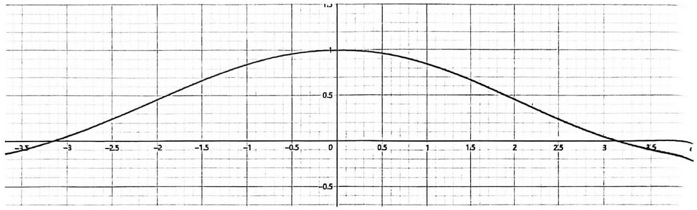

(2) $\mathop{\lim }\limits_{{x \rightarrow   + \infty }}{\left( 1 + \frac{1}{x}\right) }^{x} = \mathop{\lim }\limits_{{x \rightarrow  0}}{\left( 1 + x\right) }^{\frac{1}{x}} = e$

定义 4: 若 $f\left( x\right)$ 在 $x = {x}_{0}$ 有定义,且 $\mathop{\lim }\limits_{{x \rightarrow  {x}_{0}}}f\left( x\right)  = f\left( {x}_{0}\right)$ 则称 $f\left( x\right)$ 在 $x = {x}_{0}$ 连续; 若对于 $\forall x \in  \left( {a, b}\right) , f\left( x\right)$ 都连续, 则称 $f\left( x\right)$ 在 $\left( {a, b}\right)$ 上连续。

2. 已知函数 $\left\{  \begin{array}{l} {e}^{ax} + b, x < 0 \\  1, x = 0 \\  \frac{a\sin x}{x} - b, x > 0 \end{array}\right.$ 在 $x = 0$ 连续,求 $a, b$ 的值

Dirichlet Function: 一个对于 $\forall x \in  R$ 都有定义,但同时都不连续的函数(处处有定义,处处不连续)

$$
D\left( x\right)  = \left\{  \begin{array}{l} 1, x \in  Q \\  0, x \notin  Q \end{array}\right.
$$

## 二、函数的导数

定义 5: 若极限 $\mathop{\lim }\limits_{{x \rightarrow  {x}_{0}}}\frac{f\left( {{x}_{0} + {\Delta x}}\right)  - f\left( {x}_{0}\right) }{\Delta x}$ 存在,则称 $y = f\left( x\right)$ 在 $x = {x}_{0}$ 可导,该极限值称为函数 $y = f\left( x\right)$ 在 $x = {x}_{0}$ 的导数，记做 ${f}^{\prime }\left( {x}_{0}\right)$ 或 ${y}^{\prime }$ ; 若对于 $\forall x \in  \left( {a, b}\right)$ ，函数 $y = f\left( x\right)$ 均有导数，则称 $y = f\left( x\right)$ 在 $\left( {a, b}\right)$ 上处处可导。 $y = f\left( x\right)$ 在 $\left( {a, b}\right)$ 上存在导函数 ${y}^{\prime } = {f}^{\prime }\left( x\right)  = \mathop{\lim }\limits_{{x \rightarrow  {x}_{0}}}\frac{f\left( {x + {\Delta x}}\right)  - f\left( {x}_{0}\right) }{\Delta x}$

<table><tr><td>名称</td><td>几何意义</td><td>类型</td></tr><tr><td>函数值 $y = f\left( {x}_{0}\right)$</td><td>横坐标 $x = {x}_{0}$ 在曲线 $y = f\left( x\right)$ 上对应的纵坐标值</td><td>具体数值</td></tr><tr><td>函数 $y = f\left( x\right)$</td><td>曲线 $y = f\left( x\right)$ 上任意一点的横坐标 $x$ 与纵坐标 $y$ 的对应关系</td><td>函数关系</td></tr><tr><td>导数值 $y = {f}^{\prime }\left( {x}_{0}\right)$</td><td>横坐标 $x = {x}_{0}$ 在曲线 $y = f\left( x\right)$ 上对应点的切线斜率值</td><td>具体数值</td></tr><tr><td>导数 $y = {f}^{\prime }\left( x\right)$</td><td>曲线 $y = f\left( x\right)$ 上任意一点的横坐标 $x$ 与其对应点上切线斜率间的对应关系</td><td>函数关系</td></tr></table>

3. 如图，直线 $l$ 是曲线 $y = f\left( x\right)$ 在 $x = 5$ 处的切线，则 $f\left( 5\right)  + {f}^{\prime }\left( 5\right)  =$ ___.

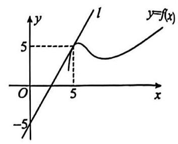

4. 函数 $y = f\left( x\right)$ 的图象如图所示， ${f}^{\prime }\left( x\right)$ 是函数 $f\left( x\right)$ 的导函数，则下列数值排序正确的是( )

A. $2{f}^{\prime }\left( 3\right)  < f\left( 5\right)  - f\left( 3\right)  < 2{f}^{\prime }\left( 5\right)$ B. $2{f}^{\prime }\left( 3\right)  < 2{f}^{\prime }\left( 5\right)  < f\left( 5\right)  - f\left( 3\right)$

C. $f\left( 5\right)  - f\left( 3\right)  < 2{f}^{\prime }\left( 3\right)  < 2{f}^{\prime }\left( 5\right)$ D. $2{f}^{\prime }\left( 5\right)  < 2{f}^{\prime }\left( 3\right)  < f\left( 5\right)  - f\left( 3\right)$

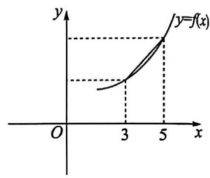

5. 已知 ${f}^{\prime }\left( x\right)$ 是函数 $f\left( x\right)$ 的导函数，若 ${f}^{\prime }\left( {x}_{0}\right)  = 4$ ，则 $\mathop{\lim }\limits_{{{\Delta x} \rightarrow  0}}\frac{f\left( {{x}_{0} - {2\Delta x}}\right)  - f\left( {x}_{0}\right) }{\Delta x} =$ ___

6. 设 $f\left( x\right)$ 为可导函数,且满足 $\mathop{\lim }\limits_{{h \rightarrow  0}}\frac{f\left( 2\right)  - f\left( {2 - h}\right) }{2h} =  - 1$ ,则曲线 $y = f\left( x\right)$ 在点 $\left( {2, f\left( 2\right) }\right)$ 处的切线的斜率是 ___

## 三、基本初等函数的导数

## 幂函数

(1) ${C}^{\prime } = 0\left( {C\text{ 为常数 }}\right)$ ；(2) ${\left( {x}^{n}\right) }^{\prime } = n{x}^{n - 1}$ ； ${\left( \frac{1}{{x}^{n}}\right) }^{\prime } = {\left( {x}^{-n}\right) }^{\prime } =  - n{x}^{-n - 1}$ ； ${\left( \sqrt[n]{{x}^{m}}\right) }^{\prime } = {\left( {x}^{\frac{m}{n}}\right) }^{\prime } = \frac{m}{n}{x}^{\frac{m - 1}{n}}$

## > 三角函数

(1) ${\left( \sin x\right) }^{\prime } = \cos x$ (2) ${\left( \cos x\right) }^{\prime } =  - \sin x$ (3) ${\left( \tan x\right) }^{\prime } = \frac{1}{{\cos }^{2}x}$

指数函数

(1) ${\left( {e}^{x}\right) }^{\prime } = {e}^{x}$ (2) ${\left( {a}^{x}\right) }^{\prime } = {a}^{x}\ln a\left( {a > 0\text{ ,且 }a \neq  1}\right)$ ；

## > 对数函数

(1) ${\left( \ln x\right) }^{\prime } = \frac{1}{x}$ ; (2) ${\left( {\log }_{a}x\right) }^{\prime } = \frac{1}{x\ln a}\left( {a > 0\text{ ,且 }a \neq  1}\right)$

7. 求下列函数的导数

(1) $y = {x}^{8}$ ; (2) $y = {4}^{x}$ ； (3) $y = {\log }_{3}x$ ； (4) $y = {\mathrm{e}}^{2}$ (5) $y = \sin \left( {x + \frac{\pi }{2}}\right)$

## 8. 求下列函数在指定点的导数值

(1) $f\left( x\right)  = {x}^{n};x = 1$ ； (2) $f\left( x\right)  = {\log }_{2}x, x = 2$

9. 【2024 上海春考 16】若函数 $y = f\left( x\right) \left( {x \in  \left( {n, n + 1}\right) , n \in  \mathbf{N}}\right)$ 满足 $f\left( {x + 1}\right)  = {f}^{\prime }\left( x\right)$ ，则称函数 $y = f\left( x\right)$ 为延展函数. 已知延展函数 $y = g\left( x\right)$ 和函数 $y = h\left( x\right)$ ,满足当 $x \in  \left( {0,1}\right)$ 时, $g\left( x\right)  = {\mathrm{e}}^{x}, h\left( x\right)  = {x}^{10}$ 给定以下两个命题:

① 存在函数 $y = {kx} + b\left( {k\text{ 、 }b \in  \mathbf{R}, k \neq  0}\right)$ 与 $y = g\left( x\right)$ 有无穷多个交点;

② 存在函数 $y = {kx} + b\left( {k\text{ 、 }b \in  \mathbf{R}, k \neq  0}\right)$ 与 $y = h\left( x\right)$ 有无穷多个交点.

则正确的选项是( )

A. ①是真命题，②是真命题 B. ①是假命题，②是假命题

C. ①是真命题，②是假命题 D. ①是假命题，②是真命题

四、导数的运算律 I

运算律 1: 设 $\lambda  \in  R$ ,则 ${\left\lbrack  \lambda f\left( x\right) \right\rbrack  }^{\prime } = \lambda {f}^{\prime }\left( x\right)$

运算律 2: ${\left\lbrack  f\left( x\right)  \pm  g\left( x\right) \right\rbrack  }^{\prime } = {f}^{\prime }\left( x\right)  \pm  {g}^{\prime }\left( x\right)$ ;

10. 求下列函数的导数:

(1) $y = 2{x}^{3} - 3{x}^{2} + 5$ ; (2) $y = \frac{2}{x} + {4x}$ ; (3)

## 第 2 讲 导数的运算与求曲线切线方程

## 一、导数的运算律 II

运算律 3: ${\left\lbrack  f\left( x\right)  \cdot  g\left( x\right) \right\rbrack  }^{\prime } = {f}^{\prime }\left( x\right)  \cdot  g\left( x\right)  + f\left( x\right)  \cdot  {g}^{\prime }\left( x\right)$

运算律 4: ${\left\lbrack  \frac{f\left( x\right) }{g\left( x\right) }\right\rbrack  }^{\prime } = \frac{{f}^{\prime }\left( x\right)  \cdot  g\left( x\right)  - f\left( x\right)  \cdot  {g}^{\prime }\left( x\right) }{{\left\lbrack  g\left( x\right) \right\rbrack  }^{2}}\left( {g\left( x\right)  \neq  0}\right)$

## 1. 求下列函数的导数:

(1) $y = \left( {x + 1}\right) \ln x$ (2) $f\left( x\right)  = \left( {1 + \sin x}\right) \left( {1 - {x}^{2}}\right)$ (3): $y = \frac{\ln x}{{x}^{2} + 1}$

(4) $y = \frac{4 - \cos x}{{x}^{2} + 2}$ (5) $y = {\mathrm{e}}^{{2x} + 1}\sin x$ .

运算律 5: 若 $F\left( x\right)  = f\left\lbrack  {g\left( x\right) }\right\rbrack$ ,则 ${F}^{\prime }\left( x\right)  = {f}^{\prime }\left( g\right) {g}^{\prime }\left( x\right)$

## 2. 求下列函数的导数:

$f\left( x\right)  = \ln \left( {{4x} - 1}\right)$ (3) $f\left( x\right)  = {2}^{{3x} + 2}$ ；(4) $f\left( x\right)  = \sqrt{{5x} + 4}$ ；

3. 求下列函数的导数:

(1) $y = x\ln \left( {{x}^{2} + {3x}}\right)$ (2) $y = \frac{{\mathrm{e}}^{{2x} + 1}}{x}$

(3) $y = x\sin \left( {{2x} + \frac{\pi }{2}}\right) \cos \left( {{2x} + \frac{\pi }{2}}\right)$ (4) $y = \frac{\ln x}{x}$

4. 已知 $f\left( x\right)  = {x}^{\lambda },\left( {\lambda  \in  R,\lambda  \neq  0}\right)$ 。证明: ${f}^{\prime }\left( x\right)  = \lambda {x}^{\lambda  - 1}$

5. 已知 $f\left( x\right)  = {x}^{x}$ ,求 ${f}^{\prime }\left( x\right)$

4. (2023·江西) 若函数 $f\left( x\right)$ 的导函数为 ${f}^{\prime }\left( x\right)$ ,且满足 $f\left( x\right)  = 2{f}^{\prime }\left( 1\right) \ln x + {2x}$ ,则 $f\left( \mathrm{e}\right)  =$ (   )

A. 0 B. -1 C. -2 D. $- 4 + {2e}$

6. 曲线 $y = 3{x}^{2} - 2\ln x$ 在 $x = 1$ 处切线的斜率为___。

7. 已知函数 $f\left( x\right)  = \frac{1}{4}{x}^{3} - {2x}$ ，曲线 $y = f\left( x\right)$ 在点 $\left( {{x}_{0}, f\left( {x}_{0}\right) }\right)$ 处的切线的倾斜角为 $\frac{\pi }{4}$ ，则 ${x}_{0} =$ ___。

8. 若曲线 $y = 2\sin x - 2\cos x$ 在点 $\left( {\frac{\pi }{2},2}\right)$ 处的切线与直线 $x - {ay} + 1 = 0$ 垂直，则实数 $a$ 等于___。

9. 设点 $P$ 是曲线 $y = \frac{{\mathrm{e}}^{x} - {\mathrm{e}}^{-x}}{{\mathrm{e}}^{x} + {\mathrm{e}}^{-x}}$ 上任意一点，直线 $l$ 过点 $P$ 与曲线相切，则直线 $l$ 的倾斜角的取值范围为___.

10. 过坐标原点作曲线 $y = {\mathrm{e}}^{x - 2} + 1$ 的切线，则切线方程为___

11. 若 $f\left( x\right)  = \frac{{x}^{2}}{2} + {3x}{f}^{\prime }\left( 3\right)$ ，则曲线 $f\left( x\right)$ 在 $x = 2$ 处的切线方程为___.

12. 若直线 $y = {2x} - a$ 与曲线 $y = 2\ln x + b$ 相切，则 $a + b =$ ___.

13. 过点 $\left( {-1,0}\right)$ 作曲线 $y = {x}^{3} - x$ 的切线,写出一条切线的方程___.

14. 若直线 $y = {kx} + n$ 与曲线 $y = \ln x + \frac{1}{x}$ 相切，则 $k$ 的取值范围是___.

第 3 讲 一阶导数的应用 I

## 一、利用导数判定函数的单调性

函数 $y = f\left( x\right)$ 在区间 $I$ 上单调增 $\Rightarrow$ 导数 $y = {f}^{\prime }\left( x\right)$ 在区间 $I$ 上非负

函数 $y = f\left( x\right)$ 在区间 $I$ 上单调减 $\Rightarrow$ 导数 $y = {f}^{\prime }\left( x\right)$ 在区间 $I$ 上非正

1、设函数 $f\left( x\right)$ 在定义域内可导， $f\left( x\right)$ 的图象如图所示，则其导函数 ${f}^{\prime }\left( x\right)$ 的图象可能是( )

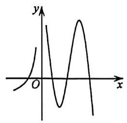

A.

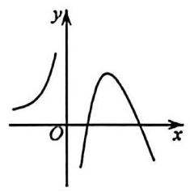

B.

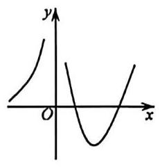

C.

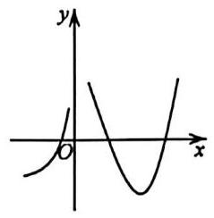

D.

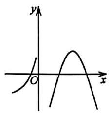

2. 设 ${f}^{\prime }\left( x\right)$ 是函数 $f\left( x\right)$ 的导函数， $y = {f}^{\prime }\left( x\right)$ 的图像如图所示，则 $y = f\left( x\right)$ 的图像最有可能的是 ( )

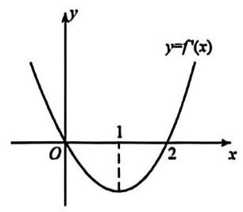

A.

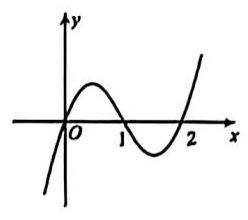

B.

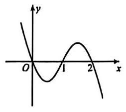

C.

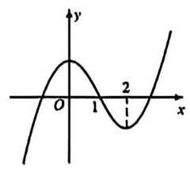

D.

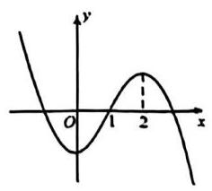

函数 $y = f\left( x\right)$ 单调区间可按如下步骤分析:

STEP 1: 分析 $y = f\left( x\right)$ 的定义域;

STEP 2: 求导数 ${y}^{\prime } = {f}^{\prime }\left( x\right)$ ;

STEP 3: 解不等式 ${f}^{\prime }\left( x\right)  > 0$ ,解集在定义域内的部分为增区间;

STEP 4: 解不等式 ${f}^{\prime }\left( x\right)  < 0$ ,解集在定义域内的部分为减区间。

3. 分析下列函数的单调区间

(1) $f\left( x\right)  = {2x} - 5\ln x - 4$ (2) $f\left( x\right)  = \left( {x - 2}\right) {\mathrm{e}}^{x} - {\left( x - 1\right) }^{2}$

4. 设 $a = {2019}\ln {2021}, b = {2020}\ln {2020}, c = {2021}\ln {2019}$ ,则(   )

A. $a > b > c$ B. $c > b > a$ C. $a > c > b$ D. $b > a > c$

5. 已知函数 $f\left( x\right)  = {e}^{-{\left( x - 1\right) }^{2}}$ . 记 $a = f\left( \frac{\sqrt{2}}{2}\right) , b = f\left( \frac{\sqrt{3}}{2}\right) , c = f\left( \frac{\sqrt{6}}{2}\right)$ ，则( )

A. $b > c > a$ B. $b > a > c$ C. $c > b > a$ D. $c > a > b$

6. 若函数 $f\left( x\right)  = \ln x + a{x}^{2} - {5x}$ 在区间 $\left\lbrack  {\frac{1}{3},\frac{1}{2}}\right\rbrack$ 内单调递增，则实数 $a$ 的取值范围为___

7. 已知 $f\left( x\right)  = {e}^{x} - {ax} - 1$ ，求 $f\left( x\right)$ 的单调增区间；

8. 已知偶函数 $f\left( x\right)$ 与其导函数 ${f}^{\prime }\left( x\right)$ 的定义域均为 $\mathbf{R}$ ，且 ${f}^{\prime }\left( x\right)  + {\mathrm{e}}^{-x} + x$ 也是偶函数，若 $f\left( {{2a} - 1}\right)  < f\left( {a + 1}\right)$ ， 则实数 $a$ 的取值范围是___

## 三、利用导数求函数的极值

> 驻点:光滑连续函数 $y = f\left( x\right)$ 中，导数值为 0 的点

$>$ 极值点: 若 $x = {x}_{0}$ 是函数 $y = f\left( x\right)$ 的一个驻点,且在 ${x}_{0}$ 附近满足:

(1)当 $x < {x}_{0}$ 时， ${f}^{\prime }\left( x\right)  < 0$ ；当 $x > {x}_{0}$ 时， ${f}^{\prime }\left( x\right)  > 0$ ，则称 $x = {x}_{0}$ 是函数 $y = f\left( x\right)$ 的一个极小值点

(2)当 $x > {x}_{0}$ 时， ${f}^{\prime }\left( x\right)  > 0$ ；当 $x < {x}_{0}$ 时， ${f}^{\prime }\left( x\right)  < 0$ ，则称 $x = {x}_{0}$ 是函数 $y = f\left( x\right)$ 的一个极大值点

> 光滑连续函数 $y = f\left( x\right)$ 的极值点，有很大可能也是函数的最值点

9. 函数 $f\left( x\right)  = {\mathrm{e}}^{{2x} - \ln x} - {18x} + 9\ln x$ 的最小值为___

A. $9 - {18}\ln 3$ B. $9 - 9\ln 3$ C. ${18} - {18}\ln 2$ D. $9 - 9\ln 2$

10. 已知 $f\left( x\right)  = \frac{1}{4}{x}^{4} + \frac{1}{3}\left( {1 - p}\right) {x}^{3} - \frac{1}{2}p{x}^{2} - p\left( {1 - p}\right) x + 1$ 。0 是函数 $f\left( x\right)$ 的极值点。求实数 $p$ 值。

11. 已知 $a \in  \mathbf{R}$ ,函数 $f\left( x\right)  = a{x}^{3} - 3{x}^{2}$ . 若函数 $g\left( x\right)  = f\left( x\right)  + {f}^{\prime }\left( x\right) , x \in  \left\lbrack  {0,2}\right\rbrack$ ,在 $x = 0$ 处取得最大值,求 $a$ 的取得范围

12. 已知函数 $f\left( x\right)  = {e}^{x}x - \left( {k + 1}\right) {e}^{x} - \frac{1}{2}{x}^{2} + {kx} + 1$ ,求在 $x \in  \left( {-1,2}\right)$ 的极小值。

13. 已知函数 $f\left( x\right)  = \ln x + \frac{a}{2}{x}^{2} - \left( {a + 1}\right) x + \frac{a}{2} + 1\left( {a > 0}\right)$ .

(1)当 $a = 2$ 时，求 $f\left( x\right)$ 的极值；

(2)设 $f\left( x\right)$ 在区间 $\left\lbrack  {1,2}\right\rbrack$ 上的最小值为 $h\left( a\right)$ ，求 $h\left( a\right)$ 及 $h\left( a\right)$ 的最大值.

## 第 4 讲 一阶导数的应用 II

## 一、解单变量恒成立

1. 已知 $f\left( x\right) , g\left( x\right)$ 分别为定义域为 $\mathrm{R}$ 的偶函数和奇函数,且 $f\left( x\right)  + g\left( x\right)  = {\mathrm{e}}^{x}$ ,若关于 $x$ 的不等式 ${2f}\left( x\right)  - a{g}^{2}\left( x\right)  \geq  0$ 在 $\left( {0,\ln 2}\right)$ 上恒成立，则实数 $a$ 的最大值是___

2. 设 $a, b$ 是正实数，函数 $f\left( x\right)  = x\ln x, g\left( x\right)  =  - \frac{b}{3} + x\ln a$ . 若存在 ${x}_{0} \in  \left\lbrack  {\frac{a}{3}, b}\right\rbrack$ ,使 $f\left( {x}_{0}\right)  \leq  g\left( {x}_{0}\right)$ 成立，则 $\frac{b}{a}$ 的值范围为___.

3. 若函数 $g\left( x\right)$ 在区间 $D$ 上有定义,且 $\forall a, b, c \in  D, g\left( a\right) , g\left( b\right) , g\left( c\right)$ 均可作为一个三角形的三边长,则称 $g\left( x\right)$ 在区间 $D$ 上为“ $M$ 函数”. 已知函数 $f\left( x\right)  = \frac{x - 1}{x} - \ln x + k$ 在区间 $\left\lbrack  {\frac{1}{\mathrm{e}},\mathrm{e}}\right\rbrack$ 为“ $M$ 函数”，则实数 $k$ 的取值范围为 ___.

4. 在空间直角坐标系 $O - {xyz}$ 中,三元二次方程所对应的曲面统称为二次曲面. 比如方程 ${x}^{2} + {y}^{2} + {z}^{2} = 1$ 表示球面,就是一种常见的二次曲面. 二次曲面在工业、农业、建筑等众多领域应用广泛. 已知点 $P\left( {x, y, z}\right)$ 是二次曲面 $4{x}^{2} - {xy} + {y}^{2} - {2z} = 0$ 上的任意一点,且 $x > 0, y > 0, z > 0$ ,则当 $\frac{z}{xy}x > 0$ 取得最小值时,不等式 $\frac{{\mathrm{e}}^{x}}{x} + \frac{ay}{2} - \frac{a\ln \frac{z}{3}}{2} \geq  0$ 恒成立,则实数 $a$ 的取值范围是___.

## 二、解多变量恒成立

5. 已知函数 $f\left( x\right)  = a{x}^{3} - {3x} + 3, g\left( x\right)  = {4}^{x} - {2}^{x + 1} + 2$ ，若对于任意 ${x}_{1},{x}_{2} \in  \left\lbrack  {-1,1}\right\rbrack$ ，都有 $f\left( {x}_{1}\right)  \geq  g\left( {x}_{2}\right)$ 成立，则 $a =$ ___.

6. 已知 $f\left( x\right)  = x{e}^{x} + \frac{1}{e} + {e}^{2}, g\left( x\right)  =  - {\left( x + 1\right) }^{2} + a\ln \left( {x + 1}\right)$ ，若存在 ${x}_{1} \in  \mathbf{R}$ ， ${x}_{2} \in  \left( {-1, + \infty }\right)$ ，使得 $f\left( {x}_{1}\right)  \leq  g\left( {x}_{2}\right)$ 成立， 则实数 $a$ 的取值范围是___.

8. 已知函数 $f\left( x\right)  = {ax}\ln x - \frac{1}{2}{x}^{2} - {ax}\left( {a \leq  0}\right)$ . 若 $\forall {x}_{1},{x}_{2} \in  \left( {1,\mathrm{e}}\right)$ ，且 ${x}_{1} \neq  {x}_{2}$ 都有 $\frac{\left| f\left( {x}_{1}\right)  - f\left( {x}_{2}\right) \right| }{\left| {x}_{1} - {x}_{2}\right| } < 3$ . 则实数 $a$ 的取值范围是___.

9. 已知函数 $f\left( x\right)  = \frac{1 - 2\ln x}{{x}^{2}}$ 的定义域为 $\left( {0,\frac{1}{e}}\right\rbrack$ ,若对任意的 ${x}_{1},{x}_{2} \in  \left( {0,\frac{1}{e}}\right\rbrack  ,\left| \frac{f\left( {x}_{1}\right)  - f\left( {x}_{2}\right) }{{x}_{1} - {x}_{2}}\right|  > \frac{m\left( {{x}_{1} + {x}_{2}}\right) }{{x}_{1}^{2}{x}_{2}^{2}}$ 恒成立, 则实数 $m$ 的取值范围为___.

3. 已知 $f\left( x\right) , g\left( x\right)$ 都是定义域为 $R$ 的连续函数. 已知 $g\left( x\right)$ 满足: ① 当 $x > 0$ 时， ${g}^{\prime }\left( x\right)  > 0$ 恒成立; ② $\forall x \in  \mathbf{R}$ 都有 $g\left( x\right)  = g\left( {-x}\right) ;f\left( x\right)$ 满足: ① $\forall x \in  \mathbf{R}$ 都有 $f\left( {x + \sqrt{3}}\right)  = f\left( {x - \sqrt{3}}\right)$ ; ② 当 $\forall x \in  \left\lbrack  {-\sqrt{3},\sqrt{3}}\right\rbrack$ 时， $f\left( x\right)  = {x}^{3} - {3x}$ . 若关于 $x$ 的不等式 $g\left\lbrack  {f\left( x\right) }\right\rbrack   \leq  g\left( {{a}^{2} - a + 2}\right)$ 对 $x \in  \left\lbrack  {-\frac{3}{2} - 2\sqrt{3},\frac{3}{2} - 2\sqrt{3}}\right\rbrack$ 恒成立，则 $a$ 的取值范围是___.

4. 若存在一个实数 $t$ ,使得 $F\left( t\right)  = t$ 成立,则称 $t$ 为函数 $F\left( x\right)$ 的一个不动点. 设函数 $g\left( x\right)  = {e}^{x} + \left( {1 - \sqrt{e}}\right) x - a(a \in  R$ , $e$ 为自然对数的底数),定义在 $R$ 上的连续函数 $f\left( x\right)$ 满足 $f\left( {-x}\right)  + f\left( x\right)  = {x}^{2}$ ,且当 $x \leq  0$ 时, ${f}^{\prime }\left( x\right)  < x$ . 若存在 ${x}_{0} \in  \left\{  {x\left| {\;f\left( x\right)  + \frac{1}{2} \geq  f\left( {1 - x}\right)  + x}\right. }\right\}$ ，且 ${x}_{0}$ 为函数 $g\left( x\right)$ 的一个不动点，则实数 $a$ 的取值范围为___.

7. 已知函数 $f\left( x\right)  = \left\{  \begin{array}{l} x\ln x, x > 0, \\  0, x = 0, \\  \frac{1}{2}f\left( {x + 1}\right) , x < 0, \end{array}\right.$ 则下列说法正确的是( )

① 当 $x \in  \left( {-3, - 2}\right\rbrack$ 时， $f\left( x\right)  = \frac{1}{8}\left( {x + 3}\right) \ln \left( {x + 3}\right)$ ；

②若不等式 $f\left( x\right)  - {mx} - m < 0$ 至少有 3 个正整数解，则 $m > \ln 3$ ；

③过点 $A\left( {-{\mathrm{e}}^{-2},0}\right)$ 作函数 $y = f\left( x\right) \left( {x > 0}\right)$ 图象的切线有且只有一条:

④设实数 $a > 0$ ,若对任意的 $x \geq  \mathrm{c}$ ,不等式 $f\left( x\right)  \geq  \frac{a}{x}{\mathrm{e}}^{\frac{a}{x}}$ 恒成立,则 $a$ 的最大值是 $\mathrm{c}$ .

A. ①③④ B. ②③④ C. ①③ D. ①④

## 第 6 讲 导数与函数零点

## 一、直接分析

1. 已知函数 $f\left( x\right)  = m\left( {\ln x - x}\right) \left( {m \in  \mathbf{R}}\right)$ 的图像与 $g\left( x\right)  = {x}^{2} - 2\ln x$ 的图像在区间 $\left\lbrack  {\frac{1}{\mathrm{e}},\mathrm{e}}\right\rbrack$ 上存在关于 $x$ 轴对称的点,则 $m$ 的取值范围是___.

2. 已知函数 $f\left( x\right)  = k\left( {\ln x + \frac{a}{2}}\right)  - {ax}$ 在 $\left( {1, f\left( 1\right) }\right)$ 处的切线与直线 $l : y = \left( {\pi  - a}\right) x + 1$ 平行.

(1)求 $k$ 的值；

(2)若 $p\left( x\right)  = f\left( x\right)  - 2\cos x$ ,试讨论 $p\left( x\right)$ 在 $\left\lbrack  {\frac{\pi }{2},\frac{3\pi }{2}}\right\rbrack$ 上的零点个数.

3. 已知函数 $f\left( x\right)  = \left\{  \begin{array}{l} {kx} - {\mathrm{e}}^{-x} + \frac{k}{2}, x < 0 \\  {\mathrm{e}}^{x}\left( {x + 1}\right) , x \geq  0 \end{array}\right.$ ( $e$ 为自然对数的底数),若关于 $x$ 的方程 $f\left( {-x}\right)  =  - f\left( x\right)$ 有且仅有四个不同的解,则实数 $k$ 的取值范围是___.

8. 已知 $f\left( x\right)  = k{e}^{x} - {x}^{2}\left( {k \in  R}\right)$ ,下列结论正确的是___.

①当 $k = 1$ 时， $f\left( x\right)  \geq  0$ 恒成立；

②若 $f\left( x\right)$ 在 $R$ 上单调，则 $k \geq  \frac{2}{e}$ ；

③ 当 $k = 2$ 时， $f\left( x\right)$ 的零点为 ${x}_{0}$ 且 $- 1 < {x}_{0} <  - \frac{1}{2}$ ；

④若 $f\left( x\right)$ 有三个零点，则实数 $k$ 的取值范围为 $\left( {0,\frac{4}{{e}^{2}}}\right)$ .

5. 已知 $f\left( x\right)$ 为奇函数,当 $x \in  \left\lbrack  {0,1}\right\rbrack$ 时, $f\left( x\right)  = 1 - 2\left| {x - \frac{1}{2}}\right|$ ,当 $x \in  ( - \infty , - 1\rbrack , f\left( x\right)  = 1 - {e}^{-1 - x}$ ,若关于 $x$ 的不等式 $f\left( {x + m}\right)  > f\left( x\right)$ 有解，则实数 $m$ 的取值范围为( )

A. $\left( {-1,0}\right)  \cup  \left( {0, + \infty }\right)$ B. $\left( {-2,0}\right)  \cup  \left( {0, + \infty }\right)$

C. $\left( {-\frac{1}{2} - \ln 2, - 1}\right)  \cup  \left( {0, + \infty }\right)$ D. $\left( {-\frac{1}{2} - \ln 2,0}\right)  \cup  \left( {0, + \infty }\right)$

## 二、利用导数判断函数图像性质

6. 关于函数 $f\left( x\right)  = {\mathrm{e}}^{x} + \sin x, x \in  \left( {-\pi ,\pi }\right)$ ，下列四个结论中正确的为___.

① $f\left( x\right)$ 在 $\left( {-\pi ,0}\right)$ 上单调递减，在 $\left( {0,\pi }\right)$ 上单调递增；

② $f\left( x\right)$ 有两个零点;

③ $f\left( x\right)$ 存在唯一极小值点 ${x}_{0}$ ，且 $- 1 < f\left( {x}_{0}\right)  < 0$ ；

④ $f\left( x\right)$ 有两个极值点.

## 第 5 讲 一阶导数的应用 III

## 一、解函数不等式

1. 已知函数 $f\left( x\right)  = \frac{1}{1 + {x}^{2}} - \ln \left| x\right|$ ,若对 $x \in  \left\lbrack  {1,3}\right\rbrack$ ,不等式 $f\left( {-{ax} + \ln x + 1}\right)  + f\left( {{ax} - \ln x - 1}\right)  \geq  {2f}\left( 1\right)$ 恒成立,则实数 $a$ 的取值范围___.

2. 已知 $f\left( x\right)  = {\mathrm{e}}^{x} - {\mathrm{e}}^{-x} + \sin x - x + 1$ ,若 $f\left( {a - 2\ln \left( {\left| x\right|  + 1}\right) }\right)  + f\left( \frac{{x}^{2}}{2}\right)  \geq  2$ 恒成立,则实数 $a$ 的取值范围是___.

设函数 $f\left( x\right)  = \frac{1}{x} - x + a\ln x\left( {a \in  R}\right)$ 的两个极值点分别为 ${x}_{1},{x}_{2}$ ,若 $\frac{f\left( {x}_{1}\right)  - f\left( {x}_{2}\right) }{{x}_{1} - {x}_{2}} \leq  \frac{2e}{{e}^{2} - 1}a - 2$ 恒成立,则实数 $a$ 的取值范围是___.

10. 若 $a > 0, f\left( x\right)  = {x}^{2} + a\left| {\ln x - 1}\right| , g\left( x\right)  = x\left| {x - a}\right|  + 2 - 2\ln 2$ ,对任意 ${x}_{1} \in  \lbrack 1, + \infty )$ ,总存在唯一的 ${x}_{2} \in  \lbrack 2, + \infty )$ , 使得 $f\left( {x}_{1}\right)  = g\left( {x}_{2}\right)$ 成立，则实数 $a$ 的取值范围___.

4. 已知函数 $f\left( x\right)  = {x}^{3} - {3x}$ ，若过点 $A\left( {1, m}\right) \left( {m \neq   - 2}\right)$ 可作曲线 $y = f\left( x\right)$ 的三条切线，则实数 $m$ 的取值范围为 ___-

## 二、曲线交点法

5. 已知函数 $f\left( x\right)  = \left\{  \begin{matrix} \frac{1}{2} - \left| {x - \frac{3}{2}}\right| \left( {x \leq  2}\right) \\  {\mathrm{e}}^{x - 2}\left( {-{x}^{2} + {8x} - {12}}\right) \left( {x > 2}\right)  \end{matrix}\right.$ ，若在区间 $\left( {1,\infty }\right)$ 上存在 $n\left( {n \geq  2}\right)$ 个不同的数 ${x}_{1},{x}_{2},{x}_{3},\cdots ,{x}_{n}$ ，使得 $\frac{f\left( {x}_{1}\right) }{{x}_{1}} = \frac{f\left( {x}_{2}\right) }{{x}_{2}} = \cdots  = \frac{f\left( {x}_{n}\right) }{{x}_{n}}$ 成立，则 $n$ 的取值集合是___

6. 已知 $f\left( x\right)$ 是定义域为 $\left( {0, + \infty }\right)$ 的单调函数,若对任意的 $x \in  \left( {0, + \infty }\right)$ ,都有 $f\left\lbrack  {f\left( x\right)  + {\log }_{\frac{1}{3}}x}\right\rbrack   = 4$ ,且关于 $x$ 的方程 $\left| {f\left( x\right)  - 3}\right|  = {x}^{3} - 6{x}^{2} + {9x} - 4 + a$ 在区间 $(0,3\rbrack$ 上有两解,则实数 $a$ 的取值范围是___

7. 若函数 $f\left( x\right)  = a{\mathrm{e}}^{x} - \sin x, g\left( x\right)  = a{\mathrm{e}}^{x} - x\sin x$ ，且 $f\left( x\right)$ 和 $g\left( x\right)$ 在 $\left\lbrack  {0,\pi }\right\rbrack$ 一共有三个零点，则 $a =$ ___.

## 三、复合函数零点法

8. 已知函数 $f\left( x\right)  = \frac{2\sqrt{\left| x\right| }}{{\mathrm{e}}^{x - 1}}$ ,若关于 $x$ 的方程 ${f}^{2}\left( x\right)  - {mf}\left( x\right)  + m - 1 = 0$ 恰好有 3 个不相等的实根,则 $m$ 的取值范围是 ___.

9. 已知函数 $f\left( x\right)  = {mx} - x + \frac{{4e}{x}^{2}}{{e}^{x}} + {e}^{x}\left( {x \in  R}\right)$ 有三个不同的零点 ${x}_{1},{x}_{2},{x}_{3}$ 且 ${x}_{1} < {x}_{2} < {x}_{3}$ ,若 ${T}_{i} = \frac{{e}^{{x}_{i}}}{{x}_{i}}\left( {i = 1,2,3}\right)$ . 则 ${T}_{1} + {T}_{2} + {T}_{3}$ 的值为___.

10. 已知函数 $f\left( x\right)  = {4e}\ln x - \frac{{x}^{2}}{x - e\ln x} + {2mx}$ 存在 4 个零点，则实数 $m$ 的取值范围是___.

11. 已知函数 $f\left( x\right)  = {\left( \ln x\right) }^{2} + \left( {4 + a}\right) x\ln x + \left( {{2a} + 8}\right) {x}^{2}$ 存在三个零点 ${x}_{1},{x}_{2},{x}_{3}$ ，且满足 ${x}_{1} < {x}_{2} < {x}_{3}$ . 则 ${\left( \frac{\ln {x}_{1}}{{x}_{2}} + 2\right) }^{2}\left( {\frac{\ln {x}_{2}}{{x}_{2}} + 2}\right) \left( {\frac{\ln {x}_{3}}{{x}_{3}} + 2}\right)$ 的值为___.

## 第 7 讲 概率

## 一、古典概率

1. 设 $O$ 为坐标原点,从集合 $\{ 1,2,3,4,5,6,7,8,9\}$ 中任取两个不同的元素 $x\text{ 、 }y$ ,组成 $A\text{ 、 }B$ 两点的坐标 $\left( {x, y}\right) \text{ 、 }\left( {y, x}\right)$ , 则 ${S}_{\bigtriangleup {AOB}} \leq  {10}$ 的概率为___

2. 某公司门前有一排 9 个车位的停车场,从左往右数第三个，第七个车位分别停着 $A$ 车和 $B$ 车，同时进来 $C$ ， $D$ 两车. 在 $C, D$ 不相邻的情况下, $C$ 和 $D$ 至少有一辆与 $A$ 和 $B$ 车相邻的概率是___

3. 知两个实数集合 $A = \left\{  {{a}_{1},{a}_{2},\cdots ,{a}_{100}}\right\}  , B = \left\{  {{b}_{1},{b}_{2},\cdots ,{b}_{50}}\right\}$ ，若函数 $f\left( x\right)$ 的定义域和值域分别为 $A$ 和 $B$ ，则 $f\left( x\right)$ 为调增函数的概率是___

## 三、条件概率

<table><tr><td>定义</td><td>一般地,当事件 $B$ 发生的概率大于 0 时(即 $P\left( B\right)  > 0$ ),已知事件 $B$ 发生的条件下事件 $A$ 发生的概率,称为事件概率</td></tr><tr><td>表示</td><td>$P\left( {A \mid  B}\right)$</td></tr><tr><td>计算   公式</td><td>$P\left( {A \mid  B}\right)  = \frac{P\left( {A \cap  B}\right) }{P\left( B\right) }$</td></tr></table>

> 条件概率的性质

(1) $0 \leq  P\left( {B \mid  A}\right)  \leq  1$ ；

(2) $P\left( {A \mid  A}\right)  = 1$ ；

(3)如果 $B$ 与 $C$ 互斥，则 $P\left( {B \cup  C \mid  A}\right)  = P\left( {B \mid  A}\right)  + P\left( {C \mid  A}\right)$ .

4. 一个袋中有 2 个黑球和 3 个白球,如果不放回地抽取两个球,记事件“第一次抽到黑球”为 $A$ ; 事件“第二次抽到黑球”为 $B$ .

(1)分别求事件 $A, B, A \cap  B$ 发生的概率；

(2)求 $P\left( {B \mid  A}\right)$ .

5. 现有 6 个节目准备参加比赛，其中 4 个舞蹈节目，2 个语言类节目，如果不放回地依次抽取 2 个节目，求:

(1)第 1 次抽到舞蹈节目的概率；

(2)第 1 次和第 2 次都抽到舞蹈节目的概率；

(3)在第 1 次抽到舞蹈节目的条件下，第 2 次抽到舞蹈节目的概率.

6. 在一个袋子中装有 10 个球, 设有 1 个红球, 2 个黄球, 3 个黑球, 4 个白球, 从中依次摸 2 个球, 求在第一个球是红球的条件下, 第二个球是黄球或黑球的概率.

四、全概率公式

(1) $P\left( B\right)  = P\left( A\right) P\left( {B \mid  A}\right)  + P\left( \bar{A}\right) P\left( {B \mid  \bar{A}}\right)$ ;

(2)定理 1 若样本空间 $\Omega$ 中的事件 ${A}_{1},{A}_{2},\ldots ,{A}_{n}$ 满足:

①任意两个事件均互斥，即 ${A}_{i}{A}_{j} =  \circ  , i, j = 1,2,\ldots , n$ ， $i \neq  j$ ；

② ${A}_{1} + {A}_{2} + \ldots  + {A}_{n} = \Omega$ ；

③ $P\left( {A}_{i}\right)  > 0, i = 1,2,\ldots , n$ .

则对 $\Omega$ 中的任意事件 $B$ ,都有 $B = B{A}_{1} + B{A}_{2} + \ldots  + B{A}_{n}$ ,且 $P\left( B\right)  = \mathop{\sum }\limits_{{i = 1}}^{n}P\left( {B{A}_{i}}\right)  = \mathop{\sum }\limits_{{i = 1}}^{n}P\left( {A}_{i}\right) P\left( {B \mid  {A}_{i}}\right)$ .

贝叶斯公式

(1)一般地，当 $0 < P\left( A\right)  < 1$ 且 $P\left( B\right)  > 0$ 时，有 $P\left( {A \mid  B}\right)  = \frac{P\left( A\right) P\left( {B \mid  A}\right) }{P\left( B\right) } = \frac{P\left( A\right) P\left( {B \mid  A}\right) }{P\left( A\right) P\left( {B \mid  A}\right)  + P\left( \bar{A}\right) P\left( {B \mid  \bar{A}}\right) }$ .

(2)定理 2 若样本空间 $\Omega$ 中的事件 ${A}_{1},{A}_{2},\ldots ,{A}_{n}$ 满足:

①任意两个事件均互斥，即 ${A}_{i}{A}_{j} = \varnothing , i, j = 1,2,\ldots , n, i \neq  j$ ；

② ${A}_{1} + {A}_{2} + \ldots  + {A}_{n} = \Omega$ ；

③ $1 > P\left( {A}_{i}\right)  > 0, i = 1,2,\ldots , n$ .

则对 $\Omega$ 中的任意概率非零的事件 $B$ ,有 $P\left( {{A}_{j} \mid  B}\right)  = \frac{P\left( {A}_{i}\right) P\left( {B \mid  {A}_{j}}\right) }{P\left( B\right) } = \frac{P\left( {A}_{i}\right) P\left( {B \mid  {A}_{i}}\right) }{\mathop{\sum }\limits_{{i = 1}}^{n}P\left( {A}_{i}\right) P\left( {B \mid  {A}_{i}}\right) }$ .

7. 甲箱的产品中有 5 个正品和 3 个次品, 乙箱的产品中有 4 个正品和 3 个次品.

(1)从甲箱中任取 2 个产品，求这 2 个产品都是次品的概率；

(2)若从甲箱中任取 2 个产品放入乙箱中，然后再从乙箱中任取一个产品，求取出的这个产品是正品的概率.

8. 一项血液化验用来鉴别是否患有某种疾病. 在患有此种疾病的人群中，通过化验有 95%的人呈阳性反应，而健康的人通过化验也会有 1%的人呈阳性反应. 某地区此种病的患者仅占人口的 0.5%.若某人化验结果为阳性, 问此人确实患有此病的概率是多大?

、事件的独立性

(1)事件 $A$ 与 $B$ 相互独立的充要条件是 $P\left( {AB}\right)  = P\left( A\right) P\left( B\right)$ .

(2)当 $P\left( B\right)  > 0$ 时， $A$ 与 $B$ 独立的充要条件是 $P\left( {A \mid  B}\right)  = P\left( A\right)$ .

(3)如果 $P\left( A\right)  > 0, A$ 与 $B$ 独立，则 $P\left( {B \mid  A}\right)  = P\left( B\right)$ 成立. $P\left( {B \mid  A}\right)  = \frac{P\left( {AB}\right) }{P\left( A\right) } = \frac{P\left( A\right) P\left( B\right) }{P\left( A\right) } = P\left( B\right)$ .

1. 判断下列各对事件是否是相互独立事件.

(1)甲组3 名男生，2 名女生；乙组 2 名男生，3 名女生. 现从甲、乙两组中各选 1 名同学参加演讲比赛，“从甲组中选出 1 名男生”与“从乙组中选出 1 名女生”；

(2)容器内盛有 5 个白乒乓球和 3 个黄乒乓球，“从 8 个球中任意取出 1 个，取出的是白球”与“从剩下的 7 个球中任意取出 1 个, 取出的还是白球”;

(3)掷一颗骰子一次，“出现偶数点”与“出现 3 点或 6 点”.

10. 面对某种流感病毒，各国医疗科研机构都在研究疫苗，现有 $A$ ， $B$ ， $C$ 三个独立的研究机构在一定的时期内能研制出疫苗的概率分别是 $\frac{1}{5},\frac{1}{4},\frac{1}{3}$ . 求:

(1)他们都研制出疫苗的概率；

(2)他们都失败的概率；

(3)他们能够研制出疫苗的概率.

11. 一枚质地均匀的正方体骰子，其六个面分别刻有 1,2,3,4,5,6 六个数字，投掷这枚骰子两次， $A$ 表示事件 “第一次向上一面的数字是 1 ”, $B$ 表示事件“第二次向上一面的数字是 2 ”, $C$ 表示事件“两次向上一面的数字之和是 7 ”， $D$ 表示事件“两次向上一面的数字之和是 8”，则()

A. $C$ 与 $D$ 相互独立 B. $A$ 与 $D$ 相互独立

C. $B$ 与 $D$ 相互独立 D. $A$ 与 $C$ 相互独立

12. 甲箱中有 5 个红球, 2 个白球和 3 个黑球, 乙箱中有 4 个红球, 3 个白球和 3 个黑球。假设同颜色球无法分辨,先从甲箱中随机取出一球放入乙箱,分别以 ${A}_{1},{A}_{2},{A}_{3}$ 表示由甲箱中取出的球是红球、白球和黑球的事件,再从乙箱中随机取出一球,以 $B$ 表示由乙箱中取出的球是红球的事件,则下列说法正确的是 ___

① 事件 ${A}_{1},{A}_{2}$ 相互独立; ② $P\left( {A}_{3}\right)  = \frac{1}{5}$ ; ③ $P\left( B\right)  = \frac{9}{22}$ ; ④ $P\left( {B \mid  {A}_{2}}\right)  = \frac{4}{11}$ ; ⑤ $P\left( {{A}_{1} \mid  B}\right)  = \frac{5}{9}$

13. 已知 $A, B$ 是两个事件，且 $0 < P\left( B\right)  < 1$ ，则事件 $A, B$ 相互独立的充分必要条件可以是___

$\text{ ① }P\left( {AB}\right)  = 0$ ; ② $P\left( {A\bar{B}}\right)  = P\left( A\right) P\left( \bar{B}\right)$ ; ③ $P\left( {A \mid  B}\right)  = P\left( {A \mid  \bar{B}}\right)$

④ ${P}^{2}\left( {AB}\right)  + {P}^{2}\left( {\bar{A}B}\right)  + {P}^{2}\left( {A\bar{B}}\right)  + {P}^{2}\left( {\bar{A}\bar{B}}\right)  = \frac{1}{4}$

## 第 8 讲 统计

## 一、随机抽样

## 简单随机抽样

(1)放回简单随机抽样与不放回简单随机抽样

(2)简单随机抽样需满足:①被抽取的样本和总体的个体数有限；②逐个抽取；③等可能抽取。

(3)简单随机抽样常用抽签法(适用于总体中个体数较少的情况)、随机数法(适用于总体中个体数较多的情况)。

(4)在使用随机数法时，编号位数要相同，如遇到三位数(或四位数)，可从选择的随机数表中的某行某列的数字计起，每三个(或四个)作为一个单位, 按某种顺序依次选取,有超过总体号码或出现重复号码的数字舍去。

(5)总体与样本的均值

总体中有 $N$ 个个体,它们的变量值分别为 ${Y}_{1},{Y}_{2},\ldots ,{Y}_{N}$ ,则总体均值 $\bar{Y} = \frac{{Y}_{1} + {Y}_{2} + \cdots  + {Y}_{N}}{N} = \frac{1}{N}\mathop{\sum }\limits_{{i = 1}}^{N}{Yi}$ 。

从总体中抽取一个容量为 $n$ 的样本,它们的变量值分别为 ${y}_{1},{y}_{2},\ldots ,{y}_{n}$ ,则样本均值 $\bar{y} = \frac{{y}_{1} + {y}_{2} + \cdots  + {y}_{n}}{n} = \frac{1}{n}\mathop{\sum }\limits_{{i = 1}}^{n}{yi}$ 。

1. 下列抽样试验中,适合用抽签法的是( )

A. 从某工厂生产的 3 000 件产品中抽取 600 件进行质量检验

B. 从某工厂生产的两箱(每箱 15 件)产品中抽取 6 件进行质量检验

C. 从甲、乙两厂生产的两箱(每箱 15 件)产品中抽取 6 件进行质量检验

D. 从某厂生产的 3 000 件产品中抽取 10 件进行质量检验

2. 从总体量为 $N$ 的一批零件中使用简单随机抽样的方法抽取一个容量为 40 的样本。若某个零件在第 2 次抽取时被抽到的可能性为 1%,则 $N =$ ___

3. 总体由编号为 01,02,...,29,30 的 30 个个体组成。利用下面的随机数表选取 6 个个体,选取方法是从如下随机数表的第 1 行的第 6 列和第 7 列数字开始由左到右依次选取两个数字,则选出来的第 6 个个体的编号为___

7816623208026242

6252536997280198

3204923449358200

3623486969387481

## 分层随机抽样

(1)定义:一般地，按一个或多个变量把总体划分成若干个子总体，每个个体属于且仅属于一个子总体，在每个子总体中独立地进行简单随机抽样，再把所有子总体中抽取的样本合在一起作为总样本，这样的抽样方法称为分层随机抽样. 每一个子总体称为层。

$$
\text{ 抽样比 } = \frac{\text{ 该层样本量 }\mathrm{n}}{\text{ 总样本量 }\mathrm{N}} = \frac{\text{ 该层抽取的个体数 }}{\text{ 该层的个体数 }}\text{ 。 }
$$

(2)比例分配:在分层随机抽样中，如果每层样本量都与层的大小成比例，那么称这种样本量的分配方式为比例分配。

(3)分层随机抽样平均数的计算:如果层数分为 2 层,第 1 层和第 2 层包含的个体数分别为 $M$ 和 $N$ ，抽取的样本量分别为 $m$ 和 $n$ ,总体平均数分别为 $\bar{X}$ 和 $\bar{Y}$ ,样本平均数分别为 $\bar{x}$ 和 $\bar{y}$ ,总体平均数为 $\bar{W}$ ,样本平均数为 $\bar{w}$ ,则 $\bar{W} = \frac{M\bar{X} + N\bar{Y}}{M + N}$ ,

$$
\bar{w} = \frac{m\bar{x} + n\bar{y}}{m + n}\text{ 。 }
$$

请注意:

✓在比例分配的分层随机抽样中,可以直接用样本平均数 $\bar{w}$ 估计总体平均数 $\bar{W}$ 。

$\times$ 不是比例分配的分层随机抽样中不能用样本平均数 $\bar{w}$ 估计总体平均数 $\bar{W}$ 。

4. 在调查某中学的学生身高时,利用比例分配的分层随机抽样的方法抽取男生 20 人,女生 15 人,得到了男生身高的平均值为 170 cm，女生身高的平均值为 165 cm。则该中学所有学生的平均身高约为___cm。(保留两位小数)

5. 某高中为了解本校学生考入大学一年后的学习情况，对本校上一年考入大学的学生进行了调查，根据学生所属的专业类型，制成如图所示的饼图。现从这些学生中抽出 100 人进行进一步调查，已知张三为理学专业，李四为工学专业，则下列说法正确的是___

①若按专业类型进行分层随机抽样，则张三被抽到的可能性比李四大

②若按专业类型进行分层随机抽样，则理学专业和工学专业应分别抽取 30 人和 20 人

③采用分层随机抽样比简单随机抽样更合理

④ 该问题中的样本容量为 100

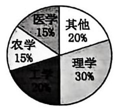

6. 已知我国某省二、三、四线城市的数量之比为 1:3:6。2023 年 3 月份调查得知该省二、三、四线城市的总房产均价为 0.8 万元/平方米、总方差为 11，其中三、四线城市的房产均价分别为 1 万元/平方米、0.5 万元/平方米，三、 四线城市房价的方差分别为 10,8,则二线城市的房产均价为___万元/平方米。

## 二、统计图表

(1)常见的统计图表有条形图、扇形图、折线图、频率分布直方图等。

(2)作频率分布直方图的步骤:

①求极差；②决定组距与组数；③将数据分组；④ 列频率分布表；⑤画频率分布直方图。

(3)统计图表的主要应用

扇形图:直观描述各类数据占总数的比例;

折线图:描述数据随时间的变化趋势;

条形图:直观描述不同类别或分组数据的频数和频率。

7. 某中学组织三个年级的学生进行党史知识竞赛,经统计,得到前 200 名学生分布的扇形图(如图①)和前 200 名中高一学生排名分布的频率条形图(如图②)，则下列选项正确的是___

A. 成绩前 200 名的 200 人中,高一人数比高二人数多 30

B. 成绩第 1~100 名的 100 人中,高一人数不超过一半

C. 成绩第 1~50 名的 50 人中,高三最多有 32 人

D. 成绩第 51~100 名的 50 人中,高二人数比高一的多

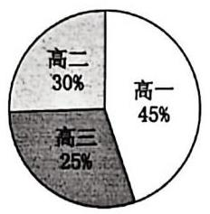

①

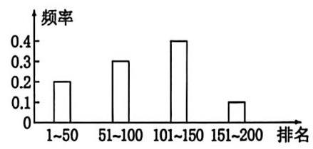

②

8. 如图是甲、乙两人高考前 10 次数学模拟成绩的折线图,则下列说法错误的是( )

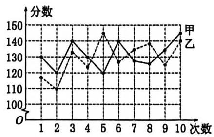

A. 甲的数学成绩最后 3 次逐渐升高

B. 甲的数学成绩在 130 分及以上的次数多于乙的数学成绩在 130 分及以上的次数

C. 甲有 5 次考试成绩比乙高

D. 甲数学成绩的极差小于乙数学成绩的极差

9. 某研究小组经过研究发现某种疾病的患病者与未患病者的某项医学指标有明显差异，经过大量调查，得到如下的患病者和未患病者该指标的频率分布直方图:

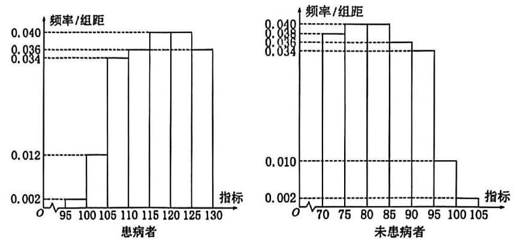

利用该指标制定一个检测标准，需要确定临界值 $c$ ，将该指标大于 $c$ 的人判定为阳性，小于或等于 $c$ 的人判定为阴性。 此检测标准的漏诊率是将患病者判定为阴性的概率，记为 $p\left( c\right)$ ；误诊率是将未患病者判定为阳性的概率，记为 $q\left( c\right)$ 。假股数据在组内均匀分布，以事件发生的频率作为相应事件发生的概率。

(1)当漏诊率 $p\left( c\right)  = {0.5}\%$ 时,求临界值 $c$ 和误诊率 $q\left( c\right)$ ;

(2)设函数 $f\left( c\right)  = p\left( c\right)  + q\left( c\right)$ 。当 $c \in  \left\lbrack  {{95},{105}}\right\rbrack$ 时，求 $f\left( c\right)$ 的解析式，并求 $f\left( c\right)$ 在区间 $\left\lbrack  {{95},{105}}\right\rbrack$ 的最小值。

## 三、统计量

## 百分位数

(1)一般地，一组数据的第 $p$ 百分位数是这样一个值，它使得这组数据中至少有 $p$ %的数据小于或等于这个值，且至少有 $\left( {{100} - p}\right) \%$ 的数据大于或等于这个值。

(2)四分位数。常用的分位数有第 25 百分位数，第 50 百分位数(即中位数)，第 75 百分位数。这三个分位数把一组由小到大排列后的数据分成四等份，因此称为四分位数。其中第 25 百分位数也称为第一四分位数或下四分位数等，第 75 百分位数也称为第三四分位数或上四分位数等。

(3)确定要求的 $p\%$ 分位数所在分组 $\lbrack A, B)$ ，由频率分布表或频率分布直方图可知，样本中小于 $A$ 的频率为 $a$ ，小于 $B$ 的频率为 $b$ ，所以 $p\%$ 分位数 $= A +$ 组距 $\times  \frac{p\%  - a}{b - a}$ 。

10. 一个容量为 20 的样本，其数据按从小到大的顺序排列为: 1, 2, 2, 3, 5, 6, 6, 7, 8, 8, 9, 10, 13, 13, 14, 15, 17, 17, 18, 18，则该组数据的第 75 百分位数为___，第 86 百分位数为___。

11. 如图所示是某市 3 月 1 日至 3 月 10 日最低气温(单位: ${}^{ \circ  }\mathrm{C}$ )的情况绘制的折线统计图，由图可知这 10 天最低气温的第 80 百分位数是___

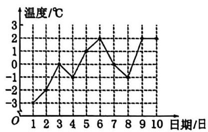

12. 为了解“双减”政策实施后学生每天的体育活动时间，研究人员随机调查了某地区 1000 名学生每天进行体育运动的时间，按照时长(单位:min)分成 6 组:第一组[30,40)，第二组[40, 50)，第三组[50,60)，第四组[60,70)，第五组[70,80). 第六组[80,90]，经整理得到如图所示的频率分布直方图，则可以估计该地区学生每天体育活动时间的第 25 百分位数约为___min。

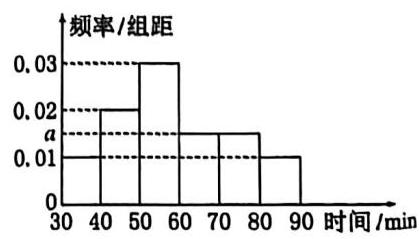

13. 某车间 12 名工人一天生产某产品(单位:kg)的数量分别为13.8,13,13.5,15.7,13.6,14.8,14,14.6,15,15.2,15.8,15.4,则所给数据的第 25,75 百分位数分别是___。

## 众数、中位数、平均数(数据集中估计量)

<table><tr><td>数字特征</td><td>样本数据</td><td>频率分布直方图</td></tr><tr><td>众数</td><td>出现次数最多的数据</td><td>取最高的小矩形底边中点的横坐标</td></tr><tr><td>中位数</td><td>将数据按大小依次排列,处在最中间位置的一个数据(或最中间两个数据的平均数)</td><td>把频率分布直方图划分为左右两个面积相等的部分,分界线与 $x$ 轴交点的横坐标</td></tr><tr><td>平均数</td><td>样本数据的算术平均数 $\overline{\mathrm{x}} = \frac{1}{\mathrm{n}}\left( {{x}_{1} + {x}_{2} + \ldots  + {x}_{n}}\right)$</td><td>每个小矩形的面积乘小矩形底边中点的横坐标之和</td></tr></table>

4. 样本数据16,24,14,10,20,30,12,14,40的中位数为___

5. 为了解某校今年准备报考飞行员的学生的体重情况，将所得的数据整理后，画出了频率分布直方图(如图)，已知图中从左到右的前 3 个小组的频率之比为 1:2:3，第 1 个小组的频数为 6，则报考飞行员的学生人数是___

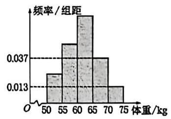

6. 10 名工人某天生产同一零件，生产的件数是:15,17,14,10,15,17,17,16,14,12，设其平均数为 $a$ ，中位数为 $b$ ，众数为 $c$ ， 则将它们按从小到大排序为___

7. 某城市在创建文明城市的活动中，为了解居民对“创建文明城市”的满意程度，组织居民给活动打分(分数为整数， 满分 100 分),从中随机抽取一个容量为 100 的样本,发现数据均在 $\left\lbrack  {{40},{100}}\right\rbrack$ 内。现将这些分数分成 6 组并画出样本的频率分布直方图，但不小心污损了部分图形，如图所示。观察图形，则下列说法正确的是___

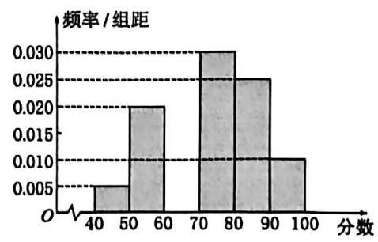

①频率分布直方图中第三组的频数为 10

②根据频率分布直方图估计样本的众数为 75 分

③根据频率分布直方图估计样本的中位数为 75 分

④根据频率分布直方图估计样本的平均数为 75 分

## 方差和标准差(数据离散程度估计量)

(1)假设一组数据是 ${x}_{1},{x}_{2},\ldots ,{x}_{n}$ ，用 $\bar{x}$ 表示这组数据的平均数，则我们称 $\frac{1}{n}\mathop{\sum }\limits_{{l = 1}}^{n}{\left( {x}_{l} - \bar{x}\right) }^{2}$ 为这组数据的方差。有时为了计算方差的方便,我们还把方差写成 $\frac{1}{n}\mathop{\sum }\limits_{{l = 1}}^{n}{x}_{l}^{2} - {\bar{x}}^{2}$ 的形式。为了与原始数据的单位一致,我们对方差开平方,取它的算术平方根 $\sqrt{\frac{1}{n}\mathop{\sum }\limits_{{i = 1}}^{n}{\left( {x}_{i} - \bar{x}\right) }^{2}}$ ,称为这组数据的标准差。

(2)方差和标准差刻画了数据的离散程度或波动幅度。

方差: $\frac{{s}^{2} - 1}{n}\left\lbrack  {{\left( {x}_{1} - \bar{x}\right) }^{2} + {\left( {x}_{2} - \bar{x}\right) }^{2} + \ldots  + {\left( {x}_{n} - \bar{x}\right) }^{2}}\right\rbrack$ 。标准差: $s = \sqrt{\frac{1}{n}\left\lbrack  {{\left( {x}_{1} - \bar{x}\right) }^{2} + {\left( {x}_{2} - \bar{x}\right) }^{2} + \cdots  + {\left( {x}_{n} - \bar{x}\right) }^{2}}\right\rbrack  }$ 。

18. 如图所示，样本 $A$ 和 $B$ 分别取自两个不同的总体，它们的样本平均数分别为 ${\bar{x}}_{A}$ 和 ${\bar{x}}_{B}$ ，样本标准差分别为 ${s}_{A}$ 和 ${s}_{B}$ ，则 ( )

A. ${\bar{x}}_{A} > {\bar{x}}_{B},{s}_{A} > {s}_{B}$ B. ${\bar{x}}_{A} < {\bar{x}}_{B},{s}_{A} > {s}_{B}$ C. ${\bar{x}}_{A} > {\bar{x}}_{B},{s}_{A} < {s}_{B}$ D. ${\bar{x}}_{A} < {\bar{x}}_{B},{s}_{A} < {s}_{B}$

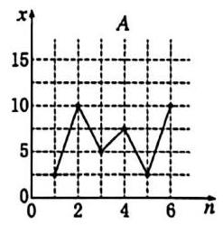

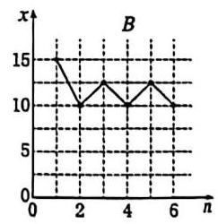

19. 有一组样本数据 ${x}_{1},{x}_{2},\ldots ,{x}_{n}$ ,由这组数据得到新样本数据 ${y}_{1},{y}_{2},\ldots ,{y}_{n}$ ,其中 ${y}_{i} = {x}_{i} + c\left( {i = 1,2,\ldots , n}\right) , c$ 为非零常数,则 (   )

A. 两组样本数据的样本平均数相同 B. 两组样本数据的样本中位数相同

C. 两组样本数据的样本标准差相同 D. 两组样本数据的样本极差相同

## 第 9 讲 分布

一、分层随机抽样的均值与方差。

1. 本市对全区高中生的身高(单位:厘米)进行统计，得到如下的频率分布直方图:

(1)若数据分布均匀，记随机变量 $X$ 为各区间中点所代表的身高，写出 $X$ 的分布及期望；

(2)已知本市身高在区间 $\left\lbrack  {{180},{210}}\right\rbrack$ 的市民人数约占全市总人数的 10%，且全市高中生约占全市总人数的 1.2%，现在要以该区本次统计数据估算全市高中生身高情况，从本市市民中任取 1 人，若此人的身高位于区间 $\left\lbrack  {{180},{210}}\right\rbrack$ ,试估算此人是高中生的概率;

(3)现从身高在区间 $\lbrack {170},{190})$ 的高中生中分层抽样抽取一个 80 人的样本，若身高在区间 $\lbrack {170},{180})$ 中样本的均值为 176cm，方差为 10；身高在区间 $\lbrack {180},{190})$ 中样本的均值为 184cm，方差为 16；试求这 80 人的方差。

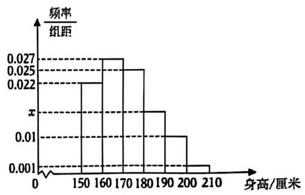

二、随机数的离散分布

- 离散随机事件的分布列、期望与方差

## 均匀分布(Uniform distribution)

状态空间 $\Omega$ 中共有 $n$ 个事件，每个事件发生的概率完全相同，均为 $\frac{1}{n}$ 。这是最简单的一种分布，也是大部分概率讨论的基础假设。

> 二项分布(Binomial distribution)

某事件发生情况 $A$ 的概率为 $p$ ,不发生的情况为 $1 - p$ 。则重复 $n$ 次这样的事件 (且相互独立),情况 $A$ 发生的次数构成的分布列,称为二项分布,记作 $X \sim  B\left( {n, p}\right)$ :

$P\left( {X = k}\right)  = {C}_{n}^{k}{p}^{k}{\left( 1 - p\right) }^{n - k}$ (表示情况 $A$ 发生 $k$ 次 $\left( {k = 0,1,2,\cdots , n}\right)$ 的概率), $E\left( X\right)  = {np}, D\left( x\right)  = {np}\left( {1 - p}\right)$

2. 某家畜研究机构发现每头成年牛感染病的概率是 $p\left( {0 < p < 1}\right)$ ，且每头成年牛是否感染病相互独立。

(1)记10头成年牛中恰有3头感染病的概率是 $f\left( p\right)$ ，求当概率 $p$ 取何值时， $f\left( p\right)$ 有最大值？

(2)若以(1)中确定的 $p$ 值作为感染病的概率，设 10 头成年牛中恰有 $k$ 头感染病的概率是 $g\left( k\right)$ ，求当 $k$ 为何值时, $g\left( k\right)$ 有最大值?

3. 一款击鼓小游戏的规则如下:每盘游戏都需击鼓三次，每次击鼓后要么出现一次音乐，要么不出现音乐；每盘游戏击鼓三次后，出现三次音乐获得 150 分，出现两次音乐获得 100 分，出现一次音乐获得 50 分，没有出现音乐则获得 -300 分. 设每次击鼓出现音乐的概率为 $p\left( {0 < p < \frac{2}{5}}\right)$ ,且各次击鼓出现音乐相互独立.

(1)若一盘游戏中仅出现一次音乐的概率为 $f\left( p\right)$ ，求 $f\left( p\right)$ 的最大值点 ${p}_{0}$ ；

(2)以(1)中确定的 ${p}_{0}$ 作为 $p$ 的值，玩 3 盘游戏，出现音乐的盘数为随机变量 $X$ ，求每盘游戏出现音乐的概率 ${p}_{1}$ ,及随机变量 $X$ 的期望 ${EX}$ ;

(3)玩过这款游戏的许多人都发现，若干盘游戏后，与最初的分数相比，分数没有增加反而减少了. 请运用概率统计的相关知识分析分数减少的原因.

超几何分布(Hypergeometric Distribution)

从有限的 $\mathrm{N}$ 个球(其中包含 $\mathrm{M}$ 个红球和 $\mathrm{N} - \mathrm{M}$ 个白球)中抽出 $\mathrm{n}$ 个且不放回,成功抽出 $k$ 个 $\left( {k = 0,1,2,\cdots , M}\right)$ 的概率分布列,称为超几何分布,记作 $X \sim  H\left( {N, n, M}\right)$ :

$P\left( {X = k}\right)  = \frac{{C}_{M}^{k}{C}_{N - M}^{n - k}}{{C}_{N}^{n}};E\left( X\right)  = \frac{nM}{N};D\left( X\right)  = \frac{{nM}\left( {N - M}\right) \left( {N - n}\right) }{{N}^{2}\left( {N - 1}\right) }$ (证明略)

4. 从1,2,3,4,5,6组成的没有重复数字的六位数中任取 10 个不同的数,其中满足 $1\text{ 、 }3$ 都不与 5 相邻的六位偶数的个数为随机变量 $X$ ,则 $P\left( {X = 4}\right)  =$ ___

## 三、正态分布

一般地,如果对于任何实数 $a\text{ 、 }b\left( {a < b}\right)$ ,随机变量 $X$ 满足 $P\left( {a < X \leq  b}\right)  = {\int }_{a}^{b}{\varphi }_{\mu ,\sigma }\left( x\right) {dx}$ ,则称随机变量 $X$ 服从正态分布(Normal Distribution)，正态分布完全由参数 $\mu$ 和 $\sigma$ 确定，因此正态分布常记作 $N\left( {\mu ,{\sigma }^{2}}\right)$ . 如果随机变量 $X$ 服从正态分布,则记为 $X - N\left( {\mu ,{\sigma }^{2}}\right)$

(2)正态曲线的性质:

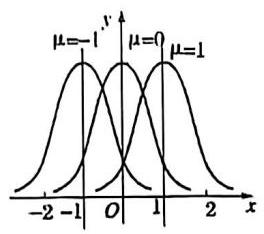

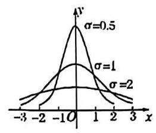

甲乙

①曲线位于 $x$ 轴上方，与 $x$ 轴不相交；

②曲线是单峰的，它关于直线 $x = \mu$ 对称；

③曲线在 $x = \mu$ 处达到峰值 $\frac{1}{\sqrt{2\pi }\sigma }$ ；

④曲线与 $x$ 轴之间的面积为 1:

⑤当σ一定时，曲线的位置由 $\mu$ 确定，曲线随着 $\mu$ 的变化而沿 $x$ 轴平移，如图甲所示；

⑥当μ一定时，曲线的形状由 $\sigma$ 确定， $\sigma$ 越大，曲线越 “矮胖”，总体分布越分散； $\sigma$ 越小. 曲线越 “瘦高”. 总体分布越集中, 如图乙所示:

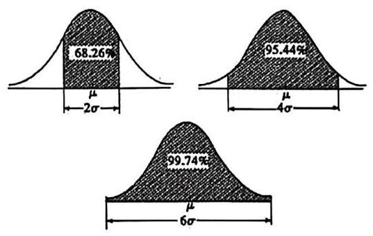

## (三)正态总体三个特殊区间内取值的概率值

$\text{ ① }P\left( {\mu  - \sigma  < X \leq  \mu  + \sigma }\right)  = {0.6826}$ ;

② $P\left( {\mu  - {2\sigma } < X \leq  \mu  + {2\sigma }}\right)  = {0.9544}$ ；

③ $P\left( {\mu  - {3\sigma } < X \leq  \mu  + {3\sigma }}\right)  = {0.9974}$ .

5. 设 $\eta$ 服从 $N\left( {{1.5},{2}^{2}}\right)$ 试求:

(1) $P\left( {\eta  < {3.5}}\right)$ ; (2) $P\left( {\eta  <  - 4}\right)$ ； (3) $P\left( {\eta  \geq  2}\right)$ ; (4) $P\left( {\left| \eta \right|  < 3}\right)$ .

6. 已知: 从某批材料中任取一件时,取得的这件材料强度 $\xi$ 服从 $N\left( {{200},{18}^{2}}\right)$ .

(1)计算取得的这件材料的强度不低于 180 的概率.

(2)如果所用的材料要求以 99% 的概率保证强度不低于 150 , 问这批材料是否符合这个要求.

7. 第 24 届冬季奥林匹克运动会，将于 2022 年 2 月 4 日至 2022 年 2 月 20 日在北京举行实践“绿色奥运、科技奥运、人文奥运”理念，举办一届“有特色、高水平”的奥运会，是中国和北京的庄严承诺，也是全世界的共同期待. 为宜传北京冬奥会，激发人们参与冬奥会的热情，某市开展了关于冬奥知识的有奖问答.从参与的人中随机抽取 100 人，得分情况如下:

(1)得分在 80 分以上称为“优秀成绩”，从抽取的 100 人中任取 2 人，记“优秀成绩”的人数为 $X$ ，求 $X$ 的分布列及数学期望；

(2)由直方图可以认为，问卷成绩值 $y$ 服从正态分布 $N\left( {\mu ,{\sigma }^{2}}\right)$ ，其中 $\mu$ 近似为样本平均数， ${\sigma }^{2}$ 近似为样本方差. ① 求 $P\left( {{77.2} < Y < {89.4}}\right)$ ；

②用所抽取 100 人样本的成绩去估计城市总体，从城市总人口中随机抽出 2000 人，记 $Z$ 表示这 2000 人中分数值位于区间 $\left( {{77.2},{89.4}}\right)$ 的人数,利用①的结果求 $E\left( Z\right)$ .

参考数据: $\sqrt{150} \approx  {12.2},\sqrt{146} \approx  {12.1}, P\left( {\mu  - \sigma  < Y < \mu  + \sigma }\right)  = {0.6826}, P\left( {\mu  - {2\sigma } < Y < \mu  + {2\sigma }}\right)  = {0.9544}$ , $P\left( {\mu  - {3\sigma } < Y < \mu  + {3\sigma }}\right)  = {0.9974}.$

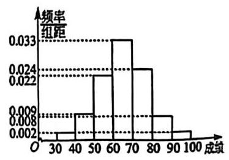

Assignment 1

求下列函数极限

(1) $\mathop{\lim }\limits_{{x \rightarrow  0}}\frac{x}{\left| x\right| }$ (2) $\mathop{\lim }\limits_{{x \rightarrow   + \infty }}\frac{3{x}^{2} - 1}{{\left( x + 1\right) }^{3}}$

1. 如图，函数 $y = f\left( x\right)$ 的图象在点 $P\left( {2, y}\right)$ 处的切线是 $l$ ，则 $f\left( 2\right)  + {f}^{\prime }\left( 2\right)  =$ ___

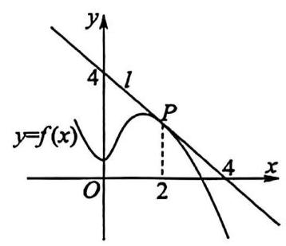

8. 设 $f\left( x\right)$ 为 $\mathrm{R}$ 上的可导函数,且 $\mathop{\lim }\limits_{{{\Delta x} \rightarrow  0}}\frac{f\left( 1\right)  - f\left( {1 + {2\Delta x}}\right) }{\Delta x} =  - 2$ ,则曲线 $y = f\left( x\right)$ 在点 $\left( {1, f\left( 1\right) }\right)$ 处的切线斜率为 ___

## 4. 求下列函数的导数

(1) $y = {x}^{12}$ ； (2) $y = \frac{1}{{x}^{4}}$ ； (3) $y = {3}^{x}$ ； (4) $y = \ln x$ ; (5) $y = \cos x$ .

5. 求下列函数在 $x = \pi$ 的导数值

(1) $f\left( x\right)  = {\pi }^{x}$ (2) $f\left( x\right)  = {\log }_{\pi }x$

6. 求下列函数的导函数

(1) $y = {x}^{4} - 3{x}^{2} - {5x} + 6$ (2) $y = x + \frac{1}{{x}^{2}}$ ; (3) $f\left( x\right)  =  - 2{x}^{3} + 4{x}^{2}$ ;

(4) $f\left( x\right)  = \frac{1}{3}{x}^{3} - {x}^{2} + {ax} + 1$ (5) $f\left( x\right)  = x + \cos x, x \in  \left( {0,1}\right)$ ； (6) $f\left( x\right)  =  - {x}^{2} + {3x} - \ln x$

(7) $y = \frac{x + 1}{x - 1}$

7. 证明: ${\left( \cos x\right) }^{\prime } =  - \sin x$

## Assignment 2

## 1. 求下列函数导数

(1) $y = {\mathrm{e}}^{-a{x}^{2} + {bx}}$ ; (2) $y = 2\sin \left( {1 - {3x}}\right)$ ；

(3) $y = \sqrt[3]{\cos \left( {{2}^{x} + x}\right) }$ ; (4) $y = \ln \sqrt{1 + \sin x}$ ;

(5) $y = \lg \left\lbrack  {\sin \left( {\frac{x}{2} + {x}^{2}}\right) }\right\rbrack$ ; (6) $y = {\cos }^{2}\left( \frac{1 + {x}^{2}}{{\mathrm{e}}^{x}}\right)$ .

2. 已知 $f\left( x\right)  = \frac{1}{2}{x}^{2} + {2x}{f}^{\prime }\left( {2022}\right)  - {2022}\ln x$ ，则 ${f}^{\prime }\left( {2022}\right)  =$

3. 求 ${\left( \cot x\right) }^{\prime }$

4. 函数 $f\left( x\right)  = \frac{1}{x} + {2x}$ 在 $x = 1$ 处切线的倾斜角为___.

5. 若曲线 $y = 3\left( {{x}^{2} - x}\right) {\mathrm{e}}^{x - 1}$ 在点 $\left( {1,0}\right)$ 处的切线与 $y = {ax} + 2$ 平行,曲线 $y = \frac{\ln x}{x + 1}$ 在点 $\left( {1,0}\right)$ 处的切线与直线 $x - {by} + 1 = 0$ 垂直，则 $a + b =$ ___.

6. 已知 $f\left( x\right)  = 2\cos \left( {x - \frac{\pi }{2}}\right)  + {f}^{\prime }\left( 0\right) \cos x$ ，则曲线 $y = f\left( x\right)$ 在点 $\left( {\frac{3\pi }{4}, f\left( \frac{3\pi }{4}\right) }\right)$ 处的切线的斜率为___.

7. 点 $P$ 在曲线 $y = {x}^{3} - x + \frac{2}{3}$ 上移动，设点 $P$ 处切线的倾斜角为 $\alpha$ ，则角 $\alpha$ 的取值范围是___

8. 函数 $f\left( x\right)  = {3x} - 2\cos x$ 在点 $\left( {\frac{\pi }{2},\frac{3\pi }{2}}\right)$ 处的切线的方程是___.

9. 已知函数 $f\left( x\right)  = {x}^{3} - 2\ln x$ ，那么 $f\left( x\right)$ 在点 $\left( {1, f\left( 1\right) }\right)$ 处的切线方程为___.

10. 已知曲线 $f\left( x\right)  = 2{x}^{3} - {3x}$ ,过点 $M\left( {0,{32}}\right)$ 作曲线的切线，则切线的方程为___.

11. 已知函数 $f\left( x\right)  = {x}^{3} + \frac{3}{2}{x}^{2} - {6x} + 1$ ，则曲线 $y = f\left( x\right)$ 过点 $\left( {0,1}\right)$ 的切线方程为___.

12. 若直线 $y = {kx}$ 为曲线 $y = {lnx}$ 的一条切线，则实数 $k$ 的值是___.

3. 已知 $a, b$ 为实数，函数 $y = \ln x + \frac{a}{x}$ 在 $x = 1$ 处的切线方程为 ${4y} - x - b = 0$ ，则 ${ab}$ 的值为___.

## Assignment 3

1. 如图为函数 $f\left( x\right)$ (其定义域为 $\left\lbrack  {-m, m}\right\rbrack$ )的图象,若 $f\left( x\right)$ 的导函数为 ${f}^{\prime }\left( x\right)$ ,则 $y = {f}^{\prime }\left( x\right)$ 的图象可能是 ( )

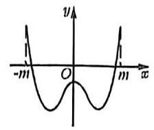

A.

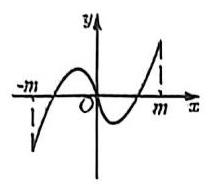

B.

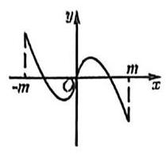

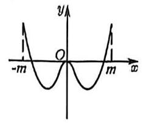

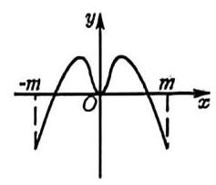

2. 函数 $f\left( x\right)  = {2x} - {\mathrm{e}}^{x}$ 的单调递增区间为___

3. 已知函数 $f\left( x\right)  = \left\{  \begin{array}{l} {\mathrm{e}}^{x} - \ln \left( {x + 1}\right)  - 1, x \geq  0 \\  1 - \frac{1}{{\mathrm{e}}^{x}} + \ln \left( {1 - x}\right) , x < 0 \end{array}\right.$ ，若 $f\left( {{\mathrm{e}}^{x} - 2}\right)  + f\left( {\mathrm{e}}^{2x}\right)  \leq  0$ ，则实数 $x$ 的取值范围为( )

A. $( - \infty ,0\rbrack$ B. $\lbrack 0, + \infty )$ C. $\left\lbrack  {-\ln 2,0}\right\rbrack$ D. $( - \infty , - \ln 2\rbrack$

4. 已知函数 $f\left( x\right)  = {x}^{2} + a\ln x + \frac{2}{x}$ 在 $\lbrack 1, + \infty )$ 上是单调函数，求实数 $a$ 的取值范围

5. 已知 $f\left( x\right)  = \left( {x - 2}\right) {\mathrm{e}}^{x} - \frac{a}{2}{\left( x - 1\right) }^{2}, a \in  \mathbf{R}$ ,请分析 $f\left( x\right)$ 的单调区间

6. 已知函数 $f\left( x\right)  = {x}^{3} + m{x}^{2} + {nx} - 2$ 的图象过点 $\left( {-1, - 6}\right)$ ，且函数 $g\left( x\right)  = {f}^{\prime }\left( x\right)  + {6x}$ 的图象关于 $y$ 轴对称. 若 $a > 0$ ， 求函数 $y = f\left( x\right)$ 在区间 $\left( {a - 1, a + 1}\right)$ 内的极值.

7. 已知函数 $f\left( x\right)  = a{x}^{2} - \left( {a + 2}\right) x + \ln x$ ，当 $a > 0$ 时，函数 $f\left( x\right)$ 在区间 $\left\lbrack  {1, e}\right\rbrack$ 上的最小值是 -2，求实数 $a$ 的取值范围。

8. 已知函数 $f\left( x\right)  = \left( {x - 1}\right) {\mathrm{e}}^{x} + m\left( {x\ln x + \frac{1}{2}{x}^{2} - x}\right)$ 存在极大值点和极小值点，则实数 $m$ 的值可以是( )

A. $- \frac{1}{2}$ B. $- \frac{3}{2}$ C. $- \frac{5}{2}$ D. $- \frac{7}{2}$

9. 已知函数 $f\left( x\right)  = \left( {x - 1}\right) {\mathrm{e}}^{x} - \frac{{x}^{2}}{2}$ .

(1)证明:函数 $f\left( x\right)$ 在 $\mathbf{R}$ 上是增函数；

(2)若函数 $g\left( x\right)  = f\left( x\right)  + m{x}^{4} - \frac{{x}^{3}}{3}$ 的最小值为 -1，求 $m$ 的取值范围.

Assignment 4

1. 已知函数 $f\left( x\right)  = \frac{a{x}^{2} + {2ax}}{{e}^{x}}\left( {a > 0}\right)$ ,

(1)讨论函数 $f\left( x\right)$ 的单调性:

(2)若 $g\left( x\right)  = a{x}^{2} + {2ax}, h\left( x\right)  = {e}^{x}$ ，且在 $\left( {0, + \infty }\right)$ 上至少存在一点 ${}_{{x}_{0}}$ ，使得 $g\left( {x}_{0}\right)  > h\left( {x}_{0}\right)$ 成立，求实数 $a$ 的取值范围.

2. 已知函数 $f\left( x\right)  = {x}^{3} - 3{x}^{2} + {ax}\left( {a < 0, a \in  R}\right)$ ，若函数 $f\left( x\right)$ 有三个互不相同的零点 $0,{t}_{1},{t}_{2}$ ，其中 ${t}_{1} < {t}_{2}$ ，若对任意的 $x \in  \left\lbrack  {{t}_{1},{t}_{2}}\right\rbrack$ ，都有 $f\left( x\right)  \leq  a + {14}$ 成立，则实数 $a$ 的最小值为___.

3. 若对于 $\forall m \in  \left\lbrack  {-\mathrm{e},\mathrm{e}}\right\rbrack  ,\forall y \in  \left( {-1, + \infty }\right)$ ,使得不等式 $4{x}^{3} + \ln \left( {x + 1}\right)  + \left( {{2023} - m}\right) x - 1 < y\ln \left( {y + 1}\right)$ 恒成立,则实数 $x$ 的范围为___。

1. 设函数 $f\left( x\right)  = \frac{1}{x} - x + a\ln x\left( {a \in  \mathbf{R}}\right)$ 的两个极值点分别为 ${x}_{1},{x}_{2}$ . 若 $\frac{f\left( {x}_{1}\right)  - f\left( {x}_{2}\right) }{{x}_{1} - {x}_{2}} \leq  \frac{4{\mathrm{e}}^{2}}{{\mathrm{e}}^{4} - 1}a - 2$ 恒成立,则实数 $a$ 的取值范围是___.

Assignment 5

1. 已知函数 $f\left( x\right)  = x + \sin x$ ，且对于任意的 $x \in  \left\lbrack  {2,4}\right\rbrack$ ， $f\left( \frac{x + 1}{x - 1}\right)  < f\left\lbrack  \frac{m}{{\left( x - 1\right) }^{2}\left( {7 - x}\right) }\right\rbrack$ 恒成立，则 $m$ 的取值范围为一

2. 若存在一个实数 $t$ ,使得 $F\left( t\right)  = t$ 成立,则称 $t$ 为函数 $F\left( x\right)$ 的一个不动点. 设函数 $g\left( x\right)  = {e}^{x} + \left( {1 - \sqrt{e}}\right) x - a$ ( $a \in  R, e$ 为自然对数的底数),定义在 $R$ 上的连续函数 $f\left( x\right)$ 满足 $f\left( {-x}\right)  + f\left( x\right)  = {x}^{2}$ ,且当 $x \leq  0$ 时, ${f}^{\prime }\left( x\right)  < x$ . 若存在 ${x}_{0} \in  \left\{  {x\left| {\;f\left( x\right)  + \frac{1}{2} \geq  f\left( {1 - x}\right)  + x}\right. }\right\}$ ，且 ${x}_{0}$ 为函数 $g\left( x\right)$ 的一个不动点，则实数 $a$ 的取值范围为 ___.

3. 函数 $f\left( x\right)$ 是定义在 $R$ 上的奇函数,且 $f\left( {x - 1}\right)$ 为偶函数,当 $x \in  \left\lbrack  {0,1}\right\rbrack$ 时, $f\left( x\right)  = \sqrt{x}$ . 若函数 $g\left( x\right)  = f\left( x\right)  - x - \pi$ 有三个零点,则实数 $m$ 的取值范围为(   )

(A) $\left( {-\frac{1}{4},\frac{1}{4}}\right)$ (B) $\left( {1 - \sqrt{2},\sqrt{2} - 1}\right)$

(C) $\left( {{4k} - \frac{1}{4},{4k} + \frac{1}{4}}\right) \left( {k \in  Z}\right)$ (D) $\left( {{4k} + 1 - \sqrt{2},{4k} + \sqrt{2} - 1}\right) \left( {k \in  Z}\right)$

4. 已知 $f\left( x\right)  = \frac{{e}^{x} + {e}^{-x}}{2} + \cos x\left( {x \in  R}\right)$ ,若不等式 $f\left( {{mx} - \ln x - 2}\right)  \leq  {2f}\left( 2\right)  - f\left( {2 + \ln x - {mx}}\right)$ 对 $\forall x \in  \left\lbrack  {1,4}\right\rbrack$ 恒成立,则实数 $m$ 的取值范围是___.

5. 已知函数 $f\left( x\right)  = {\mathrm{e}}^{x} - \left| {x + a}\right|$ ,给出下列四个结论:

①若 $a = 0$ ，则 $f\left( x\right)$ 有一个零点； ②若 $a \in  \lbrack 1, + \infty )$ ，则 $f\left( x\right)$ 有三个零点；

③ $\forall a \leq  0, f\left( x\right)$ 在 $\mathrm{R}$ 上是增函数； ④ $\exists a > 0$ ，使得 $f\left( x\right)$ 在 $\mathrm{R}$ 上是增函数.

其中所有正确结论的序号是___.

16. 对于具有相同定义域 $D$ 的函数 $f\left( x\right)$ 和 $g\left( x\right)$ ，若存在函数 $h\left( x\right)  = {kx} + b$ ( $k$ ， $b$ 为常数)，对任给的正数 $m$ ，存在相应的 ${x}_{0} \in  D$ ,使得当 $x \in  D$ 且 $x > {x}_{0}$ 时,总有 $\left\{  \begin{array}{l} 0 < f\left( x\right)  - h\left( x\right)  < m \\  0 < h\left( x\right)  - g\left( x\right)  < m \end{array}\right.$ ,则称直线 $l : y = {kx} + b$ 为曲线 $y = f\left( x\right)$ 和 $y = g\left( x\right)$ 的“分渐近线”. 给出定义域均为 $D = \{ x \mid  x > 1\}$ 的四组函数如下:

① $f\left( x\right)  = {x}^{2}, g\left( x\right)  = \sqrt{x}$ ；

② $f\left( x\right)  = {10}^{-x} + 2, g\left( x\right)  = \frac{{2x} - 3}{x}$ ；

③ $f\left( x\right)  = \frac{{x}^{2} + 1}{x}, g\left( x\right)  = \frac{x\ln x + 1}{\ln x}$ ;

④ $f\left( x\right)  = \frac{2{x}^{2}}{x + 1}, g\left( x\right)  = 2\left( {x - 1 - {e}^{-x}}\right)$

其中，曲线 $y = f\left( x\right)$ 和 $y = g\left( x\right)$ 存在“分渐近线”的是___.

Assignment 6

1. 已知函数 $f\left( x\right)  = {e}^{x - a} - x\ln x - 1\left( {a \in  \mathbf{R}}\right)$ .

(1)若 $a = 1$ ，讨论 $f\left( x\right)$ 的单调性；

(2)令 $g\left( x\right)  = f\left( x\right)  - \left( {a - 1}\right) x$ ,讨论 $g\left( x\right)$ 的极值点个数.

2. 已知函数 $f\left( x\right)  = \frac{{\mathrm{e}}^{x} - {8x}}{m} - x + \frac{2{x}^{2}}{{\mathrm{e}}^{x}}\left( {m \neq  0}\right)$ 有三个零点 ${x}_{1},{x}_{2},{x}_{3}$ ，且有 ${x}_{1} < {x}_{2} < {x}_{3}$ ，则 $\left( {2 - \frac{{\mathrm{e}}^{{x}_{1}}}{{x}_{1}}}\right) \sqrt{\left( {2 - \frac{{\mathrm{e}}^{{x}_{2}}}{{x}_{2}}}\right) \left( {2 - \frac{{\mathrm{e}}^{{x}_{3}}}{{x}_{3}}}\right) }$ 的值为___.

3. 设函数 $f\left( x\right)  = \left( {2 - a}\right) \ln x + \frac{{2a}{x}^{2} + 1}{x}\left( {a < 0}\right)$

(1)讨论函数 $f\left( x\right)$ 在定义域内的单调性；

(2)当 $a \in  \left( {-3, - 2}\right)$ 时，任意 ${x}_{1},{x}_{2} \in  \left\lbrack  {1,3}\right\rbrack  ,\left( {m + \ln 3}\right) a - 2\ln 3 > \left| {f\left( {x}_{1}\right)  - f\left( {x}_{2}\right) }\right|$ 恒成立，求实数 $m$ 的取值范围。

4. 已知函数 $f\left( x\right)  = \frac{a{x}^{2} + {2ax}}{{e}^{x}}\left( {a > 0}\right)$ ，

(1)讨论函数 $f\left( x\right)$ 的单调性:

(2)若 $g\left( x\right)  = a{x}^{2} + {2ax}, h\left( x\right)  = {e}^{x}$ ，且在 $\left( {0, + \infty }\right)$ 上至少存在一点 ${x}_{0}$ ，使得 $g\left( {x}_{0}\right)  > h\left( {x}_{0}\right)$ 成立，求实数 $a$ 的取值范围.

Assignment 7

1. 已知函数 $f\left( x\right)  = \frac{1 + \ln x}{x}$ ，若对 $\forall {x}_{1},{x}_{2} \in  \left( {1, + \infty }\right)$ ， ${x}_{1} \neq  {x}_{2}$ ，都有 $\left| {f\left( {x}_{1}\right)  - f\left( {x}_{2}\right) }\right|  \leq  k\left| {\ln {x}_{1} - \ln {x}_{2}}\right|$ ，则 $k$ 的取值范围是___.

2. 已知 $\frac{1}{2} \leq  m \leq  3$ ，函数 $f\left( x\right)  = \ln \left( {x + 2}\right)  + \frac{m}{2}{x}^{2} - 2.$ 若 $\exists m \in  \left\lbrack  {\frac{1}{2},3}\right\rbrack$ ，对任意的 ${x}_{1},{x}_{2} \in  \left\lbrack  {0,2}\right\rbrack$ ， $\left( {{x}_{1} \neq  {x}_{2}}\right)$ ，不等式: $\left| {f\left( {x}_{1}\right)  - f\left( {x}_{2}\right) }\right|  < t\left| {\frac{1}{{x}_{1} + 2} - \frac{1}{{x}_{2} + 2}}\right|$ 恒成立，则 $t$ 的最小值___.

## Assignment 7

1. 有朋自远方来，乘火车、船、汽车、飞机来的概率分别为 0.3, 0.2,0.1,0.4 , 迟到的概率分别为 0.25,0.3,0.1,0. 则他迟到的概率为___

2. 某班学生考试成绩中，数学不及格的占 15%，语文不及格的占 5%，两门都不及格的占 3%.已知一学生数学不及格，则他语文也不及格的概率是___

3. 抛掷红、黄两枚质地均匀的骰子, 当红色骰子的点数为 4 或 6 时, 两枚骰子的点数之积大于 20 的概率是 ___

4. 两台机床加工同样的零件，第一台的废品率为 0.04，第二台的废品率为 0.07，加工出来的零件混放，并设第一台加工的零件是第二台加工零件的 2 倍，现任取一零件，则它是合格品的概率为___

5. 已知 $P\left( {A \mid  B}\right)  = {0.6}, P\left( {B \mid  A}\right)  = {0.3}$ 且 $A, B$ 相互独立，则 $P\left( {AB}\right)$ 等于___

6. 抛掷 3 枚质地均匀的硬币， $A =$ \{既有正面向上又有反面向上\}， $B =$ \{至多有一个反面向上\}，则 $A$ 与 $B$ 的关系是( )

A. 互斥事件 B. 对立事件

C. 相互独立事件 D. 不相互独立事件

7. 把一枚硬币投掷两次，事件 $A = \{$ 第一次出现正面 $\}$ ， $B = \{$ 第二次出现正面 $\}$ ，则 $P\left( {B \mid  A}\right)  =$ ___.

8. 某种元件用满 6000 小时未坏的概率是 $\frac{3}{4}$ ,用满 10000 小时未坏的概率是 $\frac{1}{2}$ ,现有一个此种元件,已经用过 6 000 小时未坏，则它能用到 10000 小时的概率为___.

9. 已知 $A$ 与 $B$ 相互独立，且 $P\left( {AB}\right)  = \frac{5}{8}, P\left( B\right)  = \frac{3}{4}$ ，则 $P\left( {\bar{A} \mid  B}\right)  =$ ___.

10. 明天上午李明要参加“青年文明号”活动，为了准时起床，他用甲、乙两个闹钟叫醒自己，假设甲闹钟准时响的概率为 0.80 ，乙闹钟准时响的概率为 0.90 ，则两个闹钟至少有一个准时响的概率是 ___.

11. 袋中有 10 个黑球，5 个白球. 现掷一枚均匀的骰子，掷出几点就从袋中取出几个球，若已知取出的球全是白球，则掷出 3 点的概率为___.

12. 某小组有 20 名射手，其中一、二、三、四级射手分别有 2、6、9、3 名. 又若选一、二、三、四级射手参加比赛，则在比赛中射中目标的概率分别为 0.85、0.64、0.45、0.32，今随机选一人参加比赛，则该小组在比赛中射中目标的概率为___.

13. 在同一时间内，甲、乙两个气象台独立预报天气准确的概率分别为 $\frac{4}{5}$ 和 $\frac{3}{4}$ . 在同一时间内，求:

(1)甲、乙两个气象台同时预报天气准确的概率；

(2)至少有一个气象台预报准确的概率.

14. 设甲、乙、丙三个地区爆发了某种流行病，三个地区感染此病的比例分别为 $\frac{1}{7}$ ， $\frac{1}{5}$ ， $\frac{1}{4}$ . 现从这三个地区任抽取一个人.

(1)求此人感染此病的概率；

(2)若此人感染此病，求此人来自乙地区的概率.

15. 某人一周晚上值班 2 次，在已知他周日一定值班的条件下，求他在周六晚上或周五晚上值班的概率.

16. 一个家庭中有若干个小孩，假定生男孩和生女孩是等可能的，令 $A = \{$ 一个家庭中既有男孩又有女孩 $\} , B =$ \{一个家庭中最多有一个女孩\}. 对下述两种情形，讨论 $A$ 与 $B$ 的独立性:

(1)家庭中有两个小孩；

(2)家庭中有三个小孩。

## Assignment 8

1. 已知总体是由编号为 001~200 的 200 个个体组成的，利用下面的随机数表选取 5 个个体，选取方法是从第三行到一组的第一个数字开始，从左往右依次选取三个数字，到所在行末位后再从下一行的首位开始，则选取的第三个个体的编号为___。

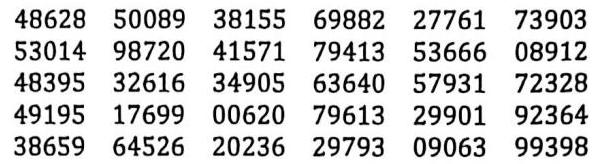

2. 某企业三个分厂生产同一种电子产品,三个分厂的产量分布如图所示。

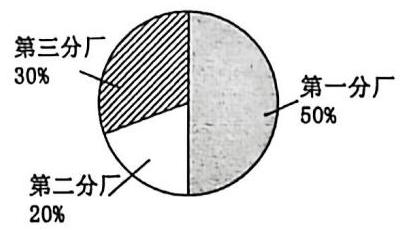

(1)现在用比例分配的分层随机抽样的方法从这三个分厂生产的产品中共抽取 100 件进行使用寿命的测试，则第一分厂应抽取的件数为___

(2)测试结果为第一、二、三分厂取出的产品的平均使用寿命分别为 1020 小时、 980 小时、 1030 小时，估计这个全业生产的产品的平均使用寿命为___小时。

3. 为实现乡村生态振兴，走乡村绿色发展之路，乡政府采用按比例分层随机抽样的方式从甲村和乙村抽取部分村民参与环保调研,已知甲村和乙村人数之比是 3:1,被抽到的参与环保调研的村民中,甲村的人数比乙村多 8,则参与环保调研的总人数是___

4. 为了解学生的课外阅读情况，某校采用比例分配的分层随机抽样的方法对高中三个年级的学生进行平均每周课外阅读时间(单位:小时)的调查,所得样本数据如下:

<table><tr><td>年级</td><td>抽样人数</td><td>样本平均数</td></tr><tr><td>高一</td><td>40</td><td>5</td></tr><tr><td>高二</td><td>30</td><td>$\bar{x}$</td></tr><tr><td>高三</td><td>30</td><td>3</td></tr></table>

已知高中三个年级的总样本平均数为 4.1，则高二年级学生的样本平均数 $\bar{x} =$ ___。

5. 若已知 30 个数 ${x}_{1},{x}_{2},\ldots ,{x}_{30}$ 的平均数为 6，方差为 9，现从原 30 个数中剔除 ${x}_{1}$ ， ${x}_{2}$ ， $\ldots ,{x}_{10}$ ，这 10 个数，且剔除的这 10 ${}^{\prime }$ 数的平均数为 8，方差为 5，则剩余的 20 个数 ${x}_{11}$ ， ${x}_{12}$ ， $\ldots$ ， ${x}_{30}$ 的方差为___。

6. 为调查某地区中学生每天睡眠时间，采用样本量比例分配的分层随机抽样，现抽取初中生 800 人，其每天睡眠时间均值为 9 小时, 方差为 1 ,抽取高中生 1 200 人,其每天睡眠时间均值为 8 小时, 方差为 0.5 , 则估计该地区中学生等

7. 某单位职工参加某 APP 推出的“知识问答竞赛”活动，参与者每人每天可以作答三次，每次作答 20 题，每题答对得 5 分, 答错得 0 分。该单位从职工中随机抽取了 10 位, 他们一天中三次作答的得分情况如图所示。

根据上图，估计该单位职工答题情况、则下列说法正确的是( )

A. 该单位职工一天中各次作答的平均分保持一致

B. 该单位职工一天中各次作答的正确率保持一致

C. 该单位职工一天中第三次作答得分的极差小于第二次的极差

D. 该单位职工一天中第三次作答得分的标准差小于第一次的标准差

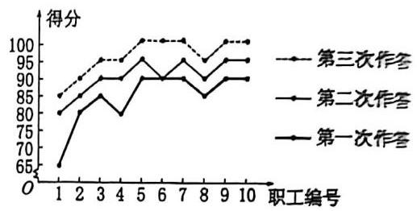

8. 已知某一段公路限速 70 千米/时，现抽取 400 辆通过这一段公路的汽车的速度，其频率分布直方图如图所示，题达 400 辆汽车中在该路段超速的有___辆。

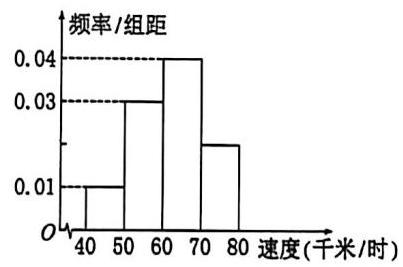

9. 将高三某班 60 名学生参加某次数学模拟考试所得的成绩(成绩均为整数)整理后画出频率分布直方图(如图所示。 则此班的模拟考试成绩的 80%分位数是___。(结果保留两位小数)

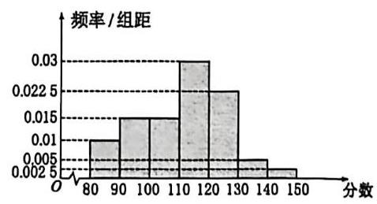

10. 某学校有高中学生 500 人。其中男生 320 人，女生 180 人。为获得全体高中生身高的信息，按照分层随机抽样则抽取样本,男生样本量为 32,女生样本量为 18,通过计算男生身高样本均值为 173.5 cm,方差为 17;女生身高样本均值为 163.83 cm，方差为 30.03，则所有数据的样本均值为___cm，方差为___。

11. 某校为了解学生学习的效果，进行了一次摸底考试，从中选取 60 名学生的成绩，分成 $\lbrack {40},{50}),\lbrack {50},{60}),\lbrack {60},{70}),\lbrack {70},{80}),\lbrack {80},{90}),\left\lbrack  {{90},{100}}\right\rbrack$ 六组后，得到不完整的频率分布直方图如图所示，观察图形，回答下列问题:

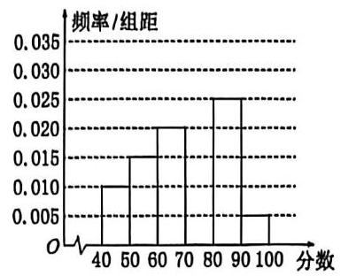

(1)求分数在区间 $\lbrack {70},{80})$ 内的频率,并补全这个频率分布直方图;

(2)根据评奖规则，排名在前 10%的学生可以获奖，请你估计获奖的学生至少需要多少分？

12. 治理沙漠化离不开优质的树苗，现从苗圃中随机地抽测了 200 株树苗的高度(单位:cm)，得到如图所示的频率分布直方图。

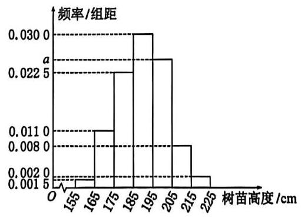

(1)求直方图中 $a$ 的值及众数、中位数；

(2)若树苗高度在 ${185}\mathrm{\;{cm}}$ 及以上是可以移栽的合格树苗。从样本中用比例分配的分层随机抽样方法抽取 20 株树苗作进一步研究，不合格树苗、合格树苗分别应抽取多少株？

13. 某这计划在秋季运动会期间开展“运动与健康”知识大赛，为此某班开展了 10 次模拟测试，以此选拔选手代表班。 参赛，下表为甲、乙两名学生的历次模拟测试成绩。

<table><tr><td>场次</td><td>1</td><td>2</td><td>3</td><td>4</td><td>5</td><td>6</td><td>7</td><td>8</td><td>9</td><td>10</td></tr><tr><td>甲</td><td>98</td><td>94</td><td>97</td><td>97</td><td>95</td><td>93</td><td>93</td><td>95</td><td>93</td><td>95</td></tr><tr><td>乙</td><td>92</td><td>94</td><td>93</td><td>94</td><td>95</td><td>94</td><td>96</td><td>97</td><td>97</td><td>98</td></tr></table>

甲、乙两名学生测试成绩的平均数分别记作 $\bar{x},\bar{y}$ ，方差分别记作 ${s}_{1}^{2}$ ， ${s}_{2}^{2}$ 。

(1)求 $\bar{x},\bar{y},{s}_{1}^{2},{s}_{2}^{2}$ ；

(2)以这 10 次模拟测试成绩及(1)中的结果为参考，请你从甲、乙两名学生中选出一人代表班级参加比赛，并说明您作出选择的理由.

## Assignment 9

1. 一种微生物群体可以经过自身繁殖不断生存下来，设一个这种微生物为第 0 代，经过一次繁殖后为第 1 代。 再经过一次繁殖后为第 2 代……，该微生物每代繁殖的个数是相互独立的且有相同的分布列，设 $X$ 表示 1 个微生物个体繁殖下一代的个数, $P\left( {X = i}\right)  = {p}_{i}\left( {i = 0,1,2,3}\right)$ .

(1)已知 ${p}_{0} = {0.4}$ ， ${p}_{1} = {0.3}$ ， ${p}_{2} = {0.2}$ ， ${p}_{3} = {0.1}$ ，求 $E\left( X\right)$ ；

(2)设 $p$ 表示该种微生物经过多代繁殖后临近灭绝的概率， $p$ 是关于 $x$ 的方程: ${p}_{0} + {p}_{1}x + {p}_{2}{x}^{2} + {p}_{3}{x}^{3} = x$ 的一个最小正实根,求证: 当 $E\left( X\right)  \leq  1$ 时, $p = 1$ ,当 $E\left( X\right)  > 1$ 时, $p < 1$ ;

(3)根据你的理解说明(2)问结论的实际含义.

2. 设 $n \geq  2, n \in  {\mathbb{N}}^{ * }$ ，甲、乙、丙三个口袋中分别装有 $n - 1\text{ 、 }n\text{ 、 }n + 1$ 个小球，现从甲、乙、丙三个口袋中分别取球，一共取出 $n$ 个球. 记从甲口袋中取出的小球个数为 $X$ .

(1)当 $n = 5$ 时，求 $X$ 的分布列；

(2)证明: ${\mathrm{C}}_{n}^{0}{\mathrm{C}}_{2n}^{0} + {\mathrm{C}}_{n}^{1}{\mathrm{C}}_{2n}^{1} + \cdots  + {\mathrm{C}}_{n}^{n}{\mathrm{C}}_{2n}^{n} = {\mathrm{C}}_{3n}^{n}$ ；

(3)根据第(2)问中的恒等式,证明: $E\left( X\right)  = \frac{n - 1}{3}$ .

3. 若公共汽车门的高度是按照保证成年男子与车门顶部碰头的概率在 1% 以下设计的，如果某地成年男子的身高 $\xi  \sim  N\left( {{175},{36}}\right)$ (单位: $\mathrm{{cm}}$ ),则该地公共汽车门的高度应设计为多高?

4. 某班有 48 名同学，一次考试后数学成绩服从正态分布. 平均分为 80，标准差为 10，问从理论上讲在 80 分至 90 分之间有多少人?
