## 数学解题思路

—Rq Cen

## 目 录

第一章 命题与集合 1

第二章 等式与不等式 22

第三章 函数初步 46

第四章 幂、指数、对数 61

第五章 三角函数基础 84

第六章 三角恒等变换 104

第七章 平面向量 132

第八章 复数 154

第九章 直线和圆的方程 162

第十章 圆锥曲线的方程 181

第十一章 数列与数学归纳法 207

第十二章 排列组合与二项式定理 222

第十三章 概率论基础 239

第十四章 统计学基础 254

第十五章 随机变量及其分布 266

第十六章 成对数据的统计分析 281

第十七章 空间直线与平面 296

第十八章 空间向量 308

第十九章 简单几何体 325

第二十章 导数 340

补充 线性规划、极坐标方程 351

## 第一章 命题与集合

命题与集合的题目非常直接，一眼就能分辨出来考察的内容，一般不会找不到方向，也不会不知道题目在问什么。并且命题与集合的内容较为独立，题目很难隐藏在其他块面的内容里。

命题部分的重点是命题的否定、逆命题、否命题、逆否命题，特别是全称量词命题和存在量词命题的否定形式。集合部分的重点是交集、并集、补集与包含关系的分析判断，熟练使用韦恩图能使很多问题简化。与数值计算有关的题目，画数轴往往有很大帮助。

在解这类题时, 最重要的是理解清楚命题与集合章节的基本概念的逻辑。此外，命题与集合题目经常会涉及到一些其他块面的基本概念判断和基本运算，以不等式、函数、排列组合为主，经常难点体现在其他块面知识的运用上(特别是判断充分条件或必要条件的题目)， 跟命题与集合有关的只是基础的逻辑判断。

尤其重要的是, 在处理命题和集合的问题时, 一定要把情况考虑周全，不能出现遗漏！也要加强对语文理解能力的训练，增强把现实场景转化为数学语言的能力和逻辑思辨能力，做到“虽然不知道命题里的知识，但是仍能理解该命题的逻辑”。

1. [2015・全国新课标 I]设命题 p: $\exists n \in  \mathbf{N}$ ， ${n}^{2} > {2}^{n}$ ，则 p 为( )。

A. $\forall n \in  N,{n}^{2} > {2}^{n}$ B. $\exists n \in  N,{n}^{2} \leq  {2}^{n}$

C. $\forall n \in  N,{n}^{2} \leq  {2}^{n}$ D. $\exists \mathrm{n} \in  \mathrm{N},{\mathrm{n}}^{2} = {2}^{\mathrm{n}}$

解析:本题直接考察基本命题的否定的概念。

命题中的不等式看上去比较复杂, 实际上也比较复杂。不等式的左边是 ${\mathrm{n}}^{2}$ ,右边是 ${2}^{\mathrm{n}}$ ,幂和指数比较大小是比较复杂的。那么这个命题究竟是否成立呢？正其实可以不去管它！题目只要求给出该命题的否定，并没有问该命题的真实性，因此只要按照命题的逻辑把它否定即可。

原命题是存在量词命题,意为“存在自然数 $\mathrm{n}$ ,使得该不等式成立”，它的否定应为“所有自然数 n，都使这个不等式不成立”。再换句话说就是“所有自然数 n，都使得与这个不等式意思相反的情况成立” 即: $\forall n \in  N,{n}^{2} \leq  {2}^{n}$ 。故本题选 C。

本题提醒我们很重要的一点，在求原命题的否定、逆命题、否命题、逆否命题时，命题本身是真是假无关紧要，唯一重要的理清楚命题的所作出的判断。

2. [2008·广东]命题“若函数 $\mathrm{f}\left( \mathrm{x}\right)  = {\log }_{a}\mathrm{x}\left( {\mathrm{a} > 0,\mathrm{a} \neq  1}\right)$ 在其定义域内是减函数，则 ${\log }_{a}2 < 0$ ”的逆否命题是( )。

A. 若 ${\log }_{a}2 < 0$ ，则函数 $f\left( x\right)  = {\log }_{a}x\left( {a > 0, a \neq  1}\right)$ 在其定义域内不是减函数。

B. 若 ${\log }_{a}2 \geq  0$ ，则函数 $f\left( x\right)  = {\log }_{a}x\left( {a > 0, a \neq  1}\right)$ 在其定义域内不是减函数。

C. 若 ${\log }_{a}2 < 0$ ，则函数 $f\left( x\right)  = {\log }_{a}x\left( {a > 0, a \neq  1}\right)$ 在其定义域内是减函数。

D. 若 ${\log }_{a}2 \geq  0$ ，则函数 $f\left( x\right)  = {\log }_{a}x\left( {a > 0, a \neq  1}\right)$ 在其定义域内是减函数。

解析:本题直接考察逆否命题的概念。

题中的命题看起来比较复杂, 要耐心把它翻译成汉语。虽然对数函数的在这之前还没有学习, 但是既不用担心也不用管它, 只要理清楚命题所下的判断即可。

首先把复杂的“ $\mathrm{f}\left( \mathrm{x}\right)  = {\log }_{a}\mathrm{x}\left( {\mathrm{a} > 0,\mathrm{a} \neq  1}\right)$ ”简称为“该函数”，虽然重要但是本题中无影响的“在其定义域”暂时省略(后面记得要补回来)。

于是得到原命题为:“若该函数是减函数，则 ${\log }_{\mathrm{a}}2 < 0$ ”。

先把条件和结论分别否定:若“该函数不是减函数”，则 "lo ${\text{ g }}_{\text{ a }}$ 2≥0".

再把条件和结论调换位置:若“lo ${\text{ g }}_{\text{ a }}$ 2≥0"，则“该函数不是减函数”。 再把“该函数”替换回 “ $\mathrm{f}\left( \mathrm{x}\right)  = {\log }_{a}\mathrm{x}\left( {\mathrm{a} > 0,\mathrm{a} \neq  1}\right)$ ”，把重要的“在其定义域” 补回来，就得到了原命题的逆否命题。故本题选 B。

也可以先把条件和结论调换位置，再分别进行否定，两种方法在便捷程度上没有任何区别。

3. [2020·湖南师大附中]命题 “ $\exists {\mathrm{n}}_{0} \in  {\mathrm{N}}^{ * },\mathrm{f}\left( {\mathrm{n}}_{0}\right)  \in  {\mathrm{N}}^{ * }$ 且 $\mathrm{f}\left( {\mathrm{n}}_{0}\right)  \leq  {\mathrm{n}}_{0}$ ” 的否定形式是( )。

A. $\forall n \in  {\mathbf{N}}^{ * }, f\left( n\right)  \notin  {\mathbf{N}}^{ * }$ 且 $f\left( n\right)  > n$

B. $\forall n \in  {\mathbf{N}}^{ * }, f\left( n\right)  \notin  {\mathbf{N}}^{ * }$ 或 $f\left( n\right)  > n$

C. $\exists {\mathrm{n}}_{0} \in  {\mathbf{N}}^{ * },\mathrm{f}\left( {\mathrm{n}}_{0}\right)  \notin  {\mathbf{N}}^{ * }$ 且 $\mathrm{f}\left( {\mathrm{n}}_{0}\right)  > {\mathrm{n}}_{0}$

D. $\exists {\mathrm{n}}_{0} \in  {\mathbf{N}}^{ * },\mathrm{f}\left( {\mathrm{n}}_{0}\right)  \notin  {\mathbf{N}}^{ * }$ 或 $\mathrm{f}\left( {\mathrm{n}}_{0}\right)  > {\mathrm{n}}_{0}$

解析:本题考察全称量词命题和存在量词命题的否定，以及含联结词“或”“且”的命题的否定。根据相关基本概念分析即可。

题目中的命题为“ $\exists {\mathrm{n}}_{0} \in  {\mathbf{N}}^{ * },\mathrm{f}\left( {\mathrm{n}}_{0}\right)  \in  {\mathbf{N}}^{ * }$ 且 $\mathrm{f}\left( {\mathrm{n}}_{0}\right)  \leq  {\mathrm{n}}_{0}$ ”,是存在量词命题，表示“存在符合条件的 ${\mathrm{n}}_{0}$ ，满足某结论”。它的否定应为全称量词命题，表示“全部符合条件的 ${\mathrm{n}}_{0}$ ，都满足相反的结论”。因此前半句应为“ $\forall n \in  {\mathbf{N}}^{ * }$ ”。

后半句为“ $\mathrm{f}\left( {\mathrm{n}}_{0}\right)  \in  {\mathbf{N}}^{ * }$ 且 $\mathrm{f}\left( {\mathrm{n}}_{0}\right)  \leq  {\mathrm{n}}_{0}$ ”成立，要得到与之相反的意思， 只要 2 个结论中有 1 个不成立即可,即 “ $f\left( {n}_{0}\right)  \in  {\mathbf{N}}^{ * }$ 或 $f\left( {n}_{0}\right)  \leq  {n}_{0}$ ”,也就是 “ $\mathrm{f}\left( \mathrm{n}\right)  \notin  \mathbf{N}$ *或 $\mathrm{f}\left( \mathrm{n}\right)  > \mathrm{n}$ ”。故本题选 B。

额外说明，虽然选项 A、B 中的自变量为 n，选项 C、D 中的自变量为 ${\mathrm{n}}_{0}$ ,其实没有区别。只要在同一个或有相互关系的同一系列命题中保持一致，用什么字母表示、加不加角标没有区别。

4. [2016·浙江]命题“ $\forall \mathrm{x} \in  \mathbf{R},\exists \mathrm{n} \in  {\mathbf{N}}^{ * }$ ,使得 $\mathrm{n} \geq  {\mathrm{x}}^{2\text{ ”,的否定形式是( )。 }}$

A. $\forall x \in  \mathbf{R},\exists n \in  {\mathbf{N}}^{ * }$ ,使得 $n < {x}^{2}$

B. $\forall x \in  \mathbf{R},\forall n \in  {\mathbf{N}}^{ * }$ ，使得 $n < {x}^{2}$

C. $\exists x \in  \mathbf{R},\exists n \in  {\mathbf{N}}^{ * }$ ,使得 $n < {x}^{2}$

D. $\exists x \in  \mathbf{R},\forall n \in  {\mathbf{N}}^{ * }$ ,使得 $n < {x}^{2}$

解析:本题考察全称量词命题和存在量词命题的否定形式。

题目中的命题比较复杂, 因为先后出现了“V”和“∃”。如果只是生搬硬套地把前面的“V”换成“3”，把后面的“彐”换成“V”，再把结论取否定,变成 “ $n < {x}^{2''}$ ,结果......居然做对了!?

这再次体现了数理逻辑奇妙的特点，即使没有理解内容，只是套用公式, 也能得到正确的结果。

但是！这道题套公式能做对，不意味着所有题目套公式也能做对。 在前面的解题思路中，为什么是先后把 “ $\forall$ ” 和 “ $\exists$ ” 都进行替换？为什么不是只换前面的 1 个或只换后面的 1 个？必须要把逻辑理清楚。

先将原命题翻译为汉语:对于所有的实数 x，都满足条件:“存在自然数 $N$ ,使得 $n \geq  {x}^{2/n}$ 。该命题的否定,应为 “存在某个实数 $x$ ”,它能够满足该结论相反的情况。

现在来看结论相反的表述。原结论为 “存在正整数 n，使得 n≥x^2 "， 它的相反表述应为“所有的正整数 n，都不能使 n≥x^2”，也就是“所有的 $\mathrm{n} \in  {\mathbf{N}}^{ * }$ ,都使得 $\mathrm{n} < \mathrm{x}$ ”。

原命题的否定为:“ $\exists x \in  \mathbf{R},\forall n \in  {\mathbf{N}}^{ * }$ ，使得 $n < {x}^{2, n}$ 。故本题选 D。

5. [2020·天津]设全集 U=\{-3,-2,-1,0,1,2,3\}，集合 $\mathrm{A} = \{  - 1,0,1$ , 2\}, $\mathrm{B} = \{  - 3,0,2,3\}$ ,则 $\mathrm{A} \cap  \left( {{\mathrm{C}}_{\mathrm{U}}\mathrm{B}}\right)  =$ (   )。

A. $\{  - 3,3\}$ B. $\{ 0,2\}$ C. $\{  - 1,1\}$ D. $\{  - 3, - 2, - 1,1,3\}$

解析:本题直接考察交集和补集的概念。

题目用列举法直接给出了全集 $\mathrm{U}$ 和集合 $\mathrm{A}\text{ 、 }\mathrm{\;B}$ 中的全部元素，因此只要根据补集和交集的定义，进行相应的运算即可。

${\mathrm{C}}_{\mathrm{U}}\mathrm{B}$ 是从全集 $\mathrm{U}$ 中，把 $\mathrm{B}$ 中的元素去掉之后剩下的元素， $\{  - 2, - 1$ , 1\}。再与 $\mathrm{A}$ 中的元素比较,找出共有的元素, $\{  - 1,1\}$ 。故本题选 C。

6. $\left\lbrack  {{2020} \cdot  \text{ 全国新高考I]设集合 }\mathrm{A} = \{ \mathrm{x} \mid  1 \leq  \mathrm{x} \leq  3\} ,\mathrm{B} = \{ \mathrm{x} \mid  2 < \mathrm{x} < 4\} }\right\rbrack$ ,则 $A \cup  B =$ (   )。

A. $\{ x \mid  2 < x \leq  3\}$ B. $\{ x \mid  2 \leq  x \leq  3\}$ C. $\{ x \mid  1 \leq  x < 4\}$ D. $\{ x \mid  1 < x < 4\}$

解析:本题直接考察并集的概念。

由于 $\mathrm{A}$ 和 $\mathrm{B}$ 都是既有最大值、又有最小值的连续区间,并且互相有重叠, 因此直接把 $\mathrm{A}$ 和 $\mathrm{B}$ 包含的范围并起来即可。

取 2 个最小值中较小的为最小值: $\mathrm{A}$ 的最小值 1 ; 取 2 个最大值中较大的为最大值: $\mathrm{B}$ 的最大值为 4,开区间或闭区间与所选择的一致即可,即 $1 \leq  \mathrm{x} < 4$ 。故本题选 C。

这类涉及到具体数值范围的题目画数轴非常直观:

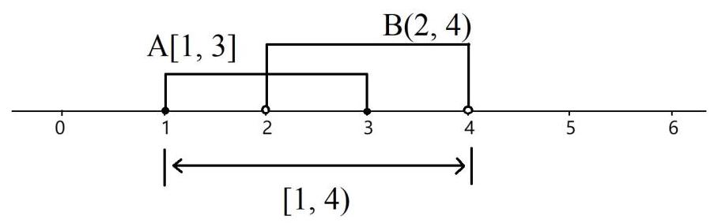

7. [2004·湖北]设 $A = \{ x \mid  x = \sqrt{{5k} + 1}, k \in  N\} , B = \{ x \mid  x \leq  6, x \in  Q\}$ , 则 $A \cap  B = \left( \right)$ 。

A. $\{ 1,4\}$ B. $\{ 1,6\}$ C. $\{ 4,6\}$ D. $\{ 1,4,6\}$

解析:本题直接考察交集的概念。

对于元素范围是有理数、整数、自然数等非实数域的集合, 或者元素是不连续的数字的集合，一般需要把各个集合所含有的元素全部列举出来，或找出其中的规律和范围。

一方面，要注意元素在表达式中的角色，另一方面，要特别注意集合所属于的数域、正负号等。

集合 A 中元素是 x。虽然没有特别注明数域则默认是实数域 R, 但是 $\mathrm{x}$ 的限定条件是符合式子 $x = \sqrt{{5k} + 1}$ 且 $\mathrm{k}$ 属于自然数。于是可知 $\mathrm{A}$ 中的元素有无穷多，并且是不连续的。

令 $\mathrm{k}$ 分别取 $0,1,2,3,4\ldots ,\mathrm{A}$ 中的元素从小到大依次为: $\sqrt{1},\sqrt{6}$ , $\sqrt{11},\sqrt{11},\sqrt{16},\sqrt{21}\ldots$ ,主要是无理数,也有个别整数。

集合 $B$ 中的元素也是 $x$ ，限定范围是 $x \leq  6$ ，且 $x$ 属于有理数，即 $x$ 是小于等于 6 的全体有理数。

比较 $\mathrm{A}$ 和 $\mathrm{B}$ 可以看出, $\mathrm{A}$ 有最小值 $\sqrt{1}$ ,没有最大值。 $\mathrm{B}$ 有最大值 6，没有最小值，因此二者交集的元素的大小必然在 $\sqrt{1}$ 和 6 之间。 此外, A 的元素主要是无理数和个别整数, B 的元素全是有理数，因此只要找出 $\mathrm{A}$ 在 $\left\lbrack  {\sqrt{1},6}\right\rbrack$ 范围内的全部有理数即可。

挨个算下去, $\mathrm{k} = 0$ 时, $\mathrm{x} = 1;\mathrm{k} = 3$ 时, $\mathrm{x} = 4;\mathrm{k} = 7$ 时, $\mathrm{x} = 6$ ; 只有这 3 个。因此 $A \cap  B = \{ 1,4,6\}$ 。故本题选 D。

8. [2008·浙江]已知 $U = \mathbf{R}, A = \{ x \mid  x > 0\} , B = \{ x \mid  x \leq   - 1\}$ ，则 $\left( {A \cap  {C}_{U}B}\right)  \cup  \left( {B \cap  {C}_{U}A}\right)  =$ (   )。

A. $\varnothing$ B. $\{ x \mid  x \leq  0\}$ C. $\{ x \mid  x >  - 1\}$ D. $\{ x \mid  x > 0$ 或 $x \leq   - 1\}$

解析:本题主要考察交集、并集、补集的概念，也涉及到简单的数值比较, 只要画出数轴, 再根据题目一步一步运算即可, 如下图:

A: x>0

-1 0 -1 0

B: x≤-1

小 D

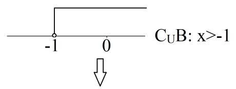

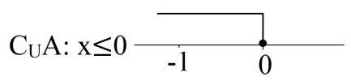

V

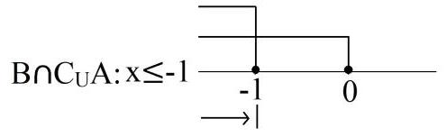

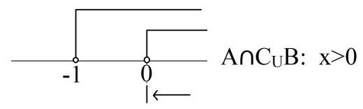

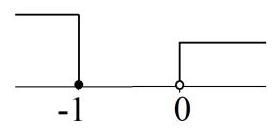

$\left( {\mathrm{A} \cap  {\mathrm{C}}_{\mathrm{U}}\mathrm{B}}\right)  \cup  \left( {\mathrm{B} \cap  {\mathrm{C}}_{\mathrm{U}}\mathrm{A}}\right)  : \mathrm{x} > 0$ 或 $\mathrm{x} \leq   - 1$

故本题选 D。

9. [1999·全国II]设全集 $\mathrm{I} = \{ \left( {\mathrm{x},\mathrm{y}}\right)  \mid  \mathrm{x},\mathrm{y} \in  \mathbf{R}\}$ ,集合 $\mathrm{M} = \{ \left( {\mathrm{x},\mathrm{y}}\right)  \mid \; \left. {\frac{y - 3}{x - 2} = 1}\right\}  ,\mathrm{N} = \{ \left( {\mathrm{x},\mathrm{y}}\right)  \mid  \mathrm{y} \neq  \mathrm{x} + 1\}$ 。那么 ${\mathrm{C}}_{\mathrm{I}}\mathrm{M} \cap  {\mathrm{C}}_{\mathrm{I}}\mathrm{N} =$ (   )。

A. $\varnothing$ B. $\{ \left( {2,3}\right) \}$ C. $\left( {2,3}\right)$ D. $\{ \left( {x, y}\right)  \mid  y = x + 1\}$

解析:本题主要考察补集和交集的概念，也涉及到不等式的基本运算。

首先要明确, 全集 I 和 M、N 中的元素都是实数对(x, y), 而不是简单的单个数字。M、N 的元素都是满足一定数量关系的实数对。

首先对 $\mathrm{M}$ 的限定条件进行化简:

---

$$
\frac{y - 3}{x - 2} = 1 \Rightarrow  \;\mathrm{y} - 3 = \mathrm{x} - 2\left( {\mathrm{x} \neq  2}\right)  \Rightarrow  \;\mathrm{y} = \mathrm{x} + 1\left( {\mathrm{x} \neq  2}\right)
$$

---

可以发现, $\mathrm{M}$ 的限定条件与 $\mathrm{N}$ 的限定条件 $\mathrm{y} \neq  \mathrm{x} + 1$ 几乎完全相反, 二者没有交集。很容易理解:任意的实数对 $\left( {x, y}\right)$ ， $y - x$ 要么等于 1 , 则属于 ${M}^{\prime }$ 要么不等于 1,则属于 $N$ 。

其中特殊的是 $\left( {2,3}\right)$ 。对于 $\mathrm{M}$ ,由于分母不能为 0,所以 $\mathrm{x}$ 不能为 2,因此 $\left( {2,3}\right)  \notin  \mathrm{M}$ 。对于 $\mathrm{N}$ ,由于 $\left( {2,3}\right)$ ,不符合 $\mathrm{N}$ 的条件,因此 $\left( {2,3}\right)  \notin  \mathrm{N}$ 。

于是， ${\mathrm{C}}_{\mathrm{I}}\mathrm{M}$ 的元素为全部满足 $\mathrm{y} \neq  \mathrm{x} + 1$ 的实数对和全部 $\left( {2,\mathrm{y}}\right)$ 。 ${\mathrm{C}}_{\mathrm{I}}\mathrm{N}$ 的元素为全部满足 $\mathrm{y} = \mathrm{x} + 1$ 的实数对，其中也包括 $\left( {2,3}\right)$ 。因此 ${\mathrm{C}}_{\mathrm{I}}\mathrm{M}$ 的 ${\mathrm{C}}_{\mathrm{I}}\mathrm{N}$ 交集只有一个元素 $\left( {2,3}\right)$ 。

要注意的是， $\left( {2,3}\right)$ 只是一个元素，而 ${\mathrm{C}}_{\mathrm{I}}\mathrm{M} \cap  {\mathrm{C}}_{\mathrm{I}}\mathrm{N}$ 是一个集合，应当写为 $\{ \left( {2,3}\right) \}$ 。故本题选 B。

10. $\left\lbrack  {{2020} \cdot  }\right.$ 黑龙江哈三中] 已知集合 $\mathrm{M} = \left\{  {\mathrm{x} \mid  {\mathrm{x}}^{2} \leq  4}\right\}  ,\mathrm{\;N} = \{  - \mathrm{a},\mathrm{a}\}$ 。若 $\mathrm{M} \cap  \mathrm{N} = \mathrm{N}$ ,则实数 $\mathrm{a}$ 的取值范围是( )。

A. $\left\lbrack  {2, + \infty }\right\rbrack$ C. $\left\lbrack  {-2,0)\cup (0,2}\right\rbrack$D. $\left\lbrack  {-2,2}\right\rbrack$

解析:本题主要考察交集和子集的关系，以及不等式的基本运算。

首先可以发现，集合 $\mathrm{M}$ 用表达式描述，集合 $\mathrm{N}$ 用列举法描述。

先根据 $\mathrm{M}$ 的限定条件确定其元素的范围: $\mathrm{x}$ 默认都是实数，且 ${\mathrm{x}}^{2} \leq  4$ ,因此 $\mathrm{M} :  - 2 \leq  \mathrm{x} \leq  2$ 。

由于 $M \cap  N = N$ ,可知 $N \subseteq  M$ ,于是 $- a$ 和 $a$ 都属于 $M$ 。而 $- a$ 和 $a$ 互为相反数， $\mathrm{M}$ 的取值范围也互为相反数，因此 $\mathrm{a}$ 分别对应 -2 和 2，只要绝对值 $\left| a\right|  \leq  2$ ，即 $- 2 \leq  a \leq  2$ 。

但是还差一点! 集合有 3 个重要的性质: 确定性、互异性、无序性。 $\mathrm{N}$ 有 2 个元素-a 和 a，因此-a 与 a 不能相等，因此还有隐含条件 $\mathrm{a} \neq  0$ ,因此 $\mathrm{a}$ 的取值范围是 $\lbrack  - 2,0) \cup  (0,2\rbrack$ 。故本题选 C。

对于用列举法表示的集合，要特别注意集合的互异性。用描述法表示的集合一般不用担心。

11. [2020·安徽合肥调研]已知集合 $A = \{ \left( {x, y}\right)  \mid  y = x - 1\} , B = \{ \left( {x, y}\right)  \mid$ y=-2x+5\},则 $A \cap  B = \left( \right)$ 。

A. $\{ \left( {2,1}\right) \}$ B. $\{ 2,1\}$ C. $\{ \left( {1,2}\right) \}$ D. $\{ \left( {-1,5}\right) \}$

解析:本题主要考察交集的概念，需要用到一项非常基本且常用的解题原理: 对于 2 个或多个由数量关系所描述的集合, 它们的交集就是将各个数量关系联立之后，形成的方程组(或不等式组)的解。

对于本题,就是联立解方程组 $\left\{  \begin{array}{l} y = x - 1 \\  y =  - {2x} + 5 \end{array}\right.$ 解得 $\left\{  \begin{array}{l} x = 2 \\  y = 1 \end{array}\right.$

由于 $A\text{ 、 }B$ 的元素是实数对 $\left( {a, b}\right)$ ,因此交集为 $\{ \left( {2,1}\right) \}$ 。故本题选 A。

从函数图像的角度看, $\mathrm{A}$ 表示直线 $\mathrm{y} = \mathrm{x} - 1$ 上的全部点, $\mathrm{B}$ 表示直线y=-2x+5 上的全部点, $\mathrm{A} \cap  \mathrm{B}$ 表示这 2 条直线的交点,如下图所示:

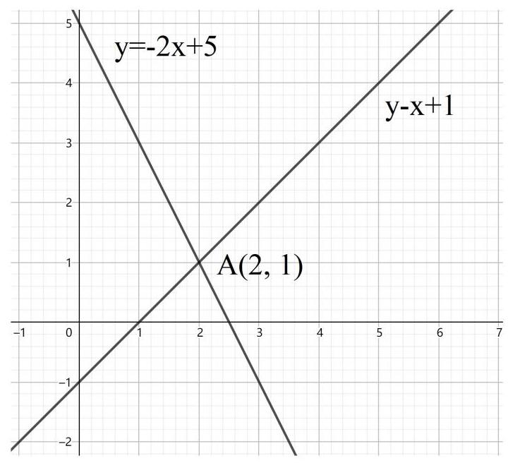

12. [2018·全国II理]已知集合 $A = \left\{  {\left( {x, y}\right)  \mid  {x}^{2} + {y}^{2} \leq  3, x \in  \mathbf{Z}, y \in  \mathbf{Z}}\right\}$ ，则 A 中元素的个数为()。

A. 9 B. 8 C. 5 D. 4

解析:本题表面上是把描述法转变为列举法, 其实是考察对整数、 平方等基本运算的熟练程度, 以及考虑问题是否周全。

首先确定 A 中的元素为数对(x, y), 没有特别说明默认为实数对。 后面又专门说明 “ $\mathrm{x} \in  \mathbf{Z},\mathrm{y} \in  \mathbf{Z}$ ”,因此是整数对。

$\mathrm{x}$ 和 $\mathrm{y}$ 满足数量关系 ${\mathrm{x}}^{2} + {\mathrm{y}}^{2} \leq  3$ ，根据简单的计算可知 $\mathrm{x}$ 和 $\mathrm{y}$ 的绝对值只能取 0 ,或 1 ，于是 $\mathrm{x}$ 和 $\mathrm{y}$ 的取值只能从 -1,0,1 中选取。

当 $\mathrm{x} \neq  \mathrm{y}$ 时，从 3 个数中取 2 个做排列为 ${A}_{3}^{2} = 6$ 。当 $\mathrm{x} = \mathrm{y}$ 时，有 3 种可能，因此共 $6 + 3 = 9$ 个元素。

为了防止遗漏或重复,也可以挨个写出来: $\left( {-1,0}\right) ,\left( {0, - 1}\right) ,\left( {-1,1}\right)$ , $\left( {1, - 1}\right) ,\left( {0,1}\right) ,\left( {1,0}\right) ,\left( {-1, - 1}\right) ,\left( {0,0}\right) ,\left( {1,1}\right)$ ,共 9 个。故本题选 A。

13. [2011·安徽]设集合 $\mathrm{A} = \{ 1,2,3,4,5,6\} ,\mathrm{B} = \{ 4,5,6,7,8\}$ ,则满足 $S \subseteq  A$ 且 $S \cap  B \neq  \varnothing$ 的集合 $S$ 的个数为( )。

A. 57 B. 56 C. 49 D. 8

解析:本题主要考察集合间的相互关系和分析推理能力。重点是分析推理, 需要用到排列组合的乘法原理和加法原理, 其实质就是分情况分类讨论。

S 同时满足 2 个条件:S⊆A 且 S∩B≠∅。

条件 1: $\mathrm{S} \subseteq  \mathrm{A}$ ,说明 $\mathrm{S}$ 的元素只能从 $\mathrm{A}$ 中选取,不能有 $\mathrm{A}$ 以外的元素，即:S的元素只能从 1、2、3、4、5、6 中选取。

条件 2: $\mathrm{S} \cap  \mathrm{B} \neq  \varnothing$ ,说明 $\mathrm{S}$ 中至少有 1 个元素属于 $\mathrm{B}$ ,也意味着 $\mathrm{S}$ 不能是 $\varnothing$ 。即: $\mathrm{S}$ 必须含有 $4\text{ 、 }5\text{ 、 }6\text{ 、 }7\text{ 、 }8$ 中的 1 个或多个元素。

比较 $\mathrm{A}$ 和 $\mathrm{B}$ 的全部元素,7 和 8 只属于 $\mathrm{B}$ 、不属于 $\mathrm{A}$ ,被排除。 因此S必须需含有 4、5、6 中的 1 个或多个元素。而 1、2、3 是可有可没有的。

根据必须含有的 $4\text{ 、 }5\text{ 、 }6$ ,分 3 种情况:(1)S 含有 4、5、6 中的 1 个, (2) S 含有 4、5、6 中的 2 个， (3)S 含有 4、5、6 全部 3 个。

情况( 1 )S 含有 4、5、6 中的 1 个。(同时 1、2、3 可有可没有。) 总共有 $3 \times  {2}^{3} = {24}$ 种情况。这里的“3”是指必有数字中，有“3”或“4”或 “5”，共 ${C}_{3}^{1} = 3$ 种情况。这里的“2”，是指可有可没有数字中，每个数字都有“有”或“没有”2 种情况。

例如: 在含有 4 的集合中,有 $\{ 4\} \text{ 、 }\{ 4,1\} \text{ 、 }\{ 4,2\} \text{ 、 }\{ 4,3\} \text{ 、 }\{ 4,1$ , $2\} \text{ 、 }\{ 4,1,3\} \text{ 、 }\{ 4,2,3\} \text{ 、 }\{ 4,1,2,3\}$ ,共 ${2}^{3}$ 种情况。

情况(2)S 含有 4、5、6 中的 2 个。(同时 1、2、3 可有可没有。) 总共有 $3 \times  {2}^{3} = {24}$ 种情况。这里的 “ 3 ”，是指必有数字中，有 “ 3、4 ”或 “ 3 、 5”或“4、5”，共 ${C}_{3}^{2} = 3$ 种情况。这里的“2”，与情况(1)相同。

情况(3)S 含有 4、5、6 全部 3 个。(同时 1、2、3 可有可没有。) 总共有 $1 \times  {2}^{3} = 8$ 种情况。这里的“1”是指必有数字中，只有“3、4、5”， 共 1 种情况。这里的“2”，与之前相同。

于是 $\mathrm{S}$ 共有 ${24} + {24} + 8 = {56}$ 种可能，故本题选 B。

14. [2012·全国]已知集合 $A = \{ 1,2,3,4,5\} , B = \{ \left( {x, y}\right)  \mid  x \in  A, y \in  A$ , $\mathrm{X} - \mathrm{y} \in  \mathrm{A}\}$ ，则 $\mathrm{B}$ 中所含元素的个数为()。

A. 3 B. 76 C. 8 D. 10

解析:本题考察集合间的相互关系和分析推理能力。重点和是理解表达式的含义和分析推理。

集合 A 很简单,由 5 个自然数构成。集合 B 的表达式较为复杂, 需要耐心分析。

首先，B 的元素是数对(x, y)。

第二，这个数对需要满足 3 个条件: $x \in  A$ ， $y \in  A$ ， $x - y \in  A$ 。其含义为: $\left( {x, y}\right)$ 中的 $x$ 和 $y$ 都只能从 $A$ 的元素中选取,并且 $x - y$ 的差值也必须属于 $A$ 。

很容易看出:从 1、2、3、4、5 中任取选取 2 个不同的数字，用大的数字减去小的数字, 差值肯定也属于 1、2、3、4、5。用小的减去大的数字,结果是负数,就不属于 $\mathrm{A}$ 。如果让 $\mathrm{x} = \mathrm{y}$ ,差值为 0,也不属于 A。

因此，只要从 $\mathrm{A}$ 中任取 2 个不同的数字，令大的数字为 $\mathrm{x}$ ，小的数字为y，构成数对 $\left( {\mathrm{x},\mathrm{y}}\right)$ ，就是 $\mathrm{B}$ 的元素。因此 $\mathrm{B}$ 的元素共有 ${C}_{5}^{2} = {10}$ 个。故本题选 D。

15. [2020·四川成都]已知集合 $\mathrm{A} = \{ 1,2,3,4,5,6\}$ 的所有三个元素的子集记为 ${B}_{1},{B}_{2},{B}_{3},\ldots ,{B}_{k}, k \in  {\mathbf{N}}^{ * }$ 。记 ${b}_{i}$ 为集合 ${B}_{i}\left( {i = 1,2,3,\ldots , k}\right)$ 中的最大元素，则 ${b}_{1} + {b}_{2} + {b}_{3} + \ldots  + {b}_{k} = \left( \right)$ 。

A. 45 B. 105 C. 150 D. 210

解析:本题考察子集的概念，以及数学推断和综合分析能力，需要用到排列组合的基本原理, 其实质是分情况讨论。

题目首先用列举法给出了一个简单的集合 A。接着给出了一系列集合 ${B}_{1},{B}_{2},{B}_{3},\ldots ,{B}_{k}$ ,并规定了全部 ${B}_{i}$ 都是 $A$ 的子集,且限定了全部 ${\mathrm{B}}_{\mathrm{i}}$ 都含有 3 个元素,于是可以大致列举一些 ${\mathrm{B}}_{\mathrm{i}} : \{ 1,2,3\} \text{ 、 }\{ 1,2,4\}$ 、 $\{ 3,4,5\} \text{ 、 }\{ 4,5,6\} \text{ 、 }\{ 2,4,6\} \ldots \ldots$

根据组合数可知,从属于 $\mathrm{A}$ 的 6 个元素中任选 3 个的组合共有 ${C}_{6}^{3} = {20}$ 种,表明 ${\mathrm{B}}_{1,}{\mathrm{\;B}}_{2},{\mathrm{\;B}}_{3},\ldots ,{\mathrm{B}}_{\mathrm{k}}$ 总共有 20 个集合,即 $\mathrm{k} = {20}$ 。

题目规定 ${\mathrm{b}}_{\mathrm{i}}$ 为集合 ${\mathrm{B}}_{\mathrm{i}}\left( {\mathrm{i} = 1,2,3,\ldots ,\mathrm{k}}\right)$ 中的最大元素，并且求全部 ${b}_{i}$ 之和 ${b}_{1} + {b}_{2} + {b}_{3} + \ldots  + {b}_{k}$ ,就是求每个集合中最大的元素之和。

最节约脑力、但是耗时较长的方法，就是把这 20 个集合分别列出来，选取各个集合中最大的元素求和即可。但是这个过程要非常细心, 不要出现遗漏或重复计算的情况。

用组合数的方法能节约很多时间，其实质是分情况讨论，如下:

(1)全部含有 6 的集合，6 是最大值，除了 6 以外的 2 个元素从 1 、 2、3、4、5 中选取，于是共有 ${C}_{5}^{2} = {10}$ 个。

(2)全部含有 5、不含有 6 的集合，5 是最大值，除了 5 以外的 2 个元素从 $1\text{ 、 }2\text{ 、 }3\text{ 、 }4$ 中选取，于是共有 ${C}_{4}^{2} = 6$ 个。

(3)全部含有 4、不含有 5、6 的集合，4 是最大值，除了 4 以外的 2 个元素从 1、2、3 中选取，于是共有 ${C}_{3}^{2} = 3$ 个。

(4)全部含有 3、不含有 4、5、6 的集合，3 是最大值，除了 3 以外的 2 个元素从 1、2 中选取，只有 1 个，即 $\{ 1,2,3\}$ 。

于是可知: ${b}_{1}\text{ 、 }{b}_{2}\text{ 、 }{b}_{3}\text{ 、 }\ldots {b}_{20}$ 中,共有 10 个 6、6 个 5、3 个 4 、 1 个 3,于是 ${b}_{1} + {b}_{2} + {b}_{3} + \ldots  + {b}_{k} = 6 \times  {10} + 5 \times  6 + 4 \times  3 + 3 \times  1 = {105}$ 。

故本题选 B。

16. [2004·全国I]设 $\mathrm{A},\mathrm{B},\mathrm{I}$ 均为非空集合,且满足 $\mathrm{A} \subseteq  \mathrm{B} \subseteq  \mathrm{I}$ ,则下列各式中错误的是()。

A. $\left( {{\mathrm{C}}_{\mathrm{I}}\mathrm{A}}\right)  \cup  \mathrm{B} = \mathrm{I}$ B. $\left( {{\mathrm{C}}_{\mathrm{I}}\mathrm{A}}\right)  \cup  \left( {{\mathrm{C}}_{\mathrm{I}}\mathrm{B}}\right)  = \mathrm{I}$

C. $A \cap  \left( {{C}_{I}B}\right)  = \varnothing$ D. $\left( {{\mathrm{C}}_{\mathrm{I}}\mathrm{A}}\right)  \cup  \left( {{\mathrm{C}}_{\mathrm{I}}\mathrm{B}}\right)  = \left( {{\mathrm{C}}_{\mathrm{I}}\mathrm{B}}\right)$

解析:本题考察集合之间的相互关系。题目给出的是抽象的集合关系，并且选项中的关系都比较复杂，用韦恩图可以便于直观理解。根据关系 $A \subseteq  B \subseteq  I$ 可作出右图, 再根据 4 个选项将对应的部分标记并进行判断即可。

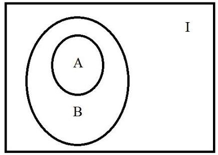

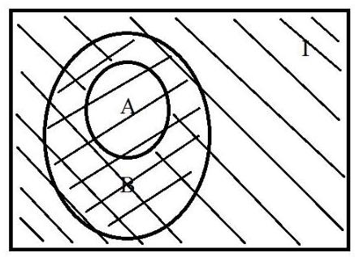

选项 A. $\left( {{\mathrm{C}}_{\mathrm{I}}\mathrm{A}}\right)  \cup  \mathrm{B} = \mathrm{I}$ 如左图所示。左上 -右下的斜线表示 ${C}_{I}A$ ,右上-左下的斜线表示 B，二者覆盖了全集 I 的全部范围， 因此选项 A 正确。

选项 B. $\left( {{C}_{I}A}\right)  \cup  \left( {{C}_{I}B}\right)  = I$ 如右图所示。左上- 右下的斜线表示 ${C}_{I}A$ ，右上-左下的斜线表示 ${C}_{I}B$ 。二者的覆盖范围缺少了 $A$ 的范围。因此选项B错误。

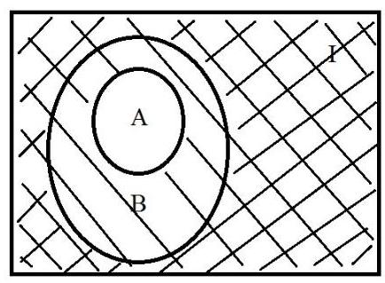

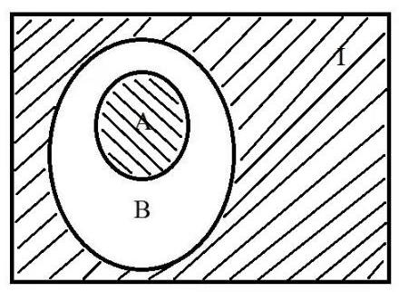

选项 C. $A \cap  \left( {{C}_{I}B}\right)  = \varnothing$ 如左图所示。左上-右下的斜线表示 $A$ ,右上-左下的斜线表示 ${C}_{I}B$ 。二者的覆盖范围没有交集。因此选项 C 正确。

选项 D. $\left( {{C}_{I}A}\right)  \cup  \left( {{C}_{I}B}\right)  = \left( {{C}_{I}B}\right)$ 如右图所示。 左上-右下的斜线表示 ${\mathrm{C}}_{\mathrm{I}}\mathrm{A}$ ,右上-左下的斜线表示 ${\mathrm{C}}_{\mathrm{I}}\mathrm{B}$ 。后者的覆盖范围完全被前者所覆盖, 因此 D 选项正确。故本题选 B。

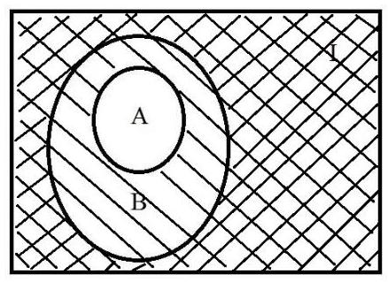

17. [2005·全国I]设 $I$ 为全集, ${S}_{1},{S}_{2},{S}_{3}$ 是 $I$ 的三个非空子集,且 ${\mathrm{S}}_{1} \cup  {\mathrm{S}}_{2} \cup  {\mathrm{S}}_{3} = \mathrm{I}$ ,则下面论断正确的是 ( ) 。

A. ${\mathrm{C}}_{\mathrm{I}}{\mathrm{S}}_{1} \cap  \left( {{\mathrm{S}}_{2} \cup  {\mathrm{S}}_{3}}\right)  = \varnothing$ B. ${\mathrm{S}}_{1} \subseteq  \left( {{\mathrm{C}}_{\mathrm{I}}{\mathrm{S}}_{2} \cap  {\mathrm{C}}_{\mathrm{I}}{\mathrm{S}}_{3}}\right)$

C. ${\mathrm{C}}_{\mathrm{I}}{\mathrm{S}}_{1} \cap  {\mathrm{C}}_{\mathrm{I}}{\mathrm{S}}_{2} \cap  {\mathrm{C}}_{\mathrm{I}}{\mathrm{S}}_{3} = \varnothing$ D. ${\mathrm{S}}_{1} \subseteq  \left( {{\mathrm{C}}_{\mathrm{I}}{\mathrm{S}}_{2} \cup  {\mathrm{C}}_{\mathrm{I}}{\mathrm{S}}_{3}}\right)$

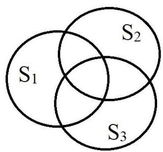

解析:本题考察集合间的关系与集合的运算。

4 个选项都比较复杂, 需要使用韦恩图的方式直观解决。要注意的是，题目没有明确 ${\mathrm{S}}_{1},{\mathrm{\;S}}_{2},{\mathrm{\;S}}_{3}$ 之间是否有交集，为严谨起见，需要用更加一般的情况，即假设它们之间有交集。如右图所示。

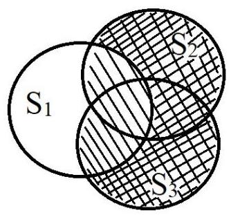

选项 A. ${\mathrm{C}}_{\mathrm{I}}{\mathrm{S}}_{1} \cap  \left( {{\mathrm{S}}_{2} \cup  {\mathrm{S}}_{3}}\right)  = \varnothing$ 如左图所示。左上 -右下的斜线表示 ${\mathrm{S}}_{2} \cup  {\mathrm{S}}_{3}$ ,右上-左下的斜线表示 ${\mathrm{C}}_{\mathrm{I}}{\mathrm{S}}_{1}$ 。网格处为二者交集,不为空,因此选项 $\mathrm{A}$ 错误。

选项 B. ${\mathrm{S}}_{1} \subseteq  \left( {{\mathrm{C}}_{\mathrm{I}}{\mathrm{S}}_{2} \cap  {\mathrm{C}}_{\mathrm{I}}{\mathrm{S}}_{3}}\right)$ 如右图所示。左上-右下的斜线表示 ${\mathrm{C}}_{\mathrm{I}}{\mathrm{S}}_{2}$ ，右上-左下的斜线表示 ${\mathrm{C}}_{\mathrm{I}}{\mathrm{S}}_{3}$ 。 网格处为 ${\mathrm{C}}_{\mathrm{I}}{\mathrm{S}}_{2} \cap  {\mathrm{C}}_{\mathrm{I}}{\mathrm{S}}_{3}$ ,可以看出, ${\mathrm{S}}_{1} \cap  {\mathrm{S}}_{2}$ 和 ${\mathrm{S}}_{1} \cap  {\mathrm{S}}_{3}$ 都不在区域内，因此选项B错误。

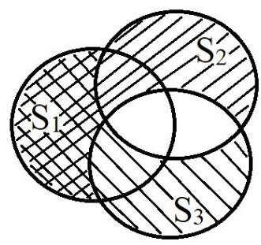

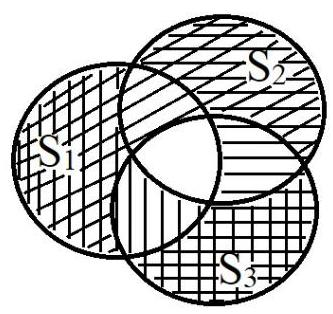

选项 C. ${\mathrm{C}}_{\mathrm{I}}{\mathrm{S}}_{1} \cap  {\mathrm{C}}_{\mathrm{I}}{\mathrm{S}}_{2} \cap  {\mathrm{C}}_{\mathrm{I}}{\mathrm{S}}_{3} = \varnothing$ 如左图所示。横线表示 ${\mathrm{C}}_{\mathrm{I}}{\mathrm{S}}_{1}$ ,竖线表示 ${\mathrm{C}}_{\mathrm{I}}{\mathrm{S}}_{2}$ ,斜线表示 ${\mathrm{C}}_{\mathrm{I}}{\mathrm{S}}_{3}$ 。同时覆盖横线、竖线、斜线的部分为 ${\mathrm{C}}_{\mathrm{I}}{\mathrm{S}}_{1} \cap  {\mathrm{C}}_{\mathrm{I}}{\mathrm{S}}_{2} \cap  {\mathrm{C}}_{\mathrm{I}}{\mathrm{S}}_{3}$ 。 从图中可以看出并没有 3 种线共同覆盖的区域， 因此选项 C 正确。

选项 D. ${\mathrm{S}}_{1} \subseteq  \left( {{\mathrm{C}}_{\mathrm{I}}{\mathrm{S}}_{2} \cup  {\mathrm{C}}_{\mathrm{I}}{\mathrm{S}}_{3}}\right)$ 如右图所示。左上- 右下的斜线表示 ${\mathrm{C}}_{\mathrm{I}}{\mathrm{S}}_{2}$ ,右上-左下的斜线表示 ${\mathrm{C}}_{\mathrm{I}}{\mathrm{S}}_{3}$ ,有斜线覆盖的区域都属于 $\left( {{\mathrm{C}}_{\mathrm{I}}{\mathrm{S}}_{2} \cup  {\mathrm{C}}_{\mathrm{I}}{\mathrm{S}}_{3}}\right)$ 。可以看出,中间 ${\mathrm{S}}_{1} \cap  {\mathrm{S}}_{2} \cap  {\mathrm{S}}_{3}$ 的区域未被斜线覆盖, 因此选项 D 错误。故本题选 C。

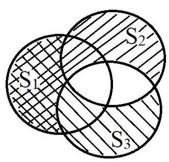

特别的, 如果为了图方便, 假设集合之间都没有交集。作图如下:

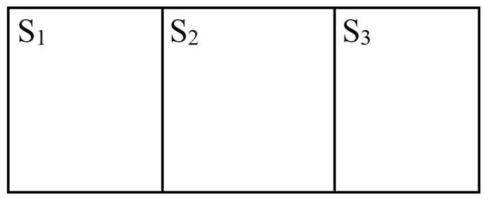

则分析选项 B. ${S}_{1} \subseteq  \left( {{C}_{I}{S}_{2} \cap  {C}_{I}{S}_{3}}\right)$ 时会出现错误。图中 ${C}_{I}{S}_{2}$ 是 ${S}_{1} \cup  {S}_{3}$ , ${\mathrm{C}}_{\mathrm{I}}{\mathrm{S}}_{3}$ 是 ${\mathrm{S}}_{1} \cup  {\mathrm{S}}_{2}$ ,因此 ${\mathrm{C}}_{\mathrm{I}}{\mathrm{S}}_{2} \cap  {\mathrm{C}}_{\mathrm{I}}{\mathrm{S}}_{3} = {\mathrm{S}}_{1}$ 。 $\mathrm{B}$ 选项在这种特殊情况下是正确的,但是在 3 个集合有交集的情况下是错误。此外, $\mathrm{D}$ 选项在这种特殊请款修改下也是正确的。所以，不要为了图方便而随意简化条件！

18. [2019·新课标全国III]《西游记》《三国演义》《水浒传》《红楼梦》是中国古典文学瑰宝，并称为中国古典小说四大名著。某中学为了解本校学生阅读四大名著的情况，随机调查了 100 位学生，其中阅读过《西游记》或《红楼梦》的学生共有 90 位，阅读过《红楼梦》 的学生共有 80 位，阅读过《西游记》且阅读过《红楼梦》的学生共有 60 位，则该校阅读过《西游记》的学生人数与该校学生总数比值的估计值为()。

A. 0.5 B. 0.6 C. 0.7 D. 0.8

解析:本题是一道“阅读题”。

在解决此类用将现实场景与数学问题相结合的题目时，不要被大量的文字所干扰，先认真阅读文章，对文章进行梳理:(1)将大段文字中与题目无关的背景信息过滤无视掉，(2)把与题目有关的数量信息翻译成数学语言。

先认真阅读文章:

(1)第 1 句交待四大名著的背景，可以忽略。

(2)第 2 句开头“某中学为了解本校学生阅读四大名著的情况，随机调查了 100 位学生”，说明题目与统计分析中的抽样调查有关，样本容量为 100 位学生。

(3)第 2 句后面出现关键词“或”“且”，说明与集合的运算有关。并且只出现了《红楼梦》和《西游记》2 本书，另外 2 本没有出现。

(4)求阅读过《西游记》的学生人数所占总数的比值，所求的为某一类学生所占的比例。

对以上信息进行梳理:

第一，题目问的是阅读过《西游记》的学生人数所占总数的比值。 样本容量是 100 位学生，还需要知道这 100 位学生当中阅读过《西游记》的学生人数。

第二，阅读过《西游记》的学生人数可以根据(3)中的信息，使用集合元素个数的运算求得。

把(3)简化为如下语句:100 位学生，90 位读过《西》或读过《红》， 80 读过《红》，60 位读过《西》且读过《红》。

再进一步翻译为数学语言:集合 A=\{读过《红》的学生\}，B=\{读过《西》的学生\}, card(A∪B)=90, card(A)=80, card(A∩B)=60。

根据数量关系 $\operatorname{card}\left( {\mathrm{A} \cup  \mathrm{B}}\right)  = \operatorname{card}\left( \mathrm{A}\right)  + \operatorname{card}\left( \mathrm{B}\right)  - \operatorname{card}\left( {\mathrm{A} \cap  \mathrm{B}}\right)$ 。将各数值代入:90=80+card(B)-60。解得:card(B)=70。即读过《西游记》的学生人数为 70 。

于是读过《西游记》的学生人数与该校学生总数比的估计值为 70÷100=0.7。故本题选 C。

19. [2005·浙江]设 $f\left( n\right)  = {2n} + 1\left( {n \in  N}\right) , P = \{ 1,2,3,4,5\} , Q = \{ 3,4,5$ , $6,7\}$ ,记 $\widehat{P} = \{ n \in  N \mid  f\left( n\right)  \in  P\} ,\widehat{Q} = \{ n \in  N \mid  f\left( n\right)  \in  Q\}$ ,则 $\left( {\widehat{P} \cap  {C}_{N}\widehat{Q}}\right)  \cup  (\widehat{Q} \cap  {C}_{N} \; P) =$ (   )。

A. $\{ 0,3\}$ B. $\{ 1,2\}$ C. $\{ 3,4,5\}$ D. $\{ 1,2,6,7\}$

解析:本题看起来比较复杂,先是 $\mathrm{P}\text{ 、 }\mathrm{Q}$ ,又是 $\overset{\text{ ⏜ }}{\mathrm{P}}\text{ 、 }\overset{\text{ ⏜ }}{\mathrm{Q}}$ ,并且后者的元素与函数 $\mathrm{f}\left( \mathrm{n}\right)$ 有关，还以自变量的形式出现，而不是函数的值。 其实只要耐心分析,实际上并不复杂。

首先,题目给出了函数 $f\left( n\right)  = {2n} + 1\left( {n \in  N}\right)$ ,这是很简单的一次函数,并且定义域 $\mathrm{n}$ 是自然数。题目还给出了 2 个由简单的自然数构成的集合 $\mathrm{P}$ 、 $\mathrm{Q}$ 。

接下来是看起来复杂的部分。

先分析 $\mathrm{P}$ ,其构成元素是自然数 $\mathrm{n}$ ,限定条件是 $\mathrm{f}\left( \mathrm{n}\right)  \in  \mathrm{P}$ ,即 $2\mathrm{n} + 1 \in  \mathrm{P}$ 。也就是 $2\mathrm{n} + 1$ 分别为 $1\text{ 、 }2\text{ 、 }3\text{ 、 }4\text{ 、 }5$ 。解方程 $2\mathrm{n} + 1 = 1,2\mathrm{n} + 1 = 2$ , $2\mathrm{n} + 1 = 3,2\mathrm{n} + 1 = 4,2\mathrm{n} + 1 = 5$ ，解得 $\mathrm{n}$ 分别为 $0\text{ 、 }{0.5}\text{ 、 }1\text{ 、 }{1.5}\text{ 、 }2$ 。由于 $\mathrm{n}$ 是自然数,因此 $\mathrm{n}$ 可以为 $0\text{ 、 }1\text{ 、 }2$ 。于是 $\mathrm{P} = \{ 0,1,2\}$ 。

同样的,对于 $\widehat{Q}$ ,分别解方程 ${2n} + 1 = 3,{2n} + 1 = 4,{2n} + 1 = 5,{2n} + 1 = 6$ , $2\mathrm{n} + 1 = 7$ ，解得 $\mathrm{n}$ 分为 $1\text{ 、 }{1.5}\text{ 、 }2\text{ 、 }{2.5}\text{ 、 }3$ 。同样由于 $\mathrm{n}$ 是自然数,因此 $\mathrm{n}$ 可以为 $1\text{ 、 }2\text{ 、 }3$ ,于是 $\widehat{\mathrm{Q}} = \{ 1,2,3\}$ 。

现在，很容易分析 $\left( {\widehat{\mathrm{P}} \cap  {\mathrm{C}}_{\mathrm{N}}\widehat{\mathrm{Q}}}\right)  \cup  \left( {\widehat{\mathrm{Q}} \cap  {\mathrm{C}}_{\mathrm{N}}\widehat{\mathrm{P}}}\right)$ 。 $\widehat{\mathrm{P}} \cap  {\mathrm{C}}_{\mathrm{N}}\widehat{\mathrm{Q}}$ 表示自然数中只属于P、但是不属于Q的元素,从P中删去属于Q的 1、2 即可,于是P∩CN $\widehat{\mathrm{Q}} = \{ 0\}$ 。

同样的, $\widehat{\mathrm{Q}} \cap  {\mathrm{C}}_{\mathrm{N}}\widehat{\mathrm{P}}$ )表示自然数中只属于 $\widehat{\mathrm{Q}}$ 、但是不属于 $\widehat{\mathrm{P}}$ 的元素, 从 $\widehat{Q}$ 中删去属于 $\widehat{P}$ 的 $1\text{ 、 }2$ 即可,于是 $\widehat{Q} \cap  {C}_{N}\widehat{P} = \{ 3\}$ 。

综上, $\left( {\mathrm{P} \cap  {\mathrm{C}}_{\mathrm{N}}\mathrm{Q}}\right)  \cup  \left( {\mathrm{Q} \cap  {\mathrm{C}}_{\mathrm{N}}\mathrm{P}}\right)  = \{ 0,3\}$ 。故本题选 A。

本题看起来复杂, 其实只要耐心、细心地一步一步推导, 难度并不高。

20. [2020·重庆巴蜀中学]对于任意两个数 $x, y\left( {x, y \in  {\mathbf{N}}^{ * }}\right)$ ,定义某种运算“◎”如下:

①当 $\left\{  \begin{array}{l} x = {2m}, m \in  {\mathbf{N}}^{ * } \\  y = {2n}, n \in  {\mathbf{N}}^{ * } \end{array}\right.$ 或 $\left\{  \begin{array}{l} x = {2m} - 1, m \in  {\mathbf{N}}^{ * } \\  y = {2n} - 1, n \in  {\mathbf{N}}^{ * } \end{array}\right.$

② 当 $\left\{  \begin{array}{l} x = {2m}, m \in  {\mathbf{N}}^{ * } \\  y = {2n} - 1, n \in  {\mathbf{N}}^{ * } \end{array}\right.$

则集合 $A = \{ \left( {x, y}\right)  \mid  x \odot  y = {10}\}$ 的子集的个数是( )。

A. ${2}^{14}$ B. ${2}^{13}$ C. ${2}^{11}$ D. ${2}^{7}$

解析:本题看起来比较难，实际上的确具有一定难度，因为本题定义了一种新的运算，并且这种运算还要分情况。这类在考试中现场理解新的概念、并学会使用新的概念的题目是当前必考的类型

一般题目中出现的新的概念并不复杂, 只需要耐心和细心, 一步一步分析，就能理解新的概念或运算的实质。

先分析第 1 种情况:当 $\left\{  \begin{array}{l} x = {2m}, m \in  {\mathbf{N}}^{ * }\text{ 或 }\left\{  \begin{array}{l} x = {2m} - 1, m \in  {\mathbf{N}}^{ * } \\  y = {2n} - 1, n \in  {\mathbf{N}}^{ * } \end{array}\right. \\  y = {2n} - 1, n \in  {\mathbf{N}}^{ * } \end{array}\right.$

它的前半段: $\mathrm{x} = 2\mathrm{\;m},\mathrm{\;m} \in  {\mathbf{N}}^{ * },\mathrm{x}$ 可以取任意正偶数, $\mathrm{y} = 2\mathrm{n},\mathrm{n} \in  {\mathbf{N}}^{ * }$ , $\mathrm{y}$ 也可以取任意正偶数。并且 $\mathrm{m}$ 和 $\mathrm{n}$ 是两个互相独立的自变量,它们可以相等也可以不等,于是第 1 种情况的前半段的含义为: $\mathrm{x}$ 和 $\mathrm{y}$ 同为正偶数。

同理,它的后半段: $\mathrm{x} = 2\mathrm{\;m} - 1,\mathrm{\;m} \in  {\mathbf{N}}^{ * },\mathrm{x}$ 可以取任意正奇数, $\mathrm{y} = 2\mathrm{n} - 1$ , $\mathrm{n} \in  {\mathbf{N}}^{ * }$ , $\mathrm{y}$ 也可以取任意正奇数。同样的, $\mathrm{m}$ 和 $\mathrm{n}$ 是两个互相独立的自变量, 它们可以相等也可以不等。于是第 1 种情况的后半段的含义为: $\mathrm{x}$ 和 $\mathrm{y}$ 同为正奇数。

综上所述，第 1 种情况的含义为:当 $\mathrm{x}$ 和 $\mathrm{y}$ 同为正偶数或同为正奇数时, $\mathrm{x} \odot  \mathrm{y}$ 就是 $\mathrm{x} + \mathrm{y}$ 。

再分析第 2 种情况: 当 $\left\{  \begin{array}{l} \mathrm{x} = 2\mathrm{m},\mathrm{m} \in  {\mathbf{N}}^{ * }\text{ 时, } \\  \mathrm{y} = 2\mathrm{n} - 1,\mathrm{n} \in  {\mathbf{N}}^{ * } \end{array}\right.$

按照相同的思路分析:

$\mathrm{x} = 2\mathrm{\;m},\mathrm{\;m} \in  {\mathbf{N}}^{ * }$ 时, $\mathrm{x}$ 可以取任意正偶数, $\mathrm{y} = 2\mathrm{n} - 1,\mathrm{n} \in  {\mathbf{N}}^{ * }$ 时, $\mathrm{y}$ 可以取任意正奇数。由于 $\mathrm{m}$ 和 $\mathrm{n}$ 是两个相互独立的自变量,它们可以相等也可以不相等。于是第 2 种情况为:当 $\mathrm{x}$ 为正偶数、 $\mathrm{y}$ 为正奇数时。 $\mathrm{x} \odot  \mathrm{y}$ 就是 $\mathrm{{xy}}$ 。

这种新运算实质就是: 当 $\mathrm{x}$ 和 $\mathrm{y}$ 都是正偶数或正奇数时,取 $\mathrm{x} + \mathrm{y}$ 。 当 $\mathrm{x}$ 为正偶数、 $\mathrm{y}$ 为正奇数时,取 $\mathrm{{xy}}$ 。没有规定当 $\mathrm{x}$ 为正奇数、 $\mathrm{y}$ 为正偶数的情况，视作无意义。

题目求集合 $A = \{ \left( {x, y}\right)  \mid  x\text{ ② }y = {10}\}$ 的子集的个数，实质上是求 $A$ 所含有的元素的个数。也就是求有多少个正整数对 $\left( {x, y}\right)$ ,要么 $x, y$ 同为奇数或偶数,且 $x + y = {10}$ ; 要么 $x$ 为偶数、 $y$ 为奇数,且 ${xy} = {10}$ 。

根据 10 以内的加法可知:

1 和 9 都是奇数, $1 + 9 = {10},9 + 1 = {10},\left( {1,9}\right) \text{ 、 }\left( {9,1}\right)  \in  \mathrm{A}$ ;

2 和 8 都是偶数, $2 + 8 = {10},8 + 2 = {10},\left( {2,8}\right) \text{ 、 }\left( {8,2}\right)  \in  \mathrm{A}$ ;

3 和 7 都是奇数, $3 + 7 = {10},7 + 3 = {10},\left( {3,7}\right) \text{ 、 }\left( {7,3}\right)  \in  \mathrm{A}$ ;

4 和 6 都是偶数, $4 + 6 = {10},6 + 4 = {10},\left( {4,6}\right) \text{ 、 }\left( {6,4}\right)  \in  \mathrm{A}$ ;

5 和 5 都是奇数, $5 + 5 = {10},\left( {5,5}\right)  \in  \mathrm{A}$ 。

以上是 $\mathrm{x}$ 和 $\mathrm{y}$ 同为奇数或偶数并进行加法的情况,还有 $\mathrm{x}$ 为偶数、 y 为奇数并进行乘法的情况。

对 10 进行因式分解: ${10} = {10} \times  1 = 2 \times  5$ ,于是 $\left( {{10},1}\right) \text{ 、 }\left( {2,5}\right)  \in  \mathrm{A}$ 。

x 为奇数、y 为偶数的情况没有定义视作无意义， $\left( {1,{10}}\right)$ 、 $\left( {5,2}\right)  \notin  \mathrm{A}$ 。

以上就是 $\mathrm{A}$ 的全部元素,用列举法表示为: $\mathrm{A} = \{ \left( {1,9}\right) ,\left( {9,1}\right) ,\left( {2,8}\right)$ , $\left( {8,2}\right) ,\left( {3,7}\right) ,\left( {7,3}\right) ,\left( {4,6}\right) ,\left( {6,4}\right) ,\left( {5,5}\right) ,\left( {{10},1}\right) ,\left( {2,5}\right) \}$ ,共有 11 个元素。

在 A 的全部子集中，每个元素都有 2 种可能:属于或不属于， 因此总共有 ${2}^{11}$ 个子集。故本题选 C。

## 第二章 不等式

不等式关系与加、减、乘、除、平方、开方等基本运算、以及等式关系一样, 都是基础的数学工具, 是学好其他数学知识的基础, 贯穿于整个高中阶段的数学学习当中。

不等式既是直接考察的知识点，也是解答问题的主要思路。不等式经常与其他块面的知识一起出现, 体现出很强的综合性。在练习时, 一方面要专门地练习使用不等式的性质以及基本不等式。另一方面， 也要在练习中发现指向不等式的线索, 知道什么样的条件适合用不等式的方法解决。

关于不等式的题目主要有 2 种类型, 一种是直接解不等式, 往往思路简单明了，只需要细心和耐心就行。另一种是不等式的综合应用， 往往具有一定难度，有时需要灵活的思路。

对于直接解不等式的题目，其核心思路与解方程类似。(1)最根本的思路是将不等式转化为若干个一次式直接相乘或相除的形式，根据 “偶数个负数相乘的积是正数，奇数个负数相乘的积是负数”，对各个区间是否满足不等式进行判断。(2)对于二次多项式，一般需要使用根的判别式判断其是否有解,如果 $\Delta  > 0$ 则可以转化为 2 个一次式相乘, 如果 $\Delta  < 0$ 则需要根据不等号判断是无解还是全体实数,如果 $\Delta  = 0$ 则需要根据不等号的情况具体判断。(3)若涉及到绝对值，一般需要分情况讨论。

对于不等式的综合应用，主要有 3 种类型:不等式的证明、求最大值或最小值、比较大小。此类题目主要有 2 个难点。

难点 (1)，判断该题目的主要解题思路是不等式还是其他。有些题目需要用不等式的方法解决，主要使用基本不等式进行变形和化简。 另一些些题目需要使用其他解法, 例如: 函数的导数、函数图像、三角函数、线性规划等。

一般来说，如果题目出现 2 个或 3 个变量，给出了变量间的数量关系，并且该数量关系的形式看起来较为单一，特别是当 3 个变量存在的形式非常相似 (互换位置不产生影响或影响很小), 此类题目一般使用基本不等式解决。

如果题目中只有 1 个变量，并且表达式较为复杂，涉及到三角函数、指数、对数、圆锥曲线等，此类题目一般使用函数的有关知识解决。需要用线性规划解决的题目非常明显。

难点(2):对基本不等式的综合应用。在简答题中，一般不会很直接地给出使用基本不等式的条件, 无法直接套用公式, 往往需要较为巧妙的变形, 特别是很多题目中有 3 个变量。

使用基本不等式有 3 个核心要点:

要点(1):凑标准形式。在使用基本不等式时，必须要严格套用相应的公式和等号成立的条件。解题时经常要把一些简单的单项式整体看作一个元素，应用于基本不等式，用换元法会比较容易观察。

要点(2):让不等式的两边的次数保持一致。仔细观察基本不等式的 3 种主要形式: ${a}^{2} + {b}^{2} \geq  {2ab}, a + b \geq  2\sqrt{ab},{a}^{2} + {b}^{2} \geq  \frac{1}{2}{\left( a + b\right) }^{2}$ 。

不等式左右两边的次数都相等:要么都是平方项或两个一次项相乘，要么都是一次项或乘积的平方根。因此在解决一些题目时，可尝试将条件或问题中表达式的次数统一起来。

要点(3):基本不等式具有单向性。再仔细观察基本不等式的 3 种主要形式: ${a}^{2} + {b}^{2} \geq  {2ab}, a + b \geq  2\sqrt{ab},{a}^{2} + {b}^{2} \geq  \frac{1}{2}{\left( a + b\right) }^{2}$ 。

可以发现:再把系数等具体细节忽略的情况下，形式(1)的实质是“平方的和”>“乘积”，形式(2)的实质是“和的平方”>“乘积”，形式(3) 的实质是“平方的和” $>$ “和的平方”。综合起来为:

“平方的和” $>$ “和的平方”， $>$ “乘积” (当且仅当各项相等时，等号成立)。

该规律主要用于:从已知条件中推演出可以直接使用的新条件。

此外，在证明不等式时，也要大胆地“瞎试”。即使没有很好的思路，试试(1)把表达式展开后合并、(2)拆分后重新组合、(3)同时乘以和除以相同的表达式、(4)直接 “生硬” 地套用基本不等式。

一通乱试之后，经常能“不小心”得出接近答案的结果。然后再重新梳理思路，正式解答。

“瞎试”也是人类解决问题和发明发现的重要途径之一。

1. [2006 · 安徽]不等式 $\frac{1}{x} < \frac{1}{2}$ 的解集是( )。

A. $\left( {-\infty ,2}\right)$ B. $\left( {2, + \infty }\right)$ C. $\left( {0,2}\right)$ D. $\left( {-\infty ,0}\right)  \cup  \left( {2, + \infty }\right)$

解析:本题是基本的解分时不等式问题。有两种思路:通分或分情况讨论。

解法(1)通分

移项: $\frac{1}{x} - \frac{1}{2} < 0$

通分: $\frac{2 - x}{2x} < 0$

两边同时乘以 -1 : $\frac{x - 2}{2x} > 0$

要么 $x - 2 > 0$ 且 ${2x} > 0$ ,解得 $x > 2$ 。

要么 $x - 2 < 0$ 且 ${2x} < 0$ ,解得 $x < 0$ 。

最后记得排除分母为 0 的情况: $x \neq  0$

综合以上情况，解集为 $x > 2$ 或 $x < 0$ 。

解法(2): 分情况讨论

情况 1: 当 $x > 0$ 时,不等式两边同时乘以 $\mathrm{x}$ (不变号):

$\frac{1}{x} \times  x < \frac{1}{2} \times  x =  > 1 < \frac{1}{2}x =  > x > 2$

$x > 0$ 且 $x > 2$ ,故 $x > 2$ 。

情况 2: 当 $x < 0$ 时,不等式两边同时乘以 $\mathrm{x}$ (要变号):

$\frac{1}{x} \times  x > \frac{1}{2} \times  x =  > 1 > \frac{1}{2}x =  > x < 2$

$x < 0$ 且 $x < 2$ ,故 $x < 0$ 。

情况 3: 当 $x = 0$ 时,由于分母不能为 0,因此该情况不成立。

综合以上情况，解集为 $x > 2$ 或 $x < 0$ 。

故本题选 D。

根据本题可以发现, 对于简单的分式不等式, 通分法更为简便和直接。分情况讨论只是略微麻烦, 其实并不复杂。这两种方法是分析处理等式和不等式的基本方法，要像做加减法一样熟练。

2. [2008 · 四川]不等式 $\left| {{x}^{2} - x}\right|  < 2$ 的解集为( )。

A. $\left( {-1,2}\right)$ B. $\left( {-1,1}\right)$ C. $\left( {-2,1}\right)$ D. $\left( {-2,2}\right)$

解析:本题出现了绝对值，一般需要分情况讨论。分别讨论绝对值中大于 0 、小于 0 、等于 0 的情况即可，其中等于 0 的情况一般可以并到大于或小于 0 的情况中。

情况 1: 当 ${x}^{2} - x \geq  0$ 时,需要先求出该情况下 $\mathrm{X}$ 的取值范围:

$$
{x}^{2} - x \geq  0 \Rightarrow  x\left( {x - 1}\right)  \geq  0 \Rightarrow  x \leq  0\text{ 或 }x \geq  1\text{ ① }
$$

再解不等式:

---

$$
{x}^{2} - x < 2 =  > {x}^{2} - x - 2 < 0 =  > \left( {x - 2}\right) \left( {x + 1}\right)  < 0 =  >  - 1 < x < 2\text{ ② }
$$

---

取①和②的交集: $- 1 < x \leq  0$ 或 $1 \leq  x < 2$

情况 2: 当 ${x}^{2} - x < 0$ 时,也需要先求出该情况下 $\mathrm{X}$ 的取值范围:

---

$$
{x}^{2} - x < 0 =  > x\left( {x - 1}\right)  < 0 =  > 0 < x < 1\text{ ③ }
$$

---

再解不等式:

$x - {x}^{2} < 2 =  > {x}^{2} - x + 2 > 0$ 根据判别式 $\Delta  = {1}^{2} - 4 \times  1 \times  2 =  - 7 < 0$ ,全体实数都成立,因此 $\mathrm{x} \in  \mathrm{R}$ ④

取③和④的交集: $0 < x < 1$

综合情况 1 和情况 2 的结果: $- 1 < x \leq  0$ 或 $1 \leq  x < 2$ ,以及 $0 < x < 1$

得: $- 1 < x < 2$ 。

故本题选 A。

由于本题中绝对值符号单独在不等式的一侧, 因此可以用两边同时平方的方法:

---

$$
\left| {{x}^{2} - x}\right|  < 2
$$

$$
{\left( {x}^{2} - x\right) }^{2} < 4
$$

---

此时不要急着把左边的平方项展开，展开后就难算了。把 4 移到左边后使用平方差公式 (这一步需要对基本公式的敏感性) :

---

$$
\left( {{x}^{2} - x}\right)  - 4 < 0
$$

$$
\left( {{x}^{2} - x + 2}\right) \left( {{x}^{2} - x - 2}\right)  < 0
$$

---

根据根的判别式判断可知, ${x}^{2} - x + 2$ 恒大于 0,因此 ${x}^{2} - x - 2$ 只能小于 0 。因此只需要解不等式 ${x}^{2} - x - 2 < 0$ 即可,解得 $- 1 < x < 2$ 。

事实上,两边同时平方的解法等同于把原不等式分为 $0 < {x}^{2} - x < 2$ 和 $- 2 < {x}^{2} - x < 0$ 两种情况讨论。

3. [2013·江西]在实数范围内，不等式 $\left| {x - 2}\right|  - 1 \mid   \leq  1$ 的解集为___。

解析:本题出现了绝对值套绝对值，看起来比较麻烦，其实仍然只需要按部就班的分情况、再分情况讨论即可。在书写时需要把块面分好, 防止混乱。

情况 1: 当 $x \geq  2$ 时: $\left| {x - 2 - 1}\right|  \leq  1 =  > \left| {x - 3}\right|  \leq  1$

情况 1-1: 当 $x \geq  2$ 且 $x \geq  3$ 时,即当 $x \geq  3$ 时:

$$
x - 3 \leq  1 \Rightarrow  x \leq  4
$$

综合条件和结论: $3 \leq  x \leq  4$ ①

情况 1-2: 当 $x \geq  2$ 且 $x < 3$ 时,即当 $2 \leq  x < 3$ 时:

$$
3 - x \leq  1 \Rightarrow  x \geq  2
$$

综合条件和结论: $2 \leq  x < 3$ ②

情况 2: 当 $x < 2$ 时: $\left| {2 - x - 1}\right|  \leq  1 =  > \left| {1 - x}\right|  \leq  1$

情况 2-1: 当 $x < 2$ 且 $x \geq  1$ 时,即当 $1 \leq  x < 2$ 时:

$$
x - 1 \leq  1 \Rightarrow  x \leq  2
$$

综合条件和结论: $1 \leq  x < 2$ ③

情况 2-2: 当 $x < 2$ 且 $x < 1$ 时,即当 $x < 1$ 时:

$$
1 - x \leq  1 \Rightarrow  x \geq  0
$$

综合条件和结论: $0 \leq  x < 1$ ④

合并① $3 \leq  x \leq  4$ ② $2 \leq  x < 3$ ③ $1 \leq  x < 2$ ④ $0 \leq  x < 1$ ，原不等式的解集为: $0 \leq  x \leq  4$ 。

故本题填 $0 \leq  x < 4$ 或 $\left\lbrack  {0,4}\right\rbrack$ 或 $\{ \mathrm{x} \in  \mathbf{R} \mid  0 \leq  x \leq  4\}$

对于绝对值小于具体数值 $\left| {f\left( x\right) }\right|  < a\left( {a > 0}\right)$ 题目,也可以直接写成 $- a < f\left( x\right)  < a$ 的形式，同时对左、中、右进行相同的变化，一次解两个不等式。例如本题 $\left| {x - 2}\right|  - 1 \mid   \leq  1$ :

---

$$
- 1 \leq  \left| {x - 2}\right|  - 1 \leq  1 =  > 0 \leq  \left| {x - 2}\right|  \leq  2
$$

---

由于绝对值肯定大于等于 0 , 因此左半个不等式不用解, 直接简化为: $\left| {x - 2}\right|  \leq  2$ 。继续用同样的方法:

---

$$
- 2 \leq  x - 2 \leq  2 =  > 0 \leq  x \leq  4
$$

---

这种简便解法一般只适用于绝对值小于具体数值的不等式 $\left| {f\left( x\right) }\right|  < a\left( {a > 0}\right)$ ,如果是绝对值大于具体数值的不等式还是需要分情况解决。

4. [2010 · 重庆] 已知 $t > 0$ ，则函数 $y = \frac{{t}^{2} - {4t} + 1}{t}$ 的最小值为___。

解析:题目条件中的 $t > 0$ 暗示有可能使用基本不等式，把函数拆分成 3 个分式相加的形式后，可直接使用基本不等式。

将 $\mathrm{y}$ 的表达式拆分成独立的 3 项:

$$
y = \frac{{t}^{2} - {4t} + 1}{t}
$$

$$
= \frac{{t}^{2}}{t} - \frac{4t}{t} + \frac{1}{t}
$$

$$
= t - 4 + \frac{1}{t}
$$

$$
= t + \frac{1}{t} - 4
$$

使用基本不等式:

$$
y = t + \frac{1}{t} - 4
$$

$$
\geq  2\sqrt{t \times  \frac{1}{t}} - 4
$$

$$
=  - 2
$$

故本题填-2。

在学习函数的导数后, 本题也可以用导数求解。导数在求最大值、 最小值的问题中, 不需要任何“精妙”的思路, 只需要按部就班求导即可。缺点是导数计算大多较为复杂。

5. [2004. 湖北] 已知 $x \geq  \frac{5}{2}$ ，则 $f\left( x\right)  = \frac{{x}^{2} - {4x} + 5}{{2x} - 4}$ 有( )。

A. 最大值 $\frac{5}{4}$ B. 最小值 $\frac{5}{4}$

C. 最大值 1 D. 最小值 1

解析:如果对完全平方公式和基本不等式的公式有一定的敏感度, 可以直接看出本题能使用基本不等式。

根据分子 ${x}^{2} - {4x} + 5$ 中 $\mathrm{X}$ 的二次项和一次项, 可以看出分子能写为 ${x}^{2} - {4x} + 4 + 1$ 即 ${\left( x - 2\right) }^{2} + 1$ 的形式,而分母 ${2x} - 4$ 可以写为 $2\left( {x - 2}\right)$ 的形式, 就能凑出基本不等式了。

$$
f\left( x\right)  = \frac{{x}^{2} - {4x} + 5}{{2x} - 4}
$$

$$
= \frac{{\left( x - 2\right) }^{2} + 1}{2\left( {x - 2}\right) }
$$

$$
= \frac{{\left( x - 2\right) }^{2}}{2\left( {x - 2}\right) } + \frac{1}{2\left( {x - 2}\right) }
$$

$$
= \frac{\left( x - 2\right) }{2} + \frac{1}{2\left( {x - 2}\right) }
$$

$$
= \frac{1}{2}\left\lbrack  {\left( {x - 2}\right)  + \frac{1}{x - 2}}\right\rbrack
$$

$$
\geq  \frac{1}{2}\left\lbrack  {2 \times  \sqrt{\left( {x - 2}\right)  \times  \frac{1}{x - 2}}}\right\rbrack
$$

$$
= 1
$$

当且仅当 $x - 2 = \frac{1}{x - 2}$ ,即 $x = 3$ 或 $x = 1$ 时等号成立。又由于题目规定 $x \geq  \frac{5}{2}$ ,因此当且仅当 $x = 3$ 时等号成立。

故本题选 D。

在使用基本不等式时,可以把 $\frac{\left( x - 2\right) }{2}$ 和 $\frac{1}{2\left( {x - 2}\right) }$ 各看作一个元素:

$f\left( x\right)  = \frac{\left( x - 2\right) }{2} + \frac{1}{2\left( {x - 2}\right) } \geq  2\sqrt{\frac{\left( x - 2\right) }{2} \times  \frac{1}{2\left( {x - 2}\right) }} = 1$

当且仅当 $\frac{\left( x - 2\right) }{2} = \frac{1}{2\left( {x - 2}\right) }$ 时等号成立。与原解法结果相同。

快速解出本题的关键是要对完全平方公式具有敏感性, 看到 ${x}^{2} + {ax}$ 就能想到 ${x}^{2} + {ax} + {\left( \frac{a}{2}\right) }^{2} - {\left( \frac{a}{2}\right) }^{2}$ ,即 ${\left( x + \frac{a}{2}\right) }^{2} - {\left( \frac{a}{2}\right) }^{2}$ 。如果想不到,也可以用导数的方法求解, 只是计算较为复杂。

6. [2008 · 重庆] 函数 $f\left( x\right)  = \frac{\sqrt{x}}{x + 1}$ 的最大值为( )。

A. $\frac{2}{5}$ B. $\frac{1}{2}$ C. $\frac{\sqrt{2}}{2}$ D. 1

解析:本题也考察基本不等式和对表达式的敏感度。如果把 $\sqrt{x}$ 看作一个整体，分子分母同时除以 $\sqrt{x}$ ，则分母变为可以直接使用基本不等式的形式。

$$
f\left( x\right)  = \frac{\sqrt{x}}{x + 1}
$$

$$
= \frac{\sqrt{x}/\sqrt{x}}{\left( {x + 1}\right) /\sqrt{x}}
$$

$$
= \frac{1}{\sqrt{x} + \frac{1}{\sqrt{x}}}
$$

$\leq  \frac{1}{2\sqrt{\sqrt{x} \times  \frac{1}{\sqrt{x}}}}$ (由于在分母上,所以是 “ $\leq$ ”)

$$
= \frac{1}{2}
$$

当且仅当 $\sqrt{x} = \frac{1}{\sqrt{x}}$ ,即 $x = 1$ 时,等号成立。

故本题选 B。

使用基本不等式时,适用 $a + b \geq  2\sqrt{ab}$ 等基本不等式的元素 a、b 可以是任何形式的表达式, 既可以是单个字母, 也可以是多项式, 还可以是根式、指数、对数、三角函数等等, 一般需要一定的“敏感度” 才能迅速找到思路。

此外，在使用基本不等式时，要特别注意涉及到的 $\mathrm{a}\text{ 、 }\mathrm{\;b}$ 的表达式的取值是否符合适用范围,例如: 均值不等式要求 $a > 0, b > 0$ 。

7. [2007 ・上海]若 $\mathrm{x},\mathrm{y} \in  {\mathbf{R}}^{ + }$ ，且 $x + {4y} = 1$ ，则 ${xy}$ 的最大值是___。

解析:本题已知两个变量之间的数量关系，求关于它们的表达式的最值, 并且数量关系和表达式分别是加法和乘法, 一般这种题目使用基本不等式，关键在于凑标准形式。

已知条件的数量关系中,两个元素分别是 $\mathrm{x}$ 和 $4\mathrm{y}$ 。因此在所求的表达式中,也要用 $\mathrm{x}$ 和 $4\mathrm{y}$ ,也就是把 $\mathrm{{xy}}$ 变成 $\mathrm{x}$ 与 $4\mathrm{y}$ 相乘的形式。

${xy} = \frac{1}{4} \times  \left( {{4x} \times  y}\right)  \leq  \frac{1}{4} \times  {\left( \frac{{4x} + y}{2}\right) }^{2} = \frac{1}{4} \times  {\left( \frac{1}{2}\right) }^{2} = \frac{1}{16}$

当且仅当 $x = {4y}$ ,即 $x = \frac{1}{2}, y = \frac{1}{8}$ 时,等号成立。

故本题填 $\frac{1}{16}$ 。

8. [2004 ・ 重庆] 已知 $\frac{2}{x} + \frac{3}{y} = 2\left( {x > 0, y > 0}\right)$ ，则 ${xy}$ 的最小值是___。

解析:已知条件给出了 $\mathrm{x}$ 和 $\mathrm{y}$ 的加法关系，虽然不是直接相加， 但是 $\mathrm{x}$ 和 $\mathrm{y}$ 在各自的表达式中接近完全等价——都在分母上。要求 xy 相乘的值，很自然地想到需要利用基本不等式。关键依然在于凑出标准形式。

需要对条件 $\frac{2}{x} + \frac{3}{y} = 2\left( {x > 0, y > 0}\right)$ 和问题 ${xy}$ 分别进行一些处理,使它们的形式更加贴近对方。

先直接对已知等式的左边使用均值不等式, 看看能得到什么:

$\frac{2}{x} + \frac{3}{y} \geq  2\sqrt{\frac{2}{x} \times  \frac{3}{y}} = 2\sqrt{\frac{6}{xy}}$

出现了问题所要求的 ${xy}$ ,只是出现在根号下的分母位置,只需要对原不等式关系进一步变形即可:

$$
2 = \frac{2}{x} + \frac{3}{y} \geq  2\sqrt{\frac{2}{x} \times  \frac{3}{y}} = 2\sqrt{\frac{6}{xy}}
$$

即 $2\sqrt{\frac{6}{xy}} \leq  2$

把 ${xy}$ 看作一个元素，解不等式即可:

$$
\sqrt{\frac{6}{xy}} \leq  1 \Rightarrow  \frac{6}{xy} \leq  1
$$

由于 $x > 0, y > 0$ ,因此 ${xy} > 0$ ,解得: ${xy} \geq  6$

当且仅当 $\frac{2}{x} = \frac{3}{y}$ ,即 $x = 2, y = 3$ 时,等号成立,与题目条件不矛盾。

故本题填 6 。

9. $\left\lbrack  {{2011} \cdot  }\right.$ 重庆] 已知 $a > 0, b > 0, a + b = 2$ ,则 $y = \frac{1}{a} + \frac{4}{b}$ 的最小值是( )。

A. $\frac{7}{2}$ B. 4

C. $\frac{9}{2}$ D. 5

解析:已知条件给出了 $\mathrm{a}$ 和 $\mathrm{b}$ 的加法关系，求 $\mathrm{a}$ 和 $\mathrm{b}$ 的倒数的加法关系的最小值。

本题需要使用一条解决不等式问题的常用思路，这个思路叫做 “构造”，在较难的数学题中较为常用。

具体到本题中,需要构造出 $\frac{a}{b}$ 与 $\frac{b}{a}$ 相加的形式。

对于 $y = \frac{1}{a} + \frac{4}{b}$ ,等式两边同时乘以 $a + b$ 可得:

$y \times  \left( {a + b}\right)  = \left( {\frac{1}{a} + \frac{4}{b}}\right) \left( {a + b}\right)  = 1 + \frac{b}{a} + \frac{4a}{b} + 4$

就得到了 $\frac{a}{b}$ 与 $\frac{b}{a}$ 相加的形式,可以直接使用均值不等式。

由于已知 $a + b = 2$ ，“凭空”乘上去的 $a + b$ ，可以用 $\div  2$ 的方式抵消掉， 从而使得在不改变表达式的同时, 将其转化为可直接解决的形式:

$$
y = \frac{1}{a} + \frac{4}{b} = \frac{a + b}{2}\left( {\frac{1}{a} + \frac{4}{b}}\right)  = \frac{1}{2}\left\lbrack  {\left( {a + b}\right) \left( {\frac{1}{a} + \frac{4}{b}}\right) }\right\rbrack   = \frac{1}{2}\left( {1 + \frac{b}{a} + \frac{4a}{b} + 4}\right)
$$

$$
\geq  \frac{1}{2}\left( {5 + 2\sqrt{\frac{b}{a} \times  \frac{4a}{b}}}\right)  = \frac{9}{2}
$$

当且仅当 $\frac{b}{a} = \frac{4a}{b}$ 时等号成立,代入 $a + b = 2$ 解得:

$a = \frac{2}{3}, b = \frac{4}{3}\left( {a > 0, b > 0}\right)$ ,符合题目条件要求。

并且代入 $y = \frac{1}{a} + \frac{4}{b}$ 验证，结果的确为___。

故本题选 C。

10. [2012·浙江]若正数x, y满足 $x + {3y} = {5xy}$ ,则 ${3x} + {4y}$ 的最小值是( )。

A. $\frac{24}{5}$ B. $\frac{28}{5}$ C. 5 D. 6

解析:题目条件给出两个正数 x, y 的等式关系，求另一个关于 x, y 的表达式的值, 并且等式关系和表达式的形式较为简单, 一般可以用基本不等式。

要特别注意的是，此时不能直接对 ${3x} + {4y}$ 使用均值不等式: ${3x} + {4y} \geq  2\sqrt{{3x} \times  {4y}} = 4\sqrt{3} \times  \sqrt{xy}$ 。这是因为该均值不等式只有当 ${3x} + {4y}$ 为定值时, ${3x} = {4y}$ 才是最小值的条件。而已知条件为 $x + {3y} = {5xy}$ ,该条件使得 ${3x} + {4y}$ 并不一定是定值,因此最小值不一定取在 ${3x} = {4y}$ 的情况。

本题依然需要构造出互为倒数的对称形式,在 $x + {3y} = {5xy}$ 两边同时除以 ${xy}$ 得: $\frac{1}{y} + \frac{3}{x} = 5$

再对 ${3x} + {4y}$ 同时乘以 $\frac{1}{y} + \frac{3}{x}$ 、除以 5,凑出对称形式:

$$
{3x} + {4y} = \frac{1}{5} \times  \left( {\frac{1}{y} + \frac{3}{x}}\right)  \times  \left( {{3x} + {4y}}\right)  = \frac{1}{5}\left( {\frac{3x}{y} + 4 + 9 + \frac{12y}{x}}\right)  = \frac{1}{5}\left( {{13} + \frac{3x}{y} + \frac{12y}{x}}\right)
$$

$$
\geq  \frac{1}{5}\left( {{13} + 2\sqrt{\frac{3x}{y} \times  \frac{12y}{x}}}\right)  = 5
$$

当且仅当 $\frac{3x}{y} = \frac{12y}{x}$ 时等式成立,代入 $x + {3y} = {5xy}$

解得: $x = 1, y = \frac{1}{2}$ ,符合题目条件要求。

代入 $\frac{1}{y} + \frac{3}{x}$ 验证,结果的确为 5 。

故本题选 C。

11. [2010 · 重庆] 已知 $x > 0, y > 0, x + {2y} + {2xy} = 8$ ,则 $x + {2y}$ 的最小值是 ( ) 。

A. 3 B. 4

C. $\frac{9}{2}$ D. $\frac{11}{2}$

解析:本题与第 10 题又有所不同，已知条件中同时有 $x$ 、 ${2y}$ 、 ${2xy}$ 、 8,无法直接确定 $\mathrm{x}$ 与 $\mathrm{y}$ 之间的数量关系,也无法直接确定 $\frac{1}{x}$ 与 $\frac{1}{y}$ 之间的数量关系,故无法直接对 $x + {2y}$ 使用均值不等式,也无法构造出互为倒数的对称形式。

观察已知条件的表达式与所求的表达式可以发现: $x + {2y} + {2xy} = 8$ 中直接出现了 $x + {2y}$ ,因此对已知条件移项: $8 - \left( {x + {2y}}\right)  = {2xy}$ 。

其中等式右边 ${2xy} = x \times  {2y} \leq  {\left( \frac{x + {2y}}{2}\right) }^{2}$ ,于是原等式可化为:

$8 - \left( {x + {2y}}\right)  \leq  {\left( \frac{x + {2y}}{2}\right) }^{2}$

将 $x + {2y}$ 看成一个整体,令 $x + {2y} = t$ ,则该不等式可化为: $8 - t \leq  {\left( \frac{t}{2}\right) }^{2}$

解不等式:

$$
8 - t \leq  {\left( \frac{t}{2}\right) }^{2} \Rightarrow  {t}^{2} + {4t} - {32} \geq  0 \Rightarrow  \left( {t + 8}\right) \left( {t - 4}\right)  \geq  0
$$

解得: $t \geq  4$ 或 $t \leq   - 8$

又由于 $x > 0, y > 0$ ,所以 $t > 0$ ,因此 $t \geq  4$ 。

当且仅当 $x = {2y}$ 时等号成立,代入 $x + {2y} + {2xy} = 8$ ,解得: $x = 2, y = 1$ 。 代入 $x + {2y}$ 验证的确为 0

故本题选 B。

本题的这种解题思路需要比较巧妙地使用均值不等式, 还需要把 $x + {2y}$ 看作一个整体,如果是第一次见到往往很难想到该思路,一般需要练习较多此类题目熟悉该套路。

其实, 对于本题, 以及第 10 题和第 9 题, 还有思路更为简单直接、但是运算稍显复杂的解法。对于此类已知一个数量关系, 求表达值最大值或最小值的问题, 如果思路一时无法打开, 可以用如下方法。

第 1 步:直接设所求的表达式 $x + {2y} = t$ ，将 x, y 当中的一个变量用 $\mathrm{t}$ 和另一个变量表示。例如: 用 $\mathrm{y}$ 和 $\mathrm{t}$ 表示 $\mathrm{x} : x = t - {2y}$ 。

第 2 步: 代入已知条件 $x + {2y} + {2xy} = 8$ 消去 $\mathrm{x} : t - {2y} + {2y} + 2\left( {t - {2y}}\right) y = 8$ , 将其写为关于 $y$ 的一元二次方程形式: $4{y}^{2} - {2ty} + 8 - t = 0$ 。

第 3 步: 根据已知条件: 存在实数 $x, y$ 且 $x > 0, y > 0$ ,则该方程根的判别式 $\Delta  = {\left( 2t\right) }^{2} - 4 \times  4 \times  \left( {8 - t}\right)  \geq  0$

解该不等式得: $t \geq  4$ 或 $t \leq   - 8$

由于 $x > 0, y > 0$ ,所以 $t > 0$ ,因此只能 $t \geq  4$ 。再分别看 $\mathrm{x}$ 和 $\mathrm{y}$ 的具体表达式:

$$
{y}_{1} = \frac{t + \sqrt{{t}^{2} + {4t} - {32}}}{4}\;{x}_{1} = t - 2{y}_{1} = \frac{t - \sqrt{{t}^{2} + {4t} - {32}}}{2}
$$

$$
{y}_{2} = \frac{t - \sqrt{{t}^{2} + {4t} - {32}}}{4}\;{x}_{2} = t - 2{y}_{2} = \frac{t + \sqrt{{t}^{2} + {4t} - {32}}}{2}
$$

当 $\mathrm{x},\mathrm{y}$ 取 ${\mathrm{x}}_{1},{\mathrm{y}}_{1}$ 时, ${\mathrm{y}}_{1}$ 的分子为 2 个正数相加,必然大于 0 。而 ${\mathrm{x}}_{1}$ 的分子是一个正数减去另一个正数,需要 $t - \sqrt{{t}^{2} + {4t} - {32}} > 0$ 才行,解得 $t < 8$ ,即 $4 \leq  t < 8$ 。

当 $\mathrm{x},\mathrm{y}$ 取 ${\mathrm{x}}_{2},{\mathrm{y}}_{2}$ 时,发现与上一种情况恰好 $\mathrm{x}\text{ 、 }\mathrm{y}$ 的值互换,因此不需要再重复分析。

综上,本题选 B。

可以看出，虽然该解法计算比较复杂，但是思路非常简单直接: 用一个新的字母t 表示表达式, 配合一个变量 y 共同表示另一个变量 $\mathrm{x}$ 实现消元,根据根的判别式和两个变量的取值范围确定 $\mathrm{t}$ 的取值范围。

这种解法与基本不等式的实质完全相同。基本不等式的根本原理为“完全平方数恒大于等于 0 ”。而这种运用根的判别式的解法的关键是“方程有实数根”，其本质同样是对一元二次方程使用配方后，“完全平方数恒大于等于 0 "。

作为练习，请用该方法解答第 9 题和第 10 题。虽然解答步骤看起来比较麻烦，但这种程度的“麻烦”在当前的高考中是很常规的解题过程, 也是极其重要的基本功。在大学的学习和工作的实际应用中, 这种“麻烦”着实算不上麻烦！

12. [2018 · 新课标全国 I ]已知 $f\left( x\right)  = \left| {x + 1}\right|  - \left| {{ax} - 1}\right|$ 。

(1)当 $a = 1$ 时，求不等式 $f\left( x\right)  > 1$ 的解集。

(2)若 $x \in  \left( {0,1}\right)$ 时不等式 $f\left( x\right)  > x$ 成立，求a的取值范围。

解析:第(1)问是常规的解绝对值不等式的问题

代入 $a = 1 : f\left( x\right)  = \left| {x + 1}\right|  - \left| {x - 1}\right|  > 1$

分情况讨论即可:

当 $x \geq  1$ 时， $\left( {x + 1}\right)  - \left( {x - 1}\right)  > 1 =  > 2 > 1$ 解为全集，即 $x \geq  1$ 。

当 $- 1 \leq  x < 1$ 时, $\left( {x + 1}\right)  - \left( {1 - x}\right)  > 1 =  > x > \frac{1}{2}$ ,即 $\frac{1}{2} < x < 1$

当 $x <  - 1$ 时， $\left( {-1 - x}\right)  - \left( {1 - x}\right)  > 1 =  >  - 2 > 1$ 无解

因此该不等式的解集为 $\left( {\frac{1}{2}, + \infty }\right)$

第(2)问也是解绝对值不等式的问题，只是多了变量 $\mathrm{a}$ 。一般情况下，依然使用分情况讨论的方式，只是需要先对 a 分情况讨论，将原不等式分为几种不同的情况，再对每种情况进一步分情况讨论。

由于题目条件限定了 $x \in  \left( {0,1}\right)$ ,因此 $x + 1 > 0$ ,于是有:

$$
f\left( x\right)  = \left| {x + 1}\right|  - \left| {{ax} - 1}\right|  = x + 1 - \left| {{ax} - 1}\right|  > x
$$

化简得: $\left| {{ax} - 1}\right|  < 1$

此时再分情况讨论:

情况 1. 当 $a > 0$ 时,因为 $x \in  \left( {0,1}\right)$ ,所以 $0 < {ax} < a,0 - 1 < {ax} - 1 < a - 1$

情况 1-1: 若 $a > 2$ ,则 $a - 1 > 1$ ,不恒成立。

情况 1-2: 若 $0 < a < 2$ ,则 $- 1 < a - 1 < 1$ ,恒成立。

情况 1-3:若 $a = 2$ ，由于 $0 < x < 1$ ，所以 $- 1 < {2x} - 1 < 1$ ，成立。

因此, $a \in  (0,2\rbrack$ 时,不等式成立。

情况 2. 当 $a < 0$ 时,因为 $x \in  \left( {0,1}\right)$ ,所以 $a < {ax} < 0, a - 1 < {ax} - 1 <  - 1$

于是有: $\left| {a - 1}\right|  > 1$ ,因此都不成立。

情况 3: 当 $a = 0$ 时: $\left| {-1}\right|  < 1$ ,不成立。

综上所述，a 的取值范围为: $a \in  (0,2\rbrack$

本题第(2)问只是看起来比较复杂，只要耐心分情况讨论再继续分情况讨论, 其实并不困难。

本题要注意分辨不等式关系中的“能取到”和“取不到”:由于 $x \in  \left( {0,1}\right)$ ,所以 $\mathrm{x}$ 取不到 1 。因此当 $a = 2$ 时, ${ax}$ 取不到 2,导致 ${ax} - 1$ 取不到 1 ，所以不等式仍成立。

假如题目条件改为 $x \in  \left\lbrack  {0,1}\right\rbrack$ ,那么当 $a = 2$ 时, ${ax}$ 取得到 2,导致 ${ax} - 1$ 取得到 1,于是不等式在 $x = 1$ 时就不成立了。

13. [2019·新课标全国III]设 $x, y, z \in  R$ ,且 $x + y + z = 1$ 。

(1)求 ${\left( x - 1\right) }^{2} + {\left( y + 1\right) }^{2} + {\left( z + 1\right) }^{2}$ 的最小值

(2)若 ${\left( x - 1\right) }^{2} + {\left( y + 1\right) }^{2} + {\left( z - a\right) }^{2} \geq  \frac{1}{3}$ 成立，证明: $a \leq   - 3$ 或 $a \geq   - 1$

解析:本题涉及到 3 个变量，已知它们的数量关系，并且已知条件和问题中的表达式都较为简单，因此首先考虑使用基本不等式。

虽然 3 个变量不完全等价, 但相差不大, 只有很小的区别, 可以用换元法解决。

本题的思路就此确立: (1)用换元法, 将 3 个变量换成完全等价的 3 个新变量。(2)使用基本不等式。

第(1)问: 令 $p = x - 1\text{ 、 }q = y + 1\text{ 、 }r = z + 1$

于是已知条件为: $x + y + z = \left( {p + 1}\right)  + \left( {q - 1}\right)  + \left( {r - 1}\right)  = 1$ ,即 $p + q + r = 2$

求 ${p}^{2} + {q}^{2} + {r}^{2}$ 的最小值的即可。

对 $p + q + r = 2$ 两边同时平方,结果为平方项和两两相乘的项,而两两相乘的项与平方项之间具有基本不等式的关系:

$$
p + q + r = 2
$$

$$
{\left( p + q + r\right) }^{2} = {2}^{2}
$$

$$
{p}^{2} + {q}^{2} + {r}^{2} + {2pq} + {2qr} + {2rp} = 4
$$

其中, ${2pq} < {p}^{2} + {q}^{2}$ ,当且仅当 $p = q$ 时,等号成立,

${2qr} < {q}^{2} + {r}^{2}$ ,当且仅当 $q = r$ 时,等号成立,

${2rp} < {r}^{2} + {p}^{2}$ ,当且仅当 $r = p$ 时,等号成立

上式左边:

$$
{p}^{2} + {q}^{2} + {r}^{2} + {2pq} + {2qr} + {2rp}
$$

$\leq  {p}^{2} + {q}^{2} + {r}^{2} + \left( {{p}^{2} + {q}^{2}}\right)  + \left( {{q}^{2} + {r}^{2}}\right)  + \left( {{r}^{2} + {p}^{2}}\right)$

$$
= 3\left( {{p}^{2} + {q}^{2} + {r}^{2}}\right)
$$

即 $3\left( {{p}^{2} + {q}^{2} + {r}^{2}}\right)  \geq  4$

于是有 ${p}^{2} + {q}^{2} + {r}^{2} \geq  \frac{4}{3}$ ，最小值为 $\frac{4}{3}$

当且仅当 $p = q = r$ 时等号成立,即 $x - 1 = y + 1 = z + 1$ 时,取最小值。

此时 $x = \frac{5}{3}, y =  - \frac{1}{3}, z =  - \frac{1}{3}$ 。符合题目条件 $x, y, z \in  R$ 。

故 ${\left( x - 1\right) }^{2} + {\left( y + 1\right) }^{2} + {\left( z + 1\right) }^{2}$ 的最小值为 $\frac{4}{3}$ 。

第(2)问:

---

令 $p = x - 2,\;q = y - 1,\;r = z - a$

---

则已知条件变为 $p + 2 + q + 1 + r + a = 1$ ,即 $p + q + r =  - a - 2$

不等式左边: ${\left( x - 2\right) }^{2} + {\left( y - 1\right) }^{2} + {\left( z - a\right) }^{2} = {p}^{2} + {q}^{2} + {r}^{2}$

继续沿用第(1)问的思路, 对已知条件两边同时平方:

$$
{\left( p + q + r\right) }^{2} = {\left( -a - 2\right) }^{2}
$$

等式左边:

$$
{\left( p + q + r\right) }^{2} = {p}^{2} + {q}^{2} + {r}^{2} + {2pq} + {2qr} + {2rp}
$$

$$
\leq  {p}^{2} + {q}^{2} + {r}^{2} + \left( {{p}^{2} + {q}^{2}}\right)  + \left( {{q}^{2} + {r}^{2}}\right)  + \left( {{r}^{2} + {p}^{2}}\right)
$$

$$
= 3\left( {{p}^{2} + {q}^{2} + {r}^{2}}\right)
$$

即 ${\left( -a - 2\right) }^{2} \leq  3\left( {{p}^{2} + {q}^{2} + {r}^{2}}\right)$

$$
{p}^{2} + {q}^{2} + {r}^{2} \geq  \frac{{\left( -a - 2\right) }^{2}}{3}
$$

若要 ${\left( x - 2\right) }^{2} + {\left( y - 1\right) }^{2} + {\left( z - a\right) }^{2} \geq  3$ ,需要不等式左边的最小值也大于等于 3,即 $\frac{{\left( -a - 2\right) }^{2}}{3} \geq  \frac{1}{3}$

解不等式:

${\left( -a - 2\right) }^{2} \geq  1$

$- a - 2 \geq  1$ 或 $- a - 2 \leq   - 1$

$a \leq   - 3$ 或 $a \geq   - 1$

当且仅当 $p = q = r$ ,即 $x - 2 = y - 1 = z - a$ 时,等号成立。即得证。

本题使用一个较为常用的解题原理:若已知条件和问题中各变量完全等价, 在变形和简化的过程中, 也要对它们进行相同的操作, 保持所有变量等价的性质不变。例如, 对于有 3 个变量且变量之间完全等价的不等式, 经常需要将 3 个变量两两组合, 得到 3 个形式相同的表达式，对它们进行相同的基本不等式后，重新合并得到新的表达式。

14. [2019・新课标全国 I ]已知 $\mathrm{a, b, c}$ 为正数，且满足 ${abc} = 1$ 。证明:

(1) $\frac{1}{a} + \frac{1}{b} + \frac{1}{c} \leq  {a}^{2} + {b}^{2} + {c}^{2}$

(2) ${\left( a + b\right) }^{3} + {\left( b + c\right) }^{3} + {\left( c + a\right) }^{3} \geq  {24}$

解析:已知条件和两个问题中，a、b、c 三个变量完全等价，并且表达式看起来也比较简单，因此首先考虑使用基本不等式证明。

第(1)问:不等式左边都是变量的倒数，右边都是二次项。可以根据已知条件，将不等式左边分子上的 1 都换成 ${abc}$ ，使得约分后不等式两边的次数一致:

$$
\frac{1}{a} + \frac{1}{b} + \frac{1}{c} = \frac{abc}{a} + \frac{abc}{b} + \frac{abc}{c} = {bc} + {ca} + {ab}
$$

将不等式右边的各项拆成两个“半项”，重复用 3 次基本不等式:

$$
{a}^{2} + {b}^{2} + {c}^{2} = \frac{1}{2}\left( {{a}^{2} + {b}^{2}}\right)  + \frac{1}{2}\left( {{b}^{2} + {c}^{2}}\right)  + \frac{1}{2}\left( {{c}^{2} + {a}^{2}}\right)
$$

$$
\geq  \frac{1}{2}\left( {2ab}\right)  + \frac{1}{2}\left( {2bc}\right)  + \frac{1}{2}\left( {2ca}\right)
$$

$$
= {ab} + {bc} + {ca}
$$

左边 $\leq$ 右边,即得证。

第(2)问看起来比较难, 其实反而比较容易做出来, 只要胆大敢试, 很有可能“不小心”做出来。

已知条件 ${abc} = 1$ 中只有乘法关系，而所要证明的表达式中有加法关系, 于是试着用均值不等式把加法消除:

先对每个括号里面用一次均值不等式:

---

$$
{\left( a + b\right) }^{3} + {\left( b + c\right) }^{3} + {\left( c + a\right) }^{3} \geq  {\left( 2\sqrt{ab}\right) }^{3} + {\left( 2\sqrt{bc}\right) }^{3} + {\left( 2\sqrt{ca}\right) }^{3}
$$

---

还有加号, 那就再对整体用一次均值不等式:

$$
{\left( 2\sqrt{ab}\right) }^{3} + {\left( 2\sqrt{bc}\right) }^{3} + {\left( 2\sqrt{ca}\right) }^{3} \geq  3\sqrt[3]{{\left( 2\sqrt{ab}\right) }^{3} \times  {\left( 2\sqrt{bc}\right) }^{3} \times  {\left( 2\sqrt{ca}\right) }^{3}}
$$

$$
= 3\sqrt[3]{{24}{a}^{6}{b}^{6}{c}^{6}}
$$

$= {24}$ 。即得证。

如果换条思路，把各个三次项都展开，归并类似的项后，再使用基本不等式, 其实也能完成证明。

---

$$
{\left( a + b\right) }^{3} + {\left( b + c\right) }^{3} + {\left( c + a\right) }^{3}
$$

$$
= \left( {{a}^{3} + 3{a}^{2}b + {3a}{b}^{2} + {b}^{3}}\right)  + \left( {{b}^{3} + 3{b}^{2}c + {3b}{c}^{2} + {c}^{3}}\right)  + \left( {{c}^{3} + 3{c}^{2}a + {3c}{a}^{2} + {a}^{3}}\right)
$$

---

归并相似的项:

---

$$
= 2\left( {{a}^{3} + {b}^{3} + {c}^{3}}\right)  + \left( {3{a}^{2}b + {3a}{b}^{2}}\right)  + \left( {3{b}^{2}c + {3b}{c}^{2}}\right)  + \left( {3{c}^{2}a + {3c}{a}^{2}}\right)
$$

---

对每个括号使用均值不等式:

---

$$
\geq  2 \times  3\sqrt[3]{{a}^{3}{b}^{3}{c}^{3}} + 2\sqrt{3{a}^{2}b \times  {3a}{b}^{2}} + 2\sqrt{3{b}^{2}c \times  {3b}{c}^{2}} + 2\sqrt{3{c}^{2}a \times  {3c}{a}^{2}}
$$

---

对每项进行化简:

---

$$
= {6abc} + 6\sqrt{{a}^{3}{b}^{3}} + 6\sqrt{{b}^{3}{c}^{3}} + 6\sqrt{{c}^{3}{a}^{3}}
$$

---

将后三项归并在一起:

---

$$
= {6abc} + 6\left( {\sqrt{{a}^{3}{b}^{3}} + \sqrt{{b}^{3}{c}^{3}} + \sqrt{{c}^{3}{a}^{3}}}\right)
$$

---

对后三项使用均值不等式:

---

$$
\geq  {6abc} + 6\left( {3\sqrt[3]{\sqrt{{a}^{3}{b}^{3}} \times  \sqrt{{b}^{3}{c}^{3}} \times  \sqrt{{c}^{3}{a}^{3}}}}\right)
$$

---

逐步化简:

---

$$
= {6abc} + {18abc}
$$

$= {24abc}$

$$
= {24}
$$

---

从本题可以体会到, 有些题目虽然看上去形式简单, 但是其实很难找到思路。有些题目虽然很难找到思路，但是只要大胆“瞎试”“套公式”，就很有可能发现线索，找到思路，甚至不知不觉就做出来。 本题第(2)问只要不知不觉中连用两次 3 个元素的均值不等式，就能完成证明。

15. [2017．新课标全国Ⅱ]已知 $a > 0, b > 0,{a}^{3} + {b}^{3} = 2$ 。证明:

(1) $\left( {a + b}\right) \left( {{a}^{5} + {b}^{5}}\right)  \geq  4$

(2) $a + b \leq  2$

解析:本题出现 2 个变量，已知条件和问题的表达式形式较为单一，并且两个变量完全等价，首先确定使用基本不等式。

第( 1 )问:观察已知条件，是 $\mathrm{a}$ 和 $\mathrm{b}$ 的 3 次方，而问题的左边是 1 次方和 5 次方相乘，展开后是 6 次方，是 3 次方的 2 倍，可能需要对已知条件进行平方。

先将不等式左边展开看看:

---

$$
\left( {a + b}\right) \left( {{a}^{5} + {b}^{5}}\right)  = {a}^{6} + {b}^{6} + a{b}^{5} + {a}^{5}b
$$

---

题目需要证明表达式大于等于某个数值，很自然想到使用基本不等式。

对前 2 项和后 2 项分别使用均值不等式,都能得到 $\sqrt{{a}^{6}{b}^{6}}$ :

---

$$
{a}^{6} + {b}^{6} + a{b}^{5} + {a}^{5}b \geq  2\sqrt{{a}^{6} \times  {b}^{6}} + 2\sqrt{a{b}^{5} \times  {a}^{5}b} = 2{a}^{3}{b}^{3} + 2{a}^{3}{b}^{3} = 4{a}^{3}{b}^{3}
$$

---

现在只需要证明 ${a}^{3}{b}^{3} \geq  1$ 就行。又由于 $a > 0, b > 0$ ,只需要证明 ${ab} \geq  1$ 。

但是,已知条件是 ${a}^{3} + {b}^{3} = 2$ ,对左边使用基本不等式后,变成了 ${a}^{3} + {b}^{3} \geq  2\sqrt{{a}^{3} \times  {b}^{3}}$ ，即 $2\sqrt{ab} \leq  2$ ， ${ab} \leq  1$ 。变成了相反的“表达式小于等于数值”的情况, 说明此路不通。

这条思路之所以走不通，是由于用错了“方向”。对问题中的不等式使用均值不等式虽然没有直接导出想要的结果, 但其实没有太大问题，因为所需要证明的关系是表达式大于等于某个数值。问题主要出在对已知条件使用了均值不等式, 由此导出的关系是表达式小于等于某个数值。

因此,对条件的利用应当为新的表达式大于等于 2,即 ${a}^{3} + {b}^{3}$ 小于等于某个新的表达式, 然后再根据新表达式对问题进行变换。

让两个数的和小于等于某式的基本不等式只有 ${a}^{2} + {b}^{2} \geq  \frac{1}{2}{\left( a + b\right) }^{2}$ , 套用本题的已知条件为: ${\left( {a}^{3}\right) }^{2} + {\left( {b}^{3}\right) }^{2} \geq  \frac{1}{2}{\left( {a}^{3} + {b}^{3}\right) }^{2}$ ,即 ${a}^{6} + {b}^{6} \geq  \frac{1}{2} \times  {2}^{2} = 2$ 。

把这个作为条件, 再去分析问题:

---

$$
\left( {a + b}\right) \left( {{a}^{5} + {b}^{5}}\right)  = {a}^{6} + {b}^{6} + a{b}^{5} + {a}^{5}b = 2 + a{b}^{5} + {a}^{5}b
$$

---

要证明 $2 + a{b}^{5} + {a}^{5}b \geq  4$ ,只需要证明 $a{b}^{5} + {a}^{5}b \geq  2$ 即可。现在来看 $a{b}^{5} + {a}^{5}b$ 可以如何变形:

(1)提取公因式: $a{b}^{5} + {a}^{5}b = {ab}\left( {{a}^{4} + {b}^{4}}\right)$ ，貌似不行。

(2)直接使用基本不等式: $a{b}^{5} + {a}^{5}b \geq  2\sqrt{a{b}^{5} \times  {a}^{5}b} = 2{a}^{3}{b}^{3}$ ，又回到了刚才错误的思路。

(3)连通时除以 ${ab} : a{b}^{5} + {a}^{5}b = \frac{{b}^{6}}{b} + \frac{{a}^{6}}{a}$ ，无法通分不能进一步推演。

于是这条路也行不通。

再换一条思路，不要对已知条件变形，而是把问题变形为已知条件的形式:

---

$$
\left( {a + b}\right) \left( {{a}^{5} + {b}^{5}}\right)  = {a}^{6} + {b}^{6} + a{b}^{5} + a{b}^{5}
$$

$$
= {a}^{6} + {b}^{6} + a{b}^{5} + a{b}^{5} + 2{a}^{3}{b}^{3} - 2{a}^{3}{b}^{3}
$$

$$
= \left( {{a}^{6} + {b}^{6} + 2{a}^{3}{b}^{3}}\right)  + \left( {a{b}^{5} + a{b}^{5} - 2{a}^{3}{b}^{3}}\right)
$$

$$
= {\left( {a}^{3} + {b}^{3}\right) }^{2} + {ab}\left( {{b}^{4} + {a}^{4} - 2{a}^{2}{b}^{2}}\right)
$$

---

前半截与已知条件相同,后半截提取公因式后刚好可以配方:

---

$$
= 4 + {ab}{\left( {b}^{2} - {a}^{2}\right) }^{2}
$$

$\geq  4$

---

由于 $a > 0, b > 0$ ,当且仅当 $a = b$ 时,等号成立。即得证。

居然没有使用基本不等式就证出来了。

本题第(1)问启示了一个很重要的思想:对于不等式的证明，一定要放心大胆地变形和使用基本不等式。即使思路走不通，也能得出可能有用的条件。此外，也要认真分析为什么走不通，寻找新的路径。

其实第(1)问直接使用柯西不等式就能很容易地证明出来。但是这种能直接套用相乘公式的情况极其罕见, 根据基本原理进行稳健的推导才是最为通用的解题思路。

第(2)问: $a + b \leq  2$

对已知条件使用立方和公式:

---

$$
2 = {a}^{3} + {b}^{3} = \left( {a + b}\right) \left( {{a}^{2} - {ab} + {b}^{2}}\right)
$$

---

对后面的括号进行配方,变成只有 $a + b$ 和 ${ab}$ 的等式,再利用均值不等式即可:

---

$$
2 = \left( {a + b}\right) \left( {{a}^{2} - {ab} + {b}^{2}}\right)
$$

$$
= \left( {a + b}\right) \left\lbrack  {{\left( a + b\right) }^{2} - {3ab}}\right\rbrack
$$

$$
= {\left( a + b\right) }^{3} - {3ab} \times  \left( {a + b}\right)
$$

	把 ${ab}$ 单独提到等号的一边: ${ab} = \frac{{\left( a + b\right) }^{3} - 2}{3\left( {a + b}\right) }$

	又因为 ${ab} \leq  {\left\lbrack  \frac{\left( a + b\right) }{2}\right\rbrack  }^{2}$ (当且仅当 $a = b$ 时等号成立)

	于是有: $\frac{{\left( a + b\right) }^{3} - 2}{3\left( {a + b}\right) } \leq  {\left\lbrack  \frac{\left( a + b\right) }{2}\right\rbrack  }^{2}$

	令 $t = a + b$ (根据 $a > 0, b > 0$ ,可知 $t > 0$ )

$$
\frac{{t}^{3} - 2}{3t} \leq  {\left( \frac{t}{2}\right) }^{2}
$$

---

解不等式:

$$
4{t}^{3} - 8 \leq  3{t}^{3}
$$

$$
{t}^{3} \leq  8
$$

$t \leq  2$ (当且仅当 $a = b$ 时,等号成立)

即得证。

本题第(2)问较为简单。核心思路是将已知条件转化为只含有 2 种简单基本表达式 $\left( {a + b\text{ 、 }{ab}\text{ 、 }{a}^{2} + {b}^{2}}\right.$ 中的 2 种)的等式。再利用基本不等式, 把等式转化为只有一种基本表达式的不等式, 将其看作整体使用换元法求解不等式即可。

此外，立方和公式、立方差公式、平方差公式是非常重要的常用公式。

## 第三章 函数初步

函数的应用通常需要体现和穿插在具体的函数当中, 由于目前只抽象地初步学习了函数的基本性质和运算，以及较为简单的一次函数和二次函数, 因此能解决的问题较为有限。

但也正是因为一次函数和二次函数较为简单, 更要将这两类函数的对称性、单调性、极值点、连续性、与坐标轴交点、平移变换等每个具体方面都研究透彻，为日后学习更加复杂的幂函数、指数函数、对数函数、三角函数打好基础。

对于抽象的一般函数 $f\left( x\right)$ 的性质和运算也是重要考察内容。要熟练掌握假设 ${x}_{1}$ 和 $f\left( {x}_{1}\right) \text{ 、 }{x}_{2}$ 和 $f\left( {x}_{2}\right)$ ,通过使用函数的奇偶性、单调性、周期性等的定义式, 来证明函数的表达式或求函数值的方法。尽管一些选择题可以直接构造一个符合条件的具体函数来简化问题, 但是对基本定义式的熟练掌握是最为稳妥保险的解题思路，可以避免很多陷阱。

解决函数问题需要较强的分析和推断能力，经常需要对已知条件进行分析和推演。很多时候难以立即发现思路，这时运用函数以及具体运算的性质, 根据已知条件推出一些新的条件，经常能打开思路。

函数图像对于分析解决函数问题有很大帮助，因此要训练绘制函数图像的能力并养成随手画图的习惯。在未来的学习中，要熟练掌握每种基本函数的基本图像，主要包括图像的形状、奇偶性、单调性、周期性、最大值和最小值、单调性发生变化的位置、与坐标轴的交点、容易计算得到的点等。 要能熟练地根据函数的基本形状和特殊点手工画出函数的大致图像，并且能较为准确地体现奇偶性、单调性和周期性等性质特点。特别是在学习向量的有关内容后，函数图像与向量之间存在非常紧密的配合和联系。

1. [2019・江苏] 函数 $y = \sqrt{7 + {6x} - {x}^{2}}$ 的定义域是___。

解析:函数的定义域必须令函数的表达式有意义。已知函数表达式为 $y = \sqrt{7 + {6x} - {x}^{2}}$ ,有一个根号,因此需要让根号内的部分恒大于等于 0 。于是本题转化为解不等式: $7 + {6x} - {x}^{2} \geq  0$ ,解得 $x \in  \left\lbrack  {-1,7}\right\rbrack$ 。

故本题应填 $\left\lbrack  {-1,7}\right\rbrack$ 。

2. $\left\lbrack  {{2017} \cdot  \text{ 新课标全国 II }}\right\rbrack$ 函数 $f\left( x\right)  = \ln \left( {{x}^{2} - {2x} - 8}\right)$ 的单调递增区间是( )。

A. $\left( {-\infty , - 2}\right)$ B. $\left( {-\infty ,1}\right)$ C. $\left( {1, + \infty }\right)$ D. $\left( {4, + \infty }\right)$

解析:本题直接考察函数的单调区间，也暗中考察了“定义域需要令函数有意义”。

对数将在下章学习，这里先预知一下对数函数的基本性质:对数函数的标准形式为 $f\left( x\right)  = \ln x$ ,其定义域为 $x > 0$ ,在定义域内是增函数。

为了让函数有意义,必须 ${x}^{2} - {2x} - 8 > 0$ ,解得 $x <  - 2$ 或 $x > 4$ 。

这是一个复合函数, $f\left( x\right)  = \ln x$ 单调递增,因此需要让里面的 ${x}^{2} - {2x} - 8$ 也单调递增。将其转化为标准式: ${\left( x - 1\right) }^{2} - 9$ ,当 $x \geq  1$ 时单调递增,当 $x \leq  1$ 时单调递减。

综上,函数的递增区间为: $x > 4$ 。故本题选 D。

3. [2012·陕西]下列函数中，既是奇函数又是增函数的为( )。

A. $y = x + 1$ B. $y =  - {x}^{2}$ C. $y = \frac{1}{x}$ D. $y = x\left| x\right|$

解析:直接根据奇偶性和增函数的定义判断即可，其中单调性的判断要注意正负号改变时的情况。

选项 A. $y = x + 1$ 。需要能一眼看出来不是奇函数、是增函数。验证奇函数: $f\left( {-x}\right)  + f\left( x\right)  = \left( {-x + 1}\right)  + \left( {x + 1}\right)  = 2 \neq  0$ ,不是奇函数。验证增函数: 若 ${x}_{1} > {x}_{2}, f\left( {x}_{1}\right)  - f\left( {x}_{2}\right)  = \left( {{x}_{1} + 1}\right)  - \left( {{x}_{2} + 1}\right)  = {x}_{1} - {x}_{2} > 0$ ,是增函数。选项 A 错误。

选项 B. $y =  - {x}^{2}$ 。也需要能一眼看出来是偶函数。当 $x < 0$ 时是增函数, $x > 0$ 时是减函数。验证奇函数: $f\left( {-x}\right)  + f\left( x\right)  =  - {\left( -x\right) }^{2} + \left( {-{x}^{2}}\right)  =  - 2{x}^{2}$ , 不恒为 0,不是奇函数。验证增函数: 若 ${x}_{1} > {x}_{2}, f\left( {x}_{1}\right)  - f\left( {x}_{2}\right)  =  - {x}_{1}{}^{2} - \left( {-{x}_{2}{}^{2}}\right) \; = {x}_{2}{}^{2} - {x}_{1}{}^{2}$ ,正负与 ${x}_{1},{x}_{2}$ 的绝对值大小有关,不恒大于 0,不是增函数。 选项B错误。

选项 C. $y = \frac{1}{x}$ 。还是需要能一眼看出来是奇函数,当 $x < 0$ 时是减函数,函数值为负,当 $x > 0$ 时也是减函数,函数值为正。验证奇函数: $f\left( {-x}\right)  + f\left( x\right)  = \frac{1}{-x} + \frac{1}{x}$ 是 0 奇函数。验证增函数: 若 ${x}_{1} > {x}_{2}, f\left( {x}_{1}\right)  - f\left( {x}_{2}\right) \; = \frac{1}{{x}_{1}} - \frac{1}{{x}_{2}} = \frac{{x}_{2} - {x}_{1}}{{x}_{1}{x}_{2}}$ 与 ${x}_{1}{x}_{2}$ 的正负有关,不是增函数。选项 C 错误。

选项 D. $y = x\left| x\right|$ 。如果熟练的话能一眼看出是奇函数。验证奇函数: $f\left( {-x}\right)  + f\left( x\right)  =  - x\left| {-x}\right|  + x\left| x\right|  = \left( {-x + x}\right) \left| x\right|  = 0$ ,是奇函数。验证增函数: 若 ${x}_{1} > {x}_{2}, f\left( {x}_{1}\right)  - f\left( {x}_{2}\right)  = {x}_{1}\left| {x}_{1}\right|  - {x}_{2}\left| {x}_{2}\right|$ 。当 ${x}_{1} > {x}_{2} > 0$ 时, ${x}_{1}\left| {x}_{1}\right|  - {x}_{2}\left| {x}_{2}\right|  = {x}_{1}^{2} - {x}_{2}^{2} \; > 0$ ,成立; 当 $0 > {x}_{1} > {x}_{2}$ 时, $\left| {x}_{1}\right|  < \left| {x}_{2}\right| ,{x}_{1}\left| {x}_{1}\right|  - {x}_{2}\left| {x}_{2}\right|  =  - {x}_{1}^{2} + {x}_{2}^{2} > 0$ ,也成立; 当 ${x}_{1} > 0 > {x}_{2}$ 时, ${x}_{1}\left| {x}_{1}\right|  - {x}_{2}\left| {x}_{2}\right|  = {x}_{1}^{2} + {x}_{2}^{2} > 0$ ,还成立。因此是增函数。选项 $\mathrm{D}$ 正确。

故本题选 D。

4. [2011·浙江]若函数 $f\left( x\right)  = {x}^{2} - \left| {x + a}\right|$ 为偶函数，则实数 $a =$ ___。

解析: 使用偶函数的定义式 $f\left( {-x}\right)  = f\left( x\right)$ 验证即可,为了便于观察, 可以做个变形: $f\left( {-x}\right)  - f\left( x\right)  = 0$ :

---

$f\left( {-x}\right)  - f\left( x\right)  = \left\lbrack  {{\left( -x\right) }^{2} - \left| {-x + a}\right| }\right\rbrack   - \left( {{x}^{2} - \left| {x + a}\right| }\right)  = \left| {x + a}\right|  - \left| {x - a}\right|$

---

若要该表达式恒为 0,需要令 $a = 0$ 即可。

故本题填 0 。

如果对基本函数的奇偶性熟练，可以知道 ${x}^{2}$ 是偶函数， $\left| x\right|$ 也是偶函数,两个偶函数的任意运算、复合等组合都是偶函数。任意的 $\left| {x - a}\right| \left( {a \neq  0}\right)$ 都不具有奇偶性。

5. [2011 ・ 辽宁] 若函数 $f\left( x\right)  = \frac{x}{\left( {{2x} + 1}\right) \left( {x - a}\right) }$ 为奇函数，则 $a =$ (   )。

A. $\frac{1}{2}$ B. $\frac{2}{3}$ C. $\frac{3}{4}$ D. 1

解析: 根据 $f\left( x\right)  = \frac{x}{\left( {{2x} + 1}\right) \left( {x - a}\right) }$ 是奇函数,使用奇函数的定义式:

$f\left( x\right)  + f\left( {-x}\right)  = \frac{x}{\left( {{2x} + 1}\right) \left( {x - a}\right) } + \frac{-x}{\left\lbrack  {2\left( {-x}\right)  + 1}\right\rbrack  \left( {-x - a}\right) } = 0$

把分式化为整式,两边同时乘以 $\frac{\left( {{2x} + 1}\right) \left( {x - a}\right) \left( {-{2x} + 1}\right) \left( {-x - a}\right) }{x}$ :

---

$\left( {-{2x} + 1}\right) \left( {-x - a}\right)  + \left( {-1}\right) \left( {{2x} + 1}\right) \left( {x - a}\right)  = 0$

---

逐步化简:

---

$2{x}^{2} + {2ax} - x - a - 2{x}^{2} + {2ax} - x + a = 0$

		$\left( {{4a} - 2}\right) x = 0$

---

需要对任意 $x$ 都成立,即 ${4a} - 2 = 0$

解得 $a = \frac{1}{2}$

将该值代入原函数验证:

$f\left( x\right)  = \frac{x}{\left( {{2x} + 1}\right) \left( {x - \frac{1}{2}}\right) } = \frac{2x}{\left( {{2x} + 1}\right) \left( {{2x} - 1}\right) } = \frac{2x}{4{x}^{2} - 1}$

于是 $f\left( x\right)  + f\left( {-x}\right)  = \frac{2x}{4{x}^{2} - 1} + \frac{-{2x}}{4{x}^{2} - 1} = 0$

其实也可以口算判断:分子 ${2x}$ 是奇函数， $x$ 取相反数时分子也是相反数; 分母 $4{x}^{2} - 1$ 是偶函数， $x$ 取相反数时分母相同，总的来说整个分数取相反数,因此是奇函数。故选项 A 正确。

6. [2012·上海] 已知 $y = f\left( x\right)$ 是奇函数,若 $g\left( x\right)  = f\left( x\right)  + 2$ 且 $g\left( 1\right)  = 1$ , 则 $g\left( {-1}\right)  =$ ___。

解析: 根据 $y = f\left( x\right)$ 是奇函数可知: $f\left( {-x}\right)  =  - f\left( x\right)$ ,先放着备用。

根据 $g\left( 1\right)  = 1$ 和 $g\left( x\right)  = f\left( x\right)  + 2$ 得: $g\left( 1\right)  = f\left( 1\right)  + 2 = 1$ ,解得 $f\left( 1\right)  =  - 1$

将 $f\left( 1\right)  =  - 1$ 与 $f\left( {-x}\right)  =  - f\left( x\right)$ 结合得: $f\left( {-1}\right)  =  - f\left( 1\right)  = 1$

于是 $g\left( {-1}\right)  = f\left( {-1}\right)  + 2 = 1 + 2 = 3$

故本题填 3 。

解本题并不一定马上就能有非常直接的思路，先试着把已知条件之间相互组合推导出一些新的结论, 再试着把问题所求的表达式套用到已知条件中，往往能得到有用的线索，甚至直接得出答案。

7. [2012 · 上海] 已知 $y = f\left( x\right)  + {x}^{2}$ 是奇函数，且 $f\left( 1\right)  = 1$ ，若 $g\left( x\right)  = f\left( x\right)  + 2$ ,则 $g\left( {-1}\right)  =$ ___。

解析:本题与上一题类似, 根据已知条件进行推演即可。

根据 $y = f\left( x\right)  + {x}^{2}$ 是奇函数可得:

$\left\lbrack  {f\left( {-x}\right)  + {\left( -x\right) }^{2}}\right\rbrack   + \left\lbrack  {f\left( x\right)  + {x}^{2}}\right\rbrack   = f\left( x\right)  + f\left( {-x}\right)  + 2{x}^{2} = 0$ ,先放着备用。

结合 $f\left( 1\right)  = 1$ 得: $f\left( 1\right)  + f\left( {-1}\right)  + 2 \times  {1}^{2} = 1 + f\left( {-1}\right)  + 2 = 0$ ，解得 $f\left( {-1}\right)  =  - 3$

于是 $g\left( {-1}\right)  = f\left( {-1}\right)  + 2 =  - 3 + 2 =  - 1$

故本题填-1。

8. [2017·新课标全国Ⅱ]已知函数 $f\left( x\right)$ 是定义在 $\mathbf{R}$ 上的奇函数， 当 $x \in  \left( {-\infty ,0}\right)$ 时， $f\left( x\right)  = 2{x}^{3} + {x}^{2}$ ，则 $f\left( 2\right)  =$ ___。

解析:本题已知函数是奇函数，又给出了“半个”表达式。对于较为简单的题目，可以只分析半个表达式，另外半个利用奇函数的性质对应即可。如果题目比较复杂这种方法行不通，需要先将另外半个表达式求出来再进行分析。但是要注意在推导出另外半个表达式时一定要仔细不要出错。

本题已知 $x \in  \left( {-\infty ,0}\right)$ 时的表达式，求 $x \in  \left( {0, + \infty }\right)$ 的函数值，先对自变量进行对称操作, 求得其另一半的函数值, 再对称回来求得到它自身的函数值即可:

---

$$
f\left( 2\right)  =  - f\left( {-2}\right)  =  - \left\lbrack  {2{\left( -2\right) }^{3} + {\left( -2\right) }^{2}}\right\rbrack   = {12}
$$

---

本题也可以用求出另外一半表达式的方法:

当 $x \in  \left( {0, + \infty }\right)$ 时, $- x \in  \left( {-\infty ,0}\right)$ ,于是可以直接对 $- x$ 使用已知表达式:

$f\left( x\right)  =  - f\left( {-x}\right)  =  - \left\lbrack  {2{\left( -x\right) }^{3} + {\left( -x\right) }^{2}}\right\rbrack   = 2{x}^{3} - {x}^{2}$

代入得 $f\left( 2\right)  = 2 \times  {2}^{3} - {2}^{2} = {12}$

故本题填 12 。

9. [2004 $\cdot$ 湖南]若 $f\left( x\right)  =  - {x}^{2} + {2ax}$ 与 $g\left( x\right)  = \frac{a}{x + 1}$ 在区间 $\left\lbrack  {1,2}\right\rbrack$ 上都是减函数，则 $a$ 的取值范围是( )。

A. $\left( {-1,0}\right)  \cup  \left( {0,1}\right)$ B. $\left( {-1,0}\right)  \cup  (0,1\rbrack$ C. $\left( {0,1}\right)$ D. $(0,1\rbrack$

解析:分别分析 $f\left( x\right)$ 和 $g\left( x\right)$ 的单调性即可。

对于 $f\left( x\right)  =  - {x}^{2} + {2ax}$ 有 3 种思路。

思路(1): 化为标准式: $f\left( x\right)  =  - {x}^{2} + {2ax} =  - {\left( x - a\right) }^{2} + {a}^{2}$ 。由于完全平方项前的系数为 -1,因此当 $x \leq  a$ 时函数单调递增,当 $x \geq  a$ 时函数单调递减。为了让 $\left\lbrack  {1,2}\right\rbrack$ 全部落在单调递减区间里,因此 $\left\lbrack  {1,2}\right\rbrack$ 必须在函数顶点的右侧,即 $a \leq  1$ 。这里 $a = 1$ 可以包括在内,因为在函数右边没有其他与顶点的函数值相同的点。做出该函数的草图可以更直观地理解。

思路(2): 直接使用减函数的定义式: 令 ${x}_{1} > {x}_{2}$ ,需要 $f\left( {x}_{1}\right)  - f\left( {x}_{2}\right)  < 0$ 恒成立。即:

$$
f\left( {x}_{1}\right)  - f\left( {x}_{2}\right)  = \left( {-{x}_{1}^{2} + {2a}{x}_{1}}\right)  - \left( {-{x}_{2}^{2} + {2a}{x}_{2}}\right)
$$

$$
= {x}_{2}^{2} - {x}_{1}^{2} + {2a}{x}_{1} - {2a}{x}_{2}
$$

$$
= \left( {{x}_{2} + {x}_{1}}\right) \left( {{x}_{2} - {x}_{1}}\right)  + {2a}\left( {{x}_{1} - {x}_{2}}\right)
$$

$$
= \left( {{x}_{2} + {x}_{1} - {2a}}\right) \left( {{x}_{2} - {x}_{1}}\right)
$$

由于 ${x}_{1} > {x}_{2}$ 因此 ${x}_{2} - {x}_{1} < 0$ 恒成立,现在需要 ${x}_{2} + {x}_{1} - {2a} > 0$ 恒成立, 需要令 ${2a}$ 小于 ${x}_{2} + {x}_{1}$ 的最小值。

在 $\left\lbrack  {1,2}\right\rbrack$ 中, ${x}_{2} + {x}_{1}$ 的最小值为 $1 + 1 = 2$ 。因此 $2 - {2a} > 0$ ,解得 $a < 1$ 。 由于 ${x}_{1} > {x}_{2}$ ,不能 2 个函数值同时都取 1,因此 2 的值实际上取不到, 即 ${x}_{2} + {x}_{1} < 2$ ,因此可以 $a = 1$ ,故应为 $a \leq  1$ 。

思路(3):直接用导数求解，有关知识将在关于导数的部分学习。

对于 $g\left( x\right)  = \frac{a}{x + 1}$ 。对于标准的一次函数 $y = \frac{1}{x}$ ,它在 $\mathrm{y}$ 轴两侧分别都是减函数,只要区间不跨过原点就是单调递减。对于 $y = \frac{-1}{x}$ ,在 $\mathrm{y}$ 轴两侧分别都是增函数。

对于 $g\left( x\right)  = \frac{a}{x + 1}$ ,分割它的图像的两部分变为 $x =  - 1$ ,区间 $\left\lbrack  {1,2}\right\rbrack$ 没有跨越它的分界点。因此只需要令 $a > 0$ 即可。

综上, $0 < a \leq  1$ 。故本题选 D。

10. [2013·重庆] 若 $a < b < c$ ,则函数 $f\left( x\right)  = \left( {x - a}\right) \left( {x - b}\right)  + \left( {x - b}\right) \left( {x - c}\right)  + \; \left( {x - c}\right) \left( {x - a}\right)$ 的两个零点分别位于区间(   )。

A. $\left( {a, b}\right)$ 和 $\left( {b, c}\right)$ 内 B. $\left( {-\infty , a}\right)$ 和 $\left( {a, b}\right)$ 内

C. $\left( {b, c}\right)$ 和 $\left( {c, + \infty }\right)$ 内 D. $\left( {-\infty , a}\right)$ 和 $\left( {c, + \infty }\right)$ 内

解析:本题需要利用函数的连续性。对于函数的 0 点, 要么直接解方程 $f\left( x\right)  = 0$ 求出来,如果方程不容易解,可以用几个特殊的数字试一下，函数值分别为正数和负数之间的区间内至少有 1 个 0 点。

对于本题,分别代入 $x = a, x = b, x = c$ ,并根据 $a < b < c$ 判断:

$$
f\left( a\right)  = \left( {a - b}\right) \left( {a - c}\right)  > 0
$$

$$
f\left( b\right)  = \left( {b - c}\right) \left( {b - a}\right)  < 0
$$

$$
f\left( c\right)  = \left( {c - a}\right) \left( {c - b}\right)  > 0
$$

于是可知,在 $\left\lbrack  {a, b}\right\rbrack$ 和 $\left\lbrack  {b, c}\right\rbrack$ 内分别必有至少 1 个 0 点。

故本题选 A。

11. [2007 · 安徽]图中的图像所表示的函数的解析式为( )。

A. $y = \frac{3}{2}\left| {x - 1}\right| ,\;\left( {0 \leq  x \leq  2}\right)$

B. $y = \frac{3}{2} - \frac{3}{2}\left| {x - 1}\right| ,\;\left( {0 \leq  x \leq  2}\right)$

C. $y = \frac{3}{2} - \left| {x - 1}\right| ,\;\left( {0 \leq  x \leq  2}\right)$

D. $y = 1 - \left| {x - 1}\right| ,\;\left( {0 \leq  x \leq  2}\right)$

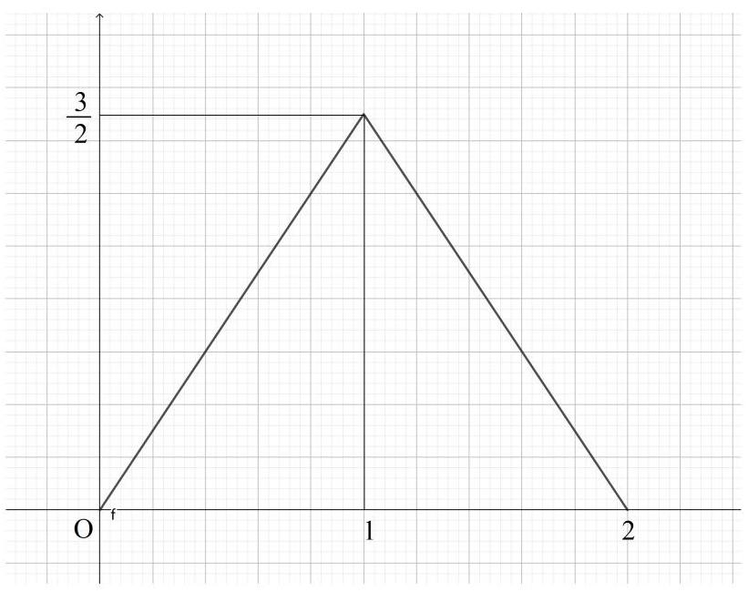

解析:本题考察对函数图像的分析推断。虽然直接代入几个值 $x = 0\text{ 、 }x = 1\text{ 、 }x = 2$ 就能直接试出来,也可以把每个选项去掉绝对值符号后分情况讨论, 与图像比对。这里用函数的基本性质进行逻辑分析。

首先, 根据函数图像可知, 图像是两条直线, 因此函数表达式应为关于 $x$ 的一次多项式。4 个选项都是关于 $x$ 的一次多项式,只是多了绝对值符号, 这条推理正确且没用。

第二，根据函数图像可知， $x = 1$ 是函数的对称轴，因此绝对值中为 $\left| {x - 1}\right|$ 。 4 个选项的绝对值中的内容都是这个,这条推理依然正确且没用。

第三，根据函数图像可知，函数左半段的斜率为 $\frac{3}{2} \div  1 = \frac{3}{2}$ ，因此一次项系数应为 $\frac{3}{2}$ 。据此可以直接得出答案为B选项。故本题选 B。 为了研究透彻，再多分析一条。

第四，根据函数图像可知，函数左半段上升、右半段下降，即当 $x < 1$ 时是增函数,当 $x > 1$ 时是减函数。而 $x < 1$ 时 $\left| {x - 1}\right|  = 1 - x$ 应该是减函数, $x > 1$ 时与之相反应该是增函数,这说明绝对值前面有是负号。据此可以排除 $\mathrm{A}$ 选项。

12. [2014. 湖南] 已知 $f\left( x\right) , g\left( x\right)$ 分别是定义在 $\mathbf{R}$ 上的偶函数和奇函数,且 $f\left( x\right)  - g\left( x\right)  = {x}^{3} + {x}^{2} + 1$ ,则 $f\left( 1\right)  + g\left( 1\right)  = 1$ 。

A. -3 B. -1 C. 1 D. 3

解析:分别使用偶函数和奇函数的定义式。

由于 $f\left( x\right)$ 是偶函数,因此 $f\left( {-x}\right)  = f\left( x\right)$

由于 $g\left( x\right)$ 是奇函数,因此 $g\left( {-x}\right)  =  - g\left( x\right)$

已知条件是 $f\left( x\right)  - g\left( x\right)  = {x}^{3} + {x}^{2} + 1$ ,分别代入上面两个关系式,可以得到关于 $- x$ 的表达式: $f\left( {-x}\right)  - g\left( {-x}\right)  = f\left( x\right)  - \left( {-g\left( x\right) }\right)  = f\left( x\right)  + g\left( x\right)$

将 $- x$ 代入已知条件可得: $f\left( {-x}\right)  - g\left( {-x}\right)  = {\left( -x\right) }^{3} + {\left( -x\right) }^{2} + 1 =  - {x}^{3} + {x}^{2} + 1$

综合上面 2 个等式: $f\left( x\right)  + g\left( x\right)  =  - {x}^{3} + {x}^{2} + 1$

代入 $x = 1$ 得: $f\left( 1\right)  + g\left( 1\right)  =  - {1}^{3} + {1}^{2} + 1 = 1$

故本题选 C。

如果直接将已知条件 $f\left( x\right)  - g\left( x\right)  = {x}^{3} + {x}^{2} + 1$ 和最终推出的结论 $f\left( x\right)  + g\left( x\right)  =  - {x}^{3} + {x}^{2} + 1$ 相加减,可以分别得到 $f\left( x\right)$ 和 $g\left( x\right)$ 的表达式:

$\left\lbrack  {f\left( x\right)  - g\left( x\right) }\right\rbrack   + \left\lbrack  {f\left( x\right)  + g\left( x\right) }\right\rbrack   = \left( {{x}^{3} + {x}^{2} + 1}\right)  + \left( {-{x}^{3} + {x}^{2} + 1}\right)  =  > f\left( x\right)  = {x}^{2} + 1$

$\left\lbrack  {f\left( x\right)  + g\left( x\right) }\right\rbrack   - \left\lbrack  {f\left( x\right)  - g\left( x\right) }\right\rbrack   = \left( {-{x}^{3} + {x}^{2} + 1}\right)  - \left( {{x}^{3} + {x}^{2} + 1}\right)  =  > g\left( x\right)  =  - {x}^{3}$

此处可以领悟一个关于函数奇偶性的常用思路:对于任意偶数 $a = {2k}\left( {k \in  Z}\right)$ ,都有 ${x}^{a} = {\left( -x\right) }^{a}$ ,以及 $\left| x\right|  = \left| {-x}\right|$ 。因此,如果一个函数中所有 $x$ 都以 ${x}^{2k}\left( {k \in  Z}\right)$ 或 $\left| x\right|$ 的形式，表达式中的每个 $- x$ 都等同于 $x$ ,则该函数必定为偶函数。

对于任意奇数 $b = {2k} - 1\left( {k \in  Z}\right)$ ,都有 ${\left( -x\right) }^{b} =  - {x}^{b}$ 。因此,如果一个函数只是由若干个 $x$ 的奇数次方相加减，则该函数必定为奇函数。如果这个奇函数加上了其他成分，则需要具体分析。

13. [2011 · 全国]设 $f\left( x\right)$ 是周期为 2 的奇函数,当 $0 \leq  x \leq  1$ 时, $f\left( x\right)  = {2x}\left( {1 - x}\right)$ ，则 $f\left( {-\frac{5}{2}}\right)  =$ ( )。

A. $- \frac{1}{2}$ B. $- \frac{1}{4}$ C. $\frac{1}{4}$ D. $\frac{1}{2}$

解析: $f\left( x\right)$ 既是周期函数，又是奇函数。一般先利用周期性，将 “远离原点”的函数都用“原点附近”的函数表示。再利用对称性，分析处理原点附近的函数。

对于本题,根据周期为 2,先找到原点附近与 $f\left( {-\frac{5}{2}}\right)$ 对应的点:

$f\left( {-\frac{5}{2}}\right)  = f\left( {-\frac{5}{2} + 2}\right)  = f\left( {-\frac{1}{2}}\right)$

又由于它是奇函数, 因此:

$f\left( {-\frac{1}{2}}\right)  =  - f\left( \frac{1}{2}\right)  =  - \left\lbrack  {2 \times  \frac{1}{2}\left( {1 - \frac{1}{2}}\right) }\right\rbrack   =  - \frac{1}{2}$

故本题选 A。

如果在利用周期性时多用一步: $f\left( {-\frac{5}{2}}\right)  = f\left( {-\frac{5}{2} + 2 \times  2}\right)  = f\left( \frac{3}{2}\right)$ 。虽然本题中该值没有落在已知表达式的区间里，但有些情况下可能会。

14. [2008·四川]函数 $f\left( x\right)$ 满足 $f\left( x\right)  \cdot  f\left( {x + 2}\right)  = {13}$ ,若 $f\left( 1\right)  = 2$ ,则 $f\left( {99}\right)  =$ (C)

A. 13 B. 2

C. $\frac{13}{2}$ D. $\frac{13}{2}$

解析: 已知条件 $f\left( x\right)  \cdot  f\left( {x + 2}\right)  = {13}$ 暗示 $f\left( x\right)$ 是周期函数,只需要将该条件连续使用两次就能发现: $f\left( x\right)  \cdot  f\left( {x + 2}\right)  = {13}, f\left( {x + 2}\right)  \cdot  f\left( {x + 4}\right)  = {13}$ , 于是有: $f\left( x\right)  = f\left( {x + 4}\right)$ ,即它是以 4 为周期的周期函数。

因此 $f\left( {99}\right)  = f\left( {{99} - 4 \times  {24}}\right)  = f\left( 3\right)$

又因为 $1 + 2 = 3$ ,因此有 $f\left( 1\right)  \cdot  f\left( 3\right)  = {13}$ ,解得 $f\left( 3\right)  = \frac{13}{2}$

故本题选 C。

对于类似本题的条件中, 若同一个函数相隔固定距离的两个表达式具有固定关系，其一般为周期函数(少数情况下不是)。常用方法是连续代入 2 个或多个周期，消除掉 “中间项” 来发现周期性。

15. [2016·江苏]设 $f\left( x\right)$ 是定义在 $\mathbf{R}$ 上且周期为 2 的函数,在区间 $\lbrack  - 1,1)$ 上,

$$
f\left( x\right)  = \left\{  \begin{matrix} x + a &  - 1 \leq  x \leq  0 \\  \left| {\frac{2}{5} - x}\right| & 0 \leq  x < 1 \end{matrix}\right.
$$

其中 $a \in  R$ 。若 $f\left( {-\frac{5}{2}}\right)  = f\left( \frac{9}{2}\right)$ ,则 $f\left( {5a}\right)$ 的值是___。

解析:本题看起来较复杂，既是周期函数，又是分段函数，但其实并不需要掌握整个函数的全貌，只要利用它的周期性和表达式解方程即可。

$x =  - \frac{5}{2}$ 和 $x = \frac{9}{2}$ 都没落在区间 $- 1 \leq  x \leq  0$ 或 $0 \leq  x < 1$ 内,需要先使用周期性找到它们对应的点:

$f\left( {-\frac{5}{2}}\right)  = f\left( {-\frac{5}{2} + 2}\right)  = f\left( {-\frac{1}{2}}\right)  =  - \frac{1}{2} + a$

$f\left( \frac{9}{2}\right)  = f\left( {\frac{9}{2} - 4}\right)  = f\left( \frac{1}{2}\right)  = \left| {\frac{2}{5} - \frac{1}{2}}\right|  = \frac{1}{10}$

根据 $f\left( {-\frac{5}{2}}\right)  = f\left( \frac{9}{2}\right)$ 得: $- \frac{1}{2} + a = \frac{1}{10}$ ,解得: $a = \frac{3}{5}$

于是有: $f\left( {5a}\right)  = f\left( 3\right)  = f\left( {3 - 4}\right)  = f\left( {-1}\right)  =  - 1 + \frac{3}{5} =  - \frac{2}{5}$

故本题填 $- \frac{2}{5}$

16. [2009 · 辽宁] 已知偶函数 $f\left( x\right)$ 在区间 $\lbrack 0, + \infty )$ 单调增加,则满足 $f\left( {{2x} - 1}\right)  < f\left( \frac{1}{3}\right)$ 的 $x$ 取值范围是( )。

A. $\left( {\frac{1}{3},\frac{2}{3}}\right)$ B. $\left\lbrack  {\frac{1}{3},\frac{2}{3}}\right)$ C. $\left( {\frac{1}{2},\frac{2}{3}}\right)$ D. $\left\lbrack  {\frac{1}{2},\frac{2}{3}}\right)$

解析:本题目没有给出具体的函数表达式，只给出了函数的奇偶性和单调性, 需要能够熟练地对抽象的一般函数使用有关定义式。

根据 $f\left( x\right)$ 是偶函数且在 $\lbrack 0, + \infty )$ 单调增加,可知它在 $( - \infty ,0\rbrack$ 单调递减,可以想象出一个类似于 $f\left( x\right)  = {x}^{2}$ 的先降后升图形。

根据函数的对称性可知, 越靠近原点的位置函数值越小, 越远离原点的位置函数值越大,因此若 $f\left( {{2x} - 1}\right)  < f\left( \frac{1}{3}\right)$ ,则有 $\left| {{2x} - 1}\right|  < \left| \frac{1}{3}\right|$

解该不等式即可:

$$
- \frac{1}{3} < {2x} - 1 < \frac{1}{3} \Rightarrow   - \frac{1}{3} + 1 < {2x} < \frac{1}{3} + 1 \Rightarrow  \frac{2}{3} < {2x} < \frac{4}{3} \Rightarrow   \Rightarrow  \frac{1}{2} \times  \frac{2}{3} < \frac{1}{2} \times  {2x} < \frac{1}{2} \times  \frac{4}{3}
$$

$=  > \frac{1}{3} < x < \frac{2}{3}$

故本题选 A。

17. [2005 · 福建] $f\left( x\right)$ 是定义在 $\mathbf{R}$ 上的以 3 为周期的偶函数,且 $f\left( 2\right)  = 0$ ，则方程 $f\left( x\right)  = 0$ 在区间 $\left( {0,6}\right)$ 内解的个数的最小值是( )。

A. 5 B. 4 C. 3 D. 2

解析:解决本题需要一定的逻辑分析和推理能力，只需要反复套用周期性和奇偶性的定义式即可。

已知周期为 3,是偶函数, $f\left( 2\right)  = 0$ ,求 $f\left( x\right)  = 0$ 在区间 $\left( {0,6}\right)$ ,题目条件中只出现了整数，因此只需要考察整数的情况。非整数的情况不知道也不需要考虑。

在区间 $\left( {0,6}\right)$ 内,整数只有 $1\text{ 、 }2\text{ 、 }3\text{ 、 }4\text{ 、 }5$ ,共 5 个。

其中 $f\left( 2\right)  = 0$ 已知。 2 是一个。

根据周期性可得: $f\left( 5\right)  = f\left( {2 + 3}\right)  = 0$ 。 5 是一个

根据偶函数得: $f\left( {-2}\right)  = f\left( 2\right)  = 0$ ，再用周期性: $f\left( 1\right)  = f\left( {-2 + 3}\right)  = 0$ ， 1 是一个。

对 1 使用周期性: $f\left( 4\right)  = f\left( {1 + 3}\right)  = 0$ 。 4 是一个。

现在只剩下 3 了。先用周期性: $f\left( 3\right)  = f\left( {3 - 3}\right)  = f\left( 0\right)$ ，没线索。再用偶函数: $f\left( 3\right)  = f\left( {-3}\right)$ ,也没有线索。试着把周期性和偶函数联用: $f\left( 3\right)  = f\left( {-3}\right)  = f\left( {-3 + 3}\right)  = f\left( 0\right)$ ,也没有新东西,3 可能不是。

因此 1、2、4、5 必然是 0 点，3 不一定，其他非整数也不一定。

故本题选 B。

18. [2005 · 天津]设 $f\left( x\right)$ 是定义在 $\mathbf{R}$ 上以 6 为周期的函数， $f\left( x\right)$ 在 $\left( {0,3}\right)$ 内单调递减,且 $y = f\left( x\right)$ 的图像关于直线 $x = 3$ 对称,则下面正确的结论是( )。

A. $f\left( {1.5}\right)  < f\left( {3.5}\right)  < f\left( {6.5}\right)$

B. $f\left( {3.5}\right)  < f\left( {1.5}\right)  < f\left( {6.5}\right)$

C. $f\left( {6.5}\right)  < f\left( {3.5}\right)  < f\left( {1.5}\right)$

D. $f\left( {3.5}\right)  < f\left( {6.5}\right)  < f\left( {1.5}\right)$

解析:对于既有周期性、又有奇偶性的函数，其分析思路依然是聚焦原点附近两侧的函数。

由于其周期为 0,因此关注 $\left( {-3,3}\right)$ 或 $\left\lbrack  {-3,3}\right\rbrack$ 区间内的性质,由于已知条件给的 $\left( {0,3}\right)$ 是开区间，因此使用前者。

因为图像关于直线 $x = 3$ 对称,于是 $\left( {0,3}\right)$ 区间内的图像与 $\left( {3,6}\right)$ 区间内的图像左右对称, 即它们的图像左右相反。而根据函数的周期为 6 可知，函数在 $\left( {3,6}\right)$ 区间内的图像与在 $\left( {-3,0}\right)$ 区间内的图像相同，所以 $\left( {-3,0}\right)$ 与 $\left( {0,3}\right)$ 的图像也左右对称。

再结合函数的周期为 6 ，整个函数都是其在 $\left( {-3,3}\right)$ 区间内，以 $\mathrm{y}$ 轴为对称轴镜面对称的结构的重复。由于函数在 $\left( {0,3}\right)$ 内单调递减,因此它在 $\left( {-3,0}\right)$ 内单调递增。

可以画出类似如下的函数图像 (不一定是直线, 直线容易画):

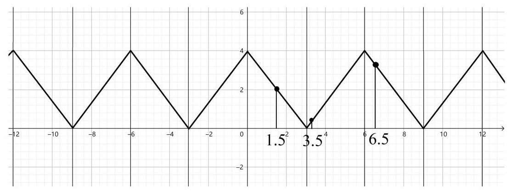

根据图像可以看出，越靠近-12、-6、0、6、12 等点函数值越大， 越靠近-9、-3、3、9 等点的函数值越小, 它们的间隔都是周期 6 。1.5 的函数值大约在函数最大值一半左右，3.5 非常靠近最小值，6.5 较为靠近最大值,因此 $f\left( {3.5}\right)  < f\left( {1.5}\right)  < f\left( {6.5}\right)$ 。

故本题选 B。

既有对称中心、又有对称轴的函数，一定是周期函数，这可以利用相应的定义式证明。可以画出其大致图形，只要能准确表达出其对称性、单调性、周期性即可, 具体形状是直线还是曲线不要紧。

## 第四章 幂、指数、对数

指数运算和对数运算虽然以加减乘除等运算为基础, 它们的性质也可以用加减乘除的有关知识解释, 但是这两种运算与加减乘除有明显不同。

对于加减乘除，其交换律、结合律、分配率较为简单，使得移项、 通分等变换较容易操作，很容易将表达式简化。涉及到具体数值运算时，即使数字比较复杂，仍然能计算求出一个确切的或非常近似的具体数值。这使得只涉及加减乘除不涉及指数对数的题目都较为容易。

对于指数运算和对数运算, 由于使用性质进行变换的结果不那么直观, 数值计算的结果往往很难直接得出。这使得指数运算和对数运算的题目要更为复杂。

例如，对于加减乘除，即使看起来复杂的数字，例如:比较 $\frac{211}{985}$ 与 $\frac{100}{432}$ 的大小。既可以分别求近似值: ${211} \div  {985} \approx  {0.214},{100} \div  {432} \approx  {0.231}$ ， 直接比较大小。也可以先做减法，通分后再进行比较: $\frac{211}{985} - \frac{100}{432} = \frac{{211} \times  {432} - {985} \times  {100}}{{985} \times  {211}} = \frac{-{7348}}{{985} \times  {211}} < 0$ 。但是对于指数运算和对数运算,即使看起来较简单的数字: 例如 ${12}^{21}$ 与 ${21}^{12}$ ,就难以直接比较它们的大小。

解决与指数和对数有关的题目, 主要有三条思路:

一是使用指数和对数的性质。对指数和对数表达式进行变换，例如:使用换底公式把底数统一，或使用其他公式令表达式在形式上统一，以方便合并同类项、约分、相互比较。

二是使用函数图像。根据表达式描绘出函数图像的大致形状，特别是要明确单调性、奇偶性, 标明特殊的点和容易求得的点, 根据函数图像进行比对。

三是进行数值估算。运用 “大于 1 的底数的正数次幂恒大于 1、 负数次幂恒小于 1 ”“小于 1 (大于 0)的底数的正数次幂恒小于 1、 负数次幂恒大于 1 ” “大于 1 的底数越乘越大(函数单调递增)” “小于 1 的底数越乘越小 (函数单调递减)” 等性质,熟练掌握 $1 \sim  {10}$ 等较小数字的低次幂的幂值 (例如根据 ${3}^{3} = 9$ ,推算出 $\sqrt{10} \approx  3$ 且 $\sqrt{10} > 3$ ) 从而对数值运算的确切数值进行估算。特别是对数运算, 要能把对数值确定在尽可能小的范围,一般要能确定是在 $\left( {-\infty , - 1}\right) \text{ 、 }\left( {-1,0}\right) \text{ 、 }\left( {0,1}\right)$ 、 $\left( {1, + \infty }\right)$ 中的哪个区间内，通常误差要小于 1 。

总之, 指数和对数运算以及函数需要经过大量的练习, 建立起底数、真数、指数之间的数字直觉, 熟练掌握表达式中各个成分之间的关系、运算的基本规律、函数的基本性质、各区间内的估值范围、形状特征等基本情况。

1. $\left\lbrack  {{2010} \cdot  \text{ 四川 }}\right\rbrack  2{\log }_{5}{10} + {\log }_{5}{0.25} =$ (   )。

A. 0 B. 1 C. 2 D. 4

解析:本题考察对数的基本性质。由于两个对数表达式的底数相同, 直接使用对数的性质即可:

---

$2{\log }_{5}{10} + {\log }_{5}{0.25} = {\log }_{5}{10}^{2} + {\log }_{5}{0.25} = {\log }_{5}\left( {{10}^{2} \times  {0.25}}\right)  = {\log }_{5}{25} = 2$

---

故本题选 C。

2. [2014．陕西]已知 ${4}^{a} = 2,\lg x = a$ ，则 $x =$ ___。

解析:本题的思路非常明确:要求 x 的值，需要先求得 a 的值。 a 的值可以根据 ${4}^{a} = 2$ 求出。

根据 ${4}^{a} = 2$ 可得: $a = {\log }_{4}2 = \frac{1}{2}$ 。

于是有: $\lg x = \frac{1}{2}, x = {10}^{\frac{1}{2}} = \sqrt{10}$ 。

故本题填 $\sqrt{10}$ 。

3. [2009・北京] 若 ${\left( 1 + \sqrt{2}\right) }^{4} = a + b\sqrt{2}$ ( $a, b$ 为实数)，则 $a + b =$ ( )。

A. 33 B. 29 C. 23 D. 19

解析:本题考察基本的完全平方公式, 也可以使用二项式定理。 优先使用更为熟悉的完全平方公式。

${\left( 1 + \sqrt{2}\right) }^{4} = {\left( {\left( 1 + \sqrt{2}\right) }^{2}\right) }^{2} = {\left( {1}^{2} + 2 \times  1 \times  \sqrt{2} + {\left( \sqrt{2}\right) }^{2}\right) }^{2} = {\left( 3 + 2\sqrt{2}\right) }^{2} = {3}^{2} + 2 \times  3 \times  2\sqrt{2} + {\left( 2\sqrt{2}\right) }^{2} \; = {17} + {12}\sqrt{2}$

又由于 $a, b$ 为实数,因此 $a = {17}, b = {12}$

于是 $a + b = {17} + {12} = {29}$

故本题选 B。

4. [2011 ・ 四川] 计算 $\left( {\lg \frac{1}{4} - \lg {25}}\right)  \div  {100}^{-\frac{1}{2}} =$ ___。

解析:本题仍然考察对数运算和指数运算的基本性质:

$\left( {\lg \frac{1}{4} - \lg {25}}\right)  \div  {100}^{-\frac{1}{2}} = \lg \left( {\frac{1}{4} \div  {25}}\right)  \div  \frac{1}{\sqrt{100}} = \lg \frac{1}{100} \div  \frac{1}{10} =  - 2 \times  {10} =  - {20}$

故本题填 -20 。

5. [2008 · 重庆] 若 $x > 0$ ，则 $\left( {2{x}^{\frac{1}{4}} + {3}^{\frac{3}{2}}}\right) \left( {2{x}^{\frac{1}{4}} - {3}^{\frac{3}{2}}}\right)  - 4{x}^{-\frac{1}{2}}\left( {x - {x}^{\frac{1}{2}}}\right)  =$ ___。

解析:本题依旧考察对数运算和指数运算的基本性质，耐心计算、 合并同类项即可。可以使用平方差公式:

$$
\left( {2{x}^{\frac{1}{4}} + {3}^{\frac{3}{2}}}\right) \left( {2{x}^{\frac{1}{4}} - {3}^{\frac{3}{2}}}\right)  - 4{x}^{-\frac{1}{2}}\left( {x - {x}^{\frac{1}{2}}}\right)
$$

$= {\left( 2{x}^{\frac{1}{4}}\right) }^{2} - {\left( {3}^{\frac{3}{2}}\right) }^{2} - 4{x}^{-\frac{1}{2} + 1} + 4{x}^{-\frac{1}{2} + \frac{1}{2}} \; = 4{x}^{\frac{1}{2}} - {3}^{3} - 4{x}^{\frac{1}{2}} + 4 \; =  - {23}$

故本题填 -23 。

6. [2012·安徽] $\left( {{\log }_{2}9}\right)  \cdot  \left( {{\log }_{3}4}\right)  =$ (   )。

A. $\frac{1}{4}$ B. $\frac{1}{2}$ C. 2 D. 4

解析:本题涉及到两个不同底数的对数, 观察它们的真数可以发现:它们的真数是对方底数的整数次幂，因此可以使用换底公式，变成分数后约分。即使没有这一层关系，一般也先考虑用换底公式换成一样的底观察规律。为了方便书写，一般用自然对数的底 $\mathrm{e}$ 为新的底。

$\left( {{\log }_{2}9}\right)  \cdot  \left( {{\log }_{3}4}\right)  = \frac{\ln 9}{\ln 2} \times  \frac{\ln 4}{\ln 3} = \frac{\ln {3}^{2}}{\ln 2} \times  \frac{\ln {2}^{2}}{\ln 3} = \frac{2\ln 3}{\ln 2} \times  \frac{2\ln 2}{\ln 3} = 4$

故本题选 D。

7. [2015 $\cdot$ 浙江]若 $a = {\log }_{4}3$ ，则 ${2}^{a} + {2}^{-a} =$ ___。

解析:本题的思路也较为直接,要求表达式 ${2}^{a} + {2}^{-a}$ 的值,只需要求出 $a$ 的值即可。而 $a$ 的值已经由条件 $a = {\log }_{4}3$ 给出。

较为麻烦的是，在已知条件中，对数的底是 4，而问题中指数的底为 2 ，需要将它们统一。

有两种思路:(1)把问题中的底数换成条件中的底数；(2)把条件中的底数换成问题中的底数。

思路(1): ${2}^{a} + {2}^{-a} = {\left( {4}^{\frac{1}{2}}\right) }^{a} + {\left( {4}^{\frac{1}{2}}\right) }^{-a} = {4}^{\frac{a}{2}} + {4}^{-\frac{a}{2}} = {\left( {4}^{a}\right) }^{\frac{1}{2}} + {\left( {4}^{a}\right) }^{-\frac{1}{2}}$

根据 $a = {\log }_{4}3$ 可知: ${4}^{a} = 3$ 。

原式 $= {3}^{\frac{1}{2}} + {3}^{-\frac{1}{2}} = \sqrt{3} + \frac{1}{\sqrt{3}} = \frac{4\sqrt{3}}{3}$

思路(2): 对 $a = {\log }_{4}3$ 使用换底公式:

$a = {\log }_{4}3 = \frac{\ln 3}{\ln 4} = \frac{\ln 3}{\ln {2}^{2}} = \frac{1}{2}\frac{\ln 3}{\ln 2} = \frac{1}{2}{\log }_{2}3$

代入得: ${2}^{a} + {2}^{-a} = {2}^{\frac{1}{2}{\log }_{2}3} + {2}^{-\frac{1}{2}{\log }_{2}3} = {\left( {2}^{{\log }_{2}3}\right) }^{\frac{1}{2}} + {\left( {2}^{{\log }_{2}3}\right) }^{-\frac{1}{2}} = {3}^{\frac{1}{2}} + {3}^{-\frac{1}{2}} = \frac{4\sqrt{3}}{3}$

故本题填 $\frac{4\sqrt{3}}{3}$ 。

根据本题的解题思路, 需要掌握一项非常重要的规律:

对数表达式中，对底数和真数分别进行相同次幂运算，对数的值不变,即: ${\log }_{a}M = {\log }_{{a}^{n}}{M}^{n}\;\left( {n \neq  0}\right)$

容易证明: 设 ${\log }_{a}M = p$

根据对数的定义有: ${a}^{p} = M$

对等式两边分别进行 $\mathrm{n}$ 次幂: ${\left( {a}^{p}\right) }^{n} = {M}^{n}$

等式左边变形可得: ${\left( {a}^{p}\right) }^{n} = {a}^{pn} = {\left( {a}^{n}\right) }^{p} = {M}^{n}$

根据对数的定义有: $p = {\log }_{{a}^{n}}{M}^{n} = {\log }_{a}M$

即:对底数和真数进行相同次幂的放缩，对数值不变。

再结合性质 ${\log }_{a}{M}^{n} = n{\log }_{a}M$ 可得: ${\log }_{{a}^{n}}M = \frac{1}{n}{\log }_{a}M$ 。

8. [2014 · 四川] 已知 $b > 0,{\log }_{5}b = a,\lg b = c,{5}^{d} = {10}$ ,则下列等式一定成立的是( )。

A. $d = {ac}$ B. $a = {cd}$ C. $c = {ad}$ D. $d = a + c$

解析:本题中有 abcd 共 4 个字母，四个选项都是关于 acd 这 3 个字母的表达式。可以先把这 3 个字母用另外 1 个字母表示，再去找它们的表达式之间的规律。

观察题目条件，前两个关系式分别是 $\mathrm{a}$ 与 $\mathrm{b}$ 、 $\mathrm{b}$ 与 $\mathrm{c}$ 的关系式， 因此考虑分别用 $\mathrm{b}$ 来表示 $\mathrm{a}$ 和 $\mathrm{c}$ 。关于的 $\mathrm{d}$ 的表达式没有其他字母, 先不管它。

根据 ${\log }_{5}b = a$ ,得: $b = {5}^{a}$

根据 $\lg b = c$ ,得: $b = {10}^{c}$

又由于 ${5}^{d} = {10}$ ,对等式两边同时进行 $\mathrm{c}$ 次幂,使得等式右边与 $b = {10}^{c}$ 的右边相同: ${\left( {5}^{d}\right) }^{c} = {10}^{c}$ 。

即: ${5}^{cd} = b$

又由于 $b = {5}^{a}$ ,于是有: ${5}^{a} = {5}^{cd}$ ,即 $a = {cd}$ 。

故本题选 B。

由于本题涉及到 2 个底数 5 和 10 ，因此也可以使用换底公式， 看起来会更加清楚:

根据 ${\log }_{5}b = a$ ,用换底公式得: $\frac{\ln b}{\ln 5} = a$ ①

根据 $\lg b = c$ ,用换底公式得: $\frac{\ln b}{\ln {10}} = c$ ②

根据 ${5}^{d} = {10}$ ,等式两边同时取对 $\mathrm{e}$ 的对数得: $\ln {5}^{d} = \ln {10}$ ,即 $d\ln 5 = \ln {10} =  > d = \frac{\ln {10}}{\ln 5}$ ③

用 $\Phi  \div  2$ 消去字母 $\mathrm{b}$ 得: $\frac{a}{c} = \frac{\ln {10}}{\ln 5}$

再结合③得: $\frac{a}{c} = d$ ，即 $a = {cd}$ 。

一般来说，用换底公式看起来更加清晰，同一个底就相当于是同一类可以合并的项。直接用指数和对数的法则及性质的方法更加直接, 但是需要对运算非常熟悉。

9. [2010. 辽宁]设 ${2}^{a} = {5}^{b} = m$ ,且 $\frac{1}{a} + \frac{1}{b} = 2$ ,则 $m =$ (   )。

A. $\sqrt{10}$ B. 10 C. 20 D. 100

解析:已知条件中用 $\mathrm{m}$ 把 $\mathrm{a}$ 和 $\mathrm{b}$ 联系了起来，并给出了 $\mathrm{a}$ 和 $\mathrm{b}$ 的等式关系。一般考虑分别用 $\mathrm{m}$ 表示 $\mathrm{a}$ 和 $\mathrm{b}$ ,代入等式关系中解关于 m 的方程。

根据 ${2}^{a} = {5}^{b} = m$ ,得: $a = {\log }_{2}m, b = {\log }_{5}m$

为了运算方便，分别使用换底公式:

$$
a = {\log }_{2}m = \frac{\ln m}{\ln 2}
$$

$$
b = {\log }_{5}m = \frac{\ln m}{\ln 5}
$$

代入等式:

$$
\frac{\ln 2}{\ln m} + \frac{\ln 5}{\ln m} = 2
$$

$$
\frac{\ln 2 + \ln 5}{\ln m} = 2
$$

$$
\ln \left( {2 \times  5}\right)  = 2\ln m
$$

$\ln {10} = \ln {m}^{2}$

$$
m = \sqrt{10}
$$

故本题选 A。

10. [2004 · 全国 III] 函数 $y = \sqrt{{\log }_{1/2}\left( {{x}^{2} - 1}\right) }$ 的定义域是( )。

A. $\left\lbrack  {-\sqrt{2}, - 1}\right)  \cup  \left( {1,\sqrt{2}}\right\rbrack$ B. $\left( {-\sqrt{2}, - 1}\right)  \cup  \left( {1,\sqrt{2}}\right)$

C. $\left\lbrack  {-2, - 1)\cup (1,2}\right\rbrack$ D. $\left( {-2, - 1}\right)  \cup  \left( {1,2}\right)$

解析:本题考察根号下不能为负数、真数必须为正数。即: ${\log }_{1/2}\left( {{x}^{2} - 1}\right)  \geq  0$ 和 ${x}^{2} - 1 > 0$ 。

根据 ${\log }_{1/2}\left( {{x}^{2} - 1}\right)  \geq  0$ ,由于底数为 $1/2 < 1$ ,因此需要 $0 < {x}^{2} - 1 \leq  1$

逐步化简: $1 < {x}^{2} \leq  2$

得: $- \sqrt{2} \leq  x <  - 1$ 或 $1 < x \leq  \sqrt{2}$

故本题选 A。

本题要特别注意,根号下可以取到 0,因此 ${\log }_{1/2}\left( {{x}^{2} - 1}\right)  \geq  0$ 这里是大于等于号。真数不能取到 0,因此 ${x}^{2} - 1 > 0$ 这里是大于号。

11. [2012·山东] 函数 $f\left( x\right)  = \frac{1}{\ln \left( {x + 1}\right) } + \sqrt{4 - {x}^{2}}$ 的定义域为( )。

A. $\left\lbrack  {-2,0)\bigcup (0,2}\right\rbrack$ B. $\left( {-1,0}\right)  \cup  (0,2\rbrack$

C. $\left\lbrack  {-2,2}\right\rbrack$ D. $( - 1,2\rbrack$

解析:本题考察分母不能为 0 、真数必须为正数、根号下不能为负数,即: $x + 1 > 0,\ln \left( {x + 1}\right)  \neq  0,4 - {x}^{2} \geq  0$

分别解得: $x >  - 1, x \neq  0, - 2 \leq  x \leq  2$

取以上 3 个集合的交集为: $\left( {-1,0}\right)  \cup  (0,2\rbrack$

故本题选 B。

12. [2019 $\cdot$ 新课标全国I]已知 $a = {\log }_{2}{0.2}, b = {2}^{0.2}, c = {0.2}^{0.3}$ ，则( )。

A. $a < b < c$ B. $a < c < b$ C. $c < a < b$ D. $b < c < a$

解析:本题是一道比较大小并排序的题目，由于题目给出的都是具体数值，因此需要挨个进行估算。

$a = {\log }_{2}{0.2}$ ,底数大于 1,真数小于 1,因此对数值 $a < 0$

$b = {2}^{0.2}$ ,底数大于 1,真数大于 0 、小于 1,因此幂值 $1 < b < 2 \; c = {0.2}^{0.3}$ ,底数小于 1,指数大于 0 、小于 1,因此幂值 ${0.2} < c < 1$ 。 综上， $a < c < b$ 。

故本题选 B。

13. [2006 · 天津]设 $P = {\log }_{2}3, Q = {\log }_{3}2, R = {\log }_{2}\left( {{\log }_{3}2}\right)$ ,则( )。

A. $R < Q < P$ B. $P < R < Q$ C. $Q < R < P$ D. $R < P < Q$

解析:本题同样是比较具体数值大小的题目，依旧对各个元素进行估算。

$P = {\log }_{2}3$ ,底数大于 1,真数大于 1,并且真数比底数大,因此 $P > 1$ 。 更进一步,根据 ${2}^{2} = 4$ ,还可以得知 $P < 2$ ,因此 $1 < P < 2$ 。

$Q = {\log }_{3}2$ ,底数大于 1,真数大于 1,并且真数比底数小,因此 $0 < Q < 1$ 。更进一步,根据 $\sqrt{3} \approx  {1.732}$ ,还可得知 $Q > 1/2$ ,因此 ${0.5} < Q < 1$ 。 于是有: $Q < P$ 。

$R = {\log }_{2}\left( {{\log }_{3}2}\right)$ ,看起来很复杂,但是它与 $\mathrm{P}$ 的底数相同,都是 2, 因此可以通过比较 3 与 ${\log }_{3}2$ 的大小,来比较 $\mathrm{P}$ 和 $\mathrm{R}$ 的大小。前面已经分析, ${\log }_{3}2$ 比 1 小,因此也比 3 小,因此 $R < P$ 。

然而根据前面的估算可知 $Q < P$ ,因此还需要比较 $\mathrm{R}$ 与 $\mathrm{Q}$ 的大小。 还是需要估算 $\mathrm{R}$ 的值。

根据对 $\mathrm{Q}$ 的分析可知， ${0.5} < {\log }_{3}2 < 1$ ，因此 $\mathrm{R}$ 的真数小于 1，又由于 $\mathrm{R}$ 的底数为 2,大于 0,因此 $R < 0$ 。因此有 $R < Q < P$

故本题选 A。

虽然本题中直接比较 $\mathrm{R}$ 和 $\mathrm{P}$ 的大小没起到实际作用,但是通过直接比较底数或真数相同的元素, 可以直接得出它们之间的大小关系，在其他一些题目中可能有用。不要放弃任何可能的解题思路。

14. [2013·新课标全国Ⅱ]设 $a = {\log }_{3}6, b = {\log }_{5}{10}, c = {\log }_{7}{14}$ ,则(   )。

A. $c > b > a$ B. $b > c > a$ C. $a > c > b$ D. $a > b > c$

解析:本题还是比较具体数值的大小。但是本题中每个元素都只能一眼看出来它们的值都大于 1 、小于 2 ，再很难看出其他内容。

再仔细观察的话，可以发现每个元素的真数都是底数的 2 倍，因此可以使用对数运算的性质分解成两个对数的和, 其中一个对数的真数与底数相同:

---

$$
a = {\log }_{3}6 = {\log }_{3}\left( {3 \times  2}\right)  = {\log }_{3}3 + {\log }_{3}2 = 1 + {\log }_{3}2
$$

$$
b = {\log }_{5}{10} = {\log }_{5}\left( {5 \times  2}\right)  = {\log }_{5}5 + {\log }_{5}2 = 1 + {\log }_{5}2
$$

$$
c = {\log }_{7}{14} = {\log }_{7}\left( {7 \times  2}\right)  = {\log }_{7}7 + {\log }_{7}2 = 1 + {\log }_{7}2
$$

---

于是本题变成了比较 ${\log }_{3}2\text{ 、 }{\log }_{5}2\text{ 、 }{\log }_{7}2$ ,对于底数都大于 1 的对数，当真数相同时，底数越大、对数值越小。

也可以用换底公式直观地比较: ${\log }_{3}2 = \ln 2/\ln 3,{\log }_{5}2 = \ln 2/\ln 5$ , ${\log }_{7}2 = \ln /\ln 7$ ,分子相同,分母依次增大,分数的值依次减小,因此 $a > b > c$ 。

故本题选 D。

15. [2008 · 全国 II ] 若 $x \in  \left( {{e}^{-1},1}\right) , a = \ln x, b = 2\ln x, c = {\ln }^{3}x$ ,则( )。

A. $a < b < c$ B. $c < a < b$ C. $b < a < c$ D. $b < c < a$

解析:本题为比较 3 个含有变量 $x$ 的对数表达式的大小，并且限定了 $x$ 的范围。由于含有变量 $x$ ,因此一般直接比较表达式的大小。

三个表达式都与 $\ln x$ 有关,因此主要使用 $\ln x$ 的性质。其中 $\mathrm{a}$ 的表达式最简单,优先分别比较 $\mathrm{a}$ 与 $\mathrm{b}\text{ 、 }\mathrm{a}$ 与 $\mathrm{c}$ 。

$\ln x$ 的底数 $e \approx  {2.7}$ 是个大于 1 的正数,因此 $\ln x$ 单调递增。又由于 $x \in  \left( {{e}^{-1},1}\right)$ ,因此 $\ln x$ 的取值在 $\left( {-1,0}\right)$ 之间,是个绝对值小于 1 的负数。

先比较 $\mathrm{a}$ 与 $\mathrm{b} : a = \ln x, b = 2\ln x$ ,可知 $b = {2a}$ 。由于它们都小于 0, $\mathrm{b}$ 的绝对值是 $\mathrm{a}$ 的 2 倍,因此 $b < a$

再比较 $\mathrm{a}$ 与 $\mathrm{c} : a = \ln x, c = {\ln }^{3}x$ ,可知 $c = {a}^{3},\mathrm{c}$ 也是负数。由于 a 的绝对值比 1 小，因此 $\left| {a}^{3}\right|  < \left| a\right|$ ，因此 $c > a$ 。

综上， $b < a < c$ 。

故本题选 C。

16. [2011·天津]已知 $a = {5}^{{\log }_{2}{3.4}}, b = {5}^{{\log }_{4}{3.6}}, c = {\left( \frac{1}{5}\right) }^{{\log }_{3}{0.3}}$ ,则( )。

A. $a > b > c$ B. $b > a > c$ C. $a > c > b$ D. $c > a > b$

解析:本题还是比较 3 个具体数值的大小，表达式中既有指数、

又有对数。可以看出指数的底数可以统一，因此先把指数的底数进行

---

统一: $a = {5}^{{\log }_{2}{3.4}}, b = {5}^{{\log }_{4}{3.6}}, c = {\left( \frac{1}{5}\right) }^{{\log }_{3}{0.3}} = {5}^{-l{\log }_{3}{0.3}} = {5}^{{\log }_{3}\left( {{10}/3}\right) }$

---

由于底数 $5 > 1$ ,于是只需要比较 $\mathrm{a}\text{ 、 }\mathrm{\;b}\text{ 、 }\mathrm{c}$ 的指数的大小关系,就是它们的幂值的大小关系。

---

$$
{a}^{\prime } = {\log }_{2}{3.4},\;{b}^{\prime } = {\log }_{4}{3.6},\;{c}^{\prime } = {\log }_{3}\left( {{10}/3}\right)
$$

---

观察发现, ${\mathrm{a}}^{\prime }$ 的真数比底数大,因此 ${a}^{\prime } > 1$

b’的真数比底数小,因此 $0 < {b}^{\prime } < 1$

c’的真数比底数大，因此 ${c}^{\prime } > 1$

接下来比较 $\mathrm{a}$ ’和 $\mathrm{c}$ ’的大小。 $\mathrm{a}$ ’的底数比 $\mathrm{c}$ ’小，并且 $\mathrm{a}$ ’的真数比 $\mathrm{c}$ ’ 大，2 需要比 3 进行更大的乘方才能达到相同的幂值，更何况 2 的幂值本来就比 3 大，即: ${\log }_{2}{3.4} > {\log }_{3}{3.4} > {\log }_{3}\left( {{3.333}\ldots \ldots }\right)$ 。

因此 ${a}^{\prime } > {c}^{\prime }$ 。

综上, ${a}^{\prime } > {c}^{\prime } > {b}^{\prime }$ ,即 $a > c > b$

故本题选 C。

本题需要掌握一个对数运算的基本规律:当底数大于 1 时，若真数相同,则底数越大,对数值越小。例如: ${\log }_{2}{16} = 4,{\log }_{4}{16} = 2$ ,前者的对数值小于后者。也可以用换底公式比较，分子相同时，分母越大分数值越小。对于底数小于 1 的对数, 也有类似的规律, 只是有负号的影响，请自行根据换底公式推导，注意正负号。

17. [2009 · 全国 II] 函数 $y = {\log }_{2}\frac{2 - x}{2 + x}$ 的图像( )。

A. 关于原点对称

B. 关于直线 $y =  - x$ 对称

C. 关于 $\mathrm{y}$ 轴对称

D. 关于直线 $y = x$ 对称

解析:本题判断函数的对称性，主要是奇偶性。选项 A 关于原点对称的是奇函数,选项 $\mathrm{C}$ 关于 $\mathrm{y}$ 轴对称的是偶函数,选项 $\mathrm{D}$ 关于直线 $y = x$ 对称的是函数与它的反函数,对于单个函数来说,根据函数的单值性(一个自变量只能对应唯一函数值)可知，简单的基本初等函数中只有直线 $y = x$ 和算是关于直线 $y = x$ 对称,选项 $\mathrm{B}$ 类似于选项 $\mathrm{C}$ ,关于 $y =  - x$ 对称的两个函数 $f\left( x\right) \text{ 、 }g\left( x\right)$ ,若 $\left( {x, y}\right)$ 属于 $f\left( x\right)$ ,则 $\left( {-y, - x}\right)$ 必属于 $g\left( x\right)$ ,即 $g\left( x\right)$ 是 $f\left( x\right)$ 的反函数再分别沿 $\mathrm{x}$ 轴、 $\mathrm{y}$ 轴对称翻转。

先验证选项 A。先判断其定义域是否对称: $\frac{2 - x}{2 + x} > 0$ 解得 $- 2 < x < 2$ , 可知定义域关于原点对称。再用奇函数的定义式 $f\left( x\right)  + f\left( {-x}\right)  = 0$ 判断:

$$
{\log }_{2}\frac{2 - x}{2 + x} + {\log }_{2}\frac{2 - \left( {-x}\right) }{2 + \left( {-x}\right) } = {\log }_{2}\left( {\frac{2 - x}{2 + x} \times  \frac{2 - \left( {-x}\right) }{2 + \left( {-x}\right) }}\right)  = {\log }_{2}\frac{4 - {x}^{2}}{4 - {x}^{2}} = {\log }_{2}1 = 0
$$

是奇函数, 选项 A 正确。

再验证选项 C。之前已经验证了定义域对称, 直接使用偶函数的定义式 $f\left( x\right)  - f\left( {-x}\right)  = 0$

$$
{\log }_{2}\frac{2 - x}{2 + x} - {\log }_{2}\frac{2 - \left( {-x}\right) }{2 + \left( {-x}\right) } = {\log }_{2}\left( {\frac{2 - x}{2 + x} \div  \frac{2 - \left( {-x}\right) }{2 + \left( {-x}\right) }}\right)  = {\log }_{2}\frac{{\left( 2 - x\right) }^{2}}{{\left( 2 + x\right) }^{2}} = 2{\log }_{2}\frac{2 - x}{2 + x}
$$

不恒为 0,因此不是偶函数。

接下来验证选项 D,若 $\left( {x,{\log }_{2}\frac{2 - x}{2 + x}}\right)$ 属于函数,则 $\left( {{\log }_{2}\frac{2 - x}{2 + x}, x}\right)$ 应

$$
f\left( {{\log }_{2}\frac{2 - x}{2 + x}}\right)  = {\log }_{2}\frac{2 - {\log }_{2}\frac{2 - x}{2 + x}}{2 + {\log }_{2}\frac{2 - x}{2 + x}} = \frac{{\log }_{2}4 - {\log }_{2}\frac{2 - x}{2 + x}}{{\log }_{2}4 + {\log }_{2}\frac{2 - x}{2 + x}} = \frac{{\log }_{2}\frac{4\left( {2 + x}\right) }{2 - x}}{{\log }_{2}\frac{4\left( {2 - x}\right) }{2 + x}}
$$

化简不下去了,该表达式不可能恒等于 $x$ ,因此不关于 $y = x$ 对称。

类似的,该函数也不关 $y =  - x$ 于对称。

故本题选 A。

本题中出现的函数形式 $y = {\log }_{c}\frac{a - x}{a + x}$ 是一类非常典型的奇函数。不要死记硬背这个结论,而要掌握其推导的过程。

此外,要掌握关于直线 $y = x$ 对称的一个或一对函数,它 (们) 的函数表达式的数学关系特点，以及其他简单对称关系的表达式的特点。后面学习关于向量的知识后会对这方面更加熟练。

18. [1987 · 全国]在区间 $\left( {-\infty ,0}\right)$ 上为增函数的是( )。

A. $y =  - {\log }_{\frac{1}{2}}\left( {-x}\right)$ B. $y = \frac{x}{1 - x}$

C. $y =  - {\left( x + 1\right) }^{2}$ D. $y = 1 + {x}^{2}$

解析:本题考察函数的定义域和单调性，根据有关概念判断即可。

选项 A. $y =  - {\log }_{\frac{1}{2}}\left( {-x}\right)$ 根据真数必须大于 0,可知 $- x > 0$ ,即 $x < 0$ , 符合定义域的要求。由于 $x$ 是负数,当 $x$ 的值增大, $- x = \left| x\right|$ 的值减小。 又由于底数小于 1,当 $- x$ 减小,对数值增大。又由于取负数,对数值增大，函数值减小。选项 A 不符合。

选项 B. $y = \frac{x}{1 - x}$ 定义域为 $x \neq  1$ ,也符合要求。由于分子和分母都有 $x$ ,对其表达式进行变形,使得只有分子或只有分母有自变量。有两种变形思路:

思路(1): 分子分母同时除以 $x : y = \frac{x/x}{\left( {1 - x}\right) /x} = \frac{1}{\left( {1/x}\right)  - 1}$ 。在区间 $\left( {-\infty ,0}\right)$ 内,当 $x$ 的值增大时, $1/x$ 的值减小, $\left( {1/x}\right)  - 1$ 的值也减小,它的倒数的值增大。因此 B 选项正确。

思路(2):将分子凑出与分母相同 1 的形式后拆分并约分:

$$
y = \frac{x}{1 - x} = \frac{x - 1 + 1}{1 - x} = \frac{x - 1}{1 - x} + \frac{1}{1 - x} =  - 1 + \frac{1}{1 - x}
$$

在 $\left( {-\infty ,0}\right)$ 区间内,当 $x$ 的值增大时, $1 - x$ 的值减小,它的倒数的值增大, 结论相同。

选项 C. $y =  - {\left( x + 1\right) }^{2}$ 。其定义域为全体实数,符合要求。其对称轴为 $x =  - 1, x <  - 1$ 时与 $x >  - 1$ 时单调性相反,在区间 $\left( {-\infty ,0}\right)$ 内有两种单调性,因此选项 $\mathrm{C}$ 不符合。

选项 D. $y = 1 + {x}^{2}$ 。很容易判断，符合定义域要求，但在区间 $\left( {-\infty ,0}\right)$ 内单调递减，因此选项 D 不符合。

故本题选 B。

19. [2005 · 山东]下列函数中，既是奇函数又在区间 $\left\lbrack  {-1,1}\right\rbrack$ 上单调递减的是( )。

A. $f\left( x\right)  = \sin x$ B. $f\left( x\right)  =  - \left| {x + 1}\right|$

C. $f\left( x\right)  = \frac{1}{2}\left( {{a}^{x} + {a}^{-x}}\right)$ D. $f\left( x\right)  = \ln \frac{2 - x}{2 + x}$

解析:同时考察奇偶性和单调性，仍然根据有关概念判断即可。

选项 A. $f\left( x\right)  = \sin x$ 虽然目前还专门没学习三角函数，先预知正弦函数为奇函数,并且在区间 $\left( {-\frac{\pi }{2},\frac{\pi }{2}}\right)$ 内单调递增,因此选项 $\mathrm{A}$ 不符合。

选项 B. $f\left( x\right)  =  - \left| {x + 1}\right|$ 关于 $x =  - 1$ 镜面对称,不是奇函数。也可以根据 $f\left( 0\right)  \neq  0$ 得知其不是奇函数。在区间 $\left\lbrack  {-1,1}\right\rbrack$ 内, $f\left( x\right)  =  - x - 1$ ,单调递减。奇偶性不满足,因此选项 $\mathrm{B}$ 不符合。

选项 C. $f\left( x\right)  = \frac{1}{2}\left( {{a}^{x} + {a}^{-x}}\right)$ 表达式较为复杂,用奇函数的定义式判断: $f\left( x\right)  + f\left( {-x}\right)  = \frac{1}{2}\left( {{a}^{x} + {a}^{-x}}\right)  + \frac{1}{2}\left( {{a}^{-x} + {a}^{x}}\right)  = {a}^{x} + {a}^{-x}$ ,不恒为 0,因此不是奇函数。单调性用导数判断较为简单直接。直接根据奇偶性不符合而否定选项 C 即可。

选项 D. $f\left( x\right)  = \ln \frac{2 - x}{2 + x}$ 用奇函数的定义式判断: $f\left( x\right)  + f\left( {-x}\right)  = \; \ln \frac{2 - x}{2 + x} + \ln \frac{2 - \left( {-x}\right) }{2 + \left( {-x}\right) } = \ln \left( {\frac{2 - x}{2 + x} \times  \frac{2 + x}{2 - x}}\right)  = \ln 1 = 0$ ,是奇函数。对于单调性,使用把分子凑成与和分母形式相同的形式, 拆分后约分, 使得自变量只出现在一处: $f\left( x\right)  = \ln \frac{2 - x}{2 + x} = \ln \frac{2 - x - 4 + 4}{2 + x} = \ln \left( {\frac{-x - 2}{2 + x} + \frac{4}{2 + x}}\right)  = \ln \left( {-1 + \frac{4}{2 + x}}\right)$ 。 当 $x$ 增大时, $\frac{4}{2 + x}$ 减小,由于底数大于 1,此时对数值也减小,因此函数单调递减。选项 D 符合。

故本题选 D。

22. [2007 · 江苏]设 $f\left( x\right)  = \lg \left( {\frac{2}{1 - x} + a}\right)$ 是奇函数,则使 $f\left( x\right)  < 0$ 的 $x$ 的取值范围是( )。

A. $\left( {-1,0}\right)$ B. $\left( {0,1}\right)$ C. $\left( {-\infty ,0}\right)$ D. $\left( {-\infty ,0}\right)  \cup  \left( {1, + \infty }\right)$

解析: 根据奇函数的定义式: $f\left( x\right)  + f\left( {-x}\right)  = 0$

$$
\lg \left( {\frac{2}{1 - x} + a}\right)  + \lg \left( {\frac{2}{1 + x} + a}\right)  = 0
$$

$$
\lg \left\lbrack  {\left( {\frac{2}{1 - x} + a}\right)  \times  \left( {\frac{2}{1 + x} + a}\right) }\right\rbrack   = 0
$$

$$
\left( {\frac{2}{1 - x} + a}\right)  \times  \left( {\frac{2}{1 + x} + a}\right)  = 1
$$

$$
\frac{4}{\left( {1 - x}\right) \left( {1 + x}\right) } + \frac{2a}{1 - x} + \frac{2a}{1 + x} + {a}^{2} = 1
$$

$4 + {2a}\left( {1 + x}\right)  + {2a}\left( {1 - x}\right)  + \left( {1 + x}\right) \left( {1 - x}\right) {a}^{2} = \left( {1 + x}\right) \left( {1 - x}\right)$

$4 + {4a} + {a}^{2} - {a}^{2}{x}^{2} = 1 - {x}^{2}$

$\left( {{a}^{2} - 1}\right) x = {a}^{2} + {4a} + 3$

$\left( {a + 1}\right) \left( {a - 1}\right) x = \left( {a + 3}\right) \left( {a + 1}\right)$

$\left( {a + 1}\right) \left\lbrack  {\left( {a - 1}\right) x - \left( {a + 3}\right) }\right\rbrack   = 0$

若要该等式对任意 $x$ 都恒成立,需要 $a + 1 = 0$ ,即 $a =  - 1$ 。

原函数为: $f\left( x\right)  = \lg \left( {\frac{2}{1 - x} - 1}\right)  = \lg \frac{2 - \left( {1 - x}\right) }{1 - x} = \lg \frac{1 + x}{1 - x}$

为了使该函数有意义,真数必须为正,即: $\frac{1 + x}{1 - x} > 0$

解得: $- 1 < x < 1$

要令 $f\left( x\right)  = \lg \frac{1 + x}{1 - x} < 0$ ,需要 $\frac{1 + x}{1 - x} < 1$

解得: $x > 1$ 或 $x < 0$

综上， $- 1 < x < 0$

故本题选 A。

本题容易遗漏函数定义域的限定条件。为了避免这种遗漏, 要养成看到一个函数，第一反应就要先根据表达式求出它的定义域范围， 然后再去考虑它的其他性质。

22. [2014．湖南]若 $f\left( x\right)  = \ln \left( {{e}^{3x} + 1}\right)  + {ax}$ 是偶函数，则 $a =$ ___。

解析: 根据偶函数的定义式 $f\left( x\right)  - f\left( {-x}\right)  = 0$ 逐步推导即可:

---

	$f\left( x\right)  - f\left( {-x}\right)  = \left\lbrack  {\ln \left( {{e}^{3x} + 1}\right)  + {ax}}\right\rbrack   - \left\lbrack  {\ln \left( {{e}^{-{3x}} + 1}\right)  - {ax}}\right\rbrack   = 0$

	$\ln \left( {{e}^{3x} + 1}\right)  - \ln \left( {{e}^{-{3x}} + 1}\right)  + {2ax} = 0$

$\ln \frac{{e}^{3x} + 1}{{e}^{-{3x}} + 1} =  - {2ax}$

	$\ln \frac{\left( {{e}^{3x} + 1}\right)  \times  {e}^{3x}}{\left( {{e}^{-{3x}} + 1}\right)  \times  {e}^{3x}} =  - {2ax}$

---

$\ln \frac{\left( {{e}^{3x} + 1}\right)  \times  {e}^{3x}}{\left( 1 + {e}^{3x}\right) } =  - {2ax}$

$\ln {e}^{3x} =  - {2ax}$

${3x} =  - {2ax}$

$a =  - \frac{3}{2}$

故本题填 $- \frac{3}{2}$

本题在化简过程中, 对真数部分的约分需要对指数的比例关系具有一定的敏感性。

23. [2011. 湖北] 若定义在 $\mathbf{R}$ 上的偶函数 $f\left( x\right)$ 和奇函数 $g\left( x\right)$ 满足 $f\left( x\right)  + g\left( x\right)  = {e}^{x}$ ，则 $g\left( x\right)  =$ ( )。

A. ${e}^{x} - {e}^{-x}$ B. $\frac{1}{2}\left( {{e}^{x} + {e}^{-x}}\right)$ C. $\frac{1}{2}\left( {{e}^{-x} - {e}^{x}}\right)$ D. $\frac{1}{2}\left( {{e}^{x} - {e}^{-x}}\right)$

解析:根据偶函数和奇函数的定义式可知:

$f\left( {-x}\right)  = f\left( x\right) ,\;g\left( {-x}\right)  =  - g\left( x\right)$ ,先放着备用。

将 $- x$ 代入到 $f\left( x\right)  + g\left( x\right)  = {e}^{x}$ ①中:

$$
f\left( {-x}\right)  + g\left( {-x}\right)  = {e}^{-x}
$$

再代入前面两个备用的定义式:

$$
f\left( x\right)  - g\left( x\right)  = {e}^{-x}\text{ ② }
$$

用等式①两边减去等式②两边:

$\left( {f\left( x\right)  + g\left( x\right) }\right)  - \left( {f\left( x\right)  - g\left( x\right) }\right)  = {e}^{x} - {e}^{-x}$

化简得: ${2g}\left( x\right)  = {e}^{x} - {e}^{-x}g\left( x\right)  = \frac{1}{2}\left( {{e}^{x} - {e}^{-x}}\right)$

故本题选 D。

24. [2019 · 新课标全国 III] 设 $f\left( x\right)$ 为奇函数,且当 $x \geq  0$ 时, $f\left( x\right)  = {e}^{x} - 1$ ，则当 $x < 0$ 时， $f\left( x\right)  = 1$ ( )。

A. ${e}^{-x} - 1$ B. ${e}^{-x} + 1$ C. $- {e}^{-x} - 1$ D. $- {e}^{-x} + 1$

解析:直接使用奇函数的定义式即可:

令 $x < 0$ ,于是 $- x > 0$ ,将 $- x$ 看作一个整体,代入当 $x \geq  0$ 时的函数表达式: $f\left( {-x}\right)  = {e}^{-x} - 1$

此时再使用奇函数的定义式: $f\left( {-x}\right)  = {e}^{-x} - 1 =  - f\left( {-\left( {-x}\right) }\right)  =  - f\left( x\right)$

即: $f\left( x\right)  =  - {e}^{-x} + 1$ ,此时仍然没有改变 $x < 0$ 的前提。

故本题选 D。

这种把 $- x$ 看作一个整体,代入到函数表达式中,利用其奇偶性变换的思路非常重要。分析处理周期函数、奇函数、偶函数等函数时, 经常先要自行规定 $x$ 属于某一范围,然后将 $- x$ 或 $x + {nT}$ ( $T$ 为最小正周期)落在可以直接使用函数表达式的范围内进行分析处理。

25. [2011 · 北京] 已知函数 $f\left( x\right)  = \left\{  \begin{matrix} \frac{2}{x} & x \geq  2 \\  {\left( x - 1\right) }^{3} & x < 2 \end{matrix}\right.$ ,若关于 $x$ 的方程 $f\left( x\right)  = k$ 有两个不同的实根，则 $k$ 的取值范围是___。

解析:这是一个分段函数，在不同的定义域内，函数的表达式不同。对于这类函数，一般先画出其大致图像。

本题中的函数较为复杂, 分别为双曲线函数和三次函数, 分界点为 $x = 2$ 。双曲线是基本图形,根据其表达式可知其经过 $\left( {1,2}\right)$ 和 $\left( {2,1}\right)$ 。 三次函数 $y = {x}^{3}$ 是一条经过原点的横倒下去的 $\mathrm{S}$ 型曲线， $y = {\left( x - 1\right) }^{3}$ 为其沿 $\mathrm{x}$ 轴正方向 (向右) 移动 1 个单位，其函数图像如下:

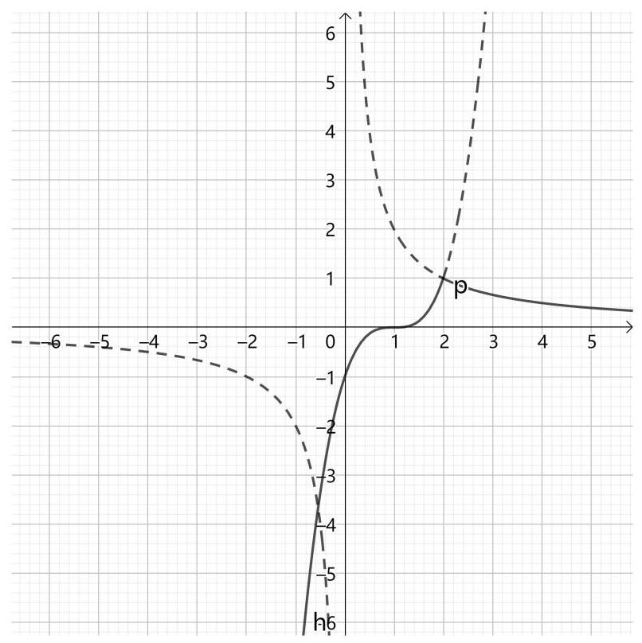

虽然这个图像是用软件作出来的，但是自己要能作出较准确的图形。三次函数 $y = {\left( x - 1\right) }^{3}$ 可以根据 $y = {x}^{3}$ 画出大致形状，并向右平移令其与 $\mathrm{x}$ 轴交点变为为 $\left( {1,0}\right)$ ,与 $\mathrm{y}$ 轴交点变为 $\left( {0, - 1}\right)$ 。且根据已知条件可知双,曲线和三次函数相交于 $\left( {2,1}\right)$ ,这也是该分段函数改变表达式的分界点。图中实线为题目所给的函数，虚线为双曲线和三次函数未被纳入题目函数的部分。

$f\left( x\right)  = k$ 有两个不同的实根,也就是当函数值为 $\mathrm{k}$ 时,有两个不同的自变量与之对应。根据图像可以看出,在交点 $P\left( {2,1}\right)$ 和 $\mathrm{x}$ 轴之间, 同一个 $\mathrm{y}$ 值对应有 2 个自变量,分别来自于区间 $\left( {1,2}\right)$ 内的三次函数和区间 $\left( {2, + \infty }\right)$ 内的双曲线。

此外,对于 $y = 1$ ,只有 $\left( {2,1}\right)$ 这一个交点。对于 $y = 0$ ,也只有与三次函数的 $\left( {1,0}\right)$ 一个交点。因此都取开区间。即 $\mathrm{k}$ 在 $\left( {0,1}\right)$ 范围内, $y = k$ 与该函数有 2 个不同的交点。

故本题填 $\left( {0,1}\right)$ 。

本题是非常典型的利用函数图像进行分析判断的问题。要对各类基本函数(包括即将学习的三角函数)的基本形状、定义域和值域范围、必然经过的特殊点、函数的平移变换非常熟悉。

此外, 也要了解函数图像的数学含义。例如: 几个函数图像交点的本质是各个函数的点集 $\{ \left( {x, y}\right)  \mid  y = f\left( x\right) \}$ 的交集。求交集(交点)的具体方法为联立后解方程组, 有几个解就是有几个交点。

比较表达式或函数的大小，就是比较它们的函数图像的位置关系。比较自变量的大小，就是比较左右位置关系。比较函数值(因变量)的大小，就是比较上下位置关系。

以上是两种非常典型的思路, 还有其他将几何图像与代数运算结合起来的思路，要自己在训练过程中发现和总结。

26. [2007. 湖南] 函数 $f\left( x\right)  = \left\{  \begin{array}{ll} {4x} - 4 & x \leq  1 \\  {x}^{2} - {4x} + 3 & x > 1 \end{array}\right.$ 的图像和函数 $g\left( x\right)  = {\log }_{2}x$ 的图像的交点个数是( )。

A. 1 B. 2 C. 3 D. 4

解析:本题的思路与上一题类似，先尽可能准确地画出函数图像， 再观察比较。

$f\left( x\right)$ 是分段函数，左半段为直线，右半段为抛物线，分界点为 $\left( {1,0}\right)$ 。下面具体描绘,抛物线可以化为标准式: ${x}^{2} - {4x} + 3 = {\left( x - 2\right) }^{2} - 1$ , 对称轴为 $x = 2$ ,顶点 (最低点) 为 $\left( {2, - 1}\right)$ ; 还可因式分解为: ${x}^{2} - {4x} + 3 = \; \left( {x - 3}\right) \left( {x - 1}\right)$ ,与 x 轴交点为 $\left( {3,0}\right)$ 和 $\left( {1,0}\right)$ ,与 y 轴交点为 $\left( {0, f\left( 0\right) }\right)$ ,即 $\left( {0,3}\right)$ 。 直线较容易描绘,由 $\left( {1,0}\right)$ 和 $\left( {0, - 4}\right)$ 确定即可。

对于 $g\left( x\right)  = {\log }_{2}x$ ,已知其是单调递增函数。当 $x$ 趋近于 0 时,函数值趋近于 $- \infty$ 。当 $x$ 趋近于 $+ \infty$ 时,函数值趋近于 $+ \infty$ ,但是增长得越来越慢,并且图像必然经过点 $\left( {2,1}\right)$ 和 $\left( {1,0}\right)$ 。

函数图像如下，虚线部分为分段函数未被纳入的部分。

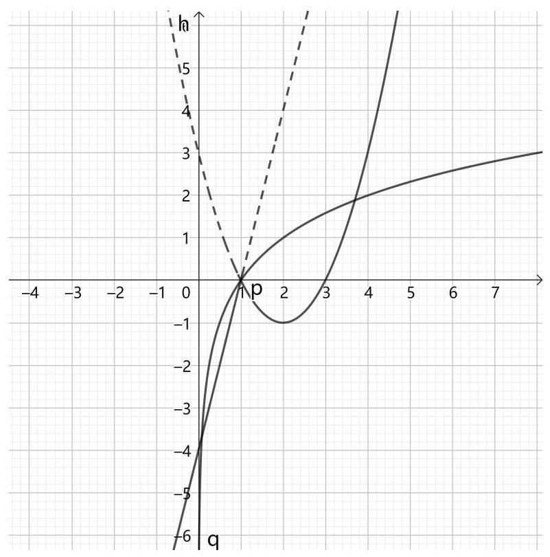

结合图像, 根据对数函数、一次函数、二次函数的单调性和增大幅度可知: $f\left( x\right)$ 和 $g\left( x\right)$ 在两端 $(x = 0$ 附近和 $x$ 比较大的位置 $)$ 只各有一个交点,此外根据函数表达式可以算出,它们还有一个交点 $\left( {1,0}\right)$ 。再没有其他交点。

故本题选 C。

27. [2018 · 新课标全国III]函数 $f\left( x\right)  =  - {x}^{4} + {x}^{2} + 2$ 的图像大致为 (D)。

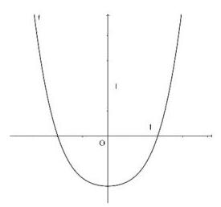

A.

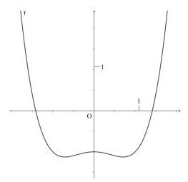

B.

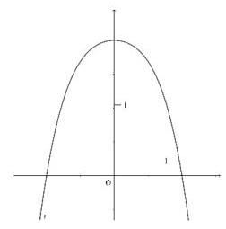

C.

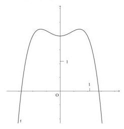

D.

解析:本题需要对幂函数增大和减小的快慢有清晰的认识。

已知函数为 $f\left( x\right)  =  - {x}^{4} + {x}^{2} + 2$ ，有四次方、二次方、常数项共同组成。首先很容易判断,这是一个偶函数,因此其函数图像关于 $\mathrm{y}$ 轴对称。 然而 4 个选项都是偶函数, 区别在于开口方向和是否有一段小凹陷。

根据乘法运算经验可知,当 $x > 1$ 时, ${x}^{4}$ 比 ${x}^{2}$ 增长得要快得多,因此当 $x$ 越来越大时, ${x}^{4}$ 的作用越来越明显, ${x}^{2}$ 越可以被忽视。由于 ${x}^{4}$ 前的系数为 -1,所以当 $x$ 趋近于 $+ \infty$ 时,函数值趋近于 $- \infty$ ,即开口应当向下, 排除选项 $\mathrm{A}$ 和 $\mathrm{B}$ ,只考虑 $\mathrm{C}$ 和 $\mathrm{D}$ 。

还是根据乘法运算经验,当 $x < 1$ 时, $x$ 的值越接近于 $0,{x}^{4}$ 比 ${x}^{2}$ 要小得越多,因此在区间 $\left( {0,1}\right)$ 内,越靠近原点, ${x}^{2}$ 的作用越明显, ${x}^{4}$ 越可以被忽视。由于 ${x}^{2}$ 前的系数为 +1,因此在这段区间内函数应当递增， 故选项 D 符合。

故本题选 D。

后续章节学习导数的有关知识后，本题可以进行更加具体可靠的定量分析,而不再需要稍微有些抽象的定性判断。

28. [2009 · 山东] 函数 $y = \frac{{e}^{x} + {e}^{-x}}{{e}^{x} - {e}^{-x}}$ 的图像大致为( )。

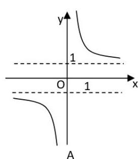

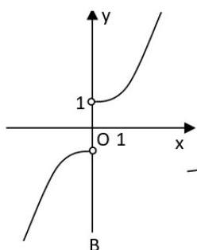

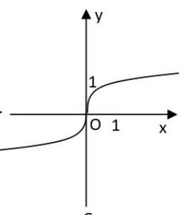

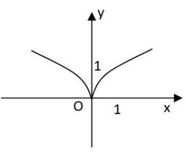

D

C

解析:本题考察对指数函数的图像的变化情况的熟悉程度。

首先, 根据奇函数的定义式可知:

$$
f\left( x\right)  + f\left( {-x}\right)  = \frac{{e}^{x} + {e}^{-x}}{{e}^{x} - {e}^{-x}} + \frac{{e}^{-x} + {e}^{-\left( {-x}\right) }}{{e}^{-x} - {e}^{-\left( {-x}\right) }} = \frac{{e}^{x} + {e}^{-x}}{{e}^{x} - {e}^{-x}} + \frac{{e}^{-x} + {e}^{x}}{{e}^{-x} - {e}^{x}} = 0
$$

因此该函数为奇函数，故排除镜面对称的选项 D。

再考虑当 $x = 0$ 的情况,代入计算发现分母为 0,因此该函数在 $x = 0$ 处无意义，故排除选项 C。

接下来考虑 $\mathrm{x}$ 在 0 附近的取值。当 $\mathrm{x}$ 非常接近 0 时,分子部分为: ${e}^{x} + {e}^{-x} \approx  1 + 1 = 2$ ,取值非常接近 2,但是不是 2。分母部分的取值非常接近 0,是个绝对值非常非常小的数字，并且当 $x < 0$ 时是个负数，当 $x > 0$ 时是个正数。2 除以一个绝对值非常非常小的数字,结果应该是一个绝对值非常非常大的数字,因此选项 $\mathrm{A}$ 比 $\mathrm{B}$ 更有可能。

再来考虑 $\mathrm{x}$ 在 $- \infty$ 和 $+ \infty$ 的取值。当 $\mathrm{x}$ 非常接近 $+ \infty$ 时, ${e}^{x}$ 也非常接近 $+ \infty$ ,而 ${e}^{-x}$ 非常接近于 0 。当一个绝对值非常接近于 0 的数与一个绝对值非常大的数相加减时, 绝对值非常接近于 0 的数字可以忽略不计，于是函数值非常接近于: $f\left( {+\infty }\right)  = \frac{{e}^{+\infty } + {e}^{-\infty }}{{e}^{+\infty } - {e}^{-\infty }} \approx  \frac{{e}^{+\infty } + 0}{{e}^{+\infty } - 0} = \frac{{e}^{+\infty }}{{e}^{+\infty }}$ 。虽然此时分子和分母都是无穷大的数字, 但是它们的表达式完全相同, 因此可以直接约分,即函数值接近于 1 。用同样的原理可得: 当 $\mathrm{x}$ 非常接近 $- \infty$ 时,函数值非常接近于 -1 。这进一步验证了选项 A 的图像。

故本题选 A。

本题使用一个非常重要且普遍的原理:当一个绝对值非常大的数字与一个绝对值非常小的数字相加减时，可以直接忽略(删去)绝对值非常小的数字。但是如果一个绝对值非常大的数字与一个绝对值非常小的数字相乘除，则不能轻易忽略。就好比一盆米与一粒米相加减， 一盆米相当于无穷多，于是这一粒米可以忽略不计。而一盆米与三盆米相加减，每一盆米都很重要。一粒米与三粒米相加减，每一粒米都很重要。

## 第五章 三角函数基础

三角函数的构造过程、基本性质和基本变换是非常基础的内容, 其中三角函数的构造过程是基础中的基础。一般只要严格遵循相关定义式和对应的运算规则，按部就班地分析推导就能得出相应的结果。

三角函数的难点主要在三角恒定变形，是下一章主要学习的内容, 但是其基本原理仍是本章学习的三角函数的基础知识, 因此熟练掌握本章内容是学好三角函数的基础。

三角函数基础部分，要重点掌握以下 4 个方面:

一是弧度制。主要包括弧度的数学含义、弧度制与角度制的换算、 几个特殊弧度对应的三角函数值、弧度在求扇形面积中的简单应用。 虽然高考极少直接考察弧度制的使用，但是弧度制作为一种基本的计量单位，时刻出现在与角有关的问题中，是解决相关题目需要掌握的最基本数学知识。

二是正弦函数、余弦函数、正切函数的构造过程, 以及标准形式对应的函数图像。要能不经思考地就能画出 $\sin x\text{ 、 }\cos x\text{ 、 }\tan x$ 的函数图像, 划定函数周期、找出递增和递减区间、判断函数的奇偶性并指出全部对称中心和对称轴, 标记出它们的坐标, 以及最大值、最小值、 与 x 轴交点的横坐标。

三是函数的基本性质。三角函数具有很强的周期性，并且周期性与单调性和对称性有相互作用，使得其单调区间、对称中心和对称轴也都有了周期性,要注重练习对单调区间、对称中心、对称轴的周期性的描述,例如: 单调区间一般表示为 $\left( {a + {nT}, b + {nT}}\right) \left( {n \in  Z}\right)$ 。

四是三角函数的图形变换。同样是由于三角函数具有很强的周期性，使得其图像的变换有些复杂。函数图像平移或伸缩后，单调区间、 对称中心和对称轴、最高点、最低点、与 $\mathrm{x}$ 轴交点的坐标都发生相应变化。要熟练掌握图像变换与表达式变化之间、与点的坐标和单调区间之间的对应关系，并能够想象出和画出函数图像移动后的大致情况，并标记出特殊的点。

由于三角函数的自变量是角度 (弧度)，因变量是长度的比值， 因而感觉上与幂函数、指数函数、对数函数不大一样, 显得有些特殊。 但从根本上看，三角函数与幂函数、指数函数、对数函数都是基本初等函数，都遵循一般函数周期性、对称性、单调性等性质的定义式以及图形变换的规则和规律，因此在练习时，也要注重对规律和运算的一般性的把握。虽然对于函数的基本性质特别是图像变换的考察多出现在三角函数题目中, 但是要从更加一般的函数的角度去理解这些性质和变换的原理和表达式。

1. [2007 ・ 北京] 已知 $\cos \theta \tan \theta  < 0$ ，那么角 $\theta$ 是( )。

A. 第一或第二象限角 B. 第二或第三象限角

C. 第三或第四象限角 D. 第一或第四象限角

解析:本题考察基本三角函数在各象限内的符号。既可以直接用半径旋转的动态过程判断，也可以根据三角函数的具体图像判断。这里用更加根本的半径旋转的动态过程判断。

根据已知条件 $\cos \theta \tan \theta  < 0$ ,有两种情况: $\left( 1\right) \cos \theta  < 0,\tan \theta  > 0$ ;

---

(2) $\cos \theta  > 0,\;\tan \theta  < 0$ 。

---

情况 (1): 根据旋转过程,当 $\theta$ 为第二或第三象限角时, $\cos \theta  < 0$ ; 当 $\theta$ 为第一或第三象限角时, $\tan \theta  > 0$ ; 综上, $\theta$ 为第三象限角。

情况( 2 )根据旋转过程，当 $\theta$ 为第一或第四象限角时， $\cos \theta  > 0$ ； 当 $\theta$ 为第二或第四象限角时, $\tan \theta  < 0$ ; 综上, $\theta$ 为第四象限角。

综合以上两种情况， $\theta$ 为第三或第四象限角。

故本题选 C。

本题还有一种较为简便的做法, 利用三角函数间的关系, 对不等式关系进行变形:

$$
\cos \theta \tan \theta  = \cos \theta \frac{\sin \theta }{\cos \theta } = \sin \theta  < 0
$$

只需要根据正弦函数的符号判断即可, $\theta$ 应在 $\mathrm{x}$ 轴下方,即为第三或第四象限角。结论相同。

2. $\left\lbrack  {{2007} \cdot  \text{ 陕西 }}\right\rbrack$ 已知 $\sin \alpha  = \frac{\sqrt{5}}{5}$ ，则 ${\sin }^{4}\alpha  - {\cos }^{4}\alpha$ 的值为( )。

A. $- \frac{3}{5}$ B. $- \frac{1}{5}$ C. $\frac{1}{5}$ D. $\frac{3}{5}$

解析:本题仍考察三角函数之间的基本关系，本题具体考察勾股定理。也有两种思路。 由于所求表达式中为 4 次幂，因此不用考虑余弦值的正负。

思路(1):先根据勾股定理和正弦值求出余弦值，再求表达式的值。

根据勾股定理: ${\cos }^{2}\alpha  = 1 - {\sin }^{2}\alpha  = 1 - {\left( \frac{\sqrt{5}}{5}\right) }^{2} = \frac{4}{5}$

于是有: ${\sin }^{4}\alpha  - {\cos }^{4}\alpha  = {\left( \frac{\sqrt{5}}{5}\right) }^{4} - {\left( \frac{4}{5}\right) }^{2} =  - \frac{3}{5}$

思路(2):先根据勾股定理把表达式中的余弦转换为正弦，再求值。

$$
{\sin }^{4}\alpha  - {\cos }^{4}\alpha
$$

$$
= {\sin }^{4}\alpha  - {\left( {\cos }^{2}\alpha \right) }^{2}
$$

$$
= {\sin }^{4}\alpha  - {\left( 1 - {\sin }^{2}\alpha \right) }^{2}
$$

$$
= {\sin }^{4}\alpha  - 1 + 2{\sin }^{2}\alpha  - {\sin }^{4}\alpha
$$

$$
= 2{\sin }^{2}\alpha  - 1
$$

$$
= 2 \times  {\left( \frac{\sqrt{5}}{5}\right) }^{2} - 1
$$

$$
=  - \frac{3}{5}
$$

两种思路的结果相同。

故本题选 A。

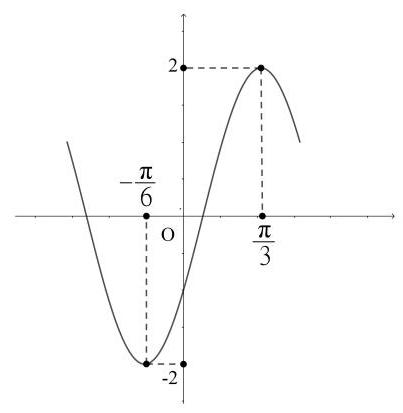

3. [2016·新课标全国Ⅱ]函数 $y = A\sin \left( {{\omega x} + \varphi }\right)$ 的部分图像如图所示，则( )。

A. $y = 2\sin \left( {{2x} - \frac{\pi }{6}}\right)$

B. $y = 2\sin \left( {{2x} - \frac{\pi }{3}}\right)$

C. $y = 2\sin \left( {x + \frac{\pi }{6}}\right)$

D. $y = 2\sin \left( {x - \frac{\pi }{3}}\right)$

解析:本题考察正弦函数图像的变换，题目已经给出了变换的大致形式 $y = A\sin \left( {{\omega x} + \varphi }\right)$ ,水平方向有平移和伸缩 2 种变换,垂直方向只有伸缩 1 种变换。

首先,根据函数的最大值和最小值分别为 2 和-2 可知: $A = 2$ 。 然而 4 个选项都是如此, 继续分析。

根据函数图像可以看出, $x =  - \pi /6$ 和 $x = \pi /3$ 是一对相邻的最小值和最大值, 它们之间的距离是半个最小正周期, 于是有:

$$
\frac{T}{2} = \frac{\pi }{3} - \left( {-\frac{\pi }{6}}\right)
$$

解得 $T = \pi$

于是 $\omega  = {2\pi }/T = {2\pi }/\pi  = 2$

即: $y = 2\sin \left( {{2x} + \varphi }\right)$

又由于 $x = \pi /3$ 时为距离原点最近的最大值,也就是说此时 $\sin$ 里的弧度 ${2x} + \varphi$ 应为 $\pi /2$ ，

---

即: $2 \times  \left( {-\pi /6}\right)  + \varphi  =  - \pi /2$

---

解得: $\varphi  =  - \pi /6$

故本题选 A。

本题还有另一种思路: 解二元一次方程组。

本题有 2 个未知数 $\omega$ 和 $\varphi$ ,再想办法列出 2 个关于它们的二元一次方程即可。根据 $x =  - \pi /6$ 和 $x = \pi /3$ 是分布在原点两侧的一对相邻的最小值和最大值,结合标准的正弦函数 $f\left( x\right)  = \sin x$ 的图像可知:

---

$$
\left\{  \begin{array}{l} \left( {-\pi /6}\right) \omega  + \varphi  =  - \pi /2 \\  \left( {\pi /3}\right) \omega  + \varphi  = \pi /2 \end{array}\right.
$$

---

解该二元一次方程组得: $\omega  = 2,\varphi  =  - \pi /6$ ，结果相同。

解决本题的关键, 在于要对正弦函数的形状、最大值、最小值的横坐标, 以及与最小正周期之间的关系非常熟悉。标准正弦函数、余弦函数、正切函数的图像和基本信息是必须要非常熟悉的内容。

作为巩固，请自己在白纸上手绘坐标系、画出连续 3 个周期内的正弦、余弦、正切函数的图像, 并标记出所有能求得具体数值的点, 以及对称轴、对称中心、渐近线等。

4. [2011 ・江苏]函数 $f\left( x\right)  = A\sin \left( {{\omega x} + \varphi }\right)$ ( $A,\omega ,\varphi$ 是常数， $A > 0,\omega  > 0$ ) 的部分图像如图所示,则 $f\left( 0\right)  =$ ___。

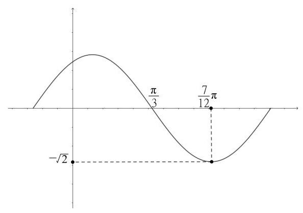

解析:本题求函数在 $x = 0$ 处的取值，实际上还是求函数的表达式。 本题与上一题相似, 都是根据函数图像信息分析推导函数表达式, 用周期性或二元一次方程组的方法都可以。

首先,根据函数的最小值为 $- \sqrt{2}$ ,以及题目条件中的 $A > 0$ ,可知: $A = \sqrt{2}$

根据 $x = \pi /3$ 是原点右侧第一个函数值为 0 的点,该处 $\sin$ 内的表达式整体应该等于 $\pi$ ,于是可以列出等式关系: $\left( {\pi /3}\right) \omega  + \varphi  = \pi$

根据 $x = {7\pi }/{12}$ 是原点右侧第一个最小值的点,该处 $\sin$ 内的表达式整体应该等于 ${3\pi }/2$ ,于是可以列出等式关系: $\left( {{7\pi }/{12}}\right) \omega  + \varphi  = {3\pi }/2$

联立解二元一次方程组得: $\omega  = 2,\varphi  = \pi /3$ ,于是函数表达式为:

$f\left( x\right)  = \sqrt{2}\sin \left( {{2x} + \frac{\pi }{3}}\right)$

于是有: $f\left( 0\right)  = \sqrt{2}\sin \left( {2 \times  0 + \frac{\pi }{3}}\right)  = \sqrt{2}\sin \frac{\pi }{3} = \sqrt{2} \times  \frac{\sqrt{3}}{2} = \frac{\sqrt{6}}{2}$

故本题填 $\frac{\sqrt{6}}{2}$

也可以用函数周期的方法求出 $\omega$ 的值,请自行尝试。

5. [2007·宁夏·海南]函数 $y = \sin \left( {{2x} - \frac{\pi }{3}}\right)$ 在区间 $\left\lbrack  {-\frac{\pi }{2},\pi }\right\rbrack$ 上的简图是( )。

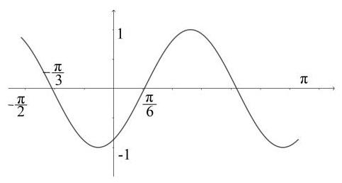

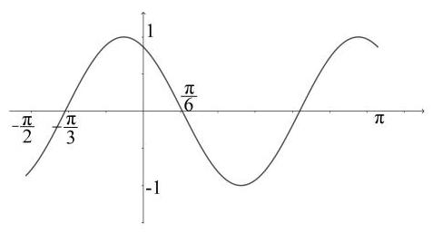

A. B.

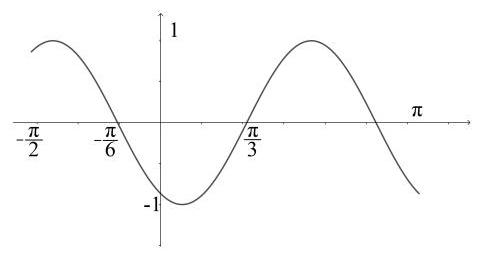

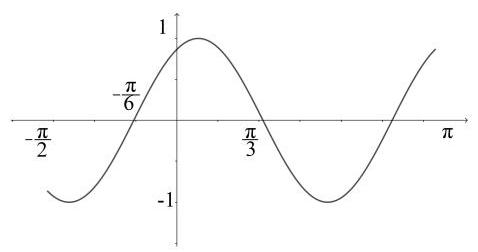

C. D.

解析:本题需要根据三角函数的表达式判断函数的具体图像。根据函数的表达式可以得到很多非常具体的信息, 包括最大最小的坐标、周期、单调区间、与 x 轴的交点, 等等。从中依次选取逐个判断即可。

首先, 大致观察 4 个选项可以发现, 4 个选项的周期相同, 都是从 $- \pi /2$ 到 $\pi$ 经历了一个半周期,因此该函数的周期为 $\pi$ ,与已知表达式中的 $\omega  = 2$ 相符,这条没什么用。

代入 $x =  - \pi /2 : f\left( {-\frac{\pi }{2}}\right)  = \sin \left( {2 \times  \left( {-\frac{\pi }{2}}\right)  - \frac{\pi }{3}}\right)  = \sin \left( {-\frac{4\pi }{3}}\right)  =  - \sin \frac{4\pi }{3} = \sqrt{3}$ ,是个正数，可以排除选项 B 和 D。

比较选项 A 和 C 可以发现,它们的主要区别是 A 的最低点在 $\mathrm{y}$ 轴左边, $\mathrm{C}$ 的最低点在 $\mathrm{y}$ 轴右边。由于 $\sin \left( {-\frac{\pi }{2}}\right)  =  - 1$ ,于是有:

${2x} - \frac{\pi }{3} =  - \frac{\pi }{2}$ ,解得 $x =  - \frac{\pi }{12}$

即原点附近的最低点应该在 $\mathrm{y}$ 轴左边,故本题选 A。

虽然本题能直接代入具体数值进行判断, 但是对三角函数平移和伸缩变换掌握程度的要求，要能够根据题目给出的具体表达式，直接自行手绘出具体函数图像并标出全部与 x 轴交点的横坐标。

6. [2011 . 辽宁] 已知函数 $f\left( x\right)  = A\tan \left( {{\omega x} + \varphi }\right) \left( {\omega  > 0,\left| \varphi \right|  < \frac{\pi }{2}}\right) , y = f\left( x\right)$ 的部分图像如图所示,则 $f\left( \frac{\pi }{24}\right)  =$ (   )。

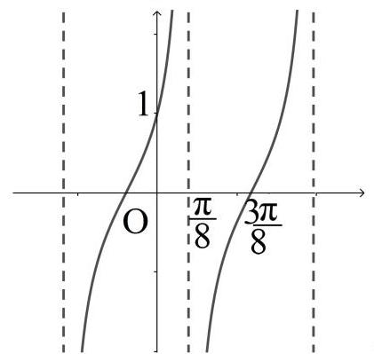

A. $2 + \sqrt{3}$ B. $\sqrt{3}$

C. $\frac{\sqrt{3}}{3}$ D. $2 - \sqrt{3}$

解析:本题的函数是正切函数。具体分析解决的思路与正弦函数基本相同，但是要注意其中几个小的区别，否则就会做错。

根据函数图像可知, $x = \pi /8$ 是一条渐近线。 $x = {3\pi }/8$ 是紧挨着的函数值为 0 的点,因此该函数的周期为 $T = 2\left( {{3\pi }/8 - \pi /8}\right)  = \pi /2$ 。又由于标准的正切函数 $f\left( x\right)  = \tan x$ 的周期为 $\pi$ ，于是 $\omega  = \pi /T = 2$ 。

这里要特别注意! 如果死记硬背 $\omega  = {2\pi }/T$ 并代入,这里就算错了。 因为正切函数的周期不是 ${2\pi }$ 而是 $\pi$ 。要用函数图像伸缩变换的根本原理进行计算。

再根据 $x = \pi /8$ 是 $\mathrm{y}$ 轴右边的第一条渐近线,可知在此 $\tan$ 里面的表达式整体为 $\pi /2$ ,于是有: $2 \times  \left( {\pi /8}\right)  + \varphi  = \pi /2$ ,解得 $\varphi  = \pi /4$ 。

即: $f\left( x\right)  = A\tan \left( {{2x} + \frac{\pi }{4}}\right)$

此处还有一个难点:求 $\mathrm{A}$ 的值。由于正切函数不像正弦和余弦函数有最大值和最小值, 因此 A 值不能一眼看出来。不过本题给出了线索: $f\left( 0\right)  = 1$ ,即 $f\left( 0\right)  = A\tan \left( {2 \times  0 + \frac{\pi }{4}}\right)  = A = 1$

于是最终求得函数表达式为 $f\left( x\right)  = \tan \left( {{2x} + \frac{\pi }{4}}\right)$

代入求得: $f\left( \frac{\pi }{24}\right)  = \tan \left( {2 \times  \frac{\pi }{24} + \frac{\pi }{4}}\right)  = \tan \frac{\pi }{3} = \sqrt{3}$ ,故本题选 B。

本题启示我们, 一定不要死记硬背公式、生搬硬套公式, 而是要掌握公式推导的原理。 $\omega  = {2\pi }/T$ 是根据正弦函数的周期为 ${2\pi }$ ,以及伸缩变换的原理(将 $x$ 替换为 ${\omega x}$ 后，沿水平方向变为原来的 $1/\omega$ ，于是 $T = {T}_{0}/\omega$ ) 得出公式。对于周期不同的函数,其适用公式会发生变化。

7. $\left\lbrack  {{2016} \cdot  \text{ 新课标全国 I }}\right\rbrack$ 将函数 $y = 2\sin \left( {{2x} + \frac{\pi }{6}}\right)$ 的图像向右平移 $\frac{1}{4}$ 个周期后，所得图像所对应的函数为( )。

A. $y = 2\sin \left( {{2x} + \frac{\pi }{4}}\right)$ B. $y = 2\sin \left( {{2x} + \frac{\pi }{3}}\right)$

C. $y = 2\sin \left( {{2x} - \frac{\pi }{4}}\right)$ D. $y = 2\sin \left( {{2x} - \frac{\pi }{3}}\right)$

解析:本题考察三角函数的平移,直接根据平移的原理,将 $x$ 替换为 $x - \frac{T}{4}$ 即可。

根据函数表达式中 $x$ 前的系数为 2 可知: $T = {2\pi }/2 = \pi$ 。

于是将 $x$ 替换为 $x - \frac{\pi }{4}$ :

$y = 2\sin \left\lbrack  {2 \times  \left( {x - \frac{\pi }{4}}\right)  + \frac{\pi }{6}}\right\rbrack   = 2\sin \left( {{2x} - \frac{\pi }{3}}\right)$

故本题选 D。

8. [2010 · 新课标全国Ⅱ]为了得到函数 $y = \sin \left( {{2x} - \frac{\pi }{3}}\right)$ 的图像,只需把函数 $y = \sin \left( {{2x} + \frac{\pi }{6}}\right)$ 的图像()。

A. 向左平移 $\frac{\pi }{4}$ 个长度单位 B. 向右平移 $\frac{\pi }{4}$ 个长度单位

C. 向左平移 $\frac{\pi }{2}$ 个长度单位 D. 向右平移 $\frac{\pi }{2}$ 个长度单位

解析:本题仍考察三角函数的变换。根据题目条件可知，只考察平移变换。要牢记:变换只是对 $x$ 进行变换。不要把 $x$ 的系数一并代进去了。

由于口算比较困难, 不妨假设未知数, 解方程即可:

根据题目条件,假设把函数 $y = \sin \left( {{2x} + \frac{\pi }{6}}\right)$ 中的 $x$ 替换为 $x - p$ 后, 得到函数 $y = \sin \left( {{2x} - \frac{\pi }{3}}\right)$ ,于是有 $2\left( {x - p}\right)  + \frac{\pi }{6} = {2x} - \frac{\pi }{3}$

解得: $p = \frac{\pi }{4}$

也就是把 $x$ 替换为 $x - \frac{\pi }{4}$ ,在图像上的表现为沿 $\mathrm{x}$ 轴正方向移动 $\frac{\pi }{4}$ 故本题选 B。

9. [2009. 湖南]将函数 $y = \sin x$ 的图像向左平移 $\varphi \left( {0 \leq  \varphi  \leq  {2\pi }}\right)$ 个单位后,得到函数 $y = \sin \left( {x - \frac{\pi }{6}}\right)$ 的图像,则 $\varphi  =$ (   )。

A. $\frac{\pi }{6}$ B. $\frac{5\pi }{6}$ C. $\frac{7\pi }{6}$ D. $\frac{11\pi }{6}$

解析:本题直接考察三角函数的平移变换，也暗中考察了三角函数的周期性。

题目条件中给出的变换是“向左平移”，但是表达式中确是减去一个正数。这是由于正弦函数具有周期性，向左平移较多距离后，图像看上去就像是向右移动了一小段距离。

即: $x + \varphi  + {2k\pi } = x - \frac{\pi }{6}\left( {k \in  Z}\right)$

把 $\varphi$ 单独移到等式一侧: $\varphi  =  - \frac{\pi }{6} - {2k\pi }$

分别代入 $k = 0, - 1, - 2\ldots$ 试试

发现当 $k = 2$ 时是选项 D。

故本题选 D。

本题启示我们三角函数的水平平移会受到周期性的影响，所谓的 “向左”“向右”只是对过程的描述。对于水平平移后得到的三角函数， 无法确定它究竟是左移还是右移得到的, 因为左移和右移都能得到想要的结果。甚至多平移几个完整周期，在结果上也没有任何区别。

10. [2008·天津]把函数 $y = \sin x\;\left( {x \in  R}\right)$ 的图像上所有的点向左平行移动 $\frac{\pi }{3}$ 个单位长度,再把所得图像上所有点的横坐标缩短到原来的 $\frac{1}{2}$ 倍(纵坐标不变)，得到的图像所表示的函数是( )。

A. $y = \sin \left( {{2x} - \frac{\pi }{3}}\right) , x \in  R$ B. $y = \sin \left( {\frac{x}{2} + \frac{\pi }{6}}\right) , x \in  R$

C. $y = \sin \left( {{2x} + \frac{\pi }{3}}\right) , x \in  R$ D. $y = \sin \left( {{2x} + \frac{2\pi }{3}}\right) , x \in  R$

解析:本题较为基础, 按部就班地进行变换即可:

第 1 步: 向左平移 $\frac{\pi }{3}$ 个单位长度,用 $x + \frac{\pi }{3}$ 替换 $x$ ,

变为 $y = \sin \left( {x + \frac{\pi }{3}}\right)$

第 2 步:横坐标缩短到原来的一半，用 ${2x}$ 替换 $x$ ，

变为 $y = \sin \left( {{2x} + \frac{\pi }{3}}\right)$

故本题选 C。

本题没有所谓的“陷阱”，如果有的话，只能是答题者自己“想多了”。对于一切题目，只要按照最基本的原理按部就班地分析推导， 就能得出正确的结果，无论有没有所谓的“陷阱”都没有任何区别。

11. [2006 · 江苏] 为了得到函数 $y = 2\sin \left( {\frac{x}{3} + \frac{\pi }{6}}\right) , x \in  R$ 的图像,只需把函数 $y = 2\sin x, x \in  R$ 的图像上所有的点(   )。

A. 向左平移 $\frac{\pi }{6}$ 个单位长度,再把所得各点的横坐标缩短到原来的 $\frac{1}{3}$ 倍(纵坐标不变)

B. 向右平移 $\frac{\pi }{6}$ 个单位长度,再把所得各点的横坐标缩短到原来的 $\frac{1}{3}$ 倍(纵坐标不变)

C. 向左平移 $\frac{\pi }{6}$ 个单位长度,再把所得各点的横坐标伸长到原来的 3 倍(纵坐标不变)

D. 向右平移 $\frac{\pi }{6}$ 个单位长度,再把所得各点的横坐标伸长到原来的 3 倍(纵坐标不变)

解析:本题仍然是三角函数的平移和伸缩变换，并且 4 个选项的顺序都是先平移、后伸缩, 根据原理按部就班地变换即可。

先比较 2 个表达式,从 $y = 2\sin x$ 变成 $y = 2\sin \left( {\frac{x}{3} + \frac{\pi }{6}}\right)$ ,按照先平移、 后伸缩的顺序:

第 1 步: $+ \frac{\pi }{6}$ 就是向左平移 $\frac{\pi }{6}$ 个单位。

第 2 步: $\div  3$ 就是伸长为原来的 3 倍。

故本题选 C。

12. [2012·福建] 函数 $f\left( x\right)  = \sin \left( {x - \frac{\pi }{4}}\right)$ 的图像的一条对称轴是( )。

A. $x = \frac{\pi }{4}$ B. $x = \frac{\pi }{2}$ C. $x =  - \frac{\pi }{4}$ D. $x =  - \frac{\pi }{2}$

解析:本题仍然考察正弦函数的平移变换，考察的点落在函数的对称轴上。

在平移之前, $f\left( x\right)  = \sin x$ 的全部对称轴为 $x = \frac{\pi }{2} + {k\pi }\left( {k \in  Z}\right)$ 。

函数平移后变为 $f\left( x\right)  = \sin \left( {x - \frac{\pi }{4}}\right)$ ,图像向右平移 $\frac{\pi }{4}$ 个单位,于是对称轴变为 $x = \frac{\pi }{2} + {k\pi } + \frac{\pi }{4} = \frac{3\pi }{4} + {k\pi }\;\left( {k \in  Z}\right)$ 。

分别将 $- 2\text{ 、 } - 1\text{ 、 }0\text{ 、 }1\text{ 、 }2\ldots$ 等整数代入 $\mathrm{k}$ ,发现当 $k =  - 1$ 时,选项 $\mathrm{C}$ 符合。

故本题选 C。

13. [2013·山东]将函数 $y = \sin \left( {{2x} + \varphi }\right)$ 的图像沿 x 轴向左平移 $\frac{\pi }{8}$ 个单位后，得到一个偶函数的图像，则 $\varphi$ 的一个可能取值为( )。

A. $\frac{3\pi }{4}$ B. $\frac{\pi }{4}$ C. 0 D. $- \frac{\pi }{4}$

解析:本题考察函数的平移和伸缩变换对于对称性的影响。

首先根据题目条件,将函数函数 $y = \sin \left( {{2x} + \varphi }\right)$ 的图像沿 $\mathrm{x}$ 轴向左平移 $\frac{\pi }{8}$ 个单位,变为: $y = \sin \left\lbrack  {2\left( {x + \frac{\pi }{8}}\right)  + \varphi }\right\rbrack   = \sin \left( {{2x} + \frac{\pi }{4} + \varphi }\right)$

由于标准的正弦函数 $y = \sin x$ 的对称轴为 $x = \frac{\pi }{2} + {k\pi }\;\left( {k \in  Z}\right)$ ,变换后的函数的对称轴为:

(1)先平移，变为 $x = \frac{\pi }{2} + {k\pi } - \varphi  - \frac{\pi }{4} = \frac{\pi }{4} - \varphi  + {k\pi }\left( {k \in  Z}\right)$

(2)再伸缩，变为 $x = \left( {\frac{\pi }{4} - \varphi  + {k\pi }}\right) /2 = \frac{\pi }{8} - \frac{\varphi }{2} + \frac{k\pi }{2}\left( {k \in  Z}\right)$

由于变换后的函数是偶函数,因此 $x = 0$ 是它的一根对称轴,于是有: $x = \frac{\pi }{8} - \frac{\varphi }{2} + \frac{k\pi }{2} = 0$ 是一个解。进行变形,把 $\varphi$ 单独放到等式一侧得: $\varphi  = \frac{\pi }{4} + {k\pi }$

分别将 -2、-1、0、1、2...等整数代入 $\mathrm{k}$ ，发现当 $k = 0$ 时为选项 B。

故本题选 B。

14. [2014·辽宁] 将函数 $y = 3\sin \left( {{2x} + \frac{\pi }{3}}\right)$ 的图像向右平移 $\frac{\pi }{2}$ 个单位长度，所得图像对应的函数()。

A. 在区间 $\left\lbrack  {\frac{\pi }{12},\frac{7\pi }{12}}\right\rbrack$ 上单调递减

B. 在区间 $\left\lbrack  {\frac{\pi }{12},\frac{7\pi }{12}}\right\rbrack$ 上单调递增

C. 在区间 $\left\lbrack  {-\frac{\pi }{6},\frac{\pi }{3}}\right\rbrack$ 上单调递减

D. 在区间 $\left\lbrack  {-\frac{\pi }{6},\frac{\pi }{3}}\right\rbrack$ 上单调递增

解析:本题考察正弦函数的变换和单调性，仍然根据原理按部就班地分析即可。

将函数 $y = 3\sin \left( {{2x} + \frac{\pi }{3}}\right)$ 的图像向右平移 $\frac{\pi }{2}$ 个单位长度,就是将 $x$ 用 $x - \frac{\pi }{2}$ 替换,即: $y = 3\sin \left\lbrack  {2\left( {x - \frac{\pi }{2}}\right)  + \frac{\pi }{3}}\right\rbrack   = 3\sin \left( {{2x} - \frac{2\pi }{3}}\right)$

该函数相当于将标准形式 $y = \sin x$ 先向右平移 $\frac{2\pi }{3}$ 个单位,再将横坐标压缩为原来的 $\frac{1}{2}$ 。用以上过程处理原函数的单调区间即可。

由于沿 $\mathrm{y}$ 轴方向的变换不影响函数的周期性,因此前面的系数 3 不需要考虑。

由于正弦函数的递增和递减区间是交替的，因此只需要对递增区间进行处理，剩下的部分就是递减区间。

先将 $y = \sin x$ 的递增区间 $\left\lbrack  {-\frac{\pi }{2} + {2k\pi },\frac{\pi }{2} + {2k\pi }}\right\rbrack  \left( {k \in  Z}\right)$ 向右平移 $\frac{2\pi }{3}$ 个单位,变为 $\left\lbrack  {-\frac{\pi }{2} + {2k\pi } + \frac{2\pi }{3},\frac{\pi }{2} + {2k\pi } + \frac{2\pi }{3}}\right\rbrack$ ,即 $\left\lbrack  {\frac{\pi }{6} + {2k\pi },\frac{7\pi }{6} + {2k\pi }}\right\rbrack  \left( {k \in  Z}\right)$ 。

再压缩为原来的一半: $\left\lbrack  {\left( {\frac{\pi }{6} + {2k\pi }}\right) /2,\left( {\frac{7\pi }{6} + {2k\pi }}\right) /2}\right\rbrack$ ,即:

$$
\left\lbrack  {\frac{\pi }{12} + {k\pi },\frac{7\pi }{12} + {k\pi }}\right\rbrack  \left( {k \in  Z}\right)
$$

以上是函数 $y = 3\sin \left( {{2x} - \frac{2\pi }{3}}\right)$ 的递增区间,紧挨着它左边或右边的半个周期分别都是该函数的递减区间, 为了让数字的绝对值小一些方便观察,这里选左边的,即: $\left\lbrack  {-\frac{5\pi }{12} + {k\pi },\frac{\pi }{12} + {k\pi }}\right\rbrack$

与 4 个选项进行比较后,发现选项B 正确。选项A 写反了,选项 $\mathrm{C}$ 和 $\mathrm{D}$ 跨越了 2 个不同的单调区间。

故本题选 B。

15. [2005 · 福建] 函数 $y = \cos {2x}$ 在下列哪个区间上是减函数？( )。

A. $\left\lbrack  {-\frac{\pi }{4},\frac{\pi }{4}}\right\rbrack$ B. $\left\lbrack  {\frac{\pi }{4},\frac{3\pi }{4}}\right\rbrack$ C. $\left\lbrack  {0,\frac{\pi }{2}}\right\rbrack$ D. $\left\lbrack  {\frac{\pi }{2},\pi }\right\rbrack$

解析:本题较为简单，考察余弦函数的在水平方向的伸缩变换。 根据函数表达式 $y = \cos {2x}$ ,是将标准的余弦函数 $y = \cos x$ 沿水平方向压缩为原来的一半，因此单调区间的分界点也压缩为原来的一半。

$y = \cos x$ 的单调递减区间为 $\left\lbrack  {0 + {2k\pi },\pi  + {2k\pi }}\right\rbrack  \left( {k \notin  Z}\right)$ ,压缩后变为 $\left\lbrack  {\left( {0 + {2k\pi }}\right) /2,\left( {\pi  + {2k\pi }}\right) /2}\right\rbrack$ ,即 $\left\lbrack  {0 + {k\pi },\frac{\pi }{2} + {k\pi }}\right\rbrack  \left( {k \notin  Z}\right)$ 。这里保留 0 是为了便于观察,正式书写时可以省略,写为 $\left\lbrack  {{k\pi },\frac{\pi }{2} + {k\pi }}\right\rbrack$ 。

比较 4 个选项后，发现选项 C 符合。

故本题选 C。

相应的，该函数的递增区间为该区间相邻的左边或右边半个周期,即 $\left\lbrack  {-\frac{\pi }{2} + {k\pi },0 + {k\pi }}\right\rbrack$ 或 $\left\lbrack  {\frac{\pi }{2} + {k\pi },\frac{3\pi }{2} + {k\pi }}\right\rbrack$ 。这两个区间本质上是同一系列区间,只是记法相差一个周期 $\pi$ 。

虽然本题较为简单, 但是要注意的是, 不要只关注正弦函数而忽略了余弦函数和正切函数，这 3 个函数同等重要。特别是正切函数， 由于它的定义域、值域、最小正周期、单调性、对称性与正弦函数和余弦函数不同, 因此相关性质的具体数值和表现有所不同, 不要生搬硬套公式, 要用基本的原理和法则进行分析推演。

16. [2004 · 天津] 函数 $y = 2\sin \left( {\frac{\pi }{6} - {2x}}\right) \left( {x \in  \left\lbrack  {0,\pi }\right\rbrack  }\right)$ 为增函数的区间是( )。

A. $\left\lbrack  {0,\frac{\pi }{3}}\right\rbrack$ B. $\left\lbrack  {\frac{\pi }{12},\frac{7\pi }{12}}\right\rbrack$ C. $\left\lbrack  {\frac{\pi }{3},\frac{5\pi }{6}}\right\rbrack$ D. $\left\lbrack  {\frac{5\pi }{6},\pi }\right\rbrack$

解析:本题的难点在于 $x$ 前的系数是负数,需要做一个关于 $\mathrm{y}$ 轴的对称变换,要注重关于对称变换的理解。

先理清将标准的正弦函数 $y = \sin x$ 变为 $y = 2\sin \left( {\frac{\pi }{6} - {2x}}\right)$ 的过程。

第 1 步:向左平移 $\frac{\pi }{6}$ 个单位,变为 $y = \sin \left( {\frac{\pi }{6} + x}\right)$

第 2 步: 将横坐标压缩为原来的 $\frac{1}{2}$ ,变为 $y = \sin \left( {\frac{\pi }{6} + {2x}}\right)$

第 3 步: 以 $\mathrm{y}$ 轴为对称轴左右颠倒,变为: $y = \sin \left\lbrack  {\frac{\pi }{6} + 2\left( {-1 \times  x}\right) }\right\rbrack   = \sin \left( {\frac{\pi }{6} - {2x}}\right)$

第 4 步: 沿垂直方向拉伸为原来的 2 倍,变为 $y = 2\sin \left( {\frac{\pi }{6} - {2x}}\right)$

由于垂直方向的拉伸不影响单调性、周期性、奇偶性, 因此第 4 步可以不考虑。

现在对函数 $y = \sin x$ 的增区间 $\left\lbrack  {-\frac{\pi }{2} + {2k\pi },\frac{\pi }{2} + {2k\pi }}\right\rbrack  \left( {k \in  Z}\right)$ 进行上述第 $1 \sim  3$ 步操作:

第 1 步:向左平移 $\frac{\pi }{6}$ 个单位,变为 $\left\lbrack  {-\frac{2\pi }{3} + {2k\pi },\frac{\pi }{3} + {2k\pi }}\right\rbrack$

第 2 步:压缩为原来的 $\frac{1}{2}$ ，变为 $\left\lbrack  {-\frac{\pi }{3} + {k\pi },\frac{\pi }{6} + {k\pi }}\right\rbrack$

第 3 步:以 y 轴为对称轴左右颠倒。这一步需要认真思考，进行左右颠倒后，

原来左边的边界的点 $\left( {-\frac{\pi }{3} + {k\pi },0}\right)$ 变成了右边的边界点,并且要改变符号,变为 $\left( {\frac{\pi }{3} - {k\pi },0}\right)$ 。

原来右边的边界的点 $\left( {\frac{\pi }{6} + {k\pi },0}\right)$ 变成了左边的边界点,并且也要改变符号,变为 $\left( {-\frac{\pi }{6} - {k\pi },0}\right)$ 。

同时原来递增区间是从左向右函数值逐渐增大,对称到 $\mathrm{y}$ 轴的另一侧后，变成了从右向左依次增大，也就是从左向右依次减小，即变成了递减区间。

即 $\left\lbrack  {-\frac{\pi }{6} - {k\pi },\frac{\pi }{3} - {k\pi }}\right\rbrack  \left( {k \in  Z}\right)$ 是函数 $y = 2\sin \left( {\frac{\pi }{6} - {2x}}\right)$ 的递减区间。

为了便于观察,把 $- k$ 替换为 $k$ ,变为 $\left\lbrack  {-\frac{\pi }{6} + {k\pi },\frac{\pi }{3} + {k\pi }}\right\rbrack$

与该区间左右相邻的半个周期分别都是递增区间, 即:

$$
\left\lbrack  {\frac{\pi }{3} + {k\pi },\frac{5\pi }{6} + {k\pi }}\right\rbrack  \left( {k \in  Z}\right)
$$

综上,函数 $y = 2\sin \left( {\frac{\pi }{6} - {2x}}\right)$ 在区间 $\left\lbrack  {\frac{\pi }{3} + {k\pi },\frac{5\pi }{6} + {k\pi }}\right\rbrack$ 单调递增,在区间 $\left\lbrack  {-\frac{\pi }{6} + {k\pi },\frac{\pi }{3} + {k\pi }}\right\rbrack$ 单调递减,其中 $k \in  Z$ 。

对照 4 个选项, 选项 C 刚好就是递增区间。

故本题选 C。

本题的难点在于关于 $\mathrm{y}$ 轴进行镜面对称。要在脑海中形成图像对称翻转的动态过程, 左边变成右边、右边变成左边, 变化趋势也互换。 也可以理解为:以 $\mathrm{y}$ 轴为出发点，原来离 $\mathrm{y}$ 轴较近的依然离 $\mathrm{y}$ 轴较近， 原来离 y 轴较远的点依然离 y 轴较远。从 y 轴出发的变化趋势同样不变。变化完之后再对应到从左向右的坐标系中。

对于奇函数的旋转变换类似, 原来离原点较近的点旋转后仍然离原点较近,原来离原点较远的点仍然离原点较远。原来在 x 轴上方的点旋转后跑到 $\mathrm{x}$ 轴下方，原来在 $\mathrm{x}$ 轴下方的点旋转后跑到 $\mathrm{x}$ 轴上方。 原来离原点越来越远, 曲线朝着 y 轴正方向逐渐上升的图像, 旋转后反方向离原点越来越远, 并沿 y 轴反方向逐渐上升 (也就是沿 y 轴正方向下降)。

以上对调和旋转的图像过程要非常熟悉, 建议自己在纸上画几个函数，把纸折一折、转一转，仔细观察比对，并对数值或表达式进行分析推导。

17. [2019 · 天津] 已知函数 $f\left( x\right)  = A\sin \left( {{\omega x} + \varphi }\right) \left( {A > 0,\omega  > 0,\left| \varphi \right|  < \pi }\right)$ 是奇函数,将 $y = f\left( x\right)$ 的图像上所有点的横坐标伸长到原来的 2 倍 (纵坐标不变),所得图像对应的函数为 $g\left( x\right)$ 。若 $g\left( x\right)$ 的最小正周期为 ${2\pi }$ , 且 $g\left( \frac{\pi }{4}\right)  = \sqrt{2}$ ,则 $f\left( \frac{3\pi }{8}\right)  =$ (   )。

A. -2 B. $- \sqrt{2}$ C. $\sqrt{2}$ D. 2

解析:本题的内容有些多，先认真读题，一句一句地分析梳理。

首先,已知 “ $f\left( x\right)  = A\sin \left( {{\omega x} + \varphi }\right) \left( {A > 0,\omega  > 0,\left| \varphi \right|  < \pi }\right)$ 是奇函数”, 由于正弦函数 $f\left( x\right)  = \sin x$ 原本就是奇函数,因此 $f\left( x\right)  = A\sin \left( {{\omega x} + \varphi }\right)$ 应该是将标准的正弦函数 $f\left( x\right)  = \sin x$ 平移了一个或者半个完整的周期得到的,即 $\varphi  = {k\pi }\left( {k \in  Z}\right)$ 。又由于题目明确了 $\left| \varphi \right|  < \pi$ ,因此只能 $\varphi  = 0$ , 即 $f\left( x\right)  = A\sin \left( {\omega x}\right)$ 。

然后，“将 $y = f\left( x\right)$ 的图像上所有点的横坐标伸长到原来的 2 倍(纵坐标不变)”,可知 $g\left( x\right)  = A\sin \left( {\frac{\omega }{2}x}\right)$ 。

继续,“ $g\left( x\right)$ 的最小正周期为 ${2\pi }$ ”,可得 ${2\pi }/\left( {\omega /2}\right)  = {2\pi }$ ,解得 $\omega  = 2$ , 于是有: $g\left( x\right)  = A\sin \left( x\right) , f\left( x\right)  = A\sin \left( {2x}\right)$ 。

继续,“且 $g\left( \frac{\pi }{4}\right)  = \sqrt{2}$ ”,代入得 $g\left( \frac{\pi }{4}\right)  = A\sin \left( \frac{\pi }{4}\right)  = \frac{\sqrt{2}}{2}A = \sqrt{2}$ ,解得 $A = 2$ 。

于是得到 $y = f\left( x\right)$ 的表达式: $f\left( x\right)  = 2\sin \left( {2x}\right)$

$$
f\left( \frac{3\pi }{8}\right)  = 2\sin \left( {2 \times  \frac{3\pi }{8}}\right)  = 2\sin \frac{3\pi }{4} = \sqrt{2}
$$

故本题选 C。

本题的解题过程较为常规, 只是题目文字较多看起来有些复杂。 只要把题目条件进行逐条分析, 并且逐条推导出一些结果, 就能对题目越来越清晰。

分析题目条件的主要目的有 2 个:把未知量变成已知量(或尽量缩小未知量的范围)，找到各未知量之间的关系(列出等式关系式、 方程组)。

18. [2017·新课标全国III]设函数 $f\left( x\right)  = \cos \left( {x + \frac{\pi }{3}}\right)$ ，则下列结论错误的是( )。

A. $f\left( x\right)$ 的一个周期为 $- {2\pi }$

B. $y = f\left( x\right)$ 的图像关于直线 $x = \frac{8\pi }{3}$ 对称

C. $f\left( {x + \pi }\right)$ 的一个零点为 $x = \frac{\pi }{6}$

D. $f\left( x\right)$ 在 $\left( {\frac{\pi }{2},\pi }\right)$ 单调递减

解析:本题较全面地考察了余弦函数水平平移后的结果。逐条分析即可:

$f\left( x\right)  = \cos \left( {x + \frac{\pi }{3}}\right)$ 是余弦函数 $f\left( x\right)  = \cos x$ 沿水平方向向左平移 $\frac{\pi }{3}$ 个单位，定义域、值域、最小正周期不变，单调区间、对称中心、对称轴随之平移。

选项 A:由于最小正周期的任意整数倍(除了 0 以外)都是原函数的周期，故选项 A 正确。

选项 B:函数 $f\left( x\right)  = \cos x$ 的对称轴为 $x = {k\pi }\left( {k \in  Z}\right)$ ，平移后的对称轴变为 $x =  - \frac{\pi }{3} + {k\pi }$ 。当 $k = 3$ 时,为 $x = \frac{8\pi }{3}$ ,故选项 $\mathrm{B}$ 正确。

选项 C:函数 $f\left( x\right)  = \cos x$ 的零点为 $\left( {\frac{\pi }{2} + {k\pi },0}\right) \left( {k \in  Z}\right)$ ，平移后的零点变为 $\left( {\frac{\pi }{2} + {k\pi } - \frac{\pi }{3},0}\right)$ ,即 $\left( {\frac{\pi }{6} + {k\pi },0}\right)$ 。当 $k = 0$ 时,为 $\left( {\frac{\pi }{6},0}\right)$ ,故选项 C 正确。

选项 D: 函数 $f\left( x\right)  = \cos x$ 的单调递减区间为 $\left\lbrack  {{2k\pi },\left( {{2k} + 1}\right) \pi }\right\rbrack  \left( {k \in  Z}\right)$ , 平移后的单调递减区间变为 $\left\lbrack  {{2k\pi } - \frac{\pi }{3},\left( {{2k} + 1}\right) \pi  - \frac{\pi }{3}}\right\rbrack$ ,即 $\left\lbrack  {-\frac{\pi }{3} + {2k\pi },\frac{2\pi }{3} + {2k\pi }}\right\rbrack \; \left( {\frac{\pi }{2},\pi }\right)$ 跨越了递减和递增区间之间分界点,因此选项 D 错误。

故本题选 D。

本题难度较低。由于它考察的是不那么多见的余弦函数，并且涉及的方面较多，所以特地选为例题。再次强调，对余弦函数和正切函数的基本性质、平移变换的熟悉程度要与正弦函数相当。一定要自行分析推导一遍！

19. [2012 · 全国] 已知 $\omega  > 0,0 < \varphi  < \pi$ ，直线 $x = \frac{\pi }{4}$ 和 $x = \frac{5\pi }{4}$ 是函数 $f\left( x\right)  = \sin \left( {{\omega x} + \varphi }\right)$ 图像的两条相邻的对称轴,则 $\varphi  =$ (   )。

A. $\frac{\pi }{4}$ B. $\frac{\pi }{3}$ C. $\frac{\pi }{2}$ D. $\frac{3\pi }{4}$

解析:本题考察正弦函数的变换。

如果对正弦函数的图像足够熟悉的话, 就会知道, 相邻两条对称轴之间的距离为半个最小正周期。同理, 相邻两个对称中心之间的距离也为半个最小正周期。

于是可知最小正周期 $\mathrm{T}$ 满足关系: $\frac{T}{2} = \frac{5\pi }{4} - \frac{\pi }{4}$ ,解得 $T = {2\pi }$ 。于是有 $\omega  = {2\pi }/T = 1,\;f\left( x\right)  = \sin \left( {x + \varphi }\right)$

根据 $f\left( x\right)  = \sin \left( x\right)$ 的对称轴为 $x = \frac{\pi }{2} + {k\pi }\left( {k \in  Z}\right)$ ,以及平移变换的规则可知, $f\left( x\right)  = \sin \left( {x + \varphi }\right)$ 的对称轴为 $x =  - \varphi  + \frac{\pi }{2} + {k\pi }$

将 $x = \frac{\pi }{4}$ 或 $x = \frac{5\pi }{4}$ 中的随便一个数值代入上式,解方程即可。

$x =  - \varphi  + \frac{\pi }{2} + {k\pi } = \frac{\pi }{4}$

$$
\varphi  = \frac{\pi }{4} + {k\pi }
$$

根据 $0 < \varphi  < \pi$ ,令 $k = 1$ ,得 $\varphi  = \frac{\pi }{4}$

故本题选 A。

## 第六章 三角恒等变换

解决三角恒等变换题目需要对所有涉及到的变换公式都非常熟悉。由于三角恒等变换的公式之间可以通过等式相加减、替换变量的方式互相推导，因此只要熟悉了其中几个最基本的公式，其他公式也能较容易的推导出来。一道题目往往有多种解法，这些解法恰好也是推导相应公式的过程。

使用正弦定理和余弦定理解三角形需要对相关定理的推导，以及三角形的相关情况非常熟悉。在已知足够条件的情况下，要能求出三角形的所有数据。

三角恒等变换需要做大量的习题, 主要有 3 个目的:

一是熟练掌握所设计到的重要公式。即使没有全部死记硬背下来, 也要能根据几个重要的基本公式, 迅速推导出其余的公式。

二是对具体弧度之间的数量关系、三角恒等变形的公式具有较强的敏感度。能够迅速找出不常见的弧度与常见弧度 (例如: $\frac{\pi }{6}\frac{\pi }{4}\frac{\pi }{3}$ ) 之间的数量关系。能够从三角函数之间加减乘除平方的运算中, 看出能够使用的恒等变换公式。

绝大多数三角恒等变换和解三角形的题目都有多种解法, 在刚开始练习时不妨把各种解法都使用一遍，仔细研究各个解法的便利度， 各个解法之间的共同步骤，各个解法之间的联系与三角恒等变换公式之间的联系。

1. $\left\lbrack  {{2019} \cdot  \text{ 新课标全国 I }}\right\rbrack  \tan {255}^{ \circ  } =$ (   )。

A. $- 2 - \sqrt{3}$ B. $- 2 + \sqrt{3}$ C. $2 - \sqrt{3}$ D. $2 + \sqrt{3}$

解析:先利用三角恒等变换把 ${255}^{ \circ  }$ 的角转换为较为熟悉的 $\left\lbrack  {{0}^{ \circ  },{180}^{ \circ  }}\right\rbrack$ 的角,最好是 $\left\lbrack  {{0}^{ \circ  },{90}^{ \circ  }}\right\rbrack$ 的角:

---

$$
\tan {255}^{ \circ  } = \tan \left( {{255}^{ \circ  } - {180}^{ \circ  }}\right)  = \tan {75}^{ \circ  }
$$

---

此时需要对数字有一定敏感度,一般要求牢记 ${0}^{ \circ  }\text{ 、 }{30}^{ \circ  }\text{ 、 }{45}^{ \circ  }\text{ 、 }{60}^{ \circ  }$ 、 ${90}^{ \circ  }$ 的正弦、余弦、正切值,并对它们相加减、一半的结果较敏感。 可以发现: ${75}^{ \circ  } = {30}^{ \circ  } + {45}^{ \circ  }$ ,于是有:

$$
\tan {255}^{ \circ  } = \tan {75}^{ \circ  } = \tan \left( {{30}^{ \circ  } + {45}^{ \circ  }}\right)  = \frac{\tan {30}^{ \circ  } + \tan {45}^{ \circ  }}{1 - \tan {30}^{ \circ  }\tan {45}^{ \circ  }} =  - \frac{\sqrt{3}/3 + 1}{1 - \sqrt{3}/3 \times  1} = \frac{\sqrt{3} + 1}{\sqrt{3} - 1}
$$

该结果与 4 个选项都不一样, 还需要进步化简消去分母, 对于分母有根式的表达式, 常用的消去分母的方式是利用平方差公式, 在分子分母同时乘以相应的式子:

$$
\frac{\sqrt{3} + 1}{\sqrt{3} - 1} = \frac{\left( {\sqrt{3} + 1}\right) \left( {1 + \sqrt{3}}\right) }{\left( {\sqrt{3} - 1}\right) \left( {1 + \sqrt{3}}\right) } = \frac{{\left( \sqrt{3} + 1\right) }^{2}}{{\left( \sqrt{3}\right) }^{2} - {1}^{2}} = \frac{4 + 2\sqrt{3}}{2} = 2 + \sqrt{3}
$$

故本题选 D。

本题解法较为常规，需要对常用角度(弧度)具有敏感性，并且对分母含根号的分式的化简较为熟悉。

2. [2014 · 全国 III]设 $a = \sin {33}^{ \circ  }, b = \cos {55}^{ \circ  }, c = \tan {35}^{ \circ  }$ ,则( )。

A. $a > b > c$ B. $b > c > a$ C. $c > b > a$ D. $c > a > b$

解析:本题比较具体角度的三角函数大小，使用三角函数的具体性质进行比较即可。

进行比较的前提是各元素具有可以直接比较的相近形式。要么是比较同一种三角函数作用于不同弧度的取值, 要么是比较同一弧度在不同三角函数作用下的取值，要么得出一个大致数字范围后比较各个范围的上下限。

先比较 $a = \sin {33}^{ \circ  }$ 和 $b = \cos {55}^{ \circ  }$ ,三角函数的种类和角度都不同,先把他们转化为同一种三角函数:

---

$$
b = \cos {55}^{ \circ  } = \sin \left( {{90}^{ \circ  } - {55}^{ \circ  }}\right)  = \sin {35}^{ \circ  }
$$

---

由于正弦函数在 $\left\lbrack  {{0}^{ \circ  },{90}^{ \circ  }}\right\rbrack$ 是单调递增函数,因此 $a < b$ 。

将 $b$ 转换为正弦函数后,发现其角度值与 $c = \tan {35}^{ \circ  }$ 相同,只需要比较同一角度下不同三角函数值的大小即可。由于:

$$
c = \tan {35}^{ \circ  } = \frac{\sin {35}^{ \circ  }}{\cos {35}^{ \circ  }} = \frac{b}{\cos {35}^{ \circ  }}
$$

由于在 $\left\lbrack  {{0}^{ \circ  },{90}^{ \circ  }}\right\rbrack$ 区间内, $0 < \cos {35}^{ \circ  } < 1$ ,因此 $\frac{b}{\cos {35}^{ \circ  }} > b$

即 $c > b$ 。

综上: $c > b > a$ 。

故本题选 C。

3. [2010. 新课标全国 I ]记 $\cos \left( {-{80}^{ \circ  }}\right)  = k$ ,那么 $\tan {100}^{ \circ  } =$ (   )。

A. $\frac{\sqrt{1 - {k}^{2}}}{k}$ B. $- \frac{\sqrt{1 - {k}^{2}}}{k}$ C. $\frac{1}{\sqrt{1 - {k}^{2}}}$ D. $- \frac{1}{\sqrt{1 - {k}^{2}}}$

解析:本题考察三角函数的变换，内容较为基本。

首先要能一眼看出已知条件中的 $- {80}^{ \circ  }$ 与问题中的 ${100}^{ \circ  }$ 之间的关系,前者的相反数与后者互补: $- \left( {-{80}^{ \circ  }}\right)  = {180}^{ \circ  } - {100}^{ \circ  }$

要求 $\tan {100}^{ \circ  }$ ,只需要先根据 $\cos \left( {-{80}^{ \circ  }}\right)$ 求出 $\cos {80}^{ \circ  }$ 和 $\sin {80}^{ \circ  }$ ,再求出 $\cos {100}^{ \circ  }$ 和 $\sin {100}^{ \circ  }$ 就行。

也可以先根据 $\cos \left( {-{80}^{ \circ  }}\right)$ 求出 $\tan \left( {-{80}^{ \circ  }}\right)$ ,再求出 $\tan {100}^{ \circ  }$ 。

先使用第一条思路,根据三角函数的基本性质有: $\cos \left( {100}^{ \circ  }\right)  =$

---

$$
\cos \left( {{180}^{ \circ  } - {80}^{ \circ  }}\right)  =  - \cos {80}^{ \circ  } =  - \cos \left( {-{80}^{ \circ  }}\right)  =  - k
$$

---

又由于 ${80}^{ \circ  } \in  \left\lbrack  {{0}^{ \circ  },{90}^{ \circ  }}\right\rbrack$ ,因此它的正弦值和余弦值都是正数,因此 $\sin {80}^{ \circ  } = \sqrt{1 - {\cos }^{2}{80}^{ \circ  }} = \sqrt{1 - {k}^{2}}$ ,于是 $\sin {100}^{ \circ  } = \sin \left( {{180}^{ \circ  } - {80}^{ \circ  }}\right)  = \sin {80}^{ \circ  } = \sqrt{1 - {k}^{2}}$ 。

于是 $\tan {100}^{ \circ  } = \frac{\sin {100}^{ \circ  }}{\cos {100}^{ \circ  }} = \frac{\sqrt{1 - {k}^{2}}}{-k} =  - \frac{\sqrt{1 - {k}^{2}}}{k}$

故本题选 B。

现在使用第二条思路:

由于 $- {80}^{ \circ  } \in  \left\lbrack  {-{90}^{ \circ  },{0}^{ \circ  }}\right\rbrack$ ,因此它的正弦值是负数,余弦值是正数,因此 $\cos \left( {-{80}^{ \circ  }}\right)  = k > 0,\;\sin \left( {-{80}^{ \circ  }}\right)  =  - \sqrt{1 - {\cos }^{2}\left( {-{80}^{ \circ  }}\right) } =  - \sqrt{1 - {k}^{2}}$ 。

于是 $\tan \left( {-{80}^{ \circ  }}\right)  = \frac{\sin \left( {-{80}^{ \circ  }}\right) }{\cos \left( {-{80}^{ \circ  }}\right) } = \frac{-\sqrt{1 - {k}^{2}}}{k} =  - \frac{\sqrt{1 - {k}^{2}}}{k}$

于是 $\tan {100}^{ \circ  } = \tan \left( {{100}^{ \circ  } - {180}^{ \circ  }}\right)  = \tan \left( {-{80}^{ \circ  }}\right)  =  - \frac{\sqrt{1 - {k}^{2}}}{k}$

结果相同。

4. [2018 · 新课标全国Ⅱ]已知 $\tan \left( {\alpha  - \frac{5\pi }{4}}\right)  = \frac{1}{5}$ ，则 $\tan \alpha  =$ ___。

解析:本题考察三角函数的基本变换。先根据已知条件使用差角公式得到一组 $\sin \alpha$ 和 $\cos \alpha$ 的数量关系,再与 ${\sin }^{2}\alpha  + {\cos }^{2}\alpha  = 1$ 联立解方程组即可。要注意正负号。

为便于运算,先使用周期性将 $\frac{5\pi }{4}$ 转换成 $\left\lbrack  {0,\frac{\pi }{2}}\right\rbrack$ 范围内的弧度,前面的符号是加或减都可以。

解得 $\tan \alpha  = \frac{3}{2}$

故本题填 $\frac{3}{2}$ 。

5. [2013·新课标全国Ⅱ]设 $\theta$ 为第二象限角，若 $\tan \left( {\theta  + \frac{\pi }{4}}\right)  = \frac{1}{2}$ ，则 $\sin \theta  + \cos \theta  =$ ___。

解析:要求 $\sin \theta  + \cos \theta$ 的值。由于已经确定了 $\theta$ 为第二象限角，因此只要知道正弦值和余弦值中的一个, 就能得出其余的三角函数值。

题目还已知 $\tan \left( {\theta  + \frac{\pi }{4}}\right)$ 的函数值,对其使用和角公式后可以得到 $\tan \theta$ 的函数值，也就是 $\frac{\sin \theta }{\cos \theta }$ 的函数值。再结合 ${\sin }^{2}\theta  + {\cos }^{2}\theta  = 1$ 就能分别求得 $\sin \theta$ 和 $\cos \theta$ 的值。

$\begin{array}{l} \text{ 开始计算: }\tan \left( {\theta  + \frac{\pi }{4}}\right)  = \frac{\tan \theta  + \tan \frac{\pi }{4}}{1 - \tan \theta \tan \frac{\pi }{4}} = \frac{\tan \theta  + 1}{1 - \tan \theta } = \frac{1}{2} \\  \text{ 解得 }\tan \theta  =  - \frac{1}{3} \end{array}$

即 $\frac{\sin \theta }{\cos \theta } =  - \frac{1}{3},\cos \theta  =  - 3\sin \theta$ ,

代入 ${\sin }^{2}\theta  + {\cos }^{2}\theta  = 1$ :

${\sin }^{2}\theta  + {\left( -3\sin \theta \right) }^{2} = 1$

${\sin }^{2}\theta  = \frac{1}{10}$

由于 $\theta$ 为第二象限角,所以 $\sin \theta  > 0,\cos \theta  < 0$ 。

于是 $\sin \theta  = \frac{\sqrt{10}}{10},\cos \theta  =  - 3\sin \theta  =  - \frac{3\sqrt{10}}{10}$

故 $\sin \theta  + \cos \theta  = \frac{\sqrt{10}}{10} + \left( {-\frac{3\sqrt{10}}{10}}\right)  =  - \frac{\sqrt{10}}{5}$

故本题填 $- \frac{\sqrt{10}}{5}$ 。

6. [2007 · 四川] 已知 $\cos \alpha  = \frac{1}{7},\cos \left( {\alpha  - \beta }\right)  = \frac{13}{14}$ ,且 $0 < \beta  < \alpha  < \frac{\pi }{2}$ 。求 $\beta$ 。

解析:题目已知 $\alpha$ 的余弦值和 $\alpha  - \beta$ 的余弦值,还把 $\alpha$ 和 $\beta$ 的范围限定在了锐角。于是可以根据三角函数关系求出 $\alpha$ 的正切值,再对 $\cos \left( {\alpha  - \beta }\right)$ 使用差角公式,得到 $\sin \beta$ 和 $\cos \beta$ 的一组等式关系,再结合 ${\sin }^{2}\beta  + {\cos }^{2}\beta  = 1$ 求出 $\sin \beta$ 和 $\cos \beta$ 。

开始计算: $\sin \alpha  = \sqrt{1 - {\cos }^{2}\alpha } = \sqrt{1 - {\left( \frac{1}{7}\right) }^{2}} = \frac{\sqrt{48}}{7}$

$\cos \left( {\alpha  - \beta }\right)  = \cos \alpha \cos \beta  + \sin \alpha \sin \beta  = \frac{1}{7}\cos \beta  + \frac{\sqrt{48}}{7}\sin \beta  = \frac{13}{14}$

逐步化简:

$\frac{1}{7}\cos \beta  + \frac{\sqrt{48}}{7}\sin \beta  = \frac{13}{14}$

$2\cos \beta  + 2\sqrt{48}\sin \beta  = {13}$

$\cos \beta  = \frac{13}{2} - 4\sqrt{3}\sin \beta$

代入 ${\sin }^{2}\beta  + {\cos }^{2}\beta  = 1$ :

${\sin }^{2}\beta  + {\left( \frac{13}{2} - 4\sqrt{3}\sin \beta \right) }^{2} = 1$

${\sin }^{2}\beta  + \frac{{13}^{2}}{4} - {13} \times  4\sqrt{3}\sin \beta  + {48}{\sin }^{2}\beta  = 1$

${49}{\sin }^{2}\beta  + \frac{{13}^{2}}{4} - {13} \times  4\sqrt{3}\sin \beta  = 1$

$4 \times  {49}{\sin }^{2}\beta  - {13} \times  {16} \times  \sqrt{3}\sin \beta  + {13}^{2} - 4 = 0$

使用一元二次方程求根公式:

$$
\sin \beta  = \frac{{13} \times  {16} \times  \sqrt{3} \pm  \sqrt{{\left( {13} \times  {16} \times  \sqrt{3}\right) }^{2} - 4 \times  \left( {4 \times  {49}}\right)  \times  \left( {{13}^{2} - 4}\right) }}{2 \times  4 \times  {49}}
$$

把分子的根号中的形式按照因式分解的方式化简, 以便于提取公因式后约分,其中 ${13}^{2} - 4 = {12}^{2} - {2}^{2} = \left( {{13} + 2}\right) \left( {{13} - 2}\right)  = {15} \times  {11}$

$$
\sin \beta  = \frac{{13} \times  {16} \times  \sqrt{3} \pm  \sqrt{{13}^{2} \times  {16}^{2} \times  3 - 4 \times  4 \times  {49} \times  {15} \times  {11}}}{2 \times  4 \times  {49}}
$$

$$
= \frac{{13} \times  {16} \times  \sqrt{3} \pm  \sqrt{{16} \times  3} \times  \sqrt{{13}^{2} \times  {16} - {49} \times  5 \times  {11}}}{2 \times  4 \times  {49}}
$$

其中 ${13}^{2} \times  {16} - {49} \times  5 \times  {11} = {169} \times  {16} - {49} \times  {55} = {2704} - {2695} = 9$ ,于是:

$\sin \beta  = \frac{{13} \times  {16} \times  \sqrt{3} \pm  \sqrt{{16} \times  3} \times  \sqrt{9}}{2 \times  4 \times  {49}} = \frac{{208}\sqrt{3} \pm  {12}\sqrt{3}}{2 \times  4 \times  {49}} = \frac{{52}\sqrt{3} \pm  3\sqrt{3}}{2 \times  {49}}$

解得 $\sin \beta  = \frac{\sqrt{3}}{2}$ 或 $\sin \beta  = \frac{{55}\sqrt{3}}{98}$

又由于 $0 < \beta  < \alpha  < \frac{\pi }{2}$ ,所以需要 $\sin \beta  < \sin \alpha$ 。

当 $\sin \beta  = \frac{\sqrt{3}}{2}$ 时, $\frac{4\sqrt{3}}{7} \div  \frac{\sqrt{3}}{2} = \frac{8}{7} > 1$ ,故暂时成立。

当 $\sin \beta  = \frac{{55}\sqrt{3}}{98}$ 时, $\frac{4\sqrt{3}}{7} \div  \frac{{55}\sqrt{3}}{98} = \frac{56}{55} > 1$ ,故也暂时成立。

此外,还需要 $\cos \beta  > 0$ 。

当 $\sin \beta  = \frac{\sqrt{3}}{2}$ 时, $\cos \beta  = \frac{13}{2} - 4\sqrt{3}\sin \beta  = \frac{13}{2} - 4\sqrt{3} \times  \frac{\sqrt{3}}{2} = \frac{1}{2}$ ,故成立。

当 $\sin \beta  = \frac{{55}\sqrt{3}}{98}$ 时， $\cos \beta  = \frac{13}{2} - 4\sqrt{3}\sin \beta  = \frac{13}{2} - 4\sqrt{3} \times  \frac{{55}\sqrt{3}}{98} = \frac{{637} - {660}}{98} < 0$

故不成立。因此只能 $\sin \beta  = \frac{\sqrt{3}}{2}$ ，故 $\beta  = \frac{\pi }{3}$

故本题填 $\frac{\pi }{3}$ 。

以上是本题最为标准化的解题思路, 可以看出具体解题过程中的计算有些复杂, 也使用了提取公因式小技巧避免了一些三位数的乘除。这种程度的“复杂”对于当前的高考来说是非常常见的。

但是, 对于三角恒等变换问题, 使用一点巧妙的思路可以使解题过程大大简化。这个思路在推导三角恒等变换的公式中已经使用过: 把表达式看作一个整体。

虽然直观的思路是,在已知 $\alpha$ 和 $\beta$ 的情况下,可以得到 $\alpha  - \beta$ 。但是如果把 $\alpha  - \beta$ 看作一个整体,那么在已知 $\alpha$ 和 $\alpha  - \beta$ 的情况下,可以得到 $\beta  = \alpha  - \left( {\alpha  - \beta }\right)$ 。于是本题的解题步骤可以大大简化:

首先,根据 $\cos \alpha  = \frac{1}{7}$ ,求得 $\sin \alpha  = \sqrt{1 - {\left( \frac{1}{7}\right) }^{2}} = \frac{4\sqrt{3}}{7}$

同样,根据 $\cos \left( {\alpha  - \beta }\right)  = \frac{13}{14}$ ,求得 $\sin \left( {\alpha  - \beta }\right)  = \sqrt{1 - {\left( \frac{13}{14}\right) }^{2}} = \frac{3\sqrt{3}}{14}$

于是: $\cos \beta  = \cos \left\lbrack  {\alpha  - \left( {\alpha  - \beta }\right) }\right\rbrack$

$$
= \cos \alpha \cos \left( {\alpha  - \beta }\right)  + \sin \alpha \sin \left( {\alpha  - \beta }\right)
$$

$$
= \frac{1}{7} \times  \frac{13}{14} + \frac{4\sqrt{3}}{7} \times  \frac{3\sqrt{3}}{14} = \frac{1}{2}
$$

故 $\beta  = \frac{\pi }{3}$ ，结果相同。

这种把一个表达式看作一个整体的思路在三角函数，以及其他复杂函数、圆锥曲线等题目中非常常用, 要始终保持敏感性。

即使不能一时想到这种巧妙的做法, 用最为基本的方法, 和耐心细心周全的一步一步解答也能得到正确的结果。

7. [2019・新课标全国Ⅱ]已知 $\alpha  \in  \left( {0,\frac{\pi }{2}}\right) ,2\sin {2\alpha } = \cos {2\alpha } + 1$ ,则 $\sin \alpha  =$ ( )。

A. $\frac{1}{5}$ B. $\frac{\sqrt{5}}{5}$ C. $\frac{\sqrt{3}}{3}$ D. $\frac{2\sqrt{5}}{5}$

解析:本题已知 ${2\alpha }$ 的三角函数关系，求 $\alpha$ 的正弦值。很自然地想到使用二倍角公式,将二倍角 ${2\alpha }$ 的三角函数关系转化为 $\alpha$ 的函数关系,再联立 ${\sin }^{2}\alpha  + {\cos }^{2}\alpha  = 1$ 解方程组即可。

开始计算: $2\sin {2\alpha } = \cos {2\alpha } + 1$

---

$4\sin \alpha \cos \alpha  = {\cos }^{2}\alpha  - {\sin }^{2}\alpha  + 1$

---

如果对等式化简有一定敏感性的话,将 1 替换为 ${\sin }^{2}\alpha  + {\cos }^{2}\alpha$ (或在一开始就使用 $\cos {2\alpha } = 2{\cos }^{2}\alpha  - 1$ ):

$4\sin \alpha \cos \alpha  = {\cos }^{2}\alpha  - {\sin }^{2}\alpha  + {\sin }^{2}\alpha  + {\cos }^{2}\alpha$

$4\sin \alpha \cos \alpha  = 2{\cos }^{2}\alpha$

又由于 $\alpha  \in  \left( {0,\frac{\pi }{2}}\right)$ ,因此 $0 < \sin \alpha  < 1,0 < \cos \alpha  < 1$

于是: $\cos \alpha  = 2\sin \alpha$ ,代入 ${\sin }^{2}\alpha  + {\cos }^{2}\alpha  = 1$

${\left( 2\sin \alpha \right) }^{2} + {\sin }^{2}\alpha  = 1$

解得 $\sin \alpha  = \frac{\sqrt{5}}{5}$

故本题选 B。

本题仍需要对三角恒定变换和表达式的化简具有一定敏感性。

一般说来，尽量避免出现正弦函数或余弦函数与常数相加减的项。如果有,可以尝试将常数项 $k$ 转换为 $k\left( {{\sin }^{2}\alpha  + {\cos }^{2}\alpha }\right)$ 。

正切函数与常数项相加减的项可以存在, 因为正切函数本身就是正弦函数与余弦函数的比值，将其转化为比值形式后可以与常数项通分,即: $\tan \alpha  + k = \frac{\sin \alpha }{\cos \alpha } + k = \frac{\sin \alpha  + k\cos \alpha }{\cos \alpha }$

反之，对于分子分母都有正弦和余弦表达式的分式，可以给分子和分母同时除以余弦函数，使其只有正切函数和常数项。

上述思路的原理为:由于正弦函数和余弦函数可以利用数量关系 ${\sin }^{2}\alpha  + {\cos }^{2}\alpha  = 1$ ,因此尽量让表达式只含有它们两，而不含有常数项或其他“干扰项”，以便于化简使用。正切函数是正弦函数和余弦函数的比值，就相当于一个常数项。

8. [2012·江苏]设 $\alpha$ 为锐角,若 $\cos \left( {\alpha  + \frac{\pi }{6}}\right)  = \frac{4}{5}$ ,则 $\sin \left( {{2\alpha } + \frac{\pi }{12}}\right)$ 的值为___。

解析:本题已知 $\alpha  + \frac{\pi }{6}$ 的余弦值，求 ${2\alpha } + \frac{\pi }{12}$ 的正弦值。基本思路是: 对 $\cos \left( {\alpha  + \frac{\pi }{6}}\right)  = \frac{4}{5}$ 使用和角公式和平方和等于 1,联立接触 $\sin \alpha$ 和 $\cos \alpha$ ,再用二倍角公式求出 $\sin {2\alpha }$ 和 $\cos {2\alpha }$ 。再利用半角公式求出 $\frac{\pi }{12}$ 的正弦值和余弦值。最后使用和角公式求出所求的函数值。

这种思路是最基本的, 只要按部就班计算就能得到结果, 但是运算量很大, 花费时间很多并且容易出错。如果对弧度 (角度) 具有敏感性,就会知道 $\frac{\pi }{12} = \frac{\pi }{3} - \frac{\pi }{4} = \frac{\pi }{4} - \frac{\pi }{6}$ 。如果对弧度制还不太熟悉,也可以化作角度制观察: $\frac{\pi }{12} = {15}^{ \circ  } = {60}^{ \circ  } - {45}^{ \circ  } = {45}^{ \circ  } - {30}^{ \circ  }$

使用与上一题相似的思路,把 ${2\alpha } + \frac{\pi }{12}$ 看作一个整体。与已知条件中的 $\alpha  + \frac{\pi }{6}$ 相比较,发现 $\alpha$ 前的系数不同。此时先不去管常数项, 因为常数项可以使用周期性和各种变换进行拼凑,先要把变量 $\alpha$ 的系数统一。

一般说来二倍角比半角要容易计算, 因此把已知条件变成二倍角: $2\left( {\alpha  + \frac{\pi }{6}}\right)  = {2\alpha } + \frac{\pi }{3}$ 。再与所求的角度比较: ${2\alpha } + \frac{\pi }{12} = \left( {{2\alpha } + \frac{\pi }{3}}\right)  - \frac{\pi }{4}$

这样就有思路了: (1)根据 $\cos \left( {\alpha  + \frac{\pi }{6}}\right)  = \frac{4}{5}$ 求出 $\alpha  + \frac{\pi }{6}$ 的正弦值。(2) 使用二倍角公式求出 $2\left( {\alpha  + \frac{\pi }{6}}\right)  = {2\alpha } + \frac{\pi }{3}$ 的正弦值和余弦值。(3)使用差角公式求出 ${2\alpha } + \frac{\pi }{12} = \left( {{2\alpha } + \frac{\pi }{3}}\right)  - \frac{\pi }{4}$ 的正弦值。

开始计算: 由于 $\alpha$ 为锐角,因此 $\frac{\pi }{6} < \alpha  + \frac{\pi }{6} < \frac{2\pi }{3}$ ,即 $\sin \left( {\alpha  + \frac{\pi }{6}}\right)  > 0$ 。

于是 $\sin \left( {\alpha  + \frac{\pi }{6}}\right)  = \sqrt{1 - {\cos }^{2}\left( {\alpha  + \frac{\pi }{6}}\right) } = \sqrt{1 - {\left( \frac{4}{5}\right) }^{2}} = \frac{3}{5}$

使用二倍角公式:

$$
\sin \left( {{2\alpha } + \frac{\pi }{3}}\right)  = 2\sin \alpha \cos \alpha  = 2 \times  \frac{3}{5} \times  \frac{4}{5} = \frac{24}{25}
$$

$$
\cos \left( {{2\alpha } + \frac{\pi }{3}}\right)  = {\cos }^{2}\alpha  - {\sin }^{2}\alpha  = {\left( \frac{4}{5}\right) }^{2} - {\left( \frac{3}{5}\right) }^{2} = \frac{7}{25}
$$

使用差角公式:

$$
\sin \left( {{2\alpha } + \frac{\pi }{12}}\right)  = \sin \left\lbrack  {\left( {{2\alpha } + \frac{\pi }{6}}\right)  - \frac{\pi }{4}}\right\rbrack
$$

$$
= \sin \left( {{2\alpha } + \frac{\pi }{6}}\right) \cos \frac{\pi }{4} - \cos \left( {{2\alpha } + \frac{\pi }{6}}\right) \sin \frac{\pi }{4}
$$

$$
= \frac{24}{25} \times  \frac{\sqrt{2}}{2} - \frac{7}{25} \times  \frac{\sqrt{2}}{2}
$$

$$
= \frac{{17}\sqrt{2}}{50}
$$

故本题填 $\frac{{17}\sqrt{2}}{50}$

使用该思路解题的关键在于, 令表达式中每一项的三角函数的次数相同，并且分子和分母的次数也要相同。需要二次项时可以直接使用 ${\cos }^{2}\theta  + {\sin }^{2}\theta  = 1$ ,需要一次项时可以使用 $\sqrt{{\cos }^{2}\theta  + {\sin }^{2}\theta } = \sqrt{1}$ ,其他次数同理。

9. [2009 · 辽宁] 已知 $\tan \theta  = 2$ ，则 ${\sin }^{2}\theta  + \sin \theta \cos \theta  - 2{\cos }^{2}\theta  =$ ( )。

A. $- \frac{4}{3}$ B. $\frac{5}{4}$ C. $- \frac{3}{4}$ D. $\frac{4}{5}$

解析: 本题仍然可以按照基本思路,根据 $\tan \theta  = 2$ 和 ${\cos }^{2}\theta  + {\sin }^{2}\theta  = 1$ 分别求出 $\sin \theta$ 和 $\cos \theta$ 的值,再代入计算。

这条思路中要注意 $\sin \theta$ 和 $\cos \theta$ 的符号。由于所求表达式中都是 $\sin \theta$ 和 $\cos \theta$ 的平方项和乘积,其中平方项必定是正数或 0,由于 $\tan \theta  = 2 > 0$ ,因此 $\sin \theta$ 和 $\cos \theta$ 同号,故它们的乘积也是正数或 0 。故符号讨论也不麻烦。

现在使用较为简洁的思路: 通过对表达式整体除以 $\cos \theta$ (或其他类似表达式),把所求表达式中全部 $\sin \theta$ 转化为 $\tan \theta \text{ 、 }\cos \theta$ 转化为 1 。

对于本题,如果整体除以 ${\cos }^{2}\theta$ ,表达式就变了,最好是分子分母同时除以 ${\cos }^{2}\theta$ ,不改变表达式的值。此时需要使用 ${\cos }^{2}\theta  + {\sin }^{2}\theta  = 1$ :

$$
{\sin }^{2}\theta  + \sin \theta \cos \theta  - 2{\cos }^{2}\theta
$$

$$
= \frac{{\sin }^{2}\theta  + \sin \theta \cos \theta  - 2{\cos }^{2}\theta }{1}
$$

$$
= \frac{{\sin }^{2}\theta  + \sin \theta \cos \theta  - 2{\cos }^{2}\theta }{{\cos }^{2}\theta  + {\sin }^{2}\theta }
$$

$$
= \frac{\left( {{\sin }^{2}\theta  + \sin \theta \cos \theta  - 2{\cos }^{2}\theta }\right)  \div  {\cos }^{2}\theta }{\left( {{\cos }^{2}\theta  + {\sin }^{2}\theta }\right)  \div  {\cos }^{2}\theta }
$$

$$
= \frac{{\tan }^{2}\theta  + \tan \theta  - 2}{1 + {\tan }^{2}\theta }
$$

$$
= \frac{{2}^{2} + 2 - 2}{1 + {2}^{2}}
$$

$$
= \frac{4}{5}
$$

故本题选 D。

10. [2009 · 陕西]若 $3\sin \alpha  + \cos \alpha  = 0$ ，则 $\frac{1}{{\cos }^{2}\alpha  + \sin {2\alpha }}$ 的值为( )。

A. $\frac{10}{3}$ B. $\frac{5}{3}$ C. $\frac{2}{3}$ D. -2

解析: 本题依然可以适用基本思路,根据 $3\sin \alpha  + \cos \alpha  = 0$ 和 ${\cos }^{2}\alpha  + {\sin }^{2}\alpha  = 1$ 求出 $\cos \alpha$ 和 $\sin \alpha$ 的值,再使用和角公式代入表达式求值。

过程中仍然会遇到正负号的问题。根据已知条件可知 $\cos \alpha$ 和 $\sin \alpha$ 符号相反,因此所求表达式中 $\sin {2\alpha } = 2\sin \alpha \cos \alpha$ 可以确定为负数, ${\cos }^{2}\theta$ 是完全平方项,不用考虑符号。因此基本解法并不麻烦。

为了简化计算过程，仍然可以通过对表达式进行变形予以简化。 首先观察已知条件: $3\sin \alpha  + \cos \alpha  = 0$ ,等式两边同时除以 $\cos \alpha$ 就能得到正切函数的表达式: $\frac{3\sin \alpha }{\cos \alpha } + 1 = 0 =  > \tan \alpha  =  - \frac{1}{3}$

再对所求表达式进行变形，令分子、分母中三角函数的次数相同:

$$
\frac{1}{{\cos }^{2}\alpha  + \sin {2\alpha }} = \frac{1}{{\cos }^{2}\alpha  + 2\sin \alpha \cos \alpha }
$$

$$
= \frac{{\cos }^{2}\alpha  + {\sin }^{2}\alpha }{{\cos }^{2}\alpha  + 2\sin \alpha \cos \alpha }
$$

$$
= \frac{\left( {{\cos }^{2}\alpha  + {\sin }^{2}\alpha }\right)  \div  {\cos }^{2}\alpha }{\left( {{\cos }^{2}\alpha  + 2\sin \alpha \cos \alpha }\right)  \div  {\cos }^{2}\alpha }
$$

$$
= \frac{{1}^{2} + {\tan }^{2}\alpha }{{1}^{2} + 2\tan \alpha }
$$

$$
\begin{array}{l}  = \frac{1 + {\left( -\frac{1}{3}\right) }^{2}}{1 + 2 \times  \left( {-\frac{1}{3}}\right) } \\   = \frac{10}{3} \end{array}
$$

故本题选 A。

11. [2017 $\cdot$ 新课标全国 III] 已知 $\sin \alpha  - \cos \alpha  = \frac{4}{3}$ ，则 $\sin {2\alpha } =$ ( )。

A. $- \frac{7}{9}$ B. $- \frac{2}{9}$ C. $\frac{2}{9}$ D. $\frac{7}{9}$

解析:本题仍然可以按照基本思路按部就班地解决:先联立已知条件和 ${\cos }^{2}\alpha  + {\sin }^{2}\alpha  = 1$ 求出 $\cos \alpha$ 和 $\sin \alpha$ 的值,再使用二倍角公式即可。

本题的符号问题也很容易解决,由于 $\sin \alpha  - \cos \alpha  = \frac{4}{3} > 1$ ,而正弦函数和余弦函数的值的绝对值总是小于等于 1,可知 $\sin \alpha  > 0,\cos \alpha  < 0$ 。

现在使用一种较为巧妙的思路: 由于 $\sin {2\alpha } = 2\sin \alpha \cos \alpha$ ,刚好是完全平方公式 ${\left( \sin \alpha  + \cos \alpha \right) }^{2} = {\sin }^{2}\alpha  + 2\sin \alpha \cos \alpha  + {\cos }^{2}\alpha$ 中间的混合项, 并且其余两项刚好符合 ${\sin }^{2}\alpha  + {\cos }^{2}\alpha  = 1$ 。对已知条件等式两边同时平方并化简可得:

${\left( \sin \alpha  - \cos \alpha \right) }^{2} = {\left( \frac{4}{3}\right) }^{2}$

${\sin }^{2}\alpha  - 2\sin \alpha \cos \alpha  + {\cos }^{2}\alpha  = \frac{16}{9}$

$1 - 2\sin \alpha \cos \alpha  = \frac{16}{9}$

$2\sin \alpha \cos \alpha  =  - \frac{7}{9}$

故 $\sin {2\alpha } = 2\sin \alpha \cos \alpha  =  - \frac{7}{9}$

故本题选 A。

12. [2005 · 全国 III] $\frac{2\sin {2\alpha }}{1 + \cos {2\alpha }} \cdot  \frac{{\cos }^{2}\alpha }{\cos {2\alpha }} =$ (   )。

A. $\tan \alpha$ B. $\tan {2\alpha }$ C. 1

D. $\frac{1}{2}$

解析:本题是一道化简题。此类题型一般先将各个三角函数都转化为同一弧度的三角函数, 进行约分、通分、合并同类项后, 再试着找进一步化简的线索。

对于本题,既有 $\alpha$ 的三角函数也有 ${2\alpha }$ 的三角函数,先都转化为 $\alpha$ 的三角函数,常数项也都用公式 ${\cos }^{2}\alpha  + {\sin }^{2}\alpha  = 1$ 转化掉:

$$
\frac{2\sin {2\alpha }}{1 + \cos {2\alpha }} \cdot  \frac{{\cos }^{2}\alpha }{\cos {2\alpha }} = \frac{4\sin \alpha \cos \alpha }{1 + \left( {2{\cos }^{2}\alpha  - 1}\right) } \cdot  \frac{{\cos }^{2}\alpha }{{\cos }^{2}\alpha  - {\sin }^{2}\alpha }
$$

$$
= \frac{4\sin \alpha {\cos }^{3}\alpha }{2{\cos }^{2}\alpha \left( {{\cos }^{2}\alpha  - {\sin }^{2}\alpha }\right) }
$$

$$
= \frac{2\sin \alpha \cos \alpha }{{\cos }^{2}\alpha  - {\sin }^{2}\alpha }
$$

此时发现分子和分母分别是正弦函数和余弦函数的二倍角公式, 于是再变回去:

原式 $= \frac{2\sin \alpha \cos \alpha }{{\cos }^{2}\alpha  - {\sin }^{2}\alpha } = \frac{\sin {2\alpha }}{\cos {2\alpha }} = \tan {2\alpha }$

故本题选 B。

13. [2012·江西]若 $\tan \theta  + \frac{1}{\tan \theta } = 4$ ，则 $\sin {2\theta } =$ ( )。

A. $\frac{1}{5}$ B. $\frac{1}{4}$ C. $\frac{1}{3}$ D. $\frac{1}{2}$

解析:本题依旧可以按照基本思路按部就班地解决，将已知条件转化为关于 $\sin \theta$ 和 $\cos \theta$ 的关系式,与 ${\cos }^{2}\theta  + {\sin }^{2}\theta  = 1$ 联立解出它们的取值, 再使用二倍角公式即可。

本题也不用担心符号的问题,因为 $\tan \theta$ 和 $\frac{1}{\tan \theta }$ 符号相同,因此 $\tan \theta  > 0$ ,即 $\sin \theta$ 和 $\cos \theta$ 同号。基本解法也不麻烦。

本题仍使用计算较为简便的思路。一般看到形如 $f\left( x\right)  + \frac{1}{f\left( x\right) }$ 的表达式，就要优先想到均值不等式和对其进行平方，这样刚好混合项约分后为常数。对本题试试:

$$
{\left( \tan \theta  + \frac{1}{\tan \theta }\right) }^{2} = {4}^{2}
$$

$$
{\tan }^{2}\theta  + 2 + \frac{1}{{\tan }^{2}\theta } = {16}
$$

$$
\frac{{\sin }^{2}\theta }{{\cos }^{2}\theta } + 2 + \frac{{\cos }^{2}\theta }{{\sin }^{2}\theta } = {16}
$$

$$
\frac{{\sin }^{2}\theta }{{\cos }^{2}\theta } + \frac{{\cos }^{2}\theta }{{\sin }^{2}\theta } = {14}
$$

$$
\frac{{\sin }^{4}\theta  + {\cos }^{4}\theta }{{\cos }^{2}\theta {\sin }^{2}\theta } = {14}
$$

分子 ${\sin }^{4}\theta  + {\cos }^{4}\theta$ 是 ${\left( {\sin }^{2}\theta  + {\cos }^{2}\theta \right) }^{2}$ 展开后的四次项,剩下的混合项刚好是 $2{\sin }^{2}\theta {\cos }^{2}\theta$ ,可使用二倍角公式: $\sin {2\theta } = 2\sin \theta \cos \theta$ ,两边同时平方: ${\sin }^{2}{2\theta } = 4{\sin }^{2}\theta {\cos }^{2}\theta$ ,即 ${\sin }^{2}\theta {\cos }^{2}\theta  = \frac{{\sin }^{2}{2\theta }}{4}$ ,于是原式可化为:

$$
\frac{{\left( {\sin }^{2}\theta  + {\cos }^{2}\theta \right) }^{2} - 2{\cos }^{2}\theta {\sin }^{2}\theta }{{\cos }^{2}\theta {\sin }^{2}\theta } = {14}
$$

$$
\frac{{1}^{2} - 2{\cos }^{2}\theta {\sin }^{2}\theta }{{\cos }^{2}\theta {\sin }^{2}\theta } = {14}
$$

$$
\frac{1 - \frac{{\sin }^{2}{2\theta }}{2}}{\frac{{\sin }^{2}{2\theta }}{4}} = {14}
$$

解得 ${\sin }^{2}{2\theta } = \frac{1}{4}$

由 $\tan \theta  > 0$ 可知 $\sin \theta$ 和 $\cos \theta$ 同号,因此 $\sin {2\theta } > 0$ ,故 $\sin {2\theta } = \frac{1}{2}$

故本题选 D。

14. [1997 · 全国] $\frac{\sin {7}^{ \circ  } + \cos {15}^{ \circ  }\sin {8}^{ \circ  }}{\cos {7}^{ \circ  } - \sin {15}^{ \circ  }\sin {8}^{ \circ  }}$ 的值为___。

解析:本题求具体角度的三角函数的值，依然需要对相应的角度 (弧度) 具有敏感性。

题目中的角度为 ${7}^{ \circ  }$ 、 ${15}^{ \circ  }$ 、 ${8}^{ \circ  }$ ，容易联想到 $7 + 8 = {15}$ 和 ${15} \times  2 = {30}$ 。 观察表达式, 分子分母都是 1 个三角函数与 2 个三角函数乘积的和。 虽然常用思路是 “化繁为简”，把 2 个三角函数的乘积转为为 1 个三角函数或者 2 个三角函数的和。但如果用积化和差的话, 不仅会出现 ${15} - 8 = 7$ ,还会出现 ${15} + 8 = {23}$ 。因此先试试 “化简为繁”,把 ${7}^{ \circ  }$ 拆分为 ${15}^{ \circ  } - {8}^{ \circ  }$ 后使用差角公式拆开，看看能不能约去什么:

$$
\frac{\sin {7}^{ \circ  } + \cos {15}^{ \circ  }\sin {8}^{ \circ  }}{\cos {7}^{ \circ  } - \sin {15}^{ \circ  }\sin {8}^{ \circ  }} = \frac{\sin \left( {{15}^{ \circ  } - {8}^{ \circ  }}\right)  + \cos {15}^{ \circ  }\sin {8}^{ \circ  }}{\cos \left( {{15}^{ \circ  } - {8}^{ \circ  }}\right)  - \sin {15}^{ \circ  }\sin {8}^{ \circ  }}
$$

$$
= \frac{\sin {15}^{ \circ  }\cos {8}^{ \circ  } - \cos {15}^{ \circ  }\sin {8}^{ \circ  } + \cos {15}^{ \circ  }\sin {8}^{ \circ  }}{\cos {15}^{ \circ  }\cos {8}^{ \circ  } + \sin {15}^{ \circ  }\sin {8}^{ \circ  } - \sin {15}^{ \circ  }\sin {8}^{ \circ  }}
$$

的确能消项:

原式 $= \frac{\sin {15}^{ \circ  }\cos {8}^{ \circ  }}{\cos {15}^{ \circ  }\cos {8}^{ \circ  }} = \frac{\sin {15}^{ \circ  }}{\cos {15}^{ \circ  }} = \tan {15}^{ \circ  }$

再使用半角公式或二倍角公式即可。由于二倍角公式比较容易记忆, 因此这里使用二倍角公式, 使用半角公式其实更方便:

$\tan {30}^{ \circ  } = \frac{2\tan {15}^{ \circ  }}{1 - {\tan }^{2}{15}^{ \circ  }} = \frac{\sqrt{3}}{3}$

${\tan }^{2}{15}^{ \circ  } + 2\sqrt{3}\tan {15}^{ \circ  } - 1 = 0$

$\tan {15}^{ \circ  } = \frac{-2\sqrt{3} \pm  \sqrt{{\left( 2\sqrt{3}\right) }^{2} - 4 \times  \left( {-1}\right) }}{2} = \frac{-2\sqrt{3} \pm  4}{2} =  - \sqrt{3} \pm  2$

由于 ${0}^{ \circ  } < {15}^{ \circ  } < {90}^{ \circ  }$ ,所以 $\tan {15}^{ \circ  } > 0$ ,故 $\tan {15}^{ \circ  } =  - \sqrt{3} + 2$

故本题填 $- \sqrt{3} + 2$ 。

( )。 15. [2010 · 全国] 若 $\cos \alpha  =  - \frac{4}{5},\alpha$ 是第三象限的角,则 $\frac{1 + \tan \frac{\alpha }{2}}{1 - \tan \frac{\alpha }{2}} =$

A. $- \frac{1}{2}$ B. $\frac{1}{2}$ C. 2 D. -2

解析:本题有多种解题思路。基本思路为对 $\cos \alpha  =  - \frac{4}{5}$ 使用半角公式直接求出 $\tan \frac{\alpha }{2}$ 的值。由于 $\alpha$ 是第三象限的角 $\pi  < \alpha  < \frac{3\pi }{2}$ ,所以: $\frac{\pi }{2} < \frac{\alpha }{2} < \frac{3\pi }{4}$ ,因此 $\tan \frac{\alpha }{2} < 0$

$$
\tan \frac{\alpha }{2} =  - \sqrt{\frac{1 - \cos \alpha }{1 + \cos }} =  - \sqrt{\frac{1 - \left( {-\frac{4}{5}}\right) }{1 + \left( {-\frac{4}{5}}\right) }} =  - 3
$$

于是 $\frac{1 + \tan \frac{\alpha }{2}}{1 - \tan \frac{\alpha }{2}} = \frac{1 + \left( {-3}\right) }{1 - \left( {-3}\right) } =  - \frac{1}{2}$

故本题选 A。

如果半角公式没有记牢，用其他思路也能解决，例如:先将 $\tan \frac{\alpha }{2}$ 拆为 $\sin \frac{\alpha }{2} \div  \cos \frac{\alpha }{2}$ :

$$
\frac{1 + \sin \frac{\alpha }{2} \div  \cos \frac{\alpha }{2}}{1 - \sin \frac{\alpha }{2} \div  \cos \frac{\alpha }{2}} = \frac{\cos \frac{\alpha }{2} + \sin \frac{\alpha }{2}}{\cos \frac{\alpha }{2} - \sin \frac{\alpha }{2}}
$$

分子分母同时乘以 $\cos \frac{\alpha }{2} + \sin \frac{\alpha }{2}$ :

$$
\frac{\cos \frac{\alpha }{2} + \sin \frac{\alpha }{2}}{\cos \frac{\alpha }{2} - \sin \frac{\alpha }{2}} = \frac{\left( {\cos \frac{\alpha }{2} + \sin \frac{\alpha }{2}}\right) \left( {\cos \frac{\alpha }{2} + \sin \frac{\alpha }{2}}\right) }{\left( {\cos \frac{\alpha }{2} - \sin \frac{\alpha }{2}}\right) \left( {\cos \frac{\alpha }{2} + \sin \frac{\alpha }{2}}\right) }
$$

$$
= \frac{{\left( \cos \frac{\alpha }{2} + \sin \frac{\alpha }{2}\right) }^{2}}{{\cos }^{2}\frac{\alpha }{2} - {\sin }^{2}\frac{\alpha }{2}}
$$

$$
= \frac{1 + 2\cos \frac{\alpha }{2}\sin \frac{\alpha }{2}}{{\cos }^{2}\frac{\alpha }{2} - {\sin }^{2}\frac{\alpha }{2}}
$$

可以对分子和分母分别使用正弦函数和余弦函数的二倍角公式:

$$
\frac{1 + 2\cos \frac{\alpha }{2}\sin \frac{\alpha }{2}}{{\cos }^{2}\frac{\alpha }{2} - {\sin }^{2}\frac{\alpha }{2}} = \frac{1 + \sin \alpha }{\cos \alpha }
$$

其中已知 $\cos \alpha  =  - \frac{4}{5}$ ,根据 $\alpha$ 是第三象限的角可求得 $\sin \alpha  =  - \frac{3}{5}$

$\begin{array}{l} \text{ 于是 }\frac{1 + \sin \alpha }{\cos \alpha } = \frac{1 + \left( {-\frac{3}{5}}\right) }{-\frac{4}{5}} =  - \frac{1}{2} \\  \text{ 结果相同。 } \end{array}$

其实上述解题过程也是推导半角公式的一种方式。

如果既没有记牢半角公式, 也没能想出上述变形方式, 仍可以用最基本的方法解决:

对 $\cos \alpha  =  - \frac{4}{5}$ 使用二倍角公式,结合 ${\cos }^{2}\frac{\alpha }{2} + {\sin }^{2}\frac{\alpha }{2} = 1$ 以及 $\alpha$ 是第三象限的角,求出 $\cos \frac{\alpha }{2}$ 和 $\sin \frac{\alpha }{2}$ 的值,从而得出 $\tan \frac{\alpha }{2}$ 的值,代入即可。

虽然这种解法不如前两种简便, 但是也能做出来, 并且过程并不是很复杂。在练习过程中要尽量尝试多种思路，找到最为简便的。在考试当中选择自己掌握得最牢固的公式和最有把握的思路求出正确答案更加重要。

16. [2008·宁夏 海南] $\frac{3 - \sin {70}^{ \circ  }}{2 - {\cos }^{2}{10}^{ \circ  }} =$ (   )。

A. $\frac{1}{2}$ B. $\frac{\sqrt{2}}{2}$ C. 2

D. $\frac{\sqrt{3}}{2}$

解析:本题考察具体角度的三角函数的化简和计算。题目中的角度为 ${70}^{ \circ  }$ 和 ${10}^{ \circ  }$ ,比较直接的关系为 ${70} - {10} = {60}$ 。又由于分母中为 $\cos {10}^{ \circ  }$ 的平方,很有可能用二倍角公式化为 ${20}^{ \circ  }$ 的三角函数,具有关系 ${70} + {20} = {90}$ 。下面开始化简,优先化为次数相同的表达式,把 ${70}^{ \circ  }$ 和 ${10}^{ \circ  } \; \begin{array}{l} \text{ 都化为 }{20}^{ \circ  } : \frac{3 - \sin {70}^{ \circ  }}{2 - {\cos }^{2}{10}^{ \circ  }} = \frac{3 - \cos {20}^{ \circ  }}{2 - \frac{\cos {20}^{ \circ  } + 1}{2}} = \frac{3 - \cos {20}^{ \circ  }}{\frac{3 - \cos {20}^{ \circ  }}{2}} = 2 \\  \text{ 故本题选 C。 } \end{array}$

17. [2010 · 上海] 已知 $0 < x < \frac{\pi }{2}$ ，化简 $\lg \left( {\cos x\tan x + 1 - 2{\sin }^{2}\frac{x}{2}}\right)  + \; \lg \left\lbrack  {\sqrt{2}\cos \left( {x - \frac{\pi }{4}}\right) }\right\rbrack   - \lg \left( {1 + \sin {2x}}\right)$

解析:根据各种三角恒等变换以及对数基本运算规则化简即可。 原则上把三角函数都转化成同一弧度 (表达式) 的三角函数, 三角函数的种类尽量少(把正切函数和余切函数转化为正弦函数与余弦函数的商)；尽量避免常数项与三角函数相加减；多进行通分、合并同类项、约分。开始化简:

$$
\lg \left( {\cos x\tan x + 1 - 2{\sin }^{2}\frac{x}{2}}\right)  + \lg \left\lbrack  {\sqrt{2}\cos \left( {x - \frac{\pi }{4}}\right) }\right\rbrack   - \lg \left( {1 + \sin {2x}}\right)
$$

$$
= \lg \left\lbrack  {\cos x\frac{\sin x}{\cos x} + 1 - 2\left( \frac{1 - \cos x}{2}\right) }\right\rbrack   + \lg \left\lbrack  {\sqrt{2}\left( {\cos x\cos \frac{\pi }{4} + \sin x\sin \frac{\pi }{4}}\right) }\right\rbrack
$$

$$
- \lg \left( {{\cos }^{2}x + {\sin }^{2}x + 2\sin x\cos }\right)
$$

$$
= \lg \left( {\sin x + \cos x}\right)  + \lg \left( {\cos x + \sin x}\right)  - \lg {\left( \cos x + \sin x\right) }^{2}
$$

$$
= \lg \frac{\left( {\sin x + \cos x}\right)  \times  \left( {\sin x + \cos x}\right) }{{\left( \sin x + \cos x\right) }^{2}}
$$

$$
= \lg 1
$$

$$
= 0
$$

解毕。

遇到看起来复杂的表达式，只要按照上述原则化简即可。最重要的原则是尽量让各成分的基本形式一致 (三角函数的弧度相同、三角函数的种类相同、指数或对数的底数相同等, 再使用相关公式合并同类项、消项、约分。

18. [2016·浙江]已知 $2{\cos }^{2}x + \sin {2x} = A\sin \left( {{\omega x} + \phi }\right)  + b\left( {A > 0}\right)$ ，则 $A =$ ___， $b =$ ___。

解析:本题考查将 2 个弧度相同的三角函数的和，合并为一个三角函数。一般思路是将 2 个三角函数前的系数转化为一对平方和为 1 的数，再反向使用和角公式或差角公式。

本题先要对等式左边进行变形，令弧度相同，且次数都为 1 :

$2{\cos }^{2}x + \sin {2x} = 2 \times  \frac{1 + \cos {2x}}{2} + \sin {2x} = \cos {2x} + \sin {2x} + 1$

由于 $\cos {2x}$ 和 $\sin {2x}$ 前系数都为 1,故在它们前面同时乘以 $\sqrt{2} \times  \frac{\sqrt{2}}{2}$ 并把 $\sqrt{2}$ 提出去,反向使用正弦函数的和角公式:

$$
\cos {2x} + \sin {2x} + 1 = \sqrt{2}\left( {\frac{\sqrt{2}}{2}\cos {2x} + \frac{\sqrt{2}}{2}\sin {2x}}\right)  + 1
$$

$$
= \sqrt{2}\left( {\sin \frac{\pi }{4}\cos {2x} + \cos \frac{\pi }{4}\sin {2x}}\right)  + 1
$$

$$
= \sqrt{2}\sin \left( {\frac{\pi }{4} + {2x}}\right)  + 1
$$

与已知条件进行比较:

$$
\sqrt{2}\sin \left( {\frac{\pi }{4} + {2x}}\right)  + 1 = A\sin \left( {{\omega x} + \phi }\right)  + b
$$

可知: $A = \sqrt{2},\omega  = 2,\varphi  = \frac{\pi }{4}, b = 1$

故本题分别填 $\sqrt{2}$ 和 1 。

解决本题需要掌握一条重要思路:反向使用正弦定理。

对于形如 $a\sin x + b\cos x$ 的表达式,可将其看作三角函数 $A\sin \left( {x + t}\right)$ 的展开式: $A\sin \left( {x + t}\right)  = A\sin x\cos t + A\cos x\sin t = A\left( {\sin x\cos t + \cos x\sin t}\right)$

比较 $a\sin x + b\cos x$ 和 $A\sin x\cos t + A\cos x\sin t$ 可以得出: $a = A\cos t$ , $b = A\sin t$ ,即 $\cos t = \frac{a}{A},\sin t = \frac{b}{A}$ 。使用 ${\cos }^{2}t + {\sin }^{2}t = 1\left( \right.$ 一般规定 $\left. {0 \leq  t \leq  {2\pi }}\right)$ , 于是 ${\left( \frac{a}{A}\right) }^{2} + {\left( \frac{b}{A}\right) }^{2} = 1$ ,解得 $A = \sqrt{{a}^{2} + {b}^{2}}$ 。

即: $a\sin x + b\cos x = A\sin \left( {x + t}\right)  = \sqrt{{a}^{2} + {b}^{2}}\left( {\sin x\cos t + \cos x\sin t}\right)$ ,其中: $\cos t = \frac{a}{\sqrt{{a}^{2} + {b}^{2}}},\sin t = \frac{b}{\sqrt{{a}^{2} + {b}^{2}}}$ 。由于已经知道了 $\cos t$ 和 $\sin t$ 的值,因此不用专门求出 $t$ 的弧度。

以上就是这种变换的原理, 其核心思想为任意一对实数对或点的坐标 $\left( {a, b}\right)$ ,都可以看作以原点 $\left( {0,0}\right)$ 为圆心, $\sqrt{{a}^{2} + {b}^{2}}$ 为半径的圆上的点 $\left( {\sqrt{{a}^{2} + {b}^{2}}\cos t,\sqrt{{a}^{2} + {b}^{2}}\sin t}\right)$ ,其中 $\cos t = \frac{a}{\sqrt{{a}^{2} + {b}^{2}}},\sin t = \frac{b}{\sqrt{{a}^{2} + {b}^{2}}}$ 。如下图。

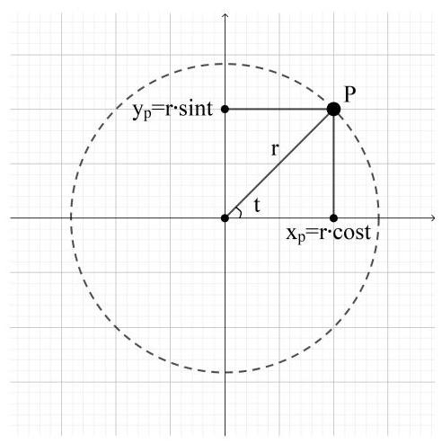

19. [2010 · 江西] 函数 $y = {\sin }^{2}x + \sin x - 1$ 的值域为( )。

A. $\left\lbrack  {-1,1}\right\rbrack$ B. $\left\lbrack  {-\frac{5}{4}, - 1}\right\rbrack$ C. $\left\lbrack  {-\frac{5}{4},1}\right\rbrack$ D. $\left\lbrack  {-1,\frac{5}{4}}\right\rbrack$

解析: 求几个三角函数构成的复合函数的值域, 常用思路有 2 种: (1)通过三角恒等变换将函数转换为只有一个三角函数的表达式，利用三角函数的性质进行分析即可，上一题就是这种类型。(2)通过三角恒等变换将函数转化为只有一个弧度一种三角函数, 将其整体看作自变量分析, 本题是这种类型。

令 $\sin x = t$ ,于是 $t \in  \left\lbrack  {-1,1}\right\rbrack$ ,原函数可化为二次函数: $y = {t}^{2} + t - 1$

将其化为标准式 $y = {\left( t + \frac{1}{2}\right) }^{2} - \frac{5}{4}$

当 $t =  - \frac{1}{2}$ 时,函数取最小值 $- \frac{5}{4}$ ,该 $t$ 值属于定义域 $\left\lbrack  {-1,1}\right\rbrack$ 内。

当 $t = 1$ 时,函数取该定义域区间内的最大值 1

故其值域为 $\left\lbrack  {-\frac{5}{4},1}\right\rbrack$

故本题选 C。

20. [2004·广东] 当 $0 < x < \frac{\pi }{4}$ 时,函数 $f\left( x\right)  = \frac{{\cos }^{2}x}{\cos x\sin x - {\sin }^{2}x}$ 的最小值是 ( )。

A. 4

B. $\frac{1}{2}$ C. 2

D. $\frac{1}{4}$

解析:本题思路与上一题相同，将函数表达式转化为某一个弧度的一种三角函数的表达式, 将其看作整体后分析。

本题的表达式为分式，并且各项中正弦或余弦函数的次数相同， 因此考虑分子分母同时除以 $\cos x$ 的相应次幂，将其转化为 $\tan x$ :

$$
f\left( x\right)  = \frac{{\cos }^{2}x}{\cos x\sin x - {\sin }^{2}x} = \frac{{\cos }^{2}x \div  {\cos }^{2}x}{\left( {\cos x\sin x - {\sin }^{2}x}\right)  \div  {\cos }^{2}x} = \frac{1}{\tan x - {\tan }^{2}x}
$$

令 $\tan x = t$ ,由于 $0 < x < \frac{\pi }{4}$ ,因此 $0 < t < 1$

$f\left( t\right)  = \frac{1}{t - {t}^{2}} = \frac{1}{-{\left( t - \frac{1}{2}\right) }^{2} + \frac{1}{4}}$

对于分母 $- {\left( t - \frac{1}{2}\right) }^{2} + \frac{1}{4}$

在 $0 < t < 1$ 区间内,当 $t = \frac{1}{2}$ 时,分母取最大值 $\frac{1}{4}, f\left( t\right)$ 取最小值 4

当 $t = 0$ 或 $t = 1$ 时 (这两个值实际不在定义域区间内),分母取最小值 0 (实际取不到), $f\left( t\right)$ 趋近于 $+ \infty$ 。

$f\left( t\right)$ 的取值就是 $f\left( x\right)$ 的取值，故 $f\left( x\right)$ 的最小值为 4 。

故本题选 A。

21. [2018 · 新课标全国III]函数 $f\left( x\right)  = \frac{\tan x}{1 + {\tan }^{2}x}$ 的最小正周期为 ( )。

A. $\frac{\pi }{4}$ B. $\frac{\pi }{2}$ C. $\pi$ D. ${2\pi }$

解析:在分析三角函数相互加减乘除构成的函数的周期性、单调性、最大最小值等基本性质时, 尽量把函数转化成一个三角函数的形式 (即一个三角函数进行平移或伸缩变换后的形式)。

对万能置换公式熟悉的话，可以直接将本函数进行转化:

$f\left( x\right)  = \frac{\tan x}{1 + {\tan }^{2}x} = \frac{1}{2} \times  \frac{2\tan x}{1 + {\tan }^{2}x} = \frac{1}{2}\sin {2x}$

故其最小正周期为 ${2\pi } \div  2 = \pi$

故本题选 C。

如果对万能置换公式不够熟悉,令分子分母同时乘以 ${\cos }^{2}x$ ,会发现能对分子和分母分别使用二倍角公式。其实这就是万能置换公式的推导过程。

22. [2010 · 浙江] 函数 $f\left( x\right)  = \sin \left( {{2x} - \frac{\pi }{4}}\right)  - 2\sqrt{2}{\sin }^{2}x$ 的最小正周期是___。

解析:本题既有 ${2x}$ 的三角函数又有 $x$ 的三角函数的平方，转化为一个标准的三角函数或者关于某个三角函数的表达式这两种思路都有可能, 先化简统一形式看看:

$$
f\left( x\right)  = \sin \left( {{2x} - \frac{\pi }{4}}\right)  - 2\sqrt{2}{\sin }^{2}x
$$

$$
= \sin {2x}\cos \frac{\pi }{4} - \cos {2x}\sin \frac{\pi }{4} - 2\sqrt{2} \times  \left( \frac{1 - \cos {2x}}{2}\right)
$$

$$
= \frac{\sqrt{2}}{2}\sin {2x} - \frac{\sqrt{2}}{2}\cos {2x} - \sqrt{2} + \sqrt{2}\cos {2x}
$$

$$
= \frac{\sqrt{2}}{2}\sin {2x} + \frac{\sqrt{2}}{2}\cos {2x} - \sqrt{2}
$$

又可以化为一个标准的三角函数了:

$= \sin \left( {{2x} - \frac{\pi }{4}}\right)  - \sqrt{2}$

故其最小正周期为 ${2\pi } \div  2 = \pi$

故本题填 $\pi$ 。

一般遇到比较复杂的表达式, 先进行化简, 再从中找规律。

23. [2011 · 上海] 函数 $y = \sin \left( {\frac{\pi }{2} + x}\right) \cos \left( {\frac{\pi }{6} - x}\right)$ 的最大值为___。

解析:先用相应的变换公式把表达式展开，将具体弧度转化为具体数值看看:

$y = \sin \left( {\frac{\pi }{2} + x}\right) \cos \left( {\frac{\pi }{6} - x}\right)$

$$
= \cos x\left( {\cos \frac{\pi }{6}\cos x + \sin \frac{\pi }{6}\sin x}\right)
$$

$= \cos x\left( {\frac{\sqrt{3}}{2}\cos x + \frac{1}{2}\sin x}\right)$

$$
= \frac{\sqrt{3}}{2}{\cos }^{2}x + \frac{1}{2}\sin x\cos x
$$

可以分别使用二倍角公式:

$= \frac{\sqrt{3}}{2} \times  \frac{1 + \cos {2x}}{2} + \frac{1}{2} \times  \frac{\sin {2x}}{2} \; = \frac{\sqrt{3}}{4}\cos {2x} + \frac{1}{4}\sin {2x} + \frac{\sqrt{3}}{4}$

将其转化为一个三角函数的标准形式:

$$
= \frac{1}{2} \times  \left( {\frac{\sqrt{3}}{2}\cos {2x} + \frac{1}{2}\sin {2x}}\right)  + \frac{\sqrt{3}}{4}
$$

$$
= \frac{1}{2}\sin \left( {{2x} + \frac{\pi }{3}}\right)  + \frac{\sqrt{3}}{4}
$$

由于 $- 1 \leq  \sin \left( {{2x} + \frac{\pi }{3}}\right)  \leq  1$ ,故 $y$ 的最大值为 $\frac{1}{2} \times  1 + \frac{\sqrt{3}}{4} = \frac{2 + \sqrt{3}}{4}$

故本题填 $\frac{2 + \sqrt{3}}{4}$

如果对积化和差公式熟悉的话，直接使用更为方便:

$$
y = \sin \left( {\frac{\pi }{2} + x}\right) \cos \left( {\frac{\pi }{6} - x}\right)
$$

$$
= \frac{1}{2}\left\{  {\sin \left\lbrack  {\left( {\frac{\pi }{2} + x}\right)  + \left( {\frac{\pi }{6} - x}\right) }\right\rbrack   + \sin \left\lbrack  {\left( {\frac{\pi }{2} + x}\right)  - \left( {\frac{\pi }{6} - x}\right) }\right\rbrack  }\right\}
$$

$$
= \frac{1}{2}\left\lbrack  {\sin \frac{2\pi }{3} + \sin \left( {{2x} + \frac{\pi }{3}}\right) }\right\rbrack
$$

$$
= \frac{1}{2}\left\lbrack  {\frac{\sqrt{3}}{2} + \sin \left( {{2x} + \frac{\pi }{3}}\right) }\right\rbrack
$$

结果相同。实际上这几种解法的思路就是相关公式互相推导的过程。优先使用自己更有把握的公式和思路。

24. [2017. 新课标全国 III] $\bigtriangleup \mathrm{{ABC}}$ 的内角 $\mathrm{A},\mathrm{B},\mathrm{C}$ 的对边分别为 $a, b, c$ 。已知 $C = {60}^{ \circ  }b = \sqrt{6}, c = 3$ ，则 $A =$ ___。

解析:已知三角形的一些角度或边长信息，求三角形的其他信息的问题叫做解三角形。本题是非常典型并且基本的解三角形问题。一般先简单画一个三角形, 把题目已知条件标注上去。如下图所示。

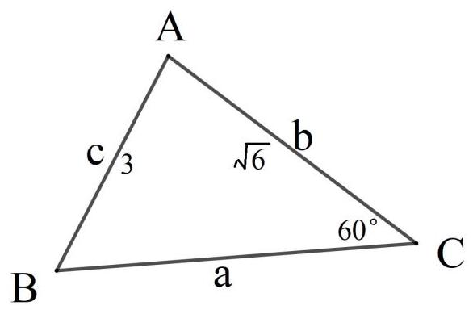

已知条件为边边角，有可能不只一个三角形，先算一算再说。

已知条件中有一个角和它的对边, 可以先用正弦定理算出另一边的对角:

$\frac{\sin B}{b} = \frac{\sin C}{c} =  > \frac{\sin B}{\sqrt{6}} = \frac{\sin {60}^{ \circ  }}{3} =  > \sin B = \sqrt{6} \times  \frac{\sqrt{3}}{2} \times  \frac{1}{3} = \frac{\sqrt{2}}{2}$

可知 $B = {45}^{ \circ  }$ 或 ${135}^{ \circ  }$ (注意此处不要忽略钝角！！！)

于是 $A = {180}^{ \circ  } - {60}^{ \circ  } - {45}^{ \circ  } = {75}^{ \circ  }$ 或 $A = {180}^{ \circ  } - {60}^{ \circ  } - {135}^{ \circ  } =  - {15}^{ \circ  }$

由于三角形的内角不能为负数,因此 $A = {75}^{ \circ  }$

故本题填 ${75}^{ \circ  }$

25. [2016·新课标全国Ⅱ]△ABC的内角 A，B，C 的对边分别为 $a, b, c$ ,若 $\cos A = \frac{4}{5},\cos C = \frac{5}{13}, a = 1$ ,则 $b =$ ___。

解析:先画出三角形的大致图形并标注相关信息:

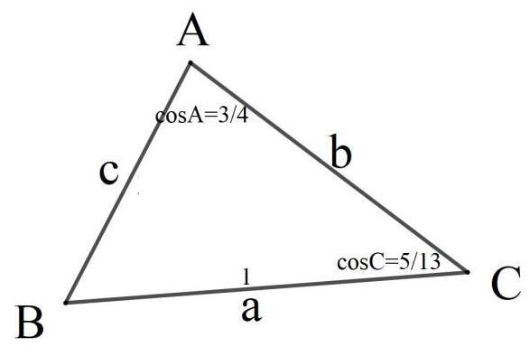

已知两个角和其中一个角的对边, 能确定唯一的三角形。由于已知的两个角的三角函数没法直接算出弧度 (角度), 但可以用三角恒等变换推算正弦值:

根据 $\cos A = \frac{4}{5}$ 和 $\cos C = \frac{5}{13}$ 可算出: $\sin A = \frac{3}{5},\sin C = \frac{12}{13}$

于是 $\sin B = \sin \left( {\pi  - A - C}\right)  = \sin \left( {A + C}\right)  = \sin A\cos C + \sin C\cos A$

代入相关数值可求得:

$\sin B = \frac{3}{5} \times  \frac{5}{13} + \frac{4}{5} \times  \frac{12}{13} = \frac{63}{65}$

使用正弦定理 $\frac{b}{\sin B} = \frac{a}{\sin A}$

$b = a\frac{\sin B}{\sin A} = 1 \times  \frac{3}{5} \div  \frac{63}{65} = \frac{21}{13}$

故本题填 $\frac{21}{13}$

本题也可以先使用正弦定理求出另一个已知角的对边 $c$ 的大小, 再对其中一个已知角使用余弦定理求出 $b$ 的大小,但是计算量较大。

26. $\left\lbrack  {{2013} \cdot  \text{ 新课标全国 II }}\right\rbrack   \bigtriangleup  \mathrm{{ABC}}$ 的内角 $\mathrm{A},\mathrm{B},\mathrm{C}$ 的对边分别为 $a, b, c$ ,已知 $b = 2, B = \frac{\pi }{6}, C = \frac{\pi }{4}$ ,则 $\bigtriangleup \mathrm{{ABC}}$ 的面积为 ( )。

A. $2\sqrt{3} + 2$ B. $\sqrt{3} + 1$ C. $2\sqrt{3} - 2$ D. $\sqrt{3} - 1$

解析:依然先画出三角形的大致图形并标注相关信息:

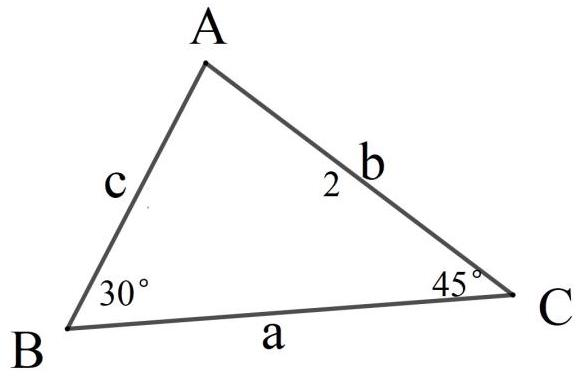

根据推导正弦定理的过程可知，求三角形的面积只需要用其定义式:边长和高的乘积的一半即可，其中高可以用一条边长与它的邻角的正弦值的乘积得到，如下图所示:

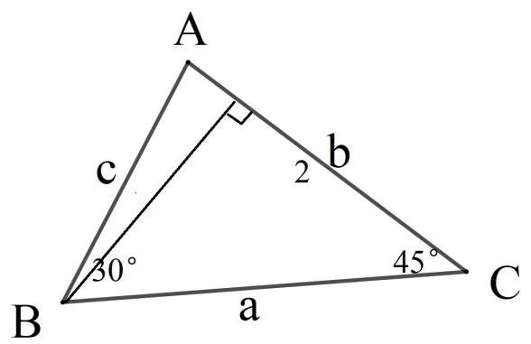

边长 $b = 2$ 已知,要求该边上的高 $h$ ,只需要用 $h = a\sin C$ 即可。其中 $C$ 已知， $a$ 可以根据正弦定理计算得出:

$$
A = {180}^{ \circ  } - {30}^{ \circ  } - {45}^{ \circ  } = {105}^{ \circ  }
$$

$$
\sin A = \sin {105}^{ \circ  } = \sin {75}^{ \circ  } = \sin \left( {{30}^{ \circ  } + {45}^{ \circ  }}\right)  = \sin {30}^{ \circ  }\cos {45}^{ \circ  } + \cos {30}^{ \circ  }\sin {45}^{ \circ  } = \frac{\sqrt{2} + \sqrt{6}}{4}
$$

$$
a = b\frac{\sin A}{\sin B} = 2 \times  \frac{\sqrt{2} + \sqrt{6}}{4} \div  \frac{1}{2} = \sqrt{2} + \sqrt{6}
$$

故 $S = \frac{1}{2}{bh} = \frac{1}{2}{ba}\sin C = \frac{1}{2} \times  2 \times  \left( {\sqrt{2} + \sqrt{6}}\right)  \times  \frac{\sqrt{2}}{2} = 1 + \sqrt{3}$

故本题选 B。

根据本题也可以得到一个知识: 三角形的面积等于任意两边长与它们夹角正弦值的乘积，其推导过程很简单，直接作出高并观察即可。

$$
S = \frac{1}{2}{ab}\sin C = \frac{1}{2}{bc}\sin A = \frac{1}{2}{ac}\sin B
$$

27. [2013·全国]设 $\bigtriangleup  \mathrm{{ABC}}$ 的内角 $\mathrm{A},\mathrm{B},\mathrm{C}$ 的对边分别为 $a, b$ , $c,\left( {a + b + c}\right) \left( {a - b + c}\right)  = {ac}$

(1)求B；

(2)若 $\sin A\sin C = \frac{\sqrt{3} - 1}{4}$ ，求 $\mathrm{C}$ 。

解析:本题是一道较为综合的解三角形的问题。没有直接给出边长和角的值, 而是给出了一个较为复杂的边的关系, 求角的大小。一般此类题目的主要思路为对已知关系进行变形, 将其凑出正弦定理或余弦定理的形式 (余弦定理的情况居多), 再分析判断。

仔细观察已知等式 $\left( {a + b + c}\right) \left( {a - b + c}\right)  = {ac}$ ,其中 $a$ 和 $c$ 可以互换, $b$ 与 $a$ 或 $c$ 的环境明显不同，这与 $\mathrm{B}$ 的余弦定理的特点相同，因此优先考虑凑出 $\mathrm{B}$ 的余弦定理形式: $\cos B = \frac{{a}^{2} + {c}^{2} - {b}^{2}}{2ac}$ ,试着开始变形:

由于 $a$ 和 $c$ 可以互换,把 $a + c$ 看作一个整体使用平方差公式:

$$
{\left( a + c\right) }^{2} - {b}^{2} = {ac}
$$

再展开:

${a}^{2} + {2ac} + {c}^{2} - {b}^{2} = {ac}$ (其实跟直接展开左边结果相同,只是这样稍微简便些)

移项消项:

$$
{a}^{2} + {ac} + {c}^{2} - {b}^{2} = 0
$$

把 ${ac}$ 移到等式另一侧后,等式左边刚好就是余弦公式的分子:

$$
{a}^{2} + {c}^{2} - {b}^{2} =  - {ac}
$$

等式两边同时除以 ${2ac}$ ，左边就是余弦公式了:

$$
\frac{{a}^{2} + {c}^{2} - {b}^{2}}{2ac} = \frac{-{ac}}{2ac} =  - \frac{1}{2}
$$

故 $\cos B =  - \frac{1}{2}$

$$
B = \frac{2\pi }{3}
$$

第二问已知 $\sin A\sin C = \frac{\sqrt{3} - 1}{4}$ ,求 $\mathrm{C}$ 的大小。

在正式解题前先简单分析下,在已知关系式 $\left( {a + b + c}\right) \left( {a - b + c}\right)  = {ac}$ 中 $a$ 和 $c$ 可以互换,再加上第二问的已知条件中 $\mathrm{A}$ 与 $\mathrm{C}$ 可以互换,因此要么 $\mathrm{A} = \mathrm{C}$ ,要么 $\mathrm{A} \neq  \mathrm{C}$ 且 $\mathrm{C}$ 有 2 种取值 ( $\mathrm{C}$ 和 $\mathrm{A}$ 互换)。

现在开始解题: 由于已经知道 $\mathrm{B}$ 的大小,于是 $\mathrm{A}$ 和 $\mathrm{C}$ 的数量关系也可以得到: $C = \pi  - B - A = \pi  - \frac{2\pi }{3} - A = \frac{\pi }{3} - A$ ,将其代入已知条件化简计算即可:

$$
\sin \mathrm{A}\sin C = \sin \left( {\frac{\pi }{3} - C}\right) \sin C
$$

$$
= \left( {\sin \frac{\pi }{3}\cos C - \sin C\cos \frac{\pi }{3}}\right) \sin C
$$

$$
= \left( {\frac{\sqrt{3}}{2}\cos C - \frac{1}{2}\sin C}\right) \sin C
$$

$$
= \frac{\sqrt{3}}{2}\cos C\sin C - \frac{1}{2}{\sin }^{2}C
$$

可以分别使用二倍角公式:

$$
= \frac{\sqrt{3}}{4}\sin {2C} - \frac{1}{4}\left( {1 - \cos {2C}}\right)
$$

$$
= \frac{\sqrt{3}}{4}\sin {2C} + \frac{1}{4}\cos {2C} - \frac{1}{4}
$$

合并为一个三角函数

$$
= \frac{1}{2}\left( {\frac{\sqrt{3}}{2}\sin {2C} + \frac{1}{2}\cos {2C}}\right)  - \frac{1}{4}
$$

$$
= \frac{1}{2}\left( {\cos \frac{\pi }{6}\sin {2C} + \sin \frac{\pi }{6}\cos {2C}}\right)  - \frac{1}{4}
$$

$$
= \frac{1}{2}\sin \left( {{2C} + \frac{\pi }{6}}\right)  - \frac{1}{4}
$$

根据已知条件 $\sin A\sin C = \frac{\sqrt{3} - 1}{4}$ ,于是有:

$$
\frac{1}{2}\sin \left( {{2C} + \frac{\pi }{6}}\right)  - \frac{1}{4} = \frac{\sqrt{3} - 1}{4}
$$

$$
\sin \left( {{2C} + \frac{\pi }{6}}\right)  = \frac{\sqrt{3}}{2}
$$

由于 $\mathrm{C}$ 是三角形的内角,且 $B = \frac{2\pi }{3}$ ,因此 $0 < C < \frac{\pi }{3}$

因此 ${2C} + \frac{\pi }{6} = \frac{\pi }{3}$ 或 ${2C} + \frac{\pi }{6} = \frac{2\pi }{3}$

解得 $C = \frac{\pi }{12}$ 或 $C = \frac{\pi }{4}$

这两个值都成立。当 $C = \frac{\pi }{12}$ 时， $A = \frac{\pi }{4}$ ；当 $C = \frac{\pi }{4}$ 时， $A = \frac{\pi }{12}$ ，在已知条件中没有体现 $\mathrm{A}$ 和 $\mathrm{C}$ 的区别。

## 第七章 平面向量

向量是从未学过的全新的概念, 特别是它“数形结合”的特点是以前从未有过的，这是比指数、对数、三角函数还要“新”得多的概念， 因此需要大量的基础练习熟悉掌握。

在做题练习中，最重要的是熟悉了解向量“数形结合”的特点，在尽可能的情况下，分析每道题目的代数运算与几何意义之间的对应关系。

平面向量的题目主要有 2 种类型:

(1)坐标化的向量。即给出相关向量的坐标信息，可以直接使用坐标运算求得新的向量，以及表示坐标之间的角度和大小关系。解决此类题目时，除了要熟练掌握向量的坐标运算外，也要对向量的坐标的几何意义非常熟悉，有时还要对坐标与平行、垂直等几何意义间的对应关系具有相当的敏感性。

有时候虽然题目没有进行坐标化，但是涉及到矩形、以及平行四边形、三角形、梯形等较为“整齐”的图形的具体运算时，选取合适的直角或点进行坐标化，往往可以令解题思路非常的“公式化”。这也正是向量和解析几何的优势所在。

(2)非坐标化的向量。即用简单字母表示的向量。由于缺少可以实际进行运算的信息，此类题目更加重视对向量运算和性质的本质的掌握。只要对向量的基本运算、位置和大小关系的基本概念掌握到位， 此类题目的思路较容易获得。

特别的, 对于较为复杂的题目, 要熟练使用平面向量基本定理, 选取恰当的一对非共线向量作为基底，表示出其他向量，从中寻找关系。

在解决与向量有关的题目时，要把思路打开，不要只局限于坐标化、向量的代数公式运算等。既要有用代数方法解决几何问题的思路， 也要有用几何关系简化代数运算的意识。在选取坐标系、选取基底等方面，都要尽可能打开思路，不妨多“瞎试”各种方法，自己找到新的思路。(其实各种看似不同的思路之间具有紧密的联系，很有可能它们都能用基本的原理互相推导)

总之, 向量是一种非常实用的工具, 在做题练习中注意体会该工具带来的便捷。

1. [2008 · 全国 II ]设向量 $\mathbf{a} = \left( {1,2}\right) ,\;\mathbf{b} = \left( {2,3}\right)$ ，若向量 $\lambda \mathbf{a} + \mathbf{b}$ 与向量 $\mathbf{c} = \left( {-4, - 7}\right)$ 共线,则 $\lambda  =$ ___。

解析:本题考察向量的加法与共线，代入相应的公式计算即可。

根据向量的数乘和加法得: ${\lambda \mathbf{a} + \mathbf{b}} = \lambda \left( {1,2}\right)  + \left( {2,3}\right)  = \left( {\lambda  + 2,{2\lambda } + 3}\right)$

根据 $\lambda \mathbf{a} + \mathbf{b}$ 与 $\mathbf{c}$ 共线得: $\frac{\lambda  + 2}{-4} = \frac{{2\lambda } + 3}{-7}$

解该方程得: $\lambda  = 2$

故本题填 2 。

2. [2009．北京] 已知向量 $\mathbf{a} = \left( {1,0}\right) ,\;\mathbf{b} = \left( {0,1}\right) ,\;\mathbf{c} = k\mathbf{a} + \mathbf{b}\;\left( {k \in  R}\right)$ , $\mathbf{d} = \mathbf{a} - \mathbf{b}$ ,如果 $\mathbf{c}\parallel \mathbf{d}$ ,那么 ( )。

A. $k = 1$ 且 $\mathbf{c}$ 与 $\mathbf{d}$ 同向 B. $k = 1$ 且 $\mathbf{c}$ 与 $\mathbf{d}$ 反向

C. $k =  - 1$ 且 $\mathbf{c}$ 与 $\mathbf{d}$ 同向 D. $k =  - 1$ 且 $\mathbf{c}$ 与 $\mathbf{d}$ 反向

解析:本题仍然使用向量的数乘、加减法、共线关系, 建立方程或解方程即可:

$\mathbf{c} = k\mathbf{a} + \mathbf{b} = k\left( {1,0}\right)  + \left( {0,1}\right)  = \left( {k,1}\right)$

$\mathbf{d} = \mathbf{a} - \mathbf{b} = \left( {1,0}\right)  - \left( {0,1}\right)  = \left( {1, - 1}\right)$

根据 $\mathbf{c}\parallel \mathbf{d}$ 得: $\frac{k}{1} = \frac{1}{-1}$

解得 $k =  - 1$

于是 $\mathbf{c} = \left( {-1,1}\right)$

比较 $\mathbf{c} = \left( {-1,1}\right)$ 与 $\mathbf{d} = \left( {1, - 1}\right)$ 发现,它们的横坐标和纵坐标都互为相反数,因此 $\mathbf{c}$ 与 $\mathbf{d}$ 反向。

故本题选 D。

3. $\left\lbrack  {{2017} \cdot  }\right.$ 新课标全国 $\mathrm{I}\rbrack$ 已知向量 $\mathbf{a} = \left( {-1,2}\right) ,\mathbf{b} = \left( {m,1}\right)$ 。若向量 $\mathbf{a} + \mathbf{b}$ 与 $\mathbf{a}$ 垂直，则 $m =$ ___。

解析:本题考察向量的加法以及数乘中垂直的情况，代入相应的公式计算即可:

---

$\mathbf{a} + \mathbf{b} = \left( {-1,2}\right)  + \left( {m,1}\right)  = \left( {m - 1,3}\right)$

---

由于 $\mathbf{a} + \mathbf{b}$ 与 $\mathbf{a}$ 垂直,因此 $\left( {\mathbf{a} + \mathbf{b}}\right)  \cdot  \mathbf{a} = 0$

---

即: $\left( {m - 1,3}\right)  \cdot  \left( {-1,2}\right)  = \left( {m - 1}\right)  \times  \left( {-1}\right)  + 3 \times  2 = 7 - m = 0$

---

解得 $m = 7$

故本题填 7

本题也可以使用分配律将 $\left( {\mathbf{a} + \mathbf{b}}\right)  \cdot  \mathbf{a} = 0$ 展开为 ${\mathbf{a}}^{2} + \mathbf{a} \cdot  \mathbf{b} = 0$ ,思路和计算量上都没太大差别。

4. [2016．新课标全国 I ]设向量 $\mathbf{a} = \left( {m,1}\right)$ ， $\mathbf{b} = \left( {1,2}\right)$ ，且 ${\left| \mathbf{a} + \mathbf{b}\right| }^{2} = {\left| \mathbf{a}\right| }^{2} + {\left| \mathbf{b}\right| }^{2}$ ，则 $m =$ ___。

解析:本题考察向量的模的计算公式，代入相应的公式计算即可:

$$
{\left| \mathbf{a} + \mathbf{b}\right| }^{2} = {\left| \left( m,1\right)  + \left( 1,2\right) \right| }^{2} = {\left| \left( m + 1,3\right) \right| }^{2} = {\left( m + 1\right) }^{2} + {3}^{2} = {m}^{2} + {2m} + {10}
$$

${\left| \mathbf{a}\right| }^{2} + {\left| \mathbf{b}\right| }^{2} = \left( {{m}^{2} + {1}^{2}}\right)  + \left( {{1}^{2} + {2}^{2}}\right)  = {m}^{2} + 6$

由于 ${\left| \mathbf{a} + \mathbf{b}\right| }^{2} = {\left| \mathbf{a}\right| }^{2} + {\left| \mathbf{b}\right| }^{2}$ ,于是有: ${m}^{2} + {2m} + {10} = {m}^{2} + 6$

解得 $m =  - 2$

故本题填 -2 。

本题也可以用向量加法与向量模的几何意义，使得计算简化: 根据已知关系 ${\left| \mathbf{a} + \mathbf{b}\right| }^{2} = {\left| \mathbf{a}\right| }^{2} + {\left| \mathbf{b}\right| }^{2}$ ,用平行四边形法则作图如下:

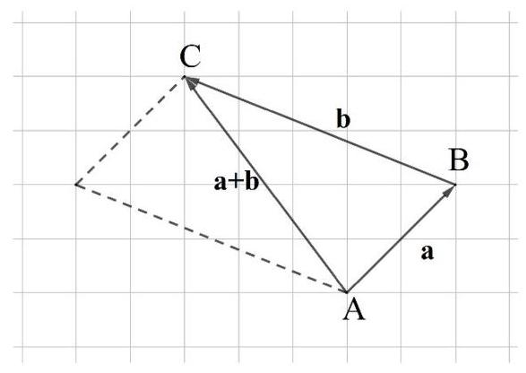

从图中可以看出， $\mathbf{a} + \mathbf{b}$ 、 $\mathbf{a}$ 、 $\mathbf{b}$ 共同构成了 $\bigtriangleup  {ABC}$ 。而已知等式关系 ${\left| \mathbf{a} + \mathbf{b}\right| }^{2} = {\left| \mathbf{a}\right| }^{2} + {\left| \mathbf{b}\right| }^{2}$ 中， ${\left| \mathbf{a} + \mathbf{b}\right| }^{2}$ 、 ${\left| \mathbf{a}\right| }^{2}$ 、 ${\left| \mathbf{b}\right| }^{2}$ 分别是三条边 ${AC}$ 、 ${AB}$ 、 ${BC}$ 的长,该等式关系就是勾股定理,说明 $\angle {ABC}$ 为直角,因此 $\mathbf{a} \bot  \mathbf{b}$ 。

于是有: $\mathbf{a} \cdot  \mathbf{b} = \left( {m,1}\right) \left( {1,2}\right)  = \left( {m + 1}\right) \left( {1 + 2}\right)  = m + 2 = 0$

解得 $m =  - 2$ 。

虽然本题较简单, 用向量的代数运算与几何分析两种思路都较容易解决, 对于有些表达式化简较复杂的题目, 使用几何分析可以使代数运算大大简化。

5. [2005. 湖北] 已知向量 $\mathbf{a} = \left( {-2,2}\right) ,\mathbf{b} = \left( {5, k}\right)$ 。若 $\left| {\mathbf{a} + \mathbf{b}}\right|$ 不超过 5, 则 $k$ 的取值范围是( )。

A. $\left\lbrack  {-4,6}\right\rbrack$ B. $\left\lbrack  {-6,4}\right\rbrack$ C. $\left\lbrack  {-6,2}\right\rbrack$ D. $\left\lbrack  {-2,6}\right\rbrack$

解析:代入向量的加法以及向量模的公式，解不等式即可:

---

$$
\left| {\mathbf{a} + \mathbf{b}}\right|  = \left| {\left( {-2,2}\right)  + \left( {5, k}\right) }\right|  = \left| \left( {3, k + 2}\right) \right|  = \sqrt{{3}^{2} + {\left( k + 2\right) }^{2}} \leq  5
$$

---

不等式两边同时平方得:

---

${3}^{2} + {\left( k + 2\right) }^{2} \leq  {5}^{2}$

${k}^{2} + {4k} - {12} \leq  0$

	$- 6 \leq  k \leq  2$

---

故本题选 C。

本题如果用几何意义分析，运算会非常复杂。但作为练习，请尝试分析本题的几何意义并列出相应的关系式，不需要计算。

本题也需要使用不等式的基本知识。不等式关系与几何中的距离、夹角有非常紧密的联系,要在练习中注意掌握。

6. [2006·江西] 已知向量 $\mathbf{a} = \left( {1,\sin \theta }\right) ,\mathbf{b} = \left( {1,\cos \theta }\right)$ ，则 $\left| {\mathbf{a} - \mathbf{b}}\right|$ 的最大值为___。

解析:本题既可以用向量的代数运算解决，也可以用几何分析解决。一般来说，代数运算只需要根据公式按部就班计算就行，比较节省“脑力”，但能耗费“体力”。几何运算比较耗费“脑力”，有可能节省大量“体力”，也可能不节省。

先用代数运算，根据向量减法和向量模的定义列出表达式:

---

$\left| {\mathbf{a} - \mathbf{b}}\right|  = \left| {\left( {1,\sin \theta }\right)  - \left( {1,\cos \theta }\right) }\right|  = \left| \left( {0,\sin \theta  - \cos \theta }\right) \right|  = \sqrt{{0}^{2} + {\left( \sin \theta  - \cos \theta \right) }^{2}} = \sqrt{{\left( \sin \theta  - \cos \theta \right) }^{2}}$

---

此时不要把根号和平方抵消, 如果抵消的话又会出现绝对值, 直接对其平方即可, 一般遇到向量的模都尽量将其平方, 便于计算, 即:

---

${\left| \mathbf{a} - \mathbf{b}\right| }^{2} = {\left( \sin \theta  - \cos \theta \right) }^{2} = {\sin }^{2}\theta  - 2\sin \theta \cos \theta  + {\cos }^{2}\theta  = 1 - 2\sin \theta \cos \theta  = 1 - \sin {2\theta }$

---

根据三角函数的性质可知,当 ${2\theta } = \frac{3}{2}\pi  + {2k\pi }\left( {k \in  Z}\right)$ 时, $1 - \sin {2\theta }$

取最大值， $1 - \sin {2\theta } = 1 - \left( {-1}\right)  = 2$

故 ${\left| \mathbf{a} - \mathbf{b}\right| }^{2}$ 的最大值为 2,于是 $\left| {\mathbf{a} - \mathbf{b}}\right|$ 的最大值为 $\sqrt{2}$ 。

下面使用几何分析:

根据向量减法的几何意义可知， $\left| {\mathbf{a} - \mathbf{b}}\right|$ 表示向量 $\mathbf{a}$ 与 $\mathbf{b}$ 的相反向量之和的模。当且仅当 $\mathbf{a}$ 与 $\mathbf{b}$ 的相反向量方向相同时,它们的模为最大值，此时 $\mathbf{a}$ 与 $\mathbf{b}$ 方向相反。

若 $\mathbf{a}$ 与 $\mathbf{b}$ 方向相反，则它们与 $\mathrm{x}$ 轴正方向的夹角 $\alpha$ 与 $\beta$ 相差 $\pi$ ，于是有: $\cos \alpha  =  - \cos \beta \text{ 、 }\sin \alpha  =  - \sin \beta$ ,即: $\frac{1}{\sqrt{1 + {\sin }^{2}\theta }} =  - \frac{1}{\sqrt{1 + {\cos }^{2}\theta }}$ 、 $\frac{\sin \theta }{\sqrt{1 + {\sin }^{2}\theta }} =  - \frac{\cos \theta }{\sqrt{1 + {\cos }^{2}\theta }}$

根据 $\frac{1}{\sqrt{1 + {\sin }^{2}\theta }} =  - \frac{1}{\sqrt{1 + {\cos }^{2}\theta }}$ 解得: ${\sin }^{2}\theta  = {\cos }^{2}\theta$

结合 $\frac{\sin \theta }{\sqrt{1 + {\sin }^{2}\theta }} =  - \frac{\cos \theta }{\sqrt{1 + {\cos }^{2}\theta }}$ 解得: $\sin \theta  =  - \cos \theta$

如果对三角函数足够熟悉的话,可知当 $\theta  = \frac{3\pi }{4} + {2k\pi }\left( {k \in  Z}\right)$ 时: $\sin \theta  = \frac{\sqrt{2}}{2},\cos \theta  =  - \frac{\sqrt{2}}{2}$ 。以及当 $\theta  =  - \frac{\pi }{4} + {2k\pi }\left( {k \in  Z}\right)$ 时: $\sin \theta  =  - \frac{\sqrt{2}}{2}$ , $\cos \theta  = \frac{\sqrt{2}}{2}$ 。仅在这两种情况下 $\sin \theta  =  - \cos \theta$ 。

代入上述两种情况中的任意一种即可:

$$
{\left| \mathbf{a} - \mathbf{b}\right| }_{\max } = \left| {\left( {1,\frac{\sqrt{2}}{2}}\right)  - \left( {1, - \frac{\sqrt{2}}{2}}\right) }\right|  = \left| \left( {0,\sqrt{2}}\right) \right|  = \sqrt{2}
$$

故本题填 $\sqrt{2}$ 。

学习使用向量一定要熟练掌握“数形结合”。

7. $\left\lbrack  {{2009} \cdot  \text{ 浙江 }\rbrack \text{ 已知向量 }\mathbf{a} = \left( {1,2}\right) }\right.$ ， $\mathbf{b} = \left( {2, - 3}\right)$ 。若向量 $\mathbf{c}$ 满足 $\left( {\mathbf{c} + \mathbf{a}}\right) \parallel \mathbf{b},\;\mathbf{c} \bot  \left( {\mathbf{a} + \mathbf{b}}\right)$ ,则 $\mathbf{c} =$ (   ) 。

A. $\left( {\frac{7}{9},\frac{7}{3}}\right)$ B. $\left( {-\frac{7}{3}, - \frac{7}{9}}\right)$ C. $\left( {\frac{7}{3},\frac{7}{9}}\right)$ D. $\left( {-\frac{7}{9}, - \frac{7}{3}}\right)$

解析:向量的坐标有 2 个元素，因此求向量的坐标一般需要有 2 个等式关系。

本题给出了两组位置关系，可以得到两个等式关系。只需假设 $\mathbf{c} = \left( {x, y}\right)$ ,联立两个等式关系解方程组即可:

根据 $\left( {\mathbf{c} + \mathbf{a}}\right) \parallel \mathbf{b}$ 得: $\frac{y + 2}{x + 1} = \frac{-3}{2}$ ,化简得: ${3x} + {2y} + 7 = 0$

根据 $\mathbf{c} \bot  \left( {\mathbf{a} + \mathbf{b}}\right)  : \;\left( {x, y}\right) \left( {1 + 2,2 + \left( {-3}\right) }\right)  = 0$ ,化简得: ${3x} - y = 0$

联立解得: $x =  - \frac{7}{9}, y =  - \frac{7}{3}$

故本题选 D。

8. [2009 · 全国 II ] 已知向量 $\mathbf{a} = \left( {2,1}\right) ,\mathbf{a} \cdot  \mathbf{b} = {10},\left| {\mathbf{a} + \mathbf{b}}\right|  = 5\sqrt{2}$ ,则 $\left| \mathbf{b}\right|  =$ ( )。

A. $\sqrt{5}$ A. $\sqrt{10}$ A. 5 A. 25

解析:本题条件既有向量的内积, 又有向量的和的模, 求的也是向量的模,可以考虑使用关系 ${\mathbf{a}}^{2} = {\left| \mathbf{a}\right| }^{2}$ ,对向量的和使用完全平方公式, 得到两个向量的平方项和相乘项 (内积):

对 $\left| {\mathbf{a} + \mathbf{b}}\right|  = 5\sqrt{2}$ 两边同时平方得: ${\left| \mathbf{a} + \mathbf{b}\right| }^{2} = {50}$ ，即 ${\left( \mathbf{a} + \mathbf{b}\right) }^{2} = {50}$

将等式左边展开: ${\mathbf{a}}^{2} + 2\mathbf{{ab}} + {\mathbf{b}}^{2} = {50}$

其中已知 $\mathbf{a} = \left( {2,1}\right)$ ,于是 ${\mathbf{a}}^{2} = {2}^{2} + {1}^{2} = 5$

又已知 $\mathbf{a} \cdot  \mathbf{b} = {10}$ ,分别代入得:

$5 + 2 \times  {10} + {\mathbf{b}}^{2} = {50}$

解得: ${\left| \mathbf{b}\right| }^{2} = {\mathbf{b}}^{2} = {50} - 5 - {20} = {25}$

于是 $\left| \mathbf{b}\right|  = 5$

故本题选 C。

9. [2011．湖南]设向量 $\mathbf{a},\mathbf{b}$ 满足 $\left| \mathbf{a}\right|  = 2\sqrt{5},\mathbf{b} = \left( {2,1}\right)$ ，且 $\mathbf{a}$ 与 $\mathbf{b}$ 的方向相反，则 $\mathbf{a}$ 的坐标为___。

解析:本题求向量的坐标，依然需要得到两组等式关系。

设 $\mathbf{a} = \left( {x, y}\right)$ 。根据 $\left| \mathbf{a}\right|  = 2\sqrt{5}$ 可得: $\sqrt{{x}^{2} + {y}^{2}} = 2\sqrt{5}$

根据“ $\mathbf{a}$ 与 $\mathbf{b}$ 的方向相反”可得另一组等式关系，联立解方程组即可。使用本条件时既有直接的思路、也有简便的思路。

先用直接但看起来有些复杂(做起来不复杂)的思路:

由于 $\mathbf{a}$ 与 $\mathbf{b}$ 的方向相反,因此它们与 $\mathrm{x}$ 轴夹角的余弦值和正弦值都互为相反数,即: $\frac{x}{\sqrt{{x}^{2} + {y}^{2}}} =  - \frac{2}{\sqrt{{2}^{2} + {1}^{2}}},\frac{y}{\sqrt{{x}^{2} + {y}^{2}}} =  - \frac{1}{\sqrt{{2}^{2} + {1}^{2}}}$ 。

分别直接代入 $\sqrt{{x}^{2} + {y}^{2}} = 2\sqrt{5}$ 解得:

$$
x =  - 4\;y =  - 2
$$

即 $\mathbf{a} = \left( {-4, - 2}\right)$

故本题填 $\left( {-4, - 2}\right)$ 。

这种解法的思路最直接, 虽然列出的表达式形式略为复杂, 但实际解起来并不难。

接下来用简便的思路:

根据向量共线的知识可知，若 $\mathbf{a}$ 与 $\mathbf{b}$ 的方向相反，则它们也共线， 于是存在某个实数 $k$ 使得 $\mathbf{a} = k\mathbf{b}$ 。

又由于当 $k > 0$ 时同向,当 $k < 0$ 时反向,故此处应当 $k < 0$ 。

于是根据 $\mathbf{b} = \left( {2,1}\right)$ 有: $x = {2k}, y = k$

代入 $\sqrt{{x}^{2} + {y}^{2}} = 2\sqrt{5}$ 得: $\sqrt{{\left( 2k\right) }^{2} + {k}^{2}} = 2\sqrt{5}$

解得 $k =  \pm  2$ ,取负数 $k =  - 2$

于是得: $\mathbf{a} = \left( {-4, - 2}\right)$

本题由于较为简单, 因此这两种思路的复杂程度差不多。对于复杂的题目，实际上第二种解法会明显更为简便。这两种思路的原理实质上相同，相互之间的推导已经学习。

10. [2011·安徽]已知向量 $\mathbf{a},\mathbf{b}$ 满足 $\left( {\mathbf{a} + 2\mathbf{b}}\right) \left( {\mathbf{a} - \mathbf{b}}\right)  =  - 6$ ，且 $\left| \mathbf{a}\right|  = 1$ ， $\left| \mathbf{b}\right|  = 2$ ，则 $\mathbf{a}$ 与 $\mathbf{b}$ 的夹角为___。

解析:求向量的夹角，一般使用向量内积的定义式(相当于余弦定理)，很少情况下需要使用正弦定理。本题是一般情况，使用向量内积的定义式。

已知条件为一组等式关系 $\left( {\mathbf{a} + 2\mathbf{b}}\right) \left( {\mathbf{a} - \mathbf{b}}\right)  =  - 6$ 和向量 $\mathbf{a}$ 、 $\mathbf{b}$ 的模,将等式左边展开后，可以得到两个向量的平方项和相乘项。其中平方项的值等于模的值, 相乘项可以直接使用向量内积的定义式:

$\left( {\mathbf{a} + 2\mathbf{b}}\right) \left( {\mathbf{a} - \mathbf{b}}\right)  = {\mathbf{a}}^{2} + \mathbf{a} \cdot  \mathbf{b} - 2{\mathbf{b}}^{2} = {\left| \mathbf{a}\right| }^{2} + \left| \mathbf{a}\right|  \cdot  \left| \mathbf{b}\right| \cos  < \mathbf{a},\mathbf{b} >  - 2{\left| \mathbf{b}\right| }^{2} =  - 6$

代入 $\left| \mathbf{a}\right|  = 1$ 、 $\left| \mathbf{b}\right|  = 2$ :

${1}^{2} + 1 \times  2\cos  < \mathbf{a},\mathbf{b} >  - 2 \times  {2}^{2} =  - 6$

解得: $\cos  < \mathbf{a},\mathbf{b} >  = \frac{1}{2}$

于是: $\langle \mathbf{a},\mathbf{b}\rangle  = \frac{\pi }{3}$

故本题填 $\frac{\pi }{3}$

11. [2013·新课标全国 I ]已知两个单位向量 $\mathbf{a}$ ， $\mathbf{b}$ 的夹角为 ${60}^{ \circ  }$ ， $\mathbf{c} = t\mathbf{a} + \left( {1 - t}\right) \mathbf{b}$ 。若 $\mathbf{b} \cdot  \mathbf{c} = 0$ ，则 $t =$ ___。

解析:本题没有给出向量的具体坐标，只给出了两个向量的夹角和空间关系, 本题有 2 种思路:

一种思路是使用向量运算和夹角的一般性定义进行分析变形, 这种思路需要对向量的运算和性质非常熟悉。

另一种思路是利用已知关系假设出两个向量的坐标, 这种思路的运算量比较大，并且在假设坐标时需要一定的数学技巧。

先使用第一种思路:

根据 “两个单位向量 $\mathbf{a},\mathbf{b}$ ” 可得: $\left| \mathbf{a}\right|  = 1,\left| \mathbf{b}\right|  = 1$

根据 “ $\mathbf{a},\mathbf{b}$ 的夹角为 ${60}^{ \circ  }$ ” 可得: $\mathbf{a}\mathbf{b} = \left| \mathbf{a}\right| \left| \mathbf{b}\right| \cos  < \mathbf{a},\mathbf{b} >  = 1 \times  1 \times  \cos {60}^{ \circ  } = \frac{1}{2}$

根据 “ $\mathbf{c} = t\mathbf{a} + \left( {1 - t}\right) \mathbf{b}$ ” 和 “ $\mathbf{b} \cdot  \mathbf{c} = 0$ ” 可得:

$$
\mathbf{b} \cdot  \mathbf{c} = \mathbf{b} \cdot  \left( {t\mathbf{a} + \left( {1 - t}\right) \mathbf{b}}\right)  = t\mathbf{a} \cdot  \mathbf{b} + \left( {1 - t}\right) {\mathbf{b}}^{2} = 0
$$

代入前面推导得出的 $\mathbf{a} \cdot  \mathbf{b} = \frac{1}{2}$ 和 ${\mathbf{b}}^{2} = {\left| \mathbf{b}\right| }^{2} = {1}^{2} = 1$ 得:

$$
\frac{1}{2}t + 1 - t = 0
$$

解得: $t = 2$ 。

下面使用第二种思路:

由于 $\mathbf{a},\mathbf{b}$ 都是单位向量,可以假设 $\mathbf{a} = \left( {\cos \alpha ,\sin \alpha }\right) ,\mathbf{b} = \left( {\cos \beta ,\sin \beta }\right)$ 。

又由于 $\mathbf{a},\mathbf{b}$ 的夹角为 ${60}^{ \circ  }$ ,可以假设 $\beta  = \alpha  + {60}^{ \circ  }$ 或 $\alpha  = \beta  + {60}^{ \circ  }$ ,两种情况都行,先放着

代入 $\mathbf{c} = t\mathbf{a} + \left( {1 - t}\right) \mathbf{b}$

---

$$
= t\left( {\cos \alpha ,\sin \alpha }\right)  + \left( {1 - t}\right) \left( {\cos \beta ,\sin \beta }\right)
$$

$$
= \left( {t\cos \alpha  + \left( {1 - t}\right) \cos \beta , t\sin \alpha  + \left( {1 - t}\right) }\right)  + \left( {1 - t}\right) \sin \beta )
$$

---

根据 $\mathbf{b} \cdot  \mathbf{c} = 0$ 得:

---

$$
\left. {\left( {\cos \beta ,\sin \beta }\right) \left( {t\cos \alpha  + \left( {1 - t}\right) \cos \beta , t\sin \alpha  + \left( {1 - t}\right) }\right)  + \left( {1 - t}\right) \sin \beta }\right)  = 0
$$

$$
t\cos \alpha \cos \beta  + \left( {1 - t}\right) {\cos }^{2}\beta  + t\sin \alpha \sin \beta  + \left( {1 - t}\right) {\sin }^{2}\beta  = 0
$$

	$\left( {t\cos \alpha \cos \beta  + t\sin \alpha \sin \beta }\right)  + \left\lbrack  {\left( {1 - t}\right) {\cos }^{2}\beta  + \left( {1 - t}\right) {\sin }^{2}\beta }\right\rbrack   = 0$

$t\left( {\cos \alpha \cos \beta  + \sin \alpha \sin \beta }\right)  + \left( {1 - t}\right) \left( {{\cos }^{2}\beta  + {\sin }^{2}\beta }\right)  = 0$

$$
t\cos \left( {\alpha  - \beta }\right)  + 1 - t = 0
$$

---

无论 $\beta  = \alpha  + {60}^{ \circ  }$ 还是 $\alpha  = \beta  + {60}^{ \circ  }$ ,都有 $\cos \left( {\alpha  - \beta }\right)  = \cos \left( {\pm {60}^{ \circ  }}\right)  = \frac{1}{2}$

代入上式仍得: $\frac{1}{2}t + 1 - t = 0$ ，解得: $t = 2$ 。

故本题填 2

这两种思路所使用的根本规律仍然是向量内积的坐标运算以及表示垂直的关系式。第一种思路直接使用向量运算的定义, 第二种思路“多此一举”地使用了坐标化。

根据本题要明白, 虽然坐标化将几何问题变成了代数问题, 但有时会带来繁琐的代数运算，而直接使用更本质的基本定义可以避免这种“绕路”。

尽管如此，坐标化在多数情况下仍然是非常简单明了的解法，不需要完全理解题目的几何意义，代入公式按部就班地计算，总是能得到最终结果。

12. [2005．江西] 已知向量 $\mathbf{a} = \left( {1,2}\right) ,\;\mathbf{b} = \left( {-2, - 4}\right) ,\;\left| \mathbf{c}\right|  = \sqrt{5}$ ，若 $\left( {\mathbf{a} + \mathbf{b}}\right)  \cdot  \mathbf{c} = \frac{5}{2}$ ，则 $\mathbf{a}$ 与 $\mathbf{c}$ 的夹角为( )。

A. ${30}^{ \circ  }$ B. ${60}^{ \circ  }$ C. 120° D. 150°

解析:本题已知信息较为充分，a 和 b 的坐标都已知，还已知 c 的模,求 $< \mathbf{a},\mathbf{c} >$ 。只需要对向量的基本运算较为熟悉,就能很快得到思路。

假设 $\mathbf{c} = \left( {x, y}\right)$ ,根据两组等式关系 $\left| \mathbf{c}\right|  = \sqrt{5}$ 和 $\left( {\mathbf{a} + \mathbf{b}}\right)  \cdot  \mathbf{c} = \frac{5}{2}$ 可以得到两个方程, 联立解方程组即可:

根据 $\left| \mathbf{c}\right|  = \sqrt{5}$ 得: ${x}^{2} + {y}^{2} = 5$

根据 $\left( {\mathbf{a} + \mathbf{b}}\right)  \cdot  \mathbf{c} = \frac{5}{2}$ 得: $\left( {\left( {1,2}\right)  + \left( {-2, - 4}\right) }\right)  \cdot  \left( {x, y}\right)  =  - x - {2y} = \frac{5}{2}$

解得:

$$
{x}_{1} =  - \frac{1}{2} - \sqrt{3},\;{y}_{1} =  - 1 + \frac{\sqrt{3}}{2}
$$

$$
{x}_{2} =  - \frac{1}{2} + \sqrt{3},\;{y}_{2} =  - 1 - \frac{\sqrt{3}}{2}
$$

使用向量内积的定义式:

当 $\mathbf{c} = \left( {-\frac{1}{2} - \sqrt{3}, - 1 + \frac{\sqrt{3}}{2}}\right)$ 时: $\cos  < \mathbf{a},\mathbf{c} >  = \frac{\mathbf{a} \cdot  \mathbf{c}}{\left| \mathbf{a}\right| \left| \mathbf{c}\right| } = \frac{\left( {1,2}\right) \left( {-\frac{1}{2} - \sqrt{3}, - 1 + \frac{\sqrt{3}}{2}}\right) }{\sqrt{5} \times  \sqrt{5}} =  - \frac{1}{2}$

当 $\mathbf{c} = \left( {-\frac{1}{2} + \sqrt{3}, - 1 - \frac{\sqrt{3}}{2}}\right)$ 时: $\cos  < \mathbf{a},\mathbf{c} >  = \frac{\mathbf{a} \cdot  \mathbf{c}}{\left| \mathbf{a}\right| \left| \mathbf{c}\right| } = \frac{\left( {1,2}\right) \left( {-\frac{1}{2} + \sqrt{3}, - 1 - \frac{\sqrt{3}}{2}}\right) }{\sqrt{5} \times  \sqrt{5}} =  - \frac{1}{2}$

两种情况结果相同,故 $\langle \mathbf{a},\mathbf{c}\rangle  = \frac{2\pi }{3}$

故本题选 C。

如果对向量之间的关系足够熟悉和敏感的话，本题有非常简便的做法。

观察已知条件: $\mathbf{a} = \left( {1,2}\right) ,\mathbf{b} = \left( {-2, - 4}\right)$ ,可得 $\frac{2}{1} = \frac{-4}{-2}$ ,于是可知 $\mathbf{a}$ 与 b 共线。又由于它们横坐标、纵坐标符号相反, 因此它们方向相反。

画出草图可看出几何关系: $< \mathbf{a},\mathbf{c} >  +  < \mathbf{b},\mathbf{c} >  = \pi$

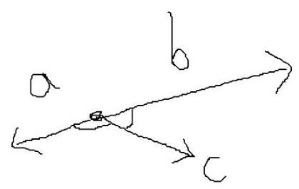

于是有: $\cos  < \mathbf{b},\mathbf{c} >  =  - \cos  < \mathbf{a},\mathbf{c} >$

将等式关系 $\left( {\mathbf{a} + \mathbf{b}}\right)  \cdot  \mathbf{c} = \frac{5}{2}$ 左边展开并代入向量内积的定义式即可:

$$
\left( {\mathbf{a} + \mathbf{b}}\right)  \cdot  \mathbf{c} = \mathbf{a} \cdot  \mathbf{c} + \mathbf{b} \cdot  \mathbf{c}
$$

$$
= \left| \mathbf{a}\right|  \cdot  \left| \mathbf{c}\right| \cos  < \mathbf{a},\mathbf{c} >  + \left| \mathbf{b}\right|  \cdot  \left| \mathbf{c}\right| \cos  < \mathbf{b},\mathbf{c} >
$$

$$
= \left| \mathbf{a}\right|  \cdot  \left| \mathbf{c}\right| \cos  < \mathbf{a},\mathbf{c} >  + \left| \mathbf{b}\right|  \cdot  \left| \mathbf{c}\right| \cos  < \mathbf{b},\mathbf{c} >
$$

$$
= \left| \mathbf{a}\right|  \cdot  \left| \mathbf{c}\right| \cos  < \mathbf{a},\mathbf{c} >  + \left| \mathbf{b}\right|  \cdot  \left| \mathbf{c}\right| \left( {-\cos  < \mathbf{a},\mathbf{c} > }\right)
$$

$$
= \left( {\left| \mathbf{a}\right|  \cdot  \left| \mathbf{c}\right|  - \left| \mathbf{b}\right|  \cdot  \left| \mathbf{c}\right| }\right) \cos  < \mathbf{a},\mathbf{c} >
$$

其中 $\left| \mathbf{a}\right|  = \sqrt{{1}^{2} + {2}^{2}} = \sqrt{5},\left| \mathbf{b}\right|  = \sqrt{{\left( -2\right) }^{2} + {\left( -4\right) }^{2}} = 2\sqrt{5}$ ，已知 $\left| \mathbf{c}\right|  = \sqrt{5}$ ，代入得:

$$
= \left( {\sqrt{5} \times  \sqrt{5} - 2\sqrt{5} \times  \sqrt{5}}\right) \cos  < \mathbf{a},\mathbf{c} >
$$

$$
=  - 5\cos  < \mathbf{a},\mathbf{c} >
$$

$$
= \frac{5}{2}
$$

解得 $\cos  < \mathbf{a},\mathbf{c} >  =  - \frac{5}{2}$

本题启示:在读题和分析题目时，要对向量间的关系具有足够的敏感性。除了平行 (同向、反向) 外，垂直也是很重要的关系，得到向量的坐标后，不妨先简单算一算它们的斜率和各自的内积。

13. [2006．福建] 已知向量 $\mathbf{a}$ 与 $\mathbf{b}$ 的夹角为 ${120}^{ \circ  },\left| \mathbf{a}\right|  = 3,\left| {\mathbf{a} + \mathbf{b}}\right|  = \sqrt{13}$ , 则 $\left| \mathbf{b}\right|  =$ (   )。

A. 5 B. 4 C. 3 D. 1

解析:本题已知向量的夹角，优先考虑使用向量内积的定义式(余弦定理)。还已知一个向量的模、向量和的模，求另一个向量的模， 优先考虑将模平方, 把模转化为向量的平方和内积:

将等式 $\left| {\mathbf{a} + \mathbf{b}}\right|  = \sqrt{13}$ 两边同时平方:

$$
{\left| \mathbf{a} + \mathbf{b}\right| }^{2} = {\sqrt{13}}^{2}
$$

$$
{\left( \mathbf{a} + \mathbf{b}\right) }^{2} = {13}
$$

$$
{\mathbf{a}}^{2} + 2\mathbf{a}\mathbf{b} + {\mathbf{b}}^{2} = {13}
$$

${\left| \mathbf{a}\right| }^{2} + 2\left| \mathbf{a}\right| \left| \mathbf{b}\right| \cos  < \mathbf{a},\mathbf{b} >  + {\left| \mathbf{b}\right| }^{2} = {13}$

代入 $\left| \mathbf{a}\right|  = 3$ 和 $\cos  < \mathbf{a},\mathbf{b} >  = \cos {120}^{ \circ  } =  - \frac{1}{2}$ :

$$
{3}^{2} + 2 \times  3\left| \mathbf{b}\right|  \times  \left( {-\frac{1}{2}}\right)  + {\left| \mathbf{b}\right| }^{2} = {13}
$$

得到关于 $\left| \mathbf{b}\right|$ 的一元二次方程,化简解方程即可:

${\left| \mathbf{b}\right| }^{2} - 3\left| \mathbf{b}\right|  - 4 = 0$

$\left( {\left| \mathbf{b}\right|  - 4}\right) \left( {\left| \mathbf{b}\right|  + 1}\right)  = 0$

由于 $\left| \mathbf{b}\right|  \geq  0$

因此 $\left| \mathbf{b}\right|  = 4$

故本题选 B。

14. [2004 · 全国Ⅱ]已知向量 $\mathbf{a},\mathbf{b}$ 满足 $\left| \mathbf{a}\right|  = 1,\left| \mathbf{b}\right|  = 2,\left| {\mathbf{a} - \mathbf{b}}\right|  = 2$ , 则 $\left| {\mathbf{a} + \mathbf{b}}\right|  =$ (   )。

A. 1 B. $\sqrt{2}$ C. $\sqrt{5}$ D. $\sqrt{6}$

解析:对数的完全平方公式熟悉的话，很容易得到本题的思路。 数的完全平方公式为: ${\left( a + b\right) }^{2} = {a}^{2} + {2ab} + {b}^{2}$ 和 ${\left( a - b\right) }^{2} = {a}^{2} - {2ab} + {b}^{2}$ 。

${\left( a + b\right) }^{2}$ 和 ${\left( a - b\right) }^{2}$ 展开后,都有 ${a}^{2} + {b}^{2}$ ,区别在 ${2ab}$ 前的符号。

对向量的完全平方公式也有该规律:

---

$$
{\left| \mathbf{a} + \mathbf{b}\right| }^{2} = {\left( \mathbf{a} + \mathbf{b}\right) }^{2} = {\mathbf{a}}^{2} + 2\mathbf{a}\mathbf{b} + {\mathbf{b}}^{2} = {\left| \mathbf{a}\right| }^{2} + {\left| \mathbf{b}\right| }^{2} + 2\mathbf{a}\mathbf{b}
$$

$$
{\left| \mathbf{a} - \mathbf{b}\right| }^{2} = {\left( \mathbf{a} - \mathbf{b}\right) }^{2} = {\mathbf{a}}^{2} - 2\mathbf{a}\mathbf{b} + {\mathbf{b}}^{2} = {\left| \mathbf{a}\right| }^{2} + {\left| \mathbf{b}\right| }^{2} - 2\mathbf{a}\mathbf{b}
$$

---

回到本题,将已知条件 $\left| \mathbf{a}\right|  = 1,\;\left| \mathbf{b}\right|  = 2,\;\left| {\mathbf{a} - \mathbf{b}}\right|  = 2$ 代入等式关系 ${\left| \mathbf{a} - \mathbf{b}\right| }^{2} = {\left| \mathbf{a}\right| }^{2} + {\left| \mathbf{b}\right| }^{2} - 2\mathbf{{ab}}$ 可得: ${2}^{2} = {1}^{2} + {2}^{2} - 2\mathbf{{ab}}$

解得: ${2ab} = 1$

再将 $\left| \mathbf{a}\right|  = 1,\left| \mathbf{b}\right|  = 2,2\mathbf{{ab}} = 1$ 代入 ${\left| \mathbf{a} + \mathbf{b}\right| }^{2} = {\left| \mathbf{a}\right| }^{2} + {\left| \mathbf{b}\right| }^{2} + 2\mathbf{{ab}}$ 即可:

${\left| \mathbf{a} + \mathbf{b}\right| }^{2} = {\left| \mathbf{a}\right| }^{2} + {\left| \mathbf{b}\right| }^{2} + 2\mathbf{{ab}} = {1}^{2} + {2}^{2} + 1 = 6$

故 $\sqrt{\mathbf{a} + \mathbf{b}} = \sqrt{6}$

故本题选 D。

15. [2008·安徽]在平行四边形 ${ABCD}$ 中， ${AC}$ 为一条对角线，若 $\overrightarrow{AB} = \left( {2,4}\right) ,\overrightarrow{AC} = \left( {1,3}\right)$ ，则 $\overrightarrow{BD} =$ (   )。

A. $\left( {-2, - 4}\right)$ B. $\left( {-3, - 5}\right)$ C. $\left( {3,5}\right)$ D. $\left( {2,4}\right)$

解析:涉及到具体图形的问题，一般先画出草图，结合图像进行分析。

由于本题已知的两个向量 $\overrightarrow{AB}$ 和 $\overrightarrow{AC}$ 都含有点 $A$ ,因此以 $A$ 为坐标原点建立,于是 $B\left( {2,4}\right) \text{ 、 }C\left( {1,3}\right)$ ,

具体步骤如下:(1)找到 $A\left( {0,0}\right)$ 、 $B\left( {2,4}\right)$ 、 $C\left( {1,3}\right)$ 。(2)连接 ${AB}$ 、 ${AC}$ 、 ${BC}$ 。由于 ${AB}$ 是一条边， ${AC}$ 是对角线，于是以 $A$ 为起点作 ${BC}$ 的平行线,另一个端点为 $D$ ,并且 $D$ 和 $C$ 在直线 ${AB}$ 的同一侧。如下图所示。

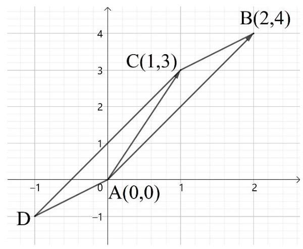

根据 $\overrightarrow{AB} = \left( {2,4}\right) \text{ 、 }\overrightarrow{AC} = \left( {1,3}\right)$ 可得: $\overrightarrow{BC} = \overrightarrow{AC} - \overrightarrow{AB} = \left( {1,3}\right)  - \left( {2,4}\right)  = \left( {-1, - 1}\right)$

根据向量的平行四边形法则可知: $\overrightarrow{AD} = \overrightarrow{BC} = \left( {-1, - 1}\right)$

即点 $D$ 的坐标为 $D\left( {-1, - 1}\right)$ 。

因此 $\overrightarrow{BD} = \left( {-1, - 1}\right)  - \left( {2,4}\right)  = \left( {-3, - 5}\right)$

故本题选 B。

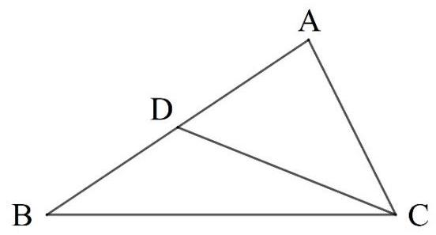

16. [2006·广东]如图所示， $D$ 是 $\bigtriangleup  {ABC}$ 的边 ${AB}$ 上的中点，则向量 $\overrightarrow{CD} =$ (   )。

A. $\overrightarrow{BC} + \frac{1}{2}\overrightarrow{BA}$ B. $- \overrightarrow{BC} + \frac{1}{2}\overrightarrow{BA}$ C. $- \overrightarrow{BC} - \frac{1}{2}\overrightarrow{BA}$ D. $\overrightarrow{BC} - \frac{1}{2}\overrightarrow{BA}$

解析:本题考察非坐标化的向量基本运算的定义，只要对向量基本运算的原理足够熟悉，本题非常容易。

向量 $\overrightarrow{CD}$ 表示以 $C$ 为起点、 $D$ 为终点的向量，也可以认为是从点 $C$ 出发，最终移动到点 $D$ 的过程。从图中看，有 3 条路径:

路径(1):直接从点 $C$ 出发，沿线段 ${CD}$ 前进，到达点 $D$ 。表示该路径的向量就是 $\overrightarrow{CD}$ 。

路径(2):先从点 $C$ 出发，沿线段 ${BC}$ 前进，到达点 $B$ 。再从点 $B$ 出发，沿线段 ${BA}$ 前进，前进一半到达点 $D$ 后停下。表示该路径的向量为 $\overrightarrow{CB} + \overrightarrow{BD}$ 。

又由于 $D$ 是 ${BA}$ 的中点， $\overrightarrow{BD}$ 与 $\overrightarrow{BA}$ 方向相同， $\overrightarrow{BD}$ 的模是 $\overrightarrow{BA}$ 的一半， 因此 $\overrightarrow{BD} = \frac{1}{2}\overrightarrow{BA}$ ,因此该路径也可以表示为 $\overrightarrow{CB} + \frac{1}{2}\overrightarrow{BA}$

(3)先从点 $C$ 出发，沿线段 ${CA}$ 前进，到达点 $A$ 。再从点 $A$ 出发， 沿线段 ${AB}$ 前进，前进一半到达点 $D$ 后停下。表示该路径的向量为 $\overrightarrow{CA} + \overrightarrow{AD}$ 。同样的,该路径也可以表示为 $\overrightarrow{CA} + \frac{1}{2}\overrightarrow{AB}$

观察 4 个选项,没有与上面几个向量完全相同的, 4 个选项都是 $\overrightarrow{BC}$ 和 $\overrightarrow{BA}$ 的组合,从路径(2)里找关系。

由于 $\overrightarrow{CB}$ 与 $\overrightarrow{BC}$ 大小相同、方向相反,于是有 $\overrightarrow{CB} =  - \overrightarrow{BC}$ ,故路径(2) 也可以表示为 $- \overrightarrow{BC} + \frac{1}{2}\overrightarrow{BA}$ ,故本题选 B。

本题使用了没有坐标化的向量之间的一些基本关系:

(1)对于同一条线段 ${AB}$ 有: $\overrightarrow{AB} =  - \overrightarrow{BA}$

(2)若 $D$ 是线段 ${AB}$ 的中点，则有 $\overrightarrow{AB} = 2\overrightarrow{AD}$ 、 $\overrightarrow{BA} = 2\overrightarrow{BD}$

(3)若一个向量的第二个字母与另一个向量的第一个字母相同，例如 $\overrightarrow{AB}$ 与 $\overrightarrow{BC}$ ,则它们的和就是把不同的两个字母,原来在前面的 $\left( A\right)$ 写在前面、原来在后面的 $\left( C\right)$ 写在后面,构成的向量 $\overrightarrow{AC}$ ,即: $\overrightarrow{AB} + \overrightarrow{BC} = \overrightarrow{AC}$

多个依次首尾字母相同的向量 $\overrightarrow{{P}_{1}{P}_{2}}\text{ 、 }\overrightarrow{{P}_{2}{P}_{3}}\text{ 、 }\overrightarrow{{P}_{3}{P}_{4}}\ldots \overrightarrow{{P}_{n - 1}{P}_{n}}$ 相加,也有 $\overrightarrow{{P}_{1}{P}_{2}} + \overrightarrow{{P}_{2}{P}_{3}} + \overrightarrow{{P}_{3}{P}_{4}} + \ldots  + \overrightarrow{{P}_{n - 1}{P}_{n}} = \overrightarrow{{P}_{1}{P}_{n}}$ 。

17. [2006·四川]如图,已知正六边形 ${P}_{1}{P}_{2}{P}_{3}{P}_{4}{P}_{5}{P}_{6}$ ,下列向量的数量积中最大的是 ( )。

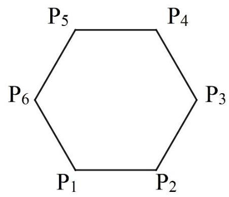

A. $\overrightarrow{{P}_{1}{P}_{2}} \cdot  \overrightarrow{{P}_{1}{P}_{3}}$ B. $\overrightarrow{{P}_{1}{P}_{2}} \cdot  \overrightarrow{{P}_{1}{P}_{4}}$ C. $\overrightarrow{{P}_{1}{P}_{2}} \cdot  \overrightarrow{{P}_{1}{P}_{5}}$ D. $\overrightarrow{{P}_{1}{P}_{2}} \cdot  \overrightarrow{{P}_{1}{P}_{6}}$

解析:本题同样考察非坐标化的向量的基本运算的定义，本题的难点在于出现了内积。

由于本题是正六边形, 因此每条边长相等, 主要考虑的是夹角。 为方便考虑, 令正六边形的边长为 1 。根据初中学习的几何知识可知: 正 $n$ 变形的内角和为 $\pi \left( {n - 2}\right)$ ,于是正六边形的内角和为 $\pi \left( {6 - 2}\right)  = {4\pi }$ 。 又由于正六边形的 6 个角相等,因此每个角都为 ${4\pi } \div  6 = \frac{2\pi }{3}$

依次分析 4 个选项:

选项 A. $\overrightarrow{{P}_{1}{P}_{2}} \cdot  \overrightarrow{{P}_{1}{P}_{3}} = \overrightarrow{{P}_{1}{P}_{2}} \cdot  \left( {\overrightarrow{{P}_{1}{P}_{2}} + \overrightarrow{{P}_{2}{P}_{3}}}\right)  = {\overrightarrow{{P}_{1}{P}_{2}}}^{2} + \overrightarrow{{P}_{1}{P}_{2}} \cdot  \overrightarrow{{P}_{2}{P}_{3}}$

从图中可以看出: $\overrightarrow{{P}_{1}{P}_{2}}$ 与 $\overrightarrow{{P}_{2}{P}_{3}}$ 的夹角为 $\pi  - \frac{2\pi }{3} = \frac{\pi }{3}$ ，上式的值为:

${\overrightarrow{{P}_{1}{P}_{2}}}^{2} + \overrightarrow{{P}_{1}{P}_{2}} \cdot  \overrightarrow{{P}_{2}{P}_{3}} = {1}^{2} + 1 \times  1 \times  \cos \frac{\pi }{3} = \frac{3}{2}$

选项 B. $\overrightarrow{{P}_{1}{P}_{2}} \cdot  \overrightarrow{{P}_{1}{P}_{4}} = \overrightarrow{{P}_{1}{P}_{2}} \cdot  \left( {\overrightarrow{{P}_{1}{P}_{2}} + \overrightarrow{{P}_{2}{P}_{3}} + \overrightarrow{{P}_{3}{P}_{4}}}\right)  = {\overrightarrow{{P}_{1}{P}_{2}}}^{2} + \overrightarrow{{P}_{1}{P}_{2}} \cdot  \overrightarrow{{P}_{2}{P}_{3}} + \overrightarrow{{P}_{1}{P}_{2}} \cdot  \overrightarrow{{P}_{3}{P}_{4}}$

其中 ${\overrightarrow{{P}_{1}{P}_{2}}}^{2} + \overrightarrow{{P}_{1}{P}_{2}} \cdot  \overrightarrow{{P}_{2}{P}_{3}}$ 就是选项 A,其值为 $\frac{3}{2}$

将 $\overrightarrow{{P}_{3}{P}_{4}}$ 平移到以 ${P}_{1}$ 为起点后,可以看出 $\overrightarrow{{P}_{1}{P}_{2}}$ 与 $\overrightarrow{{P}_{3}{P}_{4}}$ 的夹角为 $\frac{2\pi }{3}$

故选项 B 的值为 $\frac{3}{2} + \cos \frac{2\pi }{3} = \frac{3}{2} - \frac{1}{2} = 1$

选项 C. $\overrightarrow{{P}_{1}{P}_{2}} \cdot  \overrightarrow{{P}_{1}{P}_{5}}$ ，思路与选项 B 相同: $\overrightarrow{{P}_{1}{P}_{2}} \cdot  \overrightarrow{{P}_{1}{P}_{5}} = \overrightarrow{{P}_{1}{P}_{2}} \cdot  \left( {\overrightarrow{{P}_{1}{P}_{4}} + \overrightarrow{{P}_{4}{P}_{5}}}\right)  = \; \overrightarrow{{P}_{1}{P}_{2}} \cdot  \overrightarrow{{P}_{1}{P}_{4}} + \overrightarrow{{P}_{1}{P}_{2}} \cdot  \overrightarrow{{P}_{4}{P}_{5}}$ 。

其中 $\overrightarrow{{P}_{1}{P}_{2}} \cdot  \overrightarrow{{P}_{1}{P}_{4}}$ 就是选项B，其值为 1 。

从图中可以看出 $\overrightarrow{{P}_{4}{P}_{5}}$ 与 $\overrightarrow{{P}_{1}{P}_{2}}$ 大小相同,方向相反,故 $\overrightarrow{{P}_{1}{P}_{2}} \cdot  \overrightarrow{{P}_{4}{P}_{5}} =  - 1$

因此 $\overrightarrow{{P}_{1}{P}_{2}} \cdot  \overrightarrow{{P}_{1}{P}_{5}} = 1 + \left( {-1}\right)  = 0$

直接连接 ${P}_{1}{P}_{5}$ ,用几何方法也易看出并证明 $\overrightarrow{{P}_{1}{P}_{2}} \bot  \overrightarrow{{P}_{1}{P}_{5}}$ ,故它们的内积为 0 。

选项 D. $\overrightarrow{{P}_{1}{P}_{2}} \cdot  \overrightarrow{{P}_{1}{P}_{6}}$ 。不需要再从选项 C 绕一大圈,直接根据图形用向量内积的定义计算即可: $\overrightarrow{{P}_{1}{P}_{2}} \cdot  \overrightarrow{{P}_{1}{P}_{6}} = 1 \times  1 \times  \cos \frac{2\pi }{3} =  - \frac{1}{2}$

经比较, 选项 A 的值最大。

故本题选 A。

18. [2012·江苏]如图，在矩形 ${ABCD}$ 中， ${AB} = \sqrt{2}$ ， ${BC} = 2$ ，点 $E$ 为 ${BC}$ 的中点，点 $F$ 在边 ${CD}$ 上，若 $\overrightarrow{AB} \cdot  \overrightarrow{AF} = \sqrt{2}$ ，则 $\overrightarrow{AE} \cdot  \overrightarrow{BF}$ 的值是___。

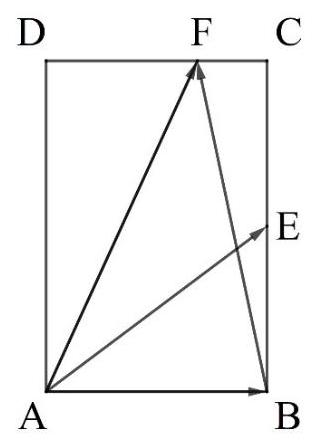

解析:本题很能体现出向量的坐标运算的便捷性。对于涉及到矩形、需要计算具体数值、并且其中的角度不容易求得的情况，一般将平面坐标化, 使用平面向量的坐标运算即可。

以 $A\left( {0,0}\right)$ 为原点, $\overrightarrow{AB}$ 为 $\mathrm{x}$ 轴正方向, $\overrightarrow{AD}$ 为 $\mathrm{y}$ 轴正方向,建立平面直角坐标系，如下图所示。

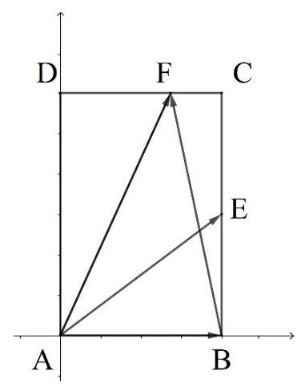

根据已知条件 ${AB} = \sqrt{2},{BC} = 2$ 可知,相应点的坐标: $B\left( {\sqrt{2},0}\right)$ 、 $C\left( {\sqrt{2},2}\right)$ 、 $D\left( {0,2}\right)$ 。

根据“点 $E$ 为 ${BC}$ 的中点”,于是有: $E\left( {0,1}\right)$

根据“点 $F$ 在边 ${CD}$ 上”,可以设: $F\left( {x,2}\right)$

根据 “ $\overrightarrow{AB} \cdot  \overrightarrow{AF} = \sqrt{2}$ ” 可列出等式关系:

$\overrightarrow{AB} = \left( {\sqrt{2},0}\right) ,\overrightarrow{AF} = \left( {x,2}\right)$ ,于是:

$\overrightarrow{AB} \cdot  \overrightarrow{AF} = \left( {\sqrt{2},0}\right)  \cdot  \left( {x,2}\right)  = \sqrt{2}x = \sqrt{2}$

解得: $x = 1$ ，即 $F\left( {1,2}\right)$

于是 $\overrightarrow{AE} = \left( {\sqrt{2},1}\right) ,\overrightarrow{BF} = \left( {1,2}\right)  - \left( {\sqrt{2},0}\right)  = \left( {1 - \sqrt{2},2}\right) \overrightarrow{BF}$

$\overrightarrow{AE} \cdot  \overrightarrow{BF} = \left( {\sqrt{2},1}\right)  \cdot  \left( {1 - \sqrt{2},2}\right)  = \sqrt{2}\left( {1 - \sqrt{2}}\right)  + 1 \times  2 = \sqrt{2}$

故本题填 $\sqrt{2}$ 。

坐标化不仅对解与矩形有关的计算很好用, 对于与平行四边形、 三角形、梯形的有关的计算也经常很好用。

19. [2014・新课标全国 I ]设 $D$ 、 $E$ 、 $F$ 分别为 $\bigtriangleup  {ABC}$ 的三边 ${BC}$ ， ${CA}$ ， ${AB}$ 的中点，则 $\overrightarrow{EB} + \overrightarrow{FC} = {\left( \;\right) }^{\prime }$ 。

A. $\overrightarrow{AD}$ B. $\frac{1}{2}\overrightarrow{AD}$ C. $\overrightarrow{BC}$ D. $\frac{1}{2}\overrightarrow{BC}$

解析:本题仍然考察向量运算的基本概念, 画出草图后 “移动” 分析即可。如下图所示。

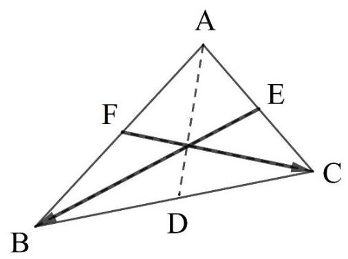

所求表达式 $\overrightarrow{EB} + \overrightarrow{FC}$ 中的两个向量没有共同的端点,平移后也看不出什么角度。 $D\text{ 、 }E\text{ 、 }F$ 分别为 $\bigtriangleup  {ABC}$ 的三边 ${BC},{CA},{AB}$ 的中点， 因此它们的向量之间存在很多 2 倍关系, 要尽可能的使用这些关系。

根据平面向量基本定理, 平面内的任何向量都可以由一对不共线的向量表示。对于 $\bigtriangleup  {ABC}$ 来说，任意选定 2 条边作为基底，则第三条边、各个中线、其他与该三角形有关的向量都能用这两条边表示。

由于选项中有 $\overrightarrow{BC}$ ,因此我们选择 $\overrightarrow{BA}$ 和 $\overrightarrow{BC}$ 作为基底。不选择另一个选项 $\overrightarrow{AD}$ 作为基底是因为它不是边,没有原有的边用起来方便。

现在利用三角形中向量的和以及倍数关系,用基底 $\overrightarrow{BA}$ 和 $\overrightarrow{BC}$ 分别表示 $\overrightarrow{EB}\text{ 、 }\overrightarrow{FC}\text{ 、 }\overrightarrow{AD}$ :

(1) $\overrightarrow{EB} : \overrightarrow{EB} = \overrightarrow{EC} + \overrightarrow{CB}$

其中: $\overrightarrow{EC} = \frac{1}{2}\overrightarrow{AC} = \frac{1}{2}\left( {\overrightarrow{AB} + \overrightarrow{BC}}\right)  = \frac{1}{2}\left( {-\overrightarrow{BA} + \overrightarrow{BC}}\right)$

$\overrightarrow{CB} =  - \overrightarrow{BC}$

于是有: $\overrightarrow{EB} = \frac{1}{2}\left( {-\overrightarrow{BA} + \overrightarrow{BC}}\right)  + \left( {-\overrightarrow{BC}}\right)  =  - \frac{1}{2}\left( {\overrightarrow{BA} + \overrightarrow{BC}}\right)$

(2) $\overrightarrow{FC}$ : $\overrightarrow{FC} = \overrightarrow{FB} + \overrightarrow{BC}$

其中: $\overrightarrow{FB} = \frac{1}{2}\overrightarrow{AB} =  - \frac{1}{2}\overrightarrow{BA}$

于是有: $\overrightarrow{FC} =  - \frac{1}{2}\overrightarrow{BA} + \overrightarrow{BC}$

(3) $\overrightarrow{EB} + \overrightarrow{FC} : \overrightarrow{EB} + \overrightarrow{FC} =  - \frac{1}{2}\left( {\overrightarrow{BA} + \overrightarrow{BC}}\right)  + \left( {-\frac{1}{2}\overrightarrow{BA} + \overrightarrow{BC}}\right)  =  - \overrightarrow{BA} + \frac{1}{2}\overrightarrow{BC}$

无法只用 $\overrightarrow{BC}$ 表示,再将 $\overrightarrow{AD}$ 用基底表示:

(4) $\overrightarrow{AD} : \overrightarrow{AD} = \overrightarrow{AB} + \overrightarrow{BD} =  - \overrightarrow{BA} + \frac{1}{2}\overrightarrow{BC}$

发现: $\overrightarrow{AD} = \overrightarrow{EB} + \overrightarrow{FC}$

故本题选 A。

本题使用了经典的“化繁为简”的思路，将各个错综复杂的向量用一对基底向量表示。其实常用的平面直角坐标系正是以 $\mathbf{i} = \left( {1,0}\right)$ 和 $\mathbf{j} = \left( {0,1}\right)$ 为基底,用它们表示所有向量的体系。

对于其他复杂的题目, 用尽可能少的变量将所有涉及到的量表示出来, 有助于发现各个量之间的关系, 从而得出解题思路或线索。

20. [2007·北京] 已知 $O$ 是 $\bigtriangleup  {ABC}$ 所在平面内一点， $D$ 为 ${BC}$ 边中点， 且 $2\overrightarrow{OA} + \overrightarrow{OB} + \overrightarrow{OC} = \mathbf{0}$ ,那么()。

A. $\overrightarrow{AO} = \overrightarrow{OD}$ B. $\overrightarrow{AO} = 2\overrightarrow{OD}$ C. $\overrightarrow{AO} = 3\overrightarrow{OD}$ D. $2\overrightarrow{AO} = \overrightarrow{OD}$

解析:涉及到具体图形的题目，先根据题目画出大致图形。

如下图所示。先任意做 $\bigtriangleup  {ABC}$ ，标记出 ${BC}$ 边的中点 $D$ 。再从平面上任意选取一个点作为 $O$ ，依次连接 ${OA}\text{ 、 }{OB}\text{ 、 }{OC}\text{ 、 }{OD}$ 。即使点 $O$ 选得很不准确,不满足 $2\overrightarrow{OA} + \overrightarrow{OB} + \overrightarrow{OC} = \mathbf{0}$ 也没关系,只是示意图而已。

观察题目条件和 4 个选项,总共涉及到 ${OA}\text{ 、 }{OB}\text{ 、 }{OC}\text{ 、 }{OD}$ 4 个向量, 使用化繁为简的思路, 找一对向量作为基底表示其他向量, 再从中找出数量关系。

由于 4 个选项都是 ${AO}$ 和 ${OD}$ 之间的数量关系,因此选它们作为基底。一般为了方便起见,基底的起点最好相同,因此用 $\overrightarrow{OA}$ 和 $\overrightarrow{OD}$ 作为基底。

现在将已知关系式 $2\overrightarrow{OA} + \overrightarrow{OB} + \overrightarrow{OC} = \mathbf{0}$ 中的每个向量都尽量用 $\overrightarrow{OA}$ 和 $\overrightarrow{OD}$ 表示:

$\overrightarrow{OA} : \overrightarrow{OA}$ 本身就是基底,不用换算。

$\overrightarrow{OB}$ : 从图中可以看出: $\overrightarrow{OB} = \overrightarrow{OD} + \overrightarrow{DB}$ ,其中 $\overrightarrow{DB}$ 很难用 $\overrightarrow{OA}$ 和 $\overrightarrow{OD}$ 表示,因此 $\overrightarrow{DB}$ 先留着。(有可能根据已知条件无法直接用 $\overrightarrow{OA}$ 和 $\overrightarrow{OD}$ 表示)

$\overrightarrow{OC}$ : 从图中可以看出: $\overrightarrow{OC} = \overrightarrow{OD} + \overrightarrow{DC}$ ,同理, $\overrightarrow{DC}$ 也先留着。

于是原等式关系可化为: $2\overrightarrow{OA} + \left( {\overrightarrow{OD} + \overrightarrow{DB}}\right)  + \left( {\overrightarrow{OD} + \overrightarrow{DC}}\right)  = \mathbf{0}$

化简: $2\overrightarrow{OA} + 2\overrightarrow{OD} + \overrightarrow{DB} + \overrightarrow{DC} = \mathbf{0}$

由于 $D$ 为 ${BC}$ 边中点,所以 $\overrightarrow{DB} + \overrightarrow{DC} = \mathbf{0}$ ,所以 $2\overrightarrow{OA} + 2\overrightarrow{OD} = 0$

即: $- \overrightarrow{OA} = \overrightarrow{OD}$ ,也就是 $\overrightarrow{AO} = \overrightarrow{OD}$ 。

故本题选 A。

实际上本题的图形做得很不标准,点 $O$ 应当在三角形内部,但这并不影响使用向量进行分析推导。

虽然本题先预留 $\overrightarrow{DB}$ 和 $\overrightarrow{DC}$ ,在后续运算中恰好相互抵消是件非常 “侥幸”的事情，但对于类似很麻烦的情况，先预留暂时无法进一步简化的元素是常规的思路。

既然题目给出了条件“ $D$ 为 ${BC}$ 边中点”，即使这一步没有很侥幸地直接化简,也很有可能在后续的变换中利用 $\bigtriangleup  {ABC}$ 三条边和中点的关系进行化简。

## 第八章 复数

关于复数的题目的考察目的非常直接, 并且综合性不强, 因此较为简单, 难点一般体现在等式 (方程) 和不等式的化简和计算上。

对于绝大多数题目, 即使没能立即想到简便解法, 就算用最基础的方法假设 $z = a + {bi}$ 代入计算或列方程 (组) 解方程 (组), 也不会有什么困难。

解决复数题目需要比较细心,比如,在读题时注意 $\bar{z}$ 和 $z$ ,不要代入错误的表达式; 在计算化简中注意 ${i}^{2} =  - 1$ ,不要弄错正负号等。

1. [2012·全国]若复数 $z$ 满足 $\left( {3 - {4i}}\right) z = \left| {4 + {3i}}\right|$ ，则 $z$ 的虚部为( )。

A. -4

B. $- \frac{1}{2}$ C. 4

D. $\frac{4}{5}$

解析:本题只需假设 $z = a + {bi}$ ，再按照复数的运算、相等、模等定义按部就班地求解即可。

本题需注意等式右边是一个已知复数的模，也就是一个正实数。

先把等式右边算出来: $\left| {4 + {3i}}\right|  = \sqrt{{4}^{2} + {3}^{2}} = 5$

原等式为: $\left( {3 - {4i}}\right) z = 5$

代入 $z = a + {bi}$ :

$$
\left( {3 - {4i}}\right) \left( {a + {bi}}\right)  = \left| {4 + {3i}}\right|
$$

$\left( {{3a} + {4b}}\right)  + \left( {{3b} - {4a}}\right) i = 5$

根据复数相等, 等价于实部和虚部分别相等, 得二元一次方程组:

---

$\left\{  \begin{array}{l} {3a} + {4b} = 5 \\  {3b} - {4a} = 0 \end{array}\right.$

---

解得: $a = \frac{3}{5}, b = \frac{4}{5}$

故本题选 D。

2. [2011. 湖北] $i$ 为虚数单位,则 ${\left( \frac{1 + i}{1 - i}\right) }^{2011} =$ (   )。

A. $- i$ B. -1 C. $i$ D. 1

解析:一般见到指数很大的指数运算，底数往往具有周期性。

先化简底数:

$\frac{1 + i}{1 - i} = \frac{\left( {1 + i}\right) \left( {1 + i}\right) }{\left( {1 - i}\right) \left( {1 + i}\right) } = \frac{2i}{2} = i$

故原式为 ${i}^{2011}$ 。

根据 $i$ 的定义 $i = \sqrt{-1}$ 可知: ${i}^{2} =  - 1,{i}^{4} = {\left( -1\right) }^{2} = 1$

故 ${i}^{2011}$ 的值取决于 2011 除以 4 所得的余数。

由于 ${2011} \div  4 = {502}\cdots 3$ ,于是 ${i}^{2011} = {i}^{3} =  - i$

故本题选 A。

3. [2017. 新课标全国 I ]设有下面四个命题。

${p}_{1} :$ 若复数 $z$ 满足 $\frac{1}{z} \in  R$ ,则 $z \in  R$ ;

${p}_{2} :$ 若复数 $z$ 满足 ${z}^{2} \in  R$ ,则 $z \in  R$ ;

${p}_{3}$ : 若复数 ${z}_{1},{z}_{2}$ 满足 ${z}_{1}{z}_{2} \in  R$ ,则 ${z}_{1} = \overline{{z}_{2}}$ ;

${p}_{4}$ : 若复数 $z \in  R$ ,则 $\bar{z} \in  R$ 。

其中的真命题为( )。

A. ${p}_{1},{p}_{3}$ B. ${p}_{1},{p}_{4}$ C. ${p}_{2},{p}_{3}$ D. ${p}_{2},{p}_{4}$

解析:本题通过命题的方式考察对复数基本概念的理解是否到位。本题考察的重点是实数与虚数之间的转换: (1)一个复数乘以它的共轭复数, 结果为实数。(2)一个纯虚数乘以另一个纯虚数, 结果也为实数。(3)实数只有通过对负实数开平方根才能得到虚数, 实数的加减乘除乘方运算都无法得到虚数。

${p}_{1}$ : 若一个复数的倒数是实数,则该复数也为实数。由于倒数关系是相互的, 因此可以换个角度: 若一个数是实数, 则它的倒数仍为实数,这是我们非常熟悉的。故命题 ${p}_{1}$ 正确。

${p}_{2}$ : 由于纯虚数的平方结果为实数。故命题 ${p}_{2}$ 错误。

${p}_{3}$ : 类似的,除了共轭复数的乘积为实数外,两个纯虚数的乘积也为实数: ${ai} \times  {bi} =  - {ab}\left( {a, b \in  R}\right)$ 。故命题 ${p}_{3}$ 错误。

${p}_{4}$ : 实数的虚部为 0,它的共轭复数的虚部为 0 的相反数,仍然为 0,故命题 ${p}_{4}$ 正确。

综上,故本题选 B。

4. [2019新课标全国 I ]设 $z = \frac{3 - i}{1 + {2i}}$ ,则 $\left| z\right|  =$ (   )。

A. 2 B. $\sqrt{3}$ C. $\sqrt{2}$ D. 1

解析:本题有 2 种思路:(1)先按照复数的除法，将 $z$ 转化为标准形式；再按照复数模的定义求出 $\left| z\right|$ 。(2)使用规律 $\left| \frac{{z}_{1}}{{z}_{2}}\right|  = \frac{\left| {z}_{1}\right| }{\left| {\widehat{z}}_{2}\right| }$

第二种方法更为方便快捷，故使用该方法:

$\left| z\right|  = \left| \frac{3 - i}{1 + {2i}}\right|  = \frac{\left| 3 - i\right| }{\left| 1 + 2i\right| } = \frac{\sqrt{{3}^{2} + {\left( -1\right) }^{2}}}{\sqrt{{1}^{2} + {2}^{2}}} = \frac{\sqrt{10}}{\sqrt{5}} = \sqrt{2}$

故本题选 C。

如果忘记了该规律，先按部就班地化为标准形式、再求模也不复杂。

5. [2005 · 全国 II ] 设 $a, b, c, d \in  R$ ，若 $\frac{a + {bi}}{c + {di}}$ 为实数，则( )。

A. ${bc} + {ad} \neq  0$ B. ${bc} - {ad} \neq  0$

C. ${bc} - {ad} = 0$ D. ${bc} + {ad} = 0$

解析:本题有 2 种思路，(1)按照复数的除法，将其表达式化为标准形式, 再令虚部为 0 。(2)根据多项式约分的原理, 直接观察出规律。

思路(1):先转化为标准形式:

$$
\frac{a + {bi}}{c + {di}} = \frac{\left( {a + {bi}}\right) \left( {c - {di}}\right) }{\left( {c + {di}}\right) \left( {c - {di}}\right) } = \frac{\left( {{ac} + {bd}}\right)  + \left( {{bc} - {ad}}\right) i}{{c}^{2} + {d}^{2}} = \frac{{ac} + {bd}}{{c}^{2} + {d}^{2}} + \frac{{bc} - {ad}}{{c}^{2} + {d}^{2}}i
$$

由于它是实数,于是虚部 $\frac{{bc} - {ad}}{{c}^{2} + {d}^{2}} = 0$ ,解得 ${bc} - {ad} = 0$ 。

故本题选 C。

思路(2): 假设实数 $k$ 满足: $\frac{a + {bi}}{c + {di}} = k$ ,于是有: $a + {bi} = k\left( {c + {di}}\right)$ , 即: $a + {bi} = {kc} + {kdi}$

解得 $a = {kc}, b = {kd}$ ,可得: $\frac{c}{a} = \frac{d}{b} = k$ ,即 ${bc} - {ad} = 0$ 。

该思路本质上是把复数看作多项式, 若两个多项式的商为实数 (常数)，则各项前系数所成的比例应当相同。

该规律也适用于向量的共线, 若两个向量共线, 则这两个向量的各坐标所成的比例相同。

6. [2015新课标全国 I ]已知复数 $z$ 满足 $\left( {z - 1}\right) i = 1 + i$ ，则 $z =$ (   )。

A. $- 2 - i$ B. $- 2 + i$ C. $2 - i$ D. $2 + i$

解析:本题有 2 种思路。(1)假设 $z = a + {bi}$ ，将等式左边展开后， 令等式两边实部、虚部分别相等，列二元一次方程组并解方程组。(2) 按照解实数一元一次方程的方法，依次移项、消项。

这里使用更为简便的第二种思路:

---

$$
\left( {z - 1}\right) i = 1 + i
$$

---

等式两边同时除以 $i$ :

$$
\frac{\left( {z - 1}\right) i}{i} = \frac{1 + i}{i}
$$

$$
z - 1 =  - i + 1
$$

等式两边同时加1:

$z - 1 + 1 =  - i + 1 + 1$

$z = 2 - i$

故本题选 C。

7. [2006．湖北]设 $x, y$ 为实数，且 $\frac{x}{1 - i} + \frac{y}{1 - {2i}} = \frac{5}{1 - {3i}}$ ，则 $x + y =$ ___。

解析:本题按照复数的基本运算，根据复数相等等价于“实部与实部相等、虚部与虚部相等”，列出二元一次方程组并解方程组即可。

$\frac{x}{1 - i} + \frac{y}{1 - {2i}} = \frac{5}{1 - {3i}}$

$\frac{x\left( {1 + i}\right) }{\left( {1 - i}\right) \left( {1 + i}\right) } + \frac{y\left( {1 + {2i}}\right) }{\left( {1 - {2i}}\right) \left( {1 + {2i}}\right) } = \frac{5\left( {1 + {3i}}\right) }{\left( {1 - {3i}}\right) \left( {1 + {3i}}\right) }$

$\frac{x + {xi}}{2} + \frac{y + {2yi}}{5} = \frac{5 + {15i}}{10}$

${5x} + {5xi} + {2y} + {4yi} = 5 + {15i}$

$\left( {{5x} + {2y}}\right)  + \left( {{5x} + {4y}}\right) i = 5 + {15i}$

于是有: $\left\{  \begin{array}{l} {5x} + {2y} = 5 \\  {5x} + {4y} = {15} \end{array}\right.$

解得: $x =  - 1, y = 5$

于是 $x + y =  - 1 + 5 = 4$

故本题填 4 。

8. [2006. 浙江] 已知 $\frac{m}{1 + i} = 1 - {ni}$ ，其中 $m, n$ 是实数， $i$ 是虚数单位， 则 $m + {ni} = \left( \mathrm{C}\right)$ 。

A. $1 + {2i}$ B. $1 - {2i}$ C. $2 + i$ D. $2 - i$

解析:本题同样使用复数的基本运算与相等关系求解即可:

$\frac{m}{1 + i} = 1 - {ni}$

$m = \left( {1 - {ni}}\right) \left( {1 + i}\right)$

$m = \left( {n + 1}\right)  + \left( {1 - n}\right) i$

于是有: $\left\{  \begin{matrix} m = n + 1 \\  0 = 1 - n \end{matrix}\right.$

解得: $m = 2, n = 1$

于是 $m + {ni} = 2 + i$

故本题选 C。

9. [2008·湖北]设 ${z}_{1}$ 是复数， ${z}_{2} = {z}_{1} - i\overline{{z}_{1}}$ (其中 $\overline{{z}_{1}}$ 表示 ${z}_{1}$ 的共轭复数),已知 ${z}_{2}$ 的实部是 -1,则 ${z}_{2}$ 的虚部为___。

解析:本题仍然使用复数的基本运算与相等关系求解:

设 ${z}_{1} = a + {bi}$ 。由于 “已知 ${z}_{2}$ 的实部是 -1 ”于是设 ${z}_{2} =  - 1 + {ci}$ 。

根据 ${z}_{2} = {z}_{1} - i\overline{{z}_{1}}$ 得:

---

$- 1 + {ci} = \left( {a + {bi}}\right)  - i\left( {a - {bi}}\right)$

	$- 1 + {ci} = \left( {a - b}\right)  + \left( {b - a}\right) i$

---

于是有: $\left\{  \begin{matrix}  - 1 = a - b \\  c = b - a \end{matrix}\right.$

虽然无法求出 $a$ 和 $b$ ,但可以发现等式右边的实部与虚部互为相反数, 于是有:

---

$c = b - a =  - \left( {a - b}\right)  =  - \left( {-1}\right)  = 1$

---

故本题填1。

10. [2015 $\cdot$ 新课标全国 I ]设复数 $z$ 满足 $\frac{1 + z}{1 - z} = i$ ,则 $\left| z\right|  =$ (   )。

A. 1 B.1 C. $\sqrt{3}$ D. 2

解析:本题依旧使用复数的基本运算与相等关系求解:

设 $z = a + {bi}$ ,先将原等式做个简单的变形,使化简过程简化:

$$
\frac{1 + z}{1 - z} = i\; \Rightarrow  \;1 + z = i\left( {1 - z}\right)
$$

$1 + z = i\left( {1 - z}\right)$

$1 + a + {bi} = i\left( {1 - a - {bi}}\right)$

$\left( {1 + a}\right)  + {bi} = b + \left( {1 - a}\right) i$

于是有: $\left\{  \begin{array}{l} 1 + a = b \\  b = 1 - a \end{array}\right.$

解得: $a = 0, b = 1$ ,即 $z = i$

于是有: $\left| z\right|  = \sqrt{{1}^{2}} = 1$

故本题选 A。

11. [2010. 浙江]对任意 $z = x + {yi}\left( {x, y \in  R}\right) , i$ 为虚数单位,则下列结论正确的是 ( )。

A. $\left| {z - \bar{z}}\right|  = {2y}$ B. ${z}^{2} = {x}^{2} + {y}^{2}$

C. $\left| {z - \bar{z}}\right|  \geq  {2x}$ D. $\left| z\right|  \leq  \left| x\right|  + \left| y\right|$

解析:本题考察对复数的基本形式和虚数单位 $i$ 的理解。

选项 A: 等式左边 $\left| {z - \bar{z}}\right|  = \left| {\left( {x + {yi}}\right)  - \left( {x - {yi}}\right) }\right|  = \left| {2yi}\right|  = \sqrt{{\left( 2y\right) }^{2}} = \left| {2y}\right|$

当 $y > 0$ 时 $\left| {z - \bar{z}}\right|  = {2y}$ ,当 $y < 0$ 时 $\left| {z - \bar{z}}\right|  =  - {2y}$ ,故选项 $\mathrm{A}$ 错误。

选项 B:等式左边 ${z}^{2} = {\left( x + yi\right) }^{2} = {x}^{2} - {y}^{2} + {2xyi}$ ,故选项 B 错误。

选项 C:根据选项 A 可知:等式左边 $\left| {z - \bar{z}}\right|  = \left| {2y}\right|$ ，与 ${2x}$ 没有直接联系，故选项 C 错误。

选项 D: 对等式两边分别平方,

左边: ${\left| z\right| }^{2} = {x}^{2} + {y}^{2}$

右边: ${\left( \left| x\right|  + \left| y\right| \right) }^{2} = {\left| x\right| }^{2} + 2\left| x\right|  \cdot  \left| y\right|  + {\left| y\right| }^{2} = {x}^{2} + {y}^{2} + 2\left| {xy}\right|$

比较可知 ${\left| z\right| }^{2} \leq  {\left( \left| x\right|  + \left| y\right| \right) }^{2}$ ,当且仅当 $x = 0$ 或 $y = 0$ 时等号成立。

于是 $\left| z\right|  \leq  \left| x\right|  + \left| y\right|$ 也成立，故选项 D 正确。

故本题选 D。

12. [2019新课标全国 I ]设复数 $z$ 满足 $\left| {z - i}\right|  = 1, z$ 在复平面内对应的点为 $\left( {x, y}\right)$ ,则(   )。

A. ${\left( x + 1\right) }^{2} + {y}^{2} = 1$ B. ${\left( x - 1\right) }^{2} + {y}^{2} = 1$

C. ${x}^{2} + {\left( y - 1\right) }^{2} = 1$ D. ${x}^{2} + {\left( y + 1\right) }^{2} = 1$

解析:本题有 2 种思路:(1)将 z 的坐标代入等式，对等式进行化简。(2)根据复平面中的几何意义进行分析。

先用思路(1): 将 $z = x + {yi}$ 代入 $\left| {z - i}\right|  = 1$ :

$$
\left| {x + {yi} - i}\right|  = 1
$$

$$
\left| {x + \left( {y - 1}\right) i}\right|  = 1
$$

$$
\sqrt{{x}^{2} + {\left( y - 1\right) }^{2}} = 1
$$

$$
{x}^{2} + {\left( y - 1\right) }^{2} = 1
$$

故本题选 C。

思路(2)在复平面内, $z\left( {x, y}\right)$ 表示坐标为 $\left( {x, y}\right)$ 的点, $i = 0 + 1 \times  i$ 表示坐标为 $\left( {0,1}\right)$ 的点。

$\left| {z - i}\right|$ 表示点 $z\left( {x, y}\right)$ 与点 $\left( {0,1}\right)$ 之间的距离， $\left| {z - i}\right|  = 1$ 表示该距离为 1 。

于是根据两点间距离公式有: ${x}^{2} + {\left( y - 1\right) }^{2} = 1$ ,就是选项 $\mathrm{C}$ 。

## 第九章 直线和圆的方程

虽然从整个解析几何块面来看，直线和圆的方程是较为基础和简单的部分，正由于这是刚开始学习使用解析几何，因此难度主要体现在“起步上手”的陌生感上。熟练掌握直线和圆的方程也是为即将学习的圆锥曲线和立体几何打好基础。

解决关于解析几何题目，主要有下面 4 个要点:

(1)熟练掌握集合关系对应的解析式。几何问题主要是关于距离和位置关系 (角度) 的问题, 最基础的 2 个公式为:两点之间的距离公式、两条直线之间的夹角公式 (余弦定理)。此外，点到直线的距离公式、平行线之间的距离公式也非常重要。

(2)熟练掌握几何图形解析式的几何意义。不论是本章学习的直线和圆, 还是将要学习的椭圆、双曲线、圆锥曲线, 每个图形的解析式的几何意义和推导过程都是最基础且重要的内容。一方面，根据已知图形列出相应的解析式是解决几何问题的重要步骤；另一方面，通过分析图形的构造过程，经常可以使复杂的问题(特别是动态变化的问题)得到极大的简化。

(3)熟练掌握欧式几何的基本定理。虽然解析几何是非常有力的解决几何问题的工具，但是欧式几何仍然有它的优势——计算较为简便。可以使用欧式几何的定理推导出一些有用的结论, 与解析几何的运算优势结合起来，使得解题过程更加简洁。

(4)熟练掌握向量的基本运算和性质。向量是解析几何的重要组成部分，特别是对关于直线的方向(斜率)、角度大小(余弦定理)等问题, 非常有用。

解决关于解析几何的题目的主要思路为:建立数量找关系、通过数量关系从已知数算出未知数。

(1)作出简图。有条件的话按照坐标精确作图，熟练后可以脱离坐标只作出示意图，通过图形找出明显的数量和位置关系，并通过解析式运算进行简单的验证。为作图方便，经常需要将图形的一般方程转化为标准方程，从而直接得出重要数据。

(2)根据题目条件列关系式。根据题目条件给出的和自己初步推断出的距离和位置关系，列出相应的关系式，每个关系式就是一个方程， 作为解题的 “素材” 以供备用。

(3)利用等式关系根据已知数据求出未知数据。根据列出的关系式，结合题目已知的条件，计算出新的数据和几何关系。有些关系式可以直接解方程得到未知数据；有些关系式可以通过联立解方程组得到未知数据；有些关系式虽然无法求出具体数据，但可以用一个(或几个)未知数表达其他未知数，减少未知数的数量；有些关系式也无法求出具体数据，但可以得到有用的数量或位置关系，这个数量关系可以在其他步骤中直接使用。

1. [2009 · 上海] 已知直线 ${l}_{1} : \;\left( {k - 3}\right) x + \left( {4 - k}\right) y + 1 = 0$ 与 ${l}_{2} : \; 2\left( {k - 3}\right) x - {2y} + 3 = 0$ 平行，则 $k$ 的值是( )。

A. 1或 3 B. 1或 5 C. 3 或 5 D. 1或 2

解析:若 ${l}_{1}\parallel {l}_{2}$ ，则它们的斜率相等。将 ${l}_{1}$ 与 ${l}_{2}$ 分别化为一次函数的形式: $y =  - \frac{k - 3}{4 - k}x - \frac{1}{4 - k}\text{ 、 }y = \left( {k - 3}\right) x + \frac{3}{2}$ 。可知它们的斜率分别为 $- \frac{k - 3}{4 - k}$ 与 $k - 3$ 。于是有: $- \frac{k - 3}{4 - k} = k - 3$

化简得: $\left( {k - 3}\right) \left( {k - 5}\right)  = 0$

解得: $k = 3$ 或 $k = 5$ 。

故本题选 C。

注意在解方程 $- \frac{k - 3}{4 - k} = k - 3$ 时不要“顺手”约去等式两边的 $k - 3$ ，这步约分隐含了 $k \neq  3$ 的结论,而实际上 $k = 3$ 是本题的一个解。当 $k = 3$ 时, ${l}_{1}$ 与 ${l}_{2}$ 分别为 $y + 1 = 0$ 与 $- {2y} + 3 = 0$ ,是两条平行于 $\mathrm{x}$ 轴的直线。

需要对直线方程熟悉到:不需要将其转化为一次函数或点斜式， 根据一般式就能立即得到其斜率为 $\mathrm{y}$ 的系数除以 $\mathrm{x}$ 的系数的负数。

2. [2001 ・上海] $a = 3$ 是直线 ${ax} + {2y} + {3a} = 0$ 和直线 ${3x} + \left( {a - 1}\right) y = a - 7$ 平行且不重合的 ( )。

A. 充分非必要条件 B. 必要非充分条件

C. 充要条件 D. 既非充分也非必要条件

解析:本题将直线位置关系的判定与命题结合起来，需要对这两部分概念都较熟悉。

若直线 ${ax} + {2y} + {3a} = 0$ 与 ${3x} + \left( {a - 1}\right) y = a - 7$ 平行且不重合,需要它们 $\mathrm{x}\text{ 、 }\mathrm{y}$ 项前的系数所成比例相等,并且与常数项所成比例不相等,即: $\frac{a}{3} = \frac{2}{a - 1} \neq  \frac{3a}{7 - a}$ (注意第二条直线的常数项需移项)。

解方程 $\frac{a}{3} = \frac{2}{a - 1}$

${a}^{2} - a - 6 = 0$

$\left( {a - 3}\right) \left( {a + 2}\right)  = 0$

$a = 3$ 或 $a =  - 2$

解不等式 $\frac{a}{3} \neq  \frac{3a}{7 - a}$

${a}^{2} + {2a} \neq  0$

$a\left( {a + 2}\right)  \neq  0$

$a \neq  0$ 或 $a \neq   - 2$

综上,直线 ${ax} + {2y} + {3a} = 0$ 与 ${3x} + \left( {a - 1}\right) y = a - 7$ 平行且不重合的充分必要条件为 $a = 3$ 。(若 $a \neq   - 2$ 则两条直线重合)。

故本题选 C。

3. [2003．上海]已知定点 $A\left( {0,1}\right)$ ，点 $B$ 在直线 $x + y = 0$ 上运动，当线段 ${AB}$ 最短时，点 $B$ 的坐标是___。

解析:根据几何知识可知，从定点向直线引垂线，定点到垂足的距离即为该定点到直线的最短距离, 这同时也是该点到直线的距离。

本题的问题不是最短距离为多少,而是求点 $B$ 的坐标,可以设点 $B$ 坐标为 $\left( {{x}_{B},{y}_{B}}\right)$ ,利用点 $B$ 在直线 $x + y = 0$ 上,以及该直线与直线 ${AB}$ 垂直, 列出二元一次方程组, 通过解方程组求得。

由于点 $B$ 在直线 $x + y = 0$ 上,因此点 $B$ 坐标满足该方程: ${x}_{B} + {y}_{B} = 0$

由于当线段 ${AB}$ 最短时, ${AB}$ 与该直线垂直,因此这两条直线的方向向量垂直。 ${AB}$ 的方向向量为 $\left( {{x}_{B},{y}_{B}}\right)  - \left( {0,1}\right)  = \left( {{x}_{B},{y}_{B} - 1}\right)$ ,直线 $x + y = 0$ 的方向向量为 $\left( {-1,1}\right)$ ，于是有: $\left( {{x}_{B},{y}_{B} - 1}\right) \left( {-1,1}\right)  =  - {x}_{B} + {y}_{B} - 1 = 0$ 。

联立 ${x}_{B} + {y}_{B} = 0$ 与 $- {x}_{B} + {y}_{B} - 1 = 0$ ,得二元一次方程组并解方程组得:

${x}_{B} =  - \frac{1}{2},\;{y}_{B} = \frac{1}{2}$

于是点 $B$ 坐标为 $\left( {-\frac{1}{2},\frac{1}{2}}\right)$

故本题填 $\left( {-\frac{1}{2},\frac{1}{2}}\right)$

4. [2006 · 江苏] 圆 ${\left( x - 1\right) }^{2} + {\left( y + \sqrt{3}\right) }^{2} = 1$ 的切线方程中有一个是( )。

A. $x - y = 0$ B. $x + y = 0$

C. $x = 0$ D. $y = 0$

解析:本题判断 4 个选项是否为给定圆的切线方程，使用点到直线的距离公式, 求出圆心到各直线的距离, 再与半径进行比较即可。

根据圆的方程可得:圆心坐标为 $\left( {1, - \sqrt{3}}\right)$ ，半径为1。

选项 A；圆心到直线距离: $d = \frac{\left| 1 - \left( -\sqrt{3}\right) \right| }{\sqrt{{1}^{2} + {\left( -1\right) }^{2}}} = \frac{1 + \sqrt{3}}{\sqrt{2}}$ ，显然与半径不相等，选项 A 错误。

选项 B:圆心到直线距离: $d = \frac{\left| 1 + \left( -\sqrt{3}\right) \right| }{\sqrt{{1}^{2} + {\left( -1\right) }^{2}}} = \frac{\sqrt{3} - 1}{\sqrt{2}}$ ，也显然与半径不相等，选项 B 错误。

选项 C:圆心到直线距离: $d = \frac{\left| 1\right| }{\sqrt{{1}^{2}}} = 1 = r$ ,选项 C 正确。

选项 D:圆心到直线距离: $d = \frac{\left| -\sqrt{3}\right| }{\sqrt{{1}^{2}}} = \sqrt{3}$ ，也与半径不相等，选项 D 错误。

故本题选 C。

5. [2005 ・全国 II ]圆心为 $\left( {1,2}\right)$ 且与直线 ${5x} - {12y} - 7 = 0$ 相切的圆的方程为___。

解析:由于题目已经给出了圆心的坐标，要想求得圆的方程，只需再得到圆的半径即可。

根据直线与圆相切的几何关系, 此时圆心到直线的距离应当等于圆的半径, 因此可以用点到直线的距离公式求得该数值:

$$
r = \frac{\left| 5 \times  1 - {12} \times  2 - 7\right| }{\sqrt{{5}^{2} + {12}^{2}}} = \frac{26}{13} = 2
$$

于是该圆的方程为 ${\left( x - 1\right) }^{2} + {\left( y - 2\right) }^{2} = 4$

故本题填 ${\left( x - 1\right) }^{2} + {\left( y - 2\right) }^{2} = 4$

注意等号右边为半径的平方, 不要漏算平方。

6. [2000 · 全国]过原点的直线与圆 ${x}^{2} + {y}^{2} + {4x} + 3 = 0$ 相切，若切点在第三象限，则该直线的方程是 ( )。

A. $y = \sqrt{3}x$ B. $y =  - \sqrt{3}x$

C. $y = \frac{\sqrt{3}}{3}x$ D. $y =  - \frac{\sqrt{3}}{3}x$

解析:由于该直线过原点，可以假设该直线方程为 $y = {kx}$ ，写为一般方程的形式 ${kx} - y = 0$ 。注意这里没有包括直线 $x = 0$ 的情况，稍后要专门考虑。

先将圆转化为标准方程 ${\left( x + 2\right) }^{2} + {y}^{2} = 1$ ,从而得到它的圆心 $\left( {-2,0}\right)$ 和半径 $r = 1$ 。

由于直线与圆相切, 因此圆心到直线的距离等于半径, 得到方程: $\frac{\left| -2k\right| }{\sqrt{{k}^{2} + 1}} = 1$ 。

解方程, 遇到有根号和绝对值的方程, 一般将根号或绝对值放在等式的一边单独作为分子或分母, 再令等式两边同时平方:

$$
\frac{4{k}^{2}}{{k}^{2} + 1} = 1
$$

$$
3{k}^{2} = 1
$$

$$
k =  \pm  \frac{\sqrt{3}}{3}
$$

又由于切点在第三象限,因此 $k \in  \left( {0, + \infty }\right)$ ,因此 $k = \frac{\sqrt{3}}{3}$ 。

由切点在第三象限也排除了 $x = 0$ 的情况。

故本题选 C。

7. [2010 · 广东]若圆心在 $\mathrm{x}$ 轴上、半径为 $\sqrt{2}$ 的圆 $O$ 位于 $\mathrm{y}$ 轴左侧, 且与直线 $x + y = 0$ 相切，则圆 $O$ 的方程是___。

解析:根据“圆心在 $\mathrm{x}$ 轴上”，可以设圆心坐标为 $\left( {a,0}\right)$ ，于是该圆的标准方程为 ${\left( x - a\right) }^{2} + {y}^{2} = 2$ 。

根据 “圆 $O$ 位于 $y$ 轴左侧”,可知 $a < 0$

由于该圆与直线相切,于是圆心到直线的距离等于半径: $\frac{\left| a\right| }{\sqrt{2}} = \sqrt{2}$ 解得 $\left| a\right|  = 2$ ,结合前面得到的 $a < 0$ ,可得 $a =  - 2$

于是圆的方程为 ${\left( x + 2\right) }^{2} + {y}^{2} = 2$

故本题填 ${\left( x + 2\right) }^{2} + {y}^{2} = 2$

8. [2013 · 陕西] 已知点 $M\left( {a, b}\right)$ 在圆 $O : {x}^{2} + {y}^{2} = 1$ 外,则直线 ${ax} + {by} = 1$ 与圆 $O$ 的位置关系是( )。

A. 相切 B. 相交 C. 相离 D. 不确定

解析:判断直线与圆的位置关系，可以通过圆心到直线的距离与半径比较得知。

根据圆 $O$ 的标准方程可知,其圆心为 $\left( {0,0}\right)$ ,半径为 1 。于是圆心到直线的距离为 $\frac{\left| 0 \times  a + 0 \times  b - 1\right| }{\sqrt{{a}^{2} + {b}^{2}}} = \frac{1}{\sqrt{{a}^{2} + {b}^{2}}}$

由于 “点 $M\left( {a, b}\right)$ 在圆 $O$ 外”,因此点 $M$ 到圆心的距离大于半径。可得不等式关系: $\sqrt{{\left( a - 0\right) }^{2} + {\left( b - 0\right) }^{2}} = \sqrt{{a}^{2} + {b}^{2}} > 1$

不等式两边同时除以 $\sqrt{{a}^{2} + {b}^{2}}$ 得: $1 > \frac{1}{\sqrt{{a}^{2} + {b}^{2}}}$ ,即圆心到直线 ${ax} + {by} = 1$ 的距离小于半径,因此直线与圆相交。

故本题选 B。

9. [2012·陕西]已知圆 $C : {x}^{2} + {y}^{2} - {4x} = 0, l$ 为过点 $P\left( {3,0}\right)$ 的直线, 则 ( )。

A. $l$ 与 $C$ 相交 B. $l$ 与 $C$ 相切

C. $l$ 与 $C$ 相离 D. 以上三个选项均有可能

解析:判断经过定点且斜率可任意变化的直线与圆的位置关系， 简单作图后可发现:

(1)若点在圆周内，则直线必定与圆相交。

(2)若点在圆周上，则直线可能与圆相交或相切。

(2)若点在圆周外，则直线可能与圆相交、相切、相离。

请自行分别作图画出相应的情况。

因此本题相当于求给定的点与圆周的位置关系, 即比较该点到圆心的距离与圆的半径的关系。

先将圆的一般方程转化为标准方程: ${\left( x - 2\right) }^{2} + {y}^{2} = 4$ 。可知圆心为 $\left( {2,0}\right)$ ,半径为 2 。

$P\left( {3,0}\right)$ 到圆心的距离为: $\sqrt{{\left( 3 - 2\right) }^{2} + {\left( 0 - 0\right) }^{2}} = 1 < 2$

点 $P\left( {3,0}\right)$ 在圆周内,因此经过点 $P$ 的直线必定与与圆相交。

故本题选 A。

10. [2004 · 湖北] 两个圆 ${C}_{1} : {x}^{2} + {y}^{2} + {2x} + {2y} - 2 = 0$ 与 ${C}_{2} : \; {x}^{2} + {y}^{2} - {4x} - {2y} + 1 = 0$ 的公切线有且仅有(   )。

A. 1 条 B. 2 条 C. 3 条 D. 4 条

解析:根据平面几何知识可知:

(1)若两个圆相离，则有 4 条公切线。

(2)若两个圆外切，则有 3 条公切线。

(3)若两个圆相交，则有 2 条公切线。

(4)若两个圆内切，则有 1 条公切线。

(5)若一个圆内含于另一个圆，则它们没有公切线。

以上为基础的平面几何知识, 请自行作简图, 画出各类情况的所有公切线。

于是，求两个圆公切线的数量，可以通过判断两个圆的位置关系解决。圆的位置关系可通过比较圆心间的距离与半径之和或差得到。

将两个圆的一般方程转化为标准方程:

${C}_{1} : \;{\left( x + 1\right) }^{2} + {\left( y + 1\right) }^{2} = 4$ ,圆心: $\;{C}_{1}\left( {-1, - 1}\right)$ ,半径 ${r}_{1} = 2$ 。

${C}_{2} : \;{\left( x - 2\right) }^{2} + {\left( y - 1\right) }^{2} = 4$ ,圆心: ${C}_{2}\left( {2,1}\right)$ ,半径 ${r}_{2} = 2$ 。

圆心间的距离: $\left| {{C}_{1}{C}_{2}}\right|  = \sqrt{{\left( -1 - 2\right) }^{2} + {\left( -1 - 1\right) }^{2}} = \sqrt{13}$

半径之和: ${r}_{1} + {r}_{2} = 2 + 2 = 4 = \sqrt{16}$

半径之差: ${r}_{1} - {r}_{2} = 2 - 2 = 0$

由于 ${r}_{1} - {r}_{2} < {C}_{1}{C}_{2} \mid   < {r}_{1} + {r}_{2}$ ,因此两圆相交,它们有 2 条公切线。

故本题选 B。

11. [2010・四川] 直线 $x - {2y} + 5 = 0$ 与圆 ${x}^{2} + {y}^{2} = 8$ 相交于 $A, B$ 两点, 则 $\left| {AB}\right|  =$ ___。

解析:本题有 2 种思路:纯代数运算、图形分析。

纯代数运算的思路较直接，但是运算量较大。具体方法为:(1) 联立直线方程与圆的方程,解方程组求得交点 $A, B$ 的坐标。(2)使用两点间的距离公式求得线段的 $\left| {AB}\right|$ 长。

使用图形分析可以将运算过程大大简化。根据直线方程可知，它经过点 $\left( {0,{2.5}}\right)$ 和 $\left( {-5,0}\right)$ 。根据圆的方程可知,圆心为 $\left( {0,0}\right)$ ,半径 $r = \sqrt{8} = 2\sqrt{2} \approx  {2.8}$ 。于是可以作图如下 (见下页)。

过圆心 $O$ 向该直线引垂线,垂足为 $M$ ,并分别连接两条半径 ${OA}$ 、 ${OB}$ 。根据平面几何知识可知， $\left| {MA}\right|  = \left| {MB}\right|$ 。

其中 $\left| {OM}\right|$ 为圆心 $O$ 到直线 ${AB}$ 的距离，容易用公式求得。 $\left| {OA}\right|$ 为圆的半径,已知。于是可以对直角 $\bigtriangleup  {OMA}$ 使用勾股定理，求得 $\left| {MA}\right|$ ， 从而得到 $\left| {AB}\right|  = 2\left| {MA}\right|$ 。下面开始计算:

$$
\left| {OM}\right|  = \frac{\left| 5\right| }{\sqrt{5}} = \sqrt{5}
$$

$$
\left| {OA}\right|  = \sqrt{8}
$$

于是 $\left| {MA}\right|  = \sqrt{{\sqrt{8}}^{2} - {\sqrt{5}}^{2}} = \sqrt{3}$

$$
\left| {AB}\right|  = 2\left| {MA}\right|  = 2\sqrt{3}
$$

故本题填 $2\sqrt{3}$ 。

关于 $\left| {MA}\right|  = \left| {MB}\right|$ 的证明,请自行使用平面几何完成。平面几何的基本知识是解析几何的重要基础。提示:等腰三角形。

解决本题或同类与弦长有关的题目时, 不需要作出非常标准的各点坐标, 只需作出 “直线与圆相交”的示意图, 帮助分析相关线段和角度之间的数量关系即可。例如本题, 即使把上图中的坐标抹去, 并不影响分析得到 ${OM}\bot {AB}$ 、 $\left| {MA}\right|  = \left| {MB}\right|$ 的关系。

12. [2011・湖北] 过点 $\left( {-1, - 2}\right)$ 的直线 $l$ 被圆 ${x}^{2} + {y}^{2} - {2x} - {2y} + 1 = 0$ 截得的弦长为 $\sqrt{2}$ ，则直线 $l$ 的斜率为___。

解析:本题的图形与上一题类似，都是关于直线从圆上截取一段弦的数量关系。本题尝试不按照坐标精确作图，只通过图形分析找到各线段之间的数量关系，再通过解析式解决。作图如下。

由于直线 $l$ 过点 $\left( {-1, - 2}\right)$ ,因此用点斜式设其方程为 $y + 2 = k\left( {x + 1}\right)$ , 再化为一般式 ${kx} - y + k - 2 = 0$ 。该方程暂时与图形无之间联系。

将圆的一般方程转为标准方程 ${\left( x - 1\right) }^{2} + {\left( y - 1\right) }^{2} = 1$ ,得知圆心为 $\left( {1,1}\right)$ ,半径为 $r = 1$ 。即图中的 $\left| {OA}\right|  = \left| {OB}\right|  = 1$

利用图中直角三角形三条边的关系 ${\left| OM\right| }^{2} + {\left| MA\right| }^{2} = {\left| OA\right| }^{2}$ 。其中:

$\left| {OM}\right|$ 为圆心到直线的距离: $\left| {OM}\right|  = \frac{\left| k - 1 + k - 2\right| }{\sqrt{{k}^{2} + 1}} = \frac{\left| 2k - 3\right| }{\sqrt{{k}^{2} + 1}}$

$\left| {MA}\right|$ 为弦 ${AB}$ 长度的一半: $\left| {MA}\right|  = \frac{\left| AB\right| }{2} = \frac{\sqrt{2}}{2}$

$\left| {OA}\right|$ 为圆的半径长: $\left| {OA}\right|  = r = 1$

代入上述勾股定理得: ${\left( \frac{\left| 2k - 3\right| }{\sqrt{{k}^{2} + 1}}\right) }^{2} + {\left( \frac{\sqrt{2}}{2}\right) }^{2} = {1}^{2}$

一步一步解方程:

${\left( \frac{\left| 2k - 3\right| }{\sqrt{{k}^{2} + 1}}\right) }^{2} + {\left( \frac{\sqrt{2}}{2}\right) }^{2} = {1}^{2}$

$\frac{{\left( 2k - 3\right) }^{2}}{{k}^{2} + 1} + \frac{1}{2} = 1$

$$
\frac{{\left( 2k - 3\right) }^{2}}{{k}^{2} + 1} = \frac{1}{2}
$$

$2{\left( 2k - 3\right) }^{2} = {k}^{2} + 1$

$7{k}^{2} - {24k} + {17} = 0$

$\left( {{7k} - {17}}\right) \left( {k - 1}\right)  = 0$

$k = 1$ 或 $k = \frac{17}{7}$

最后画图或计算检验下点斜式不包括的 $x =  - 1$ ，发现不符合要求。

故本题填 1 或 $\frac{17}{7}$ 。

本题展示了即使不按照坐标精确作图，只要准确表示出集合关系，也不影响解题。

13. $\left\lbrack  {{2007} \cdot  \text{ 重庆 }}\right\rbrack$ 若直线 $y = {kx} + 1$ 与圆 ${x}^{2} + {y}^{2} = 1$ 相交于 $P, Q$ 两点，且 $\angle {POQ} = {120}^{ \circ  }$ (其中 $O$ 为原点)，则 $k$ 的值为( )。

A. $- \sqrt{3}$ 或 $\sqrt{3}$ B. $\sqrt{3}$ C. $- \sqrt{2}$ 或 $\sqrt{2}$ D. $\sqrt{2}$

解析:根据直线方程可知，直线必定经过点 $\left( {0,1}\right)$ 。根据圆的标准方程可知,圆心为原点 $\left( {0,0}\right)$ ,半径 $r = 1$ 。并且直线必定经过的点 $\left( {0,1}\right)$ 恰好在圆周上,因此它是交点之一,令其为 $P\left( {0,1}\right)$ 。作图如下。

对条件 $\angle {POQ} = {120}^{ \circ  }$ 的使用方法有 2 种。

(1)使用向量内积的定义式: $\overrightarrow{OP} \cdot  \overrightarrow{OQ} = \left| {OP}\right|  \cdot  \left| {OQ}\right| \cos \angle {POQ}$ 。

通过联立直线和圆的方程，可以将 $Q$ 的坐标用关于 $k$ 的表达式表示。而等式右边 $\left| {OP}\right| \text{ 、 }\left| {OQ}\right|$ 为圆的半径。于是就得到了关于 $k$ 的方程， 解方程即可。下面进行运算:

(1)将直线方程代入圆的方程，消去 $y$ :

${x}^{2} + {\left( kx + 1\right) }^{2} = 1$

$\left( {{k}^{2} + 1}\right) {x}^{2} + {2kx} = 0$

$x\left\lbrack  {\left( {{k}^{2} + 1}\right) x + {2k}}\right\rbrack   = 0$

$x = 0$ 或 $x =  - \frac{2k}{{k}^{2} + 1}$

对应的 $y = 1$ 或 $y = \frac{-{k}^{2} + 1}{{k}^{2} + 1}$

即: $P\left( {0,1}\right) , Q\left( {-\frac{2k}{{k}^{2} + 1},\frac{-{k}^{2} + 1}{{k}^{2} + 1}}\right)$

于是 $\overrightarrow{OP} = \left( {0,1}\right) ,\overrightarrow{OQ} = \left( {-\frac{2k}{{k}^{2} + 1},\frac{-{k}^{2} + 1}{{k}^{2} + 1}}\right)$

并且 $\left| {OP}\right|  = \left| {OQ}\right|  = r = 1$

将上述数值和表达式代入 $\overrightarrow{OP} \cdot  \overrightarrow{OQ} = \left| {OP}\right|  \cdot  \left| {OQ}\right| \cos \angle {POQ}$ :

$\left( {0,1}\right) \left( {-\frac{2k}{{k}^{2} + 1},\frac{-{k}^{2} + 1}{{k}^{2} + 1}}\right)  = 1 \times  1 \times  \cos {120}^{ \circ  }$

$$
\frac{-{k}^{2} + 1}{{k}^{2} + 1} =  - \frac{1}{2}
$$

$$
{k}^{2} = 3
$$

$$
k =  \pm  \sqrt{3}
$$

(2)使用三角函数:过 $O$ 向 ${PQ}$ 引垂线，垂足为 $M$ ，现在分析图中的相关角度。由于 $\bigtriangleup  {OPQ}$ 是等腰三角形，且 ${OM}\bot {PQ}$ ，于是 ${OM}$ 同时还是 $\angle {POQ}$ 的角平分线、是 ${PQ}$ 边的中线,因此 $\angle {POM} = \frac{1}{2}\angle {POQ} = {60}^{ \circ  }$ ，可得 ${OM}$ 与 $\mathrm{x}$ 轴的夹角为 ${30}^{ \circ  }$ 。

再根据 ${OM} \bot  {PQ}$ ,可知 ${PQ}$ 与 $\mathrm{x}$ 轴的夹角为 ${60}^{ \circ  }$ ，根据图中的朝向可以看出，其斜率为 $\tan {120}^{ \circ  } =  - \sqrt{3}$ 。

以上只是一种情况,将该图像以 $\mathrm{y}$ 轴为对称轴镜面对称, ${PQ}$ 与圆的左半部相交,此时直线 ${PQ}$ 的斜率为 $\tan {60}^{ \circ  } = \sqrt{3}$ 。

两种分析思路的结果相同。故本题选A。

比较上述两种思路可以发现, 用解析式进行代数运算的思考过程较为简洁, 但是计算过程略为复杂, 对计算能力和细心程度有一定要求。分析几何图形的方法计算过程较简单, 但是需要考虑得比较周全, 对图形想象力有一定要求。

14. [2005·湖南] 已知直线 ${ax} + {by} + c = 0$ 与圆 $O : {x}^{2} + {y}^{2} = 1$ 相交于 $A, B$ 两点，且 $\left| {AB}\right|  = \sqrt{3}$ ，则 $\overrightarrow{OA} \cdot  \overrightarrow{OB} =$ ___。

解析:本题仍然使用分析几何图形的方法，将计算过程简化。做简图如下,不需要精确对应坐标,依然从 $O$ 向 ${AB}$ 引垂线,垂足为 $M$ 。

使用向量内积的定义式: $\overrightarrow{OA} \cdot  \overrightarrow{OB} = \left| \overrightarrow{OA}\right|  \cdot  \left| \overrightarrow{OB}\right|  \cdot  \cos \angle {AOB}$

其中 $\left| \overrightarrow{OA}\right|  = \left| \overrightarrow{OB}\right|  = r = 1$

分析图中的数量关系: 由于 $\left| {OA}\right|  = \left| {OB}\right|  = 1$ ,因此 $\bigtriangleup {OAB}$ 是等腰三角形。因此 ${OM}$ 同时是 ${AB}$ 边的垂线、中线、 $\angle {AOB}$ 的角平分线。

于是 $\left| {AM}\right|  = \frac{\left| AB\right| }{2} = \frac{\sqrt{3}}{2}$ ,

又由于 $\left| \overrightarrow{OA}\right|  = 1\text{ 、 }\angle {OMA} = {90}^{ \circ  }$ ,可得: $\sin \angle {AOM} = \frac{\left| AM\right| }{\left| OA\right| } = \frac{\sqrt{3}}{2}$

根据三角函数可知 $\angle {AOM} = {60}^{ \circ  }$

于是 $\angle {AOB} = 2\angle {AOM} = {120}^{ \circ  }$

因此 $\overrightarrow{OA} \cdot  \overrightarrow{OB} = \left| \overrightarrow{OA}\right|  \cdot  \left| \overrightarrow{OB}\right|  \cdot  \cos \angle {AOB} = 1 \times  1 \times  \cos {120}^{ \circ  } =  - \frac{1}{2}$

故本题填 $- \frac{1}{2}$

15. [2006 · 湖南]圆 ${x}^{2} + {y}^{2} - {4x} - {4y} - {10} = 0$ 上的点到直线 $x + y - {14} = 0$ 的最大距离与最小距离的差是 ( )。

A. 36 B. 18 C. $6\sqrt{2}$ D. $5\sqrt{2}$

解析:判断圆周上的点到直线的最大距离与最小距离，首先需要知道圆与直线的位置关系。

如下图左所示，若圆与直线相离，则从圆心向直线引垂线，垂线与圆周的两个交点分别为最大距离 $\left( \left| {AM}\right| \right)$ 和最小距离 $\left( \left| {BM}\right| \right)$ 。

如下图中所示，若圆与直线相切，则最小距离为 0，就是切点。 最大距离为切点所在的直径的另一端,距离为圆的直径 $\left( \left| {AM}\right| \right)$ 。

如下图右所示，若圆与直线相交，则最小距离为 0 ，就是交点。 最大距离为经过圆心与直线垂直的直径距直线较远的端点 $\left( \left| {AM}\right| \right)$ 。

先将圆的一般方程转化为标准方程 ${\left( x - 2\right) }^{2} + {\left( y - 2\right) }^{2} = {18}$ ,可得圆心为 $\left( {2,2}\right)$ ,半径为 $r = 3\sqrt{2}$ 。

比较圆心到直线的距离和圆的半径判断直线与圆的位置关系:

$$
d = \frac{\left| 2 + 2 - {14}\right| }{\sqrt{2}} = 5\sqrt{2} > r
$$

可知直线与圆相离，为左图中的情形。

从图中可以看出，最大距离为 $\left| {AM}\right|$ ，最小距离为 $\left| {BM}\right|$ ，它们的差 $\left| {AM}\right|  - \left| {BM}\right|$ 就是圆的直径 $\left| {AB}\right|  = {2r} = 6\sqrt{2}$ 。

故本题选 C。

16. [2011 · 全国] 在平面直角坐标系 ${xOy}$ 中,曲线 $y = {x}^{2} - {6x} + 1$ 与坐标轴的交点都在圆 $C$ 上,求圆 $C$ 的方程。

解析:本题较为直接, 根据圆上点的坐标求圆的方程。此时用圆的一般方程 ${x}^{2} + {y}^{2} + {Dx} + {Ey} + F = 0$ 计算较为简单。

因为圆的一般方程中 3 个系数 $D, E, F$ 的次数都为 1,通过列三元一次方程组并解方程组求出它们的值即可。

首先求曲线 $y = {x}^{2} - {6x} + 1$ 与坐标轴的交点。

与 $y$ 轴交点: 令 $x = 0, y = 1$ ,交点为 $\left( {0,1}\right)$ 。

与 $\mathrm{x}$ 轴交点: 令 $y = 0,{x}^{2} - {6x} + 1 = 0$ ,解得 $x = 3 + 2\sqrt{2}$ 或 $x = 3 - 2\sqrt{2}$ , 交点为 $\left( {3 + 2\sqrt{2},0}\right)$ 和 $\left( {3 - 2\sqrt{2},0}\right)$ 。

分别将 3 个交点的坐标代入圆的一般方程 ${x}^{2} + {y}^{2} + {Dx} + {Ey} + F = 0$ :

---

$$
\left\{  \begin{array}{l} 1 + E + F = 0 \\  {\left( 3 + 2\sqrt{2}\right) }^{2} + \left( {3 + 2\sqrt{2}}\right) D + F = 0 \\  {\left( 3 - 2\sqrt{2}\right) }^{2} + \left( {3 - 2\sqrt{2}}\right) D + F = 0 \end{array}\right.
$$

---

解该方程组:

由于第 2 个方程与第 3 个方程形式很类似, 让它们相减可以简化:

---

$$
\left\lbrack  {{\left( 3 + 2\sqrt{2}\right) }^{2} + \left( {3 + 2\sqrt{2}}\right) D + F}\right\rbrack   - \left\lbrack  {{\left( 3 - 2\sqrt{2}\right) }^{2} + \left( {3 - 2\sqrt{2}}\right) D + F}\right\rbrack   = 0 - 0
$$

$$
{24}\sqrt{2} + 4\sqrt{2}D = 0
$$

$$
D =  - 6
$$

---

将 $D =  - 6$ 代入第 2 个方程:

$$
{\left( 3 + 2\sqrt{2}\right) }^{2} + \left( {3 + 2\sqrt{2}}\right)  \times  \left( {-6}\right)  + F = 0
$$

$$
F = 1
$$

将 $F = 1$ 代入第 1 个方程:

---

$$
1 + E + 1 = 0
$$

---

$E =  - 2$

解得: $D =  - 6, E =  - 2, F = 1$

故该圆的一般方程为 ${x}^{2} + {y}^{2} - {6x} - {2y} + 1 = 0$

或化为标准方程 ${\left( x - 3\right) }^{2} + {\left( y - 1\right) }^{2} = 9$

17. [2004·天津]若 $P\left( {2, - 1}\right)$ 为圆 ${\left( x - 1\right) }^{2} + {y}^{2} = {25}$ 的弦 ${AB}$ 的中点，则直线 ${AB}$ 的方程是 ( )。

A. $x - y - 3 = 0$ B. ${2x} + y - 3 = 0$

C. $x + y - 1 = 0$ D. ${2x} - y - 5 = 0$

解析:本题仍然使用几何图形分析，作简图如下所示。

由于 $P$ 是弦 ${AB}$ 的中点,因此经过 $P$ 的半径 ${OP}$ 与 ${AB}$ 垂直。圆心 $O$ 的坐标易根据圆的方程得到, $P$ 的坐标已知,因此向量 $\overrightarrow{OP}$ 的方向易求得,这正是直线 ${AB}$ 的法向量。再结合点 $P$ 是在直线 ${AB}$ 上,即可求得直线 ${AB}$ 的点法式方程。下面开始运算。

根据圆的标准方程得:圆心 $O\left( {1,0}\right)$ ，于是 $\overrightarrow{OP} = \left( {2, - 1}\right)  - \left( {1,0}\right)  = \left( {1, - 1}\right)$ ， 即直线 ${AB}$ 的法向量为 $\left( {1, - 1}\right)$ 。可设直线 ${AB}$ 的方程为 $x - y + C = 0$

将 $P\left( {2, - 1}\right)$ 代入该方程: $2 - \left( {-1}\right)  + C = 0$ ，解得 $C =  - 3$

得直线 ${AB}$ 的方程为 $x - y - 3 = 0$

故本题选 A。

求直线方程一般有 3 种方法: (1)已知斜率和经过的一个点, 使用点斜式方程; (2)已知法向量 (或方向向量) 和经过的一个点, 使用点法式方程; (3)已知经过的两个点, 使用两点式方程。以上方法的根本共性为假设直线方程为 $y = {kx} + b$ 或 $x + {By} + C = 0$ ,想办法列出两个等式, 解二元一次方程组。

18. [2011 ・ 重庆] 在圆 ${x}^{2} + {y}^{2} - {2x} - {6y} = 0$ 内,过点 $E\left( {0,1}\right)$ 的最长弦和最短弦分别是 ${AC}$ 和 ${BD}$ ，则四边形 ${ABCD}$ 的面积为( )。

A. $5\sqrt{2}$ B. ${10}\sqrt{2}$ C. ${15}\sqrt{2}$ D. ${20}\sqrt{2}$

解析:本题是一道较为综合的考察直线与圆的方程的题目，解析式运算和几何图形分析都很重要。

先习惯性地将圆的一般方程化为标准方程 ${\left( x - 1\right) }^{2} + {\left( y - 3\right) }^{2} = {10}$ 。得知其圆心为 $\left( {1,3}\right)$ ，半径为 $\sqrt{10}$ (约为 3.3)。将 $E\left( {0,1}\right)$ 代入圆的方程左边: ${\left( 0 - 1\right) }^{2} + {\left( 1 - 3\right) }^{2} = 9 < {10}$ ，得知点 $E$ 在圆周内。

根据平面几何知识可知，经过圆内一点(非圆心)的最长弦为直径, 最短弦为与直径垂直的弦。根据题目条件作图如下。

从图中可看出,四边形 ${ABCD}$ 可以分为 4 个直角三角形: $\bigtriangleup {ABE}$ 、 $\bigtriangleup  {ADE}$ 、 $\bigtriangleup  {CBE}$ 、 $\bigtriangleup  {CDE}$ ，并且 $\bigtriangleup  {ABE} \cong   \bigtriangleup  {ADE}$ 、 $\bigtriangleup  {CBE} \cong   \bigtriangleup  {CDE}$ 。于是有:

$$
{S}_{ABCD} = {S}_{\bigtriangleup {ABE}} + {S}_{\bigtriangleup {ADE}} + {S}_{\bigtriangleup {CBE}} + {S}_{\bigtriangleup {CDE}}
$$

$$
= \frac{1}{2}\left| {AE}\right|  \cdot  \left| {EB}\right|  + \frac{1}{2}\left| {AE}\right|  \cdot  \left| {ED}\right|  + \frac{1}{2}\left| {CE}\right|  \cdot  \left| {EB}\right|  + \frac{1}{2}\left| {CE}\right|  \cdot  \left| {ED}\right|
$$

$$
= \frac{1}{2}\left| {AE}\right| \left( {\left| {EB}\right|  + \left| {ED}\right| }\right)  + \frac{1}{2}\left| {CE}\right| \left( {\left| {EB}\right|  + \left| {ED}\right| }\right)
$$

$$
= \frac{1}{2}\left| {AE}\right|  \cdot  \left| {BD}\right|  + \frac{1}{2}\left| {CE}\right|  \cdot  \left| {BD}\right|
$$

$$
= \frac{1}{2}\left| {BD}\right| \left( {\left| {AE}\right|  + \left| {CE}\right| }\right)
$$

$$
= \frac{1}{2}\left| {BD}\right|  \cdot  \left| {AC}\right|
$$

其中, $\left| {AC}\right|$ 为圆的直径 $\left| {AC}\right|  = {2r} = 2\sqrt{10}$ 。

$\left| {BD}\right|$ 可以对直角 $\bigtriangleup  {OEB}$ (图中未画出)用勾股定理求得其一半 $\left| {BE}\right|$ 的值: ${\left| BE\right| }^{2} = {\left| OB\right| }^{2} - {\left| OE\right| }^{2}$ 。其中 $\left| {OB}\right|  = r = \sqrt{10}, O, E$ 的坐标已知或已经求出: $\left| {OE}\right|  = \sqrt{{\left( 1 - 0\right) }^{2} + {\left( 3 - 1\right) }^{2}} = \sqrt{5}$

求得 $\left| {BE}\right|  = \sqrt{{\left| OB\right| }^{2} - {\left| OE\right| }^{2}} = \sqrt{{\sqrt{10}}^{2} - {\sqrt{5}}^{2}} = \sqrt{5}$ ,因此 $\left| {BD}\right|  = 2\left| {BE}\right|  = 2\sqrt{5}$

${S}_{ABCD} = \frac{1}{2}\left| {BD}\right|  \cdot  \left| {AC}\right|  = \frac{1}{2} \times  2\sqrt{10} \times  2\sqrt{5} = {10}\sqrt{2}$

故本题选 B。

本题虽然只是一道选择题，但具体求解过程并不简短，需要熟练掌握欧式平面几何中圆的弦长、图形面积等内容, 也需要对解析几何中基本的距离公式较为熟悉。

尽管本题的求解过程不简短, 但是涉及到都是基础的定理知识, 只需要一步一步分析和计算就能得到最终的答案。这里逐步的分析需建立在熟练掌握对平面几何和解析几何的基本概念、基本定理、基本公式的基础上, 需要能从已知条件中看出可进一步得到的其他信息。 因此，对基础概念的熟练掌握仍然是解决题目的最关键因素。

## 第十章 圆锥曲线的方程

圆锥曲线的方程是解析几何的重要部分, 分析解决题目的思路、 方法与上一章基本相同，只是具体题目更加复杂。

学习的主要要点仍为:(1)熟练掌握数量关系和位置关系的解析式；(2)熟练掌握几何图形解析式的几何意义；(3)熟练掌握欧式几何的基本定理和规律；(4)熟练掌握向量的基本运算和性质。

解题的主要思路也为:(1)作简图(熟练后有时可以省去)；(2)根据题目条件列关系式；(3)利用等式关系根据已知数据求出未知数据。

解决圆锥曲线问题需要额外注意的方面有:

(1)熟练掌握圆锥曲线的定义式和构造过程。要能够在平面图形中熟练地使用圆锥曲线定义式中的关系, 根据已知数值或数量关系得出其他有关的数值或数量关系。此外, 要能从题目中发现与圆锥曲线构造过程相近的描述，从文字或非解析式中发现圆锥曲线。

(2)熟练掌握圆锥曲线的标准方程。要熟练掌握长半轴 (实半轴)、 短半轴 (虚半轴)、焦距、离心率、渐近线方程之间的数量关系。能根据已知的方程，迅速得出相应的点和数量关系。特别是要认真细心区分长轴与长半轴、短轴与短半轴, 避免粗心的错误。

(3)加强将文字描述和几何关系转化为解析式的能力。很多圆锥曲线题目需要根据已知关系求解相关参数。求解参数的主要方法就是列方程组和解方程组。有时已知条件有多种使用方式, 要通过练习提高对全等、相似、成比例等几何关系的敏感性，能够根据需要列出便于计算的等式。

椭圆和双曲线有 4 个重要参数: $a, b, c, e$ 。只要知道其中的 2 个, 就能计算得到其余的 2 个。因此在确定一个椭圆或双曲线的标准方程时，一般需要知道至少 2 个等式关系。抛物线的标准方程只有 1 个参数 $p$ ,一般只需要一个等式关系就能确定其标准方程。

1. [2012·陕西]已知椭圆 ${C}_{1} : \frac{{x}^{2}}{4} + {y}^{2} = 1$ ,椭圆 ${C}_{2}$ 以 ${C}_{1}$ 的长轴为短轴,且与 ${C}_{1}$ 有相同的离心率,求椭圆 ${C}_{2}$ 的方程。

解析:本题已知一个椭圆的方程，以及与另一个椭圆的关系，求另一个椭圆的方程。

先根据已知椭圆的方程求出其相关参数, 再根据两个椭圆之间的关系求出另一个椭圆的相关参数并计算出其 $a, b$ 的值,即可得到方程。

椭圆 ${C}_{1} : \frac{{x}^{2}}{4} + {y}^{2} = 1$ ,其长半轴为 ${a}_{1} = \sqrt{4} = 2$ ,短半轴为 ${b}_{1} = \sqrt{1} = 1$ , 半焦距为 ${c}_{1} = \sqrt{{a}_{1}^{2} - {b}_{1}^{2}} = \sqrt{{2}^{2} - {1}^{2}} = \sqrt{3}$ ,斜率为 ${e}_{1} = \frac{{c}_{1}}{{a}_{1}} = \frac{\sqrt{3}}{2}$ 。

根据“ ${C}_{2}$ 以 ${C}_{1}$ 的长轴为短轴”得: ${b}_{2} = {a}_{1} = 2$ 。

根据 “且与 ${C}_{1}$ 有相同的离心率” 得: ${e}_{2} = {e}_{1} = \frac{\sqrt{3}}{2}$ 。

根据关系 ${e}_{2} = \frac{{c}_{2}}{{a}_{2}}$ 以及 ${c}_{2}{}^{2} = {a}_{2}{}^{2} - {b}_{2}{}^{2}$ 得: $\frac{\sqrt{{a}_{2}{}^{2} - {b}_{2}{}^{2}}}{{a}_{2}} = \frac{\sqrt{3}}{2}$ ,代入 ${b}_{2} = 2$ : $\frac{\sqrt{{a}_{2}^{2} - {2}^{2}}}{{a}_{2}} = \frac{\sqrt{3}}{2}$ 解得: ${a}_{2} = 4$ 。

故椭圆 ${C}_{2}$ 的方程为: $\frac{{x}^{2}}{16} + \frac{{y}^{2}}{4} = 1$

2. [2013 · 全国] 已知 ${F}_{1}\left( {-1,0}\right) ,{F}_{2}\left( {1,0}\right)$ 是椭圆 $C$ 的两个焦点,过 ${F}_{2}$ 且垂直于 $\mathrm{x}$ 轴的直线交于 $A, B$ 两点，且 $\left| {AB}\right|  = 3$ ，则 $C$ 的方程为:

A. $\frac{{x}^{2}}{2} + {y}^{2} = 1$ B. $\frac{{x}^{2}}{3} + \frac{{y}^{2}}{2} = 1$

C. $\frac{{x}^{2}}{4} + \frac{{y}^{2}}{3} = 1$ D. $\frac{{x}^{2}}{5} + \frac{{y}^{2}}{4} = 1$

解析: 设椭圆 $C$ 的标准方程为: $\frac{{x}^{2}}{{a}^{2}} + \frac{{y}^{2}}{{b}^{2}} = 1$

根据题目,已知椭圆的半焦距 $c = 1$ 。还需要再建立一个数量关系, 就能得到椭圆的方程。这个数量关系来自于 $\left| {AB}\right|  = 3$ 。根据已知条件， 作简图如下。

由于焦点在 $\mathrm{x}$ 轴上,因此 $a > b > 0$ 。根据焦点坐标可知 ${a}^{2} - {b}^{2} = 1$ 。

因为 ${AB}$ 垂直于 $\mathrm{x}$ 轴,所以 ${x}_{A} = {x}_{B} = {x}_{F2} = 1$ 。将 $x = 1$ 代入椭圆的标准方程: $\frac{{1}^{2}}{{a}^{2}} + \frac{{y}^{2}}{{b}^{2}} = 1$ ,解得 $y =  \pm  b\sqrt{1 - \frac{1}{{a}^{2}}}$ ,即 $A\left( {1, b\sqrt{1 - \frac{1}{{a}^{2}}}}\right) , B\left( {1, - b\sqrt{1 - \frac{1}{{a}^{2}}}}\right)$ 。

于是: $\left| {AB}\right|  = {2b}\sqrt{1 - \frac{1}{{a}^{2}}} = 3$

代入 ${a}^{2} = {b}^{2} + 1$ ，解方程:

$$
{2b}\sqrt{1 - \frac{1}{{b}^{2} + 1}} = 3
$$

$$
{2b}\sqrt{\frac{{b}^{2}}{{b}^{2} + 1}} = 3
$$

$$
\frac{4{b}^{4}}{{b}^{2} + 1} = 9
$$

$$
4{b}^{4} - 9{b}^{2} - 9 = 0
$$

将 ${b}^{2}$ 整体看作未知数,解一元二次方程得:

${b}^{2} = 3$ 或 ${b}^{2} =  - \frac{3}{4}$

由于 ${b}^{2} \geq  0$ ,因此 ${b}^{2} = 3$ ,解得, $a = \sqrt{{b}^{2} + 1} = 2$ 。

椭圆 $C$ 的方程为: $\frac{{x}^{2}}{4} + \frac{{y}^{2}}{3} = 1$

故本题选C。

3. [2012 ・ 重庆]设椭圆的中心为原点 $O$ ,长轴在 $\mathrm{x}$ 轴上,上顶点为 $A$ ,左、右焦点分别为 ${F}_{1},{F}_{2}$ ,线段 $O{F}_{1}, O{F}_{2}$ 的中点分别为 ${B}_{1},{B}_{2}$ ,且 $\bigtriangleup  A{B}_{1}{B}_{2}$ 是面积为 4 的直角三角形，求该椭圆的离心率和标准方程。

解析:先设椭圆的标准方程为 $\frac{{x}^{2}}{{a}^{2}} + \frac{{y}^{2}}{{b}^{2}} = 1$ ，于是图中点的坐标分别为 $A\left( {0, b}\right) ,{F}_{1}\left( {-c,0}\right) ,{F}_{2}\left( {c,0}\right)$ 。由于 “线段 $O{F}_{1}, O{F}_{2}$ 的中点分别为 ${B}_{1},{B}_{2}$ ”, 所以 ${B}_{1}\left( {-\frac{c}{2},0}\right) ,{B}_{2}\left( {\frac{c}{2},0}\right)$ 。根据以上信息作简图如下:

根据对称性可知, $A{B}_{1} = A{B}_{2}$ ,因此直角只能是 $\angle {B}_{1}A{B}_{2}$ 。即 $\bigtriangleup  A{B}_{1}{B}_{2}$ 是等腰直角三角形，于是 $\angle A{B}_{1}{B}_{2} = {45}^{ \circ  }$ 。根据三角函数关系 $\tan {45}^{ \circ  } = 1$ 可得: $\left| {OA}\right|  = \left| {O{B}_{1}}\right|$ ,即 $b = \frac{1}{2}c$ 。

又由于 $\left| {OA}\right|  = b,\left| {{B}_{1}{B}_{2}}\right|  = c$ ,得: $S \bigtriangleup  A{B}_{1}{B}_{2} = \frac{1}{2}\left| {OA}\right|  \cdot  \left| {{B}_{1}{B}_{2}}\right|  = \frac{1}{2}{bc} = 4$ 。

联立以上两个等式关系,解方程组得: $b = 2, c = 4$ ,从而求得 ${a}^{2} = {b}^{2} + {c}^{2} = {20}$ 。

于是椭圆的标准方程为 $\frac{{x}^{2}}{20} + \frac{{y}^{2}}{4} = 1$

离心率为 $e = \frac{c}{a} = \frac{4}{\sqrt{20}} = \frac{2\sqrt{5}}{5}$

4. [2010 · 新课标全国]中心在原点、焦点在 x 轴上的双曲线的一条渐近线经过点 $\left( {4, - 2}\right)$ ，则它的离心率为( )。

A. $\sqrt{6}$ B. $\sqrt{5}$

C. $\frac{\sqrt{6}}{2}$ D. $\frac{\sqrt{5}}{2}$

解析:由于双曲线“中心在原点、焦点在 x 轴上”，假设其方程为 $\frac{{x}^{2}}{{a}^{2}} - \frac{{y}^{2}}{{b}^{2}} = 1$

将等式右边的 1 替换为 0 就得到其渐近线: $y =  \pm  \frac{b}{a}x$

点 $\left( {4, - 2}\right)$ 应当在斜率为负数的渐近线上,即 $- 2 =  - \frac{b}{a} \times  4$ ,化简得 $a = {2b}$ 。

于是 $e = \frac{c}{a} = \frac{\sqrt{{a}^{2} + {b}^{2}}}{a} = \frac{\sqrt{{\left( 2b\right) }^{2} + {b}^{2}}}{2b} = \frac{\sqrt{5}}{2}$

故本题选 D。

对于椭圆和双曲线,由于它们的离心率 $e$ 是半焦距 $c$ 与长半轴 (实半轴 $)a$ 的比值,因此只需要知道 $a, b, c$ 中任意两个元素之间的比例关系,就能计算得到离心率 $e$ 。

5. [2014．新课标全国 I ]已知 $F$ 是双曲线 $C : {x}^{2} - m{y}^{2} = {3m}\left( {m > 0}\right)$ 的一个焦点，则点 $F$ 到 $C$ 的一条渐近线的距离为( )。

A. $\sqrt{3}$ B. 3 C. $\sqrt{3}m$ D. ${3m}$

解析:本题的双曲线方程中有一个未知数 $m$ ，可以把它当作一个变量留在表达式中，按照定义和公式计算即可，有可能最后“恰好”会被消去。

先将双曲线的方程化为标准方程: $\frac{{x}^{2}}{3m} - \frac{{y}^{2}}{3} = 1$

可得: $a = \sqrt{3m}, b = \sqrt{3}, c = \sqrt{{3m} + 3}$ ,浙近线为 $y =  \pm  \frac{x}{\sqrt{m}}$ 。

根据双曲线的对称性可知, 它的任意一个焦点到任意一条渐近线的距离都相等,为计算方便,取 $\mathrm{x}$ 轴正方向上的焦点 $F\left( {\sqrt{{3m} + 3},0}\right)$ 和经过第一象限的渐近线 $y = \frac{x}{\sqrt{m}}$ 。该焦点到该渐近线的距离为:

$$
d = \frac{\left| \sqrt{{3m} + 3}/\sqrt{m}\right| }{\sqrt{\frac{1}{m} + 1}} = \frac{\sqrt{{3m} + 3}}{\sqrt{m} \cdot  \sqrt{\frac{1}{m} + 1}} = \frac{\sqrt{{3m} + 3}}{\sqrt{1 + m}} = \frac{\sqrt{3} \cdot  \sqrt{m + 1}}{\sqrt{m + 1}} = \sqrt{3}
$$

故本题选 A。

果然 $m$ “恰好”被消去了。

6. [2017．新课标全国Ⅰ]已知 $F$ 是双曲线 $C : {x}^{2} - \frac{{y}^{2}}{3} = 1$ 的右焦点， $P$ 是 $C$ 上一点，且 ${PF}$ 与 $\mathrm{x}$ 轴垂直，点 $A$ 的坐标是 $\left( {1,3}\right)$ ，则 $\bigtriangleup  {APF}$ 的面积为 ( )。

A. $\frac{1}{3}$ B. $\frac{1}{2}$ C. $\frac{2}{3}$ D. $\frac{3}{2}$

解析:本题已知条件较为充分，先根据已知条件确定各点坐标: $F\left( {2,0}\right)$ 、 $A\left( {1,3}\right)$ 。根据“PF 与 x 轴垂直”，将 $x = 2$ 代入双曲线方程求得 $P\left( {2,3}\right)$ 或 $P\left( {2, - 3}\right)$ 。作简图如下。

虽然点 $P$ 有一上一下两种情况，但仔细分析可以发现，这两种情况下的两个三角形 $\bigtriangleup {APF}$ 与 $\bigtriangleup A{P}^{\prime }F$ 等底 ( $\left| {PF}\right|  = \left| {{P}^{\prime }F}\right|$ ) 等高 (都为 $\left| {AP}\right|$ ), 因此两种情况下三角形的面积相等, 故只考虑其中一个即可。

观察 $\bigtriangleup  {APF}$ ，由于它的边 ${PF}$ 与 $\mathrm{x}$ 轴垂直，因此这条边的边长和它上面的高容易求得。边长为 $P$ 与 $F$ 的纵坐标之差,高为 $A$ 与 $P$ (或 $F$ ) 的横坐标之差。即:

$\left| {PF}\right|  = \left| {{y}_{P} - {y}_{F}}\right|  = \left| {3 - 0}\right|  = 3$

$$
h = \left| {{x}_{A} - {x}_{F}}\right|  = \left| {1 - 2}\right|  = 1
$$

于是 ${S}_{\bigtriangleup }{APF} = \frac{1}{2}\left| {PF}\right|  \cdot  h = \frac{1}{2} \times  3 \times  1 = \frac{3}{2}$

故本题选 D。

7. [2017・天津] 已知双曲线 $\frac{{x}^{2}}{{a}^{2}} - \frac{{y}^{2}}{{b}^{2}} = 1\left( {a > 0, b > 0}\right)$ 的右焦点为 $F$ ， 点 $A$ 在双曲线的渐近线上， $\bigtriangleup  {OAF}$ 是边长为 2 的等边三角形 ( $O$ 为原点), 则双曲线的方程为 ( )。

A. $\frac{{x}^{2}}{4} - \frac{{y}^{2}}{12} = 1$ B. $\frac{{x}^{2}}{12} - \frac{{y}^{2}}{4} = 1$

C. $\frac{{x}^{2}}{3} - {y}^{2} = 1$ D. ${x}^{2} - \frac{{y}^{2}}{3} = 1$

解析:先根据已知条件作出简图，让 $\bigtriangleup  {OAF}$ 看起来尽量接近等边三角形。为计算方便，从第一象限中选取点 $A$ 。如下图所示。

本题的主要线索都在 “ $\bigtriangleup  {OAF}$ 是边长为 2 的等边三角形”中，等边三角形提供了许多关于长度和角度的信息。

由于它的边长为 2,因此 $\left| {OF}\right|  = 2$ ,即 $c = \sqrt{{a}^{2} + {b}^{2}} = 2$ 。

又由于它是等边三角形,因此 $\angle {AOF} = {60}^{ \circ  }$ ,即渐近线 ${OA} : y = \frac{b}{a}x$ 的斜率为 $\tan {60}^{ \circ  } = \sqrt{3}$ ,即

联立以上两个等式解得 ${3a} = 1, b = \sqrt{3}$ 。

则双曲线的方程为 $: {x}^{2} - \frac{{y}^{2}}{3} = 1$

故本题选 D。

8. [2010 · 浙江]设抛物线 ${y}^{2} = {2px}$ ( $p > 0$ ) 的焦点为 $F$ ，点 $A\left( {0,2}\right)$ 。 若线段 ${FA}$ 的中点 $B$ 在抛物线上，则 $B$ 到该抛物线准线的距离为___。

解析:先根据已知条件作简图如下:

根据抛物线方程可知焦点坐标为 $F\left( {\frac{p}{2},0}\right)$ ,根据定比分点公式可得线段 ${FA}$ 的中点的坐标为 $B\left( {\frac{p}{4},1}\right)$ 。

又由于点 $B$ 在抛物线上,将其坐标代入抛物线方程: ${1}^{2} = {2p} \times  \frac{p}{4}$ , 解得 $p = \sqrt{2}$ 。可得抛物线的准线为 $x =  - \frac{\sqrt{2}}{2}$ ，点 $B$ 的坐标为 $\left( {\frac{\sqrt{2}}{4},1}\right)$ 。

于是 $B$ 到该抛物线准线的距离为 $d = \left| {\frac{\sqrt{2}}{4} - \left( {-\frac{\sqrt{2}}{2}}\right) }\right|  = \frac{3\sqrt{2}}{4}$

故本题填 $\frac{3\sqrt{2}}{4}$ 。

9. [2010 · 新课标全国 II ]已知抛物线 $C : {y}^{2} = {2px}\;\left( {p > 0}\right)$ 的准线 $l$ ,过 $M\left( {1,0}\right)$ 且斜率为 $\sqrt{3}$ 的直线与 $l$ 相交于 $A$ ,与 $C$ 的一个交点为 $B$ , 若 $\overrightarrow{AM} = \overrightarrow{MB}$ ,则 $p =$ ___。

解析:本题已知抛物线的有关数量关系，求抛物线的标准方程。 由于抛物线的标准方程中只有一个变量 $p$ ,因此一个数量关系就足够求出其标准方程。

题目中直接用等式表达的数量关系为 $\overrightarrow{AM} = \overrightarrow{MB}$ ,因此关键在于把该向量相等转化为与 $p$ 有关的等式。

根据已知直线经过的点的坐标和斜率, 可得其点斜式方程: $y = \sqrt{3}\left( {x - 1}\right)$ 。作简图如下。

根据上图可发现, $B$ 应为右上方的交点。由于 $A, M, B$ 在同一条直线上, $\overrightarrow{AM} = \overrightarrow{MB}$ 表明 $M$ 是线段 ${AB}$ 的中点,因此有 ${x}_{M} = \frac{{x}_{A} + {x}_{B}}{2}$ 即 ${x}_{A} + {x}_{B} = 2{x}_{M}$ 。其中 ${x}_{M} = 1$ 已知。 ${x}_{A}$ 即为准线的横坐标 ${x}_{A} =  - \frac{p}{2}\text{ 。 }{x}_{B}$ 需要联立抛物线与直线方程求解。

将 $l$ 的方程 $y = \sqrt{3}\left( {x - 1}\right)$ 代入抛物线方程消去 $y : {\left\lbrack  \sqrt{3}\left( x - 1\right) \right\rbrack  }^{2} = {2px}$

化简得: $3{x}^{2} - \left( {{2p} + 6}\right) x + 3 = 0$

解得 $x = \frac{p + 3 + \sqrt{{p}^{2} + {6p}}}{3}$ 或 $x = \frac{p + 3 - \sqrt{{p}^{2} + {6p}}}{3}$

根据前面的分析可知, ${x}_{B}$ 取其中较大的 ${x}_{B} = \frac{p + 3 + \sqrt{{p}^{2} + {6p}}}{3}$

代入 ${x}_{A} + {x}_{B} = 2{x}_{M}$ :

$- \frac{p}{2} + \frac{p + 3 + \sqrt{{p}^{2} + {6p}}}{3} = 2$

解方程:

$$
- {3p} + {2p} + 6 + 2\sqrt{{p}^{2} + {6p}} = {12}
$$

$$
2\sqrt{{p}^{2} + {6p}} = p + 6
$$

$$
4{p}^{2} + {24p} = {p}^{2} + {12p} + {36}
$$

$3{p}^{2} + {12p} - {36} = 0$

${p}^{2} + {4p} - {12} = 0$

$\left( {p + 6}\right) \left( {p - 2}\right)  = 0$

$p = 2$ 或 $p =  - 6$

由于 $p > 0$ ,故 $p = 2$

从结果上看,焦点 $p\left( {1,0}\right)$ 与点 $M\left( {1,0}\right)$ 重合,本题的简图并不准确, 但不影响分析。

10. [2015·新课标全国Ⅰ]已知椭圆 $E$ 的中心在坐标原点,离心率为 $\frac{1}{2}, E$ 的右焦点与抛物线 $C : {y}^{2} = {8x}$ 的焦点重合, $A, B$ 是 $C$ 的准线与 $E$ 的两个交点，则 $\left| {AB}\right|  =$ ( )。

A. 3 B. 6 C. 9 D. 12

解析:本题中有 2 个圆锥曲线:椭圆 $E$ 和抛物线 $C$ ,求与它们有关的数值。已知中抛物线 $C$ 的方程直接给出: ${y}^{2} = {8x}$ 。

椭圆 $E$ 给了 2 个具体信息: 离心率为 $\frac{1}{2}$ 、右焦点与抛物线 $C$ 的焦点重合。2 个信息应当足够求出椭圆的标准方程。下面进行求解。

设椭圆的标准方程为 $\frac{{x}^{2}}{{a}^{2}} + \frac{{y}^{2}}{{b}^{2}} = 1$ 。根据“离心率为 $\frac{1}{2}$ ”，得: $\frac{c}{a} = \frac{1}{2}$

其右焦点与抛物线的重合,而抛物线的焦点根据其方程 ${y}^{2} = {8x}$ 可知为 $\left( {2,0}\right)$ ,于是得 $c = 2$ 。代入上式得: $a = 4$ 。于是 ${b}^{2} = {4}^{2} - {2}^{2} = {12}$ 。

得到椭圆 $E$ 的方程为: $\frac{{x}^{2}}{16} + \frac{{y}^{2}}{12} = 1$

抛物线 $C$ 的准线为 $x =  - 2$ ,将其代入椭圆的标准方程:

$$
\frac{{\left( -2\right) }^{2}}{16} + \frac{{y}^{2}}{12} = 1
$$

解得: $y = 3$ 或 $y =  - 3$ ，即 $A\left( {-2,3}\right)$ ， $B\left( {-2, - 3}\right)$

于是 $\left| {AB}\right|  = \left| {3 - \left( {-3}\right) }\right|  = 6$

故本题选 B。

11. [2017. 新课标全国III]已知双曲线 $C : \frac{{x}^{2}}{{a}^{2}} - \frac{{y}^{2}}{{b}^{2}} = 1\left( {a > 0, b > 0}\right)$ 的一条渐近线方程为 $y = \frac{\sqrt{5}}{2}x$ ,且与椭圆 $\frac{{x}^{2}}{12} + \frac{{y}^{2}}{3} = 1$ 有公共焦点,则 $C$ 的方程为( )。

A. $\frac{{x}^{2}}{8} - \frac{{y}^{2}}{10} = 1$ B. $\frac{{x}^{2}}{4} - \frac{{y}^{2}}{5} = 1$

C. $\frac{{x}^{2}}{5} - \frac{{y}^{2}}{4} = 1$ D. $\frac{{x}^{2}}{4} - \frac{{y}^{2}}{3} = 1$

解析: 已知双曲线的渐近线方程, 可以先将双曲线的方程右侧的 1 替换为 0,得到其渐近线方程,从而得到 $a$ 与 $b$ 的数量关系: $\frac{b}{a} = \frac{\sqrt{5}}{2}$ 。

根据抛物线与已知椭圆 $\frac{{x}^{2}}{12} + \frac{{y}^{2}}{3} = 1$ 有公共焦点,可知双曲线的半焦距与椭圆相同,为: $c = \sqrt{{12} - 3} = 3$ 。对于双曲线来说: ${a}^{2} + {b}^{2} = {3}^{2}$ 。

联立上面 2 个关于 $a, b$ 的等式,解得 $a = 2, b = \sqrt{5}$ ,因此抛物线的方程为 $\frac{{x}^{2}}{4} - \frac{{y}^{2}}{5} = 1$ 。

故本题选 B。

12. [2011·山东] 已知双曲线 $\frac{{x}^{2}}{{a}^{2}} - \frac{{y}^{2}}{{b}^{2}} = 1\left( {a > 0, b > 0}\right)$ 和椭圆 $\frac{{x}^{2}}{16} + \frac{{y}^{2}}{9} = 1$ 有相同的焦点,且双曲线的离心率是椭圆离心率的两倍, 则双曲线的方程为___。

解析:本题已知一个椭圆的方程，以及一个双曲线与它的关系， 求双曲线的方程。由于题目已知 2 个数量关系, 因此一般能够求出双曲线的方程。

关系(1):有相同的焦点。即焦距相同。根据椭圆的方程可知它们的半焦距为 ${c}_{2} = {c}_{1} = \sqrt{{16} - 9} = \sqrt{7}$

关系(2):双曲线的离心率是椭圆离心率的两倍。先求出椭圆的离心率: ${e}_{1} = \frac{{c}_{1}}{{a}_{1}} = \frac{\sqrt{7}}{4}$ 。于是双曲线的离心率为 ${e}_{2} = {e}_{1} = 2 \times  \frac{\sqrt{7}}{4} = \frac{\sqrt{7}}{2}$ 。

从而求出双曲线的实半轴: ${a}_{2} = \frac{{c}_{2}}{{e}_{2}} = \frac{\sqrt{7}}{\sqrt{7}/2} = 2$

再求出双曲线的虚半轴: ${b}_{2} = \sqrt{{c}_{2}{}^{2} - {a}_{2}{}^{2}} = \sqrt{{\sqrt{7}}^{2} - {2}^{2}} = \sqrt{3}$

故双曲线的方程为 $\frac{{x}^{2}}{4} - \frac{{y}^{2}}{3} = 1$

故本题填 $\frac{{x}^{2}}{4} - \frac{{y}^{2}}{3} = 1$ 。

13. [2017·天津] 双曲线 $C : \frac{{x}^{2}}{{a}^{2}} - \frac{{y}^{2}}{{b}^{2}} = 1\left( {a > 0, b > 0}\right)$ 的左焦点为 $F$ ， 离心率为 $\sqrt{2}$ 。若经过 $F$ 和 $P\left( {0,4}\right)$ 两点的直线平行于双曲线的一条渐近线,则双曲线的方程为(   )。

A. $\frac{{x}^{2}}{4} - \frac{{y}^{2}}{4} = 1$ B. $\frac{{x}^{2}}{8} - \frac{{y}^{2}}{8} = 1$

C. $\frac{{x}^{2}}{4} - \frac{{y}^{2}}{8} = 1$ D. $\frac{{x}^{2}}{8} - \frac{{y}^{2}}{4} = 1$

解析:本题求双曲线的方程，一般来说需要知道 2 个数量关系。 已知条件直接给出了 $e = \sqrt{2}$ ，还需要建立另一个数量关系。

建立第二个数量关系的依据为另一个条件“若经过 $F$ 和 $P\left( {0,4}\right)$ 两点的直线平行于双曲线的一条渐近线”, 现在把该条件转化为等式关系。

根据“离心率为 $\sqrt{2}$ ”得: $e = \frac{c}{a} = \sqrt{2}$ 。

根据“经过 $F$ 和 $P\left( {0,4}\right)$ 两点的直线平行于双曲线的一条渐近线”, 设左焦点为 $F\left( {-c,0}\right)$ ,于是可以得到这条直线的方程。这里先不需要求出具体方程, 知道它能表示出来即可。

对于双曲线的渐近线，我们知道它是两条经过原点的直线，并且斜率互为相反数，根据渐近线方程的公式，我们能够直接表示出渐近线的斜率，为 $\pm  \frac{b}{a}$ 。

由于已知条件给出的是两条直线的平行关系, 因此直接使用它们的斜率相等建立等式即可。直线 ${PF}$ 的斜率为: $k = \frac{4 - 0}{0 - \left( {-c}\right) } = \frac{4}{c}$

由于默认 $c > 0$ ,根据斜率相等得: $\frac{b}{a} = \frac{4}{c}$

于是得到两个等式: $\frac{c}{a} = \sqrt{2},\frac{b}{a} = \frac{4}{c}$

第二个等式两边同时平方,代入 ${b}^{2} = {c}^{2} - {a}^{2}$ 消去 $b$ :

$$
\frac{{c}^{2} - {a}^{2}}{{a}^{2}} = \frac{16}{{c}^{2}}
$$

将第一个等式化为 $c = \sqrt{2}a$ 代入上式消去 $a$ :

$\frac{{\left( \sqrt{2}a\right) }^{2} - {a}^{2}}{{a}^{2}} = \frac{16}{{\left( \sqrt{2}a\right) }^{2}}$

解得: $a = 2\sqrt{2}$

以及 $c = 4, b = 2\sqrt{2}$

得双曲线的方程为 $\frac{{x}^{2}}{8} - \frac{{y}^{2}}{8} = 1$

故本题选 B。

如果为了得到答案而解题，本题也有技巧可循。如果对双曲线较为熟悉,根据 “离心率为 $\sqrt{2}$ ” 可知这是一个等轴双曲线,即 $a = b$ ,可直接排除选项 C 和 D。

由于关系 $a = b$ 可直接得到渐近线为 $y =  \pm  x$ ,根据选项 $\mathrm{A}$ 与 $\mathrm{B}$ 的方程容易分别求出它们的焦点，分别代入计算出的斜率比较即可。

13. $\left\lbrack  {{2013} \cdot  \text{ 江西 }}\right\rbrack$ 抛物线 ${x}^{2} = {2py}\left( {P > 0}\right)$ 的焦点为 $F$ ，其准线与双曲线 $\frac{{x}^{2}}{3} - \frac{{y}^{2}}{3} = 1$ 相交于 $A, B$ 两点，若 $\bigtriangleup  {ABF}$ 为等边三角形，则 $p =$ ___。

解析:本题求抛物线的焦距的 2 倍。由于抛物线的标准方程只有一个参数 $p$ ,一般只需要一个数量关系就能求解。(注意,如果是 “不标准” 的抛物线 $y = a{x}^{2} + {bx} + c$ ，则可能有 3 个参数 $a, b, c)$ 。

根据题目条件，将文字描述转化为数学表达式。

根据抛物线的方程,可知其对称轴为 $\mathrm{y}$ 轴,开口向上,焦点坐标为 $F\left( {0,\frac{p}{2}}\right)$ ,准线方程为 $y =  - \frac{p}{2}$ 。

将准线方程代入已知双曲线的方程求出交点 $A, B$ 的横坐标:

$\frac{{x}^{2}}{3} - \frac{{\left( -p/2\right) }^{2}}{3} = 1$ 解得: $x =  \pm  \sqrt{3 + \frac{{p}^{2}}{4}}$

故 $A\left( {-\sqrt{3 + \frac{{p}^{2}}{4}}, - \frac{p}{2}}\right) ,\;B\left( {\sqrt{3 + \frac{{p}^{2}}{4}}, - \frac{p}{2}}\right)$

根据条件“ $\bigtriangleup  {ABF}$ 为等边三角形”，可以得出很多种关系，都能用于求解, 选择其中自己较熟悉且较容易计算的一个即可。这里选择最容易想到的边长相等 $\left| {AB}\right|  = \left| {FA}\right|  = \left| {FB}\right|$ 。

${\left| AB\right| }^{2} = {\left( 2\sqrt{3 + \frac{{p}^{2}}{4}}\right) }^{2}$

${\left| FA\right| }^{2} = {\left| FB\right| }^{2} = {\left( 0 - \sqrt{3 + \frac{{p}^{2}}{4}}\right) }^{2} + {\left( \frac{p}{2} - \left( -\frac{p}{2}\right) \right) }^{2}$

于是有:

${\left( 2\sqrt{3 + \frac{{p}^{2}}{4}}\right) }^{2} = {\left( 0 - \sqrt{3 + \frac{{p}^{2}}{4}}\right) }^{2} + {\left( \frac{p}{2} - \left( -\frac{p}{2}\right) \right) }^{2}$

逐步解方程:

$4\left( {3 + \frac{{p}^{2}}{4}}\right)  = 3 + \frac{{p}^{2}}{4} + {p}^{2}$

${12} + {p}^{2} = 3 + \frac{5{p}^{2}}{4}$

解得: $p = 6$

故本题填 6 。

14. [2018·新课标全国Ⅱ]已知 ${F}_{1}$ , ${F}_{2}$ 是椭圆 $C$ 的两个焦点， $P$ 是 $C$ 上的一点。若 $P{F}_{1} \bot  P{F}_{2}$ 且 $\angle P{F}_{2}{F}_{1} = {60}^{ \circ  }$ ，则 $C$ 的离心率为( )。

A. $1 - \frac{\sqrt{3}}{2}$ B. $2 - \sqrt{3}$ C. $\frac{\sqrt{3} - 1}{2}$ D. $\sqrt{3} - 1$

解析:本题根据椭圆自身的数量关系，求椭圆的离心率。本题的已知条件足以求出离心率, 重点在于如何求解较简便。作简图如下。

根据已知条件可知， $\bigtriangleup  P{F}_{1}{F}_{2}$ 是以 $\angle P$ 为直角的直角三角形，并且 $\angle P{F}_{2}{F}_{1} = {60}^{ \circ  }$ ,于是三条边 $\left| {P{F}_{1}}\right| \text{ 、 }\left| {P{F}_{2}}\right| \text{ 、 }\left| {{F}_{1}{F}_{2}}\right|$ 之间的数量关系都已知, 根据三角函数知识可知 $\left| {P{F}_{1}}\right|  :  \mid  P{F}_{2}\left| \right|  : {F}_{1}{F}_{2} \mid   = \sqrt{3} : 1 : 2$ 。现在要将该三角形的边长或角度与椭圆的参数联系起来。

根据 ${F}_{1}\left( {-c,0}\right) \text{ 、 }{F}_{2}\left( {c,0}\right)$ 的坐标可以直接表示出边 $\left| {{F}_{1}{F}_{2}}\right|  = {2c}$ ,只要再确定点 $P$ 的坐标即可。可以假设 $P\left( {x, y}\right)$ ,利用三角形边长的数量关系, 将点 $P$ 坐标用 $c$ 表示，再利用椭圆的第一定义建立数量关系即可。

其实可以有更简便的解法。直接使用椭圆的第一定义 $\left| {P{F}_{1}}\right|  + \left| {P{F}_{2}}\right|  = {2a}$ 。由于 $\left| {{F}_{1}{F}_{2}}\right|  = {2c}$ ,根据 $\left| {P{F}_{1}}\right|  : \left| {P{F}_{2}}\right|  : \left| {{F}_{1}{F}_{2}}\right|  = \sqrt{3} : 1 : 2$ 可得 $\left| {P{F}_{1}}\right|  = \sqrt{3}c,\;\left| {P{F}_{2}}\right|  = c$  。

直接代入椭圆的第一定义 $\left| {P{F}_{1}}\right|  + \left| {P{F}_{2}}\right|  = {2a}$ 得: $\sqrt{3}c + c = {2a}$ ,直接求得: $\frac{c}{a} = \frac{2}{\sqrt{3} + 1} = \frac{2\left( {\sqrt{3} - 1}\right) }{\left( {\sqrt{3} + 1}\right) \left( {\sqrt{3} - 1}\right) } = \sqrt{3} - 1$

故本题选 D。

本题启示我们, 对圆锥曲线的定义的应用, 不一定总是需要转化为点的坐标, 用坐标表示数量和位置关系。很多时候将圆锥曲线的第一、第二定义直接作用于未坐标化的几何图形, 利用欧式几何的知识与坐标运算相结合, 可以大大地减少计算量。

15. [2008 · 全国 II ]设 $\bigtriangleup {ABC}$ 是等腰三角形， $\angle {ABC} = {120}^{ \circ  }$ ，则以 $A, B$ 为焦点且过点 $C$ 的双曲线的离心率为( )。

A. $\frac{1 + \sqrt{2}}{2}$ B. $\frac{1 + \sqrt{3}}{2}$ C. $1 + \sqrt{2}$ D. $1 + \sqrt{3}$

解析:先根据题目条件构造平面直角坐标系，作简图如下。

由于所求双曲线以 $A, B$ 为焦点,因此以 $A, B$ 的中点为坐标原点, 直线 ${AB}$ 为 $\mathrm{x}$ 轴构建平面直角坐标系。再结合 “ $\bigtriangleup  {ABC}$ 是等腰三角形” $\because \angle {ABC} = {120}^{ \circ  }$ ”，作图如下。为了便于计算，规定两个焦点的坐标分别为 $A\left( {-1,0}\right)$ ， $B\left( {1,0}\right)$ ，即 $c = 1$ 。(也可以规定为 $A\left( {-c,0}\right)$ ， $B\left( {c,0}\right)$ ，但书写和计算不如 1 简便。)

本题的信息也较为充分，选择自己能看出来、较为熟悉、便于计算的具体思路即可。对于椭圆和双曲线，一般经常使用且容易使用的是第一定义。对于抛物线，一般只有一个定义可用。

根据上面作图规则可知， $\left| {AB}\right|  = 2$ 。

根据“ $\bigtriangleup  {ABC}$ 是等腰三角形”“ $\angle {ABC} = {120}^{ \circ  }$ ”可得，两条相等的边只能是 $\left| {AB}\right|  = \left| {BC}\right|  = 2$ 。

对 $\angle {ABC} = {120}^{ \circ  }$ 使用余弦定理可以求得 $\left| {AC}\right|$ :

$\cos \angle {ABC} = \cos {120}^{ \circ  } =  - \frac{1}{2} = \frac{{\left| AB\right| }^{2} + {\left| BC\right| }^{2} - {\left| AC\right| }^{2}}{2\left| {AB}\right|  \cdot  \left| {BC}\right| }$

代入 $\left| {AB}\right|  = \left| {BC}\right|  = 2$ :

$- \frac{1}{2} = \frac{{2}^{2} + {2}^{2} - {\left| AC\right| }^{2}}{2 \times  2 \times  2}$

解得 $\left| {AC}\right|  = \sqrt{12}$

根据双曲线的第一定义 $\left| {AC}\right|  - \left| {BC}\right|  = {2a}$ ,

代入得: $\sqrt{12} - 2 = {2a}$

解得 $a = \sqrt{3} - 1$

于是 $e = \frac{c}{a} = \frac{1}{\sqrt{3} - 1} = \frac{\sqrt{3} + 1}{2}$

故本题选 B。

16. [2006 · 江苏]已知三点 $P\left( {5,2}\right) ,{F}_{1}\left( {-6,0}\right) ,{F}_{1}\left( {6,0}\right)$ 。求以 ${F}_{1},{F}_{2}$ 为焦点且过点 $P$ 的椭圆的标准方程。

解析:本题有 2 种基本的思路。

思路(1):根据已知条件列出 2 个等式关系，联立解方程组。

由于题目已知焦点坐标,可得 $c = 6$ ,即 ${a}^{2} - {b}^{2} = {6}^{2}$ 。再将点 $P\left( {5,2}\right)$ 的坐标代入其标准方程 $\frac{{5}^{2}}{{a}^{2}} + \frac{{2}^{2}}{{b}^{2}} = 1$ ,解关于 ${a}^{2},{b}^{2}$ 的方程组即可。

解得 ${b}^{2} = 9$ 或 ${b}^{2} =  - {16}$ ,舍去负值。

于是 ${a}^{2} = {b}^{2} + {6}^{2} = {45}$

故椭圆的标准方程为 $\frac{{x}^{2}}{45} + \frac{{y}^{2}}{9} = 1$

思路(2): 根据点 $P$ 和焦点坐标,使用椭圆的第一定义求出 ${2a}$ 。

$$
{2a} = \left| {P{F}_{1}}\right|  + \left| {P{F}_{2}}\right|  = \sqrt{{\left( -6 - 5\right) }^{2} + {\left( 0 - 2\right) }^{2}} + \sqrt{{\left( 6 - 5\right) }^{2} + {\left( 0 - 2\right) }^{2}} = 6\sqrt{5},\;a = 3\sqrt{5}
$$

根据焦点坐标可得 $c = 6$ ，于是 ${b}^{2} = {a}^{2} - {c}^{2} = 9$

故椭圆的标准方程为 $\frac{{x}^{2}}{45} + \frac{{y}^{2}}{9} = 1$

17. [2006 · 江苏]已知三点 $P\left( {5,2}\right)$ ， ${F}_{1}\left( {-6,0}\right)$ ， ${F}_{1}\left( {6,0}\right)$ 。设点 $P$ ， ${F}_{1}$ ， ${F}_{2}$ 关于直线 $y = x$ 的对称点分别为 ${P}^{\prime },{F}_{1}^{\prime },{F}_{2}^{\prime }$ ,求以 ${F}_{1}^{\prime },{F}_{2}^{\prime }$ 为焦点且过点 ${P}^{\prime }$ 的双曲线的标准方程。

解析:本题主要考察函数与方程的变换。有 2 种思路。

思路(1): 根据已知条件,计算得到 ${P}^{\prime },{F}_{1}{}^{\prime },{F}_{2}{}^{\prime }$ 的坐标,求出该双曲线的方程。

设 ${P}^{\prime }\left( {x, y}\right)$ ,由于 ${P}^{\prime }\left( {x, y}\right)$ 与 $P\left( {5,2}\right)$ 关于直线 $y = x$ 对称,因此线段 $P{P}^{\prime }$ 的中点 $\left( {\frac{x + 5}{2},\frac{y + 2}{2}}\right)$ 在直线 $y = x$ 上,将点坐标代入直线方程得: $\frac{y + 2}{2} = \frac{x + 5}{2}$

并且 $P{P}^{\prime }$ 与直线 $y = x$ 垂直,即它们的方向向量的内积为 0,得到等式 $\left( {x - 5, y - 2}\right) \left( {1,1}\right)  = x - 5 + y - 2 = 0$

联立上面 2 个方程,解得 $x = 2, y = 5$ ,即 ${P}^{\prime }\left( {2,5}\right)$ 。用同样的方法可以求得 ${F}_{1}{}^{\prime }\left( {0, - 6}\right) ,{F}_{2}{}^{\prime }\left( {0,6}\right)$

于是该双曲线的焦点在 $\mathrm{y}$ 轴上,并且以原点为圆心,其方程符合标准方程的形式。其半焦距为 $c = 6$

实轴长为 ${2a} = \begin{Vmatrix}{{P}^{\prime }{F}_{1}^{\prime }}\end{Vmatrix} - \left| {{P}^{\prime }{F}_{2}^{\prime }}\right|  = \left| {\sqrt{{\left( 0 - 2\right) }^{2} + {\left( -6 - 5\right) }^{2}} - \sqrt{{\left( 0 - 2\right) }^{2} + {\left( 6 - 5\right) }^{2}}}\right| \; = 4\sqrt{5}$ ,即 $a = 2\sqrt{5}$ 。于是 ${b}^{2} = {c}^{2} - {a}^{2} = {36} - {20} = {16}$

又由于该双曲线的焦点在 $\mathrm{y}$ 轴上,因此双曲线的标准方程为: $\frac{{y}^{2}}{20} - \frac{{x}^{2}}{16} = 1$

思路(2): 如果对函数的性质熟悉的话,会知道点 $\left( {x, y}\right)$ 与 $\left( {y, x}\right)$ 关于直线 $y = x$ 对称,以及函数与反函数的图像关于直线 $y = x$ 对称,可以先求出以 ${F}_{1},{F}_{2}$ 为焦点且过点 $P$ 的双曲线的标准方程,再将方程中的 $x$ 与 $y$ 互换即可。可自行计算并与思路(1)的结果比较验证。

18. [2014·新课标全国 I ]已知抛物线 $C : {y}^{2} = x$ 的焦点为 $F$ ， $A\left( {{x}_{0},{y}_{0}}\right)$ 是 $C$ 上一点， $\left| {AF}\right|  = \frac{5}{4}{x}_{0}$ ，则 ${x}_{0} =$ ( )。

A. 1 B. 2 C. 4 D. 8

解析:本题已知抛物线的方程，以及它上面的一个点的数量关系， 求点的坐标。

点 $A\left( {{x}_{0},{y}_{0}}\right)$ 的坐标有 2 个未知数: ${x}_{0},{y}_{0}$ ,一般需要 2 个数量关系, 即 2 个方程才能求出它们的值。

根据 “ $A\left( {{x}_{0},{y}_{0}}\right)$ 是 $C$ 上一点”,可知 ${y}_{0}{}^{2} = {x}_{0}$ 。

根据 $\left| {AF}\right|  = \frac{5}{4}{x}_{0}$ ,其中焦点为 $F\left( {\frac{1}{4},0}\right)$ ,可得 ${\left( {x}_{0} - \frac{1}{4}\right) }^{2} + {\left( {y}_{0} - 0\right) }^{2} = {\left( \frac{5}{4}{x}_{0}\right) }^{2}$

联立上面 2 个方程求解即可。

将 ${x}_{0} = {y}_{0}{}^{2}$ 代入第二个等式，把 ${y}_{0}{}^{2}$ 看作未知数整体，解一元二次方程,过程并不复杂。

若对抛物线的性质较熟悉,可知点 $A\left( {{x}_{0},{y}_{0}}\right)$ 到抛物线准线 $x =  - \frac{1}{4}$ 的距离与到焦点的距离相等, 又由于抛物线上点的横坐标恒为正数或 0, 即 ${x}_{0} > 0$ ,因此点 $A$ 到抛物线准线的距离为 ${x}_{0} - \left( {-\frac{1}{4}}\right)  = \frac{5}{4}{x}_{0}$ ,解得 ${x}_{0} = 1$ 。

故本题选 A。

19. [2008 · 辽宁] 已知点 $P$ 是抛物线 ${y}^{2} = {2x}$ 上的一个动点,则点 $P$ 到点 $\left( {0,2}\right)$ 的距离与 $P$ 到该抛物线准线的距离之和的最小值为( )。

A. $\frac{\sqrt{17}}{2}$ B. 3 C. $\sqrt{5}$ D. $\frac{9}{2}$

解析:求距离之和的最大值或最小值，一般有 3 种思路。(1)列出相应的表达式, 利用不等式、根的判别式等方法, 分析表达式的最大值或最小值。(2)结合几何图形判断。(3)使用导数的方法。

思路(1): 设点 $P\left( {x, y}\right)$ ,抛物线的准线为 $x$ 于是点 $P$ 到点 $\left( {0,2}\right)$ 的距离与 $P$ 到该抛物线准线的距离之和为:

$$
d = \sqrt{{\left( x - 0\right) }^{2} + {\left( y - 2\right) }^{2}} + \left| {x - \left( {-\frac{1}{2}}\right) }\right|  = \sqrt{{x}^{2} + {\left( y - 2\right) }^{2}} + \left( {x + \frac{1}{2}}\right)
$$

由于 $P$ 在抛物线 ${y}^{2} = {2x}$ 上,代入 $x = \frac{{y}^{2}}{2}$ :

$$
d = \sqrt{{\left( \frac{{y}^{2}}{2}\right) }^{2} + {\left( y - 2\right) }^{2}} + \left( {\frac{{y}^{2}}{2} + \frac{1}{2}}\right)
$$

根据已学知识无法求出该表达式的最小值。

思路(2): 根据题目条件作图如下。

由于点 $P$ 在抛物线上,因此点 $P$ 到准线的距离与到焦点的距离相同，于是 “点 $P$ 到点 $\left( {0,2}\right)$ 的距离与 $P$ 到该抛物线准线的距离之和”等于 “点 $P$ 到点 $\left( {0,2}\right)$ 的距离与 $P$ 到该抛物线焦点的距离之和”,即图中的 $\left| {PF}\right|  + \left| {PA}\right|$ 。

根据 “三角形的两边之和大于第三边” 可得: $\left| {PF}\right|  + \left| {PA}\right|  > \left| {AF}\right|$ 。 因此当 $P$ 在线段 ${AF}$ 上时， $\left| {PF}\right|  + \left| {PA}\right|$ 取最小值， $\left| {PF}\right|  + \left| {PA}\right|  = \left| {AF}\right|$ ，该最小值为 $\left| {AF}\right|  = \sqrt{{\left( \frac{1}{2} - 0\right) }^{2} + {\left( 0 - 2\right) }^{2}} = \frac{\sqrt{17}}{2}$

故本题选 A。

20. [2013·新课标全国 I ]已知椭圆 $\frac{{x}^{2}}{{a}^{2}} + \frac{{y}^{2}}{{b}^{2}} = 1\;\left( {a > b > 0}\right)$ 的右焦点为 $F\left( {3,0}\right)$ ,过点 $F$ 的直线交椭圆于 $A, B$ 两点,若 ${AB}$ 的中点坐标为 $\left( {1, - 1}\right)$ ，则 $E$ 的方程为( )。

A. $\frac{{x}^{2}}{45} + \frac{{y}^{2}}{36} = 1$ B. $\frac{{x}^{2}}{36} + \frac{{y}^{2}}{27} = 1$

C. $\frac{{x}^{2}}{27} + \frac{{y}^{2}}{18} = 1$ D. $\frac{{x}^{2}}{18} + \frac{{y}^{2}}{9} = 1$

解析:本题求椭圆的标准方程，一般需要 2 个数量关系。其中一个数量关系可由其右焦点坐标 $F\left( {3,0}\right)$ 得到: $c = 3$ 。

另一个数量关系需要从“过点 $F$ 的直线交椭圆于 $A, B$ 两点,若 ${AB}$ 的中点坐标为 $\left( {1, - 1}\right)$ ”中得出。这个数量关系的关键是“中点”，即设 $M\left( {1, - 1}\right)$ ,则 $\left| {AM}\right|  = \left| {BM}\right|$ ,此时需要求出 $A, B$ 的坐标。作简图如下。

由于直线经过右焦点 $F\left( {3,0}\right)$ ,且 ${AB}$ 的中点 $M\left( {1, - 1}\right)$ 也在该直线上, 因此可以得到直线 ${AB}$ 的两点式方程: $y - 0 = \frac{0 - \left( {-1}\right) }{3 - 1}\left( {x - 3}\right)$ ,即 $y = \frac{1}{2}\left( {x - 3}\right)$ 将其代入椭圆方程消去 $y$ :

$$
\frac{{x}^{2}}{{a}^{2}} + \frac{{\left\lbrack  \frac{1}{2}\left( x - 3\right) \right\rbrack  }^{2}}{{b}^{2}} = 1
$$

化简得: $\left( {{a}^{2} + 4{b}^{2}}\right) {x}^{2} - 6{a}^{2}x + 9{a}^{2} - 4{a}^{2}{b}^{2} = 0$

方程的两个解分别为 $A, B$ 的横坐标。

由于 ${AB}$ 的中点为 $M\left( {1, - 1}\right)$ ,因此 $\frac{{x}_{1} + {x}_{2}}{2} = 1$ ,即 ${x}_{1} + {x}_{2} = 2$ 。

对前面的方程使用韦达定理: ${x}_{1} + {x}_{2} =  - \frac{-6{a}^{2}}{{a}^{2} + 4{b}^{2}}$

于是得: $- \frac{-6{a}^{2}}{{a}^{2} + 4{b}^{2}} = 2$

化简得: ${a}^{2} = 2{b}^{2}$

结合 ${c}^{2} = {3}^{2} = {a}^{2} - {b}^{2}$

解得 ${a}^{2} = {18},{b}^{2} = 9$

椭圆的方程为 $\frac{{x}^{2}}{18} + \frac{{y}^{2}}{9} = 1$

故本题选 D。

21. [2010 · 北京]在平面直角坐标系 ${xOy}$ 中,点 $B$ 与点 $A\left( {-1,1}\right)$ 关于原点 $O$ 对称, $P$ 是动点,且直线 ${AP}$ 与 ${BP}$ 的斜率之积等于 $- \frac{1}{3}$ ,求动点 $P$ 的轨迹方程。

解析:本题的题干就是椭圆的第三定义的内容。由于椭圆的第三定义不需要熟练掌握，暂且当作不知道。只根据解析几何的基本方法求解。做简答题时，一般不要直接使用课本上没出现，且一步就能得出结果的公式。

根据“点 $B$ 与点 $A\left( {-1,1}\right)$ 关于原点 $O$ 对称”，可求得 $B\left( {1, - 1}\right)$ 。

设动点 $P\left( {x, y}\right)$ ，于是直线 ${AP}$ 的斜率为 ${k}_{1} = \frac{y - 1}{x + 1}$ ，直线 ${BP}$ 的斜率为 ${k}_{2} = \frac{y + 1}{x - 1}$ 。

注意此处,若直线 ${AP}$ 与 ${BP}$ 的斜率都存在,需要 $x \neq   - 1$ 且 $x \neq  1$

根据它们的斜率之积等于 $- \frac{1}{3}$ ,可列出关系式:

$$
{k}_{1} \cdot  {k}_{2} = \frac{y - 1}{x + 1} \cdot  \frac{y + 1}{x - 1} =  - \frac{1}{3}
$$

进行化简:

$$
\frac{\left( {y - 1}\right) \left( {y + 1}\right) }{\left( {x + 1}\right) \left( {x - 1}\right) } =  - \frac{1}{3}
$$

$$
\frac{{y}^{2} - 1}{{x}^{2} - 1} =  - \frac{1}{3}
$$

$$
{x}^{2} - 1 + 3\left( {{y}^{2} - 1}\right)  = 0
$$

$$
{x}^{2} + 3{y}^{2} = 4\;\left( {x \neq   \pm  1}\right)
$$

或写为 $\frac{{x}^{2}}{4} + \frac{{y}^{2}}{4/3} = 1\;\left( {x \neq   \pm  1}\right)$

这就是动点 $P$ 的轨迹方程,是一个椭圆。

22. [2012·江西]已知三点 $O\left( {0,0}\right) , A\left( {-2,1}\right) , B\left( {2,1}\right)$ ,曲线 $C$ 上任意一点 $M\left( {x, y}\right)$ 满足 $\left| {\overrightarrow{MA} + \overrightarrow{MB}}\right|  = \overrightarrow{OM} \cdot  \left( {\overrightarrow{OA} + \overrightarrow{OB}}\right)  + 2$ ,求曲线 $C$ 的方程。

解析:根据题目条件看不出是什么图形，也无法作出大致图像， 好在题目给出的关系式较为简单,并且其中三个点 $O\left( {0,0}\right) , A\left( {-2,1}\right)$ , $B\left( {2,1}\right)$ 的坐标都已知,先套公式代进去化简看看:

---

$$
\left| {\overrightarrow{MA} + \overrightarrow{MB}}\right|  = \overrightarrow{OM} \cdot  \left( {\overrightarrow{OA} + \overrightarrow{OB}}\right)  + 2
$$

$$
\left| {\left( {-2 - x,1 - y}\right)  + \left( {2 - x,1 - y}\right) }\right|  = \left( {x, y}\right) \left( {\left( {-2,1}\right)  + \left( {2,1}\right) }\right)  + 2
$$

$$
\left| \left( {-{2x},2 - {2y}}\right) \right|  = \left( {x, y}\right) \left( {0,2}\right)  + 2
$$

$$
\sqrt{{\left( -2x\right) }^{2} + {\left( 2 - 2y\right) }^{2}} = {2y} + 2
$$

$$
{\left( -2x\right) }^{2} + {\left( 2 - 2y\right) }^{2} = {\left( 2y + 2\right) }^{2}
$$

$$
4{x}^{2} + 4 - {8y} + 4{y}^{2} = 4{y}^{2} + {8y} + 4
$$

$$
4{x}^{2} = {16y}
$$

$$
{x}^{2} = {4y}
$$

---

求得曲线 $C$ 的方程为 ${x}^{2} = {4y}$

是一个双曲线,焦点为 $\left( {0,1}\right)$ ,准线为 $x =  - 1$ ,顶点为原点 $\left( {0,0}\right)$ , 开口向上，对称轴为 $\mathrm{y}$ 轴。

在遇到解析几何中出现的较为复杂的等式关系时，先尽量分析其几何意义，若过于复杂无法得到简单的几何关系，则尝试进行化简， 有可能得到几何含义清晰的表达式。

23. [2011·广东]设圆 $C$ 与圆 ${x}^{2} + {\left( y - 3\right) }^{2} = 1$ 外切,与直线 $y = 0$ 相切, 则 $C$ 的圆心的轨迹为( )。

A. 抛物线 B. 双曲线

C. 椭圆 D. 圆

解析:题目已知一个圆与另一个圆以及直线的位置关系，求圆心的轨迹, 此时应能想到使用位置关系与圆心之间距离的关系。

设圆 $C$ 的标准方程为的 ${\left( x - {x}_{0}\right) }^{2} + {\left( y - {y}_{0}\right) }^{2} = {r}^{2}$ ,于是其圆心为 $O\left( {{x}_{0},{y}_{0}}\right)$ ,半径为 $r$ 。

根据“圆 $C$ 与圆 ${x}^{2} + {\left( y - 3\right) }^{2} = 1$ 外切”可知: 它们圆心之间的距离等于半径之和。

根据圆 ${x}^{2} + {\left( y - 3\right) }^{2} = 1$ 的标准方程可知,其圆心为 $\left( {0,3}\right)$ ,半径为 1, 于是有: $\sqrt{{\left( {x}_{0} - 0\right) }^{2} + {\left( {y}_{0} - 3\right) }^{2}} = r + 1$ ,即 $\sqrt{{x}_{0}{}^{2} + {\left( {y}_{0} - 3\right) }^{2}} = r + 1$

根据 “圆 $C\ldots \ldots$ 与直线 $y = 0$ 相切” 可知: 圆心到直线的距离等于半径,于是有: $\frac{\left| 0 \times  {x}_{0} + 1 \times  {y}_{0}\right| }{\sqrt{{0}^{2} + {1}^{2}}} = \mathrm{r}$ ,即 $\left| {y}_{0}\right|  = r$

将 $r = \left| {y}_{0}\right|$ 代入 $\sqrt{{x}_{0}^{2} + {\left( {y}_{0} - 3\right) }^{2}} = r + 1$ 消去 $r$ ,得到只有 ${x}_{0},{y}_{0}$ 的等式:

$$
\sqrt{{x}_{0}^{2} + {\left( {y}_{0} - 3\right) }^{2}} = \left| {y}_{0}\right|  + 1
$$

逐步化简:

$$
{x}_{0}^{2} + {\left( {y}_{0} - 3\right) }^{2} = {\left( \left| {y}_{0}\right|  + 1\right) }^{2}
$$

$$
{x}_{0}^{2} + {y}_{0}^{2} - 6{y}_{0} + 9 = {\left| {y}_{0}\right| }^{2} + 2\left| {y}_{0}\right|  + 1
$$

$$
{x}_{0}^{2} - 6{y}_{0} + 9 = 2\left| {y}_{0}\right|  + 1
$$

$$
{x}_{0}^{2} = 6{y}_{0} + 2\left| {y}_{0}\right|  - 8
$$

当 ${y}_{0} \geq  0$ 时, ${x}_{0}{}^{2} = 8{y}_{0} - 8, C$ 的圆心的轨迹为抛物线。

当 ${y}_{0} < 0$ 时, ${x}_{0}{}^{2} = 4{y}_{0} - 8$ 。注意,此时等式左边恒大于等于 0,等式右边恒为负数，故等式不成立。

综上， $C$ 的圆心的轨迹为抛物线。

故本题选 A。

24. [2011 · 广东]设圆 $C$ 与圆 ${\left( x + \sqrt{5}\right) }^{2} + {y}^{2} = 4,{\left( x - \sqrt{5}\right) }^{2} + {y}^{2} = 4$ 中的一个内切,另一个外切,求 $C$ 的圆心轨迹 $L$ 的方程。

解析:本题与上一题思路类似。

先设圆 $C$ 的标准方程为的 ${\left( x - {x}_{0}\right) }^{2} + {\left( y - {y}_{0}\right) }^{2} = {r}^{2}$ ,于是其圆心为 $O\left( {{x}_{0},{y}_{0}}\right)$ ,半径为 $r$ 。

为方便书写,命名圆 $A : {\left( x + \sqrt{5}\right) }^{2} + {y}^{2} = 4$ ,圆 $B : {\left( x - \sqrt{5}\right) }^{2} + {y}^{2} = 4$ 。

由于圆 $A$ 与圆 $B$ 的圆心间的距离 $2\sqrt{5}$ 小于它们的半径之和 $2 + 2 = 4$ ,因此圆 $A$ 与圆 $B$ 相离。因此,若圆 $C$ 的半径小于圆 $A$ 或 $B$ , 当圆 $C$ 内切于圆 $B$ 时,圆 $C$ 不可能再与圆 $A$ 外切,反之同理,如下图左所示。因此圆 $C$ 的半径必须大于圆 $A$ 和圆 $B$ ,如下图右所示。

根据圆 $C$ 与圆 $A$ 和 $B$ 中的一个内切、一个外切,共有 2 种情况: 情况(1)圆 $C$ 与 $A$ 外切、与 $B$ 内切；情况(2)圆 $C$ 与 $A$ 内切、与 $B$ 外切。

情况 (1):圆 $C$ 与 $A$ 外切、与 $B$ 内切。

圆 $C$ 与 $A$ 外切: $\sqrt{{\left( {x}_{0} - \left( -\sqrt{5}\right) \right) }^{2} + {\left( {y}_{0} - 0\right) }^{2}} = r + 2$

圆 $C$ 与 $B$ 内切: $\sqrt{{\left( {x}_{0} - \sqrt{5}\right) }^{2} + {\left( {y}_{0} - 0\right) }^{2}} = r - 2$

两个等式左右相减消去 $r$ :

$$
\sqrt{{\left( {x}_{0} - \left( -\sqrt{5}\right) \right) }^{2} + {\left( {y}_{0} - 0\right) }^{2}} - \sqrt{{\left( {x}_{0} - \sqrt{5}\right) }^{2} + {\left( {y}_{0} - 0\right) }^{2}} = \left( {r + 2}\right)  - \left( {r - 2}\right)
$$

化简:

$$
\sqrt{{\left( {x}_{0} + \sqrt{5}\right) }^{2} + {y}_{0}^{2}} - \sqrt{{\left( {x}_{0} - \sqrt{5}\right) }^{2} + {y}_{0}^{2}} = 4
$$

$$
\sqrt{{\left( {x}_{0} + \sqrt{5}\right) }^{2} + {y}_{0}^{2}} = 4 + \sqrt{{\left( {x}_{0} - \sqrt{5}\right) }^{2} + {y}_{0}^{2}}
$$

$$
{\left( {x}_{0} + \sqrt{5}\right) }^{2} + {y}_{0}^{2} = {16} + 8\sqrt{{\left( {x}_{0} - \sqrt{5}\right) }^{2} + {y}_{0}^{2}} + {\left( {x}_{0} - \sqrt{5}\right) }^{2} + {y}_{0}^{2}
$$

$$
4\sqrt{5}{x}_{0} - {16} = 8\sqrt{{\left( {x}_{0} - \sqrt{5}\right) }^{2} + {y}_{0}^{2}}
$$

$$
\sqrt{5}{x}_{0} - 4 = 2\sqrt{{\left( {x}_{0} - \sqrt{5}\right) }^{2} + {y}_{0}^{2}}
$$

$$
{\left( \sqrt{5}{x}_{0} - 4\right) }^{2} = 4{\left( {x}_{0} - \sqrt{5}\right) }^{2} + 4{y}_{0}^{2}
$$

$$
5{x}_{0}^{2} - 8\sqrt{5}{x}_{0} + {16} = 4{x}_{0}^{2} - 8\sqrt{5}{x}_{0} + {20} + 4{y}_{0}^{2}
$$

$$
{x}_{0}^{2} - 4{y}_{0}^{2} = 4
$$

$$
\frac{{x}_{0}^{2}}{4} - {y}_{0}^{2} = 1
$$

情况(2)运算过程同理。

故 $C$ 的圆心轨迹 $L$ 的方程为 $\frac{{x}^{2}}{4} - {y}^{2} = 1$

若对双曲线的第一定义熟悉的话,根据 $\left( 1\right) C$ 与 $A$ 外切、与 $B$ 内切, 得到关系式 $\left| {CA}\right|  = r + 2,\left| {CB}\right|  = r - 2$ ,就能看出 $\left| {CA}\right|  - \left| {CB}\right|  = 4$ ; 以及根据 (3)得到 $\left| {CB}\right|  - \left| {CA}\right|  = 4$ ，就能判断出故 $C$ 的圆心轨迹 $L$ 是以 $A, B$ 的圆心为焦点, 4 为实轴长的双曲线。

## 第十一章 数列与数学归纳法

数列的基本概念较简单, 涉及到的公式也较少, 数列的难点主要体现在为得到符合题目需要的形式对表达式进行变形上。重点在于对加减乘除、指数、对数、三角函数等基本运算和特殊规律的熟悉和敏感度上。

数学归纳法的使用本身也较容易掌握, 难点主要体现在通过列举出若干项并进行分析归纳，猜想出正确的规律公式上。 重点仍然在于对运算和规律的熟悉，以及对数字的敏感度，例如:奇数和偶数、 完全平方数、完全平方数的和或差、等差或等比数列、二阶等差或等比数列等。

虽然周期数列较少见, 一般出现在跟三角函数有关的数列或与复数有关的数列中,但也有出现的可能,例如数列 ${a}_{n} = {\left( \frac{i + 1}{\sqrt{2}}\right) }^{n}$ ,可尝试求出它的前 5 项并观察规律。

一般来说，如果拿到某个复杂的关于数列的表达式却难以进行变形或无法发现规律,可以先代入 ${S}_{1} = {a}_{1}$ 求出 ${a}_{1}$ ,并继续求出 ${a}_{2},{a}_{3},{a}_{4},{a}_{5}$ 等项，试着从中找出规律，再代入其他某项简单验证，使用数学归纳法严谨验证。

特别的, 数学归纳法是一种重要的解决问题的方法, 而不仅仅是所谓的“考点”只能用于针对性的题目中。对于任何题目，一旦发现自已“独具慧眼”或“运气很好”地直接“看出”规律，用数学归纳法完成求解或证明是完全正确的解法。数学归纳法一般多适用于解决数列问题，这也是这两部分内容放在同一章的主要原因。

1. [2018 · 新课标全国 I ]记 ${S}_{n}$ 为等差数列 $\left\{  {a}_{n}\right\}$ 的前 $n$ 项和。若 $3{S}_{3} = {S}_{2} + {S}_{4},\;{a}_{1} = 2$ ，则 ${a}_{5} =$ ( )

A. -12 B. -10 C. 10 D. 12

解析:由于 $\left\{  {a}_{n}\right\}$ 为等差数列且 ${a}_{1} = 2$ ，可以设其公差为 $d$ ，则通项公式为 ${a}_{n} = 2 + \left( {n - 1}\right) d$ 。

对于已知条件 $3{S}_{3} = {S}_{2} + {S}_{4}$ ,根据等差数列前 $n$ 项和的公式可得:

$$
{S}_{3} = 3{a}_{1} + \frac{3 \times  \left( {3 - 1}\right) }{2}d = 3 \times  2 + \frac{3 \times  \left( {3 - 1}\right) }{2}d = 6 + {3d}
$$

$$
{S}_{2} = 2{a}_{1} + \frac{2 \times  \left( {2 - 1}\right) }{2}d = 2 \times  2 + \frac{2 \times  \left( {2 - 1}\right) }{2}d = 4 + d
$$

$$
{S}_{4} = 4{a}_{1} + \frac{4 \times  \left( {4 - 1}\right) }{2}d = 4 \times  2 + \frac{4 \times  \left( {4 - 1}\right) }{2}d = 8 + {6d}
$$

代入已知等式得:

$3\left( {6 + {3d}}\right)  = \left( {4 + d}\right)  + \left( {8 + {6d}}\right)$

解得: $d =  - 3$

所以 ${a}_{5} = 2 + \left( {5 - 1}\right)  \times  \left( {-3}\right)  =  - {10}$

本题选 B。

2. [2011·江西]设 $\left\{  {a}_{n}\right\}$ 为等差数列,公差 $d =  - 2,{S}_{n}$ 为其前 $n$ 项和, 若 ${S}_{10} = {S}_{11}$ ,则 ${a}_{1} =$ ( )

A. 18 B. 20 C. 22 D. 24

解析: 由于已知等差数列 $\left\{  {a}_{n}\right\}$ 的公差 $d =  - 2$ ,设其首项为 ${a}_{1}$ ,于是其通项公式为 ${a}_{n} = {a}_{1} - 2\left( {n - 1}\right)$ 。

对于已知条件 ${S}_{10} = {S}_{11}$ ,分别代入等差数列前 $n$ 项和的公式得:

${10}{a}_{1} + \frac{{10} \times  \left( {{10} - 1}\right) }{2} \times  \left( {-2}\right)  = {11}{a}_{1} + \frac{{11} \times  \left( {{11} - 1}\right) }{2}\left( {-2}\right)$

解得: ${a}_{1} = {20}$

本题选 B。

本题还有一种思路,根据条件 ${S}_{10} = {S}_{11}$ 可得: ${S}_{11} - {S}_{10} = 0$

根据数列前 $n$ 项和的定义可知: ${a}_{11} = {S}_{11} - {S}_{10}$

因此 ${a}_{11} = 0$

代入等差数列的通项公式: ${a}_{11} = {a}_{1} + \left( {{11} - 1}\right)  \times  \left( {-2}\right)  = 0$

解得: ${a}_{1} = {20}$ .

3. [2017·浙江]已知等差数列 $\left\{  {a}_{n}\right\}$ 的公差为 $d$ ,前 $n$ 项和为 ${S}_{n}$ ,则 “ $d > 0$ ”是“ ${S}_{1} + {S}_{6} > 2{S}_{5}$ ”的( )

A. 充分不必要条件 B. 必要不充分条件

C. 充分必要条件 D. 既不充分也不必要条件

解析:本题是一道数列与命题相结合的题目，需要对数列的概念和运算有清晰且准确的理解。

命题中的两个条件分别为 $d > 0$ 与 ${S}_{4} + {S}_{6} > 2{S}_{5}$ 。其中 $d > 0$ 已经是最简洁的形式,需要分析 ${S}_{4} + {S}_{6} > 2{S}_{5}$ ,找出该不等式与公差之间的联系。 对其进行变形:

$$
{S}_{4} + {S}_{6} > 2{S}_{5}
$$

$$
{S}_{6} - {S}_{5} > {S}_{5} - {S}_{4}
$$

$$
{a}_{6} > {a}_{5}
$$

根据等差数列的递推公式可知: ${a}_{6} - {a}_{5} = d$

所以 $d > 0$

以上推导过程中的每个步骤都是充分必要条件,因此 $d > 0$ 与 ${S}_{4} + {S}_{6} > 2{S}_{5}$ 互为充分必要条件。

本题选 C。

4. [2018·新课标全国Ⅱ]记 ${S}_{n}$ 为等差数列 $\left\{  {a}_{n}\right\}$ 的前 $n$ 项和,已知

---

${a}_{1} =  - 7,\;{S}_{3} =  - {15}$ 。

---

(1)求 $\left\{  {a}_{n}\right\}$ 的通项公式；

(2)求 ${S}_{n}$ ，并求 ${S}_{n}$ 的最小值。

解析:(1)已知等差数列的首项以及前 3 项之和，求等差数列。

观察等差数列的通项公式: ${a}_{n} = {a}_{1} + \left( {n - 1}\right) d$ ，当中有 2 个参数: ${a}_{1}$ 与 $d$ ,因此一般需要两个关于 ${a}_{1}$ 与 $d$ 的方程,就能得到它们的值,也就得到了等差数列的通项公式。

等差数列的递推公式、前 $n$ 项和公式都是关于 ${a}_{1}$ 或 $d$ 的一次方程, 因此只要知道两个 ${a}_{n}$ ,或两个 ${S}_{n}$ ,或一个 ${a}_{n}$ 与一个 ${S}_{n}$ (不能同时为 ${a}_{1}$ 与 ${S}_{1}$ ),即可推算出等差数列 $\left\{  {a}_{n}\right\}$ 的通项公式。若只知道一个,则可以的得到 ${a}_{1}$ 与 ${S}_{1}$ 之间的数量关系。

回到本题,设 ${a}_{n} = {a}_{1} + \left( {n - 1}\right) d$ 。 ${a}_{1} =  - 7$ 已知,将其代入

${S}_{3} = 3{a}_{1} + \frac{3 \times  \left( {3 - 1}\right) }{2}d =  - {15}$ 得到关于 $d$ 的方程:

$3 \times  \left( {-7}\right)  + \frac{3 \times  \left( {3 - 1}\right) }{2}d =  - {15}$

解得: $d = 2$

$\left\{  {a}_{n}\right\}$ 的通项公式为 ${a}_{n} =  - 7 + \left( {n - 1}\right) 2 = {2n} - 9$

(2)根据 $\left\{  {a}_{n}\right\}$ 的通项公式 ${a}_{n} =  - 7 + \left( {n - 1}\right) 2$ ，可得前 $n$ 项和公式为:

$$
{S}_{n} =  - {7n} + n\left( {n - 1}\right)  = {n}^{2} - {8n} = {\left( n - 4\right) }^{2} - {16}
$$

当 $n = 4$ 时， ${S}_{n}$ 取到最小值: ${S}_{4} =  - {16}$ 。

此问还有另一种解法: 观察 $\left\{  {a}_{n}\right\}$ 的通项公式 ${a}_{n} =  - 9 + {2n}$ 可以发现, 它的公比 $> 0$ ,所以 $\left\{  {a}_{n}\right\}$ 是一个递增数列。

设 $\left\{  {a}_{n}\right\}$ 的前 $x$ 项是负数,从第 $x + 1$ 项开始为正数 (或 0 )。于是 ${S}_{1},{S}_{2}\ldots {S}_{x}$ 都是负数相加,越加越小: ${S}_{x} < {S}_{x - 1} < \ldots  < {S}_{2} < {S}_{1}$ 。

直到加到 ${S}_{x + 1}$ ,若 ${a}_{x + 1} > 0$ ,则 ${S}_{x + 1} - {S}_{x} = {a}_{x + 1} > 0$ ,并且后面的 ${S}_{x + 2},{S}_{x + 3}\cdots$ 也越加越大,因此 ${S}_{x}$ 是最小值。若 ${a}_{x + 1} = 0$ ,则 ${S}_{x + 1} = {S}_{x}$ ,都是最小值。

现在只需找出第一个 $> 0$ 的项即可,列不等式:

---

$- 9 + {2n} > 0$

---

解得: $n > {4.5}$

满足该条件的最小整数为 $n = 5$

因此 ${S}_{n}$ 的最小值为 ${S}_{5 - 1} = {S}_{4} = 4 \times  \left( {-7}\right)  + \frac{4 \times  \left( {4 - 1}\right) }{2} \times  2 =  - {16}$

5. [2012·江西]设数列 $\left\{  {a}_{n}\right\}  ,\left\{  {b}_{n}\right\}$ 都是等差数列,若 ${a}_{1} + {b}_{1} = 7$ , ${a}_{3} + {b}_{3} = {21}$ ，则 ${a}_{5} + {b}_{5} =$ ___。

解析:本题有 2 个等差数列 $\left\{  {a}_{n}\right\}  ,\left\{  {b}_{n}\right\}$ ，共有 4 个参数: $\left\{  {a}_{n}\right\}$ 的首项 ${a}_{1}$ 和公差 ${d}_{a},\left\{  {b}_{n}\right\}$ 的首项 ${b}_{1}$ 和公差 ${d}_{b}$ 。一般需要 4 个方程才能求出 4 个参数。

而本题只给出了 2 个数量关系 ${a}_{1} + {b}_{1} = 7$ 和 ${a}_{3} + {b}_{3} = {21}$ ,无法求出 ${a}_{1}$ , ${d}_{a},{b}_{1},{d}_{b}$ 的具体数值,但可以得到它们之间的数量关系,用其中的 2 个表示另外 2 个, 将其代入所求的表达式有可能得到具体数值。

根据等差数列的通项公式得: ${a}_{3} + {b}_{3} = {a}_{1} + 2{d}_{a} + {b}_{1} + 2{d}_{b} = {21}$

代入 ${a}_{1} + {b}_{1} = 7$ 得: $2{d}_{a} + 2{d}_{b} + 7 = {21}$

于是可以用关于 ${a}_{1}$ 的表达式表示 ${b}_{1}$ ,用关于 ${d}_{a}$ 的表达式表示 ${d}_{b}$ :

---

${b}_{1} = 7 - {a}_{1},\;{d}_{b} = 7 - {d}_{a}$

---

分别代入所求的表达式:

---

${a}_{5} + {b}_{5} = {a}_{1} + 4{d}_{a} + {b}_{1} + 4{d}_{b} = {a}_{1} + 4{d}_{a} + 7 - {a}_{1} + 4 \times  \left( {7 - {d}_{a}}\right)  = {35}$

---

恰好抵消全部参数。

本题填35。

6. [2010. 浙江]设 ${S}_{n}$ 为等比数列 $\left\{  {a}_{n}\right\}$ 的前 $n$ 项和， $8{a}_{2} + {a}_{5} = 0$ ，则 $\frac{{S}_{5}}{{S}_{2}} =$ (   )

A. -11 B. -8 C. 5 D. 11

解析: 一个等比数列 ${a}_{n} = {a}_{1}{q}^{n - 1}$ 同样有两个参数 ${a}_{1}$ 和 $q$ ,所以一般可以根据 2 个数量关系得到 ${a}_{1}$ 和 $q$ 的值,或通过一个数量关系得到 ${a}_{1}$ 与 $q$ 之间的数量关系。

将等比数列的通项公式代入已知条件 $8{a}_{2} + {a}_{5} = 0$ 得:

$8{a}_{1}q + {a}_{1}{q}^{4} = 0$

${a}_{1}q\left( {8 + {q}^{3}}\right)  = 0$

一般默认 ${a}_{1}, q \neq  0$

所以 $8 + {q}^{3} = 0$

$q =  - 2$

所以 $\frac{{S}_{5}}{{S}_{2}} = \frac{{a}_{1}\left( {1 - {q}^{5}}\right) /\left( {1 - q}\right) }{{a}_{1}\left( {1 - {q}^{2}}\right) /\left( {1 - q}\right) } = \frac{1 - {q}^{5}}{1 - {q}^{2}} = \frac{1 - {\left( -2\right) }^{5}}{1 - {\left( -2\right) }^{2}} =  - {11}$

本题选 A。

7. [2018·新课标全国III]等比数列 $\left\{  {a}_{n}\right\}$ 中， ${a}_{1} = 1,{a}_{5} = 4{a}_{3}$ 。

(1)求 $\left\{  {a}_{n}\right\}$ 的通项公式；

(2)记 ${S}_{n}$ 为 $\left\{  {a}_{n}\right\}$ 的前 $n$ 项和，若 ${S}_{m} = {63}$ ，求 $m$ 。

解析:(1)已知 2 个数量关系，一般可以求出等比数列的通项公式。

因为已知 ${a}_{1} = 1$ ，所以设 $\left\{  {a}_{n}\right\}$ 的通项公式为 ${a}_{n} = {q}^{n - 1}$

代入 ${a}_{5} = 4{a}_{3}$ 得:

$$
{q}^{4} = 4{q}^{2}
$$

$$
q = 2\text{ 或 }q =  - 2
$$

所以 $\left\{  {a}_{n}\right\}$ 的通项公式为 ${a}_{n} = {2}^{n - 1}$ 或 ${a}_{n} = {\left( -2\right) }^{n - 1}$ 。

(2)根据 $\left\{  {a}_{n}\right\}$ 的通项公式可得 ${S}_{n}$ 的公式，并代入 ${S}_{m} = {63}$ 即可。

当 ${a}_{n} = {2}^{n - 1}$ 时, ${S}_{m} = 1 \times  \frac{1 - {2}^{m}}{1 - 2} = {63}$ ,解得: $m = 6$

当 ${a}_{n} = {\left( -2\right) }^{n - 1}$ 时, ${S}_{m} = 1 \times  \frac{1 - {\left( -2\right) }^{m}}{1 - \left( {-2}\right) } = {63}$ ,化简得: ${\left( -2\right) }^{m} =  - {188}$ ,无整数解。

所以 $m = 6$ 。

8. [2005. 湖北] 设等比数列 $\left\{  {a}_{n}\right\}$ 的公比为 $q$ ,前 $n$ 项和为 ${S}_{n}$ ,若 ${S}_{n + 1}$ ， ${S}_{n}$ ， ${S}_{n + 2}$ 为等差数列，则 $q$ 的值为___.

解析: 设等比数列 $\left\{  {a}_{n}\right\}$ 的通项公式为 ${a}_{n} = {a}_{1}{q}^{n - 1}$ 。由于 ${S}_{n + 1}$ , ${S}_{n}$ , ${S}_{n + 2}$ 为等差数列,所以有 ${S}_{n} - {S}_{n + 1} = {S}_{n + 2} - {S}_{n}$ ,代入等比数列前 $n$ 项的公式得:

${a}_{1}\frac{1 - {q}^{n}}{1 - q} - {a}_{1}\frac{1 - {q}^{n + 1}}{1 - q} = {a}_{1}\frac{1 - {q}^{n + 2}}{1 - q} - {a}_{1}\frac{1 - {q}^{n}}{1 - q}$

$\left( {1 - {q}^{n}}\right)  - \left( {1 - {q}^{n + 1}}\right)  = \left( {1 - {q}^{n + 2}}\right)  - \left( {1 - {q}^{n}}\right)$

${q}^{n + 1} - {q}^{n} = {q}^{n} - {q}^{n + 2}$

$q - 1 = 1 - {q}^{2}$

${q}^{2} + q - 2 = 0$

$\left( {q + 2}\right) \left( {q - 1}\right)  = 0$

$q =  - 2$ 或 $q = 1$

由于 $\left\{  {a}_{n}\right\}$ 是等比数列不是常数列,所以 $q \neq  1$ 。

本题填 -2 。

9. [2015 · 全国 II ]在 $\frac{8}{3}$ 和 $\frac{27}{2}$ 之间插入三个数，使这五个数成等比数列，则插入的三个数的乘积为___。

解析:设在 $\frac{8}{3}$ 和 $\frac{27}{2}$ 之间插入的三个数分别为 $a, b, c$ ，由于它们构成等比数列,设公比为 $q$ ,于是有:

$$
a = \frac{8}{3}q
$$

$$
b = \frac{8}{3}{q}^{2}
$$

$$
c = \frac{8}{3}{q}^{3}
$$

$$
\frac{27}{2} = \frac{8}{3}{q}^{4}
$$

根据最后一个表达式可解得: $q = \frac{3}{2}$ 或 $q =  - \frac{3}{2}$ 。

当 $q = \frac{3}{2}$ 时, ${abc} = \frac{8}{3} \times  \frac{3}{2} \times  \frac{8}{3} \times  {\left( \frac{3}{2}\right) }^{2} \times  \frac{8}{3} \times  {\left( \frac{3}{2}\right) }^{3} = \frac{{8}^{3}}{{3}^{3}} \times  {\left( \frac{3}{2}\right) }^{1 + 2 + 3} = \frac{{2}^{9}}{{3}^{3}} \times  \frac{{3}^{6}}{{2}^{6}} = {216}$

当 $q =  - \frac{3}{2}$ 时, ${abc} = \frac{8}{3} \times  \left( {-\frac{3}{2}}\right)  \times  \frac{8}{3} \times  {\left( -\frac{3}{2}\right) }^{2} \times  \frac{8}{3} \times  {\left( -\frac{3}{2}\right) }^{3} = \frac{{8}^{3}}{{3}^{3}} \times  {\left( -\frac{3}{2}\right) }^{1 + 2 + 3} = \frac{{2}^{9}}{{3}^{3}} \times  \frac{{3}^{6}}{{2}^{6}} = {216}$

本题填 216 。

本题也可以使用等比中项求解, $b$ 既是 $a, c$ 的等比中项: ${b}^{2} = {ac}$ , 也是 $\frac{8}{3}$ 和 $\frac{27}{2}$ 的等比中项: ${b}^{2} = \frac{8}{3} \times  \frac{27}{2} = {36}$ 。

由于 $b = \frac{8}{3}{q}^{2} > 0$ ,所以 $b = 6$

所以 ${abc} = {b}^{3} = {216}$

可以发现,用基本定义求出公比 $q$ 并分情况讨论虽然较为繁琐, 但过程严谨，不容易出错。直接使用等比中项的方法虽然较简便, 但容易错误地没有考虑需排除 $b < 0$ 的情况。

10. [2017·新课标全国III]等差数列 $\left\{  {a}_{n}\right\}$ 的首项为 1 ，公差不为 0 。 若 ${a}_{2},{a}_{3},{a}_{6}$ 成等比数列,则 $\left\{  {a}_{n}\right\}$ 前 6 项的和为 ( )。

A. -24 B. -3 C. 3 D. 8

解析:设等差数列 $\left\{  {a}_{n}\right\}$ 的通项公式为 ${a}_{n} = 1 + \left( {n - 1}\right) d$ 。

因为 ${a}_{2},{a}_{3},{a}_{6}$ 成等比数列,所以 ${a}_{2}{a}_{6} = {a}_{3}{}^{2}$ ,代入通项公式:

---

	$\left( {1 + d}\right) \left( {1 + {5d}}\right)  = {\left( 1 + 2d\right) }^{2}$

$1 + {6d} + 5{d}^{2} = 1 + {4d} + 4{d}^{2}$

---

${d}^{2} + {2d} = 0$

$d\left( {d + 2}\right)  = 0$

因为 $d \neq  0$

所以 $d =  - 2$

所以 ${S}_{6} = 6 \times  1 + \frac{6 \times  \left( {6 - 1}\right) }{2} \times  \left( {-2}\right)  =  - {24}$

本题选 A。

11. [2014 · 全国]等差数列 $\left\{  {a}_{n}\right\}$ 的前 $n$ 项和为 ${S}_{n}$ ，已知 ${a}_{1} = {10},{a}_{2}$ 为整数,且 ${S}_{n} \leq  {S}_{4}$

(1)求 $\left\{  {a}_{n}\right\}$ 的通项公式；

(2)设 ${b}_{n} = \frac{1}{{a}_{n}{a}_{n + 1}}$ ，求数列 $\left\{  {b}_{n}\right\}$ 的前 $n$ 项和 ${T}_{n}$ 。

解析: (1)要求等差数列 $\left\{  {a}_{n}\right\}$ 的通项公式,一般需要 2 个条件。其中一个是 ${a}_{1} = {10}$ ,另一个需要对 ${S}_{n} \leq  {S}_{4}$ 进行分析处理,并结合 ${a}_{2}$ 为整数一并分析。

根据 ${S}_{n} \leq  {S}_{4}$ 可知, ${S}_{4}$ 是前 $n$ 项和的最大值,即: ${a}_{4} = {S}_{4} - {S}_{3} > 0$ , ${a}_{5} = {S}_{5} - {S}_{4} < 0$ (一般不把常数列当作等差数列或等比数列)。

设 ${a}_{n} = {10} + \left( {n - 1}\right) d$ ,分别代入上面两个不等式 ${a}_{4} > 0$ 和 ${a}_{5} < 0$ :

${10} + {3d} > 0$ ,解得 $d >  - \frac{10}{3}$

${10} + {4d} < 0$ ,解得 $d <  - \frac{10}{4}$

综上: $- \frac{10}{3} < d <  - \frac{10}{4}$

又由于 ${a}_{2} = {10} + d$ 为整数,因此 $d$ 必须为整数。

将上面的不等式中的分数写为代分数的形式:

$$
- 3\frac{1}{3} < d <  - 2\frac{1}{2}
$$

得 $d =  - 3$

$\left\{  {a}_{n}\right\}$ 的通项公式为 ${a}_{n} = {10} + \left( {n - 1}\right)  \times  \left( {-3}\right)  =  - {3n} + {13}$

(2) ${b}_{n} = \frac{1}{{a}_{n}{a}_{n + 1}} = \frac{1}{\left( {-{3n} + {13}}\right) \left\lbrack  {-3\left( {n + 1}\right)  + {13}}\right\rbrack  } = \frac{1}{\left( {-{3n} + {13}}\right) \left( {-{3n} + {10}}\right) }$

若对这种形式的分式熟悉, 可知它能拆分为两个分式之差:

$$
{b}_{n} = \frac{1}{\left( {-{3n} + {13}}\right) \left( {-{3n} + {10}}\right) }
$$

$$
= \frac{1}{3} \cdot  \frac{\left( {-{3n} + {13}}\right)  - \left( {-{3n} + {10}}\right) }{\left( {-{3n} + {13}}\right) \left( {-{3n} + {10}}\right) }
$$

$$
= \frac{1}{3} \cdot  \left\lbrack  {\frac{-{3n} + {13}}{\left( {-{3n} + {13}}\right) \left( {-{3n} + {10}}\right) } - \frac{-{3n} + {10}}{\left( {-{3n} + {13}}\right) \left( {-{3n} + {10}}\right) }}\right\rbrack
$$

$$
= \frac{1}{3} \cdot  \left( {\frac{1}{-{3n} + {10}} - \frac{1}{-{3n} + {13}}}\right)
$$

$$
{T}_{n} = {b}_{1} + {b}_{2} + {b}_{3} + \ldots  + {b}_{n}
$$

$$
= \frac{1}{3} \cdot  \left( {\frac{1}{-3 + {10}} - \frac{1}{-3 + {13}}}\right)  + \frac{1}{3} \cdot  \left( {\frac{1}{-6 + {10}} - \frac{1}{-6 + {13}}}\right)  + \frac{1}{3} \cdot  \left( {\frac{1}{-9 + {10}} - \frac{1}{-9 + {13}}}\right)  + \ldots
$$

$$
+ \frac{1}{3} \cdot  \left( {\frac{1}{-{3n} + {10}} - \frac{1}{-{3n} + {13}}}\right)
$$

$$
= \frac{1}{3} \cdot  \left( {\frac{1}{7} - \frac{1}{10}}\right)  + \frac{1}{3} \cdot  \left( {\frac{1}{4} - \frac{1}{7}}\right)  + \frac{1}{3} \cdot  \left( {\frac{1}{1} - \frac{1}{4}}\right)  + \ldots  + \frac{1}{3} \cdot  \left( {\frac{1}{-{3n} + {10}} - \frac{1}{-{3n} + {13}}}\right)
$$

每一项的第一个分数都在后一项中被减去:

$$
= \frac{1}{3} \cdot  \left( {\frac{1}{7} - \frac{1}{10} + \frac{1}{4} - \frac{1}{7} + \frac{1}{1} - \frac{1}{4} + \ldots  + \frac{1}{-{3n} + {10}} - \frac{1}{-{3n} + {13}}}\right)
$$

$$
= \frac{1}{3} \cdot  \left( {-\frac{1}{10} + \frac{1}{-{3n} + {10}}}\right)
$$

$$
= \frac{1}{3} \cdot  \frac{{10} - \left( {-{3n} + {10}}\right) }{{10}\left( {-{3n} + {10}}\right) }
$$

$$
= \frac{n}{{100} - {30n}}
$$

第(2)问中将一个分式拆分为两个分式相减的形式再数列或其他问题中比较常用。

若分式的分母可写为 2 个多项式的乘积 $\frac{p\left( x\right) }{f\left( x\right) g\left( x\right) }$ ,并且这两 2 个多项式的和或差与分子之间有倍数关系 $k\left\lbrack  {f\left( x\right)  \pm  g\left( x\right) }\right\rbrack   = p\left( x\right)$ 或,则该分式可拆分为两个分式的和或差:

$$
\frac{p\left( x\right) }{f\left( x\right) g\left( x\right) } = \frac{k\left\lbrack  {f\left( x\right)  \pm  g\left( x\right) }\right\rbrack  }{f\left( x\right) g\left( x\right) } = k\left\lbrack  {\frac{f\left( x\right) }{f\left( x\right) g\left( x\right) } \pm  \frac{g\left( x\right) }{f\left( x\right) g\left( x\right) }}\right\rbrack   = k\left\lbrack  {\frac{1}{g\left( x\right) } \pm  \frac{1}{f\left( x\right) }}\right\rbrack
$$

12. [2008 · 江西]在数列 $\left\{  {a}_{n}\right\}$ 中, ${a}_{1} = 2,{a}_{n + 1} = {a}_{n} + \ln \left( {1 + \frac{1}{n}}\right)$ ,则 ${a}_{n} =$ ( )

A. $2 + \ln n$ B. $2 + \left( {n - 1}\right) \ln n$ C. $2 + n\ln n$ D. $1 + n + \ln n$

解析:本题中的数列看起来较复杂，需要进行分析处理。

根据 ${a}_{n + 1} = {a}_{n} + \ln \left( {1 + \frac{1}{n}}\right)$ 得 ${a}_{n + 1} - {a}_{n} = \ln \left( {1 + \frac{1}{n}}\right)$ 。多列出几项,并进行叠加, 观察规律:

$$
{a}_{2} - {a}_{1} = \ln \left( {1 + \frac{1}{1}}\right)
$$

$$
{a}_{3} - {a}_{2} = \ln \left( {1 + \frac{1}{2}}\right)
$$

$$
{a}_{4} - {a}_{3} = \ln \left( {1 + \frac{1}{3}}\right)
$$

......

$$
{a}_{n} - {a}_{n - 1} = \ln \left( {1 + \frac{1}{n - 1}}\right)
$$

将各等式相加并消去中间项:

$$
{a}_{n} - {a}_{1} = \ln \left( {1 + \frac{1}{1}}\right)  + \ln \left( {1 + \frac{1}{2}}\right)  + \ln \left( {1 + \frac{1}{3}}\right)  + \ldots  + \ln \left( {1 + \frac{1}{n - 1}}\right)
$$

按照对数的加法规则:

$$
{a}_{n} - {a}_{1} = \ln \left\lbrack  {\left( {1 + \frac{1}{1}}\right) \left( {1 + \frac{1}{2}}\right) \left( {1 + \frac{1}{3}}\right) \ldots \left( {1 + \frac{1}{n - 1}}\right) }\right\rbrack
$$

将每个括号里的部分求和并写为分数的形式:

$$
{a}_{n} - {a}_{1} = \ln \left\lbrack  {\left( \frac{2}{1}\right) \left( \frac{3}{2}\right) \left( \frac{4}{3}\right) \ldots \left( \frac{n}{n - 1}\right) }\right\rbrack
$$

恰好可以消去中间项:

---

$$
{a}_{n} - {a}_{1} = \ln n
$$

$$
{a}_{n} = {a}_{1} + \ln n = 2 + \ln n
$$

---

本题选 A。

根据数列简化的需要, 对代数表达式进行恰当的变形, 以达到消项的目的，是解决数列问题的重要能力之一。

13. [2019．新课标全国Ⅱ]已知数列 $\left\{  {a}_{n}\right\}$ 和 $\left\{  {b}_{n}\right\}$ 满足 ${a}_{1} = 1,{b}_{1} = 0$ ,

---

$4{a}_{n + 1} = 3{a}_{n} - {b}_{n} + 4,\;4{b}_{n + 1} = 3{b}_{n} - {a}_{n} - 4$ 。

---

(1)证明: $\left\{  {{a}_{n} + {b}_{n}}\right\}$ 是等比数列， $\left\{  {{a}_{n} - {b}_{n}}\right\}$ 是等差数列；

(2)求 $\left\{  {a}_{n}\right\}$ 和 $\left\{  {b}_{n}\right\}$ 的通项公式。

解析:(1)证明一个数列是等比数列或等差数列，只需要证明其通项公式或递推公式符合相应的定义式即可，既可以使用演绎(逐步推导) 的方法, 也可以使用数学归纳法。本题的推导思路较容易霍得, 适合直接使用演绎的方法。

题目已知两个关于 $\left\{  {a}_{n}\right\}$ 和 $\left\{  {b}_{n}\right\}$ 的等式关系,可以尝试对这两个等式关系进行相加减，分别凑出 $\left\{  {{a}_{n} + {b}_{n}}\right\}$ 和 $\left\{  {{a}_{n} - {b}_{n}}\right\}$ 的形式:

$$
4{a}_{n + 1} = 3{a}_{n} - {b}_{n} + 4
$$

$$
4{b}_{n + 1} = 3{b}_{n} - {a}_{n} - 4
$$

观察这两个等式,它们都只在等式左边有 ${a}_{n + 1}$ 和 ${b}_{n + 1}$ 项,并且系数相等，因此尝试直接将两个等式两边分别相加或相减。

将两个等式两边分别相加:

$$
4{a}_{n + 1} + 4{b}_{n + 1} = 3{a}_{n} - {b}_{n} + 4 + 3{b}_{n} - {a}_{n} - 4
$$

$$
4\left( {{a}_{n + 1} + {b}_{n + 1}}\right)  = 2\left( {{a}_{n} + {b}_{n}}\right)
$$

$$
\left( {{a}_{n + 1} + {b}_{n + 1}}\right)  = \frac{1}{2}\left( {{a}_{n} + {b}_{n}}\right)
$$

这是等比数列的递推公式。

又因为 ${a}_{1} = 1,{b}_{1} = 0$ ,所以 ${a}_{1} + {b}_{1} = 1 + 0 = 1$

$\left\{  {{a}_{n} + {b}_{n}}\right\}$ 是以 1 为首项, $\frac{1}{2}$ 为公比的等比数列,其通项公式为:

${a}_{n} + {b}_{n} = {\left( \frac{1}{2}\right) }^{n - 1}$

将两个已知等式两边分别相减:

$$
4{a}_{n + 1} - 4{b}_{n + 1} = 3{a}_{n} - {b}_{n} + 4 - \left( {3{b}_{n} - {a}_{n} - 4}\right)
$$

$$
4\left( {{a}_{n + 1} - {b}_{n + 1}}\right)  = 4\left( {{a}_{n} - {b}_{n}}\right)  + 8
$$

$$
{a}_{n + 1} - {b}_{n + 1} = {a}_{n} - {b}_{n} + 2
$$

并且 ${a}_{1} - {b}_{1} = 1 - 0 = 1$

$\left\{  {{a}_{n} - {b}_{n}}\right\}$ 是以 1 为首项，2 为公差的等差数列，其通项公式为:

$$
{a}_{n} - {b}_{n} = 1 + 2\left( {n - 1}\right)  = {2n} - 1
$$

(2)本题是一道很典型的将第(1)问的结论作为第(2)问的条件的题目。根据 ${a}_{n} + {b}_{n} = {\left( \frac{1}{2}\right) }^{n - 1}$ 和 ${a}_{n} - {b}_{n} = {2n} - 1$ ,将这两个表达式分别相加和相减, 消去其中一个数列即可。

两个等式相加:

$$
{a}_{n} + {b}_{n} + {a}_{n} - {b}_{n} = {\left( \frac{1}{2}\right) }^{n - 1} + {2n} - 1
$$

$$
2{a}_{n} = {\left( \frac{1}{2}\right) }^{n - 1} + {2n} - 1
$$

$$
{a}_{n} = {\left( \frac{1}{2}\right) }^{n} + n - \frac{1}{2}
$$

两个等式相减:

$$
{a}_{n} + {b}_{n} - \left( {{a}_{n} - {b}_{n}}\right)  = {\left( \frac{1}{2}\right) }^{n - 1} - \left( {{2n} - 1}\right)
$$

$$
2{b}_{n} = {\left( \frac{1}{2}\right) }^{n - 1} - {2n} + 1
$$

$$
{b}_{n} = {\left( \frac{1}{2}\right) }^{n} - n + \frac{1}{2}
$$

14. [2010·上海] 已知数列 $\left\{  {a}_{n}\right\}$ 的前 $n$ 项和为 ${S}_{n}$ ,且 ${S}_{n} = n - 5{a}_{n} - {85}$ , $n \in  {\mathbf{N}}^{ + }$ 。证明: $\left\{  {{a}_{n} - 1}\right\}$ 是等比数列。

解析: 题目已知条件为 ${S}_{n} = n - 5{a}_{n} - {85}$ ,尝试对它进行变形,得到递推公式或通项公式。由于递推公式和通项公式中都没有 ${S}_{n}$ ,因此要想办法把 ${S}_{n}$ 转化为其他元素,可以使用关系 ${S}_{n} - {S}_{n - 1} = {a}_{n}$ ,这样就只有 “项”，没有“和”了。

将已知条件 ${S}_{n} = n - 5{a}_{n} - {85}$ 代入 ${S}_{n} - {S}_{n - 1} = {a}_{n}$ :

---

$$
n - 5{a}_{n} - {85} - \left( {n - 1 - 5{a}_{n - 1} - {85}}\right)  = {a}_{n}
$$

---

化简得: $5{a}_{n - 1} + 1 = 6{a}_{n}$

由于题目要求证明 $\left\{  {{a}_{n} - 1}\right\}$ 是等比数列,因此在将 ${a}_{n}$ 和 ${a}_{n - 1}$ 都以 ${a}_{n} - 1$ 和 ${a}_{n - 1} - 1$ 的形式写出:

$$
5\left( {{a}_{n - 1} - 1}\right)  + 1 + 5 = 6\left( {{a}_{n} - 1}\right)  + 6
$$

$$
5\left( {{a}_{n - 1} - 1}\right)  = 6\left( {{a}_{n} - 1}\right)
$$

$$
{a}_{n} - 1 = \frac{5}{6}\left( {{a}_{n - 1} - 1}\right)
$$

将 ${S}_{1} = {a}_{1}$ 代入 ${S}_{n} = n - 5{a}_{n} - {85}$ :

$$
{a}_{1} = 1 - 5{a}_{1} - {85}
$$

${a}_{1} =  - {14}$

${a}_{1} - 1 =  - {14} - 1 =  - {15}$

$\left\{  {{a}_{n} - 1}\right\}$ 是以 -15 为首项, $\frac{5}{6}$ 为公比的等比数列,通项公式为:

${a}_{n} - 1 =  - {15} \times  {\left( \frac{5}{6}\right) }^{n - 1}$

15. [2017．新课标全国 III]设数列 $\left\{  {a}_{n}\right\}$ 满足 ${a}_{1} + 3{a}_{2} + \ldots  + \left( {{2n} - 1}\right) {a}_{n} = {2n}$ 。

(1)求 $\left\{  {a}_{n}\right\}$ 的通项公式；

(2)求数列 $\left\{  \frac{{a}_{n}}{{2n} + 1}\right\}$ 的前 $n$ 项和。

解析:(1)已知条件的形式与数列 $\left\{  {a}_{n}\right\}$ 的前 $n$ 项和较为类似，可以尝试使用关系 ${a}_{n} = {S}_{n} - {S}_{n - 1}$ 得到其递推公式,再根据递推公式推导出通项公式。

---

$$
\left\lbrack  {{a}_{1} + 3{a}_{2} + \ldots  + \left( {{2n} - 1}\right) {a}_{n}}\right\rbrack   - \left\{  {{a}_{1} + 3{a}_{2} + \ldots  + \left\lbrack  {2\left( {n - 1}\right)  - 1}\right\rbrack  {a}_{n - 1}}\right\}   = {2n} - 2\left( {n - 1}\right)
$$

---

$$
\left( {{2n} - 1}\right) {a}_{n} = 2
$$

$$
{a}_{n} = \frac{2}{{2n} - 1}
$$

(2) $\frac{{a}_{n}}{{2n} + 1} = \frac{2}{{2n} - 1} \cdot  \frac{1}{{2n} + 1} = \frac{2}{\left( {{2n} - 1}\right) \left( {{2n} + 1}\right) }$

又是这种经典的拆分方式:

$$
\frac{{a}_{n}}{{2n} + 1} = \frac{2}{\left( {{2n} - 1}\right) \left( {{2n} + 1}\right) }
$$

$$
= 2 \times  \frac{1}{2} \times  \frac{\left( {{2n} + 1}\right)  - \left( {{2n} - 1}\right) }{\left( {{2n} - 1}\right) \left( {{2n} + 1}\right) }
$$

$$
= \frac{{2n} + 1}{\left( {{2n} - 1}\right) \left( {{2n} + 1}\right) } - \frac{{2n} - 1}{\left( {{2n} - 1}\right) \left( {{2n} + 1}\right) }
$$

$$
= \frac{1}{{2n} - 1} - \frac{1}{{2n} + 1}
$$

$$
{S}_{n} = 1 - \frac{1}{2} + \frac{1}{2} - \frac{1}{3} + \ldots  + \frac{1}{{2n} - 1} - \frac{1}{{2n} + 1}
$$

$$
= 1 - \frac{1}{{2n} + 1}
$$

$$
= \frac{2n}{{2n} + 1}
$$

## 第十二章 排列组合与二项式定理

排列组合与二项式定理等计数原理的题目, 所使用的思路与以往学习的函数、解析几何、数列等有较大区别, 重点在逻辑分析, 代数运算和公式变形较少。

关于排列组合的题目，解题思路主要为通过逻辑分析提出条理清晰、没有遗漏、没有重复的解决方案。关于二项式定理的题目，有些主要使用计数原理进行分析推理, 有些主要按照二项式定理标准形式的构造相应的二项式并展开。

解决排列组合的题目时，需要较强的逻辑分析能力，这种能力感觉不是很“数学”，但其背后正是本章学习的加法原理、乘法原理、排列数公式和组合数公式。

解决排列组合题目的一般步骤为:(1)确定大致方向，知道问题所求的是排列数还是组合数，是“选一个少一个”还是“可以重复选用同一个元素”；(2)理解限制条件，元素的数量是否超出，是否有些元素不能出现在某个位置，是否某些元素必须出现在某个位置，是否有元素必须“捆绑”在一起，或有固定的先后顺序等；(3)分情况、分步骤， 提出完整的分析解决方案；(4)根据相应的排列数公式、组合数公式、 指数运算，分别求出每种情况、每个步骤的种类数，再使用加法原理和乘法原理求出总的方案数。

解决排列组合的题目有些常用的思路，例如:

(1)把某些元素 “捆绑” 在一起作为一个元素考虑；

(2)求出全部方案数和不符合要求的方案数，它们的差就是符合要求的方案数;

(3)使用推导组合数公式的思路:先将相同的元素看作不同的元素进行考虑，再使用排列数公式约去重复计算的方案数；

(4)按照题目要求一步一步解决问题，在需要时分情况讨论，形成类似“树状图”的分析过程。

以上仅仅列举了部分常用的解题思路, 这些思路以及其他未列出的思路都需要自己通过分析解决题目中去掌握。特别是为什么有的情况用组合数，另一些情况用排列数，都需要通过自己分析研究题目来理解。

大多数排列组合的题目都有不只一种解法, 而是有两种甚至更多种解法，参考答案可能只是计算最简便的一种(有时也不是)。在刚开始练习时，尽量多尝试用几种不同的思路分别求解。

刚开始练习时，经常会遇到推不出或出错，例如重复考虑情况、 漏考虑情况、越分析越混乱等。排列组合部分的一大特点是:通过犯错和分析错误能够非常有效地提高分析解题能力。犯错和改错对于其他块面的数学往往没有这么大帮助。

总之, 排列组合问题更接近于解决现实中的问题, 往往不会完全没有思路，需要的是条理、细心、耐心。

解决关于二项式定理的题目时，重点在于掌握二项式定理的推导原理和过程, 即 “每一项只贡献一个元素”和 “每一项都必须贡献一个元素”从而得到相应的组合数。

在遇到偏重于计算的二项式定理题目时, 要注意区分二项式系数和通常所说的系数，要能灵活地使用和套用二项式定理的标准形式。

1. [2006 · 江苏]今有 2 个红球、3 个黄球、4 个白球, 同色球不加以区分，将这 9 个球排成一列有___种不同的方法(用数字作答)。

解析:本题中相同颜色的球不作区分，因此解决思路与推导组合数公式类似:先进行排列，再考虑等价的情况，除去被重复计入的排法。

先假设 9 个球各不相同，将它们排成一列共有 ${A}_{9}^{9}$ 种排法。

现在分别分析每一种颜色的球:

给 2 个红球分别起名为 ${r}_{1}$ 和 ${r}_{2}$ 。由于 ${r}_{1}$ 和 ${r}_{2}$ 实质上没有区别,因此在这 ${A}_{9}^{9}$ 种排法中, ${r}_{1}$ 在 ${r}_{2}$ 前与 ${r}_{1}$ 在 ${r}_{2}$ 后实际上是同一种排法,并且每一种 ${r}_{1}$ 在 ${r}_{2}$ 前的排法,将 ${r}_{1}$ 与 ${r}_{2}$ 调换位置后就会形成另一种 ${r}_{1}$ 在 ${r}_{2}$ 后的排法与之对应。因此在考虑 2 个红球相同的情况下, 实际上不同的排法应为原来的 ${A}_{2}^{2}$ 分之一。

同理, 3 个黄球完全相同的排法应为将 3 个黄球看作不同的球的排法的 ${A}_{3}^{3}$ 分之一。 4 个白球完全相同的排法应为将 4 个白球看作不同的球的排法的 ${A}_{4}^{4}$ 分之一。

所以不同排列方法的总数为:

$$
\frac{{A}_{9}^{9}}{{A}_{2}^{2}{A}_{3}^{3}{A}_{4}^{4}} = \frac{9 \times  8 \times  7 \times  6 \times  5 \times  4 \times  3 \times  2}{2 \times  3 \times  2 \times  4 \times  3 \times  2} = {1260}
$$

本题填1260。

在计算排列数与组合数的乘除法时, 可以将每个排列数和组合数的因子都写出来，直接在分式上约分划去因子，使计算较为迅速且不容易出错。

例如本题的计算中,分母的后三项 $4 \times  3 \times  2$ 可以直接与分子的后三项约去; 分母的前两项 $2 \times  3$ 可以直接与分子中的 6 约去; 分母还剩下 2 可以与分子的 8 约分,把分子的 8 变为 $4 : \frac{9 \times  8 \times  7 \times  6 \times  5 \times  4 \times  3 \times  2}{2 \times  3 \times  2 \times  4 \times  3 \times  2} = 9 \times  4 \times  7 \times  5$

2. [2005・北京]北京《财富》全球论坛期间，某高校有14名志愿者参加接待工作。若每天排早、中、晚三班，每班 4 人，每人每天最多值一班, 则开幕式当天不同的排班种数为( )

A. ${C}_{14}^{12}{C}_{12}^{4}{C}_{8}^{4}$ B. ${C}_{14}^{12}{C}_{12}^{4}{A}_{8}^{4}$

C. $\frac{{C}_{14}^{12}{C}_{12}^{4}{C}_{8}^{4}}{{A}_{3}^{3}}$ D. ${C}_{14}^{12}{C}_{12}^{4}{C}_{8}^{4}{A}_{3}^{3}$

解析:大多数排列组合题目都有不只一种解题思路，只要思路严谨没有遗漏也没有重复，都能得到正确的结果，按照自己的思维习惯选择熟悉的使用即可。

但本题的 4 个选项都是组合数的表达式, 因此需要让思路与答案中的思路匹配。如果实在无法与选项匹配，也可以先求出具体结果数值, 再分别与每个选项的计算结果进行比较。

观察每个选项都有 ${C}_{14}^{12}$ 和 ${C}_{12}^{4}$ 。 ${C}_{14}^{12}$ 表示从 14 个元素中选 12 个，而题目中参加接待的恰好是 12 人。因此本题选项的解决思路为:

第 1 步:从14名志愿者中选12人参加接待: ${C}_{14}^{12}$ ；

第 2 步:从被选中的 12 人中选 4 人值早班: ${C}_{12}^{4}$ ；

第 3 步:从剩下的 8 人中选 4 人值午班: ${C}_{8}^{4}$ ；

第 4 步:最后剩下的 4 人值晚班: ${C}_{4}^{4}$ ，本步一般省略。

所以不同的排班种数为: ${C}_{14}^{12}{C}_{12}^{4}{C}_{8}^{4}$

本题选 A。

也可以用如下思路:

第 1 步:直接 14 人中选 4 人值早班: ${C}_{14}^{4}$ ；

第 2 步:从剩下的 10 人中选 4 人值午班: ${C}_{10}^{4}$ ；

第 3 步:从最后剩下的 6 人值晚班: ${C}_{6}^{4}$ 。

不同的排班种数为: ${C}_{14}^{4}{C}_{10}^{4}{C}_{6}^{4}$ 。计算结果相同，可自行验证。

3. [2006 ・ 全国 II] 5 名志愿者分别到 3 所学校支教，要求每所学校至少有1名志愿者，则不同的分法共有( )

A. 150 种 B. 180 种 C. 200 种 D. 280 种

解析:本题为有多个元素被分在一起的排列组合，一般先用组合数确定“与众不同”的学校，再分步骤逐一求出各学校的排法数量，使用乘法原理将各步骤的组合数相乘即可。

本题需为分两种情况:(1)2 所学校各安排 2 名志愿者，另 1 所学校安排1名志愿者；(2)1所学校安排3名志愿者，另2所学校各安排1名志愿者。

情况(1)2 所学校各安排 2 名志愿者, 另 1 所学校安排 1 名志愿者:

第 1 步:选择只安排1名志愿者的 1 所学校: ${C}_{3}^{1}$ ；

第 2 步:从 5 名志愿者中选 2 名志愿者去一所安排 2 名志愿者的学校: ${C}_{5}^{2}$ ；

第 3 步:从剩余 3 名志愿者中选 2 名志愿者去另一所安排 2 名志愿者的学校: ${C}_{3}^{2}$ ;

第 4 步:最后 1 名志愿者去安排 1 名志愿者的学校: C1 (可忽略)。

共有 ${C}_{3}^{1}{C}_{5}^{2}{C}_{3}^{2} = {90}$ 种排法。

情况(2)1 所学校安排 3 名志愿者, 另 2 所学校各安排 1 名志愿者:

第 1 步:选择安排 3 名志愿者的 1 所学校: ${C}_{3}^{1}$ 。

第 2 步::从 5 名志愿者中选 3 名志愿者去所安排 3 名志愿者的学校: ${C}_{5}^{3}$ ；

第 3 步:从剩余 2 名志愿者中选 1 名志愿者去一所安排 1 名志愿者的学校: ${C}_{2}^{1}$ ；

第 4 步:最后 1 名志愿者去安排 1 名志愿者的学校: C 哥(可忽略)。

共有 ${C}_{3}^{1}{C}_{5}^{3}{C}_{2}^{1} = {60}$ 种排法。

综上,共 ${90} + {60} = {150}$ 种排法。

本题选 A。

4. [2007 · 重庆]要排出某班一天中语文、数学、政治、英语、体育、艺术 6 门课各一节的课程表, 要求数学课排在前 3 节, 英语课不排在第 6 节，则不同的排法种数为___(以数字作答)。

解析:本题为限定条件的排列组合问题，一般先安排有限定条件的元素，再安排剩下没限定条件的。如果不同的限定条件之间有相互影响，一般还需要分情况讨论。本题的两个限定条件之间没有影响， 先讨论哪个都可以。

第 1 步:排数学，因为要求数学课排在前 3 节，所以从前 3 节中选 1 节安排数学: ${C}_{3}^{1}$ ；

第 2 步:排英语，因为英语课不排在第 6 节，所从前 3 节中排完数学后剩下的 2 节，以及第 4、5 节，总共 4 节课中安排英语: ${C}_{4}^{1}$ ；

第 3 步:排其余 4 门，此时还剩 4 节课时和 4 门课程，直接用排列数即可: ${A}_{4}^{4}$ 。

不同的排法种数为: ${C}_{3}^{1}{C}_{4}^{1}{A}_{4}^{4} = {288}$ 。

本题填 288 。

5. [2008 · 四川]从甲、乙等 10 名同学中挑选 4 名参加某校公益活动，要求甲、乙中至少有1人参加，则不同的挑选方法共有___种。

解析:要求甲、乙中至少有1人参加，分两种情况讨论:情况(1) 甲、乙中只有1人参加；情况(2)甲、乙2人都参加。

情况(1)甲、乙中只有1人参加:

第 1 步:从甲、乙中选1人参加: ${C}_{2}^{1}$ ；

第 2 步:从其余 8 名同学中选 3 人参加: ${C}_{8}^{3}$ 。

共有 ${C}_{2}^{1}{C}_{8}^{3} = {112}$ 种挑选方法。

情况(2)甲、乙2人都参加:

第 1 步:甲、乙2人都参加: ${C}_{2}^{2}$ ，可忽略；

第 2 步:从其余 8 名同学中选 2 人参加: ${C}_{8}^{2}$ 。

共有 ${C}_{8}^{2} = {28}$ 种挑选方法。

综上,共有 ${112} + {28} = {140}$ 种不同的挑选方法。

本题还有另一种思路也较简便:先求出全部符合和不合要求的挑选方法的总数，再减去不符合要求的总数，差值就是符合要求的方法的数量。

第 1 步:先求出全部从 10 名同学中挑选 4 名的方法总数: ${C}_{10}^{4}$ ；

第 2 步:再求出不符合要求，即甲、乙都不参加的方法种数:从其他 8 名同学中挑选 4 名: ${C}_{8}^{4}$ ;

第 3 步: 二者之差就是符合要求的种数: ${C}_{10}^{4} - {C}_{8}^{4} = {210} - {70} = {140}$ 。 结果相同。

本题填140。

6. [2007 · 福建]某通信公司推出一组手机卡号码，卡号的前七位数字固定，从“ XXXXXXX0000 ”到“ XXXXXXX9999 ”共 10000 个号码。公司规定:凡卡号的后四位带有数字“4”或“7”的一律作为“优惠卡”，则这组号码中“优惠卡”的个数为( )

A. 2000 B. 4096 C. 5904 D. 8320

解析:本题仍然使用所有方式的总数减去不符合要求的方式数， 从而得到符合要求的组合数。

本题需要注意的是，四位数字可以有重复，而不是“选一个少一个”，因此计算时应直接使用乘法原理，而不是组合数公式。

全部号码的总数为: ${10}^{4} = {10000}$ ，其实题目已经给出。

不带有“ 4 ”或“ 7 ”的非“优惠卡”总数为:每一个数位都有除 4,7 以外的 8 种可能:0,1,2,3,5,6,8,9,应为 ${8}^{4} = {4096}$ 。

所以“优惠卡”的个数为: 10000 -4096 = 5904 。

本题选 C。

7. [2009. 湖北]将甲、乙、丙、丁四名学生分到三个不同的班, 每个班至少分到一名学生，且甲、乙两名学生不能分到同一个班，则不同分法的种数为( )

A. 18 B. 24 C. 30 D. 36

解析:本题同样有两种思路，一种是只分情况讨论符合要求的分法的种数，另一种是先求出全部分法的种数，再减去不符合要求的分法的种数。

思路一:由于甲乙不能分到同一个班，所以先分别给甲和乙分班:

第 1 步:给甲分班，从全部 3 个班中选 1 个: ${C}_{3}^{1}$ ；

第 2 步:给乙分班，从剩下 2 个班中选 1 个: ${C}_{2}^{1}$ ；

第 3 步:给丙分班，分两种情况:

情况 3-1:若丙与甲同班或丙与乙同班，则丁只能分到第三个班， 从甲或乙所在的班中选一个与丙同班: ${C}_{2}^{1}$ ；

情况 3-2:若丙被分入与甲、乙都不同的第三个班，则丁可以分入三个班中的任意一个: ${C}_{3}^{1}$ ;

第 3 步的方案数为两种情况之和: ${C}_{2}^{1} + {C}_{3}^{1}$ 。

总的分法的种数为: ${C}_{3}^{1}{C}_{2}^{1}\left( {{C}_{2}^{1} + {C}_{3}^{1}}\right)  = {30}$ 。

思路二:先算出总的分班种数:

第 1 步:从 4 人中选出2 人同班，其余 2 人各分入另外一班: ${C}_{4}^{2}$ ；

第 2 步:将 2 人组、 1 人、 1 人进行分班，即全排列: ${A}_{3}^{3}$ 。

全部分法总数为: ${C}_{4}^{2}{A}_{3}^{3} = {36}$ 。

需排除甲乙同班的情况。若甲乙同班，则 2 人组为甲乙、丙 1 人、 丁1人，分入3个班，分法数量为: ${A}_{3}^{3} = 6$ 。

所以甲、乙不同班的分法的种数为:36-6 = 30

两种思路的结果相同。

本题选 C。

8. [2018·浙江]从1,3,5,7,9 中任取 2 个数字，从0,2,4,6 中任取 2 个数字，一共可以组成___个没有重复数字的四位数(用数字作答)。

解析:本题的要求和约束条件比较多，按照要求一步一步分析即可。要求组成没有重复数字的四位数，“选一个少一个”，用排列组合的方法。

第 1 步: 从1,3,5,7,9中任取 2 个数字: ${C}_{5}^{2}$ ;

第 2 步: 从 0,2,4,6 中任取 2 个数字,由于要组成四位数,若选中 0 , 则 0 不能放在首位，因此分为选中 0 和没选中 0 两种情况:

情况(2-1)选 0，则另一个偶数有 ${C}_{3}^{1}$ 种选法；

第 3-1 步:0 不能放在第一位，只能放在后三位，有 ${C}_{3}^{1}$ 种排法； 另外三个数字放在其余三个数位中，有 ${A}_{3}^{3}$ 种排法，共 ${C}_{3}^{1}{A}_{3}^{3}$ 种排法。

情况(2-2)不选 0，从其余3个偶数中选 2 个: ${C}_{3}^{2}$ ；

第 3-2 步:这时选出的 2 个奇数和 2 个偶数可以任意组合成四位数,共 ${A}_{4}^{4}$ 中排法。

综上,第 1 步为 ${C}_{5}^{2}$ ,从第 2 步开始分为 2 种情况,分别为 ${C}_{3}^{1} \cdot  {C}_{3}^{1}{A}_{3}^{3}$ 与 ${C}_{3}^{2} \cdot  {A}_{4}^{4}$ ,所以能够组成的没有重复数字的四位数的个数为:

$$
{C}_{5}^{2}\left( {{C}_{3}^{1} \cdot  {C}_{3}^{1}{A}_{3}^{3} + {C}_{3}^{2} \cdot  {A}_{4}^{4}}\right)  = {1260}
$$

本题填1260。

9. [2009·广东]2010 年广州亚运会组委会要从小张、小赵、小李、 小罗、小王五名志愿者中选派四人分别从事翻译、导游、礼仪、司机四项不同工作，若其中小张和小赵只能从事前两项工作，其余三人均能从事这四项工作，则不同的选派方案共有( )

A. 48 种 B. 12 种 C. 18 种 D. 36 种

解析:从 5 人中派 4 人从事 4 项工作，并且有 2 人只能从事其中的 2 项。一般分情况讨论，并且先分析有限制条件的元素。

可以分为两种情况:(1)小张和小赵都被选中；(2)小张和小赵只有一人被选中。

情况(1)小张和小赵都被选中:

第 1 步:由于小张和小赵都被选中，再从其余3人中选2人: ${C}_{3}^{2}$ ；

第 2 步:先给小张和小赵安排前两项工作: ${A}_{2}^{2}$ ；

第 3 步:再给另外2人安排另外两项工作: ${A}_{2}^{2}$ 。

共有 ${C}_{3}^{2}{A}_{2}^{2}{A}_{2}^{2} = {12}$ 种方案。

情况(2)小张和小赵只有一人被选中:

第 1 步:确定小张和小赵谁被选中: ${C}_{2}^{1}$ ；另外 3 人都被选中， ${C}_{3}^{3}$ 可忽略;

第 2 步: 安排被选中的小张或小赵从事前两项工作中的一种: ${C}_{2}^{1}$ ;

第 3 步:安排另外3人从事剩下的 3 项工作: ${A}_{3}^{3}$ 。

共有 ${C}_{2}^{1}{C}_{2}^{1}{A}_{3}^{3} = {24}$ 种方案。

综上,两种情况共有 ${12} + {24} = {36}$ 种方案。

本题选 D。

10. [2008 · 全国 I ]如图，一环形花坛分成 $A, B, C, D$ 四块，现有 4 种不同的花供选种，要求在每块里种1种花，且相邻的两块种不同的花， 则不同的种法总数为( )

A. 96 B. 84

C. 60 D. 48

解析:按照题目要求分情况、分步骤分析。

有 4 种不同的花可供选择，每块地种1 种花，且相邻的两块种不同的花。根据选用的花的种数分情况讨论:

情况一:4 种花都种，则任意相邻的两块区域种的花必然不同， 种法共有 ${A}_{4}^{4} = {24}$ 种。

情况二:种 3 种花，则其中有 1 种花需要种在 2 块区域，可知只能要么是 AC，要么是 BD。

第 1 步:先从 4 种花里选 1 种，用来种在 2 块区域: ${C}_{4}^{1}$ ；

第 2 步:从其余 3 种花里选 2 种，各种在 1 快区域: ${C}_{3}^{2}$ ；

第 3 步:决定种同种花的 2 块区域是 AC 还是 BD: ${C}_{2}^{1}$ ;

第 4 步:决定另外2种花谁在左上、谁在右下(或谁在右上、谁在左下): ${C}_{2}^{1}$ 。

种法共有: ${C}_{4}^{1}{C}_{3}^{2}{C}_{2}^{1}{C}_{2}^{1} = {48}$ 种。

情况三:种2种花，分别种在 AC 和 BD 中。

第 1 步:从 4 种花里选 2 种: ${C}_{4}^{2}$ ；

第 2 步:决定谁种 AC 谁种 BD: ${C}_{2}^{2}$ 。

种法共有: ${C}_{4}^{2}{C}_{2}^{2} = {12}$ 种。

综上,三种情况加起来,共有 ${24} + {48} + {12} = {84}$ 种。

本题选 B。

11. [2003 · 全国]如图，一个地区分为5割行政区域，现给地图着色，要求相邻区域不得使用同一颜色，现有 4 种颜色可供选择，则不同的着色方法共有___种(以数字作答)。

解析:本题仍要求相邻区域不得使用同一颜色，好在总共只有 5 块区域和 4 种颜色, 耐心细心地分步骤分情况讨论即可。

由于不知道最少能用几种颜色, 因此不按照使用颜色的种数分情况讨论, 而是分步骤逐一上色, 走一步看一步。

其中区域 1 与其余 4 块区域都相邻, 因此先给区域 1 着色, 可以使分析过程较为简单。如若先给其他区域着色, 则轮到 1 时需要逐个对照其他区域的情况，会较复杂，但也能进行下去。

为方便书写，设4种颜色分别为 $\mathrm{A}$ 、 $\mathrm{B}$ 、 $\mathrm{C}$ 、 $\mathrm{D}$ 。

第 1 步:给区域 1 着色，有 4 种颜色可供选择: ${C}_{4}^{1}$ ，将区域 1 的颜色标记为 A;

第 2 步:由于其余区域的处境相似，都与区域 1 和另外两个区域相邻，所以按照编号顺序分析即可。

区域 2:与区域 1 相邻，只能从剩下的 $\mathrm{B}$ 、 $\mathrm{C}$ 、 $\mathrm{D}$ 3 种颜色中选择: ${C}_{3}^{1}$ ,将区域 2 的颜色标记为 $\mathrm{B}$ ;

第 3 步:区域 3 同时与区域 1 和区域 2 相邻，只能从剩下的 C、 D2 种颜色中选择: ${C}_{2}^{1}$ ，将区域 3 的颜色标记为 C；

第 4 步:区域 4 与同时与区域 1 和区域 3 相邻，也有 2 种颜色可选，一种是还未被选用的 D 颜色，一种是不相邻的区域 2 的 B 颜色。 下面需要分情况讨论:

情况(4-1)区域 4 用颜色 D 着色。区域 5 不能用区域 1 的 A 颜色、 不能用区域 2 的 B 颜色、不能用区域 4 的 D 颜色，只能用区域 3 的 C 颜色:仅1种方案。

情况(4-1) 区域 4 用颜色 B 着色。区域 5 不能用区域 1 的 A 颜色、 不能用区域 2 和区域 4 的 B 颜色，有区域 3 的 C 颜色和没被用过的 D 颜色可选，共 2 种方案。

综上，共有: ${C}_{4}^{1}{C}_{3}^{1}{C}_{2}^{1}\left( {1 + 2}\right)  = {72}$ 种着色方案。

本题填 72 。

12. [2011·安徽] 设 ${\left( x - 1\right) }^{21} = {a}_{0} + {a}_{1}x + {a}_{2}{x}^{2} + \ldots  + {a}_{21}{x}^{21}$ ,则 ${a}_{10} + {a}_{11} =$ ___。

解析: 将本题的二项式 ${\left( x - 1\right) }^{21}$ 与根据二项式定理中的标准形式 ${\left( a + b\right) }^{n}$ 进行比较得: $a = x, b =  - 1$ ，于是该二项式的展开式为:

${\left( x - 1\right) }^{21} = {C}_{21}^{0}{x}^{21} + {C}_{21}^{1}{x}^{20}{\left( -1\right) }^{1} + {C}_{21}^{2}{x}^{19}{\left( -1\right) }^{2} + \ldots  + {C}_{21}^{21}{\left( -1\right) }^{21}$

与已知条件 ${\left( x - 1\right) }^{21} = {a}_{0} + {a}_{1}x + {a}_{2}{x}^{2} + \ldots  + {a}_{21}{x}^{21}$ 比较,发现是按照 $x$ 升幂的顺序, 重新展开:

$$
{\left( x - 1\right) }^{21} = {C}_{21}^{0}{\left( -1\right) }^{21} + {C}_{21}^{1}{\left( -1\right) }^{20}{x}^{1} + {C}_{21}^{2}{\left( -1\right) }^{19}{x}^{2} + \ldots  + {C}_{21}^{21}{x}^{21}
$$

再与已知条件比较,各项系数的角标与 $x$ 的次数相等,于是有:

$$
{a}_{i} = {C}_{21}^{i}{\left( -1\right) }^{{21} - i}{x}^{i}
$$

所以 ${a}_{10} + {a}_{11} = {C}_{21}^{10}{\left( -1\right) }^{{21} - {10}} + {C}_{21}^{11}{\left( -1\right) }^{{21} - {11}} =  - {C}_{21}^{10} + {C}_{21}^{11}$

由于 ${21} = {11} + {10}$ ,根据组合数的互补性质有: ${C}_{21}^{10} = {C}_{21}^{11}$

所以 ${a}_{10} + {a}_{11} =  - {C}_{21}^{10} + {C}_{21}^{11} = 0$

本题填 0 。

13. [2008 · 重庆] 若 ${\left( x + \frac{1}{2x}\right) }^{n}$ 的展开式中前三项的系数成等差数列, 则展开式中 ${x}^{4}$ 项的系数为( )

A. 6 B. 7 C. 8 D. 9

解析: 使用二项式定理将 ${\left( x + \frac{1}{2x}\right) }^{n}$ 展开,求出其前三项的系数, 再利用等差数列关系建立等式即可。

$$
{\left( x + \frac{1}{2x}\right) }^{n} = {x}^{n} + n{x}^{n - 1}\frac{1}{2x} + \frac{n\left( {n - 1}\right) }{2}{x}^{n - 2}{\left( \frac{1}{2x}\right) }^{2} + \ldots \ldots
$$

$$
= {x}^{n} + \frac{n}{2}{x}^{n - 2} + \frac{n\left( {n - 1}\right) }{8}{x}^{n - 4} + \ldots \ldots
$$

前三项系数分别为: $1,\frac{n}{2},\frac{n\left( {n - 1}\right) }{8}$ 。根据它们成等差数列的关系列出等式并解方程:

$$
1 + \frac{n\left( {n - 1}\right) }{8} = 2 \times  \frac{n}{2}
$$

$$
8 + n\left( {n - 1}\right)  = {8n}
$$

$$
{n}^{2} - {9n} + 8 = 0
$$

$$
\left( {n - 8}\right) \left( {n - 1}\right)  = 0
$$

$$
n = 8\text{ 或 }n = 1
$$

由于展开后有至少三项,因此只能 $n = 8$

原表达式为: ${\left( x + \frac{1}{2x}\right) }^{8}$

设 ${x}^{4}$ 对应的项为 ${C}_{8}^{a}{x}^{a}{\left( \frac{1}{2x}\right) }^{8 - a} = {C}_{8}^{a}{\left( \frac{1}{2}\right) }^{8 - a}{x}^{a - \left( {8 - a}\right) }$

解方程 $a - \left( {8 - a}\right)  = 4$ ,解得 $a = 6$

该项系数为: ${C}_{8}^{2}{\left( \frac{1}{2}\right) }^{2} = 7$

本题选 B。

14. [2015 $\cdot$ 新课标全国 I] ${\left( {x}^{2} + x + y\right) }^{5}$ 的展开式中, ${x}^{5}{y}^{2}$ 的系数为 ( )

A. 10 B. 20 C. 30 D. 60

解析:虽然本题是一个三项式，但解决思路的原理仍然是“每个多项式都贡献一个项”和“ ${a}^{p}$ 来自于从 $n$ 个多项式中选 $p$ 个”。

对于 ${x}^{5}{y}^{2}$ 项，只有一种构成方式:由 2 个 ${x}^{2} + x + y$ 提供 $y,2$ 个提供 ${x}^{2},1$ 个提供 $x : {y}^{2} \cdot  {\left( {x}^{2}\right) }^{2} \cdot  x = {x}^{5}{y}^{2}$ 。

第 1 步: 从 5 个 ${x}^{2} + x + y$ 中选 2 个提供 $y$ ,共 ${C}_{5}^{2} = {10}$ 种可能。

第 2 步: 从其余的 3 个 ${x}^{2} + x + y$ 中选 2 个提供 ${x}^{2}$ ,共 ${C}_{3}^{2} = 3$ 种可能。

第 3 步: 最后剩下的 1 个 ${x}^{2} + x + y$ 提供 $x$ ,共 ${C}_{1}^{1} = 1$ 种可能。

综上,总共 ${10} \times  3 \times  1 = {30}$ 种可能。

本题选 C。

15. [2012·浙江]若将函数 $f\left( x\right)  = {x}^{5}$ 表示为 $f\left( x\right)  = {a}_{0} + {a}_{1}\left( {1 + x}\right)  + \ldots  + \; {a}_{5}{\left( 1 + x\right) }^{5}$ ，其中 ${a}_{0},{a}_{1},\ldots ,{a}_{5}$ 为实数，则 ${a}_{3} =$ ___。

解析:本题需要对已知表达式 ${x}^{5}$ 进行变形，将其变成二项式的形式。题目中展开式的项为 $\left( {1 + x}\right)$ 的幂,可以将 $x$ 拆分为 $\left( {1 + x}\right)  + \left( {-1}\right)$ ,构造出二项式。

$$
{x}^{5} = {\left\lbrack  \left( 1 + x\right)  + \left( -1\right) \right\rbrack  }^{5}
$$

$$
= {C}_{5}^{0}{\left( 1 + x\right) }^{5} + {C}_{5}^{1}{\left( 1 + x\right) }^{4}\left( {-1}\right)  + {C}_{5}^{2}{\left( 1 + x\right) }^{3}{\left( -1\right) }^{2} + {C}_{5}^{3}{\left( 1 + x\right) }^{2}{\left( -1\right) }^{3} + {C}_{5}^{4}\left( {1 + x}\right) {\left( -1\right) }^{4}
$$

$$
+ {C}_{5}^{5}{\left( -1\right) }^{5}
$$

其中 ${a}_{3}$ 为 ${\left( 1 + x\right) }^{3}$ 项的系数,所以 ${a}_{3} = {C}_{5}^{2}{\left( -1\right) }^{2} = {10}$

本题填10 。

本题使用“构造”的思路，根据实际需要将看起来“最简”的表达式重新构造为虽然看起来“复杂”，但可以直接套用公式的形式。这种构造的思路在解决数学问题时较常用，其实质仍然是“凑标准形式”。

在分析解决数学问题时，形式上的“标准”往往比形式上的“简单” 更加重要。

掌握构造思路的关键仍然是熟悉掌握基本的公式和原理, 从而遇到的不论是复杂的表达式还是简单的表达式, 都能将其对应到基本公式中去。

16. [2010. 新课标全国 I ] ${\left( 1 + 2\sqrt{x}\right) }^{3} \cdot  {\left( 1 - \sqrt[3]{x}\right) }^{5}$ 的展开式中, $x$ 的系数是( )

A. -4 B. -2 C. 2 D. 4

解析:本题为两个不同的二项式的幂相乘，解决思路的原理仍与二项式定理的推导过程相同。

在该表达式中， $x$ 项有 2 种构造方式:

(1) ${\left( 1 + 2\sqrt{x}\right) }^{3}$ 提供 $x,\;{\left( 1 - \sqrt[3]{x}\right) }^{5}$ 提供常数项；

(2) ${\left( 1 + 2\sqrt{x}\right) }^{3}$ 提供常数项， ${\left( 1 - \sqrt[3]{x}\right) }^{5}$ 提供 $x$ 。

由于前面的是 $\sqrt{x}$ ,后面的是 $\sqrt[3]{x}$ ,因此不存在两个都提供 $x$ 的若干次幂，一起凑成 $x$ 的方式。

通过以上两种方式构造的 $x$ 项的系数分别为:

(1) ${\left( 1 + 2\sqrt{x}\right) }^{3}$ 提供的 $x$ 项为 ${C}_{3}^{2}{\left( 2\sqrt{x}\right) }^{2} = {12x}$

${\left( 1 - \sqrt[3]{x}\right) }^{5}$ 提供的常数项为 ${C}_{5}^{0} = 1$

二者相乘为 ${12x}$

(2) ${\left( 1 + 2\sqrt{x}\right) }^{3}$ 提供的常数项为 ${C}_{3}^{0} = 1$

${\left( 1 - \sqrt[3]{x}\right) }^{5}$ 提供的 $x$ 项为 ${C}_{5}^{3}{\left( -\sqrt[3]{x}\right) }^{3} =  - {10x}$

二者相乘为 $- {10x}$

总的 $x$ 项为 ${12x} - {10x} = {2x}$ ,系数为 2 。

本题选 C。

17. [2016 · 上海] 在 ${\left( \sqrt[3]{x} - \frac{2}{x}\right) }^{n}$ 的二项展开式中,所有项的二项式系数之和为 256 ，则常数项等于___。

解析:本题已知条件给出的是二项式系数之和而非普通的系数之和，需要用到一个小技巧:代值计算。

观察二项式定理: ${\left( a + b\right) }^{n} = \mathop{\sum }\limits_{{k = 0}}^{n}{C}_{n}^{k}{a}^{k}{b}^{n - k}$

若直接代入 $a = 1, b = 1$ ，则该等式变为:

${\left( 1 + 1\right) }^{n} = {2}^{n} = \mathop{\sum }\limits_{{k = 0}}^{n}{C}_{n}^{k}{1}^{k}{1}^{n - k} = \mathop{\sum }\limits_{{k = 0}}^{n}{C}_{n}^{k}$

即二项式 ${\left( a + b\right) }^{n}$ 展开后,全部二项式系数之和为 $\mathop{\sum }\limits_{{k = 0}}^{n}{C}_{n}^{k} = {\left( 1 + 1\right) }^{n} = {2}^{n}$

所以本题中的 $n$ 满足等式关系 ${2}^{n} = {256}$ ,解得 $n = 8$ 。

于是得到原表达式为 ${\left( \sqrt[3]{x} - \frac{2}{x}\right) }^{8}$ 。

根据二项式定理,设其常数项为 ${C}_{8}^{p}{\left( \sqrt[3]{x}\right) }^{p}{\left( -\frac{2}{x}\right) }^{8 - p} = {C}_{8}^{p}{\left( -2\right) }^{8 - p}{x}^{p/3 - \left( {8 - p}\right) }$

由于是常数项,所以 $x$ 的次数为 $0 : \frac{p}{3} - \left( {8 - p}\right)  = 0$ ,解得 $p = 6$ 。

所以常数项等于 ${C}_{8}^{6}{\left( -2\right) }^{8 - 6} = {112}$ 。

本题填112 。

18. [2009 · 陕西]若 ${\left( 1 - 2x\right) }^{2009} = {a}_{0} + {a}_{1}x + \ldots  + {a}_{2009}{x}^{2009}\left( {x \in  \mathbf{R}}\right)$ ,则 $\frac{{a}_{1}}{2} + \; \frac{{a}_{2}}{{2}^{2}} + \ldots  + \frac{{a}_{2009}}{{2}^{2009}}$ 的值为( )

A. 2 B. 0 C. -1 D. -2

解析:先用二项式定理把已知等式展开，观察 ${a}_{i}$ 对应的表达式， 再从中寻找规律:

$$
{\left( 1 - 2x\right) }^{2009} = {C}_{2009}^{0}1 + {C}_{2009}^{1}\left( {-{2x}}\right)  + {C}_{2009}^{2}{\left( -2x\right) }^{2} + {C}_{2009}^{3}{\left( -2x\right) }^{3} + \ldots  + {C}_{2009}^{2009}{\left( -2x\right) }^{2009}
$$

$$
= 1 + \left( {-2}\right) {C}_{2009}^{1})x + {\left( -2\right) }^{2}{C}_{2009}^{2}{x}^{2} + {\left( -2\right) }^{3}{C}_{2009}^{3}{x}^{3} + \ldots  + {\left( -2\right) }^{2009}{C}_{2009}^{2009}{x}^{2009}
$$

与 ${\left( 1 - 2x\right) }^{2009} = {a}_{0} + {a}_{1}x + \ldots  + {a}_{2009}{x}^{2009}$ 进行比较,得:

$$
{a}_{i} = {\left( -2\right) }^{i}{C}_{2009}^{i}
$$

将其代入所求的表达式:

$$
\frac{{a}_{1}}{2} + \frac{{a}_{2}}{{2}^{2}} + \ldots  + \frac{{a}_{2009}}{{2}^{2009}} = \frac{\left( {-2}\right) {C}_{2009}^{1}}{2} + \frac{{\left( -2\right) }^{2}{C}_{2009}^{2}}{{2}^{2}} + \frac{{\left( -2\right) }^{3}{C}_{2009}^{3}}{{2}^{3}} + \ldots  + \frac{{\left( -2\right) }^{2009}{C}_{2009}^{2009}}{{2}^{2009}}
$$

$$
=  - {C}_{2009}^{1} + {C}_{2009}^{2} - {C}_{2009}^{3} + \ldots  + {C}_{2009}^{2008} - {C}_{2009}^{2009}
$$

恰好约去了原式的分母中的全部 ${2}^{i}$ ,将其化为一系列组合数的求和，其中奇数项的系数都是 -1 ，偶数项的系数都是 +1 。

根据上述正负号交替的特点，构造二项式:

---

$$
{\left\lbrack  1 + \left( -1\right) \right\rbrack  }^{2009} = {C}_{2009}^{0} + {C}_{2009}^{1}\left( {-1}\right)  + {C}_{2009}^{2}{\left( -1\right) }^{2} + {C}_{2009}^{3}{\left( -1\right) }^{3} + \ldots  + {C}_{2009}^{2008}{\left( -1\right) }^{2008} + {C}_{2009}^{2009}{\left( -1\right) }^{2009}
$$

---

$$
= 1 - {C}_{2009}^{1} + {C}_{2009}^{2} - {C}_{2009}^{3} + \ldots  + {C}_{2009}^{2008} - {C}_{2009}^{2009}
$$

除了多出第一项 1 ，剩下部分与所求表达式完全相同。

所以:原式 $= {\left\lbrack  1 + \left( -1\right) \right\rbrack  }^{2009} - 1 = {0}^{2009} - 1 =  - 1$

本题选 C。

本题虽然已知条件和所求表达式看起来都较复杂, 但只要按照二项式定理展开，求出各项系数的表达式，并代入所求的表达式化简， 就能将所求的表达式极大的化简。

这启示我们，在遇到看起来复杂的条件是，可以尝试先按照基本公式的标准形式寻找规律，并按照题目条件逐步推导变形，就有可能得到简单的形式。

另外, 本题也使用了将具体数值代入二项式定理的方法, 这是一种求二项式系数和或类似表达式的和的常用方法。

## 第十三章 概率论基础

与排列组合相似, 概率问题的 “数学运算” 比起函数、三角函数、 解析几何等数学分支要弱, 与现实中的应用联系非常紧密, 更重视逻辑分析和推断能力。

解决高中阶段的概率问题, 一般有两种基本思路:

(1)分别求出样本空间和所求事件含有的基本事件个数 (n(Ω) 和 $n\left( A\right)$ ) 或面积 ( $S\left( \Omega \right)$ 和 $S\left( A\right)$ )，再求比值即可。在求基本事件个数时， 要能清晰准确地判断什么是基本事件，经常需要使用计数原理(乘法原理或排列组合)进行计算。

(2)使用交事件和并事件的原理，一步一步分析过程并分情况讨论，交事件时概率相乘，并事件时概率相加，与解决排列组合问题的其中一种思路原理相同。

概率论的基础知识除了本身作为考察内容外，也是接下来将要学习的统计学基础。

1. [2013．新课标全国 I ]从 1,2,3,4 中任取 2 个不同的数，则取出的 2 个数之差的绝对值为 2 的概率是( )

A. $\frac{1}{2}$ B. $\frac{1}{3}$ C. $\frac{1}{4}$ D. $\frac{1}{6}$

解析:求事件 “取出的 2 个数之差的绝对值为 2 ” 发生的概率， 根据事件概率的公式: $P\left( A\right)  = \frac{n\left( A\right) }{n\left( \Omega \right) }$ ,需分别求出该事件所含基本事件的数量和样本空间所含基本事件的数量。

先求样本空间所含的基本事件的数量:

试验的操作为 “从1,2,3,4中任取 2 个不同的数”,根据描述可知没有先后顺序, 并且是一次性取 2 个不同的数而不是 “有放回地取”, 所以基本事件为所有两个数字的组合,即 $n\left( \Omega \right)  = {C}_{4}^{2} = 6$ 。也可以将基本事件都列出来: $\Omega  = \{ \left( {1,2}\right) ,\left( {1,3}\right) ,\left( {1,4}\right) ,\left( {2,3}\right) ,\left( {2,4}\right) ,\left( {3,4}\right) \}$ (数对无先后顺序)。

再求事件 “取出的 2 个数之差的绝对值为 2 ” 所包含的基本事件数,根据加减法可知: $\left| {3 - 1}\right|  = 2,\left| {4 - 2}\right|  = 2$ ,只有这 2 个基本事件满足要求,所以 $n\left( A\right)  = 2$

所以 $P\left( A\right)  = \frac{n\left( A\right) }{n\left( \Omega \right) } = \frac{2}{6} = \frac{1}{3}$

本题选 B。

由于本题的基本事件较少, 所以可以一一列举出来, 对于基本事件很多的情形，用排列数或组合数或计数原理会更加简便。对于基本事件比较多 (不是很多) 的情形, 可以分情况讨论。

2. [2017 新课标全国 II ]从分别写有1,2,3,4,5的 5 长卡片中随机抽 1 张，放回后再随机抽取1张，则抽得的第一张卡片上的数大于第二章卡片上的数的概率为( )

A. $\frac{1}{10}$ B. $\frac{1}{5}$ C. $\frac{3}{10}$ D. $\frac{2}{5}$

解析:本题依然使用最基本的思路:分别求出样本空间和所求事件中基本事件的数量。

本题是有放回的抽取数字, 所以有可能两次抽到同样的数字, 应当使用乘法原理，不能直接使用排列数或组合数。并且试验需比较第一次抽取的数和第二次抽取的数，所以有先后顺序。

基本事件为有序数对 $\left( {a, b}\right) \left( {a, b \in  \{ 1,2,3,4,5\} }\right)$ ,其中 $a$ 有 5 种可能, $b$ 也有 5 种可能,所有总共有 ${5}^{2} = {25}$ 个有序数对,即 $n\left( \Omega \right)  = {25}$ 。由于数量较多，故不再一一列出。

这 25 个有序数对可以分为三种类型: $\left( 1\right) a > b;\left( 2\right) a < b;\left( 3\right) a = b$ 。 这三种类型中,类型 $\left( 3\right) a = b$ 共有 5 种: $\{ \left( {1,1}\right) ,\left( {2,2}\right) ,\left( {3,3}\right) ,\left( {4,4}\right) ,\left( {5,5}\right) \}$ 。

根据对称性可知: 类型(1)与类型(2)的数量相等, 因为任意一个前大后小的 $\left( {a, b}\right)$ ，调换位置就得到了一个前小后大的 $\left( {b, a}\right)$ ，反之亦然。

所以事件 “第一张卡片上的数大于第二章卡片上的数” 共包含的基本事件(有序数对)数为: $n\left( A\right)  = \frac{{25} - 5}{2} = {10}$

所以 $P\left( A\right)  = \frac{10}{25} = \frac{2}{5}$

本题选 D。

本题也可以使用另一种解法: 使用交事件和并事件的原理, 进行分情况讨论。

第一次摸到的数字为1,2,3,4,5的可能性相等,所以第一次摸到每个数字的概率都是 $\frac{1}{5}$ 。

事件 ${A}_{1}$ : 第一次摸到 $1, P\left( {A}_{1}\right)  = \frac{1}{5}$ 。

由于1是当中最小的数字, 所以第二次不论摸到什么数, 都不可能满足 “第一张卡片上的数大于第二章卡片上的数”,所以 $P\left( {B}_{1}\right)  = 0$ 。

所以第一次摸到 1 并且满足要求的概率为 $P\left( {{A}_{1}{B}_{1}}\right)  = \frac{1}{5} \times  0 = 0$

事件 ${A}_{2}$ : 第一次摸到 $2, P\left( {A}_{2}\right)  = \frac{1}{5}$ 。

由于只有1比2小，所以第二次只有摸到1才能满足条件，所以 $P\left( {B}_{2}\right)  = \frac{1}{5}$ 。

所以第一次摸到 2 并且满足要求的概率为 $P\left( {{A}_{2}{B}_{2}}\right)  = \frac{1}{5} \times  \frac{1}{5} = \frac{1}{25}$

事件 ${A}_{3}$ : 第一次摸到 3, $P\left( {A}_{3}\right)  = \frac{1}{5}$ 。

比 3 小的有1,2,所以第二次只要摸到1或 2 就能满足条件,所以 $P\left( {B}_{3}\right)  = \frac{2}{5}$ 。

所以第一次摸到 3 并且满足要求的概率为 $P\left( {{A}_{3}{B}_{3}}\right)  = \frac{1}{5} \times  \frac{2}{5} = \frac{2}{25}$

事件 ${A}_{4}$ : 第一次摸到 $4, P\left( {A}_{4}\right)  = \frac{1}{5}$ 。

比 4 小的有1,2,3，所以第二次只要摸到 1 或 2 或 3 就能满足条件， 所以 $P\left( {B}_{4}\right)  = \frac{3}{5}$ 。

所以第一次摸到 4 并且满足要求的概率为 $P\left( {{A}_{4}{B}_{4}}\right)  = \frac{1}{5} \times  \frac{3}{5} = \frac{3}{25}$

事件 ${A}_{5}$ : 第一次摸到 $4, P\left( {A}_{5}\right)  = \frac{1}{5}$ 。

比 5 小的有1,2,3,4，所以第二次只要摸到 1 或 2 或 3 或 4 就能满足条件,所以 $P\left( {B}_{5}\right)  = \frac{4}{5}$ 。

所以第一次摸到 5 并且满足要求的概率为 $P\left( {{A}_{4}{B}_{4}}\right)  = \frac{1}{5} \times  \frac{5}{5} = \frac{5}{25}$

综上,将第一次分别摸到1,2,3,4,5并且满足要求的概率全部相加, 就是全部满足要求的概率:

$$
\frac{0}{25} + \frac{1}{25} + \frac{2}{25} + \frac{3}{25} + \frac{4}{25} = \frac{10}{25} = \frac{2}{5}
$$

结果相同。

第二种分情况讨论的解法虽然计算较繁琐, 但是思路较简单, 如果难以找到求出样本空间或所求事件所包含的基本事件数量, 也可以使用这种分情况讨论的方法。

3. [2007 · 江西] 一袋中装有大小相同，编号分别为1,2,3,4,5,6,7,8的八个球，从中有放回地每次取一个球，共取 2 次，则取得两个球的编号和不小于15的概率为( )

A. $\frac{1}{32}$ B. $\frac{1}{64}$ C. $\frac{3}{32}$ D. $\frac{3}{64}$

解析:本题为有放回地每次取一个球，所以应直接使用乘法原理， 而不是排列数或组合数,并且分先后,总共有 $8 \times  8 = {64}$ 个基本事件， 即 $n\left( \Omega \right)  = {64}$ 。

本题所求事件为取得两个球的编号和不小于 15 , 根据加法可知: 只有 $7 + 8 = {15},8 + 7 = {15},8 + 8 = {16}$ 满足要求,即 $A = \{ \left( {7,8}\right) ,\left( {8,7}\right) ,\left( {8,8}\right) \}$ , 所以 $n\left( A\right)  = 3$ 。

所以 $P\left( A\right)  = \frac{n\left( A\right) }{n\left( \Omega \right) } = \frac{3}{64}$

本题选 D。

4. [2019・新课标全国Ⅱ]生物实验室有5只兔子，其中只有3只测量过某项指标, 若从这 5 只兔子中随机取出 3 只, 则恰有 2 只测量过该指标的概率为( )

A. $\frac{2}{3}$ B. $\frac{3}{5}$ C. $\frac{2}{5}$ D. $\frac{1}{5}$

解析:本题依然通过分别求出样本空间和所求事件所包含的基本事件数求解。

从这 5 只兔子中随机取出 3 只，没有先后顺序地一次性取出，全部基本事件的数量应使用组合数求解: $n\left( \Omega \right)  = {C}_{5}^{3} = {10}$ 。

恰有 2 只测量过该指标，可分为两步:(1)从3只测量过的兔子中选 2 只: ${C}_{3}^{2} = 3$ ；(2)从2只未测量过的兔子中选 1 只: ${C}_{2}^{1} = 2$ 。根据乘法原理: 共有 $3 \times  2 = 6$ 种基本事件。

所以 $P\left( A\right)  = \frac{n\left( A\right) }{n\left( \Omega \right) } = \frac{6}{10} = \frac{3}{5}$

本题选 B。

5. [2010 · 山东] 一个袋中装有四个形状大小完全相同的球，球的编号分别为1,2,3,4。

(1)从袋中随机取出两个球，求取出的球的编号之和不大于 4 的概率;

(2)先从袋中随机取一个球，该球的编号为 $m$ ，将球放回袋中，然后再从袋中随机取一个球，该球的编号为 $n$ ，求 $n < m + 2$ 的概率。

解析:(1)随机取两个球而非有放回地取球，应使用组合数，样本空间中的基本事件总数为 ${C}_{4}^{2} = 6$ 。

事件 $A$ : 编号之和不大于 4,所包含的基本事件只有: $1 + 2 = 3$ 和 $1 + 3 = 4$ ,所以 $n\left( A\right)  = 2$ 。

所以 $P\left( A\right)  = \frac{n\left( A\right) }{n\left( \Omega \right) } = \frac{2}{6} = \frac{1}{3}$

(2)所求的随机事件较为复杂，先分析其含义:

先随机取一个球，编号为 $m$ ，放回去。

再随机取一个球,编号为 $n$ ,( $n$ 有可能与 $m$ 相同)

求 $n < m + 2$ 的概率。

该实验取球有先后,因此基本事件是有序数对 $\left( {m, n}\right)$ ,由于是有放回地取球，所以基本事件的总数为: $n\left( {\Omega }_{2}\right)  = {4}^{2} = {16}$ 。

下面列出全部 $n < m + 2$ 的基本事件 (有序数对):

当 $m = 1$ 时, $n < 3$ ,有 $\left( {1,1}\right) ,\left( {1,2}\right)$ ,共 2 个;

当 $m = 2$ 时, $n < 4$ ,有 $\left( {2,1}\right) ,\left( {2,2}\right) ,\left( {2,3}\right)$ ,共 3 个;

当 $m = 3$ 时, $n < 5$ ,有 $\left( {3,1}\right) ,\left( {3,2}\right) ,\left( {3,3}\right) ,\left( {3,4}\right)$ ,共 4 个;

当 $m = 4$ 时, $n < 6$ ,有 $\left( {4,1}\right) ,\left( {4,2}\right) ,\left( {4,3}\right) ,\left( {4,4}\right)$ ,共 4 个;

所以事件 $B$ 所含有的基本事件数为: $2 + 3 + 4 + 4 = {13}$ 个

所以 $P\left( B\right)  = \frac{n\left( B\right) }{n\left( {\Omega }_{2}\right) } = \frac{13}{16}$

6. [2014 ・ 辽宁] 若将一个质点随机投入如图所示的长方形中，其中 ${AB} = 2$ ， ${BC} = 1$ ，则质点落在以 ${AB}$ 为直径的半圆内的概率是( )

A. $\frac{\pi }{2}$ B. $\frac{\pi }{4}$ C. $\frac{\pi }{6}$ D. $\frac{\pi }{8}$

解析:本题是一道几何概型问题, 只需分别求出整个长方形的面积和事件所规定的范围的面积, 再求它们的比值即可。

长方形的总面积为: $S\left( \Omega \right)  = 2 \times  1 = 2$

事件对应的半圆的面积为: $S\left( A\right)  = \frac{1}{2} \times  \pi  \times  {1}^{2} = \frac{\pi }{2}$

所以 $P = \frac{S\left( A\right) }{S\left( \Omega \right) } = \frac{\pi }{2} \div  2 = \frac{\pi }{4}$

本题选 B。

7. [2014 · 新课标全国 II ]某地区空气质量监测资料表明，一天的空气质量为优良的概率是 0.75 ，连续两天为优良的概率是 0.6 ，已知某天的空气质量为优良，则随后一天的空气质量为优良的概率是( )

A. 0.8 B. 0.75 C. 0.6 D. 0.45

解析: “连续两天为优良的概率是 0.6 ” 表明第一天的天气质量对第二天的天气质量有影响，这是一个条件概率。

条件概率的模型为 “当事件 $B$ 发生时，事件 $A$ 发生的概率”，且有关系: $P\left( {A \mid  B}\right)  = \frac{P\left( {AB}\right) }{P\left( B\right) }$

本题中的事件 $B$ 为: 第一天空气优良。事件 $A$ 为第二天空气优良。 事件 ${AB}$ 为:连续两天空气优良。

其中事件 $B$ 第一天空气优良的概率为 $P\left( B\right)  = {0.75}$ ,事件 ${AB}$ 连续两天空气优良的概率为 $P\left( {AB}\right)  = {0.6}$ ,所以在 “事件 $B$ 第一天空气优良” 发生的情况下， $A$ 第二天空气优良的概率为 $P\left( {A \mid  B}\right)  = \frac{P\left( {AB}\right) }{P\left( B\right) } = \frac{0.6}{0.75} = {0.8}$

本题选 A。

如果忘记条件概率的公式, 也可以根据交事件的运算规则求解:

只有当事件 $A$ “第一天空气质量优良”与事件“第二天空气质量优良”同时发生，才等同于事件 $C$ “连续两天为优良”发生。即:事件 $C$ 是事件 $A$ 与事件 $B$ 的交事件, $C = A \cap  B$ ,所以 $P\left( C\right)  = P\left( A\right) P\left( B\right)$

已知 $P\left( C\right)  = {0.6}, P\left( A\right)  = {0.75}$ ,所以 $P\left( B\right)  = P\left( C\right)  \div  P\left( A\right)  = {0.6} \div  {0.75} = {0.8}$ 。

该分析过程与条件概率公式的推导过程的原理相同。

8. [2011. 湖南] 如图所示， ${EFGH}$ 是以 $O$ 为圆心、半径为 1 的圆的内接正方形。将一颗豆子随机地扔到该图内,用 $A$ 表示事件 “豆子落在正方形 EFGH 内”, $B$ 表示事件 “豆子落在扇形 ${OHE}$ (阴影部分)内”, 则(1) $P\left( A\right)  =$ ___；(2) $P\left( {B \mid  A}\right)  =$ ___。

解析:本题也是一道几何概型问题。分别求出样本空间的总面积和所求事件的面积，再求比值即可。

(1)该图形整体是一个半径为 1 的圆,所以总面积为 $S\left( \Omega \right)  = \pi  \times  {1}^{2} = \pi$

下面求正方形 ${EFGH}$ 的面积:根据几何关系可知: ${EH} = \sqrt{2}{OH} = \; \sqrt{2}r = \sqrt{2}$ ,所以 $S\left( {EFGH}\right)  = {\left( \sqrt{2}\right) }^{2} = 2$

所以 $P\left( A\right)  = \frac{S\left( {EFGH}\right) }{S\left( \Omega \right) } = \frac{2}{\pi }$

第一问填 $\frac{2}{\pi }$

(2)第二问是条件概率，已经发生的条件为 “豆子落在正方形 ${EFGH}$ 内”，所求的事件为 “豆子落在扇形 ${OHE}$ (阴影部分)内”。

在该条件概率中, 新的样本空间为正方形 EFGH, 第(1)问中已经求得 $S\left( {\Omega }_{2}\right)  = S\left( {EFGH}\right)  = 2$

所求事件对应的面积为正方形中的阴影部分，即 $\bigtriangleup  {OEH}$ ，根据初中几何知识可得:它是一个等腰直角三角形， $S\left( {B}^{\prime }\right)  = {S}_{\Delta }{OEH} = \frac{1}{2}$

所以 $P\left( {B \mid  A}\right)  = \frac{S\left( {B}^{\prime }\right) }{S\left( {\Omega }_{2}\right) } = \frac{1}{2} \div  2 = \frac{1}{4}$

本题也可以直接套用条件概率的计算公式 $P\left( {B \mid  A}\right)  = \frac{P\left( {AB}\right) }{P\left( A\right) }$ ,解题过程与上面的方法完全相同。

第二问填 $\frac{1}{4}$

9. [2004 · 辽宁]甲、乙两人独立地解同一问题，甲解决这个问题的概率是 ${p}_{1}$ ,乙解决这个问题的概率是 ${p}_{2}$ ,那么恰好有 1 人解决这个问题的概率是( )

A. ${p}_{1}{p}_{2}$ B. ${p}_{1}\left( {1 - {p}_{2}}\right)  + {p}_{2}\left( {1 - {p}_{1}}\right)$

C. $1 - {p}_{1}{p}_{2}$ D. $1 - \left( {1 - {p}_{1}}\right) \left( {1 - {p}_{2}}\right)$

解析:本题虽然是一道题目，但实际上也是推导一个常用公式的过程。使用分类的加法原理和分步的乘法原理，一步一步分析即可。

恰好有1人解决这个问题可以分为两种情况:(1)甲解决、乙没有解决，(2)甲没有解决、乙解决。

(1)甲解决、乙没有解决:甲独立解决的概率为 ${p}_{1}$ ，乙独立没有解决的概率为 $1 - {p}_{2}$ ,这两件事相互独立,同时发生的就是它们的交事件, 概率为 ${p}_{1}\left( {1 - {p}_{2}}\right)$ 。

(2)甲没有解决、乙解决:甲独立没有解决的概率为 $1 - {p}_{1}$ ，乙独立解决的概率为 ${p}_{2}$ ,这两件事相互独立,同时发生的概率为 ${p}_{2}\left( {1 - {p}_{1}}\right)$ 。

恰好有1人解决这个问题是以上两种情况的和，所以总的概率为 ${p}_{1}\left( {1 - {p}_{2}}\right)  + {p}_{2}\left( {1 - {p}_{1}}\right)$  。

本题选 B。

10. [2011·广东]甲、乙两队进行排球决赛，现在的情形是甲队只要再赢一次就能获冠军，乙队需要再赢两局才能得冠军，若两队胜每局的概率相同，则甲队获得冠军的概率为( )

A. $\frac{3}{4}$ B. $\frac{2}{3}$ C. $\frac{3}{5}$ D. $\frac{1}{2}$

解析:本题同样分步骤一步一步分析即可。

因为两队胜每局的概率相同,所以每 $\frac{1}{2}$ 局比赛都是独立重复实验，甲队获胜的概率与乙队获胜的概率都是

## 第一场比赛:

如果甲队获胜，发生的概率为 $\frac{1}{2}$ 。由于 “甲队只要再赢一次就能获冠军”，所以比赛到此结束，甲队获得冠军。

事件 $A$ : 第一场比赛甲队胜利,甲队获得冠军,概率: $\frac{1}{2}$ 。

如果乙队获胜，发生的概率为 $\frac{1}{2}$ 。由于 “乙队需要再赢两局才能得冠军”，所以进行第二场:

## 第二场比赛:

如果甲队获胜，那么仍然是甲队获得冠军。

事件 ${B}_{1}$ : 第一场比赛乙队胜利,第二场比赛甲队胜利,甲队获得冠军，使用乘法原理(交事件)，概率为: $\frac{1}{2} \times  \frac{1}{2} = \frac{1}{4}$

如果还是乙队获胜，则乙队赢了两局，获得冠军。

事件 ${B}_{2}$ : 第一场比赛乙队胜利,第二场比赛还是乙队胜利,乙队获得冠军，使用乘法原理(交事件)，概率为: $\frac{1}{2} \times  \frac{1}{2} = \frac{1}{4}$

综上, 全部情况共有 3 种:

(1)第一场比赛甲队胜，甲队冠军，概率 $\frac{1}{2}$ ；

(2)第一场比赛乙队胜，第二场比赛甲队胜，甲队冠军，概率 $\frac{1}{4}$ ；

(3)第一场比赛乙队胜，第二场比赛乙队胜，甲队冠军，概率 $\frac{1}{4}$ 。

以上 3 种情况的和为 $\frac{1}{2} + \frac{1}{4} + \frac{1}{4} = 1$ ,已经包括了全部情况。

其中甲队获得冠军的概率为: $P\left( 1\right)  + P\left( 2\right)  = \frac{1}{2} + \frac{1}{4} = \frac{3}{4}$

本题选 A。

11. [2019·新课标全国 I ]甲、乙两队进行篮球决赛，采取七场四胜制 (当一队赢得四场胜利时，该队获胜，决赛结束)，根据前期比赛成绩，甲队的主客场安排依次为 “主主客客主客主”。设甲队主场取胜的概率为 0.6 , 客场取胜的概率为 0.5 , 且各场比赛结果相互独立, 则甲队以 4:1 获胜的概率是___。

解析:由于比赛的总场次不是很多，所以先分情况讨论，再使用交事件的运算即可。

甲队以 4:1 获胜，那么前 4 场里必须有 1 场乙队获胜，剩下的 3 场和第五场甲队获胜即可。

要注意的是:如果甲队4连胜就没有第五场了，所以不存在甲队赢前 4 场、乙队赢第五场的 4:1。下面分情况讨论:

情况(1):甲队第一场失败，第二三四五场连胜，根据顺序 “主主客客主”，概率为 $\left( {1 - {0.6}}\right)  \times  {0.6} \times  {0.5} \times  {0.5} \times  {0.6} = {0.036}$

情况( 2 )甲队第二场失败，第一三四五场胜利，根据顺序 “主主客客主”，概率为 ${0.6} \times  \left( {1 - {0.6}}\right)  \times  {0.5} \times  {0.5} \times  {0.6} = {0.036}$

情况(3):甲队第三场失败，第一二四五场胜利，根据顺序“主主客客主”，概率为 ${0.6} \times  {0.6} \times  \left( {1 - {0.5}}\right)  \times  {0.5} \times  {0.6} = {0.054}$

情况(4):甲队第四场失败，第一二三五场胜利，根据顺序“主主客客主”，概率为 ${0.6} \times  {0.6} \times  {0.5} \times  \left( {1 - {0.5}}\right)  \times  {0.6} = {0.054}$

综上,甲队以 $4 : 1$ 获胜的概率是 ${0.036} + {0.036} + {0.054} + {0.054} = {0.18}$

本题填 0.18 。

本题中有两个小的背景知识, 如果对体育比赛的规则较熟悉会较容易理解, 否则可能会在理解会有一点障碍。由于本题都以甲队为主要研究对象, 所以不了解这两个小的背景知识也不会有太大障碍。

(1)甲队的主场就是乙队的客场，甲队的客场就是乙队的主场。

(2)甲队获胜的就是乙队失败的概率，甲队失败的概率就是乙队获胜的概率。

12. [2021·全国乙]在区间 $\left( {0,1}\right)$ 与 $\left( {1,2}\right)$ 中各随机取 1 个数，则两数之和大于 $\frac{7}{4}$ 的概率为( )

A. $\frac{7}{9}$ A. $\frac{9}{32}$ A. $\frac{2}{9}$

解析:本题的样本空间为无限集，且各个实数取得的概率相等， 符合几何概型的特点, 所以考虑转化为几何图形求面积比。

从区间 $\left( {0,1}\right)$ 与 $\left( {1,2}\right)$ 中各取 1 个数求和,与 $\frac{7}{4}$ 比大小。假设从 $\left( {0,1}\right)$ 取得数字为 $x$ ,从 $\left( {1,2}\right)$ 取的数字为 $y$ ,求 $x + y \geq  \frac{7}{4}$ 在全部 $x + y$ 中所占的比例。

作平面直角坐标系与直线 $x + y = \frac{7}{4}$ ,如下图所示。直线以及直线右上方的部分都表示 $x + y \geq  \frac{7}{4}$ 。

其中 $x$ 的取值范围为 $\left( {0,1}\right)$ 。 $y$ 取值范围为 $\left( {1,2}\right)$ ,即从 $x = 0, x = 1$ , $y = 1, y = 2$ 围成的矩形中,计算直线 $x + y = \frac{7}{4}$ 右上方的面积所占的比例。如下图所示。

直线右上方的面积不太规则， 可以计算左下方三角形的面积, 再用矩形的总面积减去三角形的面积即可。

先求出三角形两个直角边的边长,分别为直线 $x + y = \frac{7}{4}$ 与 $x = 0$ 和 $y = 1$ 的交点。求得分别为 $\left( {0,\frac{7}{4}}\right)$ 和 $\left( {\frac{3}{4},1}\right)$ 。

于是该三角形的两条直角边分别为 $\frac{3}{4}$ 和 $\frac{3}{4}$ ,其面积为 $\frac{1}{2} \times  \frac{3}{4} \times  \frac{3}{4} = \frac{9}{32}$

所以右上方的面积为 $1 \times  1 - \frac{9}{32} = \frac{23}{32}$ ,即概率为 $\frac{23}{32} \div  1 = \frac{23}{32}$

本题选 B。

## 第十四章 统计学基础

统计学题目的解决思路与工作数学的其他块面差异较大, “数学推导”的成分较少，更侧重于分析解决实际问题的能力，有时也涉及到关于平均数的基本计算。

解决关于统计学的问题, 需注重培养分析解决实际问题的能力, 主要包括:

(1)根据题目需要选用合适的统计方法，将数据按照顺序排序、 分组，作频率分布表、画频率分布直方图；

(2)根据平均数、中位数、众数、方差或标准差分析整体数据的特点;

(3)用样本数据估计总体数据的特点；

(4)从给出的频率分布表、频率分布直方图中读取相应的数据， 并进行分析。

关于统计学的计算问题一般较为简单, 能熟练使用平均数、方差或标准差的公式进行变形和推导即可。

由于本章的深度较浅, 与其他块面的联系较少, 所以训练量相对较小，也容易淡忘有关的概念，要定期地做一些练习巩固记忆。

由于统计学的问题大都与实际应用有很紧密的联系, 有时也会需要了解一定的生活常识，也可以将不懂的无关概念抽象为符号进行抽象分析。

1. [2004. 湖南]某公司甲、乙、丙、丁四个地区分别有 150 个、 120 个、180个、150个销售点。公司为了调查产品的情况，需从这 600 个销售点中抽取一个容量为 100 的样本，记这项调查为①；在丙地区中有 20 个特大型销售点, 要从中抽取 7 个调查其收入和售后服务等情况，记这项调查为②。则完成这两项调查宜采用的抽样方法依次为( )

A. 分层抽样法，系统抽样法

B. 分层抽样法, 简单随机抽样法

C. 系统抽样法, 分层抽样法

D. 简单随机抽样法, 分层抽样法

解析:本题考察三种抽样方法的特点，是一道实际操作题，而非习惯认为的“数学题”。

调查①的调查对象是产品的情况，调查范围是四个地区的全部销售点。理论上产品的情况中与销售点没有关系，因此要在选取样本时要尽量消除地区的影响。

如果使用随机抽样, 从这 600 个销售点中随机选取, 那么有可能选取的销售点集中在某一个或几个地区，导致地区的差异可能产生影响, 所以更适合使用分层抽样法, 每个地区分别作为一个层, 从各层中选取一定数量的销售点，形成总的样本。

调查②的调查对象为收入和售后服务等情况，调查范围是特大型销售点，没有必要“分层”。虽然系统抽样法比随机抽样法所选取的样本更加均匀, 更能有效地体现总体情况, 但调查②中的总体数量很少，样本数量却不太少，没有必要用系统抽样法，直接选用简单抽样法即可。

一般在总体的量非常巨大, 并且样本量与占总体的量的比例较小的时候，系统抽样法要优先于简单抽样法。

本题选 B。

2. [2012·江西]样本 $\left( {{x}_{1},{x}_{2},\cdots ,{x}_{n}}\right)$ 的平均数为 $\bar{x}$ ,样本 $\left( {{y}_{1},{y}_{2},\cdots ,{y}_{m}}\right)$ 的平均数为 $\bar{y}\left( {\bar{x} \neq  \bar{y}}\right)$ 。若样本 $\left( {{x}_{1},{x}_{2},\cdots ,{x}_{n},{y}_{1},{y}_{2},\cdots ,{y}_{m}}\right)$ 的平均数: $\bar{z} = a\bar{x} + \left( {1 - a}\right) \bar{y}$ ,其中 $0 < a < \frac{1}{2}$ ,则 $n, m$ 的大小关系为(   )

A. $n < m$ B. $n > m$ C. $n = m$ D. 不能确定

解析:使用平均数的定义式进行推导即可。

因为 $\bar{x} = \frac{1}{n}\left( {{x}_{1} + {x}_{2} + \cdots  + {x}_{n}}\right)$ ,所以 $n\bar{x} = {x}_{1} + {x}_{2} + \cdots  + {x}_{n}$ 。

同理, $m\bar{y} = {y}_{1} + {y}_{2} + \cdots  + {y}_{m}$

$$
\bar{z} = \frac{1}{n + m}\left( {{x}_{1} + {x}_{2} + \cdots  + {x}_{n} + {y}_{1} + {y}_{2} + \cdots  + {y}_{m}}\right)
$$

$$
= \frac{1}{n + m}\left( {n\bar{x} + m\bar{y}}\right)
$$

$$
= \frac{n}{n + m}\bar{x} + \frac{m}{n + m}\bar{y}
$$

又因为 $\bar{z} = a\bar{x} + \left( {1 - a}\right) \bar{y}$ ,所以 $a\bar{x} + \left( {1 - a}\right) \bar{y} = \frac{n}{n + m}\bar{x} + \frac{m}{n + m}\bar{y}$

即: $a = \frac{n}{n + m},1 - a = \frac{m}{n + m}$

验证一下: $\frac{n}{n + m} + \frac{m}{n + m} = \frac{n + m}{n + m} = 1$ ,与 $a + \left( {1 - a}\right)  = 1$ 相一致。

因为 $0 < a < \frac{1}{2}$ ,所以 $0 < \frac{n}{n + m} < \frac{1}{2}$

解不等式: $\frac{n}{n + m} < \frac{1}{2}\left( {n, m > 0}\right)$

解得: $n < m$

本题选 A。

本题的结论是一个类似于“数学直觉”的经验，即:将总体划分为两个对立的子集，则总体的平均数更接近于含有元素较多的那个子集。

这个规律类似于一个线段上的某个点, 这个点的坐标更接近于离它较近的端点。

3. [2009. 湖南] 一个总体分为 $A, B$ 两层,用分层抽样方法从总体中抽取一个容量为 10 的样本。已知 $B$ 层中每个个体被抽到的概率都为 $\frac{1}{12}$ ，则总体中的个体数为___。

解析:本题考察分层抽样中每层的个体数量与总体的个体数量的关系。

设总体 $\Omega$ 含有的个体数量为 $n\left( \Omega \right)$ ,层 $A$ 中的个体数量为 $n\left( A\right)$ ,层 $B$ 中的个体数量为 $n\left( B\right)$ 。由于只分为 $A, B$ 两层,所以 $n\left( A\right)  + n\left( B\right)  = n\left( \Omega \right)$ 。

设该分层抽样法分别从 $A, B$ 两层中个抽取 $a, b$ 个个体构成样本，由于已知样本容量为 10，所以 $a + b = {10}$ 。

又因为 $B$ 层中每个个体被抽到的概率都为 $\frac{1}{12}$ 。设 $B$ 层总共有 $x$ 个个体，那么从 $x$ 个元素中选取 $b$ 个的组合数为 ${C}_{x}^{b}$ ，对于其中的某个个体，它被抽到的组合数为 ${C}_{x - 1}^{b - 1}$ (从剩下的 $x - 1$ 个元素中选取 $b - 1$ 个，与该元素共同被选中)。即: ${C}_{x - 1}^{b - 1}/{C}_{x}^{b} = {12}$ 。将该式展开计算:

$$
{C}_{x - 1}^{b - 1}/{C}_{x}^{b} = \frac{\left( {x - 1}\right) !}{\left( {b - 1}\right) !\left( {x - b}\right) !} \div  \frac{x!}{b!\left( {x - b}\right) !} = \frac{b}{x} = \frac{1}{12}
$$

此时缺少数据，只能“默认”在没有专门说明的情况下，层 $A$ 与层 $B$ 中所含有的个体数量相等,并且抽取的个体数量也相等,即 $a = b = 5$ , 代入 $\frac{b}{x} = \frac{1}{12}$ ，解得 $x = {60}$ 。

所以总体中的个体数为 ${60} \times  2 = {120}$ 。

本题填 120 。

4. [2019·新课标全国 I ]某学校为了解 1000 名新生的身体素质， 将这些学生编号为 $1,2,\cdots ,{1000}$ ,从这些新生中用系统抽样方法等距抽取 100 名学生进行体质测验。若 46 号学生被抽到, 则下面 4 名学生中被抽到的是( )

A. 8 号学生 B. 200 号学生

C. 616 号学生 D. 815 号学生

解析:本题使用系统抽样方法，通过对学生进行编号和等距抽取号码的方式组成样本。

由于从 1000 名新生中等距抽取 100 名学生，所以编号之间的距离应当为 $\frac{1000}{100} = {10}$ ,每连续 10 个编号选取 1 名学生，即每相邻两个被选中的学生的编号应相差 10 。由于 46 号学生被抽到, 那么被抽中的学生的编号都符合规律 ${46} \pm  {10k}$ ( $k$ 为正整数,且 $1 \leq  {46} \pm  {10k} \leq  {1000}$ )。

根据数字的规律可知，所有被抽到的学生的编号最后一位应当都是 6 , 所以本题选 C。

5. [2010 · 湖北]将参加夏令营的 600 名学生编号为:001,002,...,600, 采用系统抽样方法抽取一个容量为 50 的样本，且随机抽得的号码为 003。这 600 名学生分住在三个营区，从 001 到 300 在第 I 营区，从 301 到 495 住在第 II 营区，从 496 到 600 住在第 III 营区，三个营区被抽中的人数依次为( )

A.26,16,8 B. 25,17,8 C. 25,16,9 D.24,17,9

解析:本题采用编号的方法进行系统抽样，由于从 600 名学生中抽取容量为 50 的样本，所以应当每 $\frac{600}{50} = {12}$ 人抽取 1 人。

因为随机抽得的号码为 3,所以抽得的号码符合规律 $3 + {12k}(k$ 为整数且 $0 \leq  3 + {12k} \leq  {600})$

由于分的三个营区不是整百的数字, 所以要专门分析 “临界点” 附近的编号。

第 I 营区为 001 到 300。解不等式 $3 + {12k} \leq  {300}$ ,解得 $k \leq  {24.75}$ ,即从第 I 营区抽取的是从 $k = 0$ 到 $k = {24}$ 的编号，共 25 人。

第 II 营区为从 301 到 495 。解不等式 $3 + {12k} \leq  {495}$ ,解得 $k \leq  {41}$ ,即第 II 营区取的是从 $k = {25}$ 到 $k = {41}$ 的编号,共 17 人。

第III营区抽取 ${50} - {25} - {17} = 8$ 人。为了验证，也专门计算一下。解不等式 $3 + {12k} \leq  {600}$ ,解得 $k \leq  {49.75}$ ,即从第III营区抽取的是从 $k = {42}$ 到 $k = {49}$ 的编号，共8人，验证完毕。

本题选 B。

6. [2008·湖南]从某地区15000位老人中随机抽取 500 人，其生活能否自理的情况如下表所示:

<table><tr><td rowspan="2">生活能否自理</td><td colspan="2">性 别</td></tr><tr><td>男</td><td>女</td></tr><tr><td>能</td><td>178</td><td>278</td></tr><tr><td>不能</td><td>23</td><td>21</td></tr></table>

则该地区生活不能自理的老人中男性比女性约多___人。

解析:本题需要根据统计数据，估算出该地区生活不能自理的老人中男性与女性的数量，再求差值。

随机抽取的 500 人中，生活不能自理的老人中男性有 23 人，所占比例为 $\frac{23}{500} = {0.046}$ ,所以全部 15000位老人中生活不能自理的男性老人约有 15000×0.046 = 690 人。

随机抽取的 500 人中，生活不能自理的老人中女性有 21 人，所占比例为 $\frac{21}{500} = {0.042}$ ,所以全部 15000 位老人中生活不能自理的男性老人约有 15000×0.042= 630 人。

所以该地区生活不能自理的老人中男性比女性约多 690-630=60 人。

本题填 60 。

7. [2006 · 湖北]某单位最近组织了一次健身活动，活动分为登山组和游泳组，且每个职工至多参加了其中一组。在参加活动的职工中， 青年人占 42.5% 中年人占 47.5%，老年人占 10%。登山组的职工占参加活动总人数的 $\frac{1}{4}$ ，且该组中，青年人占 50% ，中年人占 40% ，老年人占10%。为了了解各组不同的年龄层次的职工对本次活动的满意程度, 现用分层抽样的方法从参加活动的全体职工中抽取一个容量为 200 的样本。试确定:

(1)游泳组中，青年人、中年人、老年人分别所占的比例;

(2)游泳组中，青年人、中年人、老年人分别应抽取的人数。

解析:本题已知条件中，没有给出全部职工的总人数，只给出了一些相应的比例,所以可以设总人数为 $N$ ,使用关于 $N$ 的表达式表示各有关数据。

由于每个职工至多参加登山或游泳中的一组，并且又按照青年、 中年、老年进行分类,所以全部职工可以分为以下 $2 \times  3$ 种类型:

<table><tr><td></td><td>青年</td><td>中年</td><td>老年</td></tr><tr><td>登山组</td><td>登山的青年</td><td>登山的中年</td><td>登山的老年</td></tr><tr><td>游泳组</td><td>游泳的青年</td><td>游泳的中年</td><td>游泳的老年</td></tr></table>

登山组的人数等于登山的青年、中年、老年之和。游泳组的人数等于游泳的青年、中年、老年之和。

青年的人数等于登山的青年与游泳的青年之和。中年的人数等于登山的中年与游泳的中年之和。老年的人数等于登山的老年与游泳的老年之和。

(1)设该单位参加活动的职工总数为 $N$ 。因为青年人占 ${42.5}\%$ 中年人占 47.5%，老年人占 10%，所以青年人、中年人、老年人的人数分别为 ${0.425N}\text{ 、 }{0.475N}\text{ 、 }{0.1N}$ 。

由于登山组的职工占总人数的 $\frac{1}{4}$ ,所以登山组的人数为 $\frac{1}{4}N$ ( ${0.25N}$ )。又因为每个职工至多参加了其中一组，所以游泳组的总人数为 $\left( {1 - {0.25}}\right) N = {0.75N}$ 。

根据登山组中青年人占 50%，中年人占 40%，老年人占 10% 可知，

登山组总青年人、中年人、老年人的数量分别为: 0.25N × 50%=0.125N、

---

${0.25N} \times  {40}\%  = {0.1N} \times  {0.25N} \times  {10}\%  = {0.025N}$ 。

---

用全部职工中青年人、中年人、老年人的人数分别减去登山组中相应的人数，就是游泳组中的人数。

游泳组中，

青年人的人数为: ${0.425N} - {0.125N} = {0.3N}$ ,

中年人的人数为: ${0.475N} - {0.1N} = {0.375N}$ ,

老年人的人数为: ${0.1N} - {0.025N} = {0.075N}$ 。

验证一下:游泳组的总人数为 ${0.3N} + {0.375N} + {0.075N} = {0.75N}$ ，与前面计算所得一致。

所以游泳组中, 青年人、中年人、老年人分别所占的比例为:

---

青年人: ${0.3N} \div  {0.75N} = {40}\%$

	中年人: ${0.375N} \div  {0.75N} = {50}\%$

老年人: ${0.075N} \div  {0.75N} = {10}\%$

---

(2)使用分层抽样法，一般使用比例抽样，从各层中抽取的个体数量与该层所含有的个体数量的比值固定, 即从各层中抽取的个体数量之间的比值与各层所含有的个体数量比值也相同。

游泳组的青年人占全部总人数的比例为: ${0.3N} \div  N = {0.3}$ ,所以应抽取的人数为 ${200} \times  {0.3} = {60}$ ;

游泳组的中年人占全部总人数的比例为: ${0.375N} \div  N = {0.375}$ ,所以应抽取的人数为 ${200} \times  {0.375} = {75}$ ;

游泳组的老年人占全部总人数的比例为: ${0.075N} \div  N = {0.075}$ ,所以应抽取的人数为 ${200} \times  {0.075} = {15}$ 。

8. [2016 ・ 四川]我国是世界上严重缺水的国家，某市政府为了鼓励居民节约用水，计划调整居民生活用水收费方案，拟确定一个合理的用水量标准 ${xt}$ ，一位居民的月用水量不超过 $x$ 的部分按评价收费， 超出 $x$ 的部分按议价收费。为了了解居民用水情况,通过抽样,获得了某年100位居民每人的月均用水量(单位: $t$ )，将数据按照 $\lbrack 0,{0.5})$ ， $\lbrack {0.5},1),\ldots ,\left\lbrack  {4,{4.5}}\right\rbrack$ 分成 9 组，制成了如图所示的频率分布直方图。

(1)求直方图中 $a$ 的值；

(2)设该市有 30 万居民，估计全市居民中月均用水量不低于 3 t 的人数，并说明理由;

(3)若该市政府希望使 85% 的居民每月的用水量不超过标准 ${xt}$ ， 估计 $x$ 的值,并说明理由。

解析:本题是一道读图题，需要能读懂频率分布直方图并从中获取所需要的信息。

(1)在随机抽样调查中，各分组所含有的个体数量之和应当等于样本所含有的个体数量，各分组的频率之和应当等于1 。所以将图中各分组的频率加起来等于1，可得到关于 $a$ 的一元一次方程。

要特别注意的是，图中的纵坐标为“频率/组距”，而不是“频率”， 所以要将各组的纵坐标乘以组距才能得到频率。

从横坐标中可以读出,各组的组距都是 ${0.5}\left( t\right)$ ,所以各组的频率为纵坐标乘以 0.5,可得关于 $a$ 的一元一次方程 (注意不要漏项或重复):

---

$$
{0.5} \times  \left( {{0.08} + {0.16} + a + {0.40} + {0.52} + a + {0.12} + {0.08} + {0.04}}\right)  = 1
$$

---

解得 $a = {0.30}$ (有效数字保持一致)。

(2)估计全市居民中月均用水量不低于 ${3t}$ 的人数，根据表格求出月均用水量不低于 ${3t}$ 的居民所占的比例,再乘以全市居民人数即可。

图中表示 “月均用水量不低于 ${3t}$ ” 的为横坐标为 $3 - {3.5}$ 、 ${3.5} - 4$ 、 4-4.5 这最右边的 3 列, 它们的频率之和为:

$\left( {{0.12} + {0.08} + {0.04}}\right)  \times  {0.5} = {0.12}$ (注意不要遗漏乘以组距0.5)

该市有 30 万居民中，月均用水量不低于 3 t 的人数为:

${30} \times  {0.12} = {3.6}$ (万)，即:约三万六千人。

(3)希望 85% 的居民每月的用水量不超过标准 ${xt}$ ，表明 ${xt}$ 是 85% 分位数，即有 85% 的居民用水量小于等于 ${xt}$ 。

由于这个百分位数较大,可以反过来计算,有 $1 - {85}\%  = {15}\%$ 的居民用水量大于 ${xt}$ 。

用水量为 $\left\lbrack  {4,{4.5}}\right\rbrack$ 的频率为 ${0.04} \times  {0.5} = {0.02}$ ;

用水量为 $\left\lbrack  {{3.5},4}\right\rbrack$ 的频率为 ${0.08} \times  {0.5} = {0.04}$ ,累积频率为 0.06 ;

用水量为 $\left\lbrack  {3,{3.5}}\right\rbrack$ 的频率为 ${0.12} \times  {0.5} = {0.06}$ ,累积频率为 0.12;

用水量为 $\left\lbrack  {{2.5},3}\right\rbrack$ 的频率为 ${0.3} \times  {0.5} = {0.15}$ ,累积频率为 0.27,超过了 0.15。所以应 $x$ 的值应当在区间 $\left\lbrack  {{2.5},3}\right\rbrack$ 内。

由于每一组都用矩形表示, 此时可以合理假设在同一区间内, 用水量为某一确定值的居民人数均匀分布, 那么在组距为 0.5 的区间 $\left\lbrack  {{2.5},3}\right\rbrack$ 内,每 0.1 组距对应的频率为: ${0.15} \div  5 = {0.03}$ 。

用水量大于等于 ${3t}$ 的累积频率为 0.12 ,则用水量在区间 $\left\lbrack  {{2.5},3}\right\rbrack$ 内还有 ${0.15} - {0.12} = {0.03}$ 的频率可以划归到 “超过标准” 的范围内。

经刚才的计算，区间 $\left\lbrack  {{2.5},3}\right\rbrack$ 内 0.03 的频率对应的组距为 0.1 ，所以 $x$ 的值应为 $3 - {0.1} = {2.9}$ 。

本题前两问较为常规，需要对统计分析的基本概念和频率分布直方图有准确理解即可。

第三问较难，需要进行合理假设，这种假设非常考验对数据进行简化分析处理的能力, 只有使用统计解决过现实问题, 才会有关丰富的经验和思路。

统计分析中经常需要通过合理假设将问题简化，创造进一步分析和化简的条件，这种情况有可能会出现的简答题中。

9. [2019 · 新课标全国 II ]某行业主管部门为了解本行业中小企业的生产情况，随机调查了 100 个企业，得到这些企业第一季度相对于前一年第一季度产值增长率 $y$ 的频数分布表。

<table><tr><td>$y$ 的分组</td><td>$\lbrack  - {0.20},0)$</td><td>$\lbrack 0,{0.20})$</td><td>[0.20,0.40)</td></tr><tr><td>企业数</td><td>2</td><td>24</td><td>53</td></tr></table>

<table><tr><td>$y$ 的分组</td><td>[0.40,0.60]</td><td>[0.60, 0.80)</td></tr><tr><td>企业数</td><td>14</td><td>7</td></tr></table>

(1)分别估计这类企业中产值增长率不低于 40% 的企业比例、 产值负增长的企业比例;

(2)求这类企业产值增长率的平均数与标准差的估计值(同一组中的数据用该区间的中点值为代表)(精确到 0.01 )。

附: $\sqrt{74} \approx  {8.602}$ 。

解析:(1)分别将产值增长率不低于 40% 的企业的数量、产值负增长的企业的数量除以企业总数即可。

产值增长率不低于 40% 的企业数量为第二栏中的 $\left\lbrack  {{0.40},{0.60}}\right\rbrack$ 、 $\lbrack {0.60},{0.80})$ 两组对应的企业数之和,比例为: $\frac{{14} + 7}{100} = {0.21}$ 。

产值负增长的企业数量为第一栏第一列的 $\lbrack  - {0.20},0)$ 组对应的企业数,比例为: $\frac{2}{100} = {0.02}$ 。

(2)求平均数与标准差，使用定义式即可。要注意的是，这里专门说明了同一组中的数据用区间的中点值为代表。

即: 增长率为 $\frac{-{0.20} + 0}{2} =  - {0.1}$ 的企业有 2 个,增长率为 $\frac{0 + {0.20}}{2} = {0.1}$ 的企业有 24 个,增长率为 $\frac{{0.20} + {0.4}}{2} = {0.3}$ 的企业有 53 个,增长率为 $\frac{{0.40} + {0.60}}{2} = {0.5}$ 的企业有 14 个,增长率为 $\frac{{0.60} + {0.80}}{2} = {0.7}$ 的企业有 7 个。

使用加权平均数计算:

$$
\bar{x} = \frac{-{0.1} \times  2 + {0.1} \times  {24} + {0.3} \times  {53} + {0.5} \times  {14} + {0.7} \times  7}{100} = {0.3}
$$

标准差为:

$$
s = \sqrt{\frac{{\left( -{0.1} - {0.3}\right) }^{2} \times  2 + {\left( {0.1} - {0.3}\right) }^{2} \times  {24} + {53} \times  {\left( {0.3} - {0.3}\right) }^{2} + {\left( {0.5} - {0.3}\right) }^{2} \times  {14} + {\left( {0.7} - {0.3}\right) }^{2} \times  7}{100}}
$$

$$
= \sqrt{\frac{{0.32} + {0.96} + 0 + {0.56} + {1.12}}{100}}
$$

$$
= \sqrt{\frac{2.96}{100}}
$$

$$
= \sqrt{{74} \times  \frac{0.04}{100}}
$$

$$
= \sqrt{74} \times  \frac{0.2}{10}
$$

$$
\approx  {8.602} \times  {0.02}
$$

$$
\approx  {0.17}
$$

## 第十五章 随机变量及其分布

由于随机变量及其分布的内容以概念性的定义为主, 还有一些基本的运算，只有按照基本的定义和原理分析和运算这一种解法，并且只需要按部就班地分析和运算就能得到正确结果。

只要完全理解了本章定义的概念和运算方法，会发现本章的题目都非常的直白和浅显，没有任何陷阱，也没有任何套路技巧可言。但如果对本章的概念没有理解明白, 即使再简单的题目, 也会毫无头绪无从下手。

关于随机变量的题目应用性极强, 题目主要以与实际场景紧密结合的应用题为主，题目的难点主要在于把大量的语言文字“翻译”成数学语言。特别是根据描述确定所服从的分布形式，以及随机变量的取值和对应的概率 $P\left( X\right)  = {p}_{i}$ 从而列出分布列,这一步主要使用到概率论的知识。列出分布列之后，主要使用统计学知识。

正态分布是本章乃至整个高中数学都较为特殊的内容, 一点儿也不学习其基本原理，而是直接灌输它的公式和与现实的关系。需要结合现实应用和规律理解清楚它反应的现实现象，并使用分析函数的对称性、单调性、平移伸缩变换的方法, 分析其解析式与取值。

解决关于随机变量及其分布的题目, 需重点训练两方面内容:

(1)把大量文字描述的场景转换为随机变量的模型，明确随机变量 $X$ 的取值，找准各取值对应的事件，求出各事件的概率。

(2)分析处理复杂繁琐的情况，主要依靠逻辑推理和分析，而不是数学计算。

由于本章的内容与高中数学其他块面联系很小, 并且以概念为主、计算很少，题目的种类和数量也比其他块面要少，所以需要定期练习和回顾, 保持一定的熟悉程度防止遗忘。

1. [2010·新课标全国]某种种子每粒发芽的概率都为 0.9 , 现播种了1000粒，对于没有发芽的种子，每粒需再补种 2 粒，补种的种子数记为 $X$ ,则 $X$ 的数学期望为( )

A. 100 B. 200 C. 300 D. 400

解析:本题求补种的种子数的期望。由于补种是针对没发芽的种子，所以相当于求没发芽的种子的期望。

对于1000粒种子发芽或不发芽，只有两种可能的结果，并且可以认为是独立重复试验，所以发芽的种子数(或没有发芽的种子数)服从二项分布。

由于每粒发芽的概率都为 0.9,所以不发芽的概率为 $1 - {0.9} = {0.1}$ , 所以不发芽的种子数服从二项分布 ${X}_{0} \sim  B\left( {{1000},{0.1}}\right)$ 。

可知其期望为 $E\left( {X}_{0}\right)  = {np} = {1000} \times  {0.1} = {100}$ ,即有 100 粒种子不发芽。

又由于每粒没有发芽的种子需再补种 2 粒, 所以需补种的种子数的期望为 $E\left( X\right)  = {2E}\left( {X}_{0}\right)  = 2 \times  {100} = {200}$

本题选 B。

2. [2015·新课标全国I]投篮测试中，每人投 3 次，至少投中 2 次才能通过测试。已知某同学每次投篮投中的概率为 0.6 ，且各次投篮是否投中相互独立，则该同学通过测试的概率为( )

A. 0.648 B. 0.432 C. 0.36 D. 0.312

解析:根据题目要求“每人投 3 次，投中 2 次才能通过测试”，可知通过的方式共有以下几种:

(1)第一、二次都投中，概率为 ${0.6}^{2} = {0.36}$ ；

(2)第一、三次投中，第二次没中，概率为 ${0.6} \times  {0.4} \times  {0.6} = {0.144}$ 。

(3)第一次没中，第二、三次投中，概率为 ${0.4} \times  {0.6} \times  {0.6} = {0.144}$

以上三个时间两两互斥,它们的并事件的概率为: ${0.36} + {0.144} + \; {0.144} = {0.648}$

本题选 A。

3. [2007·山东]位于坐标原点的一个质点 $P$ 按下列规则移动:质点每次移动一个单位; 移动的方向为向上或向右,并且向上、向右移动的概率都是 $\frac{1}{2}$ 。质点 $P$ 移动五次后位于点 $\left( {2,3}\right)$ 的概率是( )

A. ${\left( \frac{1}{2}\right) }^{5}$ B. ${C}_{5}^{2}{\left( \frac{1}{2}\right) }^{5}$ C. ${C}_{5}^{3}{\left( \frac{1}{2}\right) }^{3}$ D. ${C}_{5}^{2}{C}_{5}^{3}{\left( \frac{1}{2}\right) }^{5}$

解析: 根据已知条件中的移动方式可知,若质点 $P$ 移动五次后位于点 $\left( {2,3}\right)$ ,则说明这五次移动当中,有两次向右移动,三次向上移动。

根据组合数的原理,五次移动中有两次向右的组合数为 ${C}_{5}^{2}$ (或使用五次移动中有三次向上的组合数为 ${C}_{5}^{3}$ 也可以, ${C}_{5}^{2} = {C}_{5}^{3}$ )。

每一次超特定方向移动的概率都是 $\frac{1}{2}$ ,所以每一种移动五次的方式的概率都是 ${\left( \frac{1}{2}\right) }^{5}$ 。

综上, ${C}_{5}^{2}$ 种概率都是 ${\left( \frac{1}{2}\right) }^{5}$ 的两两对立的事件的并事件的概率为: ${C}_{5}^{2}{\left( \frac{1}{2}\right) }^{5}$ 。

本题选 B。

4. [2015·安徽]已知2件次品和3件正品混放在一起，现需要通过检测将其区分，每次随机检测一件产品，检测后不放回，直到检测出 2件次品或者检测出3件正品时检测结束。

(1)求第一次检测出的是次品且第二次检测出的是正品的概率;

(2)已知每检测一件产品需要费用 100 元，设 $X$ 表示直到检测出 2 件次品或者检测出 3 件正品时所需要的检测费用 (单位:元)，求 $X$ 的分布列和均值(数学期望)。

解析:本题是不放回的取出，服从超几何分布。不用拘泥于概念名词，根据题目条件和问题逐步分析即可。

(1)由于总共有 2 件次品和 3 件正品，所以第一次检测出的是次品的概率为 $\frac{2}{5}$ 。

第一次检测出次品后，还剩 1 件次品和 3 件正品，第二步检测出正品的概率为 $\frac{3}{4}$ 。

所以第一次检测出的是次品且第二次检测出的是正品的概率为 $\frac{2}{5} \times  \frac{3}{4} = \frac{3}{10}$

(2)由于次品和正品的件数已知，若要检出全部次品，要么直接检出全部次品，要么检出全部正品则相当于检出了全部次品。下面将全部情况都一一罗列出来:

1. 检测两次，费用为 200 元。只有一种情况:第一、第二次都检出次品。概率为 $\frac{2}{5} \times  \frac{1}{4} = \frac{1}{10}$ 。即 $P\left( {X = {200}}\right)  = \frac{1}{10}$ 。

2. 检测三次，费用为 300 元。有如下几种情况:

2-1. 第一次检测出正品，第二、三次检测出次品，概率为 $\frac{3}{5} \times  \frac{2}{4} \times  \frac{1}{3} = \frac{1}{10}$

2-2. 第一次检测出次品，第二次检测出正品，第三次检测出次品， 概率为 $\frac{2}{5} \times  \frac{3}{4} \times  \frac{1}{3} = \frac{1}{10}$ 。

2-3. 第一、二、三次都检测出正品，则剩下两件都是次品，概率为 $\frac{3}{5} \times  \frac{2}{4} \times  \frac{1}{3} = \frac{1}{10}$ 。

总的概率为 $\frac{1}{10} \times  3 = \frac{3}{10}$ 。即 $P\left( {X = {300}}\right)  = \frac{3}{10}$ 。

4. 检测四次，费用为 400 元。可以分为两种方式:直接检出 2 件全部次品，或通过检出3件正品间接检出全部次品。

若要用 4 次直接检出 2 件次品，需要在第 4 次检出第二件次品，前三次中的某一次检出第一件次品，具体为:

4-1-1. 第一次检出第一件次品，第二、三次检出正品，第四次检出第二件次品,概率为 $\frac{2}{5} \times  \frac{3}{4} \times  \frac{2}{3} \times  \frac{1}{2} = \frac{1}{10}$ 。

4-1-2. 第一次检出正品，第二次检出第一件次品、第三次检出正品,第四次检出第二件次品,概率为 $\frac{3}{5} \times  \frac{2}{4} \times  \frac{2}{3} \times  \frac{1}{2} = \frac{1}{10}$ 。

4-1-3. 第一、二次检出正品，第三、四次检出次品，概率为 $\frac{3}{5} \times  \frac{2}{4} \times  \frac{2}{3} \times  \frac{1}{2} = \frac{1}{10}$

若要用 4 次检出 3 件正品，则需要在第一、或第二、或第三次检出一件次品，其他次数都检出正品。

4-2-1. 第一次检出次品，第二、三、四次检出正品，概率为 $\frac{2}{5} \times  \frac{3}{4} \times  \frac{2}{3} \times  \frac{1}{2} = \frac{1}{10}$  。

4-2-2. 第一次检出正品，第二次检出次品，第三、四次检出正品， 概率为 $\frac{3}{5} \times  \frac{2}{4} \times  \frac{2}{3} \times  \frac{1}{2} = \frac{1}{10}$ 。

4-2-3. 第一、二次检出正品，第三次检出次品，第四次检出正品， 概率为 $\frac{3}{5} \times  \frac{2}{4} \times  \frac{2}{3} \times  \frac{1}{2} = \frac{1}{10}$ 。

综上,总的概率为 $\frac{1}{10} \times  6 = \frac{3}{5}$ 。即 $P\left( {X = {400}}\right)  = \frac{3}{5}$ 。

为验证是否考虑周全,对 $X = {100},{200},{300}$ 的概率求和,看是否为 1 : $P\left( {X = {200}}\right)  + P\left( {X = {300}}\right)  + P\left( {X = {400}}\right) \frac{1}{10} + \frac{3}{10} + \frac{3}{5} = 1$ 。说明考虑了全部情况。

所以 $X$ 的分布列为:

$$
P\left( {X = {200}}\right)  = \frac{1}{10}
$$

$$
P\left( {X = {300}}\right)  = \frac{3}{10}
$$

$$
P\left( {X = {400}}\right)  = \frac{3}{5}
$$

期望为: $E\left( X\right)  = {200} \times  \frac{1}{10} + {300} \times  \frac{3}{10} + {400} \times  \frac{3}{5} = {350}$

5. [2013·新课标全国I]一批产品需要进行质量检验，检验方案是: 先从这批产品中任取 4 件做检验，这 4 件产品中优质品的件数记为 $n$ 。 如果 $n = 3$ ,再从这批产品中任取 4 件作检验,若都为优质品,则这批产品通过检验; 如果 $n = 4$ ,再从这批产品中任取 1 件作检验,若为优质品，则这批产品通过检验；其他情况下，这批产品都不能通过检验。 假设这批产品的优质品率为 50%，即取出的每件产品是优质品的概率都为 $\frac{1}{2}$ ,且各件产品是否为优质品相互独立。

(1)求这批产品通过检验的概率；

(2)已知每件产品的检验费用为 100 元，且抽取的每件产品都需要检验,对这批产品作质量检验所需的费用记为 $X$ (单位:元)，求 $X$ 的分布列及数学期望。

解析:题目明确各件产品是否为优质品相互独立，所以适用独立重复试验或二项分布的规律。

(1)根据题目条件，只有两种情况视为通过检验:

情况 1. 第一批抽检的 4 件产品中有 3 件优质品, 且第二批抽检的 4 件产品都是优质品;

情况 2. 第一批抽检的 4 件产品都是优质品, 且第二批抽检的 1 件产品也是优质品。

分别求出这两种情况的概率, 再求和得到并事件的概率即可。

这两种情况都进行了两批检验，每种情况的概率是这两批抽检的交事件，为两批结果的概率的乘积。

情况 1-第一步:抽检的4件产品中有3件优质品，由于这批产品的优质品率为 $\frac{1}{2}$ 。所以非优品率为 $1 - \frac{1}{2} = \frac{1}{2}$ 。从 4 件中选 3 件作为优质品,概率为: ${C}_{4}^{3} \times  {\left( \frac{1}{2}\right) }^{3} \times  \frac{1}{2} = \frac{1}{4}$ 。

情况 1-第二步:抽检的 4 件产品都是优质品,概率为 ${\left( \frac{1}{2}\right) }^{4} = \frac{1}{16}$ 。

综上,情况 1 的概率为 $\frac{1}{4} \times  \frac{1}{16} = \frac{1}{64}$ 。

情况 2 -第一步:抽检的 4 件产品都是优质品，概率为 ${\left( \frac{1}{2}\right) }^{4} = \frac{1}{16}$ 。

情况 2 -第二步:抽检的 1 件产品是优质品，概率为 $\frac{1}{2}$ 。

综上,情况 2 的概率为 $\frac{1}{16} \times  \frac{1}{2} = \frac{1}{32}$ 。

所以这批产品通过检验的概率为 $\frac{1}{64} + \frac{1}{32} = \frac{3}{64}$ 。

(2)根据题目中的检验合格标准可知:

如果第一批抽检的 4 件产品中优质品的数量不到 3 件，直接判定为不合格,不需要继续抽检,费用为 $4 \times  {100} = {400}$ 元。概率为: 0 件合格、 1 件合格、 2 件合格的概率之和: ${C}_{4}^{0}{\left( \frac{1}{2}\right) }^{4} + {C}_{4}^{1}{\left( \frac{1}{2}\right) }^{4} + {C}_{4}^{2}{\left( \frac{1}{2}\right) }^{4} = \frac{11}{16}$ 。即 $P\left( {X = {400}}\right)  = \frac{11}{16}$  。

如果第一批抽检的 4 件产品中有 3 件优质品,还需要进行第二批抽检4件产品。第二次抽检完,要么判定合格,要么判定不合格,都不再需要进行第三次抽检，所以费用为 $\left( {4 + 4}\right)  \times  {100} = {800}$ 元。概率只需要满足抽检的 4 件产品中有 3 件优质品就行,不用考虑第二次抽检的结果,概率为 ${C}_{4}^{3} \times  {\left( \frac{1}{2}\right) }^{3} \times  \frac{1}{2} = \frac{1}{4}$ 。即 $P\left( {X = {800}}\right)  = \frac{1}{4}$

如果第一批抽检的 4 件产品中有 4 件优质品,还需要进行第二批抽检1件产品。第二次抽检完，要么判定合格，要么判定不合格，也都不再需要进行第三次抽检，所以费用为 $\left( {4 + 1}\right)  \times  {100} = {500}$ 元。概率只需要满足抽检的 4 件产品中有 4 件优质品就行，也不用考虑第二次抽检的结果,概率为 ${\left( \frac{1}{2}\right) }^{4} = \frac{1}{16}$ 。即 $P\left( {X = {500}}\right)  = \frac{1}{16}$

综上,对这批产品作质量检验所需的费用记为 $X$ (单位:元), 求 $X$ 的分布列为:

$$
P\left( {X = {400}}\right)  = \frac{11}{16}
$$

$$
P\left( {X = {500}}\right)  = \frac{1}{16}
$$

$$
P\left( {X = {800}}\right)  = \frac{1}{4}
$$

作为验证,将各个取值的概率加一下: $\frac{11}{16} + \frac{1}{16} + \frac{1}{4} = 1$ ,应当没有重复和遗漏。

数学期望为:

$$
E\left( X\right)  = {400} \times  \frac{11}{16} + {500} \times  \frac{1}{16} + {800} \times  \frac{1}{4} = {506.25}
$$

6. [2012·全国]某花店每天以每枝 5 元的价格从农场购进若干枝玫瑰花，然后以每枝 10 元的价格出售，如果当天卖不完，剩下的玫瑰花当作垃圾处理。

(1)若花店一天购进 17 枝玫瑰花，求当天的利润 $y$ (单位:元) 关于当天需求量 $n$ (单位:枝， $n \in  \mathbf{N}$ ) 的函数解析式。

(2)花店记录了100天玫瑰花的日需求量(单位:枝)，整理得下表:

<table><tr><td>日需求量 $n$</td><td>14</td><td>15</td><td>16</td><td>17</td><td>18</td><td>19</td><td>20</td></tr><tr><td>频 数</td><td>10</td><td>20</td><td>16</td><td>16</td><td>15</td><td>13</td><td>10</td></tr></table>

①假设花店在这 100 天内每天购进 17 枝玫瑰花, 求这 100 天的日利润 (单位:元)的平均数；

②若花店一天购进 17 枝玫瑰花，以 100 天记录的各需求量的频率作为各需求量发生的概率, 求当天的利润不少于 75 元的频率。

解析:(1) 第一问根据已知条件列函数即可，其核心数量关系是 “利润=销售额-成本”。一天购进17枝玫瑰花，那么需要扣除的成本为定值: $5 \times  {17} = {85}$

销售额需要分两种情况:如果需求量大于采购量，那么无论需求量 $n$ 多大,销售额都只能是 ${10} \times  {17} = {170}$ ,于是利润为 ${170} - {85} = {85}$

如果需求量小于等于采购量,那么销售额与需求量 $n$ 成正比: ${10n}$ ,于是利润为 ${10n} - {85}$

综上,求当天的利润 $y$ (单位: 元) 关于当天需求量 $n$ (单位: 枝, $n \in  \mathbf{N}$ ) 的函数解析式为:

---

$$
\left\{  \begin{array}{l} y = {85},\;n > {17},\;n \in  \mathbf{N} \\  y = {10n} - {85},\;0 \leq  n \leq  {17} \end{array}\right.
$$

---

(2)①先根据上面的分段函数，将需求量-频数表格转化为利润 -频数表格:

---

$$
y\left( {14}\right)  = {10} \times  {14} - {85} = {55}
$$

$$
y\left( {15}\right)  = {10} \times  {15} - {85} = {65}
$$

$$
y\left( {16}\right)  = {10} \times  {16} - {85} = {75}
$$

$$
y\left( {17}\right)  = {10} \times  {17} - {85} = {85}
$$

$$
y\left( {18}\right)  = {85}
$$

$$
y\left( {19}\right)  = {85}
$$

$$
y\left( {20}\right)  = {85}
$$

---

得下表

<table><tr><td>日需求量 $n$</td><td>14</td><td>15</td><td>16</td><td>17</td><td>18</td><td>19</td><td>20</td></tr><tr><td>利 润</td><td>55</td><td>65</td><td>75</td><td>85</td><td>85</td><td>85</td><td>85</td></tr><tr><td>频 数</td><td>10</td><td>20</td><td>16</td><td>16</td><td>15</td><td>13</td><td>10</td></tr></table>

使用加权平均数求得日利润的平均数为:

---

$$
\bar{y} = \frac{1}{100}\left\lbrack  {{55} \times  {10} + {65} \times  {20} + {75} \times  {16} + {85} \times  \left( {{16} + {15} + {13} + {10}}\right) }\right\rbrack   = {76.4}
$$

---

②当天利润不少于 75 元的天数共有: ${16} + {16} + {15} + {13} + {10} = {70}$ 所以频率为 $\frac{70}{100} = {0.7}$ 。

7. [2012·新课标全国]某个部件由三个元件按下图方式连接而成， 元件 1 或元件 2 正常工作，且元件 3 正常工作，则部件正常工作，设三个电子元件的使用寿命 (单位: $h$ ) 均服从正态分布 $N\left( {{1000},{50}^{2}}\right)$ ,且各个部件能否正常相互独立,那么该部件的使用寿命超过 ${1000h}$ 的概率为___。

解析:首先分析各元件需要处于什么状态，再能确保部件正常工作。再分析各元件处于相应的状态的概率。

由于三个元件的使用寿命服从相同的正态分布, 所以可以先假设它们的使用寿命超过 ${1000h}$ 的概率都是 $p$ ,那么不超过 ${1000h}$ 的概率就都是 $1 - p$ 。

根据已知条件“元件1或元件2正常工作，且元件3正常工作”， 可以将其分为两个部分。(1)元件1或元件2使用寿命超过 ${1000h}$ ，(2) 元件3 使用寿命超过 1000h 。需(1)与(2)同时成立。

若要(1)成立，则只需要元件 1 使用寿命超过 1000h 、元件 2 使用寿命超过 ${1000h}$ 有一个成立即可,其概率为 $1 - \left( {1 - p}\right) \left( {1 - p}\right)$ 。

若要(2)成立，其概率为p。

所以所求事件的总概率为 $p\left\lbrack  {1 - \left( {1 - p}\right) \left( {1 - p}\right) }\right\rbrack$

接下来求 $p$ 的取值。

根据已知条件“均服从正态分布 $N\left( {1000}^{ * }\right)$ ”,可知寿命的期望为 ${1000h}$ ,根据正态分布的对称性可知,有 $\frac{1}{2}$ 的概率寿命大于 ${1000h}\text{ 、 }\frac{1}{2}$ 的概率寿命小于 ${1000h}$ ,即 $p = \frac{1}{2}$ 。

所以该部件的使用寿命超过 ${1000h}$ 的概率为: $\frac{1}{2} \times  \left\lbrack  {1 - \left( {1 - \frac{1}{2}}\right) \left( {1 - \frac{1}{2}}\right) }\right\rbrack   = \frac{3}{8}$

本题填 $\frac{3}{8}$

8. [2008·重庆]已知随机变量 $\zeta$ 服从正态分布 $N\left( {3,{\sigma }^{2}}\right)$ ,则 $P\left( {\zeta  < 3}\right)  =$ ( )

A. $\frac{1}{5}$ B. $\frac{1}{4}$ C. $\frac{1}{3}$ D. $\frac{1}{2}$

解析:先作出正态密度函数的简图。

由于期望 $\mu  = 3$ 是,所以图像的对称轴为 $x = 3$ 。 $\zeta  < 3$ 所表示的区域为对称轴左半边,根据正态密度函数的对称性可知, $P\left( {\zeta  < 3}\right)  = \frac{1}{2}$

本题选 D。

9. [2015. 湖北] 设 $X \sim  N\left( {{\mu }_{1},{\sigma }_{1}^{2}}\right) , Y \sim  N\left( {{\mu }_{2},{\sigma }_{2}^{2}}\right)$ ,这两个正态分布密度曲线如图所示。下列结论中正确的是( )

A. $P\left( {Y \geq  {\mu }_{2}}\right)  \geq  P\left( {Y \geq  {\mu }_{1}}\right)$

B. $P\left( {X \leq  {\sigma }_{2}}\right)  \leq  P\left( {X \leq  {\sigma }_{1}}\right)$

C. 对任意正数 $t, P\left( {X \leq  t}\right)  \geq  P\left( {Y \leq  t}\right)$

D. 对任意正数 $t, P\left( {X \geq  t}\right)  \geq  P\left( {Y \geq  t}\right)$

解析: 根据正态密度函数的表达式 $f\left( x\right)  = \frac{1}{\sigma \sqrt{2\pi }}{e}^{-{\left( x - \mu \right) }^{2}/2{\sigma }^{2}}$ 及其性质: 对称轴为 $x = \mu ,\sigma$ 越大函数图像越扁平可知: ${\mu }_{1} < 0 < {\mu }_{2},{\sigma }_{1} < {\sigma }_{2}$ 。

选项 A:由于 ${\mu }_{1} < 0 < {\mu }_{2}$ ，所以 ${\mu }_{2}$ 在 ${\mu }_{1}$ 右边， $Y \geq  {\mu }_{2}$ 所包含的区域比 $Y \geq  {\mu }_{1}$ 要小,应为 $P\left( {Y \geq  {\mu }_{2}}\right)  \leq  P\left( {Y \geq  {\mu }_{1}}\right)$ ,错误。

选项 B:由于 ${\sigma }_{1} < {\sigma }_{2}$ ，所以 ${\sigma }_{2}$ 在 ${\sigma }_{1}$ 右边， $X \leq  {\sigma }_{2}$ 所包含的区域比 $X \leq  {\sigma }_{1}$ 要大,应为 $P\left( {X \leq  {\sigma }_{2}}\right)  \geq  P\left( {X \leq  {\sigma }_{1}}\right)$ ,错误。

选项 C:从图像上可以看出， $X$ 的图像整体在 $Y$ 的左边，所以对于一个确定的 $x = t, X$ 左边的面积大于 $Y$ 左边的面积， $X$ 右边的面积小于 $Y$ 右边的面积, $P\left( {X \leq  t}\right)  \geq  P\left( {Y \leq  t}\right)$ 正确。

选项 D:根据选项 C 的分析可知，错误。

本题选 C。

10. [2010·广东] 已知随机变量 $X$ 服从正态分布 $N\left( {3,1}\right)$ ，且 $P\left( {2 \leq  X \leq  4}\right)  = {0.6826}$ ,则 $P\left( {X > 4}\right)  =$ (   )

A. 0.1588 B. 0.1587 C. 0.1586 D. 0.1585

解析:先作出正态密度函数的简图。

由于期望 $\mu  = 3$ 是，所以图像的对称轴为 $x = 3$ 。

且已知条件 $P\left( {2 \leq  X \leq  4}\right)  = {0.6826}$ 中, $X$ 的取值范围 $\left\lbrack  {2,4}\right\rbrack$ 恰好关于 $x = 3$ 对称,根据正态密度函数的对称性可知 $P\left( {2 \leq  X \leq  3}\right)  = P\left( {3 \leq  X \leq  4}\right)  = \; \frac{1}{2} \times  {0.6826} = {0.3413}$ (图中深灰色部分)。

还是根据正态密度函数的对称性, 对称轴两侧的密度各位 0.5 , 所以 $P\left( {X > 4}\right)  = P\left( {X \geq  3}\right)  - P\left( {3 \leq  X \leq  4}\right)  = {0.5} - {0.3413} = {0.1587}$ (图中浅灰色部分)。

本题选 B。

11. [2008·湖南]设随机变量 $\xi$ 服从正态分布 $N\left( {2,9}\right)$ ，若 $P\left( {\xi  > c + 1}\right)  = \; P\left( {\xi  < c - 1}\right)$ ，则 $c =$

A. 1 B. 2 C. 3 D. 4

解析:由于 $\xi$ 服从正态分布 $N\left( {2,9}\right)$ ，可知其对称轴为 $x = 2$ 。根据对称性可知,若 $P\left( {\xi  > c + 1}\right)  = P\left( {\xi  < c - 1}\right)$ ,则需要 $c + 1$ 与 $c - 1$ 到 2 的距离相等,即: $\left| {\left( {c + 1}\right)  - 2}\right|  = \left| {\left( {c - 1}\right)  - 2}\right|$ 。

解方程, 令方程两边同时平方:

---

$$
{\left( c - 1\right) }^{2} = {\left( c - 3\right) }^{2}
$$

---

解得 $c = 2$

本题选 B。

12. [2017·新课标全国I]为了监控某种零件的一条生产线的生产过程，检验员每天从该生产线上随机抽取 16 个零件，并测量其尺寸(单位: $\mathrm{{cm}}$ )。根据长期生产经验，可以认为这条生产线正常状态下生产的零件的尺寸服从正态分布 $N\left( {\mu ,{\sigma }^{2}}\right)$ 。

(1)假设生产状态正常，记 $X$ 表示一天内抽取的 16 个零件中其尺寸在 $\left( {\mu  - {3\sigma },\mu  + {3\sigma }}\right)$ 之外的零件数，求 $P\left( {X \geq  1}\right)$ 及 $X$ 的数学期望；

(2)一天内抽检零件中，如果出现了尺寸在 $\left( {\mu  - {3\sigma },\mu  + {3\sigma }}\right)$ 之外的零件, 就认为这条生产线在这一天的生产过程可能出现了异常情况，需对当天的生产过程进行检查。

①试说明上述监控生产过程方法的合理性；

②下面是检验员在一天内抽取的 16 个零件的尺寸:

$\begin{array}{llllllll} {9.95} & {10.12} & {9.96} & {9.96} & {10.01} & {9.92} & {9.98} & {10.04} \end{array}$

$\begin{array}{llllllll} {10.26} & {9.91} & {10.13} & {10.02} & {9.22} & {10.04} & {10.05} & {9.95} \end{array}$

经计算得 $\bar{X} = \frac{1}{16}\mathop{\sum }\limits_{{i = 1}}^{{16}}{X}_{i} = {9.97}, S = \sqrt{\frac{1}{16}\mathop{\sum }\limits_{{i = 1}}^{{16}}{\left( {X}_{i} - \bar{X}\right) }^{2}} = \sqrt{\frac{1}{16}\left( {\mathop{\sum }\limits_{{i = 1}}^{{16}}{X}_{i}^{2} - {16}{\bar{X}}^{2}}\right) } \; \approx  {0.212}$ ,其中 ${X}_{i}$ 为抽取的第 $i$ 个零件的尺寸, $i = 1,2,\cdots ,{16}$ 。

用样本平均数 $\bar{X}$ 作为 $\mu$ 的估计值 $\widehat{\mu }$ ，用样本标准差 $S$ 作为 $\sigma$ 的估计值 $\widehat{\sigma }$ ,利用估计值判断是否需对当天的生产过程进行检查。剔除 $\left( {\widehat{\mu } - 3\widehat{\sigma },\widehat{\mu } + 3\widehat{\sigma }}\right)$ 之外的数据,用剩下的数据估计 $\mu$ 和 $\sigma$ (精确到 0.01 )。

附:若随机变量 $Z$ 服从正态分布 $N\left( {\mu ,{\sigma }^{2}}\right)$ ,则 $P\left( {\mu  - {3\sigma } < Z < \mu  + {3\sigma }}\right) \; = {0.9974}$ 。

${0.9974}^{16} \approx  {0.9592},\sqrt{0.008} \approx  {0.09}$ 。

解析: (1) $X$ 表示抽取的 16 个零件中其尺寸在 $\left( {\mu  - {3\sigma },\mu  + {3\sigma }}\right)$ 之外的零件数，由于每个零件只有在范围内和在范围外两种可能，并且可以认为每个零件是否在范围之内相互独立,所以 $X$ 服从二项分布 $X \sim  B\left( {{16}, p}\right)$ 。

由于这条生产线正常状态下生产的零件的尺寸服从正态分布 $N\left( {\mu ,{\sigma }^{2}}\right)$ ,所以单个零件的尺寸在 $\left( {\mu  - {3\sigma },\mu  + {3\sigma }}\right)$ 之内的概率为 $P\left( {\mu  - {3\sigma } < Z < \mu  + {3\sigma }}\right)  = {0.9974}$ ,所以 $p = 1 - {0.9974} = {0.0026}$ 。

求 $P\left( {X \geq  1}\right)  : X \geq  1$ 表示至少有 1 个零件的尺寸在 $\left( {\mu  - {3\sigma },\mu  + {3\sigma }}\right)$ 之外,它的对立事件为全部零件的尺寸都在 $\left( {\mu  - {3\sigma },\mu  + {3\sigma }}\right)$ 之内,即 $X = 0$ 。 所以 $P\left( {X \geq  1}\right)  = 1 - P\left( {X = 0}\right)$

由于每个零件的尺寸可以看作相互独立, 所以 16 个零件的尺寸都

在 $\left( {\mu  - {3\sigma },\mu  + {3\sigma }}\right)$ 之内的概率为 $P\left( {X = 0}\right)  = {0.9974}^{16} \approx  {0.9592}$ ,所以 $P\left( {X \geq  1}\right)$

---

$= 1 - P\left( {X = 0}\right)  = 1 - {0.9592} = {0.0408}$ 。

---

求 $E\left( X\right)$ : 根据前面的分析可得, $X$ 服从二项分布 $X \sim  B\left( {{16},{0.0026}}\right)$ ,

---

所以 $E\left( X\right)  = {np} = {16} \times  {0.0026} = {0.0416}$ 。

---

(2)根据第(1)问，抽取的 16 个零件全部都在范围内的概率为 0.9592 , 非常接近于1 , 所以如果生产线正常, 理论上不会抽取范围外的零件。可以认为一旦出现了范围外的零件, 表明生产过程可能出现了异常情况。故该方法合理。按照题目条件逐步处理分析:

用样本平均数 $\bar{X}$ 作为 $\mu$ 的估计值 $\widehat{\mu } : \widehat{\mu } = \bar{X} = {9.97}$

用样本标准差 $S$ 作为 $\sigma$ 的估计值 $\widehat{\sigma } : \widehat{\sigma } = S \approx  {0.212}$

---

$$
\widehat{\mu } - 3\widehat{\sigma } = {9.97} - 3 \times  {0.212} = {9.334}
$$

$$
\widehat{\mu } + 3\widehat{\sigma } = {9.97} + 3 \times  {0.212} = {10.606}
$$

---

剔除 (9.334,10.606) 之外的数据: 9.22,用剩下的 15 个数据估计 $\mu$ 和 $\sigma$ 。设剩下的 15 个数据构成的分布列为 ${X}^{\prime }$ ,则 $\mu  = \frac{1}{15}\mathop{\sum }\limits_{{i = 1}}^{{15}}{X}_{i}^{\prime }$

求 $\mu$ : 因为 $\mathop{\sum }\limits_{{i = 1}}^{{16}}{X}_{i} = \mathop{\sum }\limits_{{i = 1}}^{{15}}{X}_{i}^{\prime } - {9.22}$

所以 $\mu  = \frac{1}{15}\mathop{\sum }\limits_{{i = 1}}^{{15}}{X}^{\prime }{}_{i} = \frac{1}{15}\left( {{16}\bar{X} - {9.22}}\right)  = \frac{1}{15}\left( {{16} \times  {9.97} - {9.22}}\right)  = {10.02}$

求 $\sigma  :$ 根据 $S = \sqrt{\frac{1}{16}\mathop{\sum }\limits_{{i = 1}}^{{16}}{\left( {X}_{i} - \bar{X}\right) }^{2}} = \sqrt{\frac{1}{16}\left( {\mathop{\sum }\limits_{{i = 1}}^{{16}}{X}_{i}^{2} - {16}{\bar{X}}^{2}}\right) } \approx  {0.212}$

可得 $\frac{1}{16}\left( {\mathop{\sum }\limits_{{i = 1}}^{{16}}{X}_{i}^{2} - {16}{\bar{X}}^{2}}\right)  = {0.212}^{2}$

代入 $\bar{X} = \frac{1}{16}\mathop{\sum }\limits_{{i = 1}}^{{16}}{X}_{i} = {9.97}$

$\frac{1}{16}\left( {\mathop{\sum }\limits_{{i = 1}}^{{16}}{X}_{i}^{2} - {16} \times  {9.97}^{2}}\right)  = {0.212}^{2}$

解得 $\mathop{\sum }\limits_{{i = 1}}^{{16}}{X}_{i}^{2} = {1591.13}$

因为 $\mathop{\sum }\limits_{{i = 1}}^{{15}}{X}_{i}^{12} = \mathop{\sum }\limits_{{i = 1}}^{{16}}{X}_{i}^{2} - {9.22}^{2} = {1591.13} - {9.22}^{2} = {1506.12}$

所以 $\sigma  = \sqrt{\frac{1}{15}\mathop{\sum }\limits_{{i = 1}}^{{15}}{\left( {X}_{i}^{\prime } - {15}\mu \right) }^{2}} = \sqrt{\frac{1}{15}\left( {{1506.12} - {15} \times  {10.02}^{2}}\right) } = \sqrt{0.008} \approx  {0.09}$

## 第十六章 成对数据的统计分析

本章的重中之重是理解相应的概念和原理, 并熟练掌握结论和公式, 主要包括: 样本相关系数的构造过程和反映的几何实质、回归方程的构造过程和两个重要参数的取值公式、列联表并使用 ${\chi }^{2}$ 检验事件的独立性。

本章涉及到的公式推导和变形较少, 几乎没有与其他块面的联系，题目都非常基础。只要理解了概念原理并熟练掌握公式，不需要任何技巧，直接套用公式计算或使用原理进行判断，就能得到结果。

本章的题目主要以应用题为主，与现实问题的结合比概率和统计更加紧密，并且经常与统计数据和图表等共同出现，同样要重视提高阅读理解“翻译”和解决现实问题的能力。

本章的题目多以简答题形式出现，属于“认真学会就一定会做、 没有学会就一定不会做”，要么拿满分，要么拿零分，几乎没有“过程分”或“步骤分”，因此重视程度至关重要。

1. [2012. 湖南]设某大学的女生体重 $y$ (单位: $\mathrm{{kg}}$ )与身高 $x$ (单位: $\mathrm{{cm}}$ ) 具有线性相关关系,根据一组样本数据 $\left( {{x}_{i},{y}_{i}}\right) \left( {i = 1,2,\cdots , n}\right)$ 用最小二乘法建立的回归方程为 $\widehat{y} = {0.85x} - {85.71}$ ,则下列结论中不正确的是( )

A. $y$ 与 $x$ 具有正的线性相关关系

B. 回归直线过样本点的中心 $\left( {\overset{ - }{x},\overset{ - }{y}}\right)$

C. 若该大学某女生身高增加1cm，则其体重约增加0.85kg

D. 若该大圩某女生身高为 ${170}\mathrm{\;{cm}}$ ，则可断定其体重必为 ${58.79}\mathrm{\;{kg}}$

解析:逐个分析各选项即可

选项 A: 根据回归方程 $\widehat{y} = {0.85x} - {85.71}$ 可知,斜率参数 0.85 为正数, 所以 $y$ 与 $x$ 具有正的线性相关关系。正确。

选项 B:根据回归方程中截距参数的公式 $a = \bar{y} - b\bar{x}$ 可知，样本点的中心 $\left( {\bar{x},\bar{y}}\right)$ 一定满足回归方程。正确。

选项 C:设原身高为 ${x}_{0}$ ，根据回归方程，其体重约为 ${0.85}{x}_{0} - {85.71}$ 。 若其身高增加 $1\mathrm{\;{cm}}$ ,变为 ${x}_{0} + 1$ ,体重变为约 ${0.85}\left( {{x}_{0} + 1}\right)  - {85.71}$ 。则体重约增加 ${0.85}\left( {{x}_{0} + 1}\right)  - {85.71} - \left( {{0.85}{x}_{0} - {85.71}}\right)  = {0.85}\mathrm{\;{kg}}$ 。正确。

选项 D:由于回归方程只反映全部数据的整体情况，并不能精确反映每一个数据的具体情况，所以自变量与因变量之间只是 “约”满足回归方程，而不是“必”满足回归方程。错误。

本题选 D。

2. [2012 ・全国III]在一组样本数据 $\left( {{x}_{1},{y}_{1}}\right) ,\left( {{x}_{2},{y}_{2}}\right) ,\cdots ,\left( {{x}_{n},{y}_{n}}\right) (n \geq  2$ , ${x}_{1},{x}_{2},\cdots {x}_{n}$ 不全相等 $)$ 的散点图中,若所有样本点 $\left( {{x}_{i},{y}_{i}}\right) \left( {i = 1,2,\cdots , n}\right)$ 都在直线 $y = \frac{1}{2}x + 1$ 上,则这组样本数据的样本相关系数为(   )

A. -1 B. 0

C. $\frac{1}{2}$ D. 1

解析: 由于全部样本点都在直线 $y = \frac{1}{2}x + 1$ 上,所以任意 $\left( {{x}_{i},{y}_{i}}\right)$ 都满足关系 ${y}_{i} = \frac{1}{2}{x}_{i} + 1$ ,所以它们各自的均值也满足关系:

$$
\frac{1}{2}\bar{x} + 1 = \frac{1}{2} \times  \frac{1}{n}\mathop{\sum }\limits_{{i = 1}}^{n}{x}_{i} + 1 = \frac{1}{n}\left( {\frac{1}{2}\mathop{\sum }\limits_{{i = 1}}^{n}{x}_{i} + n}\right)  = \frac{1}{n}\mathop{\sum }\limits_{{i = 1}}^{n}\left( {\frac{1}{2}{x}_{i} + 1}\right)  = \frac{1}{n}\mathop{\sum }\limits_{{i = 1}}^{n}{y}_{i} = \bar{y}
$$

即: $\frac{1}{2}\bar{x} + 1 = \bar{y}$

于是,对于向量 $\mathbf{x} = \left( {{x}_{1} - \bar{x},{x}_{2} - \bar{x},\cdots ,{x}_{n} - \bar{x}}\right)$ 与 $\mathbf{y} = \left( {{y}_{1} - \bar{y},{y}_{2} - \bar{y},\cdots ,{y}_{n} - \bar{y}}\right)$ , 每个坐标都满足关系 ${y}_{i} - \bar{y} = \left( {\frac{1}{2}{x}_{i} + 1}\right)  - \left( {\frac{1}{2}\bar{x} + 1}\right)  = \frac{1}{2}\left( {{x}_{i} - \bar{x}}\right)$ ,即: $\mathbf{y} = \frac{1}{2}\mathbf{x}$ ,所以向量 $\mathbf{x},\mathbf{y}$ 共线且方向相同,它们之间的样本相关系数为 1 。

本题选 D

如果对“线性相关”的含义理解得较透彻，根据“所有样本点都在直线上”就能直接判断出样本相关系数为 1 或 -1 。再根据直线方程的斜率为正数, 确定应为 1 。上述解题过程又进行了一遍推导过程。

3. [2013 · 福建] 已知 $x$ 与 $y$ 之间的几组数据如下表:

<table><tr><td>$x$</td><td>1</td><td>2</td><td>3</td><td>4</td><td>5</td><td>6</td></tr><tr><td>$y$</td><td>0</td><td>2</td><td>1</td><td>3</td><td>3</td><td>4</td></tr></table>

假设根据上表数据所得线性回归直线方程为 $\widehat{y} = \widehat{b}x + \widehat{a}$ 。若某同学根据上表中前两组数据 $\left( {1,0}\right)$ 和 $\left( {2,2}\right)$ 求得的直线方程为 $y = {b}^{\prime }x + {a}^{\prime }$ ,则以下结论正确的是( )

A. $\widehat{b} > b,\widehat{a} > {a}^{\prime }$ B. $\widehat{b} > b,\widehat{a} < {a}^{\prime }$

C. $\widehat{b} < b,\widehat{a} > {a}^{\prime }$ D. $\widehat{b} < b,\widehat{a} < {a}^{\prime }$

解析:本题可以根据数据精确求出回归直线方程与经过两点的直线方程, 但计算量过大。由于题目中各点坐标都很简单, 所以可通过尽量精确地作图进行分析。

先在平面直角坐标系中尽量精确地描绘出各点:

作出一条直线,尽量使得各点都在该直线附近,即: $\widehat{y} = \widehat{b}x + \widehat{a}$

作出经过前两组数据 $\left( {1,0}\right)$ 和 $\left( {2,2}\right)$ 的直线,即: $y = {b}^{\prime }x + {a}^{\prime }$

观察图中的粗线 $\left( {\widehat{y} = \widehat{b}x + \widehat{a}}\right)$ 与细线 $\left( {y = {b}^{\prime }x + {a}^{\prime }}\right)$ ,可以看出:

粗线的斜率小于细线,所以 $\widehat{b} < b$

粗线在 $y$ 轴上的截距高于细线,所以 $\widehat{a} > {a}^{\prime }$

本题选 C

4. [2014·江西]某人研究中学生的性别与成绩、视力、智商、阅读量这 4 个变量的关系, 随机抽查 52 名中学生, 得到统计数据如表 1 ~ 表 4 ，则与性别的关联可能性最大的变量是( )

表 1

<table><tr><td>成绩   性别</td><td>不及格</td><td>及格</td><td>总计</td></tr><tr><td>男</td><td>6</td><td>14</td><td>20</td></tr><tr><td>女</td><td>10</td><td>22</td><td>32</td></tr><tr><td>总计</td><td>16</td><td>36</td><td>52</td></tr></table>

表 2

<table><tr><td>视力性别</td><td>好</td><td>差</td><td>总计</td></tr><tr><td>男</td><td>4</td><td>16</td><td>20</td></tr><tr><td>女</td><td>12</td><td>20</td><td>32</td></tr><tr><td>总计</td><td>16</td><td>36</td><td>52</td></tr></table>

表 3

<table><tr><td>智商性别</td><td>偏高</td><td>正常</td><td>总计</td></tr><tr><td>男</td><td>8</td><td>12</td><td>20</td></tr><tr><td>女</td><td>8</td><td>24</td><td>32</td></tr><tr><td>总计</td><td>16</td><td>36</td><td>52</td></tr></table>

表 4

<table><tr><td>阅读量性别</td><td>丰富</td><td>不丰富</td><td>总计</td></tr><tr><td>男</td><td>14</td><td>6</td><td>20</td></tr><tr><td>女</td><td>2</td><td>30</td><td>32</td></tr><tr><td>总计</td><td>16</td><td>36</td><td>52</td></tr></table>

A. 成绩 B. 智力 C. 智商 D. 阅读量

解析:与性别关联性最大的变量，就是与性别相互独立的可能性最小的变量,也就是 ${\chi }^{2}$ 值最大的变量。

根据四个表格中的数据分别求得 ${\chi }^{2}$ 值,并找出其中最大的即可。

观察四个列联表可以发现,各表的样本容量相同,都是 $n = {52}$ 。 各表的 $\left( {a + b}\right) \left( {c + d}\right) \left( {a + c}\right) \left( {b + d}\right)$ 值也相同,都是 ${20} \times  {32} \times  {16} \times  {36}$ 。所以只需比较各表中间交叉项的乘积之差的平方 ${\left( ad - bc\right) }^{2}$ 即可:

表 1: ${\left( ad - bc\right) }^{2} = {\left( 6 \times  {22} - {14} \times  {10}\right) }^{2} = {8}^{2}$

表 $2 : {\left( ad - bc\right) }^{2} = {\left( 4 \times  {20} - {16} \times  {12}\right) }^{2} = {112}^{2}$

表 3: ${\left( ad - bc\right) }^{2} = {\left( 8 \times  {24} - {12} \times  8\right) }^{2} = {96}^{2}$

表 4: ${\left( ad - bc\right) }^{2} = {\left( {14} \times  {30} - 6 \times  2\right) }^{2} = {408}^{2}$

其中表 4 的 ${\left( ad - bc\right) }^{2}$ 值最大,所以它的 ${\chi }^{2}$ 最大,阅读量是与性别的关联可能性最大的变量。

本题选 D

5. [2014 · 新课标全国Ⅱ]某地区 2007 年至 2013 年农村居民家庭人均纯收入 $y$ (单位:千元)的数据如下表:

<table><tr><td>年 份</td><td>2007</td><td>2008</td><td>2009</td><td>2010</td><td>2011</td><td>2012</td><td>2013</td></tr><tr><td>年份代号 $t$</td><td>1</td><td>2</td><td>3</td><td>4</td><td>5</td><td>6</td><td>7</td></tr><tr><td>人均纯收入 $y$</td><td>2.9</td><td>3.3</td><td>3.6</td><td>4.4</td><td>4.8</td><td>5.2</td><td>5.9</td></tr></table>

(1)求 $y$ 关于 $t$ 的线性回归方程；

(2)利用(1)中的回归方程，分析 2007 年至 2013 年该地区农村居民家庭人均纯收入的变化情况，并预测该地区 2015 年农村居民家庭人均纯收入。

附:回归直线的斜率和截距的最小二乘估计公式分别为:

$$
\widehat{b} = \frac{\mathop{\sum }\limits_{{i = 1}}^{t}\left( {{t}_{i} - \bar{t}}\right) \left( {{y}_{i} - \bar{y}}\right) }{\mathop{\sum }\limits_{{i = 1}}^{t}{\left( {t}_{i} - \bar{t}\right) }^{2}},\;\widehat{a} = \bar{y} - \widehat{b}\bar{x}
$$

解析: 根据线性回归方程 $\widehat{y} = \widehat{b}x + \widehat{a}$ ,以及题目给出的参数公式 $\widehat{b} = \frac{\mathop{\sum }\limits_{{i = 1}}^{t}\left( {{t}_{i} - \bar{t}}\right) \left( {{y}_{i} - \bar{y}}\right) }{\mathop{\sum }\limits_{{i = 1}}^{t}{\left( {t}_{i} - \bar{t}\right) }^{2}},\widehat{a} = \bar{y} - \widehat{b}\bar{x}$ ,求出相应的值即可:

$$
\bar{t} = \frac{1}{7} \times  \left( {1 + 2 + 3 + 4 + 5 + 6 + 7}\right)  = 4
$$

$$
\bar{y} = \frac{1}{7} \times  \left( {{2.9} + {3.3} + {3.6} + {4.4} + {5.2} + {5.9}}\right)  = {4.3}
$$

$$
\mathop{\sum }\limits_{{i = 1}}^{t}\left( {{t}_{i} - \bar{t}}\right) \left( {{y}_{i} - \bar{y}}\right)  = \left( {1 - 4}\right)  \times  \left( {{2.9} - {4.3}}\right)  + \left( {2 - 4}\right)  \times  \left( {{3.3} - {4.3}}\right)  + \left( {3 - 4}\right)  \times  \left( {{3.6} - {4.3}}\right)  +
$$

$$
\left( {4 - 4}\right)  \times  \left( {{4.4} - {4.3}}\right)  + \left( {5 - 4}\right)  \times  \left( {{4.8} - {4.3}}\right)  + \left( {6 - 4}\right)  \times  \left( {{5.2} - {4.3}}\right)  + \left( {7 - 4}\right)  \times  \left( {{5.9} - {4.3}}\right)
$$

$$
= {14}
$$

$$
\mathop{\sum }\limits_{{i = 1}}^{t}{\left( {t}_{i} - \bar{t}\right) }^{2} = {\left( 1 - 4\right) }^{2} + {\left( 2 - 4\right) }^{2} + {\left( 3 - 4\right) }^{2} + {\left( 4 - 4\right) }^{2} + {\left( 5 - 4\right) }^{2} + {\left( 6 - 4\right) }^{2} + {\left( 7 - 4\right) }^{2}
$$

$$
= {28}
$$

$$
\widehat{b} = \frac{\mathop{\sum }\limits_{{i = 1}}^{t}\left( {{t}_{i} - \bar{t}}\right) \left( {{y}_{i} - \bar{y}}\right) }{\mathop{\sum }\limits_{{i = 1}}^{t}{\left( {t}_{i} - \bar{t}\right) }^{2}} = \frac{14}{28} = {0.5}
$$

$$
\widehat{a} = \bar{y} - \widehat{b}\bar{x} = {4.3} - \frac{1}{2} \times  4 = {2.3}
$$

所以 $y$ 关于 $t$ 的线性回归方程为: $y = {0.5t} + {2.3}$

(2)根据表格可得到年份代号 $t$ 与年份 $N$ 之间的数量关系: $t = N - {2006}$ ,所以 2015 年的年份代号为: $t = {2015} - {2006} = 9$

将 $t = 9$ 代入线性回归方程:

$$
y = {0.5} \times  9 + {2.3} = {6.8}
$$

所以预测该地区 2015 年农村居民家庭人均纯收入为 6.8 千元。

6. [2019·新课标全国Ⅰ]某商场为提高服务质量，随机调查了 50 名男顾客和50名女顾客，每位顾客对该商场的服务给出满意或不满意的评价, 得到下面列联表:

<table><tr><td></td><td>满意</td><td>不满意</td></tr><tr><td>男顾客</td><td>40</td><td>10</td></tr><tr><td>女顾客</td><td>30</td><td>20</td></tr></table>

(1)分别估计男、女顾客对该商场服务满意的概率;

(2)能否有 95% 的把握认为男、女顾客对该商场服务的评价有差异?

附: ${K}^{2} = \frac{n{\left( ad - bc\right) }^{2}}{\left( {a + b}\right) \left( {c + d}\right) \left( {a + c}\right) \left( {b + d}\right) }$

<table><tr><td>$P\left( {{K}^{2} \geq  k}\right)$</td><td>0.050</td><td>0.010</td><td>0.001</td></tr><tr><td>$k$</td><td>3.841</td><td>6.635</td><td>10.828</td></tr></table>

解析: (1) 根据频率的稳定性原理, 根据表中的数据可求得男顾客对该商场服务满意的概率为 $\frac{40}{{40} + {10}} = {0.8}$ ,女顾客对该商场服务满意的概率为 $\frac{30}{{30} + {20}} = {0.6}$ 。

(2)判断男、女顾客对该商场服务的评价是否有差异，就是检验性别与评价之间的独立性。为便于观察和计算，先将表格拓展为完整的列联表

<table><tr><td></td><td>满意</td><td>不满意</td><td>总人数</td></tr><tr><td>男顾客</td><td>40</td><td>10</td><td>50</td></tr><tr><td>女顾客</td><td>30</td><td>20</td><td>50</td></tr><tr><td>总人数</td><td>70</td><td>30</td><td>100</td></tr></table>

根据公式可求得:

---

$$
{K}^{2} = \frac{n{\left( ad - bc\right) }^{2}}{\left( {a + b}\right) \left( {c + d}\right) \left( {a + c}\right) \left( {b + d}\right) }
$$

$$
= \frac{{100}{\left( {40} \times  {20} - {10} \times  {30}\right) }^{2}}{{50} \times  {50} \times  {70} \times  {30}}
$$

$$
= \frac{100}{21}
$$

$$
\approx  {4.8}
$$

---

“95%的把握”对应的小概率值为 $1 - {0.95} = {0.05}$ ，查表得知的临界值为 $k = {3.841}$

因为 ${K}^{2} > k$ ,所以可认为男、女顾客对该商场服务的评价有差异, 并且把握大于等于 95%。

7. [2017 · 新课标全国Ⅱ]海水养殖场进行某水产品的新、旧网箱养殖方法的产量对比，收货时各随机抽取了 100 个网箱，测量各箱水产品的产量 (单位: $\mathrm{{kg}}$ )，其频率分布直方图如下:

(1)记A表示事件“旧养殖法的箱产量低于50kg”，估计A的概率；

(2)填写下面的列联表，并根据列联表判断是否有 99% 的把握认为箱产量与养殖方法有关；

<table><tr><td></td><td>箱产量 $< {50}\mathrm{\;{kg}}$</td><td>箱产量 $\geq  {50}\mathrm{\;{kg}}$</td></tr><tr><td>旧养殖法</td><td></td><td></td></tr><tr><td>新养殖法</td><td></td><td></td></tr></table>

(3)根据箱产量的频率分布直方图，对两种养殖方法的优劣进行比较。

附: ${K}^{2} = \frac{n{\left( ad - bc\right) }^{2}}{\left( {a + b}\right) \left( {c + d}\right) \left( {a + c}\right) \left( {b + d}\right) }$

<table><tr><td>$P\left( {{K}^{2} \geq  k}\right)$</td><td>0.050</td><td>0.010</td><td>0.001</td></tr><tr><td>$k$</td><td>3.841</td><td>6.635</td><td>10.828</td></tr></table>

解析:本题既涉及到读取频率分布直方图，也涉及到进行独立性检验。如果对概念足够熟悉, 就非常容易; 如果不够熟悉甚至忘记了, 就会无从下手。

(1)第一幅直方图表示的是旧养殖法的产量与频率/组距。其中:

前五个矩形表示的产量低于 ${50}\mathrm{\;{kg}}$ ,对应的频率为:

---

$5 \times  \left( {{0.012} + {0.014} + {0.024} + {0.034} + {0.040}}\right)  = {0.62}$

---

所以事件 ${A}^{\vartriangleleft c}$ 旧养殖法的产量低于 ${50}\mathrm{\;{kg}}$ ”的概率为 0.62

作为验证,后四个矩形表示的产量高于 ${50}\mathrm{\;{kg}}$ ,对应的频率为:

---

$5 \times  \left( {{0.032} + {0.020} + {0.012} + {0.012}}\right)  = {0.38}$

---

二者频率之和为 ${0.62} + {0.38} = 1$ ,说明计算正确。

(2)填写列联表，需要分别求出新养殖法的产量低于和高于 50 kg 的概率。

从第二幅直方图中可以读出:

前三个矩形表示的产量低于 ${50}\mathrm{\;{kg}}$ ,对应的频率为:

---

$5 \times  \left( {{0.004} + {0.020} + {0.044}}\right)  = {0.34}$

---

后四个矩形表示的产量高于 ${50}\mathrm{\;{kg}}$ ,对应的频率为:

---

$5 \times  \left( {{0.068} + {0.046} + {0.010} + {0.008}}\right)  = {0.66}$

---

作为验证, ${0.34} + {0.66} = 1$ ,说明计算正确。

将上述求得的频率分别乘以样本容量 100 ，求得相应的频数，填入给出的列联表中:

<table><tr><td></td><td>箱产量 $< {50}\mathrm{\;{kg}}$</td><td>箱产量≥50kg</td></tr><tr><td>旧养殖法</td><td>62</td><td>38</td></tr><tr><td>新养殖法</td><td>34</td><td>66</td></tr></table>

为便于计算，将该列联表扩充完整:

<table><tr><td></td><td>箱产量 $< {50}\mathrm{{kg}}$</td><td>箱产量 $\geq  {50}\mathrm{\;{kg}}$</td><td>总计</td></tr><tr><td>旧养殖法</td><td>62</td><td>38</td><td>100</td></tr><tr><td>新养殖法</td><td>34</td><td>66</td><td>100</td></tr><tr><td>总计</td><td>96</td><td>104</td><td>200</td></tr></table>

---

$$
{K}^{2} = \frac{n{\left( ad - bc\right) }^{2}}{\left( {a + b}\right) \left( {c + d}\right) \left( {a + c}\right) \left( {b + d}\right) }
$$

$$
= \frac{{200} \times  {\left( {62} \times  {66} - {38} \times  {34}\right) }^{2}}{{100} \times  {100} \times  {96} \times  {104}}
$$

$$
= \frac{{200} \times  {2800}^{2}}{{100} \times  {100} \times  {96} \times  {104}}
$$

$$
= \frac{{200} \times  {28}^{2}}{{96} \times  {104}}
$$

$$
= \frac{2 \times  {100} \times  {4}^{2} \times  {7}^{2}}{{32} \times  3 \times  {104}}
$$

$$
= \frac{4900}{312}
$$

$$
\approx  {15.7}
$$

---

99%的把握对应的小概率值为 $1 - {0.99} = {0.01}$ ，查表得知，对应的临界值为 6.635

因为 ${15.7} > {6.635}$ ,所以有 ${99}\%$ 的把握认为箱产量与养殖方法有关。

(3)比较两种方法的优劣，主要比较均值和方差，即平均产量的多少和产量的稳定性。如果均值差异较大, 则一般不需要比较方差。 根据直方图，以直方图中每个矩形的中点作为该矩形的平均产量:

旧养殖法的箱产量与对应的频率分别为:

<table><tr><td>箱产量</td><td>27.5</td><td>32.5</td><td>37.5</td><td>42.5</td><td>47.5</td><td>52.5</td><td>57.5</td><td>62.5</td><td>67.5</td></tr><tr><td>频 率</td><td>0.06</td><td>0.07</td><td>0.12</td><td>0.17</td><td>0.20</td><td>0.16</td><td>0.10</td><td>0.06</td><td>0.06</td></tr></table>

旧养殖法的箱产量的期望为:

---

$$
\text{ 27.5 } \times  \text{ 0.06 } + \text{ 32.5 } \times  \text{ 0.07 } + \text{ 37.5 } \times  \text{ 0.12 } + \text{ 42.5 } \times  \text{ 0.17 } + \text{ 47.5 } \times  \text{ 0.20 } + \text{ 52.5 } \times  \text{ 0.16 + }
$$

$$
{57.5} \times  {0.10} + {62.5} \times  {0.06} + {67.5} \times  {0.06}
$$

$= {47.10}$

---

新养殖法的箱产量与对应的频率分别为:

<table><tr><td>箱产量</td><td>37.5</td><td>42.5</td><td>47.5</td><td>52.5</td><td>57.5</td><td>62.5</td><td>67.5</td></tr><tr><td>频 率</td><td>0.02</td><td>0.10</td><td>0.22</td><td>0.34</td><td>0.23</td><td>0.05</td><td>0.04</td></tr></table>

新养殖法的箱产量的期望为:

---

${37.5} \times  {0.02} + {42.5} \times  {0.10} + {47.5} \times  {0.22} + {52.5} \times  {0.34} + {57.5} \times  {0.23} + {62.5} \times  {0.05} +$

	${67.5} \times  {0.04}$

$= {52.35}$

---

新养殖法的箱产量的期望显著高于旧养殖法。

---

(1778)

---

8. [2015·新课标全国Ⅰ]某公司为确定下一年度投入某种产品的宣传费,需了解年宣传费 $x$ (单位:千元)对年销售量 $y$ (单位:t) 和年利润 $z$ (单位:千元)的影响。对近 8 年的年宣传费 ${x}_{i}$ 和年销售量 ${y}_{i}\left( {i = 1,2,\cdots ,8}\right)$ 数据作了初步处理,得到下面的散点图及一些统计量的值。

表中 ${\omega }_{i} = \sqrt{{x}_{i}},\overline{\omega } = \frac{1}{8}\mathop{\sum }\limits_{{i = 1}}^{8}{\omega }_{i}$

(1)根据散点图判断， $y = a + {bx}$ 与 $y = c + d\sqrt{x}$ 哪一个适宜作为年销售量 $y$ 关于年宣传费 $x$ 的回归方程类型? (给出判断即可,不必说明理由。)

(2)根据(1)的判断结果及表中数据，建立 $y$ 关于 $x$ 的回归方程。

(3)已知这种产品的年利润 $z$ 与 $x, y$ 的关系为 $z = {0.2y} - x$ 。根据(2) 的结果回答下列问题:

① 年宣传费 x = 49 时，年销售量及年利润的预报值是多少？

②年宣传费 x 为何值时，年利润的预报值最大？

附:对于一组数据 $\left( {{u}_{1},{v}_{1}}\right) ,\left( {{u}_{2},{v}_{2}}\right) ,\cdots ,\left( {{u}_{n},{v}_{n}}\right)$ ,其回归直线 $v = \alpha  + {\beta u}$ 的斜率和截距的最小二乘估计分别为

$$
\widehat{\beta } = \frac{\mathop{\sum }\limits_{{i = 1}}^{t}\left( {{u}_{i} - \bar{u}}\right) \left( {{v}_{i} - \bar{v}}\right) }{\mathop{\sum }\limits_{{i = 1}}^{t}{\left( {u}_{i} - \bar{u}\right) }^{2}},\;\widehat{\alpha } = \bar{v} - \widehat{\beta }\bar{u}
$$

解析:本题难度较大，关键在于只有答对第(1)问，才能答对第(2)(3)问，否则全都无法答对。

然而，解决第(1)问主要依靠对函数图像的熟悉程度和敏感性， “感觉”的成分很大，推理的成分较小。

(1)从散点图中可以看出，随着横坐标 $x$ 增大，纵坐标 $y$ 增大的趋势减小。特别是前两个点的纵坐标递增的速度远快于后面的点。

比较指数函数 $y = \sqrt{x}$ 的图像与直线的形状,前者更接近于图中各点的分布情况,所以 $y = c + d\sqrt{x}$ 更适宜作为年销售量 $y$ 关于年宣传费 $x$ 的回归方程类型。

(2)答对在第(1)问的前提下，先建立 $y$ 关于 $\omega$ 的线性回归方程,再将 $\omega$ 替换为 $\sqrt{x}$ 即可。

此处需注意，题目要求的是 “建立 $y$ 关于 $x$ 的回归方程”，而非 “建立 $y$ 关于 $x$ 的线性回归方程”,所以该方程可能不是直线,例如本题就是。

根据题目提供的公式以及表格中的数据可得:

$$
\widehat{\beta } = \frac{\mathop{\sum }\limits_{{i = 1}}^{8}\left( {{\omega }_{i} - \overline{\omega }}\right) \left( {{y}_{i} - \bar{y}}\right) }{\mathop{\sum }\limits_{{i = 1}}^{8}{\left( {\omega }_{i} - \overline{\omega }\right) }^{2}} = \frac{108.8}{1.6} = {68}
$$

$$
\widehat{\alpha } = \bar{y} - \widehat{\beta }\overline{\omega } = {563} - {68} \times  {6.8} = {100.6}
$$

所以 $y$ 关于 $\omega$ 的线性回归方程为:

$$
y = {68\omega } + {100.6}
$$

将 $\omega$ 替换为 $\sqrt{x}$ 得到 $y$ 关于 $x$ 的回归方程:

$$
y = {68}\sqrt{x} + {100.6}
$$

(3)将第(2)问求得的 $y$ 关于 $x$ 的回归方程 $y = {68}\sqrt{x} + {100.6}$ 代入 $z$ 与 $x, y$ 的关系式 $z = {0.2y} - x$ :

$$
z = {0.2} \times  \left( {{68}\sqrt{x} + {100.6}}\right)  - x
$$

$$
z =  - x + {13.6}\sqrt{x} + {20.12}
$$

① 当 $x = {49}$ 时， $z =  - {49} + {13.6} \times  \sqrt{49} + {20.12} = {66.32}$

② 求 $z$ 的最大值，即求函数 $z =  - x + {13.6}\sqrt{x} + {20.12}$ 的最大值，令 $\sqrt{x} = \omega$ ,将其变为二次函数 $z =  - {\omega }^{2} + {13.6\omega } + {20.12}$ ,进行配方得:

$$
z =  - {\left( {\omega }^{2} - {6.8}\right) }^{2} + {66.36}
$$

当 $\omega  = {6.8}$ 时,即 $x = {6.8}^{2} = {46.24}$ 千元时,年利润的预报值最大。

## 第十七章 空间直线与平面

本章的题目与平面几何中的欧式几何相似, 主要使用基本的公理、推论、定理等分析推导空间中的位置关系，计算距离、角度等数量关系。但由于上升了一个维度, 所以难度比平面几何更高。

由于是新学习的块面，所以需要充分的练习来熟悉相关公理、推论、定理的使用，特别是将可靠的空间直觉和想象转化为严谨的数学证明。

由于平面几何中的所有定理在空间中的平面内同样适用, 并且往往非常关键, 所以扎实牢固的平面几何基础对于解决本章题目非常重要。此外，从空间中找到或作出关键的平面往往也是解题目的重点， 这是与作辅助线相类似的技巧，需要一定的经验和敏感性。

虽然近年来关于立体几何的题目大都可以建立坐标系使用空间向量求解或求证, 或由于涉及到简单几何体而往往以计算为主, 对严谨证明的要求较低, 但使用公理定理进行逐步的分析和推演是学好数学以及解决复杂题目的最基本能力，所以不能轻视本章的内容。

有些题目如果能同时使用欧式几何和空间向量的方法解决, 建议练习时用两种不同的方法分别作答，再比较两种方法的步骤中相同或相呼应的部分，一方面加深对向量所表示的现实几何意义的理解，另一方面通过向量解法启发出欧式几何解法的思路。

1. [2014. 广东]若空间中四条两两不同的直线 ${l}_{1},{l}_{2},{l}_{3},{l}_{4}$ 满足 ${l}_{1} \bot  {l}_{2}$ , ${l}_{2}\parallel {l}_{3},\;{l}_{3} \bot  {l}_{4}$ ,则下列结论一定正确的是 ( )

A. ${l}_{1} \bot  {l}_{4}$

B. ${l}_{1}\parallel {l}_{4}$

C. ${l}_{1}$ 与 ${l}_{4}$ 既不垂直也不平行

D. ${l}_{1}$ 与 ${l}_{4}$ 的位置关系不确定

解析:求解或求证立体几何关系时，一般需要作图帮助理解，最好能训练出较强的空间想象能力。

根据已知条件作立体几何图形时，一般先作关系固定不变的图形, 在作关系可变的图形; 先作平面、后作直线。

本题已知两组直线的垂直关系和一组直线的平行关系。由于垂直既可能相交、也可能异面直线，所以先作一定共平面的平行关系，再分别作垂直关系。

先作 ${l}_{2}\parallel {l}_{3}$ 以及它们所在的平面:

根据 ${l}_{1} \bot  {l}_{2}$ 和 ${l}_{3} \bot  {l}_{4}$ ,分别作 ${l}_{2},{l}_{3}$ 的垂线 ${l}_{1},{l}_{4}$ 。虽然 ${l}_{1}$ 与 ${l}_{2}\text{ 、 }{l}_{3}$ 与 ${l}_{4}$ 既可以相交, 也可以异面直线。为便于作图和观察, 先都按照相交作图, 如有需要可以在平移。

若将 ${l}_{1}$ 固定,将 ${l}_{4}$ 绕着与 ${l}_{3}$ 的交点旋转,可分别得到 ${l}_{1}$ 与 ${l}_{4}$ 垂直、 平行、不垂直也不平行等情况; 将 ${l}_{4}$ 水平移动,可分别得到 ${l}_{1}$ 与 ${l}_{4}$ 在同一平面和异面直线的情况，所以 ${l}_{1}$ 与 ${l}_{4}$ 的位置关系不确定。如下图所示。本题选 D。

${l}_{1} \bot  {l}_{4}$

${l}_{1}\parallel {l}_{4}$

${l}_{1}$ 与 ${l}_{4}$ 不垂直也不平行

2. [2013 · 浙江]设 $l$ 是直线， $\alpha ,\beta$ 是两个不同的平面，( )

A. 若 $l\parallel \alpha , l\parallel \beta$ ,则 $\alpha \parallel \beta$

B. 若 $l\parallel \alpha , l \bot  \beta$ ,则 $\alpha  \bot  \beta$

C. 若 $\alpha  \bot  \beta , l \bot  \alpha$ ,则 $l \bot  \beta$

D. 若 $\alpha  \bot  \beta , l\parallel \alpha$ ,则 $l \bot  \beta$

解析:本题同样通过作图或空间想象力，逐个分析各选项，主要看能否举出反例。

选项 A:若 $l\parallel \alpha$ ， $l\parallel \beta$ ，则 $\alpha \parallel \beta$ 。作两个平面相交，则空间中任意一条平行于交线的直线, 都与这两个平面平行。错误。如下图所示。

选项 B: 若 $l\parallel \alpha , l \bot  \beta$ ,则 $\alpha  \bot  \beta$ 。先作固定的 $l \bot  \beta$ ,再根据 $l\parallel \alpha$ 尝试各种满足要求的 $\alpha$ 。如下图所示。

在上图中,固定 $l$ 与 $\beta$ 不变,对 $\alpha$ 进行平移或旋转。可以看出, 若要满足 $l\parallel \alpha ,\alpha$ 可以任意平移,仍恒有 $\alpha  \bot  \beta$ 。也可以将 $\alpha$ 以某条平行于 $l$ 的直线为轴旋转,也恒有 $\alpha  \bot  \beta$ 。正确。

选项 C:若 $\alpha  \bot  \beta$ ， $l \bot  \alpha$ ，则 $l \bot  \beta$ 。先作两个垂直的平面，以及与其中一个垂直的直线，再试图移动该直线。将选项 B 的图形中 $\alpha$ 与 $\beta$ 对调就得到选项 $\mathrm{C}$ 的图形。该情况中 $l\parallel \beta$ ,并且若要满足 $\alpha  \bot  \beta$ , $l \bot  \alpha$ ， $l$ 只能平移不能旋转，不存在 $l \bot  \beta$ 的情况。错误。如下图所示。

选项 D:若 $\alpha  \bot  \beta$ ， $l\parallel \alpha$ ，则 $l \bot  \beta$ 。先作两个垂直的平面，再作其中一个的平行线。可以看出， $l$ 可以在与 $\alpha$ 平行的平面内任意旋转， 都满足 $\alpha  \bot  \beta , l\parallel \alpha$ ,但 $l$ 与 $\beta$ 的关系有平行、垂直、不平行也不垂直等多种可能。错误。如下图所示。

$\beta \; \beta$

本题选 B。

3. [2013 ·广东]设 $m, n$ 是两条不同的直线， $\alpha ,\beta$ 是两个不同的平面， 下列命题中正确的是( )

A. 若 $\alpha  \bot  \beta , m \subset  \alpha , n \subset  \beta$ ,则 $m \bot  n$

B. 若 $\alpha \parallel \beta , m \subset  \alpha , n \subset  \beta$ ,则 $m\parallel n$

C. 若 $m \bot  n, m \subset  \alpha , n \subset  \beta$ ,则 $\alpha  \bot  \beta$

D. 若 $m \bot  \alpha , m\parallel n, n\parallel \beta$ ，则 $\alpha  \bot  \beta$

解析:本题仍然通过作图逐个分析。

选项 A:若 $\alpha  \bot  \beta , m \subset  \alpha , n \subset  \beta$ ，则 $m \bot  n$ 。先作两个垂直的平面 $\alpha  \bot  \beta$ ,再从这两个平面上各选取一条直线。如下图所示。

令 $n$ 与交线平行,则 $m$ 在平面 $\alpha$ 内旋转, $m, n$ 有平行和异面直线两种情况，并且异面直线时，可能垂直，也可能不垂直。错误。

选项 B: 若 $\alpha \parallel \beta , m \subset  \alpha , n \subset  \beta$ ,则 $m\parallel n$ 。先作两个平行的平面 $\alpha \parallel \beta$ ,再从这两个平面上各选取一条直线。如下图所示。

从图中可以看出, $m, n$ 既可能是异面直线,也可能平行。错误。

选项 C:若 $m \bot  n, m \subset  \alpha , n \subset  \beta$ ，则 $\alpha  \bot  \beta$ 。先作一对垂直的直线以及平面 $\alpha$ ,不妨把 $n$ 也放在平面 $\alpha$ 内,再作平面 $\beta$ 时,则 $n$ 是 $\alpha ,\beta$ 的交线。 $\beta$ 可以 $n$ 为轴旋转, $\alpha ,\beta$ 的夹角不确定。错误。如下图所示。

选项 D 若 $m \bot  \alpha , m\parallel n, n\parallel \beta$ ，则 $\alpha  \bot  \beta$ 。先作垂直的直线与平面 $m \bot  \alpha$ ,再作与直线平行的直线 $m\parallel n$ (其实可以把 $m$ 与 $n$ 看作同一条直线),再做与 $n$ 平行的平面 $n\parallel \beta$ 。如下图所示。

此时 $\beta$ 可以任意平移,仍恒有 $\alpha  \bot  \beta$ 。也可以将 $\beta$ 以某条平行于 $n$ 的直线为轴旋转,也恒有 $\alpha  \bot  \beta$ 。正确。本题选 D。

4. [2005·浙江]如图,在三棱锥 $P - {ABC}$ 中,点 $O, D$ 分别是 ${AC},{PC}$ 的中点， ${OP} \bot$ 底面 ${ABC}$ 。求证: ${OD} \parallel$ 平面 ${PAB}$ 。

解析:要证明直线与平面平行，常用的思路有:

(1)证明这条直线与该平面上的某一条直线平行;

(2)证明这条直线在与该平面平行的平面上;

(3)证明该直线在与该平面相交的平面上, 并且与交线平行 (实质上与(1)相同)。

本题的图形看上去很难构造出两个平行的平面, 所以主要考虑使用思路 (1)。

本题的已知条件中有两个中点，在三角形中，两条边上中点的连线与第三条边平行，所以这可能是本题构造平行线的源头。

因为 $O, D$ 分别是 ${AC},{PC}$ 的中点,所以对于 $\bigtriangleup {CPA},{OD}\parallel {AP}$ ,所以 ${OD}$ 平行于所有包含有 ${AP}$ 的平面,当中也包括平面 ${PAB}$ 。即得证。

本题没有用到条件“ ${OP} \bot$ 底面 ${ABC}$ ”，这是一个多余的条件。在立体几何中, 直线与平面垂直经常是一个非常有用的条件, 因为根据该条件可以方便地建立空间直角坐标系, 使用坐标可以较容易地求出绝大部分距离、角度、位置关系。

5. [2007 ・全国二]如图，在四棱锥 $S - {ABCD}$ 中，底面 ${ABCD}$ 为正方形， $E, F$ 分别是 ${AB},{SC}$ 的中点。求证: ${EF}\parallel$ 平面 ${SAD}$ 。

解析:本题需证明直线与平面平行，还是优先从证明直线与该平面上的某一条直线平行入手。

已知条件中有两个中点, 但这两个中点所在的直线为异面直线, 无法构造三角形, 需要将两个中点产生的平行关系转化到同一个平面内。

观察点 $F$ 所在的线段 ${SC}$ ,由该直线构成的三角形有两个: $\bigtriangleup  {SDC}$ 和 $\bigtriangleup  {SBC}$

再观察点 $E$ 所在的线段 ${AB}$ ，由该直线构成的三角形只有一个: $\bigtriangleup  {SAB}$ 。

其中 $\bigtriangleup  {SAB}$ 与 $\bigtriangleup  {SBC}$ 有一条公共的边 ${SB}$ ，所以可在线段 ${SB}$ 上取中点,分别与 $E, F$ 相连,这样就能构造出平行关系,且包含有 $E, F$ 两点。

取线段 ${SB}$ 的中点 $H$ ,分别连接 ${EH},{FH}$ 。如下图所示。

因为 $E, H$ 分别是 ${AB},{SB}$ 的中点,所以 ${EH}\parallel {SA}$ ,所以 ${EH}\parallel$ 平面 ${SAD}$ 。

因为 $F, H$ 分别是 ${SC},{SB}$ 的中点,所以 ${FH}\parallel {BC}$ 。又因为底面 ${ABCD}$ 为正方形，所以 ${BC}\parallel {AD}$ ，所以 ${FH}\parallel {AD}$ ，所以 ${FH}\parallel$ 平面 ${SAD}$ 。

因为 ${EH},{FH}$ 相交于点 $H$ ,结合 ${EH}\parallel$ 平面 ${SAD}\text{ 、 }{FH}\parallel$ 平面 ${SAD}$ ,可得:平面 ${EFH}\parallel$ 平面 ${SAD}$ ，所以 ${EF}\parallel$ 平面 ${SAD}$ 。

本题还可以通过构造平行四边形的方法证明, 这需要对欧式几何较为熟练，具有一定的敏感性。

取线段 ${SD}$ 的中点 $G$ ,分别连接 ${GA},{FG}$ 。如下图所示。

因为 $G, F$ 分别是线段 ${SD},{SC}$ 的中点,所以 ${GF}\parallel {DC}$ 且 ${GF} = \frac{1}{2}{DC}$ 。

因为 $E$ 是 ${AB}$ 的中点,且底面 ${ABCD}$ 为正方形,所以 ${AE}\parallel {DC}$ 且 ${AE} = \frac{1}{2}{DC}$ 。

所以 ${GF}\parallel {AE}$ 且 ${GF} = {AE}$ 。

所以 ${AEFG}$ 是平行四边形,所以 ${EF}\parallel {AG}$ ,所以 ${EF}\parallel$ 平面 ${SAD}$ 。

在欧式几何中与三角形有关的很多定理是推导的重要依据, 例如:三角形各边的中点连线与第三边平行且长度为其一半, 等腰三角形底边上的高、中线、角平分线重合, 直角三角形的边长和角度之间的数量关系，两条分别平行的直线能构造相似三角形等。

6. [2011・新课标全国] 如图, 四棱锥 $P - {ABCD}$ 中, 底面 ${ABCD}$ 为平行四边形。 $\angle {DAB} = {60}^{ \circ  },{AB} = {2AD}$ ， ${PD}\bot$ 底面 ${ABCD}$ 。证明: ${PA}\bot {BD}$ 。

解析:本题涉及距离和角度等具体数量关系，需要根据数量关系推断出位置关系。

要证明两条直线平行, 一般通过证明其中一条直线垂直于另一条直线所在的平面。

根据已知条件 ${PD} \bot$ 底面 ${ABCD}$ ,可得 ${PD} \bot  {BD}$ 。如果需要证明的结论 ${PA} \bot  {BD}$ 成立,则有 ${BD} \bot$ 平面 ${PAD}$ ,所以考虑证明 ${BD} \bot$ 平面 ${PAD}$ 。

平面 ${PAD}$ 的另一条直线 ${AD}$ 与直线 ${BD}$ 都在底面的平行四边形上, 根据 $\angle {DAB} = {60}^{ \circ  },{AB} = {2AD}$ ，对 $\bigtriangleup  {ABD}$ 使用余弦定理可求得:

$$
B{D}^{2} = A{D}^{2} + A{B}^{2} - {2AD} \cdot  {DB} \cdot  \cos \angle {DAB}
$$

$$
= A{D}^{2} + {\left( 2AD\right) }^{2} - {2AD} \cdot  \left( {2AD}\right)  \cdot  \cos {60}^{ \circ  }
$$

$$
= {3A}{D}^{2}
$$

所以 $A{D}^{2} + B{D}^{2} = A{D}^{2} + {3A}{D}^{2} = {4A}{D}^{2} = A{B}^{2}$ ,满足勾股定理,所以 $\angle {ADB} = {90}^{ \circ  }$ ,所以 ${BD} \bot  {AD}$ 。

又因为 ${PD} \bot$ 底面 ${ABCD}$ ,所以 ${BD} \bot  {PD}$ ,所以 ${BD} \bot$ 平面 ${PAD}$ ,所以 ${PA} \bot  {BD}$ 。

7. $\left\lbrack  {{2010} \cdot  }\right.$ 陕西 $\rbrack$ 如图,在四棱锥 $P - {ABCD}$ 中,底面 ${ABCD}$ 是矩形, ${PA} \bot$ 平面 ${ABCD},{AP} = {AB} = 2,{BC} = 2\sqrt{2}, E, F$ 分别是 ${AD},{PC}$ 的重点。 证明: ${PC} \bot$ 平面 ${BEF}$ 。

解析:要证明 ${PC} \bot$ 平面 ${BEF}$ ，一般证明 ${PC}$ 与平面 ${BEF}$ 内两条相交的直线垂直。

其中 ${PC}$ 与 ${BF}$ 在同一个平面内并且相交,并且该平面内已知直线较多，作为优先考虑证明的条件之一。

${PC}$ 与 ${EF}$ 也相交，但其他相关条件较少，可能需要做辅助线，例如作 ${PD}$ 边上的重点。

${PC}$ 与 ${BE}$ 是异面直线,看起来最难以证明垂直,但由于 ${PA} \bot$ 平面 ${ABCD}$ ,所以连接 ${AC}$ 后, ${AC}$ 是 ${PC}$ 在底面 ${ABCD}$ 的投影。而底面 ${ABCD}$ 是矩形，所以可能通过底面上的几何关系证明。

因为 ${PA} \bot$ 平面 ${ABCD}$ ,所以 ${PA} \bot  {AB}$ 。对于直角 $\bigtriangleup {PAB}$ ,因为 ${AP} = {AB} = 2$ ,所以 ${PB} = \sqrt{A{P}^{2} + A{B}^{2}} = \sqrt{{2}^{2} + {2}^{2}} = 2\sqrt{2}$ 。

又因为 ${BC} = {2\sqrt{2}}$ ，所以 $\bigtriangleup  {BPC}$ 是等腰三角形。因为 $F$ 是 ${PC}$ 的中点， 所以 ${PC} \bot  {BF}$ 。

连接 ${AC}$ ,设 ${AC}$ 与 ${BE}$ 相交于点 $G$ 。如下图所示。

因为底面 ${ABCD}$ 是矩形,所以 ${AD} = {BC} = 2\sqrt{2}$ 。又因为 $E$ 是 ${AD}$ 的中点,所以 ${AE} = \frac{1}{2}{AD} = \frac{1}{2} \times  2\sqrt{2} = \sqrt{2}$ 。对于直角 $\bigtriangleup  {BAE}$ ， ${BE} = \sqrt{A{B}^{2} + A{E}^{2}} = \; \sqrt{{2}^{2} + {\sqrt{2}}^{2}} = \sqrt{6}$ 。所以 $\sin \angle {BEA} = \frac{AB}{BE} = \frac{2}{\sqrt{6}} = \frac{\sqrt{6}}{3}$ 。

对于直角 $\bigtriangleup {ACD},{AC} = \sqrt{C{D}^{2} + A{D}^{2}} = \sqrt{{2}^{2} + {\left( 2\sqrt{2}\right) }^{2}} = 2\sqrt{3}$ ，所以 $\sin \angle {CAD} = \frac{CD}{AC} = \frac{2}{2\sqrt{3}} = \frac{\sqrt{3}}{3}$

因为 ${\sin }^{2}\angle {BEA} + {\sin }^{2}\angle {CAD} = {\left( \frac{\sqrt{6}}{3}\right) }^{2} + {\left( \frac{\sqrt{3}}{3}\right) }^{2} = 1$ ,所以 $\angle {BEA}$ 与 $\angle {CAD}$ 互余,所以 $\angle {AGE} = \frac{\pi }{2}$ ,所以 ${AC} \bot  {BE}$ 。又因为 ${PA} \bot$ 平面 ${ABCD}$ ,所以 ${PC}\bot {AC}$ 。所以 ${BE}\bot$ 平面 ${PAC}$ ,所以 ${PC}\bot {BE}$ 。

所以 ${PC} \bot$ 平面 ${BEF}$ 。

## 第十八章 空间向量

高中阶段，空间向量是解决立体几何问题非常重要的工具，其重要性体现在绝大部分复杂的立体几何问题都需要或可以使用空间向量的坐标运算解决。

空间向量坐标表示的实用性主要体现在:只要想办法建立了空间直角坐标系, 求出全部点的坐标 (或部分坐标用代数表示), 就能按部就班地用空间向量表示出所有直线和平面之间的平行、垂直、夹角等位置关系。

使用空间向量坐标表示的过程也很简便:

第一步:建立空间直角坐标系。这是使用空间向量最难的步骤，

如果题目已知有长方体、正棱柱、与平面垂直的直线等条件，则可以直接将立体图形中的相关图形和交点作为坐标轴和原点建立坐标系。

如果题目已知条件只有一组垂直关系，经常需要自行构造出一条或两条坐标轴。构造坐标轴时, 尽可能利用图中可利用的关系, 比如等腰三角形底边上的高、中线、顶尖平分线相互垂直，菱形的对角线相互垂直等。也可以根据角度关系“生硬”地作出坐标轴。

此外, 如果绝大多数点都在同一平面内, 只有很少的点在平面外, 则 $z$ 轴可以灵活构造,不一定非得令已知点在 $z$ 轴上。

第二步:根据已知条件求出各点的坐标，(或部分位置坐标用代数表示)。

第三步:根据几何关系列出表达式求解或求证。

需要注意，虽然空间向量坐标表示非常实用，但不应过于依赖坐标。情况较简单时，依靠直观的几何直觉和想象力可以将解题过程和运算量大大简化。

此外，使用空间向量时也不应过于追求“正交”和“坐标化”。有时直接使用不成交的基底进行向量的非坐标运算也能顺利解决问题。

1. [2018・新课标全国 II ]在长方体 ${ABCD} - {A}_{1}{B}_{1}{C}_{1}{D}_{1}$ 中， ${AB} = {BC} = 1$ ， $A{A}_{1} = \sqrt{3}$ ，则异面直线 $A{D}_{1}$ 与 $D{B}_{1}$ 所成的角的余弦值为( )

A. $\frac{1}{5}$ B. $\frac{\sqrt{5}}{6}$ C. $\frac{\sqrt{5}}{5}$ D. $\frac{\sqrt{2}}{2}$

解析:先根据已知条件作简图，以长方体三条相交的棱和顶点作为坐标轴和原点, 建立空间直角坐标系。如下图所示。

$D$ 为原点,坐标为 $D\left( {0,0,0}\right)$ 。

因为 ${AB} = {BC} = 1$ ，所以 $A\left( {1,0,0}\right)$ ， $B\left( {1,1,0}\right)$ ， $C\left( {0,1,0}\right)$ 。

因为 $A{A}_{1} = \sqrt{3}$ ，所以 ${A}_{1}\left( {1,0,\sqrt{3}}\right)$ ， ${B}_{1}\left( {1,1,\sqrt{3}}\right)$ ， ${C}_{1}\left( {0,1,\sqrt{3}}\right)$ ， ${D}_{1}\left( {0,0,\sqrt{3}}\right)$ 。

直线 $A{D}_{1}$ 的方向向量为: $\overrightarrow{A{D}_{1}} = \left( {0,0,\sqrt{3}}\right)  - \left( {1,0,0}\right)  = \left( {-1,0,\sqrt{3}}\right)$ 。

直线 $D{B}_{1}$ 的方向向量为: $\overrightarrow{D{B}_{1}} = \left( {1,1,\sqrt{3}}\right)  - \left( {0,0,0}\right)  = \left( {1,1,\sqrt{3}}\right)$ 。

所以直线 $A{D}_{1}$ 与 $D{B}_{1}$ 所成的角的余弦值为:

$$
\cos  < A{D}_{1}, D{B}_{1} >  = \frac{\left| \overrightarrow{A{D}_{1}} \cdot  \overrightarrow{D{B}_{1}}\right| }{\left| \overrightarrow{A{D}_{1}}\right|  \cdot  \left| \overrightarrow{D{B}_{1}}\right| }
$$

$$
= \frac{\left| -1 \times  1 + 0 \times  1 + \sqrt{3} \times  \sqrt{3}\right| }{\sqrt{{\left( -1\right) }^{2} + {0}^{2} + {\sqrt{3}}^{2}}\sqrt{{1}^{2} + {1}^{2} + {\sqrt{3}}^{2}}}
$$

$$
= \frac{\sqrt{5}}{5}
$$

本题选 C。

2. [2016・新课标全国Ⅰ]平面 $\alpha$ 过正方体 ${ABCD} - {A}_{1}{B}_{1}{C}_{1}{D}_{1}$ 的顶点 $A,\alpha \parallel$ 平面 $C{B}_{1}{D}_{1},\alpha  \cap$ 平面 ${ABCD} = m,\alpha  \cap$ 平面 ${AB}{B}_{1}{A}_{1} = n$ ,则 $m, n$ 所成角的正弦值为( )

A. $\frac{\sqrt{3}}{2}$ B. $\frac{\sqrt{2}}{2}$ C. $\frac{\sqrt{3}}{3}$ D. $\frac{1}{3}$

解析:先根据已知条件作简图，以正方体三条相交的棱和顶点作为坐标轴和原点, 建立空间直角坐标系。为便于计算, 规定正方体的棱长为 1 。如下图所示。

因为 $\alpha \parallel$ 平面 $C{B}_{1}{D}_{1}$ ,所以 $\alpha$ 与平面 ${ABCD}$ 的交线 $m$ 平行于平面 $C{B}_{1}{D}_{1}$ 与平面 ${ABCD}$ 的交线。

又因为平面 ${ABCD}$ 平行于平面 ${A}_{1}{B}_{1}{C}_{1}{D}_{1}$ ,所以平面 $C{B}_{1}{D}_{1}$ 与平面 ${ABCD}$ 的交线平行于平面 $C{B}_{1}{D}_{1}$ 与平面 ${A}_{1}{B}_{1}{C}_{1}{D}_{1}$ 的交线 ${B}_{1}{D}_{1}$ 。

根据平行关系的传递性可知, $m\parallel {B}_{1}{D}_{1}$ ,所以 $m$ 与 ${B}_{1}{D}_{1}$ 的方向向量相同。

同理, $\alpha$ 与平面 ${AB}{B}_{1}{A}_{1}$ 的交线 $n$ 平行于平面 $C{B}_{1}{D}_{1}$ 与平面 ${AB}{B}_{1}{A}_{1}$ 的交线。

又因为平面 ${AB}{B}_{1}{A}_{1}$ 平行于平面 ${DC}{C}_{1}{D}_{1}$ ,所以平面 $C{B}_{1}{D}_{1}$ 与平面 ${AB}{B}_{1}{A}_{1}$ 的交线平行于平面 $C{B}_{1}{D}_{1}$ 与平面 ${DC}{C}_{1}{D}_{1}$ 的交线 $C{D}_{1}$ 。

所以 $n\parallel C{D}_{1}$ ,所以 $n$ 与 $C{D}_{1}$ 的方向向量相同。

综上, $m, n$ 所成角等于 ${B}_{1}{D}_{1}$ 与 $C{D}_{1}$ 所成的角。由于 $m, n$ 是直线,所以所成的角不大于直角。

根据构造的空间直角坐标系可得: ${B}_{1}\left( {1,1,1}\right)$ ， ${D}_{1}\left( {0,0,1}\right)$ ， $C\left( {0,1,0}\right)$ ， ${D}_{1}\left( {0,0,1}\right)$ 。

$$
\overrightarrow{{B}_{1}{D}_{1}} = \left( {-1, - 1,0}\right) ,\;\overrightarrow{C{D}_{1}} = \left( {0, - 1,1}\right)
$$

$$
\cos  < m, n >  = \frac{\left| -1 \times  0 + \left( -1\right)  \times  \left( -1\right)  + 0 \times  1\right| }{\sqrt{{\left( -1\right) }^{2} + {\left( -1\right) }^{2} + {0}^{2}}\sqrt{{0}^{2} + {\left( -1\right) }^{2} + {1}^{2}}} = \frac{1}{2}
$$

$$
\sin  < m, n >  = \sqrt{1 - {\cos }^{2} < m, n > } = \sqrt{1 - {\left( \frac{1}{2}\right) }^{2}} = \frac{\sqrt{3}}{2}
$$

本题选 A。

本题启示我们, 虽然空间向量非常好用, 但欧式几何的定理仍然非常重要，坐标化并不能容易地解决所有问题，需根据实际情况将多种方法搭配使用。

3. [2005. 上海] 已知直四棱柱 ${ABCD} - {A}_{1}{B}_{1}{C}_{1}{D}_{1}$ 中， $A{A}_{1} = 2$ ，底面 ${ABCD}$ 是直角梯形, $\angle A = {90}^{ \circ  },{AB}\parallel {CD},{AB} = 4,{AD} = 2,{DC} = 1$ ,求异面直线 $B{C}_{1}$ 与 ${DC}$ 所成的角的余弦值。

解析:四棱柱是顶面和底面全等且平行、且四条侧棱相互平行的图形。直四棱柱的四条侧棱都与底面和顶面垂直。

因为 $\angle A = {90}^{ \circ  }$ ,所以以 $A$ 为原点 $A\left( {0,0,0}\right) \text{ ， }\overrightarrow{AB}$ 为 $x$ 轴正方向， $\overrightarrow{AD}$ 为 $y$ 轴正方向， $A{A}_{1}$ 为 $z$ 轴正方向，建立空间直角坐标系。

接下来根据已知数量信息求各点坐标:

因为 ${AB} = 4$ ，所以 $B\left( {4,0,0}\right)$ 。

因为 ${AD} = 2$ ，所以 $D\left( {0,2,0}\right)$ 。

因为 ${AB}\parallel {CD}$ 且 ${DC} = 1$ ,所以 $C\left( {1,2,0}\right)$ 。

因为 $A{A}_{1} = 2$ ,所以 ${A}_{1}\left( {0,0,2}\right) ,{B}_{1}\left( {4,0,2}\right) ,{C}_{1}\left( {1,2,2}\right) ,{D}_{1}\left( {0,2,2}\right)$ 。

直线 $B{C}_{1}$ 的方向向量为: $\overrightarrow{B{C}_{1}} = \left( {1,2,2}\right)  - \left( {4,0,0}\right)  = \left( {-3,2,2}\right)$

直线 ${DC}$ 的方向向量为: $\overrightarrow{DC} = \left( {0,2,0}\right)  - \left( {1,2,0}\right)  = \left( {-1,0,0}\right)$

$$
\cos  < B{C}_{1},{DC} >  = \frac{\left| \overrightarrow{B{C}_{1}} \cdot  \overrightarrow{DC}\right| }{\left| \overrightarrow{B{C}_{1}}\right|  \cdot  \left| \overrightarrow{DC}\right| }
$$

$$
= \frac{\left| -3 \times  \left( -1\right)  + 2 \times  0 + 2 \times  0\right| }{\sqrt{{\left( -3\right) }^{2} + {2}^{2} + {2}^{2}}\sqrt{{\left( -1\right) }^{2} + {0}^{2} + {0}^{2}}}
$$

$$
= \frac{3\sqrt{17}}{17}
$$

4. [2011・北京]如图,在四棱锥 $P - {ABCD}$ 中, ${PA} \bot$ 平面 ${ABCD}$ , 底面 ${ABCD}$ 是菱形， ${AB} = 2,\angle {BAD} = {60}^{ \circ  }$ 。若 ${PA} = {AB},$ 求 ${PB}$ 与 ${AC}$ 所成角的余弦值。

解析:本题有一条侧棱 ${PA}\bot$ 平面 ${ABCD}$ ,可以作为 $z$ 轴。但底面 ${ABCD}$ 是菱形，两条临边不能直接构造空间直角坐标系。此时有两种建立坐标系的方式:

方式一:以点 $A$ 为坐标原点，侧棱和底面的一条边为坐标轴，并以此推出第三个坐标轴的位置, 其中部分点的坐标需要经过一定的计算得到。

以点 $A$ 为坐标原点 $A\left( {0,0,0}\right) ,\overrightarrow{AB}$ 为 $x$ 轴正方向， $\overrightarrow{AP}$ 为 $z$ 轴正方向。 因为 $\angle {BAD} = {60}^{ \circ  }$ ，所以 $y$ 轴正方向与 $\overrightarrow{AD}$ 所成角为 ${30}^{ \circ  }$ 。设 ${AC}$ 与 ${BD}$ 的交点为 $O$ 。从 $C$ 分别向 $x$ 轴、 $y$ 轴引垂线,垂足为 ${C}_{1},{C}_{2}$ 。如下图所示。

根据 ${AB} = 2,\angle {BAD} = {60}^{ \circ  },{PA} = {AB}$ ,可得 $A\left( {0,0,0}\right) , B\left( {2,0,0}\right) , P\left( {0,0,2}\right)$ 。

菱形的两条对角线分别平分两对内角,所以 $\angle {BAC} = \frac{1}{2}\angle {BAD} = {30}^{ \circ  }$ , 所以 $\angle {CA}{C}_{1} = {90}^{ \circ  } - \angle {BAC} = {60}^{ \circ  }$ 。

菱形的两条对角线相互垂直且相互平分, 分割出四个全等的直角三角形。因为 ${AB} = 2,\angle {BAC} = {30}^{ \circ  }$ ，所以 $\left| {AC}\right|  = 2\left| {OA}\right|  = 2 \times  2 \times  \cos {30}^{ \circ  } = 2\sqrt{3}$ 。

所以 $C$ 的横坐标为 ${y}_{C} = \left| {A{C}_{1}}\right|  = \left| {AC}\right| \cos {CA}{C}_{1} = 2\sqrt{3} \times  \cos {60}^{ \circ  } = \sqrt{3}$ ，纵坐标为 ${x}_{C} = \left| {A{C}_{1}}\right|  = \left| {AC}\right| \sin {CA}{C}_{1} = 2\sqrt{3} \times  \sin {60}^{ \circ  } = 3$ 。所以 $C$ 的坐标为 $C\left( {3,\sqrt{3},0}\right)$ 。

$$
\overrightarrow{PB} = \left( {2,0,0}\right)  - \left( {0,0,2}\right)  = \left( {2,0, - 2}\right)
$$

$$
\overrightarrow{AC} = \left( {3,\sqrt{3},0}\right)  - \left( {0,0,0}\right)  = \left( {3,\sqrt{3},0}\right)
$$

$$
\cos  < {PB},{AC} >  = \frac{\left| \overrightarrow{PB} \cdot  \overrightarrow{AC}\right| }{\left| \overrightarrow{PB}\right|  \cdot  \left| \overrightarrow{AC}\right| }
$$

$$
= \frac{\left| 2 \times  3 + 0 \times  \sqrt{3} + \left( -2\right)  \times  0\right| }{\sqrt{{2}^{2} + {0}^{2} + {\left( -2\right) }^{2}}\sqrt{{3}^{2} + {\sqrt{3}}^{2} + {0}^{2}}}
$$

$$
= \frac{\sqrt{6}}{4}
$$

方式二:设 ${AC}$ 与 ${BD}$ 的交点为 $O$ 。因为菱形的两条对角线相互垂直且相互平分,所以可以 $O$ 为坐标原点, $\overrightarrow{OB}$ 为 $x$ 轴正方向, $\overrightarrow{OC}$ 为 $y$ 轴正方向,经过点 $O$ 且垂直于平面 ${ABCD}$ 竖直向上的方向为 $z$ 轴正方向建立空间直角坐标系。如下图所示。

根据 ${ABCD}$ 是菱形, ${AB} = 2,\angle {BAD} = {60}^{ \circ  }$ ,可求得 $\left| {OD}\right|  = \left| {OB}\right|  = 1$ , $\left| {OA}\right|  = \left| {OC}\right|  = \sqrt{3}$ ,所以 $A\left( {0, - \sqrt{3},0}\right) , B\left( {1,0,0}\right) , C\left( {0,\sqrt{3},0}\right)$ 。

因为 ${PA} \bot$ 平面 ${ABCD}$ ,所以 ${PA}$ 与 $z$ 轴平行, $P, A$ 的横坐标和纵坐标相等,又因为 ${PA} = {AB}$ ,所以 $P$ 的坐标为 $P\left( {0, - \sqrt{3},2}\right)$ 。

$$
\overrightarrow{PB} = \left( {1,0,0}\right)  - \left( {0, - \sqrt{3},2}\right)  = \left( {1,\sqrt{3} - 2}\right)
$$

$$
\overrightarrow{AC} = \left( {0,\sqrt{3},0}\right)  - \left( {0, - \sqrt{3},0}\right)  = \left( {0,2\sqrt{3},0}\right)
$$

$$
\cos  < {PB},{AC} >  = \frac{\left| \overrightarrow{PB} \cdot  \overrightarrow{AC}\right| }{\left| \overrightarrow{PB}\right|  \cdot  \left| \overrightarrow{AC}\right| }
$$

$$
= \frac{\left| 1 \times  0 + \sqrt{3} \times  2\sqrt{3} + \left( -2\right)  \times  0\right| }{\sqrt{{1}^{2} + {\sqrt{3}}^{2} + {\left( -2\right) }^{2}}\sqrt{{0}^{2} + {\left( 2\sqrt{3}\right) }^{2} + {0}^{2}}}
$$

$$
= \frac{\sqrt{6}}{4}
$$

两种方式建立坐标系所求得的结果相同, 也印证了坐标系的建立不会对客观的几何关系产生影响。

虽然用不同方法建立的坐标系都能得到最终的结果，但选取得当的话可令计算过程大为简化。主要方式为让尽可能多的点落在坐标轴上，或令尽可能多的点在同一坐标平面内。找垂直关系对于建立坐标系非常重要。

5. [2008 $\cdot$ 福建]如图,在长方体 ${ABCD} - {A}_{1}{B}_{1}{C}_{1}{D}_{1}$ 中， ${AB} = {BC} = 2$ ， $A{A}_{1} = 1$ ，则 $B{C}_{1}$ 与平面 $B{B}_{1}{D}_{1}D$ 所成角的正弦值为( )

A. $\frac{\sqrt{6}}{3}$ B. $\frac{2\sqrt{6}}{5}$ C. $\frac{\sqrt{15}}{5}$ D. $\frac{\sqrt{10}}{5}$

解析: 长方体可直接构造空间直角坐标系。以 $D$ 为原点, $\overrightarrow{DA}$ 为 $x$ 轴正方向， $\overrightarrow{DC}$ 为 $y$ 轴正方向， $\overrightarrow{D{D}_{1}}$ 为 $z$ 轴正方向建立空间直角坐标系。

求 $B{C}_{1}$ 与平面 $B{B}_{1}{D}_{1}D$ 所成角的正弦值，只需求 $B{C}_{1}$ 的方向向量与平面 $B{B}_{1}{D}_{1}D$ 的法向量所成角的余弦值即可。

因为长方体的侧棱都与底面垂直，所以 $B{B}_{1}{D}_{1}D$ 也与底面 ${ABCD}$ 垂直，所以 $B{B}_{1}{D}_{1}D$ 的法向量 $\mathbf{n}$ 与底面平行，所以 $\mathbf{n}$ 的竖坐标为 0 。可直接在底面上使用平面几何关系求出直线 ${BD}$ 的法向量，其横坐标和纵坐标与 $\mathbf{n}$ 相同。

因为 ${AB} = {BC} = 2$ ，所以 ${ABCD}$ 是正方形，所以 ${BD}$ 所在直线为 $y = x$ ， 即 $x - y = 0,{BD}$ 在平面 ${ABCD}$ 内的法向量为 $\left( {1, - 1}\right)$ ，所以平面 $B{B}_{1}{D}_{1}D$ 的法向量为 $\mathbf{n} = \left( {1, - 1,0}\right)$

直线 $B{C}_{1}$ 的方向向量为 $\overrightarrow{B{C}_{1}} = \left( {0,2,1}\right)  - \left( {2,2,0}\right)  = \left( {-2,0,1}\right) , B{C}_{1}$ 与平面 $B{B}_{1}{D}_{1}D$ 所成角的正弦值为: $\frac{\left| \overrightarrow{B{C}_{1}} \cdot  \mathbf{n}\right| }{\left| \overrightarrow{B{C}_{1}}\right|  \cdot  \left| \mathbf{n}\right| } = \frac{\left| -2 \times  1 + 0 \times  \left( -1\right)  + 1 \times  0\right| }{\sqrt{{\left( -2\right) }^{2} + {0}^{2} + {1}^{2}}\sqrt{{1}^{2} + {\left( -1\right) }^{2} + {0}^{2}}} = \frac{\sqrt{10}}{5}$

本题选 D。

6. [2018·新课标全国 I ]在长方体 ${ABCD} - {A}_{1}{B}_{1}{C}_{1}{D}_{1}$ 中， ${AB} = {BC} = 2$ ， $A{C}_{1}$ 与平面 $B{B}_{1}{C}_{1}C$ 所成的角为 ${30}^{ \circ  }$ ，则该长方体的体积为( )

A. 8 B. $6\sqrt{2}$ C. $8\sqrt{2}$ D. $8\sqrt{3}$

解析:本题只已知长方体底面边长，没有给出高，高需要根据角度关系求得。根据已知条件作图并建立空间直角坐标系，如下图所示。

根据 ${AB} = {BC} = 2$ ，可得 $D\left( {0,0,0}\right)$ ， $A\left( {2,0,0}\right)$ ， $B\left( {2,2,0}\right)$ ， $C\left( {0,2,0}\right)$ 。设高为 $h$ ,则 ${D}_{1}\left( {0,0, h}\right) ,{A}_{1}\left( {2,0, h}\right) ,{B}_{1}\left( {2,2, h}\right) ,{C}_{1}\left( {0,2, h}\right)$

本题虽然可以使用坐标运算求解，但适当使用欧式几何的方法可将计算过程大为简化。

因为点 ${C}_{1}$ 是直线 $A{C}_{1}$ 与平面 $B{B}_{1}{C}_{1}C$ 的交点，所以若从 $A$ 向 $B{B}_{1}{C}_{1}C$ 引垂线 (设垂足为 $P$ ),则 $\angle A{C}_{1}P$ 就是 $A{C}_{1}$ 与平面 $B{B}_{1}{C}_{1}C$ 所成的角。

由于 ${ABCD} - {A}_{1}{B}_{1}{C}_{1}{D}_{1}$ 是长方体，所以 ${AB}\bot {B{B}_{1}}{C}_{1}C$ ， $B$ 就是垂足 $P$ 。 连接 $B{C}_{1},\angle A{C}_{1}B$ 就是 $A{C}_{1}$ 与平面 $B{B}_{1}{C}_{1}C$ 所成的角， $\angle A{C}_{1}B = {30}^{ \circ  }$ 。

${\Delta A}{C}_{1}B$ 中， $\angle {AB}{C}_{1} = {90}^{ \circ  },\left| {AB}\right|  = 2,\left| {B{C}_{1}}\right|  = \sqrt{{\left| BC\right| }^{2} + {\left| C{C}_{1}\right| }^{2}} = \sqrt{4 + {h}^{2}}$ , $\tan \angle A{C}_{1}B = \frac{\left| AB\right| }{\left| B{C}_{1}\right| } = \frac{2}{\sqrt{4 + {h}^{2}}} = \tan {30}^{ \circ  } = \frac{\sqrt{3}}{3}$ ,解得 $h = 2\sqrt{2}$ 。

所以长方体的体积为 $2 \times  2 \times  2\sqrt{2} = 8\sqrt{2}$ 。

本题选 C。

7. [2010 · 新课标全国 II ]已知三棱锥 $S - {ABC}$ 中，底面 ${ABC}$ 为边长等于 2 的等边三角形, ${SA}$ 垂直于底面 ${ABC},{SA} = 3$ ,那么直线 ${AB}$ 与平面 ${SBC}$ 所成角的正弦值为( )

A. $\frac{\sqrt{3}}{4}$ B. $\frac{\sqrt{5}}{4}$ C. $\frac{\sqrt{7}}{4}$ D. $\frac{3}{4}$

解析:先根据已知条件作简图。本题底面为等边三角形, 没有直角, 建立坐标系时需要一点技巧, 人为构造出直角。

直角三角形的一个重要性质是角平分线、高、中线重合, 而三棱锥只有一个点在平面外，所以可以一条边的中点为原点，这条边与这条边上的高 (同时也是中线、角平分线) 为两条坐标轴, 以垂直于该平面的方向为第三条坐标轴,建立空间直角坐标系。

因本题所求的关系中有直线 ${AB}$ ，所以选取线段 ${AB}$ 的中点 $D$ 为原点， $\overrightarrow{DC}$ 为 $x$ 轴正方向， $\overrightarrow{DA}$ 为 $y$ 轴正方向，经过点 $D$ 且垂直于平面 ${ABC}$ 竖直向上的方向为 $z$ 轴正方向建立空间直角坐标系。如下图所示。

因为 ${ABC}$ 为边长等于 2 的等边三角形,所以 $\left| {AB}\right|  = \left| {BC}\right|  = \left| {CA}\right|  = 2$ ,所以 $\left| {DC}\right|  = \left| {BC}\right| \cos {60}^{ \circ  } = \sqrt{3}, C\left( {\sqrt{3},0,0}\right) , A\left( {0,1,0}\right) , B\left( {0, - 1,0}\right)$ 。

因为 ${SA}$ 垂直于底面 ${ABC},{SA} = 3$ ,所以 $S\left( {0,1,3}\right)$

直线 ${AB}$ 的方向向量为 $\overrightarrow{AB} = \left( {0, - 1,0}\right)  - \left( {0,1,0}\right)  = \left( {0, - 2,0}\right)$

设平面 ${SBC}$ 的法向量为 $\mathbf{n} = \left( {p, q,1}\right)$ ，平面 ${SBC}$ 内两条相交直线 ${SC}$ 与 ${SB}$ 的方向向量分别为:

$$
\overrightarrow{SC} = \left( {\sqrt{3},0,0}\right)  - \left( {0,1,3}\right)  = \left( {\sqrt{3}, - 1, - 3}\right)
$$

$$
\overrightarrow{SB} = \left( {0, - 1,0}\right)  - \left( {0,1,3}\right)  = \left( {0, - 2, - 3}\right)
$$

根据 $\mathbf{n} \bot  \overrightarrow{SC}$ 和 $\mathbf{n} \bot  \overrightarrow{SB}$ 列二元一次方程组:

$\left\{  \begin{array}{l} \sqrt{3}p - q - 3 = 0 \\   - {2q} - 3 = 0 \end{array}\right.$

解得 $\left\{  \begin{array}{l} p = \frac{\sqrt{3}}{2} \\  q =  - \frac{3}{2} \end{array}\right.$

$$
\mathbf{n} = \left( {\frac{\sqrt{3}}{2}, - \frac{3}{2},1}\right)
$$

直线 ${AB}$ 与平面 ${SBC}$ 所成角的正弦值为:

$$
\frac{\left| \overrightarrow{AB} \cdot  \mathbf{n}\right| }{\left| \overrightarrow{AB}\right|  \cdot  \left| \mathbf{n}\right| } = \frac{\left| -2 \times  \frac{3}{2}\right| }{2 \times  \sqrt{{\left( \frac{\sqrt{3}}{2}\right) }^{2} + {\left( -\frac{3}{2}\right) }^{2} + {1}^{2}}} = \frac{3}{4}
$$

本题选 D。

8. [2019·新课标全国 I ]如图,直四棱柱 ${ABCD} - {A}_{1}{B}_{1}{C}_{1}{D}_{1}$ 的底面是菱形, $A{A}_{1} = 4,{AB} = 2,\angle {BAD} = {60}^{ \circ  }, E, M, N$ 分别是 ${BC}, B{B}_{1},{A}_{1}D$ 的中点。

(1)证明: ${MN} \parallel$ 平面 ${C}_{1}{DE}$ ；

(2)求二面角 $A - M{A}_{1} - N$ 的正弦值。

解析:本题为底面是菱形的直四棱柱, 利用菱形的对角线相互垂直且平分, 且平分相应的对角的特点。设底面和顶面对角线的交点分别为 $O,{O}_{1}$ 。以 $O$ 为原点, $\overrightarrow{OA}$ 为 $x$ 轴正方向, $\overrightarrow{OB}$ 为 $y$ 轴正方向, $\overrightarrow{O{O}_{1}}$ 为 $z$ 轴正方向,建立空间直角坐标系。请自行作图或根据题图想象。

因为 ${AB} = 2,\angle {BAD} = {60}^{ \circ  }$ ，所以 $\left| {OA}\right|  = \left| {{AB} \mid  \cos \angle {BAO} = 2 \times  \cos {30}^{ \circ  } = \sqrt{3}}\right| , \; \left| {OB}\right|  = \left| {AB}\right| \sin \angle {BAO} = 2 \times  \sin {30}^{ \circ  } = 1$ ,又因为 $A{A}_{1} = 4$ ,以及 $E, M, N$ 分别是 ${BC},{B{B}_{1}},{A}_{1}D$ 的中点，所以:

$O\left( {0,0,0}\right) ,\;A\left( {\sqrt{3},0,0}\right) ,\;B\left( {0,1,0}\right) ,\;C\left( {-\sqrt{3},0,0}\right) ,\;D\left( {0, - 1,0}\right) ;$

${O}_{1}\left( {0,0,4}\right) ,\;{A}_{1}\left( {\sqrt{3},0,4}\right) ,\;{B}_{1}\left( {0,1,4}\right) ,\;{C}_{1}\left( {-\sqrt{3},0,4}\right) ,\;{D}_{1}\left( {0, - 1,4}\right) ;$

$E\left( {-\frac{\sqrt{3}}{2},\frac{1}{2},0}\right) ,\;M\left( {0,1,2}\right) ,\;N\left( {\frac{\sqrt{3}}{2}, - \frac{1}{2},2}\right)$  。

(1)直线 ${MN}$ 的方向向量为: $\overrightarrow{MN} = \left( {\frac{\sqrt{3}}{2}, - \frac{1}{2},2}\right)  - \left( {0,1,2}\right)  = \left( {\frac{\sqrt{3}}{2}, - \frac{3}{2},0}\right)$ 平面 ${C}_{1}{DE}$ 上的两个相交的直线的方向向量分别为:

$$
\overrightarrow{{C}_{1}E} = \left( {-\frac{\sqrt{3}}{2},\frac{1}{2},0}\right)  - \left( {-\sqrt{3},0,4}\right)  = \left( {\frac{\sqrt{3}}{2},\frac{1}{2}, - 4}\right)
$$

$$
\overrightarrow{{C}_{1}D} = \left( {0, - 1,0}\right)  - \left( {-\sqrt{3},0,4}\right)  = \left( {\sqrt{3}, - 1, - 4}\right)
$$

设平面 ${C}_{1}{DE}$ 的法向量为 $\mathbf{n} = \left( {p, q,1}\right)$ ,所以 $\overrightarrow{{C}_{1}E} \cdot  \mathbf{n} = \frac{\sqrt{3}}{2}p + \frac{1}{2}q - 4 = 0$ , $\overrightarrow{{C}_{1}D} \cdot  \mathbf{n} = \sqrt{3}p - q - 4 = 0$ 。

解得: $p = 2\sqrt{3}$ ， $q = 2$ ，即: $\mathbf{n} = \left( {2\sqrt{3},2,1}\right)$

$\mathbf{n} \cdot  \overrightarrow{MN} = 2\sqrt{3} \times  \frac{\sqrt{3}}{2} + 2 \times  \left( {-\frac{3}{2}}\right)  + 1 \times  0 = 0$

所以 ${MN}\parallel$ 平面 ${C}_{1}{DE}$ 。

若对立体几何的位置关系较敏感,从图中可直接看出 ${MN}\parallel {DE}$ , 使用欧式几何或根据 $\overrightarrow{MN} = \left( {\frac{\sqrt{3}}{2}, - \frac{3}{2},0}\right)$ 和 $\overrightarrow{DE} = \left( {-\frac{\sqrt{3}}{2}, - \frac{3}{2},0}\right)$ 证明 ${MN}\parallel {DE}$ ,即可得出 ${MN}\parallel$ 平面 ${C}_{1}{DE}$ 。

(2)求二面角 $A - M{A}_{1} - N$ 的正弦值，分别求出平面 ${AM}{A}_{1}$ 与 $M{A}_{1}N$ 的法向量, 求出法向量夹角的正弦值即可。

设平面 ${AM}{A}_{1}$ 的法向量为 ${\mathbf{n}}_{1} = \left( {a, b,1}\right)$ ,

$$
\overrightarrow{AM} = \left( {0,1,2}\right)  - \left( {\sqrt{3},0,0}\right)  = \left( {-\sqrt{3},1,2}\right)
$$

$$
\overrightarrow{{A}_{1}M} = \left( {0,1,2}\right)  - \left( {\sqrt{3},0,4}\right)  = \left( {-\sqrt{3},1, - 2}\right)
$$

$$
{\mathbf{n}}_{1} \cdot  \overrightarrow{AM} =  - \sqrt{3}a + b + 2 = 0
$$

$$
{\mathbf{n}}_{1} \cdot  \overrightarrow{{A}_{1}M} =  - \sqrt{3}a + b - 2 = 0
$$

该方程组无解,换一种假设法向量的方法,设 ${\mathbf{n}}_{1} = \left( {a,1, b}\right)$

$$
{\mathbf{n}}_{1} \cdot  \overrightarrow{AM} =  - \sqrt{3}a + 1 + {2b} = 0
$$

$$
{\mathbf{n}}_{1} \cdot  \overrightarrow{{A}_{1}M} =  - \sqrt{3}a + 1 - {2b} = 0
$$

解得: $a = \frac{\sqrt{3}}{3}, b = 0$ ,所以 ${\mathbf{n}}_{1} = \left( {\frac{\sqrt{3}}{3},1,0}\right)$ (果然竖坐标为 0 )

设平面 $M{A}_{1}N$ 的法向量为 ${\mathbf{n}}_{2} = \left( {c,1, d}\right)$ ,

$$
\overrightarrow{{A}_{1}M} = \left( {-\sqrt{3},1, - 2}\right)
$$

$$
\overrightarrow{{A}_{1}N} = \left( {\frac{\sqrt{3}}{2}, - \frac{1}{2},2}\right)  - \left( {\sqrt{3},0,4}\right)  = \left( {-\frac{\sqrt{3}}{2}, - \frac{1}{2}, - 2}\right)
$$

$$
{\mathbf{n}}_{2} \cdot  \overrightarrow{AM} =  - \sqrt{3}c + 1 - {2d} = 0
$$

$$
{\mathbf{n}}_{2} \cdot  \overrightarrow{AN} =  - \frac{\sqrt{3}}{2}c - \frac{1}{2} - {2d} = 0
$$

解得 $c =  - \sqrt{3}, d = 1$ ,所以 ${\mathbf{n}}_{2} = \left( {\sqrt{3},1, - 1}\right)$

$$
\left| {\cos  < A - M{A}_{1} - N > }\right|  = \frac{\left| {\mathbf{n}}_{1} \cdot  {\mathbf{n}}_{2}\right| }{\left| {\mathbf{n}}_{1}\right|  \cdot  \left| {\mathbf{n}}_{2}\right| }
$$

$$
= \frac{\left| \frac{\sqrt{3}}{3} \times  \left( \sqrt{3}\right)  + 1 \times  1 + 0 \times  \left( -1\right) \right| }{\sqrt{{\left( \frac{\sqrt{3}}{3}\right) }^{2} + {1}^{2} + {0}^{2}}\sqrt{{\sqrt{3}}^{2} + {1}^{2} + {\left( -1\right) }^{2}}}
$$

$$
= \frac{\sqrt{15}}{5}
$$

$$
\sin  < A - M{A}_{1} - N >  = \sqrt{1 - {\left( \frac{\sqrt{15}}{5}\right) }^{2}} = \frac{\sqrt{10}}{5}
$$

由于求二面角的正弦值，不需专门考虑二面角为锐角还是钝角。

9. [2017·新课标全国 I ]如图,在四棱锥 $P - {ABCD}$ 中， ${AB} \parallel  {CD}$ 且 $\angle {BAP} = \angle {CDP} = {90}^{ \circ  }$ 。

(1)证明:平面 ${PAB} \bot$ 平面 ${PAD}$ ；

(2)若 ${PA} = {PD} = {AB} = {DC}$ ， $\angle {APD} = {90}^{ \circ  }$ ，求二面角 $A - {PB} - C$ 的余弦值。

解析:(1) 第一问不需要用坐标向量，直接用定理即可。

因为 $\angle {BAP} = \angle {CDP} = {90}^{ \circ  }$ ，所以 ${AB}\bot {AP},{CD}\bot {DP}$ 。又因为 ${AB}\parallel {CD}$ ， 所以 ${AB} \bot  {DP}$ 。

${AB}$ 同时与平面 ${PAB}$ 内两条相交的直线 ${AP},{DP}$ 平行,所以 ${AB} \bot$ 平面 ${PAD}$ 。所以经过 ${AB}$ 的平面 ${PAB} \bot$ 平面 ${PAD}$ 。

(2)求较复杂的二面角需要建立空间直角坐标系。

由于第(1)问已经证明平面 ${PAB} \bot$ 平面 ${PAD}$ ,所以 ${AB} \bot  {AD}$ ,又因为 ${AB} \parallel  {CD}$ ， ${AB} = {DC}$ ，所以底面 ${ABCD}$ 是矩形。

因为第(2)问已知 ${PA} = {PD}$ ， $\angle {APD} = {90}^{ \circ  }$ ，所以 $\bigtriangleup  {PAD}$ 是等腰直角三角形，斜边 ${AD}$ 上的高、中线、顶角的平分线重合。

设 ${AD},{BC}$ 的中点分别为 $O, E$ ,以 $O$ 为原点, $\overrightarrow{OA}$ 为 $x$ 轴正方向, $\overrightarrow{OE}$ 为 $y$ 轴正方向， $\overrightarrow{OP}$ 为 $z$ 轴正方向，建立空间直角坐标系。请自行作图或根据题图想象。

设 ${PA} = {PD} = {AB} = {DC} = 2$ ,可求得 ${AD} = {BC} = 2\sqrt{2},{OP} = \sqrt{2}$ 。(因为 $O$ 是中点,所以设为 2 比设为 1 可避免出现 $\frac{1}{2}$ ,使计算更简便) 可得:

$O\left( {0,0,0}\right) ,\;A\left( {\sqrt{2},0,0}\right) ,\;B\left( {\sqrt{2},2,0}\right) ,\;C\left( {-\sqrt{2},2,0}\right) ,\;D\left( {-\sqrt{2},0,0}\right) ,\;P\left( {0,0,\sqrt{2}}\right)$  。

设平面 ${APB}$ 的法向量为 ${\mathbf{n}}_{1} = \left( {a, b,1}\right)$

$\overrightarrow{AP} = \left( {0,0,\sqrt{2}}\right)  - \left( {\sqrt{2},0,0}\right)  = \left( {-\sqrt{2},0,\sqrt{2}}\right)$

$\overrightarrow{BP} = \left( {0,0,\sqrt{2}}\right)  - \left( {\sqrt{2},2,0}\right)  = \left( {-\sqrt{2}, - 2,\sqrt{2}}\right)$

${\mathbf{n}}_{1} \cdot  \overrightarrow{AP} =  - \sqrt{2}a + \sqrt{2} = 0$

${\mathbf{n}}_{1} \cdot  \overrightarrow{BP} =  - \sqrt{2}a - {2b} + \sqrt{2} = 0$

解得 $a = 1, b = 0$ ,所以 ${\mathbf{n}}_{1} = \left( {1,0,1}\right)$

设平面 ${PBC}$ 的法向量为 ${\mathbf{n}}_{2} = \left( {c, d,1}\right)$ ,

$\overrightarrow{BP} = \left( {0,0,\sqrt{2}}\right)  - \left( {\sqrt{2},2,0}\right)  = \left( {-\sqrt{2}, - 2,\sqrt{2}}\right)$

$\overrightarrow{CP} = \left( {0,0,\sqrt{2}}\right)  - \left( {-\sqrt{2},2,0}\right)  = \left( {\sqrt{2}, - 2,\sqrt{2}}\right)$

${\mathbf{n}}_{2} \cdot  \overrightarrow{BP} =  - \sqrt{2}c - {2d} + \sqrt{2} = 0$

${\mathbf{n}}_{2} \cdot  \overrightarrow{CP} = \sqrt{2}c - {2d} + \sqrt{2} = 0$

解得 $c = 0, d = \frac{\sqrt{2}}{2}$ ,所以 ${\mathbf{n}}_{2} = \left( {0,\frac{\sqrt{2}}{2},1}\right)$

$\left| {\cos  < A - {PB} - C > }\right|  = \frac{\left| {\mathbf{n}}_{1} \cdot  {\mathbf{n}}_{2}\right| }{\left| {\mathbf{n}}_{1}\right|  \cdot  \left| {\mathbf{n}}_{2}\right| }$

$$
= \frac{\left| 1 \times  0 + 0 \times  \frac{\sqrt{2}}{2} + 1 \times  1\right| }{\sqrt{{1}^{2} + {0}^{2} + {1}^{2}}\sqrt{{0}^{2} + {\left( \frac{\sqrt{2}}{2}\right) }^{2} + {1}^{2}}}
$$

$$
= \frac{\sqrt{3}}{3}
$$

由于二面角 $A - {PB} - C$ 是钝角，所以 $\cos  < A - {PB} - C =  - \frac{\sqrt{3}}{3}$ 。

10. [2019・天津]如图, ${AE} \bot$ 平面 ${ABCD},{CF}\parallel {AE},{AD}\parallel {BC}$ ,

---

${AD}\bot {AB},{AB} = {AD} = 1,{AE} = {BC} = 2$ 。

---

(1)求证: ${BF} \parallel$ 平面 ${ADE}$ ；

(2)求直线 ${CE}$ 与平面 ${BDE}$ 所成角的正弦值；

(3)若二面角 $E - {BD} - F$ 的余弦值为 $\frac{1}{3}$ ，求线段 ${CF}$ 的长。

解析: 因为 ${AE} \bot$ 平面 ${ABCD},{AD} \bot  {AB}$ 所以可以 $A$ 为原点, $\overrightarrow{AB}$ 为 $x$ 轴正方向， $\overrightarrow{AD}$ 为 $y$ 轴正方向， $\overrightarrow{AE}$ 为 $z$ 轴正方向，建立空间直角坐标系。请自行作图或根据题图想象。

又因为 ${AB} = {AD} = 1,{AE} = {BC} = 2,{CF}\parallel {AE},{AD}\parallel {BC}$ ,所以 $A\left( {0,0,0}\right)$ , $B\left( {1,0,0}\right) ,\;C\left( {1,2,0}\right) ,\;D\left( {0,1,0}\right) ,\;E\left( {0,0,2}\right) ,\;$ 设 $F\left( {1,2, f}\right)$  。

(1)不需要使用向量的坐标运算。

因为 ${AE} \bot$ 平面 ${ABCD}$ ,所以 ${{AE} \bot  {AB}},$ 又因为 ${{AD} \bot  {AB}}$ ,所以 ${{AB} \bot  }$ 平面 ${ADE}$ 。

因为 ${AD}\parallel {BC},{AD} \bot  {AB}$ ,所以 ${AB} \bot  {BC}$ 。因为 ${AE}\bot$ 平面 ${ABCD}$ , ${CF}\parallel {AE}$ ,所以 ${CF} \bot$ 平面 ${ABCD}$ ,所以 ${AB} \bot  {CF}$ ,所以 ${AB} \bot$ 平面 ${BCF}$ , 所以 ${AB} \bot  {BF}$ 。

根据 ${AB} \bot$ 平面 ${ADE}$ 和 ${AB} \bot  {BF}$ ,可得 ${BF}\parallel$ 平面 ${ADE}$ 。

(2) $\overrightarrow{CE} = \left( {0,0,2}\right)  - \left( {1,2,0}\right)  = \left( {-1, - 2,2}\right)$

设平面 ${BDE}$ 的法向量为 $\mathbf{n} = \left( {p, q,1}\right)$

$$
\overrightarrow{BD} = \left( {0,1,0}\right)  - \left( {1,0,0}\right)  = \left( {-1,1,0}\right)
$$

$$
\overrightarrow{BE} = \left( {0,0,2}\right)  - \left( {1,0,0}\right)  = \left( {-1,0,2}\right)
$$

$$
\overrightarrow{BD} \cdot  \mathbf{n} =  - p + q = 0
$$

$$
\overrightarrow{BE} \cdot  \mathbf{n} =  - p + 2 = 0
$$

解得: $p = q = 2$ ,所以 $\mathbf{n} = \left( {2,2,1}\right)$

直线 ${CE}$ 与平面 ${BDE}$ 所成角的正弦值为:

$$
\frac{\left| \overrightarrow{CE} \cdot  \mathbf{n}\right| }{\left| \overrightarrow{CE}\right|  \cdot  \left| \mathbf{n}\right| } = \frac{\left| -1 \times  2 + \left( -2\right)  \times  2 + 2 \times  1\right| }{\sqrt{{\left( -1\right) }^{2} + {\left( -2\right) }^{2} + {2}^{2}}\sqrt{{2}^{2} + {2}^{2} + {1}^{2}}} = \frac{4}{9}
$$

(3)先用含 $f$ 的表达式表示出二面角 $E - {BD} - F$ 的余弦值，再解方程即可。

平面 ${EBD}$ 的法向量已求得为 $\mathbf{n} = \left( {2,2,1}\right)$

设平面 ${BDF}$ 的法向量为 $\mathbf{m} = \left( {a, b,1}\right)$ ,

$\overrightarrow{BD} = \left( {-1,1,0}\right)$

$\overrightarrow{BF} = \left( {1,2, f}\right)  - \left( {1,0,0}\right)  = \left( {0,2, f}\right)$

$\mathbf{m} \cdot  \overrightarrow{BD} =  - a + b = 0$

$$
\mathbf{m} \cdot  \overrightarrow{BF} = {2b} + f = 0
$$

解得: $a = b =  - \frac{f}{2}$ ，所以 $\mathbf{m} = \left( {-\frac{f}{2}, - \frac{f}{2},1}\right)$

$\left| {\cos  < E - {BD} - F > }\right|  = \frac{\left| 2 \times  \left( -\frac{f}{2}\right)  + 2 \times  \left( -\frac{f}{2}\right)  + 1 \times  1\right| }{\sqrt{{2}^{2} + {2}^{2} + {1}^{2}}\sqrt{{\left( -\frac{f}{2}\right) }^{2} + {\left( -\frac{f}{2}\right) }^{2} + {1}^{2}}} = \frac{1}{3}$

化简得: $\frac{\left| 1 - 2f\right| }{3\sqrt{\frac{{f}^{2}}{2} + 1}} = \frac{1}{3}$

等式两边同时平方并化简: $f\left( {{7f} - 8}\right)  = 0$

解得 $f = 0$ 或 $f = \frac{8}{7}$

当 $f = 0$ 时， $E - {BD} - F$ 为钝角，不符合题意。

当 $f = \frac{8}{7}$ 时, $E - {BD} - F$ 为锐角。

## 第十九章 简单几何体

关于简单几何体的题目可大致分为两类:一类专门考察简单几何体的概念和性质，这类题目往往难度较低或适中；另一类是综合型的立体几何问题，这类问题往往难度适中或较高。

由于综合型的立体几何问题的主要解决方法 (考察目标) 是欧式几何和空间向量，简单几何体只充当简单的 “背景”，在前面的章节已经有所涉及, 本章不再讨论。

本章主要学习将简单几何体自身的性质特点作为研究对象的问题。此类问题一般难度较低或适中，比较依赖空间想象力、作图能力、 分析推理能力，这三项能力只要有一项较强，就足以解决简单几何体的问题。

分析解决关于简单几何体的问题, 有以下几个方面需注意:

## (1)根据三视图推出立体图形的能力。

由于直观图很“直观”，所以较容易根据直观图想象出立体图形的大致性状。而三视图由于每一幅图都只是平面图、欠缺一个维度， 所以需要使用分析推理和空间想象力，推出立体图形的大致样貌。

其中较重要的方面有:根据实线和虚线判断遮挡关系；根据是否有圆弧或曲线判断是多面体还是旋转体, 根据是否描绘出侧棱判断相应的线段表示的是棱还是面等。

## (2)对简单几何体的对称性具有敏感性。

很多简单几何体都具有较强甚至很强的对称性。比如: 正棱锥的底面为正多边形且顶点与底面正多边形中心的连线垂直于底面；圆柱、圆锥、球体具有很强的对称性。

简单几何体的对称性可以帮助使用空间想象力和几何直觉快速地得出一些较可靠的判断，比如球体的截面圆的圆心与球心的连线垂直于截面，长方体的体心是该长方体外接球的球心等。

由于简单几何体的问题一般不需要严谨的推导和证明，所以可直接使用一些凭直觉判断得到的可靠结论。

## (3)基本的空间位置关系。

归根到底，简单几何体仍属于立体几何部分，包含的内容仍为平行、垂直、相交等直线平面之间的位置关系，距离和角度等参数，相接和相切等图形间的位置关系。虽然空间直觉对本章较为有用，但使用立体几何定理、空间向量进行推理和验证是解决立体几何问题的基础。

特别是在刚开始学习和练习时，空间直觉还不够可靠，在猜想的同时必须用严谨的推理和计算予以推导和验证，将直觉建立在经过验证的可靠的经验的基础上。

此外，简单几何体相互组合、共同出现的场景非常多样, 其中有一些较为多见的经典场景，比如:球体与棱柱、棱锥、圆柱的外接与内切，用平面截取球体，几何体相互迁入等。遇到此类目时，可在题目要求之外，主动地分析推导出立体图形中尽可能多的位置关系、距离、夹角、建立坐标系的方法等，并尝试作直观图和三视图。也可以自行设计一些多个几何体的组合。

1. [2013·四川]一个几何体的三视图如下图所示, 则该几何体的直观图可以是( )

正视图侧视图俯视图

A. B. C. D.

解析:本题要求根据三视图确定直观图，关键在于根据几类基本的立体图形的形状结构特点，通过三视图中的直线与曲线判断出几何体的类型, 并确定三视图中相应的线和面与几何体中的线和面之间的对应关系。

本题的正视图和侧视图看上去相同, 都是叠放在一起的倒梯形和矩形, 可初步判断该几何体由上下两部分组成, 其中上半部分是一个倒置的底面为正方形的棱台或圆台, 下半部分是一个底面为正方形的棱柱或圆柱。

俯视图为一大一小两个同心圆，且小圆为虚线，表示小圆在大圆的下方，所以可判断该图形上半部分是一个倒置的圆台，下半部分是一个圆柱，且圆台面积较小的底面与圆柱的底面相同。

本题选 D。

本题也可用排除法。根据俯视图即可排除全部错误选项:选项 A 的俯视图应为一大一小两个正方形且小正方形为虚线, 选项 B 的俯视图应为一个大圆与一个小正方形 (虚线),选项 $\mathrm{C}$ 的俯视图应为一个大正方形与一个小圆 (虚线)。

2. [2011・浙江]几何体的三视图如图所示，则这个几何体的直观图可以是( )

正视图侧视图俯视图

A. B.

C. D.

解析: 比较正视图和侧视图可发现, 该几何体由上下两部分组成。

其中, 上半部分的正视图和侧视图不同, 正视图为矩形, 侧视图为底边长为其一半的三角形, 可能为棱锥。结合俯视图中间的一条横线, 可判断上半部分是一个 “躺倒” 的直三棱柱, 且底面为直角三角形。

下半部分的正视图和侧视图相同, 都是矩形, 可能为底面为矩形的棱柱或圆柱。结合俯视图也是矩形, 可判断下半部分应为底面为矩形的棱柱, 中间的横线为上半部分躺倒的直三棱柱的一条侧棱。

且下半部分棱柱的底面一条边长与上半部分三角形的侧棱相等， 下半部分棱柱底面另一条边长等于上半部分三角形“躺下”的底边的二倍。

本题选 B。

本题也可用排除法:

选项 A 的俯视图中, 中间应为连接一边中点与一个顶点的斜线, 而非水平的直线。

选项 C 的俯视图中, 中间应为连接两条临边中点的斜线, 而非水平的直线。

选项D的侧视图中，上半部分应为矩形，而非三角形。

3. [2009 · 山东] 一空间几何体的三视图如图所示, 则该几何体的体积为( )

正 ( 主 )

侧(左)

俯视图

A. ${2\pi } + 2\sqrt{3}$ B. ${4\pi } + 2\sqrt{3}$

C. ${2\pi } + \frac{2\sqrt{3}}{3}$ D. ${4\pi } + \frac{2\sqrt{3}}{3}$

解析:本题的正视图与侧视图相同，可初步判断该几何体由上下两部分组成。其中上部分是一个底面为正方形的正四棱锥或圆锥, 下半部分是一个立方体或圆柱。

俯视图为一个圆和它的内接正方形, 说明上下分别为一个多面体和一个旋转体，现在需判断哪个是多面体哪个是旋转体。

由于俯视图中都是实线没有虚线, 说明没有遮挡关系。如果上面是圆锥, 下面是四棱柱, 那么下面的四棱柱底边的四条边会被上面的圆锥遮挡，应为虚线。所以应为上面是四棱锥，下面是圆柱，四棱锥的四条底边未被遮挡，所以是实线。

下面对三视图中的数据进行分析:

上半部分正四棱锥底边正方形的对角线长为 2 。需注意, 图中的数据是对角线长而不是边长, 因为正视图和侧视图中, 上半部分的三角形中间有条竖线，表示一条棱，所以三角形的两边表示侧棱而不是侧面 (两条重合的侧棱), 三角形底部的两个顶点为底面正方形的两个顶点, 正方形相对的两个顶点之间的距离为对角线的长。

若正视图和和侧视图上半部分的三角形中间没有竖线，则表示的是一个侧面，两边的斜线也分别表示一个侧面。在遇到棱锥时要注意辨别正视图和侧视图中的斜线表示侧面 (两条重合的侧棱) 还是一条侧棱。

根据正方形对角线所围成的等腰直角三角形关系，可求得底面正方形的边长为 $\sqrt{2}$ 。

正四棱锥母线长也为 2,其高可用勾股定理求得: $h = \sqrt{{2}^{2} - {1}^{2}} = \sqrt{3}$ , 所以上半部分棱锥的体积为: $\frac{1}{3} \times  {\sqrt{2}}^{2} \times  \sqrt{3} = \frac{2}{3}\sqrt{3}$ 。

下半部分为底面直径为 2,高为 2 的圆柱,其体积为: $\pi  \times  {1}^{2} \times  2 = {2\pi }$ 。

综上,该几何体的体积为 ${2\pi } + \frac{2\sqrt{3}}{3}$ 。

本题选 C。

4. [2014. 浙江]某几何体的三视图(单位:cm)如图所示，则该几何体的体积是( )

A. ${72}{\mathrm{\;{cm}}}^{3}$ B. ${90}{\mathrm{\;{cm}}}^{3}$ C. ${108}{\mathrm{\;{cm}}}^{3}$ D. ${138}{\mathrm{\;{cm}}}^{3}$

解析:根据正视图和侧视图都只有一层可判断:该几何体不是通过 “叠放” 得到，而是通过 “平放” 得到。

根据俯视图中没有圆可判断:该几何体由若干个多面体组成，没有旋转体。

根据俯视图还可以判断，该图形由一大一小两个多面体组成，较小的多面体的宽为较大的多面体的一半。

由于只有正视图中有一个斜面, 侧视图和俯视图中都没有斜面, 以及斜面在正视图的左半部分，对应俯视图中较小的组成部分，再结合侧视图是两个矩形，可判断:该几何体左半部分为一个躺倒的直三棱柱，且底面为直角三角形，两条直角边分别躺在地上、靠在右半部分上；右半部分为一个长方体。

侧视图中虽然没有斜线，其实左半部分应为一个斜面，就是直三棱柱连接两条斜边的斜面, 只是由于侧视图体现不出竖坐标的变化, 所以看不出来。该几何体的直观图如下。

根据正视图中的数据可得:左半部分躺倒的直三棱柱底面直角三角形的两条直角边长分别为3和4。根据侧视图和俯视图中的数据可得:直三棱柱的高为 3 。直三棱柱的体积为 $\frac{1}{2} \times  3 \times  4 \times  3 = {18}\left( {\mathrm{\;{cm}}}^{3}\right)$ 。

根据正视图中的数据可得:长方体的高为3，一条底边长为4， 根据俯视图中的数据可得:长方体的另一条底边长为 6 。长方体的体积为 $4 \times  6 \times  3 = {72}\left( {\mathrm{\;{cm}}}^{3}\right)$ 。

所以该几何体的体积为: ${18} + {72} = {90}\left( {\mathrm{\;{cm}}}^{3}\right)$

本题选 B。

5. [2013・湖北] 一个几何体的三视图如图所示, 该几何体从上到下由四个简单几何体组成,其体积分别记为 ${V}_{1},{V}_{2},{V}_{3},{V}_{4}$ ,上面四个简单几何体均为旋转体，下面两个简单几何体均为多面体，则有( )

侧视图

俯视图

正视图

A. ${V}_{1} < {V}_{2} < {V}_{4} < {V}_{3}$ B. ${V}_{1} < {V}_{3} < {V}_{2} < {V}_{4}$

C. ${V}_{2} < {V}_{1} < {V}_{3} < {V}_{4}$ D. ${V}_{2} < {V}_{3} < {V}_{1} < {V}_{4}$

解析:题目已经明确了该几何体由从上到下四个简单几何体组成,为方便讨论,从上到下分别命名为 $A, B, C, D$ 。

正视图和侧视图的形状相同,根据具体图形可初步判断: $A, D$ 为棱台或圆台, $B, C$ 为棱柱或圆柱。

俯视图看起来较复杂, 有一个实线大正方形, 一个实线大圆, 一个实线小正方形，一个实线小圆。大正方形与小正方形之间有对角线， 且对角线在大圆外部分为实线、大圆内为虚线。小正方形内无对角线。 下面重点分析俯视图。

根据正视图和侧视图可判断:大正方形和大圆一个在最上方，一个在最下方,即: 分别为 $A$ 和 $D$ 的下底面,小正方形和校园分别为 $B$ 和 $C$ 的底面,以及 $A$ 和 $D$ 的上底面。但具体哪个属于 $A$ 哪个属于 $D$ ,哪个属于 $B$ 哪个属于 $C$ 需要再判断。

大正方形最大，没有图形能遮挡它，无法判断在上方还是下方。

大圆比正方形小，仍为实线，说明大圆没被大正方形遮挡，所以大圆在最上方,为 $A$ 的下底面。所以 $A$ 为倒置的圆台,其上底面为小圆。还可知大正方形为 $D$ 的下底面，所以 $D$ 为正四棱台。

根据正视图和侧视图可知， $B$ 与 $A$ 的上底面的底面重合， $C$ 与 $D$ 的上底面重合,所以 $B$ 是圆柱, $C$ 是正四棱锥。

根据正视图中的数据可知:

$A$ 的上底面圆的直径为 2,则半径为 ${r}_{A}^{\prime } = 1$ ,下底面圆的直径为 4, 则半径为 ${r}_{A} = 2$ ,高为 ${h}_{A} = 1$ ,所以:

$$
{V}_{1} = \frac{1}{3}\pi {h}_{A}\left( {{r}_{A}{}^{2} + {r}^{\prime }{}_{A}{r}_{A} + {r}^{\prime }{}_{A}{}^{2}}\right)
$$

$$
\approx  \frac{1}{3} \times  3 \times  1 \times  \left( {{2}^{2} + 1 \times  2 + {1}^{2}}\right)
$$

$$
= 7
$$

$B$ 的底面圆的直径为 2,则半径为 ${r}_{B} = 1$ ,高为 ${h}_{B} = 1$ ,所以:

$$
{V}_{2} = \pi {r}_{B}{}^{2}{h}_{B}
$$

$$
\approx  3 \times  {1}^{2} \times  1
$$

$$
= 3
$$

$C$ 的底面正方形的边长为 ${a}_{C} = 2$ ,高为 ${h}_{C} = 2$ ,所以:

$$
{V}_{3} = {a}_{C}{}^{2}{h}_{C}
$$

$$
= {2}^{2} \times  2
$$

$$
= 8
$$

$D$ 的下底面正方形的边长为 ${a}_{D} = 4$ ,面积为 ${S}_{D} = {4}^{2} = {16}$ ; 上底面正方形的边长为 ${a}^{\prime }{}_{D} = 2$ ,面积为 ${S}^{\prime }{}_{D} = {2}^{2} = 4$ ; 高为 ${h}_{D} = 1$ ,所以:

$$
{V}_{4} = \frac{1}{3}{h}_{D}\left( {{S}_{D} + \sqrt{{S}_{D}{S}^{\prime }{}_{D}} + {S}^{\prime }{}_{D}}\right)
$$

$$
= \frac{1}{3} \times  1 \times  \left( {{16} + \sqrt{{16} \times  4} + 4}\right)
$$

$$
= \frac{28}{3}
$$

比较各部分体积可得: ${V}_{2} < {V}_{1} < {V}_{3} < {V}_{4}$

本题选 C。

6. [2017·江苏]如图，在圆柱 ${O}_{1}{O}_{2}$ 内有一个球 $O$ ，该球与圆柱的上下底面及母线均相切。记圆柱 ${O}_{1}{O}_{2}$ 的体积为 ${V}_{1}$ ,球 $O$ 的体积为 ${V}_{2}$ , 则 $\frac{{V}_{1}}{{V}_{2}}$ 的值为___。

解析:根据“该球与圆柱的上下底面及母线均相切”可知:球心到上底面、下底面、侧面的距离都相等。

根据球体和圆柱很强的对称性可判断:圆柱的上下底面圆心的连线 ${O}_{1}{O}_{2}$ 经过球心，并且 $O$ 是 ${O}_{1}{O}_{2}$ 的中点。还可判断:球 $O$ 的半径与上下底面圆 ${O}_{1}$ 和 ${O}_{2}$ 的半径相同。

设球 $O$ 的半径为 $r$ ,则圆柱的底面半径也为 $r$ ,高为 ${2r}$ 。

圆柱的体积为 ${V}_{1} = \pi {r}^{2} \cdot  {2r} = {2\pi }{r}^{3}$

球 $O$ 的体积为 ${V}_{2} = \frac{4}{3}\pi {r}^{3}$

则 $\frac{{V}_{1}}{{V}_{2}} = \frac{{2\pi }{r}^{3}}{\frac{4}{3}\pi {r}^{3}} = \frac{3}{2}$

本题填 $\frac{3}{2}$

7. [2017. 新课标全国 II ]长方体的长、宽、高分别为3,2,1，其顶点都在球 $O$ 的球面上，则球 $O$ 的表面积为___。

解析:由于长方体的顶点都在球 $O$ 的球面上，所以球心到长方体的八个顶点的距离都相等。

根据长方体的对称性可知, 到长方体八个顶点距离都相等的点可通过如下方法构造:找一对相对的底面并分别作各面的对角线，将连个底面内各自对角线的交点相连, 连线的中点到长方体八个顶点的距离相等。这个点也叫做长方体的体心。(如下图所示)

如果以长方体的题型为坐标原点、以与长方体三条互不平行的边为坐标轴建立空间直角坐标系, 则长方体的八个顶点的横坐标、纵坐标、竖坐标的绝对值都相等, 只是符号各不相同, 所以它们到该点的距离都相等。

长方体的体心 $O$ 到顶点的距离就是球 $O$ 的半径:

$$
r = \sqrt{{\left( \frac{3}{2}\right) }^{2} + {\left( \frac{2}{2}\right) }^{2} + {\left( \frac{1}{2}\right) }^{2}} = \frac{\sqrt{14}}{2}
$$

球 $O$ 的表面积为:

$S = {4\pi }{r}^{2} = {4\pi } \times  {\left( \frac{\sqrt{14}}{2}\right) }^{2} = {14\pi }$

本题填 ${14\pi }$

8. [2008·浙江]如图,已知球 $O$ 表面上四点 $A, B, C, D,{DA} \bot$ 平面 ${ABC},{AB}\bot {BC}$ ， ${DA} = {AB} = {BC} = \sqrt{3}$ ，则球 $O$ 的体积等于___。

解析:球体与平面具有以下重要特点:用平面 $\alpha$ 去截一个球体 $O$ ， 截面为圆,设圆心为 ${O}^{\prime }$ ,则 $O{O}^{\prime } \bot  \alpha$ 。

题目已知球 $O$ 表面上四点 $A, B, C, D$ ,所以其中任意三点所构成的平面截取球 $O$ 所得到的圆,这三点都在圆周上。如下图所示。

因为 ${AB}\bot {BC}$ ，所以 $A, B, C$ 三点都在平面 ${ABC}$ 截取球 $O$ 所得的圆周上， ${AC}$ 是直径。。根据平面几何中圆周角的知识:圆的直径与圆周上任意点构成的三角形为直角三角形,所以该圆的圆心为 ${AC}$ 的中点 (设为 $F$ )。所以 ${OF}\bot$ 平面 ${ABC},{OF}\bot {AC}$ 。

同理, $D, A, C$ 三点都在平面 ${DAC}$ 截取球 $O$ 所得的圆周上。因为 ${DA} \bot$ 平面 ${ABC}$ ,所以 ${DA} \bot  {AC}$ 可知 ${CD}$ 为该圆的直径,该圆的圆心为 ${CD}$ 的中点 (设为 $E$ )。所以 ${OE}\bot$ 平面 ${DAC},{OE}\bot {CD}$ 。

同理,因为 ${AB} \bot  {BC}$ ,所以平面 ${ABC}$ 截取球 $O$ 所得的圆周上, ${AC}$ 也是直径,所以该圆的圆心为 ${AC}$ 的中点 (设为 $F$ )。所以 ${OF}\bot$ 平面 ${ABC},{OF} \bot  {AC}$ 。

由于 $E, F$ 分别为 ${DC},{AC}$ 的中点,所以 ${EF}\parallel {DA}$ ,又因为 ${DA} \bot$ 平面 ${ABC}$ ,所以 ${EF} \bot$ 平面 ${ABC}$ ,所以球心 $O$ 在直线 ${EF}$ 上。

而球心 $O$ 又一定在垂直于平面 ${DAC}$ 且经过点 $E$ 的直线上,所以球心 $O$ 只能与点 $E$ 重合,即: ${DC}$ 的中点 $E$ 就是球心 $O$ 。

作为验证: 因为 ${DA} \bot$ 平面 ${ABC}$ ,所以 ${DA} \bot  {AB}$ 。所以 ${AD}$ 的中点 (设为 $G$ )是平面 ${DAB}$ 截取球 $O$ 所得的圆的圆心,所以 ${OG} \bot$ 平面 ${DAB}$ 。 连接 ${EG}$ ,因为 $E, G$ 分别为 ${DC},{DB}$ 的中点,所以 ${EG}\parallel {CB}$ 。因为 ${AB} \bot  {BC}$ , ${DA} \bot  {CB}$ ,所以 ${BC} \bot$ 平面 ${DAB}$ ,所以 ${EG} \bot$ 平面 ${DAB}$ 。 $E$ 与 $O$ 重合可使 ${OG} \bot$ 平面 ${DAB}$ 和 ${EG} \bot$ 平面 ${DAB}$ 同时成立,所以正确。

所以球 $O$ 的半径为 ${EC}$ 。

根据 ${DA} = {AB} = {BC} = \sqrt{3}$ 和三个直角三角形: ${R{t}_{ \bigtriangleup  }{ABC}}$ ， $\;{R{t}_{ \bigtriangleup  }{DAC}}$ ， $R{t}_{ \bigtriangleup  }{DAB}$ 。可求得:

$$
{AC} = \sqrt{A{B}^{2} + B{C}^{2}} = \sqrt{{\sqrt{3}}^{2} + {\sqrt{3}}^{2}} = \sqrt{6}
$$

$$
{DC} = \sqrt{D{A}^{2} + A{C}^{2}} = \sqrt{{\sqrt{3}}^{2} + {\sqrt{6}}^{2}} = 3
$$

$$
r = {ED} = \frac{1}{2}{DC} = \frac{3}{2}
$$

$$
V = \frac{4}{3}\pi {r}^{3} = \frac{4}{3}\pi  \times  {\left( \frac{3}{2}\right) }^{3} = \frac{9}{2}\pi
$$

作为验证,可自行求出线段 ${EA},{EB},{EC},{ED}$ 的长度,检验它们是否真的都相等。

9. [2013．新课标全国Ⅰ]设 $H$ 是球 $O$ 的直径 ${AB}$ 上一点， ${AH} : {HB} = \; 1 : 2,{AB} \bot$ 平面 $\alpha , H$ 为垂足， $\alpha$ 截球 $O$ 所得截面的面积为 $\pi$ ，则球 $O$ 的表面积为___。

解析:根据已知条件作简图如下。

该图观察视角垂直于平面 $\alpha$ ,所以平面 $\alpha$ 绘制为一条直线。线段既可以 ${MN}$ 表示平面 $\alpha$ 截取球 $O$ 所得的圆面,圆心即为垂足 $H$ ,也可以表示该圆的直径中垂直于球 $O$ 直径 ${AB}$ 的那一条。

因为圆 $H$ 的面积为 $\pi$ ,根据 $s = \pi {r}^{2}$ ,可求得圆 $H$ 的半径为 $r = 1$ 。

设球 $O$ 的半径为 $R$ ,因为 ${AH} : {HB} = 1 : 2$ ,所以 ${AH} = \frac{2}{3}R,{HB} = \frac{4}{3}R$ , 所以 ${OH} = {OA} - {AH} = \frac{R}{3}$ 。

根据 $O{H}^{2} + H{M}^{2} = O{M}^{2}$ ,代入相应的数值或表达式得:

${\left( \frac{R}{3}\right) }^{2} + {1}^{2} = {R}^{2}$ 。

解得: ${4\pi R} = \frac{3\sqrt{2}}{4}$

$S = {4\pi }{R}^{2} = {4\pi } \times  {\left( \frac{3\sqrt{2}}{4}\right) }^{2} = \frac{9\pi }{2}$

本题填 $\frac{9\pi }{2}$

10. [2011 · 全国]已知矩形 ${ABCD}$ 的顶点都在半径为 4 的球 $O$ 的球面上，且 ${AB} = 6,{BC} = {2\sqrt{3}}$ ，则棱锥 $O - {ABCD}$ 的体积为___。

解析: 因为矩形 ${ABCD}$ 的顶点都在球 $O$ 的球面上,所以 $A, B, C, D$ 四个点都在平面 ${ABCD}$ 截取球 $O$ 所得的圆周上 (设圆心为 ${O}^{\prime }$ ),所以矩形 ${ABCD}$ 是圆 ${O}^{\prime }$ 的内接矩形。作简图如下所示:

球 $O$ 的直观图

矩形 ${ABCD}$ 的剖面图

根据平面几何知识可知: 矩形 ${ABCD}$ 的对角线的交点 (同时也是对角线的中点)就是圆心 ${O}^{\prime }$ 。

圆 ${O}^{\prime }$ 的半径为矩形的对角线长的一半:

$$
{r}^{\prime } = \sqrt{{\left( \frac{AB}{2}\right) }^{2} + {\left( \frac{BC}{2}\right) }^{2}} = \sqrt{{\left( \frac{6}{2}\right) }^{2} + {\left( \frac{2\sqrt{3}}{2}\right) }^{2}} = 2\sqrt{3}
$$

根据 $O{O}^{\prime } \bot$ 平面 ${ABCD}$ 以及球心到球面上任意一点的距离都相等可知: 棱锥 $O - {ABCD}$ 是正四棱锥。

高为: $h = O{O}^{\prime } = \sqrt{{r}^{2} - {r}^{\prime 2}} = \sqrt{{4}^{2} - {\left( 2\sqrt{3}\right) }^{2}} = 2$

底面积为: $S = {AB} \cdot  {BC} = 6 \times  2\sqrt{3} = {12}\sqrt{3}$

体积为: $V = \frac{1}{3}{Sh} = \frac{1}{3} \times  {12}\sqrt{3} \times  2 = 8\sqrt{3}$

本题填 $8\sqrt{3}$

## 第二十章 导数

导数是分析解决函数问题的有力工具, 主要用于判断函数的单调区间和极值点、求曲线在某点处的切线方程, 也可通过构造函数的方式解决不等式及其他问题, 要把导数当作分析解决问题的工具掌握。

使用导数分析函数的变化规律、求曲线的切线的思路较直接, 求导即可。通过求导得到函数的变化率, 通过求一阶导数和而且导数求函数的极值点, 通过求导得到切线的斜率, 通过列点斜式方程得到切线的方程，等等。导数题目中经常有一些“隐含条件”，比如，切线与函数相交与切点 (不一定只有切点这一个交点), 切点同时满足函数与切线的等式。

导数有大量需记忆的公式, 主要包括基本初等函数的导函数和导数的基本运算，这些公式的最主要使用目的是求较复杂函数的导函数，需进行大量练习熟练掌握这些公式，需能直接求出任何由基本初等函数构造的复杂函数的导数。

一些综合性的难题虽然较多地使用导数, 但解决题目的实质在于分析梳理清楚题目要求和已知函数的性质，进行合理的分情况讨论和技巧性变换，导数在解题过程中只充当判断单调性和极值点的工具的作用，所以本章不列举相应的题目。

1. [2013·广东] 若曲线 $y = a{x}^{2} - \ln x$ 在点 $\left( {1, a}\right)$ 处的切线平行于 $x$ 轴, 则 $a =$ ___。

解析: 根据导数的含义,曲线 $y = a{x}^{2} - \ln x$ 在点 $\left( {1, a}\right)$ 处的切线的斜率 $k$ 就是函数 $y = a{x}^{2} - \ln x$ 在点 $\left( {1, a}\right)$ 处的导数。

又因为切线平行于 $x$ 轴,所以切线的斜率 $k = 0$ 。

综上,函数 $y = a{x}^{2} - \ln x$ 在点 $\left( {1, a}\right)$ 处的导数为 0 。

根据函数表达式还可得其定义域: $x \in  \left( {0, + \infty }\right)$

${y}^{\prime } = {2ax} - \frac{1}{x}$

因为在点 $\left( {1, a}\right)$ 处的导数为 0,所以 ${y}^{\prime }\left( 1\right)  = 0$ ,即:

${2a} \times  1 - \frac{1}{1} = 0$

解得 $a = \frac{1}{2}$

本题填 $\frac{1}{2}$ 。

2. [2018·新课标全国III] 曲线 $y = \left( {{ax} + 1}\right) {e}^{x}$ 在点 $\left( {0,1}\right)$ 处的切线的斜率为 -2 ，则 $a =$ ___。

解析:按照已知条件，求出曲线在点 $\left( {0,1}\right)$ 处的导数，即为切线的斜率:

$$
{y}^{\prime } = a{e}^{x} + \left( {{ax} + 1}\right) {e}^{x} = {e}^{x}\left( {{ax} + a + 1}\right)
$$

因为在点 $\left( {0,1}\right)$ 处的导数为 -2,所以 ${y}^{\prime }\left( 0\right)  =  - 2$ ,即:

${e}^{0}\left( {a \times  0 + a + 1}\right)  =  - 2$

解得 $a =  - 3$

本题填-3。

3. [2005 · 北京] 过原点作曲线 $y = {e}^{x}$ 的切线,则切点的坐标为___，切线的斜率为___。

解析:求经过原点的切线的斜率，可先根据曲线的函数求出其导函数 (即切线的斜率与 ${x}_{0}$ 的关系),再结合所在点的坐标求出切线的点斜式方程,其中有个参数 ${x}_{0}$ 。根据该切线过原点,将 $\left( {0,0}\right)$ 代入切线方程,解方程求得 ${x}_{0}$ ,即可得到切线的斜率。

对函数求导: ${y}^{\prime } = {e}^{x}$ ,则函数上 $\left( {{x}_{0},{e}^{{x}_{0}}}\right)$ 处切线的斜率为 $k = {e}^{{x}_{0}}$ 。又因为切线经过点 $\left( {{x}_{0},{e}^{{x}_{0}}}\right)$ ,所以切线的点斜式方程为: $y = {e}^{{x}_{0}}\left( {x - {x}_{0}}\right)  + {e}^{{x}_{0}}$

其中经过原点 $\left( {0,0}\right)$ 的切线为: $0 = {e}^{{x}_{0}}\left( {0 - {x}_{0}}\right)  + {e}^{{x}_{0}}$

化简得: ${e}^{{x}_{0}}\left( {{x}_{0} - 1}\right)  = 0$

因为 ${e}^{{x}_{0}} > 0$ ,所以只能 ${x}_{0} - 1 = 0$

解得 ${x}_{0} = 1$

所以切点的坐标为 $\left( {1, e}\right)$ ,切线的斜率为 $e$ 。

本题分别填 $\left( {1, e}\right)$ 与 $e$ 。

4. [2010 . 新课标全国 II ]若曲线 $y = {x}^{2} + {ax} + b$ 在点 $\left( {0, b}\right)$ 处的切线方程是 $x - y + 1 = 0$ ,则(   )

A. $a = 1, b = 1$ B. $a =  - 1, b = 1$

C. $a = 1, b =  - 1$ D. $a =  - 1, b =  - 1$

解析:本题求两个未知数的值，一般需要两个方程联立解方程组。

已知曲线 $y = {x}^{2} + {ax} + b$ 在点 $\left( {0, b}\right)$ 处的切线方程是 $x - y + 1 = 0$ ,暗含了点 $\left( {0, b}\right)$ 在切线 $x - y + 1 = 0$ 上的信息,所以 $0 - b + 1 = 0$ ,解得 $b = 1$ 。

根据切线的斜率等于该处的导数可得另一个方程。先根据曲线方程求出其导函数: ${y}^{\prime } = {2x} + a$ 。

在点 $\left( {0, b}\right)$ 处的导数为 $a$ ,根据切线方程可知其斜率为 1,所以 $a = 1$ 。

本题选 A。

5. [2013·浙江]已知函数 $y = f\left( x\right)$ 的图像是下列四个图像之一,且其导函数 $y = {f}^{\prime }\left( x\right)$ 的图像如下图所示,则该函数的图像是( )

A. B.

C. D.

解析:本题需根据导数图像推导函数图像。导数图像只表示函数的变化趋势，一定程度上反映了函数的形状，不含有函数具体位置的信息。

导数的图像都在 $x$ 轴上方,所以原函数只单调递增,不单调递减。 四个选项都没有单调递减的, 无法排除。

导数在 $x$ 轴左侧从 0 逐渐增大,在 $x$ 轴右侧从 0 逐渐减小,说明原函数在 $x$ 轴左侧增大得越来越快,在 $x$ 轴右侧增大得越来越慢,即: 函数图像在 $x$ 轴左侧越来越陡峭,在 $x$ 轴右侧越来越平缓。只有选项 B 满足该性质。

本题选 B。

6. [2014·新课标全国Ⅱ]函数 $f\left( x\right)$ 在 $x = {x}_{0}$ 处导数存在,若 $p$ : ${f}^{\prime }\left( {x}_{0}\right)  = 0;\;q : \;x = {x}_{0}$ 是 $f\left( x\right)$ 的极值点，则( )

A. $p$ 是 $q$ 的充分必要条件

B. $p$ 是 $q$ 的充分条件,但不是 $q$ 的必要条件

C. $p$ 是 $q$ 的必要条件,但不是 $q$ 的充分条件

D. $p$ 既不是 $q$ 的充分条件，也不是 $q$ 的必要条件

解析:本题考察对导数与极值点的基本概念的理解。

导数存在的前提下,若 ${f}^{\prime }\left( {x}_{0}\right)  = 0$ ,则 $x = {x}_{0}$ 可能是 $f\left( x\right)$ 的极值点, 也可能是拐点,还需要考察 $x = {x}_{0}$ 两侧附近的单调性是否不同或 ${f}^{\prime \prime }\left( {x}_{0}\right)  \neq  0$ 是否成立,所以 $p$ 不能推出 $q$ ,不是充分条件。

反之,若已知 $x = {x}_{0}$ 是 $f\left( x\right)$ 的极值点,根据极值点的定义,则一定有 ${f}^{\prime }\left( {x}_{0}\right)  = 0$ 且 ${f}^{\prime \prime }\left( {x}_{0}\right)  \neq  0$ ,所以 $q$ 能推出 $p$ ,是必要条件。

本题选 C。

7. [2012·辽宁]函数 $y = \frac{1}{2}{x}^{2} - \ln x$ 的单调递减区间为( )

A. $( - 1,1\rbrack$ B. $(0,1\rbrack$ C. $\lbrack 1, + \infty )$ D. $\left( {0, + \infty }\right)$

解析:判断函数的单调区间，只需求函数的导函数，分析导函数分别为正或负所对应的定义域区间即可。

根据函数表达式可知,函数的定义域为 $x \in  \left( {0, + \infty }\right)$

求函数的导数:

$$
{y}^{\prime } = x - \frac{1}{x} = \frac{{x}^{2} - 1}{x}
$$

因为 $x \in  \left( {0, + \infty }\right)$ ,所以分母 $x > 0$ ,只需分析讨论分子 ${x}^{2} - 1$ 即可。

当 $0 < x < 1$ 时, ${x}^{2} - 1 < 0,{y}^{\prime } < 0, y = \frac{1}{2}{x}^{2} - \ln x$ 单调递减。

当 $x > 1$ 时, ${x}^{2} - 1 > 0,{y}^{\prime } > 0, y = \frac{1}{2}{x}^{2} - \ln x$ 单调递增。

所以 $y = \frac{1}{2}{x}^{2} - \ln x$ 的严格单调递减区间为 $\left( {0,1}\right)$ 。由于四个选项中只有 B. $(0,1\rbrack$ 与之相近,说明本题较宽容地把不严格单调递减区间也作为单调区间。

本题选 B。

8. [2010 · 全国]设函数 $f\left( x\right)  = x\left( {{e}^{x} - 1}\right)  - \frac{1}{2}{x}^{2}$ ,求 $f\left( x\right)$ 的单调区间。

解析:求导函数即可。

根据函数表达式可知，函数的定义域为全体实数。

---

$$
{f}^{\prime }\left( x\right)  = \left( {{e}^{x} - 1}\right)  + x{e}^{x} - x
$$

$$
= \left( {{e}^{x} - 1}\right) \left( {x + 1}\right)
$$

---

两个因式的零点分别为 $x = 0$ 和 $x =  - 1$ 。

当 $x \in  \left( {-\infty , - 1}\right)$ 时, ${f}^{\prime }\left( x\right)  > 0, f\left( x\right)$ 单调递增;

当 $x \in  \left( {-1,0}\right)$ 时, ${f}^{\prime }\left( x\right)  < 0, f\left( x\right)$ 单调递减;

当 $x \in  \left( {0, + \infty }\right)$ 时, ${f}^{\prime }\left( x\right)  > 0, f\left( x\right)$ 单调递增。

综上, $f\left( x\right)$ 的单调递增区间为 $\left( {-\infty , - 1}\right)  \cup  \left( {0, + \infty }\right)$ ,单调递减区间为 $\left( {-1,0}\right)$ 。

9. [2011·浙江]设函数 $f\left( x\right)  = {a}^{2}\ln x - {x}^{2} + {ax}, a > 0$ 。求 $f\left( x\right)$ 的单调区间。

解析:本题的函数表达式中有参数 $a$ ，且已知 $a > 0$ ，单调性很可能与 $a$ 的取值范围有关。

根据函数表达式可知,其定义域为 $x \in  \left( {0, + \infty }\right)$ 。

无论如何，先求导函数再说:

$$
{f}^{\prime }\left( x\right)  = \frac{{a}^{2}}{x} - {2x} + a
$$

$$
= \frac{-2{x}^{2} + {ax} + {a}^{2}}{x}
$$

由于 $x \in  \left( {0, + \infty }\right)$ ,所以分母 $x > 0$ ,只需分析讨论分子 $- 2{x}^{2} + {ax} + {a}^{2}$ 即可。分析含有参数的表达式的正负号有两种思路:函数的方法与不等式的方法。

(1)函数方法。

令 $g\left( x\right)  =  - 2{x}^{2} + {ax} + {a}^{2}$ ,这是一个二次函数。

进行配方: $g\left( x\right)  =  - 2{\left( x - \frac{a}{4}\right) }^{2} + \frac{9{a}^{2}}{8}$ 。

该二次函数开口向下，顶点为 $\left( {\frac{a}{4},\frac{9{a}^{2}}{8}}\right)$ ，因为 $a > 0$ ，所以顶点在第一象限，与 $x$ 轴一定有两个交点。

求 $g\left( x\right)$ 的与坐标轴的交点:

$$
- 2{x}^{2} + {ax} + {a}^{2} = 0
$$

$$
x = \frac{-a \pm  \sqrt{{a}^{2} + 8{a}^{2}}}{-4} = \frac{-a \pm  {3a}}{-4}
$$

$$
{x}_{1} =  - \frac{a}{2},\;{x}_{2} = a
$$

与 $x$ 轴的两个交点分别为 $\left( {-\frac{a}{2},0}\right)$ 和 $\left( {a,0}\right)$ ,所以: 当 $x <  - \frac{a}{2}$ 时 $g\left( x\right)  < 0$ ; 当 $- \frac{a}{2} < x < a$ 时 $g\left( x\right)  > 0$ ; 当 $x > a$ 时 $g\left( x\right)  < 0$ 。

此外, $g\left( 0\right)  = {a}^{2}$ ,与 $y$ 轴的交点为 $\left( {0,{a}^{2}}\right)$ 。

根据以上信息,可作出 $g\left( x\right)$ 的大致图像如下 (也可自行想象)。

因为 $x \in  \left( {0, + \infty }\right)$ ,所以只考虑 $x > 0$ 的情况。

当 $x \in  \left( {0, a}\right)$ 时, $g\left( x\right)  > 0,{f}^{\prime }\left( x\right)  > 0, f\left( x\right)$ 单调递增。

当 $x \in  \left( {a, + \infty }\right)$ 时, $g\left( x\right)  < 0,{f}^{\prime }\left( x\right)  < 0, f\left( x\right)$ 单调递减。

(2)不等式方法。

分别解不等式 $- 2{x}^{2} + {ax} + {a}^{2} > 0$ 和 $- 2{x}^{2} + {ax} + {a}^{2} < 0$ :

---

$$
- 2{x}^{2} + {ax} + {a}^{2} > 0
$$

$$
2{x}^{2} - {ax} - {a}^{2} < 0
$$

---

如果对因式分解足够熟悉敏感，可直接看出:

---

$\left( {{2x} + a}\right) \left( {x - a}\right)  < 0$

---

解得: $- \frac{a}{2} < x < a$

若没能直接看出,直接求一元二次方程 $\left( {{2x} + a}\right) \left( {x - a}\right)  = 0$ 的解即可。 同样可得:

当 $x \in  \left( {0, a}\right)$ 时, ${f}^{\prime }\left( x\right)  > 0, f\left( x\right)$ 单调递增。

当 $x \in  \left( {a, + \infty }\right)$ 时, ${f}^{\prime }\left( x\right)  < 0, f\left( x\right)$ 单调递减。

对于本题来说，解不等式似乎比分析函数性质要简便。但对于大多数函数表达式的参数中也含有变量情况, 若能列出二次函数等熟悉的函数, 通过求得函数的对称轴、顶点、与坐标轴的交点后绘制函数图像, 根据参数取值进行平移或伸缩变换, 使用数形结合的方法, 可使分析讨论的思路更加清晰直观。

10. [2013 · 新课标全国Ⅱ]已知函数 $f\left( x\right)  = \frac{{x}^{2}}{{e}^{x}}$ 。求 $f\left( x\right)$ 的极小值和极大值。

解析:求极小值和极大值，只需求出导数为 0 的点，再判断这些点处二阶导数的正负号即可。

根据函数表达式可知，其定义域为全体实数。

求一阶导数:

$$
{f}^{\prime }\left( x\right)  = \frac{{2x}{e}^{x} - {x}^{2}{e}^{x}}{{\left( {e}^{x}\right) }^{2}} = \frac{{2x} - {x}^{2}}{{e}^{x}}
$$

令 ${f}^{\prime }\left( x\right)  = \frac{{2x} - {x}^{2}}{{e}^{x}} = 0$ ,解得: $x = 0$ 和 $x = 2$ 。

$f\left( 0\right)  = 0,\;f\left( 2\right)  = \frac{4}{{e}^{2}},\;\left( {0,0}\right)$ 和 $\left( {2,\frac{4}{{e}^{2}}}\right)$ 可能是函数的两个极值点。

求二阶导数:

$$
{f}^{\prime \prime }\left( x\right)  = \frac{{2x} - {x}^{2}}{{e}^{x}} = \frac{\left( {2 - {2x}}\right) {e}^{x} - \left( {{2x} - {x}^{2}}\right) {e}^{x}}{{\left( {e}^{x}\right) }^{2}} = \frac{{x}^{2} - {4x} + 2}{{e}^{x}}
$$

${f}^{\prime \prime }\left( 0\right)  = \frac{{0}^{2} - 4 \times  0 + 2}{{e}^{0}} = 2 > 0$ ,所以 $\left( {0,0}\right)$ 是极小值点,极小值为 0 。

${f}^{\prime \prime }\left( 2\right)  = \frac{{2}^{2} - 4 \times  2 + 2}{{e}^{2}} =  - \frac{2}{{e}^{2}} < 0$ ,所以 $\left( {2,\frac{4}{{e}^{2}}}\right)$ 是极大值点,极大值为 $\frac{4}{{e}^{2}}$ 。

11. [2012·江苏] 若函数 $y = f\left( x\right)$ 在 $x = {x}_{0}$ 处取得极大值或极小值, 则称 ${x}_{0}$ 为函数 $y = f\left( x\right)$ 的极值点。已知 $a, b$ 是实数，1和 -1 是函数 $f\left( x\right)  = \; {x}^{3} + a{x}^{2} + {bx}$ 的两个极值点。求 $a$ 和 $b$ 的值。

解析:要求求 $a$ 和 $b$ 的值，一般需要两个方程。

因为 1 和 -1 是函数 $f\left( x\right)  = {x}^{3} + a{x}^{2} + {bx}$ 的两个极值点,所以 ${f}^{\prime }\left( 1\right)  = 0$ , ${f}^{\prime }\left( {-1}\right)  = 0$ ,根据这两个关系应该能得到两个方程。

求 $f\left( x\right)$ 的导函数:

---

$$
{f}^{\prime }\left( x\right)  = 3{x}^{2} + {2ax} + b
$$

---

分别代入 ${f}^{\prime }\left( 1\right)  = 0$ 和 ${f}^{\prime }\left( {-1}\right)  = 0$ :

$$
{f}^{\prime }\left( 1\right)  = 3 + {2a} + b = 0
$$

$$
{f}^{\prime }\left( {-1}\right)  = 3 - {2a} + b = 0
$$

联立方程组解方程组得:

---

$$
a = 0,\;b =  - 3
$$

---

12. [2013·新课标全国 I ]已知函数 $f\left( x\right)  = {e}^{x}\left( {{ax} + b}\right)  - {x}^{2} - {4x}$ ,曲线 $y = f\left( x\right)$ 在点 $\left( {0, f\left( 0\right) }\right)$ 处的切线方程为 $y = {4x} + 4$ ,

(1) 求 $a, b$ 的值;

(2)讨论 $f\left( x\right)$ 的单调性,并求 $f\left( x\right)$ 的极大值。

解析:(1)函数的切线方程包含了两个信息:函数经过的某点坐标，以及函数在该点处的导数。

因为在点 $\left( {0, f\left( 0\right) }\right)$ 处的切线方程为 $y = {4x} + 4$ ，所以点 $\left( {0, f\left( 0\right) }\right)$ 在切线上,将 $x = 0$ 代入切线方程得 $y = 4$ ,所以切点坐标为 $\left( {0,4}\right)$ 。

又因为切点也在函数图像上,所以 $f\left( 0\right)  = 4$ ,代入函数表达式解得: $b = 4$

又因为切线的斜率为函数在该点处的导数, 函数的导函数为:

---

$$
{f}^{\prime }\left( x\right)  = {e}^{x}\left( {{ax} + b}\right)  + {e}^{x} \cdot  a - {2x} - 4
$$

$$
= {ax}{e}^{x} + \left( {a + b}\right) {e}^{x} - {2x} - 4
$$

$$
{f}^{\prime }\left( 0\right)  = a + b - 4
$$

---

又因为切线 $y = {4x} + 4$ 的斜率为 4,所以 $a + b - 4 = 4$ 。

解得: $a = 8 - b = 8 - 4 = 4$ 。

综上， $a = 4$ ， $b = 4$ 。

(2)将 $a = 4, b = 4$ 代入函数表达式:

---

$$
f\left( x\right)  = {e}^{x}\left( {{4x} + 4}\right)  - {x}^{2} - {4x}
$$

---

根据函数表达式可知, 其定义域为全体实数。

虽然该函数表达式看起来有些复杂, 先耐心求导看看再说:

---

$$
{f}^{\prime }\left( x\right)  = {e}^{x}\left( {{4x} + 4}\right)  + 4{e}^{x} - {2x} - 4
$$

$$
= {4x}{e}^{x} + 8{e}^{x} - {2x} - 4
$$

---

该表达式较复杂,既有 ${e}^{x}$ ,又有 $x$ ,还有二者的乘积,尝试提取公因式, 将其变为几个因式的乘积:

---

$$
{f}^{\prime }\left( x\right)  = {4x}{e}^{x} + 8{e}^{x} - {2x} - 4
$$

$$
= 4{e}^{x}\left( {x + 2}\right)  - 2\left( {x + 2}\right)
$$

$$
= \left( {4{e}^{x} - 2}\right) \left( {x + 2}\right)
$$

令 ${f}^{\prime }\left( x\right)  = \left( {4{e}^{x} - 2}\right) \left( {x + 2}\right)  = 0$ ,解得 ${x}_{1} =  - 2,{x}_{2} = \ln \frac{1}{2}$

单调性:

当 $x \in  \left( {-\infty , - 2}\right)$ 时, ${f}^{\prime }\left( x\right)  > 0, f\left( x\right)$ 单调递增;

当 $x \in  \left( {-2,\ln \frac{1}{2}}\right)$ 时, ${f}^{\prime }\left( x\right)  < 0, f\left( x\right)$ 单调递减;

当 $x \in  \left( {\ln \frac{1}{2}, + \infty }\right)$ 时, ${f}^{\prime }\left( x\right)  > 0, f\left( x\right)$ 单调递增。

极值点:

求二阶导数:

${f}^{\prime \prime }\left( x\right)  = {4x}{e}^{x} + 4{e}^{x} + 8{e}^{x} - 2$

					$= {4x}{e}^{x} + {12}{e}^{x} - 2$

${f}^{\prime \prime }\left( {-2}\right)  = 4 \times  \left( {-2}\right) {e}^{-2} + {12}{e}^{-2} - 2 =  - \frac{4}{{e}^{2}} - 2 < 0$

所以 $x =  - 2$ 是函数的一个极大值点

$f\left( {-2}\right)  = {e}^{-2}\left( {4 \times  \left( {-2}\right)  + 4}\right)  - {\left( -2\right) }^{2} - 4 \times  \left( {-2}\right)  =  - \frac{4}{{e}^{2}} + 4$

${f}^{\prime \prime }\left( {\ln \frac{1}{2}}\right)  = 4 \times  \ln \frac{1}{2} \times  \frac{1}{2} + {12} \times  \frac{1}{2} - 2 = 2\ln \frac{1}{2} + 4 = 4 - 2\ln 2$

因为 $e \approx  {2.72} > 2$ ,所以 $0 < \ln 2 < 1$ ,

$$
0 < 2\ln 2 < 2
$$

$$
4 - 2\ln 2 > 0
$$

所以 ${f}^{\prime \prime }\left( {\ln \frac{1}{2}}\right)  > 0, x = \ln \frac{1}{2}$ 是函数的一个极小值点。

所以函数的极大值为 $- \frac{4}{{e}^{2}} + 4$ 。

---

## 补充 线性规划、极坐标方程

线性规划是使用数形结合思想解决实际问题的经典案例，是对已学知识的实际应用，不涉及新的概念。

解决线性规划问题时，只需根据已知条件写出相应的直线方程， 并代入(容易计算的)点的坐标，判断出可行域的范围。为便于观察和记忆, 和用不同方向的斜线或其他记号分别处理每个不等式, 最终找到所有不等式对应的区域的交集。

解决线性规划问题的重要思想是函数图像的变换，主要为平移变换，有时也会遇到伸缩变换或旋转变换。一般先给目标函数赋值，在图中作出一个具体的函数，再对图像进行平移等变换，寻找最优解即可。

由于手工作图和肉眼观察经常不够精准, 特别是对于动态变换的图像, 所以也可将可行域的所有顶点坐标都求出来, 分别代入目标函数求值, 再进行比较。一般情况下, 目标函数的最大值和最小值 (若存在) 都能在各顶点处取到。

极坐标方程是与直角坐标方程不同的体系, 但二者都遵循最基本的平面几何定律。

由于极坐标系不想直角坐标系那样容易构造直角, 所以勾股定理使用较少。由于极坐标系中将角的大小作为一个坐标，所以较多使用正弦定理与余弦定理，这两个定理是推导极坐标方程的重要依据。

尽管极坐标和直角坐标之间可相互转换, 但依赖借助直角坐标解决极坐标问题将使得学习本节失去意义, 并且高考简答题一般不允许使用这种“投机取巧”的方法。

要熟练掌握这一新的坐标体系，最好的途径只能是充分的练习和思考。

1. [2011 · 全国]若变量 $x, y$ 满足约束条件 $\left\{  \begin{matrix} 3 \leq  {2x} + y \leq  9 \\  6 \leq  x - y \leq  9 \end{matrix}\right.$ ,则 $z = x + {2y}$ 的最小值为___。

解析:对于线性规划问题，先根据约束条件确定可行域，再作出一条平行于目标函数的直线，进行平移即可。也可将可行域的全部顶点代入目标函数比较大小。

本题的约束条件虽然看上去是两个不等式, 其实是是个不等式, 是两组平行线, 所以可行域为平行四边形。作简图如下。

将原点坐标 $\left( {0,0}\right)$ 分别代入约束条件确定的四条直线方程，可得可行域为图中阴影区域。

$z$ 的取值相当于直线 $z = x + {2y}$ 在 $y$ 轴上的截距。将直线 $z = x + {2y}$ 竖直向下平移到与可行域有交点的最低位置,即为 $z$ 的取值的位置。

从图中可读出: 直线 $z = x + {2y}$ 处于与可行域有交点的最低位置时,这个交点应为直线 $x - y = 9$ 与 ${2x} + y = 3$ 的交点,联立二元一次方程组解得该点坐标为: $\left( {4, - 5}\right)$ 。所以 ${z}_{\min } = 4 + 2 \times  \left( {-5}\right)  =  - 6$ 。

由于线性规划问题一般只涉及到直线, 所以作简图时可通过求得直线与 $x$ 轴和 $y$ 轴的交点确定直线。

2. [2008 $\cdot$ 福建] 若实数 $x, y$ 满足 $\left\{  \begin{matrix} x - y + 1 \leq  0 \\  x > 0 \\  y \leq  2 \end{matrix}\right.$ ,则 $\frac{y}{x}$ 的取值范围是(   )

A. $\left( {0,2}\right)$ B. $(0,2\rbrack$ C. $\left( {2, + \infty }\right)$ D. $\lbrack 2, + \infty )$

解析:本题的目标函数不是一次函数，但实际上仍为直线。令 $k = \frac{y}{x}$ ,可变形为 $y = {kx}$ ,是一条经过原点的直线。随函数值 $k$ 改变, 直线 $y = {kx}$ 绕原点旋转。所以解决本题的基本思路仍为函数图像的变换，只不过不再是平移变换，而是旋转变换。

先根据已知条件确定可行域，并随便作一条经过原点的直线表示目标函数。如下图所示。

将原点坐标 $\left( {0,0}\right)$ 分别代入约束条件确定的四条直线方程，可得可行域为图中阴影区域。

想象直线 $y = {kx}$ 绕原点旋转的过程:只有当直线 $y = {kx}$ 的斜率为一个足够大的正数时,它才与阴影部分有交点,一直到直线与 $y$ 轴重合。 若直线旋转到斜率为负数时, 则与阴影区域没有交点。

从图中可读出: 直线逆时针旋转,最先与阴影区域相交于 $y = 2$ 与 $x - y + 1 = 0$ 的交点。联立二元一次方程组解得该点坐标为: $\left( {1,2}\right)$ 。

所以 ${k}_{\min } = \frac{2}{1} = 2$ 。又由于 $x - y + 1 \leq  0$ 与 $y \leq  2$ 都为小于等于号,所以该点包含在内。所以 $k \in  \lbrack 2, + \infty )$ 。本题选 D。

3. [2006．湖南]

已知 $\left\{  \begin{matrix} x \geq  1 \\  x - y + 1 \leq  0 \\  {2x} - y - 2 \leq  0 \end{matrix}\right.$ ，则 ${x}^{2} + {y}^{2}$ 的最小值是___。

解析:本题的目标函数也不是一次函数。 $R = {x}^{2} + {y}^{2}$ ，则目标函数可看作以原点为圆心、半径为 $\sqrt{R}$ 的圆。

先根据已知条件确定可行域，并随便作一个以原点为圆心的圆表示目标函数。如下图所示。

求 ${x}^{2} + {y}^{2}$ 的最小值,相当于求与阴影部分有交点的最小圆的半径。

从图中可读出: 随着圆半径增大,最先与阴影区域相交于 $x = 1$ 与 $x - y + 1 = 0$ 的交点。联立二元一次方程组解得该点坐标为: (1,2)。

所以 ${R}_{\min } = {1}^{2} + {2}^{2} = 5$ 。

本题填 5 。

4. [2007 · 安徽] 如果点 $P$ 在平面区域 $\left\{  \begin{matrix} {2x} - y + 2 \geq  0 \\  x + y - 2 \leq  0 \\  {2y} - 1 \geq  0 \end{matrix}\right.$ 上,点 $Q$ 在曲线 ${x}^{2} + {\left( y + 2\right) }^{2} = 1$ 上，那么 $\left| {PQ}\right|$ 的最小值为( )

A. $\frac{3}{2}$ B. $\frac{4}{\sqrt{5}} - 1$ C. $2\sqrt{2} - 1$ D. $\sqrt{2} - 1$

解析:本题求区域内的点与曲线上的点之间距离的最小值，先根据已知条件作简图。如下图所示。

从图中可读出:不等式组确定的区域是一个三角形，并且底边平行于 $x$ 轴。曲线是一个圆。则区域内一点与曲线上一点的最小距离就是圆的最高点到直线 ${2y} - 1 = 0$ (即: $y = \frac{1}{2}$ ) 的距离。

根据圆的方程可得,其最高点为 $Q\left( {0, - 1}\right)$ 。它与直线 $y = \frac{1}{2}$ 之间的距离为: $\left| {-1 - \frac{1}{2}}\right|  = \frac{3}{2}$ 。

本题选 A。

5. [2007 · 山东]设 $D$ 是不等式组 $\left\{  \begin{matrix} x + {2y} \leq  {10} \\  {2x} + y \geq  3 \\  0 \leq  x \leq  4 \\  y \geq  1 \end{matrix}\right.$ 表示的平面区域,则 $D$ 中的点 $P\left( {x, y}\right)$ 到直线 $x + y = {10}$ 距离的最大值是___。

解析:求区域内的点到一条直线的最大距离，实质上还是函数平移的问题。依然先根据已知条件作简图。如下图所示。

从图中可读出,区域内到直线 $x + y = {10}$ 的距离最大的点可能为 ${2x} + y = 3$ 与 $y = 1$ 的交点,也可能为 ${2x} + y = 3$ 与 $y$ 轴的交点,只从直观判断难以确定。。

也可看作将直线 $x + y = {10}$ 向左平移，逐渐与阴影区域有交点，之后离开阴影区域。当 $x + y = {10}$ 刚离开阴影区域时,此时直线平移的距离最大,直线与阴影区域的交点即为到直线 $x + y = {10}$ 距离最远的点。

联立 ${2x} + y = 3$ 与 $y = 1$ 解得该点坐标为: $\left( {1,1}\right)$ 。该点到直线 $x + y = {10}$ 的距离为: $d = \frac{\left| 1 + 1 - {10}\right| }{\sqrt{2}} = 4\sqrt{2} \approx  {5.6}$

联立 ${2x} + y = 3$ 与 $x = 0$ 解得该点坐标为: $\left( {0,3}\right)$ 。该点到直线 $x + y = {10}$ 的距离为: $d = \frac{\left| 0 + 3 - {10}\right| }{\sqrt{2}} = \frac{7\sqrt{2}}{2} \approx  5$

所以 $\left( {1,1}\right)$ 应为到直线距离最大的点。

本题填 $4\sqrt{2}$ 。

6. [2017·北京] 在极坐标系中,点 $A$ 在圆 ${\rho }^{2} - {2\rho }\cos \theta  - {4\rho }\sin \theta  + 4 = 0$ 上，点 $P$ 的坐标为 $\left( {1,0}\right)$ ，则 $\left| {AP}\right|$ 的最小值为___。

解析:本题有两种解法。将极坐标转化为直角坐标, 或直接使用极坐标。这两种方法都需要结合平面几何知识。

将极坐标转化为直角坐标是一种 “走捷径” 的方法, 对理解和掌握极坐标没有帮助，练习时应尽可能多使用极坐标的方法。

首先分析极坐标系下，圆的圆心、半径与极坐标方程之间的关系。

设圆 $Q$ 的圆心为 $Q\left( {q,\varphi }\right)$ ,半径为 $r$ ,则圆上任意一点 $A\left( {a,\alpha }\right)$ 的坐标满足以下关系。如下图所示。

从图中可读出: $\angle {AOQ} = \alpha  - \varphi ,\left| {OA}\right|  = a,\left| {OQ}\right|  = q,\left| {AQ}\right|  = r$ ,对 $\angle {QOA}$ 使用余弦定理:

$\cos \left( {\alpha  - \varphi }\right)  = \frac{{a}^{2} + {q}^{2} - {r}^{2}}{2aq}$

化简得: ${a}^{2} + {q}^{2} - {r}^{2} = {2aq}\cos \left( {\alpha  - \varphi }\right)$

将三角函数展开得:

${a}^{2} - {2aq}\cos \alpha \cos \varphi  - {2aq}\sin \alpha \sin \varphi  + {a}^{2} - {r}^{2} = 0$

该方程中变量为 $a$ 和 $\varphi$ 。

与已知条件中圆的方程 ${\rho }^{2} - {2\rho }\cos \theta  - {4\rho }\sin \theta  + 4 = 0$ 进行比较可得:

$$
q\cos \varphi  = 1
$$

$q\sin \varphi  = 2$

$$
{q}^{2} - {r}^{2} = 4
$$

将前两个等式两边同时平方之后相加得: ${q}^{2}{\cos }^{2}\varphi  + {q}^{2}{\sin }^{2}\varphi  = {1}^{2} + {2}^{2}$

解得: $q = \sqrt{5}$

代入第三个方程，解得: $r = 1$

结合 $\cos \varphi$ 与 $\sin \varphi$ 的正负得: $\cos \varphi  = \frac{\sqrt{5}}{5},\sin \varphi  = \frac{\sqrt{5}}{5}$

所以圆心为 $Q\left( {\sqrt{5},\arctan 2}\right)$

根据平面几何知识可知: 圆 $Q$ 上到点 $P\left( {1,0}\right)$ 距离最小的点应为: 圆心 $Q$ 与点 $P$ 连线与圆周的交点,最小距离为 $\left| {PQ}\right|  - r$ 。如下图所示。

对 $\angle {QOP}$ 使用余弦定理:

$$
{\left| PQ\right| }^{2} = {\left| OP\right| }^{2} + {\left| OQ\right| }^{2} - 2\left| {OP}\right|  \cdot  \left| {OQ}\right| \cos {QOP}
$$

$= {\sqrt{5}}^{2} + {1}^{2} - 2\sqrt{5} \cdot  \frac{\sqrt{5}}{5}$

$$
= 4
$$

所以 $\left| {PQ}\right|  = 2$

所以 ${\left| AP\right| }_{\min } = \left| {PQ}\right|  - r = 2 - 1 = 1$

本题填1。

7. [2019 · 新课标全国 III] 如图,在极坐标系 ${Ox}$ 中, $A\left( {2,0}\right) , B\left( {\sqrt{2},\frac{\pi }{4}}\right)$ , $C\left( {\sqrt{2},\frac{3\pi }{4}}\right) , D\left( {2,\pi }\right)$ ,弧 ${AB},{BC},{CD}$ 所在圆的圆心分别是 $\left( {1,0}\right) ,\left( {1,\frac{\pi }{2}}\right)$ , $\left( {1,\pi }\right)$ ,曲线 ${M}_{1}$ 是弧 ${AB}$ ,曲线 ${M}_{2}$ 是弧 ${BC}$ ,曲线 ${M}_{3}$ 是弧 ${CD}$ 。

(1)分别写出 ${M}_{1}$ ， ${M}_{2}$ ， ${M}_{3}$ 的极坐标方程；

(2)曲线 $M$ 由 ${M}_{1}$ ， ${M}_{2}$ ， ${M}_{3}$ 构成，若点 $P$ 在 $M$ 上，且 $\left| {OP}\right|  = \sqrt{3}$ ，求 $P$ 的极坐标。

解析: (1) 题目已知 ${M}_{1},{M}_{2},{M}_{3}$ 三段曲线都是圆上的一段圆弧。要推导出方程, 首先要求出各段圆弧所在圆的圆心和半径。其中圆心已知,所以需要先求出半径。

设曲线 ${M}_{1},{M}_{2},{M}_{3}$ 的圆心分别为 ${M}_{1},{M}_{2},{M}_{3}$ 。

对于圆弧 ${M}_{1}$ ,已知其圆心为 $\left( {1,0}\right)$ ,在极轴上。而圆弧上的点 $A\left( {2,0}\right)$ 也在极轴上,所以半径可较容易求得: ${r}_{1} = 2 - 1 = 1$ 。作简图如下所示。

设圆弧 ${M}_{1}$ 上一点 $P\left( {\rho ,\theta }\right)$ 。则 $\angle {M}_{1}{OP} = \theta ,\left| {{M}_{1}O}\right|  = 1,\left| {OP}\right|  = \rho$ , $\left| {{M}_{1}P}\right|  = {r}_{1} = 1$ ,使用余弦定理可得: $\cos \theta  = \frac{{\rho }^{2} + {1}^{2} - {1}^{2}}{2\rho }$ ,即: $\rho  = 2\cos \theta$ 。

由于圆弧 ${M}_{1}$ 只包含从 $A\left( {2,0}\right)$ 到 $B\left( {\sqrt{2},\frac{\pi }{4}}\right)$ 的范围,根据 $A$ 与 $B$ 的极角可得: $\theta  \in  \left\lbrack  {0,\frac{\pi }{4}}\right\rbrack$ 。

对于圆弧 ${M}_{2}$ ,圆心为 ${M}_{2}\left( {1,\frac{\pi }{2}}\right)$ ,与极轴垂直。点 $B\left( {\sqrt{2},\frac{\pi }{4}}\right)$ 与 $C\left( {\sqrt{2},\frac{3\pi }{4}}\right)$ 属于曲线 ${M}_{2}$ 。圆 ${M}_{2}$ 的半径不能像圆 ${M}_{1}$ 那样简单求得,需列方程解方程求得。设圆 ${M}_{2}$ 的半径为 ${r}_{2}$ ,圆弧 ${M}_{2}$ 上一点 $P\left( {\rho ,\theta }\right)$ ,作简图如下。

$\angle {PO}{M}_{2} = \frac{\pi }{2} - \theta ,\left| {OP}\right|  = \rho ,\left| {O{M}_{2}}\right|  = 1,\left| {P{M}_{2}}\right|  = {r}_{2}$

类似的, 使用余弦定理:

$$
\cos \left( {\frac{\pi }{2} - \theta }\right)  = \frac{{\rho }^{2} + {r}_{2}^{2} - {1}^{2}}{{2\rho }{r}_{2}}
$$

代入点 $B\left( {\sqrt{2},\frac{\pi }{4}}\right)$ 的坐标:

$\cos \left( {\frac{\pi }{2} - \frac{\pi }{4}}\right)  = \frac{{\sqrt{2}}^{2} + {r}_{2}^{2} - {1}^{2}}{2\sqrt{2}{r}_{2}}$

解得: ${r}_{2} = 1$

将 ${r}_{2} = 1$ 代入 $\cos \left( {\frac{\pi }{2} - \theta }\right)  = \frac{{\rho }^{2} + {r}_{2}^{2} - {1}^{2}}{{2\rho }{r}_{2}}$ ,即得圆弧 ${M}_{2}$ 的方程:

$$
\cos \left( {\frac{\pi }{2} - \theta }\right)  = \frac{{\rho }^{2} + {1}^{2} - {1}^{2}}{{2\rho } \times  1}
$$

$$
\rho  = 2\sin \theta
$$

圆弧 ${M}_{2}$ 也有取值范围,根据点 $B\left( {\sqrt{2},\frac{\pi }{4}}\right)$ 与 $C\left( {\sqrt{2},\frac{3\pi }{4}}\right)$ 的极角可得:

$$
\theta  \in  \left\lbrack  {\frac{\pi }{4},\frac{3\pi }{4}}\right\rbrack
$$

对于圆弧 ${M}_{3}$ ,半径可较容易求得,由于其圆心 ${M}_{3}\left( {1,\pi }\right)$ 和同样在极轴反方向上一点 $D\left( {2,\pi }\right)$ 可求得其半径为 ${r}_{3} = 1$ 。

按照与求圆弧 ${M}_{1}$ 方程相同的方法可求得,圆弧 ${M}_{3}$ 的方程为: $\rho  =  - 2\cos \theta$ ,取值范围为 $\theta  \in  \left\lbrack  {\frac{3\pi }{4},\pi }\right\rbrack$ 。

综上, ${M}_{1},{M}_{2},{M}_{3}$ 的极坐标方程分别为:

$$
\rho  = 2\cos \theta ,\;\theta  \in  \left\lbrack  {0,\frac{\pi }{4}}\right\rbrack
$$

$$
\rho  = 2\sin \theta ,\;\theta  \in  \left\lbrack  {\frac{\pi }{4},\frac{3\pi }{4}}\right\rbrack
$$

$$
\rho  =  - 2\cos \theta ,\;\theta  \in  \left\lbrack  {\frac{3\pi }{4},\pi }\right\rbrack
$$

(2)因为 $\left| {OP}\right|  = \sqrt{3}$ ,根据极坐标的定义可得:点 $P\left( {\rho ,\theta }\right)$ 的极径 $\rho  = \sqrt{3}$ ,将其分别代入圆弧 ${M}_{1},{M}_{2},{M}_{3}$ 的方程,并找出属于各部分的定义域范围内的点即可。

代入圆弧 ${M}_{1} : \sqrt{3} = 2\cos \theta ,\cos \theta  = \frac{\sqrt{3}}{2}$ ,在 $\left\lbrack  {0,\frac{\pi }{4}}\right\rbrack$ 范围内, $\cos \frac{\pi }{6} = \frac{\sqrt{3}}{2}$ , 所以 $P$ 可以取 $\left( {\sqrt{3},\frac{\pi }{6}}\right)$ 。

代入圆弧 ${M}_{2} : \sqrt{3} = 2\sin \theta ,\sin \theta  = \frac{\sqrt{3}}{2}$ ，在 $\left\lbrack  {\frac{\pi }{4},\frac{3\pi }{4}}\right\rbrack$ 范围内， $\sin \frac{\pi }{3} = \frac{\sqrt{3}}{2}$ 以及 $\sin \frac{2\pi }{3} = \frac{\sqrt{3}}{2}$ 所以 $P$ 可以取 $\left( {\sqrt{3},\frac{\pi }{3}}\right)$ 和 $\left( {\sqrt{3},\frac{2\pi }{3}}\right)$ 。

代入圆弧 ${M}_{3} : \sqrt{3} =  - 2\cos \theta ,\cos \theta  = \frac{\sqrt{3}}{2}$ ，在 $\left\lbrack  {\frac{3\pi }{4},\pi }\right\rbrack$ 范围内， $\cos \frac{5\pi }{6} = \frac{\sqrt{3}}{2}$ ,所以 $P$ 可以取 $\left( {\sqrt{3},\frac{5\pi }{6}}\right)$ 。

综上, $P$ 的极坐标可以为 $\left( {\sqrt{3},\frac{\pi }{6}}\right) ,\left( {\sqrt{3},\frac{\pi }{3}}\right) ,\left( {\sqrt{3},\frac{2\pi }{3}}\right) ,\left( {\sqrt{3},\frac{5\pi }{6}}\right)$ 。
