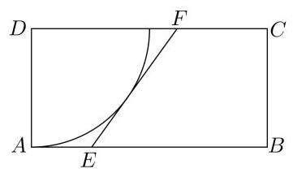

# 高三第一轮第十一讲：解三角形

## 知识点梳理

1. 三角形内的边角关系:

2. 三角形面积计算公式: ${S}_{\Delta } = \frac{1}{2}{ab}\sin C = \frac{1}{2}{bc}\sin A = \frac{1}{2}{ac}\sin B = \frac{1}{2}a{h}_{a} = \frac{1}{2}b{h}_{b} = \frac{1}{2}c{h}_{c}$

3. 正弦定理: $\frac{a}{\sin A} = \frac{b}{\sin B} = \frac{c}{\sin C} = {2R}$ (R为 $\bigtriangleup {ABC}$ 的外接圆半径)

$$
{a}^{2} = {b}^{2} + {c}^{2} - {2bc}\cos A,\;\cos A = \frac{{b}^{2} + {c}^{2} - {a}^{2}}{2bc}
$$

4. 余弦定理: ${b}^{2} = {a}^{2} + {c}^{2} - {2ac}\cos B,\cos B = \frac{{a}^{2} + {c}^{2} - {b}^{2}}{2ac}$ ;

$$
{c}^{2} = {a}^{2} + {b}^{2} - {2ab}\cos C,\;\cos C = \frac{{a}^{2} + {b}^{2} - {c}^{2}}{2ab}
$$

## 一、基础练习

1、在 $\bigtriangleup  {ABC}$ 中， $\sin A : \sin B : \sin C = 3 : 2 : 4$ 则 $\cos C =$ ___；

2、设 $\bigtriangleup  {ABC}$ 的内角 $A, B, C$ 所对的边分别为 $a, b, c$ ，若 $b\cos C + c\cos B = a\sin A$ ，则 $\bigtriangleup  {ABC}$ 的形状为( )

A. 锐角三角形 B. 直角三角形

C. 钝角三角形 D. 不确定

3、已知角 $A\text{ 、 }B$ 是 $\bigtriangleup  {ABC}$ 的内角，则 “ $A < B$ ” 是 “ $\sin A < \sin B$ ” 的( )条件

A. 充分不必要 B. 必要不充分 C. 充要 D. 既不充分也不必要

4、在非等边斜三角形 ${ABC}$ 中, $R$ 为 $\bigtriangleup {ABC}$ 的外接圆半径, $S$ 为 $\bigtriangleup {ABC}$ 的面积,下列式子中正确的是 ( )

A. $\cos A = \sin \frac{B + C}{2}$ B. $\frac{a}{\cos A} = \frac{b}{\cos B} = \frac{c}{\cos C}$

C. $\tan A + \tan B + \tan C = \tan A \cdot  \tan B \cdot  \tan C$ D. $S = {2R} \cdot  \sin A \cdot  \sin B \cdot  \sin C$

5、在 $\bigtriangleup {ABC}$ 中， $A = {60}^{ \circ  }$ ， $b = 1$ ，其面积为 $\sqrt{3}$ ，则 $\frac{a + b + c}{\sin A + \sin B + \sin C} =$ ___；

6、设 $\bigtriangleup  {ABC}$ 的内角 $A$ 、 $B$ 、 $C$ 的对边长分别为 $a$ 、 $b$ 、 $c$ ，且 $a\cos B - b\cos A = \frac{3}{5}c$ ，则 $\tan A\cot B$ 的值为( )

A. 2 B. 4 C. 6 D. 以上都不对

7、在 $\bigtriangleup {ABC}$ 中，角 $A, B, C$ 的对边分别为 $a, b, c$ ，若 $\left( {{a}^{2} + {c}^{2} - {b}^{2}}\right) \tan B = \sqrt{3}{ac}$ ，则角 $B$ 的值为( )

A. $\frac{\pi }{6}$ B. $\frac{\pi }{3}$ C. $\frac{\pi }{6}$ 或 $\frac{5\pi }{6}$ D. $\frac{\pi }{3}$ 或 $\frac{2\pi }{3}$

8、在 $\bigtriangleup {ABC}$ 中,角 $A\text{ 、 }B\text{ 、 }C$ 所对的边分别为 $a\text{ 、 }b\text{ 、 }c$ ,若 $b = 2, A = {30}^{ \circ  }$ ,且该三角形有唯一解,则 $a$ 的取值范围为___

9、 $\bigtriangleup  {ABC}$ 中， $a, b, c$ 分别是 $\angle A,\angle B,\angle C$ 的对边且 ${ac} + {c}^{2} = {b}^{2} - {a}^{2}$ ，若 $\bigtriangleup  {ABC}$ 最大边长是 $\sqrt{7}$ 且 $\sin C = 2\sin A$ ，则 $\bigtriangleup  {ABC}$ 最小边的边长为___。

10、在 $\bigtriangleup {ABC}$ 中, $a, b, c$ 分别是角 $A, B, C$ 的对边,且 $8{\sin }^{2}\frac{B + C}{2} - 2\cos {2A} = 7$ . 则角 $A =$ ___；

## 二、综合提高

1、在钝角 $\bigtriangleup {ABC}$ 中，角 $A\text{ 、 }B\text{ 、 }C$ 所对的边分别为 $a\text{ 、 }b\text{ 、 }c$ ，若 $a = 1, b = 2$ ，则最大边 $c$ 的取值范围是( )

A. $\left( {\sqrt{5}, + \infty }\right)$ B. $\left( {2,\sqrt{5}}\right)$ C. $\left( {\sqrt{5},2\sqrt{2}}\right)$ D. $\left( {\sqrt{5},3}\right)$

2、设 $\bigtriangleup {ABC}$ 的内角 $A\text{ 、 }B\text{ 、 }C$ 所对的边长分别为 $a\text{ 、 }b\text{ 、 }c$ ,则下列命题: ① 若 ${ab} > {c}^{2}$ , 则 $C < \frac{\pi }{3}$ ; ② 若 $\tan A \leq  \tan B$ ，则 $\sin A \leq  \sin B$ ；③ 若 $\sin A < \cos B$ ，则 $\bigtriangleup  {ABC}$ 为钝角三角形; ④ 若 $\tan A \cdot  \tan B > 1$ ，则 $\tan A \cdot  \tan B \cdot  \tan C > 2$ . 真命题的个数是( )

A. 1 B. 2 C. 3 D. 4

3、已知 $\bigtriangleup  {ABC}$ 的三边长分别为 $\sqrt{a}$ 、 $\sqrt{b}$ 、 $\sqrt{c}$ ，若存在角 $\theta  \in  \left( {0,\pi }\right)$ 使得: ${a}^{2} = {b}^{2} + {c}^{2} - {2bc}\cos \theta$ ，则 $\bigtriangleup  {ABC}$ 的形状为( )

A. 锐角三角形 B. 直角三角形 C. 钝角三角形 D. 以上都不对

4、在 $\bigtriangleup {ABC}$ 中，内角 $A, B, C$ 的对边分别为 $a, b, c$ ，若 ${a}^{2} + {b}^{2} + {c}^{2} = 2\sqrt{3}{bc}\sin A$ ， 则 $A =$ ___；

5、在 $\bigtriangleup {ABC}$ 中，角 $A\text{ 、 }B\text{ 、 }C$ 的对边分别为 $a\text{ 、 }b\text{ 、 }c$ ，设 $\bigtriangleup {ABC}$ 的面积为 $S$ ，若 $3{a}^{2} = \; 2{b}^{2} + {c}^{2}$ ，则 $\frac{S}{{b}^{2} + 2{c}^{2}}$ 的最大值为___

6、在锐角 $\bigtriangleup {ABC}$ 中, $a, b, c$ 分别是 $\angle A,\angle B,\angle C$ 的对边长, $\frac{b}{a} + \frac{a}{b} = 6\cos C$ ,则 $\frac{\tan C}{\tan A} + \frac{\tan C}{\tan B} =$ ___；

7、(2021 上海春考)已知 $A$ 、 $B$ 、 $C$ 为 $\bigtriangleup {ABC}$ 的三个内角， $a$ 、 $b$ 、 $c$ 是其三条边， $a = 2$ ， $\cos C =  - \frac{1}{4}$

(1)若 $\sin A = 2\sin B$ ，求 $b$ 、 $c$ ；

(2)若 $\cos \left( {A - \frac{\pi }{4}}\right)  = \frac{4}{5}$ ，求 $c$ .

8、(2021 上海高考)已知在 $\bigtriangleup  {ABC}$ 中， $A$ 、 $B$ 、 $C$ 所对边分别为 $a$ 、 $b$ 、 $c$ ，且 $a = 3$ ， $b = {2c}$ .

(1)若 $A = \frac{2\pi }{3}$ ，求 $\bigtriangleup  {ABC}$ 的面积；

(2)若 $2\sin B - \sin C = 1$ ，求 $\bigtriangleup  {ABC}$ 的周长.

9、(2022 上海春考)如图，矩形 ${ABCD}$ 区域内， $D$ 处有一棵古树，为保护古树，以 $D$ 为圆心， ${DA}$ 为半径划定圆 $D$ 作为保护区域，已知 ${AB} = {30}\mathrm{\;m}$ ， ${AD} = {15}\mathrm{\;m}$ ，点 $E$ 为 ${AB}$ 上的动点,点 $F$ 为 ${CD}$ 上的动点,满足 ${EF}$ 与圆 $D$ 相切.

(1)若 $\angle {ADE} = {20}^{ \circ  }$ ，求 ${EF}$ 的长；

(2)当点 $E$ 在 ${AB}$ 的什么位置时，梯形 ${FEBC}$ 的面积有最大值，最大面积为多少？

(长度精确到 ${0.1}\mathrm{\;m}$ ,面积精确到 ${0.01}{\mathrm{\;m}}^{2}$ )

