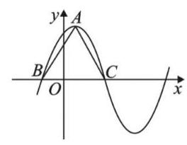

# 高三第一轮第十二讲：三角函数

## 知识点梳理:

1、正弦函数

2、余弦函数

3、正切函数

三角函数主要研究函数的图像、零点、值域、单调性、对称性、周期性等性质。

## 一、基础练习

1、函数 $f\left( x\right)  = {\sin }^{2}x - {\cos }^{2}x$ 的最小正周期为___；

2、 $y = \sin {ax}$ ( $a \neq  0$ )的最小正周期为 ${2\pi }$ ，则实数 $a =$ ___；

3、函数 $f\left( x\right)  = \sin \left( {\frac{3\pi }{2} + x}\right)$ 的奇偶性为___函数. (填“奇”、“偶”或“非奇非偶”)

4、函数 $f\left( x\right)  = \cos x, x \in  \left\lbrack  {-\frac{\pi }{4},\frac{5\pi }{6}}\right\rbrack$ 的值域为___；

5、函数 $y = \lg \left( {2\cos x - \sqrt{3}}\right)$ 的定义域为___；

6、若函数 $f\left( x\right)  = 2\sin \left( {x + \alpha }\right)$ 的图像关于直线 $x = \frac{\pi }{6}$ 对称，则 $\alpha$ 的一个可能的值为___；

7、方程 $\cos {2x} - \cos x = 0$ 在区间 $\left\lbrack  {0,\pi }\right\rbrack$ 上的解集为___；

8、已知 $f\left( x\right)  = a\tan x + b\sin {2x} - 3$ ，且 $f\left( 2\right)  =  - 1$ ，则 $f\left( {-2}\right)  =$ ___；

9、函数 $y =  - 2\sin \left( {{2x} - \frac{\pi }{3}}\right)$ 在 $\left\lbrack  {-\pi ,0}\right\rbrack$ 的严格单调增区间为___；

10、函数 $y = \arcsin x + \sin x$ 的值域是___；

11、函数 $f\left( x\right)  = \cos {x}^{2} + \sin x$ 在区间 $\left\lbrack  {-\frac{\pi }{4},\frac{\pi }{4}}\right\rbrack$ 上的最小值为___；

12、已知 $- 5{\sin }^{2}\alpha  + {\sin }^{2}\beta  = 4\sin \alpha$ ，则函数 $y = {\sin }^{2}\alpha  + {\sin }^{2}\beta$ 的最小值为___；

13、将函数 $y = \sin x$ 的图像上每点的横坐标缩小为原来的 $\frac{1}{2}$ (纵坐标不变),再把所得图像向左平移 $\frac{\pi }{6}$ 个单位，得到的函数解析式为( )

A. $y = \sin \left( {{2x} + \frac{\pi }{6}}\right)$ B. $y = \sin \left( {{2x} + \frac{\pi }{3}}\right)$ C. $y = \sin \left( {\frac{x}{2} + \frac{\pi }{6}}\right)$ D. $y = \sin \left( {\frac{x}{2} + \frac{\pi }{12}}\right)$

14、设函数 $f\left( x\right)  = \left| {\sin \left( {{2x} + \frac{\pi }{3}}\right) }\right|$ ,则下列说法正确的是( )

A. $f\left( x\right)$ 是偶函数 B. $f\left( x\right)$ 的最小正周期是 $\pi$

C. $f\left( x\right)$ 在区间 $\left\lbrack  {\frac{\pi }{3},\frac{7\pi }{12}}\right\rbrack$ 上是增函数 D. $f\left( x\right)$ 的图像关于点 $\left( {-\frac{\pi }{6},0}\right)$ 对称

15、将函数 $y =  - \frac{1}{x}$ 的图象按向量 $\overrightarrow{a} = \left( {1,0}\right)$ 平移，得到的函数图象与函数 $y = 2\sin {\pi x} \; \left( {-2 \leq  x \leq  4}\right)$ 的图象的所有交点的横坐标之和等于( )

A. 2 B. 4 C. 6 D. 8

## 二、综合提高

1、函数 $y = {\sin }^{2}x + 2\cos x$ 的定义域为 $\left\lbrack  {-\frac{2\pi }{3},\alpha }\right\rbrack$ ，值域为 $\left\lbrack  {-\frac{1}{4},2}\right\rbrack$ ，则 $\alpha$ 的取值范围是___；

2、设函数 $f\left( x\right)  = \sin \left( {x - \frac{\pi }{6}}\right)$ ,若对于任意的 ${x}_{1} \in  \left\lbrack  {-\frac{5\pi }{6}, - \frac{\pi }{2}}\right\rbrack$ ,在区间 $\left\lbrack  {0, m}\right\rbrack$ 上总存在唯一确定的 ${x}_{2}$ ,使得 $f\left( {x}_{1}\right)  + f\left( {x}_{2}\right)  = 0$ ,则 $m$ 的取值范围是___；

3、数学中一般用 $\min \{ a, b\}$ 表示 $\mathrm{a}\text{ 、 }\mathrm{\;b}$ 中的较小值，关于函数

$f\left( x\right)  = \min \{ \sin x + \sqrt{3}\cos x,\sin x - \sqrt{3}\cos x\}$ 有如下四个命题:

① $f\left( x\right)$ 的最小正周期为 $\pi$ ；② $f\left( x\right)$ 的图像关于直线 $x = \frac{3\pi }{2}$ 对称；

③ $f\left( x\right)$ 的值域为 $\left\lbrack  {-2,2}\right\rbrack$ ；④ $f\left( x\right)$ 在区间 $\left( {-\frac{\pi }{6},\frac{\pi }{4}}\right)$ 上单调递增. 其中是真命题的个数是( )个

A. 1 B. 2 C. 3 D. 4

4、函数 $f\left( x\right)  = \sin x, x \in  \left( {\alpha ,\beta }\right)$ ，且 $\left( {\alpha ,\beta }\right)  \subseteq  \left\lbrack  {0,\pi }\right\rbrack$ ，若任意 ${x}_{1}$ ， ${x}_{2}$ ， ${x}_{3} \in  \left( {\alpha ,\beta }\right)$ ， $f\left( {x}_{1}\right)$ 、 $f\left( {x}_{2}\right) \text{ 、 }f\left( {x}_{3}\right)$ 都能构成某个三角形的三条边,则 $\beta  - \alpha$ 的最大值为 ( )

A. $\frac{\pi }{6}$ B. $\frac{\pi }{3}$ C. $\frac{2\pi }{3}$ D. $\pi$

5、设 $f\left( x\right)  = \sin \left( {{\omega x} + \frac{\pi }{4}}\right) \left( {\omega  > 0}\right)$ 在 $\left( {\frac{\pi }{2},\pi }\right)$ 上单调递减，则 $\omega$ 的取值范围是___；

6、已知函数 $f\left( x\right)  = \cos \left( {{\omega x} - \frac{\pi }{4}}\right) \left( {\omega  \in  {\mathbf{N}}^{ * }}\right)$ 在 $\left( {\frac{\pi }{3},\frac{\pi }{2}}\right)$ 上不单调,则 $\omega$ 的最小值为___

7、设函数 $f\left( x\right)  = 2\sin {\omega x} - 1\left( {\omega  > 0}\right)$ ，在区间 $\left\lbrack  {\frac{\pi }{4},\frac{3\pi }{4}}\right\rbrack$ 上至少有 2 个不同的零点，至多有 3 个不同的零点,则 $\omega$ 的取值范围是( )

A. $\left\lbrack  {\frac{26}{9},\frac{10}{3}}\right\rbrack$ B. $\left\lbrack  {\frac{26}{9},\frac{58}{9}}\right)$ C. $\left\lbrack  {\frac{34}{9},\frac{58}{9}}\right)$ D. $\left\lbrack  {\frac{26}{9},\frac{10}{3}}\right\rbrack   \cup  \left\lbrack  {\frac{34}{9},\frac{58}{9}}\right)$

8、设函数 $f\left( x\right)  = \sin \left( {{\omega x} + \varphi }\right) \left( {\omega  > 0,\varphi  \in  \mathbf{R}}\right)$ ，若存在常数 $T\left( {T < 0}\right)$ ，满足 $\forall x \in  \mathbf{R}$ 有 $f\left( {x + T}\right)  = {Tf}\left( x\right)$ ，则 $\omega$ 可取到的最小值为___

9、已知函数 $f\left( x\right)  = \frac{1}{2}\sin x + \frac{\sqrt{3}}{2}\cos x$ ，若方程 $3{\left\lbrack  f\left( x\right) \right\rbrack  }^{2} - f\left( x\right)  + m = 0$ 在区间 $\left\lbrack  {-\frac{\pi }{3},\frac{2\pi }{3}}\right\rbrack$ 内有且仅有两解,则实数 $m$ 的取值范围是___

10、函数 $f\left( x\right)  = 6{\cos }^{2}\frac{\omega x}{2} + \sqrt{3}\sin \left( {\omega x}\right)  - 3\left( {\omega  > 0}\right)$ 在一个周期内的图像如图所示, $A$ 为图像的最高点, $B\text{ 、 }C$ 为图像与 $x$ 轴的交点,且 $\bigtriangleup {ABC}$ 为正三角形.

(1)求函数 $f\left( x\right)$ 的解析式;

(2)若 $f\left( {x}_{0}\right)  = \frac{6\sqrt{3}}{5}$ ，且 ${x}_{0} \in  \left( {-\frac{10}{3},\frac{2}{3}}\right)$ ，求 $f\left( {{x}_{0} + 1}\right)$ 的值；

(3)若 $y = {f}^{2}\left( x\right)  - {af}\left( x\right)  + 1$ 的最小值为 $\frac{1}{2}$ ，求 $a$ 的取值.
