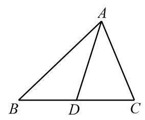
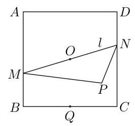

# 高三第一轮第十三讲：向量基本概念复习

## 知识点梳理:

## 一、平面向量的有关概念

(1)向量的基本概念

(2)向量的加减运算及实数与向量的乘法运算

(3)向量的坐标表示及坐标运算

(4)两非零向量平行的充要条件

二、平面向量基本定理: 如果 $\overrightarrow{{e}_{1}},\overrightarrow{{e}_{2}}$ 是同一平面内的两个不平行的向量,那么对于这一平面内的任意向量 $\overrightarrow{a}$ ,有且只有一对实数 ${\lambda }_{1},{\lambda }_{2}$ ,使得 $\overrightarrow{a} = {\lambda }_{1}\overrightarrow{{e}_{1}} + {\lambda }_{2}\overrightarrow{{e}_{2}}$ ,其中 $\overrightarrow{{e}_{1}},\overrightarrow{{e}_{2}}$ 向量称为平面向量的一个基。即: 平面上任意两个不平行的向量都组成平面向量的一个基。

三、三点共线: 给定平面上不共线的三个点 $O, A, B$ ,根据向量基本定理,对平面上任意一个点 $P$ ,都由实数 $\lambda$ 和 $\mu$ ,使得 $\overrightarrow{OP} = \lambda \overrightarrow{OA} + \mu \overrightarrow{OB}$ ,如果 $A, B, P$ 三点共线,则 $\lambda  + \mu  = 1$ 。即

$$
\overrightarrow{OP} = \left( {1 - \mu }\right) \overrightarrow{OA} + \mu \overrightarrow{OB}
$$

## 四、向量的数量积及其应用

1、向量的投影和数量投影的概念

(1)向量 $\overrightarrow{b}$ 在向量 $\overrightarrow{a}$ 方向上的投影为: $\left| \overrightarrow{b}\right| \cos  < \overrightarrow{a},\overrightarrow{b} > \overrightarrow{{a}_{0}} = \left| \overrightarrow{b}\right| \cos  < \overrightarrow{a},\overrightarrow{b} > \frac{\overrightarrow{a}}{\left| \overrightarrow{a}\right| }$

(2) $\left| \overrightarrow{b}\right| \cos  < \overrightarrow{a},\overrightarrow{b} >$ 称为 $\overrightarrow{b}$ 在向量 $\overrightarrow{a}$ 方向上的数量投影。

2、向量数量积: 如果两个非零向量 $\overrightarrow{a},\overrightarrow{b}$ ,定义向量 $\overrightarrow{a}$ 和向量 $\overrightarrow{b}$ 的数量积, $\overrightarrow{a} \bullet  \overrightarrow{b} = \left| \overrightarrow{a}\right| \left| \overrightarrow{b}\right| \cos  < \overrightarrow{a},\overrightarrow{b} >$ ,规定 $\overrightarrow{0} \bullet  \overrightarrow{a} = 0;\overrightarrow{a} \cdot  \overrightarrow{a}$ 简记为 ${\overrightarrow{a}}^{2}$ ,且 $\overrightarrow{a} \cdot  \overrightarrow{a} = {\overrightarrow{a}}^{2} = {\left| \overrightarrow{a}\right| }^{2}$

## 四、平面向量的应用

(1)定比分点公式:设 $P$ 是直线 ${P}_{1}{P}_{2}$ 上一点，且满足 $\overrightarrow{{P}_{1}P} = \lambda \overrightarrow{P{P}_{2}}$ ，其中 $P\left( {x, y}\right)$ ， ${P}_{1}\left( {{x}_{1},{y}_{1}}\right) ,{P}_{2}\left( {{x}_{2},{y}_{2}}\right)$ ,则

$$
\left\{  \begin{array}{l} x = \frac{{x}_{1} + \lambda {x}_{2}}{1 + \lambda }, \\  y = \frac{{y}_{1} + \lambda {y}_{2}}{1 + \lambda }. \end{array}\right.
$$

(2)处理平面两条直线平行或垂直的关系

给定向量 $\overrightarrow{a} = \left( {{x}_{1},{y}_{1}}\right)$ 与 $\overrightarrow{b} = \left( {{x}_{2},{y}_{2}}\right)$ ,则

(1) $\overrightarrow{a} \bot  \overrightarrow{b}$ 的充要条件是 ${x}_{1}{x}_{2} + {y}_{1}{y}_{2} = 0$ ；

(2) $\overrightarrow{a}//\overrightarrow{b}$ 的充要条件是 ${x}_{1}{y}_{2} = {x}_{2}{y}_{1}$ .

(3)两角差的余弦公式的推导

例 6 用向量方法证明:

$$
\cos \left( {\alpha  - \beta }\right)  = \cos \alpha \cos \beta  + \sin \alpha \sin \beta .
$$

(4)三角形面积公式

例 4 在 $\bigtriangleup {ABC}$ 中,设 $\overrightarrow{CA} = \overrightarrow{a},\overrightarrow{CB} = \overrightarrow{b}$ ,记 $\bigtriangleup {ABC}$ 的面积为 $S$ .

(1)求证: $S = \frac{1}{2}\sqrt{{\left| \overrightarrow{a}\right| }^{2}{\left| \overrightarrow{b}\right| }^{2} - {\left( \overrightarrow{a} \cdot  \overrightarrow{b}\right) }^{2}}$ ；

(2) 设 $\overrightarrow{a} = \left( {{x}_{1},{y}_{1}}\right) ,\overrightarrow{b} = \left( {{x}_{2},{y}_{2}}\right)$ . 求证: $S = \; \frac{1}{2}\left| {{x}_{1}{y}_{2} - {x}_{2}{y}_{1}}\right|$ .

(5)不等式的证明(柯西不等式)

例 8 已知 ${x}_{1}\text{ 、 }{x}_{2}\text{ 、 }{y}_{1}\text{ 、 }{y}_{2}$ 都是实数,求证:

$$
{\left( {x}_{1}{x}_{2} + {y}_{1}{y}_{2}\right) }^{2} \leq  \left( {{x}_{1}^{2} + {y}_{1}^{2}}\right) \left( {{x}_{2}^{2} + {y}_{2}^{2}}\right) ,
$$

并且等式成立的充要条件是 ${x}_{1}{y}_{2} = {x}_{2}{y}_{1}$ .

## 五、常用结论(三点共线、极化恒等式和奔驰定理)

1、若存在非零实数 $m$ ，使得 $\overrightarrow{OA} = m\overrightarrow{OB} + \left( {1 - m}\right) \overrightarrow{OC}$ ，则 $A, B, C$ 三点共线

2、 $O$ 在 $\bigtriangleup  {ABC}$ 内，则 ${S}_{\bigtriangleup {OBC}} \cdot  \overrightarrow{OA} + {S}_{\bigtriangleup {OAC}} \cdot  \overrightarrow{OB} + {S}_{\bigtriangleup {OAB}} \cdot  \overrightarrow{OC} = \overrightarrow{0}$

3、重心: $\overrightarrow{OA} + \overrightarrow{OB} + \overrightarrow{OC} = \overrightarrow{0}$

垂心: $\overrightarrow{OA} \cdot  \overrightarrow{OB} = \overrightarrow{OB} \cdot  \overrightarrow{OC} = \overrightarrow{OC} \cdot  \overrightarrow{OA}$

外心: $\left( {\overrightarrow{OA} + \overrightarrow{OB}}\right)  \cdot  \overrightarrow{AB} = \left( {C\overrightarrow{OB} + \overrightarrow{OC}}\right)  \cdot  \overrightarrow{BC} = \left( {\overrightarrow{OC} + \overrightarrow{OA}}\right)  \cdot  \overrightarrow{CA}$

内心: $\overrightarrow{OA} \cdot  \left( {\frac{\overrightarrow{AB}}{\left| \overrightarrow{AB}\right| } - \frac{\overrightarrow{AC}}{\left| \overrightarrow{AC}\right| }}\right)  = \overrightarrow{OB} \cdot  \left( {\frac{\overrightarrow{BA}}{\left| \overrightarrow{BA}\right| } - \frac{\overrightarrow{BC}}{\left| \overrightarrow{BC}\right| }}\right)  = \overrightarrow{OC} \cdot  \left( {\frac{\overrightarrow{CA}}{\left| \overrightarrow{CA}\right| } - \frac{\overrightarrow{CB}}{\left| \overrightarrow{CB}\right| }}\right)  = 0$

4、极化恒等式: 在 $\bigtriangleup {ABC}$ 中, $D$ 是边 ${BC}$ 的中点,则 $\overrightarrow{AB} \cdot  \overrightarrow{AC} = {\left| \overrightarrow{AD}\right| }^{2} - {\left| \overrightarrow{DB}\right| }^{2}$

## 一、基本题型

1、已知向量 $\overrightarrow{a} = \left( {\sqrt{3},1}\right) ,\overrightarrow{b} = \left( {\sin \alpha  - m,\cos \alpha }\right) \alpha  \in  R$ ，若 $\overrightarrow{a}//\overrightarrow{b}$ ，则实数 $m$ 的最小值为___；

2、设 $\overrightarrow{a} = \left( {2,4}\right) ,\overrightarrow{b} = \left( {1,1}\right)$ ，若 $\overrightarrow{b} \bot  \left( {\overrightarrow{a} + m\overrightarrow{b}}\right)$ ，则实数 $m =$ ___；

3、设平行四边形 ${ABCD}$ 中， $\bigtriangleup {BCD}$ 的重心为 $H$ ， $\overrightarrow{AH} = \lambda \overrightarrow{AB} + \mu \overrightarrow{AD}$ ，则 ${\mu }^{3\lambda } =$ ___；

4、已知向量 $\overrightarrow{a},\overrightarrow{b}$ 满足 $\left| \overrightarrow{a}\right|  = 2,\left| \overrightarrow{b}\right|  = 3,\left| {2\overrightarrow{a} + \overrightarrow{b}}\right|  = \sqrt{37}$ ，则 $\overrightarrow{a},\overrightarrow{b}$ 的夹角为___；

5、已知向量 $\overrightarrow{a}$ 、 $\overrightarrow{b}$ ， $\left| \overrightarrow{a}\right|  = 2$ ， $\left| \overrightarrow{b}\right|  = 1$ ，则 $\left| {2\overrightarrow{b} - \overrightarrow{a}}\right|$ 的取值范围是___；

6、已知 $\overrightarrow{a} = \left( {1, - 2}\right) ,\overrightarrow{b} = \left( {3,4}\right)$ ，则 $\overrightarrow{a}$ 在 $\overrightarrow{b}$ 方向上的投影为___；

7、在 $\bigtriangleup {ABC}$ 中， ${AC} = 3$ ，向量 $\overrightarrow{AB}$ 在 $\overrightarrow{AC}$ 上的投影向量为 $- 2\frac{\overrightarrow{AC}}{\left| \overrightarrow{AC}\right| }$ ， ${S}_{\bigtriangleup {ABC}} = 3$ ，则 ${BC} =$ ( )

A. 5 B. $2\sqrt{7}$ C. $\sqrt{29}$ D. $4\sqrt{2}$

8、向量 $\overrightarrow{a} = \left( {1, - 2}\right)$ 、 $\overrightarrow{b} = \left( {\lambda ,1}\right)$ 的夹角为钝角，则实数 $\lambda$ 的取值范围是___；

9、在等腰三角形 ${ABC}$ 中， ${AB} = {AC} = \sqrt{5},{BC} = 2$ ，若 $P$ 为边 ${BC}$ 上的动点，则 $\overrightarrow{AP} \cdot  \left( {\overrightarrow{AB} + \overrightarrow{AC}}\right)  =$ (   )

A. 4 B. 8 C. -4 D. -8

10、已知 ${\Delta ABC}$ 的三个顶点坐标分别为 $A\left( {1,2}\right) , B\left( {4,2}\right) , C\left( {5,7}\right)$ ，则 $\bigtriangleup  {ABC}$ 的面积为___；

11、已知 $A\text{ 、 }B\text{ 、 }C$ 三点共线,对该直线外任意一点 $O$ ,都有 $\overrightarrow{OC} = {4m}\overrightarrow{OA} + n\overrightarrow{OB}\left( {m, n > 0}\right)$ , 则 $\frac{1}{m} + \frac{4}{n}$ 的最小值为___；

12、已知 $O, N, P$ 在 $\bigtriangleup {ABC}$ 所在平面内,且 $\left| \overrightarrow{OA}\right|  = \left| \overrightarrow{OB}\right|  = \left| \overrightarrow{OC}\right| ,\overrightarrow{NA} + \overrightarrow{NB} + \overrightarrow{NC} = \overrightarrow{0}$ , $\overrightarrow{PA} \cdot  \overrightarrow{PB} = \overrightarrow{PB} \cdot  \overrightarrow{PC} = \overrightarrow{PC} \cdot  \overrightarrow{PA}$ ,则 $O, N, P$ 依次是 ${\Delta ABC}$ 的___；

13、若等边 $\bigtriangleup {ABC}$ 的边长为 $2\sqrt{3}$ ,平面内一点 $M$ 满足 $\overrightarrow{CM} = \frac{1}{6}\overrightarrow{CB} + \frac{2}{3}\overrightarrow{CA}$ ,则 $\overrightarrow{MA} \cdot  \overrightarrow{MB} =$ ___；

14、在 $\bigtriangleup {ABC}$ 中, $A = \frac{\pi }{2},{AB} = {AC} = 2$ ,有下述三个结论:

① 若 $G$ 为 $\bigtriangleup {ABC}$ 的重心，则 $\overrightarrow{AG} = \frac{1}{3}\overrightarrow{AB} + \frac{1}{3}\overrightarrow{AC}$ ；

② 若 $P$ 为 ${BC}$ 边上的一个动点，则 $\overrightarrow{AP} \cdot  \left( {\overrightarrow{AB} + \overrightarrow{AC}}\right)$ 为定值 2;

③ 若 $M\text{ 、 }N$ 为 ${BC}$ 边上的两个动点,且 ${MN} = \sqrt{2}$ ,则 $\overrightarrow{AM} \cdot  \overrightarrow{AN}$ 的最小值为 $\frac{3}{2}$ ;

④已知 $P$ 为 $\bigtriangleup {ABC}$ 内一点,若 ${BP} = 1$ ,且 $\overrightarrow{AP} = \lambda \overrightarrow{AB} + \mu \overrightarrow{AC}$ ,则 $\lambda  + \sqrt{3}\mu$ 的最大值为 2 ; 其中所有正确结论的编号___；

15、给出下列结论:①若 $\overrightarrow{a} \neq  \overrightarrow{0}$ ，且 $\overrightarrow{a} \cdot  \overrightarrow{b} = \overrightarrow{a} \cdot  \overrightarrow{c}$ ，则 $\overrightarrow{b} = \overrightarrow{c}$ ；② ${\left( \overrightarrow{a} \cdot  \overrightarrow{b}\right) }^{2} = {\overrightarrow{a}}^{2} \cdot  {\overrightarrow{b}}^{2}$ ；③ “ $\left| {\overrightarrow{a} + \overrightarrow{b}}\right|  = {\left| \overrightarrow{a}\right| }^{2} + {\left| \overrightarrow{b}\right| }^{2}$ ” 是 “ $\overrightarrow{a} \bot  \overrightarrow{b}$ ” 的充要条件；④函数 $y = f\left( x\right)$ 的图像沿向量 $\overrightarrow{d} = \left( {1,2}\right)$ 平移,所得图像的解析式为 $y = f\left( {x + 1}\right)  + 2$ ,其中真命题的个数为___；

## 二、解答题

1、证明下列不等式:

(1)已知 $a > 0, b > 0, a + b = 1$ ,求证: $\sqrt{{2a} + 1} + \sqrt{{2b} + 1} \leq  2\sqrt{2}$

(2)已知 $a, b$ 均为正数，且 $a + b = 1$ ，求证: ${\left( a + 2\right) }^{2} + {\left( b + 3\right) }^{2} \geq  {18}$

2、已知 $\left| \overrightarrow{a}\right|  = \sqrt{2},\left| \overrightarrow{b}\right|  = 3,\overrightarrow{a}$ 和 $\overrightarrow{b}$ 夹角为 ${45}^{ \circ  }$ ,当向量 $\overrightarrow{a} + \lambda \overrightarrow{b}$ 与 $\lambda \overrightarrow{a} + \overrightarrow{b}$ 的夹角为锐角，求 $\lambda$ 的取值范围。

3、设 $\overrightarrow{a},\overrightarrow{b}$ 是两个不共线的非零向量( $t \in  R$ )

(1)记 $\overrightarrow{OA} = \overrightarrow{a},\overrightarrow{OB} = t\overrightarrow{b},\overrightarrow{OC} = \frac{1}{3}\left( {\overrightarrow{a} + \overrightarrow{b}}\right)$ ，那么实数 $t$ 为何值时， $A, B, C$ 三点共线？

(2)若 $\left| \overrightarrow{a}\right|  = \left| \overrightarrow{b}\right|  = 1$ ，且 $\overrightarrow{a}$ 与 $\overrightarrow{b}$ 夹角为 ${120}^{ \circ  }$ ，那么实数 $x$ 为何值时， $\left| {\overrightarrow{a} - x\overrightarrow{b}}\right|$ 的值最小？

4、如图，已知正方形 ${ABCD}$ 的边长为 2,过中心 $O$ 的直线 $l$ 与两边 ${AB}\text{ 、 }{CD}$ 分别交于交于点 $M\text{ 、 }N$ .

(1)求 $\overrightarrow{BD} \cdot  \overrightarrow{DC}$ 的值；

(2)若 $Q$ 是 ${BC}$ 的中点，求 $\overrightarrow{QM} \cdot  \overrightarrow{QN}$ 的取值范围；

(3)若 $P$ 是平面上一点，且满足 $2\overrightarrow{OP} = \lambda \overrightarrow{OB} + \left( {1 - \lambda }\right) \overrightarrow{OC}$ ， 求 $\overrightarrow{PM} \cdot  \overrightarrow{PN}$ 的最小值.

5、在平面直角坐标系中，点 ${A}_{n}$ 满足 $\overrightarrow{O{A}_{1}} = \left( {0,1}\right)$ ，且 $\overrightarrow{{A}_{n}{A}_{n + 1}} = \left( {1,1}\right)$ ，点 ${B}_{n}$ 满足 $\overrightarrow{O{B}_{1}} = \left( {3,0}\right)$ ， 且 $\overrightarrow{{B}_{n}{B}_{n + 1}} = \left( {3 \cdot  {\left( \frac{2}{3}\right) }^{n},0}\right)$ ，其中 $n \in  {N}^{ * }$

(1)证明:点 ${A}_{n}$ 在直线 $y = x + 1$ 上；

(2)记四边形 ${A}_{n}{B}_{n}{B}_{n + 1}{A}_{n + 1}$ 的面积为 ${a}_{n}$ ，求 ${a}_{n}$ 的表达式；

(3)对于(2)中的 ${a}_{n}$ ，求最小的正整数 $P$ ，使得对任意 $n \in  {N}^{ * }$ ，都有 ${a}_{n} < P$ 成立。
