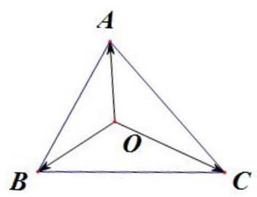
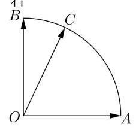
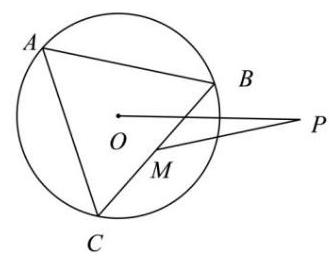

# 高三第一轮第十四讲：向量综合应用

## 知识点梳理

## 1、向量中重心、内心、外心、垂心:

三角形重心、内心、垂心、外心的概念及简单的三角形形状判断方法。

重心: ${\Delta ABC}$ 中每条边上所对应的中线的交点;

垂心: ${\Delta ABC}$ 中每条边上所对应的垂线上的交点;

内心: $\bigtriangleup {ABC}$ 中每个角的角平分线的交点 (内切圆的圆心);

外心: ${\Delta ABC}$ 中每条边上所对应的中垂线的交点 (外接圆的圆心)。

## 2、向量的结论:

向量中的“奔驰定理”: 设点 $O$ 为 $\bigtriangleup {ABC}$ 内的任意一点,则:

${S}_{\Delta BOC} \cdot  \overrightarrow{OA} + {S}_{\Delta AOC} \cdot  \overrightarrow{OB} + {S}_{\Delta BOA} \cdot  \overrightarrow{OC} = \overrightarrow{0}$

(1) $O$ 为重心: ${S}_{\Delta AOB} = {S}_{\Delta BOC} = {S}_{\Delta AOC},\overrightarrow{OA} + \overrightarrow{OB} + \overrightarrow{OC} = \overrightarrow{0}$

(2)垂心: $\overrightarrow{OA} \cdot  \overrightarrow{OB} = \overrightarrow{OB} \cdot  \overrightarrow{OC} = \overrightarrow{OC} \cdot  \overrightarrow{OA}$ ；

${S}_{\bigtriangleup {BOC}} : {S}_{\bigtriangleup {AOC}} : {S}_{\bigtriangleup {AOB}} = \tan A : \tan B : \tan C$

则 $\tan A \cdot  \overrightarrow{OA} + \tan B \cdot  \overrightarrow{OB} + \tan C \cdot  \overrightarrow{OC} = \overrightarrow{0}$

(3)外心: $\left| \overrightarrow{OA}\right|  = \left| \overrightarrow{OB}\right|  = \left| \overrightarrow{OC}\right|$ 或 $\left( {\overrightarrow{OA} + \overrightarrow{OB}}\right)  \cdot  \overrightarrow{AB} = \left( {\overrightarrow{OB} + \overrightarrow{OC}}\right)  \cdot  \overrightarrow{BC} = \left( {\overrightarrow{OC} + \overrightarrow{OA}}\right)  \cdot  \overrightarrow{CA}$

${S}_{\bigtriangleup {BOC}} : {S}_{\bigtriangleup {AOC}} : {S}_{\bigtriangleup {AOB}} = \sin {2A} : \sin {2B} : \sin {2C}$

则 $\sin {2A} \cdot  \overrightarrow{OA} + \sin {2B} \cdot  \overrightarrow{OB} + \sin {2C} \cdot  \overrightarrow{OC} = \overrightarrow{0}$

(4)内心: $a \cdot  \overrightarrow{OA} + b \cdot  \overrightarrow{OB} + c \cdot  \overrightarrow{OC} = \overrightarrow{0}$ 或 $\sin A \cdot  \overrightarrow{OA} + \sin B \cdot  \overrightarrow{OB} + \sin C \cdot  \overrightarrow{OC} = \overrightarrow{0}$

${S}_{\bigtriangleup {BOC}} : {S}_{\bigtriangleup {AOC}} : {S}_{\bigtriangleup {AOB}} = a : b : c$

## 一、系数的最值

1、如图，点 $C$ 是半径为 1 的扇形圆弧 ${AB}$ 上一点， $\overrightarrow{OA} \cdot  \overrightarrow{OB} = 0$ ， $\left| \overrightarrow{OA}\right|  = \left| \overrightarrow{OB}\right|  = 1$ ，若 $\overrightarrow{OC} = x\overrightarrow{OA} + y\overrightarrow{OB}$ ,则 ${2x} + y$ 的最小值是( )

A. $- \sqrt{5}$ B. 1 C. 2 D. $\sqrt{5}$

2、已知向量 $\left| \overrightarrow{a}\right|  = \left| \overrightarrow{b}\right|  = \overrightarrow{a} \cdot  \overrightarrow{b} = 2,\overrightarrow{c} = \lambda \overrightarrow{a} + \mu \overrightarrow{b}\left( {\lambda ,\mu  \in  \mathbf{R}}\right)$ ，且 $\left| {\overrightarrow{c} - \frac{\overrightarrow{a} + \overrightarrow{b}}{2}}\right|  = \left| \frac{\overrightarrow{a} - \overrightarrow{b}}{2}\right|$ ，则 $\lambda  + \mu$ 的取值范围是___；

3、已知 $O$ 为 $\bigtriangleup {ABC}$ 的外心， $\angle {ABC} = \frac{\pi }{3}$ ， $\overrightarrow{BO} = \lambda \overrightarrow{BA} + \mu \overrightarrow{BC}$ ，则 $\lambda  + \mu$ 的最大值为___；

4、已知 $\bigtriangleup {ABC}$ 的内角 $A\text{ 、 }B\text{ 、 }C$ 的对边分别为 $a\text{ 、 }b\text{ 、 }c$ ,且 $\cos A = \frac{7}{8}, I$ 为 $\bigtriangleup {ABC}$ 内部的一点，且 $a\overrightarrow{IA} + b\overrightarrow{IB} + c\overrightarrow{IC} = \overrightarrow{0}$ ，若 $\overrightarrow{AI} = x\overrightarrow{AB} + y\overrightarrow{AC}$ ，则 $x + y$ 的最大值为( )

A. $\frac{5}{4}$ B. $\frac{1}{2}$ C. $\frac{5}{6}$ D. $\frac{4}{5}$

## 二、数量积的最值

1、如图，等边 $\bigtriangleup  {ABC}$ 是半径为 2 的圆 $O$ 的内接三角形, $M$ 是边 ${BC}$ 的中点, $P$ 是圆外一点,且 ${OP} = 4$ , 当 $\bigtriangleup {ABC}$ 绕圆心 $O$ 旋转时,则 $\overrightarrow{OB} \cdot  \overrightarrow{PM}$ 的取值范围为___；

2、平面向量 $\overrightarrow{a},\overrightarrow{b},\overrightarrow{e}$ 满足 $\left| \overrightarrow{e}\right|  = 1,\overrightarrow{a} \cdot  \overrightarrow{e} = 1,\overrightarrow{b} \cdot  \overrightarrow{e} = 2,\left| {\overrightarrow{a} - \overrightarrow{b}}\right|  = 2$ ，则 $\overrightarrow{a} \cdot  \overrightarrow{b}$ 的最小值为______；

3、已知 $P$ 是边长为 4 的正三角形 ${ABC}$ 所在平面内一点，且 $\overrightarrow{AP} = \lambda \overrightarrow{AB} + \left( {2 - {2\lambda }}\right) \overrightarrow{AC} \; \left( {\lambda  \in  \mathbf{R}}\right)$ ，则 $\overrightarrow{PA} \cdot  \overrightarrow{PC}$ 的最小值为___；

4、已知 $A\text{ 、 }B$ 是单位圆 $O$ 上的两点 $\left( O\right.$ 为圆心 $),\angle {AOB} = {120}^{ \circ  }$ ，点 $C$ 是线段 ${AB}$ 上不与

$A\text{ 、 }B$ 重合的动点. ${MN}$ 是圆 $O$ 的一条直径,则 $\overrightarrow{CM} \cdot  \overrightarrow{CN}$ 的取值范围是 ( )

A. $\left\lbrack  {-\frac{3}{4},0}\right)$ B. $\left\lbrack  {-\frac{3}{4},0}\right\rbrack$ C. $\left\lbrack  {-\frac{1}{2},1}\right)$ D. $\left\lbrack  {-\frac{1}{2},1}\right\rbrack$

## 三、模的最值

1、已知 $\overrightarrow{a},\overrightarrow{b},\overrightarrow{c}$ 是平面内的三个单位向量，且 $\overrightarrow{a}\bot \overrightarrow{b}$ ，则 $\left| {\overrightarrow{a} + 2\overrightarrow{b} + \overrightarrow{c}}\right|$ 的取值范围是( )

A. $\left\lbrack  {0,4}\right\rbrack$ B. $\left\lbrack  {\sqrt{2} - 1,\sqrt{2} + 1}\right\rbrack$

C. $\left\lbrack  {\sqrt{3} - 1,\sqrt{3} + 1}\right\rbrack$ D. $\left\lbrack  {\sqrt{5} - 1,\sqrt{5} + 1}\right\rbrack$

2、已知向量 $\overrightarrow{a},\overrightarrow{b},\left| \overrightarrow{a}\right|  = 1,\left| \overrightarrow{b}\right|  = 2$ ,若对任意单位向量 $\overrightarrow{e}$ ,均有 $\left| {\overrightarrow{a} \cdot  \overrightarrow{e}}\right|  + \left| {\overrightarrow{b} \cdot  \overrightarrow{e}}\right|  \leq  \sqrt{6}$ ,则 $\overrightarrow{a} \cdot  \overrightarrow{b}$ 的最大值为( )

A. $\frac{1}{2}$ B. $\frac{\sqrt{2}}{2}$ C. 1 D. 2

3、已知向量 $\overrightarrow{a}$ 、 $\overrightarrow{b}$ 夹角为 $\frac{\pi }{3}$ ， $\left| \overrightarrow{b}\right|  = 2$ ，对任意 $x \in  \mathbf{R}$ ，有 $\left| {\overrightarrow{b} - x\overrightarrow{a}}\right|  \geq  \left| {\overrightarrow{a} - \overrightarrow{b}}\right|$ ， 则 $\left| {t\overrightarrow{b} - 3\overrightarrow{a}}\right|  + \left| {t\overrightarrow{b} - \overrightarrow{a}}\right| \left( {t \in  \mathbf{R}}\right)$ 的最小值是___；

4、已知平面向量 $\overrightarrow{a}\text{ 、 }\overrightarrow{b}\text{ 、 }\overrightarrow{c}$ 满足 $\left| \overrightarrow{a}\right|  = 1,\left| \overrightarrow{b}\right|  = \left| \overrightarrow{c}\right|  = 2$ ，且 $\overrightarrow{b} \cdot  \overrightarrow{c} = 0$ ，则当 $0 \leq  \lambda  \leq  1$ 时， $\left| {\overrightarrow{a} - \lambda \overrightarrow{b} - \left( {1 - \lambda }\right) \overrightarrow{c}}\right|$ 的取值范围是___

## 四、三角形的“四心”

1、已知 $\bigtriangleup  {ABC}$ 的三个内角 $A$ 、 $B$ 、 $C$ 的对边分别为 $a$ 、 $b$ 、 $c$ ， $O$ 为 $\bigtriangleup  {ABC}$ 内一点， 则满足下列四个条件: ① $a\overrightarrow{OA} + b\overrightarrow{OB} + c\overrightarrow{OC} = \overrightarrow{0}$ ; ② $\tan A \cdot  \overrightarrow{OA} + \tan B \cdot  \overrightarrow{OB} + \tan C \cdot  \overrightarrow{OC} = \overrightarrow{0}$ ; ③ $\sin {2A} \cdot  \overrightarrow{OA} + \sin {2B} \cdot  \overrightarrow{OB} + \sin {2C} \cdot  \overrightarrow{OC} = \overrightarrow{0}$ ；④ $\overrightarrow{OA} + \overrightarrow{OB} + \overrightarrow{OC} = \overrightarrow{0}$ 的点 $O$ 依次为 $\bigtriangleup {ABC}$ 的( )

A. 外心、内心、垂心、重心 B. 内心、外心、垂心、重心

C. 垂心、内心、重心、外心 D. 内心、垂心、外心、重心

2、点 $O$ 在 $\bigtriangleup  {ABC}$ 所在的平面内，则以下说法正确的有___

① 若 $\overrightarrow{OA} + \overrightarrow{OB} + \overrightarrow{OC} = \overrightarrow{0}$ ，则点 $O$ 为 $\bigtriangleup  {ABC}$ 的重心；

② 若 $\overrightarrow{OA} \cdot  \left( {\frac{\overrightarrow{AC}}{\left| \overrightarrow{AC}\right| } - \frac{\overrightarrow{AB}}{\left| \overrightarrow{AB}\right| }}\right)  = \overrightarrow{OB} \cdot  \left( {\frac{\overrightarrow{BC}}{\left| \overrightarrow{BC}\right| } - \frac{\overrightarrow{BA}}{\left| \overrightarrow{BA}\right| }}\right)  = 0$ ，则点 $O$ 为 $\bigtriangleup  {ABC}$ 的垂心；

③ 若 $\left( {\overrightarrow{OA} + \overrightarrow{OB}}\right)  \cdot  \overrightarrow{AB} = \left( {\overrightarrow{OB} + \overrightarrow{OC}}\right)  \cdot  \overrightarrow{BC} = 0$ ,则点 $O$ 为 $\bigtriangleup {ABC}$ 的外心.

3、已知 $O$ 是锐角 $\bigtriangleup {ABC}$ 的外接圆圆心, $\angle A = {60}^{ \circ  },\frac{\cos B}{\sin C}\overrightarrow{AB} + \frac{\cos C}{\sin B}\overrightarrow{AC} = {2m}\overrightarrow{AO}$ ,则实数 $m$ 的值为___

4、设锐角 $\bigtriangleup {ABC}$ 的外心为 $O$ ,且 $\frac{1}{4\cos A}\overrightarrow{OA} + \frac{\cos B}{\sin C}\overrightarrow{AB} + \frac{\cos C}{\sin B}\overrightarrow{AC} = \overrightarrow{0}$ ,则 $\tan A + \cot A =$ ___

5、设 $H$ 是 $\bigtriangleup {ABC}$ 的垂心，且 $3\overrightarrow{HA} + 4\overrightarrow{HB} + 5\overrightarrow{HC} = \overrightarrow{0}$ ，则 $\cos \angle {ABC} =$ ___

6、已知 $O$ 是 $\bigtriangleup {ABC}$ 的外心， ${AB} = 4,{AC} = 6,\overrightarrow{AO} = x\overrightarrow{AB} + y\overrightarrow{AC}$ ，且 ${3x} + {8y} = 4$ ， 若 $x \neq  0$ ，则 $\cos \angle {BAC}$ 的值为( )

A. $\frac{9}{16}$ B. $\frac{5}{9}$ C. $\frac{5}{12}$ D. $\frac{5}{16}$
