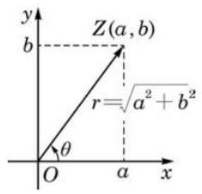

# 高三第一轮第十五讲：复数复习

## 知识点梳理:

## 一、复数的概念

复数可以按以下方式分类:

复数 $\left( {z = a + b\mathrm{i}, a\text{ 、 }b \in  \mathbf{R}}\right) \left\{  \begin{array}{l} \text{ 实数 }\left( {b = 0}\right) \\  \text{ 虚数 }\left( {b \neq  0}\right)  \end{array}\right.$

一纯虚数 $\left( {b \neq  0, a = 0}\right)$

## 二、复数的运算

当 $z \neq  0$ 时,规定 ${z}^{0} = 1$ ; 当 $z \neq  0, n \in  N$ 时,规定 ${z}^{-n} = \frac{1}{{z}^{n}}$ .

${z}^{m}{z}^{n} = {z}^{m + n},{\left( {z}^{m}\right) }^{n} = {z}^{mn},{\left( {z}_{1}{z}_{2}\right) }^{n} = {z}_{1}^{n}{z}_{2}^{n}$

当 $n \in  z$ 时， ${i}^{4\mathrm{n}} = 1$ ， ${i}^{4\mathrm{n} + 1} = i$ ， ${i}^{4\mathrm{n} + 2} =  - 1$ ， ${i}^{4\mathrm{n} + 3} =  - i$ ，(周期性)

## 三、共轭复数

1、共轭复数的定义: $a + {bi}$ 与 $c + {di}$ 共轭 $\Leftrightarrow$ ___

2、 $z \in  R$ 的充要条件是 $z = \bar{z}$

3、 $z$ 是纯虚数的充要条件是 $z + \bar{z} = 0$ 且 $z \neq  0$

4、共轭复数的运算性质

(1) $\overline{{z}_{1} \pm  {z}_{2}} = \overline{{z}_{1}} \pm  \overline{{z}_{2}}$

(2) $\overline{\left( {z}_{1}{z}_{2}\right) } = \overline{{z}_{1}{z}_{2}};\;\overline{\left( \frac{{z}_{1}}{{z}_{2}}\right) } = \frac{\overline{{z}_{1}}}{\overline{{z}_{2}}}$

5、(1)若 $z$ 为实数， ${\left| z\right| }^{2} = {z}^{2}$

(2)若 $z$ 为虚数， ${\left| z\right| }^{2} \neq  {z}^{2}$

(3) $z \cdot  \bar{z} = {\left| z\right| }^{2}$

## 四、复数的模及模的几何意义

1、 $\left| z\right|  = \sqrt{{a}^{2} + {b}^{2}}$ ，表示复数在复平面所对应的点 $z\left( {a, b}\right)$ 到原点的距离；

2、复数模的运算性质:

(1) $\left| z\right|  = \left| \overset{ - }{z}\right| ,\overset{ - }{z\overline{z}} = {\left| z\right| }^{2}$

(2) $\left| {{z}_{1}{z}_{2}}\right|  = \left| {z}_{1}\right| \left| {z}_{2}\right| ;\left| \frac{{z}_{1}}{{z}_{2}}\right|  = \frac{\left| {z}_{1}\right| }{\left| {z}_{2}\right| }\left( {{z}_{2} \neq  0}\right)$

(3) $\begin{Vmatrix}{z}_{1}\end{Vmatrix} - \left| {z}_{2}\right|  \leq  \left| {{z}_{1} \pm  {z}_{2}}\right|  \leq  \left| {z}_{1}\right|  + \left| {z}_{2}\right|$

3、 $\left| {{z}_{1} - {z}_{2}}\right|$ 表示复平面内两个点之间的距离；

## 五、1 的立方根

1 的立方根是 $1, - \frac{1}{2} \pm  \frac{\sqrt{3}}{2}i; - 1$ 的立方根是 -1, $\frac{1}{2} \pm  \frac{\sqrt{3}}{2}i$

“ 1 ” 的立方根 $\omega  =  - \frac{1}{2} \pm  \frac{\sqrt{3}}{2}i$ 的性质:

① ${\omega }^{3} = 1$ ② ${\omega }^{2} = \overline{\omega }$ ③ $1 + \omega  + {\omega }^{2} = 0$ ④ $\omega  + \frac{1}{\omega } =  - 1$ ⑤ $\frac{1}{\omega } = \overline{\omega }$

## 六、实系数一元二次方程

对于实系数一元二次方程 $a{x}^{2} + {bx} + c = 0\left( {a, b, c \in  R, a \neq  0}\right)$ ,记 $\Delta  = {b}^{2} - {4ac}$ (称为根的判别式),那么

(1) $\Delta  > 0 \Leftrightarrow$ 方程有两个不相等的实根 ${x}_{1,2} = \frac{-b + \sqrt{{b}^{2} - {4ac}}}{2a}$

(2) $\Delta  = 0 \Leftrightarrow$ 方程有两个相等的实根 ${x}_{1} = {x}_{2} =  - \frac{b}{2a}$

(3) $\Delta  < 0 \Leftrightarrow$ 方程有两个共轭虚根 ${x}_{1,2} = \frac{-b \pm  \sqrt{-\left( {{b}^{2} - {4ac}}\right) i}}{2a},{x}_{1} = \overline{{x}_{2}}$ ，此时有

${x}_{1}{x}_{2} = {\left| {x}_{1}\right| }^{2} = {\left| {x}_{2}\right| }^{2} = \frac{c}{a}$

注意 1: 在 $\Delta  < 0$ 的情况下,方程的根与系数关系 (韦达定理) 仍然成立。

2:虚系数一元二次方程有实根的问题，不能用判别式法，一般用两个复数相等求解。

1、已知 ${x}_{1},{x}_{2}$ 是实系数一元二次方程 $a{x}^{2} + {bx} + c = 0$ 的两个根,求 $\left| {{x}_{1} - {x}_{2}}\right|$ 的方法。

(1)当 $\Delta  = {b}^{2} - {4ac} \geq  0$ 时, $\left| {{x}_{1} - {x}_{2}}\right|  = \sqrt{{\left( {x}_{1} + {x}_{2}\right) }^{2} - 4{x}_{1}{x}_{2}} = \frac{\sqrt{{b}^{2} - {4ac}}}{\left| a\right| }$

( 2 )当 $\Delta  = {b}^{2} - {4ac} < 0$ 时， $\left| {{x}_{1} - {x}_{2}}\right|  = \sqrt{\left| {\left( {x}_{1} + {x}_{2}\right) }^{2} - 4{x}_{1}{x}_{2}\right| } = \frac{\sqrt{{4ac} - {b}^{2}}}{\left| a\right| }$

2、已知 ${x}_{1},{x}_{2}$ 是实系数一元二次方程 $a{x}^{2} + {bx} + c = 0$ 的两个根，

求 $\left| {x}_{1}\right|  + \left| {x}_{2}\right|$ 的方法。

(1)当 ${\Delta  = {b}^{2} - {4ac}} \geq  0$ 时

① ${x}_{1} \cdot  {x}_{2} \geq  0$ ，即 $\frac{c}{a} \geq  0$ ，则 $\left| {x}_{1}\right|  + \left| {x}_{2}\right|  = \left| {{x}_{1} + {x}_{2}}\right|  = \left| \frac{b}{a}\right|$

② ${x}_{1} \cdot  {x}_{2} < 0$ ，即 $\frac{c}{a} < 0$

则 $\left| {x}_{1}\right|  + \left| {x}_{2}\right|  = \left| {{x}_{1} - {x}_{2}}\right|  = \sqrt{{\left( {x}_{1} + {x}_{2}\right) }^{2} - 4{x}_{1}{x}_{2}} = \frac{\sqrt{{b}^{2} - {4ac}}}{\left| a\right| }$

(2)当 $\Delta  = {b}^{2} - {4ac} < 0$ 时， $\left| {x}_{1}\right|  + \left| {x}_{2}\right|  = 2\left| {x}_{1}\right|  = 2\sqrt{\frac{c}{a}}$

七、复数的三角形式 (*)

1、辐角: 复数 $Z = a + {bi}\left( {a, b \in  R}\right)$ 对应复平面的点 $Z\left( {a, b}\right)$ ,以 $x$ 轴的正半轴为始边,射线 OZ 为终边所成的角称为复数的辐角,记为 ${Argz}$ 。辐角可以是任意的角,相差 ${2\pi }$ 的整数倍。 如: 复数 $i$ 的辐角为 $\frac{\pi }{2} + {2k\pi }, k \in  Z$

规定:复数 0 的辐角大小为任意角

在复数的所有辐角中,满足 $0 \leq  \theta  < {2\pi }$ 的辐角 $\theta$ 称为

$z$ 的辐角主值,记为 $\arg z$ ,非零复数分辐角主值唯一确定。

2、复数的三角形式: $z = a + {bi} = r\left( {\cos \theta  + i\sin \theta }\right)$ ,其中 $r = \sqrt{{a}^{2} + {b}^{2}}$

3、设复数 ${z}_{1} = r\left( {\cos \alpha  + i\sin \alpha }\right) ,{z}_{2} = s\left( {\cos \beta  + i\sin \beta }\right)$ 则:

${z}_{1}{z}_{2} = {rs}\left\lbrack  {\cos \left( {\alpha  + \beta }\right)  + \mathrm{i}\sin \left( {\alpha  + \beta }\right) }\right\rbrack  ;$

$\frac{{z}_{1}}{{z}_{2}} = \frac{r}{s}\left\lbrack  {\cos \left( {\alpha  - \beta }\right)  + \mathrm{i}\sin \left( {\alpha  - \beta }\right) }\right\rbrack  \left( {{z}_{2} \neq  0}\right) .$

4、设复数 $z = r\left( {\cos \alpha  + i\sin \alpha }\right) , r = \left| z\right|  \geq  0$

${z}^{n} = {r}^{n}\left( {\cos {n\alpha } + \mathrm{i}\sin {n\alpha }}\right) ;$

$z$ 的 $n$ 次方根为

$\sqrt[n]{r}\left( {\cos \frac{\alpha  + {2k\pi }}{n} + \mathrm{i}\sin \frac{\alpha  + {2k\pi }}{n}}\right) , k = 0,1,2,\cdots , n - 1.$

## 一、基础练习

1、已知复数 $z = \frac{{\left( \sqrt{3} + \mathrm{i}\right) }^{3}}{{\left( 3 - 4\mathrm{i}\right) }^{2}}$ ，则 $\left| z\right|  =$ ___；

2、 $3 + {4i}$ 的平方根为___；

3、已知 $\left| z\right|  = 2$ ，求 $\left| {1 - \sqrt{3}i + z}\right|$ 的的最大值是___；

4、已知复数 ${z}_{1}\text{ 、 }{z}_{2}$ 满足 $\left| {z}_{1}\right|  = \left| {z}_{2}\right|  = \left| {{z}_{1} - {z}_{2}}\right|  = 1$ ，则 $\left| {{z}_{1} + {z}_{2}}\right|  =$ ___；

5、求满足 $\left| {z + 1}\right|  + \left| {z - 1}\right|  = 2$ 条件的复数 $z$ 对应的点的轨迹方程是___；

6、若 $\left| z\right|  = 1$ ，则 $\left| {z + \frac{1}{z}}\right|$ 的取值范围是___；

7、若 $z$ 为虚数,且 $z + \frac{9}{z} \in  R$ ,则 $\left| z\right|  =$ ___； $\left| {z + 3 + {4i}}\right|$ 的取值范围是___；

8、已知 $\alpha ,\beta$ 为实系数二次方程 $a{x}^{2} + {bx} + c = 0$ 两根， $\alpha$ 为虚数，且 $\frac{{\alpha }^{2}}{\beta } \in  R$ 则 $\frac{\alpha }{\beta } =$ ___；

9、若复数 $z = 1 + \mathrm{i}$ ( $\mathrm{i}$ 为虚数单位)是方程 ${x}^{2} + {cx} + d = 0$ ( $c\text{ 、 }d$ 均为实数)的一个根， 则 $\left| {c + d\mathrm{i}}\right|  =$ ___； 10、已知 $1 - {2i}$ 是方程 ${x}^{2} - {4x} + k = 0$ 的一个根，则 $k =$ ___；

## 二、综合提高

1、已知 $a\text{ 、 }b \in  \mathbf{R},\mathrm{i}$ 是虚数单位， ${z}_{1} = a - \mathrm{i}\text{ 、 }{z}_{2} = 2 + b\mathrm{i}$ 在复平面上对应的点分别为 $A\text{ 、 }B$ , 设 $O$ 为坐标原点,记 $\overrightarrow{OC} = \overrightarrow{OA} + \overrightarrow{OB}$ ,若 $\overrightarrow{OA} \bot  \overrightarrow{OB}$ ,且点 $C$ 在 $y$ 轴上,则 $\overrightarrow{OA}$ 与 $\overrightarrow{AB}$ 的夹角为___；

2、实系数一元二次方程 $a{x}^{2} + {bx} + 1 = 0\left( {{ab} \neq  0}\right)$ 的两个虚根 ${z}_{1}\text{ 、 }{z}_{2},{z}_{1}$ 的实部 $\operatorname{Re}\left( {z}_{1}\right)  < 0$ , 则 $\frac{{20}^{m} + {21}^{m} - {2020}{z}_{1}}{{29}^{m} - {2020}{z}_{2}}$ 的模等于 1,则实数 $m =$ ___；

3、已知复数 ${z}_{1} = \cos \alpha  + \mathrm{i}\sin \alpha ,{z}_{2} = \cos \beta  - \mathrm{i}\sin \beta$ ，且 ${z}_{1} - {z}_{2} = \frac{5}{13} + \frac{12}{13}\mathrm{i}$ ，其中 $\mathrm{i}$ 是虚数单位，则 $\cos \left( {\alpha  + \beta }\right)$ 的值为___；

4、已知复数 $z$ 满足 $\left( {z + 1}\right) \left( {\bar{z} + 1}\right)  = {\left| z\right| }^{2}$ ，且 $\frac{z - 1}{z + 1}$ 为纯虚数，则 $z$ 的辐角主值为___；

5、已知关于 $x$ 的方程 ${x}^{2} - \left( {6 + \mathrm{i}}\right) x + 9 + a\mathrm{i} = 0\;\left( {a \in  \mathbf{R}}\right)$ 有实数根 $b$ ,若复数 $z$ 满足 $\left| {\bar{z} - a - b\mathrm{i}}\right|  = 2\left| z\right|$ ,则 $\left| z\right|$ 的最小值为___；

6、设两个复数集 $M = \left\{  {z \mid z = a + \left( {1 - {a}^{2}}\right) \mathrm{i}, a \in  \mathbf{R}}\right\}  , N = \left\{  {z \mid z = \sin \theta  + \left( {m - \frac{\sqrt{3}}{2}\sin {2\theta }}\right) \mathrm{i},}\right. \; \left. {m \in  \mathbf{R},\theta  \in  \left\lbrack  {0,\frac{\pi }{2}}\right\rbrack  }\right\}$ ，已知 $M \cap  N \neq  \varnothing$ ，则实数 $m$ 的取值范围为___；

7、在复平面内,设点 $A\text{ 、 }P$ 所对应的复数分别为 $\pi \mathrm{i}\text{ 、 }\cos \left( {{2t} - \frac{\pi }{3}}\right)  + \mathrm{i}\sin \left( {{2t} - \frac{\pi }{3}}\right)$ (i 为虚数

单位),则当 $t$ 由 $\frac{\pi }{12}$ 连续变到 $\frac{\pi }{4}$ 时,向量 $\overrightarrow{AP}$ 所扫过的图形区域的面积是___；

8、设非零复数 $x\text{ 、 }y$ 满足 ${x}^{2} + {xy} + {y}^{2} = 0$ ，则 ${\left( \frac{x}{x + y}\right) }^{2020} + {\left( \frac{y}{x + y}\right) }^{2020}$ 的值为___；

9、在复数范围内，下列命题中为真命题的个数为___；

A. 若 ${z}_{1} - {z}_{2} > 0$ ,则 ${z}_{1} > {z}_{2}$ B. 若 ${\left( {z}_{1} - {z}_{2}\right) }^{2} + {\left( {z}_{2} - {z}_{3}\right) }^{2} = 0$ ,则 ${z}_{1} = {z}_{2} = {z}_{3}$

C. $\left| {{z}_{1} - {z}_{2}}\right|  = \sqrt{{\left( {z}_{1} + {z}_{2}\right) }^{2} - 4{z}_{1}{z}_{2}}$ D. 若 ${z}_{1}^{2} = {z}_{2}^{2}$ ,则 ${z}_{1} \cdot  \overline{{z}_{1}} = {z}_{2} \cdot  \overline{{z}_{2}}$

10、已知复数 ${z}_{1}$ 和 ${z}_{2}$ 满足 $\left| {{z}_{1} - 8 - {14}\mathrm{i}}\right|  = \sqrt{5}\left| {{z}_{1} - 4 - 6\mathrm{i}}\right| ,\left| {{z}_{1} - {z}_{2}}\right|  = 3$ ,则 $\left| \overline{{z}_{2}}\right|$ 的取值范围是___；

11、已知向量 $\overrightarrow{a} = \left( {\cos {2\theta }, - 2}\right) ,\overrightarrow{b} = \left( {1, - {\sin }^{2}\theta }\right) , m = \overrightarrow{a} \cdot  \overrightarrow{b} + 2$ ,在复平面坐标系中, $\mathrm{i}$ 为虚数单位,复数 ${z}_{1} = \frac{m + \mathrm{i}}{1 - \mathrm{i}}$ 对应的点为 ${Z}_{1}$ .

(1)求 $\left| {z}_{1}\right|$ ；

(2) $Z$ 为曲线 $\left| {z - 2\overline{{z}_{1}}}\right|  = 1$ ( $\overline{{z}_{1}}$ 为 ${z}_{1}$ 的共轭复数)上的动点，求 $Z$ 与 ${Z}_{1}$ 之间的最小距离；

(3)若 $\theta  = \frac{\pi }{6}$ ，求 $\overrightarrow{a}$ 在 $\overrightarrow{b}$ 上的投影向量 $\overrightarrow{n}$ .

12、已知关于 $x$ 的方程 ${x}^{2} + x + m = 0\left( {m \in  \mathbf{R}}\right)$ 的两根为 $\alpha \text{ 、 }\beta$ .

(1)若 $\left| {\alpha  - \beta }\right|  = 5$ ，求 $m$ 的值；

(2)求 $\left| \alpha \right|  + \left| \beta \right|$ 的值.

13、设 $z$ 是虚数,满足 $\omega  = z + \frac{1}{z}$ 是实数,且 $- 1 < \omega  < 2$ .

(1)求 $\left| z\right|$ 的值及 $z$ 的实部的取值范围；

(2)设 $u = \frac{1 - z}{1 + z}$ ，求证: $u$ 是纯虚数；

(3)求 $\omega  - {u}^{2}$ 的最小值。
