# 高三第一轮第十六讲：立体几何复习 1

## 立体几何主要研究空间点、线、面、多面体、旋转体的位置关系和数量关系, 位置关系主 要是研究两个特殊的关系: 平行和垂直; 数量关系包括: 距离、角、表面积和体积。

## 立体几何中的几个难点问题:

一、反证法的书写(证明题)

二、异面直线的距离问题

三、截面作图

四、二面角和三垂线定理的应用

五、斜几何体中的角、距离、表面积和体积问题

六、祖暅原理的应用

七、立体几何中的轨迹问题

八、立体几何中的最值问题

九、空间向量的应用

## 一、证明题

1、已知直线 $a$ 与平面 $\alpha$ 平行，过直线 $a$ 的任意平面 $\beta$ 与平面 $\alpha$ 相交于直线 $b$ 。

求证: $a \parallel b$

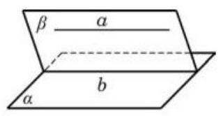

2、(1)请用文字语言叙述直线与平面平行的判定定理;

(2)把(1)中的定理写成 “已知: ······，求证: ……” 的形式，并用反证法证明；

(3)如图，在正方体 ${ABCD} - {A}_{1}{B}_{1}{C}_{1}{D}_{1}$ 中，点 $N$ 在 ${BD}$ 上，点 $M$ 在 ${B}_{1}C$ 上，且 ${CM} = {DN}$ ， 求证: ${MN} \parallel$ 平面 $A{A}_{1}{B}_{1}B$ . (用 (1) 中所写定理证明)

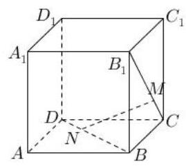

## 二、截面问题

1、如图，正方体 ${ABCD} - {A}_{1}{B}_{1}{C}_{1}{D}_{1}$ 中， $E, F, G$ 分别在 ${AB},{BC},{DD}_{1}$ 上，作过 $E, F, G$ 三点的截面。(两点共面)

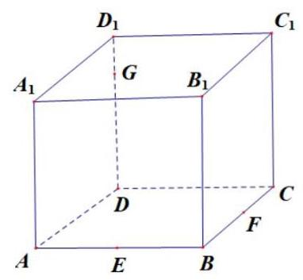

2、如图，正方体 ${ABCD} - {A}_{1}{B}_{1}{C}_{1}{D}_{1}$ 的棱长为 1， $P$ 为 ${BC}$ 的中点， $Q$ 为线段 $C{C}_{1}$ 上的动点， 过点 $A, P, Q$ 的平面截正方体所得的截面记为 $S$ ，则下列正确命题的序号为___；

① 当 $0 < {CQ} < \frac{1}{2}$ 时， $S$ 为四边形；② 当 ${CQ} = \frac{1}{2}$ 时， $S$ 为等腰梯形；③ 当 ${CQ} = \frac{3}{4}$ 时， $S$ 与 ${C}_{1}{D}_{1}$ 的交点 $R$ 满足 ${C}_{1}R = \frac{1}{3}$ ; ④当 $\frac{3}{4} < {CQ} < 1$ 时， $S$ 为六边形。

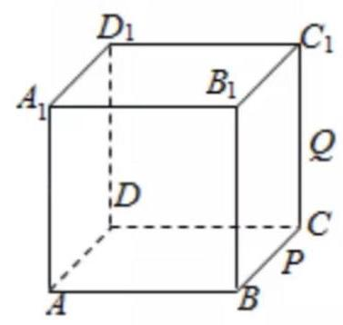

3、如图所示，底面直径为 20 的圆柱，被与底面成 ${60}^{ \circ  }$ 的二面角的平面所截，截面是一个椭圆, 则椭圆的焦距为___.

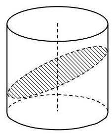

## 三、异面直线之间的距离

1、在棱长为 1 的正方体 ${ABCD} - {A}_{1}{B}_{1}{C}_{1}{D}_{1}$ 中；

(1)求异面直线 $A{B}_{1}$ 与 ${CD}$ 的距离；

(2)求异面直线 $B{D}_{1}$ 与 ${A}_{1}{C}_{1}$ 的距离；

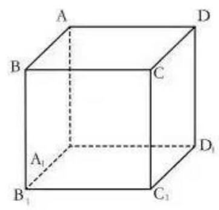

## 四、祖暅原理的应用

1、由曲线 ${x}^{2} = {2y},{x}^{2} =  - {2y}, x = 2, x =  - 2$ 围成的图形绕 $y$ 轴旋转一周得到的旋转体的体积为 ${V}_{1}$ ,满足: ${x}^{2} + {y}^{2} \leq  4,{x}^{2} + {\left( y - 1\right) }^{2} \geq  1,{x}^{2} + {\left( y + 1\right) }^{2} \geq  1$ 的点组成的图形绕 $y$ 轴旋转一周所得到的旋转体的体积为 ${V}_{2}$ ，试写出 ${V}_{1}$ 与 ${V}_{2}$ 的一个关系式___.

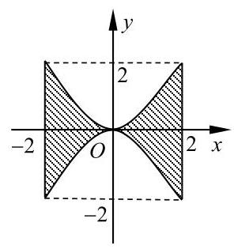

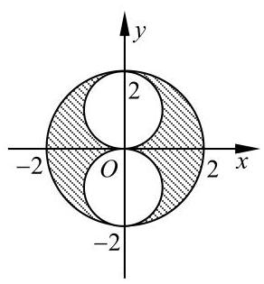

2、在 ${xOy}$ 平面上，将两个半圆弧 ${\left( x - 1\right) }^{2} + {y}^{2} = 1\left( {x \geq  1}\right)$ 和 ${\left( x - 3\right) }^{2} + {y}^{2} = 1\left( {x \geq  3}\right)$ 、两条直线 $y = 1$ 和 $y =  - 1$ 围成的封闭图形记为 $D$ ,如图中阴影部分. 记 $D$ 绕 $y$ 轴旋转一周而成的几何体为 $\Omega$ ,过 $\left( {0, y}\right) \left( {\left| y\right|  \leq  1}\right)$ 作 $\Omega$ 的水平截面,所得截面面积为 ${4\pi }\sqrt{1 - {y}^{2}} + {8\pi }$ ,试利用祖暅原理、一个平放的圆柱和一个长方体，得出 $\Omega$ 的体积值为___.

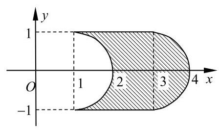

## 五、轨迹问题

1、在正方体 ${ABCD} - {A}_{1}{B}_{1}{C}_{1}{D}_{1}$ 的棱长为 1，点 $M$ 在棱 ${AB}$ 上，且 ${AM} = \frac{1}{3}$ ，点 $P$ 是平面 ${ABCD}$ 上的动点，且动点 $P$ 到直线 ${A}_{1}{D}_{1}$ 的距离与动点 $P$ 到点 $M$ 的距离的平方差为 1 ，则动点 $P$ 的轨迹为( )

B. 抛物线 C. 双曲线 D. 直线

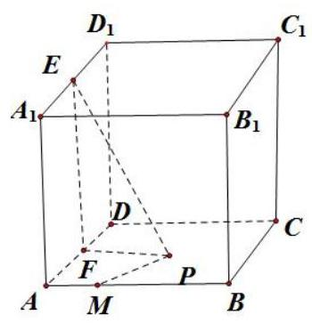

2、正方体 ${ABCD} - {A}_{1}{B}_{1}{C}_{1}{D}_{1}$ 中,面 ${AB}{B}_{1}{A}_{1}$ 上的点 $P$ 到异面直线 ${AB},{A}_{1}{D}_{1}$ 的距离相等,且 ${PA} = {PB}$ ，则 ${AC}$ 与 ${AP}$ 所成角的大小为___.

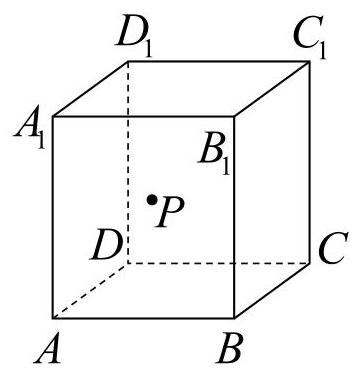

3、如图， $P$ 是棱长为 1 的正方体 ${ABCD} - {A}_{1}{B}_{1}{C}_{1}{D}_{1}$ 表面上的动点，且 ${AP} = \sqrt{2}$ ，则动点 $P$ 的轨迹长度为___

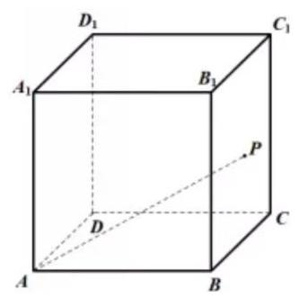

4、在棱长为 1 的正方体 ${ABCD} - {A}_{1}{B}_{1}{C}_{1}{D}_{1}$ 中，以 $A$ 为球心半径为 $\frac{2\sqrt{3}}{3}$ 的球面与正方体表面的交线的长为___；

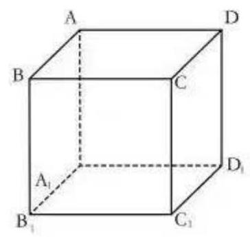

5、如图，在棱长为 6 的正方体 ${ABCD} - {A}_{1}{B}_{1}{C}_{1}{D}_{1}$ 中，长度为 4 的线段 ${MN}$ 的一个端点 $N$ 在 $D{D}_{1}$ 上运动,另一个端点 $M$ 在底面 ${ABCD}$ 上运动,则 ${MN}$ 的中点 $P$ 的轨迹与过顶点 $D$ 的正方体的三个面所围成的几何体的体积为___；

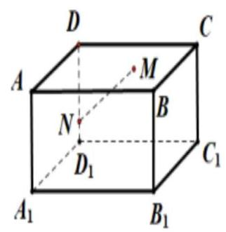

## 六、二面角和三垂线定理

1、锐二面角 $\alpha  - l - \beta$ ，直线 ${AB} \subset  \alpha$ ， ${AB}$ 与 $l$ 所成的角为 ${45}^{ \circ  }$ ， ${AB}$ 与平面 $\beta$ 成 ${30}^{ \circ  }$ 角， 则二面角 $\alpha  - l - \beta$ 的大小为___.

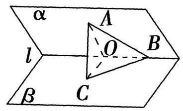

2、如图所示，在四棱锥 $P - {ABCD}$ 中，底面 ${ABCD}$ 为矩形， ${PA}\bot$ 平面 ${ABCD}$ ，点 $E$ 在线段 ${PC}$ 上， ${PC} \bot$ 平面 ${BDE}$ 。

(1)证明: ${BD} \bot$ 平面 ${PAC}$ ；

(2)若 ${PA} = 1,{AD} = 2$ ，求二面角 $B - {PC} - A$ 的正切值；

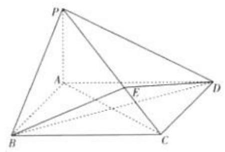

3、在直三棱柱 ${ABC} - {A}_{1}{B}_{1}{C}_{1}$ 中， $\angle {BAC} = {90}^{ \circ  }$ ， ${AB} = {B{B}_{1}} = 1$ ，直线 ${B}_{1}C$ 与平面 ${ABC}$ 成 ${30}^{ \circ  }$ 角,求二面角 $B - {B}_{1}C - A$ 的正弦值。

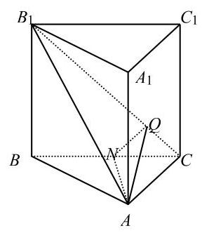
