# 高三第一轮第十七讲：立体几何复习 2

## 一、填空题

1、已知三棱锥 $P - {ABC}$ 的三条侧棱两两垂直，且它们的长度分别为 1、1、 $\sqrt{2}$ ，则此三棱锥的高为___

2、已知异面直线 $a, b$ 所成角为 ${70}^{ \circ  }$ ，过空间定点 $P$ 与 $a, b$ 成 ${55}^{ \circ  }$ 角的直线共有___条

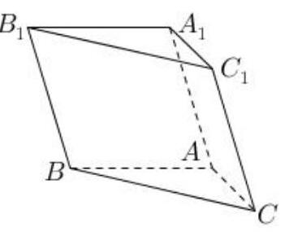

3、如图，在斜三棱柱 ${ABC} - {A}_{1}{B}_{1}{C}_{1}$ 的底面 $\bigtriangleup  {ABC}$ 中， $\angle {BAC} = {90}^{ \circ  }$ ，且 $B{C}_{1}\bot {AC}$ ，过 ${C}_{1}$ 作 ${C}_{1}H\bot$ 底面 ${ABC}$ 垂足为 $H$ ,则点 $H$ 在( )

A. 直线 ${AC}$ 上 B. 直线 ${AB}$ 上

C. 直线 ${BC}$ 上 D. $\bigtriangleup {ABC}$ 内部

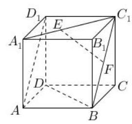

4、如图，已知正方体 ${ABCD} - {A}_{1}{B}_{1}{C}_{1}{D}_{1}$ 中， $F$ 为线段 $B{C}_{1}$ 的中点， $E$ 为线段 ${A}_{1}{C}_{1}$ 上的动点，则下列四个结论正确的是( )

A. 存在点 $E$ ,使 ${EF}//{BD}$

B. 存在点 $E$ ,使 ${EF} \bot$ 平面 $A{B}_{1}{C}_{1}D$

C. ${EF}$ 与 $A{D}_{1}$ 所成的角不可能等于 ${60}^{ \circ  }$

D. 三棱锥 ${B}_{1} - {ACE}$ 的体积随动点 $E$ 变化而变化

5、我们知道，在平面几何中，已知 $\bigtriangleup  {ABC}$ 三边边长分别为 $a, b, c$ ，面积为 $S$ ，在 $\bigtriangleup  {ABC}$ 内一点到三条边的距离相等设为 $r$ ,则有 $S = \frac{1}{2}\left( {a + b + c}\right) r$ . 现有三棱锥 $A - {BCD}$ 的两条棱 ${AB} = {CD} = 6$ ，其余各棱长均为 5，三棱锥 $A - {BCD}$ 内有一点 $O$ 到四个面的距离相等，则此距离等于___

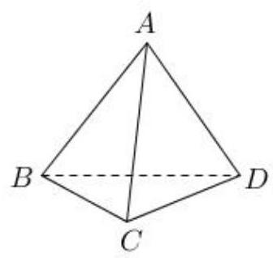

## 二、斜几何体体积问题

1、如图，在斜三棱柱 ${ABC} - {A}_{1}{B}_{1}{C}_{1}$ 中， $\angle {A}_{1}{AC} = \angle {ACB} = \frac{\pi }{2}$ ， $\angle {A{A}_{1}C} = \frac{\pi }{6}$ ，侧棱 $B{B}_{1}$ 与底面所成的角为 $\frac{\pi }{3}, A{A}_{1} = 4\sqrt{3},{BC} = 4$ . 求斜三棱柱 ${ABC} - {A}_{1}{B}_{1}{C}_{1}$ 的体积 $V$ .

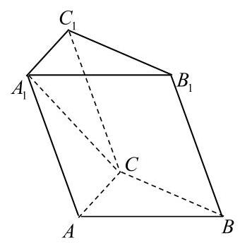

2、三棱锥 $S - {ABC}$ 中， $E, F, G, H$ 分别为 ${SA},{AC},{BC},{SB}$ 的中点，则截面 ${EFGH}$ 将三棱锥 $S - {ABC}$ 分成两部分的体积之比为___.

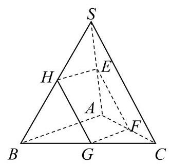

## 三、立体几何中的最值问题

1、正方体 ${ABCD} - {A}_{1}{B}_{1}{C}_{1}{D}_{1}$ 的棱长为 $1, M$ 、 $N$ 分别在线段 ${A}_{1}{C}_{1}$ 与 ${BD}$ 上，求 ${MN}$ 的最小值。

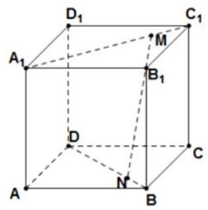

2、正三棱柱 ${ABC} - {A}_{1}{B}_{1}{C}_{1}$ 中，各棱长均为 $2, M$ 为 $A{A}_{1}$ 中点， $N$ 为 ${BC}$ 的中点，则在棱柱的表面上从点 $M$ 到点 $N$ 的最短距离是多少?

3、一个圆锥轴截面的顶角为 $\frac{5\pi }{6}$ ，母线为 2，过顶点作圆锥的截面中，最大截面面积为___；

4、如图，在正方体 ${ABCD} - {A}_{1}{B}_{1}{C}_{1}{D}_{1}$ 中，点 $P$ 在线段 ${A}_{1}C$ 上运动，异面直线 ${BP}$ 与 $A{D}_{1}$ 所成角为 $\theta$ ,则 $\theta$ 的最小值为___

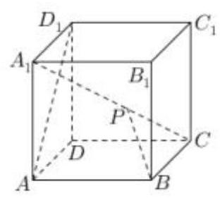

5、已知在 $\bigtriangleup  {ABC}$ 中， $\angle C = {90}^{ \circ  }$ ， ${PA}\bot$ 平面 ${ABC}$ ， ${AE}\bot {PB}$ 于 $E$ ， ${AF}\bot {PC}$ 于 $F$ ， ${AP} = {AB} = 2$ ， $\angle {AEF} = \theta$ ，当 $\theta$ 变化时，求三棱锥 $P - {AEF}$ 体积的最大值。

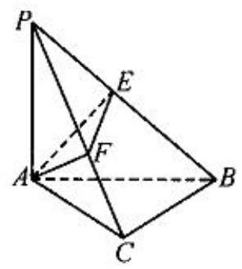

6、在棱长为 1 的正方体 ${ABCD} - {A}_{1}{B}_{1}{C}_{1}{D}_{1}$ 中，点 ${P}_{1},{P}_{2}$ 分别是线段 ${AB}, B{D}_{1}$ (不包括端点)。 上的动点,且线段 ${P}_{1}{P}_{2}$ 平行于平面 ${A}_{1}{AD}{D}_{1}$ ,则四面体 ${P}_{1}{P}_{2}A{B}_{1}$ 的体积的最大值是

A. $\frac{1}{24}$ B. $\frac{1}{12}$ C. $\frac{1}{6}$ D. $\frac{1}{2}$

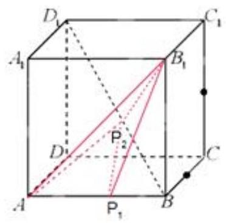

## 四、空间向量处理立体几何问题

1、如图，在四棱锥 $P - {ABCD}$ 中，底面为直角梯形， ${AD}//{BC}$ ， $\angle {BAD} = {90}^{ \circ  }$ ， ${PA}$ 垂直于底面 ${ABCD},{PA} = {AD} = {AB} = {2BC} = 2, M\text{ 、 }N$ 分别为 ${PC}\text{ 、 }{PB}$ 的中点.

(1)求证: ${PB}\bot {DM}$ ；(2)求 ${BD}$ 与平面 ${ADMN}$ 所成的角.

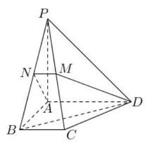

2、如图，三棱柱 ${ABC} - {A}_{1}{B}_{1}{C}_{1}$ 的底面是等腰直角三角形， $\angle {ACB} = \angle {BC}{C}_{1} = {90}^{ \circ  }$ ， 四边形 ${AC}{C}_{1}{A}_{1}$ 是菱形， $\angle {{AC}{C}_{1}} = {120}^{ \circ  }$ .

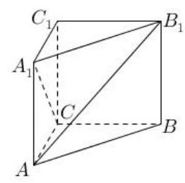

(1)证明: ${A}_{1}C \bot  A{B}_{1}$ ；

( 2 )若 ${AC} = 2$ ，求点 ${C}_{1}$ 到平面 ${AB}{B}_{1}{A}_{1}$ 的距离.

3、如图，四棱锥 $P - {ABCD}$ 中， $\angle {ABC} = \angle {ACD} = {90}^{ \circ  }$ ， $\angle {BAC} = \angle {CAD} = {60}^{ \circ  }$ ， ${PA} \bot$ 平面 ${ABCD},{PA} = 2,{AB} = 1$ ,设 $M\text{ 、 }N$ 分别为 ${PD}\text{ 、 }{AD}$ 的中点.

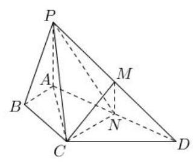

(1)求证:平面 ${CMN}//$ 平面 ${PAB}$ ；

(2)求三棱锥 $A - {CMN}$ 的侧面积.
