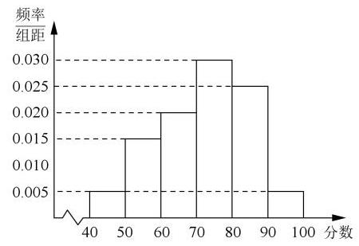
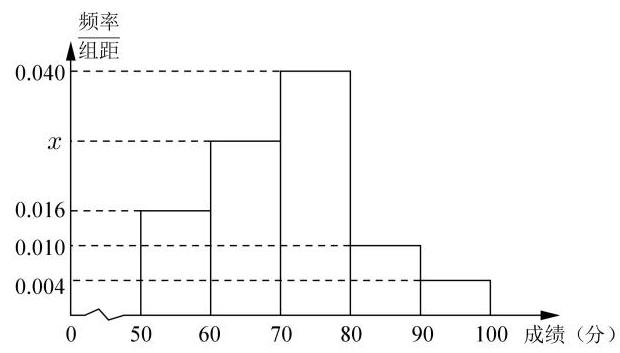

# 高三第一轮第二十讲：概率统计综合应用

## 知识点梳理:

## 一、概率初步

1、样本空间

2、随机事件

3、概率

4、古典概型(1)有限多个结果(2)等可能

5、古典概率的定义: $P\left( A\right)  = \frac{\left| A\right| }{\left| \Omega \right| }$

6、概率的性质:(1)必然事件的概率是 1，不可能事件的概率为 0

(2) $0 \leq  P\left( A\right)  \leq  1$

(3)可加性:如果两个事件不同时发生，则 $P\left( {A \cup  B}\right)  = P\left( A\right)  + P\left( B\right)$

(4)对立事件 $P\left( \bar{A}\right)  = 1 - P\left( A\right)$

7、大数定律:多次重复一个随机试验，事件发生的频率趋于概率

8、事件的独立性:两事件同时发生的概率是两个事件的概率之积。

## 二、统计的相关概念

1、总体与样本

2、抽样调查的方法:简单的随机抽样和分层抽样

3、统计图表:频数分布表、频率分布直方图、茎叶图、散点图

4、统计估计:用样本数据对总体数据进行估计。包括: 总体分布, 数字特征 (平均数、标准差、百分位数)

5、统计活动

## 三、计数原理

1、乘法原理: 分步

2、加法原理: 分类

3、排列组合:

排列数公式: ${P}_{n}^{m} = n\left( {n - 1}\right) \left( {n - 2}\right) \cdots \left( {n - m + 1}\right)  = \frac{n!}{\left( {n - m}\right) !}\left( {m \leq  n}\right)$

规定: $0! = 1,{P}_{n}^{n} = n! = n\left( {n - 1}\right) \left( {n - 2}\right) \cdots 2 \cdot  1;{P}_{n}^{1} = n,{P}_{1}^{1} = 1$

组合数公式: ${C}_{n}^{m} = \frac{n\left( {n - 1}\right) \left( {n - 2}\right) \cdots \left( {n - m + 1}\right) }{m!} = \frac{n!}{m!\left( {n - m}\right) !}\left( {m \leq  n}\right)$

组合数性质: $\left( 1\right) {C}_{n}^{m} = {C}_{n}^{n - m}\;\left( 2\right) {C}_{n}^{m} + {C}_{n}^{m - 1} = {C}_{n + 1}^{m}$ (3) ${C}_{n}^{0} = 1,{C}_{n}^{n} = 1,{C}_{1}^{0} = 1$

## 4、二项式定理

${\left( a + b\right) }^{n} = {C}_{n}^{0}{a}^{n} + {C}_{n}^{1}{a}^{n - 1}b + {C}_{n}^{2}{a}^{n - 2}{b}^{2} + \cdots  + {C}_{n}^{r}{a}^{n - r}{b}^{r} + \cdots  + {C}_{n}^{n}{b}^{n}\left( {n \in  {N}^{ * }}\right)$

1、二项式的系数: ${C}_{n}^{r}\left( {r = 0,1,2,\cdots , n}\right)$

2、二项展开式的通项: ${T}_{r + 1} = {C}_{n}^{r}{a}^{n - r}{b}^{r}\left( {r = 0,1,2,\cdots , n}\right)$

3、二项式系数和: ${C}_{n}^{0} + {C}_{n}^{1} + \cdots  + {C}_{n}^{n - 1} + {C}_{n}^{n} = {2}^{n}$

## 概率初步

1、同时掷两枚骰子，则点数和为 7 的概率是___；

2、一次期中考试，小金同学数学超过 90 分的概率是 0.5 ，物理超过 90 分的概率是 0.7 ，两门课都超过 90 分的概率是 0.3 , 则他的数学和物理至少有一门超过 90 分的概率为___；

3、学生李明上学要经过 4 个路口，前三个路口遇到红灯的概率均为 $\frac{1}{2}$ ，第四个路口遇到红灯的概率为 $\frac{1}{3}$ ,设在各个路口是否遇到红灯互不影响,则李明从家到学校恰好遇到一次红灯的概率为___；

4、某样本平均数为 $a$ ，总体平均数为 $m$ ，则()

A. $a = m$ B. $a > m$ C. $a < m$ D. $a \geq  m$

5、某校共有师生 1800 人，现用分层抽样的方法，从所有师生中抽取一个容量为 150 的样本， 已知从学生中抽取的人数为 140 人，则该校的教师人数是___；

6、惠州市某厂 10 名工人某天生产同一类型的零件，生产的件数分别是 10，12，14，14， 15,15,16,17,17,17,记这组数据的平均数为 $a$ ,中位数为 $b$ ,众数为 $c$ ,则 $a + b + c =$ ，这组数据的方差为___；

7、已知某样本的容量为 50，平均数为 70，方差为 75，现发现在收集这些数据时，其中的两个数据记录有误，一个错将 80 记录为 60 ，另一个错将 70 记录为 90 ，在对错误的数据进行更正后，重新求得新的样本的平均数 $\bar{x}$ ,方差为 ${s}^{2}$ ，则()

A. $\bar{x} = {70},{s}^{2} < {75}$ B. $\bar{x} = {70},{s}^{2} > {75}$

C. $\bar{x} > {70},{s}^{2} < {75}$ D. $\bar{x} < {70},{s}^{2} > {75}$

8、下列命题中假命题是( )

A. 一组数据的极差可以表示这组数据的波动范围的大小；

B. 任意给定的统计数据，都可以绘制散点图；

$C$ . 茎叶图既可以用于呈现单组数据,也可以用于对两组同类数据的比较分析;

$D$ . 一组数据中的百分位数既可以是这组数据中的数,也可能不是这组数据中的数

9、某天上政治，语文，数学，英语，化学，体育 6 节课，其中第一节不能上体育，第六节课不能上数学, 共有___种排课方法;

10、六元一次不定方程 ${x}_{1} + {x}_{2} + \cdots  + {x}_{6} = {10}$ 的正整数解有___组

11、从 $\{  - 3, - 2, - 1,0,1,2,3,4\}$ 中取三个不同的数作为函数 $f\left( x\right)  = a{x}^{2} + {bx} + c$ 的系数，那么能得到过原点且顶点在第一或第三象限的抛物线___条

12、4 个不同的小球全部随意放入 3 个不同的盒子里，使每个盒子都不空的方法种数为___；

13、把 12 本相同的笔记本全部分给 7 位同学，每人至少一本，有___种分法；

14、马路上有 10 盏路灯，为节约用电，又不影响照明，要同时关掉 3 盏灯，但要求 3 盏灯或两盏灯不可相邻，也不在马路的两端，则不同的关灯方法有___种；(用数字作答)

15、若 ${C}_{n + 1}^{n - 1} = \frac{1}{6}{P}_{n + 1}^{3}$ ，则 $n =$ ___；

16、已知 $n \in  \mathbf{N}$ ，若 ${C}_{6}^{n} = {P}_{5}^{2}$ ，则 $n =$ ___

17、已知 ${\left( a + 3b\right) }^{n}$ 展开式中，各项系数的和与各项二项式系数的和之比为64，则 $n =$ ___.

18、已知 ${\left( 1 - 3x\right) }^{9} = {a}_{0} + {a}_{1}x + {a}_{2}{x}^{2} + \cdots  + {a}_{9}{x}^{9}$ ,

则 $\left| {a}_{0}\right|  + \left| {a}_{1}\right|  + \left| {a}_{2}\right|  + \cdots  + \left| {a}_{9}\right|  =$

19、在 ${\left( 2\sqrt{x} + \sqrt[3]{x}\right) }^{2022}$ 的展开式中，有理项的项数为___.

20、若数据 ${x}_{1},{x}_{2},\cdots {x}_{n}$ 的平均数 $\bar{x} = 5$ ，方差 ${\sigma }^{2} = 2$ ，则数据 $4{x}_{1} + 1,4{x}_{2} + 1,\cdots ,4{x}_{n} + 1$ 的平均数为___，标准差为___；

21、某校从高二年级期中考试的学生中抽取 60 名学生，其成绩(均为整数)的频率分布直方图如右图所示，现从成绩 70 分以上(包括 70 分)的学生中任选两人，则他们的分数在同一分数段的概率为___

22、在某区高三年级举行的一次质量检测中，某学科共有 3000 人参加考试. 为了解本次考试学生的成绩情况，从中抽取了部分学生的成绩(成绩均为正整数，满分为 100 分)作为样本进行统计,样本容量为 $n$ . 按照 $\lbrack {50},{60}),\lbrack {60},{70}),\lbrack {70},{80}),\lbrack {80},{90}),\left\lbrack  {{90},{100}}\right\rbrack$ 的分组作出频率分布直方图(如图所示). 已知成绩落在 [50,60) 内的人数为 16，则下列结论正确的是( )

A. 样本容量 $n = {1000}$ B. 图中 $x = {0.025}$

C. 估计全体学生该学科成绩的平均分为 70.6 分

D. 将该学科成绩由高到低排序，前 15% 的学生该学科成绩为 A 等，则成绩为 78 分的学生该学科成绩肯定不是 $A$ 等

<table><tr><td colspan="2">甲</td><td></td><td></td><td></td><td>乙</td><td></td></tr><tr><td>8</td><td>8</td><td>0</td><td>9</td><td></td><td></td><td></td></tr><tr><td>3</td><td>2</td><td>1</td><td>1</td><td>3</td><td>4 8</td><td>9</td></tr><tr><td>7 6 5 4 2</td><td>0</td><td>2</td><td>0</td><td>1</td><td>1 3</td><td></td></tr><tr><td></td><td>7</td><td>3</td><td></td><td></td><td></td><td></td></tr></table>

23、某甲、乙两人练习跳绳，每人练习 10 组，每组不间断跳绳计数的茎叶图如图，则下面结论中所有正确的序号是___

① 甲比乙的极差大；② 乙的中位数是 18；

③ 甲的平均数比乙的大；④ 乙的众数是 21.

24、以下数据为参加数学竞赛决赛的 15 人的成绩(单位:分)，分数从低到高依次:56、 70、72、78、79、80、81、83、84、86、88、90、91、94、98 . 则这 15 人成绩的第 80 百分位数是___

25、某小组有 1 名男生和 2 名女生，从中任选 2 名学生参加围棋比赛，事件“至少有 1 名男生”与事件 “至少有 1 名女生” ( )

A. 是对立事件 B. 都是不可能事件

C. 是互斥事件但不是对立事件 D. 不是互斥事件

## 概率初步(续)

1、一个不透明的袋子中，放有大小相同的 5 个小球，其中 3 个黑球，2 个白球，如果不放回的依次取出 2 个球, 在第一次取出的黑球的条件下, 第二次取出的是白球的概率是( )

A. $\frac{1}{2}$ B. $\frac{3}{10}$ C. $\frac{3}{5}$ D. $\frac{2}{5}$

2、把一枚骰子连续掷两次，记事件 $M$ 为 “两次所得点数均为奇数”， $N$ 为 “至少有一次点数为 5 ”，则 $P\left( {N \mid  M}\right)$ 等于( )

A. $\frac{2}{3}$ B. $\frac{5}{9}$ C. $\frac{1}{2}$ D. $\frac{1}{3}$

3、在 20 张百元纸币中混有 4 张假币, 从中任意抽取 2 张, 将其中一张在验钞机上检验发现是假币, 则这两张都是假币的概率是 ( )

A. $\frac{3}{35}$ B. $\frac{3}{38}$ C. $\frac{2}{17}$ D. 以上都不正确

4、当 $P\left( A\right)  > 0$ 时，若 $P\left( {B \mid  A}\right)  + P\left( \overline{B}\right)  = 1$ ，则事件 $A$ 与 $B$ ( )

A. 互斥 B. 对立 C. 独立 D. 不独立
