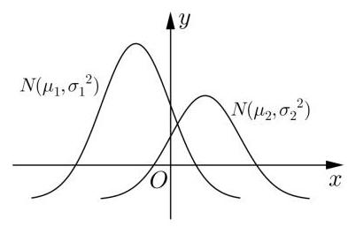

# 高三第一轮第二十一讲：概率统计 2

## 公式梳理

## 一、条件概率与相关公式

1、条件概率: 事件 A 发生的条件下,事件 B 发生的概率,记为 $P\left( {B \mid  A}\right)$

$$
P\left( {B \mid  A}\right)  = \frac{\left| A \cap  B\right| }{\left| A\right| } = \frac{P\left( {A \cap  B}\right) }{P\left( A\right) }
$$

2、全概率公式: 随机事件的结果可以分为 $n$ 种结果,设样本空间可分为 $n$ 个两两不同时发生且必有一个发生事件 ${\Omega }_{1},{\Omega }_{2},\cdots {\Omega }_{n}$ ,做一个随机试验,必然是这 $n$ 种情况之一,则事件 $A$ 发生是在不同情况下分别发生,即 $A = \left( {A \cap  {\Omega }_{1}}\right)  \cup  \left( {A \cap  {\Omega }_{2}}\right) \cdots  \cup  \left( {A \cap  {\Omega }_{n}}\right)$

因此 $P\left( A\right)  = \mathop{\sum }\limits_{{k = 1}}^{n}P\left( {A \mid  {\Omega }_{k}}\right) P\left( {\Omega }_{k}\right)$ 。全概率是条件概率。

即 $P\left( A\right)$ 实际上是条件概率 $P\left( {A \mid  {\Omega }_{k}}\right)$ 的加权平均数,权重为 $P\left( {\Omega }_{k}\right)$ 。其中 $\mathop{\sum }\limits_{{k = 1}}^{n}P\left( {\Omega }_{k}\right)  = 1$ 。

## 二、随机变量的分布与特征

1、随机变量:一个随机现象的结果用数来表示，就称为随机变量。

2、随机变量所有可能的取值以及相应取值的概率, 称为随机变量的分布。

3、期望: 如果随机变量 $X$ 的分布是

$\left( \begin{array}{lllll} {x}_{1} & {x}_{2} & \cdots & \cdots & {x}_{n} \\  {p}_{1} & {p}_{2} & \cdots & \cdots & {p}_{n} \end{array}\right)$ ,那么它的期望定义为如下的加权平均:

$$
E\left\lbrack  X\right\rbrack   = {x}_{1}{p}_{1} + {x}_{2}{p}_{2} + \cdots  + {x}_{n}{p}_{n}
$$

4、期望的线性性质:

1. 如果 $X$ 是一个随机变量,而 $a$ 是一个实数,那么

$$
E\left\lbrack  {aX}\right\rbrack   = {aE}\left\lbrack  X\right\rbrack  .
$$

2. 如果 $X\text{ 、 }Y$ 是两个随机变量,那么

$$
E\left\lbrack  {X + Y}\right\rbrack   = E\left\lbrack  X\right\rbrack   + E\left\lbrack  Y\right\rbrack  .
$$

$E\left\lbrack  {{aX} + b}\right\rbrack   = {aE}\left\lbrack  X\right\rbrack   + b$

5、方差: 随机变量 $X$ 的随机性的大小，称为 $X$ 的方差，记为 $D\left\lbrack  X\right\rbrack$ .

$$
D\left\lbrack  X\right\rbrack   = E{\left\lbrack  X - E\left\lbrack  X\right\rbrack  \right\rbrack  }^{2} = E\left\lbrack  {X}^{2}\right\rbrack   - \left( {\left\lbrack  E\left\lbrack  X\right\rbrack  \right) }^{2}\right.
$$

6、方差的性质:

---

	1. 如果 $a$ 是常数，那么

$$
D\left\lbrack  {aX}\right\rbrack   = {a}^{2}D\left\lbrack  X\right\rbrack  .
$$

	2. 如果 $X\text{ 、 }Y$ 分别是两个独立的随机试验所对应的随

机变量, 那么

$$
D\left\lbrack  {X + Y}\right\rbrack   = D\left\lbrack  X\right\rbrack   + D\left\lbrack  Y\right\rbrack  .
$$

---

## 三、随机变量常用分布

1、二项分布:

定义 重复 $n$ 次成功概率为 $p$ 的伯努利试验,其成功次数的分布称为二项分布,亦称成功次数 $X$ 服从二项分布 $B\left( {n, p}\right)$ .

$$
\left( \begin{matrix} 0 & 1 & 2 & \cdots & k & \cdots & n \\  {q}^{n} & {\mathrm{C}}_{n}^{1}p{q}^{n - 1} & {\mathrm{C}}_{n}^{2}{p}^{2}{q}^{n - 2} & \cdots & {\mathrm{C}}_{n}^{k}{p}^{k}{q}^{n - k} & \cdots & {p}^{n} \end{matrix}\right)
$$

二项分布的特征:

进行 $n$ 次试验,满足下列条件:

1、每次试验只有两个相互对立的结果，可以分别称为 “成功” 和 “失败”

2、每次试验 “成功” 的概率相等，均为 $p$ ；“失败” 的概率为 $1 - p$ 。(放回)

3、每次试验是相互独立的。

用 $X$ 表示 $n$ 次试验中 “成功” 的次数,则

$$
P\left( {X = k}\right)  = {\mathrm{C}}_{n}^{k}{p}^{k}{q}^{n - k},\;\mathop{\sum }\limits_{{k = 0}}^{n}{\mathrm{C}}_{n}^{k}{p}^{k}{q}^{n - k} = \mathop{\sum }\limits_{{k = 0}}^{n}P\left( {X = k}\right)  = 1.
$$

若 $X$ 服从二项分布 $B\left( {n, p}\right)$ ,则 $E\left\lbrack  X\right\rbrack   = {np}, D\left\lbrack  X\right\rbrack   = {np}\left( {1 - p}\right)$

## 2、超几何分布

由此,若袋中有 $a$ 个白球 $b$ 个黑球,随机取 $n$ 个球,其中的白球数记为 $X$ ,那么 $X$ 的分布是

$$
P\left( {X = k}\right)  = \frac{{\mathrm{C}}_{a}^{k}{\mathrm{C}}_{b}^{n - k}}{{\mathrm{C}}_{a + b}^{n}}.
$$

$$
E\left\lbrack  X\right\rbrack   = E\left\lbrack  {X}_{1}\right\rbrack   + \cdots  + E\left\lbrack  {X}_{n}\right\rbrack   = \frac{na}{a + b},
$$

## 超几何分布和二项分布的联系和区别:

1、事件分类:非黑即白

2、超几何分布是不放回，每次概率在变化；

3、二项分布是有放回抽取，每次独立重复，概率相同；

4、当超几何分布的样本容量足够大的时候, 超几何分布可以看出二项分布。

## 3、正态分布*

数学上的正态分布是指由下面的函数所表达的分布:

$$
{\varphi }_{\mu ,{\sigma }^{2}}\left( x\right)  = \frac{1}{\sqrt{{2\pi }{\sigma }^{2}}}{\mathrm{e}}^{-\frac{{\left( x - \mu \right) }^{2}}{2{\sigma }^{2}}},
$$

其中有两个参数:

1. $\mu$ 是该分布的期望或均值;

2. ${\sigma }^{2}$ 是该分布的方差,且总是假设 $\sigma  > 0$ .

定义 设 $X$ 是一个取实数值的随机变量. 如果对任何给定的实数 $a$ 与 $b\left( {a < b}\right) , X$ 落在区间 $\left( {a, b}\right)$ 上的概率 $P\left( {a < X < b}\right)$ 等于三条直线: $y = 0\text{ 、 }x = a\text{ 、 }x = b$ 与正态密度函数图像 $y = {\varphi }_{\mu ,{\sigma }^{2}}$ 所围的区域面积(或者简单说此函数在该区间上的面积),就说 $X$ 服从正态分布,或更精确地说, $X$ 服从参数为 $\mu \text{ 、 }{\sigma }^{2}$ 的正态分布,记为

$$
X \sim  N\left( {\mu ,{\sigma }^{2}}\right) .
$$

备注:1、正态分布曲线关于 $x = \mu$ 对称

2、正态曲线与 $x$ 轴之间的面积为 1

3、当随机变量落在区间 $\left( {a, b}\right)$ 上的概率即为即为 $x$ 轴, $x = a, x = b$ 和正态曲线所围成的区域的面积。

4、学会利用对称性解题

## 四、成对数据的相关分析

1、相关系数:

<table><tr><td>$x$</td><td>${x}_{1}$</td><td>${x}_{2}$</td><td>${x}_{3}$</td><td>${x}_{4}$</td><td>${x}_{5}$</td><td>${x}_{6}$</td><td>...</td><td>${x}_{n}$</td></tr><tr><td>$y$</td><td>${y}_{1}$</td><td>${y}_{2}$</td><td>${y}_{3}$</td><td>${y}_{4}$</td><td>${y}_{5}$</td><td>${y}_{6}$</td><td>...</td><td>${y}_{n}$</td></tr></table>

两个变量的相关系数的计算公式为

$$
r = \frac{\mathop{\sum }\limits_{{i = 1}}^{n}\left( {{x}_{i} - \bar{x}}\right) \left( {{y}_{i} - \bar{y}}\right) }{\sqrt{\mathop{\sum }\limits_{{i = 1}}^{n}{\left( {x}_{i} - \bar{x}\right) }^{2}\mathop{\sum }\limits_{{i = 1}}^{n}{\left( {y}_{i} - \bar{y}\right) }^{2}}}.
$$

①

其中 $\bar{x} = \frac{1}{n}\mathop{\sum }\limits_{{i = 1}}^{n}{x}_{i},\bar{y} = \frac{1}{n}\mathop{\sum }\limits_{{i = 1}}^{n}{y}_{i}$ 分别是这两组数据的平均数.

可以证明, $\left| r\right|  \leq  1.\left| r\right|$ 越接近 1,线性相关程度越高; $\left| r\right|$ 越接近 0,线性相关程度越低. 当 $r > 0$ 时, $x$ 的值由小变大时, $y$ 的值有由小变大的趋势,这时称这种相关为正相关; 当 $r < 0$ 时, $x$ 的值由小变大时, $y$ 的值有由大变小的趋势,这时称这种相关为负相关.

## 2、一元线性回归分析

用最小二乘法求线性回归系数的公式如下:

$$
\left\{  \begin{array}{l} \widehat{a} = \frac{\mathop{\sum }\limits_{{i = 1}}^{n}\left( {{x}_{i} - \bar{x}}\right) \left( {{y}_{i} - \bar{y}}\right) }{\mathop{\sum }\limits_{{i = 1}}^{n}{\left( {x}_{i} - \bar{x}\right) }^{2}} = \frac{\mathop{\sum }\limits_{{i = 1}}^{n}{x}_{i}{y}_{i} - n\bar{x}\bar{y}}{\mathop{\sum }\limits_{{i = 1}}^{n}{x}_{i}^{2} - n{\bar{x}}^{2}}, \\  \widehat{b} = \bar{y} - a\bar{x} = \frac{\mathop{\sum }\limits_{{i = 1}}^{n}{y}_{i} - \widehat{a}\mathop{\sum }\limits_{{i = 1}}^{n}{x}_{i}}{n}. \end{array}\right.
$$

由最小二乘法得到的回归方程为:

$$
y = \widehat{a}x + \widehat{b}.
$$

备注: (1) 线性回归直线必过样本数据的中心点 $\left( {\bar{x},\bar{y}}\right)$

(2)回归直线在散点图中可能不经过任一样本数据点。

## 3、 $2 \times  2$ 列联表

<table><tr><td></td><td>A 组</td><td>B 组</td><td>总计</td></tr><tr><td>0</td><td>$a$</td><td>$b$</td><td>$a + b$</td></tr><tr><td>1</td><td>$c$</td><td>$d$</td><td>$c + d$</td></tr><tr><td>总计</td><td>$a + c$</td><td>$b + d$</td><td>$a + b + c + d$</td></tr></table>

其中, $a\text{ 、 }b\text{ 、 }c\text{ 、 }d$ 为实际观察值.

由 ${\chi }^{2} = \sum \frac{{\left( \text{ 观察值 } - \text{ 预期值 }\right) }^{2}}{\text{ 预期值 }}$ ,经过变形可得 ${\chi }^{2}$ 的一般计算公式:

$$
{\chi }^{2} = \frac{n{\left( ad - bc\right) }^{2}}{\left( {a + b}\right) \left( {c + d}\right) \left( {a + c}\right) \left( {b + d}\right) }.
$$

①

其中, $n = a + b + c + d$ .

本例所用的检验方法在统计学中称为列联表独立性检验 (independence test in contingency table).

## 一、条件概率和全概率

1、根据历年气象统计资料，某地四月份吹东风的概率为 $\frac{9}{30}$ ，下雨的概率为 $\frac{11}{30}$ ，既吹东风又下雨的概率为 $\frac{8}{30}$ ，则在下雨条件下吹东风的概率为___；

2、袋中有 5 个球 (3 个白球, 2 个黑球) 现每次取一球，无放回抽取 2 次，则在第一次抽到白球的条件下，第二次抽到白球的概率为___；

3、投掷红、蓝两颗均匀的骰子，设事件 A: 蓝色骰子的点数为 5 或 6 ；事件 $B$ : 两骰子的点数之和大于 9,则在事件 $B$ 发生的条件下事件 $\mathrm{A}$ 发生的概率 $P\left( {A \mid  B}\right)  =$ ___.

4、有 3 台车床加工同一型号的零件，第 1 台加工的次品率为 6%，第 2，3 台加工的次品率为 5%，加工出来的零件混放在一起，已知 1,2,3 台车床加工的零件数分布占总数的 25%， 30%，45%。

(1)任取一个零件，计算它是次品的概率；

(2)如果取到的零件是次品，计算它是第 $i\left( {i = 1,2,3}\right)$ 台车床加工的概率。

5、甲、乙两名教师进行乒乓球比赛，采用七局四胜制(先胜四局者获胜). 若每一局比赛甲获胜的概率为 $\frac{2}{3}$ ,乙获胜的概率为 $\frac{1}{3}$ . 现已赛完两局,乙暂时以 2:0 领先.

(1)求甲获得这次比赛胜利的概率；

(2)设比赛结束时比赛的总局数为随机变量 $X$ ，求随机变量 $X$ 的分布列和数学期望 $E\left( X\right)$ .

## 二、随机变量的分布与特征

1、抛掷 2 颗骰子，所得点数之和 $\xi$ 是一个随机变量，则 $P\left( {\xi  \leq  4}\right)$ 等于( )

A. $\frac{1}{9}$ B. $\frac{5}{36}$ C. $\frac{1}{6}$ D. $\frac{1}{4}$

2、设随机变量 $X$ 的分布列为 $P\left( {X = k}\right)  = m{\left( \frac{2}{3}\right) }^{k}, k = 1,2,3$ ，则 $m$ 的值为___；

3、已知随机变量 $X$ 的分布列为

<table><tr><td>$X$</td><td>-2</td><td>1</td><td>3</td></tr><tr><td>$P$</td><td>0.16</td><td>0.44</td><td>0.40</td></tr></table>

则 $E\left( {{2X} + 5}\right)  =$ (   )

A. 1.32 B. 1.71 C. 2.94 D. 7.64

4、变量 $\xi$ 的分布列如又图所示,其中 $a, b, c$ 成等差数列,若 $E\left( \xi \right)  = \frac{1}{3}$ ,则 $D\left( \xi \right)$ 的值是 ( )

<table><tr><td>$\xi$</td><td>-1</td><td>0</td><td>1</td></tr><tr><td>$P$</td><td>$a$</td><td>$b$</td><td>$C$</td></tr></table>

A. $\frac{1}{3}$ B. $\frac{5}{9}$ C. $\frac{2}{3}$ D. $\frac{11}{27}$

5、已知 $0 < a < \frac{1}{2}$ ，随机变量 $\xi$ 的分布列如下，则当 $a$ 增大时( )

<table><tr><td>$\xi$</td><td>-1</td><td>0</td><td>1</td></tr><tr><td>$P$</td><td>$a$</td><td>$\frac{1}{2} - a$</td><td>$\frac{1}{2}$</td></tr></table>

A. $E\left( \xi \right)$ 增大， $D\left( \xi \right)$ 增大 B. $E\left( \xi \right)$ 减小， $D\left( \xi \right)$ 增大

C. $E\left( \xi \right)$ 增大, $D\left( \xi \right)$ 减小 D. $E\left( \xi \right)$ 减小, $D\left( \xi \right)$ 减小

6、已知随机变量 $X$ 的分布列如下:

<table><tr><td>$X$</td><td>1</td><td>2</td><td>3</td></tr><tr><td>$P$</td><td>$a$</td><td>$b$</td><td>${2b} - a$</td></tr></table>

则 $D\left( {{3X} - 1}\right)$ 的最大值为( )

A. $\frac{2}{3}$ B. 3

C. 6 D. 5

## 三、常用分布(二项分布与超几何分布，正态分布*)

1、如果随机变量 $\xi  \sim  B\left( {n, p}\right)$ ，且 $E\left( \xi \right)  = {10}$ ， $D\left( \xi \right)  = 8$ ，则 $p$ 等于 ( )

A. $\frac{1}{7}$ B. $\frac{1}{6}$ C. $\frac{1}{5}$ D. $\frac{1}{4}$

2、某群体中的每位成员使用移动支付的概率都为 $p$ ,各成员的支付方式相互独立,设 $X$ 为该群体的 10 位成员中使用移动支付的人数, $D\left( X\right)  = {2.4}, P\left( {X = 4}\right)  < P\left( {X = 6}\right)$ ,则 $p =$ A. 0.7 B. 0.6

3、一批产品的二等品率为 0.02 ，从这批产品中每次随机取一件，有放回地抽取 100 次， $X$ 表示抽到的二等品件数，则 $D\left( X\right)  =$ ___；

4、8 个试题中甲能答对 6 个，从 8 个题中任选 4 个进行作答，用 $X$ 表示甲答对题的个数， 则 $E\left( X\right)  =$

5、某学校为了解学生课后进行体育运动的情况，对该校学生简单随机抽样，获得 20 名学生一周进行体育运动的时间数据如表，其中运动时间在 $(7,{11}\rbrack$ 的学生称为运动达人。

<table><tr><td>分组区间(单位:小时)</td><td>(1,3]</td><td>(3,5]</td><td>(5,7]</td><td>(7,9]</td><td>(9,11]</td></tr><tr><td>人数</td><td>1</td><td>3</td><td>4</td><td>7</td><td>5</td></tr></table>

(1)从上述抽取的学生中任取 2 人，设 $X$ 为运动达人的人数，求 $X$ 得分布列。

(2)以频率估计概率，从该校学生中任取 2 人，设 $Y$ 为运动达人的人数，求 $Y$ 的分布列。

6、下列说法错误的是( )

A. 设随机变量 $X$ 等可能取 $1,2,3,\ldots , n$ ,如果 $P\left( {X < 4}\right)  = {0.3}$ ,则 $n = {10}$

B. 设随机变量 $X$ 服从二项分布 $B\left( {6,\frac{1}{2}}\right)$ ，则 $P\left( {X = 3}\right)  = \frac{5}{16}$

C. 设离散型随机变量 $\eta$ 服从两点分布,若 $P\left( {\eta  = 1}\right)  = {2P}\left( {\eta  = 0}\right)$ ,则 $P\left( {\eta  = 0}\right)  = \frac{1}{3}$

D. 已知随机变量 $X$ 服从正态分布 $N\left( {2,{\sigma }^{2}}\right)$ 且 $P\left( {X < 4}\right)  = {0.9}$ ,则 $P\left( {0 < X < 2}\right)  = {0.3}$

7、为了解目前全市高一学生身体素质状况，对某校高一学生进行了体能抽测，得到学生的体育成绩 $X \sim  N\left( {{70},{100}}\right)$ ,其中 60 分及以上为及格,90 分及以上为优秀,则下列说法正确的是( )附:若 $X \sim  N\left( {\mu ,{\sigma }^{2}}\right)$ ，则 $P\left( {\mu  - \sigma  \leq  X < \mu  + \sigma }\right)  = {0.6826}$ ， $P\left( {\mu  - {2\sigma } \leq  X < \mu  + {2\sigma }}\right)  = {0.9544}.$

A. 该校学生体育成绩的方差为 10

B. 该校学生体育成绩的期望为 100

C. 该校学生体育成绩的及格率不到 85%

D. 该校学生体育成绩的优秀率超过 4%

8、设两个正态分布 $N\left( {{\mu }_{1},{\sigma }_{1}^{2}}\right) \left( {{\sigma }_{1} > 0}\right)$ 和 $N\left( {{\mu }_{2},{\sigma }_{2}^{2}}\right) \left( {{\sigma }_{2} > 0}\right)$ 的正态密度函数图像如图所示，则( )

A. ${\mu }_{1} < {\mu }_{2},{\sigma }_{1} < {\sigma }_{2}$

B. ${\mu }_{1} < {\mu }_{2},{\sigma }_{1} > {\sigma }_{2}$

C. ${\mu }_{1} > {\mu }_{2},{\sigma }_{1} < {\sigma }_{2}$

D. ${\mu }_{1} > {\mu }_{2},{\sigma }_{1} > {\sigma }_{2}$

## 四、成对数据分析

1、已知 $x, y$ 取值如表:

<table><tr><td>$x$</td><td>2</td><td>3</td><td>4</td><td>5</td><td>6</td></tr><tr><td>$y$</td><td>6</td><td>4</td><td>5</td><td>5.6</td><td>7.4</td></tr></table>

画散点图分析可知: $y$ 与 $x$ 线性相关，且求得回归方程为 $y = \widehat{b}x + \frac{13}{2}$ ，则 $\widehat{b}$

2、2020 年初，新型冠状病毒引起的肺炎疫情爆发以来，各地医疗机构采取了各种针对性的治疗方法，取得了不错的成效，某医疗机构开始使用中西医结合方法后，每周治愈的患者人数如下表所示:

<table><tr><td>第 $x$ 周</td><td>1</td><td>2</td><td>3</td><td>4</td><td>5</td></tr><tr><td>治愈人数 $y$ (单位:十人)</td><td>3</td><td>8</td><td>10</td><td>14</td><td>15</td></tr></table>

由上表可得 $y$ 关于 $x$ 的线性回归方程为 $y = \widehat{a}x + 1$ ,则此回归模型第 5 周的离差 (实际值减去预报值)为( )

A. 1 B. 2 C. 3 D. 4

3、对成对数据 $\left( {{x}_{1},{y}_{1}}\right) \text{ 、 }\left( {{x}_{2},{y}_{2}}\right) \text{ 、 }\cdots \text{ 、 }\left( {{x}_{n},{y}_{n}}\right)$ 用最小二乘法求回归方程是为了使( )

A. $\mathop{\sum }\limits_{{i = 1}}^{n}\left( {{y}_{i} - \bar{y}}\right)  = 0$ B. $\mathop{\sum }\limits_{{i = 1}}^{n}\left( {{y}_{i} - {\widehat{y}}_{i}}\right)  = 0$ C. $\mathop{\sum }\limits_{{i = 1}}^{n}\left( {{y}_{i} - {\widehat{y}}_{i}}\right)$ 最小

4、下列表述中，正确的个数是( )

①将一组数据中的每一个数据都加上同一个常数后，方差不变；

②设有一个回归方程 $\widehat{y} = 3 - {5x}$ ，变量 $x$ 增加 1 个单位时， $y$ 平均增加 5 个单位；

③设具有相关关系的两个变量 $x, y$ 的相关系数为 $r$ ，那么 $\left| r\right|$ 越接近于 $0, x, y$ 之间的线性相关程度越高;

④在一个 $2 \times  2$ 列联表中,根据表中数据计算得到 ${K}^{2}$ 的观测值 $k$ ,若 $k$ 的值越大,则认为两个变量间有关的把握就越大.

A. 0 B. 1 C. 2 D. 3

5、某外语学校要求学生从德语和日语中选择一种作为“第二外语”进行学习，为了解选择第二外语的倾向与性别的关系，随机抽取 100 名学生，得到下面的数据表:

<table><tr><td></td><td>选择德语</td><td>选择日语</td></tr><tr><td>男生</td><td>15</td><td>35</td></tr><tr><td>女生</td><td>30</td><td>20</td></tr></table>

根据表中提供的数据可知( )

附: ${K}^{2} = \frac{n{\left( ad - bc\right) }^{2}}{\left( {a + b}\right) \left( {c + d}\right) \left( {a + c}\right) \left( {b + d}\right) },\;n = a + b + c + d$ .

<table><tr><td>$P\left( {{K}^{2} \geq  {k}_{0}}\right)$</td><td>0.100</td><td>0.050</td><td>0.010</td><td>0.005</td><td>0.001</td></tr><tr><td>${k}_{0}$</td><td>2.706</td><td>3.841</td><td>6.635</td><td>7.879</td><td>10.828</td></tr></table>

A. 在犯错误的概率不超过 0.1% 的前提下，认为选择第二外语的倾向与性别无关

B. 在犯错误的概率不超过 0.1% 的前提下，认为选择第二外语的倾向与性别有关

C. 有99.5% 的把握认为选择第二外语的倾向与性别无关

D. 有99.5% 的把握认为选择第二外语的倾向与性别有关

6、某市政府调查市民收入增减与旅游需求的关系时，采用独立性检验法抽查了 5000 人，计算发现 ${K}^{2} = {6.109}$ ，根据这一数据查阅下表，市政府断言市民收入增减与旅游需求有关的可信度是___%.

附

<table><tr><td>$P\left( {{K}^{2} \geq  k}\right)$</td><td>...</td><td>0.100</td><td>0.025</td><td>0.010</td><td>0.005</td><td>...</td></tr><tr><td>$k$</td><td>...</td><td>2.706</td><td>5.024</td><td>6.635</td><td>7.879</td><td>...</td></tr></table>

7、社会实践是大学生课外教育的一个重要方面，在校大学生利用要期参加社会实践活动， 是认识社会、了解社会、提高自我能力的重要机会. 某省统计了该省其中的 4 所大学 2023 年毕业生的人数及参加过暑期社会实践活动的人数(单位:千人)，得到如下表格:

<table><tr><td>大学</td><td>$A$ 大学</td><td>$B$ 大学</td><td>$C$ 大学</td><td>$D$ 大学</td></tr><tr><td>2023 年毕业生人数 $x$ (千人)</td><td>7</td><td>6</td><td>5</td><td>4</td></tr><tr><td>2023 年毕业生中参加过社会实践人数 $y$ (千人)</td><td>0.5</td><td>0.4</td><td>0.3</td><td>0.2</td></tr></table>

(1)已知 $y$ 与 $x$ 具有较强的线性相关性,求 $y$ 关于 $x$ 的线性回归方程 $y = \widehat{a}x + \widehat{b}$ ;

(2)假设该省对参加过暑期社会实践活动的大学生每人发放 0.5 万元的补贴.

① 若该省大学 2023 年毕业生人数为 12 万人，估计该省要发放补贴的总金额；

② 若 2023 年毕业生中的小李、小王参加过暑期社会实践活动的概率分别为 $p$ 、 ${3p} - 1$ ， 该省对小李、小王两人补贴总金额的期望不超过 0.75 万元,求 $p$ 的取值范围.

参考公式: $\widehat{a} = \frac{\mathop{\sum }\limits_{{i = 1}}^{n}\left( {{x}_{i} - \bar{x}}\right) \left( {{y}_{i} - \bar{y}}\right) }{\mathop{\sum }\limits_{{i = 1}}^{n}{\left( {x}_{i} - \bar{x}\right) }^{2}} = \frac{\mathop{\sum }\limits_{{i = 1}}^{n}\left( {{x}_{i}{y}_{i} - n\bar{x} \cdot  \bar{y}}\right) }{\mathop{\sum }\limits_{{i = 1}}^{n}{x}_{i}^{2} - n{\bar{x}}^{2}},\widehat{b} = \bar{y} - \widehat{a}\bar{x}$ .
